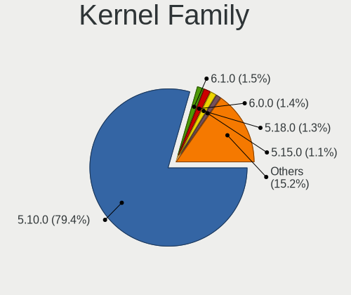
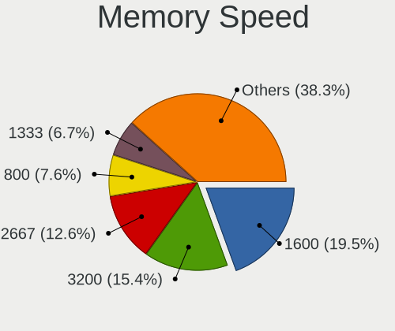

Debian 11 - Tested Hardware & Statistics
----------------------------------------

A project to collect tested hardware configurations for Debian 11.

Anyone can contribute to this report by the [hw-probe](https://github.com/linuxhw/hw-probe) tool:

    sudo -E hw-probe -all -upload

Please contribute! Especially if your hardware is rare.

This is a report for all computer types. See also reports for [desktops](/Dist/Debian_11/Desktop/README.md) and [notebooks](/Dist/Debian_11/Notebook/README.md).

Contents
--------

* [ Test Cases ](#test-cases)

* [ System ](#system)
  - [ Kernel                   ](#kernel)
  - [ Kernel Family            ](#kernel-family)
  - [ Kernel Major Ver.        ](#kernel-major-ver)
  - [ Arch                     ](#arch)
  - [ DE                       ](#de)
  - [ Display Server           ](#display-server)
  - [ Display Manager          ](#display-manager)
  - [ OS Lang                  ](#os-lang)
  - [ Boot Mode                ](#boot-mode)
  - [ Filesystem               ](#filesystem)
  - [ Part. scheme             ](#part-scheme)
  - [ Dual Boot with Linux/BSD ](#dual-boot-with-linuxbsd)
  - [ Dual Boot (Win)          ](#dual-boot-win)

* [ Board ](#board)
  - [ Vendor                   ](#vendor)
  - [ Model                    ](#model)
  - [ Model Family             ](#model-family)
  - [ MFG Year                 ](#mfg-year)
  - [ Form Factor              ](#form-factor)
  - [ Secure Boot              ](#secure-boot)
  - [ Coreboot                 ](#coreboot)
  - [ RAM Size                 ](#ram-size)
  - [ RAM Used                 ](#ram-used)
  - [ Total Drives             ](#total-drives)
  - [ Has CD-ROM               ](#has-cd-rom)
  - [ Has Ethernet             ](#has-ethernet)
  - [ Has WiFi                 ](#has-wifi)
  - [ Has Bluetooth            ](#has-bluetooth)

* [ Location ](#location)
  - [ Country                  ](#country)
  - [ City                     ](#city)

* [ Drives ](#drives)
  - [ Drive Vendor             ](#drive-vendor)
  - [ Drive Model              ](#drive-model)
  - [ HDD Vendor               ](#hdd-vendor)
  - [ SSD Vendor               ](#ssd-vendor)
  - [ Drive Kind               ](#drive-kind)
  - [ Drive Connector          ](#drive-connector)
  - [ Drive Size               ](#drive-size)
  - [ Space Total              ](#space-total)
  - [ Space Used               ](#space-used)
  - [ Malfunc. Drives          ](#malfunc-drives)
  - [ Malfunc. Drive Vendor    ](#malfunc-drive-vendor)
  - [ Malfunc. HDD Vendor      ](#malfunc-hdd-vendor)
  - [ Malfunc. Drive Kind      ](#malfunc-drive-kind)
  - [ Failed Drives            ](#failed-drives)
  - [ Failed Drive Vendor      ](#failed-drive-vendor)
  - [ Drive Status             ](#drive-status)

* [ Storage controller ](#storage-controller)
  - [ Storage Vendor           ](#storage-vendor)
  - [ Storage Model            ](#storage-model)
  - [ Storage Kind             ](#storage-kind)

* [ Processor ](#processor)
  - [ CPU Vendor               ](#cpu-vendor)
  - [ CPU Model                ](#cpu-model)
  - [ CPU Model Family         ](#cpu-model-family)
  - [ CPU Cores                ](#cpu-cores)
  - [ CPU Sockets              ](#cpu-sockets)
  - [ CPU Threads              ](#cpu-threads)
  - [ CPU Op-Modes             ](#cpu-op-modes)
  - [ CPU Microcode            ](#cpu-microcode)
  - [ CPU Microarch            ](#cpu-microarch)

* [ Graphics ](#graphics)
  - [ GPU Vendor               ](#gpu-vendor)
  - [ GPU Model                ](#gpu-model)
  - [ GPU Combo                ](#gpu-combo)
  - [ GPU Driver               ](#gpu-driver)
  - [ GPU Memory               ](#gpu-memory)

* [ Monitor ](#monitor)
  - [ Monitor Vendor           ](#monitor-vendor)
  - [ Monitor Model            ](#monitor-model)
  - [ Monitor Resolution       ](#monitor-resolution)
  - [ Monitor Diagonal         ](#monitor-diagonal)
  - [ Monitor Width            ](#monitor-width)
  - [ Aspect Ratio             ](#aspect-ratio)
  - [ Monitor Area             ](#monitor-area)
  - [ Pixel Density            ](#pixel-density)
  - [ Multiple Monitors        ](#multiple-monitors)

* [ Network ](#network)
  - [ Net Controller Vendor    ](#net-controller-vendor)
  - [ Net Controller Model     ](#net-controller-model)
  - [ Wireless Vendor          ](#wireless-vendor)
  - [ Wireless Model           ](#wireless-model)
  - [ Ethernet Vendor          ](#ethernet-vendor)
  - [ Ethernet Model           ](#ethernet-model)
  - [ Net Controller Kind      ](#net-controller-kind)
  - [ Used Controller          ](#used-controller)
  - [ NICs                     ](#nics)
  - [ IPv6                     ](#ipv6)

* [ Bluetooth ](#bluetooth)
  - [ Bluetooth Vendor         ](#bluetooth-vendor)
  - [ Bluetooth Model          ](#bluetooth-model)

* [ Sound ](#sound)
  - [ Sound Vendor             ](#sound-vendor)
  - [ Sound Model              ](#sound-model)

* [ Memory ](#memory)
  - [ Memory Vendor            ](#memory-vendor)
  - [ Memory Model             ](#memory-model)
  - [ Memory Kind              ](#memory-kind)
  - [ Memory Form Factor       ](#memory-form-factor)
  - [ Memory Size              ](#memory-size)
  - [ Memory Speed             ](#memory-speed)

* [ Printers & scanners ](#printers--scanners)
  - [ Printer Vendor           ](#printer-vendor)
  - [ Printer Model            ](#printer-model)
  - [ Scanner Vendor           ](#scanner-vendor)
  - [ Scanner Model            ](#scanner-model)

* [ Camera ](#camera)
  - [ Camera Vendor            ](#camera-vendor)
  - [ Camera Model             ](#camera-model)

* [ Security ](#security)
  - [ Fingerprint Vendor       ](#fingerprint-vendor)
  - [ Fingerprint Model        ](#fingerprint-model)
  - [ Chipcard Vendor          ](#chipcard-vendor)
  - [ Chipcard Model           ](#chipcard-model)

* [ Unsupported ](#unsupported)
  - [ Unsupported Devices      ](#unsupported-devices)
  - [ Unsupported Device Types ](#unsupported-device-types)

Test Cases
----------

Total: 7474

| Vendor        | Model                       | Form-Factor | Probe                                                      | Date         |
|---------------|-----------------------------|-------------|------------------------------------------------------------|--------------|
| Apple         | MacBookAir7,2               | Notebook    | [352c998936](https://linux-hardware.org/?probe=352c998936) | Feb 01, 2023 |
| Toshiba       | Satellite P775              | Notebook    | [c03f7668ac](https://linux-hardware.org/?probe=c03f7668ac) | Feb 01, 2023 |
| HP            | Compaq nx9420 (ES444ET#A... | Notebook    | [ac78478b3b](https://linux-hardware.org/?probe=ac78478b3b) | Feb 01, 2023 |
| Lenovo        | ThinkPad L13 Yoga Gen 2 ... | Convertible | [2f0a18ba6b](https://linux-hardware.org/?probe=2f0a18ba6b) | Feb 01, 2023 |
| ASUSTek       | P9X79                       | Desktop     | [01e8662b39](https://linux-hardware.org/?probe=01e8662b39) | Feb 01, 2023 |
| Gigabyte      | X299 AORUS Gaming 3-CF      | Desktop     | [775a993b3a](https://linux-hardware.org/?probe=775a993b3a) | Feb 01, 2023 |
| Dell          | 0PV3YR A05                  | Server      | [f2b211ff3a](https://linux-hardware.org/?probe=f2b211ff3a) | Feb 01, 2023 |
| Gigabyte      | Z690M DS3H DDR4             | Desktop     | [8f858cb9b9](https://linux-hardware.org/?probe=8f858cb9b9) | Jan 31, 2023 |
| MSI           | 870A-G54                    | Desktop     | [0aaa012de5](https://linux-hardware.org/?probe=0aaa012de5) | Jan 31, 2023 |
| HP            | Notebook                    | Notebook    | [3cea0a0519](https://linux-hardware.org/?probe=3cea0a0519) | Jan 31, 2023 |
| HP            | ENVY x360 Convertible 15... | Convertible | [daa9bd48c8](https://linux-hardware.org/?probe=daa9bd48c8) | Jan 31, 2023 |
| Gigabyte      | P85-D3                      | Desktop     | [7e25d19fae](https://linux-hardware.org/?probe=7e25d19fae) | Jan 31, 2023 |
| ASRock        | G31M-VS2                    | Desktop     | [e12dd528ea](https://linux-hardware.org/?probe=e12dd528ea) | Jan 31, 2023 |
| MSI           | H81M-E34                    | Desktop     | [19b8f90522](https://linux-hardware.org/?probe=19b8f90522) | Jan 31, 2023 |
| Dell          | 0PV3YR A05                  | Server      | [d8f44aeb4c](https://linux-hardware.org/?probe=d8f44aeb4c) | Jan 31, 2023 |
| Fujitsu       | LIFEBOOK S751               | Notebook    | [35948f3b5e](https://linux-hardware.org/?probe=35948f3b5e) | Jan 31, 2023 |
| Raspberry ... | Raspberry Pi 4 Model B R... | Soc         | [011c3940f9](https://linux-hardware.org/?probe=011c3940f9) | Jan 31, 2023 |
| Dell          | Inspiron 5485 2n1           | Convertible | [e335e7282d](https://linux-hardware.org/?probe=e335e7282d) | Jan 30, 2023 |
| HP            | Stream Laptop 14-cb1XX      | Notebook    | [3f17be7a85](https://linux-hardware.org/?probe=3f17be7a85) | Jan 30, 2023 |
| ASUSTek       | H61M-A/BR                   | Desktop     | [b6a73bd22e](https://linux-hardware.org/?probe=b6a73bd22e) | Jan 30, 2023 |
| ASUSTek       | H61M-A/BR                   | Desktop     | [0ae96c2bbc](https://linux-hardware.org/?probe=0ae96c2bbc) | Jan 30, 2023 |
| NetGear       | ReadyDATA 5200              | Desktop     | [74a68eba33](https://linux-hardware.org/?probe=74a68eba33) | Jan 30, 2023 |
| ASUSTek       | P8H61-MX                    | Desktop     | [f13f4da766](https://linux-hardware.org/?probe=f13f4da766) | Jan 30, 2023 |
| Dell          | 0PV3YR A05                  | Server      | [79e7fde988](https://linux-hardware.org/?probe=79e7fde988) | Jan 30, 2023 |
| HP            | ENVY x360 Convertible 15... | Convertible | [d86a1c4fb2](https://linux-hardware.org/?probe=d86a1c4fb2) | Jan 30, 2023 |
| MSI           | GE60 0NC/GE60 0ND           | Notebook    | [a7ef98ea02](https://linux-hardware.org/?probe=a7ef98ea02) | Jan 30, 2023 |
| HP            | 0A64h                       | Desktop     | [da7b36ad47](https://linux-hardware.org/?probe=da7b36ad47) | Jan 30, 2023 |
| Acer          | Aspire 5552                 | Notebook    | [f1168775a7](https://linux-hardware.org/?probe=f1168775a7) | Jan 30, 2023 |
| Sony          | PCG-Z1VA(UC)                | Notebook    | [db4f48132e](https://linux-hardware.org/?probe=db4f48132e) | Jan 29, 2023 |
| Dell          | 02YRK5 A02                  | Desktop     | [d6faeebd74](https://linux-hardware.org/?probe=d6faeebd74) | Jan 29, 2023 |
| Gigabyte      | Z270X-Ultra Gaming-CF       | Desktop     | [55c3e9597c](https://linux-hardware.org/?probe=55c3e9597c) | Jan 29, 2023 |
| HUAWEI        | NBLK-WAX9X                  | Notebook    | [933e5a5b96](https://linux-hardware.org/?probe=933e5a5b96) | Jan 29, 2023 |
| ASUSTek       | ROG Maximus XIII HERO       | Desktop     | [6b634c85e8](https://linux-hardware.org/?probe=6b634c85e8) | Jan 29, 2023 |
| ASUSTek       | P8H67                       | Desktop     | [c6163491b5](https://linux-hardware.org/?probe=c6163491b5) | Jan 29, 2023 |
| Medion        | TJ4125                      | Desktop     | [5fb5d01ae9](https://linux-hardware.org/?probe=5fb5d01ae9) | Jan 29, 2023 |
| Gigabyte      | 8IPE1000-G/L                | Desktop     | [6f83e8b57d](https://linux-hardware.org/?probe=6f83e8b57d) | Jan 29, 2023 |
| Lenovo        | S21e-20 80M4                | Notebook    | [7017fcf775](https://linux-hardware.org/?probe=7017fcf775) | Jan 29, 2023 |
| Lenovo        | S21e-20 80M4                | Notebook    | [9afa780018](https://linux-hardware.org/?probe=9afa780018) | Jan 29, 2023 |
| Microsoft     | Surface Go                  | Tablet      | [e91c24c3f9](https://linux-hardware.org/?probe=e91c24c3f9) | Jan 29, 2023 |
| Dell          | 0PV3YR A05                  | Server      | [351106d7e5](https://linux-hardware.org/?probe=351106d7e5) | Jan 29, 2023 |
| Lenovo        | ThinkPad X220 42915CG       | Notebook    | [d058eeaad5](https://linux-hardware.org/?probe=d058eeaad5) | Jan 29, 2023 |
| Gigabyte      | M61PME-S2                   | Desktop     | [8227150e0d](https://linux-hardware.org/?probe=8227150e0d) | Jan 29, 2023 |
| Apple         | Mac-F2238BAE iMac11,3       | All in one  | [03171e1e33](https://linux-hardware.org/?probe=03171e1e33) | Jan 29, 2023 |
| Gigabyte      | M61PME-S2                   | Desktop     | [813f01976d](https://linux-hardware.org/?probe=813f01976d) | Jan 29, 2023 |
| ASRock        | B550 Pro4                   | Desktop     | [eaed78d213](https://linux-hardware.org/?probe=eaed78d213) | Jan 28, 2023 |
| Dell          | 0F8098                      | Desktop     | [d6066c739e](https://linux-hardware.org/?probe=d6066c739e) | Jan 28, 2023 |
| HP            | ZBook 17 G3                 | Notebook    | [a1b5cdf1db](https://linux-hardware.org/?probe=a1b5cdf1db) | Jan 28, 2023 |
| ASRock        | B550 Pro4                   | Desktop     | [5fa28ba14d](https://linux-hardware.org/?probe=5fa28ba14d) | Jan 28, 2023 |
| HUAWEI        | NBLK-WAX9X                  | Notebook    | [a88e343a83](https://linux-hardware.org/?probe=a88e343a83) | Jan 28, 2023 |
| Dell          | 05MW5F A00                  | Mini pc     | [dd56d67fef](https://linux-hardware.org/?probe=dd56d67fef) | Jan 28, 2023 |
| ASUSTek       | UX410UAR                    | Notebook    | [e9ac16c8ef](https://linux-hardware.org/?probe=e9ac16c8ef) | Jan 28, 2023 |
| Dell          | Inspiron 3581               | Notebook    | [8c8db10ac2](https://linux-hardware.org/?probe=8c8db10ac2) | Jan 28, 2023 |
| HP            | ProBook 430 G6              | Notebook    | [24fd7df5b6](https://linux-hardware.org/?probe=24fd7df5b6) | Jan 28, 2023 |
| HP            | EliteBook 640 14 inch G9... | Notebook    | [bbdf827cef](https://linux-hardware.org/?probe=bbdf827cef) | Jan 27, 2023 |
| Acer          | Aspire 7750G                | Notebook    | [0b05244a15](https://linux-hardware.org/?probe=0b05244a15) | Jan 27, 2023 |
| Dell          | Latitude E7440              | Notebook    | [9ba078f6ab](https://linux-hardware.org/?probe=9ba078f6ab) | Jan 27, 2023 |
| Dell          | Latitude E5430 non-vPro     | Notebook    | [c83903fdc8](https://linux-hardware.org/?probe=c83903fdc8) | Jan 27, 2023 |
| Lenovo        | B570e HuronRiver Platfor... | Notebook    | [376c580dcb](https://linux-hardware.org/?probe=376c580dcb) | Jan 27, 2023 |
| Lenovo        | ThinkPad E560 20EVCTO1WW    | Notebook    | [d3adeb692c](https://linux-hardware.org/?probe=d3adeb692c) | Jan 27, 2023 |
| ASUSTek       | B85M-G                      | Desktop     | [4a83dc2dc2](https://linux-hardware.org/?probe=4a83dc2dc2) | Jan 27, 2023 |
| MSI           | B365M PRO-VDH               | Desktop     | [d5bbfc18d5](https://linux-hardware.org/?probe=d5bbfc18d5) | Jan 27, 2023 |
| Lenovo        | ThinkPad E560 20EVCTO1WW    | Notebook    | [46b1227255](https://linux-hardware.org/?probe=46b1227255) | Jan 27, 2023 |
| Supermicro    | M11SDV-8C-LN4F              | Server      | [e01e49f162](https://linux-hardware.org/?probe=e01e49f162) | Jan 27, 2023 |
| MSI           | Creator 17 B11UE            | Notebook    | [fcf56cfe4d](https://linux-hardware.org/?probe=fcf56cfe4d) | Jan 27, 2023 |
| Dell          | Latitude 5420               | Notebook    | [379a2dc9ab](https://linux-hardware.org/?probe=379a2dc9ab) | Jan 26, 2023 |
| Dell          | Latitude 5420               | Notebook    | [eec8ef8ddb](https://linux-hardware.org/?probe=eec8ef8ddb) | Jan 26, 2023 |
| Google        | Careena                     | Notebook    | [75ca1a25dd](https://linux-hardware.org/?probe=75ca1a25dd) | Jan 26, 2023 |
| AZW           | MINI S                      | Desktop     | [ce5e6b1504](https://linux-hardware.org/?probe=ce5e6b1504) | Jan 26, 2023 |
| Dell          | 0PV3YR A05                  | Server      | [d632bd0c9f](https://linux-hardware.org/?probe=d632bd0c9f) | Jan 26, 2023 |
| HP            | 805D                        | Desktop     | [b1996094a9](https://linux-hardware.org/?probe=b1996094a9) | Jan 26, 2023 |
| Inventec      | D CLASS A02                 | Desktop     | [2e70086887](https://linux-hardware.org/?probe=2e70086887) | Jan 25, 2023 |
| ASUSTek       | P8H61-M LX2                 | Desktop     | [dee0143024](https://linux-hardware.org/?probe=dee0143024) | Jan 25, 2023 |
| Apple         | MacBookPro10,1              | Notebook    | [4643f751cf](https://linux-hardware.org/?probe=4643f751cf) | Jan 25, 2023 |
| Dell          | Latitude E5430 non-vPro     | Notebook    | [3b96eac8a9](https://linux-hardware.org/?probe=3b96eac8a9) | Jan 25, 2023 |
| Gigabyte      | B450M DS3H V2               | Desktop     | [90d383c54e](https://linux-hardware.org/?probe=90d383c54e) | Jan 25, 2023 |
| ASUSTek       | H110M-R                     | Desktop     | [e4b50b33a2](https://linux-hardware.org/?probe=e4b50b33a2) | Jan 25, 2023 |
| MSI           | H110M PRO-VD                | Desktop     | [e0eefbde94](https://linux-hardware.org/?probe=e0eefbde94) | Jan 25, 2023 |
| Gigabyte      | B450M DS3H-CF               | Desktop     | [e2d354b9c5](https://linux-hardware.org/?probe=e2d354b9c5) | Jan 25, 2023 |
| Panasonic     | FZ55-2                      | Notebook    | [dd9ddb12b6](https://linux-hardware.org/?probe=dd9ddb12b6) | Jan 25, 2023 |
| Lenovo        | ThinkPad X220 4291IR6       | Notebook    | [cc41fa5174](https://linux-hardware.org/?probe=cc41fa5174) | Jan 25, 2023 |
| Dell          | 0PV3YR A05                  | Server      | [8780aceeec](https://linux-hardware.org/?probe=8780aceeec) | Jan 25, 2023 |
| Samsung       | R710                        | Notebook    | [17a3e2ddd9](https://linux-hardware.org/?probe=17a3e2ddd9) | Jan 25, 2023 |
| Dell          | 0K3CM7 A00                  | Desktop     | [d3cc219bf7](https://linux-hardware.org/?probe=d3cc219bf7) | Jan 24, 2023 |
| HP            | ZBook 15 G3                 | Notebook    | [0bde1ca99a](https://linux-hardware.org/?probe=0bde1ca99a) | Jan 24, 2023 |
| MSI           | H97 PC Mate                 | Desktop     | [d00ec3c042](https://linux-hardware.org/?probe=d00ec3c042) | Jan 24, 2023 |
| Packard Be... | EasyNote MH36               | Notebook    | [07ba548a55](https://linux-hardware.org/?probe=07ba548a55) | Jan 24, 2023 |
| BESSTAR Te... | Cherry Trail CR             | Mini pc     | [9ac0bac56e](https://linux-hardware.org/?probe=9ac0bac56e) | Jan 24, 2023 |
| ECS           | G31T-M9                     | Desktop     | [59747c81ca](https://linux-hardware.org/?probe=59747c81ca) | Jan 24, 2023 |
| Dell          | 0PV3YR A05                  | Server      | [fe1a2d7fc6](https://linux-hardware.org/?probe=fe1a2d7fc6) | Jan 24, 2023 |
| Lenovo        | ThinkPad E15 Gen 3 20YHS... | Notebook    | [fd6d2ec3c2](https://linux-hardware.org/?probe=fd6d2ec3c2) | Jan 23, 2023 |
| Samsung       | 300E4A/300E5A/300E7A        | Notebook    | [c8ec385a88](https://linux-hardware.org/?probe=c8ec385a88) | Jan 23, 2023 |
| ASRock        | 990FX Killer                | Desktop     | [b6bd3a3bdb](https://linux-hardware.org/?probe=b6bd3a3bdb) | Jan 23, 2023 |
| MSI           | 870A-G54                    | Desktop     | [b1baf04990](https://linux-hardware.org/?probe=b1baf04990) | Jan 23, 2023 |
| Samsung       | 300E4C/300E5C/300E7C        | Notebook    | [5648fbf4a0](https://linux-hardware.org/?probe=5648fbf4a0) | Jan 23, 2023 |
| ASUSTek       | VivoBook_ASUSLaptop X415... | Notebook    | [62ac206f7e](https://linux-hardware.org/?probe=62ac206f7e) | Jan 23, 2023 |
| Dell          | 09M8Y8 A01                  | Desktop     | [3f3b6c888d](https://linux-hardware.org/?probe=3f3b6c888d) | Jan 23, 2023 |
| Gigabyte      | P85-D3                      | Desktop     | [69164f2a61](https://linux-hardware.org/?probe=69164f2a61) | Jan 23, 2023 |
| Dell          | 0PV3YR A05                  | Server      | [e7f0c7e0be](https://linux-hardware.org/?probe=e7f0c7e0be) | Jan 23, 2023 |
| ASUSTek       | VivoBook_ASUSLaptop E510... | Notebook    | [5c7625e3f8](https://linux-hardware.org/?probe=5c7625e3f8) | Jan 23, 2023 |
| Supermicro    | X9DRD-iF                    | Server      | [c088868f62](https://linux-hardware.org/?probe=c088868f62) | Jan 22, 2023 |
| Fujitsu       | LIFEBOOK S751               | Notebook    | [ff727a3560](https://linux-hardware.org/?probe=ff727a3560) | Jan 22, 2023 |
| Fujitsu       | LIFEBOOK S751               | Notebook    | [df0676ac87](https://linux-hardware.org/?probe=df0676ac87) | Jan 22, 2023 |
| ASUSTek       | PRIME X399-A                | Desktop     | [4687e8d062](https://linux-hardware.org/?probe=4687e8d062) | Jan 22, 2023 |
| Intel         | JSL MRD                     | Desktop     | [39dc5a7f96](https://linux-hardware.org/?probe=39dc5a7f96) | Jan 22, 2023 |
| Lenovo        | ThinkCentre M57e 7066W57    | Desktop     | [3ddcdbb616](https://linux-hardware.org/?probe=3ddcdbb616) | Jan 22, 2023 |
| Dell          | 0PV3YR A05                  | Server      | [e7afed6351](https://linux-hardware.org/?probe=e7afed6351) | Jan 22, 2023 |
| Dell          | G3 3579                     | Notebook    | [63298dcee9](https://linux-hardware.org/?probe=63298dcee9) | Jan 22, 2023 |
| Danew         | Dbook 131                   | Notebook    | [08911c133e](https://linux-hardware.org/?probe=08911c133e) | Jan 22, 2023 |
| Dell          | 0KRC95 A02                  | Desktop     | [ef532b60e6](https://linux-hardware.org/?probe=ef532b60e6) | Jan 21, 2023 |
| Clevo         | W150ER                      | Notebook    | [ba5d06437c](https://linux-hardware.org/?probe=ba5d06437c) | Jan 21, 2023 |
| Biostar       | H310MHP                     | Desktop     | [21de314a44](https://linux-hardware.org/?probe=21de314a44) | Jan 21, 2023 |
| ASRock        | H61M-VG3                    | Desktop     | [c9d6e1cbb1](https://linux-hardware.org/?probe=c9d6e1cbb1) | Jan 21, 2023 |
| Dell          | 0PV3YR A05                  | Server      | [e7f94d5172](https://linux-hardware.org/?probe=e7f94d5172) | Jan 21, 2023 |
| ASUSTek       | TUF Gaming B450M-PRO S      | Desktop     | [046504c970](https://linux-hardware.org/?probe=046504c970) | Jan 21, 2023 |
| DFI           | CR101-CST                   | Desktop     | [604ce5b10f](https://linux-hardware.org/?probe=604ce5b10f) | Jan 21, 2023 |
| Google        | Phaser                      | Notebook    | [557e69c5f1](https://linux-hardware.org/?probe=557e69c5f1) | Jan 21, 2023 |
| Raspberry ... | Raspberry Pi 4 Model B R... | Soc         | [82b95a8f4e](https://linux-hardware.org/?probe=82b95a8f4e) | Jan 21, 2023 |
| Dell          | 00TD00 A00                  | All in one  | [8d09088848](https://linux-hardware.org/?probe=8d09088848) | Jan 21, 2023 |
| HP            | EliteBook Folio 9480m       | Notebook    | [cf1b67c224](https://linux-hardware.org/?probe=cf1b67c224) | Jan 21, 2023 |
| HP            | EliteBook 840 G3            | Notebook    | [06f6499264](https://linux-hardware.org/?probe=06f6499264) | Jan 21, 2023 |
| ASUSTek       | P5QL PRO                    | Desktop     | [9f700f7e19](https://linux-hardware.org/?probe=9f700f7e19) | Jan 21, 2023 |
| Intel         | DH77EB AAG39073-304         | Desktop     | [4af2ea2f7f](https://linux-hardware.org/?probe=4af2ea2f7f) | Jan 20, 2023 |
| Dell          | 0VC8RJ X02                  | Desktop     | [313ea92e9c](https://linux-hardware.org/?probe=313ea92e9c) | Jan 20, 2023 |
| Gigabyte      | H410M H V2                  | Desktop     | [5767b63675](https://linux-hardware.org/?probe=5767b63675) | Jan 20, 2023 |
| Dell          | Latitude 5501               | Notebook    | [d31f972a20](https://linux-hardware.org/?probe=d31f972a20) | Jan 20, 2023 |
| Lenovo        | G505 20240                  | Notebook    | [c591d80181](https://linux-hardware.org/?probe=c591d80181) | Jan 20, 2023 |
| Gigabyte      | P85-D3                      | Desktop     | [28e6aeb27a](https://linux-hardware.org/?probe=28e6aeb27a) | Jan 20, 2023 |
| Gigabyte      | P85-D3                      | Desktop     | [beec5d3864](https://linux-hardware.org/?probe=beec5d3864) | Jan 20, 2023 |
| Gigabyte      | P85-D3                      | Desktop     | [6ff84d12be](https://linux-hardware.org/?probe=6ff84d12be) | Jan 20, 2023 |
| Gigabyte      | P85-D3                      | Desktop     | [002a38370c](https://linux-hardware.org/?probe=002a38370c) | Jan 20, 2023 |
| Gigabyte      | P85-D3                      | Desktop     | [bbfb85788c](https://linux-hardware.org/?probe=bbfb85788c) | Jan 20, 2023 |
| Gigabyte      | P85-D3                      | Desktop     | [9d6c73b1c1](https://linux-hardware.org/?probe=9d6c73b1c1) | Jan 20, 2023 |
| HP            | 3397                        | Desktop     | [39391f23c4](https://linux-hardware.org/?probe=39391f23c4) | Jan 20, 2023 |
| HP            | 3397                        | Desktop     | [7b05c1fdf9](https://linux-hardware.org/?probe=7b05c1fdf9) | Jan 20, 2023 |
| Raspberry ... | Raspberry Pi 3 Model B R... | Soc         | [b2c0017481](https://linux-hardware.org/?probe=b2c0017481) | Jan 20, 2023 |
| AZW           | SEi                         | Desktop     | [257b104c3a](https://linux-hardware.org/?probe=257b104c3a) | Jan 20, 2023 |
| HP            | ENVY x360 Convertible 13... | Convertible | [d77bf1f32b](https://linux-hardware.org/?probe=d77bf1f32b) | Jan 20, 2023 |
| Gigabyte      | Z690I A ULTRA LITE D4       | Desktop     | [f7cac38f4a](https://linux-hardware.org/?probe=f7cac38f4a) | Jan 20, 2023 |
| AZW           | SEi                         | Desktop     | [481932390b](https://linux-hardware.org/?probe=481932390b) | Jan 20, 2023 |
| ASUSTek       | P5KPL-CM                    | Desktop     | [b9f1f115ba](https://linux-hardware.org/?probe=b9f1f115ba) | Jan 20, 2023 |
| Dell          | 0PV3YR A05                  | Server      | [3447d19b00](https://linux-hardware.org/?probe=3447d19b00) | Jan 20, 2023 |
| UMAX          | VisionBook 12Wr             | Notebook    | [0707d617f7](https://linux-hardware.org/?probe=0707d617f7) | Jan 20, 2023 |
| Lenovo        | ThinkPad T490s 20NYS3SX0... | Notebook    | [3e08ab25c6](https://linux-hardware.org/?probe=3e08ab25c6) | Jan 20, 2023 |
| Gigabyte      | Z690I A ULTRA LITE D4       | Desktop     | [abcfca9ea7](https://linux-hardware.org/?probe=abcfca9ea7) | Jan 20, 2023 |
| Lenovo        | 7033EW4                     | Desktop     | [fd4303de2e](https://linux-hardware.org/?probe=fd4303de2e) | Jan 20, 2023 |
| ASUSTek       | VivoBook_ASUSLaptop E410... | Notebook    | [80cb1c8239](https://linux-hardware.org/?probe=80cb1c8239) | Jan 19, 2023 |
| Lenovo        | ThinkPad E470 20H1004SMX    | Notebook    | [0d8528f0d2](https://linux-hardware.org/?probe=0d8528f0d2) | Jan 19, 2023 |
| ASUSTek       | VivoBook_ASUSLaptop X512... | Notebook    | [0efa802a32](https://linux-hardware.org/?probe=0efa802a32) | Jan 19, 2023 |
| Dell          | XPS 15 9500                 | Notebook    | [606ba17221](https://linux-hardware.org/?probe=606ba17221) | Jan 19, 2023 |
| Gigabyte      | H81M-S2V                    | Desktop     | [76be7bde5d](https://linux-hardware.org/?probe=76be7bde5d) | Jan 19, 2023 |
| ASUSTek       | P6T                         | Desktop     | [ac42d5a147](https://linux-hardware.org/?probe=ac42d5a147) | Jan 19, 2023 |
| Gigabyte      | B85M-D3V                    | Desktop     | [285dc35475](https://linux-hardware.org/?probe=285dc35475) | Jan 19, 2023 |
| Insyde        | Braswell                    | Notebook    | [18526fdbe2](https://linux-hardware.org/?probe=18526fdbe2) | Jan 19, 2023 |
| ASUSTek       | P5AD2-E-Premium             | Desktop     | [285c0f23f1](https://linux-hardware.org/?probe=285c0f23f1) | Jan 19, 2023 |
| Lenovo        | IdeaPad 320-15ABR 80XS      | Notebook    | [20749dc72f](https://linux-hardware.org/?probe=20749dc72f) | Jan 19, 2023 |
| HP            | Pavilion Laptop 14-dv1xx... | Notebook    | [db998abdae](https://linux-hardware.org/?probe=db998abdae) | Jan 19, 2023 |
| Fanless Mi... | Rev JSL1                    | Mini pc     | [18d521cc55](https://linux-hardware.org/?probe=18d521cc55) | Jan 19, 2023 |
| Raspberry ... | Raspberry Pi 4 Model B R... | Soc         | [b6ab71a056](https://linux-hardware.org/?probe=b6ab71a056) | Jan 19, 2023 |
| HP            | 894F                        | Mini pc     | [a671f44480](https://linux-hardware.org/?probe=a671f44480) | Jan 19, 2023 |
| Lenovo        | IdeaPad 5 14IIL05 81YH      | Notebook    | [368ed9c856](https://linux-hardware.org/?probe=368ed9c856) | Jan 18, 2023 |
| ASUSTek       | P8H61-M                     | Desktop     | [1ffe9344ff](https://linux-hardware.org/?probe=1ffe9344ff) | Jan 18, 2023 |
| Novatech      | NL40_50CU                   | Notebook    | [395dab7c43](https://linux-hardware.org/?probe=395dab7c43) | Jan 18, 2023 |
| HP            | Compaq 6910p                | Notebook    | [61d820a040](https://linux-hardware.org/?probe=61d820a040) | Jan 18, 2023 |
| Medion        | TJ4125                      | Desktop     | [b4f48c3140](https://linux-hardware.org/?probe=b4f48c3140) | Jan 18, 2023 |
| Lenovo        | 7033EW4                     | Desktop     | [df0d8cd728](https://linux-hardware.org/?probe=df0d8cd728) | Jan 18, 2023 |
| Lenovo        | Legion Y540-15IRH 81SX      | Notebook    | [7b62e27d7a](https://linux-hardware.org/?probe=7b62e27d7a) | Jan 18, 2023 |
| Lenovo        | ThinkPad T15 Gen 2i 20W5... | Notebook    | [393e6cd6d2](https://linux-hardware.org/?probe=393e6cd6d2) | Jan 18, 2023 |
| Dell          | 0PV3YR A05                  | Server      | [84479cfc00](https://linux-hardware.org/?probe=84479cfc00) | Jan 18, 2023 |
| HP            | EliteBook 820 G4            | Notebook    | [430b938694](https://linux-hardware.org/?probe=430b938694) | Jan 18, 2023 |
| HP            | EliteBook 2170p             | Notebook    | [46705d578e](https://linux-hardware.org/?probe=46705d578e) | Jan 18, 2023 |
| HP            | EliteBook 840 G4            | Notebook    | [952c81c314](https://linux-hardware.org/?probe=952c81c314) | Jan 18, 2023 |
| Raspberry ... | Raspberry Pi                | Soc         | [e0431daa9c](https://linux-hardware.org/?probe=e0431daa9c) | Jan 18, 2023 |
| Dell          | Latitude 5500               | Notebook    | [e0ae9cb026](https://linux-hardware.org/?probe=e0ae9cb026) | Jan 17, 2023 |
| ASRock        | A300M-STX                   | Desktop     | [4d726dcf9b](https://linux-hardware.org/?probe=4d726dcf9b) | Jan 17, 2023 |
| Huanan        | B75 V10.1 376               | Desktop     | [2703c87348](https://linux-hardware.org/?probe=2703c87348) | Jan 17, 2023 |
| Lenovo        | ThinkPad X61 Tablet 7767... | Notebook    | [99e10e5d0f](https://linux-hardware.org/?probe=99e10e5d0f) | Jan 17, 2023 |
| Lenovo        | ThinkPad X61 Tablet 7767... | Notebook    | [624f47d1e3](https://linux-hardware.org/?probe=624f47d1e3) | Jan 17, 2023 |
| ASUSTek       | PRIME H510M-K               | Desktop     | [f9f926e910](https://linux-hardware.org/?probe=f9f926e910) | Jan 17, 2023 |
| MSI           | H81M-E34                    | Desktop     | [db4a6791a0](https://linux-hardware.org/?probe=db4a6791a0) | Jan 17, 2023 |
| ASUSTek       | P5G41T-M LE                 | Desktop     | [31b369770d](https://linux-hardware.org/?probe=31b369770d) | Jan 17, 2023 |
| Foxconn       | nT-A3000 series FAB         | Desktop     | [0bdefb0a4f](https://linux-hardware.org/?probe=0bdefb0a4f) | Jan 17, 2023 |
| Dell          | 0PV3YR A05                  | Server      | [a35e962cca](https://linux-hardware.org/?probe=a35e962cca) | Jan 17, 2023 |
| Raspberry ... | Raspberry Pi 4 Model B R... | Soc         | [7688ac4ec1](https://linux-hardware.org/?probe=7688ac4ec1) | Jan 17, 2023 |
| HP            | Compaq 6730b (GW687AV)      | Notebook    | [e967b291d5](https://linux-hardware.org/?probe=e967b291d5) | Jan 17, 2023 |
| Dell          | Inspiron 5502               | Notebook    | [43c4f532aa](https://linux-hardware.org/?probe=43c4f532aa) | Jan 17, 2023 |
| Raspberry ... | Raspberry Pi 3 Model B R... | Soc         | [a279a876f3](https://linux-hardware.org/?probe=a279a876f3) | Jan 17, 2023 |
| ASUSTek       | M2N-SLI DELUXE              | Desktop     | [d31aea19b2](https://linux-hardware.org/?probe=d31aea19b2) | Jan 16, 2023 |
| Intel         | DH67BL AAG10189-206         | Desktop     | [23e07704eb](https://linux-hardware.org/?probe=23e07704eb) | Jan 16, 2023 |
| Positivo      | CHT14B                      | Notebook    | [ab4518f121](https://linux-hardware.org/?probe=ab4518f121) | Jan 16, 2023 |
| Dell          | Inspiron 15-3567            | Notebook    | [020e19b05d](https://linux-hardware.org/?probe=020e19b05d) | Jan 16, 2023 |
| Lenovo        | ThinkPad T490s 20NX0076M... | Notebook    | [4c896e2c0e](https://linux-hardware.org/?probe=4c896e2c0e) | Jan 16, 2023 |
| ASRock        | J3455-ITX                   | Desktop     | [6746dfae39](https://linux-hardware.org/?probe=6746dfae39) | Jan 16, 2023 |
| Raspberry ... | Raspberry Pi 4 Model B R... | Soc         | [976f23d99e](https://linux-hardware.org/?probe=976f23d99e) | Jan 16, 2023 |
| Radxa         | ROCK 5B                     | Soc         | [e187058616](https://linux-hardware.org/?probe=e187058616) | Jan 16, 2023 |
| Dell          | Inspiron 5502               | Notebook    | [9403074843](https://linux-hardware.org/?probe=9403074843) | Jan 16, 2023 |
| Intel         | JSL MRD                     | Desktop     | [edbaf7bb5d](https://linux-hardware.org/?probe=edbaf7bb5d) | Jan 16, 2023 |
| Lenovo        | 370A SDK0J40697 WIN 3305... | Desktop     | [deb2b560bc](https://linux-hardware.org/?probe=deb2b560bc) | Jan 16, 2023 |
| HP            | OMEN by Laptop 16-b0xxx     | Notebook    | [47d090108d](https://linux-hardware.org/?probe=47d090108d) | Jan 16, 2023 |
| ASRock        | J3455-ITX                   | Desktop     | [457c7ea5a4](https://linux-hardware.org/?probe=457c7ea5a4) | Jan 16, 2023 |
| Intel         | DH77EB AAG39073-304         | Desktop     | [cb3c4b1eb4](https://linux-hardware.org/?probe=cb3c4b1eb4) | Jan 16, 2023 |
| HP            | 8643 SMVB                   | Desktop     | [4572999070](https://linux-hardware.org/?probe=4572999070) | Jan 16, 2023 |
| HP            | OMEN by Laptop 16-b0xxx     | Notebook    | [219091b4e0](https://linux-hardware.org/?probe=219091b4e0) | Jan 15, 2023 |
| MSI           | B450 TOMAHAWK MAX           | Desktop     | [3b4a530695](https://linux-hardware.org/?probe=3b4a530695) | Jan 15, 2023 |
| Apple         | MacBookAir5,1               | Notebook    | [f316bddcf2](https://linux-hardware.org/?probe=f316bddcf2) | Jan 15, 2023 |
| Acer          | Swift SF314-510G            | Notebook    | [b929f53536](https://linux-hardware.org/?probe=b929f53536) | Jan 15, 2023 |
| Dell          | Inspiron 15-3567            | Notebook    | [5426686264](https://linux-hardware.org/?probe=5426686264) | Jan 15, 2023 |
| MSI           | MS-B1711                    | Desktop     | [730b1e7f90](https://linux-hardware.org/?probe=730b1e7f90) | Jan 15, 2023 |
| ASUSTek       | ASUS TUF Gaming F17 FX70... | Notebook    | [0ec206a07d](https://linux-hardware.org/?probe=0ec206a07d) | Jan 15, 2023 |
| HP            | EliteBook 8570w             | Notebook    | [53eb92efda](https://linux-hardware.org/?probe=53eb92efda) | Jan 15, 2023 |
| Lenovo        | SHARKBAY SDK0E50510 WIN     | Desktop     | [202535bce7](https://linux-hardware.org/?probe=202535bce7) | Jan 15, 2023 |
| ASUSTek       | PRIME X570-P                | Desktop     | [ab5933911d](https://linux-hardware.org/?probe=ab5933911d) | Jan 15, 2023 |
| Lenovo        | ThinkPad T470 20HES0MV00    | Notebook    | [7e3b019181](https://linux-hardware.org/?probe=7e3b019181) | Jan 14, 2023 |
| HP            | Pavilion g6                 | Notebook    | [7d44980bca](https://linux-hardware.org/?probe=7d44980bca) | Jan 14, 2023 |
| Lenovo        | ThinkPad W520 4284W2U       | Notebook    | [576a509224](https://linux-hardware.org/?probe=576a509224) | Jan 14, 2023 |
| Dell          | 00TD00 A00                  | All in one  | [d63c9ca908](https://linux-hardware.org/?probe=d63c9ca908) | Jan 14, 2023 |
| Dell          | 00TD00 A00                  | All in one  | [80db2b0301](https://linux-hardware.org/?probe=80db2b0301) | Jan 14, 2023 |
| HP            | Laptop 14s-dk0xxx           | Notebook    | [6efb68b8da](https://linux-hardware.org/?probe=6efb68b8da) | Jan 14, 2023 |
| Lenovo        | IdeaPad 110S-11IBR 80WG     | Notebook    | [0899d995dd](https://linux-hardware.org/?probe=0899d995dd) | Jan 14, 2023 |
| ASUSTek       | TUF Gaming B460M-PLUS       | Desktop     | [d1e2f08907](https://linux-hardware.org/?probe=d1e2f08907) | Jan 14, 2023 |
| Radxa         | ROCK Pi 4B                  | Soc         | [0533348a3f](https://linux-hardware.org/?probe=0533348a3f) | Jan 14, 2023 |
| Samsung       | 300E4C/300E5C/300E7C        | Notebook    | [f862a7e702](https://linux-hardware.org/?probe=f862a7e702) | Jan 14, 2023 |
| Dell          | 0PV3YR A05                  | Server      | [df889b6674](https://linux-hardware.org/?probe=df889b6674) | Jan 14, 2023 |
| HP            | Pavilion g6                 | Notebook    | [7672e1178a](https://linux-hardware.org/?probe=7672e1178a) | Jan 14, 2023 |
| HP            | ProLiant MicroServer Gen... | Desktop     | [8a79dd9e27](https://linux-hardware.org/?probe=8a79dd9e27) | Jan 13, 2023 |
| ASRock        | H110M-HDV R3.0              | Desktop     | [bed628ce8a](https://linux-hardware.org/?probe=bed628ce8a) | Jan 13, 2023 |
| Lenovo        | ThinkCentre M58p 6234A1U    | Desktop     | [63d74a9021](https://linux-hardware.org/?probe=63d74a9021) | Jan 13, 2023 |
| ASRock        | 970M Pro3                   | Desktop     | [ed62a9383e](https://linux-hardware.org/?probe=ed62a9383e) | Jan 13, 2023 |
| Unknown       | Unknown                     | Notebook    | [ce69bfd81b](https://linux-hardware.org/?probe=ce69bfd81b) | Jan 13, 2023 |
| Medion        | TJ4125                      | Desktop     | [700f862aa6](https://linux-hardware.org/?probe=700f862aa6) | Jan 13, 2023 |
| HC            | HCAR357-MI V1.0             | Desktop     | [516f1ed052](https://linux-hardware.org/?probe=516f1ed052) | Jan 13, 2023 |
| Raspberry ... | Raspberry Pi 4 Model B R... | Soc         | [810b866ee4](https://linux-hardware.org/?probe=810b866ee4) | Jan 13, 2023 |
| HP            | ProBook 445 G7              | Notebook    | [baf20b6914](https://linux-hardware.org/?probe=baf20b6914) | Jan 13, 2023 |
| Vestel        | 14MB24A                     | Desktop     | [56ee8713e8](https://linux-hardware.org/?probe=56ee8713e8) | Jan 13, 2023 |
| Vestel        | 14MB24A                     | Desktop     | [02c99c8c38](https://linux-hardware.org/?probe=02c99c8c38) | Jan 13, 2023 |
| ASUSTek       | Q325UA                      | Convertible | [1862534df3](https://linux-hardware.org/?probe=1862534df3) | Jan 13, 2023 |
| Raspberry ... | Raspberry Pi 4 Model B R... | Soc         | [efeae454c8](https://linux-hardware.org/?probe=efeae454c8) | Jan 13, 2023 |
| Dell          | 0PV3YR A05                  | Server      | [07a70b62af](https://linux-hardware.org/?probe=07a70b62af) | Jan 13, 2023 |
| Lenovo        | SHARKBAY SDK0E50510 WIN     | Desktop     | [d7c612580f](https://linux-hardware.org/?probe=d7c612580f) | Jan 13, 2023 |
| ASUSTek       | X450LD                      | Notebook    | [859eb05149](https://linux-hardware.org/?probe=859eb05149) | Jan 13, 2023 |
| Chuwi         | UBook Pro                   | Tablet      | [b756ec6728](https://linux-hardware.org/?probe=b756ec6728) | Jan 12, 2023 |
| HP            | 21EF                        | Desktop     | [0d5e3a9354](https://linux-hardware.org/?probe=0d5e3a9354) | Jan 12, 2023 |
| HP            | 21EF                        | Desktop     | [cdeab03273](https://linux-hardware.org/?probe=cdeab03273) | Jan 12, 2023 |
| HP            | Compaq 6735b                | Notebook    | [01878ee027](https://linux-hardware.org/?probe=01878ee027) | Jan 12, 2023 |
| Dell          | Inspiron 3521               | Notebook    | [694d5be301](https://linux-hardware.org/?probe=694d5be301) | Jan 12, 2023 |
| ASUSTek       | P5G41T-M LX V2              | Desktop     | [36a8e226c5](https://linux-hardware.org/?probe=36a8e226c5) | Jan 12, 2023 |
| ASUSTek       | PRIME Z690M-PLUS D4         | Desktop     | [4687ae7d43](https://linux-hardware.org/?probe=4687ae7d43) | Jan 12, 2023 |
| Gigabyte      | X570 GAMING X               | Desktop     | [bb85f0bdc7](https://linux-hardware.org/?probe=bb85f0bdc7) | Jan 12, 2023 |
| Lenovo        | ThinkPad T460 20FMA0APAR    | Notebook    | [d4691b9969](https://linux-hardware.org/?probe=d4691b9969) | Jan 12, 2023 |
| Lenovo        | IdeaPad Z570 HuronRiver ... | Notebook    | [2316d5dc8b](https://linux-hardware.org/?probe=2316d5dc8b) | Jan 12, 2023 |
| Lenovo        | ThinkPad T470p 20J7S1JT0... | Notebook    | [856d91c1ca](https://linux-hardware.org/?probe=856d91c1ca) | Jan 12, 2023 |
| ASUSTek       | ROG STRIX B550-F GAMING     | Desktop     | [d93218978e](https://linux-hardware.org/?probe=d93218978e) | Jan 12, 2023 |
| MSI           | B350 PC MATE                | Desktop     | [f235ff785b](https://linux-hardware.org/?probe=f235ff785b) | Jan 12, 2023 |
| Dell          | 0KM5PX A06                  | Server      | [63b5c2f7fb](https://linux-hardware.org/?probe=63b5c2f7fb) | Jan 12, 2023 |
| ASUSTek       | ROG STRIX Z390-E GAMING     | Desktop     | [25bd789598](https://linux-hardware.org/?probe=25bd789598) | Jan 12, 2023 |
| ASUSTek       | ROG STRIX Z390-E GAMING     | Desktop     | [c040acffcf](https://linux-hardware.org/?probe=c040acffcf) | Jan 12, 2023 |
| Dell          | Precision M4400             | Notebook    | [27da7825fb](https://linux-hardware.org/?probe=27da7825fb) | Jan 12, 2023 |
| Dell          | Inspiron 3421               | Notebook    | [055d61383e](https://linux-hardware.org/?probe=055d61383e) | Jan 12, 2023 |
| MSI           | X470 GAMING PLUS            | Desktop     | [ba153350d8](https://linux-hardware.org/?probe=ba153350d8) | Jan 11, 2023 |
| ASRock        | X300-ITX                    | Desktop     | [9e74676ba4](https://linux-hardware.org/?probe=9e74676ba4) | Jan 11, 2023 |
| ASRockRack    | X470D4U                     | Desktop     | [b60a38ae60](https://linux-hardware.org/?probe=b60a38ae60) | Jan 11, 2023 |
| Gigabyte      | X570 GAMING X               | Desktop     | [204a5e8a8e](https://linux-hardware.org/?probe=204a5e8a8e) | Jan 11, 2023 |
| Acer          | Swift SF314-56              | Notebook    | [46aebbe972](https://linux-hardware.org/?probe=46aebbe972) | Jan 11, 2023 |
| ASRockRack    | X470D4U2/1N1                | Desktop     | [ee2147214c](https://linux-hardware.org/?probe=ee2147214c) | Jan 11, 2023 |
| SLIMBOOK      | PRO                         | Notebook    | [551a4bd378](https://linux-hardware.org/?probe=551a4bd378) | Jan 11, 2023 |
| SmbiosType... | SmbiosType1_SystemProduc... | Notebook    | [6c67fc3995](https://linux-hardware.org/?probe=6c67fc3995) | Jan 11, 2023 |
| Dell          | 01XK1W A00                  | Desktop     | [54793acf7e](https://linux-hardware.org/?probe=54793acf7e) | Jan 11, 2023 |
| Intel         | NUC8BEB J72692-308          | Mini pc     | [18ca1dbf8f](https://linux-hardware.org/?probe=18ca1dbf8f) | Jan 10, 2023 |
| Aquarius      | NS585                       | Notebook    | [6fbcdf4d2f](https://linux-hardware.org/?probe=6fbcdf4d2f) | Jan 10, 2023 |
| HP            | Mini 110-1000               | Notebook    | [05c4656700](https://linux-hardware.org/?probe=05c4656700) | Jan 10, 2023 |
| Gigabyte      | H510M H                     | Desktop     | [81a8002b99](https://linux-hardware.org/?probe=81a8002b99) | Jan 10, 2023 |
| SmbiosType... | SmbiosType1_SystemProduc... | Notebook    | [8367c27d81](https://linux-hardware.org/?probe=8367c27d81) | Jan 10, 2023 |
| HP            | 15                          | Notebook    | [f6b287dae1](https://linux-hardware.org/?probe=f6b287dae1) | Jan 10, 2023 |
| Acer          | Nitro AN517-54              | Notebook    | [8ea20821c8](https://linux-hardware.org/?probe=8ea20821c8) | Jan 10, 2023 |
| HP            | Compaq nx9420 (ES444ET#A... | Notebook    | [8d0b4a504d](https://linux-hardware.org/?probe=8d0b4a504d) | Jan 09, 2023 |
| Acer          | Aspire A515-54G             | Notebook    | [dea6736468](https://linux-hardware.org/?probe=dea6736468) | Jan 09, 2023 |
| Lenovo        | 1059 SDK0T76538 WIN 3556... | Desktop     | [a2660dcbfb](https://linux-hardware.org/?probe=a2660dcbfb) | Jan 09, 2023 |
| Lenovo        | Yoga 520-14IKB 81C8         | Convertible | [d665a7f0ff](https://linux-hardware.org/?probe=d665a7f0ff) | Jan 09, 2023 |
| Techvision    | TVI7309X B0                 | Desktop     | [e336a260d6](https://linux-hardware.org/?probe=e336a260d6) | Jan 09, 2023 |
| Techvision    | TVI7309X B0                 | Desktop     | [43cc06ef1d](https://linux-hardware.org/?probe=43cc06ef1d) | Jan 09, 2023 |
| Dell          | 0PV3YR A05                  | Server      | [395c417f92](https://linux-hardware.org/?probe=395c417f92) | Jan 09, 2023 |
| Intel         | NUC11ATBC4 M53051-303       | Mini pc     | [fcc9b4bbcc](https://linux-hardware.org/?probe=fcc9b4bbcc) | Jan 09, 2023 |
| ASRockRack    | X470D4U                     | Desktop     | [0e51eb7caa](https://linux-hardware.org/?probe=0e51eb7caa) | Jan 09, 2023 |
| Dell          | 0HD5W2 A01                  | Desktop     | [a14e62fdf8](https://linux-hardware.org/?probe=a14e62fdf8) | Jan 09, 2023 |
| Acer          | Predator G3-710             | Desktop     | [d47ca88192](https://linux-hardware.org/?probe=d47ca88192) | Jan 09, 2023 |
| HP            | 8053                        | Desktop     | [b377deb121](https://linux-hardware.org/?probe=b377deb121) | Jan 09, 2023 |
| ASUSTek       | TUF Gaming X570-PRO         | Desktop     | [92205d303f](https://linux-hardware.org/?probe=92205d303f) | Jan 08, 2023 |
| Acer          | Aspire one 1-131            | Notebook    | [06c3411258](https://linux-hardware.org/?probe=06c3411258) | Jan 08, 2023 |
| HP            | ZBook 15 G3                 | Notebook    | [648dcae4c6](https://linux-hardware.org/?probe=648dcae4c6) | Jan 08, 2023 |
| Dell          | 0PV3YR A05                  | Server      | [76c7287e2e](https://linux-hardware.org/?probe=76c7287e2e) | Jan 08, 2023 |
| Gigabyte      | X570S I AORUS PRO AX        | Desktop     | [2b8206db29](https://linux-hardware.org/?probe=2b8206db29) | Jan 08, 2023 |
| Gigabyte      | X570S I AORUS PRO AX        | Desktop     | [68fe02a04c](https://linux-hardware.org/?probe=68fe02a04c) | Jan 08, 2023 |
| ASUSTek       | K53U                        | Notebook    | [63849b1b5a](https://linux-hardware.org/?probe=63849b1b5a) | Jan 08, 2023 |
| Apple         | MacBookAir7,2               | Notebook    | [a4e777ea7d](https://linux-hardware.org/?probe=a4e777ea7d) | Jan 08, 2023 |
| Hardkernel    | Odroid XU4                  | Soc         | [2188a4a04e](https://linux-hardware.org/?probe=2188a4a04e) | Jan 07, 2023 |
| Rockchip      | Orange Pi 5                 | Soc         | [84fc096e00](https://linux-hardware.org/?probe=84fc096e00) | Jan 07, 2023 |
| ASUSTek       | TUF Gaming B450-PLUS II     | Desktop     | [0f0b86d738](https://linux-hardware.org/?probe=0f0b86d738) | Jan 07, 2023 |
| Acer          | Aspire 7745G                | Notebook    | [9119962d1f](https://linux-hardware.org/?probe=9119962d1f) | Jan 07, 2023 |
| Gigabyte      | G5 GE                       | Notebook    | [d6a4584809](https://linux-hardware.org/?probe=d6a4584809) | Jan 07, 2023 |
| ASRock        | Q1900-ITX                   | Desktop     | [ac7df499e8](https://linux-hardware.org/?probe=ac7df499e8) | Jan 07, 2023 |
| Dell          | Latitude 2110               | Notebook    | [9910f8985b](https://linux-hardware.org/?probe=9910f8985b) | Jan 07, 2023 |
| Dell          | 0PV3YR A05                  | Server      | [dcca84c5eb](https://linux-hardware.org/?probe=dcca84c5eb) | Jan 07, 2023 |
| Hardkernel    | Odroid XU4                  | Soc         | [5c688c4595](https://linux-hardware.org/?probe=5c688c4595) | Jan 06, 2023 |
| Lenovo        | IdeaPad 130-15IKB 81H7      | Notebook    | [9776545fc4](https://linux-hardware.org/?probe=9776545fc4) | Jan 06, 2023 |
| Toshiba       | Satellite C55Dt-A           | Notebook    | [f3cfb5dbb5](https://linux-hardware.org/?probe=f3cfb5dbb5) | Jan 06, 2023 |
| Lenovo        | IdeaPad 320-15IKB 80YE      | Notebook    | [9b0a8d487e](https://linux-hardware.org/?probe=9b0a8d487e) | Jan 06, 2023 |
| Gigabyte      | GA-78LMT-USB3               | Desktop     | [4ceeb719c2](https://linux-hardware.org/?probe=4ceeb719c2) | Jan 06, 2023 |
| Gigabyte      | GA-78LMT-USB3               | Desktop     | [d930da3de0](https://linux-hardware.org/?probe=d930da3de0) | Jan 06, 2023 |
| HP            | ProLiant DL360 Gen9         | Server      | [a456485950](https://linux-hardware.org/?probe=a456485950) | Jan 06, 2023 |
| &#er &&       | Aspire 5100                 | Notebook    | [26da9e8ee1](https://linux-hardware.org/?probe=26da9e8ee1) | Jan 06, 2023 |
| Raspberry ... | Raspberry Pi 4 Model B R... | Soc         | [b329d8f40f](https://linux-hardware.org/?probe=b329d8f40f) | Jan 06, 2023 |
| MSI           | Z97 GAMING 5                | Desktop     | [1edff66d1a](https://linux-hardware.org/?probe=1edff66d1a) | Jan 06, 2023 |
| Dell          | 0PV3YR A05                  | Server      | [999663daee](https://linux-hardware.org/?probe=999663daee) | Jan 06, 2023 |
| ASUSTek       | M5A97 R2.0                  | Desktop     | [982de9c98d](https://linux-hardware.org/?probe=982de9c98d) | Jan 06, 2023 |
| Google        | Stout                       | Notebook    | [5ef816b9a6](https://linux-hardware.org/?probe=5ef816b9a6) | Jan 05, 2023 |
| Samsung       | 300E4C/300E5C/300E7C        | Notebook    | [3245d27cb7](https://linux-hardware.org/?probe=3245d27cb7) | Jan 05, 2023 |
| HP            | EliteBook 840 Aero G8 No... | Notebook    | [b9f4ca82d2](https://linux-hardware.org/?probe=b9f4ca82d2) | Jan 05, 2023 |
| Acer          | Extensa 2540                | Notebook    | [4442f2c14a](https://linux-hardware.org/?probe=4442f2c14a) | Jan 05, 2023 |
| Dell          | 0PV3YR A05                  | Server      | [a84ac79f2b](https://linux-hardware.org/?probe=a84ac79f2b) | Jan 05, 2023 |
| Raspberry ... | Raspberry Pi 4 Model B R... | Soc         | [6ea90d7af5](https://linux-hardware.org/?probe=6ea90d7af5) | Jan 05, 2023 |
| Dell          | 01XK1W A00                  | Desktop     | [bb487db79f](https://linux-hardware.org/?probe=bb487db79f) | Jan 05, 2023 |
| Acer          | Extensa 2540                | Notebook    | [ec8b49d7b0](https://linux-hardware.org/?probe=ec8b49d7b0) | Jan 04, 2023 |
| Dell          | Inspiron 15-3567            | Notebook    | [0042419ccb](https://linux-hardware.org/?probe=0042419ccb) | Jan 04, 2023 |
| Dell          | Inspiron 15-3567            | Notebook    | [82e42c0d42](https://linux-hardware.org/?probe=82e42c0d42) | Jan 04, 2023 |
| ELSKY         | M219FN-6C                   | Desktop     | [95862529f8](https://linux-hardware.org/?probe=95862529f8) | Jan 04, 2023 |
| Lenovo        | ThinkPad T430s 2356BQ5      | Notebook    | [fdf6545b20](https://linux-hardware.org/?probe=fdf6545b20) | Jan 04, 2023 |
| Raspberry ... | Raspberry Pi 4 Model B R... | Soc         | [420373dca1](https://linux-hardware.org/?probe=420373dca1) | Jan 04, 2023 |
| HP            | ENVY x360 Convertible 15... | Convertible | [01edd482a1](https://linux-hardware.org/?probe=01edd482a1) | Jan 04, 2023 |
| Lenovo        | 310B SDK0J40697 WIN 3305... | Desktop     | [b1771ee07c](https://linux-hardware.org/?probe=b1771ee07c) | Jan 03, 2023 |
| MSI           | MS-7519                     | Desktop     | [3239304aa0](https://linux-hardware.org/?probe=3239304aa0) | Jan 03, 2023 |
| HP            | 255 G8 Notebook PC          | Notebook    | [b876c5797a](https://linux-hardware.org/?probe=b876c5797a) | Jan 03, 2023 |
| Pegatron      | Maureen                     | Desktop     | [071cde04e9](https://linux-hardware.org/?probe=071cde04e9) | Jan 03, 2023 |
| Dell          | Inspiron 5566               | Notebook    | [258412ac0a](https://linux-hardware.org/?probe=258412ac0a) | Jan 03, 2023 |
| ASUSTek       | F5SL                        | Notebook    | [67882c0f69](https://linux-hardware.org/?probe=67882c0f69) | Jan 02, 2023 |
| ASUSTek       | F5SL                        | Notebook    | [42ef1fbf40](https://linux-hardware.org/?probe=42ef1fbf40) | Jan 02, 2023 |
| ASUSTek       | Z170-DELUXE                 | Desktop     | [4a37b87ecf](https://linux-hardware.org/?probe=4a37b87ecf) | Jan 02, 2023 |
| Acer          | Aspire ES1-711              | Notebook    | [735e062168](https://linux-hardware.org/?probe=735e062168) | Jan 02, 2023 |
| HP            | EliteBook 840 G8 Noteboo... | Notebook    | [90603e4ab3](https://linux-hardware.org/?probe=90603e4ab3) | Jan 02, 2023 |
| MSI           | GE75 Raider 8SG             | Notebook    | [b6fa9be350](https://linux-hardware.org/?probe=b6fa9be350) | Jan 02, 2023 |
| Lenovo        | 31A7 SDK0J40697 WIN 3305... | Mini pc     | [efa2748c95](https://linux-hardware.org/?probe=efa2748c95) | Jan 02, 2023 |
| ASUSTek       | ASUS TUF Gaming F17 FX70... | Notebook    | [b54f3aab7b](https://linux-hardware.org/?probe=b54f3aab7b) | Jan 02, 2023 |
| Lenovo        | ThinkPad T480 20L6S29E0D    | Notebook    | [a1f966e5e8](https://linux-hardware.org/?probe=a1f966e5e8) | Jan 02, 2023 |
| Lenovo        | IdeaPad 100-15IBD 80QQ      | Notebook    | [08fb8de608](https://linux-hardware.org/?probe=08fb8de608) | Jan 02, 2023 |
| Lenovo        | ThinkPad T430u 33519LC      | Notebook    | [87af3fa7f0](https://linux-hardware.org/?probe=87af3fa7f0) | Jan 02, 2023 |
| ASUSTek       | T100TA                      | Notebook    | [2c33e446d4](https://linux-hardware.org/?probe=2c33e446d4) | Jan 02, 2023 |
| Lenovo        | ThinkPad X260 20F5005NAU    | Notebook    | [3f68b8438c](https://linux-hardware.org/?probe=3f68b8438c) | Jan 02, 2023 |
| Lenovo        | IdeaPad 100-15IBD 80QQ      | Notebook    | [bca75efbe5](https://linux-hardware.org/?probe=bca75efbe5) | Jan 02, 2023 |
| HP            | Stream Laptop 14-cb1xxx     | Notebook    | [2396307897](https://linux-hardware.org/?probe=2396307897) | Jan 02, 2023 |
| ASUSTek       | ROG Strix G513RM_G513RM     | Notebook    | [13df46e700](https://linux-hardware.org/?probe=13df46e700) | Jan 02, 2023 |
| Lenovo        | SHARKBAY NOK                | Desktop     | [7c72451666](https://linux-hardware.org/?probe=7c72451666) | Jan 01, 2023 |
| ASUSTek       | TUF Gaming FX505DT_TUF50... | Notebook    | [f9db70d551](https://linux-hardware.org/?probe=f9db70d551) | Jan 01, 2023 |
| MSI           | B450M-A PRO MAX             | Desktop     | [8726e38f02](https://linux-hardware.org/?probe=8726e38f02) | Jan 01, 2023 |
| Lenovo        | G565 20071                  | Notebook    | [e974b446ae](https://linux-hardware.org/?probe=e974b446ae) | Jan 01, 2023 |
| Panasonic     | CF-54-2                     | Notebook    | [dfe3d2e06b](https://linux-hardware.org/?probe=dfe3d2e06b) | Jan 01, 2023 |
| Dell          | 0PV3YR A05                  | Server      | [073d682146](https://linux-hardware.org/?probe=073d682146) | Jan 01, 2023 |
| Raspberry ... | Raspberry Pi 400 Rev 1.0    | Soc         | [d88df3fcee](https://linux-hardware.org/?probe=d88df3fcee) | Jan 01, 2023 |
| Lenovo        | IdeaPad 3 15ITL6 82H8       | Notebook    | [7474151c7e](https://linux-hardware.org/?probe=7474151c7e) | Jan 01, 2023 |
| Dell          | Inspiron 5566               | Notebook    | [9eadf42d31](https://linux-hardware.org/?probe=9eadf42d31) | Jan 01, 2023 |
| ASUSTek       | TUF Gaming B650-PLUS WIF... | Desktop     | [b1dc879a16](https://linux-hardware.org/?probe=b1dc879a16) | Jan 01, 2023 |
| ASUSTek       | TUF Z390-PRO GAMING         | Desktop     | [de65f4b654](https://linux-hardware.org/?probe=de65f4b654) | Dec 31, 2022 |
| Google        | Teemo                       | Desktop     | [6f6671a40e](https://linux-hardware.org/?probe=6f6671a40e) | Dec 31, 2022 |
| Gigabyte      | AB350-Gaming 3-CF           | Desktop     | [500ce7ae28](https://linux-hardware.org/?probe=500ce7ae28) | Dec 31, 2022 |
| ASUSTek       | ZenBook UX425UAZ_UM425UA... | Notebook    | [8d33275e7b](https://linux-hardware.org/?probe=8d33275e7b) | Dec 31, 2022 |
| Google        | Teemo                       | Desktop     | [e3c39f29da](https://linux-hardware.org/?probe=e3c39f29da) | Dec 31, 2022 |
| ASUSTek       | VivoBook_ASUSLaptop X509... | Notebook    | [fb22f9430c](https://linux-hardware.org/?probe=fb22f9430c) | Dec 31, 2022 |
| Dell          | 0PV3YR A05                  | Server      | [3710331d81](https://linux-hardware.org/?probe=3710331d81) | Dec 31, 2022 |
| Lenovo        | IdeaPad Y560                | Notebook    | [c9d3a1d0a3](https://linux-hardware.org/?probe=c9d3a1d0a3) | Dec 31, 2022 |
| Acer          | Aspire A514-54              | Notebook    | [5775c77a91](https://linux-hardware.org/?probe=5775c77a91) | Dec 31, 2022 |
| HP            | Compaq 6710b (KE207ES#AB... | Notebook    | [d7d0be3872](https://linux-hardware.org/?probe=d7d0be3872) | Dec 30, 2022 |
| ASRock        | J3455-ITX                   | Desktop     | [4f45d532ac](https://linux-hardware.org/?probe=4f45d532ac) | Dec 30, 2022 |
| Dell          | Inspiron 5490               | Notebook    | [c8a80649d2](https://linux-hardware.org/?probe=c8a80649d2) | Dec 30, 2022 |
| Supermicro    | X11SRA-RF                   | Server      | [2887a82948](https://linux-hardware.org/?probe=2887a82948) | Dec 30, 2022 |
| Supermicro    | X11SRA-RF                   | Server      | [e5f0b1d802](https://linux-hardware.org/?probe=e5f0b1d802) | Dec 30, 2022 |
| Supermicro    | X11SRA-RF                   | Server      | [cd84ddc342](https://linux-hardware.org/?probe=cd84ddc342) | Dec 30, 2022 |
| Lenovo        | ThinkStation C20 4263BA7    | Desktop     | [7b55955e2a](https://linux-hardware.org/?probe=7b55955e2a) | Dec 30, 2022 |
| Dell          | 0PV3YR A05                  | Server      | [a295f18c9f](https://linux-hardware.org/?probe=a295f18c9f) | Dec 30, 2022 |
| HP            | 255 G3                      | Notebook    | [89d6bd459c](https://linux-hardware.org/?probe=89d6bd459c) | Dec 30, 2022 |
| HP            | 339A                        | Desktop     | [8e0b785427](https://linux-hardware.org/?probe=8e0b785427) | Dec 29, 2022 |
| ASUSTek       | PRIME B360M-C               | Desktop     | [c38ca6386e](https://linux-hardware.org/?probe=c38ca6386e) | Dec 29, 2022 |
| Lenovo        | ThinkPad T470p 20J7S1JT0... | Notebook    | [4b7bbb186f](https://linux-hardware.org/?probe=4b7bbb186f) | Dec 29, 2022 |
| Lenovo        | ThinkPad E14 Gen 3 20Y7S... | Notebook    | [5bf3ff5c0e](https://linux-hardware.org/?probe=5bf3ff5c0e) | Dec 29, 2022 |
| Lenovo        | ThinkPad E14 Gen 3 20Y7S... | Notebook    | [4f63c4474c](https://linux-hardware.org/?probe=4f63c4474c) | Dec 29, 2022 |
| Gigabyte      | H61M-DS2                    | Desktop     | [50149bf9e3](https://linux-hardware.org/?probe=50149bf9e3) | Dec 29, 2022 |
| Gigabyte      | H61M-DS2                    | Desktop     | [b0a40a3ac0](https://linux-hardware.org/?probe=b0a40a3ac0) | Dec 29, 2022 |
| Dell          | Inspiron 7506 2n1           | Convertible | [716ba7f970](https://linux-hardware.org/?probe=716ba7f970) | Dec 29, 2022 |
| HP            | EliteBook Folio 1040 G3     | Notebook    | [6aad572cd5](https://linux-hardware.org/?probe=6aad572cd5) | Dec 29, 2022 |
| HP            | ZBook 15 G6                 | Notebook    | [af1655497e](https://linux-hardware.org/?probe=af1655497e) | Dec 29, 2022 |
| Unknown       | Unknown                     | Desktop     | [34b6109940](https://linux-hardware.org/?probe=34b6109940) | Dec 29, 2022 |
| HP            | ProBook 6570b               | Notebook    | [46fd918b7c](https://linux-hardware.org/?probe=46fd918b7c) | Dec 29, 2022 |
| Dell          | 0PV3YR A05                  | Server      | [4239e2fa3c](https://linux-hardware.org/?probe=4239e2fa3c) | Dec 29, 2022 |
| Dell          | Inspiron 7506 2n1           | Convertible | [7881f027ea](https://linux-hardware.org/?probe=7881f027ea) | Dec 29, 2022 |
| ASRock        | X570 Taichi                 | Desktop     | [c1e5e82fbb](https://linux-hardware.org/?probe=c1e5e82fbb) | Dec 29, 2022 |
| Dell          | Inspiron 5490               | Notebook    | [457c2ae4ae](https://linux-hardware.org/?probe=457c2ae4ae) | Dec 28, 2022 |
| Dell          | Inspiron 5490               | Notebook    | [fdfd0f21c7](https://linux-hardware.org/?probe=fdfd0f21c7) | Dec 28, 2022 |
| Toshiba       | Satellite L455D             | Notebook    | [35c085aa82](https://linux-hardware.org/?probe=35c085aa82) | Dec 28, 2022 |
| Dell          | Vostro 3400                 | Notebook    | [27f58a8ad1](https://linux-hardware.org/?probe=27f58a8ad1) | Dec 28, 2022 |
| HP            | ProLiant ML30 Gen9          | Desktop     | [174e7e831b](https://linux-hardware.org/?probe=174e7e831b) | Dec 28, 2022 |
| Acer          | Aspire ES1-531              | Notebook    | [c29088a63f](https://linux-hardware.org/?probe=c29088a63f) | Dec 28, 2022 |
| Raspberry ... | Raspberry Pi Compute Mod... | Soc         | [7c60cc0210](https://linux-hardware.org/?probe=7c60cc0210) | Dec 28, 2022 |
| Lenovo        | ThinkPad X1 Yoga 2nd 20J... | Convertible | [72f770277e](https://linux-hardware.org/?probe=72f770277e) | Dec 28, 2022 |
| HP            | ProBook 6470b               | Notebook    | [055705b3f2](https://linux-hardware.org/?probe=055705b3f2) | Dec 28, 2022 |
| HP            | 158A                        | Desktop     | [c80bfd7c30](https://linux-hardware.org/?probe=c80bfd7c30) | Dec 28, 2022 |
| Dell          | 0PV3YR A05                  | Server      | [ec0ad4d293](https://linux-hardware.org/?probe=ec0ad4d293) | Dec 28, 2022 |
| Apple         | Mac-F42786A9 DVT            | All in one  | [2ceb80faeb](https://linux-hardware.org/?probe=2ceb80faeb) | Dec 28, 2022 |
| Lenovo        | 0B98401 WIN                 | Desktop     | [0f71bbaf67](https://linux-hardware.org/?probe=0f71bbaf67) | Dec 28, 2022 |
| ASUSTek       | A4110                       | All in one  | [fa417dc5c7](https://linux-hardware.org/?probe=fa417dc5c7) | Dec 28, 2022 |
| ASRock        | J3455-ITX                   | Desktop     | [6e628aeb01](https://linux-hardware.org/?probe=6e628aeb01) | Dec 28, 2022 |
| Apple         | MacBookAir7,2               | Notebook    | [10dce91da1](https://linux-hardware.org/?probe=10dce91da1) | Dec 27, 2022 |
| ASUSTek       | PRIME B360M-K               | Desktop     | [48f161dfc8](https://linux-hardware.org/?probe=48f161dfc8) | Dec 27, 2022 |
| Apple         | MacBookAir7,1               | Notebook    | [d174ffb318](https://linux-hardware.org/?probe=d174ffb318) | Dec 27, 2022 |
| MSI           | GE62 2QC                    | Notebook    | [dbd69d70ac](https://linux-hardware.org/?probe=dbd69d70ac) | Dec 27, 2022 |
| Dell          | 0M017G A00                  | Desktop     | [5c41315695](https://linux-hardware.org/?probe=5c41315695) | Dec 27, 2022 |
| Intel         | NUC10i7FNB K61360-303       | Mini pc     | [042fb842d2](https://linux-hardware.org/?probe=042fb842d2) | Dec 27, 2022 |
| Panasonic     | FZ55-2                      | Notebook    | [1699b7c3b2](https://linux-hardware.org/?probe=1699b7c3b2) | Dec 27, 2022 |
| ASUSTek       | VivoBook_ASUS Laptop E40... | Notebook    | [78c6c15502](https://linux-hardware.org/?probe=78c6c15502) | Dec 27, 2022 |
| Raspberry ... | Raspberry Pi Compute Mod... | Soc         | [06cba3f478](https://linux-hardware.org/?probe=06cba3f478) | Dec 27, 2022 |
| ASRock        | H470M-HVS                   | Desktop     | [210f0c0375](https://linux-hardware.org/?probe=210f0c0375) | Dec 27, 2022 |
| ASRock        | Brazos                      | Desktop     | [f5183b395b](https://linux-hardware.org/?probe=f5183b395b) | Dec 27, 2022 |
| Notebook      | L14xMU                      | Notebook    | [7644bc65e2](https://linux-hardware.org/?probe=7644bc65e2) | Dec 27, 2022 |
| Dell          | Inspiron 1012               | Notebook    | [3dd6b8a416](https://linux-hardware.org/?probe=3dd6b8a416) | Dec 26, 2022 |
| Dell          | 02YRK5 A02                  | Desktop     | [56dc5ff1b9](https://linux-hardware.org/?probe=56dc5ff1b9) | Dec 26, 2022 |
| Exo           | Smart Serie M               | Notebook    | [942ee3b035](https://linux-hardware.org/?probe=942ee3b035) | Dec 26, 2022 |
| Lenovo        | ThinkPad E560 20EV002FUS    | Notebook    | [3bb1c5cc47](https://linux-hardware.org/?probe=3bb1c5cc47) | Dec 26, 2022 |
| Gigabyte      | B660M GAMING DDR4           | Desktop     | [2618b85414](https://linux-hardware.org/?probe=2618b85414) | Dec 26, 2022 |
| Lenovo        | ThinkStation D30 42234T7    | Desktop     | [6ad649ad46](https://linux-hardware.org/?probe=6ad649ad46) | Dec 26, 2022 |
| Gigabyte      | B360M H                     | Desktop     | [2f0d1b1c8d](https://linux-hardware.org/?probe=2f0d1b1c8d) | Dec 26, 2022 |
| ASUSTek       | PRIME A320M-K               | Desktop     | [d90a9cdcd3](https://linux-hardware.org/?probe=d90a9cdcd3) | Dec 26, 2022 |
| ASUSTek       | PRIME A320M-K               | Desktop     | [fc0eac877c](https://linux-hardware.org/?probe=fc0eac877c) | Dec 26, 2022 |
| Dell          | 0PV3YR A05                  | Server      | [67fee9ab39](https://linux-hardware.org/?probe=67fee9ab39) | Dec 26, 2022 |
| Acer          | Aspire ES1-533              | Notebook    | [3b5fa6d85a](https://linux-hardware.org/?probe=3b5fa6d85a) | Dec 26, 2022 |
| Lenovo        | ThinkPad X250 20CLS1UB00    | Notebook    | [fc8b2899fa](https://linux-hardware.org/?probe=fc8b2899fa) | Dec 25, 2022 |
| SANTECH       | NHx0DB,DE                   | Notebook    | [a0996d42bd](https://linux-hardware.org/?probe=a0996d42bd) | Dec 25, 2022 |
| HP            | 470 G8 Notebook PC          | Notebook    | [6d77c48324](https://linux-hardware.org/?probe=6d77c48324) | Dec 25, 2022 |
| Lenovo        | ThinkStation D30 42234T7    | Desktop     | [6ac63aca4f](https://linux-hardware.org/?probe=6ac63aca4f) | Dec 25, 2022 |
| Dell          | Inspiron 7506 2n1           | Convertible | [b5eaa2b6aa](https://linux-hardware.org/?probe=b5eaa2b6aa) | Dec 25, 2022 |
| Unknown       | Unknown                     | Soc         | [95c95c980d](https://linux-hardware.org/?probe=95c95c980d) | Dec 25, 2022 |
| Dell          | 0PV3YR A05                  | Server      | [5977afc830](https://linux-hardware.org/?probe=5977afc830) | Dec 25, 2022 |
| ASUSTek       | G751JT                      | Notebook    | [16e989ff99](https://linux-hardware.org/?probe=16e989ff99) | Dec 25, 2022 |
| Dell          | Latitude E6520              | Notebook    | [33a51c934d](https://linux-hardware.org/?probe=33a51c934d) | Dec 25, 2022 |
| Dell          | Inspiron 5490               | Notebook    | [ea09a6daa8](https://linux-hardware.org/?probe=ea09a6daa8) | Dec 25, 2022 |
| Dell          | 00TD00 A00                  | All in one  | [84beba0484](https://linux-hardware.org/?probe=84beba0484) | Dec 25, 2022 |
| Dell          | Inspiron 5490               | Notebook    | [45737153e4](https://linux-hardware.org/?probe=45737153e4) | Dec 25, 2022 |
| HP            | Laptop 15-bw0xx             | Notebook    | [42221f61fb](https://linux-hardware.org/?probe=42221f61fb) | Dec 25, 2022 |
| Medion        | E122X                       | Notebook    | [6e4e34bcc3](https://linux-hardware.org/?probe=6e4e34bcc3) | Dec 24, 2022 |
| Medion        | E122X                       | Notebook    | [bf41c45a7d](https://linux-hardware.org/?probe=bf41c45a7d) | Dec 24, 2022 |
| Lenovo        | ThinkBook 15 G3 ACL 21A4    | Notebook    | [096d4fc8c2](https://linux-hardware.org/?probe=096d4fc8c2) | Dec 24, 2022 |
| Raspberry ... | Raspberry Pi 400 Rev 1.0    | Soc         | [f7af4b1164](https://linux-hardware.org/?probe=f7af4b1164) | Dec 24, 2022 |
| HP            | ProLiant MicroServer        | Desktop     | [b95892f2dc](https://linux-hardware.org/?probe=b95892f2dc) | Dec 24, 2022 |
| ASUSTek       | WS C422 DC                  | Desktop     | [7be7c81575](https://linux-hardware.org/?probe=7be7c81575) | Dec 24, 2022 |
| Supermicro    | X11SRA-RF                   | Server      | [efdf519660](https://linux-hardware.org/?probe=efdf519660) | Dec 24, 2022 |
| ASUSTek       | WS C422 DC                  | Desktop     | [526414fd8f](https://linux-hardware.org/?probe=526414fd8f) | Dec 24, 2022 |
| Lenovo        | ThinkPad X1 Carbon 7th 2... | Notebook    | [c5f2f2db53](https://linux-hardware.org/?probe=c5f2f2db53) | Dec 24, 2022 |
| Dell          | 0PV3YR A05                  | Server      | [39f35288d4](https://linux-hardware.org/?probe=39f35288d4) | Dec 24, 2022 |
| Lenovo        | ThinkPad X270 20HMS16200    | Notebook    | [6ac6e552a8](https://linux-hardware.org/?probe=6ac6e552a8) | Dec 24, 2022 |
| Dell          | Inspiron 5570               | Notebook    | [1c7e7f8dd2](https://linux-hardware.org/?probe=1c7e7f8dd2) | Dec 24, 2022 |
| Dell          | Latitude E7440              | Notebook    | [baae52327d](https://linux-hardware.org/?probe=baae52327d) | Dec 23, 2022 |
| Dell          | Latitude E7440              | Notebook    | [bc5d48b831](https://linux-hardware.org/?probe=bc5d48b831) | Dec 23, 2022 |
| Dell          | Latitude E7440              | Notebook    | [fde483d476](https://linux-hardware.org/?probe=fde483d476) | Dec 23, 2022 |
| HP            | 876C SMVB                   | Desktop     | [988b03aae5](https://linux-hardware.org/?probe=988b03aae5) | Dec 23, 2022 |
| Dell          | Latitude E7440              | Notebook    | [a746012ffd](https://linux-hardware.org/?probe=a746012ffd) | Dec 23, 2022 |
| Lenovo        | ThinkPad T16 Gen 1 21BWS... | Notebook    | [9e5c4705fa](https://linux-hardware.org/?probe=9e5c4705fa) | Dec 23, 2022 |
| Dell          | Latitude D630               | Notebook    | [8175d003ce](https://linux-hardware.org/?probe=8175d003ce) | Dec 23, 2022 |
| Google        | Reks                        | Notebook    | [ecee690e6e](https://linux-hardware.org/?probe=ecee690e6e) | Dec 23, 2022 |
| Toshiba       | Satellite L10W-B-101        | Notebook    | [54d5cca493](https://linux-hardware.org/?probe=54d5cca493) | Dec 23, 2022 |
| Google        | Reks                        | Notebook    | [58b1b4cac1](https://linux-hardware.org/?probe=58b1b4cac1) | Dec 23, 2022 |
| Dell          | Inspiron 3501               | Notebook    | [297651d437](https://linux-hardware.org/?probe=297651d437) | Dec 23, 2022 |
| Lenovo        | Legion 5 15ACH6A 82NW       | Notebook    | [79b015dcea](https://linux-hardware.org/?probe=79b015dcea) | Dec 23, 2022 |
| Dell          | 0PV3YR A05                  | Server      | [d5625e9592](https://linux-hardware.org/?probe=d5625e9592) | Dec 23, 2022 |
| Dell          | Inspiron 3501               | Notebook    | [958ee9d145](https://linux-hardware.org/?probe=958ee9d145) | Dec 23, 2022 |
| Dell          | G3 3590                     | Notebook    | [d75d9e6663](https://linux-hardware.org/?probe=d75d9e6663) | Dec 23, 2022 |
| Lenovo        | ThinkPad X260 20F5005NAU    | Notebook    | [5f75bb423d](https://linux-hardware.org/?probe=5f75bb423d) | Dec 23, 2022 |
| Acer          | Aspire 4750                 | Notebook    | [3256c282db](https://linux-hardware.org/?probe=3256c282db) | Dec 23, 2022 |
| Lenovo        | ThinkBook 14s Yoga G2 IA... | Convertible | [3ea5c420b1](https://linux-hardware.org/?probe=3ea5c420b1) | Dec 23, 2022 |
| HP            | 255 G7 Notebook PC          | Notebook    | [5bedf1557b](https://linux-hardware.org/?probe=5bedf1557b) | Dec 23, 2022 |
| Dell          | Inspiron 5490               | Notebook    | [1c424b5f55](https://linux-hardware.org/?probe=1c424b5f55) | Dec 23, 2022 |
| Unknown       | Unknown                     | Notebook    | [f9c4fecaf4](https://linux-hardware.org/?probe=f9c4fecaf4) | Dec 23, 2022 |
| Unknown       | Unknown                     | Notebook    | [3832db2827](https://linux-hardware.org/?probe=3832db2827) | Dec 23, 2022 |
| Toshiba       | Satellite C55Dt-A           | Notebook    | [67294324c5](https://linux-hardware.org/?probe=67294324c5) | Dec 22, 2022 |
| HP            | EliteBook x360 1040 G8 N... | Convertible | [7794581d04](https://linux-hardware.org/?probe=7794581d04) | Dec 22, 2022 |
| Dell          | Latitude E7440              | Notebook    | [c6d28912f0](https://linux-hardware.org/?probe=c6d28912f0) | Dec 22, 2022 |
| Dell          | Latitude E7440              | Notebook    | [1a14f26bd3](https://linux-hardware.org/?probe=1a14f26bd3) | Dec 22, 2022 |
| Dell          | Latitude E7440              | Notebook    | [db77bb7a3f](https://linux-hardware.org/?probe=db77bb7a3f) | Dec 22, 2022 |
| Dell          | Latitude E7440              | Notebook    | [d2278ed94d](https://linux-hardware.org/?probe=d2278ed94d) | Dec 22, 2022 |
| Apple         | MacBookAir7,1               | Notebook    | [09ba8ccf48](https://linux-hardware.org/?probe=09ba8ccf48) | Dec 22, 2022 |
| Dell          | Latitude E7440              | Notebook    | [f4e79df709](https://linux-hardware.org/?probe=f4e79df709) | Dec 22, 2022 |
| Apple         | MacBookAir7,1               | Notebook    | [2c3febf6fa](https://linux-hardware.org/?probe=2c3febf6fa) | Dec 22, 2022 |
| Dell          | Latitude E7440              | Notebook    | [cddffa9123](https://linux-hardware.org/?probe=cddffa9123) | Dec 22, 2022 |
| Dell          | Latitude E7440              | Notebook    | [5f911806c8](https://linux-hardware.org/?probe=5f911806c8) | Dec 22, 2022 |
| Lenovo        | ThinkPad X260 20F5005NAU    | Notebook    | [844f589d20](https://linux-hardware.org/?probe=844f589d20) | Dec 22, 2022 |
| Dell          | Latitude D630               | Notebook    | [e1106d8868](https://linux-hardware.org/?probe=e1106d8868) | Dec 22, 2022 |
| ASRock        | X300M-STX                   | Desktop     | [3d90b10b72](https://linux-hardware.org/?probe=3d90b10b72) | Dec 22, 2022 |
| HP            | Stream Notebook PC 13       | Notebook    | [b049c64ff7](https://linux-hardware.org/?probe=b049c64ff7) | Dec 22, 2022 |
| Dell          | 0PV3YR A05                  | Server      | [3a87279be6](https://linux-hardware.org/?probe=3a87279be6) | Dec 22, 2022 |
| Lenovo        | ThinkPad T14 Gen 1 20S1S... | Notebook    | [5f132c928b](https://linux-hardware.org/?probe=5f132c928b) | Dec 22, 2022 |
| Raspberry ... | Raspberry Pi 400 Rev 1.0    | Soc         | [ba82bee4c7](https://linux-hardware.org/?probe=ba82bee4c7) | Dec 22, 2022 |
| Raspberry ... | Raspberry Pi 400 Rev 1.0    | Soc         | [a2a2f20ef4](https://linux-hardware.org/?probe=a2a2f20ef4) | Dec 22, 2022 |
| Dell          | G3 3590                     | Notebook    | [8038491eb0](https://linux-hardware.org/?probe=8038491eb0) | Dec 22, 2022 |
| Gigabyte      | B450M DS3H-CF               | Desktop     | [fe4ef75450](https://linux-hardware.org/?probe=fe4ef75450) | Dec 21, 2022 |
| Lenovo        | IdeaPad 5 15IAL7 82SF       | Notebook    | [16cae3015a](https://linux-hardware.org/?probe=16cae3015a) | Dec 21, 2022 |
| Apple         | MacBookAir7,2               | Notebook    | [b4e828bef3](https://linux-hardware.org/?probe=b4e828bef3) | Dec 21, 2022 |
| Dell          | Vostro 3583                 | Notebook    | [cf3c6eb18b](https://linux-hardware.org/?probe=cf3c6eb18b) | Dec 21, 2022 |
| Apple         | MacBookAir7,2               | Notebook    | [056d76bae8](https://linux-hardware.org/?probe=056d76bae8) | Dec 21, 2022 |
| Sony          | SVE1112M1EB                 | Notebook    | [74e100e63b](https://linux-hardware.org/?probe=74e100e63b) | Dec 21, 2022 |
| HP            | ZBook Power 15.6 inch G8... | Notebook    | [6b202d6cc2](https://linux-hardware.org/?probe=6b202d6cc2) | Dec 21, 2022 |
| Lenovo        | Legion 5 15ARH05 82B5       | Notebook    | [9438c80c85](https://linux-hardware.org/?probe=9438c80c85) | Dec 21, 2022 |
| Dell          | 0020HJ A01                  | Server      | [e266254c60](https://linux-hardware.org/?probe=e266254c60) | Dec 21, 2022 |
| HP            | ProLiant DL360e Gen8        | Server      | [5477e8f714](https://linux-hardware.org/?probe=5477e8f714) | Dec 21, 2022 |
| Dell          | 0PV3YR A05                  | Server      | [428c861575](https://linux-hardware.org/?probe=428c861575) | Dec 21, 2022 |
| HP            | ProLiant MicroServer Gen... | Desktop     | [57182d09ed](https://linux-hardware.org/?probe=57182d09ed) | Dec 21, 2022 |
| Dell          | Inspiron 3501               | Notebook    | [449e38a14d](https://linux-hardware.org/?probe=449e38a14d) | Dec 21, 2022 |
| Intel         | DQ77CP AAG67261-300         | Desktop     | [908f619aa7](https://linux-hardware.org/?probe=908f619aa7) | Dec 21, 2022 |
| Gigabyte      | M68MT-S2P                   | Desktop     | [363c106fa2](https://linux-hardware.org/?probe=363c106fa2) | Dec 21, 2022 |
| Dell          | G3 3590                     | Notebook    | [8272655600](https://linux-hardware.org/?probe=8272655600) | Dec 21, 2022 |
| Gigabyte      | M68MT-S2P                   | Desktop     | [ed29442d39](https://linux-hardware.org/?probe=ed29442d39) | Dec 21, 2022 |
| Supermicro    | X10DRH-iT                   | Server      | [1215ed7cbf](https://linux-hardware.org/?probe=1215ed7cbf) | Dec 21, 2022 |
| Inventec      | Dell Wyse Thin Client De... | Mini pc     | [3007d5dd93](https://linux-hardware.org/?probe=3007d5dd93) | Dec 21, 2022 |
| Fujitsu       | D3222-A1 S26361-D3222-A1    | Desktop     | [c4719bd0ac](https://linux-hardware.org/?probe=c4719bd0ac) | Dec 21, 2022 |
| Unknown       | Unknown                     | Soc         | [764115860e](https://linux-hardware.org/?probe=764115860e) | Dec 21, 2022 |
| MSI           | MS-7318                     | Desktop     | [4622016059](https://linux-hardware.org/?probe=4622016059) | Dec 21, 2022 |
| Lenovo        | ThinkPad 13 2nd Gen 20J1... | Notebook    | [cd4fa20e66](https://linux-hardware.org/?probe=cd4fa20e66) | Dec 20, 2022 |
| Lenovo        | ThinkPad L13 Yoga Gen 2 ... | Convertible | [60b20a8efa](https://linux-hardware.org/?probe=60b20a8efa) | Dec 20, 2022 |
| Lenovo        | ThinkPad 13 2nd Gen 20J1... | Notebook    | [e676fe186f](https://linux-hardware.org/?probe=e676fe186f) | Dec 20, 2022 |
| Lenovo        | ThinkPad L13 Yoga Gen 2 ... | Convertible | [a2c8bb966e](https://linux-hardware.org/?probe=a2c8bb966e) | Dec 20, 2022 |
| Intel         | DG35EC AAE29266-205         | Desktop     | [3cee3ad865](https://linux-hardware.org/?probe=3cee3ad865) | Dec 20, 2022 |
| HP            | OMEN Laptop 15-en1xxx       | Notebook    | [1e53c20bdd](https://linux-hardware.org/?probe=1e53c20bdd) | Dec 20, 2022 |
| Dell          | 0PV3YR A05                  | Server      | [68731f4d29](https://linux-hardware.org/?probe=68731f4d29) | Dec 20, 2022 |
| Dell          | 0MN1TX A00                  | Desktop     | [f2ae430663](https://linux-hardware.org/?probe=f2ae430663) | Dec 20, 2022 |
| ASUSTek       | T100TA                      | Notebook    | [1dc546e14a](https://linux-hardware.org/?probe=1dc546e14a) | Dec 20, 2022 |
| Gigabyte      | P75-D3P                     | Desktop     | [ff2420e759](https://linux-hardware.org/?probe=ff2420e759) | Dec 19, 2022 |
| Lenovo        | ThinkPad T490 20N2CTO1WW    | Notebook    | [2aeb8fd0cd](https://linux-hardware.org/?probe=2aeb8fd0cd) | Dec 19, 2022 |
| Dell          | 09KPNV A01                  | Desktop     | [a4c5e58eec](https://linux-hardware.org/?probe=a4c5e58eec) | Dec 19, 2022 |
| Lenovo        | ThinkPad L13 Yoga Gen 2 ... | Convertible | [a79b17ea96](https://linux-hardware.org/?probe=a79b17ea96) | Dec 19, 2022 |
| ASRock        | N68-GS3 UCC                 | Desktop     | [19dad9b5b2](https://linux-hardware.org/?probe=19dad9b5b2) | Dec 19, 2022 |
| Gigabyte      | G41MT-ES2L                  | Desktop     | [d23b58b5da](https://linux-hardware.org/?probe=d23b58b5da) | Dec 19, 2022 |
| MSI           | A320M-A PRO MAX             | Desktop     | [30aec905c0](https://linux-hardware.org/?probe=30aec905c0) | Dec 19, 2022 |
| GIFA Indus... | TM-J3355-2G2L               | Desktop     | [526697a9d0](https://linux-hardware.org/?probe=526697a9d0) | Dec 19, 2022 |
| Apple         | Mac-F221BEC8                | Desktop     | [493ddb6998](https://linux-hardware.org/?probe=493ddb6998) | Dec 19, 2022 |
| IceWhale T... | ZimaBoard 216 ZMB           | Desktop     | [647bf0e2a7](https://linux-hardware.org/?probe=647bf0e2a7) | Dec 19, 2022 |
| ASUSTek       | 900SD                       | Notebook    | [43d2c88062](https://linux-hardware.org/?probe=43d2c88062) | Dec 18, 2022 |
| Dell          | Inspiron 3501               | Notebook    | [956aaecbb9](https://linux-hardware.org/?probe=956aaecbb9) | Dec 18, 2022 |
| Dell          | Inspiron 3501               | Notebook    | [d5ceb48450](https://linux-hardware.org/?probe=d5ceb48450) | Dec 18, 2022 |
| HP            | ENVY Laptop 13-ad1xx        | Notebook    | [756263bf48](https://linux-hardware.org/?probe=756263bf48) | Dec 18, 2022 |
| EUROCOM       | SCORPIUS 3D                 | Notebook    | [4fdf299276](https://linux-hardware.org/?probe=4fdf299276) | Dec 18, 2022 |
| Dell          | 0UY894 A02                  | Desktop     | [904ee2bb12](https://linux-hardware.org/?probe=904ee2bb12) | Dec 18, 2022 |
| Dell          | 06JWJY A00                  | Desktop     | [89ac693c2c](https://linux-hardware.org/?probe=89ac693c2c) | Dec 18, 2022 |
| ASUSTek       | M51BC                       | Desktop     | [78a6f49d22](https://linux-hardware.org/?probe=78a6f49d22) | Dec 18, 2022 |
| Dell          | Latitude E6530              | Notebook    | [198a9bc936](https://linux-hardware.org/?probe=198a9bc936) | Dec 18, 2022 |
| Lenovo        | ThinkPad T470 20HES3JR02    | Notebook    | [f9e4638f19](https://linux-hardware.org/?probe=f9e4638f19) | Dec 18, 2022 |
| Dell          | Inspiron N5110              | Notebook    | [9e4f7a69c9](https://linux-hardware.org/?probe=9e4f7a69c9) | Dec 18, 2022 |
| Unknown       | Unknown                     | Other       | [78a211835b](https://linux-hardware.org/?probe=78a211835b) | Dec 18, 2022 |
| Dell          | 0PV3YR A05                  | Server      | [a80a6922d4](https://linux-hardware.org/?probe=a80a6922d4) | Dec 18, 2022 |
| Dell          | Latitude E4310              | Notebook    | [ace267f47c](https://linux-hardware.org/?probe=ace267f47c) | Dec 18, 2022 |
| ASUSTek       | ROG Maximus Z690 FORMULA    | Desktop     | [0886e650a3](https://linux-hardware.org/?probe=0886e650a3) | Dec 18, 2022 |
| Acer          | Aspire E5-573G              | Notebook    | [937a672cb0](https://linux-hardware.org/?probe=937a672cb0) | Dec 17, 2022 |
| Gigabyte      | X570S AERO G                | Desktop     | [1ec932aa3a](https://linux-hardware.org/?probe=1ec932aa3a) | Dec 17, 2022 |
| ASUSTek       | P8H67-M                     | Desktop     | [cf6fc033d6](https://linux-hardware.org/?probe=cf6fc033d6) | Dec 17, 2022 |
| Intel         | NUC8BEB J72693-303          | Mini pc     | [b882d3e249](https://linux-hardware.org/?probe=b882d3e249) | Dec 17, 2022 |
| Raspberry ... | Raspberry Pi 4 Model B R... | Soc         | [ed5d3570ef](https://linux-hardware.org/?probe=ed5d3570ef) | Dec 17, 2022 |
| Lenovo        | ThinkPad X1 Carbon Gen 9... | Notebook    | [1e2531fdf1](https://linux-hardware.org/?probe=1e2531fdf1) | Dec 17, 2022 |
| Lenovo        | K14 Gen 1 21CUS02600        | Notebook    | [218654b079](https://linux-hardware.org/?probe=218654b079) | Dec 17, 2022 |
| Dell          | 0PV3YR A05                  | Server      | [96ae6bc093](https://linux-hardware.org/?probe=96ae6bc093) | Dec 17, 2022 |
| HP            | Notebook                    | Notebook    | [844d855f78](https://linux-hardware.org/?probe=844d855f78) | Dec 17, 2022 |
| Unknown       | Unknown                     | Notebook    | [208016df07](https://linux-hardware.org/?probe=208016df07) | Dec 17, 2022 |
| Dell          | 0V8F20 A01                  | Desktop     | [d9e3649f12](https://linux-hardware.org/?probe=d9e3649f12) | Dec 16, 2022 |
| ASUSTek       | PRIME B560M-A               | Desktop     | [abfa3437b3](https://linux-hardware.org/?probe=abfa3437b3) | Dec 16, 2022 |
| Gigabyte      | B550M DS3H                  | Desktop     | [7b3f9b5af0](https://linux-hardware.org/?probe=7b3f9b5af0) | Dec 16, 2022 |
| Dell          | 0M5DCD A00                  | Desktop     | [f58cc5bcba](https://linux-hardware.org/?probe=f58cc5bcba) | Dec 16, 2022 |
| Dell          | Inspiron 7590               | Notebook    | [e8fb837cf5](https://linux-hardware.org/?probe=e8fb837cf5) | Dec 16, 2022 |
| ASUSTek       | PRIME B560M-A               | Desktop     | [f43049fe6d](https://linux-hardware.org/?probe=f43049fe6d) | Dec 16, 2022 |
| HP            | 876C SMVB                   | Desktop     | [e214378eea](https://linux-hardware.org/?probe=e214378eea) | Dec 16, 2022 |
| Lenovo        | ThinkPad X230 23255NG       | Notebook    | [5cc0ff812b](https://linux-hardware.org/?probe=5cc0ff812b) | Dec 16, 2022 |
| Lenovo        | ThinkPad X230 23255NG       | Notebook    | [062a6ed428](https://linux-hardware.org/?probe=062a6ed428) | Dec 16, 2022 |
| Lenovo        | ThinkPad X1 Carbon Gen 9... | Notebook    | [db670caadd](https://linux-hardware.org/?probe=db670caadd) | Dec 16, 2022 |
| ASUSTek       | Z170-DELUXE                 | Desktop     | [3a524796f6](https://linux-hardware.org/?probe=3a524796f6) | Dec 16, 2022 |
| Dell          | 0PV3YR A05                  | Server      | [4676cf2979](https://linux-hardware.org/?probe=4676cf2979) | Dec 16, 2022 |
| ASUSTek       | TUF Gaming X570-PLUS        | Desktop     | [138cbfa0ba](https://linux-hardware.org/?probe=138cbfa0ba) | Dec 16, 2022 |
| Lenovo        | ThinkPad X1 Extreme Gen ... | Notebook    | [d5cf351351](https://linux-hardware.org/?probe=d5cf351351) | Dec 16, 2022 |
| MSI           | AM1I                        | Desktop     | [0ebd00e848](https://linux-hardware.org/?probe=0ebd00e848) | Dec 16, 2022 |
| Lenovo        | ThinkPad X1 Extreme Gen ... | Notebook    | [e2056deb8a](https://linux-hardware.org/?probe=e2056deb8a) | Dec 16, 2022 |
| MSI           | AM1I                        | Desktop     | [97dfa5ebf8](https://linux-hardware.org/?probe=97dfa5ebf8) | Dec 16, 2022 |
| Intel         | powered classmate PC        | Notebook    | [e0401225a2](https://linux-hardware.org/?probe=e0401225a2) | Dec 15, 2022 |
| HP            | 829E                        | Mini pc     | [dccdfac601](https://linux-hardware.org/?probe=dccdfac601) | Dec 15, 2022 |
| HP            | 876C SMVB                   | Desktop     | [c704265799](https://linux-hardware.org/?probe=c704265799) | Dec 15, 2022 |
| HP            | 876C SMVB                   | Desktop     | [3a6fdcc184](https://linux-hardware.org/?probe=3a6fdcc184) | Dec 15, 2022 |
| ASRock        | H470M-HVS                   | Desktop     | [3c6c7c5eb5](https://linux-hardware.org/?probe=3c6c7c5eb5) | Dec 15, 2022 |
| Dell          | 0PV3YR A05                  | Server      | [b184d02286](https://linux-hardware.org/?probe=b184d02286) | Dec 15, 2022 |
| Unknown       | T3 MRD                      | Notebook    | [909e1a1604](https://linux-hardware.org/?probe=909e1a1604) | Dec 15, 2022 |
| Google        | Cyan                        | Notebook    | [2b9f20b7da](https://linux-hardware.org/?probe=2b9f20b7da) | Dec 15, 2022 |
| Lenovo        | ThinkPad T430 2349I62       | Notebook    | [f7590c1a07](https://linux-hardware.org/?probe=f7590c1a07) | Dec 15, 2022 |
| Dell          | Latitude 3490               | Notebook    | [af008f69f1](https://linux-hardware.org/?probe=af008f69f1) | Dec 14, 2022 |
| Fujitsu       | D3313-G1 S26361-D3313-G1    | Desktop     | [4651fa0db3](https://linux-hardware.org/?probe=4651fa0db3) | Dec 14, 2022 |
| Acer          | Aspire 5738                 | Notebook    | [c0c4581310](https://linux-hardware.org/?probe=c0c4581310) | Dec 14, 2022 |
| Apple         | MacBook6,1                  | Notebook    | [f19d464a26](https://linux-hardware.org/?probe=f19d464a26) | Dec 14, 2022 |
| ASRockRack    | X470D4U2-2T                 | Desktop     | [47c18717db](https://linux-hardware.org/?probe=47c18717db) | Dec 14, 2022 |
| ASRock        | B550M Steel Legend          | Desktop     | [516d6f7f12](https://linux-hardware.org/?probe=516d6f7f12) | Dec 14, 2022 |
| Dell          | 0N185P A02                  | Desktop     | [32d47ba775](https://linux-hardware.org/?probe=32d47ba775) | Dec 14, 2022 |
| Dell          | 0N185P A02                  | Desktop     | [ee28e5efa8](https://linux-hardware.org/?probe=ee28e5efa8) | Dec 14, 2022 |
| Gigabyte      | GA-MA785GMT-UD2H            | Desktop     | [9e8ad3aefd](https://linux-hardware.org/?probe=9e8ad3aefd) | Dec 14, 2022 |
| Raspberry ... | Raspberry Pi 4 Model B R... | Soc         | [eadca468de](https://linux-hardware.org/?probe=eadca468de) | Dec 14, 2022 |
| Dell          | 0H8367                      | Desktop     | [7fff4bfffc](https://linux-hardware.org/?probe=7fff4bfffc) | Dec 14, 2022 |
| Gigabyte      | GA-MA785GMT-UD2H            | Desktop     | [bdbf3d8792](https://linux-hardware.org/?probe=bdbf3d8792) | Dec 14, 2022 |
| ASUSTek       | P8H61-M LX3 R2.0            | Desktop     | [049fef0294](https://linux-hardware.org/?probe=049fef0294) | Dec 14, 2022 |
| Gigabyte      | Z87M-D3H                    | Desktop     | [88c6ca8956](https://linux-hardware.org/?probe=88c6ca8956) | Dec 14, 2022 |
| Dell          | 0PV3YR A05                  | Server      | [2afff07992](https://linux-hardware.org/?probe=2afff07992) | Dec 14, 2022 |
| ASUSTek       | X302LA                      | Notebook    | [8404a0b0c6](https://linux-hardware.org/?probe=8404a0b0c6) | Dec 14, 2022 |
| Lenovo        | ThinkPad E15 Gen 3 20YHS... | Notebook    | [14f87b8695](https://linux-hardware.org/?probe=14f87b8695) | Dec 13, 2022 |
| MSI           | MS-7318                     | Desktop     | [420ae8857b](https://linux-hardware.org/?probe=420ae8857b) | Dec 13, 2022 |
| Lenovo        | Aptio CRB SDK0E50510 WIN    | Mini pc     | [ce2a33caff](https://linux-hardware.org/?probe=ce2a33caff) | Dec 13, 2022 |
| ASUSTek       | A88XM-A                     | Desktop     | [64176404e2](https://linux-hardware.org/?probe=64176404e2) | Dec 13, 2022 |
| Dell          | Latitude 5520               | Notebook    | [7e5d86eaaf](https://linux-hardware.org/?probe=7e5d86eaaf) | Dec 13, 2022 |
| ASUSTek       | G75VW                       | Notebook    | [8d2a0ec4e4](https://linux-hardware.org/?probe=8d2a0ec4e4) | Dec 13, 2022 |
| Exo           | Smart Serie M               | Notebook    | [7fcf3d09bb](https://linux-hardware.org/?probe=7fcf3d09bb) | Dec 13, 2022 |
| MSI           | MS-B1591                    | Desktop     | [33cb107fb9](https://linux-hardware.org/?probe=33cb107fb9) | Dec 13, 2022 |
| ASUSTek       | P7H55-M SI                  | Desktop     | [973e367765](https://linux-hardware.org/?probe=973e367765) | Dec 13, 2022 |
| NetGear       | ReadyDATA 5200              | Desktop     | [2db45cfb13](https://linux-hardware.org/?probe=2db45cfb13) | Dec 13, 2022 |
| Google        | Terra                       | Notebook    | [765deab389](https://linux-hardware.org/?probe=765deab389) | Dec 12, 2022 |
| HP            | EliteBook 8460p             | Notebook    | [95dc27194a](https://linux-hardware.org/?probe=95dc27194a) | Dec 12, 2022 |
| Lenovo        | Yoga Slim 7 ProX 14IAH7 ... | Notebook    | [dc916ac78c](https://linux-hardware.org/?probe=dc916ac78c) | Dec 12, 2022 |
| Lenovo        | Yoga Slim 7 ProX 14IAH7 ... | Notebook    | [2bfcc16f6b](https://linux-hardware.org/?probe=2bfcc16f6b) | Dec 12, 2022 |
| Google        | Enguarde                    | Notebook    | [60cce42479](https://linux-hardware.org/?probe=60cce42479) | Dec 12, 2022 |
| Lenovo        | ThinkPad R61e 7650DHU       | Notebook    | [138f60e67c](https://linux-hardware.org/?probe=138f60e67c) | Dec 12, 2022 |
| Intel         | NUC6CAYB J23203-410         | Mini pc     | [e9c5ef16cd](https://linux-hardware.org/?probe=e9c5ef16cd) | Dec 12, 2022 |
| HP            | EliteBook 8460p             | Notebook    | [99c965b83f](https://linux-hardware.org/?probe=99c965b83f) | Dec 12, 2022 |
| Lenovo        | ThinkPad L13 Yoga Gen 2 ... | Convertible | [22ce155034](https://linux-hardware.org/?probe=22ce155034) | Dec 12, 2022 |
| Dell          | Latitude 5411               | Notebook    | [af806502e8](https://linux-hardware.org/?probe=af806502e8) | Dec 12, 2022 |
| Acer          | Nitro AN515-51              | Notebook    | [918c340b04](https://linux-hardware.org/?probe=918c340b04) | Dec 12, 2022 |
| ASUSTek       | STRIX H270F GAMING          | Desktop     | [3b9b8bb589](https://linux-hardware.org/?probe=3b9b8bb589) | Dec 12, 2022 |
| ASUSTek       | CM6330_CM6630_CM6730_CM6... | Desktop     | [d1b0bc1c03](https://linux-hardware.org/?probe=d1b0bc1c03) | Dec 12, 2022 |
| Lenovo        | ThinkPad T470 20HES6HC00    | Notebook    | [ca9d609d9d](https://linux-hardware.org/?probe=ca9d609d9d) | Dec 12, 2022 |
| HP            | 1850                        | Desktop     | [af4f26481a](https://linux-hardware.org/?probe=af4f26481a) | Dec 11, 2022 |
| HP            | 1850                        | Desktop     | [28b194e897](https://linux-hardware.org/?probe=28b194e897) | Dec 11, 2022 |
| Lenovo        | ThinkPad X201 Tablet 309... | Notebook    | [cd7399049b](https://linux-hardware.org/?probe=cd7399049b) | Dec 11, 2022 |
| Intel         | Kabylake Platform           | Notebook    | [b5c2316016](https://linux-hardware.org/?probe=b5c2316016) | Dec 11, 2022 |
| Lenovo        | G770 20089                  | Notebook    | [f6f1441538](https://linux-hardware.org/?probe=f6f1441538) | Dec 11, 2022 |
| Raspberry ... | Raspberry Pi 3 Model B R... | Soc         | [11202d4caa](https://linux-hardware.org/?probe=11202d4caa) | Dec 11, 2022 |
| Gigabyte      | A320M-H-CF                  | Desktop     | [7d4b5e1c20](https://linux-hardware.org/?probe=7d4b5e1c20) | Dec 11, 2022 |
| Lenovo        | G50-45 80E3                 | Notebook    | [754e028997](https://linux-hardware.org/?probe=754e028997) | Dec 11, 2022 |
| Lenovo        | G50-45 80E3                 | Notebook    | [fb2f97325d](https://linux-hardware.org/?probe=fb2f97325d) | Dec 11, 2022 |
| ASUSTek       | PRIME B450-PLUS             | Desktop     | [822e79aa3e](https://linux-hardware.org/?probe=822e79aa3e) | Dec 11, 2022 |
| Dell          | Latitude 5480               | Notebook    | [01c96ca524](https://linux-hardware.org/?probe=01c96ca524) | Dec 11, 2022 |
| Dell          | Inspiron 13-5368            | Notebook    | [b4ea41e00f](https://linux-hardware.org/?probe=b4ea41e00f) | Dec 11, 2022 |
| ASUSTek       | ROG STRIX B550-F GAMING ... | Desktop     | [e3cecbe4be](https://linux-hardware.org/?probe=e3cecbe4be) | Dec 11, 2022 |
| Lenovo        | ThinkPad X270 20HMS16200    | Notebook    | [89e7835b90](https://linux-hardware.org/?probe=89e7835b90) | Dec 11, 2022 |
| Raspberry ... | Raspberry Pi 4 Model B R... | Soc         | [3282a529f0](https://linux-hardware.org/?probe=3282a529f0) | Dec 11, 2022 |
| ASUSTek       | CM6330_CM6630_CM6730_CM6... | Desktop     | [32e7431c24](https://linux-hardware.org/?probe=32e7431c24) | Dec 11, 2022 |
| Supermicro    | C7SIM-Q                     | Desktop     | [76cf2b62db](https://linux-hardware.org/?probe=76cf2b62db) | Dec 11, 2022 |
| Notebook      | NJ50_70CU                   | Notebook    | [f77f39af95](https://linux-hardware.org/?probe=f77f39af95) | Dec 11, 2022 |
| ASUSTek       | ZenBook Pro Duo UX581GV_... | Notebook    | [4686ea3469](https://linux-hardware.org/?probe=4686ea3469) | Dec 11, 2022 |
| ASRock        | X370 Killer SLI/ac          | Desktop     | [83fc85f9e5](https://linux-hardware.org/?probe=83fc85f9e5) | Dec 10, 2022 |
| HP            | Laptop 15s-du3xxx           | Notebook    | [400a0b555d](https://linux-hardware.org/?probe=400a0b555d) | Dec 10, 2022 |
| Dell          | Latitude E7240              | Notebook    | [e0aca47e1b](https://linux-hardware.org/?probe=e0aca47e1b) | Dec 10, 2022 |
| Dell          | 0VHWTR A02                  | Desktop     | [b489057ccc](https://linux-hardware.org/?probe=b489057ccc) | Dec 10, 2022 |
| ASUSTek       | VivoBook S15 X510UF         | Notebook    | [5f72ad2758](https://linux-hardware.org/?probe=5f72ad2758) | Dec 10, 2022 |
| Google        | Peppy                       | Notebook    | [59f9af1c52](https://linux-hardware.org/?probe=59f9af1c52) | Dec 10, 2022 |
| HP            | 876C SMVB                   | Desktop     | [d6211ccceb](https://linux-hardware.org/?probe=d6211ccceb) | Dec 10, 2022 |
| SANTECH       | NHx0DB,DE                   | Notebook    | [89e8d0f23e](https://linux-hardware.org/?probe=89e8d0f23e) | Dec 10, 2022 |
| Xunlong       | Orange Pi PC                | Soc         | [ab1dd22124](https://linux-hardware.org/?probe=ab1dd22124) | Dec 10, 2022 |
| HP            | 339A                        | Desktop     | [ca1d494630](https://linux-hardware.org/?probe=ca1d494630) | Dec 10, 2022 |
| Apple         | Mac-8ED6AF5B48C039E1 Mac... | Mini pc     | [dfceb62f5d](https://linux-hardware.org/?probe=dfceb62f5d) | Dec 09, 2022 |
| Lenovo        | ThinkPad 13 20J10046US      | Notebook    | [170accb6cc](https://linux-hardware.org/?probe=170accb6cc) | Dec 09, 2022 |
| ASUSTek       | PRIME B550-PLUS             | Desktop     | [a80714c4ec](https://linux-hardware.org/?probe=a80714c4ec) | Dec 09, 2022 |
| Dell          | 0PV3YR A05                  | Server      | [c09429d3ad](https://linux-hardware.org/?probe=c09429d3ad) | Dec 09, 2022 |
| Gigabyte      | B450 AORUS M                | Desktop     | [bb3d3b636f](https://linux-hardware.org/?probe=bb3d3b636f) | Dec 09, 2022 |
| Raspberry ... | Raspberry Pi 4 Model B R... | Soc         | [070127f3e8](https://linux-hardware.org/?probe=070127f3e8) | Dec 09, 2022 |
| Gigabyte      | 990FXA-UD3                  | Desktop     | [b2aa17a680](https://linux-hardware.org/?probe=b2aa17a680) | Dec 09, 2022 |
| Gigabyte      | 990FXA-UD3                  | Desktop     | [416ad70d66](https://linux-hardware.org/?probe=416ad70d66) | Dec 08, 2022 |
| HP            | EliteBook 830 G8 Noteboo... | Notebook    | [5d96a0484a](https://linux-hardware.org/?probe=5d96a0484a) | Dec 08, 2022 |
| Supermicro    | X11SSZ-TLN4F                | Server      | [c37f8cd97a](https://linux-hardware.org/?probe=c37f8cd97a) | Dec 08, 2022 |
| Toshiba       | Satellite C850-1LJ          | Notebook    | [4af2ab112f](https://linux-hardware.org/?probe=4af2ab112f) | Dec 08, 2022 |
| Acer          | Veriton N2620G              | Desktop     | [2c4bd5a093](https://linux-hardware.org/?probe=2c4bd5a093) | Dec 08, 2022 |
| Dell          | 0VHWTR A02                  | Desktop     | [5b85a90055](https://linux-hardware.org/?probe=5b85a90055) | Dec 08, 2022 |
| ASUSTek       | N750JV                      | Notebook    | [e06c6025f3](https://linux-hardware.org/?probe=e06c6025f3) | Dec 08, 2022 |
| Lenovo        | ThinkPad T61 889502U        | Notebook    | [b9d0a07e47](https://linux-hardware.org/?probe=b9d0a07e47) | Dec 08, 2022 |
| Lenovo        | ThinkPad L13 Yoga Gen 2 ... | Convertible | [6d3946c1de](https://linux-hardware.org/?probe=6d3946c1de) | Dec 08, 2022 |
| Lenovo        | ThinkPad 13 2nd Gen 20J1... | Notebook    | [09de0ec660](https://linux-hardware.org/?probe=09de0ec660) | Dec 08, 2022 |
| Lenovo        | ThinkPad T60 1953PKK        | Notebook    | [fc308e2f1c](https://linux-hardware.org/?probe=fc308e2f1c) | Dec 08, 2022 |
| Lenovo        | ThinkPad X201 Tablet 309... | Notebook    | [e13e889312](https://linux-hardware.org/?probe=e13e889312) | Dec 08, 2022 |
| ASRock        | H470M-HVS                   | Desktop     | [2f4b3b1185](https://linux-hardware.org/?probe=2f4b3b1185) | Dec 08, 2022 |
| Lenovo        | ThinkPad T14 Gen 3 21AHC... | Notebook    | [e56fd20ec9](https://linux-hardware.org/?probe=e56fd20ec9) | Dec 08, 2022 |
| HP            | ProLiant DL380 Gen9         | Server      | [d368f224c8](https://linux-hardware.org/?probe=d368f224c8) | Dec 08, 2022 |
| Dell          | 0PV3YR A05                  | Server      | [9cf6cede24](https://linux-hardware.org/?probe=9cf6cede24) | Dec 08, 2022 |
| Supermicro    | X10SLH-F/X10SLM+-F          | Server      | [8617185fdc](https://linux-hardware.org/?probe=8617185fdc) | Dec 08, 2022 |
| Unknown       | Unknown                     | Desktop     | [3a5aa82738](https://linux-hardware.org/?probe=3a5aa82738) | Dec 07, 2022 |
| Dell          | 0RM5DR A00                  | Desktop     | [cd67b584bb](https://linux-hardware.org/?probe=cd67b584bb) | Dec 07, 2022 |
| ASUSTek       | ProArt Z690-CREATOR WIFI    | Desktop     | [611fd80398](https://linux-hardware.org/?probe=611fd80398) | Dec 07, 2022 |
| Unknown       | Unknown                     | Desktop     | [4d8d2c3a47](https://linux-hardware.org/?probe=4d8d2c3a47) | Dec 07, 2022 |
| ASUSTek       | STRIX Z270F GAMING          | Desktop     | [7766e8d043](https://linux-hardware.org/?probe=7766e8d043) | Dec 07, 2022 |
| Lenovo        | ThinkPad E495 20NES0J800    | Notebook    | [17182155b5](https://linux-hardware.org/?probe=17182155b5) | Dec 07, 2022 |
| Lenovo        | ThinkPad X230 2320CTO       | Notebook    | [b74f2893d0](https://linux-hardware.org/?probe=b74f2893d0) | Dec 07, 2022 |
| Panasonic     | CFMX4-1                     | Notebook    | [c25c16fc1a](https://linux-hardware.org/?probe=c25c16fc1a) | Dec 06, 2022 |
| Dell          | Latitude 5310               | Notebook    | [06d96a49a1](https://linux-hardware.org/?probe=06d96a49a1) | Dec 06, 2022 |
| MSI           | B550-A PRO                  | Desktop     | [eb1b8bc98a](https://linux-hardware.org/?probe=eb1b8bc98a) | Dec 06, 2022 |
| HP            | EliteBook 8470p             | Notebook    | [e2be1fe149](https://linux-hardware.org/?probe=e2be1fe149) | Dec 06, 2022 |
| Dell          | Latitude 5411               | Notebook    | [62e5941721](https://linux-hardware.org/?probe=62e5941721) | Dec 06, 2022 |
| Dell          | Latitude 5411               | Notebook    | [e0815067bd](https://linux-hardware.org/?probe=e0815067bd) | Dec 06, 2022 |
| Dell          | Latitude 5310               | Notebook    | [f3801600ff](https://linux-hardware.org/?probe=f3801600ff) | Dec 06, 2022 |
| HP            | EliteBook 2570p             | Notebook    | [fc7d866c16](https://linux-hardware.org/?probe=fc7d866c16) | Dec 06, 2022 |
| Dell          | 0XHGV1 A00                  | Desktop     | [9b9778c525](https://linux-hardware.org/?probe=9b9778c525) | Dec 06, 2022 |
| Lenovo        | ThinkPad X230 2325SDE       | Notebook    | [4dc49eeb10](https://linux-hardware.org/?probe=4dc49eeb10) | Dec 06, 2022 |
| Dell          | 01XK1W A00                  | Desktop     | [e2ec28bd7c](https://linux-hardware.org/?probe=e2ec28bd7c) | Dec 06, 2022 |
| Lenovo        | ThinkPad L470 W10DG 20JV... | Notebook    | [5b72cdbdb8](https://linux-hardware.org/?probe=5b72cdbdb8) | Dec 05, 2022 |
| MSI           | H110M PRO-VD                | Desktop     | [64c80c03cf](https://linux-hardware.org/?probe=64c80c03cf) | Dec 05, 2022 |
| ASUSTek       | X756UQK                     | Notebook    | [b473216b84](https://linux-hardware.org/?probe=b473216b84) | Dec 05, 2022 |
| Gigabyte      | Z97-HD3                     | Desktop     | [9b7999b50d](https://linux-hardware.org/?probe=9b7999b50d) | Dec 05, 2022 |
| ASUSTek       | ROG STRIX B550-I GAMING     | Desktop     | [b7b2f976e8](https://linux-hardware.org/?probe=b7b2f976e8) | Dec 05, 2022 |
| MSI           | Creator 15M A9SD            | Notebook    | [f8e6206ba6](https://linux-hardware.org/?probe=f8e6206ba6) | Dec 05, 2022 |
| Acer          | Aspire A315-23G             | Notebook    | [41e6f6a3fa](https://linux-hardware.org/?probe=41e6f6a3fa) | Dec 05, 2022 |
| GMKtec        | NucBox5                     | Notebook    | [cdfbbcc5b2](https://linux-hardware.org/?probe=cdfbbcc5b2) | Dec 04, 2022 |
| ASUSTek       | S500CA                      | Notebook    | [267ffa24d1](https://linux-hardware.org/?probe=267ffa24d1) | Dec 04, 2022 |
| Lenovo        | ThinkPad T470 W10DG 20JN... | Notebook    | [f5be4eb37d](https://linux-hardware.org/?probe=f5be4eb37d) | Dec 04, 2022 |
| ASUSTek       | ROG STRIX B450-F GAMING     | Desktop     | [4d38cbb41a](https://linux-hardware.org/?probe=4d38cbb41a) | Dec 04, 2022 |
| ASUSTek       | ROG STRIX B450-F GAMING     | Desktop     | [7428311d73](https://linux-hardware.org/?probe=7428311d73) | Dec 04, 2022 |
| Toshiba       | dynabook R63/P              | Notebook    | [f51571b62c](https://linux-hardware.org/?probe=f51571b62c) | Dec 04, 2022 |
| Intel         | NUC7i5BNB J31144-304        | Mini pc     | [cc6834a359](https://linux-hardware.org/?probe=cc6834a359) | Dec 04, 2022 |
| Dell          | 0K3CM7 A00                  | Desktop     | [9ee4df50e7](https://linux-hardware.org/?probe=9ee4df50e7) | Dec 04, 2022 |
| ASUSTek       | LEUCITE3                    | Desktop     | [4f28bb5933](https://linux-hardware.org/?probe=4f28bb5933) | Dec 04, 2022 |
| HP            | 339A                        | Desktop     | [91ed08d2a9](https://linux-hardware.org/?probe=91ed08d2a9) | Dec 04, 2022 |
| ASUSTek       | ASUS TUF Gaming A15 FA50... | Notebook    | [b475911aaf](https://linux-hardware.org/?probe=b475911aaf) | Dec 03, 2022 |
| Unknown       | Unknown                     | Soc         | [6fd63c60ab](https://linux-hardware.org/?probe=6fd63c60ab) | Dec 03, 2022 |
| Dell          | Inspiron 15-5578            | Notebook    | [61f5950e07](https://linux-hardware.org/?probe=61f5950e07) | Dec 03, 2022 |
| ASUSTek       | PRIME A320M-A               | Desktop     | [91d50f0379](https://linux-hardware.org/?probe=91d50f0379) | Dec 03, 2022 |
| Lenovo        | SHARKBAY NOK                | Desktop     | [c7cf7a1604](https://linux-hardware.org/?probe=c7cf7a1604) | Dec 03, 2022 |
| Lenovo        | SHARKBAY NOK                | Desktop     | [67c278b32e](https://linux-hardware.org/?probe=67c278b32e) | Dec 03, 2022 |
| ASUSTek       | S500CA                      | Notebook    | [7145280e9e](https://linux-hardware.org/?probe=7145280e9e) | Dec 03, 2022 |
| MSI           | B450M BAZOOKA PLUS          | Desktop     | [dc890ad363](https://linux-hardware.org/?probe=dc890ad363) | Dec 03, 2022 |
| MSI           | B450M BAZOOKA PLUS          | Desktop     | [a087ddb18f](https://linux-hardware.org/?probe=a087ddb18f) | Dec 03, 2022 |
| Acer          | Aspire A315-21              | Notebook    | [91eb1913d7](https://linux-hardware.org/?probe=91eb1913d7) | Dec 03, 2022 |
| ASUSTek       | ROG STRIX X670E-E GAMING... | Desktop     | [61e955b5a6](https://linux-hardware.org/?probe=61e955b5a6) | Dec 03, 2022 |
| ASUSTek       | ROG STRIX X670E-E GAMING... | Desktop     | [dc9c0686e7](https://linux-hardware.org/?probe=dc9c0686e7) | Dec 03, 2022 |
| HP            | EliteBook 845 G8 Noteboo... | Notebook    | [28ab0eb248](https://linux-hardware.org/?probe=28ab0eb248) | Dec 03, 2022 |
| Raspberry ... | Raspberry Pi 4 Model B R... | Soc         | [c300b0a438](https://linux-hardware.org/?probe=c300b0a438) | Dec 03, 2022 |
| Lenovo        | XiaoXinPro 16ACH 2021 82... | Notebook    | [2085f260e1](https://linux-hardware.org/?probe=2085f260e1) | Dec 03, 2022 |
| Lenovo        | ThinkPad X280 20KE0015BR    | Notebook    | [4c65d4e572](https://linux-hardware.org/?probe=4c65d4e572) | Dec 03, 2022 |
| Dell          | 0GY6Y8 A01                  | Desktop     | [f86e02dee0](https://linux-hardware.org/?probe=f86e02dee0) | Dec 03, 2022 |
| ASUSTek       | Z170I PRO GAMING            | Desktop     | [bf8f5e2683](https://linux-hardware.org/?probe=bf8f5e2683) | Dec 03, 2022 |
| Intel         | DP45SG AAE27733-401         | Desktop     | [bc19b3f6a3](https://linux-hardware.org/?probe=bc19b3f6a3) | Dec 02, 2022 |
| Dell          | Inspiron 5566               | Notebook    | [54e06d37fc](https://linux-hardware.org/?probe=54e06d37fc) | Dec 02, 2022 |
| ASUSTek       | N750JV                      | Notebook    | [0fc50d63c4](https://linux-hardware.org/?probe=0fc50d63c4) | Dec 02, 2022 |
| Raspberry ... | Raspberry Pi 3 Model B R... | Soc         | [93c4564635](https://linux-hardware.org/?probe=93c4564635) | Dec 02, 2022 |
| Dell          | Latitude 5591               | Notebook    | [f5735acca7](https://linux-hardware.org/?probe=f5735acca7) | Dec 02, 2022 |
| TrekStor      | SurfTab twin 11.6           | Convertible | [4dc73d8f69](https://linux-hardware.org/?probe=4dc73d8f69) | Dec 02, 2022 |
| HP            | Unknown                     | Notebook    | [741029c3af](https://linux-hardware.org/?probe=741029c3af) | Dec 02, 2022 |
| Lenovo        | 3753 SDK0T76479 WIN 3423... | Desktop     | [5476b73cb7](https://linux-hardware.org/?probe=5476b73cb7) | Dec 02, 2022 |
| Aquarius      | NS585                       | Notebook    | [bbd3bd3ca6](https://linux-hardware.org/?probe=bbd3bd3ca6) | Dec 02, 2022 |
| Lenovo        | 3753 SDK0T76479 WIN 3423... | Desktop     | [6d07106192](https://linux-hardware.org/?probe=6d07106192) | Dec 02, 2022 |
| Aquarius      | NS585                       | Notebook    | [50222418e5](https://linux-hardware.org/?probe=50222418e5) | Dec 02, 2022 |
| Aquarius      | NS585                       | Notebook    | [d55d40681f](https://linux-hardware.org/?probe=d55d40681f) | Dec 02, 2022 |
| Aquarius      | NS585                       | Notebook    | [9013a1cce6](https://linux-hardware.org/?probe=9013a1cce6) | Dec 02, 2022 |
| Dell          | 0PV3YR A05                  | Server      | [767ac17f22](https://linux-hardware.org/?probe=767ac17f22) | Dec 02, 2022 |
| HP            | 620                         | Notebook    | [6be09298b6](https://linux-hardware.org/?probe=6be09298b6) | Dec 01, 2022 |
| Lenovo        | ThinkPad T440p 20AN0079M... | Notebook    | [79261239c1](https://linux-hardware.org/?probe=79261239c1) | Dec 01, 2022 |
| Lenovo        | SHARKBAY NOK                | Desktop     | [e03c6b53ed](https://linux-hardware.org/?probe=e03c6b53ed) | Dec 01, 2022 |
| Lenovo        | ThinkPad E15 Gen 4 21EES... | Notebook    | [674157de54](https://linux-hardware.org/?probe=674157de54) | Dec 01, 2022 |
| ASUSTek       | P5B                         | Desktop     | [44f13beada](https://linux-hardware.org/?probe=44f13beada) | Dec 01, 2022 |
| Dell          | 0PV3YR A05                  | Server      | [3131016a26](https://linux-hardware.org/?probe=3131016a26) | Dec 01, 2022 |
| MSI           | GL65 Leopard 10SDR          | Notebook    | [73c388fb61](https://linux-hardware.org/?probe=73c388fb61) | Dec 01, 2022 |
| MSI           | GL65 Leopard 10SDR          | Notebook    | [6d44ef56c9](https://linux-hardware.org/?probe=6d44ef56c9) | Dec 01, 2022 |
| Raspberry ... | Raspberry Pi 3 Model B P... | Soc         | [5fa6ceed90](https://linux-hardware.org/?probe=5fa6ceed90) | Dec 01, 2022 |
| Gigabyte      | Z390 M GAMING-CF            | Desktop     | [f0dba35258](https://linux-hardware.org/?probe=f0dba35258) | Dec 01, 2022 |
| sunxi         | FriendlyARM NanoPi NEO 2    | Soc         | [f1e2cbe354](https://linux-hardware.org/?probe=f1e2cbe354) | Nov 30, 2022 |
| Gigabyte      | Z390 M GAMING-CF            | Desktop     | [baa969bf8b](https://linux-hardware.org/?probe=baa969bf8b) | Nov 30, 2022 |
| HP            | Pavilion dv5                | Notebook    | [0fc7017b0c](https://linux-hardware.org/?probe=0fc7017b0c) | Nov 30, 2022 |
| HUAWEI        | NBLK-WAX9X                  | Notebook    | [183243daeb](https://linux-hardware.org/?probe=183243daeb) | Nov 30, 2022 |
| Pegatron      | BYT-X1                      | Desktop     | [edadb85201](https://linux-hardware.org/?probe=edadb85201) | Nov 30, 2022 |
| Pegatron      | BYT-X1                      | Desktop     | [b248df8671](https://linux-hardware.org/?probe=b248df8671) | Nov 30, 2022 |
| Dell          | 0Y2G81 A01                  | Server      | [7ce42afb90](https://linux-hardware.org/?probe=7ce42afb90) | Nov 30, 2022 |
| ASUSTek       | ROG STRIX Z490-A GAMING     | Desktop     | [dc5ec6eb84](https://linux-hardware.org/?probe=dc5ec6eb84) | Nov 30, 2022 |
| ASUSTek       | ROG STRIX Z690-A GAMING ... | Desktop     | [6b21f343c3](https://linux-hardware.org/?probe=6b21f343c3) | Nov 30, 2022 |
| Gigabyte      | B450M DS3H-CF               | Desktop     | [952c3681c0](https://linux-hardware.org/?probe=952c3681c0) | Nov 30, 2022 |
| Gigabyte      | B450 AORUS M                | Desktop     | [3e3ccd1471](https://linux-hardware.org/?probe=3e3ccd1471) | Nov 30, 2022 |
| Lenovo        | ThinkPad L13 Yoga Gen 2 ... | Convertible | [00232e7345](https://linux-hardware.org/?probe=00232e7345) | Nov 29, 2022 |
| MSI           | B560M-A PRO                 | Desktop     | [81bf84e7e5](https://linux-hardware.org/?probe=81bf84e7e5) | Nov 29, 2022 |
| Apple         | MacBookAir6,2               | Notebook    | [e0187bc636](https://linux-hardware.org/?probe=e0187bc636) | Nov 29, 2022 |
| ASUSTek       | M4A89GTD-PRO/USB3           | Desktop     | [9dd6019148](https://linux-hardware.org/?probe=9dd6019148) | Nov 29, 2022 |
| BESSTAR Te... | UM700                       | Desktop     | [a97334be81](https://linux-hardware.org/?probe=a97334be81) | Nov 29, 2022 |
| Gigabyte      | B450M DS3H-CF               | Desktop     | [eae94e440a](https://linux-hardware.org/?probe=eae94e440a) | Nov 29, 2022 |
| Apple         | MacBookAir6,2               | Notebook    | [99eb1cfce0](https://linux-hardware.org/?probe=99eb1cfce0) | Nov 29, 2022 |
| ASUSTek       | P5KPL-CM                    | Desktop     | [a20e18af73](https://linux-hardware.org/?probe=a20e18af73) | Nov 29, 2022 |
| Dell          | Latitude 7490               | Notebook    | [8934413cf0](https://linux-hardware.org/?probe=8934413cf0) | Nov 29, 2022 |
| ASRock        | H510M-HDV                   | Desktop     | [03a1675c85](https://linux-hardware.org/?probe=03a1675c85) | Nov 29, 2022 |
| Lenovo        | V310-14IKB 80T2             | Notebook    | [b7c976ef9c](https://linux-hardware.org/?probe=b7c976ef9c) | Nov 29, 2022 |
| HP            | Victus by Laptop 16-e0xx... | Notebook    | [9c45563fb6](https://linux-hardware.org/?probe=9c45563fb6) | Nov 29, 2022 |
| Dell          | XPS 15 9500                 | Notebook    | [9c87ab493e](https://linux-hardware.org/?probe=9c87ab493e) | Nov 29, 2022 |
| Gigabyte      | F2A55M-HD2                  | Desktop     | [8b3da34947](https://linux-hardware.org/?probe=8b3da34947) | Nov 28, 2022 |
| Lenovo        | ThinkPad X301 2776LEG       | Notebook    | [ebaea0c805](https://linux-hardware.org/?probe=ebaea0c805) | Nov 28, 2022 |
| ASRock        | B450M Pro4-F                | Desktop     | [8d0514a0df](https://linux-hardware.org/?probe=8d0514a0df) | Nov 28, 2022 |
| Dell          | Precision M6400             | Notebook    | [05f69c6917](https://linux-hardware.org/?probe=05f69c6917) | Nov 28, 2022 |
| ASUSTek       | PN52                        | Mini pc     | [1e84d5c704](https://linux-hardware.org/?probe=1e84d5c704) | Nov 28, 2022 |
| ASUSTek       | GL752VW                     | Notebook    | [edc0678b85](https://linux-hardware.org/?probe=edc0678b85) | Nov 28, 2022 |
| ECS           | H61H2-M13                   | Desktop     | [88988d4d0d](https://linux-hardware.org/?probe=88988d4d0d) | Nov 28, 2022 |
| Dell          | 0K3CM7 A00                  | Desktop     | [076eeadd80](https://linux-hardware.org/?probe=076eeadd80) | Nov 28, 2022 |
| Dell          | XPS 15 9500                 | Notebook    | [f149afb5d1](https://linux-hardware.org/?probe=f149afb5d1) | Nov 28, 2022 |
| HP            | 212B                        | Desktop     | [53471968c2](https://linux-hardware.org/?probe=53471968c2) | Nov 28, 2022 |
| ASUSTek       | N61Vg                       | Notebook    | [b5cc07b253](https://linux-hardware.org/?probe=b5cc07b253) | Nov 27, 2022 |
| Lenovo        | ThinkPad T450 20BUS03J00    | Notebook    | [8423f90db0](https://linux-hardware.org/?probe=8423f90db0) | Nov 27, 2022 |
| Dell          | 05XGC8 A00                  | Desktop     | [e0e0efb9be](https://linux-hardware.org/?probe=e0e0efb9be) | Nov 27, 2022 |
| Lenovo        | ThinkPad T520 4243F53       | Notebook    | [8f9e96442a](https://linux-hardware.org/?probe=8f9e96442a) | Nov 27, 2022 |
| ASUSTek       | VivoBook S15 X510UF         | Notebook    | [7bd68a8bb1](https://linux-hardware.org/?probe=7bd68a8bb1) | Nov 27, 2022 |
| HP            | Compaq nx9110 (DU432EA#A... | Notebook    | [1b54092e14](https://linux-hardware.org/?probe=1b54092e14) | Nov 27, 2022 |
| ASUSTek       | VivoBook_ASUSLaptop X421... | Notebook    | [32bfa52fc1](https://linux-hardware.org/?probe=32bfa52fc1) | Nov 27, 2022 |
| Lenovo        | ThinkPad T450 20BV0001US    | Notebook    | [3d1b8f282a](https://linux-hardware.org/?probe=3d1b8f282a) | Nov 27, 2022 |
| MSI           | Creator 15M A9SD            | Notebook    | [8b47bbf475](https://linux-hardware.org/?probe=8b47bbf475) | Nov 26, 2022 |
| Dell          | 0D24M8 A00                  | Desktop     | [c58c83e367](https://linux-hardware.org/?probe=c58c83e367) | Nov 26, 2022 |
| Dell          | 0D24M8 A00                  | Desktop     | [85b508d6d3](https://linux-hardware.org/?probe=85b508d6d3) | Nov 26, 2022 |
| HP            | Laptop 15-da3xxx            | Notebook    | [335fce26dd](https://linux-hardware.org/?probe=335fce26dd) | Nov 26, 2022 |
| HP            | Laptop 15s-du3xxx           | Notebook    | [2902b75068](https://linux-hardware.org/?probe=2902b75068) | Nov 26, 2022 |
| HP            | Laptop 15s-du3xxx           | Notebook    | [973662f8d5](https://linux-hardware.org/?probe=973662f8d5) | Nov 26, 2022 |
| ASUSTek       | VivoBook_ASUSLaptop X512... | Notebook    | [bede773ce4](https://linux-hardware.org/?probe=bede773ce4) | Nov 26, 2022 |
| Dell          | 05XGC8 A00                  | Desktop     | [6ea1a60122](https://linux-hardware.org/?probe=6ea1a60122) | Nov 26, 2022 |
| ASUSTek       | A6R                         | Notebook    | [68f38deab1](https://linux-hardware.org/?probe=68f38deab1) | Nov 26, 2022 |
| Dell          | Latitude E7240              | Notebook    | [634ebb2a88](https://linux-hardware.org/?probe=634ebb2a88) | Nov 25, 2022 |
| HP            | Pavilion TS Sleekbook 14    | Notebook    | [26440cddbb](https://linux-hardware.org/?probe=26440cddbb) | Nov 25, 2022 |
| MSI           | Creator 15M A9SD            | Notebook    | [a15ef33296](https://linux-hardware.org/?probe=a15ef33296) | Nov 25, 2022 |
| Lenovo        | ThinkPad E14 20RBS3LE00     | Notebook    | [83203a04f2](https://linux-hardware.org/?probe=83203a04f2) | Nov 25, 2022 |
| ASUSTek       | GL752VW                     | Notebook    | [2dfd7f3926](https://linux-hardware.org/?probe=2dfd7f3926) | Nov 25, 2022 |
| Lenovo        | ThinkPad E470 20H2S00700    | Notebook    | [f82ee02c50](https://linux-hardware.org/?probe=f82ee02c50) | Nov 25, 2022 |
| Fujitsu       | LIFEBOOK E756               | Notebook    | [9e69bdbaff](https://linux-hardware.org/?probe=9e69bdbaff) | Nov 25, 2022 |
| Fujitsu       | LIFEBOOK E756               | Notebook    | [16acde36ab](https://linux-hardware.org/?probe=16acde36ab) | Nov 25, 2022 |
| Dell          | 0PV3YR A05                  | Server      | [618ea5fb0e](https://linux-hardware.org/?probe=618ea5fb0e) | Nov 25, 2022 |
| HP            | 255 G7 Notebook PC          | Notebook    | [f5a6bcf0fb](https://linux-hardware.org/?probe=f5a6bcf0fb) | Nov 24, 2022 |
| ASUSTek       | X551CAP                     | Notebook    | [f40e3110d0](https://linux-hardware.org/?probe=f40e3110d0) | Nov 24, 2022 |
| Gigabyte      | B250-FinTech-CF             | Desktop     | [fcc81ea02b](https://linux-hardware.org/?probe=fcc81ea02b) | Nov 24, 2022 |
| Dell          | Latitude 5310               | Notebook    | [8b4ad51670](https://linux-hardware.org/?probe=8b4ad51670) | Nov 24, 2022 |
| Dell          | Latitude 5310               | Notebook    | [a5265c8a0e](https://linux-hardware.org/?probe=a5265c8a0e) | Nov 24, 2022 |
| Dell          | Latitude E6500              | Notebook    | [73d607f9e1](https://linux-hardware.org/?probe=73d607f9e1) | Nov 24, 2022 |
| ASUSTek       | P5Q3                        | Desktop     | [655065ee03](https://linux-hardware.org/?probe=655065ee03) | Nov 24, 2022 |
| Lenovo        | 312A NOK                    | Desktop     | [94cdaff2c9](https://linux-hardware.org/?probe=94cdaff2c9) | Nov 24, 2022 |
| Aquarius      | NS585                       | Notebook    | [d54530cbcb](https://linux-hardware.org/?probe=d54530cbcb) | Nov 24, 2022 |
| Aquarius      | NS585                       | Notebook    | [64d9bcbcde](https://linux-hardware.org/?probe=64d9bcbcde) | Nov 24, 2022 |
| Dell          | 0PV3YR A05                  | Server      | [93e1fc870a](https://linux-hardware.org/?probe=93e1fc870a) | Nov 24, 2022 |
| Apple         | MacBookAir6,2               | Notebook    | [1f43ba0436](https://linux-hardware.org/?probe=1f43ba0436) | Nov 24, 2022 |
| Gigabyte      | 990FXA-UD3                  | Desktop     | [38aca80776](https://linux-hardware.org/?probe=38aca80776) | Nov 24, 2022 |
| MSI           | MAG X570 TOMAHAWK WIFI      | Desktop     | [c0ce9a3ff3](https://linux-hardware.org/?probe=c0ce9a3ff3) | Nov 23, 2022 |
| MSI           | Modern 14 A10M              | Notebook    | [0545f4e38b](https://linux-hardware.org/?probe=0545f4e38b) | Nov 23, 2022 |
| Lenovo        | ThinkPad T495 20NK000UUS    | Notebook    | [0e8c0e6f07](https://linux-hardware.org/?probe=0e8c0e6f07) | Nov 23, 2022 |
| Lenovo        | ThinkPad T490 20N3S8T211    | Notebook    | [97ea649145](https://linux-hardware.org/?probe=97ea649145) | Nov 23, 2022 |
| Dell          | Latitude E6530              | Notebook    | [71623eedf3](https://linux-hardware.org/?probe=71623eedf3) | Nov 23, 2022 |
| MSI           | MAG B550 TORPEDO            | Desktop     | [ca3bcfa403](https://linux-hardware.org/?probe=ca3bcfa403) | Nov 23, 2022 |
| Raspberry ... | Raspberry Pi 4 Model B R... | Soc         | [1e57ddd940](https://linux-hardware.org/?probe=1e57ddd940) | Nov 23, 2022 |
| MSI           | MS-ACD31                    | All in one  | [12e48e36c7](https://linux-hardware.org/?probe=12e48e36c7) | Nov 23, 2022 |
| ASUSTek       | ZenBook UX431FLC_UX431FL    | Notebook    | [df91e2d404](https://linux-hardware.org/?probe=df91e2d404) | Nov 23, 2022 |
| Gigabyte      | G31M-ES2L                   | Desktop     | [e8ab5ad410](https://linux-hardware.org/?probe=e8ab5ad410) | Nov 23, 2022 |
| ASRock        | H410M-HVS R2.0              | Desktop     | [3f381f9fa3](https://linux-hardware.org/?probe=3f381f9fa3) | Nov 23, 2022 |
| HP            | Compaq 6720s                | Notebook    | [63a0e0161c](https://linux-hardware.org/?probe=63a0e0161c) | Nov 22, 2022 |
| Lenovo        | ThinkPad L13 Yoga Gen 2 ... | Convertible | [9311837a60](https://linux-hardware.org/?probe=9311837a60) | Nov 22, 2022 |
| Lenovo        | ThinkPad 13 2nd Gen 20J1... | Notebook    | [363e0b0149](https://linux-hardware.org/?probe=363e0b0149) | Nov 22, 2022 |
| VIT           | M2400-01                    | Mini pc     | [4b590aa76a](https://linux-hardware.org/?probe=4b590aa76a) | Nov 22, 2022 |
| ASUSTek       | PRIME Z270-P                | Desktop     | [0e778da8b6](https://linux-hardware.org/?probe=0e778da8b6) | Nov 22, 2022 |
| Unknown       | Unknown                     | Notebook    | [1de34b67e2](https://linux-hardware.org/?probe=1de34b67e2) | Nov 22, 2022 |
| Dell          | Latitude 3420               | Notebook    | [30434de3e9](https://linux-hardware.org/?probe=30434de3e9) | Nov 22, 2022 |
| TMAX          | TM101W638L                  | Tablet      | [ac8adad039](https://linux-hardware.org/?probe=ac8adad039) | Nov 22, 2022 |
| Unknown       | Wiren Board rev. 7.3.1 (... | Notebook    | [1f9ccab914](https://linux-hardware.org/?probe=1f9ccab914) | Nov 22, 2022 |
| ECS           | H61H2-M13                   | Desktop     | [6d50058ef8](https://linux-hardware.org/?probe=6d50058ef8) | Nov 22, 2022 |
| ECS           | H61H2-M13                   | Desktop     | [f6a783a27a](https://linux-hardware.org/?probe=f6a783a27a) | Nov 22, 2022 |
| ASUSTek       | VivoBook_ASUSLaptop X515... | Notebook    | [0565ef1a0d](https://linux-hardware.org/?probe=0565ef1a0d) | Nov 22, 2022 |
| ECS           | H61H2-M13                   | Desktop     | [423fbc1fa0](https://linux-hardware.org/?probe=423fbc1fa0) | Nov 22, 2022 |
| ECS           | H61H2-M13                   | Desktop     | [debc5b7ab9](https://linux-hardware.org/?probe=debc5b7ab9) | Nov 22, 2022 |
| ECS           | H61H2-M13                   | Desktop     | [dc53077baa](https://linux-hardware.org/?probe=dc53077baa) | Nov 22, 2022 |
| ECS           | H61H2-M13                   | Desktop     | [856bb3def2](https://linux-hardware.org/?probe=856bb3def2) | Nov 22, 2022 |
| Foxconn       | H61MXL/H61MXL-K             | Desktop     | [d140a0f503](https://linux-hardware.org/?probe=d140a0f503) | Nov 22, 2022 |
| ECS           | H61H2-M13                   | Desktop     | [ee55108218](https://linux-hardware.org/?probe=ee55108218) | Nov 22, 2022 |
| ECS           | H61H2-M13                   | Desktop     | [ec03d1b050](https://linux-hardware.org/?probe=ec03d1b050) | Nov 22, 2022 |
| ECS           | H61H2-M13                   | Desktop     | [1f2a4089cc](https://linux-hardware.org/?probe=1f2a4089cc) | Nov 22, 2022 |
| ECS           | H61H2-M13                   | Desktop     | [4190bbb2d8](https://linux-hardware.org/?probe=4190bbb2d8) | Nov 22, 2022 |
| HP            | Pavilion Sleekbook 15       | Notebook    | [add4f71bc0](https://linux-hardware.org/?probe=add4f71bc0) | Nov 22, 2022 |
| ECS           | H61H2-M13                   | Desktop     | [570a11d74b](https://linux-hardware.org/?probe=570a11d74b) | Nov 22, 2022 |
| HP            | ENVY 6                      | Notebook    | [feb348843e](https://linux-hardware.org/?probe=feb348843e) | Nov 22, 2022 |
| Dell          | Inspiron 7586               | Convertible | [ea152cdb94](https://linux-hardware.org/?probe=ea152cdb94) | Nov 22, 2022 |
| Gigabyte      | G41M-ES2L                   | Desktop     | [404927f4cc](https://linux-hardware.org/?probe=404927f4cc) | Nov 22, 2022 |
| Lenovo        | Y520-15IKBA 80WY            | Notebook    | [c1cccb2b2a](https://linux-hardware.org/?probe=c1cccb2b2a) | Nov 22, 2022 |
| Intel         | NUC10i7FNB K61360-302       | Mini pc     | [b5ed1b189a](https://linux-hardware.org/?probe=b5ed1b189a) | Nov 22, 2022 |
| ASUSTek       | M4A78T-E                    | Desktop     | [aef32a0e69](https://linux-hardware.org/?probe=aef32a0e69) | Nov 22, 2022 |
| Dell          | 05DN3X A00                  | Desktop     | [f15eef78fa](https://linux-hardware.org/?probe=f15eef78fa) | Nov 22, 2022 |
| ASUSTek       | K53SD                       | Notebook    | [c127a0db71](https://linux-hardware.org/?probe=c127a0db71) | Nov 21, 2022 |
| Lenovo        | ThinkPad E14 20RAS04700     | Notebook    | [63d93d05db](https://linux-hardware.org/?probe=63d93d05db) | Nov 21, 2022 |
| MSI           | Creator 15M A9SD            | Notebook    | [e6d5440b09](https://linux-hardware.org/?probe=e6d5440b09) | Nov 21, 2022 |
| Dell          | Latitude 5310               | Notebook    | [9c19a3de68](https://linux-hardware.org/?probe=9c19a3de68) | Nov 21, 2022 |
| Raspberry ... | Raspberry Pi 4 Model B R... | Soc         | [5c1c053b03](https://linux-hardware.org/?probe=5c1c053b03) | Nov 21, 2022 |
| HP            | Laptop 15-db0xxx            | Notebook    | [f634446cde](https://linux-hardware.org/?probe=f634446cde) | Nov 21, 2022 |
| Acer          | Popcorn                     | Notebook    | [6f446a097a](https://linux-hardware.org/?probe=6f446a097a) | Nov 20, 2022 |
| ASUSTek       | X550LB                      | Notebook    | [466592b744](https://linux-hardware.org/?probe=466592b744) | Nov 20, 2022 |
| ASUSTek       | X550LB                      | Notebook    | [3ca5ee2f7a](https://linux-hardware.org/?probe=3ca5ee2f7a) | Nov 20, 2022 |
| HP            | Pro x2 612 G2               | Tablet      | [6c49fe9d07](https://linux-hardware.org/?probe=6c49fe9d07) | Nov 20, 2022 |
| Gigabyte      | GA-78LMT-USB3               | Desktop     | [dba99c363e](https://linux-hardware.org/?probe=dba99c363e) | Nov 20, 2022 |
| Intel         | JSL MRD                     | Desktop     | [469567b71f](https://linux-hardware.org/?probe=469567b71f) | Nov 20, 2022 |
| Dell          | 0WPMFG A00                  | Desktop     | [8b3a3dc37f](https://linux-hardware.org/?probe=8b3a3dc37f) | Nov 20, 2022 |
| Raspberry ... | Raspberry Pi 3 Model B R... | Soc         | [c209fc2b22](https://linux-hardware.org/?probe=c209fc2b22) | Nov 20, 2022 |
| Hardkernel    | Odroid XU4                  | Soc         | [5cb7f434ac](https://linux-hardware.org/?probe=5cb7f434ac) | Nov 20, 2022 |
| Acer          | Nitro N50-620               | Desktop     | [ecd8e9ec1b](https://linux-hardware.org/?probe=ecd8e9ec1b) | Nov 20, 2022 |
| Intel         | JSL MRD                     | Desktop     | [e8171566d3](https://linux-hardware.org/?probe=e8171566d3) | Nov 19, 2022 |
| HP            | Laptop 15s-du3xxx           | Notebook    | [a90cea62ff](https://linux-hardware.org/?probe=a90cea62ff) | Nov 19, 2022 |
| Dell          | XPS 13 9380                 | Notebook    | [d42bddbd11](https://linux-hardware.org/?probe=d42bddbd11) | Nov 19, 2022 |
| Gigabyte      | G31M-ES2L                   | Desktop     | [3e3d8f727c](https://linux-hardware.org/?probe=3e3d8f727c) | Nov 19, 2022 |
| Aquarius      | NS585                       | Notebook    | [a0bc8d3f44](https://linux-hardware.org/?probe=a0bc8d3f44) | Nov 19, 2022 |
| Acer          | Aspire ES1-533              | Notebook    | [8c080caac2](https://linux-hardware.org/?probe=8c080caac2) | Nov 19, 2022 |
| Fujitsu       | FMVNQL7PM                   | Notebook    | [28ee68da79](https://linux-hardware.org/?probe=28ee68da79) | Nov 19, 2022 |
| Apple         | Mac-942B59F58194171B iMa... | All in one  | [c9cee6c5e5](https://linux-hardware.org/?probe=c9cee6c5e5) | Nov 19, 2022 |
| Dell          | 02YRK5 A02                  | Desktop     | [da08e08dec](https://linux-hardware.org/?probe=da08e08dec) | Nov 18, 2022 |
| Dell          | Latitude 7410               | Notebook    | [ce222880fe](https://linux-hardware.org/?probe=ce222880fe) | Nov 18, 2022 |
| MSI           | H510M-A PRO                 | Desktop     | [e913feb821](https://linux-hardware.org/?probe=e913feb821) | Nov 18, 2022 |
| Dynabook      | TECRA A50-J                 | Notebook    | [c0ae8746e0](https://linux-hardware.org/?probe=c0ae8746e0) | Nov 18, 2022 |
| HP            | 650                         | Notebook    | [43998a620b](https://linux-hardware.org/?probe=43998a620b) | Nov 18, 2022 |
| Lenovo        | ThinkPad T14 Gen 3 21AJS... | Notebook    | [0278a1f18d](https://linux-hardware.org/?probe=0278a1f18d) | Nov 18, 2022 |
| MSI           | MAG B550M MORTAR            | Desktop     | [57c6327e27](https://linux-hardware.org/?probe=57c6327e27) | Nov 18, 2022 |
| ASUSTek       | TUF Gaming X570-PLUS        | Desktop     | [d1d9ddf9f3](https://linux-hardware.org/?probe=d1d9ddf9f3) | Nov 18, 2022 |
| MSI           | B550M PRO-VDH WIFI          | Desktop     | [da04bee118](https://linux-hardware.org/?probe=da04bee118) | Nov 18, 2022 |
| Intel         | NUC11ATBC4 M53051-302       | Mini pc     | [b03e6d95e5](https://linux-hardware.org/?probe=b03e6d95e5) | Nov 18, 2022 |
| Apple         | MacBookAir7,2               | Notebook    | [f0fa194e20](https://linux-hardware.org/?probe=f0fa194e20) | Nov 18, 2022 |
| Google        | Terra                       | Notebook    | [9fcc3fb18a](https://linux-hardware.org/?probe=9fcc3fb18a) | Nov 18, 2022 |
| ASUSTek       | PRIME Z690-A                | Desktop     | [06a234be2c](https://linux-hardware.org/?probe=06a234be2c) | Nov 17, 2022 |
| ASUSTek       | T100TA                      | Notebook    | [871be7733f](https://linux-hardware.org/?probe=871be7733f) | Nov 17, 2022 |
| MPMAN         | CONVERTER8                  | Notebook    | [0c8f7446f7](https://linux-hardware.org/?probe=0c8f7446f7) | Nov 17, 2022 |
| Dell          | Latitude 5310               | Notebook    | [8c9625dc17](https://linux-hardware.org/?probe=8c9625dc17) | Nov 17, 2022 |
| Dell          | Latitude 5310               | Notebook    | [958c48cd54](https://linux-hardware.org/?probe=958c48cd54) | Nov 17, 2022 |
| Lenovo        | B475 Sabine                 | Notebook    | [5be5a7cd5f](https://linux-hardware.org/?probe=5be5a7cd5f) | Nov 17, 2022 |
| HP            | EliteBook 745 G5            | Notebook    | [9d7fefd253](https://linux-hardware.org/?probe=9d7fefd253) | Nov 17, 2022 |
| ASUSTek       | P6T DELUXE V2               | Desktop     | [550bd99088](https://linux-hardware.org/?probe=550bd99088) | Nov 17, 2022 |
| MSI           | Creator 15M A9SD            | Notebook    | [f1fdc384f9](https://linux-hardware.org/?probe=f1fdc384f9) | Nov 17, 2022 |
| Dell          | 0PV3YR A05                  | Server      | [d71e1be6dc](https://linux-hardware.org/?probe=d71e1be6dc) | Nov 17, 2022 |
| Raspberry ... | Raspberry Pi 4 Model B R... | Soc         | [14c23218a5](https://linux-hardware.org/?probe=14c23218a5) | Nov 17, 2022 |
| ASUSTek       | ASUS TUF Gaming A15 FA50... | Notebook    | [814b5d3d2e](https://linux-hardware.org/?probe=814b5d3d2e) | Nov 17, 2022 |
| ASUSTek       | Pro WS WRX80E-SAGE SE WI... | Desktop     | [b3e809f3d2](https://linux-hardware.org/?probe=b3e809f3d2) | Nov 17, 2022 |
| HP            | Laptop 15-db0xxx            | Notebook    | [5aa50e7f6c](https://linux-hardware.org/?probe=5aa50e7f6c) | Nov 17, 2022 |
| HP            | OMEN by Laptop 15-dh0xxx    | Notebook    | [523e8a1c6b](https://linux-hardware.org/?probe=523e8a1c6b) | Nov 17, 2022 |
| Dell          | 09KPNV A01                  | Desktop     | [b21e07c887](https://linux-hardware.org/?probe=b21e07c887) | Nov 16, 2022 |
| Dell          | Inspiron 13 5310            | Notebook    | [3c9865d86e](https://linux-hardware.org/?probe=3c9865d86e) | Nov 16, 2022 |
| HP            | Laptop 15-db0xxx            | Notebook    | [f6202bb6fa](https://linux-hardware.org/?probe=f6202bb6fa) | Nov 16, 2022 |
| Lenovo        | ThinkPad 13 2nd Gen 20J1... | Notebook    | [8fe0bcfe69](https://linux-hardware.org/?probe=8fe0bcfe69) | Nov 16, 2022 |
| GuoGuang      | IC2M1028N-3                 | Desktop     | [32351ceb62](https://linux-hardware.org/?probe=32351ceb62) | Nov 16, 2022 |
| Gigabyte      | H61M-DS2                    | Desktop     | [757a1066ff](https://linux-hardware.org/?probe=757a1066ff) | Nov 16, 2022 |
| ASUSTek       | P8Z68-V LX                  | Desktop     | [a3c41dcc96](https://linux-hardware.org/?probe=a3c41dcc96) | Nov 16, 2022 |
| ASUSTek       | ZenBook UX431FLC_UX431FL    | Notebook    | [5ea39eac4c](https://linux-hardware.org/?probe=5ea39eac4c) | Nov 16, 2022 |
| Lenovo        | Legion 5 15ACH6H 82JU       | Notebook    | [be72c5d9db](https://linux-hardware.org/?probe=be72c5d9db) | Nov 16, 2022 |
| Gigabyte      | P75-D3                      | Desktop     | [02bdf99508](https://linux-hardware.org/?probe=02bdf99508) | Nov 16, 2022 |
| ASRock        | J3455-ITX                   | Desktop     | [71c99edeb1](https://linux-hardware.org/?probe=71c99edeb1) | Nov 16, 2022 |
| ASUSTek       | PN51-E1                     | Mini pc     | [d6bae26c19](https://linux-hardware.org/?probe=d6bae26c19) | Nov 16, 2022 |
| Lenovo        | G470 20078                  | Notebook    | [55f47f2c19](https://linux-hardware.org/?probe=55f47f2c19) | Nov 16, 2022 |
| Unknown       | Unknown                     | Notebook    | [a86465b0f3](https://linux-hardware.org/?probe=a86465b0f3) | Nov 16, 2022 |
| Intel         | NUC6i7KYB H90766-406        | Mini pc     | [769e7a63d1](https://linux-hardware.org/?probe=769e7a63d1) | Nov 16, 2022 |
| Dell          | 0PV3YR A05                  | Server      | [41a49817ef](https://linux-hardware.org/?probe=41a49817ef) | Nov 16, 2022 |
| Hardkernel    | Odroid XU4                  | Soc         | [35a7094f72](https://linux-hardware.org/?probe=35a7094f72) | Nov 16, 2022 |
| ASUSTek       | VivoBook_ASUSLaptop M760... | Notebook    | [f29e7d7659](https://linux-hardware.org/?probe=f29e7d7659) | Nov 16, 2022 |
| Lenovo        | ThinkPad 13 2nd Gen 20J1... | Notebook    | [867825d906](https://linux-hardware.org/?probe=867825d906) | Nov 15, 2022 |
| Lenovo        | ThinkPad L13 Yoga Gen 2 ... | Convertible | [ab62b77bfb](https://linux-hardware.org/?probe=ab62b77bfb) | Nov 15, 2022 |
| ASRock        | FM2A68M-HD+                 | Desktop     | [e907b4c718](https://linux-hardware.org/?probe=e907b4c718) | Nov 15, 2022 |
| Dell          | Inspiron 5558               | Notebook    | [0674cb5916](https://linux-hardware.org/?probe=0674cb5916) | Nov 15, 2022 |
| Gigabyte      | A320M-S2H-CF                | Desktop     | [c3cacc3ed6](https://linux-hardware.org/?probe=c3cacc3ed6) | Nov 15, 2022 |
| Gigabyte      | GA-78LMT-S2P                | Desktop     | [ee8a80240d](https://linux-hardware.org/?probe=ee8a80240d) | Nov 15, 2022 |
| HP            | 871A                        | Mini pc     | [ac658f992a](https://linux-hardware.org/?probe=ac658f992a) | Nov 15, 2022 |
| ASRock        | B450M-HDV R4.0              | Desktop     | [a46c1d62cf](https://linux-hardware.org/?probe=a46c1d62cf) | Nov 15, 2022 |
| GPU Compan... | GWTN116-3                   | Notebook    | [f8d8191f69](https://linux-hardware.org/?probe=f8d8191f69) | Nov 15, 2022 |
| ASUSTek       | X550VX                      | Notebook    | [8e55592803](https://linux-hardware.org/?probe=8e55592803) | Nov 15, 2022 |
| Dell          | G7 7700                     | Notebook    | [2440bebe2c](https://linux-hardware.org/?probe=2440bebe2c) | Nov 15, 2022 |
| Chuwi         | LarkBox X                   | Mini pc     | [cbfdfc82b4](https://linux-hardware.org/?probe=cbfdfc82b4) | Nov 15, 2022 |
| IBM           | ThinkPad X31 2672JBU        | Notebook    | [ea0c82f4eb](https://linux-hardware.org/?probe=ea0c82f4eb) | Nov 15, 2022 |
| HP            | EliteBook 820 G3            | Notebook    | [fe84036164](https://linux-hardware.org/?probe=fe84036164) | Nov 15, 2022 |
| ASRock        | H470M-HVS                   | Desktop     | [e69c2f0da4](https://linux-hardware.org/?probe=e69c2f0da4) | Nov 15, 2022 |
| Intel         | DH77KC AAG39641-400         | Desktop     | [137906fffe](https://linux-hardware.org/?probe=137906fffe) | Nov 15, 2022 |
| Lenovo        | ThinkPad T15 Gen 2i 20W4... | Notebook    | [862e9a2c25](https://linux-hardware.org/?probe=862e9a2c25) | Nov 15, 2022 |
| Lenovo        | ThinkPad T15 Gen 2i 20W4... | Notebook    | [a94cf56482](https://linux-hardware.org/?probe=a94cf56482) | Nov 15, 2022 |
| HUAWEI        | BOHK-WAX9X                  | Notebook    | [ee5852d273](https://linux-hardware.org/?probe=ee5852d273) | Nov 15, 2022 |
| Acer          | Aspire A315-23G             | Notebook    | [16e5672a66](https://linux-hardware.org/?probe=16e5672a66) | Nov 15, 2022 |
| HUAWEI        | BOHK-WAX9X                  | Notebook    | [1604955bcb](https://linux-hardware.org/?probe=1604955bcb) | Nov 15, 2022 |
| ASUSTek       | B85M-G                      | Desktop     | [2029195495](https://linux-hardware.org/?probe=2029195495) | Nov 14, 2022 |
| Lenovo        | ThinkServer TS440           | Desktop     | [9fe9bc94a0](https://linux-hardware.org/?probe=9fe9bc94a0) | Nov 14, 2022 |
| ASUSTek       | M4A89GTD-PRO/USB3           | Desktop     | [28df02c741](https://linux-hardware.org/?probe=28df02c741) | Nov 14, 2022 |
| Samsung       | 300E4C/300E5C/300E7C        | Notebook    | [100714ed23](https://linux-hardware.org/?probe=100714ed23) | Nov 14, 2022 |
| Gigabyte      | P75-D3                      | Desktop     | [37f9da1b7f](https://linux-hardware.org/?probe=37f9da1b7f) | Nov 14, 2022 |
| AXDIA Inte... | MYBOOK 14 PRO               | Notebook    | [8267ec6686](https://linux-hardware.org/?probe=8267ec6686) | Nov 14, 2022 |
| Toshiba       | Satellite P50-B-10Q         | Notebook    | [f28064cdad](https://linux-hardware.org/?probe=f28064cdad) | Nov 14, 2022 |
| ASUSTek       | B85M-G                      | Desktop     | [277739769b](https://linux-hardware.org/?probe=277739769b) | Nov 14, 2022 |
| ASUSTek       | PRIME H310M-R R2.0          | Desktop     | [53a532435e](https://linux-hardware.org/?probe=53a532435e) | Nov 14, 2022 |
| ASUSTek       | PRIME H310M-A R2.0          | Desktop     | [80cce966ce](https://linux-hardware.org/?probe=80cce966ce) | Nov 14, 2022 |
| HP            | 530 Notebook PC(KD092AA#... | Notebook    | [b6c682238c](https://linux-hardware.org/?probe=b6c682238c) | Nov 13, 2022 |
| Gigabyte      | A320M-H-CF                  | Desktop     | [2a6473f450](https://linux-hardware.org/?probe=2a6473f450) | Nov 13, 2022 |
| ASUSTek       | H81M-K                      | Desktop     | [d7ae86ad73](https://linux-hardware.org/?probe=d7ae86ad73) | Nov 13, 2022 |
| Gigabyte      | GA-MA770-UD3                | Desktop     | [d31168230f](https://linux-hardware.org/?probe=d31168230f) | Nov 13, 2022 |
| MSI           | GF63 8RD                    | Notebook    | [0ca4cc20c5](https://linux-hardware.org/?probe=0ca4cc20c5) | Nov 13, 2022 |
| HP            | ENVY Laptop 17-ch1xxx       | Notebook    | [ff0881b6e4](https://linux-hardware.org/?probe=ff0881b6e4) | Nov 13, 2022 |
| ASUSTek       | PRIME H310M-A R2.0          | Desktop     | [4788a2a91d](https://linux-hardware.org/?probe=4788a2a91d) | Nov 13, 2022 |
| HP            | 250 G8 Notebook PC          | Notebook    | [7e9c7562d6](https://linux-hardware.org/?probe=7e9c7562d6) | Nov 13, 2022 |
| Dell          | Latitude 7210 2-in-1        | Tablet      | [acce4cc1af](https://linux-hardware.org/?probe=acce4cc1af) | Nov 13, 2022 |
| Gigabyte      | Z590 UD AC                  | Desktop     | [57952c1512](https://linux-hardware.org/?probe=57952c1512) | Nov 13, 2022 |
| HP            | EliteBook 8460p             | Notebook    | [8cb389e68e](https://linux-hardware.org/?probe=8cb389e68e) | Nov 13, 2022 |
| Gigabyte      | GA-78LMT-USB3               | Desktop     | [dc2a41e0ee](https://linux-hardware.org/?probe=dc2a41e0ee) | Nov 12, 2022 |
| Lenovo        | ThinkPad X1 Carbon Gen 1... | Notebook    | [6677ca6be8](https://linux-hardware.org/?probe=6677ca6be8) | Nov 12, 2022 |
| GPU Compan... | GWTC116-2                   | Notebook    | [978facebde](https://linux-hardware.org/?probe=978facebde) | Nov 12, 2022 |
| Lenovo        | ThinkPad P14s Gen 1 20Y1... | Notebook    | [904b7c0e89](https://linux-hardware.org/?probe=904b7c0e89) | Nov 12, 2022 |
| IP3 Tech      | GB3B                        | Mini pc     | [53d2019fae](https://linux-hardware.org/?probe=53d2019fae) | Nov 12, 2022 |
| HP            | Notebook                    | Notebook    | [2419e7d149](https://linux-hardware.org/?probe=2419e7d149) | Nov 12, 2022 |
| HP            | Notebook                    | Notebook    | [97c6c3c412](https://linux-hardware.org/?probe=97c6c3c412) | Nov 12, 2022 |
| GPU Compan... | GWTC116-2                   | Notebook    | [9e0c2df66d](https://linux-hardware.org/?probe=9e0c2df66d) | Nov 12, 2022 |
| Apple         | Mac-35C5E08120C7EEAF Mac... | Mini pc     | [3d18010536](https://linux-hardware.org/?probe=3d18010536) | Nov 12, 2022 |
| Dell          | 0PV3YR A05                  | Server      | [d9dd29ce39](https://linux-hardware.org/?probe=d9dd29ce39) | Nov 12, 2022 |
| IBM           | ThinkPad X31 2672JBU        | Notebook    | [9f627ba3f8](https://linux-hardware.org/?probe=9f627ba3f8) | Nov 12, 2022 |
| MSI           | B450 TOMAHAWK MAX           | Desktop     | [e69a98ce67](https://linux-hardware.org/?probe=e69a98ce67) | Nov 11, 2022 |
| HP            | ENVY Laptop 17-ch1xxx       | Notebook    | [22ab694d81](https://linux-hardware.org/?probe=22ab694d81) | Nov 11, 2022 |
| Lenovo        | ThinkPad W700 275236U       | Notebook    | [c79bbe36c5](https://linux-hardware.org/?probe=c79bbe36c5) | Nov 11, 2022 |
| HP            | 872E                        | Mini pc     | [b2e72a139e](https://linux-hardware.org/?probe=b2e72a139e) | Nov 11, 2022 |
| NCA Group     | iRU_Notebook                | Notebook    | [6d22b3942e](https://linux-hardware.org/?probe=6d22b3942e) | Nov 11, 2022 |
| HP            | Spectre x2 Detachable       | Notebook    | [0c480bd74d](https://linux-hardware.org/?probe=0c480bd74d) | Nov 11, 2022 |
| ASUSTek       | K50IE                       | Notebook    | [4bd91fccfa](https://linux-hardware.org/?probe=4bd91fccfa) | Nov 11, 2022 |

...

See full list of test cases in the file [Test_Cases.md](</Dist/Debian_11/All/Test_Cases.md>).

System
------

Kernel
------

Version of the Linux kernel

| Version                | Computers | Percent |
|------------------------|-----------|---------|
| 5.10.0-8-amd64         | 962       | 16.29%  |
| 5.10.0-7-amd64         | 691       | 11.7%   |
| 5.10.0-10-amd64        | 571       | 9.67%   |
| 5.10.0-16-amd64        | 370       | 6.27%   |
| 5.10.0-9-amd64         | 321       | 5.44%   |
| 5.10.0-19-amd64        | 284       | 4.81%   |
| 5.10.0-18-amd64        | 276       | 4.67%   |
| 5.10.0-13-amd64        | 261       | 4.42%   |
| 5.10.0-20-amd64        | 218       | 3.69%   |
| 5.10.0-11-amd64        | 193       | 3.27%   |
| 5.10.0-14-amd64        | 139       | 2.35%   |
| 5.10.0-2-amd64         | 131       | 2.22%   |
| 5.10.0-17-amd64        | 124       | 2.1%    |
| 5.10.0-15-amd64        | 91        | 1.54%   |
| 5.10.0-12-amd64        | 73        | 1.24%   |
| 5.10.0-6-amd64         | 46        | 0.78%   |
| 5.15.0-2-amd64         | 38        | 0.64%   |
| 5.18.0-0.deb11.4-amd64 | 35        | 0.59%   |
| 5.16.0-0.bpo.4-amd64   | 30        | 0.51%   |
| 5.10.0-13-686-pae      | 30        | 0.51%   |
| 6.0.0-0.deb11.2-amd64  | 28        | 0.47%   |
| 5.10.0-21-amd64        | 26        | 0.44%   |
| 5.18.0-0.bpo.1-amd64   | 25        | 0.42%   |
| 5.14.0-0.bpo.2-amd64   | 25        | 0.42%   |
| 5.19.0-0.deb11.2-amd64 | 21        | 0.36%   |
| 5.13.19-6-pve          | 18        | 0.3%    |
| 5.10.0-8-arm64         | 18        | 0.3%    |
| 5.15.32-v8+            | 17        | 0.29%   |
| 5.19.0-2-amd64         | 16        | 0.27%   |
| 5.13.19-2-pve          | 16        | 0.27%   |
| 5.15.76-v8+            | 15        | 0.25%   |
| 5.15.30-2-pve          | 15        | 0.25%   |
| 5.10.0-3-amd64         | 15        | 0.25%   |
| 5.15.53-1-pve          | 14        | 0.24%   |
| 5.10.0-8-686-pae       | 14        | 0.24%   |
| 5.15.74-1-pve          | 13        | 0.22%   |
| 5.15.61-v8+            | 12        | 0.2%    |
| 5.15.35-1-pve          | 12        | 0.2%    |
| 5.10.92-v8+            | 12        | 0.2%    |
| 5.10.0-9-686-pae       | 12        | 0.2%    |

Kernel Family
-------------

Linux kernel without a distro release

| Version  | Computers | Percent |
|----------|-----------|---------|
| 5.10.0   | 4568      | 83.99%  |
| 5.18.0   | 89        | 1.64%   |
| 5.15.0   | 76        | 1.4%    |
| 5.16.0   | 60        | 1.1%    |
| 5.19.0   | 53        | 0.97%   |
| 5.13.19  | 52        | 0.96%   |
| 6.0.0    | 46        | 0.85%   |
| 5.14.0   | 42        | 0.77%   |
| 5.11.22  | 25        | 0.46%   |
| 5.17.0   | 24        | 0.44%   |
| 5.15.39  | 18        | 0.33%   |
| 5.15.32  | 18        | 0.33%   |
| 5.15.74  | 17        | 0.31%   |
| 5.15.35  | 17        | 0.31%   |
| 5.15.30  | 16        | 0.29%   |
| 5.15.76  | 15        | 0.28%   |
| 5.10.92  | 15        | 0.28%   |
| 5.15.53  | 14        | 0.26%   |
| 5.15.61  | 12        | 0.22%   |
| 4.19.0   | 10        | 0.18%   |
| 5.15.84  | 7         | 0.13%   |
| 5.15.83  | 7         | 0.13%   |
| 5.13.0   | 7         | 0.13%   |
| 5.10.63  | 7         | 0.13%   |
| 5.10.60  | 6         | 0.11%   |
| 6.1.0    | 5         | 0.09%   |
| 5.10.109 | 5         | 0.09%   |
| 6.0.8    | 4         | 0.07%   |
| 5.19.11  | 4         | 0.07%   |
| 5.16.5   | 4         | 0.07%   |
| 5.15.64  | 4         | 0.07%   |
| 5.15.60  | 4         | 0.07%   |
| 5.12.0   | 4         | 0.07%   |
| 5.11.0   | 4         | 0.07%   |
| 5.10.103 | 4         | 0.07%   |
| 5.10     | 4         | 0.07%   |
| 5.9.0    | 3         | 0.06%   |
| 5.4.0    | 3         | 0.06%   |
| 5.19.17  | 3         | 0.06%   |
| 5.19.1   | 3         | 0.06%   |

Kernel Major Ver.
-----------------

Linux kernel major version

| Version | Computers | Percent |
|---------|-----------|---------|
| 5.10    | 4638      | 85.54%  |
| 5.15    | 250       | 4.61%   |
| 5.18    | 98        | 1.81%   |
| 5.13    | 71        | 1.31%   |
| 5.19    | 70        | 1.29%   |
| 5.16    | 67        | 1.24%   |
| 6.0     | 53        | 0.98%   |
| 5.14    | 49        | 0.9%    |
| 5.17    | 34        | 0.63%   |
| 5.11    | 34        | 0.63%   |
| 4.19    | 12        | 0.22%   |
| 5.4     | 9         | 0.17%   |
| 5.12    | 9         | 0.17%   |
| 6.1     | 5         | 0.09%   |
| 5       | 5         | 0.09%   |
| 5.9     | 3         | 0.06%   |
| 5.1     | 3         | 0.06%   |
| 4.4     | 3         | 0.06%   |
| 4.9     | 2         | 0.04%   |
| 3.18    | 2         | 0.04%   |
| 5.8     | 1         | 0.02%   |
| 5.5     | 1         | 0.02%   |
| 5.15.6  | 1         | 0.02%   |
| 3.8     | 1         | 0.02%   |
| 3.10    | 1         | 0.02%   |

Arch
----

OS architecture (x86_64, i586, etc.)

| Name    | Computers | Percent |
|---------|-----------|---------|
| x86_64  | 5001      | 93.99%  |
| i686    | 159       | 2.99%   |
| aarch64 | 132       | 2.48%   |
| armv7l  | 26        | 0.49%   |
| riscv64 | 3         | 0.06%   |

DE
--

Desktop Environment

| Name              | Computers | Percent |
|-------------------|-----------|---------|
| Unknown           | 2127      | 39.39%  |
| GNOME             | 1156      | 21.41%  |
| KDE5              | 588       | 10.89%  |
| XFCE              | 576       | 10.67%  |
| MATE              | 186       | 3.44%   |
| LXDE              | 162       | 3%      |
| X-Cinnamon        | 155       | 2.87%   |
| Cinnamon          | 123       | 2.28%   |
| LXQt              | 64        | 1.19%   |
| i3                | 61        | 1.13%   |
| KDE               | 44        | 0.81%   |
| GNOME Flashback   | 34        | 0.63%   |
| openbox           | 28        | 0.52%   |
| lightdm-xsession  | 24        | 0.44%   |
| trinity           | 17        | 0.31%   |
| Budgie            | 10        | 0.19%   |
| GNOME Classic     | 8         | 0.15%   |
| sway              | 5         | 0.09%   |
| awesome           | 5         | 0.09%   |
| x-session-manager | 3         | 0.06%   |
| Enlightenment     | 3         | 0.06%   |
| DWM               | 3         | 0.06%   |
| Cutefish          | 3         | 0.06%   |
| ICEWM             | 2         | 0.04%   |
| xmonad            | 1         | 0.02%   |
| wmaker-common     | 1         | 0.02%   |
| UKUI              | 1         | 0.02%   |
| Phosh:GNOME       | 1         | 0.02%   |
| matchbox          | 1         | 0.02%   |
| jwm               | 1         | 0.02%   |
| GNUstep           | 1         | 0.02%   |
| fvwm              | 1         | 0.02%   |
| fluxbox           | 1         | 0.02%   |
| e16-session       | 1         | 0.02%   |
| default           | 1         | 0.02%   |
| Deepin            | 1         | 0.02%   |
| /etc/X11/Xsession | 1         | 0.02%   |

Display Server
--------------

X11 or Wayland

| Name        | Computers | Percent |
|-------------|-----------|---------|
| X11         | 2365      | 43.89%  |
| Unknown     | 1685      | 31.27%  |
| Wayland     | 779       | 14.46%  |
| Tty         | 556       | 10.32%  |
| Web         | 2         | 0.04%   |
| Unspecified | 2         | 0.04%   |

Display Manager
---------------

SDDM, LightDM, etc.

| Name    | Computers | Percent |
|---------|-----------|---------|
| Unknown | 2710      | 50.37%  |
| LightDM | 939       | 17.45%  |
| GDM     | 930       | 17.29%  |
| SDDM    | 520       | 9.67%   |
| TDM     | 154       | 2.86%   |
| GDM3    | 95        | 1.77%   |
| XDM     | 12        | 0.22%   |
| SLiM    | 10        | 0.19%   |
| LXDM    | 5         | 0.09%   |
| NODM    | 4         | 0.07%   |
| KDM     | 1         | 0.02%   |

OS Lang
-------

Language

| Lang    | Computers | Percent |
|---------|-----------|---------|
| en_US   | 1661      | 30.91%  |
| ru_RU   | 877       | 16.32%  |
| Unknown | 867       | 16.13%  |
| de_DE   | 278       | 5.17%   |
| en_GB   | 251       | 4.67%   |
| fr_FR   | 244       | 4.54%   |
| es_ES   | 154       | 2.87%   |
| it_IT   | 124       | 2.31%   |
| pt_BR   | 114       | 2.12%   |
| pl_PL   | 82        | 1.53%   |
| en_AU   | 62        | 1.15%   |
| en_CA   | 58        | 1.08%   |
| C       | 58        | 1.08%   |
| es_MX   | 38        | 0.71%   |
| zh_CN   | 31        | 0.58%   |
| hu_HU   | 27        | 0.5%    |
| es_VE   | 26        | 0.48%   |
| es_AR   | 26        | 0.48%   |
| en_IN   | 24        | 0.45%   |
| ja_JP   | 22        | 0.41%   |
| en_IE   | 22        | 0.41%   |
| de_CH   | 17        | 0.32%   |
| de_AT   | 17        | 0.32%   |
| nl_NL   | 16        | 0.3%    |
| pt_PT   | 14        | 0.26%   |
| es_CL   | 13        | 0.24%   |
| sv_SE   | 12        | 0.22%   |
| en_NZ   | 12        | 0.22%   |
| fi_FI   | 11        | 0.2%    |
| cs_CZ   | 11        | 0.2%    |
| en_ZA   | 10        | 0.19%   |
| es_CO   | 9         | 0.17%   |
| uk_UA   | 8         | 0.15%   |
| tr_TR   | 8         | 0.15%   |
| fr_BE   | 8         | 0.15%   |
| en_SG   | 8         | 0.15%   |
| nl_BE   | 7         | 0.13%   |
| nb_NO   | 7         | 0.13%   |
| ko_KR   | 7         | 0.13%   |
| es_PE   | 7         | 0.13%   |

Boot Mode
---------

EFI or BIOS

| Mode | Computers | Percent |
|------|-----------|---------|
| EFI  | 3049      | 56.73%  |
| BIOS | 2326      | 43.27%  |

Filesystem
----------

Type of filesystem

| Type    | Computers | Percent |
|---------|-----------|---------|
| Ext4    | 3295      | 61.7%   |
| Overlay | 1733      | 32.45%  |
| Btrfs   | 159       | 2.98%   |
| Zfs     | 65        | 1.22%   |
| Xfs     | 51        | 0.96%   |
| Ext3    | 11        | 0.21%   |
| Tmpfs   | 10        | 0.19%   |
| Unknown | 7         | 0.13%   |
| Ext2    | 6         | 0.11%   |
| Rootfs  | 2         | 0.04%   |
| Aufs    | 1         | 0.02%   |

Part. scheme
------------

Scheme of partitioning

| Type    | Computers | Percent |
|---------|-----------|---------|
| GPT     | 3151      | 58.5%   |
| MBR     | 1506      | 27.96%  |
| Unknown | 729       | 13.54%  |

Dual Boot with Linux/BSD
------------------------

Hosting more than one Linux/BSD

| Dual boot | Computers | Percent |
|-----------|-----------|---------|
| No        | 4323      | 80.64%  |
| Yes       | 1038      | 19.36%  |

Dual Boot (Win)
---------------

Hosting Linux and Windows

| Dual boot | Computers | Percent |
|-----------|-----------|---------|
| No        | 3664      | 68.27%  |
| Yes       | 1703      | 31.73%  |

Board
-----

Vendor
------

Motherboard manufacturer

| Name                    | Computers | Percent |
|-------------------------|-----------|---------|
| ASUSTek Computer        | 799       | 15.02%  |
| Lenovo                  | 782       | 14.7%   |
| Apple                   | 608       | 11.43%  |
| Hewlett-Packard         | 549       | 10.32%  |
| Dell                    | 500       | 9.4%    |
| Gigabyte Technology     | 350       | 6.58%   |
| MSI                     | 250       | 4.7%    |
| ASRock                  | 187       | 3.52%   |
| Acer                    | 173       | 3.25%   |
| Google                  | 131       | 2.46%   |
| Intel                   | 112       | 2.11%   |
| Raspberry Pi Foundation | 99        | 1.86%   |
| Unknown                 | 60        | 1.13%   |
| Supermicro              | 46        | 0.86%   |
| Aquarius                | 46        | 0.86%   |
| ECS                     | 45        | 0.85%   |
| Toshiba                 | 37        | 0.7%    |
| Samsung Electronics     | 35        | 0.66%   |
| Fujitsu                 | 33        | 0.62%   |
| Foxconn                 | 27        | 0.51%   |
| HUAWEI                  | 26        | 0.49%   |
| ASRockRack              | 19        | 0.36%   |
| Sony                    | 18        | 0.34%   |
| Notebook                | 14        | 0.26%   |
| Packard Bell            | 13        | 0.24%   |
| Pegatron                | 12        | 0.23%   |
| Biostar                 | 11        | 0.21%   |
| AZW                     | 11        | 0.21%   |
| Medion                  | 10        | 0.19%   |
| Hardkernel              | 9         | 0.17%   |
| Positivo                | 8         | 0.15%   |
| Panasonic               | 8         | 0.15%   |
| Microsoft               | 8         | 0.15%   |
| IBM                     | 8         | 0.15%   |
| BESSTAR Tech            | 8         | 0.15%   |
| Xunlong                 | 7         | 0.13%   |
| sunxi                   | 7         | 0.13%   |
| Inventec                | 7         | 0.13%   |
| Fujitsu Siemens         | 7         | 0.13%   |
| Clevo                   | 7         | 0.13%   |

Model
-----

Motherboard model

| Name                                      | Computers | Percent |
|-------------------------------------------|-----------|---------|
| Apple MacBook5,2                          | 305       | 5.73%   |
| Lenovo ThinkPad L13 Yoga Gen 2 20VK0019US | 114       | 2.14%   |
| Apple MacBookAir7,1                       | 77        | 1.45%   |
| Apple MacBookAir7,2                       | 75        | 1.41%   |
| Google Enguarde                           | 74        | 1.39%   |
| ASUS All Series                           | 73        | 1.37%   |
| Unknown                                   | 70        | 1.32%   |
| ASUS S20 K29                              | 55        | 1.03%   |
| Apple MacBook2,1                          | 55        | 1.03%   |
| Aquarius NS585                            | 44        | 0.83%   |
| MSI MS-7996                               | 37        | 0.7%    |
| Lenovo ThinkPad E475 20H40006US           | 24        | 0.45%   |
| Google Terra                              | 23        | 0.43%   |
| RPi Raspberry Pi 4 Model B Rev 1.4        | 22        | 0.41%   |
| ECS G31T-M9                               | 21        | 0.39%   |
| Apple MacBook4,1                          | 21        | 0.39%   |
| ASRock H470M-HVS                          | 20        | 0.38%   |
| MSI MS-7817                               | 19        | 0.36%   |
| RPi Raspberry Pi 3 Model B Rev 1.2        | 17        | 0.32%   |
| Gigabyte H81M-S2V                         | 17        | 0.32%   |
| ASUS PRIME H510M-A                        | 17        | 0.32%   |
| Lenovo ThinkPad 13 2nd Gen 20J10046US     | 16        | 0.3%    |
| Gigabyte H410M S2H                        | 16        | 0.3%    |
| ECS H61H2-M13                             | 16        | 0.3%    |
| Supermicro Super Server                   | 15        | 0.28%   |
| RPi Raspberry Pi 4 Model B Rev 1.2        | 15        | 0.28%   |
| ASUS P8H61-M LX3 R2.0                     | 15        | 0.28%   |
| Acer Aspire A315-23                       | 15        | 0.28%   |
| RPi Raspberry Pi 4 Model B Rev 1.1        | 14        | 0.26%   |
| HP Notebook                               | 14        | 0.26%   |
| ASUS 1005HA                               | 14        | 0.26%   |
| Dell OptiPlex 7010                        | 13        | 0.24%   |
| HP Pavilion g6                            | 11        | 0.21%   |
| Google Reks                               | 11        | 0.21%   |
| Gigabyte B450M DS3H                       | 10        | 0.19%   |
| HP EliteBook 8460p                        | 9         | 0.17%   |
| ASUS PRIME B450M-A                        | 9         | 0.17%   |
| ASUS H110M-R                              | 9         | 0.17%   |
| HP Laptop 15-db0xxx                       | 8         | 0.15%   |
| Gigabyte B360M H                          | 8         | 0.15%   |

Model Family
------------

Motherboard model prefix

| Name               | Computers | Percent |
|--------------------|-----------|---------|
| Lenovo ThinkPad    | 509       | 9.57%   |
| Apple MacBook5     | 305       | 5.73%   |
| Apple MacBookAir7  | 152       | 2.86%   |
| Dell Latitude      | 132       | 2.48%   |
| Dell Inspiron      | 120       | 2.26%   |
| Acer Aspire        | 112       | 2.11%   |
| ASUS PRIME         | 104       | 1.96%   |
| RPi Raspberry      | 99        | 1.86%   |
| Lenovo IdeaPad     | 91        | 1.71%   |
| HP EliteBook       | 77        | 1.45%   |
| Google Enguarde    | 74        | 1.39%   |
| ASUS All           | 73        | 1.37%   |
| Dell OptiPlex      | 72        | 1.35%   |
| Unknown            | 70        | 1.32%   |
| HP Pavilion        | 67        | 1.26%   |
| HP Laptop          | 58        | 1.09%   |
| HP Compaq          | 58        | 1.09%   |
| ASUS S20           | 55        | 1.03%   |
| Apple MacBook2     | 55        | 1.03%   |
| Dell Precision     | 51        | 0.96%   |
| HP ProBook         | 47        | 0.88%   |
| Dell XPS           | 47        | 0.88%   |
| Lenovo ThinkCentre | 46        | 0.86%   |
| ASUS ROG           | 46        | 0.86%   |
| Aquarius NS585     | 44        | 0.83%   |
| ASUS TUF           | 39        | 0.73%   |
| ASUS VivoBook      | 38        | 0.71%   |
| MSI MS-7996        | 37        | 0.7%    |
| Dell Vostro        | 34        | 0.64%   |
| ASUS P8H61-M       | 31        | 0.58%   |
| Toshiba Satellite  | 30        | 0.56%   |
| HP ProLiant        | 28        | 0.53%   |
| Dell PowerEdge     | 26        | 0.49%   |
| Google Terra       | 23        | 0.43%   |
| Gigabyte B450M     | 23        | 0.43%   |
| ECS G31T-M9        | 21        | 0.39%   |
| ASUS ZenBook       | 21        | 0.39%   |
| Apple MacBook4     | 21        | 0.39%   |
| ASUS ASUS          | 20        | 0.38%   |
| ASRock H470M-HVS   | 20        | 0.38%   |

MFG Year
--------

Motherboard manufacture year

| Year    | Computers | Percent |
|---------|-----------|---------|
| 2020    | 664       | 12.48%  |
| 2021    | 489       | 9.19%   |
| 2009    | 480       | 9.02%   |
| 2019    | 425       | 7.99%   |
| 2018    | 368       | 6.92%   |
| 2012    | 368       | 6.92%   |
| 2015    | 307       | 5.77%   |
| 2013    | 305       | 5.73%   |
| 2011    | 282       | 5.3%    |
| 2016    | 273       | 5.13%   |
| 2017    | 267       | 5.02%   |
| 2014    | 220       | 4.14%   |
| 2010    | 173       | 3.25%   |
| 2022    | 169       | 3.18%   |
| 2008    | 154       | 2.9%    |
| 2007    | 139       | 2.61%   |
| Unknown | 139       | 2.61%   |
| 2006    | 38        | 0.71%   |
| 2005    | 32        | 0.6%    |
| 2003    | 14        | 0.26%   |
| 2004    | 8         | 0.15%   |
| 2001    | 3         | 0.06%   |
| 2002    | 1         | 0.02%   |
| 2000    | 1         | 0.02%   |

Form Factor
-----------

Physical design of the computer

| Name           | Computers | Percent |
|----------------|-----------|---------|
| Notebook       | 2779      | 52.25%  |
| Desktop        | 1942      | 36.51%  |
| Convertible    | 179       | 3.37%   |
| System on chip | 146       | 2.74%   |
| Mini pc        | 113       | 2.12%   |
| Server         | 88        | 1.65%   |
| All in one     | 42        | 0.79%   |
| Tablet         | 25        | 0.47%   |
| Phone          | 3         | 0.06%   |
| Other          | 2         | 0.04%   |

Secure Boot
-----------

Enabled or disabled

| State    | Computers | Percent |
|----------|-----------|---------|
| Disabled | 5051      | 94.53%  |
| Enabled  | 292       | 5.47%   |

Coreboot
--------

Have coreboot on board

| Used | Computers | Percent |
|------|-----------|---------|
| No   | 5179      | 97.35%  |
| Yes  | 141       | 2.65%   |

RAM Size
--------

Total RAM memory

| Size in GB      | Computers | Percent |
|-----------------|-----------|---------|
| 4.01-8.0        | 1243      | 23.22%  |
| 3.01-4.0        | 971       | 18.14%  |
| 16.01-24.0      | 949       | 17.73%  |
| 8.01-16.0       | 666       | 12.44%  |
| 1.01-2.0        | 591       | 11.04%  |
| 32.01-64.0      | 411       | 7.68%   |
| 64.01-256.0     | 215       | 4.02%   |
| 2.01-3.0        | 104       | 1.94%   |
| 0.51-1.0        | 96        | 1.79%   |
| 24.01-32.0      | 68        | 1.27%   |
| 0.01-0.5        | 24        | 0.45%   |
| More than 256.0 | 15        | 0.28%   |
| Unknown         | 1         | 0.02%   |

RAM Used
--------

Used RAM memory

| Used GB     | Computers | Percent |
|-------------|-----------|---------|
| 1.01-2.0    | 1954      | 35%     |
| 0.51-1.0    | 1081      | 19.36%  |
| 2.01-3.0    | 903       | 16.17%  |
| 4.01-8.0    | 607       | 10.87%  |
| 3.01-4.0    | 484       | 8.67%   |
| 0.01-0.5    | 241       | 4.32%   |
| 8.01-16.0   | 195       | 3.49%   |
| 16.01-24.0  | 56        | 1%      |
| 32.01-64.0  | 31        | 0.56%   |
| 24.01-32.0  | 20        | 0.36%   |
| 64.01-256.0 | 9         | 0.16%   |
| Unknown     | 2         | 0.04%   |

Total Drives
------------

Number of drives on board

| Drives | Computers | Percent |
|--------|-----------|---------|
| 1      | 3752      | 69.52%  |
| 2      | 942       | 17.45%  |
| 3      | 287       | 5.32%   |
| 4      | 174       | 3.22%   |
| 5      | 79        | 1.46%   |
| 0      | 42        | 0.78%   |
| 6      | 38        | 0.7%    |
| 7      | 27        | 0.5%    |
| 8      | 21        | 0.39%   |
| 10     | 8         | 0.15%   |
| 9      | 6         | 0.11%   |
| 14     | 4         | 0.07%   |
| 13     | 4         | 0.07%   |
| 12     | 4         | 0.07%   |
| 28     | 2         | 0.04%   |
| 11     | 2         | 0.04%   |
| 27     | 1         | 0.02%   |
| 26     | 1         | 0.02%   |
| 21     | 1         | 0.02%   |
| 18     | 1         | 0.02%   |
| 16     | 1         | 0.02%   |

Has CD-ROM
----------

Has CD-ROM on board

| Presented | Computers | Percent |
|-----------|-----------|---------|
| No        | 3614      | 67.73%  |
| Yes       | 1722      | 32.27%  |

Has Ethernet
------------

Has Ethernet on board

| Presented | Computers | Percent |
|-----------|-----------|---------|
| Yes       | 4560      | 85.6%   |
| No        | 767       | 14.4%   |

Has WiFi
--------

Has WiFi module

| Presented | Computers | Percent |
|-----------|-----------|---------|
| Yes       | 3606      | 67.63%  |
| No        | 1726      | 32.37%  |

Has Bluetooth
-------------

Has Bluetooth module

| Presented | Computers | Percent |
|-----------|-----------|---------|
| Yes       | 3023      | 56.58%  |
| No        | 2320      | 43.42%  |

Location
--------

Country
-------

Geographic location (country)

| Country      | Computers | Percent |
|--------------|-----------|---------|
| USA          | 1474      | 27.64%  |
| Russia       | 919       | 17.24%  |
| Germany      | 441       | 8.27%   |
| France       | 316       | 5.93%   |
| Spain        | 199       | 3.73%   |
| Italy        | 160       | 3%      |
| Brazil       | 152       | 2.85%   |
| UK           | 137       | 2.57%   |
| Poland       | 125       | 2.34%   |
| Canada       | 102       | 1.91%   |
| Netherlands  | 82        | 1.54%   |
| Australia    | 82        | 1.54%   |
| Switzerland  | 75        | 1.41%   |
| Mexico       | 62        | 1.16%   |
| China        | 53        | 0.99%   |
| Argentina    | 46        | 0.86%   |
| Sweden       | 45        | 0.84%   |
| Ukraine      | 43        | 0.81%   |
| Hungary      | 40        | 0.75%   |
| Austria      | 39        | 0.73%   |
| Portugal     | 34        | 0.64%   |
| Belgium      | 34        | 0.64%   |
| India        | 33        | 0.62%   |
| Czechia      | 31        | 0.58%   |
| Venezuela    | 30        | 0.56%   |
| Japan        | 29        | 0.54%   |
| Turkey       | 28        | 0.53%   |
| Norway       | 28        | 0.53%   |
| Finland      | 28        | 0.53%   |
| Bulgaria     | 24        | 0.45%   |
| Romania      | 23        | 0.43%   |
| Ireland      | 19        | 0.36%   |
| Greece       | 18        | 0.34%   |
| New Zealand  | 17        | 0.32%   |
| Croatia      | 17        | 0.32%   |
| Colombia     | 17        | 0.32%   |
| Chile        | 17        | 0.32%   |
| South Africa | 16        | 0.3%    |
| Denmark      | 16        | 0.3%    |
| Indonesia    | 13        | 0.24%   |

City
----

Geographic location (city)

| City              | Computers | Percent |
|-------------------|-----------|---------|
| Bangor            | 699       | 12.59%  |
| Voronezh          | 692       | 12.46%  |
| Dover-Foxcroft    | 305       | 5.49%   |
| Paris             | 50        | 0.9%    |
| Moscow            | 49        | 0.88%   |
| Seville           | 46        | 0.83%   |
| St Petersburg     | 43        | 0.77%   |
| Berlin            | 37        | 0.67%   |
| Vienna            | 29        | 0.52%   |
| Madrid            | 29        | 0.52%   |
| Zurich            | 27        | 0.49%   |
| Warsaw            | 27        | 0.49%   |
| Munich            | 27        | 0.49%   |
| Milan             | 25        | 0.45%   |
| Barcelona         | 25        | 0.45%   |
| Amsterdam         | 25        | 0.45%   |
| Sao Paulo         | 22        | 0.4%    |
| Sydney            | 19        | 0.34%   |
| London            | 19        | 0.34%   |
| Toronto           | 18        | 0.32%   |
| Perm              | 18        | 0.32%   |
| Falkenstein       | 18        | 0.32%   |
| Brisbane          | 17        | 0.31%   |
| Frankfurt am Main | 16        | 0.29%   |
| Melbourne         | 15        | 0.27%   |
| Hamburg           | 15        | 0.27%   |
| San Jos         | 13        | 0.23%   |
| Prague            | 13        | 0.23%   |
| Lyon              | 13        | 0.23%   |
| Helsinki          | 13        | 0.23%   |
| Caracas           | 13        | 0.23%   |
| Blizniew          | 13        | 0.23%   |
| Winterport        | 12        | 0.22%   |
| Leipzig           | 12        | 0.22%   |
| Dublin            | 12        | 0.22%   |
| Cologne           | 12        | 0.22%   |
| Budapest          | 12        | 0.22%   |
| Athens            | 12        | 0.22%   |
| Zagreb            | 11        | 0.2%    |
| Valencia          | 11        | 0.2%    |

Drives
------

Drive Vendor
------------

Hard drive vendors

| Vendor              | Computers | Drives | Percent |
|---------------------|-----------|--------|---------|
| Samsung Electronics | 1066      | 1560   | 14.86%  |
| WDC                 | 957       | 1460   | 13.34%  |
| Seagate             | 907       | 1498   | 12.64%  |
| Toshiba             | 512       | 736    | 7.14%   |
| Kingston            | 447       | 556    | 6.23%   |
| Unknown             | 409       | 524    | 5.7%    |
| Crucial             | 341       | 409    | 4.75%   |
| SanDisk             | 272       | 334    | 3.79%   |
| Fujitsu             | 245       | 253    | 3.42%   |
| Hitachi             | 216       | 287    | 3.01%   |
| Apple               | 181       | 215    | 2.52%   |
| Intel               | 162       | 199    | 2.26%   |
| SK hynix            | 149       | 183    | 2.08%   |
| A-DATA Technology   | 135       | 230    | 1.88%   |
| HGST                | 101       | 159    | 1.41%   |
| Micron Technology   | 95        | 100    | 1.32%   |
| China               | 68        | 79     | 0.95%   |
| Unknown             | 49        | 51     | 0.68%   |
| SPCC                | 46        | 53     | 0.64%   |
| KIOXIA              | 46        | 52     | 0.64%   |
| Transcend           | 35        | 41     | 0.49%   |
| PNY                 | 32        | 38     | 0.45%   |
| Phison              | 31        | 40     | 0.43%   |
| Netac               | 31        | 90     | 0.43%   |
| Intenso             | 31        | 38     | 0.43%   |
| SABRENT             | 26        | 27     | 0.36%   |
| Patriot             | 24        | 26     | 0.33%   |
| LITEON              | 24        | 28     | 0.33%   |
| JMicron Technology  | 24        | 24     | 0.33%   |
| Silicon Motion      | 20        | 24     | 0.28%   |
| Maxtor              | 20        | 25     | 0.28%   |
| Hewlett-Packard     | 20        | 37     | 0.28%   |
| Corsair             | 20        | 32     | 0.28%   |
| OCZ                 | 19        | 23     | 0.26%   |
| Goodram             | 19        | 32     | 0.26%   |
| LITEONIT            | 16        | 20     | 0.22%   |
| Gigabyte Technology | 14        | 16     | 0.2%    |
| ASMT                | 13        | 15     | 0.18%   |
| Apacer              | 13        | 13     | 0.18%   |
| Team                | 12        | 23     | 0.17%   |

Drive Model
-----------

Hard drive models

| Model                              | Computers | Percent |
|------------------------------------|-----------|---------|
| Fujitsu MHZ2160BH FFS G1 160GB     | 201       | 2.57%   |
| Samsung MZVLB512HBJQ-000L7 512GB   | 122       | 1.56%   |
| Kingston SA400S37240G 240GB SSD    | 104       | 1.33%   |
| Seagate ST500DM002-1BD142 500GB    | 77        | 0.99%   |
| Apple SSD AP0128H 121GB            | 77        | 0.99%   |
| Crucial CT480BX500SSD1 480GB       | 72        | 0.92%   |
| Apple SSD SM0128G 121GB            | 71        | 0.91%   |
| Kingston SA400S37120G 120GB SSD    | 57        | 0.73%   |
| Toshiba DT01ACA050 500GB           | 55        | 0.7%    |
| Kingston SV300S37A120G 120GB SSD   | 52        | 0.67%   |
| Samsung SSD 860 EVO 250GB          | 49        | 0.63%   |
| Unknown                            | 49        | 0.63%   |
| A-DATA SU800 512GB SSD             | 48        | 0.61%   |
| Toshiba MK1655GSXF 160GB           | 47        | 0.6%    |
| Samsung SSD 860 EVO 500GB          | 47        | 0.6%    |
| Seagate ST1000DM010-2EP102 1TB     | 45        | 0.58%   |
| Kingston SA400S37480G 480GB SSD    | 45        | 0.58%   |
| Seagate ST1000LM035-1RK172 1TB     | 44        | 0.56%   |
| Toshiba MK1653GSX 160GB            | 43        | 0.55%   |
| Crucial CT500MX500SSD1 500GB       | 41        | 0.52%   |
| Unknown AGND3R  16GB               | 39        | 0.5%    |
| Samsung SSD 860 EVO 1TB            | 39        | 0.5%    |
| Crucial CT1000MX500SSD1 1TB        | 39        | 0.5%    |
| Samsung SSD 970 EVO Plus 1TB       | 38        | 0.49%   |
| Samsung SSD 970 EVO Plus 500GB     | 35        | 0.45%   |
| WDC WD5000AAKX-60U6AA0 500GB       | 34        | 0.44%   |
| Unknown MMC Card  32GB             | 34        | 0.44%   |
| Seagate ST1000LM024 HN-M101MBB 1TB | 31        | 0.4%    |
| Hitachi HDS721050CLA362 500GB      | 31        | 0.4%    |
| Crucial CT240BX500SSD1 240GB       | 31        | 0.4%    |
| Unknown HAG2e  16GB                | 30        | 0.38%   |
| Toshiba DT01ACA100 1TB             | 30        | 0.38%   |
| Samsung SSD 850 EVO 250GB          | 30        | 0.38%   |
| WDC WD10EZEX-08WN4A0 1TB           | 29        | 0.37%   |
| Toshiba HDWD110 1TB                | 29        | 0.37%   |
| Seagate ST1000DM003-1ER162 1TB     | 28        | 0.36%   |
| Samsung SSD 870 EVO 500GB          | 26        | 0.33%   |
| Samsung SSD 850 EVO 500GB          | 26        | 0.33%   |
| SABRENT Disk 4TB                   | 26        | 0.33%   |
| Unknown SDW16G  16GB               | 25        | 0.32%   |

HDD Vendor
----------

Hard disk drive vendors

| Vendor              | Computers | Drives | Percent |
|---------------------|-----------|--------|---------|
| Seagate             | 882       | 1447   | 31.76%  |
| WDC                 | 710       | 1120   | 25.57%  |
| Toshiba             | 431       | 639    | 15.52%  |
| Fujitsu             | 245       | 253    | 8.82%   |
| Hitachi             | 216       | 287    | 7.78%   |
| HGST                | 101       | 159    | 3.64%   |
| Samsung Electronics | 64        | 81     | 2.3%    |
| SABRENT             | 26        | 27     | 0.94%   |
| Unknown             | 23        | 32     | 0.83%   |
| Maxtor              | 19        | 21     | 0.68%   |
| ASMT                | 7         | 9      | 0.25%   |
| Apple               | 7         | 9      | 0.25%   |
| Intenso             | 5         | 5      | 0.18%   |
| Hewlett-Packard     | 5         | 14     | 0.18%   |
| USB3.0              | 4         | 4      | 0.14%   |
| ASMedia             | 4         | 4      | 0.14%   |
| JMicron Technology  | 3         | 3      | 0.11%   |
| IBM/Hitachi         | 2         | 2      | 0.07%   |
| IBM-ESXS            | 2         | 4      | 0.07%   |
| HPE                 | 2         | 6      | 0.07%   |
| Unknown (CF)        | 1         | 1      | 0.04%   |
| TrueNAS             | 1         | 1      | 0.04%   |
| Synology            | 1         | 1      | 0.04%   |
| StoreJet            | 1         | 1      | 0.04%   |
| SILICONMOTION       | 1         | 1      | 0.04%   |
| RSH-319             | 1         | 1      | 0.04%   |
| QNAP                | 1         | 1      | 0.04%   |
| pqi                 | 1         | 1      | 0.04%   |
| Pear 2TB            | 1         | 1      | 0.04%   |
| NAS                 | 1         | 5      | 0.04%   |
| Maxone              | 1         | 1      | 0.04%   |
| MaxDigital          | 1         | 4      | 0.04%   |
| MARSHAL             | 1         | 1      | 0.04%   |
| Hajaan              | 1         | 1      | 0.04%   |
| ASMT109x            | 1         | 1      | 0.04%   |
| AMP                 | 1         | 1      | 0.04%   |
| Advantech           | 1         | 1      | 0.04%   |
| 3ware               | 1         | 4      | 0.04%   |
| 128MB               | 1         | 1      | 0.04%   |

SSD Vendor
----------

Solid state drive vendors

| Vendor              | Computers | Drives | Percent |
|---------------------|-----------|--------|---------|
| Samsung Electronics | 492       | 662    | 20.58%  |
| Kingston            | 378       | 475    | 15.81%  |
| Crucial             | 306       | 363    | 12.8%   |
| SanDisk             | 192       | 238    | 8.03%   |
| A-DATA Technology   | 105       | 182    | 4.39%   |
| WDC                 | 100       | 118    | 4.18%   |
| Apple               | 90        | 97     | 3.76%   |
| China               | 67        | 78     | 2.8%    |
| Intel               | 65        | 77     | 2.72%   |
| Micron Technology   | 40        | 42     | 1.67%   |
| SPCC                | 39        | 43     | 1.63%   |
| Toshiba             | 33        | 39     | 1.38%   |
| Transcend           | 32        | 38     | 1.34%   |
| Netac               | 31        | 90     | 1.3%    |
| SK hynix            | 30        | 39     | 1.25%   |
| PNY                 | 26        | 31     | 1.09%   |
| Intenso             | 23        | 28     | 0.96%   |
| Patriot             | 21        | 22     | 0.88%   |
| LITEON              | 20        | 23     | 0.84%   |
| OCZ                 | 19        | 23     | 0.79%   |
| LITEONIT            | 16        | 20     | 0.67%   |
| GOODRAM             | 15        | 22     | 0.63%   |
| Apacer              | 12        | 12     | 0.5%    |
| JMicron Technology  | 11        | 11     | 0.46%   |
| Unknown             | 11        | 12     | 0.46%   |
| Team                | 10        | 20     | 0.42%   |
| Seagate             | 10        | 12     | 0.42%   |
| Plextor             | 8         | 11     | 0.33%   |
| KingDian            | 8         | 8      | 0.33%   |
| Hewlett-Packard     | 8         | 12     | 0.33%   |
| Gigabyte Technology | 8         | 8      | 0.33%   |
| Corsair             | 8         | 12     | 0.33%   |
| Unknown             | 7         | 10     | 0.29%   |
| Hajaan              | 7         | 8      | 0.29%   |
| Mushkin             | 6         | 7      | 0.25%   |
| Lexar               | 6         | 8      | 0.25%   |
| ASMT                | 6         | 6      | 0.25%   |
| LDLC                | 5         | 5      | 0.21%   |
| KIOXIA-EXCERIA      | 5         | 8      | 0.21%   |
| Dogfish             | 5         | 6      | 0.21%   |

Drive Kind
----------

HDD or SSD

| Kind    | Computers | Drives | Percent |
|---------|-----------|--------|---------|
| HDD     | 2398      | 4155   | 36.58%  |
| SSD     | 2131      | 3057   | 32.5%   |
| NVMe    | 1527      | 2099   | 23.29%  |
| MMC     | 424       | 524    | 6.47%   |
| Unknown | 76        | 117    | 1.16%   |

Drive Connector
---------------

SATA, SAS, NVMe, etc.

| Type | Computers | Drives | Percent |
|------|-----------|--------|---------|
| SATA | 3781      | 6828   | 63.05%  |
| NVMe | 1523      | 2089   | 25.4%   |
| MMC  | 424       | 524    | 7.07%   |
| SAS  | 269       | 511    | 4.49%   |

Drive Size
----------

Size of hard drive

| Size in TB  | Computers | Drives | Percent |
|-------------|-----------|--------|---------|
| 0.01-0.5    | 3017      | 4203   | 63.46%  |
| 0.51-1.0    | 1070      | 1602   | 22.51%  |
| 1.01-2.0    | 282       | 486    | 5.93%   |
| 3.01-4.0    | 157       | 350    | 3.3%    |
| 4.01-10.0   | 132       | 327    | 2.78%   |
| 2.01-3.0    | 61        | 108    | 1.28%   |
| 10.01-20.0  | 33        | 130    | 0.69%   |
| 20.01-50.0  | 1         | 2      | 0.02%   |
| 50.01-100.0 | 1         | 4      | 0.02%   |

Space Total
-----------

Amount of disk space available on the file system

| Size in GB     | Computers | Percent |
|----------------|-----------|---------|
| Unknown        | 1347      | 24.71%  |
| 101-250        | 1175      | 21.55%  |
| 251-500        | 905       | 16.6%   |
| 501-1000       | 570       | 10.45%  |
| 51-100         | 308       | 5.65%   |
| 1-20           | 307       | 5.63%   |
| 1001-2000      | 278       | 5.1%    |
| More than 3000 | 246       | 4.51%   |
| 21-50          | 210       | 3.85%   |
| 2001-3000      | 106       | 1.94%   |

Space Used
----------

Amount of used disk space

| Used GB        | Computers | Percent |
|----------------|-----------|---------|
| 1-20           | 1969      | 35.46%  |
| Unknown        | 1347      | 24.26%  |
| 101-250        | 492       | 8.86%   |
| 21-50          | 487       | 8.77%   |
| 51-100         | 430       | 7.74%   |
| 251-500        | 305       | 5.49%   |
| 501-1000       | 222       | 4%      |
| 1001-2000      | 121       | 2.18%   |
| More than 3000 | 104       | 1.87%   |
| 2001-3000      | 54        | 0.97%   |
| 0              | 21        | 0.38%   |

Malfunc. Drives
---------------

Drive models with a malfunction

| Model                                 | Computers | Drives | Percent |
|---------------------------------------|-----------|--------|---------|
| WDC WD5000AAKX-60U6AA0 500GB          | 20        | 23     | 2.68%   |
| Fujitsu MHZ2160BH FFS G1 160GB        | 20        | 20     | 2.68%   |
| Seagate ST500DM002-1BD142 500GB       | 19        | 23     | 2.55%   |
| Kingston SV300S37A120G 120GB SSD      | 18        | 18     | 2.42%   |
| Toshiba MK1653GSX 160GB               | 9         | 9      | 1.21%   |
| Seagate ST1000LM024 HN-M101MBB 1TB    | 9         | 10     | 1.21%   |
| WDC WD5000AAKX-08U6AA0 500GB          | 8         | 8      | 1.07%   |
| Toshiba MK1655GSXF 160GB              | 8         | 8      | 1.07%   |
| Seagate ST9500325AS 500GB             | 8         | 10     | 1.07%   |
| Hitachi HDS721050CLA362 500GB         | 8         | 8      | 1.07%   |
| Seagate ST3250318AS 249GB             | 6         | 6      | 0.81%   |
| Hitachi HTS543216L9SA02 160GB         | 6         | 6      | 0.81%   |
| Hitachi HDS721050DLE630 500GB         | 6         | 11     | 0.81%   |
| Seagate ST9500420AS 500GB             | 5         | 5      | 0.67%   |
| Seagate ST3500418AS 500GB             | 5         | 6      | 0.67%   |
| Seagate ST31500341AS 1TB              | 5         | 7      | 0.67%   |
| Seagate ST250DM000-1BD141 250GB       | 5         | 5      | 0.67%   |
| Seagate ST1000DM003-9YN162 1TB        | 5         | 6      | 0.67%   |
| Hitachi HTS542512K9SA00 120GB         | 5         | 6      | 0.67%   |
| WDC WDS120G2G0A-00JH30 120GB SSD      | 4         | 4      | 0.54%   |
| WDC WD20EARS-00MVWB0 2TB              | 4         | 4      | 0.54%   |
| WDC WD1600BUDT-63DPZY0 160GB          | 4         | 4      | 0.54%   |
| WDC WD10EZEX-08WN4A0 1TB              | 4         | 4      | 0.54%   |
| Toshiba DT01ACA050 500GB              | 4         | 5      | 0.54%   |
| Seagate ST500LT012-9WS142 500GB       | 4         | 4      | 0.54%   |
| Seagate ST500LT012-1DG142 500GB       | 4         | 4      | 0.54%   |
| Seagate ST500LM021-1KJ152 500GB       | 4         | 4      | 0.54%   |
| Seagate ST31000528AS 1TB              | 4         | 4      | 0.54%   |
| Seagate ST1000LM035-1RK172 1TB        | 4         | 4      | 0.54%   |
| Seagate ST1000DM003-1CH162 1TB        | 4         | 4      | 0.54%   |
| Hitachi HTS547575A9E384 752GB         | 4         | 4      | 0.54%   |
| Hitachi HTS545050B9A300 500GB         | 4         | 4      | 0.54%   |
| HGST HTS725050A7E630 500GB            | 4         | 4      | 0.54%   |
| WDC WD5000AAKX-001CA0 500GB           | 3         | 3      | 0.4%    |
| WDC WD3200AAJS-08L7A0 320GB           | 3         | 3      | 0.4%    |
| WDC WD2500AAJS-00YZCA0 250GB          | 3         | 3      | 0.4%    |
| WDC WD10EARS-00Y5B1 1TB               | 3         | 3      | 0.4%    |
| SK hynix PC711 HFS512GDE9X073N 512GB  | 3         | 3      | 0.4%    |
| SK hynix HFS256G39TND-N210A 256GB SSD | 3         | 3      | 0.4%    |
| Seagate ST500LM000-SSHD-8GB           | 3         | 3      | 0.4%    |

Malfunc. Drive Vendor
---------------------

Vendors of faulty drives

| Vendor              | Computers | Drives | Percent |
|---------------------|-----------|--------|---------|
| Seagate             | 195       | 245    | 26.79%  |
| WDC                 | 166       | 201    | 22.8%   |
| Hitachi             | 80        | 98     | 10.99%  |
| Toshiba             | 45        | 47     | 6.18%   |
| Samsung Electronics | 40        | 43     | 5.49%   |
| Kingston            | 36        | 41     | 4.95%   |
| Fujitsu             | 29        | 30     | 3.98%   |
| Intel               | 25        | 31     | 3.43%   |
| HGST                | 18        | 19     | 2.47%   |
| SK hynix            | 16        | 19     | 2.2%    |
| Micron Technology   | 11        | 11     | 1.51%   |
| Crucial             | 11        | 14     | 1.51%   |
| A-DATA Technology   | 11        | 14     | 1.51%   |
| SanDisk             | 9         | 10     | 1.24%   |
| Maxtor              | 7         | 7      | 0.96%   |
| LITEONIT            | 4         | 5      | 0.55%   |
| LITEON              | 3         | 3      | 0.41%   |
| China               | 3         | 3      | 0.41%   |
| Hewlett-Packard     | 2         | 3      | 0.27%   |
| Apacer              | 2         | 2      | 0.27%   |
| Unknown             | 2         | 2      | 0.27%   |
| USB3.0              | 1         | 1      | 0.14%   |
| ShiJi               | 1         | 1      | 0.14%   |
| PNY                 | 1         | 1      | 0.14%   |
| Plextor             | 1         | 1      | 0.14%   |
| Netac               | 1         | 1      | 0.14%   |
| Lenovo              | 1         | 1      | 0.14%   |
| KingDian            | 1         | 1      | 0.14%   |
| JMicron Technology  | 1         | 1      | 0.14%   |
| IBM/Hitachi         | 1         | 1      | 0.14%   |
| GOODRAM             | 1         | 1      | 0.14%   |
| DGM                 | 1         | 1      | 0.14%   |
| ASMedia             | 1         | 1      | 0.14%   |
| Apple               | 1         | 1      | 0.14%   |

Malfunc. HDD Vendor
-------------------

Vendors of faulty HDD drives

| Vendor              | Computers | Drives | Percent |
|---------------------|-----------|--------|---------|
| Seagate             | 195       | 245    | 35.01%  |
| WDC                 | 160       | 194    | 28.73%  |
| Hitachi             | 80        | 98     | 14.36%  |
| Toshiba             | 43        | 45     | 7.72%   |
| Fujitsu             | 29        | 30     | 5.21%   |
| Samsung Electronics | 18        | 18     | 3.23%   |
| HGST                | 18        | 19     | 3.23%   |
| Maxtor              | 7         | 7      | 1.26%   |
| Hewlett-Packard     | 2         | 3      | 0.36%   |
| USB3.0              | 1         | 1      | 0.18%   |
| JMicron Technology  | 1         | 1      | 0.18%   |
| IBM/Hitachi         | 1         | 1      | 0.18%   |
| ASMedia             | 1         | 1      | 0.18%   |
| Apple               | 1         | 1      | 0.18%   |

Malfunc. Drive Kind
-------------------

Kinds of faulty drives

| Kind | Computers | Drives | Percent |
|------|-----------|--------|---------|
| HDD  | 533       | 664    | 75.71%  |
| SSD  | 144       | 164    | 20.45%  |
| NVMe | 27        | 33     | 3.84%   |

Failed Drives
-------------

Failed drive models

| Model                                           | Computers | Drives | Percent |
|-------------------------------------------------|-----------|--------|---------|
| WDC WD5000BEVT-35A0RT0 500GB                    | 1         | 1      | 5.88%   |
| WDC WD4001FFSX-68JNUN0 4TB                      | 1         | 1      | 5.88%   |
| Seagate ST500LT012-1DG142 500GB                 | 1         | 1      | 5.88%   |
| Seagate ST500LM000-1EJ162 500GB                 | 1         | 1      | 5.88%   |
| Seagate ST500DM005 HD502HJ 500GB                | 1         | 1      | 5.88%   |
| Seagate ST500DM002-1BD142 500GB                 | 1         | 2      | 5.88%   |
| Seagate ST3500830AS 500GB                       | 1         | 1      | 5.88%   |
| Seagate ST3500630A 500GB                        | 1         | 1      | 5.88%   |
| Samsung Electronics SSD 980 1TB                 | 1         | 1      | 5.88%   |
| Samsung Electronics MZVLB512HAJQ-000H1 512GB    | 1         | 1      | 5.88%   |
| Samsung Electronics MZMPC032HBCD-000H1 32GB SSD | 1         | 1      | 5.88%   |
| Samsung Electronics HD253GJ 250GB               | 1         | 1      | 5.88%   |
| KingDian S400 120GB SSD                         | 1         | 1      | 5.88%   |
| Hitachi HTS545050A7E380 500GB                   | 1         | 2      | 5.88%   |
| HGST HUH728080ALN600 8TB                        | 1         | 1      | 5.88%   |
| HGST HDN724040ALE640 4TB                        | 1         | 1      | 5.88%   |
| Hewlett-Packard SSD S700 500GB                  | 1         | 2      | 5.88%   |

Failed Drive Vendor
-------------------

Failed drive vendors

| Vendor              | Computers | Drives | Percent |
|---------------------|-----------|--------|---------|
| Seagate             | 6         | 7      | 35.29%  |
| Samsung Electronics | 4         | 4      | 23.53%  |
| WDC                 | 2         | 2      | 11.76%  |
| HGST                | 2         | 2      | 11.76%  |
| KingDian            | 1         | 1      | 5.88%   |
| Hitachi             | 1         | 2      | 5.88%   |
| Hewlett-Packard     | 1         | 2      | 5.88%   |

Drive Status
------------

Number of failed and malfunc. drives

| Status   | Computers | Drives | Percent |
|----------|-----------|--------|---------|
| Works    | 3840      | 6634   | 66.13%  |
| Detected | 1261      | 2435   | 21.72%  |
| Malfunc  | 687       | 861    | 11.83%  |
| Failed   | 17        | 20     | 0.29%   |
| Limited  | 2         | 2      | 0.03%   |

Storage controller
------------------

Storage Vendor
--------------

Storage controller vendors

| Vendor                           | Computers | Percent |
|----------------------------------|-----------|---------|
| Intel                            | 3129      | 50.18%  |
| AMD                              | 804       | 12.89%  |
| Samsung Electronics              | 651       | 10.44%  |
| Nvidia                           | 370       | 5.93%   |
| SanDisk                          | 241       | 3.87%   |
| SK hynix                         | 114       | 1.83%   |
| ASMedia Technology               | 92        | 1.48%   |
| Apple                            | 84        | 1.35%   |
| Kingston Technology Company      | 75        | 1.2%    |
| Phison Electronics               | 74        | 1.19%   |
| Marvell Technology Group         | 62        | 0.99%   |
| JMicron Technology               | 57        | 0.91%   |
| Micron Technology                | 56        | 0.9%    |
| Toshiba America Info Systems     | 55        | 0.88%   |
| KIOXIA                           | 49        | 0.79%   |
| Micron/Crucial Technology        | 46        | 0.74%   |
| LSI Logic / Symbios Logic        | 44        | 0.71%   |
| Silicon Motion                   | 40        | 0.64%   |
| ADATA Technology                 | 37        | 0.59%   |
| Broadcom / LSI                   | 29        | 0.47%   |
| VIA Technologies                 | 24        | 0.38%   |
| Solid State Storage Technology   | 13        | 0.21%   |
| Hewlett-Packard                  | 11        | 0.18%   |
| Adaptec                          | 9         | 0.14%   |
| Realtek Semiconductor            | 8         | 0.13%   |
| Union Memory (Shenzhen)          | 7         | 0.11%   |
| MAXIO Technology (Hangzhou)      | 7         | 0.11%   |
| Silicon Image                    | 6         | 0.1%    |
| Seagate Technology               | 6         | 0.1%    |
| Silicon Integrated Systems [SiS] | 4         | 0.06%   |
| Shenzhen Longsys Electronics     | 4         | 0.06%   |
| Lite-On Technology               | 4         | 0.06%   |
| Lenovo                           | 4         | 0.06%   |
| Unknown                          | 4         | 0.06%   |
| 3ware                            | 3         | 0.05%   |
| ULi Electronics                  | 2         | 0.03%   |
| Integrated Technology Express    | 2         | 0.03%   |
| INNOGRIT                         | 2         | 0.03%   |
| Yangtze Memory Technologies      | 1         | 0.02%   |
| OCZ Technology Group             | 1         | 0.02%   |

Storage Model
-------------

Storage controller models

| Model                                                                                   | Computers | Percent |
|-----------------------------------------------------------------------------------------|-----------|---------|
| AMD FCH SATA Controller [AHCI mode]                                                     | 552       | 7.69%   |
| Samsung NVMe SSD Controller SM981/PM981/PM983                                           | 368       | 5.13%   |
| Nvidia MCP79 AHCI Controller                                                            | 316       | 4.4%    |
| Intel 8 Series/C220 Series Chipset Family 6-port SATA Controller 1 [AHCI mode]          | 240       | 3.34%   |
| Intel Sunrise Point-LP SATA Controller [AHCI mode]                                      | 214       | 2.98%   |
| Intel 7 Series Chipset Family 6-port SATA Controller [AHCI mode]                        | 177       | 2.47%   |
| Intel 82801G (ICH7 Family) IDE Controller                                               | 155       | 2.16%   |
| Intel 200 Series PCH SATA controller [AHCI mode]                                        | 133       | 1.85%   |
| Intel Q170/Q150/B150/H170/H110/Z170/CM236 Chipset SATA Controller [AHCI Mode]           | 131       | 1.82%   |
| Intel Volume Management Device NVMe RAID Controller                                     | 122       | 1.7%    |
| AMD 400 Series Chipset SATA Controller                                                  | 121       | 1.69%   |
| Intel 6 Series/C200 Series Chipset Family 6 port Desktop SATA AHCI Controller           | 119       | 1.66%   |
| Intel NM10/ICH7 Family SATA Controller [IDE mode]                                       | 117       | 1.63%   |
| Intel 82801 Mobile SATA Controller [RAID mode]                                          | 112       | 1.56%   |
| Intel Cannon Lake PCH SATA AHCI Controller                                              | 97        | 1.35%   |
| Intel 6 Series/C200 Series Chipset Family 6 port Mobile SATA AHCI Controller            | 95        | 1.32%   |
| Samsung NVMe SSD Controller 980                                                         | 94        | 1.31%   |
| Intel Comet Lake SATA AHCI Controller                                                   | 94        | 1.31%   |
| AMD SB7x0/SB8x0/SB9x0 SATA Controller [AHCI mode]                                       | 90        | 1.25%   |
| Intel 82801GBM/GHM (ICH7-M Family) SATA Controller [AHCI mode]                          | 88        | 1.23%   |
| Samsung Electronics SATA controller                                                     | 82        | 1.14%   |
| Apple S1X NVMe Controller                                                               | 79        | 1.1%    |
| ASMedia ASM1062 Serial ATA Controller                                                   | 75        | 1.04%   |
| AMD SB7x0/SB8x0/SB9x0 IDE Controller                                                    | 73        | 1.02%   |
| Intel 8 Series SATA Controller 1 [AHCI mode]                                            | 70        | 0.98%   |
| AMD 500 Series Chipset SATA Controller                                                  | 70        | 0.98%   |
| SanDisk WD Blue SN550 NVMe SSD                                                          | 68        | 0.95%   |
| Intel 500 Series Chipset Family SATA AHCI Controller                                    | 67        | 0.93%   |
| SanDisk WD Black SN750 / PC SN730 NVMe SSD                                              | 65        | 0.91%   |
| Intel Celeron/Pentium Silver Processor SATA Controller                                  | 65        | 0.91%   |
| Intel 7 Series/C210 Series Chipset Family 6-port SATA Controller [AHCI mode]            | 65        | 0.91%   |
| Samsung NVMe SSD Controller PM9A1/PM9A3/980PRO                                          | 64        | 0.89%   |
| Intel Wildcat Point-LP SATA Controller [AHCI Mode]                                      | 62        | 0.86%   |
| Intel 82801HM/HEM (ICH8M/ICH8M-E) IDE Controller                                        | 58        | 0.81%   |
| SK hynix Gold P31/PC711 NVMe Solid State Drive                                          | 54        | 0.75%   |
| Intel 82801HM/HEM (ICH8M/ICH8M-E) SATA Controller [AHCI mode]                           | 54        | 0.75%   |
| Micron Non-Volatile memory controller                                                   | 53        | 0.74%   |
| Intel 6 Series/C200 Series Chipset Family Desktop SATA Controller (IDE mode, ports 4-5) | 53        | 0.74%   |
| Intel 6 Series/C200 Series Chipset Family Desktop SATA Controller (IDE mode, ports 0-3) | 53        | 0.74%   |
| Intel 400 Series Chipset Family SATA AHCI Controller                                    | 51        | 0.71%   |

Storage Kind
------------

Kind of storage controller (IDE, SATA, NVMe, SAS, ...)

| Kind | Computers | Percent |
|------|-----------|---------|
| SATA | 3691      | 57.64%  |
| NVMe | 1522      | 23.77%  |
| IDE  | 752       | 11.74%  |
| RAID | 365       | 5.7%    |
| SAS  | 58        | 0.91%   |
| SCSI | 15        | 0.23%   |

Processor
---------

CPU Vendor
----------

Processor vendors

| Vendor                | Computers | Percent |
|-----------------------|-----------|---------|
| Intel                 | 4179      | 78.55%  |
| AMD                   | 974       | 18.31%  |
| ARM                   | 152       | 2.86%   |
| CentaurHauls          | 6         | 0.11%   |
| Phytium               | 3         | 0.06%   |
| Unknown               | 2         | 0.04%   |
| sifive,u74-mc         | 1         | 0.02%   |
| Qualcomm              | 1         | 0.02%   |
| Marvell Semiconductor | 1         | 0.02%   |
| HISILICON             | 1         | 0.02%   |

CPU Model
---------

Processor models

| Model                                         | Computers | Percent |
|-----------------------------------------------|-----------|---------|
| Intel Core 2 Duo CPU P7450 @ 2.13GHz          | 307       | 5.76%   |
| Intel 11th Gen Core i7-1165G7 @ 2.80GHz       | 177       | 3.32%   |
| Intel Core i5-5250U CPU @ 1.60GHz             | 146       | 2.74%   |
| ARM Processor                                 | 123       | 2.31%   |
| Intel Celeron CPU N2840 @ 2.16GHz             | 88        | 1.65%   |
| Intel 11th Gen Core i5-1135G7 @ 2.40GHz       | 65        | 1.22%   |
| Intel Core i5-9400 CPU @ 2.90GHz              | 60        | 1.13%   |
| Intel Core 2 CPU T7200 @ 2.00GHz              | 59        | 1.11%   |
| AMD Ryzen 5 3500U with Radeon Vega Mobile Gfx | 53        | 0.99%   |
| Intel Core i3-9100 CPU @ 3.60GHz              | 45        | 0.84%   |
| Intel Celeron CPU N3060 @ 1.60GHz             | 43        | 0.81%   |
| Intel Core i5-10210U CPU @ 1.60GHz            | 41        | 0.77%   |
| Intel Core i5-8250U CPU @ 1.60GHz             | 40        | 0.75%   |
| Intel Pentium CPU G3420 @ 3.20GHz             | 35        | 0.66%   |
| Intel Core i7-8550U CPU @ 1.80GHz             | 35        | 0.66%   |
| Intel Core i5-8265U CPU @ 1.60GHz             | 33        | 0.62%   |
| Intel Core i5-7200U CPU @ 2.50GHz             | 32        | 0.6%    |
| Intel Core i5-3320M CPU @ 2.60GHz             | 30        | 0.56%   |
| Intel Pentium CPU G4400 @ 3.30GHz             | 29        | 0.54%   |
| Intel Pentium Dual-Core CPU E6500 @ 2.93GHz   | 28        | 0.53%   |
| AMD Ryzen 5 3600 6-Core Processor             | 28        | 0.53%   |
| Intel Core i7-10700 CPU @ 2.90GHz             | 27        | 0.51%   |
| Intel Core i3-10100 CPU @ 3.60GHz             | 27        | 0.51%   |
| Intel Core i7-8565U CPU @ 1.80GHz             | 26        | 0.49%   |
| Intel Core i5-10400 CPU @ 2.90GHz             | 24        | 0.45%   |
| Intel Core 2 Duo CPU T8100 @ 2.10GHz          | 24        | 0.45%   |
| Intel Atom CPU N270 @ 1.60GHz                 | 24        | 0.45%   |
| AMD Ryzen 5 5500U with Radeon Graphics        | 24        | 0.45%   |
| AMD PRO A6-9500B R5, 6 COMPUTE CORES 2C+4G    | 24        | 0.45%   |
| Intel Core i7-7500U CPU @ 2.70GHz             | 23        | 0.43%   |
| Intel Core i7-10750H CPU @ 2.60GHz            | 23        | 0.43%   |
| Intel Core i5-6200U CPU @ 2.30GHz             | 23        | 0.43%   |
| Intel Core i5-2520M CPU @ 2.50GHz             | 23        | 0.43%   |
| Intel Core i3-4130 CPU @ 3.40GHz              | 23        | 0.43%   |
| Intel Core i7-9750H CPU @ 2.60GHz             | 22        | 0.41%   |
| Intel Core i7-10510U CPU @ 1.80GHz            | 22        | 0.41%   |
| Intel Core i5-3210M CPU @ 2.50GHz             | 22        | 0.41%   |
| AMD Ryzen 9 5950X 16-Core Processor           | 22        | 0.41%   |
| Intel Pentium CPU G630 @ 2.70GHz              | 20        | 0.38%   |
| Intel Pentium CPU G3220 @ 3.00GHz             | 20        | 0.38%   |

CPU Model Family
----------------

Processor model prefix

| Model                   | Computers | Percent |
|-------------------------|-----------|---------|
| Intel Core i5           | 1065      | 20.01%  |
| Intel Core i7           | 622       | 11.69%  |
| Other                   | 571       | 10.73%  |
| Intel Core 2 Duo        | 500       | 9.39%   |
| Intel Core i3           | 396       | 7.44%   |
| Intel Celeron           | 376       | 7.07%   |
| AMD Ryzen 5             | 254       | 4.77%   |
| Intel Pentium           | 212       | 3.98%   |
| Intel Xeon              | 187       | 3.51%   |
| AMD Ryzen 7             | 154       | 2.89%   |
| Intel Atom              | 103       | 1.94%   |
| Intel Core 2            | 73        | 1.37%   |
| AMD Ryzen 9             | 67        | 1.26%   |
| Intel Pentium Dual-Core | 62        | 1.16%   |
| AMD FX                  | 55        | 1.03%   |
| AMD Ryzen 3             | 45        | 0.85%   |
| Intel Core 2 Quad       | 32        | 0.6%    |
| AMD Ryzen 7 PRO         | 30        | 0.56%   |
| AMD A6                  | 27        | 0.51%   |
| Intel Core i9           | 24        | 0.45%   |
| AMD A10                 | 23        | 0.43%   |
| AMD Ryzen Threadripper  | 21        | 0.39%   |
| AMD Athlon              | 21        | 0.39%   |
| Intel Pentium M         | 20        | 0.38%   |
| Intel Pentium Gold      | 20        | 0.38%   |
| Intel Pentium 4         | 20        | 0.38%   |
| AMD Ryzen 5 PRO         | 20        | 0.38%   |
| Intel Genuine           | 18        | 0.34%   |
| AMD A4                  | 18        | 0.34%   |
| Intel Pentium Dual      | 16        | 0.3%    |
| AMD Athlon II X2        | 16        | 0.3%    |
| AMD Athlon 64 X2        | 16        | 0.3%    |
| AMD A8                  | 14        | 0.26%   |
| AMD Phenom II X4        | 13        | 0.24%   |
| ARM Allwinner           | 12        | 0.23%   |
| Intel Pentium Silver    | 11        | 0.21%   |
| Intel Celeron M         | 10        | 0.19%   |
| AMD Phenom II X6        | 10        | 0.19%   |
| AMD GX                  | 10        | 0.19%   |
| AMD E1                  | 10        | 0.19%   |

CPU Cores
---------

Number of processor cores

| Number  | Computers | Percent |
|---------|-----------|---------|
| 2       | 2360      | 44.32%  |
| 4       | 1769      | 33.22%  |
| 6       | 454       | 8.53%   |
| 8       | 338       | 6.35%   |
| 1       | 184       | 3.46%   |
| 12      | 61        | 1.15%   |
| 16      | 60        | 1.13%   |
| 10      | 23        | 0.43%   |
| 3       | 23        | 0.43%   |
| 32      | 11        | 0.21%   |
| Unknown | 11        | 0.21%   |
| 24      | 8         | 0.15%   |
| 14      | 7         | 0.13%   |
| 20      | 4         | 0.08%   |
| 28      | 3         | 0.06%   |
| 48      | 2         | 0.04%   |
| 44      | 2         | 0.04%   |
| 18      | 2         | 0.04%   |
| 80      | 1         | 0.02%   |
| 64      | 1         | 0.02%   |
| 56      | 1         | 0.02%   |

CPU Sockets
-----------

Number of sockets

| Number  | Computers | Percent |
|---------|-----------|---------|
| 1       | 5227      | 98.21%  |
| 2       | 81        | 1.52%   |
| Unknown | 11        | 0.21%   |
| 3       | 2         | 0.04%   |
| 4       | 1         | 0.02%   |

CPU Threads
-----------

Threads per core (Hyper-Threading)

| Number  | Computers | Percent |
|---------|-----------|---------|
| 2       | 3040      | 57.08%  |
| 1       | 2274      | 42.7%   |
| Unknown | 11        | 0.21%   |
| 4       | 1         | 0.02%   |

CPU Op-Modes
------------

CPU Operation Modes (32-bit, 64-bit)

| Op mode        | Computers | Percent |
|----------------|-----------|---------|
| 32-bit, 64-bit | 5165      | 97.05%  |
| 32-bit         | 100       | 1.88%   |
| Unknown        | 41        | 0.77%   |
| 64-bit         | 16        | 0.3%    |

CPU Microcode
-------------

Microcode number

| Number     | Computers | Percent |
|------------|-----------|---------|
| Unknown    | 976       | 18.08%  |
| 0x1067a    | 474       | 8.78%   |
| 0x806c1    | 251       | 4.65%   |
| 0x306a9    | 238       | 4.41%   |
| 0x306c3    | 237       | 4.39%   |
| 0x206a7    | 227       | 4.21%   |
| 0x306d4    | 206       | 3.82%   |
| 0x906ea    | 139       | 2.58%   |
| 0x506e3    | 117       | 2.17%   |
| 0x30678    | 111       | 2.06%   |
| 0x806ec    | 102       | 1.89%   |
| 0x806e9    | 98        | 1.82%   |
| 0x08108109 | 81        | 1.5%    |
| 0x806ea    | 76        | 1.41%   |
| 0xa0653    | 70        | 1.3%    |
| 0x6f6      | 69        | 1.28%   |
| 0x906e9    | 68        | 1.26%   |
| 0x406e3    | 68        | 1.26%   |
| 0x406c4    | 68        | 1.26%   |
| 0x40651    | 66        | 1.22%   |
| 0x906eb    | 59        | 1.09%   |
| 0x08701021 | 57        | 1.06%   |
| 0x08600106 | 51        | 0.94%   |
| 0x0a50000c | 48        | 0.89%   |
| 0x10676    | 47        | 0.87%   |
| 0xa0652    | 46        | 0.85%   |
| 0x20655    | 46        | 0.85%   |
| 0x706a8    | 44        | 0.82%   |
| 0xa0655    | 40        | 0.74%   |
| 0x6fd      | 40        | 0.74%   |
| 0x0600611a | 36        | 0.67%   |
| 0x506c9    | 34        | 0.63%   |
| 0x08608103 | 33        | 0.61%   |
| 0x106c2    | 32        | 0.59%   |
| 0x0a201016 | 32        | 0.59%   |
| 0x706e5    | 31        | 0.57%   |
| 0xa0671    | 29        | 0.54%   |
| 0x0800820d | 29        | 0.54%   |
| 0x906c0    | 25        | 0.46%   |
| 0x206d7    | 25        | 0.46%   |

CPU Microarch
-------------

Microarchitecture

| Name             | Computers | Percent |
|------------------|-----------|---------|
| KabyLake         | 710       | 13.33%  |
| Penryn           | 552       | 10.36%  |
| Haswell          | 398       | 7.47%   |
| IvyBridge        | 313       | 5.88%   |
| SandyBridge      | 307       | 5.76%   |
| TigerLake        | 291       | 5.46%   |
| Unknown          | 281       | 5.28%   |
| Skylake          | 241       | 4.52%   |
| Broadwell        | 238       | 4.47%   |
| Silvermont       | 227       | 4.26%   |
| Zen 2            | 187       | 3.51%   |
| CometLake        | 184       | 3.45%   |
| Zen+             | 173       | 3.25%   |
| Core             | 165       | 3.1%    |
| Zen 3            | 145       | 2.72%   |
| Westmere         | 104       | 1.95%   |
| Excavator        | 81        | 1.52%   |
| Goldmont plus    | 71        | 1.33%   |
| Zen              | 69        | 1.3%    |
| K10              | 69        | 1.3%    |
| Bonnell          | 61        | 1.15%   |
| IceLake          | 60        | 1.13%   |
| Piledriver       | 55        | 1.03%   |
| P6               | 44        | 0.83%   |
| Goldmont         | 41        | 0.77%   |
| Nehalem          | 37        | 0.69%   |
| NetBurst         | 34        | 0.64%   |
| K8 Hammer        | 31        | 0.58%   |
| Bobcat           | 26        | 0.49%   |
| Tremont          | 25        | 0.47%   |
| Puma             | 20        | 0.38%   |
| Steamroller      | 18        | 0.34%   |
| Jaguar           | 18        | 0.34%   |
| Bulldozer        | 17        | 0.32%   |
| Alderlake Hybrid | 17        | 0.32%   |
| K10 Llano        | 10        | 0.19%   |
| K8 & K10 hybrid  | 4         | 0.08%   |
| K6               | 3         | 0.06%   |

Graphics
--------

GPU Vendor
----------

Vendors of graphics cards

| Vendor                           | Computers | Percent |
|----------------------------------|-----------|---------|
| Intel                            | 3132      | 54%     |
| Nvidia                           | 1498      | 25.83%  |
| AMD                              | 1030      | 17.76%  |
| ASPEED Technology                | 64        | 1.1%    |
| Matrox Electronics Systems       | 63        | 1.09%   |
| VIA Technologies                 | 6         | 0.1%    |
| Silicon Integrated Systems [SiS] | 3         | 0.05%   |
| Zhaoxin                          | 2         | 0.03%   |
| S3 Graphics                      | 1         | 0.02%   |
| ATI Technologies                 | 1         | 0.02%   |

GPU Model
---------

Graphics card models

| Model                                                                                    | Computers | Percent |
|------------------------------------------------------------------------------------------|-----------|---------|
| Nvidia C79 [GeForce 9400M G]                                                             | 305       | 5.06%   |
| Intel TigerLake-LP GT2 [Iris Xe Graphics]                                                | 275       | 4.57%   |
| Intel 2nd Generation Core Processor Family Integrated Graphics Controller                | 206       | 3.42%   |
| Intel 3rd Gen Core processor Graphics Controller                                         | 157       | 2.61%   |
| Intel HD Graphics 6000                                                                   | 153       | 2.54%   |
| Intel CoffeeLake-S GT2 [UHD Graphics 630]                                                | 144       | 2.39%   |
| Intel Xeon E3-1200 v3/4th Gen Core Processor Integrated Graphics Controller              | 134       | 2.23%   |
| Intel Atom Processor Z36xxx/Z37xxx Series Graphics & Display                             | 133       | 2.21%   |
| AMD Picasso/Raven 2 [Radeon Vega Series / Radeon Vega Mobile Series]                     | 124       | 2.06%   |
| Intel UHD Graphics 620                                                                   | 96        | 1.59%   |
| Intel Mobile 945GM/GMS/GME, 943/940GML Express Integrated Graphics Controller            | 96        | 1.59%   |
| AMD Renoir                                                                               | 93        | 1.54%   |
| Intel HD Graphics 620                                                                    | 92        | 1.53%   |
| Intel Atom/Celeron/Pentium Processor x5-E8000/J3xxx/N3xxx Integrated Graphics Controller | 89        | 1.48%   |
| Intel Skylake GT2 [HD Graphics 520]                                                      | 81        | 1.35%   |
| Intel Haswell-ULT Integrated Graphics Controller                                         | 81        | 1.35%   |
| Intel CometLake-U GT2 [UHD Graphics]                                                     | 77        | 1.28%   |
| Intel CometLake-S GT2 [UHD Graphics 630]                                                 | 76        | 1.26%   |
| Intel WhiskeyLake-U GT2 [UHD Graphics 620]                                               | 71        | 1.18%   |
| Intel Mobile 945GM/GMS, 943/940GML Express Integrated Graphics Controller                | 69        | 1.15%   |
| Intel HD Graphics 530                                                                    | 64        | 1.06%   |
| ASPEED Technology ASPEED Graphics Family                                                 | 64        | 1.06%   |
| Intel Xeon E3-1200 v2/3rd Gen Core processor Graphics Controller                         | 63        | 1.05%   |
| Intel GeminiLake [UHD Graphics 600]                                                      | 63        | 1.05%   |
| Intel HD Graphics 5500                                                                   | 62        | 1.03%   |
| AMD Ellesmere [Radeon RX 470/480/570/570X/580/580X/590]                                  | 61        | 1.01%   |
| AMD Cezanne [Radeon Vega Series / Radeon Vega Mobile Series]                             | 61        | 1.01%   |
| Intel HD Graphics 630                                                                    | 56        | 0.93%   |
| Intel Core Processor Integrated Graphics Controller                                      | 53        | 0.88%   |
| Intel 82G33/G31 Express Integrated Graphics Controller                                   | 53        | 0.88%   |
| Intel 4th Gen Core Processor Integrated Graphics Controller                              | 51        | 0.85%   |
| Intel Mobile GM965/GL960 Integrated Graphics Controller (secondary)                      | 50        | 0.83%   |
| Intel Mobile GM965/GL960 Integrated Graphics Controller (primary)                        | 50        | 0.83%   |
| Intel 4 Series Chipset Integrated Graphics Controller                                    | 50        | 0.83%   |
| AMD Wani [Radeon R5/R6/R7 Graphics]                                                      | 49        | 0.81%   |
| Intel CoffeeLake-H GT2 [UHD Graphics 630]                                                | 48        | 0.8%    |
| Intel CometLake-H GT2 [UHD Graphics]                                                     | 47        | 0.78%   |
| Nvidia GP107 [GeForce GTX 1050 Ti]                                                       | 41        | 0.68%   |
| AMD Lucienne                                                                             | 40        | 0.66%   |
| AMD Raven Ridge [Radeon Vega Series / Radeon Vega Mobile Series]                         | 39        | 0.65%   |

GPU Combo
---------

Combinations of graphics cards

| Name                              | Computers | Percent |
|-----------------------------------|-----------|---------|
| 1 x Intel                         | 2573      | 48.17%  |
| 1 x Nvidia                        | 998       | 18.69%  |
| 1 x AMD                           | 833       | 15.6%   |
| Intel + Nvidia                    | 422       | 7.9%    |
| Other                             | 176       | 3.3%    |
| Intel + AMD                       | 77        | 1.44%   |
| 1 x Matrox                        | 60        | 1.12%   |
| AMD + Nvidia                      | 60        | 1.12%   |
| 2 x AMD                           | 52        | 0.97%   |
| 1 x ASPEED                        | 50        | 0.94%   |
| 2 x Nvidia                        | 6         | 0.11%   |
| 1 x VIA                           | 6         | 0.11%   |
| Nvidia + ASPEED                   | 6         | 0.11%   |
| AMD + ASPEED                      | 6         | 0.11%   |
| 1 x SiS                           | 3         | 0.06%   |
| Intel + 2 x Nvidia                | 3         | 0.06%   |
| 1 x Zhaoxin                       | 2         | 0.04%   |
| Nvidia + Matrox                   | 2         | 0.04%   |
| 3 x AMD                           | 1         | 0.02%   |
| 2 x Nvidia + 1 x ASPEED           | 1         | 0.02%   |
| 2 x Intel                         | 1         | 0.02%   |
| 2 x AMD + 1 x Nvidia + 1 x ASPEED | 1         | 0.02%   |
| 1 x S3 Graphics                   | 1         | 0.02%   |
| AMD + Matrox                      | 1         | 0.02%   |

GPU Driver
----------

Free vs proprietary

| Driver      | Computers | Percent |
|-------------|-----------|---------|
| Free        | 3772      | 70.52%  |
| Unknown     | 1147      | 21.44%  |
| Proprietary | 430       | 8.04%   |

GPU Memory
----------

Total video memory

| Size in GB     | Computers | Percent |
|----------------|-----------|---------|
| Unknown        | 3864      | 71.9%   |
| 0.01-0.5       | 655       | 12.19%  |
| 1.01-2.0       | 279       | 5.19%   |
| 0.51-1.0       | 182       | 3.39%   |
| 3.01-4.0       | 179       | 3.33%   |
| 7.01-8.0       | 103       | 1.92%   |
| 5.01-6.0       | 60        | 1.12%   |
| 2.01-3.0       | 22        | 0.41%   |
| 8.01-16.0      | 20        | 0.37%   |
| 16.01-24.0     | 6         | 0.11%   |
| 4.01-5.0       | 2         | 0.04%   |
| More than 64.0 | 1         | 0.02%   |
| 24.01-32.0     | 1         | 0.02%   |

Monitor
-------

Monitor Vendor
--------------

Monitor vendors

| Vendor                  | Computers | Percent |
|-------------------------|-----------|---------|
| AU Optronics            | 589       | 12.53%  |
| Apple                   | 589       | 12.53%  |
| Samsung Electronics     | 436       | 9.27%   |
| BOE                     | 400       | 8.51%   |
| Chimei Innolux          | 333       | 7.08%   |
| LG Display              | 332       | 7.06%   |
| Dell                    | 236       | 5.02%   |
| Goldstar                | 210       | 4.47%   |
| Hewlett-Packard         | 125       | 2.66%   |
| Acer                    | 113       | 2.4%    |
| BenQ                    | 111       | 2.36%   |
| Lenovo                  | 94        | 2%      |
| AOC                     | 92        | 1.96%   |
| Ancor Communications    | 88        | 1.87%   |
| Philips                 | 84        | 1.79%   |
| Sharp                   | 62        | 1.32%   |
| Iiyama                  | 56        | 1.19%   |
| Unknown                 | 52        | 1.11%   |
| Chi Mei Optoelectronics | 52        | 1.11%   |
| ViewSonic               | 51        | 1.08%   |
| InfoVision              | 49        | 1.04%   |
| Eizo                    | 37        | 0.79%   |
| PANDA                   | 32        | 0.68%   |
| ASUSTek Computer        | 29        | 0.62%   |
| HannStar                | 25        | 0.53%   |
| NEC Computers           | 23        | 0.49%   |
| Sony                    | 22        | 0.47%   |
| LG Philips              | 18        | 0.38%   |
| LG Electronics          | 17        | 0.36%   |
| CSO                     | 15        | 0.32%   |
| MSI                     | 13        | 0.28%   |
| Vestel Elektronik       | 12        | 0.26%   |
| Panasonic               | 12        | 0.26%   |
| Toshiba                 | 10        | 0.21%   |
| Unknown                 | 9         | 0.19%   |
| Vizio                   | 8         | 0.17%   |
| Medion                  | 7         | 0.15%   |
| RTK                     | 6         | 0.13%   |
| Gigabyte Technology     | 6         | 0.13%   |
| Fujitsu Siemens         | 6         | 0.13%   |

Monitor Model
-------------

Monitor models

| Model                                                                     | Computers | Percent |
|---------------------------------------------------------------------------|-----------|---------|
| Apple Color LCD APP9C5B 1280x800 286x179mm 13.3-inch                      | 199       | 4.13%   |
| Apple LCD Monitor APP9C5F 1280x800 286x179mm 13.3-inch                    | 150       | 3.12%   |
| AU Optronics LCD Monitor AUO592D 1920x1080 293x165mm 13.2-inch            | 112       | 2.33%   |
| BOE LCD Monitor BOE0609 1366x768 256x144mm 11.6-inch                      | 52        | 1.08%   |
| Unknown LCD Monitor FFFF 2288x1287 2550x2550mm 142.0-inch                 | 41        | 0.85%   |
| Apple Color LCD APP9CF3 1366x768 260x140mm 11.6-inch                      | 41        | 0.85%   |
| Apple Color LCD APP9CDF 1440x900 286x179mm 13.3-inch                      | 41        | 0.85%   |
| AU Optronics LCD Monitor AUO235C 1366x768 256x144mm 11.6-inch             | 39        | 0.81%   |
| Apple Color LCD APP9CF2 1366x768 256x144mm 11.6-inch                      | 37        | 0.77%   |
| Apple Color LCD APP9CF0 1440x900 290x180mm 13.4-inch                      | 26        | 0.54%   |
| BOE LCD Monitor BOE06B3 1366x768 309x173mm 13.9-inch                      | 25        | 0.52%   |
| AU Optronics LCD Monitor AUO38ED 1920x1080 344x193mm 15.5-inch            | 24        | 0.5%    |
| Chimei Innolux LCD Monitor CMN14D4 1920x1080 309x173mm 13.9-inch          | 22        | 0.46%   |
| Chimei Innolux LCD Monitor CMN1132 1366x768 256x144mm 11.6-inch           | 21        | 0.44%   |
| Apple Color LCD APP9C5C 1280x800 286x179mm 13.3-inch                      | 21        | 0.44%   |
| HannStar HSD100IFW1 HSD03E9 1024x600 220x129mm 10.0-inch                  | 18        | 0.37%   |
| Chimei Innolux LCD Monitor CMN15DB 1366x768 344x193mm 15.5-inch           | 18        | 0.37%   |
| AU Optronics LCD Monitor AUO21ED 1920x1080 344x194mm 15.5-inch            | 17        | 0.35%   |
| ViewSonic VG730m VSC951E 1280x1024 338x270mm 17.0-inch                    | 16        | 0.33%   |
| Chimei Innolux LCD Monitor CMN15F5 1920x1080 344x193mm 15.5-inch          | 15        | 0.31%   |
| AU Optronics LCD Monitor AUO106C 1366x768 276x155mm 12.5-inch             | 15        | 0.31%   |
| Goldstar FULL HD GSM5B55 1920x1080 480x270mm 21.7-inch                    | 13        | 0.27%   |
| Chimei Innolux LCD Monitor CMN14C9 1920x1080 309x173mm 13.9-inch          | 13        | 0.27%   |
| Apple Color LCD APP9C5E 1280x800 286x178mm 13.3-inch                      | 13        | 0.27%   |
| Vestel Elektronik 50FHD_LCD_TV VES3700 1920x1080 1280x720mm 57.8-inch     | 11        | 0.23%   |
| Samsung Electronics LCD Monitor SEC5441 1366x768 344x194mm 15.5-inch      | 11        | 0.23%   |
| Goldstar LG ULTRAWIDE GSM59F1 2560x1080 670x280mm 28.6-inch               | 11        | 0.23%   |
| BOE LCD Monitor BOE06CF 1366x768 277x156mm 12.5-inch                      | 11        | 0.23%   |
| AU Optronics LCD Monitor AUO403D 1920x1080 309x173mm 13.9-inch            | 11        | 0.23%   |
| Samsung Electronics S24F350 SAM0D20 1920x1080 521x293mm 23.5-inch         | 10        | 0.21%   |
| BenQ GW2470 BNQ78E4 1920x1080 527x296mm 23.8-inch                         | 10        | 0.21%   |
| AU Optronics LCD Monitor AUO61ED 1920x1080 344x194mm 15.5-inch            | 10        | 0.21%   |
| Samsung Electronics C24F390 SAM0D2C 1920x1080 521x293mm 23.5-inch         | 9         | 0.19%   |
| Philips PHL 243V7 PHLC155 1920x1080 527x296mm 23.8-inch                   | 9         | 0.19%   |
| InfoVision LCD Monitor IVO057D 1920x1080 309x174mm 14.0-inch              | 9         | 0.19%   |
| InfoVision LCD Monitor IVO0533 1366x768 293x165mm 13.2-inch               | 9         | 0.19%   |
| Dell U2412M DELA07A 1920x1200 518x324mm 24.1-inch                         | 9         | 0.19%   |
| Chimei Innolux LCD Monitor CMN1521 1920x1080 344x193mm 15.5-inch          | 9         | 0.19%   |
| Chimei Innolux LCD Monitor CMN14D5 1920x1080 309x173mm 13.9-inch          | 9         | 0.19%   |
| Chi Mei Optoelectronics LCD Monitor CMO1720 1920x1080 382x215mm 17.3-inch | 9         | 0.19%   |

Monitor Resolution
------------------

Monitor screen resolution

| Resolution         | Computers | Percent |
|--------------------|-----------|---------|
| 1920x1080 (FHD)    | 1800      | 39.87%  |
| 1366x768 (WXGA)    | 802       | 17.76%  |
| 1280x800 (WXGA)    | 460       | 10.19%  |
| 3840x2160 (4K)     | 229       | 5.07%   |
| 2560x1440 (QHD)    | 172       | 3.81%   |
| 1280x1024 (SXGA)   | 163       | 3.61%   |
| 1440x900 (WXGA+)   | 142       | 3.15%   |
| 1600x900 (HD+)     | 137       | 3.03%   |
| 1920x1200 (WUXGA)  | 96        | 2.13%   |
| 1680x1050 (WSXGA+) | 83        | 1.84%   |
| Unknown            | 47        | 1.04%   |
| 1024x600           | 44        | 0.97%   |
| 2288x1287          | 43        | 0.95%   |
| 1024x768 (XGA)     | 36        | 0.8%    |
| 2560x1080          | 30        | 0.66%   |
| 3440x1440          | 29        | 0.64%   |
| 1360x768           | 29        | 0.64%   |
| 2560x1600          | 21        | 0.47%   |
| 3840x1080          | 20        | 0.44%   |
| 1600x1200          | 19        | 0.42%   |
| 1920x540           | 11        | 0.24%   |
| 3840x2400          | 10        | 0.22%   |
| 2880x1800          | 9         | 0.2%    |
| 2160x1440          | 7         | 0.16%   |
| 1400x1050          | 7         | 0.16%   |
| 4480x1440          | 5         | 0.11%   |
| 1920x1280          | 5         | 0.11%   |
| 2736x1824          | 4         | 0.09%   |
| 2048x1152          | 4         | 0.09%   |
| 5760x1080          | 3         | 0.07%   |
| 3840x1600          | 3         | 0.07%   |
| 3200x1080          | 3         | 0.07%   |
| 1800x1200          | 3         | 0.07%   |
| 5360x1440          | 2         | 0.04%   |
| 3840x1100          | 2         | 0.04%   |
| 3360x1050          | 2         | 0.04%   |
| 3200x1800 (QHD+)   | 2         | 0.04%   |
| 2256x1504          | 2         | 0.04%   |
| 1280x720 (HD)      | 2         | 0.04%   |
| 1024x576           | 2         | 0.04%   |

Monitor Diagonal
----------------

Diagonal size in inches

| Inches  | Computers | Percent |
|---------|-----------|---------|
| 13      | 961       | 20.63%  |
| 15      | 861       | 18.48%  |
| 14      | 344       | 7.38%   |
| 24      | 324       | 6.95%   |
| 27      | 264       | 5.67%   |
| 23      | 263       | 5.64%   |
| 11      | 241       | 5.17%   |
| 17      | 215       | 4.61%   |
| 21      | 200       | 4.29%   |
| Unknown | 133       | 2.85%   |
| 19      | 119       | 2.55%   |
| 12      | 108       | 2.32%   |
| 18      | 82        | 1.76%   |
| 31      | 77        | 1.65%   |
| 22      | 61        | 1.31%   |
| 20      | 49        | 1.05%   |
| 10      | 48        | 1.03%   |
| 34      | 43        | 0.92%   |
| 142     | 41        | 0.88%   |
| 84      | 27        | 0.58%   |
| 32      | 20        | 0.43%   |
| 72      | 19        | 0.41%   |
| 25      | 19        | 0.41%   |
| 16      | 16        | 0.34%   |
| 54      | 13        | 0.28%   |
| 40      | 12        | 0.26%   |
| 29      | 11        | 0.24%   |
| 26      | 11        | 0.24%   |
| 28      | 9         | 0.19%   |
| 52      | 7         | 0.15%   |
| 33      | 6         | 0.13%   |
| 48      | 5         | 0.11%   |
| 65      | 4         | 0.09%   |
| 55      | 4         | 0.09%   |
| 47      | 4         | 0.09%   |
| 46      | 4         | 0.09%   |
| 43      | 4         | 0.09%   |
| 42      | 4         | 0.09%   |
| 8       | 4         | 0.09%   |
| 49      | 3         | 0.06%   |

Monitor Width
-------------

Physical width

| Width in mm    | Computers | Percent |
|----------------|-----------|---------|
| 301-350        | 1490      | 32.48%  |
| 201-300        | 1138      | 24.8%   |
| 501-600        | 788       | 17.18%  |
| 401-500        | 429       | 9.35%   |
| 351-400        | 239       | 5.21%   |
| Unknown        | 133       | 2.9%    |
| 601-700        | 132       | 2.88%   |
| 701-800        | 68        | 1.48%   |
| 1501-2000      | 48        | 1.05%   |
| 1001-1500      | 48        | 1.05%   |
| More than 2000 | 41        | 0.89%   |
| 801-900        | 22        | 0.48%   |
| 901-1000       | 7         | 0.15%   |
| 101-200        | 5         | 0.11%   |

Aspect Ratio
------------

Proportional relationship between the width and the height

| Ratio   | Computers | Percent |
|---------|-----------|---------|
| 16/9    | 2945      | 68.84%  |
| 16/10   | 843       | 19.71%  |
| 5/4     | 152       | 3.55%   |
| Unknown | 105       | 2.45%   |
| 4/3     | 75        | 1.75%   |
| 21/9    | 54        | 1.26%   |
| 1.00    | 43        | 1.01%   |
| 3/2     | 36        | 0.84%   |
| 6/5     | 9         | 0.21%   |
| 2.65    | 5         | 0.12%   |
| 32/9    | 4         | 0.09%   |
| 3.40    | 2         | 0.05%   |
| 3.73    | 1         | 0.02%   |
| 3.20    | 1         | 0.02%   |
| 2.00    | 1         | 0.02%   |
| 1.96    | 1         | 0.02%   |
| 0.56    | 1         | 0.02%   |

Monitor Area
------------

Area in inch

| Area in inch | Computers | Percent |
|----------------|-----------|---------|
| 81-90          | 986       | 21.37%  |
| 101-110        | 856       | 18.55%  |
| 201-250        | 669       | 14.5%   |
| 71-80          | 317       | 6.87%   |
| 301-350        | 272       | 5.89%   |
| 51-60          | 243       | 5.27%   |
| 151-200        | 228       | 4.94%   |
| 351-500        | 160       | 3.47%   |
| 141-150        | 143       | 3.1%    |
| Unknown        | 133       | 2.88%   |
| 251-300        | 128       | 2.77%   |
| More than 1000 | 124       | 2.69%   |
| 121-130        | 115       | 2.49%   |
| 61-70          | 102       | 2.21%   |
| 41-50          | 48        | 1.04%   |
| 501-1000       | 38        | 0.82%   |
| 131-140        | 24        | 0.52%   |
| 111-120        | 12        | 0.26%   |
| 91-100         | 12        | 0.26%   |
| 1-40           | 5         | 0.11%   |

Pixel Density
-------------

Pixels per inch

| Density       | Computers | Percent |
|---------------|-----------|---------|
| 121-160       | 1345      | 29.82%  |
| 101-120       | 1266      | 28.06%  |
| 51-100        | 1266      | 28.06%  |
| 161-240       | 331       | 7.34%   |
| Unknown       | 133       | 2.95%   |
| 1-50          | 110       | 2.44%   |
| More than 240 | 60        | 1.33%   |

Multiple Monitors
-----------------

Total monitors connected

| Total | Computers | Percent |
|-------|-----------|---------|
| 1     | 3534      | 65.46%  |
| 0     | 1195      | 22.13%  |
| 2     | 599       | 11.09%  |
| 3     | 68        | 1.26%   |
| 4     | 2         | 0.04%   |
| 5     | 1         | 0.02%   |

Network
-------

Net Controller Vendor
---------------------

Controller vendors

| Vendor                            | Computers | Percent |
|-----------------------------------|-----------|---------|
| Realtek Semiconductor             | 2474      | 32.51%  |
| Intel                             | 2331      | 30.63%  |
| Qualcomm Atheros                  | 701       | 9.21%   |
| Broadcom                          | 642       | 8.44%   |
| Nvidia                            | 362       | 4.76%   |
| Broadcom Limited                  | 239       | 3.14%   |
| Marvell Technology Group          | 126       | 1.66%   |
| MediaTek                          | 58        | 0.76%   |
| Ralink Technology                 | 57        | 0.75%   |
| TP-Link                           | 55        | 0.72%   |
| Ralink                            | 46        | 0.6%    |
| ASIX Electronics                  | 42        | 0.55%   |
| Samsung Electronics               | 31        | 0.41%   |
| Microchip Technology              | 22        | 0.29%   |
| Dell                              | 22        | 0.29%   |
| Sierra Wireless                   | 21        | 0.28%   |
| Qualcomm Atheros Communications   | 18        | 0.24%   |
| Qualcomm                          | 18        | 0.24%   |
| DisplayLink                       | 17        | 0.22%   |
| Huawei Technologies               | 15        | 0.2%    |
| Mellanox Technologies             | 14        | 0.18%   |
| Xiaomi                            | 13        | 0.17%   |
| NetGear                           | 13        | 0.17%   |
| Lenovo                            | 13        | 0.17%   |
| D-Link System                     | 13        | 0.17%   |
| Aquantia                          | 13        | 0.17%   |
| Dresden Elektronik                | 12        | 0.16%   |
| D-Link                            | 12        | 0.16%   |
| Ericsson Business Mobile Networks | 11        | 0.14%   |
| ASUSTek Computer                  | 11        | 0.14%   |
| Microsoft                         | 10        | 0.13%   |
| Hewlett-Packard                   | 10        | 0.13%   |
| VIA Technologies                  | 8         | 0.11%   |
| JMicron Technology                | 8         | 0.11%   |
| ICS Advent                        | 8         | 0.11%   |
| Edimax Technology                 | 7         | 0.09%   |
| American Megatrends               | 7         | 0.09%   |
| Fibocom                           | 6         | 0.08%   |
| Cypress Semiconductor             | 6         | 0.08%   |
| Belkin Components                 | 6         | 0.08%   |

Net Controller Model
--------------------

Controller models

| Model                                                                                 | Computers | Percent |
|---------------------------------------------------------------------------------------|-----------|---------|
| Realtek RTL8111/8168/8411 PCI Express Gigabit Ethernet Controller                     | 1771      | 19.97%  |
| Nvidia MCP79 Ethernet                                                                 | 317       | 3.58%   |
| Broadcom BCM4322 802.11a/b/g/n Wireless LAN Controller                                | 311       | 3.51%   |
| Realtek RTL810xE PCI Express Fast Ethernet controller                                 | 256       | 2.89%   |
| Intel Wi-Fi 6 AX201                                                                   | 239       | 2.7%    |
| Intel 82579LM Gigabit Network Connection (Lewisville)                                 | 171       | 1.93%   |
| Intel Wi-Fi 6 AX200                                                                   | 167       | 1.88%   |
| Broadcom Limited BCM4360 802.11ac Wireless Network Adapter                            | 157       | 1.77%   |
| Intel Wireless 7260                                                                   | 143       | 1.61%   |
| Qualcomm Atheros QCA9377 802.11ac Wireless Network Adapter                            | 135       | 1.52%   |
| Intel Ethernet Connection (13) I219-V                                                 | 134       | 1.51%   |
| Realtek RTL8153 Gigabit Ethernet Adapter                                              | 132       | 1.49%   |
| Intel Wireless 8265 / 8275                                                            | 129       | 1.45%   |
| Intel Wireless 7265                                                                   | 119       | 1.34%   |
| Realtek RTL8821CE 802.11ac PCIe Wireless Network Adapter                              | 81        | 0.91%   |
| Intel Cannon Lake PCH CNVi WiFi                                                       | 80        | 0.9%    |
| Realtek RTL8125 2.5GbE Controller                                                     | 79        | 0.89%   |
| Qualcomm Atheros AR9285 Wireless Network Adapter (PCI-Express)                        | 76        | 0.86%   |
| Intel I211 Gigabit Network Connection                                                 | 75        | 0.85%   |
| Intel Comet Lake PCH-LP CNVi WiFi                                                     | 74        | 0.83%   |
| Realtek RTL8822CE 802.11ac PCIe Wireless Network Adapter                              | 72        | 0.81%   |
| Qualcomm Atheros AR9485 Wireless Network Adapter                                      | 71        | 0.8%    |
| Intel Wireless 8260                                                                   | 69        | 0.78%   |
| Intel I210 Gigabit Network Connection                                                 | 69        | 0.78%   |
| Intel Centrino Advanced-N 6205 [Taylor Peak]                                          | 65        | 0.73%   |
| Qualcomm Atheros QCA9565 / AR9565 Wireless Network Adapter                            | 63        | 0.71%   |
| Marvell Group 88E8053 PCI-E Gigabit Ethernet Controller                               | 58        | 0.65%   |
| Intel Comet Lake PCH CNVi WiFi                                                        | 58        | 0.65%   |
| Qualcomm Atheros AR5418 Wireless Network Adapter [AR5008E 802.11(a)bgn] (PCI-Express) | 57        | 0.64%   |
| Intel Wireless 3165                                                                   | 57        | 0.64%   |
| Qualcomm Atheros QCA6174 802.11ac Wireless Network Adapter                            | 51        | 0.58%   |
| Intel Ethernet Controller I225-V                                                      | 50        | 0.56%   |
| Intel Cannon Point-LP CNVi [Wireless-AC]                                              | 49        | 0.55%   |
| Intel Ethernet Connection I217-LM                                                     | 47        | 0.53%   |
| Intel Ethernet Connection (2) I219-V                                                  | 47        | 0.53%   |
| Intel Ethernet Connection (4) I219-V                                                  | 45        | 0.51%   |
| Realtek RTL8723BE PCIe Wireless Network Adapter                                       | 42        | 0.47%   |
| Intel Wi-Fi 6 AX210/AX211/AX411 160MHz                                                | 41        | 0.46%   |
| Intel Dual Band Wireless-AC 3168NGW [Stone Peak]                                      | 41        | 0.46%   |
| Intel 82579V Gigabit Network Connection                                               | 39        | 0.44%   |

Wireless Vendor
---------------

Wireless vendors

| Vendor                                | Computers | Percent |
|---------------------------------------|-----------|---------|
| Intel                                 | 1681      | 44.83%  |
| Qualcomm Atheros                      | 570       | 15.2%   |
| Broadcom                              | 485       | 12.93%  |
| Realtek Semiconductor                 | 473       | 12.61%  |
| Broadcom Limited                      | 198       | 5.28%   |
| Ralink Technology                     | 57        | 1.52%   |
| MediaTek                              | 55        | 1.47%   |
| Ralink                                | 46        | 1.23%   |
| TP-Link                               | 37        | 0.99%   |
| Sierra Wireless                       | 21        | 0.56%   |
| Qualcomm Atheros Communications       | 18        | 0.48%   |
| NetGear                               | 13        | 0.35%   |
| Dell                                  | 12        | 0.32%   |
| ASUSTek Computer                      | 11        | 0.29%   |
| D-Link                                | 10        | 0.27%   |
| Microsoft                             | 7         | 0.19%   |
| Edimax Technology                     | 7         | 0.19%   |
| D-Link System                         | 7         | 0.19%   |
| Qualcomm                              | 6         | 0.16%   |
| Fibocom                               | 6         | 0.16%   |
| Belkin Components                     | 6         | 0.16%   |
| Marvell Technology Group              | 5         | 0.13%   |
| IMC Networks                          | 3         | 0.08%   |
| Gemtek                                | 3         | 0.08%   |
| Wilocity                              | 2         | 0.05%   |
| Ericsson Business Mobile Networks     | 2         | 0.05%   |
| AVM                                   | 2         | 0.05%   |
| Z-Com                                 | 1         | 0.03%   |
| Sitecom Europe                        | 1         | 0.03%   |
| Micro Star International              | 1         | 0.03%   |
| Linksys                               | 1         | 0.03%   |
| BUFFALO                               | 1         | 0.03%   |
| 802.11g Adapter [Linksys WUSB54GC v3] | 1         | 0.03%   |
| 3Com                                  | 1         | 0.03%   |

Wireless Model
--------------

Wireless models

| Model                                                                                 | Computers | Percent |
|---------------------------------------------------------------------------------------|-----------|---------|
| Broadcom BCM4322 802.11a/b/g/n Wireless LAN Controller                                | 311       | 8.26%   |
| Intel Wi-Fi 6 AX201                                                                   | 239       | 6.35%   |
| Intel Wi-Fi 6 AX200                                                                   | 167       | 4.44%   |
| Broadcom Limited BCM4360 802.11ac Wireless Network Adapter                            | 157       | 4.17%   |
| Intel Wireless 7260                                                                   | 143       | 3.8%    |
| Qualcomm Atheros QCA9377 802.11ac Wireless Network Adapter                            | 135       | 3.59%   |
| Intel Wireless 8265 / 8275                                                            | 129       | 3.43%   |
| Intel Wireless 7265                                                                   | 119       | 3.16%   |
| Realtek RTL8821CE 802.11ac PCIe Wireless Network Adapter                              | 81        | 2.15%   |
| Intel Cannon Lake PCH CNVi WiFi                                                       | 80        | 2.13%   |
| Qualcomm Atheros AR9285 Wireless Network Adapter (PCI-Express)                        | 76        | 2.02%   |
| Intel Comet Lake PCH-LP CNVi WiFi                                                     | 74        | 1.97%   |
| Realtek RTL8822CE 802.11ac PCIe Wireless Network Adapter                              | 72        | 1.91%   |
| Qualcomm Atheros AR9485 Wireless Network Adapter                                      | 71        | 1.89%   |
| Intel Wireless 8260                                                                   | 69        | 1.83%   |
| Intel Centrino Advanced-N 6205 [Taylor Peak]                                          | 65        | 1.73%   |
| Qualcomm Atheros QCA9565 / AR9565 Wireless Network Adapter                            | 63        | 1.67%   |
| Intel Comet Lake PCH CNVi WiFi                                                        | 58        | 1.54%   |
| Qualcomm Atheros AR5418 Wireless Network Adapter [AR5008E 802.11(a)bgn] (PCI-Express) | 57        | 1.51%   |
| Intel Wireless 3165                                                                   | 57        | 1.51%   |
| Qualcomm Atheros QCA6174 802.11ac Wireless Network Adapter                            | 51        | 1.36%   |
| Intel Cannon Point-LP CNVi [Wireless-AC]                                              | 49        | 1.3%    |
| Realtek RTL8723BE PCIe Wireless Network Adapter                                       | 42        | 1.12%   |
| Intel Wi-Fi 6 AX210/AX211/AX411 160MHz                                                | 41        | 1.09%   |
| Intel Dual Band Wireless-AC 3168NGW [Stone Peak]                                      | 41        | 1.09%   |
| MediaTek MT7921 802.11ax PCI Express Wireless Network Adapter                         | 35        | 0.93%   |
| Qualcomm Atheros AR9462 Wireless Network Adapter                                      | 34        | 0.9%    |
| Intel Wireless-AC 9260                                                                | 32        | 0.85%   |
| Realtek RTL88x2bu [AC1200 Techkey]                                                    | 27        | 0.72%   |
| Intel PRO/Wireless 3945ABG [Golan] Network Connection                                 | 27        | 0.72%   |
| Broadcom BCM43142 802.11b/g/n                                                         | 27        | 0.72%   |
| Broadcom BCM4321 802.11a/b/g/n                                                        | 26        | 0.69%   |
| Broadcom BCM4313 802.11bgn Wireless Network Adapter                                   | 26        | 0.69%   |
| Realtek RTL8852AE 802.11ax PCIe Wireless Network Adapter                              | 25        | 0.66%   |
| Realtek RTL8188CE 802.11b/g/n WiFi Adapter                                            | 25        | 0.66%   |
| Intel Wireless 3160                                                                   | 24        | 0.64%   |
| Intel Dual Band Wireless-AC 3165 Plus Bluetooth                                       | 22        | 0.58%   |
| Realtek 802.11ac NIC                                                                  | 21        | 0.56%   |
| Qualcomm Atheros AR928X Wireless Network Adapter (PCI-Express)                        | 21        | 0.56%   |
| Qualcomm Atheros AR242x / AR542x Wireless Network Adapter (PCI-Express)               | 21        | 0.56%   |

Ethernet Vendor
---------------

Ethernet vendors

| Vendor                           | Computers | Percent |
|----------------------------------|-----------|---------|
| Realtek Semiconductor            | 2282      | 47.03%  |
| Intel                            | 1342      | 27.66%  |
| Nvidia                           | 362       | 7.46%   |
| Qualcomm Atheros                 | 192       | 3.96%   |
| Broadcom                         | 191       | 3.94%   |
| Marvell Technology Group         | 122       | 2.51%   |
| Broadcom Limited                 | 44        | 0.91%   |
| ASIX Electronics                 | 42        | 0.87%   |
| Samsung Electronics              | 31        | 0.64%   |
| Microchip Technology             | 22        | 0.45%   |
| TP-Link                          | 18        | 0.37%   |
| DisplayLink                      | 17        | 0.35%   |
| Xiaomi                           | 13        | 0.27%   |
| Lenovo                           | 13        | 0.27%   |
| Aquantia                         | 13        | 0.27%   |
| Mellanox Technologies            | 12        | 0.25%   |
| Qualcomm                         | 11        | 0.23%   |
| Huawei Technologies              | 11        | 0.23%   |
| VIA Technologies                 | 8         | 0.16%   |
| JMicron Technology               | 8         | 0.16%   |
| ICS Advent                       | 8         | 0.16%   |
| American Megatrends              | 7         | 0.14%   |
| D-Link System                    | 6         | 0.12%   |
| Cypress Semiconductor            | 6         | 0.12%   |
| Standard Microsystems            | 5         | 0.1%    |
| Silicon Integrated Systems [SiS] | 5         | 0.1%    |
| OPPO Electronics                 | 5         | 0.1%    |
| Attansic Technology              | 4         | 0.08%   |
| ZTE WCDMA Technologies MSM       | 3         | 0.06%   |
| NetXen Incorporated              | 3         | 0.06%   |
| Motorola PCS                     | 3         | 0.06%   |
| Microsoft                        | 3         | 0.06%   |
| IBM                              | 3         | 0.06%   |
| Hewlett-Packard                  | 3         | 0.06%   |
| Apple                            | 3         | 0.06%   |
| 3Com                             | 3         | 0.06%   |
| QLogic                           | 2         | 0.04%   |
| National Semiconductor           | 2         | 0.04%   |
| MediaTek                         | 2         | 0.04%   |
| LG Electronics                   | 2         | 0.04%   |

Ethernet Model
--------------

Ethernet models

| Model                                                             | Computers | Percent |
|-------------------------------------------------------------------|-----------|---------|
| Realtek RTL8111/8168/8411 PCI Express Gigabit Ethernet Controller | 1771      | 35.48%  |
| Nvidia MCP79 Ethernet                                             | 317       | 6.35%   |
| Realtek RTL810xE PCI Express Fast Ethernet controller             | 256       | 5.13%   |
| Intel 82579LM Gigabit Network Connection (Lewisville)             | 171       | 3.43%   |
| Intel Ethernet Connection (13) I219-V                             | 134       | 2.68%   |
| Realtek RTL8153 Gigabit Ethernet Adapter                          | 132       | 2.64%   |
| Realtek RTL8125 2.5GbE Controller                                 | 79        | 1.58%   |
| Intel I211 Gigabit Network Connection                             | 75        | 1.5%    |
| Intel I210 Gigabit Network Connection                             | 69        | 1.38%   |
| Marvell Group 88E8053 PCI-E Gigabit Ethernet Controller           | 58        | 1.16%   |
| Intel Ethernet Controller I225-V                                  | 50        | 1%      |
| Intel Ethernet Connection I217-LM                                 | 47        | 0.94%   |
| Intel Ethernet Connection (2) I219-V                              | 47        | 0.94%   |
| Intel Ethernet Connection (4) I219-V                              | 45        | 0.9%    |
| Intel 82579V Gigabit Network Connection                           | 39        | 0.78%   |
| Intel 82574L Gigabit Network Connection                           | 39        | 0.78%   |
| Qualcomm Atheros AR8151 v2.0 Gigabit Ethernet                     | 37        | 0.74%   |
| Intel Ethernet Connection (14) I219-V                             | 37        | 0.74%   |
| Intel Ethernet Connection (4) I219-LM                             | 34        | 0.68%   |
| Intel Ethernet Connection (2) I219-LM                             | 34        | 0.68%   |
| Intel Ethernet Connection I218-LM                                 | 32        | 0.64%   |
| ASIX AX88179 Gigabit Ethernet                                     | 32        | 0.64%   |
| Intel Ethernet Connection (7) I219-V                              | 31        | 0.62%   |
| Intel Ethernet Connection I219-LM                                 | 30        | 0.6%    |
| Intel Ethernet Connection (6) I219-V                              | 29        | 0.58%   |
| Realtek RTL-8100/8101L/8139 PCI Fast Ethernet Adapter             | 27        | 0.54%   |
| Intel I350 Gigabit Network Connection                             | 27        | 0.54%   |
| Intel Ethernet Connection (10) I219-V                             | 27        | 0.54%   |
| Nvidia MCP61 Ethernet                                             | 26        | 0.52%   |
| Intel Ethernet Connection (3) I218-LM                             | 26        | 0.52%   |
| Qualcomm Atheros AR8132 Fast Ethernet                             | 25        | 0.5%    |
| Marvell Group 88E8058 PCI-E Gigabit Ethernet Controller           | 25        | 0.5%    |
| Intel Ethernet Connection I217-V                                  | 25        | 0.5%    |
| Qualcomm Atheros Killer E220x Gigabit Ethernet Controller         | 22        | 0.44%   |
| Intel 82577LM Gigabit Network Connection                          | 22        | 0.44%   |
| Qualcomm Atheros AR8131 Gigabit Ethernet                          | 20        | 0.4%    |
| Samsung Galaxy series, misc. (tethering mode)                     | 19        | 0.38%   |
| Microchip SMSC9512/9514 Fast Ethernet Adapter                     | 19        | 0.38%   |
| Intel Ethernet Connection I219-V                                  | 19        | 0.38%   |
| Broadcom NetXtreme BCM5720 Gigabit Ethernet PCIe                  | 19        | 0.38%   |

Net Controller Kind
-------------------

Ethernet, WiFi or modem

| Kind     | Computers | Percent |
|----------|-----------|---------|
| Ethernet | 4558      | 55.13%  |
| WiFi     | 3601      | 43.55%  |
| Modem    | 99        | 1.2%    |
| Unknown  | 10        | 0.12%   |

Used Controller
---------------

Currently used network controller

| Kind     | Computers | Percent |
|----------|-----------|---------|
| Ethernet | 2737      | 51.53%  |
| WiFi     | 2574      | 48.47%  |

NICs
----

Total network controllers on board

| Total | Computers | Percent |
|-------|-----------|---------|
| 2     | 2714      | 50.92%  |
| 1     | 2191      | 41.11%  |
| 0     | 206       | 3.86%   |
| 3     | 130       | 2.44%   |
| 4     | 48        | 0.9%    |
| 6     | 14        | 0.26%   |
| 5     | 13        | 0.24%   |
| 8     | 6         | 0.11%   |
| 20    | 2         | 0.04%   |
| 7     | 2         | 0.04%   |
| 14    | 1         | 0.02%   |
| 13    | 1         | 0.02%   |
| 12    | 1         | 0.02%   |
| 9     | 1         | 0.02%   |

IPv6
----

IPv6 vs IPv4

| Used | Computers | Percent |
|------|-----------|---------|
| No   | 4415      | 82.46%  |
| Yes  | 939       | 17.54%  |

Bluetooth
---------

Bluetooth Vendor
----------------

Controller vendors

| Vendor                          | Computers | Percent |
|---------------------------------|-----------|---------|
| Intel                           | 1368      | 44.81%  |
| Apple                           | 595       | 19.49%  |
| Realtek Semiconductor           | 231       | 7.57%   |
| Qualcomm Atheros Communications | 201       | 6.58%   |
| Cambridge Silicon Radio         | 131       | 4.29%   |
| Broadcom                        | 120       | 3.93%   |
| IMC Networks                    | 100       | 3.28%   |
| Lite-On Technology              | 85        | 2.78%   |
| Foxconn / Hon Hai               | 54        | 1.77%   |
| ASUSTek Computer                | 33        | 1.08%   |
| Dell                            | 31        | 1.02%   |
| Hewlett-Packard                 | 23        | 0.75%   |
| Realtek                         | 15        | 0.49%   |
| MediaTek                        | 13        | 0.43%   |
| Toshiba                         | 11        | 0.36%   |
| Ralink                          | 11        | 0.36%   |
| Ralink Technology               | 4         | 0.13%   |
| Foxconn International           | 4         | 0.13%   |
| TP-Link                         | 3         | 0.1%    |
| Taiyo Yuden                     | 3         | 0.1%    |
| Alps Electric                   | 3         | 0.1%    |
| Fujitsu                         | 2         | 0.07%   |
| Edimax Technology               | 2         | 0.07%   |
| Belkin Components               | 2         | 0.07%   |
| USI                             | 1         | 0.03%   |
| Sitecom Europe                  | 1         | 0.03%   |
| Qcom                            | 1         | 0.03%   |
| Microsoft                       | 1         | 0.03%   |
| Micro Star International        | 1         | 0.03%   |
| Integrated System Solution      | 1         | 0.03%   |
| Dynex                           | 1         | 0.03%   |
| Unknown                         | 1         | 0.03%   |

Bluetooth Model
---------------

Controller models

| Model                                               | Computers | Percent |
|-----------------------------------------------------|-----------|---------|
| Intel Bluetooth wireless interface                  | 517       | 16.93%  |
| Intel Bluetooth Device                              | 372       | 12.18%  |
| Apple Built-in Bluetooth 2.0+EDR HCI                | 316       | 10.35%  |
| Intel Bluetooth 9460/9560 Jefferson Peak (JfP)      | 181       | 5.93%   |
| Apple Bluetooth USB Host Controller                 | 171       | 5.6%    |
| Intel AX200 Bluetooth                               | 159       | 5.21%   |
| Realtek Bluetooth Radio                             | 149       | 4.88%   |
| Cambridge Silicon Radio Bluetooth Dongle (HCI mode) | 131       | 4.29%   |
| Qualcomm Atheros  Bluetooth Device                  | 121       | 3.96%   |
| Apple Bluetooth HCI MacBookPro (HID mode)           | 76        | 2.49%   |
| Lite-On Bluetooth Device                            | 57        | 1.87%   |
| Realtek  Bluetooth 4.2 Adapter                      | 55        | 1.8%    |
| Intel Wireless-AC 3168 Bluetooth                    | 40        | 1.31%   |
| Intel AX210 Bluetooth                               | 32        | 1.05%   |
| IMC Networks Bluetooth Radio                        | 32        | 1.05%   |
| Intel Wireless-AC 9260 Bluetooth Adapter            | 28        | 0.92%   |
| Qualcomm Atheros AR3012 Bluetooth 4.0               | 27        | 0.88%   |
| Intel Centrino Bluetooth Wireless Transceiver       | 25        | 0.82%   |
| Apple Bluetooth Host Controller                     | 25        | 0.82%   |
| IMC Networks Bluetooth Device                       | 24        | 0.79%   |
| Broadcom BCM20702 Bluetooth 4.0 [ThinkPad]          | 21        | 0.69%   |
| Qualcomm Atheros QCA61x4 Bluetooth 4.0              | 19        | 0.62%   |
| Broadcom BCM2045B (BDC-2.1)                         | 19        | 0.62%   |
| Foxconn / Hon Hai Bluetooth Device                  | 18        | 0.59%   |
| IMC Networks Wireless_Device                        | 17        | 0.56%   |
| Broadcom BCM20702A0 Bluetooth 4.0                   | 16        | 0.52%   |
| Realtek Bluetooth Radio                             | 15        | 0.49%   |
| Intel Centrino Advanced-N 6230 Bluetooth adapter    | 15        | 0.49%   |
| Realtek RTL8723B Bluetooth                          | 14        | 0.46%   |
| Qualcomm Atheros AR3011 Bluetooth                   | 14        | 0.46%   |
| Foxconn / Hon Hai Wireless_Device                   | 14        | 0.46%   |
| MediaTek Wireless_Device                            | 12        | 0.39%   |
| Ralink RT3290 Bluetooth                             | 11        | 0.36%   |
| Dell BCM20702A0 Bluetooth Module                    | 11        | 0.36%   |
| HP Broadcom 2070 Bluetooth Combo                    | 10        | 0.33%   |
| Lite-On Atheros AR3012 Bluetooth                    | 9         | 0.29%   |
| IMC Networks Atheros AR3012 Bluetooth 4.0 Adapter   | 9         | 0.29%   |
| Dell DW375 Bluetooth Module                         | 9         | 0.29%   |
| ASUS Broadcom BCM20702A0 Bluetooth                  | 9         | 0.29%   |
| Qualcomm Atheros AR9462 Bluetooth                   | 8         | 0.26%   |

Sound
-----

Sound Vendor
------------

Sound card vendors

| Vendor                                       | Computers | Percent |
|----------------------------------------------|-----------|---------|
| Intel                                        | 3632      | 56.53%  |
| Nvidia                                       | 1195      | 18.6%   |
| AMD                                          | 1089      | 16.95%  |
| C-Media Electronics                          | 79        | 1.23%   |
| Logitech                                     | 40        | 0.62%   |
| Creative Labs                                | 26        | 0.4%    |
| Texas Instruments                            | 23        | 0.36%   |
| Generalplus Technology                       | 22        | 0.34%   |
| ASUSTek Computer                             | 20        | 0.31%   |
| Realtek Semiconductor                        | 16        | 0.25%   |
| Plantronics                                  | 16        | 0.25%   |
| Creative Technology                          | 16        | 0.25%   |
| Lenovo                                       | 15        | 0.23%   |
| GN Netcom                                    | 13        | 0.2%    |
| Focusrite-Novation                           | 13        | 0.2%    |
| JMTek                                        | 12        | 0.19%   |
| VIA Technologies                             | 11        | 0.17%   |
| Kingston Technology                          | 11        | 0.17%   |
| Hewlett-Packard                              | 8         | 0.12%   |
| SteelSeries ApS                              | 7         | 0.11%   |
| Sennheiser Communications                    | 7         | 0.11%   |
| RODE Microphones                             | 7         | 0.11%   |
| Razer USA                                    | 7         | 0.11%   |
| GYROCOM C&C                                  | 7         | 0.11%   |
| Dell                                         | 6         | 0.09%   |
| BEHRINGER International                      | 6         | 0.09%   |
| Yamaha                                       | 5         | 0.08%   |
| Microsoft                                    | 5         | 0.08%   |
| Micro Star International                     | 5         | 0.08%   |
| Cambridge Silicon Radio                      | 5         | 0.08%   |
| Unknown                                      | 4         | 0.06%   |
| Silicon Integrated Systems [SiS]             | 4         | 0.06%   |
| Zoran Co. Personal Media Division (Nogatech) | 3         | 0.05%   |
| XMOS                                         | 3         | 0.05%   |
| TerraTec Electronic                          | 3         | 0.05%   |
| Tenx Technology                              | 3         | 0.05%   |
| Samson Technologies                          | 3         | 0.05%   |
| M-Audio                                      | 3         | 0.05%   |
| KTMicro                                      | 3         | 0.05%   |
| Corsair                                      | 3         | 0.05%   |

Sound Model
-----------

Sound card models

| Model                                                                                             | Computers | Percent |
|---------------------------------------------------------------------------------------------------|-----------|---------|
| AMD Family 17h/19h HD Audio Controller                                                            | 369       | 4.85%   |
| Nvidia MCP79 High Definition Audio                                                                | 319       | 4.19%   |
| Intel Sunrise Point-LP HD Audio                                                                   | 310       | 4.07%   |
| Intel Tiger Lake-LP Smart Sound Technology Audio Controller                                       | 290       | 3.81%   |
| Intel 7 Series/C216 Chipset Family High Definition Audio Controller                               | 279       | 3.66%   |
| Intel 6 Series/C200 Series Chipset Family High Definition Audio Controller                        | 270       | 3.55%   |
| Intel 8 Series/C220 Series Chipset High Definition Audio Controller                               | 251       | 3.3%    |
| Intel NM10/ICH7 Family High Definition Audio Controller                                           | 238       | 3.13%   |
| Intel Broadwell-U Audio Controller                                                                | 223       | 2.93%   |
| Intel Wildcat Point-LP High Definition Audio Controller                                           | 218       | 2.86%   |
| Intel Xeon E3-1200 v3/4th Gen Core Processor HD Audio Controller                                  | 204       | 2.68%   |
| AMD Renoir Radeon High Definition Audio Controller                                                | 173       | 2.27%   |
| AMD Raven/Raven2/Fenghuang HDMI/DP Audio Controller                                               | 160       | 2.1%    |
| AMD Starship/Matisse HD Audio Controller                                                          | 151       | 1.98%   |
| Intel Cannon Lake PCH cAVS                                                                        | 149       | 1.96%   |
| Intel 100 Series/C230 Series Chipset Family HD Audio Controller                                   | 144       | 1.89%   |
| Intel 200 Series PCH HD Audio                                                                     | 131       | 1.72%   |
| AMD SBx00 Azalia (Intel HDA)                                                                      | 126       | 1.65%   |
| Intel Atom Processor Z36xxx/Z37xxx Series High Definition Audio Controller                        | 120       | 1.58%   |
| Intel Comet Lake PCH cAVS                                                                         | 105       | 1.38%   |
| Nvidia GF108 High Definition Audio Controller                                                     | 104       | 1.37%   |
| Intel 5 Series/3400 Series Chipset High Definition Audio                                          | 95        | 1.25%   |
| AMD FCH Azalia Controller                                                                         | 88        | 1.16%   |
| Intel Comet Lake PCH-LP cAVS                                                                      | 87        | 1.14%   |
| Nvidia GP107GL High Definition Audio Controller                                                   | 86        | 1.13%   |
| Intel Haswell-ULT HD Audio Controller                                                             | 83        | 1.09%   |
| Intel 8 Series HD Audio Controller                                                                | 83        | 1.09%   |
| AMD Kabini HDMI/DP Audio                                                                          | 83        | 1.09%   |
| Intel 82801H (ICH8 Family) HD Audio Controller                                                    | 80        | 1.05%   |
| Intel Cannon Point-LP High Definition Audio Controller                                            | 79        | 1.04%   |
| AMD Family 15h (Models 60h-6fh) Audio Controller                                                  | 75        | 0.99%   |
| Intel 82801I (ICH9 Family) HD Audio Controller                                                    | 74        | 0.97%   |
| Intel Celeron/Pentium Silver Processor High Definition Audio                                      | 71        | 0.93%   |
| Nvidia GK208 HDMI/DP Audio Controller                                                             | 66        | 0.87%   |
| Intel Atom/Celeron/Pentium Processor x5-E8000/J3xxx/N3xxx Series High Definition Audio Controller | 66        | 0.87%   |
| AMD Family 17h (Models 00h-0fh) HD Audio Controller                                               | 65        | 0.85%   |
| AMD Ellesmere HDMI Audio [Radeon RX 470/480 / 570/580/590]                                        | 63        | 0.83%   |
| Nvidia TU107 GeForce GTX 1650 High Definition Audio Controller                                    | 56        | 0.74%   |
| Nvidia TU106 High Definition Audio Controller                                                     | 54        | 0.71%   |
| Intel 82801JI (ICH10 Family) HD Audio Controller                                                  | 54        | 0.71%   |

Memory
------

Memory Vendor
-------------

Memory module vendors

| Vendor              | Computers | Percent |
|---------------------|-----------|---------|
| Samsung Electronics | 1118      | 21.77%  |
| SK hynix            | 1092      | 21.26%  |
| Kingston            | 541       | 10.53%  |
| Unknown             | 473       | 9.21%   |
| Crucial             | 444       | 8.64%   |
| Micron Technology   | 385       | 7.5%    |
| Corsair             | 176       | 3.43%   |
| G.Skill             | 114       | 2.22%   |
| Elpida              | 103       | 2.01%   |
| A-DATA Technology   | 86        | 1.67%   |
| Ramaxel Technology  | 67        | 1.3%    |
| Patriot             | 67        | 1.3%    |
| Unknown             | 66        | 1.29%   |
| Nanya Technology    | 47        | 0.92%   |
| Unknown (ABCD)      | 45        | 0.88%   |
| Team                | 31        | 0.6%    |
| Goodram             | 27        | 0.53%   |
| Smart               | 21        | 0.41%   |
| Hikvision           | 21        | 0.41%   |
| Transcend           | 20        | 0.39%   |
| AMD                 | 18        | 0.35%   |
| Hewlett-Packard     | 10        | 0.19%   |
| Apacer              | 9         | 0.18%   |
| Qimonda             | 8         | 0.16%   |
| Timetec             | 6         | 0.12%   |
| PNY                 | 6         | 0.12%   |
| Silicon Power       | 5         | 0.1%    |
| Goldkey             | 5         | 0.1%    |
| GeIL                | 5         | 0.1%    |
| ASint Technology    | 5         | 0.1%    |
| Wilk                | 4         | 0.08%   |
| Unifosa             | 4         | 0.08%   |
| Toshiba             | 4         | 0.08%   |
| Kllisre             | 4         | 0.08%   |
| Infineon            | 4         | 0.08%   |
| Avant               | 4         | 0.08%   |
| 48spaces            | 4         | 0.08%   |
| Teikon              | 3         | 0.06%   |
| Smart Brazil        | 3         | 0.06%   |
| Neo Forza           | 3         | 0.06%   |

Memory Model
------------

Memory module models

| Model                                                            | Computers | Percent |
|------------------------------------------------------------------|-----------|---------|
| SK hynix RAM Module 1GB SODIMM DDR2 800MT/s                      | 257       | 4.7%    |
| Samsung RAM M471A1G44AB0-CWE 8GB SODIMM DDR4 3200MT/s            | 142       | 2.6%    |
| SK hynix RAM Module 1GB SODIMM DDR2 667MT/s                      | 68        | 1.24%   |
| Unknown                                                          | 66        | 1.21%   |
| Samsung RAM Module 2GB SODIMM DDR3 1600MT/s                      | 63        | 1.15%   |
| Samsung RAM M471B5674QH0-YK0 2GB SODIMM DDR3 1600MT/s            | 61        | 1.12%   |
| Crucial RAM CT8G4SFRA266.C8FD1 8GB SODIMM DDR4 2667MT/s          | 44        | 0.81%   |
| Unknown RAM Module 2GB DIMM SDRAM                                | 41        | 0.75%   |
| Elpida RAM Module 4GB SODIMM DDR3 1600MT/s                       | 38        | 0.7%    |
| Kingston RAM 99U5584-010.A00LF 4GB DIMM DDR3 1866MT/s            | 35        | 0.64%   |
| Crucial RAM CT8G4DFRA266.M16FG 8GB DIMM DDR4 2666MT/s            | 31        | 0.57%   |
| SK hynix RAM Module 4GB SODIMM DDR3 1600MT/s                     | 29        | 0.53%   |
| Samsung RAM Module 1GB SODIMM DDR2 800MT/s                       | 29        | 0.53%   |
| Samsung RAM M471A5244CB0-CTD 4GB SODIMM DDR4 3266MT/s            | 29        | 0.53%   |
| Micron RAM 4ATF51264HZ-3G2J1 4GB SODIMM DDR4 3200MT/s            | 29        | 0.53%   |
| SK hynix RAM HMT351S6CFR8C-PB 4GB SODIMM DDR3 1600MT/s           | 28        | 0.51%   |
| Crucial RAM CT4G4DFS8213.C8FAR2 4GB DIMM DDR4 2133MT/s           | 27        | 0.49%   |
| SK hynix RAM HMAA1GS6CJR6N-XN 8GB SODIMM DDR4 3200MT/s           | 26        | 0.48%   |
| Crucial RAM CT8G4SFS824A.M8FE 8GB SODIMM DDR4 2667MT/s           | 25        | 0.46%   |
| Unknown (ABCD) RAM 123456789012345678 2GB SODIMM LPDDR4 2400MT/s | 24        | 0.44%   |
| SK hynix RAM Module 2GB SODIMM DDR2 800MT/s                      | 24        | 0.44%   |
| SK hynix RAM HMA81GS6AFR8N-UH 8192MB SODIMM DDR4 2667MT/s        | 24        | 0.44%   |
| Samsung RAM Module 4GB SODIMM DDR3 1600MT/s                      | 24        | 0.44%   |
| Samsung RAM M471B5173DB0-YK0 4GB SODIMM DDR3 1600MT/s            | 24        | 0.44%   |
| Crucial RAM CT8G4DFRA266.C8FN 8GB DIMM DDR4 2866MT/s             | 24        | 0.44%   |
| Samsung RAM M471B5173QH0-YK0 4GB SODIMM DDR3 1600MT/s            | 23        | 0.42%   |
| Unknown (ABCD) RAM 123456789012345678 4GB DIMM DDR4 2400MT/s     | 21        | 0.38%   |
| Samsung RAM M471B5273CH0-CH9 4GB SODIMM DDR3 1334MT/s            | 21        | 0.38%   |
| Unknown RAM Module 1GB DIMM SDRAM                                | 20        | 0.37%   |
| SK hynix RAM HMA81GS6DJR8N-XN 8GB SODIMM DDR4 3200MT/s           | 20        | 0.37%   |
| Hikvision RAM HKED4161DAA1D0MA1 16GB DIMM DDR4 2667MT/s          | 20        | 0.37%   |
| SK hynix RAM HMT41GS6BFR8A-PB 8GB SODIMM DDR3 1600MT/s           | 19        | 0.35%   |
| Samsung RAM M471B5273DH0-CH9 4GB SODIMM DDR3 1334MT/s            | 19        | 0.35%   |
| Unknown RAM Module 2GB DIMM 800MT/s                              | 18        | 0.33%   |
| SK hynix RAM HMA82GU6JJR8N-VK 16GB DIMM DDR4 2667MT/s            | 18        | 0.33%   |
| SK hynix RAM HMA81GS6CJR8N-VK 8GB SODIMM DDR4 2667MT/s           | 18        | 0.33%   |
| Unknown RAM Module 1GB SODIMM SDRAM                              | 17        | 0.31%   |
| SK hynix RAM HMT451S6BFR8A-PB 4096MB SODIMM DDR3 1600MT/s        | 17        | 0.31%   |
| Corsair RAM CMK16GX4M2B3200C16 8GB DIMM DDR4 3600MT/s            | 17        | 0.31%   |
| Samsung RAM M471B5173EB0-YK0 4GB SODIMM DDR3 1600MT/s            | 16        | 0.29%   |

Memory Kind
-----------

Memory module kinds

| Kind         | Computers | Percent |
|--------------|-----------|---------|
| DDR4         | 1910      | 41.89%  |
| DDR3         | 1505      | 33%     |
| DDR2         | 554       | 12.15%  |
| SDRAM        | 159       | 3.49%   |
| Unknown      | 139       | 3.05%   |
| LPDDR4       | 117       | 2.57%   |
| LPDDR3       | 100       | 2.19%   |
| DDR          | 51        | 1.12%   |
| DDR5         | 13        | 0.29%   |
| DRAM         | 8         | 0.18%   |
| LPDDR5       | 3         | 0.07%   |
| DDR2 FB-DIMM | 1         | 0.02%   |

Memory Form Factor
------------------

Physical design of the memory module

| Name         | Computers | Percent |
|--------------|-----------|---------|
| SODIMM       | 2614      | 57.44%  |
| DIMM         | 1691      | 37.16%  |
| Row Of Chips | 168       | 3.69%   |
| Unknown      | 44        | 0.97%   |
| Chip         | 27        | 0.59%   |
| FB-DIMM      | 5         | 0.11%   |
| RIMM         | 2         | 0.04%   |

Memory Size
-----------

Memory module size

| Size  | Computers | Percent |
|-------|-----------|---------|
| 8192  | 1531      | 31.26%  |
| 4096  | 1196      | 24.42%  |
| 2048  | 777       | 15.87%  |
| 1024  | 573       | 11.7%   |
| 16384 | 559       | 11.42%  |
| 32768 | 181       | 3.7%    |
| 512   | 54        | 1.1%    |
| 256   | 17        | 0.35%   |
| 65536 | 7         | 0.14%   |
| 1536  | 1         | 0.02%   |
| 128   | 1         | 0.02%   |

Memory Speed
------------

Memory module speed

| Speed   | Computers | Percent |
|---------|-----------|---------|
| 1600    | 1020      | 20.98%  |
| 3200    | 693       | 14.26%  |
| 2667    | 599       | 12.32%  |
| 800     | 414       | 8.52%   |
| 1333    | 343       | 7.06%   |
| 2400    | 298       | 6.13%   |
| 2133    | 200       | 4.11%   |
| 667     | 179       | 3.68%   |
| Unknown | 138       | 2.84%   |
| 1334    | 104       | 2.14%   |
| 3600    | 80        | 1.65%   |
| 2666    | 70        | 1.44%   |
| 1867    | 68        | 1.4%    |
| 1866    | 64        | 1.32%   |
| 1067    | 59        | 1.21%   |
| 1066    | 47        | 0.97%   |
| 4267    | 40        | 0.82%   |
| 3266    | 31        | 0.64%   |
| 3400    | 30        | 0.62%   |
| 2933    | 30        | 0.62%   |
| 3000    | 28        | 0.58%   |
| 2866    | 26        | 0.53%   |
| 533     | 23        | 0.47%   |
| 3733    | 22        | 0.45%   |
| 4199    | 20        | 0.41%   |
| 3466    | 20        | 0.41%   |
| 2048    | 17        | 0.35%   |
| 1800    | 17        | 0.35%   |
| 400     | 16        | 0.33%   |
| 4800    | 15        | 0.31%   |
| 333     | 12        | 0.25%   |
| 266     | 11        | 0.23%   |
| 3866    | 10        | 0.21%   |
| 3800    | 9         | 0.19%   |
| 975     | 9         | 0.19%   |
| 8400    | 8         | 0.16%   |
| 4333    | 7         | 0.14%   |
| 4266    | 7         | 0.14%   |
| 3066    | 6         | 0.12%   |
| 2800    | 6         | 0.12%   |

Printers & scanners
-------------------

Printer Vendor
--------------

Printer device vendors

| Vendor                 | Computers | Percent |
|------------------------|-----------|---------|
| Hewlett-Packard        | 36        | 34.29%  |
| Brother Industries     | 19        | 18.1%   |
| Canon                  | 13        | 12.38%  |
| Xerox                  | 8         | 7.62%   |
| Samsung Electronics    | 7         | 6.67%   |
| Seiko Epson            | 5         | 4.76%   |
| Dymo-CoStar            | 4         | 3.81%   |
| Prolific Technology    | 3         | 2.86%   |
| Zebra                  | 2         | 1.9%    |
| Pantum                 | 2         | 1.9%    |
| STMicroelectronics     | 1         | 0.95%   |
| Panasonic (Matsushita) | 1         | 0.95%   |
| Kyocera                | 1         | 0.95%   |
| Konica Minolta         | 1         | 0.95%   |
| GODEX INTERNATIONAL    | 1         | 0.95%   |
| Apple                  | 1         | 0.95%   |

Printer Model
-------------

Printer device models

| Model                                                                 | Computers | Percent |
|-----------------------------------------------------------------------|-----------|---------|
| Xerox B205                                                            | 7         | 6.67%   |
| Prolific PL2305 Parallel Port                                         | 3         | 2.86%   |
| HP LaserJet M101-M106                                                 | 3         | 2.86%   |
| HP LaserJet 1200                                                      | 3         | 2.86%   |
| HP LaserJet 1020                                                      | 3         | 2.86%   |
| Samsung ML-1660 Series                                                | 2         | 1.9%    |
| HP LaserJet P1005                                                     | 2         | 1.9%    |
| HP ENVY 4520 series                                                   | 2         | 1.9%    |
| HP DeskJet 2600 series                                                | 2         | 1.9%    |
| Dymo-CoStar DYMO LabelWriter 450 Turbo                                | 2         | 1.9%    |
| Canon PIXMA MX920 Series                                              | 2         | 1.9%    |
| Canon MF4410                                                          | 2         | 1.9%    |
| Canon LiDE 400                                                        | 2         | 1.9%    |
| Canon G3010 series                                                    | 2         | 1.9%    |
| Zebra ZTC ZP 500 (ZPL)                                                | 1         | 0.95%   |
| Zebra ZTC ZD420-203dpi ZPL                                            | 1         | 0.95%   |
| Xerox Phaser 3250                                                     | 1         | 0.95%   |
| STMicroelectronics LED badge -- mini LED display -- 11x44             | 1         | 0.95%   |
| Seiko Epson XP-200 Series                                             | 1         | 0.95%   |
| Seiko Epson ME OFFICE 620F Series/Stylus Office BX305F/BX305FW/TX320F | 1         | 0.95%   |
| Seiko Epson ET-2850 Series                                            | 1         | 0.95%   |
| Seiko Epson ET-2710 Series                                            | 1         | 0.95%   |
| Seiko Epson ET-2700 Series                                            | 1         | 0.95%   |
| Samsung SCX-4650 4x21S Series                                         | 1         | 0.95%   |
| Samsung SCX-3200 Series                                               | 1         | 0.95%   |
| Samsung ML-216x Series Laser Printer                                  | 1         | 0.95%   |
| Samsung ML-2010P Mono Laser Printer                                   | 1         | 0.95%   |
| Samsung ML-1520 Laser Printer                                         | 1         | 0.95%   |
| Pantum P2500W series                                                  | 1         | 0.95%   |
| Pantum M6500-series                                                   | 1         | 0.95%   |
| Panasonic (Matsushita) KX-MB1500RU                                    | 1         | 0.95%   |
| Kyocera ECOSYS M5521cdn                                               | 1         | 0.95%   |
| Konica Minolta bizhub 4402P                                           | 1         | 0.95%   |
| HP Officejet J4500 series                                             | 1         | 0.95%   |
| HP Officejet 7110 series                                              | 1         | 0.95%   |
| HP LaserJet Pro M404-M405                                             | 1         | 0.95%   |
| HP LaserJet Pro M148-M149                                             | 1         | 0.95%   |
| HP LaserJet P2055 series                                              | 1         | 0.95%   |
| HP Laserjet P1505                                                     | 1         | 0.95%   |
| HP LaserJet P1006                                                     | 1         | 0.95%   |

Scanner Vendor
--------------

Scanner device vendors

| Vendor          | Computers | Percent |
|-----------------|-----------|---------|
| Canon           | 15        | 57.69%  |
| Seiko Epson     | 6         | 23.08%  |
| Hewlett-Packard | 3         | 11.54%  |
| AGFA-Gevaert NV | 2         | 7.69%   |

Scanner Model
-------------

Scanner device models

| Model                                                         | Computers | Percent |
|---------------------------------------------------------------|-----------|---------|
| Canon CanoScan LiDE 220                                       | 4         | 15.38%  |
| Canon CanoScan N670U/N676U/LiDE 20                            | 3         | 11.54%  |
| Canon CanoScan LiDE 120                                       | 2         | 7.69%   |
| Canon CanoScan LiDE 110                                       | 2         | 7.69%   |
| AGFA-Gevaert NV SnapScan 1212U (?)                            | 2         | 7.69%   |
| Seiko Epson GT-F650 [GT-S600/Perfection V10/V100]             | 1         | 3.85%   |
| Seiko Epson GT-F500/GT-F550 [Perfection 2480/2580 PHOTO]      | 1         | 3.85%   |
| Seiko Epson GT-9300UF [Perfection 2400 PHOTO]                 | 1         | 3.85%   |
| Seiko Epson GT-8700/GT-8700F [Perfection 1640SU/1640SU PHOTO] | 1         | 3.85%   |
| Seiko Epson GT-8300UF [Perfection 1660 PHOTO]                 | 1         | 3.85%   |
| Seiko Epson GT-7700U [Perfection 1240U]                       | 1         | 3.85%   |
| HP ScanJet Pro 2500 f1                                        | 1         | 3.85%   |
| HP ScanJet 3970c                                              | 1         | 3.85%   |
| HP Scanjet 300                                                | 1         | 3.85%   |
| Canon CanoScan LIDE 25                                        | 1         | 3.85%   |
| Canon CanoScan LiDE 210                                       | 1         | 3.85%   |
| Canon CanoScan 8800F                                          | 1         | 3.85%   |
| Canon CanoScan 5600F                                          | 1         | 3.85%   |

Camera
------

Camera Vendor
-------------

Camera device vendors

| Vendor                                 | Computers | Percent |
|----------------------------------------|-----------|---------|
| Chicony Electronics                    | 583       | 22.67%  |
| Acer                                   | 333       | 12.95%  |
| IMC Networks                           | 248       | 9.64%   |
| Quanta                                 | 202       | 7.85%   |
| Microdia                               | 180       | 7%      |
| Realtek Semiconductor                  | 162       | 6.3%    |
| Logitech                               | 142       | 5.52%   |
| Sunplus Innovation Technology          | 94        | 3.65%   |
| Cheng Uei Precision Industry (Foxlink) | 71        | 2.76%   |
| Apple                                  | 67        | 2.6%    |
| Suyin                                  | 60        | 2.33%   |
| Lite-On Technology                     | 51        | 1.98%   |
| Syntek                                 | 47        | 1.83%   |
| Luxvisions Innotech Limited            | 44        | 1.71%   |
| Alcor Micro                            | 23        | 0.89%   |
| Silicon Motion                         | 22        | 0.86%   |
| Lenovo                                 | 19        | 0.74%   |
| Z-Star Microelectronics                | 14        | 0.54%   |
| Microsoft                              | 13        | 0.51%   |
| Generalplus Technology                 | 13        | 0.51%   |
| Samsung Electronics                    | 12        | 0.47%   |
| Ricoh                                  | 12        | 0.47%   |
| Sonix Technology                       | 11        | 0.43%   |
| Primax Electronics                     | 9         | 0.35%   |
| Genesys Logic                          | 9         | 0.35%   |
| Creative Technology                    | 9         | 0.35%   |
| KYE Systems (Mouse Systems)            | 7         | 0.27%   |
| Importek                               | 7         | 0.27%   |
| ARC International                      | 7         | 0.27%   |
| Jieli Technology                       | 6         | 0.23%   |
| Unknown                                | 5         | 0.19%   |
| SunplusIT                              | 5         | 0.19%   |
| Intel                                  | 5         | 0.19%   |
| ALi                                    | 5         | 0.19%   |
| icSpring                               | 4         | 0.16%   |
| Y Media                                | 3         | 0.12%   |
| Novatek Microelectronics               | 3         | 0.12%   |
| Mimaki Engineering                     | 3         | 0.12%   |
| MacroSilicon                           | 3         | 0.12%   |
| Google                                 | 3         | 0.12%   |

Camera Model
------------

Camera device models

| Model                                               | Computers | Percent |
|-----------------------------------------------------|-----------|---------|
| Chicony Integrated Camera                           | 189       | 7.21%   |
| Acer Integrated Camera                              | 137       | 5.22%   |
| Microdia Integrated_Webcam_HD                       | 82        | 3.13%   |
| IMC Networks Integrated Camera                      | 79        | 3.01%   |
| Acer Integrated 5M Camera                           | 73        | 2.78%   |
| Quanta Chromebook HD Camera                         | 67        | 2.55%   |
| Realtek Integrated_Webcam_HD                        | 57        | 2.17%   |
| IMC Networks USB2.0 HD UVC WebCam                   | 54        | 2.06%   |
| Acer BisonCam, NB Pro                               | 54        | 2.06%   |
| Logitech Webcam C270                                | 45        | 1.72%   |
| Chicony HD WebCam                                   | 45        | 1.72%   |
| Chicony Integrated 5M Camera                        | 43        | 1.64%   |
| Chicony USB2.0 HD UVC WebCam                        | 32        | 1.22%   |
| Sunplus Integrated_Webcam_HD                        | 30        | 1.14%   |
| IMC Networks USB2.0 VGA UVC WebCam                  | 27        | 1.03%   |
| Chicony HP HD Camera                                | 27        | 1.03%   |
| Syntek Integrated Camera                            | 26        | 0.99%   |
| Quanta HP TrueVision HD Camera                      | 24        | 0.91%   |
| Apple Built-in iSight                               | 24        | 0.91%   |
| Quanta VGA WebCam                                   | 21        | 0.8%    |
| Quanta HD User Facing                               | 21        | 0.8%    |
| Apple iPhone 5/5C/5S/6/SE                           | 20        | 0.76%   |
| Microdia Integrated Webcam                          | 19        | 0.72%   |
| Realtek USB Camera                                  | 18        | 0.69%   |
| Luxvisions Innotech Limited HP TrueVision HD Camera | 18        | 0.69%   |
| Lite-On Integrated Camera                           | 18        | 0.69%   |
| Acer SunplusIT Integrated Camera                    | 18        | 0.69%   |
| Quanta HP HD Camera                                 | 16        | 0.61%   |
| Microdia USB 2.0 Camera                             | 16        | 0.61%   |
| Chicony Integrated Camera (1280x720@30)             | 16        | 0.61%   |
| Acer Lenovo EasyCamera                              | 16        | 0.61%   |
| Logitech HD Pro Webcam C920                         | 15        | 0.57%   |
| Chicony HP TrueVision HD Camera                     | 15        | 0.57%   |
| Chicony Chromebook HD Camera                        | 15        | 0.57%   |
| Apple FaceTime HD Camera (Built-in)                 | 15        | 0.57%   |
| Luxvisions Innotech Limited HP HD Camera            | 14        | 0.53%   |
| Lite-On HP HD Camera                                | 14        | 0.53%   |
| Chicony HD User Facing                              | 14        | 0.53%   |
| Chicony EasyCamera                                  | 14        | 0.53%   |
| Logitech C922 Pro Stream Webcam                     | 13        | 0.5%    |

Security
--------

Fingerprint Vendor
------------------

Fingerprint sensor vendors

| Vendor                             | Computers | Percent |
|------------------------------------|-----------|---------|
| Synaptics                          | 259       | 45.52%  |
| Validity Sensors                   | 156       | 27.42%  |
| Shenzhen Goodix Technology         | 65        | 11.42%  |
| Upek                               | 23        | 4.04%   |
| AuthenTec                          | 21        | 3.69%   |
| Elan Microelectronics              | 20        | 3.51%   |
| LighTuning Technology              | 14        | 2.46%   |
| STMicroelectronics                 | 9         | 1.58%   |
| Samsung Electronics                | 1         | 0.18%   |
| Realtek USB2.0 Finger Print Bridge | 1         | 0.18%   |

Fingerprint Model
-----------------

Fingerprint sensor models

| Model                                                                      | Computers | Percent |
|----------------------------------------------------------------------------|-----------|---------|
| Synaptics Prometheus MIS Touch Fingerprint Reader                          | 173       | 30.4%   |
| Validity Sensors VFS5011 Fingerprint Reader                                | 39        | 6.85%   |
| Shenzhen Goodix  Fingerprint Device                                        | 34        | 5.98%   |
| Unknown                                                                    | 33        | 5.8%    |
| Validity Sensors VFS 5011 fingerprint sensor                               | 29        | 5.1%    |
| Validity Sensors VFS495 Fingerprint Reader                                 | 27        | 4.75%   |
| Upek Biometric Touchchip/Touchstrip Fingerprint Sensor                     | 21        | 3.69%   |
| Synaptics Metallica MIS Touch Fingerprint Reader                           | 20        | 3.51%   |
| Shenzhen Goodix Fingerprint Reader                                         | 16        | 2.81%   |
| Validity Sensors Synaptics WBDI                                            | 15        | 2.64%   |
| Shenzhen Goodix FingerPrint                                                | 15        | 2.64%   |
| Elan ELAN:Fingerprint                                                      | 12        | 2.11%   |
| Synaptics  FS7604 Touch Fingerprint Sensor with PurePrint                  | 11        | 1.93%   |
| AuthenTec AES2501 Fingerprint Sensor                                       | 11        | 1.93%   |
| Synaptics  WBDI                                                            | 8         | 1.41%   |
| Synaptics Metallica MOH Touch Fingerprint Reader                           | 8         | 1.41%   |
| LighTuning EgisTec Touch Fingerprint Sensor                                | 8         | 1.41%   |
| Elan ELAN:ARM-M4                                                           | 8         | 1.41%   |
| Validity Sensors VFS7500 Touch Fingerprint Sensor                          | 7         | 1.23%   |
| Validity Sensors VFS491                                                    | 7         | 1.23%   |
| Validity Sensors Synaptics VFS7552 Touch Fingerprint Sensor with PurePrint | 7         | 1.23%   |
| STMicroelectronics Fingerprint Reader                                      | 7         | 1.23%   |
| Validity Sensors VFS471 Fingerprint Reader                                 | 6         | 1.05%   |
| Synaptics  VFS7552 Touch Fingerprint Sensor with PurePrint                 | 6         | 1.05%   |
| Validity Sensors Swipe Fingerprint Sensor                                  | 5         | 0.88%   |
| LighTuning ES603 Swipe Fingerprint Sensor                                  | 5         | 0.88%   |
| AuthenTec AES2810                                                          | 4         | 0.7%    |
| Validity Sensors VFS451 Fingerprint Reader                                 | 3         | 0.53%   |
| Validity Sensors VFS Fingerprint sensor                                    | 3         | 0.53%   |
| Validity Sensors VFS7552 Touch Fingerprint Sensor                          | 2         | 0.35%   |
| Validity Sensors VFS301 Fingerprint Reader                                 | 2         | 0.35%   |
| Validity Sensors Fingerprint scanner                                       | 2         | 0.35%   |
| Upek TCS5B Fingerprint sensor                                              | 2         | 0.35%   |
| STMicroelectronics TouchChip Fingerprint Reader                          | 2         | 0.35%   |
| AuthenTec AES2550 Fingerprint Sensor                                       | 2         | 0.35%   |
| AuthenTec AES1660 Fingerprint Sensor                                       | 2         | 0.35%   |
| Validity Sensors VFS101 Fingerprint Reader                                 | 1         | 0.18%   |
| Validity Sensors Synaptics VFS7552 Touch Fingerprint Sensor                | 1         | 0.18%   |
| Samsung Fingerprint Sensor Device - 730B                                   | 1         | 0.18%   |
| Realtek USB2.0 Finger Print Bridge FocalTech Fingerprint Device            | 1         | 0.18%   |

Chipcard Vendor
---------------

Chipcard module vendors

| Vendor                    | Computers | Percent |
|---------------------------|-----------|---------|
| Alcor Micro               | 79        | 34.65%  |
| Broadcom                  | 75        | 32.89%  |
| Upek                      | 19        | 8.33%   |
| O2 Micro                  | 16        | 7.02%   |
| Lenovo                    | 15        | 6.58%   |
| Gemalto (was Gemplus)     | 5         | 2.19%   |
| SCM Microsystems          | 4         | 1.75%   |
| Yubico.com                | 3         | 1.32%   |
| Clay Logic                | 2         | 0.88%   |
| Cherry                    | 2         | 0.88%   |
| Aladdin Knowledge Systems | 2         | 0.88%   |
| Reiner SCT Kartensysteme  | 1         | 0.44%   |
| OmniKey                   | 1         | 0.44%   |
| Feitian Technologies      | 1         | 0.44%   |
| Chicony Electronics       | 1         | 0.44%   |
| C3PO                      | 1         | 0.44%   |
| Advanced Card Systems     | 1         | 0.44%   |

Chipcard Model
--------------

Chipcard module models

| Model                                                                        | Computers | Percent |
|------------------------------------------------------------------------------|-----------|---------|
| Alcor Micro AU9540 Smartcard Reader                                          | 77        | 33.77%  |
| Broadcom 58200                                                               | 26        | 11.4%   |
| Broadcom BCM5880 Secure Applications Processor                               | 22        | 9.65%   |
| Upek TouchChip Fingerprint Coprocessor (WBF advanced mode)                   | 19        | 8.33%   |
| Broadcom 5880                                                                | 16        | 7.02%   |
| O2 Micro OZ776 CCID Smartcard Reader                                         | 14        | 6.14%   |
| Lenovo Integrated Smart Card Reader                                          | 14        | 6.14%   |
| Broadcom BCM5880 Secure Applications Processor with fingerprint swipe sensor | 9         | 3.95%   |
| Gemalto (was Gemplus) GemPC Twin SmartCard Reader                            | 3         | 1.32%   |
| Yubico.com Yubikey 4/5 U2F+CCID                                              | 2         | 0.88%   |
| SCM Microsystems SCR331-LC1 / SCR3310 SmartCard Reader                       | 2         | 0.88%   |
| O2 Micro Oz776 SmartCard Reader                                              | 2         | 0.88%   |
| Clay Logic Nitrokey Pro                                                      | 2         | 0.88%   |
| Broadcom BCM5880 Secure Applications Processor with fingerprint touch sensor | 2         | 0.88%   |
| Alcor Micro Watchdata W 1981                                                 | 2         | 0.88%   |
| Aladdin Knowledge Systems Token JC                                           | 2         | 0.88%   |
| Yubico.com Yubikey 4/5 CCID                                                  | 1         | 0.44%   |
| SCM Microsystems uTrust FIDO2 Security Key                                   | 1         | 0.44%   |
| SCM Microsystems uTrust 3512 SAM slot Token                                  | 1         | 0.44%   |
| Reiner SCT Kartensysteme cyberJack RFID basis contactless smartcard reader   | 1         | 0.44%   |
| OmniKey CardMan 4321                                                         | 1         | 0.44%   |
| Lenovo Smartcard Keyboard                                                    | 1         | 0.44%   |
| Gemalto (was Gemplus) GemPC Key SmartCard Reader                             | 1         | 0.44%   |
| Gemalto (was Gemplus) Compact Smart Card Reader Writer                       | 1         | 0.44%   |
| Feitian Technologies SCR301                                                  | 1         | 0.44%   |
| Chicony Electronics HP Skylab USB Smartcard Keyboard                         | 1         | 0.44%   |
| Cherry SmartTerminal XX1X                                                    | 1         | 0.44%   |
| Cherry SmartCard Reader Keyboard KC 1000 SC                                  | 1         | 0.44%   |
| C3PO LTC31v2                                                                 | 1         | 0.44%   |
| Advanced Card Systems ACR39U                                                 | 1         | 0.44%   |

Unsupported
-----------

Unsupported Devices
-------------------

Total unsupported devices on board

| Total | Computers | Percent |
|-------|-----------|---------|
| 0     | 3065      | 57.07%  |
| 1     | 1883      | 35.06%  |
| 2     | 345       | 6.42%   |
| 3     | 65        | 1.21%   |
| 4     | 7         | 0.13%   |
| 5     | 4         | 0.07%   |
| 7     | 1         | 0.02%   |
| 6     | 1         | 0.02%   |

Unsupported Device Types
------------------------

Types of unsupported devices

| Type                     | Computers | Percent |
|--------------------------|-----------|---------|
| Graphics card            | 1195      | 44.62%  |
| Fingerprint reader       | 567       | 21.17%  |
| Multimedia controller    | 219       | 8.18%   |
| Chipcard                 | 202       | 7.54%   |
| Net/wireless             | 199       | 7.43%   |
| Communication controller | 83        | 3.1%    |
| Unassigned class         | 47        | 1.76%   |
| Bluetooth                | 38        | 1.42%   |
| Card reader              | 23        | 0.86%   |
| Camera                   | 21        | 0.78%   |
| Storage                  | 20        | 0.75%   |
| Sound                    | 19        | 0.71%   |
| Net/ethernet             | 13        | 0.49%   |
| Network                  | 8         | 0.3%    |
| Storage/raid             | 6         | 0.22%   |
| Modem                    | 6         | 0.22%   |
| Tv card                  | 4         | 0.15%   |
| Flash memory             | 3         | 0.11%   |
| Firewire controller      | 2         | 0.07%   |
| Dvb card                 | 2         | 0.07%   |
| Storage/ide              | 1         | 0.04%   |

