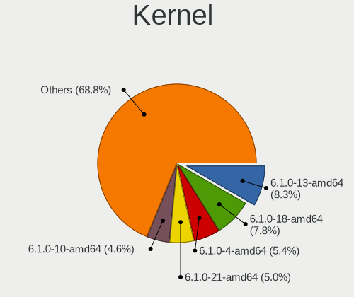
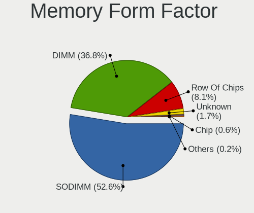
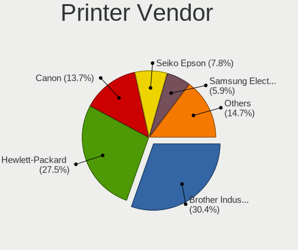
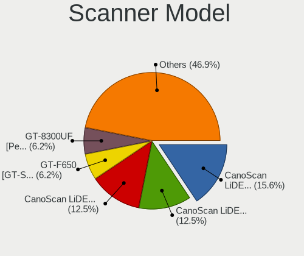
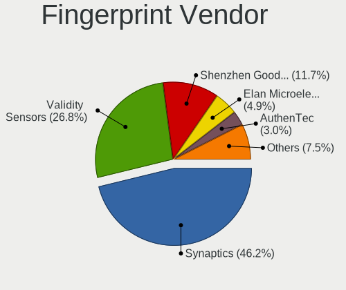

Debian 12 - Tested Hardware & Statistics
----------------------------------------

A project to collect tested hardware configurations for Debian 12.

Anyone can contribute to this report by the [hw-probe](https://github.com/linuxhw/hw-probe) tool:

    sudo -E hw-probe -all -upload

Please contribute! Especially if your hardware is rare.

This is a report for all computer types. See also reports for [desktops](/Dist/Debian_12/Desktop/README.md) and [notebooks](/Dist/Debian_12/Notebook/README.md).

Contents
--------

* [ Test Cases ](#test-cases)

* [ System ](#system)
  - [ Kernel                   ](#kernel)
  - [ Kernel Family            ](#kernel-family)
  - [ Kernel Major Ver.        ](#kernel-major-ver)
  - [ Arch                     ](#arch)
  - [ DE                       ](#de)
  - [ Display Server           ](#display-server)
  - [ Display Manager          ](#display-manager)
  - [ OS Lang                  ](#os-lang)
  - [ Boot Mode                ](#boot-mode)
  - [ Filesystem               ](#filesystem)
  - [ Part. scheme             ](#part-scheme)
  - [ Dual Boot with Linux/BSD ](#dual-boot-with-linuxbsd)
  - [ Dual Boot (Win)          ](#dual-boot-win)

* [ Board ](#board)
  - [ Vendor                   ](#vendor)
  - [ Model                    ](#model)
  - [ Model Family             ](#model-family)
  - [ MFG Year                 ](#mfg-year)
  - [ Form Factor              ](#form-factor)
  - [ Secure Boot              ](#secure-boot)
  - [ Coreboot                 ](#coreboot)
  - [ RAM Size                 ](#ram-size)
  - [ RAM Used                 ](#ram-used)
  - [ Total Drives             ](#total-drives)
  - [ Has CD-ROM               ](#has-cd-rom)
  - [ Has Ethernet             ](#has-ethernet)
  - [ Has WiFi                 ](#has-wifi)
  - [ Has Bluetooth            ](#has-bluetooth)

* [ Location ](#location)
  - [ Country                  ](#country)
  - [ City                     ](#city)

* [ Drives ](#drives)
  - [ Drive Vendor             ](#drive-vendor)
  - [ Drive Model              ](#drive-model)
  - [ HDD Vendor               ](#hdd-vendor)
  - [ SSD Vendor               ](#ssd-vendor)
  - [ Drive Kind               ](#drive-kind)
  - [ Drive Connector          ](#drive-connector)
  - [ Drive Size               ](#drive-size)
  - [ Space Total              ](#space-total)
  - [ Space Used               ](#space-used)
  - [ Malfunc. Drives          ](#malfunc-drives)
  - [ Malfunc. Drive Vendor    ](#malfunc-drive-vendor)
  - [ Malfunc. HDD Vendor      ](#malfunc-hdd-vendor)
  - [ Malfunc. Drive Kind      ](#malfunc-drive-kind)
  - [ Failed Drives            ](#failed-drives)
  - [ Failed Drive Vendor      ](#failed-drive-vendor)
  - [ Drive Status             ](#drive-status)

* [ Storage controller ](#storage-controller)
  - [ Storage Vendor           ](#storage-vendor)
  - [ Storage Model            ](#storage-model)
  - [ Storage Kind             ](#storage-kind)

* [ Processor ](#processor)
  - [ CPU Vendor               ](#cpu-vendor)
  - [ CPU Model                ](#cpu-model)
  - [ CPU Model Family         ](#cpu-model-family)
  - [ CPU Cores                ](#cpu-cores)
  - [ CPU Sockets              ](#cpu-sockets)
  - [ CPU Threads              ](#cpu-threads)
  - [ CPU Op-Modes             ](#cpu-op-modes)
  - [ CPU Microcode            ](#cpu-microcode)
  - [ CPU Microarch            ](#cpu-microarch)

* [ Graphics ](#graphics)
  - [ GPU Vendor               ](#gpu-vendor)
  - [ GPU Model                ](#gpu-model)
  - [ GPU Combo                ](#gpu-combo)
  - [ GPU Driver               ](#gpu-driver)
  - [ GPU Memory               ](#gpu-memory)

* [ Monitor ](#monitor)
  - [ Monitor Vendor           ](#monitor-vendor)
  - [ Monitor Model            ](#monitor-model)
  - [ Monitor Resolution       ](#monitor-resolution)
  - [ Monitor Diagonal         ](#monitor-diagonal)
  - [ Monitor Width            ](#monitor-width)
  - [ Aspect Ratio             ](#aspect-ratio)
  - [ Monitor Area             ](#monitor-area)
  - [ Pixel Density            ](#pixel-density)
  - [ Multiple Monitors        ](#multiple-monitors)

* [ Network ](#network)
  - [ Net Controller Vendor    ](#net-controller-vendor)
  - [ Net Controller Model     ](#net-controller-model)
  - [ Wireless Vendor          ](#wireless-vendor)
  - [ Wireless Model           ](#wireless-model)
  - [ Ethernet Vendor          ](#ethernet-vendor)
  - [ Ethernet Model           ](#ethernet-model)
  - [ Net Controller Kind      ](#net-controller-kind)
  - [ Used Controller          ](#used-controller)
  - [ NICs                     ](#nics)
  - [ IPv6                     ](#ipv6)

* [ Bluetooth ](#bluetooth)
  - [ Bluetooth Vendor         ](#bluetooth-vendor)
  - [ Bluetooth Model          ](#bluetooth-model)

* [ Sound ](#sound)
  - [ Sound Vendor             ](#sound-vendor)
  - [ Sound Model              ](#sound-model)

* [ Memory ](#memory)
  - [ Memory Vendor            ](#memory-vendor)
  - [ Memory Model             ](#memory-model)
  - [ Memory Kind              ](#memory-kind)
  - [ Memory Form Factor       ](#memory-form-factor)
  - [ Memory Size              ](#memory-size)
  - [ Memory Speed             ](#memory-speed)

* [ Printers & scanners ](#printers--scanners)
  - [ Printer Vendor           ](#printer-vendor)
  - [ Printer Model            ](#printer-model)
  - [ Scanner Vendor           ](#scanner-vendor)
  - [ Scanner Model            ](#scanner-model)

* [ Camera ](#camera)
  - [ Camera Vendor            ](#camera-vendor)
  - [ Camera Model             ](#camera-model)

* [ Security ](#security)
  - [ Fingerprint Vendor       ](#fingerprint-vendor)
  - [ Fingerprint Model        ](#fingerprint-model)
  - [ Chipcard Vendor          ](#chipcard-vendor)
  - [ Chipcard Model           ](#chipcard-model)

* [ Unsupported ](#unsupported)
  - [ Unsupported Devices      ](#unsupported-devices)
  - [ Unsupported Device Types ](#unsupported-device-types)

Test Cases
----------

Total: 185

| Vendor        | Model                       | Form-Factor | Probe                                                      | Date         |
|---------------|-----------------------------|-------------|------------------------------------------------------------|--------------|
| Lenovo        | Slim 9 14IAP7 82T1          | Notebook    | [fe1b421c9d](https://linux-hardware.org/?probe=fe1b421c9d) | May 01, 2023 |
| HP            | Pavilion x360 Convertibl... | Convertible | [1b2adc0ae5](https://linux-hardware.org/?probe=1b2adc0ae5) | May 01, 2023 |
| ASUSTek       | ProArt X670E-CREATOR WIF... | Desktop     | [d85b7a2592](https://linux-hardware.org/?probe=d85b7a2592) | Apr 30, 2023 |
| HP            | 255 G8 Notebook PC          | Notebook    | [7262375294](https://linux-hardware.org/?probe=7262375294) | Apr 30, 2023 |
| Lenovo        | ThinkPad T14 Gen 2i 20W1... | Notebook    | [0a9a85f5f0](https://linux-hardware.org/?probe=0a9a85f5f0) | Apr 29, 2023 |
| Lenovo        | ThinkPad T14 Gen 2i 20W1... | Notebook    | [83b10185e8](https://linux-hardware.org/?probe=83b10185e8) | Apr 29, 2023 |
| Acidanther... | Mac-CFF7D910A743CAAF iMa... | All in one  | [88d774df0d](https://linux-hardware.org/?probe=88d774df0d) | Apr 29, 2023 |
| Aquarius      | NS585                       | Notebook    | [b23696ca41](https://linux-hardware.org/?probe=b23696ca41) | Apr 28, 2023 |
| sunxi         | FriendlyArm NanoPi M1       | Soc         | [dcfa7042da](https://linux-hardware.org/?probe=dcfa7042da) | Apr 28, 2023 |
| Unknown       | Unknown                     | Desktop     | [5f5809c40f](https://linux-hardware.org/?probe=5f5809c40f) | Apr 27, 2023 |
| ASUSTek       | ASUS TUF Gaming A15 FA50... | Notebook    | [2474e8e580](https://linux-hardware.org/?probe=2474e8e580) | Apr 27, 2023 |
| ASUSTek       | Z97M-PLUS/BR                | Desktop     | [3255acf414](https://linux-hardware.org/?probe=3255acf414) | Apr 27, 2023 |
| ASRock        | A320M-HDV R3.0              | Desktop     | [d395c6168d](https://linux-hardware.org/?probe=d395c6168d) | Apr 27, 2023 |
| ASUSTek       | Zenbook UX535QE_UM535QE     | Notebook    | [2093399e21](https://linux-hardware.org/?probe=2093399e21) | Apr 27, 2023 |
| Gigabyte      | B450 I AORUS PRO WIFI-CF    | Desktop     | [2dcf65cf8e](https://linux-hardware.org/?probe=2dcf65cf8e) | Apr 26, 2023 |
| HP            | 8309                        | Desktop     | [cde28bd710](https://linux-hardware.org/?probe=cde28bd710) | Apr 26, 2023 |
| ASUSTek       | VivoBook_ASUSLaptop M640... | Notebook    | [0234325d36](https://linux-hardware.org/?probe=0234325d36) | Apr 26, 2023 |
| ASUSTek       | PRIME B660-PLUS D4          | Desktop     | [a343d9158a](https://linux-hardware.org/?probe=a343d9158a) | Apr 26, 2023 |
| ASUSTek       | Z170-A                      | Desktop     | [fa21ed6900](https://linux-hardware.org/?probe=fa21ed6900) | Apr 25, 2023 |
| Aquarius      | NS585                       | Notebook    | [a0983c89d8](https://linux-hardware.org/?probe=a0983c89d8) | Apr 25, 2023 |
| Aquarius      | NS585                       | Notebook    | [5d9edb6ed4](https://linux-hardware.org/?probe=5d9edb6ed4) | Apr 25, 2023 |
| Aquarius      | NS585                       | Notebook    | [972d7f6e4a](https://linux-hardware.org/?probe=972d7f6e4a) | Apr 25, 2023 |
| Aquarius      | NS585                       | Notebook    | [c89bbd8bc0](https://linux-hardware.org/?probe=c89bbd8bc0) | Apr 25, 2023 |
| Aquarius      | NS585                       | Notebook    | [a6e5a5f3d1](https://linux-hardware.org/?probe=a6e5a5f3d1) | Apr 25, 2023 |
| Aquarius      | NS585                       | Notebook    | [b6dac5b058](https://linux-hardware.org/?probe=b6dac5b058) | Apr 25, 2023 |
| Aquarius      | NS585                       | Notebook    | [1563889dac](https://linux-hardware.org/?probe=1563889dac) | Apr 25, 2023 |
| Aquarius      | NS585                       | Notebook    | [9bdbad2ab7](https://linux-hardware.org/?probe=9bdbad2ab7) | Apr 25, 2023 |
| Aquarius      | NS585                       | Notebook    | [e30d7dde7b](https://linux-hardware.org/?probe=e30d7dde7b) | Apr 25, 2023 |
| Aquarius      | NS585                       | Notebook    | [68527a900f](https://linux-hardware.org/?probe=68527a900f) | Apr 25, 2023 |
| Aquarius      | NS585                       | Notebook    | [ce99b27fb4](https://linux-hardware.org/?probe=ce99b27fb4) | Apr 25, 2023 |
| Aquarius      | NS585                       | Notebook    | [fc377acae2](https://linux-hardware.org/?probe=fc377acae2) | Apr 25, 2023 |
| Aquarius      | NS585                       | Notebook    | [ed32f24d6e](https://linux-hardware.org/?probe=ed32f24d6e) | Apr 25, 2023 |
| Aquarius      | NS585                       | Notebook    | [ea60267a5b](https://linux-hardware.org/?probe=ea60267a5b) | Apr 25, 2023 |
| Aquarius      | NS585                       | Notebook    | [f71897bf76](https://linux-hardware.org/?probe=f71897bf76) | Apr 25, 2023 |
| Aquarius      | NS585                       | Notebook    | [7aa4561ca5](https://linux-hardware.org/?probe=7aa4561ca5) | Apr 25, 2023 |
| Aquarius      | NS585                       | Notebook    | [385ce8cd93](https://linux-hardware.org/?probe=385ce8cd93) | Apr 25, 2023 |
| Aquarius      | NS585                       | Notebook    | [3fc8926a1a](https://linux-hardware.org/?probe=3fc8926a1a) | Apr 25, 2023 |
| Lenovo        | V15 G2 ALC 82KD             | Notebook    | [9e6ce2eb71](https://linux-hardware.org/?probe=9e6ce2eb71) | Apr 25, 2023 |
| Aquarius      | NS585                       | Notebook    | [58306d0266](https://linux-hardware.org/?probe=58306d0266) | Apr 25, 2023 |
| ASRock        | 960GC-GS FX                 | Desktop     | [1cd850e8af](https://linux-hardware.org/?probe=1cd850e8af) | Apr 25, 2023 |
| ASUSTek       | ProArt X670E-CREATOR WIF... | Desktop     | [c5f2fa1c5a](https://linux-hardware.org/?probe=c5f2fa1c5a) | Apr 25, 2023 |
| HP            | ProBook 4520s               | Notebook    | [b680525b61](https://linux-hardware.org/?probe=b680525b61) | Apr 24, 2023 |
| HP            | ProBook 4520s               | Notebook    | [e4ce7aed55](https://linux-hardware.org/?probe=e4ce7aed55) | Apr 24, 2023 |
| Hampoo        | Cherry Trail CR V200        | Notebook    | [f3d90b0d4a](https://linux-hardware.org/?probe=f3d90b0d4a) | Apr 23, 2023 |
| Microsoft     | Surface Pro 3               | Tablet      | [67dc214198](https://linux-hardware.org/?probe=67dc214198) | Apr 23, 2023 |
| sunxi         | FriendlyArm NanoPi M1       | Soc         | [90f041e2a1](https://linux-hardware.org/?probe=90f041e2a1) | Apr 23, 2023 |
| sunxi         | FriendlyArm NanoPi M1       | Soc         | [6d06ef4fa1](https://linux-hardware.org/?probe=6d06ef4fa1) | Apr 23, 2023 |
| Acer          | Aspire E1-571G              | Notebook    | [0e2671ee2e](https://linux-hardware.org/?probe=0e2671ee2e) | Apr 23, 2023 |
| MSI           | X370 GAMING PLUS            | Desktop     | [5d61deb4d4](https://linux-hardware.org/?probe=5d61deb4d4) | Apr 23, 2023 |
| Dell          | G15 5520                    | Notebook    | [238c8f53aa](https://linux-hardware.org/?probe=238c8f53aa) | Apr 22, 2023 |
| sunxi         | FriendlyArm NanoPi M1       | Soc         | [3e4c8bce3b](https://linux-hardware.org/?probe=3e4c8bce3b) | Apr 22, 2023 |
| Gigabyte      | X570S AORUS ELITE AX        | Desktop     | [9c3e15de68](https://linux-hardware.org/?probe=9c3e15de68) | Apr 22, 2023 |
| Dell          | Inspiron 7591 2n1           | Convertible | [9896e8b804](https://linux-hardware.org/?probe=9896e8b804) | Apr 22, 2023 |
| Dell          | Latitude E6330              | Notebook    | [b532a9756c](https://linux-hardware.org/?probe=b532a9756c) | Apr 22, 2023 |
| ASUSTek       | P5N-D                       | Desktop     | [c1af2b9a2c](https://linux-hardware.org/?probe=c1af2b9a2c) | Apr 22, 2023 |
| Acer          | Nitro AN515-45              | Notebook    | [91f538e2ab](https://linux-hardware.org/?probe=91f538e2ab) | Apr 21, 2023 |
| Lenovo        | IdeaPad S510p 20298         | Notebook    | [8a1e6b7f32](https://linux-hardware.org/?probe=8a1e6b7f32) | Apr 21, 2023 |
| HP            | ZBook Power 15.6 inch G9... | Notebook    | [036616c992](https://linux-hardware.org/?probe=036616c992) | Apr 21, 2023 |
| HP            | ZBook Power 15.6 inch G8... | Notebook    | [cb40e046d8](https://linux-hardware.org/?probe=cb40e046d8) | Apr 21, 2023 |
| Toshiba       | Satellite X200              | Notebook    | [15035835d0](https://linux-hardware.org/?probe=15035835d0) | Apr 20, 2023 |
| HP            | Notebook                    | Notebook    | [7174065ed3](https://linux-hardware.org/?probe=7174065ed3) | Apr 20, 2023 |
| Aquarius      | NS585                       | Notebook    | [753222f54f](https://linux-hardware.org/?probe=753222f54f) | Apr 20, 2023 |
| Aquarius      | NS585                       | Notebook    | [be0bc2be01](https://linux-hardware.org/?probe=be0bc2be01) | Apr 20, 2023 |
| HP            | EliteBook 830 G5            | Notebook    | [6090be709d](https://linux-hardware.org/?probe=6090be709d) | Apr 20, 2023 |
| HP            | ProLiant ML150 G6           | Desktop     | [76dc3db16a](https://linux-hardware.org/?probe=76dc3db16a) | Apr 20, 2023 |
| Aquarius      | NS585                       | Notebook    | [f7f0464c39](https://linux-hardware.org/?probe=f7f0464c39) | Apr 20, 2023 |
| Aquarius      | NS585                       | Notebook    | [8393642230](https://linux-hardware.org/?probe=8393642230) | Apr 20, 2023 |
| Aquarius      | NS585                       | Notebook    | [a5b9a09e63](https://linux-hardware.org/?probe=a5b9a09e63) | Apr 20, 2023 |
| Unknown       | Unknown                     | Soc         | [909f002719](https://linux-hardware.org/?probe=909f002719) | Apr 20, 2023 |
| Medion        | P17605                      | Notebook    | [b68359f3d1](https://linux-hardware.org/?probe=b68359f3d1) | Apr 20, 2023 |
| Unknown       | Unknown                     | Soc         | [f07d0fd264](https://linux-hardware.org/?probe=f07d0fd264) | Apr 19, 2023 |
| MSI           | B450 GAMING PRO CARBON A... | Desktop     | [e1da556a0b](https://linux-hardware.org/?probe=e1da556a0b) | Apr 19, 2023 |
| ASUSTek       | VivoBook_ASUSLaptop M350... | Notebook    | [d669bcc680](https://linux-hardware.org/?probe=d669bcc680) | Apr 19, 2023 |
| MSI           | H110M PRO-VD                | Desktop     | [d04a1b7f36](https://linux-hardware.org/?probe=d04a1b7f36) | Apr 19, 2023 |
| Microsoft     | Surface Pro 3               | Tablet      | [8538987e5c](https://linux-hardware.org/?probe=8538987e5c) | Apr 19, 2023 |
| Tactus        | GeoBook 140                 | Notebook    | [704da241f5](https://linux-hardware.org/?probe=704da241f5) | Apr 18, 2023 |
| Dell          | Vostro 5402                 | Notebook    | [e492c87b46](https://linux-hardware.org/?probe=e492c87b46) | Apr 18, 2023 |
| Dell          | Vostro 5402                 | Notebook    | [b15f47258b](https://linux-hardware.org/?probe=b15f47258b) | Apr 18, 2023 |
| HP            | ENVY x360 Convertible 13... | Convertible | [52272d52d3](https://linux-hardware.org/?probe=52272d52d3) | Apr 18, 2023 |
| PC Special... | NV4XMB,ME,MZ                | Notebook    | [65c0a28c58](https://linux-hardware.org/?probe=65c0a28c58) | Apr 18, 2023 |
| Lenovo        | IdeaPad S510p 20298         | Notebook    | [7f0be1868e](https://linux-hardware.org/?probe=7f0be1868e) | Apr 18, 2023 |
| Dell          | 0D4VY1 A00                  | All in one  | [ddbd926522](https://linux-hardware.org/?probe=ddbd926522) | Apr 18, 2023 |
| Dell          | 0R4CNN A02                  | Server      | [237a3cd682](https://linux-hardware.org/?probe=237a3cd682) | Apr 18, 2023 |
| MSI           | Prestige 15 A12UC           | Notebook    | [0f4c1e1ac3](https://linux-hardware.org/?probe=0f4c1e1ac3) | Apr 18, 2023 |
| ASUSTek       | G551JW                      | Notebook    | [65f6143e36](https://linux-hardware.org/?probe=65f6143e36) | Apr 18, 2023 |
| Lenovo        | ThinkPad L540 20AUA39QJP    | Notebook    | [180ef53338](https://linux-hardware.org/?probe=180ef53338) | Apr 18, 2023 |
| Lenovo        | ThinkPad L540 20AUA39QJP    | Notebook    | [fd3b20c292](https://linux-hardware.org/?probe=fd3b20c292) | Apr 18, 2023 |
| LG Electro... | 17Z90Q-K.AA78A1             | Notebook    | [594a7fa16b](https://linux-hardware.org/?probe=594a7fa16b) | Apr 18, 2023 |
| IBM           | ThinkPad R51 1836Q4U        | Notebook    | [ebec8b53eb](https://linux-hardware.org/?probe=ebec8b53eb) | Apr 18, 2023 |
| MSI           | MPG X570 GAMING PLUS        | Desktop     | [c4d3eabb55](https://linux-hardware.org/?probe=c4d3eabb55) | Apr 17, 2023 |
| Acer          | Swift SF314-41              | Notebook    | [8c42a0aba8](https://linux-hardware.org/?probe=8c42a0aba8) | Apr 16, 2023 |
| Dell          | XPS 13 9305                 | Notebook    | [838519057f](https://linux-hardware.org/?probe=838519057f) | Apr 16, 2023 |
| Biostar       | A10N-8800E                  | Desktop     | [31557d5e8c](https://linux-hardware.org/?probe=31557d5e8c) | Apr 15, 2023 |
| Unknown       | Unknown                     | Soc         | [018daf402b](https://linux-hardware.org/?probe=018daf402b) | Apr 15, 2023 |
| ASUSTek       | Z87-A                       | Desktop     | [3e96076874](https://linux-hardware.org/?probe=3e96076874) | Apr 15, 2023 |
| Acer          | WG43M                       | Desktop     | [a3a49836f9](https://linux-hardware.org/?probe=a3a49836f9) | Apr 15, 2023 |
| Intel         | Alder Lake-H PCH E1.0G      | Desktop     | [0ec41c7bd8](https://linux-hardware.org/?probe=0ec41c7bd8) | Apr 14, 2023 |
| HP            | 255 G8 Notebook PC          | Notebook    | [58ec498e8f](https://linux-hardware.org/?probe=58ec498e8f) | Apr 14, 2023 |
| Toshiba       | Satellite L850              | Notebook    | [15de4db91b](https://linux-hardware.org/?probe=15de4db91b) | Apr 14, 2023 |
| Dell          | G15 5510                    | Notebook    | [6b4ef54307](https://linux-hardware.org/?probe=6b4ef54307) | Apr 13, 2023 |
| Intel         | Alder Lake-H PCH E1.0G      | Desktop     | [9cf22928fb](https://linux-hardware.org/?probe=9cf22928fb) | Apr 13, 2023 |
| HP            | Pavilion Laptop 15-eh1xx... | Notebook    | [60f7db51fa](https://linux-hardware.org/?probe=60f7db51fa) | Apr 13, 2023 |
| HP            | Pavilion Laptop 15-eh1xx... | Notebook    | [e9708d65e9](https://linux-hardware.org/?probe=e9708d65e9) | Apr 13, 2023 |
| Dell          | Latitude 5490               | Notebook    | [38ebdedf58](https://linux-hardware.org/?probe=38ebdedf58) | Apr 12, 2023 |
| Gigabyte      | H61M-DS2                    | Desktop     | [e0b6eda111](https://linux-hardware.org/?probe=e0b6eda111) | Apr 11, 2023 |
| Acer          | Aspire E1-571G              | Notebook    | [45a3503764](https://linux-hardware.org/?probe=45a3503764) | Apr 11, 2023 |
| Aquarius      | NS585                       | Notebook    | [6f4b987640](https://linux-hardware.org/?probe=6f4b987640) | Apr 11, 2023 |
| ASUSTek       | P7H55                       | Desktop     | [8ee190d352](https://linux-hardware.org/?probe=8ee190d352) | Apr 11, 2023 |
| Dell          | Latitude 3320               | Notebook    | [b7c2bb88b3](https://linux-hardware.org/?probe=b7c2bb88b3) | Apr 10, 2023 |
| Dell          | Latitude 3320               | Notebook    | [436e7b8903](https://linux-hardware.org/?probe=436e7b8903) | Apr 10, 2023 |
| Lenovo        | Yoga 500-15IBD 80N6         | Notebook    | [885fff9ddb](https://linux-hardware.org/?probe=885fff9ddb) | Apr 10, 2023 |
| Techvision    | TVI7309X B0                 | Desktop     | [d24ce5fa44](https://linux-hardware.org/?probe=d24ce5fa44) | Apr 09, 2023 |
| Lenovo        | ThinkPad X220 4291LR6       | Notebook    | [ea86227d59](https://linux-hardware.org/?probe=ea86227d59) | Apr 09, 2023 |
| Lenovo        | ThinkPad P15v Gen 3 21D8... | Notebook    | [8d4288ca33](https://linux-hardware.org/?probe=8d4288ca33) | Apr 09, 2023 |
| Lenovo        | 500w Gen 3 82J3             | Convertible | [63945c445c](https://linux-hardware.org/?probe=63945c445c) | Apr 08, 2023 |
| ASUSTek       | P7H55                       | Desktop     | [89966b216e](https://linux-hardware.org/?probe=89966b216e) | Apr 07, 2023 |
| QTQD          | Unknown                     | Desktop     | [5cb163c75a](https://linux-hardware.org/?probe=5cb163c75a) | Apr 06, 2023 |
| MSI           | Z68A-GD65                   | Desktop     | [a8939164e7](https://linux-hardware.org/?probe=a8939164e7) | Apr 06, 2023 |
| Gigabyte      | B550 UD AC                  | Desktop     | [a639dfd228](https://linux-hardware.org/?probe=a639dfd228) | Apr 06, 2023 |
| MSI           | MPG X570S CARBON MAX WIF... | Desktop     | [55ea8a957b](https://linux-hardware.org/?probe=55ea8a957b) | Apr 06, 2023 |
| eMachines     | eME728                      | Notebook    | [aff08e7f2d](https://linux-hardware.org/?probe=aff08e7f2d) | Apr 05, 2023 |
| MSI           | MPG X570 GAMING PLUS        | Desktop     | [eadee78860](https://linux-hardware.org/?probe=eadee78860) | Apr 05, 2023 |
| eMachines     | eMachiens G443              | Notebook    | [58c297218a](https://linux-hardware.org/?probe=58c297218a) | Apr 05, 2023 |
| System76      | Lemur Pro                   | Notebook    | [2232424d5a](https://linux-hardware.org/?probe=2232424d5a) | Apr 05, 2023 |
| ASUSTek       | VM42                        | Desktop     | [84f848ea21](https://linux-hardware.org/?probe=84f848ea21) | Apr 05, 2023 |
| ASUSTek       | PRIME B250M-PLUS            | Desktop     | [6f4013d94e](https://linux-hardware.org/?probe=6f4013d94e) | Apr 05, 2023 |
| ASUSTek       | TUF Gaming B460M-PLUS       | Desktop     | [5f9965b18e](https://linux-hardware.org/?probe=5f9965b18e) | Apr 05, 2023 |
| HONOR         | NMH-WCX9                    | Notebook    | [9ea45909a2](https://linux-hardware.org/?probe=9ea45909a2) | Apr 05, 2023 |
| Gigabyte      | Z68A-D3-B3                  | Desktop     | [6fb463806f](https://linux-hardware.org/?probe=6fb463806f) | Apr 04, 2023 |
| ASUSTek       | PRIME B250M-PLUS            | Desktop     | [0401a50bac](https://linux-hardware.org/?probe=0401a50bac) | Apr 04, 2023 |
| Gigabyte      | H61M-DS2                    | Desktop     | [5a83d4ef1e](https://linux-hardware.org/?probe=5a83d4ef1e) | Apr 04, 2023 |
| MSI           | MPG X570 GAMING PLUS        | Desktop     | [739f49ff7e](https://linux-hardware.org/?probe=739f49ff7e) | Apr 04, 2023 |
| Framework     | Laptop                      | Notebook    | [5bb187865d](https://linux-hardware.org/?probe=5bb187865d) | Apr 04, 2023 |
| Techvision    | TVI7309X B0                 | Desktop     | [dbbe4bbbc5](https://linux-hardware.org/?probe=dbbe4bbbc5) | Apr 03, 2023 |
| ASUSTek       | PRIME B450M-A               | Desktop     | [1b35a0e9f7](https://linux-hardware.org/?probe=1b35a0e9f7) | Apr 03, 2023 |
| HP            | ENVY x360 Convertible 13... | Convertible | [70ed012fb4](https://linux-hardware.org/?probe=70ed012fb4) | Apr 03, 2023 |
| ASUSTek       | PRIME B450M-A               | Desktop     | [734efd13d3](https://linux-hardware.org/?probe=734efd13d3) | Apr 03, 2023 |
| ASRock        | X470 Gaming-ITX/ac          | Desktop     | [48f07855d1](https://linux-hardware.org/?probe=48f07855d1) | Apr 02, 2023 |
| Packard Be... | EasyNote TJ65               | Notebook    | [cd6a05149d](https://linux-hardware.org/?probe=cd6a05149d) | Apr 02, 2023 |
| Schenker      | XMG CORE (REN/M20)          | Notebook    | [50e9dee7b1](https://linux-hardware.org/?probe=50e9dee7b1) | Apr 01, 2023 |
| HP            | EliteBook 840 G5            | Notebook    | [3c509a7075](https://linux-hardware.org/?probe=3c509a7075) | Apr 01, 2023 |
| Tactus        | GeoBook 140                 | Notebook    | [0ceb5a3b7c](https://linux-hardware.org/?probe=0ceb5a3b7c) | Apr 01, 2023 |
| ASUSTek       | ROG STRIX X570-E GAMING     | Desktop     | [6fd833b58c](https://linux-hardware.org/?probe=6fd833b58c) | Apr 01, 2023 |
| ASRock        | B760M Pro RS/D4             | Desktop     | [6a63402e9c](https://linux-hardware.org/?probe=6a63402e9c) | Mar 31, 2023 |
| ASUSTek       | ROG STRIX B660-F GAMING ... | Desktop     | [de5bf4239c](https://linux-hardware.org/?probe=de5bf4239c) | Mar 30, 2023 |
| ASUSTek       | ROG STRIX B550-F GAMING     | Desktop     | [244ffc8736](https://linux-hardware.org/?probe=244ffc8736) | Mar 30, 2023 |
| ASUSTek       | TUF Gaming B550M-PLUS       | Desktop     | [82118905ba](https://linux-hardware.org/?probe=82118905ba) | Mar 30, 2023 |
| ASUSTek       | Pro WS X570-ACE             | Desktop     | [6cc34607d1](https://linux-hardware.org/?probe=6cc34607d1) | Mar 30, 2023 |
| Lenovo        | ThinkPad T14s Gen 2i 20W... | Notebook    | [a9e7ad7ecd](https://linux-hardware.org/?probe=a9e7ad7ecd) | Mar 29, 2023 |
| MSI           | Prestige 14Evo A11M         | Notebook    | [fc06b01f31](https://linux-hardware.org/?probe=fc06b01f31) | Mar 29, 2023 |
| MSI           | Prestige 14Evo A11M         | Notebook    | [5ac693dbd4](https://linux-hardware.org/?probe=5ac693dbd4) | Mar 29, 2023 |
| Acer          | Nitro AN515-43              | Notebook    | [47c758c261](https://linux-hardware.org/?probe=47c758c261) | Mar 29, 2023 |
| ASUSTek       | ROG STRIX B660-F GAMING ... | Desktop     | [dadeec8815](https://linux-hardware.org/?probe=dadeec8815) | Mar 29, 2023 |
| ASUSTek       | PRIME B450M-A II            | Desktop     | [4fe0ddab4b](https://linux-hardware.org/?probe=4fe0ddab4b) | Mar 28, 2023 |
| Google        | Swanky                      | Notebook    | [0f32e48b38](https://linux-hardware.org/?probe=0f32e48b38) | Mar 28, 2023 |
| ASUSTek       | TUF Gaming B550M-PLUS       | Desktop     | [5969fea8f0](https://linux-hardware.org/?probe=5969fea8f0) | Mar 28, 2023 |
| Gigabyte      | H97M-HD3                    | Desktop     | [1b531d5ada](https://linux-hardware.org/?probe=1b531d5ada) | Mar 27, 2023 |
| Lenovo        | ThinkPad L13 Gen 3 21B9C... | Notebook    | [0744b26f5c](https://linux-hardware.org/?probe=0744b26f5c) | Mar 27, 2023 |
| GPD           | P3 MAX                      | Notebook    | [b3627909f1](https://linux-hardware.org/?probe=b3627909f1) | Mar 27, 2023 |
| Dell          | Latitude E5430 non-vPro     | Notebook    | [17794caffa](https://linux-hardware.org/?probe=17794caffa) | Mar 27, 2023 |
| Lenovo        | ThinkPad L13 Yoga Gen 2 ... | Convertible | [c1e74d51ee](https://linux-hardware.org/?probe=c1e74d51ee) | Mar 27, 2023 |
| Lenovo        | SHARKBAY SDK0E50510 WIN     | Desktop     | [ebed945eae](https://linux-hardware.org/?probe=ebed945eae) | Mar 27, 2023 |
| Lenovo        | SHARKBAY SDK0E50510 WIN     | Desktop     | [fd16b858df](https://linux-hardware.org/?probe=fd16b858df) | Mar 27, 2023 |
| Dell          | Precision 5570              | Notebook    | [454590a1a8](https://linux-hardware.org/?probe=454590a1a8) | Mar 26, 2023 |
| Dell          | Latitude E6330              | Notebook    | [32833b4683](https://linux-hardware.org/?probe=32833b4683) | Mar 25, 2023 |
| ASUSTek       | PRIME X470-PRO              | Desktop     | [a05e768cca](https://linux-hardware.org/?probe=a05e768cca) | Mar 25, 2023 |
| Lenovo        | ThinkPad 13 2nd Gen 20J1... | Notebook    | [9b9a21b7da](https://linux-hardware.org/?probe=9b9a21b7da) | Mar 24, 2023 |
| HP            | ENVY x360 2-in-1 Laptop ... | Convertible | [728f83932f](https://linux-hardware.org/?probe=728f83932f) | Mar 24, 2023 |
| Lenovo        | ThinkPad 13 2nd Gen 20J1... | Notebook    | [58f8d5849a](https://linux-hardware.org/?probe=58f8d5849a) | Mar 24, 2023 |
| Microsoft     | Surface Go                  | Tablet      | [e6ecf47eda](https://linux-hardware.org/?probe=e6ecf47eda) | Mar 24, 2023 |
| Toshiba       | Satellite C50-B             | Notebook    | [4b563f19dd](https://linux-hardware.org/?probe=4b563f19dd) | Mar 24, 2023 |
| HP            | ENVY x360 2-in-1 Laptop ... | Convertible | [5a94081c24](https://linux-hardware.org/?probe=5a94081c24) | Mar 24, 2023 |
| Sony          | SVE1512M6ESI                | Notebook    | [db00c70eb7](https://linux-hardware.org/?probe=db00c70eb7) | Mar 24, 2023 |
| ASUSTek       | PRIME Z690-P                | Desktop     | [6b3cdb2b1a](https://linux-hardware.org/?probe=6b3cdb2b1a) | Mar 23, 2023 |
| Lenovo        | 500w Gen 3 82J3             | Convertible | [26ca87e272](https://linux-hardware.org/?probe=26ca87e272) | Mar 23, 2023 |
| Toshiba       | Satellite C50-B             | Notebook    | [b9bf22cc53](https://linux-hardware.org/?probe=b9bf22cc53) | Mar 20, 2023 |
| HP            | ProBook 430 G8 Notebook ... | Notebook    | [ca6ab3c197](https://linux-hardware.org/?probe=ca6ab3c197) | Mar 16, 2023 |
| ASUSTek       | VivoBook_ASUSLaptop M340... | Notebook    | [55a73e2e07](https://linux-hardware.org/?probe=55a73e2e07) | Mar 12, 2023 |
| Acer          | Nitro AN515-43              | Notebook    | [32d1af5dee](https://linux-hardware.org/?probe=32d1af5dee) | Mar 07, 2023 |
| ASUSTek       | VivoBook_ASUSLaptop X150... | Notebook    | [ac92e5ce13](https://linux-hardware.org/?probe=ac92e5ce13) | Mar 07, 2023 |
| HP            | EliteBook 830 G7 Noteboo... | Notebook    | [cee8496315](https://linux-hardware.org/?probe=cee8496315) | Mar 06, 2023 |
| ASUSTek       | X550JX                      | Notebook    | [a9a82b2395](https://linux-hardware.org/?probe=a9a82b2395) | Mar 06, 2023 |
| HUAWEI        | BOHB-WAX9                   | Notebook    | [eb5b9b8cb9](https://linux-hardware.org/?probe=eb5b9b8cb9) | Mar 06, 2023 |
| Dell          | Vostro 3700                 | Notebook    | [ea14c47abb](https://linux-hardware.org/?probe=ea14c47abb) | Mar 04, 2023 |
| Unknown       | Unknown                     | Desktop     | [c49317ce12](https://linux-hardware.org/?probe=c49317ce12) | Feb 13, 2023 |

System
------

Kernel
------

Version of the Linux kernel

| Version                 | Computers | Percent |
|-------------------------|-----------|---------|
| 6.1.0-7-amd64           | 66        | 43.42%  |
| 6.1.0-4-amd64           | 34        | 22.37%  |
| 6.1.0-6-amd64           | 29        | 19.08%  |
| 6.1.0-5-amd64           | 7         | 4.61%   |
| 6.1.0-8-amd64           | 2         | 1.32%   |
| 6.2.8-x64v3-xanmod1     | 1         | 0.66%   |
| 6.2.8                   | 1         | 0.66%   |
| 6.2.11-3-liquorix-amd64 | 1         | 0.66%   |
| 6.2.11                  | 1         | 0.66%   |
| 6.1.25-sunxi            | 1         | 0.66%   |
| 6.1.0-7-rt-amd64        | 1         | 0.66%   |
| 6.1.0-7-686             | 1         | 0.66%   |
| 6.1.0-6-rt-amd64        | 1         | 0.66%   |
| 6.1.0-3-amd64           | 1         | 0.66%   |
| 6.0.0-6-amd64           | 1         | 0.66%   |
| 6.0.0-0.deb11.6-amd64   | 1         | 0.66%   |
| 5.19.0-0.deb11.2-amd64  | 1         | 0.66%   |
| 5.15.94-starfive2       | 1         | 0.66%   |
| 5.15.0-starfive         | 1         | 0.66%   |

Kernel Family
-------------

Linux kernel without a distro release

| Version | Computers | Percent |
|---------|-----------|---------|
| 6.1.0   | 142       | 93.42%  |
| 6.2.8   | 2         | 1.32%   |
| 6.2.11  | 2         | 1.32%   |
| 6.0.0   | 2         | 1.32%   |
| 6.1.25  | 1         | 0.66%   |
| 5.19.0  | 1         | 0.66%   |
| 5.15.94 | 1         | 0.66%   |
| 5.15.0  | 1         | 0.66%   |

Kernel Major Ver.
-----------------

Linux kernel major version

| Version | Computers | Percent |
|---------|-----------|---------|
| 6.1     | 143       | 94.08%  |
| 6.2     | 4         | 2.63%   |
| 6.0     | 2         | 1.32%   |
| 5.15    | 2         | 1.32%   |
| 5.19    | 1         | 0.66%   |

Arch
----

OS architecture (x86_64, i586, etc.)

| Name    | Computers | Percent |
|---------|-----------|---------|
| x86_64  | 148       | 97.37%  |
| riscv64 | 2         | 1.32%   |
| i686    | 1         | 0.66%   |
| armv7l  | 1         | 0.66%   |

DE
--

Desktop Environment

| Name            | Computers | Percent |
|-----------------|-----------|---------|
| Unknown         | 48        | 31.58%  |
| GNOME           | 40        | 26.32%  |
| KDE5            | 27        | 17.76%  |
| XFCE            | 14        | 9.21%   |
| X-Cinnamon      | 6         | 3.95%   |
| MATE            | 6         | 3.95%   |
| LXDE            | 2         | 1.32%   |
| i3              | 2         | 1.32%   |
| GNUstep         | 2         | 1.32%   |
| GNOME Flashback | 2         | 1.32%   |
| LXQt            | 1         | 0.66%   |
| Enlightenment   | 1         | 0.66%   |
| awesome         | 1         | 0.66%   |

Display Server
--------------

X11 or Wayland

| Name    | Computers | Percent |
|---------|-----------|---------|
| X11     | 55        | 36.18%  |
| Wayland | 42        | 27.63%  |
| Unknown | 40        | 26.32%  |
| Tty     | 15        | 9.87%   |

Display Manager
---------------

SDDM, LightDM, etc.

| Name    | Computers | Percent |
|---------|-----------|---------|
| Unknown | 64        | 42.11%  |
| GDM3    | 39        | 25.66%  |
| LightDM | 26        | 17.11%  |
| SDDM    | 21        | 13.82%  |
| SLiM    | 2         | 1.32%   |

OS Lang
-------

Language

| Lang    | Computers | Percent |
|---------|-----------|---------|
| en_US   | 50        | 32.89%  |
| ru_RU   | 38        | 25%     |
| de_DE   | 18        | 11.84%  |
| fr_FR   | 12        | 7.89%   |
| es_ES   | 7         | 4.61%   |
| en_GB   | 5         | 3.29%   |
| pt_BR   | 3         | 1.97%   |
| it_IT   | 3         | 1.97%   |
| en_NZ   | 3         | 1.97%   |
| en_CA   | 2         | 1.32%   |
| Unknown | 2         | 1.32%   |
| zh_CN   | 1         | 0.66%   |
| pl_PL   | 1         | 0.66%   |
| oc_FR   | 1         | 0.66%   |
| nl_BE   | 1         | 0.66%   |
| ja_JP   | 1         | 0.66%   |
| fi_FI   | 1         | 0.66%   |
| es_AR   | 1         | 0.66%   |
| en_AU   | 1         | 0.66%   |
| de_AT   | 1         | 0.66%   |

Boot Mode
---------

EFI or BIOS

| Mode | Computers | Percent |
|------|-----------|---------|
| EFI  | 111       | 73.03%  |
| BIOS | 41        | 26.97%  |

Filesystem
----------

Type of filesystem

| Type    | Computers | Percent |
|---------|-----------|---------|
| Ext4    | 101       | 66.45%  |
| Overlay | 39        | 25.66%  |
| Btrfs   | 7         | 4.61%   |
| Xfs     | 3         | 1.97%   |
| Zfs     | 1         | 0.66%   |
| Tmpfs   | 1         | 0.66%   |

Part. scheme
------------

Scheme of partitioning

| Type    | Computers | Percent |
|---------|-----------|---------|
| GPT     | 116       | 76.32%  |
| MBR     | 22        | 14.47%  |
| Unknown | 14        | 9.21%   |

Dual Boot with Linux/BSD
------------------------

Hosting more than one Linux/BSD

| Dual boot | Computers | Percent |
|-----------|-----------|---------|
| No        | 136       | 89.47%  |
| Yes       | 16        | 10.53%  |

Dual Boot (Win)
---------------

Hosting Linux and Windows

| Dual boot | Computers | Percent |
|-----------|-----------|---------|
| No        | 78        | 51.32%  |
| Yes       | 74        | 48.68%  |

Board
-----

Vendor
------

Motherboard manufacturer

| Name                | Computers | Percent |
|---------------------|-----------|---------|
| ASUSTek Computer    | 29        | 19.08%  |
| Aquarius            | 25        | 16.45%  |
| Hewlett-Packard     | 16        | 10.53%  |
| Lenovo              | 14        | 9.21%   |
| Dell                | 14        | 9.21%   |
| MSI                 | 7         | 4.61%   |
| Gigabyte Technology | 6         | 3.95%   |
| Acer                | 6         | 3.95%   |
| ASRock              | 4         | 2.63%   |
| Unknown             | 3         | 1.97%   |
| Toshiba             | 2         | 1.32%   |
| Techvision          | 2         | 1.32%   |
| Microsoft           | 2         | 1.32%   |
| eMachines           | 2         | 1.32%   |
| Tactus              | 1         | 0.66%   |
| System76            | 1         | 0.66%   |
| sunxi               | 1         | 0.66%   |
| Sony                | 1         | 0.66%   |
| Schenker            | 1         | 0.66%   |
| QTQD                | 1         | 0.66%   |
| PC Specialist       | 1         | 0.66%   |
| Packard Bell        | 1         | 0.66%   |
| Medion              | 1         | 0.66%   |
| LG Electronics      | 1         | 0.66%   |
| Intel               | 1         | 0.66%   |
| IBM                 | 1         | 0.66%   |
| HUAWEI              | 1         | 0.66%   |
| HONOR               | 1         | 0.66%   |
| Hampoo              | 1         | 0.66%   |
| GPD                 | 1         | 0.66%   |
| Google              | 1         | 0.66%   |
| Framework           | 1         | 0.66%   |
| Biostar             | 1         | 0.66%   |
| Acidanthera         | 1         | 0.66%   |

Model
-----

Motherboard model

| Name                                      | Computers | Percent |
|-------------------------------------------|-----------|---------|
| Aquarius NS585                            | 25        | 16.45%  |
| Unknown                                   | 4         | 2.63%   |
| Techvision TVI7309X                       | 2         | 1.32%   |
| HP 255 G8 Notebook PC                     | 2         | 1.32%   |
| Dell Latitude 3320                        | 2         | 1.32%   |
| ASUS ProArt X670E-CREATOR WIFI            | 2         | 1.32%   |
| ASUS PRIME B450M-A                        | 2         | 1.32%   |
| ASUS All Series                           | 2         | 1.32%   |
| Acer Nitro AN515-43                       | 2         | 1.32%   |
| Toshiba Satellite X200                    | 1         | 0.66%   |
| Toshiba Satellite C50-B                   | 1         | 0.66%   |
| Tactus GeoBook 140                        | 1         | 0.66%   |
| System76 Lemur Pro                        | 1         | 0.66%   |
| sunxi FriendlyArm NanoPi M1               | 1         | 0.66%   |
| Sony SVE1512M6ESI                         | 1         | 0.66%   |
| Schenker XMG CORE (REN/M20)               | 1         | 0.66%   |
| PC Specialist NV4XMB,ME,MZ                | 1         | 0.66%   |
| Packard Bell EasyNote TJ65                | 1         | 0.66%   |
| MSI Prestige 15 A12UC                     | 1         | 0.66%   |
| MSI Prestige 14Evo A11M                   | 1         | 0.66%   |
| MSI MS-7D52                               | 1         | 0.66%   |
| MSI MS-7B85                               | 1         | 0.66%   |
| MSI MS-7A33                               | 1         | 0.66%   |
| MSI MS-7996                               | 1         | 0.66%   |
| MSI MS-7681                               | 1         | 0.66%   |
| Microsoft Surface Pro 3                   | 1         | 0.66%   |
| Microsoft Surface Go                      | 1         | 0.66%   |
| Medion P17605                             | 1         | 0.66%   |
| LG 17Z90Q-K.AA78A1                        | 1         | 0.66%   |
| Lenovo Yoga 500-15IBD 80N6                | 1         | 0.66%   |
| Lenovo V15 G2 ALC 82KD                    | 1         | 0.66%   |
| Lenovo ThinkPad X220 4291LR6              | 1         | 0.66%   |
| Lenovo ThinkPad T14s Gen 2i 20WM00A8SP    | 1         | 0.66%   |
| Lenovo ThinkPad T14 Gen 2i 20W1S6CB00     | 1         | 0.66%   |
| Lenovo ThinkPad P15v Gen 3 21D8A00ACD     | 1         | 0.66%   |
| Lenovo ThinkPad L540 20AUA39QJP           | 1         | 0.66%   |
| Lenovo ThinkPad L13 Yoga Gen 2 20VK0019US | 1         | 0.66%   |
| Lenovo ThinkPad L13 Gen 3 21B9CTO1WW      | 1         | 0.66%   |
| Lenovo ThinkPad 13 2nd Gen 20J10046US     | 1         | 0.66%   |
| Lenovo ThinkCentre M73 10AXS3JD00         | 1         | 0.66%   |

Model Family
------------

Motherboard model prefix

| Name                  | Computers | Percent |
|-----------------------|-----------|---------|
| Aquarius NS585        | 25        | 16.45%  |
| Lenovo ThinkPad       | 8         | 5.26%   |
| ASUS PRIME            | 7         | 4.61%   |
| Dell Latitude         | 5         | 3.29%   |
| ASUS VivoBook         | 4         | 2.63%   |
| Unknown               | 4         | 2.63%   |
| HP ENVY               | 3         | 1.97%   |
| HP EliteBook          | 3         | 1.97%   |
| ASUS ROG              | 3         | 1.97%   |
| Acer Nitro            | 3         | 1.97%   |
| Toshiba Satellite     | 2         | 1.32%   |
| Techvision TVI7309X   | 2         | 1.32%   |
| MSI Prestige          | 2         | 1.32%   |
| Microsoft Surface     | 2         | 1.32%   |
| HP ZBook              | 2         | 1.32%   |
| HP ProBook            | 2         | 1.32%   |
| HP 255                | 2         | 1.32%   |
| Dell XPS              | 2         | 1.32%   |
| Dell Vostro           | 2         | 1.32%   |
| Dell G15              | 2         | 1.32%   |
| ASUS TUF              | 2         | 1.32%   |
| ASUS ProArt           | 2         | 1.32%   |
| ASUS All              | 2         | 1.32%   |
| Acer Aspire           | 2         | 1.32%   |
| Tactus GeoBook        | 1         | 0.66%   |
| System76 Lemur        | 1         | 0.66%   |
| sunxi FriendlyArm     | 1         | 0.66%   |
| Sony SVE1512M6ESI     | 1         | 0.66%   |
| Schenker XMG          | 1         | 0.66%   |
| PC Specialist NV4XMB  | 1         | 0.66%   |
| Packard Bell EasyNote | 1         | 0.66%   |
| MSI MS-7D52           | 1         | 0.66%   |
| MSI MS-7B85           | 1         | 0.66%   |
| MSI MS-7A33           | 1         | 0.66%   |
| MSI MS-7996           | 1         | 0.66%   |
| MSI MS-7681           | 1         | 0.66%   |
| Medion P17605         | 1         | 0.66%   |
| LG 17Z90Q-K.AA78A1    | 1         | 0.66%   |
| Lenovo Yoga           | 1         | 0.66%   |
| Lenovo V15            | 1         | 0.66%   |

MFG Year
--------

Motherboard manufacture year

| Year    | Computers | Percent |
|---------|-----------|---------|
| 2019    | 32        | 21.05%  |
| 2022    | 24        | 15.79%  |
| 2021    | 23        | 15.13%  |
| 2020    | 16        | 10.53%  |
| 2018    | 12        | 7.89%   |
| 2015    | 7         | 4.61%   |
| 2014    | 6         | 3.95%   |
| 2011    | 6         | 3.95%   |
| 2013    | 4         | 2.63%   |
| 2012    | 4         | 2.63%   |
| 2010    | 4         | 2.63%   |
| Unknown | 3         | 1.97%   |
| 2023    | 2         | 1.32%   |
| 2017    | 2         | 1.32%   |
| 2016    | 2         | 1.32%   |
| 2009    | 2         | 1.32%   |
| 2008    | 1         | 0.66%   |
| 2007    | 1         | 0.66%   |
| 2005    | 1         | 0.66%   |

Form Factor
-----------

Physical design of the computer

| Name           | Computers | Percent |
|----------------|-----------|---------|
| Notebook       | 91        | 59.87%  |
| Desktop        | 46        | 30.26%  |
| Convertible    | 7         | 4.61%   |
| System on chip | 3         | 1.97%   |
| Tablet         | 2         | 1.32%   |
| All in one     | 2         | 1.32%   |
| Server         | 1         | 0.66%   |

Secure Boot
-----------

Enabled or disabled

| State    | Computers | Percent |
|----------|-----------|---------|
| Disabled | 132       | 86.27%  |
| Enabled  | 21        | 13.73%  |

Coreboot
--------

Have coreboot on board

| Used | Computers | Percent |
|------|-----------|---------|
| No   | 150       | 98.68%  |
| Yes  | 2         | 1.32%   |

RAM Size
--------

Total RAM memory

| Size in GB  | Computers | Percent |
|-------------|-----------|---------|
| 4.01-8.0    | 48        | 31.58%  |
| 16.01-24.0  | 29        | 19.08%  |
| 8.01-16.0   | 25        | 16.45%  |
| 32.01-64.0  | 22        | 14.47%  |
| 3.01-4.0    | 13        | 8.55%   |
| 64.01-256.0 | 6         | 3.95%   |
| 24.01-32.0  | 4         | 2.63%   |
| 1.01-2.0    | 4         | 2.63%   |
| 0.51-1.0    | 1         | 0.66%   |

RAM Used
--------

Used RAM memory

| Used GB    | Computers | Percent |
|------------|-----------|---------|
| 4.01-8.0   | 39        | 25.49%  |
| 0.51-1.0   | 39        | 25.49%  |
| 2.01-3.0   | 27        | 17.65%  |
| 3.01-4.0   | 16        | 10.46%  |
| 1.01-2.0   | 15        | 9.8%    |
| 8.01-16.0  | 7         | 4.58%   |
| 0.01-0.5   | 7         | 4.58%   |
| 16.01-24.0 | 2         | 1.31%   |
| 24.01-32.0 | 1         | 0.65%   |

Total Drives
------------

Number of drives on board

| Drives | Computers | Percent |
|--------|-----------|---------|
| 1      | 101       | 66.45%  |
| 2      | 29        | 19.08%  |
| 3      | 11        | 7.24%   |
| 5      | 5         | 3.29%   |
| 4      | 4         | 2.63%   |
| 6      | 2         | 1.32%   |

Has CD-ROM
----------

Has CD-ROM on board

| Presented | Computers | Percent |
|-----------|-----------|---------|
| No        | 118       | 77.63%  |
| Yes       | 34        | 22.37%  |

Has Ethernet
------------

Has Ethernet on board

| Presented | Computers | Percent |
|-----------|-----------|---------|
| Yes       | 122       | 80.26%  |
| No        | 30        | 19.74%  |

Has WiFi
--------

Has WiFi module

| Presented | Computers | Percent |
|-----------|-----------|---------|
| Yes       | 126       | 82.89%  |
| No        | 26        | 17.11%  |

Has Bluetooth
-------------

Has Bluetooth module

| Presented | Computers | Percent |
|-----------|-----------|---------|
| Yes       | 113       | 74.34%  |
| No        | 39        | 25.66%  |

Location
--------

Country
-------

Geographic location (country)

| Country     | Computers | Percent |
|-------------|-----------|---------|
| Russia      | 38        | 25%     |
| Germany     | 22        | 14.47%  |
| USA         | 15        | 9.87%   |
| France      | 15        | 9.87%   |
| Spain       | 9         | 5.92%   |
| Brazil      | 7         | 4.61%   |
| Italy       | 6         | 3.95%   |
| Switzerland | 4         | 2.63%   |
| Poland      | 3         | 1.97%   |
| New Zealand | 3         | 1.97%   |
| UK          | 2         | 1.32%   |
| Slovakia    | 2         | 1.32%   |
| Madagascar  | 2         | 1.32%   |
| Japan       | 2         | 1.32%   |
| Czechia     | 2         | 1.32%   |
| China       | 2         | 1.32%   |
| Canada      | 2         | 1.32%   |
| Austria     | 2         | 1.32%   |
| Ukraine     | 1         | 0.66%   |
| Turkey      | 1         | 0.66%   |
| Sweden      | 1         | 0.66%   |
| Sudan       | 1         | 0.66%   |
| Mexico      | 1         | 0.66%   |
| Latvia      | 1         | 0.66%   |
| Ireland     | 1         | 0.66%   |
| Georgia     | 1         | 0.66%   |
| Finland     | 1         | 0.66%   |
| Denmark     | 1         | 0.66%   |
| Cyprus      | 1         | 0.66%   |
| Belgium     | 1         | 0.66%   |
| Australia   | 1         | 0.66%   |
| Argentina   | 1         | 0.66%   |

City
----

Geographic location (city)

| City                     | Computers | Percent |
|--------------------------|-----------|---------|
| Voronezh                 | 34        | 22.37%  |
| Paris                    | 5         | 3.29%   |
| Zurich                   | 3         | 1.97%   |
| San Francisco            | 2         | 1.32%   |
| Nuremberg                | 2         | 1.32%   |
| Munich                   | 2         | 1.32%   |
| Moscow                   | 2         | 1.32%   |
| London                   | 2         | 1.32%   |
| Koice                  | 2         | 1.32%   |
| Henrico                  | 2         | 1.32%   |
| Fuenlabrada              | 2         | 1.32%   |
| Frankfurt am Main        | 2         | 1.32%   |
| Campo Grande             | 2         | 1.32%   |
| Berlin                   | 2         | 1.32%   |
| Barcelona                | 2         | 1.32%   |
| Bangor                   | 2         | 1.32%   |
| Antananarivo             | 2         | 1.32%   |
| Zgorzelec                | 1         | 0.66%   |
| Yokohama                 | 1         | 0.66%   |
| Whitianga                | 1         | 0.66%   |
| Wetzlar                  | 1         | 0.66%   |
| Wellington               | 1         | 0.66%   |
| Weaver                   | 1         | 0.66%   |
| Vorselaar                | 1         | 0.66%   |
| Vienna                   | 1         | 0.66%   |
| Tsukuba                  | 1         | 0.66%   |
| Toronto                  | 1         | 0.66%   |
| Thermopolis              | 1         | 0.66%   |
| Tempio Pausania          | 1         | 0.66%   |
| Tbilisi                  | 1         | 0.66%   |
| Sydney                   | 1         | 0.66%   |
| Stockholm                | 1         | 0.66%   |
| St Petersburg            | 1         | 0.66%   |
| Shenzhen                 | 1         | 0.66%   |
| Seville                  | 1         | 0.66%   |
| Seattle                  | 1         | 0.66%   |
| Sao Paulo                | 1         | 0.66%   |
| Santo Antonio de Padua   | 1         | 0.66%   |
| Sant'Antonio Abate       | 1         | 0.66%   |
| Saint-Mars-sur-la-Futaie | 1         | 0.66%   |

Drives
------

Drive Vendor
------------

Hard drive vendors

| Vendor                   | Computers | Drives | Percent |
|--------------------------|-----------|--------|---------|
| Samsung Electronics      | 41        | 52     | 18.72%  |
| WDC                      | 33        | 41     | 15.07%  |
| A-DATA Technology        | 28        | 28     | 12.79%  |
| Seagate                  | 18        | 22     | 8.22%   |
| Toshiba                  | 12        | 13     | 5.48%   |
| Unknown                  | 10        | 12     | 4.57%   |
| SK hynix                 | 8         | 8      | 3.65%   |
| Kingston                 | 8         | 9      | 3.65%   |
| Intel                    | 8         | 8      | 3.65%   |
| Crucial                  | 8         | 9      | 3.65%   |
| Sandisk                  | 7         | 7      | 3.2%    |
| Micron Technology        | 5         | 5      | 2.28%   |
| Phison                   | 3         | 3      | 1.37%   |
| XPG                      | 2         | 2      | 0.91%   |
| Silicon Motion           | 2         | 2      | 0.91%   |
| KIOXIA-EXCERIA           | 2         | 2      | 0.91%   |
| KIOXIA                   | 2         | 2      | 0.91%   |
| Intenso                  | 2         | 2      | 0.91%   |
| Hitachi                  | 2         | 2      | 0.91%   |
| Hewlett-Packard          | 2         | 3      | 0.91%   |
| China                    | 2         | 2      | 0.91%   |
| TO Exter                 | 1         | 1      | 0.46%   |
| SSSTC                    | 1         | 1      | 0.46%   |
| SABRENT                  | 1         | 1      | 0.46%   |
| Realtek Semiconductor    | 1         | 1      | 0.46%   |
| PNY                      | 1         | 1      | 0.46%   |
| OCZ                      | 1         | 1      | 0.46%   |
| Netac                    | 1         | 1      | 0.46%   |
| Lexar                    | 1         | 1      | 0.46%   |
| JMicron Technology       | 1         | 1      | 0.46%   |
| HGST                     | 1         | 1      | 0.46%   |
| External                 | 1         | 1      | 0.46%   |
| Biwin Storage Technology | 1         | 1      | 0.46%   |
| Apple                    | 1         | 1      | 0.46%   |
| Unknown                  | 1         | 1      | 0.46%   |

Drive Model
-----------

Hard drive models

| Model                                              | Computers | Percent |
|----------------------------------------------------|-----------|---------|
| A-DATA SU800 512GB SSD                             | 25        | 10.55%  |
| Samsung NVMe SSD Controller SM981/PM981/PM983 1TB  | 5         | 2.11%   |
| WDC WD10EZEX-08WN4A0 1TB                           | 3         | 1.27%   |
| Samsung SSD 980 PRO 1TB                            | 3         | 1.27%   |
| Samsung SSD 860 EVO 500GB                          | 3         | 1.27%   |
| Samsung SSD 850 EVO 500GB                          | 3         | 1.27%   |
| Samsung NVMe SSD Controller PM9A1/PM9A3/980PRO 2TB | 3         | 1.27%   |
| Crucial CT250MX500SSD1 250GB                       | 3         | 1.27%   |
| XPG GAMMIX S11 Pro 1TB                             | 2         | 0.84%   |
| WDC WD100EMAZ-00WJTA0 10TB                         | 2         | 0.84%   |
| Unknown SD/MMC/MS PRO 249GB                        | 2         | 0.84%   |
| Toshiba MQ01ABF032 320GB                           | 2         | 0.84%   |
| Toshiba DT01ACA050 500GB                           | 2         | 0.84%   |
| SK hynix BC711 NVMe 256GB                          | 2         | 0.84%   |
| SK hynix BC711 HFM512GD3JX013N 512GB               | 2         | 0.84%   |
| Seagate ST2000DM006-2DM164 2TB                     | 2         | 0.84%   |
| Samsung SSD 980 1TB                                | 2         | 0.84%   |
| Samsung SSD 870 QVO 1TB                            | 2         | 0.84%   |
| Samsung SSD 850 EVO 250GB                          | 2         | 0.84%   |
| Samsung SSD 840 EVO 500GB                          | 2         | 0.84%   |
| Samsung MZVLB512HBJQ-000L7 512GB                   | 2         | 0.84%   |
| Micron MTFDKCD1T0TFK 1TB                           | 2         | 0.84%   |
| Kingston SA400S37480G 480GB SSD                    | 2         | 0.84%   |
| Intel SSDSC2KW010T8 1024GB                         | 2         | 0.84%   |
| Intel SSDPEKNU512GZ 512GB                          | 2         | 0.84%   |
| Crucial CT500MX500SSD1 500GB                       | 2         | 0.84%   |
| WDC WDS500G2B0B-00YS70 500GB SSD                   | 1         | 0.42%   |
| WDC WDS500G1X0E-00AFY0 500GB                       | 1         | 0.42%   |
| WDC WDS480G2G0C-00AJM0 480GB                       | 1         | 0.42%   |
| WDC WDS250G2B0A-00SM50 250GB SSD                   | 1         | 0.42%   |
| WDC WDS240G2G0B-00EPW0 240GB SSD                   | 1         | 0.42%   |
| WDC WDS200T2B0B-00YS70 2TB SSD                     | 1         | 0.42%   |
| WDC WDS200T2B0A-00SM50 2TB SSD                     | 1         | 0.42%   |
| WDC WDS100T3X0C-00SJG0 1TB                         | 1         | 0.42%   |
| WDC WDS100T2B0A-00SM50 1TB SSD                     | 1         | 0.42%   |
| WDC WDS100T1X0E-00AFY0 1TB                         | 1         | 0.42%   |
| WDC WD80EMAZ-00WJTA0 8TB                           | 1         | 0.42%   |
| WDC WD5000LPCX-08VHA 500GB                         | 1         | 0.42%   |
| WDC WD5000BEKT-00KA9T0 500GB                       | 1         | 0.42%   |
| WDC WD40EZRZ-75GXCB0 4TB                           | 1         | 0.42%   |

HDD Vendor
----------

Hard disk drive vendors

| Vendor          | Computers | Drives | Percent |
|-----------------|-----------|--------|---------|
| WDC             | 17        | 23     | 34.69%  |
| Seagate         | 16        | 20     | 32.65%  |
| Toshiba         | 9         | 10     | 18.37%  |
| Unknown         | 2         | 2      | 4.08%   |
| Hitachi         | 2         | 2      | 4.08%   |
| HGST            | 1         | 1      | 2.04%   |
| Hewlett-Packard | 1         | 2      | 2.04%   |
| Apple           | 1         | 1      | 2.04%   |

SSD Vendor
----------

Solid state drive vendors

| Vendor              | Computers | Drives | Percent |
|---------------------|-----------|--------|---------|
| A-DATA Technology   | 27        | 27     | 33.33%  |
| Samsung Electronics | 19        | 22     | 23.46%  |
| Kingston            | 6         | 6      | 7.41%   |
| Crucial             | 6         | 7      | 7.41%   |
| WDC                 | 5         | 6      | 6.17%   |
| Intel               | 4         | 4      | 4.94%   |
| SanDisk             | 3         | 3      | 3.7%    |
| Intenso             | 2         | 2      | 2.47%   |
| China               | 2         | 2      | 2.47%   |
| Toshiba             | 1         | 1      | 1.23%   |
| TO Exter            | 1         | 1      | 1.23%   |
| Seagate             | 1         | 1      | 1.23%   |
| PNY                 | 1         | 1      | 1.23%   |
| OCZ                 | 1         | 1      | 1.23%   |
| Lexar               | 1         | 1      | 1.23%   |
| External            | 1         | 1      | 1.23%   |

Drive Kind
----------

HDD or SSD

| Kind    | Computers | Drives | Percent |
|---------|-----------|--------|---------|
| NVMe    | 77        | 88     | 38.5%   |
| SSD     | 72        | 86     | 36%     |
| HDD     | 40        | 61     | 20%     |
| MMC     | 9         | 11     | 4.5%    |
| Unknown | 2         | 2      | 1%      |

Drive Connector
---------------

SATA, SAS, NVMe, etc.

| Type | Computers | Drives | Percent |
|------|-----------|--------|---------|
| SATA | 92        | 140    | 49.73%  |
| NVMe | 76        | 87     | 41.08%  |
| MMC  | 9         | 11     | 4.86%   |
| SAS  | 8         | 10     | 4.32%   |

Drive Size
----------

Size of hard drive

| Size in TB | Computers | Drives | Percent |
|------------|-----------|--------|---------|
| 0.01-0.5   | 54        | 65     | 43.9%   |
| 0.51-1.0   | 44        | 45     | 35.77%  |
| 1.01-2.0   | 12        | 18     | 9.76%   |
| 3.01-4.0   | 6         | 10     | 4.88%   |
| 4.01-10.0  | 4         | 6      | 3.25%   |
| 2.01-3.0   | 2         | 2      | 1.63%   |
| 10.01-20.0 | 1         | 1      | 0.81%   |

Space Total
-----------

Amount of disk space available on the file system

| Size in GB     | Computers | Percent |
|----------------|-----------|---------|
| Unknown        | 36        | 23.68%  |
| 251-500        | 33        | 21.71%  |
| 501-1000       | 19        | 12.5%   |
| 101-250        | 17        | 11.18%  |
| 1001-2000      | 16        | 10.53%  |
| More than 3000 | 14        | 9.21%   |
| 1-20           | 6         | 3.95%   |
| 51-100         | 5         | 3.29%   |
| 21-50          | 4         | 2.63%   |
| 2001-3000      | 2         | 1.32%   |

Space Used
----------

Amount of used disk space

| Used GB        | Computers | Percent |
|----------------|-----------|---------|
| Unknown        | 36        | 23.53%  |
| 1-20           | 31        | 20.26%  |
| 101-250        | 24        | 15.69%  |
| 21-50          | 16        | 10.46%  |
| 51-100         | 14        | 9.15%   |
| 501-1000       | 11        | 7.19%   |
| 1001-2000      | 9         | 5.88%   |
| 251-500        | 8         | 5.23%   |
| More than 3000 | 4         | 2.61%   |

Malfunc. Drives
---------------

Drive models with a malfunction

| Model                                 | Computers | Drives | Percent |
|---------------------------------------|-----------|--------|---------|
| SK hynix BC711 HFM512GD3JX013N 512GB  | 2         | 2      | 11.11%  |
| WDC WD20EARX-00PASB0 2TB              | 1         | 1      | 5.56%   |
| WDC WD10EARS-00MVWB0 1TB              | 1         | 1      | 5.56%   |
| WDC WD10EALX-009BA0 1TB               | 1         | 1      | 5.56%   |
| Toshiba MK3259GSXP 320GB              | 1         | 1      | 5.56%   |
| Toshiba DT01ACA200 2TB                | 1         | 1      | 5.56%   |
| Seagate ST9500325AS 500GB             | 1         | 1      | 5.56%   |
| Seagate ST3250824AS 250GB             | 1         | 1      | 5.56%   |
| Seagate ST3000DM001-1ER166 3TB        | 1         | 1      | 5.56%   |
| Seagate ST2000DX001-1CM164 2TB        | 1         | 1      | 5.56%   |
| Seagate ST2000DM006-2DM164 2TB        | 1         | 1      | 5.56%   |
| Samsung Electronics SSD 840 EVO 500GB | 1         | 1      | 5.56%   |
| Micron Technology 2300 NVMe 512GB     | 1         | 1      | 5.56%   |
| Intel SSDSC2BW180A4 180GB             | 1         | 1      | 5.56%   |
| Hitachi HTS541616J9SA00 160GB         | 1         | 1      | 5.56%   |
| Hitachi HDS721050CLA362 500GB         | 1         | 1      | 5.56%   |
| China SSD08G 8GB                      | 1         | 1      | 5.56%   |

Malfunc. Drive Vendor
---------------------

Vendors of faulty drives

| Vendor              | Computers | Drives | Percent |
|---------------------|-----------|--------|---------|
| Seagate             | 4         | 5      | 23.53%  |
| WDC                 | 3         | 3      | 17.65%  |
| Toshiba             | 2         | 2      | 11.76%  |
| SK hynix            | 2         | 2      | 11.76%  |
| Hitachi             | 2         | 2      | 11.76%  |
| Samsung Electronics | 1         | 1      | 5.88%   |
| Micron Technology   | 1         | 1      | 5.88%   |
| Intel               | 1         | 1      | 5.88%   |
| China               | 1         | 1      | 5.88%   |

Malfunc. HDD Vendor
-------------------

Vendors of faulty HDD drives

| Vendor  | Computers | Drives | Percent |
|---------|-----------|--------|---------|
| Seagate | 4         | 5      | 36.36%  |
| WDC     | 3         | 3      | 27.27%  |
| Toshiba | 2         | 2      | 18.18%  |
| Hitachi | 2         | 2      | 18.18%  |

Malfunc. Drive Kind
-------------------

Kinds of faulty drives

| Kind | Computers | Drives | Percent |
|------|-----------|--------|---------|
| HDD  | 9         | 12     | 60%     |
| NVMe | 3         | 3      | 20%     |
| SSD  | 3         | 3      | 20%     |

Failed Drives
-------------

Failed drive models

Zero info for selected period =(

Failed Drive Vendor
-------------------

Failed drive vendors

Zero info for selected period =(

Drive Status
------------

Number of failed and malfunc. drives

| Status   | Computers | Drives | Percent |
|----------|-----------|--------|---------|
| Works    | 130       | 177    | 73.86%  |
| Detected | 32        | 53     | 18.18%  |
| Malfunc  | 14        | 18     | 7.95%   |

Storage controller
------------------

Storage Vendor
--------------

Storage controller vendors

| Vendor                         | Computers | Percent |
|--------------------------------|-----------|---------|
| Intel                          | 84        | 42.21%  |
| AMD                            | 33        | 16.58%  |
| Samsung Electronics            | 25        | 12.56%  |
| SanDisk                        | 15        | 7.54%   |
| SK hynix                       | 8         | 4.02%   |
| Micron Technology              | 5         | 2.51%   |
| KIOXIA                         | 4         | 2.01%   |
| Silicon Motion                 | 3         | 1.51%   |
| ADATA Technology               | 3         | 1.51%   |
| Toshiba America Info Systems   | 2         | 1.01%   |
| Phison Electronics             | 2         | 1.01%   |
| Micron/Crucial Technology      | 2         | 1.01%   |
| Kingston Technology Company    | 2         | 1.01%   |
| Solid State Storage Technology | 1         | 0.5%    |
| Realtek Semiconductor          | 1         | 0.5%    |
| Nvidia                         | 1         | 0.5%    |
| Netac Technology               | 1         | 0.5%    |
| Marvell Technology Group       | 1         | 0.5%    |
| LSI Logic / Symbios Logic      | 1         | 0.5%    |
| JMicron Technology             | 1         | 0.5%    |
| Hewlett-Packard                | 1         | 0.5%    |
| Biwin Storage Technology       | 1         | 0.5%    |
| ASMedia Technology             | 1         | 0.5%    |
| Artop Electronic               | 1         | 0.5%    |

Storage Model
-------------

Storage controller models

| Model                                                                                   | Computers | Percent |
|-----------------------------------------------------------------------------------------|-----------|---------|
| AMD FCH SATA Controller [AHCI mode]                                                     | 26        | 11.82%  |
| Intel Cannon Lake PCH SATA AHCI Controller                                              | 25        | 11.36%  |
| Samsung NVMe SSD Controller PM9A1/PM9A3/980PRO                                          | 13        | 5.91%   |
| Samsung NVMe SSD Controller SM981/PM981/PM983                                           | 11        | 5%      |
| AMD 400 Series Chipset SATA Controller                                                  | 7         | 3.18%   |
| Intel Volume Management Device NVMe RAID Controller                                     | 6         | 2.73%   |
| SK hynix Gold P31/PC711 NVMe Solid State Drive                                          | 5         | 2.27%   |
| SanDisk WD Blue SN550 NVMe SSD                                                          | 5         | 2.27%   |
| Samsung NVMe SSD Controller 980                                                         | 5         | 2.27%   |
| Intel 8 Series/C220 Series Chipset Family 6-port SATA Controller 1 [AHCI mode]          | 5         | 2.27%   |
| SanDisk WD Black SN750 / PC SN730 NVMe SSD                                              | 4         | 1.82%   |
| Micron NVMe Storage Controller                                                          | 4         | 1.82%   |
| Intel Sunrise Point-LP SATA Controller [AHCI mode]                                      | 3         | 1.36%   |
| Intel Q170/Q150/B150/H170/H110/Z170/CM236 Chipset SATA Controller [AHCI Mode]           | 3         | 1.36%   |
| Intel Comet Lake SATA AHCI Controller                                                   | 3         | 1.36%   |
| Intel Alder Lake-S PCH SATA Controller [AHCI Mode]                                      | 3         | 1.36%   |
| Intel 82801 Mobile SATA Controller [RAID mode]                                          | 3         | 1.36%   |
| Intel 8 Series SATA Controller 1 [AHCI mode]                                            | 3         | 1.36%   |
| Intel 7 Series Chipset Family 6-port SATA Controller [AHCI mode]                        | 3         | 1.36%   |
| AMD 500 Series Chipset SATA Controller                                                  | 3         | 1.36%   |
| SK hynix BC501 NVMe Solid State Drive                                                   | 2         | 0.91%   |
| Silicon Motion SM2263EN/SM2263XT SSD Controller                                         | 2         | 0.91%   |
| SanDisk WD Blue SN500 / PC SN520 NVMe SSD                                               | 2         | 0.91%   |
| SanDisk Non-Volatile memory controller                                                  | 2         | 0.91%   |
| Micron/Crucial P2 NVMe PCIe SSD                                                         | 2         | 0.91%   |
| KIOXIA Non-Volatile memory controller                                                   | 2         | 0.91%   |
| Intel Wildcat Point-LP SATA Controller [AHCI Mode]                                      | 2         | 0.91%   |
| Intel Non-Volatile memory controller                                                    | 2         | 0.91%   |
| Intel Jasper Lake SATA AHCI Controller                                                  | 2         | 0.91%   |
| Intel 9 Series Chipset Family SATA Controller [AHCI Mode]                               | 2         | 0.91%   |
| Intel 82801IBM/IEM (ICH9M/ICH9M-E) 4 port SATA Controller [AHCI mode]                   | 2         | 0.91%   |
| Intel 6 Series/C200 Series Chipset Family Desktop SATA Controller (IDE mode, ports 4-5) | 2         | 0.91%   |
| Intel 6 Series/C200 Series Chipset Family Desktop SATA Controller (IDE mode, ports 0-3) | 2         | 0.91%   |
| Intel 5 Series/3400 Series Chipset 6 port SATA AHCI Controller                          | 2         | 0.91%   |
| AMD SB7x0/SB8x0/SB9x0 SATA Controller [AHCI mode]                                       | 2         | 0.91%   |
| ADATA XPG SX8200 Pro PCIe Gen3x4 M.2 2280 Solid State Drive                             | 2         | 0.91%   |
| Toshiba America Info Systems XG5 NVMe SSD Controller                                    | 1         | 0.45%   |
| Toshiba America Info Systems BG3 NVMe SSD Controller                                    | 1         | 0.45%   |
| Solid State Storage Non-Volatile memory controller                                      | 1         | 0.45%   |
| SK hynix Non-Volatile memory controller                                                 | 1         | 0.45%   |

Storage Kind
------------

Kind of storage controller (IDE, SATA, NVMe, SAS, ...)

| Kind | Computers | Percent |
|------|-----------|---------|
| SATA | 103       | 52.02%  |
| NVMe | 74        | 37.37%  |
| RAID | 11        | 5.56%   |
| IDE  | 9         | 4.55%   |
| SCSI | 1         | 0.51%   |

Processor
---------

CPU Vendor
----------

Processor vendors

| Vendor        | Computers | Percent |
|---------------|-----------|---------|
| Intel         | 109       | 71.71%  |
| AMD           | 40        | 26.32%  |
| sifive,u74-mc | 2         | 1.32%   |
| ARM           | 1         | 0.66%   |

CPU Model
---------

Processor models

| Model                                       | Computers | Percent |
|---------------------------------------------|-----------|---------|
| Intel Core i3-9100 CPU @ 3.60GHz            | 25        | 16.45%  |
| Intel 11th Gen Core i7-1165G7 @ 2.80GHz     | 6         | 3.95%   |
| Intel Core i5-10210U CPU @ 1.60GHz          | 3         | 1.97%   |
| Intel 11th Gen Core i5-1135G7 @ 2.40GHz     | 3         | 1.97%   |
| sifive,u74-mc rv64imafdc                    | 2         | 1.32%   |
| Intel Core i5-8250U CPU @ 1.60GHz           | 2         | 1.32%   |
| Intel Celeron N5105 @ 2.00GHz               | 2         | 1.32%   |
| Intel 12th Gen Core i7-1280P                | 2         | 1.32%   |
| Intel 12th Gen Core i7-12700H               | 2         | 1.32%   |
| Intel 12th Gen Core i5-12500H               | 2         | 1.32%   |
| Intel 12th Gen Core i5-12400F               | 2         | 1.32%   |
| Intel 11th Gen Core i7-1185G7 @ 3.00GHz     | 2         | 1.32%   |
| AMD Ryzen 9 7950X 16-Core Processor         | 2         | 1.32%   |
| AMD Ryzen 7 6800H with Radeon Graphics      | 2         | 1.32%   |
| AMD Ryzen 7 5800X3D 8-Core Processor        | 2         | 1.32%   |
| AMD Ryzen 7 5800X 8-Core Processor          | 2         | 1.32%   |
| AMD Ryzen 5 5600H with Radeon Graphics      | 2         | 1.32%   |
| AMD Ryzen 5 5500U with Radeon Graphics      | 2         | 1.32%   |
| AMD Ryzen 5 1400 Quad-Core Processor        | 2         | 1.32%   |
| Intel Xeon CPU X3370 @ 3.00GHz              | 1         | 0.66%   |
| Intel Xeon CPU E5520 @ 2.27GHz              | 1         | 0.66%   |
| Intel Pentium Silver N6000 @ 1.10GHz        | 1         | 0.66%   |
| Intel Pentium M processor 1.60GHz           | 1         | 0.66%   |
| Intel Pentium Dual-Core CPU T4500 @ 2.30GHz | 1         | 0.66%   |
| Intel Pentium Dual-Core CPU T4400 @ 2.20GHz | 1         | 0.66%   |
| Intel Pentium CPU N3540 @ 2.16GHz           | 1         | 0.66%   |
| Intel Pentium CPU G6950 @ 2.80GHz           | 1         | 0.66%   |
| Intel Pentium CPU G620 @ 2.60GHz            | 1         | 0.66%   |
| Intel Pentium CPU G4400 @ 3.30GHz           | 1         | 0.66%   |
| Intel Pentium CPU G3240 @ 3.10GHz           | 1         | 0.66%   |
| Intel Pentium CPU 4415Y @ 1.60GHz           | 1         | 0.66%   |
| Intel Pentium CPU 3825U @ 1.90GHz           | 1         | 0.66%   |
| Intel Core i7-8650U CPU @ 1.90GHz           | 1         | 0.66%   |
| Intel Core i7-7700 CPU @ 3.60GHz            | 1         | 0.66%   |
| Intel Core i7-6700K CPU @ 4.00GHz           | 1         | 0.66%   |
| Intel Core i7-5500U CPU @ 2.40GHz           | 1         | 0.66%   |
| Intel Core i7-4790K CPU @ 4.00GHz           | 1         | 0.66%   |
| Intel Core i7-4770 CPU @ 3.40GHz            | 1         | 0.66%   |
| Intel Core i7-4720HQ CPU @ 2.60GHz          | 1         | 0.66%   |
| Intel Core i7-3612QM CPU @ 2.10GHz          | 1         | 0.66%   |

CPU Model Family
----------------

Processor model prefix

| Model                   | Computers | Percent |
|-------------------------|-----------|---------|
| Other                   | 32        | 21.05%  |
| Intel Core i3           | 27        | 17.76%  |
| Intel Core i5           | 18        | 11.84%  |
| AMD Ryzen 7             | 14        | 9.21%   |
| AMD Ryzen 5             | 14        | 9.21%   |
| Intel Core i7           | 11        | 7.24%   |
| Intel Celeron           | 8         | 5.26%   |
| Intel Pentium           | 7         | 4.61%   |
| AMD Ryzen 9             | 4         | 2.63%   |
| Intel Xeon              | 2         | 1.32%   |
| Intel Pentium Dual-Core | 2         | 1.32%   |
| AMD Ryzen 3             | 2         | 1.32%   |
| AMD FX                  | 2         | 1.32%   |
| Intel Pentium Silver    | 1         | 0.66%   |
| Intel Pentium M         | 1         | 0.66%   |
| Intel Core 2 Quad       | 1         | 0.66%   |
| Intel Core 2 Duo        | 1         | 0.66%   |
| Intel Atom              | 1         | 0.66%   |
| ARM Allwinner           | 1         | 0.66%   |
| AMD Ryzen 7 PRO         | 1         | 0.66%   |
| AMD EPYC                | 1         | 0.66%   |
| AMD E                   | 1         | 0.66%   |

CPU Cores
---------

Number of processor cores

| Number  | Computers | Percent |
|---------|-----------|---------|
| 4       | 75        | 49.34%  |
| 2       | 28        | 18.42%  |
| 8       | 18        | 11.84%  |
| 6       | 13        | 8.55%   |
| 14      | 5         | 3.29%   |
| 12      | 5         | 3.29%   |
| 16      | 3         | 1.97%   |
| Unknown | 2         | 1.32%   |
| 10      | 1         | 0.66%   |
| 3       | 1         | 0.66%   |
| 1       | 1         | 0.66%   |

CPU Sockets
-----------

Number of sockets

| Number  | Computers | Percent |
|---------|-----------|---------|
| 1       | 149       | 98.03%  |
| Unknown | 2         | 1.32%   |
| 2       | 1         | 0.66%   |

CPU Threads
-----------

Threads per core (Hyper-Threading)

| Number  | Computers | Percent |
|---------|-----------|---------|
| 2       | 96        | 63.16%  |
| 1       | 54        | 35.53%  |
| Unknown | 2         | 1.32%   |

CPU Op-Modes
------------

CPU Operation Modes (32-bit, 64-bit)

| Op mode        | Computers | Percent |
|----------------|-----------|---------|
| 32-bit, 64-bit | 148       | 97.37%  |
| Unknown        | 3         | 1.97%   |
| 32-bit         | 1         | 0.66%   |

CPU Microcode
-------------

Microcode number

| Number     | Computers | Percent |
|------------|-----------|---------|
| 0x906eb    | 25        | 16.45%  |
| Unknown    | 22        | 14.47%  |
| 0x806c1    | 12        | 7.89%   |
| 0x906a3    | 7         | 4.61%   |
| 0x306c3    | 5         | 3.29%   |
| 0x206a7    | 5         | 3.29%   |
| 0x0a50000d | 5         | 3.29%   |
| 0x906c0    | 3         | 1.97%   |
| 0x806ec    | 3         | 1.97%   |
| 0x806ea    | 3         | 1.97%   |
| 0x40651    | 3         | 1.97%   |
| 0x0a50000c | 3         | 1.97%   |
| 0x08608103 | 3         | 1.97%   |
| 0x906e9    | 2         | 1.32%   |
| 0x906a4    | 2         | 1.32%   |
| 0x90675    | 2         | 1.32%   |
| 0x90672    | 2         | 1.32%   |
| 0x806e9    | 2         | 1.32%   |
| 0x806c2    | 2         | 1.32%   |
| 0x506e3    | 2         | 1.32%   |
| 0x306d4    | 2         | 1.32%   |
| 0x306a9    | 2         | 1.32%   |
| 0x1067a    | 2         | 1.32%   |
| 0x0a601203 | 2         | 1.32%   |
| 0x0a20120a | 2         | 1.32%   |
| 0x0a201009 | 2         | 1.32%   |
| 0x08108102 | 2         | 1.32%   |
| 0x08001138 | 2         | 1.32%   |
| 0xa0655    | 1         | 0.66%   |
| 0xa0653    | 1         | 0.66%   |
| 0xa0652    | 1         | 0.66%   |
| 0x806d1    | 1         | 0.66%   |
| 0x706a8    | 1         | 0.66%   |
| 0x6d6      | 1         | 0.66%   |
| 0x30678    | 1         | 0.66%   |
| 0x20655    | 1         | 0.66%   |
| 0x20652    | 1         | 0.66%   |
| 0x106a5    | 1         | 0.66%   |
| 0x10676    | 1         | 0.66%   |
| 0x0a404102 | 1         | 0.66%   |

CPU Microarch
-------------

Microarchitecture

| Name             | Computers | Percent |
|------------------|-----------|---------|
| KabyLake         | 36        | 23.68%  |
| Zen 3            | 15        | 9.87%   |
| TigerLake        | 14        | 9.21%   |
| Alderlake Hybrid | 13        | 8.55%   |
| Unknown          | 12        | 7.89%   |
| Haswell          | 10        | 6.58%   |
| Zen+             | 6         | 3.95%   |
| Zen              | 6         | 3.95%   |
| SandyBridge      | 5         | 3.29%   |
| Penryn           | 5         | 3.29%   |
| IvyBridge        | 4         | 2.63%   |
| Zen 2            | 3         | 1.97%   |
| Westmere         | 3         | 1.97%   |
| Tremont          | 3         | 1.97%   |
| Silvermont       | 3         | 1.97%   |
| CometLake        | 3         | 1.97%   |
| Skylake          | 2         | 1.32%   |
| Broadwell        | 2         | 1.32%   |
| Piledriver       | 1         | 0.66%   |
| P6               | 1         | 0.66%   |
| Nehalem          | 1         | 0.66%   |
| Icelake          | 1         | 0.66%   |
| Goldmont plus    | 1         | 0.66%   |
| Excavator        | 1         | 0.66%   |
| Bobcat           | 1         | 0.66%   |

Graphics
--------

GPU Vendor
----------

Vendors of graphics cards

| Vendor                     | Computers | Percent |
|----------------------------|-----------|---------|
| Intel                      | 94        | 53.11%  |
| AMD                        | 42        | 23.73%  |
| Nvidia                     | 39        | 22.03%  |
| Matrox Electronics Systems | 2         | 1.13%   |

GPU Model
---------

Graphics card models

| Model                                                                       | Computers | Percent |
|-----------------------------------------------------------------------------|-----------|---------|
| Intel CoffeeLake-S GT2 [UHD Graphics 630]                                   | 25        | 13.97%  |
| Intel TigerLake-LP GT2 [Iris Xe Graphics]                                   | 14        | 7.82%   |
| Intel Alder Lake-P Integrated Graphics Controller                           | 8         | 4.47%   |
| AMD Picasso/Raven 2 [Radeon Vega Series / Radeon Vega Mobile Series]        | 6         | 3.35%   |
| AMD Cezanne [Radeon Vega Series / Radeon Vega Mobile Series]                | 6         | 3.35%   |
| Intel Xeon E3-1200 v3/4th Gen Core Processor Integrated Graphics Controller | 4         | 2.23%   |
| Intel JasperLake [UHD Graphics]                                             | 4         | 2.23%   |
| Intel CometLake-U GT2 [UHD Graphics]                                        | 4         | 2.23%   |
| Intel 3rd Gen Core processor Graphics Controller                            | 4         | 2.23%   |
| Intel UHD Graphics 620                                                      | 3         | 1.68%   |
| Intel Haswell-ULT Integrated Graphics Controller                            | 3         | 1.68%   |
| Intel 4th Gen Core Processor Integrated Graphics Controller                 | 3         | 1.68%   |
| AMD Lucienne                                                                | 3         | 1.68%   |
| Nvidia TU117M [GeForce GTX 1650 Mobile / Max-Q]                             | 2         | 1.12%   |
| Nvidia TU117 [GeForce GTX 1650]                                             | 2         | 1.12%   |
| Nvidia TU116 [GeForce GTX 1660 SUPER]                                       | 2         | 1.12%   |
| Nvidia GP108M [GeForce MX250]                                               | 2         | 1.12%   |
| Nvidia GF117M [GeForce 610M/710M/810M/820M / GT 620M/625M/630M/720M]        | 2         | 1.12%   |
| Nvidia GA107M [GeForce RTX 3050 Ti Mobile]                                  | 2         | 1.12%   |
| Nvidia GA107M [GeForce RTX 3050 Mobile]                                     | 2         | 1.12%   |
| Nvidia G96C [GeForce 9500 GT]                                               | 2         | 1.12%   |
| Intel HD Graphics 630                                                       | 2         | 1.12%   |
| Intel Atom Processor Z36xxx/Z37xxx Series Graphics & Display                | 2         | 1.12%   |
| Intel 2nd Generation Core Processor Family Integrated Graphics Controller   | 2         | 1.12%   |
| AMD Rembrandt [Radeon 680M]                                                 | 2         | 1.12%   |
| AMD Raven Ridge [Radeon Vega Series / Radeon Vega Mobile Series]            | 2         | 1.12%   |
| AMD Navi 23 [Radeon RX 6600/6600 XT/6600M]                                  | 2         | 1.12%   |
| AMD Navi 21 [Radeon RX 6800/6800 XT / 6900 XT]                              | 2         | 1.12%   |
| Nvidia TU117GLM [T600 Mobile]                                               | 1         | 0.56%   |
| Nvidia TU117GLM [T600 Laptop GPU]                                           | 1         | 0.56%   |
| Nvidia TU106M [GeForce RTX 2060 Mobile]                                     | 1         | 0.56%   |
| Nvidia GT218M [GeForce G210M]                                               | 1         | 0.56%   |
| Nvidia GT216M [GeForce GT 330M]                                             | 1         | 0.56%   |
| Nvidia GP108M [GeForce MX330]                                               | 1         | 0.56%   |
| Nvidia GP108 [GeForce GT 1030]                                              | 1         | 0.56%   |
| Nvidia GP106 [GeForce GTX 1060 3GB]                                         | 1         | 0.56%   |
| Nvidia GM206 [GeForce GTX 960]                                              | 1         | 0.56%   |
| Nvidia GM204 [GeForce GTX 980]                                              | 1         | 0.56%   |
| Nvidia GM108M [GeForce 940M]                                                | 1         | 0.56%   |
| Nvidia GM107M [GeForce GTX 960M]                                            | 1         | 0.56%   |

GPU Combo
---------

Combinations of graphics cards

| Name           | Computers | Percent |
|----------------|-----------|---------|
| 1 x Intel      | 73        | 48.03%  |
| 1 x AMD        | 29        | 19.08%  |
| 1 x Nvidia     | 16        | 10.53%  |
| Intel + Nvidia | 16        | 10.53%  |
| AMD + Nvidia   | 7         | 4.61%   |
| Intel + AMD    | 4         | 2.63%   |
| Other          | 3         | 1.97%   |
| 2 x AMD        | 2         | 1.32%   |
| 1 x Matrox     | 2         | 1.32%   |

GPU Driver
----------

Free vs proprietary

| Driver      | Computers | Percent |
|-------------|-----------|---------|
| Free        | 95        | 62.5%   |
| Unknown     | 40        | 26.32%  |
| Proprietary | 17        | 11.18%  |

GPU Memory
----------

Total video memory

| Size in GB | Computers | Percent |
|------------|-----------|---------|
| Unknown    | 105       | 69.08%  |
| 0.01-0.5   | 11        | 7.24%   |
| 3.01-4.0   | 9         | 5.92%   |
| 1.01-2.0   | 9         | 5.92%   |
| 7.01-8.0   | 6         | 3.95%   |
| 0.51-1.0   | 6         | 3.95%   |
| 5.01-6.0   | 3         | 1.97%   |
| 2.01-3.0   | 1         | 0.66%   |
| 16.01-24.0 | 1         | 0.66%   |
| 8.01-16.0  | 1         | 0.66%   |

Monitor
-------

Monitor Vendor
--------------

Monitor vendors

| Vendor               | Computers | Percent |
|----------------------|-----------|---------|
| AU Optronics         | 20        | 15.15%  |
| Samsung Electronics  | 16        | 12.12%  |
| BOE                  | 13        | 9.85%   |
| Dell                 | 11        | 8.33%   |
| Chimei Innolux       | 10        | 7.58%   |
| Goldstar             | 7         | 5.3%    |
| LG Display           | 6         | 4.55%   |
| Acer                 | 6         | 4.55%   |
| BenQ                 | 5         | 3.79%   |
| Philips              | 4         | 3.03%   |
| PANDA                | 4         | 3.03%   |
| InfoVision           | 3         | 2.27%   |
| Hewlett-Packard      | 3         | 2.27%   |
| AOC                  | 3         | 2.27%   |
| ViewSonic            | 2         | 1.52%   |
| Sharp                | 2         | 1.52%   |
| LG Electronics       | 2         | 1.52%   |
| Unknown              | 2         | 1.52%   |
| Sony                 | 1         | 0.76%   |
| Sceptre Tech         | 1         | 0.76%   |
| Mitsubishi           | 1         | 0.76%   |
| MiTAC                | 1         | 0.76%   |
| Lenovo Group Limited | 1         | 0.76%   |
| Lenovo               | 1         | 0.76%   |
| InnoLux Display      | 1         | 0.76%   |
| Idek Iiyama          | 1         | 0.76%   |
| HUAWEI               | 1         | 0.76%   |
| Gigabyte Technology  | 1         | 0.76%   |
| Eizo                 | 1         | 0.76%   |
| ASUSTek Computer     | 1         | 0.76%   |
| Ancor Communications | 1         | 0.76%   |

Monitor Model
-------------

Monitor models

| Model                                                                  | Computers | Percent |
|------------------------------------------------------------------------|-----------|---------|
| Samsung Electronics LCD Monitor SDC4161 1920x1080 344x194mm 15.5-inch  | 2         | 1.47%   |
| PANDA LCD Monitor NCP005F 1920x1080 344x194mm 15.5-inch                | 2         | 1.47%   |
| Goldstar FULL HD GSM5ABB 1920x1080 480x270mm 21.7-inch                 | 2         | 1.47%   |
| Dell G3223Q DEL428C 3840x2160 708x399mm 32.0-inch                      | 2         | 1.47%   |
| Chimei Innolux LCD Monitor CMN14D4 1920x1080 309x173mm 13.9-inch       | 2         | 1.47%   |
| AU Optronics LCD Monitor AUO2B99 1920x1080 293x165mm 13.2-inch         | 2         | 1.47%   |
| Unknown                                                                | 2         | 1.47%   |
| ViewSonic VX3276-QHD VSCE635 2560x1440 698x393mm 31.5-inch             | 1         | 0.74%   |
| ViewSonic VG175 VSCDD00 1280x1024 345x276mm 17.4-inch                  | 1         | 0.74%   |
| Sony JDI_8.9_LCD MS_0003 2560x1600 192x120mm 8.9-inch                  | 1         | 0.74%   |
| Sharp LQ100P1JX51 SHP14A6 1800x1200 211x141mm 10.0-inch                | 1         | 0.74%   |
| Sharp LCD Monitor SHP1515 1920x1200 336x210mm 15.6-inch                | 1         | 0.74%   |
| Sceptre Tech Sceptre X24WG SPT2401 1920x1080 518x324mm 24.1-inch       | 1         | 0.74%   |
| Samsung Electronics U28E850 SAM0CCD 3840x2160 608x345mm 27.5-inch      | 1         | 0.74%   |
| Samsung Electronics U28E850 SAM0CCB 3840x2160 607x345mm 27.5-inch      | 1         | 0.74%   |
| Samsung Electronics U28E590 SAM0C4D 3840x2160 607x345mm 27.5-inch      | 1         | 0.74%   |
| Samsung Electronics SyncMaster SAM027F 1680x1050 474x296mm 22.0-inch   | 1         | 0.74%   |
| Samsung Electronics S34J55x SAM0F72 3440x1440 797x333mm 34.0-inch      | 1         | 0.74%   |
| Samsung Electronics S27H85x SAM0E0E 2560x1440 597x336mm 27.0-inch      | 1         | 0.74%   |
| Samsung Electronics LF24T450F SAM7094 1920x1080 527x296mm 23.8-inch    | 1         | 0.74%   |
| Samsung Electronics LCD Monitor SyncMaster                             | 1         | 0.74%   |
| Samsung Electronics LCD Monitor SEC3542 2160x1440 254x169mm 12.0-inch  | 1         | 0.74%   |
| Samsung Electronics LCD Monitor SEC3047 1366x768 277x156mm 12.5-inch   | 1         | 0.74%   |
| Samsung Electronics LCD Monitor SDC4171 2880x1800 302x189mm 14.0-inch  | 1         | 0.74%   |
| Samsung Electronics LCD Monitor SDC415A 3840x2400 302x189mm 14.0-inch  | 1         | 0.74%   |
| Samsung Electronics LCD Monitor SDC4154 2880x1800 302x189mm 14.0-inch  | 1         | 0.74%   |
| Samsung Electronics LCD Monitor SDC4146 1366x768 344x194mm 15.5-inch   | 1         | 0.74%   |
| Samsung Electronics LCD Monitor SAM0A7D 1920x1080 1060x626mm 48.5-inch | 1         | 0.74%   |
| Philips PHL 276E8V PHLC18F 3840x2160 597x336mm 27.0-inch               | 1         | 0.74%   |
| Philips PHL 272B8Q PHL0918 2560x1440 597x336mm 27.0-inch               | 1         | 0.74%   |
| Philips LCD Monitor 192E                                               | 1         | 0.74%   |
| Philips 236VL PHLC082 1920x1080 509x286mm 23.0-inch                    | 1         | 0.74%   |
| PANDA LCD Monitor NCP004D 1920x1080 344x194mm 15.5-inch                | 1         | 0.74%   |
| PANDA LCD Monitor NCP0046 1920x1080 344x194mm 15.5-inch                | 1         | 0.74%   |
| Mitsubishi RDT195V MEL4698 1280x1024 376x301mm 19.0-inch               | 1         | 0.74%   |
| MiTAC MTC MTC27C3 1920x1080 598x336mm 27.0-inch                        | 1         | 0.74%   |
| LG Electronics LCD Monitor LG ULTRAGEAR 6400x1440                      | 1         | 0.74%   |
| LG Electronics LCD Monitor LG TV 3840x2160                             | 1         | 0.74%   |
| LG Electronics LCD Monitor LG FULL HD                                  | 1         | 0.74%   |
| LG Display LCD Monitor LGD06EA 2560x1600 366x229mm 17.0-inch           | 1         | 0.74%   |

Monitor Resolution
------------------

Monitor screen resolution

| Resolution         | Computers | Percent |
|--------------------|-----------|---------|
| 1920x1080 (FHD)    | 57        | 45.24%  |
| 3840x2160 (4K)     | 14        | 11.11%  |
| 1366x768 (WXGA)    | 13        | 10.32%  |
| 2560x1440 (QHD)    | 9         | 7.14%   |
| 1920x1200 (WUXGA)  | 6         | 4.76%   |
| 1280x1024 (SXGA)   | 4         | 3.17%   |
| Unknown            | 4         | 3.17%   |
| 2560x1600          | 3         | 2.38%   |
| 1600x900 (HD+)     | 3         | 2.38%   |
| 3440x1440          | 2         | 1.59%   |
| 2880x1800          | 2         | 1.59%   |
| 6400x2160          | 1         | 0.79%   |
| 6400x1440          | 1         | 0.79%   |
| 3840x2400          | 1         | 0.79%   |
| 3840x1200          | 1         | 0.79%   |
| 2966x900           | 1         | 0.79%   |
| 2256x1504          | 1         | 0.79%   |
| 2160x1440          | 1         | 0.79%   |
| 1800x1200          | 1         | 0.79%   |
| 1680x1050 (WSXGA+) | 1         | 0.79%   |

Monitor Diagonal
----------------

Diagonal size in inches

| Inches  | Computers | Percent |
|---------|-----------|---------|
| 15      | 29        | 22.66%  |
| 13      | 23        | 17.97%  |
| 27      | 15        | 11.72%  |
| 24      | 10        | 7.81%   |
| 14      | 9         | 7.03%   |
| Unknown | 8         | 6.25%   |
| 31      | 5         | 3.91%   |
| 21      | 5         | 3.91%   |
| 17      | 5         | 3.91%   |
| 23      | 4         | 3.13%   |
| 32      | 3         | 2.34%   |
| 34      | 2         | 1.56%   |
| 20      | 2         | 1.56%   |
| 19      | 2         | 1.56%   |
| 48      | 1         | 0.78%   |
| 26      | 1         | 0.78%   |
| 22      | 1         | 0.78%   |
| 12      | 1         | 0.78%   |
| 11      | 1         | 0.78%   |
| 10      | 1         | 0.78%   |

Monitor Width
-------------

Physical width

| Width in mm | Computers | Percent |
|-------------|-----------|---------|
| 301-350     | 47        | 37.3%   |
| 501-600     | 28        | 22.22%  |
| 201-300     | 19        | 15.08%  |
| Unknown     | 8         | 6.35%   |
| 401-500     | 7         | 5.56%   |
| 601-700     | 6         | 4.76%   |
| 701-800     | 5         | 3.97%   |
| 351-400     | 5         | 3.97%   |
| 1001-1500   | 1         | 0.79%   |

Aspect Ratio
------------

Proportional relationship between the width and the height

| Ratio   | Computers | Percent |
|---------|-----------|---------|
| 16/9    | 80        | 72.07%  |
| 16/10   | 14        | 12.61%  |
| Unknown | 8         | 7.21%   |
| 5/4     | 4         | 3.6%    |
| 3/2     | 2         | 1.8%    |
| 21/9    | 2         | 1.8%    |
| 4/3     | 1         | 0.9%    |

Monitor Area
------------

Area in inch

| Area in inch | Computers | Percent |
|----------------|-----------|---------|
| 101-110        | 28        | 21.88%  |
| 81-90          | 18        | 14.06%  |
| 301-350        | 15        | 11.72%  |
| 71-80          | 14        | 10.94%  |
| 201-250        | 14        | 10.94%  |
| 351-500        | 10        | 7.81%   |
| Unknown        | 8         | 6.25%   |
| 251-300        | 6         | 4.69%   |
| 151-200        | 5         | 3.91%   |
| 121-130        | 3         | 2.34%   |
| 141-150        | 2         | 1.56%   |
| More than 1000 | 1         | 0.78%   |
| 61-70          | 1         | 0.78%   |
| 51-60          | 1         | 0.78%   |
| 41-50          | 1         | 0.78%   |
| 111-120        | 1         | 0.78%   |

Pixel Density
-------------

Pixels per inch

| Density       | Computers | Percent |
|---------------|-----------|---------|
| 121-160       | 41        | 32.54%  |
| 51-100        | 30        | 23.81%  |
| 101-120       | 23        | 18.25%  |
| 161-240       | 19        | 15.08%  |
| Unknown       | 8         | 6.35%   |
| More than 240 | 4         | 3.17%   |
| 1-50          | 1         | 0.79%   |

Multiple Monitors
-----------------

Total monitors connected

| Total | Computers | Percent |
|-------|-----------|---------|
| 1     | 75        | 49.34%  |
| 0     | 47        | 30.92%  |
| 2     | 28        | 18.42%  |
| 3     | 2         | 1.32%   |

Network
-------

Net Controller Vendor
---------------------

Controller vendors

| Vendor                   | Computers | Percent |
|--------------------------|-----------|---------|
| Intel                    | 90        | 38.63%  |
| Realtek Semiconductor    | 87        | 37.34%  |
| Qualcomm Atheros         | 17        | 7.3%    |
| Broadcom                 | 10        | 4.29%   |
| MediaTek                 | 9         | 3.86%   |
| ASIX Electronics         | 3         | 1.29%   |
| TP-Link                  | 2         | 0.86%   |
| Aquantia                 | 2         | 0.86%   |
| Xiaomi                   | 1         | 0.43%   |
| Raspberry Pi             | 1         | 0.43%   |
| Ralink Technology        | 1         | 0.43%   |
| Qualcomm                 | 1         | 0.43%   |
| Nvidia                   | 1         | 0.43%   |
| NetGear                  | 1         | 0.43%   |
| Microsoft                | 1         | 0.43%   |
| MCS                      | 1         | 0.43%   |
| Marvell Technology Group | 1         | 0.43%   |
| DisplayLink              | 1         | 0.43%   |
| Dell                     | 1         | 0.43%   |
| D-Link                   | 1         | 0.43%   |
| ASUSTek Computer         | 1         | 0.43%   |

Net Controller Model
--------------------

Controller models

| Model                                                               | Computers | Percent |
|---------------------------------------------------------------------|-----------|---------|
| Realtek RTL8111/8168/8411 PCI Express Gigabit Ethernet Controller   | 64        | 23.79%  |
| Intel Cannon Lake PCH CNVi WiFi                                     | 25        | 9.29%   |
| Intel Wi-Fi 6 AX201                                                 | 10        | 3.72%   |
| Realtek RTL8125 2.5GbE Controller                                   | 9         | 3.35%   |
| Intel Alder Lake-P PCH CNVi WiFi                                    | 9         | 3.35%   |
| Intel Wi-Fi 6 AX200                                                 | 7         | 2.6%    |
| Qualcomm Atheros QCA6174 802.11ac Wireless Network Adapter          | 6         | 2.23%   |
| Intel I211 Gigabit Network Connection                               | 6         | 2.23%   |
| Intel Ethernet Controller I225-V                                    | 6         | 2.23%   |
| Realtek RTL8153 Gigabit Ethernet Adapter                            | 5         | 1.86%   |
| MediaTek MT7922 802.11ax PCI Express Wireless Network Adapter       | 4         | 1.49%   |
| Intel Wireless-AC 9260                                              | 4         | 1.49%   |
| Intel Comet Lake PCH-LP CNVi WiFi                                   | 4         | 1.49%   |
| Realtek RTL8821CE 802.11ac PCIe Wireless Network Adapter            | 3         | 1.12%   |
| MediaTek MT7921 802.11ax PCI Express Wireless Network Adapter       | 3         | 1.12%   |
| Intel Wireless 8265 / 8275                                          | 3         | 1.12%   |
| Intel Wi-Fi 6 AX210/AX211/AX411 160MHz                              | 3         | 1.12%   |
| ASIX AX88179 Gigabit Ethernet                                       | 3         | 1.12%   |
| TP-Link 802.11ac WLAN Adapter                                       | 2         | 0.74%   |
| Realtek RTL8822CE 802.11ac PCIe Wireless Network Adapter            | 2         | 0.74%   |
| Realtek RTL8822BE 802.11a/b/g/n/ac WiFi adapter                     | 2         | 0.74%   |
| Realtek RTL8191SU 802.11n WLAN Adapter                              | 2         | 0.74%   |
| Realtek RTL810xE PCI Express Fast Ethernet controller               | 2         | 0.74%   |
| Qualcomm Atheros QCA9565 / AR9565 Wireless Network Adapter          | 2         | 0.74%   |
| Qualcomm Atheros AR9485 Wireless Network Adapter                    | 2         | 0.74%   |
| Qualcomm Atheros AR9285 Wireless Network Adapter (PCI-Express)      | 2         | 0.74%   |
| Intel Wireless 7260                                                 | 2         | 0.74%   |
| Intel Wi-Fi 6 AX201 160MHz                                          | 2         | 0.74%   |
| Intel Ethernet Connection I217-V                                    | 2         | 0.74%   |
| Intel Ethernet Connection (4) I219-V                                | 2         | 0.74%   |
| Intel Ethernet Connection (4) I219-LM                               | 2         | 0.74%   |
| Intel Ethernet Connection (2) I219-V                                | 2         | 0.74%   |
| Intel Ethernet Connection (16) I219-V                               | 2         | 0.74%   |
| Intel Ethernet Connection (13) I219-V                               | 2         | 0.74%   |
| Intel 82579LM Gigabit Network Connection (Lewisville)               | 2         | 0.74%   |
| Broadcom BCM4313 802.11bgn Wireless Network Adapter                 | 2         | 0.74%   |
| Aquantia AQC113CS NBase-T/IEEE 802.3bz Ethernet Controller [AQtion] | 2         | 0.74%   |
| Xiaomi Mi/Redmi series (RNDIS)                                      | 1         | 0.37%   |
| TP-Link Archer T9UH v1 [Realtek RTL8814AU]                          | 1         | 0.37%   |
| Realtek RTL88x2bu [AC1200 Techkey]                                  | 1         | 0.37%   |

Wireless Vendor
---------------

Wireless vendors

| Vendor                   | Computers | Percent |
|--------------------------|-----------|---------|
| Intel                    | 76        | 58.02%  |
| Qualcomm Atheros         | 17        | 12.98%  |
| Realtek Semiconductor    | 16        | 12.21%  |
| MediaTek                 | 9         | 6.87%   |
| Broadcom                 | 5         | 3.82%   |
| TP-Link                  | 2         | 1.53%   |
| Ralink Technology        | 1         | 0.76%   |
| Qualcomm                 | 1         | 0.76%   |
| NetGear                  | 1         | 0.76%   |
| Marvell Technology Group | 1         | 0.76%   |
| D-Link                   | 1         | 0.76%   |
| ASUSTek Computer         | 1         | 0.76%   |

Wireless Model
--------------

Wireless models

| Model                                                                  | Computers | Percent |
|------------------------------------------------------------------------|-----------|---------|
| Intel Cannon Lake PCH CNVi WiFi                                        | 25        | 18.94%  |
| Intel Wi-Fi 6 AX201                                                    | 10        | 7.58%   |
| Intel Alder Lake-P PCH CNVi WiFi                                       | 9         | 6.82%   |
| Intel Wi-Fi 6 AX200                                                    | 7         | 5.3%    |
| Qualcomm Atheros QCA6174 802.11ac Wireless Network Adapter             | 6         | 4.55%   |
| MediaTek MT7922 802.11ax PCI Express Wireless Network Adapter          | 4         | 3.03%   |
| Intel Wireless-AC 9260                                                 | 4         | 3.03%   |
| Intel Comet Lake PCH-LP CNVi WiFi                                      | 4         | 3.03%   |
| Realtek RTL8821CE 802.11ac PCIe Wireless Network Adapter               | 3         | 2.27%   |
| MediaTek MT7921 802.11ax PCI Express Wireless Network Adapter          | 3         | 2.27%   |
| Intel Wireless 8265 / 8275                                             | 3         | 2.27%   |
| Intel Wi-Fi 6 AX210/AX211/AX411 160MHz                                 | 3         | 2.27%   |
| TP-Link 802.11ac WLAN Adapter                                          | 2         | 1.52%   |
| Realtek RTL8822CE 802.11ac PCIe Wireless Network Adapter               | 2         | 1.52%   |
| Realtek RTL8822BE 802.11a/b/g/n/ac WiFi adapter                        | 2         | 1.52%   |
| Realtek RTL8191SU 802.11n WLAN Adapter                                 | 2         | 1.52%   |
| Qualcomm Atheros QCA9565 / AR9565 Wireless Network Adapter             | 2         | 1.52%   |
| Qualcomm Atheros AR9485 Wireless Network Adapter                       | 2         | 1.52%   |
| Qualcomm Atheros AR9285 Wireless Network Adapter (PCI-Express)         | 2         | 1.52%   |
| Intel Wireless 7260                                                    | 2         | 1.52%   |
| Intel Wi-Fi 6 AX201 160MHz                                             | 2         | 1.52%   |
| Broadcom BCM4313 802.11bgn Wireless Network Adapter                    | 2         | 1.52%   |
| TP-Link Archer T9UH v1 [Realtek RTL8814AU]                             | 1         | 0.76%   |
| Realtek RTL88x2bu [AC1200 Techkey]                                     | 1         | 0.76%   |
| Realtek RTL8852BE PCIe 802.11ax Wireless Network Controller            | 1         | 0.76%   |
| Realtek RTL8852AE WiFi 6 802.11ax PCIe Adapter                         | 1         | 0.76%   |
| Realtek RTL8852AE 802.11ax PCIe Wireless Network Adapter               | 1         | 0.76%   |
| Realtek RTL8821AE 802.11ac PCIe Wireless Network Adapter               | 1         | 0.76%   |
| Realtek RTL8188EUS 802.11n Wireless Network Adapter                    | 1         | 0.76%   |
| Realtek RTL8188EE Wireless Network Adapter                             | 1         | 0.76%   |
| Ralink RT5370 Wireless Adapter                                         | 1         | 0.76%   |
| Qualcomm QCNFA765 Wireless Network Adapter                             | 1         | 0.76%   |
| Qualcomm Atheros QCA9377 802.11ac Wireless Network Adapter             | 1         | 0.76%   |
| Qualcomm Atheros AR9462 Wireless Network Adapter                       | 1         | 0.76%   |
| Qualcomm Atheros AR928X Wireless Network Adapter (PCI-Express)         | 1         | 0.76%   |
| Qualcomm Atheros AR922X Wireless Network Adapter                       | 1         | 0.76%   |
| Qualcomm Atheros AR5416 Wireless Network Adapter [AR5008 802.11(a)bgn] | 1         | 0.76%   |
| NetGear A6150                                                          | 1         | 0.76%   |
| MediaTek WiFi                                                          | 1         | 0.76%   |
| MediaTek MT7921K (RZ608) Wi-Fi 6E 80MHz                                | 1         | 0.76%   |

Ethernet Vendor
---------------

Ethernet vendors

| Vendor                | Computers | Percent |
|-----------------------|-----------|---------|
| Realtek Semiconductor | 80        | 61.07%  |
| Intel                 | 34        | 25.95%  |
| Broadcom              | 5         | 3.82%   |
| Qualcomm Atheros      | 3         | 2.29%   |
| ASIX Electronics      | 3         | 2.29%   |
| Aquantia              | 2         | 1.53%   |
| Xiaomi                | 1         | 0.76%   |
| Nvidia                | 1         | 0.76%   |
| Microsoft             | 1         | 0.76%   |
| DisplayLink           | 1         | 0.76%   |

Ethernet Model
--------------

Ethernet models

| Model                                                                 | Computers | Percent |
|-----------------------------------------------------------------------|-----------|---------|
| Realtek RTL8111/8168/8411 PCI Express Gigabit Ethernet Controller     | 64        | 48.12%  |
| Realtek RTL8125 2.5GbE Controller                                     | 9         | 6.77%   |
| Intel I211 Gigabit Network Connection                                 | 6         | 4.51%   |
| Intel Ethernet Controller I225-V                                      | 6         | 4.51%   |
| Realtek RTL8153 Gigabit Ethernet Adapter                              | 5         | 3.76%   |
| ASIX AX88179 Gigabit Ethernet                                         | 3         | 2.26%   |
| Realtek RTL810xE PCI Express Fast Ethernet controller                 | 2         | 1.5%    |
| Intel Ethernet Connection I217-V                                      | 2         | 1.5%    |
| Intel Ethernet Connection (4) I219-V                                  | 2         | 1.5%    |
| Intel Ethernet Connection (4) I219-LM                                 | 2         | 1.5%    |
| Intel Ethernet Connection (2) I219-V                                  | 2         | 1.5%    |
| Intel Ethernet Connection (16) I219-V                                 | 2         | 1.5%    |
| Intel Ethernet Connection (13) I219-V                                 | 2         | 1.5%    |
| Intel 82579LM Gigabit Network Connection (Lewisville)                 | 2         | 1.5%    |
| Aquantia AQC113CS NBase-T/IEEE 802.3bz Ethernet Controller [AQtion]   | 2         | 1.5%    |
| Xiaomi Mi/Redmi series (RNDIS)                                        | 1         | 0.75%   |
| Realtek Killer E2600 Gigabit Ethernet Controller                      | 1         | 0.75%   |
| Qualcomm Atheros AR8162 Fast Ethernet                                 | 1         | 0.75%   |
| Qualcomm Atheros AR8152 v2.0 Fast Ethernet                            | 1         | 0.75%   |
| Qualcomm Atheros AR8131 Gigabit Ethernet                              | 1         | 0.75%   |
| Nvidia MCP51 Ethernet Controller                                      | 1         | 0.75%   |
| Microsoft RTL8153 GigE [Surface Ethernet Adapter]                     | 1         | 0.75%   |
| Intel Ethernet Connection (2) I219-LM                                 | 1         | 0.75%   |
| Intel Ethernet Connection (2) I218-V                                  | 1         | 0.75%   |
| Intel Ethernet Connection (14) I219-V                                 | 1         | 0.75%   |
| Intel Ethernet Connection (13) I219-LM                                | 1         | 0.75%   |
| Intel Ethernet Connection (12) I219-V                                 | 1         | 0.75%   |
| Intel Ethernet Connection (11) I219-V                                 | 1         | 0.75%   |
| Intel 82801DB PRO/100 VE (MOB) Ethernet Controller                    | 1         | 0.75%   |
| Intel 82567V-2 Gigabit Network Connection                             | 1         | 0.75%   |
| DisplayLink Dell Universal Dock D6000                                 | 1         | 0.75%   |
| Broadcom NetXtreme BCM5761 Gigabit Ethernet PCIe                      | 1         | 0.75%   |
| Broadcom NetXtreme BCM5723 Gigabit Ethernet PCIe                      | 1         | 0.75%   |
| Broadcom NetXtreme BCM5720 Gigabit Ethernet PCIe                      | 1         | 0.75%   |
| Broadcom NetLink BCM5784M Gigabit Ethernet PCIe                       | 1         | 0.75%   |
| Broadcom NetLink BCM57785 Gigabit Ethernet PCIe                       | 1         | 0.75%   |
| Broadcom BCM57416 NetXtreme-E Dual-Media 10G RDMA Ethernet Controller | 1         | 0.75%   |

Net Controller Kind
-------------------

Ethernet, WiFi or modem

| Kind     | Computers | Percent |
|----------|-----------|---------|
| WiFi     | 126       | 50.2%   |
| Ethernet | 122       | 48.61%  |
| Modem    | 3         | 1.2%    |

Used Controller
---------------

Currently used network controller

| Kind     | Computers | Percent |
|----------|-----------|---------|
| Ethernet | 87        | 54.72%  |
| WiFi     | 72        | 45.28%  |

NICs
----

Total network controllers on board

| Total | Computers | Percent |
|-------|-----------|---------|
| 2     | 84        | 55.26%  |
| 1     | 56        | 36.84%  |
| 3     | 5         | 3.29%   |
| 0     | 4         | 2.63%   |
| 4     | 3         | 1.97%   |

IPv6
----

IPv6 vs IPv4

| Used | Computers | Percent |
|------|-----------|---------|
| No   | 113       | 74.34%  |
| Yes  | 39        | 25.66%  |

Bluetooth
---------

Bluetooth Vendor
----------------

Controller vendors

| Vendor                          | Computers | Percent |
|---------------------------------|-----------|---------|
| Intel                           | 72        | 62.61%  |
| Realtek Semiconductor           | 11        | 9.57%   |
| Foxconn / Hon Hai               | 7         | 6.09%   |
| Qualcomm Atheros Communications | 5         | 4.35%   |
| IMC Networks                    | 5         | 4.35%   |
| Lite-On Technology              | 4         | 3.48%   |
| Cambridge Silicon Radio         | 3         | 2.61%   |
| Dell                            | 2         | 1.74%   |
| TP-Link                         | 1         | 0.87%   |
| Toshiba                         | 1         | 0.87%   |
| MediaTek                        | 1         | 0.87%   |
| Marvell Semiconductor           | 1         | 0.87%   |
| ASUSTek Computer                | 1         | 0.87%   |
| Apple                           | 1         | 0.87%   |

Bluetooth Model
---------------

Controller models

| Model                                               | Computers | Percent |
|-----------------------------------------------------|-----------|---------|
| Intel Bluetooth 9460/9560 Jefferson Peak (JfP)      | 28        | 24.35%  |
| Intel AX201 Bluetooth                               | 17        | 14.78%  |
| Realtek Bluetooth Radio                             | 9         | 7.83%   |
| Intel Bluetooth Device                              | 7         | 6.09%   |
| Intel AX200 Bluetooth                               | 7         | 6.09%   |
| Intel Bluetooth wireless interface                  | 6         | 5.22%   |
| Qualcomm Atheros  Bluetooth Device                  | 4         | 3.48%   |
| Intel Wireless-AC 9260 Bluetooth Adapter            | 4         | 3.48%   |
| Lite-On Bluetooth Device                            | 3         | 2.61%   |
| Intel AX210 Bluetooth                               | 3         | 2.61%   |
| Foxconn / Hon Hai Wireless_Device                   | 3         | 2.61%   |
| Cambridge Silicon Radio Bluetooth Dongle (HCI mode) | 3         | 2.61%   |
| Realtek  Bluetooth 4.2 Adapter                      | 2         | 1.74%   |
| IMC Networks Wireless_Device                        | 2         | 1.74%   |
| Foxconn / Hon Hai Bluetooth Device                  | 2         | 1.74%   |
| Dell BCM20702A0 Bluetooth Module                    | 2         | 1.74%   |
| TP-Link UB500 Adapter                               | 1         | 0.87%   |
| Toshiba Integrated Bluetooth HCI                    | 1         | 0.87%   |
| Qualcomm Atheros AR3012 Bluetooth 4.0               | 1         | 0.87%   |
| MediaTek Wireless_Device                            | 1         | 0.87%   |
| Marvell Bluetooth and Wireless LAN Composite Device | 1         | 0.87%   |
| Lite-On Wireless_Device                             | 1         | 0.87%   |
| IMC Networks Bluetooth USB Host Controller          | 1         | 0.87%   |
| IMC Networks Bluetooth Radio                        | 1         | 0.87%   |
| IMC Networks Bluetooth module                       | 1         | 0.87%   |
| Foxconn / Hon Hai Bluetooth USB Host Controller     | 1         | 0.87%   |
| Foxconn / Hon Hai BCM2045A0                         | 1         | 0.87%   |
| ASUS Bluetooth Radio                                | 1         | 0.87%   |
| Apple Bluetooth Host Controller                     | 1         | 0.87%   |

Sound
-----

Sound Vendor
------------

Sound card vendors

| Vendor                       | Computers | Percent |
|------------------------------|-----------|---------|
| Intel                        | 106       | 52.74%  |
| AMD                          | 44        | 21.89%  |
| Nvidia                       | 23        | 11.44%  |
| Realtek Semiconductor        | 3         | 1.49%   |
| Kingston Technology          | 3         | 1.49%   |
| SteelSeries ApS              | 2         | 1%      |
| Logitech                     | 2         | 1%      |
| GN Netcom                    | 2         | 1%      |
| Creative Labs                | 2         | 1%      |
| C-Media Electronics          | 2         | 1%      |
| ASUSTek Computer             | 2         | 1%      |
| Texas Instruments            | 1         | 0.5%    |
| Plantronics                  | 1         | 0.5%    |
| OPPO Electronics             | 1         | 0.5%    |
| Microsoft                    | 1         | 0.5%    |
| Micro Star International     | 1         | 0.5%    |
| Lenovo                       | 1         | 0.5%    |
| Generalplus Technology       | 1         | 0.5%    |
| Focusrite-Novation           | 1         | 0.5%    |
| D&M Holdings (Denon/Marantz) | 1         | 0.5%    |
| Corsair                      | 1         | 0.5%    |

Sound Model
-----------

Sound card models

| Model                                                                                           | Computers | Percent |
|-------------------------------------------------------------------------------------------------|-----------|---------|
| Intel Cannon Lake PCH cAVS                                                                      | 25        | 10.29%  |
| AMD Family 17h/19h HD Audio Controller                                                          | 23        | 9.47%   |
| Intel Tiger Lake-LP Smart Sound Technology Audio Controller                                     | 14        | 5.76%   |
| AMD Renoir Radeon High Definition Audio Controller                                              | 10        | 4.12%   |
| Intel Alder Lake PCH-P High Definition Audio Controller                                         | 9         | 3.7%    |
| AMD Starship/Matisse HD Audio Controller                                                        | 8         | 3.29%   |
| AMD Raven/Raven2/Fenghuang HDMI/DP Audio Controller                                             | 8         | 3.29%   |
| Intel Xeon E3-1200 v3/4th Gen Core Processor HD Audio Controller                                | 7         | 2.88%   |
| Intel Sunrise Point-LP HD Audio                                                                 | 5         | 2.06%   |
| Intel 7 Series/C216 Chipset Family High Definition Audio Controller                             | 5         | 2.06%   |
| AMD Navi 21/23 HDMI/DP Audio Controller                                                         | 5         | 2.06%   |
| Intel Jasper Lake HD Audio                                                                      | 4         | 1.65%   |
| Intel Comet Lake PCH-LP cAVS                                                                    | 4         | 1.65%   |
| Intel 8 Series/C220 Series Chipset High Definition Audio Controller                             | 4         | 1.65%   |
| Intel 6 Series/C200 Series Chipset Family High Definition Audio Controller                      | 4         | 1.65%   |
| Nvidia TU107 GeForce GTX 1650 High Definition Audio Controller                                  | 3         | 1.23%   |
| Nvidia Audio device                                                                             | 3         | 1.23%   |
| Intel Haswell-ULT HD Audio Controller                                                           | 3         | 1.23%   |
| Intel Alder Lake-S HD Audio Controller                                                          | 3         | 1.23%   |
| Intel 8 Series HD Audio Controller                                                              | 3         | 1.23%   |
| Intel 5 Series/3400 Series Chipset High Definition Audio                                        | 3         | 1.23%   |
| AMD Family 17h (Models 00h-0fh) HD Audio Controller                                             | 3         | 1.23%   |
| Realtek Semiconductor USB Audio                                                                 | 2         | 0.82%   |
| Nvidia TU116 High Definition Audio Controller                                                   | 2         | 0.82%   |
| Nvidia GA104 High Definition Audio Controller                                                   | 2         | 0.82%   |
| Kingston Technology HyperX 7.1 Audio                                                            | 2         | 0.82%   |
| Intel Wildcat Point-LP High Definition Audio Controller                                         | 2         | 0.82%   |
| Intel Comet Lake PCH cAVS                                                                       | 2         | 0.82%   |
| Intel Broadwell-U Audio Controller                                                              | 2         | 0.82%   |
| Intel Atom Processor Z36xxx/Z37xxx Series High Definition Audio Controller                      | 2         | 0.82%   |
| Intel 9 Series Chipset Family HD Audio Controller                                               | 2         | 0.82%   |
| Intel 82801I (ICH9 Family) HD Audio Controller                                                  | 2         | 0.82%   |
| Intel 100 Series/C230 Series Chipset Family HD Audio Controller                                 | 2         | 0.82%   |
| Creative Labs CA0132 Sound Core3D [Sound Blaster Recon3D / Z-Series / Sound BlasterX AE-5 Plus] | 2         | 0.82%   |
| C-Media Electronics Audio Adapter (Unitek Y-247A)                                               | 2         | 0.82%   |
| AMD SBx00 Azalia (Intel HDA)                                                                    | 2         | 0.82%   |
| AMD RV710/730 HDMI Audio [Radeon HD 4000 series]                                                | 2         | 0.82%   |
| AMD Rembrandt Radeon High Definition Audio Controller                                           | 2         | 0.82%   |
| AMD Oland/Hainan/Cape Verde/Pitcairn HDMI Audio [Radeon HD 7000 Series]                         | 2         | 0.82%   |
| Texas Instruments PCM2902 Audio Codec                                                           | 1         | 0.41%   |

Memory
------

Memory Vendor
-------------

Memory module vendors

| Vendor                       | Computers | Percent |
|------------------------------|-----------|---------|
| Crucial                      | 33        | 22.6%   |
| Samsung Electronics          | 28        | 19.18%  |
| SK hynix                     | 18        | 12.33%  |
| Kingston                     | 17        | 11.64%  |
| Unknown                      | 13        | 8.9%    |
| Micron Technology            | 13        | 8.9%    |
| G.Skill                      | 8         | 5.48%   |
| Corsair                      | 5         | 3.42%   |
| Elpida                       | 2         | 1.37%   |
| Unknown                      | 2         | 1.37%   |
| Unknown (ABCD)               | 1         | 0.68%   |
| Team                         | 1         | 0.68%   |
| Ramaxel Technology           | 1         | 0.68%   |
| Patriot Memory (PDP Systems) | 1         | 0.68%   |
| Neo Forza                    | 1         | 0.68%   |
| Nanya Technology             | 1         | 0.68%   |
| A-DATA Technology            | 1         | 0.68%   |

Memory Model
------------

Memory module models

| Model                                                            | Computers | Percent |
|------------------------------------------------------------------|-----------|---------|
| Crucial RAM CT8G4SFRA266.C8FD1 8GB SODIMM DDR4 2667MT/s          | 25        | 15.92%  |
| Samsung RAM M471A1G44AB0-CWE 8GB SODIMM DDR4 3200MT/s            | 4         | 2.55%   |
| G.Skill RAM F4-3200C16-16GVK 16GB DIMM DDR4 3600MT/s             | 3         | 1.91%   |
| Unknown RAM Module 4GB Row Of Chips LPDDR4 4267MT/s              | 2         | 1.27%   |
| Unknown RAM Module 4GB DIMM 1066MT/s                             | 2         | 1.27%   |
| SK hynix RAM HMA81GS6AFR8N-UH 8GB SODIMM DDR4 2667MT/s           | 2         | 1.27%   |
| Samsung RAM M471B5173BH0-YK0 4GB SODIMM DDR3 1600MT/s            | 2         | 1.27%   |
| Micron RAM 4ATF1G64HZ-3G2E2 8GB SODIMM DDR4 3200MT/s             | 2         | 1.27%   |
| Kingston RAM KF2666C15S4/8G 8GB SODIMM DDR4 2667MT/s             | 2         | 1.27%   |
| G.Skill RAM F5-6000J3040G32G 32GB DIMM DDR5 6000MT/s             | 2         | 1.27%   |
| Corsair RAM CMK16GX4M2B3200C16 8GB DIMM DDR4 3600MT/s            | 2         | 1.27%   |
| Unknown                                                          | 2         | 1.27%   |
| Unknown RAM Module 4GB DIMM DDR 1066MT/s                         | 1         | 0.64%   |
| Unknown RAM Module 4GB DIMM 1333MT/s                             | 1         | 0.64%   |
| Unknown RAM Module 2GB SODIMM DDR3 1600MT/s                      | 1         | 0.64%   |
| Unknown RAM Module 2GB SODIMM DDR3 1066MT/s                      | 1         | 0.64%   |
| Unknown RAM Module 2GB SODIMM DDR3                               | 1         | 0.64%   |
| Unknown RAM Module 2GB SODIMM DDR2 667MT/s                       | 1         | 0.64%   |
| Unknown RAM Module 2GB SODIMM 800MT/s                            | 1         | 0.64%   |
| Unknown RAM Module 2GB Row Of Chips LPDDR4 4267MT/s              | 1         | 0.64%   |
| Unknown RAM Module 2GB DIMM 1333MT/s                             | 1         | 0.64%   |
| Unknown RAM Module 256MB SODIMM DDR                              | 1         | 0.64%   |
| Unknown RAM Module 1GB SODIMM DDR2 667MT/s                       | 1         | 0.64%   |
| Unknown RAM Module 1GB SODIMM DDR                                | 1         | 0.64%   |
| Unknown (ABCD) RAM 123456789012345678 3GB SODIMM LPDDR4 2400MT/s | 1         | 0.64%   |
| Team RAM TEAMGROUP-UD4-3200 8GB DIMM DDR4 3733MT/s               | 1         | 0.64%   |
| SK hynix RAM Module 8GB SODIMM DDR4 2400MT/s                     | 1         | 0.64%   |
| SK hynix RAM Module 16GB SODIMM DDR4 3200MT/s                    | 1         | 0.64%   |
| SK hynix RAM HMT451S6BFR8A-PB 4GB SODIMM DDR3 1600MT/s           | 1         | 0.64%   |
| SK hynix RAM HMT451S6AFR8A-PB 4GB SODIMM DDR3 1600MT/s           | 1         | 0.64%   |
| SK hynix RAM HMT41GS6BFR8A-PB 8GB SODIMM DDR3 1600MT/s           | 1         | 0.64%   |
| SK hynix RAM HMT325S6BFR8C-H9 2GB SODIMM DDR3 1600MT/s           | 1         | 0.64%   |
| SK hynix RAM HMCG66AEBSA095N 8GB SODIMM DDR5 4800MT/s            | 1         | 0.64%   |
| SK hynix RAM HMA851S6JJR6N-VK 4GB SODIMM DDR4 2667MT/s           | 1         | 0.64%   |
| SK hynix RAM HMA851S6CJR6N-VK 4GB SODIMM DDR4 2667MT/s           | 1         | 0.64%   |
| SK hynix RAM HMA81GS6JJR8N-VK 8GB SODIMM DDR4 2667MT/s           | 1         | 0.64%   |
| SK hynix RAM HMA81GS6DJR8N-XN 8GB SODIMM DDR4 3200MT/s           | 1         | 0.64%   |
| SK hynix RAM HCNNNCPMMLXR-NEE 2GB Row Of Chips LPDDR4 4267MT/s   | 1         | 0.64%   |
| SK hynix RAM H9HCNNNFBMBLPR-NEE 8GB Row Of Chips LPDDR4 4267MT/s | 1         | 0.64%   |
| SK hynix RAM H9HCNNNCPMMLXR-NEE 8GB SODIMM LPDDR4 4266MT/s       | 1         | 0.64%   |

Memory Kind
-----------

Memory module kinds

| Kind    | Computers | Percent |
|---------|-----------|---------|
| DDR4    | 81        | 60.9%   |
| DDR3    | 19        | 14.29%  |
| LPDDR4  | 11        | 8.27%   |
| DDR5    | 9         | 6.77%   |
| Unknown | 4         | 3.01%   |
| LPDDR5  | 3         | 2.26%   |
| DDR2    | 2         | 1.5%    |
| DDR     | 2         | 1.5%    |
| SDRAM   | 1         | 0.75%   |
| LPDDR3  | 1         | 0.75%   |

Memory Form Factor
------------------

Physical design of the memory module

| Name         | Computers | Percent |
|--------------|-----------|---------|
| SODIMM       | 84        | 63.16%  |
| DIMM         | 35        | 26.32%  |
| Row Of Chips | 14        | 10.53%  |

Memory Size
-----------

Memory module size

| Size  | Computers | Percent |
|-------|-----------|---------|
| 8192  | 74        | 52.11%  |
| 4096  | 23        | 16.2%   |
| 16384 | 19        | 13.38%  |
| 2048  | 13        | 9.15%   |
| 32768 | 9         | 6.34%   |
| 1024  | 2         | 1.41%   |
| 256   | 1         | 0.7%    |
| 64    | 1         | 0.7%    |

Memory Speed
------------

Memory module speed

| Speed   | Computers | Percent |
|---------|-----------|---------|
| 2667    | 34        | 24.82%  |
| 3200    | 26        | 18.98%  |
| 1600    | 16        | 11.68%  |
| 4267    | 8         | 5.84%   |
| 4800    | 6         | 4.38%   |
| 3600    | 6         | 4.38%   |
| 2400    | 5         | 3.65%   |
| 1066    | 4         | 2.92%   |
| 6400    | 3         | 2.19%   |
| 2133    | 3         | 2.19%   |
| 6000    | 2         | 1.46%   |
| 3733    | 2         | 1.46%   |
| 1334    | 2         | 1.46%   |
| 1333    | 2         | 1.46%   |
| Unknown | 2         | 1.46%   |
| 5200    | 1         | 0.73%   |
| 4266    | 1         | 0.73%   |
| 3933    | 1         | 0.73%   |
| 3800    | 1         | 0.73%   |
| 3534    | 1         | 0.73%   |
| 3500    | 1         | 0.73%   |
| 3400    | 1         | 0.73%   |
| 3266    | 1         | 0.73%   |
| 3100    | 1         | 0.73%   |
| 3000    | 1         | 0.73%   |
| 2666    | 1         | 0.73%   |
| 2473    | 1         | 0.73%   |
| 2048    | 1         | 0.73%   |
| 1867    | 1         | 0.73%   |
| 800     | 1         | 0.73%   |
| 667     | 1         | 0.73%   |

Printers & scanners
-------------------

Printer Vendor
--------------

Printer device vendors

| Vendor             | Computers | Percent |
|--------------------|-----------|---------|
| Hewlett-Packard    | 1         | 33.33%  |
| Canon              | 1         | 33.33%  |
| Brother Industries | 1         | 33.33%  |

Printer Model
-------------

Printer device models

| Model                      | Computers | Percent |
|----------------------------|-----------|---------|
| HP ENVY 5540 series        | 1         | 33.33%  |
| Canon PIXMA iP4300 Printer | 1         | 33.33%  |
| Brother HL-1110 series     | 1         | 33.33%  |

Scanner Vendor
--------------

Scanner device vendors

| Vendor          | Computers | Percent |
|-----------------|-----------|---------|
| Hewlett-Packard | 1         | 100%    |

Scanner Model
-------------

Scanner device models

| Model            | Computers | Percent |
|------------------|-----------|---------|
| HP ScanJet 82x0C | 1         | 100%    |

Camera
------

Camera Vendor
-------------

Camera device vendors

| Vendor                                 | Computers | Percent |
|----------------------------------------|-----------|---------|
| Acer                                   | 27        | 25.23%  |
| Chicony Electronics                    | 18        | 16.82%  |
| Microdia                               | 10        | 9.35%   |
| Quanta                                 | 8         | 7.48%   |
| Logitech                               | 6         | 5.61%   |
| Realtek Semiconductor                  | 4         | 3.74%   |
| Luxvisions Innotech Limited            | 4         | 3.74%   |
| IMC Networks                           | 4         | 3.74%   |
| Microsoft                              | 3         | 2.8%    |
| Bison Electronics                      | 3         | 2.8%    |
| Syntek                                 | 2         | 1.87%   |
| Sunplus Innovation Technology          | 2         | 1.87%   |
| Sonix Technology                       | 2         | 1.87%   |
| Cheng Uei Precision Industry (Foxlink) | 2         | 1.87%   |
| ValueHD                                | 1         | 0.93%   |
| Suyin                                  | 1         | 0.93%   |
| SunplusIT                              | 1         | 0.93%   |
| Silicon Motion                         | 1         | 0.93%   |
| Samsung Electronics                    | 1         | 0.93%   |
| Magic Control Technology               | 1         | 0.93%   |
| Lite-On Technology                     | 1         | 0.93%   |
| icSpring                               | 1         | 0.93%   |
| Generalplus Technology                 | 1         | 0.93%   |
| GEMBIRD                                | 1         | 0.93%   |
| EVGA                                   | 1         | 0.93%   |
| Apple                                  | 1         | 0.93%   |

Camera Model
------------

Camera device models

| Model                                                | Computers | Percent |
|------------------------------------------------------|-----------|---------|
| Acer BisonCam, NB Pro                                | 24        | 21.62%  |
| Microdia Integrated_Webcam_HD                        | 6         | 5.41%   |
| Chicony Integrated Camera                            | 5         | 4.5%    |
| IMC Networks USB2.0 HD UVC WebCam                    | 4         | 3.6%    |
| Realtek Integrated_Webcam_HD                         | 3         | 2.7%    |
| Quanta HP HD Camera                                  | 3         | 2.7%    |
| Sonix USB2.0 HD UVC WebCam                           | 2         | 1.8%    |
| Chicony USB 2.0 Camera                               | 2         | 1.8%    |
| Chicony HP Webcam                                    | 2         | 1.8%    |
| Chicony HD User Facing                               | 2         | 1.8%    |
| Acer Integrated Camera                               | 2         | 1.8%    |
| ValueHD PTZOptics                                    | 1         | 0.9%    |
| Syntek Lenovo EasyCamera                             | 1         | 0.9%    |
| Syntek Integrated Camera                             | 1         | 0.9%    |
| Suyin WebCam                                         | 1         | 0.9%    |
| SunplusIT USB camera                                 | 1         | 0.9%    |
| Sunplus Integrated_Webcam_HD                         | 1         | 0.9%    |
| Sunplus HD User Facing                               | 1         | 0.9%    |
| Silicon Motion 300k Pixel Camera                     | 1         | 0.9%    |
| Samsung Galaxy series, misc. (MTP mode)              | 1         | 0.9%    |
| Realtek USB Camera                                   | 1         | 0.9%    |
| Quanta ov9734_techfront_camera                       | 1         | 0.9%    |
| Quanta HP Wide Vision HD Camera                      | 1         | 0.9%    |
| Quanta HP TrueVision HD Camera                       | 1         | 0.9%    |
| Quanta HD User Facing                                | 1         | 0.9%    |
| Quanta HD Camera                                     | 1         | 0.9%    |
| Microsoft Modern Webcam                              | 1         | 0.9%    |
| Microsoft LifeCam VX-800                             | 1         | 0.9%    |
| Microsoft LifeCam Rear                               | 1         | 0.9%    |
| Microsoft LifeCam Front                              | 1         | 0.9%    |
| Microdia Webcam Vitade AF                            | 1         | 0.9%    |
| Microdia USB 2.0 Camera                              | 1         | 0.9%    |
| Microdia Laptop_Integrated_Webcam_E4HD               | 1         | 0.9%    |
| Microdia Laptop_Integrated_Webcam_2M                 | 1         | 0.9%    |
| Microdia Integrated Webcam                           | 1         | 0.9%    |
| Magic Control j5 WebCam JVCU435                      | 1         | 0.9%    |
| Luxvisions Innotech Limited LGE Camera               | 1         | 0.9%    |
| Luxvisions Innotech Limited Integrated Camera 5M     | 1         | 0.9%    |
| Luxvisions Innotech Limited HP Wide Vision HD Camera | 1         | 0.9%    |
| Luxvisions Innotech Limited HP HD Camera             | 1         | 0.9%    |

Security
--------

Fingerprint Vendor
------------------

Fingerprint sensor vendors

| Vendor                             | Computers | Percent |
|------------------------------------|-----------|---------|
| Synaptics                          | 8         | 47.06%  |
| Validity Sensors                   | 3         | 17.65%  |
| Shenzhen Goodix Technology         | 2         | 11.76%  |
| STMicroelectronics                 | 1         | 5.88%   |
| Realtek USB2.0 Finger Print Bridge | 1         | 5.88%   |
| LighTuning Technology              | 1         | 5.88%   |
| Elan Microelectronics              | 1         | 5.88%   |

Fingerprint Model
-----------------

Fingerprint sensor models

| Model                                                                      | Computers | Percent |
|----------------------------------------------------------------------------|-----------|---------|
| Synaptics Prometheus MIS Touch Fingerprint Reader                          | 3         | 17.65%  |
| Synaptics WBDI Fingerprint Reader USB 086                                  | 2         | 11.76%  |
| Shenzhen Goodix  Fingerprint Device                                        | 2         | 11.76%  |
| Validity Sensors VFS5011 Fingerprint Reader                                | 1         | 5.88%   |
| Validity Sensors VFS451 Fingerprint Reader                                 | 1         | 5.88%   |
| Validity Sensors Synaptics VFS7552 Touch Fingerprint Sensor with PurePrint | 1         | 5.88%   |
| Synaptics UWP WBDI Device                                                  | 1         | 5.88%   |
| Synaptics UWP WBDI                                                         | 1         | 5.88%   |
| Synaptics FS7604 Touch Fingerprint Sensor with PurePrint                   | 1         | 5.88%   |
| STMicroelectronics Fingerprint Reader                                      | 1         | 5.88%   |
| Realtek USB2.0 Finger Print Bridge FocalTech Fingerprint Device            | 1         | 5.88%   |
| LighTuning EgisTec Touch Fingerprint Sensor                                | 1         | 5.88%   |
| Elan ELAN:ARM-M4                                                           | 1         | 5.88%   |

Chipcard Vendor
---------------

Chipcard module vendors

| Vendor      | Computers | Percent |
|-------------|-----------|---------|
| Broadcom    | 1         | 50%     |
| Alcor Micro | 1         | 50%     |

Chipcard Model
--------------

Chipcard module models

| Model                                                                        | Computers | Percent |
|------------------------------------------------------------------------------|-----------|---------|
| Broadcom BCM5880 Secure Applications Processor with fingerprint swipe sensor | 1         | 50%     |
| Alcor Micro AU9540 Smartcard Reader                                          | 1         | 50%     |

Unsupported
-----------

Unsupported Devices
-------------------

Total unsupported devices on board

| Total | Computers | Percent |
|-------|-----------|---------|
| 0     | 83        | 54.61%  |
| 1     | 60        | 39.47%  |
| 2     | 7         | 4.61%   |
| 3     | 2         | 1.32%   |

Unsupported Device Types
------------------------

Types of unsupported devices

| Type                     | Computers | Percent |
|--------------------------|-----------|---------|
| Graphics card            | 44        | 59.46%  |
| Fingerprint reader       | 16        | 21.62%  |
| Camera                   | 5         | 6.76%   |
| Net/wireless             | 3         | 4.05%   |
| Multimedia controller    | 3         | 4.05%   |
| Unassigned class         | 1         | 1.35%   |
| Communication controller | 1         | 1.35%   |
| Chipcard                 | 1         | 1.35%   |

