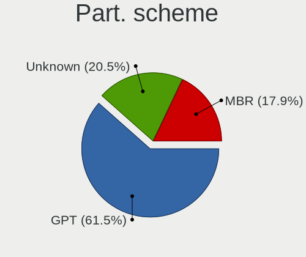
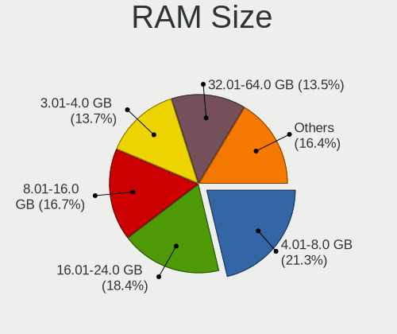
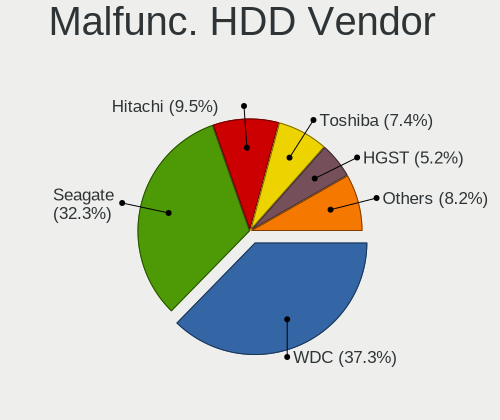
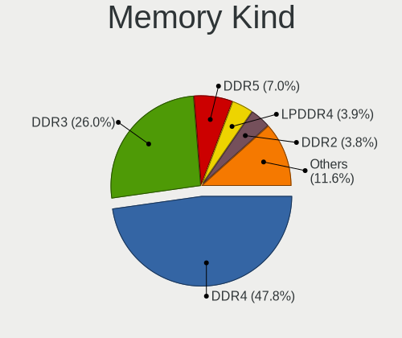
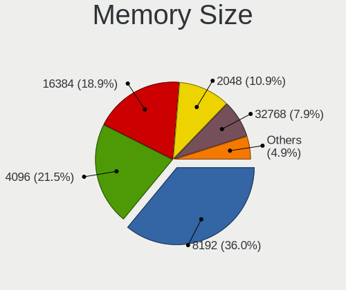
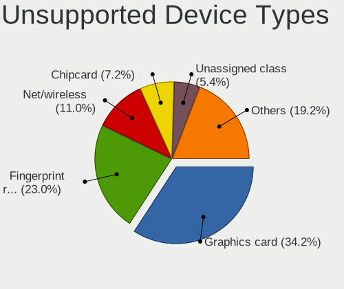

Debian 12 - Tested Hardware & Statistics
----------------------------------------

A project to collect tested hardware configurations for Debian 12.

Anyone can contribute to this report by the [hw-probe](https://github.com/linuxhw/hw-probe) tool:

    sudo -E hw-probe -all -upload

Please contribute! Especially if your hardware is rare.

This is a report for all computer types. See also reports for [desktops](/Dist/Debian_12/Desktop/README.md) and [notebooks](/Dist/Debian_12/Notebook/README.md).

Contents
--------

* [ Test Cases ](#test-cases)

* [ System ](#system)
  - [ Kernel                   ](#kernel)
  - [ Kernel Family            ](#kernel-family)
  - [ Kernel Major Ver.        ](#kernel-major-ver)
  - [ Arch                     ](#arch)
  - [ DE                       ](#de)
  - [ Display Server           ](#display-server)
  - [ Display Manager          ](#display-manager)
  - [ OS Lang                  ](#os-lang)
  - [ Boot Mode                ](#boot-mode)
  - [ Filesystem               ](#filesystem)
  - [ Part. scheme             ](#part-scheme)
  - [ Dual Boot with Linux/BSD ](#dual-boot-with-linuxbsd)
  - [ Dual Boot (Win)          ](#dual-boot-win)

* [ Board ](#board)
  - [ Vendor                   ](#vendor)
  - [ Model                    ](#model)
  - [ Model Family             ](#model-family)
  - [ MFG Year                 ](#mfg-year)
  - [ Form Factor              ](#form-factor)
  - [ Secure Boot              ](#secure-boot)
  - [ Coreboot                 ](#coreboot)
  - [ RAM Size                 ](#ram-size)
  - [ RAM Used                 ](#ram-used)
  - [ Total Drives             ](#total-drives)
  - [ Has CD-ROM               ](#has-cd-rom)
  - [ Has Ethernet             ](#has-ethernet)
  - [ Has WiFi                 ](#has-wifi)
  - [ Has Bluetooth            ](#has-bluetooth)

* [ Location ](#location)
  - [ Country                  ](#country)
  - [ City                     ](#city)

* [ Drives ](#drives)
  - [ Drive Vendor             ](#drive-vendor)
  - [ Drive Model              ](#drive-model)
  - [ HDD Vendor               ](#hdd-vendor)
  - [ SSD Vendor               ](#ssd-vendor)
  - [ Drive Kind               ](#drive-kind)
  - [ Drive Connector          ](#drive-connector)
  - [ Drive Size               ](#drive-size)
  - [ Space Total              ](#space-total)
  - [ Space Used               ](#space-used)
  - [ Malfunc. Drives          ](#malfunc-drives)
  - [ Malfunc. Drive Vendor    ](#malfunc-drive-vendor)
  - [ Malfunc. HDD Vendor      ](#malfunc-hdd-vendor)
  - [ Malfunc. Drive Kind      ](#malfunc-drive-kind)
  - [ Failed Drives            ](#failed-drives)
  - [ Failed Drive Vendor      ](#failed-drive-vendor)
  - [ Drive Status             ](#drive-status)

* [ Storage controller ](#storage-controller)
  - [ Storage Vendor           ](#storage-vendor)
  - [ Storage Model            ](#storage-model)
  - [ Storage Kind             ](#storage-kind)

* [ Processor ](#processor)
  - [ CPU Vendor               ](#cpu-vendor)
  - [ CPU Model                ](#cpu-model)
  - [ CPU Model Family         ](#cpu-model-family)
  - [ CPU Cores                ](#cpu-cores)
  - [ CPU Sockets              ](#cpu-sockets)
  - [ CPU Threads              ](#cpu-threads)
  - [ CPU Op-Modes             ](#cpu-op-modes)
  - [ CPU Microcode            ](#cpu-microcode)
  - [ CPU Microarch            ](#cpu-microarch)

* [ Graphics ](#graphics)
  - [ GPU Vendor               ](#gpu-vendor)
  - [ GPU Model                ](#gpu-model)
  - [ GPU Combo                ](#gpu-combo)
  - [ GPU Driver               ](#gpu-driver)
  - [ GPU Memory               ](#gpu-memory)

* [ Monitor ](#monitor)
  - [ Monitor Vendor           ](#monitor-vendor)
  - [ Monitor Model            ](#monitor-model)
  - [ Monitor Resolution       ](#monitor-resolution)
  - [ Monitor Diagonal         ](#monitor-diagonal)
  - [ Monitor Width            ](#monitor-width)
  - [ Aspect Ratio             ](#aspect-ratio)
  - [ Monitor Area             ](#monitor-area)
  - [ Pixel Density            ](#pixel-density)
  - [ Multiple Monitors        ](#multiple-monitors)

* [ Network ](#network)
  - [ Net Controller Vendor    ](#net-controller-vendor)
  - [ Net Controller Model     ](#net-controller-model)
  - [ Wireless Vendor          ](#wireless-vendor)
  - [ Wireless Model           ](#wireless-model)
  - [ Ethernet Vendor          ](#ethernet-vendor)
  - [ Ethernet Model           ](#ethernet-model)
  - [ Net Controller Kind      ](#net-controller-kind)
  - [ Used Controller          ](#used-controller)
  - [ NICs                     ](#nics)
  - [ IPv6                     ](#ipv6)

* [ Bluetooth ](#bluetooth)
  - [ Bluetooth Vendor         ](#bluetooth-vendor)
  - [ Bluetooth Model          ](#bluetooth-model)

* [ Sound ](#sound)
  - [ Sound Vendor             ](#sound-vendor)
  - [ Sound Model              ](#sound-model)

* [ Memory ](#memory)
  - [ Memory Vendor            ](#memory-vendor)
  - [ Memory Model             ](#memory-model)
  - [ Memory Kind              ](#memory-kind)
  - [ Memory Form Factor       ](#memory-form-factor)
  - [ Memory Size              ](#memory-size)
  - [ Memory Speed             ](#memory-speed)

* [ Printers & scanners ](#printers--scanners)
  - [ Printer Vendor           ](#printer-vendor)
  - [ Printer Model            ](#printer-model)
  - [ Scanner Vendor           ](#scanner-vendor)
  - [ Scanner Model            ](#scanner-model)

* [ Camera ](#camera)
  - [ Camera Vendor            ](#camera-vendor)
  - [ Camera Model             ](#camera-model)

* [ Security ](#security)
  - [ Fingerprint Vendor       ](#fingerprint-vendor)
  - [ Fingerprint Model        ](#fingerprint-model)
  - [ Chipcard Vendor          ](#chipcard-vendor)
  - [ Chipcard Model           ](#chipcard-model)

* [ Unsupported ](#unsupported)
  - [ Unsupported Devices      ](#unsupported-devices)
  - [ Unsupported Device Types ](#unsupported-device-types)

Test Cases
----------

Total: 3864

| Vendor        | Model                       | Form-Factor | Probe                                                      | Date         |
|---------------|-----------------------------|-------------|------------------------------------------------------------|--------------|
| ASUSTek       | P7P55D-E                    | Desktop     | [7173101a68](https://linux-hardware.org/?probe=7173101a68) | Feb 02, 2024 |
| Sapphire      | PI-AM3RS760G2               | Desktop     | [9b2e938cb4](https://linux-hardware.org/?probe=9b2e938cb4) | Feb 02, 2024 |
| HP            | ProLiant DL360 Gen9         | Server      | [d71cef49ca](https://linux-hardware.org/?probe=d71cef49ca) | Feb 02, 2024 |
| Gigabyte      | B560M H                     | Desktop     | [84e64db583](https://linux-hardware.org/?probe=84e64db583) | Feb 02, 2024 |
| Lenovo        | ThinkPad E595 20NF0005IX    | Notebook    | [171aaf5d57](https://linux-hardware.org/?probe=171aaf5d57) | Feb 02, 2024 |
| ASRock        | 990FX Extreme4              | Desktop     | [b412a671e4](https://linux-hardware.org/?probe=b412a671e4) | Feb 02, 2024 |
| Lenovo        | ThinkPad E595 20NF0005IX    | Notebook    | [c834e4941b](https://linux-hardware.org/?probe=c834e4941b) | Feb 02, 2024 |
| ASUSTek       | N56VZ                       | Notebook    | [2209fe1372](https://linux-hardware.org/?probe=2209fe1372) | Feb 02, 2024 |
| HP            | 1998                        | Desktop     | [0056c33526](https://linux-hardware.org/?probe=0056c33526) | Feb 02, 2024 |
| Lenovo        | Yoga 6 13ALC6 82ND          | Convertible | [2eec21d0eb](https://linux-hardware.org/?probe=2eec21d0eb) | Feb 02, 2024 |
| Dell          | 0PV3YR A05                  | Server      | [25e7def18b](https://linux-hardware.org/?probe=25e7def18b) | Feb 02, 2024 |
| MSI           | Raider GE68HX 13VF          | Notebook    | [72ac680d91](https://linux-hardware.org/?probe=72ac680d91) | Feb 02, 2024 |
| Lenovo        | SHARKBAY NOK                | Desktop     | [f4caef7bf1](https://linux-hardware.org/?probe=f4caef7bf1) | Feb 02, 2024 |
| HP            | EliteBook 2570p             | Notebook    | [59778f5513](https://linux-hardware.org/?probe=59778f5513) | Feb 02, 2024 |
| Apple         | MacBookAir7,2               | Notebook    | [632421d681](https://linux-hardware.org/?probe=632421d681) | Feb 01, 2024 |
| ASUSTek       | K54C                        | Notebook    | [59e4e733f0](https://linux-hardware.org/?probe=59e4e733f0) | Feb 01, 2024 |
| Lenovo        | 3330 NOK                    | Mini pc     | [c925201205](https://linux-hardware.org/?probe=c925201205) | Feb 01, 2024 |
| Acer          | Aspire 7740                 | Notebook    | [a329ef6c37](https://linux-hardware.org/?probe=a329ef6c37) | Feb 01, 2024 |
| Lenovo        | V17 G4 IRU 83A2             | Notebook    | [f33e772962](https://linux-hardware.org/?probe=f33e772962) | Feb 01, 2024 |
| Dell          | 0G214D A00                  | Desktop     | [2973076de3](https://linux-hardware.org/?probe=2973076de3) | Feb 01, 2024 |
| Acer          | Aspire A515-56              | Notebook    | [5599d65127](https://linux-hardware.org/?probe=5599d65127) | Feb 01, 2024 |
| HP            | Pavilion Notebook           | Notebook    | [397f03250d](https://linux-hardware.org/?probe=397f03250d) | Feb 01, 2024 |
| Panasonic     | CF-54-2                     | Notebook    | [7758f322a6](https://linux-hardware.org/?probe=7758f322a6) | Feb 01, 2024 |
| HP            | Pavilion dv4                | Notebook    | [09400a55bb](https://linux-hardware.org/?probe=09400a55bb) | Feb 01, 2024 |
| Dell          | 0PV3YR A05                  | Server      | [58467e737b](https://linux-hardware.org/?probe=58467e737b) | Feb 01, 2024 |
| Supermicro    | H11SSL-i                    | Server      | [2bc6c0e61b](https://linux-hardware.org/?probe=2bc6c0e61b) | Feb 01, 2024 |
| Lenovo        | Flex 2-14 20404             | Notebook    | [b2d8a38af3](https://linux-hardware.org/?probe=b2d8a38af3) | Feb 01, 2024 |
| Supermicro    | H11SSL-i                    | Server      | [a588d3636b](https://linux-hardware.org/?probe=a588d3636b) | Jan 31, 2024 |
| Raspberry ... | Raspberry Pi 4 Model B R... | Soc         | [0f7b0cced4](https://linux-hardware.org/?probe=0f7b0cced4) | Jan 31, 2024 |
| Lenovo        | ThinkPad 13 2nd Gen 20J1... | Notebook    | [7f20bd79c9](https://linux-hardware.org/?probe=7f20bd79c9) | Jan 31, 2024 |
| Unknown       | Unknown                     | Notebook    | [13b20f5383](https://linux-hardware.org/?probe=13b20f5383) | Jan 31, 2024 |
| Lenovo        | ThinkCentre M55p 8808D8U    | Desktop     | [763dd9417b](https://linux-hardware.org/?probe=763dd9417b) | Jan 31, 2024 |
| HP            | EliteBook 2570p             | Notebook    | [7d98ca3c90](https://linux-hardware.org/?probe=7d98ca3c90) | Jan 31, 2024 |
| Gigabyte      | B85M-D3H                    | Desktop     | [059252dc92](https://linux-hardware.org/?probe=059252dc92) | Jan 31, 2024 |
| HP            | ProBook 4510s               | Notebook    | [2982cc0a30](https://linux-hardware.org/?probe=2982cc0a30) | Jan 31, 2024 |
| Dell          | 018D1Y A00                  | Desktop     | [28a3a41219](https://linux-hardware.org/?probe=28a3a41219) | Jan 31, 2024 |
| HP            | Pavilion Laptop 15-eh1xx... | Notebook    | [d743247f69](https://linux-hardware.org/?probe=d743247f69) | Jan 31, 2024 |
| Supermicro    | X8DTH                       | Server      | [53d7109f48](https://linux-hardware.org/?probe=53d7109f48) | Jan 31, 2024 |
| HP            | Elite x360 830 13 inch G... | Convertible | [d8081ec509](https://linux-hardware.org/?probe=d8081ec509) | Jan 31, 2024 |
| Unknown       | T3 MRD                      | Desktop     | [744984b9d3](https://linux-hardware.org/?probe=744984b9d3) | Jan 31, 2024 |
| ASUSTek       | PRIME A320M-K               | Desktop     | [348cad0405](https://linux-hardware.org/?probe=348cad0405) | Jan 31, 2024 |
| MSI           | H110M PRO-VD                | Desktop     | [29fd183b3b](https://linux-hardware.org/?probe=29fd183b3b) | Jan 31, 2024 |
| ASRock        | A520M-HDV                   | Desktop     | [fa42ae183a](https://linux-hardware.org/?probe=fa42ae183a) | Jan 31, 2024 |
| Rockchip      | RK3318 BOX                  | Soc         | [38bcbeddee](https://linux-hardware.org/?probe=38bcbeddee) | Jan 31, 2024 |
| Dell          | 0PV3YR A05                  | Server      | [399221e733](https://linux-hardware.org/?probe=399221e733) | Jan 31, 2024 |
| ASRock        | A520M-HDV                   | Desktop     | [23be9724fe](https://linux-hardware.org/?probe=23be9724fe) | Jan 31, 2024 |
| ASUSTek       | Z10PE-D16 WS                | Server      | [3cb0e7e907](https://linux-hardware.org/?probe=3cb0e7e907) | Jan 30, 2024 |
| Lenovo        | Yoga 900-13ISK 80MK         | Notebook    | [c5e686c940](https://linux-hardware.org/?probe=c5e686c940) | Jan 30, 2024 |
| Apple         | MacBookPro9,1               | Notebook    | [741671df2c](https://linux-hardware.org/?probe=741671df2c) | Jan 30, 2024 |
| HP            | 1495                        | Desktop     | [a2017adb28](https://linux-hardware.org/?probe=a2017adb28) | Jan 30, 2024 |
| Lenovo        | ThinkPad L13 Yoga Gen 2 ... | Convertible | [510407768d](https://linux-hardware.org/?probe=510407768d) | Jan 30, 2024 |
| ASUSTek       | B85M-E/BR                   | Desktop     | [d3a20c90d1](https://linux-hardware.org/?probe=d3a20c90d1) | Jan 30, 2024 |
| Raspberry ... | Raspberry Pi 5 Model B R... | Soc         | [88ff9ffee3](https://linux-hardware.org/?probe=88ff9ffee3) | Jan 30, 2024 |
| Raspberry ... | Raspberry Pi 4 Model B R... | Soc         | [a214537a22](https://linux-hardware.org/?probe=a214537a22) | Jan 30, 2024 |
| ASRock        | 990FX Extreme4              | Desktop     | [dbb897d3e1](https://linux-hardware.org/?probe=dbb897d3e1) | Jan 30, 2024 |
| OriginPC      | EVO16-S                     | Notebook    | [6d96755039](https://linux-hardware.org/?probe=6d96755039) | Jan 30, 2024 |
| Raspberry ... | Raspberry Pi 5 Model B R... | Soc         | [f47e169ab1](https://linux-hardware.org/?probe=f47e169ab1) | Jan 30, 2024 |
| Dell          | 0XDN97 A06                  | Server      | [50ae98a42d](https://linux-hardware.org/?probe=50ae98a42d) | Jan 30, 2024 |
| Dell          | 0X3D66 A02                  | Server      | [9e355872f9](https://linux-hardware.org/?probe=9e355872f9) | Jan 30, 2024 |
| Dell          | 082F9M A00                  | Server      | [ab607bac6c](https://linux-hardware.org/?probe=ab607bac6c) | Jan 30, 2024 |
| Gigabyte      | B550M AORUS ELITE           | Desktop     | [e5435a9682](https://linux-hardware.org/?probe=e5435a9682) | Jan 30, 2024 |
| Dell          | 0D4MD1 A00                  | Desktop     | [9dd5ab2544](https://linux-hardware.org/?probe=9dd5ab2544) | Jan 30, 2024 |
| Lenovo        | SHARKBAY 0B98401 PRO        | Desktop     | [141329c8f3](https://linux-hardware.org/?probe=141329c8f3) | Jan 29, 2024 |
| Medion        | E15423                      | Notebook    | [2d39a42a0a](https://linux-hardware.org/?probe=2d39a42a0a) | Jan 29, 2024 |
| Dell          | XPS 9315                    | Notebook    | [c705e51d0e](https://linux-hardware.org/?probe=c705e51d0e) | Jan 29, 2024 |
| HUAWEI        | KPRC-WX0                    | Notebook    | [dea81917ae](https://linux-hardware.org/?probe=dea81917ae) | Jan 29, 2024 |
| Lenovo        | ThinkPad L13 Yoga Gen 2 ... | Convertible | [9ecf3a5292](https://linux-hardware.org/?probe=9ecf3a5292) | Jan 29, 2024 |
| Huanan        | X99-4MF V1.0                | Desktop     | [63f228ae04](https://linux-hardware.org/?probe=63f228ae04) | Jan 29, 2024 |
| Acer          | Aspire A315-58              | Notebook    | [c1af8d7ca2](https://linux-hardware.org/?probe=c1af8d7ca2) | Jan 29, 2024 |
| Dell          | XPS 9315                    | Notebook    | [9beaeed93b](https://linux-hardware.org/?probe=9beaeed93b) | Jan 29, 2024 |
| Radxa         | ROCK Pi 4B                  | Soc         | [b1450de77f](https://linux-hardware.org/?probe=b1450de77f) | Jan 29, 2024 |
| Apple         | MacBookPro5,4               | Notebook    | [c16bc8a6c2](https://linux-hardware.org/?probe=c16bc8a6c2) | Jan 29, 2024 |
| Shenzhen M... | F6BFC                       | Desktop     | [3ecbf7ef23](https://linux-hardware.org/?probe=3ecbf7ef23) | Jan 29, 2024 |
| ASRock        | X300TM-ITX                  | Desktop     | [c3277a6c4c](https://linux-hardware.org/?probe=c3277a6c4c) | Jan 29, 2024 |
| MSI           | MS-7060                     | Desktop     | [cfc1584314](https://linux-hardware.org/?probe=cfc1584314) | Jan 29, 2024 |
| HP            | ENVY x360 Convertible 13... | Convertible | [dda9e159b9](https://linux-hardware.org/?probe=dda9e159b9) | Jan 29, 2024 |
| Rockchip      | RK3318 BOX                  | Soc         | [d52d85d882](https://linux-hardware.org/?probe=d52d85d882) | Jan 29, 2024 |
| HP            | 1495                        | Desktop     | [2bf6b5d794](https://linux-hardware.org/?probe=2bf6b5d794) | Jan 28, 2024 |
| HP            | ProLiant DL385p Gen8        | Server      | [c6ad62b067](https://linux-hardware.org/?probe=c6ad62b067) | Jan 28, 2024 |
| HP            | ProLiant DL380 G6           | Server      | [05b7c13538](https://linux-hardware.org/?probe=05b7c13538) | Jan 28, 2024 |
| Lenovo        | IdeaPad P585 20181          | Notebook    | [d54756c11a](https://linux-hardware.org/?probe=d54756c11a) | Jan 28, 2024 |
| Intel         | DX58SO AAE29331-503         | Desktop     | [57959fa365](https://linux-hardware.org/?probe=57959fa365) | Jan 28, 2024 |
| ASUSTek       | PRIME X570-P                | Desktop     | [0b1a4a9d6c](https://linux-hardware.org/?probe=0b1a4a9d6c) | Jan 28, 2024 |
| Lenovo        | ThinkPad T480 20L6S4T80H    | Notebook    | [cb5f6705aa](https://linux-hardware.org/?probe=cb5f6705aa) | Jan 28, 2024 |
| Dell          | G3 3590                     | Notebook    | [7fb3fcb32c](https://linux-hardware.org/?probe=7fb3fcb32c) | Jan 28, 2024 |
| ASUSTek       | Z97-K                       | Desktop     | [777446f160](https://linux-hardware.org/?probe=777446f160) | Jan 28, 2024 |
| Gateway       | DS10G                       | Desktop     | [869339de12](https://linux-hardware.org/?probe=869339de12) | Jan 28, 2024 |
| HP            | Laptop 15z-ef3xxx           | Notebook    | [bde6b1bdd9](https://linux-hardware.org/?probe=bde6b1bdd9) | Jan 28, 2024 |
| Unknown       | Unknown                     | Desktop     | [52ae8cfe76](https://linux-hardware.org/?probe=52ae8cfe76) | Jan 28, 2024 |
| Unknown       | Unknown                     | Desktop     | [1834dd7444](https://linux-hardware.org/?probe=1834dd7444) | Jan 28, 2024 |
| Unknown       | Phicomm N1                  | Soc         | [96a0dce3c6](https://linux-hardware.org/?probe=96a0dce3c6) | Jan 28, 2024 |
| Gigabyte      | H61M-D2-B3                  | Desktop     | [a177c22fb5](https://linux-hardware.org/?probe=a177c22fb5) | Jan 28, 2024 |
| Lenovo        | ThinkPad T490 20N3S5GP12    | Notebook    | [b0cc2bbbed](https://linux-hardware.org/?probe=b0cc2bbbed) | Jan 28, 2024 |
| HP            | 21EF                        | Desktop     | [9fcfe8d663](https://linux-hardware.org/?probe=9fcfe8d663) | Jan 28, 2024 |
| Lenovo        | Yoga 6 13ALC7 82UD          | Convertible | [018e1f4232](https://linux-hardware.org/?probe=018e1f4232) | Jan 27, 2024 |
| ASUSTek       | TUF Gaming B450-PLUS II     | Desktop     | [08f64cc902](https://linux-hardware.org/?probe=08f64cc902) | Jan 27, 2024 |
| Medion        | Akoya P7628                 | Notebook    | [77cd29bced](https://linux-hardware.org/?probe=77cd29bced) | Jan 27, 2024 |
| Dell          | 042P49 A01                  | Desktop     | [c419b892e0](https://linux-hardware.org/?probe=c419b892e0) | Jan 27, 2024 |
| LG Electro... | 17Z90P-K.AA78A1             | Notebook    | [7280098d0c](https://linux-hardware.org/?probe=7280098d0c) | Jan 27, 2024 |
| Raspberry ... | Raspberry Pi 5 Model B R... | Soc         | [7f3a619e25](https://linux-hardware.org/?probe=7f3a619e25) | Jan 27, 2024 |
| ASUSTek       | TUF Gaming B450-PLUS II     | Desktop     | [a6240580d2](https://linux-hardware.org/?probe=a6240580d2) | Jan 27, 2024 |
| Raspberry ... | Raspberry Pi 4 Model B R... | Soc         | [e20cfe6ad1](https://linux-hardware.org/?probe=e20cfe6ad1) | Jan 27, 2024 |
| Apple         | Mac-27ADBB7B4CEE8E61 iMa... | All in one  | [b5fb647895](https://linux-hardware.org/?probe=b5fb647895) | Jan 27, 2024 |
| Biostar       | A10N-8800E                  | Desktop     | [6035efec56](https://linux-hardware.org/?probe=6035efec56) | Jan 27, 2024 |
| ASUSTek       | ROG STRIX B550-E GAMING     | Desktop     | [48d7c58756](https://linux-hardware.org/?probe=48d7c58756) | Jan 27, 2024 |
| Biostar       | A10N-8800E                  | Desktop     | [9eab4dee46](https://linux-hardware.org/?probe=9eab4dee46) | Jan 27, 2024 |
| ASUSTek       | ROG STRIX B550-E GAMING     | Desktop     | [ff65cf66c3](https://linux-hardware.org/?probe=ff65cf66c3) | Jan 27, 2024 |
| Medion        | MS-7616                     | Desktop     | [3645021c62](https://linux-hardware.org/?probe=3645021c62) | Jan 27, 2024 |
| ASUSTek       | PN53-G                      | Mini pc     | [79b22a6e7b](https://linux-hardware.org/?probe=79b22a6e7b) | Jan 27, 2024 |
| ASUSTek       | ROG STRIX B450-F GAMING     | Desktop     | [f7b37dcead](https://linux-hardware.org/?probe=f7b37dcead) | Jan 27, 2024 |
| HC Technol... | HCAR5000-MI2                | Desktop     | [19a4048799](https://linux-hardware.org/?probe=19a4048799) | Jan 27, 2024 |
| Raspberry ... | Raspberry Pi 5 Model B R... | Soc         | [5e62a52683](https://linux-hardware.org/?probe=5e62a52683) | Jan 27, 2024 |
| Lenovo        | ThinkPad P14s Gen 1 20Y1... | Notebook    | [4b4af4b9b4](https://linux-hardware.org/?probe=4b4af4b9b4) | Jan 26, 2024 |
| Lenovo        | ThinkPad T530 2394EN6       | Notebook    | [4110faba77](https://linux-hardware.org/?probe=4110faba77) | Jan 26, 2024 |
| HP            | Pavilion Laptop 15-eh1xx... | Notebook    | [7423289dfa](https://linux-hardware.org/?probe=7423289dfa) | Jan 26, 2024 |
| MSI           | MPG B550 GAMING PLUS        | Desktop     | [fcdc8fc8e3](https://linux-hardware.org/?probe=fcdc8fc8e3) | Jan 26, 2024 |
| Intel         | S1200BTL E98681-352         | Server      | [93da2d648d](https://linux-hardware.org/?probe=93da2d648d) | Jan 26, 2024 |
| HP            | 15                          | Notebook    | [4bce029b1f](https://linux-hardware.org/?probe=4bce029b1f) | Jan 26, 2024 |
| ASUSTek       | Z87-C                       | Desktop     | [a63ba339e5](https://linux-hardware.org/?probe=a63ba339e5) | Jan 26, 2024 |
| ASUSTek       | PRIME X570-P                | Desktop     | [f0eb2463d7](https://linux-hardware.org/?probe=f0eb2463d7) | Jan 26, 2024 |
| ECS           | G31T-M9                     | Desktop     | [8af1e631e7](https://linux-hardware.org/?probe=8af1e631e7) | Jan 26, 2024 |
| MSI           | G31M3 V2                    | Desktop     | [b98a012c0e](https://linux-hardware.org/?probe=b98a012c0e) | Jan 26, 2024 |
| Gigabyte      | H81M-S2V                    | Desktop     | [42abec13ac](https://linux-hardware.org/?probe=42abec13ac) | Jan 26, 2024 |
| HP            | 2AAC                        | Desktop     | [d397b1b3b3](https://linux-hardware.org/?probe=d397b1b3b3) | Jan 26, 2024 |
| ASUSTek       | TUF Gaming B450-PLUS II     | Desktop     | [431bc1335a](https://linux-hardware.org/?probe=431bc1335a) | Jan 26, 2024 |
| HP            | Victus by Gaming Laptop ... | Notebook    | [313cd1cfba](https://linux-hardware.org/?probe=313cd1cfba) | Jan 26, 2024 |
| HP            | EliteBook 850 G7 Noteboo... | Notebook    | [7f749dfabf](https://linux-hardware.org/?probe=7f749dfabf) | Jan 26, 2024 |
| HP            | Victus by Gaming Laptop ... | Notebook    | [9a3ff54cf8](https://linux-hardware.org/?probe=9a3ff54cf8) | Jan 26, 2024 |
| ASUSTek       | PRIME B350-PLUS             | Desktop     | [c9df4c296f](https://linux-hardware.org/?probe=c9df4c296f) | Jan 26, 2024 |
| HP            | Spectre Notebook            | Notebook    | [e98f815ca2](https://linux-hardware.org/?probe=e98f815ca2) | Jan 26, 2024 |
| Dell          | Latitude D620               | Notebook    | [d46bb1fc6b](https://linux-hardware.org/?probe=d46bb1fc6b) | Jan 25, 2024 |
| ASRock        | 990FX Extreme4              | Desktop     | [80c0bacde5](https://linux-hardware.org/?probe=80c0bacde5) | Jan 25, 2024 |
| ASRock        | 990FX Extreme4              | Desktop     | [70a0ef842a](https://linux-hardware.org/?probe=70a0ef842a) | Jan 25, 2024 |
| Unknown       | Unknown                     | Desktop     | [a1cdf62b17](https://linux-hardware.org/?probe=a1cdf62b17) | Jan 25, 2024 |
| Google        | Bobba360                    | Notebook    | [a4c97c836d](https://linux-hardware.org/?probe=a4c97c836d) | Jan 25, 2024 |
| HP            | ProBook 645 G4              | Notebook    | [af6ac91f2a](https://linux-hardware.org/?probe=af6ac91f2a) | Jan 25, 2024 |
| Google        | Bobba360                    | Notebook    | [0b03c9a8f7](https://linux-hardware.org/?probe=0b03c9a8f7) | Jan 24, 2024 |
| Raspberry ... | Raspberry Pi 5 Model B R... | Soc         | [c81b352aed](https://linux-hardware.org/?probe=c81b352aed) | Jan 24, 2024 |
| Unknown       | Unknown                     | Desktop     | [a743ba7b8b](https://linux-hardware.org/?probe=a743ba7b8b) | Jan 24, 2024 |
| ECS           | G31T-M9                     | Desktop     | [87e9fbf4fd](https://linux-hardware.org/?probe=87e9fbf4fd) | Jan 24, 2024 |
| ASUSTek       | Z170 PRO GAMING             | Desktop     | [298f2d1380](https://linux-hardware.org/?probe=298f2d1380) | Jan 24, 2024 |
| ASRock        | G31M-GS                     | Desktop     | [8c46163f5c](https://linux-hardware.org/?probe=8c46163f5c) | Jan 24, 2024 |
| ASRock        | G31M-GS                     | Desktop     | [dbe6d0fdd4](https://linux-hardware.org/?probe=dbe6d0fdd4) | Jan 24, 2024 |
| Foxconn       | G33M03                      | Desktop     | [dd33710847](https://linux-hardware.org/?probe=dd33710847) | Jan 24, 2024 |
| ASUSTek       | P7H55-M LE                  | Desktop     | [a864af0be4](https://linux-hardware.org/?probe=a864af0be4) | Jan 24, 2024 |
| Gigabyte      | H55M-UD2H                   | Desktop     | [10c2d49a41](https://linux-hardware.org/?probe=10c2d49a41) | Jan 24, 2024 |
| Foxconn       | G33M03                      | Desktop     | [bd9087ac07](https://linux-hardware.org/?probe=bd9087ac07) | Jan 24, 2024 |
| ASUSTek       | H110M-R                     | Desktop     | [7ed41d411e](https://linux-hardware.org/?probe=7ed41d411e) | Jan 24, 2024 |
| Dell          | Vostro1710                  | Notebook    | [1fc84171b5](https://linux-hardware.org/?probe=1fc84171b5) | Jan 24, 2024 |
| ASUSTek       | P8H61-M LX3 PLUS R2.0       | Desktop     | [0dc2ae0570](https://linux-hardware.org/?probe=0dc2ae0570) | Jan 24, 2024 |
| MSI           | MAG Z790 TOMAHAWK WIFI      | Desktop     | [8b61369e83](https://linux-hardware.org/?probe=8b61369e83) | Jan 24, 2024 |
| Gigabyte      | H61M-S1                     | Desktop     | [b0ac9a9edd](https://linux-hardware.org/?probe=b0ac9a9edd) | Jan 24, 2024 |
| HP            | Pavilion dv9500             | Notebook    | [a2f58c7d83](https://linux-hardware.org/?probe=a2f58c7d83) | Jan 24, 2024 |
| HP            | Pavilion dv9500             | Notebook    | [6311362acc](https://linux-hardware.org/?probe=6311362acc) | Jan 24, 2024 |
| Lenovo        | ThinkPad T14 Gen 4 21HD0... | Notebook    | [ff7b63a668](https://linux-hardware.org/?probe=ff7b63a668) | Jan 23, 2024 |
| HP            | 158B                        | Desktop     | [d433cc30c0](https://linux-hardware.org/?probe=d433cc30c0) | Jan 23, 2024 |
| ASUSTek       | Pro WS 565-ACE              | Desktop     | [46ef259c25](https://linux-hardware.org/?probe=46ef259c25) | Jan 23, 2024 |
| ASUSTek       | ROG STRIX B560-A GAMING ... | Desktop     | [6887beeb2a](https://linux-hardware.org/?probe=6887beeb2a) | Jan 23, 2024 |
| Dell          | XPS 13 9360                 | Notebook    | [cf5a6036e8](https://linux-hardware.org/?probe=cf5a6036e8) | Jan 23, 2024 |
| ASUSTek       | M2N-E SLI                   | Desktop     | [113665efbe](https://linux-hardware.org/?probe=113665efbe) | Jan 23, 2024 |
| HP            | EliteBook 855 G8 Noteboo... | Notebook    | [c22fff0afb](https://linux-hardware.org/?probe=c22fff0afb) | Jan 23, 2024 |
| Gigabyte      | H61M-D2-B3                  | Desktop     | [a8315f32a0](https://linux-hardware.org/?probe=a8315f32a0) | Jan 23, 2024 |
| ASUSTek       | B150-PRO D3                 | Desktop     | [1f8cd5afac](https://linux-hardware.org/?probe=1f8cd5afac) | Jan 23, 2024 |
| Acer          | Aspire E5-575G              | Notebook    | [1523773c75](https://linux-hardware.org/?probe=1523773c75) | Jan 23, 2024 |
| HP            | 15                          | Notebook    | [7728ab654b](https://linux-hardware.org/?probe=7728ab654b) | Jan 23, 2024 |
| ASRock        | 990FX Extreme4              | Desktop     | [1a19df4d59](https://linux-hardware.org/?probe=1a19df4d59) | Jan 23, 2024 |
| Novatech      | C141EK3-CI3TX               | Notebook    | [72b4b6b3ff](https://linux-hardware.org/?probe=72b4b6b3ff) | Jan 23, 2024 |
| Lenovo        | IdeaPad 330-15IKB 81DE      | Notebook    | [7039b3ef95](https://linux-hardware.org/?probe=7039b3ef95) | Jan 23, 2024 |
| ASUSTek       | SABERTOOTH 990FX R2.0       | Desktop     | [70551a607e](https://linux-hardware.org/?probe=70551a607e) | Jan 23, 2024 |
| Lenovo        | ThinkPad X220 4290W4H       | Notebook    | [067daab9fb](https://linux-hardware.org/?probe=067daab9fb) | Jan 23, 2024 |
| Lenovo        | ThinkCentre M55p 8808D8U    | Desktop     | [f265beb810](https://linux-hardware.org/?probe=f265beb810) | Jan 22, 2024 |
| Intel         | DX58SO AAE29331-503         | Desktop     | [ed61279750](https://linux-hardware.org/?probe=ed61279750) | Jan 22, 2024 |
| Unknown       | Unknown                     | Notebook    | [b35ba11b64](https://linux-hardware.org/?probe=b35ba11b64) | Jan 22, 2024 |
| MSI           | MEG X570 ACE                | Desktop     | [85c7d79003](https://linux-hardware.org/?probe=85c7d79003) | Jan 22, 2024 |
| AZW           | SER V1.0                    | Mini pc     | [d0993fff77](https://linux-hardware.org/?probe=d0993fff77) | Jan 22, 2024 |
| ASUSTek       | J1800I-C                    | Desktop     | [6adb9446f3](https://linux-hardware.org/?probe=6adb9446f3) | Jan 22, 2024 |
| ASUSTek       | H81M-R                      | Desktop     | [dd7840e283](https://linux-hardware.org/?probe=dd7840e283) | Jan 22, 2024 |
| MSI           | MPG B460I GAMING EDGE WI... | Desktop     | [2449b6b678](https://linux-hardware.org/?probe=2449b6b678) | Jan 22, 2024 |
| Dell          | G3 3579                     | Notebook    | [994425af24](https://linux-hardware.org/?probe=994425af24) | Jan 22, 2024 |
| HC            | HCAR357-MI V1.0             | Desktop     | [1f15fb2119](https://linux-hardware.org/?probe=1f15fb2119) | Jan 22, 2024 |
| HP            | Pavilion g4                 | Notebook    | [1edc58a524](https://linux-hardware.org/?probe=1edc58a524) | Jan 22, 2024 |
| Acer          | Swift SF314-511             | Notebook    | [69ce4e086f](https://linux-hardware.org/?probe=69ce4e086f) | Jan 22, 2024 |
| Gigabyte      | B650 GAMING X AX V2         | Desktop     | [24555759ee](https://linux-hardware.org/?probe=24555759ee) | Jan 22, 2024 |
| MSI           | MS-B1711                    | Desktop     | [0949139f7e](https://linux-hardware.org/?probe=0949139f7e) | Jan 22, 2024 |
| HP            | Pavilion g4                 | Notebook    | [ecddd3e100](https://linux-hardware.org/?probe=ecddd3e100) | Jan 21, 2024 |
| MSI           | PRO B760M-P DDR4            | Desktop     | [75f120a935](https://linux-hardware.org/?probe=75f120a935) | Jan 21, 2024 |
| Dell          | 0H603H A01                  | Server      | [b213e7f803](https://linux-hardware.org/?probe=b213e7f803) | Jan 21, 2024 |
| HP            | ProBook 4740s               | Notebook    | [681810a3c1](https://linux-hardware.org/?probe=681810a3c1) | Jan 21, 2024 |
| ASRock        | 990FX Extreme4              | Desktop     | [5722aa300f](https://linux-hardware.org/?probe=5722aa300f) | Jan 21, 2024 |
| ASRock        | 990FX Extreme4              | Desktop     | [bc8248af06](https://linux-hardware.org/?probe=bc8248af06) | Jan 21, 2024 |
| Dell          | 0WCJNT A06                  | Server      | [f98fce82ef](https://linux-hardware.org/?probe=f98fce82ef) | Jan 21, 2024 |
| Lenovo        | ThinkPad T490 20N3SA9100    | Notebook    | [02efe357c0](https://linux-hardware.org/?probe=02efe357c0) | Jan 21, 2024 |
| Lenovo        | IdeaPad 3 15ALC6 82KU       | Notebook    | [53887e0fb9](https://linux-hardware.org/?probe=53887e0fb9) | Jan 21, 2024 |
| Gigabyte      | 945GZM-S2                   | Desktop     | [41c285445b](https://linux-hardware.org/?probe=41c285445b) | Jan 21, 2024 |
| Raspberry ... | Raspberry Pi 5 Model B R... | Soc         | [89d2162e7f](https://linux-hardware.org/?probe=89d2162e7f) | Jan 21, 2024 |
| ASRock        | 990FX Extreme4              | Desktop     | [17f186ad10](https://linux-hardware.org/?probe=17f186ad10) | Jan 20, 2024 |
| Lenovo        | ThinkBook 15 G2 ARE 20VG    | Notebook    | [5df8be927b](https://linux-hardware.org/?probe=5df8be927b) | Jan 20, 2024 |
| Acer          | Aspire 3050                 | Notebook    | [7231400f5d](https://linux-hardware.org/?probe=7231400f5d) | Jan 20, 2024 |
| Dell          | Inspiron 3583               | Notebook    | [e47c76af02](https://linux-hardware.org/?probe=e47c76af02) | Jan 20, 2024 |
| Gigabyte      | H110M-S2H-CF                | Desktop     | [d57cdb4371](https://linux-hardware.org/?probe=d57cdb4371) | Jan 20, 2024 |
| Lenovo        | IdeaPad 3 15IAU7 82RK       | Notebook    | [fa6a332180](https://linux-hardware.org/?probe=fa6a332180) | Jan 20, 2024 |
| Dell          | 0H603H A01                  | Server      | [c7aab10227](https://linux-hardware.org/?probe=c7aab10227) | Jan 20, 2024 |
| Apple         | MacBookAir7,2               | Notebook    | [336ae86aff](https://linux-hardware.org/?probe=336ae86aff) | Jan 20, 2024 |
| Apple         | MacBookAir7,2               | Notebook    | [e0591611fa](https://linux-hardware.org/?probe=e0591611fa) | Jan 20, 2024 |
| ASUSTek       | PRIME B450M-K               | Desktop     | [5e16786940](https://linux-hardware.org/?probe=5e16786940) | Jan 20, 2024 |
| Apple         | MacBookPro11,3              | Notebook    | [f129b719a5](https://linux-hardware.org/?probe=f129b719a5) | Jan 20, 2024 |
| IBM           | 830381U                     | Desktop     | [8af6dd9c05](https://linux-hardware.org/?probe=8af6dd9c05) | Jan 20, 2024 |
| Intel         | NUC13ANBi7 M89645-203       | Mini pc     | [eb11d352e9](https://linux-hardware.org/?probe=eb11d352e9) | Jan 20, 2024 |
| Panasonic     | CF-31ATAAX1M                | Notebook    | [f9cc94a1c9](https://linux-hardware.org/?probe=f9cc94a1c9) | Jan 19, 2024 |
| Google        | Reks                        | Notebook    | [03f2d33169](https://linux-hardware.org/?probe=03f2d33169) | Jan 19, 2024 |
| Lenovo        | ThinkPad T14 Gen 2i 20W1... | Notebook    | [c5644b867a](https://linux-hardware.org/?probe=c5644b867a) | Jan 19, 2024 |
| ASRock        | N100DC-ITX                  | Desktop     | [dbca9c4ba2](https://linux-hardware.org/?probe=dbca9c4ba2) | Jan 19, 2024 |
| Lenovo        | ThinkPad T14 Gen 2i 20W1... | Notebook    | [20e88d4383](https://linux-hardware.org/?probe=20e88d4383) | Jan 19, 2024 |
| ASUSTek       | TUF Z390-PLUS GAMING        | Desktop     | [a77218f826](https://linux-hardware.org/?probe=a77218f826) | Jan 19, 2024 |
| Gigabyte      | B250M-DS3H-CF               | Desktop     | [b4073d28df](https://linux-hardware.org/?probe=b4073d28df) | Jan 19, 2024 |
| ASUSTek       | Pro WS WRX80E-SAGE SE WI... | Desktop     | [e62243f63a](https://linux-hardware.org/?probe=e62243f63a) | Jan 19, 2024 |
| Intel         | DH77EB AAG39073-304         | Desktop     | [6c6bbd8cc8](https://linux-hardware.org/?probe=6c6bbd8cc8) | Jan 19, 2024 |
| Lenovo        | Yoga 7 16IAH7 82UF          | Convertible | [eaa4b4106c](https://linux-hardware.org/?probe=eaa4b4106c) | Jan 19, 2024 |
| Acer          | Aspire A515-43              | Notebook    | [2c2f4e8e3b](https://linux-hardware.org/?probe=2c2f4e8e3b) | Jan 19, 2024 |
| Lenovo        | Yoga 7 16IAH7 82UF          | Convertible | [b00ba2737e](https://linux-hardware.org/?probe=b00ba2737e) | Jan 19, 2024 |
| Dell          | 0YJMC0 A02                  | Desktop     | [6dcdea7ca2](https://linux-hardware.org/?probe=6dcdea7ca2) | Jan 19, 2024 |
| ASUSTek       | PN51-E1                     | Mini pc     | [e99a545f6b](https://linux-hardware.org/?probe=e99a545f6b) | Jan 19, 2024 |
| Medion        | S4216                       | Notebook    | [74fd2044d5](https://linux-hardware.org/?probe=74fd2044d5) | Jan 19, 2024 |
| ASUSTek       | Z170 PRO GAMING             | Desktop     | [d64ba116db](https://linux-hardware.org/?probe=d64ba116db) | Jan 19, 2024 |
| Lenovo        | ThinkPad T14 Gen 1 20UD0... | Notebook    | [9226bd619b](https://linux-hardware.org/?probe=9226bd619b) | Jan 19, 2024 |
| GTZS          | Unknown                     | Notebook    | [6b926d1595](https://linux-hardware.org/?probe=6b926d1595) | Jan 19, 2024 |
| Lenovo        | ThinkPad X230 23205XG       | Notebook    | [384ae6ddfb](https://linux-hardware.org/?probe=384ae6ddfb) | Jan 19, 2024 |
| Lenovo        | IdeaPad S410p 20296         | Notebook    | [cd1e18703e](https://linux-hardware.org/?probe=cd1e18703e) | Jan 19, 2024 |
| HP            | Laptop 14-dq1xxx            | Notebook    | [048c8842d1](https://linux-hardware.org/?probe=048c8842d1) | Jan 19, 2024 |
| Lenovo        | IdeaPad S410p 20296         | Notebook    | [f07c9d75f0](https://linux-hardware.org/?probe=f07c9d75f0) | Jan 18, 2024 |
| Fujitsu       | LIFEBOOK P771               | Notebook    | [47367bff01](https://linux-hardware.org/?probe=47367bff01) | Jan 18, 2024 |
| ASUSTek       | P5QL-CM                     | Desktop     | [a8adaf0c17](https://linux-hardware.org/?probe=a8adaf0c17) | Jan 18, 2024 |
| ASUSTek       | P5QL-CM                     | Desktop     | [26510e18f5](https://linux-hardware.org/?probe=26510e18f5) | Jan 18, 2024 |
| ASUSTek       | P5QL-CM                     | Desktop     | [4ca7c404f0](https://linux-hardware.org/?probe=4ca7c404f0) | Jan 18, 2024 |
| ASUSTek       | P5QL-CM                     | Desktop     | [a2967a1948](https://linux-hardware.org/?probe=a2967a1948) | Jan 18, 2024 |
| Gigabyte      | H610M H DDR4                | Desktop     | [1d9bce4a06](https://linux-hardware.org/?probe=1d9bce4a06) | Jan 18, 2024 |
| ASUSTek       | P5QL-CM                     | Desktop     | [a0c4c6c96a](https://linux-hardware.org/?probe=a0c4c6c96a) | Jan 18, 2024 |
| Apple         | MacBookPro6,2               | Notebook    | [d39ea787aa](https://linux-hardware.org/?probe=d39ea787aa) | Jan 18, 2024 |
| ASUSTek       | VivoBook_ASUSLaptop M350... | Notebook    | [187a8a84af](https://linux-hardware.org/?probe=187a8a84af) | Jan 18, 2024 |
| ASUSTek       | PRIME H310M-E               | Desktop     | [6674d084a8](https://linux-hardware.org/?probe=6674d084a8) | Jan 18, 2024 |
| Lenovo        | G50-45 80E3                 | Notebook    | [7fa6be7205](https://linux-hardware.org/?probe=7fa6be7205) | Jan 18, 2024 |
| Grandstrea... | T3 MRD                      | Desktop     | [21c38a3719](https://linux-hardware.org/?probe=21c38a3719) | Jan 18, 2024 |
| Medion        | Crawler E30e                | Notebook    | [537214d414](https://linux-hardware.org/?probe=537214d414) | Jan 18, 2024 |
| Medion        | Crawler E30e                | Notebook    | [76c56f06b5](https://linux-hardware.org/?probe=76c56f06b5) | Jan 18, 2024 |
| ASUSTek       | P5QL-CM                     | Desktop     | [900d299461](https://linux-hardware.org/?probe=900d299461) | Jan 18, 2024 |
| ASUSTek       | P5QL-CM                     | Desktop     | [56d6cc2713](https://linux-hardware.org/?probe=56d6cc2713) | Jan 18, 2024 |
| ASUSTek       | P5QL-CM                     | Desktop     | [3bc6ca5cba](https://linux-hardware.org/?probe=3bc6ca5cba) | Jan 18, 2024 |
| ASUSTek       | P5QL-CM                     | Desktop     | [a71b94ef53](https://linux-hardware.org/?probe=a71b94ef53) | Jan 18, 2024 |
| ASRock        | H61M                        | Desktop     | [653436b855](https://linux-hardware.org/?probe=653436b855) | Jan 18, 2024 |
| ASUSTek       | P5QL-CM                     | Desktop     | [01d717f8fc](https://linux-hardware.org/?probe=01d717f8fc) | Jan 18, 2024 |
| ASUSTek       | P5QL-CM                     | Desktop     | [12129124f0](https://linux-hardware.org/?probe=12129124f0) | Jan 18, 2024 |
| ASUSTek       | P5QL-CM                     | Desktop     | [6ebd6d855d](https://linux-hardware.org/?probe=6ebd6d855d) | Jan 18, 2024 |
| ASUSTek       | P5QL-CM                     | Desktop     | [362052b28a](https://linux-hardware.org/?probe=362052b28a) | Jan 18, 2024 |
| Lenovo        | G500 20236                  | Notebook    | [a0fdd98d15](https://linux-hardware.org/?probe=a0fdd98d15) | Jan 18, 2024 |
| OEM           | X79G                        | Desktop     | [992b83b632](https://linux-hardware.org/?probe=992b83b632) | Jan 18, 2024 |
| HP            | 1495                        | Desktop     | [0e16d785bc](https://linux-hardware.org/?probe=0e16d785bc) | Jan 18, 2024 |
| Intel         | NUC13ANBi7 M89645-203       | Mini pc     | [a2ddade589](https://linux-hardware.org/?probe=a2ddade589) | Jan 18, 2024 |
| ASUSTek       | ROG STRIX X670E-E GAMING... | Desktop     | [9cea75cc3c](https://linux-hardware.org/?probe=9cea75cc3c) | Jan 18, 2024 |
| Dell          | Inspiron N5010              | Notebook    | [d19deae8ea](https://linux-hardware.org/?probe=d19deae8ea) | Jan 18, 2024 |
| MSI           | PRO Z790-A WIFI             | Desktop     | [9c84b7f26a](https://linux-hardware.org/?probe=9c84b7f26a) | Jan 17, 2024 |
| HP            | 82A2                        | Desktop     | [2d14e52635](https://linux-hardware.org/?probe=2d14e52635) | Jan 17, 2024 |
| FriendlyEl... | NanoPi R5S                  | Soc         | [cabd5a1ac3](https://linux-hardware.org/?probe=cabd5a1ac3) | Jan 17, 2024 |
| SYWZ          | S210H Series                | Desktop     | [b918a28247](https://linux-hardware.org/?probe=b918a28247) | Jan 17, 2024 |
| Dell          | Latitude E6540              | Notebook    | [5f657f15c8](https://linux-hardware.org/?probe=5f657f15c8) | Jan 17, 2024 |
| ASUSTek       | K53U                        | Notebook    | [04cc25d38b](https://linux-hardware.org/?probe=04cc25d38b) | Jan 17, 2024 |
| Intel         | NUC7i3BNB J22859-303        | Mini pc     | [319dc86edc](https://linux-hardware.org/?probe=319dc86edc) | Jan 17, 2024 |
| ASUSTek       | PRIME H310M-R R2.0          | Desktop     | [2b7eda6458](https://linux-hardware.org/?probe=2b7eda6458) | Jan 17, 2024 |
| Aquarius      | NS585                       | Notebook    | [21185900ad](https://linux-hardware.org/?probe=21185900ad) | Jan 17, 2024 |
| ASRock        | 990FX Extreme4              | Desktop     | [99bcba4ae3](https://linux-hardware.org/?probe=99bcba4ae3) | Jan 17, 2024 |
| Monster       | ABRA A5 V16.6               | Notebook    | [181ed8314a](https://linux-hardware.org/?probe=181ed8314a) | Jan 17, 2024 |
| ASUSTek       | Zenbook UM3402YA_UM3402Y... | Notebook    | [acda9d9537](https://linux-hardware.org/?probe=acda9d9537) | Jan 17, 2024 |
| Intel         | DH77KC AAG39641-400         | Desktop     | [b9c3c9837d](https://linux-hardware.org/?probe=b9c3c9837d) | Jan 17, 2024 |
| Dell          | Latitude E6400              | Notebook    | [acde30b0c9](https://linux-hardware.org/?probe=acde30b0c9) | Jan 17, 2024 |
| IBM           | 830381U                     | Desktop     | [114d68f889](https://linux-hardware.org/?probe=114d68f889) | Jan 17, 2024 |
| Lenovo        | Legion Go 8APU1 83E1        | Tablet      | [0feec8d4cc](https://linux-hardware.org/?probe=0feec8d4cc) | Jan 17, 2024 |
| ASUSTek       | PRIME A320M-K               | Desktop     | [832ff6a79d](https://linux-hardware.org/?probe=832ff6a79d) | Jan 16, 2024 |
| ASUSTek       | N501VW                      | Notebook    | [958a5f9a29](https://linux-hardware.org/?probe=958a5f9a29) | Jan 16, 2024 |
| Lenovo        | IdeaPadFlex 5 14IRU8 82Y... | Convertible | [c9177a0874](https://linux-hardware.org/?probe=c9177a0874) | Jan 16, 2024 |
| Raspberry ... | Raspberry Pi 4 Model B R... | Soc         | [05f29e3449](https://linux-hardware.org/?probe=05f29e3449) | Jan 16, 2024 |
| Lenovo        | ThinkPad P15v Gen 3 21D8... | Notebook    | [bfbba978c3](https://linux-hardware.org/?probe=bfbba978c3) | Jan 16, 2024 |
| HP            | ProLiant ML310e Gen8 v2     | Desktop     | [75c345abd6](https://linux-hardware.org/?probe=75c345abd6) | Jan 16, 2024 |
| Supermicro    | H12SSL-CT                   | Server      | [ec270d0cfc](https://linux-hardware.org/?probe=ec270d0cfc) | Jan 16, 2024 |
| Lenovo        | ThinkPad T490 20N3S5XF01    | Notebook    | [cf4a861856](https://linux-hardware.org/?probe=cf4a861856) | Jan 16, 2024 |
| ASUSTek       | P5Q SE2                     | Desktop     | [e357bf8b25](https://linux-hardware.org/?probe=e357bf8b25) | Jan 16, 2024 |
| ASRock        | 990FX Extreme4              | Desktop     | [196ce97a62](https://linux-hardware.org/?probe=196ce97a62) | Jan 16, 2024 |
| Toshiba       | Satellite L40               | Notebook    | [f5e9dbe1c8](https://linux-hardware.org/?probe=f5e9dbe1c8) | Jan 16, 2024 |
| HP            | Laptop 15-da1xxx            | Notebook    | [cd726b3a5a](https://linux-hardware.org/?probe=cd726b3a5a) | Jan 15, 2024 |
| Dell          | XPS 15 9530                 | Notebook    | [61ade3f6d3](https://linux-hardware.org/?probe=61ade3f6d3) | Jan 15, 2024 |
| Gigabyte      | B560M DS3H V2               | Desktop     | [01f214a86d](https://linux-hardware.org/?probe=01f214a86d) | Jan 15, 2024 |
| ASRock        | 990FX Extreme4              | Desktop     | [bf7672b4a4](https://linux-hardware.org/?probe=bf7672b4a4) | Jan 15, 2024 |
| HP            | 8105                        | Desktop     | [003cac54c4](https://linux-hardware.org/?probe=003cac54c4) | Jan 15, 2024 |
| HP            | 8062                        | Desktop     | [58b81c8ab8](https://linux-hardware.org/?probe=58b81c8ab8) | Jan 15, 2024 |
| HP            | 8105                        | Desktop     | [36e0151976](https://linux-hardware.org/?probe=36e0151976) | Jan 15, 2024 |
| HP            | 8062                        | Desktop     | [9ff293cb06](https://linux-hardware.org/?probe=9ff293cb06) | Jan 15, 2024 |
| HP            | 8105                        | Desktop     | [2ee1b30f19](https://linux-hardware.org/?probe=2ee1b30f19) | Jan 15, 2024 |
| HP            | 8062                        | Desktop     | [64be9fb79c](https://linux-hardware.org/?probe=64be9fb79c) | Jan 15, 2024 |
| HP            | 8062                        | Desktop     | [502adc9396](https://linux-hardware.org/?probe=502adc9396) | Jan 15, 2024 |
| HP            | 8105                        | Desktop     | [142985ca4f](https://linux-hardware.org/?probe=142985ca4f) | Jan 15, 2024 |
| HP            | 8105                        | Desktop     | [aa402dfc3b](https://linux-hardware.org/?probe=aa402dfc3b) | Jan 15, 2024 |
| HP            | 8105                        | Desktop     | [f508c2b4c4](https://linux-hardware.org/?probe=f508c2b4c4) | Jan 15, 2024 |
| HP            | 8105                        | Desktop     | [eb9adb982e](https://linux-hardware.org/?probe=eb9adb982e) | Jan 15, 2024 |
| HP            | 8105                        | Desktop     | [fc6c21da40](https://linux-hardware.org/?probe=fc6c21da40) | Jan 15, 2024 |
| HP            | ProBook 450 15.6 inch G1... | Notebook    | [54ed51acbb](https://linux-hardware.org/?probe=54ed51acbb) | Jan 15, 2024 |
| Clevo         | M815P                       | Notebook    | [3ee9aaa992](https://linux-hardware.org/?probe=3ee9aaa992) | Jan 15, 2024 |
| Clevo         | M815P                       | Notebook    | [398ddcd746](https://linux-hardware.org/?probe=398ddcd746) | Jan 15, 2024 |
| Acer          | Swift SFX14-41G             | Notebook    | [947678b939](https://linux-hardware.org/?probe=947678b939) | Jan 15, 2024 |
| ASRock        | 990FX Extreme4              | Desktop     | [8a02dab1f4](https://linux-hardware.org/?probe=8a02dab1f4) | Jan 15, 2024 |
| COIN COMPU... | LUM580                      | Notebook    | [e9f6bacb29](https://linux-hardware.org/?probe=e9f6bacb29) | Jan 15, 2024 |
| HP            | Laptop 15s-du0xxx           | Notebook    | [530c5882b9](https://linux-hardware.org/?probe=530c5882b9) | Jan 15, 2024 |
| ASUSTek       | PRIME A320M-K               | Desktop     | [2ce7044dec](https://linux-hardware.org/?probe=2ce7044dec) | Jan 15, 2024 |
| Lenovo        | ThinkPad X230 Tablet 343... | Notebook    | [b1804aa7bc](https://linux-hardware.org/?probe=b1804aa7bc) | Jan 15, 2024 |
| Dell          | 09CGW2 A08                  | Server      | [017c48fd55](https://linux-hardware.org/?probe=017c48fd55) | Jan 14, 2024 |
| Dell          | 09CGW2 A08                  | Server      | [39383a063d](https://linux-hardware.org/?probe=39383a063d) | Jan 14, 2024 |
| Lenovo        | ThinkPad 13 2nd Gen 20J1... | Notebook    | [bdbb97ace1](https://linux-hardware.org/?probe=bdbb97ace1) | Jan 14, 2024 |
| Acer          | Aspire A515-43              | Notebook    | [9bec25152a](https://linux-hardware.org/?probe=9bec25152a) | Jan 14, 2024 |
| AZW           | EQ MINI 10                  | Desktop     | [e702ea54ea](https://linux-hardware.org/?probe=e702ea54ea) | Jan 14, 2024 |
| T-bao Tian... | GOD78                       | Desktop     | [c2f6e2c9e1](https://linux-hardware.org/?probe=c2f6e2c9e1) | Jan 14, 2024 |
| ASRock        | 990FX Extreme4              | Desktop     | [cb5bd1f14f](https://linux-hardware.org/?probe=cb5bd1f14f) | Jan 14, 2024 |
| Apple         | MacBookPro11,1              | Notebook    | [e865dbe75e](https://linux-hardware.org/?probe=e865dbe75e) | Jan 14, 2024 |
| Raspberry ... | Raspberry Pi 5 Model B      | Soc         | [88453e89db](https://linux-hardware.org/?probe=88453e89db) | Jan 14, 2024 |
| Samsung       | R780                        | Notebook    | [68eae1df45](https://linux-hardware.org/?probe=68eae1df45) | Jan 14, 2024 |
| ASUSTek       | ET1610PT                    | Desktop     | [f71bcea580](https://linux-hardware.org/?probe=f71bcea580) | Jan 14, 2024 |
| Lenovo        | ThinkPad X280 20KESAC100    | Notebook    | [888ed5a8d8](https://linux-hardware.org/?probe=888ed5a8d8) | Jan 14, 2024 |
| ASRock        | 990FX Extreme4              | Desktop     | [439b30f633](https://linux-hardware.org/?probe=439b30f633) | Jan 14, 2024 |
| Lenovo        | ThinkPad T520 42406AG       | Notebook    | [df565d9a02](https://linux-hardware.org/?probe=df565d9a02) | Jan 14, 2024 |
| ASRock        | Z68 Extreme3 Gen3           | Desktop     | [9bc7ba0294](https://linux-hardware.org/?probe=9bc7ba0294) | Jan 14, 2024 |
| HUAWEI        | BOD-WXX9                    | Notebook    | [9000ce06e8](https://linux-hardware.org/?probe=9000ce06e8) | Jan 14, 2024 |
| Acer          | TravelMate P259-G2-M        | Notebook    | [24d3ae9a88](https://linux-hardware.org/?probe=24d3ae9a88) | Jan 14, 2024 |
| Positivo      | Mobile                      | Notebook    | [750ee7ae05](https://linux-hardware.org/?probe=750ee7ae05) | Jan 14, 2024 |
| Lenovo        | Yoga Pro 7 14IRH8 82Y7      | Notebook    | [55b05d17b6](https://linux-hardware.org/?probe=55b05d17b6) | Jan 14, 2024 |
| ASRock        | 990FX Extreme4              | Desktop     | [35533bf402](https://linux-hardware.org/?probe=35533bf402) | Jan 14, 2024 |
| ASRock        | 990FX Extreme4              | Desktop     | [783185e5af](https://linux-hardware.org/?probe=783185e5af) | Jan 13, 2024 |
| ASRock        | 990FX Extreme4              | Desktop     | [1742e2e526](https://linux-hardware.org/?probe=1742e2e526) | Jan 13, 2024 |
| ASUSTek       | X556UQK                     | Notebook    | [151b6ad9fb](https://linux-hardware.org/?probe=151b6ad9fb) | Jan 13, 2024 |
| Lenovo        | 312D NOK                    | Mini pc     | [cabe15fe5c](https://linux-hardware.org/?probe=cabe15fe5c) | Jan 13, 2024 |
| ASRock        | 990FX Extreme4              | Desktop     | [43ceb02173](https://linux-hardware.org/?probe=43ceb02173) | Jan 13, 2024 |
| Lenovo        | IdeaPad 100-15IBY 80MJ      | Notebook    | [6b6751dc04](https://linux-hardware.org/?probe=6b6751dc04) | Jan 13, 2024 |
| Gigabyte      | X570 AORUS XTREME           | Desktop     | [58771677c3](https://linux-hardware.org/?probe=58771677c3) | Jan 13, 2024 |
| Gigabyte      | B450M S2H                   | Desktop     | [f29e741e2b](https://linux-hardware.org/?probe=f29e741e2b) | Jan 13, 2024 |
| ASRock        | 990FX Extreme4              | Desktop     | [6adea77d15](https://linux-hardware.org/?probe=6adea77d15) | Jan 13, 2024 |
| Unknown       | Unknown                     | Soc         | [951b07d2a5](https://linux-hardware.org/?probe=951b07d2a5) | Jan 13, 2024 |
| Lenovo        | ThinkPad X220 4291QQ1       | Notebook    | [ad00b0ae02](https://linux-hardware.org/?probe=ad00b0ae02) | Jan 13, 2024 |
| TUXEDO        | Pulse 14 Gen3               | Notebook    | [5e82c88e53](https://linux-hardware.org/?probe=5e82c88e53) | Jan 12, 2024 |
| Biostar       | A320MH                      | Desktop     | [5bec64f55c](https://linux-hardware.org/?probe=5bec64f55c) | Jan 12, 2024 |
| Lenovo        | ThinkPad 13 2nd Gen 20J1... | Notebook    | [91a1cfb426](https://linux-hardware.org/?probe=91a1cfb426) | Jan 12, 2024 |
| HP            | ZBook 15                    | Notebook    | [390b667998](https://linux-hardware.org/?probe=390b667998) | Jan 12, 2024 |
| ASRock        | 990FX Extreme4              | Desktop     | [cde9d2553f](https://linux-hardware.org/?probe=cde9d2553f) | Jan 12, 2024 |
| Apple         | MacBookAir7,2               | Notebook    | [191e908130](https://linux-hardware.org/?probe=191e908130) | Jan 12, 2024 |
| Apple         | MacBookAir7,2               | Notebook    | [3d1d09a8cb](https://linux-hardware.org/?probe=3d1d09a8cb) | Jan 12, 2024 |
| Dell          | Precision 3581              | Notebook    | [07c4e8e9b5](https://linux-hardware.org/?probe=07c4e8e9b5) | Jan 12, 2024 |
| ASRock        | 990FX Extreme4              | Desktop     | [6c82d498ba](https://linux-hardware.org/?probe=6c82d498ba) | Jan 12, 2024 |
| Dell          | Precision 7560              | Notebook    | [c540ef8073](https://linux-hardware.org/?probe=c540ef8073) | Jan 12, 2024 |
| HP            | ZBook 15                    | Notebook    | [5649070333](https://linux-hardware.org/?probe=5649070333) | Jan 12, 2024 |
| MSI           | Alpha 17 C7VG               | Notebook    | [586cfee5f8](https://linux-hardware.org/?probe=586cfee5f8) | Jan 12, 2024 |
| Dell          | Inspiron 3593               | Notebook    | [60b15cb73b](https://linux-hardware.org/?probe=60b15cb73b) | Jan 12, 2024 |
| MSI           | H110M PRO-VD                | Desktop     | [10efa0c4e5](https://linux-hardware.org/?probe=10efa0c4e5) | Jan 12, 2024 |
| Acer          | Aspire 3050                 | Notebook    | [ed5a4cc94d](https://linux-hardware.org/?probe=ed5a4cc94d) | Jan 12, 2024 |
| Raspberry ... | Raspberry Pi 4 Model B R... | Soc         | [9daf5ba4ce](https://linux-hardware.org/?probe=9daf5ba4ce) | Jan 12, 2024 |
| Apple         | MacBookPro8,2               | Notebook    | [1637fa5ff8](https://linux-hardware.org/?probe=1637fa5ff8) | Jan 12, 2024 |
| Raspberry ... | Raspberry Pi 400 Rev 1.0    | Soc         | [a54906a2ea](https://linux-hardware.org/?probe=a54906a2ea) | Jan 12, 2024 |
| Apple         | MacBookPro8,2               | Notebook    | [5990a6e929](https://linux-hardware.org/?probe=5990a6e929) | Jan 12, 2024 |
| MSI           | X470 GAMING PLUS MAX        | Desktop     | [95c2b6739c](https://linux-hardware.org/?probe=95c2b6739c) | Jan 12, 2024 |
| Raspberry ... | Raspberry Pi 4 Model B R... | Soc         | [14074475e8](https://linux-hardware.org/?probe=14074475e8) | Jan 12, 2024 |
| ASUSTek       | PRIME B360M-A               | Desktop     | [5fb795a75b](https://linux-hardware.org/?probe=5fb795a75b) | Jan 12, 2024 |
| HP            | Laptop 15s-du0xxx           | Notebook    | [75a6760096](https://linux-hardware.org/?probe=75a6760096) | Jan 12, 2024 |
| Lenovo        | SHARKBAY NOK                | Desktop     | [1ece67bdd1](https://linux-hardware.org/?probe=1ece67bdd1) | Jan 12, 2024 |
| Dell          | 0XDN97 A06                  | Server      | [b9fa25d75a](https://linux-hardware.org/?probe=b9fa25d75a) | Jan 12, 2024 |
| Dell          | 0X3D66 A02                  | Server      | [6d5ec45578](https://linux-hardware.org/?probe=6d5ec45578) | Jan 11, 2024 |
| Dell          | XPS 13 9310                 | Notebook    | [5c6de2d4a2](https://linux-hardware.org/?probe=5c6de2d4a2) | Jan 11, 2024 |
| MSI           | MS-7318                     | Desktop     | [58f55e6bd3](https://linux-hardware.org/?probe=58f55e6bd3) | Jan 11, 2024 |
| Gigabyte      | H77N-WIFI                   | Desktop     | [aeb566949b](https://linux-hardware.org/?probe=aeb566949b) | Jan 11, 2024 |
| Rockchip      | RK3288 Asus Tinker Board... | Soc         | [37e9eaf244](https://linux-hardware.org/?probe=37e9eaf244) | Jan 11, 2024 |
| Gigabyte      | MFLP5IP-00                  | Desktop     | [82e2bfd859](https://linux-hardware.org/?probe=82e2bfd859) | Jan 11, 2024 |
| Pegatron      | C15B                        | Notebook    | [168aedbfba](https://linux-hardware.org/?probe=168aedbfba) | Jan 11, 2024 |
| HP            | ProLiant ML310e Gen8 v2     | Desktop     | [d6e4987996](https://linux-hardware.org/?probe=d6e4987996) | Jan 11, 2024 |
| Lenovo        | Yoga 900-13ISK 80MK         | Notebook    | [d1201e3b8f](https://linux-hardware.org/?probe=d1201e3b8f) | Jan 11, 2024 |
| Gigabyte      | GA-M56S-S3                  | Desktop     | [77af17feec](https://linux-hardware.org/?probe=77af17feec) | Jan 11, 2024 |
| Dell          | Latitude 7490               | Notebook    | [51cfb0b7ec](https://linux-hardware.org/?probe=51cfb0b7ec) | Jan 11, 2024 |
| Phoenix       | 945GM                       | Desktop     | [12f56a36d9](https://linux-hardware.org/?probe=12f56a36d9) | Jan 11, 2024 |
| Apple         | MacBookPro5,5               | Notebook    | [38c0ed167d](https://linux-hardware.org/?probe=38c0ed167d) | Jan 11, 2024 |
| Razer         | Blade Stealth               | Notebook    | [a8c542db2c](https://linux-hardware.org/?probe=a8c542db2c) | Jan 11, 2024 |
| MSI           | MS-B1711                    | Desktop     | [dc032b6456](https://linux-hardware.org/?probe=dc032b6456) | Jan 11, 2024 |
| HP            | 8767 A                      | Desktop     | [b8a28f8c5f](https://linux-hardware.org/?probe=b8a28f8c5f) | Jan 10, 2024 |
| Dell          | 072T6D A05                  | Server      | [081a7baae9](https://linux-hardware.org/?probe=081a7baae9) | Jan 10, 2024 |
| Gigabyte      | A520M K V2                  | Desktop     | [3485cdf9ff](https://linux-hardware.org/?probe=3485cdf9ff) | Jan 10, 2024 |
| HP            | EliteBook 745 G6            | Notebook    | [e7c4951a31](https://linux-hardware.org/?probe=e7c4951a31) | Jan 10, 2024 |
| HUAWEI        | KLVF-XX                     | Notebook    | [133633238b](https://linux-hardware.org/?probe=133633238b) | Jan 10, 2024 |
| ASRock        | 990FX Extreme4              | Desktop     | [975fff0a28](https://linux-hardware.org/?probe=975fff0a28) | Jan 10, 2024 |
| ASRock        | 990FX Extreme4              | Desktop     | [4d91095fa0](https://linux-hardware.org/?probe=4d91095fa0) | Jan 10, 2024 |
| Gigabyte      | A520M K V2                  | Desktop     | [2f7bb41141](https://linux-hardware.org/?probe=2f7bb41141) | Jan 10, 2024 |
| ASRock        | 990FX Extreme4              | Desktop     | [6909d543b0](https://linux-hardware.org/?probe=6909d543b0) | Jan 10, 2024 |
| Dell          | Latitude 5490               | Notebook    | [aa516822e2](https://linux-hardware.org/?probe=aa516822e2) | Jan 10, 2024 |
| Sony          | VPCSA2CFX                   | Notebook    | [d408905e99](https://linux-hardware.org/?probe=d408905e99) | Jan 10, 2024 |
| Medion        | MS-7616                     | Desktop     | [c8a2c8be49](https://linux-hardware.org/?probe=c8a2c8be49) | Jan 10, 2024 |
| Dell          | Latitude E6520              | Notebook    | [08e48552ea](https://linux-hardware.org/?probe=08e48552ea) | Jan 10, 2024 |
| Raspberry ... | Raspberry Pi 5 Model B R... | Soc         | [47166edf57](https://linux-hardware.org/?probe=47166edf57) | Jan 09, 2024 |
| Raspberry ... | Raspberry Pi 5 Model B R... | Soc         | [51572fb7b4](https://linux-hardware.org/?probe=51572fb7b4) | Jan 09, 2024 |
| Intel         | NUC11ATBC2 M53055-202       | Mini pc     | [bd58f02266](https://linux-hardware.org/?probe=bd58f02266) | Jan 09, 2024 |
| Dell          | Latitude 5440               | Notebook    | [6ab5039217](https://linux-hardware.org/?probe=6ab5039217) | Jan 09, 2024 |
| newplatfor... | NP-1008i.1                  | Desktop     | [3da4bb5017](https://linux-hardware.org/?probe=3da4bb5017) | Jan 09, 2024 |
| Sapphire      | PI-AM3RS760G2               | Desktop     | [e08d38f8a0](https://linux-hardware.org/?probe=e08d38f8a0) | Jan 09, 2024 |
| Aquarius      | NS585                       | Notebook    | [ad17f295fa](https://linux-hardware.org/?probe=ad17f295fa) | Jan 09, 2024 |
| Aquarius      | NS585                       | Notebook    | [c74d9cb486](https://linux-hardware.org/?probe=c74d9cb486) | Jan 09, 2024 |
| Aquarius      | NS585                       | Notebook    | [8710764b3b](https://linux-hardware.org/?probe=8710764b3b) | Jan 09, 2024 |
| Aquarius      | NS585                       | Notebook    | [23ec56d03f](https://linux-hardware.org/?probe=23ec56d03f) | Jan 09, 2024 |
| Aquarius      | NS585                       | Notebook    | [a9250fd152](https://linux-hardware.org/?probe=a9250fd152) | Jan 09, 2024 |
| Aquarius      | NS585                       | Notebook    | [f3090f70d2](https://linux-hardware.org/?probe=f3090f70d2) | Jan 09, 2024 |
| Aquarius      | NS585                       | Notebook    | [a167167f54](https://linux-hardware.org/?probe=a167167f54) | Jan 09, 2024 |
| ASRock        | 990FX Extreme4              | Desktop     | [a3fa43281d](https://linux-hardware.org/?probe=a3fa43281d) | Jan 09, 2024 |
| Aquarius      | NS585                       | Notebook    | [0d67b1f360](https://linux-hardware.org/?probe=0d67b1f360) | Jan 09, 2024 |
| Sony          | VPCSA2CFX                   | Notebook    | [1f326a66b0](https://linux-hardware.org/?probe=1f326a66b0) | Jan 09, 2024 |
| Google        | Blooguard                   | Notebook    | [18f4177827](https://linux-hardware.org/?probe=18f4177827) | Jan 09, 2024 |
| Intel         | X99H                        | Desktop     | [b0bb3cb105](https://linux-hardware.org/?probe=b0bb3cb105) | Jan 09, 2024 |
| Lenovo        | 332D NOK                    | Mini pc     | [df67911f36](https://linux-hardware.org/?probe=df67911f36) | Jan 09, 2024 |
| ASRock        | 990FX Extreme4              | Desktop     | [ddc21e0978](https://linux-hardware.org/?probe=ddc21e0978) | Jan 08, 2024 |
| Lenovo        | ThinkPad X260 20F5S6V200    | Notebook    | [421cb02ac3](https://linux-hardware.org/?probe=421cb02ac3) | Jan 08, 2024 |
| HP            | 8105                        | Desktop     | [ff8505bc17](https://linux-hardware.org/?probe=ff8505bc17) | Jan 08, 2024 |
| HP            | 8105                        | Desktop     | [7f6df56de0](https://linux-hardware.org/?probe=7f6df56de0) | Jan 08, 2024 |
| HP            | 8105                        | Desktop     | [bff2ea3f8f](https://linux-hardware.org/?probe=bff2ea3f8f) | Jan 08, 2024 |
| HP            | 8105                        | Desktop     | [ca99b2e20d](https://linux-hardware.org/?probe=ca99b2e20d) | Jan 08, 2024 |
| HP            | 8062                        | Desktop     | [4250f0bb2a](https://linux-hardware.org/?probe=4250f0bb2a) | Jan 08, 2024 |
| HP            | 8105                        | Desktop     | [4c3d033a45](https://linux-hardware.org/?probe=4c3d033a45) | Jan 08, 2024 |
| HP            | 8062                        | Desktop     | [2ed973c58e](https://linux-hardware.org/?probe=2ed973c58e) | Jan 08, 2024 |
| HP            | 8062                        | Desktop     | [d644042c15](https://linux-hardware.org/?probe=d644042c15) | Jan 08, 2024 |
| HP            | 8105                        | Desktop     | [e4afcbf22b](https://linux-hardware.org/?probe=e4afcbf22b) | Jan 08, 2024 |
| HP            | 8105                        | Desktop     | [86900314fe](https://linux-hardware.org/?probe=86900314fe) | Jan 08, 2024 |
| HP            | 8105                        | Desktop     | [5eacb006cf](https://linux-hardware.org/?probe=5eacb006cf) | Jan 08, 2024 |
| HP            | 8105                        | Desktop     | [5c691ff566](https://linux-hardware.org/?probe=5c691ff566) | Jan 08, 2024 |
| HP            | 8105                        | Desktop     | [a049370355](https://linux-hardware.org/?probe=a049370355) | Jan 08, 2024 |
| HP            | 8105                        | Desktop     | [98eef698ee](https://linux-hardware.org/?probe=98eef698ee) | Jan 08, 2024 |
| HP            | 8105                        | Desktop     | [6c13f7a773](https://linux-hardware.org/?probe=6c13f7a773) | Jan 08, 2024 |
| Shenzhen M... | F6BFC                       | Desktop     | [5b8c8357ea](https://linux-hardware.org/?probe=5b8c8357ea) | Jan 08, 2024 |
| Rockchip      | RK3318 BOX                  | Soc         | [38b73ab5a1](https://linux-hardware.org/?probe=38b73ab5a1) | Jan 08, 2024 |
| ASUSTek       | K42JK                       | Notebook    | [458158ebaf](https://linux-hardware.org/?probe=458158ebaf) | Jan 08, 2024 |
| HP            | Laptop 15-db0xxx            | Notebook    | [5de015033e](https://linux-hardware.org/?probe=5de015033e) | Jan 08, 2024 |
| Google        | Cave                        | Notebook    | [197a15aab2](https://linux-hardware.org/?probe=197a15aab2) | Jan 08, 2024 |
| ASRock        | 990FX Extreme4              | Desktop     | [40407d3445](https://linux-hardware.org/?probe=40407d3445) | Jan 08, 2024 |
| Toshiba       | Satellite C55-C             | Notebook    | [1c4c7bfa99](https://linux-hardware.org/?probe=1c4c7bfa99) | Jan 08, 2024 |
| Gigabyte      | 945GZM-S2                   | Desktop     | [931f2e4a0e](https://linux-hardware.org/?probe=931f2e4a0e) | Jan 08, 2024 |
| Dell          | Precision 5680              | Notebook    | [047734c28f](https://linux-hardware.org/?probe=047734c28f) | Jan 08, 2024 |
| HP            | Laptop 15-db0xxx            | Notebook    | [f9da9135c7](https://linux-hardware.org/?probe=f9da9135c7) | Jan 08, 2024 |
| Lenovo        | 3111 SDK0J40697 WIN 3305... | Mini pc     | [82b3dcb60a](https://linux-hardware.org/?probe=82b3dcb60a) | Jan 08, 2024 |
| Lenovo        | ThinkPad T14 Gen 3 21CF0... | Notebook    | [8d2846dc8e](https://linux-hardware.org/?probe=8d2846dc8e) | Jan 08, 2024 |
| Lenovo        | IdeaPad S340-15IWL 81N8     | Notebook    | [45b99e2412](https://linux-hardware.org/?probe=45b99e2412) | Jan 08, 2024 |
| Lenovo        | ThinkPad L15 Gen 3 21C30... | Notebook    | [41c3c041a9](https://linux-hardware.org/?probe=41c3c041a9) | Jan 07, 2024 |
| Apple         | Mac-35C5E08120C7EEAF Mac... | Mini pc     | [79755225b6](https://linux-hardware.org/?probe=79755225b6) | Jan 07, 2024 |
| ASUSTek       | PRIME X670-P WIFI           | Desktop     | [19d6b3732e](https://linux-hardware.org/?probe=19d6b3732e) | Jan 07, 2024 |
| ASRock        | B450 Pro4 R2.0              | Desktop     | [9729786ea6](https://linux-hardware.org/?probe=9729786ea6) | Jan 07, 2024 |
| Dell          | 0NK5PH A00                  | Desktop     | [6a6d55183a](https://linux-hardware.org/?probe=6a6d55183a) | Jan 07, 2024 |
| ASRock        | J5040-ITX                   | Desktop     | [2dc9e2367b](https://linux-hardware.org/?probe=2dc9e2367b) | Jan 07, 2024 |
| ASRock        | 990FX Extreme4              | Desktop     | [cb1ceea0b8](https://linux-hardware.org/?probe=cb1ceea0b8) | Jan 07, 2024 |
| ASRock        | 990FX Extreme4              | Desktop     | [ca81fd63fd](https://linux-hardware.org/?probe=ca81fd63fd) | Jan 07, 2024 |
| HP            | 82F2                        | Desktop     | [eaa0d60c1f](https://linux-hardware.org/?probe=eaa0d60c1f) | Jan 07, 2024 |
| HP            | ProLiant DL20 Gen9          | Server      | [b78e0fdb9f](https://linux-hardware.org/?probe=b78e0fdb9f) | Jan 07, 2024 |
| Sony          | SVF1521H1EW                 | Notebook    | [f73763fd0c](https://linux-hardware.org/?probe=f73763fd0c) | Jan 06, 2024 |
| newplatfor... | NP-1004i.1                  | Desktop     | [95788038c5](https://linux-hardware.org/?probe=95788038c5) | Jan 06, 2024 |
| Gateway       | NV57H                       | Notebook    | [65a76b3627](https://linux-hardware.org/?probe=65a76b3627) | Jan 06, 2024 |
| Intel         | NUC13ANBi7 M89645-203       | Mini pc     | [0bfac6ed12](https://linux-hardware.org/?probe=0bfac6ed12) | Jan 06, 2024 |
| Lenovo        | Legion 5 15IMH05H 81Y6      | Notebook    | [ddc660cbfb](https://linux-hardware.org/?probe=ddc660cbfb) | Jan 06, 2024 |
| Apple         | MacBookAir4,2               | Notebook    | [0f70d0e831](https://linux-hardware.org/?probe=0f70d0e831) | Jan 06, 2024 |
| HUAWEI        | HKFG-XX                     | Notebook    | [a90398b4f6](https://linux-hardware.org/?probe=a90398b4f6) | Jan 06, 2024 |
| ASUSTek       | PRIME B550M-K               | Desktop     | [7536a68c05](https://linux-hardware.org/?probe=7536a68c05) | Jan 06, 2024 |
| TUXEDO        | Aura 14 Gen3                | Notebook    | [eade03882d](https://linux-hardware.org/?probe=eade03882d) | Jan 06, 2024 |
| Dell          | Precision 5680              | Notebook    | [0d58e93f98](https://linux-hardware.org/?probe=0d58e93f98) | Jan 06, 2024 |
| Dell          | 0G919G A00                  | Desktop     | [29eda2d272](https://linux-hardware.org/?probe=29eda2d272) | Jan 06, 2024 |
| HP            | x2 Detachable 10-p0XX       | Tablet      | [b380a7aa65](https://linux-hardware.org/?probe=b380a7aa65) | Jan 06, 2024 |
| ASUSTek       | PRIME B650M-A WIFI II       | Desktop     | [a7c6792366](https://linux-hardware.org/?probe=a7c6792366) | Jan 05, 2024 |
| ASUSTek       | PRIME B650M-A WIFI II       | Desktop     | [bb1b5c33d2](https://linux-hardware.org/?probe=bb1b5c33d2) | Jan 05, 2024 |
| Dynabook      | Satellite Pro C40-G-109     | Notebook    | [0247395541](https://linux-hardware.org/?probe=0247395541) | Jan 05, 2024 |
| Sapphire      | PI-AM3RS760G2               | Desktop     | [c192611a71](https://linux-hardware.org/?probe=c192611a71) | Jan 05, 2024 |
| MSI           | Z590 PRO WIFI               | Desktop     | [4cec5133bd](https://linux-hardware.org/?probe=4cec5133bd) | Jan 05, 2024 |
| Raspberry ... | Raspberry Pi 5 Model B R... | Soc         | [555cd52c4c](https://linux-hardware.org/?probe=555cd52c4c) | Jan 05, 2024 |
| Dell          | XPS 15 9570                 | Notebook    | [090d0eae61](https://linux-hardware.org/?probe=090d0eae61) | Jan 05, 2024 |
| HP            | Pavilion dv7                | Notebook    | [2ecfa94f3b](https://linux-hardware.org/?probe=2ecfa94f3b) | Jan 05, 2024 |
| Thomson       | N17V3C8WH512                | Notebook    | [37fa4a2a98](https://linux-hardware.org/?probe=37fa4a2a98) | Jan 05, 2024 |
| ASRock        | 990FX Extreme4              | Desktop     | [c4f303d6a1](https://linux-hardware.org/?probe=c4f303d6a1) | Jan 05, 2024 |
| ASRock        | 990FX Extreme4              | Desktop     | [37999c37df](https://linux-hardware.org/?probe=37999c37df) | Jan 05, 2024 |
| ASRock        | 990FX Extreme4              | Desktop     | [1aec475668](https://linux-hardware.org/?probe=1aec475668) | Jan 05, 2024 |
| ASUSTek       | ROG STRIX B650E-F GAMING... | Desktop     | [05f8b32828](https://linux-hardware.org/?probe=05f8b32828) | Jan 05, 2024 |
| HP            | EliteBook 6930p             | Notebook    | [868c32afaa](https://linux-hardware.org/?probe=868c32afaa) | Jan 05, 2024 |
| Lenovo        | SHARKBAY SDK0E50510 WIN     | Desktop     | [fe773de97b](https://linux-hardware.org/?probe=fe773de97b) | Jan 05, 2024 |
| Raspberry ... | Raspberry Pi 400 Rev 1.0    | Soc         | [5c7a9c03df](https://linux-hardware.org/?probe=5c7a9c03df) | Jan 05, 2024 |
| Lenovo        | ThinkPad X390 Yoga 20NQS... | Convertible | [34c9582792](https://linux-hardware.org/?probe=34c9582792) | Jan 05, 2024 |
| Lenovo        | 14w Gen 2 82N9              | Notebook    | [0f5b96cfff](https://linux-hardware.org/?probe=0f5b96cfff) | Jan 05, 2024 |
| Apple         | Mac-F2238BAE iMac11,3       | All in one  | [2cf96ce326](https://linux-hardware.org/?probe=2cf96ce326) | Jan 05, 2024 |
| ASUSTek       | P553UJ                      | Notebook    | [6e0de808da](https://linux-hardware.org/?probe=6e0de808da) | Jan 05, 2024 |
| HP            | EliteBook 745 G3            | Notebook    | [ac230e7d9a](https://linux-hardware.org/?probe=ac230e7d9a) | Jan 04, 2024 |
| HP            | EliteBook 745 G3            | Notebook    | [c5209d0e41](https://linux-hardware.org/?probe=c5209d0e41) | Jan 04, 2024 |
| ASRock        | 990FX Extreme4              | Desktop     | [8e8ffbd00e](https://linux-hardware.org/?probe=8e8ffbd00e) | Jan 04, 2024 |
| Dell          | 0PU052                      | Desktop     | [06e3c796ba](https://linux-hardware.org/?probe=06e3c796ba) | Jan 04, 2024 |
| ASRock        | J5040-ITX                   | Desktop     | [18b422e05b](https://linux-hardware.org/?probe=18b422e05b) | Jan 04, 2024 |
| HP            | Mini 210-1000               | Notebook    | [ddd4183f45](https://linux-hardware.org/?probe=ddd4183f45) | Jan 04, 2024 |
| HP            | Mini 210-1000               | Notebook    | [65f80ec87f](https://linux-hardware.org/?probe=65f80ec87f) | Jan 04, 2024 |
| ASUSTek       | PRIME Z270-P                | Desktop     | [e4413dc480](https://linux-hardware.org/?probe=e4413dc480) | Jan 04, 2024 |
| Lenovo        | Yoga Pro 7 14APH8 82Y8      | Notebook    | [761431c40c](https://linux-hardware.org/?probe=761431c40c) | Jan 04, 2024 |
| Toshiba       | PORTEGE R30-A               | Notebook    | [8830dd30d3](https://linux-hardware.org/?probe=8830dd30d3) | Jan 04, 2024 |
| ASRock        | 990FX Extreme4              | Desktop     | [11efc6aeb2](https://linux-hardware.org/?probe=11efc6aeb2) | Jan 04, 2024 |
| Gigabyte      | B650 AORUS ELITE AX         | Desktop     | [74565d105e](https://linux-hardware.org/?probe=74565d105e) | Jan 04, 2024 |
| Gigabyte      | B650 AORUS ELITE AX         | Desktop     | [461cbd9fc4](https://linux-hardware.org/?probe=461cbd9fc4) | Jan 04, 2024 |
| Lenovo        | ThinkPad T14s Gen 3 21CQ... | Notebook    | [fbf70c614e](https://linux-hardware.org/?probe=fbf70c614e) | Jan 03, 2024 |
| HP            | Pavilion g6                 | Notebook    | [f1a54c438d](https://linux-hardware.org/?probe=f1a54c438d) | Jan 03, 2024 |
| ASUSTek       | 1015CX                      | Notebook    | [55d418530d](https://linux-hardware.org/?probe=55d418530d) | Jan 03, 2024 |
| TYAN Compu... | S8030GM2NE 5411T6180004     | Desktop     | [b8716bfb8f](https://linux-hardware.org/?probe=b8716bfb8f) | Jan 03, 2024 |
| HP            | Pavilion g6                 | Notebook    | [254ad76cac](https://linux-hardware.org/?probe=254ad76cac) | Jan 03, 2024 |
| Gowin Solu... | GW-MB-U01                   | Desktop     | [9cbf31ad86](https://linux-hardware.org/?probe=9cbf31ad86) | Jan 03, 2024 |
| ASUSTek       | PRIME B760-PLUS             | Desktop     | [59769c2318](https://linux-hardware.org/?probe=59769c2318) | Jan 03, 2024 |
| Lenovo        | ThinkBook 14 G4 IAP 21DH    | Notebook    | [f845df595a](https://linux-hardware.org/?probe=f845df595a) | Jan 03, 2024 |
| HP            | EliteBook 645 14 inch G1... | Notebook    | [c828174b3c](https://linux-hardware.org/?probe=c828174b3c) | Jan 03, 2024 |
| Lenovo        | IdeaPad 330S-15IKB 81F5     | Notebook    | [a24e1e9937](https://linux-hardware.org/?probe=a24e1e9937) | Jan 03, 2024 |
| ASRock        | 990FX Extreme4              | Desktop     | [beb2119db9](https://linux-hardware.org/?probe=beb2119db9) | Jan 03, 2024 |
| ASUSTek       | VivoBook_ASUSLaptop M140... | Notebook    | [d139ce529e](https://linux-hardware.org/?probe=d139ce529e) | Jan 03, 2024 |
| Lenovo        | ThinkBook 15-IML 20RW       | Notebook    | [9712812ff0](https://linux-hardware.org/?probe=9712812ff0) | Jan 03, 2024 |
| ASRock        | 990FX Extreme4              | Desktop     | [8ea5e6198c](https://linux-hardware.org/?probe=8ea5e6198c) | Jan 03, 2024 |
| ASRock        | 990FX Extreme4              | Desktop     | [5744834a9e](https://linux-hardware.org/?probe=5744834a9e) | Jan 03, 2024 |
| Dell          | 0PV3YR A05                  | Server      | [cb77338610](https://linux-hardware.org/?probe=cb77338610) | Jan 03, 2024 |
| Acer          | Nitro AN515-52              | Notebook    | [b789e33c24](https://linux-hardware.org/?probe=b789e33c24) | Jan 03, 2024 |
| Lenovo        | 3172 SDK0J40697 WIN 3305... | Mini pc     | [83582f654c](https://linux-hardware.org/?probe=83582f654c) | Jan 03, 2024 |
| Intel         | NUC13ANBi7 M89645-203       | Mini pc     | [52caf62742](https://linux-hardware.org/?probe=52caf62742) | Jan 03, 2024 |
| Lenovo        | ThinkPad E14 Gen 4 21E3C... | Notebook    | [f490c2378e](https://linux-hardware.org/?probe=f490c2378e) | Jan 03, 2024 |
| ASUSTek       | VivoBook_ASUSLaptop X515... | Notebook    | [473cff2d66](https://linux-hardware.org/?probe=473cff2d66) | Jan 02, 2024 |
| Lenovo        | Legion 5 Pro 16ARH7H 82R... | Notebook    | [7c849a7e11](https://linux-hardware.org/?probe=7c849a7e11) | Jan 02, 2024 |
| Lenovo        | ThinkPad L13 Yoga Gen 2 ... | Convertible | [b31b30508c](https://linux-hardware.org/?probe=b31b30508c) | Jan 02, 2024 |
| Sapphire      | PI-AM3RS760G2               | Desktop     | [4d0fa4b70d](https://linux-hardware.org/?probe=4d0fa4b70d) | Jan 02, 2024 |
| Sapphire      | PI-AM3RS760G2               | Desktop     | [edfe085e75](https://linux-hardware.org/?probe=edfe085e75) | Jan 02, 2024 |
| HP            | EliteBook 2570p             | Notebook    | [5299a026ab](https://linux-hardware.org/?probe=5299a026ab) | Jan 02, 2024 |
| Lenovo        | ThinkPad T14 Gen 3 21CF0... | Notebook    | [a333274a33](https://linux-hardware.org/?probe=a333274a33) | Jan 02, 2024 |
| Acer          | Veriton X2611G V1.0         | Desktop     | [6bd375379c](https://linux-hardware.org/?probe=6bd375379c) | Jan 02, 2024 |
| Acer          | Veriton X2631G V:1.0        | Desktop     | [09ab487a05](https://linux-hardware.org/?probe=09ab487a05) | Jan 02, 2024 |
| Lenovo        | SHARKBAY SDK0E50510 WIN     | Desktop     | [5dc394a7e9](https://linux-hardware.org/?probe=5dc394a7e9) | Jan 02, 2024 |
| Lenovo        | SHARKBAY SDK0E50510 WIN     | Desktop     | [6e68bc0fac](https://linux-hardware.org/?probe=6e68bc0fac) | Jan 02, 2024 |
| HP            | 18E7                        | Desktop     | [e1269783df](https://linux-hardware.org/?probe=e1269783df) | Jan 02, 2024 |
| Lenovo        | SHARKBAY SDK0E50510 WIN     | Desktop     | [acadabf6d3](https://linux-hardware.org/?probe=acadabf6d3) | Jan 02, 2024 |
| Gigabyte      | X570 AORUS ELITE WIFI       | Desktop     | [e5c35b5d54](https://linux-hardware.org/?probe=e5c35b5d54) | Jan 02, 2024 |
| HP            | Laptop 14s-dy5xxx           | Notebook    | [4c531fb260](https://linux-hardware.org/?probe=4c531fb260) | Jan 02, 2024 |
| Gigabyte      | B85M-D3H                    | Desktop     | [a146bec6e1](https://linux-hardware.org/?probe=a146bec6e1) | Jan 02, 2024 |
| Lenovo        | SHARKBAY SDK0E50510 WIN     | Desktop     | [b5c2b00a99](https://linux-hardware.org/?probe=b5c2b00a99) | Jan 02, 2024 |
| Lenovo        | SHARKBAY SDK0E50510 WIN     | Desktop     | [a2146214ff](https://linux-hardware.org/?probe=a2146214ff) | Jan 02, 2024 |
| Lenovo        | 30BE SDK0J40697 WIN 3305... | Desktop     | [fd906c174e](https://linux-hardware.org/?probe=fd906c174e) | Jan 02, 2024 |
| Lenovo        | 30BE SDK0J40697 WIN 3305... | Desktop     | [260c5bb8f6](https://linux-hardware.org/?probe=260c5bb8f6) | Jan 02, 2024 |
| HP            | 198E                        | Desktop     | [e7e8af40a6](https://linux-hardware.org/?probe=e7e8af40a6) | Jan 02, 2024 |
| Lenovo        | G505 20240                  | Notebook    | [ff10a3ab7d](https://linux-hardware.org/?probe=ff10a3ab7d) | Jan 02, 2024 |
| Dell          | 0PV3YR A05                  | Server      | [d87da5bee4](https://linux-hardware.org/?probe=d87da5bee4) | Jan 02, 2024 |
| Lenovo        | IdeaPad Slim 5 16IRL8 82... | Notebook    | [5570fbf22f](https://linux-hardware.org/?probe=5570fbf22f) | Jan 02, 2024 |
| HP            | Laptop 15-db0xxx            | Notebook    | [dc302f3b3e](https://linux-hardware.org/?probe=dc302f3b3e) | Jan 02, 2024 |
| Dell          | XPS 13 9380                 | Notebook    | [d290e010eb](https://linux-hardware.org/?probe=d290e010eb) | Jan 02, 2024 |
| Lenovo        | IdeaPad Slim 5 16IRL8 82... | Notebook    | [197c876252](https://linux-hardware.org/?probe=197c876252) | Jan 02, 2024 |
| HP            | Pavilion 15                 | Notebook    | [277c4aa7d6](https://linux-hardware.org/?probe=277c4aa7d6) | Jan 02, 2024 |
| BESSTAR Te... | GB7                         | Mini pc     | [48afb483d6](https://linux-hardware.org/?probe=48afb483d6) | Jan 02, 2024 |
| TUXEDO        | N8xxEZ                      | Notebook    | [4eb785f281](https://linux-hardware.org/?probe=4eb785f281) | Jan 01, 2024 |
| Intel         | NUC11TNBi5 M11904-404       | Mini pc     | [769eb69c0e](https://linux-hardware.org/?probe=769eb69c0e) | Jan 01, 2024 |
| Sapphire      | PI-AM3RS760G2               | Desktop     | [5f34a26ab3](https://linux-hardware.org/?probe=5f34a26ab3) | Jan 01, 2024 |
| Supermicro    | X10SRi-FB                   | Server      | [f4d124acc9](https://linux-hardware.org/?probe=f4d124acc9) | Jan 01, 2024 |
| HP            | ProLiant ML310e Gen8 v2     | Desktop     | [7271f244c2](https://linux-hardware.org/?probe=7271f244c2) | Jan 01, 2024 |
| ASUSTek       | PRIME Z270-A                | Desktop     | [dea2dc38e4](https://linux-hardware.org/?probe=dea2dc38e4) | Jan 01, 2024 |
| Lenovo        | G400s 20244                 | Notebook    | [29ab65f09e](https://linux-hardware.org/?probe=29ab65f09e) | Jan 01, 2024 |
| Lenovo        | G400s 20244                 | Notebook    | [3afdb557c8](https://linux-hardware.org/?probe=3afdb557c8) | Jan 01, 2024 |
| Dell          | 0PV3YR A05                  | Server      | [0bf596656b](https://linux-hardware.org/?probe=0bf596656b) | Jan 01, 2024 |
| Dell          | Vostro 3405                 | Notebook    | [78db308528](https://linux-hardware.org/?probe=78db308528) | Jan 01, 2024 |
| Intel         | NUC13ANBi7 M89645-203       | Mini pc     | [23f3ddf830](https://linux-hardware.org/?probe=23f3ddf830) | Dec 31, 2023 |
| ASUSTek       | TUF Gaming X570-PRO         | Desktop     | [ca2b52b64f](https://linux-hardware.org/?probe=ca2b52b64f) | Dec 31, 2023 |
| ASRock        | 990FX Extreme4              | Desktop     | [edf3eae913](https://linux-hardware.org/?probe=edf3eae913) | Dec 31, 2023 |
| Lenovo        | ThinkPad T430 23426QU       | Notebook    | [70bbf55180](https://linux-hardware.org/?probe=70bbf55180) | Dec 31, 2023 |
| Dell          | 0PV3YR A05                  | Server      | [b67462ae25](https://linux-hardware.org/?probe=b67462ae25) | Dec 31, 2023 |
| ASUSTek       | ROG STRIX B550-E GAMING     | Desktop     | [eb264efa92](https://linux-hardware.org/?probe=eb264efa92) | Dec 31, 2023 |
| ASUSTek       | VivoBook_ASUSLaptop K540... | Notebook    | [70c84eadc0](https://linux-hardware.org/?probe=70c84eadc0) | Dec 31, 2023 |
| Gigabyte      | B650 AORUS ELITE AX         | Desktop     | [5f1c662ba4](https://linux-hardware.org/?probe=5f1c662ba4) | Dec 31, 2023 |
| Gigabyte      | B650 AORUS ELITE AX         | Desktop     | [fde784b0b5](https://linux-hardware.org/?probe=fde784b0b5) | Dec 31, 2023 |
| Lenovo        | ThinkPad T420 4178AFU       | Notebook    | [8fb51545f7](https://linux-hardware.org/?probe=8fb51545f7) | Dec 31, 2023 |
| HP            | Laptop 15s-fq5xxx           | Notebook    | [b5bf7051ef](https://linux-hardware.org/?probe=b5bf7051ef) | Dec 31, 2023 |
| Lenovo        | ThinkPad T14s Gen 4 21F8... | Notebook    | [49a4d9cad0](https://linux-hardware.org/?probe=49a4d9cad0) | Dec 31, 2023 |
| HP            | OMEN by Laptop 15-dc0xxx    | Notebook    | [942c025f11](https://linux-hardware.org/?probe=942c025f11) | Dec 31, 2023 |
| ASUSTek       | P11C-I Series               | Desktop     | [b38bcf215d](https://linux-hardware.org/?probe=b38bcf215d) | Dec 30, 2023 |
| Lenovo        | IdeaPad Slim 3 15ABR8 82... | Notebook    | [4f95b9d510](https://linux-hardware.org/?probe=4f95b9d510) | Dec 30, 2023 |
| Lenovo        | ThinkPad T480 20L6S29E1T    | Notebook    | [f96a0610cb](https://linux-hardware.org/?probe=f96a0610cb) | Dec 30, 2023 |
| ASRockRack    | E3C256D4U-2L2T              | Server      | [b599abfcfe](https://linux-hardware.org/?probe=b599abfcfe) | Dec 30, 2023 |
| Seeed Stud... | ODYSSEY-X86J41X5 SD-BS-C... | Desktop     | [90b5ba3d1e](https://linux-hardware.org/?probe=90b5ba3d1e) | Dec 30, 2023 |
| ASRock        | X300M-STX                   | Desktop     | [7cd1d9d16c](https://linux-hardware.org/?probe=7cd1d9d16c) | Dec 30, 2023 |
| ASRock        | X300M-STX                   | Desktop     | [5fa6e9f755](https://linux-hardware.org/?probe=5fa6e9f755) | Dec 30, 2023 |
| Dell          | 0C4Y3R A00                  | Server      | [c49d0c3239](https://linux-hardware.org/?probe=c49d0c3239) | Dec 30, 2023 |
| MSI           | H270 GAMING M3              | Desktop     | [92615e0827](https://linux-hardware.org/?probe=92615e0827) | Dec 30, 2023 |
| ASUSTek       | X751LJ                      | Notebook    | [0ebf64067f](https://linux-hardware.org/?probe=0ebf64067f) | Dec 30, 2023 |
| HP            | Pavilion Plus Laptop 14-... | Notebook    | [c6751f4e51](https://linux-hardware.org/?probe=c6751f4e51) | Dec 30, 2023 |
| Gigabyte      | B550M K                     | Desktop     | [8340ced087](https://linux-hardware.org/?probe=8340ced087) | Dec 30, 2023 |
| Radxa         | ROCK 5B                     | Soc         | [b95cb4b883](https://linux-hardware.org/?probe=b95cb4b883) | Dec 30, 2023 |
| Apple         | Mac-F4208AC8 PVT            | Desktop     | [11a7c2b836](https://linux-hardware.org/?probe=11a7c2b836) | Dec 30, 2023 |
| HP            | Laptop 15-dy2xxx            | Notebook    | [c10327a38f](https://linux-hardware.org/?probe=c10327a38f) | Dec 29, 2023 |
| HC Technol... | HCAR5000-MI2                | Desktop     | [44a9ba60e7](https://linux-hardware.org/?probe=44a9ba60e7) | Dec 29, 2023 |
| Acer          | Aspire A115-31              | Notebook    | [01aeb12545](https://linux-hardware.org/?probe=01aeb12545) | Dec 29, 2023 |
| Lenovo        | ThinkBook 16p Gen 4 21J8    | Notebook    | [afd9883450](https://linux-hardware.org/?probe=afd9883450) | Dec 29, 2023 |
| HP            | x2 Detachable 10-p0XX       | Tablet      | [604c05059a](https://linux-hardware.org/?probe=604c05059a) | Dec 29, 2023 |
| BESSTAR Te... | GB7                         | Mini pc     | [80ed6c8614](https://linux-hardware.org/?probe=80ed6c8614) | Dec 29, 2023 |
| HP            | ProBook 650 G1              | Notebook    | [c7383a1237](https://linux-hardware.org/?probe=c7383a1237) | Dec 29, 2023 |
| HP            | ProBook 650 G1              | Notebook    | [cc8196ebec](https://linux-hardware.org/?probe=cc8196ebec) | Dec 29, 2023 |
| Toshiba       | Satellite C50D-A-138        | Notebook    | [cfb74314e2](https://linux-hardware.org/?probe=cfb74314e2) | Dec 29, 2023 |
| Lenovo        | 1038                        | Server      | [99f96df8da](https://linux-hardware.org/?probe=99f96df8da) | Dec 29, 2023 |
| HP            | ProBook 655 G2              | Notebook    | [50589e94ba](https://linux-hardware.org/?probe=50589e94ba) | Dec 29, 2023 |
| ASUSTek       | K53BE                       | Notebook    | [23efadbf2f](https://linux-hardware.org/?probe=23efadbf2f) | Dec 29, 2023 |
| HP            | ProBook 655 G2              | Notebook    | [71ef8433cc](https://linux-hardware.org/?probe=71ef8433cc) | Dec 29, 2023 |
| Lenovo        | ThinkPad X230 2325V2Y       | Notebook    | [791788fbbc](https://linux-hardware.org/?probe=791788fbbc) | Dec 29, 2023 |
| Lenovo        | ThinkPad X230 2325V2Y       | Notebook    | [4861953728](https://linux-hardware.org/?probe=4861953728) | Dec 29, 2023 |
| Lenovo        | ThinkPad X230 2325V2Y       | Notebook    | [650d02f634](https://linux-hardware.org/?probe=650d02f634) | Dec 29, 2023 |
| Lenovo        | ThinkPad X230 2325V2Y       | Notebook    | [0a2d1d5688](https://linux-hardware.org/?probe=0a2d1d5688) | Dec 29, 2023 |
| Lenovo        | ThinkPad X230 2325V2Y       | Notebook    | [3d0513bb6c](https://linux-hardware.org/?probe=3d0513bb6c) | Dec 29, 2023 |
| HP            | OMEN by Laptop 15-dc0xxx    | Notebook    | [690962312c](https://linux-hardware.org/?probe=690962312c) | Dec 29, 2023 |
| ASRock        | X570S PG Riptide            | Desktop     | [aa3f2ed203](https://linux-hardware.org/?probe=aa3f2ed203) | Dec 29, 2023 |
| ASUSTek       | M5A97 R2.0                  | Desktop     | [c5bc64bc85](https://linux-hardware.org/?probe=c5bc64bc85) | Dec 29, 2023 |
| Lenovo        | 3000 N500 42333GS           | Notebook    | [523a81b813](https://linux-hardware.org/?probe=523a81b813) | Dec 29, 2023 |
| ASUSTek       | PN53                        | Mini pc     | [e648f1abef](https://linux-hardware.org/?probe=e648f1abef) | Dec 29, 2023 |
| COIN COMPU... | LUM580                      | Notebook    | [6a8246b500](https://linux-hardware.org/?probe=6a8246b500) | Dec 28, 2023 |
| MACHENIKE     | T58-V                       | Notebook    | [bbcdf32afc](https://linux-hardware.org/?probe=bbcdf32afc) | Dec 28, 2023 |
| Dell          | 054KM3 A01                  | Desktop     | [1d078128fe](https://linux-hardware.org/?probe=1d078128fe) | Dec 28, 2023 |
| Raspberry ... | Raspberry Pi 4 Model B R... | Soc         | [e91f6abee5](https://linux-hardware.org/?probe=e91f6abee5) | Dec 28, 2023 |
| Lenovo        | ThinkPad X230 2325V2Y       | Notebook    | [76b6ceb6cf](https://linux-hardware.org/?probe=76b6ceb6cf) | Dec 28, 2023 |
| Lenovo        | ThinkPad X230 2325V2Y       | Notebook    | [32b6e45042](https://linux-hardware.org/?probe=32b6e45042) | Dec 28, 2023 |
| MACHINIST     | X99 RS9                     | Desktop     | [1e431dc2fc](https://linux-hardware.org/?probe=1e431dc2fc) | Dec 28, 2023 |
| Sapphire      | PI-AM3RS760G2               | Desktop     | [cb13028da5](https://linux-hardware.org/?probe=cb13028da5) | Dec 28, 2023 |
| AZW           | SER V1                      | Desktop     | [9491b3dfb6](https://linux-hardware.org/?probe=9491b3dfb6) | Dec 28, 2023 |
| Lenovo        | ThinkPad L540 20AUS0N200    | Notebook    | [e94a7fb094](https://linux-hardware.org/?probe=e94a7fb094) | Dec 28, 2023 |
| Lenovo        | ThinkPad L540 20AV0031FR    | Notebook    | [96e1e4403d](https://linux-hardware.org/?probe=96e1e4403d) | Dec 28, 2023 |
| Lenovo        | ThinkPad X230 2325V2Y       | Notebook    | [98b0838eb2](https://linux-hardware.org/?probe=98b0838eb2) | Dec 28, 2023 |
| Lenovo        | ThinkPad X230 2325V2Y       | Notebook    | [4eb0a16723](https://linux-hardware.org/?probe=4eb0a16723) | Dec 28, 2023 |
| Lenovo        | ThinkPad T440s 20ARS0J60... | Notebook    | [0f46c7112d](https://linux-hardware.org/?probe=0f46c7112d) | Dec 28, 2023 |
| MSI           | PRO A620M-E                 | Desktop     | [b2e410ff06](https://linux-hardware.org/?probe=b2e410ff06) | Dec 28, 2023 |
| Google        | Lillipup                    | Notebook    | [e8ac3dc206](https://linux-hardware.org/?probe=e8ac3dc206) | Dec 28, 2023 |
| ASRock        | 990FX Extreme4              | Desktop     | [7345f4357e](https://linux-hardware.org/?probe=7345f4357e) | Dec 28, 2023 |
| ASRock        | 990FX Extreme4              | Desktop     | [de1329753d](https://linux-hardware.org/?probe=de1329753d) | Dec 28, 2023 |
| ASUSTek       | ROG STRIX B550-F GAMING     | Desktop     | [37fe922c9d](https://linux-hardware.org/?probe=37fe922c9d) | Dec 28, 2023 |
| ASUSTek       | K73SV                       | Notebook    | [2a36715319](https://linux-hardware.org/?probe=2a36715319) | Dec 28, 2023 |
| Lenovo        | ThinkPad T480 20L6S29E1T    | Notebook    | [1948c445d8](https://linux-hardware.org/?probe=1948c445d8) | Dec 27, 2023 |
| Lenovo        | ThinkPad E15 Gen 2 20TD0... | Notebook    | [40c72fd8c2](https://linux-hardware.org/?probe=40c72fd8c2) | Dec 27, 2023 |
| MSI           | X470 GAMING PLUS MAX        | Desktop     | [758aa4d9a1](https://linux-hardware.org/?probe=758aa4d9a1) | Dec 27, 2023 |
| Apple         | Mac-27ADBB7B4CEE8E61 iMa... | All in one  | [175d9f4391](https://linux-hardware.org/?probe=175d9f4391) | Dec 27, 2023 |
| Biostar       | A68N-5000                   | Desktop     | [19f4961efd](https://linux-hardware.org/?probe=19f4961efd) | Dec 27, 2023 |
| Lenovo        | ThinkBook 15-IML 20RW       | Notebook    | [5ef2e29839](https://linux-hardware.org/?probe=5ef2e29839) | Dec 27, 2023 |
| ASUSTek       | ASUS TUF Gaming F15 FX50... | Notebook    | [6d222bdbcb](https://linux-hardware.org/?probe=6d222bdbcb) | Dec 27, 2023 |
| ASRock        | X670E Steel Legend          | Desktop     | [fde01139b9](https://linux-hardware.org/?probe=fde01139b9) | Dec 27, 2023 |
| Lenovo        | ThinkPad L530 2475A61       | Notebook    | [990d8dce86](https://linux-hardware.org/?probe=990d8dce86) | Dec 27, 2023 |
| HP            | ProBook 650 G1              | Notebook    | [e623c937a6](https://linux-hardware.org/?probe=e623c937a6) | Dec 27, 2023 |
| HP            | ProBook 650 G1              | Notebook    | [f6c6dba166](https://linux-hardware.org/?probe=f6c6dba166) | Dec 27, 2023 |
| HP            | ProBook 650 G2              | Notebook    | [705f4fa6fd](https://linux-hardware.org/?probe=705f4fa6fd) | Dec 27, 2023 |
| HP            | ProBook 450 G3              | Notebook    | [9435700f28](https://linux-hardware.org/?probe=9435700f28) | Dec 27, 2023 |
| HP            | ProBook 650 G2              | Notebook    | [06264d7b71](https://linux-hardware.org/?probe=06264d7b71) | Dec 27, 2023 |
| HP            | ProBook 650 G2              | Notebook    | [09c41915d8](https://linux-hardware.org/?probe=09c41915d8) | Dec 27, 2023 |
| HP            | ProBook 650 G2              | Notebook    | [a89881fc3b](https://linux-hardware.org/?probe=a89881fc3b) | Dec 27, 2023 |
| HP            | ProBook 650 G2              | Notebook    | [b18f714a89](https://linux-hardware.org/?probe=b18f714a89) | Dec 27, 2023 |
| HP            | ProBook 450 G3              | Notebook    | [2424999ad8](https://linux-hardware.org/?probe=2424999ad8) | Dec 27, 2023 |
| HP            | ProBook 650 G1              | Notebook    | [1126414dff](https://linux-hardware.org/?probe=1126414dff) | Dec 27, 2023 |
| HP            | ProBook 450 G3              | Notebook    | [2ddc54287d](https://linux-hardware.org/?probe=2ddc54287d) | Dec 27, 2023 |
| Dell          | Latitude E6430              | Notebook    | [a5ce676225](https://linux-hardware.org/?probe=a5ce676225) | Dec 27, 2023 |
| AZW           | SER V1.0                    | Mini pc     | [69dbcf46c7](https://linux-hardware.org/?probe=69dbcf46c7) | Dec 27, 2023 |
| Lenovo        | ThinkPad X220 4290B52       | Notebook    | [f4ec8bd5f1](https://linux-hardware.org/?probe=f4ec8bd5f1) | Dec 27, 2023 |
| Gigabyte      | Z370M D3H-CF                | Desktop     | [d73ec66a3a](https://linux-hardware.org/?probe=d73ec66a3a) | Dec 26, 2023 |
| Lenovo        | ThinkPad T16 Gen 2 21K7C... | Notebook    | [5a76629311](https://linux-hardware.org/?probe=5a76629311) | Dec 26, 2023 |
| Biostar       | A68N-5000                   | Desktop     | [39703ac1bc](https://linux-hardware.org/?probe=39703ac1bc) | Dec 26, 2023 |
| HP            | ProBook 450 G3              | Notebook    | [1e952ed878](https://linux-hardware.org/?probe=1e952ed878) | Dec 26, 2023 |
| Rockchip      | RK3318 BOX                  | Soc         | [9dc03fd3b7](https://linux-hardware.org/?probe=9dc03fd3b7) | Dec 26, 2023 |
| Lenovo        | 102F SDK0E50510 WIN 2625... | Desktop     | [9227fed37d](https://linux-hardware.org/?probe=9227fed37d) | Dec 26, 2023 |
| Gigabyte      | B75M-D3V                    | Desktop     | [a58934ade1](https://linux-hardware.org/?probe=a58934ade1) | Dec 26, 2023 |
| Gigabyte      | B75M-D3V                    | Desktop     | [8616b021c1](https://linux-hardware.org/?probe=8616b021c1) | Dec 26, 2023 |
| ASRock        | B660M Steel Legend          | Desktop     | [81860bf790](https://linux-hardware.org/?probe=81860bf790) | Dec 26, 2023 |
| HP            | ENVY Notebook               | Notebook    | [6ffaa62d3d](https://linux-hardware.org/?probe=6ffaa62d3d) | Dec 26, 2023 |
| HP            | ProLiant DL60 Gen9          | Server      | [6f39c976b7](https://linux-hardware.org/?probe=6f39c976b7) | Dec 26, 2023 |
| Lenovo        | ThinkPad P51 20HH0016GE     | Notebook    | [27f368f0df](https://linux-hardware.org/?probe=27f368f0df) | Dec 26, 2023 |
| Acer          | Aspire A314-22              | Notebook    | [83c0e37ece](https://linux-hardware.org/?probe=83c0e37ece) | Dec 25, 2023 |
| Sapphire      | PI-AM3RS760G2               | Desktop     | [7a4d238793](https://linux-hardware.org/?probe=7a4d238793) | Dec 25, 2023 |
| Intel         | S1200BTL E98681-352         | Server      | [14157f8630](https://linux-hardware.org/?probe=14157f8630) | Dec 25, 2023 |
| ASUSTek       | Z9PR-D12 Series             | Server      | [59a7d0cee6](https://linux-hardware.org/?probe=59a7d0cee6) | Dec 25, 2023 |
| AMI           | Aptio CRB                   | Mini pc     | [edc0cbda53](https://linux-hardware.org/?probe=edc0cbda53) | Dec 25, 2023 |
| AMI           | Aptio CRB                   | Mini pc     | [a0c82919c0](https://linux-hardware.org/?probe=a0c82919c0) | Dec 25, 2023 |
| Gigabyte      | B550 AORUS ELITE V2         | Desktop     | [9a82f5d4ae](https://linux-hardware.org/?probe=9a82f5d4ae) | Dec 25, 2023 |
| Acer          | Aspire A5SP14-51MTN         | Convertible | [873ace2728](https://linux-hardware.org/?probe=873ace2728) | Dec 25, 2023 |
| sunxi         | Unknown                     | Soc         | [fb46535d30](https://linux-hardware.org/?probe=fb46535d30) | Dec 25, 2023 |
| HP            | Pavilion x360 Convertibl... | Convertible | [a9fdc9aee5](https://linux-hardware.org/?probe=a9fdc9aee5) | Dec 25, 2023 |
| Dell          | 0PV3YR A05                  | Server      | [75a45b1c88](https://linux-hardware.org/?probe=75a45b1c88) | Dec 25, 2023 |
| Lenovo        | ThinkPad T490s 20NYS5HM0... | Notebook    | [b30f25ba57](https://linux-hardware.org/?probe=b30f25ba57) | Dec 25, 2023 |
| Samsung       | NC210/NC110                 | Notebook    | [cba7a81460](https://linux-hardware.org/?probe=cba7a81460) | Dec 25, 2023 |
| Samsung       | NC210/NC110                 | Notebook    | [5820853b65](https://linux-hardware.org/?probe=5820853b65) | Dec 24, 2023 |
| HP            | Pavilion dv6                | Notebook    | [e9120b7c4e](https://linux-hardware.org/?probe=e9120b7c4e) | Dec 24, 2023 |
| HP            | Pavilion dv6                | Notebook    | [b3b2c1f621](https://linux-hardware.org/?probe=b3b2c1f621) | Dec 24, 2023 |
| ASUSTek       | PN53                        | Mini pc     | [e94cee527d](https://linux-hardware.org/?probe=e94cee527d) | Dec 24, 2023 |
| HP            | OMEN by Laptop 15-dc0xxx    | Notebook    | [8e4881d45c](https://linux-hardware.org/?probe=8e4881d45c) | Dec 24, 2023 |
| ASUSTek       | Z97-A-USB31                 | Desktop     | [7789aa889f](https://linux-hardware.org/?probe=7789aa889f) | Dec 24, 2023 |
| HP            | Laptop 14-dk0xxx            | Notebook    | [0762c25f51](https://linux-hardware.org/?probe=0762c25f51) | Dec 24, 2023 |
| Intel         | D34010WYK H14771-304        | Desktop     | [95ab790a9c](https://linux-hardware.org/?probe=95ab790a9c) | Dec 24, 2023 |
| MSI           | H110M PRO-VH PLUS           | Desktop     | [3c112941d6](https://linux-hardware.org/?probe=3c112941d6) | Dec 24, 2023 |
| iRU           | LPGR.469559.012             | Desktop     | [0f955d2b87](https://linux-hardware.org/?probe=0f955d2b87) | Dec 24, 2023 |
| Toshiba       | Satellite C55-C             | Notebook    | [abd0319296](https://linux-hardware.org/?probe=abd0319296) | Dec 24, 2023 |
| Toshiba       | Satellite C55-C             | Notebook    | [256b476a15](https://linux-hardware.org/?probe=256b476a15) | Dec 24, 2023 |
| Dell          | Inspiron 15 7000 Gaming     | Notebook    | [9eff3f535e](https://linux-hardware.org/?probe=9eff3f535e) | Dec 24, 2023 |
| ASRock        | 990FX Extreme4              | Desktop     | [d698ea94f5](https://linux-hardware.org/?probe=d698ea94f5) | Dec 24, 2023 |
| ASRock        | 990FX Extreme4              | Desktop     | [bfe0870fab](https://linux-hardware.org/?probe=bfe0870fab) | Dec 24, 2023 |
| ASRock        | 990FX Extreme4              | Desktop     | [d6c1f0d202](https://linux-hardware.org/?probe=d6c1f0d202) | Dec 24, 2023 |
| HUAWEI        | KLVD-WXX9                   | Notebook    | [ee7b7ce7cc](https://linux-hardware.org/?probe=ee7b7ce7cc) | Dec 24, 2023 |
| Dell          | 0PV3YR A05                  | Server      | [43718a5746](https://linux-hardware.org/?probe=43718a5746) | Dec 24, 2023 |
| BESSTAR Te... | GB7                         | Mini pc     | [f76e4b41dc](https://linux-hardware.org/?probe=f76e4b41dc) | Dec 24, 2023 |
| Toshiba       | Satellite A205              | Notebook    | [c3680bfd29](https://linux-hardware.org/?probe=c3680bfd29) | Dec 24, 2023 |
| Intel         | NUC13ANBi7 M89645-203       | Mini pc     | [27124f064a](https://linux-hardware.org/?probe=27124f064a) | Dec 24, 2023 |
| Intel         | NUC13ANBi7 M89645-203       | Mini pc     | [e12710e5bd](https://linux-hardware.org/?probe=e12710e5bd) | Dec 24, 2023 |
| Intel         | NUC13ANBi7 M89645-203       | Mini pc     | [1fe8e8f18d](https://linux-hardware.org/?probe=1fe8e8f18d) | Dec 24, 2023 |
| Intel         | NUC13ANBi7 M89645-203       | Mini pc     | [381955efac](https://linux-hardware.org/?probe=381955efac) | Dec 24, 2023 |
| HP            | Pavilion g7                 | Notebook    | [bbe3fb1914](https://linux-hardware.org/?probe=bbe3fb1914) | Dec 24, 2023 |
| IBM           | ThinkPad R50e 1842QDU       | Notebook    | [32a349ab97](https://linux-hardware.org/?probe=32a349ab97) | Dec 23, 2023 |
| Lenovo        | ThinkPad T420 4178AFU       | Notebook    | [c2681f33cc](https://linux-hardware.org/?probe=c2681f33cc) | Dec 23, 2023 |
| Gigabyte      | M68MT-S2                    | Desktop     | [ba4e48312e](https://linux-hardware.org/?probe=ba4e48312e) | Dec 23, 2023 |
| ASUSTek       | M4A785-M                    | Desktop     | [fe6c638acc](https://linux-hardware.org/?probe=fe6c638acc) | Dec 23, 2023 |
| Intel         | S5000PSL                    | Server      | [4abb5e39fc](https://linux-hardware.org/?probe=4abb5e39fc) | Dec 23, 2023 |
| Gigabyte      | M68MT-S2                    | Desktop     | [e91530e41d](https://linux-hardware.org/?probe=e91530e41d) | Dec 23, 2023 |
| HP            | ProBook 655 G2              | Notebook    | [033325e722](https://linux-hardware.org/?probe=033325e722) | Dec 23, 2023 |
| MSI           | MPG B760I EDGE WIFI DDR4    | Desktop     | [58bbd67a73](https://linux-hardware.org/?probe=58bbd67a73) | Dec 23, 2023 |
| AVITA         | NS14A6                      | Notebook    | [adf732b1b6](https://linux-hardware.org/?probe=adf732b1b6) | Dec 23, 2023 |
| T-bao Tian... | GOD78                       | Desktop     | [cd28753d06](https://linux-hardware.org/?probe=cd28753d06) | Dec 23, 2023 |
| Lenovo        | ThinkPad T480 20L5000BGE    | Notebook    | [8753b04999](https://linux-hardware.org/?probe=8753b04999) | Dec 23, 2023 |
| Gigabyte      | X570 AORUS ELITE WIFI       | Desktop     | [6c9e82db47](https://linux-hardware.org/?probe=6c9e82db47) | Dec 23, 2023 |
| HPE           | ProLiant MicroServer Gen... | Desktop     | [4d38d67af1](https://linux-hardware.org/?probe=4d38d67af1) | Dec 23, 2023 |
| Gigabyte      | X570 AORUS PRO WIFI         | Desktop     | [bbd50ba27b](https://linux-hardware.org/?probe=bbd50ba27b) | Dec 23, 2023 |
| Intel         | NUC10i3FNB M38070-308       | Mini pc     | [006c2edbad](https://linux-hardware.org/?probe=006c2edbad) | Dec 22, 2023 |
| Google        | Reks                        | Notebook    | [52375a57c5](https://linux-hardware.org/?probe=52375a57c5) | Dec 22, 2023 |
| HP            | EliteBook 850 G3            | Notebook    | [5e8dc79e2c](https://linux-hardware.org/?probe=5e8dc79e2c) | Dec 22, 2023 |
| Samsung       | 300E4C/300E5C/300E7C        | Notebook    | [a11f0a948c](https://linux-hardware.org/?probe=a11f0a948c) | Dec 22, 2023 |
| Gigabyte      | B550 AORUS ELITE V2         | Desktop     | [f71924e3e4](https://linux-hardware.org/?probe=f71924e3e4) | Dec 22, 2023 |
| ASUSTek       | PN53                        | Mini pc     | [1310ad15a9](https://linux-hardware.org/?probe=1310ad15a9) | Dec 22, 2023 |
| Irbis         | NB264                       | Notebook    | [8821679765](https://linux-hardware.org/?probe=8821679765) | Dec 22, 2023 |
| HP            | ENVY 15                     | Notebook    | [2997ffe5cf](https://linux-hardware.org/?probe=2997ffe5cf) | Dec 22, 2023 |
| Dell          | Inspiron 15 3515            | Notebook    | [cdff1cf322](https://linux-hardware.org/?probe=cdff1cf322) | Dec 22, 2023 |
| ASUSTek       | B150-PRO D3                 | Desktop     | [a686071950](https://linux-hardware.org/?probe=a686071950) | Dec 22, 2023 |
| HP            | ENVY Notebook               | Notebook    | [ca2e6f9061](https://linux-hardware.org/?probe=ca2e6f9061) | Dec 22, 2023 |
| Supermicro    | M11SDV-8C-LN4F              | Server      | [3256f09051](https://linux-hardware.org/?probe=3256f09051) | Dec 22, 2023 |
| HP            | EliteBook 830 G5            | Notebook    | [aa3d919a29](https://linux-hardware.org/?probe=aa3d919a29) | Dec 22, 2023 |
| HONOR         | HYM-WXX                     | Notebook    | [1c225a853e](https://linux-hardware.org/?probe=1c225a853e) | Dec 21, 2023 |
| Lenovo        | ThinkPad T490 20N3S5GP12    | Notebook    | [093906d110](https://linux-hardware.org/?probe=093906d110) | Dec 21, 2023 |
| Gigabyte      | B560M AORUS ELITE           | Desktop     | [82304c2a5f](https://linux-hardware.org/?probe=82304c2a5f) | Dec 21, 2023 |
| HP            | EliteBook 650 15.6 inch ... | Notebook    | [2e9f8a97e5](https://linux-hardware.org/?probe=2e9f8a97e5) | Dec 21, 2023 |
| Google        | Reks                        | Notebook    | [9a6f15c5d9](https://linux-hardware.org/?probe=9a6f15c5d9) | Dec 21, 2023 |
| ASUSTek       | Maximus VIII RANGER         | Desktop     | [b87a575222](https://linux-hardware.org/?probe=b87a575222) | Dec 21, 2023 |
| sunxi         | Unknown                     | Soc         | [07307d0820](https://linux-hardware.org/?probe=07307d0820) | Dec 21, 2023 |
| ASRock        | B760 Pro RS/D4              | Desktop     | [4b020f53e1](https://linux-hardware.org/?probe=4b020f53e1) | Dec 21, 2023 |
| Dell          | 0NKW6Y A02                  | Desktop     | [d41c926291](https://linux-hardware.org/?probe=d41c926291) | Dec 21, 2023 |
| Acer          | Spin SP314-54N              | Convertible | [3a065e8d32](https://linux-hardware.org/?probe=3a065e8d32) | Dec 21, 2023 |
| Acer          | Swift SF314-54              | Notebook    | [edc5223b9b](https://linux-hardware.org/?probe=edc5223b9b) | Dec 21, 2023 |
| AZW           | EQ                          | Desktop     | [11b8a012c0](https://linux-hardware.org/?probe=11b8a012c0) | Dec 21, 2023 |
| ASUSTek       | ROG STRIX Z690-E GAMING ... | Desktop     | [47d1d26375](https://linux-hardware.org/?probe=47d1d26375) | Dec 21, 2023 |
| Lenovo        | Legion 5 Pro 16ARH7H 82R... | Notebook    | [1c3113c9b9](https://linux-hardware.org/?probe=1c3113c9b9) | Dec 20, 2023 |
| ASUSTek       | TUF Gaming B550M-PLUS       | Desktop     | [d5f60126bb](https://linux-hardware.org/?probe=d5f60126bb) | Dec 20, 2023 |
| Cisco Syst... | UCSC-C220-M4S 74-12419-0... | Server      | [80f235148b](https://linux-hardware.org/?probe=80f235148b) | Dec 20, 2023 |
| ASUSTek       | TUF Gaming B650M-E WIFI     | Desktop     | [2464a532b8](https://linux-hardware.org/?probe=2464a532b8) | Dec 20, 2023 |
| Dell          | 0D6H9T A00                  | Desktop     | [2c968508ee](https://linux-hardware.org/?probe=2c968508ee) | Dec 20, 2023 |
| Lenovo        | IdeaPad 530S-14ARR 81H1     | Notebook    | [2785a8b9c6](https://linux-hardware.org/?probe=2785a8b9c6) | Dec 20, 2023 |
| Apple         | MacBookAir6,2               | Notebook    | [ef17f12758](https://linux-hardware.org/?probe=ef17f12758) | Dec 20, 2023 |
| HP            | ENVY m6                     | Notebook    | [237331a1ba](https://linux-hardware.org/?probe=237331a1ba) | Dec 20, 2023 |
| Unknown       | Unknown                     | Desktop     | [2ff77e3571](https://linux-hardware.org/?probe=2ff77e3571) | Dec 20, 2023 |
| Gigabyte      | B85M-D3H                    | Desktop     | [a641f9b41d](https://linux-hardware.org/?probe=a641f9b41d) | Dec 20, 2023 |
| BESSTAR Te... | GB7                         | Mini pc     | [8e678ffb8c](https://linux-hardware.org/?probe=8e678ffb8c) | Dec 20, 2023 |
| Cisco Syst... | UCSC-C220-M4S 74-12419-0... | Server      | [ccb072d03a](https://linux-hardware.org/?probe=ccb072d03a) | Dec 20, 2023 |
| Raspberry ... | Raspberry Pi 4 Model B R... | Soc         | [fecbe03785](https://linux-hardware.org/?probe=fecbe03785) | Dec 20, 2023 |
| ASUSTek       | PRIME A320M-K               | Desktop     | [3eead324a8](https://linux-hardware.org/?probe=3eead324a8) | Dec 19, 2023 |
| ASUSTek       | H110M-R                     | Desktop     | [ca0eab5d48](https://linux-hardware.org/?probe=ca0eab5d48) | Dec 19, 2023 |
| Unknown       | Unknown                     | Other       | [92d87c0e52](https://linux-hardware.org/?probe=92d87c0e52) | Dec 19, 2023 |
| Lenovo        | 30BE SDK0J40697 WIN 3305... | Desktop     | [9b8d8ec134](https://linux-hardware.org/?probe=9b8d8ec134) | Dec 19, 2023 |
| Lenovo        | MAHOBAY NOK                 | Desktop     | [7fe77a3476](https://linux-hardware.org/?probe=7fe77a3476) | Dec 19, 2023 |
| Lenovo        | 30BE SDK0J40705 WIN 3425... | Desktop     | [65b6d3dcc0](https://linux-hardware.org/?probe=65b6d3dcc0) | Dec 19, 2023 |
| Lenovo        | 30BE SDK0J40705 WIN 3425... | Desktop     | [ab5bffcf0a](https://linux-hardware.org/?probe=ab5bffcf0a) | Dec 19, 2023 |
| Lenovo        | SHARKBAY 0B98401 PRO        | Desktop     | [9f3471e435](https://linux-hardware.org/?probe=9f3471e435) | Dec 19, 2023 |
| Lenovo        | SKYBAY SDK0J40705 WIN 34... | Desktop     | [752a59a0cc](https://linux-hardware.org/?probe=752a59a0cc) | Dec 19, 2023 |
| Lenovo        | SHARKBAY SDK0E50510 WIN     | Desktop     | [bff7dced45](https://linux-hardware.org/?probe=bff7dced45) | Dec 19, 2023 |
| Dell          | G7 7790                     | Notebook    | [bcc6b4046b](https://linux-hardware.org/?probe=bcc6b4046b) | Dec 19, 2023 |
| Lenovo        | IdeaPadFlex 4-1570 80SB     | Convertible | [c55227422a](https://linux-hardware.org/?probe=c55227422a) | Dec 19, 2023 |
| ASUSTek       | H110M-R                     | Desktop     | [61211b72bb](https://linux-hardware.org/?probe=61211b72bb) | Dec 19, 2023 |
| DellInc.      | Venue 8 Pro 5830            | Notebook    | [d6408a26a1](https://linux-hardware.org/?probe=d6408a26a1) | Dec 19, 2023 |
| Lenovo        | SHARKBAY 0B98401 PRO        | Desktop     | [993b9536cf](https://linux-hardware.org/?probe=993b9536cf) | Dec 19, 2023 |
| Lenovo        | 30BE SDK0J40705 WIN 3425... | Desktop     | [782dad2128](https://linux-hardware.org/?probe=782dad2128) | Dec 19, 2023 |
| MSI           | MAG Z790 TOMAHAWK WIFI      | Desktop     | [619bbec719](https://linux-hardware.org/?probe=619bbec719) | Dec 19, 2023 |
| ASUSTek       | ROG STRIX Z690-E GAMING ... | Desktop     | [6a962e40ec](https://linux-hardware.org/?probe=6a962e40ec) | Dec 19, 2023 |
| Biostar       | A55MH                       | Desktop     | [f1106ef8c7](https://linux-hardware.org/?probe=f1106ef8c7) | Dec 19, 2023 |
| HP            | ZBook Firefly 15 G7 Mobi... | Notebook    | [020e3af833](https://linux-hardware.org/?probe=020e3af833) | Dec 18, 2023 |
| Gigabyte      | AORUS 17H BXF               | Notebook    | [ad8b646e5c](https://linux-hardware.org/?probe=ad8b646e5c) | Dec 18, 2023 |
| Dell          | Vostro 15 3515              | Notebook    | [baf5b47a47](https://linux-hardware.org/?probe=baf5b47a47) | Dec 18, 2023 |
| Gigabyte      | B85M-D3H                    | Desktop     | [95d29a0474](https://linux-hardware.org/?probe=95d29a0474) | Dec 18, 2023 |
| Acer          | Swift SF314-71              | Notebook    | [5a5f20e49a](https://linux-hardware.org/?probe=5a5f20e49a) | Dec 18, 2023 |
| Dell          | 072T6D A05                  | Server      | [70a0b85bf3](https://linux-hardware.org/?probe=70a0b85bf3) | Dec 18, 2023 |
| Apple         | MacBookPro13,2              | Notebook    | [dd9d263269](https://linux-hardware.org/?probe=dd9d263269) | Dec 18, 2023 |
| Dell          | 072T6D A05                  | Server      | [b9942f8526](https://linux-hardware.org/?probe=b9942f8526) | Dec 18, 2023 |
| Unknown       | Unknown                     | Soc         | [86edce9654](https://linux-hardware.org/?probe=86edce9654) | Dec 18, 2023 |
| Gigabyte      | H510M H V2                  | Desktop     | [3228539880](https://linux-hardware.org/?probe=3228539880) | Dec 18, 2023 |
| Dell          | 0PV3YR A05                  | Server      | [ec4da8d1a3](https://linux-hardware.org/?probe=ec4da8d1a3) | Dec 18, 2023 |
| HP            | 15 Notebook PC              | Notebook    | [1293ea8b65](https://linux-hardware.org/?probe=1293ea8b65) | Dec 18, 2023 |
| MSI           | A75MA-G55                   | Desktop     | [6af3c61744](https://linux-hardware.org/?probe=6af3c61744) | Dec 18, 2023 |
| HUAWEI        | BOHB-WAX9                   | Notebook    | [94757e986e](https://linux-hardware.org/?probe=94757e986e) | Dec 18, 2023 |
| ASUSTek       | PRIME B660M-A WIFI D4       | Desktop     | [2eb95b1a7c](https://linux-hardware.org/?probe=2eb95b1a7c) | Dec 18, 2023 |
| Unknown       | Unknown                     | Soc         | [86e857365e](https://linux-hardware.org/?probe=86e857365e) | Dec 18, 2023 |
| Panasonic     | FZ-M1CCA17E3                | Notebook    | [87024c17b5](https://linux-hardware.org/?probe=87024c17b5) | Dec 17, 2023 |
| Dell          | 0782GW A00                  | Desktop     | [bb37946b48](https://linux-hardware.org/?probe=bb37946b48) | Dec 17, 2023 |
| Dell          | 0782GW A00                  | Desktop     | [a4753bb26d](https://linux-hardware.org/?probe=a4753bb26d) | Dec 17, 2023 |
| Panasonic     | FZ-M1CCA17E3                | Notebook    | [8f2a76eb09](https://linux-hardware.org/?probe=8f2a76eb09) | Dec 17, 2023 |
| Medion        | BEAST X30                   | Notebook    | [cec06735ba](https://linux-hardware.org/?probe=cec06735ba) | Dec 17, 2023 |
| Lenovo        | 3136 SDK0J40697 WIN 3305... | Mini pc     | [b61d950623](https://linux-hardware.org/?probe=b61d950623) | Dec 17, 2023 |
| Raspberry ... | Raspberry Pi 5 Model B R... | Soc         | [d38e1077ae](https://linux-hardware.org/?probe=d38e1077ae) | Dec 17, 2023 |
| Raspberry ... | Raspberry Pi 4 Model B R... | Soc         | [0134ee9104](https://linux-hardware.org/?probe=0134ee9104) | Dec 17, 2023 |
| Acer          | Swift SF314-43              | Notebook    | [7ff498fc83](https://linux-hardware.org/?probe=7ff498fc83) | Dec 17, 2023 |
| ASUSTek       | TUF H310M-PLUS GAMING/BR    | Desktop     | [b6b44f1b80](https://linux-hardware.org/?probe=b6b44f1b80) | Dec 17, 2023 |
| HP            | Compaq 6730s                | Notebook    | [628e8cf362](https://linux-hardware.org/?probe=628e8cf362) | Dec 17, 2023 |
| ASUSTek       | P4P800-VM                   | Desktop     | [8fb6faae11](https://linux-hardware.org/?probe=8fb6faae11) | Dec 17, 2023 |
| HP            | Compaq 6730s                | Notebook    | [774f3d4feb](https://linux-hardware.org/?probe=774f3d4feb) | Dec 17, 2023 |
| Dell          | 06X1TJ A00                  | Desktop     | [b9738c48b0](https://linux-hardware.org/?probe=b9738c48b0) | Dec 17, 2023 |
| ASUSTek       | PRIME A520M-E               | Desktop     | [02e1fcae39](https://linux-hardware.org/?probe=02e1fcae39) | Dec 17, 2023 |
| ASUSTek       | PRIME A520M-E               | Desktop     | [c878de7adb](https://linux-hardware.org/?probe=c878de7adb) | Dec 17, 2023 |
| ASRock        | 990FX Extreme4              | Desktop     | [ad7f762f22](https://linux-hardware.org/?probe=ad7f762f22) | Dec 17, 2023 |
| HP            | Pavilion Laptop 15-eh1xx... | Notebook    | [b212e62ef7](https://linux-hardware.org/?probe=b212e62ef7) | Dec 17, 2023 |
| Dell          | 0PV3YR A05                  | Server      | [720421dab6](https://linux-hardware.org/?probe=720421dab6) | Dec 17, 2023 |
| Gigabyte      | F2A88XN-WIFI                | Desktop     | [90024d365b](https://linux-hardware.org/?probe=90024d365b) | Dec 17, 2023 |
| Samsung       | 760XDA                      | Notebook    | [53ab21d486](https://linux-hardware.org/?probe=53ab21d486) | Dec 17, 2023 |
| Packard Be... | EasyNote TE11HC             | Notebook    | [a155267edc](https://linux-hardware.org/?probe=a155267edc) | Dec 17, 2023 |
| Gigabyte      | B85M-D3H                    | Desktop     | [4d81e6300c](https://linux-hardware.org/?probe=4d81e6300c) | Dec 17, 2023 |
| Raspberry ... | Raspberry Pi 4 Model B R... | Soc         | [5059d80ef9](https://linux-hardware.org/?probe=5059d80ef9) | Dec 16, 2023 |
| HP            | 829A                        | Mini pc     | [e0b2d004a0](https://linux-hardware.org/?probe=e0b2d004a0) | Dec 16, 2023 |
| ASUSTek       | VivoBook_ASUSLaptop M160... | Notebook    | [7162b25b98](https://linux-hardware.org/?probe=7162b25b98) | Dec 16, 2023 |
| ASUSTek       | Pro WS W680M-ACE SE         | Desktop     | [f1b9ec56ea](https://linux-hardware.org/?probe=f1b9ec56ea) | Dec 16, 2023 |
| Lenovo        | ThinkBook 14 G2 ITL 20VD    | Notebook    | [5f19b6ce4f](https://linux-hardware.org/?probe=5f19b6ce4f) | Dec 16, 2023 |
| HP            | Pavilion Laptop 15-eh1xx... | Notebook    | [314b3b98d7](https://linux-hardware.org/?probe=314b3b98d7) | Dec 16, 2023 |
| Dell          | Vostro 5490                 | Notebook    | [ca117be9d4](https://linux-hardware.org/?probe=ca117be9d4) | Dec 16, 2023 |
| Fujitsu       | D3513-A1 S26361-D3513-A1    | Desktop     | [6f4f0f65bb](https://linux-hardware.org/?probe=6f4f0f65bb) | Dec 15, 2023 |
| Lenovo        | ThinkPad P1 20MDS02BGE      | Notebook    | [65eb962233](https://linux-hardware.org/?probe=65eb962233) | Dec 15, 2023 |
| HP            | EliteBook 745 G3            | Notebook    | [ec4a48125c](https://linux-hardware.org/?probe=ec4a48125c) | Dec 15, 2023 |
| HP            | EliteBook 745 G3            | Notebook    | [d43271b873](https://linux-hardware.org/?probe=d43271b873) | Dec 15, 2023 |
| Fujitsu       | D3233-A1 S26361-D3233-A1    | Desktop     | [a785d6574b](https://linux-hardware.org/?probe=a785d6574b) | Dec 15, 2023 |
| Inventec      | DQ Class A02                | Desktop     | [98e30b12f1](https://linux-hardware.org/?probe=98e30b12f1) | Dec 15, 2023 |
| Medion        | Akoya E7226                 | Notebook    | [a8677e8420](https://linux-hardware.org/?probe=a8677e8420) | Dec 15, 2023 |
| Medion        | Akoya E7226                 | Notebook    | [059918d809](https://linux-hardware.org/?probe=059918d809) | Dec 15, 2023 |
| ASUSTek       | M5A99FX PRO R2.0            | Desktop     | [969d4fd521](https://linux-hardware.org/?probe=969d4fd521) | Dec 15, 2023 |
| ASUSTek       | TUF Gaming Z490-PLUS        | Desktop     | [a80537094f](https://linux-hardware.org/?probe=a80537094f) | Dec 15, 2023 |
| MSI           | PRO B650-P WIFI             | Desktop     | [06ed7608bf](https://linux-hardware.org/?probe=06ed7608bf) | Dec 15, 2023 |
| Biostar       | A32M2                       | Desktop     | [f3fb9d0673](https://linux-hardware.org/?probe=f3fb9d0673) | Dec 15, 2023 |
| ASUSTek       | ROG Strix G713QE_G713QE     | Notebook    | [b4bcda5523](https://linux-hardware.org/?probe=b4bcda5523) | Dec 15, 2023 |
| Gigabyte      | B250M-D2V-CF                | Desktop     | [e0e94706d7](https://linux-hardware.org/?probe=e0e94706d7) | Dec 15, 2023 |
| ASRock        | 990FX Extreme4              | Desktop     | [46178ea298](https://linux-hardware.org/?probe=46178ea298) | Dec 14, 2023 |
| Gigabyte      | P35-DS4                     | Desktop     | [23e146afdc](https://linux-hardware.org/?probe=23e146afdc) | Dec 14, 2023 |
| ASUSTek       | ROG Strix G713QE_G713QE     | Notebook    | [de24d459c5](https://linux-hardware.org/?probe=de24d459c5) | Dec 14, 2023 |
| Apple         | MacBookAir7,2               | Notebook    | [09a184f2e4](https://linux-hardware.org/?probe=09a184f2e4) | Dec 14, 2023 |
| Lenovo        | ThinkPad T480s 20L8S7232... | Notebook    | [d9de3edb6b](https://linux-hardware.org/?probe=d9de3edb6b) | Dec 14, 2023 |
| Lenovo        | ThinkPad T480s 20L8S7232... | Notebook    | [84f162f88f](https://linux-hardware.org/?probe=84f162f88f) | Dec 14, 2023 |
| Dell          | XPS 15 9570                 | Notebook    | [67a32f0dd0](https://linux-hardware.org/?probe=67a32f0dd0) | Dec 14, 2023 |
| Dell          | XPS 15 9570                 | Notebook    | [283dc2dab5](https://linux-hardware.org/?probe=283dc2dab5) | Dec 14, 2023 |
| HP            | 8463                        | Desktop     | [0d01616e1c](https://linux-hardware.org/?probe=0d01616e1c) | Dec 14, 2023 |
| ASUSTek       | SABERTOOTH 990FX R2.0       | Desktop     | [545a3cecbc](https://linux-hardware.org/?probe=545a3cecbc) | Dec 14, 2023 |
| ASRock        | 990FX Extreme4              | Desktop     | [f1860954b3](https://linux-hardware.org/?probe=f1860954b3) | Dec 14, 2023 |
| ASRock        | 990FX Extreme4              | Desktop     | [1ed13ea8f2](https://linux-hardware.org/?probe=1ed13ea8f2) | Dec 14, 2023 |
| ASRock        | 990FX Extreme4              | Desktop     | [eafb9ad287](https://linux-hardware.org/?probe=eafb9ad287) | Dec 14, 2023 |
| ASRock        | 990FX Extreme4              | Desktop     | [3504153caa](https://linux-hardware.org/?probe=3504153caa) | Dec 14, 2023 |
| Lenovo        | IdeaPadFlex 5-1470 81C9     | Convertible | [8e1afeddd0](https://linux-hardware.org/?probe=8e1afeddd0) | Dec 14, 2023 |
| Dell          | Inspiron 7560               | Notebook    | [83034fb404](https://linux-hardware.org/?probe=83034fb404) | Dec 14, 2023 |
| Lenovo        | IdeaPad Gaming 3 15IHU6 ... | Notebook    | [d2b1e67451](https://linux-hardware.org/?probe=d2b1e67451) | Dec 14, 2023 |
| Apple         | MacBookAir7,2               | Notebook    | [05c8fb1ded](https://linux-hardware.org/?probe=05c8fb1ded) | Dec 13, 2023 |
| Gigabyte      | F2A88XM-HD3                 | Desktop     | [f2efee9279](https://linux-hardware.org/?probe=f2efee9279) | Dec 13, 2023 |
| Gigabyte      | F2A88XM-HD3                 | Desktop     | [0e23ff0a06](https://linux-hardware.org/?probe=0e23ff0a06) | Dec 13, 2023 |
| HP            | Pavilion Aero Laptop 13-... | Notebook    | [c4e3486e91](https://linux-hardware.org/?probe=c4e3486e91) | Dec 13, 2023 |
| Raspberry ... | Raspberry Pi 4 Model B R... | Soc         | [5200cedaa0](https://linux-hardware.org/?probe=5200cedaa0) | Dec 13, 2023 |
| Sapphire      | PI-AM3RS760G2               | Desktop     | [1668553525](https://linux-hardware.org/?probe=1668553525) | Dec 13, 2023 |
| Sapphire      | PI-AM3RS760G2               | Desktop     | [89bef2fed5](https://linux-hardware.org/?probe=89bef2fed5) | Dec 13, 2023 |
| Sapphire      | PI-AM3RS760G2               | Desktop     | [0ed1d85207](https://linux-hardware.org/?probe=0ed1d85207) | Dec 13, 2023 |
| ASUSTek       | VivoBook_ASUSLaptop X150... | Notebook    | [68e68f1683](https://linux-hardware.org/?probe=68e68f1683) | Dec 13, 2023 |
| Acer          | Aspire R3-131T              | Notebook    | [5fc8de17bb](https://linux-hardware.org/?probe=5fc8de17bb) | Dec 13, 2023 |
| ASUSTek       | PRIME B450M-A               | Desktop     | [5a65590bed](https://linux-hardware.org/?probe=5a65590bed) | Dec 13, 2023 |
| ASUSTek       | P5G41T-M LE                 | Desktop     | [e6205fb709](https://linux-hardware.org/?probe=e6205fb709) | Dec 13, 2023 |
| Unknown       | Unknown                     | Soc         | [50c635dba3](https://linux-hardware.org/?probe=50c635dba3) | Dec 13, 2023 |
| ASUSTek       | P8H61                       | Desktop     | [6f5272ea27](https://linux-hardware.org/?probe=6f5272ea27) | Dec 13, 2023 |
| Lenovo        | G50-45 80E3                 | Notebook    | [cfa115323d](https://linux-hardware.org/?probe=cfa115323d) | Dec 13, 2023 |
| Dell          | Latitude 5424 Rugged        | Notebook    | [ce56e420fc](https://linux-hardware.org/?probe=ce56e420fc) | Dec 13, 2023 |
| ASUSTek       | X556UQK                     | Notebook    | [1ac3287ee1](https://linux-hardware.org/?probe=1ac3287ee1) | Dec 13, 2023 |
| Raspberry ... | Raspberry Pi 4 Model B R... | Soc         | [75bcf5966c](https://linux-hardware.org/?probe=75bcf5966c) | Dec 12, 2023 |
| Lenovo        | IdeaPadFlex 6-14ARR 81HA    | Convertible | [676e339cc5](https://linux-hardware.org/?probe=676e339cc5) | Dec 12, 2023 |
| Lenovo        | V15 G3 IAP 82TT             | Notebook    | [e28730f84d](https://linux-hardware.org/?probe=e28730f84d) | Dec 12, 2023 |
| Lenovo        | V15 G3 IAP 82TT             | Notebook    | [f90b33b7d5](https://linux-hardware.org/?probe=f90b33b7d5) | Dec 12, 2023 |
| HP            | EliteBook 830 G7 Noteboo... | Notebook    | [774925ed25](https://linux-hardware.org/?probe=774925ed25) | Dec 12, 2023 |
| Lenovo        | ThinkPad X13 Gen 4 21J3C... | Notebook    | [e99a0bd1db](https://linux-hardware.org/?probe=e99a0bd1db) | Dec 12, 2023 |
| ASUSTek       | P8H77-V                     | Desktop     | [6b62180e3e](https://linux-hardware.org/?probe=6b62180e3e) | Dec 12, 2023 |
| Intel         | JSL MRD                     | Desktop     | [c811c8be03](https://linux-hardware.org/?probe=c811c8be03) | Dec 12, 2023 |
| Dell          | 0MGK50 A01                  | Desktop     | [7471a7b26e](https://linux-hardware.org/?probe=7471a7b26e) | Dec 12, 2023 |
| Positivo      | H14BT58                     | Notebook    | [74530bb40a](https://linux-hardware.org/?probe=74530bb40a) | Dec 12, 2023 |
| Dell          | 0VD5HY A10                  | Desktop     | [366f1ac830](https://linux-hardware.org/?probe=366f1ac830) | Dec 12, 2023 |
| ASUSTek       | VivoBook_ASUSLaptop X340... | Notebook    | [53ee047174](https://linux-hardware.org/?probe=53ee047174) | Dec 12, 2023 |
| Fujitsu       | JIH61Y3                     | Desktop     | [cb566e2fd0](https://linux-hardware.org/?probe=cb566e2fd0) | Dec 12, 2023 |
| Lenovo        | IdeaPad 3 15ALC6 82KU       | Notebook    | [756283ec58](https://linux-hardware.org/?probe=756283ec58) | Dec 12, 2023 |
| Lenovo        | ThinkPad X1 Yoga Gen 5 2... | Convertible | [4053f6be95](https://linux-hardware.org/?probe=4053f6be95) | Dec 12, 2023 |
| Lenovo        | IdeaPad 3 15ALC6 82KU       | Notebook    | [c258c213e6](https://linux-hardware.org/?probe=c258c213e6) | Dec 12, 2023 |
| HP            | EliteBook 830 G5            | Notebook    | [a4bdf16134](https://linux-hardware.org/?probe=a4bdf16134) | Dec 12, 2023 |
| HP            | ProBook 455 G7              | Notebook    | [1bec383138](https://linux-hardware.org/?probe=1bec383138) | Dec 11, 2023 |
| Unknown       | Unknown                     | Notebook    | [79c6d70468](https://linux-hardware.org/?probe=79c6d70468) | Dec 11, 2023 |
| Lenovo        | ThinkPad E15 Gen 3 20YG0... | Notebook    | [0d7abecf9b](https://linux-hardware.org/?probe=0d7abecf9b) | Dec 11, 2023 |
| Lenovo        | ThinkPad E15 Gen 3 20YG0... | Notebook    | [3dcb225ff4](https://linux-hardware.org/?probe=3dcb225ff4) | Dec 11, 2023 |
| HP            | Laptop 15-fd0xxx            | Notebook    | [f5b7104728](https://linux-hardware.org/?probe=f5b7104728) | Dec 11, 2023 |
| HP            | Laptop 14s-dy5xxx           | Notebook    | [bfe021294b](https://linux-hardware.org/?probe=bfe021294b) | Dec 11, 2023 |
| Lenovo        | 3140 SDK0J40697 WIN 3305... | Desktop     | [d5500a3830](https://linux-hardware.org/?probe=d5500a3830) | Dec 11, 2023 |
| Google        | Electro                     | Notebook    | [503645df79](https://linux-hardware.org/?probe=503645df79) | Dec 11, 2023 |
| Gigabyte      | H610M H DDR4                | Desktop     | [88b93b571e](https://linux-hardware.org/?probe=88b93b571e) | Dec 11, 2023 |
| HP            | ProBook 450 G3              | Notebook    | [57a80d9d1b](https://linux-hardware.org/?probe=57a80d9d1b) | Dec 11, 2023 |
| Intel         | DZ77SL-50K AAG55115-300     | Desktop     | [29590179a8](https://linux-hardware.org/?probe=29590179a8) | Dec 11, 2023 |
| Lenovo        | IdeaPadFlex 5 14ARE05 81... | Convertible | [9d7ed9efae](https://linux-hardware.org/?probe=9d7ed9efae) | Dec 10, 2023 |
| Unknown       | Unknown                     | Desktop     | [2c6a120dd2](https://linux-hardware.org/?probe=2c6a120dd2) | Dec 10, 2023 |
| MSI           | B560M PRO-VDH               | Desktop     | [4a2deac69b](https://linux-hardware.org/?probe=4a2deac69b) | Dec 10, 2023 |
| HP            | 0968h                       | Desktop     | [b1fb94198e](https://linux-hardware.org/?probe=b1fb94198e) | Dec 10, 2023 |
| Dell          | XPS 13 9370                 | Notebook    | [201fa157d6](https://linux-hardware.org/?probe=201fa157d6) | Dec 10, 2023 |
| MSI           | B350 TOMAHAWK               | Desktop     | [18f6c41058](https://linux-hardware.org/?probe=18f6c41058) | Dec 10, 2023 |
| Acer          | Aspire Z24-890              | All in one  | [2853098aad](https://linux-hardware.org/?probe=2853098aad) | Dec 10, 2023 |
| ASUSTek       | TUF Gaming FX504GD_FX80G... | Notebook    | [324e195003](https://linux-hardware.org/?probe=324e195003) | Dec 10, 2023 |
| ASUSTek       | TUF Gaming FX504GD_FX80G... | Notebook    | [f60e90cfd0](https://linux-hardware.org/?probe=f60e90cfd0) | Dec 10, 2023 |
| Dell          | 0HY9JP A02                  | Desktop     | [25d8aaca3c](https://linux-hardware.org/?probe=25d8aaca3c) | Dec 10, 2023 |
| Fujitsu Si... | LIFEBOOK S7110              | Notebook    | [bb7ea992e6](https://linux-hardware.org/?probe=bb7ea992e6) | Dec 09, 2023 |
| Intel         | DZ77SL-50K AAG55115-300     | Desktop     | [c1d93cb6b2](https://linux-hardware.org/?probe=c1d93cb6b2) | Dec 09, 2023 |
| Lenovo        | ThinkPad T530 242922G       | Notebook    | [2b8062d3cc](https://linux-hardware.org/?probe=2b8062d3cc) | Dec 09, 2023 |
| Dell          | Latitude E7240              | Notebook    | [93f24d2411](https://linux-hardware.org/?probe=93f24d2411) | Dec 09, 2023 |
| HP            | EliteBook 830 G5            | Notebook    | [b2743fd826](https://linux-hardware.org/?probe=b2743fd826) | Dec 09, 2023 |
| ASUSTek       | PRIME B450M-K               | Desktop     | [c02997fc15](https://linux-hardware.org/?probe=c02997fc15) | Dec 09, 2023 |
| Apple         | MacBookPro12,1              | Notebook    | [9d633902a0](https://linux-hardware.org/?probe=9d633902a0) | Dec 09, 2023 |
| HP            | Laptop 15-da0xxx            | Notebook    | [4106c6dbcf](https://linux-hardware.org/?probe=4106c6dbcf) | Dec 09, 2023 |
| ASUSTek       | X507UB                      | Notebook    | [f1a1ea60e6](https://linux-hardware.org/?probe=f1a1ea60e6) | Dec 09, 2023 |
| Dell          | Precision 3550              | Notebook    | [a3be7ab761](https://linux-hardware.org/?probe=a3be7ab761) | Dec 09, 2023 |
| Lenovo        | ThinkPad L13 Yoga Gen 2 ... | Convertible | [af22ca1731](https://linux-hardware.org/?probe=af22ca1731) | Dec 08, 2023 |
| ASUSTek       | TUF Gaming B550-PLUS        | Desktop     | [cc6cd166f2](https://linux-hardware.org/?probe=cc6cd166f2) | Dec 08, 2023 |
| Dell          | Vostro 15 3515              | Notebook    | [0257ed619f](https://linux-hardware.org/?probe=0257ed619f) | Dec 08, 2023 |
| Intel         | NUC13SBBi9 M58736-303       | Mini pc     | [0ce9d18c51](https://linux-hardware.org/?probe=0ce9d18c51) | Dec 08, 2023 |
| Toshiba       | Satellite L50-A-19P         | Notebook    | [cd3314169e](https://linux-hardware.org/?probe=cd3314169e) | Dec 08, 2023 |
| HP            | EliteBook 840 G6            | Notebook    | [b53080f09f](https://linux-hardware.org/?probe=b53080f09f) | Dec 08, 2023 |
| Shenzhen M... | F6BFC                       | Desktop     | [67371c6af4](https://linux-hardware.org/?probe=67371c6af4) | Dec 08, 2023 |
| HONOR         | HYM-WXX                     | Notebook    | [b008f53987](https://linux-hardware.org/?probe=b008f53987) | Dec 08, 2023 |
| MSI           | G31TM-P35                   | Desktop     | [e241cfaeca](https://linux-hardware.org/?probe=e241cfaeca) | Dec 08, 2023 |
| ASUSTek       | ASUS EXPERTBOOK B1502CBA    | Notebook    | [b46d0490b6](https://linux-hardware.org/?probe=b46d0490b6) | Dec 08, 2023 |
| Lenovo        | ThinkBook 16p Gen 2 20YM    | Notebook    | [ba71538aed](https://linux-hardware.org/?probe=ba71538aed) | Dec 08, 2023 |
| Dell          | 0X45NX A01                  | Server      | [b89424543d](https://linux-hardware.org/?probe=b89424543d) | Dec 08, 2023 |
| ASUSTek       | Zenbook UX5401EA_UX5401E... | Notebook    | [0e2900b443](https://linux-hardware.org/?probe=0e2900b443) | Dec 08, 2023 |
| Lenovo        | ThinkPad X250 20CLS8C000    | Notebook    | [bff5eac6db](https://linux-hardware.org/?probe=bff5eac6db) | Dec 08, 2023 |
| Dell          | 04YP6J A01                  | Desktop     | [186bb25f07](https://linux-hardware.org/?probe=186bb25f07) | Dec 08, 2023 |
| Lenovo        | ThinkPad Mini10 3507A31     | Notebook    | [1229fd52f5](https://linux-hardware.org/?probe=1229fd52f5) | Dec 08, 2023 |
| Raspberry ... | Raspberry Pi 4 Model B R... | Soc         | [031fd2298b](https://linux-hardware.org/?probe=031fd2298b) | Dec 07, 2023 |
| HP            | G62                         | Notebook    | [c2f10412aa](https://linux-hardware.org/?probe=c2f10412aa) | Dec 07, 2023 |
| HP            | EliteBook 8470p             | Notebook    | [c723bcc62a](https://linux-hardware.org/?probe=c723bcc62a) | Dec 07, 2023 |
| Intel         | JSL MRD                     | Desktop     | [fb3b75c8cc](https://linux-hardware.org/?probe=fb3b75c8cc) | Dec 07, 2023 |
| Lenovo        | IdeaPad 3 15ALC6 82KU       | Notebook    | [e7fabdedad](https://linux-hardware.org/?probe=e7fabdedad) | Dec 07, 2023 |
| HP            | 339A                        | Desktop     | [a114886e67](https://linux-hardware.org/?probe=a114886e67) | Dec 07, 2023 |
| Dell          | 0GVPNP A03                  | Server      | [c618310d44](https://linux-hardware.org/?probe=c618310d44) | Dec 07, 2023 |
| Acer          | Extensa 4210                | Notebook    | [4f8a82394a](https://linux-hardware.org/?probe=4f8a82394a) | Dec 07, 2023 |
| Aquarius      | NS585                       | Notebook    | [b6b0a78cfa](https://linux-hardware.org/?probe=b6b0a78cfa) | Dec 07, 2023 |
| MSI           | Prestige 15 A10SC           | Notebook    | [b1c3e47458](https://linux-hardware.org/?probe=b1c3e47458) | Dec 07, 2023 |
| ASUSTek       | Pro B560M-C                 | Desktop     | [116dce4b93](https://linux-hardware.org/?probe=116dce4b93) | Dec 07, 2023 |
| ASUSTek       | TUF Gaming X570-PLUS        | Desktop     | [39a966c6da](https://linux-hardware.org/?probe=39a966c6da) | Dec 07, 2023 |
| Dell          | Precision 7550              | Notebook    | [11f63c8ba3](https://linux-hardware.org/?probe=11f63c8ba3) | Dec 07, 2023 |
| Lenovo        | IdeaPad 110-15ISK 80UD      | Notebook    | [256fbd42a6](https://linux-hardware.org/?probe=256fbd42a6) | Dec 06, 2023 |
| Raspberry ... | Raspberry Pi 4 Model B R... | Soc         | [dcb3b62f73](https://linux-hardware.org/?probe=dcb3b62f73) | Dec 06, 2023 |
| Raspberry ... | Raspberry Pi 4 Model B R... | Soc         | [600935b467](https://linux-hardware.org/?probe=600935b467) | Dec 06, 2023 |
| Gigabyte      | X570 GAMING X               | Desktop     | [b7070058fb](https://linux-hardware.org/?probe=b7070058fb) | Dec 06, 2023 |
| Lenovo        | Yoga Pro 7 14ARP8 83AU      | Notebook    | [280a9a93e6](https://linux-hardware.org/?probe=280a9a93e6) | Dec 06, 2023 |
| Dell          | Inspiron 1545               | Notebook    | [d54ba07f49](https://linux-hardware.org/?probe=d54ba07f49) | Dec 06, 2023 |
| Apple         | Mac-942B5BF58194151B        | All in one  | [b5430476af](https://linux-hardware.org/?probe=b5430476af) | Dec 06, 2023 |
| Apple         | Mac-942B5BF58194151B        | All in one  | [6e61bec2ab](https://linux-hardware.org/?probe=6e61bec2ab) | Dec 06, 2023 |
| HP            | ENVY Notebook               | Notebook    | [26a4295a68](https://linux-hardware.org/?probe=26a4295a68) | Dec 06, 2023 |
| Acer          | Aspire A314-22              | Notebook    | [ce624b95df](https://linux-hardware.org/?probe=ce624b95df) | Dec 05, 2023 |
| ASUSTek       | P8H61-M LX3 R2.0            | Desktop     | [7bd10d1922](https://linux-hardware.org/?probe=7bd10d1922) | Dec 05, 2023 |
| AMI           | Aptio CRB                   | Mini pc     | [6e7c9a6ebc](https://linux-hardware.org/?probe=6e7c9a6ebc) | Dec 05, 2023 |
| AMI           | Aptio CRB                   | Mini pc     | [71c469e9dd](https://linux-hardware.org/?probe=71c469e9dd) | Dec 05, 2023 |
| ASUSTek       | P553UJ                      | Notebook    | [e5ed994bf9](https://linux-hardware.org/?probe=e5ed994bf9) | Dec 05, 2023 |
| Lenovo        | IdeaPad 300-14ISK 80Q6      | Notebook    | [68784031ca](https://linux-hardware.org/?probe=68784031ca) | Dec 05, 2023 |
| HP            | EliteBook 840 G1            | Notebook    | [1b39d673f8](https://linux-hardware.org/?probe=1b39d673f8) | Dec 05, 2023 |
| Apple         | Mac-F2268DC8                | All in one  | [8132e0caf0](https://linux-hardware.org/?probe=8132e0caf0) | Dec 04, 2023 |
| Unknown       | Unknown                     | Desktop     | [56dab5d412](https://linux-hardware.org/?probe=56dab5d412) | Dec 04, 2023 |
| HUAWEI        | BOD-WXX9                    | Notebook    | [da8437565a](https://linux-hardware.org/?probe=da8437565a) | Dec 04, 2023 |
| Dell          | Inspiron 5567               | Notebook    | [03fe12170c](https://linux-hardware.org/?probe=03fe12170c) | Dec 04, 2023 |
| Dell          | Inspiron 16 Plus 7620       | Notebook    | [969efab4b8](https://linux-hardware.org/?probe=969efab4b8) | Dec 04, 2023 |
| Acer          | Extensa 215-55              | Notebook    | [87616f0d71](https://linux-hardware.org/?probe=87616f0d71) | Dec 04, 2023 |
| ASUSTek       | SABERTOOTH 990FX R2.0       | Desktop     | [76fdeed52e](https://linux-hardware.org/?probe=76fdeed52e) | Dec 04, 2023 |
| Dell          | 0RN474                      | Desktop     | [17392605bb](https://linux-hardware.org/?probe=17392605bb) | Dec 04, 2023 |
| ASUSTek       | P8Z68-V PRO                 | Desktop     | [fde3c9253f](https://linux-hardware.org/?probe=fde3c9253f) | Dec 04, 2023 |
| Supermicro    | X8DTU                       | Server      | [d2bc04d563](https://linux-hardware.org/?probe=d2bc04d563) | Dec 04, 2023 |
| Supermicro    | X8DTU                       | Server      | [436a64c8fb](https://linux-hardware.org/?probe=436a64c8fb) | Dec 04, 2023 |
| ASUSTek       | ASUS TUF Gaming F17 FX70... | Notebook    | [3f26c37883](https://linux-hardware.org/?probe=3f26c37883) | Dec 04, 2023 |
| Lenovo        | ThinkPad T450 20BUS3L502    | Notebook    | [592eb925fd](https://linux-hardware.org/?probe=592eb925fd) | Dec 04, 2023 |
| HP            | 8619                        | Desktop     | [a33e273f33](https://linux-hardware.org/?probe=a33e273f33) | Dec 04, 2023 |
| Lenovo        | ThinkPad T480 20L5S2J200    | Notebook    | [75603d3c20](https://linux-hardware.org/?probe=75603d3c20) | Dec 04, 2023 |
| Lenovo        | ThinkPad T14 Gen 3 21AHC... | Notebook    | [7afcab06a4](https://linux-hardware.org/?probe=7afcab06a4) | Dec 04, 2023 |
| HUAWEI        | BOD-WXX9                    | Notebook    | [961b00cfbe](https://linux-hardware.org/?probe=961b00cfbe) | Dec 04, 2023 |
| Samsung       | R530/R730/R540              | Notebook    | [7c16c8b9ac](https://linux-hardware.org/?probe=7c16c8b9ac) | Dec 03, 2023 |
| ASUSTek       | Maximus VIII RANGER         | Desktop     | [830b83bf5c](https://linux-hardware.org/?probe=830b83bf5c) | Dec 03, 2023 |
| Lenovo        | ThinkPad T14 Gen 3 21AHC... | Notebook    | [bbd413d34b](https://linux-hardware.org/?probe=bbd413d34b) | Dec 03, 2023 |
| ASUSTek       | Maximus VIII RANGER         | Desktop     | [83b954a1cd](https://linux-hardware.org/?probe=83b954a1cd) | Dec 03, 2023 |
| Lenovo        | V14-IIL 82C4                | Notebook    | [848e0dbd37](https://linux-hardware.org/?probe=848e0dbd37) | Dec 03, 2023 |
| Acer          | Aspire A315-24P             | Notebook    | [b8af3ee6d5](https://linux-hardware.org/?probe=b8af3ee6d5) | Dec 03, 2023 |
| ASUSTek       | Z97-P                       | Desktop     | [c4e675a705](https://linux-hardware.org/?probe=c4e675a705) | Dec 03, 2023 |
| Acer          | Unknown                     | Notebook    | [6555dd06ac](https://linux-hardware.org/?probe=6555dd06ac) | Dec 03, 2023 |
| Acer          | Aspire A315-24P             | Notebook    | [67efae847f](https://linux-hardware.org/?probe=67efae847f) | Dec 03, 2023 |
| HP            | ProLiant MicroServer Gen... | Desktop     | [47222bf19c](https://linux-hardware.org/?probe=47222bf19c) | Dec 03, 2023 |
| HP            | ProLiant MicroServer Gen... | Desktop     | [5a5296e72f](https://linux-hardware.org/?probe=5a5296e72f) | Dec 03, 2023 |
| Timi          | Mi Laptop Pro 15            | Notebook    | [41ef064705](https://linux-hardware.org/?probe=41ef064705) | Dec 03, 2023 |
| Timi          | Mi Laptop Pro 15            | Notebook    | [b14a847625](https://linux-hardware.org/?probe=b14a847625) | Dec 03, 2023 |
| Dell          | 0KWVT8 A02                  | Desktop     | [3c6a13271b](https://linux-hardware.org/?probe=3c6a13271b) | Dec 03, 2023 |
| Dell          | Precision M4800             | Notebook    | [ff01ff15f9](https://linux-hardware.org/?probe=ff01ff15f9) | Dec 03, 2023 |
| MSI           | MAG Z790 TOMAHAWK WIFI      | Desktop     | [a28372598e](https://linux-hardware.org/?probe=a28372598e) | Dec 03, 2023 |
| ASUSTek       | ROG STRIX X670E-E GAMING... | Desktop     | [bb1b02ee0c](https://linux-hardware.org/?probe=bb1b02ee0c) | Dec 03, 2023 |
| ASUSTek       | TUF Gaming X570-PLUS_BR     | Desktop     | [5aeec2e399](https://linux-hardware.org/?probe=5aeec2e399) | Dec 03, 2023 |
| AMI           | Aptio CRB                   | Mini pc     | [89effd522f](https://linux-hardware.org/?probe=89effd522f) | Dec 02, 2023 |
| Apple         | Mac-35C5E08120C7EEAF Mac... | Mini pc     | [2492e6ae2e](https://linux-hardware.org/?probe=2492e6ae2e) | Dec 02, 2023 |
| Lenovo        | ThinkPad P16s Gen 2 21K9... | Notebook    | [744c430aa7](https://linux-hardware.org/?probe=744c430aa7) | Dec 02, 2023 |
| Lenovo        | ThinkPad L470 W10DG 20JV... | Notebook    | [1462381824](https://linux-hardware.org/?probe=1462381824) | Dec 02, 2023 |
| HP            | ProLiant DL380 Gen9         | Server      | [c0f6772db1](https://linux-hardware.org/?probe=c0f6772db1) | Dec 02, 2023 |
| Lenovo        | MAHOBAY No DPK              | All in one  | [d97ecb484d](https://linux-hardware.org/?probe=d97ecb484d) | Dec 02, 2023 |

...

See full list of test cases in the file [Test_Cases.md](</Dist/Debian_12/All/Test_Cases.md>).

System
------

Kernel
------

Version of the Linux kernel

| Version                   | Computers | Percent |
|---------------------------|-----------|---------|
| 6.1.0-13-amd64            | 540       | 17.59%  |
| 6.1.0-10-amd64            | 302       | 9.84%   |
| 6.1.0-9-amd64             | 295       | 9.61%   |
| 6.1.0-11-amd64            | 291       | 9.48%   |
| 6.1.0-4-amd64             | 269       | 8.76%   |
| 6.1.0-12-amd64            | 208       | 6.78%   |
| 6.1.0-17-amd64            | 197       | 6.42%   |
| 6.1.0-16-amd64            | 183       | 5.96%   |
| 6.1.0-7-amd64             | 91        | 2.96%   |
| 6.1.0-15-amd64            | 72        | 2.35%   |
| 6.1.0-6-amd64             | 45        | 1.47%   |
| 6.1.0-3-amd64             | 36        | 1.17%   |
| 6.5.11-7-pve              | 32        | 1.04%   |
| 6.1.0-5-amd64             | 32        | 1.04%   |
| 6.2.16-3-pve              | 25        | 0.81%   |
| 6.4.0-0.deb12.2-amd64     | 22        | 0.72%   |
| 6.5.0-0.deb12.4-amd64     | 21        | 0.68%   |
| 6.5.11-4-pve              | 17        | 0.55%   |
| 6.2.16-19-pve             | 17        | 0.55%   |
| 6.1.0-8-amd64             | 16        | 0.52%   |
| 6.1.0-14-amd64            | 13        | 0.42%   |
| 6.5.0-0.deb12.1-amd64     | 11        | 0.36%   |
| 6.2.16-6-pve              | 10        | 0.33%   |
| 6.2.16-15-pve             | 10        | 0.33%   |
| 6.2.16-12-pve             | 8         | 0.26%   |
| 6.2.16-14-pve             | 7         | 0.23%   |
| 6.1.0-rpi7-rpi-v8         | 7         | 0.23%   |
| 6.1.0-10-686-pae          | 7         | 0.23%   |
| 6.0.0-6-amd64             | 6         | 0.2%    |
| 6.5.11-6-pve              | 5         | 0.16%   |
| 6.2.16-4-pve              | 5         | 0.16%   |
| 6.2.16-18-pve             | 5         | 0.16%   |
| 6.1.0-rpi7-rpi-2712       | 5         | 0.16%   |
| 6.0.0-2-amd64             | 5         | 0.16%   |
| 5.15.0-starfive           | 5         | 0.16%   |
| 6.6.0-custom              | 4         | 0.13%   |
| 6.4.0-1mx-ahs-amd64       | 4         | 0.13%   |
| 6.2.16-8-pve              | 4         | 0.13%   |
| 6.1.63-production+truenas | 4         | 0.13%   |
| 6.1.0-rpi4-rpi-v8         | 4         | 0.13%   |

Kernel Family
-------------

Linux kernel without a distro release

| Version  | Computers | Percent |
|----------|-----------|---------|
| 6.1.0    | 2550      | 86.71%  |
| 6.2.16   | 94        | 3.2%    |
| 6.5.11   | 53        | 1.8%    |
| 6.5.0    | 42        | 1.43%   |
| 6.4.0    | 32        | 1.09%   |
| 6.0.0    | 17        | 0.58%   |
| 5.10.0   | 14        | 0.48%   |
| 6.3.0    | 7         | 0.24%   |
| 6.1.63   | 7         | 0.24%   |
| 5.15.0   | 7         | 0.24%   |
| 6.6.0    | 6         | 0.2%    |
| 6.1.11   | 5         | 0.17%   |
| 6.5.3    | 4         | 0.14%   |
| 6.1.38   | 4         | 0.14%   |
| 5.10.113 | 4         | 0.14%   |
| 6.6.2    | 3         | 0.1%    |
| 6.4.3    | 3         | 0.1%    |
| 6.4.2    | 3         | 0.1%    |
| 6.1.69   | 3         | 0.1%    |
| 6.1.52   | 3         | 0.1%    |
| 6.1.21   | 3         | 0.1%    |
| 6.7.0    | 2         | 0.07%   |
| 6.6.7    | 2         | 0.07%   |
| 6.6.5    | 2         | 0.07%   |
| 6.6.12   | 2         | 0.07%   |
| 6.6.10   | 2         | 0.07%   |
| 6.5.5    | 2         | 0.07%   |
| 6.5.10   | 2         | 0.07%   |
| 6.3.9    | 2         | 0.07%   |
| 6.2.8    | 2         | 0.07%   |
| 6.2.11   | 2         | 0.07%   |
| 6.1.68   | 2         | 0.07%   |
| 6.1.55   | 2         | 0.07%   |
| 6.1      | 2         | 0.07%   |
| 5.15.94  | 2         | 0.07%   |
| 5.10.160 | 2         | 0.07%   |
| 4.19.0   | 2         | 0.07%   |
| 96.5.7   | 1         | 0.03%   |
| 6.7.2    | 1         | 0.03%   |
| 6.7.1    | 1         | 0.03%   |

Kernel Major Ver.
-----------------

Linux kernel major version

| Version | Computers | Percent |
|---------|-----------|---------|
| 6.1     | 2590      | 88.22%  |
| 6.5     | 105       | 3.58%   |
| 6.2     | 99        | 3.37%   |
| 6.4     | 43        | 1.46%   |
| 5.10    | 22        | 0.75%   |
| 6.6     | 21        | 0.72%   |
| 6.0     | 17        | 0.58%   |
| 6.3     | 15        | 0.51%   |
| 5.15    | 11        | 0.37%   |
| 6.7     | 4         | 0.14%   |
| 6       | 2         | 0.07%   |
| 4.19    | 2         | 0.07%   |
| 96.5    | 1         | 0.03%   |
| 5.19    | 1         | 0.03%   |
| 5.16    | 1         | 0.03%   |
| 4.14    | 1         | 0.03%   |
| 4.1     | 1         | 0.03%   |

Arch
----

OS architecture (x86_64, i586, etc.)

| Name        | Computers | Percent |
|-------------|-----------|---------|
| x86_64      | 2794      | 96.05%  |
| aarch64     | 61        | 2.1%    |
| i686        | 30        | 1.03%   |
| riscv64     | 11        | 0.38%   |
| armv7l      | 10        | 0.34%   |
| ppc64       | 1         | 0.03%   |
| mips64      | 1         | 0.03%   |
| loongarch64 | 1         | 0.03%   |

DE
--

Desktop Environment

| Name              | Computers | Percent |
|-------------------|-----------|---------|
| GNOME             | 876       | 29.79%  |
| Unknown           | 807       | 27.44%  |
| KDE5              | 544       | 18.5%   |
| XFCE              | 257       | 8.74%   |
| X-Cinnamon        | 138       | 4.69%   |
| MATE              | 96        | 3.26%   |
| LXDE              | 41        | 1.39%   |
| LXQt              | 38        | 1.29%   |
| Cinnamon          | 28        | 0.95%   |
| i3                | 26        | 0.88%   |
| GNOME Flashback   | 17        | 0.58%   |
| LXDE-pi-wayfire   | 10        | 0.34%   |
| Openbox           | 9         | 0.31%   |
| GNOME Classic     | 9         | 0.31%   |
| Budgie            | 8         | 0.27%   |
| KDE               | 5         | 0.17%   |
| Trinity           | 3         | 0.1%    |
| sway              | 3         | 0.1%    |
| lightdm-xsession  | 3         | 0.1%    |
| GNUstep           | 3         | 0.1%    |
| Enlightenment     | 3         | 0.1%    |
| x-session-manager | 2         | 0.07%   |
| dwm               | 2         | 0.07%   |
| awesome           | 2         | 0.07%   |
| xmonad            | 1         | 0.03%   |
| Unity             | 1         | 0.03%   |
| sway:GNOME        | 1         | 0.03%   |
| qtile             | 1         | 0.03%   |
| Phosh:GNOME       | 1         | 0.03%   |
| Pantheon          | 1         | 0.03%   |
| icewm             | 1         | 0.03%   |
| Deepin            | 1         | 0.03%   |
| Cutefish          | 1         | 0.03%   |
| BunsenLabs        | 1         | 0.03%   |
| bspwm             | 1         | 0.03%   |

Display Server
--------------

X11 or Wayland

| Name    | Computers | Percent |
|---------|-----------|---------|
| X11     | 1109      | 37.57%  |
| Wayland | 959       | 32.49%  |
| Unknown | 577       | 19.55%  |
| Tty     | 304       | 10.3%   |
| Web     | 3         | 0.1%    |

Display Manager
---------------

SDDM, LightDM, etc.

| Name          | Computers | Percent |
|---------------|-----------|---------|
| Unknown       | 1347      | 45.91%  |
| GDM3          | 712       | 24.27%  |
| LightDM       | 460       | 15.68%  |
| SDDM          | 379       | 12.92%  |
| LXDM          | 8         | 0.27%   |
| GDM           | 7         | 0.24%   |
| SLiM          | 4         | 0.14%   |
| GREETD        | 4         | 0.14%   |
| XDM           | 3         | 0.1%    |
| NODM          | 3         | 0.1%    |
| Ly            | 3         | 0.1%    |
| TDM           | 2         | 0.07%   |
| WDM           | 1         | 0.03%   |
| DARKDM_ON_TTY | 1         | 0.03%   |

OS Lang
-------

Language

| Lang    | Computers | Percent |
|---------|-----------|---------|
| en_US   | 1113      | 38%     |
| ru_RU   | 370       | 12.63%  |
| Unknown | 257       | 8.77%   |
| fr_FR   | 192       | 6.56%   |
| de_DE   | 185       | 6.32%   |
| en_GB   | 151       | 5.16%   |
| pt_BR   | 69        | 2.36%   |
| es_ES   | 62        | 2.12%   |
| it_IT   | 59        | 2.01%   |
| en_CA   | 43        | 1.47%   |
| pl_PL   | 36        | 1.23%   |
| en_AU   | 33        | 1.13%   |
| en_IN   | 29        | 0.99%   |
| C       | 27        | 0.92%   |
| zh_CN   | 23        | 0.79%   |
| sv_SE   | 23        | 0.79%   |
| es_MX   | 16        | 0.55%   |
| hu_HU   | 14        | 0.48%   |
| en_ZA   | 13        | 0.44%   |
| en_IE   | 13        | 0.44%   |
| de_CH   | 12        | 0.41%   |
| nl_NL   | 10        | 0.34%   |
| es_CL   | 10        | 0.34%   |
| de_AT   | 10        | 0.34%   |
| fr_BE   | 9         | 0.31%   |
| es_AR   | 9         | 0.31%   |
| fi_FI   | 8         | 0.27%   |
| tr_TR   | 7         | 0.24%   |
| pt_PT   | 7         | 0.24%   |
| en_NZ   | 7         | 0.24%   |
| ca_ES   | 7         | 0.24%   |
| zh_TW   | 6         | 0.2%    |
| es_VE   | 6         | 0.2%    |
| nl_BE   | 5         | 0.17%   |
| en_DK   | 5         | 0.17%   |
| cs_CZ   | 5         | 0.17%   |
| nb_NO   | 4         | 0.14%   |
| ko_KR   | 4         | 0.14%   |
| ja_JP   | 4         | 0.14%   |
| da_DK   | 4         | 0.14%   |

Boot Mode
---------

EFI or BIOS

| Mode | Computers | Percent |
|------|-----------|---------|
| EFI  | 1727      | 59.14%  |
| BIOS | 1193      | 40.86%  |

Filesystem
----------

Type of filesystem

| Type    | Computers | Percent |
|---------|-----------|---------|
| Ext4    | 2033      | 69.5%   |
| Overlay | 598       | 20.44%  |
| Btrfs   | 130       | 4.44%   |
| Tmpfs   | 63        | 2.15%   |
| Zfs     | 57        | 1.95%   |
| Xfs     | 31        | 1.06%   |
| Ext3    | 6         | 0.21%   |
| Ext2    | 2         | 0.07%   |
| Unknown | 2         | 0.07%   |
| XXXXX   | 1         | 0.03%   |
| Jfs     | 1         | 0.03%   |
| F2fs    | 1         | 0.03%   |

Part. scheme
------------

Scheme of partitioning

| Type    | Computers | Percent |
|---------|-----------|---------|
| GPT     | 1812      | 62.03%  |
| MBR     | 561       | 19.21%  |
| Unknown | 548       | 18.76%  |

Dual Boot with Linux/BSD
------------------------

Hosting more than one Linux/BSD

| Dual boot | Computers | Percent |
|-----------|-----------|---------|
| No        | 2573      | 87.64%  |
| Yes       | 363       | 12.36%  |

Dual Boot (Win)
---------------

Hosting Linux and Windows

| Dual boot | Computers | Percent |
|-----------|-----------|---------|
| No        | 2090      | 71.36%  |
| Yes       | 839       | 28.64%  |

Board
-----

Vendor
------

Motherboard manufacturer

| Name                                 | Computers | Percent |
|--------------------------------------|-----------|---------|
| Lenovo                               | 586       | 20.14%  |
| ASUSTek Computer                     | 429       | 14.75%  |
| Hewlett-Packard                      | 357       | 12.27%  |
| Dell                                 | 270       | 9.28%   |
| Gigabyte Technology                  | 180       | 6.19%   |
| MSI                                  | 132       | 4.54%   |
| Acer                                 | 119       | 4.09%   |
| ASRock                               | 89        | 3.06%   |
| Google                               | 78        | 2.68%   |
| Apple                                | 76        | 2.61%   |
| Unknown                              | 61        | 2.1%    |
| Intel                                | 55        | 1.89%   |
| Aquarius                             | 37        | 1.27%   |
| Raspberry Pi Foundation              | 36        | 1.24%   |
| Supermicro                           | 26        | 0.89%   |
| HUAWEI                               | 23        | 0.79%   |
| Fujitsu                              | 23        | 0.79%   |
| Toshiba                              | 20        | 0.69%   |
| Samsung Electronics                  | 20        | 0.69%   |
| AZW                                  | 15        | 0.52%   |
| Medion                               | 10        | 0.34%   |
| Sony                                 | 9         | 0.31%   |
| Foxconn                              | 9         | 0.31%   |
| Biostar                              | 9         | 0.31%   |
| Framework                            | 8         | 0.28%   |
| ECS                                  | 8         | 0.28%   |
| Shenzhen Meigao Electronic Equipment | 7         | 0.24%   |
| HONOR                                | 7         | 0.24%   |
| AMI                                  | 7         | 0.24%   |
| Shuttle                              | 6         | 0.21%   |
| Microsoft                            | 6         | 0.21%   |
| TUXEDO                               | 5         | 0.17%   |
| Timi                                 | 5         | 0.17%   |
| Rockchip                             | 5         | 0.17%   |
| Notebook                             | 5         | 0.17%   |
| Huanan                               | 5         | 0.17%   |
| BESSTAR Tech                         | 5         | 0.17%   |
| sunxi                                | 4         | 0.14%   |
| Panasonic                            | 4         | 0.14%   |
| LG Electronics                       | 4         | 0.14%   |

Model
-----

Motherboard model

| Name                                      | Computers | Percent |
|-------------------------------------------|-----------|---------|
| Lenovo ThinkPad L13 Yoga Gen 2 20VK0019US | 107       | 3.68%   |
| Unknown                                   | 72        | 2.48%   |
| ASUS All Series                           | 39        | 1.34%   |
| Google Reks                               | 36        | 1.24%   |
| Aquarius NS585                            | 36        | 1.24%   |
| Lenovo ThinkPad E475 20H40006US           | 22        | 0.76%   |
| HP ProDesk 400 G2.5 SFF                   | 20        | 0.69%   |
| ASRock H470M-HVS                          | 20        | 0.69%   |
| Google Enguarde                           | 16        | 0.55%   |
| Lenovo ThinkCentre M55p 8808D8U           | 14        | 0.48%   |
| ASUS P5QL-CM                              | 13        | 0.45%   |
| Apple MacBookAir7,2                       | 13        | 0.45%   |
| ASUS PRIME B450M-K                        | 12        | 0.41%   |
| RPi Raspberry Pi 5 Model B Rev 1.0        | 10        | 0.34%   |
| MSI MS-7996                               | 10        | 0.34%   |
| Lenovo ThinkPad 13 2nd Gen 20J10046US     | 10        | 0.34%   |
| Gigabyte H81M-S2V                         | 9         | 0.31%   |
| Supermicro Super Server                   | 8         | 0.28%   |
| Lenovo ThinkPad X230 2325V2Y              | 8         | 0.28%   |
| Gigabyte A320M-S2H V2                     | 8         | 0.28%   |
| RPi Raspberry Pi 4 Model B Rev 1.5        | 7         | 0.24%   |
| HP ProDesk 400 G3 SFF                     | 7         | 0.24%   |
| ASUS S20 K29                              | 7         | 0.24%   |
| ASUS H110M-R                              | 7         | 0.24%   |
| RPi Raspberry Pi 4 Model B Rev 1.1        | 6         | 0.21%   |
| HP ProBook 650 G1                         | 6         | 0.21%   |
| ECS G31T-M9                               | 6         | 0.21%   |
| AZW SER                                   | 6         | 0.21%   |
| ASUS ProArt X670E-CREATOR WIFI            | 6         | 0.21%   |
| Acer Aspire A515-56                       | 6         | 0.21%   |
| RPi Raspberry Pi 4 Model B Rev 1.4        | 5         | 0.17%   |
| Lenovo ThinkCentre M83 10AHS1T000         | 5         | 0.17%   |
| Lenovo ThinkCentre M800 10FXS0PS00        | 5         | 0.17%   |
| Intel NUC13ANHi7                          | 5         | 0.17%   |
| HP ProBook 650 G2                         | 5         | 0.17%   |
| HP ProBook 450 G3                         | 5         | 0.17%   |
| Framework Laptop (13th Gen Intel Core)    | 5         | 0.17%   |
| Dell OptiPlex 3010                        | 5         | 0.17%   |
| ASUS PRIME A320M-K                        | 5         | 0.17%   |
| AMI Aptio CRB                             | 5         | 0.17%   |

Model Family
------------

Motherboard model prefix

| Name               | Computers | Percent |
|--------------------|-----------|---------|
| Lenovo ThinkPad    | 365       | 12.55%  |
| Acer Aspire        | 73        | 2.51%   |
| Unknown            | 72        | 2.48%   |
| ASUS PRIME         | 68        | 2.34%   |
| Dell Latitude      | 65        | 2.23%   |
| Lenovo ThinkCentre | 56        | 1.93%   |
| Lenovo IdeaPad     | 52        | 1.79%   |
| HP EliteBook       | 49        | 1.68%   |
| ASUS ROG           | 45        | 1.55%   |
| HP ProBook         | 43        | 1.48%   |
| HP ProDesk         | 42        | 1.44%   |
| ASUS VivoBook      | 42        | 1.44%   |
| HP Pavilion        | 41        | 1.41%   |
| Dell Inspiron      | 40        | 1.38%   |
| Dell XPS           | 39        | 1.34%   |
| ASUS All           | 39        | 1.34%   |
| Dell OptiPlex      | 37        | 1.27%   |
| RPi Raspberry      | 36        | 1.24%   |
| Google Reks        | 36        | 1.24%   |
| Aquarius NS585     | 36        | 1.24%   |
| Dell PowerEdge     | 34        | 1.17%   |
| HP Laptop          | 33        | 1.13%   |
| ASUS TUF           | 27        | 0.93%   |
| Dell Precision     | 26        | 0.89%   |
| Lenovo Yoga        | 24        | 0.83%   |
| ASRock H470M-HVS   | 20        | 0.69%   |
| Toshiba Satellite  | 16        | 0.55%   |
| HP EliteDesk       | 16        | 0.55%   |
| Google Enguarde    | 16        | 0.55%   |
| HP ENVY            | 15        | 0.52%   |
| Dell Vostro        | 15        | 0.52%   |
| Apple MacBookAir7  | 15        | 0.52%   |
| HP Compaq          | 14        | 0.48%   |
| ASUS ZenBook       | 14        | 0.48%   |
| Gigabyte B450M     | 13        | 0.45%   |
| ASUS P5QL-CM       | 13        | 0.45%   |
| ASUS ASUS          | 13        | 0.45%   |
| Lenovo Legion      | 12        | 0.41%   |
| HP ProLiant        | 12        | 0.41%   |
| Gigabyte X570      | 12        | 0.41%   |

MFG Year
--------

Motherboard manufacture year

| Year    | Computers | Percent |
|---------|-----------|---------|
| 2020    | 346       | 11.89%  |
| 2021    | 290       | 9.97%   |
| 2022    | 289       | 9.93%   |
| 2019    | 252       | 8.66%   |
| 2023    | 224       | 7.7%    |
| 2018    | 211       | 7.25%   |
| 2012    | 154       | 5.29%   |
| 2013    | 131       | 4.5%    |
| 2017    | 130       | 4.47%   |
| 2015    | 123       | 4.23%   |
| 2016    | 122       | 4.19%   |
| 2014    | 120       | 4.13%   |
| 2011    | 108       | 3.71%   |
| 2008    | 85        | 2.92%   |
| 2009    | 82        | 2.82%   |
| Unknown | 79        | 2.72%   |
| 2010    | 76        | 2.61%   |
| 2007    | 65        | 2.23%   |
| 2005    | 7         | 0.24%   |
| 2006    | 6         | 0.21%   |
| 2004    | 5         | 0.17%   |
| 2024    | 3         | 0.1%    |
| 2002    | 1         | 0.03%   |

Form Factor
-----------

Physical design of the computer

| Name           | Computers | Percent |
|----------------|-----------|---------|
| Notebook       | 1382      | 47.51%  |
| Desktop        | 1073      | 36.89%  |
| Convertible    | 169       | 5.81%   |
| Mini pc        | 85        | 2.92%   |
| Server         | 74        | 2.54%   |
| System on chip | 72        | 2.48%   |
| All in one     | 29        | 1%      |
| Tablet         | 20        | 0.69%   |
| Other          | 2         | 0.07%   |
| Phone          | 1         | 0.03%   |
| Stick pc       | 1         | 0.03%   |
| Firewall       | 1         | 0.03%   |

Secure Boot
-----------

Enabled or disabled

| State    | Computers | Percent |
|----------|-----------|---------|
| Disabled | 2702      | 92.63%  |
| Enabled  | 215       | 7.37%   |

Coreboot
--------

Have coreboot on board

| Used | Computers | Percent |
|------|-----------|---------|
| No   | 2827      | 97.18%  |
| Yes  | 82        | 2.82%   |

RAM Size
--------

Total RAM memory

| Size in GB      | Computers | Percent |
|-----------------|-----------|---------|
| 4.01-8.0        | 630       | 21.5%   |
| 8.01-16.0       | 545       | 18.6%   |
| 16.01-24.0      | 518       | 17.68%  |
| 3.01-4.0        | 448       | 15.29%  |
| 32.01-64.0      | 373       | 12.73%  |
| 64.01-256.0     | 179       | 6.11%   |
| 1.01-2.0        | 94        | 3.21%   |
| 24.01-32.0      | 64        | 2.18%   |
| 2.01-3.0        | 38        | 1.3%    |
| More than 256.0 | 18        | 0.61%   |
| 0.51-1.0        | 17        | 0.58%   |
| 0.01-0.5        | 4         | 0.14%   |
| Unknown         | 2         | 0.07%   |

RAM Used
--------

Used RAM memory

| Used GB     | Computers | Percent |
|-------------|-----------|---------|
| 1.01-2.0    | 818       | 26.99%  |
| 2.01-3.0    | 589       | 19.43%  |
| 4.01-8.0    | 552       | 18.21%  |
| 3.01-4.0    | 387       | 12.77%  |
| 0.51-1.0    | 351       | 11.58%  |
| 8.01-16.0   | 149       | 4.92%   |
| 0.01-0.5    | 93        | 3.07%   |
| 16.01-24.0  | 40        | 1.32%   |
| 24.01-32.0  | 23        | 0.76%   |
| 32.01-64.0  | 14        | 0.46%   |
| 64.01-256.0 | 13        | 0.43%   |
| Unknown     | 2         | 0.07%   |

Total Drives
------------

Number of drives on board

| Drives | Computers | Percent |
|--------|-----------|---------|
| 1      | 1895      | 64.37%  |
| 2      | 605       | 20.55%  |
| 3      | 191       | 6.49%   |
| 4      | 107       | 3.63%   |
| 5      | 41        | 1.39%   |
| 6      | 30        | 1.02%   |
| 0      | 23        | 0.78%   |
| 7      | 10        | 0.34%   |
| 8      | 9         | 0.31%   |
| 10     | 5         | 0.17%   |
| 9      | 4         | 0.14%   |
| 11     | 3         | 0.1%    |
| 21     | 2         | 0.07%   |
| 19     | 2         | 0.07%   |
| 17     | 2         | 0.07%   |
| 16     | 2         | 0.07%   |
| 13     | 2         | 0.07%   |
| 70     | 1         | 0.03%   |
| 33     | 1         | 0.03%   |
| 32     | 1         | 0.03%   |
| 29     | 1         | 0.03%   |
| 27     | 1         | 0.03%   |
| 26     | 1         | 0.03%   |
| 23     | 1         | 0.03%   |
| 18     | 1         | 0.03%   |
| 15     | 1         | 0.03%   |
| 14     | 1         | 0.03%   |
| 12     | 1         | 0.03%   |

Has CD-ROM
----------

Has CD-ROM on board

| Presented | Computers | Percent |
|-----------|-----------|---------|
| No        | 2246      | 77.05%  |
| Yes       | 669       | 22.95%  |

Has Ethernet
------------

Has Ethernet on board

| Presented | Computers | Percent |
|-----------|-----------|---------|
| Yes       | 2432      | 83.49%  |
| No        | 481       | 16.51%  |

Has WiFi
--------

Has WiFi module

| Presented | Computers | Percent |
|-----------|-----------|---------|
| Yes       | 2046      | 70.16%  |
| No        | 870       | 29.84%  |

Has Bluetooth
-------------

Has Bluetooth module

| Presented | Computers | Percent |
|-----------|-----------|---------|
| Yes       | 1784      | 61.1%   |
| No        | 1136      | 38.9%   |

Location
--------

Country
-------

Geographic location (country)

| Country      | Computers | Percent |
|--------------|-----------|---------|
| USA          | 623       | 21.34%  |
| Russia       | 449       | 15.38%  |
| Germany      | 287       | 9.83%   |
| France       | 216       | 7.4%    |
| Italy        | 105       | 3.6%    |
| Brazil       | 102       | 3.49%   |
| UK           | 91        | 3.12%   |
| Spain        | 90        | 3.08%   |
| Canada       | 77        | 2.64%   |
| Poland       | 69        | 2.36%   |
| Sweden       | 46        | 1.58%   |
| Netherlands  | 44        | 1.51%   |
| Australia    | 42        | 1.44%   |
| India        | 38        | 1.3%    |
| China        | 37        | 1.27%   |
| Switzerland  | 35        | 1.2%    |
| Mexico       | 35        | 1.2%    |
| Austria      | 34        | 1.16%   |
| Belgium      | 24        | 0.82%   |
| Turkey       | 22        | 0.75%   |
| Hungary      | 22        | 0.75%   |
| Czechia      | 22        | 0.75%   |
| Finland      | 21        | 0.72%   |
| Romania      | 20        | 0.69%   |
| Portugal     | 19        | 0.65%   |
| Greece       | 18        | 0.62%   |
| Norway       | 16        | 0.55%   |
| Argentina    | 15        | 0.51%   |
| South Africa | 14        | 0.48%   |
| Indonesia    | 14        | 0.48%   |
| Chile        | 14        | 0.48%   |
| Slovakia     | 12        | 0.41%   |
| Denmark      | 10        | 0.34%   |
| New Zealand  | 9         | 0.31%   |
| Japan        | 9         | 0.31%   |
| Hong Kong    | 9         | 0.31%   |
| Belarus      | 9         | 0.31%   |
| Venezuela    | 8         | 0.27%   |
| Ukraine      | 8         | 0.27%   |
| Malaysia     | 8         | 0.27%   |

City
----

Geographic location (city)

| City              | Computers | Percent |
|-------------------|-----------|---------|
| Voronezh          | 267       | 8.99%   |
| Bangor            | 241       | 8.11%   |
| Moscow            | 62        | 2.09%   |
| Roubaix           | 60        | 2.02%   |
| St Petersburg     | 34        | 1.14%   |
| Paris             | 27        | 0.91%   |
| Berlin            | 23        | 0.77%   |
| Vienna            | 20        | 0.67%   |
| Toronto           | 20        | 0.67%   |
| Milan             | 19        | 0.64%   |
| Sydney            | 18        | 0.61%   |
| Bagneux           | 18        | 0.61%   |
| Saltsjoe-Boo      | 16        | 0.54%   |
| Frankfurt am Main | 16        | 0.54%   |
| Hamburg           | 13        | 0.44%   |
| Warsaw            | 12        | 0.4%    |
| Madrid            | 12        | 0.4%    |
| Budapest          | 12        | 0.4%    |
| Perm              | 11        | 0.37%   |
| Zurich            | 10        | 0.34%   |
| Rio de Janeiro    | 10        | 0.34%   |
| Bonn              | 10        | 0.34%   |
| Amsterdam         | 10        | 0.34%   |
| Stockholm         | 9         | 0.3%    |
| Mesa              | 9         | 0.3%    |
| Istanbul          | 9         | 0.3%    |
| Bengaluru         | 9         | 0.3%    |
| Athens            | 9         | 0.3%    |
| Sao Paulo         | 8         | 0.27%   |
| Prague            | 8         | 0.27%   |
| Montreal          | 8         | 0.27%   |
| Melbourne         | 8         | 0.27%   |
| Dublin            | 8         | 0.27%   |
| Barcelona         | 8         | 0.27%   |
| Tijuana           | 7         | 0.24%   |
| Seville           | 7         | 0.24%   |
| Santiago          | 7         | 0.24%   |
| Milano            | 7         | 0.24%   |
| Los Angeles       | 7         | 0.24%   |
| Leipzig           | 7         | 0.24%   |

Drives
------

Drive Vendor
------------

Hard drive vendors

| Vendor                      | Computers | Drives | Percent |
|-----------------------------|-----------|--------|---------|
| Samsung Electronics         | 747       | 1024   | 18.27%  |
| WDC                         | 530       | 853    | 12.96%  |
| Seagate                     | 388       | 663    | 9.49%   |
| Kingston                    | 231       | 267    | 5.65%   |
| Unknown                     | 214       | 264    | 5.23%   |
| SanDisk                     | 214       | 256    | 5.23%   |
| Toshiba                     | 209       | 275    | 5.11%   |
| Crucial                     | 194       | 279    | 4.74%   |
| SK hynix                    | 113       | 124    | 2.76%   |
| Intel                       | 99        | 130    | 2.42%   |
| Hitachi                     | 87        | 124    | 2.13%   |
| Micron Technology           | 85        | 96     | 2.08%   |
| A-DATA Technology           | 82        | 116    | 2.01%   |
| HGST                        | 60        | 195    | 1.47%   |
| Unknown                     | 53        | 60     | 1.3%    |
| China                       | 47        | 61     | 1.15%   |
| Apple                       | 42        | 49     | 1.03%   |
| Netac                       | 40        | 42     | 0.98%   |
| KIOXIA                      | 37        | 41     | 0.9%    |
| Kingston Technology Company | 31        | 39     | 0.76%   |
| SPCC                        | 27        | 33     | 0.66%   |
| Silicon Motion              | 25        | 27     | 0.61%   |
| Patriot                     | 23        | 25     | 0.56%   |
| Phison Electronics          | 20        | 29     | 0.49%   |
| Transcend                   | 19        | 27     | 0.46%   |
| JMicron Technology          | 19        | 20     | 0.46%   |
| Intenso                     | 18        | 21     | 0.44%   |
| Phison                      | 17        | 20     | 0.42%   |
| Micron/Crucial Technology   | 17        | 23     | 0.42%   |
| Hewlett-Packard             | 17        | 25     | 0.42%   |
| GOODRAM                     | 14        | 28     | 0.34%   |
| PNY                         | 13        | 19     | 0.32%   |
| MAXIO Technology (Hangzhou) | 13        | 14     | 0.32%   |
| SSSTC                       | 12        | 14     | 0.29%   |
| LITEON                      | 12        | 13     | 0.29%   |
| Apacer                      | 12        | 21     | 0.29%   |
| Team                        | 11        | 15     | 0.27%   |
| KIOXIA-EXCERIA              | 11        | 13     | 0.27%   |
| Fanxiang                    | 11        | 18     | 0.27%   |
| Plextor                     | 10        | 10     | 0.24%   |

Drive Model
-----------

Hard drive models

| Model                                              | Computers | Percent |
|----------------------------------------------------|-----------|---------|
| Samsung MZVLB512HBJQ-000L7 512GB                   | 110       | 2.43%   |
| Unknown                                            | 53        | 1.17%   |
| Kingston SA400S37120G 120GB SSD                    | 43        | 0.95%   |
| Samsung NVMe SSD Controller SM981/PM981/PM983 1TB  | 42        | 0.93%   |
| Kingston SA400S37240G 240GB SSD                    | 40        | 0.88%   |
| Seagate ST500DM002-1BD142 500GB                    | 36        | 0.79%   |
| A-DATA SU800 512GB SSD                             | 36        | 0.79%   |
| Kingston SA400S37480G 480GB SSD                    | 30        | 0.66%   |
| Crucial CT480BX500SSD1 480GB                       | 28        | 0.62%   |
| Seagate ST1000DM010-2EP102 1TB                     | 27        | 0.6%    |
| Samsung NVMe SSD Controller PM9A1/PM9A3/980PRO 2TB | 27        | 0.6%    |
| Unknown DF4016  16GB                               | 26        | 0.57%   |
| SanDisk NVMe SSD Drive 1TB                         | 25        | 0.55%   |
| Crucial CT500MX500SSD1 500GB                       | 25        | 0.55%   |
| Netac SSD 240GB                                    | 23        | 0.51%   |
| Samsung SSD 980 PRO 1TB                            | 22        | 0.49%   |
| Samsung SSD 970 EVO Plus 1TB                       | 22        | 0.49%   |
| Samsung SSD 860 EVO 500GB                          | 22        | 0.49%   |
| Crucial CT240BX500SSD1 240GB                       | 22        | 0.49%   |
| Crucial CT1000MX500SSD1 1TB                        | 22        | 0.49%   |
| Samsung SSD 860 EVO 250GB                          | 20        | 0.44%   |
| Toshiba DT01ACA100 1TB                             | 19        | 0.42%   |
| Samsung SSD 980 1TB                                | 19        | 0.42%   |
| WDC WD5000AAKX-60U6AA0 500GB                       | 18        | 0.4%    |
| Toshiba DT01ACA050 500GB                           | 18        | 0.4%    |
| Samsung SSD 850 EVO 250GB                          | 18        | 0.4%    |
| WDC WD3200AAJS-00L7A0 320GB                        | 17        | 0.37%   |
| Samsung SSD 870 EVO 500GB                          | 17        | 0.37%   |
| WDC WD10EZEX-08WN4A0 1TB                           | 16        | 0.35%   |
| Unknown MMC Card  64GB                             | 16        | 0.35%   |
| Seagate ST1000DM003-1ER162 1TB                     | 16        | 0.35%   |
| Sandisk WD Black SN750 / PC SN730 NVMe SSD 512GB   | 16        | 0.35%   |
| Micron/Crucial P2 NVMe PCIe SSD 1TB                | 16        | 0.35%   |
| Toshiba HDWD110 1TB                                | 15        | 0.33%   |
| Samsung SSD 990 PRO 2TB                            | 14        | 0.31%   |
| Samsung SSD 980 500GB                              | 14        | 0.31%   |
| Samsung SSD 870 EVO 1TB                            | 14        | 0.31%   |
| SanDisk NVMe SSD Drive 512GB                       | 13        | 0.29%   |
| Samsung SSD 850 EVO 500GB                          | 13        | 0.29%   |
| Unknown SD32G  32GB                                | 12        | 0.26%   |

HDD Vendor
----------

Hard disk drive vendors

| Vendor              | Computers | Drives | Percent |
|---------------------|-----------|--------|---------|
| WDC                 | 394       | 675    | 33.76%  |
| Seagate             | 376       | 647    | 32.22%  |
| Toshiba             | 153       | 214    | 13.11%  |
| Hitachi             | 87        | 124    | 7.46%   |
| HGST                | 60        | 194    | 5.14%   |
| Samsung Electronics | 25        | 29     | 2.14%   |
| Unknown             | 13        | 13     | 1.11%   |
| Apple               | 12        | 13     | 1.03%   |
| Fujitsu             | 10        | 17     | 0.86%   |
| Maxtor              | 7         | 7      | 0.6%    |
| JMicron Technology  | 7         | 7      | 0.6%    |
| Hewlett-Packard     | 4         | 9      | 0.34%   |
| TO Exter            | 3         | 4      | 0.26%   |
| MARSHAL             | 2         | 2      | 0.17%   |
| ASMT                | 2         | 11     | 0.17%   |
| Unknown             | 2         | 2      | 0.17%   |
| WALRAM              | 1         | 1      | 0.09%   |
| USB                 | 1         | 1      | 0.09%   |
| Unknown (CF)        | 1         | 1      | 0.09%   |
| SYMTEC              | 1         | 1      | 0.09%   |
| LaCie               | 1         | 1      | 0.09%   |
| HPE                 | 1         | 1      | 0.09%   |
| H/W                 | 1         | 7      | 0.09%   |
| External            | 1         | 1      | 0.09%   |
| Elite               | 1         | 1      | 0.09%   |
| DELLBOSS            | 1         | 2      | 0.09%   |

SSD Vendor
----------

Solid state drive vendors

| Vendor              | Computers | Drives | Percent |
|---------------------|-----------|--------|---------|
| Samsung Electronics | 248       | 343    | 19.33%  |
| Kingston            | 175       | 202    | 13.64%  |
| Crucial             | 145       | 201    | 11.3%   |
| SanDisk             | 89        | 107    | 6.94%   |
| WDC                 | 70        | 83     | 5.46%   |
| A-DATA Technology   | 61        | 91     | 4.75%   |
| China               | 46        | 60     | 3.59%   |
| Netac               | 36        | 38     | 2.81%   |
| Intel               | 33        | 47     | 2.57%   |
| Apple               | 26        | 26     | 2.03%   |
| SPCC                | 21        | 25     | 1.64%   |
| Micron Technology   | 21        | 27     | 1.64%   |
| SK hynix            | 19        | 20     | 1.48%   |
| Patriot             | 19        | 21     | 1.48%   |
| Intenso             | 18        | 21     | 1.4%    |
| Toshiba             | 15        | 16     | 1.17%   |
| Transcend           | 14        | 22     | 1.09%   |
| GOODRAM             | 14        | 22     | 1.09%   |
| PNY                 | 12        | 18     | 0.94%   |
| OCZ                 | 10        | 10     | 0.78%   |
| LITEON              | 10        | 11     | 0.78%   |
| Plextor             | 9         | 9      | 0.7%    |
| Apacer              | 9         | 13     | 0.7%    |
| Hewlett-Packard     | 8         | 9      | 0.62%   |
| Fanxiang            | 8         | 12     | 0.62%   |
| Unknown             | 7         | 10     | 0.55%   |
| Team                | 6         | 9      | 0.47%   |
| Lexar               | 6         | 6      | 0.47%   |
| SABRENT             | 5         | 5      | 0.39%   |
| KIOXIA-EXCERIA      | 5         | 5      | 0.39%   |
| Gigabyte Technology | 5         | 5      | 0.39%   |
| AMD                 | 5         | 5      | 0.39%   |
| XrayDisk            | 4         | 4      | 0.31%   |
| Seagate             | 4         | 5      | 0.31%   |
| FORESEE             | 4         | 4      | 0.31%   |
| Wibtek              | 3         | 3      | 0.23%   |
| LITEONIT            | 3         | 4      | 0.23%   |
| KingSpec            | 3         | 3      | 0.23%   |
| KingFast            | 3         | 3      | 0.23%   |
| Innodisk            | 3         | 3      | 0.23%   |

Drive Kind
----------

HDD or SSD

| Kind    | Computers | Drives | Percent |
|---------|-----------|--------|---------|
| NVMe    | 1296      | 1745   | 35%     |
| SSD     | 1133      | 1623   | 30.6%   |
| HDD     | 994       | 1985   | 26.84%  |
| MMC     | 235       | 284    | 6.35%   |
| Unknown | 45        | 61     | 1.22%   |

Drive Connector
---------------

SATA, SAS, NVMe, etc.

| Type | Computers | Drives | Percent |
|------|-----------|--------|---------|
| SATA | 1757      | 3385   | 51.18%  |
| NVMe | 1294      | 1734   | 37.69%  |
| MMC  | 235       | 284    | 6.85%   |
| SAS  | 147       | 295    | 4.28%   |

Drive Size
----------

Size of hard drive

| Size in TB | Computers | Drives | Percent |
|------------|-----------|--------|---------|
| 0.01-0.5   | 1267      | 1662   | 55.79%  |
| 0.51-1.0   | 617       | 949    | 27.17%  |
| 1.01-2.0   | 186       | 365    | 8.19%   |
| 3.01-4.0   | 80        | 197    | 3.52%   |
| 4.01-10.0  | 58        | 289    | 2.55%   |
| 2.01-3.0   | 44        | 69     | 1.94%   |
| 10.01-20.0 | 19        | 77     | 0.84%   |

Space Total
-----------

Amount of disk space available on the file system

| Size in GB     | Computers | Percent |
|----------------|-----------|---------|
| 251-500        | 716       | 24.09%  |
| 101-250        | 581       | 19.55%  |
| Unknown        | 407       | 13.69%  |
| 501-1000       | 396       | 13.32%  |
| 1001-2000      | 209       | 7.03%   |
| 1-20           | 181       | 6.09%   |
| 51-100         | 167       | 5.62%   |
| More than 3000 | 152       | 5.11%   |
| 21-50          | 91        | 3.06%   |
| 2001-3000      | 72        | 2.42%   |

Space Used
----------

Amount of used disk space

| Used GB        | Computers | Percent |
|----------------|-----------|---------|
| 1-20           | 1184      | 39.32%  |
| Unknown        | 407       | 13.52%  |
| 21-50          | 370       | 12.29%  |
| 101-250        | 310       | 10.3%   |
| 51-100         | 268       | 8.9%    |
| 251-500        | 184       | 6.11%   |
| 501-1000       | 130       | 4.32%   |
| 1001-2000      | 84        | 2.79%   |
| More than 3000 | 54        | 1.79%   |
| 2001-3000      | 19        | 0.63%   |
| 0              | 1         | 0.03%   |

Malfunc. Drives
---------------

Drive models with a malfunction

| Model                                          | Computers | Drives | Percent |
|------------------------------------------------|-----------|--------|---------|
| WDC WD5000AAKX-60U6AA0 500GB                   | 13        | 13     | 3.74%   |
| WDC WD3200AAJS-00L7A0 320GB                    | 12        | 12     | 3.45%   |
| Seagate ST500DM002-1BD142 500GB                | 6         | 6      | 1.72%   |
| Seagate ST3250410AS 250GB                      | 5         | 5      | 1.44%   |
| SK hynix BC711 HFM512GD3JX013N 512GB           | 4         | 4      | 1.15%   |
| Seagate ST9500325AS 500GB                      | 4         | 4      | 1.15%   |
| Seagate ST3500418AS 500GB                      | 4         | 4      | 1.15%   |
| Samsung Electronics SSD 870 EVO 1TB            | 4         | 4      | 1.15%   |
| Kingston SV300S37A120G 120GB SSD               | 4         | 4      | 1.15%   |
| HGST HTS725050A7E630 500GB                     | 4         | 4      | 1.15%   |
| WDC WD5000LPLX-60ZNTT1 500GB                   | 3         | 3      | 0.86%   |
| WDC WD20EARS-00MVWB0 2TB                       | 3         | 3      | 0.86%   |
| Toshiba MQ01ABD100 1TB                         | 3         | 3      | 0.86%   |
| SK hynix PC711 HFS512GDE9X073N 512GB           | 3         | 3      | 0.86%   |
| SK hynix HFS128G39TND-N210A 128GB SSD          | 3         | 3      | 0.86%   |
| Seagate ST2000DM006-2DM164 2TB                 | 3         | 3      | 0.86%   |
| Seagate ST1000LM024 HN-M101MBB 1TB             | 3         | 3      | 0.86%   |
| Seagate ST1000DM003-9YN162 1TB                 | 3         | 3      | 0.86%   |
| Samsung Electronics SSD 870 EVO 500GB          | 3         | 3      | 0.86%   |
| Maxtor STM3160815AS 160GB                      | 3         | 3      | 0.86%   |
| Kingston SA400S37240G 240GB SSD                | 3         | 3      | 0.86%   |
| Hitachi HDS721050CLA362 500GB                  | 3         | 5      | 0.86%   |
| WDC WDS240G2G0A-00JH30 240GB SSD               | 2         | 2      | 0.57%   |
| WDC WD5000AAKX-08U6AA0 500GB                   | 2         | 2      | 0.57%   |
| WDC WD30EFRX-68EUZN0 3TB                       | 2         | 2      | 0.57%   |
| WDC WD2500AAJS-00L7A0 250GB                    | 2         | 2      | 0.57%   |
| WDC WD20EFRX-68EUZN0 2TB                       | 2         | 2      | 0.57%   |
| WDC WD20EARX-00PASB0 2TB                       | 2         | 3      | 0.57%   |
| WDC WD1602ABYS-23B7A0 39M4507 42C0462IBM 160GB | 2         | 2      | 0.57%   |
| WDC WD10EZEX-00BN5A0 1TB                       | 2         | 2      | 0.57%   |
| WDC WD10EARS-00MVWB0 1TB                       | 2         | 2      | 0.57%   |
| WDC WD Blue SA510 2.5 1000GB SSD               | 2         | 2      | 0.57%   |
| Toshiba DT01ACA200 2TB                         | 2         | 4      | 0.57%   |
| Seagate ST9250315AS 250GB                      | 2         | 2      | 0.57%   |
| Seagate ST3160815AS 160GB                      | 2         | 2      | 0.57%   |
| Seagate ST2000DX001-1CM164 2TB                 | 2         | 3      | 0.57%   |
| Seagate ST2000DM001-1CH164 2TB                 | 2         | 4      | 0.57%   |
| SanDisk SSD PLUS 1000GB                        | 2         | 2      | 0.57%   |
| Samsung Electronics SSD 980 PRO 500GB          | 2         | 2      | 0.57%   |
| Samsung Electronics SSD 970 EVO 500GB          | 2         | 3      | 0.57%   |

Malfunc. Drive Vendor
---------------------

Vendors of faulty drives

| Vendor              | Computers | Drives | Percent |
|---------------------|-----------|--------|---------|
| WDC                 | 103       | 136    | 30.47%  |
| Seagate             | 63        | 76     | 18.64%  |
| Samsung Electronics | 34        | 36     | 10.06%  |
| Hitachi             | 23        | 28     | 6.8%    |
| HGST                | 15        | 15     | 4.44%   |
| Toshiba             | 14        | 16     | 4.14%   |
| Intel               | 14        | 16     | 4.14%   |
| SK hynix            | 13        | 13     | 3.85%   |
| Kingston            | 9         | 9      | 2.66%   |
| SanDisk             | 7         | 7      | 2.07%   |
| Crucial             | 7         | 8      | 2.07%   |
| Micron Technology   | 5         | 5      | 1.48%   |
| Maxtor              | 4         | 4      | 1.18%   |
| LITEON              | 3         | 3      | 0.89%   |
| OCZ                 | 2         | 2      | 0.59%   |
| Kimtigo             | 2         | 2      | 0.59%   |
| Apple               | 2         | 2      | 0.59%   |
| A-DATA Technology   | 2         | 2      | 0.59%   |
| ZHITAI              | 1         | 1      | 0.3%    |
| SSSTC               | 1         | 1      | 0.3%    |
| ShiJi               | 1         | 3      | 0.3%    |
| Netac               | 1         | 2      | 0.3%    |
| Mushkin             | 1         | 1      | 0.3%    |
| Lenovo              | 1         | 1      | 0.3%    |
| KingSpec            | 1         | 1      | 0.3%    |
| JMicron Technology  | 1         | 1      | 0.3%    |
| HS-SSD-C100         | 1         | 1      | 0.3%    |
| Hewlett-Packard     | 1         | 2      | 0.3%    |
| HECTRON             | 1         | 1      | 0.3%    |
| Dogfish             | 1         | 1      | 0.3%    |
| Corsair             | 1         | 1      | 0.3%    |
| China               | 1         | 1      | 0.3%    |
| ASMT                | 1         | 1      | 0.3%    |
| ADATA Technology    | 1         | 1      | 0.3%    |

Malfunc. HDD Vendor
-------------------

Vendors of faulty HDD drives

| Vendor              | Computers | Drives | Percent |
|---------------------|-----------|--------|---------|
| WDC                 | 97        | 129    | 42.54%  |
| Seagate             | 63        | 76     | 27.63%  |
| Hitachi             | 23        | 28     | 10.09%  |
| HGST                | 15        | 15     | 6.58%   |
| Toshiba             | 14        | 16     | 6.14%   |
| Samsung Electronics | 8         | 9      | 3.51%   |
| Maxtor              | 4         | 4      | 1.75%   |
| Apple               | 2         | 2      | 0.88%   |
| JMicron Technology  | 1         | 1      | 0.44%   |
| Hewlett-Packard     | 1         | 2      | 0.44%   |

Malfunc. Drive Kind
-------------------

Kinds of faulty drives

| Kind | Computers | Drives | Percent |
|------|-----------|--------|---------|
| HDD  | 211       | 282    | 65.73%  |
| SSD  | 79        | 84     | 24.61%  |
| NVMe | 31        | 34     | 9.66%   |

Failed Drives
-------------

Failed drive models

| Model                      | Computers | Drives | Percent |
|----------------------------|-----------|--------|---------|
| Seagate ST3500418ASQ 500GB | 1         | 1      | 50%     |
| Seagate ST31000528AS 1TB   | 1         | 1      | 50%     |

Failed Drive Vendor
-------------------

Failed drive vendors

| Vendor  | Computers | Drives | Percent |
|---------|-----------|--------|---------|
| Seagate | 2         | 2      | 100%    |

Drive Status
------------

Number of failed and malfunc. drives

| Status   | Computers | Drives | Percent |
|----------|-----------|--------|---------|
| Works    | 1919      | 3569   | 60.25%  |
| Detected | 948       | 1726   | 29.76%  |
| Malfunc  | 315       | 400    | 9.89%   |
| Failed   | 2         | 2      | 0.06%   |
| Limited  | 1         | 1      | 0.03%   |

Storage controller
------------------

Storage Vendor
--------------

Storage controller vendors

| Vendor                           | Computers | Percent |
|----------------------------------|-----------|---------|
| Intel                            | 1626      | 43.34%  |
| Samsung Electronics              | 525       | 13.99%  |
| AMD                              | 511       | 13.62%  |
| SanDisk                          | 198       | 5.28%   |
| SK hynix                         | 92        | 2.45%   |
| Kingston Technology Company      | 87        | 2.32%   |
| Micron/Crucial Technology        | 72        | 1.92%   |
| Micron Technology                | 65        | 1.73%   |
| ASMedia Technology               | 65        | 1.73%   |
| Phison Electronics               | 56        | 1.49%   |
| Toshiba America Info Systems     | 47        | 1.25%   |
| JMicron Technology               | 40        | 1.07%   |
| KIOXIA                           | 37        | 0.99%   |
| Silicon Motion                   | 36        | 0.96%   |
| ADATA Technology                 | 34        | 0.91%   |
| Marvell Technology Group         | 33        | 0.88%   |
| Nvidia                           | 32        | 0.85%   |
| Broadcom / LSI                   | 31        | 0.83%   |
| MAXIO Technology (Hangzhou)      | 23        | 0.61%   |
| LSI Logic / Symbios Logic        | 18        | 0.48%   |
| Adaptec                          | 12        | 0.32%   |
| Union Memory (Shenzhen)          | 11        | 0.29%   |
| Solid State Storage Technology   | 11        | 0.29%   |
| Realtek Semiconductor            | 11        | 0.29%   |
| Yangtze Memory Technologies      | 8         | 0.21%   |
| Shenzhen Longsys Electronics     | 7         | 0.19%   |
| INNOGRIT                         | 7         | 0.19%   |
| Hewlett-Packard                  | 7         | 0.19%   |
| Seagate Technology               | 6         | 0.16%   |
| Transcend                        | 5         | 0.13%   |
| Silicon Image                    | 5         | 0.13%   |
| Apple                            | 5         | 0.13%   |
| VIA Technologies                 | 4         | 0.11%   |
| Biwin Storage Technology         | 4         | 0.11%   |
| Solidigm                         | 2         | 0.05%   |
| Silicon Integrated Systems [SiS] | 2         | 0.05%   |
| Netac Technology                 | 2         | 0.05%   |
| Loongson Technology              | 2         | 0.05%   |
| Lite-On Technology               | 2         | 0.05%   |
| HighPoint Technologies           | 2         | 0.05%   |

Storage Model
-------------

Storage controller models

| Model                                                                          | Computers | Percent |
|--------------------------------------------------------------------------------|-----------|---------|
| AMD FCH SATA Controller [AHCI mode]                                            | 323       | 7.69%   |
| Samsung NVMe SSD Controller SM981/PM981/PM983                                  | 253       | 6.03%   |
| Intel 8 Series/C220 Series Chipset Family 6-port SATA Controller 1 [AHCI mode] | 155       | 3.69%   |
| Intel Sunrise Point-LP SATA Controller [AHCI mode]                             | 111       | 2.64%   |
| Samsung NVMe SSD Controller PM9A1/PM9A3/980PRO                                 | 110       | 2.62%   |
| Samsung NVMe SSD Controller 980 (DRAM-less)                                    | 92        | 2.19%   |
| Intel Volume Management Device NVMe RAID Controller                            | 85        | 2.02%   |
| AMD 400 Series Chipset SATA Controller                                         | 84        | 2%      |
| Intel Q170/Q150/B150/H170/H110/Z170/CM236 Chipset SATA Controller [AHCI Mode]  | 80        | 1.91%   |
| Intel 7 Series Chipset Family 6-port SATA Controller [AHCI mode]               | 76        | 1.81%   |
| Intel Comet Lake SATA AHCI Controller                                          | 63        | 1.5%    |
| Intel Cannon Lake PCH SATA AHCI Controller                                     | 63        | 1.5%    |
| Intel 200 Series PCH SATA controller [AHCI mode]                               | 59        | 1.41%   |
| Micron/Crucial P2 [Nick P2] / P3 / P3 Plus NVMe PCIe SSD (DRAM-less)           | 58        | 1.38%   |
| ASMedia ASM1061/ASM1062 Serial ATA Controller                                  | 58        | 1.38%   |
| AMD 500 Series Chipset SATA Controller                                         | 50        | 1.19%   |
| Intel 82801 Mobile SATA Controller [RAID mode]                                 | 49        | 1.17%   |
| Intel 6 Series/C200 Series Chipset Family 6 port Mobile SATA AHCI Controller   | 49        | 1.17%   |
| SK hynix Gold P31/BC711/PC711 NVMe Solid State Drive                           | 47        | 1.12%   |
| AMD SB7x0/SB8x0/SB9x0 SATA Controller [AHCI mode]                              | 46        | 1.1%    |
| AMD 600 Series Chipset SATA Controller                                         | 39        | 0.93%   |
| Intel Tiger Lake-LP SATA Controller                                            | 38        | 0.9%    |
| Intel 6 Series/C200 Series Chipset Family 6 port Desktop SATA AHCI Controller  | 38        | 0.9%    |
| SanDisk Extreme Pro / WD Black SN750 / PC SN730 / Red SN700 NVMe SSD           | 37        | 0.88%   |
| Intel 8 Series SATA Controller 1 [AHCI mode]                                   | 36        | 0.86%   |
| Intel NM10/ICH7 Family SATA Controller [IDE mode]                              | 35        | 0.83%   |
| Intel Alder Lake-P SATA AHCI Controller                                        | 35        | 0.83%   |
| Intel Celeron/Pentium Silver Processor SATA Controller                         | 34        | 0.81%   |
| SanDisk Ultra 3D / WD Blue SN550 NVMe SSD                                      | 32        | 0.76%   |
| Intel SATA Controller [RAID Mode]                                              | 32        | 0.76%   |
| Intel Alder Lake-S PCH SATA Controller [AHCI Mode]                             | 32        | 0.76%   |
| AMD SB7x0/SB8x0/SB9x0 IDE Controller                                           | 31        | 0.74%   |
| Intel 82801IBM/IEM (ICH9M/ICH9M-E) 4 port SATA Controller [AHCI mode]          | 30        | 0.71%   |
| Intel SSD 670p Series [Keystone Harbor]                                        | 29        | 0.69%   |
| Intel 82801G (ICH7 Family) IDE Controller                                      | 29        | 0.69%   |
| Silicon Motion SM2263EN/SM2263XT (DRAM-less) NVMe SSD Controllers              | 28        | 0.67%   |
| Intel C610/X99 series chipset 6-Port SATA Controller [AHCI mode]               | 27        | 0.64%   |
| Intel 7 Series/C210 Series Chipset Family 6-port SATA Controller [AHCI mode]   | 26        | 0.62%   |
| Samsung NVMe SSD Controller S4LV008[Pascal]                                    | 25        | 0.6%    |
| Intel Raptor Lake SATA AHCI Controller                                         | 25        | 0.6%    |

Storage Kind
------------

Kind of storage controller (IDE, SATA, NVMe, SAS, ...)

| Kind | Computers | Percent |
|------|-----------|---------|
| SATA | 1868      | 50.62%  |
| NVMe | 1289      | 34.93%  |
| IDE  | 259       | 7.02%   |
| RAID | 229       | 6.21%   |
| SAS  | 36        | 0.98%   |
| SCSI | 9         | 0.24%   |

Processor
---------

CPU Vendor
----------

Processor vendors

| Vendor            | Computers | Percent |
|-------------------|-----------|---------|
| Intel             | 2128      | 73.15%  |
| AMD               | 694       | 23.86%  |
| ARM               | 67        | 2.3%    |
| sifive,u74-mc     | 7         | 0.24%   |
| Unknown           | 7         | 0.24%   |
| Qualcomm          | 3         | 0.1%    |
| Loongson          | 1         | 0.03%   |
| CHRP IBM,8233-E8B | 1         | 0.03%   |
| CentaurHauls      | 1         | 0.03%   |

CPU Model
---------

Processor models

| Model                                         | Computers | Percent |
|-----------------------------------------------|-----------|---------|
| Intel 11th Gen Core i7-1165G7 @ 2.80GHz       | 127       | 4.36%   |
| ARM Processor                                 | 57        | 1.96%   |
| Intel 11th Gen Core i5-1135G7 @ 2.40GHz       | 42        | 1.44%   |
| Intel Celeron CPU N3060 @ 1.60GHz             | 38        | 1.3%    |
| Intel Core i3-9100 CPU @ 3.60GHz              | 36        | 1.24%   |
| Intel 12th Gen Core i5-1235U                  | 26        | 0.89%   |
| Intel Core i7-10700 CPU @ 2.90GHz             | 24        | 0.82%   |
| AMD Ryzen 5 5500U with Radeon Graphics        | 22        | 0.75%   |
| AMD PRO A6-9500B R5, 6 COMPUTE CORES 2C+4G    | 22        | 0.75%   |
| Intel Celeron CPU N2840 @ 2.16GHz             | 19        | 0.65%   |
| Intel 12th Gen Core i7-12700H                 | 19        | 0.65%   |
| Intel Pentium CPU G3420 @ 3.20GHz             | 18        | 0.62%   |
| AMD Ryzen 7 5700U with Radeon Graphics        | 17        | 0.58%   |
| Intel Pentium CPU G4400 @ 3.30GHz             | 16        | 0.55%   |
| Intel Core i5-8250U CPU @ 1.60GHz             | 16        | 0.55%   |
| Intel Core i5-10210U CPU @ 1.60GHz            | 16        | 0.55%   |
| Intel Core i3-4130 CPU @ 3.40GHz              | 16        | 0.55%   |
| AMD Ryzen 7 5800H with Radeon Graphics        | 16        | 0.55%   |
| AMD Ryzen 5 5600H with Radeon Graphics        | 16        | 0.55%   |
| AMD Ryzen 5 5600G with Radeon Graphics        | 16        | 0.55%   |
| AMD Ryzen 5 3500U with Radeon Vega Mobile Gfx | 16        | 0.55%   |
| Intel Core i7-8650U CPU @ 1.90GHz             | 15        | 0.51%   |
| Intel Core i5-7200U CPU @ 2.50GHz             | 15        | 0.51%   |
| Intel Core i5-6200U CPU @ 2.30GHz             | 15        | 0.51%   |
| Intel Celeron N4020 CPU @ 1.10GHz             | 15        | 0.51%   |
| Intel Core i5-3230M CPU @ 2.60GHz             | 14        | 0.48%   |
| Intel Core 2 CPU 6400 @ 2.13GHz               | 14        | 0.48%   |
| Intel Core i7-7500U CPU @ 2.70GHz             | 13        | 0.45%   |
| Intel Core i5-8350U CPU @ 1.70GHz             | 13        | 0.45%   |
| Intel Core i5-3320M CPU @ 2.60GHz             | 13        | 0.45%   |
| Intel Core 2 Duo CPU E7400 @ 2.80GHz          | 13        | 0.45%   |
| Intel 11th Gen Core i3-1115G4 @ 3.00GHz       | 13        | 0.45%   |
| AMD Ryzen 7 5700G with Radeon Graphics        | 13        | 0.45%   |
| AMD Ryzen 7 3700X 8-Core Processor            | 13        | 0.45%   |
| AMD Ryzen 5 3600 6-Core Processor             | 13        | 0.45%   |
| Intel Pentium CPU G3260 @ 3.30GHz             | 12        | 0.41%   |
| Intel Core i7-10510U CPU @ 1.80GHz            | 12        | 0.41%   |
| Intel Core i5-6300U CPU @ 2.40GHz             | 12        | 0.41%   |
| Intel Core i5-5250U CPU @ 1.60GHz             | 12        | 0.41%   |
| AMD Ryzen 7 5800X 8-Core Processor            | 12        | 0.41%   |

CPU Model Family
----------------

Processor model prefix

| Model                   | Computers | Percent |
|-------------------------|-----------|---------|
| Other                   | 599       | 20.57%  |
| Intel Core i5           | 438       | 15.04%  |
| Intel Core i7           | 348       | 11.95%  |
| Intel Core i3           | 197       | 6.77%   |
| Intel Celeron           | 182       | 6.25%   |
| AMD Ryzen 5             | 181       | 6.22%   |
| AMD Ryzen 7             | 167       | 5.73%   |
| Intel Xeon              | 129       | 4.43%   |
| Intel Pentium           | 104       | 3.57%   |
| Intel Core 2 Duo        | 89        | 3.06%   |
| AMD Ryzen 9             | 69        | 2.37%   |
| Intel Atom              | 38        | 1.3%    |
| AMD Ryzen 3             | 37        | 1.27%   |
| AMD Ryzen 7 PRO         | 29        | 1%      |
| Intel Pentium Dual-Core | 24        | 0.82%   |
| AMD Ryzen 5 PRO         | 24        | 0.82%   |
| AMD FX                  | 23        | 0.79%   |
| Intel Core 2            | 22        | 0.76%   |
| Intel Core i9           | 12        | 0.41%   |
| AMD E                   | 12        | 0.41%   |
| Intel Pentium Silver    | 11        | 0.38%   |
| Intel Core 2 Quad       | 11        | 0.38%   |
| AMD A6                  | 10        | 0.34%   |
| AMD A8                  | 9         | 0.31%   |
| AMD PRO A10             | 8         | 0.27%   |
| AMD EPYC                | 8         | 0.27%   |
| AMD Athlon              | 8         | 0.27%   |
| Intel Pentium 4         | 7         | 0.24%   |
| AMD Athlon 64 X2        | 7         | 0.24%   |
| AMD A4                  | 7         | 0.24%   |
| Intel Genuine           | 6         | 0.21%   |
| Intel Pentium M         | 5         | 0.17%   |
| Intel Pentium Gold      | 5         | 0.17%   |
| AMD E1                  | 5         | 0.17%   |
| AMD A10                 | 5         | 0.17%   |
| ARM Allwinner           | 4         | 0.14%   |
| AMD Ryzen 3 PRO         | 4         | 0.14%   |
| AMD Phenom II X6        | 4         | 0.14%   |
| AMD Phenom II X4        | 4         | 0.14%   |
| AMD GX                  | 4         | 0.14%   |

CPU Cores
---------

Number of processor cores

| Number  | Computers | Percent |
|---------|-----------|---------|
| 4       | 955       | 32.82%  |
| 2       | 910       | 31.27%  |
| 8       | 295       | 10.14%  |
| 6       | 290       | 9.97%   |
| 12      | 106       | 3.64%   |
| 10      | 84        | 2.89%   |
| 1       | 62        | 2.13%   |
| Unknown | 57        | 1.96%   |
| 14      | 50        | 1.72%   |
| 16      | 43        | 1.48%   |
| 24      | 22        | 0.76%   |
| 3       | 13        | 0.45%   |
| 28      | 4         | 0.14%   |
| 40      | 3         | 0.1%    |
| 32      | 3         | 0.1%    |
| 20      | 3         | 0.1%    |
| 5       | 3         | 0.1%    |
| 22      | 2         | 0.07%   |
| 64      | 1         | 0.03%   |
| 48      | 1         | 0.03%   |
| 44      | 1         | 0.03%   |
| 36      | 1         | 0.03%   |
| 18      | 1         | 0.03%   |

CPU Sockets
-----------

Number of sockets

| Number  | Computers | Percent |
|---------|-----------|---------|
| 1       | 2800      | 96.22%  |
| Unknown | 56        | 1.92%   |
| 2       | 53        | 1.82%   |
| 4       | 1         | 0.03%   |

CPU Threads
-----------

Threads per core (Hyper-Threading)

| Number  | Computers | Percent |
|---------|-----------|---------|
| 2       | 1988      | 68.25%  |
| 1       | 867       | 29.76%  |
| Unknown | 57        | 1.96%   |
| 4       | 1         | 0.03%   |

CPU Op-Modes
------------

CPU Operation Modes (32-bit, 64-bit)

| Op mode        | Computers | Percent |
|----------------|-----------|---------|
| 32-bit, 64-bit | 2859      | 98.28%  |
| Unknown        | 24        | 0.83%   |
| 32-bit         | 18        | 0.62%   |
| 64-bit         | 8         | 0.28%   |

CPU Microcode
-------------

Microcode number

| Number     | Computers | Percent |
|------------|-----------|---------|
| Unknown    | 898       | 30.54%  |
| 0x806c1    | 178       | 6.05%   |
| 0x306c3    | 139       | 4.73%   |
| 0x306a9    | 86        | 2.93%   |
| 0x1067a    | 82        | 2.79%   |
| 0x206a7    | 66        | 2.24%   |
| 0x506e3    | 56        | 1.9%    |
| 0x0a50000d | 54        | 1.84%   |
| 0x08108109 | 51        | 1.73%   |
| 0x906a3    | 48        | 1.63%   |
| 0x406c4    | 47        | 1.6%    |
| 0x906a4    | 46        | 1.56%   |
| 0x806e9    | 43        | 1.46%   |
| 0x906ea    | 42        | 1.43%   |
| 0x906e9    | 42        | 1.43%   |
| 0x806ec    | 42        | 1.43%   |
| 0x406e3    | 40        | 1.36%   |
| 0x906eb    | 39        | 1.33%   |
| 0x806ea    | 33        | 1.12%   |
| 0x0600611a | 32        | 1.09%   |
| 0x30678    | 31        | 1.05%   |
| 0x306d4    | 29        | 0.99%   |
| 0x0a50000c | 29        | 0.99%   |
| 0x40651    | 28        | 0.95%   |
| 0xa0655    | 26        | 0.88%   |
| 0x08600106 | 26        | 0.88%   |
| 0x0a601203 | 24        | 0.82%   |
| 0x08608103 | 23        | 0.78%   |
| 0xb06a2    | 21        | 0.71%   |
| 0x706a8    | 21        | 0.71%   |
| 0x0a404102 | 20        | 0.68%   |
| 0x20655    | 19        | 0.65%   |
| 0xb0671    | 17        | 0.58%   |
| 0x90672    | 16        | 0.54%   |
| 0x6fd      | 16        | 0.54%   |
| 0x10676    | 16        | 0.54%   |
| 0x906c0    | 15        | 0.51%   |
| 0x6f2      | 15        | 0.51%   |
| 0x08701021 | 15        | 0.51%   |
| 0xb06a3    | 14        | 0.48%   |

CPU Microarch
-------------

Microarchitecture

| Name             | Computers | Percent |
|------------------|-----------|---------|
| KabyLake         | 383       | 13.13%  |
| Unknown          | 285       | 9.77%   |
| Haswell          | 243       | 8.33%   |
| TigerLake        | 211       | 7.23%   |
| Alderlake Hybrid | 184       | 6.31%   |
| Zen 3            | 173       | 5.93%   |
| Skylake          | 149       | 5.11%   |
| IvyBridge        | 138       | 4.73%   |
| Penryn           | 119       | 4.08%   |
| SandyBridge      | 110       | 3.77%   |
| Silvermont       | 104       | 3.56%   |
| Zen 2            | 99        | 3.39%   |
| Zen+             | 90        | 3.08%   |
| CometLake        | 78        | 2.67%   |
| Broadwell        | 59        | 2.02%   |
| Core             | 53        | 1.82%   |
| Westmere         | 49        | 1.68%   |
| Excavator        | 49        | 1.68%   |
| Icelake          | 46        | 1.58%   |
| Goldmont plus    | 43        | 1.47%   |
| Zen              | 38        | 1.3%    |
| K10              | 27        | 0.93%   |
| Piledriver       | 26        | 0.89%   |
| Nehalem          | 24        | 0.82%   |
| Tremont          | 21        | 0.72%   |
| Bobcat           | 19        | 0.65%   |
| Bonnell          | 15        | 0.51%   |
| Goldmont         | 14        | 0.48%   |
| Jaguar           | 13        | 0.45%   |
| Gracemont        | 11        | 0.38%   |
| K8 Hammer        | 10        | 0.34%   |
| P6               | 8         | 0.27%   |
| NetBurst         | 8         | 0.27%   |
| Puma             | 6         | 0.21%   |
| K10 Llano        | 4         | 0.14%   |
| Bulldozer        | 4         | 0.14%   |
| Steamroller      | 3         | 0.1%    |
| K8 & K10 hybrid  | 2         | 0.07%   |

Graphics
--------

GPU Vendor
----------

Vendors of graphics cards

| Vendor                                       | Computers | Percent |
|----------------------------------------------|-----------|---------|
| Intel                                        | 1703      | 52.84%  |
| AMD                                          | 755       | 23.43%  |
| Nvidia                                       | 672       | 20.85%  |
| Matrox Electronics Systems                   | 52        | 1.61%   |
| ASPEED Technology                            | 36        | 1.12%   |
| Zhaoxin                                      | 1         | 0.03%   |
| XGI Technology (eXtreme Graphics Innovation) | 1         | 0.03%   |
| Silicon Integrated Systems [SiS]             | 1         | 0.03%   |
| Loongson Technology                          | 1         | 0.03%   |
| Huawei Technologies                          | 1         | 0.03%   |

GPU Model
---------

Graphics card models

| Model                                                                                    | Computers | Percent |
|------------------------------------------------------------------------------------------|-----------|---------|
| Intel TigerLake-LP GT2 [Iris Xe Graphics]                                                | 197       | 5.99%   |
| AMD Cezanne [Radeon Vega Series / Radeon Vega Mobile Series]                             | 86        | 2.61%   |
| Intel 2nd Generation Core Processor Family Integrated Graphics Controller                | 79        | 2.4%    |
| Intel 3rd Gen Core processor Graphics Controller                                         | 73        | 2.22%   |
| AMD Picasso/Raven 2 [Radeon Vega Series / Radeon Vega Mobile Series]                     | 71        | 2.16%   |
| Intel Xeon E3-1200 v3/4th Gen Core Processor Integrated Graphics Controller              | 69        | 2.1%    |
| Intel CoffeeLake-S GT2 [UHD Graphics 630]                                                | 68        | 2.07%   |
| Intel Atom/Celeron/Pentium Processor x5-E8000/J3xxx/N3xxx Integrated Graphics Controller | 62        | 1.88%   |
| Intel UHD Graphics 620                                                                   | 56        | 1.7%    |
| Intel Skylake GT2 [HD Graphics 520]                                                      | 51        | 1.55%   |
| AMD Renoir [Radeon RX Vega 6 (Ryzen 4000/5000 Mobile Series)]                            | 49        | 1.49%   |
| Intel Raptor Lake-P [Iris Xe Graphics]                                                   | 48        | 1.46%   |
| Intel HD Graphics 620                                                                    | 47        | 1.43%   |
| Intel Alder Lake-P GT2 [Iris Xe Graphics]                                                | 45        | 1.37%   |
| AMD Lucienne                                                                             | 45        | 1.37%   |
| Intel HD Graphics 530                                                                    | 42        | 1.28%   |
| Intel Atom Processor Z36xxx/Z37xxx Series Graphics & Display                             | 42        | 1.28%   |
| Intel Haswell-ULT Integrated Graphics Controller                                         | 40        | 1.22%   |
| AMD Wani [Radeon R5/R6/R7 Graphics]                                                      | 38        | 1.16%   |
| Intel WhiskeyLake-U GT2 [UHD Graphics 620]                                               | 36        | 1.09%   |
| ASPEED Technology ASPEED Graphics Family                                                 | 36        | 1.09%   |
| AMD Raphael                                                                              | 36        | 1.09%   |
| Intel HD Graphics 630                                                                    | 35        | 1.06%   |
| Intel GeminiLake [UHD Graphics 600]                                                      | 34        | 1.03%   |
| Intel CometLake-U GT2 [UHD Graphics]                                                     | 34        | 1.03%   |
| Intel Alder Lake-UP3 GT2 [Iris Xe Graphics]                                              | 34        | 1.03%   |
| Intel CoffeeLake-H GT2 [UHD Graphics 630]                                                | 33        | 1%      |
| Intel 4th Gen Core Processor Integrated Graphics Controller                              | 32        | 0.97%   |
| AMD Barcelo                                                                              | 32        | 0.97%   |
| Intel 4th Generation Core Processor Family Integrated Graphics Controller                | 31        | 0.94%   |
| AMD Rembrandt [Radeon 680M]                                                              | 29        | 0.88%   |
| Nvidia TU117M [GeForce GTX 1650 Mobile / Max-Q]                                          | 27        | 0.82%   |
| Intel Core Processor Integrated Graphics Controller                                      | 26        | 0.79%   |
| AMD Ellesmere [Radeon RX 470/480/570/570X/580/580X/590]                                  | 26        | 0.79%   |
| Intel Xeon E3-1200 v2/3rd Gen Core processor Graphics Controller                         | 25        | 0.76%   |
| AMD Navi 23 [Radeon RX 6600/6600 XT/6600M]                                               | 25        | 0.76%   |
| Nvidia TU106 [GeForce RTX 2060 Rev. A]                                                   | 24        | 0.73%   |
| Intel Mobile 4 Series Chipset Integrated Graphics Controller                             | 23        | 0.7%    |
| Intel CometLake-S GT2 [UHD Graphics 630]                                                 | 23        | 0.7%    |
| Intel TigerLake-H GT1 [UHD Graphics]                                                     | 21        | 0.64%   |

GPU Combo
---------

Combinations of graphics cards

| Name                    | Computers | Percent |
|-------------------------|-----------|---------|
| 1 x Intel               | 1333      | 45.71%  |
| 1 x AMD                 | 613       | 21.02%  |
| 1 x Nvidia              | 341       | 11.69%  |
| Intel + Nvidia          | 263       | 9.02%   |
| Other                   | 90        | 3.09%   |
| AMD + Nvidia            | 55        | 1.89%   |
| 1 x Matrox              | 46        | 1.58%   |
| Intel + AMD             | 46        | 1.58%   |
| 2 x Intel               | 40        | 1.37%   |
| 2 x AMD                 | 36        | 1.23%   |
| 1 x ASPEED              | 28        | 0.96%   |
| Nvidia + Matrox         | 5         | 0.17%   |
| 2 x Nvidia              | 4         | 0.14%   |
| Nvidia + ASPEED         | 4         | 0.14%   |
| AMD + ASPEED            | 2         | 0.07%   |
| 3 x AMD                 | 1         | 0.03%   |
| 2 x Nvidia + 1 x Matrox | 1         | 0.03%   |
| 2 x Nvidia + 1 x ASPEED | 1         | 0.03%   |
| 1 x Zhaoxin             | 1         | 0.03%   |
| 1 x XGI                 | 1         | 0.03%   |
| 1 x SiS                 | 1         | 0.03%   |
| 1 x Loongson Technology | 1         | 0.03%   |
| Intel + ASPEED          | 1         | 0.03%   |
| 1 x Huawei Technologies | 1         | 0.03%   |
| AMD + Matrox            | 1         | 0.03%   |

GPU Driver
----------

Free vs proprietary

| Driver      | Computers | Percent |
|-------------|-----------|---------|
| Free        | 2200      | 75.42%  |
| Unknown     | 464       | 15.91%  |
| Proprietary | 253       | 8.67%   |

GPU Memory
----------

Total video memory

| Size in GB | Computers | Percent |
|------------|-----------|---------|
| Unknown    | 2153      | 73.56%  |
| 0.01-0.5   | 241       | 8.23%   |
| 1.01-2.0   | 151       | 5.16%   |
| 3.01-4.0   | 116       | 3.96%   |
| 0.51-1.0   | 94        | 3.21%   |
| 7.01-8.0   | 86        | 2.94%   |
| 5.01-6.0   | 38        | 1.3%    |
| 8.01-16.0  | 22        | 0.75%   |
| 2.01-3.0   | 14        | 0.48%   |
| 16.01-24.0 | 10        | 0.34%   |
| 4.01-5.0   | 1         | 0.03%   |
| 0          | 1         | 0.03%   |

Monitor
-------

Monitor Vendor
--------------

Monitor vendors

| Vendor                  | Computers | Percent |
|-------------------------|-----------|---------|
| AU Optronics            | 424       | 15.62%  |
| BOE                     | 287       | 10.57%  |
| Samsung Electronics     | 277       | 10.2%   |
| Chimei Innolux          | 223       | 8.21%   |
| Dell                    | 176       | 6.48%   |
| LG Display              | 171       | 6.3%    |
| Goldstar                | 107       | 3.94%   |
| Philips                 | 98        | 3.61%   |
| Hewlett-Packard         | 79        | 2.91%   |
| Acer                    | 66        | 2.43%   |
| Ancor Communications    | 65        | 2.39%   |
| Apple                   | 62        | 2.28%   |
| BenQ                    | 58        | 2.14%   |
| AOC                     | 58        | 2.14%   |
| Lenovo                  | 56        | 2.06%   |
| Sharp                   | 48        | 1.77%   |
| ASUSTek Computer        | 38        | 1.4%    |
| InfoVision              | 36        | 1.33%   |
| PANDA                   | 35        | 1.29%   |
| ViewSonic               | 27        | 0.99%   |
| Iiyama                  | 25        | 0.92%   |
| Chi Mei Optoelectronics | 19        | 0.7%    |
| CSO                     | 18        | 0.66%   |
| Sceptre Tech            | 13        | 0.48%   |
| LG Electronics          | 13        | 0.48%   |
| Unknown                 | 13        | 0.48%   |
| Sony                    | 12        | 0.44%   |
| LG Philips              | 12        | 0.44%   |
| NEC Computers           | 11        | 0.41%   |
| Unknown                 | 8         | 0.29%   |
| RTK                     | 8         | 0.29%   |
| Mi                      | 8         | 0.29%   |
| Vizio                   | 6         | 0.22%   |
| MSI                     | 6         | 0.22%   |
| HKC                     | 6         | 0.22%   |
| Eizo                    | 6         | 0.22%   |
| HannStar                | 5         | 0.18%   |
| Fujitsu Siemens         | 5         | 0.18%   |
| Medion                  | 4         | 0.15%   |
| Gigabyte Technology     | 4         | 0.15%   |

Monitor Model
-------------

Monitor models

| Model                                                                 | Computers | Percent |
|-----------------------------------------------------------------------|-----------|---------|
| AU Optronics LCD Monitor AUO592D 1920x1080 293x165mm 13.2-inch        | 98        | 3.53%   |
| Philips 197EL PHLC08B 1366x768 410x230mm 18.5-inch                    | 44        | 1.58%   |
| BOE LCD Monitor BOE0609 1366x768 256x144mm 11.6-inch                  | 29        | 1.04%   |
| BOE LCD Monitor BOE06B3 1366x768 309x173mm 13.9-inch                  | 22        | 0.79%   |
| Chimei Innolux LCD Monitor CMN14D4 1920x1080 309x173mm 13.9-inch      | 21        | 0.76%   |
| Ancor Communications ASUS VS229 ACI22D3 1920x1080 475x267mm 21.5-inch | 21        | 0.76%   |
| Chimei Innolux LCD Monitor CMN1132 1366x768 256x144mm 11.6-inch       | 14        | 0.5%    |
| Unknown                                                               | 13        | 0.47%   |
| AU Optronics LCD Monitor AUO106C 1366x768 276x155mm 12.5-inch         | 12        | 0.43%   |
| BOE LCD Monitor BOE0872 1920x1080 344x194mm 15.5-inch                 | 11        | 0.4%    |
| Chimei Innolux LCD Monitor CMN15E7 1920x1080 344x193mm 15.5-inch      | 10        | 0.36%   |
| Chimei Innolux LCD Monitor CMN15DB 1366x768 344x193mm 15.5-inch       | 9         | 0.32%   |
| Chimei Innolux LCD Monitor CMN1387 1920x1080 293x165mm 13.2-inch      | 9         | 0.32%   |
| PANDA LCD Monitor NCP004D 1920x1080 344x194mm 15.5-inch               | 8         | 0.29%   |
| AU Optronics LCD Monitor AUO2E3C 1366x768 309x173mm 13.9-inch         | 8         | 0.29%   |
| Goldstar ULTRAWIDE GSM59F1 2560x1080 673x284mm 28.8-inch              | 7         | 0.25%   |
| Chimei Innolux LCD Monitor CMN15F5 1920x1080 344x193mm 15.5-inch      | 7         | 0.25%   |
| AU Optronics LCD Monitor AUO403D 1920x1080 309x174mm 14.0-inch        | 7         | 0.25%   |
| AU Optronics LCD Monitor AUO38ED 1920x1080 344x193mm 15.5-inch        | 7         | 0.25%   |
| AU Optronics LCD Monitor AUO26EC 1366x768 344x193mm 15.5-inch         | 7         | 0.25%   |
| Samsung Electronics LCD Monitor SDC4171 2880x1800 302x189mm 14.0-inch | 6         | 0.22%   |
| Samsung Electronics C24F390 SAM0D2C 1920x1080 521x293mm 23.5-inch     | 6         | 0.22%   |
| Mi Monitor XMI23C3 1920x1080 527x293mm 23.7-inch                      | 6         | 0.22%   |
| InfoVision LCD Monitor IVO057D 1920x1080 309x174mm 14.0-inch          | 6         | 0.22%   |
| InfoVision LCD Monitor IVO048E 1366x768 256x144mm 11.6-inch           | 6         | 0.22%   |
| Dell U2412M DELA07A 1920x1200 518x324mm 24.1-inch                     | 6         | 0.22%   |
| Chimei Innolux LCD Monitor CMN15C9 1366x768 344x193mm 15.5-inch       | 6         | 0.22%   |
| Chimei Innolux LCD Monitor CMN1521 1920x1080 344x193mm 15.5-inch      | 6         | 0.22%   |
| AU Optronics LCD Monitor AUO80ED 1920x1080 344x193mm 15.5-inch        | 6         | 0.22%   |
| Apple Color LCD APP9CF0 1440x900 290x180mm 13.4-inch                  | 6         | 0.22%   |
| Unknown LCD Monitor FFFF 2288x1287 2550x2550mm 142.0-inch             | 5         | 0.18%   |
| Samsung Electronics LCD Monitor SDC4161 1920x1080 344x194mm 15.5-inch | 5         | 0.18%   |
| Philips PHL 221V8 PHLC211 1920x1080 477x268mm 21.5-inch               | 5         | 0.18%   |
| PANDA LCD Monitor NCP0035 1920x1080 309x174mm 14.0-inch               | 5         | 0.18%   |
| InfoVision LCD Monitor IVO0533 1366x768 293x165mm 13.2-inch           | 5         | 0.18%   |
| Dell P2419H DELD0DA 1920x1080 527x296mm 23.8-inch                     | 5         | 0.18%   |
| Chimei Innolux LCD Monitor CMN153B 1920x1080 344x193mm 15.5-inch      | 5         | 0.18%   |
| BOE LCD Monitor BOE0BCA 2256x1504 285x190mm 13.5-inch                 | 5         | 0.18%   |
| BOE LCD Monitor BOE08D5 1920x1080 344x194mm 15.5-inch                 | 5         | 0.18%   |
| BOE LCD Monitor BOE06CF 1366x768 277x156mm 12.5-inch                  | 5         | 0.18%   |

Monitor Resolution
------------------

Monitor screen resolution

| Resolution         | Computers | Percent |
|--------------------|-----------|---------|
| 1920x1080 (FHD)    | 1237      | 47.36%  |
| 1366x768 (WXGA)    | 413       | 15.81%  |
| 2560x1440 (QHD)    | 156       | 5.97%   |
| 3840x2160 (4K)     | 155       | 5.93%   |
| 1920x1200 (WUXGA)  | 103       | 3.94%   |
| 1600x900 (HD+)     | 72        | 2.76%   |
| 1440x900 (WXGA+)   | 57        | 2.18%   |
| 1680x1050 (WSXGA+) | 51        | 1.95%   |
| 1280x1024 (SXGA)   | 50        | 1.91%   |
| 1280x800 (WXGA)    | 34        | 1.3%    |
| 2560x1600          | 31        | 1.19%   |
| Unknown            | 26        | 1%      |
| 3440x1440          | 25        | 0.96%   |
| 2560x1080          | 24        | 0.92%   |
| 2880x1800          | 19        | 0.73%   |
| 3840x2400          | 18        | 0.69%   |
| 1360x768           | 13        | 0.5%    |
| 1024x600           | 9         | 0.34%   |
| 2256x1504          | 8         | 0.31%   |
| 1024x768 (XGA)     | 8         | 0.31%   |
| 3840x1080          | 7         | 0.27%   |
| 1920x540           | 7         | 0.27%   |
| 1600x1200          | 7         | 0.27%   |
| 3840x1600          | 6         | 0.23%   |
| 2160x1440          | 6         | 0.23%   |
| 3200x2000          | 5         | 0.19%   |
| 3200x1800 (QHD+)   | 5         | 0.19%   |
| 3072x1920          | 5         | 0.19%   |
| 3000x2000          | 5         | 0.19%   |
| 2288x1287          | 5         | 0.19%   |
| 4480x1440          | 4         | 0.15%   |
| 2736x1824          | 4         | 0.15%   |
| 1920x1280          | 4         | 0.15%   |
| 5760x2160          | 3         | 0.11%   |
| 7680x2160          | 2         | 0.08%   |
| 3840x1200          | 2         | 0.08%   |
| 3456x2160          | 2         | 0.08%   |
| 2880x1620          | 2         | 0.08%   |
| 2240x1400          | 2         | 0.08%   |
| 1800x1200          | 2         | 0.08%   |

Monitor Diagonal
----------------

Diagonal size in inches

| Inches  | Computers | Percent |
|---------|-----------|---------|
| 15      | 547       | 20.25%  |
| 13      | 404       | 14.96%  |
| 14      | 239       | 8.85%   |
| 24      | 200       | 7.4%    |
| 27      | 198       | 7.33%   |
| 21      | 155       | 5.74%   |
| 23      | 135       | 5%      |
| 17      | 97        | 3.59%   |
| 11      | 84        | 3.11%   |
| Unknown | 84        | 3.11%   |
| 18      | 76        | 2.81%   |
| 12      | 60        | 2.22%   |
| 31      | 57        | 2.11%   |
| 19      | 54        | 2%      |
| 16      | 54        | 2%      |
| 34      | 34        | 1.26%   |
| 20      | 32        | 1.18%   |
| 22      | 27        | 1%      |
| 32      | 21        | 0.78%   |
| 84      | 13        | 0.48%   |
| 40      | 12        | 0.44%   |
| 28      | 12        | 0.44%   |
| 10      | 12        | 0.44%   |
| 72      | 9         | 0.33%   |
| 26      | 9         | 0.33%   |
| 54      | 8         | 0.3%    |
| 25      | 7         | 0.26%   |
| 48      | 6         | 0.22%   |
| 142     | 5         | 0.19%   |
| 52      | 5         | 0.19%   |
| 43      | 4         | 0.15%   |
| 37      | 4         | 0.15%   |
| 33      | 4         | 0.15%   |
| 65      | 3         | 0.11%   |
| 46      | 3         | 0.11%   |
| 39      | 3         | 0.11%   |
| 29      | 3         | 0.11%   |
| 8       | 3         | 0.11%   |
| 86      | 2         | 0.07%   |
| 49      | 2         | 0.07%   |

Monitor Width
-------------

Physical width

| Width in mm    | Computers | Percent |
|----------------|-----------|---------|
| 301-350        | 977       | 36.65%  |
| 501-600        | 508       | 19.05%  |
| 201-300        | 425       | 15.94%  |
| 401-500        | 318       | 11.93%  |
| 351-400        | 114       | 4.28%   |
| 601-700        | 85        | 3.19%   |
| Unknown        | 84        | 3.15%   |
| 701-800        | 62        | 2.33%   |
| 1001-1500      | 29        | 1.09%   |
| 1501-2000      | 25        | 0.94%   |
| 801-900        | 20        | 0.75%   |
| 901-1000       | 10        | 0.38%   |
| More than 2000 | 5         | 0.19%   |
| 101-200        | 3         | 0.11%   |
| 1-100          | 1         | 0.04%   |

Aspect Ratio
------------

Proportional relationship between the width and the height

| Ratio   | Computers | Percent |
|---------|-----------|---------|
| 16/9    | 1917      | 77.08%  |
| 16/10   | 334       | 13.43%  |
| Unknown | 67        | 2.69%   |
| 21/9    | 49        | 1.97%   |
| 5/4     | 44        | 1.77%   |
| 3/2     | 35        | 1.41%   |
| 4/3     | 19        | 0.76%   |
| 1.00    | 7         | 0.28%   |
| 6/5     | 4         | 0.16%   |
| 32/9    | 4         | 0.16%   |
| 0.56    | 2         | 0.08%   |
| 3.40    | 1         | 0.04%   |
| 2.65    | 1         | 0.04%   |
| 0.67    | 1         | 0.04%   |
| 0.58    | 1         | 0.04%   |
| 0.45    | 1         | 0.04%   |

Monitor Area
------------

Area in inch

| Area in inch | Computers | Percent |
|----------------|-----------|---------|
| 101-110        | 551       | 20.49%  |
| 81-90          | 410       | 15.25%  |
| 201-250        | 400       | 14.88%  |
| 71-80          | 222       | 8.26%   |
| 301-350        | 205       | 7.62%   |
| 351-500        | 127       | 4.72%   |
| 151-200        | 123       | 4.57%   |
| 141-150        | 96        | 3.57%   |
| 51-60          | 85        | 3.16%   |
| 251-300        | 85        | 3.16%   |
| Unknown        | 84        | 3.12%   |
| 121-130        | 66        | 2.45%   |
| 61-70          | 58        | 2.16%   |
| More than 1000 | 55        | 2.05%   |
| 111-120        | 46        | 1.71%   |
| 501-1000       | 35        | 1.3%    |
| 131-140        | 13        | 0.48%   |
| 41-50          | 12        | 0.45%   |
| 91-100         | 12        | 0.45%   |
| 1-40           | 4         | 0.15%   |

Pixel Density
-------------

Pixels per inch

| Density       | Computers | Percent |
|---------------|-----------|---------|
| 121-160       | 823       | 31.3%   |
| 51-100        | 732       | 27.84%  |
| 101-120       | 547       | 20.81%  |
| 161-240       | 326       | 12.4%   |
| Unknown       | 84        | 3.2%    |
| More than 240 | 70        | 2.66%   |
| 1-50          | 47        | 1.79%   |

Multiple Monitors
-----------------

Total monitors connected

| Total | Computers | Percent |
|-------|-----------|---------|
| 1     | 2076      | 70.76%  |
| 0     | 492       | 16.77%  |
| 2     | 323       | 11.01%  |
| 3     | 42        | 1.43%   |
| 4     | 1         | 0.03%   |

Network
-------

Net Controller Vendor
---------------------

Controller vendors

| Vendor                            | Computers | Percent |
|-----------------------------------|-----------|---------|
| Intel                             | 1512      | 36.6%   |
| Realtek Semiconductor             | 1469      | 35.56%  |
| Qualcomm Atheros                  | 285       | 6.9%    |
| Broadcom                          | 186       | 4.5%    |
| MediaTek                          | 140       | 3.39%   |
| Broadcom Limited                  | 46        | 1.11%   |
| TP-Link                           | 38        | 0.92%   |
| ASIX Electronics                  | 37        | 0.9%    |
| Ralink Technology                 | 36        | 0.87%   |
| Qualcomm                          | 31        | 0.75%   |
| Marvell Technology Group          | 31        | 0.75%   |
| Nvidia                            | 30        | 0.73%   |
| Aquantia                          | 15        | 0.36%   |
| Xiaomi                            | 14        | 0.34%   |
| Samsung Electronics               | 14        | 0.34%   |
| Ericsson Business Mobile Networks | 13        | 0.31%   |
| Sierra Wireless                   | 12        | 0.29%   |
| Raspberry Pi                      | 12        | 0.29%   |
| Ralink                            | 12        | 0.29%   |
| Dell                              | 12        | 0.29%   |
| ASUSTek Computer                  | 11        | 0.27%   |
| QinHeng Electronics               | 10        | 0.24%   |
| Lenovo                            | 10        | 0.24%   |
| Google                            | 10        | 0.24%   |
| DisplayLink                       | 10        | 0.24%   |
| Microsoft                         | 9         | 0.22%   |
| Mellanox Technologies             | 9         | 0.22%   |
| NetGear                           | 7         | 0.17%   |
| Hewlett-Packard                   | 7         | 0.17%   |
| D-Link                            | 7         | 0.17%   |
| Microchip Technology              | 5         | 0.12%   |
| JMicron Technology                | 5         | 0.12%   |
| Sigma Designs                     | 4         | 0.1%    |
| Qualcomm Atheros Communications   | 4         | 0.1%    |
| Insyde Software                   | 4         | 0.1%    |
| Dresden Elektronik                | 4         | 0.1%    |
| American Megatrends               | 4         | 0.1%    |
| 3Com                              | 4         | 0.1%    |
| U-Blox                            | 3         | 0.07%   |
| Linksys                           | 3         | 0.07%   |

Net Controller Model
--------------------

Controller models

| Model                                                                  | Computers | Percent |
|------------------------------------------------------------------------|-----------|---------|
| Realtek RTL8111/8168/8211/8411 PCI Express Gigabit Ethernet Controller | 1014      | 20.41%  |
| Intel Wi-Fi 6 AX201                                                    | 181       | 3.64%   |
| Intel Ethernet Connection (13) I219-V                                  | 117       | 2.36%   |
| Intel Wi-Fi 6 AX200                                                    | 109       | 2.19%   |
| Realtek RTL8153 Gigabit Ethernet Adapter                               | 99        | 1.99%   |
| Realtek RTL8125 2.5GbE Controller                                      | 98        | 1.97%   |
| Intel Alder Lake-P PCH CNVi WiFi                                       | 90        | 1.81%   |
| Intel Wireless 8265 / 8275                                             | 89        | 1.79%   |
| Realtek RTL810xE PCI Express Fast Ethernet controller                  | 86        | 1.73%   |
| Intel Wireless 7265                                                    | 82        | 1.65%   |
| Intel 82579LM Gigabit Network Connection (Lewisville)                  | 79        | 1.59%   |
| Intel Ethernet Controller I225-V                                       | 69        | 1.39%   |
| Realtek RTL8821CE 802.11ac PCIe Wireless Network Adapter               | 60        | 1.21%   |
| Qualcomm Atheros QCA9377 802.11ac Wireless Network Adapter             | 60        | 1.21%   |
| Intel Wireless 7260                                                    | 58        | 1.17%   |
| Intel Cannon Lake PCH CNVi WiFi                                        | 56        | 1.13%   |
| Intel Wi-Fi 6E(802.11ax) AX210/AX1675* 2x2 [Typhoon Peak]              | 55        | 1.11%   |
| MediaTek MT7921 802.11ax PCI Express Wireless Network Adapter          | 50        | 1.01%   |
| Realtek RTL8822CE 802.11ac PCIe Wireless Network Adapter               | 48        | 0.97%   |
| Intel Ethernet Connection I217-LM                                      | 48        | 0.97%   |
| MediaTek MT7922 802.11ax PCI Express Wireless Network Adapter          | 46        | 0.93%   |
| Intel I211 Gigabit Network Connection                                  | 43        | 0.87%   |
| Intel Wireless 8260                                                    | 39        | 0.79%   |
| Qualcomm Atheros QCA6174 802.11ac Wireless Network Adapter             | 37        | 0.74%   |
| Intel Ethernet Connection (4) I219-LM                                  | 37        | 0.74%   |
| Intel Comet Lake PCH-LP CNVi WiFi                                      | 36        | 0.72%   |
| Realtek RTL8852BE PCIe 802.11ax Wireless Network Controller            | 35        | 0.7%    |
| Qualcomm Atheros AR9485 Wireless Network Adapter                       | 34        | 0.68%   |
| Intel Raptor Lake PCH CNVi WiFi                                        | 33        | 0.66%   |
| ASIX AX88179 Gigabit Ethernet                                          | 31        | 0.62%   |
| Intel I210 Gigabit Network Connection                                  | 30        | 0.6%    |
| Realtek RTL8152 Fast Ethernet Adapter                                  | 28        | 0.56%   |
| Intel Ethernet Connection (2) I219-V                                   | 28        | 0.56%   |
| Intel Centrino Advanced-N 6205 [Taylor Peak]                           | 28        | 0.56%   |
| MediaTek MT7921K (RZ608) Wi-Fi 6E 80MHz                                | 27        | 0.54%   |
| Intel Ethernet Connection (4) I219-V                                   | 26        | 0.52%   |
| Intel Dual Band Wireless-AC 3168NGW [Stone Peak]                       | 26        | 0.52%   |
| Qualcomm QCNFA765 Wireless Network Adapter                             | 24        | 0.48%   |
| Qualcomm Atheros QCA9565 / AR9565 Wireless Network Adapter             | 24        | 0.48%   |
| Intel Ethernet Controller I226-V                                       | 23        | 0.46%   |

Wireless Vendor
---------------

Wireless vendors

| Vendor                            | Computers | Percent |
|-----------------------------------|-----------|---------|
| Intel                             | 1121      | 52.31%  |
| Realtek Semiconductor             | 325       | 15.17%  |
| Qualcomm Atheros                  | 230       | 10.73%  |
| MediaTek                          | 136       | 6.35%   |
| Broadcom                          | 113       | 5.27%   |
| Broadcom Limited                  | 38        | 1.77%   |
| Ralink Technology                 | 36        | 1.68%   |
| TP-Link                           | 35        | 1.63%   |
| Qualcomm                          | 25        | 1.17%   |
| Sierra Wireless                   | 12        | 0.56%   |
| Ralink                            | 12        | 0.56%   |
| ASUSTek Computer                  | 11        | 0.51%   |
| NetGear                           | 7         | 0.33%   |
| D-Link                            | 7         | 0.33%   |
| Marvell Technology Group          | 6         | 0.28%   |
| Microsoft                         | 5         | 0.23%   |
| Qualcomm Atheros Communications   | 4         | 0.19%   |
| Linksys                           | 3         | 0.14%   |
| Fibocom                           | 3         | 0.14%   |
| Edimax Technology                 | 3         | 0.14%   |
| Dell                              | 3         | 0.14%   |
| Wacom                             | 1         | 0.05%   |
| Quectel Wireless Solutions        | 1         | 0.05%   |
| IMC Networks                      | 1         | 0.05%   |
| Hewlett-Packard                   | 1         | 0.05%   |
| Ericsson Business Mobile Networks | 1         | 0.05%   |
| D-Link System                     | 1         | 0.05%   |
| Belkin Components                 | 1         | 0.05%   |
| AVM                               | 1         | 0.05%   |

Wireless Model
--------------

Wireless models

| Model                                                                | Computers | Percent |
|----------------------------------------------------------------------|-----------|---------|
| Intel Wi-Fi 6 AX201                                                  | 181       | 8.41%   |
| Intel Wi-Fi 6 AX200                                                  | 109       | 5.07%   |
| Intel Alder Lake-P PCH CNVi WiFi                                     | 90        | 4.18%   |
| Intel Wireless 8265 / 8275                                           | 89        | 4.14%   |
| Intel Wireless 7265                                                  | 82        | 3.81%   |
| Realtek RTL8821CE 802.11ac PCIe Wireless Network Adapter             | 60        | 2.79%   |
| Qualcomm Atheros QCA9377 802.11ac Wireless Network Adapter           | 60        | 2.79%   |
| Intel Wireless 7260                                                  | 58        | 2.7%    |
| Intel Cannon Lake PCH CNVi WiFi                                      | 56        | 2.6%    |
| Intel Wi-Fi 6E(802.11ax) AX210/AX1675* 2x2 [Typhoon Peak]            | 55        | 2.56%   |
| MediaTek MT7921 802.11ax PCI Express Wireless Network Adapter        | 50        | 2.32%   |
| Realtek RTL8822CE 802.11ac PCIe Wireless Network Adapter             | 48        | 2.23%   |
| MediaTek MT7922 802.11ax PCI Express Wireless Network Adapter        | 46        | 2.14%   |
| Intel Wireless 8260                                                  | 39        | 1.81%   |
| Qualcomm Atheros QCA6174 802.11ac Wireless Network Adapter           | 37        | 1.72%   |
| Intel Comet Lake PCH-LP CNVi WiFi                                    | 36        | 1.67%   |
| Realtek RTL8852BE PCIe 802.11ax Wireless Network Controller          | 35        | 1.63%   |
| Qualcomm Atheros AR9485 Wireless Network Adapter                     | 34        | 1.58%   |
| Intel Raptor Lake PCH CNVi WiFi                                      | 33        | 1.53%   |
| Intel Centrino Advanced-N 6205 [Taylor Peak]                         | 28        | 1.3%    |
| MediaTek MT7921K (RZ608) Wi-Fi 6E 80MHz                              | 27        | 1.25%   |
| Intel Dual Band Wireless-AC 3168NGW [Stone Peak]                     | 26        | 1.21%   |
| Qualcomm QCNFA765 Wireless Network Adapter                           | 24        | 1.12%   |
| Qualcomm Atheros QCA9565 / AR9565 Wireless Network Adapter           | 24        | 1.12%   |
| Intel Cannon Point-LP CNVi [Wireless-AC]                             | 22        | 1.02%   |
| Broadcom Limited BCM4360 802.11ac Dual Band Wireless Network Adapter | 22        | 1.02%   |
| Broadcom BCM4313 802.11bgn Wireless Network Adapter                  | 22        | 1.02%   |
| Qualcomm Atheros AR9285 Wireless Network Adapter (PCI-Express)       | 21        | 0.98%   |
| Intel Comet Lake PCH CNVi WiFi                                       | 20        | 0.93%   |
| Realtek RTL8852AE 802.11ax PCIe Wireless Network Adapter             | 19        | 0.88%   |
| Intel Wireless 3165                                                  | 19        | 0.88%   |
| Intel Wi-Fi 5(802.11ac) Wireless-AC 9x6x [Thunder Peak]              | 19        | 0.88%   |
| Intel Raptor Lake-S PCH CNVi WiFi                                    | 19        | 0.88%   |
| Realtek RTL8188CE 802.11b/g/n WiFi Adapter                           | 18        | 0.84%   |
| Realtek 802.11ac NIC                                                 | 18        | 0.84%   |
| Intel Tiger Lake PCH CNVi WiFi                                       | 15        | 0.7%    |
| Intel Gemini Lake PCH CNVi WiFi                                      | 15        | 0.7%    |
| Intel Alder Lake-S PCH CNVi WiFi                                     | 14        | 0.65%   |
| Realtek RTL8822BE 802.11a/b/g/n/ac WiFi adapter                      | 13        | 0.6%    |
| Realtek RTL8723BE PCIe Wireless Network Adapter                      | 13        | 0.6%    |

Ethernet Vendor
---------------

Ethernet vendors

| Vendor                           | Computers | Percent |
|----------------------------------|-----------|---------|
| Realtek Semiconductor            | 1331      | 50.26%  |
| Intel                            | 867       | 32.74%  |
| Broadcom                         | 101       | 3.81%   |
| Qualcomm Atheros                 | 80        | 3.02%   |
| ASIX Electronics                 | 37        | 1.4%    |
| Nvidia                           | 30        | 1.13%   |
| Marvell Technology Group         | 25        | 0.94%   |
| Aquantia                         | 15        | 0.57%   |
| Xiaomi                           | 14        | 0.53%   |
| Samsung Electronics              | 14        | 0.53%   |
| Raspberry Pi                     | 11        | 0.42%   |
| Lenovo                           | 10        | 0.38%   |
| Google                           | 10        | 0.38%   |
| DisplayLink                      | 10        | 0.38%   |
| Mellanox Technologies            | 9         | 0.34%   |
| Broadcom Limited                 | 8         | 0.3%    |
| Qualcomm                         | 6         | 0.23%   |
| Dell                             | 6         | 0.23%   |
| JMicron Technology               | 5         | 0.19%   |
| Microsoft                        | 4         | 0.15%   |
| Microchip Technology             | 4         | 0.15%   |
| MediaTek                         | 4         | 0.15%   |
| Insyde Software                  | 4         | 0.15%   |
| American Megatrends              | 4         | 0.15%   |
| 3Com                             | 4         | 0.15%   |
| TP-Link                          | 3         | 0.11%   |
| Hewlett-Packard                  | 3         | 0.11%   |
| VIA Technologies                 | 2         | 0.08%   |
| Silicon Integrated Systems [SiS] | 2         | 0.08%   |
| OPPO Electronics                 | 2         | 0.08%   |
| ICS Advent                       | 2         | 0.08%   |
| IBM                              | 2         | 0.08%   |
| Huawei Technologies              | 2         | 0.08%   |
| Emulex                           | 2         | 0.08%   |
| D-Link System                    | 2         | 0.08%   |
| Attansic Technology              | 2         | 0.08%   |
| SysKonnect                       | 1         | 0.04%   |
| Spreadtrum Communications        | 1         | 0.04%   |
| Solarflare Communications        | 1         | 0.04%   |
| QinHeng Electronics              | 1         | 0.04%   |

Ethernet Model
--------------

Ethernet models

| Model                                                                  | Computers | Percent |
|------------------------------------------------------------------------|-----------|---------|
| Realtek RTL8111/8168/8211/8411 PCI Express Gigabit Ethernet Controller | 1014      | 36.86%  |
| Intel Ethernet Connection (13) I219-V                                  | 117       | 4.25%   |
| Realtek RTL8153 Gigabit Ethernet Adapter                               | 99        | 3.6%    |
| Realtek RTL8125 2.5GbE Controller                                      | 98        | 3.56%   |
| Realtek RTL810xE PCI Express Fast Ethernet controller                  | 86        | 3.13%   |
| Intel 82579LM Gigabit Network Connection (Lewisville)                  | 79        | 2.87%   |
| Intel Ethernet Controller I225-V                                       | 69        | 2.51%   |
| Intel Ethernet Connection I217-LM                                      | 48        | 1.74%   |
| Intel I211 Gigabit Network Connection                                  | 43        | 1.56%   |
| Intel Ethernet Connection (4) I219-LM                                  | 37        | 1.34%   |
| ASIX AX88179 Gigabit Ethernet                                          | 31        | 1.13%   |
| Intel I210 Gigabit Network Connection                                  | 30        | 1.09%   |
| Realtek RTL8152 Fast Ethernet Adapter                                  | 28        | 1.02%   |
| Intel Ethernet Connection (2) I219-V                                   | 28        | 1.02%   |
| Intel Ethernet Connection (4) I219-V                                   | 26        | 0.95%   |
| Intel Ethernet Controller I226-V                                       | 23        | 0.84%   |
| Intel I350 Gigabit Network Connection                                  | 21        | 0.76%   |
| Intel Ethernet Connection I219-LM                                      | 20        | 0.73%   |
| Intel Ethernet Connection I217-V                                       | 20        | 0.73%   |
| Intel Ethernet Connection (2) I219-LM                                  | 19        | 0.69%   |
| Intel Ethernet Connection (16) I219-V                                  | 17        | 0.62%   |
| Intel Ethernet Connection I219-V                                       | 15        | 0.55%   |
| Intel 82579V Gigabit Network Connection                                | 15        | 0.55%   |
| Intel 82574L Gigabit Network Connection                                | 15        | 0.55%   |
| Broadcom NetXtreme BCM5720 Gigabit Ethernet PCIe                       | 15        | 0.55%   |
| Intel 82566DM Gigabit Network Connection                               | 14        | 0.51%   |
| Broadcom NetXtreme BCM57766 Gigabit Ethernet PCIe                      | 14        | 0.51%   |
| Qualcomm Atheros AR8151 v2.0 Gigabit Ethernet                          | 13        | 0.47%   |
| Nvidia MCP79 Ethernet                                                  | 13        | 0.47%   |
| Intel Ethernet Connection (5) I219-LM                                  | 13        | 0.47%   |
| Intel Ethernet Connection (7) I219-V                                   | 12        | 0.44%   |
| Intel 82599ES 10-Gigabit SFI/SFP+ Network Connection                   | 12        | 0.44%   |
| Xiaomi Mi/Redmi series (RNDIS)                                         | 11        | 0.4%    |
| Samsung Galaxy series, misc. (tethering mode)                          | 11        | 0.4%    |
| Raspberry Pi RP1 PCIe 2.0 South Bridge                                 | 11        | 0.4%    |
| Qualcomm Atheros QCA8172 Fast Ethernet                                 | 11        | 0.4%    |
| Intel Ethernet Connection I218-LM                                      | 11        | 0.4%    |
| Intel Ethernet Connection (11) I219-LM                                 | 11        | 0.4%    |
| Intel Ethernet Connection (10) I219-V                                  | 11        | 0.4%    |
| Realtek RTL-8100/8101L/8139 PCI Fast Ethernet Adapter                  | 10        | 0.36%   |

Net Controller Kind
-------------------

Ethernet, WiFi or modem

| Kind     | Computers | Percent |
|----------|-----------|---------|
| Ethernet | 2428      | 53.54%  |
| WiFi     | 2044      | 45.07%  |
| Modem    | 55        | 1.21%   |
| Unknown  | 8         | 0.18%   |

Used Controller
---------------

Currently used network controller

| Kind     | Computers | Percent |
|----------|-----------|---------|
| Ethernet | 1478      | 50.24%  |
| WiFi     | 1464      | 49.76%  |

NICs
----

Total network controllers on board

| Total | Computers | Percent |
|-------|-----------|---------|
| 2     | 1454      | 49.9%   |
| 1     | 1210      | 41.52%  |
| 0     | 93        | 3.19%   |
| 3     | 79        | 2.71%   |
| 4     | 47        | 1.61%   |
| 6     | 17        | 0.58%   |
| 8     | 6         | 0.21%   |
| 5     | 4         | 0.14%   |
| 7     | 2         | 0.07%   |
| 12    | 1         | 0.03%   |
| 9     | 1         | 0.03%   |

IPv6
----

IPv6 vs IPv4

| Used | Computers | Percent |
|------|-----------|---------|
| No   | 2194      | 74.96%  |
| Yes  | 733       | 25.04%  |

Bluetooth
---------

Bluetooth Vendor
----------------

Controller vendors

| Vendor                          | Computers | Percent |
|---------------------------------|-----------|---------|
| Intel                           | 997       | 55.33%  |
| Realtek Semiconductor           | 185       | 10.27%  |
| Qualcomm Atheros Communications | 98        | 5.44%   |
| IMC Networks                    | 78        | 4.33%   |
| Apple                           | 69        | 3.83%   |
| Foxconn / Hon Hai               | 66        | 3.66%   |
| Broadcom                        | 57        | 3.16%   |
| Cambridge Silicon Radio         | 54        | 3%      |
| MediaTek                        | 39        | 2.16%   |
| Lite-On Technology              | 39        | 2.16%   |
| ASUSTek Computer                | 19        | 1.05%   |
| Realtek                         | 16        | 0.89%   |
| Dell                            | 16        | 0.89%   |
| Hewlett-Packard                 | 13        | 0.72%   |
| USI                             | 11        | 0.61%   |
| TP-Link                         | 10        | 0.55%   |
| Toshiba                         | 7         | 0.39%   |
| Marvell Semiconductor           | 3         | 0.17%   |
| Foxconn International           | 3         | 0.17%   |
| Dynex                           | 3         | 0.17%   |
| Actions                         | 3         | 0.17%   |
| Ralink Technology               | 2         | 0.11%   |
| Micro Star International        | 2         | 0.11%   |
| Edimax Technology               | 2         | 0.11%   |
| Alps Electric                   | 2         | 0.11%   |
| Taiyo Yuden                     | 1         | 0.06%   |
| Ralink                          | 1         | 0.06%   |
| Opticis                         | 1         | 0.06%   |
| Integrated System Solution      | 1         | 0.06%   |
| HTC (High Tech Computer)        | 1         | 0.06%   |
| Fujitsu                         | 1         | 0.06%   |
| Chicony Electronics             | 1         | 0.06%   |
| Unknown                         | 1         | 0.06%   |

Bluetooth Model
---------------

Controller models

| Model                                               | Computers | Percent |
|-----------------------------------------------------|-----------|---------|
| Intel Bluetooth wireless interface                  | 277       | 15.37%  |
| Intel AX201 Bluetooth                               | 258       | 14.32%  |
| Realtek Bluetooth Radio                             | 155       | 8.6%    |
| Intel Bluetooth 9460/9560 Jefferson Peak (JfP)      | 135       | 7.49%   |
| Intel Bluetooth Device                              | 121       | 6.71%   |
| Intel AX200 Bluetooth                               | 100       | 5.55%   |
| Cambridge Silicon Radio Bluetooth Dongle (HCI mode) | 54        | 3%      |
| Qualcomm Atheros  Bluetooth Device                  | 52        | 2.89%   |
| Intel AX210 Bluetooth                               | 49        | 2.72%   |
| MediaTek Wireless_Device                            | 39        | 2.16%   |
| IMC Networks Wireless_Device                        | 38        | 2.11%   |
| Foxconn / Hon Hai Wireless_Device                   | 37        | 2.05%   |
| Apple Bluetooth Host Controller                     | 32        | 1.78%   |
| Apple Bluetooth USB Host Controller                 | 25        | 1.39%   |
| Realtek  Bluetooth 4.2 Adapter                      | 24        | 1.33%   |
| Intel Wireless-AC 3168 Bluetooth                    | 23        | 1.28%   |
| IMC Networks Bluetooth Radio                        | 23        | 1.28%   |
| Foxconn / Hon Hai Bluetooth Device                  | 21        | 1.17%   |
| Intel Wireless-AC 9260 Bluetooth Adapter            | 20        | 1.11%   |
| Qualcomm Atheros QCA61x4 Bluetooth 4.0              | 18        | 1%      |
| Realtek Bluetooth Radio                             | 16        | 0.89%   |
| Qualcomm Atheros AR3012 Bluetooth 4.0               | 15        | 0.83%   |
| Lite-On Wireless_Device                             | 15        | 0.83%   |
| Intel Centrino Bluetooth Wireless Transceiver       | 14        | 0.78%   |
| Broadcom BCM20702 Bluetooth 4.0 [ThinkPad]          | 13        | 0.72%   |
| Lite-On Bluetooth Device                            | 12        | 0.67%   |
| USI Bluetooth Device                                | 11        | 0.61%   |
| IMC Networks Bluetooth Device                       | 11        | 0.61%   |
| TP-Link UB500 Adapter                               | 10        | 0.55%   |
| Broadcom BCM2045B (BDC-2.1)                         | 10        | 0.55%   |
| Apple Built-in Bluetooth 2.0+EDR HCI                | 9         | 0.5%    |
| Lite-On Qualcomm Atheros QCA9377 Bluetooth          | 8         | 0.44%   |
| ASUS ASUS USB-BT500                                 | 8         | 0.44%   |
| ASUS Broadcom BCM20702A0 Bluetooth                  | 7         | 0.39%   |
| Qualcomm Atheros AR3011 Bluetooth                   | 6         | 0.33%   |
| HP Broadcom 2070 Bluetooth Combo                    | 6         | 0.33%   |
| Dell BCM20702A0 Bluetooth Module                    | 6         | 0.33%   |
| Broadcom BCM20702A0 Bluetooth 4.0                   | 6         | 0.33%   |
| Broadcom HP Portable SoftSailing                    | 5         | 0.28%   |
| Broadcom HP Portable Bumble Bee                     | 5         | 0.28%   |

Sound
-----

Sound Vendor
------------

Sound card vendors

| Vendor                                       | Computers | Percent |
|----------------------------------------------|-----------|---------|
| Intel                                        | 1981      | 53.73%  |
| AMD                                          | 792       | 21.48%  |
| Nvidia                                       | 517       | 14.02%  |
| C-Media Electronics                          | 64        | 1.74%   |
| Logitech                                     | 28        | 0.76%   |
| ASUSTek Computer                             | 21        | 0.57%   |
| Lenovo                                       | 18        | 0.49%   |
| Realtek Semiconductor                        | 17        | 0.46%   |
| JMTek                                        | 14        | 0.38%   |
| Zoran Co. Personal Media Division (Nogatech) | 13        | 0.35%   |
| Texas Instruments                            | 13        | 0.35%   |
| Micro Star International                     | 12        | 0.33%   |
| Creative Labs                                | 12        | 0.33%   |
| SteelSeries ApS                              | 11        | 0.3%    |
| Generalplus Technology                       | 11        | 0.3%    |
| Focusrite-Novation                           | 10        | 0.27%   |
| Hewlett-Packard                              | 9         | 0.24%   |
| GN Netcom                                    | 9         | 0.24%   |
| Creative Technology                          | 8         | 0.22%   |
| BR23                                         | 8         | 0.22%   |
| Kingston Technology                          | 6         | 0.16%   |
| Blue Microphones                             | 6         | 0.16%   |
| Corsair                                      | 5         | 0.14%   |
| Tenx Technology                              | 4         | 0.11%   |
| Razer USA                                    | 4         | 0.11%   |
| Plantronics                                  | 4         | 0.11%   |
| Cambridge Silicon Radio                      | 4         | 0.11%   |
| Yamaha                                       | 3         | 0.08%   |
| VIA Technologies                             | 3         | 0.08%   |
| Microsoft                                    | 3         | 0.08%   |
| KTMicro                                      | 3         | 0.08%   |
| Dell                                         | 3         | 0.08%   |
| Bose                                         | 3         | 0.08%   |
| Sony                                         | 2         | 0.05%   |
| Silicon Integrated Systems [SiS]             | 2         | 0.05%   |
| Schiit Audio                                 | 2         | 0.05%   |
| Samson Technologies                          | 2         | 0.05%   |
| RODE Microphones                             | 2         | 0.05%   |
| PreSonus Audio Electronics                   | 2         | 0.05%   |
| OPPO Electronics                             | 2         | 0.05%   |

Sound Model
-----------

Sound card models

| Model                                                                                             | Computers | Percent |
|---------------------------------------------------------------------------------------------------|-----------|---------|
| AMD Family 17h/19h HD Audio Controller                                                            | 376       | 8.44%   |
| Intel Tiger Lake-LP Smart Sound Technology Audio Controller                                       | 211       | 4.74%   |
| AMD Renoir Radeon High Definition Audio Controller                                                | 207       | 4.65%   |
| Intel Sunrise Point-LP HD Audio                                                                   | 177       | 3.97%   |
| Intel 8 Series/C220 Series Chipset High Definition Audio Controller                               | 168       | 3.77%   |
| Intel Xeon E3-1200 v3/4th Gen Core Processor HD Audio Controller                                  | 128       | 2.87%   |
| Intel 7 Series/C216 Chipset Family High Definition Audio Controller                               | 113       | 2.54%   |
| Intel 6 Series/C200 Series Chipset Family High Definition Audio Controller                        | 109       | 2.45%   |
| Intel Alder Lake PCH-P High Definition Audio Controller                                           | 106       | 2.38%   |
| Intel Cannon Lake PCH cAVS                                                                        | 99        | 2.22%   |
| AMD Starship/Matisse HD Audio Controller                                                          | 88        | 1.98%   |
| AMD Raven/Raven2/Fenghuang HDMI/DP Audio Controller                                               | 80        | 1.8%    |
| AMD Rembrandt Radeon High Definition Audio Controller                                             | 76        | 1.71%   |
| Intel 100 Series/C230 Series Chipset Family HD Audio Controller                                   | 70        | 1.57%   |
| Intel 200 Series PCH HD Audio                                                                     | 65        | 1.46%   |
| AMD SBx00 Azalia (Intel HDA)                                                                      | 58        | 1.3%    |
| AMD Kabini HDMI/DP Audio                                                                          | 55        | 1.23%   |
| Intel Comet Lake PCH cAVS                                                                         | 53        | 1.19%   |
| Intel NM10/ICH7 Family High Definition Audio Controller                                           | 52        | 1.17%   |
| Intel 82801I (ICH9 Family) HD Audio Controller                                                    | 52        | 1.17%   |
| Intel Raptor Lake-P/U/H cAVS                                                                      | 51        | 1.14%   |
| Intel Atom/Celeron/Pentium Processor x5-E8000/J3xxx/N3xxx Series High Definition Audio Controller | 48        | 1.08%   |
| AMD Family 15h (Models 60h-6fh) Audio Controller                                                  | 47        | 1.05%   |
| Intel 5 Series/3400 Series Chipset High Definition Audio                                          | 45        | 1.01%   |
| AMD Navi 21/23 HDMI/DP Audio Controller                                                           | 44        | 0.99%   |
| Intel Comet Lake PCH-LP cAVS                                                                      | 43        | 0.97%   |
| Intel Celeron/Pentium Silver Processor High Definition Audio                                      | 43        | 0.97%   |
| Intel Haswell-ULT HD Audio Controller                                                             | 41        | 0.92%   |
| Intel 8 Series HD Audio Controller                                                                | 41        | 0.92%   |
| Nvidia TU107 GeForce GTX 1650 High Definition Audio Controller                                    | 40        | 0.9%    |
| Intel Cannon Point-LP High Definition Audio Controller                                            | 40        | 0.9%    |
| Nvidia GF108 High Definition Audio Controller                                                     | 39        | 0.88%   |
| AMD FCH Azalia Controller                                                                         | 39        | 0.88%   |
| Nvidia TU106 High Definition Audio Controller                                                     | 38        | 0.85%   |
| Nvidia Audio device                                                                               | 38        | 0.85%   |
| Intel Wildcat Point-LP High Definition Audio Controller                                           | 37        | 0.83%   |
| Intel Broadwell-U Audio Controller                                                                | 37        | 0.83%   |
| Nvidia GP107GL High Definition Audio Controller                                                   | 35        | 0.79%   |
| Nvidia GA104 High Definition Audio Controller                                                     | 35        | 0.79%   |
| Intel Tiger Lake-H HD Audio Controller                                                            | 35        | 0.79%   |

Memory
------

Memory Vendor
-------------

Memory module vendors

| Vendor                                  | Computers | Percent |
|-----------------------------------------|-----------|---------|
| Samsung Electronics                     | 696       | 26.92%  |
| SK hynix                                | 400       | 15.47%  |
| Kingston                                | 269       | 10.41%  |
| Micron Technology                       | 245       | 9.48%   |
| Crucial                                 | 210       | 8.12%   |
| Unknown                                 | 206       | 7.97%   |
| Corsair                                 | 88        | 3.4%    |
| G.Skill                                 | 75        | 2.9%    |
| Unknown                                 | 50        | 1.93%   |
| A-DATA Technology                       | 44        | 1.7%    |
| Ramaxel Technology                      | 41        | 1.59%   |
| Elpida                                  | 32        | 1.24%   |
| Team                                    | 20        | 0.77%   |
| Unknown (ABCD)                          | 19        | 0.74%   |
| Patriot                                 | 19        | 0.74%   |
| Hikvision                               | 18        | 0.7%    |
| Nanya Technology                        | 16        | 0.62%   |
| Smart                                   | 10        | 0.39%   |
| Transcend                               | 9         | 0.35%   |
| Micro Memory Bank                       | 9         | 0.35%   |
| 4ea5                                    | 8         | 0.31%   |
| Hewlett-Packard                         | 7         | 0.27%   |
| ff                                      | 7         | 0.27%   |
| ASint Technology                        | 6         | 0.23%   |
| AMD                                     | 5         | 0.19%   |
| Timetec                                 | 4         | 0.15%   |
| Teikon                                  | 4         | 0.15%   |
| Silicon Power Computer & Communications | 4         | 0.15%   |
| Unknown (0x0E9D)                        | 3         | 0.12%   |
| Toshiba                                 | 3         | 0.12%   |
| Unknown (0x0B85)                        | 2         | 0.08%   |
| Unknown (000000B30000)                  | 2         | 0.08%   |
| Qimonda                                 | 2         | 0.08%   |
| Patriot Memory (PDP Systems)            | 2         | 0.08%   |
| Gigabyte Technology                     | 2         | 0.08%   |
| GeIL                                    | 2         | 0.08%   |
| fef5                                    | 2         | 0.08%   |
| f186                                    | 2         | 0.08%   |
| Avant                                   | 2         | 0.08%   |
| 48spaces                                | 2         | 0.08%   |

Memory Model
------------

Memory module models

| Model                                                                            | Computers | Percent |
|----------------------------------------------------------------------------------|-----------|---------|
| Samsung RAM M471A1G44AB0-CWE 8GB SODIMM DDR4 3200MT/s                            | 125       | 4.59%   |
| Unknown                                                                          | 50        | 1.83%   |
| Crucial RAM CT8G4SFRA266.C8FD1 8GB SODIMM DDR4 2667MT/s                          | 38        | 1.39%   |
| Samsung RAM K4E8E324EB-EGCF 2GB LPDDR3 1867MT/s                                  | 36        | 1.32%   |
| Samsung RAM M471A1K43EB1-CWE 8GB SODIMM DDR4 3200MT/s                            | 27        | 0.99%   |
| SK hynix RAM HMA81GS6AFR8N-UH 8GB SODIMM DDR4 2667MT/s                           | 21        | 0.77%   |
| Unknown RAM Module 2GB DIMM DDR2 800MT/s                                         | 19        | 0.7%    |
| Hikvision RAM HKED4161DAA1D0MA1 16GB DIMM DDR4 2667MT/s                          | 18        | 0.66%   |
| Kingston RAM 99U5584-010.A00LF 4096MB DIMM DDR3 1866MT/s                         | 17        | 0.62%   |
| Samsung RAM M471B5674QH0-YK0 2GB SODIMM DDR3 3200MT/s                            | 16        | 0.59%   |
| Samsung RAM M378B5173EB0-YK0 4GB DIMM DDR3 1600MT/s                              | 16        | 0.59%   |
| Samsung RAM M471A5244CB0-CTD 4096MB SODIMM DDR4 3266MT/s                         | 15        | 0.55%   |
| Samsung RAM M471A1G44BB0-CWE 8GB SODIMM DDR4 3200MT/s                            | 15        | 0.55%   |
| Samsung RAM M471A1K43DB1-CWE 8GB SODIMM DDR4 3200MT/s                            | 14        | 0.51%   |
| Micron RAM 8ATF1G64HZ-3G2R1 8GB SODIMM DDR4 3200MT/s                             | 14        | 0.51%   |
| Crucial RAM CT8G4SFS824A.M8FE 8GB SODIMM DDR4 2667MT/s                           | 14        | 0.51%   |
| Unknown RAM Module 2GB DIMM SDRAM                                                | 13        | 0.48%   |
| Samsung RAM M471A5244CB0-CWE 4GB SODIMM DDR4 3200MT/s                            | 13        | 0.48%   |
| Unknown RAM Module 1GB DIMM SDRAM                                                | 12        | 0.44%   |
| Unknown (ABCD) RAM 123456789012345678 2048MB SODIMM LPDDR4 2400MT/s              | 12        | 0.44%   |
| Samsung RAM M471A5244BB0-CRC 4GB SODIMM DDR4 2667MT/s                            | 12        | 0.44%   |
| Samsung RAM M471A5143SB1-CRC 4GB SODIMM DDR4 2400MT/s                            | 12        | 0.44%   |
| Unknown RAM Module 2GB SODIMM DDR3 1600MT/s                                      | 11        | 0.4%    |
| SK hynix RAM Module 4GB SODIMM DDR3 1600MT/s                                     | 11        | 0.4%    |
| SK hynix RAM HMT325S6CFR8C-PB 2GB SODIMM DDR3 1600MT/s                           | 11        | 0.4%    |
| Kingston RAM KF3200C16D4/16GX 16GB DIMM DDR4 3200MT/s                            | 11        | 0.4%    |
| SK hynix RAM HMT41GS6BFR8A-PB 8GB SODIMM DDR3 1600MT/s                           | 10        | 0.37%   |
| SK hynix RAM HMT351S6CFR8C-PB 4GB SODIMM DDR3 1600MT/s                           | 10        | 0.37%   |
| SK hynix RAM HMAA1GS6CJR6N-XN 8GB SODIMM DDR4 3200MT/s                           | 10        | 0.37%   |
| SK hynix RAM HMA851S6CJR6N-VK 4GB SODIMM DDR4 2667MT/s                           | 10        | 0.37%   |
| Samsung RAM M471B5273DH0-CH9 4GB SODIMM DDR3 1334MT/s                            | 10        | 0.37%   |
| Samsung RAM M471B5173EB0-YK0 4GB SODIMM DDR3 1600MT/s                            | 10        | 0.37%   |
| Samsung RAM M471A1K43CB1-CTD 8GB SODIMM DDR4 2667MT/s                            | 10        | 0.37%   |
| Samsung RAM M471A1G44AB0-CWE 8GB Row Of Chips DDR4 3200MT/s                      | 10        | 0.37%   |
| Samsung RAM M378A1K43DB2-CTD 8GB DIMM DDR4 4333MT/s                              | 10        | 0.37%   |
| Micron RAM 4ATF1G64HZ-3G2F1 8GB SODIMM DDR4 3200MT/s                             | 10        | 0.37%   |
| Crucial RAM CT4G4DFS8213.C8FAR2 4GB DIMM DDR4 2133MT/s                           | 10        | 0.37%   |
| SK hynix RAM HMA81GS6CJR8N-VK 8GB SODIMM DDR4 2667MT/s                           | 9         | 0.33%   |
| Micro Memory Bank RAM FFFFFFFFFFFFFFFFFFFFFFFFFFFFFFFFFFFF 2GB DIMM DDR2 667MT/s | 9         | 0.33%   |
| Corsair RAM CMK16GX4M2B3200C16 8GB DIMM DDR4 3600MT/s                            | 9         | 0.33%   |

Memory Kind
-----------

Memory module kinds

| Kind    | Computers | Percent |
|---------|-----------|---------|
| DDR4    | 1165      | 50.87%  |
| DDR3    | 558       | 24.37%  |
| DDR5    | 114       | 4.98%   |
| DDR2    | 96        | 4.19%   |
| LPDDR4  | 90        | 3.93%   |
| LPDDR3  | 77        | 3.36%   |
| LPDDR5  | 60        | 2.62%   |
| SDRAM   | 55        | 2.4%    |
| Unknown | 53        | 2.31%   |
| DDR     | 16        | 0.7%    |
| DRAM    | 3         | 0.13%   |
| EPROM   | 2         | 0.09%   |
| LPDDR2  | 1         | 0.04%   |

Memory Form Factor
------------------

Physical design of the memory module

| Name         | Computers | Percent |
|--------------|-----------|---------|
| SODIMM       | 1206      | 52.57%  |
| DIMM         | 837       | 36.49%  |
| Row Of Chips | 180       | 7.85%   |
| Unknown      | 54        | 2.35%   |
| Chip         | 9         | 0.39%   |
| RIMM         | 4         | 0.17%   |
| FB-DIMM      | 4         | 0.17%   |

Memory Size
-----------

Memory module size

| Size  | Computers | Percent |
|-------|-----------|---------|
| 8192  | 966       | 39.41%  |
| 4096  | 539       | 21.99%  |
| 16384 | 383       | 15.63%  |
| 2048  | 296       | 12.08%  |
| 32768 | 155       | 6.32%   |
| 1024  | 86        | 3.51%   |
| 512   | 15        | 0.61%   |
| 65536 | 4         | 0.16%   |
| 256   | 2         | 0.08%   |
| 6144  | 1         | 0.04%   |
| 3072  | 1         | 0.04%   |
| 1536  | 1         | 0.04%   |
| 64    | 1         | 0.04%   |
| 16    | 1         | 0.04%   |

Memory Speed
------------

Memory module speed

| Speed   | Computers | Percent |
|---------|-----------|---------|
| 3200    | 533       | 22.08%  |
| 1600    | 335       | 13.88%  |
| 2667    | 329       | 13.63%  |
| 2400    | 166       | 6.88%   |
| 2133    | 128       | 5.3%    |
| 1333    | 109       | 4.52%   |
| 1867    | 72        | 2.98%   |
| 4800    | 63        | 2.61%   |
| 6400    | 59        | 2.44%   |
| 3600    | 56        | 2.32%   |
| 800     | 54        | 2.24%   |
| Unknown | 52        | 2.15%   |
| 667     | 48        | 1.99%   |
| 1334    | 43        | 1.78%   |
| 4267    | 36        | 1.49%   |
| 1866    | 29        | 1.2%    |
| 1066    | 26        | 1.08%   |
| 1067    | 25        | 1.04%   |
| 5600    | 20        | 0.83%   |
| 3266    | 20        | 0.83%   |
| 6000    | 15        | 0.62%   |
| 2666    | 15        | 0.62%   |
| 3733    | 12        | 0.5%    |
| 4333    | 10        | 0.41%   |
| 3800    | 10        | 0.41%   |
| 4266    | 8         | 0.33%   |
| 4199    | 8         | 0.33%   |
| 3000    | 8         | 0.33%   |
| 2933    | 8         | 0.33%   |
| 3400    | 7         | 0.29%   |
| 1800    | 7         | 0.29%   |
| 5200    | 6         | 0.25%   |
| 1648    | 6         | 0.25%   |
| 975     | 6         | 0.25%   |
| 533     | 5         | 0.21%   |
| 8400    | 4         | 0.17%   |
| 7500    | 4         | 0.17%   |
| 3933    | 4         | 0.17%   |
| 3534    | 4         | 0.17%   |
| 3100    | 4         | 0.17%   |

Printers & scanners
-------------------

Printer Vendor
--------------

Printer device vendors

| Vendor                | Computers | Percent |
|-----------------------|-----------|---------|
| Brother Industries    | 13        | 27.66%  |
| Hewlett-Packard       | 12        | 25.53%  |
| Canon                 | 9         | 19.15%  |
| Dymo-CoStar           | 4         | 8.51%   |
| Samsung Electronics   | 2         | 4.26%   |
| Pantum                | 2         | 4.26%   |
| Zebra                 | 1         | 2.13%   |
| Seiko Epson           | 1         | 2.13%   |
| QinHeng Electronics   | 1         | 2.13%   |
| nemonic               | 1         | 2.13%   |
| Lexmark International | 1         | 2.13%   |

Printer Model
-------------

Printer device models

| Model                                       | Computers | Percent |
|---------------------------------------------|-----------|---------|
| Canon LiDE 400                              | 3         | 6.25%   |
| HP LaserJet 1018                            | 2         | 4.17%   |
| Canon MF3010                                | 2         | 4.17%   |
| Zebra Thrmal 2844                           | 1         | 2.08%   |
| Seiko Epson ET-4850 Series                  | 1         | 2.08%   |
| Samsung M2070 Series                        | 1         | 2.08%   |
| Samsung M2020 Series                        | 1         | 2.08%   |
| QinHeng CH340S                              | 1         | 2.08%   |
| Pantum P2500W series                        | 1         | 2.08%   |
| Pantum P2200 series                         | 1         | 2.08%   |
| nemonic MIP-001                             | 1         | 2.08%   |
| Lexmark International E260dn                | 1         | 2.08%   |
| HP Printing Support                         | 1         | 2.08%   |
| HP OfficeJet Pro 9020 series                | 1         | 2.08%   |
| HP OfficeJet 5200 series                    | 1         | 2.08%   |
| HP Officejet 4500 G510g-m                   | 1         | 2.08%   |
| HP Officejet 4500 G510a-f                   | 1         | 2.08%   |
| HP LaserJet P2035                           | 1         | 2.08%   |
| HP LaserJet 1022                            | 1         | 2.08%   |
| HP Laser 107a                               | 1         | 2.08%   |
| HP ENVY 5540 series                         | 1         | 2.08%   |
| HP DeskJet 2700 series                      | 1         | 2.08%   |
| Dymo-CoStar DYMO XTL                        | 1         | 2.08%   |
| Dymo-CoStar DYMO LabelWriter DUO            | 1         | 2.08%   |
| Dymo-CoStar DYMO LabelWriter 4XL            | 1         | 2.08%   |
| Dymo-CoStar DYMO LabelWriter 450 Twin Turbo | 1         | 2.08%   |
| Dymo-CoStar DYMO LabelWriter 450 Turbo      | 1         | 2.08%   |
| Canon TS3100 series                         | 1         | 2.08%   |
| Canon PIXMA iP4300 Printer                  | 1         | 2.08%   |
| Canon MF4010 series                         | 1         | 2.08%   |
| Canon G3010 series                          | 1         | 2.08%   |
| Brother MFC-L2710DW series                  | 1         | 2.08%   |
| Brother MFC-8510DN                          | 1         | 2.08%   |
| Brother HL-L2390DW                          | 1         | 2.08%   |
| Brother HL-L2340D series                    | 1         | 2.08%   |
| Brother HL-3142CW series                    | 1         | 2.08%   |
| Brother HL-3040CN series                    | 1         | 2.08%   |
| Brother HL-2240D series                     | 1         | 2.08%   |
| Brother HL-1110 series                      | 1         | 2.08%   |
| Brother DCP-T420W                           | 1         | 2.08%   |

Scanner Vendor
--------------

Scanner device vendors

| Vendor          | Computers | Percent |
|-----------------|-----------|---------|
| Canon           | 8         | 53.33%  |
| Seiko Epson     | 5         | 33.33%  |
| Plustek         | 1         | 6.67%   |
| Hewlett-Packard | 1         | 6.67%   |

Scanner Model
-------------

Scanner device models

| Model                                             | Computers | Percent |
|---------------------------------------------------|-----------|---------|
| Canon CanoScan LiDE 210                           | 4         | 26.67%  |
| Seiko Epson GT-F650 [GT-S600/Perfection V10/V100] | 2         | 13.33%  |
| Seiko Epson GT-8300UF [Perfection 1660 PHOTO]     | 2         | 13.33%  |
| Seiko Epson GT-X800 [Perfection 4990 PHOTO]       | 1         | 6.67%   |
| Plustek 1200dpi USB Scanner                       | 1         | 6.67%   |
| HP ScanJet 82x0C                                  | 1         | 6.67%   |
| Canon CanoScan N670U/N676U/LiDE 20                | 1         | 6.67%   |
| Canon CanoScan LIDE 25                            | 1         | 6.67%   |
| Canon CanoScan LiDE 220                           | 1         | 6.67%   |
| Canon CanoScan LiDE 110                           | 1         | 6.67%   |

Camera
------

Camera Vendor
-------------

Camera device vendors

| Vendor                                 | Computers | Percent |
|----------------------------------------|-----------|---------|
| Chicony Electronics                    | 403       | 23.75%  |
| Bison Electronics                      | 174       | 10.25%  |
| Quanta                                 | 138       | 8.13%   |
| IMC Networks                           | 125       | 7.37%   |
| Microdia                               | 111       | 6.54%   |
| Acer                                   | 87        | 5.13%   |
| Realtek Semiconductor                  | 82        | 4.83%   |
| Logitech                               | 77        | 4.54%   |
| Sunplus Innovation Technology          | 63        | 3.71%   |
| Luxvisions Innotech Limited            | 57        | 3.36%   |
| Apple                                  | 48        | 2.83%   |
| Cheng Uei Precision Industry (Foxlink) | 44        | 2.59%   |
| Syntek                                 | 39        | 2.3%    |
| Lite-On Technology                     | 39        | 2.3%    |
| Microsoft                              | 25        | 1.47%   |
| Suyin                                  | 21        | 1.24%   |
| Sonix Technology                       | 21        | 1.24%   |
| Silicon Motion                         | 11        | 0.65%   |
| Samsung Electronics                    | 11        | 0.65%   |
| Lenovo                                 | 10        | 0.59%   |
| Alcor Micro                            | 9         | 0.53%   |
| Z-Star Microelectronics                | 8         | 0.47%   |
| Generalplus Technology                 | 8         | 0.47%   |
| Ricoh                                  | 6         | 0.35%   |
| USB Camera                             | 5         | 0.29%   |
| SunplusIT                              | 5         | 0.29%   |
| Jieli Technology                       | 5         | 0.29%   |
| KYE Systems (Mouse Systems)            | 4         | 0.24%   |
| ShineTech                              | 3         | 0.18%   |
| Primax Electronics                     | 3         | 0.18%   |
| MacroSilicon                           | 3         | 0.18%   |
| Importek                               | 3         | 0.18%   |
| 8SSC21D67422V1SR3AV5KW1                | 3         | 0.18%   |
| Ruision                                | 2         | 0.12%   |
| OmniVision Technologies                | 2         | 0.12%   |
| Hewlett-Packard                        | 2         | 0.12%   |
| GEMBIRD                                | 2         | 0.12%   |
| Denron                                 | 2         | 0.12%   |
| BKX-210918                             | 2         | 0.12%   |
| ALi                                    | 2         | 0.12%   |

Camera Model
------------

Camera device models

| Model                                               | Computers | Percent |
|-----------------------------------------------------|-----------|---------|
| Chicony Integrated Camera                           | 150       | 8.61%   |
| Bison Integrated Camera                             | 89        | 5.11%   |
| Bison Integrated 5M Camera                          | 66        | 3.79%   |
| Quanta Chromebook HD Camera                         | 49        | 2.81%   |
| Microdia Integrated_Webcam_HD                       | 46        | 2.64%   |
| IMC Networks Integrated Camera                      | 42        | 2.41%   |
| Chicony Integrated 5M Camera                        | 41        | 2.35%   |
| IMC Networks USB2.0 HD UVC WebCam                   | 40        | 2.29%   |
| Acer BisonCam, NB Pro                               | 37        | 2.12%   |
| Syntek Integrated Camera                            | 31        | 1.78%   |
| Realtek Integrated_Webcam_HD                        | 31        | 1.78%   |
| Chicony HP HD Camera                                | 23        | 1.32%   |
| Chicony HD WebCam                                   | 19        | 1.09%   |
| Sunplus Integrated_Webcam_HD                        | 18        | 1.03%   |
| Quanta HD User Facing                               | 17        | 0.98%   |
| Logitech Webcam C270                                | 17        | 0.98%   |
| Chicony HD User Facing                              | 17        | 0.98%   |
| Acer Integrated Camera                              | 17        | 0.98%   |
| Lite-On Integrated Camera                           | 15        | 0.86%   |
| Luxvisions Innotech Limited HP TrueVision HD Camera | 14        | 0.8%    |
| Logitech HD Pro Webcam C920                         | 13        | 0.75%   |
| IMC Networks USB2.0 VGA UVC WebCam                  | 13        | 0.75%   |
| Acer SunplusIT Integrated Camera                    | 13        | 0.75%   |
| Sonix USB2.0 HD UVC WebCam                          | 12        | 0.69%   |
| Microdia USB 2.0 Camera                             | 12        | 0.69%   |
| Chicony HP Wide Vision HD Camera                    | 12        | 0.69%   |
| Cheng Uei Precision Industry (Foxlink) HP HD Camera | 12        | 0.69%   |
| Apple iPhone 5/5C/5S/6/SE/7/8/X/XR                  | 12        | 0.69%   |
| Apple Built-in iSight                               | 12        | 0.69%   |
| Samsung Galaxy series, misc. (MTP mode)             | 11        | 0.63%   |
| Quanta HP TrueVision HD Camera                      | 11        | 0.63%   |
| Microdia Webcam Vitade AF                           | 11        | 0.63%   |
| Quanta HP Wide Vision HD Camera                     | 10        | 0.57%   |
| Microsoft LifeCam HD-3000                           | 10        | 0.57%   |
| Lite-On HP HD Camera                                | 10        | 0.57%   |
| Chicony USB2.0 Camera                               | 10        | 0.57%   |
| Apple FaceTime HD Camera (Built-in)                 | 10        | 0.57%   |
| Acer Integrated RGB Camera                          | 10        | 0.57%   |
| Realtek USB Camera                                  | 9         | 0.52%   |
| Quanta ACER HD User Facing                          | 9         | 0.52%   |

Security
--------

Fingerprint Vendor
------------------

Fingerprint sensor vendors

| Vendor                             | Computers | Percent |
|------------------------------------|-----------|---------|
| Synaptics                          | 202       | 53.44%  |
| Validity Sensors                   | 79        | 20.9%   |
| Shenzhen Goodix Technology         | 38        | 10.05%  |
| Elan Microelectronics              | 16        | 4.23%   |
| Upek                               | 12        | 3.17%   |
| AuthenTec                          | 11        | 2.91%   |
| LighTuning Technology              | 7         | 1.85%   |
| STMicroelectronics                 | 4         | 1.06%   |
| Realtek USB2.0 Finger Print Bridge | 4         | 1.06%   |
| Focal-systems.Corp                 | 2         | 0.53%   |
| DigitalPersona                     | 2         | 0.53%   |
| HOLTEK                             | 1         | 0.26%   |

Fingerprint Model
-----------------

Fingerprint sensor models

| Model                                                                      | Computers | Percent |
|----------------------------------------------------------------------------|-----------|---------|
| Synaptics Prometheus MIS Touch Fingerprint Reader                          | 141       | 37.3%   |
| Shenzhen Goodix  Fingerprint Device                                        | 25        | 6.61%   |
| Validity Sensors VFS495 Fingerprint Reader                                 | 22        | 5.82%   |
| Synaptics Metallica MIS Touch Fingerprint Reader                           | 19        | 5.03%   |
| Validity Sensors VFS5011 Fingerprint Reader                                | 14        | 3.7%    |
| Upek Biometric Touchchip/Touchstrip Fingerprint Sensor                     | 11        | 2.91%   |
| Validity Sensors Synaptics WBDI                                            | 10        | 2.65%   |
| Synaptics UWP WBDI Device                                                  | 10        | 2.65%   |
| Elan ELAN:ARM-M4                                                           | 10        | 2.65%   |
| Validity Sensors VFS 5011 fingerprint sensor                               | 9         | 2.38%   |
| Shenzhen Goodix Fingerprint Reader                                         | 9         | 2.38%   |
| Validity Sensors VFS491                                                    | 6         | 1.59%   |
| Synaptics FS7604 Touch Fingerprint Sensor with PurePrint                   | 6         | 1.59%   |
| Elan ELAN:Fingerprint                                                      | 6         | 1.59%   |
| Synaptics WBDI Fingerprint Reader USB 086                                  | 5         | 1.32%   |
| AuthenTec AES2810                                                          | 5         | 1.32%   |
| Validity Sensors Synaptics VFS7552 Touch Fingerprint Sensor with PurePrint | 4         | 1.06%   |
| Synaptics WBDI                                                             | 4         | 1.06%   |
| Synaptics Metallica MOH Touch Fingerprint Reader                           | 4         | 1.06%   |
| STMicroelectronics Fingerprint Reader                                      | 4         | 1.06%   |
| Shenzhen Goodix FingerPrint                                                | 4         | 1.06%   |
| Realtek USB2.0 Finger Print Bridge FocalTech Fingerprint Device            | 4         | 1.06%   |
| LighTuning EgisTec Touch Fingerprint Sensor                                | 4         | 1.06%   |
| Validity Sensors VFS7500 Touch Fingerprint Sensor                          | 3         | 0.79%   |
| Validity Sensors VFS471 Fingerprint Reader                                 | 3         | 0.79%   |
| Synaptics UWP WBDI                                                         | 3         | 0.79%   |
| Synaptics  WBDI                                                            | 3         | 0.79%   |
| Synaptics Fingerprint reader [HP G6]                                       | 3         | 0.79%   |
| AuthenTec Fingerprint Sensor                                               | 3         | 0.79%   |
| Validity Sensors VFS451 Fingerprint Reader                                 | 2         | 0.53%   |
| Validity Sensors Synaptics VFS7552 Touch Fingerprint Sensor                | 2         | 0.53%   |
| Validity Sensors Fingerprint scanner                                       | 2         | 0.53%   |
| Focal-systems.Corp FT9201Fingerprint.                                  | 2         | 0.53%   |
| DigitalPersona Fingerprint Reader                                          | 2         | 0.53%   |
| Unknown                                                                    | 2         | 0.53%   |
| Validity Sensors VFS301 Fingerprint Reader                                 | 1         | 0.26%   |
| Validity Sensors Swipe Fingerprint Sensor                                  | 1         | 0.26%   |
| Upek TCS5B Fingerprint sensor                                              | 1         | 0.26%   |
| Synaptics WBDI Device                                                      | 1         | 0.26%   |
| Synaptics  FS7604 Touch Fingerprint Sensor with PurePrint                  | 1         | 0.26%   |

Chipcard Vendor
---------------

Chipcard module vendors

| Vendor                | Computers | Percent |
|-----------------------|-----------|---------|
| Alcor Micro           | 47        | 40.17%  |
| Broadcom              | 44        | 37.61%  |
| Upek                  | 5         | 4.27%   |
| Lenovo                | 5         | 4.27%   |
| Yubico.com            | 3         | 2.56%   |
| O2 Micro              | 3         | 2.56%   |
| Realtek Semiconductor | 2         | 1.71%   |
| Gemalto (was Gemplus) | 2         | 1.71%   |
| Advanced Card Systems | 2         | 1.71%   |
| SCM Microsystems      | 1         | 0.85%   |
| OmniKey               | 1         | 0.85%   |
| Chicony Electronics   | 1         | 0.85%   |
| Cherry                | 1         | 0.85%   |

Chipcard Model
--------------

Chipcard module models

| Model                                                                        | Computers | Percent |
|------------------------------------------------------------------------------|-----------|---------|
| Alcor Micro AU9540 Smartcard Reader                                          | 46        | 39.32%  |
| Broadcom 58200                                                               | 16        | 13.68%  |
| Broadcom 5880                                                                | 13        | 11.11%  |
| Broadcom BCM5880 Secure Applications Processor with fingerprint swipe sensor | 8         | 6.84%   |
| Broadcom BCM5880 Secure Applications Processor                               | 7         | 5.98%   |
| Upek TouchChip Fingerprint Coprocessor (WBF advanced mode)                   | 5         | 4.27%   |
| Lenovo Integrated Smart Card Reader                                          | 5         | 4.27%   |
| Yubico.com Yubikey 4/5 U2F+CCID                                              | 2         | 1.71%   |
| Realtek Semiconductor Smart Card Reader Interface                            | 2         | 1.71%   |
| O2 Micro OZ776 CCID Smartcard Reader                                         | 2         | 1.71%   |
| Advanced Card Systems ACR122U                                                | 2         | 1.71%   |
| Yubico.com Yubikey 4/5 CCID                                                  | 1         | 0.85%   |
| SCM Microsystems SCR331 SmartCard Reader                                     | 1         | 0.85%   |
| OmniKey CardMan 3021 / 3121                                                  | 1         | 0.85%   |
| O2 Micro Oz776 SmartCard Reader                                              | 1         | 0.85%   |
| Gemalto (was Gemplus) GemPC Twin SmartCard Reader                            | 1         | 0.85%   |
| Gemalto (was Gemplus) Compact Smart Card Reader Writer                       | 1         | 0.85%   |
| Chicony Electronics HP Skylab USB Smartcard Keyboard                         | 1         | 0.85%   |
| Cherry SmartCard Reader Keyboard KC 1000 SC                                  | 1         | 0.85%   |
| Alcor Micro Watchdata W 1981                                                 | 1         | 0.85%   |

Unsupported
-----------

Unsupported Devices
-------------------

Total unsupported devices on board

| Total | Computers | Percent |
|-------|-----------|---------|
| 0     | 1687      | 57.44%  |
| 1     | 1026      | 34.93%  |
| 2     | 178       | 6.06%   |
| 3     | 33        | 1.12%   |
| 4     | 8         | 0.27%   |
| 5     | 4         | 0.14%   |
| 6     | 1         | 0.03%   |

Unsupported Device Types
------------------------

Types of unsupported devices

| Type                     | Computers | Percent |
|--------------------------|-----------|---------|
| Graphics card            | 517       | 35.9%   |
| Fingerprint reader       | 375       | 26.04%  |
| Net/wireless             | 115       | 7.99%   |
| Chipcard                 | 100       | 6.94%   |
| Multimedia controller    | 81        | 5.63%   |
| Camera                   | 75        | 5.21%   |
| Unassigned class         | 47        | 3.26%   |
| Communication controller | 47        | 3.26%   |
| Bluetooth                | 21        | 1.46%   |
| Sound                    | 13        | 0.9%    |
| Card reader              | 11        | 0.76%   |
| Modem                    | 9         | 0.63%   |
| Storage                  | 8         | 0.56%   |
| Wireless                 | 5         | 0.35%   |
| Network                  | 4         | 0.28%   |
| Net/ethernet             | 4         | 0.28%   |
| Storage/raid             | 3         | 0.21%   |
| Storage/nvme             | 2         | 0.14%   |
| Storage/ide              | 1         | 0.07%   |
| Flash memory             | 1         | 0.07%   |
| Dvb card                 | 1         | 0.07%   |

