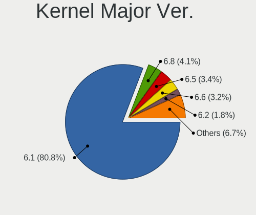
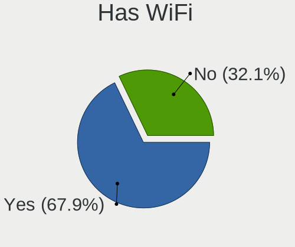
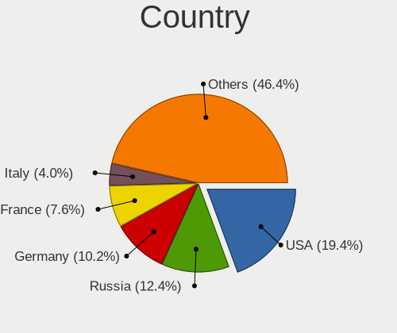
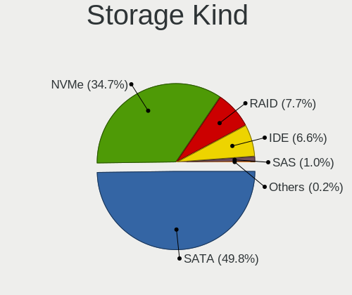
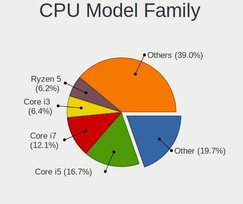
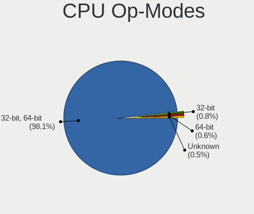
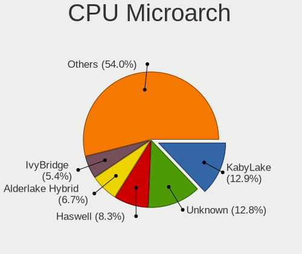
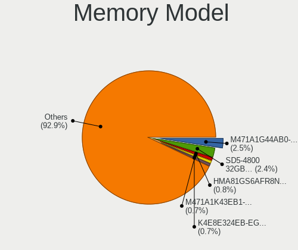

Debian 12 - Tested Hardware & Statistics
----------------------------------------

A project to collect tested hardware configurations for Debian 12.

Anyone can contribute to this report by the [hw-probe](https://github.com/linuxhw/hw-probe) tool:

    sudo -E hw-probe -all -upload

Please contribute! Especially if your hardware is rare.

This is a report for all computer types. See also reports for [desktops](/Dist/Debian_12/Desktop/README.md) and [notebooks](/Dist/Debian_12/Notebook/README.md).

Contents
--------

* [ Test Cases ](#test-cases)

* [ System ](#system)
  - [ Kernel                   ](#kernel)
  - [ Kernel Family            ](#kernel-family)
  - [ Kernel Major Ver.        ](#kernel-major-ver)
  - [ Arch                     ](#arch)
  - [ DE                       ](#de)
  - [ Display Server           ](#display-server)
  - [ Display Manager          ](#display-manager)
  - [ OS Lang                  ](#os-lang)
  - [ Boot Mode                ](#boot-mode)
  - [ Filesystem               ](#filesystem)
  - [ Part. scheme             ](#part-scheme)
  - [ Dual Boot with Linux/BSD ](#dual-boot-with-linuxbsd)
  - [ Dual Boot (Win)          ](#dual-boot-win)

* [ Board ](#board)
  - [ Vendor                   ](#vendor)
  - [ Model                    ](#model)
  - [ Model Family             ](#model-family)
  - [ MFG Year                 ](#mfg-year)
  - [ Form Factor              ](#form-factor)
  - [ Secure Boot              ](#secure-boot)
  - [ Coreboot                 ](#coreboot)
  - [ RAM Size                 ](#ram-size)
  - [ RAM Used                 ](#ram-used)
  - [ Total Drives             ](#total-drives)
  - [ Has CD-ROM               ](#has-cd-rom)
  - [ Has Ethernet             ](#has-ethernet)
  - [ Has WiFi                 ](#has-wifi)
  - [ Has Bluetooth            ](#has-bluetooth)

* [ Location ](#location)
  - [ Country                  ](#country)
  - [ City                     ](#city)

* [ Drives ](#drives)
  - [ Drive Vendor             ](#drive-vendor)
  - [ Drive Model              ](#drive-model)
  - [ HDD Vendor               ](#hdd-vendor)
  - [ SSD Vendor               ](#ssd-vendor)
  - [ Drive Kind               ](#drive-kind)
  - [ Drive Connector          ](#drive-connector)
  - [ Drive Size               ](#drive-size)
  - [ Space Total              ](#space-total)
  - [ Space Used               ](#space-used)
  - [ Malfunc. Drives          ](#malfunc-drives)
  - [ Malfunc. Drive Vendor    ](#malfunc-drive-vendor)
  - [ Malfunc. HDD Vendor      ](#malfunc-hdd-vendor)
  - [ Malfunc. Drive Kind      ](#malfunc-drive-kind)
  - [ Failed Drives            ](#failed-drives)
  - [ Failed Drive Vendor      ](#failed-drive-vendor)
  - [ Drive Status             ](#drive-status)

* [ Storage controller ](#storage-controller)
  - [ Storage Vendor           ](#storage-vendor)
  - [ Storage Model            ](#storage-model)
  - [ Storage Kind             ](#storage-kind)

* [ Processor ](#processor)
  - [ CPU Vendor               ](#cpu-vendor)
  - [ CPU Model                ](#cpu-model)
  - [ CPU Model Family         ](#cpu-model-family)
  - [ CPU Cores                ](#cpu-cores)
  - [ CPU Sockets              ](#cpu-sockets)
  - [ CPU Threads              ](#cpu-threads)
  - [ CPU Op-Modes             ](#cpu-op-modes)
  - [ CPU Microcode            ](#cpu-microcode)
  - [ CPU Microarch            ](#cpu-microarch)

* [ Graphics ](#graphics)
  - [ GPU Vendor               ](#gpu-vendor)
  - [ GPU Model                ](#gpu-model)
  - [ GPU Combo                ](#gpu-combo)
  - [ GPU Driver               ](#gpu-driver)
  - [ GPU Memory               ](#gpu-memory)

* [ Monitor ](#monitor)
  - [ Monitor Vendor           ](#monitor-vendor)
  - [ Monitor Model            ](#monitor-model)
  - [ Monitor Resolution       ](#monitor-resolution)
  - [ Monitor Diagonal         ](#monitor-diagonal)
  - [ Monitor Width            ](#monitor-width)
  - [ Aspect Ratio             ](#aspect-ratio)
  - [ Monitor Area             ](#monitor-area)
  - [ Pixel Density            ](#pixel-density)
  - [ Multiple Monitors        ](#multiple-monitors)

* [ Network ](#network)
  - [ Net Controller Vendor    ](#net-controller-vendor)
  - [ Net Controller Model     ](#net-controller-model)
  - [ Wireless Vendor          ](#wireless-vendor)
  - [ Wireless Model           ](#wireless-model)
  - [ Ethernet Vendor          ](#ethernet-vendor)
  - [ Ethernet Model           ](#ethernet-model)
  - [ Net Controller Kind      ](#net-controller-kind)
  - [ Used Controller          ](#used-controller)
  - [ NICs                     ](#nics)
  - [ IPv6                     ](#ipv6)

* [ Bluetooth ](#bluetooth)
  - [ Bluetooth Vendor         ](#bluetooth-vendor)
  - [ Bluetooth Model          ](#bluetooth-model)

* [ Sound ](#sound)
  - [ Sound Vendor             ](#sound-vendor)
  - [ Sound Model              ](#sound-model)

* [ Memory ](#memory)
  - [ Memory Vendor            ](#memory-vendor)
  - [ Memory Model             ](#memory-model)
  - [ Memory Kind              ](#memory-kind)
  - [ Memory Form Factor       ](#memory-form-factor)
  - [ Memory Size              ](#memory-size)
  - [ Memory Speed             ](#memory-speed)

* [ Printers & scanners ](#printers--scanners)
  - [ Printer Vendor           ](#printer-vendor)
  - [ Printer Model            ](#printer-model)
  - [ Scanner Vendor           ](#scanner-vendor)
  - [ Scanner Model            ](#scanner-model)

* [ Camera ](#camera)
  - [ Camera Vendor            ](#camera-vendor)
  - [ Camera Model             ](#camera-model)

* [ Security ](#security)
  - [ Fingerprint Vendor       ](#fingerprint-vendor)
  - [ Fingerprint Model        ](#fingerprint-model)
  - [ Chipcard Vendor          ](#chipcard-vendor)
  - [ Chipcard Model           ](#chipcard-model)

* [ Unsupported ](#unsupported)
  - [ Unsupported Devices      ](#unsupported-devices)
  - [ Unsupported Device Types ](#unsupported-device-types)

Test Cases
----------

Total: 8585

| Vendor        | Model                       | Form-Factor | Probe                                                      | Date         |
|---------------|-----------------------------|-------------|------------------------------------------------------------|--------------|
| Gigabyte      | B85M-D3H                    | Desktop     | [27053ca724](https://linux-hardware.org/?probe=27053ca724) | Jan 06, 2025 |
| Apple         | Mac-35C5E08120C7EEAF Mac... | Mini pc     | [70c961d7b8](https://linux-hardware.org/?probe=70c961d7b8) | Jan 06, 2025 |
| ASUSTek       | VivoBook S13 X330FN_S330... | Notebook    | [50ff12c678](https://linux-hardware.org/?probe=50ff12c678) | Jan 06, 2025 |
| Gigabyte      | B85M-D3H                    | Desktop     | [3d3b4d1ab3](https://linux-hardware.org/?probe=3d3b4d1ab3) | Jan 06, 2025 |
| Lenovo        | V15-ADA 82C7                | Notebook    | [c5c9a457aa](https://linux-hardware.org/?probe=c5c9a457aa) | Jan 06, 2025 |
| Lenovo        | ThinkPad L15 Gen 2 20X4S... | Notebook    | [928b89625a](https://linux-hardware.org/?probe=928b89625a) | Jan 06, 2025 |
| HP            | Presario CQ57               | Notebook    | [970ab9cc5f](https://linux-hardware.org/?probe=970ab9cc5f) | Jan 06, 2025 |
| Dell          | 0PV3YR A05                  | Server      | [48e00d403a](https://linux-hardware.org/?probe=48e00d403a) | Jan 06, 2025 |
| Positivo B... | VJFE59F11X-B1011H           | Notebook    | [eeea3c518d](https://linux-hardware.org/?probe=eeea3c518d) | Jan 06, 2025 |
| Lenovo        | ThinkPad T14 Gen 3 21AH0... | Notebook    | [58b338f268](https://linux-hardware.org/?probe=58b338f268) | Jan 06, 2025 |
| Lenovo        | ThinkPad E475 20H40006US    | Notebook    | [69908d16ca](https://linux-hardware.org/?probe=69908d16ca) | Jan 06, 2025 |
| Acer          | AOD257                      | Notebook    | [48ac1f7a96](https://linux-hardware.org/?probe=48ac1f7a96) | Jan 06, 2025 |
| Lenovo        | ThinkPad E475 20H40006US    | Notebook    | [78b9a699ff](https://linux-hardware.org/?probe=78b9a699ff) | Jan 05, 2025 |
| OEM           | B75 Ver:1.41                | Desktop     | [72dd3048a2](https://linux-hardware.org/?probe=72dd3048a2) | Jan 05, 2025 |
| Lenovo        | ThinkPad T14 Gen 3 21AH0... | Notebook    | [a40f8a9531](https://linux-hardware.org/?probe=a40f8a9531) | Jan 05, 2025 |
| Unknown       | Unknown                     | Desktop     | [bfe6d86060](https://linux-hardware.org/?probe=bfe6d86060) | Jan 05, 2025 |
| Unknown       | Unknown                     | Desktop     | [bafe044b60](https://linux-hardware.org/?probe=bafe044b60) | Jan 05, 2025 |
| Supermicro    | X9SRE/X9SRE-3F/X9SRi/X9S... | Server      | [f3d2f362e8](https://linux-hardware.org/?probe=f3d2f362e8) | Jan 05, 2025 |
| Lenovo        | ThinkPad T14 Gen 3 21AH0... | Notebook    | [8e4aafe314](https://linux-hardware.org/?probe=8e4aafe314) | Jan 05, 2025 |
| HP            | 2B38                        | Desktop     | [2ea8b8918b](https://linux-hardware.org/?probe=2ea8b8918b) | Jan 05, 2025 |
| HP            | Presario CQ57               | Notebook    | [8c1782d787](https://linux-hardware.org/?probe=8c1782d787) | Jan 05, 2025 |
| Lenovo        | ThinkPad T480 20L5S1S000    | Notebook    | [c35541e56b](https://linux-hardware.org/?probe=c35541e56b) | Jan 05, 2025 |
| Lenovo        | ThinkPad T14 Gen 5 21MCC... | Notebook    | [6e4f05f56f](https://linux-hardware.org/?probe=6e4f05f56f) | Jan 05, 2025 |
| UNOWHY        | Y13G113S4EI                 | Notebook    | [8d772f9e5a](https://linux-hardware.org/?probe=8d772f9e5a) | Jan 05, 2025 |
| Intel         | NUC8BEB J72693-308          | Mini pc     | [cc4e4ffe1a](https://linux-hardware.org/?probe=cc4e4ffe1a) | Jan 05, 2025 |
| Unknown       | FP7R2AIO                    | All in one  | [7c37fce41a](https://linux-hardware.org/?probe=7c37fce41a) | Jan 04, 2025 |
| Unknown       | FP7R2AIO                    | All in one  | [d64e3db9ce](https://linux-hardware.org/?probe=d64e3db9ce) | Jan 04, 2025 |
| OEM           | B75 Ver:1.41                | Desktop     | [b5e4cb38f7](https://linux-hardware.org/?probe=b5e4cb38f7) | Jan 04, 2025 |
| ASRock        | H61M-DGS                    | Desktop     | [0e1053e06a](https://linux-hardware.org/?probe=0e1053e06a) | Jan 04, 2025 |
| TongFang      | GM5HG0A                     | Notebook    | [7613e29f5b](https://linux-hardware.org/?probe=7613e29f5b) | Jan 04, 2025 |
| ASUSTek       | Z97M-PLUS                   | Desktop     | [92c4bf7d7e](https://linux-hardware.org/?probe=92c4bf7d7e) | Jan 04, 2025 |
| MSI           | B550-A PRO                  | Desktop     | [b689309781](https://linux-hardware.org/?probe=b689309781) | Jan 04, 2025 |
| TongFang      | GM5HG0A                     | Notebook    | [dd74d3e454](https://linux-hardware.org/?probe=dd74d3e454) | Jan 04, 2025 |
| Lenovo        | ThinkPad T560 20FH001RUS    | Notebook    | [00bb35dd31](https://linux-hardware.org/?probe=00bb35dd31) | Jan 04, 2025 |
| HP            | Pavilion Laptop 15-eh1xx... | Notebook    | [24988d9cd8](https://linux-hardware.org/?probe=24988d9cd8) | Jan 04, 2025 |
| Unknown       | Unknown                     | Soc         | [c5274f59f2](https://linux-hardware.org/?probe=c5274f59f2) | Jan 04, 2025 |
| Gigabyte      | B550M DS3H                  | Desktop     | [a917c66504](https://linux-hardware.org/?probe=a917c66504) | Jan 04, 2025 |
| Lenovo        | ThinkPad E475 20H40006US    | Notebook    | [1f287326ed](https://linux-hardware.org/?probe=1f287326ed) | Jan 04, 2025 |
| Lenovo        | IdeaPad 110-15ACL 80TJ      | Notebook    | [976937be1b](https://linux-hardware.org/?probe=976937be1b) | Jan 04, 2025 |
| Lenovo        | ThinkPad E475 20H40006US    | Notebook    | [74d7973a3d](https://linux-hardware.org/?probe=74d7973a3d) | Jan 03, 2025 |
| Dell          | Vostro 3520                 | Notebook    | [77b90abaf0](https://linux-hardware.org/?probe=77b90abaf0) | Jan 03, 2025 |
| ASUSTek       | Pro B560M-C                 | Desktop     | [00895d3b67](https://linux-hardware.org/?probe=00895d3b67) | Jan 03, 2025 |
| ASUSTek       | M5A97 R2.0                  | Desktop     | [a671d43d86](https://linux-hardware.org/?probe=a671d43d86) | Jan 03, 2025 |
| Raspberry ... | Raspberry Pi 4 Model B R... | Soc         | [b5468ebfdc](https://linux-hardware.org/?probe=b5468ebfdc) | Jan 03, 2025 |
| ASUSTek       | U56E                        | Notebook    | [e777c929c0](https://linux-hardware.org/?probe=e777c929c0) | Jan 03, 2025 |
| HP            | 3399                        | Desktop     | [1371b1c64d](https://linux-hardware.org/?probe=1371b1c64d) | Jan 03, 2025 |
| Dell          | 0HHV7N A00                  | Desktop     | [25ccd84cbc](https://linux-hardware.org/?probe=25ccd84cbc) | Jan 03, 2025 |
| Acer          | Aspire 5741G                | Notebook    | [3785e1f57b](https://linux-hardware.org/?probe=3785e1f57b) | Jan 03, 2025 |
| ASUSTek       | PRIME B350M-A               | Desktop     | [014692b809](https://linux-hardware.org/?probe=014692b809) | Jan 03, 2025 |
| HP            | 0B4Ch D                     | Desktop     | [689bb32b5c](https://linux-hardware.org/?probe=689bb32b5c) | Jan 03, 2025 |
| CWWK          | CW-AD4L-N V1                | Desktop     | [ed9e661757](https://linux-hardware.org/?probe=ed9e661757) | Jan 03, 2025 |
| Dell          | Inspiron 14 5425            | Notebook    | [573be124f2](https://linux-hardware.org/?probe=573be124f2) | Jan 03, 2025 |
| Google        | Dragonair                   | Notebook    | [69b034d6b7](https://linux-hardware.org/?probe=69b034d6b7) | Jan 03, 2025 |
| HP            | ProLiant ML150 G6           | Desktop     | [d281d0b24d](https://linux-hardware.org/?probe=d281d0b24d) | Jan 03, 2025 |
| Dell          | Inspiron 5405               | Notebook    | [e6c57490c8](https://linux-hardware.org/?probe=e6c57490c8) | Jan 02, 2025 |
| HP            | ProLiant MicroServer        | Desktop     | [f99b996d05](https://linux-hardware.org/?probe=f99b996d05) | Jan 02, 2025 |
| HP            | ProLiant MicroServer        | Desktop     | [74107b78f7](https://linux-hardware.org/?probe=74107b78f7) | Jan 02, 2025 |
| Raspberry ... | Raspberry Pi 5 Model B R... | Soc         | [d769297945](https://linux-hardware.org/?probe=d769297945) | Jan 02, 2025 |
| ASUSTek       | Vivobook Go E1404FA_E140... | Notebook    | [d65b464077](https://linux-hardware.org/?probe=d65b464077) | Jan 02, 2025 |
| ASUSTek       | ROG Strix G713PI_G713PI     | Notebook    | [d086aef8fc](https://linux-hardware.org/?probe=d086aef8fc) | Jan 02, 2025 |
| HP            | ENVY Laptop 13-ah0xxx       | Notebook    | [2bf35e6afa](https://linux-hardware.org/?probe=2bf35e6afa) | Jan 02, 2025 |
| Lenovo        | ThinkCentre M93p            | Desktop     | [3a7e0b811f](https://linux-hardware.org/?probe=3a7e0b811f) | Jan 02, 2025 |
| Raspberry ... | Raspberry Pi 3 Model B P... | Soc         | [15906a9eaa](https://linux-hardware.org/?probe=15906a9eaa) | Jan 02, 2025 |
| ASUSTek       | TUF B450M-PLUS GAMING       | Desktop     | [5058b592ae](https://linux-hardware.org/?probe=5058b592ae) | Jan 02, 2025 |
| ASUSTek       | M5A97 R2.0                  | Desktop     | [bb11de9504](https://linux-hardware.org/?probe=bb11de9504) | Jan 02, 2025 |
| Gigabyte      | B460M DS3H V2               | Desktop     | [f3f3a540d4](https://linux-hardware.org/?probe=f3f3a540d4) | Jan 02, 2025 |
| MSI           | B150M MORTAR                | Desktop     | [798c953e09](https://linux-hardware.org/?probe=798c953e09) | Jan 01, 2025 |
| MSI           | PRO B760-P WIFI DDR4        | Desktop     | [5b2124b8e7](https://linux-hardware.org/?probe=5b2124b8e7) | Jan 01, 2025 |
| Dell          | XPS 9315                    | Notebook    | [1620c81455](https://linux-hardware.org/?probe=1620c81455) | Jan 01, 2025 |
| Dell          | 04Y8V0 A02                  | Desktop     | [2864d95f71](https://linux-hardware.org/?probe=2864d95f71) | Jan 01, 2025 |
| Dell          | 04Y8V0 A02                  | Desktop     | [dd5b8644a1](https://linux-hardware.org/?probe=dd5b8644a1) | Jan 01, 2025 |
| HP            | Laptop 15s-du1xxx           | Notebook    | [5029ac1a06](https://linux-hardware.org/?probe=5029ac1a06) | Jan 01, 2025 |
| Dell          | 0PV3YR A05                  | Server      | [0252731c50](https://linux-hardware.org/?probe=0252731c50) | Jan 01, 2025 |
| Gigabyte      | B85M-D3H                    | Desktop     | [1766ca8469](https://linux-hardware.org/?probe=1766ca8469) | Jan 01, 2025 |
| Dell          | Latitude 5480               | Notebook    | [d4da596a26](https://linux-hardware.org/?probe=d4da596a26) | Jan 01, 2025 |
| Gigabyte      | B85M-D3H                    | Desktop     | [b52a4bed1c](https://linux-hardware.org/?probe=b52a4bed1c) | Dec 31, 2024 |
| ASUSTek       | TUF Gaming Z790-PLUS WIF... | Desktop     | [cdbb6290eb](https://linux-hardware.org/?probe=cdbb6290eb) | Dec 31, 2024 |
| HP            | ENVY x360 Convertible 13... | Convertible | [8bf9b1ce8c](https://linux-hardware.org/?probe=8bf9b1ce8c) | Dec 31, 2024 |
| HP            | EliteBook 830 G5            | Notebook    | [8382fe388f](https://linux-hardware.org/?probe=8382fe388f) | Dec 31, 2024 |
| HP            | EliteBook 830 G5            | Notebook    | [a61a178741](https://linux-hardware.org/?probe=a61a178741) | Dec 31, 2024 |
| ASUSTek       | PRIME Z490-A                | Desktop     | [f1762af529](https://linux-hardware.org/?probe=f1762af529) | Dec 31, 2024 |
| Unknown       | Unknown                     | Soc         | [8d3dea2269](https://linux-hardware.org/?probe=8d3dea2269) | Dec 31, 2024 |
| Acer          | Nitro AN515-51              | Notebook    | [3555e1e029](https://linux-hardware.org/?probe=3555e1e029) | Dec 31, 2024 |
| Dell          | 0PV3YR A05                  | Server      | [05ae3d9e19](https://linux-hardware.org/?probe=05ae3d9e19) | Dec 31, 2024 |
| AMI           | Intel                       | Desktop     | [40322fe630](https://linux-hardware.org/?probe=40322fe630) | Dec 31, 2024 |
| ASUSTek       | Pro B560M-C                 | Desktop     | [0d9d36f397](https://linux-hardware.org/?probe=0d9d36f397) | Dec 30, 2024 |
| ASUSTek       | VivoBook_ASUSLaptop X580... | Notebook    | [994b1d92c5](https://linux-hardware.org/?probe=994b1d92c5) | Dec 30, 2024 |
| Dell          | XPS 17 9730                 | Notebook    | [216ff4e7eb](https://linux-hardware.org/?probe=216ff4e7eb) | Dec 30, 2024 |
| Packard Be... | EasyNote_MX45               | Notebook    | [e696c77b8f](https://linux-hardware.org/?probe=e696c77b8f) | Dec 30, 2024 |
| ASUSTek       | PRIME B650-PLUS             | Desktop     | [d94ee9a862](https://linux-hardware.org/?probe=d94ee9a862) | Dec 30, 2024 |
| Lenovo        | ThinkPad T430 2349TFK       | Notebook    | [976885ff78](https://linux-hardware.org/?probe=976885ff78) | Dec 30, 2024 |
| Gigabyte      | B460M DS3H V2               | Desktop     | [2bb09385c0](https://linux-hardware.org/?probe=2bb09385c0) | Dec 30, 2024 |
| Fujitsu Si... | D2348-A3 S26361-D2348-A3    | Desktop     | [88cfef1da9](https://linux-hardware.org/?probe=88cfef1da9) | Dec 30, 2024 |
| ASRock        | 990FX Extreme4              | Desktop     | [4b37ae65f2](https://linux-hardware.org/?probe=4b37ae65f2) | Dec 30, 2024 |
| Unknown       | Unknown                     | Desktop     | [ea27b3376d](https://linux-hardware.org/?probe=ea27b3376d) | Dec 30, 2024 |
| Gigabyte      | X670 AORUS ELITE AX         | Desktop     | [ad6953ff2e](https://linux-hardware.org/?probe=ad6953ff2e) | Dec 30, 2024 |
| AMI           | Intel                       | Desktop     | [92f821a69c](https://linux-hardware.org/?probe=92f821a69c) | Dec 30, 2024 |
| HP            | EliteBook 660 16 inch G1... | Notebook    | [97a21cd2b9](https://linux-hardware.org/?probe=97a21cd2b9) | Dec 30, 2024 |
| Raspberry ... | Raspberry Pi 400 Rev 1.0    | Soc         | [3a664eb92f](https://linux-hardware.org/?probe=3a664eb92f) | Dec 29, 2024 |
| Unknown       | Orange Pi 5 Pro             | Soc         | [b77549122f](https://linux-hardware.org/?probe=b77549122f) | Dec 29, 2024 |
| Apple         | MacBookPro9,2               | Notebook    | [3cda74dca1](https://linux-hardware.org/?probe=3cda74dca1) | Dec 29, 2024 |
| HP            | 255 G7 Notebook PC          | Notebook    | [c4f95fe88f](https://linux-hardware.org/?probe=c4f95fe88f) | Dec 29, 2024 |
| Gigabyte      | B560M AORUS ELITE           | Desktop     | [408b834306](https://linux-hardware.org/?probe=408b834306) | Dec 29, 2024 |
| Lenovo        | ThinkPad E490 20N8CTO1WW    | Notebook    | [61fe1222c2](https://linux-hardware.org/?probe=61fe1222c2) | Dec 29, 2024 |
| Lenovo        | IdeaPad 330-15ARR 81D2      | Notebook    | [0ce672d09f](https://linux-hardware.org/?probe=0ce672d09f) | Dec 29, 2024 |
| ASUSTek       | VivoBook_ASUSLaptop M160... | Notebook    | [dc70a933c3](https://linux-hardware.org/?probe=dc70a933c3) | Dec 29, 2024 |
| Unknown       | Unknown                     | Server      | [122b21a8e4](https://linux-hardware.org/?probe=122b21a8e4) | Dec 29, 2024 |
| Packard Be... | EasyNote_MX45               | Notebook    | [8ef7bf6e6d](https://linux-hardware.org/?probe=8ef7bf6e6d) | Dec 29, 2024 |
| ICP / iEi     | SA16 V1.00                  | Desktop     | [6c89b49dd8](https://linux-hardware.org/?probe=6c89b49dd8) | Dec 29, 2024 |
| HP            | ENVY x360 2-in-1 Laptop ... | Convertible | [e565ebfee3](https://linux-hardware.org/?probe=e565ebfee3) | Dec 29, 2024 |
| Gigabyte      | GB-BER7-5700                | Desktop     | [915da57e07](https://linux-hardware.org/?probe=915da57e07) | Dec 29, 2024 |
| Dell          | 08WXMX A02                  | Desktop     | [81f35b96d9](https://linux-hardware.org/?probe=81f35b96d9) | Dec 29, 2024 |
| Raspberry ... | Raspberry Pi 5 Model B R... | Soc         | [58e1d1052c](https://linux-hardware.org/?probe=58e1d1052c) | Dec 29, 2024 |
| sunxi         | FriendlyARM NanoPi NEO      | Soc         | [e898c23a51](https://linux-hardware.org/?probe=e898c23a51) | Dec 29, 2024 |
| MSI           | MPG B550 GAMING EDGE WIF... | Desktop     | [ea3e3598c1](https://linux-hardware.org/?probe=ea3e3598c1) | Dec 29, 2024 |
| Lenovo        | IdeaPad Y700-15ISK 80NV     | Notebook    | [4122ae81a0](https://linux-hardware.org/?probe=4122ae81a0) | Dec 29, 2024 |
| MSI           | PRO Z790-VC WIFI            | Desktop     | [536d20f5de](https://linux-hardware.org/?probe=536d20f5de) | Dec 29, 2024 |
| HP            | 21D0                        | Desktop     | [33452ea42c](https://linux-hardware.org/?probe=33452ea42c) | Dec 28, 2024 |
| Shenzhen M... | F7BSC                       | Mini pc     | [fe538f1976](https://linux-hardware.org/?probe=fe538f1976) | Dec 28, 2024 |
| ASUSTek       | Zenbook UX3402ZA            | Notebook    | [be06529f29](https://linux-hardware.org/?probe=be06529f29) | Dec 28, 2024 |
| HP            | 845A                        | Desktop     | [c79d5baf3e](https://linux-hardware.org/?probe=c79d5baf3e) | Dec 28, 2024 |
| Supermicro    | X8DTU                       | Server      | [6918605d42](https://linux-hardware.org/?probe=6918605d42) | Dec 28, 2024 |
| MSI           | MAG B660 TOMAHAWK WIFI D... | Desktop     | [84f3fb88dd](https://linux-hardware.org/?probe=84f3fb88dd) | Dec 28, 2024 |
| MSI           | MS-16F1                     | Notebook    | [9906c1fa28](https://linux-hardware.org/?probe=9906c1fa28) | Dec 28, 2024 |
| Acer          | Aspire A315-54K             | Notebook    | [9d416da92a](https://linux-hardware.org/?probe=9d416da92a) | Dec 28, 2024 |
| Fujitsu Si... | ESPRIMO Mobile V5555        | Notebook    | [e443699b8d](https://linux-hardware.org/?probe=e443699b8d) | Dec 28, 2024 |
| ASUSTek       | ASUS TUF Gaming A17 FA70... | Notebook    | [2831363437](https://linux-hardware.org/?probe=2831363437) | Dec 28, 2024 |
| Raspberry ... | Raspberry Pi 2 Model B R... | Soc         | [0567331b7f](https://linux-hardware.org/?probe=0567331b7f) | Dec 28, 2024 |
| Raspberry ... | Raspberry Pi 4 Model B R... | Soc         | [0d73d730f6](https://linux-hardware.org/?probe=0d73d730f6) | Dec 28, 2024 |
| Alienware     | M17xR3                      | Notebook    | [2363abbe5c](https://linux-hardware.org/?probe=2363abbe5c) | Dec 28, 2024 |
| Lenovo        | 1056 SDK0T76557 WIN 3915... | Desktop     | [9f23de610a](https://linux-hardware.org/?probe=9f23de610a) | Dec 28, 2024 |
| Gigabyte      | B460M DS3H V2               | Desktop     | [b85d81f6b7](https://linux-hardware.org/?probe=b85d81f6b7) | Dec 28, 2024 |
| Dell          | 0FG011                      | Desktop     | [2056b909f7](https://linux-hardware.org/?probe=2056b909f7) | Dec 28, 2024 |
| Intel         | NUC12WSBi7 M46422-302       | Mini pc     | [72c75ed73b](https://linux-hardware.org/?probe=72c75ed73b) | Dec 27, 2024 |
| Gigabyte      | A520I AC                    | Desktop     | [1574cc05d9](https://linux-hardware.org/?probe=1574cc05d9) | Dec 27, 2024 |
| Dell          | Venue 11 Pro 7140           | Notebook    | [a91398af2a](https://linux-hardware.org/?probe=a91398af2a) | Dec 27, 2024 |
| Dell          | XPS L701X                   | Notebook    | [6cd016a478](https://linux-hardware.org/?probe=6cd016a478) | Dec 27, 2024 |
| Dell          | 0JP3NX A01                  | Desktop     | [84b0bca79f](https://linux-hardware.org/?probe=84b0bca79f) | Dec 27, 2024 |
| HP            | 15 TouchSmart               | Notebook    | [dbea1582fb](https://linux-hardware.org/?probe=dbea1582fb) | Dec 27, 2024 |
| Acer          | Swift SF314-511             | Notebook    | [f0e61d80d6](https://linux-hardware.org/?probe=f0e61d80d6) | Dec 27, 2024 |
| Gigabyte      | 970A-DS3P                   | Desktop     | [127d67d58a](https://linux-hardware.org/?probe=127d67d58a) | Dec 27, 2024 |
| Dell          | Precision 7520              | Notebook    | [ad770a5b2a](https://linux-hardware.org/?probe=ad770a5b2a) | Dec 27, 2024 |
| ASRock        | 990FX Extreme4              | Desktop     | [ae4ac86e01](https://linux-hardware.org/?probe=ae4ac86e01) | Dec 27, 2024 |
| Lenovo        | ThinkPad E14 Gen 3 20Y70... | Notebook    | [9f0e63713d](https://linux-hardware.org/?probe=9f0e63713d) | Dec 27, 2024 |
| Lenovo        | 3317 SDK0T76463 WIN 3422... | Desktop     | [05481678ba](https://linux-hardware.org/?probe=05481678ba) | Dec 27, 2024 |
| Lenovo        | ThinkPad T490 20N3S64400    | Notebook    | [86b8ea0471](https://linux-hardware.org/?probe=86b8ea0471) | Dec 27, 2024 |
| Morshow       | CB01 V100                   | Notebook    | [0f58cef0a2](https://linux-hardware.org/?probe=0f58cef0a2) | Dec 27, 2024 |
| Lenovo        | 1038 SDK0Q40104 WIN 3305... | Server      | [cafaee2fc7](https://linux-hardware.org/?probe=cafaee2fc7) | Dec 27, 2024 |
| ASRock        | Z97X Killer                 | Desktop     | [447cd42486](https://linux-hardware.org/?probe=447cd42486) | Dec 26, 2024 |
| Intel         | NUC7i5BNB J31144-314        | Mini pc     | [d06adf16e1](https://linux-hardware.org/?probe=d06adf16e1) | Dec 26, 2024 |
| ASUSTek       | ASUS TUF Gaming A17 FA70... | Notebook    | [ae31e6ad1c](https://linux-hardware.org/?probe=ae31e6ad1c) | Dec 26, 2024 |
| Acer          | Aspire ES1-311              | Notebook    | [d4cf291b46](https://linux-hardware.org/?probe=d4cf291b46) | Dec 26, 2024 |
| AZW           | MINI S                      | Desktop     | [b73091a664](https://linux-hardware.org/?probe=b73091a664) | Dec 26, 2024 |
| MSI           | P45 Neo3                    | Desktop     | [4952d3011f](https://linux-hardware.org/?probe=4952d3011f) | Dec 26, 2024 |
| Fujitsu       | D3099-B1 S26361-D3099-B1... | Server      | [ed6a47b6f9](https://linux-hardware.org/?probe=ed6a47b6f9) | Dec 26, 2024 |
| ASUSTek       | NUC12WSB-M 60AS00F0-MB5A... | Mini pc     | [0da8180c1f](https://linux-hardware.org/?probe=0da8180c1f) | Dec 26, 2024 |
| Shuttle       | NC03U                       | Notebook    | [7262526f1a](https://linux-hardware.org/?probe=7262526f1a) | Dec 26, 2024 |
| ASUSTek       | VivoBook_ASUSLaptop K360... | Notebook    | [4c2cba015f](https://linux-hardware.org/?probe=4c2cba015f) | Dec 26, 2024 |
| GEEKOM        | A5                          | Desktop     | [2bdc0b3030](https://linux-hardware.org/?probe=2bdc0b3030) | Dec 26, 2024 |
| HP            | EliteBook 8460p             | Notebook    | [0916dd5986](https://linux-hardware.org/?probe=0916dd5986) | Dec 25, 2024 |
| Lenovo        | V15 G3 ABA 82TV             | Notebook    | [75b2764000](https://linux-hardware.org/?probe=75b2764000) | Dec 25, 2024 |
| MSI           | Z370-A PRO                  | Desktop     | [9ce2977625](https://linux-hardware.org/?probe=9ce2977625) | Dec 25, 2024 |
| ASUSTek       | VivoBook_ASUSLaptop K360... | Notebook    | [fcb6f7fe6c](https://linux-hardware.org/?probe=fcb6f7fe6c) | Dec 25, 2024 |
| TB            | WTR R1                      | Desktop     | [587979f8d3](https://linux-hardware.org/?probe=587979f8d3) | Dec 25, 2024 |
| Gigabyte      | B450M DS3H V2               | Desktop     | [9bb72b7cbd](https://linux-hardware.org/?probe=9bb72b7cbd) | Dec 25, 2024 |
| Samsung       | 750XGK                      | Notebook    | [178e559f24](https://linux-hardware.org/?probe=178e559f24) | Dec 25, 2024 |
| HP            | 1998                        | Desktop     | [5cbefdf3a2](https://linux-hardware.org/?probe=5cbefdf3a2) | Dec 25, 2024 |
| Lenovo        | 317C SDK0J40700 WIN 3258... | Desktop     | [0ab0a286ad](https://linux-hardware.org/?probe=0ab0a286ad) | Dec 25, 2024 |
| HP            | ENVY m7                     | Notebook    | [1eae0d7a3f](https://linux-hardware.org/?probe=1eae0d7a3f) | Dec 25, 2024 |
| Unknown       | Unknown                     | Notebook    | [e3c37d254f](https://linux-hardware.org/?probe=e3c37d254f) | Dec 25, 2024 |
| Lenovo        | ThinkPad P53 20QQS5WG00     | Notebook    | [8afcf6a4e5](https://linux-hardware.org/?probe=8afcf6a4e5) | Dec 25, 2024 |
| ASUSTek       | M5A97 PLUS                  | Desktop     | [a3e4e7043e](https://linux-hardware.org/?probe=a3e4e7043e) | Dec 25, 2024 |
| Apple         | Mac-F2268DC8                | All in one  | [e82b0c22fb](https://linux-hardware.org/?probe=e82b0c22fb) | Dec 24, 2024 |
| EVGA          | 122-CK-NF68 2               | Desktop     | [a7af4d0592](https://linux-hardware.org/?probe=a7af4d0592) | Dec 24, 2024 |
| Dell          | Latitude 7480               | Notebook    | [faa26e30d0](https://linux-hardware.org/?probe=faa26e30d0) | Dec 24, 2024 |
| ASUSTek       | Vivobook Go E1404FA_E140... | Notebook    | [b67b195148](https://linux-hardware.org/?probe=b67b195148) | Dec 24, 2024 |
| HP            | Pavilion dv6                | Notebook    | [db20c486f1](https://linux-hardware.org/?probe=db20c486f1) | Dec 24, 2024 |
| Raspberry ... | Raspberry Pi 5 Model B R... | Soc         | [099d0b6f62](https://linux-hardware.org/?probe=099d0b6f62) | Dec 24, 2024 |
| Gigabyte      | B450M DS3H V2               | Desktop     | [ad7ff9155c](https://linux-hardware.org/?probe=ad7ff9155c) | Dec 24, 2024 |
| Schenker      | XMG Mobile A507 VE          | Notebook    | [883657a313](https://linux-hardware.org/?probe=883657a313) | Dec 24, 2024 |
| Dell          | XPS 13 9300                 | Notebook    | [496f49c231](https://linux-hardware.org/?probe=496f49c231) | Dec 24, 2024 |
| Dell          | 0HGFJM A00                  | Desktop     | [f849a74d2e](https://linux-hardware.org/?probe=f849a74d2e) | Dec 24, 2024 |
| ASRock        | B760M Pro RS/D4 WiFi        | Desktop     | [9c915961fc](https://linux-hardware.org/?probe=9c915961fc) | Dec 24, 2024 |
| Gigabyte      | B450M DS3H-CF               | Desktop     | [cf730d4359](https://linux-hardware.org/?probe=cf730d4359) | Dec 24, 2024 |
| ASUSTek       | P8H61-MX                    | Desktop     | [b9f7d12796](https://linux-hardware.org/?probe=b9f7d12796) | Dec 24, 2024 |
| Supermicro    | X13SCH-SYS                  | Desktop     | [4291b9f111](https://linux-hardware.org/?probe=4291b9f111) | Dec 24, 2024 |
| Google        | Lava                        | Notebook    | [8e4deea274](https://linux-hardware.org/?probe=8e4deea274) | Dec 24, 2024 |
| Supermicro    | X13SCH-SYS                  | Desktop     | [e8b89f7b32](https://linux-hardware.org/?probe=e8b89f7b32) | Dec 24, 2024 |
| Supermicro    | X13SCH-SYS                  | Desktop     | [1f136d48ed](https://linux-hardware.org/?probe=1f136d48ed) | Dec 24, 2024 |
| ASUSTek       | VivoBook S13 X330FN_S330... | Notebook    | [b9714a1c2f](https://linux-hardware.org/?probe=b9714a1c2f) | Dec 23, 2024 |
| Lenovo        | Yoga 530-14IKB 81EK         | Convertible | [72f62139ad](https://linux-hardware.org/?probe=72f62139ad) | Dec 23, 2024 |
| Lenovo        | ThinkPad X1 Carbon 7th 2... | Notebook    | [e871f1fdc6](https://linux-hardware.org/?probe=e871f1fdc6) | Dec 23, 2024 |
| Shenzhen M... | AHBNB OEM                   | Desktop     | [3d886fdf20](https://linux-hardware.org/?probe=3d886fdf20) | Dec 23, 2024 |
| Shenzhen M... | AHBNB OEM                   | Desktop     | [14cd81f727](https://linux-hardware.org/?probe=14cd81f727) | Dec 23, 2024 |
| ECT           | Unknown                     | Notebook    | [1bcbfee6c4](https://linux-hardware.org/?probe=1bcbfee6c4) | Dec 23, 2024 |
| Lenovo        | IdeaPad 1 15ALC7 82R4       | Notebook    | [20dc00eb37](https://linux-hardware.org/?probe=20dc00eb37) | Dec 23, 2024 |
| ASRock        | 990FX Extreme4              | Desktop     | [51e8b5da5d](https://linux-hardware.org/?probe=51e8b5da5d) | Dec 23, 2024 |
| Dell          | Latitude E6440              | Notebook    | [d5e7ca3b8f](https://linux-hardware.org/?probe=d5e7ca3b8f) | Dec 23, 2024 |
| Dell          | 0D9JG3 A01                  | Desktop     | [0e667d9d3c](https://linux-hardware.org/?probe=0e667d9d3c) | Dec 23, 2024 |
| ASUSTek       | VivoBook_ASUSLaptop K360... | Notebook    | [8690e3274f](https://linux-hardware.org/?probe=8690e3274f) | Dec 23, 2024 |
| ASUSTek       | VivoBook_ASUSLaptop K360... | Notebook    | [5a779ffa7e](https://linux-hardware.org/?probe=5a779ffa7e) | Dec 23, 2024 |
| Fujitsu Si... | ESPRIMO Mobile V5555        | Notebook    | [0a16cb4410](https://linux-hardware.org/?probe=0a16cb4410) | Dec 22, 2024 |
| Lenovo        | ThinkPad L390 20NR001HPG    | Notebook    | [30c7fd95ce](https://linux-hardware.org/?probe=30c7fd95ce) | Dec 22, 2024 |
| ASRock        | N100DC-ITX                  | Desktop     | [3bc5422fdb](https://linux-hardware.org/?probe=3bc5422fdb) | Dec 22, 2024 |
| Gigabyte      | A520M DS3H V2               | Desktop     | [667755c495](https://linux-hardware.org/?probe=667755c495) | Dec 22, 2024 |
| Gigabyte      | GA-MA790XT-UD4P             | Desktop     | [64b32f0a2d](https://linux-hardware.org/?probe=64b32f0a2d) | Dec 22, 2024 |
| Lenovo        | ThinkPad T440s 20ARA000A... | Notebook    | [606caa4eb0](https://linux-hardware.org/?probe=606caa4eb0) | Dec 22, 2024 |
| Lenovo        | ThinkPad T440s 20ARA000A... | Notebook    | [813d572708](https://linux-hardware.org/?probe=813d572708) | Dec 22, 2024 |
| UGREEN        | DXP8800 Plus                | Desktop     | [b774f3c225](https://linux-hardware.org/?probe=b774f3c225) | Dec 22, 2024 |
| ASRock        | X399 Taichi                 | Desktop     | [fb9ee0f91d](https://linux-hardware.org/?probe=fb9ee0f91d) | Dec 22, 2024 |
| HP            | EliteBook 855 G7 Noteboo... | Notebook    | [b10a15562d](https://linux-hardware.org/?probe=b10a15562d) | Dec 22, 2024 |
| Gigabyte      | H55M-UD2H                   | Desktop     | [282061195d](https://linux-hardware.org/?probe=282061195d) | Dec 22, 2024 |
| Gigabyte      | P55V5                       | Notebook    | [5a6d2df08d](https://linux-hardware.org/?probe=5a6d2df08d) | Dec 22, 2024 |
| Lenovo        | IdeaPad U330 Touch 20268    | Notebook    | [480ee6fe0c](https://linux-hardware.org/?probe=480ee6fe0c) | Dec 22, 2024 |
| MSI           | X470 GAMING PRO CARBON      | Desktop     | [976a838d5e](https://linux-hardware.org/?probe=976a838d5e) | Dec 22, 2024 |
| Supermicro    | X9DRi-LN4+/X9DR3-LN4+       | Server      | [39232dfde3](https://linux-hardware.org/?probe=39232dfde3) | Dec 22, 2024 |
| ASUSTek       | P8Z77-V LE                  | Desktop     | [468d9fdcd3](https://linux-hardware.org/?probe=468d9fdcd3) | Dec 22, 2024 |
| Lenovo        | ThinkPad S2 Gen 6 20VMA0... | Notebook    | [df6fdd6e8a](https://linux-hardware.org/?probe=df6fdd6e8a) | Dec 22, 2024 |
| Dell          | Precision 3591              | Notebook    | [e1c2dd2dce](https://linux-hardware.org/?probe=e1c2dd2dce) | Dec 21, 2024 |
| HP            | Notebook                    | Notebook    | [0382c42708](https://linux-hardware.org/?probe=0382c42708) | Dec 21, 2024 |
| Dell          | Latitude 7490               | Notebook    | [31661d6299](https://linux-hardware.org/?probe=31661d6299) | Dec 21, 2024 |
| Raspberry ... | Raspberry Pi 4 Model B R... | Soc         | [48c1078969](https://linux-hardware.org/?probe=48c1078969) | Dec 21, 2024 |
| Lenovo        | ThinkPad S2 Gen 6 20VMA0... | Notebook    | [17282fe4c7](https://linux-hardware.org/?probe=17282fe4c7) | Dec 21, 2024 |
| Rockchip      | RK3318 BOX                  | Soc         | [41d68fa34c](https://linux-hardware.org/?probe=41d68fa34c) | Dec 21, 2024 |
| HONOR         | BRN-GXXXA                   | Notebook    | [807540b5a6](https://linux-hardware.org/?probe=807540b5a6) | Dec 21, 2024 |
| HP            | EliteBook 840 G6            | Notebook    | [fdcfe34b78](https://linux-hardware.org/?probe=fdcfe34b78) | Dec 21, 2024 |
| Raspberry ... | Raspberry Pi 5 Model B R... | Soc         | [894916e9cc](https://linux-hardware.org/?probe=894916e9cc) | Dec 21, 2024 |
| HP            | 339A                        | Desktop     | [cde6aa76f1](https://linux-hardware.org/?probe=cde6aa76f1) | Dec 21, 2024 |
| HP            | 18E7                        | Desktop     | [d0b93f0461](https://linux-hardware.org/?probe=d0b93f0461) | Dec 21, 2024 |
| Lenovo        | IdeaPad 120S-14IAP 81A5     | Notebook    | [b458c0587b](https://linux-hardware.org/?probe=b458c0587b) | Dec 21, 2024 |
| Lenovo        | ThinkPad T490 20N3S2XL00    | Notebook    | [dd701f3856](https://linux-hardware.org/?probe=dd701f3856) | Dec 20, 2024 |
| HP            | ProLiant DL380 Gen9         | Server      | [7afc8353d7](https://linux-hardware.org/?probe=7afc8353d7) | Dec 20, 2024 |
| HP            | ProLiant DL380 Gen9         | Server      | [fddb4fa4a6](https://linux-hardware.org/?probe=fddb4fa4a6) | Dec 20, 2024 |
| Lenovo        | ThinkPad T14 Gen 3 21AH0... | Notebook    | [8145f1c8c7](https://linux-hardware.org/?probe=8145f1c8c7) | Dec 20, 2024 |
| Lenovo        | 364F SDK0J40700 WIN 3258... | Desktop     | [ee33250a81](https://linux-hardware.org/?probe=ee33250a81) | Dec 20, 2024 |
| Gigabyte      | B550 AORUS ELITE AX V2      | Desktop     | [fec2e89dd2](https://linux-hardware.org/?probe=fec2e89dd2) | Dec 20, 2024 |
| Unknown       | Unknown                     | Desktop     | [581bac2845](https://linux-hardware.org/?probe=581bac2845) | Dec 20, 2024 |
| HP            | InsydeH2O EFI BIOS          | Notebook    | [11d54a43ed](https://linux-hardware.org/?probe=11d54a43ed) | Dec 20, 2024 |
| Notebook      | P375SM                      | Notebook    | [d888f7c54b](https://linux-hardware.org/?probe=d888f7c54b) | Dec 20, 2024 |
| Dell          | Latitude 5480               | Notebook    | [2e3bc581e6](https://linux-hardware.org/?probe=2e3bc581e6) | Dec 19, 2024 |
| Unknown       | Unknown                     | Soc         | [6e6b939c62](https://linux-hardware.org/?probe=6e6b939c62) | Dec 19, 2024 |
| ASRock        | B450 Gaming-ITX/ac          | Desktop     | [be8f18e2ad](https://linux-hardware.org/?probe=be8f18e2ad) | Dec 19, 2024 |
| ASUSTek       | VivoBook_ASUSLaptop E210... | Notebook    | [35a79619d9](https://linux-hardware.org/?probe=35a79619d9) | Dec 19, 2024 |
| Lenovo        | ThinkPad T14 Gen 3 21AH0... | Notebook    | [c10492aedf](https://linux-hardware.org/?probe=c10492aedf) | Dec 19, 2024 |
| Unknown       | Unknown                     | Desktop     | [ee566f8f11](https://linux-hardware.org/?probe=ee566f8f11) | Dec 19, 2024 |
| ASUSTek       | PRIME B660M-A D4            | Desktop     | [42fb938577](https://linux-hardware.org/?probe=42fb938577) | Dec 19, 2024 |
| Intel         | NUC7i7BNB J31145-306        | Mini pc     | [4760fd05ff](https://linux-hardware.org/?probe=4760fd05ff) | Dec 19, 2024 |
| ASUSTek       | Z97-K                       | Desktop     | [8150568178](https://linux-hardware.org/?probe=8150568178) | Dec 18, 2024 |
| HP            | 3396                        | Desktop     | [6036453dd4](https://linux-hardware.org/?probe=6036453dd4) | Dec 18, 2024 |
| ASUSTek       | Z9PE-D16-10G Series         | Server      | [e805be0aac](https://linux-hardware.org/?probe=e805be0aac) | Dec 18, 2024 |
| Unknown       | Unknown                     | Desktop     | [55ad7b2405](https://linux-hardware.org/?probe=55ad7b2405) | Dec 18, 2024 |
| Dell          | 0RMRF7 A06                  | Server      | [a3aebb207b](https://linux-hardware.org/?probe=a3aebb207b) | Dec 18, 2024 |
| ASRock        | 990FX Extreme4              | Desktop     | [4e38ddc9dc](https://linux-hardware.org/?probe=4e38ddc9dc) | Dec 18, 2024 |
| Sapphire      | PI-AM3RS760G2               | Desktop     | [95613c7635](https://linux-hardware.org/?probe=95613c7635) | Dec 18, 2024 |
| ASUSTek       | SABERTOOTH Z170 MARK 1      | Notebook    | [98eb4dd31b](https://linux-hardware.org/?probe=98eb4dd31b) | Dec 18, 2024 |
| Positivo      | R516256AI-15                | Notebook    | [9a731a05a6](https://linux-hardware.org/?probe=9a731a05a6) | Dec 18, 2024 |
| Chuwi         | HeroBox                     | Mini pc     | [52b9ee705b](https://linux-hardware.org/?probe=52b9ee705b) | Dec 18, 2024 |
| ASUSTek       | ROG STRIX B450-F GAMING     | Desktop     | [67bcacbdcd](https://linux-hardware.org/?probe=67bcacbdcd) | Dec 18, 2024 |
| Acer          | Aspire 5560                 | Notebook    | [8765d80e65](https://linux-hardware.org/?probe=8765d80e65) | Dec 18, 2024 |
| MSI           | MS-7309                     | Desktop     | [dbe0d9aff5](https://linux-hardware.org/?probe=dbe0d9aff5) | Dec 18, 2024 |
| Lenovo        | ThinkPad T14 Gen 5 21MCC... | Notebook    | [e33e8e4bbb](https://linux-hardware.org/?probe=e33e8e4bbb) | Dec 17, 2024 |
| HP            | 3396                        | Desktop     | [5c7c904cb4](https://linux-hardware.org/?probe=5c7c904cb4) | Dec 17, 2024 |
| ASUSTek       | Vivobook Go E1504FA_E150... | Notebook    | [357c54b699](https://linux-hardware.org/?probe=357c54b699) | Dec 17, 2024 |
| Lenovo        | ThinkPad Z13 Gen 2 21JVC... | Notebook    | [9499feb64f](https://linux-hardware.org/?probe=9499feb64f) | Dec 17, 2024 |
| Gigabyte      | B85M-D3H                    | Desktop     | [bb23aa7480](https://linux-hardware.org/?probe=bb23aa7480) | Dec 17, 2024 |
| Acer          | Nitro AN515-51              | Notebook    | [3bf6da80b5](https://linux-hardware.org/?probe=3bf6da80b5) | Dec 17, 2024 |
| HP            | Pavilion Gaming Laptop 1... | Notebook    | [e82cfdaf8f](https://linux-hardware.org/?probe=e82cfdaf8f) | Dec 17, 2024 |
| HP            | Notebook                    | Notebook    | [cd9bb8bac9](https://linux-hardware.org/?probe=cd9bb8bac9) | Dec 17, 2024 |
| Lenovo        | IdeaPad 5 14ALC05 82LM      | Notebook    | [97f04be17e](https://linux-hardware.org/?probe=97f04be17e) | Dec 17, 2024 |
| Intel         | NUC11PABi7 K90104-305       | Mini pc     | [c49b7d59fd](https://linux-hardware.org/?probe=c49b7d59fd) | Dec 17, 2024 |
| Supermicro    | X10DRU-i+A                  | Desktop     | [6ac9ef200b](https://linux-hardware.org/?probe=6ac9ef200b) | Dec 17, 2024 |
| Lenovo        | ThinkPad X1 Carbon 6th 2... | Notebook    | [dcaa5a0395](https://linux-hardware.org/?probe=dcaa5a0395) | Dec 17, 2024 |
| Dell          | 0DPRKF A06                  | Server      | [0d6d6a6743](https://linux-hardware.org/?probe=0d6d6a6743) | Dec 17, 2024 |
| HP            | 83F3                        | Desktop     | [de8737ca72](https://linux-hardware.org/?probe=de8737ca72) | Dec 16, 2024 |
| HP            | 83F3                        | Desktop     | [e48e3c00d9](https://linux-hardware.org/?probe=e48e3c00d9) | Dec 16, 2024 |
| HP            | 859C                        | Desktop     | [e8bd962d37](https://linux-hardware.org/?probe=e8bd962d37) | Dec 16, 2024 |
| HP            | 83F3                        | Desktop     | [1c40aacec7](https://linux-hardware.org/?probe=1c40aacec7) | Dec 16, 2024 |
| HP            | 83F3                        | Desktop     | [ab0752e1fc](https://linux-hardware.org/?probe=ab0752e1fc) | Dec 16, 2024 |
| ASRock        | B550M-HVS SE                | Desktop     | [c7507cc0e0](https://linux-hardware.org/?probe=c7507cc0e0) | Dec 16, 2024 |
| ASUSTek       | K42JY                       | Notebook    | [35095b2b4c](https://linux-hardware.org/?probe=35095b2b4c) | Dec 16, 2024 |
| Lenovo        | IdeaPad 1 15ALC7 82R4       | Notebook    | [f27e2a89ad](https://linux-hardware.org/?probe=f27e2a89ad) | Dec 16, 2024 |
| Dell          | Inspiron N5010              | Notebook    | [2642d419b6](https://linux-hardware.org/?probe=2642d419b6) | Dec 16, 2024 |
| HP            | ProLiant DL360 Gen9         | Server      | [283d8081eb](https://linux-hardware.org/?probe=283d8081eb) | Dec 16, 2024 |
| Apple         | MacBookAir5,1               | Notebook    | [f5f9cdb828](https://linux-hardware.org/?probe=f5f9cdb828) | Dec 16, 2024 |
| Toshiba       | Satellite S70-B             | Notebook    | [384c0e568a](https://linux-hardware.org/?probe=384c0e568a) | Dec 16, 2024 |
| ASUSTek       | TUF Gaming X870-PLUS WIF... | Desktop     | [9acf9973e2](https://linux-hardware.org/?probe=9acf9973e2) | Dec 16, 2024 |
| Apple         | MacBook6,1                  | Notebook    | [69c0a3cfea](https://linux-hardware.org/?probe=69c0a3cfea) | Dec 16, 2024 |
| HP            | 829B                        | All in one  | [349ddefd63](https://linux-hardware.org/?probe=349ddefd63) | Dec 16, 2024 |
| Acer          | Swift SF314-71              | Notebook    | [a9466608b7](https://linux-hardware.org/?probe=a9466608b7) | Dec 15, 2024 |
| Lenovo        | ThinkBook 15 G4 IAP 21DJ    | Notebook    | [d5184c7a52](https://linux-hardware.org/?probe=d5184c7a52) | Dec 15, 2024 |
| Lenovo        | ThinkPad Edge E530c 3366... | Notebook    | [e73050a450](https://linux-hardware.org/?probe=e73050a450) | Dec 15, 2024 |
| Unknown       | Unknown                     | Soc         | [b7bda3fcc4](https://linux-hardware.org/?probe=b7bda3fcc4) | Dec 15, 2024 |
| GMKtec        | NucBox M6                   | Desktop     | [db441fd218](https://linux-hardware.org/?probe=db441fd218) | Dec 15, 2024 |
| Dell          | 0WR1RF A05                  | Desktop     | [dfe93dbaf4](https://linux-hardware.org/?probe=dfe93dbaf4) | Dec 15, 2024 |
| Unknown       | Unknown                     | Desktop     | [e066e43d11](https://linux-hardware.org/?probe=e066e43d11) | Dec 15, 2024 |
| MSI           | PRO Z790-A MAX WIFI         | Desktop     | [9d8b439c00](https://linux-hardware.org/?probe=9d8b439c00) | Dec 15, 2024 |
| HP            | Laptop 14-dq0xxx            | Notebook    | [be39b7b958](https://linux-hardware.org/?probe=be39b7b958) | Dec 15, 2024 |
| HP            | Laptop 14-dq0xxx            | Notebook    | [039c1af4f6](https://linux-hardware.org/?probe=039c1af4f6) | Dec 15, 2024 |
| AZW           | GK mini                     | Desktop     | [9d7ad4d5ec](https://linux-hardware.org/?probe=9d7ad4d5ec) | Dec 15, 2024 |
| WTM           | W-N95-R B0                  | Desktop     | [07e55b1b4f](https://linux-hardware.org/?probe=07e55b1b4f) | Dec 15, 2024 |
| MACHINIST     | X99 PR8                     | Desktop     | [f3f38350f6](https://linux-hardware.org/?probe=f3f38350f6) | Dec 15, 2024 |
| HP            | Pavilion 17                 | Notebook    | [4cea084a27](https://linux-hardware.org/?probe=4cea084a27) | Dec 15, 2024 |
| HP            | 87D6 SMVB                   | Desktop     | [41333823f1](https://linux-hardware.org/?probe=41333823f1) | Dec 14, 2024 |
| Sony          | VPCYB15AG                   | Notebook    | [2b66b4ead4](https://linux-hardware.org/?probe=2b66b4ead4) | Dec 14, 2024 |
| Lenovo        | ThinkPad T470 20HD0001MB    | Notebook    | [8858dce58d](https://linux-hardware.org/?probe=8858dce58d) | Dec 14, 2024 |
| ASRock        | 990FX Extreme4              | Desktop     | [7831fe39d7](https://linux-hardware.org/?probe=7831fe39d7) | Dec 14, 2024 |
| Intel         | X99                         | Desktop     | [1350402676](https://linux-hardware.org/?probe=1350402676) | Dec 14, 2024 |
| HP            | EliteBook 745 G3            | Notebook    | [7384d01ae6](https://linux-hardware.org/?probe=7384d01ae6) | Dec 14, 2024 |
| Dell          | Latitude E7470              | Notebook    | [34f407dadd](https://linux-hardware.org/?probe=34f407dadd) | Dec 13, 2024 |
| Lenovo        | 317C SDK0J40700 WIN 3258... | Desktop     | [845bbbb028](https://linux-hardware.org/?probe=845bbbb028) | Dec 13, 2024 |
| Lenovo        | ThinkBook 14 G6 ABP 21KJ    | Notebook    | [7b878d7d0b](https://linux-hardware.org/?probe=7b878d7d0b) | Dec 13, 2024 |
| AZW           | GK mini                     | Desktop     | [084b1d007c](https://linux-hardware.org/?probe=084b1d007c) | Dec 13, 2024 |
| Unknown       | Alviso                      | Desktop     | [b5254b9523](https://linux-hardware.org/?probe=b5254b9523) | Dec 13, 2024 |
| HP            | Pavilion 17                 | Notebook    | [419cf21120](https://linux-hardware.org/?probe=419cf21120) | Dec 13, 2024 |
| Dell          | Inspiron 15 3520            | Notebook    | [c6c434f6db](https://linux-hardware.org/?probe=c6c434f6db) | Dec 13, 2024 |
| Dell          | Inspiron 15 3520            | Notebook    | [a9a0bade6e](https://linux-hardware.org/?probe=a9a0bade6e) | Dec 13, 2024 |
| Dell          | Inspiron 15 3520            | Notebook    | [157197d70c](https://linux-hardware.org/?probe=157197d70c) | Dec 13, 2024 |
| Sapphire      | PI-AM3RS760G2               | Desktop     | [f5a32c5d75](https://linux-hardware.org/?probe=f5a32c5d75) | Dec 13, 2024 |
| ASRock        | 990FX Extreme4              | Desktop     | [8b5cf16f3c](https://linux-hardware.org/?probe=8b5cf16f3c) | Dec 13, 2024 |
| Dell          | Precision M4800             | Notebook    | [c5e65a893a](https://linux-hardware.org/?probe=c5e65a893a) | Dec 13, 2024 |
| Gigabyte      | B450M GAMING                | Desktop     | [d79d1b80e5](https://linux-hardware.org/?probe=d79d1b80e5) | Dec 13, 2024 |
| ASUSTek       | Z9PA-D8 Series              | Server      | [3321bc6abd](https://linux-hardware.org/?probe=3321bc6abd) | Dec 13, 2024 |
| ASRock        | H61M-VG4                    | Desktop     | [76d007efbe](https://linux-hardware.org/?probe=76d007efbe) | Dec 13, 2024 |
| HP            | 255 15.6 inch G10           | Notebook    | [e23abcfd28](https://linux-hardware.org/?probe=e23abcfd28) | Dec 12, 2024 |
| Lenovo        | ThinkPad T470 20HD0001MB    | Notebook    | [e975663b16](https://linux-hardware.org/?probe=e975663b16) | Dec 12, 2024 |
| ASUSTek       | ASUS EXPERTBOOK B5402FVA... | Convertible | [cce9cd3e9c](https://linux-hardware.org/?probe=cce9cd3e9c) | Dec 12, 2024 |
| Intel         | JSL MRD                     | Desktop     | [7e6f631d27](https://linux-hardware.org/?probe=7e6f631d27) | Dec 12, 2024 |
| Notebook      | W65_W67RZ1                  | Notebook    | [2d537d4d2f](https://linux-hardware.org/?probe=2d537d4d2f) | Dec 12, 2024 |
| Google        | Droid                       | Notebook    | [406e167688](https://linux-hardware.org/?probe=406e167688) | Dec 12, 2024 |
| ASRock        | B450 Pro4                   | Desktop     | [685ed25a9b](https://linux-hardware.org/?probe=685ed25a9b) | Dec 11, 2024 |
| MSI           | Katana A15 AI B8VF          | Notebook    | [fa1981cbf6](https://linux-hardware.org/?probe=fa1981cbf6) | Dec 11, 2024 |
| ASUSTek       | Z9PA-D8 Series              | Server      | [3902c5e09f](https://linux-hardware.org/?probe=3902c5e09f) | Dec 11, 2024 |
| Dell          | 0DY523 A03                  | Server      | [05ba811091](https://linux-hardware.org/?probe=05ba811091) | Dec 11, 2024 |
| Lenovo        | ThinkPad X260 VB6R77903H    | Notebook    | [90c5c9954f](https://linux-hardware.org/?probe=90c5c9954f) | Dec 11, 2024 |
| Lenovo        | SHARKBAY SDK0E50510 WIN     | Desktop     | [bd997925b9](https://linux-hardware.org/?probe=bd997925b9) | Dec 11, 2024 |
| Lenovo        | ThinkPad T410 2537P94       | Notebook    | [ef3410fac6](https://linux-hardware.org/?probe=ef3410fac6) | Dec 11, 2024 |
| Raspberry ... | Raspberry Pi 4 Model B R... | Soc         | [f5b020779b](https://linux-hardware.org/?probe=f5b020779b) | Dec 11, 2024 |
| Intel         | X99H                        | Desktop     | [5e8c6d50b0](https://linux-hardware.org/?probe=5e8c6d50b0) | Dec 11, 2024 |
| HP            | 250 G3                      | Notebook    | [5ed55512ed](https://linux-hardware.org/?probe=5ed55512ed) | Dec 11, 2024 |
| MSI           | MAG B650 TOMAHAWK WIFI      | Desktop     | [80f992c9cc](https://linux-hardware.org/?probe=80f992c9cc) | Dec 11, 2024 |
| Google        | Gnawty                      | Notebook    | [834d30e2c7](https://linux-hardware.org/?probe=834d30e2c7) | Dec 11, 2024 |
| Dell          | 01YM03 A02                  | Server      | [2ea3b6ba11](https://linux-hardware.org/?probe=2ea3b6ba11) | Dec 11, 2024 |
| Supermicro    | H13SAE-MF                   | Server      | [cab997495e](https://linux-hardware.org/?probe=cab997495e) | Dec 11, 2024 |
| Samsung       | 940XFG                      | Notebook    | [dc618b8f3c](https://linux-hardware.org/?probe=dc618b8f3c) | Dec 10, 2024 |
| Dell          | Latitude E6440              | Notebook    | [8a2677fae6](https://linux-hardware.org/?probe=8a2677fae6) | Dec 10, 2024 |
| HP            | ProLiant DL380p Gen8        | Server      | [de3043fc35](https://linux-hardware.org/?probe=de3043fc35) | Dec 10, 2024 |
| Gigabyte      | GA-78LMT-USB3 x.x           | Desktop     | [b7088d6396](https://linux-hardware.org/?probe=b7088d6396) | Dec 10, 2024 |
| Lenovo        | Yoga 3 14 80JH              | Notebook    | [c74f5d3654](https://linux-hardware.org/?probe=c74f5d3654) | Dec 10, 2024 |
| Lenovo        | ThinkPad E14 Gen 6 21M4C... | Notebook    | [791f38ca0c](https://linux-hardware.org/?probe=791f38ca0c) | Dec 10, 2024 |
| ASRock        | 990FX Extreme4              | Desktop     | [5da4d46242](https://linux-hardware.org/?probe=5da4d46242) | Dec 10, 2024 |
| Lenovo        | IdeaPad 3 15IML05 81WR      | Notebook    | [2e6e73a4d5](https://linux-hardware.org/?probe=2e6e73a4d5) | Dec 10, 2024 |
| JGINYUE       | X99-8D4G Server             | Desktop     | [9d7190d871](https://linux-hardware.org/?probe=9d7190d871) | Dec 10, 2024 |
| HP            | ProBook 640 G1              | Notebook    | [9a57299146](https://linux-hardware.org/?probe=9a57299146) | Dec 09, 2024 |
| Supermicro    | X10DRU-i+                   | Desktop     | [cdfc73f6f1](https://linux-hardware.org/?probe=cdfc73f6f1) | Dec 09, 2024 |
| Lenovo        | ThinkPad 13 2nd Gen 20J1... | Notebook    | [c39a789b7c](https://linux-hardware.org/?probe=c39a789b7c) | Dec 09, 2024 |
| Raspberry ... | Raspberry Pi 4 Model B R... | Soc         | [935e6ac340](https://linux-hardware.org/?probe=935e6ac340) | Dec 09, 2024 |
| Unknown       | Unknown                     | Desktop     | [1d6a060c4b](https://linux-hardware.org/?probe=1d6a060c4b) | Dec 09, 2024 |
| Unknown       | Unknown                     | Desktop     | [4260dec262](https://linux-hardware.org/?probe=4260dec262) | Dec 09, 2024 |
| Foxconn       | 2A8C                        | Desktop     | [797e1376e3](https://linux-hardware.org/?probe=797e1376e3) | Dec 09, 2024 |
| Foxconn       | 2A8C                        | Desktop     | [27417acd19](https://linux-hardware.org/?probe=27417acd19) | Dec 09, 2024 |
| ASUSTek       | VivoBook_ASUSLaptop M150... | Notebook    | [f2663b158a](https://linux-hardware.org/?probe=f2663b158a) | Dec 09, 2024 |
| HP            | 87D6 SMVB                   | Desktop     | [39c13368a2](https://linux-hardware.org/?probe=39c13368a2) | Dec 09, 2024 |
| Supermicro    | X10DRU-i+                   | Desktop     | [63381979ef](https://linux-hardware.org/?probe=63381979ef) | Dec 09, 2024 |
| Supermicro    | X10DRU-i+                   | Desktop     | [5fc1009aa8](https://linux-hardware.org/?probe=5fc1009aa8) | Dec 09, 2024 |
| Supermicro    | X10DRU-i+                   | Desktop     | [2809cf44de](https://linux-hardware.org/?probe=2809cf44de) | Dec 09, 2024 |
| Intel Clie... | LAPQC71D                    | Notebook    | [74b3b9a1aa](https://linux-hardware.org/?probe=74b3b9a1aa) | Dec 09, 2024 |
| Lenovo        | ThinkPad T430 2349NZ4       | Notebook    | [67f174c3f1](https://linux-hardware.org/?probe=67f174c3f1) | Dec 09, 2024 |
| Dell          | Inspiron 5579               | Notebook    | [5fc44cfb4a](https://linux-hardware.org/?probe=5fc44cfb4a) | Dec 09, 2024 |
| Win Elemen... | M6                          | Desktop     | [ece3dbe8e5](https://linux-hardware.org/?probe=ece3dbe8e5) | Dec 09, 2024 |
| ASUSTek       | TUF Gaming Z790-PLUS WIF... | Desktop     | [9b636f440a](https://linux-hardware.org/?probe=9b636f440a) | Dec 09, 2024 |
| HP            | Laptop 14-bp0xx             | Notebook    | [012068b3e1](https://linux-hardware.org/?probe=012068b3e1) | Dec 09, 2024 |
| ASUSTek       | Z97-K                       | Desktop     | [d8ff8a4bc3](https://linux-hardware.org/?probe=d8ff8a4bc3) | Dec 09, 2024 |
| ASUSTek       | SABERTOOTH Z170 MARK 1      | Notebook    | [d1af1da978](https://linux-hardware.org/?probe=d1af1da978) | Dec 08, 2024 |
| ASUSTek       | UX305FA                     | Notebook    | [294aae36e4](https://linux-hardware.org/?probe=294aae36e4) | Dec 08, 2024 |
| Google        | Gnawty                      | Notebook    | [b58d8f8569](https://linux-hardware.org/?probe=b58d8f8569) | Dec 08, 2024 |
| MSI           | PRO Z790-A MAX WIFI         | Desktop     | [c7e8137b9c](https://linux-hardware.org/?probe=c7e8137b9c) | Dec 08, 2024 |
| Dell          | 0CRWCR A01                  | All in one  | [0f6d745099](https://linux-hardware.org/?probe=0f6d745099) | Dec 08, 2024 |
| ASUSTek       | P8Z68-V LX                  | Desktop     | [8b80731559](https://linux-hardware.org/?probe=8b80731559) | Dec 08, 2024 |
| HP            | EliteBook 850 G4            | Notebook    | [eda32d0dac](https://linux-hardware.org/?probe=eda32d0dac) | Dec 08, 2024 |
| Gigabyte      | Z97X-Gaming 3               | Desktop     | [3f5e65f8fc](https://linux-hardware.org/?probe=3f5e65f8fc) | Dec 08, 2024 |
| Acer          | Aspire A317-54              | Notebook    | [bdb1888389](https://linux-hardware.org/?probe=bdb1888389) | Dec 07, 2024 |
| Notebook      | NJx0AU                      | Notebook    | [013002ebef](https://linux-hardware.org/?probe=013002ebef) | Dec 07, 2024 |
| Intel         | D34010WYK H14771-303        | Desktop     | [b768c697c1](https://linux-hardware.org/?probe=b768c697c1) | Dec 07, 2024 |
| Intel         | NUC10i7FNB M38062-307       | Mini pc     | [c6449eda95](https://linux-hardware.org/?probe=c6449eda95) | Dec 07, 2024 |
| Acer          | Aspire ES1-512              | Notebook    | [21750c8987](https://linux-hardware.org/?probe=21750c8987) | Dec 07, 2024 |
| Unknown       | Unknown                     | Desktop     | [c756a17fdb](https://linux-hardware.org/?probe=c756a17fdb) | Dec 07, 2024 |
| Lenovo        | ThinkPad T590 20N4001NUS    | Notebook    | [1f07a8a914](https://linux-hardware.org/?probe=1f07a8a914) | Dec 07, 2024 |
| Dell          | Latitude 5480               | Notebook    | [0dd91cf54a](https://linux-hardware.org/?probe=0dd91cf54a) | Dec 06, 2024 |
| HP            | 255 15.6 inch G10           | Notebook    | [917eafba30](https://linux-hardware.org/?probe=917eafba30) | Dec 06, 2024 |
| Acer          | Aspire V3-771               | Notebook    | [44298e427a](https://linux-hardware.org/?probe=44298e427a) | Dec 06, 2024 |
| Acer          | Aspire V3-771               | Notebook    | [75d53f2ee5](https://linux-hardware.org/?probe=75d53f2ee5) | Dec 06, 2024 |
| Gigabyte      | B560 HD3                    | Desktop     | [b22f963519](https://linux-hardware.org/?probe=b22f963519) | Dec 06, 2024 |
| Acer          | Aspire 7750G                | Notebook    | [2cc45674a3](https://linux-hardware.org/?probe=2cc45674a3) | Dec 06, 2024 |
| Acer          | Aspire 7750G                | Notebook    | [aa8102d5b9](https://linux-hardware.org/?probe=aa8102d5b9) | Dec 06, 2024 |
| ASRock        | H81M-HDS                    | Desktop     | [a6bc6848cb](https://linux-hardware.org/?probe=a6bc6848cb) | Dec 06, 2024 |
| Dell          | 0GXM1W A02                  | Desktop     | [dff2410903](https://linux-hardware.org/?probe=dff2410903) | Dec 06, 2024 |
| Dell          | Latitude 7480               | Notebook    | [2a52b171cb](https://linux-hardware.org/?probe=2a52b171cb) | Dec 06, 2024 |
| Shenzhen M... | F7BSI                       | Mini pc     | [dbc0637737](https://linux-hardware.org/?probe=dbc0637737) | Dec 06, 2024 |
| Positivo      | R516256AI-15                | Notebook    | [5e090ab777](https://linux-hardware.org/?probe=5e090ab777) | Dec 05, 2024 |
| Lenovo        | Yoga 3 14 80JH              | Notebook    | [b3d252047c](https://linux-hardware.org/?probe=b3d252047c) | Dec 05, 2024 |
| Dell          | 0H21J3 A04                  | Server      | [888a235104](https://linux-hardware.org/?probe=888a235104) | Dec 05, 2024 |
| Dell          | 0WCJNT A08                  | Server      | [72a4f63713](https://linux-hardware.org/?probe=72a4f63713) | Dec 05, 2024 |
| Dell          | 072T6D A07                  | Server      | [cc38cc4a1c](https://linux-hardware.org/?probe=cc38cc4a1c) | Dec 05, 2024 |
| Dell          | 072T6D A01                  | Server      | [1fc14e8d95](https://linux-hardware.org/?probe=1fc14e8d95) | Dec 05, 2024 |
| Packard Be... | EasyNote TE11HC             | Notebook    | [323d54f24b](https://linux-hardware.org/?probe=323d54f24b) | Dec 05, 2024 |
| ASRock        | B760M-C                     | Desktop     | [550283158e](https://linux-hardware.org/?probe=550283158e) | Dec 05, 2024 |
| Dell          | 0VHWTR A01                  | Desktop     | [eca14b1552](https://linux-hardware.org/?probe=eca14b1552) | Dec 05, 2024 |
| ASUSTek       | VivoBook_ASUSLaptop K660... | Notebook    | [d1cf3d5b2b](https://linux-hardware.org/?probe=d1cf3d5b2b) | Dec 05, 2024 |
| Lenovo        | ThinkPad E475 20H40006US    | Notebook    | [4865b7e85e](https://linux-hardware.org/?probe=4865b7e85e) | Dec 05, 2024 |
| Gigabyte      | H67M-D2                     | Desktop     | [5dae972ce2](https://linux-hardware.org/?probe=5dae972ce2) | Dec 04, 2024 |
| Lenovo        | ThinkPad T440p 20AWS0WP0... | Notebook    | [1b667db1d3](https://linux-hardware.org/?probe=1b667db1d3) | Dec 04, 2024 |
| Intel         | NUC7JYB M37316-600          | Mini pc     | [0ccff77660](https://linux-hardware.org/?probe=0ccff77660) | Dec 04, 2024 |
| Lenovo        | ThinkPad T440p 20AWS0WP0... | Notebook    | [4b2d509faa](https://linux-hardware.org/?probe=4b2d509faa) | Dec 04, 2024 |
| Gigabyte      | GA-880GMA-UD2H              | Desktop     | [0de4e0ddf7](https://linux-hardware.org/?probe=0de4e0ddf7) | Dec 04, 2024 |
| Inventec      | Z CLASS A02                 | Desktop     | [bdb8bdc00a](https://linux-hardware.org/?probe=bdb8bdc00a) | Dec 04, 2024 |
| HP            | EliteBook 645 14 inch G1... | Notebook    | [4b12beb5b9](https://linux-hardware.org/?probe=4b12beb5b9) | Dec 04, 2024 |
| HP            | EliteBook 640 14 inch G1... | Notebook    | [8379915764](https://linux-hardware.org/?probe=8379915764) | Dec 04, 2024 |
| ASUSTek       | TUF Gaming Z790-PRO WIFI    | Desktop     | [7dd5e02873](https://linux-hardware.org/?probe=7dd5e02873) | Dec 04, 2024 |
| Lenovo        | IdeaPad 1 15AMN7 82VG       | Notebook    | [c0d3064f9e](https://linux-hardware.org/?probe=c0d3064f9e) | Dec 04, 2024 |
| Sony          | VGN-FW51ZF_H                | Notebook    | [946eceac16](https://linux-hardware.org/?probe=946eceac16) | Dec 04, 2024 |
| ASUSTek       | N56VZ                       | Notebook    | [db563e09d2](https://linux-hardware.org/?probe=db563e09d2) | Dec 04, 2024 |
| Dell          | Latitude E7470              | Notebook    | [3d27c262dc](https://linux-hardware.org/?probe=3d27c262dc) | Dec 04, 2024 |
| Lenovo        | IdeaPad Slim 3 15AMN8 82... | Notebook    | [3635d82d65](https://linux-hardware.org/?probe=3635d82d65) | Dec 03, 2024 |
| Unknown       | Unknown                     | Desktop     | [0af040879a](https://linux-hardware.org/?probe=0af040879a) | Dec 03, 2024 |
| Dell          | 0KYJ8C A02                  | Desktop     | [0e01c8cfa2](https://linux-hardware.org/?probe=0e01c8cfa2) | Dec 03, 2024 |
| ASUSTek       | TUF Gaming X570-PLUS        | Desktop     | [cc3c1cb737](https://linux-hardware.org/?probe=cc3c1cb737) | Dec 03, 2024 |
| MSI           | Modern 14 C5M               | Notebook    | [029d800852](https://linux-hardware.org/?probe=029d800852) | Dec 03, 2024 |
| Raspberry ... | Raspberry Pi 3 Model B R... | Soc         | [9e5c7b7ec6](https://linux-hardware.org/?probe=9e5c7b7ec6) | Dec 03, 2024 |
| ASUSTek       | VivoBook_ASUSLaptop M650... | Notebook    | [09c386afe5](https://linux-hardware.org/?probe=09c386afe5) | Dec 03, 2024 |
| Intel         | NUC6CAYB J23203-403         | Mini pc     | [471682953f](https://linux-hardware.org/?probe=471682953f) | Dec 03, 2024 |
| FriendlyEl... | NanoPC-T6                   | Soc         | [143735c29c](https://linux-hardware.org/?probe=143735c29c) | Dec 03, 2024 |
| HP            | EliteBook 845 14 inch G1... | Notebook    | [76d2be874d](https://linux-hardware.org/?probe=76d2be874d) | Dec 03, 2024 |
| ASRock        | 990FX Extreme4              | Desktop     | [37cd91857a](https://linux-hardware.org/?probe=37cd91857a) | Dec 03, 2024 |
| ASRock        | B550M Pro4                  | Desktop     | [b5d3d47608](https://linux-hardware.org/?probe=b5d3d47608) | Dec 03, 2024 |
| Lenovo        | IdeaPad 1 15AMN7 82VG       | Notebook    | [60c03e4401](https://linux-hardware.org/?probe=60c03e4401) | Dec 03, 2024 |
| Dell          | 0VHWTR A01                  | Desktop     | [dd980d15b8](https://linux-hardware.org/?probe=dd980d15b8) | Dec 03, 2024 |
| ASUSTek       | ROG STRIX B550-I GAMING     | Desktop     | [bd3553c7e3](https://linux-hardware.org/?probe=bd3553c7e3) | Dec 03, 2024 |
| eMachines     | E627                        | Notebook    | [76f066dc32](https://linux-hardware.org/?probe=76f066dc32) | Dec 03, 2024 |
| Unknown       | T3 MRD                      | Desktop     | [f55dd77b94](https://linux-hardware.org/?probe=f55dd77b94) | Dec 02, 2024 |
| MSI           | A88X-G43                    | Desktop     | [17b626db6d](https://linux-hardware.org/?probe=17b626db6d) | Dec 02, 2024 |
| ASUSTek       | ProArt X670E-CREATOR WIF... | Desktop     | [de579104b9](https://linux-hardware.org/?probe=de579104b9) | Dec 02, 2024 |
| Dell          | 072T6D A07                  | Server      | [6ffabb84cd](https://linux-hardware.org/?probe=6ffabb84cd) | Dec 02, 2024 |
| Dell          | 0WCJNT A08                  | Server      | [38cd5a4372](https://linux-hardware.org/?probe=38cd5a4372) | Dec 02, 2024 |
| Dell          | 0D4MD1 A00                  | Desktop     | [7328972ec3](https://linux-hardware.org/?probe=7328972ec3) | Dec 02, 2024 |
| Gigabyte      | Z590 AORUS ULTRA            | Desktop     | [ba4ef6acce](https://linux-hardware.org/?probe=ba4ef6acce) | Dec 02, 2024 |
| Sapphire      | PI-AM3RS760G2               | Desktop     | [28717d8de7](https://linux-hardware.org/?probe=28717d8de7) | Dec 02, 2024 |
| Google        | Magneton                    | Soc         | [ffd1ec012f](https://linux-hardware.org/?probe=ffd1ec012f) | Dec 02, 2024 |
| Supermicro    | H11DSi                      | Server      | [65d9ce4263](https://linux-hardware.org/?probe=65d9ce4263) | Dec 02, 2024 |
| Lenovo        | ThinkPad X230 23252EG       | Notebook    | [25092e7391](https://linux-hardware.org/?probe=25092e7391) | Dec 02, 2024 |
| Raspberry ... | Raspberry Pi 5 Model B R... | Soc         | [99c24f61c7](https://linux-hardware.org/?probe=99c24f61c7) | Dec 02, 2024 |
| Lenovo        | ThinkPad X1 Carbon Gen 8... | Notebook    | [e4edce6c98](https://linux-hardware.org/?probe=e4edce6c98) | Dec 02, 2024 |
| ASUSTek       | ROG STRIX X470-F GAMING     | Desktop     | [283e9a8b40](https://linux-hardware.org/?probe=283e9a8b40) | Dec 01, 2024 |
| HP            | ProBook 445 14 inch G10 ... | Notebook    | [573df92343](https://linux-hardware.org/?probe=573df92343) | Dec 01, 2024 |
| Acer          | Aspire V3-371               | Notebook    | [cfe5b2b181](https://linux-hardware.org/?probe=cfe5b2b181) | Dec 01, 2024 |
| ASUSTek       | TUF Gaming B650M-PLUS WI... | Desktop     | [2587e5c7d0](https://linux-hardware.org/?probe=2587e5c7d0) | Dec 01, 2024 |
| Schenker      | XMG Mobile A507 VE          | Notebook    | [77becf1ea3](https://linux-hardware.org/?probe=77becf1ea3) | Dec 01, 2024 |
| Unknown       | Unknown                     | Desktop     | [8bc9009246](https://linux-hardware.org/?probe=8bc9009246) | Dec 01, 2024 |
| Gigabyte      | 965P-S3                     | Desktop     | [c52c2fddbc](https://linux-hardware.org/?probe=c52c2fddbc) | Dec 01, 2024 |
| ASRock        | B550M Pro4                  | Desktop     | [2cee8cd1b5](https://linux-hardware.org/?probe=2cee8cd1b5) | Dec 01, 2024 |
| Chuwi         | RZBOX                       | Desktop     | [b70c931ab6](https://linux-hardware.org/?probe=b70c931ab6) | Nov 30, 2024 |
| Framework     | Laptop 13 (AMD Ryzen 704... | Notebook    | [f67fc451ae](https://linux-hardware.org/?probe=f67fc451ae) | Nov 30, 2024 |
| Chuwi         | RZBOX                       | Desktop     | [841cc4d9c6](https://linux-hardware.org/?probe=841cc4d9c6) | Nov 30, 2024 |
| MSI           | MPG B760I EDGE WIFI DDR4    | Desktop     | [c2162b5ffe](https://linux-hardware.org/?probe=c2162b5ffe) | Nov 30, 2024 |
| ASRock        | 990FX Extreme4              | Desktop     | [721db2016b](https://linux-hardware.org/?probe=721db2016b) | Nov 30, 2024 |
| Acer          | FI946GZG                    | Desktop     | [51525dcf0b](https://linux-hardware.org/?probe=51525dcf0b) | Nov 30, 2024 |
| Acer          | FI946GZG                    | Desktop     | [7ca93acd40](https://linux-hardware.org/?probe=7ca93acd40) | Nov 30, 2024 |
| Itautec       | ST 4271 ST-4271 Padrao 0... | Desktop     | [d12f73db12](https://linux-hardware.org/?probe=d12f73db12) | Nov 30, 2024 |
| Itautec       | ST 4271 ST-4271 Padrao 0... | Desktop     | [76954bf317](https://linux-hardware.org/?probe=76954bf317) | Nov 30, 2024 |
| MSI           | Modern 14 B11MOU            | Notebook    | [2a16433223](https://linux-hardware.org/?probe=2a16433223) | Nov 30, 2024 |
| Microsoft     | Surface Pro 7+              | Tablet      | [da3534b096](https://linux-hardware.org/?probe=da3534b096) | Nov 29, 2024 |
| Unknown       | Unknown                     | Desktop     | [5475f72aa7](https://linux-hardware.org/?probe=5475f72aa7) | Nov 29, 2024 |
| Fujitsu       | D3302-A1 S26361-D3302-A1... | Server      | [40bb0b1415](https://linux-hardware.org/?probe=40bb0b1415) | Nov 29, 2024 |
| Lenovo        | ThinkBook 14 G7 IML 21MR    | Notebook    | [301419675c](https://linux-hardware.org/?probe=301419675c) | Nov 29, 2024 |
| ASRock        | H81M-HDS                    | Desktop     | [632566b3d9](https://linux-hardware.org/?probe=632566b3d9) | Nov 29, 2024 |
| Google        | Volmar                      | Notebook    | [e5e4fff585](https://linux-hardware.org/?probe=e5e4fff585) | Nov 29, 2024 |
| Gigabyte      | B550 AORUS ELITE AX V2      | Desktop     | [82b135ce96](https://linux-hardware.org/?probe=82b135ce96) | Nov 29, 2024 |
| Acer          | Swift SF315-41G             | Notebook    | [4ceee24a7a](https://linux-hardware.org/?probe=4ceee24a7a) | Nov 29, 2024 |
| Lenovo        | ThinkPad E595 20NF0000GE    | Notebook    | [44bc0008b2](https://linux-hardware.org/?probe=44bc0008b2) | Nov 28, 2024 |
| HP            | ProBook 645 G1              | Notebook    | [111e54d3ef](https://linux-hardware.org/?probe=111e54d3ef) | Nov 28, 2024 |
| Lenovo        | ThinkPad E14 Gen 2 20TBS... | Notebook    | [0e80cc35d3](https://linux-hardware.org/?probe=0e80cc35d3) | Nov 28, 2024 |
| MSI           | MPG B760I EDGE WIFI DDR4    | Desktop     | [1997f45737](https://linux-hardware.org/?probe=1997f45737) | Nov 28, 2024 |
| Raspberry ... | Raspberry Pi 3 Model B R... | Soc         | [adec8ce150](https://linux-hardware.org/?probe=adec8ce150) | Nov 28, 2024 |
| MSI           | B450M MORTAR MAX            | Desktop     | [ae63e42996](https://linux-hardware.org/?probe=ae63e42996) | Nov 28, 2024 |
| Gigabyte      | H61M-S1                     | Desktop     | [00aeb0fa4c](https://linux-hardware.org/?probe=00aeb0fa4c) | Nov 28, 2024 |
| Acer          | Swift SF314-43              | Notebook    | [82fcdbb537](https://linux-hardware.org/?probe=82fcdbb537) | Nov 28, 2024 |
| MSI           | B450M MORTAR MAX            | Desktop     | [72317f91a8](https://linux-hardware.org/?probe=72317f91a8) | Nov 28, 2024 |
| Lenovo        | IdeaPad Slim 3 15ABR8 82... | Notebook    | [fa44240612](https://linux-hardware.org/?probe=fa44240612) | Nov 28, 2024 |
| Intel         | D34010WYK H14771-303        | Desktop     | [99f0a68bcd](https://linux-hardware.org/?probe=99f0a68bcd) | Nov 28, 2024 |
| Acer          | Aspire 3830T                | Notebook    | [60fd51eaff](https://linux-hardware.org/?probe=60fd51eaff) | Nov 28, 2024 |
| KVADRA        | NAU LE14U                   | Notebook    | [ca3a711a9a](https://linux-hardware.org/?probe=ca3a711a9a) | Nov 28, 2024 |
| ASUSTek       | Zenbook UX3402ZA            | Notebook    | [75d97803ac](https://linux-hardware.org/?probe=75d97803ac) | Nov 28, 2024 |
| MSI           | PRO H410M-B                 | Desktop     | [afd2fab87d](https://linux-hardware.org/?probe=afd2fab87d) | Nov 27, 2024 |
| Gigabyte      | X470 AORUS ULTRA GAMING-... | Desktop     | [90a508fb91](https://linux-hardware.org/?probe=90a508fb91) | Nov 27, 2024 |
| Dell          | System XPS L702X            | Notebook    | [482528c7df](https://linux-hardware.org/?probe=482528c7df) | Nov 27, 2024 |
| Intel         | DH67CL AAG10212-210         | Desktop     | [bf9ae5d4ce](https://linux-hardware.org/?probe=bf9ae5d4ce) | Nov 27, 2024 |
| HP            | 158A                        | Desktop     | [82590de33d](https://linux-hardware.org/?probe=82590de33d) | Nov 27, 2024 |
| Acer          | Swift SF315-41G             | Notebook    | [40cb81624b](https://linux-hardware.org/?probe=40cb81624b) | Nov 27, 2024 |
| Lenovo        | IdeaPad Slim 5 14AHP9 83... | Notebook    | [f2e869dbea](https://linux-hardware.org/?probe=f2e869dbea) | Nov 27, 2024 |
| MSI           | B75A-G43                    | Desktop     | [a9332beaaa](https://linux-hardware.org/?probe=a9332beaaa) | Nov 27, 2024 |
| Intel         | NUC7i3BNB J22859-303        | Mini pc     | [1810962eef](https://linux-hardware.org/?probe=1810962eef) | Nov 27, 2024 |
| HP            | ProLiant DL360 Gen9         | Server      | [34e5b43715](https://linux-hardware.org/?probe=34e5b43715) | Nov 27, 2024 |
| HP            | ProLiant DL360 Gen9         | Server      | [dc8278f9ce](https://linux-hardware.org/?probe=dc8278f9ce) | Nov 27, 2024 |
| HP            | ProLiant DL360 Gen9         | Server      | [57848f3184](https://linux-hardware.org/?probe=57848f3184) | Nov 27, 2024 |
| HP            | ProLiant DL360 Gen9         | Server      | [d3cfde26ac](https://linux-hardware.org/?probe=d3cfde26ac) | Nov 27, 2024 |
| Lenovo        | ThinkPad P14s Gen 5 AMD ... | Notebook    | [c8d5a11077](https://linux-hardware.org/?probe=c8d5a11077) | Nov 27, 2024 |
| eMachines     | MCP61PM-GM                  | Desktop     | [ff18233236](https://linux-hardware.org/?probe=ff18233236) | Nov 27, 2024 |
| Intel         | DH77EB AAG39073-304         | Desktop     | [b5be392211](https://linux-hardware.org/?probe=b5be392211) | Nov 27, 2024 |
| Gigabyte      | P55A-UD5                    | Desktop     | [c9f164431d](https://linux-hardware.org/?probe=c9f164431d) | Nov 27, 2024 |
| Acer          | FI946GZG                    | Desktop     | [816946793f](https://linux-hardware.org/?probe=816946793f) | Nov 27, 2024 |
| Lenovo        | IdeaPad 330-15AST 81D6      | Notebook    | [2c2ce4feac](https://linux-hardware.org/?probe=2c2ce4feac) | Nov 27, 2024 |
| HP            | ProLiant DL360 Gen9         | Server      | [6343c9c18f](https://linux-hardware.org/?probe=6343c9c18f) | Nov 27, 2024 |
| Acer          | FI946GZG                    | Desktop     | [97bb957570](https://linux-hardware.org/?probe=97bb957570) | Nov 27, 2024 |
| ASUSTek       | M5A97 PLUS                  | Desktop     | [e735cedc40](https://linux-hardware.org/?probe=e735cedc40) | Nov 27, 2024 |
| ASUSTek       | M5A97 PLUS                  | Desktop     | [9c96eb4177](https://linux-hardware.org/?probe=9c96eb4177) | Nov 27, 2024 |
| Sapphire      | PI-AM3RS760G2               | Desktop     | [f82e692b05](https://linux-hardware.org/?probe=f82e692b05) | Nov 27, 2024 |
| Sapphire      | PI-AM3RS760G2               | Desktop     | [c1421ece6a](https://linux-hardware.org/?probe=c1421ece6a) | Nov 27, 2024 |
| ForeScout ... | 0VRCY5 A14                  | Server      | [1bc154e29a](https://linux-hardware.org/?probe=1bc154e29a) | Nov 26, 2024 |
| AMI           | Cherry Trail CR             | Desktop     | [605d0c79f5](https://linux-hardware.org/?probe=605d0c79f5) | Nov 26, 2024 |
| Apple         | Mac-35C5E08120C7EEAF Mac... | Mini pc     | [1ef6133668](https://linux-hardware.org/?probe=1ef6133668) | Nov 26, 2024 |
| Lenovo        | ThinkPad W500 4061B77       | Notebook    | [d1f2cd5f87](https://linux-hardware.org/?probe=d1f2cd5f87) | Nov 26, 2024 |
| HP            | ProLiant DL380p Gen8        | Server      | [62172231be](https://linux-hardware.org/?probe=62172231be) | Nov 26, 2024 |
| HUAWEI        | BC11SPSCC0 V100R005         | Server      | [22855916de](https://linux-hardware.org/?probe=22855916de) | Nov 26, 2024 |
| Intel         | DH67CL AAG10212-210         | Desktop     | [26a2f9f5a2](https://linux-hardware.org/?probe=26a2f9f5a2) | Nov 26, 2024 |
| HP            | ProLiant DL380 Gen9         | Server      | [0095e45c6d](https://linux-hardware.org/?probe=0095e45c6d) | Nov 26, 2024 |
| HP            | EliteBook 840 G8 Noteboo... | Notebook    | [e367e88086](https://linux-hardware.org/?probe=e367e88086) | Nov 26, 2024 |
| Supermicro    | X8ST3                       | Desktop     | [4aaef2841b](https://linux-hardware.org/?probe=4aaef2841b) | Nov 26, 2024 |
| Supermicro    | X8ST3                       | Desktop     | [7de9f2f802](https://linux-hardware.org/?probe=7de9f2f802) | Nov 26, 2024 |
| Lenovo        | ThinkPad T450s 20BWS0H90... | Notebook    | [0758306c94](https://linux-hardware.org/?probe=0758306c94) | Nov 26, 2024 |
| HP            | ProLiant DL360 Gen9         | Server      | [76cbf0c542](https://linux-hardware.org/?probe=76cbf0c542) | Nov 26, 2024 |
| Supermicro    | X8DTU                       | Server      | [2cf634b551](https://linux-hardware.org/?probe=2cf634b551) | Nov 26, 2024 |
| HP            | ProLiant DL360p Gen8        | Server      | [573a17f12b](https://linux-hardware.org/?probe=573a17f12b) | Nov 26, 2024 |
| HP            | ProLiant DL360p Gen8        | Server      | [837f42129f](https://linux-hardware.org/?probe=837f42129f) | Nov 26, 2024 |
| Lenovo        | G570 20079                  | Notebook    | [46c212744a](https://linux-hardware.org/?probe=46c212744a) | Nov 26, 2024 |
| MSI           | Modern 14 B11MOU            | Notebook    | [7eb7ffe050](https://linux-hardware.org/?probe=7eb7ffe050) | Nov 26, 2024 |
| Dell          | 08WXMX A02                  | Desktop     | [8bbbb8617e](https://linux-hardware.org/?probe=8bbbb8617e) | Nov 26, 2024 |
| HP            | ProLiant DL360 Gen9         | Server      | [7ffea032a6](https://linux-hardware.org/?probe=7ffea032a6) | Nov 26, 2024 |
| HP            | ProLiant DL360 Gen9         | Server      | [44dfcd441f](https://linux-hardware.org/?probe=44dfcd441f) | Nov 26, 2024 |
| MSI           | B550M PRO-VDH WIFI          | Desktop     | [04e6ca41f2](https://linux-hardware.org/?probe=04e6ca41f2) | Nov 26, 2024 |
| Unknown       | Unknown                     | Notebook    | [9e6f40d79b](https://linux-hardware.org/?probe=9e6f40d79b) | Nov 26, 2024 |
| Unknown       | Unknown                     | Notebook    | [e8125c2d97](https://linux-hardware.org/?probe=e8125c2d97) | Nov 26, 2024 |
| Dell          | Latitude E6520              | Notebook    | [47301f32db](https://linux-hardware.org/?probe=47301f32db) | Nov 26, 2024 |
| Google        | Magneton                    | Soc         | [02ef12b8ad](https://linux-hardware.org/?probe=02ef12b8ad) | Nov 26, 2024 |
| HP            | 805B                        | Desktop     | [6c22a8f7ed](https://linux-hardware.org/?probe=6c22a8f7ed) | Nov 26, 2024 |
| Dell          | Latitude E6520              | Notebook    | [ab38b0cf4c](https://linux-hardware.org/?probe=ab38b0cf4c) | Nov 26, 2024 |
| Intel         | S2600STB J17012-503         | Server      | [0ce0f968a8](https://linux-hardware.org/?probe=0ce0f968a8) | Nov 25, 2024 |
| Unknown       | T100                        | Desktop     | [9fcf3fadbc](https://linux-hardware.org/?probe=9fcf3fadbc) | Nov 25, 2024 |
| HP            | EliteBook 8560w             | Notebook    | [5c651293f0](https://linux-hardware.org/?probe=5c651293f0) | Nov 25, 2024 |
| Canonical     | LXD pc-q35-8.2              | Desktop     | [d237816bd5](https://linux-hardware.org/?probe=d237816bd5) | Nov 25, 2024 |
| Supermicro    | X10DRH-iT                   | Server      | [03ba31502c](https://linux-hardware.org/?probe=03ba31502c) | Nov 25, 2024 |
| Dell          | Latitude 5480               | Notebook    | [ccc8af5d1c](https://linux-hardware.org/?probe=ccc8af5d1c) | Nov 25, 2024 |
| Lenovo        | IdeaPad 5 15ARE05 81YQ      | Notebook    | [0fcbbf148b](https://linux-hardware.org/?probe=0fcbbf148b) | Nov 25, 2024 |
| HP            | ProLiant DL360 Gen9         | Server      | [3b17b10dae](https://linux-hardware.org/?probe=3b17b10dae) | Nov 25, 2024 |
| HP            | ProLiant DL360 Gen9         | Server      | [039a6ab5d1](https://linux-hardware.org/?probe=039a6ab5d1) | Nov 25, 2024 |
| ASUSTek       | Pro B560M-C                 | Desktop     | [84dd81dd0b](https://linux-hardware.org/?probe=84dd81dd0b) | Nov 25, 2024 |
| Lenovo        | 3111 SDK0J40697 WIN 3305... | Desktop     | [d734209cfe](https://linux-hardware.org/?probe=d734209cfe) | Nov 25, 2024 |
| Lenovo        | SKYBAY SDK0J40697 WIN 33... | Desktop     | [64b155aa9d](https://linux-hardware.org/?probe=64b155aa9d) | Nov 25, 2024 |
| Shenzhen s... | miniPC                      | Desktop     | [51b66542ff](https://linux-hardware.org/?probe=51b66542ff) | Nov 25, 2024 |
| Gigabyte      | B85M-D3H                    | Desktop     | [f68bc44064](https://linux-hardware.org/?probe=f68bc44064) | Nov 25, 2024 |
| Dell          | 0599V5 A12                  | Server      | [d59552de3e](https://linux-hardware.org/?probe=d59552de3e) | Nov 25, 2024 |
| ASUSTek       | ROG STRIX B450-E GAMING     | Desktop     | [875b7fc3ec](https://linux-hardware.org/?probe=875b7fc3ec) | Nov 25, 2024 |
| Microsoft     | Surface Go                  | Tablet      | [131e4b1570](https://linux-hardware.org/?probe=131e4b1570) | Nov 25, 2024 |
| HC Technol... | HCAR5000-MI                 | Desktop     | [fe9e031311](https://linux-hardware.org/?probe=fe9e031311) | Nov 25, 2024 |
| Raspberry ... | Raspberry Pi 4 Model B R... | Soc         | [508074c4f0](https://linux-hardware.org/?probe=508074c4f0) | Nov 24, 2024 |
| Lenovo        | ThinkPad P53 20QQS5WG00     | Notebook    | [1fcd89b3c9](https://linux-hardware.org/?probe=1fcd89b3c9) | Nov 24, 2024 |
| ASUSTek       | N751JK                      | Notebook    | [76172e8cf6](https://linux-hardware.org/?probe=76172e8cf6) | Nov 24, 2024 |
| HP            | Laptop 15s-eq2xxx           | Notebook    | [d8be9ca50f](https://linux-hardware.org/?probe=d8be9ca50f) | Nov 24, 2024 |
| AOpen         | nMCP7ALPx-DE R1.07 Apr.1... | Desktop     | [52acb29b24](https://linux-hardware.org/?probe=52acb29b24) | Nov 24, 2024 |
| HP            | 255 15.6 inch G10           | Notebook    | [96f5e9c69f](https://linux-hardware.org/?probe=96f5e9c69f) | Nov 24, 2024 |
| Alienware     | 17 R3                       | Notebook    | [d6363a7652](https://linux-hardware.org/?probe=d6363a7652) | Nov 24, 2024 |
| Acer          | Aspire 3830T                | Notebook    | [50275fc28d](https://linux-hardware.org/?probe=50275fc28d) | Nov 24, 2024 |
| ASRock        | Z590 Extreme                | Desktop     | [e644a531fa](https://linux-hardware.org/?probe=e644a531fa) | Nov 24, 2024 |
| Acer          | Swift SF114-32              | Notebook    | [388ad0b976](https://linux-hardware.org/?probe=388ad0b976) | Nov 24, 2024 |
| ASRock        | Z87 Killer                  | Desktop     | [bc4880459e](https://linux-hardware.org/?probe=bc4880459e) | Nov 24, 2024 |
| Intel         | DN2800MT AAG23738-800       | Desktop     | [07e6f311c5](https://linux-hardware.org/?probe=07e6f311c5) | Nov 24, 2024 |
| Supermicro    | H11DSi                      | Server      | [f1ed5c1348](https://linux-hardware.org/?probe=f1ed5c1348) | Nov 24, 2024 |
| Supermicro    | H11DSi                      | Server      | [f4f0453377](https://linux-hardware.org/?probe=f4f0453377) | Nov 24, 2024 |
| HP            | Pavilion dv6500             | Notebook    | [0ce3102aaa](https://linux-hardware.org/?probe=0ce3102aaa) | Nov 24, 2024 |
| Raspberry ... | Raspberry Pi 5 Model B R... | Soc         | [a8de90453b](https://linux-hardware.org/?probe=a8de90453b) | Nov 24, 2024 |
| Raspberry ... | Raspberry Pi 5 Model B R... | Soc         | [07e5a1cf43](https://linux-hardware.org/?probe=07e5a1cf43) | Nov 24, 2024 |
| ASRock        | 990FX Extreme4              | Desktop     | [b30fc2534e](https://linux-hardware.org/?probe=b30fc2534e) | Nov 24, 2024 |
| Dell          | 0PV3YR A05                  | Server      | [cffdcb4ab7](https://linux-hardware.org/?probe=cffdcb4ab7) | Nov 24, 2024 |
| Intel         | NUC11TNBi3 M11908-404       | Mini pc     | [3e757a83d7](https://linux-hardware.org/?probe=3e757a83d7) | Nov 24, 2024 |
| Lenovo        | ThinkPad X220 4290DK6       | Notebook    | [b3e7b7af43](https://linux-hardware.org/?probe=b3e7b7af43) | Nov 24, 2024 |
| Lenovo        | IdeaPad Slim 3 15AMN8 82... | Notebook    | [3736516c3b](https://linux-hardware.org/?probe=3736516c3b) | Nov 24, 2024 |
| Lenovo        | ThinkPad X12 Detachable ... | Tablet      | [57d1ec52e3](https://linux-hardware.org/?probe=57d1ec52e3) | Nov 24, 2024 |
| HP            | 81C5 MVB                    | Desktop     | [18206773c5](https://linux-hardware.org/?probe=18206773c5) | Nov 24, 2024 |
| Lenovo        | Legion 5 15ARH05H 82B1      | Notebook    | [abd518a26a](https://linux-hardware.org/?probe=abd518a26a) | Nov 23, 2024 |
| MSI           | A88X-G43                    | Desktop     | [0a4c2c7e14](https://linux-hardware.org/?probe=0a4c2c7e14) | Nov 23, 2024 |
| Dell          | 027W48 A03                  | All in one  | [81d84c83f2](https://linux-hardware.org/?probe=81d84c83f2) | Nov 23, 2024 |
| MSI           | A320M-A PRO                 | Desktop     | [7e203e22f7](https://linux-hardware.org/?probe=7e203e22f7) | Nov 23, 2024 |
| MSI           | A320M-A PRO                 | Desktop     | [fed882cc64](https://linux-hardware.org/?probe=fed882cc64) | Nov 23, 2024 |
| MSI           | A320M-A PRO                 | Desktop     | [df4b8946cb](https://linux-hardware.org/?probe=df4b8946cb) | Nov 23, 2024 |
| MSI           | A88X-G43                    | Desktop     | [144a4d42dc](https://linux-hardware.org/?probe=144a4d42dc) | Nov 23, 2024 |
| Sony          | SVF1521E6EW                 | Notebook    | [3f90ff5914](https://linux-hardware.org/?probe=3f90ff5914) | Nov 23, 2024 |
| Sony          | SVF1521E6EW                 | Notebook    | [1b39708b5e](https://linux-hardware.org/?probe=1b39708b5e) | Nov 23, 2024 |
| Intel         | NUC8BEB J72688-304          | Mini pc     | [1e0b38853d](https://linux-hardware.org/?probe=1e0b38853d) | Nov 23, 2024 |
| Lenovo        | ThinkPad T14 Gen 4 21HDC... | Notebook    | [54831941d8](https://linux-hardware.org/?probe=54831941d8) | Nov 23, 2024 |
| Dell          | Latitude 5480               | Notebook    | [17715d8391](https://linux-hardware.org/?probe=17715d8391) | Nov 23, 2024 |
| AZW           | SER V1.0                    | Mini pc     | [69507f80b5](https://linux-hardware.org/?probe=69507f80b5) | Nov 23, 2024 |
| ASRock        | 990FX Extreme4              | Desktop     | [0677efd3fd](https://linux-hardware.org/?probe=0677efd3fd) | Nov 23, 2024 |
| ASRock        | 990FX Extreme4              | Desktop     | [5c29a83065](https://linux-hardware.org/?probe=5c29a83065) | Nov 23, 2024 |
| AZW           | MINI S 10                   | Desktop     | [fb35de03e8](https://linux-hardware.org/?probe=fb35de03e8) | Nov 23, 2024 |
| Unknown       | Unknown                     | Notebook    | [848fad443d](https://linux-hardware.org/?probe=848fad443d) | Nov 23, 2024 |
| Unknown       | Unknown                     | Notebook    | [7f0bff7add](https://linux-hardware.org/?probe=7f0bff7add) | Nov 23, 2024 |
| Dell          | 0PV3YR A05                  | Server      | [4ef4381808](https://linux-hardware.org/?probe=4ef4381808) | Nov 23, 2024 |
| HP            | Laptop 17-cn2xxx            | Notebook    | [24ac88f462](https://linux-hardware.org/?probe=24ac88f462) | Nov 23, 2024 |
| HP            | 83EF                        | Desktop     | [22dd145abb](https://linux-hardware.org/?probe=22dd145abb) | Nov 23, 2024 |
| Digma         | Pro Magnus M DN16R9-ADXW... | Notebook    | [4084fffbdf](https://linux-hardware.org/?probe=4084fffbdf) | Nov 23, 2024 |
| MSI           | B550M PRO-VDH WIFI          | Desktop     | [75f0b56d0c](https://linux-hardware.org/?probe=75f0b56d0c) | Nov 22, 2024 |
| HUAWEI        | KLVL-WXXW                   | Notebook    | [efdc073a5e](https://linux-hardware.org/?probe=efdc073a5e) | Nov 22, 2024 |
| HP            | Compaq 6820s                | Notebook    | [3980eb67c5](https://linux-hardware.org/?probe=3980eb67c5) | Nov 22, 2024 |
| Chuwi         | LarkBox X                   | Mini pc     | [258743a20a](https://linux-hardware.org/?probe=258743a20a) | Nov 22, 2024 |
| ASUSTek       | PRIME H310M-E R2.0          | Desktop     | [50100703aa](https://linux-hardware.org/?probe=50100703aa) | Nov 22, 2024 |
| Lenovo        | IdeaPad L340-15IRH Gamin... | Notebook    | [79dfcb127b](https://linux-hardware.org/?probe=79dfcb127b) | Nov 22, 2024 |
| Lenovo        | ThinkPad T14 Gen 3 21CF0... | Notebook    | [c5a23e5058](https://linux-hardware.org/?probe=c5a23e5058) | Nov 21, 2024 |
| Shenzhen M... | AHWSA                       | Desktop     | [c245718761](https://linux-hardware.org/?probe=c245718761) | Nov 21, 2024 |
| Lenovo        | ThinkPad Z13 Gen 2 21JVC... | Notebook    | [f0502de57e](https://linux-hardware.org/?probe=f0502de57e) | Nov 21, 2024 |
| Unknown       | Apple MacBook Air (M1, 2... | Notebook    | [a3dab07d59](https://linux-hardware.org/?probe=a3dab07d59) | Nov 21, 2024 |
| HP            | 250 G7 Notebook PC          | Notebook    | [6be5b2a8ec](https://linux-hardware.org/?probe=6be5b2a8ec) | Nov 21, 2024 |
| Acer          | FI946GZG                    | Desktop     | [5dec70689d](https://linux-hardware.org/?probe=5dec70689d) | Nov 21, 2024 |
| Gigabyte      | GA-770TA-UD3                | Desktop     | [07af7e1835](https://linux-hardware.org/?probe=07af7e1835) | Nov 21, 2024 |
| ASUSTek       | X205TA                      | Notebook    | [6d88dc8bcf](https://linux-hardware.org/?probe=6d88dc8bcf) | Nov 21, 2024 |
| MSI           | CX61 0NC/CX61 0ND/CX61 0... | Notebook    | [9a1eff8250](https://linux-hardware.org/?probe=9a1eff8250) | Nov 21, 2024 |
| Lenovo        | V15-ADA 82C7                | Notebook    | [16ef607aec](https://linux-hardware.org/?probe=16ef607aec) | Nov 21, 2024 |
| ASRock        | 990FX Extreme4              | Desktop     | [a92920e53b](https://linux-hardware.org/?probe=a92920e53b) | Nov 21, 2024 |
| HP            | 8924 0100                   | All in one  | [67175c1b82](https://linux-hardware.org/?probe=67175c1b82) | Nov 21, 2024 |
| ASUSTek       | K55A                        | Notebook    | [a201300a29](https://linux-hardware.org/?probe=a201300a29) | Nov 21, 2024 |
| AZW           | Green G4 10                 | Desktop     | [7e4268122e](https://linux-hardware.org/?probe=7e4268122e) | Nov 21, 2024 |
| Apple         | Mac-F60DEB81FF30ACF6 Mac... | Desktop     | [4afce93b26](https://linux-hardware.org/?probe=4afce93b26) | Nov 21, 2024 |
| HP            | Laptop 15s-fq5xxx           | Notebook    | [f62f6ec257](https://linux-hardware.org/?probe=f62f6ec257) | Nov 21, 2024 |
| ASUSTek       | X751MD                      | Notebook    | [10f66dd3e4](https://linux-hardware.org/?probe=10f66dd3e4) | Nov 20, 2024 |
| Lenovo        | ThinkPad X270 W10DG 20K5... | Notebook    | [65b049cc4d](https://linux-hardware.org/?probe=65b049cc4d) | Nov 20, 2024 |
| Acer          | Aspire A317-54              | Notebook    | [63b1cd668f](https://linux-hardware.org/?probe=63b1cd668f) | Nov 20, 2024 |
| Acer          | Aspire A317-54              | Notebook    | [31ed3fd69e](https://linux-hardware.org/?probe=31ed3fd69e) | Nov 20, 2024 |
| HONOR         | BRN-GXXXA                   | Notebook    | [225ca8921e](https://linux-hardware.org/?probe=225ca8921e) | Nov 20, 2024 |
| Schenker      | XMG EVO (M24)               | Notebook    | [6a2af97f00](https://linux-hardware.org/?probe=6a2af97f00) | Nov 20, 2024 |
| HP            | Pavilion dv7                | Notebook    | [bad29ac9c4](https://linux-hardware.org/?probe=bad29ac9c4) | Nov 20, 2024 |
| Schenker      | XMG EVO (M24)               | Notebook    | [4ad58fcdc5](https://linux-hardware.org/?probe=4ad58fcdc5) | Nov 20, 2024 |
| Shenzhen M... | AHWSA                       | Desktop     | [58d4d43025](https://linux-hardware.org/?probe=58d4d43025) | Nov 20, 2024 |
| Shenzhen M... | AHBNB OEM                   | Desktop     | [777e9726b5](https://linux-hardware.org/?probe=777e9726b5) | Nov 20, 2024 |
| Unknown       | Unknown                     | Desktop     | [d33042b64f](https://linux-hardware.org/?probe=d33042b64f) | Nov 20, 2024 |
| HC Technol... | HCAR5000-MI                 | Desktop     | [46f7ea754f](https://linux-hardware.org/?probe=46f7ea754f) | Nov 20, 2024 |
| Lenovo        | IdeaPad 330-15AST 81D6      | Notebook    | [dd120b3848](https://linux-hardware.org/?probe=dd120b3848) | Nov 20, 2024 |
| Gigabyte      | B550 AORUS ELITE            | Desktop     | [66344f008f](https://linux-hardware.org/?probe=66344f008f) | Nov 20, 2024 |
| Gigabyte      | B550 AORUS ELITE            | Desktop     | [cf55ce81fa](https://linux-hardware.org/?probe=cf55ce81fa) | Nov 20, 2024 |
| EVGA          | 150-SE-E789 Patsburg        | Desktop     | [835e6e54f8](https://linux-hardware.org/?probe=835e6e54f8) | Nov 19, 2024 |
| Gigabyte      | B85M-D3H                    | Desktop     | [b589ae5920](https://linux-hardware.org/?probe=b589ae5920) | Nov 19, 2024 |
| HP            | 250 G1                      | Notebook    | [f3e587f360](https://linux-hardware.org/?probe=f3e587f360) | Nov 19, 2024 |
| Chuwi         | LarkBox X                   | Mini pc     | [ba4c18ed2a](https://linux-hardware.org/?probe=ba4c18ed2a) | Nov 19, 2024 |
| HP            | ProLiant DL380 Gen9         | Server      | [a7295d73dc](https://linux-hardware.org/?probe=a7295d73dc) | Nov 19, 2024 |
| Acer          | Aspire A315-44P             | Notebook    | [062a1972b9](https://linux-hardware.org/?probe=062a1972b9) | Nov 19, 2024 |
| Lenovo        | ThinkPad X1 Carbon Gen 1... | Notebook    | [4546b30b47](https://linux-hardware.org/?probe=4546b30b47) | Nov 19, 2024 |
| Dell          | 0D4MD1 A00                  | Desktop     | [132e87f1ef](https://linux-hardware.org/?probe=132e87f1ef) | Nov 19, 2024 |
| ASRock        | 990FX Extreme4              | Desktop     | [62ca0ea99f](https://linux-hardware.org/?probe=62ca0ea99f) | Nov 19, 2024 |
| HP            | 339A                        | Desktop     | [2fe1448d69](https://linux-hardware.org/?probe=2fe1448d69) | Nov 19, 2024 |
| ASUSTek       | Pro B560M-C                 | Desktop     | [e5c007a68f](https://linux-hardware.org/?probe=e5c007a68f) | Nov 19, 2024 |
| Alcor Digi... | Snugbook N1431              | Notebook    | [404711d5c8](https://linux-hardware.org/?probe=404711d5c8) | Nov 19, 2024 |
| Lenovo        | ThinkPad E475 20H40006US    | Notebook    | [3d86b93c50](https://linux-hardware.org/?probe=3d86b93c50) | Nov 19, 2024 |
| Dell          | Latitude 5420               | Notebook    | [add3d1e8e3](https://linux-hardware.org/?probe=add3d1e8e3) | Nov 18, 2024 |
| Dell          | System Inspiron N4110       | Notebook    | [9337d58c59](https://linux-hardware.org/?probe=9337d58c59) | Nov 18, 2024 |
| ASUSTek       | VivoBook_ASUSLaptop M150... | Notebook    | [c3b63fd37e](https://linux-hardware.org/?probe=c3b63fd37e) | Nov 18, 2024 |
| MSI           | B550M PRO-VDH WIFI          | Desktop     | [a268500cd9](https://linux-hardware.org/?probe=a268500cd9) | Nov 18, 2024 |
| ASUSTek       | X55VD                       | Notebook    | [fb12478a49](https://linux-hardware.org/?probe=fb12478a49) | Nov 18, 2024 |
| Lenovo        | SHARKBAY No DPK             | Desktop     | [d423593eab](https://linux-hardware.org/?probe=d423593eab) | Nov 18, 2024 |
| Lenovo        | SHARKBAY NOK                | Desktop     | [5607a6014f](https://linux-hardware.org/?probe=5607a6014f) | Nov 18, 2024 |
| Lenovo        | SHARKBAY NOK                | Desktop     | [cd39cecc53](https://linux-hardware.org/?probe=cd39cecc53) | Nov 18, 2024 |
| Lenovo        | SHARKBAY NOK                | Desktop     | [345015bb04](https://linux-hardware.org/?probe=345015bb04) | Nov 18, 2024 |
| Lenovo        | SHARKBAY NOK                | Desktop     | [3c358a844f](https://linux-hardware.org/?probe=3c358a844f) | Nov 18, 2024 |
| Lenovo        | SHARKBAY NOK                | Desktop     | [4845dc968a](https://linux-hardware.org/?probe=4845dc968a) | Nov 18, 2024 |
| Lenovo        | SHARKBAY NOK                | Desktop     | [254a0b1045](https://linux-hardware.org/?probe=254a0b1045) | Nov 18, 2024 |
| Lenovo        | SHARKBAY NOK                | Desktop     | [a0ab5a1443](https://linux-hardware.org/?probe=a0ab5a1443) | Nov 18, 2024 |
| Lenovo        | SHARKBAY NOK                | Desktop     | [be4331aad3](https://linux-hardware.org/?probe=be4331aad3) | Nov 18, 2024 |
| Lenovo        | SHARKBAY NOK                | Desktop     | [0f8c949253](https://linux-hardware.org/?probe=0f8c949253) | Nov 18, 2024 |
| Lenovo        | SHARKBAY NOK                | Desktop     | [7e6d9e73e9](https://linux-hardware.org/?probe=7e6d9e73e9) | Nov 18, 2024 |
| Lenovo        | SHARKBAY NOK                | Desktop     | [409fa9e45f](https://linux-hardware.org/?probe=409fa9e45f) | Nov 18, 2024 |
| Lenovo        | SHARKBAY NOK                | Desktop     | [9992074193](https://linux-hardware.org/?probe=9992074193) | Nov 18, 2024 |
| Lenovo        | SHARKBAY NOK                | Desktop     | [b2849c39bb](https://linux-hardware.org/?probe=b2849c39bb) | Nov 18, 2024 |
| Lenovo        | SHARKBAY NOK                | Desktop     | [a6b5e3235e](https://linux-hardware.org/?probe=a6b5e3235e) | Nov 18, 2024 |
| Lenovo        | SHARKBAY NOK                | Desktop     | [36e8d012bf](https://linux-hardware.org/?probe=36e8d012bf) | Nov 18, 2024 |
| Lenovo        | SHARKBAY NOK                | Desktop     | [6b3edeb928](https://linux-hardware.org/?probe=6b3edeb928) | Nov 18, 2024 |
| Lenovo        | SHARKBAY NOK                | Desktop     | [4dfbde3876](https://linux-hardware.org/?probe=4dfbde3876) | Nov 18, 2024 |
| Lenovo        | SHARKBAY NOK                | Desktop     | [65c5d8aef2](https://linux-hardware.org/?probe=65c5d8aef2) | Nov 18, 2024 |
| Lenovo        | SHARKBAY NOK                | Desktop     | [c247a3fc9c](https://linux-hardware.org/?probe=c247a3fc9c) | Nov 18, 2024 |
| Lenovo        | SHARKBAY NOK                | Desktop     | [524bb130f7](https://linux-hardware.org/?probe=524bb130f7) | Nov 18, 2024 |
| Lenovo        | SHARKBAY NOK                | Desktop     | [d89b07b12d](https://linux-hardware.org/?probe=d89b07b12d) | Nov 18, 2024 |
| HP            | Pavilion Notebook           | Notebook    | [e07129b7d0](https://linux-hardware.org/?probe=e07129b7d0) | Nov 18, 2024 |
| ASRock        | B760M Pro RS/D4 WiFi        | Desktop     | [4388a5c24e](https://linux-hardware.org/?probe=4388a5c24e) | Nov 18, 2024 |
| Dell          | 07WP95 A02                  | Desktop     | [ad630acc87](https://linux-hardware.org/?probe=ad630acc87) | Nov 18, 2024 |
| Lenovo        | ThinkPad 20NMS0C900         | Notebook    | [4966e097ee](https://linux-hardware.org/?probe=4966e097ee) | Nov 17, 2024 |
| Lenovo        | ThinkPad 20NMS0C900         | Notebook    | [f32f6badec](https://linux-hardware.org/?probe=f32f6badec) | Nov 17, 2024 |
| ASRock        | X670E PG Lightning          | Desktop     | [c700d9e4c0](https://linux-hardware.org/?probe=c700d9e4c0) | Nov 17, 2024 |
| HP            | Spectre x360 Convertible... | Convertible | [e4ddcb8b6b](https://linux-hardware.org/?probe=e4ddcb8b6b) | Nov 17, 2024 |
| Intel         | H55                         | Desktop     | [94637fbbfe](https://linux-hardware.org/?probe=94637fbbfe) | Nov 17, 2024 |
| ASRock        | Z370 PRO4/OEM               | Desktop     | [62c76ed179](https://linux-hardware.org/?probe=62c76ed179) | Nov 17, 2024 |
| MSI           | GT83 Titan 8RF              | Notebook    | [ec6a819838](https://linux-hardware.org/?probe=ec6a819838) | Nov 17, 2024 |
| MSI           | AM1I                        | Desktop     | [dcbfb56865](https://linux-hardware.org/?probe=dcbfb56865) | Nov 17, 2024 |
| Radxa         | ROCK Pi 4C                  | Soc         | [0eb6463a02](https://linux-hardware.org/?probe=0eb6463a02) | Nov 17, 2024 |
| Lenovo        | ThinkPad T14 Gen 1 20S1S... | Notebook    | [f2c1099cb7](https://linux-hardware.org/?probe=f2c1099cb7) | Nov 17, 2024 |
| ASRock        | 990FX Extreme4              | Desktop     | [9533b58887](https://linux-hardware.org/?probe=9533b58887) | Nov 17, 2024 |
| ASRock        | 990FX Extreme4              | Desktop     | [4fdb624e0d](https://linux-hardware.org/?probe=4fdb624e0d) | Nov 17, 2024 |
| ASRock        | 990FX Extreme4              | Desktop     | [e8e51e4661](https://linux-hardware.org/?probe=e8e51e4661) | Nov 17, 2024 |
| Dell          | 07WP95 A02                  | Desktop     | [a5cf2b973a](https://linux-hardware.org/?probe=a5cf2b973a) | Nov 17, 2024 |
| Lenovo        | IdeaPad 3 15IAU7 82RK       | Notebook    | [3a1c81c5c8](https://linux-hardware.org/?probe=3a1c81c5c8) | Nov 17, 2024 |
| MSI           | H81M-P33                    | Desktop     | [6c41946bc2](https://linux-hardware.org/?probe=6c41946bc2) | Nov 17, 2024 |
| Dell          | 0T7D40 A01                  | Desktop     | [86e7091924](https://linux-hardware.org/?probe=86e7091924) | Nov 17, 2024 |
| Lenovo        | ThinkPad Edge 030255U       | Notebook    | [66c0e08a15](https://linux-hardware.org/?probe=66c0e08a15) | Nov 17, 2024 |
| Lenovo        | ThinkPad X1 Yoga 1st 20F... | Convertible | [e0c753b463](https://linux-hardware.org/?probe=e0c753b463) | Nov 17, 2024 |
| Lenovo        | ThinkPad T14 Gen 1 20S1S... | Notebook    | [446eddf59a](https://linux-hardware.org/?probe=446eddf59a) | Nov 17, 2024 |
| ASUSTek       | TS mini-MB WSG              | Desktop     | [4ead61f7f3](https://linux-hardware.org/?probe=4ead61f7f3) | Nov 17, 2024 |
| ASUSTek       | VivoBook_ASUSLaptop X160... | Notebook    | [8859e2ff8e](https://linux-hardware.org/?probe=8859e2ff8e) | Nov 17, 2024 |
| MSI           | X299 GAMING PRO CARBON A... | Desktop     | [584b0032c5](https://linux-hardware.org/?probe=584b0032c5) | Nov 16, 2024 |
| Lenovo        | ThinkPad T400 6474AW6       | Notebook    | [eff842aac2](https://linux-hardware.org/?probe=eff842aac2) | Nov 16, 2024 |
| Dell          | Inspiron N5110              | Notebook    | [53e5c4a853](https://linux-hardware.org/?probe=53e5c4a853) | Nov 16, 2024 |
| Apple         | MacBookPro2,2               | Notebook    | [37e593aa38](https://linux-hardware.org/?probe=37e593aa38) | Nov 16, 2024 |
| ASUSTek       | PRIME H610M-R               | Desktop     | [7e2fc2ccdd](https://linux-hardware.org/?probe=7e2fc2ccdd) | Nov 16, 2024 |
| HP            | Pavilion x2 Detachable      | Tablet      | [d7604bbc06](https://linux-hardware.org/?probe=d7604bbc06) | Nov 16, 2024 |
| Sapphire      | PI-AM3RS760G2               | Desktop     | [c75747aebf](https://linux-hardware.org/?probe=c75747aebf) | Nov 16, 2024 |
| Gigabyte      | P55V5                       | Notebook    | [e9fe9007e0](https://linux-hardware.org/?probe=e9fe9007e0) | Nov 16, 2024 |
| Gigabyte      | P55V5                       | Notebook    | [4ff2bec916](https://linux-hardware.org/?probe=4ff2bec916) | Nov 16, 2024 |
| Lenovo        | ThinkPad T14 Gen 1 20S1S... | Notebook    | [c55bb1e04a](https://linux-hardware.org/?probe=c55bb1e04a) | Nov 16, 2024 |
| Raspberry ... | Raspberry Pi 5 Model B R... | Soc         | [05267fefa6](https://linux-hardware.org/?probe=05267fefa6) | Nov 16, 2024 |
| Sapphire      | PI-AM3RS760G2               | Desktop     | [b8fcc9f859](https://linux-hardware.org/?probe=b8fcc9f859) | Nov 16, 2024 |
| Lenovo        | IdeaPad S540-13ITL 82H1     | Notebook    | [ae1583866f](https://linux-hardware.org/?probe=ae1583866f) | Nov 16, 2024 |
| Acer          | FI946GZG                    | Desktop     | [0a4922fa4a](https://linux-hardware.org/?probe=0a4922fa4a) | Nov 16, 2024 |
| HP            | Notebook                    | Notebook    | [b7f9f0a23d](https://linux-hardware.org/?probe=b7f9f0a23d) | Nov 16, 2024 |
| Dell          | 0KWVT8 A00                  | Desktop     | [06e7604e5a](https://linux-hardware.org/?probe=06e7604e5a) | Nov 16, 2024 |
| Lenovo        | ThinkPad T14s Gen 4 21F8... | Notebook    | [ee3c65e37e](https://linux-hardware.org/?probe=ee3c65e37e) | Nov 16, 2024 |
| Lenovo        | G50-30 80G0                 | Notebook    | [070edd2e48](https://linux-hardware.org/?probe=070edd2e48) | Nov 16, 2024 |
| Lenovo        | ThinkPad T420 418062U       | Notebook    | [ebd683559d](https://linux-hardware.org/?probe=ebd683559d) | Nov 16, 2024 |
| ASUSTek       | VivoBook_ASUSLaptop M150... | Notebook    | [3e09dbf345](https://linux-hardware.org/?probe=3e09dbf345) | Nov 15, 2024 |
| Apple         | MacBookPro8,1               | Notebook    | [ec16e8a559](https://linux-hardware.org/?probe=ec16e8a559) | Nov 15, 2024 |
| Apple         | MacBookPro8,1               | Notebook    | [2be62b0b65](https://linux-hardware.org/?probe=2be62b0b65) | Nov 15, 2024 |
| Lenovo        | IdeaPad Gaming3 15ARH05D... | Notebook    | [ee4d99aac5](https://linux-hardware.org/?probe=ee4d99aac5) | Nov 15, 2024 |
| Lenovo        | 5048AB6                     | Desktop     | [7ec246973c](https://linux-hardware.org/?probe=7ec246973c) | Nov 15, 2024 |
| ASUSTek       | ROG STRIX Z370-H GAMING     | Desktop     | [bf43211d64](https://linux-hardware.org/?probe=bf43211d64) | Nov 15, 2024 |
| Lenovo        | 5048AB6                     | Desktop     | [3779284413](https://linux-hardware.org/?probe=3779284413) | Nov 15, 2024 |
| Apple         | Mac-4B682C642B45593E iMa... | All in one  | [727b7184c9](https://linux-hardware.org/?probe=727b7184c9) | Nov 15, 2024 |
| Dell          | Latitude 5580               | Notebook    | [23ae65a443](https://linux-hardware.org/?probe=23ae65a443) | Nov 15, 2024 |
| MSI           | U-100 Ver.001               | Notebook    | [24522fda07](https://linux-hardware.org/?probe=24522fda07) | Nov 15, 2024 |
| HP            | 212B                        | Desktop     | [336e3528d0](https://linux-hardware.org/?probe=336e3528d0) | Nov 15, 2024 |
| Gigabyte      | H170-HD3 DDR3-CF            | Desktop     | [135575ce87](https://linux-hardware.org/?probe=135575ce87) | Nov 15, 2024 |
| MSI           | Prestige 15 A12UC           | Notebook    | [b1feb7756d](https://linux-hardware.org/?probe=b1feb7756d) | Nov 15, 2024 |
| MSI           | B550M PRO-VDH               | Desktop     | [66893f034f](https://linux-hardware.org/?probe=66893f034f) | Nov 15, 2024 |
| Lenovo        | ThinkPad X220 4286CTO       | Notebook    | [48685c2f0f](https://linux-hardware.org/?probe=48685c2f0f) | Nov 15, 2024 |
| HP            | 255 15.6 inch G10           | Notebook    | [9dbc6684d7](https://linux-hardware.org/?probe=9dbc6684d7) | Nov 15, 2024 |
| Lenovo        | IdeaPad 320-17IKB 80XM      | Notebook    | [0db94ed770](https://linux-hardware.org/?probe=0db94ed770) | Nov 14, 2024 |
| Dell          | Latitude 7480               | Notebook    | [d7a47d8576](https://linux-hardware.org/?probe=d7a47d8576) | Nov 14, 2024 |
| Gigabyte      | X570S AERO G                | Desktop     | [44110fbd15](https://linux-hardware.org/?probe=44110fbd15) | Nov 14, 2024 |
| ASUSTek       | PRIME B660-PLUS D4          | Desktop     | [2674fe3d2e](https://linux-hardware.org/?probe=2674fe3d2e) | Nov 14, 2024 |
| Apple         | MacBookPro11,2              | Notebook    | [64db2efecb](https://linux-hardware.org/?probe=64db2efecb) | Nov 14, 2024 |
| Apple         | MacBookPro2,2               | Notebook    | [e15a7c3ce8](https://linux-hardware.org/?probe=e15a7c3ce8) | Nov 14, 2024 |
| Dell          | Precision 5540              | Notebook    | [6db2b1cbad](https://linux-hardware.org/?probe=6db2b1cbad) | Nov 14, 2024 |
| ASUSTek       | M5A99X EVO R2.0             | Desktop     | [168d2c565d](https://linux-hardware.org/?probe=168d2c565d) | Nov 14, 2024 |
| ASUSTek       | M5A99X EVO R2.0             | Desktop     | [58961eb604](https://linux-hardware.org/?probe=58961eb604) | Nov 14, 2024 |
| ASUSTek       | ROG STRIX Z370-H GAMING     | Desktop     | [82ada7c4f7](https://linux-hardware.org/?probe=82ada7c4f7) | Nov 14, 2024 |
| Dell          | Latitude 7390               | Notebook    | [caea874a2f](https://linux-hardware.org/?probe=caea874a2f) | Nov 14, 2024 |
| MSI           | MAG X670E TOMAHAWK WIFI     | Desktop     | [4b06efd76d](https://linux-hardware.org/?probe=4b06efd76d) | Nov 14, 2024 |
| Dell          | 0HY9JP A00                  | Desktop     | [45185fb10c](https://linux-hardware.org/?probe=45185fb10c) | Nov 14, 2024 |
| Lenovo        | IdeaPad 320-15IAP 80XR      | Notebook    | [f0ce419267](https://linux-hardware.org/?probe=f0ce419267) | Nov 13, 2024 |
| Dell          | 0HY9JP A00                  | Desktop     | [15ec08433f](https://linux-hardware.org/?probe=15ec08433f) | Nov 13, 2024 |
| Gigabyte      | B460 HD3                    | Desktop     | [27bfc5f820](https://linux-hardware.org/?probe=27bfc5f820) | Nov 13, 2024 |
| HP            | 212B                        | Desktop     | [bcc3afab34](https://linux-hardware.org/?probe=bcc3afab34) | Nov 13, 2024 |
| HP            | 212B                        | Desktop     | [c0172b4c4f](https://linux-hardware.org/?probe=c0172b4c4f) | Nov 13, 2024 |
| HP            | 212B                        | Desktop     | [3aae2e5b8b](https://linux-hardware.org/?probe=3aae2e5b8b) | Nov 13, 2024 |
| HP            | 212B                        | Desktop     | [c9d3c3b8cc](https://linux-hardware.org/?probe=c9d3c3b8cc) | Nov 13, 2024 |
| Dell          | Latitude D630               | Notebook    | [e5a395e42a](https://linux-hardware.org/?probe=e5a395e42a) | Nov 13, 2024 |
| HP            | 212B                        | Desktop     | [75df095057](https://linux-hardware.org/?probe=75df095057) | Nov 13, 2024 |
| Unknown       | Unknown                     | Soc         | [e23247bfd3](https://linux-hardware.org/?probe=e23247bfd3) | Nov 13, 2024 |
| HP            | 213D A01                    | Desktop     | [9f42f9d058](https://linux-hardware.org/?probe=9f42f9d058) | Nov 13, 2024 |
| Lenovo        | Yoga 14cACN 2021 82N7       | Convertible | [29c4f1e3f5](https://linux-hardware.org/?probe=29c4f1e3f5) | Nov 13, 2024 |
| Samsung       | R710                        | Notebook    | [981d2ccf1d](https://linux-hardware.org/?probe=981d2ccf1d) | Nov 13, 2024 |
| Intel         | S2600GZ G11481-352          | Server      | [a3b1a8b54b](https://linux-hardware.org/?probe=a3b1a8b54b) | Nov 13, 2024 |
| ASUSTek       | Z170 PRO GAMING             | Desktop     | [90c9056652](https://linux-hardware.org/?probe=90c9056652) | Nov 13, 2024 |
| Samsung       | RV410/RV510/S3510/E3510     | Notebook    | [dc0261731f](https://linux-hardware.org/?probe=dc0261731f) | Nov 13, 2024 |
| Sony          | SVE1513G1EB                 | Notebook    | [71f5a2a25f](https://linux-hardware.org/?probe=71f5a2a25f) | Nov 13, 2024 |
| Raspberry ... | Raspberry Pi 4 Model B R... | Soc         | [334128435d](https://linux-hardware.org/?probe=334128435d) | Nov 13, 2024 |
| Raspberry ... | Raspberry Pi Compute Mod... | Soc         | [b38b566cca](https://linux-hardware.org/?probe=b38b566cca) | Nov 13, 2024 |
| HP            | 339A                        | Desktop     | [85906d9468](https://linux-hardware.org/?probe=85906d9468) | Nov 13, 2024 |
| Lenovo        | ThinkPad P16s Gen 3 21KS... | Notebook    | [21e9dab6ea](https://linux-hardware.org/?probe=21e9dab6ea) | Nov 13, 2024 |
| Lenovo        | ThinkPad P16s Gen 3 21KS... | Notebook    | [03f6531c9e](https://linux-hardware.org/?probe=03f6531c9e) | Nov 13, 2024 |
| Lenovo        | IdeaPadFlex 5 14ARE05 81... | Convertible | [fbd82aa35d](https://linux-hardware.org/?probe=fbd82aa35d) | Nov 13, 2024 |
| HP            | ProBook 640 G8 Notebook ... | Notebook    | [10250cdc16](https://linux-hardware.org/?probe=10250cdc16) | Nov 12, 2024 |
| Fujitsu       | LIFEBOOK A530               | Notebook    | [3f35643c04](https://linux-hardware.org/?probe=3f35643c04) | Nov 12, 2024 |
| Lenovo        | V17 G4 IRU 83A2             | Notebook    | [22aeb27e01](https://linux-hardware.org/?probe=22aeb27e01) | Nov 12, 2024 |
| Dell          | Inspiron 5447               | Notebook    | [bf1b6ee49f](https://linux-hardware.org/?probe=bf1b6ee49f) | Nov 12, 2024 |
| ASUSTek       | Vivobook Go E1504FA_E150... | Notebook    | [d3d7f3e562](https://linux-hardware.org/?probe=d3d7f3e562) | Nov 12, 2024 |
| Lenovo        | ThinkPad X270 20HMS24F00    | Notebook    | [190463db3c](https://linux-hardware.org/?probe=190463db3c) | Nov 12, 2024 |
| Lenovo        | 3102 SDK0J40705 WIN 3425... | Desktop     | [0d9fdeea1b](https://linux-hardware.org/?probe=0d9fdeea1b) | Nov 12, 2024 |
| Lenovo        | 3102 SDK0J40705 WIN 3425... | Desktop     | [4e28c59f13](https://linux-hardware.org/?probe=4e28c59f13) | Nov 12, 2024 |
| HUAWEI        | BOM-WXX9                    | Notebook    | [0331c59ba2](https://linux-hardware.org/?probe=0331c59ba2) | Nov 12, 2024 |
| Lenovo        | 3102 SDK0J40705 WIN 3425... | Desktop     | [3f008e1bb5](https://linux-hardware.org/?probe=3f008e1bb5) | Nov 12, 2024 |
| ASUSTek       | ZenBook S UX391UA           | Notebook    | [8913deb8fe](https://linux-hardware.org/?probe=8913deb8fe) | Nov 12, 2024 |
| MECHREVO      | WUJIE14XA                   | Notebook    | [96ed82ccbf](https://linux-hardware.org/?probe=96ed82ccbf) | Nov 12, 2024 |
| Lenovo        | IdeaPad 3 15ITL6 82H8       | Notebook    | [59877579f0](https://linux-hardware.org/?probe=59877579f0) | Nov 12, 2024 |
| HP            | EliteBook 845 14 inch G1... | Notebook    | [b7086817a8](https://linux-hardware.org/?probe=b7086817a8) | Nov 12, 2024 |
| HP            | EliteBook 845 14 inch G1... | Notebook    | [9739937f81](https://linux-hardware.org/?probe=9739937f81) | Nov 12, 2024 |
| ASUSTek       | VivoBook_ASUS Laptop E21... | Notebook    | [2ba55cd21c](https://linux-hardware.org/?probe=2ba55cd21c) | Nov 12, 2024 |
| MECHREVO      | WUJIE14XA                   | Notebook    | [f67868b6d1](https://linux-hardware.org/?probe=f67868b6d1) | Nov 12, 2024 |
| Lenovo        | 316E NOK                    | Mini pc     | [1344277ab7](https://linux-hardware.org/?probe=1344277ab7) | Nov 12, 2024 |
| ASUSTek       | VivoBook_ASUS Laptop E41... | Notebook    | [dc0dd3a948](https://linux-hardware.org/?probe=dc0dd3a948) | Nov 12, 2024 |
| Unknown       | Unknown                     | Desktop     | [f4378d7617](https://linux-hardware.org/?probe=f4378d7617) | Nov 12, 2024 |
| Sapphire      | PI-AM3RS760G2               | Desktop     | [2aeff0c8d3](https://linux-hardware.org/?probe=2aeff0c8d3) | Nov 12, 2024 |
| ASRock        | AB350M Pro4                 | Desktop     | [ecb92e995e](https://linux-hardware.org/?probe=ecb92e995e) | Nov 11, 2024 |
| ASUSTek       | M32CD4-K                    | Desktop     | [30b7bf8ac2](https://linux-hardware.org/?probe=30b7bf8ac2) | Nov 11, 2024 |
| Acer          | FI946GZG                    | Desktop     | [839c93438e](https://linux-hardware.org/?probe=839c93438e) | Nov 11, 2024 |
| Sony          | VPCEA3S1E                   | Notebook    | [dc4bf023a2](https://linux-hardware.org/?probe=dc4bf023a2) | Nov 11, 2024 |
| ASRock        | 990FX Extreme4              | Desktop     | [249dbb7fd0](https://linux-hardware.org/?probe=249dbb7fd0) | Nov 11, 2024 |
| eMachines     | eME730                      | Notebook    | [babe1a68da](https://linux-hardware.org/?probe=babe1a68da) | Nov 11, 2024 |
| Lenovo        | SHARKBAY SDK0E50510 WIN     | Desktop     | [5d0ba04af3](https://linux-hardware.org/?probe=5d0ba04af3) | Nov 11, 2024 |
| Lenovo        | SHARKBAY SDK0E50510 WIN     | Desktop     | [40ece38dfe](https://linux-hardware.org/?probe=40ece38dfe) | Nov 11, 2024 |
| HP            | 3397                        | Desktop     | [99bd8ead0e](https://linux-hardware.org/?probe=99bd8ead0e) | Nov 11, 2024 |
| Toshiba       | TECRA M9                    | Notebook    | [c9bf77d72b](https://linux-hardware.org/?probe=c9bf77d72b) | Nov 11, 2024 |
| Lenovo        | 312A SDK0J40697 WIN 3305... | Desktop     | [73ff28022d](https://linux-hardware.org/?probe=73ff28022d) | Nov 11, 2024 |
| Lenovo        | ThinkPad T480s 20L8S7232... | Notebook    | [3a310b25cc](https://linux-hardware.org/?probe=3a310b25cc) | Nov 11, 2024 |
| Lenovo        | IdeaPad Slim 3 15AMN8 82... | Notebook    | [24efeeab44](https://linux-hardware.org/?probe=24efeeab44) | Nov 11, 2024 |
| ASUSTek       | VivoBook_ASUSLaptop X509... | Notebook    | [a94e54ceca](https://linux-hardware.org/?probe=a94e54ceca) | Nov 11, 2024 |
| ECS           | H61H2-M2                    | Desktop     | [ae2038c80a](https://linux-hardware.org/?probe=ae2038c80a) | Nov 11, 2024 |
| Unknown       | Unknown                     | Desktop     | [66788e06ff](https://linux-hardware.org/?probe=66788e06ff) | Nov 11, 2024 |
| Sony          | SVE1713S1EW                 | Notebook    | [c88f369732](https://linux-hardware.org/?probe=c88f369732) | Nov 11, 2024 |
| Win elemen... | M8S                         | Notebook    | [3b972b3f72](https://linux-hardware.org/?probe=3b972b3f72) | Nov 11, 2024 |
| HP            | ML110 G4                    | Desktop     | [68590d593a](https://linux-hardware.org/?probe=68590d593a) | Nov 11, 2024 |
| Dell          | 055H3G A01                  | Desktop     | [d373130405](https://linux-hardware.org/?probe=d373130405) | Nov 11, 2024 |
| Sony          | SVE1713S1EW                 | Notebook    | [08cbff8480](https://linux-hardware.org/?probe=08cbff8480) | Nov 11, 2024 |
| Toshiba       | WT8-A                       | Notebook    | [e99f4125d4](https://linux-hardware.org/?probe=e99f4125d4) | Nov 10, 2024 |
| AMI           | Aptio CRB                   | Mini pc     | [40ba7bc623](https://linux-hardware.org/?probe=40ba7bc623) | Nov 10, 2024 |
| Pegatron      | BYT-X1                      | Desktop     | [fdfd78335f](https://linux-hardware.org/?probe=fdfd78335f) | Nov 10, 2024 |
| Dixonsxp      | Crestline & ICH8M Chipse... | Notebook    | [dc7ab7548b](https://linux-hardware.org/?probe=dc7ab7548b) | Nov 10, 2024 |
| Medion        | P6402 MD60800               | Notebook    | [53a167ff43](https://linux-hardware.org/?probe=53a167ff43) | Nov 10, 2024 |
| Dell          | XPS 15 9530                 | Notebook    | [5667c491cd](https://linux-hardware.org/?probe=5667c491cd) | Nov 10, 2024 |
| ASRock        | 990FX Extreme4              | Desktop     | [bbee92fd3f](https://linux-hardware.org/?probe=bbee92fd3f) | Nov 10, 2024 |
| ASUSTek       | X99-DELUXE II               | Desktop     | [dacd121910](https://linux-hardware.org/?probe=dacd121910) | Nov 10, 2024 |
| Intel         | DH67CL AAG10212-210         | Desktop     | [367b18be9c](https://linux-hardware.org/?probe=367b18be9c) | Nov 10, 2024 |
| Lenovo        | ThinkPad E560 20EV002FUS    | Notebook    | [db8bceb3f0](https://linux-hardware.org/?probe=db8bceb3f0) | Nov 10, 2024 |
| Dell          | Latitude 5420               | Notebook    | [4bdc982517](https://linux-hardware.org/?probe=4bdc982517) | Nov 10, 2024 |
| Lenovo        | ThinkPad E560 20EV002FUS    | Notebook    | [cb531f1729](https://linux-hardware.org/?probe=cb531f1729) | Nov 10, 2024 |
| Framework     | Laptop 13 (AMD Ryzen 704... | Notebook    | [6b7ec53237](https://linux-hardware.org/?probe=6b7ec53237) | Nov 10, 2024 |
| Gigabyte      | B650 GAMING X AX V2         | Desktop     | [e4e03fbe11](https://linux-hardware.org/?probe=e4e03fbe11) | Nov 10, 2024 |
| Gigabyte      | B650 GAMING X AX V2         | Desktop     | [01f38c9006](https://linux-hardware.org/?probe=01f38c9006) | Nov 10, 2024 |
| MSI           | MAG B760M MORTAR DDR4       | Desktop     | [bac58a0444](https://linux-hardware.org/?probe=bac58a0444) | Nov 09, 2024 |
| Lenovo        | Yoga 6 13ABR8 83B2          | Convertible | [6b045526c7](https://linux-hardware.org/?probe=6b045526c7) | Nov 09, 2024 |
| Shenzhen M... | ANSVK                       | Desktop     | [22c3749a8f](https://linux-hardware.org/?probe=22c3749a8f) | Nov 09, 2024 |
| ASRock        | B650M-HDV/M.2               | Desktop     | [c82c79c83b](https://linux-hardware.org/?probe=c82c79c83b) | Nov 09, 2024 |
| ASRock        | B550M-HVS SE                | Desktop     | [4259078823](https://linux-hardware.org/?probe=4259078823) | Nov 09, 2024 |
| UGREEN        | DXP6800 Pro                 | Desktop     | [ce51d3d1bd](https://linux-hardware.org/?probe=ce51d3d1bd) | Nov 09, 2024 |
| HP            | EliteBook 8440p             | Notebook    | [1ff0179575](https://linux-hardware.org/?probe=1ff0179575) | Nov 09, 2024 |
| Intel         | DH55TC AAE70932-302         | Desktop     | [69d72435cd](https://linux-hardware.org/?probe=69d72435cd) | Nov 09, 2024 |
| HP            | 250 G7 Notebook PC          | Notebook    | [fdac2e572a](https://linux-hardware.org/?probe=fdac2e572a) | Nov 09, 2024 |
| Dell          | 0F428D A00                  | Desktop     | [8adf4e27df](https://linux-hardware.org/?probe=8adf4e27df) | Nov 09, 2024 |
| MSI           | A520M-A PRO                 | Desktop     | [a9064436dc](https://linux-hardware.org/?probe=a9064436dc) | Nov 09, 2024 |
| HP            | 250 G7 Notebook PC          | Notebook    | [0ce79c7374](https://linux-hardware.org/?probe=0ce79c7374) | Nov 08, 2024 |
| ASUSTek       | G13CH                       | Desktop     | [4a43a09360](https://linux-hardware.org/?probe=4a43a09360) | Nov 08, 2024 |
| ASUSTek       | Z170 PRO GAMING             | Desktop     | [dbee9dfcc4](https://linux-hardware.org/?probe=dbee9dfcc4) | Nov 08, 2024 |
| Dell          | Inspiron 5505               | Notebook    | [e44d7f2f25](https://linux-hardware.org/?probe=e44d7f2f25) | Nov 08, 2024 |
| Dell          | Precision 5690              | Notebook    | [3e9c005bc1](https://linux-hardware.org/?probe=3e9c005bc1) | Nov 08, 2024 |
| ASRock        | B660-ITX                    | Desktop     | [4f6485a182](https://linux-hardware.org/?probe=4f6485a182) | Nov 08, 2024 |
| Lenovo        | IdeaPadFlex 5 14ITL05 82... | Convertible | [84f2e92928](https://linux-hardware.org/?probe=84f2e92928) | Nov 08, 2024 |
| Lenovo        | IdeaPadFlex 5 14ITL05 82... | Convertible | [f276572d53](https://linux-hardware.org/?probe=f276572d53) | Nov 08, 2024 |
| Intel         | DH77KC AAG39641-400         | Desktop     | [38d1c4d2b3](https://linux-hardware.org/?probe=38d1c4d2b3) | Nov 07, 2024 |
| Supermicro    | X11SSL-F                    | Desktop     | [aab98c60ce](https://linux-hardware.org/?probe=aab98c60ce) | Nov 07, 2024 |
| Raspberry ... | Raspberry Pi 4 Model B R... | Soc         | [ffbcc1a510](https://linux-hardware.org/?probe=ffbcc1a510) | Nov 07, 2024 |
| HP            | 8055                        | Desktop     | [9266bb2ed4](https://linux-hardware.org/?probe=9266bb2ed4) | Nov 07, 2024 |
| Lenovo        | BRASWELL SDK0J40705 WIN ... | Desktop     | [df2362805f](https://linux-hardware.org/?probe=df2362805f) | Nov 07, 2024 |
| MSI           | Z97 GAMING 5                | Desktop     | [89e1c55b42](https://linux-hardware.org/?probe=89e1c55b42) | Nov 07, 2024 |
| ASUSTek       | PRIME H310M-A R2.0          | Desktop     | [bd6703b61c](https://linux-hardware.org/?probe=bd6703b61c) | Nov 07, 2024 |
| ASUSTek       | P5G41T-M LX2/BR             | Desktop     | [2afa99e24b](https://linux-hardware.org/?probe=2afa99e24b) | Nov 07, 2024 |
| ASUSTek       | P5G41T-M LX2/BR             | Desktop     | [e7a2bc3d5e](https://linux-hardware.org/?probe=e7a2bc3d5e) | Nov 06, 2024 |
| ASRock        | X600M-STX                   | Desktop     | [c0977924f9](https://linux-hardware.org/?probe=c0977924f9) | Nov 06, 2024 |
| HP            | 0A64h                       | Desktop     | [c36a74ef8d](https://linux-hardware.org/?probe=c36a74ef8d) | Nov 06, 2024 |
| ASUSTek       | PRIME H610M-E D4            | Desktop     | [7b06b2504f](https://linux-hardware.org/?probe=7b06b2504f) | Nov 06, 2024 |
| ASUSTek       | Zenbook UX3402ZA            | Notebook    | [362f80e77f](https://linux-hardware.org/?probe=362f80e77f) | Nov 06, 2024 |
| Lenovo        | NOK                         | Desktop     | [ed6031b7a7](https://linux-hardware.org/?probe=ed6031b7a7) | Nov 06, 2024 |
| Lenovo        | 102F SDK0E50518 STD 2621... | Desktop     | [b5f2869b8a](https://linux-hardware.org/?probe=b5f2869b8a) | Nov 06, 2024 |
| Lenovo        | Unknown                     | Notebook    | [18084edb88](https://linux-hardware.org/?probe=18084edb88) | Nov 06, 2024 |
| Google        | Reks                        | Notebook    | [812c11b90a](https://linux-hardware.org/?probe=812c11b90a) | Nov 06, 2024 |
| Lenovo        | 102F SDK0E50518 STD 2621... | Desktop     | [d30d873b70](https://linux-hardware.org/?probe=d30d873b70) | Nov 06, 2024 |
| HUAWEI        | BOD-WXX9                    | Notebook    | [5d7f9f6298](https://linux-hardware.org/?probe=5d7f9f6298) | Nov 06, 2024 |
| Intel         | NUC8i3PNB K60000-403        | Mini pc     | [23dde7a5e9](https://linux-hardware.org/?probe=23dde7a5e9) | Nov 06, 2024 |
| Timi          | Xiaomi Book Pro 14 2022     | Notebook    | [cee54323a9](https://linux-hardware.org/?probe=cee54323a9) | Nov 06, 2024 |
| Supermicro    | X11DDW-L                    | Server      | [ece6d8d716](https://linux-hardware.org/?probe=ece6d8d716) | Nov 05, 2024 |
| Unknown       | Unknown                     | Desktop     | [bae2e095ec](https://linux-hardware.org/?probe=bae2e095ec) | Nov 05, 2024 |
| Foxconn       | 2AB7                        | Desktop     | [974b516304](https://linux-hardware.org/?probe=974b516304) | Nov 05, 2024 |
| Supermicro    | X11DDW-L                    | Server      | [0eb198dd71](https://linux-hardware.org/?probe=0eb198dd71) | Nov 05, 2024 |
| ASUSTek       | N56VZ                       | Notebook    | [b9d0972185](https://linux-hardware.org/?probe=b9d0972185) | Nov 05, 2024 |
| Dell          | Precision 5570              | Notebook    | [064f2e0ac6](https://linux-hardware.org/?probe=064f2e0ac6) | Nov 05, 2024 |
| ASUSTek       | TUF Z370-PLUS GAMING        | Desktop     | [1d99fd9578](https://linux-hardware.org/?probe=1d99fd9578) | Nov 05, 2024 |
| ASUSTek       | Pro B560M-C                 | Desktop     | [670dcfd347](https://linux-hardware.org/?probe=670dcfd347) | Nov 05, 2024 |
| Unknown       | Unknown                     | Desktop     | [865473bcdf](https://linux-hardware.org/?probe=865473bcdf) | Nov 04, 2024 |
| ASUSTek       | VivoBook_ASUSLaptop K360... | Notebook    | [a3816ce6d3](https://linux-hardware.org/?probe=a3816ce6d3) | Nov 04, 2024 |
| HP            | ProLiant DL360 Gen9         | Server      | [6e4fb0d4b2](https://linux-hardware.org/?probe=6e4fb0d4b2) | Nov 04, 2024 |
| ASUSTek       | TUF Z370-PLUS GAMING        | Desktop     | [bb24ee2ad4](https://linux-hardware.org/?probe=bb24ee2ad4) | Nov 04, 2024 |
| HP            | EliteBook 8560w             | Notebook    | [dcd30fd3d0](https://linux-hardware.org/?probe=dcd30fd3d0) | Nov 04, 2024 |
| ASUSTek       | P5B-MX                      | Desktop     | [4362c0f099](https://linux-hardware.org/?probe=4362c0f099) | Nov 04, 2024 |
| HP            | Pavilion Notebook           | Notebook    | [3ff032130b](https://linux-hardware.org/?probe=3ff032130b) | Nov 04, 2024 |
| Lenovo        | 316E SDK0J40697 WIN 3305... | Mini pc     | [d270f65914](https://linux-hardware.org/?probe=d270f65914) | Nov 04, 2024 |
| HP            | ProBook 450 G4              | Notebook    | [bbe42e4f22](https://linux-hardware.org/?probe=bbe42e4f22) | Nov 04, 2024 |
| Dell          | 0HGFJM A00                  | Desktop     | [10808c68a3](https://linux-hardware.org/?probe=10808c68a3) | Nov 04, 2024 |
| Supermicro    | X11DDW-L                    | Server      | [1ffa8f6624](https://linux-hardware.org/?probe=1ffa8f6624) | Nov 04, 2024 |
| Apple         | MacBookAir6,1               | Notebook    | [cd233d88fd](https://linux-hardware.org/?probe=cd233d88fd) | Nov 04, 2024 |
| ASUSTek       | AM1M-A                      | Desktop     | [9d653fa159](https://linux-hardware.org/?probe=9d653fa159) | Nov 04, 2024 |
| Raspberry ... | Raspberry Pi 5 Model B R... | Soc         | [695197938e](https://linux-hardware.org/?probe=695197938e) | Nov 03, 2024 |
| HP            | Pavilion dv6500             | Notebook    | [116231ed5e](https://linux-hardware.org/?probe=116231ed5e) | Nov 03, 2024 |
| MSI           | MAG B550 TOMAHAWK           | Desktop     | [2a160effed](https://linux-hardware.org/?probe=2a160effed) | Nov 03, 2024 |
| HP            | Notebook                    | Notebook    | [2430b14aee](https://linux-hardware.org/?probe=2430b14aee) | Nov 03, 2024 |
| Raspberry ... | Raspberry Pi 5 Model B R... | Soc         | [21951e6105](https://linux-hardware.org/?probe=21951e6105) | Nov 03, 2024 |
| MSI           | B350 PC MATE                | Desktop     | [768d4c8ec6](https://linux-hardware.org/?probe=768d4c8ec6) | Nov 03, 2024 |
| ASUSTek       | H81M-K                      | Desktop     | [0e03e2a67c](https://linux-hardware.org/?probe=0e03e2a67c) | Nov 03, 2024 |
| Lenovo        | ThinkPad P51 20HH0016GE     | Notebook    | [c23460e039](https://linux-hardware.org/?probe=c23460e039) | Nov 03, 2024 |
| Dell          | 0T7D40 A01                  | Desktop     | [b7243bccbb](https://linux-hardware.org/?probe=b7243bccbb) | Nov 03, 2024 |
| HP            | ProLiant Micro Server       | Desktop     | [ac1fd940b5](https://linux-hardware.org/?probe=ac1fd940b5) | Nov 03, 2024 |
| ASRock        | ConRoe1333-GLAN             | Desktop     | [d04b2b5697](https://linux-hardware.org/?probe=d04b2b5697) | Nov 03, 2024 |
| ASUSTek       | PRIME X470-PRO              | Desktop     | [362a7706e9](https://linux-hardware.org/?probe=362a7706e9) | Nov 03, 2024 |
| HP            | Pavilion Notebook           | Notebook    | [70e9b1322c](https://linux-hardware.org/?probe=70e9b1322c) | Nov 03, 2024 |
| PRIXTON       | Flex_Pro_F100               | Convertible | [506961531e](https://linux-hardware.org/?probe=506961531e) | Nov 03, 2024 |
| ASUSTek       | PRIME A620M-K               | Desktop     | [ddfdf70b29](https://linux-hardware.org/?probe=ddfdf70b29) | Nov 02, 2024 |
| HP            | Pavilion Laptop 15-cs3xx... | Notebook    | [4b20824a61](https://linux-hardware.org/?probe=4b20824a61) | Nov 02, 2024 |
| Dell          | 0Y2K8N A01                  | Desktop     | [0ab6924e23](https://linux-hardware.org/?probe=0ab6924e23) | Nov 02, 2024 |
| HP            | ProLiant DL380 Gen9         | Server      | [51e4d5a9a4](https://linux-hardware.org/?probe=51e4d5a9a4) | Nov 02, 2024 |
| ASRockRack    | ROMED8-2T                   | Server      | [89c105960a](https://linux-hardware.org/?probe=89c105960a) | Nov 02, 2024 |
| Lenovo        | G570 20079                  | Notebook    | [5e6d8de626](https://linux-hardware.org/?probe=5e6d8de626) | Nov 02, 2024 |
| HP            | 3031h                       | Desktop     | [0a5295eeab](https://linux-hardware.org/?probe=0a5295eeab) | Nov 02, 2024 |
| MSI           | B760M GAMING PLUS WIFI      | Desktop     | [04ed55c706](https://linux-hardware.org/?probe=04ed55c706) | Nov 02, 2024 |
| Fujitsu       | D3099-B1 S26361-D3099-B1... | Server      | [a487a61373](https://linux-hardware.org/?probe=a487a61373) | Nov 02, 2024 |
| Supermicro    | X10DRI-TB                   | Server      | [76c41c5097](https://linux-hardware.org/?probe=76c41c5097) | Nov 01, 2024 |
| ASRock        | B550M Pro4                  | Desktop     | [66f7a1ee14](https://linux-hardware.org/?probe=66f7a1ee14) | Nov 01, 2024 |
| Google        | Lillipup                    | Notebook    | [edf52b9f3c](https://linux-hardware.org/?probe=edf52b9f3c) | Nov 01, 2024 |
| HP            | Pavilion Laptop 15-eg2xx... | Notebook    | [d85745f586](https://linux-hardware.org/?probe=d85745f586) | Nov 01, 2024 |
| HP            | EliteBook 2570p             | Notebook    | [7f904ff9f5](https://linux-hardware.org/?probe=7f904ff9f5) | Nov 01, 2024 |
| Lenovo        | ThinkPad E490 20N8000RFR    | Notebook    | [8ea6d50c56](https://linux-hardware.org/?probe=8ea6d50c56) | Nov 01, 2024 |
| Unknown       | Unknown                     | Desktop     | [2eb724a1a3](https://linux-hardware.org/?probe=2eb724a1a3) | Nov 01, 2024 |
| Dell          | 0H21J3 A12                  | Server      | [05a062044e](https://linux-hardware.org/?probe=05a062044e) | Nov 01, 2024 |
| Lenovo        | IdeaPad Y700-14ISK 80NU     | Notebook    | [fe49c1b15d](https://linux-hardware.org/?probe=fe49c1b15d) | Nov 01, 2024 |
| Lenovo        | IdeaPad Y700-14ISK 80NU     | Notebook    | [7ea533c0eb](https://linux-hardware.org/?probe=7ea533c0eb) | Nov 01, 2024 |
| Lenovo        | 104E NO DPK                 | Server      | [791dc0869d](https://linux-hardware.org/?probe=791dc0869d) | Nov 01, 2024 |
| MSI           | MPG Z590 GAMING PLUS        | Desktop     | [86add53690](https://linux-hardware.org/?probe=86add53690) | Nov 01, 2024 |
| PRIXTON       | Flex_Pro_F100               | Convertible | [bd2d54c81a](https://linux-hardware.org/?probe=bd2d54c81a) | Nov 01, 2024 |
| ASUSTek       | VivoBook_ASUSLaptop M160... | Notebook    | [54bedc23d6](https://linux-hardware.org/?probe=54bedc23d6) | Oct 31, 2024 |
| HP            | Pavilion Notebook           | Notebook    | [41cef70a32](https://linux-hardware.org/?probe=41cef70a32) | Oct 31, 2024 |
| Lenovo        | ThinkPad P53 20QQS5WG00     | Notebook    | [a80fc08b83](https://linux-hardware.org/?probe=a80fc08b83) | Oct 31, 2024 |
| ASUSTek       | PRIME Z490-A                | Desktop     | [cf5b3a300a](https://linux-hardware.org/?probe=cf5b3a300a) | Oct 31, 2024 |
| Toshiba       | Satellite P200              | Notebook    | [b36b178807](https://linux-hardware.org/?probe=b36b178807) | Oct 31, 2024 |
| Dell          | Latitude E5500              | Notebook    | [f93b362839](https://linux-hardware.org/?probe=f93b362839) | Oct 31, 2024 |
| ASUSTek       | PRIME B650-PLUS             | Desktop     | [2c6943fd48](https://linux-hardware.org/?probe=2c6943fd48) | Oct 31, 2024 |
| HP            | 1589                        | Desktop     | [ef5eea0565](https://linux-hardware.org/?probe=ef5eea0565) | Oct 31, 2024 |
| ASUSTek       | VivoBook_ASUSLaptop X515... | Notebook    | [a8f6d80fe9](https://linux-hardware.org/?probe=a8f6d80fe9) | Oct 31, 2024 |
| Dell          | 0WR7PY A02                  | Desktop     | [49fc527ebf](https://linux-hardware.org/?probe=49fc527ebf) | Oct 31, 2024 |
| HP            | Laptop 15s-fq5xxx           | Notebook    | [71ff049fdd](https://linux-hardware.org/?probe=71ff049fdd) | Oct 31, 2024 |
| HP            | EliteBook 2760p             | Notebook    | [fbc84b0559](https://linux-hardware.org/?probe=fbc84b0559) | Oct 31, 2024 |
| HP            | ENVY 14                     | Notebook    | [27e74d0815](https://linux-hardware.org/?probe=27e74d0815) | Oct 30, 2024 |
| ASUSTek       | VivoBook_ASUSLaptop TP41... | Convertible | [6ebfed156d](https://linux-hardware.org/?probe=6ebfed156d) | Oct 30, 2024 |
| ASUSTek       | VivoBook_ASUSLaptop X170... | Notebook    | [83b6747c5a](https://linux-hardware.org/?probe=83b6747c5a) | Oct 30, 2024 |
| ASUSTek       | Maximus VIII RANGER         | Desktop     | [01770ecd81](https://linux-hardware.org/?probe=01770ecd81) | Oct 30, 2024 |
| Dell          | Latitude 5410               | Notebook    | [7e4f2bc66a](https://linux-hardware.org/?probe=7e4f2bc66a) | Oct 30, 2024 |
| Dell          | Latitude 5410               | Notebook    | [4fdba8edb7](https://linux-hardware.org/?probe=4fdba8edb7) | Oct 30, 2024 |
| ASUSTek       | NODUSM3                     | Desktop     | [36de51e23d](https://linux-hardware.org/?probe=36de51e23d) | Oct 30, 2024 |
| Lenovo        | IdeaPad 3 15ALC6 82KU       | Notebook    | [3b039374f1](https://linux-hardware.org/?probe=3b039374f1) | Oct 30, 2024 |
| Unknown       | Bananapi-R2 Pro (RK3568)... | Soc         | [73c1114ed7](https://linux-hardware.org/?probe=73c1114ed7) | Oct 30, 2024 |
| HP            | EliteBook 2760p             | Notebook    | [3482c8190d](https://linux-hardware.org/?probe=3482c8190d) | Oct 30, 2024 |
| Intel         | NUC7i7BNB J31145-310        | Mini pc     | [55c95aecf4](https://linux-hardware.org/?probe=55c95aecf4) | Oct 30, 2024 |
| Intel         | NUC7i7BNB J31145-310        | Mini pc     | [2a73d73aa5](https://linux-hardware.org/?probe=2a73d73aa5) | Oct 30, 2024 |
| ASRock        | Z370 Pro4                   | Desktop     | [dfed34972f](https://linux-hardware.org/?probe=dfed34972f) | Oct 30, 2024 |
| ASUSTek       | Zenbook Flip UP5302ZA_UP... | Convertible | [ddc6137a69](https://linux-hardware.org/?probe=ddc6137a69) | Oct 30, 2024 |
| ASRock        | B450M-HDV R4.0              | Desktop     | [33fa6601c8](https://linux-hardware.org/?probe=33fa6601c8) | Oct 30, 2024 |
| ASRock        | 990FX Extreme4              | Desktop     | [bda8633651](https://linux-hardware.org/?probe=bda8633651) | Oct 30, 2024 |
| ASRock        | 990FX Extreme4              | Desktop     | [938c450b38](https://linux-hardware.org/?probe=938c450b38) | Oct 30, 2024 |
| Dell          | Precision 5540              | Notebook    | [cabab07d6f](https://linux-hardware.org/?probe=cabab07d6f) | Oct 30, 2024 |
| Lenovo        | MAHOBAY                     | Desktop     | [142eacf488](https://linux-hardware.org/?probe=142eacf488) | Oct 30, 2024 |
| MSI           | MAG X670E TOMAHAWK WIFI     | Desktop     | [30094cfef3](https://linux-hardware.org/?probe=30094cfef3) | Oct 30, 2024 |
| Dell          | Edge Gateway 5000           | Mini pc     | [4c90b31924](https://linux-hardware.org/?probe=4c90b31924) | Oct 30, 2024 |
| Gigabyte      | B85M-D3H                    | Desktop     | [b3a6121842](https://linux-hardware.org/?probe=b3a6121842) | Oct 29, 2024 |
| Wistron       | ProLiant ML110 G6           | Desktop     | [f3177fa0fe](https://linux-hardware.org/?probe=f3177fa0fe) | Oct 29, 2024 |
| Lenovo        | ThinkPad L14 Gen 1 20U50... | Notebook    | [a2143e92d7](https://linux-hardware.org/?probe=a2143e92d7) | Oct 29, 2024 |
| Dell          | XPS 15 9510                 | Notebook    | [b8edc748d7](https://linux-hardware.org/?probe=b8edc748d7) | Oct 29, 2024 |
| Apple         | Mac-FFE5EF870D7BA81A iMa... | All in one  | [a3ef563f3f](https://linux-hardware.org/?probe=a3ef563f3f) | Oct 29, 2024 |
| ASRockRack    | X470D4U                     | Desktop     | [257d37433d](https://linux-hardware.org/?probe=257d37433d) | Oct 29, 2024 |
| Inventec      | Z CLASS A02                 | Desktop     | [f100f7e527](https://linux-hardware.org/?probe=f100f7e527) | Oct 29, 2024 |
| ASRock        | H61M-DGS                    | Desktop     | [1cfd9e3c68](https://linux-hardware.org/?probe=1cfd9e3c68) | Oct 29, 2024 |
| Dell          | Latitude 7520               | Notebook    | [25268ed392](https://linux-hardware.org/?probe=25268ed392) | Oct 29, 2024 |
| Lenovo        | Yoga Pro 7 14APH8 82Y8      | Notebook    | [b6011566de](https://linux-hardware.org/?probe=b6011566de) | Oct 29, 2024 |
| Shenzhen M... | F7BSD                       | Mini pc     | [f36fbc13a7](https://linux-hardware.org/?probe=f36fbc13a7) | Oct 29, 2024 |
| HUAWEI        | KPRC-WX0                    | Notebook    | [3b8dd1a9b7](https://linux-hardware.org/?probe=3b8dd1a9b7) | Oct 29, 2024 |
| Dell          | Precision 3540              | Notebook    | [86d0b2944a](https://linux-hardware.org/?probe=86d0b2944a) | Oct 29, 2024 |
| ASUSTek       | ROG STRIX X570-F GAMING     | Desktop     | [b76e374826](https://linux-hardware.org/?probe=b76e374826) | Oct 29, 2024 |
| ASRock        | H670 Steel Legend           | Desktop     | [ed57d7d41b](https://linux-hardware.org/?probe=ed57d7d41b) | Oct 29, 2024 |
| HP            | Laptop 14-ep0xxx            | Notebook    | [3154b599fb](https://linux-hardware.org/?probe=3154b599fb) | Oct 28, 2024 |
| UNOWHY        | Y13G010S4EI                 | Notebook    | [d2bca198d0](https://linux-hardware.org/?probe=d2bca198d0) | Oct 28, 2024 |
| ASUSTek       | Z97-K                       | Desktop     | [8654f28086](https://linux-hardware.org/?probe=8654f28086) | Oct 28, 2024 |
| AMI           | Intel                       | Notebook    | [87b4824155](https://linux-hardware.org/?probe=87b4824155) | Oct 28, 2024 |
| Gigabyte      | B550M DS3H AC               | Desktop     | [a6e01cee58](https://linux-hardware.org/?probe=a6e01cee58) | Oct 28, 2024 |
| Fujitsu       | D3400-B1 S26361-D3400-B1    | Desktop     | [c18cd1aad4](https://linux-hardware.org/?probe=c18cd1aad4) | Oct 28, 2024 |
| Unknown       | X133                        | Notebook    | [4db82cec58](https://linux-hardware.org/?probe=4db82cec58) | Oct 28, 2024 |
| Unknown       | X133                        | Notebook    | [254e65834e](https://linux-hardware.org/?probe=254e65834e) | Oct 28, 2024 |
| Samsung       | N150P                       | Notebook    | [ee76fc27fa](https://linux-hardware.org/?probe=ee76fc27fa) | Oct 28, 2024 |
| Gigabyte      | B550M DS3H AC               | Desktop     | [20f47e21f7](https://linux-hardware.org/?probe=20f47e21f7) | Oct 28, 2024 |
| Dell          | Vostro 5590                 | Notebook    | [0d894e3104](https://linux-hardware.org/?probe=0d894e3104) | Oct 28, 2024 |
| UNOWHY        | Y13G010S4EI                 | Notebook    | [1868b677e5](https://linux-hardware.org/?probe=1868b677e5) | Oct 28, 2024 |
| Apple         | Mac-F60DEB81FF30ACF6 Mac... | Desktop     | [1f03c68c80](https://linux-hardware.org/?probe=1f03c68c80) | Oct 28, 2024 |
| Raspberry ... | Raspberry Pi 5 Model B R... | Soc         | [9e511ef8bf](https://linux-hardware.org/?probe=9e511ef8bf) | Oct 28, 2024 |
| Raspberry ... | Raspberry Pi 5 Model B R... | Soc         | [d19b6de173](https://linux-hardware.org/?probe=d19b6de173) | Oct 28, 2024 |
| Lenovo        | IdeaPad Slim 5 14IAH8 83... | Notebook    | [a4c9ad2ad8](https://linux-hardware.org/?probe=a4c9ad2ad8) | Oct 27, 2024 |
| Lenovo        | ThinkPad X1 Carbon 5th 2... | Notebook    | [9e1a54505c](https://linux-hardware.org/?probe=9e1a54505c) | Oct 27, 2024 |
| ASUSTek       | PRIME Z790M-PLUS D4         | Desktop     | [e19db41406](https://linux-hardware.org/?probe=e19db41406) | Oct 27, 2024 |

...

See full list of test cases in the file [Test_Cases.md](</Dist/Debian_12/All/Test_Cases.md>).

System
------

Kernel
------

Version of the Linux kernel

| Version               | Computers | Percent |
|-----------------------|-----------|---------|
| 6.1.0-13-amd64        | 566       | 8.34%   |
| 6.1.0-18-amd64        | 530       | 7.81%   |
| 6.1.0-4-amd64         | 366       | 5.39%   |
| 6.1.0-21-amd64        | 338       | 4.98%   |
| 6.1.0-10-amd64        | 315       | 4.64%   |
| 6.1.0-23-amd64        | 308       | 4.54%   |
| 6.1.0-17-amd64        | 305       | 4.5%    |
| 6.1.0-9-amd64         | 302       | 4.45%   |
| 6.1.0-11-amd64        | 293       | 4.32%   |
| 6.1.0-25-amd64        | 264       | 3.89%   |
| 6.1.0-26-amd64        | 245       | 3.61%   |
| 6.1.0-12-amd64        | 214       | 3.15%   |
| 6.1.0-28-amd64        | 213       | 3.14%   |
| 6.1.0-16-amd64        | 190       | 2.8%    |
| 6.1.0-22-amd64        | 187       | 2.76%   |
| 6.1.0-27-amd64        | 181       | 2.67%   |
| 6.1.0-20-amd64        | 144       | 2.12%   |
| 6.1.0-7-amd64         | 92        | 1.36%   |
| 6.1.0-15-amd64        | 90        | 1.33%   |
| 6.1.0-6-amd64         | 44        | 0.65%   |
| 6.8.4-2-pve           | 42        | 0.62%   |
| 6.8.12-1-pve          | 41        | 0.6%    |
| 6.5.11-7-pve          | 41        | 0.6%    |
| 6.8.12-2-pve          | 40        | 0.59%   |
| 6.5.0-0.deb12.4-amd64 | 39        | 0.57%   |
| 6.10.11+bpo-amd64     | 39        | 0.57%   |
| 6.1.0-3-amd64         | 37        | 0.55%   |
| 6.6.13+bpo-amd64      | 35        | 0.52%   |
| 6.7.12+bpo-amd64      | 34        | 0.5%    |
| 6.5.11-8-pve          | 33        | 0.49%   |
| 6.8.8-2-pve           | 32        | 0.47%   |
| 6.1.0-5-amd64         | 32        | 0.47%   |
| 6.9.7+bpo-amd64       | 31        | 0.46%   |
| 6.2.16-3-pve          | 31        | 0.46%   |
| 6.8.12-4-pve          | 30        | 0.44%   |
| 6.8.4-3-pve           | 28        | 0.41%   |
| 6.10.6+bpo-amd64      | 26        | 0.38%   |
| 6.4.0-0.deb12.2-amd64 | 25        | 0.37%   |
| 6.5.13-3-pve          | 20        | 0.29%   |
| 6.5.11-4-pve          | 20        | 0.29%   |

Kernel Family
-------------

Linux kernel without a distro release

| Version  | Computers | Percent |
|----------|-----------|---------|
| 6.1.0    | 5037      | 79.3%   |
| 6.8.12   | 124       | 1.95%   |
| 6.2.16   | 106       | 1.67%   |
| 6.5.11   | 93        | 1.46%   |
| 6.8.4    | 75        | 1.18%   |
| 6.5.0    | 73        | 1.15%   |
| 6.8.8    | 50        | 0.79%   |
| 6.5.13   | 46        | 0.72%   |
| 6.10.11  | 44        | 0.69%   |
| 6.7.12   | 42        | 0.66%   |
| 6.6.13   | 37        | 0.58%   |
| 6.9.7    | 36        | 0.57%   |
| 6.4.0    | 35        | 0.55%   |
| 6.6.31   | 34        | 0.54%   |
| 6.10.6   | 30        | 0.47%   |
| 6.6.51   | 23        | 0.36%   |
| 6.11.5   | 21        | 0.33%   |
| 6.0.0    | 18        | 0.28%   |
| 5.10.0   | 18        | 0.28%   |
| 6.6.28   | 16        | 0.25%   |
| 6.6.20   | 16        | 0.25%   |
| 6.6.47   | 8         | 0.13%   |
| 6.1.21   | 8         | 0.13%   |
| 5.15.0   | 8         | 0.13%   |
| 6.8.9    | 7         | 0.11%   |
| 6.6.62   | 7         | 0.11%   |
| 6.3.0    | 7         | 0.11%   |
| 6.11.10  | 7         | 0.11%   |
| 6.1.63   | 7         | 0.11%   |
| 6.9.10   | 6         | 0.09%   |
| 6.7.9    | 6         | 0.09%   |
| 6.7.4    | 6         | 0.09%   |
| 6.6.0    | 6         | 0.09%   |
| 6.5.3    | 6         | 0.09%   |
| 5.10.160 | 6         | 0.09%   |
| 5.10.113 | 6         | 0.09%   |
| 5.10.110 | 6         | 0.09%   |
| 6.9.3    | 5         | 0.08%   |
| 6.6.43   | 5         | 0.08%   |
| 6.6.11   | 5         | 0.08%   |

Kernel Major Ver.
-----------------

Linux kernel major version

| Version | Computers | Percent |
|---------|-----------|---------|
| 6.1     | 5105      | 80.8%   |
| 6.8     | 259       | 4.1%    |
| 6.5     | 217       | 3.43%   |
| 6.6     | 201       | 3.18%   |
| 6.2     | 111       | 1.76%   |
| 6.10    | 88        | 1.39%   |
| 6.7     | 68        | 1.08%   |
| 6.9     | 63        | 1%      |
| 6.4     | 46        | 0.73%   |
| 6.11    | 45        | 0.71%   |
| 5.10    | 40        | 0.63%   |
| 6.0     | 18        | 0.28%   |
| 6.3     | 17        | 0.27%   |
| 5.15    | 14        | 0.22%   |
| 6.12    | 9         | 0.14%   |
| 6       | 5         | 0.08%   |
| 4.19    | 4         | 0.06%   |
| 5.19    | 3         | 0.05%   |
| 4.1     | 2         | 0.03%   |
| 96.5    | 1         | 0.02%   |
| 5.16    | 1         | 0.02%   |
| 4.14    | 1         | 0.02%   |

Arch
----

OS architecture (x86_64, i586, etc.)

| Name        | Computers | Percent |
|-------------|-----------|---------|
| x86_64      | 5862      | 94.79%  |
| aarch64     | 214       | 3.46%   |
| i686        | 75        | 1.21%   |
| riscv64     | 14        | 0.23%   |
| armv7l      | 14        | 0.23%   |
| ppc64le     | 1         | 0.02%   |
| ppc64       | 1         | 0.02%   |
| mips64      | 1         | 0.02%   |
| mips        | 1         | 0.02%   |
| loongarch64 | 1         | 0.02%   |

DE
--

Desktop Environment

| Name              | Computers | Percent |
|-------------------|-----------|---------|
| GNOME             | 1811      | 28.91%  |
| Unknown           | 1485      | 23.7%   |
| KDE5              | 1291      | 20.61%  |
| XFCE              | 661       | 10.55%  |
| X-Cinnamon        | 274       | 4.37%   |
| MATE              | 220       | 3.51%   |
| LXDE              | 91        | 1.45%   |
| LXQt              | 81        | 1.29%   |
| Cinnamon          | 56        | 0.89%   |
| i3                | 52        | 0.83%   |
| Openbox           | 38        | 0.61%   |
| GNOME Flashback   | 31        | 0.49%   |
| LXDE-pi-wayfire   | 29        | 0.46%   |
| GNOME Classic     | 21        | 0.34%   |
| KDE               | 20        | 0.32%   |
| Budgie            | 16        | 0.26%   |
| Trinity           | 11        | 0.18%   |
| wlroots           | 7         | 0.11%   |
| lightdm-xsession  | 7         | 0.11%   |
| sway              | 5         | 0.08%   |
| ICEWM             | 5         | 0.08%   |
| DWM               | 5         | 0.08%   |
| bspwm             | 5         | 0.08%   |
| Cutefish          | 4         | 0.06%   |
| BunsenLabs        | 4         | 0.06%   |
| x-session-manager | 3         | 0.05%   |
| WindowMaker       | 3         | 0.05%   |
| Phosh:GNOME       | 3         | 0.05%   |
| labwc:wlroots     | 3         | 0.05%   |
| GNUstep           | 3         | 0.05%   |
| Enlightenment     | 3         | 0.05%   |
| Deepin            | 3         | 0.05%   |
| awesome           | 3         | 0.05%   |
| xmonad            | 2         | 0.03%   |
| fluxbox           | 2         | 0.03%   |
| Unity             | 1         | 0.02%   |
| sway:GNOME        | 1         | 0.02%   |
| qtile             | 1         | 0.02%   |
| Pantheon          | 1         | 0.02%   |
| mwm               | 1         | 0.02%   |

Display Server
--------------

X11 or Wayland

| Name    | Computers | Percent |
|---------|-----------|---------|
| X11     | 2524      | 40.12%  |
| Wayland | 2086      | 33.16%  |
| Unknown | 865       | 13.75%  |
| Tty     | 812       | 12.91%  |
| Web     | 4         | 0.06%   |

Display Manager
---------------

SDDM, LightDM, etc.

| Name          | Computers | Percent |
|---------------|-----------|---------|
| Unknown       | 2770      | 44.28%  |
| GDM3          | 1469      | 23.48%  |
| LightDM       | 1098      | 17.55%  |
| SDDM          | 855       | 13.67%  |
| GDM           | 15        | 0.24%   |
| LXDM          | 14        | 0.22%   |
| SLiM          | 8         | 0.13%   |
| XDM           | 6         | 0.1%    |
| TDM           | 5         | 0.08%   |
| GREETD        | 5         | 0.08%   |
| WDM           | 4         | 0.06%   |
| NODM          | 3         | 0.05%   |
| Ly            | 3         | 0.05%   |
| DARKDM_ON_TTY | 1         | 0.02%   |

OS Lang
-------

Language

| Lang    | Computers | Percent |
|---------|-----------|---------|
| en_US   | 2597      | 41.67%  |
| ru_RU   | 591       | 9.48%   |
| de_DE   | 397       | 6.37%   |
| fr_FR   | 383       | 6.14%   |
| en_GB   | 378       | 6.06%   |
| Unknown | 361       | 5.79%   |
| it_IT   | 160       | 2.57%   |
| pt_BR   | 148       | 2.37%   |
| es_ES   | 148       | 2.37%   |
| en_CA   | 95        | 1.52%   |
| pl_PL   | 88        | 1.41%   |
| en_AU   | 68        | 1.09%   |
| C       | 64        | 1.03%   |
| en_IN   | 58        | 0.93%   |
| es_MX   | 48        | 0.77%   |
| zh_CN   | 44        | 0.71%   |
| es_AR   | 34        | 0.55%   |
| hu_HU   | 32        | 0.51%   |
| en_IE   | 31        | 0.5%    |
| sv_SE   | 30        | 0.48%   |
| nl_NL   | 28        | 0.45%   |
| de_CH   | 28        | 0.45%   |
| tr_TR   | 23        | 0.37%   |
| de_AT   | 22        | 0.35%   |
| es_CL   | 21        | 0.34%   |
| en_ZA   | 21        | 0.34%   |
| en_NZ   | 19        | 0.3%    |
| cs_CZ   | 19        | 0.3%    |
| fr_BE   | 18        | 0.29%   |
| es_VE   | 16        | 0.26%   |
| ca_ES   | 16        | 0.26%   |
| pt_PT   | 15        | 0.24%   |
| es_CO   | 14        | 0.22%   |
| fr_CA   | 13        | 0.21%   |
| fi_FI   | 11        | 0.18%   |
| da_DK   | 11        | 0.18%   |
| es_PE   | 10        | 0.16%   |
| nb_NO   | 9         | 0.14%   |
| nl_BE   | 8         | 0.13%   |
| ja_JP   | 8         | 0.13%   |

Boot Mode
---------

EFI or BIOS

| Mode | Computers | Percent |
|------|-----------|---------|
| EFI  | 3701      | 59.52%  |
| BIOS | 2517      | 40.48%  |

Filesystem
----------

Type of filesystem

| Type    | Computers | Percent |
|---------|-----------|---------|
| Ext4    | 4685      | 75.12%  |
| Overlay | 886       | 14.21%  |
| Btrfs   | 303       | 4.86%   |
| Zfs     | 140       | 2.24%   |
| Tmpfs   | 133       | 2.13%   |
| Xfs     | 69        | 1.11%   |
| Ext3    | 9         | 0.14%   |
| Unknown | 4         | 0.06%   |
| Ext2    | 3         | 0.05%   |
| Aufs    | 2         | 0.03%   |
| XXXXX   | 1         | 0.02%   |
| Jfs     | 1         | 0.02%   |
| F2fs    | 1         | 0.02%   |

Part. scheme
------------

Scheme of partitioning

| Type    | Computers | Percent |
|---------|-----------|---------|
| GPT     | 3833      | 61.54%  |
| Unknown | 1278      | 20.52%  |
| MBR     | 1117      | 17.94%  |

Dual Boot with Linux/BSD
------------------------

Hosting more than one Linux/BSD

| Dual boot | Computers | Percent |
|-----------|-----------|---------|
| No        | 5417      | 86.53%  |
| Yes       | 843       | 13.47%  |

Dual Boot (Win)
---------------

Hosting Linux and Windows

| Dual boot | Computers | Percent |
|-----------|-----------|---------|
| No        | 4611      | 73.87%  |
| Yes       | 1631      | 26.13%  |

Board
-----

Vendor
------

Motherboard manufacturer

| Name                                 | Computers | Percent |
|--------------------------------------|-----------|---------|
| Lenovo                               | 1103      | 17.84%  |
| ASUSTek Computer                     | 866       | 14.01%  |
| Hewlett-Packard                      | 815       | 13.18%  |
| Dell                                 | 609       | 9.85%   |
| Gigabyte Technology                  | 357       | 5.77%   |
| MSI                                  | 295       | 4.77%   |
| Acer                                 | 245       | 3.96%   |
| ASRock                               | 193       | 3.12%   |
| Apple                                | 159       | 2.57%   |
| Raspberry Pi Foundation              | 147       | 2.38%   |
| Unknown                              | 140       | 2.26%   |
| Intel                                | 135       | 2.18%   |
| Google                               | 132       | 2.13%   |
| Supermicro                           | 60        | 0.97%   |
| Fujitsu                              | 49        | 0.79%   |
| HUAWEI                               | 45        | 0.73%   |
| Samsung Electronics                  | 44        | 0.71%   |
| Toshiba                              | 41        | 0.66%   |
| AZW                                  | 39        | 0.63%   |
| Aquarius                             | 38        | 0.61%   |
| Sony                                 | 28        | 0.45%   |
| Shenzhen Meigao Electronic Equipment | 24        | 0.39%   |
| ECS                                  | 21        | 0.34%   |
| Microsoft                            | 20        | 0.32%   |
| Biostar                              | 18        | 0.29%   |
| AMI                                  | 17        | 0.27%   |
| HONOR                                | 16        | 0.26%   |
| ASRockRack                           | 16        | 0.26%   |
| Framework                            | 14        | 0.23%   |
| Foxconn                              | 14        | 0.23%   |
| Alienware                            | 14        | 0.23%   |
| Rockchip                             | 12        | 0.19%   |
| Medion                               | 12        | 0.19%   |
| OEM                                  | 11        | 0.18%   |
| Chuwi                                | 11        | 0.18%   |
| Timi                                 | 10        | 0.16%   |
| Notebook                             | 10        | 0.16%   |
| Positivo                             | 9         | 0.15%   |
| Huanan                               | 9         | 0.15%   |
| eMachines                            | 9         | 0.15%   |

Model
-----

Motherboard model

| Name                                              | Computers | Percent |
|---------------------------------------------------|-----------|---------|
| Unknown                                           | 162       | 2.62%   |
| Lenovo ThinkPad L13 Yoga Gen 2 20VK0019US         | 108       | 1.75%   |
| RPi Raspberry Pi 5 Model B Rev 1.0                | 59        | 0.95%   |
| ASUS All Series                                   | 58        | 0.94%   |
| Google Reks                                       | 39        | 0.63%   |
| Aquarius NS585                                    | 37        | 0.6%    |
| HP ProLiant DL360 Gen9                            | 25        | 0.4%    |
| Lenovo ThinkPad E475 20H40006US                   | 23        | 0.37%   |
| RPi Raspberry Pi 4 Model B Rev 1.5                | 21        | 0.34%   |
| HP ProDesk 400 G2.5 SFF                           | 20        | 0.32%   |
| ASRock H470M-HVS                                  | 20        | 0.32%   |
| Google Stout                                      | 18        | 0.29%   |
| Google Enguarde                                   | 16        | 0.26%   |
| ASUS P5QL-CM                                      | 15        | 0.24%   |
| RPi Raspberry Pi 4 Model B Rev 1.1                | 14        | 0.23%   |
| Lenovo ThinkCentre M55p 8808D8U                   | 14        | 0.23%   |
| AZW SER                                           | 14        | 0.23%   |
| Apple MacBookAir7,2                               | 14        | 0.23%   |
| Shenzhen Meigao Electronic Equipment Venus series | 13        | 0.21%   |
| HP Notebook                                       | 13        | 0.21%   |
| Supermicro Super Server                           | 12        | 0.19%   |
| MSI MS-7996                                       | 12        | 0.19%   |
| Lenovo ThinkPad 13 2nd Gen 20J10046US             | 12        | 0.19%   |
| ASUS PRIME B450M-K                                | 12        | 0.19%   |
| RPi Raspberry Pi 4 Model B Rev 1.4                | 11        | 0.18%   |
| Lenovo ThinkCentre M73 10AXS11800                 | 11        | 0.18%   |
| HP Z440 Workstation                               | 11        | 0.18%   |
| Gigabyte H81M-S2V                                 | 11        | 0.18%   |
| Gigabyte B560M DS3H V3                            | 11        | 0.18%   |
| Dell Latitude E7440                               | 11        | 0.18%   |
| ASUS S20 K29                                      | 11        | 0.18%   |
| RPi Raspberry Pi 4 Model B Rev 1.2                | 10        | 0.16%   |
| HP ProLiant DL380 Gen9                            | 10        | 0.16%   |
| HP EliteBook 745 G3                               | 10        | 0.16%   |
| Dell PowerEdge R730xd                             | 10        | 0.16%   |
| Apple Macmini7,1                                  | 10        | 0.16%   |
| Apple MacBook5,2                                  | 10        | 0.16%   |
| Lenovo ThinkCentre M79 10JAS05300                 | 9         | 0.15%   |
| Intel X99                                         | 9         | 0.15%   |
| ECS G31T-M9                                       | 9         | 0.15%   |

Model Family
------------

Motherboard model prefix

| Name                | Computers | Percent |
|---------------------|-----------|---------|
| Lenovo ThinkPad     | 604       | 9.77%   |
| Unknown             | 162       | 2.62%   |
| Dell Latitude       | 158       | 2.56%   |
| RPi Raspberry       | 147       | 2.38%   |
| Acer Aspire         | 146       | 2.36%   |
| Lenovo ThinkCentre  | 137       | 2.22%   |
| ASUS PRIME          | 136       | 2.2%    |
| Lenovo IdeaPad      | 132       | 2.13%   |
| HP EliteBook        | 120       | 1.94%   |
| ASUS VivoBook       | 103       | 1.67%   |
| Dell OptiPlex       | 102       | 1.65%   |
| HP Pavilion         | 99        | 1.6%    |
| Dell Inspiron       | 89        | 1.44%   |
| ASUS ROG            | 87        | 1.41%   |
| HP ProBook          | 72        | 1.16%   |
| HP Laptop           | 71        | 1.15%   |
| HP ProDesk          | 65        | 1.05%   |
| Dell Precision      | 65        | 1.05%   |
| HP ProLiant         | 63        | 1.02%   |
| Dell PowerEdge      | 61        | 0.99%   |
| ASUS TUF            | 58        | 0.94%   |
| ASUS All            | 58        | 0.94%   |
| Dell XPS            | 57        | 0.92%   |
| Lenovo Yoga         | 45        | 0.73%   |
| HP EliteDesk        | 43        | 0.7%    |
| HP Compaq           | 43        | 0.7%    |
| Dell Vostro         | 41        | 0.66%   |
| Google Reks         | 39        | 0.63%   |
| Aquarius NS585      | 37        | 0.6%    |
| ASUS ASUS           | 33        | 0.53%   |
| ASUS Zenbook        | 32        | 0.52%   |
| Toshiba Satellite   | 31        | 0.5%    |
| HP ENVY             | 27        | 0.44%   |
| Lenovo Legion       | 26        | 0.42%   |
| HP ZBook            | 24        | 0.39%   |
| Gigabyte X570       | 22        | 0.36%   |
| Acer Nitro          | 21        | 0.34%   |
| Microsoft Surface   | 20        | 0.32%   |
| Lenovo ThinkStation | 20        | 0.32%   |
| Lenovo ThinkBook    | 20        | 0.32%   |

MFG Year
--------

Motherboard manufacture year

| Year    | Computers | Percent |
|---------|-----------|---------|
| 2020    | 581       | 9.4%    |
| 2022    | 569       | 9.2%    |
| 2023    | 566       | 9.15%   |
| 2021    | 530       | 8.57%   |
| 2019    | 471       | 7.62%   |
| 2018    | 431       | 6.97%   |
| 2012    | 322       | 5.21%   |
| 2014    | 312       | 5.05%   |
| 2017    | 304       | 4.92%   |
| 2013    | 293       | 4.74%   |
| 2015    | 259       | 4.19%   |
| 2016    | 255       | 4.12%   |
| 2011    | 250       | 4.04%   |
| Unknown | 231       | 3.74%   |
| 2010    | 174       | 2.81%   |
| 2024    | 169       | 2.73%   |
| 2009    | 158       | 2.56%   |
| 2008    | 147       | 2.38%   |
| 2007    | 111       | 1.8%    |
| 2006    | 24        | 0.39%   |
| 2005    | 12        | 0.19%   |
| 2004    | 9         | 0.15%   |
| 2002    | 2         | 0.03%   |
| 2003    | 1         | 0.02%   |
| 2001    | 1         | 0.02%   |
| 2000    | 1         | 0.02%   |

Form Factor
-----------

Physical design of the computer

| Name           | Computers | Percent |
|----------------|-----------|---------|
| Notebook       | 2882      | 46.61%  |
| Desktop        | 2301      | 37.21%  |
| Convertible    | 244       | 3.95%   |
| System on chip | 225       | 3.64%   |
| Server         | 207       | 3.35%   |
| Mini pc        | 197       | 3.19%   |
| All in one     | 74        | 1.2%    |
| Tablet         | 47        | 0.76%   |
| Other          | 2         | 0.03%   |
| Stick pc       | 2         | 0.03%   |
| Phone          | 1         | 0.02%   |
| Firewall       | 1         | 0.02%   |

Secure Boot
-----------

Enabled or disabled

| State    | Computers | Percent |
|----------|-----------|---------|
| Disabled | 5740      | 92.51%  |
| Enabled  | 465       | 7.49%   |

Coreboot
--------

Have coreboot on board

| Used | Computers | Percent |
|------|-----------|---------|
| No   | 6042      | 97.72%  |
| Yes  | 141       | 2.28%   |

RAM Size
--------

Total RAM memory

| Size in GB      | Computers | Percent |
|-----------------|-----------|---------|
| 4.01-8.0        | 1326      | 21.27%  |
| 16.01-24.0      | 1146      | 18.38%  |
| 8.01-16.0       | 1041      | 16.7%   |
| 3.01-4.0        | 856       | 13.73%  |
| 32.01-64.0      | 843       | 13.52%  |
| 64.01-256.0     | 451       | 7.23%   |
| 1.01-2.0        | 206       | 3.3%    |
| 24.01-32.0      | 170       | 2.73%   |
| 2.01-3.0        | 74        | 1.19%   |
| More than 256.0 | 59        | 0.95%   |
| 0.51-1.0        | 48        | 0.77%   |
| 0.01-0.5        | 12        | 0.19%   |
| Unknown         | 2         | 0.03%   |

RAM Used
--------

Used RAM memory

| Used GB         | Computers | Percent |
|-----------------|-----------|---------|
| 1.01-2.0        | 1581      | 24.09%  |
| 2.01-3.0        | 1368      | 20.84%  |
| 4.01-8.0        | 1224      | 18.65%  |
| 3.01-4.0        | 958       | 14.59%  |
| 0.51-1.0        | 595       | 9.06%   |
| 8.01-16.0       | 357       | 5.44%   |
| 0.01-0.5        | 220       | 3.35%   |
| 16.01-24.0      | 98        | 1.49%   |
| 24.01-32.0      | 54        | 0.82%   |
| 32.01-64.0      | 53        | 0.81%   |
| 64.01-256.0     | 49        | 0.75%   |
| More than 256.0 | 5         | 0.08%   |
| Unknown         | 2         | 0.03%   |

Total Drives
------------

Number of drives on board

| Drives | Computers | Percent |
|--------|-----------|---------|
| 1      | 3881      | 61.6%   |
| 2      | 1345      | 21.35%  |
| 3      | 443       | 7.03%   |
| 4      | 213       | 3.38%   |
| 5      | 111       | 1.76%   |
| 6      | 65        | 1.03%   |
| 0      | 52        | 0.83%   |
| 7      | 39        | 0.62%   |
| 8      | 29        | 0.46%   |
| 10     | 28        | 0.44%   |
| 9      | 19        | 0.3%    |
| 11     | 15        | 0.24%   |
| 12     | 8         | 0.13%   |
| 18     | 6         | 0.1%    |
| 14     | 6         | 0.1%    |
| 13     | 5         | 0.08%   |
| 16     | 4         | 0.06%   |
| 21     | 3         | 0.05%   |
| 17     | 3         | 0.05%   |
| 41     | 2         | 0.03%   |
| 27     | 2         | 0.03%   |
| 19     | 2         | 0.03%   |
| 15     | 2         | 0.03%   |
| 70     | 1         | 0.02%   |
| 61     | 1         | 0.02%   |
| 56     | 1         | 0.02%   |
| 55     | 1         | 0.02%   |
| 44     | 1         | 0.02%   |
| 42     | 1         | 0.02%   |
| 39     | 1         | 0.02%   |
| 38     | 1         | 0.02%   |
| 37     | 1         | 0.02%   |
| 36     | 1         | 0.02%   |
| 33     | 1         | 0.02%   |
| 32     | 1         | 0.02%   |
| 29     | 1         | 0.02%   |
| 26     | 1         | 0.02%   |
| 24     | 1         | 0.02%   |
| 23     | 1         | 0.02%   |
| 20     | 1         | 0.02%   |

Has CD-ROM
----------

Has CD-ROM on board

| Presented | Computers | Percent |
|-----------|-----------|---------|
| No        | 4775      | 76.88%  |
| Yes       | 1436      | 23.12%  |

Has Ethernet
------------

Has Ethernet on board

| Presented | Computers | Percent |
|-----------|-----------|---------|
| Yes       | 5228      | 84.34%  |
| No        | 971       | 15.66%  |

Has WiFi
--------

Has WiFi module

| Presented | Computers | Percent |
|-----------|-----------|---------|
| Yes       | 4212      | 67.87%  |
| No        | 1994      | 32.13%  |

Has Bluetooth
-------------

Has Bluetooth module

| Presented | Computers | Percent |
|-----------|-----------|---------|
| Yes       | 3705      | 59.58%  |
| No        | 2514      | 40.42%  |

Location
--------

Country
-------

Geographic location (country)

| Country      | Computers | Percent |
|--------------|-----------|---------|
| USA          | 1203      | 19.4%   |
| Russia       | 766       | 12.35%  |
| Germany      | 631       | 10.17%  |
| France       | 473       | 7.63%   |
| Italy        | 250       | 4.03%   |
| Spain        | 222       | 3.58%   |
| Brazil       | 220       | 3.55%   |
| UK           | 208       | 3.35%   |
| Canada       | 184       | 2.97%   |
| Poland       | 150       | 2.42%   |
| Netherlands  | 95        | 1.53%   |
| Sweden       | 90        | 1.45%   |
| Australia    | 89        | 1.44%   |
| Mexico       | 85        | 1.37%   |
| India        | 82        | 1.32%   |
| Switzerland  | 76        | 1.23%   |
| China        | 75        | 1.21%   |
| Belgium      | 71        | 1.14%   |
| Austria      | 61        | 0.98%   |
| Czechia      | 53        | 0.85%   |
| Turkey       | 52        | 0.84%   |
| Hungary      | 52        | 0.84%   |
| Finland      | 52        | 0.84%   |
| Argentina    | 52        | 0.84%   |
| Romania      | 45        | 0.73%   |
| Norway       | 44        | 0.71%   |
| Portugal     | 42        | 0.68%   |
| Indonesia    | 37        | 0.6%    |
| Greece       | 34        | 0.55%   |
| Denmark      | 30        | 0.48%   |
| Colombia     | 30        | 0.48%   |
| Chile        | 27        | 0.44%   |
| South Africa | 24        | 0.39%   |
| Japan        | 24        | 0.39%   |
| Vietnam      | 23        | 0.37%   |
| New Zealand  | 23        | 0.37%   |
| Venezuela    | 21        | 0.34%   |
| Slovakia     | 21        | 0.34%   |
| Belarus      | 21        | 0.34%   |
| Ukraine      | 20        | 0.32%   |

City
----

Geographic location (city)

| City              | Computers | Percent |
|-------------------|-----------|---------|
| Voronezh          | 364       | 5.7%    |
| Bangor            | 302       | 4.73%   |
| Moscow            | 131       | 2.05%   |
| St Petersburg     | 75        | 1.17%   |
| Roubaix           | 68        | 1.07%   |
| Paris             | 57        | 0.89%   |
| Bagneux           | 54        | 0.85%   |
| Berlin            | 52        | 0.81%   |
| Madrid            | 39        | 0.61%   |
| Milan             | 38        | 0.6%    |
| Vienna            | 34        | 0.53%   |
| Amsterdam         | 34        | 0.53%   |
| Frankfurt am Main | 32        | 0.5%    |
| Toronto           | 30        | 0.47%   |
| Sydney            | 29        | 0.45%   |
| Helsinki          | 28        | 0.44%   |
| Sao Paulo         | 27        | 0.42%   |
| Warsaw            | 26        | 0.41%   |
| Prague            | 26        | 0.41%   |
| Hamburg           | 25        | 0.39%   |
| Stockholm         | 24        | 0.38%   |
| Budapest          | 24        | 0.38%   |
| Melbourne         | 23        | 0.36%   |
| Zurich            | 21        | 0.33%   |
| Montreal          | 21        | 0.33%   |
| Antwerp           | 21        | 0.33%   |
| Cologne           | 19        | 0.3%    |
| Bucharest         | 19        | 0.3%    |
| Athens            | 19        | 0.3%    |
| Seattle           | 18        | 0.28%   |
| Munich            | 18        | 0.28%   |
| Los Angeles       | 18        | 0.28%   |
| London            | 18        | 0.28%   |
| Barcelona         | 18        | 0.28%   |
| Istanbul          | 17        | 0.27%   |
| Bogot           | 17        | 0.27%   |
| Seville           | 16        | 0.25%   |
| Saltsjoe-Boo      | 16        | 0.25%   |
| Rio de Janeiro    | 16        | 0.25%   |
| Milano            | 16        | 0.25%   |

Drives
------

Drive Vendor
------------

Hard drive vendors

| Vendor                      | Computers | Drives | Percent |
|-----------------------------|-----------|--------|---------|
| Samsung Electronics         | 1520      | 2427   | 16.95%  |
| WDC                         | 1071      | 2003   | 11.94%  |
| Seagate                     | 896       | 1798   | 9.99%   |
| Sandisk                     | 520       | 647    | 5.8%    |
| Unknown                     | 470       | 568    | 5.24%   |
| Kingston                    | 466       | 655    | 5.2%    |
| Toshiba                     | 457       | 724    | 5.1%    |
| Crucial                     | 411       | 588    | 4.58%   |
| SK hynix                    | 266       | 329    | 2.97%   |
| Micron Technology           | 206       | 234    | 2.3%    |
| Intel                       | 188       | 256    | 2.1%    |
| Hitachi                     | 164       | 256    | 1.83%   |
| A-DATA Technology           | 145       | 202    | 1.62%   |
| Unknown                     | 138       | 161    | 1.54%   |
| HGST                        | 126       | 526    | 1.4%    |
| China                       | 111       | 136    | 1.24%   |
| KIOXIA                      | 91        | 108    | 1.01%   |
| Kingston Technology Company | 83        | 101    | 0.93%   |
| Apple                       | 81        | 102    | 0.9%    |
| Netac                       | 65        | 95     | 0.72%   |
| SPCC                        | 64        | 75     | 0.71%   |
| Silicon Motion              | 49        | 53     | 0.55%   |
| PNY                         | 49        | 69     | 0.55%   |
| Hewlett-Packard             | 49        | 104    | 0.55%   |
| Transcend                   | 48        | 73     | 0.54%   |
| Intenso                     | 48        | 57     | 0.54%   |
| Phison                      | 42        | 49     | 0.47%   |
| Patriot                     | 42        | 53     | 0.47%   |
| MAXIO Technology (Hangzhou) | 41        | 52     | 0.46%   |
| Phison Electronics          | 40        | 56     | 0.45%   |
| Micron/Crucial Technology   | 37        | 45     | 0.41%   |
| Lexar                       | 37        | 39     | 0.41%   |
| Team                        | 33        | 55     | 0.37%   |
| JMicron Technology          | 33        | 34     | 0.37%   |
| GOODRAM                     | 32        | 55     | 0.36%   |
| Corsair                     | 27        | 36     | 0.3%    |
| LITEON                      | 26        | 30     | 0.29%   |
| Fujitsu                     | 25        | 39     | 0.28%   |
| SSSTC                       | 24        | 26     | 0.27%   |
| KIOXIA-EXCERIA              | 24        | 30     | 0.27%   |

Drive Model
-----------

Hard drive models

| Model                                                | Computers | Percent |
|------------------------------------------------------|-----------|---------|
| Unknown                                              | 138       | 1.38%   |
| Samsung MZVLB512HBJQ-000L7 512GB                     | 117       | 1.17%   |
| Samsung NVMe SSD Controller SM981/PM981/PM983 512GB  | 87        | 0.87%   |
| Kingston SA400S37240G 240GB SSD                      | 79        | 0.79%   |
| Kingston SA400S37480G 480GB SSD                      | 69        | 0.69%   |
| SanDisk NVMe SSD Drive 1TB                           | 65        | 0.65%   |
| Seagate ST500DM002-1BD142 500GB                      | 64        | 0.64%   |
| Seagate ST1000DM010-2EP102 1TB                       | 62        | 0.62%   |
| Kingston SA400S37120G 120GB SSD                      | 59        | 0.59%   |
| Samsung SSD 870 EVO 1TB                              | 48        | 0.48%   |
| Samsung NVMe SSD Controller PM9A1/PM9A3/980PRO 512GB | 48        | 0.48%   |
| Crucial CT1000MX500SSD1 1TB                          | 45        | 0.45%   |
| Samsung SSD 860 EVO 500GB                            | 43        | 0.43%   |
| SanDisk NVMe SSD Drive 512GB                         | 42        | 0.42%   |
| Samsung SSD 970 EVO Plus 1TB                         | 42        | 0.42%   |
| Samsung SSD 870 EVO 500GB                            | 42        | 0.42%   |
| Crucial CT500MX500SSD1 500GB                         | 42        | 0.42%   |
| Crucial CT480BX500SSD1 480GB                         | 42        | 0.42%   |
| Kingston Company SNV2S1000G 1TB                      | 41        | 0.41%   |
| Crucial CT240BX500SSD1 240GB                         | 41        | 0.41%   |
| Samsung SSD 850 EVO 250GB                            | 40        | 0.4%    |
| Samsung SSD 980 1TB                                  | 38        | 0.38%   |
| A-DATA SU800 512GB SSD                               | 38        | 0.38%   |
| Samsung SSD 850 EVO 500GB                            | 37        | 0.37%   |
| Unknown MMC Card  32GB                               | 35        | 0.35%   |
| Toshiba DT01ACA100 1TB                               | 35        | 0.35%   |
| Unknown MMC Card  64GB                               | 34        | 0.34%   |
| SanDisk NVMe SSD Drive 2TB                           | 34        | 0.34%   |
| Samsung SSD 980 PRO 1TB                              | 32        | 0.32%   |
| Samsung SSD 860 EVO 250GB                            | 32        | 0.32%   |
| Samsung SSD 860 EVO 1TB                              | 32        | 0.32%   |
| Unknown MMC Card  128GB                              | 31        | 0.31%   |
| Seagate ST1000LM035-1RK172 1TB                       | 31        | 0.31%   |
| Seagate ST1000LM024 HN-M101MBB 1TB                   | 31        | 0.31%   |
| Samsung SSD 990 PRO 2TB                              | 31        | 0.31%   |
| Kingston SA400S37960G 960GB SSD                      | 29        | 0.29%   |
| Toshiba HDWD110 1TB                                  | 28        | 0.28%   |
| Sandisk WD Black SN750 / PC SN730 NVMe SSD 512GB     | 28        | 0.28%   |
| Samsung NVMe SSD Controller SM961/PM961/SM963 256GB  | 28        | 0.28%   |
| Micron/Crucial P2 NVMe PCIe SSD 500GB                | 28        | 0.28%   |

HDD Vendor
----------

Hard disk drive vendors

| Vendor              | Computers | Drives | Percent |
|---------------------|-----------|--------|---------|
| Seagate             | 868       | 1755   | 33.71%  |
| WDC                 | 802       | 1618   | 31.15%  |
| Toshiba             | 344       | 593    | 13.36%  |
| Hitachi             | 164       | 256    | 6.37%   |
| HGST                | 124       | 518    | 4.82%   |
| Samsung Electronics | 67        | 83     | 2.6%    |
| Apple               | 27        | 28     | 1.05%   |
| Hewlett-Packard     | 25        | 70     | 0.97%   |
| Fujitsu             | 24        | 38     | 0.93%   |
| Unknown             | 22        | 23     | 0.85%   |
| Maxtor              | 14        | 14     | 0.54%   |
| SABRENT             | 13        | 18     | 0.5%    |
| JMicron Technology  | 13        | 13     | 0.5%    |
| ASMT                | 10        | 25     | 0.39%   |
| External            | 7         | 7      | 0.27%   |
| TO Exter            | 6         | 13     | 0.23%   |
| QNAP                | 4         | 6      | 0.16%   |
| Unknown             | 4         | 8      | 0.16%   |
| USB 3.1             | 3         | 3      | 0.12%   |
| USB                 | 3         | 5      | 0.12%   |
| MARSHAL             | 2         | 2      | 0.08%   |
| LaCie               | 2         | 2      | 0.08%   |
| Intenso             | 2         | 2      | 0.08%   |
| IBM/Hitachi         | 2         | 3      | 0.08%   |
| IBM-ESXS            | 2         | 6      | 0.08%   |
| ASMedia             | 2         | 2      | 0.08%   |
| XrayDisk            | 1         | 1      | 0.04%   |
| WD MediaMax         | 1         | 1      | 0.04%   |
| WALRAM              | 1         | 1      | 0.04%   |
| Unknown (CF)        | 1         | 1      | 0.04%   |
| TDAS                | 1         | 4      | 0.04%   |
| SYMTEC              | 1         | 1      | 0.04%   |
| STEC                | 1         | 1      | 0.04%   |
| QEMU                | 1         | 1      | 0.04%   |
| MARVELL             | 1         | 2      | 0.04%   |
| KESU                | 1         | 1      | 0.04%   |
| IBM-XIV             | 1         | 7      | 0.04%   |
| HPE                 | 1         | 1      | 0.04%   |
| HGST HTS            | 1         | 1      | 0.04%   |
| H/W                 | 1         | 7      | 0.04%   |

SSD Vendor
----------

Solid state drive vendors

| Vendor              | Computers | Drives | Percent |
|---------------------|-----------|--------|---------|
| Samsung Electronics | 607       | 1091   | 21.49%  |
| Kingston            | 345       | 486    | 12.22%  |
| Crucial             | 299       | 423    | 10.59%  |
| SanDisk             | 212       | 259    | 7.51%   |
| WDC                 | 139       | 183    | 4.92%   |
| China               | 109       | 133    | 3.86%   |
| A-DATA Technology   | 102       | 151    | 3.61%   |
| Intel               | 64        | 94     | 2.27%   |
| Netac               | 55        | 78     | 1.95%   |
| SPCC                | 50        | 58     | 1.77%   |
| Micron Technology   | 47        | 54     | 1.66%   |
| SK hynix            | 43        | 50     | 1.52%   |
| Apple               | 43        | 44     | 1.52%   |
| PNY                 | 42        | 59     | 1.49%   |
| Intenso             | 41        | 49     | 1.45%   |
| Transcend           | 39        | 61     | 1.38%   |
| Toshiba             | 34        | 39     | 1.2%    |
| Patriot             | 33        | 44     | 1.17%   |
| GOODRAM             | 29        | 39     | 1.03%   |
| Unknown             | 26        | 29     | 0.92%   |
| LITEON              | 24        | 28     | 0.85%   |
| Team                | 19        | 39     | 0.67%   |
| Apacer              | 17        | 25     | 0.6%    |
| Fanxiang            | 16        | 22     | 0.57%   |
| OCZ                 | 15        | 17     | 0.53%   |
| Hewlett-Packard     | 15        | 21     | 0.53%   |
| Lexar               | 14        | 15     | 0.5%    |
| XrayDisk            | 12        | 14     | 0.42%   |
| LITEONIT            | 12        | 16     | 0.42%   |
| Gigabyte Technology | 12        | 16     | 0.42%   |
| Verbatim            | 11        | 11     | 0.39%   |
| Emtec               | 11        | 11     | 0.39%   |
| KIOXIA-EXCERIA      | 10        | 10     | 0.35%   |
| KingSpec            | 10        | 11     | 0.35%   |
| Corsair             | 10        | 11     | 0.35%   |
| Plextor             | 9         | 11     | 0.32%   |
| AMD                 | 9         | 9      | 0.32%   |
| Seagate             | 8         | 9      | 0.28%   |
| FORESEE             | 6         | 6      | 0.21%   |
| Dogfish             | 6         | 6      | 0.21%   |

Drive Kind
----------

HDD or SSD

| Kind    | Computers | Drives | Percent |
|---------|-----------|--------|---------|
| NVMe    | 2791      | 3936   | 34.68%  |
| SSD     | 2478      | 4001   | 30.79%  |
| HDD     | 2139      | 5154   | 26.58%  |
| MMC     | 509       | 614    | 6.33%   |
| Unknown | 130       | 179    | 1.62%   |

Drive Connector
---------------

SATA, SAS, NVMe, etc.

| Type | Computers | Drives | Percent |
|------|-----------|--------|---------|
| SATA | 3767      | 8594   | 50.49%  |
| NVMe | 2782      | 3899   | 37.29%  |
| MMC  | 509       | 614    | 6.82%   |
| SAS  | 403       | 777    | 5.4%    |

Drive Size
----------

Size of hard drive

| Size in TB | Computers | Drives | Percent |
|------------|-----------|--------|---------|
| 0.01-0.5   | 2659      | 3897   | 53.55%  |
| 0.51-1.0   | 1325      | 2269   | 26.69%  |
| 1.01-2.0   | 437       | 1000   | 8.8%    |
| 3.01-4.0   | 220       | 611    | 4.43%   |
| 4.01-10.0  | 176       | 912    | 3.54%   |
| 2.01-3.0   | 88        | 204    | 1.77%   |
| 10.01-20.0 | 60        | 262    | 1.21%   |

Space Total
-----------

Amount of disk space available on the file system

| Size in GB     | Computers | Percent |
|----------------|-----------|---------|
| 101-250        | 1403      | 22.03%  |
| 251-500        | 1391      | 21.84%  |
| 501-1000       | 906       | 14.23%  |
| Unknown        | 622       | 9.77%   |
| 1001-2000      | 447       | 7.02%   |
| 51-100         | 420       | 6.6%    |
| More than 3000 | 392       | 6.16%   |
| 1-20           | 371       | 5.83%   |
| 21-50          | 253       | 3.97%   |
| 2001-3000      | 163       | 2.56%   |

Space Used
----------

Amount of used disk space

| Used GB        | Computers | Percent |
|----------------|-----------|---------|
| 1-20           | 2584      | 39.78%  |
| 21-50          | 864       | 13.3%   |
| 101-250        | 682       | 10.5%   |
| Unknown        | 622       | 9.58%   |
| 51-100         | 604       | 9.3%    |
| 251-500        | 437       | 6.73%   |
| 501-1000       | 297       | 4.57%   |
| 1001-2000      | 192       | 2.96%   |
| More than 3000 | 151       | 2.32%   |
| 2001-3000      | 59        | 0.91%   |
| 0              | 4         | 0.06%   |

Malfunc. Drives
---------------

Drive models with a malfunction

| Model                                 | Computers | Drives | Percent |
|---------------------------------------|-----------|--------|---------|
| WDC WD5000AAKX-60U6AA0 500GB          | 16        | 16     | 2.27%   |
| WDC WD3200AAJS-00L7A0 320GB           | 13        | 13     | 1.84%   |
| Seagate ST500DM002-1BD142 500GB       | 12        | 13     | 1.7%    |
| Seagate ST3500418AS 500GB             | 7         | 7      | 0.99%   |
| Samsung Electronics SSD 870 EVO 500GB | 7         | 8      | 0.99%   |
| Seagate ST1000LM024 HN-M101MBB 1TB    | 6         | 6      | 0.85%   |
| Samsung Electronics SSD 870 EVO 1TB   | 6         | 9      | 0.85%   |
| HGST HTS725050A7E630 500GB            | 6         | 6      | 0.85%   |
| WDC WD10EZEX-00BN5A0 1TB              | 5         | 5      | 0.71%   |
| SK hynix BC711 HFM512GD3JX013N 512GB  | 5         | 5      | 0.71%   |
| Seagate ST3250410AS 250GB             | 5         | 5      | 0.71%   |
| Seagate ST3160811AS 160GB             | 5         | 5      | 0.71%   |
| Seagate ST1000LM035-1RK172 1TB        | 5         | 5      | 0.71%   |
| Kingston SV300S37A120G 120GB SSD      | 5         | 5      | 0.71%   |
| Hitachi HDS721050CLA362 500GB         | 5         | 7      | 0.71%   |
| HGST HTS545050A7E680 500GB            | 5         | 6      | 0.71%   |
| WDC WD2500AAJS-00L7A0 250GB           | 4         | 4      | 0.57%   |
| WDC WD20EFRX-68EUZN0 2TB              | 4         | 11     | 0.57%   |
| Toshiba MQ01ABF050 500GB              | 4         | 4      | 0.57%   |
| SK hynix PC711 HFS512GDE9X073N 512GB  | 4         | 5      | 0.57%   |
| Seagate ST9500325AS 500GB             | 4         | 4      | 0.57%   |
| Seagate ST9320325AS 320GB             | 4         | 5      | 0.57%   |
| Seagate ST500LT012-9WS142 500GB       | 4         | 4      | 0.57%   |
| Seagate ST500LT012-1DG142 500GB       | 4         | 4      | 0.57%   |
| Seagate ST500LM021-1KJ152 500GB       | 4         | 4      | 0.57%   |
| Seagate ST2000DL003-9VT166 2TB        | 4         | 4      | 0.57%   |
| Maxtor STM3160815AS 160GB             | 4         | 4      | 0.57%   |
| Kingston SA400S37240G 240GB SSD       | 4         | 4      | 0.57%   |
| WDC WD5000LPLX-60ZNTT1 500GB          | 3         | 3      | 0.43%   |
| WDC WD5000AAKX-22ERMA0 500GB          | 3         | 3      | 0.43%   |
| WDC WD30EFRX-68EUZN0 3TB              | 3         | 3      | 0.43%   |
| WDC WD20EARX-00PASB0 2TB              | 3         | 4      | 0.43%   |
| WDC WD20EARS-00MVWB0 2TB              | 3         | 3      | 0.43%   |
| WDC WD2002FAEX-007BA0 2TB             | 3         | 3      | 0.43%   |
| Toshiba MQ01ABD100 1TB                | 3         | 3      | 0.43%   |
| Toshiba DT01ACA200 2TB                | 3         | 3      | 0.43%   |
| SK hynix HFS128G39TND-N210A 128GB SSD | 3         | 3      | 0.43%   |
| Seagate ST3250318AS 250GB             | 3         | 3      | 0.43%   |
| Seagate ST250DM000-1BD141 250GB       | 3         | 3      | 0.43%   |
| Seagate ST2000DM008-2FR102 2TB        | 3         | 3      | 0.43%   |

Malfunc. Drive Vendor
---------------------

Vendors of faulty drives

| Vendor              | Computers | Drives | Percent |
|---------------------|-----------|--------|---------|
| WDC                 | 181       | 304    | 26.7%   |
| Seagate             | 149       | 190    | 21.98%  |
| Samsung Electronics | 64        | 82     | 9.44%   |
| Hitachi             | 44        | 57     | 6.49%   |
| Toshiba             | 35        | 40     | 5.16%   |
| Intel               | 26        | 30     | 3.83%   |
| HGST                | 24        | 27     | 3.54%   |
| SK hynix            | 23        | 25     | 3.39%   |
| Kingston            | 17        | 20     | 2.51%   |
| Crucial             | 15        | 16     | 2.21%   |
| SanDisk             | 14        | 14     | 2.06%   |
| Micron Technology   | 10        | 11     | 1.47%   |
| Maxtor              | 8         | 8      | 1.18%   |
| Apple               | 8         | 8      | 1.18%   |
| A-DATA Technology   | 6         | 9      | 0.88%   |
| OCZ                 | 4         | 4      | 0.59%   |
| Hewlett-Packard     | 4         | 5      | 0.59%   |
| SSSTC               | 3         | 3      | 0.44%   |
| PNY                 | 3         | 4      | 0.44%   |
| Netac               | 3         | 4      | 0.44%   |
| LITEON              | 3         | 3      | 0.44%   |
| ASMT                | 3         | 3      | 0.44%   |
| Transcend           | 2         | 2      | 0.29%   |
| Mushkin             | 2         | 2      | 0.29%   |
| Kimtigo             | 2         | 2      | 0.29%   |
| Intenso             | 2         | 3      | 0.29%   |
| China               | 2         | 2      | 0.29%   |
| Unknown             | 2         | 2      | 0.29%   |
| ZHITAI              | 1         | 1      | 0.15%   |
| XPG                 | 1         | 1      | 0.15%   |
| Team                | 1         | 1      | 0.15%   |
| Silicon Motion      | 1         | 1      | 0.15%   |
| ShiJi               | 1         | 5      | 0.15%   |
| Realtek             | 1         | 1      | 0.15%   |
| Ramsta              | 1         | 1      | 0.15%   |
| LITEONIT            | 1         | 2      | 0.15%   |
| Lenovo              | 1         | 1      | 0.15%   |
| KingSpec            | 1         | 1      | 0.15%   |
| JMicron Technology  | 1         | 1      | 0.15%   |
| IBM/Hitachi         | 1         | 1      | 0.15%   |

Malfunc. HDD Vendor
-------------------

Vendors of faulty HDD drives

| Vendor              | Computers | Drives | Percent |
|---------------------|-----------|--------|---------|
| WDC                 | 172       | 292    | 37.31%  |
| Seagate             | 149       | 190    | 32.32%  |
| Hitachi             | 44        | 57     | 9.54%   |
| Toshiba             | 34        | 39     | 7.38%   |
| HGST                | 24        | 27     | 5.21%   |
| Samsung Electronics | 17        | 18     | 3.69%   |
| Maxtor              | 8         | 8      | 1.74%   |
| Hewlett-Packard     | 4         | 5      | 0.87%   |
| Apple               | 4         | 4      | 0.87%   |
| ASMT                | 2         | 2      | 0.43%   |
| JMicron Technology  | 1         | 1      | 0.22%   |
| IBM/Hitachi         | 1         | 1      | 0.22%   |
| ExcelStor           | 1         | 1      | 0.22%   |

Malfunc. Drive Kind
-------------------

Kinds of faulty drives

| Kind | Computers | Drives | Percent |
|------|-----------|--------|---------|
| HDD  | 418       | 645    | 65.72%  |
| SSD  | 170       | 199    | 26.73%  |
| NVMe | 48        | 60     | 7.55%   |

Failed Drives
-------------

Failed drive models

| Model                             | Computers | Drives | Percent |
|-----------------------------------|-----------|--------|---------|
| Seagate ST31000528AS 1TB          | 3         | 6      | 25%     |
| WDC WDS500G1B0C-00S6U0 500GB      | 1         | 1      | 8.33%   |
| WDC WD2000F9YZ-09N20L0 2TB        | 1         | 8      | 8.33%   |
| Toshiba DT01ACA300 3TB            | 1         | 1      | 8.33%   |
| SK hynix SC308 SATA 512GB SSD     | 1         | 1      | 8.33%   |
| Seagate ST3500418ASQ 500GB        | 1         | 1      | 8.33%   |
| Samsung Electronics HM321HI 320GB | 1         | 4      | 8.33%   |
| Samsung Electronics HD204UI 2TB   | 1         | 1      | 8.33%   |
| HGST HTS721010A9E630 1TB          | 1         | 1      | 8.33%   |
| Crucial CT500P2SSD8 500GB         | 1         | 1      | 8.33%   |

Failed Drive Vendor
-------------------

Failed drive vendors

| Vendor              | Computers | Drives | Percent |
|---------------------|-----------|--------|---------|
| Seagate             | 4         | 7      | 33.33%  |
| WDC                 | 2         | 9      | 16.67%  |
| Samsung Electronics | 2         | 5      | 16.67%  |
| Toshiba             | 1         | 1      | 8.33%   |
| SK hynix            | 1         | 1      | 8.33%   |
| HGST                | 1         | 1      | 8.33%   |
| Crucial             | 1         | 1      | 8.33%   |

Drive Status
------------

Number of failed and malfunc. drives

| Status   | Computers | Drives | Percent |
|----------|-----------|--------|---------|
| Works    | 4027      | 8727   | 58.46%  |
| Detected | 2232      | 4227   | 32.4%   |
| Malfunc  | 617       | 904    | 8.96%   |
| Failed   | 11        | 25     | 0.16%   |
| Limited  | 1         | 1      | 0.01%   |

Storage controller
------------------

Storage Vendor
--------------

Storage controller vendors

| Vendor                           | Computers | Percent |
|----------------------------------|-----------|---------|
| Intel                            | 3591      | 44.24%  |
| AMD                              | 1012      | 12.47%  |
| Samsung Electronics              | 965       | 11.89%  |
| SanDisk                          | 454       | 5.59%   |
| SK hynix                         | 219       | 2.7%    |
| Kingston Technology Company      | 200       | 2.46%   |
| Micron Technology                | 176       | 2.17%   |
| Micron/Crucial Technology        | 146       | 1.8%    |
| Phison Electronics               | 139       | 1.71%   |
| ASMedia Technology               | 125       | 1.54%   |
| KIOXIA                           | 100       | 1.23%   |
| Toshiba America Info Systems     | 89        | 1.1%    |
| Silicon Motion                   | 81        | 1%      |
| ADATA Technology                 | 72        | 0.89%   |
| Nvidia                           | 71        | 0.87%   |
| JMicron Technology               | 68        | 0.84%   |
| Broadcom / LSI                   | 67        | 0.83%   |
| MAXIO Technology (Hangzhou)      | 66        | 0.81%   |
| Marvell Technology Group         | 64        | 0.79%   |
| LSI Logic / Symbios Logic        | 54        | 0.67%   |
| Hewlett-Packard                  | 51        | 0.63%   |
| Realtek Semiconductor            | 39        | 0.48%   |
| Shenzhen Longsys Electronics     | 30        | 0.37%   |
| Solid State Storage Technology   | 25        | 0.31%   |
| Union Memory (Shenzhen)          | 22        | 0.27%   |
| Adaptec                          | 21        | 0.26%   |
| INNOGRIT                         | 20        | 0.25%   |
| Solidigm                         | 17        | 0.21%   |
| Yangtze Memory Technologies      | 13        | 0.16%   |
| VIA Technologies                 | 12        | 0.15%   |
| Seagate Technology               | 12        | 0.15%   |
| Biwin Storage Technology         | 11        | 0.14%   |
| Apple                            | 11        | 0.14%   |
| Silicon Image                    | 10        | 0.12%   |
| Transcend                        | 7         | 0.09%   |
| Silicon Integrated Systems [SiS] | 7         | 0.09%   |
| Unknown                          | 7         | 0.09%   |
| Netac Technology                 | 6         | 0.07%   |
| Lite-On Technology               | 6         | 0.07%   |
| Nextorage                        | 4         | 0.05%   |

Storage Model
-------------

Storage controller models

| Model                                                                          | Computers | Percent |
|--------------------------------------------------------------------------------|-----------|---------|
| AMD FCH SATA Controller [AHCI mode]                                            | 626       | 6.88%   |
| Samsung NVMe SSD Controller SM981/PM981/PM983                                  | 405       | 4.45%   |
| Intel 8 Series/C220 Series Chipset Family 6-port SATA Controller 1 [AHCI mode] | 283       | 3.11%   |
| Intel Sunrise Point-LP SATA Controller [AHCI mode]                             | 237       | 2.61%   |
| Samsung NVMe SSD Controller PM9A1/PM9A3/980PRO                                 | 210       | 2.31%   |
| Intel Volume Management Device NVMe RAID Controller                            | 188       | 2.07%   |
| Intel 7 Series Chipset Family 6-port SATA Controller [AHCI mode]               | 176       | 1.94%   |
| Samsung NVMe SSD Controller 980 (DRAM-less)                                    | 164       | 1.8%    |
| AMD 400 Series Chipset SATA Controller                                         | 150       | 1.65%   |
| Intel Q170/Q150/B150/H170/H110/Z170/CM236 Chipset SATA Controller [AHCI Mode]  | 144       | 1.58%   |
| Intel 200 Series PCH SATA controller [AHCI mode]                               | 138       | 1.52%   |
| Intel 82801 Mobile SATA Controller [RAID mode]                                 | 137       | 1.51%   |
| AMD 500 Series Chipset SATA Controller                                         | 114       | 1.25%   |
| Intel Cannon Lake PCH SATA AHCI Controller                                     | 113       | 1.24%   |
| Intel Comet Lake SATA AHCI Controller                                          | 108       | 1.19%   |
| Intel 6 Series/C200 Series Chipset Family 6 port Mobile SATA AHCI Controller   | 108       | 1.19%   |
| ASMedia ASM1061/ASM1062 Serial ATA Controller                                  | 104       | 1.14%   |
| Micron/Crucial P2 [Nick P2] / P3 / P3 Plus NVMe PCIe SSD (DRAM-less)           | 103       | 1.13%   |
| Intel 8 Series SATA Controller 1 [AHCI mode]                                   | 96        | 1.06%   |
| AMD SB7x0/SB8x0/SB9x0 SATA Controller [AHCI mode]                              | 91        | 1%      |
| AMD 600 Series Chipset SATA Controller                                         | 91        | 1%      |
| Intel Alder Lake-P SATA AHCI Controller                                        | 86        | 0.95%   |
| SK hynix Gold P31/BC711/PC711 NVMe Solid State Drive                           | 85        | 0.93%   |
| Intel 6 Series/C200 Series Chipset Family 6 port Desktop SATA AHCI Controller  | 84        | 0.92%   |
| Intel C610/X99 series chipset 6-Port SATA Controller [AHCI mode]               | 81        | 0.89%   |
| Intel Raptor Lake SATA AHCI Controller                                         | 80        | 0.88%   |
| Intel Alder Lake-S PCH SATA Controller [AHCI Mode]                             | 78        | 0.86%   |
| SanDisk WD Black SN770 / PC SN740 256GB / PC SN560 (DRAM-less) NVMe SSD        | 76        | 0.84%   |
| Intel SATA Controller [RAID mode]                                              | 75        | 0.82%   |
| Intel Celeron/Pentium Silver Processor SATA Controller                         | 73        | 0.8%    |
| SanDisk Extreme Pro / WD Black SN750 / PC SN730 / Red SN700 NVMe SSD           | 70        | 0.77%   |
| SanDisk Ultra 3D / WD PC SN530, IX SN530, Blue SN550 NVMe SSD (DRAM-less)      | 68        | 0.75%   |
| Intel Volume Management Device NVMe RAID Controller Intel Corporation          | 68        | 0.75%   |
| Intel Tiger Lake-LP SATA Controller                                            | 67        | 0.74%   |
| Intel NM10/ICH7 Family SATA Controller [IDE mode]                              | 65        | 0.71%   |
| Intel 82801G (ICH7 Family) IDE Controller                                      | 65        | 0.71%   |
| Intel 7 Series/C210 Series Chipset Family 6-port SATA Controller [AHCI mode]   | 64        | 0.7%    |
| Samsung NVMe SSD Controller S4LV008[Pascal]                                    | 63        | 0.69%   |
| Intel 82801IBM/IEM (ICH9M/ICH9M-E) 4 port SATA Controller [AHCI mode]          | 63        | 0.69%   |
| Silicon Motion SM2263EN/SM2263XT (DRAM-less) NVMe SSD Controllers              | 62        | 0.68%   |

Storage Kind
------------

Kind of storage controller (IDE, SATA, NVMe, SAS, ...)

| Kind | Computers | Percent |
|------|-----------|---------|
| SATA | 3979      | 49.79%  |
| NVMe | 2772      | 34.68%  |
| RAID | 618       | 7.73%   |
| IDE  | 528       | 6.61%   |
| SAS  | 83        | 1.04%   |
| SCSI | 12        | 0.15%   |

Processor
---------

CPU Vendor
----------

Processor vendors

| Vendor                   | Computers | Percent |
|--------------------------|-----------|---------|
| Intel                    | 4507      | 72.88%  |
| AMD                      | 1428      | 23.09%  |
| ARM                      | 219       | 3.54%   |
| Unknown                  | 13        | 0.21%   |
| sifive,u74-mc            | 8         | 0.13%   |
| Qualcomm                 | 4         | 0.06%   |
| PowerNV C1P9S01 REV 1.02 | 1         | 0.02%   |
| MIPS                     | 1         | 0.02%   |
| Loongson                 | 1         | 0.02%   |
| CHRP IBM,8233-E8B        | 1         | 0.02%   |
| CentaurHauls             | 1         | 0.02%   |

CPU Model
---------

Processor models

| Model                                         | Computers | Percent |
|-----------------------------------------------|-----------|---------|
| ARM Processor                                 | 203       | 3.28%   |
| Intel 11th Gen Core i7-1165G7 @ 2.80GHz       | 143       | 2.31%   |
| Intel 11th Gen Core i5-1135G7 @ 2.40GHz       | 75        | 1.21%   |
| Intel Celeron CPU N3060 @ 1.60GHz             | 48        | 0.77%   |
| Intel 12th Gen Core i5-1235U                  | 46        | 0.74%   |
| Intel N100                                    | 43        | 0.69%   |
| AMD Ryzen 7 5700U with Radeon Graphics        | 43        | 0.69%   |
| Intel Core i5-7200U CPU @ 2.50GHz             | 42        | 0.68%   |
| AMD Ryzen 5 5500U with Radeon Graphics        | 41        | 0.66%   |
| Intel Core i3-9100 CPU @ 3.60GHz              | 40        | 0.65%   |
| Intel Core i5-8250U CPU @ 1.60GHz             | 35        | 0.56%   |
| Intel Core i7-10700 CPU @ 2.90GHz             | 32        | 0.52%   |
| Intel Core i5-8265U CPU @ 1.60GHz             | 32        | 0.52%   |
| Intel Core i5-10210U CPU @ 1.60GHz            | 32        | 0.52%   |
| Intel Core i5-6300U CPU @ 2.40GHz             | 31        | 0.5%    |
| Intel Core i5-6200U CPU @ 2.30GHz             | 31        | 0.5%    |
| AMD Ryzen 5 3600 6-Core Processor             | 31        | 0.5%    |
| AMD Ryzen 7 5800H with Radeon Graphics        | 30        | 0.48%   |
| Intel Core i7-8550U CPU @ 1.80GHz             | 29        | 0.47%   |
| Intel Core i5-8350U CPU @ 1.70GHz             | 29        | 0.47%   |
| Intel Core i5-2520M CPU @ 2.50GHz             | 29        | 0.47%   |
| Intel Core i7-3770 CPU @ 3.40GHz              | 28        | 0.45%   |
| Intel 12th Gen Core i7-12700H                 | 28        | 0.45%   |
| AMD Ryzen 7 5700G with Radeon Graphics        | 28        | 0.45%   |
| AMD Ryzen 7 5800X 8-Core Processor            | 27        | 0.44%   |
| AMD Ryzen 7 3700X 8-Core Processor            | 27        | 0.44%   |
| AMD Ryzen 5 5600G with Radeon Graphics        | 27        | 0.44%   |
| AMD Ryzen 5 3500U with Radeon Vega Mobile Gfx | 27        | 0.44%   |
| Intel Celeron CPU N2840 @ 2.16GHz             | 26        | 0.42%   |
| Intel 11th Gen Core i3-1115G4 @ 3.00GHz       | 26        | 0.42%   |
| AMD Ryzen 5 5600H with Radeon Graphics        | 26        | 0.42%   |
| Intel Core i7-8650U CPU @ 1.90GHz             | 24        | 0.39%   |
| Intel Core i5-3320M CPU @ 2.60GHz             | 24        | 0.39%   |
| Intel Atom x5-Z8350 CPU @ 1.44GHz             | 24        | 0.39%   |
| Intel 12th Gen Core i7-1255U                  | 24        | 0.39%   |
| Intel Core i7-7500U CPU @ 2.70GHz             | 23        | 0.37%   |
| Intel Core i5-4300U CPU @ 1.90GHz             | 23        | 0.37%   |
| Intel Core i5-3230M CPU @ 2.60GHz             | 23        | 0.37%   |
| Intel Core i5-3210M CPU @ 2.50GHz             | 23        | 0.37%   |
| Intel Celeron N4020 CPU @ 1.10GHz             | 23        | 0.37%   |

CPU Model Family
----------------

Processor model prefix

| Model                   | Computers | Percent |
|-------------------------|-----------|---------|
| Other                   | 1219      | 19.69%  |
| Intel Core i5           | 1031      | 16.65%  |
| Intel Core i7           | 749       | 12.1%   |
| Intel Core i3           | 397       | 6.41%   |
| AMD Ryzen 5             | 383       | 6.19%   |
| Intel Celeron           | 365       | 5.9%    |
| AMD Ryzen 7             | 361       | 5.83%   |
| Intel Xeon              | 329       | 5.31%   |
| Intel Core 2 Duo        | 174       | 2.81%   |
| Intel Pentium           | 164       | 2.65%   |
| AMD Ryzen 9             | 140       | 2.26%   |
| Intel Atom              | 89        | 1.44%   |
| AMD Ryzen 3             | 61        | 0.99%   |
| AMD Ryzen 7 PRO         | 56        | 0.9%    |
| AMD FX                  | 54        | 0.87%   |
| Intel Pentium Dual-Core | 46        | 0.74%   |
| AMD Ryzen 5 PRO         | 46        | 0.74%   |
| Intel Core 2            | 34        | 0.55%   |
| Intel Core 2 Quad       | 30        | 0.48%   |
| Intel Pentium Silver    | 26        | 0.42%   |
| Intel Core i9           | 26        | 0.42%   |
| Intel Core              | 25        | 0.4%    |
| AMD A8                  | 18        | 0.29%   |
| AMD E                   | 17        | 0.27%   |
| AMD A6                  | 16        | 0.26%   |
| AMD A10                 | 16        | 0.26%   |
| Intel Pentium Gold      | 15        | 0.24%   |
| AMD PRO A10             | 15        | 0.24%   |
| AMD Athlon              | 15        | 0.24%   |
| Intel Genuine           | 14        | 0.23%   |
| AMD Athlon 64 X2        | 14        | 0.23%   |
| AMD A4                  | 14        | 0.23%   |
| Intel Xeon Gold         | 13        | 0.21%   |
| Intel Pentium 4         | 13        | 0.21%   |
| AMD EPYC                | 13        | 0.21%   |
| AMD E2                  | 13        | 0.21%   |
| AMD GX                  | 12        | 0.19%   |
| AMD Athlon II X2        | 10        | 0.16%   |
| Intel Pentium M         | 9         | 0.15%   |
| AMD PRO A8              | 9         | 0.15%   |

CPU Cores
---------

Number of processor cores

| Number  | Computers | Percent |
|---------|-----------|---------|
| 4       | 1915      | 30.92%  |
| 2       | 1884      | 30.42%  |
| 6       | 648       | 10.46%  |
| 8       | 634       | 10.24%  |
| 12      | 200       | 3.23%   |
| Unknown | 189       | 3.05%   |
| 10      | 187       | 3.02%   |
| 16      | 131       | 2.11%   |
| 14      | 120       | 1.94%   |
| 1       | 111       | 1.79%   |
| 24      | 51        | 0.82%   |
| 20      | 39        | 0.63%   |
| 3       | 27        | 0.44%   |
| 28      | 13        | 0.21%   |
| 32      | 10        | 0.16%   |
| 40      | 7         | 0.11%   |
| 36      | 5         | 0.08%   |
| 5       | 5         | 0.08%   |
| 48      | 4         | 0.06%   |
| 18      | 4         | 0.06%   |
| 44      | 3         | 0.05%   |
| 22      | 3         | 0.05%   |
| 64      | 2         | 0.03%   |
| 56      | 1         | 0.02%   |
| 52      | 1         | 0.02%   |

CPU Sockets
-----------

Number of sockets

| Number  | Computers | Percent |
|---------|-----------|---------|
| 1       | 5820      | 94.08%  |
| Unknown | 188       | 3.04%   |
| 2       | 177       | 2.86%   |
| 4       | 1         | 0.02%   |

CPU Threads
-----------

Threads per core (Hyper-Threading)

| Number  | Computers | Percent |
|---------|-----------|---------|
| 2       | 4241      | 68.47%  |
| 1       | 1761      | 28.43%  |
| Unknown | 189       | 3.05%   |
| 4       | 3         | 0.05%   |

CPU Op-Modes
------------

CPU Operation Modes (32-bit, 64-bit)

| Op mode        | Computers | Percent |
|----------------|-----------|---------|
| 32-bit, 64-bit | 6066      | 98.11%  |
| 32-bit         | 47        | 0.76%   |
| 64-bit         | 37        | 0.6%    |
| Unknown        | 33        | 0.53%   |

CPU Microcode
-------------

Microcode number

| Number     | Computers | Percent |
|------------|-----------|---------|
| Unknown    | 2390      | 37.98%  |
| 0x306c3    | 238       | 3.78%   |
| 0x806c1    | 237       | 3.77%   |
| 0x306a9    | 182       | 2.89%   |
| 0x206a7    | 146       | 2.32%   |
| 0x1067a    | 142       | 2.26%   |
| 0x506e3    | 103       | 1.64%   |
| 0x806ec    | 88        | 1.4%    |
| 0x0a50000d | 86        | 1.37%   |
| 0x906ea    | 84        | 1.33%   |
| 0x806e9    | 82        | 1.3%    |
| 0x906a4    | 80        | 1.27%   |
| 0x906a3    | 79        | 1.26%   |
| 0x40651    | 79        | 1.26%   |
| 0x406e3    | 78        | 1.24%   |
| 0x806ea    | 76        | 1.21%   |
| 0x906e9    | 69        | 1.1%    |
| 0x08108109 | 68        | 1.08%   |
| 0x406c4    | 65        | 1.03%   |
| 0x906eb    | 53        | 0.84%   |
| 0x30678    | 53        | 0.84%   |
| 0xb06a2    | 49        | 0.78%   |
| 0x306d4    | 48        | 0.76%   |
| 0x0a50000c | 44        | 0.7%    |
| 0x20655    | 42        | 0.67%   |
| 0x0600611a | 42        | 0.67%   |
| 0xb06a3    | 41        | 0.65%   |
| 0xa0655    | 41        | 0.65%   |
| 0x706a8    | 41        | 0.65%   |
| 0x08608103 | 41        | 0.65%   |
| 0x08600106 | 39        | 0.62%   |
| 0xb0671    | 38        | 0.6%    |
| 0x90672    | 36        | 0.57%   |
| 0x0a601203 | 33        | 0.52%   |
| 0x0a404102 | 31        | 0.49%   |
| 0xa0653    | 30        | 0.48%   |
| 0x6fd      | 29        | 0.46%   |
| 0xb06e0    | 28        | 0.44%   |
| 0x06000852 | 27        | 0.43%   |
| 0x10676    | 26        | 0.41%   |

CPU Microarch
-------------

Microarchitecture

| Name              | Computers | Percent |
|-------------------|-----------|---------|
| KabyLake          | 800       | 12.88%  |
| Unknown           | 794       | 12.78%  |
| Haswell           | 514       | 8.27%   |
| Alderlake Hybrid  | 414       | 6.66%   |
| IvyBridge         | 338       | 5.44%   |
| Zen 3             | 329       | 5.3%    |
| Skylake           | 311       | 5.01%   |
| TigerLake         | 302       | 4.86%   |
| SandyBridge       | 261       | 4.2%    |
| Penryn            | 229       | 3.69%   |
| Zen 2             | 194       | 3.12%   |
| Silvermont        | 186       | 2.99%   |
| Broadwell         | 156       | 2.51%   |
| CometLake         | 148       | 2.38%   |
| Zen+              | 146       | 2.35%   |
| Westmere          | 110       | 1.77%   |
| Core              | 103       | 1.66%   |
| Icelake           | 96        | 1.55%   |
| Goldmont plus     | 95        | 1.53%   |
| Excavator         | 85        | 1.37%   |
| Zen               | 73        | 1.18%   |
| Piledriver        | 65        | 1.05%   |
| K10               | 54        | 0.87%   |
| Gracemont         | 52        | 0.84%   |
| Nehalem           | 49        | 0.79%   |
| Tremont           | 40        | 0.64%   |
| Goldmont          | 40        | 0.64%   |
| Bonnell           | 36        | 0.58%   |
| Bobcat            | 27        | 0.43%   |
| Jaguar            | 26        | 0.42%   |
| P6                | 23        | 0.37%   |
| K8 Hammer         | 23        | 0.37%   |
| Puma              | 21        | 0.34%   |
| Steamroller       | 17        | 0.27%   |
| NetBurst          | 17        | 0.27%   |
| Meteorlake Hybrid | 9         | 0.14%   |
| K10 Llano         | 8         | 0.13%   |
| Sapphire Rapids   | 7         | 0.11%   |
| Bulldozer         | 7         | 0.11%   |
| K8 & K10 hybrid   | 5         | 0.08%   |

Graphics
--------

GPU Vendor
----------

Vendors of graphics cards

| Vendor                                       | Computers | Percent |
|----------------------------------------------|-----------|---------|
| Intel                                        | 3513      | 51.66%  |
| AMD                                          | 1577      | 23.19%  |
| Nvidia                                       | 1455      | 21.4%   |
| Matrox Electronics Systems                   | 155       | 2.28%   |
| ASPEED Technology                            | 85        | 1.25%   |
| VIA Technologies                             | 3         | 0.04%   |
| Silicon Integrated Systems [SiS]             | 3         | 0.04%   |
| Huawei Technologies                          | 3         | 0.04%   |
| Zhaoxin                                      | 1         | 0.01%   |
| XGI Technology (eXtreme Graphics Innovation) | 1         | 0.01%   |
| Silicon Motion                               | 1         | 0.01%   |
| S3 Graphics                                  | 1         | 0.01%   |
| Red Hat                                      | 1         | 0.01%   |
| Loongson Technology                          | 1         | 0.01%   |

GPU Model
---------

Graphics card models

| Model                                                                                    | Computers | Percent |
|------------------------------------------------------------------------------------------|-----------|---------|
| Intel TigerLake-LP GT2 [Iris Xe Graphics]                                                | 267       | 3.83%   |
| Intel 2nd Generation Core Processor Family Integrated Graphics Controller                | 181       | 2.6%    |
| Intel 3rd Gen Core processor Graphics Controller                                         | 170       | 2.44%   |
| AMD Cezanne [Radeon Vega Series / Radeon Vega Mobile Series]                             | 152       | 2.18%   |
| Intel Xeon E3-1200 v3/4th Gen Core Processor Integrated Graphics Controller              | 145       | 2.08%   |
| Intel UHD Graphics 620                                                                   | 122       | 1.75%   |
| Intel Haswell-ULT Integrated Graphics Controller                                         | 114       | 1.64%   |
| Intel Skylake GT2 [HD Graphics 520]                                                      | 111       | 1.59%   |
| Intel CoffeeLake-S GT2 [UHD Graphics 630]                                                | 111       | 1.59%   |
| Intel Raptor Lake-P [Iris Xe Graphics]                                                   | 109       | 1.57%   |
| AMD Picasso/Raven 2 [Radeon Vega Series / Radeon Vega Mobile Series]                     | 109       | 1.57%   |
| Intel HD Graphics 620                                                                    | 106       | 1.52%   |
| Intel HD Graphics 530                                                                    | 101       | 1.45%   |
| Intel Atom/Celeron/Pentium Processor x5-E8000/J3xxx/N3xxx Integrated Graphics Controller | 97        | 1.39%   |
| AMD Lucienne                                                                             | 94        | 1.35%   |
| AMD Renoir [Radeon Vega Series / Radeon Vega Mobile Series]                              | 93        | 1.34%   |
| Intel Atom Processor Z36xxx/Z37xxx Series Graphics & Display                             | 88        | 1.26%   |
| Intel WhiskeyLake-U GT2 [UHD Graphics 620]                                               | 87        | 1.25%   |
| ASPEED Technology ASPEED Graphics Family                                                 | 85        | 1.22%   |
| Intel Alder Lake-P GT2 [Iris Xe Graphics]                                                | 81        | 1.16%   |
| AMD Raphael                                                                              | 77        | 1.11%   |
| Intel GeminiLake [UHD Graphics 600]                                                      | 76        | 1.09%   |
| Intel HD Graphics 630                                                                    | 73        | 1.05%   |
| Intel CometLake-U GT2 [UHD Graphics]                                                     | 70        | 1.01%   |
| Intel CoffeeLake-H GT2 [UHD Graphics 630]                                                | 68        | 0.98%   |
| AMD Rembrandt [Radeon 680M]                                                              | 67        | 0.96%   |
| Intel Alder Lake-UP3 GT2 [Iris Xe Graphics]                                              | 66        | 0.95%   |
| Intel Alder Lake-N [UHD Graphics]                                                        | 66        | 0.95%   |
| AMD Barcelo                                                                              | 66        | 0.95%   |
| Intel 4th Gen Core Processor Integrated Graphics Controller                              | 63        | 0.9%    |
| AMD Ellesmere [Radeon RX 470/480/570/570X/580/580X/590]                                  | 58        | 0.83%   |
| AMD Wani [Radeon R5/R6/R7 Graphics]                                                      | 57        | 0.82%   |
| Intel Core Processor Integrated Graphics Controller                                      | 56        | 0.8%    |
| Matrox Electronics Systems MGA G200EH                                                    | 52        | 0.75%   |
| Intel Xeon E3-1200 v2/3rd Gen Core processor Graphics Controller                         | 51        | 0.73%   |
| Intel CometLake-S GT2 [UHD Graphics 630]                                                 | 50        | 0.72%   |
| Nvidia TU117M [GeForce GTX 1650 Mobile / Max-Q]                                          | 49        | 0.7%    |
| Intel Mobile 4 Series Chipset Integrated Graphics Controller                             | 47        | 0.67%   |
| AMD Phoenix1                                                                             | 45        | 0.65%   |
| Intel JasperLake [UHD Graphics]                                                          | 43        | 0.62%   |

GPU Combo
---------

Combinations of graphics cards

| Name                      | Computers | Percent |
|---------------------------|-----------|---------|
| 1 x Intel                 | 2750      | 44.32%  |
| 1 x AMD                   | 1245      | 20.06%  |
| 1 x Nvidia                | 740       | 11.93%  |
| Intel + Nvidia            | 536       | 8.64%   |
| Other                     | 262       | 4.22%   |
| 1 x Matrox                | 132       | 2.13%   |
| AMD + Nvidia              | 130       | 2.1%    |
| Intel + AMD               | 107       | 1.72%   |
| 2 x Intel                 | 85        | 1.37%   |
| 2 x AMD                   | 80        | 1.29%   |
| 1 x ASPEED                | 57        | 0.92%   |
| Nvidia + Matrox           | 20        | 0.32%   |
| Nvidia + ASPEED           | 15        | 0.24%   |
| AMD + ASPEED              | 9         | 0.15%   |
| 2 x Nvidia                | 7         | 0.11%   |
| 1 x VIA                   | 3         | 0.05%   |
| 1 x SiS                   | 3         | 0.05%   |
| 1 x Huawei Technologies   | 3         | 0.05%   |
| 3 x AMD                   | 2         | 0.03%   |
| 2 x Nvidia + 1 x Matrox   | 2         | 0.03%   |
| Intel + ASPEED            | 2         | 0.03%   |
| 3 x Nvidia                | 1         | 0.02%   |
| 2 x Nvidia + 1 x ASPEED   | 1         | 0.02%   |
| 2 x Intel + 1 x Nvidia    | 1         | 0.02%   |
| 2 x AMD + 1 x Nvidia      | 1         | 0.02%   |
| 1 x Zhaoxin               | 1         | 0.02%   |
| 1 x XGI                   | 1         | 0.02%   |
| 1 x Silicon Motion        | 1         | 0.02%   |
| 1 x S3 Graphics           | 1         | 0.02%   |
| 1 x Red Hat               | 1         | 0.02%   |
| 1 x Loongson Technology   | 1         | 0.02%   |
| 1 x Intel + 3 x Nvidia    | 1         | 0.02%   |
| Intel + Matrox            | 1         | 0.02%   |
| AMD + 2 x Nvidia          | 1         | 0.02%   |
| AMD + Nvidia + 1 x ASPEED | 1         | 0.02%   |
| AMD + Matrox              | 1         | 0.02%   |

GPU Driver
----------

Free vs proprietary

| Driver      | Computers | Percent |
|-------------|-----------|---------|
| Free        | 4747      | 76.33%  |
| Unknown     | 914       | 14.7%   |
| Proprietary | 558       | 8.97%   |

GPU Memory
----------

Total video memory

| Size in GB | Computers | Percent |
|------------|-----------|---------|
| Unknown    | 4517      | 72.42%  |
| 0.01-0.5   | 537       | 8.61%   |
| 1.01-2.0   | 320       | 5.13%   |
| 3.01-4.0   | 248       | 3.98%   |
| 0.51-1.0   | 208       | 3.33%   |
| 7.01-8.0   | 186       | 2.98%   |
| 5.01-6.0   | 84        | 1.35%   |
| 8.01-16.0  | 80        | 1.28%   |
| 16.01-24.0 | 26        | 0.42%   |
| 2.01-3.0   | 24        | 0.38%   |
| 4.01-5.0   | 5         | 0.08%   |
| 32.01-64.0 | 1         | 0.02%   |
| 0          | 1         | 0.02%   |

Monitor
-------

Monitor Vendor
--------------

Monitor vendors

| Vendor                  | Computers | Percent |
|-------------------------|-----------|---------|
| AU Optronics            | 763       | 13.1%   |
| Samsung Electronics     | 647       | 11.11%  |
| BOE                     | 588       | 10.09%  |
| Chimei Innolux          | 496       | 8.52%   |
| LG Display              | 360       | 6.18%   |
| Dell                    | 352       | 6.04%   |
| Goldstar                | 257       | 4.41%   |
| Hewlett-Packard         | 209       | 3.59%   |
| Philips                 | 177       | 3.04%   |
| Acer                    | 156       | 2.68%   |
| AOC                     | 152       | 2.61%   |
| Apple                   | 134       | 2.3%    |
| BenQ                    | 127       | 2.18%   |
| Lenovo                  | 116       | 1.99%   |
| Ancor Communications    | 113       | 1.94%   |
| InfoVision              | 86        | 1.48%   |
| ASUSTek Computer        | 80        | 1.37%   |
| Sharp                   | 79        | 1.36%   |
| PANDA                   | 60        | 1.03%   |
| ViewSonic               | 58        | 1%      |
| Iiyama                  | 57        | 0.98%   |
| Chi Mei Optoelectronics | 44        | 0.76%   |
| Unknown                 | 34        | 0.58%   |
| CSO                     | 34        | 0.58%   |
| Sony                    | 31        | 0.53%   |
| MSI                     | 27        | 0.46%   |
| LG Philips              | 26        | 0.45%   |
| LG Electronics          | 26        | 0.45%   |
| Unknown                 | 25        | 0.43%   |
| Sceptre Tech            | 23        | 0.39%   |
| Eizo                    | 23        | 0.39%   |
| RTK                     | 18        | 0.31%   |
| Fujitsu Siemens         | 18        | 0.31%   |
| NEC Computers           | 17        | 0.29%   |
| Mi                      | 17        | 0.29%   |
| Toshiba                 | 15        | 0.26%   |
| HannStar                | 15        | 0.26%   |
| Gigabyte Technology     | 15        | 0.26%   |
| Vizio                   | 13        | 0.22%   |
| Panasonic               | 13        | 0.22%   |

Monitor Model
-------------

Monitor models

| Model                                                                 | Computers | Percent |
|-----------------------------------------------------------------------|-----------|---------|
| AU Optronics LCD Monitor AUO592D 1920x1080 293x165mm 13.2-inch        | 100       | 1.67%   |
| Philips 197EL PHLC08B 1366x768 410x230mm 18.5-inch                    | 69        | 1.15%   |
| Chimei Innolux LCD Monitor CMN14D4 1920x1080 309x173mm 13.9-inch      | 41        | 0.68%   |
| BOE LCD Monitor BOE0609 1366x768 256x144mm 11.6-inch                  | 30        | 0.5%    |
| Unknown LCD Monitor FFFF 2288x1287 2550x2550mm 142.0-inch             | 25        | 0.42%   |
| Unknown                                                               | 25        | 0.42%   |
| Chimei Innolux LCD Monitor CMN15E7 1920x1080 344x193mm 15.5-inch      | 23        | 0.38%   |
| BOE LCD Monitor BOE06B3 1366x768 309x173mm 13.9-inch                  | 23        | 0.38%   |
| Ancor Communications ASUS VS229 ACI22D3 1920x1080 475x267mm 21.5-inch | 23        | 0.38%   |
| Chimei Innolux LCD Monitor CMN15F5 1920x1080 344x193mm 15.5-inch      | 22        | 0.37%   |
| Chimei Innolux LCD Monitor CMN1132 1366x768 256x144mm 11.6-inch       | 20        | 0.33%   |
| BOE LCD Monitor BOE0872 1920x1080 344x194mm 15.5-inch                 | 20        | 0.33%   |
| Goldstar FULL HD GSM5B55 1920x1080 480x270mm 21.7-inch                | 19        | 0.32%   |
| AU Optronics LCD Monitor AUO61ED 1920x1080 344x194mm 15.5-inch        | 19        | 0.32%   |
| InfoVision LCD Monitor IVO0489 1366x768 256x144mm 11.6-inch           | 18        | 0.3%    |
| AU Optronics LCD Monitor AUO403D 1920x1080 309x174mm 14.0-inch        | 18        | 0.3%    |
| AU Optronics LCD Monitor AUO106C 1366x768 277x156mm 12.5-inch         | 18        | 0.3%    |
| Chimei Innolux LCD Monitor CMN15DB 1366x768 344x193mm 15.5-inch       | 17        | 0.28%   |
| Chimei Innolux LCD Monitor CMN1521 1920x1080 344x193mm 15.5-inch      | 13        | 0.22%   |
| AU Optronics LCD Monitor AUO26EC 1366x768 344x193mm 15.5-inch         | 13        | 0.22%   |
| Samsung Electronics C24F390 SAM0D2C 1920x1080 521x293mm 23.5-inch     | 12        | 0.2%    |
| PANDA LCD Monitor NCP004D 1920x1080 344x194mm 15.5-inch               | 12        | 0.2%    |
| Goldstar ULTRAWIDE GSM59F1 2560x1080 677x290mm 29.0-inch              | 12        | 0.2%    |
| Chimei Innolux LCD Monitor CMN14C9 1920x1080 309x173mm 13.9-inch      | 12        | 0.2%    |
| AU Optronics LCD Monitor AUO573D 1920x1080 309x174mm 14.0-inch        | 12        | 0.2%    |
| AU Optronics LCD Monitor AUO2E3C 1366x768 309x173mm 13.9-inch         | 12        | 0.2%    |
| Samsung Electronics C27F390 SAM0D32 1920x1080 600x340mm 27.2-inch     | 11        | 0.18%   |
| Dell U2412M DELA07A 1920x1200 518x324mm 24.1-inch                     | 11        | 0.18%   |
| Chimei Innolux LCD Monitor CMN153B 1920x1080 344x193mm 15.5-inch      | 11        | 0.18%   |
| AU Optronics LCD Monitor AUO38ED 1920x1080 344x193mm 15.5-inch        | 11        | 0.18%   |
| Samsung Electronics LCD Monitor SDC4171 2880x1800 302x189mm 14.0-inch | 10        | 0.17%   |
| Chimei Innolux LCD Monitor CMN1387 1920x1080 293x165mm 13.2-inch      | 10        | 0.17%   |
| BOE LCD Monitor BOE0BCA 2256x1504 285x190mm 13.5-inch                 | 10        | 0.17%   |
| BOE LCD Monitor BOE08D5 1920x1080 344x194mm 15.5-inch                 | 10        | 0.17%   |
| AU Optronics LCD Monitor AUO243D 1920x1080 309x173mm 13.9-inch        | 10        | 0.17%   |
| AU Optronics LCD Monitor AUO21ED 1920x1080 344x193mm 15.5-inch        | 10        | 0.17%   |
| AOC Q27G2WG4 AOC2702 2560x1440 597x336mm 27.0-inch                    | 10        | 0.17%   |
| AOC 24B1W1 AOC2401 1920x1080 527x296mm 23.8-inch                      | 10        | 0.17%   |
| Samsung Electronics S24F350 SAM0D20 1920x1080 521x293mm 23.5-inch     | 9         | 0.15%   |
| Mi Monitor XMI23C3 1920x1080 527x293mm 23.7-inch                      | 9         | 0.15%   |

Monitor Resolution
------------------

Monitor screen resolution

| Resolution         | Computers | Percent |
|--------------------|-----------|---------|
| 1920x1080 (FHD)    | 2561      | 45.74%  |
| 1366x768 (WXGA)    | 833       | 14.88%  |
| 3840x2160 (4K)     | 381       | 6.8%    |
| 2560x1440 (QHD)    | 341       | 6.09%   |
| 1920x1200 (WUXGA)  | 251       | 4.48%   |
| 1600x900 (HD+)     | 157       | 2.8%    |
| 1280x1024 (SXGA)   | 125       | 2.23%   |
| 1440x900 (WXGA+)   | 114       | 2.04%   |
| 1680x1050 (WSXGA+) | 95        | 1.7%    |
| 1280x800 (WXGA)    | 92        | 1.64%   |
| 2560x1600          | 72        | 1.29%   |
| 3440x1440          | 66        | 1.18%   |
| 2560x1080          | 52        | 0.93%   |
| Unknown            | 52        | 0.93%   |
| 2880x1800          | 51        | 0.91%   |
| 3840x2400          | 29        | 0.52%   |
| 1360x768           | 29        | 0.52%   |
| 2288x1287          | 26        | 0.46%   |
| 3840x1080          | 21        | 0.38%   |
| 1024x768 (XGA)     | 21        | 0.38%   |
| 1024x600           | 20        | 0.36%   |
| 2256x1504          | 15        | 0.27%   |
| 2160x1440          | 13        | 0.23%   |
| 1920x540           | 13        | 0.23%   |
| 1600x1200          | 12        | 0.21%   |
| 2880x1920          | 11        | 0.2%    |
| 3200x2000          | 10        | 0.18%   |
| 3840x1600          | 9         | 0.16%   |
| 3200x1800 (QHD+)   | 8         | 0.14%   |
| 1920x1280          | 8         | 0.14%   |
| 1400x1050          | 7         | 0.13%   |
| 7680x2160          | 6         | 0.11%   |
| 2240x1400          | 6         | 0.11%   |
| 4480x1440          | 5         | 0.09%   |
| 3072x1920          | 5         | 0.09%   |
| 3000x2000          | 5         | 0.09%   |
| 2880x1620          | 5         | 0.09%   |
| 5760x2160          | 4         | 0.07%   |
| 3456x2160          | 4         | 0.07%   |
| 2736x1824          | 4         | 0.07%   |

Monitor Diagonal
----------------

Diagonal size in inches

| Inches  | Computers | Percent |
|---------|-----------|---------|
| 15      | 1172      | 20.18%  |
| 13      | 687       | 11.83%  |
| 14      | 533       | 9.18%   |
| 27      | 478       | 8.23%   |
| 24      | 442       | 7.61%   |
| 23      | 332       | 5.72%   |
| 21      | 308       | 5.3%    |
| 17      | 244       | 4.2%    |
| Unknown | 173       | 2.98%   |
| 18      | 157       | 2.7%    |
| 31      | 152       | 2.62%   |
| 16      | 138       | 2.38%   |
| 11      | 133       | 2.29%   |
| 19      | 125       | 2.15%   |
| 12      | 113       | 1.95%   |
| 34      | 86        | 1.48%   |
| 20      | 60        | 1.03%   |
| 22      | 56        | 0.96%   |
| 32      | 41        | 0.71%   |
| 84      | 40        | 0.69%   |
| 40      | 28        | 0.48%   |
| 25      | 27        | 0.46%   |
| 142     | 25        | 0.43%   |
| 10      | 23        | 0.4%    |
| 54      | 22        | 0.38%   |
| 72      | 20        | 0.34%   |
| 28      | 19        | 0.33%   |
| 48      | 17        | 0.29%   |
| 26      | 16        | 0.28%   |
| 46      | 14        | 0.24%   |
| 52      | 12        | 0.21%   |
| 37      | 10        | 0.17%   |
| 29      | 10        | 0.17%   |
| 49      | 8         | 0.14%   |
| 43      | 8         | 0.14%   |
| 42      | 8         | 0.14%   |
| 65      | 7         | 0.12%   |
| 33      | 7         | 0.12%   |
| 35      | 6         | 0.1%    |
| 47      | 5         | 0.09%   |

Monitor Width
-------------

Physical width

| Width in mm    | Computers | Percent |
|----------------|-----------|---------|
| 301-350        | 2125      | 37.12%  |
| 501-600        | 1187      | 20.74%  |
| 201-300        | 678       | 11.84%  |
| 401-500        | 635       | 11.09%  |
| 351-400        | 297       | 5.19%   |
| 601-700        | 221       | 3.86%   |
| Unknown        | 173       | 3.02%   |
| 701-800        | 137       | 2.39%   |
| 1001-1500      | 93        | 1.62%   |
| 1501-2000      | 71        | 1.24%   |
| 801-900        | 51        | 0.89%   |
| More than 2000 | 25        | 0.44%   |
| 901-1000       | 23        | 0.4%    |
| 101-200        | 7         | 0.12%   |
| 1-100          | 1         | 0.02%   |

Aspect Ratio
------------

Proportional relationship between the width and the height

| Ratio   | Computers | Percent |
|---------|-----------|---------|
| 16/9    | 4007      | 75.29%  |
| 16/10   | 745       | 14%     |
| Unknown | 140       | 2.63%   |
| 21/9    | 114       | 2.14%   |
| 5/4     | 113       | 2.12%   |
| 3/2     | 77        | 1.45%   |
| 4/3     | 54        | 1.01%   |
| 1.00    | 27        | 0.51%   |
| 32/9    | 16        | 0.3%    |
| 6/5     | 8         | 0.15%   |
| 0.56    | 6         | 0.11%   |
| 2.65    | 3         | 0.06%   |
| 3.40    | 2         | 0.04%   |
| 2.64    | 2         | 0.04%   |
| 1.96    | 2         | 0.04%   |
| 3.20    | 1         | 0.02%   |
| 0.89    | 1         | 0.02%   |
| 0.67    | 1         | 0.02%   |
| 0.58    | 1         | 0.02%   |
| 0.45    | 1         | 0.02%   |
| 0.25    | 1         | 0.02%   |

Monitor Area
------------

Area in inch

| Area in inch | Computers | Percent |
|----------------|-----------|---------|
| 101-110        | 1174      | 20.36%  |
| 81-90          | 890       | 15.43%  |
| 201-250        | 877       | 15.21%  |
| 301-350        | 491       | 8.51%   |
| 71-80          | 317       | 5.5%    |
| 351-500        | 306       | 5.31%   |
| 151-200        | 269       | 4.66%   |
| 251-300        | 199       | 3.45%   |
| 141-150        | 197       | 3.42%   |
| Unknown        | 173       | 3%      |
| More than 1000 | 158       | 2.74%   |
| 121-130        | 158       | 2.74%   |
| 51-60          | 136       | 2.36%   |
| 111-120        | 124       | 2.15%   |
| 61-70          | 107       | 1.86%   |
| 501-1000       | 103       | 1.79%   |
| 131-140        | 36        | 0.62%   |
| 41-50          | 22        | 0.38%   |
| 91-100         | 22        | 0.38%   |
| 1-40           | 8         | 0.14%   |

Pixel Density
-------------

Pixels per inch

| Density       | Computers | Percent |
|---------------|-----------|---------|
| 51-100        | 1724      | 30.48%  |
| 121-160       | 1682      | 29.74%  |
| 101-120       | 1224      | 21.64%  |
| 161-240       | 579       | 10.24%  |
| Unknown       | 173       | 3.06%   |
| 1-50          | 141       | 2.49%   |
| More than 240 | 133       | 2.35%   |

Multiple Monitors
-----------------

Total monitors connected

| Total | Computers | Percent |
|-------|-----------|---------|
| 1     | 4450      | 71.1%   |
| 0     | 1012      | 16.17%  |
| 2     | 693       | 11.07%  |
| 3     | 97        | 1.55%   |
| 4     | 6         | 0.1%    |
| 5     | 1         | 0.02%   |

Network
-------

Net Controller Vendor
---------------------

Controller vendors

| Vendor                            | Computers | Percent |
|-----------------------------------|-----------|---------|
| Intel                             | 3144      | 35.36%  |
| Realtek Semiconductor             | 3073      | 34.56%  |
| Qualcomm Atheros                  | 591       | 6.65%   |
| Broadcom                          | 460       | 5.17%   |
| MediaTek                          | 336       | 3.78%   |
| TP-Link                           | 103       | 1.16%   |
| Broadcom Limited                  | 99        | 1.11%   |
| Marvell Technology Group          | 85        | 0.96%   |
| Ralink Technology                 | 79        | 0.89%   |
| ASIX Electronics                  | 74        | 0.83%   |
| Nvidia                            | 66        | 0.74%   |
| Raspberry Pi                      | 64        | 0.72%   |
| Qualcomm                          | 50        | 0.56%   |
| Samsung Electronics               | 41        | 0.46%   |
| Ralink                            | 32        | 0.36%   |
| Mellanox Technologies             | 31        | 0.35%   |
| Aquantia                          | 31        | 0.35%   |
| Xiaomi                            | 30        | 0.34%   |
| Sierra Wireless                   | 23        | 0.26%   |
| QinHeng Electronics               | 22        | 0.25%   |
| Microchip Technology              | 22        | 0.25%   |
| ASUSTek Computer                  | 22        | 0.25%   |
| Dell                              | 20        | 0.22%   |
| Ericsson Business Mobile Networks | 19        | 0.21%   |
| NetGear                           | 18        | 0.2%    |
| Lenovo                            | 18        | 0.2%    |
| Hewlett-Packard                   | 18        | 0.2%    |
| Google                            | 18        | 0.2%    |
| DisplayLink                       | 18        | 0.2%    |
| D-Link                            | 17        | 0.19%   |
| Microsoft                         | 16        | 0.18%   |
| American Megatrends               | 15        | 0.17%   |
| Insyde Software                   | 12        | 0.13%   |
| JMicron Technology                | 11        | 0.12%   |
| Fibocom                           | 10        | 0.11%   |
| VIA Technologies                  | 9         | 0.1%    |
| Qualcomm Atheros Communications   | 9         | 0.1%    |
| Huawei Technologies               | 9         | 0.1%    |
| D-Link System                     | 9         | 0.1%    |
| Qualcomm Technologies             | 8         | 0.09%   |

Net Controller Model
--------------------

Controller models

| Model                                                                  | Computers | Percent |
|------------------------------------------------------------------------|-----------|---------|
| Realtek RTL8111/8168/8211/8411 PCI Express Gigabit Ethernet Controller | 2039      | 19.2%   |
| Intel Wi-Fi 6 AX201                                                    | 252       | 2.37%   |
| Realtek RTL8125 2.5GbE Controller                                      | 244       | 2.3%    |
| Intel Wi-Fi 6 AX200                                                    | 212       | 2%      |
| Realtek RTL8153 Gigabit Ethernet Adapter                               | 210       | 1.98%   |
| Realtek RTL810xE PCI Express Fast Ethernet controller                  | 199       | 1.87%   |
| Intel Wireless 8265 / 8275                                             | 190       | 1.79%   |
| Intel 82579LM Gigabit Network Connection (Lewisville)                  | 171       | 1.61%   |
| Intel Alder Lake-P PCH CNVi WiFi                                       | 156       | 1.47%   |
| Intel Wireless 7265                                                    | 145       | 1.37%   |
| Intel Ethernet Controller I225-V                                       | 138       | 1.3%    |
| Realtek RTL8821CE 802.11ac PCIe Wireless Network Adapter               | 137       | 1.29%   |
| Intel Ethernet Connection (13) I219-V                                  | 127       | 1.2%    |
| MediaTek MT7922 802.11ax PCI Express Wireless Network Adapter          | 118       | 1.11%   |
| Intel Wi-Fi 6E(802.11ax) AX210/AX1675* 2x2 [Typhoon Peak]              | 113       | 1.06%   |
| Intel Wireless 7260                                                    | 112       | 1.05%   |
| MediaTek MT7921 802.11ax PCI Express Wireless Network Adapter          | 111       | 1.05%   |
| Qualcomm Atheros QCA9377 802.11ac Wireless Network Adapter             | 104       | 0.98%   |
| Realtek RTL8822CE 802.11ac PCIe Wireless Network Adapter               | 100       | 0.94%   |
| Intel I211 Gigabit Network Connection                                  | 95        | 0.89%   |
| Intel Raptor Lake PCH CNVi WiFi                                        | 94        | 0.89%   |
| Intel Ethernet Connection I217-LM                                      | 87        | 0.82%   |
| Intel Wireless 8260                                                    | 84        | 0.79%   |
| Intel Cannon Lake PCH CNVi WiFi                                        | 84        | 0.79%   |
| Realtek RTL8852BE PCIe 802.11ax Wireless Network Controller            | 80        | 0.75%   |
| Intel Ethernet Connection (4) I219-LM                                  | 76        | 0.72%   |
| Qualcomm Atheros QCA6174 802.11ac Wireless Network Adapter             | 72        | 0.68%   |
| Intel I210 Gigabit Network Connection                                  | 69        | 0.65%   |
| Intel Comet Lake PCH-LP CNVi WiFi                                      | 69        | 0.65%   |
| Qualcomm Atheros AR9485 Wireless Network Adapter                       | 68        | 0.64%   |
| Intel Ethernet Connection (2) I219-V                                   | 68        | 0.64%   |
| ASIX AX88179 Gigabit Ethernet                                          | 67        | 0.63%   |
| Intel Ethernet Controller I226-V                                       | 66        | 0.62%   |
| Realtek 802.11ac NIC                                                   | 65        | 0.61%   |
| Intel I350 Gigabit Network Connection                                  | 64        | 0.6%    |
| Raspberry Pi RP1 PCIe 2.0 South Bridge                                 | 63        | 0.59%   |
| Intel Dual Band Wireless-AC 3168NGW [Stone Peak]                       | 60        | 0.56%   |
| Intel Ethernet Connection (4) I219-V                                   | 58        | 0.55%   |
| Intel Cannon Point-LP CNVi [Wireless-AC]                               | 56        | 0.53%   |
| Qualcomm Atheros QCA9565 / AR9565 Wireless Network Adapter             | 55        | 0.52%   |

Wireless Vendor
---------------

Wireless vendors

| Vendor                                | Computers | Percent |
|---------------------------------------|-----------|---------|
| Intel                                 | 2212      | 49.77%  |
| Realtek Semiconductor                 | 726       | 16.34%  |
| Qualcomm Atheros                      | 472       | 10.62%  |
| MediaTek                              | 277       | 6.23%   |
| Broadcom                              | 253       | 5.69%   |
| TP-Link                               | 92        | 2.07%   |
| Ralink Technology                     | 79        | 1.78%   |
| Broadcom Limited                      | 75        | 1.69%   |
| Qualcomm                              | 40        | 0.9%    |
| Ralink                                | 32        | 0.72%   |
| Sierra Wireless                       | 23        | 0.52%   |
| ASUSTek Computer                      | 22        | 0.5%    |
| NetGear                               | 18        | 0.41%   |
| D-Link                                | 17        | 0.38%   |
| Marvell Technology Group              | 15        | 0.34%   |
| Microsoft                             | 11        | 0.25%   |
| Fibocom                               | 10        | 0.23%   |
| Qualcomm Atheros Communications       | 9         | 0.2%    |
| Dell                                  | 9         | 0.2%    |
| Qualcomm Technologies                 | 8         | 0.18%   |
| Linksys                               | 8         | 0.18%   |
| Edimax Technology                     | 7         | 0.16%   |
| Hewlett-Packard                       | 4         | 0.09%   |
| D-Link System                         | 4         | 0.09%   |
| ZyDAS                                 | 3         | 0.07%   |
| Mercucys                              | 3         | 0.07%   |
| AVM                                   | 3         | 0.07%   |
| ZTopInc                               | 2         | 0.05%   |
| Realtek                               | 2         | 0.05%   |
| ZyXEL Communications                  | 1         | 0.02%   |
| Wacom                                 | 1         | 0.02%   |
| Sitecom Europe                        | 1         | 0.02%   |
| Samsung Electronics                   | 1         | 0.02%   |
| Quectel Wireless Solutions            | 1         | 0.02%   |
| IMC Networks                          | 1         | 0.02%   |
| Belkin Components                     | 1         | 0.02%   |
| 802.11g Adapter [Linksys WUSB54GC v3] | 1         | 0.02%   |

Wireless Model
--------------

Wireless models

| Model                                                                | Computers | Percent |
|----------------------------------------------------------------------|-----------|---------|
| Intel Wi-Fi 6 AX201                                                  | 252       | 5.64%   |
| Intel Wi-Fi 6 AX200                                                  | 212       | 4.74%   |
| Intel Wireless 8265 / 8275                                           | 190       | 4.25%   |
| Intel Alder Lake-P PCH CNVi WiFi                                     | 152       | 3.4%    |
| Intel Wireless 7265                                                  | 145       | 3.24%   |
| Realtek RTL8821CE 802.11ac PCIe Wireless Network Adapter             | 137       | 3.06%   |
| Intel Wi-Fi 6E(802.11ax) AX210/AX1675* 2x2 [Typhoon Peak]            | 113       | 2.53%   |
| Intel Wireless 7260                                                  | 112       | 2.5%    |
| MediaTek MT7921 802.11ax PCI Express Wireless Network Adapter        | 111       | 2.48%   |
| Qualcomm Atheros QCA9377 802.11ac Wireless Network Adapter           | 104       | 2.33%   |
| Realtek RTL8822CE 802.11ac PCIe Wireless Network Adapter             | 100       | 2.24%   |
| Intel Raptor Lake PCH CNVi WiFi                                      | 94        | 2.1%    |
| Intel Wireless 8260                                                  | 84        | 1.88%   |
| Intel Cannon Lake PCH CNVi WiFi                                      | 84        | 1.88%   |
| Qualcomm Atheros QCA6174 802.11ac Wireless Network Adapter           | 72        | 1.61%   |
| MediaTek MT7922 802.11ax PCI Express Wireless Network Adapter        | 70        | 1.57%   |
| Intel Comet Lake PCH-LP CNVi WiFi                                    | 69        | 1.54%   |
| Qualcomm Atheros AR9485 Wireless Network Adapter                     | 68        | 1.52%   |
| Realtek 802.11ac NIC                                                 | 65        | 1.45%   |
| Realtek RTL8852BE PCIe 802.11ax Wireless Network Controller          | 64        | 1.43%   |
| Intel Dual Band Wireless-AC 3168NGW [Stone Peak]                     | 60        | 1.34%   |
| Intel Cannon Point-LP CNVi [Wireless-AC]                             | 56        | 1.25%   |
| Qualcomm Atheros QCA9565 / AR9565 Wireless Network Adapter           | 55        | 1.23%   |
| Intel Centrino Advanced-N 6205 [Taylor Peak]                         | 55        | 1.23%   |
| Intel Raptor Lake-S PCH CNVi WiFi                                    | 49        | 1.1%    |
| Qualcomm Atheros AR9285 Wireless Network Adapter (PCI-Express)       | 47        | 1.05%   |
| MediaTek MT7921K (RZ608) Wi-Fi 6E 80MHz                              | 43        | 0.96%   |
| Intel Wireless 3165                                                  | 43        | 0.96%   |
| Qualcomm Atheros AR9462 Wireless Network Adapter                     | 42        | 0.94%   |
| MediaTek Wi-Fi 6E MT7902 Wireless Network Adapter                    | 42        | 0.94%   |
| Broadcom BCM4313 802.11bgn Wireless Network Adapter                  | 42        | 0.94%   |
| Qualcomm QCNFA765 Wireless Network Adapter                           | 39        | 0.87%   |
| Intel Wi-Fi 5(802.11ac) Wireless-AC 9x6x [Thunder Peak]              | 39        | 0.87%   |
| Intel Comet Lake PCH CNVi WiFi                                       | 36        | 0.81%   |
| Broadcom Limited BCM4360 802.11ac Dual Band Wireless Network Adapter | 35        | 0.78%   |
| Realtek RTL8852AE 802.11ax PCIe Wireless Network Adapter             | 34        | 0.76%   |
| Intel Gemini Lake PCH CNVi WiFi                                      | 34        | 0.76%   |
| Broadcom BCM43142 802.11b/g/n                                        | 33        | 0.74%   |
| Realtek RTL8723BE PCIe Wireless Network Adapter                      | 32        | 0.72%   |
| Ralink MT7601U Wireless Adapter                                      | 30        | 0.67%   |

Ethernet Vendor
---------------

Ethernet vendors

| Vendor                                 | Computers | Percent |
|----------------------------------------|-----------|---------|
| Realtek Semiconductor                  | 2757      | 48.1%   |
| Intel                                  | 1830      | 31.93%  |
| Broadcom                               | 264       | 4.61%   |
| Qualcomm Atheros                       | 170       | 2.97%   |
| ASIX Electronics                       | 74        | 1.29%   |
| Marvell Technology Group               | 70        | 1.22%   |
| Nvidia                                 | 66        | 1.15%   |
| Raspberry Pi                           | 63        | 1.1%    |
| MediaTek                               | 58        | 1.01%   |
| Aquantia                               | 31        | 0.54%   |
| Xiaomi                                 | 30        | 0.52%   |
| Mellanox Technologies                  | 29        | 0.51%   |
| Samsung Electronics                    | 25        | 0.44%   |
| Broadcom Limited                       | 24        | 0.42%   |
| Microchip Technology                   | 20        | 0.35%   |
| Lenovo                                 | 18        | 0.31%   |
| DisplayLink                            | 18        | 0.31%   |
| Google                                 | 17        | 0.3%    |
| American Megatrends                    | 15        | 0.26%   |
| Insyde Software                        | 12        | 0.21%   |
| TP-Link                                | 11        | 0.19%   |
| JMicron Technology                     | 11        | 0.19%   |
| Hewlett-Packard                        | 11        | 0.19%   |
| VIA Technologies                       | 9         | 0.16%   |
| Qualcomm                               | 9         | 0.16%   |
| Silicon Integrated Systems [SiS]       | 7         | 0.12%   |
| Motorola PCS                           | 7         | 0.12%   |
| Dell                                   | 7         | 0.12%   |
| ICS Advent                             | 6         | 0.1%    |
| Suzhou Motorcomm Electronic Technology | 5         | 0.09%   |
| OPPO Electronics                       | 5         | 0.09%   |
| Microsoft                              | 5         | 0.09%   |
| Emulex                                 | 5         | 0.09%   |
| D-Link System                          | 5         | 0.09%   |
| Attansic Technology                    | 5         | 0.09%   |
| 3Com                                   | 5         | 0.09%   |
| Huawei Technologies                    | 4         | 0.07%   |
| QinHeng Electronics                    | 3         | 0.05%   |
| IBM                                    | 3         | 0.05%   |
| Cypress Semiconductor                  | 3         | 0.05%   |

Ethernet Model
--------------

Ethernet models

| Model                                                                  | Computers | Percent |
|------------------------------------------------------------------------|-----------|---------|
| Realtek RTL8111/8168/8211/8411 PCI Express Gigabit Ethernet Controller | 2039      | 33.98%  |
| Realtek RTL8125 2.5GbE Controller                                      | 243       | 4.05%   |
| Realtek RTL8153 Gigabit Ethernet Adapter                               | 210       | 3.5%    |
| Realtek RTL810xE PCI Express Fast Ethernet controller                  | 199       | 3.32%   |
| Intel 82579LM Gigabit Network Connection (Lewisville)                  | 171       | 2.85%   |
| Intel Ethernet Controller I225-V                                       | 138       | 2.3%    |
| Intel Ethernet Connection (13) I219-V                                  | 127       | 2.12%   |
| Intel I211 Gigabit Network Connection                                  | 95        | 1.58%   |
| Intel Ethernet Connection I217-LM                                      | 87        | 1.45%   |
| Intel Ethernet Connection (4) I219-LM                                  | 76        | 1.27%   |
| Intel I210 Gigabit Network Connection                                  | 69        | 1.15%   |
| Intel Ethernet Connection (2) I219-V                                   | 68        | 1.13%   |
| ASIX AX88179 Gigabit Ethernet                                          | 67        | 1.12%   |
| Intel Ethernet Controller I226-V                                       | 66        | 1.1%    |
| Intel I350 Gigabit Network Connection                                  | 64        | 1.07%   |
| Raspberry Pi RP1 PCIe 2.0 South Bridge                                 | 63        | 1.05%   |
| Intel Ethernet Connection (4) I219-V                                   | 58        | 0.97%   |
| MediaTek MT7922 802.11ax PCI Express Wireless Network Adapter          | 48        | 0.8%    |
| Intel Ethernet Connection (2) I219-LM                                  | 48        | 0.8%    |
| Intel Ethernet Connection I217-V                                       | 47        | 0.78%   |
| Broadcom NetXtreme BCM5719 Gigabit Ethernet PCIe                       | 47        | 0.78%   |
| Realtek RTL8152 Fast Ethernet Adapter                                  | 43        | 0.72%   |
| Intel Ethernet Connection I219-LM                                      | 40        | 0.67%   |
| Intel Ethernet Connection I218-LM                                      | 38        | 0.63%   |
| Intel Ethernet Connection (7) I219-LM                                  | 35        | 0.58%   |
| Broadcom NetXtreme BCM57766 Gigabit Ethernet PCIe                      | 34        | 0.57%   |
| Intel Ethernet Connection (5) I219-LM                                  | 33        | 0.55%   |
| Intel 82599ES 10-Gigabit SFI/SFP+ Network Connection                   | 33        | 0.55%   |
| Intel 82574L Gigabit Network Connection                                | 33        | 0.55%   |
| Intel 82579V Gigabit Network Connection                                | 29        | 0.48%   |
| Intel Ethernet Connection (7) I219-V                                   | 28        | 0.47%   |
| Qualcomm Atheros AR8151 v2.0 Gigabit Ethernet                          | 27        | 0.45%   |
| Intel Ethernet Connection I219-V                                       | 27        | 0.45%   |
| Broadcom NetXtreme BCM5720 Gigabit Ethernet PCIe                       | 27        | 0.45%   |
| Nvidia MCP79 Ethernet                                                  | 26        | 0.43%   |
| Samsung Galaxy series, misc. (tethering mode)                          | 25        | 0.42%   |
| Intel Ethernet Connection (6) I219-LM                                  | 25        | 0.42%   |
| Intel Ethernet Connection (16) I219-V                                  | 24        | 0.4%    |
| Xiaomi Mi/Redmi series (RNDIS)                                         | 23        | 0.38%   |
| Intel Ethernet Connection (11) I219-V                                  | 23        | 0.38%   |

Net Controller Kind
-------------------

Ethernet, WiFi or modem

| Kind     | Computers | Percent |
|----------|-----------|---------|
| Ethernet | 5220      | 54.57%  |
| WiFi     | 4201      | 43.92%  |
| Modem    | 126       | 1.32%   |
| Unknown  | 19        | 0.2%    |

Used Controller
---------------

Currently used network controller

| Kind     | Computers | Percent |
|----------|-----------|---------|
| Ethernet | 3129      | 51.4%   |
| WiFi     | 2956      | 48.56%  |
| Modem    | 2         | 0.03%   |

NICs
----

Total network controllers on board

| Total | Computers | Percent |
|-------|-----------|---------|
| 2     | 2999      | 48.38%  |
| 1     | 2551      | 41.15%  |
| 0     | 224       | 3.61%   |
| 3     | 199       | 3.21%   |
| 4     | 143       | 2.31%   |
| 6     | 35        | 0.56%   |
| 5     | 23        | 0.37%   |
| 8     | 12        | 0.19%   |
| 7     | 7         | 0.11%   |
| 9     | 3         | 0.05%   |
| 12    | 2         | 0.03%   |
| 22    | 1         | 0.02%   |

IPv6
----

IPv6 vs IPv4

| Used | Computers | Percent |
|------|-----------|---------|
| No   | 4591      | 73.57%  |
| Yes  | 1649      | 26.43%  |

Bluetooth
---------

Bluetooth Vendor
----------------

Controller vendors

| Vendor                          | Computers | Percent |
|---------------------------------|-----------|---------|
| Intel                           | 1953      | 51.83%  |
| Realtek Semiconductor           | 414       | 10.99%  |
| Qualcomm Atheros Communications | 201       | 5.33%   |
| IMC Networks                    | 195       | 5.18%   |
| Foxconn / Hon Hai               | 159       | 4.22%   |
| Apple                           | 153       | 4.06%   |
| Broadcom                        | 123       | 3.26%   |
| Cambridge Silicon Radio         | 115       | 3.05%   |
| MediaTek                        | 93        | 2.47%   |
| Lite-On Technology              | 80        | 2.12%   |
| ASUSTek Computer                | 46        | 1.22%   |
| Hewlett-Packard                 | 35        | 0.93%   |
| Dell                            | 29        | 0.77%   |
| Realtek                         | 28        | 0.74%   |
| TP-Link                         | 27        | 0.72%   |
| USI                             | 20        | 0.53%   |
| Toshiba                         | 13        | 0.35%   |
| Edimax Technology               | 11        | 0.29%   |
| Ralink                          | 9         | 0.24%   |
| Marvell Semiconductor           | 9         | 0.24%   |
| Actions                         | 7         | 0.19%   |
| Foxconn International           | 6         | 0.16%   |
| Alps Electric                   | 6         | 0.16%   |
| Integrated System Solution      | 5         | 0.13%   |
| Unknown                         | 4         | 0.11%   |
| Ralink Technology               | 3         | 0.08%   |
| Dynex                           | 3         | 0.08%   |
| Opticis                         | 2         | 0.05%   |
| Micro Star International        | 2         | 0.05%   |
| HTC (High Tech Computer)        | 2         | 0.05%   |
| Fujitsu                         | 2         | 0.05%   |
| Chicony Electronics             | 2         | 0.05%   |
| Belkin Components               | 2         | 0.05%   |
| Askey Computer                  | 2         | 0.05%   |
| Taiyo Yuden                     | 1         | 0.03%   |
| SINO WEALTH                     | 1         | 0.03%   |
| Mobile Action Technology        | 1         | 0.03%   |
| Logitech                        | 1         | 0.03%   |
| Corsair                         | 1         | 0.03%   |
| Conwise Technology              | 1         | 0.03%   |

Bluetooth Model
---------------

Controller models

| Model                                               | Computers | Percent |
|-----------------------------------------------------|-----------|---------|
| Intel Bluetooth wireless interface                  | 577       | 15.31%  |
| Intel AX201 Bluetooth                               | 443       | 11.75%  |
| Realtek Bluetooth Radio                             | 296       | 7.85%   |
| Intel Bluetooth 9460/9560 Jefferson Peak (JfP)      | 250       | 6.63%   |
| Intel AX211 Bluetooth                               | 245       | 6.5%    |
| Intel AX200 Bluetooth                               | 197       | 5.23%   |
| Cambridge Silicon Radio Bluetooth Dongle (HCI mode) | 115       | 3.05%   |
| Qualcomm Atheros  Bluetooth Device                  | 105       | 2.79%   |
| Intel AX210 Bluetooth                               | 99        | 2.63%   |
| IMC Networks Wireless_Device                        | 97        | 2.57%   |
| MediaTek Wireless_Device                            | 93        | 2.47%   |
| Apple Bluetooth Host Controller                     | 69        | 1.83%   |
| Foxconn / Hon Hai Wireless_Device                   | 64        | 1.7%    |
| IMC Networks Bluetooth Radio                        | 62        | 1.64%   |
| Intel Wireless-AC 3168 Bluetooth                    | 56        | 1.49%   |
| Realtek  Bluetooth 4.2 Adapter                      | 51        | 1.35%   |
| Apple Bluetooth USB Host Controller                 | 43        | 1.14%   |
| Intel Wireless-AC 9260 Bluetooth Adapter            | 39        | 1.03%   |
| Foxconn / Hon Hai Bluetooth Device                  | 39        | 1.03%   |
| Qualcomm Atheros AR3012 Bluetooth 4.0               | 37        | 0.98%   |
| Realtek 802.11ac WLAN Adapter                       | 33        | 0.88%   |
| Apple Built-in Bluetooth 2.0+EDR HCI                | 30        | 0.8%    |
| Intel Centrino Bluetooth Wireless Transceiver       | 29        | 0.77%   |
| Foxconn / Hon Hai MediaTek Bluetooth Adapter        | 29        | 0.77%   |
| Realtek Bluetooth Radio                             | 28        | 0.74%   |
| TP-Link TP-Link Bluetooth USB Adapter               | 27        | 0.72%   |
| Lite-On Wireless_Device                             | 27        | 0.72%   |
| Qualcomm Atheros QCA61x4 Bluetooth 4.0              | 26        | 0.69%   |
| Broadcom BCM2045B (BDC-2.1)                         | 23        | 0.61%   |
| ASUS ASUS USB-BT500                                 | 23        | 0.61%   |
| Lite-On Bluetooth Device                            | 21        | 0.56%   |
| HP Broadcom 2070 Bluetooth Combo                    | 21        | 0.56%   |
| USI Bluetooth Device                                | 20        | 0.53%   |
| IMC Networks Bluetooth Device                       | 19        | 0.5%    |
| Broadcom BCM20702 Bluetooth 4.0 [ThinkPad]          | 19        | 0.5%    |
| Lite-On Qualcomm Atheros QCA9377 Bluetooth          | 17        | 0.45%   |
| Broadcom BCM20702A0 Bluetooth 4.0                   | 15        | 0.4%    |
| Qualcomm Atheros AR9462 Bluetooth                   | 13        | 0.34%   |
| Qualcomm Atheros AR3011 Bluetooth                   | 13        | 0.34%   |
| Realtek Bluetooth 5.3 Radio                         | 12        | 0.32%   |

Sound
-----

Sound Vendor
------------

Sound card vendors

| Vendor                                       | Computers | Percent |
|----------------------------------------------|-----------|---------|
| Intel                                        | 4127      | 53.04%  |
| AMD                                          | 1644      | 21.13%  |
| Nvidia                                       | 1148      | 14.75%  |
| C-Media Electronics                          | 124       | 1.59%   |
| Logitech                                     | 57        | 0.73%   |
| Lenovo                                       | 34        | 0.44%   |
| ASUSTek Computer                             | 34        | 0.44%   |
| Texas Instruments                            | 33        | 0.42%   |
| Zoran Co. Personal Media Division (Nogatech) | 32        | 0.41%   |
| Realtek Semiconductor                        | 30        | 0.39%   |
| GN Netcom                                    | 30        | 0.39%   |
| Generalplus Technology                       | 28        | 0.36%   |
| Creative Labs                                | 28        | 0.36%   |
| Micro Star International                     | 25        | 0.32%   |
| JMTek                                        | 24        | 0.31%   |
| Hewlett-Packard                              | 23        | 0.3%    |
| Creative Technology                          | 22        | 0.28%   |
| SteelSeries ApS                              | 19        | 0.24%   |
| Focusrite-Novation                           | 19        | 0.24%   |
| Razer USA                                    | 15        | 0.19%   |
| VIA Technologies                             | 13        | 0.17%   |
| Jieli Technology                             | 13        | 0.17%   |
| Plantronics                                  | 12        | 0.15%   |
| Kingston Technology                          | 11        | 0.14%   |
| Corsair                                      | 10        | 0.13%   |
| Tenx Technology                              | 8         | 0.1%    |
| KTMicro                                      | 8         | 0.1%    |
| Silicon Integrated Systems [SiS]             | 7         | 0.09%   |
| Dell                                         | 7         | 0.09%   |
| Cambridge Silicon Radio                      | 7         | 0.09%   |
| Blue Microphones                             | 7         | 0.09%   |
| Astro Gaming                                 | 7         | 0.09%   |
| Sony                                         | 6         | 0.08%   |
| BEHRINGER International                      | 6         | 0.08%   |
| Unknown                                      | 6         | 0.08%   |
| SAVITECH                                     | 5         | 0.06%   |
| RODE Microphones                             | 5         | 0.06%   |
| Apple                                        | 5         | 0.06%   |
| Yamaha                                       | 4         | 0.05%   |
| PreSonus Audio Electronics                   | 4         | 0.05%   |

Sound Model
-----------

Sound card models

| Model                                                                      | Computers | Percent |
|----------------------------------------------------------------------------|-----------|---------|
| AMD Family 17h/19h/1ah HD Audio Controller                                 | 789       | 8.41%   |
| AMD Renoir Radeon High Definition Audio Controller                         | 399       | 4.25%   |
| Intel Sunrise Point-LP HD Audio                                            | 386       | 4.11%   |
| Intel 8 Series/C220 Series Chipset High Definition Audio Controller        | 309       | 3.29%   |
| Intel Tiger Lake-LP Smart Sound Technology Audio Controller                | 300       | 3.2%    |
| Intel 7 Series/C216 Chipset Family High Definition Audio Controller        | 267       | 2.85%   |
| Intel 6 Series/C200 Series Chipset Family High Definition Audio Controller | 248       | 2.64%   |
| Intel Xeon E3-1200 v3/4th Gen Core Processor HD Audio Controller           | 234       | 2.49%   |
| AMD Rembrandt Radeon High Definition Audio Controller                      | 222       | 2.37%   |
| Intel Alder Lake PCH-P High Definition Audio Controller                    | 207       | 2.21%   |
| Intel Cannon Lake PCH cAVS                                                 | 190       | 2.03%   |
| AMD Starship/Matisse HD Audio Controller                                   | 178       | 1.9%    |
| Intel 200 Series PCH HD Audio                                              | 149       | 1.59%   |
| Intel Raptor Lake-P/U/H cAVS                                               | 136       | 1.45%   |
| Intel 100 Series/C230 Series Chipset Family HD Audio Controller            | 135       | 1.44%   |
| AMD Raven/Raven2/Fenghuang HDMI/DP Audio Controller                        | 131       | 1.4%    |
| Intel Haswell-ULT HD Audio Controller                                      | 115       | 1.23%   |
| Intel 8 Series HD Audio Controller                                         | 115       | 1.23%   |
| AMD SBx00 Azalia (Intel HDA)                                               | 115       | 1.23%   |
| Intel 5 Series/3400 Series Chipset High Definition Audio                   | 109       | 1.16%   |
| Intel NM10/ICH7 Family High Definition Audio Controller                    | 108       | 1.15%   |
| Intel 82801I (ICH9 Family) HD Audio Controller                             | 99        | 1.06%   |
| AMD Kabini HDMI/DP Audio                                                   | 99        | 1.06%   |
| Intel Celeron/Pentium Silver Processor High Definition Audio               | 94        | 1%      |
| Intel Cannon Point-LP High Definition Audio Controller                     | 94        | 1%      |
| AMD FCH Azalia Controller                                                  | 93        | 0.99%   |
| AMD Navi 21/23 HDMI/DP Audio Controller                                    | 91        | 0.97%   |
| Intel Comet Lake PCH cAVS                                                  | 90        | 0.96%   |
| Intel Raptor Lake High Definition Audio Controller                         | 83        | 0.88%   |
| Intel Comet Lake PCH-LP cAVS                                               | 82        | 0.87%   |
| Nvidia GP107GL High Definition Audio Controller                            | 81        | 0.86%   |
| AMD Family 15h (Models 60h-6fh) Audio Controller                           | 81        | 0.86%   |
| Intel Alder Lake-S HD Audio Controller                                     | 80        | 0.85%   |
| Nvidia TU106 High Definition Audio Controller                              | 77        | 0.82%   |
| Nvidia TU107 GeForce GTX 1650 High Definition Audio Controller             | 75        | 0.8%    |
| Intel Broadwell-U Audio Controller                                         | 75        | 0.8%    |
| AMD Ellesmere HDMI Audio [Radeon RX 470/480 / 570/580/590]                 | 73        | 0.78%   |
| Intel Wildcat Point-LP High Definition Audio Controller                    | 72        | 0.77%   |
| Intel Atom Processor Z36xxx/Z37xxx Series High Definition Audio Controller | 71        | 0.76%   |
| Intel Tiger Lake-H HD Audio Controller                                     | 68        | 0.72%   |

Memory
------

Memory Vendor
-------------

Memory module vendors

| Vendor                                  | Computers | Percent |
|-----------------------------------------|-----------|---------|
| Samsung Electronics                     | 1297      | 24.33%  |
| SK hynix                                | 873       | 16.38%  |
| Kingston                                | 566       | 10.62%  |
| Micron Technology                       | 551       | 10.34%  |
| Unknown                                 | 418       | 7.84%   |
| Crucial                                 | 388       | 7.28%   |
| Corsair                                 | 201       | 3.77%   |
| G.Skill                                 | 158       | 2.96%   |
| Unknown                                 | 134       | 2.51%   |
| A-DATA Technology                       | 101       | 1.89%   |
| Ramaxel Technology                      | 72        | 1.35%   |
| Elpida                                  | 69        | 1.29%   |
| Team                                    | 41        | 0.77%   |
| Nanya Technology                        | 41        | 0.77%   |
| Hewlett-Packard                         | 39        | 0.73%   |
| Unknown (ABCD)                          | 37        | 0.69%   |
| Patriot                                 | 37        | 0.69%   |
| Hikvision                               | 20        | 0.38%   |
| Smart                                   | 17        | 0.32%   |
| Transcend                               | 16        | 0.3%    |
| Timetec                                 | 15        | 0.28%   |
| 4ea5                                    | 15        | 0.28%   |
| ff                                      | 10        | 0.19%   |
| Micro Memory Bank                       | 9         | 0.17%   |
| AMD                                     | 9         | 0.17%   |
| Unknown (0x0E9D)                        | 8         | 0.15%   |
| Lexar Co Limited                        | 8         | 0.15%   |
| PNY                                     | 7         | 0.13%   |
| Teikon                                  | 6         | 0.11%   |
| fef5                                    | 6         | 0.11%   |
| ASint Technology                        | 6         | 0.11%   |
| Toshiba                                 | 5         | 0.09%   |
| Silicon Power Computer & Communications | 5         | 0.09%   |
| Qimonda                                 | 5         | 0.09%   |
| Patriot Memory (PDP Systems)            | 5         | 0.09%   |
| GOODRAM                                 | 5         | 0.09%   |
| Apacer                                  | 5         | 0.09%   |
| Patriot Memory                          | 4         | 0.08%   |
| Avant                                   | 4         | 0.08%   |
| Wodposit                                | 3         | 0.06%   |

Memory Model
------------

Memory module models

| Model                                                            | Computers | Percent |
|------------------------------------------------------------------|-----------|---------|
| Samsung RAM M471A1G44AB0-CWE 8GB SODIMM DDR4 3200MT/s            | 139       | 2.45%   |
| Unknown                                                          | 134       | 2.36%   |
| SK hynix RAM HMA81GS6AFR8N-UH 8GB SODIMM DDR4 2667MT/s           | 47        | 0.83%   |
| Samsung RAM M471A1K43EB1-CWE 8GB SODIMM DDR4 3200MT/s            | 42        | 0.74%   |
| Samsung RAM K4E8E324EB-EGCF 2GB LPDDR3 1867MT/s                  | 39        | 0.69%   |
| Crucial RAM CT8G4SFRA266.C8FD1 8GB SODIMM DDR4 2667MT/s          | 39        | 0.69%   |
| Samsung RAM M471A1G44BB0-CWE 8GB SODIMM DDR4 3200MT/s            | 34        | 0.6%    |
| SK hynix RAM HMT41GS6BFR8A-PB 8GB SODIMM DDR3 1600MT/s           | 32        | 0.56%   |
| Samsung RAM M471B5173DB0-YK0 4GB SODIMM DDR3 1600MT/s            | 32        | 0.56%   |
| Micron RAM 4ATF1G64HZ-3G2F1 8GB SODIMM DDR4 3200MT/s             | 31        | 0.55%   |
| Samsung RAM M471A5244CB0-CTD 4GB SODIMM DDR4 3266MT/s            | 30        | 0.53%   |
| Micron RAM 8ATF1G64HZ-3G2R1 8GB SODIMM DDR4 3200MT/s             | 28        | 0.49%   |
| Unknown RAM Module 2GB DIMM SDRAM                                | 25        | 0.44%   |
| Samsung RAM M471A5244CB0-CWE 4096MB SODIMM DDR4 3200MT/s         | 25        | 0.44%   |
| Unknown RAM Module 2GB DIMM DDR2 800MT/s                         | 24        | 0.42%   |
| Samsung RAM M471B5173EB0-YK0 4GB SODIMM DDR3 1600MT/s            | 23        | 0.41%   |
| Unknown (ABCD) RAM 123456789012345678 2GB SODIMM LPDDR3 2400MT/s | 22        | 0.39%   |
| SK hynix RAM HMAA1GS6CJR6N-XN 8GB SODIMM DDR4 3200MT/s           | 21        | 0.37%   |
| Samsung RAM M471A1K43DB1-CWE 8GB SODIMM DDR4 3200MT/s            | 21        | 0.37%   |
| Unknown RAM Module 1GB DIMM SDRAM                                | 20        | 0.35%   |
| SK hynix RAM Module 4GB SODIMM DDR3 1600MT/s                     | 19        | 0.34%   |
| SK hynix RAM HMT451S6BFR8A-PB 4096MB SODIMM DDR3 1600MT/s        | 19        | 0.34%   |
| Kingston RAM 99U5584-010.A00LF 4GB DIMM DDR3 1866MT/s            | 19        | 0.34%   |
| Samsung RAM M471B5674QH0-YK0 2GB SODIMM DDR3 3200MT/s            | 18        | 0.32%   |
| Samsung RAM M471A1K43BB1-CRC 8GB SODIMM DDR4 2667MT/s            | 18        | 0.32%   |
| Hikvision RAM HKED4161DAA1D0MA1 16GB DIMM DDR4 2667MT/s          | 18        | 0.32%   |
| Samsung RAM M471B5273DH0-CH9 4GB SODIMM DDR3 1334MT/s            | 17        | 0.3%    |
| Samsung RAM M378B5173EB0-YK0 4GB DIMM DDR3 1600MT/s              | 17        | 0.3%    |
| Crucial RAM CT8G4SFS824A.M8FE 8GB SODIMM DDR4 2667MT/s           | 17        | 0.3%    |
| Samsung RAM M471A1K43CB1-CRC 8GB SODIMM DDR4 2667MT/s            | 16        | 0.28%   |
| Samsung RAM M471A1G44AB0-CWE 8GB Row Of Chips DDR4 3200MT/s      | 16        | 0.28%   |
| Corsair RAM CMK16GX4M2B3200C16 8GB DIMM DDR4 3600MT/s            | 16        | 0.28%   |
| Unknown RAM Module 4GB DIMM 1333MT/s                             | 15        | 0.26%   |
| Unknown (ABCD) RAM 123456789012345678 2GB DIMM DDR3 2400MT/s     | 15        | 0.26%   |
| SK hynix RAM HMT351S6CFR8C-PB 4GB SODIMM DDR3 1600MT/s           | 15        | 0.26%   |
| SK hynix RAM HMA851S6CJR6N-VK 4GB SODIMM DDR4 2667MT/s           | 15        | 0.26%   |
| Samsung RAM M471B1G73QH0-YK0 8GB SODIMM DDR3 1600MT/s            | 15        | 0.26%   |
| Crucial RAM CT32G4SFD832A.M16FF 32GB SODIMM DDR4 3200MT/s        | 15        | 0.26%   |
| Unknown RAM Module 2GB SODIMM DDR3 1600MT/s                      | 14        | 0.25%   |
| Unknown RAM Module 2GB SODIMM DDR2 667MT/s                       | 14        | 0.25%   |

Memory Kind
-----------

Memory module kinds

| Kind    | Computers | Percent |
|---------|-----------|---------|
| DDR4    | 2245      | 47.77%  |
| DDR3    | 1220      | 25.96%  |
| DDR5    | 328       | 6.98%   |
| LPDDR4  | 184       | 3.91%   |
| DDR2    | 177       | 3.77%   |
| LPDDR5  | 164       | 3.49%   |
| LPDDR3  | 125       | 2.66%   |
| SDRAM   | 104       | 2.21%   |
| Unknown | 94        | 2%      |
| DDR     | 32        | 0.68%   |
| DRAM    | 23        | 0.49%   |
| EPROM   | 2         | 0.04%   |
| RAM     | 1         | 0.02%   |
| LPDDR2  | 1         | 0.02%   |

Memory Form Factor
------------------

Physical design of the memory module

| Name            | Computers | Percent |
|-----------------|-----------|---------|
| SODIMM          | 2472      | 52.61%  |
| DIMM            | 1731      | 36.84%  |
| Row Of Chips    | 380       | 8.09%   |
| Unknown         | 78        | 1.66%   |
| Chip            | 27        | 0.57%   |
| RIMM            | 5         | 0.11%   |
| FB-DIMM         | 5         | 0.11%   |
| Proprietary Car | 1         | 0.02%   |

Memory Size
-----------

Memory module size

| Size    | Computers | Percent |
|---------|-----------|---------|
| 8192    | 1820      | 35.96%  |
| 4096    | 1087      | 21.48%  |
| 16384   | 955       | 18.87%  |
| 2048    | 551       | 10.89%  |
| 32768   | 400       | 7.9%    |
| 1024    | 170       | 3.36%   |
| 512     | 27        | 0.53%   |
| 65536   | 15        | 0.3%    |
| 49152   | 15        | 0.3%    |
| 3072    | 6         | 0.12%   |
| 256     | 6         | 0.12%   |
| 6144    | 2         | 0.04%   |
| 24576   | 1         | 0.02%   |
| 12288   | 1         | 0.02%   |
| 5120    | 1         | 0.02%   |
| 1536    | 1         | 0.02%   |
| 64      | 1         | 0.02%   |
| 16      | 1         | 0.02%   |
| Unknown | 1         | 0.02%   |

Memory Speed
------------

Memory module speed

| Speed   | Computers | Percent |
|---------|-----------|---------|
| 3200    | 974       | 19.54%  |
| 1600    | 742       | 14.88%  |
| 2667    | 607       | 12.18%  |
| 2400    | 375       | 7.52%   |
| 1333    | 246       | 4.93%   |
| 2133    | 239       | 4.79%   |
| 4800    | 139       | 2.79%   |
| 1867    | 124       | 2.49%   |
| 6400    | 121       | 2.43%   |
| 3600    | 117       | 2.35%   |
| 5600    | 114       | 2.29%   |
| Unknown | 106       | 2.13%   |
| 667     | 89        | 1.79%   |
| 1334    | 83        | 1.66%   |
| 800     | 82        | 1.64%   |
| 4267    | 68        | 1.36%   |
| 1866    | 55        | 1.1%    |
| 1066    | 52        | 1.04%   |
| 2666    | 44        | 0.88%   |
| 1067    | 43        | 0.86%   |
| 6000    | 37        | 0.74%   |
| 3266    | 37        | 0.74%   |
| 7500    | 30        | 0.6%    |
| 3733    | 29        | 0.58%   |
| 3800    | 23        | 0.46%   |
| 2933    | 21        | 0.42%   |
| 533     | 20        | 0.4%    |
| 3466    | 18        | 0.36%   |
| 4266    | 17        | 0.34%   |
| 3000    | 17        | 0.34%   |
| 1596    | 17        | 0.34%   |
| 2048    | 15        | 0.3%    |
| 4199    | 14        | 0.28%   |
| 3933    | 14        | 0.28%   |
| 1800    | 14        | 0.28%   |
| 5200    | 13        | 0.26%   |
| 3534    | 13        | 0.26%   |
| 4333    | 12        | 0.24%   |
| 4000    | 12        | 0.24%   |
| 3400    | 11        | 0.22%   |

Printers & scanners
-------------------

Printer Vendor
--------------

Printer device vendors

| Vendor                | Computers | Percent |
|-----------------------|-----------|---------|
| Brother Industries    | 31        | 30.39%  |
| Hewlett-Packard       | 28        | 27.45%  |
| Canon                 | 14        | 13.73%  |
| Seiko Epson           | 8         | 7.84%   |
| Samsung Electronics   | 6         | 5.88%   |
| Dymo-CoStar           | 5         | 4.9%    |
| Ricoh                 | 2         | 1.96%   |
| QinHeng Electronics   | 2         | 1.96%   |
| Pantum                | 2         | 1.96%   |
| Lexmark International | 2         | 1.96%   |
| Zebra                 | 1         | 0.98%   |
| nemonic               | 1         | 0.98%   |

Printer Model
-------------

Printer device models

| Model                                | Computers | Percent |
|--------------------------------------|-----------|---------|
| Canon LiDE 400                       | 4         | 3.88%   |
| HP DeskJet 2700 series               | 3         | 2.91%   |
| Seiko Epson ET-2600 Series           | 2         | 1.94%   |
| Samsung M2070 Series                 | 2         | 1.94%   |
| QinHeng CH340S                       | 2         | 1.94%   |
| HP OfficeJet 4650 series             | 2         | 1.94%   |
| HP LaserJet 1022                     | 2         | 1.94%   |
| HP LaserJet 1020                     | 2         | 1.94%   |
| HP LaserJet 1018                     | 2         | 1.94%   |
| HP ENVY 5540 series                  | 2         | 1.94%   |
| Canon MF4010 series                  | 2         | 1.94%   |
| Canon MF3010                         | 2         | 1.94%   |
| Brother MFC-7360N                    | 2         | 1.94%   |
| Brother MFC Composite Device         | 2         | 1.94%   |
| Brother HL-3142CW series             | 2         | 1.94%   |
| Brother HL-2030 Laser Printer        | 2         | 1.94%   |
| Zebra Thrmal 2844                    | 1         | 0.97%   |
| Seiko Epson XP-211 214 216 Series    | 1         | 0.97%   |
| Seiko Epson XP-102 103 Series        | 1         | 0.97%   |
| Seiko Epson Printer                  | 1         | 0.97%   |
| Seiko Epson L3150 Series             | 1         | 0.97%   |
| Seiko Epson ET-4850 Series           | 1         | 0.97%   |
| Seiko Epson ET-2850 Series           | 1         | 0.97%   |
| Samsung SCX-4623 Series              | 1         | 0.97%   |
| Samsung ML-216x Series Laser Printer | 1         | 0.97%   |
| Samsung ML-1660 Series               | 1         | 0.97%   |
| Samsung M2020 Series                 | 1         | 0.97%   |
| Ricoh SP 150                         | 1         | 0.97%   |
| Ricoh Printing Support               | 1         | 0.97%   |
| Pantum P2500W series                 | 1         | 0.97%   |
| Pantum P2200 series                  | 1         | 0.97%   |
| nemonic MIP-001                      | 1         | 0.97%   |
| Lexmark International E260dn         | 1         | 0.97%   |
| Lexmark International E120           | 1         | 0.97%   |
| HP Smart Tank 510 series             | 1         | 0.97%   |
| HP Printing Support                  | 1         | 0.97%   |
| HP OfficeJet 5200 series             | 1         | 0.97%   |
| HP Officejet 4500 G510g-m            | 1         | 0.97%   |
| HP Officejet 4500 G510a-f            | 1         | 0.97%   |
| HP OfficeJet 3830 series             | 1         | 0.97%   |

Scanner Vendor
--------------

Scanner device vendors

| Vendor          | Computers | Percent |
|-----------------|-----------|---------|
| Canon           | 18        | 56.25%  |
| Seiko Epson     | 8         | 25%     |
| Mustek Systems  | 2         | 6.25%   |
| Hewlett-Packard | 2         | 6.25%   |
| Sagem           | 1         | 3.13%   |
| Plustek         | 1         | 3.13%   |

Scanner Model
-------------

Scanner device models

| Model                                             | Computers | Percent |
|---------------------------------------------------|-----------|---------|
| Canon CanoScan LiDE 210                           | 5         | 15.63%  |
| Canon CanoScan LiDE 220                           | 4         | 12.5%   |
| Canon CanoScan LiDE 110                           | 4         | 12.5%   |
| Seiko Epson GT-F650 [GT-S600/Perfection V10/V100] | 2         | 6.25%   |
| Seiko Epson GT-8300UF [Perfection 1660 PHOTO]     | 2         | 6.25%   |
| Seiko Epson GT-X900 [Perfection V700/V750 Photo]  | 1         | 3.13%   |
| Seiko Epson GT-X800 [Perfection 4990 PHOTO]       | 1         | 3.13%   |
| Seiko Epson GT-X770 [Perfection V500]             | 1         | 3.13%   |
| Seiko Epson GT-7700U [Perfection 1240U]           | 1         | 3.13%   |
| Sagem 600dpi USB Scanner                          | 1         | 3.13%   |
| Plustek 1200dpi USB Scanner                       | 1         | 3.13%   |
| Mustek Systems ScanExpress 1200 UB                | 1         | 3.13%   |
| Mustek Systems BearPaw 1200 CU Plus               | 1         | 3.13%   |
| HP ScanJet 82x0C                                  | 1         | 3.13%   |
| HP ScanJet 5300c/5370c                            | 1         | 3.13%   |
| Canon CanoScan N670U/N676U/LiDE 20                | 1         | 3.13%   |
| Canon CanoScan LiDE 50/LiDE 35/LiDE 40            | 1         | 3.13%   |
| Canon CanoScan LIDE 25                            | 1         | 3.13%   |
| Canon CanoScan LiDE 120                           | 1         | 3.13%   |
| Canon CanoScan 1220U                              | 1         | 3.13%   |

Camera
------

Camera Vendor
-------------

Camera device vendors

| Vendor                                 | Computers | Percent |
|----------------------------------------|-----------|---------|
| Chicony Electronics                    | 760       | 22.82%  |
| Bison Electronics                      | 374       | 11.23%  |
| IMC Networks                           | 259       | 7.78%   |
| Quanta                                 | 246       | 7.39%   |
| Microdia                               | 215       | 6.45%   |
| Realtek Semiconductor                  | 194       | 5.82%   |
| Logitech                               | 166       | 4.98%   |
| Sunplus Innovation Technology          | 139       | 4.17%   |
| Luxvisions Innotech Limited            | 121       | 3.63%   |
| Apple                                  | 96        | 2.88%   |
| Cheng Uei Precision Industry (Foxlink) | 92        | 2.76%   |
| Syntek                                 | 86        | 2.58%   |
| Lite-On Technology                     | 73        | 2.19%   |
| Sonix Technology                       | 45        | 1.35%   |
| Suyin                                  | 40        | 1.2%    |
| Microsoft                              | 37        | 1.11%   |
| Acer                                   | 37        | 1.11%   |
| Silicon Motion                         | 24        | 0.72%   |
| Samsung Electronics                    | 21        | 0.63%   |
| Alcor Micro                            | 20        | 0.6%    |
| Generalplus Technology                 | 19        | 0.57%   |
| ShineTech                              | 18        | 0.54%   |
| Ricoh                                  | 18        | 0.54%   |
| Lenovo                                 | 16        | 0.48%   |
| Z-Star Microelectronics                | 14        | 0.42%   |
| SunplusIT                              | 12        | 0.36%   |
| icSpring                               | 10        | 0.3%    |
| MacroSilicon                           | 9         | 0.27%   |
| Importek                               | 7         | 0.21%   |
| Primax Electronics                     | 6         | 0.18%   |
| KYE Systems (Mouse Systems)            | 6         | 0.18%   |
| Jieli Technology                       | 6         | 0.18%   |
| Trust                                  | 5         | 0.15%   |
| Shine-optics                           | 5         | 0.15%   |
| kingcome                               | 5         | 0.15%   |
| Creative Technology                    | 5         | 0.15%   |
| AVerMedia Technologies                 | 5         | 0.15%   |
| ALi                                    | 5         | 0.15%   |
| Unknown                                | 5         | 0.15%   |
| ShineOptics                            | 4         | 0.12%   |

Camera Model
------------

Camera device models

| Model                                               | Computers | Percent |
|-----------------------------------------------------|-----------|---------|
| Chicony Integrated Camera                           | 265       | 7.82%   |
| Bison Integrated Camera                             | 147       | 4.34%   |
| Microdia Integrated_Webcam_HD                       | 86        | 2.54%   |
| IMC Networks USB2.0 HD UVC WebCam                   | 86        | 2.54%   |
| IMC Networks Integrated Camera                      | 85        | 2.51%   |
| Syntek Integrated Camera                            | 69        | 2.04%   |
| Bison Integrated 5M Camera                          | 66        | 1.95%   |
| Realtek Integrated_Webcam_HD                        | 65        | 1.92%   |
| Chicony HP HD Camera                                | 53        | 1.56%   |
| Quanta Chromebook HD Camera                         | 50        | 1.48%   |
| Bison BisonCam, NB Pro                              | 48        | 1.42%   |
| Chicony Integrated 5M Camera                        | 42        | 1.24%   |
| Logitech HD Pro Webcam C920                         | 40        | 1.18%   |
| Chicony HD WebCam                                   | 39        | 1.15%   |
| Sunplus Integrated_Webcam_HD                        | 35        | 1.03%   |
| Quanta HD User Facing                               | 34        | 1%      |
| Logitech Webcam C270                                | 33        | 0.97%   |
| Luxvisions Innotech Limited Integrated Camera       | 30        | 0.89%   |
| Lite-On Integrated Camera                           | 30        | 0.89%   |
| Apple FaceTime HD Camera (Built-in)                 | 28        | 0.83%   |
| Apple Built-in iSight                               | 28        | 0.83%   |
| IMC Networks USB2.0 VGA UVC WebCam                  | 26        | 0.77%   |
| Sonix USB2.0 HD UVC WebCam                          | 25        | 0.74%   |
| Chicony Integrated Camera (1280x720@30)             | 25        | 0.74%   |
| Luxvisions Innotech Limited HP TrueVision HD Camera | 24        | 0.71%   |
| Bison Lenovo Integrated Webcam                      | 24        | 0.71%   |
| Chicony HD User Facing                              | 23        | 0.68%   |
| Quanta HP TrueVision HD Camera                      | 22        | 0.65%   |
| Bison SunplusIT Integrated Camera                   | 22        | 0.65%   |
| Bison HD Webcam                                     | 22        | 0.65%   |
| Samsung Galaxy series, misc. (MTP mode)             | 21        | 0.62%   |
| Chicony HP Truevision HD                            | 21        | 0.62%   |
| Cheng Uei Precision Industry (Foxlink) HP HD Camera | 21        | 0.62%   |
| Quanta ACER HD User Facing                          | 20        | 0.59%   |
| Chicony HP Wide Vision HD Camera                    | 19        | 0.56%   |
| Chicony HP Truevision HD camera                     | 19        | 0.56%   |
| Quanta HP HD Camera                                 | 18        | 0.53%   |
| Quanta HP Wide Vision HD Camera                     | 17        | 0.5%    |
| Microdia Webcam Vitade AF                           | 17        | 0.5%    |
| Microdia Integrated Webcam                          | 17        | 0.5%    |

Security
--------

Fingerprint Vendor
------------------

Fingerprint sensor vendors

| Vendor                             | Computers | Percent |
|------------------------------------|-----------|---------|
| Synaptics                          | 309       | 46.19%  |
| Validity Sensors                   | 179       | 26.76%  |
| Shenzhen Goodix Technology         | 78        | 11.66%  |
| Elan Microelectronics              | 33        | 4.93%   |
| AuthenTec                          | 20        | 2.99%   |
| Upek                               | 18        | 2.69%   |
| LighTuning Technology              | 11        | 1.64%   |
| STMicroelectronics                 | 8         | 1.2%    |
| Realtek USB2.0 Finger Print Bridge | 5         | 0.75%   |
| Focal-systems.Corp                 | 2         | 0.3%    |
| DigitalPersona                     | 2         | 0.3%    |
| Samsung Electronics                | 1         | 0.15%   |
| Microsoft                          | 1         | 0.15%   |
| HOLTEK                             | 1         | 0.15%   |
| GDMicroelectronics                 | 1         | 0.15%   |

Fingerprint Model
-----------------

Fingerprint sensor models

| Model                                                                      | Computers | Percent |
|----------------------------------------------------------------------------|-----------|---------|
| Synaptics Prometheus MIS Touch Fingerprint Reader                          | 180       | 26.91%  |
| Shenzhen Goodix  FingerPrint Device                                        | 49        | 7.32%   |
| Validity Sensors VFS495 Fingerprint Reader                                 | 48        | 7.17%   |
| Synaptics Metallica MIS Touch Fingerprint Reader                           | 33        | 4.93%   |
| Validity Sensors VFS 5011 fingerprint sensor                               | 26        | 3.89%   |
| Validity Sensors VFS5011 Fingerprint Reader                                | 23        | 3.44%   |
| Validity Sensors Synaptics WBDI                                            | 21        | 3.14%   |
| Shenzhen Goodix Fingerprint Reader                                         | 21        | 3.14%   |
| Elan ELAN:ARM-M4                                                           | 21        | 3.14%   |
| Synaptics FS7604 Touch Fingerprint Sensor with PurePrint                   | 19        | 2.84%   |
| Synaptics UWP WBDI Device                                                  | 17        | 2.54%   |
| Upek Biometric Touchchip/Touchstrip Fingerprint Sensor                     | 16        | 2.39%   |
| Synaptics Prometheus Fingerprint Reader                                    | 13        | 1.94%   |
| Validity Sensors VFS471 Fingerprint Reader                                 | 11        | 1.64%   |
| Validity Sensors Synaptics VFS7552 Touch Fingerprint Sensor with PurePrint | 11        | 1.64%   |
| Elan ELAN:Fingerprint                                                      | 11        | 1.64%   |
| Validity Sensors VFS7500 Touch Fingerprint Sensor                          | 9         | 1.35%   |
| Synaptics Fingerprint reader [HP G6]                                       | 9         | 1.35%   |
| Synaptics WBDI Fingerprint Reader USB 086                                  | 8         | 1.2%    |
| Synaptics  WBDI                                                            | 8         | 1.2%    |
| STMicroelectronics Fingerprint Reader                                      | 8         | 1.2%    |
| Shenzhen Goodix FingerPrint                                                | 8         | 1.2%    |
| Synaptics Metallica MOH Touch Fingerprint Reader                           | 7         | 1.05%   |
| LighTuning EgisTec Touch Fingerprint Sensor                                | 7         | 1.05%   |
| AuthenTec AES2810                                                          | 7         | 1.05%   |
| Validity Sensors VFS491                                                    | 6         | 0.9%    |
| Validity Sensors Fingerprint scanner                                       | 6         | 0.9%    |
| Synaptics WBDI                                                             | 6         | 0.9%    |
| Realtek USB2.0 Finger Print Bridge FocalTech Fingerprint Device            | 5         | 0.75%   |
| Validity Sensors VFS451 Fingerprint Reader                                 | 4         | 0.6%    |
| Validity Sensors Synaptics VFS7552 Touch Fingerprint Sensor                | 4         | 0.6%    |
| Validity Sensors Swipe Fingerprint Sensor                                  | 4         | 0.6%    |
| Synaptics UWP WBDI                                                         | 4         | 0.6%    |
| AuthenTec AES2501 Fingerprint Sensor                                       | 4         | 0.6%    |
| Validity Sensors VFS Fingerprint sensor                                    | 3         | 0.45%   |
| AuthenTec Fingerprint Sensor                                               | 3         | 0.45%   |
| AuthenTec AES1660 Fingerprint Sensor                                       | 3         | 0.45%   |
| Upek TCS5B Fingerprint sensor                                              | 2         | 0.3%    |
| Synaptics  FS7604 Touch Fingerprint Sensor with PurePrint                  | 2         | 0.3%    |
| LighTuning Fingerprint Sensor                                              | 2         | 0.3%    |

Chipcard Vendor
---------------

Chipcard module vendors

| Vendor                    | Computers | Percent |
|---------------------------|-----------|---------|
| Broadcom                  | 108       | 44.26%  |
| Alcor Micro               | 85        | 34.84%  |
| Upek                      | 10        | 4.1%    |
| O2 Micro                  | 9         | 3.69%   |
| Lenovo                    | 8         | 3.28%   |
| Yubico.com                | 4         | 1.64%   |
| Realtek Semiconductor     | 3         | 1.23%   |
| Gemalto (was Gemplus)     | 3         | 1.23%   |
| Advanced Card Systems     | 3         | 1.23%   |
| SCM Microsystems          | 2         | 0.82%   |
| Reiner SCT Kartensysteme  | 2         | 0.82%   |
| OmniKey                   | 2         | 0.82%   |
| Giesecke & Devrient       | 1         | 0.41%   |
| Chicony Electronics       | 1         | 0.41%   |
| CHERRY                    | 1         | 0.41%   |
| Aladdin Knowledge Systems | 1         | 0.41%   |
| Aktiv                     | 1         | 0.41%   |

Chipcard Model
--------------

Chipcard module models

| Model                                                                        | Computers | Percent |
|------------------------------------------------------------------------------|-----------|---------|
| Alcor Micro AU9540 Smartcard Reader                                          | 84        | 34.43%  |
| Broadcom 5880                                                                | 33        | 13.52%  |
| Broadcom 58200                                                               | 33        | 13.52%  |
| Broadcom BCM5880 Secure Applications Processor                               | 27        | 11.07%  |
| Broadcom BCM5880 Secure Applications Processor with fingerprint swipe sensor | 14        | 5.74%   |
| Upek TouchChip Fingerprint Coprocessor (WBF advanced mode)                   | 10        | 4.1%    |
| O2 Micro OZ776 CCID Smartcard Reader                                         | 7         | 2.87%   |
| Lenovo Integrated Smart Card Reader                                          | 7         | 2.87%   |
| Yubico.com Yubikey 4/5 U2F+CCID                                              | 3         | 1.23%   |
| Realtek Semiconductor Smart Card Reader Interface                            | 3         | 1.23%   |
| Reiner SCT Kartensysteme cyberJack RFID basis contactless smartcard reader   | 2         | 0.82%   |
| O2 Micro Oz776 SmartCard Reader                                              | 2         | 0.82%   |
| Gemalto (was Gemplus) GemPC Twin SmartCard Reader                            | 2         | 0.82%   |
| Advanced Card Systems ACR122U                                                | 2         | 0.82%   |
| Yubico.com Yubikey 4/5 CCID                                                  | 1         | 0.41%   |
| SCM Microsystems SCR35xx Smart Card Reader                                   | 1         | 0.41%   |
| SCM Microsystems SCR331 SmartCard Reader                                     | 1         | 0.41%   |
| OmniKey CardMan 3021 / 3121                                                  | 1         | 0.41%   |
| OmniKey 3x21 Smart Card Reader                                               | 1         | 0.41%   |
| Lenovo Smartcard Keyboard                                                    | 1         | 0.41%   |
| Giesecke & Devrient StarSign CUT S                                           | 1         | 0.41%   |
| Gemalto (was Gemplus) Compact Smart Card Reader Writer                       | 1         | 0.41%   |
| Chicony Electronics HP Skylab USB Smartcard Keyboard                         | 1         | 0.41%   |
| CHERRY SmartCard Reader Keyboard KC 1000 SC                                  | 1         | 0.41%   |
| Broadcom BCM5880 Secure Applications Processor with fingerprint touch sensor | 1         | 0.41%   |
| Alcor Micro Watchdata W 1981                                                 | 1         | 0.41%   |
| Aladdin Knowledge Systems Token JC                                           | 1         | 0.41%   |
| Aktiv Rutoken lite                                                           | 1         | 0.41%   |
| Advanced Card Systems ACR39U                                                 | 1         | 0.41%   |

Unsupported
-----------

Unsupported Devices
-------------------

Total unsupported devices on board

| Total | Computers | Percent |
|-------|-----------|---------|
| 0     | 3831      | 61.1%   |
| 1     | 1935      | 30.86%  |
| 2     | 413       | 6.59%   |
| 3     | 59        | 0.94%   |
| 4     | 21        | 0.33%   |
| 5     | 9         | 0.14%   |
| 7     | 1         | 0.02%   |
| 6     | 1         | 0.02%   |

Unsupported Device Types
------------------------

Types of unsupported devices

| Type                     | Computers | Percent |
|--------------------------|-----------|---------|
| Graphics card            | 982       | 34.19%  |
| Fingerprint reader       | 660       | 22.98%  |
| Net/wireless             | 317       | 11.04%  |
| Chipcard                 | 208       | 7.24%   |
| Unassigned class         | 155       | 5.4%    |
| Multimedia controller    | 155       | 5.4%    |
| Communication controller | 128       | 4.46%   |
| Camera                   | 96        | 3.34%   |
| Bluetooth                | 34        | 1.18%   |
| Card reader              | 28        | 0.97%   |
| Storage                  | 23        | 0.8%    |
| Sound                    | 20        | 0.7%    |
| Net/ethernet             | 17        | 0.59%   |
| Modem                    | 17        | 0.59%   |
| Network                  | 10        | 0.35%   |
| Wireless                 | 5         | 0.17%   |
| Storage/raid             | 5         | 0.17%   |
| Dvb card                 | 4         | 0.14%   |
| Storage/nvme             | 2         | 0.07%   |
| Storage/ide              | 2         | 0.07%   |
| Flash memory             | 2         | 0.07%   |
| Video                    | 1         | 0.03%   |
| Firewire controller      | 1         | 0.03%   |

