Debian 12 - Tested Hardware & Statistics (Desktops)
---------------------------------------------------

A project to collect tested hardware configurations for Debian 12.

Anyone can contribute to this report by the [hw-probe](https://github.com/linuxhw/hw-probe) tool:

    sudo -E hw-probe -all -upload

Please contribute! Especially if your hardware is rare.

Contents
--------

* [ Test Cases ](#test-cases)

* [ System ](#system)
  - [ Kernel                   ](#kernel)
  - [ Kernel Family            ](#kernel-family)
  - [ Kernel Major Ver.        ](#kernel-major-ver)
  - [ Arch                     ](#arch)
  - [ DE                       ](#de)
  - [ Display Server           ](#display-server)
  - [ Display Manager          ](#display-manager)
  - [ OS Lang                  ](#os-lang)
  - [ Boot Mode                ](#boot-mode)
  - [ Filesystem               ](#filesystem)
  - [ Part. scheme             ](#part-scheme)
  - [ Dual Boot with Linux/BSD ](#dual-boot-with-linuxbsd)
  - [ Dual Boot (Win)          ](#dual-boot-win)

* [ Board ](#board)
  - [ Vendor                   ](#vendor)
  - [ Model                    ](#model)
  - [ Model Family             ](#model-family)
  - [ MFG Year                 ](#mfg-year)
  - [ Form Factor              ](#form-factor)
  - [ Secure Boot              ](#secure-boot)
  - [ Coreboot                 ](#coreboot)
  - [ RAM Size                 ](#ram-size)
  - [ RAM Used                 ](#ram-used)
  - [ Total Drives             ](#total-drives)
  - [ Has CD-ROM               ](#has-cd-rom)
  - [ Has Ethernet             ](#has-ethernet)
  - [ Has WiFi                 ](#has-wifi)
  - [ Has Bluetooth            ](#has-bluetooth)

* [ Location ](#location)
  - [ Country                  ](#country)
  - [ City                     ](#city)

* [ Drives ](#drives)
  - [ Drive Vendor             ](#drive-vendor)
  - [ Drive Model              ](#drive-model)
  - [ HDD Vendor               ](#hdd-vendor)
  - [ SSD Vendor               ](#ssd-vendor)
  - [ Drive Kind               ](#drive-kind)
  - [ Drive Connector          ](#drive-connector)
  - [ Drive Size               ](#drive-size)
  - [ Space Total              ](#space-total)
  - [ Space Used               ](#space-used)
  - [ Malfunc. Drives          ](#malfunc-drives)
  - [ Malfunc. Drive Vendor    ](#malfunc-drive-vendor)
  - [ Malfunc. HDD Vendor      ](#malfunc-hdd-vendor)
  - [ Malfunc. Drive Kind      ](#malfunc-drive-kind)
  - [ Failed Drives            ](#failed-drives)
  - [ Failed Drive Vendor      ](#failed-drive-vendor)
  - [ Drive Status             ](#drive-status)

* [ Storage controller ](#storage-controller)
  - [ Storage Vendor           ](#storage-vendor)
  - [ Storage Model            ](#storage-model)
  - [ Storage Kind             ](#storage-kind)

* [ Processor ](#processor)
  - [ CPU Vendor               ](#cpu-vendor)
  - [ CPU Model                ](#cpu-model)
  - [ CPU Model Family         ](#cpu-model-family)
  - [ CPU Cores                ](#cpu-cores)
  - [ CPU Sockets              ](#cpu-sockets)
  - [ CPU Threads              ](#cpu-threads)
  - [ CPU Op-Modes             ](#cpu-op-modes)
  - [ CPU Microcode            ](#cpu-microcode)
  - [ CPU Microarch            ](#cpu-microarch)

* [ Graphics ](#graphics)
  - [ GPU Vendor               ](#gpu-vendor)
  - [ GPU Model                ](#gpu-model)
  - [ GPU Combo                ](#gpu-combo)
  - [ GPU Driver               ](#gpu-driver)
  - [ GPU Memory               ](#gpu-memory)

* [ Monitor ](#monitor)
  - [ Monitor Vendor           ](#monitor-vendor)
  - [ Monitor Model            ](#monitor-model)
  - [ Monitor Resolution       ](#monitor-resolution)
  - [ Monitor Diagonal         ](#monitor-diagonal)
  - [ Monitor Width            ](#monitor-width)
  - [ Aspect Ratio             ](#aspect-ratio)
  - [ Monitor Area             ](#monitor-area)
  - [ Pixel Density            ](#pixel-density)
  - [ Multiple Monitors        ](#multiple-monitors)

* [ Network ](#network)
  - [ Net Controller Vendor    ](#net-controller-vendor)
  - [ Net Controller Model     ](#net-controller-model)
  - [ Wireless Vendor          ](#wireless-vendor)
  - [ Wireless Model           ](#wireless-model)
  - [ Ethernet Vendor          ](#ethernet-vendor)
  - [ Ethernet Model           ](#ethernet-model)
  - [ Net Controller Kind      ](#net-controller-kind)
  - [ Used Controller          ](#used-controller)
  - [ NICs                     ](#nics)
  - [ IPv6                     ](#ipv6)

* [ Bluetooth ](#bluetooth)
  - [ Bluetooth Vendor         ](#bluetooth-vendor)
  - [ Bluetooth Model          ](#bluetooth-model)

* [ Sound ](#sound)
  - [ Sound Vendor             ](#sound-vendor)
  - [ Sound Model              ](#sound-model)

* [ Memory ](#memory)
  - [ Memory Vendor            ](#memory-vendor)
  - [ Memory Model             ](#memory-model)
  - [ Memory Kind              ](#memory-kind)
  - [ Memory Form Factor       ](#memory-form-factor)
  - [ Memory Size              ](#memory-size)
  - [ Memory Speed             ](#memory-speed)

* [ Printers & scanners ](#printers--scanners)
  - [ Printer Vendor           ](#printer-vendor)
  - [ Printer Model            ](#printer-model)
  - [ Scanner Vendor           ](#scanner-vendor)
  - [ Scanner Model            ](#scanner-model)

* [ Camera ](#camera)
  - [ Camera Vendor            ](#camera-vendor)
  - [ Camera Model             ](#camera-model)

* [ Security ](#security)
  - [ Fingerprint Vendor       ](#fingerprint-vendor)
  - [ Fingerprint Model        ](#fingerprint-model)
  - [ Chipcard Vendor          ](#chipcard-vendor)
  - [ Chipcard Model           ](#chipcard-model)

* [ Unsupported ](#unsupported)
  - [ Unsupported Devices      ](#unsupported-devices)
  - [ Unsupported Device Types ](#unsupported-device-types)

Test Cases
----------

Total: 4678

| Vendor        | Model                       | Probe                                                      | Date         |
|---------------|-----------------------------|------------------------------------------------------------|--------------|
| ASUSTek       | H110M-K                     | [8469e35f9e](https://linux-hardware.org/?probe=8469e35f9e) | Jan 03, 2026 |
| Unknown       | Unknown                     | [960aa7cc3b](https://linux-hardware.org/?probe=960aa7cc3b) | Jan 03, 2026 |
| Unknown       | Unknown                     | [1e30355424](https://linux-hardware.org/?probe=1e30355424) | Jan 03, 2026 |
| Gigabyte      | B85M-D3H                    | [26a175c6d5](https://linux-hardware.org/?probe=26a175c6d5) | Jan 03, 2026 |
| Supermicro    | X11SSL-F                    | [f72734eea5](https://linux-hardware.org/?probe=f72734eea5) | Jan 02, 2026 |
| MSI           | Z77MA-G45                   | [1d364a6571](https://linux-hardware.org/?probe=1d364a6571) | Jan 02, 2026 |
| ASUSTek       | BM6820_BM6620_BP6320-8      | [48b9578d1c](https://linux-hardware.org/?probe=48b9578d1c) | Jan 02, 2026 |
| Gigabyte      | B85M-D3H                    | [f1d9fa32e7](https://linux-hardware.org/?probe=f1d9fa32e7) | Jan 01, 2026 |
| HP            | ProLiant ML310e Gen8 v2     | [e928287a16](https://linux-hardware.org/?probe=e928287a16) | Jan 01, 2026 |
| ASRock        | J3355M                      | [38e0553402](https://linux-hardware.org/?probe=38e0553402) | Jan 01, 2026 |
| Gigabyte      | B85M-D3H                    | [fc7019227b](https://linux-hardware.org/?probe=fc7019227b) | Jan 01, 2026 |
| Supermicro    | X9SCL/X9SCMA                | [cf4cd95cec](https://linux-hardware.org/?probe=cf4cd95cec) | Dec 31, 2025 |
| Gigabyte      | B85M-D3H                    | [e8a048432f](https://linux-hardware.org/?probe=e8a048432f) | Dec 31, 2025 |
| Gigabyte      | B85M-D3H                    | [01f623530e](https://linux-hardware.org/?probe=01f623530e) | Dec 31, 2025 |
| Gigabyte      | B85M-D3H                    | [e9a41c29f7](https://linux-hardware.org/?probe=e9a41c29f7) | Dec 31, 2025 |
| Intel         | DH77EB AAG39073-304         | [da93cde201](https://linux-hardware.org/?probe=da93cde201) | Dec 30, 2025 |
| ASRock        | Z170 Pro4S                  | [9afe1e4378](https://linux-hardware.org/?probe=9afe1e4378) | Dec 29, 2025 |
| HP            | 3397                        | [d21a114362](https://linux-hardware.org/?probe=d21a114362) | Dec 28, 2025 |
| Gigabyte      | X870E AORUS ELITE WIFI7     | [8dd29f9fe6](https://linux-hardware.org/?probe=8dd29f9fe6) | Dec 28, 2025 |
| ASUSTek       | H110M-K                     | [c50e050234](https://linux-hardware.org/?probe=c50e050234) | Dec 28, 2025 |
| Supermicro    | X11SSL-F                    | [2b66708a42](https://linux-hardware.org/?probe=2b66708a42) | Dec 27, 2025 |
| ASUSTek       | ROG STRIX B550-F GAMING     | [0242008f4f](https://linux-hardware.org/?probe=0242008f4f) | Dec 27, 2025 |
| HP            | ProLiant ML310e Gen8 v2     | [4330164804](https://linux-hardware.org/?probe=4330164804) | Dec 26, 2025 |
| Supermicro    | X9SCL/X9SCMA                | [b353285ef4](https://linux-hardware.org/?probe=b353285ef4) | Dec 25, 2025 |
| ASUSTek       | ROG STRIX B550-F GAMING     | [107f649f96](https://linux-hardware.org/?probe=107f649f96) | Dec 23, 2025 |
| MSI           | B450M PRO-VDH V2            | [3452944fa4](https://linux-hardware.org/?probe=3452944fa4) | Dec 21, 2025 |
| ASRock        | B450M Steel Legend          | [988eb48329](https://linux-hardware.org/?probe=988eb48329) | Dec 21, 2025 |
| Lenovo        | 3140 NOK                    | [a9d284ef6a](https://linux-hardware.org/?probe=a9d284ef6a) | Dec 19, 2025 |
| Medion        | MS-7848                     | [d0891bac56](https://linux-hardware.org/?probe=d0891bac56) | Dec 15, 2025 |
| LinuxConta... | Incus pc-q35-7.2            | [7a887b8b7f](https://linux-hardware.org/?probe=7a887b8b7f) | Dec 14, 2025 |
| ASUSTek       | Z97-DELUXE                  | [8a3c304b0d](https://linux-hardware.org/?probe=8a3c304b0d) | Dec 14, 2025 |
| Lenovo        | 0B98401 PRO                 | [f0f9383cdc](https://linux-hardware.org/?probe=f0f9383cdc) | Dec 14, 2025 |
| Kontron       | K3851-R1 K3851-R1           | [15c79939d1](https://linux-hardware.org/?probe=15c79939d1) | Dec 12, 2025 |
| Dell          | 0HV8FN A01                  | [d348280020](https://linux-hardware.org/?probe=d348280020) | Dec 12, 2025 |
| Kontron       | K3851-R1 K3851-R1           | [02948f16a7](https://linux-hardware.org/?probe=02948f16a7) | Dec 12, 2025 |
| ASUSTek       | ROG STRIX B360-F GAMING     | [fc8d928afd](https://linux-hardware.org/?probe=fc8d928afd) | Dec 11, 2025 |
| Dell          | 07VWPG A01                  | [3565b99abd](https://linux-hardware.org/?probe=3565b99abd) | Dec 09, 2025 |
| MSI           | MEG X570 UNIFY              | [c33da3b6eb](https://linux-hardware.org/?probe=c33da3b6eb) | Dec 09, 2025 |
| ASRock        | B450M Steel Legend          | [1532c65e66](https://linux-hardware.org/?probe=1532c65e66) | Dec 09, 2025 |
| HP            | 83E1                        | [6c92b5ba5b](https://linux-hardware.org/?probe=6c92b5ba5b) | Dec 07, 2025 |
| MSI           | MEG Z390 ACE                | [6df4ffd05c](https://linux-hardware.org/?probe=6df4ffd05c) | Dec 07, 2025 |
| Gigabyte      | H97N-WIFI                   | [5e097fd1aa](https://linux-hardware.org/?probe=5e097fd1aa) | Dec 07, 2025 |
| Intel         | DH67CL AAG10212-210         | [ce52ce5d77](https://linux-hardware.org/?probe=ce52ce5d77) | Dec 06, 2025 |
| Gigabyte      | B85M-D3H                    | [39b644fb27](https://linux-hardware.org/?probe=39b644fb27) | Dec 05, 2025 |
| Supermicro    | X10DRU-i+                   | [3f87897f7b](https://linux-hardware.org/?probe=3f87897f7b) | Dec 05, 2025 |
| Supermicro    | X10DRU-i+                   | [e5e8363c87](https://linux-hardware.org/?probe=e5e8363c87) | Dec 05, 2025 |
| ASUSTek       | Pro WS WRX90E-SAGE SE       | [24a4caf098](https://linux-hardware.org/?probe=24a4caf098) | Dec 05, 2025 |
| Unknown       | Unknown                     | [b5090f8c5a](https://linux-hardware.org/?probe=b5090f8c5a) | Dec 05, 2025 |
| ASUSTek       | P6T                         | [900e47edf4](https://linux-hardware.org/?probe=900e47edf4) | Dec 04, 2025 |
| ASRock        | H77 Pro4/MVP                | [e8b717a2e4](https://linux-hardware.org/?probe=e8b717a2e4) | Dec 04, 2025 |
| HP            | ProLiant ML310e Gen8 v2     | [7586cfc487](https://linux-hardware.org/?probe=7586cfc487) | Dec 04, 2025 |
| ASRock        | 990FX Extreme4              | [644673ff57](https://linux-hardware.org/?probe=644673ff57) | Dec 04, 2025 |
| ASRock        | 990FX Extreme4              | [8f7db6a1c9](https://linux-hardware.org/?probe=8f7db6a1c9) | Dec 04, 2025 |
| ASUSTek       | H110M-K                     | [5987744aac](https://linux-hardware.org/?probe=5987744aac) | Dec 04, 2025 |
| Gigabyte      | X670E AORUS XTREME          | [0c77a696ce](https://linux-hardware.org/?probe=0c77a696ce) | Dec 03, 2025 |
| Gigabyte      | X670E AORUS XTREME          | [6c1b86081b](https://linux-hardware.org/?probe=6c1b86081b) | Dec 03, 2025 |
| Dell          | 0GWHMW A00                  | [4be3a7729b](https://linux-hardware.org/?probe=4be3a7729b) | Dec 03, 2025 |
| HP            | 8AB6 SMVB                   | [ea97c66bb6](https://linux-hardware.org/?probe=ea97c66bb6) | Dec 03, 2025 |
| Supermicro    | X9SCL/X9SCMA                | [efd2d3dc35](https://linux-hardware.org/?probe=efd2d3dc35) | Dec 01, 2025 |
| Supermicro    | X11SSL-F                    | [d964f145fd](https://linux-hardware.org/?probe=d964f145fd) | Dec 01, 2025 |
| ASRock        | B365M-HDV                   | [5e56d1e238](https://linux-hardware.org/?probe=5e56d1e238) | Nov 30, 2025 |
| MSI           | Z97 GAMING 9 AC             | [aa2695777a](https://linux-hardware.org/?probe=aa2695777a) | Nov 30, 2025 |
| Intel         | DH77EB AAG39073-304         | [ec19aafe06](https://linux-hardware.org/?probe=ec19aafe06) | Nov 30, 2025 |
| ASUSTek       | K14PA-U12 Series 60SB0CI... | [f397c3ec74](https://linux-hardware.org/?probe=f397c3ec74) | Nov 29, 2025 |
| HP            | ProLiant ML310e Gen8 v2     | [4c5dc9d36b](https://linux-hardware.org/?probe=4c5dc9d36b) | Nov 28, 2025 |
| ASRock        | B450M Steel Legend          | [e5aa4bcd7b](https://linux-hardware.org/?probe=e5aa4bcd7b) | Nov 28, 2025 |
| Gigabyte      | H87-D3H-CF                  | [0fb700fa69](https://linux-hardware.org/?probe=0fb700fa69) | Nov 27, 2025 |
| ASUSTek       | H81M-C                      | [1add95ac6d](https://linux-hardware.org/?probe=1add95ac6d) | Nov 27, 2025 |
| Supermicro    | X10DRU-i+                   | [bf87bf5077](https://linux-hardware.org/?probe=bf87bf5077) | Nov 27, 2025 |
| Gigabyte      | B85M-D3H                    | [3bb774b0cc](https://linux-hardware.org/?probe=3bb774b0cc) | Nov 27, 2025 |
| ASUSTek       | P8H61-M LX3 PLUS R2.0       | [69c79d5749](https://linux-hardware.org/?probe=69c79d5749) | Nov 26, 2025 |
| ASUSTek       | P8H61-M LX3 PLUS R2.0       | [b313ea6b41](https://linux-hardware.org/?probe=b313ea6b41) | Nov 26, 2025 |
| HP            | 1589                        | [1c7465f7df](https://linux-hardware.org/?probe=1c7465f7df) | Nov 26, 2025 |
| Supermicro    | X9SCL/X9SCMA                | [63d8a38142](https://linux-hardware.org/?probe=63d8a38142) | Nov 25, 2025 |
| Supermicro    | X11SSL-F                    | [0ad3265e88](https://linux-hardware.org/?probe=0ad3265e88) | Nov 25, 2025 |
| Gigabyte      | Z590 UD AC                  | [b2c7c9a40b](https://linux-hardware.org/?probe=b2c7c9a40b) | Nov 24, 2025 |
| Intel         | DH77EB AAG39073-304         | [f0b523d5b2](https://linux-hardware.org/?probe=f0b523d5b2) | Nov 24, 2025 |
| Gigabyte      | Z590 UD AC                  | [378adb3dd1](https://linux-hardware.org/?probe=378adb3dd1) | Nov 24, 2025 |
| AZW           | ME mini                     | [cf9dd59e9a](https://linux-hardware.org/?probe=cf9dd59e9a) | Nov 24, 2025 |
| ASUSTek       | B85M-G                      | [eabd187d46](https://linux-hardware.org/?probe=eabd187d46) | Nov 24, 2025 |
| ASUSTek       | M2N-VM DH                   | [33b2c7edf5](https://linux-hardware.org/?probe=33b2c7edf5) | Nov 22, 2025 |
| ASUSTek       | Z97-K                       | [d8c30c78f9](https://linux-hardware.org/?probe=d8c30c78f9) | Nov 21, 2025 |
| AZW           | ME mini                     | [e7c0a77ccc](https://linux-hardware.org/?probe=e7c0a77ccc) | Nov 21, 2025 |
| ASUSTek       | KRPA-U16 Series             | [f190b57629](https://linux-hardware.org/?probe=f190b57629) | Nov 21, 2025 |
| Unknown       | Unknown                     | [5053f26753](https://linux-hardware.org/?probe=5053f26753) | Nov 20, 2025 |
| Dell          | 0R5MYN A01                  | [3bbcc72d74](https://linux-hardware.org/?probe=3bbcc72d74) | Nov 20, 2025 |
| Supermicro    | X11SSL-F                    | [2633168bb7](https://linux-hardware.org/?probe=2633168bb7) | Nov 19, 2025 |
| Supermicro    | X7SBL                       | [aba30640d1](https://linux-hardware.org/?probe=aba30640d1) | Nov 19, 2025 |
| MSI           | B85M ECO                    | [d7efca8fdf](https://linux-hardware.org/?probe=d7efca8fdf) | Nov 18, 2025 |
| MSI           | B85M ECO                    | [3e99154d03](https://linux-hardware.org/?probe=3e99154d03) | Nov 17, 2025 |
| ASUSTek       | H110M-K                     | [024f03adb4](https://linux-hardware.org/?probe=024f03adb4) | Nov 17, 2025 |
| Dell          | 06C1R0 A01                  | [d25dc5c8c6](https://linux-hardware.org/?probe=d25dc5c8c6) | Nov 17, 2025 |
| Supermicro    | X7DB8                       | [c04dde9b35](https://linux-hardware.org/?probe=c04dde9b35) | Nov 16, 2025 |
| Lenovo        | Myrtle CRB SDK0J40700 WI... | [2e8d62bac5](https://linux-hardware.org/?probe=2e8d62bac5) | Nov 15, 2025 |
| Lenovo        | Myrtle CRB SDK0J40700 WI... | [526e7f5235](https://linux-hardware.org/?probe=526e7f5235) | Nov 14, 2025 |
| LTD Delovo... | H610M-HVS/M.2 R2.0          | [923576b2b8](https://linux-hardware.org/?probe=923576b2b8) | Nov 13, 2025 |
| ASUSTek       | TUF B450-PLUS GAMING        | [3d5fe888b2](https://linux-hardware.org/?probe=3d5fe888b2) | Nov 11, 2025 |
| ASUSTek       | P5K SE                      | [7f30af0bdd](https://linux-hardware.org/?probe=7f30af0bdd) | Nov 11, 2025 |
| Dell          | 0GWHMW A00                  | [1955446b26](https://linux-hardware.org/?probe=1955446b26) | Nov 10, 2025 |
| Supermicro    | X10DRU-i+                   | [f62beb5086](https://linux-hardware.org/?probe=f62beb5086) | Nov 10, 2025 |
| Supermicro    | X10DRU-i+                   | [7a3170de5b](https://linux-hardware.org/?probe=7a3170de5b) | Nov 10, 2025 |
| HP            | ProLiant ML310e Gen8 v2     | [433017f700](https://linux-hardware.org/?probe=433017f700) | Nov 09, 2025 |
| MSI           | B450M PRO-VDH MAX           | [ac225928fc](https://linux-hardware.org/?probe=ac225928fc) | Nov 08, 2025 |
| Supermicro    | X9SCL/X9SCMA                | [b996224b6d](https://linux-hardware.org/?probe=b996224b6d) | Nov 07, 2025 |
| Gigabyte      | Z270-HD3-CF                 | [022057d099](https://linux-hardware.org/?probe=022057d099) | Nov 05, 2025 |
| Unknown       | Xunlei OneCloud             | [a4340bde74](https://linux-hardware.org/?probe=a4340bde74) | Nov 05, 2025 |
| BESSTAR Te... | HM90                        | [ac74517252](https://linux-hardware.org/?probe=ac74517252) | Nov 05, 2025 |
| ASRock        | B450M Steel Legend          | [2c4fd038e9](https://linux-hardware.org/?probe=2c4fd038e9) | Nov 05, 2025 |
| MSI           | PRO Z790-S WIFI             | [151ee79fc4](https://linux-hardware.org/?probe=151ee79fc4) | Nov 04, 2025 |
| MSI           | B450M-A PRO MAX II          | [9fe26e7565](https://linux-hardware.org/?probe=9fe26e7565) | Nov 04, 2025 |
| HP            | 8076                        | [c21cf45b8b](https://linux-hardware.org/?probe=c21cf45b8b) | Nov 04, 2025 |
| Intel         | DH77EB AAG39073-304         | [509570617e](https://linux-hardware.org/?probe=509570617e) | Nov 04, 2025 |
| Gigabyte      | B85M-D3H                    | [556e84a9e5](https://linux-hardware.org/?probe=556e84a9e5) | Nov 04, 2025 |
| ASUSTek       | TUF Gaming B550M-PLUS       | [7e5c725b55](https://linux-hardware.org/?probe=7e5c725b55) | Nov 04, 2025 |
| ASRock        | B450M-HDV R4.0              | [e02e78de28](https://linux-hardware.org/?probe=e02e78de28) | Nov 03, 2025 |
| HP            | ProLiant ML310e Gen8 v2     | [09cfc337e0](https://linux-hardware.org/?probe=09cfc337e0) | Nov 03, 2025 |
| ASRock        | X570 PG Velocita            | [c40c8e6bb6](https://linux-hardware.org/?probe=c40c8e6bb6) | Nov 03, 2025 |
| Gigabyte      | B85M-D3H                    | [700625f628](https://linux-hardware.org/?probe=700625f628) | Nov 02, 2025 |
| Supermicro    | X9SCL/X9SCMA                | [cd353c67ab](https://linux-hardware.org/?probe=cd353c67ab) | Nov 01, 2025 |
| ASRock        | B760 Pro RS/D4              | [28b96b0713](https://linux-hardware.org/?probe=28b96b0713) | Nov 01, 2025 |
| Dell          | 0GM819                      | [68627be32e](https://linux-hardware.org/?probe=68627be32e) | Nov 01, 2025 |
| Apple         | Mac-F221BEC8                | [d3123e71d6](https://linux-hardware.org/?probe=d3123e71d6) | Nov 01, 2025 |
| ASUSTek       | ROG STRIX B360-F GAMING     | [b3f44bca4d](https://linux-hardware.org/?probe=b3f44bca4d) | Oct 29, 2025 |
| ASUSTek       | H110M-K                     | [6cc87e7af9](https://linux-hardware.org/?probe=6cc87e7af9) | Oct 28, 2025 |
| MSI           | B75A-G43                    | [ab5b07eec5](https://linux-hardware.org/?probe=ab5b07eec5) | Oct 27, 2025 |
| ASRock        | B450M Steel Legend          | [7f5b670618](https://linux-hardware.org/?probe=7f5b670618) | Oct 24, 2025 |
| ASUSTek       | TUF Gaming A520M-PLUS WI... | [e0f85ea74f](https://linux-hardware.org/?probe=e0f85ea74f) | Oct 24, 2025 |
| ASUSTek       | TUF Gaming A520M-PLUS WI... | [a6d884a2bc](https://linux-hardware.org/?probe=a6d884a2bc) | Oct 23, 2025 |
| Intel         | DH77EB AAG39073-304         | [4697a48082](https://linux-hardware.org/?probe=4697a48082) | Oct 22, 2025 |
| Dell          | 0GWHMW A00                  | [4755cdf4d3](https://linux-hardware.org/?probe=4755cdf4d3) | Oct 22, 2025 |
| Dell          | OptiPlex 5070               | [379db5165d](https://linux-hardware.org/?probe=379db5165d) | Oct 21, 2025 |
| Dell          | OptiPlex 5070               | [80cc25d055](https://linux-hardware.org/?probe=80cc25d055) | Oct 21, 2025 |
| HP            | ProLiant ML310e Gen8 v2     | [d9879937c2](https://linux-hardware.org/?probe=d9879937c2) | Oct 20, 2025 |
| Foxconn       | PANGU-B 1A32N3500-600-G     | [8a02d517ee](https://linux-hardware.org/?probe=8a02d517ee) | Oct 20, 2025 |
| Dell          | 00V62H A01                  | [607abe9ff0](https://linux-hardware.org/?probe=607abe9ff0) | Oct 19, 2025 |
| Fujitsu       | D3313-E1 S26361-D3313-E1    | [99022dd359](https://linux-hardware.org/?probe=99022dd359) | Oct 19, 2025 |
| Fujitsu       | D3313-E1 S26361-D3313-E1    | [7f84701328](https://linux-hardware.org/?probe=7f84701328) | Oct 19, 2025 |
| Lenovo        | 317C NO DPK                 | [043f0aa1da](https://linux-hardware.org/?probe=043f0aa1da) | Oct 18, 2025 |
| Intel         | DH77EB AAG39073-304         | [6cc58dffd0](https://linux-hardware.org/?probe=6cc58dffd0) | Oct 16, 2025 |
| ASUSTek       | H110M-K                     | [05fb86c6d9](https://linux-hardware.org/?probe=05fb86c6d9) | Oct 16, 2025 |
| MSI           | B75A-G43                    | [132b305a08](https://linux-hardware.org/?probe=132b305a08) | Oct 15, 2025 |
| ASUSTek       | TUF Gaming Z590-PLUS        | [c896dca502](https://linux-hardware.org/?probe=c896dca502) | Oct 15, 2025 |
| Supermicro    | X9SCL/X9SCMA                | [6fc4ca6872](https://linux-hardware.org/?probe=6fc4ca6872) | Oct 14, 2025 |
| Dell          | 0V8WGR A00                  | [336e9e3c34](https://linux-hardware.org/?probe=336e9e3c34) | Oct 13, 2025 |
| ASRock        | B450M Steel Legend          | [3fb91731a3](https://linux-hardware.org/?probe=3fb91731a3) | Oct 12, 2025 |
| Gigabyte      | B85M-D3H                    | [ec63c58c09](https://linux-hardware.org/?probe=ec63c58c09) | Oct 12, 2025 |
| HP            | ProLiant ML310e Gen8 v2     | [02673e2859](https://linux-hardware.org/?probe=02673e2859) | Oct 12, 2025 |
| Gigabyte      | B85M-D3H                    | [8e743d8f90](https://linux-hardware.org/?probe=8e743d8f90) | Oct 12, 2025 |
| Gigabyte      | H87-D3H-CF                  | [4c6620e1bc](https://linux-hardware.org/?probe=4c6620e1bc) | Oct 11, 2025 |
| Intel         | DH77EB AAG39073-304         | [25e6cd4d6a](https://linux-hardware.org/?probe=25e6cd4d6a) | Oct 10, 2025 |
| Dell          | 06X1TJ A00                  | [dccbf603e9](https://linux-hardware.org/?probe=dccbf603e9) | Oct 10, 2025 |
| ASUSTek       | H110M-K                     | [4ba9618896](https://linux-hardware.org/?probe=4ba9618896) | Oct 10, 2025 |
| MSI           | MPG X670E CARBON WIFI       | [bedd676774](https://linux-hardware.org/?probe=bedd676774) | Oct 10, 2025 |
| MSI           | B75A-G43                    | [38afe117c3](https://linux-hardware.org/?probe=38afe117c3) | Oct 09, 2025 |
| ASUSTek       | ROG Maximus X FORMULA       | [ac98d3ebf1](https://linux-hardware.org/?probe=ac98d3ebf1) | Oct 09, 2025 |
| Supermicro    | X9SCL/X9SCMA                | [6eaab37311](https://linux-hardware.org/?probe=6eaab37311) | Oct 08, 2025 |
| MSI           | X399 SLI PLUS               | [2967bb728e](https://linux-hardware.org/?probe=2967bb728e) | Oct 08, 2025 |
| Lenovo        | 1064 NOK                    | [58842d436e](https://linux-hardware.org/?probe=58842d436e) | Oct 07, 2025 |
| ASUSTek       | ROG STRIX Z590-F GAMING ... | [f586da447b](https://linux-hardware.org/?probe=f586da447b) | Oct 06, 2025 |
| Fujitsu       | D2912-A1 S26361-D2912-A1    | [5e86432c2c](https://linux-hardware.org/?probe=5e86432c2c) | Oct 06, 2025 |
| HP            | ProLiant ML310e Gen8 v2     | [10eca84712](https://linux-hardware.org/?probe=10eca84712) | Oct 06, 2025 |
| Dell          | 06X1TJ A00                  | [0d4e633b74](https://linux-hardware.org/?probe=0d4e633b74) | Oct 05, 2025 |
| Gigabyte      | Z790 AORUS MASTER           | [eb27ae7817](https://linux-hardware.org/?probe=eb27ae7817) | Oct 05, 2025 |
| Dell          | 0D6H9T A00                  | [65167fefd5](https://linux-hardware.org/?probe=65167fefd5) | Oct 05, 2025 |
| Intel         | DH67CL AAG10212-210         | [0313883b99](https://linux-hardware.org/?probe=0313883b99) | Oct 05, 2025 |
| HP            | 1495                        | [e5e289e8aa](https://linux-hardware.org/?probe=e5e289e8aa) | Oct 05, 2025 |
| ASUSTek       | SABERTOOTH 990FX R2.0       | [d9616af67b](https://linux-hardware.org/?probe=d9616af67b) | Oct 05, 2025 |
| ASUSTek       | ROG STRIX B550-F GAMING ... | [1dc538925a](https://linux-hardware.org/?probe=1dc538925a) | Oct 01, 2025 |
| HP            | 1495                        | [59998217de](https://linux-hardware.org/?probe=59998217de) | Oct 01, 2025 |
| POSIFLEX      | RT-2015G2 B0                | [f7e7ad1726](https://linux-hardware.org/?probe=f7e7ad1726) | Sep 30, 2025 |
| ASUSTek       | H110M-K                     | [6b8506bc8d](https://linux-hardware.org/?probe=6b8506bc8d) | Sep 30, 2025 |
| Alienware     | 0RF96M A02                  | [da6d2ee77f](https://linux-hardware.org/?probe=da6d2ee77f) | Sep 29, 2025 |
| MSI           | Z590 PRO WIFI               | [b348f48912](https://linux-hardware.org/?probe=b348f48912) | Sep 28, 2025 |
| MSI           | B75A-G43                    | [f1831a49b8](https://linux-hardware.org/?probe=f1831a49b8) | Sep 27, 2025 |
| MSI           | MPG X870E CARBON WIFI       | [edc17ca0ca](https://linux-hardware.org/?probe=edc17ca0ca) | Sep 27, 2025 |
| ASRockRack    | C3758D4I-4L                 | [92450fa828](https://linux-hardware.org/?probe=92450fa828) | Sep 27, 2025 |
| Supermicro    | X9SCL/X9SCMA                | [44cce08194](https://linux-hardware.org/?probe=44cce08194) | Sep 26, 2025 |
| Gigabyte      | B85M-D3H                    | [f87c841ce6](https://linux-hardware.org/?probe=f87c841ce6) | Sep 26, 2025 |
| Intel         | DH77EB AAG39073-304         | [6bce2ec485](https://linux-hardware.org/?probe=6bce2ec485) | Sep 26, 2025 |
| MSI           | MPG B550 GAMING PLUS        | [7af7140aa5](https://linux-hardware.org/?probe=7af7140aa5) | Sep 25, 2025 |
| MSI           | MPG B550 GAMING PLUS        | [4b79870d6a](https://linux-hardware.org/?probe=4b79870d6a) | Sep 25, 2025 |
| Gigabyte      | H610M S2H V3 DDR4           | [6d41a26104](https://linux-hardware.org/?probe=6d41a26104) | Sep 25, 2025 |
| Dell          | 0KV62T A02                  | [a0fafb3bfc](https://linux-hardware.org/?probe=a0fafb3bfc) | Sep 25, 2025 |
| ASUSTek       | Z97-DELUXE                  | [5406d1e429](https://linux-hardware.org/?probe=5406d1e429) | Sep 24, 2025 |
| ASUSTek       | P5G41C-M LX                 | [a248f7e85c](https://linux-hardware.org/?probe=a248f7e85c) | Sep 24, 2025 |
| HP            | ProLiant ML310e Gen8 v2     | [986e6128ac](https://linux-hardware.org/?probe=986e6128ac) | Sep 24, 2025 |
| ASUSTek       | H110M-K                     | [1943218fb5](https://linux-hardware.org/?probe=1943218fb5) | Sep 24, 2025 |
| ASRock        | Z390 Pro4                   | [4b206984d6](https://linux-hardware.org/?probe=4b206984d6) | Sep 23, 2025 |
| HP            | 1791                        | [15d3a8e0a7](https://linux-hardware.org/?probe=15d3a8e0a7) | Sep 23, 2025 |
| HP            | 8055                        | [b236a35ba5](https://linux-hardware.org/?probe=b236a35ba5) | Sep 22, 2025 |
| HP            | 8055                        | [bb856e29f7](https://linux-hardware.org/?probe=bb856e29f7) | Sep 22, 2025 |
| ASUSTek       | PRIME Z590-P                | [2fed1aaaee](https://linux-hardware.org/?probe=2fed1aaaee) | Sep 22, 2025 |
| MSI           | B75A-G43                    | [ad9ed7c2de](https://linux-hardware.org/?probe=ad9ed7c2de) | Sep 21, 2025 |
| ASRock        | B450M Steel Legend          | [7623096757](https://linux-hardware.org/?probe=7623096757) | Sep 21, 2025 |
| Gigabyte      | EP45-UD3LR                  | [48abfdb813](https://linux-hardware.org/?probe=48abfdb813) | Sep 21, 2025 |
| Supermicro    | X10DAI                      | [b027c9d298](https://linux-hardware.org/?probe=b027c9d298) | Sep 20, 2025 |
| Supermicro    | X10DAI                      | [c3584ce59c](https://linux-hardware.org/?probe=c3584ce59c) | Sep 20, 2025 |
| ASUSTek       | ROG STRIX B550-F GAMING ... | [9ad2d7f969](https://linux-hardware.org/?probe=9ad2d7f969) | Sep 20, 2025 |
| HP            | 1495                        | [cfd264e285](https://linux-hardware.org/?probe=cfd264e285) | Sep 20, 2025 |
| HP            | 1495                        | [43bc154a8c](https://linux-hardware.org/?probe=43bc154a8c) | Sep 20, 2025 |
| Unknown       | Unknown                     | [900f673409](https://linux-hardware.org/?probe=900f673409) | Sep 19, 2025 |
| HP            | 18E5                        | [4e6a2973fa](https://linux-hardware.org/?probe=4e6a2973fa) | Sep 19, 2025 |
| ASUSTek       | TUF Gaming B550M-PLUS       | [485948baf6](https://linux-hardware.org/?probe=485948baf6) | Sep 19, 2025 |
| LXY           | MN                          | [c7f9fe4864](https://linux-hardware.org/?probe=c7f9fe4864) | Sep 19, 2025 |
| HP            | 3397                        | [17f32f223d](https://linux-hardware.org/?probe=17f32f223d) | Sep 18, 2025 |
| HP            | ProLiant ML310e Gen8 v2     | [57f1a46dd6](https://linux-hardware.org/?probe=57f1a46dd6) | Sep 18, 2025 |
| ASUSTek       | P5W DH Deluxe               | [c76ce15417](https://linux-hardware.org/?probe=c76ce15417) | Sep 18, 2025 |
| ASUSTek       | P5W DH Deluxe               | [be46ab977d](https://linux-hardware.org/?probe=be46ab977d) | Sep 18, 2025 |
| ASRock        | 990FX Extreme4              | [700f7de82e](https://linux-hardware.org/?probe=700f7de82e) | Sep 18, 2025 |
| Gigabyte      | B450M K-CF                  | [f666050cc2](https://linux-hardware.org/?probe=f666050cc2) | Sep 16, 2025 |
| ASRock        | 990FX Extreme4              | [158c872faa](https://linux-hardware.org/?probe=158c872faa) | Sep 15, 2025 |
| Gigabyte      | EP45-UD3LR                  | [9118ab199b](https://linux-hardware.org/?probe=9118ab199b) | Sep 14, 2025 |
| Gigabyte      | B85M-D3H                    | [f698d6d2df](https://linux-hardware.org/?probe=f698d6d2df) | Sep 14, 2025 |
| Gigabyte      | Z790 AORUS ELITE X WIFI7    | [506a4f18ae](https://linux-hardware.org/?probe=506a4f18ae) | Sep 13, 2025 |
| HP            | 8054                        | [a4a3588046](https://linux-hardware.org/?probe=a4a3588046) | Sep 13, 2025 |
| Gigabyte      | H110M-H DDR3-CF             | [5e4f63ab74](https://linux-hardware.org/?probe=5e4f63ab74) | Sep 12, 2025 |
| ASUSTek       | H110M-K                     | [02b6cb3b5b](https://linux-hardware.org/?probe=02b6cb3b5b) | Sep 12, 2025 |
| Lenovo        | 0B98401 WIN                 | [36b08eab6b](https://linux-hardware.org/?probe=36b08eab6b) | Sep 12, 2025 |
| ASRock        | B450 Gaming K4              | [9c356872d2](https://linux-hardware.org/?probe=9c356872d2) | Sep 11, 2025 |
| ASUSTek       | P5G41T-M LE                 | [d0eae92524](https://linux-hardware.org/?probe=d0eae92524) | Sep 10, 2025 |
| Intel         | DH77EB AAG39073-304         | [ededb6e46c](https://linux-hardware.org/?probe=ededb6e46c) | Sep 10, 2025 |
| ASRock        | H97 Pro4                    | [7b4b543cb2](https://linux-hardware.org/?probe=7b4b543cb2) | Sep 09, 2025 |
| Gigabyte      | Z790 AORUS ELITE X WIFI7    | [afb0c342b5](https://linux-hardware.org/?probe=afb0c342b5) | Sep 09, 2025 |
| MSI           | B75A-G43                    | [9810b2676b](https://linux-hardware.org/?probe=9810b2676b) | Sep 09, 2025 |
| ASRock        | B450M Steel Legend          | [3ac5f11781](https://linux-hardware.org/?probe=3ac5f11781) | Sep 09, 2025 |
| Supermicro    | X9SCL/X9SCMA                | [44c380813d](https://linux-hardware.org/?probe=44c380813d) | Sep 08, 2025 |
| Gigabyte      | GA-78LMT-USB3 SEx           | [17f4a00b10](https://linux-hardware.org/?probe=17f4a00b10) | Sep 08, 2025 |
| Supermicro    | X10DRU-i+                   | [610e497cdc](https://linux-hardware.org/?probe=610e497cdc) | Sep 08, 2025 |
| Supermicro    | X10DRU-i+                   | [64ec028927](https://linux-hardware.org/?probe=64ec028927) | Sep 08, 2025 |
| Supermicro    | X10DRU-i+                   | [5febda5926](https://linux-hardware.org/?probe=5febda5926) | Sep 08, 2025 |
| Gigabyte      | H81M-D2V                    | [2b50c86425](https://linux-hardware.org/?probe=2b50c86425) | Sep 08, 2025 |
| ASUSTek       | G13CH                       | [a26370797b](https://linux-hardware.org/?probe=a26370797b) | Sep 08, 2025 |
| Gigabyte      | B550 GAMING X V2            | [809aeebb59](https://linux-hardware.org/?probe=809aeebb59) | Sep 08, 2025 |
| Dell          | 0Y2K8N A01                  | [c57f807335](https://linux-hardware.org/?probe=c57f807335) | Sep 08, 2025 |
| ASUSTek       | PRIME B650-PLUS             | [2ef9eb95be](https://linux-hardware.org/?probe=2ef9eb95be) | Sep 06, 2025 |
| ASUSTek       | H110M-K                     | [ede1286eba](https://linux-hardware.org/?probe=ede1286eba) | Sep 06, 2025 |
| ASRock        | B460 Phantom Gaming 4       | [065a416b77](https://linux-hardware.org/?probe=065a416b77) | Sep 06, 2025 |
| Gigabyte      | B85M-D3H                    | [862b9bdec7](https://linux-hardware.org/?probe=862b9bdec7) | Sep 05, 2025 |
| Gigabyte      | Z370 AORUS Gaming WIFI-C... | [939ffe4b6b](https://linux-hardware.org/?probe=939ffe4b6b) | Sep 05, 2025 |
| Gigabyte      | 970A-DS3P                   | [d9df10f356](https://linux-hardware.org/?probe=d9df10f356) | Sep 05, 2025 |
| Dell          | 0XCR8D A03                  | [0e12da5184](https://linux-hardware.org/?probe=0e12da5184) | Sep 05, 2025 |
| Dell          | OptiPlex 5050               | [310d414d59](https://linux-hardware.org/?probe=310d414d59) | Sep 05, 2025 |
| HP            | 2820h                       | [d0530532d1](https://linux-hardware.org/?probe=d0530532d1) | Sep 04, 2025 |
| Techvision    | TVI7309X B0                 | [cc7fd1e631](https://linux-hardware.org/?probe=cc7fd1e631) | Sep 04, 2025 |
| MSI           | B75A-G43                    | [c904877b81](https://linux-hardware.org/?probe=c904877b81) | Sep 03, 2025 |
| ASRock        | B450M Steel Legend          | [8c9e8d76a2](https://linux-hardware.org/?probe=8c9e8d76a2) | Sep 03, 2025 |
| Supermicro    | X9SCL/X9SCMA                | [bd572184e7](https://linux-hardware.org/?probe=bd572184e7) | Sep 02, 2025 |
| Intel         | DH77EB AAG39073-304         | [27887b9653](https://linux-hardware.org/?probe=27887b9653) | Sep 02, 2025 |
| HP            | ProLiant ML310e Gen8 v2     | [cdc935bea7](https://linux-hardware.org/?probe=cdc935bea7) | Sep 02, 2025 |
| Lenovo        | ThinkCentre M81 7518E1U     | [c9663f2a50](https://linux-hardware.org/?probe=c9663f2a50) | Sep 01, 2025 |
| MB            | Q470E-HD                    | [1c12da4fcc](https://linux-hardware.org/?probe=1c12da4fcc) | Aug 31, 2025 |
| ASUSTek       | TUF Gaming B550-PLUS        | [d12c357e6a](https://linux-hardware.org/?probe=d12c357e6a) | Aug 30, 2025 |
| HP            | 84FD                        | [1c60f1848d](https://linux-hardware.org/?probe=1c60f1848d) | Aug 30, 2025 |
| Gigabyte      | H510M S2H                   | [2bfed16051](https://linux-hardware.org/?probe=2bfed16051) | Aug 27, 2025 |
| HP            | 8062                        | [4b8547fc86](https://linux-hardware.org/?probe=4b8547fc86) | Aug 26, 2025 |
| GMKtec        | NucBox K8 Plus              | [790e690d17](https://linux-hardware.org/?probe=790e690d17) | Aug 25, 2025 |
| IBM           | M97IP SIT                   | [417fcf3ec5](https://linux-hardware.org/?probe=417fcf3ec5) | Aug 25, 2025 |
| ASUSTek       | Z97-K                       | [c11d10b91c](https://linux-hardware.org/?probe=c11d10b91c) | Aug 25, 2025 |
| ASUSTek       | PRIME Z790-P WIFI           | [41270664a3](https://linux-hardware.org/?probe=41270664a3) | Aug 24, 2025 |
| HP            | 1850                        | [ad1c049f43](https://linux-hardware.org/?probe=ad1c049f43) | Aug 24, 2025 |
| Gigabyte      | B550 AORUS ELITE V2         | [8326c0f707](https://linux-hardware.org/?probe=8326c0f707) | Aug 24, 2025 |
| ASUSTek       | PRIME B350M-A               | [92aeb02732](https://linux-hardware.org/?probe=92aeb02732) | Aug 23, 2025 |
| ASUSTek       | ROG STRIX B550-F GAMING     | [48b2f209be](https://linux-hardware.org/?probe=48b2f209be) | Aug 23, 2025 |
| Foxconn       | PANGU-B 1A32N3500-600-G     | [7cc8fbc52c](https://linux-hardware.org/?probe=7cc8fbc52c) | Aug 22, 2025 |
| HP            | 2AF3                        | [858458146e](https://linux-hardware.org/?probe=858458146e) | Aug 22, 2025 |
| AOpen         | D1009 A1A4                  | [85f993aaa7](https://linux-hardware.org/?probe=85f993aaa7) | Aug 20, 2025 |
| Acer          | Nitro N50-640               | [773fb2c52a](https://linux-hardware.org/?probe=773fb2c52a) | Aug 19, 2025 |
| MSI           | B150M PRO-D                 | [df9fc00158](https://linux-hardware.org/?probe=df9fc00158) | Aug 19, 2025 |
| ASUSTek       | G13CH                       | [6529127944](https://linux-hardware.org/?probe=6529127944) | Aug 19, 2025 |
| Foxconn       | 2ABF                        | [516354aad7](https://linux-hardware.org/?probe=516354aad7) | Aug 19, 2025 |
| ASUSTek       | H110M-K                     | [4daf9e79de](https://linux-hardware.org/?probe=4daf9e79de) | Aug 19, 2025 |
| Supermicro    | X11SSL-F                    | [dbdb7f905b](https://linux-hardware.org/?probe=dbdb7f905b) | Aug 19, 2025 |
| Dell          | 0CXR46 A01                  | [eb254dc6b2](https://linux-hardware.org/?probe=eb254dc6b2) | Aug 19, 2025 |
| ASRock        | Z370 Extreme4               | [6193a77a45](https://linux-hardware.org/?probe=6193a77a45) | Aug 19, 2025 |
| Gigabyte      | MFLP7IP-00                  | [906099f439](https://linux-hardware.org/?probe=906099f439) | Aug 18, 2025 |
| ASRock        | 990FX Extreme4              | [ecb9005c78](https://linux-hardware.org/?probe=ecb9005c78) | Aug 17, 2025 |
| OEM           | B75 Ver:1.41                | [23535bc608](https://linux-hardware.org/?probe=23535bc608) | Aug 16, 2025 |
| ASUSTek       | TUF Gaming Z790-PLUS WIF... | [e973a8a31f](https://linux-hardware.org/?probe=e973a8a31f) | Aug 16, 2025 |
| Gigabyte      | Z270X-UD5-CF                | [aa218be467](https://linux-hardware.org/?probe=aa218be467) | Aug 16, 2025 |
| Gigabyte      | B550 AORUS PRO V2           | [3e1709e5d1](https://linux-hardware.org/?probe=3e1709e5d1) | Aug 15, 2025 |
| Gigabyte      | Z270X-UD5-CF                | [f6a73c1e56](https://linux-hardware.org/?probe=f6a73c1e56) | Aug 15, 2025 |
| HP            | 1497                        | [e330c7b582](https://linux-hardware.org/?probe=e330c7b582) | Aug 15, 2025 |
| Gigabyte      | Z68AP-D3                    | [68b36cadb8](https://linux-hardware.org/?probe=68b36cadb8) | Aug 13, 2025 |
| ASUSTek       | H110M-E/M.2                 | [dc8d95f2f8](https://linux-hardware.org/?probe=dc8d95f2f8) | Aug 12, 2025 |
| Gigabyte      | Z790 AORUS ELITE X WIFI7    | [66c87f22de](https://linux-hardware.org/?probe=66c87f22de) | Aug 12, 2025 |
| HP            | 1906                        | [9e9e199fdb](https://linux-hardware.org/?probe=9e9e199fdb) | Aug 12, 2025 |
| ASUSTek       | ROG STRIX B850-F GAMING ... | [0d33552bee](https://linux-hardware.org/?probe=0d33552bee) | Aug 12, 2025 |
| HP            | 1589                        | [a8b28baa8a](https://linux-hardware.org/?probe=a8b28baa8a) | Aug 12, 2025 |
| ASUSTek       | H110M-E/M.2                 | [6d76d6ccb9](https://linux-hardware.org/?probe=6d76d6ccb9) | Aug 11, 2025 |
| Unknown       | Unknown                     | [f730d42c18](https://linux-hardware.org/?probe=f730d42c18) | Aug 11, 2025 |
| Intel         | D34010WYK H14771-303        | [5ba4b8621e](https://linux-hardware.org/?probe=5ba4b8621e) | Aug 11, 2025 |
| LTD Delovo... | H610M-HVS/M.2 R2.0          | [6f941b0351](https://linux-hardware.org/?probe=6f941b0351) | Aug 08, 2025 |
| Gigabyte      | AB350M-D3H-CF               | [7f140deae1](https://linux-hardware.org/?probe=7f140deae1) | Aug 08, 2025 |
| MSI           | MAG B760 TOMAHAWK WIFI      | [de783c4391](https://linux-hardware.org/?probe=de783c4391) | Aug 08, 2025 |
| ASUSTek       | Pro WS TRX50-SAGE WIFI      | [f4662bcbec](https://linux-hardware.org/?probe=f4662bcbec) | Aug 07, 2025 |
| Dell          | 09KPNV A01                  | [a55c5bffd0](https://linux-hardware.org/?probe=a55c5bffd0) | Aug 07, 2025 |
| Dell          | 00V62H A01                  | [67a847fe09](https://linux-hardware.org/?probe=67a847fe09) | Aug 07, 2025 |
| ASRock        | FM2A68M-HD+                 | [764bbcca14](https://linux-hardware.org/?probe=764bbcca14) | Aug 07, 2025 |
| ASRock        | X570 PG Velocita            | [7877442c7b](https://linux-hardware.org/?probe=7877442c7b) | Aug 07, 2025 |
| HP            | 83E1                        | [b403de5bbf](https://linux-hardware.org/?probe=b403de5bbf) | Aug 07, 2025 |
| HP            | 0A5Ch                       | [ff7c5c8326](https://linux-hardware.org/?probe=ff7c5c8326) | Aug 06, 2025 |
| HP            | 0A5Ch                       | [9bfdcb288b](https://linux-hardware.org/?probe=9bfdcb288b) | Aug 06, 2025 |
| HP            | 3396                        | [30ce2db74b](https://linux-hardware.org/?probe=30ce2db74b) | Aug 06, 2025 |
| Shenzhen M... | AHWSA                       | [88fca8c3f3](https://linux-hardware.org/?probe=88fca8c3f3) | Aug 06, 2025 |
| ASUSTek       | Z170M-PLUS                  | [5d68afa212](https://linux-hardware.org/?probe=5d68afa212) | Aug 05, 2025 |
| ASRock        | 990FX Extreme4              | [138292c04a](https://linux-hardware.org/?probe=138292c04a) | Aug 05, 2025 |
| ASRock        | 990FX Extreme4              | [3da4f09a29](https://linux-hardware.org/?probe=3da4f09a29) | Aug 05, 2025 |
| Unknown       | GB1C                        | [36e74d6db5](https://linux-hardware.org/?probe=36e74d6db5) | Aug 05, 2025 |
| Gigabyte      | 990FXA-UD3                  | [6e05884fce](https://linux-hardware.org/?probe=6e05884fce) | Aug 04, 2025 |
| Lenovo        | 3132 SDK0J40697 WIN 3305... | [972314d8b0](https://linux-hardware.org/?probe=972314d8b0) | Aug 04, 2025 |
| Gigabyte      | GA-E6010N                   | [4fa4edbcca](https://linux-hardware.org/?probe=4fa4edbcca) | Aug 04, 2025 |
| Dell          | 0C2KJT A00                  | [090aaa76fb](https://linux-hardware.org/?probe=090aaa76fb) | Aug 03, 2025 |
| ASUSTek       | H170I-PRO                   | [e2514ce3fc](https://linux-hardware.org/?probe=e2514ce3fc) | Aug 03, 2025 |
| Dell          | OptiPlex 5050               | [a731944bcc](https://linux-hardware.org/?probe=a731944bcc) | Aug 03, 2025 |
| Foxconn       | 2ADA                        | [e58dd364bf](https://linux-hardware.org/?probe=e58dd364bf) | Aug 02, 2025 |
| OEM           | B75 Ver:1.41                | [debfbbfd6c](https://linux-hardware.org/?probe=debfbbfd6c) | Aug 02, 2025 |
| Intel         | DH67CL AAG10212-210         | [47c0aeec73](https://linux-hardware.org/?probe=47c0aeec73) | Aug 01, 2025 |
| ASRock        | 880GM-LE                    | [0c57a9426c](https://linux-hardware.org/?probe=0c57a9426c) | Aug 01, 2025 |
| ASUSTek       | Pro B560M-C                 | [22d640e046](https://linux-hardware.org/?probe=22d640e046) | Aug 01, 2025 |
| Gigabyte      | B850 AI TOP                 | [364bb9a482](https://linux-hardware.org/?probe=364bb9a482) | Jul 31, 2025 |
| HP            | 83E2                        | [e293208310](https://linux-hardware.org/?probe=e293208310) | Jul 31, 2025 |
| AMI           | Intel                       | [15a3fb2b4e](https://linux-hardware.org/?probe=15a3fb2b4e) | Jul 30, 2025 |
| Intel         | DH77EB AAG39073-304         | [8ef7325372](https://linux-hardware.org/?probe=8ef7325372) | Jul 30, 2025 |
| Gigabyte      | H410M H V3                  | [b9c2bc087e](https://linux-hardware.org/?probe=b9c2bc087e) | Jul 30, 2025 |
| ASUSTek       | EX-B250M-V3                 | [f489e041bf](https://linux-hardware.org/?probe=f489e041bf) | Jul 29, 2025 |
| HP            | 8396                        | [64c9b52afb](https://linux-hardware.org/?probe=64c9b52afb) | Jul 29, 2025 |
| Unknown       | QDNV01                      | [1fb5964b11](https://linux-hardware.org/?probe=1fb5964b11) | Jul 29, 2025 |
| Supermicro    | X9SCL/X9SCMA                | [68b58442f7](https://linux-hardware.org/?probe=68b58442f7) | Jul 28, 2025 |
| HP            | 895C                        | [ba7a764913](https://linux-hardware.org/?probe=ba7a764913) | Jul 28, 2025 |
| Kontron Eu... | COMe-bCL6R E2S.0            | [0813069343](https://linux-hardware.org/?probe=0813069343) | Jul 28, 2025 |
| HP            | 2AF7                        | [613f929587](https://linux-hardware.org/?probe=613f929587) | Jul 27, 2025 |
| ASRock        | H67M-ITX/HT                 | [e2ee10d0fd](https://linux-hardware.org/?probe=e2ee10d0fd) | Jul 27, 2025 |
| Dell          | 0HHV7N A00                  | [f450736788](https://linux-hardware.org/?probe=f450736788) | Jul 27, 2025 |
| Gigabyte      | MCMLUAB-00                  | [82630e4ca4](https://linux-hardware.org/?probe=82630e4ca4) | Jul 27, 2025 |
| Intel         | H61 V1.6B                   | [59168331de](https://linux-hardware.org/?probe=59168331de) | Jul 27, 2025 |
| HP            | 8298                        | [60c0a69836](https://linux-hardware.org/?probe=60c0a69836) | Jul 25, 2025 |
| Gigabyte      | MCMLUAB-00                  | [056c2886ba](https://linux-hardware.org/?probe=056c2886ba) | Jul 25, 2025 |
| Supermicro    | X10DRU-i+                   | [b01944f1d1](https://linux-hardware.org/?probe=b01944f1d1) | Jul 24, 2025 |
| ASUSTek       | PRIME B360M-A               | [351f12e322](https://linux-hardware.org/?probe=351f12e322) | Jul 24, 2025 |
| HP            | 805D                        | [a68ee5975f](https://linux-hardware.org/?probe=a68ee5975f) | Jul 24, 2025 |
| TYAN Compu... | S5620 Server                | [4ffc2a016a](https://linux-hardware.org/?probe=4ffc2a016a) | Jul 23, 2025 |
| HP            | 8055                        | [7d382a10e6](https://linux-hardware.org/?probe=7d382a10e6) | Jul 23, 2025 |
| Supermicro    | X11SSL-F                    | [594d73417d](https://linux-hardware.org/?probe=594d73417d) | Jul 23, 2025 |
| MSI           | B85M-G43                    | [45bd86018e](https://linux-hardware.org/?probe=45bd86018e) | Jul 23, 2025 |
| PICHAU        | H610M-T                     | [624e09d2fe](https://linux-hardware.org/?probe=624e09d2fe) | Jul 23, 2025 |
| Shenzhen M... | AHWSA                       | [5306cd0413](https://linux-hardware.org/?probe=5306cd0413) | Jul 22, 2025 |
| Win elemen... | M600                        | [1ac6f1dff7](https://linux-hardware.org/?probe=1ac6f1dff7) | Jul 22, 2025 |
| Gigabyte      | GA-78LMT-USB3               | [6f184ef63e](https://linux-hardware.org/?probe=6f184ef63e) | Jul 22, 2025 |
| ASUSTek       | PRIME B460M-A R2.0          | [61dee766bc](https://linux-hardware.org/?probe=61dee766bc) | Jul 21, 2025 |
| HP            | 18E4                        | [0dcdefc77d](https://linux-hardware.org/?probe=0dcdefc77d) | Jul 21, 2025 |
| Gigabyte      | B85M-D3H                    | [f84fa78953](https://linux-hardware.org/?probe=f84fa78953) | Jul 21, 2025 |
| MSI           | Z490-A PRO                  | [8fd583c11e](https://linux-hardware.org/?probe=8fd583c11e) | Jul 21, 2025 |
| ASUSTek       | P8B75-V                     | [00a1983123](https://linux-hardware.org/?probe=00a1983123) | Jul 21, 2025 |
| Intel         | DG41RQ AAE54511-203         | [9f19eb0190](https://linux-hardware.org/?probe=9f19eb0190) | Jul 21, 2025 |
| Supermicro    | X8ST3                       | [bcc81f1891](https://linux-hardware.org/?probe=bcc81f1891) | Jul 21, 2025 |
| MSI           | B75A-G43                    | [74ba43a94f](https://linux-hardware.org/?probe=74ba43a94f) | Jul 20, 2025 |
| ASRock        | B460M Pro4S/ac              | [8ad277e552](https://linux-hardware.org/?probe=8ad277e552) | Jul 20, 2025 |
| Acer          | RS880M05                    | [b1d04a1df2](https://linux-hardware.org/?probe=b1d04a1df2) | Jul 20, 2025 |
| Acer          | RS880M05                    | [307f816432](https://linux-hardware.org/?probe=307f816432) | Jul 20, 2025 |
| Gigabyte      | B650M GAMING PLUS WIFI      | [91ba62f0e7](https://linux-hardware.org/?probe=91ba62f0e7) | Jul 20, 2025 |
| Gigabyte      | B650M GAMING PLUS WIFI      | [3b72ed4907](https://linux-hardware.org/?probe=3b72ed4907) | Jul 20, 2025 |
| ASRock        | C2750D4I                    | [b4f79d2539](https://linux-hardware.org/?probe=b4f79d2539) | Jul 20, 2025 |
| ASRock        | C2750D4I                    | [78f261bfd6](https://linux-hardware.org/?probe=78f261bfd6) | Jul 20, 2025 |
| Gigabyte      | X570 AORUS ELITE WIFI       | [a59d14ca22](https://linux-hardware.org/?probe=a59d14ca22) | Jul 19, 2025 |
| Advantech     | UNO-2473G-E3AE              | [62aeebee93](https://linux-hardware.org/?probe=62aeebee93) | Jul 19, 2025 |
| HP            | 8265                        | [22575b8a34](https://linux-hardware.org/?probe=22575b8a34) | Jul 19, 2025 |
| Acer          | Aspire X5950                | [42fe54ec73](https://linux-hardware.org/?probe=42fe54ec73) | Jul 19, 2025 |
| Acer          | Aspire X5950                | [4d911db9ad](https://linux-hardware.org/?probe=4d911db9ad) | Jul 19, 2025 |
| Pegatron      | Benicia                     | [2d692c08fc](https://linux-hardware.org/?probe=2d692c08fc) | Jul 19, 2025 |
| HP            | ProLiant ML310e Gen8 v2     | [d665b41251](https://linux-hardware.org/?probe=d665b41251) | Jul 18, 2025 |
| Gigabyte      | H97M-D3H                    | [3a026fa924](https://linux-hardware.org/?probe=3a026fa924) | Jul 18, 2025 |
| MSI           | B350I PRO AC                | [6b6be681ef](https://linux-hardware.org/?probe=6b6be681ef) | Jul 18, 2025 |
| ASRock        | B450 Pro4 R2.0              | [8a332697e5](https://linux-hardware.org/?probe=8a332697e5) | Jul 18, 2025 |
| MSI           | B350I PRO AC                | [9c85af111d](https://linux-hardware.org/?probe=9c85af111d) | Jul 18, 2025 |
| ASRock        | B450 Pro4 R2.0              | [f3cd786d11](https://linux-hardware.org/?probe=f3cd786d11) | Jul 18, 2025 |
| Gigabyte      | EG41MFT-US2H                | [22c1e78cee](https://linux-hardware.org/?probe=22c1e78cee) | Jul 18, 2025 |
| HP            | 198E                        | [c9e26122f4](https://linux-hardware.org/?probe=c9e26122f4) | Jul 18, 2025 |
| Fujitsu       | D3161-A1 S26361-D3161-A1    | [77fe087d1e](https://linux-hardware.org/?probe=77fe087d1e) | Jul 18, 2025 |
| Dell          | 03J4J0 A00                  | [30594f4f32](https://linux-hardware.org/?probe=30594f4f32) | Jul 17, 2025 |
| Dell          | 03J4J0 A00                  | [368f602e55](https://linux-hardware.org/?probe=368f602e55) | Jul 17, 2025 |
| ASUSTek       | G13CH                       | [3246b79241](https://linux-hardware.org/?probe=3246b79241) | Jul 17, 2025 |
| ASRock        | B450M Steel Legend          | [d6c65f3600](https://linux-hardware.org/?probe=d6c65f3600) | Jul 17, 2025 |
| ASRock        | 990FX Extreme4              | [a585d93f1a](https://linux-hardware.org/?probe=a585d93f1a) | Jul 17, 2025 |
| ASRock        | 990FX Extreme4              | [b010a0dc76](https://linux-hardware.org/?probe=b010a0dc76) | Jul 17, 2025 |
| Gigabyte      | GA-E6010N                   | [679c72edba](https://linux-hardware.org/?probe=679c72edba) | Jul 16, 2025 |
| Supermicro    | X8ST3                       | [331890a8ce](https://linux-hardware.org/?probe=331890a8ce) | Jul 16, 2025 |
| ASUSTek       | PRIME B350-PLUS             | [d1b8dbb484](https://linux-hardware.org/?probe=d1b8dbb484) | Jul 15, 2025 |
| MSI           | A520M-A PRO                 | [c9d077ef5c](https://linux-hardware.org/?probe=c9d077ef5c) | Jul 15, 2025 |
| MSI           | Z490-A PRO                  | [0a3aaadc57](https://linux-hardware.org/?probe=0a3aaadc57) | Jul 15, 2025 |
| MSI           | B550M PRO-VDH WIFI          | [0825129972](https://linux-hardware.org/?probe=0825129972) | Jul 15, 2025 |
| MSI           | B550M PRO-VDH WIFI          | [651f32991a](https://linux-hardware.org/?probe=651f32991a) | Jul 15, 2025 |
| Dell          | 0P03DX A04                  | [f50f0ad71a](https://linux-hardware.org/?probe=f50f0ad71a) | Jul 15, 2025 |
| MSI           | B75A-G43                    | [dcd7cfa2f3](https://linux-hardware.org/?probe=dcd7cfa2f3) | Jul 15, 2025 |
| MSI           | B75A-G43                    | [93d79f65c8](https://linux-hardware.org/?probe=93d79f65c8) | Jul 14, 2025 |
| Dell          | 0KP561                      | [6d39d4c53d](https://linux-hardware.org/?probe=6d39d4c53d) | Jul 14, 2025 |
| Dell          | 0GWHMW A00                  | [44bb7ee67c](https://linux-hardware.org/?probe=44bb7ee67c) | Jul 14, 2025 |
| Gigabyte      | A520M DS3H V2               | [ed35814407](https://linux-hardware.org/?probe=ed35814407) | Jul 13, 2025 |
| Gigabyte      | B650 EAGLE AX               | [4f24a42d74](https://linux-hardware.org/?probe=4f24a42d74) | Jul 13, 2025 |
| Fujitsu       | D3161-A1 S26361-D3161-A1    | [ec03137ce5](https://linux-hardware.org/?probe=ec03137ce5) | Jul 12, 2025 |
| ASRock        | 990FX Extreme4              | [ddc60aab80](https://linux-hardware.org/?probe=ddc60aab80) | Jul 12, 2025 |
| ASUSTek       | G13CH                       | [1fcfca59a2](https://linux-hardware.org/?probe=1fcfca59a2) | Jul 12, 2025 |
| ASUSTek       | PRIME B650-PLUS             | [5676a6a4ab](https://linux-hardware.org/?probe=5676a6a4ab) | Jul 11, 2025 |
| Unknown       | Unknown                     | [6d3e356f35](https://linux-hardware.org/?probe=6d3e356f35) | Jul 11, 2025 |
| Gigabyte      | GA-E6010N                   | [7587530390](https://linux-hardware.org/?probe=7587530390) | Jul 11, 2025 |
| Supermicro    | X11SSL-F                    | [59b82daf6d](https://linux-hardware.org/?probe=59b82daf6d) | Jul 11, 2025 |
| ASRock        | B450M Steel Legend          | [da3368487e](https://linux-hardware.org/?probe=da3368487e) | Jul 11, 2025 |
| Dell          | 0V8WGR A00                  | [15378f365c](https://linux-hardware.org/?probe=15378f365c) | Jul 11, 2025 |
| ASUSTek       | Maximus IX HERO             | [375cdc1d97](https://linux-hardware.org/?probe=375cdc1d97) | Jul 11, 2025 |
| HP            | 1493                        | [6447b95d6c](https://linux-hardware.org/?probe=6447b95d6c) | Jul 11, 2025 |
| Lenovo        | 0B98401 WIN                 | [e5fb8dbc79](https://linux-hardware.org/?probe=e5fb8dbc79) | Jul 09, 2025 |
| Unknown       | Unknown                     | [36e593ff29](https://linux-hardware.org/?probe=36e593ff29) | Jul 09, 2025 |
| Biostar       | N68S3B                      | [747eeb7a79](https://linux-hardware.org/?probe=747eeb7a79) | Jul 09, 2025 |
| ASRock        | AB350M Pro4                 | [ab330e078c](https://linux-hardware.org/?probe=ab330e078c) | Jul 09, 2025 |
| ASRock        | 990FX Extreme4              | [4f591cd069](https://linux-hardware.org/?probe=4f591cd069) | Jul 09, 2025 |
| Gigabyte      | B760M H DDR4                | [f1b3064887](https://linux-hardware.org/?probe=f1b3064887) | Jul 09, 2025 |
| ASUSTek       | Z87-PLUS                    | [70cc4bfea3](https://linux-hardware.org/?probe=70cc4bfea3) | Jul 09, 2025 |
| Biostar       | N68S3B                      | [5ecb6e52f5](https://linux-hardware.org/?probe=5ecb6e52f5) | Jul 08, 2025 |
| ASUSTek       | Pro B560M-C                 | [f9e9e5e3b1](https://linux-hardware.org/?probe=f9e9e5e3b1) | Jul 08, 2025 |
| Lenovo        | MAHOBAY NOK                 | [d263b37a4d](https://linux-hardware.org/?probe=d263b37a4d) | Jul 08, 2025 |
| Gigabyte      | B85M-D3H                    | [0e4b1878e3](https://linux-hardware.org/?probe=0e4b1878e3) | Jul 08, 2025 |
| Intel         | TYAN Transport GT20 S535... | [6130588cbe](https://linux-hardware.org/?probe=6130588cbe) | Jul 07, 2025 |
| Unknown       | Unknown                     | [a0007a43e6](https://linux-hardware.org/?probe=a0007a43e6) | Jul 07, 2025 |
| Dell          | 00V62H A01                  | [081434dc51](https://linux-hardware.org/?probe=081434dc51) | Jul 07, 2025 |
| Intel         | DH77EB AAG39073-304         | [9d64db55a3](https://linux-hardware.org/?probe=9d64db55a3) | Jul 07, 2025 |
| ASRock        | 990FX Extreme4              | [6eb08ae357](https://linux-hardware.org/?probe=6eb08ae357) | Jul 07, 2025 |
| HP            | 2AF8                        | [6e705ade71](https://linux-hardware.org/?probe=6e705ade71) | Jul 07, 2025 |
| ASRock        | B450 Gaming K4              | [4ec26da6af](https://linux-hardware.org/?probe=4ec26da6af) | Jul 07, 2025 |
| HP            | 158B                        | [ffe4a8394f](https://linux-hardware.org/?probe=ffe4a8394f) | Jul 06, 2025 |
| Dell          | 0RY007                      | [6c37b8da76](https://linux-hardware.org/?probe=6c37b8da76) | Jul 06, 2025 |
| Intel         | DG41WV AAE90316-104         | [5377a71efd](https://linux-hardware.org/?probe=5377a71efd) | Jul 06, 2025 |
| MSI           | B450 TOMAHAWK MAX II        | [14d7526f20](https://linux-hardware.org/?probe=14d7526f20) | Jul 05, 2025 |
| Unknown       | JDNMB190                    | [184953a3b5](https://linux-hardware.org/?probe=184953a3b5) | Jul 05, 2025 |
| ASRock        | 990FX Extreme4              | [0803c65b36](https://linux-hardware.org/?probe=0803c65b36) | Jul 05, 2025 |
| Dell          | 07WP95 A02                  | [079bb498bc](https://linux-hardware.org/?probe=079bb498bc) | Jul 05, 2025 |
| ASRock        | B850M Pro-A WiFi            | [57d38c7a1b](https://linux-hardware.org/?probe=57d38c7a1b) | Jul 05, 2025 |
| Gigabyte      | H110M-S2H-CF                | [29a768df6e](https://linux-hardware.org/?probe=29a768df6e) | Jul 04, 2025 |
| ASRock        | 990FX Extreme4              | [bac8e3bc70](https://linux-hardware.org/?probe=bac8e3bc70) | Jul 04, 2025 |
| PICHAU        | H610M-T                     | [a9665ade5b](https://linux-hardware.org/?probe=a9665ade5b) | Jul 04, 2025 |
| PICHAU        | H610M-T                     | [63a0fde2eb](https://linux-hardware.org/?probe=63a0fde2eb) | Jul 04, 2025 |
| HP            | ProLiant ML350 G6           | [2857966ca8](https://linux-hardware.org/?probe=2857966ca8) | Jul 03, 2025 |
| ASUSTek       | H110M-K                     | [8df2957459](https://linux-hardware.org/?probe=8df2957459) | Jul 03, 2025 |
| HP            | ProLiant ML350 G6           | [2f2288bdc0](https://linux-hardware.org/?probe=2f2288bdc0) | Jul 03, 2025 |
| ASUSTek       | ROG STRIX B550-A GAMING     | [18201cf84f](https://linux-hardware.org/?probe=18201cf84f) | Jul 03, 2025 |
| Unknown       | Unknown                     | [2b61a7a3b6](https://linux-hardware.org/?probe=2b61a7a3b6) | Jul 02, 2025 |
| Intel         | D945GSEJT AAE57850-401      | [aaad27dc18](https://linux-hardware.org/?probe=aaad27dc18) | Jul 02, 2025 |
| Dell          | 02N3WF A01                  | [ac63bd591a](https://linux-hardware.org/?probe=ac63bd591a) | Jul 02, 2025 |
| SLIMBOOK      | ONE-AMD8                    | [83f3f0e3ed](https://linux-hardware.org/?probe=83f3f0e3ed) | Jul 02, 2025 |
| Supermicro    | X8ST3                       | [c1ea263d73](https://linux-hardware.org/?probe=c1ea263d73) | Jul 02, 2025 |
| Unknown       | Unknown                     | [a3d67294b5](https://linux-hardware.org/?probe=a3d67294b5) | Jul 01, 2025 |
| Intel         | JSL MRD                     | [f9cb355786](https://linux-hardware.org/?probe=f9cb355786) | Jul 01, 2025 |
| Intel         | JSL MRD                     | [e0922968fe](https://linux-hardware.org/?probe=e0922968fe) | Jul 01, 2025 |
| ASUSTek       | B85M-E                      | [cea15ce365](https://linux-hardware.org/?probe=cea15ce365) | Jul 01, 2025 |
| ASUSTek       | X870 AYW GAMING WIFI W      | [c82605be11](https://linux-hardware.org/?probe=c82605be11) | Jun 30, 2025 |
| Pegatron      | 2AB5                        | [fb15ae179f](https://linux-hardware.org/?probe=fb15ae179f) | Jun 30, 2025 |
| MW            | GMLK-2_5G4L                 | [3e6bbde0e6](https://linux-hardware.org/?probe=3e6bbde0e6) | Jun 30, 2025 |
| ASUSTek       | H110M-K                     | [f506426f77](https://linux-hardware.org/?probe=f506426f77) | Jun 30, 2025 |
| MSI           | MS-B0A91                    | [3721e263aa](https://linux-hardware.org/?probe=3721e263aa) | Jun 30, 2025 |
| MSI           | MS-B0A91                    | [de378e5056](https://linux-hardware.org/?probe=de378e5056) | Jun 30, 2025 |
| ASUSTek       | ROG STRIX B650E-I GAMING... | [ccf4345d6d](https://linux-hardware.org/?probe=ccf4345d6d) | Jun 29, 2025 |
| ASUSTek       | ROG STRIX B650E-I GAMING... | [60be8e7cd3](https://linux-hardware.org/?probe=60be8e7cd3) | Jun 29, 2025 |
| HP            | 158A                        | [5a55a7d247](https://linux-hardware.org/?probe=5a55a7d247) | Jun 29, 2025 |
| HP            | ProLiant ML310e Gen8 v2     | [afc1bad63c](https://linux-hardware.org/?probe=afc1bad63c) | Jun 29, 2025 |
| ASUSTek       | Z170 PRO GAMING             | [0492d4d1f9](https://linux-hardware.org/?probe=0492d4d1f9) | Jun 29, 2025 |
| ASUSTek       | ROG STRIX B550-F GAMING     | [506f998a7d](https://linux-hardware.org/?probe=506f998a7d) | Jun 29, 2025 |
| ASUSTek       | ROG STRIX B550-F GAMING     | [a26e59c460](https://linux-hardware.org/?probe=a26e59c460) | Jun 29, 2025 |
| Dell          | 0YNVJG A02                  | [8bb17cce72](https://linux-hardware.org/?probe=8bb17cce72) | Jun 29, 2025 |
| ASUSTek       | P8B75-M LX                  | [e155df3c62](https://linux-hardware.org/?probe=e155df3c62) | Jun 28, 2025 |
| Seneca        | pro215056                   | [36a2a56dc8](https://linux-hardware.org/?probe=36a2a56dc8) | Jun 28, 2025 |
| ASUSTek       | H81M-PLUS                   | [d7cb0c6347](https://linux-hardware.org/?probe=d7cb0c6347) | Jun 28, 2025 |
| ASRock        | 880GM-LE                    | [20bb9254a8](https://linux-hardware.org/?probe=20bb9254a8) | Jun 27, 2025 |
| Gigabyte      | Q87M-D2H                    | [039f639e3d](https://linux-hardware.org/?probe=039f639e3d) | Jun 27, 2025 |
| Gigabyte      | Q87M-D2H                    | [8213f2cf63](https://linux-hardware.org/?probe=8213f2cf63) | Jun 27, 2025 |
| ASUSTek       | Pro B560M-C                 | [b29cf9dba3](https://linux-hardware.org/?probe=b29cf9dba3) | Jun 26, 2025 |
| ASUSTek       | PRIME A520M-K               | [0c07f0bed4](https://linux-hardware.org/?probe=0c07f0bed4) | Jun 26, 2025 |
| ASRock        | H510M-HDV R2.0              | [0653b85a1f](https://linux-hardware.org/?probe=0653b85a1f) | Jun 26, 2025 |
| ASUSTek       | ROG STRIX X870-I GAMING ... | [b121871901](https://linux-hardware.org/?probe=b121871901) | Jun 26, 2025 |
| Lenovo        | 30D0 SDK0J40697 WIN 3305... | [29c4c90bf6](https://linux-hardware.org/?probe=29c4c90bf6) | Jun 25, 2025 |
| Lenovo        | 30D0 SDK0J40697 WIN 3305... | [6cc2120fdf](https://linux-hardware.org/?probe=6cc2120fdf) | Jun 25, 2025 |
| ASUSTek       | P8H77-M PRO                 | [a0b231dcc2](https://linux-hardware.org/?probe=a0b231dcc2) | Jun 25, 2025 |
| Gigabyte      | C246-WU4-CF                 | [a6dc633d2c](https://linux-hardware.org/?probe=a6dc633d2c) | Jun 25, 2025 |
| MSI           | H61M-P20                    | [88144e480f](https://linux-hardware.org/?probe=88144e480f) | Jun 25, 2025 |
| Gigabyte      | B650 UD AX-Y1               | [895e4075c6](https://linux-hardware.org/?probe=895e4075c6) | Jun 24, 2025 |
| ASUSTek       | TUF Gaming B550-PLUS        | [7a5785073b](https://linux-hardware.org/?probe=7a5785073b) | Jun 24, 2025 |
| ASUSTek       | STRIX Z270H GAMING          | [2ebe7f13bf](https://linux-hardware.org/?probe=2ebe7f13bf) | Jun 24, 2025 |
| Dell          | 02N3WF A03                  | [2c44ec5172](https://linux-hardware.org/?probe=2c44ec5172) | Jun 24, 2025 |
| ASUSTek       | PRIME J4005I-C              | [06362e3e40](https://linux-hardware.org/?probe=06362e3e40) | Jun 24, 2025 |
| MSI           | B75A-G43                    | [0cd1990d70](https://linux-hardware.org/?probe=0cd1990d70) | Jun 24, 2025 |
| ASUSTek       | ROG STRIX X870-I GAMING ... | [5bf0ec2d64](https://linux-hardware.org/?probe=5bf0ec2d64) | Jun 24, 2025 |
| HP            | 0B4Ch D                     | [c806c065ad](https://linux-hardware.org/?probe=c806c065ad) | Jun 23, 2025 |
| ASUSTek       | PRIME B360M-A               | [151ca315fc](https://linux-hardware.org/?probe=151ca315fc) | Jun 23, 2025 |
| HP            | 83E8                        | [c4ddfaa049](https://linux-hardware.org/?probe=c4ddfaa049) | Jun 23, 2025 |
| ASRock        | X99 Extreme6                | [2966b4cfe3](https://linux-hardware.org/?probe=2966b4cfe3) | Jun 21, 2025 |
| Huanan        | X99-F8D PLUS V1.4           | [caf88bfc43](https://linux-hardware.org/?probe=caf88bfc43) | Jun 21, 2025 |
| Foxconn       | 2ABF                        | [22492d6fd5](https://linux-hardware.org/?probe=22492d6fd5) | Jun 21, 2025 |
| Fujitsu       | D3403-U1 S26361-D3403-U1    | [ef7a0bfcf4](https://linux-hardware.org/?probe=ef7a0bfcf4) | Jun 19, 2025 |
| MSI           | B150M PRO-VH                | [f6d616d724](https://linux-hardware.org/?probe=f6d616d724) | Jun 18, 2025 |
| ASUSTek       | B85M-E                      | [29dfe595d7](https://linux-hardware.org/?probe=29dfe595d7) | Jun 17, 2025 |
| Amentmen      | X99-A4-B V6.1               | [2196799925](https://linux-hardware.org/?probe=2196799925) | Jun 17, 2025 |
| Gigabyte      | H81M-D2W                    | [886ffd3cc2](https://linux-hardware.org/?probe=886ffd3cc2) | Jun 17, 2025 |
| Gigabyte      | H81M-D2W                    | [1c62f10afb](https://linux-hardware.org/?probe=1c62f10afb) | Jun 17, 2025 |
| HP            | ProLiant MicroServer Gen... | [c975373fe8](https://linux-hardware.org/?probe=c975373fe8) | Jun 17, 2025 |
| Techvision    | TVI7309X B0                 | [a71f5e2394](https://linux-hardware.org/?probe=a71f5e2394) | Jun 17, 2025 |
| Dell          | 0KYJ8C A00                  | [1536ff4100](https://linux-hardware.org/?probe=1536ff4100) | Jun 16, 2025 |
| ASRock        | A55M-DGS                    | [aa8d71e629](https://linux-hardware.org/?probe=aa8d71e629) | Jun 15, 2025 |
| ASRock        | A55M-DGS                    | [a05e676e6b](https://linux-hardware.org/?probe=a05e676e6b) | Jun 15, 2025 |
| Lenovo        | 3178 SDK0J40697 WIN 3305... | [faa5eba915](https://linux-hardware.org/?probe=faa5eba915) | Jun 15, 2025 |
| ASUSTek       | A88XM-A/USB                 | [5e94bd7181](https://linux-hardware.org/?probe=5e94bd7181) | Jun 15, 2025 |
| Gigabyte      | PA65-UD3-B3                 | [cabd8fffc7](https://linux-hardware.org/?probe=cabd8fffc7) | Jun 15, 2025 |
| OEM           | B75 Ver:1.41                | [710081a783](https://linux-hardware.org/?probe=710081a783) | Jun 15, 2025 |
| Huanan        | X99-F8D PLUS V1.4           | [0026bbfd18](https://linux-hardware.org/?probe=0026bbfd18) | Jun 15, 2025 |
| Fujitsu       | D3221-A1 S26361-D3221-A1    | [587b416e74](https://linux-hardware.org/?probe=587b416e74) | Jun 14, 2025 |
| Supermicro    | X10DRU-i+                   | [044096c3f3](https://linux-hardware.org/?probe=044096c3f3) | Jun 14, 2025 |
| Supermicro    | X10DRU-i+                   | [7a44194fb1](https://linux-hardware.org/?probe=7a44194fb1) | Jun 14, 2025 |
| Dell          | 0HD5W2 A00                  | [19c0e76313](https://linux-hardware.org/?probe=19c0e76313) | Jun 14, 2025 |
| MSI           | B350 PC MATE                | [f0cc77dce5](https://linux-hardware.org/?probe=f0cc77dce5) | Jun 13, 2025 |
| Intel         | ITX40D                      | [7e77dbf34a](https://linux-hardware.org/?probe=7e77dbf34a) | Jun 13, 2025 |
| HP            | 843F                        | [1df827ad8e](https://linux-hardware.org/?probe=1df827ad8e) | Jun 12, 2025 |
| Supermicro    | X10DRU-i+                   | [287a442539](https://linux-hardware.org/?probe=287a442539) | Jun 12, 2025 |
| Intel         | DH77EB AAG39073-304         | [1c6322a4e1](https://linux-hardware.org/?probe=1c6322a4e1) | Jun 12, 2025 |
| Huanan        | X99-F8D PLUS V1.32          | [61c36b9344](https://linux-hardware.org/?probe=61c36b9344) | Jun 11, 2025 |
| TianBei       | N1 PRO                      | [62e768744b](https://linux-hardware.org/?probe=62e768744b) | Jun 11, 2025 |
| Unknown       | Unknown                     | [cdcf139fb6](https://linux-hardware.org/?probe=cdcf139fb6) | Jun 11, 2025 |
| Gigabyte      | B450M H                     | [c71a42f96a](https://linux-hardware.org/?probe=c71a42f96a) | Jun 11, 2025 |
| MSI           | B75A-G43                    | [41f82d7c45](https://linux-hardware.org/?probe=41f82d7c45) | Jun 11, 2025 |
| Supermicro    | X11SSL-F                    | [ff1a4a66e9](https://linux-hardware.org/?probe=ff1a4a66e9) | Jun 11, 2025 |
| HP            | ProLiant ML310e Gen8 v2     | [b2dadc5a22](https://linux-hardware.org/?probe=b2dadc5a22) | Jun 11, 2025 |
| Supermicro    | X8ST3                       | [601f7b011a](https://linux-hardware.org/?probe=601f7b011a) | Jun 11, 2025 |
| MSI           | MS-7253                     | [f1f9ff0932](https://linux-hardware.org/?probe=f1f9ff0932) | Jun 11, 2025 |
| Intel         | Alder Lake-H PCH E1.0G      | [9c62fb3077](https://linux-hardware.org/?probe=9c62fb3077) | Jun 10, 2025 |
| MACHINIST     | X99-RS9 V1.11               | [9d3ea0a321](https://linux-hardware.org/?probe=9d3ea0a321) | Jun 10, 2025 |
| Fujitsu       | D3183-A1 S26361-D3183-A1    | [6465167a45](https://linux-hardware.org/?probe=6465167a45) | Jun 10, 2025 |
| Supermicro    | X10DRU-i+                   | [9757f2a1eb](https://linux-hardware.org/?probe=9757f2a1eb) | Jun 09, 2025 |
| ASRock        | B360M Xtreme                | [c253df9b9d](https://linux-hardware.org/?probe=c253df9b9d) | Jun 09, 2025 |
| Dell          | 0Y2MRG A01                  | [153a70fbea](https://linux-hardware.org/?probe=153a70fbea) | Jun 09, 2025 |
| Gigabyte      | P55M-UD2                    | [3cda1fc85e](https://linux-hardware.org/?probe=3cda1fc85e) | Jun 08, 2025 |
| Gigabyte      | B550M AORUS ELITE           | [5a60202845](https://linux-hardware.org/?probe=5a60202845) | Jun 08, 2025 |
| ASRock        | B850I Lightning WiFi        | [49562683aa](https://linux-hardware.org/?probe=49562683aa) | Jun 08, 2025 |
| Medion        | P2A4-EM                     | [a2a0abc029](https://linux-hardware.org/?probe=a2a0abc029) | Jun 07, 2025 |
| ASUSTek       | G11CD-K                     | [f128fcb9bf](https://linux-hardware.org/?probe=f128fcb9bf) | Jun 07, 2025 |
| Gigabyte      | Z77-HD3                     | [cde1ce2857](https://linux-hardware.org/?probe=cde1ce2857) | Jun 07, 2025 |
| Dell          | 0M9KCM A02                  | [311fba5044](https://linux-hardware.org/?probe=311fba5044) | Jun 07, 2025 |
| Dell          | 0M9KCM A02                  | [0ad0755d97](https://linux-hardware.org/?probe=0ad0755d97) | Jun 07, 2025 |
| ASUSTek       | UN62                        | [3ca8333a5f](https://linux-hardware.org/?probe=3ca8333a5f) | Jun 06, 2025 |
| ASUSTek       | Z170-A                      | [ab7acfc669](https://linux-hardware.org/?probe=ab7acfc669) | Jun 06, 2025 |
| Dell          | 0NW6H5 A00                  | [d2b8d08b8f](https://linux-hardware.org/?probe=d2b8d08b8f) | Jun 06, 2025 |
| HP            | 8617                        | [7895cd8c63](https://linux-hardware.org/?probe=7895cd8c63) | Jun 06, 2025 |
| HP            | 8617                        | [67476e8c09](https://linux-hardware.org/?probe=67476e8c09) | Jun 06, 2025 |
| ASUSTek       | ROG STRIX H370-I GAMING     | [bf20c7ba8a](https://linux-hardware.org/?probe=bf20c7ba8a) | Jun 06, 2025 |
| MSI           | 3664h                       | [5335e3b74f](https://linux-hardware.org/?probe=5335e3b74f) | Jun 05, 2025 |
| ASUSTek       | Z10PA-U8 Series             | [146e88a59c](https://linux-hardware.org/?probe=146e88a59c) | Jun 05, 2025 |
| Gigabyte      | B550M DS3H AC               | [8e78a7d2b0](https://linux-hardware.org/?probe=8e78a7d2b0) | Jun 05, 2025 |
| Dell          | 0D28YY A03                  | [eb2e197125](https://linux-hardware.org/?probe=eb2e197125) | Jun 05, 2025 |
| ASUSTek       | H81M-PLUS                   | [8666029682](https://linux-hardware.org/?probe=8666029682) | Jun 04, 2025 |
| MSI           | PRO Z790-A MAX WIFI         | [cf189854be](https://linux-hardware.org/?probe=cf189854be) | Jun 04, 2025 |
| ASUSTek       | G13CH                       | [a9b27a53e7](https://linux-hardware.org/?probe=a9b27a53e7) | Jun 04, 2025 |
| Gigabyte      | B85M-D3H                    | [6ca406d321](https://linux-hardware.org/?probe=6ca406d321) | Jun 04, 2025 |
| ASUSTek       | PRIME A320M-A               | [2179d44260](https://linux-hardware.org/?probe=2179d44260) | Jun 03, 2025 |
| ASUSTek       | J1800I-C                    | [d2d4930985](https://linux-hardware.org/?probe=d2d4930985) | Jun 03, 2025 |
| ASRock        | A520M-ITX/ac                | [f09517e968](https://linux-hardware.org/?probe=f09517e968) | Jun 03, 2025 |
| MouseCompu... | Z87-S01                     | [b61e8f71ee](https://linux-hardware.org/?probe=b61e8f71ee) | Jun 03, 2025 |
| PCWare        | IPMH81G1                    | [faff27596f](https://linux-hardware.org/?probe=faff27596f) | Jun 03, 2025 |
| PCWare        | IPMH81G1                    | [3c1ab6c2eb](https://linux-hardware.org/?probe=3c1ab6c2eb) | Jun 03, 2025 |
| Unknown       | Unknown                     | [6b77bef2a2](https://linux-hardware.org/?probe=6b77bef2a2) | Jun 03, 2025 |
| MSI           | X670E GAMING PLUS WIFI      | [330b28deda](https://linux-hardware.org/?probe=330b28deda) | Jun 02, 2025 |
| MSI           | MAG B550 TOMAHAWK           | [a138862557](https://linux-hardware.org/?probe=a138862557) | Jun 01, 2025 |
| HP            | 8055                        | [3c440455e6](https://linux-hardware.org/?probe=3c440455e6) | Jun 01, 2025 |
| Dell          | 0Y7WYT A00                  | [f6902a09fc](https://linux-hardware.org/?probe=f6902a09fc) | Jun 01, 2025 |
| MSI           | 3664h                       | [fc6ea91fbb](https://linux-hardware.org/?probe=fc6ea91fbb) | Jun 01, 2025 |
| ASUSTek       | ROG STRIX B550-F GAMING     | [0b024433e3](https://linux-hardware.org/?probe=0b024433e3) | Jun 01, 2025 |
| ASUSTek       | H81M-PLUS                   | [5b4e349255](https://linux-hardware.org/?probe=5b4e349255) | Jun 01, 2025 |
| MSI           | Z77A-G45                    | [064ff16c0b](https://linux-hardware.org/?probe=064ff16c0b) | May 31, 2025 |
| Gigabyte      | J4005ND2P-CF                | [d67cd28fd8](https://linux-hardware.org/?probe=d67cd28fd8) | May 31, 2025 |
| ASUSTek       | Z170 PRO GAMING/AURA        | [a50d833526](https://linux-hardware.org/?probe=a50d833526) | May 31, 2025 |
| ASUSTek       | D520MT_D520SF_D320MT        | [ff74b49f76](https://linux-hardware.org/?probe=ff74b49f76) | May 31, 2025 |
| ASRock        | B360M Xtreme                | [badcb02af8](https://linux-hardware.org/?probe=badcb02af8) | May 31, 2025 |
| ASRock        | B360M Xtreme                | [5a4057c50e](https://linux-hardware.org/?probe=5a4057c50e) | May 31, 2025 |
| MSI           | MPG Z390 GAMING PRO CARB... | [d02c417004](https://linux-hardware.org/?probe=d02c417004) | May 31, 2025 |
| MSI           | MPG Z390 GAMING PRO CARB... | [90742110db](https://linux-hardware.org/?probe=90742110db) | May 30, 2025 |
| Gigabyte      | H81M-DS2                    | [bc52d24c25](https://linux-hardware.org/?probe=bc52d24c25) | May 30, 2025 |
| MSI           | MPG X870E EDGE TI WIFI      | [6d207a12a9](https://linux-hardware.org/?probe=6d207a12a9) | May 30, 2025 |
| MSI           | MPG X870E EDGE TI WIFI      | [c392d38e06](https://linux-hardware.org/?probe=c392d38e06) | May 30, 2025 |
| Gigabyte      | H81M-DS2                    | [31d860c7c8](https://linux-hardware.org/?probe=31d860c7c8) | May 30, 2025 |
| HP            | 158A                        | [1ba7dca17e](https://linux-hardware.org/?probe=1ba7dca17e) | May 29, 2025 |
| Intel         | DH67CL AAG10212-210         | [0443797788](https://linux-hardware.org/?probe=0443797788) | May 29, 2025 |
| ASUSTek       | TUF Gaming B550M-PLUS WI... | [55f0c61566](https://linux-hardware.org/?probe=55f0c61566) | May 29, 2025 |
| Lenovo        | SHARKBAY 31900058 STD or... | [8ca360d1a5](https://linux-hardware.org/?probe=8ca360d1a5) | May 29, 2025 |
| ASRock        | X470 Master SLI             | [dbfb8a4bff](https://linux-hardware.org/?probe=dbfb8a4bff) | May 29, 2025 |
| Gigabyte      | 970A-DS3P                   | [173c2bae7c](https://linux-hardware.org/?probe=173c2bae7c) | May 29, 2025 |
| Medion        | P2A4-EM                     | [76891615e0](https://linux-hardware.org/?probe=76891615e0) | May 28, 2025 |
| MSI           | 3664h                       | [d1bdbfc734](https://linux-hardware.org/?probe=d1bdbfc734) | May 28, 2025 |
| ASUSTek       | PRIME Z690-P                | [90dd23c2cb](https://linux-hardware.org/?probe=90dd23c2cb) | May 28, 2025 |
| Gigabyte      | B550 AORUS PRO AC           | [15c848beac](https://linux-hardware.org/?probe=15c848beac) | May 28, 2025 |
| ASUSTek       | PRIME B840M-A WIFI          | [745923f8c6](https://linux-hardware.org/?probe=745923f8c6) | May 28, 2025 |
| ASUSTek       | Pro B560M-C                 | [4d58919403](https://linux-hardware.org/?probe=4d58919403) | May 28, 2025 |
| ASUSTek       | G13CH                       | [0d99920a3b](https://linux-hardware.org/?probe=0d99920a3b) | May 28, 2025 |
| Dell          | 0GWHMW A00                  | [e714c5214e](https://linux-hardware.org/?probe=e714c5214e) | May 28, 2025 |
| Unknown       | T100                        | [31842070d2](https://linux-hardware.org/?probe=31842070d2) | May 28, 2025 |
| Gigabyte      | B850M GAMING X WIFI6E       | [dab79cdb60](https://linux-hardware.org/?probe=dab79cdb60) | May 27, 2025 |
| Gigabyte      | B85M-D3H                    | [8c01ea9c12](https://linux-hardware.org/?probe=8c01ea9c12) | May 27, 2025 |
| ASUSTek       | TUF Gaming B550M-PLUS       | [a96fa20449](https://linux-hardware.org/?probe=a96fa20449) | May 27, 2025 |
| Lenovo        | SHARKBAY 31900058 STD or... | [f2812d0210](https://linux-hardware.org/?probe=f2812d0210) | May 26, 2025 |
| HP            | 859C                        | [9e5896882c](https://linux-hardware.org/?probe=9e5896882c) | May 26, 2025 |
| Medion        | P2A4-EM                     | [14f2b3b539](https://linux-hardware.org/?probe=14f2b3b539) | May 26, 2025 |
| ASUSTek       | PRIME B550-PLUS             | [95e6d48454](https://linux-hardware.org/?probe=95e6d48454) | May 25, 2025 |
| MSI           | H61M-P31/W8                 | [aa437c043d](https://linux-hardware.org/?probe=aa437c043d) | May 24, 2025 |
| Lenovo        | MAHOBAY 0B98401 PRO         | [61a0b561ee](https://linux-hardware.org/?probe=61a0b561ee) | May 24, 2025 |
| MSI           | Z270 GAMING PRO CARBON      | [bb6d5f4a31](https://linux-hardware.org/?probe=bb6d5f4a31) | May 22, 2025 |
| Jetway        | NU93 Series                 | [2d74427a9d](https://linux-hardware.org/?probe=2d74427a9d) | May 22, 2025 |
| MSI           | Z270 GAMING PRO CARBON      | [411bcb567c](https://linux-hardware.org/?probe=411bcb567c) | May 22, 2025 |
| HP            | 83E1                        | [60dce81962](https://linux-hardware.org/?probe=60dce81962) | May 22, 2025 |
| Gigabyte      | B85M-HD3                    | [8c70d0dd05](https://linux-hardware.org/?probe=8c70d0dd05) | May 22, 2025 |
| Gigabyte      | G41MT-D3V                   | [1c172e4dd3](https://linux-hardware.org/?probe=1c172e4dd3) | May 22, 2025 |
| Gigabyte      | G41MT-D3V                   | [68d31c5580](https://linux-hardware.org/?probe=68d31c5580) | May 22, 2025 |
| Unknown       | Unknown                     | [cf20a10194](https://linux-hardware.org/?probe=cf20a10194) | May 21, 2025 |
| ASUSTek       | ROG Maximus Z790 HERO       | [b3dd32631a](https://linux-hardware.org/?probe=b3dd32631a) | May 21, 2025 |
| HP            | 1998                        | [6ac7334d66](https://linux-hardware.org/?probe=6ac7334d66) | May 21, 2025 |
| HP            | 1998                        | [6cf4a7a557](https://linux-hardware.org/?probe=6cf4a7a557) | May 20, 2025 |
| MSI           | H97 GAMING 3                | [b8f0d5339d](https://linux-hardware.org/?probe=b8f0d5339d) | May 20, 2025 |
| Dell          | 0K837J A00                  | [47d0321ad4](https://linux-hardware.org/?probe=47d0321ad4) | May 20, 2025 |
| Unknown       | Unknown                     | [28ec138647](https://linux-hardware.org/?probe=28ec138647) | May 20, 2025 |
| Gigabyte      | H110M-S2H-CF                | [8d5e3e6dbc](https://linux-hardware.org/?probe=8d5e3e6dbc) | May 20, 2025 |
| Unknown       | Unknown                     | [cdcdc50337](https://linux-hardware.org/?probe=cdcdc50337) | May 20, 2025 |
| ASUSTek       | CM1740-8                    | [2b05022604](https://linux-hardware.org/?probe=2b05022604) | May 20, 2025 |
| Intel         | H61                         | [ac9b69a3bd](https://linux-hardware.org/?probe=ac9b69a3bd) | May 20, 2025 |
| Dell          | 0NV0M7 A01                  | [971b998bf5](https://linux-hardware.org/?probe=971b998bf5) | May 19, 2025 |
| ASUSTek       | PRIME X370-PRO              | [e473d28067](https://linux-hardware.org/?probe=e473d28067) | May 19, 2025 |
| Dell          | 0NV0M7 A01                  | [02c29ca953](https://linux-hardware.org/?probe=02c29ca953) | May 19, 2025 |
| MSI           | B75A-G43                    | [59fb040e52](https://linux-hardware.org/?probe=59fb040e52) | May 19, 2025 |
| Intel         | DH77EB AAG39073-304         | [3ac03d8c96](https://linux-hardware.org/?probe=3ac03d8c96) | May 19, 2025 |
| HP            | ProLiant ML310e Gen8 v2     | [6ece012e88](https://linux-hardware.org/?probe=6ece012e88) | May 19, 2025 |
| Supermicro    | X11SSL-F                    | [13bc5e4a1a](https://linux-hardware.org/?probe=13bc5e4a1a) | May 19, 2025 |
| Gigabyte      | Q87M-D2H                    | [b852d8ca35](https://linux-hardware.org/?probe=b852d8ca35) | May 19, 2025 |
| Unknown       | Unknown                     | [8393403ce7](https://linux-hardware.org/?probe=8393403ce7) | May 19, 2025 |
| Acer          | EM61SM/EM61PM               | [6f36a4b96d](https://linux-hardware.org/?probe=6f36a4b96d) | May 19, 2025 |
| ASRock        | Z97M OC Formula             | [e9a9c112ad](https://linux-hardware.org/?probe=e9a9c112ad) | May 18, 2025 |
| ASUSTek       | G13CH                       | [f8bff35bfc](https://linux-hardware.org/?probe=f8bff35bfc) | May 18, 2025 |
| ASUSTek       | TUF Gaming X570-PLUS_BR     | [9cc1ed0e86](https://linux-hardware.org/?probe=9cc1ed0e86) | May 18, 2025 |
| ASRock        | J3455-ITX                   | [c8629c1dd7](https://linux-hardware.org/?probe=c8629c1dd7) | May 18, 2025 |
| Dell          | 0P01GV A03                  | [2b63f86e28](https://linux-hardware.org/?probe=2b63f86e28) | May 17, 2025 |
| HP            | 8617                        | [613a19dbf9](https://linux-hardware.org/?probe=613a19dbf9) | May 17, 2025 |
| ASRock        | 990FX Extreme4              | [985ea3bdcc](https://linux-hardware.org/?probe=985ea3bdcc) | May 17, 2025 |
| ASRock        | 990FX Extreme4              | [158ec29c90](https://linux-hardware.org/?probe=158ec29c90) | May 17, 2025 |
| HP            | 1825                        | [81337f6266](https://linux-hardware.org/?probe=81337f6266) | May 17, 2025 |
| HP            | 8299                        | [b6fafbd173](https://linux-hardware.org/?probe=b6fafbd173) | May 16, 2025 |
| ASUSTek       | Z170-DELUXE                 | [e279ab6ab3](https://linux-hardware.org/?probe=e279ab6ab3) | May 16, 2025 |
| ASUSTek       | ROG Maximus X HERO          | [0f4c270872](https://linux-hardware.org/?probe=0f4c270872) | May 16, 2025 |
| Gigabyte      | X670E AORUS PRO X           | [4f66593946](https://linux-hardware.org/?probe=4f66593946) | May 16, 2025 |
| HC Technol... | HCAR5000-MI                 | [62f6b85d96](https://linux-hardware.org/?probe=62f6b85d96) | May 16, 2025 |
| Fujitsu       | D3543-A1 S26361-D3543-A1... | [25f2811302](https://linux-hardware.org/?probe=25f2811302) | May 15, 2025 |
| Gigabyte      | B760M GAMING X DDR4         | [df3f0e28fc](https://linux-hardware.org/?probe=df3f0e28fc) | May 15, 2025 |
| Gigabyte      | B760M GAMING X DDR4         | [077a0c3b76](https://linux-hardware.org/?probe=077a0c3b76) | May 15, 2025 |
| ASUSTek       | P9X79 WS                    | [f26bb8a435](https://linux-hardware.org/?probe=f26bb8a435) | May 14, 2025 |
| Dell          | 0XPDFK A01                  | [5675284b73](https://linux-hardware.org/?probe=5675284b73) | May 14, 2025 |
| HP            | ProLiant ML310e Gen8 v2     | [584354d96f](https://linux-hardware.org/?probe=584354d96f) | May 14, 2025 |
| Gigabyte      | Q87M-D2H                    | [889e8ae594](https://linux-hardware.org/?probe=889e8ae594) | May 14, 2025 |
| HP            | 8062                        | [22f2d5fc14](https://linux-hardware.org/?probe=22f2d5fc14) | May 14, 2025 |
| ASUSTek       | H110M-E/M.2                 | [03a4458941](https://linux-hardware.org/?probe=03a4458941) | May 14, 2025 |
| ASRock        | Z97E-ITX/ac                 | [d2107f6a2a](https://linux-hardware.org/?probe=d2107f6a2a) | May 14, 2025 |
| Gigabyte      | H510M S2H V2                | [2f6e5a2556](https://linux-hardware.org/?probe=2f6e5a2556) | May 13, 2025 |
| HP            | ProLiant MicroServer        | [4fcb8ab003](https://linux-hardware.org/?probe=4fcb8ab003) | May 13, 2025 |
| Gigabyte      | B85M-D3H                    | [b351b1ec9a](https://linux-hardware.org/?probe=b351b1ec9a) | May 13, 2025 |
| Dell          | 0K837J A00                  | [e6fded8c2a](https://linux-hardware.org/?probe=e6fded8c2a) | May 12, 2025 |
| ASUSTek       | TUF Gaming X870-PLUS WIF... | [57e4de5384](https://linux-hardware.org/?probe=57e4de5384) | May 12, 2025 |
| Intel         | H61                         | [3c22c5d97e](https://linux-hardware.org/?probe=3c22c5d97e) | May 11, 2025 |
| Dell          | 0T7D40 A00                  | [98347b168e](https://linux-hardware.org/?probe=98347b168e) | May 11, 2025 |
| MSI           | B150M PRO-VH                | [4ec268eb14](https://linux-hardware.org/?probe=4ec268eb14) | May 11, 2025 |
| HP            | 1494                        | [2751586289](https://linux-hardware.org/?probe=2751586289) | May 11, 2025 |
| Dell          | 0KV3RP A00                  | [b3efa4fb8e](https://linux-hardware.org/?probe=b3efa4fb8e) | May 10, 2025 |
| BESSTAR Te... | HM90                        | [c212666a93](https://linux-hardware.org/?probe=c212666a93) | May 10, 2025 |
| MSI           | H97 GAMING 3                | [4b593c3f3f](https://linux-hardware.org/?probe=4b593c3f3f) | May 10, 2025 |
| ASUSTek       | M5A99X EVO                  | [b5c3328765](https://linux-hardware.org/?probe=b5c3328765) | May 09, 2025 |
| Unknown       | Unknown                     | [4495bf1045](https://linux-hardware.org/?probe=4495bf1045) | May 09, 2025 |
| ASRock        | H410M-ITX/ac                | [dc42615563](https://linux-hardware.org/?probe=dc42615563) | May 09, 2025 |
| ASUSTek       | H110M-PLUS                  | [ae3dd56293](https://linux-hardware.org/?probe=ae3dd56293) | May 09, 2025 |
| ASUSTek       | PRIME N100I-D D4            | [0d2e1888a2](https://linux-hardware.org/?probe=0d2e1888a2) | May 08, 2025 |
| Lenovo        | 30D0 SDK0J40697 WIN 3305... | [b66722e7f7](https://linux-hardware.org/?probe=b66722e7f7) | May 08, 2025 |
| ASUSTek       | ROG STRIX B650E-F GAMING... | [440c361ecd](https://linux-hardware.org/?probe=440c361ecd) | May 08, 2025 |
| ASUSTek       | Pro B560M-C                 | [598065e732](https://linux-hardware.org/?probe=598065e732) | May 07, 2025 |
| IceWhale T... | ZimaBoard 832 ZMB           | [b2c4e9f5cb](https://linux-hardware.org/?probe=b2c4e9f5cb) | May 07, 2025 |
| ASUSTek       | ROG STRIX B850-F GAMING ... | [b49df5fd48](https://linux-hardware.org/?probe=b49df5fd48) | May 07, 2025 |
| ASRock        | G31M-VS2                    | [9a7e66d390](https://linux-hardware.org/?probe=9a7e66d390) | May 07, 2025 |
| ASUSTek       | M5A99FX PRO R2.0            | [3a706f10b5](https://linux-hardware.org/?probe=3a706f10b5) | May 07, 2025 |
| ASUSTek       | M32CD_A_F_K20CD_K31CD       | [dfa3809782](https://linux-hardware.org/?probe=dfa3809782) | May 07, 2025 |
| Lenovo        | 0B98401 PRO                 | [35a8de771f](https://linux-hardware.org/?probe=35a8de771f) | May 07, 2025 |
| ASRock        | J4005B-ITX                  | [3943071ad5](https://linux-hardware.org/?probe=3943071ad5) | May 06, 2025 |
| Intel         | B85                         | [0a78f3a746](https://linux-hardware.org/?probe=0a78f3a746) | May 06, 2025 |
| Biostar       | A320MH                      | [dd95f677f8](https://linux-hardware.org/?probe=dd95f677f8) | May 06, 2025 |
| Unknown       | Unknown                     | [940012b909](https://linux-hardware.org/?probe=940012b909) | May 06, 2025 |
| ASRock        | A300M-STX                   | [3776f96e78](https://linux-hardware.org/?probe=3776f96e78) | May 06, 2025 |
| MSI           | G41M-P28                    | [58d57317b3](https://linux-hardware.org/?probe=58d57317b3) | May 06, 2025 |
| Biostar       | A320MH                      | [167c6f0e08](https://linux-hardware.org/?probe=167c6f0e08) | May 06, 2025 |
| ASRock        | AB350M Pro4                 | [426e7a745d](https://linux-hardware.org/?probe=426e7a745d) | May 06, 2025 |
| MSI           | H110M PRO-VH                | [aeeb51721a](https://linux-hardware.org/?probe=aeeb51721a) | May 06, 2025 |
| Dell          | 0M9KCM A01                  | [0d0773458a](https://linux-hardware.org/?probe=0d0773458a) | May 06, 2025 |
| Supermicro    | X11SSL-F                    | [bf9beef119](https://linux-hardware.org/?probe=bf9beef119) | May 06, 2025 |
| Gigabyte      | B550 AORUS ELITE V2         | [3c1b2e8879](https://linux-hardware.org/?probe=3c1b2e8879) | May 05, 2025 |
| Gigabyte      | B550 AORUS ELITE V2         | [4d071bbe00](https://linux-hardware.org/?probe=4d071bbe00) | May 05, 2025 |
| Dell          | 05XGC8 A01                  | [cf61f96f20](https://linux-hardware.org/?probe=cf61f96f20) | May 05, 2025 |
| ASUSTek       | PRIME B650M-A AX II         | [15544f75c2](https://linux-hardware.org/?probe=15544f75c2) | May 05, 2025 |
| Unknown       | Unknown                     | [c518ebee86](https://linux-hardware.org/?probe=c518ebee86) | May 05, 2025 |
| Gigabyte      | B550M DS3H AC               | [1fe83204e9](https://linux-hardware.org/?probe=1fe83204e9) | May 05, 2025 |
| MSI           | PRO B650-A WIFI             | [408c746479](https://linux-hardware.org/?probe=408c746479) | May 04, 2025 |
| Lenovo        | IdeaCentre B320             | [8bf5382842](https://linux-hardware.org/?probe=8bf5382842) | May 04, 2025 |
| Medion        | MS-7800                     | [8854d9f71a](https://linux-hardware.org/?probe=8854d9f71a) | May 04, 2025 |
| MSI           | B450-A PRO MAX              | [ee0f8fb068](https://linux-hardware.org/?probe=ee0f8fb068) | May 04, 2025 |
| Dell          | 07WP95 A02                  | [5ec8fddbe6](https://linux-hardware.org/?probe=5ec8fddbe6) | May 04, 2025 |
| Dell          | 0HHV7N A00                  | [67ca27ad67](https://linux-hardware.org/?probe=67ca27ad67) | May 03, 2025 |
| Dell          | 0HHV7N A00                  | [e7b3ed3811](https://linux-hardware.org/?probe=e7b3ed3811) | May 03, 2025 |
| Gigabyte      | B450 I AORUS PRO WIFI-CF    | [69c90fcfdf](https://linux-hardware.org/?probe=69c90fcfdf) | May 03, 2025 |
| MSI           | B450M MORTAR MAX            | [851c6489d3](https://linux-hardware.org/?probe=851c6489d3) | May 02, 2025 |
| Gigabyte      | H310M A-CF                  | [f9224280e7](https://linux-hardware.org/?probe=f9224280e7) | May 01, 2025 |
| ASRock        | H670 PG Riptide             | [4bdaedb581](https://linux-hardware.org/?probe=4bdaedb581) | May 01, 2025 |
| Intel         | DH67CL AAG10212-210         | [4664a11792](https://linux-hardware.org/?probe=4664a11792) | May 01, 2025 |
| Gigabyte      | GA-880GMA-USB3              | [98669950ce](https://linux-hardware.org/?probe=98669950ce) | May 01, 2025 |
| MACHINIST     | E5-RS9 V1.11                | [5d111f6339](https://linux-hardware.org/?probe=5d111f6339) | May 01, 2025 |
| ASUSTek       | Pro B560M-C                 | [ee4c0e31e2](https://linux-hardware.org/?probe=ee4c0e31e2) | Apr 30, 2025 |
| Gigabyte      | B560M D3H                   | [b09d928aa6](https://linux-hardware.org/?probe=b09d928aa6) | Apr 30, 2025 |
| MSI           | A520M-A PRO                 | [881e63d481](https://linux-hardware.org/?probe=881e63d481) | Apr 30, 2025 |
| HP            | 82A1                        | [143f812af6](https://linux-hardware.org/?probe=143f812af6) | Apr 30, 2025 |
| ASRock        | B550 Phantom Gaming 4       | [60df0e48c2](https://linux-hardware.org/?probe=60df0e48c2) | Apr 30, 2025 |
| ASRock        | 990FX Extreme4              | [7d6dea7f57](https://linux-hardware.org/?probe=7d6dea7f57) | Apr 30, 2025 |
| ASUSTek       | PRIME J4005I-C              | [04a62eddc8](https://linux-hardware.org/?probe=04a62eddc8) | Apr 29, 2025 |
| HP            | 1825                        | [6f92446e1a](https://linux-hardware.org/?probe=6f92446e1a) | Apr 29, 2025 |
| HP            | 1825                        | [568b8e79ff](https://linux-hardware.org/?probe=568b8e79ff) | Apr 29, 2025 |
| Lenovo        | 0B98401 PRO                 | [eae2a4c733](https://linux-hardware.org/?probe=eae2a4c733) | Apr 29, 2025 |
| ASUSTek       | PRIME Z790-P                | [a39a845324](https://linux-hardware.org/?probe=a39a845324) | Apr 28, 2025 |
| ASRock        | H410M-HDV                   | [f6dc7580f9](https://linux-hardware.org/?probe=f6dc7580f9) | Apr 28, 2025 |
| ASRock        | B660M Pro RS                | [7b6cdeeb05](https://linux-hardware.org/?probe=7b6cdeeb05) | Apr 28, 2025 |
| Gigabyte      | H610M S2H V2 DDR4           | [f34833ae59](https://linux-hardware.org/?probe=f34833ae59) | Apr 28, 2025 |
| Dell          | 0YJPT1 A00                  | [a6eebecc28](https://linux-hardware.org/?probe=a6eebecc28) | Apr 28, 2025 |
| Dell          | 0VHWTR A02                  | [1ae3f8b1bf](https://linux-hardware.org/?probe=1ae3f8b1bf) | Apr 28, 2025 |
| Dell          | 0VHWTR A02                  | [6bdbe45674](https://linux-hardware.org/?probe=6bdbe45674) | Apr 28, 2025 |
| Clientron ... | L700                        | [b98d8ce331](https://linux-hardware.org/?probe=b98d8ce331) | Apr 27, 2025 |
| ASUSTek       | Z790 GAMING WIFI7           | [f23f89d1b9](https://linux-hardware.org/?probe=f23f89d1b9) | Apr 27, 2025 |
| Fujitsu       | D3403-U1 S26361-D3403-U1    | [4ed52df39c](https://linux-hardware.org/?probe=4ed52df39c) | Apr 27, 2025 |
| ASRock        | B660M Pro RS                | [11c71ad660](https://linux-hardware.org/?probe=11c71ad660) | Apr 27, 2025 |
| Gigabyte      | X570 AORUS ELITE WIFI       | [c9a5d603fb](https://linux-hardware.org/?probe=c9a5d603fb) | Apr 27, 2025 |
| Lenovo        | 1036 NO DPK                 | [582018f5a8](https://linux-hardware.org/?probe=582018f5a8) | Apr 26, 2025 |
| Lenovo        | 317C SDK0J40700 WIN 3258... | [78a9b8dff5](https://linux-hardware.org/?probe=78a9b8dff5) | Apr 26, 2025 |
| ASUSTek       | ROG STRIX B550-A GAMING     | [6ad6feef49](https://linux-hardware.org/?probe=6ad6feef49) | Apr 26, 2025 |
| Foxconn       | CALI                        | [d0606eb218](https://linux-hardware.org/?probe=d0606eb218) | Apr 26, 2025 |
| GMKtec        | NucBox K4                   | [dfc38ac59b](https://linux-hardware.org/?probe=dfc38ac59b) | Apr 26, 2025 |
| Dell          | 05XGC8 A01                  | [728bd664c9](https://linux-hardware.org/?probe=728bd664c9) | Apr 26, 2025 |
| Clientron ... | L700                        | [ca8ce1556f](https://linux-hardware.org/?probe=ca8ce1556f) | Apr 25, 2025 |
| ASUSTek       | PRIME J4005I-C              | [e36da00453](https://linux-hardware.org/?probe=e36da00453) | Apr 25, 2025 |
| MSI           | MS-B0A91                    | [47b1b1c5e2](https://linux-hardware.org/?probe=47b1b1c5e2) | Apr 25, 2025 |
| MSI           | MS-7360                     | [c97fe0306a](https://linux-hardware.org/?probe=c97fe0306a) | Apr 24, 2025 |
| Pegatron      | 2AB6                        | [d6d67b50ab](https://linux-hardware.org/?probe=d6d67b50ab) | Apr 24, 2025 |
| Gigabyte      | B450 AORUS ELITE            | [43f9d511ba](https://linux-hardware.org/?probe=43f9d511ba) | Apr 24, 2025 |
| ASUSTek       | PRIME A520M-A II            | [5f0d008466](https://linux-hardware.org/?probe=5f0d008466) | Apr 24, 2025 |
| Gigabyte      | B85M-D3H                    | [71ecd0db6a](https://linux-hardware.org/?probe=71ecd0db6a) | Apr 24, 2025 |
| HP            | ProLiant ML310e Gen8 v2     | [c04d26b276](https://linux-hardware.org/?probe=c04d26b276) | Apr 24, 2025 |
| Sapphire      | IPC-350DM1W 1AOVQ055        | [c766b69560](https://linux-hardware.org/?probe=c766b69560) | Apr 24, 2025 |
| Gigabyte      | Z490 GAMING X               | [48e613d9ff](https://linux-hardware.org/?probe=48e613d9ff) | Apr 24, 2025 |
| MSI           | PRO B650-A WIFI             | [905fc52a67](https://linux-hardware.org/?probe=905fc52a67) | Apr 23, 2025 |
| ASRock        | 880G Extreme3               | [2dabf325f3](https://linux-hardware.org/?probe=2dabf325f3) | Apr 23, 2025 |
| Lenovo        | 30BC SDK0J40697 WIN 3305... | [7949a4c581](https://linux-hardware.org/?probe=7949a4c581) | Apr 23, 2025 |
| ASRock        | 990FX Extreme4              | [238b0c801a](https://linux-hardware.org/?probe=238b0c801a) | Apr 23, 2025 |
| Gigabyte      | H610M S2H V2 DDR4           | [f299173437](https://linux-hardware.org/?probe=f299173437) | Apr 23, 2025 |
| ASRock        | 990FX Extreme4              | [480ab4d59b](https://linux-hardware.org/?probe=480ab4d59b) | Apr 23, 2025 |
| HC Technol... | HCAR5000-MI                 | [100bf0ee9d](https://linux-hardware.org/?probe=100bf0ee9d) | Apr 23, 2025 |
| HC Technol... | HCAR5000-MI                 | [9c87d5192f](https://linux-hardware.org/?probe=9c87d5192f) | Apr 23, 2025 |
| HP            | 8055                        | [831f9befb6](https://linux-hardware.org/?probe=831f9befb6) | Apr 23, 2025 |
| HP            | 8055                        | [6bef848754](https://linux-hardware.org/?probe=6bef848754) | Apr 23, 2025 |
| MSI           | H97 GAMING 3                | [911a0bc4ce](https://linux-hardware.org/?probe=911a0bc4ce) | Apr 22, 2025 |
| Dell          | 02YYK5 A01                  | [c8e8f1085c](https://linux-hardware.org/?probe=c8e8f1085c) | Apr 21, 2025 |
| HP            | 18E6                        | [e08b2f51fe](https://linux-hardware.org/?probe=e08b2f51fe) | Apr 21, 2025 |
| MSI           | B75A-G43                    | [7feb5ed5ff](https://linux-hardware.org/?probe=7feb5ed5ff) | Apr 21, 2025 |
| Intel         | DH77EB AAG39073-304         | [7b0c7e56dc](https://linux-hardware.org/?probe=7b0c7e56dc) | Apr 21, 2025 |
| Gigabyte      | Q87M-D2H                    | [8d98ea344c](https://linux-hardware.org/?probe=8d98ea344c) | Apr 21, 2025 |
| MSI           | PRO B760M-A WIFI DDR4       | [e436ec070a](https://linux-hardware.org/?probe=e436ec070a) | Apr 21, 2025 |
| Gigabyte      | H81M-HD3                    | [850f3712b6](https://linux-hardware.org/?probe=850f3712b6) | Apr 21, 2025 |
| Acer          | Aspire XC600 v1.0           | [b8898a1dd7](https://linux-hardware.org/?probe=b8898a1dd7) | Apr 21, 2025 |
| Gigabyte      | Z170-D3H-CF                 | [937c1b0b4f](https://linux-hardware.org/?probe=937c1b0b4f) | Apr 20, 2025 |
| Dell          | 0GY6Y8 A00                  | [2c9e09ae64](https://linux-hardware.org/?probe=2c9e09ae64) | Apr 20, 2025 |
| Unknown       | Unknown                     | [80ae5550b4](https://linux-hardware.org/?probe=80ae5550b4) | Apr 20, 2025 |
| ASUSTek       | TUF Gaming B550M-PLUS       | [57ee862979](https://linux-hardware.org/?probe=57ee862979) | Apr 19, 2025 |
| ASRock        | AB350M Pro4                 | [53fcc9429f](https://linux-hardware.org/?probe=53fcc9429f) | Apr 19, 2025 |
| Gigabyte      | B450 I AORUS PRO WIFI-CF    | [bf9daf1a86](https://linux-hardware.org/?probe=bf9daf1a86) | Apr 19, 2025 |
| ASRock        | 980DE3/U3S3                 | [c8fccdc2f9](https://linux-hardware.org/?probe=c8fccdc2f9) | Apr 19, 2025 |
| TB            | WTR R1                      | [f166e738a8](https://linux-hardware.org/?probe=f166e738a8) | Apr 18, 2025 |
| ASUSTek       | P8H61-M LX3 PLUS R2.0       | [1122e7eda4](https://linux-hardware.org/?probe=1122e7eda4) | Apr 18, 2025 |
| ASUSTek       | ROG STRIX Z790-E GAMING ... | [4ca5438061](https://linux-hardware.org/?probe=4ca5438061) | Apr 18, 2025 |
| ASUSTek       | M5A97 LE R2.0               | [914ad66df6](https://linux-hardware.org/?probe=914ad66df6) | Apr 18, 2025 |
| HP            | 83E9                        | [7928474721](https://linux-hardware.org/?probe=7928474721) | Apr 18, 2025 |
| ASRockRack    | X470D4U                     | [6fcc49fd49](https://linux-hardware.org/?probe=6fcc49fd49) | Apr 18, 2025 |
| ASUSTek       | Pro A620M-DASH              | [59075a056b](https://linux-hardware.org/?probe=59075a056b) | Apr 17, 2025 |
| Supermicro    | X8ST3                       | [f9e5df4ec5](https://linux-hardware.org/?probe=f9e5df4ec5) | Apr 17, 2025 |
| Supermicro    | X8ST3                       | [3de61f668c](https://linux-hardware.org/?probe=3de61f668c) | Apr 17, 2025 |
| Gigabyte      | B450 I AORUS PRO WIFI-CF    | [b2889b56a9](https://linux-hardware.org/?probe=b2889b56a9) | Apr 17, 2025 |
| Gigabyte      | X870 EAGLE WIFI7            | [015500d470](https://linux-hardware.org/?probe=015500d470) | Apr 16, 2025 |
| Gigabyte      | X870 EAGLE WIFI7            | [301551260c](https://linux-hardware.org/?probe=301551260c) | Apr 16, 2025 |
| Fujitsu       | D3220-A1 S26361-D3220-A1    | [48bd30ea84](https://linux-hardware.org/?probe=48bd30ea84) | Apr 16, 2025 |
| ASRock        | H510M-HVS R2.0              | [629685a763](https://linux-hardware.org/?probe=629685a763) | Apr 15, 2025 |
| HP            | 0AECh D                     | [b5756e8526](https://linux-hardware.org/?probe=b5756e8526) | Apr 15, 2025 |
| Unknown       | AK10 PRO                    | [9c87e979df](https://linux-hardware.org/?probe=9c87e979df) | Apr 15, 2025 |
| Gigabyte      | B760M DS3H DDR4             | [7a43d31993](https://linux-hardware.org/?probe=7a43d31993) | Apr 15, 2025 |
| OEM           | B75 Ver:1.41                | [ef537c5626](https://linux-hardware.org/?probe=ef537c5626) | Apr 15, 2025 |
| GEEKOM        | A8                          | [07942205f2](https://linux-hardware.org/?probe=07942205f2) | Apr 15, 2025 |
| ASUSTek       | H110M-K                     | [411b08884f](https://linux-hardware.org/?probe=411b08884f) | Apr 15, 2025 |
| ASUSTek       | H110M-K                     | [16257521d2](https://linux-hardware.org/?probe=16257521d2) | Apr 15, 2025 |
| Unknown       | Unknown                     | [6613a2591f](https://linux-hardware.org/?probe=6613a2591f) | Apr 14, 2025 |
| Gigabyte      | B550 AORUS ELITE AX V2      | [c05396335a](https://linux-hardware.org/?probe=c05396335a) | Apr 14, 2025 |
| Unknown       | adnasc01                    | [1ef32c8cee](https://linux-hardware.org/?probe=1ef32c8cee) | Apr 13, 2025 |
| MSI           | B550M PRO-VDH WIFI          | [50d66c8827](https://linux-hardware.org/?probe=50d66c8827) | Apr 13, 2025 |
| Intel         | DH67CL AAG10212-210         | [0ee579d5e0](https://linux-hardware.org/?probe=0ee579d5e0) | Apr 13, 2025 |
| ASUSTek       | PRIME B450M-A               | [6958ebc785](https://linux-hardware.org/?probe=6958ebc785) | Apr 13, 2025 |
| ASUSTek       | G13CH                       | [4723f02a29](https://linux-hardware.org/?probe=4723f02a29) | Apr 13, 2025 |
| Dell          | 0MWYPT A02                  | [616b79e62f](https://linux-hardware.org/?probe=616b79e62f) | Apr 13, 2025 |
| MSI           | MPG Z390 GAMING PLUS        | [6a4194527c](https://linux-hardware.org/?probe=6a4194527c) | Apr 13, 2025 |
| ASRock        | B450M-HDV R4.0              | [d892197283](https://linux-hardware.org/?probe=d892197283) | Apr 13, 2025 |
| ASUSTek       | P9X79                       | [9029ca7623](https://linux-hardware.org/?probe=9029ca7623) | Apr 12, 2025 |
| Biostar       | G31-M7 TE                   | [3954c3e085](https://linux-hardware.org/?probe=3954c3e085) | Apr 12, 2025 |
| Centerm       | C32A                        | [d947e264e8](https://linux-hardware.org/?probe=d947e264e8) | Apr 11, 2025 |
| Centerm       | C32A                        | [59ce38d308](https://linux-hardware.org/?probe=59ce38d308) | Apr 11, 2025 |
| ASRock        | X570 Phantom Gaming-ITX/... | [ee0719d768](https://linux-hardware.org/?probe=ee0719d768) | Apr 11, 2025 |
| ASUSTek       | PRIME Z690M-PLUS D4         | [62aef4b4cc](https://linux-hardware.org/?probe=62aef4b4cc) | Apr 11, 2025 |
| Medion        | TJ4125                      | [8a662c8bab](https://linux-hardware.org/?probe=8a662c8bab) | Apr 11, 2025 |
| MSI           | B75A-G43                    | [de9f3c0ff8](https://linux-hardware.org/?probe=de9f3c0ff8) | Apr 10, 2025 |
| Intel         | DH77EB AAG39073-304         | [a315a2d7f7](https://linux-hardware.org/?probe=a315a2d7f7) | Apr 10, 2025 |
| ASUSTek       | Pro WS 565-ACE              | [ca0eafa56d](https://linux-hardware.org/?probe=ca0eafa56d) | Apr 10, 2025 |
| ASUSTek       | Pro WS 565-ACE              | [511bf81582](https://linux-hardware.org/?probe=511bf81582) | Apr 10, 2025 |
| ASUSTek       | Pro WS 565-ACE              | [0a6051a339](https://linux-hardware.org/?probe=0a6051a339) | Apr 10, 2025 |
| ASRockRack    | B565D4-V1L                  | [e52d12df56](https://linux-hardware.org/?probe=e52d12df56) | Apr 10, 2025 |
| ASRockRack    | B565D4-V1L                  | [e091800dc0](https://linux-hardware.org/?probe=e091800dc0) | Apr 10, 2025 |
| ASRock        | ALiveNF6G-GLAN              | [724e6506f8](https://linux-hardware.org/?probe=724e6506f8) | Apr 09, 2025 |
| ASRock        | ALiveNF6G-GLAN              | [6e2bd9ab0e](https://linux-hardware.org/?probe=6e2bd9ab0e) | Apr 09, 2025 |
| Gigabyte      | X99-UD5 WIFI-CF             | [7726b65e1b](https://linux-hardware.org/?probe=7726b65e1b) | Apr 09, 2025 |
| Supermicro    | X8SIU                       | [879f1f0180](https://linux-hardware.org/?probe=879f1f0180) | Apr 09, 2025 |
| Lenovo        | SHARKBAY NOK                | [733a438c8b](https://linux-hardware.org/?probe=733a438c8b) | Apr 09, 2025 |
| C&T Soluti... | RCO10X0 Series 100          | [430730a35f](https://linux-hardware.org/?probe=430730a35f) | Apr 09, 2025 |
| Dell          | OptiPlex 5070               | [9f5530a2a2](https://linux-hardware.org/?probe=9f5530a2a2) | Apr 08, 2025 |
| Gigabyte      | B760M DS3H DDR4             | [ea6d5d27c6](https://linux-hardware.org/?probe=ea6d5d27c6) | Apr 08, 2025 |
| ASUSTek       | M5A99FX PRO R2.0            | [f8d958a5fd](https://linux-hardware.org/?probe=f8d958a5fd) | Apr 08, 2025 |
| ASUSTek       | A58M-A/BR                   | [05f1b231da](https://linux-hardware.org/?probe=05f1b231da) | Apr 08, 2025 |
| MSI           | B85M-E33                    | [b8b4fe873d](https://linux-hardware.org/?probe=b8b4fe873d) | Apr 08, 2025 |
| MSI           | MPG Z690 FORCE WIFI         | [1150c9b2b8](https://linux-hardware.org/?probe=1150c9b2b8) | Apr 07, 2025 |
| AZW           | MINI S                      | [ddb8a93f09](https://linux-hardware.org/?probe=ddb8a93f09) | Apr 07, 2025 |
| AZW           | MINI S                      | [aa866f2759](https://linux-hardware.org/?probe=aa866f2759) | Apr 07, 2025 |
| Acer          | Nitro N50-640               | [4f48188cf7](https://linux-hardware.org/?probe=4f48188cf7) | Apr 07, 2025 |
| TianBei       | WTR PRO                     | [710e5ed648](https://linux-hardware.org/?probe=710e5ed648) | Apr 06, 2025 |
| Unknown       | Unknown                     | [abb2ba63e8](https://linux-hardware.org/?probe=abb2ba63e8) | Apr 06, 2025 |
| MSI           | MPG Z790 EDGE TI MAX WIF... | [8e6702b5d9](https://linux-hardware.org/?probe=8e6702b5d9) | Apr 06, 2025 |
| Lenovo        | 30C9 SDK0J40705 WIN 3425... | [3df937e8b1](https://linux-hardware.org/?probe=3df937e8b1) | Apr 05, 2025 |
| MSI           | A520M-A PRO                 | [f7da7e19df](https://linux-hardware.org/?probe=f7da7e19df) | Apr 05, 2025 |
| Biostar       | G31-M7 TE                   | [51e2e5ab72](https://linux-hardware.org/?probe=51e2e5ab72) | Apr 05, 2025 |
| Gigabyte      | X870I AORUS PRO ICE         | [1460ba2054](https://linux-hardware.org/?probe=1460ba2054) | Apr 05, 2025 |
| Dell          | 0P096C A00                  | [22ed93bb61](https://linux-hardware.org/?probe=22ed93bb61) | Apr 04, 2025 |
| ASRock        | B550M Pro4                  | [c3891e4b65](https://linux-hardware.org/?probe=c3891e4b65) | Apr 04, 2025 |
| ASUSTek       | ROG STRIX B650E-I GAMING... | [d01f674e60](https://linux-hardware.org/?probe=d01f674e60) | Apr 04, 2025 |
| ASUSTek       | A55BM-K                     | [9a5271f386](https://linux-hardware.org/?probe=9a5271f386) | Apr 04, 2025 |
| ASRock        | B560 Pro4                   | [cd220f7b7b](https://linux-hardware.org/?probe=cd220f7b7b) | Apr 04, 2025 |
| ASRock        | 990FX Extreme4              | [803494a075](https://linux-hardware.org/?probe=803494a075) | Apr 04, 2025 |
| KVM           | Standard PC pc-q35-8.2      | [bdaa554130](https://linux-hardware.org/?probe=bdaa554130) | Apr 04, 2025 |
| MSI           | B450-A PRO                  | [2a9b96f798](https://linux-hardware.org/?probe=2a9b96f798) | Apr 04, 2025 |
| ASUSTek       | TUF Gaming B650M-PLUS WI... | [a87024f00d](https://linux-hardware.org/?probe=a87024f00d) | Apr 04, 2025 |
| ASRock        | B560 Pro4                   | [06797c55c3](https://linux-hardware.org/?probe=06797c55c3) | Apr 04, 2025 |
| Gigabyte      | Z590 VISION D               | [e520ff4dc4](https://linux-hardware.org/?probe=e520ff4dc4) | Apr 03, 2025 |
| MSI           | B450 TOMAHAWK MAX           | [9cb69d1c2f](https://linux-hardware.org/?probe=9cb69d1c2f) | Apr 03, 2025 |
| Gigabyte      | A520M DS3H V2               | [42cccbc2b2](https://linux-hardware.org/?probe=42cccbc2b2) | Apr 03, 2025 |
| ASRock        | B560 Pro4                   | [85b4d1780b](https://linux-hardware.org/?probe=85b4d1780b) | Apr 03, 2025 |
| Gigabyte      | Q87M-D2H                    | [235465ac25](https://linux-hardware.org/?probe=235465ac25) | Apr 03, 2025 |
| Gigabyte      | A520M DS3H V2               | [b5a90cf774](https://linux-hardware.org/?probe=b5a90cf774) | Apr 03, 2025 |
| HP            | 83E9                        | [12d170fa78](https://linux-hardware.org/?probe=12d170fa78) | Apr 02, 2025 |
| Intel         | DH67BL AAG10189-207         | [16cca3f702](https://linux-hardware.org/?probe=16cca3f702) | Apr 02, 2025 |
| ASRock        | 960GC-GS FX                 | [f5c8e59d39](https://linux-hardware.org/?probe=f5c8e59d39) | Apr 02, 2025 |
| Gigabyte      | B85M-D3H                    | [deec65dfd0](https://linux-hardware.org/?probe=deec65dfd0) | Apr 02, 2025 |
| Intel         | SHARKBAY                    | [4b6c1f8c59](https://linux-hardware.org/?probe=4b6c1f8c59) | Apr 01, 2025 |
| C&T Soluti... | RCO10X0 Series 100          | [5d7fbb0371](https://linux-hardware.org/?probe=5d7fbb0371) | Apr 01, 2025 |
| Lenovo        | 102F SDK0E50510 WIN 2625... | [cf68a6d562](https://linux-hardware.org/?probe=cf68a6d562) | Apr 01, 2025 |
| HP            | 0AECh D                     | [9141ee1649](https://linux-hardware.org/?probe=9141ee1649) | Apr 01, 2025 |
| Lenovo        | 102F SDK0E50510 WIN 2625... | [4a5a6e720e](https://linux-hardware.org/?probe=4a5a6e720e) | Apr 01, 2025 |
| Gigabyte      | X570 AORUS ELITE WIFI       | [167c0389a9](https://linux-hardware.org/?probe=167c0389a9) | Apr 01, 2025 |
| Gigabyte      | F2A88XM-DS2                 | [e08c9e52df](https://linux-hardware.org/?probe=e08c9e52df) | Apr 01, 2025 |
| HP            | 8767 A                      | [3b14c66a5d](https://linux-hardware.org/?probe=3b14c66a5d) | Mar 31, 2025 |
| Intel         | H61                         | [57a66bd9a7](https://linux-hardware.org/?probe=57a66bd9a7) | Mar 31, 2025 |
| Dell          | 06X1TJ A00                  | [12a8a777e6](https://linux-hardware.org/?probe=12a8a777e6) | Mar 31, 2025 |
| Gigabyte      | X870 EAGLE WIFI7            | [3745b1c845](https://linux-hardware.org/?probe=3745b1c845) | Mar 31, 2025 |
| Dell          | 0GWHMW A00                  | [1166edc092](https://linux-hardware.org/?probe=1166edc092) | Mar 31, 2025 |
| ASUSTek       | PRIME X570-PRO              | [737469c6af](https://linux-hardware.org/?probe=737469c6af) | Mar 30, 2025 |
| ASUSTek       | ROG STRIX B450-E GAMING     | [c2e6a17052](https://linux-hardware.org/?probe=c2e6a17052) | Mar 30, 2025 |
| Gigabyte      | X570 AORUS ULTRA            | [de4d6ef11c](https://linux-hardware.org/?probe=de4d6ef11c) | Mar 30, 2025 |
| ASUSTek       | PRIME A320M-K               | [6f322a8025](https://linux-hardware.org/?probe=6f322a8025) | Mar 30, 2025 |
| ASRock        | 990FX Extreme4              | [d4d2a6fada](https://linux-hardware.org/?probe=d4d2a6fada) | Mar 30, 2025 |
| Lenovo        | BRASWELL NOK                | [7280985187](https://linux-hardware.org/?probe=7280985187) | Mar 29, 2025 |
| JGINYUE       | X99-8D4G Server             | [1c34e0711f](https://linux-hardware.org/?probe=1c34e0711f) | Mar 29, 2025 |
| ASRock        | H310M-HDV                   | [ac1d83926c](https://linux-hardware.org/?probe=ac1d83926c) | Mar 29, 2025 |
| Unknown       | T100                        | [3e12c6da79](https://linux-hardware.org/?probe=3e12c6da79) | Mar 29, 2025 |
| Gigabyte      | B85M-D3H                    | [bcb1b2bd14](https://linux-hardware.org/?probe=bcb1b2bd14) | Mar 29, 2025 |
| Fujitsu       | D3403-U1 S26361-D3403-U1    | [2f77ddd3e8](https://linux-hardware.org/?probe=2f77ddd3e8) | Mar 29, 2025 |
| ASRock        | 990FX Extreme4              | [d9b96829de](https://linux-hardware.org/?probe=d9b96829de) | Mar 29, 2025 |
| ASUSTek       | TUF Gaming B650M-PLUS       | [5bcf491491](https://linux-hardware.org/?probe=5bcf491491) | Mar 29, 2025 |
| Dell          | 06X1TJ A00                  | [4f3a5cc3ff](https://linux-hardware.org/?probe=4f3a5cc3ff) | Mar 29, 2025 |
| ASRock        | X300M-STX                   | [a305286066](https://linux-hardware.org/?probe=a305286066) | Mar 29, 2025 |
| ASUSTek       | ROG STRIX X670E-E GAMING... | [e8dee6930c](https://linux-hardware.org/?probe=e8dee6930c) | Mar 28, 2025 |
| MSI           | MPG X870E EDGE TI WIFI      | [e7d0337139](https://linux-hardware.org/?probe=e7d0337139) | Mar 28, 2025 |
| ASUSTek       | PRIME H310M-K R2.0          | [ed4897a4bf](https://linux-hardware.org/?probe=ed4897a4bf) | Mar 28, 2025 |
| Fujitsu       | D3313-E1 S26361-D3313-E1    | [8dc582a36e](https://linux-hardware.org/?probe=8dc582a36e) | Mar 28, 2025 |
| Fujitsu       | D3313-E1 S26361-D3313-E1    | [5211c7deb5](https://linux-hardware.org/?probe=5211c7deb5) | Mar 28, 2025 |
| Fujitsu       | D3313-E1 S26361-D3313-E1    | [16d7c30e34](https://linux-hardware.org/?probe=16d7c30e34) | Mar 28, 2025 |
| Fujitsu       | D3313-E1 S26361-D3313-E1    | [180af3606e](https://linux-hardware.org/?probe=180af3606e) | Mar 28, 2025 |
| HP            | 3646h                       | [f6e8e9a714](https://linux-hardware.org/?probe=f6e8e9a714) | Mar 28, 2025 |
| Gigabyte      | X870 AORUS ELITE WIFI7      | [189a93f40a](https://linux-hardware.org/?probe=189a93f40a) | Mar 28, 2025 |
| Intel         | DG33FB AAD81072-306         | [ef324f9bc4](https://linux-hardware.org/?probe=ef324f9bc4) | Mar 28, 2025 |
| ASUSTek       | G13CH                       | [7b896a0a6a](https://linux-hardware.org/?probe=7b896a0a6a) | Mar 28, 2025 |
| ASRock        | B75 Pro3                    | [cac341b6db](https://linux-hardware.org/?probe=cac341b6db) | Mar 27, 2025 |
| Dell          | 0CVYWP A00                  | [d213179303](https://linux-hardware.org/?probe=d213179303) | Mar 27, 2025 |
| HP            | 8056                        | [3ab8d9bb37](https://linux-hardware.org/?probe=3ab8d9bb37) | Mar 27, 2025 |
| Intel         | X99                         | [d0bf632def](https://linux-hardware.org/?probe=d0bf632def) | Mar 26, 2025 |
| HP            | 0AECh D                     | [4742bd1c18](https://linux-hardware.org/?probe=4742bd1c18) | Mar 26, 2025 |
| Dell          | 09KPNV A01                  | [00236a7acd](https://linux-hardware.org/?probe=00236a7acd) | Mar 26, 2025 |
| Foxconn       | 2A8C                        | [89d82c1cac](https://linux-hardware.org/?probe=89d82c1cac) | Mar 25, 2025 |
| ASUSTek       | ROG STRIX B550-F GAMING     | [0c212a578a](https://linux-hardware.org/?probe=0c212a578a) | Mar 25, 2025 |
| Gigabyte      | B85M-D3H                    | [5893650967](https://linux-hardware.org/?probe=5893650967) | Mar 25, 2025 |
| Shenzhen M... | RPBNB                       | [0612c0654c](https://linux-hardware.org/?probe=0612c0654c) | Mar 25, 2025 |
| HP            | 18E7                        | [71eb4f9650](https://linux-hardware.org/?probe=71eb4f9650) | Mar 25, 2025 |
| ASUSTek       | TUF Gaming Z790-PLUS WIF... | [87ac06ed4e](https://linux-hardware.org/?probe=87ac06ed4e) | Mar 25, 2025 |
| Lenovo        | 3102 SDK0J40697 WIN 3305... | [0eea6af473](https://linux-hardware.org/?probe=0eea6af473) | Mar 24, 2025 |
| MSI           | MAG X870 TOMAHAWK WIFI      | [0647969db1](https://linux-hardware.org/?probe=0647969db1) | Mar 24, 2025 |
| Shenzhen M... | AHBNB OEM                   | [28214074dd](https://linux-hardware.org/?probe=28214074dd) | Mar 24, 2025 |
| ASRock        | 990FX Extreme4              | [e85e0784ef](https://linux-hardware.org/?probe=e85e0784ef) | Mar 24, 2025 |
| ASRock        | 990FX Extreme4              | [7adf256258](https://linux-hardware.org/?probe=7adf256258) | Mar 24, 2025 |
| Dell          | 0GWHMW A00                  | [12d4388507](https://linux-hardware.org/?probe=12d4388507) | Mar 24, 2025 |
| ASRock        | H370M-ITX/ac                | [aa0960f6a0](https://linux-hardware.org/?probe=aa0960f6a0) | Mar 23, 2025 |
| ASUSTek       | Z97-P                       | [1cff130fe0](https://linux-hardware.org/?probe=1cff130fe0) | Mar 23, 2025 |
| Intel         | DH67CL AAG10212-210         | [1c477b18bd](https://linux-hardware.org/?probe=1c477b18bd) | Mar 23, 2025 |
| Gigabyte      | MZBSWMP-00                  | [4263c1ac68](https://linux-hardware.org/?probe=4263c1ac68) | Mar 22, 2025 |
| Gigabyte      | Z170XP-SLI-CF               | [9cf63a5fce](https://linux-hardware.org/?probe=9cf63a5fce) | Mar 22, 2025 |
| Lenovo        | BRASWELL NOK                | [2ccc37c2e0](https://linux-hardware.org/?probe=2ccc37c2e0) | Mar 22, 2025 |
| ASRock        | 990FX Extreme4              | [d4c19069fa](https://linux-hardware.org/?probe=d4c19069fa) | Mar 22, 2025 |
| MSI           | Boston                      | [7cef7b748b](https://linux-hardware.org/?probe=7cef7b748b) | Mar 22, 2025 |
| MSI           | Boston                      | [9a90fcde91](https://linux-hardware.org/?probe=9a90fcde91) | Mar 22, 2025 |
| Intel         | X99 V1.0                    | [f1e427068d](https://linux-hardware.org/?probe=f1e427068d) | Mar 21, 2025 |
| MSI           | PRO H610M-E DDR4            | [c50f499b0f](https://linux-hardware.org/?probe=c50f499b0f) | Mar 21, 2025 |
| MSI           | B550M PRO-VDH               | [7effa43ed5](https://linux-hardware.org/?probe=7effa43ed5) | Mar 21, 2025 |
| Lenovo        | 317C SDK0J40700 WIN 3258... | [8eb6054aa9](https://linux-hardware.org/?probe=8eb6054aa9) | Mar 21, 2025 |
| Sapphire      | PI-AM3RS760G2               | [bb383e0615](https://linux-hardware.org/?probe=bb383e0615) | Mar 21, 2025 |
| Dell          | 0KYJ8C A02                  | [d0c54dcbab](https://linux-hardware.org/?probe=d0c54dcbab) | Mar 21, 2025 |
| Gigabyte      | B760M DS3H                  | [dd65aff978](https://linux-hardware.org/?probe=dd65aff978) | Mar 21, 2025 |
| ASRock        | 990FX Extreme4              | [79376664ec](https://linux-hardware.org/?probe=79376664ec) | Mar 20, 2025 |
| ASRock        | 990FX Extreme4              | [b063ef3d1a](https://linux-hardware.org/?probe=b063ef3d1a) | Mar 20, 2025 |
| Dell          | 0HD5W2 A01                  | [64d4e9368b](https://linux-hardware.org/?probe=64d4e9368b) | Mar 20, 2025 |
| ASRock        | B250M Performance           | [a4b0133c18](https://linux-hardware.org/?probe=a4b0133c18) | Mar 20, 2025 |
| ASUSTek       | PRIME B650-PLUS             | [8cab1fad3a](https://linux-hardware.org/?probe=8cab1fad3a) | Mar 20, 2025 |
| Intel         | HURONRIVER                  | [5781fb62af](https://linux-hardware.org/?probe=5781fb62af) | Mar 20, 2025 |
| ASUSTek       | Z97-K                       | [8e562c126b](https://linux-hardware.org/?probe=8e562c126b) | Mar 20, 2025 |
| HP            | 83EE                        | [1f6bf00022](https://linux-hardware.org/?probe=1f6bf00022) | Mar 20, 2025 |
| ASUSTek       | P8Z68-V LX                  | [8395d3ce6d](https://linux-hardware.org/?probe=8395d3ce6d) | Mar 19, 2025 |
| Gigabyte      | X570 GAMING X               | [bab9ad0c62](https://linux-hardware.org/?probe=bab9ad0c62) | Mar 19, 2025 |
| HP            | 83EE                        | [49cabd1c12](https://linux-hardware.org/?probe=49cabd1c12) | Mar 18, 2025 |
| Lenovo        | SHARKBAY SDK0E50510 WIN     | [b32e088dcb](https://linux-hardware.org/?probe=b32e088dcb) | Mar 18, 2025 |
| ASUSTek       | X99-E WS                    | [6471c6fd31](https://linux-hardware.org/?probe=6471c6fd31) | Mar 18, 2025 |
| HP            | 2129                        | [c0841afc40](https://linux-hardware.org/?probe=c0841afc40) | Mar 18, 2025 |
| Gigabyte      | B550M K                     | [d2fb774176](https://linux-hardware.org/?probe=d2fb774176) | Mar 18, 2025 |
| Intel         | H81                         | [5157d6fc99](https://linux-hardware.org/?probe=5157d6fc99) | Mar 17, 2025 |
| MSI           | 2A9C                        | [55691a17bf](https://linux-hardware.org/?probe=55691a17bf) | Mar 17, 2025 |
| ASUSTek       | TUF Gaming B650M-PLUS WI... | [2e451f2143](https://linux-hardware.org/?probe=2e451f2143) | Mar 17, 2025 |
| ASUSTek       | ROG Maximus X HERO          | [8e579abd2e](https://linux-hardware.org/?probe=8e579abd2e) | Mar 17, 2025 |
| ASUSTek       | Pro B560M-C                 | [54d2517d32](https://linux-hardware.org/?probe=54d2517d32) | Mar 17, 2025 |
| ASUSTek       | G13CH                       | [339398800c](https://linux-hardware.org/?probe=339398800c) | Mar 17, 2025 |
| HEDY          | N100                        | [72aac08355](https://linux-hardware.org/?probe=72aac08355) | Mar 17, 2025 |
| HEDY          | N100                        | [d1773ccd5f](https://linux-hardware.org/?probe=d1773ccd5f) | Mar 16, 2025 |
| Sapphire      | PI-AM3RS760G2               | [8b4d27b6b5](https://linux-hardware.org/?probe=8b4d27b6b5) | Mar 16, 2025 |
| ASRock        | 990FX Extreme4              | [bf8af01c25](https://linux-hardware.org/?probe=bf8af01c25) | Mar 16, 2025 |
| ASRock        | X570 Creator                | [f58a0acfe1](https://linux-hardware.org/?probe=f58a0acfe1) | Mar 15, 2025 |
| HP            | 212A                        | [ed6662e4f2](https://linux-hardware.org/?probe=ed6662e4f2) | Mar 15, 2025 |
| ASRock        | 990FX Extreme4              | [9ce8eaf9f4](https://linux-hardware.org/?probe=9ce8eaf9f4) | Mar 15, 2025 |
| Shenzhen M... | F6BFC                       | [6225002356](https://linux-hardware.org/?probe=6225002356) | Mar 15, 2025 |
| ASRock        | X300M-STX                   | [9a79895d5e](https://linux-hardware.org/?probe=9a79895d5e) | Mar 15, 2025 |
| ASRock        | X300M-STX                   | [6de0734288](https://linux-hardware.org/?probe=6de0734288) | Mar 15, 2025 |
| ASUSTek       | Pro B560M-C                 | [ca1dd9ffa6](https://linux-hardware.org/?probe=ca1dd9ffa6) | Mar 15, 2025 |
| Unknown       | Unknown                     | [862c4b1b43](https://linux-hardware.org/?probe=862c4b1b43) | Mar 15, 2025 |
| ASRock        | H310M-HDV                   | [3086d665e5](https://linux-hardware.org/?probe=3086d665e5) | Mar 15, 2025 |
| ASUSTek       | TUF Gaming Z790-PLUS WIF... | [1bf2d811c6](https://linux-hardware.org/?probe=1bf2d811c6) | Mar 15, 2025 |
| Acer          | Veriton X4620G v1.0         | [3a757bc3c3](https://linux-hardware.org/?probe=3a757bc3c3) | Mar 14, 2025 |
| Dell          | 0HD5W2 A01                  | [8255f3fa2a](https://linux-hardware.org/?probe=8255f3fa2a) | Mar 14, 2025 |
| ASRock        | 990FX Extreme4              | [eae172b17b](https://linux-hardware.org/?probe=eae172b17b) | Mar 14, 2025 |
| ASRock        | B365M Pro4                  | [0415973f79](https://linux-hardware.org/?probe=0415973f79) | Mar 13, 2025 |
| HP            | 8055                        | [226b7684f2](https://linux-hardware.org/?probe=226b7684f2) | Mar 13, 2025 |
| ASRockRack    | X470D4U                     | [dd253ce23d](https://linux-hardware.org/?probe=dd253ce23d) | Mar 12, 2025 |
| Unknown       | Unknown                     | [af553e29a6](https://linux-hardware.org/?probe=af553e29a6) | Mar 12, 2025 |
| ASUSTek       | G13CH                       | [dacf4cefda](https://linux-hardware.org/?probe=dacf4cefda) | Mar 11, 2025 |
| Gigabyte      | Z97-D3H-CF                  | [e821a6dd86](https://linux-hardware.org/?probe=e821a6dd86) | Mar 11, 2025 |
| ASUSTek       | M5A97 R2.0                  | [1be56d43f4](https://linux-hardware.org/?probe=1be56d43f4) | Mar 11, 2025 |
| Gigabyte      | F2A88X-D3H                  | [bc83355d4e](https://linux-hardware.org/?probe=bc83355d4e) | Mar 11, 2025 |
| Unknown       | Unknown                     | [e2d3341a7f](https://linux-hardware.org/?probe=e2d3341a7f) | Mar 10, 2025 |
| Unknown       | Unknown                     | [a4dbe7e104](https://linux-hardware.org/?probe=a4dbe7e104) | Mar 10, 2025 |
| ASRock        | B360M-HDV                   | [0858fa0b98](https://linux-hardware.org/?probe=0858fa0b98) | Mar 10, 2025 |
| MSI           | MS-B0A91                    | [1dec5e757b](https://linux-hardware.org/?probe=1dec5e757b) | Mar 10, 2025 |
| MSI           | X570-A PRO                  | [b185fb16be](https://linux-hardware.org/?probe=b185fb16be) | Mar 10, 2025 |
| Gigabyte      | H77-DS3H                    | [52cd545b3c](https://linux-hardware.org/?probe=52cd545b3c) | Mar 09, 2025 |
| Dell          | 0V8WGR A00                  | [99a3fd6f5a](https://linux-hardware.org/?probe=99a3fd6f5a) | Mar 09, 2025 |
| Intel         | DH67CL AAG10212-210         | [55321ce15d](https://linux-hardware.org/?probe=55321ce15d) | Mar 09, 2025 |
| MSI           | MEG Z790 GODLIKE            | [4bada990b4](https://linux-hardware.org/?probe=4bada990b4) | Mar 09, 2025 |
| ASRock        | D1800B-ITX                  | [9848b27e2e](https://linux-hardware.org/?probe=9848b27e2e) | Mar 09, 2025 |
| ASRock        | D1800B-ITX                  | [2365183934](https://linux-hardware.org/?probe=2365183934) | Mar 09, 2025 |
| ASUSTek       | TUF Gaming Z790-PLUS WIF... | [4ad67baef4](https://linux-hardware.org/?probe=4ad67baef4) | Mar 09, 2025 |
| ASUSTek       | TUF Gaming Z790-PLUS WIF... | [b2c25191ed](https://linux-hardware.org/?probe=b2c25191ed) | Mar 09, 2025 |
| Intel         | JSL MRD                     | [8d07b15947](https://linux-hardware.org/?probe=8d07b15947) | Mar 08, 2025 |
| Fujitsu       | FJNB04F                     | [9a5a30fd94](https://linux-hardware.org/?probe=9a5a30fd94) | Mar 08, 2025 |
| Protectli     | VP6670                      | [7c07b72670](https://linux-hardware.org/?probe=7c07b72670) | Mar 08, 2025 |

...

See full list of test cases in the file [Test_Cases.md](</Dist/Debian_12/Desktop/Test_Cases.md>).

System
------

Kernel
------

Version of the Linux kernel

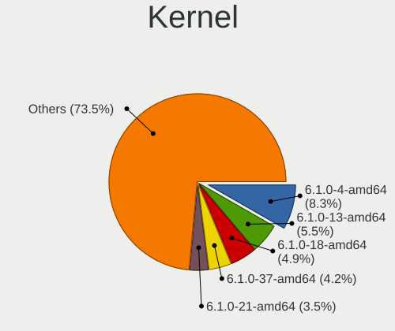

| Version           | Desktops | Percent |
|-------------------|----------|---------|
| 6.1.0-4-amd64     | 287      | 8.29%   |
| 6.1.0-13-amd64    | 192      | 5.55%   |
| 6.1.0-18-amd64    | 170      | 4.91%   |
| 6.1.0-37-amd64    | 146      | 4.22%   |
| 6.1.0-21-amd64    | 121      | 3.5%    |
| 6.1.0-17-amd64    | 117      | 3.38%   |
| 6.1.0-25-amd64    | 108      | 3.12%   |
| 6.1.0-28-amd64    | 107      | 3.09%   |
| 6.1.0-10-amd64    | 106      | 3.06%   |
| 6.1.0-23-amd64    | 103      | 2.98%   |
| 6.1.0-26-amd64    | 98       | 2.83%   |
| 6.1.0-9-amd64     | 97       | 2.8%    |
| 6.1.0-16-amd64    | 88       | 2.54%   |
| 6.1.0-27-amd64    | 87       | 2.51%   |
| 6.1.0-32-amd64    | 73       | 2.11%   |
| 6.1.0-31-amd64    | 70       | 2.02%   |
| 6.1.0-30-amd64    | 69       | 1.99%   |
| 6.1.0-11-amd64    | 67       | 1.94%   |
| 6.1.0-12-amd64    | 65       | 1.88%   |
| 6.1.0-20-amd64    | 63       | 1.82%   |
| 6.1.0-22-amd64    | 62       | 1.79%   |
| 6.1.0-34-amd64    | 48       | 1.39%   |
| 6.1.0-33-amd64    | 37       | 1.07%   |
| 6.1.0-35-amd64    | 34       | 0.98%   |
| 6.1.0-40-amd64    | 33       | 0.95%   |
| 6.1.0-29-amd64    | 33       | 0.95%   |
| 6.1.0-15-amd64    | 32       | 0.92%   |
| 6.1.0-7-amd64     | 29       | 0.84%   |
| 6.8.12-9-pve      | 28       | 0.81%   |
| 6.8.12-4-pve      | 24       | 0.69%   |
| 6.12.12+bpo-amd64 | 24       | 0.69%   |
| 6.1.0-38-amd64    | 24       | 0.69%   |
| 6.1.0-39-amd64    | 22       | 0.64%   |
| 6.8.4-2-pve       | 20       | 0.58%   |
| 6.8.12-8-pve      | 19       | 0.55%   |
| 6.8.12-2-pve      | 19       | 0.55%   |
| 6.5.11-7-pve      | 19       | 0.55%   |
| 6.1.0-41-amd64    | 19       | 0.55%   |
| 6.8.8-2-pve       | 18       | 0.52%   |
| 6.8.4-3-pve       | 17       | 0.49%   |

Kernel Family
-------------

Linux kernel without a distro release

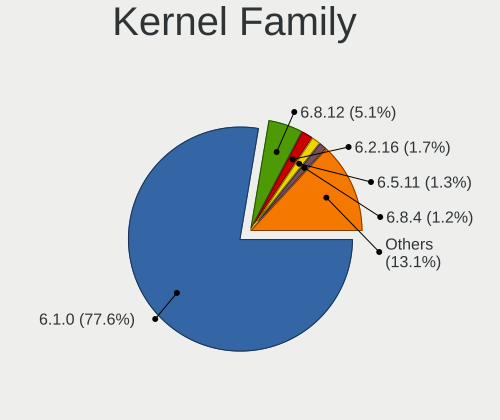

| Version | Desktops | Percent |
|---------|----------|---------|
| 6.1.0   | 2479     | 77.64%  |
| 6.8.12  | 162      | 5.07%   |
| 6.2.16  | 53       | 1.66%   |
| 6.5.11  | 43       | 1.35%   |
| 6.8.4   | 37       | 1.16%   |
| 6.5.13  | 29       | 0.91%   |
| 6.12.12 | 28       | 0.88%   |
| 6.8.8   | 25       | 0.78%   |
| 6.5.0   | 21       | 0.66%   |
| 6.7.12  | 19       | 0.6%    |
| 6.6.13  | 16       | 0.5%    |
| 6.9.7   | 15       | 0.47%   |
| 6.12.9  | 15       | 0.47%   |
| 6.10.6  | 14       | 0.44%   |
| 6.10.11 | 14       | 0.44%   |
| 6.4.0   | 13       | 0.41%   |
| 6.11.10 | 12       | 0.38%   |
| 6.12.22 | 8        | 0.25%   |
| 6.11.5  | 7        | 0.22%   |
| 6.0.0   | 7        | 0.22%   |
| 5.10.0  | 7        | 0.22%   |
| 6.6.44  | 6        | 0.19%   |
| 6.12.57 | 5        | 0.16%   |
| 6.12.33 | 4        | 0.13%   |
| 6.12.32 | 4        | 0.13%   |
| 6.12.19 | 4        | 0.13%   |
| 6.11.0  | 4        | 0.13%   |
| 6.6.15  | 3        | 0.09%   |
| 6.6.0   | 3        | 0.09%   |
| 6.14.10 | 3        | 0.09%   |
| 6.12.43 | 3        | 0.09%   |
| 6.12.38 | 3        | 0.09%   |
| 6.11.6  | 3        | 0.09%   |
| 6.1.67  | 3        | 0.09%   |
| 6.1.27  | 3        | 0.09%   |
| 6.1.119 | 3        | 0.09%   |
| 5.15.0  | 3        | 0.09%   |
| 6.9.12  | 2        | 0.06%   |
| 6.9.10  | 2        | 0.06%   |
| 6.7.4   | 2        | 0.06%   |

Kernel Major Ver.
-----------------

Linux kernel major version

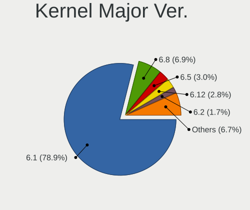

| Version | Desktops | Percent |
|---------|----------|---------|
| 6.1     | 2501     | 78.92%  |
| 6.8     | 219      | 6.91%   |
| 6.5     | 94       | 2.97%   |
| 6.12    | 89       | 2.81%   |
| 6.2     | 55       | 1.74%   |
| 6.6     | 35       | 1.1%    |
| 6.10    | 35       | 1.1%    |
| 6.11    | 29       | 0.92%   |
| 6.7     | 24       | 0.76%   |
| 6.9     | 21       | 0.66%   |
| 6.4     | 17       | 0.54%   |
| 5.10    | 9        | 0.28%   |
| 6.14    | 8        | 0.25%   |
| 6.0     | 7        | 0.22%   |
| 6.3     | 6        | 0.19%   |
| 5.15    | 5        | 0.16%   |
| 6.13    | 4        | 0.13%   |
| 6.15    | 3        | 0.09%   |
| 6.16    | 2        | 0.06%   |
| 4.1     | 2        | 0.06%   |
| 96.5    | 1        | 0.03%   |
| 5.4     | 1        | 0.03%   |
| 5.19    | 1        | 0.03%   |
| 4.19    | 1        | 0.03%   |

Arch
----

OS architecture (x86_64, i586, etc.)

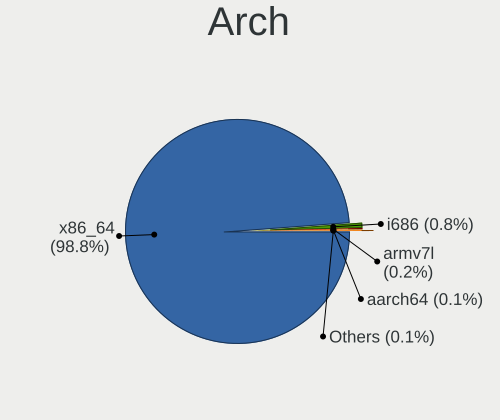

| Name        | Desktops | Percent |
|-------------|----------|---------|
| x86_64      | 3058     | 98.8%   |
| i686        | 24       | 0.78%   |
| armv7l      | 5        | 0.16%   |
| riscv64     | 2        | 0.06%   |
| aarch64     | 2        | 0.06%   |
| ppc64le     | 1        | 0.03%   |
| ppc64       | 1        | 0.03%   |
| mips        | 1        | 0.03%   |
| loongarch64 | 1        | 0.03%   |

DE
--

Desktop Environment

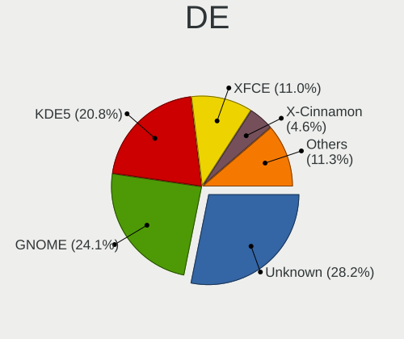

| Name              | Desktops | Percent |
|-------------------|----------|---------|
| Unknown           | 884      | 28.15%  |
| GNOME             | 758      | 24.14%  |
| KDE5              | 653      | 20.8%   |
| XFCE              | 346      | 11.02%  |
| X-Cinnamon        | 144      | 4.59%   |
| MATE              | 118      | 3.76%   |
| LXQt              | 49       | 1.56%   |
| LXDE              | 42       | 1.34%   |
| Cinnamon          | 31       | 0.99%   |
| GNOME Flashback   | 20       | 0.64%   |
| i3                | 18       | 0.57%   |
| GNOME Classic     | 13       | 0.41%   |
| Trinity           | 10       | 0.32%   |
| KDE               | 10       | 0.32%   |
| openbox           | 5        | 0.16%   |
| sway              | 4        | 0.13%   |
| KDE6              | 4        | 0.13%   |
| default           | 4        | 0.13%   |
| Budgie            | 4        | 0.13%   |
| lightdm-xsession  | 3        | 0.1%    |
| icewm             | 3        | 0.1%    |
| dwm               | 3        | 0.1%    |
| Cutefish          | 3        | 0.1%    |
| bspwm             | 3        | 0.1%    |
| awesome           | 2        | 0.06%   |
| x-session-manager | 1        | 0.03%   |
| WindowMaker       | 1        | 0.03%   |
| sway:GNOME        | 1        | 0.03%   |
| fluxbox           | 1        | 0.03%   |
| Enlightenment     | 1        | 0.03%   |
| BunsenLabs        | 1        | 0.03%   |

Display Server
--------------

X11 or Wayland

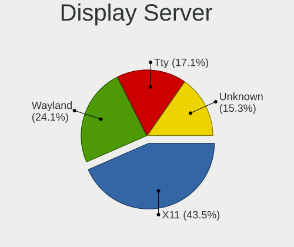

| Name    | Desktops | Percent |
|---------|----------|---------|
| X11     | 1377     | 43.45%  |
| Wayland | 765      | 24.14%  |
| Tty     | 541      | 17.07%  |
| Unknown | 486      | 15.34%  |

Display Manager
---------------

SDDM, LightDM, etc.

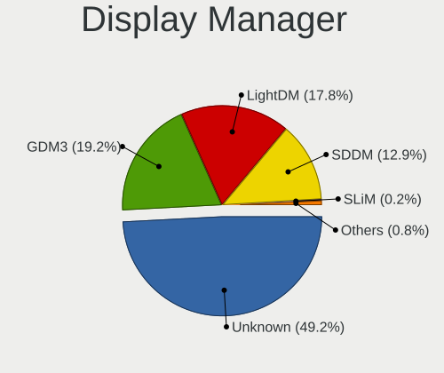

| Name    | Desktops | Percent |
|---------|----------|---------|
| Unknown | 1540     | 49.17%  |
| GDM3    | 600      | 19.16%  |
| LightDM | 557      | 17.78%  |
| SDDM    | 405      | 12.93%  |
| SLiM    | 6        | 0.19%   |
| LXDM    | 6        | 0.19%   |
| XDM     | 4        | 0.13%   |
| TDM     | 4        | 0.13%   |
| NODM    | 3        | 0.1%    |
| GDM     | 3        | 0.1%    |
| WDM     | 2        | 0.06%   |
| Ly      | 1        | 0.03%   |
| GREETD  | 1        | 0.03%   |

OS Lang
-------

Language

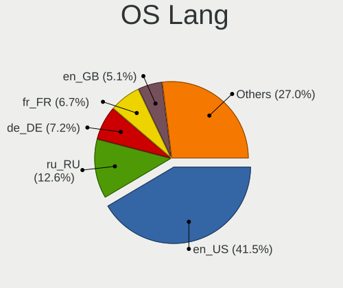

| Lang    | Desktops | Percent |
|---------|----------|---------|
| en_US   | 1291     | 41.5%   |
| ru_RU   | 391      | 12.57%  |
| de_DE   | 224      | 7.2%    |
| fr_FR   | 207      | 6.65%   |
| en_GB   | 159      | 5.11%   |
| pt_BR   | 93       | 2.99%   |
| it_IT   | 85       | 2.73%   |
| es_ES   | 70       | 2.25%   |
| Unknown | 66       | 2.12%   |
| en_CA   | 55       | 1.77%   |
| pl_PL   | 51       | 1.64%   |
| en_AU   | 37       | 1.19%   |
| es_AR   | 27       | 0.87%   |
| C       | 23       | 0.74%   |
| es_MX   | 22       | 0.71%   |
| hu_HU   | 18       | 0.58%   |
| en_IN   | 18       | 0.58%   |
| nl_NL   | 16       | 0.51%   |
| en_ZA   | 16       | 0.51%   |
| en_IE   | 16       | 0.51%   |
| zh_CN   | 13       | 0.42%   |
| es_VE   | 13       | 0.42%   |
| de_AT   | 12       | 0.39%   |
| fr_BE   | 10       | 0.32%   |
| en_NZ   | 10       | 0.32%   |
| de_CH   | 10       | 0.32%   |
| tr_TR   | 9        | 0.29%   |
| fr_CA   | 8        | 0.26%   |
| es_CL   | 8        | 0.26%   |
| es_PE   | 7        | 0.23%   |
| es_CO   | 7        | 0.23%   |
| ca_ES   | 7        | 0.23%   |
| sv_SE   | 6        | 0.19%   |
| nb_NO   | 6        | 0.19%   |
| es_EC   | 6        | 0.19%   |
| da_DK   | 6        | 0.19%   |
| nl_BE   | 5        | 0.16%   |
| ko_KR   | 5        | 0.16%   |
| ja_JP   | 5        | 0.16%   |
| fi_FI   | 5        | 0.16%   |

Boot Mode
---------

EFI or BIOS

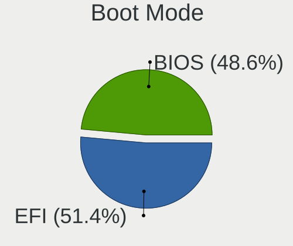

| Mode | Desktops | Percent |
|------|----------|---------|
| EFI  | 1603     | 51.44%  |
| BIOS | 1513     | 48.56%  |

Filesystem
----------

Type of filesystem

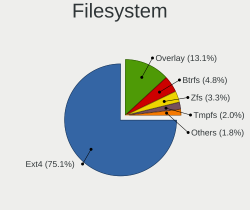

| Type     | Desktops | Percent |
|----------|----------|---------|
| Ext4     | 2348     | 75.06%  |
| Overlay  | 409      | 13.08%  |
| Btrfs    | 149      | 4.76%   |
| Zfs      | 102      | 3.26%   |
| Tmpfs    | 64       | 2.05%   |
| Xfs      | 37       | 1.18%   |
| Ext3     | 7        | 0.22%   |
| Unknown  | 7        | 0.22%   |
| Aufs     | 2        | 0.06%   |
| XXXXX    | 1        | 0.03%   |
| Reiserfs | 1        | 0.03%   |
| Ext2     | 1        | 0.03%   |

Part. scheme
------------

Scheme of partitioning

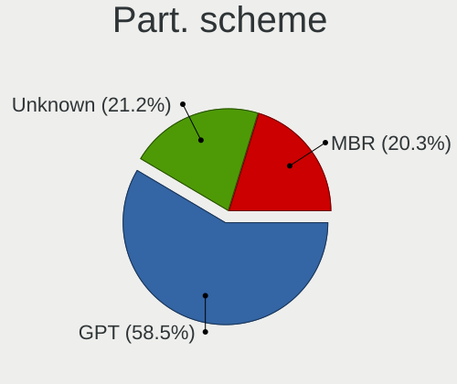

| Type    | Desktops | Percent |
|---------|----------|---------|
| GPT     | 1826     | 58.51%  |
| Unknown | 662      | 21.21%  |
| MBR     | 633      | 20.28%  |

Dual Boot with Linux/BSD
------------------------

Hosting more than one Linux/BSD

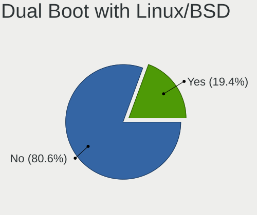

| Dual boot | Desktops | Percent |
|-----------|----------|---------|
| No        | 2536     | 80.58%  |
| Yes       | 611      | 19.42%  |

Dual Boot (Win)
---------------

Hosting Linux and Windows

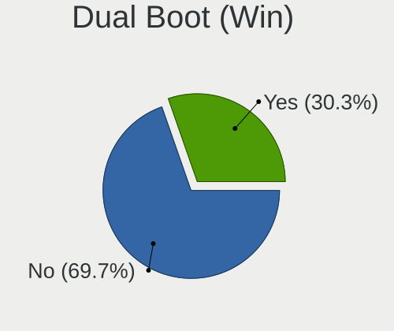

| Dual boot | Desktops | Percent |
|-----------|----------|---------|
| No        | 2183     | 69.66%  |
| Yes       | 951      | 30.34%  |

Board
-----

Vendor
------

Motherboard manufacturer

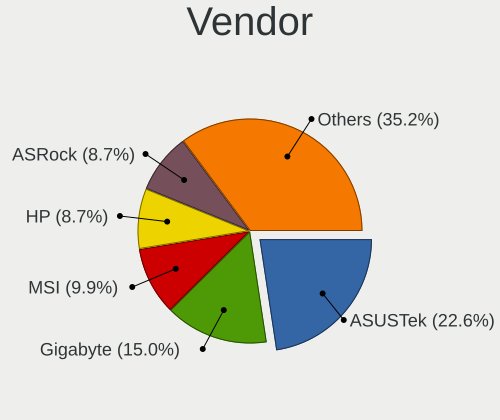

| Name                                 | Desktops | Percent |
|--------------------------------------|----------|---------|
| ASUSTek Computer                     | 700      | 22.62%  |
| Gigabyte Technology                  | 463      | 14.96%  |
| MSI                                  | 305      | 9.85%   |
| Hewlett-Packard                      | 270      | 8.72%   |
| ASRock                               | 268      | 8.66%   |
| Dell                                 | 214      | 6.91%   |
| Lenovo                               | 167      | 5.4%    |
| Unknown                              | 113      | 3.65%   |
| Intel                                | 95       | 3.07%   |
| Fujitsu                              | 41       | 1.32%   |
| Acer                                 | 40       | 1.29%   |
| Supermicro                           | 28       | 0.9%    |
| Shenzhen Meigao Electronic Equipment | 27       | 0.87%   |
| AZW                                  | 27       | 0.87%   |
| Foxconn                              | 21       | 0.68%   |
| ECS                                  | 21       | 0.68%   |
| Biostar                              | 21       | 0.68%   |
| ASRockRack                           | 13       | 0.42%   |
| OEM                                  | 11       | 0.36%   |
| Huanan                               | 11       | 0.36%   |
| Pegatron                             | 10       | 0.32%   |
| HC Technology.                       | 10       | 0.32%   |
| Apple                                | 10       | 0.32%   |
| Inventec                             | 8        | 0.26%   |
| BESSTAR Tech                         | 8        | 0.26%   |
| Techvision                           | 7        | 0.23%   |
| AMI                                  | 7        | 0.23%   |
| Shuttle                              | 6        | 0.19%   |
| Medion                               | 6        | 0.19%   |
| MACHINIST                            | 6        | 0.19%   |
| GEEKOM                               | 5        | 0.16%   |
| Alienware                            | 5        | 0.16%   |
| TianBei                              | 4        | 0.13%   |
| System76                             | 4        | 0.13%   |
| JGINYUE                              | 4        | 0.13%   |
| Google                               | 4        | 0.13%   |
| CWWK                                 | 4        | 0.13%   |
| Win element                          | 3        | 0.1%    |
| WeiBu                                | 3        | 0.1%    |
| UGREEN                               | 3        | 0.1%    |

Model
-----

Motherboard model

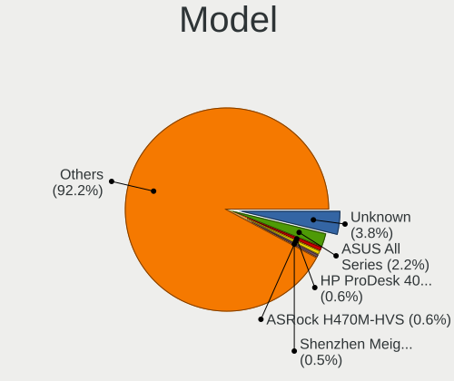

| Name                                              | Desktops | Percent |
|---------------------------------------------------|----------|---------|
| Unknown                                           | 117      | 3.78%   |
| ASUS All Series                                   | 69       | 2.23%   |
| HP ProDesk 400 G2.5 SFF                           | 20       | 0.65%   |
| ASRock H470M-HVS                                  | 20       | 0.65%   |
| Shenzhen Meigao Electronic Equipment Venus series | 16       | 0.52%   |
| MSI MS-7996                                       | 15       | 0.48%   |
| ASUS P5QL-CM                                      | 15       | 0.48%   |
| Lenovo ThinkCentre M55p 8808D8U                   | 14       | 0.45%   |
| HP Z440 Workstation                               | 12       | 0.39%   |
| Dell OptiPlex 9020                                | 12       | 0.39%   |
| Dell OptiPlex 7010                                | 12       | 0.39%   |
| ASUS PRIME B450M-K                                | 12       | 0.39%   |
| Lenovo ThinkCentre M73 10AXS11800                 | 11       | 0.36%   |
| Intel X99                                         | 11       | 0.36%   |
| Gigabyte H81M-S2V                                 | 11       | 0.36%   |
| Gigabyte B560M DS3H V3                            | 11       | 0.36%   |
| ASUS S20 K29                                      | 11       | 0.36%   |
| HP EliteDesk 800 G2 DM 35W                        | 10       | 0.32%   |
| AZW MINI S                                        | 10       | 0.32%   |
| ASUS ROG STRIX B550-F GAMING                      | 10       | 0.32%   |
| MSI MS-7B86                                       | 9        | 0.29%   |
| Lenovo ThinkCentre M79 10JAS05300                 | 9        | 0.29%   |
| HP ProDesk 400 G3 SFF                             | 9        | 0.29%   |
| ECS G31T-M9                                       | 9        | 0.29%   |
| Dell OptiPlex 7050                                | 9        | 0.29%   |
| MSI MS-7C56                                       | 8        | 0.26%   |
| MSI MS-7B89                                       | 8        | 0.26%   |
| MSI MS-7817                                       | 8        | 0.26%   |
| Intel Jasper Lake Client Platform                 | 8        | 0.26%   |
| Gigabyte B450M DS3H                               | 8        | 0.26%   |
| Gigabyte A320M-S2H V2                             | 8        | 0.26%   |
| ASUS PRIME A320M-K                                | 8        | 0.26%   |
| ASUS H110M-R                                      | 8        | 0.26%   |
| Techvision TVI7309X                               | 7        | 0.23%   |
| MSI MS-7C95                                       | 7        | 0.23%   |
| MSI MS-7C91                                       | 7        | 0.23%   |
| MSI MS-7C02                                       | 7        | 0.23%   |
| HP Z420 Workstation                               | 7        | 0.23%   |
| Dell OptiPlex 3080                                | 7        | 0.23%   |
| Dell OptiPlex 3020                                | 7        | 0.23%   |

Model Family
------------

Motherboard model prefix

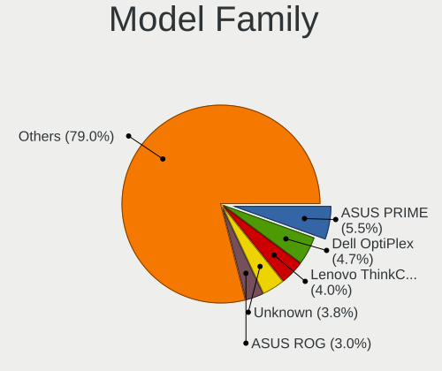

| Name                                       | Desktops | Percent |
|--------------------------------------------|----------|---------|
| ASUS PRIME                                 | 170      | 5.49%   |
| Dell OptiPlex                              | 145      | 4.68%   |
| Lenovo ThinkCentre                         | 125      | 4.04%   |
| Unknown                                    | 117      | 3.78%   |
| ASUS ROG                                   | 93       | 3%      |
| HP ProDesk                                 | 73       | 2.36%   |
| ASUS All                                   | 69       | 2.23%   |
| ASUS TUF                                   | 65       | 2.1%    |
| HP EliteDesk                               | 57       | 1.84%   |
| HP Compaq                                  | 38       | 1.23%   |
| Dell Precision                             | 28       | 0.9%    |
| Gigabyte X570                              | 25       | 0.81%   |
| Gigabyte B450M                             | 23       | 0.74%   |
| Fujitsu ESPRIMO                            | 23       | 0.74%   |
| Gigabyte B550M                             | 20       | 0.65%   |
| ASRock H470M-HVS                           | 20       | 0.65%   |
| Gigabyte B450                              | 19       | 0.61%   |
| ASUS PRO                                   | 19       | 0.61%   |
| Acer Veriton                               | 19       | 0.61%   |
| Lenovo ThinkStation                        | 18       | 0.58%   |
| Shenzhen Meigao Electronic Equipment Venus | 16       | 0.52%   |
| Gigabyte B560M                             | 16       | 0.52%   |
| Acer Aspire                                | 16       | 0.52%   |
| MSI MS-7996                                | 15       | 0.48%   |
| Gigabyte B550                              | 15       | 0.48%   |
| Dell Inspiron                              | 15       | 0.48%   |
| ASUS P5QL-CM                               | 15       | 0.48%   |
| HP ProLiant                                | 14       | 0.45%   |
| ASRock X570                                | 13       | 0.42%   |
| Intel X99                                  | 12       | 0.39%   |
| HP Z440                                    | 12       | 0.39%   |
| Gigabyte Z790                              | 12       | 0.39%   |
| Gigabyte H81M-S2V                          | 11       | 0.36%   |
| ASUS S20                                   | 11       | 0.36%   |
| ASUS P8H61-M                               | 11       | 0.36%   |
| ASUS M5A97                                 | 11       | 0.36%   |
| ASRock B450                                | 11       | 0.36%   |
| Gigabyte B650                              | 10       | 0.32%   |
| Gigabyte A320M-S2H                         | 10       | 0.32%   |
| AZW MINI                                   | 10       | 0.32%   |

MFG Year
--------

Motherboard manufacture year

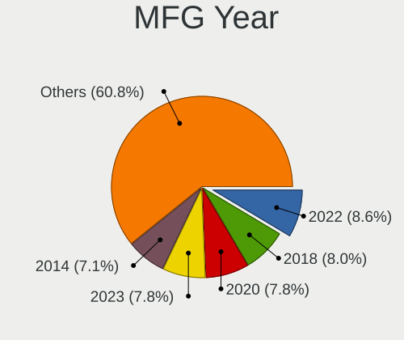

| Year    | Desktops | Percent |
|---------|----------|---------|
| 2022    | 265      | 8.56%   |
| 2018    | 247      | 7.98%   |
| 2020    | 242      | 7.82%   |
| 2023    | 240      | 7.75%   |
| 2014    | 220      | 7.11%   |
| 2012    | 211      | 6.82%   |
| 2021    | 209      | 6.75%   |
| 2019    | 199      | 6.43%   |
| 2013    | 175      | 5.65%   |
| 2017    | 146      | 4.72%   |
| 2015    | 142      | 4.59%   |
| 2016    | 139      | 4.49%   |
| 2011    | 132      | 4.26%   |
| 2024    | 126      | 4.07%   |
| 2010    | 113      | 3.65%   |
| 2009    | 97       | 3.13%   |
| 2007    | 72       | 2.33%   |
| 2008    | 63       | 2.04%   |
| 2006    | 15       | 0.48%   |
| Unknown | 15       | 0.48%   |
| 2025    | 12       | 0.39%   |
| 2005    | 6        | 0.19%   |
| 2004    | 5        | 0.16%   |
| 2002    | 2        | 0.06%   |
| 2003    | 1        | 0.03%   |
| 2000    | 1        | 0.03%   |

Form Factor
-----------

Physical design of the computer

| Name    | Desktops | Percent |
|---------|----------|---------|
| Desktop | 3095     | 100%    |

Secure Boot
-----------

Enabled or disabled

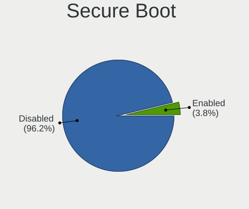

| State    | Desktops | Percent |
|----------|----------|---------|
| Disabled | 2984     | 96.23%  |
| Enabled  | 117      | 3.77%   |

Coreboot
--------

Have coreboot on board

| Used | Desktops | Percent |
|------|----------|---------|
| No   | 3087     | 99.74%  |
| Yes  | 8        | 0.26%   |

RAM Size
--------

Total RAM memory

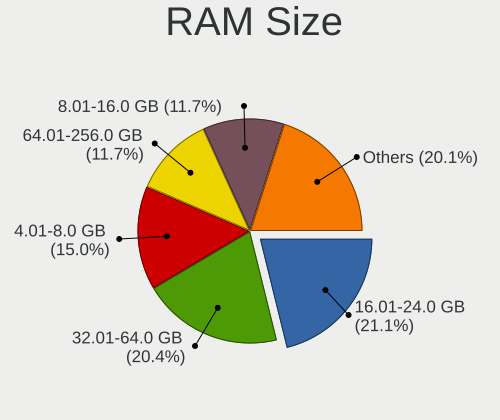

| Size in GB      | Desktops | Percent |
|-----------------|----------|---------|
| 16.01-24.0      | 663      | 21.15%  |
| 32.01-64.0      | 638      | 20.35%  |
| 4.01-8.0        | 469      | 14.96%  |
| 64.01-256.0     | 368      | 11.74%  |
| 8.01-16.0       | 367      | 11.71%  |
| 3.01-4.0        | 334      | 10.65%  |
| 24.01-32.0      | 132      | 4.21%   |
| 1.01-2.0        | 88       | 2.81%   |
| 2.01-3.0        | 35       | 1.12%   |
| More than 256.0 | 21       | 0.67%   |
| 0.51-1.0        | 14       | 0.45%   |
| 0.01-0.5        | 4        | 0.13%   |
| Unknown         | 2        | 0.06%   |

RAM Used
--------

Used RAM memory

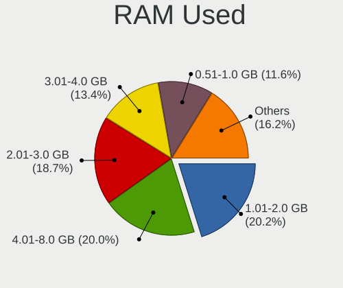

| Used GB         | Desktops | Percent |
|-----------------|----------|---------|
| 1.01-2.0        | 674      | 20.16%  |
| 4.01-8.0        | 669      | 20.01%  |
| 2.01-3.0        | 625      | 18.69%  |
| 3.01-4.0        | 447      | 13.37%  |
| 0.51-1.0        | 387      | 11.57%  |
| 8.01-16.0       | 250      | 7.48%   |
| 0.01-0.5        | 81       | 2.42%   |
| 16.01-24.0      | 79       | 2.36%   |
| 24.01-32.0      | 51       | 1.53%   |
| 32.01-64.0      | 50       | 1.5%    |
| 64.01-256.0     | 25       | 0.75%   |
| More than 256.0 | 3        | 0.09%   |
| Unknown         | 2        | 0.06%   |
| 0               | 1        | 0.03%   |

Total Drives
------------

Number of drives on board

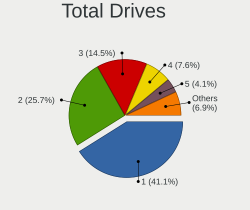

| Drives | Desktops | Percent |
|--------|----------|---------|
| 1      | 1314     | 41.09%  |
| 2      | 823      | 25.73%  |
| 3      | 464      | 14.51%  |
| 4      | 244      | 7.63%   |
| 5      | 131      | 4.1%    |
| 6      | 69       | 2.16%   |
| 7      | 44       | 1.38%   |
| 8      | 22       | 0.69%   |
| 0      | 20       | 0.63%   |
| 9      | 14       | 0.44%   |
| 10     | 9        | 0.28%   |
| 11     | 8        | 0.25%   |
| 12     | 7        | 0.22%   |
| 14     | 6        | 0.19%   |
| 13     | 5        | 0.16%   |
| 15     | 3        | 0.09%   |
| 27     | 2        | 0.06%   |
| 21     | 2        | 0.06%   |
| 17     | 2        | 0.06%   |
| 16     | 2        | 0.06%   |
| 33     | 1        | 0.03%   |
| 32     | 1        | 0.03%   |
| 30     | 1        | 0.03%   |
| 29     | 1        | 0.03%   |
| 26     | 1        | 0.03%   |
| 19     | 1        | 0.03%   |
| 18     | 1        | 0.03%   |

Has CD-ROM
----------

Has CD-ROM on board

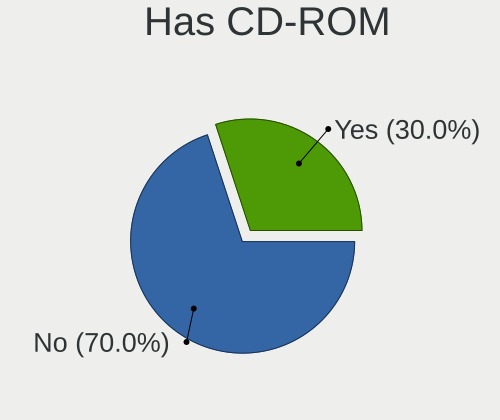

| Presented | Desktops | Percent |
|-----------|----------|---------|
| No        | 2183     | 69.97%  |
| Yes       | 937      | 30.03%  |

Has Ethernet
------------

Has Ethernet on board

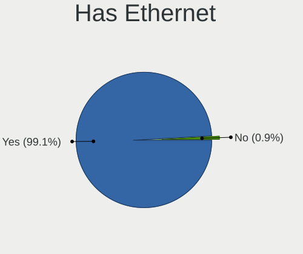

| Presented | Desktops | Percent |
|-----------|----------|---------|
| Yes       | 3067     | 99.1%   |
| No        | 28       | 0.9%    |

Has WiFi
--------

Has WiFi module

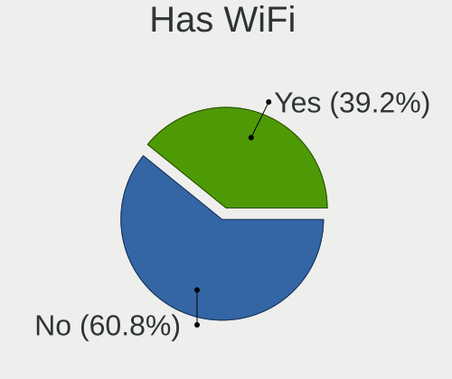

| Presented | Desktops | Percent |
|-----------|----------|---------|
| No        | 1897     | 60.84%  |
| Yes       | 1221     | 39.16%  |

Has Bluetooth
-------------

Has Bluetooth module

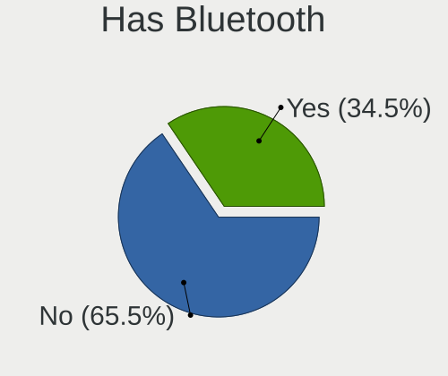

| Presented | Desktops | Percent |
|-----------|----------|---------|
| No        | 2050     | 65.54%  |
| Yes       | 1078     | 34.46%  |

Location
--------

Country
-------

Geographic location (country)

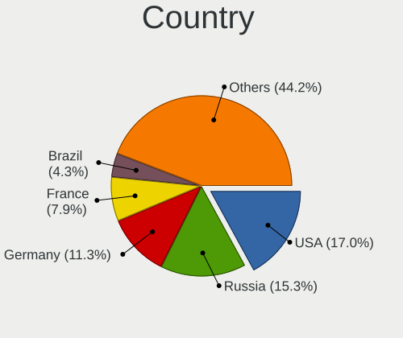

| Country      | Desktops | Percent |
|--------------|----------|---------|
| USA          | 529      | 17.04%  |
| Russia       | 476      | 15.33%  |
| Germany      | 351      | 11.3%   |
| France       | 246      | 7.92%   |
| Brazil       | 132      | 4.25%   |
| Italy        | 119      | 3.83%   |
| UK           | 109      | 3.51%   |
| Spain        | 95       | 3.06%   |
| Canada       | 94       | 3.03%   |
| Poland       | 73       | 2.35%   |
| Australia    | 52       | 1.67%   |
| Netherlands  | 48       | 1.55%   |
| Belgium      | 39       | 1.26%   |
| Mexico       | 38       | 1.22%   |
| Argentina    | 38       | 1.22%   |
| Switzerland  | 35       | 1.13%   |
| Austria      | 33       | 1.06%   |
| Hungary      | 31       | 1%      |
| China        | 30       | 0.97%   |
| Romania      | 24       | 0.77%   |
| India        | 24       | 0.77%   |
| Finland      | 24       | 0.77%   |
| Sweden       | 23       | 0.74%   |
| Denmark      | 21       | 0.68%   |
| Norway       | 19       | 0.61%   |
| Portugal     | 18       | 0.58%   |
| Venezuela    | 17       | 0.55%   |
| Japan        | 17       | 0.55%   |
| South Africa | 16       | 0.52%   |
| Greece       | 15       | 0.48%   |
| Turkey       | 14       | 0.45%   |
| Slovakia     | 14       | 0.45%   |
| New Zealand  | 14       | 0.45%   |
| Indonesia    | 14       | 0.45%   |
| Czechia      | 14       | 0.45%   |
| Bulgaria     | 14       | 0.45%   |
| Vietnam      | 12       | 0.39%   |
| Serbia       | 10       | 0.32%   |
| Hong Kong    | 10       | 0.32%   |
| Colombia     | 10       | 0.32%   |

City
----

Geographic location (city)

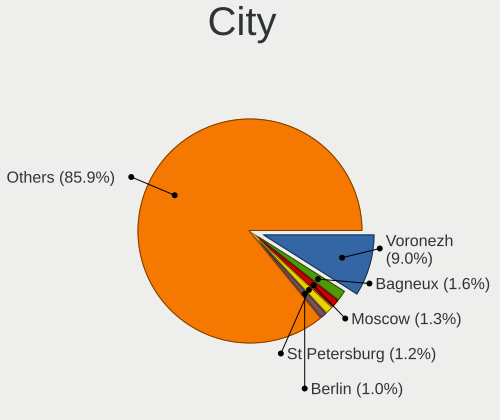

| City              | Desktops | Percent |
|-------------------|----------|---------|
| Voronezh          | 288      | 8.99%   |
| Bagneux           | 52       | 1.62%   |
| Moscow            | 41       | 1.28%   |
| St Petersburg     | 39       | 1.22%   |
| Berlin            | 32       | 1%      |
| Roubaix           | 31       | 0.97%   |
| Paris             | 31       | 0.97%   |
| Toronto           | 24       | 0.75%   |
| Bangor            | 21       | 0.66%   |
| Vienna            | 19       | 0.59%   |
| Sao Paulo         | 19       | 0.59%   |
| Milan             | 17       | 0.53%   |
| Frankfurt am Main | 17       | 0.53%   |
| Amsterdam         | 16       | 0.5%    |
| Madrid            | 15       | 0.47%   |
| Sydney            | 14       | 0.44%   |
| Hamburg           | 14       | 0.44%   |
| Munich            | 13       | 0.41%   |
| Helsinki          | 12       | 0.37%   |
| Zurich            | 11       | 0.34%   |
| Yekaterinburg     | 11       | 0.34%   |
| Rio de Janeiro    | 11       | 0.34%   |
| Budapest          | 11       | 0.34%   |
| Bonn              | 11       | 0.34%   |
| Seattle           | 10       | 0.31%   |
| Seville           | 9        | 0.28%   |
| Levanger          | 9        | 0.28%   |
| Denver            | 9        | 0.28%   |
| Brussels          | 9        | 0.28%   |
| Stuttgart         | 8        | 0.25%   |
| Stockholm         | 8        | 0.25%   |
| Sofia             | 8        | 0.25%   |
| Rome              | 8        | 0.25%   |
| Prague            | 8        | 0.25%   |
| Poznan            | 8        | 0.25%   |
| Melbourne         | 8        | 0.25%   |
| Los Angeles       | 8        | 0.25%   |
| Falkenstein       | 8        | 0.25%   |
| Chicago           | 8        | 0.25%   |
| Bucharest         | 8        | 0.25%   |

Drives
------

Drive Vendor
------------

Hard drive vendors

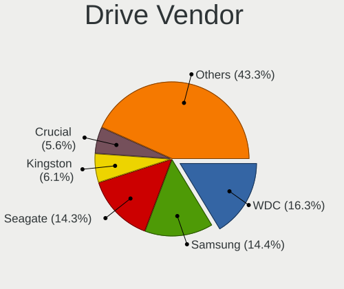

| Vendor                      | Desktops | Drives | Percent |
|-----------------------------|----------|--------|---------|
| WDC                         | 924      | 1807   | 16.32%  |
| Samsung Electronics         | 816      | 1407   | 14.41%  |
| Seagate                     | 810      | 1531   | 14.31%  |
| Kingston                    | 345      | 519    | 6.09%   |
| Crucial                     | 316      | 445    | 5.58%   |
| Toshiba                     | 309      | 592    | 5.46%   |
| SanDisk                     | 281      | 383    | 4.96%   |
| Hitachi                     | 134      | 199    | 2.37%   |
| China                       | 89       | 104    | 1.57%   |
| Intel                       | 86       | 138    | 1.52%   |
| A-DATA Technology           | 74       | 115    | 1.31%   |
| SPCC                        | 64       | 71     | 1.13%   |
| HGST                        | 64       | 152    | 1.13%   |
| Kingston Technology Company | 61       | 82     | 1.08%   |
| SK hynix                    | 60       | 78     | 1.06%   |
| Unknown                     | 59       | 97     | 1.04%   |
| PNY                         | 50       | 69     | 0.88%   |
| Netac                       | 49       | 59     | 0.87%   |
| Unknown                     | 43       | 56     | 0.76%   |
| Patriot                     | 40       | 57     | 0.71%   |
| Micron Technology           | 40       | 61     | 0.71%   |
| Silicon Motion              | 35       | 38     | 0.62%   |
| Intenso                     | 33       | 40     | 0.58%   |
| Transcend                   | 31       | 64     | 0.55%   |
| MAXIO Technology (Hangzhou) | 30       | 39     | 0.53%   |
| GOODRAM                     | 28       | 51     | 0.49%   |
| Hewlett-Packard             | 26       | 62     | 0.46%   |
| Phison Electronics          | 25       | 37     | 0.44%   |
| Lexar                       | 25       | 33     | 0.44%   |
| Corsair                     | 25       | 31     | 0.44%   |
| Team                        | 24       | 29     | 0.42%   |
| Phison                      | 23       | 28     | 0.41%   |
| Gigabyte Technology         | 22       | 36     | 0.39%   |
| Micron/Crucial Technology   | 21       | 27     | 0.37%   |
| Apacer                      | 21       | 34     | 0.37%   |
| Maxtor                      | 20       | 22     | 0.35%   |
| Fanxiang                    | 20       | 28     | 0.35%   |
| JMicron Technology          | 19       | 20     | 0.34%   |
| Realtek Semiconductor       | 18       | 19     | 0.32%   |
| OCZ                         | 16       | 18     | 0.28%   |

Drive Model
-----------

Hard drive models

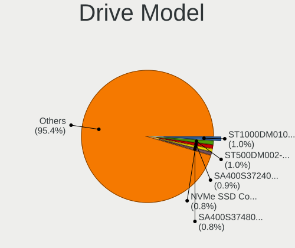

| Model                                              | Desktops | Percent |
|----------------------------------------------------|----------|---------|
| Seagate ST1000DM010-2EP102 1TB                     | 70       | 1.05%   |
| Seagate ST500DM002-1BD142 500GB                    | 68       | 1.02%   |
| Kingston SA400S37240G 240GB SSD                    | 62       | 0.93%   |
| Samsung NVMe SSD Controller SM981/PM981/PM983 1TB  | 54       | 0.81%   |
| Kingston SA400S37480G 480GB SSD                    | 54       | 0.81%   |
| Unknown                                            | 43       | 0.64%   |
| Toshiba DT01ACA100 1TB                             | 41       | 0.61%   |
| SanDisk NVMe SSD Drive 2TB                         | 40       | 0.6%    |
| Crucial CT1000MX500SSD1 1TB                        | 40       | 0.6%    |
| SanDisk NVMe SSD Drive 1TB                         | 39       | 0.58%   |
| Samsung SSD 860 EVO 500GB                          | 39       | 0.58%   |
| Samsung SSD 850 EVO 500GB                          | 38       | 0.57%   |
| Crucial CT480BX500SSD1 480GB                       | 38       | 0.57%   |
| WDC WD10EZEX-08WN4A0 1TB                           | 37       | 0.55%   |
| Crucial CT240BX500SSD1 240GB                       | 36       | 0.54%   |
| Toshiba HDWD110 1TB                                | 35       | 0.52%   |
| Seagate ST2000DM008-2FR102 2TB                     | 35       | 0.52%   |
| Samsung SSD 850 EVO 250GB                          | 35       | 0.52%   |
| Samsung SSD 870 EVO 500GB                          | 34       | 0.51%   |
| Samsung NVMe SSD Controller PM9A1/PM9A3/980PRO 1TB | 34       | 0.51%   |
| Toshiba DT01ACA050 500GB                           | 33       | 0.49%   |
| WDC WD5000AAKX-60U6AA0 500GB                       | 32       | 0.48%   |
| Samsung SSD 970 EVO Plus 1TB                       | 31       | 0.46%   |
| Crucial CT500MX500SSD1 500GB                       | 30       | 0.45%   |
| Samsung SSD 870 EVO 1TB                            | 29       | 0.43%   |
| Seagate ST1000DM003-1ER162 1TB                     | 28       | 0.42%   |
| Kingston SA400S37120G 120GB SSD                    | 28       | 0.42%   |
| Seagate ST4000DM004-2CV104 4TB                     | 27       | 0.4%    |
| Samsung SSD 980 PRO 1TB                            | 27       | 0.4%    |
| Kingston Company SNV2S1000G 1TB                    | 26       | 0.39%   |
| Netac SSD 240GB                                    | 24       | 0.36%   |
| Kingston SA400S37960G 960GB SSD                    | 24       | 0.36%   |
| Samsung SSD 980 1TB                                | 23       | 0.34%   |
| Crucial CT1000BX500SSD1 1TB                        | 23       | 0.34%   |
| Seagate ST1000DM003-1CH162 1TB                     | 22       | 0.33%   |
| Samsung SSD 860 EVO 250GB                          | 22       | 0.33%   |
| Toshiba DT01ACA200 2TB                             | 21       | 0.31%   |
| Samsung SSD 860 EVO 1TB                            | 21       | 0.31%   |
| Samsung SSD 990 PRO 2TB                            | 20       | 0.3%    |
| Kingston SV300S37A120G 120GB SSD                   | 20       | 0.3%    |

HDD Vendor
----------

Hard disk drive vendors

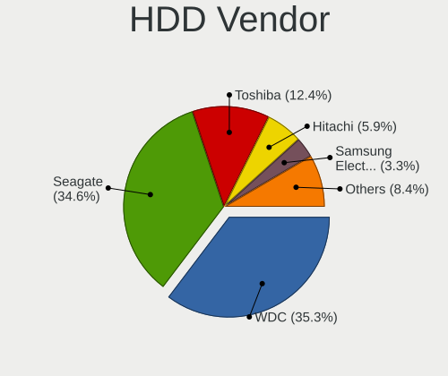

| Vendor              | Desktops | Drives | Percent |
|---------------------|----------|--------|---------|
| WDC                 | 796      | 1588   | 35.31%  |
| Seagate             | 780      | 1481   | 34.61%  |
| Toshiba             | 280      | 557    | 12.42%  |
| Hitachi             | 134      | 199    | 5.94%   |
| Samsung Electronics | 74       | 94     | 3.28%   |
| HGST                | 63       | 151    | 2.8%    |
| Maxtor              | 20       | 22     | 0.89%   |
| Unknown             | 14       | 15     | 0.62%   |
| Hewlett-Packard     | 10       | 40     | 0.44%   |
| TO Exter            | 8        | 15     | 0.35%   |
| ASMT                | 8        | 21     | 0.35%   |
| JMicron Technology  | 7        | 8      | 0.31%   |
| External            | 7        | 7      | 0.31%   |
| Fujitsu             | 6        | 6      | 0.27%   |
| USB3.0              | 5        | 5      | 0.22%   |
| HPE                 | 5        | 16     | 0.22%   |
| QNAP                | 4        | 9      | 0.18%   |
| Apple               | 3        | 3      | 0.13%   |
| Unknown             | 3        | 12     | 0.13%   |
| WD MediaMax         | 2        | 2      | 0.09%   |
| QEMU                | 2        | 2      | 0.09%   |
| LaCie               | 2        | 2      | 0.09%   |
| Intenso             | 2        | 2      | 0.09%   |
| HGST HTS            | 2        | 2      | 0.09%   |
| XrayDisk            | 1        | 1      | 0.04%   |
| WUH72181            | 1        | 2      | 0.04%   |
| USB 3.1             | 1        | 1      | 0.04%   |
| USB                 | 1        | 1      | 0.04%   |
| TDAS                | 1        | 4      | 0.04%   |
| T-FORCE             | 1        | 2      | 0.04%   |
| SSK                 | 1        | 1      | 0.04%   |
| MARVELL             | 1        | 2      | 0.04%   |
| KESU                | 1        | 1      | 0.04%   |
| JetFlash            | 1        | 1      | 0.04%   |
| IET                 | 1        | 1      | 0.04%   |
| IBM-D050            | 1        | 2      | 0.04%   |
| H/W JBOD            | 1        | 1      | 0.04%   |
| H/W                 | 1        | 7      | 0.04%   |
| ExcelStor           | 1        | 1      | 0.04%   |
| Elite               | 1        | 1      | 0.04%   |

SSD Vendor
----------

Solid state drive vendors

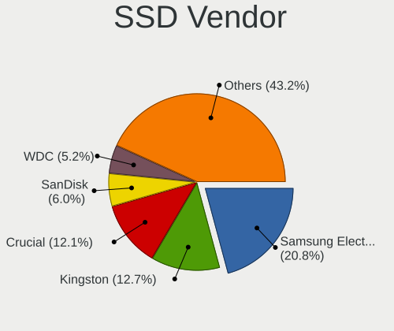

| Vendor              | Desktops | Drives | Percent |
|---------------------|----------|--------|---------|
| Samsung Electronics | 408      | 635    | 20.82%  |
| Kingston            | 248      | 372    | 12.65%  |
| Crucial             | 237      | 322    | 12.09%  |
| SanDisk             | 118      | 149    | 6.02%   |
| WDC                 | 102      | 129    | 5.2%    |
| China               | 87       | 102    | 4.44%   |
| Intel               | 51       | 91     | 2.6%    |
| SPCC                | 50       | 54     | 2.55%   |
| A-DATA Technology   | 45       | 81     | 2.3%    |
| Netac               | 43       | 46     | 2.19%   |
| PNY                 | 42       | 55     | 2.14%   |
| Patriot             | 32       | 49     | 1.63%   |
| Intenso             | 30       | 35     | 1.53%   |
| Transcend           | 24       | 55     | 1.22%   |
| GOODRAM             | 23       | 33     | 1.17%   |
| Unknown             | 20       | 21     | 1.02%   |
| Micron Technology   | 19       | 23     | 0.97%   |
| Apacer              | 18       | 29     | 0.92%   |
| Toshiba             | 17       | 20     | 0.87%   |
| OCZ                 | 16       | 18     | 0.82%   |
| Team                | 15       | 16     | 0.77%   |
| Fanxiang            | 13       | 17     | 0.66%   |
| Seagate             | 12       | 16     | 0.61%   |
| Gigabyte Technology | 12       | 15     | 0.61%   |
| LITEON              | 11       | 21     | 0.56%   |
| Hewlett-Packard     | 11       | 16     | 0.56%   |
| Lexar               | 10       | 15     | 0.51%   |
| Corsair             | 10       | 10     | 0.51%   |
| XrayDisk            | 9        | 11     | 0.46%   |
| SK hynix            | 9        | 10     | 0.46%   |
| KingSpec            | 8        | 9      | 0.41%   |
| Emtec               | 8        | 8      | 0.41%   |
| SABRENT             | 7        | 7      | 0.36%   |
| Plextor             | 7        | 7      | 0.36%   |
| Verbatim            | 6        | 7      | 0.31%   |
| T-FORCE             | 6        | 7      | 0.31%   |
| FORESEE             | 6        | 6      | 0.31%   |
| Lenovo              | 5        | 5      | 0.26%   |
| KIOXIA-EXCERIA      | 5        | 5      | 0.26%   |
| Innodisk            | 5        | 5      | 0.26%   |

Drive Kind
----------

HDD or SSD

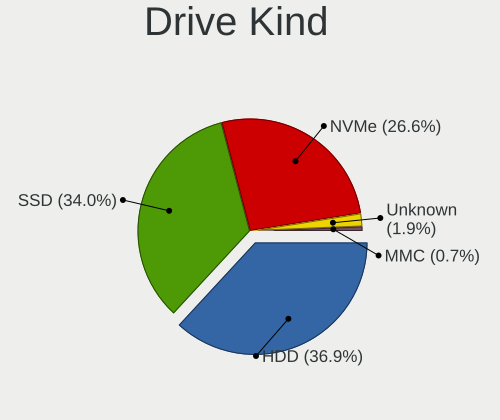

| Kind    | Desktops | Drives | Percent |
|---------|----------|--------|---------|
| HDD     | 1755     | 4289   | 36.88%  |
| SSD     | 1620     | 2744   | 34.04%  |
| NVMe    | 1264     | 2113   | 26.56%  |
| Unknown | 89       | 142    | 1.87%   |
| MMC     | 31       | 38     | 0.65%   |

Drive Connector
---------------

SATA, SAS, NVMe, etc.

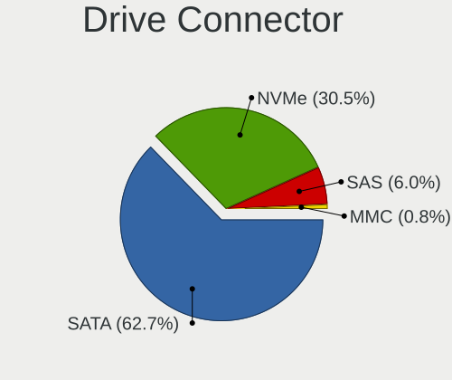

| Type | Desktops | Drives | Percent |
|------|----------|--------|---------|
| SATA | 2584     | 6662   | 62.72%  |
| NVMe | 1258     | 2080   | 30.53%  |
| SAS  | 247      | 546    | 6%      |
| MMC  | 31       | 38     | 0.75%   |

Drive Size
----------

Size of hard drive

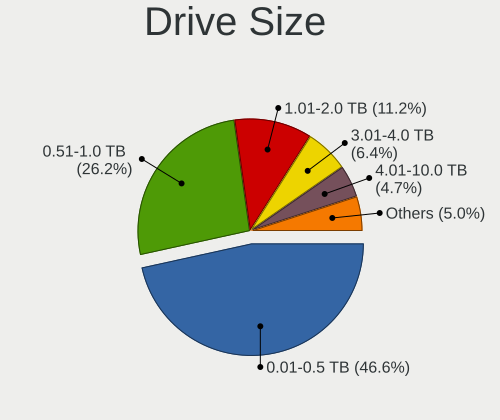

| Size in TB | Desktops | Drives | Percent |
|------------|----------|--------|---------|
| 0.01-0.5   | 1789     | 2909   | 46.56%  |
| 0.51-1.0   | 1007     | 1615   | 26.21%  |
| 1.01-2.0   | 431      | 815    | 11.22%  |
| 3.01-4.0   | 244      | 615    | 6.35%   |
| 4.01-10.0  | 179      | 587    | 4.66%   |
| 2.01-3.0   | 111      | 197    | 2.89%   |
| 10.01-20.0 | 77       | 286    | 2%      |
| 20.01-50.0 | 3        | 8      | 0.08%   |
| 0          | 1        | 1      | 0.03%   |

Space Total
-----------

Amount of disk space available on the file system

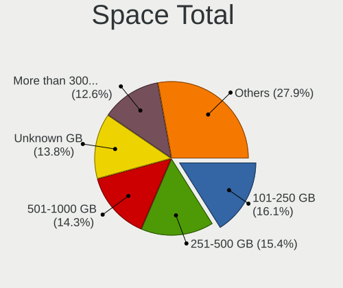

| Size in GB     | Desktops | Percent |
|----------------|----------|---------|
| 101-250        | 516      | 16.06%  |
| 251-500        | 494      | 15.38%  |
| 501-1000       | 459      | 14.29%  |
| Unknown        | 443      | 13.79%  |
| More than 3000 | 405      | 12.61%  |
| 1001-2000      | 343      | 10.68%  |
| 51-100         | 195      | 6.07%   |
| 2001-3000      | 154      | 4.79%   |
| 1-20           | 127      | 3.95%   |
| 21-50          | 76       | 2.37%   |

Space Used
----------

Amount of used disk space

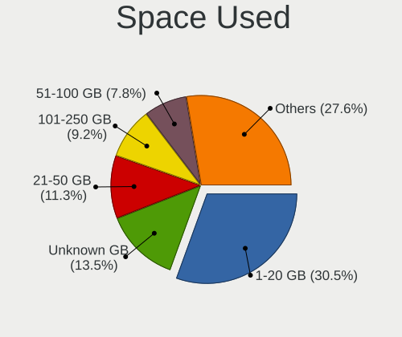

| Used GB        | Desktops | Percent |
|----------------|----------|---------|
| 1-20           | 1000     | 30.53%  |
| Unknown        | 443      | 13.52%  |
| 21-50          | 371      | 11.32%  |
| 101-250        | 303      | 9.25%   |
| 51-100         | 254      | 7.75%   |
| 251-500        | 247      | 7.54%   |
| 501-1000       | 233      | 7.11%   |
| 1001-2000      | 186      | 5.68%   |
| More than 3000 | 172      | 5.25%   |
| 2001-3000      | 64       | 1.95%   |
| 0              | 3        | 0.09%   |

Malfunc. Drives
---------------

Drive models with a malfunction

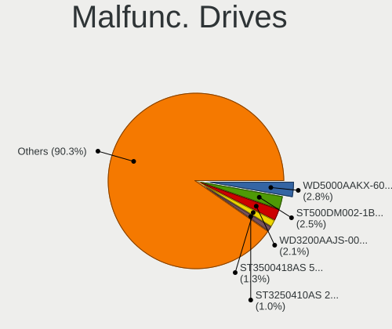

| Model                                 | Desktops | Drives | Percent |
|---------------------------------------|----------|--------|---------|
| WDC WD5000AAKX-60U6AA0 500GB          | 17       | 17     | 2.79%   |
| Seagate ST500DM002-1BD142 500GB       | 15       | 16     | 2.46%   |
| WDC WD3200AAJS-00L7A0 320GB           | 13       | 13     | 2.13%   |
| Seagate ST3500418AS 500GB             | 8        | 8      | 1.31%   |
| Seagate ST3250410AS 250GB             | 6        | 6      | 0.99%   |
| Seagate ST1000DM003-9YN162 1TB        | 6        | 10     | 0.99%   |
| WDC WD10EZEX-00BN5A0 1TB              | 5        | 5      | 0.82%   |
| Seagate ST3160811AS 160GB             | 5        | 5      | 0.82%   |
| Seagate ST2000DL003-9VT166 2TB        | 5        | 5      | 0.82%   |
| Samsung Electronics SSD 870 EVO 500GB | 5        | 5      | 0.82%   |
| Hitachi HDS721050CLA362 500GB         | 5        | 7      | 0.82%   |
| Hitachi HDS721010CLA332 1TB           | 5        | 5      | 0.82%   |
| WDC WD40EFRX-68WT0N0 4TB              | 4        | 9      | 0.66%   |
| WDC WD30EFRX-68EUZN0 3TB              | 4        | 5      | 0.66%   |
| WDC WD2500AAJS-00L7A0 250GB           | 4        | 4      | 0.66%   |
| WDC WD10EZEX-00WN4A0 1TB              | 4        | 4      | 0.66%   |
| Toshiba DT01ACA200 2TB                | 4        | 11     | 0.66%   |
| Seagate ST2000DM001-1CH164 2TB        | 4        | 6      | 0.66%   |
| Seagate ST1000LM024 HN-M101MBB 1TB    | 4        | 4      | 0.66%   |
| Samsung Electronics SSD 970 EVO 500GB | 4        | 5      | 0.66%   |
| Samsung Electronics SSD 870 EVO 1TB   | 4        | 4      | 0.66%   |
| Maxtor STM3160815AS 160GB             | 4        | 4      | 0.66%   |
| Kingston SV300S37A120G 120GB SSD      | 4        | 4      | 0.66%   |
| Kingston SA400S37240G 240GB SSD       | 4        | 5      | 0.66%   |
| WDC WDS240G2G0A-00JH30 240GB SSD      | 3        | 3      | 0.49%   |
| WDC WD60EFRX-68L0BN1 6TB              | 3        | 3      | 0.49%   |
| WDC WD5000AAKX-22ERMA0 500GB          | 3        | 3      | 0.49%   |
| WDC WD5000AAKX-08U6AA0 500GB          | 3        | 3      | 0.49%   |
| WDC WD20EFRX-68EUZN0 2TB              | 3        | 3      | 0.49%   |
| WDC WD20EARX-00PASB0 2TB              | 3        | 5      | 0.49%   |
| WDC WD20EARS-00MVWB0 2TB              | 3        | 3      | 0.49%   |
| WDC WD2002FAEX-007BA0 2TB             | 3        | 3      | 0.49%   |
| WDC WD Green 2.5 1000GB               | 3        | 4      | 0.49%   |
| Toshiba DT01ACA050 500GB              | 3        | 3      | 0.49%   |
| Seagate ST500LM021-1KJ152 500GB       | 3        | 3      | 0.49%   |
| Seagate ST3250318AS 250GB             | 3        | 3      | 0.49%   |
| Seagate ST3160815AS 160GB             | 3        | 3      | 0.49%   |
| Seagate ST250DM000-1BD141 250GB       | 3        | 3      | 0.49%   |
| Seagate ST2000DM006-2DM164 2TB        | 3        | 3      | 0.49%   |
| Seagate ST1000DM010-2EP102 1TB        | 3        | 3      | 0.49%   |

Malfunc. Drive Vendor
---------------------

Vendors of faulty drives

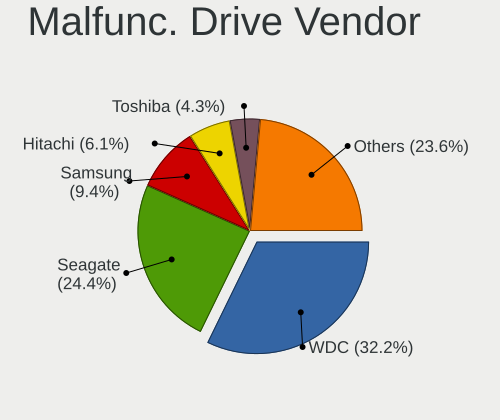

| Vendor              | Desktops | Drives | Percent |
|---------------------|----------|--------|---------|
| WDC                 | 186      | 253    | 32.24%  |
| Seagate             | 141      | 186    | 24.44%  |
| Samsung Electronics | 54       | 65     | 9.36%   |
| Hitachi             | 35       | 48     | 6.07%   |
| Toshiba             | 25       | 36     | 4.33%   |
| Kingston            | 18       | 20     | 3.12%   |
| Intel               | 13       | 17     | 2.25%   |
| Crucial             | 13       | 15     | 2.25%   |
| Maxtor              | 11       | 12     | 1.91%   |
| SanDisk             | 7        | 7      | 1.21%   |
| HGST                | 7        | 12     | 1.21%   |
| China               | 5        | 5      | 0.87%   |
| Netac               | 4        | 6      | 0.69%   |
| Micron Technology   | 4        | 4      | 0.69%   |
| Hewlett-Packard     | 4        | 4      | 0.69%   |
| A-DATA Technology   | 4        | 5      | 0.69%   |
| Transcend           | 3        | 4      | 0.52%   |
| PNY                 | 3        | 4      | 0.52%   |
| SPCC                | 2        | 2      | 0.35%   |
| SK hynix            | 2        | 2      | 0.35%   |
| Realtek             | 2        | 2      | 0.35%   |
| OCZ                 | 2        | 2      | 0.35%   |
| Mushkin             | 2        | 2      | 0.35%   |
| LITEON              | 2        | 2      | 0.35%   |
| KingSpec            | 2        | 2      | 0.35%   |
| Corsair             | 2        | 2      | 0.35%   |
| ASMT                | 2        | 2      | 0.35%   |
| Apple               | 2        | 2      | 0.35%   |
| ZHITAI              | 1        | 1      | 0.17%   |
| XPG                 | 1        | 1      | 0.17%   |
| Team                | 1        | 1      | 0.17%   |
| SSSTC               | 1        | 1      | 0.17%   |
| SPCC M.2            | 1        | 1      | 0.17%   |
| Ramsta              | 1        | 1      | 0.17%   |
| Ramaxel Technology  | 1        | 1      | 0.17%   |
| Patriot             | 1        | 1      | 0.17%   |
| LITEONIT            | 1        | 2      | 0.17%   |
| Lenovo              | 1        | 1      | 0.17%   |
| KingDian            | 1        | 1      | 0.17%   |
| Intenso             | 1        | 1      | 0.17%   |

Malfunc. HDD Vendor
-------------------

Vendors of faulty HDD drives

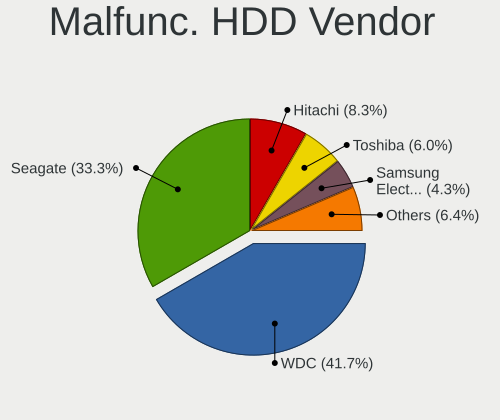

| Vendor              | Desktops | Drives | Percent |
|---------------------|----------|--------|---------|
| WDC                 | 175      | 238    | 41.67%  |
| Seagate             | 140      | 182    | 33.33%  |
| Hitachi             | 35       | 48     | 8.33%   |
| Toshiba             | 25       | 36     | 5.95%   |
| Samsung Electronics | 18       | 20     | 4.29%   |
| Maxtor              | 11       | 12     | 2.62%   |
| HGST                | 7        | 12     | 1.67%   |
| Hewlett-Packard     | 4        | 4      | 0.95%   |
| Apple               | 2        | 2      | 0.48%   |
| HPE                 | 1        | 1      | 0.24%   |
| ExcelStor           | 1        | 1      | 0.24%   |
| ASMT                | 1        | 1      | 0.24%   |

Malfunc. Drive Kind
-------------------

Kinds of faulty drives

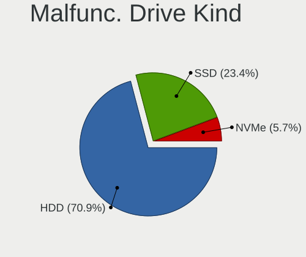

| Kind | Desktops | Drives | Percent |
|------|----------|--------|---------|
| HDD  | 373      | 557    | 70.91%  |
| SSD  | 123      | 151    | 23.38%  |
| NVMe | 30       | 36     | 5.7%    |

Failed Drives
-------------

Failed drive models

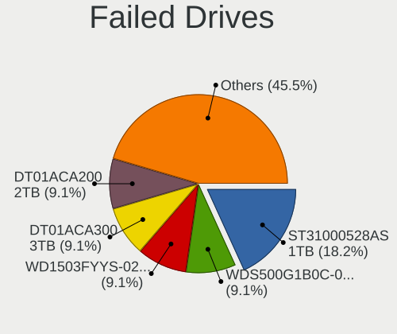

| Model                                       | Desktops | Drives | Percent |
|---------------------------------------------|----------|--------|---------|
| Seagate ST31000528AS 1TB                    | 2        | 3      | 18.18%  |
| WDC WDS500G1B0C-00S6U0 500GB                | 1        | 1      | 9.09%   |
| WDC WD1503FYYS-02W0B0 1TB                   | 1        | 2      | 9.09%   |
| Toshiba DT01ACA300 3TB                      | 1        | 1      | 9.09%   |
| Toshiba DT01ACA200 2TB                      | 1        | 1      | 9.09%   |
| SOLIDIGM SSDSC2KB076TZ 8TB                  | 1        | 1      | 9.09%   |
| Seagate ST3500418AS 500GB                   | 1        | 1      | 9.09%   |
| Samsung Electronics HD204UI 2TB             | 1        | 1      | 9.09%   |
| Gigabyte Technology GP-GSM2NE3256GNTD 256GB | 1        | 1      | 9.09%   |
| Emtec X300 128GB                            | 1        | 1      | 9.09%   |

Failed Drive Vendor
-------------------

Failed drive vendors

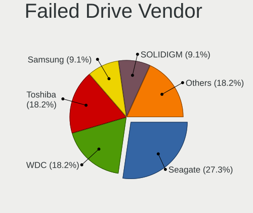

| Vendor              | Desktops | Drives | Percent |
|---------------------|----------|--------|---------|
| Seagate             | 3        | 4      | 27.27%  |
| WDC                 | 2        | 3      | 18.18%  |
| Toshiba             | 2        | 2      | 18.18%  |
| SOLIDIGM            | 1        | 1      | 9.09%   |
| Samsung Electronics | 1        | 1      | 9.09%   |
| Gigabyte Technology | 1        | 1      | 9.09%   |
| Emtec               | 1        | 1      | 9.09%   |

Drive Status
------------

Number of failed and malfunc. drives

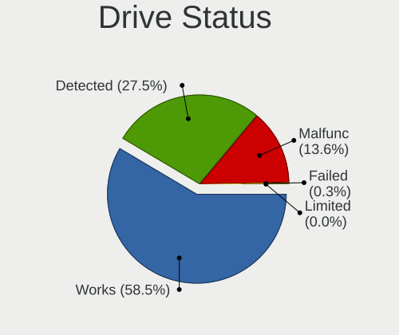

| Status   | Desktops | Drives | Percent |
|----------|----------|--------|---------|
| Works    | 2148     | 5868   | 58.53%  |
| Detected | 1011     | 2700   | 27.55%  |
| Malfunc  | 499      | 744    | 13.6%   |
| Failed   | 11       | 13     | 0.3%    |
| Limited  | 1        | 1      | 0.03%   |

Storage controller
------------------

Storage Vendor
--------------

Storage controller vendors

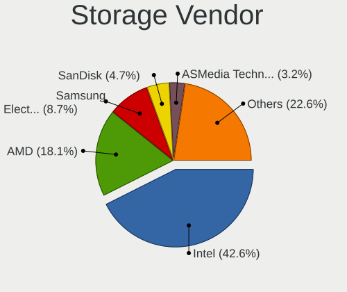

| Vendor                           | Desktops | Percent |
|----------------------------------|----------|---------|
| Intel                            | 2080     | 42.6%   |
| AMD                              | 886      | 18.14%  |
| Samsung Electronics              | 425      | 8.7%    |
| SanDisk                          | 229      | 4.69%   |
| ASMedia Technology               | 158      | 3.24%   |
| Kingston Technology Company      | 157      | 3.22%   |
| Phison Electronics               | 106      | 2.17%   |
| Micron/Crucial Technology        | 95       | 1.95%   |
| JMicron Technology               | 83       | 1.7%    |
| Silicon Motion                   | 65       | 1.33%   |
| Marvell Technology Group         | 62       | 1.27%   |
| MAXIO Technology (Hangzhou)      | 56       | 1.15%   |
| SK hynix                         | 50       | 1.02%   |
| ADATA Technology                 | 48       | 0.98%   |
| Nvidia                           | 44       | 0.9%    |
| Realtek Semiconductor            | 39       | 0.8%    |
| Broadcom / LSI                   | 37       | 0.76%   |
| Micron Technology                | 36       | 0.74%   |
| LSI Logic / Symbios Logic        | 27       | 0.55%   |
| KIOXIA                           | 25       | 0.51%   |
| Shenzhen Longsys Electronics     | 20       | 0.41%   |
| Adaptec                          | 18       | 0.37%   |
| Toshiba America Info Systems     | 16       | 0.33%   |
| VIA Technologies                 | 12       | 0.25%   |
| Silicon Image                    | 12       | 0.25%   |
| INNOGRIT                         | 12       | 0.25%   |
| Seagate Technology               | 10       | 0.2%    |
| Solidigm                         | 7        | 0.14%   |
| Netac Technology                 | 6        | 0.12%   |
| Transcend                        | 5        | 0.1%    |
| Lite-On Technology               | 5        | 0.1%    |
| Hewlett-Packard                  | 5        | 0.1%    |
| Biwin Storage Technology         | 5        | 0.1%    |
| Unknown                          | 5        | 0.1%    |
| Yangtze Memory Technologies      | 4        | 0.08%   |
| Silicon Integrated Systems [SiS] | 4        | 0.08%   |
| Solid State Storage Technology   | 3        | 0.06%   |
| Red Hat                          | 3        | 0.06%   |
| Nextorage                        | 3        | 0.06%   |
| Hosin Global Electronics         | 3        | 0.06%   |

Storage Model
-------------

Storage controller models

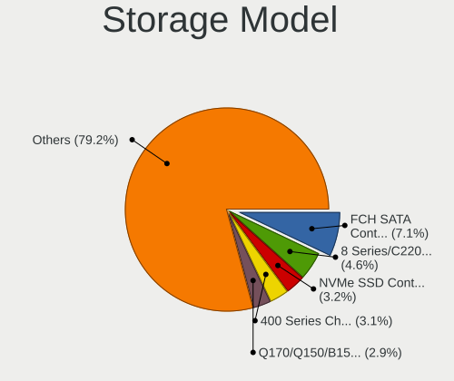

| Model                                                                                   | Desktops | Percent |
|-----------------------------------------------------------------------------------------|----------|---------|
| AMD FCH SATA Controller [AHCI mode]                                                     | 407      | 7.07%   |
| Intel 8 Series/C220 Series Chipset Family 6-port SATA Controller 1 [AHCI mode]          | 264      | 4.59%   |
| Samsung NVMe SSD Controller SM981/PM981/PM983                                           | 184      | 3.2%    |
| AMD 400 Series Chipset SATA Controller                                                  | 179      | 3.11%   |
| Intel Q170/Q150/B150/H170/H110/Z170/CM236 Chipset SATA Controller [AHCI Mode]           | 164      | 2.85%   |
| AMD 500 Series Chipset SATA Controller                                                  | 162      | 2.82%   |
| Intel 200 Series PCH SATA controller [AHCI mode]                                        | 149      | 2.59%   |
| AMD 600 Series Chipset SATA Controller                                                  | 134      | 2.33%   |
| ASMedia ASM1061/ASM1062 Serial ATA Controller                                           | 127      | 2.21%   |
| Samsung NVMe SSD Controller PM9A1/PM9A3/980PRO                                          | 112      | 1.95%   |
| Intel 6 Series/C200 Series Chipset Family 6 port Desktop SATA AHCI Controller           | 103      | 1.79%   |
| Intel SATA Controller [RAID mode]                                                       | 101      | 1.76%   |
| Intel Raptor Lake SATA AHCI Controller                                                  | 100      | 1.74%   |
| Intel Cannon Lake PCH SATA AHCI Controller                                              | 94       | 1.63%   |
| Intel Alder Lake-S PCH SATA Controller [AHCI Mode]                                      | 93       | 1.62%   |
| Intel 7 Series/C210 Series Chipset Family 6-port SATA Controller [AHCI mode]            | 86       | 1.49%   |
| AMD SB7x0/SB8x0/SB9x0 SATA Controller [AHCI mode]                                       | 83       | 1.44%   |
| Intel NM10/ICH7 Family SATA Controller [IDE mode]                                       | 76       | 1.32%   |
| Intel Alder Lake-N SATA AHCI Controller                                                 | 71       | 1.23%   |
| Intel Comet Lake SATA AHCI Controller                                                   | 66       | 1.15%   |
| Intel 500 Series Chipset Family SATA AHCI Controller                                    | 64       | 1.11%   |
| Intel 82801G (ICH7 Family) IDE Controller                                               | 62       | 1.08%   |
| AMD SB7x0/SB8x0/SB9x0 IDE Controller                                                    | 62       | 1.08%   |
| Micron/Crucial P2 [Nick P2] / P3 / P3 Plus NVMe PCIe SSD (DRAM-less)                    | 61       | 1.06%   |
| Samsung NVMe SSD Controller 980 (DRAM-less)                                             | 58       | 1.01%   |
| Samsung NVMe SSD Controller S4LV008[Pascal]                                             | 57       | 0.99%   |
| Intel C610/X99 series chipset 6-Port SATA Controller [AHCI mode]                        | 57       | 0.99%   |
| Silicon Motion SM2263EN/SM2263XT (DRAM-less) NVMe SSD Controllers                       | 53       | 0.92%   |
| Intel 6 Series/C200 Series Chipset Family Desktop SATA Controller (IDE mode, ports 4-5) | 53       | 0.92%   |
| Intel 6 Series/C200 Series Chipset Family Desktop SATA Controller (IDE mode, ports 0-3) | 53       | 0.92%   |
| Intel C610/X99 series chipset sSATA Controller [AHCI mode]                              | 49       | 0.85%   |
| MAXIO (Hangzhou) NVMe SSD Controller MAP1202 (DRAM-less)                                | 45       | 0.78%   |
| Intel Volume Management Device NVMe RAID Controller                                     | 44       | 0.76%   |
| AMD 300 Series Chipset SATA Controller                                                  | 43       | 0.75%   |
| Intel 9 Series Chipset Family SATA Controller [AHCI Mode]                               | 41       | 0.71%   |
| SanDisk WD SN560/SN740/SN770/SN5000 NVMe SSD                                            | 39       | 0.68%   |
| Sandisk WD Black SN850X NVMe SSD                                                        | 35       | 0.61%   |
| Phison E12 NVMe Controller                                                              | 35       | 0.61%   |
| Samsung NVMe SSD Controller SM961/PM961/SM963                                           | 34       | 0.59%   |
| Intel 82801JI (ICH10 Family) 2 port SATA IDE Controller #2                              | 34       | 0.59%   |

Storage Kind
------------

Kind of storage controller (IDE, SATA, NVMe, SAS, ...)

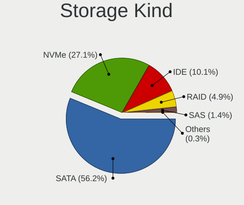

| Kind | Desktops | Percent |
|------|----------|---------|
| SATA | 2610     | 56.2%   |
| NVMe | 1257     | 27.07%  |
| IDE  | 470      | 10.12%  |
| RAID | 227      | 4.89%   |
| SAS  | 65       | 1.4%    |
| SCSI | 15       | 0.32%   |

Processor
---------

CPU Vendor
----------

Processor vendors

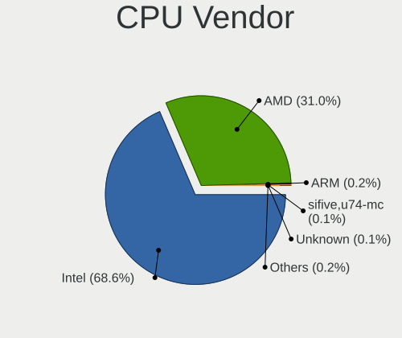

| Vendor                   | Desktops | Percent |
|--------------------------|----------|---------|
| Intel                    | 2122     | 68.56%  |
| AMD                      | 958      | 30.95%  |
| ARM                      | 6        | 0.19%   |
| sifive,u74-mc            | 2        | 0.06%   |
| Unknown                  | 2        | 0.06%   |
| PowerNV C1P9S01 REV 1.02 | 1        | 0.03%   |
| MIPS                     | 1        | 0.03%   |
| Loongson                 | 1        | 0.03%   |
| CHRP IBM,8233-E8B        | 1        | 0.03%   |
| CentaurHauls             | 1        | 0.03%   |

CPU Model
---------

Processor models

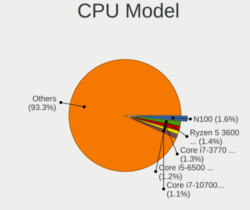

| Model                                  | Desktops | Percent |
|----------------------------------------|----------|---------|
| Intel N100                             | 51       | 1.64%   |
| AMD Ryzen 5 3600 6-Core Processor      | 44       | 1.42%   |
| Intel Core i7-3770 CPU @ 3.40GHz       | 41       | 1.32%   |
| Intel Core i5-6500 CPU @ 3.20GHz       | 36       | 1.16%   |
| Intel Core i7-10700 CPU @ 2.90GHz      | 35       | 1.13%   |
| AMD Ryzen 7 5800X 8-Core Processor     | 34       | 1.09%   |
| AMD Ryzen 5 5600G with Radeon Graphics | 34       | 1.09%   |
| AMD Ryzen 7 5700G with Radeon Graphics | 33       | 1.06%   |
| Intel Core i7-4790 CPU @ 3.60GHz       | 32       | 1.03%   |
| AMD Ryzen 7 3700X 8-Core Processor     | 31       | 1%      |
| Intel Core i5-3470 CPU @ 3.20GHz       | 30       | 0.96%   |
| AMD Ryzen 5 5600X 6-Core Processor     | 28       | 0.9%    |
| Intel Core i3-4130 CPU @ 3.40GHz       | 23       | 0.74%   |
| Intel Core i7-2600 CPU @ 3.40GHz       | 22       | 0.71%   |
| Intel Pentium CPU G4400 @ 3.30GHz      | 21       | 0.68%   |
| Intel Core i7-6700 CPU @ 3.40GHz       | 21       | 0.68%   |
| AMD Ryzen 9 5900X 12-Core Processor    | 21       | 0.68%   |
| Intel Celeron N5105 @ 2.00GHz          | 20       | 0.64%   |
| Intel Pentium CPU G3420 @ 3.20GHz      | 19       | 0.61%   |
| Intel Core i7-7700K CPU @ 4.20GHz      | 19       | 0.61%   |
| Intel Core i5-6500T CPU @ 2.50GHz      | 19       | 0.61%   |
| Intel Core i5-10400 CPU @ 2.90GHz      | 19       | 0.61%   |
| Intel Core i7-8700 CPU @ 3.20GHz       | 18       | 0.58%   |
| Intel Core i3-4330T CPU @ 3.00GHz      | 18       | 0.58%   |
| AMD Ryzen 9 5950X 16-Core Processor    | 18       | 0.58%   |
| AMD Ryzen 7 5700X 8-Core Processor     | 18       | 0.58%   |
| AMD FX-8350 Eight-Core Processor       | 18       | 0.58%   |
| Intel Core i3-6100 CPU @ 3.70GHz       | 17       | 0.55%   |
| Intel Core 2 Duo CPU E8400 @ 3.00GHz   | 17       | 0.55%   |
| AMD Ryzen 9 7950X 16-Core Processor    | 17       | 0.55%   |
| AMD Ryzen 5 2600 Six-Core Processor    | 17       | 0.55%   |
| Intel Core 2 Duo CPU E7500 @ 2.93GHz   | 16       | 0.51%   |
| Intel Core 2 Duo CPU E7400 @ 2.80GHz   | 16       | 0.51%   |
| Intel Celeron J4125 CPU @ 2.00GHz      | 16       | 0.51%   |
| AMD Ryzen 9 3900X 12-Core Processor    | 16       | 0.51%   |
| Intel Core i7-4770 CPU @ 3.40GHz       | 15       | 0.48%   |
| Intel Core i5-9400 CPU @ 2.90GHz       | 15       | 0.48%   |
| Intel Core i5-2400 CPU @ 3.10GHz       | 15       | 0.48%   |
| Intel Core 2 CPU 6400 @ 2.13GHz        | 15       | 0.48%   |
| Intel 12th Gen Core i5-12400           | 15       | 0.48%   |

CPU Model Family
----------------

Processor model prefix

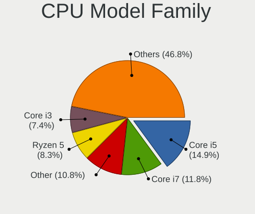

| Model                   | Desktops | Percent |
|-------------------------|----------|---------|
| Intel Core i5           | 463      | 14.93%  |
| Intel Core i7           | 366      | 11.8%   |
| Other                   | 335      | 10.8%   |
| AMD Ryzen 5             | 256      | 8.25%   |
| Intel Core i3           | 230      | 7.41%   |
| AMD Ryzen 7             | 223      | 7.19%   |
| Intel Xeon              | 220      | 7.09%   |
| AMD Ryzen 9             | 142      | 4.58%   |
| Intel Celeron           | 139      | 4.48%   |
| Intel Pentium           | 118      | 3.8%    |
| Intel Core 2 Duo        | 78       | 2.51%   |
| AMD FX                  | 66       | 2.13%   |
| Intel Core 2 Quad       | 39       | 1.26%   |
| Intel Pentium Dual-Core | 38       | 1.23%   |
| AMD Ryzen 3             | 34       | 1.1%    |
| AMD Ryzen 5 PRO         | 30       | 0.97%   |
| Intel Core i9           | 27       | 0.87%   |
| Intel Atom              | 26       | 0.84%   |
| Intel Core 2            | 22       | 0.71%   |
| AMD A10                 | 20       | 0.64%   |
| AMD Athlon 64 X2        | 18       | 0.58%   |
| AMD GX                  | 15       | 0.48%   |
| Intel Pentium Gold      | 13       | 0.42%   |
| Intel Pentium 4         | 13       | 0.42%   |
| AMD Athlon II X2        | 13       | 0.42%   |
| AMD Athlon              | 12       | 0.39%   |
| AMD Ryzen Threadripper  | 11       | 0.35%   |
| AMD Phenom II X4        | 10       | 0.32%   |
| AMD A8                  | 10       | 0.32%   |
| Intel Pentium Silver    | 9        | 0.29%   |
| AMD PRO A8              | 9        | 0.29%   |
| AMD Phenom II X6        | 9        | 0.29%   |
| AMD Athlon II X4        | 7        | 0.23%   |
| AMD A4                  | 7        | 0.23%   |
| AMD EPYC                | 6        | 0.19%   |
| AMD A6                  | 6        | 0.19%   |
| AMD Ryzen 7 PRO         | 5        | 0.16%   |
| AMD G                   | 5        | 0.16%   |
| Intel Pentium D         | 4        | 0.13%   |
| AMD PRO A10             | 4        | 0.13%   |

CPU Cores
---------

Number of processor cores

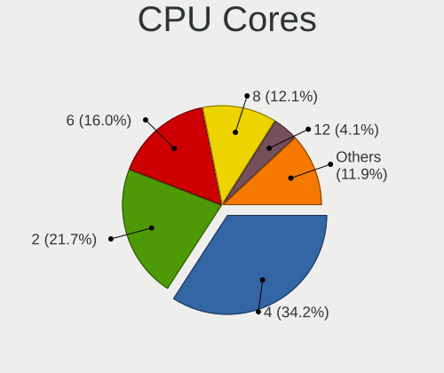

| Number  | Desktops | Percent |
|---------|----------|---------|
| 4       | 1061     | 34.16%  |
| 2       | 674      | 21.7%   |
| 6       | 496      | 15.97%  |
| 8       | 377      | 12.14%  |
| 12      | 128      | 4.12%   |
| 16      | 90       | 2.9%    |
| 10      | 58       | 1.87%   |
| 14      | 51       | 1.64%   |
| 1       | 50       | 1.61%   |
| 24      | 32       | 1.03%   |
| 3       | 32       | 1.03%   |
| 20      | 25       | 0.8%    |
| 18      | 6        | 0.19%   |
| 32      | 5        | 0.16%   |
| 28      | 5        | 0.16%   |
| 5       | 4        | 0.13%   |
| 36      | 3        | 0.1%    |
| 22      | 3        | 0.1%    |
| Unknown | 3        | 0.1%    |
| 56      | 1        | 0.03%   |
| 48      | 1        | 0.03%   |
| 44      | 1        | 0.03%   |

CPU Sockets
-----------

Number of sockets

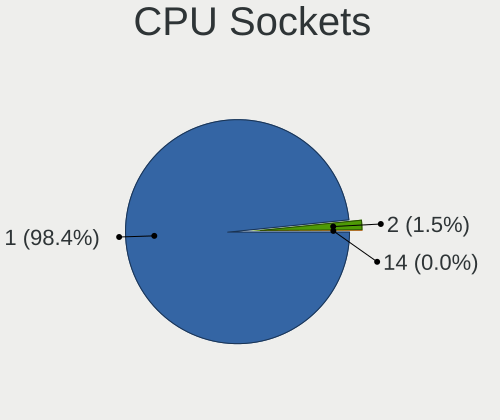

| Number  | Desktops | Percent |
|---------|----------|---------|
| 1       | 3048     | 98.39%  |
| 2       | 47       | 1.52%   |
| Unknown | 2        | 0.06%   |
| 14      | 1        | 0.03%   |

CPU Threads
-----------

Threads per core (Hyper-Threading)

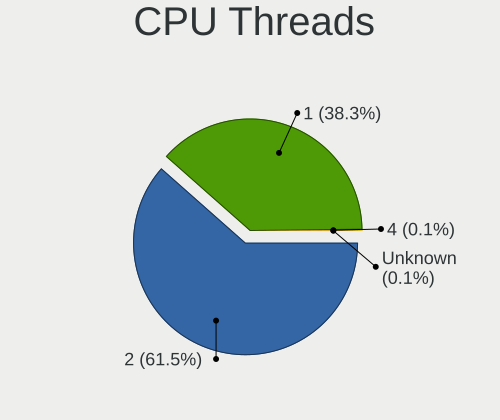

| Number  | Desktops | Percent |
|---------|----------|---------|
| 2       | 1909     | 61.52%  |
| 1       | 1188     | 38.29%  |
| 4       | 3        | 0.1%    |
| Unknown | 3        | 0.1%    |

CPU Op-Modes
------------

CPU Operation Modes (32-bit, 64-bit)

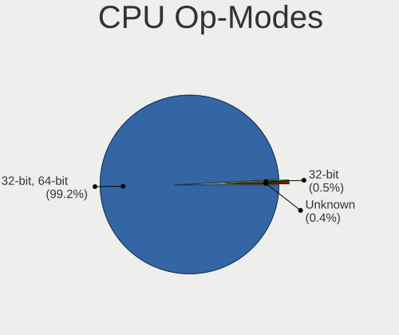

| Op mode        | Desktops | Percent |
|----------------|----------|---------|
| 32-bit, 64-bit | 3069     | 99.16%  |
| 32-bit         | 15       | 0.48%   |
| Unknown        | 11       | 0.36%   |

CPU Microcode
-------------

Microcode number

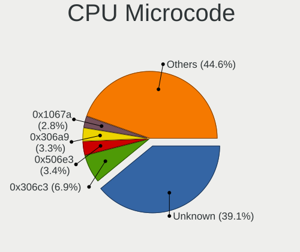

| Number     | Desktops | Percent |
|------------|----------|---------|
| Unknown    | 1235     | 39.07%  |
| 0x306c3    | 219      | 6.93%   |
| 0x506e3    | 106      | 3.35%   |
| 0x306a9    | 103      | 3.26%   |
| 0x1067a    | 89       | 2.82%   |
| 0x206a7    | 73       | 2.31%   |
| 0x906ea    | 63       | 1.99%   |
| 0x906e9    | 59       | 1.87%   |
| 0xa0655    | 45       | 1.42%   |
| 0xb0671    | 40       | 1.27%   |
| 0x90672    | 39       | 1.23%   |
| 0x0a50000d | 38       | 1.2%    |
| 0xb06e0    | 37       | 1.17%   |
| 0x08701021 | 34       | 1.08%   |
| 0xa0653    | 33       | 1.04%   |
| 0x06000852 | 33       | 1.04%   |
| 0x0a601203 | 31       | 0.98%   |
| 0x08108109 | 28       | 0.89%   |
| 0x0a601206 | 27       | 0.85%   |
| 0xa0671    | 26       | 0.82%   |
| 0x306f2    | 25       | 0.79%   |
| 0x90675    | 22       | 0.7%    |
| 0x0800820d | 22       | 0.7%    |
| 0x906eb    | 20       | 0.63%   |
| 0x306e4    | 20       | 0.63%   |
| 0x0a20120a | 19       | 0.6%    |
| 0x08600106 | 18       | 0.57%   |
| 0x406f1    | 17       | 0.54%   |
| 0x08001138 | 16       | 0.51%   |
| 0x010000c8 | 16       | 0.51%   |
| 0x906c0    | 15       | 0.47%   |
| 0x6fb      | 15       | 0.47%   |
| 0x106e5    | 15       | 0.47%   |
| 0x0a50000f | 15       | 0.47%   |
| 0x0a201016 | 15       | 0.47%   |
| 0x08701030 | 15       | 0.47%   |
| 0x06003106 | 15       | 0.47%   |
| 0x906ed    | 14       | 0.44%   |
| 0x6f2      | 14       | 0.44%   |
| 0x0a20120e | 14       | 0.44%   |

CPU Microarch
-------------

Microarchitecture

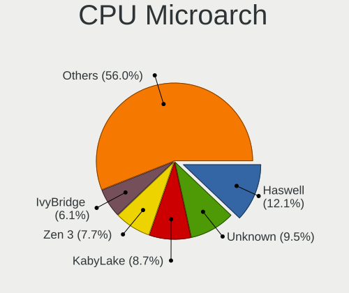

| Name             | Desktops | Percent |
|------------------|----------|---------|
| Haswell          | 376      | 12.09%  |
| Unknown          | 295      | 9.49%   |
| KabyLake         | 270      | 8.68%   |
| Zen 3            | 238      | 7.65%   |
| IvyBridge        | 189      | 6.08%   |
| Skylake          | 187      | 6.01%   |
| Alderlake Hybrid | 162      | 5.21%   |
| Zen 2            | 160      | 5.14%   |
| Penryn           | 146      | 4.69%   |
| SandyBridge      | 134      | 4.31%   |
| CometLake        | 122      | 3.92%   |
| Zen+             | 88       | 2.83%   |
| Piledriver       | 72       | 2.32%   |
| Zen              | 67       | 2.15%   |
| K10              | 60       | 1.93%   |
| Gracemont        | 60       | 1.93%   |
| Core             | 59       | 1.9%    |
| Broadwell        | 44       | 1.41%   |
| Nehalem          | 43       | 1.38%   |
| Silvermont       | 39       | 1.25%   |
| Westmere         | 36       | 1.16%   |
| IceLake          | 34       | 1.09%   |
| Tremont          | 33       | 1.06%   |
| Goldmont plus    | 32       | 1.03%   |
| K8 Hammer        | 21       | 0.68%   |
| Steamroller      | 20       | 0.64%   |
| Excavator        | 20       | 0.64%   |
| NetBurst         | 19       | 0.61%   |
| Jaguar           | 17       | 0.55%   |
| Goldmont         | 13       | 0.42%   |
| Bonnell          | 11       | 0.35%   |
| Puma             | 9        | 0.29%   |
| Bulldozer        | 9        | 0.29%   |
| TigerLake        | 7        | 0.23%   |
| Bobcat           | 6        | 0.19%   |
| K10 Llano        | 5        | 0.16%   |
| P6               | 3        | 0.1%    |
| Sapphire Rapids  | 2        | 0.06%   |
| K6               | 2        | 0.06%   |

Graphics
--------

GPU Vendor
----------

Vendors of graphics cards

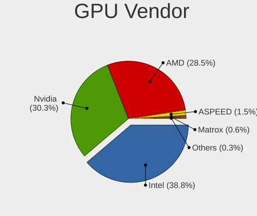

| Vendor                                       | Desktops | Percent |
|----------------------------------------------|----------|---------|
| Intel                                        | 1281     | 38.78%  |
| Nvidia                                       | 1000     | 30.28%  |
| AMD                                          | 941      | 28.49%  |
| ASPEED Technology                            | 50       | 1.51%   |
| Matrox Electronics Systems                   | 20       | 0.61%   |
| VIA Technologies                             | 3        | 0.09%   |
| Red Hat                                      | 3        | 0.09%   |
| XGI Technology (eXtreme Graphics Innovation) | 2        | 0.06%   |
| Silicon Motion                               | 1        | 0.03%   |
| Silicon Integrated Systems [SiS]             | 1        | 0.03%   |
| Loongson Technology                          | 1        | 0.03%   |

GPU Model
---------

Graphics card models

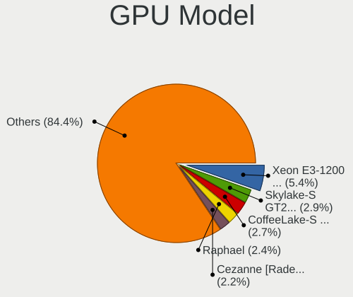

| Model                                                                       | Desktops | Percent |
|-----------------------------------------------------------------------------|----------|---------|
| Intel Xeon E3-1200 v3/4th Gen Core Processor Integrated Graphics Controller | 183      | 5.38%   |
| Intel Skylake-S GT2 [HD Graphics 530]                                       | 98       | 2.88%   |
| Intel CoffeeLake-S GT2 [UHD Graphics 630]                                   | 91       | 2.67%   |
| AMD Raphael                                                                 | 83       | 2.44%   |
| AMD Cezanne [Radeon Vega Series / Radeon Vega Mobile Series]                | 76       | 2.23%   |
| Intel Alder Lake-N [UHD Graphics]                                           | 70       | 2.06%   |
| AMD Ellesmere [Radeon RX 470/480/570/570X/580/580X/590]                     | 68       | 2%      |
| Intel Xeon E3-1200 v2/3rd Gen Core processor Graphics Controller            | 67       | 1.97%   |
| Intel 2nd Generation Core Processor Family Integrated Graphics Controller   | 64       | 1.88%   |
| Intel CometLake-S GT2 [UHD Graphics 630]                                    | 52       | 1.53%   |
| AMD Navi 23 [Radeon RX 6600/6600 XT/6600M]                                  | 52       | 1.53%   |
| Intel 4th Generation Core Processor Family Integrated Graphics Controller   | 50       | 1.47%   |
| ASPEED Technology ASPEED Graphics Family                                    | 50       | 1.47%   |
| Intel Kaby Lake-S GT2 [HD Graphics 630]                                     | 48       | 1.41%   |
| Intel Alder Lake-S GT1 [UHD Graphics 770]                                   | 47       | 1.38%   |
| Nvidia GP108 [GeForce GT 1030]                                              | 43       | 1.26%   |
| Nvidia GP107 [GeForce GTX 1050 Ti]                                          | 43       | 1.26%   |
| Intel 4 Series Chipset Integrated Graphics Controller                       | 43       | 1.26%   |
| Nvidia GK208B [GeForce GT 710]                                              | 42       | 1.23%   |
| AMD Lexa PRO [Radeon 540/540X/550/550X / RX 540X/550/550X]                  | 41       | 1.21%   |
| AMD Picasso/Raven 2 [Radeon Vega Series / Radeon Vega Mobile Series]        | 38       | 1.12%   |
| Intel Raptor Lake-S GT1 [UHD Graphics 770]                                  | 35       | 1.03%   |
| Nvidia TU106 [GeForce RTX 2060 Rev. A]                                      | 33       | 0.97%   |
| Nvidia GM204 [GeForce GTX 970]                                              | 33       | 0.97%   |
| Nvidia GA106 [GeForce RTX 3060 Lite Hash Rate]                              | 32       | 0.94%   |
| Intel JasperLake [UHD Graphics]                                             | 32       | 0.94%   |
| AMD Renoir [Radeon Vega Series / Radeon Vega Mobile Series]                 | 32       | 0.94%   |
| Intel Alder Lake-S GT1 [UHD Graphics 730]                                   | 29       | 0.85%   |
| Nvidia GP106 [GeForce GTX 1060 6GB]                                         | 28       | 0.82%   |
| Intel Skylake-S GT1 [HD Graphics 510]                                       | 28       | 0.82%   |
| Nvidia GF108 [GeForce GT 730]                                               | 27       | 0.79%   |
| AMD Navi 10 [Radeon RX 5600 OEM/5600 XT / 5700/5700 XT]                     | 27       | 0.79%   |
| Nvidia GT218 [GeForce 210]                                                  | 26       | 0.76%   |
| Intel GeminiLake [UHD Graphics 600]                                         | 26       | 0.76%   |
| AMD Raven Ridge [Radeon Vega Series / Radeon Vega Mobile Series]            | 26       | 0.76%   |
| Nvidia GK208B [GeForce GT 730]                                              | 25       | 0.73%   |
| Nvidia TU117 [GeForce GTX 1650]                                             | 24       | 0.71%   |
| Intel IvyBridge GT2 [HD Graphics 4000]                                      | 23       | 0.68%   |
| Intel Atom Processor Z36xxx/Z37xxx Series Graphics & Display                | 23       | 0.68%   |
| Intel 82G33/G31 Express Integrated Graphics Controller                      | 23       | 0.68%   |

GPU Combo
---------

Combinations of graphics cards

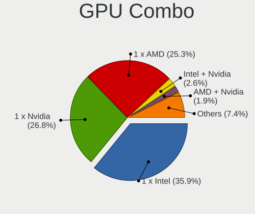

| Name                      | Desktops | Percent |
|---------------------------|----------|---------|
| 1 x Intel                 | 1120     | 35.9%   |
| 1 x Nvidia                | 837      | 26.83%  |
| 1 x AMD                   | 790      | 25.32%  |
| Intel + Nvidia            | 82       | 2.63%   |
| AMD + Nvidia              | 60       | 1.92%   |
| 2 x AMD                   | 59       | 1.89%   |
| 1 x ASPEED                | 40       | 1.28%   |
| Intel + AMD               | 27       | 0.87%   |
| 2 x Intel                 | 25       | 0.8%    |
| Other                     | 24       | 0.77%   |
| 1 x Matrox                | 19       | 0.61%   |
| Nvidia + ASPEED           | 9        | 0.29%   |
| 2 x Nvidia                | 7        | 0.22%   |
| 1 x VIA                   | 3        | 0.1%    |
| 1 x Red Hat               | 3        | 0.1%    |
| 3 x AMD                   | 2        | 0.06%   |
| 1 x XGI                   | 2        | 0.06%   |
| 3 x Nvidia                | 1        | 0.03%   |
| 2 x AMD + 1 x Nvidia      | 1        | 0.03%   |
| 1 x SiS                   | 1        | 0.03%   |
| 1 x Silicon Motion        | 1        | 0.03%   |
| Nvidia + Matrox           | 1        | 0.03%   |
| 1 x Loongson Technology   | 1        | 0.03%   |
| 1 x Intel + 3 x Nvidia    | 1        | 0.03%   |
| AMD + 2 x Nvidia          | 1        | 0.03%   |
| AMD + Nvidia + 1 x ASPEED | 1        | 0.03%   |
| AMD + Matrox              | 1        | 0.03%   |
| AMD + ASPEED              | 1        | 0.03%   |

GPU Driver
----------

Free vs proprietary

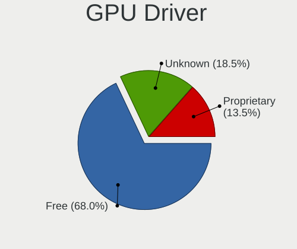

| Driver      | Desktops | Percent |
|-------------|----------|---------|
| Free        | 2130     | 68.01%  |
| Unknown     | 579      | 18.49%  |
| Proprietary | 423      | 13.51%  |

GPU Memory
----------

Total video memory

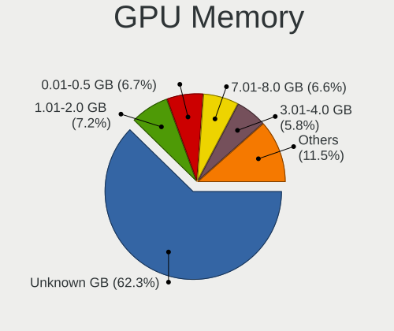

| Size in GB | Desktops | Percent |
|------------|----------|---------|
| Unknown    | 1959     | 62.31%  |
| 1.01-2.0   | 225      | 7.16%   |
| 0.01-0.5   | 210      | 6.68%   |
| 7.01-8.0   | 206      | 6.55%   |
| 3.01-4.0   | 181      | 5.76%   |
| 0.51-1.0   | 131      | 4.17%   |
| 8.01-16.0  | 103      | 3.28%   |
| 5.01-6.0   | 69       | 2.19%   |
| 16.01-24.0 | 34       | 1.08%   |
| 2.01-3.0   | 23       | 0.73%   |
| 4.01-5.0   | 2        | 0.06%   |
| 24.01-32.0 | 1        | 0.03%   |

Monitor
-------

Monitor Vendor
--------------

Monitor vendors

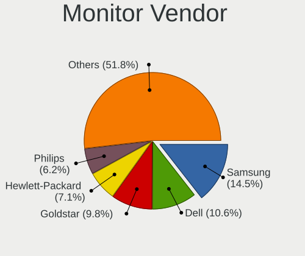

| Vendor               | Desktops | Percent |
|----------------------|----------|---------|
| Samsung Electronics  | 385      | 14.46%  |
| Dell                 | 283      | 10.63%  |
| Goldstar             | 261      | 9.8%    |
| Hewlett-Packard      | 190      | 7.13%   |
| Philips              | 164      | 6.16%   |
| Acer                 | 160      | 6.01%   |
| AOC                  | 130      | 4.88%   |
| BenQ                 | 126      | 4.73%   |
| Ancor Communications | 110      | 4.13%   |
| ASUSTek Computer     | 73       | 2.74%   |
| Lenovo               | 64       | 2.4%    |
| Iiyama               | 51       | 1.92%   |
| ViewSonic            | 49       | 1.84%   |
| Unknown              | 40       | 1.5%    |
| MSI                  | 30       | 1.13%   |
| LG Electronics       | 30       | 1.13%   |
| Unknown              | 29       | 1.09%   |
| Sony                 | 25       | 0.94%   |
| Sceptre Tech         | 21       | 0.79%   |
| Eizo                 | 20       | 0.75%   |
| NEC Computers        | 17       | 0.64%   |
| Toshiba              | 16       | 0.6%    |
| Gigabyte Technology  | 16       | 0.6%    |
| Fujitsu Siemens      | 16       | 0.6%    |
| RTK                  | 14       | 0.53%   |
| Mi                   | 13       | 0.49%   |
| Vizio                | 12       | 0.45%   |
| Panasonic            | 10       | 0.38%   |
| Medion               | 10       | 0.38%   |
| Hitachi              | 10       | 0.38%   |
| Denver               | 9        | 0.34%   |
| HKC                  | 7        | 0.26%   |
| MStar                | 6        | 0.23%   |
| Huion                | 6        | 0.23%   |
| HannStar             | 6        | 0.23%   |
| Vestel Elektronik    | 5        | 0.19%   |
| VCS                  | 5        | 0.19%   |
| SKG                  | 5        | 0.19%   |
| SAC                  | 5        | 0.19%   |
| Insignia             | 5        | 0.19%   |

Monitor Model
-------------

Monitor models

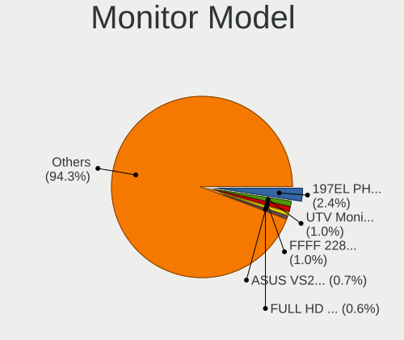

| Model                                                                 | Desktops | Percent |
|-----------------------------------------------------------------------|----------|---------|
| Philips 197EL PHLC08B 1366x768 410x230mm 18.5-inch                    | 69       | 2.44%   |
| Unknown                                                               | 29       | 1.03%   |
| Unknown LCD Monitor FFFF 2288x1287 2550x2550mm 142.0-inch             | 28       | 0.99%   |
| Ancor Communications ASUS VS229 ACI22D3 1920x1080 475x267mm 21.5-inch | 20       | 0.71%   |
| Goldstar FULL HD GSM5B55 1920x1080 480x270mm 21.7-inch                | 16       | 0.57%   |
| Goldstar LG ULTRAWIDE GSM59F1 2560x1080 670x280mm 28.6-inch           | 13       | 0.46%   |
| Samsung Electronics C24F390 SAM0D2C 1920x1080 521x293mm 23.5-inch     | 11       | 0.39%   |
| Samsung Electronics S24F350 SAM0D20 1920x1080 521x293mm 23.5-inch     | 9        | 0.32%   |
| Samsung Electronics C27F390 SAM0D32 1920x1080 598x336mm 27.0-inch     | 9        | 0.32%   |
| Mi Monitor XMI23C3 1920x1080 527x293mm 23.7-inch                      | 8        | 0.28%   |
| Hewlett-Packard LA2306 HWP294A 1920x1080 510x287mm 23.0-inch          | 8        | 0.28%   |
| Goldstar 27GL850 GSM5B7F 2560x1440 597x336mm 27.0-inch                | 8        | 0.28%   |
| AOC 27G2G4 AOC2702 1920x1080 598x336mm 27.0-inch                      | 8        | 0.28%   |
| Hewlett-Packard 22xi HWP302E 1920x1080 480x270mm 21.7-inch            | 7        | 0.25%   |
| Goldstar HDR 4K GSM7707 3840x2160 600x340mm 27.2-inch                 | 7        | 0.25%   |
| Dell U2515H DELD06F 2560x1440 553x311mm 25.0-inch                     | 7        | 0.25%   |
| Dell U2412M DELA07A 1920x1200 518x324mm 24.1-inch                     | 7        | 0.25%   |
| AOC 24G2W1G3 AOC2402 1920x1080 527x296mm 23.8-inch                    | 7        | 0.25%   |
| Philips PHL 243V7 PHLC155 1920x1080 527x296mm 23.8-inch               | 6        | 0.21%   |
| Philips PHL 221V8 PHLC211 1920x1080 477x268mm 21.5-inch               | 6        | 0.21%   |
| Hitachi HISENSE HEC0030 3840x2160 1872x1053mm 84.6-inch               | 6        | 0.21%   |
| Goldstar W1943 GSM4BAD 1360x768 406x229mm 18.4-inch                   | 6        | 0.21%   |
| BenQ GW2270 BNQ78DB 1920x1080 476x268mm 21.5-inch                     | 6        | 0.21%   |
| Ancor Communications ASUS VS247 ACI249A 1920x1080 521x293mm 23.5-inch | 6        | 0.21%   |
| Vestel Elektronik 40UHD_LCD_TV VES3700 3840x2160 880x500mm 39.8-inch  | 5        | 0.18%   |
| VCS Connector VCS1145 1920x1080 575x323mm 26.0-inch                   | 5        | 0.18%   |
| Sceptre Tech Sceptre F24 SPT09AB 1920x1080 530x290mm 23.8-inch        | 5        | 0.18%   |
| MStar Demo MST0030 1920x1080 708x398mm 32.0-inch                      | 5        | 0.18%   |
| Iiyama PLE2483H IVM6113 1920x1080 531x299mm 24.0-inch                 | 5        | 0.18%   |
| Hewlett-Packard 22xi HWP3030 1920x1080 480x270mm 21.7-inch            | 5        | 0.18%   |
| Goldstar LG TV SSCR2 GSMC0C8 3840x2160                                | 5        | 0.18%   |
| Goldstar HDR WFHD GSM7714 2560x1080 798x334mm 34.1-inch               | 5        | 0.18%   |
| Goldstar HD GSM5ACB 1366x768 410x230mm 18.5-inch                      | 5        | 0.18%   |
| FL_ HDMI2K FL_2701 2560x1440 480x270mm 21.7-inch                      | 5        | 0.18%   |
| BenQ EX2510S BNQ7FA3 1920x1080 544x303mm 24.5-inch                    | 5        | 0.18%   |
| AOC Q3279WG5B AOC3279 2560x1440 725x428mm 33.1-inch                   | 5        | 0.18%   |
| ViewSonic VA2261 Series VSC0F30 1920x1080 477x268mm 21.5-inch         | 4        | 0.14%   |
| Toshiba T749-fHD720 TSB8801 1920x1080 708x398mm 32.0-inch             | 4        | 0.14%   |
| Samsung Electronics SyncMaster SAM036F 1440x900 428x255mm 19.6-inch   | 4        | 0.14%   |
| Samsung Electronics LU28R55 SAM1015 3840x2160 632x360mm 28.6-inch     | 4        | 0.14%   |

Monitor Resolution
------------------

Monitor screen resolution

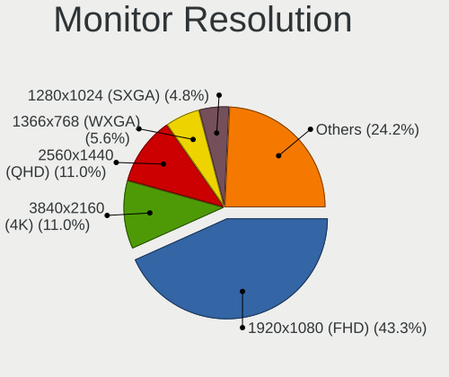

| Resolution         | Desktops | Percent |
|--------------------|----------|---------|
| 1920x1080 (FHD)    | 1127     | 43.3%   |
| 3840x2160 (4K)     | 287      | 11.03%  |
| 2560x1440 (QHD)    | 286      | 10.99%  |
| 1366x768 (WXGA)    | 146      | 5.61%   |
| 1280x1024 (SXGA)   | 126      | 4.84%   |
| 1680x1050 (WSXGA+) | 76       | 2.92%   |
| 1920x1200 (WUXGA)  | 65       | 2.5%    |
| 3440x1440          | 64       | 2.46%   |
| Unknown            | 59       | 2.27%   |
| 1440x900 (WXGA+)   | 56       | 2.15%   |
| 1600x900 (HD+)     | 52       | 2%      |
| 2560x1080          | 41       | 1.58%   |
| 1360x768           | 31       | 1.19%   |
| 2288x1287          | 30       | 1.15%   |
| 3840x1080          | 29       | 1.11%   |
| 1024x768 (XGA)     | 21       | 0.81%   |
| 1920x540           | 11       | 0.42%   |
| 1600x1200          | 11       | 0.42%   |
| 1280x720 (HD)      | 8        | 0.31%   |
| 7680x2160          | 6        | 0.23%   |
| 3840x1600          | 6        | 0.23%   |
| 1400x1050          | 6        | 0.23%   |
| 4480x1440          | 5        | 0.19%   |
| 5760x2160          | 4        | 0.15%   |
| 3840x1200          | 4        | 0.15%   |
| 2560x1600          | 4        | 0.15%   |
| 5360x1440          | 3        | 0.12%   |
| 2560x1397          | 3        | 0.12%   |
| 2048x1536          | 3        | 0.12%   |
| 6400x2160          | 2        | 0.08%   |
| 3600x1080          | 2        | 0.08%   |
| 2256x1504          | 2        | 0.08%   |
| 1280x768           | 2        | 0.08%   |
| 1152x864           | 2        | 0.08%   |
| 9440x2160          | 1        | 0.04%   |
| 800x1280           | 1        | 0.04%   |
| 7680x1440          | 1        | 0.04%   |
| 7280x2160          | 1        | 0.04%   |
| 7280x1440          | 1        | 0.04%   |
| 720x480            | 1        | 0.04%   |

Monitor Diagonal
----------------

Diagonal size in inches

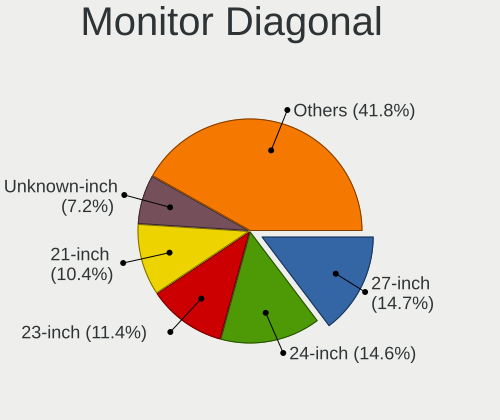

| Inches  | Desktops | Percent |
|---------|----------|---------|
| 27      | 388      | 14.7%   |
| 24      | 384      | 14.55%  |
| 23      | 300      | 11.37%  |
| 21      | 274      | 10.38%  |
| Unknown | 189      | 7.16%   |
| 18      | 151      | 5.72%   |
| 31      | 138      | 5.23%   |
| 19      | 122      | 4.62%   |
| 34      | 83       | 3.15%   |
| 17      | 60       | 2.27%   |
| 22      | 54       | 2.05%   |
| 20      | 52       | 1.97%   |
| 15      | 49       | 1.86%   |
| 32      | 45       | 1.71%   |
| 84      | 42       | 1.59%   |
| 142     | 28       | 1.06%   |
| 25      | 28       | 1.06%   |
| 54      | 24       | 0.91%   |
| 40      | 20       | 0.76%   |
| 72      | 17       | 0.64%   |
| 48      | 15       | 0.57%   |
| 26      | 15       | 0.57%   |
| 52      | 13       | 0.49%   |
| 43      | 12       | 0.45%   |
| 46      | 11       | 0.42%   |
| 28      | 10       | 0.38%   |
| 49      | 9        | 0.34%   |
| 37      | 8        | 0.3%    |
| 29      | 8        | 0.3%    |
| 63      | 7        | 0.27%   |
| 42      | 7        | 0.27%   |
| 33      | 7        | 0.27%   |
| 65      | 6        | 0.23%   |
| 16      | 6        | 0.23%   |
| 14      | 6        | 0.23%   |
| 13      | 5        | 0.19%   |
| 12      | 5        | 0.19%   |
| 74      | 4        | 0.15%   |
| 39      | 4        | 0.15%   |
| 35      | 4        | 0.15%   |

Monitor Width
-------------

Physical width

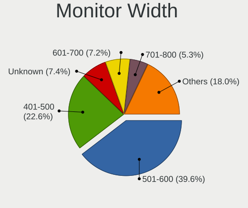

| Width in mm    | Desktops | Percent |
|----------------|----------|---------|
| 501-600        | 1012     | 39.58%  |
| 401-500        | 577      | 22.57%  |
| Unknown        | 189      | 7.39%   |
| 601-700        | 184      | 7.2%    |
| 701-800        | 136      | 5.32%   |
| 301-350        | 111      | 4.34%   |
| 1001-1500      | 96       | 3.75%   |
| 351-400        | 79       | 3.09%   |
| 1501-2000      | 71       | 2.78%   |
| 801-900        | 38       | 1.49%   |
| More than 2000 | 28       | 1.1%    |
| 901-1000       | 21       | 0.82%   |
| 201-300        | 13       | 0.51%   |
| 101-200        | 2        | 0.08%   |

Aspect Ratio
------------

Proportional relationship between the width and the height

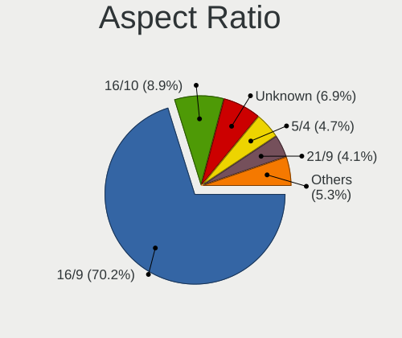

| Ratio   | Desktops | Percent |
|---------|----------|---------|
| 16/9    | 1710     | 70.2%   |
| 16/10   | 217      | 8.91%   |
| Unknown | 168      | 6.9%    |
| 5/4     | 114      | 4.68%   |
| 21/9    | 99       | 4.06%   |
| 4/3     | 52       | 2.13%   |
| 1.00    | 30       | 1.23%   |
| 32/9    | 19       | 0.78%   |
| 6/5     | 9        | 0.37%   |
| 3/2     | 9        | 0.37%   |
| 0.56    | 5        | 0.21%   |
| 3.20    | 2        | 0.08%   |
| 1.96    | 1        | 0.04%   |
| 0.25    | 1        | 0.04%   |

Monitor Area
------------

Area in inch²

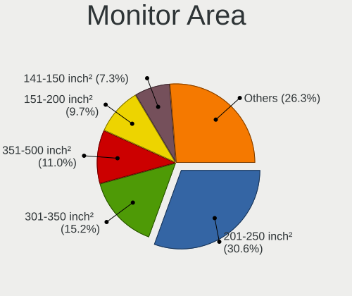

| Area in inch² | Desktops | Percent |
|----------------|----------|---------|
| 201-250        | 793      | 30.56%  |
| 301-350        | 394      | 15.18%  |
| 351-500        | 285      | 10.98%  |
| 151-200        | 252      | 9.71%   |
| 141-150        | 189      | 7.28%   |
| Unknown        | 189      | 7.28%   |
| More than 1000 | 165      | 6.36%   |
| 251-300        | 160      | 6.17%   |
| 501-1000       | 89       | 3.43%   |
| 101-110        | 42       | 1.62%   |
| 111-120        | 9        | 0.35%   |
| 71-80          | 7        | 0.27%   |
| 131-140        | 7        | 0.27%   |
| 81-90          | 4        | 0.15%   |
| 91-100         | 4        | 0.15%   |
| 121-130        | 3        | 0.12%   |
| 1-40           | 2        | 0.08%   |
| 61-70          | 1        | 0.04%   |

Pixel Density
-------------

Pixels per inch

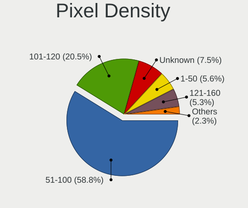

| Density       | Desktops | Percent |
|---------------|----------|---------|
| 51-100        | 1475     | 58.81%  |
| 101-120       | 515      | 20.53%  |
| Unknown       | 189      | 7.54%   |
| 1-50          | 140      | 5.58%   |
| 121-160       | 132      | 5.26%   |
| 161-240       | 56       | 2.23%   |
| More than 240 | 1        | 0.04%   |

Multiple Monitors
-----------------

Total monitors connected

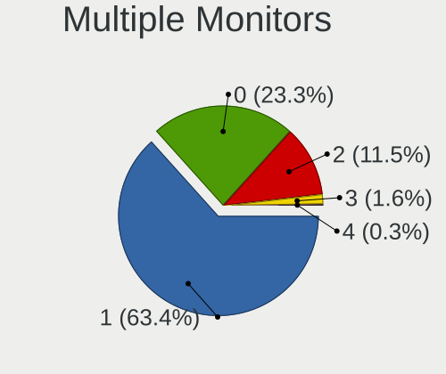

| Total | Desktops | Percent |
|-------|----------|---------|
| 1     | 1994     | 63.36%  |
| 0     | 734      | 23.32%  |
| 2     | 361      | 11.47%  |
| 3     | 50       | 1.59%   |
| 4     | 8        | 0.25%   |

Network
-------

Net Controller Vendor
---------------------

Controller vendors

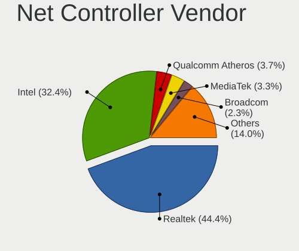

| Vendor                           | Desktops | Percent |
|----------------------------------|----------|---------|
| Realtek Semiconductor            | 1952     | 44.37%  |
| Intel                            | 1424     | 32.37%  |
| Qualcomm Atheros                 | 161      | 3.66%   |
| MediaTek                         | 146      | 3.32%   |
| Broadcom                         | 102      | 2.32%   |
| TP-Link                          | 68       | 1.55%   |
| Ralink Technology                | 66       | 1.5%    |
| Aquantia                         | 42       | 0.95%   |
| Nvidia                           | 40       | 0.91%   |
| Marvell Technology Group         | 26       | 0.59%   |
| QinHeng Electronics              | 20       | 0.45%   |
| ASIX Electronics                 | 20       | 0.45%   |
| Ralink                           | 19       | 0.43%   |
| Samsung Electronics              | 18       | 0.41%   |
| Mellanox Technologies            | 18       | 0.41%   |
| Broadcom Limited                 | 15       | 0.34%   |
| ASUSTek Computer                 | 15       | 0.34%   |
| NetGear                          | 14       | 0.32%   |
| Microsoft                        | 12       | 0.27%   |
| D-Link                           | 12       | 0.27%   |
| Xiaomi                           | 11       | 0.25%   |
| American Megatrends              | 11       | 0.25%   |
| Qualcomm Technologies            | 10       | 0.23%   |
| VIA Technologies                 | 8        | 0.18%   |
| Sigma Designs                    | 8        | 0.18%   |
| Qualcomm Atheros Communications  | 7        | 0.16%   |
| Edimax Technology                | 7        | 0.16%   |
| D-Link System                    | 7        | 0.16%   |
| Qualcomm                         | 6        | 0.14%   |
| Linksys                          | 6        | 0.14%   |
| DisplayLink                      | 6        | 0.14%   |
| AVM                              | 6        | 0.14%   |
| 3Com                             | 6        | 0.14%   |
| Motorola PCS                     | 5        | 0.11%   |
| Huawei Technologies              | 5        | 0.11%   |
| Silicon Integrated Systems [SiS] | 4        | 0.09%   |
| Microchip Technology             | 4        | 0.09%   |
| Insyde Software                  | 4        | 0.09%   |
| Google                           | 4        | 0.09%   |
| Emulex                           | 4        | 0.09%   |

Net Controller Model
--------------------

Controller models

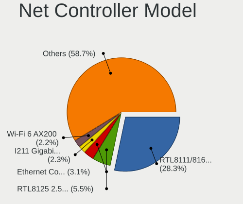

| Model                                                                  | Desktops | Percent |
|------------------------------------------------------------------------|----------|---------|
| Realtek RTL8111/8168/8211/8411 PCI Express Gigabit Ethernet Controller | 1436     | 28.27%  |
| Realtek RTL8125 2.5GbE Controller                                      | 279      | 5.49%   |
| Intel Ethernet Controller I225-V                                       | 155      | 3.05%   |
| Intel I211 Gigabit Network Connection                                  | 115      | 2.26%   |
| Intel Wi-Fi 6 AX200                                                    | 112      | 2.21%   |
| Intel Ethernet Controller I226-V                                       | 99       | 1.95%   |
| Intel 82579LM Gigabit Network Connection (Lewisville)                  | 93       | 1.83%   |
| Intel Ethernet Connection (2) I219-V                                   | 89       | 1.75%   |
| Intel Ethernet Connection I217-LM                                      | 87       | 1.71%   |
| Intel Wi-Fi 6E(802.11ax) AX210/AX1675* 2x2 [Typhoon Peak]              | 82       | 1.61%   |
| MediaTek MT7922 802.11ax PCI Express Wireless Network Adapter          | 64       | 1.26%   |
| Intel I210 Gigabit Network Connection                                  | 60       | 1.18%   |
| Realtek RTL8821CE 802.11ac PCIe Wireless Network Adapter               | 53       | 1.04%   |
| Intel Ethernet Connection (2) I219-LM                                  | 53       | 1.04%   |
| Realtek RTL810xE PCI Express Fast Ethernet controller                  | 52       | 1.02%   |
| Realtek 802.11ac NIC                                                   | 49       | 0.96%   |
| Intel 700 Series Chipset CNVi WiFi                                     | 47       | 0.93%   |
| Intel Dual Band Wireless-AC 3168NGW [Stone Peak]                       | 46       | 0.91%   |
| Realtek RTL8852BE PCIe 802.11ax Wireless Network Controller            | 43       | 0.85%   |
| Realtek RTL8153 Gigabit Ethernet Adapter                               | 40       | 0.79%   |
| Intel Ethernet Connection I217-V                                       | 40       | 0.79%   |
| MediaTek MT7921K (RZ608) Wi-Fi 6E 80MHz                                | 35       | 0.69%   |
| Intel 82579V Gigabit Network Connection                                | 34       | 0.67%   |
| Ralink MT7601U Wireless Adapter                                        | 33       | 0.65%   |
| Intel Ethernet Connection (7) I219-LM                                  | 32       | 0.63%   |
| Intel 82574L Gigabit Network Connection                                | 32       | 0.63%   |
| Intel Ethernet Connection (7) I219-V                                   | 30       | 0.59%   |
| Intel Alder Lake-N PCH CNVi WiFi                                       | 27       | 0.53%   |
| Realtek RTL8188EUS 802.11n Wireless Network Adapter                    | 24       | 0.47%   |
| Realtek RTL8152 Fast Ethernet Adapter                                  | 24       | 0.47%   |
| Intel Wi-Fi 5(802.11ac) Wireless-AC 9x6x [Thunder Peak]                | 23       | 0.45%   |
| Intel Alder Lake-S PCH CNVi WiFi                                       | 23       | 0.45%   |
| Nvidia MCP61 Ethernet                                                  | 22       | 0.43%   |
| Intel Wireless 7260                                                    | 22       | 0.43%   |
| Intel Wireless 7265                                                    | 21       | 0.41%   |
| Realtek RTL88x2bu [AC1200 Techkey]                                     | 20       | 0.39%   |
| Intel I350 Gigabit Network Connection                                  | 20       | 0.39%   |
| Intel Ethernet Connection (5) I219-LM                                  | 20       | 0.39%   |
| Intel Ethernet Connection (2) I218-LM                                  | 20       | 0.39%   |
| Intel Ethernet Connection (11) I219-V                                  | 19       | 0.37%   |

Wireless Vendor
---------------

Wireless vendors

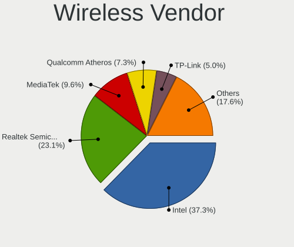

| Vendor                          | Desktops | Percent |
|---------------------------------|----------|---------|
| Intel                           | 488      | 37.34%  |
| Realtek Semiconductor           | 302      | 23.11%  |
| MediaTek                        | 126      | 9.64%   |
| Qualcomm Atheros                | 95       | 7.27%   |
| TP-Link                         | 66       | 5.05%   |
| Ralink Technology               | 66       | 5.05%   |
| Broadcom                        | 33       | 2.52%   |
| Ralink                          | 19       | 1.45%   |
| ASUSTek Computer                | 15       | 1.15%   |
| NetGear                         | 14       | 1.07%   |
| Microsoft                       | 11       | 0.84%   |
| D-Link                          | 11       | 0.84%   |
| Qualcomm Atheros Communications | 7        | 0.54%   |
| Edimax Technology               | 7        | 0.54%   |
| Linksys                         | 6        | 0.46%   |
| Broadcom Limited                | 6        | 0.46%   |
| AVM                             | 6        | 0.46%   |
| Sitecom Europe                  | 3        | 0.23%   |
| Marvell Technology Group        | 3        | 0.23%   |
| Belkin Components               | 3        | 0.23%   |
| ZyDAS                           | 2        | 0.15%   |
| ZTopInc                         | 2        | 0.15%   |
| Realtek                         | 2        | 0.15%   |
| Qualcomm Technologies           | 2        | 0.15%   |
| Mercucys                        | 2        | 0.15%   |
| IMC Networks                    | 2        | 0.15%   |
| D-Link System                   | 2        | 0.15%   |
| ZyXEL Communications            | 1        | 0.08%   |
| Zinwell                         | 1        | 0.08%   |
| Wacom                           | 1        | 0.08%   |
| Dell                            | 1        | 0.08%   |
| CyberTAN Technology             | 1        | 0.08%   |
| BUFFALO                         | 1        | 0.08%   |

Wireless Model
--------------

Wireless models

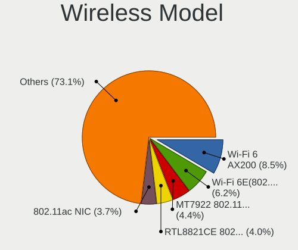

| Model                                                                | Desktops | Percent |
|----------------------------------------------------------------------|----------|---------|
| Intel Wi-Fi 6 AX200                                                  | 112      | 8.5%    |
| Intel Wi-Fi 6E(802.11ax) AX210/AX1675* 2x2 [Typhoon Peak]            | 82       | 6.23%   |
| MediaTek MT7922 802.11ax PCI Express Wireless Network Adapter        | 58       | 4.4%    |
| Realtek RTL8821CE 802.11ac PCIe Wireless Network Adapter             | 53       | 4.02%   |
| Realtek 802.11ac NIC                                                 | 49       | 3.72%   |
| Intel 700 Series Chipset CNVi WiFi                                   | 47       | 3.57%   |
| Intel Dual Band Wireless-AC 3168NGW [Stone Peak]                     | 46       | 3.49%   |
| MediaTek MT7921K (RZ608) Wi-Fi 6E 80MHz                              | 35       | 2.66%   |
| Ralink MT7601U Wireless Adapter                                      | 33       | 2.51%   |
| Realtek RTL8188EUS 802.11n Wireless Network Adapter                  | 24       | 1.82%   |
| Intel Wi-Fi 5(802.11ac) Wireless-AC 9x6x [Thunder Peak]              | 23       | 1.75%   |
| Intel Alder Lake-N PCH CNVi WiFi                                     | 23       | 1.75%   |
| Intel Wireless 7260                                                  | 22       | 1.67%   |
| Intel Wireless 7265                                                  | 21       | 1.59%   |
| Realtek RTL88x2bu [AC1200 Techkey]                                   | 20       | 1.52%   |
| MediaTek MT7921 802.11ax PCIe Wireless Network Adapter [Filogic 330] | 18       | 1.37%   |
| Intel Cannon Lake PCH CNVi WiFi                                      | 17       | 1.29%   |
| Qualcomm Atheros AR9485 Wireless Network Adapter                     | 16       | 1.21%   |
| Broadcom BCM4360 802.11ac Dual Band Wireless Network Adapter         | 16       | 1.21%   |
| TP-Link 802.11ac NIC                                                 | 15       | 1.14%   |
| Realtek RTL8852BE PCIe 802.11ax Wireless Network Controller          | 14       | 1.06%   |
| Realtek RTL8192EE PCIe Wireless Network Adapter                      | 14       | 1.06%   |
| Qualcomm Atheros QCA9377 802.11ac Wireless Network Adapter           | 13       | 0.99%   |
| Intel Wireless 8260                                                  | 13       | 0.99%   |
| Intel Wireless 3165                                                  | 13       | 0.99%   |
| TP-Link AC600 wireless Realtek RTL8811AU [Archer T2U Nano]           | 12       | 0.91%   |
| Realtek RTL8852CE PCIe 802.11ax Wireless Network Controller          | 12       | 0.91%   |
| Intel Alder Lake-S PCH CNVi WiFi                                     | 12       | 0.91%   |
| TP-Link TL-WN722N v2/v3 [Realtek RTL8188EUS]                         | 10       | 0.76%   |
| Ralink RT2870/RT3070 Wireless Adapter                                | 10       | 0.76%   |
| Qualcomm Atheros AR9287 Wireless Network Adapter (PCI-Express)       | 10       | 0.76%   |
| Intel Tiger Lake PCH CNVi WiFi                                       | 10       | 0.76%   |
| Realtek RTL8192EU 802.11b/g/n WLAN Adapter                           | 9        | 0.68%   |
| Realtek RTL8192CU 802.11n WLAN Adapter                               | 9        | 0.68%   |
| Realtek RTL8188CUS 802.11n WLAN Adapter                              | 9        | 0.68%   |
| Qualcomm Atheros AR9227 Wireless Network Adapter                     | 9        | 0.68%   |
| Intel Comet Lake PCH CNVi WiFi                                       | 9        | 0.68%   |
| Ralink RT5370 Wireless Adapter                                       | 8        | 0.61%   |
| Qualcomm Atheros QCA6174 802.11ac Wireless Network Adapter           | 8        | 0.61%   |
| TP-Link 802.11ac WLAN Adapter                                        | 7        | 0.53%   |

Ethernet Vendor
---------------

Ethernet vendors

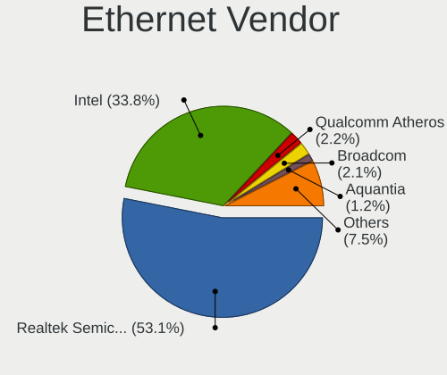

| Vendor                                 | Desktops | Percent |
|----------------------------------------|----------|---------|
| Realtek Semiconductor                  | 1842     | 53.1%   |
| Intel                                  | 1174     | 33.84%  |
| Qualcomm Atheros                       | 76       | 2.19%   |
| Broadcom                               | 74       | 2.13%   |
| Aquantia                               | 42       | 1.21%   |
| Nvidia                                 | 40       | 1.15%   |
| Marvell Technology Group               | 23       | 0.66%   |
| ASIX Electronics                       | 20       | 0.58%   |
| Samsung Electronics                    | 18       | 0.52%   |
| MediaTek                               | 18       | 0.52%   |
| Mellanox Technologies                  | 17       | 0.49%   |
| Xiaomi                                 | 11       | 0.32%   |
| American Megatrends                    | 11       | 0.32%   |
| Broadcom Limited                       | 9        | 0.26%   |
| VIA Technologies                       | 8        | 0.23%   |
| Qualcomm Technologies                  | 8        | 0.23%   |
| Qualcomm                               | 6        | 0.17%   |
| DisplayLink                            | 6        | 0.17%   |
| 3Com                                   | 6        | 0.17%   |
| Motorola PCS                           | 5        | 0.14%   |
| D-Link System                          | 5        | 0.14%   |
| Silicon Integrated Systems [SiS]       | 4        | 0.12%   |
| Insyde Software                        | 4        | 0.12%   |
| Huawei Technologies                    | 4        | 0.12%   |
| Google                                 | 4        | 0.12%   |
| Emulex                                 | 4        | 0.12%   |
| JMicron Technology                     | 3        | 0.09%   |
| ICS Advent                             | 3        | 0.09%   |
| ADMtek                                 | 3        | 0.09%   |
| TP-Link                                | 2        | 0.06%   |
| Solarflare Communications              | 2        | 0.06%   |
| OPPO Electronics                       | 2        | 0.06%   |
| vivo                                   | 1        | 0.03%   |
| SysKonnect                             | 1        | 0.03%   |
| Suzhou Motorcomm Electronic Technology | 1        | 0.03%   |
| Sundance Technology Inc / IC Plus      | 1        | 0.03%   |
| Spreadtrum Communications              | 1        | 0.03%   |
| QLogic                                 | 1        | 0.03%   |
| QinHeng Electronics                    | 1        | 0.03%   |
| MYRICOM                                | 1        | 0.03%   |

Ethernet Model
--------------

Ethernet models

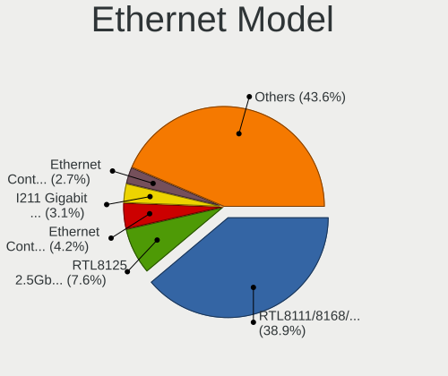

| Model                                                                           | Desktops | Percent |
|---------------------------------------------------------------------------------|----------|---------|
| Realtek RTL8111/8168/8211/8411 PCI Express Gigabit Ethernet Controller          | 1436     | 38.87%  |
| Realtek RTL8125 2.5GbE Controller                                               | 279      | 7.55%   |
| Intel Ethernet Controller I225-V                                                | 155      | 4.2%    |
| Intel I211 Gigabit Network Connection                                           | 115      | 3.11%   |
| Intel Ethernet Controller I226-V                                                | 99       | 2.68%   |
| Intel 82579LM Gigabit Network Connection (Lewisville)                           | 93       | 2.52%   |
| Intel Ethernet Connection (2) I219-V                                            | 89       | 2.41%   |
| Intel Ethernet Connection I217-LM                                               | 87       | 2.36%   |
| Intel I210 Gigabit Network Connection                                           | 60       | 1.62%   |
| Intel Ethernet Connection (2) I219-LM                                           | 53       | 1.43%   |
| Realtek RTL810xE PCI Express Fast Ethernet controller                           | 52       | 1.41%   |
| Realtek RTL8153 Gigabit Ethernet Adapter                                        | 40       | 1.08%   |
| Intel Ethernet Connection I217-V                                                | 40       | 1.08%   |
| Intel 82579V Gigabit Network Connection                                         | 34       | 0.92%   |
| Intel Ethernet Connection (7) I219-LM                                           | 32       | 0.87%   |
| Intel 82574L Gigabit Network Connection                                         | 32       | 0.87%   |
| Intel Ethernet Connection (7) I219-V                                            | 30       | 0.81%   |
| Realtek RTL8852BE PCIe 802.11ax Wireless Network Controller                     | 29       | 0.79%   |
| Realtek RTL8152 Fast Ethernet Adapter                                           | 24       | 0.65%   |
| Nvidia MCP61 Ethernet                                                           | 22       | 0.6%    |
| Intel I350 Gigabit Network Connection                                           | 20       | 0.54%   |
| Intel Ethernet Connection (5) I219-LM                                           | 20       | 0.54%   |
| Intel Ethernet Connection (2) I218-LM                                           | 20       | 0.54%   |
| Intel Ethernet Connection (11) I219-V                                           | 19       | 0.51%   |
| ASIX AX88179 Gigabit Ethernet                                                   | 19       | 0.51%   |
| Intel 82599ES 10-Gigabit SFI/SFP+ Network Connection                            | 18       | 0.49%   |
| Intel Ethernet Connection (14) I219-V                                           | 17       | 0.46%   |
| Realtek RTL8111/8168/8411 PCI Express Gigabit Ethernet Controller               | 16       | 0.43%   |
| Qualcomm Atheros Killer E220x Gigabit Ethernet Controller                       | 16       | 0.43%   |
| Intel Ethernet Connection (17) I219-LM                                          | 16       | 0.43%   |
| Intel 82566DM Gigabit Network Connection                                        | 16       | 0.43%   |
| Intel 82567LM-3 Gigabit Network Connection                                      | 15       | 0.41%   |
| Aquantia AQtion AQC113CS NBase-T/IEEE 802.3an Ethernet Controller [Antigua 10G] | 15       | 0.41%   |
| Intel Ethernet Connection (2) I218-V                                            | 14       | 0.38%   |
| Samsung Galaxy series, misc. (tethering mode)                                   | 12       | 0.32%   |
| Realtek RTL-8100/8101L/8139 PCI Fast Ethernet Adapter                           | 12       | 0.32%   |
| Intel Ethernet Connection (17) I219-V                                           | 12       | 0.32%   |
| Intel Ethernet Controller X710 for 10GbE SFP+                                   | 11       | 0.3%    |
| Intel Ethernet Connection (11) I219-LM                                          | 11       | 0.3%    |
| Intel Alder Lake-S PCH CNVi WiFi                                                | 11       | 0.3%    |

Net Controller Kind
-------------------

Ethernet, WiFi or modem

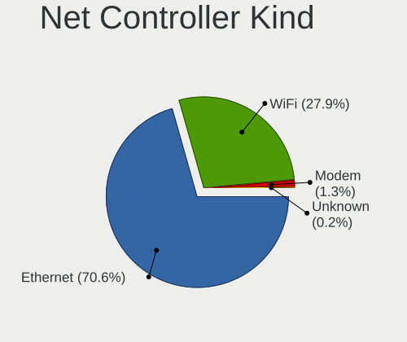

| Kind     | Desktops | Percent |
|----------|----------|---------|
| Ethernet | 3068     | 70.61%  |
| WiFi     | 1214     | 27.94%  |
| Modem    | 55       | 1.27%   |
| Unknown  | 8        | 0.18%   |

Used Controller
---------------

Currently used network controller

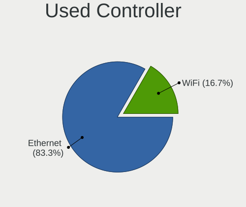

| Kind     | Desktops | Percent |
|----------|----------|---------|
| Ethernet | 2589     | 83.33%  |
| WiFi     | 518      | 16.67%  |

NICs
----

Total network controllers on board

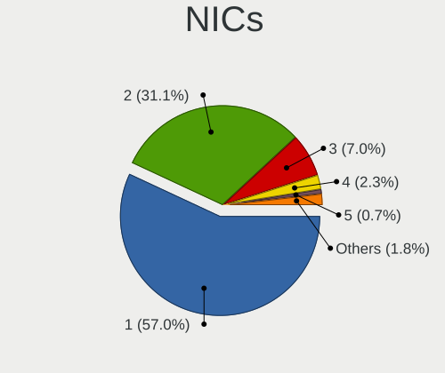

| Total | Desktops | Percent |
|-------|----------|---------|
| 1     | 1774     | 56.95%  |
| 2     | 970      | 31.14%  |
| 3     | 218      | 7%      |
| 4     | 73       | 2.34%   |
| 5     | 23       | 0.74%   |
| 0     | 20       | 0.64%   |
| 6     | 19       | 0.61%   |
| 8     | 7        | 0.22%   |
| 7     | 5        | 0.16%   |
| 9     | 4        | 0.13%   |
| 12    | 1        | 0.03%   |
| 10    | 1        | 0.03%   |

IPv6
----

IPv6 vs IPv4

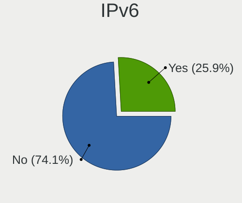

| Used | Desktops | Percent |
|------|----------|---------|
| No   | 2315     | 74.1%   |
| Yes  | 809      | 25.9%   |

Bluetooth
---------

Bluetooth Vendor
----------------

Controller vendors

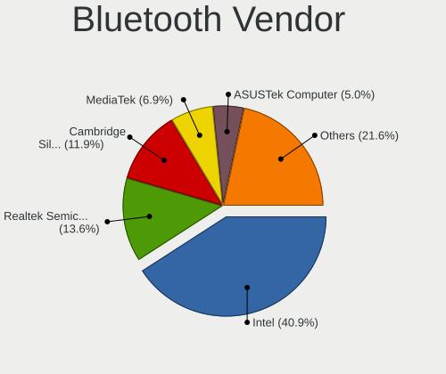

| Vendor                          | Desktops | Percent |
|---------------------------------|----------|---------|
| Intel                           | 459      | 40.87%  |
| Realtek Semiconductor           | 153      | 13.62%  |
| Cambridge Silicon Radio         | 134      | 11.93%  |
| MediaTek                        | 78       | 6.95%   |
| ASUSTek Computer                | 56       | 4.99%   |
| IMC Networks                    | 52       | 4.63%   |
| Foxconn / Hon Hai               | 44       | 3.92%   |
| TP-Link                         | 29       | 2.58%   |
| Qualcomm Atheros Communications | 27       | 2.4%    |
| Broadcom                        | 20       | 1.78%   |
| Apple                           | 16       | 1.42%   |
| Realtek                         | 8        | 0.71%   |
| Actions                         | 8        | 0.71%   |
| Integrated System Solution      | 7        | 0.62%   |
| Unknown                         | 7        | 0.62%   |
| Edimax Technology               | 6        | 0.53%   |
| Lite-On Technology              | 5        | 0.45%   |
| HTC (High Tech Computer)        | 2        | 0.18%   |
| Dynex                           | 2        | 0.18%   |
| Conwise Technology              | 2        | 0.18%   |
| Roper                           | 1        | 0.09%   |
| Ralink                          | 1        | 0.09%   |
| Qcom                            | 1        | 0.09%   |
| Mobile Action Technology        | 1        | 0.09%   |
| Logitech                        | 1        | 0.09%   |
| Hewlett-Packard                 | 1        | 0.09%   |
| Belkin Components               | 1        | 0.09%   |
| Accel Semiconductor             | 1        | 0.09%   |

Bluetooth Model
---------------

Controller models

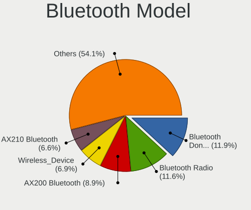

| Model                                                   | Desktops | Percent |
|---------------------------------------------------------|----------|---------|
| Cambridge Silicon Radio Bluetooth Dongle (HCI mode)     | 134      | 11.92%  |
| Realtek Bluetooth Radio                                 | 130      | 11.57%  |
| Intel AX200 Bluetooth                                   | 100      | 8.9%    |
| MediaTek Wireless_Device                                | 78       | 6.94%   |
| Intel AX210 Bluetooth                                   | 74       | 6.58%   |
| Intel Bluetooth wireless interface                      | 71       | 6.32%   |
| Intel AX201 Bluetooth                                   | 59       | 5.25%   |
| Intel Bluetooth Device                                  | 58       | 5.16%   |
| Intel Wireless-AC 3168 Bluetooth                        | 43       | 3.83%   |
| IMC Networks Bluetooth Radio                            | 30       | 2.67%   |
| TP-Link TP-T@- UB500 Adapter                            | 29       | 2.58%   |
| Intel Bluetooth 9460/9560 Jefferson Peak (JfP)          | 26       | 2.31%   |
| Foxconn / Hon Hai Wireless_Device                       | 26       | 2.31%   |
| ASUS ASUS USB-BT500                                     | 25       | 2.22%   |
| Intel Wireless-AC 9260 Bluetooth Adapter                | 23       | 2.05%   |
| IMC Networks Wireless_Device                            | 18       | 1.6%    |
| ASUS Broadcom BCM20702A0 Bluetooth                      | 17       | 1.51%   |
| Broadcom BCM20702A0 Bluetooth 4.0                       | 15       | 1.33%   |
| Qualcomm Atheros  Bluetooth Device                      | 13       | 1.16%   |
| Foxconn / Hon Hai Bluetooth Device                      | 13       | 1.16%   |
| Apple Bluetooth Host Controller                         | 12       | 1.07%   |
| Realtek Bluetooth 5.3 Radio                             | 11       | 0.98%   |
| Realtek  Bluetooth 4.2 Adapter                          | 8        | 0.71%   |
| Realtek Bluetooth Radio                                 | 8        | 0.71%   |
| Actions general adapter                                 | 8        | 0.71%   |
| Unknown                                                 | 7        | 0.62%   |
| ASUS Bluetooth Radio                                    | 6        | 0.53%   |
| Intel Centrino Bluetooth Wireless Transceiver           | 5        | 0.44%   |
| Qualcomm Atheros QCA61x4 Bluetooth 4.0                  | 4        | 0.36%   |
| Qualcomm Atheros AR9462 Bluetooth                       | 4        | 0.36%   |
| Integrated System Solution Bluetooth Device             | 4        | 0.36%   |
| Apple Built-in Bluetooth 2.0+EDR HCI                    | 4        | 0.36%   |
| Qualcomm Atheros Bluetooth USB Host Controller          | 3        | 0.27%   |
| Integrated System Solution KY-BT100 Bluetooth Adapter   | 3        | 0.27%   |
| IMC Networks Bluetooth Device                           | 3        | 0.27%   |
| Foxconn / Hon Hai MediaTek Bluetooth Adapter            | 3        | 0.27%   |
| Edimax EW-7611ULB 802.11b/g/n and Bluetooth 4.0 Adapter | 3        | 0.27%   |
| Edimax Bluetooth Device                                 | 3        | 0.27%   |
| Realtek RTL8822BE Bluetooth 4.2 Adapter                 | 2        | 0.18%   |
| Qualcomm Atheros AR3011 Bluetooth                       | 2        | 0.18%   |

Sound
-----

Sound Vendor
------------

Sound card vendors

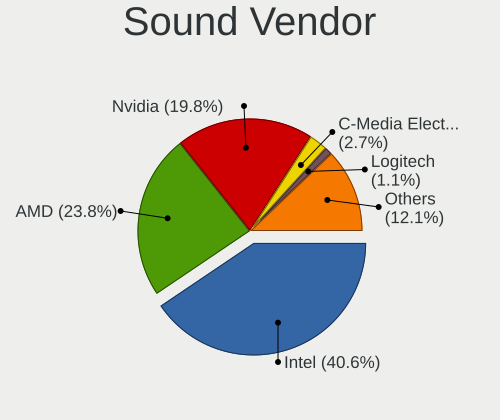

| Vendor                                       | Desktops | Percent |
|----------------------------------------------|----------|---------|
| Intel                                        | 1971     | 40.56%  |
| AMD                                          | 1155     | 23.77%  |
| Nvidia                                       | 962      | 19.79%  |
| C-Media Electronics                          | 130      | 2.67%   |
| Logitech                                     | 52       | 1.07%   |
| ASUSTek Computer                             | 43       | 0.88%   |
| Zoran Co. Personal Media Division (Nogatech) | 39       | 0.8%    |
| Micro Star International                     | 35       | 0.72%   |
| Creative Labs                                | 33       | 0.68%   |
| Texas Instruments                            | 28       | 0.58%   |
| Focusrite-Novation                           | 23       | 0.47%   |
| Generalplus Technology                       | 20       | 0.41%   |
| Razer USA                                    | 18       | 0.37%   |
| JMTek                                        | 17       | 0.35%   |
| Creative Technology                          | 16       | 0.33%   |
| SteelSeries ApS                              | 15       | 0.31%   |
| GN Netcom                                    | 15       | 0.31%   |
| VIA Technologies                             | 13       | 0.27%   |
| Jieli Technology                             | 13       | 0.27%   |
| Hewlett-Packard                              | 13       | 0.27%   |
| Corsair                                      | 13       | 0.27%   |
| Tenx Technology                              | 12       | 0.25%   |
| Kingston Technology                          | 11       | 0.23%   |
| Realtek Semiconductor                        | 10       | 0.21%   |
| Blue Microphones                             | 10       | 0.21%   |
| KTMicro                                      | 8        | 0.16%   |
| RODE Microphones                             | 7        | 0.14%   |
| BEHRINGER International                      | 7        | 0.14%   |
| Unknown                                      | 7        | 0.14%   |
| Thesycon Systemsoftware & Consulting         | 6        | 0.12%   |
| Sony                                         | 6        | 0.12%   |
| SAVITECH                                     | 6        | 0.12%   |
| Plantronics                                  | 6        | 0.12%   |
| Giga-Byte Technology                         | 6        | 0.12%   |
| Dell                                         | 6        | 0.12%   |
| PreSonus Audio Electronics                   | 5        | 0.1%    |
| Astro Gaming                                 | 5        | 0.1%    |
| XMOS                                         | 4        | 0.08%   |
| Silicon Integrated Systems [SiS]             | 4        | 0.08%   |
| Medeli Electronics                           | 4        | 0.08%   |

Sound Model
-----------

Sound card models

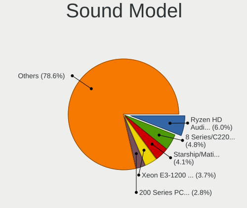

| Model                                                                      | Desktops | Percent |
|----------------------------------------------------------------------------|----------|---------|
| AMD Ryzen HD Audio Controller                                              | 345      | 5.96%   |
| Intel 8 Series/C220 Series Chipset High Definition Audio Controller        | 278      | 4.8%    |
| AMD Starship/Matisse HD Audio Controller                                   | 238      | 4.11%   |
| Intel Xeon E3-1200 v3/4th Gen Core Processor HD Audio Controller           | 214      | 3.7%    |
| Intel 200 Series PCH HD Audio                                              | 163      | 2.82%   |
| Intel 6 Series/C200 Series Chipset Family High Definition Audio Controller | 158      | 2.73%   |
| Intel 100 Series/C230 Series Chipset Family HD Audio Controller            | 152      | 2.63%   |
| AMD Renoir/Cezanne HDMI/DP Audio Controller                                | 146      | 2.52%   |
| AMD Radeon High Definition Audio Controller                                | 138      | 2.38%   |
| AMD SBx00 Azalia (Intel HDA)                                               | 107      | 1.85%   |
| AMD Navi 21/23 HDMI/DP Audio Controller                                    | 107      | 1.85%   |
| Intel 7 Series/C216 Chipset Family High Definition Audio Controller        | 106      | 1.83%   |
| Intel Cannon Lake PCH cAVS                                                 | 99       | 1.71%   |
| AMD Ellesmere HDMI Audio [Radeon RX 470/480 / 570/580/590]                 | 90       | 1.55%   |
| Intel Raptor Lake High Definition Audio Controller                         | 89       | 1.54%   |
| Intel Alder Lake-S HD Audio Controller                                     | 89       | 1.54%   |
| AMD Family 17h (Models 00h-0fh) HD Audio Controller                        | 81       | 1.4%    |
| Intel NM10/ICH7 Family High Definition Audio Controller                    | 79       | 1.36%   |
| Intel Alder Lake-N PCH High Definition Audio Controller                    | 77       | 1.33%   |
| Nvidia GP107GL High Definition Audio Controller                            | 75       | 1.3%    |
| Nvidia GK208 HDMI/DP Audio Controller                                      | 69       | 1.19%   |
| Nvidia TU106 High Definition Audio Controller                              | 68       | 1.17%   |
| Intel 82801JI (ICH10 Family) HD Audio Controller                           | 65       | 1.12%   |
| AMD FCH Azalia Controller                                                  | 65       | 1.12%   |
| Intel Comet Lake PCH cAVS                                                  | 59       | 1.02%   |
| Intel C610/X99 series chipset HD Audio Controller                          | 59       | 1.02%   |
| AMD Baffin HDMI/DP Audio [Radeon RX 550 640SP / RX 560/560X]               | 59       | 1.02%   |
| C-Media Electronics Audio Adapter (Unitek Y-247A)                          | 56       | 0.97%   |
| AMD Raven/Raven2/Fenghuang HDMI/DP Audio Controller                        | 54       | 0.93%   |
| AMD Oland/Hainan/Cape Verde/Pitcairn HDMI Audio [Radeon HD 7000 Series]    | 53       | 0.92%   |
| Nvidia GA104 High Definition Audio Controller                              | 52       | 0.9%    |
| Nvidia GP106 High Definition Audio Controller                              | 48       | 0.83%   |
| Nvidia TU116 High Definition Audio Controller                              | 47       | 0.81%   |
| Nvidia GF108 High Definition Audio Controller                              | 45       | 0.78%   |
| AMD Navi 31 HDMI/DP Audio                                                  | 45       | 0.78%   |
| Nvidia GP108 High Definition Audio Controller                              | 43       | 0.74%   |
| Intel 5 Series/3400 Series Chipset High Definition Audio                   | 43       | 0.74%   |
| Nvidia GM204 High Definition Audio Controller                              | 42       | 0.73%   |
| Nvidia High Definition Audio Controller                                    | 41       | 0.71%   |
| Nvidia GA106 High Definition Audio Controller                              | 41       | 0.71%   |

Memory
------

Memory Vendor
-------------

Memory module vendors

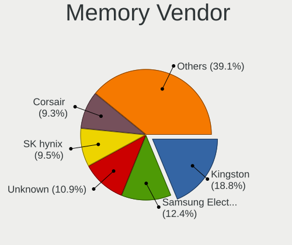

| Vendor                                  | Desktops | Percent |
|-----------------------------------------|----------|---------|
| Kingston                                | 502      | 18.75%  |
| Samsung Electronics                     | 331      | 12.36%  |
| Unknown                                 | 293      | 10.95%  |
| SK hynix                                | 255      | 9.53%   |
| Corsair                                 | 249      | 9.3%    |
| Crucial                                 | 229      | 8.55%   |
| G.Skill                                 | 181      | 6.76%   |
| Micron Technology                       | 145      | 5.42%   |
| Unknown                                 | 78       | 2.91%   |
| A-DATA Technology                       | 72       | 2.69%   |
| Team                                    | 37       | 1.38%   |
| Patriot                                 | 31       | 1.16%   |
| Ramaxel Technology                      | 21       | 0.78%   |
| Hikvision                               | 20       | 0.75%   |
| Nanya Technology                        | 18       | 0.67%   |
| AMD                                     | 12       | 0.45%   |
| Elpida                                  | 11       | 0.41%   |
| Unknown (ABCD)                          | 10       | 0.37%   |
| Unknown (0x0E9D)                        | 9        | 0.34%   |
| Transcend                               | 9        | 0.34%   |
| Micro Memory Bank                       | 9        | 0.34%   |
| Apacer                                  | 8        | 0.3%    |
| Timetec                                 | 7        | 0.26%   |
| Patriot Memory (PDP Systems)            | 7        | 0.26%   |
| PNY                                     | 6        | 0.22%   |
| GeIL                                    | 6        | 0.22%   |
| ASint Technology                        | 6        | 0.22%   |
| Toshiba                                 | 4        | 0.15%   |
| Smart                                   | 4        | 0.15%   |
| Patriot Memory                          | 4        | 0.15%   |
| Lexar                                   | 4        | 0.15%   |
| KLEVV                                   | 4        | 0.15%   |
| GOODRAM                                 | 4        | 0.15%   |
| Avant                                   | 4        | 0.15%   |
| Wodposit                                | 3        | 0.11%   |
| Wilk Elektronik                         | 3        | 0.11%   |
| Unknown (0x0B45)                        | 3        | 0.11%   |
| Unifosa                                 | 3        | 0.11%   |
| TEXTORM                                 | 3        | 0.11%   |
| Silicon Power Computer & Communications | 3        | 0.11%   |

Memory Model
------------

Memory module models

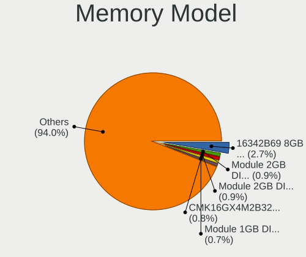

| Model                                                                            | Desktops | Percent |
|----------------------------------------------------------------------------------|----------|---------|
| Unknown                                                                          | 78       | 2.71%   |
| Unknown RAM Module 2GB DIMM SDRAM                                                | 26       | 0.9%    |
| Unknown RAM Module 2GB DIMM DDR2 800MT/s                                         | 25       | 0.87%   |
| Corsair RAM CMK16GX4M2B3200C16 8GB DIMM DDR4 3600MT/s                            | 22       | 0.76%   |
| Unknown RAM Module 1GB DIMM SDRAM                                                | 21       | 0.73%   |
| Unknown RAM Module 4GB DIMM 1333MT/s                                             | 19       | 0.66%   |
| Kingston RAM 99U5584-010.A00LF 4GB DIMM DDR3 1866MT/s                            | 19       | 0.66%   |
| Corsair RAM CMK32GX4M2E3200C16 16GB DIMM DDR4 3600MT/s                           | 19       | 0.66%   |
| Hikvision RAM HKED4161DAA1D0MA1 16GB DIMM DDR4 2667MT/s                          | 18       | 0.62%   |
| Samsung RAM M378B5173EB0-YK0 4GB DIMM DDR3 1600MT/s                              | 17       | 0.59%   |
| G.Skill RAM F4-3200C16-16GVK 16GB DIMM DDR4 3600MT/s                             | 17       | 0.59%   |
| Kingston RAM KF3200C16D4/8GX 8GiB DIMM DDR4 3600MT/s                             | 16       | 0.56%   |
| Kingston RAM KF3200C16D4/16GX 16GB DIMM DDR4 3733MT/s                            | 16       | 0.56%   |
| Kingston RAM KF3200C16D4/32GX 32GB DIMM DDR4 3933MT/s                            | 13       | 0.45%   |
| SK hynix RAM HMT41GS6BFR8A-PB 8GB SODIMM DDR3 2667MT/s                           | 11       | 0.38%   |
| SK hynix RAM HMA41GR7MFR4N-TF 8GB DIMM DDR4 2133MT/s                             | 11       | 0.38%   |
| Samsung RAM M378A1K43DB2-CTD 8GB DIMM DDR4 4333MT/s                              | 11       | 0.38%   |
| Kingston RAM KF426C16BB1/16 16GB DIMM DDR4 2667MT/s                              | 11       | 0.38%   |
| Crucial RAM CT4G4DFS8213.C8FAR2 4GB DIMM DDR4 2133MT/s                           | 11       | 0.38%   |
| Corsair RAM CMK64GX4M2E3200C16 32GB DIMM DDR4 3600MT/s                           | 11       | 0.38%   |
| Unknown RAM Module 8GB DIMM DDR3 1333MT/s                                        | 10       | 0.35%   |
| Unknown RAM Module 8GB DIMM 1333MT/s                                             | 10       | 0.35%   |
| Unknown RAM Module 2GB DIMM 1333MT/s                                             | 10       | 0.35%   |
| Unknown (ABCD) RAM 123456789012345678 2GB DIMM LPDDR4 2133MT/s                   | 10       | 0.35%   |
| Kingston RAM KHX1866C10D3/8G 8GB DIMM DDR3 1867MT/s                              | 10       | 0.35%   |
| Kingston RAM KHX1600C9D3/4GX 4GB DIMM DDR3 1867MT/s                              | 10       | 0.35%   |
| Kingston RAM KHX1600C10D3/8G 8GB DIMM DDR3 2133MT/s                              | 10       | 0.35%   |
| SK hynix RAM HMT351U6CFR8C-PB 4GB DIMM DDR3 1800MT/s                             | 9        | 0.31%   |
| Micro Memory Bank RAM FFFFFFFFFFFFFFFFFFFFFFFFFFFFFFFFFFFF 2GB DIMM DDR2 667MT/s | 9        | 0.31%   |
| Kingston RAM KHX3200C16D4/8GX 8GB DIMM DDR4 3733MT/s                             | 9        | 0.31%   |
| Kingston RAM KHX2666C16/8G 8GiB DIMM DDR4 3466MT/s                               | 9        | 0.31%   |
| G.Skill RAM F5-6000J3636F16G 16GB DIMM DDR5 6400MT/s                             | 9        | 0.31%   |
| G.Skill RAM F5-6000J3040G32G 32GB DIMM DDR5 6200MT/s                             | 9        | 0.31%   |
| Corsair RAM CMK32GX4M2B3200C16 16GB DIMM DDR4 3800MT/s                           | 9        | 0.31%   |
| Corsair RAM CMK16GX4M2E3200C16 8GB DIMM DDR4 3466MT/s                            | 9        | 0.31%   |
| Unknown RAM Module 8GB DIMM DDR3 1600MT/s                                        | 8        | 0.28%   |
| Unknown RAM Module 4GB DIMM 1066MT/s                                             | 8        | 0.28%   |
| Unknown RAM Module 2GB DIMM DDR2 667MT/s                                         | 8        | 0.28%   |
| SK hynix RAM HMT451U6BFR8A-PB 4GB DIMM DDR3 1600MT/s                             | 8        | 0.28%   |
| SK hynix RAM HMT451S6BFR8A-PB 4GB SODIMM DDR3 1600MT/s                           | 8        | 0.28%   |

Memory Kind
-----------

Memory module kinds

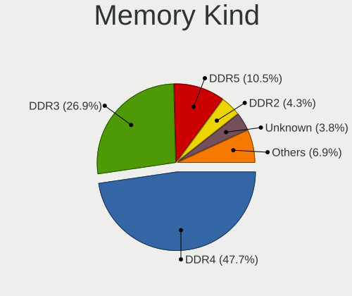

| Kind    | Desktops | Percent |
|---------|----------|---------|
| DDR4    | 1154     | 47.69%  |
| DDR3    | 651      | 26.9%   |
| DDR5    | 255      | 10.54%  |
| DDR2    | 103      | 4.26%   |
| Unknown | 91       | 3.76%   |
| SDRAM   | 90       | 3.72%   |
| LPDDR4  | 23       | 0.95%   |
| DDR     | 19       | 0.79%   |
| LPDDR5  | 18       | 0.74%   |
| DRAM    | 10       | 0.41%   |
| RAM     | 3        | 0.12%   |
| EPROM   | 2        | 0.08%   |
| LPDDR3  | 1        | 0.04%   |

Memory Form Factor
------------------

Physical design of the memory module

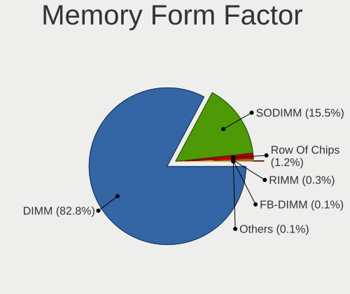

| Name         | Desktops | Percent |
|--------------|----------|---------|
| DIMM         | 1983     | 82.8%   |
| SODIMM       | 371      | 15.49%  |
| Row Of Chips | 28       | 1.17%   |
| RIMM         | 7        | 0.29%   |
| FB-DIMM      | 3        | 0.13%   |
| Unknown      | 3        | 0.13%   |

Memory Size
-----------

Memory module size

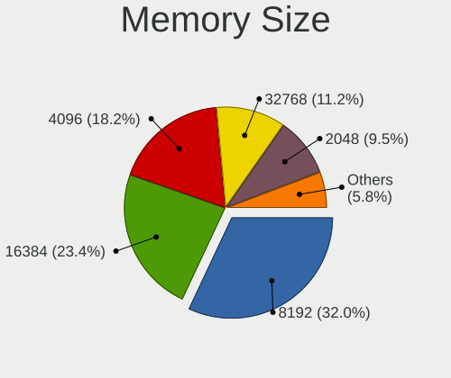

| Size  | Desktops | Percent |
|-------|----------|---------|
| 8192  | 825      | 31.98%  |
| 16384 | 603      | 23.37%  |
| 4096  | 469      | 18.18%  |
| 32768 | 288      | 11.16%  |
| 2048  | 246      | 9.53%   |
| 1024  | 88       | 3.41%   |
| 512   | 20       | 0.78%   |
| 65536 | 14       | 0.54%   |
| 49152 | 13       | 0.5%    |
| 24576 | 4        | 0.16%   |
| 3072  | 3        | 0.12%   |
| 256   | 2        | 0.08%   |
| 12288 | 1        | 0.04%   |
| 8000  | 1        | 0.04%   |
| 6144  | 1        | 0.04%   |
| 64    | 1        | 0.04%   |
| 16    | 1        | 0.04%   |

Memory Speed
------------

Memory module speed

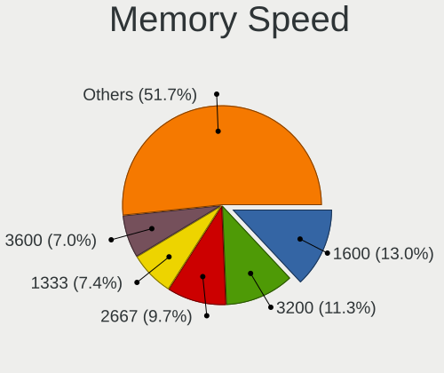

| Speed   | Desktops | Percent |
|---------|----------|---------|
| 1600    | 342      | 13.03%  |
| 3200    | 297      | 11.31%  |
| 2667    | 254      | 9.68%   |
| 1333    | 193      | 7.35%   |
| 3600    | 183      | 6.97%   |
| 2400    | 168      | 6.4%    |
| 2133    | 140      | 5.33%   |
| 4800    | 74       | 2.82%   |
| Unknown | 70       | 2.67%   |
| 5600    | 61       | 2.32%   |
| 1866    | 60       | 2.29%   |
| 800     | 58       | 2.21%   |
| 667     | 57       | 2.17%   |
| 6000    | 48       | 1.83%   |
| 2666    | 45       | 1.71%   |
| 3733    | 43       | 1.64%   |
| 1867    | 41       | 1.56%   |
| 3800    | 32       | 1.22%   |
| 6400    | 30       | 1.14%   |
| 1066    | 30       | 1.14%   |
| 3466    | 28       | 1.07%   |
| 4000    | 22       | 0.84%   |
| 3000    | 22       | 0.84%   |
| 3400    | 21       | 0.8%    |
| 5200    | 20       | 0.76%   |
| 1800    | 17       | 0.65%   |
| 3933    | 15       | 0.57%   |
| 533     | 15       | 0.57%   |
| 6200    | 13       | 0.5%    |
| 2933    | 13       | 0.5%    |
| 4333    | 12       | 0.46%   |
| 3866    | 12       | 0.46%   |
| 3266    | 11       | 0.42%   |
| 1067    | 10       | 0.38%   |
| 3100    | 8        | 0.3%    |
| 1648    | 8        | 0.3%    |
| 400     | 8        | 0.3%    |
| 12800   | 7        | 0.27%   |
| 2800    | 7        | 0.27%   |
| 2465    | 7        | 0.27%   |

Printers & scanners
-------------------

Printer Vendor
--------------

Printer device vendors

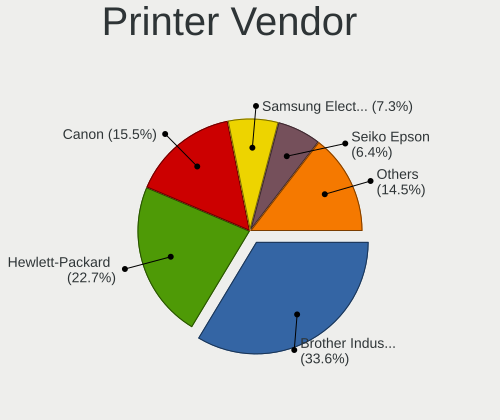

| Vendor                | Desktops | Percent |
|-----------------------|----------|---------|
| Brother Industries    | 37       | 33.64%  |
| Hewlett-Packard       | 25       | 22.73%  |
| Canon                 | 17       | 15.45%  |
| Samsung Electronics   | 8        | 7.27%   |
| Seiko Epson           | 7        | 6.36%   |
| Dymo-CoStar           | 5        | 4.55%   |
| QinHeng Electronics   | 3        | 2.73%   |
| Ricoh                 | 2        | 1.82%   |
| Pantum                | 2        | 1.82%   |
| Zebra                 | 1        | 0.91%   |
| Prolific Technology   | 1        | 0.91%   |
| nemonic               | 1        | 0.91%   |
| Lexmark International | 1        | 0.91%   |

Printer Model
-------------

Printer device models

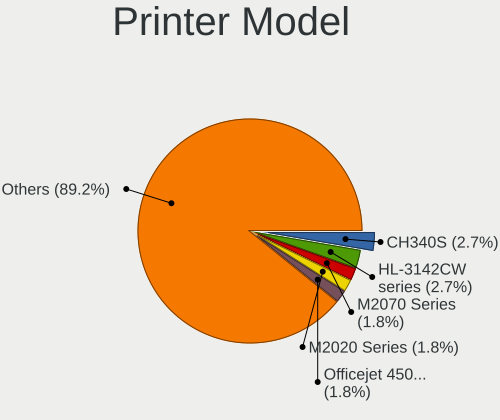

| Model                                | Desktops | Percent |
|--------------------------------------|----------|---------|
| QinHeng CH340S                       | 3        | 2.7%    |
| Brother HL-3142CW series             | 3        | 2.7%    |
| Samsung M2070 Series                 | 2        | 1.8%    |
| Samsung M2020 Series                 | 2        | 1.8%    |
| HP OfficeJet 5200 series             | 2        | 1.8%    |
| HP Officejet 4500 G510a-f            | 2        | 1.8%    |
| HP ENVY 5540 series                  | 2        | 1.8%    |
| HP DeskJet 2700 series               | 2        | 1.8%    |
| Canon MF4010 series                  | 2        | 1.8%    |
| Canon MF3010                         | 2        | 1.8%    |
| Canon LiDE 400                       | 2        | 1.8%    |
| Canon LiDE 300                       | 2        | 1.8%    |
| Brother MFC-J6940DW                  | 2        | 1.8%    |
| Brother MFC-7360N                    | 2        | 1.8%    |
| Brother HL-2030 Laser Printer        | 2        | 1.8%    |
| Zebra Thrmal 2844                    | 1        | 0.9%    |
| Seiko Epson XP-211 214 216 Series    | 1        | 0.9%    |
| Seiko Epson XP-102 103 Series        | 1        | 0.9%    |
| Seiko Epson M3140 Series             | 1        | 0.9%    |
| Seiko Epson ET-4850 Series           | 1        | 0.9%    |
| Seiko Epson ET-2850 Series           | 1        | 0.9%    |
| Seiko Epson ET-2810 Series           | 1        | 0.9%    |
| Seiko Epson ET-2710 Series           | 1        | 0.9%    |
| Samsung SCX-4623 Series              | 1        | 0.9%    |
| Samsung ML-216x Series Laser Printer | 1        | 0.9%    |
| Samsung ML-1660 Series               | 1        | 0.9%    |
| Samsung M288x Series                 | 1        | 0.9%    |
| Ricoh SP 150                         | 1        | 0.9%    |
| Ricoh Printing Support               | 1        | 0.9%    |
| Prolific PL2305 Parallel Port        | 1        | 0.9%    |
| Pantum P2500W series                 | 1        | 0.9%    |
| Pantum P2200 series                  | 1        | 0.9%    |
| nemonic MIP-001                      | 1        | 0.9%    |
| Lexmark International E120           | 1        | 0.9%    |
| HP Smart Tank 580-590 series         | 1        | 0.9%    |
| HP Smart Tank 510 series             | 1        | 0.9%    |
| HP LaserJet Pro M329                 | 1        | 0.9%    |
| HP LaserJet P2035                    | 1        | 0.9%    |
| HP LaserJet 1020                     | 1        | 0.9%    |
| HP LaserJet 1018                     | 1        | 0.9%    |

Scanner Vendor
--------------

Scanner device vendors

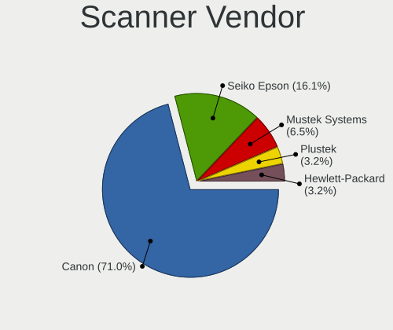

| Vendor          | Desktops | Percent |
|-----------------|----------|---------|
| Canon           | 22       | 70.97%  |
| Seiko Epson     | 5        | 16.13%  |
| Mustek Systems  | 2        | 6.45%   |
| Plustek         | 1        | 3.23%   |
| Hewlett-Packard | 1        | 3.23%   |

Scanner Model
-------------

Scanner device models

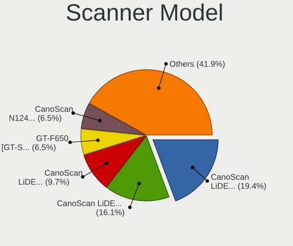

| Model                                                    | Desktops | Percent |
|----------------------------------------------------------|----------|---------|
| Canon CanoScan LiDE 220                                  | 6        | 19.35%  |
| Canon CanoScan LiDE 210                                  | 5        | 16.13%  |
| Canon CanoScan LiDE 110                                  | 3        | 9.68%   |
| Seiko Epson GT-F650 [GT-S600/Perfection V10/V100]        | 2        | 6.45%   |
| Canon CanoScan N1240U/LiDE 30                            | 2        | 6.45%   |
| Seiko Epson GT-X900 [Perfection V700/V750 Photo]         | 1        | 3.23%   |
| Seiko Epson GT-F500/GT-F550 [Perfection 2480/2580 PHOTO] | 1        | 3.23%   |
| Seiko Epson GT-7700U [Perfection 1240U]                  | 1        | 3.23%   |
| Plustek 1200dpi USB Scanner                              | 1        | 3.23%   |
| Mustek Systems ScanExpress 1200 UB                       | 1        | 3.23%   |
| Mustek Systems BearPaw 1200 CU Plus                      | 1        | 3.23%   |
| HP ScanJet 82x0C                                         | 1        | 3.23%   |
| Canon CanoScan N670U/N676U/LiDE 20                       | 1        | 3.23%   |
| Canon CanoScan N650U/N656U                               | 1        | 3.23%   |
| Canon CanoScan LiDE 50/LiDE 35/LiDE 40                   | 1        | 3.23%   |
| Canon CanoScan LIDE 25                                   | 1        | 3.23%   |
| Canon CanoScan LiDE 120                                  | 1        | 3.23%   |
| Canon CanoScan 1220U                                     | 1        | 3.23%   |

Camera
------

Camera Vendor
-------------

Camera device vendors

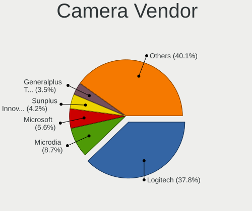

| Vendor                        | Desktops | Percent |
|-------------------------------|----------|---------|
| Logitech                      | 161      | 37.79%  |
| Microdia                      | 37       | 8.69%   |
| Microsoft                     | 24       | 5.63%   |
| Sunplus Innovation Technology | 18       | 4.23%   |
| Generalplus Technology        | 15       | 3.52%   |
| Samsung Electronics           | 14       | 3.29%   |
| Realtek Semiconductor         | 12       | 2.82%   |
| MacroSilicon                  | 9        | 2.11%   |
| Trust                         | 8        | 1.88%   |
| Z-Star Microelectronics       | 7        | 1.64%   |
| KYE Systems (Mouse Systems)   | 7        | 1.64%   |
| Creative Technology           | 7        | 1.64%   |
| ARC International             | 6        | 1.41%   |
| Apple                         | 6        | 1.41%   |
| Jieli Technology              | 5        | 1.17%   |
| Chicony Electronics           | 5        | 1.17%   |
| AVerMedia Technologies        | 5        | 1.17%   |
| eMeet                         | 4        | 0.94%   |
| webcam                        | 3        | 0.7%    |
| IMC Networks                  | 3        | 0.7%    |
| Hewlett-Packard               | 3        | 0.7%    |
| Aveo Technology               | 3        | 0.7%    |
| Suyin                         | 2        | 0.47%   |
| SHENZHEN EMEET TECHNOLOGY     | 2        | 0.47%   |
| Ruision                       | 2        | 0.47%   |
| Razer USA                     | 2        | 0.47%   |
| Quanta                        | 2        | 0.47%   |
| Omnivision                    | 2        | 0.47%   |
| Novatek Microelectronics      | 2        | 0.47%   |
| Lenovo                        | 2        | 0.47%   |
| Guillemot                     | 2        | 0.47%   |
| GEMBIRD                       | 2        | 0.47%   |
| Cubeternet                    | 2        | 0.47%   |
| ANYKA                         | 2        | 0.47%   |
| Anker PowerConf C200          | 2        | 0.47%   |
| Unknown                       | 2        | 0.47%   |
| XIFT                          | 1        | 0.23%   |
| Valve Software                | 1        | 0.23%   |
| ValueHD                       | 1        | 0.23%   |
| Unknown                       | 1        | 0.23%   |

Camera Model
------------

Camera device models

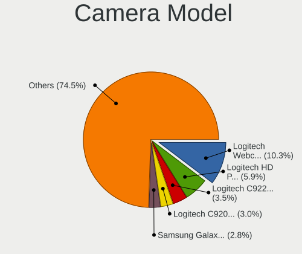

| Model                                                 | Desktops | Percent |
|-------------------------------------------------------|----------|---------|
| Logitech Webcam C270                                  | 44       | 10.3%   |
| Logitech HD Pro Webcam C920                           | 25       | 5.85%   |
| Logitech C922 Pro Stream Webcam                       | 15       | 3.51%   |
| Logitech C920 PRO HD Webcam                           | 13       | 3.04%   |
| Samsung Galaxy series, misc. (MTP mode)               | 12       | 2.81%   |
| Microsoft LifeCam HD-3000                             | 12       | 2.81%   |
| Microdia Webcam Vitade AF                             | 12       | 2.81%   |
| Microdia USB 2.0 Camera                               | 10       | 2.34%   |
| Generalplus GENERAL WEBCAM                            | 9        | 2.11%   |
| Sunplus Full HD webcam                                | 6        | 1.41%   |
| Logitech Webcam C310                                  | 6        | 1.41%   |
| Logitech HD Webcam C615                               | 6        | 1.41%   |
| Logitech BRIO Ultra HD Webcam                         | 6        | 1.41%   |
| MacroSilicon USB Video                                | 5        | 1.17%   |
| Generalplus 808 Camera #9 (web-cam mode)              | 5        | 1.17%   |
| ARC International Camera                              | 5        | 1.17%   |
| Z-Star Venus USB2.0 Camera                            | 4        | 0.94%   |
| Sunplus Integrated Camera                             | 4        | 0.94%   |
| Microdia Integrated Camera                            | 4        | 0.94%   |
| Creative Live! Cam Sync 1080p V2                      | 4        | 0.94%   |
| Apple iPhone 5/5C/5S/6/SE/7/8/X                       | 4        | 0.94%   |
| webcam webcam                                         | 3        | 0.7%    |
| Trust USB Camera                                      | 3        | 0.7%    |
| Realtek FULL HD 1080P Webcam                          | 3        | 0.7%    |
| Microsoft Modern Webcam                               | 3        | 0.7%    |
| Microsoft LifeCam Cinema                              | 3        | 0.7%    |
| Microdia Sonix USB 2.0 Camera                         | 3        | 0.7%    |
| Microdia Camera                                       | 3        | 0.7%    |
| MacroSilicon UGREEN 15390                             | 3        | 0.7%    |
| Logitech Webcam C930e                                 | 3        | 0.7%    |
| Logitech Webcam C300                                  | 3        | 0.7%    |
| Logitech StreamCam                                    | 3        | 0.7%    |
| Logitech HD Webcam C525                               | 3        | 0.7%    |
| Logitech CrystalCam                                   | 3        | 0.7%    |
| KYE Systems (Mouse Systems) USB 2.0 HD1080P PC Camera | 3        | 0.7%    |
| Jieli USB PHY 2.0                                     | 3        | 0.7%    |
| Trust Full HD Webcam                                  | 2        | 0.47%   |
| Suyin HD Camera                                       | 2        | 0.47%   |
| Sunplus HK 5M WebCAM                                  | 2        | 0.47%   |
| Ruision UVC Camera                                    | 2        | 0.47%   |

Security
--------

Fingerprint Vendor
------------------

Fingerprint sensor vendors

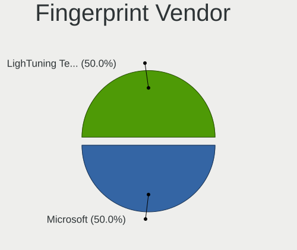

| Vendor                | Desktops | Percent |
|-----------------------|----------|---------|
| Microsoft             | 1        | 50%     |
| LighTuning Technology | 1        | 50%     |

Fingerprint Model
-----------------

Fingerprint sensor models

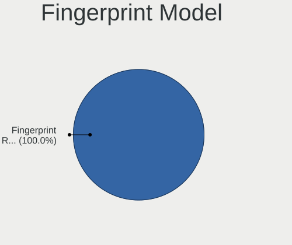

| Model                         | Desktops | Percent |
|-------------------------------|----------|---------|
| Microsoft Fingerprint Reader  | 1        | 50%     |
| LighTuning Fingerprint Sensor | 1        | 50%     |

Chipcard Vendor
---------------

Chipcard module vendors

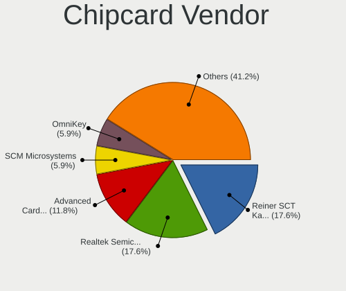

| Vendor                    | Desktops | Percent |
|---------------------------|----------|---------|
| Reiner SCT Kartensysteme  | 3        | 17.65%  |
| Realtek Semiconductor     | 3        | 17.65%  |
| Advanced Card Systems     | 2        | 11.76%  |
| SCM Microsystems          | 1        | 5.88%   |
| OmniKey                   | 1        | 5.88%   |
| Gemalto (was Gemplus)     | 1        | 5.88%   |
| Chicony Electronics       | 1        | 5.88%   |
| Cherry                    | 1        | 5.88%   |
| Bit4id                    | 1        | 5.88%   |
| Alcor Micro               | 1        | 5.88%   |
| Aladdin Knowledge Systems | 1        | 5.88%   |
| Aktiv                     | 1        | 5.88%   |

Chipcard Model
--------------

Chipcard module models

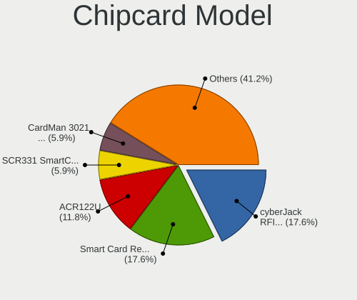

| Model                                                                      | Desktops | Percent |
|----------------------------------------------------------------------------|----------|---------|
| Reiner SCT Kartensysteme cyberJack RFID basis contactless smartcard reader | 3        | 17.65%  |
| Realtek Semiconductor Smart Card Reader Interface                          | 3        | 17.65%  |
| Advanced Card Systems ACR122U                                              | 2        | 11.76%  |
| SCM Microsystems SCR331 SmartCard Reader                                   | 1        | 5.88%   |
| OmniKey CardMan 3021 / 3121                                                | 1        | 5.88%   |
| Gemalto (was Gemplus) GemPC Twin SmartCard Reader                          | 1        | 5.88%   |
| Chicony Electronics HP Skylab USB Smartcard Keyboard                       | 1        | 5.88%   |
| Cherry SmartCard Reader Keyboard KC 1000 SC                                | 1        | 5.88%   |
| Bit4id miniLector EVO                                                      | 1        | 5.88%   |
| Alcor Micro AU9540 Smartcard Reader                                        | 1        | 5.88%   |
| Aladdin Knowledge Systems Token JC                                         | 1        | 5.88%   |
| Aktiv Rutoken lite                                                         | 1        | 5.88%   |

Unsupported
-----------

Unsupported Devices
-------------------

Total unsupported devices on board

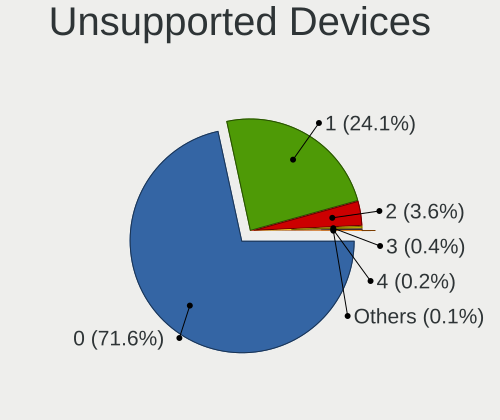

| Total | Desktops | Percent |
|-------|----------|---------|
| 0     | 2252     | 71.61%  |
| 1     | 757      | 24.07%  |
| 2     | 113      | 3.59%   |
| 3     | 12       | 0.38%   |
| 4     | 7        | 0.22%   |
| 5     | 3        | 0.1%    |
| 7     | 1        | 0.03%   |

Unsupported Device Types
------------------------

Types of unsupported devices

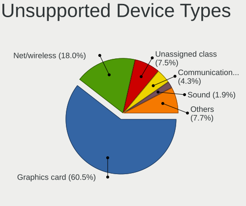

| Type                     | Desktops | Percent |
|--------------------------|----------|---------|
| Graphics card            | 595      | 60.53%  |
| Net/wireless             | 177      | 18.01%  |
| Unassigned class         | 74       | 7.53%   |
| Communication controller | 42       | 4.27%   |
| Sound                    | 19       | 1.93%   |
| Bluetooth                | 19       | 1.93%   |
| Multimedia controller    | 13       | 1.32%   |
| Chipcard                 | 8        | 0.81%   |
| Network                  | 7        | 0.71%   |
| Net/ethernet             | 5        | 0.51%   |
| Card reader              | 5        | 0.51%   |
| Modem                    | 4        | 0.41%   |
| Storage/raid             | 3        | 0.31%   |
| Camera                   | 3        | 0.31%   |
| Wireless                 | 2        | 0.2%    |
| Storage/nvme             | 2        | 0.2%    |
| Fingerprint reader       | 2        | 0.2%    |
| Video                    | 1        | 0.1%    |
| Storage/ide              | 1        | 0.1%    |
| Dvb card                 | 1        | 0.1%    |

