Debian 12 - Tested Hardware & Statistics (Desktops)
---------------------------------------------------

A project to collect tested hardware configurations for Debian 12.

Anyone can contribute to this report by the [hw-probe](https://github.com/linuxhw/hw-probe) tool:

    sudo -E hw-probe -all -upload

Please contribute! Especially if your hardware is rare.

Contents
--------

* [ Test Cases ](#test-cases)

* [ System ](#system)
  - [ Kernel                   ](#kernel)
  - [ Kernel Family            ](#kernel-family)
  - [ Kernel Major Ver.        ](#kernel-major-ver)
  - [ Arch                     ](#arch)
  - [ DE                       ](#de)
  - [ Display Server           ](#display-server)
  - [ Display Manager          ](#display-manager)
  - [ OS Lang                  ](#os-lang)
  - [ Boot Mode                ](#boot-mode)
  - [ Filesystem               ](#filesystem)
  - [ Part. scheme             ](#part-scheme)
  - [ Dual Boot with Linux/BSD ](#dual-boot-with-linuxbsd)
  - [ Dual Boot (Win)          ](#dual-boot-win)

* [ Board ](#board)
  - [ Vendor                   ](#vendor)
  - [ Model                    ](#model)
  - [ Model Family             ](#model-family)
  - [ MFG Year                 ](#mfg-year)
  - [ Form Factor              ](#form-factor)
  - [ Secure Boot              ](#secure-boot)
  - [ Coreboot                 ](#coreboot)
  - [ RAM Size                 ](#ram-size)
  - [ RAM Used                 ](#ram-used)
  - [ Total Drives             ](#total-drives)
  - [ Has CD-ROM               ](#has-cd-rom)
  - [ Has Ethernet             ](#has-ethernet)
  - [ Has WiFi                 ](#has-wifi)
  - [ Has Bluetooth            ](#has-bluetooth)

* [ Location ](#location)
  - [ Country                  ](#country)
  - [ City                     ](#city)

* [ Drives ](#drives)
  - [ Drive Vendor             ](#drive-vendor)
  - [ Drive Model              ](#drive-model)
  - [ HDD Vendor               ](#hdd-vendor)
  - [ SSD Vendor               ](#ssd-vendor)
  - [ Drive Kind               ](#drive-kind)
  - [ Drive Connector          ](#drive-connector)
  - [ Drive Size               ](#drive-size)
  - [ Space Total              ](#space-total)
  - [ Space Used               ](#space-used)
  - [ Malfunc. Drives          ](#malfunc-drives)
  - [ Malfunc. Drive Vendor    ](#malfunc-drive-vendor)
  - [ Malfunc. HDD Vendor      ](#malfunc-hdd-vendor)
  - [ Malfunc. Drive Kind      ](#malfunc-drive-kind)
  - [ Failed Drives            ](#failed-drives)
  - [ Failed Drive Vendor      ](#failed-drive-vendor)
  - [ Drive Status             ](#drive-status)

* [ Storage controller ](#storage-controller)
  - [ Storage Vendor           ](#storage-vendor)
  - [ Storage Model            ](#storage-model)
  - [ Storage Kind             ](#storage-kind)

* [ Processor ](#processor)
  - [ CPU Vendor               ](#cpu-vendor)
  - [ CPU Model                ](#cpu-model)
  - [ CPU Model Family         ](#cpu-model-family)
  - [ CPU Cores                ](#cpu-cores)
  - [ CPU Sockets              ](#cpu-sockets)
  - [ CPU Threads              ](#cpu-threads)
  - [ CPU Op-Modes             ](#cpu-op-modes)
  - [ CPU Microcode            ](#cpu-microcode)
  - [ CPU Microarch            ](#cpu-microarch)

* [ Graphics ](#graphics)
  - [ GPU Vendor               ](#gpu-vendor)
  - [ GPU Model                ](#gpu-model)
  - [ GPU Combo                ](#gpu-combo)
  - [ GPU Driver               ](#gpu-driver)
  - [ GPU Memory               ](#gpu-memory)

* [ Monitor ](#monitor)
  - [ Monitor Vendor           ](#monitor-vendor)
  - [ Monitor Model            ](#monitor-model)
  - [ Monitor Resolution       ](#monitor-resolution)
  - [ Monitor Diagonal         ](#monitor-diagonal)
  - [ Monitor Width            ](#monitor-width)
  - [ Aspect Ratio             ](#aspect-ratio)
  - [ Monitor Area             ](#monitor-area)
  - [ Pixel Density            ](#pixel-density)
  - [ Multiple Monitors        ](#multiple-monitors)

* [ Network ](#network)
  - [ Net Controller Vendor    ](#net-controller-vendor)
  - [ Net Controller Model     ](#net-controller-model)
  - [ Wireless Vendor          ](#wireless-vendor)
  - [ Wireless Model           ](#wireless-model)
  - [ Ethernet Vendor          ](#ethernet-vendor)
  - [ Ethernet Model           ](#ethernet-model)
  - [ Net Controller Kind      ](#net-controller-kind)
  - [ Used Controller          ](#used-controller)
  - [ NICs                     ](#nics)
  - [ IPv6                     ](#ipv6)

* [ Bluetooth ](#bluetooth)
  - [ Bluetooth Vendor         ](#bluetooth-vendor)
  - [ Bluetooth Model          ](#bluetooth-model)

* [ Sound ](#sound)
  - [ Sound Vendor             ](#sound-vendor)
  - [ Sound Model              ](#sound-model)

* [ Memory ](#memory)
  - [ Memory Vendor            ](#memory-vendor)
  - [ Memory Model             ](#memory-model)
  - [ Memory Kind              ](#memory-kind)
  - [ Memory Form Factor       ](#memory-form-factor)
  - [ Memory Size              ](#memory-size)
  - [ Memory Speed             ](#memory-speed)

* [ Printers & scanners ](#printers--scanners)
  - [ Printer Vendor           ](#printer-vendor)
  - [ Printer Model            ](#printer-model)
  - [ Scanner Vendor           ](#scanner-vendor)
  - [ Scanner Model            ](#scanner-model)

* [ Camera ](#camera)
  - [ Camera Vendor            ](#camera-vendor)
  - [ Camera Model             ](#camera-model)

* [ Security ](#security)
  - [ Fingerprint Vendor       ](#fingerprint-vendor)
  - [ Fingerprint Model        ](#fingerprint-model)
  - [ Chipcard Vendor          ](#chipcard-vendor)
  - [ Chipcard Model           ](#chipcard-model)

* [ Unsupported ](#unsupported)
  - [ Unsupported Devices      ](#unsupported-devices)
  - [ Unsupported Device Types ](#unsupported-device-types)

Test Cases
----------

Total: 241

| Vendor        | Model                       | Probe                                                      | Date         |
|---------------|-----------------------------|------------------------------------------------------------|--------------|
| ASUSTek       | P7H55D-M PRO                | [6049b3d69d](https://linux-hardware.org/?probe=6049b3d69d) | Jun 10, 2023 |
| MSI           | MAG B760 TOMAHAWK WIFI      | [88955e82f2](https://linux-hardware.org/?probe=88955e82f2) | Jun 10, 2023 |
| ECS           | G31T-M9                     | [d8ca98b733](https://linux-hardware.org/?probe=d8ca98b733) | Jun 09, 2023 |
| Gigabyte      | B450M S2H V2                | [fb883c82bc](https://linux-hardware.org/?probe=fb883c82bc) | Jun 09, 2023 |
| Gigabyte      | B450 AORUS ELITE            | [b2c39972c2](https://linux-hardware.org/?probe=b2c39972c2) | Jun 09, 2023 |
| Gigabyte      | B450M H                     | [e54b5ce7da](https://linux-hardware.org/?probe=e54b5ce7da) | Jun 09, 2023 |
| Gigabyte      | X570 GAMING X               | [576a624a1b](https://linux-hardware.org/?probe=576a624a1b) | Jun 09, 2023 |
| ASUSTek       | M4A78T-E                    | [fa22309a62](https://linux-hardware.org/?probe=fa22309a62) | Jun 08, 2023 |
| Unknown       | Unknown                     | [b2c6247a0e](https://linux-hardware.org/?probe=b2c6247a0e) | Jun 07, 2023 |
| Gigabyte      | M68MT-S2                    | [2ff7b71aed](https://linux-hardware.org/?probe=2ff7b71aed) | Jun 06, 2023 |
| Gigabyte      | H61M-DS2                    | [10ecbb2117](https://linux-hardware.org/?probe=10ecbb2117) | Jun 06, 2023 |
| ECS           | G31T-M9                     | [8bb444bdd6](https://linux-hardware.org/?probe=8bb444bdd6) | Jun 05, 2023 |
| Gigabyte      | M68MT-S2                    | [2ec944c5d0](https://linux-hardware.org/?probe=2ec944c5d0) | Jun 05, 2023 |
| Unknown       | Unknown                     | [8896a460d4](https://linux-hardware.org/?probe=8896a460d4) | Jun 05, 2023 |
| Gigabyte      | M68MT-S2                    | [d392dff6bb](https://linux-hardware.org/?probe=d392dff6bb) | Jun 05, 2023 |
| ECS           | G31T-M9                     | [630360ab38](https://linux-hardware.org/?probe=630360ab38) | Jun 05, 2023 |
| Gigabyte      | M68MT-S2                    | [991c5472ac](https://linux-hardware.org/?probe=991c5472ac) | Jun 05, 2023 |
| ASUSTek       | PRIME H310M-R R2.0          | [5387bcbf7d](https://linux-hardware.org/?probe=5387bcbf7d) | Jun 03, 2023 |
| ASUSTek       | PRIME H310M-R R2.0          | [881df8f45c](https://linux-hardware.org/?probe=881df8f45c) | Jun 03, 2023 |
| ASUSTek       | PRIME H310M-R R2.0          | [0dd3be3300](https://linux-hardware.org/?probe=0dd3be3300) | Jun 03, 2023 |
| HC Technol... | HCAR357-NR                  | [58f698b10a](https://linux-hardware.org/?probe=58f698b10a) | Jun 02, 2023 |
| MSI           | G31TM-P21                   | [964377db0b](https://linux-hardware.org/?probe=964377db0b) | Jun 02, 2023 |
| ASUSTek       | PRIME B450M-K               | [853bd25ca5](https://linux-hardware.org/?probe=853bd25ca5) | Jun 02, 2023 |
| ASUSTek       | PRIME B450M-K               | [3a9fb692f1](https://linux-hardware.org/?probe=3a9fb692f1) | Jun 02, 2023 |
| ASUSTek       | PRIME B450M-K               | [9b549fe65a](https://linux-hardware.org/?probe=9b549fe65a) | Jun 02, 2023 |
| ASUSTek       | PRIME B450M-K               | [db685837d0](https://linux-hardware.org/?probe=db685837d0) | Jun 02, 2023 |
| ASUSTek       | PRIME B450M-K               | [968b38e0b9](https://linux-hardware.org/?probe=968b38e0b9) | Jun 02, 2023 |
| ASUSTek       | PRIME B450M-K               | [c9a04d8da0](https://linux-hardware.org/?probe=c9a04d8da0) | Jun 02, 2023 |
| ASUSTek       | PRIME B450M-K               | [238931757a](https://linux-hardware.org/?probe=238931757a) | Jun 02, 2023 |
| ASUSTek       | PRIME B450M-K               | [e190e991a6](https://linux-hardware.org/?probe=e190e991a6) | Jun 02, 2023 |
| ASUSTek       | PRIME B450M-K               | [0816e77499](https://linux-hardware.org/?probe=0816e77499) | Jun 02, 2023 |
| ASUSTek       | PRIME B450M-K               | [ff143ac918](https://linux-hardware.org/?probe=ff143ac918) | Jun 02, 2023 |
| Lenovo        | SHARKBAY SDK0E50510 WIN     | [07e5342fb8](https://linux-hardware.org/?probe=07e5342fb8) | Jun 02, 2023 |
| Gigabyte      | H61M-DS2                    | [f3b666f725](https://linux-hardware.org/?probe=f3b666f725) | Jun 01, 2023 |
| Gigabyte      | H61M-DS2                    | [1cf7ec0aa5](https://linux-hardware.org/?probe=1cf7ec0aa5) | Jun 01, 2023 |
| Gigabyte      | H61M-DS2                    | [7f9d81bd57](https://linux-hardware.org/?probe=7f9d81bd57) | Jun 01, 2023 |
| ASRock        | H110M-HDV R3.0              | [670044aef5](https://linux-hardware.org/?probe=670044aef5) | May 31, 2023 |
| ECS           | G31T-M9                     | [f227323587](https://linux-hardware.org/?probe=f227323587) | May 31, 2023 |
| Gigabyte      | M68MT-S2                    | [c56271ea6a](https://linux-hardware.org/?probe=c56271ea6a) | May 30, 2023 |
| Gigabyte      | M68MT-S2                    | [a0ffb7fd40](https://linux-hardware.org/?probe=a0ffb7fd40) | May 30, 2023 |
| Gigabyte      | H61M-S2PV                   | [446d026ac1](https://linux-hardware.org/?probe=446d026ac1) | May 30, 2023 |
| Gigabyte      | M68MT-S2                    | [80c2e03e4e](https://linux-hardware.org/?probe=80c2e03e4e) | May 29, 2023 |
| ECS           | G31T-M9                     | [8f4cd5b132](https://linux-hardware.org/?probe=8f4cd5b132) | May 29, 2023 |
| Gigabyte      | M68MT-S2                    | [ffe8469edc](https://linux-hardware.org/?probe=ffe8469edc) | May 29, 2023 |
| Gigabyte      | GA-M56S-S3                  | [e9f274ad89](https://linux-hardware.org/?probe=e9f274ad89) | May 29, 2023 |
| Gigabyte      | M68MT-S2                    | [62a5559050](https://linux-hardware.org/?probe=62a5559050) | May 29, 2023 |
| Gigabyte      | GA-M56S-S3                  | [a9c147d701](https://linux-hardware.org/?probe=a9c147d701) | May 29, 2023 |
| ASRock        | J4105-ITX                   | [570bc894da](https://linux-hardware.org/?probe=570bc894da) | May 29, 2023 |
| ASUSTek       | TUF Gaming B550-PLUS        | [9e0fc265de](https://linux-hardware.org/?probe=9e0fc265de) | May 29, 2023 |
| Gigabyte      | Z690 AERO G                 | [5d4d7c7ef4](https://linux-hardware.org/?probe=5d4d7c7ef4) | May 27, 2023 |
| Gigabyte      | H81M-S2V                    | [bcdfc5a2bf](https://linux-hardware.org/?probe=bcdfc5a2bf) | May 27, 2023 |
| Gigabyte      | H81M-S2V                    | [68cb8bdf49](https://linux-hardware.org/?probe=68cb8bdf49) | May 27, 2023 |
| Biostar       | A10N-8800E                  | [6b8c135c5d](https://linux-hardware.org/?probe=6b8c135c5d) | May 27, 2023 |
| ASRock        | B450 Gaming-ITX/ac          | [4862d28e3f](https://linux-hardware.org/?probe=4862d28e3f) | May 26, 2023 |
| ASUSTek       | B85M-G                      | [92836191e9](https://linux-hardware.org/?probe=92836191e9) | May 26, 2023 |
| ASUSTek       | B85M-G                      | [0d449702e3](https://linux-hardware.org/?probe=0d449702e3) | May 26, 2023 |
| ASUSTek       | B85M-G                      | [a5fbe0c1ba](https://linux-hardware.org/?probe=a5fbe0c1ba) | May 26, 2023 |
| ASUSTek       | B85M-G                      | [f9fd99a8b7](https://linux-hardware.org/?probe=f9fd99a8b7) | May 26, 2023 |
| ASUSTek       | B85M-G                      | [6c87853f8c](https://linux-hardware.org/?probe=6c87853f8c) | May 26, 2023 |
| ASUSTek       | H81M-C                      | [138348e6eb](https://linux-hardware.org/?probe=138348e6eb) | May 26, 2023 |
| ASUSTek       | B85M-G                      | [388eed2f8e](https://linux-hardware.org/?probe=388eed2f8e) | May 26, 2023 |
| ASUSTek       | B85M-G                      | [1bc02afebc](https://linux-hardware.org/?probe=1bc02afebc) | May 26, 2023 |
| ASUSTek       | B85M-G                      | [485617123a](https://linux-hardware.org/?probe=485617123a) | May 26, 2023 |
| ASUSTek       | B85M-G                      | [d1933e40f4](https://linux-hardware.org/?probe=d1933e40f4) | May 26, 2023 |
| ASUSTek       | B85M-G                      | [db84f366d0](https://linux-hardware.org/?probe=db84f366d0) | May 26, 2023 |
| ASUSTek       | B85M-G                      | [4d7f19ec5b](https://linux-hardware.org/?probe=4d7f19ec5b) | May 26, 2023 |
| ASUSTek       | B85M-G                      | [adb7acad13](https://linux-hardware.org/?probe=adb7acad13) | May 26, 2023 |
| ASUSTek       | B85M-G                      | [897503110a](https://linux-hardware.org/?probe=897503110a) | May 26, 2023 |
| ASUSTek       | B85M-G                      | [7ddbfedd32](https://linux-hardware.org/?probe=7ddbfedd32) | May 26, 2023 |
| Gigabyte      | H81M-S2V                    | [96202d100a](https://linux-hardware.org/?probe=96202d100a) | May 26, 2023 |
| Gigabyte      | H81M-S2V                    | [faa830a26c](https://linux-hardware.org/?probe=faa830a26c) | May 26, 2023 |
| Gigabyte      | H81M-S2V                    | [03d0e0d8d7](https://linux-hardware.org/?probe=03d0e0d8d7) | May 26, 2023 |
| Gigabyte      | H81M-S2V                    | [f76e433d68](https://linux-hardware.org/?probe=f76e433d68) | May 26, 2023 |
| Gigabyte      | H81M-S2V                    | [610a5f2bb3](https://linux-hardware.org/?probe=610a5f2bb3) | May 26, 2023 |
| Gigabyte      | H81M-S2V                    | [f10a5bd0f9](https://linux-hardware.org/?probe=f10a5bd0f9) | May 26, 2023 |
| Gigabyte      | GA-M56S-S3                  | [7a40f97a17](https://linux-hardware.org/?probe=7a40f97a17) | May 26, 2023 |
| MSI           | H110M PRO-VD                | [387793dfb2](https://linux-hardware.org/?probe=387793dfb2) | May 25, 2023 |
| ASUSTek       | P9X79                       | [142c9c4384](https://linux-hardware.org/?probe=142c9c4384) | May 25, 2023 |
| ASUSTek       | P8H67-M                     | [7b4b86c1ea](https://linux-hardware.org/?probe=7b4b86c1ea) | May 25, 2023 |
| ASUSTek       | P8H67-M                     | [15c2f741bf](https://linux-hardware.org/?probe=15c2f741bf) | May 25, 2023 |
| ASRock        | B450 Gaming-ITX/ac          | [ac28804681](https://linux-hardware.org/?probe=ac28804681) | May 25, 2023 |
| ASUSTek       | E35M1-M                     | [c62d813dd9](https://linux-hardware.org/?probe=c62d813dd9) | May 24, 2023 |
| Gigabyte      | GA-M56S-S3                  | [3898315bde](https://linux-hardware.org/?probe=3898315bde) | May 24, 2023 |
| Gigabyte      | M61PME-S2                   | [e147bb9d5e](https://linux-hardware.org/?probe=e147bb9d5e) | May 23, 2023 |
| ASUSTek       | H81M-K                      | [17f5577d63](https://linux-hardware.org/?probe=17f5577d63) | May 23, 2023 |
| ASUSTek       | H81M-K                      | [d06b734926](https://linux-hardware.org/?probe=d06b734926) | May 23, 2023 |
| Gigabyte      | B250M-DS3H-CF               | [3ee24557f7](https://linux-hardware.org/?probe=3ee24557f7) | May 23, 2023 |
| ASUSTek       | P5KPL-AM IN/ROEM/SI         | [266235dc3b](https://linux-hardware.org/?probe=266235dc3b) | May 23, 2023 |
| ASRock        | H270 Performance            | [b3f7fdc329](https://linux-hardware.org/?probe=b3f7fdc329) | May 23, 2023 |
| ASUSTek       | PRIME B760M-A D4            | [6ba02717d9](https://linux-hardware.org/?probe=6ba02717d9) | May 22, 2023 |
| ASUSTek       | H81M-K                      | [91aa0c376a](https://linux-hardware.org/?probe=91aa0c376a) | May 22, 2023 |
| ASUSTek       | H81M-K                      | [98f94bccb6](https://linux-hardware.org/?probe=98f94bccb6) | May 22, 2023 |
| Gigabyte      | B250M-D2V-CF                | [71fc64d684](https://linux-hardware.org/?probe=71fc64d684) | May 22, 2023 |
| ASUSTek       | PRIME B450-PLUS             | [d4460792c6](https://linux-hardware.org/?probe=d4460792c6) | May 21, 2023 |
| Gigabyte      | B450 AORUS ELITE            | [a4528c4521](https://linux-hardware.org/?probe=a4528c4521) | May 20, 2023 |
| ASRock        | H470M-HVS                   | [919ed7f9e1](https://linux-hardware.org/?probe=919ed7f9e1) | May 20, 2023 |
| HP            | 1905                        | [1ce2caa771](https://linux-hardware.org/?probe=1ce2caa771) | May 19, 2023 |
| HP            | 1905                        | [de8cea1b10](https://linux-hardware.org/?probe=de8cea1b10) | May 19, 2023 |
| Gigabyte      | B550M AORUS PRO             | [0f034f50a0](https://linux-hardware.org/?probe=0f034f50a0) | May 19, 2023 |
| Gigabyte      | B550M AORUS PRO             | [cdb86f0326](https://linux-hardware.org/?probe=cdb86f0326) | May 19, 2023 |
| ASRock        | X299 Taichi XE              | [deae8ee190](https://linux-hardware.org/?probe=deae8ee190) | May 19, 2023 |
| ASUSTek       | P5G41T-M LE                 | [8c80042f1e](https://linux-hardware.org/?probe=8c80042f1e) | May 19, 2023 |
| ASRock        | X370 Taichi                 | [94bf603662](https://linux-hardware.org/?probe=94bf603662) | May 18, 2023 |
| ASUSTek       | ROG STRIX X570-E GAMING     | [5e003a073d](https://linux-hardware.org/?probe=5e003a073d) | May 18, 2023 |
| Gigabyte      | Z270-Gaming K3              | [058907d9d3](https://linux-hardware.org/?probe=058907d9d3) | May 18, 2023 |
| ASUSTek       | P5B-VM SE                   | [dce4e8be7c](https://linux-hardware.org/?probe=dce4e8be7c) | May 17, 2023 |
| ASUSTek       | P5G41T-M LX                 | [b9410e67b1](https://linux-hardware.org/?probe=b9410e67b1) | May 17, 2023 |
| Gigabyte      | H61M-DS2                    | [9505c6130c](https://linux-hardware.org/?probe=9505c6130c) | May 16, 2023 |
| Gigabyte      | B760 AORUS ELITE AX         | [b1ab3ebdd4](https://linux-hardware.org/?probe=b1ab3ebdd4) | May 15, 2023 |
| ASRock        | H470M-HVS                   | [36cb64f82a](https://linux-hardware.org/?probe=36cb64f82a) | May 15, 2023 |
| Gigabyte      | X570 AORUS ELITE            | [878a94a7c7](https://linux-hardware.org/?probe=878a94a7c7) | May 13, 2023 |
| Gigabyte      | Z690 AERO G                 | [a199ff9b72](https://linux-hardware.org/?probe=a199ff9b72) | May 13, 2023 |
| ASUSTek       | ROG STRIX B450-I GAMING     | [a2a47b4c35](https://linux-hardware.org/?probe=a2a47b4c35) | May 12, 2023 |
| Gigabyte      | H61M-DS2                    | [de18c72638](https://linux-hardware.org/?probe=de18c72638) | May 12, 2023 |
| ASUSTek       | ROG CROSSHAIR VIII HERO     | [2a1dfd0d0c](https://linux-hardware.org/?probe=2a1dfd0d0c) | May 12, 2023 |
| Fujitsu       | D3313-A1 S26361-D3313-A1    | [92a39a22a2](https://linux-hardware.org/?probe=92a39a22a2) | May 12, 2023 |
| ASRock        | H470M-HVS                   | [72aed73d34](https://linux-hardware.org/?probe=72aed73d34) | May 11, 2023 |
| ASUSTek       | ROG STRIX B650E-F GAMING... | [0625860f59](https://linux-hardware.org/?probe=0625860f59) | May 10, 2023 |
| ECS           | G31T-M9                     | [25fd5432f0](https://linux-hardware.org/?probe=25fd5432f0) | May 10, 2023 |
| MSI           | H81M-P33                    | [c3902a3649](https://linux-hardware.org/?probe=c3902a3649) | May 10, 2023 |
| ASRock        | H470M-HVS                   | [e61f99e96e](https://linux-hardware.org/?probe=e61f99e96e) | May 10, 2023 |
| ASUSTek       | ROG STRIX Z690-A GAMING ... | [401db07b93](https://linux-hardware.org/?probe=401db07b93) | May 08, 2023 |
| ASRock        | B760 Pro RS/D4              | [cf7cf903c0](https://linux-hardware.org/?probe=cf7cf903c0) | May 08, 2023 |
| HP            | 1589                        | [be15d33d32](https://linux-hardware.org/?probe=be15d33d32) | May 07, 2023 |
| ASUSTek       | PRIME B550M-A               | [be7c8943ce](https://linux-hardware.org/?probe=be7c8943ce) | May 05, 2023 |
| MSI           | MAG Z690 TOMAHAWK WIFI D... | [4cc44f819d](https://linux-hardware.org/?probe=4cc44f819d) | May 05, 2023 |
| MSI           | MPG X570 GAMING PLUS        | [4ecbee26b1](https://linux-hardware.org/?probe=4ecbee26b1) | May 04, 2023 |
| Lenovo        | SDK0J40705 WIN 342504154... | [0d7dd6a0c1](https://linux-hardware.org/?probe=0d7dd6a0c1) | May 03, 2023 |
| Lenovo        | SDK0J40705 WIN 342504154... | [60d40b601b](https://linux-hardware.org/?probe=60d40b601b) | May 02, 2023 |
| MSI           | B450 TOMAHAWK               | [5195c623c0](https://linux-hardware.org/?probe=5195c623c0) | May 02, 2023 |
| ASUSTek       | ProArt X670E-CREATOR WIF... | [d85b7a2592](https://linux-hardware.org/?probe=d85b7a2592) | Apr 30, 2023 |
| Unknown       | Unknown                     | [5f5809c40f](https://linux-hardware.org/?probe=5f5809c40f) | Apr 27, 2023 |
| ASUSTek       | Z97M-PLUS/BR                | [3255acf414](https://linux-hardware.org/?probe=3255acf414) | Apr 27, 2023 |
| ASRock        | A320M-HDV R3.0              | [d395c6168d](https://linux-hardware.org/?probe=d395c6168d) | Apr 27, 2023 |
| Gigabyte      | B450 I AORUS PRO WIFI-CF    | [2dcf65cf8e](https://linux-hardware.org/?probe=2dcf65cf8e) | Apr 26, 2023 |
| HP            | 8309                        | [cde28bd710](https://linux-hardware.org/?probe=cde28bd710) | Apr 26, 2023 |
| ASUSTek       | PRIME B660-PLUS D4          | [a343d9158a](https://linux-hardware.org/?probe=a343d9158a) | Apr 26, 2023 |
| ASUSTek       | Z170-A                      | [fa21ed6900](https://linux-hardware.org/?probe=fa21ed6900) | Apr 25, 2023 |
| ASRock        | 960GC-GS FX                 | [1cd850e8af](https://linux-hardware.org/?probe=1cd850e8af) | Apr 25, 2023 |
| ASUSTek       | ProArt X670E-CREATOR WIF... | [c5f2fa1c5a](https://linux-hardware.org/?probe=c5f2fa1c5a) | Apr 25, 2023 |
| MSI           | X370 GAMING PLUS            | [5d61deb4d4](https://linux-hardware.org/?probe=5d61deb4d4) | Apr 23, 2023 |
| Gigabyte      | X570S AORUS ELITE AX        | [9c3e15de68](https://linux-hardware.org/?probe=9c3e15de68) | Apr 22, 2023 |
| ASUSTek       | P5N-D                       | [c1af2b9a2c](https://linux-hardware.org/?probe=c1af2b9a2c) | Apr 22, 2023 |
| HP            | ProLiant ML150 G6           | [76dc3db16a](https://linux-hardware.org/?probe=76dc3db16a) | Apr 20, 2023 |
| MSI           | B450 GAMING PRO CARBON A... | [e1da556a0b](https://linux-hardware.org/?probe=e1da556a0b) | Apr 19, 2023 |
| MSI           | H110M PRO-VD                | [d04a1b7f36](https://linux-hardware.org/?probe=d04a1b7f36) | Apr 19, 2023 |
| MSI           | MPG X570 GAMING PLUS        | [c4d3eabb55](https://linux-hardware.org/?probe=c4d3eabb55) | Apr 17, 2023 |
| Biostar       | A10N-8800E                  | [31557d5e8c](https://linux-hardware.org/?probe=31557d5e8c) | Apr 15, 2023 |
| ASUSTek       | Z87-A                       | [3e96076874](https://linux-hardware.org/?probe=3e96076874) | Apr 15, 2023 |
| Acer          | WG43M                       | [a3a49836f9](https://linux-hardware.org/?probe=a3a49836f9) | Apr 15, 2023 |
| Intel         | Alder Lake-H PCH E1.0G      | [0ec41c7bd8](https://linux-hardware.org/?probe=0ec41c7bd8) | Apr 14, 2023 |
| Intel         | Alder Lake-H PCH E1.0G      | [9cf22928fb](https://linux-hardware.org/?probe=9cf22928fb) | Apr 13, 2023 |
| Gigabyte      | H61M-DS2                    | [e0b6eda111](https://linux-hardware.org/?probe=e0b6eda111) | Apr 11, 2023 |
| ASUSTek       | P7H55                       | [8ee190d352](https://linux-hardware.org/?probe=8ee190d352) | Apr 11, 2023 |
| Techvision    | TVI7309X B0                 | [d24ce5fa44](https://linux-hardware.org/?probe=d24ce5fa44) | Apr 09, 2023 |
| ASUSTek       | P7H55                       | [89966b216e](https://linux-hardware.org/?probe=89966b216e) | Apr 07, 2023 |
| QTQD          | Unknown                     | [5cb163c75a](https://linux-hardware.org/?probe=5cb163c75a) | Apr 06, 2023 |
| MSI           | Z68A-GD65                   | [a8939164e7](https://linux-hardware.org/?probe=a8939164e7) | Apr 06, 2023 |
| Gigabyte      | B550 UD AC                  | [a639dfd228](https://linux-hardware.org/?probe=a639dfd228) | Apr 06, 2023 |
| MSI           | MPG X570S CARBON MAX WIF... | [55ea8a957b](https://linux-hardware.org/?probe=55ea8a957b) | Apr 06, 2023 |
| MSI           | MPG X570 GAMING PLUS        | [eadee78860](https://linux-hardware.org/?probe=eadee78860) | Apr 05, 2023 |
| ASUSTek       | VM42                        | [84f848ea21](https://linux-hardware.org/?probe=84f848ea21) | Apr 05, 2023 |
| ASUSTek       | PRIME B250M-PLUS            | [6f4013d94e](https://linux-hardware.org/?probe=6f4013d94e) | Apr 05, 2023 |
| ASUSTek       | TUF Gaming B460M-PLUS       | [5f9965b18e](https://linux-hardware.org/?probe=5f9965b18e) | Apr 05, 2023 |
| Gigabyte      | Z68A-D3-B3                  | [6fb463806f](https://linux-hardware.org/?probe=6fb463806f) | Apr 04, 2023 |
| ASUSTek       | PRIME B250M-PLUS            | [0401a50bac](https://linux-hardware.org/?probe=0401a50bac) | Apr 04, 2023 |
| Gigabyte      | H61M-DS2                    | [5a83d4ef1e](https://linux-hardware.org/?probe=5a83d4ef1e) | Apr 04, 2023 |
| MSI           | MPG X570 GAMING PLUS        | [739f49ff7e](https://linux-hardware.org/?probe=739f49ff7e) | Apr 04, 2023 |
| Techvision    | TVI7309X B0                 | [dbbe4bbbc5](https://linux-hardware.org/?probe=dbbe4bbbc5) | Apr 03, 2023 |
| ASUSTek       | PRIME B450M-A               | [1b35a0e9f7](https://linux-hardware.org/?probe=1b35a0e9f7) | Apr 03, 2023 |
| ASUSTek       | PRIME B450M-A               | [734efd13d3](https://linux-hardware.org/?probe=734efd13d3) | Apr 03, 2023 |
| ASRock        | X470 Gaming-ITX/ac          | [48f07855d1](https://linux-hardware.org/?probe=48f07855d1) | Apr 02, 2023 |
| ASUSTek       | ROG STRIX X570-E GAMING     | [6fd833b58c](https://linux-hardware.org/?probe=6fd833b58c) | Apr 01, 2023 |
| Gigabyte      | H61M-DS2                    | [35e4f876ca](https://linux-hardware.org/?probe=35e4f876ca) | Mar 31, 2023 |
| Gigabyte      | H61M-DS2                    | [fca09d31a2](https://linux-hardware.org/?probe=fca09d31a2) | Mar 31, 2023 |
| ASRock        | B760M Pro RS/D4             | [6a63402e9c](https://linux-hardware.org/?probe=6a63402e9c) | Mar 31, 2023 |
| ASUSTek       | P8H67-M                     | [3806b33cae](https://linux-hardware.org/?probe=3806b33cae) | Mar 31, 2023 |
| ASUSTek       | ROG STRIX B660-F GAMING ... | [de5bf4239c](https://linux-hardware.org/?probe=de5bf4239c) | Mar 30, 2023 |
| ASUSTek       | P5G41T-M LX2/GB             | [f310910b0e](https://linux-hardware.org/?probe=f310910b0e) | Mar 30, 2023 |
| Fujitsu Si... | D2764-A1 S26361-D2764-A1    | [08af010307](https://linux-hardware.org/?probe=08af010307) | Mar 30, 2023 |
| ASUSTek       | ROG STRIX B550-F GAMING     | [244ffc8736](https://linux-hardware.org/?probe=244ffc8736) | Mar 30, 2023 |
| ASUSTek       | TUF Gaming B550M-PLUS       | [82118905ba](https://linux-hardware.org/?probe=82118905ba) | Mar 30, 2023 |
| ASUSTek       | Pro WS X570-ACE             | [6cc34607d1](https://linux-hardware.org/?probe=6cc34607d1) | Mar 30, 2023 |
| ASUSTek       | ROG STRIX B660-F GAMING ... | [dadeec8815](https://linux-hardware.org/?probe=dadeec8815) | Mar 29, 2023 |
| ASUSTek       | PRIME B450M-A II            | [4fe0ddab4b](https://linux-hardware.org/?probe=4fe0ddab4b) | Mar 28, 2023 |
| ASUSTek       | TUF Gaming B550M-PLUS       | [5969fea8f0](https://linux-hardware.org/?probe=5969fea8f0) | Mar 28, 2023 |
| Gigabyte      | H97M-HD3                    | [1b531d5ada](https://linux-hardware.org/?probe=1b531d5ada) | Mar 27, 2023 |
| Lenovo        | SHARKBAY SDK0E50510 WIN     | [ebed945eae](https://linux-hardware.org/?probe=ebed945eae) | Mar 27, 2023 |
| Lenovo        | SHARKBAY SDK0E50510 WIN     | [fd16b858df](https://linux-hardware.org/?probe=fd16b858df) | Mar 27, 2023 |
| HP            | 895D                        | [1cba23395d](https://linux-hardware.org/?probe=1cba23395d) | Mar 27, 2023 |
| ASUSTek       | PRIME X470-PRO              | [a05e768cca](https://linux-hardware.org/?probe=a05e768cca) | Mar 25, 2023 |
| Gigabyte      | H61M-DS2                    | [cea1787057](https://linux-hardware.org/?probe=cea1787057) | Mar 24, 2023 |
| ASUSTek       | PRIME Z690-P                | [6b3cdb2b1a](https://linux-hardware.org/?probe=6b3cdb2b1a) | Mar 23, 2023 |
| ECS           | G31T-M9                     | [e314bf5403](https://linux-hardware.org/?probe=e314bf5403) | Mar 23, 2023 |
| Techvision    | TVI7309X B0                 | [468588ab96](https://linux-hardware.org/?probe=468588ab96) | Mar 21, 2023 |
| ASUSTek       | PRIME H310M-R R2.0          | [6b25c70b9f](https://linux-hardware.org/?probe=6b25c70b9f) | Mar 21, 2023 |
| Intel         | STK2M3W64CC H89289-506      | [5386cc221b](https://linux-hardware.org/?probe=5386cc221b) | Mar 19, 2023 |
| Techvision    | TVI7309X B0                 | [d1a16fdb17](https://linux-hardware.org/?probe=d1a16fdb17) | Mar 18, 2023 |
| Techvision    | TVI7309X B0                 | [08572d5e7c](https://linux-hardware.org/?probe=08572d5e7c) | Mar 18, 2023 |
| Techvision    | TVI7309X B0                 | [82914cf856](https://linux-hardware.org/?probe=82914cf856) | Mar 18, 2023 |
| Gigabyte      | M52L-S3P                    | [89660a09c2](https://linux-hardware.org/?probe=89660a09c2) | Mar 17, 2023 |
| ASUSTek       | M4A88T-M                    | [372deb4bed](https://linux-hardware.org/?probe=372deb4bed) | Mar 16, 2023 |
| ASUSTek       | M4A88T-M                    | [d8e1601e65](https://linux-hardware.org/?probe=d8e1601e65) | Mar 16, 2023 |
| Gigabyte      | B450 I AORUS PRO WIFI-CF    | [b843a727ce](https://linux-hardware.org/?probe=b843a727ce) | Mar 15, 2023 |
| Unknown       | Unknown                     | [0eb13c3117](https://linux-hardware.org/?probe=0eb13c3117) | Mar 15, 2023 |
| Unknown       | Unknown                     | [6e24f7a3c1](https://linux-hardware.org/?probe=6e24f7a3c1) | Mar 15, 2023 |
| MSI           | H110M PRO-VH PLUS           | [088b681bdd](https://linux-hardware.org/?probe=088b681bdd) | Mar 13, 2023 |
| Gigabyte      | B760M AORUS ELITE AX        | [daf687f0a1](https://linux-hardware.org/?probe=daf687f0a1) | Mar 12, 2023 |
| HP            | 8076 MVB,A                  | [20150077f5](https://linux-hardware.org/?probe=20150077f5) | Mar 11, 2023 |
| Gigabyte      | B360M D2V                   | [dd67a26e98](https://linux-hardware.org/?probe=dd67a26e98) | Mar 10, 2023 |
| MSI           | MPG X570 GAMING PLUS        | [cfacdb386a](https://linux-hardware.org/?probe=cfacdb386a) | Mar 09, 2023 |
| ASUSTek       | PRIME X570-P                | [588a008ee1](https://linux-hardware.org/?probe=588a008ee1) | Mar 08, 2023 |
| HP            | 82B4                        | [47d445cfa6](https://linux-hardware.org/?probe=47d445cfa6) | Mar 04, 2023 |
| ASUSTek       | ROG STRIX X570-E GAMING     | [ae03ade800](https://linux-hardware.org/?probe=ae03ade800) | Mar 04, 2023 |
| ASUSTek       | PRIME H510M-K               | [1a83a85925](https://linux-hardware.org/?probe=1a83a85925) | Mar 03, 2023 |
| Intel         | D945GCPE AAD97209-201       | [672684e416](https://linux-hardware.org/?probe=672684e416) | Feb 28, 2023 |
| Intel         | D945GCPE AAD97209-201       | [edf2240a74](https://linux-hardware.org/?probe=edf2240a74) | Feb 28, 2023 |
| ASRock        | X370 Professional Gaming    | [3a670fbd63](https://linux-hardware.org/?probe=3a670fbd63) | Feb 27, 2023 |
| ASUSTek       | PRIME X399-A                | [4009d82fc8](https://linux-hardware.org/?probe=4009d82fc8) | Feb 22, 2023 |
| Dell          | 0T065F A01                  | [c8b1f8651a](https://linux-hardware.org/?probe=c8b1f8651a) | Feb 19, 2023 |
| Gigabyte      | X299 UD4 Pro-CF             | [d442995b00](https://linux-hardware.org/?probe=d442995b00) | Feb 19, 2023 |
| Lenovo        | 3164 NOK                    | [f69ff4a8c8](https://linux-hardware.org/?probe=f69ff4a8c8) | Feb 16, 2023 |
| MSI           | Z270 TOMAHAWK ARCTIC        | [cfdcc68921](https://linux-hardware.org/?probe=cfdcc68921) | Feb 16, 2023 |
| MSI           | Z270 TOMAHAWK ARCTIC        | [7bb3c6268f](https://linux-hardware.org/?probe=7bb3c6268f) | Feb 16, 2023 |
| Gigabyte      | B450M H                     | [5ebd73227b](https://linux-hardware.org/?probe=5ebd73227b) | Feb 14, 2023 |
| HP            | 3648h                       | [18eb122bc9](https://linux-hardware.org/?probe=18eb122bc9) | Feb 14, 2023 |
| Lenovo        | 36F7 SDK0J40700 WIN 3258... | [34ad4bac16](https://linux-hardware.org/?probe=34ad4bac16) | Feb 13, 2023 |
| Unknown       | Unknown                     | [c49317ce12](https://linux-hardware.org/?probe=c49317ce12) | Feb 13, 2023 |
| Unknown       | Unknown                     | [b1d1f36f51](https://linux-hardware.org/?probe=b1d1f36f51) | Feb 13, 2023 |
| ASUSTek       | CROSSHAIR V FORMULA-Z       | [517a5a9e81](https://linux-hardware.org/?probe=517a5a9e81) | Feb 13, 2023 |
| Gigabyte      | B450M H                     | [124d65cd04](https://linux-hardware.org/?probe=124d65cd04) | Feb 12, 2023 |
| Lenovo        | SHARKBAY 0B98401 WIN        | [7b6a31ec69](https://linux-hardware.org/?probe=7b6a31ec69) | Feb 11, 2023 |
| ASUSTek       | TUF Gaming B550M-PLUS       | [65e66dbf71](https://linux-hardware.org/?probe=65e66dbf71) | Feb 10, 2023 |
| ASUSTek       | M4N78                       | [34ddf02a41](https://linux-hardware.org/?probe=34ddf02a41) | Feb 10, 2023 |
| ASUSTek       | SABERTOOTH 990FX R2.0       | [82173d3b08](https://linux-hardware.org/?probe=82173d3b08) | Feb 09, 2023 |
| Gigabyte      | GA-MA78GM-S2H               | [bbaa8165e4](https://linux-hardware.org/?probe=bbaa8165e4) | Feb 08, 2023 |
| Lenovo        | 3164 NOK                    | [750d30cb48](https://linux-hardware.org/?probe=750d30cb48) | Feb 08, 2023 |
| ASUSTek       | Pro WS X570-ACE             | [4b19274da1](https://linux-hardware.org/?probe=4b19274da1) | Feb 06, 2023 |
| ASUSTek       | ROG Maximus Z690 FORMULA    | [bc5b9a2c5d](https://linux-hardware.org/?probe=bc5b9a2c5d) | Feb 06, 2023 |
| ASUSTek       | ROG Maximus Z690 FORMULA    | [55402fea35](https://linux-hardware.org/?probe=55402fea35) | Feb 05, 2023 |
| HP            | 2B36                        | [dde1352d90](https://linux-hardware.org/?probe=dde1352d90) | Feb 05, 2023 |

System
------

Kernel
------

Version of the Linux kernel

| Version                            | Desktops | Percent |
|------------------------------------|----------|---------|
| 6.1.0-4-amd64                      | 78       | 42.39%  |
| 6.1.0-7-amd64                      | 29       | 15.76%  |
| 6.1.0-9-amd64                      | 16       | 8.7%    |
| 6.1.0-6-amd64                      | 13       | 7.07%   |
| 6.1.0-3-amd64                      | 12       | 6.52%   |
| 6.1.0-5-amd64                      | 10       | 5.43%   |
| 6.1.0-8-amd64                      | 6        | 3.26%   |
| 6.0.0-6-amd64                      | 2        | 1.09%   |
| 6.0.0-2-amd64                      | 2        | 1.09%   |
| 6.3.5-x64v3-xanmod1                | 1        | 0.54%   |
| 6.3.0-0-amd64                      | 1        | 0.54%   |
| 6.2.8-x64v3-xanmod1                | 1        | 0.54%   |
| 6.2.11-3-liquorix-amd64            | 1        | 0.54%   |
| 6.1.9-x64v3-xanmod1                | 1        | 0.54%   |
| 6.1.13-x64v1-xanmod1               | 1        | 0.54%   |
| 6.1.0-7-rt-amd64                   | 1        | 0.54%   |
| 6.1.0-6-rt-amd64                   | 1        | 0.54%   |
| 6.1.0-6-powerpc64                  | 1        | 0.54%   |
| 6.0.0-6mx-amd64                    | 1        | 0.54%   |
| 6.0.0-4-amd64                      | 1        | 0.54%   |
| 5.15.90.lat                        | 1        | 0.54%   |
| 5.15.0-2-amd64                     | 1        | 0.54%   |
| 5.10.0-8-amd64                     | 1        | 0.54%   |
| 5.10.0-19-686                      | 1        | 0.54%   |
| 4.1.42-rivoreo-powerpc64-largepage | 1        | 0.54%   |

Kernel Family
-------------

Linux kernel without a distro release

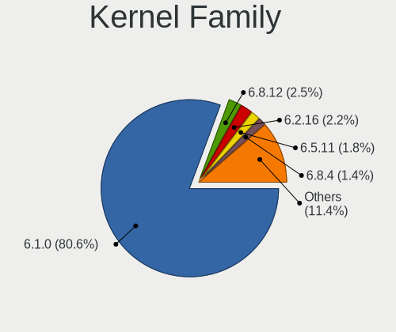

| Version | Desktops | Percent |
|---------|----------|---------|
| 6.1.0   | 165      | 90.66%  |
| 6.0.0   | 6        | 3.3%    |
| 5.10.0  | 2        | 1.1%    |
| 6.3.5   | 1        | 0.55%   |
| 6.3.0   | 1        | 0.55%   |
| 6.2.8   | 1        | 0.55%   |
| 6.2.11  | 1        | 0.55%   |
| 6.1.9   | 1        | 0.55%   |
| 6.1.13  | 1        | 0.55%   |
| 5.15.90 | 1        | 0.55%   |
| 5.15.0  | 1        | 0.55%   |
| 4.1.42  | 1        | 0.55%   |

Kernel Major Ver.
-----------------

Linux kernel major version

| Version | Desktops | Percent |
|---------|----------|---------|
| 6.1     | 167      | 91.76%  |
| 6.0     | 6        | 3.3%    |
| 6.3     | 2        | 1.1%    |
| 6.2     | 2        | 1.1%    |
| 5.15    | 2        | 1.1%    |
| 5.10    | 2        | 1.1%    |
| 4.1     | 1        | 0.55%   |

Arch
----

OS architecture (x86_64, i586, etc.)

| Name   | Desktops | Percent |
|--------|----------|---------|
| x86_64 | 178      | 98.89%  |
| ppc64  | 1        | 0.56%   |
| i686   | 1        | 0.56%   |

DE
--

Desktop Environment

| Name            | Desktops | Percent |
|-----------------|----------|---------|
| Unknown         | 86       | 47.51%  |
| KDE5            | 29       | 16.02%  |
| GNOME           | 27       | 14.92%  |
| XFCE            | 12       | 6.63%   |
| MATE            | 9        | 4.97%   |
| X-Cinnamon      | 7        | 3.87%   |
| i3              | 4        | 2.21%   |
| LXDE            | 3        | 1.66%   |
| openbox         | 1        | 0.55%   |
| LXQt            | 1        | 0.55%   |
| GNOME Flashback | 1        | 0.55%   |
| GNOME Classic   | 1        | 0.55%   |

Display Server
--------------

X11 or Wayland

| Name    | Desktops | Percent |
|---------|----------|---------|
| Unknown | 79       | 43.89%  |
| X11     | 68       | 37.78%  |
| Wayland | 22       | 12.22%  |
| Tty     | 11       | 6.11%   |

Display Manager
---------------

SDDM, LightDM, etc.

| Name    | Desktops | Percent |
|---------|----------|---------|
| Unknown | 108      | 59.67%  |
| LightDM | 26       | 14.36%  |
| SDDM    | 22       | 12.15%  |
| GDM3    | 20       | 11.05%  |
| XDM     | 2        | 1.1%    |
| SLiM    | 2        | 1.1%    |
| Ly      | 1        | 0.55%   |

OS Lang
-------

Language

| Lang    | Desktops | Percent |
|---------|----------|---------|
| ru_RU   | 84       | 46.67%  |
| en_US   | 36       | 20%     |
| de_DE   | 18       | 10%     |
| es_ES   | 7        | 3.89%   |
| en_GB   | 7        | 3.89%   |
| fr_FR   | 6        | 3.33%   |
| it_IT   | 3        | 1.67%   |
| pt_BR   | 2        | 1.11%   |
| en_IN   | 2        | 1.11%   |
| en_CA   | 2        | 1.11%   |
| Unknown | 2        | 1.11%   |
| zh_TW   | 1        | 0.56%   |
| zh_CN   | 1        | 0.56%   |
| pl_PL   | 1        | 0.56%   |
| ko_KR   | 1        | 0.56%   |
| ja_JP   | 1        | 0.56%   |
| es_PE   | 1        | 0.56%   |
| es_CL   | 1        | 0.56%   |
| en_NZ   | 1        | 0.56%   |
| en_IE   | 1        | 0.56%   |
| en_DK   | 1        | 0.56%   |
| de_AT   | 1        | 0.56%   |

Boot Mode
---------

EFI or BIOS

| Mode | Desktops | Percent |
|------|----------|---------|
| BIOS | 115      | 63.89%  |
| EFI  | 65       | 36.11%  |

Filesystem
----------

Type of filesystem

| Type    | Desktops | Percent |
|---------|----------|---------|
| Ext4    | 89       | 49.44%  |
| Overlay | 77       | 42.78%  |
| Btrfs   | 8        | 4.44%   |
| Xfs     | 3        | 1.67%   |
| Zfs     | 1        | 0.56%   |
| Tmpfs   | 1        | 0.56%   |
| Ext3    | 1        | 0.56%   |

Part. scheme
------------

Scheme of partitioning

| Type    | Desktops | Percent |
|---------|----------|---------|
| MBR     | 83       | 46.11%  |
| GPT     | 76       | 42.22%  |
| Unknown | 21       | 11.67%  |

Dual Boot with Linux/BSD
------------------------

Hosting more than one Linux/BSD

| Dual boot | Desktops | Percent |
|-----------|----------|---------|
| No        | 159      | 88.33%  |
| Yes       | 21       | 11.67%  |

Dual Boot (Win)
---------------

Hosting Linux and Windows

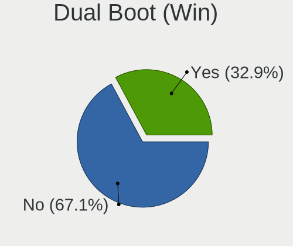

| Dual boot | Desktops | Percent |
|-----------|----------|---------|
| Yes       | 113      | 62.78%  |
| No        | 67       | 37.22%  |

Board
-----

Vendor
------

Motherboard manufacturer

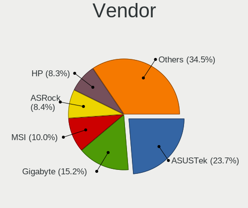

| Name                | Desktops | Percent |
|---------------------|----------|---------|
| ASUSTek Computer    | 81       | 45%     |
| Gigabyte Technology | 39       | 21.67%  |
| MSI                 | 15       | 8.33%   |
| ASRock              | 13       | 7.22%   |
| Hewlett-Packard     | 9        | 5%      |
| Lenovo              | 5        | 2.78%   |
| Intel               | 3        | 1.67%   |
| ECS                 | 3        | 1.67%   |
| Unknown             | 3        | 1.67%   |
| Techvision          | 2        | 1.11%   |
| QTQD                | 1        | 0.56%   |
| HC Technology.      | 1        | 0.56%   |
| Fujitsu Siemens     | 1        | 0.56%   |
| Fujitsu             | 1        | 0.56%   |
| Dell                | 1        | 0.56%   |
| Biostar             | 1        | 0.56%   |
| Acer                | 1        | 0.56%   |

Model
-----

Motherboard model

| Name                                     | Desktops | Percent |
|------------------------------------------|----------|---------|
| ASUS All Series                          | 19       | 10.56%  |
| ASUS PRIME B450M-K                       | 10       | 5.56%   |
| Gigabyte H81M-S2V                        | 8        | 4.44%   |
| ASUS S20 K29                             | 4        | 2.22%   |
| Unknown                                  | 4        | 2.22%   |
| ECS G31T-M9                              | 3        | 1.67%   |
| ASUS ROG STRIX X570-E GAMING             | 3        | 1.67%   |
| Techvision TVI7309X                      | 2        | 1.11%   |
| MSI MS-7C37                              | 2        | 1.11%   |
| MSI MS-7996                              | 2        | 1.11%   |
| Gigabyte M68MT-S2                        | 2        | 1.11%   |
| Gigabyte M56S-S3                         | 2        | 1.11%   |
| Gigabyte H61M-DS2 REV 1.2                | 2        | 1.11%   |
| Gigabyte B450M H                         | 2        | 1.11%   |
| Gigabyte B450 AORUS ELITE                | 2        | 1.11%   |
| ASUS TUF Gaming B550M-PLUS               | 2        | 1.11%   |
| ASUS ProArt X670E-CREATOR WIFI           | 2        | 1.11%   |
| ASUS PRIME B450M-A                       | 2        | 1.11%   |
| ASUS P8H67-M                             | 2        | 1.11%   |
| MSI MS-7D96                              | 1        | 0.56%   |
| MSI MS-7D52                              | 1        | 0.56%   |
| MSI MS-7D32                              | 1        | 0.56%   |
| MSI MS-7C02                              | 1        | 0.56%   |
| MSI MS-7B85                              | 1        | 0.56%   |
| MSI MS-7A68                              | 1        | 0.56%   |
| MSI MS-7A33                              | 1        | 0.56%   |
| MSI MS-7A15                              | 1        | 0.56%   |
| MSI MS-7817                              | 1        | 0.56%   |
| MSI MS-7681                              | 1        | 0.56%   |
| MSI MS-7529                              | 1        | 0.56%   |
| Lenovo ThinkCentre M93p 10AAA0WGUK       | 1        | 0.56%   |
| Lenovo ThinkCentre M93p 10A8S08114       | 1        | 0.56%   |
| Lenovo ThinkCentre M80s 11CVS3DT00       | 1        | 0.56%   |
| Lenovo ThinkCentre M73 10AXS3JD00        | 1        | 0.56%   |
| Lenovo ThinkCentre E73 10DS000TUK        | 1        | 0.56%   |
| Intel STK2M3W64CC                        | 1        | 0.56%   |
| Intel D945GCPE AAD97209-201              | 1        | 0.56%   |
| Intel Alder Lake-H PCH (ERYING G660 ITX) | 1        | 0.56%   |
| HP Z420 Workstation                      | 1        | 0.56%   |
| HP Z230 Tower Workstation                | 1        | 0.56%   |

Model Family
------------

Motherboard model prefix

| Name                | Desktops | Percent |
|---------------------|----------|---------|
| ASUS PRIME          | 23       | 12.78%  |
| ASUS All            | 19       | 10.56%  |
| ASUS ROG            | 9        | 5%      |
| Gigabyte H81M-S2V   | 8        | 4.44%   |
| Lenovo ThinkCentre  | 5        | 2.78%   |
| ASUS TUF            | 4        | 2.22%   |
| ASUS S20            | 4        | 2.22%   |
| Unknown             | 4        | 2.22%   |
| Gigabyte B450M      | 3        | 1.67%   |
| Gigabyte B450       | 3        | 1.67%   |
| ECS G31T-M9         | 3        | 1.67%   |
| ASUS P5G41T-M       | 3        | 1.67%   |
| Techvision TVI7309X | 2        | 1.11%   |
| MSI MS-7C37         | 2        | 1.11%   |
| MSI MS-7996         | 2        | 1.11%   |
| HP ProDesk          | 2        | 1.11%   |
| Gigabyte X570       | 2        | 1.11%   |
| Gigabyte M68MT-S2   | 2        | 1.11%   |
| Gigabyte M56S-S3    | 2        | 1.11%   |
| Gigabyte H61M-DS2   | 2        | 1.11%   |
| ASUS ProArt         | 2        | 1.11%   |
| ASUS P8H67-M        | 2        | 1.11%   |
| ASRock X370         | 2        | 1.11%   |
| MSI MS-7D96         | 1        | 0.56%   |
| MSI MS-7D52         | 1        | 0.56%   |
| MSI MS-7D32         | 1        | 0.56%   |
| MSI MS-7C02         | 1        | 0.56%   |
| MSI MS-7B85         | 1        | 0.56%   |
| MSI MS-7A68         | 1        | 0.56%   |
| MSI MS-7A33         | 1        | 0.56%   |
| MSI MS-7A15         | 1        | 0.56%   |
| MSI MS-7817         | 1        | 0.56%   |
| MSI MS-7681         | 1        | 0.56%   |
| MSI MS-7529         | 1        | 0.56%   |
| Intel STK2M3W64CC   | 1        | 0.56%   |
| Intel D945GCPE      | 1        | 0.56%   |
| Intel Alder         | 1        | 0.56%   |
| HP Z420             | 1        | 0.56%   |
| HP Z230             | 1        | 0.56%   |
| HP Z2               | 1        | 0.56%   |

MFG Year
--------

Motherboard manufacture year

| Year    | Desktops | Percent |
|---------|----------|---------|
| 2018    | 27       | 15%     |
| 2012    | 17       | 9.44%   |
| 2014    | 15       | 8.33%   |
| 2022    | 14       | 7.78%   |
| 2020    | 14       | 7.78%   |
| 2009    | 12       | 6.67%   |
| 2021    | 11       | 6.11%   |
| 2019    | 11       | 6.11%   |
| 2013    | 8        | 4.44%   |
| 2011    | 8        | 4.44%   |
| 2016    | 7        | 3.89%   |
| 2010    | 7        | 3.89%   |
| 2017    | 6        | 3.33%   |
| 2015    | 6        | 3.33%   |
| 2023    | 5        | 2.78%   |
| 2008    | 5        | 2.78%   |
| 2007    | 5        | 2.78%   |
| Unknown | 2        | 1.11%   |

Form Factor
-----------

Physical design of the computer

| Name    | Desktops | Percent |
|---------|----------|---------|
| Desktop | 180      | 100%    |

Secure Boot
-----------

Enabled or disabled

| State    | Desktops | Percent |
|----------|----------|---------|
| Disabled | 173      | 96.11%  |
| Enabled  | 7        | 3.89%   |

Coreboot
--------

Have coreboot on board

| Used | Desktops | Percent |
|------|----------|---------|
| No   | 180      | 100%    |

RAM Size
--------

Total RAM memory

| Size in GB  | Desktops | Percent |
|-------------|----------|---------|
| 32.01-64.0  | 37       | 20.44%  |
| 3.01-4.0    | 33       | 18.23%  |
| 4.01-8.0    | 31       | 17.13%  |
| 8.01-16.0   | 27       | 14.92%  |
| 16.01-24.0  | 24       | 13.26%  |
| 64.01-256.0 | 11       | 6.08%   |
| 1.01-2.0    | 8        | 4.42%   |
| 24.01-32.0  | 6        | 3.31%   |
| 2.01-3.0    | 2        | 1.1%    |
| 0.51-1.0    | 1        | 0.55%   |
| Unknown     | 1        | 0.55%   |

RAM Used
--------

Used RAM memory

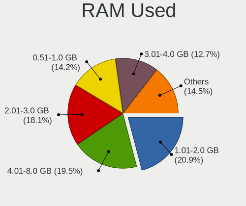

| Used GB    | Desktops | Percent |
|------------|----------|---------|
| 0.51-1.0   | 78       | 42.86%  |
| 4.01-8.0   | 34       | 18.68%  |
| 1.01-2.0   | 24       | 13.19%  |
| 2.01-3.0   | 14       | 7.69%   |
| 8.01-16.0  | 11       | 6.04%   |
| 3.01-4.0   | 10       | 5.49%   |
| 16.01-24.0 | 4        | 2.2%    |
| 0.01-0.5   | 4        | 2.2%    |
| 32.01-64.0 | 1        | 0.55%   |
| 24.01-32.0 | 1        | 0.55%   |
| Unknown    | 1        | 0.55%   |

Total Drives
------------

Number of drives on board

| Drives | Desktops | Percent |
|--------|----------|---------|
| 1      | 100      | 55.56%  |
| 2      | 38       | 21.11%  |
| 3      | 17       | 9.44%   |
| 4      | 12       | 6.67%   |
| 6      | 5        | 2.78%   |
| 5      | 4        | 2.22%   |
| 10     | 1        | 0.56%   |
| 8      | 1        | 0.56%   |
| 7      | 1        | 0.56%   |
| 0      | 1        | 0.56%   |

Has CD-ROM
----------

Has CD-ROM on board

| Presented | Desktops | Percent |
|-----------|----------|---------|
| No        | 126      | 69.61%  |
| Yes       | 55       | 30.39%  |

Has Ethernet
------------

Has Ethernet on board

| Presented | Desktops | Percent |
|-----------|----------|---------|
| Yes       | 179      | 99.44%  |
| No        | 1        | 0.56%   |

Has WiFi
--------

Has WiFi module

| Presented | Desktops | Percent |
|-----------|----------|---------|
| No        | 126      | 70%     |
| Yes       | 54       | 30%     |

Has Bluetooth
-------------

Has Bluetooth module

| Presented | Desktops | Percent |
|-----------|----------|---------|
| No        | 131      | 72.78%  |
| Yes       | 49       | 27.22%  |

Location
--------

Country
-------

Geographic location (country)

| Country     | Desktops | Percent |
|-------------|----------|---------|
| Russia      | 83       | 46.11%  |
| Germany     | 23       | 12.78%  |
| USA         | 15       | 8.33%   |
| Spain       | 7        | 3.89%   |
| France      | 6        | 3.33%   |
| Italy       | 4        | 2.22%   |
| UK          | 3        | 1.67%   |
| Poland      | 3        | 1.67%   |
| Brazil      | 3        | 1.67%   |
| Switzerland | 2        | 1.11%   |
| Slovakia    | 2        | 1.11%   |
| Netherlands | 2        | 1.11%   |
| Japan       | 2        | 1.11%   |
| Ireland     | 2        | 1.11%   |
| India       | 2        | 1.11%   |
| Finland     | 2        | 1.11%   |
| Canada      | 2        | 1.11%   |
| Vietnam     | 1        | 0.56%   |
| Sweden      | 1        | 0.56%   |
| South Korea | 1        | 0.56%   |
| Singapore   | 1        | 0.56%   |
| Peru        | 1        | 0.56%   |
| Norway      | 1        | 0.56%   |
| New Zealand | 1        | 0.56%   |
| Morocco     | 1        | 0.56%   |
| Mexico      | 1        | 0.56%   |
| Latvia      | 1        | 0.56%   |
| Denmark     | 1        | 0.56%   |
| China       | 1        | 0.56%   |
| Chile       | 1        | 0.56%   |
| Bolivia     | 1        | 0.56%   |
| Belarus     | 1        | 0.56%   |
| Austria     | 1        | 0.56%   |
| Argentina   | 1        | 0.56%   |

City
----

Geographic location (city)

| City                 | Desktops | Percent |
|----------------------|----------|---------|
| Voronezh             | 77       | 42.78%  |
| Madrid               | 3        | 1.67%   |
| Gladbeck             | 3        | 1.67%   |
| Toronto              | 2        | 1.11%   |
| Rozhanovce           | 2        | 1.11%   |
| Richmond             | 2        | 1.11%   |
| Hamburg              | 2        | 1.11%   |
| Dublin               | 2        | 1.11%   |
| Berlin               | 2        | 1.11%   |
| Wroclaw              | 1        | 0.56%   |
| Wellington           | 1        | 0.56%   |
| Weimar               | 1        | 0.56%   |
| Weaver               | 1        | 0.56%   |
| Warner Robins        | 1        | 0.56%   |
| Viladecans           | 1        | 0.56%   |
| Vienna               | 1        | 0.56%   |
| Tsukuba              | 1        | 0.56%   |
| Trelissac            | 1        | 0.56%   |
| Stockholm            | 1        | 0.56%   |
| St Petersburg        | 1        | 0.56%   |
| Singapore            | 1        | 0.56%   |
| Seocho-gu            | 1        | 0.56%   |
| Seattle              | 1        | 0.56%   |
| Saratov              | 1        | 0.56%   |
| San Jose             | 1        | 0.56%   |
| San Giovanni Teatino | 1        | 0.56%   |
| Riga                 | 1        | 0.56%   |
| Rickmansworth        | 1        | 0.56%   |
| Rennes               | 1        | 0.56%   |
| Quilpu             | 1        | 0.56%   |
| Puteaux              | 1        | 0.56%   |
| Poza Rica de Hidalgo | 1        | 0.56%   |
| Paris                | 1        | 0.56%   |
| Palinuro             | 1        | 0.56%   |
| Paderborn            | 1        | 0.56%   |
| Ourense              | 1        | 0.56%   |
| Oulu                 | 1        | 0.56%   |
| Oslo                 | 1        | 0.56%   |
| Nuremberg            | 1        | 0.56%   |
| New Delhi            | 1        | 0.56%   |

Drives
------

Drive Vendor
------------

Hard drive vendors

| Vendor                    | Desktops | Drives | Percent |
|---------------------------|----------|--------|---------|
| WDC                       | 69       | 92     | 23.79%  |
| Seagate                   | 49       | 61     | 16.9%   |
| Samsung Electronics       | 48       | 73     | 16.55%  |
| Crucial                   | 29       | 33     | 10%     |
| Toshiba                   | 19       | 25     | 6.55%   |
| Kingston                  | 12       | 14     | 4.14%   |
| SanDisk                   | 9        | 10     | 3.1%    |
| Transcend                 | 4        | 4      | 1.38%   |
| Intel                     | 4        | 4      | 1.38%   |
| Unknown                   | 3        | 3      | 1.03%   |
| SPCC                      | 3        | 3      | 1.03%   |
| Netac                     | 3        | 3      | 1.03%   |
| Hitachi                   | 3        | 4      | 1.03%   |
| XPG                       | 2        | 4      | 0.69%   |
| KIOXIA-EXCERIA            | 2        | 2      | 0.69%   |
| Hewlett-Packard           | 2        | 4      | 0.69%   |
| GOODRAM                   | 2        | 2      | 0.69%   |
| China                     | 2        | 2      | 0.69%   |
| Apacer                    | 2        | 4      | 0.69%   |
| USB                       | 1        | 1      | 0.34%   |
| TrekStor                  | 1        | 1      | 0.34%   |
| TO Exter                  | 1        | 1      | 0.34%   |
| SABRENT                   | 1        | 1      | 0.34%   |
| Realtek Semiconductor     | 1        | 1      | 0.34%   |
| PNY                       | 1        | 2      | 0.34%   |
| Plextor                   | 1        | 1      | 0.34%   |
| Phison Electronics        | 1        | 2      | 0.34%   |
| Phison                    | 1        | 1      | 0.34%   |
| OCZ-VERTEX3               | 1        | 1      | 0.34%   |
| MSI                       | 1        | 1      | 0.34%   |
| Micron/Crucial Technology | 1        | 1      | 0.34%   |
| KIOXIA                    | 1        | 1      | 0.34%   |
| JMicron Technology        | 1        | 1      | 0.34%   |
| Innodisk                  | 1        | 1      | 0.34%   |
| HGST                      | 1        | 2      | 0.34%   |
| Gigabyte Technology       | 1        | 1      | 0.34%   |
| External                  | 1        | 1      | 0.34%   |
| Corsair                   | 1        | 1      | 0.34%   |
| Colorful                  | 1        | 1      | 0.34%   |
| ASMT                      | 1        | 1      | 0.34%   |

Drive Model
-----------

Hard drive models

| Model                                               | Desktops | Percent |
|-----------------------------------------------------|----------|---------|
| Crucial CT480BX500SSD1 480GB                        | 17       | 5.11%   |
| WDC WD5000AAKX-60U6AA0 500GB                        | 15       | 4.5%    |
| Seagate ST1000DM003-1ER162 1TB                      | 9        | 2.7%    |
| Samsung SSD 980 PRO 1TB                             | 5        | 1.5%    |
| Samsung NVMe SSD Controller SM981/PM981/PM983 256GB | 5        | 1.5%    |
| WDC WD10EZEX-08WN4A0 1TB                            | 4        | 1.2%    |
| Samsung SSD 850 EVO 500GB                           | 4        | 1.2%    |
| Samsung NVMe SSD Controller PM9A1/PM9A3/980PRO 1TB  | 4        | 1.2%    |
| Kingston SA400S37480G 480GB SSD                     | 4        | 1.2%    |
| WDC WD2500AAKS-00VSA0 250GB                         | 3        | 0.9%    |
| WDC WD20EZRZ-00Z5HB0 2TB                            | 3        | 0.9%    |
| Toshiba DT01ACA050 500GB                            | 3        | 0.9%    |
| Seagate ST3250410AS 250GB                           | 3        | 0.9%    |
| Seagate ST1000DM010-2EP102 1TB                      | 3        | 0.9%    |
| Samsung SSD 970 EVO Plus 500GB                      | 3        | 0.9%    |
| Samsung SSD 970 EVO Plus 1TB                        | 3        | 0.9%    |
| Kingston SA400S37240G 240GB SSD                     | 3        | 0.9%    |
| Kingston SA400S37120G 120GB SSD                     | 3        | 0.9%    |
| Crucial CT500MX500SSD1 500GB                        | 3        | 0.9%    |
| XPG GAMMIX S11 Pro 512GB                            | 2        | 0.6%    |
| WDC WDS500G1X0E-00AFY0 500GB                        | 2        | 0.6%    |
| WDC WDS100T2B0A-00SM50 1TB SSD                      | 2        | 0.6%    |
| WDC WD5000AAKX-08ANVA0 500GB                        | 2        | 0.6%    |
| WDC WD40EFRX-68WT0N0 4TB                            | 2        | 0.6%    |
| WDC WD20EARX-00PASB0 2TB                            | 2        | 0.6%    |
| WDC WD100EMAZ-00WJTA0 10TB                          | 2        | 0.6%    |
| Unknown SD/MMC/MS PRO 64GB                          | 2        | 0.6%    |
| Transcend TS1TMTE220S 1TB                           | 2        | 0.6%    |
| Transcend TS128GSSD340K 128GB                       | 2        | 0.6%    |
| Toshiba MQ01ABF032 320GB                            | 2        | 0.6%    |
| Toshiba HDWD110 1TB                                 | 2        | 0.6%    |
| SPCC Solid State Disk 128GB                         | 2        | 0.6%    |
| Seagate ST500DM002-1BD142 500GB                     | 2        | 0.6%    |
| Seagate ST3500413AS 500GB                           | 2        | 0.6%    |
| Seagate ST3000DM001-1ER166 3TB                      | 2        | 0.6%    |
| Seagate ST2000DM006-2DM164 2TB                      | 2        | 0.6%    |
| Seagate ST2000DM001-9YN164 2TB                      | 2        | 0.6%    |
| Seagate ST1000DM003-9YN162 1TB                      | 2        | 0.6%    |
| Samsung SSD 980 PRO 2TB                             | 2        | 0.6%    |
| Samsung SSD 980 1TB                                 | 2        | 0.6%    |

HDD Vendor
----------

Hard disk drive vendors

| Vendor              | Desktops | Drives | Percent |
|---------------------|----------|--------|---------|
| WDC                 | 59       | 77     | 44.03%  |
| Seagate             | 46       | 58     | 34.33%  |
| Toshiba             | 19       | 25     | 14.18%  |
| Hitachi             | 3        | 4      | 2.24%   |
| Unknown             | 2        | 2      | 1.49%   |
| USB                 | 1        | 1      | 0.75%   |
| Samsung Electronics | 1        | 1      | 0.75%   |
| HGST                | 1        | 2      | 0.75%   |
| Hewlett-Packard     | 1        | 2      | 0.75%   |
| External            | 1        | 1      | 0.75%   |

SSD Vendor
----------

Solid state drive vendors

| Vendor              | Desktops | Drives | Percent |
|---------------------|----------|--------|---------|
| Crucial             | 25       | 28     | 25.51%  |
| Samsung Electronics | 23       | 28     | 23.47%  |
| Kingston            | 9        | 11     | 9.18%   |
| WDC                 | 7        | 10     | 7.14%   |
| SanDisk             | 4        | 5      | 4.08%   |
| SPCC                | 3        | 3      | 3.06%   |
| Intel               | 3        | 3      | 3.06%   |
| Transcend           | 2        | 2      | 2.04%   |
| Seagate             | 2        | 2      | 2.04%   |
| Netac               | 2        | 2      | 2.04%   |
| GOODRAM             | 2        | 2      | 2.04%   |
| China               | 2        | 2      | 2.04%   |
| TrekStor            | 1        | 1      | 1.02%   |
| TO Exter            | 1        | 1      | 1.02%   |
| SABRENT             | 1        | 1      | 1.02%   |
| PNY                 | 1        | 2      | 1.02%   |
| Plextor             | 1        | 1      | 1.02%   |
| OCZ-VERTEX3         | 1        | 1      | 1.02%   |
| MSI                 | 1        | 1      | 1.02%   |
| JMicron Technology  | 1        | 1      | 1.02%   |
| Innodisk            | 1        | 1      | 1.02%   |
| Gigabyte Technology | 1        | 1      | 1.02%   |
| Colorful            | 1        | 1      | 1.02%   |
| Apacer              | 1        | 1      | 1.02%   |
| A-DATA Technology   | 1        | 1      | 1.02%   |
| 240G                | 1        | 1      | 1.02%   |

Drive Kind
----------

HDD or SSD

| Kind | Desktops | Drives | Percent |
|------|----------|--------|---------|
| HDD  | 114      | 173    | 45.06%  |
| SSD  | 81       | 113    | 32.02%  |
| NVMe | 57       | 86     | 22.53%  |
| MMC  | 1        | 1      | 0.4%    |

Drive Connector
---------------

SATA, SAS, NVMe, etc.

| Type | Desktops | Drives | Percent |
|------|----------|--------|---------|
| SATA | 155      | 269    | 69.51%  |
| NVMe | 57       | 85     | 25.56%  |
| SAS  | 10       | 18     | 4.48%   |
| MMC  | 1        | 1      | 0.45%   |

Drive Size
----------

Size of hard drive

| Size in TB | Desktops | Drives | Percent |
|------------|----------|--------|---------|
| 0.01-0.5   | 119      | 161    | 55.09%  |
| 0.51-1.0   | 47       | 57     | 21.76%  |
| 1.01-2.0   | 24       | 33     | 11.11%  |
| 3.01-4.0   | 10       | 14     | 4.63%   |
| 2.01-3.0   | 7        | 7      | 3.24%   |
| 4.01-10.0  | 7        | 12     | 3.24%   |
| 10.01-20.0 | 2        | 2      | 0.93%   |

Space Total
-----------

Amount of disk space available on the file system

| Size in GB     | Desktops | Percent |
|----------------|----------|---------|
| Unknown        | 78       | 43.09%  |
| More than 3000 | 26       | 14.36%  |
| 251-500        | 23       | 12.71%  |
| 1001-2000      | 14       | 7.73%   |
| 101-250        | 13       | 7.18%   |
| 501-1000       | 13       | 7.18%   |
| 2001-3000      | 6        | 3.31%   |
| 21-50          | 4        | 2.21%   |
| 1-20           | 3        | 1.66%   |
| 51-100         | 1        | 0.55%   |

Space Used
----------

Amount of used disk space

| Used GB        | Desktops | Percent |
|----------------|----------|---------|
| Unknown        | 78       | 42.86%  |
| 1-20           | 26       | 14.29%  |
| 501-1000       | 20       | 10.99%  |
| 101-250        | 11       | 6.04%   |
| 21-50          | 10       | 5.49%   |
| More than 3000 | 9        | 4.95%   |
| 51-100         | 9        | 4.95%   |
| 251-500        | 8        | 4.4%    |
| 1001-2000      | 8        | 4.4%    |
| 2001-3000      | 3        | 1.65%   |

Malfunc. Drives
---------------

Drive models with a malfunction

| Model                                 | Desktops | Drives | Percent |
|---------------------------------------|----------|--------|---------|
| WDC WD5000AAKX-60U6AA0 500GB          | 12       | 12     | 26.09%  |
| Seagate ST3250410AS 250GB             | 3        | 3      | 6.52%   |
| Hitachi HDS721050CLA362 500GB         | 2        | 3      | 4.35%   |
| WDC WDS480G2G0A-00JH30 480GB SSD      | 1        | 2      | 2.17%   |
| WDC WD800AAJS-60WAA0 80GB             | 1        | 1      | 2.17%   |
| WDC WD40EFRX-68N32N0 4TB              | 1        | 3      | 2.17%   |
| WDC WD3200AAJS-00L7A0 320GB           | 1        | 1      | 2.17%   |
| WDC WD30EFRX-68EUZN0 3TB              | 1        | 1      | 2.17%   |
| WDC WD2500AAKS-00VSA0 250GB           | 1        | 2      | 2.17%   |
| WDC WD2500AAJS-00B4A0 250GB           | 1        | 1      | 2.17%   |
| WDC WD20EARX-00PASB0 2TB              | 1        | 1      | 2.17%   |
| WDC WD1600AAJS-00B4A0 160GB           | 1        | 1      | 2.17%   |
| WDC WD10JPVX-08JC3T5 1TB              | 1        | 1      | 2.17%   |
| WDC WD10EARS-00MVWB0 1TB              | 1        | 1      | 2.17%   |
| WDC WD10EALX-009BA0 1TB               | 1        | 1      | 2.17%   |
| WDC WD1000DHTZ-04N21V0 1TB            | 1        | 1      | 2.17%   |
| Toshiba DT01ACA200 2TB                | 1        | 1      | 2.17%   |
| Seagate ST9500325AS 500GB             | 1        | 1      | 2.17%   |
| Seagate ST5000LM000-2AN170 5TB        | 1        | 2      | 2.17%   |
| Seagate ST3250824AS 250GB             | 1        | 1      | 2.17%   |
| Seagate ST3160815AS 160GB             | 1        | 1      | 2.17%   |
| Seagate ST3160215AS 160GB             | 1        | 1      | 2.17%   |
| Seagate ST3000DM001-1ER166 3TB        | 1        | 1      | 2.17%   |
| Seagate ST2000DX001-1CM164 2TB        | 1        | 1      | 2.17%   |
| Seagate ST2000DM006-2DM164 2TB        | 1        | 1      | 2.17%   |
| Seagate ST2000DM001-9YN164 2TB        | 1        | 1      | 2.17%   |
| Samsung Electronics SSD 840 EVO 500GB | 1        | 1      | 2.17%   |
| Samsung Electronics SP2004C 200GB     | 1        | 1      | 2.17%   |
| Kingston SA400S37240G 240GB SSD       | 1        | 1      | 2.17%   |
| Intel SSDSC2BW180A4 180GB             | 1        | 1      | 2.17%   |
| Hitachi HDS721050CLA360 500GB         | 1        | 1      | 2.17%   |
| China SSD08G 8GB                      | 1        | 1      | 2.17%   |

Malfunc. Drive Vendor
---------------------

Vendors of faulty drives

| Vendor              | Desktops | Drives | Percent |
|---------------------|----------|--------|---------|
| WDC                 | 24       | 29     | 54.55%  |
| Seagate             | 11       | 13     | 25%     |
| Hitachi             | 3        | 4      | 6.82%   |
| Samsung Electronics | 2        | 2      | 4.55%   |
| Toshiba             | 1        | 1      | 2.27%   |
| Kingston            | 1        | 1      | 2.27%   |
| Intel               | 1        | 1      | 2.27%   |
| China               | 1        | 1      | 2.27%   |

Malfunc. HDD Vendor
-------------------

Vendors of faulty HDD drives

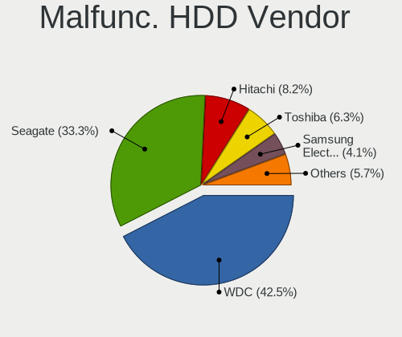

| Vendor              | Desktops | Drives | Percent |
|---------------------|----------|--------|---------|
| WDC                 | 23       | 27     | 58.97%  |
| Seagate             | 11       | 13     | 28.21%  |
| Hitachi             | 3        | 4      | 7.69%   |
| Toshiba             | 1        | 1      | 2.56%   |
| Samsung Electronics | 1        | 1      | 2.56%   |

Malfunc. Drive Kind
-------------------

Kinds of faulty drives

| Kind | Desktops | Drives | Percent |
|------|----------|--------|---------|
| HDD  | 36       | 46     | 87.8%   |
| SSD  | 5        | 6      | 12.2%   |

Failed Drives
-------------

Failed drive models

Zero info for selected period =(

Failed Drive Vendor
-------------------

Failed drive vendors

Zero info for selected period =(

Drive Status
------------

Number of failed and malfunc. drives

| Status   | Desktops | Drives | Percent |
|----------|----------|--------|---------|
| Works    | 130      | 238    | 64.36%  |
| Malfunc  | 40       | 52     | 19.8%   |
| Detected | 32       | 83     | 15.84%  |

Storage controller
------------------

Storage Vendor
--------------

Storage controller vendors

| Vendor                       | Desktops | Percent |
|------------------------------|----------|---------|
| Intel                        | 107      | 40.68%  |
| AMD                          | 63       | 23.95%  |
| Samsung Electronics          | 29       | 11.03%  |
| ASMedia Technology           | 12       | 4.56%   |
| SanDisk                      | 9        | 3.42%   |
| Nvidia                       | 9        | 3.42%   |
| Micron/Crucial Technology    | 6        | 2.28%   |
| Phison Electronics           | 4        | 1.52%   |
| Kingston Technology Company  | 3        | 1.14%   |
| JMicron Technology           | 3        | 1.14%   |
| VIA Technologies             | 2        | 0.76%   |
| Transcend                    | 2        | 0.76%   |
| KIOXIA                       | 2        | 0.76%   |
| ADATA Technology             | 2        | 0.76%   |
| Toshiba America Info Systems | 1        | 0.38%   |
| Silicon Motion               | 1        | 0.38%   |
| Silicon Image                | 1        | 0.38%   |
| Seagate Technology           | 1        | 0.38%   |
| Realtek Semiconductor        | 1        | 0.38%   |
| Netac Technology             | 1        | 0.38%   |
| Marvell Technology Group     | 1        | 0.38%   |
| IBM                          | 1        | 0.38%   |
| Hewlett-Packard              | 1        | 0.38%   |
| Artop Electronic             | 1        | 0.38%   |

Storage Model
-------------

Storage controller models

| Model                                                                                   | Desktops | Percent |
|-----------------------------------------------------------------------------------------|----------|---------|
| AMD FCH SATA Controller [AHCI mode]                                                     | 43       | 12.95%  |
| Intel 8 Series/C220 Series Chipset Family 6-port SATA Controller 1 [AHCI mode]          | 29       | 8.73%   |
| AMD 400 Series Chipset SATA Controller                                                  | 26       | 7.83%   |
| Samsung NVMe SSD Controller SM981/PM981/PM983                                           | 14       | 4.22%   |
| Samsung NVMe SSD Controller PM9A1/PM9A3/980PRO                                          | 13       | 3.92%   |
| Intel 200 Series PCH SATA controller [AHCI mode]                                        | 13       | 3.92%   |
| ASMedia ASM1062 Serial ATA Controller                                                   | 12       | 3.61%   |
| Intel NM10/ICH7 Family SATA Controller [IDE mode]                                       | 9        | 2.71%   |
| Intel Alder Lake-S PCH SATA Controller [AHCI Mode]                                      | 8        | 2.41%   |
| Intel 82801G (ICH7 Family) IDE Controller                                               | 8        | 2.41%   |
| AMD 500 Series Chipset SATA Controller                                                  | 7        | 2.11%   |
| Intel Volume Management Device NVMe RAID Controller                                     | 6        | 1.81%   |
| Intel 700 Series Chipset Family SATA AHCI Controller                                    | 6        | 1.81%   |
| Micron/Crucial P2 NVMe PCIe SSD                                                         | 5        | 1.51%   |
| Intel Q170/Q150/B150/H170/H110/Z170/CM236 Chipset SATA Controller [AHCI Mode]           | 5        | 1.51%   |
| Intel 6 Series/C200 Series Chipset Family Desktop SATA Controller (IDE mode, ports 4-5) | 5        | 1.51%   |
| Intel 6 Series/C200 Series Chipset Family Desktop SATA Controller (IDE mode, ports 0-3) | 5        | 1.51%   |
| AMD SB7x0/SB8x0/SB9x0 SATA Controller [AHCI mode]                                       | 5        | 1.51%   |
| AMD SB7x0/SB8x0/SB9x0 IDE Controller                                                    | 5        | 1.51%   |
| Samsung NVMe SSD Controller 980                                                         | 4        | 1.2%    |
| Nvidia MCP61 SATA Controller                                                            | 4        | 1.2%    |
| SanDisk WD PC SN810 / Black SN850 NVMe SSD                                              | 3        | 0.9%    |
| Nvidia MCP65 SATA Controller                                                            | 3        | 0.9%    |
| Nvidia MCP65 IDE                                                                        | 3        | 0.9%    |
| JMicron JMB368 IDE controller                                                           | 3        | 0.9%    |
| Intel 9 Series Chipset Family SATA Controller [AHCI Mode]                               | 3        | 0.9%    |
| Intel 8 Series/C220 Series Chipset Family 4-port SATA Controller 1 [IDE mode]           | 3        | 0.9%    |
| AMD X370 Series Chipset SATA Controller                                                 | 3        | 0.9%    |
| VIA VT6415 PATA IDE Host Controller                                                     | 2        | 0.6%    |
| Transcend Non-Volatile memory controller                                                | 2        | 0.6%    |
| SanDisk Non-Volatile memory controller                                                  | 2        | 0.6%    |
| Samsung NVMe SSD Controller SM961/PM961/SM963                                           | 2        | 0.6%    |
| Nvidia MCP61 IDE                                                                        | 2        | 0.6%    |
| Kingston Company Company Non-Volatile memory controller                                 | 2        | 0.6%    |
| Intel Jasper Lake SATA AHCI Controller                                                  | 2        | 0.6%    |
| Intel Comet Lake SATA AHCI Controller                                                   | 2        | 0.6%    |
| Intel 6 Series/C200 Series Chipset Family 6 port Desktop SATA AHCI Controller           | 2        | 0.6%    |
| AMD SB7x0/SB8x0/SB9x0 SATA Controller [IDE mode]                                        | 2        | 0.6%    |
| ADATA XPG SX8200 Pro PCIe Gen3x4 M.2 2280 Solid State Drive                             | 2        | 0.6%    |
| Toshiba America Info Systems XG6 NVMe SSD Controller                                    | 1        | 0.3%    |

Storage Kind
------------

Kind of storage controller (IDE, SATA, NVMe, SAS, ...)

| Kind | Desktops | Percent |
|------|----------|---------|
| SATA | 147      | 57.65%  |
| NVMe | 55       | 21.57%  |
| IDE  | 39       | 15.29%  |
| RAID | 12       | 4.71%   |
| SAS  | 1        | 0.39%   |
| SCSI | 1        | 0.39%   |

Processor
---------

CPU Vendor
----------

Processor vendors

| Vendor            | Desktops | Percent |
|-------------------|----------|---------|
| Intel             | 108      | 60%     |
| AMD               | 71       | 39.44%  |
| CHRP IBM,8233-E8B | 1        | 0.56%   |

CPU Model
---------

Processor models

| Model                                       | Desktops | Percent |
|---------------------------------------------|----------|---------|
| Intel Pentium CPU G3420 @ 3.20GHz           | 15       | 8.33%   |
| AMD Ryzen 5 3350G with Radeon Vega Graphics | 10       | 5.56%   |
| Intel Core i3-4130 CPU @ 3.40GHz            | 8        | 4.44%   |
| AMD Ryzen 7 5800X 8-Core Processor          | 5        | 2.78%   |
| Intel Core i5-9400 CPU @ 2.90GHz            | 4        | 2.22%   |
| AMD Ryzen 7 3700X 8-Core Processor          | 4        | 2.22%   |
| AMD Ryzen 5 5600X 6-Core Processor          | 4        | 2.22%   |
| Intel Pentium Dual-Core CPU E6500 @ 2.93GHz | 3        | 1.67%   |
| Intel 12th Gen Core i5-12400F               | 3        | 1.67%   |
| AMD Ryzen 9 5900X 12-Core Processor         | 3        | 1.67%   |
| AMD Ryzen 5 PRO 4650G with Radeon Graphics  | 3        | 1.67%   |
| Intel Pentium CPU G620 @ 2.60GHz            | 2        | 1.11%   |
| Intel Pentium CPU G4400 @ 3.30GHz           | 2        | 1.11%   |
| Intel Core i7-7700K CPU @ 4.20GHz           | 2        | 1.11%   |
| Intel Core i7-4790 CPU @ 3.60GHz            | 2        | 1.11%   |
| Intel Core i5-2300 CPU @ 2.80GHz            | 2        | 1.11%   |
| Intel Core i3-4330 CPU @ 3.50GHz            | 2        | 1.11%   |
| Intel Core 2 Duo CPU E8400 @ 3.00GHz        | 2        | 1.11%   |
| Intel Celeron N5105 @ 2.00GHz               | 2        | 1.11%   |
| Intel 12th Gen Core i9-12900K               | 2        | 1.11%   |
| AMD Ryzen 9 7950X 16-Core Processor         | 2        | 1.11%   |
| AMD Ryzen 7 5800X3D 8-Core Processor        | 2        | 1.11%   |
| AMD Ryzen 7 5700X 8-Core Processor          | 2        | 1.11%   |
| AMD Ryzen 5 2600 Six-Core Processor         | 2        | 1.11%   |
| AMD Ryzen 5 1400 Quad-Core Processor        | 2        | 1.11%   |
| AMD FX-8350 Eight-Core Processor            | 2        | 1.11%   |
| AMD Athlon II X3 425 Processor              | 2        | 1.11%   |
| AMD Athlon 64 X2 Dual Core Processor 5000+  | 2        | 1.11%   |
| Intel Xeon CPU X3370 @ 3.00GHz              | 1        | 0.56%   |
| Intel Xeon CPU E5520 @ 2.27GHz              | 1        | 0.56%   |
| Intel Xeon CPU E5-1620 0 @ 3.60GHz          | 1        | 0.56%   |
| Intel Xeon CPU E3110 @ 3.00GHz              | 1        | 0.56%   |
| Intel Pentium Gold G6405 CPU @ 4.10GHz      | 1        | 0.56%   |
| Intel Pentium Dual-Core CPU E5700 @ 3.00GHz | 1        | 0.56%   |
| Intel Pentium Dual-Core CPU E5300 @ 2.60GHz | 1        | 0.56%   |
| Intel Pentium CPU G6950 @ 2.80GHz           | 1        | 0.56%   |
| Intel Pentium CPU G4600 @ 3.60GHz           | 1        | 0.56%   |
| Intel Pentium CPU G4560 @ 3.50GHz           | 1        | 0.56%   |
| Intel Pentium CPU G3430 @ 3.30GHz           | 1        | 0.56%   |
| Intel Pentium CPU G3240 @ 3.10GHz           | 1        | 0.56%   |

CPU Model Family
----------------

Processor model prefix

| Model                   | Desktops | Percent |
|-------------------------|----------|---------|
| Intel Pentium           | 24       | 13.33%  |
| AMD Ryzen 5             | 22       | 12.22%  |
| Intel Core i5           | 20       | 11.11%  |
| Other                   | 17       | 9.44%   |
| AMD Ryzen 7             | 17       | 9.44%   |
| Intel Core i7           | 13       | 7.22%   |
| Intel Core i3           | 11       | 6.11%   |
| Intel Celeron           | 7        | 3.89%   |
| AMD Ryzen 9             | 7        | 3.89%   |
| Intel Pentium Dual-Core | 5        | 2.78%   |
| Intel Xeon              | 4        | 2.22%   |
| Intel Core 2 Duo        | 4        | 2.22%   |
| AMD FX                  | 4        | 2.22%   |
| AMD Athlon 64 X2        | 4        | 2.22%   |
| AMD Ryzen 5 PRO         | 3        | 1.67%   |
| AMD Ryzen 3             | 3        | 1.67%   |
| AMD Athlon II X3        | 2        | 1.11%   |
| Intel Pentium Gold      | 1        | 0.56%   |
| Intel Core m3           | 1        | 0.56%   |
| Intel Core 2 Quad       | 1        | 0.56%   |
| Intel Core 2            | 1        | 0.56%   |
| AMD Ryzen Threadripper  | 1        | 0.56%   |
| AMD Phenom II X6        | 1        | 0.56%   |
| AMD Phenom II X4        | 1        | 0.56%   |
| AMD Phenom              | 1        | 0.56%   |
| AMD GX                  | 1        | 0.56%   |
| AMD E                   | 1        | 0.56%   |
| AMD Athlon II X4        | 1        | 0.56%   |
| AMD Athlon II X2        | 1        | 0.56%   |
| AMD Athlon              | 1        | 0.56%   |

CPU Cores
---------

Number of processor cores

| Number | Desktops | Percent |
|--------|----------|---------|
| 2      | 61       | 33.89%  |
| 4      | 51       | 28.33%  |
| 6      | 24       | 13.33%  |
| 8      | 20       | 11.11%  |
| 16     | 8        | 4.44%   |
| 12     | 7        | 3.89%   |
| 3      | 3        | 1.67%   |
| 14     | 2        | 1.11%   |
| 1      | 2        | 1.11%   |
| 24     | 1        | 0.56%   |
| 10     | 1        | 0.56%   |

CPU Sockets
-----------

Number of sockets

| Number | Desktops | Percent |
|--------|----------|---------|
| 1      | 179      | 99.44%  |
| 2      | 1        | 0.56%   |

CPU Threads
-----------

Threads per core (Hyper-Threading)

| Number | Desktops | Percent |
|--------|----------|---------|
| 2      | 106      | 58.89%  |
| 1      | 73       | 40.56%  |
| 4      | 1        | 0.56%   |

CPU Op-Modes
------------

CPU Operation Modes (32-bit, 64-bit)

| Op mode        | Desktops | Percent |
|----------------|----------|---------|
| 32-bit, 64-bit | 180      | 100%    |

CPU Microcode
-------------

Microcode number

| Number     | Desktops | Percent |
|------------|----------|---------|
| 0x306c3    | 33       | 18.23%  |
| Unknown    | 28       | 15.47%  |
| 0x08108109 | 12       | 6.63%   |
| 0x1067a    | 9        | 4.97%   |
| 0x90672    | 7        | 3.87%   |
| 0x206a7    | 7        | 3.87%   |
| 0x0a20120a | 6        | 3.31%   |
| 0x906e9    | 5        | 2.76%   |
| 0x506e3    | 5        | 2.76%   |
| 0x906ea    | 4        | 2.21%   |
| 0x08701021 | 4        | 2.21%   |
| 0x0800820d | 4        | 2.21%   |
| 0xb0671    | 3        | 1.66%   |
| 0xa0653    | 3        | 1.66%   |
| 0x0a201016 | 3        | 1.66%   |
| 0x08600106 | 3        | 1.66%   |
| 0x08001138 | 3        | 1.66%   |
| 0x906c0    | 2        | 1.1%    |
| 0x90675    | 2        | 1.1%    |
| 0x50654    | 2        | 1.1%    |
| 0x206d7    | 2        | 1.1%    |
| 0x0a601203 | 2        | 1.1%    |
| 0x0a50000d | 2        | 1.1%    |
| 0x0a201009 | 2        | 1.1%    |
| 0x08701013 | 2        | 1.1%    |
| 0x08001137 | 2        | 1.1%    |
| 0x06000852 | 2        | 1.1%    |
| 0x010000c6 | 2        | 1.1%    |
| 0xb06f2    | 1        | 0.55%   |
| 0xa0655    | 1        | 0.55%   |
| 0x906a3    | 1        | 0.55%   |
| 0x806c2    | 1        | 0.55%   |
| 0x706a1    | 1        | 0.55%   |
| 0x6f2      | 1        | 0.55%   |
| 0x406e3    | 1        | 0.55%   |
| 0x40651    | 1        | 0.55%   |
| 0x306a9    | 1        | 0.55%   |
| 0x20655    | 1        | 0.55%   |
| 0x20652    | 1        | 0.55%   |
| 0x106a5    | 1        | 0.55%   |

CPU Microarch
-------------

Microarchitecture

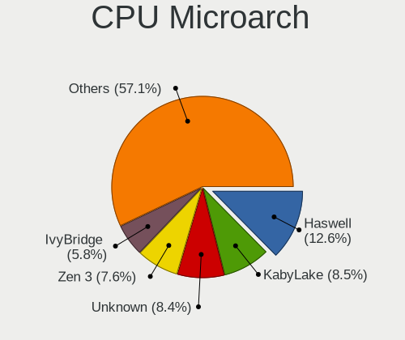

| Name             | Desktops | Percent |
|------------------|----------|---------|
| Haswell          | 37       | 20.56%  |
| Zen+             | 18       | 10%     |
| Zen 3            | 18       | 10%     |
| Penryn           | 13       | 7.22%   |
| KabyLake         | 12       | 6.67%   |
| Alderlake Hybrid | 12       | 6.67%   |
| Zen 2            | 11       | 6.11%   |
| SandyBridge      | 9        | 5%      |
| Skylake          | 8        | 4.44%   |
| K10              | 7        | 3.89%   |
| Unknown          | 6        | 3.33%   |
| Zen              | 5        | 2.78%   |
| K8 Hammer        | 4        | 2.22%   |
| CometLake        | 4        | 2.22%   |
| Piledriver       | 3        | 1.67%   |
| Westmere         | 2        | 1.11%   |
| Tremont          | 2        | 1.11%   |
| Core             | 2        | 1.11%   |
| TigerLake        | 1        | 0.56%   |
| Nehalem          | 1        | 0.56%   |
| Jaguar           | 1        | 0.56%   |
| IvyBridge        | 1        | 0.56%   |
| Goldmont plus    | 1        | 0.56%   |
| Excavator        | 1        | 0.56%   |
| Bobcat           | 1        | 0.56%   |

Graphics
--------

GPU Vendor
----------

Vendors of graphics cards

| Vendor                     | Desktops | Percent |
|----------------------------|----------|---------|
| Intel                      | 69       | 35.38%  |
| Nvidia                     | 65       | 33.33%  |
| AMD                        | 59       | 30.26%  |
| Matrox Electronics Systems | 2        | 1.03%   |

GPU Model
---------

Graphics card models

| Model                                                                       | Desktops | Percent |
|-----------------------------------------------------------------------------|----------|---------|
| Intel Xeon E3-1200 v3/4th Gen Core Processor Integrated Graphics Controller | 20       | 10.15%  |
| Nvidia GF108 [GeForce GT 730]                                               | 15       | 7.61%   |
| AMD Picasso/Raven 2 [Radeon Vega Series / Radeon Vega Mobile Series]        | 13       | 6.6%    |
| Intel 4th Generation Core Processor Family Integrated Graphics Controller   | 8        | 4.06%   |
| AMD Lexa PRO [Radeon 540/540X/550/550X / RX 540X/550/550X]                  | 5        | 2.54%   |
| Intel HD Graphics 630                                                       | 4        | 2.03%   |
| Intel CoffeeLake-S GT2 [UHD Graphics 630]                                   | 4        | 2.03%   |
| Intel 4 Series Chipset Integrated Graphics Controller                       | 4        | 2.03%   |
| Intel 2nd Generation Core Processor Family Integrated Graphics Controller   | 4        | 2.03%   |
| AMD Navi 10 [Radeon RX 5600 OEM/5600 XT / 5700/5700 XT]                     | 4        | 2.03%   |
| Nvidia TU117 [GeForce GTX 1650]                                             | 3        | 1.52%   |
| Nvidia GP107 [GeForce GTX 1050 Ti]                                          | 3        | 1.52%   |
| Nvidia GK208B [GeForce GT 730]                                              | 3        | 1.52%   |
| Intel AlderLake-S GT1                                                       | 3        | 1.52%   |
| AMD Renoir                                                                  | 3        | 1.52%   |
| AMD Navi 23 [Radeon RX 6600/6600 XT/6600M]                                  | 3        | 1.52%   |
| AMD Ellesmere [Radeon RX 470/480/570/570X/580/580X/590]                     | 3        | 1.52%   |
| Nvidia TU116 [GeForce GTX 1660 SUPER]                                       | 2        | 1.02%   |
| Nvidia NV43 [GeForce 6600]                                                  | 2        | 1.02%   |
| Nvidia GT216 [GeForce GT 220]                                               | 2        | 1.02%   |
| Nvidia GP106 [GeForce GTX 1060 3GB]                                         | 2        | 1.02%   |
| Nvidia GP104 [GeForce GTX 1070]                                             | 2        | 1.02%   |
| Nvidia GP102 [GeForce GTX 1080 Ti]                                          | 2        | 1.02%   |
| Nvidia GM206 [GeForce GTX 960]                                              | 2        | 1.02%   |
| Nvidia GK104 [GeForce GTX 770]                                              | 2        | 1.02%   |
| Nvidia G96C [GeForce 9500 GT]                                               | 2        | 1.02%   |
| Intel Raptor Lake-S GT1 [UHD Graphics 770]                                  | 2        | 1.02%   |
| Intel JasperLake [UHD Graphics]                                             | 2        | 1.02%   |
| Intel HD Graphics 530                                                       | 2        | 1.02%   |
| Intel HD Graphics 510                                                       | 2        | 1.02%   |
| AMD RV710 [Radeon HD 4350/4550]                                             | 2        | 1.02%   |
| AMD Navi 21 [Radeon RX 6800/6800 XT / 6900 XT]                              | 2        | 1.02%   |
| Nvidia TU117 [GeForce GTX 1630]                                             | 1        | 0.51%   |
| Nvidia TU106 [GeForce RTX 2060 Rev. A]                                      | 1        | 0.51%   |
| Nvidia GT218 [GeForce 8400 GS Rev. 3]                                       | 1        | 0.51%   |
| Nvidia GT218 [GeForce 210]                                                  | 1        | 0.51%   |
| Nvidia GP108 [GeForce GT 1030]                                              | 1        | 0.51%   |
| Nvidia GP106 [GeForce GTX 1060 6GB]                                         | 1        | 0.51%   |
| Nvidia GP104 [GeForce GTX 1080]                                             | 1        | 0.51%   |
| Nvidia GM204 [GeForce GTX 980]                                              | 1        | 0.51%   |

GPU Combo
---------

Combinations of graphics cards

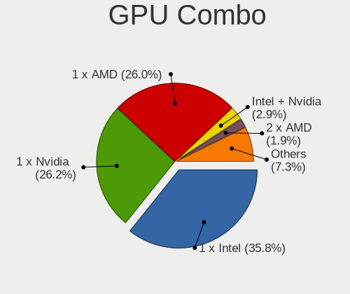

| Name           | Desktops | Percent |
|----------------|----------|---------|
| 1 x Intel      | 56       | 30.94%  |
| 1 x Nvidia     | 54       | 29.83%  |
| 1 x AMD        | 54       | 29.83%  |
| Intel + Nvidia | 10       | 5.52%   |
| 2 x AMD        | 2        | 1.1%    |
| 1 x Matrox     | 2        | 1.1%    |
| Intel + AMD    | 1        | 0.55%   |
| AMD + Nvidia   | 1        | 0.55%   |
| AMD + Matrox   | 1        | 0.55%   |

GPU Driver
----------

Free vs proprietary

| Driver      | Desktops | Percent |
|-------------|----------|---------|
| Unknown     | 80       | 44.44%  |
| Free        | 73       | 40.56%  |
| Proprietary | 27       | 15%     |

GPU Memory
----------

Total video memory

| Size in GB | Desktops | Percent |
|------------|----------|---------|
| Unknown    | 123      | 68.33%  |
| 7.01-8.0   | 15       | 8.33%   |
| 3.01-4.0   | 12       | 6.67%   |
| 1.01-2.0   | 9        | 5%      |
| 0.51-1.0   | 6        | 3.33%   |
| 8.01-16.0  | 4        | 2.22%   |
| 0.01-0.5   | 4        | 2.22%   |
| 5.01-6.0   | 3        | 1.67%   |
| 2.01-3.0   | 2        | 1.11%   |
| 16.01-24.0 | 2        | 1.11%   |

Monitor
-------

Monitor Vendor
--------------

Monitor vendors

| Vendor               | Desktops | Percent |
|----------------------|----------|---------|
| Dell                 | 15       | 13.04%  |
| Samsung Electronics  | 14       | 12.17%  |
| Goldstar             | 13       | 11.3%   |
| BenQ                 | 12       | 10.43%  |
| Hewlett-Packard      | 8        | 6.96%   |
| Acer                 | 8        | 6.96%   |
| AOC                  | 7        | 6.09%   |
| Philips              | 3        | 2.61%   |
| LG Electronics       | 3        | 2.61%   |
| Unknown              | 3        | 2.61%   |
| Sceptre Tech         | 2        | 1.74%   |
| Lenovo               | 2        | 1.74%   |
| Iiyama               | 2        | 1.74%   |
| ASUSTek Computer     | 2        | 1.74%   |
| YSD                  | 1        | 0.87%   |
| ViewSonic            | 1        | 0.87%   |
| TCL                  | 1        | 0.87%   |
| Sony                 | 1        | 0.87%   |
| RTK                  | 1        | 0.87%   |
| Plain Tree Systems   | 1        | 0.87%   |
| PCT                  | 1        | 0.87%   |
| Panasonic            | 1        | 0.87%   |
| MSI                  | 1        | 0.87%   |
| Mitsubishi           | 1        | 0.87%   |
| MiTAC                | 1        | 0.87%   |
| Mi                   | 1        | 0.87%   |
| Medion               | 1        | 0.87%   |
| Lenovo Group Limited | 1        | 0.87%   |
| Idek Iiyama          | 1        | 0.87%   |
| HUAWEI               | 1        | 0.87%   |
| HKC                  | 1        | 0.87%   |
| Gigabyte Technology  | 1        | 0.87%   |
| EDI                  | 1        | 0.87%   |
| Compal               | 1        | 0.87%   |
| Ancor Communications | 1        | 0.87%   |

Monitor Model
-------------

Monitor models

| Model                                                                | Desktops | Percent |
|----------------------------------------------------------------------|----------|---------|
| BenQ PD2700U BNQ802E 3840x2160 597x336mm 27.0-inch                   | 3        | 2.44%   |
| Unknown                                                              | 3        | 2.44%   |
| Samsung Electronics LCD Monitor SyncMaster                           | 2        | 1.63%   |
| LG Electronics LCD Monitor LG FULL HD                                | 2        | 1.63%   |
| Goldstar FULL HD GSM5ABB 1920x1080 480x270mm 21.7-inch               | 2        | 1.63%   |
| Dell G3223Q DEL428C 3840x2160 708x399mm 32.0-inch                    | 2        | 1.63%   |
| BenQ GW2270 BNQ78DB 1920x1080 480x270mm 21.7-inch                    | 2        | 1.63%   |
| BenQ BenQG2222HDL BNQ785A 1920x1080 478x269mm 21.6-inch              | 2        | 1.63%   |
| YSD HDMI YSD0190 1440x900 368x207mm 16.6-inch                        | 1        | 0.81%   |
| ViewSonic VG175 VSCDD00 1280x1024 345x276mm 17.4-inch                | 1        | 0.81%   |
| TCL SMART TV TCL6586 3840x2160 1209x680mm 54.6-inch                  | 1        | 0.81%   |
| Sony SDM-HS75 SNY2400 1280x1024 338x270mm 17.0-inch                  | 1        | 0.81%   |
| Sceptre Tech Sceptre X24WG SPT2401 1920x1080 518x324mm 24.1-inch     | 1        | 0.81%   |
| Sceptre Tech Sceptre F27 SPT0AD7 1920x1080 600x330mm 27.0-inch       | 1        | 0.81%   |
| Samsung Electronics U28E850 SAM0CCD 3840x2160 608x345mm 27.5-inch    | 1        | 0.81%   |
| Samsung Electronics U28E850 SAM0CCB 3840x2160 607x345mm 27.5-inch    | 1        | 0.81%   |
| Samsung Electronics SyncMaster SAM027F 1680x1050 474x296mm 22.0-inch | 1        | 0.81%   |
| Samsung Electronics SMS27A850 SAM083C 2560x1440 518x324mm 24.1-inch  | 1        | 0.81%   |
| Samsung Electronics SMB2030N SAM0634 1600x900 440x250mm 19.9-inch    | 1        | 0.81%   |
| Samsung Electronics S34J55x SAM0F72 3440x1440 797x333mm 34.0-inch    | 1        | 0.81%   |
| Samsung Electronics S24C450 SAM09CD 1920x1080 521x293mm 23.5-inch    | 1        | 0.81%   |
| Samsung Electronics LF24T450F SAM7094 1920x1080 527x296mm 23.8-inch  | 1        | 0.81%   |
| Samsung Electronics LCD Monitor U28E590                              | 1        | 0.81%   |
| Samsung Electronics LCD Monitor SyncMaster 1680x1050                 | 1        | 0.81%   |
| Samsung Electronics LCD Monitor Odyssey G8 7680x2160                 | 1        | 0.81%   |
| Samsung Electronics LCD Monitor LS27AG32x 1920x1080                  | 1        | 0.81%   |
| Samsung Electronics LCD Monitor C24F390 1920x1080                    | 1        | 0.81%   |
| Samsung Electronics C24F390 SAM0D2C 1920x1080 521x293mm 23.5-inch    | 1        | 0.81%   |
| RTK FHD HDR RTK3B3A 1920x1080 344x195mm 15.6-inch                    | 1        | 0.81%   |
| Plain Tree Systems Monitor PTS06A5 1280x1024 337x270mm 17.0-inch     | 1        | 0.81%   |
| Philips PHL 342E2 PHLC233 2560x1080 800x335mm 34.1-inch              | 1        | 0.81%   |
| Philips PHL 276E8V PHLC18F 3840x2160 597x336mm 27.0-inch             | 1        | 0.81%   |
| Philips 190CW PHLC023 1440x900 408x255mm 18.9-inch                   | 1        | 0.81%   |
| PCT PTFBYF-22W PCT2151 1920x1080 477x268mm 21.5-inch                 | 1        | 0.81%   |
| Panasonic TV MEIC311 1920x1080 698x392mm 31.5-inch                   | 1        | 0.81%   |
| MSI G273Q MSI3CA8 2560x1440 600x340mm 27.2-inch                      | 1        | 0.81%   |
| Mitsubishi RDT195V MEL4698 1280x1024 376x301mm 19.0-inch             | 1        | 0.81%   |
| MiTAC MTC MTC27C3 1920x1080 598x336mm 27.0-inch                      | 1        | 0.81%   |
| Mi Monitor XMI23C3 1920x1080 527x293mm 23.7-inch                     | 1        | 0.81%   |
| Medion MD20666 MED3673 1920x1080 533x312mm 24.3-inch                 | 1        | 0.81%   |

Monitor Resolution
------------------

Monitor screen resolution

| Resolution         | Desktops | Percent |
|--------------------|----------|---------|
| 1920x1080 (FHD)    | 39       | 35.14%  |
| 3840x2160 (4K)     | 16       | 14.41%  |
| 2560x1440 (QHD)    | 9        | 8.11%   |
| Unknown            | 9        | 8.11%   |
| 1280x1024 (SXGA)   | 6        | 5.41%   |
| 3440x1440          | 4        | 3.6%    |
| 1920x1200 (WUXGA)  | 4        | 3.6%    |
| 1600x900 (HD+)     | 4        | 3.6%    |
| 2560x1080          | 3        | 2.7%    |
| 1680x1050 (WSXGA+) | 3        | 2.7%    |
| 1440x900 (WXGA+)   | 2        | 1.8%    |
| 1366x768 (WXGA)    | 2        | 1.8%    |
| 7680x2160          | 1        | 0.9%    |
| 7280x2160          | 1        | 0.9%    |
| 6400x2160          | 1        | 0.9%    |
| 6400x1440          | 1        | 0.9%    |
| 5760x2160          | 1        | 0.9%    |
| 4480x1440          | 1        | 0.9%    |
| 3840x1600          | 1        | 0.9%    |
| 3840x1200          | 1        | 0.9%    |
| 3840x1080          | 1        | 0.9%    |
| 3286x1080          | 1        | 0.9%    |

Monitor Diagonal
----------------

Diagonal size in inches

| Inches  | Desktops | Percent |
|---------|----------|---------|
| 27      | 18       | 16.82%  |
| 24      | 17       | 15.89%  |
| Unknown | 17       | 15.89%  |
| 21      | 13       | 12.15%  |
| 34      | 7        | 6.54%   |
| 23      | 7        | 6.54%   |
| 17      | 5        | 4.67%   |
| 31      | 4        | 3.74%   |
| 20      | 4        | 3.74%   |
| 32      | 3        | 2.8%    |
| 26      | 2        | 1.87%   |
| 22      | 2        | 1.87%   |
| 18      | 2        | 1.87%   |
| 15      | 2        | 1.87%   |
| 54      | 1        | 0.93%   |
| 37      | 1        | 0.93%   |
| 19      | 1        | 0.93%   |
| 16      | 1        | 0.93%   |

Monitor Width
-------------

Physical width

| Width in mm | Desktops | Percent |
|-------------|----------|---------|
| 501-600     | 39       | 37.86%  |
| 401-500     | 20       | 19.42%  |
| Unknown     | 17       | 16.5%   |
| 701-800     | 10       | 9.71%   |
| 301-350     | 7        | 6.8%    |
| 601-700     | 6        | 5.83%   |
| 351-400     | 2        | 1.94%   |
| 801-900     | 1        | 0.97%   |
| 1001-1500   | 1        | 0.97%   |

Aspect Ratio
------------

Proportional relationship between the width and the height

| Ratio   | Desktops | Percent |
|---------|----------|---------|
| 16/9    | 55       | 55.56%  |
| Unknown | 17       | 17.17%  |
| 16/10   | 13       | 13.13%  |
| 21/9    | 8        | 8.08%   |
| 5/4     | 6        | 6.06%   |

Monitor Area
------------

Area in inch

| Area in inch | Desktops | Percent |
|----------------|----------|---------|
| 201-250        | 24       | 22.64%  |
| 301-350        | 19       | 17.92%  |
| Unknown        | 17       | 16.04%  |
| 351-500        | 14       | 13.21%  |
| 251-300        | 12       | 11.32%  |
| 151-200        | 9        | 8.49%   |
| 141-150        | 6        | 5.66%   |
| 101-110        | 2        | 1.89%   |
| More than 1000 | 1        | 0.94%   |
| 111-120        | 1        | 0.94%   |
| 501-1000       | 1        | 0.94%   |

Pixel Density
-------------

Pixels per inch

| Density | Desktops | Percent |
|---------|----------|---------|
| 51-100  | 47       | 45.63%  |
| 101-120 | 23       | 22.33%  |
| Unknown | 17       | 16.5%   |
| 121-160 | 10       | 9.71%   |
| 161-240 | 6        | 5.83%   |

Multiple Monitors
-----------------

Total monitors connected

| Total | Desktops | Percent |
|-------|----------|---------|
| 0     | 85       | 47.22%  |
| 1     | 70       | 38.89%  |
| 2     | 19       | 10.56%  |
| 3     | 6        | 3.33%   |

Network
-------

Net Controller Vendor
---------------------

Controller vendors

| Vendor                          | Desktops | Percent |
|---------------------------------|----------|---------|
| Realtek Semiconductor           | 123      | 53.71%  |
| Intel                           | 58       | 25.33%  |
| Qualcomm Atheros                | 9        | 3.93%   |
| Nvidia                          | 9        | 3.93%   |
| MediaTek                        | 4        | 1.75%   |
| Aquantia                        | 4        | 1.75%   |
| TP-Link                         | 3        | 1.31%   |
| Ralink Technology               | 3        | 1.31%   |
| Broadcom                        | 3        | 1.31%   |
| ASUSTek Computer                | 2        | 0.87%   |
| SysKonnect                      | 1        | 0.44%   |
| Raspberry Pi                    | 1        | 0.44%   |
| Qualcomm Atheros Communications | 1        | 0.44%   |
| OnePlus Technology (Shenzhen)   | 1        | 0.44%   |
| NetGear                         | 1        | 0.44%   |
| MCS                             | 1        | 0.44%   |
| IBM                             | 1        | 0.44%   |
| Emulex                          | 1        | 0.44%   |
| D-Link System                   | 1        | 0.44%   |
| D-Link                          | 1        | 0.44%   |
| Unknown                         | 1        | 0.44%   |

Net Controller Model
--------------------

Controller models

| Model                                                               | Desktops | Percent |
|---------------------------------------------------------------------|----------|---------|
| Realtek RTL8111/8168/8411 PCI Express Gigabit Ethernet Controller   | 96       | 36.78%  |
| Realtek RTL8125 2.5GbE Controller                                   | 19       | 7.28%   |
| Intel I211 Gigabit Network Connection                               | 16       | 6.13%   |
| Intel Wi-Fi 6 AX200                                                 | 10       | 3.83%   |
| Intel Ethernet Controller I225-V                                    | 9        | 3.45%   |
| Realtek RTL810xE PCI Express Fast Ethernet controller               | 6        | 2.3%    |
| Intel Ethernet Connection (2) I219-V                                | 6        | 2.3%    |
| Intel Wi-Fi 6 AX210/AX211/AX411 160MHz                              | 5        | 1.92%   |
| Nvidia MCP61 Ethernet                                               | 4        | 1.53%   |
| Intel Ethernet Connection I217-LM                                   | 4        | 1.53%   |
| Intel Alder Lake-S PCH CNVi WiFi                                    | 4        | 1.53%   |
| Nvidia MCP65 Ethernet                                               | 3        | 1.15%   |
| Intel Wireless-AC 9260                                              | 3        | 1.15%   |
| Intel 700 Series Chipset Family Wi-Fi                               | 3        | 1.15%   |
| Aquantia AQC113CS NBase-T/IEEE 802.3bz Ethernet Controller [AQtion] | 3        | 1.15%   |
| TP-Link 802.11ac WLAN Adapter                                       | 2        | 0.77%   |
| Realtek RTL8153 Gigabit Ethernet Adapter                            | 2        | 0.77%   |
| Ralink RT5370 Wireless Adapter                                      | 2        | 0.77%   |
| Qualcomm Atheros AR8131 Gigabit Ethernet                            | 2        | 0.77%   |
| MediaTek MT7922 802.11ax PCI Express Wireless Network Adapter       | 2        | 0.77%   |
| Intel Dual Band Wireless-AC 3168NGW [Stone Peak]                    | 2        | 0.77%   |
| TP-Link TL-WN722N v2/v3 [Realtek RTL8188EUS]                        | 1        | 0.38%   |
| TP-Link Archer T9UH v1 [Realtek RTL8814AU]                          | 1        | 0.38%   |
| SysKonnect SK-98xx V2.0 Gigabit Ethernet Adapter [Marvell 88E8001]  | 1        | 0.38%   |
| Realtek RTL88x2bu [AC1200 Techkey]                                  | 1        | 0.38%   |
| Realtek RTL8852BE PCIe 802.11ax Wireless Network Controller         | 1        | 0.38%   |
| Realtek RTL8822BE 802.11a/b/g/n/ac WiFi adapter                     | 1        | 0.38%   |
| Realtek RTL8821CE 802.11ac PCIe Wireless Network Adapter            | 1        | 0.38%   |
| Realtek RTL8821AE 802.11ac PCIe Wireless Network Adapter            | 1        | 0.38%   |
| Realtek RTL8812AU 802.11a/b/g/n/ac 2T2R DB WLAN Adapter             | 1        | 0.38%   |
| Realtek RTL8812AE 802.11ac PCIe Wireless Network Adapter            | 1        | 0.38%   |
| Realtek RTL8191SU 802.11n WLAN Adapter                              | 1        | 0.38%   |
| Realtek RTL8188EUS 802.11n Wireless Network Adapter                 | 1        | 0.38%   |
| Realtek RTL8188CUS 802.11n WLAN Adapter                             | 1        | 0.38%   |
| Realtek RTL-8100/8101L/8139 PCI Fast Ethernet Adapter               | 1        | 0.38%   |
| Realtek 802.11ac NIC                                                | 1        | 0.38%   |
| Raspberry Pi PicoArduino                                            | 1        | 0.38%   |
| Ralink RT5572 Wireless Adapter                                      | 1        | 0.38%   |
| Qualcomm Atheros Killer E2500 Gigabit Ethernet Controller           | 1        | 0.38%   |
| Qualcomm Atheros AR9271 802.11n                                     | 1        | 0.38%   |

Wireless Vendor
---------------

Wireless vendors

| Vendor                          | Desktops | Percent |
|---------------------------------|----------|---------|
| Intel                           | 29       | 49.15%  |
| Realtek Semiconductor           | 11       | 18.64%  |
| Qualcomm Atheros                | 4        | 6.78%   |
| MediaTek                        | 4        | 6.78%   |
| TP-Link                         | 3        | 5.08%   |
| Ralink Technology               | 3        | 5.08%   |
| ASUSTek Computer                | 2        | 3.39%   |
| Qualcomm Atheros Communications | 1        | 1.69%   |
| NetGear                         | 1        | 1.69%   |
| D-Link                          | 1        | 1.69%   |

Wireless Model
--------------

Wireless models

| Model                                                                     | Desktops | Percent |
|---------------------------------------------------------------------------|----------|---------|
| Intel Wi-Fi 6 AX200                                                       | 10       | 16.67%  |
| Intel Wi-Fi 6 AX210/AX211/AX411 160MHz                                    | 5        | 8.33%   |
| Intel Alder Lake-S PCH CNVi WiFi                                          | 4        | 6.67%   |
| Intel Wireless-AC 9260                                                    | 3        | 5%      |
| Intel 700 Series Chipset Family Wi-Fi                                     | 3        | 5%      |
| TP-Link 802.11ac WLAN Adapter                                             | 2        | 3.33%   |
| Ralink RT5370 Wireless Adapter                                            | 2        | 3.33%   |
| MediaTek MT7922 802.11ax PCI Express Wireless Network Adapter             | 2        | 3.33%   |
| Intel Dual Band Wireless-AC 3168NGW [Stone Peak]                          | 2        | 3.33%   |
| TP-Link TL-WN722N v2/v3 [Realtek RTL8188EUS]                              | 1        | 1.67%   |
| TP-Link Archer T9UH v1 [Realtek RTL8814AU]                                | 1        | 1.67%   |
| Realtek RTL88x2bu [AC1200 Techkey]                                        | 1        | 1.67%   |
| Realtek RTL8852BE PCIe 802.11ax Wireless Network Controller               | 1        | 1.67%   |
| Realtek RTL8822BE 802.11a/b/g/n/ac WiFi adapter                           | 1        | 1.67%   |
| Realtek RTL8821CE 802.11ac PCIe Wireless Network Adapter                  | 1        | 1.67%   |
| Realtek RTL8821AE 802.11ac PCIe Wireless Network Adapter                  | 1        | 1.67%   |
| Realtek RTL8812AU 802.11a/b/g/n/ac 2T2R DB WLAN Adapter                   | 1        | 1.67%   |
| Realtek RTL8812AE 802.11ac PCIe Wireless Network Adapter                  | 1        | 1.67%   |
| Realtek RTL8191SU 802.11n WLAN Adapter                                    | 1        | 1.67%   |
| Realtek RTL8188EUS 802.11n Wireless Network Adapter                       | 1        | 1.67%   |
| Realtek RTL8188CUS 802.11n WLAN Adapter                                   | 1        | 1.67%   |
| Realtek 802.11ac NIC                                                      | 1        | 1.67%   |
| Ralink RT5572 Wireless Adapter                                            | 1        | 1.67%   |
| Qualcomm Atheros AR9271 802.11n                                           | 1        | 1.67%   |
| Qualcomm Atheros AR9287 Wireless Network Adapter (PCI-Express)            | 1        | 1.67%   |
| Qualcomm Atheros AR922X Wireless Network Adapter                          | 1        | 1.67%   |
| Qualcomm Atheros AR9227 Wireless Network Adapter                          | 1        | 1.67%   |
| Qualcomm Atheros AR5416 Wireless Network Adapter [AR5008 802.11(a)bgn]    | 1        | 1.67%   |
| NetGear Nighthawk A7000 802.11ac Wireless Adapter AC1900 [Realtek 8814AU] | 1        | 1.67%   |
| MediaTek WiFi                                                             | 1        | 1.67%   |
| MediaTek MT7921K (RZ608) Wi-Fi 6E 80MHz                                   | 1        | 1.67%   |
| Intel Wireless 8260                                                       | 1        | 1.67%   |
| Intel Wireless 7260                                                       | 1        | 1.67%   |
| D-Link 802.11ac NIC                                                       | 1        | 1.67%   |
| ASUS USB-N13 802.11n Network Adapter (rev. B1) [Realtek RTL8192CU]        | 1        | 1.67%   |
| ASUS USB-N10 802.11n Network Adapter [Realtek RTL8188SU]                  | 1        | 1.67%   |

Ethernet Vendor
---------------

Ethernet vendors

| Vendor                | Desktops | Percent |
|-----------------------|----------|---------|
| Realtek Semiconductor | 123      | 63.08%  |
| Intel                 | 47       | 24.1%   |
| Nvidia                | 9        | 4.62%   |
| Qualcomm Atheros      | 5        | 2.56%   |
| Aquantia              | 4        | 2.05%   |
| Broadcom              | 3        | 1.54%   |
| SysKonnect            | 1        | 0.51%   |
| IBM                   | 1        | 0.51%   |
| Emulex                | 1        | 0.51%   |
| D-Link System         | 1        | 0.51%   |

Ethernet Model
--------------

Ethernet models

| Model                                                               | Desktops | Percent |
|---------------------------------------------------------------------|----------|---------|
| Realtek RTL8111/8168/8411 PCI Express Gigabit Ethernet Controller   | 96       | 48.73%  |
| Realtek RTL8125 2.5GbE Controller                                   | 19       | 9.64%   |
| Intel I211 Gigabit Network Connection                               | 16       | 8.12%   |
| Intel Ethernet Controller I225-V                                    | 9        | 4.57%   |
| Realtek RTL810xE PCI Express Fast Ethernet controller               | 6        | 3.05%   |
| Intel Ethernet Connection (2) I219-V                                | 6        | 3.05%   |
| Nvidia MCP61 Ethernet                                               | 4        | 2.03%   |
| Intel Ethernet Connection I217-LM                                   | 4        | 2.03%   |
| Nvidia MCP65 Ethernet                                               | 3        | 1.52%   |
| Aquantia AQC113CS NBase-T/IEEE 802.3bz Ethernet Controller [AQtion] | 3        | 1.52%   |
| Realtek RTL8153 Gigabit Ethernet Adapter                            | 2        | 1.02%   |
| Qualcomm Atheros AR8131 Gigabit Ethernet                            | 2        | 1.02%   |
| SysKonnect SK-98xx V2.0 Gigabit Ethernet Adapter [Marvell 88E8001]  | 1        | 0.51%   |
| Realtek RTL-8100/8101L/8139 PCI Fast Ethernet Adapter               | 1        | 0.51%   |
| Qualcomm Atheros Killer E2500 Gigabit Ethernet Controller           | 1        | 0.51%   |
| Qualcomm Atheros Attansic L1 Gigabit Ethernet                       | 1        | 0.51%   |
| Qualcomm Atheros AR8121/AR8113/AR8114 Gigabit or Fast Ethernet      | 1        | 0.51%   |
| Nvidia MCP77 Ethernet                                               | 1        | 0.51%   |
| Nvidia MCP51 Ethernet Controller                                    | 1        | 0.51%   |
| Intel I350 Gigabit Network Connection                               | 1        | 0.51%   |
| Intel Ethernet Connection I217-V                                    | 1        | 0.51%   |
| Intel Ethernet Connection (5) I219-LM                               | 1        | 0.51%   |
| Intel Ethernet Connection (2) I218-V                                | 1        | 0.51%   |
| Intel Ethernet Connection (17) I219-LM                              | 1        | 0.51%   |
| Intel Ethernet Connection (14) I219-V                               | 1        | 0.51%   |
| Intel Ethernet Connection (12) I219-V                               | 1        | 0.51%   |
| Intel Ethernet Connection (11) I219-LM                              | 1        | 0.51%   |
| Intel 82583V Gigabit Network Connection                             | 1        | 0.51%   |
| Intel 82579V Gigabit Network Connection                             | 1        | 0.51%   |
| Intel 82579LM Gigabit Network Connection (Lewisville)               | 1        | 0.51%   |
| Intel 82567V-2 Gigabit Network Connection                           | 1        | 0.51%   |
| Intel 82567LM-3 Gigabit Network Connection                          | 1        | 0.51%   |
| IBM IBM                                                             | 1        | 0.51%   |
| Emulex OneConnect 10Gb NIC (be3)                                    | 1        | 0.51%   |
| D-Link System DGE-528T Gigabit Ethernet Adapter                     | 1        | 0.51%   |
| Broadcom NetXtreme BCM5754 Gigabit Ethernet PCI Express             | 1        | 0.51%   |
| Broadcom NetXtreme BCM5723 Gigabit Ethernet PCIe                    | 1        | 0.51%   |
| Broadcom NetXtreme BCM5722 Gigabit Ethernet PCI Express             | 1        | 0.51%   |
| Aquantia AQC108 NBase-T/IEEE 802.3bz Ethernet Controller [AQtion]   | 1        | 0.51%   |

Net Controller Kind
-------------------

Ethernet, WiFi or modem

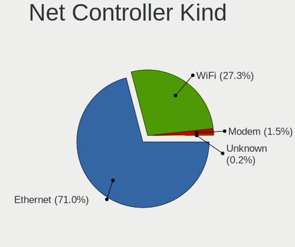

| Kind     | Desktops | Percent |
|----------|----------|---------|
| Ethernet | 179      | 75.85%  |
| WiFi     | 54       | 22.88%  |
| Unknown  | 2        | 0.85%   |
| Modem    | 1        | 0.42%   |

Used Controller
---------------

Currently used network controller

| Kind     | Desktops | Percent |
|----------|----------|---------|
| Ethernet | 157      | 86.26%  |
| WiFi     | 25       | 13.74%  |

NICs
----

Total network controllers on board

| Total | Desktops | Percent |
|-------|----------|---------|
| 1     | 130      | 72.22%  |
| 2     | 36       | 20%     |
| 3     | 9        | 5%      |
| 4     | 3        | 1.67%   |
| 9     | 1        | 0.56%   |
| 6     | 1        | 0.56%   |

IPv6
----

IPv6 vs IPv4

| Used | Desktops | Percent |
|------|----------|---------|
| No   | 148      | 82.22%  |
| Yes  | 32       | 17.78%  |

Bluetooth
---------

Bluetooth Vendor
----------------

Controller vendors

| Vendor                     | Desktops | Percent |
|----------------------------|----------|---------|
| Intel                      | 27       | 54%     |
| Realtek Semiconductor      | 7        | 14%     |
| Cambridge Silicon Radio    | 7        | 14%     |
| ASUSTek Computer           | 3        | 6%      |
| TP-Link                    | 1        | 2%      |
| MediaTek                   | 1        | 2%      |
| Integrated System Solution | 1        | 2%      |
| IMC Networks               | 1        | 2%      |
| Foxconn / Hon Hai          | 1        | 2%      |
| Broadcom                   | 1        | 2%      |

Bluetooth Model
---------------

Controller models

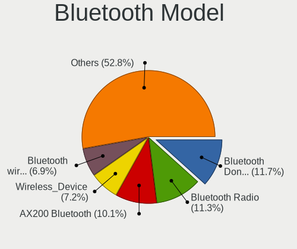

| Model                                               | Desktops | Percent |
|-----------------------------------------------------|----------|---------|
| Intel AX200 Bluetooth                               | 9        | 18%     |
| Cambridge Silicon Radio Bluetooth Dongle (HCI mode) | 7        | 14%     |
| Realtek Bluetooth Radio                             | 6        | 12%     |
| Intel AX210 Bluetooth                               | 5        | 10%     |
| Intel Bluetooth Device                              | 4        | 8%      |
| Intel Wireless-AC 9260 Bluetooth Adapter            | 3        | 6%      |
| Intel AX201 Bluetooth                               | 3        | 6%      |
| Intel Bluetooth wireless interface                  | 2        | 4%      |
| ASUS Broadcom BCM20702A0 Bluetooth                  | 2        | 4%      |
| TP-Link UB500 Adapter                               | 1        | 2%      |
| Realtek  Bluetooth 4.2 Adapter                      | 1        | 2%      |
| MediaTek Wireless_Device                            | 1        | 2%      |
| Intel Wireless-AC 3168 Bluetooth                    | 1        | 2%      |
| Integrated System Solution Bluetooth Device         | 1        | 2%      |
| IMC Networks Bluetooth Radio                        | 1        | 2%      |
| Foxconn / Hon Hai Wireless_Device                   | 1        | 2%      |
| Broadcom BCM20702A0 Bluetooth 4.0                   | 1        | 2%      |
| ASUS Bluetooth Radio                                | 1        | 2%      |

Sound
-----

Sound Vendor
------------

Sound card vendors

| Vendor                       | Desktops | Percent |
|------------------------------|----------|---------|
| Intel                        | 104      | 36.75%  |
| AMD                          | 73       | 25.8%   |
| Nvidia                       | 66       | 23.32%  |
| Creative Labs                | 5        | 1.77%   |
| C-Media Electronics          | 5        | 1.77%   |
| ASUSTek Computer             | 4        | 1.41%   |
| Realtek Semiconductor        | 3        | 1.06%   |
| Logitech                     | 3        | 1.06%   |
| Kingston Technology          | 3        | 1.06%   |
| SteelSeries ApS              | 2        | 0.71%   |
| Micro Star International     | 2        | 0.71%   |
| GN Netcom                    | 2        | 0.71%   |
| Blue Microphones             | 2        | 0.71%   |
| USB MICROPHONE               | 1        | 0.35%   |
| Texas Instruments            | 1        | 0.35%   |
| OPPO Electronics             | 1        | 0.35%   |
| Giga-Byte Technology         | 1        | 0.35%   |
| Generalplus Technology       | 1        | 0.35%   |
| Focusrite-Novation           | 1        | 0.35%   |
| Dell                         | 1        | 0.35%   |
| D&M Holdings (Denon/Marantz) | 1        | 0.35%   |
| Audient                      | 1        | 0.35%   |

Sound Model
-----------

Sound card models

| Model                                                                                           | Desktops | Percent |
|-------------------------------------------------------------------------------------------------|----------|---------|
| Intel 8 Series/C220 Series Chipset High Definition Audio Controller                             | 32       | 9.12%   |
| Intel Xeon E3-1200 v3/4th Gen Core Processor HD Audio Controller                                | 27       | 7.69%   |
| AMD Starship/Matisse HD Audio Controller                                                        | 23       | 6.55%   |
| AMD Family 17h/19h HD Audio Controller                                                          | 21       | 5.98%   |
| Nvidia GF108 High Definition Audio Controller                                                   | 17       | 4.84%   |
| Intel 200 Series PCH HD Audio                                                                   | 12       | 3.42%   |
| Intel NM10/ICH7 Family High Definition Audio Controller                                         | 9        | 2.56%   |
| Intel Alder Lake-S HD Audio Controller                                                          | 8        | 2.28%   |
| AMD Family 17h (Models 00h-0fh) HD Audio Controller                                             | 8        | 2.28%   |
| Intel 6 Series/C200 Series Chipset Family High Definition Audio Controller                      | 7        | 1.99%   |
| AMD SBx00 Azalia (Intel HDA)                                                                    | 7        | 1.99%   |
| AMD Navi 21/23 HDMI/DP Audio Controller                                                         | 7        | 1.99%   |
| AMD Baffin HDMI/DP Audio [Radeon RX 550 640SP / RX 560/560X]                                    | 7        | 1.99%   |
| Intel 700 Series Chipset Family Precise Touch and Stylus Port #1                                | 6        | 1.71%   |
| AMD Renoir Radeon High Definition Audio Controller                                              | 5        | 1.42%   |
| AMD Navi 10 HDMI Audio                                                                          | 5        | 1.42%   |
| Nvidia TU107 GeForce GTX 1650 High Definition Audio Controller                                  | 4        | 1.14%   |
| Nvidia MCP61 High Definition Audio                                                              | 4        | 1.14%   |
| Nvidia GK208 HDMI/DP Audio Controller                                                           | 4        | 1.14%   |
| Nvidia GA104 High Definition Audio Controller                                                   | 4        | 1.14%   |
| Intel 100 Series/C230 Series Chipset Family HD Audio Controller                                 | 4        | 1.14%   |
| AMD Raven/Raven2/Fenghuang HDMI/DP Audio Controller                                             | 4        | 1.14%   |
| AMD Ellesmere HDMI Audio [Radeon RX 470/480 / 570/580/590]                                      | 4        | 1.14%   |
| Nvidia MCP65 High Definition Audio                                                              | 3        | 0.85%   |
| Nvidia GP107GL High Definition Audio Controller                                                 | 3        | 0.85%   |
| Nvidia GP106 High Definition Audio Controller                                                   | 3        | 0.85%   |
| Nvidia GP104 High Definition Audio Controller                                                   | 3        | 0.85%   |
| Nvidia GA102 High Definition Audio Controller                                                   | 3        | 0.85%   |
| Intel 9 Series Chipset Family HD Audio Controller                                               | 3        | 0.85%   |
| Creative Labs CA0132 Sound Core3D [Sound Blaster Recon3D / Z-Series / Sound BlasterX AE-5 Plus] | 3        | 0.85%   |
| C-Media Electronics Audio Adapter (Unitek Y-247A)                                               | 3        | 0.85%   |
| ASUSTek Computer USB Audio                                                                      | 3        | 0.85%   |
| AMD RV710/730 HDMI Audio [Radeon HD 4000 series]                                                | 3        | 0.85%   |
| AMD Oland/Hainan/Cape Verde/Pitcairn HDMI Audio [Radeon HD 7000 Series]                         | 3        | 0.85%   |
| Nvidia TU116 High Definition Audio Controller                                                   | 2        | 0.57%   |
| Nvidia High Definition Audio Controller                                                         | 2        | 0.57%   |
| Nvidia GT216 HDMI Audio Controller                                                              | 2        | 0.57%   |
| Nvidia GP102 HDMI Audio Controller                                                              | 2        | 0.57%   |
| Nvidia GM206 High Definition Audio Controller                                                   | 2        | 0.57%   |
| Nvidia GM204 High Definition Audio Controller                                                   | 2        | 0.57%   |

Memory
------

Memory Vendor
-------------

Memory module vendors

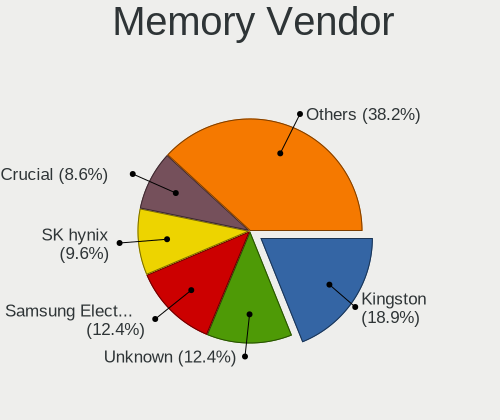

| Vendor                       | Desktops | Percent |
|------------------------------|----------|---------|
| Kingston                     | 50       | 30.12%  |
| Unknown                      | 27       | 16.27%  |
| Crucial                      | 23       | 13.86%  |
| Samsung Electronics          | 20       | 12.05%  |
| G.Skill                      | 12       | 7.23%   |
| Corsair                      | 9        | 5.42%   |
| Patriot                      | 6        | 3.61%   |
| Micron Technology            | 4        | 2.41%   |
| SK hynix                     | 3        | 1.81%   |
| A-DATA Technology            | 3        | 1.81%   |
| Unknown                      | 3        | 1.81%   |
| Unknown (0x7FFF)             | 1        | 0.6%    |
| Toshiba                      | 1        | 0.6%    |
| Team                         | 1        | 0.6%    |
| Patriot Memory (PDP Systems) | 1        | 0.6%    |
| Hikvision                    | 1        | 0.6%    |
| 48spaces                     | 1        | 0.6%    |

Memory Model
------------

Memory module models

| Model                                                   | Desktops | Percent |
|---------------------------------------------------------|----------|---------|
| Kingston RAM 99U5584-010.A00LF 4GB DIMM DDR3 1866MT/s   | 15       | 8.43%   |
| Samsung RAM M378A1K43DB2-CTD 8GB DIMM DDR4 4333MT/s     | 10       | 5.62%   |
| Patriot RAM PSD38G13332 8GB DIMM DDR3 1333MT/s          | 6        | 3.37%   |
| G.Skill RAM F4-3200C16-16GVK 16384MB DIMM DDR4 3600MT/s | 4        | 2.25%   |
| Unknown RAM Module 4GB DIMM 1066MT/s                    | 3        | 1.69%   |
| Unknown RAM Module 2GB DIMM SDRAM                       | 3        | 1.69%   |
| Unknown RAM Module 2GB DIMM 1333MT/s                    | 3        | 1.69%   |
| Corsair RAM CMK16GX4M2B3200C16 8GB DIMM DDR4 3600MT/s   | 3        | 1.69%   |
| Unknown                                                 | 3        | 1.69%   |
| Unknown RAM Module 2GB DIMM 800MT/s                     | 2        | 1.12%   |
| Unknown RAM Module 1GB DIMM SDRAM                       | 2        | 1.12%   |
| Unknown RAM Module 1GB DIMM DDR2 667MT/s                | 2        | 1.12%   |
| Unknown RAM Module 1GB DIMM 800MT/s                     | 2        | 1.12%   |
| Kingston RAM KHX3200C16D4/8GX 8GB DIMM DDR4 3600MT/s    | 2        | 1.12%   |
| Kingston RAM KHX1866C10D3/8G 8GB DIMM DDR3 2133MT/s     | 2        | 1.12%   |
| Kingston RAM KF3200C16D4/16GX 16GB DIMM DDR4 3200MT/s   | 2        | 1.12%   |
| Kingston RAM KF2666C15S4/8G 8GB SODIMM DDR4 2667MT/s    | 2        | 1.12%   |
| Kingston RAM 99U5471-012.A00LF 4GB DIMM DDR3 1600MT/s   | 2        | 1.12%   |
| Kingston RAM 9965745-039.A00G 32GB DIMM DDR4 3200MT/s   | 2        | 1.12%   |
| Kingston RAM 9905474-012.A00LF 2GB DIMM DDR3 1333MT/s   | 2        | 1.12%   |
| G.Skill RAM F5-6000J3040G32G 32GB DIMM DDR5 6000MT/s    | 2        | 1.12%   |
| G.Skill RAM F4-3600C16-16GTZNC 16GB DIMM DDR4 3600MT/s  | 2        | 1.12%   |
| Crucial RAM CT8G4DFRA266.M16FG 8GB DIMM DDR4 2666MT/s   | 2        | 1.12%   |
| Crucial RAM CT8G4DFRA266.C8FN 8GB DIMM DDR4 2866MT/s    | 2        | 1.12%   |
| Crucial RAM CT51264BA160BJ.C8F 4GB DIMM DDR3 1600MT/s   | 2        | 1.12%   |
| Crucial RAM CT4G4DFS8213.C8FAR2 4GB DIMM DDR4 2133MT/s  | 2        | 1.12%   |
| Crucial RAM CT102464BA160B.C16 8GB DIMM DDR3 1600MT/s   | 2        | 1.12%   |
| Crucial RAM BL8G32C16U4BL.M8FE 8GB DIMM DDR4 3600MT/s   | 2        | 1.12%   |
| Corsair RAM CMK32GX4M2E3200C16 16GB DIMM DDR4 3534MT/s  | 2        | 1.12%   |
| Unknown RAM Module 8GB DIMM DDR4 2133MT/s               | 1        | 0.56%   |
| Unknown RAM Module 512MB DIMM DDR2 667MT/s              | 1        | 0.56%   |
| Unknown RAM Module 512MB DIMM 667MT/s                   | 1        | 0.56%   |
| Unknown RAM Module 4GB DIMM DDR4 2400MT/s               | 1        | 0.56%   |
| Unknown RAM Module 4GB DIMM DDR 1333MT/s                | 1        | 0.56%   |
| Unknown RAM Module 4GB DIMM DDR 1066MT/s                | 1        | 0.56%   |
| Unknown RAM Module 4GB DIMM 1333MT/s                    | 1        | 0.56%   |
| Unknown RAM Module 2GB DIMM DDR2 800MT/s                | 1        | 0.56%   |
| Unknown RAM Module 2GB DIMM DDR 1333MT/s                | 1        | 0.56%   |
| Unknown RAM Module 2GB DIMM 667MT/s                     | 1        | 0.56%   |
| Unknown RAM Module 2GB DIMM 1066MT/s                    | 1        | 0.56%   |

Memory Kind
-----------

Memory module kinds

| Kind    | Desktops | Percent |
|---------|----------|---------|
| DDR4    | 72       | 45.28%  |
| DDR3    | 45       | 28.3%   |
| Unknown | 14       | 8.81%   |
| DDR5    | 10       | 6.29%   |
| DDR2    | 7        | 4.4%    |
| SDRAM   | 6        | 3.77%   |
| DDR     | 3        | 1.89%   |
| LPDDR4  | 1        | 0.63%   |
| LPDDR3  | 1        | 0.63%   |

Memory Form Factor
------------------

Physical design of the memory module

| Name         | Desktops | Percent |
|--------------|----------|---------|
| DIMM         | 146      | 92.99%  |
| SODIMM       | 10       | 6.37%   |
| Row Of Chips | 1        | 0.64%   |

Memory Size
-----------

Memory module size

| Size  | Desktops | Percent |
|-------|----------|---------|
| 8192  | 60       | 35.93%  |
| 4096  | 36       | 21.56%  |
| 2048  | 25       | 14.97%  |
| 16384 | 24       | 14.37%  |
| 32768 | 10       | 5.99%   |
| 1024  | 9        | 5.39%   |
| 512   | 2        | 1.2%    |
| 64    | 1        | 0.6%    |

Memory Speed
------------

Memory module speed

| Speed   | Desktops | Percent |
|---------|----------|---------|
| 1600    | 19       | 11.66%  |
| 3600    | 15       | 9.2%    |
| 1866    | 15       | 9.2%    |
| 1333    | 15       | 9.2%    |
| 3200    | 13       | 7.98%   |
| 4333    | 10       | 6.13%   |
| 2400    | 8        | 4.91%   |
| 2133    | 8        | 4.91%   |
| 2667    | 7        | 4.29%   |
| 800     | 6        | 3.68%   |
| Unknown | 6        | 3.68%   |
| 1066    | 5        | 3.07%   |
| 667     | 5        | 3.07%   |
| 4800    | 4        | 2.45%   |
| 6000    | 3        | 1.84%   |
| 2666    | 3        | 1.84%   |
| 5200    | 2        | 1.23%   |
| 3733    | 2        | 1.23%   |
| 3534    | 2        | 1.23%   |
| 3400    | 2        | 1.23%   |
| 2866    | 2        | 1.23%   |
| 1867    | 2        | 1.23%   |
| 6400    | 1        | 0.61%   |
| 3800    | 1        | 0.61%   |
| 3500    | 1        | 0.61%   |
| 3266    | 1        | 0.61%   |
| 3100    | 1        | 0.61%   |
| 3000    | 1        | 0.61%   |
| 2733    | 1        | 0.61%   |
| 2473    | 1        | 0.61%   |
| 1400    | 1        | 0.61%   |

Printers & scanners
-------------------

Printer Vendor
--------------

Printer device vendors

| Vendor             | Desktops | Percent |
|--------------------|----------|---------|
| Canon              | 3        | 27.27%  |
| Brother Industries | 3        | 27.27%  |
| Hewlett-Packard    | 2        | 18.18%  |
| Zebra              | 1        | 9.09%   |
| Seiko Epson        | 1        | 9.09%   |
| Dymo-CoStar        | 1        | 9.09%   |

Printer Model
-------------

Printer device models

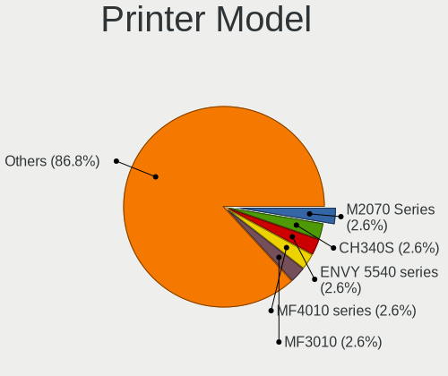

| Model                            | Desktops | Percent |
|----------------------------------|----------|---------|
| Zebra Printer                    | 1        | 9.09%   |
| Seiko Epson L6290 Series         | 1        | 9.09%   |
| HP LaserJet P2035                | 1        | 9.09%   |
| HP ENVY 5540 series              | 1        | 9.09%   |
| Dymo-CoStar DYMO LabelWriter DUO | 1        | 9.09%   |
| Canon PIXMA iP4300 Printer       | 1        | 9.09%   |
| Canon MF4010 series              | 1        | 9.09%   |
| Canon MF3010                     | 1        | 9.09%   |
| Brother HL-3040CN series         | 1        | 9.09%   |
| Brother HL-1110 series           | 1        | 9.09%   |
| Brother DCP-7030                 | 1        | 9.09%   |

Scanner Vendor
--------------

Scanner device vendors

| Vendor          | Desktops | Percent |
|-----------------|----------|---------|
| Hewlett-Packard | 1        | 50%     |
| Canon           | 1        | 50%     |

Scanner Model
-------------

Scanner device models

| Model                              | Desktops | Percent |
|------------------------------------|----------|---------|
| HP ScanJet 82x0C                   | 1        | 50%     |
| Canon CanoScan N670U/N676U/LiDE 20 | 1        | 50%     |

Camera
------

Camera Vendor
-------------

Camera device vendors

| Vendor                   | Desktops | Percent |
|--------------------------|----------|---------|
| Logitech                 | 11       | 40.74%  |
| Microsoft                | 5        | 18.52%  |
| Generalplus Technology   | 2        | 7.41%   |
| ValueHD                  | 1        | 3.7%    |
| Samsung Electronics      | 1        | 3.7%    |
| Realtek Semiconductor    | 1        | 3.7%    |
| Microdia                 | 1        | 3.7%    |
| Magic Control Technology | 1        | 3.7%    |
| Jieli Technology         | 1        | 3.7%    |
| GEMBIRD                  | 1        | 3.7%    |
| EVGA                     | 1        | 3.7%    |
| Apple                    | 1        | 3.7%    |

Camera Model
------------

Camera device models

| Model                                   | Desktops | Percent |
|-----------------------------------------|----------|---------|
| Logitech HD Pro Webcam C920             | 5        | 18.52%  |
| Logitech Webcam C270                    | 2        | 7.41%   |
| Generalplus GENERAL WEBCAM              | 2        | 7.41%   |
| ValueHD PTZOptics                       | 1        | 3.7%    |
| Samsung Galaxy series, misc. (MTP mode) | 1        | 3.7%    |
| Realtek Full HD Webcam                  | 1        | 3.7%    |
| Microsoft Modern Webcam                 | 1        | 3.7%    |
| Microsoft Microsoft LifeCam Studio    | 1        | 3.7%    |
| Microsoft LifeCam VX-800                | 1        | 3.7%    |
| Microsoft LifeCam HD-5000               | 1        | 3.7%    |
| Microsoft LifeCam HD-3000               | 1        | 3.7%    |
| Microdia Webcam Vitade AF               | 1        | 3.7%    |
| Magic Control j5 WebCam JVCU435         | 1        | 3.7%    |
| Logitech StreamCam                      | 1        | 3.7%    |
| Logitech HD Webcam C525                 | 1        | 3.7%    |
| Logitech BRIO Ultra HD Webcam           | 1        | 3.7%    |
| Logitech B525 HD Webcam                 | 1        | 3.7%    |
| Jieli USB PHY 2.0                       | 1        | 3.7%    |
| GEMBIRD USB2.0 PC CAMERA                | 1        | 3.7%    |
| EVGA XR1 Capture Box                    | 1        | 3.7%    |
| Apple iPhone 5/5C/5S/6/SE/7/8/X         | 1        | 3.7%    |

Security
--------

Fingerprint Vendor
------------------

Fingerprint sensor vendors

Zero info for selected period =(

Fingerprint Model
-----------------

Fingerprint sensor models

Zero info for selected period =(

Chipcard Vendor
---------------

Chipcard module vendors

| Vendor                | Desktops | Percent |
|-----------------------|----------|---------|
| Realtek Semiconductor | 2        | 66.67%  |
| SCM Microsystems      | 1        | 33.33%  |

Chipcard Model
--------------

Chipcard module models

| Model                                             | Desktops | Percent |
|---------------------------------------------------|----------|---------|
| Realtek Semiconductor Smart Card Reader Interface | 2        | 66.67%  |
| SCM Microsystems SCR331 SmartCard Reader          | 1        | 33.33%  |

Unsupported
-----------

Unsupported Devices
-------------------

Total unsupported devices on board

| Total | Desktops | Percent |
|-------|----------|---------|
| 0     | 89       | 49.17%  |
| 1     | 81       | 44.75%  |
| 2     | 11       | 6.08%   |

Unsupported Device Types
------------------------

Types of unsupported devices

| Type                     | Desktops | Percent |
|--------------------------|----------|---------|
| Graphics card            | 83       | 91.21%  |
| Bluetooth                | 2        | 2.2%    |
| Wireless                 | 1        | 1.1%    |
| Unassigned class         | 1        | 1.1%    |
| Net/wireless             | 1        | 1.1%    |
| Communication controller | 1        | 1.1%    |
| Chipcard                 | 1        | 1.1%    |
| Camera                   | 1        | 1.1%    |

