Debian 12 - Tested Hardware & Statistics (Desktops)
---------------------------------------------------

A project to collect tested hardware configurations for Debian 12.

Anyone can contribute to this report by the [hw-probe](https://github.com/linuxhw/hw-probe) tool:

    sudo -E hw-probe -all -upload

Please contribute! Especially if your hardware is rare.

Contents
--------

* [ Test Cases ](#test-cases)

* [ System ](#system)
  - [ Kernel                   ](#kernel)
  - [ Kernel Family            ](#kernel-family)
  - [ Kernel Major Ver.        ](#kernel-major-ver)
  - [ Arch                     ](#arch)
  - [ DE                       ](#de)
  - [ Display Server           ](#display-server)
  - [ Display Manager          ](#display-manager)
  - [ OS Lang                  ](#os-lang)
  - [ Boot Mode                ](#boot-mode)
  - [ Filesystem               ](#filesystem)
  - [ Part. scheme             ](#part-scheme)
  - [ Dual Boot with Linux/BSD ](#dual-boot-with-linuxbsd)
  - [ Dual Boot (Win)          ](#dual-boot-win)

* [ Board ](#board)
  - [ Vendor                   ](#vendor)
  - [ Model                    ](#model)
  - [ Model Family             ](#model-family)
  - [ MFG Year                 ](#mfg-year)
  - [ Form Factor              ](#form-factor)
  - [ Secure Boot              ](#secure-boot)
  - [ Coreboot                 ](#coreboot)
  - [ RAM Size                 ](#ram-size)
  - [ RAM Used                 ](#ram-used)
  - [ Total Drives             ](#total-drives)
  - [ Has CD-ROM               ](#has-cd-rom)
  - [ Has Ethernet             ](#has-ethernet)
  - [ Has WiFi                 ](#has-wifi)
  - [ Has Bluetooth            ](#has-bluetooth)

* [ Location ](#location)
  - [ Country                  ](#country)
  - [ City                     ](#city)

* [ Drives ](#drives)
  - [ Drive Vendor             ](#drive-vendor)
  - [ Drive Model              ](#drive-model)
  - [ HDD Vendor               ](#hdd-vendor)
  - [ SSD Vendor               ](#ssd-vendor)
  - [ Drive Kind               ](#drive-kind)
  - [ Drive Connector          ](#drive-connector)
  - [ Drive Size               ](#drive-size)
  - [ Space Total              ](#space-total)
  - [ Space Used               ](#space-used)
  - [ Malfunc. Drives          ](#malfunc-drives)
  - [ Malfunc. Drive Vendor    ](#malfunc-drive-vendor)
  - [ Malfunc. HDD Vendor      ](#malfunc-hdd-vendor)
  - [ Malfunc. Drive Kind      ](#malfunc-drive-kind)
  - [ Failed Drives            ](#failed-drives)
  - [ Failed Drive Vendor      ](#failed-drive-vendor)
  - [ Drive Status             ](#drive-status)

* [ Storage controller ](#storage-controller)
  - [ Storage Vendor           ](#storage-vendor)
  - [ Storage Model            ](#storage-model)
  - [ Storage Kind             ](#storage-kind)

* [ Processor ](#processor)
  - [ CPU Vendor               ](#cpu-vendor)
  - [ CPU Model                ](#cpu-model)
  - [ CPU Model Family         ](#cpu-model-family)
  - [ CPU Cores                ](#cpu-cores)
  - [ CPU Sockets              ](#cpu-sockets)
  - [ CPU Threads              ](#cpu-threads)
  - [ CPU Op-Modes             ](#cpu-op-modes)
  - [ CPU Microcode            ](#cpu-microcode)
  - [ CPU Microarch            ](#cpu-microarch)

* [ Graphics ](#graphics)
  - [ GPU Vendor               ](#gpu-vendor)
  - [ GPU Model                ](#gpu-model)
  - [ GPU Combo                ](#gpu-combo)
  - [ GPU Driver               ](#gpu-driver)
  - [ GPU Memory               ](#gpu-memory)

* [ Monitor ](#monitor)
  - [ Monitor Vendor           ](#monitor-vendor)
  - [ Monitor Model            ](#monitor-model)
  - [ Monitor Resolution       ](#monitor-resolution)
  - [ Monitor Diagonal         ](#monitor-diagonal)
  - [ Monitor Width            ](#monitor-width)
  - [ Aspect Ratio             ](#aspect-ratio)
  - [ Monitor Area             ](#monitor-area)
  - [ Pixel Density            ](#pixel-density)
  - [ Multiple Monitors        ](#multiple-monitors)

* [ Network ](#network)
  - [ Net Controller Vendor    ](#net-controller-vendor)
  - [ Net Controller Model     ](#net-controller-model)
  - [ Wireless Vendor          ](#wireless-vendor)
  - [ Wireless Model           ](#wireless-model)
  - [ Ethernet Vendor          ](#ethernet-vendor)
  - [ Ethernet Model           ](#ethernet-model)
  - [ Net Controller Kind      ](#net-controller-kind)
  - [ Used Controller          ](#used-controller)
  - [ NICs                     ](#nics)
  - [ IPv6                     ](#ipv6)

* [ Bluetooth ](#bluetooth)
  - [ Bluetooth Vendor         ](#bluetooth-vendor)
  - [ Bluetooth Model          ](#bluetooth-model)

* [ Sound ](#sound)
  - [ Sound Vendor             ](#sound-vendor)
  - [ Sound Model              ](#sound-model)

* [ Memory ](#memory)
  - [ Memory Vendor            ](#memory-vendor)
  - [ Memory Model             ](#memory-model)
  - [ Memory Kind              ](#memory-kind)
  - [ Memory Form Factor       ](#memory-form-factor)
  - [ Memory Size              ](#memory-size)
  - [ Memory Speed             ](#memory-speed)

* [ Printers & scanners ](#printers--scanners)
  - [ Printer Vendor           ](#printer-vendor)
  - [ Printer Model            ](#printer-model)
  - [ Scanner Vendor           ](#scanner-vendor)
  - [ Scanner Model            ](#scanner-model)

* [ Camera ](#camera)
  - [ Camera Vendor            ](#camera-vendor)
  - [ Camera Model             ](#camera-model)

* [ Security ](#security)
  - [ Fingerprint Vendor       ](#fingerprint-vendor)
  - [ Fingerprint Model        ](#fingerprint-model)
  - [ Chipcard Vendor          ](#chipcard-vendor)
  - [ Chipcard Model           ](#chipcard-model)

* [ Unsupported ](#unsupported)
  - [ Unsupported Devices      ](#unsupported-devices)
  - [ Unsupported Device Types ](#unsupported-device-types)

Test Cases
----------

Total: 2026

| Vendor        | Model                       | Probe                                                      | Date         |
|---------------|-----------------------------|------------------------------------------------------------|--------------|
| Gigabyte      | H310M M.2 x.x               | [fc06be20c3](https://linux-hardware.org/?probe=fc06be20c3) | May 09, 2024 |
| Gigabyte      | Z97X-Gaming 5               | [8256dfc204](https://linux-hardware.org/?probe=8256dfc204) | May 08, 2024 |
| Dell          | 0M5DCD A00                  | [3c353c281f](https://linux-hardware.org/?probe=3c353c281f) | May 08, 2024 |
| ASUSTek       | PRIME A520M-K               | [5de84bcb38](https://linux-hardware.org/?probe=5de84bcb38) | May 08, 2024 |
| HP            | 89EB 11                     | [f53a08bd5c](https://linux-hardware.org/?probe=f53a08bd5c) | May 08, 2024 |
| ASUSTek       | PRIME X570-P                | [43cb45f5c4](https://linux-hardware.org/?probe=43cb45f5c4) | May 08, 2024 |
| Dell          | 0GN6JF A01                  | [b9877feccd](https://linux-hardware.org/?probe=b9877feccd) | May 08, 2024 |
| Unknown       | Unknown                     | [857bd41fc3](https://linux-hardware.org/?probe=857bd41fc3) | May 07, 2024 |
| Fujitsu       | D3544-A1 S26361-D3544-A1... | [e04c4654da](https://linux-hardware.org/?probe=e04c4654da) | May 07, 2024 |
| Sapphire      | PI-AM3RS760G2               | [7a48c1a73b](https://linux-hardware.org/?probe=7a48c1a73b) | May 07, 2024 |
| MSI           | B450-A PRO MAX              | [27adbf1266](https://linux-hardware.org/?probe=27adbf1266) | May 07, 2024 |
| MSI           | MAG B660 TOMAHAWK WIFI D... | [5a5f459292](https://linux-hardware.org/?probe=5a5f459292) | May 06, 2024 |
| ASUSTek       | PRIME A520M-K               | [602683adef](https://linux-hardware.org/?probe=602683adef) | May 06, 2024 |
| ASUSTek       | P9X79                       | [dd0d50c3bf](https://linux-hardware.org/?probe=dd0d50c3bf) | May 06, 2024 |
| Gigabyte      | H61M-S2PV                   | [cece4d3b5e](https://linux-hardware.org/?probe=cece4d3b5e) | May 06, 2024 |
| ASRock        | H310CM-HDV                  | [1312cfac28](https://linux-hardware.org/?probe=1312cfac28) | May 06, 2024 |
| Gigabyte      | H61M-S2PV                   | [98e922adae](https://linux-hardware.org/?probe=98e922adae) | May 06, 2024 |
| ASRock        | 990FX Extreme4              | [cb063ef0b2](https://linux-hardware.org/?probe=cb063ef0b2) | May 06, 2024 |
| Supermicro    | X9SCL/X9SCMA                | [bb7e4b6de6](https://linux-hardware.org/?probe=bb7e4b6de6) | May 06, 2024 |
| Foxconn       | PANGU-B 1A32N3500-600-G     | [e2c56e50f1](https://linux-hardware.org/?probe=e2c56e50f1) | May 05, 2024 |
| Gigabyte      | B85M-D3H                    | [1d637d8802](https://linux-hardware.org/?probe=1d637d8802) | May 05, 2024 |
| SZMZ          | X99 DUAL Z8                 | [24f362dbe8](https://linux-hardware.org/?probe=24f362dbe8) | May 05, 2024 |
| Gigabyte      | H610M K DDR4                | [da4e59e69d](https://linux-hardware.org/?probe=da4e59e69d) | May 05, 2024 |
| ASUSTek       | CM6870                      | [63591686d7](https://linux-hardware.org/?probe=63591686d7) | May 05, 2024 |
| ASUSTek       | CM6870                      | [6d828aab44](https://linux-hardware.org/?probe=6d828aab44) | May 05, 2024 |
| MSI           | H110M ECO                   | [2c97e6ca20](https://linux-hardware.org/?probe=2c97e6ca20) | May 05, 2024 |
| ASRock        | 990FX Extreme4              | [4a08259d5e](https://linux-hardware.org/?probe=4a08259d5e) | May 05, 2024 |
| Gigabyte      | GA-970A-D3                  | [1ee81eb650](https://linux-hardware.org/?probe=1ee81eb650) | May 05, 2024 |
| Huanan        | X99-TF                      | [804eb7916a](https://linux-hardware.org/?probe=804eb7916a) | May 05, 2024 |
| Gigabyte      | GA-970A-D3                  | [4fa09a0b8e](https://linux-hardware.org/?probe=4fa09a0b8e) | May 04, 2024 |
| Digiboard     | G41M-S                      | [7b5f122417](https://linux-hardware.org/?probe=7b5f122417) | May 04, 2024 |
| Acer          | Veriton N4640G              | [ce50a47462](https://linux-hardware.org/?probe=ce50a47462) | May 03, 2024 |
| Gigabyte      | H310M M.2 x.x               | [1b1d2cd8c6](https://linux-hardware.org/?probe=1b1d2cd8c6) | May 02, 2024 |
| Acer          | Veriton N4640G              | [d18d5f8d9d](https://linux-hardware.org/?probe=d18d5f8d9d) | May 02, 2024 |
| Gigabyte      | X570S AORUS ELITE           | [a76ca4fae1](https://linux-hardware.org/?probe=a76ca4fae1) | May 02, 2024 |
| MSI           | MEG Z490 UNIFY              | [73e7f9d576](https://linux-hardware.org/?probe=73e7f9d576) | May 02, 2024 |
| MSI           | MS-7204                     | [5d3f1b6a58](https://linux-hardware.org/?probe=5d3f1b6a58) | May 01, 2024 |
| ASUSTek       | PRIME H510M-E               | [c3b30e066b](https://linux-hardware.org/?probe=c3b30e066b) | May 01, 2024 |
| HP            | 8906 SMVB                   | [6c9a72d2cb](https://linux-hardware.org/?probe=6c9a72d2cb) | May 01, 2024 |
| Pegatron      | 2A99                        | [fcd74433b3](https://linux-hardware.org/?probe=fcd74433b3) | Apr 30, 2024 |
| Biostar       | G41D3B                      | [748e0749c5](https://linux-hardware.org/?probe=748e0749c5) | Apr 30, 2024 |
| MSI           | B450 TOMAHAWK MAX           | [164f516c10](https://linux-hardware.org/?probe=164f516c10) | Apr 30, 2024 |
| MSI           | B450 TOMAHAWK MAX           | [38975e46ec](https://linux-hardware.org/?probe=38975e46ec) | Apr 30, 2024 |
| ASRock        | N68-S                       | [a099ad6775](https://linux-hardware.org/?probe=a099ad6775) | Apr 30, 2024 |
| Sapphire      | PI-AM3RS760G2               | [4c7535b1ac](https://linux-hardware.org/?probe=4c7535b1ac) | Apr 30, 2024 |
| Gigabyte      | H81M-S2V                    | [11f391fabc](https://linux-hardware.org/?probe=11f391fabc) | Apr 30, 2024 |
| ASUSTek       | STRIX Z270H GAMING          | [8a21aa2463](https://linux-hardware.org/?probe=8a21aa2463) | Apr 30, 2024 |
| ASRock        | 990FX Extreme4              | [56f9ef0976](https://linux-hardware.org/?probe=56f9ef0976) | Apr 30, 2024 |
| ASRock        | B560M Pro4                  | [510e90dcb8](https://linux-hardware.org/?probe=510e90dcb8) | Apr 30, 2024 |
| ASRock        | 990FX Extreme4              | [57a68c0dec](https://linux-hardware.org/?probe=57a68c0dec) | Apr 30, 2024 |
| ASRock        | 990FX Extreme4              | [4939bdb260](https://linux-hardware.org/?probe=4939bdb260) | Apr 30, 2024 |
| Gigabyte      | GA-78LMT-S2                 | [56e690c86e](https://linux-hardware.org/?probe=56e690c86e) | Apr 30, 2024 |
| PCWare        | IPMH310G PRO                | [f38e07cde2](https://linux-hardware.org/?probe=f38e07cde2) | Apr 30, 2024 |
| BCM Advanc... | MX87QD                      | [5f5deeae12](https://linux-hardware.org/?probe=5f5deeae12) | Apr 30, 2024 |
| Gigabyte      | Z790 AORUS ELITE AX         | [e0cb14de08](https://linux-hardware.org/?probe=e0cb14de08) | Apr 30, 2024 |
| ASUSTek       | M5A99X EVO                  | [aedd483ccc](https://linux-hardware.org/?probe=aedd483ccc) | Apr 29, 2024 |
| BESSTAR Te... | HM80                        | [7e9ff18aba](https://linux-hardware.org/?probe=7e9ff18aba) | Apr 29, 2024 |
| Sapphire      | PI-AM3RS760G2               | [c31443d648](https://linux-hardware.org/?probe=c31443d648) | Apr 28, 2024 |
| ASRock        | 990FX Extreme4              | [9f0eda367d](https://linux-hardware.org/?probe=9f0eda367d) | Apr 28, 2024 |
| ASRock        | 990FX Extreme4              | [06b56e10dc](https://linux-hardware.org/?probe=06b56e10dc) | Apr 28, 2024 |
| ASRock        | 990FX Extreme4              | [3e16c2d8c6](https://linux-hardware.org/?probe=3e16c2d8c6) | Apr 28, 2024 |
| ASRock        | B760M-HDV/M.2               | [01633e2e6d](https://linux-hardware.org/?probe=01633e2e6d) | Apr 28, 2024 |
| MSI           | B550M PRO-VDH WIFI          | [31af2ca036](https://linux-hardware.org/?probe=31af2ca036) | Apr 28, 2024 |
| ASRock        | 970 Pro3 R2.0               | [7918dabd8f](https://linux-hardware.org/?probe=7918dabd8f) | Apr 28, 2024 |
| AZW           | U59                         | [d310713234](https://linux-hardware.org/?probe=d310713234) | Apr 28, 2024 |
| ASRock        | 970 Pro3 R2.0               | [0902f17c99](https://linux-hardware.org/?probe=0902f17c99) | Apr 27, 2024 |
| ASRock        | 970 Pro3 R2.0               | [91449c8a93](https://linux-hardware.org/?probe=91449c8a93) | Apr 27, 2024 |
| ASRock        | B760M-HDV/M.2               | [324ac4ff48](https://linux-hardware.org/?probe=324ac4ff48) | Apr 27, 2024 |
| Fujitsu       | D3167-A1 S26361-D3167-A1    | [5182ad8bd7](https://linux-hardware.org/?probe=5182ad8bd7) | Apr 27, 2024 |
| Gigabyte      | B550I AORUS PRO AX          | [7d60545173](https://linux-hardware.org/?probe=7d60545173) | Apr 27, 2024 |
| Gigabyte      | B550I AORUS PRO AX          | [b4d4155591](https://linux-hardware.org/?probe=b4d4155591) | Apr 27, 2024 |
| ASUSTek       | P5QL-CM                     | [28a4852048](https://linux-hardware.org/?probe=28a4852048) | Apr 26, 2024 |
| ASUSTek       | P5QL-CM                     | [bf1873c20d](https://linux-hardware.org/?probe=bf1873c20d) | Apr 26, 2024 |
| Gigabyte      | H55M-UD2H                   | [6caa28f904](https://linux-hardware.org/?probe=6caa28f904) | Apr 26, 2024 |
| ASUSTek       | P7H55-M LE                  | [517a020485](https://linux-hardware.org/?probe=517a020485) | Apr 26, 2024 |
| MSI           | B550-A PRO                  | [083c88fe82](https://linux-hardware.org/?probe=083c88fe82) | Apr 26, 2024 |
| Gigabyte      | Z270-Gaming K3              | [e21d70e37d](https://linux-hardware.org/?probe=e21d70e37d) | Apr 26, 2024 |
| Gigabyte      | P75-D3                      | [496e1605e9](https://linux-hardware.org/?probe=496e1605e9) | Apr 26, 2024 |
| Gigabyte      | X570 AORUS ELITE            | [d25ca314d4](https://linux-hardware.org/?probe=d25ca314d4) | Apr 26, 2024 |
| Lenovo        | 3102 SDK0J40697 WIN 3305... | [d378d3e2a8](https://linux-hardware.org/?probe=d378d3e2a8) | Apr 26, 2024 |
| ASRock        | G31M-GS                     | [5a76ec66ed](https://linux-hardware.org/?probe=5a76ec66ed) | Apr 26, 2024 |
| HPE           | ProLiant MicroServer Gen... | [ca351b002d](https://linux-hardware.org/?probe=ca351b002d) | Apr 26, 2024 |
| ASUSTek       | P5KPL-CM                    | [8992ae65ab](https://linux-hardware.org/?probe=8992ae65ab) | Apr 26, 2024 |
| Sapphire      | PI-AM3RS760G2               | [bf18be8805](https://linux-hardware.org/?probe=bf18be8805) | Apr 26, 2024 |
| ASRock        | 990FX Extreme4              | [773cffce7f](https://linux-hardware.org/?probe=773cffce7f) | Apr 26, 2024 |
| Lenovo        | MAHOBAY 0B98401 PRO         | [a2f7e0ec28](https://linux-hardware.org/?probe=a2f7e0ec28) | Apr 26, 2024 |
| ASUSTek       | Z170 PRO GAMING             | [79f0b7e272](https://linux-hardware.org/?probe=79f0b7e272) | Apr 26, 2024 |
| ECS           | H61H2-M13                   | [677042f9b9](https://linux-hardware.org/?probe=677042f9b9) | Apr 25, 2024 |
| ASUSTek       | F2A85-M                     | [94e6f654e9](https://linux-hardware.org/?probe=94e6f654e9) | Apr 25, 2024 |
| ASRock        | 990FX Extreme4              | [7f54c26bc1](https://linux-hardware.org/?probe=7f54c26bc1) | Apr 25, 2024 |
| ASRock        | 990FX Extreme4              | [e7a56f20f9](https://linux-hardware.org/?probe=e7a56f20f9) | Apr 25, 2024 |
| ASRock        | 990FX Extreme4              | [8ed8b87e84](https://linux-hardware.org/?probe=8ed8b87e84) | Apr 25, 2024 |
| Inventec      | DQ Class A02                | [5edaa0ed95](https://linux-hardware.org/?probe=5edaa0ed95) | Apr 24, 2024 |
| ASUSTek       | P5N-MX                      | [8c9cb42e87](https://linux-hardware.org/?probe=8c9cb42e87) | Apr 24, 2024 |
| Sapphire      | PI-AM3RS760G2               | [45b756650e](https://linux-hardware.org/?probe=45b756650e) | Apr 24, 2024 |
| Sapphire      | PI-AM3RS760G2               | [1086d184b6](https://linux-hardware.org/?probe=1086d184b6) | Apr 24, 2024 |
| ASUSTek       | PRIME N100I-D D4            | [d6c9b24678](https://linux-hardware.org/?probe=d6c9b24678) | Apr 24, 2024 |
| Shenzhen M... | RPBNB                       | [37eb2f2a94](https://linux-hardware.org/?probe=37eb2f2a94) | Apr 23, 2024 |
| HP            | 895C                        | [08b147d945](https://linux-hardware.org/?probe=08b147d945) | Apr 23, 2024 |
| ASUSTek       | P5N-MX                      | [8bb509b6d7](https://linux-hardware.org/?probe=8bb509b6d7) | Apr 23, 2024 |
| ADLINK Tec... | LEC-EL A1                   | [72b115951b](https://linux-hardware.org/?probe=72b115951b) | Apr 22, 2024 |
| Gigabyte      | B650I AORUS ULTRA se2       | [0fcc20ba38](https://linux-hardware.org/?probe=0fcc20ba38) | Apr 22, 2024 |
| Gigabyte      | X570 I AORUS PRO WIFI       | [02420cbf38](https://linux-hardware.org/?probe=02420cbf38) | Apr 22, 2024 |
| HP            | 8835                        | [63962138e6](https://linux-hardware.org/?probe=63962138e6) | Apr 22, 2024 |
| ASUSTek       | PRIME H310M-R R2.0          | [2a4799164d](https://linux-hardware.org/?probe=2a4799164d) | Apr 22, 2024 |
| ASRock        | 990FX Extreme4              | [0a9ede9e09](https://linux-hardware.org/?probe=0a9ede9e09) | Apr 22, 2024 |
| ASUSTek       | PRIME H310M-R R2.0          | [4a46b6f322](https://linux-hardware.org/?probe=4a46b6f322) | Apr 22, 2024 |
| Minix         | NEO Z83-4 V1.1              | [546846d640](https://linux-hardware.org/?probe=546846d640) | Apr 22, 2024 |
| Gigabyte      | Z790 AORUS ELITE AX         | [1c066ce5e2](https://linux-hardware.org/?probe=1c066ce5e2) | Apr 21, 2024 |
| Sapphire      | PI-AM3RS760G2               | [0b6a8b8487](https://linux-hardware.org/?probe=0b6a8b8487) | Apr 21, 2024 |
| ASRock        | B550M-ITX/ac                | [6389731461](https://linux-hardware.org/?probe=6389731461) | Apr 21, 2024 |
| ASRock        | 990FX Extreme4              | [a1cc621a2f](https://linux-hardware.org/?probe=a1cc621a2f) | Apr 21, 2024 |
| ASRock        | 990FX Extreme4              | [5ff81fe9b8](https://linux-hardware.org/?probe=5ff81fe9b8) | Apr 21, 2024 |
| ASUSTek       | TUF Gaming X570-PLUS        | [1fe127b27d](https://linux-hardware.org/?probe=1fe127b27d) | Apr 21, 2024 |
| Huanan        | X99-TF V3.0 JX              | [bb51640f19](https://linux-hardware.org/?probe=bb51640f19) | Apr 21, 2024 |
| ASUSTek       | P9X79                       | [f5f0955b10](https://linux-hardware.org/?probe=f5f0955b10) | Apr 20, 2024 |
| HP            | 82A2                        | [1eeebb4829](https://linux-hardware.org/?probe=1eeebb4829) | Apr 20, 2024 |
| ASUSTek       | TUF Gaming B760M-PLUS II    | [9666b7dd0c](https://linux-hardware.org/?probe=9666b7dd0c) | Apr 20, 2024 |
| MSI           | MS-7235                     | [67ea957848](https://linux-hardware.org/?probe=67ea957848) | Apr 20, 2024 |
| ASUSTek       | TUF Gaming Z690-PLUS WIF... | [a1f1d3f4a0](https://linux-hardware.org/?probe=a1f1d3f4a0) | Apr 20, 2024 |
| ASRock        | 990FX Extreme4              | [22ba7e810f](https://linux-hardware.org/?probe=22ba7e810f) | Apr 20, 2024 |
| ASRock        | B450M Steel Legend          | [0df86cd712](https://linux-hardware.org/?probe=0df86cd712) | Apr 20, 2024 |
| ASRock        | 990FX Extreme4              | [88986725e7](https://linux-hardware.org/?probe=88986725e7) | Apr 20, 2024 |
| Fujitsu       | D3417-B1 S26361-D3417-B1    | [f0e2928850](https://linux-hardware.org/?probe=f0e2928850) | Apr 20, 2024 |
| Dell          | 0R790T A00                  | [82b384c367](https://linux-hardware.org/?probe=82b384c367) | Apr 20, 2024 |
| Gigabyte      | Z390 UD                     | [2f4860118a](https://linux-hardware.org/?probe=2f4860118a) | Apr 19, 2024 |
| Sapphire      | PI-AM3RS760G2               | [3022280b20](https://linux-hardware.org/?probe=3022280b20) | Apr 19, 2024 |
| ASRock        | 990FX Extreme4              | [018abcebe4](https://linux-hardware.org/?probe=018abcebe4) | Apr 19, 2024 |
| ASUSTek       | PRIME H310M-R R2.0          | [b1b415511d](https://linux-hardware.org/?probe=b1b415511d) | Apr 19, 2024 |
| ASUSTek       | PRIME H310M-R R2.0          | [40a4bdb47b](https://linux-hardware.org/?probe=40a4bdb47b) | Apr 19, 2024 |
| ASRock        | 990FX Extreme4              | [e65c84d822](https://linux-hardware.org/?probe=e65c84d822) | Apr 19, 2024 |
| ASRock        | 990FX Extreme4              | [d1cf256cf2](https://linux-hardware.org/?probe=d1cf256cf2) | Apr 19, 2024 |
| Dell          | 0D9JG3 A00                  | [b5c9c5d6b0](https://linux-hardware.org/?probe=b5c9c5d6b0) | Apr 19, 2024 |
| ASUSTek       | PRIME H310M-R R2.0          | [8d3a6c05f9](https://linux-hardware.org/?probe=8d3a6c05f9) | Apr 19, 2024 |
| AZW           | U59                         | [3923393266](https://linux-hardware.org/?probe=3923393266) | Apr 19, 2024 |
| ASUSTek       | H110M-D                     | [994b125f04](https://linux-hardware.org/?probe=994b125f04) | Apr 19, 2024 |
| MSI           | B450-A PRO MAX              | [1babcb92fd](https://linux-hardware.org/?probe=1babcb92fd) | Apr 18, 2024 |
| ASRock        | B450 Pro4 R2.0              | [68b9255929](https://linux-hardware.org/?probe=68b9255929) | Apr 18, 2024 |
| ASUSTek       | ROG STRIX B450-F GAMING     | [91410dd38c](https://linux-hardware.org/?probe=91410dd38c) | Apr 18, 2024 |
| ASRock        | 990FX Extreme4              | [e1f8cb5a4d](https://linux-hardware.org/?probe=e1f8cb5a4d) | Apr 18, 2024 |
| Gigabyte      | Z790 UD AC                  | [340a3e1a78](https://linux-hardware.org/?probe=340a3e1a78) | Apr 18, 2024 |
| Intel         | DH67CL AAG10212-207         | [276f923b44](https://linux-hardware.org/?probe=276f923b44) | Apr 18, 2024 |
| Lenovo        | 30D0 SDK0J40697 WIN 3305... | [24acebde2b](https://linux-hardware.org/?probe=24acebde2b) | Apr 18, 2024 |
| Gigabyte      | B450M K-CF                  | [74fb485917](https://linux-hardware.org/?probe=74fb485917) | Apr 17, 2024 |
| Intel         | H55                         | [28e666728f](https://linux-hardware.org/?probe=28e666728f) | Apr 17, 2024 |
| Gigabyte      | Z97X-Gaming 5               | [f08c90bc44](https://linux-hardware.org/?probe=f08c90bc44) | Apr 17, 2024 |
| Intel         | H55                         | [27ee1cd49f](https://linux-hardware.org/?probe=27ee1cd49f) | Apr 17, 2024 |
| MSI           | B550M PRO-VDH WIFI          | [e5f340aec0](https://linux-hardware.org/?probe=e5f340aec0) | Apr 17, 2024 |
| Lenovo        | 102F SDK0E50510 WIN 2625... | [68691105b0](https://linux-hardware.org/?probe=68691105b0) | Apr 17, 2024 |
| Lenovo        | 102F SDK0E50510 WIN 2625... | [b408b88671](https://linux-hardware.org/?probe=b408b88671) | Apr 17, 2024 |
| Intel         | ADL-F10                     | [036f5e1450](https://linux-hardware.org/?probe=036f5e1450) | Apr 16, 2024 |
| MSI           | H61M-P20                    | [17a91ba1d0](https://linux-hardware.org/?probe=17a91ba1d0) | Apr 16, 2024 |
| Sapphire      | PI-AM3RS760G2               | [cfacf09dbe](https://linux-hardware.org/?probe=cfacf09dbe) | Apr 16, 2024 |
| Intel         | D201GLY AAD81205-301        | [1b2fcf83fa](https://linux-hardware.org/?probe=1b2fcf83fa) | Apr 16, 2024 |
| Gigabyte      | GA-78LMT-S2                 | [c9be366373](https://linux-hardware.org/?probe=c9be366373) | Apr 16, 2024 |
| ASRock        | 990FX Extreme4              | [7cd3cf42ef](https://linux-hardware.org/?probe=7cd3cf42ef) | Apr 16, 2024 |
| ASRock        | 990FX Extreme4              | [fd99b7519e](https://linux-hardware.org/?probe=fd99b7519e) | Apr 16, 2024 |
| ASRock        | 990FX Extreme4              | [9c51df5a4a](https://linux-hardware.org/?probe=9c51df5a4a) | Apr 15, 2024 |
| ASRock        | 990FX Extreme4              | [4b84c41edf](https://linux-hardware.org/?probe=4b84c41edf) | Apr 15, 2024 |
| ASUSTek       | B85M-G                      | [d8294ede23](https://linux-hardware.org/?probe=d8294ede23) | Apr 15, 2024 |
| AMI           | Intel                       | [d620a9c686](https://linux-hardware.org/?probe=d620a9c686) | Apr 15, 2024 |
| ASRock        | 990FX Extreme4              | [9f29571aab](https://linux-hardware.org/?probe=9f29571aab) | Apr 14, 2024 |
| ASRock        | 990FX Extreme4              | [7259447d3b](https://linux-hardware.org/?probe=7259447d3b) | Apr 14, 2024 |
| ASRock        | FM2A88M Extreme4+           | [2ee0e2ace7](https://linux-hardware.org/?probe=2ee0e2ace7) | Apr 14, 2024 |
| ASRock        | FM2A88M Extreme4+           | [20e465155b](https://linux-hardware.org/?probe=20e465155b) | Apr 14, 2024 |
| ASRock        | X670E PG Lightning          | [e3bd195788](https://linux-hardware.org/?probe=e3bd195788) | Apr 14, 2024 |
| Gigabyte      | X570 GAMING X               | [d79972631a](https://linux-hardware.org/?probe=d79972631a) | Apr 14, 2024 |
| Gigabyte      | X570 GAMING X               | [fa6b81bbbf](https://linux-hardware.org/?probe=fa6b81bbbf) | Apr 14, 2024 |
| ASUSTek       | PRIME A320M-K               | [f3d0eefe93](https://linux-hardware.org/?probe=f3d0eefe93) | Apr 14, 2024 |
| Dell          | 0GXM1W A02                  | [7acfaf7395](https://linux-hardware.org/?probe=7acfaf7395) | Apr 14, 2024 |
| Dell          | 0GXM1W A02                  | [e10d403882](https://linux-hardware.org/?probe=e10d403882) | Apr 14, 2024 |
| Sapphire      | PI-AM3RS760G2               | [64eef30697](https://linux-hardware.org/?probe=64eef30697) | Apr 13, 2024 |
| ASRock        | 990FX Extreme4              | [14ff2613c4](https://linux-hardware.org/?probe=14ff2613c4) | Apr 13, 2024 |
| Gigabyte      | Z270X-UD3-CF                | [b3a5999470](https://linux-hardware.org/?probe=b3a5999470) | Apr 13, 2024 |
| HP            | 8053                        | [7518745fe0](https://linux-hardware.org/?probe=7518745fe0) | Apr 12, 2024 |
| ASUSTek       | P8H77-V                     | [ff2fb02615](https://linux-hardware.org/?probe=ff2fb02615) | Apr 12, 2024 |
| Lenovo        | Bantry CRB SDK0J40697 WI... | [d9ab381361](https://linux-hardware.org/?probe=d9ab381361) | Apr 12, 2024 |
| Lenovo        | Bantry CRB SDK0J40697 WI... | [861ffd6210](https://linux-hardware.org/?probe=861ffd6210) | Apr 12, 2024 |
| Lenovo        | Bantry CRB SDK0J40697 WI... | [bc8e13b93d](https://linux-hardware.org/?probe=bc8e13b93d) | Apr 12, 2024 |
| ASUSTek       | M5A97 LE R2.0               | [8d3873a49f](https://linux-hardware.org/?probe=8d3873a49f) | Apr 12, 2024 |
| HP            | 3397                        | [878192f0bd](https://linux-hardware.org/?probe=878192f0bd) | Apr 11, 2024 |
| ASUSTek       | Z170 PRO GAMING             | [026c72df1c](https://linux-hardware.org/?probe=026c72df1c) | Apr 11, 2024 |
| Lenovo        | Bantry CRB SDK0J40697 WI... | [75b741a57b](https://linux-hardware.org/?probe=75b741a57b) | Apr 11, 2024 |
| Lenovo        | Bantry CRB SDK0J40697 WI... | [ab8331fb24](https://linux-hardware.org/?probe=ab8331fb24) | Apr 11, 2024 |
| Lenovo        | Bantry CRB SDK0J40697 WI... | [204eec6335](https://linux-hardware.org/?probe=204eec6335) | Apr 11, 2024 |
| Lenovo        | Bantry CRB NOK              | [451151dc37](https://linux-hardware.org/?probe=451151dc37) | Apr 11, 2024 |
| ASUSTek       | Pro B560M-C                 | [e7a4618bc4](https://linux-hardware.org/?probe=e7a4618bc4) | Apr 11, 2024 |
| ASUSTek       | PRIME Z270-A                | [44d8afa05f](https://linux-hardware.org/?probe=44d8afa05f) | Apr 11, 2024 |
| Intel         | D845GRG AAA81583-300        | [678a3f7bf8](https://linux-hardware.org/?probe=678a3f7bf8) | Apr 10, 2024 |
| Sapphire      | PI-AM3RS760G2               | [bcb9300739](https://linux-hardware.org/?probe=bcb9300739) | Apr 10, 2024 |
| ASUSTek       | Q87T                        | [9b85fb5652](https://linux-hardware.org/?probe=9b85fb5652) | Apr 10, 2024 |
| Lenovo        | Bantry CRB SDK0J40697 WI... | [0b230ea544](https://linux-hardware.org/?probe=0b230ea544) | Apr 10, 2024 |
| Lenovo        | Bantry CRB SDK0J40697 WI... | [bdcccf8c92](https://linux-hardware.org/?probe=bdcccf8c92) | Apr 10, 2024 |
| Lenovo        | Bantry CRB SDK0J40697 WI... | [2ca0777f6f](https://linux-hardware.org/?probe=2ca0777f6f) | Apr 10, 2024 |
| GenMachine    | Ren12                       | [f5ec7252ac](https://linux-hardware.org/?probe=f5ec7252ac) | Apr 10, 2024 |
| ASUSTek       | ROG STRIX B550-I GAMING     | [09d22d5711](https://linux-hardware.org/?probe=09d22d5711) | Apr 10, 2024 |
| Lenovo        | 36E9 SDK0R32862 WIN 3258... | [e494587893](https://linux-hardware.org/?probe=e494587893) | Apr 09, 2024 |
| Sapphire      | PI-AM3RS760G2               | [79a4ac6c52](https://linux-hardware.org/?probe=79a4ac6c52) | Apr 09, 2024 |
| Lenovo        | Bantry CRB SDK0J40697 WI... | [5c33da7024](https://linux-hardware.org/?probe=5c33da7024) | Apr 09, 2024 |
| ASRock        | X570 Phantom Gaming 4       | [ffd26f8255](https://linux-hardware.org/?probe=ffd26f8255) | Apr 09, 2024 |
| HP            | 158B                        | [d7c58cf079](https://linux-hardware.org/?probe=d7c58cf079) | Apr 09, 2024 |
| Gigabyte      | GA-78LMT-S2                 | [bf17502965](https://linux-hardware.org/?probe=bf17502965) | Apr 09, 2024 |
| Fujitsu       | D3401-H1 S26361-D3401-H1    | [2f2ae87a60](https://linux-hardware.org/?probe=2f2ae87a60) | Apr 08, 2024 |
| Intel         | ADL-F10                     | [17a43967f2](https://linux-hardware.org/?probe=17a43967f2) | Apr 08, 2024 |
| MSI           | MPG B650I EDGE WIFI         | [295a425d96](https://linux-hardware.org/?probe=295a425d96) | Apr 08, 2024 |
| ASRock        | B650M Pro RS                | [8a6331a3b2](https://linux-hardware.org/?probe=8a6331a3b2) | Apr 08, 2024 |
| ASRock        | B650M Pro RS                | [9c421a9dbb](https://linux-hardware.org/?probe=9c421a9dbb) | Apr 08, 2024 |
| Lenovo        | MAHOBAY 0B98401 PRO         | [9cc14232f1](https://linux-hardware.org/?probe=9cc14232f1) | Apr 08, 2024 |
| ASUSTek       | P5KPL-CM                    | [794f80b5a2](https://linux-hardware.org/?probe=794f80b5a2) | Apr 08, 2024 |
| ASUSTek       | TUF Gaming Z790-PRO WIFI    | [6c9980ed7d](https://linux-hardware.org/?probe=6c9980ed7d) | Apr 08, 2024 |
| ASUSTek       | TUF Gaming Z790-PRO WIFI    | [08f0877b81](https://linux-hardware.org/?probe=08f0877b81) | Apr 08, 2024 |
| Gigabyte      | B85M-D3H                    | [fa70861321](https://linux-hardware.org/?probe=fa70861321) | Apr 07, 2024 |
| ASRock        | X570S PG Riptide            | [2ceec9259b](https://linux-hardware.org/?probe=2ceec9259b) | Apr 07, 2024 |
| Gigabyte      | X570 AORUS ELITE WIFI       | [ee31a1ab57](https://linux-hardware.org/?probe=ee31a1ab57) | Apr 07, 2024 |
| SolidRun      | CEX7 Platform               | [921a652a7e](https://linux-hardware.org/?probe=921a652a7e) | Apr 07, 2024 |
| Dell          | 06X1TJ A00                  | [9a4f23a1e2](https://linux-hardware.org/?probe=9a4f23a1e2) | Apr 07, 2024 |
| MSI           | B550M PRO-VDH WIFI          | [ebc11c966d](https://linux-hardware.org/?probe=ebc11c966d) | Apr 07, 2024 |
| MSI           | B550M PRO-VDH WIFI          | [c917535f70](https://linux-hardware.org/?probe=c917535f70) | Apr 06, 2024 |
| Gigabyte      | B760I AORUS PRO             | [3de78e9354](https://linux-hardware.org/?probe=3de78e9354) | Apr 06, 2024 |
| SZMZ          | X99-S3                      | [a3be3fb7ae](https://linux-hardware.org/?probe=a3be3fb7ae) | Apr 06, 2024 |
| ASUSTek       | ROG STRIX B650E-F GAMING... | [edd04ef397](https://linux-hardware.org/?probe=edd04ef397) | Apr 06, 2024 |
| ASUSTek       | M4A785-M                    | [dae4d8f0c7](https://linux-hardware.org/?probe=dae4d8f0c7) | Apr 05, 2024 |
| ASUSTek       | PRIME H410M-A               | [1cb1d0f6bf](https://linux-hardware.org/?probe=1cb1d0f6bf) | Apr 05, 2024 |
| ASUSTek       | M4A785-M                    | [1a3e173e11](https://linux-hardware.org/?probe=1a3e173e11) | Apr 05, 2024 |
| ASUSTek       | STRIX Z270G GAMING          | [67a3c40ae1](https://linux-hardware.org/?probe=67a3c40ae1) | Apr 05, 2024 |
| ASUSTek       | TUF Gaming B460-PLUS        | [3c7ff2a204](https://linux-hardware.org/?probe=3c7ff2a204) | Apr 05, 2024 |
| ASRock        | 990FX Extreme4              | [b2df81d7c6](https://linux-hardware.org/?probe=b2df81d7c6) | Apr 05, 2024 |
| ASRock        | Z97 Extreme4                | [b3391cd116](https://linux-hardware.org/?probe=b3391cd116) | Apr 05, 2024 |
| ASUSTek       | PRIME Z270-AR               | [d994e7a27c](https://linux-hardware.org/?probe=d994e7a27c) | Apr 05, 2024 |
| ASUSTek       | PRIME Z270-AR               | [f4fc63ac25](https://linux-hardware.org/?probe=f4fc63ac25) | Apr 05, 2024 |
| Lenovo        | 36C7 SDK0J40697 WIN 3305... | [09d25c6ea8](https://linux-hardware.org/?probe=09d25c6ea8) | Apr 04, 2024 |
| Dell          | 0XKH0D A02                  | [ee1a50dbca](https://linux-hardware.org/?probe=ee1a50dbca) | Apr 04, 2024 |
| Dell          | 0PU052                      | [6555bfeb7b](https://linux-hardware.org/?probe=6555bfeb7b) | Apr 04, 2024 |
| ASRock        | B450M/ac R2.0               | [454169b7c9](https://linux-hardware.org/?probe=454169b7c9) | Apr 04, 2024 |
| Gigabyte      | B360M H                     | [acb3dd01b9](https://linux-hardware.org/?probe=acb3dd01b9) | Apr 04, 2024 |
| ASRock        | 990FX Extreme4              | [a12df57269](https://linux-hardware.org/?probe=a12df57269) | Apr 04, 2024 |
| Gigabyte      | B85M-D3H                    | [f4641bc90c](https://linux-hardware.org/?probe=f4641bc90c) | Apr 04, 2024 |
| ASRock        | 990FX Extreme4              | [648e1cbe49](https://linux-hardware.org/?probe=648e1cbe49) | Apr 04, 2024 |
| ASRock        | 990FX Extreme4              | [e41ebb7b08](https://linux-hardware.org/?probe=e41ebb7b08) | Apr 04, 2024 |
| Gigabyte      | B450M DS3H-CF               | [31a5f26be7](https://linux-hardware.org/?probe=31a5f26be7) | Apr 03, 2024 |
| ASUSTek       | G11CB                       | [372379f18a](https://linux-hardware.org/?probe=372379f18a) | Apr 03, 2024 |
| MSI           | H110M PRO-VH                | [a135bec51e](https://linux-hardware.org/?probe=a135bec51e) | Apr 03, 2024 |
| Supermicro    | X8ST3                       | [45765546f5](https://linux-hardware.org/?probe=45765546f5) | Apr 03, 2024 |
| ASRock        | H55M-LE                     | [603c13de70](https://linux-hardware.org/?probe=603c13de70) | Apr 03, 2024 |
| MSI           | MPG B550 GAMING EDGE WIF... | [29d954b3b6](https://linux-hardware.org/?probe=29d954b3b6) | Apr 03, 2024 |
| Google        | Fizz                        | [55cd95ea52](https://linux-hardware.org/?probe=55cd95ea52) | Apr 03, 2024 |
| Shenzhen M... | AHBNB OEM                   | [1c9bd6a74d](https://linux-hardware.org/?probe=1c9bd6a74d) | Apr 03, 2024 |
| Gigabyte      | Z97X-Gaming 5               | [ce53254be7](https://linux-hardware.org/?probe=ce53254be7) | Apr 02, 2024 |
| Intel         | DX58SO2 AAG10925-207        | [170582acfb](https://linux-hardware.org/?probe=170582acfb) | Apr 02, 2024 |
| Intel         | DX58SO2 AAG10925-207        | [a91ca2286f](https://linux-hardware.org/?probe=a91ca2286f) | Apr 02, 2024 |
| Dell          | 04MFRM A02                  | [588fc1d405](https://linux-hardware.org/?probe=588fc1d405) | Apr 01, 2024 |
| Gigabyte      | EP35C-DS3R                  | [bfc80c9d90](https://linux-hardware.org/?probe=bfc80c9d90) | Apr 01, 2024 |
| MSI           | X399 SLI PLUS               | [e519990ad6](https://linux-hardware.org/?probe=e519990ad6) | Apr 01, 2024 |
| ASUSTek       | PRIME B450M-K II            | [f8bc7da1fc](https://linux-hardware.org/?probe=f8bc7da1fc) | Apr 01, 2024 |
| Dell          | 0J2J3Y A00                  | [34c276b20a](https://linux-hardware.org/?probe=34c276b20a) | Mar 31, 2024 |
| Intel         | DP35DP AAD81073-207         | [8d783be6f7](https://linux-hardware.org/?probe=8d783be6f7) | Mar 31, 2024 |
| MSI           | B550M PRO-VDH WIFI          | [9f092af8fc](https://linux-hardware.org/?probe=9f092af8fc) | Mar 31, 2024 |
| Unknown       | Unknown                     | [1c48ba772e](https://linux-hardware.org/?probe=1c48ba772e) | Mar 31, 2024 |
| ASUSTek       | PRIME B660M-A AC D4         | [09927387b6](https://linux-hardware.org/?probe=09927387b6) | Mar 31, 2024 |
| ASRock        | 990FX Extreme4              | [c03a952f7a](https://linux-hardware.org/?probe=c03a952f7a) | Mar 31, 2024 |
| ASRock        | 990FX Extreme4              | [eeb5af4e4d](https://linux-hardware.org/?probe=eeb5af4e4d) | Mar 31, 2024 |
| ASRock        | 990FX Extreme4              | [45c3f7f796](https://linux-hardware.org/?probe=45c3f7f796) | Mar 31, 2024 |
| ASUSTek       | PRIME B460M-A               | [dbc70004b3](https://linux-hardware.org/?probe=dbc70004b3) | Mar 30, 2024 |
| ASUSTek       | SABERTOOTH 990FX R2.0       | [e988ec8d61](https://linux-hardware.org/?probe=e988ec8d61) | Mar 30, 2024 |
| ASUSTek       | PRIME Z690M-PLUS D4         | [0c67b02957](https://linux-hardware.org/?probe=0c67b02957) | Mar 30, 2024 |
| Gigabyte      | J1900N-D3V                  | [b79b70e996](https://linux-hardware.org/?probe=b79b70e996) | Mar 30, 2024 |
| HP            | 8463                        | [dd77e7dc68](https://linux-hardware.org/?probe=dd77e7dc68) | Mar 30, 2024 |
| ASRock        | 990FX Extreme4              | [e1a32810f8](https://linux-hardware.org/?probe=e1a32810f8) | Mar 29, 2024 |
| ASRock        | 990FX Extreme4              | [9be524311b](https://linux-hardware.org/?probe=9be524311b) | Mar 29, 2024 |
| Gigabyte      | B660M GAMING X DDR4         | [fd1414dbcb](https://linux-hardware.org/?probe=fd1414dbcb) | Mar 29, 2024 |
| JGINYUE       | X99M-PLUS D4 V3.1           | [e44ab52f45](https://linux-hardware.org/?probe=e44ab52f45) | Mar 29, 2024 |
| MSI           | X470 GAMING PLUS            | [e312018423](https://linux-hardware.org/?probe=e312018423) | Mar 29, 2024 |
| MSI           | H110M PRO-VD                | [f14980865f](https://linux-hardware.org/?probe=f14980865f) | Mar 28, 2024 |
| ASUSTek       | B85M-G                      | [e80bef29a7](https://linux-hardware.org/?probe=e80bef29a7) | Mar 28, 2024 |
| Dell          | 0WR7PY A01                  | [aa3125e137](https://linux-hardware.org/?probe=aa3125e137) | Mar 27, 2024 |
| Lenovo        | MAHOBAY 0B98401 PRO         | [31a385d0e9](https://linux-hardware.org/?probe=31a385d0e9) | Mar 27, 2024 |
| Gigabyte      | H81M-S2V                    | [af7633b712](https://linux-hardware.org/?probe=af7633b712) | Mar 27, 2024 |
| Lenovo        | ThinkServer TS440           | [063d6aafdb](https://linux-hardware.org/?probe=063d6aafdb) | Mar 27, 2024 |
| Gigabyte      | Z77-D3H                     | [f74c46802a](https://linux-hardware.org/?probe=f74c46802a) | Mar 27, 2024 |
| Dell          | 0D6H9T A00                  | [26269c60d1](https://linux-hardware.org/?probe=26269c60d1) | Mar 27, 2024 |
| MSI           | B450M MORTAR MAX            | [ae5952b714](https://linux-hardware.org/?probe=ae5952b714) | Mar 27, 2024 |
| ASUSTek       | TUF Gaming B650M-PLUS       | [f6f2e4d8d3](https://linux-hardware.org/?probe=f6f2e4d8d3) | Mar 26, 2024 |
| Biostar       | B450MX-S                    | [dd90661bff](https://linux-hardware.org/?probe=dd90661bff) | Mar 26, 2024 |
| Gigabyte      | B365M D2V                   | [bd13d968ce](https://linux-hardware.org/?probe=bd13d968ce) | Mar 26, 2024 |
| Dell          | 088DT1 A01                  | [9eb745f7d5](https://linux-hardware.org/?probe=9eb745f7d5) | Mar 26, 2024 |
| ASRock        | 990FX Extreme4              | [1652f0954c](https://linux-hardware.org/?probe=1652f0954c) | Mar 26, 2024 |
| ASRock        | 990FX Extreme4              | [e772c3db14](https://linux-hardware.org/?probe=e772c3db14) | Mar 26, 2024 |
| Gigabyte      | B760M DS3H DDR4             | [069f9b2bc9](https://linux-hardware.org/?probe=069f9b2bc9) | Mar 26, 2024 |
| Dell          | 0DR845                      | [81bc347039](https://linux-hardware.org/?probe=81bc347039) | Mar 25, 2024 |
| ASUSTek       | P5Q SE2                     | [7cad0a2b84](https://linux-hardware.org/?probe=7cad0a2b84) | Mar 24, 2024 |
| Dell          | 06D7TR A02                  | [ae3cf563b4](https://linux-hardware.org/?probe=ae3cf563b4) | Mar 24, 2024 |
| Intel         | DX58SO AAE29331-503         | [7e3d9e89de](https://linux-hardware.org/?probe=7e3d9e89de) | Mar 24, 2024 |
| MSI           | B550M PRO-VDH WIFI          | [773df1edad](https://linux-hardware.org/?probe=773df1edad) | Mar 24, 2024 |
| Packard Be... | WMCP78M                     | [854bfb4d53](https://linux-hardware.org/?probe=854bfb4d53) | Mar 24, 2024 |
| Medion        | MS-7616                     | [56b5e8ba1d](https://linux-hardware.org/?probe=56b5e8ba1d) | Mar 24, 2024 |
| Dell          | 06D7TR A02                  | [d66b1dcb1a](https://linux-hardware.org/?probe=d66b1dcb1a) | Mar 24, 2024 |
| ASUSTek       | P5Q SE PLUS                 | [54ee23abb0](https://linux-hardware.org/?probe=54ee23abb0) | Mar 24, 2024 |
| SYWZ          | S210HA Series               | [0adb0f4432](https://linux-hardware.org/?probe=0adb0f4432) | Mar 23, 2024 |
| MSI           | B450 GAMING PLUS MAX        | [04f792e4fe](https://linux-hardware.org/?probe=04f792e4fe) | Mar 23, 2024 |
| MSI           | B450 GAMING PLUS MAX        | [4629f81fff](https://linux-hardware.org/?probe=4629f81fff) | Mar 23, 2024 |
| ASUSTek       | Z170 PRO GAMING             | [b0092a8e43](https://linux-hardware.org/?probe=b0092a8e43) | Mar 23, 2024 |
| Acer          | RS880M05                    | [d4f039d786](https://linux-hardware.org/?probe=d4f039d786) | Mar 23, 2024 |
| Biostar       | B450MX-S                    | [6afcf0e275](https://linux-hardware.org/?probe=6afcf0e275) | Mar 23, 2024 |
| SYWZ          | S210HA Series               | [0fbf298970](https://linux-hardware.org/?probe=0fbf298970) | Mar 23, 2024 |
| HP            | 8266                        | [df49dd1099](https://linux-hardware.org/?probe=df49dd1099) | Mar 22, 2024 |
| HP            | 82A2                        | [fcb3205539](https://linux-hardware.org/?probe=fcb3205539) | Mar 22, 2024 |
| ASUSTek       | PRIME X670-P                | [e3c04a457d](https://linux-hardware.org/?probe=e3c04a457d) | Mar 22, 2024 |
| Lenovo        | 310B SDK0J40697 WIN 3305... | [619de50d8d](https://linux-hardware.org/?probe=619de50d8d) | Mar 22, 2024 |
| Intel         | D510MO AAE76523-403         | [4017a437d3](https://linux-hardware.org/?probe=4017a437d3) | Mar 21, 2024 |
| ASRock        | Z77 Pro3                    | [51c0a74384](https://linux-hardware.org/?probe=51c0a74384) | Mar 21, 2024 |
| MSI           | B550M PRO-VDH WIFI          | [3597d1a106](https://linux-hardware.org/?probe=3597d1a106) | Mar 21, 2024 |
| ASUSTek       | P8H61-M LX3                 | [5b4707338f](https://linux-hardware.org/?probe=5b4707338f) | Mar 21, 2024 |
| ASUSTek       | P8H61-M LX3                 | [0801a23a0f](https://linux-hardware.org/?probe=0801a23a0f) | Mar 21, 2024 |
| Gigabyte      | H61M-DS2                    | [fa35d836d3](https://linux-hardware.org/?probe=fa35d836d3) | Mar 21, 2024 |
| ASUSTek       | P8H61-M LX3                 | [bbd6d31a0c](https://linux-hardware.org/?probe=bbd6d31a0c) | Mar 21, 2024 |
| ASUSTek       | P8H61-M LX3                 | [131fa6deb3](https://linux-hardware.org/?probe=131fa6deb3) | Mar 21, 2024 |
| MSI           | G31TM-P21                   | [da55967c61](https://linux-hardware.org/?probe=da55967c61) | Mar 21, 2024 |
| Gigabyte      | H81ND2H                     | [9b5fecade5](https://linux-hardware.org/?probe=9b5fecade5) | Mar 21, 2024 |
| ASRock        | 990FX Extreme4              | [e5613c8592](https://linux-hardware.org/?probe=e5613c8592) | Mar 21, 2024 |
| ASRock        | 990FX Extreme4              | [e1da52705a](https://linux-hardware.org/?probe=e1da52705a) | Mar 21, 2024 |
| ASRock        | 990FX Extreme4              | [99789095cd](https://linux-hardware.org/?probe=99789095cd) | Mar 21, 2024 |
| Gigabyte      | H61M-S2PV                   | [a8ead75f81](https://linux-hardware.org/?probe=a8ead75f81) | Mar 20, 2024 |
| ASUSTek       | SABERTOOTH 990FX R2.0       | [b3bd8d15bb](https://linux-hardware.org/?probe=b3bd8d15bb) | Mar 20, 2024 |
| OEM           | X79G                        | [3e4d82db74](https://linux-hardware.org/?probe=3e4d82db74) | Mar 20, 2024 |
| Intel         | H55                         | [bb1c373ea6](https://linux-hardware.org/?probe=bb1c373ea6) | Mar 20, 2024 |
| ASUSTek       | PRIME Z270-A                | [1aab338075](https://linux-hardware.org/?probe=1aab338075) | Mar 20, 2024 |
| Gigabyte      | Z97-HD3                     | [d6dfd879ee](https://linux-hardware.org/?probe=d6dfd879ee) | Mar 20, 2024 |
| ASUSTek       | PRIME B460M-A               | [6d5c05f0a7](https://linux-hardware.org/?probe=6d5c05f0a7) | Mar 20, 2024 |
| ASUSTek       | PRIME H410M-R               | [5213638a3c](https://linux-hardware.org/?probe=5213638a3c) | Mar 19, 2024 |
| ASUSTek       | M5A97 PRO                   | [56aa7a5265](https://linux-hardware.org/?probe=56aa7a5265) | Mar 19, 2024 |
| Intel         | H61 V1.1                    | [eb0d3daea7](https://linux-hardware.org/?probe=eb0d3daea7) | Mar 18, 2024 |
| MSI           | MAG Z790 TOMAHAWK WIFI      | [86302bbd71](https://linux-hardware.org/?probe=86302bbd71) | Mar 18, 2024 |
| Gigabyte      | B650 AORUS ELITE AX         | [0a5c9e24b5](https://linux-hardware.org/?probe=0a5c9e24b5) | Mar 17, 2024 |
| ASUSTek       | TUF Gaming B450-PLUS II     | [b187be84a4](https://linux-hardware.org/?probe=b187be84a4) | Mar 17, 2024 |
| ASRock        | 990FX Extreme4              | [d02fd3d860](https://linux-hardware.org/?probe=d02fd3d860) | Mar 17, 2024 |
| ASRock        | 990FX Extreme4              | [3bd52dc634](https://linux-hardware.org/?probe=3bd52dc634) | Mar 17, 2024 |
| Unknown       | 1.0                         | [95713f1f4b](https://linux-hardware.org/?probe=95713f1f4b) | Mar 17, 2024 |
| ASRock        | 990FX Extreme4              | [35209a450e](https://linux-hardware.org/?probe=35209a450e) | Mar 17, 2024 |
| HP            | 2B38                        | [b0457c0f4a](https://linux-hardware.org/?probe=b0457c0f4a) | Mar 17, 2024 |
| Intel         | DB43LD AAE60577-204         | [9b9fab3f17](https://linux-hardware.org/?probe=9b9fab3f17) | Mar 17, 2024 |
| ASUSTek       | TUF Gaming B550-PLUS        | [e8e05c9b6f](https://linux-hardware.org/?probe=e8e05c9b6f) | Mar 17, 2024 |
| Gigabyte      | B660M GAMING X DDR4         | [b51fd9bc2b](https://linux-hardware.org/?probe=b51fd9bc2b) | Mar 16, 2024 |
| Gigabyte      | B660M GAMING X DDR4         | [a3a01d0403](https://linux-hardware.org/?probe=a3a01d0403) | Mar 16, 2024 |
| AZW           | GK mini                     | [afe9ed8283](https://linux-hardware.org/?probe=afe9ed8283) | Mar 16, 2024 |
| Gigabyte      | Z170-HD3P-CF                | [291b222709](https://linux-hardware.org/?probe=291b222709) | Mar 16, 2024 |
| Gigabyte      | B450M AORUS ELITE           | [d54d058ff4](https://linux-hardware.org/?probe=d54d058ff4) | Mar 16, 2024 |
| Gigabyte      | Z370 AORUS Gaming 5-CF      | [048f588fac](https://linux-hardware.org/?probe=048f588fac) | Mar 16, 2024 |
| ASUSTek       | TUF Gaming X570-PLUS        | [17aa01dfc2](https://linux-hardware.org/?probe=17aa01dfc2) | Mar 16, 2024 |
| Sapphire      | PI-AM3RS760G2               | [12ebbdd41a](https://linux-hardware.org/?probe=12ebbdd41a) | Mar 15, 2024 |
| ASUSTek       | ROG STRIX B650E-E GAMING... | [d63edacb71](https://linux-hardware.org/?probe=d63edacb71) | Mar 15, 2024 |
| ASRock        | 990FX Extreme4              | [9170891a99](https://linux-hardware.org/?probe=9170891a99) | Mar 15, 2024 |
| ASRock        | 990FX Extreme4              | [1da99640ba](https://linux-hardware.org/?probe=1da99640ba) | Mar 15, 2024 |
| ASRock        | 990FX Extreme4              | [00e6d44f41](https://linux-hardware.org/?probe=00e6d44f41) | Mar 15, 2024 |
| Gigabyte      | H61M-DS2                    | [af8cc61afe](https://linux-hardware.org/?probe=af8cc61afe) | Mar 14, 2024 |
| Gigabyte      | H61M-DS2                    | [ba3ec85a8c](https://linux-hardware.org/?probe=ba3ec85a8c) | Mar 14, 2024 |
| Sapphire      | PI-AM3RS760G2               | [1c8ceb24a1](https://linux-hardware.org/?probe=1c8ceb24a1) | Mar 14, 2024 |
| Intel         | H81                         | [e7d551c959](https://linux-hardware.org/?probe=e7d551c959) | Mar 14, 2024 |
| Gigabyte      | H81M-S2V                    | [951c32a197](https://linux-hardware.org/?probe=951c32a197) | Mar 13, 2024 |
| Sapphire      | PI-AM3RS760G2               | [d75eaeebc0](https://linux-hardware.org/?probe=d75eaeebc0) | Mar 13, 2024 |
| Intel         | X79G-A V2.0                 | [87e5ff547d](https://linux-hardware.org/?probe=87e5ff547d) | Mar 12, 2024 |
| Sapphire      | PI-AM3RS760G2               | [5391520be0](https://linux-hardware.org/?probe=5391520be0) | Mar 12, 2024 |
| ASRock        | ConRoe1333-DVI/H            | [568d966b3f](https://linux-hardware.org/?probe=568d966b3f) | Mar 12, 2024 |
| ASUSTek       | P8Z77-M                     | [9b5be8dd07](https://linux-hardware.org/?probe=9b5be8dd07) | Mar 12, 2024 |
| Dell          | 0RCPW3 A03                  | [4fcaa7c300](https://linux-hardware.org/?probe=4fcaa7c300) | Mar 12, 2024 |
| GEEKOM        | Mini IT13                   | [945ed05c48](https://linux-hardware.org/?probe=945ed05c48) | Mar 11, 2024 |
| Huanan        | X99-TF V3.0 JX              | [23c5dd18e5](https://linux-hardware.org/?probe=23c5dd18e5) | Mar 11, 2024 |
| ASRock        | B450M-HDV R4.0              | [f17a5b4720](https://linux-hardware.org/?probe=f17a5b4720) | Mar 11, 2024 |
| Gigabyte      | B75M-D3H                    | [e350a0f21a](https://linux-hardware.org/?probe=e350a0f21a) | Mar 10, 2024 |
| Inventec      | DQ Class A02                | [37d048c93a](https://linux-hardware.org/?probe=37d048c93a) | Mar 10, 2024 |
| ASRockRack    | B550D4U-2T R1.00            | [79de662be3](https://linux-hardware.org/?probe=79de662be3) | Mar 10, 2024 |
| Supermicro    | X9DR3-F                     | [4f5a5a1b7c](https://linux-hardware.org/?probe=4f5a5a1b7c) | Mar 10, 2024 |
| Sapphire      | PI-AM3RS760G2               | [1eecb13729](https://linux-hardware.org/?probe=1eecb13729) | Mar 10, 2024 |
| Sapphire      | PI-AM3RS760G2               | [79ca53b90b](https://linux-hardware.org/?probe=79ca53b90b) | Mar 09, 2024 |
| ASUSTek       | PRIME A320M-K               | [26a448f763](https://linux-hardware.org/?probe=26a448f763) | Mar 09, 2024 |
| Gigabyte      | Z790 AORUS ELITE AX         | [caa3411c2c](https://linux-hardware.org/?probe=caa3411c2c) | Mar 09, 2024 |
| ASUSTek       | PRIME Z790-P WIFI           | [3890a0c9b5](https://linux-hardware.org/?probe=3890a0c9b5) | Mar 09, 2024 |
| System76      | Thelio thelio-r2            | [f991b0cab8](https://linux-hardware.org/?probe=f991b0cab8) | Mar 09, 2024 |
| ASRock        | X570 Phantom Gaming X       | [abc44a83ff](https://linux-hardware.org/?probe=abc44a83ff) | Mar 09, 2024 |
| Intel         | BQM5                        | [36ca4efb8c](https://linux-hardware.org/?probe=36ca4efb8c) | Mar 09, 2024 |
| ASRock        | 990FX Extreme4              | [3080527b19](https://linux-hardware.org/?probe=3080527b19) | Mar 09, 2024 |
| MSI           | X99S SLI PLUS               | [310dce5320](https://linux-hardware.org/?probe=310dce5320) | Mar 09, 2024 |
| ASRock        | D1800M                      | [9098eafea6](https://linux-hardware.org/?probe=9098eafea6) | Mar 08, 2024 |
| Gigabyte      | H77N-WIFI                   | [c58d7ff7b8](https://linux-hardware.org/?probe=c58d7ff7b8) | Mar 08, 2024 |
| Dell          | 0M3918                      | [28a616adee](https://linux-hardware.org/?probe=28a616adee) | Mar 08, 2024 |
| Dell          | 0M3918                      | [4f73764337](https://linux-hardware.org/?probe=4f73764337) | Mar 08, 2024 |
| ASUSTek       | PRIME B365M-K               | [343dc1071f](https://linux-hardware.org/?probe=343dc1071f) | Mar 08, 2024 |
| MSI           | B450M MORTAR MAX            | [f5af865ffc](https://linux-hardware.org/?probe=f5af865ffc) | Mar 07, 2024 |
| Unknown       | Unknown                     | [f582976129](https://linux-hardware.org/?probe=f582976129) | Mar 07, 2024 |
| HP            | 1589                        | [624b940448](https://linux-hardware.org/?probe=624b940448) | Mar 07, 2024 |
| MSI           | B450M MORTAR MAX            | [f9ed40afc2](https://linux-hardware.org/?probe=f9ed40afc2) | Mar 06, 2024 |
| ASUSTek       | P8Z77-M                     | [031b9032f6](https://linux-hardware.org/?probe=031b9032f6) | Mar 06, 2024 |
| Hardkernel    | ODROID-H3                   | [175145ad7c](https://linux-hardware.org/?probe=175145ad7c) | Mar 06, 2024 |
| Sapphire      | PI-AM3RS760G2               | [34c6283f00](https://linux-hardware.org/?probe=34c6283f00) | Mar 05, 2024 |
| ASUSTek       | ProArt Z690-CREATOR WIFI    | [29b9dd14e6](https://linux-hardware.org/?probe=29b9dd14e6) | Mar 05, 2024 |
| HP            | ProLiant ML310e Gen8 v2     | [3b6afc68c7](https://linux-hardware.org/?probe=3b6afc68c7) | Mar 05, 2024 |
| BESSTAR Te... | HM80                        | [b0dd533b6a](https://linux-hardware.org/?probe=b0dd533b6a) | Mar 05, 2024 |
| Gigabyte      | X670 AORUS ELITE AX         | [76317bf019](https://linux-hardware.org/?probe=76317bf019) | Mar 05, 2024 |
| Biostar       | M7MKB                       | [8d1cf151f7](https://linux-hardware.org/?probe=8d1cf151f7) | Mar 05, 2024 |
| Biostar       | M7MKB                       | [bd1260c783](https://linux-hardware.org/?probe=bd1260c783) | Mar 05, 2024 |
| ASUSTek       | P8H61-M PRO                 | [888ce42ec2](https://linux-hardware.org/?probe=888ce42ec2) | Mar 04, 2024 |
| ASUSTek       | SABERTOOTH 990FX R2.0       | [4b55061676](https://linux-hardware.org/?probe=4b55061676) | Mar 04, 2024 |
| ASUSTek       | SABERTOOTH 990FX R2.0       | [6cb53dc79e](https://linux-hardware.org/?probe=6cb53dc79e) | Mar 04, 2024 |
| ASUSTek       | PRIME H310M-E R2.0          | [7105302b8d](https://linux-hardware.org/?probe=7105302b8d) | Mar 04, 2024 |
| AZW           | Green G5                    | [0d917a5d84](https://linux-hardware.org/?probe=0d917a5d84) | Mar 04, 2024 |
| Acer          | Aspire X3960                | [ac6dc6f4ce](https://linux-hardware.org/?probe=ac6dc6f4ce) | Mar 04, 2024 |
| ASUSTek       | P7H55-M SI                  | [b7775135ef](https://linux-hardware.org/?probe=b7775135ef) | Mar 04, 2024 |
| Lenovo        | 32E1 NOK                    | [f8482cdaa3](https://linux-hardware.org/?probe=f8482cdaa3) | Mar 04, 2024 |
| Unknown       | Unknown                     | [267b3b9397](https://linux-hardware.org/?probe=267b3b9397) | Mar 03, 2024 |
| ASUSTek       | PRIME A520M-E               | [42a2042f1d](https://linux-hardware.org/?probe=42a2042f1d) | Mar 03, 2024 |
| ASRock        | B760M Steel Legend WiFi     | [e693b43cc0](https://linux-hardware.org/?probe=e693b43cc0) | Mar 03, 2024 |
| Gigabyte      | GA-880GM-USB3L              | [61f2f3738a](https://linux-hardware.org/?probe=61f2f3738a) | Mar 03, 2024 |
| Gigabyte      | GA-880GM-USB3L              | [83e5cbff40](https://linux-hardware.org/?probe=83e5cbff40) | Mar 03, 2024 |
| Lenovo        | ThinkCentre M81 0385A2G     | [f66c00d744](https://linux-hardware.org/?probe=f66c00d744) | Mar 02, 2024 |
| Lenovo        | ThinkCentre M81 0385A2G     | [81dc4aff97](https://linux-hardware.org/?probe=81dc4aff97) | Mar 02, 2024 |
| ASUSTek       | ROG STRIX B550-F GAMING ... | [e36a1c7814](https://linux-hardware.org/?probe=e36a1c7814) | Mar 02, 2024 |
| MSI           | B450M PRO-M2                | [c7ea528f52](https://linux-hardware.org/?probe=c7ea528f52) | Mar 02, 2024 |
| MSI           | MAG B560M MORTAR WIFI       | [e1c6361be6](https://linux-hardware.org/?probe=e1c6361be6) | Mar 02, 2024 |
| ASRock        | H370M-ITX/ac                | [65085cd786](https://linux-hardware.org/?probe=65085cd786) | Mar 01, 2024 |
| Dell          | 0WMJ54 A01                  | [6678e6f966](https://linux-hardware.org/?probe=6678e6f966) | Mar 01, 2024 |
| Gigabyte      | X99-Gaming 5                | [0399ec813e](https://linux-hardware.org/?probe=0399ec813e) | Mar 01, 2024 |
| MSI           | B85M-G43                    | [07f9ba58d1](https://linux-hardware.org/?probe=07f9ba58d1) | Mar 01, 2024 |
| HP            | 1495                        | [ee01c60448](https://linux-hardware.org/?probe=ee01c60448) | Feb 29, 2024 |
| Intel         | DN2820FYK H24582-201        | [72aeddd030](https://linux-hardware.org/?probe=72aeddd030) | Feb 29, 2024 |
| ASUSTek       | Maximus III Formula         | [a81f1bdc21](https://linux-hardware.org/?probe=a81f1bdc21) | Feb 29, 2024 |
| ASRock        | H410M-HDV                   | [36cc5fd948](https://linux-hardware.org/?probe=36cc5fd948) | Feb 29, 2024 |
| ECS           | BAT-I                       | [073ae6ee14](https://linux-hardware.org/?probe=073ae6ee14) | Feb 28, 2024 |
| ECS           | BAT-I                       | [df04815eeb](https://linux-hardware.org/?probe=df04815eeb) | Feb 28, 2024 |
| ASUSTek       | H81M-R                      | [b1b7cec12e](https://linux-hardware.org/?probe=b1b7cec12e) | Feb 28, 2024 |
| ECS           | BAT-I                       | [800d47cce0](https://linux-hardware.org/?probe=800d47cce0) | Feb 28, 2024 |
| ECS           | BAT-I                       | [ec66a61d5d](https://linux-hardware.org/?probe=ec66a61d5d) | Feb 28, 2024 |
| Inventec      | ZQ Class A02                | [5d17abe74b](https://linux-hardware.org/?probe=5d17abe74b) | Feb 28, 2024 |
| ASUSTek       | H81M-R                      | [5e67b3baca](https://linux-hardware.org/?probe=5e67b3baca) | Feb 28, 2024 |
| ECS           | BAT-I                       | [7851503e83](https://linux-hardware.org/?probe=7851503e83) | Feb 28, 2024 |
| ECS           | BAT-I                       | [2ae8282db0](https://linux-hardware.org/?probe=2ae8282db0) | Feb 28, 2024 |
| ASUSTek       | H81M-R                      | [f68c142e54](https://linux-hardware.org/?probe=f68c142e54) | Feb 28, 2024 |
| ASRock        | H81M-VG4 R2.0               | [3ece13ca96](https://linux-hardware.org/?probe=3ece13ca96) | Feb 28, 2024 |
| ASUSTek       | TUF Z270 MARK 2             | [ae5155916f](https://linux-hardware.org/?probe=ae5155916f) | Feb 28, 2024 |
| Biostar       | G41D3C                      | [9717a25aa6](https://linux-hardware.org/?probe=9717a25aa6) | Feb 27, 2024 |
| Gigabyte      | H97-HD3                     | [d63757d6a3](https://linux-hardware.org/?probe=d63757d6a3) | Feb 27, 2024 |
| Gigabyte      | H61M-S1                     | [28003e844a](https://linux-hardware.org/?probe=28003e844a) | Feb 27, 2024 |
| Gigabyte      | A320M-S2H-CF                | [1c6d76b89e](https://linux-hardware.org/?probe=1c6d76b89e) | Feb 27, 2024 |
| ASUSTek       | P8H67-M                     | [fdbff4dbee](https://linux-hardware.org/?probe=fdbff4dbee) | Feb 27, 2024 |
| ASRock        | 990FX Extreme4              | [cd83a56af8](https://linux-hardware.org/?probe=cd83a56af8) | Feb 27, 2024 |
| ASUSTek       | Z170-A                      | [1501e42b01](https://linux-hardware.org/?probe=1501e42b01) | Feb 27, 2024 |
| Gigabyte      | B450M DS3H WIFI-CF          | [57357cc10c](https://linux-hardware.org/?probe=57357cc10c) | Feb 27, 2024 |
| ASRock        | B450M Pro4-F                | [82ad67277f](https://linux-hardware.org/?probe=82ad67277f) | Feb 27, 2024 |
| Dell          | 0WR7PY A01                  | [b3cf18859d](https://linux-hardware.org/?probe=b3cf18859d) | Feb 26, 2024 |
| Dell          | 0WR7PY A01                  | [781e201621](https://linux-hardware.org/?probe=781e201621) | Feb 26, 2024 |
| MSI           | B365M PRO-VH                | [030fdfa47e](https://linux-hardware.org/?probe=030fdfa47e) | Feb 26, 2024 |
| HP            | 3646h                       | [0b7dd1d774](https://linux-hardware.org/?probe=0b7dd1d774) | Feb 26, 2024 |
| ECS           | G31T-M9                     | [7a01032f18](https://linux-hardware.org/?probe=7a01032f18) | Feb 26, 2024 |
| ECS           | G31T-M9                     | [1b5a1b2fbe](https://linux-hardware.org/?probe=1b5a1b2fbe) | Feb 26, 2024 |
| Gigabyte      | B85M-D3H                    | [fbce03b2f2](https://linux-hardware.org/?probe=fbce03b2f2) | Feb 26, 2024 |
| ASUSTek       | STRIX Z270G GAMING          | [8ad7f250df](https://linux-hardware.org/?probe=8ad7f250df) | Feb 25, 2024 |
| Unknown       | Unknown                     | [14c3da9627](https://linux-hardware.org/?probe=14c3da9627) | Feb 25, 2024 |
| Dell          | 06D7TR A02                  | [3997e84bc6](https://linux-hardware.org/?probe=3997e84bc6) | Feb 25, 2024 |
| Shenzhen M... | F7BAA                       | [9be5a91625](https://linux-hardware.org/?probe=9be5a91625) | Feb 25, 2024 |
| Acer          | Aspire XC-105               | [ad7181f076](https://linux-hardware.org/?probe=ad7181f076) | Feb 25, 2024 |
| ASUSTek       | Q87M-E                      | [fde65d09e5](https://linux-hardware.org/?probe=fde65d09e5) | Feb 24, 2024 |
| Dell          | 0M3F6C A01                  | [a6d9ac4ceb](https://linux-hardware.org/?probe=a6d9ac4ceb) | Feb 24, 2024 |
| ASUSTek       | ROG STRIX B550-F GAMING     | [064fa8c5e8](https://linux-hardware.org/?probe=064fa8c5e8) | Feb 23, 2024 |
| Sapphire      | PI-AM3RS760G2               | [dc85539c15](https://linux-hardware.org/?probe=dc85539c15) | Feb 23, 2024 |
| MSI           | B450M PRO-M2                | [cb4de14dbc](https://linux-hardware.org/?probe=cb4de14dbc) | Feb 23, 2024 |
| ASUSTek       | PRIME B460M-A               | [faaab964ee](https://linux-hardware.org/?probe=faaab964ee) | Feb 22, 2024 |
| ASUSTek       | TUF Gaming B550M-PLUS WI... | [81f080198e](https://linux-hardware.org/?probe=81f080198e) | Feb 22, 2024 |
| Gigabyte      | B760M DS3H AX               | [a409a01e6a](https://linux-hardware.org/?probe=a409a01e6a) | Feb 22, 2024 |
| Gigabyte      | X570 AORUS MASTER           | [973fbe0a55](https://linux-hardware.org/?probe=973fbe0a55) | Feb 22, 2024 |
| Alienware     | 0PGRP5 A01                  | [4b1c4f1d09](https://linux-hardware.org/?probe=4b1c4f1d09) | Feb 21, 2024 |
| MSI           | PRO X670-P WIFI             | [0984d4145f](https://linux-hardware.org/?probe=0984d4145f) | Feb 21, 2024 |
| Fujitsu       | D3230-A1 S26361-D3230-A1    | [9c3d65e57a](https://linux-hardware.org/?probe=9c3d65e57a) | Feb 21, 2024 |
| Unknown       | Lanner 1510                 | [5dc79bba04](https://linux-hardware.org/?probe=5dc79bba04) | Feb 21, 2024 |
| ASUSTek       | ROG STRIX B550-E GAMING     | [e9af1989be](https://linux-hardware.org/?probe=e9af1989be) | Feb 21, 2024 |
| ASUSTek       | P5LD2-SE                    | [0cf69dbca1](https://linux-hardware.org/?probe=0cf69dbca1) | Feb 21, 2024 |
| ASUSTek       | VC66                        | [99329fa851](https://linux-hardware.org/?probe=99329fa851) | Feb 20, 2024 |
| Gowin Solu... | GW-MB-U01                   | [3705828f74](https://linux-hardware.org/?probe=3705828f74) | Feb 20, 2024 |
| Gigabyte      | B550 AORUS ELITE AX V2      | [f8bb2afc13](https://linux-hardware.org/?probe=f8bb2afc13) | Feb 20, 2024 |
| Dell          | 0VRWRC A00                  | [6b3b3a204b](https://linux-hardware.org/?probe=6b3b3a204b) | Feb 19, 2024 |
| Dell          | 0VRWRC A00                  | [b19dc32aca](https://linux-hardware.org/?probe=b19dc32aca) | Feb 19, 2024 |
| ASUSTek       | Z170-A                      | [a14a54ac8f](https://linux-hardware.org/?probe=a14a54ac8f) | Feb 19, 2024 |
| MSI           | MS-B1711                    | [6c87a44b5e](https://linux-hardware.org/?probe=6c87a44b5e) | Feb 19, 2024 |
| HP            | 8299                        | [8ada04898c](https://linux-hardware.org/?probe=8ada04898c) | Feb 18, 2024 |
| ASRock        | B760M Steel Legend WiFi     | [189241b2a9](https://linux-hardware.org/?probe=189241b2a9) | Feb 18, 2024 |
| Gigabyte      | B450M DS3H-CF               | [36a49f2b71](https://linux-hardware.org/?probe=36a49f2b71) | Feb 18, 2024 |
| ASUSTek       | P8Z77-V LX                  | [dae19ec723](https://linux-hardware.org/?probe=dae19ec723) | Feb 18, 2024 |
| Dell          | 09430Y A00                  | [9f8d5462dc](https://linux-hardware.org/?probe=9f8d5462dc) | Feb 18, 2024 |
| Dell          | 09430Y A00                  | [6f65212b30](https://linux-hardware.org/?probe=6f65212b30) | Feb 18, 2024 |
| ASUSTek       | ROG STRIX B550-E GAMING     | [a003d712e7](https://linux-hardware.org/?probe=a003d712e7) | Feb 18, 2024 |
| MSI           | FM2-A55M-E33                | [840f8a0855](https://linux-hardware.org/?probe=840f8a0855) | Feb 17, 2024 |
| Gowin Solu... | GW-MB-U01                   | [8f756612ce](https://linux-hardware.org/?probe=8f756612ce) | Feb 17, 2024 |
| Unknown       | KLX99                       | [f987799e6d](https://linux-hardware.org/?probe=f987799e6d) | Feb 17, 2024 |
| ASRock        | B760M Steel Legend WiFi     | [6307ab0c5c](https://linux-hardware.org/?probe=6307ab0c5c) | Feb 16, 2024 |
| Gigabyte      | H81M-S2PV                   | [db78c3ff86](https://linux-hardware.org/?probe=db78c3ff86) | Feb 16, 2024 |
| Acer          | Veriton M480                | [97843f7233](https://linux-hardware.org/?probe=97843f7233) | Feb 16, 2024 |
| Supermicro    | X9DR3-F                     | [1ce39d5a62](https://linux-hardware.org/?probe=1ce39d5a62) | Feb 16, 2024 |
| Dell          | 0WR7PY A01                  | [01a25cac2b](https://linux-hardware.org/?probe=01a25cac2b) | Feb 15, 2024 |
| ASRock        | G41M-VGS3                   | [f24334673c](https://linux-hardware.org/?probe=f24334673c) | Feb 15, 2024 |
| ASRock        | G41M-VGS3                   | [a997315810](https://linux-hardware.org/?probe=a997315810) | Feb 15, 2024 |
| ASUSTek       | B85M-G                      | [cb455b8cc6](https://linux-hardware.org/?probe=cb455b8cc6) | Feb 15, 2024 |
| Dell          | 0XR1GT A00                  | [df08346360](https://linux-hardware.org/?probe=df08346360) | Feb 14, 2024 |
| Dell          | 0XR1GT A00                  | [5e4e1c4000](https://linux-hardware.org/?probe=5e4e1c4000) | Feb 14, 2024 |
| Biostar       | B450NH                      | [973991e95a](https://linux-hardware.org/?probe=973991e95a) | Feb 14, 2024 |
| ASUSTek       | Z170-A                      | [6428e7d8bf](https://linux-hardware.org/?probe=6428e7d8bf) | Feb 14, 2024 |
| Gigabyte      | M52L-S3P                    | [342b394311](https://linux-hardware.org/?probe=342b394311) | Feb 13, 2024 |
| ASUSTek       | TUF Gaming X570-PRO         | [a4297d40d4](https://linux-hardware.org/?probe=a4297d40d4) | Feb 13, 2024 |
| ASUSTek       | B85M-G                      | [fb903aa2de](https://linux-hardware.org/?probe=fb903aa2de) | Feb 13, 2024 |
| Lenovo        | SHARKBAY NO DPK             | [e8c1265b41](https://linux-hardware.org/?probe=e8c1265b41) | Feb 13, 2024 |
| Gigabyte      | 970A-DS3P                   | [22194a7763](https://linux-hardware.org/?probe=22194a7763) | Feb 13, 2024 |
| ASUSTek       | PRIME A320M-K/BR            | [d8b81d94dd](https://linux-hardware.org/?probe=d8b81d94dd) | Feb 13, 2024 |
| Gigabyte      | Z97X-Gaming 5               | [e9061646f8](https://linux-hardware.org/?probe=e9061646f8) | Feb 12, 2024 |
| Acer          | EQ45M                       | [bccab98448](https://linux-hardware.org/?probe=bccab98448) | Feb 12, 2024 |
| Acer          | Veriton M480                | [808cfea21d](https://linux-hardware.org/?probe=808cfea21d) | Feb 12, 2024 |
| Acer          | EQ45M                       | [bd853978df](https://linux-hardware.org/?probe=bd853978df) | Feb 12, 2024 |
| Acer          | Veriton M480                | [70ea4ffae2](https://linux-hardware.org/?probe=70ea4ffae2) | Feb 12, 2024 |
| Acer          | Veriton S480G               | [91b73c9d95](https://linux-hardware.org/?probe=91b73c9d95) | Feb 12, 2024 |
| Acer          | Veriton M480                | [cd12d15067](https://linux-hardware.org/?probe=cd12d15067) | Feb 12, 2024 |
| Acer          | Veriton M480                | [3060b2b68d](https://linux-hardware.org/?probe=3060b2b68d) | Feb 12, 2024 |
| Acer          | Veriton M480                | [75068101a1](https://linux-hardware.org/?probe=75068101a1) | Feb 12, 2024 |
| Acer          | Veriton M480                | [f6093b20a9](https://linux-hardware.org/?probe=f6093b20a9) | Feb 12, 2024 |
| Acer          | Veriton M480                | [3865a5a78a](https://linux-hardware.org/?probe=3865a5a78a) | Feb 12, 2024 |
| ASRock        | 4Core1600-GLAN              | [18ede4bf05](https://linux-hardware.org/?probe=18ede4bf05) | Feb 12, 2024 |
| Gigabyte      | AB350-Gaming 3-CF           | [0fbc4b07a6](https://linux-hardware.org/?probe=0fbc4b07a6) | Feb 12, 2024 |
| HP            | 3646h                       | [8b68b9442a](https://linux-hardware.org/?probe=8b68b9442a) | Feb 11, 2024 |
| ASUSTek       | PRIME B560-PLUS             | [cd76bb2ee9](https://linux-hardware.org/?probe=cd76bb2ee9) | Feb 11, 2024 |
| Gigabyte      | Z77-HD3                     | [c89887925f](https://linux-hardware.org/?probe=c89887925f) | Feb 11, 2024 |
| MSI           | PRO Z790-A MAX WIFI         | [b899696a86](https://linux-hardware.org/?probe=b899696a86) | Feb 10, 2024 |
| Gowin Solu... | GW-MB-U01                   | [b4436f45a1](https://linux-hardware.org/?probe=b4436f45a1) | Feb 10, 2024 |
| Dell          | 08NPPY A00                  | [887c943a6c](https://linux-hardware.org/?probe=887c943a6c) | Feb 10, 2024 |
| NetGear       | ReadyNAS                    | [fa4ca7cbab](https://linux-hardware.org/?probe=fa4ca7cbab) | Feb 10, 2024 |
| Intel         | X99                         | [d4c2465bfe](https://linux-hardware.org/?probe=d4c2465bfe) | Feb 10, 2024 |
| Intel         | X99                         | [1fa5f7b075](https://linux-hardware.org/?probe=1fa5f7b075) | Feb 10, 2024 |
| Lenovo        | SHARKBAY SDK0E50510 WIN     | [e1cb948290](https://linux-hardware.org/?probe=e1cb948290) | Feb 10, 2024 |
| MSI           | X99S MPOWER                 | [b9b6a88d61](https://linux-hardware.org/?probe=b9b6a88d61) | Feb 10, 2024 |
| MSI           | PRO B550-VC                 | [22b2bb66f9](https://linux-hardware.org/?probe=22b2bb66f9) | Feb 09, 2024 |
| MSI           | PRO Z790-A MAX WIFI         | [7d3bc858b6](https://linux-hardware.org/?probe=7d3bc858b6) | Feb 09, 2024 |
| MSI           | B760 GAMING PLUS WIFI       | [a0aee2033e](https://linux-hardware.org/?probe=a0aee2033e) | Feb 09, 2024 |
| Gigabyte      | GA-M56S-S3                  | [b4b56dd0e0](https://linux-hardware.org/?probe=b4b56dd0e0) | Feb 09, 2024 |
| Lenovo        | 36EB SDK0J40700 WIN 3258... | [2c485349d8](https://linux-hardware.org/?probe=2c485349d8) | Feb 08, 2024 |
| HP            | 212B                        | [720fcf3685](https://linux-hardware.org/?probe=720fcf3685) | Feb 08, 2024 |
| Gigabyte      | H61M-DS2                    | [b8e75e61a1](https://linux-hardware.org/?probe=b8e75e61a1) | Feb 08, 2024 |
| ASRock        | B760 Pro RS/D4              | [924b3da655](https://linux-hardware.org/?probe=924b3da655) | Feb 08, 2024 |
| Gigabyte      | EP31-DS3L                   | [17a3a784b0](https://linux-hardware.org/?probe=17a3a784b0) | Feb 08, 2024 |
| Gigabyte      | B550I AORUS PRO AX          | [03fbfca08c](https://linux-hardware.org/?probe=03fbfca08c) | Feb 08, 2024 |
| ECS           | H61H2-M13                   | [40ca590999](https://linux-hardware.org/?probe=40ca590999) | Feb 08, 2024 |
| Gigabyte      | B550I AORUS PRO AX          | [0ff4b6606b](https://linux-hardware.org/?probe=0ff4b6606b) | Feb 08, 2024 |
| ASUSTek       | PRIME H270M-PLUS            | [7956ad0720](https://linux-hardware.org/?probe=7956ad0720) | Feb 08, 2024 |
| Gigabyte      | M52L-S3P                    | [50564565d6](https://linux-hardware.org/?probe=50564565d6) | Feb 07, 2024 |
| ICP / iEi     | E338 V1.0                   | [df2c3919fe](https://linux-hardware.org/?probe=df2c3919fe) | Feb 07, 2024 |
| OEM           | X79G                        | [7eb9b85189](https://linux-hardware.org/?probe=7eb9b85189) | Feb 07, 2024 |
| ASUSTek       | P6X58D PREMIUM              | [e4feb283a2](https://linux-hardware.org/?probe=e4feb283a2) | Feb 07, 2024 |
| ASUSTek       | ROG STRIX B760-I GAMING ... | [9330504797](https://linux-hardware.org/?probe=9330504797) | Feb 07, 2024 |
| American M... | K7S41GX                     | [2ea09aff2d](https://linux-hardware.org/?probe=2ea09aff2d) | Feb 07, 2024 |
| ASRock        | P45DE                       | [2dbcbb8483](https://linux-hardware.org/?probe=2dbcbb8483) | Feb 06, 2024 |
| ASUSTek       | PRIME B550M-A               | [fdc99fe4fa](https://linux-hardware.org/?probe=fdc99fe4fa) | Feb 06, 2024 |
| ASUSTek       | Z170 PRO GAMING             | [51ac9437bb](https://linux-hardware.org/?probe=51ac9437bb) | Feb 06, 2024 |
| Gigabyte      | X570S AORUS ELITE           | [bb05e3b208](https://linux-hardware.org/?probe=bb05e3b208) | Feb 06, 2024 |
| ASUSTek       | F2A85-M                     | [fb9b1f2ddb](https://linux-hardware.org/?probe=fb9b1f2ddb) | Feb 05, 2024 |
| HP            | 212B                        | [b3bc6c9d57](https://linux-hardware.org/?probe=b3bc6c9d57) | Feb 05, 2024 |
| HP            | 212B                        | [4ce740d8ad](https://linux-hardware.org/?probe=4ce740d8ad) | Feb 05, 2024 |
| HP            | 212B                        | [7ea5081cc7](https://linux-hardware.org/?probe=7ea5081cc7) | Feb 05, 2024 |
| HP            | 212B                        | [13dac46d00](https://linux-hardware.org/?probe=13dac46d00) | Feb 05, 2024 |
| HP            | 212B                        | [ca3ce84394](https://linux-hardware.org/?probe=ca3ce84394) | Feb 05, 2024 |
| HP            | 212B                        | [3e5dd21126](https://linux-hardware.org/?probe=3e5dd21126) | Feb 05, 2024 |
| HP            | 212B                        | [94722f627b](https://linux-hardware.org/?probe=94722f627b) | Feb 05, 2024 |
| HP            | 212B                        | [45ef556ddc](https://linux-hardware.org/?probe=45ef556ddc) | Feb 05, 2024 |
| HP            | 212B                        | [a289a17f37](https://linux-hardware.org/?probe=a289a17f37) | Feb 05, 2024 |
| HP            | 3399                        | [61695a8b90](https://linux-hardware.org/?probe=61695a8b90) | Feb 04, 2024 |
| ASRock        | Q1900B-ITX                  | [7b33d8adaf](https://linux-hardware.org/?probe=7b33d8adaf) | Feb 04, 2024 |
| ASRock        | Q1900B-ITX                  | [0e96f23985](https://linux-hardware.org/?probe=0e96f23985) | Feb 04, 2024 |
| ASUSTek       | ROG STRIX B450-F GAMING     | [f27df69b16](https://linux-hardware.org/?probe=f27df69b16) | Feb 03, 2024 |
| ASUSTek       | ROG STRIX B450-F GAMING     | [8a962ab826](https://linux-hardware.org/?probe=8a962ab826) | Feb 03, 2024 |
| ASUSTek       | Z170-A                      | [93f73b46ec](https://linux-hardware.org/?probe=93f73b46ec) | Feb 03, 2024 |
| Gigabyte      | B650 AORUS ELITE AX         | [12a237d742](https://linux-hardware.org/?probe=12a237d742) | Feb 03, 2024 |
| ASUSTek       | PRIME A320M-K               | [dfa3229b6d](https://linux-hardware.org/?probe=dfa3229b6d) | Feb 03, 2024 |
| MSI           | MAG Z790 TOMAHAWK WIFI      | [c06ad0ce81](https://linux-hardware.org/?probe=c06ad0ce81) | Feb 03, 2024 |
| ASRock        | A520M-HDV                   | [dbc84495cb](https://linux-hardware.org/?probe=dbc84495cb) | Feb 03, 2024 |
| ASUSTek       | PRIME X570-PRO              | [8bc4248cea](https://linux-hardware.org/?probe=8bc4248cea) | Feb 03, 2024 |
| ASUSTek       | P5K                         | [9d9a5f3fd4](https://linux-hardware.org/?probe=9d9a5f3fd4) | Feb 03, 2024 |
| ASUSTek       | P7P55D-E                    | [7173101a68](https://linux-hardware.org/?probe=7173101a68) | Feb 02, 2024 |
| Sapphire      | PI-AM3RS760G2               | [9b2e938cb4](https://linux-hardware.org/?probe=9b2e938cb4) | Feb 02, 2024 |
| Gigabyte      | B560M H                     | [84e64db583](https://linux-hardware.org/?probe=84e64db583) | Feb 02, 2024 |
| ASRock        | 990FX Extreme4              | [b412a671e4](https://linux-hardware.org/?probe=b412a671e4) | Feb 02, 2024 |
| HP            | 1998                        | [0056c33526](https://linux-hardware.org/?probe=0056c33526) | Feb 02, 2024 |
| Lenovo        | SHARKBAY NOK                | [f4caef7bf1](https://linux-hardware.org/?probe=f4caef7bf1) | Feb 02, 2024 |
| Dell          | 0G214D A00                  | [2973076de3](https://linux-hardware.org/?probe=2973076de3) | Feb 01, 2024 |
| Lenovo        | ThinkCentre M55p 8808D8U    | [763dd9417b](https://linux-hardware.org/?probe=763dd9417b) | Jan 31, 2024 |
| Gigabyte      | B85M-D3H                    | [059252dc92](https://linux-hardware.org/?probe=059252dc92) | Jan 31, 2024 |
| Dell          | 018D1Y A00                  | [28a3a41219](https://linux-hardware.org/?probe=28a3a41219) | Jan 31, 2024 |
| Unknown       | T3 MRD                      | [744984b9d3](https://linux-hardware.org/?probe=744984b9d3) | Jan 31, 2024 |
| ASUSTek       | PRIME A320M-K               | [348cad0405](https://linux-hardware.org/?probe=348cad0405) | Jan 31, 2024 |
| MSI           | H110M PRO-VD                | [29fd183b3b](https://linux-hardware.org/?probe=29fd183b3b) | Jan 31, 2024 |
| ASRock        | A520M-HDV                   | [fa42ae183a](https://linux-hardware.org/?probe=fa42ae183a) | Jan 31, 2024 |
| ASRock        | A520M-HDV                   | [23be9724fe](https://linux-hardware.org/?probe=23be9724fe) | Jan 31, 2024 |
| HP            | 1495                        | [a2017adb28](https://linux-hardware.org/?probe=a2017adb28) | Jan 30, 2024 |
| ASUSTek       | B85M-E/BR                   | [d3a20c90d1](https://linux-hardware.org/?probe=d3a20c90d1) | Jan 30, 2024 |
| ASRock        | 990FX Extreme4              | [dbb897d3e1](https://linux-hardware.org/?probe=dbb897d3e1) | Jan 30, 2024 |
| Gigabyte      | B550M AORUS ELITE           | [e5435a9682](https://linux-hardware.org/?probe=e5435a9682) | Jan 30, 2024 |
| Dell          | 0D4MD1 A00                  | [9dd5ab2544](https://linux-hardware.org/?probe=9dd5ab2544) | Jan 30, 2024 |
| Lenovo        | SHARKBAY 0B98401 PRO        | [141329c8f3](https://linux-hardware.org/?probe=141329c8f3) | Jan 29, 2024 |
| Huanan        | X99-4MF V1.0                | [63f228ae04](https://linux-hardware.org/?probe=63f228ae04) | Jan 29, 2024 |
| Shenzhen M... | F6BFC                       | [3ecbf7ef23](https://linux-hardware.org/?probe=3ecbf7ef23) | Jan 29, 2024 |
| ASRock        | X300TM-ITX                  | [c3277a6c4c](https://linux-hardware.org/?probe=c3277a6c4c) | Jan 29, 2024 |
| MSI           | MS-7060                     | [cfc1584314](https://linux-hardware.org/?probe=cfc1584314) | Jan 29, 2024 |
| HP            | 1495                        | [2bf6b5d794](https://linux-hardware.org/?probe=2bf6b5d794) | Jan 28, 2024 |
| Intel         | DX58SO AAE29331-503         | [57959fa365](https://linux-hardware.org/?probe=57959fa365) | Jan 28, 2024 |
| ASUSTek       | PRIME X570-P                | [0b1a4a9d6c](https://linux-hardware.org/?probe=0b1a4a9d6c) | Jan 28, 2024 |
| ASUSTek       | Z97-K                       | [777446f160](https://linux-hardware.org/?probe=777446f160) | Jan 28, 2024 |
| Gateway       | DS10G                       | [869339de12](https://linux-hardware.org/?probe=869339de12) | Jan 28, 2024 |
| Unknown       | Unknown                     | [52ae8cfe76](https://linux-hardware.org/?probe=52ae8cfe76) | Jan 28, 2024 |
| Unknown       | Unknown                     | [1834dd7444](https://linux-hardware.org/?probe=1834dd7444) | Jan 28, 2024 |
| Gigabyte      | H61M-D2-B3                  | [a177c22fb5](https://linux-hardware.org/?probe=a177c22fb5) | Jan 28, 2024 |
| HP            | 21EF                        | [9fcfe8d663](https://linux-hardware.org/?probe=9fcfe8d663) | Jan 28, 2024 |
| ASUSTek       | TUF Gaming B450-PLUS II     | [08f64cc902](https://linux-hardware.org/?probe=08f64cc902) | Jan 27, 2024 |
| Dell          | 042P49 A01                  | [c419b892e0](https://linux-hardware.org/?probe=c419b892e0) | Jan 27, 2024 |
| ASUSTek       | TUF Gaming B450-PLUS II     | [a6240580d2](https://linux-hardware.org/?probe=a6240580d2) | Jan 27, 2024 |
| Biostar       | A10N-8800E                  | [6035efec56](https://linux-hardware.org/?probe=6035efec56) | Jan 27, 2024 |
| ASUSTek       | ROG STRIX B550-E GAMING     | [48d7c58756](https://linux-hardware.org/?probe=48d7c58756) | Jan 27, 2024 |
| Biostar       | A10N-8800E                  | [9eab4dee46](https://linux-hardware.org/?probe=9eab4dee46) | Jan 27, 2024 |
| ASUSTek       | ROG STRIX B550-E GAMING     | [ff65cf66c3](https://linux-hardware.org/?probe=ff65cf66c3) | Jan 27, 2024 |
| Medion        | MS-7616                     | [3645021c62](https://linux-hardware.org/?probe=3645021c62) | Jan 27, 2024 |
| ASUSTek       | ROG STRIX B450-F GAMING     | [f7b37dcead](https://linux-hardware.org/?probe=f7b37dcead) | Jan 27, 2024 |
| HC Technol... | HCAR5000-MI2                | [19a4048799](https://linux-hardware.org/?probe=19a4048799) | Jan 27, 2024 |
| MSI           | MPG B550 GAMING PLUS        | [fcdc8fc8e3](https://linux-hardware.org/?probe=fcdc8fc8e3) | Jan 26, 2024 |
| ASUSTek       | Z87-C                       | [a63ba339e5](https://linux-hardware.org/?probe=a63ba339e5) | Jan 26, 2024 |
| ASUSTek       | PRIME X570-P                | [f0eb2463d7](https://linux-hardware.org/?probe=f0eb2463d7) | Jan 26, 2024 |
| ECS           | G31T-M9                     | [8af1e631e7](https://linux-hardware.org/?probe=8af1e631e7) | Jan 26, 2024 |
| MSI           | G31M3 V2                    | [b98a012c0e](https://linux-hardware.org/?probe=b98a012c0e) | Jan 26, 2024 |
| Gigabyte      | H81M-S2V                    | [42abec13ac](https://linux-hardware.org/?probe=42abec13ac) | Jan 26, 2024 |
| HP            | 2AAC                        | [d397b1b3b3](https://linux-hardware.org/?probe=d397b1b3b3) | Jan 26, 2024 |
| ASUSTek       | TUF Gaming B450-PLUS II     | [431bc1335a](https://linux-hardware.org/?probe=431bc1335a) | Jan 26, 2024 |
| ASUSTek       | PRIME B350-PLUS             | [c9df4c296f](https://linux-hardware.org/?probe=c9df4c296f) | Jan 26, 2024 |
| ASRock        | 990FX Extreme4              | [80c0bacde5](https://linux-hardware.org/?probe=80c0bacde5) | Jan 25, 2024 |
| ASRock        | 990FX Extreme4              | [70a0ef842a](https://linux-hardware.org/?probe=70a0ef842a) | Jan 25, 2024 |
| Unknown       | Unknown                     | [a1cdf62b17](https://linux-hardware.org/?probe=a1cdf62b17) | Jan 25, 2024 |
| Unknown       | Unknown                     | [a743ba7b8b](https://linux-hardware.org/?probe=a743ba7b8b) | Jan 24, 2024 |
| ECS           | G31T-M9                     | [87e9fbf4fd](https://linux-hardware.org/?probe=87e9fbf4fd) | Jan 24, 2024 |
| ASUSTek       | Z170 PRO GAMING             | [298f2d1380](https://linux-hardware.org/?probe=298f2d1380) | Jan 24, 2024 |
| ASRock        | G31M-GS                     | [8c46163f5c](https://linux-hardware.org/?probe=8c46163f5c) | Jan 24, 2024 |
| ASRock        | G31M-GS                     | [dbe6d0fdd4](https://linux-hardware.org/?probe=dbe6d0fdd4) | Jan 24, 2024 |
| Foxconn       | G33M03                      | [dd33710847](https://linux-hardware.org/?probe=dd33710847) | Jan 24, 2024 |
| ASUSTek       | P7H55-M LE                  | [a864af0be4](https://linux-hardware.org/?probe=a864af0be4) | Jan 24, 2024 |
| Gigabyte      | H55M-UD2H                   | [10c2d49a41](https://linux-hardware.org/?probe=10c2d49a41) | Jan 24, 2024 |
| Foxconn       | G33M03                      | [bd9087ac07](https://linux-hardware.org/?probe=bd9087ac07) | Jan 24, 2024 |
| ASUSTek       | H110M-R                     | [7ed41d411e](https://linux-hardware.org/?probe=7ed41d411e) | Jan 24, 2024 |
| ASUSTek       | P8H61-M LX3 PLUS R2.0       | [0dc2ae0570](https://linux-hardware.org/?probe=0dc2ae0570) | Jan 24, 2024 |
| MSI           | MAG Z790 TOMAHAWK WIFI      | [8b61369e83](https://linux-hardware.org/?probe=8b61369e83) | Jan 24, 2024 |
| Gigabyte      | H61M-S1                     | [b0ac9a9edd](https://linux-hardware.org/?probe=b0ac9a9edd) | Jan 24, 2024 |
| HP            | 158B                        | [d433cc30c0](https://linux-hardware.org/?probe=d433cc30c0) | Jan 23, 2024 |
| ASUSTek       | Pro WS 565-ACE              | [46ef259c25](https://linux-hardware.org/?probe=46ef259c25) | Jan 23, 2024 |
| ASUSTek       | ROG STRIX B560-A GAMING ... | [6887beeb2a](https://linux-hardware.org/?probe=6887beeb2a) | Jan 23, 2024 |
| ASUSTek       | M2N-E SLI                   | [113665efbe](https://linux-hardware.org/?probe=113665efbe) | Jan 23, 2024 |
| Gigabyte      | H61M-D2-B3                  | [a8315f32a0](https://linux-hardware.org/?probe=a8315f32a0) | Jan 23, 2024 |
| ASUSTek       | B150-PRO D3                 | [1f8cd5afac](https://linux-hardware.org/?probe=1f8cd5afac) | Jan 23, 2024 |
| ASRock        | 990FX Extreme4              | [1a19df4d59](https://linux-hardware.org/?probe=1a19df4d59) | Jan 23, 2024 |
| ASUSTek       | SABERTOOTH 990FX R2.0       | [70551a607e](https://linux-hardware.org/?probe=70551a607e) | Jan 23, 2024 |
| Lenovo        | ThinkCentre M55p 8808D8U    | [f265beb810](https://linux-hardware.org/?probe=f265beb810) | Jan 22, 2024 |
| Intel         | DX58SO AAE29331-503         | [ed61279750](https://linux-hardware.org/?probe=ed61279750) | Jan 22, 2024 |
| MSI           | MEG X570 ACE                | [85c7d79003](https://linux-hardware.org/?probe=85c7d79003) | Jan 22, 2024 |
| ASUSTek       | J1800I-C                    | [6adb9446f3](https://linux-hardware.org/?probe=6adb9446f3) | Jan 22, 2024 |
| ASUSTek       | H81M-R                      | [dd7840e283](https://linux-hardware.org/?probe=dd7840e283) | Jan 22, 2024 |
| MSI           | MPG B460I GAMING EDGE WI... | [2449b6b678](https://linux-hardware.org/?probe=2449b6b678) | Jan 22, 2024 |
| HC            | HCAR357-MI V1.0             | [1f15fb2119](https://linux-hardware.org/?probe=1f15fb2119) | Jan 22, 2024 |
| Gigabyte      | B650 GAMING X AX V2         | [24555759ee](https://linux-hardware.org/?probe=24555759ee) | Jan 22, 2024 |
| MSI           | MS-B1711                    | [0949139f7e](https://linux-hardware.org/?probe=0949139f7e) | Jan 22, 2024 |
| MSI           | PRO B760M-P DDR4            | [75f120a935](https://linux-hardware.org/?probe=75f120a935) | Jan 21, 2024 |
| ASRock        | 990FX Extreme4              | [5722aa300f](https://linux-hardware.org/?probe=5722aa300f) | Jan 21, 2024 |
| ASRock        | 990FX Extreme4              | [bc8248af06](https://linux-hardware.org/?probe=bc8248af06) | Jan 21, 2024 |
| Gigabyte      | 945GZM-S2                   | [41c285445b](https://linux-hardware.org/?probe=41c285445b) | Jan 21, 2024 |
| ASRock        | 990FX Extreme4              | [17f186ad10](https://linux-hardware.org/?probe=17f186ad10) | Jan 20, 2024 |
| Gigabyte      | H110M-S2H-CF                | [d57cdb4371](https://linux-hardware.org/?probe=d57cdb4371) | Jan 20, 2024 |
| ASUSTek       | PRIME B450M-K               | [5e16786940](https://linux-hardware.org/?probe=5e16786940) | Jan 20, 2024 |
| IBM           | 830381U                     | [8af6dd9c05](https://linux-hardware.org/?probe=8af6dd9c05) | Jan 20, 2024 |
| ASRock        | N100DC-ITX                  | [dbca9c4ba2](https://linux-hardware.org/?probe=dbca9c4ba2) | Jan 19, 2024 |
| ASUSTek       | TUF Z390-PLUS GAMING        | [a77218f826](https://linux-hardware.org/?probe=a77218f826) | Jan 19, 2024 |
| Gigabyte      | B250M-DS3H-CF               | [b4073d28df](https://linux-hardware.org/?probe=b4073d28df) | Jan 19, 2024 |
| ASUSTek       | Pro WS WRX80E-SAGE SE WI... | [e62243f63a](https://linux-hardware.org/?probe=e62243f63a) | Jan 19, 2024 |
| Intel         | DH77EB AAG39073-304         | [6c6bbd8cc8](https://linux-hardware.org/?probe=6c6bbd8cc8) | Jan 19, 2024 |
| Dell          | 0YJMC0 A02                  | [6dcdea7ca2](https://linux-hardware.org/?probe=6dcdea7ca2) | Jan 19, 2024 |
| ASUSTek       | Z170 PRO GAMING             | [d64ba116db](https://linux-hardware.org/?probe=d64ba116db) | Jan 19, 2024 |
| ASUSTek       | P5QL-CM                     | [a8adaf0c17](https://linux-hardware.org/?probe=a8adaf0c17) | Jan 18, 2024 |
| ASUSTek       | P5QL-CM                     | [26510e18f5](https://linux-hardware.org/?probe=26510e18f5) | Jan 18, 2024 |
| ASUSTek       | P5QL-CM                     | [4ca7c404f0](https://linux-hardware.org/?probe=4ca7c404f0) | Jan 18, 2024 |
| ASUSTek       | P5QL-CM                     | [a2967a1948](https://linux-hardware.org/?probe=a2967a1948) | Jan 18, 2024 |
| Gigabyte      | H610M H DDR4                | [1d9bce4a06](https://linux-hardware.org/?probe=1d9bce4a06) | Jan 18, 2024 |
| ASUSTek       | P5QL-CM                     | [a0c4c6c96a](https://linux-hardware.org/?probe=a0c4c6c96a) | Jan 18, 2024 |
| ASUSTek       | PRIME H310M-E               | [6674d084a8](https://linux-hardware.org/?probe=6674d084a8) | Jan 18, 2024 |
| Grandstrea... | T3 MRD                      | [21c38a3719](https://linux-hardware.org/?probe=21c38a3719) | Jan 18, 2024 |
| ASUSTek       | P5QL-CM                     | [900d299461](https://linux-hardware.org/?probe=900d299461) | Jan 18, 2024 |
| ASUSTek       | P5QL-CM                     | [56d6cc2713](https://linux-hardware.org/?probe=56d6cc2713) | Jan 18, 2024 |
| ASUSTek       | P5QL-CM                     | [3bc6ca5cba](https://linux-hardware.org/?probe=3bc6ca5cba) | Jan 18, 2024 |
| ASUSTek       | P5QL-CM                     | [a71b94ef53](https://linux-hardware.org/?probe=a71b94ef53) | Jan 18, 2024 |
| ASRock        | H61M                        | [653436b855](https://linux-hardware.org/?probe=653436b855) | Jan 18, 2024 |
| ASUSTek       | P5QL-CM                     | [01d717f8fc](https://linux-hardware.org/?probe=01d717f8fc) | Jan 18, 2024 |
| ASUSTek       | P5QL-CM                     | [12129124f0](https://linux-hardware.org/?probe=12129124f0) | Jan 18, 2024 |
| ASUSTek       | P5QL-CM                     | [6ebd6d855d](https://linux-hardware.org/?probe=6ebd6d855d) | Jan 18, 2024 |
| ASUSTek       | P5QL-CM                     | [362052b28a](https://linux-hardware.org/?probe=362052b28a) | Jan 18, 2024 |
| OEM           | X79G                        | [992b83b632](https://linux-hardware.org/?probe=992b83b632) | Jan 18, 2024 |
| HP            | 1495                        | [0e16d785bc](https://linux-hardware.org/?probe=0e16d785bc) | Jan 18, 2024 |
| ASUSTek       | ROG STRIX X670E-E GAMING... | [9cea75cc3c](https://linux-hardware.org/?probe=9cea75cc3c) | Jan 18, 2024 |
| MSI           | PRO Z790-A WIFI             | [9c84b7f26a](https://linux-hardware.org/?probe=9c84b7f26a) | Jan 17, 2024 |
| HP            | 82A2                        | [2d14e52635](https://linux-hardware.org/?probe=2d14e52635) | Jan 17, 2024 |
| SYWZ          | S210H Series                | [b918a28247](https://linux-hardware.org/?probe=b918a28247) | Jan 17, 2024 |
| ASUSTek       | PRIME H310M-R R2.0          | [2b7eda6458](https://linux-hardware.org/?probe=2b7eda6458) | Jan 17, 2024 |
| ASRock        | 990FX Extreme4              | [99bcba4ae3](https://linux-hardware.org/?probe=99bcba4ae3) | Jan 17, 2024 |
| Intel         | DH77KC AAG39641-400         | [b9c3c9837d](https://linux-hardware.org/?probe=b9c3c9837d) | Jan 17, 2024 |
| IBM           | 830381U                     | [114d68f889](https://linux-hardware.org/?probe=114d68f889) | Jan 17, 2024 |
| ASUSTek       | PRIME A320M-K               | [832ff6a79d](https://linux-hardware.org/?probe=832ff6a79d) | Jan 16, 2024 |
| HP            | ProLiant ML310e Gen8 v2     | [75c345abd6](https://linux-hardware.org/?probe=75c345abd6) | Jan 16, 2024 |
| ASUSTek       | P5Q SE2                     | [e357bf8b25](https://linux-hardware.org/?probe=e357bf8b25) | Jan 16, 2024 |
| ASRock        | 990FX Extreme4              | [196ce97a62](https://linux-hardware.org/?probe=196ce97a62) | Jan 16, 2024 |
| Gigabyte      | B560M DS3H V2               | [01f214a86d](https://linux-hardware.org/?probe=01f214a86d) | Jan 15, 2024 |
| ASRock        | 990FX Extreme4              | [bf7672b4a4](https://linux-hardware.org/?probe=bf7672b4a4) | Jan 15, 2024 |
| HP            | 8105                        | [003cac54c4](https://linux-hardware.org/?probe=003cac54c4) | Jan 15, 2024 |
| HP            | 8062                        | [58b81c8ab8](https://linux-hardware.org/?probe=58b81c8ab8) | Jan 15, 2024 |
| HP            | 8105                        | [36e0151976](https://linux-hardware.org/?probe=36e0151976) | Jan 15, 2024 |
| HP            | 8062                        | [9ff293cb06](https://linux-hardware.org/?probe=9ff293cb06) | Jan 15, 2024 |
| HP            | 8105                        | [2ee1b30f19](https://linux-hardware.org/?probe=2ee1b30f19) | Jan 15, 2024 |
| HP            | 8062                        | [64be9fb79c](https://linux-hardware.org/?probe=64be9fb79c) | Jan 15, 2024 |
| HP            | 8062                        | [502adc9396](https://linux-hardware.org/?probe=502adc9396) | Jan 15, 2024 |
| HP            | 8105                        | [142985ca4f](https://linux-hardware.org/?probe=142985ca4f) | Jan 15, 2024 |
| HP            | 8105                        | [aa402dfc3b](https://linux-hardware.org/?probe=aa402dfc3b) | Jan 15, 2024 |
| HP            | 8105                        | [f508c2b4c4](https://linux-hardware.org/?probe=f508c2b4c4) | Jan 15, 2024 |
| HP            | 8105                        | [eb9adb982e](https://linux-hardware.org/?probe=eb9adb982e) | Jan 15, 2024 |
| HP            | 8105                        | [fc6c21da40](https://linux-hardware.org/?probe=fc6c21da40) | Jan 15, 2024 |
| ASRock        | 990FX Extreme4              | [8a02dab1f4](https://linux-hardware.org/?probe=8a02dab1f4) | Jan 15, 2024 |
| ASUSTek       | PRIME A320M-K               | [2ce7044dec](https://linux-hardware.org/?probe=2ce7044dec) | Jan 15, 2024 |
| AZW           | EQ MINI 10                  | [e702ea54ea](https://linux-hardware.org/?probe=e702ea54ea) | Jan 14, 2024 |
| T-bao Tian... | GOD78                       | [c2f6e2c9e1](https://linux-hardware.org/?probe=c2f6e2c9e1) | Jan 14, 2024 |
| ASRock        | 990FX Extreme4              | [cb5bd1f14f](https://linux-hardware.org/?probe=cb5bd1f14f) | Jan 14, 2024 |
| ASUSTek       | ET1610PT                    | [f71bcea580](https://linux-hardware.org/?probe=f71bcea580) | Jan 14, 2024 |
| ASRock        | 990FX Extreme4              | [439b30f633](https://linux-hardware.org/?probe=439b30f633) | Jan 14, 2024 |
| ASRock        | Z68 Extreme3 Gen3           | [9bc7ba0294](https://linux-hardware.org/?probe=9bc7ba0294) | Jan 14, 2024 |
| ASRock        | 990FX Extreme4              | [35533bf402](https://linux-hardware.org/?probe=35533bf402) | Jan 14, 2024 |
| ASRock        | 990FX Extreme4              | [783185e5af](https://linux-hardware.org/?probe=783185e5af) | Jan 13, 2024 |
| ASRock        | 990FX Extreme4              | [1742e2e526](https://linux-hardware.org/?probe=1742e2e526) | Jan 13, 2024 |
| ASRock        | 990FX Extreme4              | [43ceb02173](https://linux-hardware.org/?probe=43ceb02173) | Jan 13, 2024 |
| Gigabyte      | X570 AORUS XTREME           | [58771677c3](https://linux-hardware.org/?probe=58771677c3) | Jan 13, 2024 |
| Gigabyte      | B450M S2H                   | [f29e741e2b](https://linux-hardware.org/?probe=f29e741e2b) | Jan 13, 2024 |
| ASRock        | 990FX Extreme4              | [6adea77d15](https://linux-hardware.org/?probe=6adea77d15) | Jan 13, 2024 |
| Biostar       | A320MH                      | [5bec64f55c](https://linux-hardware.org/?probe=5bec64f55c) | Jan 12, 2024 |
| ASRock        | 990FX Extreme4              | [cde9d2553f](https://linux-hardware.org/?probe=cde9d2553f) | Jan 12, 2024 |
| ASRock        | 990FX Extreme4              | [6c82d498ba](https://linux-hardware.org/?probe=6c82d498ba) | Jan 12, 2024 |
| MSI           | H110M PRO-VD                | [10efa0c4e5](https://linux-hardware.org/?probe=10efa0c4e5) | Jan 12, 2024 |
| MSI           | X470 GAMING PLUS MAX        | [95c2b6739c](https://linux-hardware.org/?probe=95c2b6739c) | Jan 12, 2024 |
| ASUSTek       | PRIME B360M-A               | [5fb795a75b](https://linux-hardware.org/?probe=5fb795a75b) | Jan 12, 2024 |
| Lenovo        | SHARKBAY NOK                | [1ece67bdd1](https://linux-hardware.org/?probe=1ece67bdd1) | Jan 12, 2024 |
| MSI           | MS-7318                     | [58f55e6bd3](https://linux-hardware.org/?probe=58f55e6bd3) | Jan 11, 2024 |
| Gigabyte      | H77N-WIFI                   | [aeb566949b](https://linux-hardware.org/?probe=aeb566949b) | Jan 11, 2024 |
| Gigabyte      | MFLP5IP-00                  | [82e2bfd859](https://linux-hardware.org/?probe=82e2bfd859) | Jan 11, 2024 |
| HP            | ProLiant ML310e Gen8 v2     | [d6e4987996](https://linux-hardware.org/?probe=d6e4987996) | Jan 11, 2024 |
| Gigabyte      | GA-M56S-S3                  | [77af17feec](https://linux-hardware.org/?probe=77af17feec) | Jan 11, 2024 |
| Phoenix       | 945GM                       | [12f56a36d9](https://linux-hardware.org/?probe=12f56a36d9) | Jan 11, 2024 |
| MSI           | MS-B1711                    | [dc032b6456](https://linux-hardware.org/?probe=dc032b6456) | Jan 11, 2024 |
| HP            | 8767 A                      | [b8a28f8c5f](https://linux-hardware.org/?probe=b8a28f8c5f) | Jan 10, 2024 |
| Gigabyte      | A520M K V2                  | [3485cdf9ff](https://linux-hardware.org/?probe=3485cdf9ff) | Jan 10, 2024 |
| ASRock        | 990FX Extreme4              | [975fff0a28](https://linux-hardware.org/?probe=975fff0a28) | Jan 10, 2024 |
| ASRock        | 990FX Extreme4              | [4d91095fa0](https://linux-hardware.org/?probe=4d91095fa0) | Jan 10, 2024 |
| Gigabyte      | A520M K V2                  | [2f7bb41141](https://linux-hardware.org/?probe=2f7bb41141) | Jan 10, 2024 |
| ASRock        | 990FX Extreme4              | [6909d543b0](https://linux-hardware.org/?probe=6909d543b0) | Jan 10, 2024 |
| Medion        | MS-7616                     | [c8a2c8be49](https://linux-hardware.org/?probe=c8a2c8be49) | Jan 10, 2024 |
| newplatfor... | NP-1008i.1                  | [3da4bb5017](https://linux-hardware.org/?probe=3da4bb5017) | Jan 09, 2024 |
| Sapphire      | PI-AM3RS760G2               | [e08d38f8a0](https://linux-hardware.org/?probe=e08d38f8a0) | Jan 09, 2024 |
| ASRock        | 990FX Extreme4              | [a3fa43281d](https://linux-hardware.org/?probe=a3fa43281d) | Jan 09, 2024 |
| Intel         | X99H                        | [b0bb3cb105](https://linux-hardware.org/?probe=b0bb3cb105) | Jan 09, 2024 |
| ASRock        | 990FX Extreme4              | [ddc21e0978](https://linux-hardware.org/?probe=ddc21e0978) | Jan 08, 2024 |
| HP            | 8105                        | [ff8505bc17](https://linux-hardware.org/?probe=ff8505bc17) | Jan 08, 2024 |
| HP            | 8105                        | [7f6df56de0](https://linux-hardware.org/?probe=7f6df56de0) | Jan 08, 2024 |
| HP            | 8105                        | [bff2ea3f8f](https://linux-hardware.org/?probe=bff2ea3f8f) | Jan 08, 2024 |
| HP            | 8105                        | [ca99b2e20d](https://linux-hardware.org/?probe=ca99b2e20d) | Jan 08, 2024 |
| HP            | 8062                        | [4250f0bb2a](https://linux-hardware.org/?probe=4250f0bb2a) | Jan 08, 2024 |
| HP            | 8105                        | [4c3d033a45](https://linux-hardware.org/?probe=4c3d033a45) | Jan 08, 2024 |
| HP            | 8062                        | [2ed973c58e](https://linux-hardware.org/?probe=2ed973c58e) | Jan 08, 2024 |
| HP            | 8062                        | [d644042c15](https://linux-hardware.org/?probe=d644042c15) | Jan 08, 2024 |
| HP            | 8105                        | [e4afcbf22b](https://linux-hardware.org/?probe=e4afcbf22b) | Jan 08, 2024 |
| HP            | 8105                        | [86900314fe](https://linux-hardware.org/?probe=86900314fe) | Jan 08, 2024 |
| HP            | 8105                        | [5eacb006cf](https://linux-hardware.org/?probe=5eacb006cf) | Jan 08, 2024 |
| HP            | 8105                        | [5c691ff566](https://linux-hardware.org/?probe=5c691ff566) | Jan 08, 2024 |
| HP            | 8105                        | [a049370355](https://linux-hardware.org/?probe=a049370355) | Jan 08, 2024 |
| HP            | 8105                        | [98eef698ee](https://linux-hardware.org/?probe=98eef698ee) | Jan 08, 2024 |
| HP            | 8105                        | [6c13f7a773](https://linux-hardware.org/?probe=6c13f7a773) | Jan 08, 2024 |
| Shenzhen M... | F6BFC                       | [5b8c8357ea](https://linux-hardware.org/?probe=5b8c8357ea) | Jan 08, 2024 |
| ASRock        | 990FX Extreme4              | [40407d3445](https://linux-hardware.org/?probe=40407d3445) | Jan 08, 2024 |
| Gigabyte      | 945GZM-S2                   | [931f2e4a0e](https://linux-hardware.org/?probe=931f2e4a0e) | Jan 08, 2024 |
| ASUSTek       | PRIME X670-P WIFI           | [19d6b3732e](https://linux-hardware.org/?probe=19d6b3732e) | Jan 07, 2024 |
| ASRock        | B450 Pro4 R2.0              | [9729786ea6](https://linux-hardware.org/?probe=9729786ea6) | Jan 07, 2024 |
| Dell          | 0NK5PH A00                  | [6a6d55183a](https://linux-hardware.org/?probe=6a6d55183a) | Jan 07, 2024 |
| ASRock        | J5040-ITX                   | [2dc9e2367b](https://linux-hardware.org/?probe=2dc9e2367b) | Jan 07, 2024 |
| ASRock        | 990FX Extreme4              | [cb1ceea0b8](https://linux-hardware.org/?probe=cb1ceea0b8) | Jan 07, 2024 |
| ASRock        | 990FX Extreme4              | [ca81fd63fd](https://linux-hardware.org/?probe=ca81fd63fd) | Jan 07, 2024 |
| HP            | 82F2                        | [eaa0d60c1f](https://linux-hardware.org/?probe=eaa0d60c1f) | Jan 07, 2024 |
| newplatfor... | NP-1004i.1                  | [95788038c5](https://linux-hardware.org/?probe=95788038c5) | Jan 06, 2024 |
| ASUSTek       | PRIME B550M-K               | [7536a68c05](https://linux-hardware.org/?probe=7536a68c05) | Jan 06, 2024 |
| Dell          | 0G919G A00                  | [29eda2d272](https://linux-hardware.org/?probe=29eda2d272) | Jan 06, 2024 |
| ASUSTek       | PRIME B650M-A WIFI II       | [a7c6792366](https://linux-hardware.org/?probe=a7c6792366) | Jan 05, 2024 |
| ASUSTek       | PRIME B650M-A WIFI II       | [bb1b5c33d2](https://linux-hardware.org/?probe=bb1b5c33d2) | Jan 05, 2024 |
| Sapphire      | PI-AM3RS760G2               | [c192611a71](https://linux-hardware.org/?probe=c192611a71) | Jan 05, 2024 |
| MSI           | Z590 PRO WIFI               | [4cec5133bd](https://linux-hardware.org/?probe=4cec5133bd) | Jan 05, 2024 |
| ASRock        | 990FX Extreme4              | [c4f303d6a1](https://linux-hardware.org/?probe=c4f303d6a1) | Jan 05, 2024 |
| ASRock        | 990FX Extreme4              | [37999c37df](https://linux-hardware.org/?probe=37999c37df) | Jan 05, 2024 |
| ASRock        | 990FX Extreme4              | [1aec475668](https://linux-hardware.org/?probe=1aec475668) | Jan 05, 2024 |
| ASUSTek       | ROG STRIX B650E-F GAMING... | [05f8b32828](https://linux-hardware.org/?probe=05f8b32828) | Jan 05, 2024 |
| Lenovo        | SHARKBAY SDK0E50510 WIN     | [fe773de97b](https://linux-hardware.org/?probe=fe773de97b) | Jan 05, 2024 |
| ASRock        | 990FX Extreme4              | [8e8ffbd00e](https://linux-hardware.org/?probe=8e8ffbd00e) | Jan 04, 2024 |
| Dell          | 0PU052                      | [06e3c796ba](https://linux-hardware.org/?probe=06e3c796ba) | Jan 04, 2024 |
| ASRock        | J5040-ITX                   | [18b422e05b](https://linux-hardware.org/?probe=18b422e05b) | Jan 04, 2024 |
| ASUSTek       | PRIME Z270-P                | [e4413dc480](https://linux-hardware.org/?probe=e4413dc480) | Jan 04, 2024 |
| ASRock        | 990FX Extreme4              | [11efc6aeb2](https://linux-hardware.org/?probe=11efc6aeb2) | Jan 04, 2024 |
| Gigabyte      | B650 AORUS ELITE AX         | [74565d105e](https://linux-hardware.org/?probe=74565d105e) | Jan 04, 2024 |
| Gigabyte      | B650 AORUS ELITE AX         | [461cbd9fc4](https://linux-hardware.org/?probe=461cbd9fc4) | Jan 04, 2024 |
| TYAN Compu... | S8030GM2NE 5411T6180004     | [b8716bfb8f](https://linux-hardware.org/?probe=b8716bfb8f) | Jan 03, 2024 |
| Gowin Solu... | GW-MB-U01                   | [9cbf31ad86](https://linux-hardware.org/?probe=9cbf31ad86) | Jan 03, 2024 |
| ASUSTek       | PRIME B760-PLUS             | [59769c2318](https://linux-hardware.org/?probe=59769c2318) | Jan 03, 2024 |
| ASRock        | 990FX Extreme4              | [beb2119db9](https://linux-hardware.org/?probe=beb2119db9) | Jan 03, 2024 |
| ASRock        | 990FX Extreme4              | [8ea5e6198c](https://linux-hardware.org/?probe=8ea5e6198c) | Jan 03, 2024 |
| ASRock        | 990FX Extreme4              | [5744834a9e](https://linux-hardware.org/?probe=5744834a9e) | Jan 03, 2024 |
| Sapphire      | PI-AM3RS760G2               | [4d0fa4b70d](https://linux-hardware.org/?probe=4d0fa4b70d) | Jan 02, 2024 |
| Sapphire      | PI-AM3RS760G2               | [edfe085e75](https://linux-hardware.org/?probe=edfe085e75) | Jan 02, 2024 |
| Acer          | Veriton X2611G V1.0         | [6bd375379c](https://linux-hardware.org/?probe=6bd375379c) | Jan 02, 2024 |
| Acer          | Veriton X2631G V:1.0        | [09ab487a05](https://linux-hardware.org/?probe=09ab487a05) | Jan 02, 2024 |
| Lenovo        | SHARKBAY SDK0E50510 WIN     | [5dc394a7e9](https://linux-hardware.org/?probe=5dc394a7e9) | Jan 02, 2024 |
| Lenovo        | SHARKBAY SDK0E50510 WIN     | [6e68bc0fac](https://linux-hardware.org/?probe=6e68bc0fac) | Jan 02, 2024 |
| HP            | 18E7                        | [e1269783df](https://linux-hardware.org/?probe=e1269783df) | Jan 02, 2024 |
| Lenovo        | SHARKBAY SDK0E50510 WIN     | [acadabf6d3](https://linux-hardware.org/?probe=acadabf6d3) | Jan 02, 2024 |
| Gigabyte      | X570 AORUS ELITE WIFI       | [e5c35b5d54](https://linux-hardware.org/?probe=e5c35b5d54) | Jan 02, 2024 |
| Gigabyte      | B85M-D3H                    | [a146bec6e1](https://linux-hardware.org/?probe=a146bec6e1) | Jan 02, 2024 |
| Lenovo        | SHARKBAY SDK0E50510 WIN     | [b5c2b00a99](https://linux-hardware.org/?probe=b5c2b00a99) | Jan 02, 2024 |
| Lenovo        | SHARKBAY SDK0E50510 WIN     | [a2146214ff](https://linux-hardware.org/?probe=a2146214ff) | Jan 02, 2024 |
| Lenovo        | 30BE SDK0J40697 WIN 3305... | [fd906c174e](https://linux-hardware.org/?probe=fd906c174e) | Jan 02, 2024 |
| Lenovo        | 30BE SDK0J40697 WIN 3305... | [260c5bb8f6](https://linux-hardware.org/?probe=260c5bb8f6) | Jan 02, 2024 |
| HP            | 198E                        | [e7e8af40a6](https://linux-hardware.org/?probe=e7e8af40a6) | Jan 02, 2024 |
| Sapphire      | PI-AM3RS760G2               | [5f34a26ab3](https://linux-hardware.org/?probe=5f34a26ab3) | Jan 01, 2024 |
| HP            | ProLiant ML310e Gen8 v2     | [7271f244c2](https://linux-hardware.org/?probe=7271f244c2) | Jan 01, 2024 |
| ASUSTek       | PRIME Z270-A                | [dea2dc38e4](https://linux-hardware.org/?probe=dea2dc38e4) | Jan 01, 2024 |
| ASUSTek       | TUF Gaming X570-PRO         | [ca2b52b64f](https://linux-hardware.org/?probe=ca2b52b64f) | Dec 31, 2023 |
| ASRock        | 990FX Extreme4              | [edf3eae913](https://linux-hardware.org/?probe=edf3eae913) | Dec 31, 2023 |
| ASUSTek       | ROG STRIX B550-E GAMING     | [eb264efa92](https://linux-hardware.org/?probe=eb264efa92) | Dec 31, 2023 |
| Gigabyte      | B650 AORUS ELITE AX         | [5f1c662ba4](https://linux-hardware.org/?probe=5f1c662ba4) | Dec 31, 2023 |
| Gigabyte      | B650 AORUS ELITE AX         | [fde784b0b5](https://linux-hardware.org/?probe=fde784b0b5) | Dec 31, 2023 |
| ASUSTek       | P11C-I Series               | [b38bcf215d](https://linux-hardware.org/?probe=b38bcf215d) | Dec 30, 2023 |
| Seeed Stud... | ODYSSEY-X86J41X5 SD-BS-C... | [90b5ba3d1e](https://linux-hardware.org/?probe=90b5ba3d1e) | Dec 30, 2023 |
| ASRock        | X300M-STX                   | [7cd1d9d16c](https://linux-hardware.org/?probe=7cd1d9d16c) | Dec 30, 2023 |
| ASRock        | X300M-STX                   | [5fa6e9f755](https://linux-hardware.org/?probe=5fa6e9f755) | Dec 30, 2023 |
| MSI           | H270 GAMING M3              | [92615e0827](https://linux-hardware.org/?probe=92615e0827) | Dec 30, 2023 |
| Gigabyte      | B550M K                     | [8340ced087](https://linux-hardware.org/?probe=8340ced087) | Dec 30, 2023 |
| Apple         | Mac-F4208AC8 PVT            | [11a7c2b836](https://linux-hardware.org/?probe=11a7c2b836) | Dec 30, 2023 |
| HC Technol... | HCAR5000-MI2                | [44a9ba60e7](https://linux-hardware.org/?probe=44a9ba60e7) | Dec 29, 2023 |
| ASRock        | X570S PG Riptide            | [aa3f2ed203](https://linux-hardware.org/?probe=aa3f2ed203) | Dec 29, 2023 |
| ASUSTek       | M5A97 R2.0                  | [c5bc64bc85](https://linux-hardware.org/?probe=c5bc64bc85) | Dec 29, 2023 |
| Dell          | 054KM3 A01                  | [1d078128fe](https://linux-hardware.org/?probe=1d078128fe) | Dec 28, 2023 |
| MACHINIST     | X99 RS9                     | [1e431dc2fc](https://linux-hardware.org/?probe=1e431dc2fc) | Dec 28, 2023 |
| Sapphire      | PI-AM3RS760G2               | [cb13028da5](https://linux-hardware.org/?probe=cb13028da5) | Dec 28, 2023 |
| AZW           | SER V1                      | [9491b3dfb6](https://linux-hardware.org/?probe=9491b3dfb6) | Dec 28, 2023 |
| MSI           | PRO A620M-E                 | [b2e410ff06](https://linux-hardware.org/?probe=b2e410ff06) | Dec 28, 2023 |
| ASRock        | 990FX Extreme4              | [7345f4357e](https://linux-hardware.org/?probe=7345f4357e) | Dec 28, 2023 |
| ASRock        | 990FX Extreme4              | [de1329753d](https://linux-hardware.org/?probe=de1329753d) | Dec 28, 2023 |
| ASUSTek       | ROG STRIX B550-F GAMING     | [37fe922c9d](https://linux-hardware.org/?probe=37fe922c9d) | Dec 28, 2023 |
| MSI           | X470 GAMING PLUS MAX        | [758aa4d9a1](https://linux-hardware.org/?probe=758aa4d9a1) | Dec 27, 2023 |
| Biostar       | A68N-5000                   | [19f4961efd](https://linux-hardware.org/?probe=19f4961efd) | Dec 27, 2023 |
| ASRock        | X670E Steel Legend          | [fde01139b9](https://linux-hardware.org/?probe=fde01139b9) | Dec 27, 2023 |
| Gigabyte      | Z370M D3H-CF                | [d73ec66a3a](https://linux-hardware.org/?probe=d73ec66a3a) | Dec 26, 2023 |
| Biostar       | A68N-5000                   | [39703ac1bc](https://linux-hardware.org/?probe=39703ac1bc) | Dec 26, 2023 |
| Lenovo        | 102F SDK0E50510 WIN 2625... | [9227fed37d](https://linux-hardware.org/?probe=9227fed37d) | Dec 26, 2023 |
| Gigabyte      | B75M-D3V                    | [a58934ade1](https://linux-hardware.org/?probe=a58934ade1) | Dec 26, 2023 |
| Gigabyte      | B75M-D3V                    | [8616b021c1](https://linux-hardware.org/?probe=8616b021c1) | Dec 26, 2023 |
| ASRock        | B660M Steel Legend          | [81860bf790](https://linux-hardware.org/?probe=81860bf790) | Dec 26, 2023 |
| Sapphire      | PI-AM3RS760G2               | [7a4d238793](https://linux-hardware.org/?probe=7a4d238793) | Dec 25, 2023 |
| Gigabyte      | B550 AORUS ELITE V2         | [9a82f5d4ae](https://linux-hardware.org/?probe=9a82f5d4ae) | Dec 25, 2023 |
| ASUSTek       | Z97-A-USB31                 | [7789aa889f](https://linux-hardware.org/?probe=7789aa889f) | Dec 24, 2023 |
| Intel         | D34010WYK H14771-304        | [95ab790a9c](https://linux-hardware.org/?probe=95ab790a9c) | Dec 24, 2023 |
| MSI           | H110M PRO-VH PLUS           | [3c112941d6](https://linux-hardware.org/?probe=3c112941d6) | Dec 24, 2023 |
| iRU           | LPGR.469559.012             | [0f955d2b87](https://linux-hardware.org/?probe=0f955d2b87) | Dec 24, 2023 |
| ASRock        | 990FX Extreme4              | [d698ea94f5](https://linux-hardware.org/?probe=d698ea94f5) | Dec 24, 2023 |
| ASRock        | 990FX Extreme4              | [bfe0870fab](https://linux-hardware.org/?probe=bfe0870fab) | Dec 24, 2023 |
| ASRock        | 990FX Extreme4              | [d6c1f0d202](https://linux-hardware.org/?probe=d6c1f0d202) | Dec 24, 2023 |
| Gigabyte      | M68MT-S2                    | [ba4e48312e](https://linux-hardware.org/?probe=ba4e48312e) | Dec 23, 2023 |
| ASUSTek       | M4A785-M                    | [fe6c638acc](https://linux-hardware.org/?probe=fe6c638acc) | Dec 23, 2023 |
| Gigabyte      | M68MT-S2                    | [e91530e41d](https://linux-hardware.org/?probe=e91530e41d) | Dec 23, 2023 |
| MSI           | MPG B760I EDGE WIFI DDR4    | [58bbd67a73](https://linux-hardware.org/?probe=58bbd67a73) | Dec 23, 2023 |
| T-bao Tian... | GOD78                       | [cd28753d06](https://linux-hardware.org/?probe=cd28753d06) | Dec 23, 2023 |
| Gigabyte      | X570 AORUS ELITE WIFI       | [6c9e82db47](https://linux-hardware.org/?probe=6c9e82db47) | Dec 23, 2023 |
| HPE           | ProLiant MicroServer Gen... | [4d38d67af1](https://linux-hardware.org/?probe=4d38d67af1) | Dec 23, 2023 |
| Gigabyte      | X570 AORUS PRO WIFI         | [bbd50ba27b](https://linux-hardware.org/?probe=bbd50ba27b) | Dec 23, 2023 |
| Gigabyte      | B550 AORUS ELITE V2         | [f71924e3e4](https://linux-hardware.org/?probe=f71924e3e4) | Dec 22, 2023 |
| ASUSTek       | B150-PRO D3                 | [a686071950](https://linux-hardware.org/?probe=a686071950) | Dec 22, 2023 |
| Gigabyte      | B560M AORUS ELITE           | [82304c2a5f](https://linux-hardware.org/?probe=82304c2a5f) | Dec 21, 2023 |
| ASUSTek       | Maximus VIII RANGER         | [b87a575222](https://linux-hardware.org/?probe=b87a575222) | Dec 21, 2023 |
| ASRock        | B760 Pro RS/D4              | [4b020f53e1](https://linux-hardware.org/?probe=4b020f53e1) | Dec 21, 2023 |
| Dell          | 0NKW6Y A02                  | [d41c926291](https://linux-hardware.org/?probe=d41c926291) | Dec 21, 2023 |
| AZW           | EQ                          | [11b8a012c0](https://linux-hardware.org/?probe=11b8a012c0) | Dec 21, 2023 |
| ASUSTek       | ROG STRIX Z690-E GAMING ... | [47d1d26375](https://linux-hardware.org/?probe=47d1d26375) | Dec 21, 2023 |
| ASUSTek       | TUF Gaming B550M-PLUS       | [d5f60126bb](https://linux-hardware.org/?probe=d5f60126bb) | Dec 20, 2023 |
| ASUSTek       | TUF Gaming B650M-E WIFI     | [2464a532b8](https://linux-hardware.org/?probe=2464a532b8) | Dec 20, 2023 |
| Dell          | 0D6H9T A00                  | [2c968508ee](https://linux-hardware.org/?probe=2c968508ee) | Dec 20, 2023 |
| Unknown       | Unknown                     | [2ff77e3571](https://linux-hardware.org/?probe=2ff77e3571) | Dec 20, 2023 |
| Gigabyte      | B85M-D3H                    | [a641f9b41d](https://linux-hardware.org/?probe=a641f9b41d) | Dec 20, 2023 |
| ASUSTek       | PRIME A320M-K               | [3eead324a8](https://linux-hardware.org/?probe=3eead324a8) | Dec 19, 2023 |
| ASUSTek       | H110M-R                     | [ca0eab5d48](https://linux-hardware.org/?probe=ca0eab5d48) | Dec 19, 2023 |
| Lenovo        | 30BE SDK0J40697 WIN 3305... | [9b8d8ec134](https://linux-hardware.org/?probe=9b8d8ec134) | Dec 19, 2023 |
| Lenovo        | MAHOBAY NOK                 | [7fe77a3476](https://linux-hardware.org/?probe=7fe77a3476) | Dec 19, 2023 |
| Lenovo        | 30BE SDK0J40705 WIN 3425... | [65b6d3dcc0](https://linux-hardware.org/?probe=65b6d3dcc0) | Dec 19, 2023 |
| Lenovo        | 30BE SDK0J40705 WIN 3425... | [ab5bffcf0a](https://linux-hardware.org/?probe=ab5bffcf0a) | Dec 19, 2023 |
| Lenovo        | SHARKBAY 0B98401 PRO        | [9f3471e435](https://linux-hardware.org/?probe=9f3471e435) | Dec 19, 2023 |
| Lenovo        | SKYBAY SDK0J40705 WIN 34... | [752a59a0cc](https://linux-hardware.org/?probe=752a59a0cc) | Dec 19, 2023 |
| Lenovo        | SHARKBAY SDK0E50510 WIN     | [bff7dced45](https://linux-hardware.org/?probe=bff7dced45) | Dec 19, 2023 |
| ASUSTek       | H110M-R                     | [61211b72bb](https://linux-hardware.org/?probe=61211b72bb) | Dec 19, 2023 |
| Lenovo        | SHARKBAY 0B98401 PRO        | [993b9536cf](https://linux-hardware.org/?probe=993b9536cf) | Dec 19, 2023 |
| Lenovo        | 30BE SDK0J40705 WIN 3425... | [782dad2128](https://linux-hardware.org/?probe=782dad2128) | Dec 19, 2023 |
| MSI           | MAG Z790 TOMAHAWK WIFI      | [619bbec719](https://linux-hardware.org/?probe=619bbec719) | Dec 19, 2023 |
| ASUSTek       | ROG STRIX Z690-E GAMING ... | [6a962e40ec](https://linux-hardware.org/?probe=6a962e40ec) | Dec 19, 2023 |
| Biostar       | A55MH                       | [f1106ef8c7](https://linux-hardware.org/?probe=f1106ef8c7) | Dec 19, 2023 |
| Gigabyte      | B85M-D3H                    | [95d29a0474](https://linux-hardware.org/?probe=95d29a0474) | Dec 18, 2023 |
| Gigabyte      | H510M H V2                  | [3228539880](https://linux-hardware.org/?probe=3228539880) | Dec 18, 2023 |
| MSI           | A75MA-G55                   | [6af3c61744](https://linux-hardware.org/?probe=6af3c61744) | Dec 18, 2023 |
| ASUSTek       | PRIME B660M-A WIFI D4       | [2eb95b1a7c](https://linux-hardware.org/?probe=2eb95b1a7c) | Dec 18, 2023 |
| Dell          | 0782GW A00                  | [bb37946b48](https://linux-hardware.org/?probe=bb37946b48) | Dec 17, 2023 |
| Dell          | 0782GW A00                  | [a4753bb26d](https://linux-hardware.org/?probe=a4753bb26d) | Dec 17, 2023 |
| ASUSTek       | TUF H310M-PLUS GAMING/BR    | [b6b44f1b80](https://linux-hardware.org/?probe=b6b44f1b80) | Dec 17, 2023 |
| ASUSTek       | P4P800-VM                   | [8fb6faae11](https://linux-hardware.org/?probe=8fb6faae11) | Dec 17, 2023 |
| Dell          | 06X1TJ A00                  | [b9738c48b0](https://linux-hardware.org/?probe=b9738c48b0) | Dec 17, 2023 |
| ASUSTek       | PRIME A520M-E               | [02e1fcae39](https://linux-hardware.org/?probe=02e1fcae39) | Dec 17, 2023 |
| ASUSTek       | PRIME A520M-E               | [c878de7adb](https://linux-hardware.org/?probe=c878de7adb) | Dec 17, 2023 |
| ASRock        | 990FX Extreme4              | [ad7f762f22](https://linux-hardware.org/?probe=ad7f762f22) | Dec 17, 2023 |
| Gigabyte      | F2A88XN-WIFI                | [90024d365b](https://linux-hardware.org/?probe=90024d365b) | Dec 17, 2023 |
| Gigabyte      | B85M-D3H                    | [4d81e6300c](https://linux-hardware.org/?probe=4d81e6300c) | Dec 17, 2023 |
| ASUSTek       | Pro WS W680M-ACE SE         | [f1b9ec56ea](https://linux-hardware.org/?probe=f1b9ec56ea) | Dec 16, 2023 |
| Fujitsu       | D3513-A1 S26361-D3513-A1    | [6f4f0f65bb](https://linux-hardware.org/?probe=6f4f0f65bb) | Dec 15, 2023 |
| Fujitsu       | D3233-A1 S26361-D3233-A1    | [a785d6574b](https://linux-hardware.org/?probe=a785d6574b) | Dec 15, 2023 |
| Inventec      | DQ Class A02                | [98e30b12f1](https://linux-hardware.org/?probe=98e30b12f1) | Dec 15, 2023 |
| ASUSTek       | M5A99FX PRO R2.0            | [969d4fd521](https://linux-hardware.org/?probe=969d4fd521) | Dec 15, 2023 |
| ASUSTek       | TUF Gaming Z490-PLUS        | [a80537094f](https://linux-hardware.org/?probe=a80537094f) | Dec 15, 2023 |
| MSI           | PRO B650-P WIFI             | [06ed7608bf](https://linux-hardware.org/?probe=06ed7608bf) | Dec 15, 2023 |
| Biostar       | A32M2                       | [f3fb9d0673](https://linux-hardware.org/?probe=f3fb9d0673) | Dec 15, 2023 |
| Gigabyte      | B250M-D2V-CF                | [e0e94706d7](https://linux-hardware.org/?probe=e0e94706d7) | Dec 15, 2023 |
| ASRock        | 990FX Extreme4              | [46178ea298](https://linux-hardware.org/?probe=46178ea298) | Dec 14, 2023 |
| Gigabyte      | P35-DS4                     | [23e146afdc](https://linux-hardware.org/?probe=23e146afdc) | Dec 14, 2023 |
| HP            | 8463                        | [0d01616e1c](https://linux-hardware.org/?probe=0d01616e1c) | Dec 14, 2023 |
| ASUSTek       | SABERTOOTH 990FX R2.0       | [545a3cecbc](https://linux-hardware.org/?probe=545a3cecbc) | Dec 14, 2023 |
| ASRock        | 990FX Extreme4              | [f1860954b3](https://linux-hardware.org/?probe=f1860954b3) | Dec 14, 2023 |
| ASRock        | 990FX Extreme4              | [1ed13ea8f2](https://linux-hardware.org/?probe=1ed13ea8f2) | Dec 14, 2023 |
| ASRock        | 990FX Extreme4              | [eafb9ad287](https://linux-hardware.org/?probe=eafb9ad287) | Dec 14, 2023 |
| ASRock        | 990FX Extreme4              | [3504153caa](https://linux-hardware.org/?probe=3504153caa) | Dec 14, 2023 |
| Gigabyte      | F2A88XM-HD3                 | [f2efee9279](https://linux-hardware.org/?probe=f2efee9279) | Dec 13, 2023 |
| Gigabyte      | F2A88XM-HD3                 | [0e23ff0a06](https://linux-hardware.org/?probe=0e23ff0a06) | Dec 13, 2023 |
| Sapphire      | PI-AM3RS760G2               | [1668553525](https://linux-hardware.org/?probe=1668553525) | Dec 13, 2023 |
| Sapphire      | PI-AM3RS760G2               | [89bef2fed5](https://linux-hardware.org/?probe=89bef2fed5) | Dec 13, 2023 |
| Sapphire      | PI-AM3RS760G2               | [0ed1d85207](https://linux-hardware.org/?probe=0ed1d85207) | Dec 13, 2023 |
| ASUSTek       | PRIME B450M-A               | [5a65590bed](https://linux-hardware.org/?probe=5a65590bed) | Dec 13, 2023 |
| ASUSTek       | P5G41T-M LE                 | [e6205fb709](https://linux-hardware.org/?probe=e6205fb709) | Dec 13, 2023 |
| ASUSTek       | P8H61                       | [6f5272ea27](https://linux-hardware.org/?probe=6f5272ea27) | Dec 13, 2023 |
| ASUSTek       | P8H77-V                     | [6b62180e3e](https://linux-hardware.org/?probe=6b62180e3e) | Dec 12, 2023 |
| Intel         | JSL MRD                     | [c811c8be03](https://linux-hardware.org/?probe=c811c8be03) | Dec 12, 2023 |
| Dell          | 0MGK50 A01                  | [7471a7b26e](https://linux-hardware.org/?probe=7471a7b26e) | Dec 12, 2023 |
| Dell          | 0VD5HY A10                  | [366f1ac830](https://linux-hardware.org/?probe=366f1ac830) | Dec 12, 2023 |
| Fujitsu       | JIH61Y3                     | [cb566e2fd0](https://linux-hardware.org/?probe=cb566e2fd0) | Dec 12, 2023 |
| Lenovo        | 3140 SDK0J40697 WIN 3305... | [d5500a3830](https://linux-hardware.org/?probe=d5500a3830) | Dec 11, 2023 |
| Gigabyte      | H610M H DDR4                | [88b93b571e](https://linux-hardware.org/?probe=88b93b571e) | Dec 11, 2023 |
| Intel         | DZ77SL-50K AAG55115-300     | [29590179a8](https://linux-hardware.org/?probe=29590179a8) | Dec 11, 2023 |
| Unknown       | Unknown                     | [2c6a120dd2](https://linux-hardware.org/?probe=2c6a120dd2) | Dec 10, 2023 |
| MSI           | B560M PRO-VDH               | [4a2deac69b](https://linux-hardware.org/?probe=4a2deac69b) | Dec 10, 2023 |
| HP            | 0968h                       | [b1fb94198e](https://linux-hardware.org/?probe=b1fb94198e) | Dec 10, 2023 |
| MSI           | B350 TOMAHAWK               | [18f6c41058](https://linux-hardware.org/?probe=18f6c41058) | Dec 10, 2023 |
| Dell          | 0HY9JP A02                  | [25d8aaca3c](https://linux-hardware.org/?probe=25d8aaca3c) | Dec 10, 2023 |
| Intel         | DZ77SL-50K AAG55115-300     | [c1d93cb6b2](https://linux-hardware.org/?probe=c1d93cb6b2) | Dec 09, 2023 |
| ASUSTek       | PRIME B450M-K               | [c02997fc15](https://linux-hardware.org/?probe=c02997fc15) | Dec 09, 2023 |
| ASUSTek       | TUF Gaming B550-PLUS        | [cc6cd166f2](https://linux-hardware.org/?probe=cc6cd166f2) | Dec 08, 2023 |
| Shenzhen M... | F6BFC                       | [67371c6af4](https://linux-hardware.org/?probe=67371c6af4) | Dec 08, 2023 |
| MSI           | G31TM-P35                   | [e241cfaeca](https://linux-hardware.org/?probe=e241cfaeca) | Dec 08, 2023 |
| Dell          | 04YP6J A01                  | [186bb25f07](https://linux-hardware.org/?probe=186bb25f07) | Dec 08, 2023 |
| Intel         | JSL MRD                     | [fb3b75c8cc](https://linux-hardware.org/?probe=fb3b75c8cc) | Dec 07, 2023 |
| HP            | 339A                        | [a114886e67](https://linux-hardware.org/?probe=a114886e67) | Dec 07, 2023 |
| ASUSTek       | Pro B560M-C                 | [116dce4b93](https://linux-hardware.org/?probe=116dce4b93) | Dec 07, 2023 |
| ASUSTek       | TUF Gaming X570-PLUS        | [39a966c6da](https://linux-hardware.org/?probe=39a966c6da) | Dec 07, 2023 |
| Gigabyte      | X570 GAMING X               | [b7070058fb](https://linux-hardware.org/?probe=b7070058fb) | Dec 06, 2023 |
| ASUSTek       | P8H61-M LX3 R2.0            | [7bd10d1922](https://linux-hardware.org/?probe=7bd10d1922) | Dec 05, 2023 |
| Unknown       | Unknown                     | [56dab5d412](https://linux-hardware.org/?probe=56dab5d412) | Dec 04, 2023 |
| ASUSTek       | SABERTOOTH 990FX R2.0       | [76fdeed52e](https://linux-hardware.org/?probe=76fdeed52e) | Dec 04, 2023 |
| Dell          | 0RN474                      | [17392605bb](https://linux-hardware.org/?probe=17392605bb) | Dec 04, 2023 |
| ASUSTek       | P8Z68-V PRO                 | [fde3c9253f](https://linux-hardware.org/?probe=fde3c9253f) | Dec 04, 2023 |
| HP            | 8619                        | [a33e273f33](https://linux-hardware.org/?probe=a33e273f33) | Dec 04, 2023 |
| ASUSTek       | Maximus VIII RANGER         | [830b83bf5c](https://linux-hardware.org/?probe=830b83bf5c) | Dec 03, 2023 |
| ASUSTek       | Maximus VIII RANGER         | [83b954a1cd](https://linux-hardware.org/?probe=83b954a1cd) | Dec 03, 2023 |
| ASUSTek       | Z97-P                       | [c4e675a705](https://linux-hardware.org/?probe=c4e675a705) | Dec 03, 2023 |
| HP            | ProLiant MicroServer Gen... | [47222bf19c](https://linux-hardware.org/?probe=47222bf19c) | Dec 03, 2023 |
| HP            | ProLiant MicroServer Gen... | [5a5296e72f](https://linux-hardware.org/?probe=5a5296e72f) | Dec 03, 2023 |
| Dell          | 0KWVT8 A02                  | [3c6a13271b](https://linux-hardware.org/?probe=3c6a13271b) | Dec 03, 2023 |
| MSI           | MAG Z790 TOMAHAWK WIFI      | [a28372598e](https://linux-hardware.org/?probe=a28372598e) | Dec 03, 2023 |
| ASUSTek       | ROG STRIX X670E-E GAMING... | [bb1b02ee0c](https://linux-hardware.org/?probe=bb1b02ee0c) | Dec 03, 2023 |
| ASUSTek       | TUF Gaming X570-PLUS_BR     | [5aeec2e399](https://linux-hardware.org/?probe=5aeec2e399) | Dec 03, 2023 |
| Intel         | DQ67SW AAG12527-309         | [99293a328c](https://linux-hardware.org/?probe=99293a328c) | Dec 02, 2023 |
| Intel         | DQ67SW AAG12527-309         | [b8e3a992b3](https://linux-hardware.org/?probe=b8e3a992b3) | Dec 02, 2023 |
| Unknown       | Unknown                     | [d0bbc73e29](https://linux-hardware.org/?probe=d0bbc73e29) | Dec 02, 2023 |
| Gigabyte      | H470 HD3                    | [0b9cf3a0a5](https://linux-hardware.org/?probe=0b9cf3a0a5) | Dec 02, 2023 |
| ASUSTek       | Z97-P                       | [109cecbcba](https://linux-hardware.org/?probe=109cecbcba) | Dec 01, 2023 |
| Dell          | 0VRWRC A00                  | [13e072ec20](https://linux-hardware.org/?probe=13e072ec20) | Dec 01, 2023 |
| Gigabyte      | B760M DS3H AX DDR4          | [8a625099b1](https://linux-hardware.org/?probe=8a625099b1) | Dec 01, 2023 |
| HP            | 212B                        | [dc1382e549](https://linux-hardware.org/?probe=dc1382e549) | Dec 01, 2023 |
| ASRock        | 970 Extreme4                | [4ab4cd31f3](https://linux-hardware.org/?probe=4ab4cd31f3) | Nov 30, 2023 |
| HP            | 8053                        | [a2b9b5d498](https://linux-hardware.org/?probe=a2b9b5d498) | Nov 30, 2023 |
| ASUSTek       | TUF H310M-PLUS GAMING/BR    | [cf7d8fdbf1](https://linux-hardware.org/?probe=cf7d8fdbf1) | Nov 30, 2023 |
| Gigabyte      | B450 AORUS M                | [4bac6b7cd5](https://linux-hardware.org/?probe=4bac6b7cd5) | Nov 30, 2023 |
| Gigabyte      | B450 AORUS M                | [ede8970ea9](https://linux-hardware.org/?probe=ede8970ea9) | Nov 30, 2023 |
| ASUSTek       | ROG STRIX B650E-F GAMING... | [c7b394b498](https://linux-hardware.org/?probe=c7b394b498) | Nov 30, 2023 |

...

See full list of test cases in the file [Test_Cases.md](</Dist/Debian_12/Desktop/Test_Cases.md>).

System
------

Kernel
------

Version of the Linux kernel

| Version               | Desktops | Percent |
|-----------------------|----------|---------|
| 6.1.0-4-amd64         | 271      | 17.65%  |
| 6.1.0-13-amd64        | 188      | 12.25%  |
| 6.1.0-18-amd64        | 143      | 9.32%   |
| 6.1.0-17-amd64        | 106      | 6.91%   |
| 6.1.0-10-amd64        | 100      | 6.51%   |
| 6.1.0-9-amd64         | 93       | 6.06%   |
| 6.1.0-16-amd64        | 87       | 5.67%   |
| 6.1.0-11-amd64        | 66       | 4.3%    |
| 6.1.0-12-amd64        | 65       | 4.23%   |
| 6.1.0-20-amd64        | 57       | 3.71%   |
| 6.1.0-7-amd64         | 29       | 1.89%   |
| 6.1.0-15-amd64        | 29       | 1.89%   |
| 6.5.11-7-pve          | 19       | 1.24%   |
| 6.2.16-3-pve          | 13       | 0.85%   |
| 6.1.0-6-amd64         | 13       | 0.85%   |
| 6.1.0-3-amd64         | 12       | 0.78%   |
| 6.5.11-8-pve          | 11       | 0.72%   |
| 6.1.0-5-amd64         | 10       | 0.65%   |
| 6.6.13+bpo-amd64      | 9        | 0.59%   |
| 6.5.13-3-pve          | 9        | 0.59%   |
| 6.5.13-1-pve          | 9        | 0.59%   |
| 6.4.0-0.deb12.2-amd64 | 9        | 0.59%   |
| 6.5.11-4-pve          | 8        | 0.52%   |
| 6.5.0-0.deb12.4-amd64 | 8        | 0.52%   |
| 6.2.16-15-pve         | 7        | 0.46%   |
| 6.2.16-19-pve         | 6        | 0.39%   |
| 6.2.16-14-pve         | 6        | 0.39%   |
| 6.1.0-8-amd64         | 6        | 0.39%   |
| 6.2.16-12-pve         | 5        | 0.33%   |
| 6.1.0-21-amd64        | 4        | 0.26%   |
| 6.1.0-14-amd64        | 4        | 0.26%   |
| 6.8.4-2-pve           | 3        | 0.2%    |
| 6.6.0-custom          | 3        | 0.2%    |
| 6.5.13-5-pve          | 3        | 0.2%    |
| 6.5.0-0.deb12.1-amd64 | 3        | 0.2%    |
| 6.2.16-8-pve          | 3        | 0.2%    |
| 6.2.16-6-pve          | 3        | 0.2%    |
| 6.2.16-5-pve          | 3        | 0.2%    |
| 6.2.16-18-pve         | 3        | 0.2%    |
| 6.1.0-19-amd64        | 3        | 0.2%    |

Kernel Family
-------------

Linux kernel without a distro release

| Version | Desktops | Percent |
|---------|----------|---------|
| 6.1.0   | 1255     | 85.26%  |
| 6.2.16  | 50       | 3.4%    |
| 6.5.11  | 38       | 2.58%   |
| 6.5.13  | 21       | 1.43%   |
| 6.5.0   | 16       | 1.09%   |
| 6.4.0   | 12       | 0.82%   |
| 6.6.13  | 10       | 0.68%   |
| 6.0.0   | 7        | 0.48%   |
| 5.10.0  | 5        | 0.34%   |
| 6.8.4   | 4        | 0.27%   |
| 6.6.0   | 3        | 0.2%    |
| 5.15.0  | 3        | 0.2%    |
| 6.7.4   | 2        | 0.14%   |
| 6.5.3   | 2        | 0.14%   |
| 6.3.0   | 2        | 0.14%   |
| 6.1.63  | 2        | 0.14%   |
| 6.1.52  | 2        | 0.14%   |
| 6.1.42  | 2        | 0.14%   |
| 96.5.7  | 1        | 0.07%   |
| 6.8.3   | 1        | 0.07%   |
| 6.8.2   | 1        | 0.07%   |
| 6.8.1   | 1        | 0.07%   |
| 6.7.9   | 1        | 0.07%   |
| 6.7.1   | 1        | 0.07%   |
| 6.7.0   | 1        | 0.07%   |
| 6.6.15  | 1        | 0.07%   |
| 6.6.11  | 1        | 0.07%   |
| 6.6.10  | 1        | 0.07%   |
| 6.5.7   | 1        | 0.07%   |
| 6.5.5   | 1        | 0.07%   |
| 6.4.6   | 1        | 0.07%   |
| 6.4.3   | 1        | 0.07%   |
| 6.4.11  | 1        | 0.07%   |
| 6.4.10  | 1        | 0.07%   |
| 6.3.9   | 1        | 0.07%   |
| 6.3.5   | 1        | 0.07%   |
| 6.3.3   | 1        | 0.07%   |
| 6.2.8   | 1        | 0.07%   |
| 6.2.11  | 1        | 0.07%   |
| 6.1.9   | 1        | 0.07%   |

Kernel Major Ver.
-----------------

Linux kernel major version

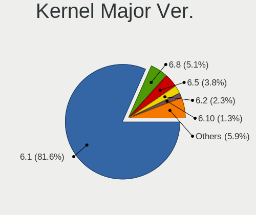

| Version | Desktops | Percent |
|---------|----------|---------|
| 6.1     | 1268     | 86.32%  |
| 6.5     | 76       | 5.17%   |
| 6.2     | 52       | 3.54%   |
| 6.6     | 16       | 1.09%   |
| 6.4     | 16       | 1.09%   |
| 6.8     | 7        | 0.48%   |
| 6.0     | 7        | 0.48%   |
| 5.10    | 7        | 0.48%   |
| 6.7     | 5        | 0.34%   |
| 6.3     | 5        | 0.34%   |
| 5.15    | 5        | 0.34%   |
| 4.1     | 2        | 0.14%   |
| 96.5    | 1        | 0.07%   |
| 5.19    | 1        | 0.07%   |
| 4.19    | 1        | 0.07%   |

Arch
----

OS architecture (x86_64, i586, etc.)

| Name        | Desktops | Percent |
|-------------|----------|---------|
| x86_64      | 1433     | 98.56%  |
| i686        | 13       | 0.89%   |
| riscv64     | 2        | 0.14%   |
| armv7l      | 2        | 0.14%   |
| aarch64     | 2        | 0.14%   |
| ppc64       | 1        | 0.07%   |
| loongarch64 | 1        | 0.07%   |

DE
--

Desktop Environment

| Name              | Desktops | Percent |
|-------------------|----------|---------|
| Unknown           | 499      | 34.01%  |
| GNOME             | 350      | 23.86%  |
| KDE5              | 281      | 19.15%  |
| XFCE              | 120      | 8.18%   |
| MATE              | 61       | 4.16%   |
| X-Cinnamon        | 58       | 3.95%   |
| LXQt              | 21       | 1.43%   |
| Cinnamon          | 18       | 1.23%   |
| LXDE              | 15       | 1.02%   |
| GNOME Flashback   | 13       | 0.89%   |
| i3                | 7        | 0.48%   |
| GNOME Classic     | 5        | 0.34%   |
| openbox           | 4        | 0.27%   |
| icewm             | 3        | 0.2%    |
| KDE               | 2        | 0.14%   |
| dwm               | 2        | 0.14%   |
| x-session-manager | 1        | 0.07%   |
| Trinity           | 1        | 0.07%   |
| sway:GNOME        | 1        | 0.07%   |
| sway              | 1        | 0.07%   |
| Cutefish          | 1        | 0.07%   |
| Budgie            | 1        | 0.07%   |
| bspwm             | 1        | 0.07%   |
| awesome           | 1        | 0.07%   |

Display Server
--------------

X11 or Wayland

| Name    | Desktops | Percent |
|---------|----------|---------|
| X11     | 579      | 39.28%  |
| Wayland | 355      | 24.08%  |
| Unknown | 352      | 23.88%  |
| Tty     | 188      | 12.75%  |

Display Manager
---------------

SDDM, LightDM, etc.

| Name    | Desktops | Percent |
|---------|----------|---------|
| Unknown | 779      | 53.1%   |
| GDM3    | 270      | 18.4%   |
| LightDM | 227      | 15.47%  |
| SDDM    | 177      | 12.07%  |
| LXDM    | 4        | 0.27%   |
| SLiM    | 3        | 0.2%    |
| XDM     | 2        | 0.14%   |
| NODM    | 2        | 0.14%   |
| GDM     | 2        | 0.14%   |
| Ly      | 1        | 0.07%   |

OS Lang
-------

Language

| Lang    | Desktops | Percent |
|---------|----------|---------|
| en_US   | 516      | 35.42%  |
| ru_RU   | 315      | 21.62%  |
| de_DE   | 107      | 7.34%   |
| fr_FR   | 95       | 6.52%   |
| en_GB   | 62       | 4.26%   |
| pt_BR   | 41       | 2.81%   |
| Unknown | 38       | 2.61%   |
| es_ES   | 35       | 2.4%    |
| it_IT   | 30       | 2.06%   |
| pl_PL   | 22       | 1.51%   |
| en_CA   | 21       | 1.44%   |
| en_AU   | 15       | 1.03%   |
| en_ZA   | 11       | 0.75%   |
| es_AR   | 10       | 0.69%   |
| nl_NL   | 9        | 0.62%   |
| en_IE   | 9        | 0.62%   |
| C       | 9        | 0.62%   |
| hu_HU   | 8        | 0.55%   |
| en_IN   | 8        | 0.55%   |
| zh_CN   | 7        | 0.48%   |
| de_CH   | 6        | 0.41%   |
| fr_BE   | 5        | 0.34%   |
| nl_BE   | 4        | 0.27%   |
| fr_CA   | 4        | 0.27%   |
| fi_FI   | 4        | 0.27%   |
| es_VE   | 4        | 0.27%   |
| es_MX   | 4        | 0.27%   |
| es_CL   | 4        | 0.27%   |
| nb_NO   | 3        | 0.21%   |
| ko_KR   | 3        | 0.21%   |
| ja_JP   | 3        | 0.21%   |
| es_PE   | 3        | 0.21%   |
| en_NZ   | 3        | 0.21%   |
| en_DK   | 3        | 0.21%   |
| de_AT   | 3        | 0.21%   |
| da_DK   | 3        | 0.21%   |
| zh_TW   | 2        | 0.14%   |
| sv_SE   | 2        | 0.14%   |
| pt_PT   | 2        | 0.14%   |
| lt_LT   | 2        | 0.14%   |

Boot Mode
---------

EFI or BIOS

| Mode | Desktops | Percent |
|------|----------|---------|
| BIOS | 805      | 55.21%  |
| EFI  | 653      | 44.79%  |

Filesystem
----------

Type of filesystem

| Type    | Desktops | Percent |
|---------|----------|---------|
| Ext4    | 981      | 67.01%  |
| Overlay | 328      | 22.4%   |
| Btrfs   | 64       | 4.37%   |
| Zfs     | 35       | 2.39%   |
| Tmpfs   | 33       | 2.25%   |
| Xfs     | 15       | 1.02%   |
| Ext3    | 5        | 0.34%   |
| Unknown | 2        | 0.14%   |
| XXXXX   | 1        | 0.07%   |

Part. scheme
------------

Scheme of partitioning

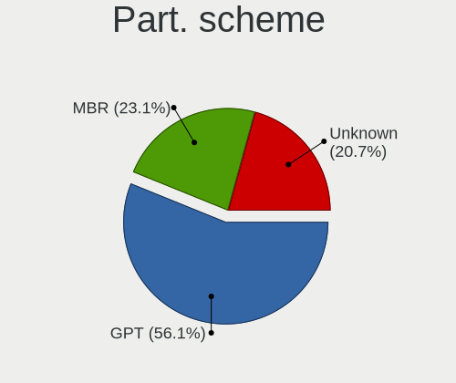

| Type    | Desktops | Percent |
|---------|----------|---------|
| GPT     | 760      | 51.98%  |
| MBR     | 419      | 28.66%  |
| Unknown | 283      | 19.36%  |

Dual Boot with Linux/BSD
------------------------

Hosting more than one Linux/BSD

| Dual boot | Desktops | Percent |
|-----------|----------|---------|
| No        | 1226     | 83.51%  |
| Yes       | 242      | 16.49%  |

Dual Boot (Win)
---------------

Hosting Linux and Windows

| Dual boot | Desktops | Percent |
|-----------|----------|---------|
| No        | 914      | 62.3%   |
| Yes       | 553      | 37.7%   |

Board
-----

Vendor
------

Motherboard manufacturer

| Name                                 | Desktops | Percent |
|--------------------------------------|----------|---------|
| ASUSTek Computer                     | 384      | 26.41%  |
| Gigabyte Technology                  | 238      | 16.37%  |
| MSI                                  | 137      | 9.42%   |
| ASRock                               | 119      | 8.18%   |
| Hewlett-Packard                      | 107      | 7.36%   |
| Dell                                 | 85       | 5.85%   |
| Lenovo                               | 80       | 5.5%    |
| Intel                                | 41       | 2.82%   |
| Unknown                              | 37       | 2.54%   |
| Acer                                 | 25       | 1.72%   |
| Fujitsu                              | 20       | 1.38%   |
| ECS                                  | 17       | 1.17%   |
| Biostar                              | 14       | 0.96%   |
| AZW                                  | 12       | 0.83%   |
| Supermicro                           | 10       | 0.69%   |
| Shenzhen Meigao Electronic Equipment | 10       | 0.69%   |
| Foxconn                              | 10       | 0.69%   |
| Huanan                               | 8        | 0.55%   |
| Shuttle                              | 5        | 0.34%   |
| Inventec                             | 5        | 0.34%   |
| BESSTAR Tech                         | 5        | 0.34%   |
| OEM                                  | 4        | 0.28%   |
| Google                               | 4        | 0.28%   |
| ASRockRack                           | 4        | 0.28%   |
| Apple                                | 4        | 0.28%   |
| Pegatron                             | 3        | 0.21%   |
| HPE                                  | 3        | 0.21%   |
| HC Technology.                       | 3        | 0.21%   |
| CWWK                                 | 3        | 0.21%   |
| Techvision                           | 2        | 0.14%   |
| SZMZ                                 | 2        | 0.14%   |
| SYWZ                                 | 2        | 0.14%   |
| PCWare                               | 2        | 0.14%   |
| newplatforms                         | 2        | 0.14%   |
| Medion                               | 2        | 0.14%   |
| MACHINIST                            | 2        | 0.14%   |
| JINGSHA                              | 2        | 0.14%   |
| JGINYUE                              | 2        | 0.14%   |
| AMI                                  | 2        | 0.14%   |
| ADLINK Technology                    | 2        | 0.14%   |

Model
-----

Motherboard model

| Name                               | Desktops | Percent |
|------------------------------------|----------|---------|
| ASUS All Series                    | 46       | 3.16%   |
| Unknown                            | 40       | 2.75%   |
| HP ProDesk 400 G2.5 SFF            | 20       | 1.38%   |
| ASRock H470M-HVS                   | 20       | 1.38%   |
| ASUS P5QL-CM                       | 15       | 1.03%   |
| Lenovo ThinkCentre M55p 8808D8U    | 14       | 0.96%   |
| MSI MS-7996                        | 12       | 0.83%   |
| ASUS PRIME B450M-K                 | 12       | 0.83%   |
| Gigabyte H81M-S2V                  | 11       | 0.76%   |
| ASUS S20 K29                       | 11       | 0.76%   |
| Lenovo ThinkCentre M79 10JAS05300  | 9        | 0.62%   |
| HP Z440 Workstation                | 8        | 0.55%   |
| Gigabyte A320M-S2H V2              | 8        | 0.55%   |
| ECS G31T-M9                        | 8        | 0.55%   |
| HP ProDesk 400 G3 SFF              | 7        | 0.48%   |
| ASUS PRIME A320M-K                 | 7        | 0.48%   |
| ASUS H110M-R                       | 7        | 0.48%   |
| Gigabyte X570 GAMING X             | 6        | 0.41%   |
| ASUS ProArt X670E-CREATOR WIFI     | 6        | 0.41%   |
| MSI MS-7C56                        | 5        | 0.34%   |
| MSI MS-7B79                        | 5        | 0.34%   |
| Lenovo ThinkCentre M83 10AHS1T000  | 5        | 0.34%   |
| Lenovo ThinkCentre M800 10FXS0PS00 | 5        | 0.34%   |
| Intel X99                          | 5        | 0.34%   |
| ECS BAT-I                          | 5        | 0.34%   |
| Dell OptiPlex 990                  | 5        | 0.34%   |
| Dell OptiPlex 755                  | 5        | 0.34%   |
| Dell OptiPlex 7010                 | 5        | 0.34%   |
| Dell OptiPlex 3010                 | 5        | 0.34%   |
| ASUS TUF Gaming X570-PLUS          | 5        | 0.34%   |
| Acer Veriton S480G                 | 5        | 0.34%   |
| Supermicro SYS-5019S-ML            | 4        | 0.28%   |
| MSI MS-7D91                        | 4        | 0.28%   |
| MSI MS-7B89                        | 4        | 0.28%   |
| MSI MS-7529                        | 4        | 0.28%   |
| Intel Jasper Lake Client Platform  | 4        | 0.28%   |
| HP ProDesk 400 G4 SFF              | 4        | 0.28%   |
| Gigabyte H61M-DS2 REV 1.2          | 4        | 0.28%   |
| Gigabyte B550I AORUS PRO AX        | 4        | 0.28%   |
| Gigabyte B450M DS3H                | 4        | 0.28%   |

Model Family
------------

Motherboard model prefix

| Name                | Desktops | Percent |
|---------------------|----------|---------|
| ASUS PRIME          | 93       | 6.4%    |
| Lenovo ThinkCentre  | 61       | 4.2%    |
| Dell OptiPlex       | 53       | 3.65%   |
| ASUS ROG            | 47       | 3.23%   |
| ASUS All            | 46       | 3.16%   |
| HP ProDesk          | 40       | 2.75%   |
| Unknown             | 40       | 2.75%   |
| ASUS TUF            | 35       | 2.41%   |
| ASRock H470M-HVS    | 20       | 1.38%   |
| Gigabyte X570       | 18       | 1.24%   |
| Gigabyte B450M      | 17       | 1.17%   |
| Acer Veriton        | 16       | 1.1%    |
| ASUS P5QL-CM        | 15       | 1.03%   |
| HP EliteDesk        | 14       | 0.96%   |
| HP Compaq           | 13       | 0.89%   |
| MSI MS-7996         | 12       | 0.83%   |
| Gigabyte H81M-S2V   | 11       | 0.76%   |
| Gigabyte B450       | 11       | 0.76%   |
| Fujitsu ESPRIMO     | 11       | 0.76%   |
| Dell Precision      | 11       | 0.76%   |
| ASUS S20            | 11       | 0.76%   |
| Lenovo ThinkStation | 10       | 0.69%   |
| Gigabyte B550M      | 9        | 0.62%   |
| Gigabyte A320M-S2H  | 9        | 0.62%   |
| ASUS P8H61-M        | 9        | 0.62%   |
| HP Z440             | 8        | 0.55%   |
| ECS G31T-M9         | 8        | 0.55%   |
| Dell Inspiron       | 8        | 0.55%   |
| ASUS Pro            | 8        | 0.55%   |
| ASUS ProArt         | 7        | 0.48%   |
| ASUS H110M-R        | 7        | 0.48%   |
| Gigabyte Z790       | 6        | 0.41%   |
| Gigabyte H61M-DS2   | 6        | 0.41%   |
| Gigabyte B650       | 6        | 0.41%   |
| Acer Aspire         | 6        | 0.41%   |
| MSI MS-7C56         | 5        | 0.34%   |
| MSI MS-7B79         | 5        | 0.34%   |
| Intel X99           | 5        | 0.34%   |
| HP ProLiant         | 5        | 0.34%   |
| Gigabyte B550       | 5        | 0.34%   |

MFG Year
--------

Motherboard manufacture year

| Year    | Desktops | Percent |
|---------|----------|---------|
| 2022    | 134      | 9.22%   |
| 2020    | 134      | 9.22%   |
| 2018    | 112      | 7.7%    |
| 2021    | 110      | 7.57%   |
| 2012    | 108      | 7.43%   |
| 2014    | 101      | 6.95%   |
| 2019    | 98       | 6.74%   |
| 2023    | 86       | 5.91%   |
| 2015    | 77       | 5.3%    |
| 2013    | 73       | 5.02%   |
| 2016    | 70       | 4.81%   |
| 2011    | 65       | 4.47%   |
| 2017    | 58       | 3.99%   |
| 2010    | 55       | 3.78%   |
| 2009    | 52       | 3.58%   |
| 2008    | 49       | 3.37%   |
| 2007    | 46       | 3.16%   |
| Unknown | 7        | 0.48%   |
| 2024    | 4        | 0.28%   |
| 2006    | 4        | 0.28%   |
| 2005    | 4        | 0.28%   |
| 2004    | 4        | 0.28%   |
| 2002    | 2        | 0.14%   |
| 2000    | 1        | 0.07%   |

Form Factor
-----------

Physical design of the computer

| Name    | Desktops | Percent |
|---------|----------|---------|
| Desktop | 1454     | 100%    |

Secure Boot
-----------

Enabled or disabled

| State    | Desktops | Percent |
|----------|----------|---------|
| Disabled | 1412     | 97.11%  |
| Enabled  | 42       | 2.89%   |

Coreboot
--------

Have coreboot on board

| Used | Desktops | Percent |
|------|----------|---------|
| No   | 1449     | 99.66%  |
| Yes  | 5        | 0.34%   |

RAM Size
--------

Total RAM memory

| Size in GB      | Desktops | Percent |
|-----------------|----------|---------|
| 32.01-64.0      | 281      | 19.13%  |
| 16.01-24.0      | 269      | 18.31%  |
| 4.01-8.0        | 235      | 16%     |
| 3.01-4.0        | 222      | 15.11%  |
| 8.01-16.0       | 168      | 11.44%  |
| 64.01-256.0     | 152      | 10.35%  |
| 1.01-2.0        | 60       | 4.08%   |
| 24.01-32.0      | 45       | 3.06%   |
| 2.01-3.0        | 19       | 1.29%   |
| More than 256.0 | 9        | 0.61%   |
| 0.51-1.0        | 7        | 0.48%   |
| Unknown         | 2        | 0.14%   |

RAM Used
--------

Used RAM memory

| Used GB     | Desktops | Percent |
|-------------|----------|---------|
| 1.01-2.0    | 308      | 20.17%  |
| 4.01-8.0    | 300      | 19.65%  |
| 0.51-1.0    | 299      | 19.58%  |
| 2.01-3.0    | 251      | 16.44%  |
| 3.01-4.0    | 173      | 11.33%  |
| 8.01-16.0   | 87       | 5.7%    |
| 0.01-0.5    | 40       | 2.62%   |
| 16.01-24.0  | 28       | 1.83%   |
| 24.01-32.0  | 20       | 1.31%   |
| 32.01-64.0  | 14       | 0.92%   |
| 64.01-256.0 | 5        | 0.33%   |
| Unknown     | 2        | 0.13%   |

Total Drives
------------

Number of drives on board

| Drives | Desktops | Percent |
|--------|----------|---------|
| 1      | 681      | 45.92%  |
| 2      | 352      | 23.74%  |
| 3      | 199      | 13.42%  |
| 4      | 116      | 7.82%   |
| 5      | 43       | 2.9%    |
| 6      | 35       | 2.36%   |
| 0      | 13       | 0.88%   |
| 7      | 12       | 0.81%   |
| 8      | 7        | 0.47%   |
| 9      | 4        | 0.27%   |
| 12     | 3        | 0.2%    |
| 10     | 3        | 0.2%    |
| 15     | 2        | 0.13%   |
| 14     | 2        | 0.13%   |
| 13     | 2        | 0.13%   |
| 11     | 2        | 0.13%   |
| 32     | 1        | 0.07%   |
| 29     | 1        | 0.07%   |
| 27     | 1        | 0.07%   |
| 21     | 1        | 0.07%   |
| 19     | 1        | 0.07%   |
| 17     | 1        | 0.07%   |
| 16     | 1        | 0.07%   |

Has CD-ROM
----------

Has CD-ROM on board

| Presented | Desktops | Percent |
|-----------|----------|---------|
| No        | 1017     | 69.56%  |
| Yes       | 445      | 30.44%  |

Has Ethernet
------------

Has Ethernet on board

| Presented | Desktops | Percent |
|-----------|----------|---------|
| Yes       | 1441     | 99.11%  |
| No        | 13       | 0.89%   |

Has WiFi
--------

Has WiFi module

| Presented | Desktops | Percent |
|-----------|----------|---------|
| No        | 924      | 63.29%  |
| Yes       | 536      | 36.71%  |

Has Bluetooth
-------------

Has Bluetooth module

| Presented | Desktops | Percent |
|-----------|----------|---------|
| No        | 1005     | 68.65%  |
| Yes       | 459      | 31.35%  |

Location
--------

Country
-------

Geographic location (country)

| Country      | Desktops | Percent |
|--------------|----------|---------|
| Russia       | 358      | 24.55%  |
| USA          | 227      | 15.57%  |
| Germany      | 159      | 10.91%  |
| France       | 102      | 7%      |
| Brazil       | 57       | 3.91%   |
| UK           | 45       | 3.09%   |
| Spain        | 45       | 3.09%   |
| Italy        | 44       | 3.02%   |
| Canada       | 38       | 2.61%   |
| Poland       | 31       | 2.13%   |
| Netherlands  | 22       | 1.51%   |
| Mexico       | 20       | 1.37%   |
| Australia    | 19       | 1.3%    |
| Switzerland  | 15       | 1.03%   |
| Belgium      | 15       | 1.03%   |
| Argentina    | 14       | 0.96%   |
| Romania      | 13       | 0.89%   |
| Hungary      | 13       | 0.89%   |
| Norway       | 12       | 0.82%   |
| India        | 12       | 0.82%   |
| Austria      | 11       | 0.75%   |
| South Africa | 10       | 0.69%   |
| Portugal     | 10       | 0.69%   |
| Greece       | 10       | 0.69%   |
| China        | 10       | 0.69%   |
| Finland      | 9        | 0.62%   |
| Sweden       | 7        | 0.48%   |
| Japan        | 7        | 0.48%   |
| Denmark      | 7        | 0.48%   |
| Slovakia     | 6        | 0.41%   |
| Thailand     | 5        | 0.34%   |
| Hong Kong    | 5        | 0.34%   |
| Venezuela    | 4        | 0.27%   |
| Taiwan       | 4        | 0.27%   |
| Serbia       | 4        | 0.27%   |
| Philippines  | 4        | 0.27%   |
| New Zealand  | 4        | 0.27%   |
| Indonesia    | 4        | 0.27%   |
| Estonia      | 4        | 0.27%   |
| Czechia      | 4        | 0.27%   |

City
----

Geographic location (city)

| City              | Desktops | Percent |
|-------------------|----------|---------|
| Voronezh          | 271      | 18.3%   |
| Roubaix           | 30       | 2.03%   |
| Moscow            | 21       | 1.42%   |
| Bangor            | 21       | 1.42%   |
| St Petersburg     | 17       | 1.15%   |
| Bagneux           | 15       | 1.01%   |
| Paris             | 13       | 0.88%   |
| Frankfurt am Main | 12       | 0.81%   |
| Vienna            | 10       | 0.68%   |
| Toronto           | 10       | 0.68%   |
| Berlin            | 10       | 0.68%   |
| Madrid            | 9        | 0.61%   |
| Bonn              | 8        | 0.54%   |
| Athens            | 8        | 0.54%   |
| Sao Paulo         | 7        | 0.47%   |
| Levanger          | 7        | 0.47%   |
| Amsterdam         | 7        | 0.47%   |
| Tijuana           | 6        | 0.41%   |
| Ruda lska     | 6        | 0.41%   |
| Milan             | 6        | 0.41%   |
| Manchester        | 6        | 0.41%   |
| Hamburg           | 6        | 0.41%   |
| Valencia          | 5        | 0.34%   |
| Ufa               | 5        | 0.34%   |
| Sydney            | 5        | 0.34%   |
| Bucharest         | 5        | 0.34%   |
| Utrecht           | 4        | 0.27%   |
| Seville           | 4        | 0.27%   |
| Seattle           | 4        | 0.27%   |
| Rozhanovce        | 4        | 0.27%   |
| Rio de Janeiro    | 4        | 0.27%   |
| Richmond          | 4        | 0.27%   |
| Perm              | 4        | 0.27%   |
| Johannesburg      | 4        | 0.27%   |
| Gladbeck          | 4        | 0.27%   |
| Dresden           | 4        | 0.27%   |
| Delhi             | 4        | 0.27%   |
| Zurich            | 3        | 0.2%    |
| Tallinn           | 3        | 0.2%    |
| Stuttgart         | 3        | 0.2%    |

Drives
------

Drive Vendor
------------

Hard drive vendors

| Vendor                      | Desktops | Drives | Percent |
|-----------------------------|----------|--------|---------|
| WDC                         | 452      | 787    | 17.96%  |
| Seagate                     | 385      | 611    | 15.3%   |
| Samsung Electronics         | 348      | 561    | 13.83%  |
| Kingston                    | 155      | 203    | 6.16%   |
| Crucial                     | 155      | 209    | 6.16%   |
| Toshiba                     | 151      | 233    | 6%      |
| SanDisk                     | 119      | 148    | 4.73%   |
| Hitachi                     | 78       | 101    | 3.1%    |
| China                       | 38       | 45     | 1.51%   |
| Netac                       | 36       | 39     | 1.43%   |
| Intel                       | 33       | 42     | 1.31%   |
| HGST                        | 30       | 84     | 1.19%   |
| A-DATA Technology           | 29       | 33     | 1.15%   |
| Unknown                     | 26       | 39     | 1.03%   |
| Kingston Technology Company | 22       | 33     | 0.87%   |
| SPCC                        | 20       | 23     | 0.79%   |
| Transcend                   | 16       | 27     | 0.64%   |
| Silicon Motion              | 16       | 17     | 0.64%   |
| PNY                         | 16       | 23     | 0.64%   |
| Patriot                     | 16       | 19     | 0.64%   |
| SK hynix                    | 15       | 22     | 0.6%    |
| GOODRAM                     | 15       | 35     | 0.6%    |
| Unknown                     | 15       | 16     | 0.6%    |
| Phison Electronics          | 14       | 21     | 0.56%   |
| Corsair                     | 14       | 19     | 0.56%   |
| Micron/Crucial Technology   | 13       | 19     | 0.52%   |
| Micron Technology           | 12       | 13     | 0.48%   |
| OCZ                         | 11       | 12     | 0.44%   |
| Phison                      | 10       | 15     | 0.4%    |
| MAXIO Technology (Hangzhou) | 10       | 11     | 0.4%    |
| Hewlett-Packard             | 10       | 15     | 0.4%    |
| Gigabyte Technology         | 10       | 15     | 0.4%    |
| Apacer                      | 10       | 17     | 0.4%    |
| KIOXIA-EXCERIA              | 9        | 11     | 0.36%   |
| Intenso                     | 9        | 10     | 0.36%   |
| Team                        | 8        | 11     | 0.32%   |
| Maxtor                      | 8        | 8      | 0.32%   |
| Lexar                       | 8        | 9      | 0.32%   |
| JMicron Technology          | 8        | 8      | 0.32%   |
| XrayDisk                    | 7        | 9      | 0.28%   |

Drive Model
-----------

Hard drive models

| Model                                              | Desktops | Percent |
|----------------------------------------------------|----------|---------|
| Seagate ST500DM002-1BD142 500GB                    | 43       | 1.45%   |
| Seagate ST1000DM010-2EP102 1TB                     | 36       | 1.21%   |
| Samsung NVMe SSD Controller SM981/PM981/PM983 1TB  | 33       | 1.11%   |
| Kingston SA400S37240G 240GB SSD                    | 30       | 1.01%   |
| Crucial CT480BX500SSD1 480GB                       | 30       | 1.01%   |
| Kingston SA400S37480G 480GB SSD                    | 27       | 0.91%   |
| Toshiba DT01ACA050 500GB                           | 25       | 0.84%   |
| Netac SSD 240GB                                    | 23       | 0.77%   |
| WDC WD5000AAKX-60U6AA0 500GB                       | 21       | 0.71%   |
| Crucial CT1000MX500SSD1 1TB                        | 21       | 0.71%   |
| WDC WD10EZEX-08WN4A0 1TB                           | 20       | 0.67%   |
| Toshiba DT01ACA100 1TB                             | 20       | 0.67%   |
| Crucial CT240BX500SSD1 240GB                       | 20       | 0.67%   |
| Toshiba HDWD110 1TB                                | 19       | 0.64%   |
| Seagate ST2000DM008-2FR102 2TB                     | 19       | 0.64%   |
| Samsung SSD 980 PRO 1TB                            | 19       | 0.64%   |
| WDC WD3200AAJS-00L7A0 320GB                        | 18       | 0.61%   |
| Samsung SSD 860 EVO 500GB                          | 18       | 0.61%   |
| Seagate ST1000DM003-1ER162 1TB                     | 17       | 0.57%   |
| SanDisk NVMe SSD Drive 1TB                         | 17       | 0.57%   |
| Crucial CT500MX500SSD1 500GB                       | 17       | 0.57%   |
| Seagate ST4000DM004-2CV104 4TB                     | 16       | 0.54%   |
| Samsung NVMe SSD Controller PM9A1/PM9A3/980PRO 1TB | 16       | 0.54%   |
| Kingston SA400S37120G 120GB SSD                    | 16       | 0.54%   |
| Samsung SSD 850 EVO 500GB                          | 15       | 0.5%    |
| Samsung SSD 850 EVO 250GB                          | 15       | 0.5%    |
| Unknown                                            | 15       | 0.5%    |
| Samsung SSD 970 EVO Plus 1TB                       | 14       | 0.47%   |
| Samsung SSD 860 EVO 250GB                          | 14       | 0.47%   |
| Seagate ST3160811AS 160GB                          | 12       | 0.4%    |
| Samsung SSD 870 EVO 500GB                          | 12       | 0.4%    |
| Kingston SV300S37A120G 120GB SSD                   | 12       | 0.4%    |
| WDC WD20EZRZ-00Z5HB0 2TB                           | 11       | 0.37%   |
| Seagate ST3500418AS 500GB                          | 11       | 0.37%   |
| SanDisk NVMe SSD Drive 2TB                         | 11       | 0.37%   |
| Samsung SSD 970 EVO Plus 500GB                     | 11       | 0.37%   |
| Samsung SSD 870 EVO 1TB                            | 11       | 0.37%   |
| Micron/Crucial P2 NVMe PCIe SSD 4TB                | 11       | 0.37%   |
| Seagate ST2000DM001-1CH164 2TB                     | 10       | 0.34%   |
| Seagate ST1000DM003-1CH162 1TB                     | 10       | 0.34%   |

HDD Vendor
----------

Hard disk drive vendors

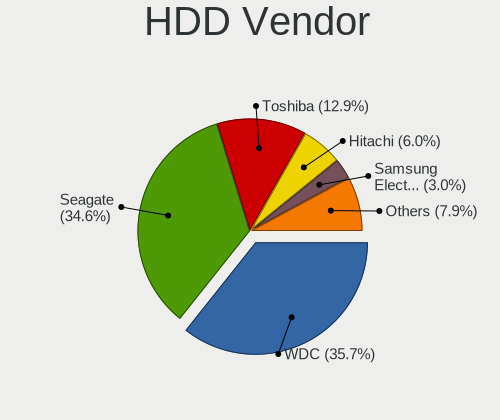

| Vendor              | Desktops | Drives | Percent |
|---------------------|----------|--------|---------|
| WDC                 | 396      | 699    | 36.4%   |
| Seagate             | 376      | 599    | 34.56%  |
| Toshiba             | 139      | 217    | 12.78%  |
| Hitachi             | 78       | 101    | 7.17%   |
| HGST                | 30       | 84     | 2.76%   |
| Samsung Electronics | 28       | 38     | 2.57%   |
| Maxtor              | 8        | 8      | 0.74%   |
| Unknown             | 7        | 7      | 0.64%   |
| SABRENT             | 5        | 5      | 0.46%   |
| JMicron Technology  | 3        | 3      | 0.28%   |
| Hewlett-Packard     | 3        | 7      | 0.28%   |
| Apple               | 3        | 3      | 0.28%   |
| ASMT                | 2        | 11     | 0.18%   |
| XrayDisk            | 1        | 1      | 0.09%   |
| USB                 | 1        | 1      | 0.09%   |
| Unknown (CF)        | 1        | 1      | 0.09%   |
| TO Exter            | 1        | 1      | 0.09%   |
| MARVELL             | 1        | 2      | 0.09%   |
| HGST HTS            | 1        | 1      | 0.09%   |
| H/W                 | 1        | 7      | 0.09%   |
| Fujitsu             | 1        | 1      | 0.09%   |
| Elite               | 1        | 1      | 0.09%   |
| Unknown             | 1        | 1      | 0.09%   |

SSD Vendor
----------

Solid state drive vendors

| Vendor              | Desktops | Drives | Percent |
|---------------------|----------|--------|---------|
| Samsung Electronics | 165      | 227    | 19.39%  |
| Crucial             | 122      | 161    | 14.34%  |
| Kingston            | 118      | 152    | 13.87%  |
| SanDisk             | 50       | 57     | 5.88%   |
| WDC                 | 47       | 60     | 5.52%   |
| China               | 37       | 44     | 4.35%   |
| Netac               | 33       | 35     | 3.88%   |
| Intel               | 22       | 28     | 2.59%   |
| A-DATA Technology   | 18       | 20     | 2.12%   |
| SPCC                | 17       | 18     | 2%      |
| PNY                 | 16       | 23     | 1.88%   |
| Patriot             | 14       | 17     | 1.65%   |
| GOODRAM             | 13       | 20     | 1.53%   |
| Transcend           | 12       | 23     | 1.41%   |
| OCZ                 | 11       | 12     | 1.29%   |
| Intenso             | 9        | 10     | 1.06%   |
| Apacer              | 9        | 14     | 1.06%   |
| Toshiba             | 7        | 8      | 0.82%   |
| Plextor             | 6        | 6      | 0.71%   |
| Fanxiang            | 6        | 8      | 0.71%   |
| Unknown             | 6        | 6      | 0.71%   |
| XrayDisk            | 5        | 6      | 0.59%   |
| Micron Technology   | 5        | 6      | 0.59%   |
| LITEON              | 5        | 5      | 0.59%   |
| Lexar               | 5        | 5      | 0.59%   |
| Hewlett-Packard     | 5        | 5      | 0.59%   |
| Gigabyte Technology | 5        | 6      | 0.59%   |
| Corsair             | 5        | 5      | 0.59%   |
| Seagate             | 4        | 5      | 0.47%   |
| Innodisk            | 4        | 4      | 0.47%   |
| Team                | 3        | 4      | 0.35%   |
| KingSpec            | 3        | 4      | 0.35%   |
| FORESEE             | 3        | 3      | 0.35%   |
| External            | 3        | 3      | 0.35%   |
| AMD                 | 3        | 3      | 0.35%   |
| T-FORCE             | 2        | 3      | 0.24%   |
| Mushkin             | 2        | 2      | 0.24%   |
| KLEVV               | 2        | 4      | 0.24%   |
| KIOXIA-EXCERIA      | 2        | 2      | 0.24%   |
| Emtec               | 2        | 2      | 0.24%   |

Drive Kind
----------

HDD or SSD

| Kind    | Desktops | Drives | Percent |
|---------|----------|--------|---------|
| HDD     | 885      | 1799   | 41.16%  |
| SSD     | 710      | 1081   | 33.02%  |
| NVMe    | 512      | 838    | 23.81%  |
| Unknown | 28       | 40     | 1.3%    |
| MMC     | 15       | 19     | 0.7%    |

Drive Connector
---------------

SATA, SAS, NVMe, etc.

| Type | Desktops | Drives | Percent |
|------|----------|--------|---------|
| SATA | 1252     | 2730   | 67.13%  |
| NVMe | 509      | 825    | 27.29%  |
| SAS  | 89       | 203    | 4.77%   |
| MMC  | 15       | 19     | 0.8%    |

Drive Size
----------

Size of hard drive

| Size in TB | Desktops | Drives | Percent |
|------------|----------|--------|---------|
| 0.01-0.5   | 915      | 1287   | 51.52%  |
| 0.51-1.0   | 435      | 674    | 24.49%  |
| 1.01-2.0   | 186      | 343    | 10.47%  |
| 3.01-4.0   | 95       | 213    | 5.35%   |
| 4.01-10.0  | 62       | 211    | 3.49%   |
| 2.01-3.0   | 58       | 96     | 3.27%   |
| 10.01-20.0 | 25       | 56     | 1.41%   |

Space Total
-----------

Amount of disk space available on the file system

| Size in GB     | Desktops | Percent |
|----------------|----------|---------|
| Unknown        | 333      | 22.44%  |
| 251-500        | 233      | 15.7%   |
| 101-250        | 202      | 13.61%  |
| 501-1000       | 193      | 13.01%  |
| More than 3000 | 166      | 11.19%  |
| 1001-2000      | 141      | 9.5%    |
| 2001-3000      | 69       | 4.65%   |
| 51-100         | 60       | 4.04%   |
| 1-20           | 56       | 3.77%   |
| 21-50          | 31       | 2.09%   |

Space Used
----------

Amount of used disk space

| Used GB        | Desktops | Percent |
|----------------|----------|---------|
| 1-20           | 420      | 27.87%  |
| Unknown        | 333      | 22.1%   |
| 21-50          | 162      | 10.75%  |
| 101-250        | 140      | 9.29%   |
| 51-100         | 100      | 6.64%   |
| 251-500        | 99       | 6.57%   |
| 501-1000       | 90       | 5.97%   |
| 1001-2000      | 73       | 4.84%   |
| More than 3000 | 68       | 4.51%   |
| 2001-3000      | 21       | 1.39%   |
| 0              | 1        | 0.07%   |

Malfunc. Drives
---------------

Drive models with a malfunction

| Model                                          | Desktops | Drives | Percent |
|------------------------------------------------|----------|--------|---------|
| WDC WD5000AAKX-60U6AA0 500GB                   | 14       | 14     | 4.71%   |
| WDC WD3200AAJS-00L7A0 320GB                    | 13       | 13     | 4.38%   |
| Seagate ST500DM002-1BD142 500GB                | 10       | 11     | 3.37%   |
| Seagate ST3500418AS 500GB                      | 5        | 5      | 1.68%   |
| Seagate ST3250410AS 250GB                      | 5        | 5      | 1.68%   |
| Seagate ST3160811AS 160GB                      | 5        | 5      | 1.68%   |
| Hitachi HDS721050CLA362 500GB                  | 5        | 7      | 1.68%   |
| WDC WD2500AAJS-00L7A0 250GB                    | 4        | 4      | 1.35%   |
| WDC WD5000AAKX-22ERMA0 500GB                   | 3        | 3      | 1.01%   |
| WDC WD20EARS-00MVWB0 2TB                       | 3        | 3      | 1.01%   |
| Toshiba DT01ACA200 2TB                         | 3        | 8      | 1.01%   |
| Seagate ST2000DM006-2DM164 2TB                 | 3        | 3      | 1.01%   |
| Seagate ST2000DM001-1CH164 2TB                 | 3        | 5      | 1.01%   |
| Seagate ST1000DM003-9YN162 1TB                 | 3        | 5      | 1.01%   |
| Samsung Electronics SSD 870 EVO 1TB            | 3        | 3      | 1.01%   |
| Maxtor STM3160815AS 160GB                      | 3        | 3      | 1.01%   |
| WDC WD5000AAKX-08U6AA0 500GB                   | 2        | 2      | 0.67%   |
| WDC WD5000AAKX-001CA0 500GB                    | 2        | 2      | 0.67%   |
| WDC WD30EFRX-68EUZN0 3TB                       | 2        | 2      | 0.67%   |
| WDC WD2500AAKS-00VSA0 250GB                    | 2        | 3      | 0.67%   |
| WDC WD20EFRX-68EUZN0 2TB                       | 2        | 2      | 0.67%   |
| WDC WD20EARX-00PASB0 2TB                       | 2        | 3      | 0.67%   |
| WDC WD2002FAEX-007BA0 2TB                      | 2        | 2      | 0.67%   |
| WDC WD1602ABYS-23B7A0 39M4507 42C0462IBM 160GB | 2        | 2      | 0.67%   |
| WDC WD10EZEX-00BN5A0 1TB                       | 2        | 2      | 0.67%   |
| WDC WD10EARS-00MVWB0 1TB                       | 2        | 2      | 0.67%   |
| Seagate ST9250315AS 250GB                      | 2        | 2      | 0.67%   |
| Seagate ST3250318AS 250GB                      | 2        | 2      | 0.67%   |
| Seagate ST3160815AS 160GB                      | 2        | 2      | 0.67%   |
| Seagate ST2000DX001-1CM164 2TB                 | 2        | 3      | 0.67%   |
| Seagate ST2000DM001-9YN164 2TB                 | 2        | 2      | 0.67%   |
| Seagate ST1000LM024 HN-M101MBB 1TB             | 2        | 2      | 0.67%   |
| Seagate ST1000DM010-2EP102 1TB                 | 2        | 2      | 0.67%   |
| Seagate ST1000DM003-1ER162 1TB                 | 2        | 2      | 0.67%   |
| SanDisk SSD PLUS 1000GB                        | 2        | 2      | 0.67%   |
| Samsung Electronics SSD 970 EVO 1TB            | 2        | 2      | 0.67%   |
| Samsung Electronics SP2004C 200GB              | 2        | 2      | 0.67%   |
| Kingston SV300S37A120G 120GB SSD               | 2        | 2      | 0.67%   |
| Kingston SA400S37240G 240GB SSD                | 2        | 2      | 0.67%   |
| Hitachi HTS545050B9A300 500GB                  | 2        | 2      | 0.67%   |

Malfunc. Drive Vendor
---------------------

Vendors of faulty drives

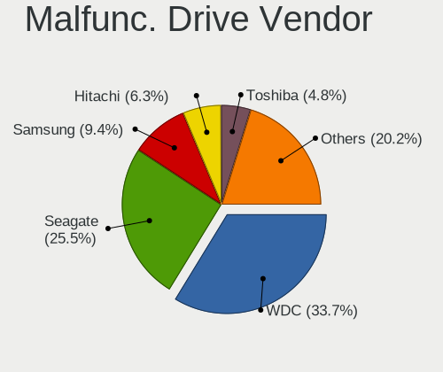

| Vendor              | Desktops | Drives | Percent |
|---------------------|----------|--------|---------|
| WDC                 | 102      | 137    | 36.04%  |
| Seagate             | 79       | 95     | 27.92%  |
| Samsung Electronics | 25       | 27     | 8.83%   |
| Hitachi             | 19       | 25     | 6.71%   |
| Toshiba             | 12       | 17     | 4.24%   |
| Kingston            | 6        | 6      | 2.12%   |
| Maxtor              | 5        | 5      | 1.77%   |
| Crucial             | 5        | 6      | 1.77%   |
| Intel               | 4        | 6      | 1.41%   |
| SanDisk             | 3        | 3      | 1.06%   |
| A-DATA Technology   | 3        | 3      | 1.06%   |
| OCZ                 | 2        | 2      | 0.71%   |
| Mushkin             | 2        | 2      | 0.71%   |
| ASMT                | 2        | 2      | 0.71%   |
| Apple               | 2        | 2      | 0.71%   |
| ZHITAI              | 1        | 1      | 0.35%   |
| SSSTC               | 1        | 1      | 0.35%   |
| Netac               | 1        | 2      | 0.35%   |
| Micron Technology   | 1        | 1      | 0.35%   |
| LITEON              | 1        | 1      | 0.35%   |
| Lenovo              | 1        | 1      | 0.35%   |
| KingSpec            | 1        | 1      | 0.35%   |
| HS-SSD-C100         | 1        | 1      | 0.35%   |
| Fujitsu             | 1        | 1      | 0.35%   |
| Corsair             | 1        | 1      | 0.35%   |
| China               | 1        | 1      | 0.35%   |
| ADATA Technology    | 1        | 1      | 0.35%   |

Malfunc. HDD Vendor
-------------------

Vendors of faulty HDD drives

| Vendor              | Desktops | Drives | Percent |
|---------------------|----------|--------|---------|
| WDC                 | 97       | 131    | 43.5%   |
| Seagate             | 79       | 95     | 35.43%  |
| Hitachi             | 19       | 25     | 8.52%   |
| Toshiba             | 12       | 17     | 5.38%   |
| Samsung Electronics | 8        | 9      | 3.59%   |
| Maxtor              | 5        | 5      | 2.24%   |
| Apple               | 2        | 2      | 0.9%    |
| ASMT                | 1        | 1      | 0.45%   |

Malfunc. Drive Kind
-------------------

Kinds of faulty drives

| Kind | Desktops | Drives | Percent |
|------|----------|--------|---------|
| HDD  | 197      | 285    | 76.65%  |
| SSD  | 50       | 56     | 19.46%  |
| NVMe | 10       | 10     | 3.89%   |

Failed Drives
-------------

Failed drive models

| Model                    | Desktops | Drives | Percent |
|--------------------------|----------|--------|---------|
| Seagate ST31000528AS 1TB | 1        | 1      | 100%    |

Failed Drive Vendor
-------------------

Failed drive vendors

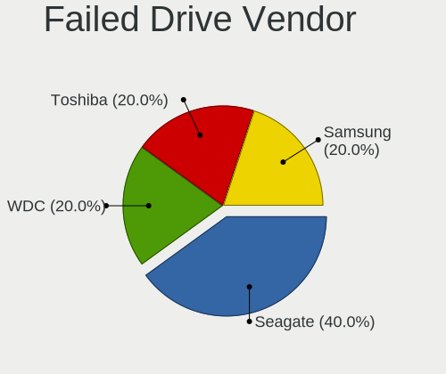

| Vendor  | Desktops | Drives | Percent |
|---------|----------|--------|---------|
| Seagate | 1        | 1      | 100%    |

Drive Status
------------

Number of failed and malfunc. drives

| Status   | Desktops | Drives | Percent |
|----------|----------|--------|---------|
| Works    | 993      | 2321   | 59.86%  |
| Detected | 414      | 1103   | 24.95%  |
| Malfunc  | 250      | 351    | 15.07%  |
| Failed   | 1        | 1      | 0.06%   |
| Limited  | 1        | 1      | 0.06%   |

Storage controller
------------------

Storage Vendor
--------------

Storage controller vendors

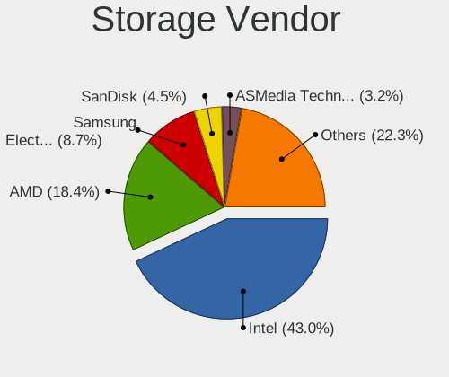

| Vendor                           | Desktops | Percent |
|----------------------------------|----------|---------|
| Intel                            | 960      | 43.36%  |
| AMD                              | 437      | 19.74%  |
| Samsung Electronics              | 192      | 8.67%   |
| SanDisk                          | 91       | 4.11%   |
| ASMedia Technology               | 77       | 3.48%   |
| Kingston Technology Company      | 60       | 2.71%   |
| JMicron Technology               | 52       | 2.35%   |
| Micron/Crucial Technology        | 50       | 2.26%   |
| Phison Electronics               | 47       | 2.12%   |
| Marvell Technology Group         | 31       | 1.4%    |
| Silicon Motion                   | 22       | 0.99%   |
| Nvidia                           | 19       | 0.86%   |
| ADATA Technology                 | 19       | 0.86%   |
| MAXIO Technology (Hangzhou)      | 18       | 0.81%   |
| SK hynix                         | 13       | 0.59%   |
| Toshiba America Info Systems     | 10       | 0.45%   |
| KIOXIA                           | 10       | 0.45%   |
| Broadcom / LSI                   | 10       | 0.45%   |
| Realtek Semiconductor            | 9        | 0.41%   |
| Silicon Image                    | 8        | 0.36%   |
| Micron Technology                | 8        | 0.36%   |
| LSI Logic / Symbios Logic        | 8        | 0.36%   |
| Adaptec                          | 7        | 0.32%   |
| VIA Technologies                 | 6        | 0.27%   |
| Shenzhen Longsys Electronics     | 5        | 0.23%   |
| INNOGRIT                         | 5        | 0.23%   |
| Yangtze Memory Technologies      | 4        | 0.18%   |
| Transcend                        | 4        | 0.18%   |
| Silicon Integrated Systems [SiS] | 4        | 0.18%   |
| Biwin Storage Technology         | 4        | 0.18%   |
| Netac Technology                 | 3        | 0.14%   |
| Solidigm                         | 2        | 0.09%   |
| Solid State Storage Technology   | 2        | 0.09%   |
| Seagate Technology               | 2        | 0.09%   |
| Nextorage                        | 2        | 0.09%   |
| HighPoint Technologies           | 2        | 0.09%   |
| Union Memory (Shenzhen)          | 1        | 0.05%   |
| Radian Memory Systems            | 1        | 0.05%   |
| Loongson Technology              | 1        | 0.05%   |
| Lite-On Technology               | 1        | 0.05%   |

Storage Model
-------------

Storage controller models

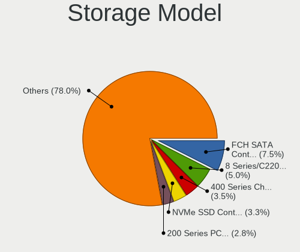

| Model                                                                                   | Desktops | Percent |
|-----------------------------------------------------------------------------------------|----------|---------|
| AMD FCH SATA Controller [AHCI mode]                                                     | 224      | 8.45%   |
| Intel 8 Series/C220 Series Chipset Family 6-port SATA Controller 1 [AHCI mode]          | 137      | 5.17%   |
| AMD 400 Series Chipset SATA Controller                                                  | 104      | 3.92%   |
| Samsung NVMe SSD Controller SM981/PM981/PM983                                           | 91       | 3.43%   |
| Intel 200 Series PCH SATA controller [AHCI mode]                                        | 76       | 2.87%   |
| Intel Q170/Q150/B150/H170/H110/Z170/CM236 Chipset SATA Controller [AHCI Mode]           | 73       | 2.75%   |
| AMD 500 Series Chipset SATA Controller                                                  | 70       | 2.64%   |
| ASMedia ASM1061/ASM1062 Serial ATA Controller                                           | 65       | 2.45%   |
| Samsung NVMe SSD Controller PM9A1/PM9A3/980PRO                                          | 60       | 2.26%   |
| AMD 600 Series Chipset SATA Controller                                                  | 49       | 1.85%   |
| Intel NM10/ICH7 Family SATA Controller [IDE mode]                                       | 47       | 1.77%   |
| Intel 6 Series/C200 Series Chipset Family 6 port Desktop SATA AHCI Controller           | 46       | 1.74%   |
| Intel SATA Controller [RAID mode]                                                       | 42       | 1.58%   |
| Intel Raptor Lake SATA AHCI Controller                                                  | 40       | 1.51%   |
| Intel Comet Lake SATA AHCI Controller                                                   | 40       | 1.51%   |
| Intel 7 Series/C210 Series Chipset Family 6-port SATA Controller [AHCI mode]            | 39       | 1.47%   |
| Micron/Crucial P2 [Nick P2] / P3 / P3 Plus NVMe PCIe SSD (DRAM-less)                    | 38       | 1.43%   |
| Intel Alder Lake-S PCH SATA Controller [AHCI Mode]                                      | 37       | 1.4%    |
| Intel 82801G (ICH7 Family) IDE Controller                                               | 36       | 1.36%   |
| AMD SB7x0/SB8x0/SB9x0 SATA Controller [AHCI mode]                                       | 36       | 1.36%   |
| Intel 6 Series/C200 Series Chipset Family Desktop SATA Controller (IDE mode, ports 4-5) | 30       | 1.13%   |
| Intel 6 Series/C200 Series Chipset Family Desktop SATA Controller (IDE mode, ports 0-3) | 30       | 1.13%   |
| AMD SB7x0/SB8x0/SB9x0 IDE Controller                                                    | 29       | 1.09%   |
| JMicron JMB368 IDE controller                                                           | 28       | 1.06%   |
| Intel C610/X99 series chipset 6-Port SATA Controller [AHCI mode]                        | 25       | 0.94%   |
| Intel 82801JI (ICH10 Family) 4 port SATA IDE Controller #1                              | 25       | 0.94%   |
| Intel 82801JI (ICH10 Family) 2 port SATA IDE Controller #2                              | 25       | 0.94%   |
| Intel 500 Series Chipset Family SATA AHCI Controller                                    | 25       | 0.94%   |
| Intel Cannon Lake PCH SATA AHCI Controller                                              | 24       | 0.91%   |
| Samsung NVMe SSD Controller 980 (DRAM-less)                                             | 23       | 0.87%   |
| Intel 82801JI (ICH10 Family) SATA AHCI Controller                                       | 21       | 0.79%   |
| Phison E12 NVMe Controller                                                              | 20       | 0.75%   |
| Intel C610/X99 series chipset sSATA Controller [AHCI mode]                              | 20       | 0.75%   |
| Samsung NVMe SSD Controller S4LV008[Pascal]                                             | 19       | 0.72%   |
| AMD FCH SATA Controller D                                                               | 19       | 0.72%   |
| AMD 300 Series Chipset SATA Controller                                                  | 19       | 0.72%   |
| Intel Volume Management Device NVMe RAID Controller                                     | 18       | 0.68%   |
| Intel 9 Series Chipset Family SATA Controller [AHCI Mode]                               | 18       | 0.68%   |
| Silicon Motion SM2263EN/SM2263XT (DRAM-less) NVMe SSD Controllers                       | 17       | 0.64%   |
| Intel SATA controller                                                                   | 17       | 0.64%   |

Storage Kind
------------

Kind of storage controller (IDE, SATA, NVMe, SAS, ...)

| Kind | Desktops | Percent |
|------|----------|---------|
| SATA | 1208     | 57.69%  |
| NVMe | 507      | 24.21%  |
| IDE  | 259      | 12.37%  |
| RAID | 95       | 4.54%   |
| SAS  | 19       | 0.91%   |
| SCSI | 6        | 0.29%   |

Processor
---------

CPU Vendor
----------

Processor vendors

| Vendor            | Desktops | Percent |
|-------------------|----------|---------|
| Intel             | 980      | 67.4%   |
| AMD               | 465      | 31.98%  |
| ARM               | 3        | 0.21%   |
| sifive,u74-mc     | 2        | 0.14%   |
| Unknown           | 2        | 0.14%   |
| Loongson          | 1        | 0.07%   |
| CHRP IBM,8233-E8B | 1        | 0.07%   |

CPU Model
---------

Processor models

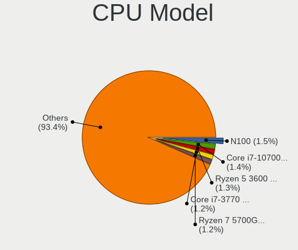

| Model                                       | Desktops | Percent |
|---------------------------------------------|----------|---------|
| Intel Core i7-10700 CPU @ 2.90GHz           | 24       | 1.65%   |
| AMD Ryzen 7 5700G with Radeon Graphics      | 21       | 1.44%   |
| AMD Ryzen 5 5600G with Radeon Graphics      | 20       | 1.37%   |
| AMD Ryzen 5 3600 6-Core Processor           | 20       | 1.37%   |
| Intel Pentium CPU G3420 @ 3.20GHz           | 19       | 1.3%    |
| AMD Ryzen 7 3700X 8-Core Processor          | 19       | 1.3%    |
| Intel Pentium CPU G4400 @ 3.30GHz           | 18       | 1.24%   |
| AMD Ryzen 7 5800X 8-Core Processor          | 18       | 1.24%   |
| Intel Core i3-4130 CPU @ 3.40GHz            | 17       | 1.17%   |
| Intel Core 2 Duo CPU E7400 @ 2.80GHz        | 14       | 0.96%   |
| Intel Core 2 CPU 6400 @ 2.13GHz             | 14       | 0.96%   |
| AMD Ryzen 5 5600X 6-Core Processor          | 14       | 0.96%   |
| Intel Pentium Dual-Core CPU E6500 @ 2.93GHz | 13       | 0.89%   |
| Intel Core i7-4790 CPU @ 3.60GHz            | 13       | 0.89%   |
| Intel Core i7-3770 CPU @ 3.40GHz            | 13       | 0.89%   |
| Intel Core i5-9400 CPU @ 2.90GHz            | 13       | 0.89%   |
| Intel Core i5-3470 CPU @ 3.20GHz            | 13       | 0.89%   |
| Intel Pentium CPU G3260 @ 3.30GHz           | 12       | 0.82%   |
| Intel Core 2 Duo CPU E8400 @ 3.00GHz        | 12       | 0.82%   |
| Intel N100                                  | 11       | 0.75%   |
| AMD Ryzen 9 5900X 12-Core Processor         | 11       | 0.75%   |
| AMD Ryzen 3 2200G with Radeon Vega Graphics | 11       | 0.75%   |
| Intel Core i7-7700K CPU @ 4.20GHz           | 10       | 0.69%   |
| Intel Core i3-6100 CPU @ 3.70GHz            | 10       | 0.69%   |
| Intel Core i3-4170 CPU @ 3.70GHz            | 10       | 0.69%   |
| AMD Ryzen 9 7900X 12-Core Processor         | 10       | 0.69%   |
| AMD Ryzen 9 3900X 12-Core Processor         | 10       | 0.69%   |
| AMD Ryzen 5 PRO 4650G with Radeon Graphics  | 10       | 0.69%   |
| AMD Ryzen 5 3350G with Radeon Vega Graphics | 10       | 0.69%   |
| AMD Ryzen 9 7950X 16-Core Processor         | 9        | 0.62%   |
| AMD Ryzen 5 2600 Six-Core Processor         | 9        | 0.62%   |
| AMD PRO A8-8650B R7, 10 Compute Cores 4C+6G | 9        | 0.62%   |
| Intel Xeon CPU E5-1630 v3 @ 3.70GHz         | 8        | 0.55%   |
| Intel Pentium CPU G3220 @ 3.00GHz           | 8        | 0.55%   |
| Intel Core i7-2600 CPU @ 3.40GHz            | 8        | 0.55%   |
| Intel Core i5-6500 CPU @ 3.20GHz            | 8        | 0.55%   |
| Intel Core i5-2400 CPU @ 3.10GHz            | 8        | 0.55%   |
| Intel Core i3-7100 CPU @ 3.90GHz            | 8        | 0.55%   |
| Intel Core 2 Duo CPU E7500 @ 2.93GHz        | 8        | 0.55%   |
| Intel Celeron N5105 @ 2.00GHz               | 8        | 0.55%   |

CPU Model Family
----------------

Processor model prefix

| Model                   | Desktops | Percent |
|-------------------------|----------|---------|
| Intel Core i5           | 178      | 12.23%  |
| Intel Core i7           | 146      | 10.03%  |
| Other                   | 134      | 9.21%   |
| AMD Ryzen 5             | 126      | 8.66%   |
| AMD Ryzen 7             | 107      | 7.35%   |
| Intel Core i3           | 106      | 7.29%   |
| Intel Xeon              | 101      | 6.94%   |
| Intel Pentium           | 95       | 6.53%   |
| Intel Celeron           | 68       | 4.67%   |
| AMD Ryzen 9             | 68       | 4.67%   |
| Intel Core 2 Duo        | 52       | 3.57%   |
| AMD FX                  | 29       | 1.99%   |
| Intel Pentium Dual-Core | 23       | 1.58%   |
| Intel Core 2 Quad       | 23       | 1.58%   |
| AMD Ryzen 3             | 23       | 1.58%   |
| Intel Core 2            | 18       | 1.24%   |
| Intel Atom              | 13       | 0.89%   |
| AMD Ryzen 5 PRO         | 12       | 0.82%   |
| Intel Core i9           | 10       | 0.69%   |
| Intel Pentium 4         | 9        | 0.62%   |
| AMD PRO A8              | 9        | 0.62%   |
| AMD Athlon 64 X2        | 8        | 0.55%   |
| AMD A10                 | 8        | 0.55%   |
| Intel Pentium Gold      | 7        | 0.48%   |
| Intel Pentium Silver    | 6        | 0.41%   |
| AMD GX                  | 6        | 0.41%   |
| AMD Athlon II X2        | 6        | 0.41%   |
| AMD Athlon              | 6        | 0.41%   |
| AMD Phenom II X6        | 5        | 0.34%   |
| AMD Phenom II X4        | 5        | 0.34%   |
| AMD A8                  | 5        | 0.34%   |
| AMD PRO A10             | 4        | 0.27%   |
| AMD Athlon II X4        | 4        | 0.27%   |
| AMD Ryzen Threadripper  | 3        | 0.21%   |
| AMD Phenom II X3        | 3        | 0.21%   |
| AMD G                   | 3        | 0.21%   |
| AMD EPYC                | 3        | 0.21%   |
| AMD Athlon II X3        | 3        | 0.21%   |
| AMD A6                  | 3        | 0.21%   |
| AMD A4                  | 3        | 0.21%   |

CPU Cores
---------

Number of processor cores

| Number  | Desktops | Percent |
|---------|----------|---------|
| 4       | 453      | 31.13%  |
| 2       | 396      | 27.22%  |
| 6       | 209      | 14.36%  |
| 8       | 181      | 12.44%  |
| 12      | 60       | 4.12%   |
| 16      | 44       | 3.02%   |
| 1       | 26       | 1.79%   |
| 10      | 23       | 1.58%   |
| 14      | 19       | 1.31%   |
| 3       | 16       | 1.1%    |
| 24      | 13       | 0.89%   |
| 22      | 3        | 0.21%   |
| Unknown | 3        | 0.21%   |
| 28      | 2        | 0.14%   |
| 20      | 2        | 0.14%   |
| 18      | 2        | 0.14%   |
| 36      | 1        | 0.07%   |
| 32      | 1        | 0.07%   |
| 5       | 1        | 0.07%   |

CPU Sockets
-----------

Number of sockets

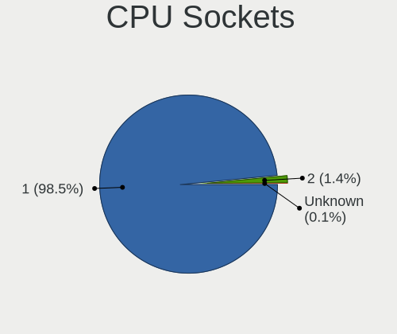

| Number  | Desktops | Percent |
|---------|----------|---------|
| 1       | 1437     | 98.76%  |
| 2       | 16       | 1.1%    |
| Unknown | 2        | 0.14%   |

CPU Threads
-----------

Threads per core (Hyper-Threading)

| Number  | Desktops | Percent |
|---------|----------|---------|
| 2       | 868      | 59.66%  |
| 1       | 583      | 40.07%  |
| Unknown | 3        | 0.21%   |
| 4       | 1        | 0.07%   |

CPU Op-Modes
------------

CPU Operation Modes (32-bit, 64-bit)

| Op mode        | Desktops | Percent |
|----------------|----------|---------|
| 32-bit, 64-bit | 1439     | 98.97%  |
| 32-bit         | 9        | 0.62%   |
| Unknown        | 6        | 0.41%   |

CPU Microcode
-------------

Microcode number

| Number     | Desktops | Percent |
|------------|----------|---------|
| Unknown    | 447      | 30.41%  |
| 0x306c3    | 125      | 8.5%    |
| 0x1067a    | 69       | 4.69%   |
| 0x506e3    | 49       | 3.33%   |
| 0x306a9    | 45       | 3.06%   |
| 0x206a7    | 40       | 2.72%   |
| 0x906e9    | 39       | 2.65%   |
| 0x0a50000d | 31       | 2.11%   |
| 0xa0655    | 26       | 1.77%   |
| 0x906ea    | 25       | 1.7%    |
| 0x08701021 | 24       | 1.63%   |
| 0x0a601203 | 23       | 1.56%   |
| 0x08108109 | 22       | 1.5%    |
| 0xb0671    | 18       | 1.22%   |
| 0x90672    | 18       | 1.22%   |
| 0xa0653    | 16       | 1.09%   |
| 0x0a601206 | 15       | 1.02%   |
| 0x6f2      | 14       | 0.95%   |
| 0x08600106 | 14       | 0.95%   |
| 0x0800820d | 14       | 0.95%   |
| 0x306f2    | 13       | 0.88%   |
| 0x06003106 | 13       | 0.88%   |
| 0xb06e0    | 11       | 0.75%   |
| 0xa0671    | 11       | 0.75%   |
| 0x0a20120a | 11       | 0.75%   |
| 0x906c0    | 10       | 0.68%   |
| 0x406f1    | 10       | 0.68%   |
| 0x0a201016 | 10       | 0.68%   |
| 0x06000852 | 10       | 0.68%   |
| 0x6fd      | 9        | 0.61%   |
| 0x10676    | 9        | 0.61%   |
| 0x08701030 | 9        | 0.61%   |
| 0x0600611a | 9        | 0.61%   |
| 0x0a50000f | 8        | 0.54%   |
| 0x08001138 | 8        | 0.54%   |
| 0x906ed    | 7        | 0.48%   |
| 0x90675    | 7        | 0.48%   |
| 0x30673    | 7        | 0.48%   |
| 0x08701013 | 7        | 0.48%   |
| 0x08101016 | 7        | 0.48%   |

CPU Microarch
-------------

Microarchitecture

| Name             | Desktops | Percent |
|------------------|----------|---------|
| Haswell          | 193      | 13.24%  |
| Zen 3            | 119      | 8.16%   |
| KabyLake         | 116      | 7.96%   |
| Unknown          | 106      | 7.27%   |
| Penryn           | 97       | 6.65%   |
| Zen 2            | 90       | 6.17%   |
| IvyBridge        | 77       | 5.28%   |
| Skylake          | 76       | 5.21%   |
| SandyBridge      | 68       | 4.66%   |
| CometLake        | 63       | 4.32%   |
| Alderlake Hybrid | 58       | 3.98%   |
| Zen+             | 51       | 3.5%    |
| Core             | 37       | 2.54%   |
| Zen              | 33       | 2.26%   |
| K10              | 30       | 2.06%   |
| Piledriver       | 27       | 1.85%   |
| Silvermont       | 20       | 1.37%   |
| Westmere         | 18       | 1.23%   |
| Nehalem          | 18       | 1.23%   |
| Broadwell        | 17       | 1.17%   |
| Tremont          | 16       | 1.1%    |
| Icelake          | 16       | 1.1%    |
| Steamroller      | 14       | 0.96%   |
| Gracemont        | 14       | 0.96%   |
| Goldmont plus    | 13       | 0.89%   |
| Excavator        | 13       | 0.89%   |
| NetBurst         | 10       | 0.69%   |
| K8 Hammer        | 9        | 0.62%   |
| Jaguar           | 9        | 0.62%   |
| Bulldozer        | 6        | 0.41%   |
| Goldmont         | 5        | 0.34%   |
| Bonnell          | 5        | 0.34%   |
| TigerLake        | 4        | 0.27%   |
| Bobcat           | 3        | 0.21%   |
| Puma             | 2        | 0.14%   |
| K6               | 2        | 0.14%   |
| K10 Llano        | 2        | 0.14%   |
| P6               | 1        | 0.07%   |

Graphics
--------

GPU Vendor
----------

Vendors of graphics cards

| Vendor                                       | Desktops | Percent |
|----------------------------------------------|----------|---------|
| Intel                                        | 581      | 37.75%  |
| AMD                                          | 475      | 30.86%  |
| Nvidia                                       | 451      | 29.3%   |
| ASPEED Technology                            | 19       | 1.23%   |
| Matrox Electronics Systems                   | 10       | 0.65%   |
| XGI Technology (eXtreme Graphics Innovation) | 1        | 0.06%   |
| Silicon Integrated Systems [SiS]             | 1        | 0.06%   |
| Loongson Technology                          | 1        | 0.06%   |

GPU Model
---------

Graphics card models

| Model                                                                       | Desktops | Percent |
|-----------------------------------------------------------------------------|----------|---------|
| Intel Xeon E3-1200 v3/4th Gen Core Processor Integrated Graphics Controller | 86       | 5.45%   |
| AMD Raphael                                                                 | 44       | 2.79%   |
| AMD Cezanne [Radeon Vega Series / Radeon Vega Mobile Series]                | 42       | 2.66%   |
| Intel HD Graphics 530                                                       | 34       | 2.15%   |
| Intel 2nd Generation Core Processor Family Integrated Graphics Controller   | 34       | 2.15%   |
| AMD Ellesmere [Radeon RX 470/480/570/570X/580/580X/590]                     | 34       | 2.15%   |
| Intel Xeon E3-1200 v2/3rd Gen Core processor Graphics Controller            | 32       | 2.03%   |
| Intel 4th Generation Core Processor Family Integrated Graphics Controller   | 32       | 2.03%   |
| Intel CoffeeLake-S GT2 [UHD Graphics 630]                                   | 31       | 1.96%   |
| Intel CometLake-S GT2 [UHD Graphics 630]                                    | 28       | 1.77%   |
| AMD Navi 23 [Radeon RX 6600/6600 XT/6600M]                                  | 27       | 1.71%   |
| Intel 4 Series Chipset Integrated Graphics Controller                       | 26       | 1.65%   |
| AMD Picasso/Raven 2 [Radeon Vega Series / Radeon Vega Mobile Series]        | 26       | 1.65%   |
| Nvidia TU106 [GeForce RTX 2060 Rev. A]                                      | 24       | 1.52%   |
| Nvidia GF108 [GeForce GT 730]                                               | 24       | 1.52%   |
| Intel HD Graphics 630                                                       | 24       | 1.52%   |
| Nvidia GP108 [GeForce GT 1030]                                              | 20       | 1.27%   |
| AMD Renoir [Radeon RX Vega 6 (Ryzen 4000/5000 Mobile Series)]               | 20       | 1.27%   |
| Nvidia GP107 [GeForce GTX 1050 Ti]                                          | 19       | 1.2%    |
| Intel HD Graphics 510                                                       | 19       | 1.2%    |
| Intel AlderLake-S GT1                                                       | 19       | 1.2%    |
| Intel Alder Lake-N [UHD Graphics]                                           | 19       | 1.2%    |
| ASPEED Technology ASPEED Graphics Family                                    | 19       | 1.2%    |
| AMD Lexa PRO [Radeon 540/540X/550/550X / RX 540X/550/550X]                  | 19       | 1.2%    |
| Nvidia TU117 [GeForce GTX 1650]                                             | 17       | 1.08%   |
| AMD Navi 10 [Radeon RX 5600 OEM/5600 XT / 5700/5700 XT]                     | 17       | 1.08%   |
| Nvidia GK208B [GeForce GT 710]                                              | 15       | 0.95%   |
| Intel 82Q963/Q965 Integrated Graphics Controller                            | 15       | 0.95%   |
| Intel 82G33/G31 Express Integrated Graphics Controller                      | 15       | 0.95%   |
| AMD RV730 XT [Radeon HD 4670]                                               | 15       | 0.95%   |
| AMD Raven Ridge [Radeon Vega Series / Radeon Vega Mobile Series]            | 15       | 0.95%   |
| Nvidia GM204 [GeForce GTX 970]                                              | 14       | 0.89%   |
| Intel Raptor Lake-S GT1 [UHD Graphics 770]                                  | 13       | 0.82%   |
| Intel Atom Processor Z36xxx/Z37xxx Series Graphics & Display                | 13       | 0.82%   |
| AMD Kaveri [Radeon R7 Graphics]                                             | 13       | 0.82%   |
| Nvidia GP106 [GeForce GTX 1060 6GB]                                         | 12       | 0.76%   |
| Intel JasperLake [UHD Graphics]                                             | 12       | 0.76%   |
| AMD Wani [Radeon R5/R6/R7 Graphics]                                         | 12       | 0.76%   |
| AMD Polaris 20 XL [Radeon RX 580 2048SP]                                    | 12       | 0.76%   |
| Nvidia GP107 [GeForce GTX 1050]                                             | 11       | 0.7%    |

GPU Combo
---------

Combinations of graphics cards

| Name                    | Desktops | Percent |
|-------------------------|----------|---------|
| 1 x Intel               | 502      | 34.43%  |
| 1 x AMD                 | 410      | 28.12%  |
| 1 x Nvidia              | 387      | 26.54%  |
| Intel + Nvidia          | 36       | 2.47%   |
| 2 x AMD                 | 26       | 1.78%   |
| AMD + Nvidia            | 22       | 1.51%   |
| 1 x ASPEED              | 16       | 1.1%    |
| Other                   | 13       | 0.89%   |
| 2 x Intel               | 13       | 0.89%   |
| 1 x Matrox              | 10       | 0.69%   |
| Intel + AMD             | 10       | 0.69%   |
| 3 x AMD                 | 2        | 0.14%   |
| 2 x Nvidia              | 2        | 0.14%   |
| Nvidia + ASPEED         | 2        | 0.14%   |
| 2 x AMD + 1 x Nvidia    | 1        | 0.07%   |
| 1 x XGI                 | 1        | 0.07%   |
| 1 x SiS                 | 1        | 0.07%   |
| 1 x Loongson Technology | 1        | 0.07%   |
| AMD + 2 x Nvidia        | 1        | 0.07%   |
| AMD + Matrox            | 1        | 0.07%   |
| AMD + ASPEED            | 1        | 0.07%   |

GPU Driver
----------

Free vs proprietary

| Driver      | Desktops | Percent |
|-------------|----------|---------|
| Free        | 914      | 62.6%   |
| Unknown     | 374      | 25.62%  |
| Proprietary | 172      | 11.78%  |

GPU Memory
----------

Total video memory

| Size in GB | Desktops | Percent |
|------------|----------|---------|
| Unknown    | 967      | 65.78%  |
| 0.01-0.5   | 94       | 6.39%   |
| 3.01-4.0   | 91       | 6.19%   |
| 7.01-8.0   | 89       | 6.05%   |
| 1.01-2.0   | 89       | 6.05%   |
| 0.51-1.0   | 52       | 3.54%   |
| 8.01-16.0  | 35       | 2.38%   |
| 5.01-6.0   | 27       | 1.84%   |
| 16.01-24.0 | 15       | 1.02%   |
| 2.01-3.0   | 10       | 0.68%   |
| 4.01-5.0   | 1        | 0.07%   |

Monitor
-------

Monitor Vendor
--------------

Monitor vendors

| Vendor               | Desktops | Percent |
|----------------------|----------|---------|
| Samsung Electronics  | 163      | 14.1%   |
| Dell                 | 143      | 12.37%  |
| Goldstar             | 104      | 9%      |
| Philips              | 84       | 7.27%   |
| Hewlett-Packard      | 79       | 6.83%   |
| Acer                 | 64       | 5.54%   |
| Ancor Communications | 62       | 5.36%   |
| BenQ                 | 58       | 5.02%   |
| AOC                  | 51       | 4.41%   |
| ASUSTek Computer     | 39       | 3.37%   |
| Lenovo               | 25       | 2.16%   |
| ViewSonic            | 23       | 1.99%   |
| Unknown              | 23       | 1.99%   |
| Iiyama               | 20       | 1.73%   |
| LG Electronics       | 15       | 1.3%    |
| Unknown              | 15       | 1.3%    |
| Sceptre Tech         | 13       | 1.12%   |
| Sony                 | 10       | 0.87%   |
| RTK                  | 7        | 0.61%   |
| Mi                   | 7        | 0.61%   |
| NEC Computers        | 6        | 0.52%   |
| Fujitsu Siemens      | 6        | 0.52%   |
| Toshiba              | 5        | 0.43%   |
| Eizo                 | 5        | 0.43%   |
| Vizio                | 4        | 0.35%   |
| TCT                  | 4        | 0.35%   |
| Panasonic            | 4        | 0.35%   |
| MStar                | 4        | 0.35%   |
| Medion               | 4        | 0.35%   |
| Hitachi              | 4        | 0.35%   |
| Gigabyte Technology  | 4        | 0.35%   |
| MSI                  | 3        | 0.26%   |
| MiTAC                | 3        | 0.26%   |
| HKC                  | 3        | 0.26%   |
| HannStar             | 3        | 0.26%   |
| Denver               | 3        | 0.26%   |
| CTV                  | 3        | 0.26%   |
| SKG                  | 2        | 0.17%   |
| SAC                  | 2        | 0.17%   |
| PCT                  | 2        | 0.17%   |

Monitor Model
-------------

Monitor models

| Model                                                                 | Desktops | Percent |
|-----------------------------------------------------------------------|----------|---------|
| Philips 197EL PHLC08B 1366x768 410x230mm 18.5-inch                    | 44       | 3.61%   |
| Ancor Communications ASUS VS229 ACI22D3 1920x1080 475x267mm 21.5-inch | 20       | 1.64%   |
| Unknown LCD Monitor FFFF 2288x1287 2550x2550mm 142.0-inch             | 19       | 1.56%   |
| Unknown                                                               | 15       | 1.23%   |
| Hewlett-Packard LA2306 HWP294A 1920x1080 509x286mm 23.0-inch          | 7        | 0.57%   |
| Goldstar ULTRAWIDE GSM59F1 2560x1080 673x284mm 28.8-inch              | 7        | 0.57%   |
| Mi Redmi Monitor XMI23C3 1920x1080 527x293mm 23.7-inch                | 6        | 0.49%   |
| Samsung Electronics C27F390 SAM0D32 1920x1080 598x336mm 27.0-inch     | 5        | 0.41%   |
| Samsung Electronics C24F390 SAM0D2C 1920x1080 521x293mm 23.5-inch     | 5        | 0.41%   |
| Philips PHL 221V8 PHLC211 1920x1080 477x268mm 21.5-inch               | 5        | 0.41%   |
| Dell U2412M DELA07A 1920x1200 518x324mm 24.1-inch                     | 5        | 0.41%   |
| Sceptre Tech Sceptre F24 SPT09AB 1920x1080 530x290mm 23.8-inch        | 4        | 0.33%   |
| Samsung Electronics LCD Monitor SAM0A7A 1920x1080 480x270mm 21.7-inch | 4        | 0.33%   |
| Hewlett-Packard 23xi HWP3032 1920x1080 509x286mm 23.0-inch            | 4        | 0.33%   |
| Goldstar ULTRAGEAR GSM5B7F 2560x1440 597x336mm 27.0-inch              | 4        | 0.33%   |
| Dell U2515H DELD06F 2560x1440 553x311mm 25.0-inch                     | 4        | 0.33%   |
| Ancor Communications ASUS VS247 ACI249A 1920x1080 521x293mm 23.5-inch | 4        | 0.33%   |
| Ancor Communications ASUS VB178 ACI1714 1280x1024 338x270mm 17.0-inch | 4        | 0.33%   |
| Unknown SMART TV 0563 1920x1080 1209x680mm 54.6-inch                  | 3        | 0.25%   |
| TCT DP1080P60 TCT0270 2560x1600 480x270mm 21.7-inch                   | 3        | 0.25%   |
| Samsung Electronics SyncMaster SAM036F 1440x900 428x255mm 19.6-inch   | 3        | 0.25%   |
| Samsung Electronics LCD Monitor SyncMaster                            | 3        | 0.25%   |
| RTK LCD Monitor RTK1D1A 1920x1080 1020x570mm 46.0-inch                | 3        | 0.25%   |
| MStar TV MST0030 1920x1080 708x398mm 32.0-inch                        | 3        | 0.25%   |
| Iiyama PLE2483H IVM6113 1920x1080 531x299mm 24.0-inch                 | 3        | 0.25%   |
| Hewlett-Packard 24fw HPN3545 1920x1080 527x296mm 23.8-inch            | 3        | 0.25%   |
| Goldstar Ultra HD GSM5B09 3840x2160 600x340mm 27.2-inch               | 3        | 0.25%   |
| Goldstar HDR 4K GSM7707 3840x2160 600x340mm 27.2-inch                 | 3        | 0.25%   |
| Goldstar FULL HD GSM5B55 1920x1080 480x270mm 21.7-inch                | 3        | 0.25%   |
| Goldstar FULL HD GSM5ABB 1920x1080 480x270mm 21.7-inch                | 3        | 0.25%   |
| Dell P2418D DELD0C1 2560x1440 526x296mm 23.8-inch                     | 3        | 0.25%   |
| Dell E2011H DEL406B 1600x900 443x249mm 20.0-inch                      | 3        | 0.25%   |
| Dell E178WFP DELD016 1440x900 370x230mm 17.2-inch                     | 3        | 0.25%   |
| CTV CTV CTV0030 1920x1080 708x398mm 32.0-inch                         | 3        | 0.25%   |
| BenQ ZOWIE XL LCD BNQ7F33 1920x1080 531x298mm 24.0-inch               | 3        | 0.25%   |
| BenQ PD2700U BNQ802E 3840x2160 597x336mm 27.0-inch                    | 3        | 0.25%   |
| BenQ LCD BNQ8024 2560x1440 597x336mm 27.0-inch                        | 3        | 0.25%   |
| BenQ GW2270 BNQ78DB 1920x1080 476x268mm 21.5-inch                     | 3        | 0.25%   |
| AOC G2460PG AOC2460 1920x1080 531x299mm 24.0-inch                     | 3        | 0.25%   |
| Ancor Communications VE228 ACI22FA 1920x1080 477x268mm 21.5-inch      | 3        | 0.25%   |

Monitor Resolution
------------------

Monitor screen resolution

| Resolution         | Desktops | Percent |
|--------------------|----------|---------|
| 1920x1080 (FHD)    | 492      | 43.58%  |
| 3840x2160 (4K)     | 122      | 10.81%  |
| 2560x1440 (QHD)    | 118      | 10.45%  |
| 1366x768 (WXGA)    | 69       | 6.11%   |
| 1280x1024 (SXGA)   | 54       | 4.78%   |
| 1680x1050 (WSXGA+) | 36       | 3.19%   |
| 1440x900 (WXGA+)   | 29       | 2.57%   |
| 1920x1200 (WUXGA)  | 26       | 2.3%    |
| Unknown            | 26       | 2.3%    |
| 1600x900 (HD+)     | 25       | 2.21%   |
| 3440x1440          | 21       | 1.86%   |
| 2560x1080          | 21       | 1.86%   |
| 2288x1287          | 19       | 1.68%   |
| 1360x768           | 13       | 1.15%   |
| 3840x1080          | 12       | 1.06%   |
| 1024x768 (XGA)     | 6        | 0.53%   |
| 1920x540           | 5        | 0.44%   |
| 4480x1440          | 4        | 0.35%   |
| 3840x1600          | 4        | 0.35%   |
| 7680x2160          | 3        | 0.27%   |
| 5760x2160          | 3        | 0.27%   |
| 3840x1200          | 3        | 0.27%   |
| 1600x1200          | 3        | 0.27%   |
| 9440x2160          | 1        | 0.09%   |
| 7280x2160          | 1        | 0.09%   |
| 7280x1440          | 1        | 0.09%   |
| 720x480            | 1        | 0.09%   |
| 6400x2160          | 1        | 0.09%   |
| 6400x1440          | 1        | 0.09%   |
| 3286x1080          | 1        | 0.09%   |
| 2720x768           | 1        | 0.09%   |
| 2560x1600          | 1        | 0.09%   |
| 2048x1152          | 1        | 0.09%   |
| 1400x1050          | 1        | 0.09%   |
| 1280x960           | 1        | 0.09%   |
| 1280x768           | 1        | 0.09%   |
| 1280x720 (HD)      | 1        | 0.09%   |
| 1152x864           | 1        | 0.09%   |

Monitor Diagonal
----------------

Diagonal size in inches

| Inches  | Desktops | Percent |
|---------|----------|---------|
| 27      | 167      | 14.61%  |
| 24      | 161      | 14.09%  |
| 21      | 134      | 11.72%  |
| 23      | 121      | 10.59%  |
| Unknown | 83       | 7.26%   |
| 18      | 74       | 6.47%   |
| 19      | 53       | 4.64%   |
| 31      | 49       | 4.29%   |
| 34      | 34       | 2.97%   |
| 20      | 27       | 2.36%   |
| 17      | 26       | 2.27%   |
| 22      | 23       | 2.01%   |
| 32      | 22       | 1.92%   |
| 142     | 19       | 1.66%   |
| 15      | 18       | 1.57%   |
| 84      | 17       | 1.49%   |
| 40      | 12       | 1.05%   |
| 54      | 11       | 0.96%   |
| 25      | 11       | 0.96%   |
| 52      | 9        | 0.79%   |
| 48      | 9        | 0.79%   |
| 72      | 6        | 0.52%   |
| 26      | 6        | 0.52%   |
| 46      | 5        | 0.44%   |
| 43      | 5        | 0.44%   |
| 37      | 5        | 0.44%   |
| 28      | 5        | 0.44%   |
| 49      | 3        | 0.26%   |
| 39      | 3        | 0.26%   |
| 33      | 3        | 0.26%   |
| 16      | 3        | 0.26%   |
| 42      | 2        | 0.17%   |
| 36      | 2        | 0.17%   |
| 14      | 2        | 0.17%   |
| 12      | 2        | 0.17%   |
| 95      | 1        | 0.09%   |
| 86      | 1        | 0.09%   |
| 85      | 1        | 0.09%   |
| 74      | 1        | 0.09%   |
| 65      | 1        | 0.09%   |

Monitor Width
-------------

Physical width

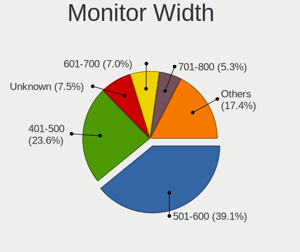

| Width in mm    | Desktops | Percent |
|----------------|----------|---------|
| 501-600        | 425      | 38.15%  |
| 401-500        | 283      | 25.4%   |
| Unknown        | 83       | 7.45%   |
| 601-700        | 71       | 6.37%   |
| 701-800        | 61       | 5.48%   |
| 301-350        | 46       | 4.13%   |
| 1001-1500      | 40       | 3.59%   |
| 351-400        | 27       | 2.42%   |
| 1501-2000      | 26       | 2.33%   |
| 801-900        | 20       | 1.8%    |
| More than 2000 | 19       | 1.71%   |
| 901-1000       | 10       | 0.9%    |
| 201-300        | 3        | 0.27%   |

Aspect Ratio
------------

Proportional relationship between the width and the height

| Ratio   | Desktops | Percent |
|---------|----------|---------|
| 16/9    | 749      | 70.39%  |
| 16/10   | 97       | 9.12%   |
| Unknown | 73       | 6.86%   |
| 5/4     | 49       | 4.61%   |
| 21/9    | 43       | 4.04%   |
| 1.00    | 20       | 1.88%   |
| 4/3     | 15       | 1.41%   |
| 32/9    | 9        | 0.85%   |
| 3/2     | 4        | 0.38%   |
| 6/5     | 3        | 0.28%   |
| 3.20    | 1        | 0.09%   |
| 0.56    | 1        | 0.09%   |

Monitor Area
------------

Area in inch

| Area in inch | Desktops | Percent |
|----------------|----------|---------|
| 201-250        | 343      | 30.43%  |
| 301-350        | 170      | 15.08%  |
| 351-500        | 112      | 9.94%   |
| 151-200        | 110      | 9.76%   |
| 141-150        | 93       | 8.25%   |
| Unknown        | 83       | 7.36%   |
| More than 1000 | 72       | 6.39%   |
| 251-300        | 72       | 6.39%   |
| 501-1000       | 45       | 3.99%   |
| 101-110        | 15       | 1.33%   |
| 131-140        | 4        | 0.35%   |
| 111-120        | 3        | 0.27%   |
| 91-100         | 2        | 0.18%   |
| 81-90          | 1        | 0.09%   |
| 71-80          | 1        | 0.09%   |
| 61-70          | 1        | 0.09%   |

Pixel Density
-------------

Pixels per inch

| Density | Desktops | Percent |
|---------|----------|---------|
| 51-100  | 632      | 57.77%  |
| 101-120 | 227      | 20.75%  |
| Unknown | 83       | 7.59%   |
| 1-50    | 65       | 5.94%   |
| 121-160 | 64       | 5.85%   |
| 161-240 | 23       | 2.1%    |

Multiple Monitors
-----------------

Total monitors connected

| Total | Desktops | Percent |
|-------|----------|---------|
| 1     | 868      | 59.25%  |
| 0     | 421      | 28.74%  |
| 2     | 152      | 10.38%  |
| 3     | 23       | 1.57%   |
| 4     | 1        | 0.07%   |

Network
-------

Net Controller Vendor
---------------------

Controller vendors

| Vendor                           | Desktops | Percent |
|----------------------------------|----------|---------|
| Realtek Semiconductor            | 968      | 48.64%  |
| Intel                            | 596      | 29.95%  |
| Qualcomm Atheros                 | 77       | 3.87%   |
| MediaTek                         | 61       | 3.07%   |
| Broadcom                         | 42       | 2.11%   |
| Ralink Technology                | 25       | 1.26%   |
| TP-Link                          | 23       | 1.16%   |
| Marvell Technology Group         | 20       | 1.01%   |
| Nvidia                           | 19       | 0.95%   |
| Aquantia                         | 17       | 0.85%   |
| ASIX Electronics                 | 9        | 0.45%   |
| QinHeng Electronics              | 8        | 0.4%    |
| NetGear                          | 7        | 0.35%   |
| Mellanox Technologies            | 7        | 0.35%   |
| Broadcom Limited                 | 7        | 0.35%   |
| ASUSTek Computer                 | 7        | 0.35%   |
| Qualcomm Atheros Communications  | 6        | 0.3%    |
| Samsung Electronics              | 5        | 0.25%   |
| Ralink                           | 5        | 0.25%   |
| VIA Technologies                 | 4        | 0.2%    |
| Silicon Integrated Systems [SiS] | 4        | 0.2%    |
| Microsoft                        | 4        | 0.2%    |
| D-Link                           | 4        | 0.2%    |
| American Megatrends              | 4        | 0.2%    |
| 3Com                             | 4        | 0.2%    |
| Sigma Designs                    | 3        | 0.15%   |
| Google                           | 3        | 0.15%   |
| Edimax Technology                | 3        | 0.15%   |
| Dresden Elektronik               | 3        | 0.15%   |
| D-Link System                    | 3        | 0.15%   |
| Texas Instruments                | 2        | 0.1%    |
| Qualcomm Technologies            | 2        | 0.1%    |
| OnePlus Technology (Shenzhen)    | 2        | 0.1%    |
| Motorola PCS                     | 2        | 0.1%    |
| Microchip Technology             | 2        | 0.1%    |
| ICS Advent                       | 2        | 0.1%    |
| DisplayLink                      | 2        | 0.1%    |
| AVM                              | 2        | 0.1%    |
| ADMtek                           | 2        | 0.1%    |
| U-Blox                           | 1        | 0.05%   |

Net Controller Model
--------------------

Controller models

| Model                                                                           | Desktops | Percent |
|---------------------------------------------------------------------------------|----------|---------|
| Realtek RTL8111/8168/8211/8411 PCI Express Gigabit Ethernet Controller          | 752      | 33.19%  |
| Realtek RTL8125 2.5GbE Controller                                               | 117      | 5.16%   |
| Intel Ethernet Controller I225-V                                                | 82       | 3.62%   |
| Intel Wi-Fi 6 AX200                                                             | 62       | 2.74%   |
| Intel I211 Gigabit Network Connection                                           | 53       | 2.34%   |
| Intel Ethernet Connection I217-LM                                               | 42       | 1.85%   |
| Intel Ethernet Connection (2) I219-V                                            | 39       | 1.72%   |
| Intel Wi-Fi 6E(802.11ax) AX210/AX1675* 2x2 [Typhoon Peak]                       | 37       | 1.63%   |
| Intel 82579LM Gigabit Network Connection (Lewisville)                           | 37       | 1.63%   |
| MediaTek MT7922 802.11ax PCI Express Wireless Network Adapter                   | 28       | 1.24%   |
| Realtek RTL810xE PCI Express Fast Ethernet controller                           | 25       | 1.1%    |
| Intel Raptor Lake-S PCH CNVi WiFi                                               | 25       | 1.1%    |
| Intel Dual Band Wireless-AC 3168NGW [Stone Peak]                                | 24       | 1.06%   |
| MediaTek MT7921K (RZ608) Wi-Fi 6E 80MHz                                         | 23       | 1.02%   |
| Intel I210 Gigabit Network Connection                                           | 22       | 0.97%   |
| Realtek RTL8821CE 802.11ac PCIe Wireless Network Adapter                        | 21       | 0.93%   |
| Realtek RTL8152 Fast Ethernet Adapter                                           | 20       | 0.88%   |
| Intel Ethernet Controller I226-V                                                | 19       | 0.84%   |
| Realtek 802.11ac NIC                                                            | 16       | 0.71%   |
| Intel Ethernet Connection (2) I219-LM                                           | 16       | 0.71%   |
| Realtek RTL8153 Gigabit Ethernet Adapter                                        | 15       | 0.66%   |
| Intel 82579V Gigabit Network Connection                                         | 15       | 0.66%   |
| Realtek RTL8852BE PCIe 802.11ax Wireless Network Controller                     | 14       | 0.62%   |
| Intel Alder Lake-S PCH CNVi WiFi                                                | 14       | 0.62%   |
| Intel 82566DM Gigabit Network Connection                                        | 14       | 0.62%   |
| Intel 82574L Gigabit Network Connection                                         | 12       | 0.53%   |
| Ralink MT7601U Wireless Adapter                                                 | 11       | 0.49%   |
| Intel Ethernet Connection (2) I218-LM                                           | 11       | 0.49%   |
| Intel Wireless 7265                                                             | 10       | 0.44%   |
| Intel Wireless 7260                                                             | 10       | 0.44%   |
| Realtek RTL8188EUS 802.11n Wireless Network Adapter                             | 9        | 0.4%    |
| Realtek RTL-8100/8101L/8139 PCI Fast Ethernet Adapter                           | 9        | 0.4%    |
| Nvidia MCP61 Ethernet                                                           | 9        | 0.4%    |
| Marvell Group 88E8071 PCI-E Gigabit Ethernet Controller                         | 9        | 0.4%    |
| Intel 82567LM-3 Gigabit Network Connection                                      | 9        | 0.4%    |
| Aquantia AQtion AQC113CS NBase-T/IEEE 802.3an Ethernet Controller [Antigua 10G] | 9        | 0.4%    |
| Intel Wireless 3165                                                             | 8        | 0.35%   |
| Intel Wi-Fi 5(802.11ac) Wireless-AC 9x6x [Thunder Peak]                         | 8        | 0.35%   |
| Intel Ethernet Connection I217-V                                                | 8        | 0.35%   |
| Intel Ethernet Connection (14) I219-V                                           | 8        | 0.35%   |

Wireless Vendor
---------------

Wireless vendors

| Vendor                          | Desktops | Percent |
|---------------------------------|----------|---------|
| Intel                           | 237      | 41.58%  |
| Realtek Semiconductor           | 122      | 21.4%   |
| MediaTek                        | 58       | 10.18%  |
| Qualcomm Atheros                | 43       | 7.54%   |
| Ralink Technology               | 25       | 4.39%   |
| TP-Link                         | 22       | 3.86%   |
| Broadcom                        | 13       | 2.28%   |
| NetGear                         | 7        | 1.23%   |
| ASUSTek Computer                | 7        | 1.23%   |
| Qualcomm Atheros Communications | 6        | 1.05%   |
| Ralink                          | 5        | 0.88%   |
| D-Link                          | 4        | 0.7%    |
| Microsoft                       | 3        | 0.53%   |
| Marvell Technology Group        | 3        | 0.53%   |
| Edimax Technology               | 3        | 0.53%   |
| Broadcom Limited                | 3        | 0.53%   |
| Qualcomm Technologies           | 2        | 0.35%   |
| AVM                             | 2        | 0.35%   |
| Linksys                         | 1        | 0.18%   |
| IMC Networks                    | 1        | 0.18%   |
| Dell                            | 1        | 0.18%   |
| D-Link System                   | 1        | 0.18%   |
| Belkin Components               | 1        | 0.18%   |

Wireless Model
--------------

Wireless models

| Model                                                          | Desktops | Percent |
|----------------------------------------------------------------|----------|---------|
| Intel Wi-Fi 6 AX200                                            | 62       | 10.78%  |
| Intel Wi-Fi 6E(802.11ax) AX210/AX1675* 2x2 [Typhoon Peak]      | 37       | 6.43%   |
| MediaTek MT7922 802.11ax PCI Express Wireless Network Adapter  | 28       | 4.87%   |
| Intel Raptor Lake-S PCH CNVi WiFi                              | 25       | 4.35%   |
| Intel Dual Band Wireless-AC 3168NGW [Stone Peak]               | 24       | 4.17%   |
| MediaTek MT7921K (RZ608) Wi-Fi 6E 80MHz                        | 23       | 4%      |
| Realtek RTL8821CE 802.11ac PCIe Wireless Network Adapter       | 21       | 3.65%   |
| Realtek 802.11ac NIC                                           | 16       | 2.78%   |
| Realtek RTL8852BE PCIe 802.11ax Wireless Network Controller    | 14       | 2.43%   |
| Intel Alder Lake-S PCH CNVi WiFi                               | 14       | 2.43%   |
| Ralink MT7601U Wireless Adapter                                | 11       | 1.91%   |
| Intel Wireless 7265                                            | 10       | 1.74%   |
| Intel Wireless 7260                                            | 10       | 1.74%   |
| Realtek RTL8188EUS 802.11n Wireless Network Adapter            | 9        | 1.57%   |
| Intel Wireless 3165                                            | 8        | 1.39%   |
| Intel Wi-Fi 5(802.11ac) Wireless-AC 9x6x [Thunder Peak]        | 8        | 1.39%   |
| Realtek RTL88x2bu [AC1200 Techkey]                             | 7        | 1.22%   |
| Qualcomm Atheros AR9227 Wireless Network Adapter               | 7        | 1.22%   |
| TP-Link AC600 wireless Realtek RTL8811AU [Archer T2U Nano]     | 6        | 1.04%   |
| Qualcomm Atheros AR9287 Wireless Network Adapter (PCI-Express) | 6        | 1.04%   |
| Realtek RTL8852CE PCIe 802.11ax Wireless Network Controller    | 5        | 0.87%   |
| Realtek RTL8192CU 802.11n WLAN Adapter                         | 5        | 0.87%   |
| Realtek RTL8188EE Wireless Network Adapter                     | 5        | 0.87%   |
| Ralink RT2870/RT3070 Wireless Adapter                          | 5        | 0.87%   |
| Qualcomm Atheros AR9271 802.11n                                | 5        | 0.87%   |
| MediaTek MT7921 802.11ax PCI Express Wireless Network Adapter  | 5        | 0.87%   |
| Intel Wireless 8260                                            | 5        | 0.87%   |
| Intel Tiger Lake PCH CNVi WiFi                                 | 5        | 0.87%   |
| Intel Comet Lake PCH CNVi WiFi                                 | 5        | 0.87%   |
| Intel CNVi: Wi-Fi                                              | 5        | 0.87%   |
| Broadcom BCM4360 802.11ac Dual Band Wireless Network Adapter   | 5        | 0.87%   |
| TP-Link TL-WN722N v2/v3 [Realtek RTL8188EUS]                   | 4        | 0.7%    |
| TP-Link 802.11ac WLAN Adapter                                  | 4        | 0.7%    |
| Realtek RTL8192EE PCIe Wireless Network Adapter                | 4        | 0.7%    |
| Ralink RT5370 Wireless Adapter                                 | 4        | 0.7%    |
| Qualcomm Atheros QCA9377 802.11ac Wireless Network Adapter     | 4        | 0.7%    |
| Qualcomm Atheros QCA6174 802.11ac Wireless Network Adapter     | 4        | 0.7%    |
| Qualcomm Atheros AR9485 Wireless Network Adapter               | 4        | 0.7%    |
| TP-Link Archer T2U PLUS [RTL8821AU]                            | 3        | 0.52%   |
| TP-Link 802.11ac NIC                                           | 3        | 0.52%   |

Ethernet Vendor
---------------

Ethernet vendors

| Vendor                           | Desktops | Percent |
|----------------------------------|----------|---------|
| Realtek Semiconductor            | 934      | 58.63%  |
| Intel                            | 467      | 29.32%  |
| Qualcomm Atheros                 | 40       | 2.51%   |
| Broadcom                         | 30       | 1.88%   |
| Nvidia                           | 19       | 1.19%   |
| Marvell Technology Group         | 17       | 1.07%   |
| Aquantia                         | 17       | 1.07%   |
| ASIX Electronics                 | 9        | 0.56%   |
| Mellanox Technologies            | 7        | 0.44%   |
| Samsung Electronics              | 5        | 0.31%   |
| VIA Technologies                 | 4        | 0.25%   |
| Silicon Integrated Systems [SiS] | 4        | 0.25%   |
| Broadcom Limited                 | 4        | 0.25%   |
| American Megatrends              | 4        | 0.25%   |
| 3Com                             | 4        | 0.25%   |
| MediaTek                         | 3        | 0.19%   |
| Google                           | 3        | 0.19%   |
| ICS Advent                       | 2        | 0.13%   |
| DisplayLink                      | 2        | 0.13%   |
| D-Link System                    | 2        | 0.13%   |
| ADMtek                           | 2        | 0.13%   |
| TP-Link                          | 1        | 0.06%   |
| SysKonnect                       | 1        | 0.06%   |
| Spreadtrum Communications        | 1        | 0.06%   |
| Solarflare Communications        | 1        | 0.06%   |
| Qualcomm                         | 1        | 0.06%   |
| Motorola PCS                     | 1        | 0.06%   |
| Microsoft                        | 1        | 0.06%   |
| Microchip Technology             | 1        | 0.06%   |
| Loongson Technology              | 1        | 0.06%   |
| JMicron Technology               | 1        | 0.06%   |
| Insyde Software                  | 1        | 0.06%   |
| IBM                              | 1        | 0.06%   |
| Emulex                           | 1        | 0.06%   |
| Accton Technology                | 1        | 0.06%   |

Ethernet Model
--------------

Ethernet models

| Model                                                                           | Desktops | Percent |
|---------------------------------------------------------------------------------|----------|---------|
| Realtek RTL8111/8168/8211/8411 PCI Express Gigabit Ethernet Controller          | 752      | 45.27%  |
| Realtek RTL8125 2.5GbE Controller                                               | 117      | 7.04%   |
| Intel Ethernet Controller I225-V                                                | 82       | 4.94%   |
| Intel I211 Gigabit Network Connection                                           | 53       | 3.19%   |
| Intel Ethernet Connection I217-LM                                               | 42       | 2.53%   |
| Intel Ethernet Connection (2) I219-V                                            | 39       | 2.35%   |
| Intel 82579LM Gigabit Network Connection (Lewisville)                           | 37       | 2.23%   |
| Realtek RTL810xE PCI Express Fast Ethernet controller                           | 25       | 1.51%   |
| Intel I210 Gigabit Network Connection                                           | 22       | 1.32%   |
| Realtek RTL8152 Fast Ethernet Adapter                                           | 20       | 1.2%    |
| Intel Ethernet Controller I226-V                                                | 19       | 1.14%   |
| Intel Ethernet Connection (2) I219-LM                                           | 16       | 0.96%   |
| Realtek RTL8153 Gigabit Ethernet Adapter                                        | 15       | 0.9%    |
| Intel 82579V Gigabit Network Connection                                         | 15       | 0.9%    |
| Intel 82566DM Gigabit Network Connection                                        | 14       | 0.84%   |
| Intel 82574L Gigabit Network Connection                                         | 12       | 0.72%   |
| Intel Ethernet Connection (2) I218-LM                                           | 11       | 0.66%   |
| Realtek RTL-8100/8101L/8139 PCI Fast Ethernet Adapter                           | 9        | 0.54%   |
| Nvidia MCP61 Ethernet                                                           | 9        | 0.54%   |
| Marvell Group 88E8071 PCI-E Gigabit Ethernet Controller                         | 9        | 0.54%   |
| Intel 82567LM-3 Gigabit Network Connection                                      | 9        | 0.54%   |
| Aquantia AQtion AQC113CS NBase-T/IEEE 802.3an Ethernet Controller [Antigua 10G] | 9        | 0.54%   |
| Intel Ethernet Connection I217-V                                                | 8        | 0.48%   |
| Intel Ethernet Connection (14) I219-V                                           | 8        | 0.48%   |
| Broadcom NetXtreme BCM5720 Gigabit Ethernet PCIe                                | 8        | 0.48%   |
| ASIX AX88179 Gigabit Ethernet                                                   | 8        | 0.48%   |
| Realtek RTL8111/8168/8411 PCI Express Gigabit Ethernet Controller               | 7        | 0.42%   |
| Realtek RTL-8110SC/8169SC Gigabit Ethernet                                      | 7        | 0.42%   |
| Qualcomm Atheros Killer E220x Gigabit Ethernet Controller                       | 7        | 0.42%   |
| Qualcomm Atheros AR8151 v2.0 Gigabit Ethernet                                   | 7        | 0.42%   |
| Intel Ethernet Connection (7) I219-V                                            | 7        | 0.42%   |
| Intel Ethernet Connection (11) I219-LM                                          | 7        | 0.42%   |
| Intel 82599ES 10-Gigabit SFI/SFP+ Network Connection                            | 7        | 0.42%   |
| Intel 82566DM-2 Gigabit Network Connection                                      | 7        | 0.42%   |
| Broadcom NetXtreme BCM5761 Gigabit Ethernet PCIe                                | 7        | 0.42%   |
| Realtek RTL8169 PCI Gigabit Ethernet Controller                                 | 6        | 0.36%   |
| Marvell Group 88E8056 PCI-E Gigabit Ethernet Controller                         | 6        | 0.36%   |
| Qualcomm Atheros AR8121/AR8113/AR8114 Gigabit or Fast Ethernet                  | 5        | 0.3%    |
| Intel Ethernet Connection (7) I219-LM                                           | 5        | 0.3%    |
| Intel Ethernet Connection (5) I219-LM                                           | 5        | 0.3%    |

Net Controller Kind
-------------------

Ethernet, WiFi or modem

| Kind     | Desktops | Percent |
|----------|----------|---------|
| Ethernet | 1442     | 71.99%  |
| WiFi     | 533      | 26.61%  |
| Modem    | 23       | 1.15%   |
| Unknown  | 5        | 0.25%   |

Used Controller
---------------

Currently used network controller

| Kind     | Desktops | Percent |
|----------|----------|---------|
| Ethernet | 1252     | 84.94%  |
| WiFi     | 222      | 15.06%  |

NICs
----

Total network controllers on board

| Total | Desktops | Percent |
|-------|----------|---------|
| 1     | 889      | 60.85%  |
| 2     | 438      | 29.98%  |
| 3     | 79       | 5.41%   |
| 4     | 25       | 1.71%   |
| 0     | 11       | 0.75%   |
| 6     | 7        | 0.48%   |
| 5     | 6        | 0.41%   |
| 8     | 3        | 0.21%   |
| 12    | 1        | 0.07%   |
| 9     | 1        | 0.07%   |
| 7     | 1        | 0.07%   |

IPv6
----

IPv6 vs IPv4

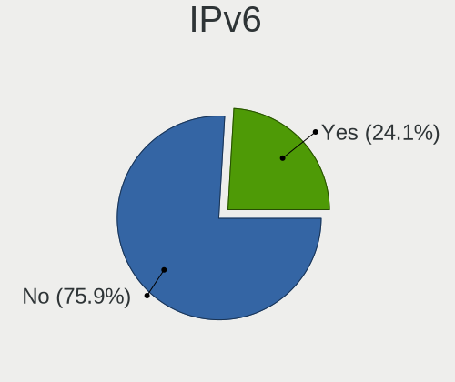

| Used | Desktops | Percent |
|------|----------|---------|
| No   | 1109     | 76.01%  |
| Yes  | 350      | 23.99%  |

Bluetooth
---------

Bluetooth Vendor
----------------

Controller vendors

| Vendor                          | Desktops | Percent |
|---------------------------------|----------|---------|
| Intel                           | 213      | 44.75%  |
| Realtek Semiconductor           | 63       | 13.24%  |
| Cambridge Silicon Radio         | 59       | 12.39%  |
| MediaTek                        | 38       | 7.98%   |
| ASUSTek Computer                | 19       | 3.99%   |
| IMC Networks                    | 15       | 3.15%   |
| TP-Link                         | 13       | 2.73%   |
| Broadcom                        | 11       | 2.31%   |
| Qualcomm Atheros Communications | 10       | 2.1%    |
| Foxconn / Hon Hai               | 10       | 2.1%    |
| Apple                           | 5        | 1.05%   |
| Realtek                         | 4        | 0.84%   |
| Edimax Technology               | 4        | 0.84%   |
| Actions                         | 4        | 0.84%   |
| Integrated System Solution      | 2        | 0.42%   |
| Dynex                           | 2        | 0.42%   |
| Lite-On Technology              | 1        | 0.21%   |
| HTC (High Tech Computer)        | 1        | 0.21%   |
| Belkin Components               | 1        | 0.21%   |
| Unknown                         | 1        | 0.21%   |

Bluetooth Model
---------------

Controller models

| Model                                                                | Desktops | Percent |
|----------------------------------------------------------------------|----------|---------|
| Cambridge Silicon Radio Bluetooth Dongle (HCI mode)                  | 59       | 12.39%  |
| Realtek Bluetooth Radio                                              | 55       | 11.55%  |
| Intel AX200 Bluetooth                                                | 52       | 10.92%  |
| MediaTek Wireless_Device                                             | 38       | 7.98%   |
| Intel AX210 Bluetooth                                                | 32       | 6.72%   |
| Intel AX211 Bluetooth                                                | 30       | 6.3%    |
| Intel AX201 Bluetooth                                                | 28       | 5.88%   |
| Intel Bluetooth wireless interface                                   | 26       | 5.46%   |
| Intel Wireless-AC 3168 Bluetooth                                     | 22       | 4.62%   |
| TP-Link UB500 Adapter                                                | 13       | 2.73%   |
| Broadcom BCM20702A0 Bluetooth 4.0                                    | 10       | 2.1%    |
| IMC Networks Bluetooth Radio                                         | 9        | 1.89%   |
| Foxconn / Hon Hai Wireless_Device                                    | 9        | 1.89%   |
| Intel Wireless-AC 9260 Bluetooth Adapter                             | 8        | 1.68%   |
| Intel Bluetooth Device                                               | 8        | 1.68%   |
| ASUS Broadcom BCM20702A0 Bluetooth                                   | 8        | 1.68%   |
| ASUS ASUS USB-BT500                                                  | 7        | 1.47%   |
| IMC Networks Wireless_Device                                         | 5        | 1.05%   |
| Realtek Bluetooth Radio                                              | 4        | 0.84%   |
| Qualcomm Atheros  Bluetooth Device                                   | 4        | 0.84%   |
| Intel Centrino Bluetooth Wireless Transceiver                        | 4        | 0.84%   |
| Actions general adapter                                              | 4        | 0.84%   |
| Realtek  Bluetooth 4.2 Adapter                                       | 3        | 0.63%   |
| Qualcomm Atheros AR9462 Bluetooth                                    | 3        | 0.63%   |
| Intel Bluetooth 9460/9560 Jefferson Peak (JfP)                       | 3        | 0.63%   |
| Apple Bluetooth Host Controller                                      | 3        | 0.63%   |
| Realtek RTL8822BE Bluetooth 4.2 Adapter                              | 2        | 0.42%   |
| Realtek Bluetooth 5.3 Radio                                          | 2        | 0.42%   |
| Qualcomm Atheros QCA61x4 Bluetooth 4.0                               | 2        | 0.42%   |
| Integrated System Solution Bluetooth Device                          | 2        | 0.42%   |
| Edimax EW-7611ULB 802.11b/g/n and Bluetooth 4.0 Adapter              | 2        | 0.42%   |
| Edimax Edimax Bluetooth Adapter                                      | 2        | 0.42%   |
| Dynex Bluetooth 4.0 Adapter [Broadcom, 1.12, BCM20702A0]             | 2        | 0.42%   |
| Apple Built-in Bluetooth 2.0+EDR HCI                                 | 2        | 0.42%   |
| Realtek RTL8821A Bluetooth                                           | 1        | 0.21%   |
| Qualcomm Atheros AR3011 Bluetooth                                    | 1        | 0.21%   |
| Lite-On Bluetooth Device                                             | 1        | 0.21%   |
| IMC Networks Bluetooth Device                                        | 1        | 0.21%   |
| HTC (High Tech Computer) Vive Hub Bluetooth 4.1 (Broadcom BCM920703) | 1        | 0.21%   |
| Foxconn / Hon Hai Bluetooth Device                                   | 1        | 0.21%   |

Sound
-----

Sound Vendor
------------

Sound card vendors

| Vendor                                       | Desktops | Percent |
|----------------------------------------------|----------|---------|
| Intel                                        | 916      | 40.53%  |
| AMD                                          | 572      | 25.31%  |
| Nvidia                                       | 429      | 18.98%  |
| C-Media Electronics                          | 58       | 2.57%   |
| ASUSTek Computer                             | 21       | 0.93%   |
| Logitech                                     | 20       | 0.88%   |
| Zoran Co. Personal Media Division (Nogatech) | 17       | 0.75%   |
| Micro Star International                     | 16       | 0.71%   |
| Texas Instruments                            | 15       | 0.66%   |
| Creative Labs                                | 13       | 0.58%   |
| JMTek                                        | 10       | 0.44%   |
| SteelSeries ApS                              | 9        | 0.4%    |
| GN Netcom                                    | 9        | 0.4%    |
| Generalplus Technology                       | 9        | 0.4%    |
| Focusrite-Novation                           | 9        | 0.4%    |
| VIA Technologies                             | 7        | 0.31%   |
| Razer USA                                    | 7        | 0.31%   |
| Blue Microphones                             | 7        | 0.31%   |
| Realtek Semiconductor                        | 6        | 0.27%   |
| Creative Technology                          | 6        | 0.27%   |
| Corsair                                      | 6        | 0.27%   |
| BR25                                         | 6        | 0.27%   |
| Kingston Technology                          | 5        | 0.22%   |
| Hewlett-Packard                              | 5        | 0.22%   |
| BEHRINGER International                      | 5        | 0.22%   |
| Silicon Integrated Systems [SiS]             | 4        | 0.18%   |
| SAVITECH                                     | 3        | 0.13%   |
| PreSonus Audio Electronics                   | 3        | 0.13%   |
| KTMicro                                      | 3        | 0.13%   |
| Dell                                         | 3        | 0.13%   |
| Audio-Technica                               | 3        | 0.13%   |
| Tenx Technology                              | 2        | 0.09%   |
| Sony                                         | 2        | 0.09%   |
| Schiit Audio                                 | 2        | 0.09%   |
| RODE Microphones                             | 2        | 0.09%   |
| Plantronics                                  | 2        | 0.09%   |
| Medeli Electronics                           | 2        | 0.09%   |
| M-Audio                                      | 2        | 0.09%   |
| Giga-Byte Technology                         | 2        | 0.09%   |
| DSEA A/S                                     | 2        | 0.09%   |

Sound Model
-----------

Sound card models

| Model                                                                      | Desktops | Percent |
|----------------------------------------------------------------------------|----------|---------|
| AMD Family 17h/19h HD Audio Controller                                     | 164      | 6.04%   |
| Intel 8 Series/C220 Series Chipset High Definition Audio Controller        | 145      | 5.34%   |
| AMD Starship/Matisse HD Audio Controller                                   | 121      | 4.46%   |
| Intel Xeon E3-1200 v3/4th Gen Core Processor HD Audio Controller           | 110      | 4.05%   |
| Intel 200 Series PCH HD Audio                                              | 83       | 3.06%   |
| AMD Renoir Radeon High Definition Audio Controller                         | 78       | 2.87%   |
| Intel 6 Series/C200 Series Chipset Family High Definition Audio Controller | 76       | 2.8%    |
| Intel 100 Series/C230 Series Chipset Family HD Audio Controller            | 64       | 2.36%   |
| AMD Navi 21/23 HDMI/DP Audio Controller                                    | 51       | 1.88%   |
| AMD SBx00 Azalia (Intel HDA)                                               | 50       | 1.84%   |
| AMD Rembrandt Radeon High Definition Audio Controller                      | 50       | 1.84%   |
| Intel NM10/ICH7 Family High Definition Audio Controller                    | 47       | 1.73%   |
| Intel 7 Series/C216 Chipset Family High Definition Audio Controller        | 46       | 1.69%   |
| AMD Ellesmere HDMI Audio [Radeon RX 470/480 / 570/580/590]                 | 46       | 1.69%   |
| Intel 82801JI (ICH10 Family) HD Audio Controller                           | 45       | 1.66%   |
| AMD Family 17h (Models 00h-0fh) HD Audio Controller                        | 40       | 1.47%   |
| Intel Raptor Lake High Definition Audio Controller                         | 37       | 1.36%   |
| Nvidia GF108 High Definition Audio Controller                              | 35       | 1.29%   |
| Nvidia TU106 High Definition Audio Controller                              | 34       | 1.25%   |
| Intel Alder Lake-S HD Audio Controller                                     | 34       | 1.25%   |
| AMD FCH Azalia Controller                                                  | 34       | 1.25%   |
| Intel Comet Lake PCH cAVS                                                  | 33       | 1.22%   |
| Nvidia GP107GL High Definition Audio Controller                            | 32       | 1.18%   |
| AMD Raven/Raven2/Fenghuang HDMI/DP Audio Controller                        | 31       | 1.14%   |
| Intel C610/X99 series chipset HD Audio Controller                          | 29       | 1.07%   |
| C-Media Electronics Audio Adapter (Unitek Y-247A)                          | 28       | 1.03%   |
| AMD Baffin HDMI/DP Audio [Radeon RX 550 640SP / RX 560/560X]               | 27       | 0.99%   |
| Nvidia GK208 HDMI/DP Audio Controller                                      | 26       | 0.96%   |
| Nvidia GA104 High Definition Audio Controller                              | 26       | 0.96%   |
| AMD Oland/Hainan/Cape Verde/Pitcairn HDMI Audio [Radeon HD 7000 Series]    | 25       | 0.92%   |
| Nvidia GP106 High Definition Audio Controller                              | 23       | 0.85%   |
| Intel Cannon Lake PCH cAVS                                                 | 23       | 0.85%   |
| Intel 82801I (ICH9 Family) HD Audio Controller                             | 22       | 0.81%   |
| Nvidia TU116 High Definition Audio Controller                              | 21       | 0.77%   |
| Nvidia GM204 High Definition Audio Controller                              | 21       | 0.77%   |
| AMD RV710/730 HDMI Audio [Radeon HD 4000 series]                           | 21       | 0.77%   |
| AMD Navi 10 HDMI Audio                                                     | 21       | 0.77%   |
| Nvidia TU107 GeForce GTX 1650 High Definition Audio Controller             | 20       | 0.74%   |
| Nvidia GP108 High Definition Audio Controller                              | 20       | 0.74%   |
| Nvidia GA102 High Definition Audio Controller                              | 20       | 0.74%   |

Memory
------

Memory Vendor
-------------

Memory module vendors

| Vendor                                  | Desktops | Percent |
|-----------------------------------------|----------|---------|
| Kingston                                | 243      | 19.09%  |
| Unknown                                 | 177      | 13.9%   |
| Samsung Electronics                     | 155      | 12.18%  |
| Crucial                                 | 122      | 9.58%   |
| SK hynix                                | 103      | 8.09%   |
| Corsair                                 | 102      | 8.01%   |
| G.Skill                                 | 88       | 6.91%   |
| Micron Technology                       | 46       | 3.61%   |
| Unknown                                 | 39       | 3.06%   |
| A-DATA Technology                       | 36       | 2.83%   |
| Patriot                                 | 24       | 1.89%   |
| Hikvision                               | 18       | 1.41%   |
| Team                                    | 14       | 1.1%    |
| Ramaxel Technology                      | 11       | 0.86%   |
| Micro Memory Bank                       | 9        | 0.71%   |
| Nanya Technology                        | 7        | 0.55%   |
| Transcend                               | 6        | 0.47%   |
| Unknown (ABCD)                          | 5        | 0.39%   |
| AMD                                     | 5        | 0.39%   |
| Unknown (0x0E9D)                        | 3        | 0.24%   |
| Unifosa                                 | 3        | 0.24%   |
| PNY                                     | 3        | 0.24%   |
| Patriot Memory (PDP Systems)            | 3        | 0.24%   |
| Hewlett-Packard                         | 3        | 0.24%   |
| Elpida                                  | 3        | 0.24%   |
| Wilk Elektronik                         | 2        | 0.16%   |
| Unknown (0x0B85)                        | 2        | 0.16%   |
| Toshiba                                 | 2        | 0.16%   |
| Timetec                                 | 2        | 0.16%   |
| Smart                                   | 2        | 0.16%   |
| Silicon Power Computer & Communications | 2        | 0.16%   |
| Patriot Memory                          | 2        | 0.16%   |
| Gigabyte Technology                     | 2        | 0.16%   |
| GeIL                                    | 2        | 0.16%   |
| f186                                    | 2        | 0.16%   |
| Avant                                   | 2        | 0.16%   |
| ASint Technology                        | 2        | 0.16%   |
| Wodposit                                | 1        | 0.08%   |
| V-Color                                 | 1        | 0.08%   |
| Unknown (0x7FFF)                        | 1        | 0.08%   |

Memory Model
------------

Memory module models

| Model                                                                            | Desktops | Percent |
|----------------------------------------------------------------------------------|----------|---------|
| Unknown                                                                          | 39       | 2.85%   |
| Unknown RAM Module 2GB DIMM DDR2 800MT/s                                         | 21       | 1.54%   |
| Unknown RAM Module 2GB DIMM SDRAM                                                | 19       | 1.39%   |
| Kingston RAM 99U5584-010.A00LF 4096MB DIMM DDR3 1866MT/s                         | 19       | 1.39%   |
| Hikvision RAM HKED4161DAA1D0MA1 16GB DIMM DDR4 2667MT/s                          | 18       | 1.32%   |
| Unknown RAM Module 1GB DIMM SDRAM                                                | 17       | 1.24%   |
| Samsung RAM M378B5173EB0-YK0 4GB DIMM DDR3 1600MT/s                              | 16       | 1.17%   |
| Kingston RAM KF3200C16D4/16GX 16GB DIMM DDR4 3200MT/s                            | 12       | 0.88%   |
| Crucial RAM CT4G4DFS8213.C8FAR2 4096MB DIMM DDR4 2133MT/s                        | 11       | 0.8%    |
| Samsung RAM M378A1K43DB2-CTD 8GB DIMM DDR4 4333MT/s                              | 10       | 0.73%   |
| Corsair RAM CMK16GX4M2B3200C16 8GB DIMM DDR4 3600MT/s                            | 10       | 0.73%   |
| Micro Memory Bank RAM FFFFFFFFFFFFFFFFFFFFFFFFFFFFFFFFFFFF 2GB DIMM DDR2 667MT/s | 9        | 0.66%   |
| Unknown RAM Module 4GB DIMM 1333MT/s                                             | 8        | 0.59%   |
| SK hynix RAM HMA41GR7MFR4N-TF 8GB DIMM DDR4 2133MT/s                             | 8        | 0.59%   |
| Kingston RAM KF3200C16D4/8GX 8192MB DIMM DDR4 3600MT/s                           | 8        | 0.59%   |
| G.Skill RAM F4-3200C16-16GVK 16GB DIMM DDR4 3600MT/s                             | 8        | 0.59%   |
| Corsair RAM CMK16GX4M2E3200C16 8GB DIMM DDR4 3200MT/s                            | 8        | 0.59%   |
| Unknown RAM Module 4GB DIMM 1066MT/s                                             | 7        | 0.51%   |
| Unknown RAM Module 2GB DIMM 1333MT/s                                             | 7        | 0.51%   |
| SK hynix RAM HMT451U6BFR8A-PB 4GB DIMM DDR3 1600MT/s                             | 7        | 0.51%   |
| SK hynix RAM HMT425U6AFR6C-PB 2GB DIMM DDR3 1600MT/s                             | 7        | 0.51%   |
| Patriot RAM PSD38G13332 8GB DIMM DDR3 1333MT/s                                   | 7        | 0.51%   |
| Kingston RAM KF3200C16D4/32GX 32GB DIMM DDR4 3933MT/s                            | 7        | 0.51%   |
| Crucial RAM CT8G4DFRA266.M16FG 8GB DIMM DDR4 2666MT/s                            | 7        | 0.51%   |
| Unknown RAM Module 8GB DIMM 1333MT/s                                             | 6        | 0.44%   |
| Unknown RAM Module 1GB DIMM 667MT/s                                              | 6        | 0.44%   |
| Kingston RAM ACR256X64D3U16C11G 2GB DIMM DDR3 1600MT/s                           | 6        | 0.44%   |
| Kingston RAM 99U5702-095.A00G 8GB DIMM DDR4 2667MT/s                             | 6        | 0.44%   |
| Corsair RAM CMK32GX4M2E3200C16 16GB DIMM DDR4 3534MT/s                           | 6        | 0.44%   |
| Corsair RAM CMK32GX4M2B3200C16 16GB DIMM DDR4 3800MT/s                           | 6        | 0.44%   |
| Unknown RAM Module 8GB DIMM DDR3 1333MT/s                                        | 5        | 0.37%   |
| Unknown RAM Module 2GB DIMM DDR2 667MT/s                                         | 5        | 0.37%   |
| Unknown RAM Module 2GB DIMM DDR 1333MT/s                                         | 5        | 0.37%   |
| Unknown (ABCD) RAM 123456789012345678 4GB DIMM DDR4 2400MT/s                     | 5        | 0.37%   |
| SK hynix RAM HMT451S6BFR8A-PB 4GB SODIMM DDR3 1600MT/s                           | 5        | 0.37%   |
| SK hynix RAM HMT351U6CFR8C-PB 4GB DIMM DDR3 1800MT/s                             | 5        | 0.37%   |
| Samsung RAM M378B5273DH0-CH9 4096MB DIMM DDR3 2133MT/s                           | 5        | 0.37%   |
| Samsung RAM M378A5143EB1-CPB 4GB DIMM DDR4 2400MT/s                              | 5        | 0.37%   |
| Samsung RAM M378A1K43CB2-CTD 8GB DIMM DDR4 3266MT/s                              | 5        | 0.37%   |
| Ramaxel RAM RMR5030MN68F9F1600 4GB DIMM DDR3 1600MT/s                            | 5        | 0.37%   |

Memory Kind
-----------

Memory module kinds

| Kind    | Desktops | Percent |
|---------|----------|---------|
| DDR4    | 534      | 45.88%  |
| DDR3    | 333      | 28.61%  |
| DDR5    | 81       | 6.96%   |
| DDR2    | 69       | 5.93%   |
| SDRAM   | 55       | 4.73%   |
| Unknown | 52       | 4.47%   |
| DDR     | 16       | 1.37%   |
| LPDDR4  | 13       | 1.12%   |
| LPDDR5  | 5        | 0.43%   |
| DRAM    | 3        | 0.26%   |
| EPROM   | 2        | 0.17%   |
| LPDDR3  | 1        | 0.09%   |

Memory Form Factor
------------------

Physical design of the memory module

| Name         | Desktops | Percent |
|--------------|----------|---------|
| DIMM         | 1012     | 88%     |
| SODIMM       | 118      | 10.26%  |
| Row Of Chips | 12       | 1.04%   |
| RIMM         | 3        | 0.26%   |
| Unknown      | 3        | 0.26%   |
| FB-DIMM      | 2        | 0.17%   |

Memory Size
-----------

Memory module size

| Size  | Desktops | Percent |
|-------|----------|---------|
| 8192  | 365      | 29.55%  |
| 4096  | 262      | 21.21%  |
| 16384 | 237      | 19.19%  |
| 2048  | 169      | 13.68%  |
| 32768 | 120      | 9.72%   |
| 1024  | 61       | 4.94%   |
| 512   | 11       | 0.89%   |
| 65536 | 2        | 0.16%   |
| 49152 | 2        | 0.16%   |
| 24576 | 1        | 0.08%   |
| 6144  | 1        | 0.08%   |
| 3072  | 1        | 0.08%   |
| 256   | 1        | 0.08%   |
| 64    | 1        | 0.08%   |
| 16    | 1        | 0.08%   |

Memory Speed
------------

Memory module speed

| Speed   | Desktops | Percent |
|---------|----------|---------|
| 1600    | 181      | 14.59%  |
| 3200    | 141      | 11.36%  |
| 1333    | 110      | 8.86%   |
| 2667    | 102      | 8.22%   |
| 3600    | 76       | 6.12%   |
| 2400    | 75       | 6.04%   |
| 2133    | 66       | 5.32%   |
| Unknown | 44       | 3.55%   |
| 800     | 43       | 3.46%   |
| 667     | 39       | 3.14%   |
| 1866    | 34       | 2.74%   |
| 4800    | 27       | 2.18%   |
| 2666    | 22       | 1.77%   |
| 1066    | 20       | 1.61%   |
| 1867    | 19       | 1.53%   |
| 6000    | 18       | 1.45%   |
| 3800    | 13       | 1.05%   |
| 3733    | 13       | 1.05%   |
| 6400    | 11       | 0.89%   |
| 5200    | 11       | 0.89%   |
| 5600    | 10       | 0.81%   |
| 4333    | 10       | 0.81%   |
| 3400    | 9        | 0.73%   |
| 3000    | 9        | 0.73%   |
| 1800    | 8        | 0.64%   |
| 3933    | 7        | 0.56%   |
| 2933    | 7        | 0.56%   |
| 1648    | 7        | 0.56%   |
| 3866    | 6        | 0.48%   |
| 3534    | 6        | 0.48%   |
| 3266    | 6        | 0.48%   |
| 1067    | 6        | 0.48%   |
| 3666    | 4        | 0.32%   |
| 3466    | 4        | 0.32%   |
| 3100    | 4        | 0.32%   |
| 2866    | 4        | 0.32%   |
| 2800    | 4        | 0.32%   |
| 2200    | 4        | 0.32%   |
| 533     | 4        | 0.32%   |
| 400     | 4        | 0.32%   |

Printers & scanners
-------------------

Printer Vendor
--------------

Printer device vendors

| Vendor                | Desktops | Percent |
|-----------------------|----------|---------|
| Brother Industries    | 14       | 29.79%  |
| Hewlett-Packard       | 10       | 21.28%  |
| Canon                 | 9        | 19.15%  |
| Dymo-CoStar           | 3        | 6.38%   |
| Seiko Epson           | 2        | 4.26%   |
| Samsung Electronics   | 2        | 4.26%   |
| QinHeng Electronics   | 2        | 4.26%   |
| Pantum                | 2        | 4.26%   |
| Zebra                 | 1        | 2.13%   |
| nemonic               | 1        | 2.13%   |
| Lexmark International | 1        | 2.13%   |

Printer Model
-------------

Printer device models

| Model                                       | Desktops | Percent |
|---------------------------------------------|----------|---------|
| QinHeng CH340S                              | 2        | 4.26%   |
| HP ENVY 5540 series                         | 2        | 4.26%   |
| Canon MF4010 series                         | 2        | 4.26%   |
| Canon MF3010                                | 2        | 4.26%   |
| Canon LiDE 400                              | 2        | 4.26%   |
| Zebra Thrmal 2844                           | 1        | 2.13%   |
| Seiko Epson XP-102 103 Series               | 1        | 2.13%   |
| Seiko Epson ET-4850 Series                  | 1        | 2.13%   |
| Samsung M2070 Series                        | 1        | 2.13%   |
| Samsung M2020 Series                        | 1        | 2.13%   |
| Pantum P2500W series                        | 1        | 2.13%   |
| Pantum P2200 series                         | 1        | 2.13%   |
| nemonic MIP-001                             | 1        | 2.13%   |
| Lexmark International E120                  | 1        | 2.13%   |
| HP Smart Tank 510 series                    | 1        | 2.13%   |
| HP OfficeJet Pro 9020 series                | 1        | 2.13%   |
| HP OfficeJet 5200 series                    | 1        | 2.13%   |
| HP Officejet 4500 G510a-f                   | 1        | 2.13%   |
| HP LaserJet Pro M404-M405                   | 1        | 2.13%   |
| HP LaserJet 1018                            | 1        | 2.13%   |
| HP Laser 107w                               | 1        | 2.13%   |
| HP HP LaserJet P2035                        | 1        | 2.13%   |
| Dymo-CoStar DYMO LabelWriter DUO            | 1        | 2.13%   |
| Dymo-CoStar DYMO LabelWriter 450 Twin Turbo | 1        | 2.13%   |
| Dymo-CoStar DYMO LabelWriter 450 Turbo      | 1        | 2.13%   |
| Canon TS3100 series                         | 1        | 2.13%   |
| Canon PIXMA iP4300 Printer                  | 1        | 2.13%   |
| Canon G3010 series                          | 1        | 2.13%   |
| Brother MFC-8510DN                          | 1        | 2.13%   |
| Brother MFC-7360N                           | 1        | 2.13%   |
| Brother MFC-1910W                           | 1        | 2.13%   |
| Brother HL-L2390DW                          | 1        | 2.13%   |
| Brother HL-L2315D series                    | 1        | 2.13%   |
| Brother HL-L2300D series                    | 1        | 2.13%   |
| Brother HL-3142CW series                    | 1        | 2.13%   |
| Brother HL-3040CN series                    | 1        | 2.13%   |
| Brother HL-2030 Laser Printer               | 1        | 2.13%   |
| Brother HL-1110 series                      | 1        | 2.13%   |
| Brother DCP-T420W                           | 1        | 2.13%   |
| Brother DCP-L8450CDW                        | 1        | 2.13%   |

Scanner Vendor
--------------

Scanner device vendors

| Vendor          | Desktops | Percent |
|-----------------|----------|---------|
| Canon           | 9        | 60%     |
| Seiko Epson     | 3        | 20%     |
| Plustek         | 1        | 6.67%   |
| Mustek Systems  | 1        | 6.67%   |
| Hewlett-Packard | 1        | 6.67%   |

Scanner Model
-------------

Scanner device models

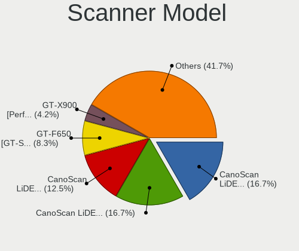

| Model                                             | Desktops | Percent |
|---------------------------------------------------|----------|---------|
| Canon CanoScan LiDE 210                           | 3        | 20%     |
| Seiko Epson GT-F650 [GT-S600/Perfection V10/V100] | 2        | 13.33%  |
| Seiko Epson GT-7700U [Perfection 1240U]           | 1        | 6.67%   |
| Plustek 1200dpi USB Scanner                       | 1        | 6.67%   |
| Mustek Systems ScanExpress 1200 UB                | 1        | 6.67%   |
| HP ScanJet 82x0C                                  | 1        | 6.67%   |
| Canon CanoScan N670U/N676U/LiDE 20                | 1        | 6.67%   |
| Canon CanoScan LiDE 50/LiDE 35/LiDE 40            | 1        | 6.67%   |
| Canon CanoScan LIDE 25                            | 1        | 6.67%   |
| Canon CanoScan LiDE 220                           | 1        | 6.67%   |
| Canon CanoScan LiDE 110                           | 1        | 6.67%   |
| Canon CanoScan 1220U                              | 1        | 6.67%   |

Camera
------

Camera Vendor
-------------

Camera device vendors

| Vendor                        | Desktops | Percent |
|-------------------------------|----------|---------|
| Logitech                      | 78       | 39.59%  |
| Microsoft                     | 17       | 8.63%   |
| Microdia                      | 17       | 8.63%   |
| Generalplus Technology        | 9        | 4.57%   |
| Sunplus Innovation Technology | 8        | 4.06%   |
| Samsung Electronics           | 7        | 3.55%   |
| Realtek Semiconductor         | 6        | 3.05%   |
| KYE Systems (Mouse Systems)   | 5        | 2.54%   |
| MacroSilicon                  | 4        | 2.03%   |
| AVerMedia Technologies        | 4        | 2.03%   |
| Jieli Technology              | 3        | 1.52%   |
| Z-Star Microelectronics       | 2        | 1.02%   |
| Trust                         | 2        | 1.02%   |
| IMC Networks                  | 2        | 1.02%   |
| Hewlett-Packard               | 2        | 1.02%   |
| Creative Technology           | 2        | 1.02%   |
| Chicony Electronics           | 2        | 1.02%   |
| Apple                         | 2        | 1.02%   |
| 2M UVC CAMERA                 | 2        | 1.02%   |
| ValueHD                       | 1        | 0.51%   |
| Tobii Technology AB           | 1        | 0.51%   |
| Suyin                         | 1        | 0.51%   |
| Sunplus IT                    | 1        | 0.51%   |
| Sonix Technology              | 1        | 0.51%   |
| Ruision                       | 1        | 0.51%   |
| Quanta                        | 1        | 0.51%   |
| Pixart Imaging                | 1        | 0.51%   |
| Novatek Microelectronics      | 1        | 0.51%   |
| Magic Control Technology      | 1        | 0.51%   |
| Lenovo                        | 1        | 0.51%   |
| Guillemot                     | 1        | 0.51%   |
| GEMBIRD                       | 1        | 0.51%   |
| EVGA                          | 1        | 0.51%   |
| eMeet                         | 1        | 0.51%   |
| Aveo Technology               | 1        | 0.51%   |
| Asuscom Network               | 1        | 0.51%   |
| ARC International             | 1        | 0.51%   |
| ANYKA                         | 1        | 0.51%   |
| Anker PowerConf C200          | 1        | 0.51%   |
| Anker                         | 1        | 0.51%   |

Camera Model
------------

Camera device models

| Model                                     | Desktops | Percent |
|-------------------------------------------|----------|---------|
| Logitech Webcam C270                      | 21       | 10.61%  |
| Logitech HD Pro Webcam C920               | 15       | 7.58%   |
| Microsoft LifeCam HD-3000                 | 9        | 4.55%   |
| Logitech C922 Pro Stream Webcam           | 8        | 4.04%   |
| Samsung Galaxy series, misc. (MTP mode)   | 7        | 3.54%   |
| Logitech C920 PRO HD Webcam               | 7        | 3.54%   |
| Microdia Webcam Vitade AF                 | 6        | 3.03%   |
| Microdia USB 2.0 Camera                   | 6        | 3.03%   |
| Generalplus CAMERA - UVC                  | 6        | 3.03%   |
| Sunplus PC Camera                         | 3        | 1.52%   |
| Microsoft Modern Webcam                   | 3        | 1.52%   |
| Logitech StreamCam                        | 3        | 1.52%   |
| Logitech HD Webcam C615                   | 3        | 1.52%   |
| Logitech CrystalCam                       | 3        | 1.52%   |
| Jieli USB PHY 2.0                         | 3        | 1.52%   |
| Generalplus 808 Camera                    | 3        | 1.52%   |
| Trust USB Camera                          | 2        | 1.01%   |
| Sunplus Full HD webcam                    | 2        | 1.01%   |
| Microdia Integrated Camera                | 2        | 1.01%   |
| MacroSilicon MiraBox Capture              | 2        | 1.01%   |
| Logitech QuickCam E 3500                  | 2        | 1.01%   |
| Logitech HD Webcam C525                   | 2        | 1.01%   |
| Logitech BRIO Ultra HD Webcam             | 2        | 1.01%   |
| KYE Systems (Mouse Systems) Genius Webcam | 2        | 1.01%   |
| HP Webcam 3110                            | 2        | 1.01%   |
| AVerMedia Live Streamer CAM 313           | 2        | 1.01%   |
| Apple iPhone 5/5C/5S/6/SE/7/8/X           | 2        | 1.01%   |
| 2M UVC CAMERA NexiGo N60 FHD Webcam       | 2        | 1.01%   |
| Z-Star Vimicro USB Camera (Altair)        | 1        | 0.51%   |
| Z-Star Venus USB2.0 Camera                | 1        | 0.51%   |
| ValueHD PTZOptics                         | 1        | 0.51%   |
| Tobii AB EyeChip                          | 1        | 0.51%   |
| Suyin HD Camera                           | 1        | 0.51%   |
| Sunplus IT PC Camera                      | 1        | 0.51%   |
| Sunplus USB 2.0 Camera                    | 1        | 0.51%   |
| Sunplus HD 720P webcam                    | 1        | 0.51%   |
| Sunplus 5Mega Webcam                      | 1        | 0.51%   |
| Sonix Foscam Webcam W41 Audio             | 1        | 0.51%   |
| Ruision UVC Camera                        | 1        | 0.51%   |
| Realtek USB Camera                        | 1        | 0.51%   |

Security
--------

Fingerprint Vendor
------------------

Fingerprint sensor vendors

| Vendor    | Desktops | Percent |
|-----------|----------|---------|
| Microsoft | 1        | 100%    |

Fingerprint Model
-----------------

Fingerprint sensor models

| Model                        | Desktops | Percent |
|------------------------------|----------|---------|
| Microsoft Fingerprint Reader | 1        | 100%    |

Chipcard Vendor
---------------

Chipcard module vendors

| Vendor                    | Desktops | Percent |
|---------------------------|----------|---------|
| Realtek Semiconductor     | 2        | 16.67%  |
| Advanced Card Systems     | 2        | 16.67%  |
| SCM Microsystems          | 1        | 8.33%   |
| Reiner SCT Kartensysteme  | 1        | 8.33%   |
| OmniKey                   | 1        | 8.33%   |
| Gemalto (was Gemplus)     | 1        | 8.33%   |
| Chicony Electronics       | 1        | 8.33%   |
| CHERRY                    | 1        | 8.33%   |
| Alcor Micro               | 1        | 8.33%   |
| Aladdin Knowledge Systems | 1        | 8.33%   |

Chipcard Model
--------------

Chipcard module models

| Model                                                                      | Desktops | Percent |
|----------------------------------------------------------------------------|----------|---------|
| Realtek Semiconductor Smart Card Reader Interface                          | 2        | 16.67%  |
| Advanced Card Systems ACR122U                                              | 2        | 16.67%  |
| SCM Microsystems SCR331 SmartCard Reader                                   | 1        | 8.33%   |
| Reiner SCT Kartensysteme cyberJack RFID basis contactless smartcard reader | 1        | 8.33%   |
| OmniKey CardMan 3021 / 3121                                                | 1        | 8.33%   |
| Gemalto (was Gemplus) GemPC Twin SmartCard Reader                          | 1        | 8.33%   |
| Chicony Electronics HP Skylab USB Smartcard Keyboard                       | 1        | 8.33%   |
| CHERRY SmartCard Reader Keyboard KC 1000 SC                                | 1        | 8.33%   |
| Alcor Micro AU9540 Smartcard Reader                                        | 1        | 8.33%   |
| Aladdin Knowledge Systems Token JC                                         | 1        | 8.33%   |

Unsupported
-----------

Unsupported Devices
-------------------

Total unsupported devices on board

| Total | Desktops | Percent |
|-------|----------|---------|
| 0     | 935      | 63.74%  |
| 1     | 474      | 32.31%  |
| 2     | 51       | 3.48%   |
| 5     | 3        | 0.2%    |
| 3     | 3        | 0.2%    |
| 4     | 1        | 0.07%   |

Unsupported Device Types
------------------------

Types of unsupported devices

| Type                     | Desktops | Percent |
|--------------------------|----------|---------|
| Graphics card            | 396      | 70.46%  |
| Net/wireless             | 72       | 12.81%  |
| Unassigned class         | 34       | 6.05%   |
| Communication controller | 15       | 2.67%   |
| Bluetooth                | 10       | 1.78%   |
| Sound                    | 7        | 1.25%   |
| Multimedia controller    | 7        | 1.25%   |
| Chipcard                 | 6        | 1.07%   |
| Storage/raid             | 3        | 0.53%   |
| Camera                   | 3        | 0.53%   |
| Wireless                 | 2        | 0.36%   |
| Modem                    | 2        | 0.36%   |
| Storage/nvme             | 1        | 0.18%   |
| Storage/ide              | 1        | 0.18%   |
| Network                  | 1        | 0.18%   |
| Net/ethernet             | 1        | 0.18%   |
| Fingerprint reader       | 1        | 0.18%   |

