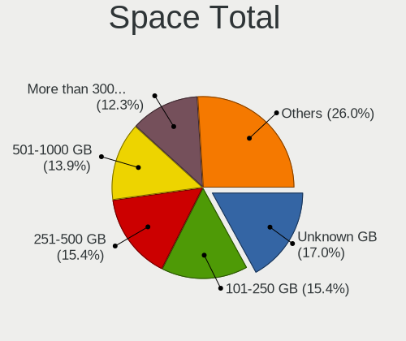
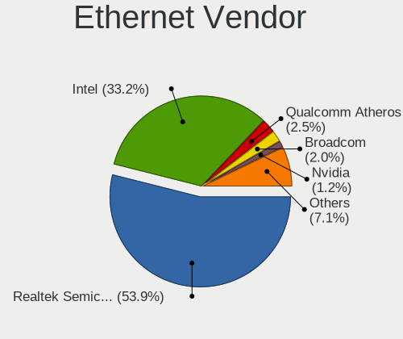
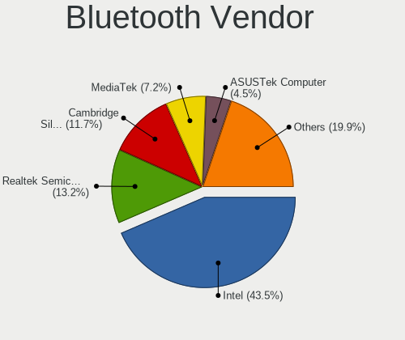
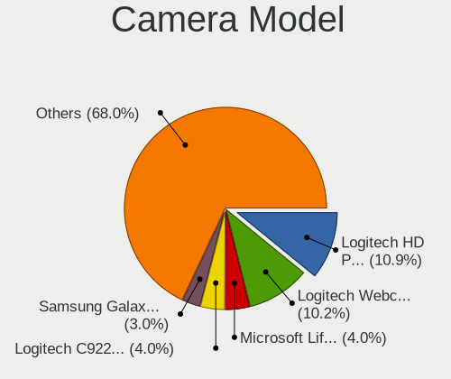

Debian 12 - Tested Hardware & Statistics (Desktops)
---------------------------------------------------

A project to collect tested hardware configurations for Debian 12.

Anyone can contribute to this report by the [hw-probe](https://github.com/linuxhw/hw-probe) tool:

    sudo -E hw-probe -all -upload

Please contribute! Especially if your hardware is rare.

Contents
--------

* [ Test Cases ](#test-cases)

* [ System ](#system)
  - [ Kernel                   ](#kernel)
  - [ Kernel Family            ](#kernel-family)
  - [ Kernel Major Ver.        ](#kernel-major-ver)
  - [ Arch                     ](#arch)
  - [ DE                       ](#de)
  - [ Display Server           ](#display-server)
  - [ Display Manager          ](#display-manager)
  - [ OS Lang                  ](#os-lang)
  - [ Boot Mode                ](#boot-mode)
  - [ Filesystem               ](#filesystem)
  - [ Part. scheme             ](#part-scheme)
  - [ Dual Boot with Linux/BSD ](#dual-boot-with-linuxbsd)
  - [ Dual Boot (Win)          ](#dual-boot-win)

* [ Board ](#board)
  - [ Vendor                   ](#vendor)
  - [ Model                    ](#model)
  - [ Model Family             ](#model-family)
  - [ MFG Year                 ](#mfg-year)
  - [ Form Factor              ](#form-factor)
  - [ Secure Boot              ](#secure-boot)
  - [ Coreboot                 ](#coreboot)
  - [ RAM Size                 ](#ram-size)
  - [ RAM Used                 ](#ram-used)
  - [ Total Drives             ](#total-drives)
  - [ Has CD-ROM               ](#has-cd-rom)
  - [ Has Ethernet             ](#has-ethernet)
  - [ Has WiFi                 ](#has-wifi)
  - [ Has Bluetooth            ](#has-bluetooth)

* [ Location ](#location)
  - [ Country                  ](#country)
  - [ City                     ](#city)

* [ Drives ](#drives)
  - [ Drive Vendor             ](#drive-vendor)
  - [ Drive Model              ](#drive-model)
  - [ HDD Vendor               ](#hdd-vendor)
  - [ SSD Vendor               ](#ssd-vendor)
  - [ Drive Kind               ](#drive-kind)
  - [ Drive Connector          ](#drive-connector)
  - [ Drive Size               ](#drive-size)
  - [ Space Total              ](#space-total)
  - [ Space Used               ](#space-used)
  - [ Malfunc. Drives          ](#malfunc-drives)
  - [ Malfunc. Drive Vendor    ](#malfunc-drive-vendor)
  - [ Malfunc. HDD Vendor      ](#malfunc-hdd-vendor)
  - [ Malfunc. Drive Kind      ](#malfunc-drive-kind)
  - [ Failed Drives            ](#failed-drives)
  - [ Failed Drive Vendor      ](#failed-drive-vendor)
  - [ Drive Status             ](#drive-status)

* [ Storage controller ](#storage-controller)
  - [ Storage Vendor           ](#storage-vendor)
  - [ Storage Model            ](#storage-model)
  - [ Storage Kind             ](#storage-kind)

* [ Processor ](#processor)
  - [ CPU Vendor               ](#cpu-vendor)
  - [ CPU Model                ](#cpu-model)
  - [ CPU Model Family         ](#cpu-model-family)
  - [ CPU Cores                ](#cpu-cores)
  - [ CPU Sockets              ](#cpu-sockets)
  - [ CPU Threads              ](#cpu-threads)
  - [ CPU Op-Modes             ](#cpu-op-modes)
  - [ CPU Microcode            ](#cpu-microcode)
  - [ CPU Microarch            ](#cpu-microarch)

* [ Graphics ](#graphics)
  - [ GPU Vendor               ](#gpu-vendor)
  - [ GPU Model                ](#gpu-model)
  - [ GPU Combo                ](#gpu-combo)
  - [ GPU Driver               ](#gpu-driver)
  - [ GPU Memory               ](#gpu-memory)

* [ Monitor ](#monitor)
  - [ Monitor Vendor           ](#monitor-vendor)
  - [ Monitor Model            ](#monitor-model)
  - [ Monitor Resolution       ](#monitor-resolution)
  - [ Monitor Diagonal         ](#monitor-diagonal)
  - [ Monitor Width            ](#monitor-width)
  - [ Aspect Ratio             ](#aspect-ratio)
  - [ Monitor Area             ](#monitor-area)
  - [ Pixel Density            ](#pixel-density)
  - [ Multiple Monitors        ](#multiple-monitors)

* [ Network ](#network)
  - [ Net Controller Vendor    ](#net-controller-vendor)
  - [ Net Controller Model     ](#net-controller-model)
  - [ Wireless Vendor          ](#wireless-vendor)
  - [ Wireless Model           ](#wireless-model)
  - [ Ethernet Vendor          ](#ethernet-vendor)
  - [ Ethernet Model           ](#ethernet-model)
  - [ Net Controller Kind      ](#net-controller-kind)
  - [ Used Controller          ](#used-controller)
  - [ NICs                     ](#nics)
  - [ IPv6                     ](#ipv6)

* [ Bluetooth ](#bluetooth)
  - [ Bluetooth Vendor         ](#bluetooth-vendor)
  - [ Bluetooth Model          ](#bluetooth-model)

* [ Sound ](#sound)
  - [ Sound Vendor             ](#sound-vendor)
  - [ Sound Model              ](#sound-model)

* [ Memory ](#memory)
  - [ Memory Vendor            ](#memory-vendor)
  - [ Memory Model             ](#memory-model)
  - [ Memory Kind              ](#memory-kind)
  - [ Memory Form Factor       ](#memory-form-factor)
  - [ Memory Size              ](#memory-size)
  - [ Memory Speed             ](#memory-speed)

* [ Printers & scanners ](#printers--scanners)
  - [ Printer Vendor           ](#printer-vendor)
  - [ Printer Model            ](#printer-model)
  - [ Scanner Vendor           ](#scanner-vendor)
  - [ Scanner Model            ](#scanner-model)

* [ Camera ](#camera)
  - [ Camera Vendor            ](#camera-vendor)
  - [ Camera Model             ](#camera-model)

* [ Security ](#security)
  - [ Fingerprint Vendor       ](#fingerprint-vendor)
  - [ Fingerprint Model        ](#fingerprint-model)
  - [ Chipcard Vendor          ](#chipcard-vendor)
  - [ Chipcard Model           ](#chipcard-model)

* [ Unsupported ](#unsupported)
  - [ Unsupported Devices      ](#unsupported-devices)
  - [ Unsupported Device Types ](#unsupported-device-types)

Test Cases
----------

Total: 57

| Vendor     | Model                       | Probe                                                      | Date         |
|------------|-----------------------------|------------------------------------------------------------|--------------|
| ASUSTek    | ProArt X670E-CREATOR WIF... | [d85b7a2592](https://linux-hardware.org/?probe=d85b7a2592) | Apr 30, 2023 |
| Unknown    | Unknown                     | [5f5809c40f](https://linux-hardware.org/?probe=5f5809c40f) | Apr 27, 2023 |
| ASUSTek    | Z97M-PLUS/BR                | [3255acf414](https://linux-hardware.org/?probe=3255acf414) | Apr 27, 2023 |
| ASRock     | A320M-HDV R3.0              | [d395c6168d](https://linux-hardware.org/?probe=d395c6168d) | Apr 27, 2023 |
| Gigabyte   | B450 I AORUS PRO WIFI-CF    | [2dcf65cf8e](https://linux-hardware.org/?probe=2dcf65cf8e) | Apr 26, 2023 |
| HP         | 8309                        | [cde28bd710](https://linux-hardware.org/?probe=cde28bd710) | Apr 26, 2023 |
| ASUSTek    | PRIME B660-PLUS D4          | [a343d9158a](https://linux-hardware.org/?probe=a343d9158a) | Apr 26, 2023 |
| ASUSTek    | Z170-A                      | [fa21ed6900](https://linux-hardware.org/?probe=fa21ed6900) | Apr 25, 2023 |
| ASRock     | 960GC-GS FX                 | [1cd850e8af](https://linux-hardware.org/?probe=1cd850e8af) | Apr 25, 2023 |
| ASUSTek    | ProArt X670E-CREATOR WIF... | [c5f2fa1c5a](https://linux-hardware.org/?probe=c5f2fa1c5a) | Apr 25, 2023 |
| MSI        | X370 GAMING PLUS            | [5d61deb4d4](https://linux-hardware.org/?probe=5d61deb4d4) | Apr 23, 2023 |
| Gigabyte   | X570S AORUS ELITE AX        | [9c3e15de68](https://linux-hardware.org/?probe=9c3e15de68) | Apr 22, 2023 |
| ASUSTek    | P5N-D                       | [c1af2b9a2c](https://linux-hardware.org/?probe=c1af2b9a2c) | Apr 22, 2023 |
| HP         | ProLiant ML150 G6           | [76dc3db16a](https://linux-hardware.org/?probe=76dc3db16a) | Apr 20, 2023 |
| MSI        | B450 GAMING PRO CARBON A... | [e1da556a0b](https://linux-hardware.org/?probe=e1da556a0b) | Apr 19, 2023 |
| MSI        | H110M PRO-VD                | [d04a1b7f36](https://linux-hardware.org/?probe=d04a1b7f36) | Apr 19, 2023 |
| MSI        | MPG X570 GAMING PLUS        | [c4d3eabb55](https://linux-hardware.org/?probe=c4d3eabb55) | Apr 17, 2023 |
| Biostar    | A10N-8800E                  | [31557d5e8c](https://linux-hardware.org/?probe=31557d5e8c) | Apr 15, 2023 |
| ASUSTek    | Z87-A                       | [3e96076874](https://linux-hardware.org/?probe=3e96076874) | Apr 15, 2023 |
| Acer       | WG43M                       | [a3a49836f9](https://linux-hardware.org/?probe=a3a49836f9) | Apr 15, 2023 |
| Intel      | Alder Lake-H PCH E1.0G      | [0ec41c7bd8](https://linux-hardware.org/?probe=0ec41c7bd8) | Apr 14, 2023 |
| Intel      | Alder Lake-H PCH E1.0G      | [9cf22928fb](https://linux-hardware.org/?probe=9cf22928fb) | Apr 13, 2023 |
| Gigabyte   | H61M-DS2                    | [e0b6eda111](https://linux-hardware.org/?probe=e0b6eda111) | Apr 11, 2023 |
| ASUSTek    | P7H55                       | [8ee190d352](https://linux-hardware.org/?probe=8ee190d352) | Apr 11, 2023 |
| Techvision | TVI7309X B0                 | [d24ce5fa44](https://linux-hardware.org/?probe=d24ce5fa44) | Apr 09, 2023 |
| ASUSTek    | P7H55                       | [89966b216e](https://linux-hardware.org/?probe=89966b216e) | Apr 07, 2023 |
| QTQD       | Unknown                     | [5cb163c75a](https://linux-hardware.org/?probe=5cb163c75a) | Apr 06, 2023 |
| MSI        | Z68A-GD65                   | [a8939164e7](https://linux-hardware.org/?probe=a8939164e7) | Apr 06, 2023 |
| Gigabyte   | B550 UD AC                  | [a639dfd228](https://linux-hardware.org/?probe=a639dfd228) | Apr 06, 2023 |
| MSI        | MPG X570S CARBON MAX WIF... | [55ea8a957b](https://linux-hardware.org/?probe=55ea8a957b) | Apr 06, 2023 |
| MSI        | MPG X570 GAMING PLUS        | [eadee78860](https://linux-hardware.org/?probe=eadee78860) | Apr 05, 2023 |
| ASUSTek    | VM42                        | [84f848ea21](https://linux-hardware.org/?probe=84f848ea21) | Apr 05, 2023 |
| ASUSTek    | PRIME B250M-PLUS            | [6f4013d94e](https://linux-hardware.org/?probe=6f4013d94e) | Apr 05, 2023 |
| ASUSTek    | TUF Gaming B460M-PLUS       | [5f9965b18e](https://linux-hardware.org/?probe=5f9965b18e) | Apr 05, 2023 |
| Gigabyte   | Z68A-D3-B3                  | [6fb463806f](https://linux-hardware.org/?probe=6fb463806f) | Apr 04, 2023 |
| ASUSTek    | PRIME B250M-PLUS            | [0401a50bac](https://linux-hardware.org/?probe=0401a50bac) | Apr 04, 2023 |
| Gigabyte   | H61M-DS2                    | [5a83d4ef1e](https://linux-hardware.org/?probe=5a83d4ef1e) | Apr 04, 2023 |
| MSI        | MPG X570 GAMING PLUS        | [739f49ff7e](https://linux-hardware.org/?probe=739f49ff7e) | Apr 04, 2023 |
| Techvision | TVI7309X B0                 | [dbbe4bbbc5](https://linux-hardware.org/?probe=dbbe4bbbc5) | Apr 03, 2023 |
| ASUSTek    | PRIME B450M-A               | [1b35a0e9f7](https://linux-hardware.org/?probe=1b35a0e9f7) | Apr 03, 2023 |
| ASUSTek    | PRIME B450M-A               | [734efd13d3](https://linux-hardware.org/?probe=734efd13d3) | Apr 03, 2023 |
| ASRock     | X470 Gaming-ITX/ac          | [48f07855d1](https://linux-hardware.org/?probe=48f07855d1) | Apr 02, 2023 |
| ASUSTek    | ROG STRIX X570-E GAMING     | [6fd833b58c](https://linux-hardware.org/?probe=6fd833b58c) | Apr 01, 2023 |
| ASRock     | B760M Pro RS/D4             | [6a63402e9c](https://linux-hardware.org/?probe=6a63402e9c) | Mar 31, 2023 |
| ASUSTek    | ROG STRIX B660-F GAMING ... | [de5bf4239c](https://linux-hardware.org/?probe=de5bf4239c) | Mar 30, 2023 |
| ASUSTek    | ROG STRIX B550-F GAMING     | [244ffc8736](https://linux-hardware.org/?probe=244ffc8736) | Mar 30, 2023 |
| ASUSTek    | TUF Gaming B550M-PLUS       | [82118905ba](https://linux-hardware.org/?probe=82118905ba) | Mar 30, 2023 |
| ASUSTek    | Pro WS X570-ACE             | [6cc34607d1](https://linux-hardware.org/?probe=6cc34607d1) | Mar 30, 2023 |
| ASUSTek    | ROG STRIX B660-F GAMING ... | [dadeec8815](https://linux-hardware.org/?probe=dadeec8815) | Mar 29, 2023 |
| ASUSTek    | PRIME B450M-A II            | [4fe0ddab4b](https://linux-hardware.org/?probe=4fe0ddab4b) | Mar 28, 2023 |
| ASUSTek    | TUF Gaming B550M-PLUS       | [5969fea8f0](https://linux-hardware.org/?probe=5969fea8f0) | Mar 28, 2023 |
| Gigabyte   | H97M-HD3                    | [1b531d5ada](https://linux-hardware.org/?probe=1b531d5ada) | Mar 27, 2023 |
| Lenovo     | SHARKBAY SDK0E50510 WIN     | [ebed945eae](https://linux-hardware.org/?probe=ebed945eae) | Mar 27, 2023 |
| Lenovo     | SHARKBAY SDK0E50510 WIN     | [fd16b858df](https://linux-hardware.org/?probe=fd16b858df) | Mar 27, 2023 |
| ASUSTek    | PRIME X470-PRO              | [a05e768cca](https://linux-hardware.org/?probe=a05e768cca) | Mar 25, 2023 |
| ASUSTek    | PRIME Z690-P                | [6b3cdb2b1a](https://linux-hardware.org/?probe=6b3cdb2b1a) | Mar 23, 2023 |
| Unknown    | Unknown                     | [c49317ce12](https://linux-hardware.org/?probe=c49317ce12) | Feb 13, 2023 |

System
------

Kernel
------

Version of the Linux kernel

| Version                 | Desktops | Percent |
|-------------------------|----------|---------|
| 6.1.0-7-amd64           | 24       | 52.17%  |
| 6.1.0-6-amd64           | 9        | 19.57%  |
| 6.1.0-4-amd64           | 5        | 10.87%  |
| 6.1.0-5-amd64           | 3        | 6.52%   |
| 6.2.8-x64v3-xanmod1     | 1        | 2.17%   |
| 6.2.11-3-liquorix-amd64 | 1        | 2.17%   |
| 6.1.0-8-amd64           | 1        | 2.17%   |
| 6.1.0-6-rt-amd64        | 1        | 2.17%   |
| 6.0.0-6-amd64           | 1        | 2.17%   |

Kernel Family
-------------

Linux kernel without a distro release

| Version | Desktops | Percent |
|---------|----------|---------|
| 6.1.0   | 43       | 93.48%  |
| 6.2.8   | 1        | 2.17%   |
| 6.2.11  | 1        | 2.17%   |
| 6.0.0   | 1        | 2.17%   |

Kernel Major Ver.
-----------------

Linux kernel major version

| Version | Desktops | Percent |
|---------|----------|---------|
| 6.1     | 43       | 93.48%  |
| 6.2     | 2        | 4.35%   |
| 6.0     | 1        | 2.17%   |

Arch
----

OS architecture (x86_64, i586, etc.)

| Name   | Desktops | Percent |
|--------|----------|---------|
| x86_64 | 46       | 100%    |

DE
--

Desktop Environment

| Name       | Desktops | Percent |
|------------|----------|---------|
| KDE5       | 10       | 21.74%  |
| GNOME      | 10       | 21.74%  |
| Unknown    | 10       | 21.74%  |
| XFCE       | 7        | 15.22%  |
| X-Cinnamon | 4        | 8.7%    |
| MATE       | 2        | 4.35%   |
| LXDE       | 2        | 4.35%   |
| LXQt       | 1        | 2.17%   |

Display Server
--------------

X11 or Wayland

| Name    | Desktops | Percent |
|---------|----------|---------|
| X11     | 24       | 52.17%  |
| Wayland | 8        | 17.39%  |
| Tty     | 8        | 17.39%  |
| Unknown | 6        | 13.04%  |

Display Manager
---------------

SDDM, LightDM, etc.

| Name    | Desktops | Percent |
|---------|----------|---------|
| Unknown | 17       | 36.96%  |
| LightDM | 13       | 28.26%  |
| SDDM    | 7        | 15.22%  |
| GDM3    | 7        | 15.22%  |
| SLiM    | 2        | 4.35%   |

OS Lang
-------

Language

| Lang    | Desktops | Percent |
|---------|----------|---------|
| en_US   | 16       | 34.78%  |
| ru_RU   | 7        | 15.22%  |
| de_DE   | 7        | 15.22%  |
| fr_FR   | 4        | 8.7%    |
| es_ES   | 4        | 8.7%    |
| en_CA   | 2        | 4.35%   |
| pt_BR   | 1        | 2.17%   |
| ja_JP   | 1        | 2.17%   |
| it_IT   | 1        | 2.17%   |
| en_NZ   | 1        | 2.17%   |
| en_GB   | 1        | 2.17%   |
| Unknown | 1        | 2.17%   |

Boot Mode
---------

EFI or BIOS

| Mode | Desktops | Percent |
|------|----------|---------|
| EFI  | 27       | 58.7%   |
| BIOS | 19       | 41.3%   |

Filesystem
----------

Type of filesystem

| Type    | Desktops | Percent |
|---------|----------|---------|
| Ext4    | 37       | 80.43%  |
| Overlay | 5        | 10.87%  |
| Zfs     | 1        | 2.17%   |
| Xfs     | 1        | 2.17%   |
| Tmpfs   | 1        | 2.17%   |
| Btrfs   | 1        | 2.17%   |

Part. scheme
------------

Scheme of partitioning

| Type    | Desktops | Percent |
|---------|----------|---------|
| GPT     | 31       | 67.39%  |
| MBR     | 10       | 21.74%  |
| Unknown | 5        | 10.87%  |

Dual Boot with Linux/BSD
------------------------

Hosting more than one Linux/BSD

| Dual boot | Desktops | Percent |
|-----------|----------|---------|
| No        | 37       | 80.43%  |
| Yes       | 9        | 19.57%  |

Dual Boot (Win)
---------------

Hosting Linux and Windows

| Dual boot | Desktops | Percent |
|-----------|----------|---------|
| Yes       | 26       | 56.52%  |
| No        | 20       | 43.48%  |

Board
-----

Vendor
------

Motherboard manufacturer

| Name                | Desktops | Percent |
|---------------------|----------|---------|
| ASUSTek Computer    | 21       | 45.65%  |
| Gigabyte Technology | 6        | 13.04%  |
| MSI                 | 5        | 10.87%  |
| ASRock              | 4        | 8.7%    |
| Techvision          | 2        | 4.35%   |
| Hewlett-Packard     | 2        | 4.35%   |
| QTQD                | 1        | 2.17%   |
| Lenovo              | 1        | 2.17%   |
| Intel               | 1        | 2.17%   |
| Biostar             | 1        | 2.17%   |
| Acer                | 1        | 2.17%   |
| Unknown             | 1        | 2.17%   |

Model
-----

Motherboard model

| Name                                     | Desktops | Percent |
|------------------------------------------|----------|---------|
| Techvision TVI7309X                      | 2        | 4.35%   |
| ASUS ProArt X670E-CREATOR WIFI           | 2        | 4.35%   |
| ASUS PRIME B450M-A                       | 2        | 4.35%   |
| ASUS All Series                          | 2        | 4.35%   |
| Unknown                                  | 2        | 4.35%   |
| MSI MS-7D52                              | 1        | 2.17%   |
| MSI MS-7B85                              | 1        | 2.17%   |
| MSI MS-7A33                              | 1        | 2.17%   |
| MSI MS-7996                              | 1        | 2.17%   |
| MSI MS-7681                              | 1        | 2.17%   |
| Lenovo ThinkCentre M73 10AXS3JD00        | 1        | 2.17%   |
| Intel Alder Lake-H PCH (ERYING G660 ITX) | 1        | 2.17%   |
| HP ProLiant ML150 G6                     | 1        | 2.17%   |
| HP OMEN by Desktop PC 880-p0xx           | 1        | 2.17%   |
| Gigabyte Z68A-D3-B3                      | 1        | 2.17%   |
| Gigabyte X570S AORUS ELITE AX            | 1        | 2.17%   |
| Gigabyte H97M-HD3                        | 1        | 2.17%   |
| Gigabyte H61M-DS2 REV 1.2                | 1        | 2.17%   |
| Gigabyte B550 UD AC                      | 1        | 2.17%   |
| Gigabyte B450 I AORUS PRO WIFI           | 1        | 2.17%   |
| Biostar A10N-8800E                       | 1        | 2.17%   |
| ASUS Z170-A                              | 1        | 2.17%   |
| ASUS VM42                                | 1        | 2.17%   |
| ASUS TUF Gaming B550M-PLUS               | 1        | 2.17%   |
| ASUS TUF Gaming B460M-PLUS               | 1        | 2.17%   |
| ASUS ROG STRIX X570-E GAMING             | 1        | 2.17%   |
| ASUS ROG STRIX B660-F GAMING WIFI        | 1        | 2.17%   |
| ASUS ROG STRIX B550-F GAMING             | 1        | 2.17%   |
| ASUS Pro WS X570-ACE                     | 1        | 2.17%   |
| ASUS PRIME Z690-P                        | 1        | 2.17%   |
| ASUS PRIME X470-PRO                      | 1        | 2.17%   |
| ASUS PRIME B660-PLUS D4                  | 1        | 2.17%   |
| ASUS PRIME B450M-A II                    | 1        | 2.17%   |
| ASUS PRIME B250M-PLUS                    | 1        | 2.17%   |
| ASUS P7H55                               | 1        | 2.17%   |
| ASUS P5N-D                               | 1        | 2.17%   |
| ASRock X470 Gaming-ITX/ac                | 1        | 2.17%   |
| ASRock B760M Pro RS/D4                   | 1        | 2.17%   |
| ASRock A320M-HDV R3.0                    | 1        | 2.17%   |
| ASRock 960GC-GS FX                       | 1        | 2.17%   |

Model Family
------------

Motherboard model prefix

| Name                | Desktops | Percent |
|---------------------|----------|---------|
| ASUS PRIME          | 7        | 15.22%  |
| ASUS ROG            | 3        | 6.52%   |
| Techvision TVI7309X | 2        | 4.35%   |
| ASUS TUF            | 2        | 4.35%   |
| ASUS ProArt         | 2        | 4.35%   |
| ASUS All            | 2        | 4.35%   |
| Unknown             | 2        | 4.35%   |
| MSI MS-7D52         | 1        | 2.17%   |
| MSI MS-7B85         | 1        | 2.17%   |
| MSI MS-7A33         | 1        | 2.17%   |
| MSI MS-7996         | 1        | 2.17%   |
| MSI MS-7681         | 1        | 2.17%   |
| Lenovo ThinkCentre  | 1        | 2.17%   |
| Intel Alder         | 1        | 2.17%   |
| HP ProLiant         | 1        | 2.17%   |
| HP OMEN             | 1        | 2.17%   |
| Gigabyte Z68A-D3-B3 | 1        | 2.17%   |
| Gigabyte X570S      | 1        | 2.17%   |
| Gigabyte H97M-HD3   | 1        | 2.17%   |
| Gigabyte H61M-DS2   | 1        | 2.17%   |
| Gigabyte B550       | 1        | 2.17%   |
| Gigabyte B450       | 1        | 2.17%   |
| Biostar A10N-8800E  | 1        | 2.17%   |
| ASUS Z170-A         | 1        | 2.17%   |
| ASUS VM42           | 1        | 2.17%   |
| ASUS Pro            | 1        | 2.17%   |
| ASUS P7H55          | 1        | 2.17%   |
| ASUS P5N-D          | 1        | 2.17%   |
| ASRock X470         | 1        | 2.17%   |
| ASRock B760M        | 1        | 2.17%   |
| ASRock A320M-HDV    | 1        | 2.17%   |
| ASRock 960GC-GS     | 1        | 2.17%   |
| Acer Aspire         | 1        | 2.17%   |

MFG Year
--------

Motherboard manufacture year

| Year | Desktops | Percent |
|------|----------|---------|
| 2018 | 8        | 17.39%  |
| 2022 | 7        | 15.22%  |
| 2020 | 5        | 10.87%  |
| 2021 | 4        | 8.7%    |
| 2014 | 4        | 8.7%    |
| 2011 | 4        | 8.7%    |
| 2013 | 3        | 6.52%   |
| 2023 | 2        | 4.35%   |
| 2019 | 2        | 4.35%   |
| 2015 | 2        | 4.35%   |
| 2017 | 1        | 2.17%   |
| 2016 | 1        | 2.17%   |
| 2010 | 1        | 2.17%   |
| 2009 | 1        | 2.17%   |
| 2007 | 1        | 2.17%   |

Form Factor
-----------

Physical design of the computer

| Name    | Desktops | Percent |
|---------|----------|---------|
| Desktop | 46       | 100%    |

Secure Boot
-----------

Enabled or disabled

| State    | Desktops | Percent |
|----------|----------|---------|
| Disabled | 40       | 86.96%  |
| Enabled  | 6        | 13.04%  |

Coreboot
--------

Have coreboot on board

| Used | Desktops | Percent |
|------|----------|---------|
| No   | 46       | 100%    |

RAM Size
--------

Total RAM memory

| Size in GB  | Desktops | Percent |
|-------------|----------|---------|
| 32.01-64.0  | 12       | 26.09%  |
| 16.01-24.0  | 12       | 26.09%  |
| 4.01-8.0    | 6        | 13.04%  |
| 8.01-16.0   | 5        | 10.87%  |
| 24.01-32.0  | 4        | 8.7%    |
| 64.01-256.0 | 4        | 8.7%    |
| 3.01-4.0    | 2        | 4.35%   |
| 1.01-2.0    | 1        | 2.17%   |

RAM Used
--------

Used RAM memory

| Used GB    | Desktops | Percent |
|------------|----------|---------|
| 4.01-8.0   | 12       | 26.09%  |
| 1.01-2.0   | 7        | 15.22%  |
| 0.51-1.0   | 7        | 15.22%  |
| 3.01-4.0   | 6        | 13.04%  |
| 2.01-3.0   | 6        | 13.04%  |
| 0.01-0.5   | 3        | 6.52%   |
| 16.01-24.0 | 2        | 4.35%   |
| 8.01-16.0  | 2        | 4.35%   |
| 24.01-32.0 | 1        | 2.17%   |

Total Drives
------------

Number of drives on board

| Drives | Desktops | Percent |
|--------|----------|---------|
| 1      | 16       | 34.78%  |
| 2      | 12       | 26.09%  |
| 3      | 8        | 17.39%  |
| 5      | 4        | 8.7%    |
| 4      | 4        | 8.7%    |
| 6      | 2        | 4.35%   |

Has CD-ROM
----------

Has CD-ROM on board

| Presented | Desktops | Percent |
|-----------|----------|---------|
| No        | 29       | 63.04%  |
| Yes       | 17       | 36.96%  |

Has Ethernet
------------

Has Ethernet on board

| Presented | Desktops | Percent |
|-----------|----------|---------|
| Yes       | 46       | 100%    |

Has WiFi
--------

Has WiFi module

| Presented | Desktops | Percent |
|-----------|----------|---------|
| Yes       | 23       | 50%     |
| No        | 23       | 50%     |

Has Bluetooth
-------------

Has Bluetooth module

| Presented | Desktops | Percent |
|-----------|----------|---------|
| No        | 25       | 54.35%  |
| Yes       | 21       | 45.65%  |

Location
--------

Country
-------

Geographic location (country)

| Country     | Desktops | Percent |
|-------------|----------|---------|
| USA         | 8        | 17.39%  |
| Germany     | 8        | 17.39%  |
| Russia      | 6        | 13.04%  |
| France      | 5        | 10.87%  |
| Spain       | 4        | 8.7%    |
| Slovakia    | 2        | 4.35%   |
| Canada      | 2        | 4.35%   |
| Brazil      | 2        | 4.35%   |
| UK          | 1        | 2.17%   |
| Switzerland | 1        | 2.17%   |
| New Zealand | 1        | 2.17%   |
| Mexico      | 1        | 2.17%   |
| Latvia      | 1        | 2.17%   |
| Japan       | 1        | 2.17%   |
| Italy       | 1        | 2.17%   |
| Ireland     | 1        | 2.17%   |
| Denmark     | 1        | 2.17%   |

City
----

Geographic location (city)

| City                 | Desktops | Percent |
|----------------------|----------|---------|
| Voronezh             | 5        | 10.87%  |
| Paris                | 2        | 4.35%   |
| Košice              | 2        | 4.35%   |
| Henrico              | 2        | 4.35%   |
| Fuenlabrada          | 2        | 4.35%   |
| Weaver               | 1        | 2.17%   |
| Tsukuba              | 1        | 2.17%   |
| Toronto              | 1        | 2.17%   |
| St Petersburg        | 1        | 2.17%   |
| Seattle              | 1        | 2.17%   |
| Riga                 | 1        | 2.17%   |
| Poza Rica de Hidalgo | 1        | 2.17%   |
| Ourense              | 1        | 2.17%   |
| Montreal             | 1        | 2.17%   |
| Mainz                | 1        | 2.17%   |
| Madrid               | 1        | 2.17%   |
| Lower Hutt           | 1        | 2.17%   |
| London               | 1        | 2.17%   |
| Lingen               | 1        | 2.17%   |
| Lindau               | 1        | 2.17%   |
| Lafayette            | 1        | 2.17%   |
| Ilsede               | 1        | 2.17%   |
| Ilmenau              | 1        | 2.17%   |
| Horgen               | 1        | 2.17%   |
| Herzberg am Harz     | 1        | 2.17%   |
| Gladbeck             | 1        | 2.17%   |
| Eugene               | 1        | 2.17%   |
| Dublin               | 1        | 2.17%   |
| Coulounieix          | 1        | 2.17%   |
| Chieti               | 1        | 2.17%   |
| Campo Grande         | 1        | 2.17%   |
| Bradenton            | 1        | 2.17%   |
| Bordeaux             | 1        | 2.17%   |
| Bielefeld            | 1        | 2.17%   |
| Ashburn              | 1        | 2.17%   |
| Aparecida de Goiania | 1        | 2.17%   |
| Alizay               | 1        | 2.17%   |
| Aarhus               | 1        | 2.17%   |

Drives
------

Drive Vendor
------------

Hard drive vendors

| Vendor                | Desktops | Drives | Percent |
|-----------------------|----------|--------|---------|
| Samsung Electronics   | 21       | 30     | 23.08%  |
| WDC                   | 18       | 26     | 19.78%  |
| Seagate               | 15       | 16     | 16.48%  |
| Toshiba               | 8        | 9      | 8.79%   |
| Intel                 | 4        | 4      | 4.4%    |
| Sandisk               | 3        | 3      | 3.3%    |
| Crucial               | 3        | 4      | 3.3%    |
| XPG                   | 2        | 2      | 2.2%    |
| KIOXIA-EXCERIA        | 2        | 2      | 2.2%    |
| Kingston              | 2        | 2      | 2.2%    |
| Hewlett-Packard       | 2        | 3      | 2.2%    |
| China                 | 2        | 2      | 2.2%    |
| Unknown               | 1        | 1      | 1.1%    |
| Realtek Semiconductor | 1        | 1      | 1.1%    |
| PNY                   | 1        | 1      | 1.1%    |
| Phison                | 1        | 1      | 1.1%    |
| Netac                 | 1        | 1      | 1.1%    |
| Hitachi               | 1        | 1      | 1.1%    |
| HGST                  | 1        | 1      | 1.1%    |
| External              | 1        | 1      | 1.1%    |
| A-DATA Technology     | 1        | 1      | 1.1%    |

Drive Model
-----------

Hard drive models

| Model                                              | Desktops | Percent |
|----------------------------------------------------|----------|---------|
| Samsung NVMe SSD Controller SM981/PM981/PM983 1TB  | 4        | 3.74%   |
| WDC WD10EZEX-08WN4A0 1TB                           | 3        | 2.8%    |
| Samsung SSD 850 EVO 500GB                          | 3        | 2.8%    |
| XPG GAMMIX S11 Pro 1TB                             | 2        | 1.87%   |
| WDC WD100EMAZ-00WJTA0 10TB                         | 2        | 1.87%   |
| Toshiba MQ01ABF032 320GB                           | 2        | 1.87%   |
| Toshiba DT01ACA050 500GB                           | 2        | 1.87%   |
| Seagate ST2000DM006-2DM164 2TB                     | 2        | 1.87%   |
| Samsung SSD 980 PRO 1TB                            | 2        | 1.87%   |
| Samsung SSD 870 QVO 1TB                            | 2        | 1.87%   |
| Samsung SSD 860 EVO 500GB                          | 2        | 1.87%   |
| Samsung SSD 850 EVO 250GB                          | 2        | 1.87%   |
| Samsung SSD 840 EVO 500GB                          | 2        | 1.87%   |
| Samsung NVMe SSD Controller PM9A1/PM9A3/980PRO 2TB | 2        | 1.87%   |
| Intel SSDSC2KW010T8 1024GB                         | 2        | 1.87%   |
| WDC WDS500G2B0B-00YS70 500GB SSD                   | 1        | 0.93%   |
| WDC WDS500G1X0E-00AFY0 500GB                       | 1        | 0.93%   |
| WDC WDS480G2G0C-00AJM0 480GB                       | 1        | 0.93%   |
| WDC WDS200T2B0B-00YS70 2TB SSD                     | 1        | 0.93%   |
| WDC WDS200T2B0A-00SM50 2TB SSD                     | 1        | 0.93%   |
| WDC WDS100T2B0A-00SM50 1TB SSD                     | 1        | 0.93%   |
| WDC WDS100T1X0E-00AFY0 1TB                         | 1        | 0.93%   |
| WDC WD80EMAZ-00WJTA0 8TB                           | 1        | 0.93%   |
| WDC WD5000BEKT-00KA9T0 500GB                       | 1        | 0.93%   |
| WDC WD40EZRZ-75GXCB0 4TB                           | 1        | 0.93%   |
| WDC WD40EFZX-68AWUN0 4TB                           | 1        | 0.93%   |
| WDC WD40EFRX-68WT0N0 4TB                           | 1        | 0.93%   |
| WDC WD30EZRX-00MMMB0 3TB                           | 1        | 0.93%   |
| WDC WD20EZRZ-00Z5HB0 2TB                           | 1        | 0.93%   |
| WDC WD20EZRX-00D8PB0 2TB                           | 1        | 0.93%   |
| WDC WD20EARX-00PASB0 2TB                           | 1        | 0.93%   |
| WDC WD2003FZEX-00Z4SA0 2TB                         | 1        | 0.93%   |
| WDC WD10EARS-00MVWB0 1TB                           | 1        | 0.93%   |
| WDC WD10EALX-009BA0 1TB                            | 1        | 0.93%   |
| WDC WD1002FAEX-00Y9A0 1TB                          | 1        | 0.93%   |
| Unknown SD/MMC/MS PRO 249GB                        | 1        | 0.93%   |
| Toshiba MQ01ACF032 320GB                           | 1        | 0.93%   |
| Toshiba MD04ACA500 5TB                             | 1        | 0.93%   |
| Toshiba HDWR21C 12TB                               | 1        | 0.93%   |
| Toshiba DT01ACA200 2TB                             | 1        | 0.93%   |

HDD Vendor
----------

Hard disk drive vendors

| Vendor          | Desktops | Drives | Percent |
|-----------------|----------|--------|---------|
| Seagate         | 14       | 15     | 35.9%   |
| WDC             | 13       | 19     | 33.33%  |
| Toshiba         | 8        | 9      | 20.51%  |
| Unknown         | 1        | 1      | 2.56%   |
| Hitachi         | 1        | 1      | 2.56%   |
| HGST            | 1        | 1      | 2.56%   |
| Hewlett-Packard | 1        | 2      | 2.56%   |

SSD Vendor
----------

Solid state drive vendors

| Vendor              | Desktops | Drives | Percent |
|---------------------|----------|--------|---------|
| Samsung Electronics | 14       | 16     | 45.16%  |
| WDC                 | 3        | 4      | 9.68%   |
| Intel               | 3        | 3      | 9.68%   |
| Kingston            | 2        | 2      | 6.45%   |
| Crucial             | 2        | 3      | 6.45%   |
| China               | 2        | 2      | 6.45%   |
| Seagate             | 1        | 1      | 3.23%   |
| SanDisk             | 1        | 1      | 3.23%   |
| PNY                 | 1        | 1      | 3.23%   |
| External            | 1        | 1      | 3.23%   |
| A-DATA Technology   | 1        | 1      | 3.23%   |

Drive Kind
----------

HDD or SSD

| Kind | Desktops | Drives | Percent |
|------|----------|--------|---------|
| HDD  | 30       | 48     | 39.47%  |
| NVMe | 23       | 29     | 30.26%  |
| SSD  | 23       | 35     | 30.26%  |

Drive Connector
---------------

SATA, SAS, NVMe, etc.

| Type | Desktops | Drives | Percent |
|------|----------|--------|---------|
| SATA | 38       | 79     | 59.38%  |
| NVMe | 23       | 29     | 35.94%  |
| SAS  | 3        | 4      | 4.69%   |

Drive Size
----------

Size of hard drive

| Size in TB | Desktops | Drives | Percent |
|------------|----------|--------|---------|
| 0.01-0.5   | 27       | 36     | 42.19%  |
| 0.51-1.0   | 13       | 14     | 20.31%  |
| 1.01-2.0   | 12       | 18     | 18.75%  |
| 3.01-4.0   | 5        | 6      | 7.81%   |
| 4.01-10.0  | 4        | 6      | 6.25%   |
| 2.01-3.0   | 2        | 2      | 3.13%   |
| 10.01-20.0 | 1        | 1      | 1.56%   |

Space Total
-----------

Amount of disk space available on the file system

| Size in GB     | Desktops | Percent |
|----------------|----------|---------|
| More than 3000 | 13       | 28.26%  |
| 251-500        | 9        | 19.57%  |
| 1001-2000      | 6        | 13.04%  |
| 501-1000       | 6        | 13.04%  |
| Unknown        | 6        | 13.04%  |
| 21-50          | 2        | 4.35%   |
| 1-20           | 2        | 4.35%   |
| 2001-3000      | 1        | 2.17%   |
| 101-250        | 1        | 2.17%   |

Space Used
----------

Amount of used disk space

| Used GB        | Desktops | Percent |
|----------------|----------|---------|
| 1-20           | 11       | 23.91%  |
| 21-50          | 6        | 13.04%  |
| 501-1000       | 6        | 13.04%  |
| Unknown        | 6        | 13.04%  |
| More than 3000 | 4        | 8.7%    |
| 251-500        | 4        | 8.7%    |
| 1001-2000      | 4        | 8.7%    |
| 51-100         | 3        | 6.52%   |
| 101-250        | 2        | 4.35%   |

Malfunc. Drives
---------------

Drive models with a malfunction

| Model                                 | Desktops | Drives | Percent |
|---------------------------------------|----------|--------|---------|
| WDC WD20EARX-00PASB0 2TB              | 1        | 1      | 7.69%   |
| WDC WD10EARS-00MVWB0 1TB              | 1        | 1      | 7.69%   |
| WDC WD10EALX-009BA0 1TB               | 1        | 1      | 7.69%   |
| Toshiba DT01ACA200 2TB                | 1        | 1      | 7.69%   |
| Seagate ST9500325AS 500GB             | 1        | 1      | 7.69%   |
| Seagate ST3250824AS 250GB             | 1        | 1      | 7.69%   |
| Seagate ST3000DM001-1ER166 3TB        | 1        | 1      | 7.69%   |
| Seagate ST2000DX001-1CM164 2TB        | 1        | 1      | 7.69%   |
| Seagate ST2000DM006-2DM164 2TB        | 1        | 1      | 7.69%   |
| Samsung Electronics SSD 840 EVO 500GB | 1        | 1      | 7.69%   |
| Intel SSDSC2BW180A4 180GB             | 1        | 1      | 7.69%   |
| Hitachi HDS721050CLA362 500GB         | 1        | 1      | 7.69%   |
| China SSD08G 8GB                      | 1        | 1      | 7.69%   |

Malfunc. Drive Vendor
---------------------

Vendors of faulty drives

| Vendor              | Desktops | Drives | Percent |
|---------------------|----------|--------|---------|
| Seagate             | 4        | 5      | 33.33%  |
| WDC                 | 3        | 3      | 25%     |
| Toshiba             | 1        | 1      | 8.33%   |
| Samsung Electronics | 1        | 1      | 8.33%   |
| Intel               | 1        | 1      | 8.33%   |
| Hitachi             | 1        | 1      | 8.33%   |
| China               | 1        | 1      | 8.33%   |

Malfunc. HDD Vendor
-------------------

Vendors of faulty HDD drives

| Vendor  | Desktops | Drives | Percent |
|---------|----------|--------|---------|
| Seagate | 4        | 5      | 44.44%  |
| WDC     | 3        | 3      | 33.33%  |
| Toshiba | 1        | 1      | 11.11%  |
| Hitachi | 1        | 1      | 11.11%  |

Malfunc. Drive Kind
-------------------

Kinds of faulty drives

| Kind | Desktops | Drives | Percent |
|------|----------|--------|---------|
| HDD  | 7        | 10     | 70%     |
| SSD  | 3        | 3      | 30%     |

Failed Drives
-------------

Failed drive models

Zero info for selected period =(

Failed Drive Vendor
-------------------

Failed drive vendors

Zero info for selected period =(

Drive Status
------------

Number of failed and malfunc. drives

| Status   | Desktops | Drives | Percent |
|----------|----------|--------|---------|
| Works    | 40       | 75     | 67.8%   |
| Detected | 10       | 24     | 16.95%  |
| Malfunc  | 9        | 13     | 15.25%  |

Storage controller
------------------

Storage Vendor
--------------

Storage controller vendors

| Vendor                    | Desktops | Percent |
|---------------------------|----------|---------|
| Intel                     | 25       | 33.78%  |
| AMD                       | 21       | 28.38%  |
| Samsung Electronics       | 10       | 13.51%  |
| SanDisk                   | 4        | 5.41%   |
| KIOXIA                    | 2        | 2.7%    |
| ADATA Technology          | 2        | 2.7%    |
| Silicon Motion            | 1        | 1.35%   |
| Realtek Semiconductor     | 1        | 1.35%   |
| Nvidia                    | 1        | 1.35%   |
| Netac Technology          | 1        | 1.35%   |
| Micron/Crucial Technology | 1        | 1.35%   |
| Marvell Technology Group  | 1        | 1.35%   |
| JMicron Technology        | 1        | 1.35%   |
| Hewlett-Packard           | 1        | 1.35%   |
| ASMedia Technology        | 1        | 1.35%   |
| Artop Electronic          | 1        | 1.35%   |

Storage Model
-------------

Storage controller models

| Model                                                                                   | Desktops | Percent |
|-----------------------------------------------------------------------------------------|----------|---------|
| AMD FCH SATA Controller [AHCI mode]                                                     | 15       | 16.13%  |
| AMD 400 Series Chipset SATA Controller                                                  | 7        | 7.53%   |
| Samsung NVMe SSD Controller SM981/PM981/PM983                                           | 6        | 6.45%   |
| Samsung NVMe SSD Controller PM9A1/PM9A3/980PRO                                          | 6        | 6.45%   |
| Intel Alder Lake-S PCH SATA Controller [AHCI Mode]                                      | 3        | 3.23%   |
| AMD 500 Series Chipset SATA Controller                                                  | 3        | 3.23%   |
| Intel Volume Management Device NVMe RAID Controller                                     | 2        | 2.15%   |
| Intel Q170/Q150/B150/H170/H110/Z170/CM236 Chipset SATA Controller [AHCI Mode]           | 2        | 2.15%   |
| Intel Jasper Lake SATA AHCI Controller                                                  | 2        | 2.15%   |
| Intel 9 Series Chipset Family SATA Controller [AHCI Mode]                               | 2        | 2.15%   |
| Intel 8 Series/C220 Series Chipset Family 6-port SATA Controller 1 [AHCI mode]          | 2        | 2.15%   |
| Intel 6 Series/C200 Series Chipset Family Desktop SATA Controller (IDE mode, ports 4-5) | 2        | 2.15%   |
| Intel 6 Series/C200 Series Chipset Family Desktop SATA Controller (IDE mode, ports 0-3) | 2        | 2.15%   |
| ADATA XPG SX8200 Pro PCIe Gen3x4 M.2 2280 Solid State Drive                             | 2        | 2.15%   |
| Silicon Motion SM2263EN/SM2263XT SSD Controller                                         | 1        | 1.08%   |
| SanDisk WD PC SN810 / Black SN850 NVMe SSD                                              | 1        | 1.08%   |
| SanDisk WD Blue SN550 NVMe SSD                                                          | 1        | 1.08%   |
| SanDisk WD Black SN750 / PC SN730 NVMe SSD                                              | 1        | 1.08%   |
| SanDisk Non-Volatile memory controller                                                  | 1        | 1.08%   |
| Samsung NVMe SSD Controller 980                                                         | 1        | 1.08%   |
| Realtek NVMe Controller                                                                 | 1        | 1.08%   |
| Nvidia MCP51 Serial ATA Controller                                                      | 1        | 1.08%   |
| Nvidia MCP51 IDE                                                                        | 1        | 1.08%   |
| Netac Non-Volatile memory controller                                                    | 1        | 1.08%   |
| Micron/Crucial P2 NVMe PCIe SSD                                                         | 1        | 1.08%   |
| Marvell Group 88SE9123 PCIe SATA 6.0 Gb/s controller                                    | 1        | 1.08%   |
| KIOXIA NVMe SSD                                                                         | 1        | 1.08%   |
| KIOXIA Non-Volatile memory controller                                                   | 1        | 1.08%   |
| JMicron JMB368 IDE controller                                                           | 1        | 1.08%   |
| Intel Tiger Lake-LP SATA Controller                                                     | 1        | 1.08%   |
| Intel SSD 660P Series                                                                   | 1        | 1.08%   |
| Intel Alder Lake-P SATA AHCI Controller                                                 | 1        | 1.08%   |
| Intel 82801JI (ICH10 Family) SATA AHCI Controller                                       | 1        | 1.08%   |
| Intel 82801JI (ICH10 Family) 4 port SATA IDE Controller #1                              | 1        | 1.08%   |
| Intel 82801JI (ICH10 Family) 2 port SATA IDE Controller #2                              | 1        | 1.08%   |
| Intel 8 Series SATA Controller 1 [AHCI mode]                                            | 1        | 1.08%   |
| Intel 700 Series Chipset Family SATA AHCI Controller                                    | 1        | 1.08%   |
| Intel 7 Series Chipset Family 6-port SATA Controller [AHCI mode]                        | 1        | 1.08%   |
| Intel 6 Series/C200 Series Chipset Family 6 port Desktop SATA AHCI Controller           | 1        | 1.08%   |
| Intel 5 Series/3400 Series Chipset 4 port SATA IDE Controller                           | 1        | 1.08%   |

Storage Kind
------------

Kind of storage controller (IDE, SATA, NVMe, SAS, ...)

| Kind | Desktops | Percent |
|------|----------|---------|
| SATA | 42       | 56%     |
| NVMe | 22       | 29.33%  |
| IDE  | 7        | 9.33%   |
| RAID | 3        | 4%      |
| SCSI | 1        | 1.33%   |

Processor
---------

CPU Vendor
----------

Processor vendors

| Vendor | Desktops | Percent |
|--------|----------|---------|
| Intel  | 25       | 54.35%  |
| AMD    | 21       | 45.65%  |

CPU Model
---------

Processor models

| Model                                          | Desktops | Percent |
|------------------------------------------------|----------|---------|
| Intel Celeron N5105 @ 2.00GHz                  | 2        | 4.35%   |
| Intel 12th Gen Core i5-12400F                  | 2        | 4.35%   |
| AMD Ryzen 9 7950X 16-Core Processor            | 2        | 4.35%   |
| AMD Ryzen 7 5800X3D 8-Core Processor           | 2        | 4.35%   |
| AMD Ryzen 7 5800X 8-Core Processor             | 2        | 4.35%   |
| AMD Ryzen 5 1400 Quad-Core Processor           | 2        | 4.35%   |
| Intel Xeon CPU X3370 @ 3.00GHz                 | 1        | 2.17%   |
| Intel Xeon CPU E5520 @ 2.27GHz                 | 1        | 2.17%   |
| Intel Pentium CPU G6950 @ 2.80GHz              | 1        | 2.17%   |
| Intel Pentium CPU G620 @ 2.60GHz               | 1        | 2.17%   |
| Intel Pentium CPU G4400 @ 3.30GHz              | 1        | 2.17%   |
| Intel Pentium CPU G3240 @ 3.10GHz              | 1        | 2.17%   |
| Intel Core i7-6700K CPU @ 4.00GHz              | 1        | 2.17%   |
| Intel Core i7-4790K CPU @ 4.00GHz              | 1        | 2.17%   |
| Intel Core i7-4770 CPU @ 3.40GHz               | 1        | 2.17%   |
| Intel Core i7-2600K CPU @ 3.40GHz              | 1        | 2.17%   |
| Intel Core i5-7600K CPU @ 3.80GHz              | 1        | 2.17%   |
| Intel Core i5-4460 CPU @ 3.20GHz               | 1        | 2.17%   |
| Intel Core i5-2500K CPU @ 3.30GHz              | 1        | 2.17%   |
| Intel Core i5-10400F CPU @ 2.90GHz             | 1        | 2.17%   |
| Intel Core 2 Quad CPU Q8300 @ 2.50GHz          | 1        | 2.17%   |
| Intel Celeron CPU 1037U @ 1.80GHz              | 1        | 2.17%   |
| Intel Celeron 2957U @ 1.40GHz                  | 1        | 2.17%   |
| Intel 12th Gen Core i7-12700                   | 1        | 2.17%   |
| Intel 12th Gen Core i5-12500H                  | 1        | 2.17%   |
| Intel 12th Gen Core i3-12100                   | 1        | 2.17%   |
| Intel 11th Gen Core i5-11320H @ 3.20GHz        | 1        | 2.17%   |
| AMD Ryzen 9 5900X 12-Core Processor            | 1        | 2.17%   |
| AMD Ryzen 7 5700X 8-Core Processor             | 1        | 2.17%   |
| AMD Ryzen 7 5700G with Radeon Graphics         | 1        | 2.17%   |
| AMD Ryzen 7 3700X 8-Core Processor             | 1        | 2.17%   |
| AMD Ryzen 7 1700 Eight-Core Processor          | 1        | 2.17%   |
| AMD Ryzen 5 5600X 6-Core Processor             | 1        | 2.17%   |
| AMD Ryzen 5 5600G with Radeon Graphics         | 1        | 2.17%   |
| AMD Ryzen 5 3400G with Radeon Vega Graphics    | 1        | 2.17%   |
| AMD Ryzen 5 2600X Six-Core Processor           | 1        | 2.17%   |
| AMD Ryzen 3 3200G with Radeon Vega Graphics    | 1        | 2.17%   |
| AMD Ryzen 3 2200G with Radeon Vega Graphics    | 1        | 2.17%   |
| AMD FX-8800P Radeon R7, 12 Compute Cores 4C+8G | 1        | 2.17%   |
| AMD FX-6300 Six-Core Processor                 | 1        | 2.17%   |

CPU Model Family
----------------

Processor model prefix

| Model             | Desktops | Percent |
|-------------------|----------|---------|
| AMD Ryzen 7       | 8        | 17.39%  |
| Other             | 6        | 13.04%  |
| AMD Ryzen 5       | 6        | 13.04%  |
| Intel Pentium     | 4        | 8.7%    |
| Intel Core i7     | 4        | 8.7%    |
| Intel Core i5     | 4        | 8.7%    |
| Intel Celeron     | 4        | 8.7%    |
| AMD Ryzen 9       | 3        | 6.52%   |
| Intel Xeon        | 2        | 4.35%   |
| AMD Ryzen 3       | 2        | 4.35%   |
| AMD FX            | 2        | 4.35%   |
| Intel Core 2 Quad | 1        | 2.17%   |

CPU Cores
---------

Number of processor cores

| Number | Desktops | Percent |
|--------|----------|---------|
| 4      | 18       | 39.13%  |
| 8      | 9        | 19.57%  |
| 2      | 7        | 15.22%  |
| 6      | 6        | 13.04%  |
| 12     | 3        | 6.52%   |
| 16     | 2        | 4.35%   |
| 3      | 1        | 2.17%   |

CPU Sockets
-----------

Number of sockets

| Number | Desktops | Percent |
|--------|----------|---------|
| 1      | 45       | 97.83%  |
| 2      | 1        | 2.17%   |

CPU Threads
-----------

Threads per core (Hyper-Threading)

| Number | Desktops | Percent |
|--------|----------|---------|
| 2      | 31       | 67.39%  |
| 1      | 15       | 32.61%  |

CPU Op-Modes
------------

CPU Operation Modes (32-bit, 64-bit)

| Op mode        | Desktops | Percent |
|----------------|----------|---------|
| 32-bit, 64-bit | 46       | 100%    |

CPU Microcode
-------------

Microcode number

| Number     | Desktops | Percent |
|------------|----------|---------|
| Unknown    | 7        | 15.22%  |
| 0x306c3    | 3        | 6.52%   |
| 0x206a7    | 3        | 6.52%   |
| 0x906c0    | 2        | 4.35%   |
| 0x90675    | 2        | 4.35%   |
| 0x90672    | 2        | 4.35%   |
| 0x506e3    | 2        | 4.35%   |
| 0x0a601203 | 2        | 4.35%   |
| 0x0a50000d | 2        | 4.35%   |
| 0x0a20120a | 2        | 4.35%   |
| 0x0a201009 | 2        | 4.35%   |
| 0x08001138 | 2        | 4.35%   |
| 0xa0653    | 1        | 2.17%   |
| 0x906e9    | 1        | 2.17%   |
| 0x906a3    | 1        | 2.17%   |
| 0x806c2    | 1        | 2.17%   |
| 0x40651    | 1        | 2.17%   |
| 0x306a9    | 1        | 2.17%   |
| 0x20652    | 1        | 2.17%   |
| 0x106a5    | 1        | 2.17%   |
| 0x08701021 | 1        | 2.17%   |
| 0x08108109 | 1        | 2.17%   |
| 0x0810100b | 1        | 2.17%   |
| 0x0800820d | 1        | 2.17%   |
| 0x08001137 | 1        | 2.17%   |
| 0x0600611a | 1        | 2.17%   |
| 0x06000852 | 1        | 2.17%   |

CPU Microarch
-------------

Microarchitecture

| Name             | Desktops | Percent |
|------------------|----------|---------|
| Zen 3            | 9        | 19.57%  |
| Haswell          | 5        | 10.87%  |
| Zen              | 4        | 8.7%    |
| Alderlake Hybrid | 4        | 8.7%    |
| Zen+             | 3        | 6.52%   |
| SandyBridge      | 3        | 6.52%   |
| Unknown          | 3        | 6.52%   |
| Tremont          | 2        | 4.35%   |
| Skylake          | 2        | 4.35%   |
| Penryn           | 2        | 4.35%   |
| Zen 2            | 1        | 2.17%   |
| Westmere         | 1        | 2.17%   |
| TigerLake        | 1        | 2.17%   |
| Piledriver       | 1        | 2.17%   |
| Nehalem          | 1        | 2.17%   |
| KabyLake         | 1        | 2.17%   |
| IvyBridge        | 1        | 2.17%   |
| Excavator        | 1        | 2.17%   |
| CometLake        | 1        | 2.17%   |

Graphics
--------

GPU Vendor
----------

Vendors of graphics cards

| Vendor                     | Desktops | Percent |
|----------------------------|----------|---------|
| AMD                        | 18       | 35.29%  |
| Nvidia                     | 16       | 31.37%  |
| Intel                      | 16       | 31.37%  |
| Matrox Electronics Systems | 1        | 1.96%   |

GPU Model
---------

Graphics card models

| Model                                                                       | Desktops | Percent |
|-----------------------------------------------------------------------------|----------|---------|
| Intel Xeon E3-1200 v3/4th Gen Core Processor Integrated Graphics Controller | 4        | 7.69%   |
| Nvidia TU117 [GeForce GTX 1650]                                             | 2        | 3.85%   |
| Nvidia TU116 [GeForce GTX 1660 SUPER]                                       | 2        | 3.85%   |
| Nvidia G96C [GeForce 9500 GT]                                               | 2        | 3.85%   |
| Intel JasperLake [UHD Graphics]                                             | 2        | 3.85%   |
| AMD Picasso/Raven 2 [Radeon Vega Series / Radeon Vega Mobile Series]        | 2        | 3.85%   |
| AMD Navi 21 [Radeon RX 6800/6800 XT / 6900 XT]                              | 2        | 3.85%   |
| Nvidia GP108 [GeForce GT 1030]                                              | 1        | 1.92%   |
| Nvidia GP106 [GeForce GTX 1060 3GB]                                         | 1        | 1.92%   |
| Nvidia GM206 [GeForce GTX 960]                                              | 1        | 1.92%   |
| Nvidia GM204 [GeForce GTX 980]                                              | 1        | 1.92%   |
| Nvidia GK208B [GeForce GT 710]                                              | 1        | 1.92%   |
| Nvidia GK104 [GeForce GTX 770]                                              | 1        | 1.92%   |
| Nvidia GF114 [GeForce GTX 560]                                              | 1        | 1.92%   |
| Nvidia GF108 [GeForce GT 730]                                               | 1        | 1.92%   |
| Nvidia GA104 [GeForce RTX 3070 Lite Hash Rate]                              | 1        | 1.92%   |
| Nvidia GA102 [GeForce RTX 3080]                                             | 1        | 1.92%   |
| Matrox Electronics Systems MGA G200e [Pilot] ServerEngines (SEP1)           | 1        | 1.92%   |
| Intel TigerLake-LP GT2 [Iris Xe Graphics]                                   | 1        | 1.92%   |
| Intel HD Graphics 630                                                       | 1        | 1.92%   |
| Intel HD Graphics 510                                                       | 1        | 1.92%   |
| Intel Haswell-ULT Integrated Graphics Controller                            | 1        | 1.92%   |
| Intel DG2 [Arc A380]                                                        | 1        | 1.92%   |
| Intel AlderLake-S GT1                                                       | 1        | 1.92%   |
| Intel Alder Lake-S GT1 [UHD Graphics 730]                                   | 1        | 1.92%   |
| Intel Alder Lake-P Integrated Graphics Controller                           | 1        | 1.92%   |
| Intel 3rd Gen Core processor Graphics Controller                            | 1        | 1.92%   |
| Intel 2nd Generation Core Processor Family Integrated Graphics Controller   | 1        | 1.92%   |
| AMD Wani [Radeon R5/R6/R7 Graphics]                                         | 1        | 1.92%   |
| AMD Vega 10 XL/XT [Radeon RX Vega 56/64]                                    | 1        | 1.92%   |
| AMD RV730 PRO [Radeon HD 4650]                                              | 1        | 1.92%   |
| AMD Raven Ridge [Radeon Vega Series / Radeon Vega Mobile Series]            | 1        | 1.92%   |
| AMD Raphael                                                                 | 1        | 1.92%   |
| AMD Oland LE [Radeon R7 240]                                                | 1        | 1.92%   |
| AMD Navi 31 [Radeon RX 7900 XT/7900 XTX]                                    | 1        | 1.92%   |
| AMD Navi 23 [Radeon RX 6600/6600 XT/6600M]                                  | 1        | 1.92%   |
| AMD Navi 22 [Radeon RX 6700/6700 XT/6750 XT / 6800M/6850M XT]               | 1        | 1.92%   |
| AMD Navi 14 [Radeon Pro W5500]                                              | 1        | 1.92%   |
| AMD Lexa PRO [Radeon 540/540X/550/550X / RX 540X/550/550X]                  | 1        | 1.92%   |
| AMD Cypress PRO [Radeon HD 5850]                                            | 1        | 1.92%   |

GPU Combo
---------

Combinations of graphics cards

| Name           | Desktops | Percent |
|----------------|----------|---------|
| 1 x AMD        | 15       | 32.61%  |
| 1 x Nvidia     | 13       | 28.26%  |
| 1 x Intel      | 12       | 26.09%  |
| Intel + Nvidia | 2        | 4.35%   |
| 2 x AMD        | 1        | 2.17%   |
| 1 x Matrox     | 1        | 2.17%   |
| Intel + AMD    | 1        | 2.17%   |
| AMD + Nvidia   | 1        | 2.17%   |

GPU Driver
----------

Free vs proprietary

| Driver      | Desktops | Percent |
|-------------|----------|---------|
| Free        | 29       | 63.04%  |
| Proprietary | 10       | 21.74%  |
| Unknown     | 7        | 15.22%  |

GPU Memory
----------

Total video memory

| Size in GB | Desktops | Percent |
|------------|----------|---------|
| Unknown    | 27       | 58.7%   |
| 3.01-4.0   | 5        | 10.87%  |
| 1.01-2.0   | 3        | 6.52%   |
| 0.51-1.0   | 3        | 6.52%   |
| 7.01-8.0   | 2        | 4.35%   |
| 5.01-6.0   | 2        | 4.35%   |
| 2.01-3.0   | 1        | 2.17%   |
| 16.01-24.0 | 1        | 2.17%   |
| 8.01-16.0  | 1        | 2.17%   |
| 0.01-0.5   | 1        | 2.17%   |

Monitor
-------

Monitor Vendor
--------------

Monitor vendors

| Vendor               | Desktops | Percent |
|----------------------|----------|---------|
| Goldstar             | 6        | 13.95%  |
| Samsung Electronics  | 5        | 11.63%  |
| Dell                 | 5        | 11.63%  |
| Acer                 | 4        | 9.3%    |
| BenQ                 | 3        | 6.98%   |
| LG Electronics       | 2        | 4.65%   |
| Hewlett-Packard      | 2        | 4.65%   |
| AOC                  | 2        | 4.65%   |
| Unknown              | 2        | 4.65%   |
| ViewSonic            | 1        | 2.33%   |
| Sceptre Tech         | 1        | 2.33%   |
| Philips              | 1        | 2.33%   |
| Mitsubishi           | 1        | 2.33%   |
| MiTAC                | 1        | 2.33%   |
| Lenovo Group Limited | 1        | 2.33%   |
| Lenovo               | 1        | 2.33%   |
| Idek Iiyama          | 1        | 2.33%   |
| HUAWEI               | 1        | 2.33%   |
| Gigabyte Technology  | 1        | 2.33%   |
| ASUSTek Computer     | 1        | 2.33%   |
| Ancor Communications | 1        | 2.33%   |

Monitor Model
-------------

Monitor models

| Model                                                                 | Desktops | Percent |
|-----------------------------------------------------------------------|----------|---------|
| Goldstar FULL HD GSM5ABB 1920x1080 480x270mm 21.7-inch                | 2        | 4.26%   |
| Dell G3223Q DEL428C 3840x2160 708x399mm 32.0-inch                     | 2        | 4.26%   |
| Unknown                                                               | 2        | 4.26%   |
| ViewSonic VG175 VSCDD00 1280x1024 345x276mm 17.4-inch                 | 1        | 2.13%   |
| Sceptre Tech Sceptre X24WG SPT2401 1920x1080 518x324mm 24.1-inch      | 1        | 2.13%   |
| Samsung Electronics U28E850 SAM0CCD 3840x2160 608x345mm 27.5-inch     | 1        | 2.13%   |
| Samsung Electronics U28E850 SAM0CCB 3840x2160 607x345mm 27.5-inch     | 1        | 2.13%   |
| Samsung Electronics SyncMaster SAM027F 1680x1050 474x296mm 22.0-inch  | 1        | 2.13%   |
| Samsung Electronics S34J55x SAM0F72 3440x1440 797x333mm 34.0-inch     | 1        | 2.13%   |
| Samsung Electronics LF24T450F SAM7094 1920x1080 527x296mm 23.8-inch   | 1        | 2.13%   |
| Samsung Electronics LCD Monitor SyncMaster                            | 1        | 2.13%   |
| Philips PHL 276E8V PHLC18F 3840x2160 597x336mm 27.0-inch              | 1        | 2.13%   |
| Mitsubishi RDT195V MEL4698 1280x1024 376x301mm 19.0-inch              | 1        | 2.13%   |
| MiTAC MTC MTC27C3 1920x1080 598x336mm 27.0-inch                       | 1        | 2.13%   |
| LG Electronics LCD Monitor LG ULTRAGEAR 6400x1440                     | 1        | 2.13%   |
| LG Electronics LCD Monitor LG TV 3840x2160                            | 1        | 2.13%   |
| LG Electronics LCD Monitor LG FULL HD                                 | 1        | 2.13%   |
| Lenovo L32p-30 LEN66C9 3840x2160 697x392mm 31.5-inch                  | 1        | 2.13%   |
| Lenovo Group Limited LCD Monitor LEN T24d-10 3840x1200                | 1        | 2.13%   |
| Idek Iiyama LCD Monitor PL2792Q 2560x1440                             | 1        | 2.13%   |
| HUAWEI AD80HW HWV2402 1920x1080 527x296mm 23.8-inch                   | 1        | 2.13%   |
| Hewlett-Packard S2031 HWP2904 1600x900 443x249mm 20.0-inch            | 1        | 2.13%   |
| Hewlett-Packard S2031 HWP2903 1600x900 443x249mm 20.0-inch            | 1        | 2.13%   |
| Hewlett-Packard LCD Monitor Inc. HP Z27n G2 6400x2160                 | 1        | 2.13%   |
| Goldstar Ultra HD GSM5B09 3840x2160 600x340mm 27.2-inch               | 1        | 2.13%   |
| Goldstar Ultra HD GSM5B08 3840x2160 600x340mm 27.2-inch               | 1        | 2.13%   |
| Goldstar E2011 GSM4ED4 1600x900 443x249mm 20.0-inch                   | 1        | 2.13%   |
| Goldstar 2D HD TV GSM59C8 1366x768 575x323mm 26.0-inch                | 1        | 2.13%   |
| Goldstar 22MP55 GSM5A26 1920x1080 477x268mm 21.5-inch                 | 1        | 2.13%   |
| Gigabyte Technology M28U GBT2800 3840x2160 697x392mm 31.5-inch        | 1        | 2.13%   |
| Dell U2723QE DEL4278 3840x2160 597x336mm 27.0-inch                    | 1        | 2.13%   |
| Dell LCD Monitor S2421H                                               | 1        | 2.13%   |
| Dell DELL2407WFPHC DELA026 1920x1200 519x324mm 24.1-inch              | 1        | 2.13%   |
| BenQ PD2700U BNQ802E 3840x2160 597x336mm 27.0-inch                    | 1        | 2.13%   |
| BenQ LCD BNQ8024 2560x1440 597x336mm 27.0-inch                        | 1        | 2.13%   |
| BenQ GW2270 BNQ78DB 1920x1080 476x268mm 21.5-inch                     | 1        | 2.13%   |
| ASUSTek Computer XG16A AUS16E1 1920x1080 344x194mm 15.5-inch          | 1        | 2.13%   |
| AOC U34G2G4R3 AOC3402 3440x1440 797x334mm 34.0-inch                   | 1        | 2.13%   |
| AOC LM765 AOCA786 1280x1024 340x270mm 17.1-inch                       | 1        | 2.13%   |
| Ancor Communications ASUS MG279 ACI27A7 2560x1440 597x336mm 27.0-inch | 1        | 2.13%   |

Monitor Resolution
------------------

Monitor screen resolution

| Resolution         | Desktops | Percent |
|--------------------|----------|---------|
| 1920x1080 (FHD)    | 11       | 26.83%  |
| 3840x2160 (4K)     | 10       | 24.39%  |
| 2560x1440 (QHD)    | 3        | 7.32%   |
| 1280x1024 (SXGA)   | 3        | 7.32%   |
| Unknown            | 3        | 7.32%   |
| 3440x1440          | 2        | 4.88%   |
| 1920x1200 (WUXGA)  | 2        | 4.88%   |
| 1600x900 (HD+)     | 2        | 4.88%   |
| 6400x2160          | 1        | 2.44%   |
| 6400x1440          | 1        | 2.44%   |
| 3840x1200          | 1        | 2.44%   |
| 1680x1050 (WSXGA+) | 1        | 2.44%   |
| 1366x768 (WXGA)    | 1        | 2.44%   |

Monitor Diagonal
----------------

Diagonal size in inches

| Inches  | Desktops | Percent |
|---------|----------|---------|
| 27      | 8        | 20%     |
| Unknown | 7        | 17.5%   |
| 24      | 5        | 12.5%   |
| 21      | 4        | 10%     |
| 32      | 3        | 7.5%    |
| 34      | 2        | 5%      |
| 31      | 2        | 5%      |
| 20      | 2        | 5%      |
| 17      | 2        | 5%      |
| 26      | 1        | 2.5%    |
| 23      | 1        | 2.5%    |
| 22      | 1        | 2.5%    |
| 19      | 1        | 2.5%    |
| 15      | 1        | 2.5%    |

Monitor Width
-------------

Physical width

| Width in mm | Desktops | Percent |
|-------------|----------|---------|
| 501-600     | 14       | 36.84%  |
| Unknown     | 7        | 18.42%  |
| 401-500     | 6        | 15.79%  |
| 701-800     | 5        | 13.16%  |
| 301-350     | 3        | 7.89%   |
| 601-700     | 2        | 5.26%   |
| 351-400     | 1        | 2.63%   |

Aspect Ratio
------------

Proportional relationship between the width and the height

| Ratio   | Desktops | Percent |
|---------|----------|---------|
| 16/9    | 20       | 54.05%  |
| Unknown | 7        | 18.92%  |
| 16/10   | 5        | 13.51%  |
| 5/4     | 3        | 8.11%   |
| 21/9    | 2        | 5.41%   |

Monitor Area
------------

Area in inch²

| Area in inch² | Desktops | Percent |
|----------------|----------|---------|
| 301-350        | 8        | 20%     |
| 201-250        | 8        | 20%     |
| 351-500        | 7        | 17.5%   |
| Unknown        | 7        | 17.5%   |
| 251-300        | 4        | 10%     |
| 151-200        | 3        | 7.5%    |
| 141-150        | 2        | 5%      |
| 101-110        | 1        | 2.5%    |

Pixel Density
-------------

Pixels per inch

| Density | Desktops | Percent |
|---------|----------|---------|
| 51-100  | 16       | 41.03%  |
| 101-120 | 7        | 17.95%  |
| Unknown | 7        | 17.95%  |
| 121-160 | 5        | 12.82%  |
| 161-240 | 4        | 10.26%  |

Multiple Monitors
-----------------

Total monitors connected

| Total | Desktops | Percent |
|-------|----------|---------|
| 1     | 23       | 50%     |
| 0     | 12       | 26.09%  |
| 2     | 9        | 19.57%  |
| 3     | 2        | 4.35%   |

Network
-------

Net Controller Vendor
---------------------

Controller vendors

| Vendor                | Desktops | Percent |
|-----------------------|----------|---------|
| Realtek Semiconductor | 30       | 44.78%  |
| Intel                 | 20       | 29.85%  |
| MediaTek              | 4        | 5.97%   |
| TP-Link               | 2        | 2.99%   |
| Qualcomm Atheros      | 2        | 2.99%   |
| Aquantia              | 2        | 2.99%   |
| Raspberry Pi          | 1        | 1.49%   |
| Ralink Technology     | 1        | 1.49%   |
| Nvidia                | 1        | 1.49%   |
| MCS                   | 1        | 1.49%   |
| D-Link                | 1        | 1.49%   |
| Broadcom              | 1        | 1.49%   |
| ASUSTek Computer      | 1        | 1.49%   |

Net Controller Model
--------------------

Controller models

| Model                                                                  | Desktops | Percent |
|------------------------------------------------------------------------|----------|---------|
| Realtek RTL8111/8168/8411 PCI Express Gigabit Ethernet Controller      | 21       | 25.61%  |
| Realtek RTL8125 2.5GbE Controller                                      | 9        | 10.98%  |
| Intel I211 Gigabit Network Connection                                  | 6        | 7.32%   |
| Intel Ethernet Controller I225-V                                       | 6        | 7.32%   |
| Intel Wireless-AC 9260                                                 | 3        | 3.66%   |
| Intel Wi-Fi 6 AX210/AX211/AX411 160MHz                                 | 3        | 3.66%   |
| Intel Wi-Fi 6 AX200                                                    | 3        | 3.66%   |
| TP-Link 802.11ac WLAN Adapter                                          | 2        | 2.44%   |
| MediaTek MT7922 802.11ax PCI Express Wireless Network Adapter          | 2        | 2.44%   |
| Intel Ethernet Connection (2) I219-V                                   | 2        | 2.44%   |
| Aquantia AQC113CS NBase-T/IEEE 802.3bz Ethernet Controller [AQtion]    | 2        | 2.44%   |
| TP-Link Archer T9UH v1 [Realtek RTL8814AU]                             | 1        | 1.22%   |
| Realtek RTL8852BE PCIe 802.11ax Wireless Network Controller            | 1        | 1.22%   |
| Realtek RTL8822BE 802.11a/b/g/n/ac WiFi adapter                        | 1        | 1.22%   |
| Realtek RTL8821CE 802.11ac PCIe Wireless Network Adapter               | 1        | 1.22%   |
| Realtek RTL8821AE 802.11ac PCIe Wireless Network Adapter               | 1        | 1.22%   |
| Realtek RTL8191SU 802.11n WLAN Adapter                                 | 1        | 1.22%   |
| Realtek RTL8153 Gigabit Ethernet Adapter                               | 1        | 1.22%   |
| Raspberry Pi PicoArduino                                               | 1        | 1.22%   |
| Ralink RT5370 Wireless Adapter                                         | 1        | 1.22%   |
| Qualcomm Atheros AR922X Wireless Network Adapter                       | 1        | 1.22%   |
| Qualcomm Atheros AR5416 Wireless Network Adapter [AR5008 802.11(a)bgn] | 1        | 1.22%   |
| Nvidia MCP51 Ethernet Controller                                       | 1        | 1.22%   |
| MediaTek WiFi                                                          | 1        | 1.22%   |
| MediaTek MT7921K (RZ608) Wi-Fi 6E 80MHz                                | 1        | 1.22%   |
| MCS Keybow 2040                                                        | 1        | 1.22%   |
| Intel Ethernet Connection I217-V                                       | 1        | 1.22%   |
| Intel Ethernet Connection (2) I218-V                                   | 1        | 1.22%   |
| Intel Ethernet Connection (12) I219-V                                  | 1        | 1.22%   |
| Intel Alder Lake-S PCH CNVi WiFi                                       | 1        | 1.22%   |
| Intel 82567V-2 Gigabit Network Connection                              | 1        | 1.22%   |
| D-Link 802.11ac NIC                                                    | 1        | 1.22%   |
| Broadcom NetXtreme BCM5723 Gigabit Ethernet PCIe                       | 1        | 1.22%   |
| ASUS USB-N13 802.11n Network Adapter (rev. B1) [Realtek RTL8192CU]     | 1        | 1.22%   |

Wireless Vendor
---------------

Wireless vendors

| Vendor                | Desktops | Percent |
|-----------------------|----------|---------|
| Intel                 | 10       | 38.46%  |
| Realtek Semiconductor | 5        | 19.23%  |
| MediaTek              | 4        | 15.38%  |
| TP-Link               | 2        | 7.69%   |
| Qualcomm Atheros      | 2        | 7.69%   |
| Ralink Technology     | 1        | 3.85%   |
| D-Link                | 1        | 3.85%   |
| ASUSTek Computer      | 1        | 3.85%   |

Wireless Model
--------------

Wireless models

| Model                                                                  | Desktops | Percent |
|------------------------------------------------------------------------|----------|---------|
| Intel Wireless-AC 9260                                                 | 3        | 11.11%  |
| Intel Wi-Fi 6 AX210/AX211/AX411 160MHz                                 | 3        | 11.11%  |
| Intel Wi-Fi 6 AX200                                                    | 3        | 11.11%  |
| TP-Link 802.11ac WLAN Adapter                                          | 2        | 7.41%   |
| MediaTek MT7922 802.11ax PCI Express Wireless Network Adapter          | 2        | 7.41%   |
| TP-Link Archer T9UH v1 [Realtek RTL8814AU]                             | 1        | 3.7%    |
| Realtek RTL8852BE PCIe 802.11ax Wireless Network Controller            | 1        | 3.7%    |
| Realtek RTL8822BE 802.11a/b/g/n/ac WiFi adapter                        | 1        | 3.7%    |
| Realtek RTL8821CE 802.11ac PCIe Wireless Network Adapter               | 1        | 3.7%    |
| Realtek RTL8821AE 802.11ac PCIe Wireless Network Adapter               | 1        | 3.7%    |
| Realtek RTL8191SU 802.11n WLAN Adapter                                 | 1        | 3.7%    |
| Ralink RT5370 Wireless Adapter                                         | 1        | 3.7%    |
| Qualcomm Atheros AR922X Wireless Network Adapter                       | 1        | 3.7%    |
| Qualcomm Atheros AR5416 Wireless Network Adapter [AR5008 802.11(a)bgn] | 1        | 3.7%    |
| MediaTek WiFi                                                          | 1        | 3.7%    |
| MediaTek MT7921K (RZ608) Wi-Fi 6E 80MHz                                | 1        | 3.7%    |
| Intel Alder Lake-S PCH CNVi WiFi                                       | 1        | 3.7%    |
| D-Link 802.11ac NIC                                                    | 1        | 3.7%    |
| ASUS USB-N13 802.11n Network Adapter (rev. B1) [Realtek RTL8192CU]     | 1        | 3.7%    |

Ethernet Vendor
---------------

Ethernet vendors

| Vendor                | Desktops | Percent |
|-----------------------|----------|---------|
| Realtek Semiconductor | 30       | 57.69%  |
| Intel                 | 18       | 34.62%  |
| Aquantia              | 2        | 3.85%   |
| Nvidia                | 1        | 1.92%   |
| Broadcom              | 1        | 1.92%   |

Ethernet Model
--------------

Ethernet models

| Model                                                               | Desktops | Percent |
|---------------------------------------------------------------------|----------|---------|
| Realtek RTL8111/8168/8411 PCI Express Gigabit Ethernet Controller   | 21       | 39.62%  |
| Realtek RTL8125 2.5GbE Controller                                   | 9        | 16.98%  |
| Intel I211 Gigabit Network Connection                               | 6        | 11.32%  |
| Intel Ethernet Controller I225-V                                    | 6        | 11.32%  |
| Intel Ethernet Connection (2) I219-V                                | 2        | 3.77%   |
| Aquantia AQC113CS NBase-T/IEEE 802.3bz Ethernet Controller [AQtion] | 2        | 3.77%   |
| Realtek RTL8153 Gigabit Ethernet Adapter                            | 1        | 1.89%   |
| Nvidia MCP51 Ethernet Controller                                    | 1        | 1.89%   |
| Intel Ethernet Connection I217-V                                    | 1        | 1.89%   |
| Intel Ethernet Connection (2) I218-V                                | 1        | 1.89%   |
| Intel Ethernet Connection (12) I219-V                               | 1        | 1.89%   |
| Intel 82567V-2 Gigabit Network Connection                           | 1        | 1.89%   |
| Broadcom NetXtreme BCM5723 Gigabit Ethernet PCIe                    | 1        | 1.89%   |

Net Controller Kind
-------------------

Ethernet, WiFi or modem

| Kind     | Desktops | Percent |
|----------|----------|---------|
| Ethernet | 46       | 65.71%  |
| WiFi     | 23       | 32.86%  |
| Modem    | 1        | 1.43%   |

Used Controller
---------------

Currently used network controller

| Kind     | Desktops | Percent |
|----------|----------|---------|
| Ethernet | 36       | 76.6%   |
| WiFi     | 11       | 23.4%   |

NICs
----

Total network controllers on board

| Total | Desktops | Percent |
|-------|----------|---------|
| 1     | 23       | 50%     |
| 2     | 16       | 34.78%  |
| 3     | 5        | 10.87%  |
| 4     | 2        | 4.35%   |

IPv6
----

IPv6 vs IPv4

| Used | Desktops | Percent |
|------|----------|---------|
| No   | 32       | 69.57%  |
| Yes  | 14       | 30.43%  |

Bluetooth
---------

Bluetooth Vendor
----------------

Controller vendors

| Vendor                  | Desktops | Percent |
|-------------------------|----------|---------|
| Intel                   | 10       | 45.45%  |
| Realtek Semiconductor   | 4        | 18.18%  |
| Cambridge Silicon Radio | 3        | 13.64%  |
| TP-Link                 | 1        | 4.55%   |
| MediaTek                | 1        | 4.55%   |
| IMC Networks            | 1        | 4.55%   |
| Foxconn / Hon Hai       | 1        | 4.55%   |
| ASUSTek Computer        | 1        | 4.55%   |

Bluetooth Model
---------------

Controller models

| Model                                               | Desktops | Percent |
|-----------------------------------------------------|----------|---------|
| Realtek Bluetooth Radio                             | 3        | 13.64%  |
| Intel Wireless-AC 9260 Bluetooth Adapter            | 3        | 13.64%  |
| Intel AX210 Bluetooth                               | 3        | 13.64%  |
| Intel AX200 Bluetooth                               | 3        | 13.64%  |
| Cambridge Silicon Radio Bluetooth Dongle (HCI mode) | 3        | 13.64%  |
| TP-Link UB500 Adapter                               | 1        | 4.55%   |
| Realtek  Bluetooth 4.2 Adapter                      | 1        | 4.55%   |
| MediaTek Wireless_Device                            | 1        | 4.55%   |
| Intel AX201 Bluetooth                               | 1        | 4.55%   |
| IMC Networks Bluetooth Radio                        | 1        | 4.55%   |
| Foxconn / Hon Hai Wireless_Device                   | 1        | 4.55%   |
| ASUS Bluetooth Radio                                | 1        | 4.55%   |

Sound
-----

Sound Vendor
------------

Sound card vendors

| Vendor                       | Desktops | Percent |
|------------------------------|----------|---------|
| AMD                          | 24       | 30.38%  |
| Intel                        | 23       | 29.11%  |
| Nvidia                       | 15       | 18.99%  |
| Realtek Semiconductor        | 2        | 2.53%   |
| Kingston Technology          | 2        | 2.53%   |
| Creative Labs                | 2        | 2.53%   |
| Texas Instruments            | 1        | 1.27%   |
| SteelSeries ApS              | 1        | 1.27%   |
| OPPO Electronics             | 1        | 1.27%   |
| Micro Star International     | 1        | 1.27%   |
| Logitech                     | 1        | 1.27%   |
| GN Netcom                    | 1        | 1.27%   |
| Generalplus Technology       | 1        | 1.27%   |
| Focusrite-Novation           | 1        | 1.27%   |
| D&M Holdings (Denon/Marantz) | 1        | 1.27%   |
| C-Media Electronics          | 1        | 1.27%   |
| ASUSTek Computer             | 1        | 1.27%   |

Sound Model
-----------

Sound card models

| Model                                                                                           | Desktops | Percent |
|-------------------------------------------------------------------------------------------------|----------|---------|
| AMD Starship/Matisse HD Audio Controller                                                        | 8        | 8.08%   |
| AMD Family 17h/19h HD Audio Controller                                                          | 7        | 7.07%   |
| Intel Xeon E3-1200 v3/4th Gen Core Processor HD Audio Controller                                | 4        | 4.04%   |
| AMD Navi 21/23 HDMI/DP Audio Controller                                                         | 4        | 4.04%   |
| Intel Alder Lake-S HD Audio Controller                                                          | 3        | 3.03%   |
| Intel 6 Series/C200 Series Chipset Family High Definition Audio Controller                      | 3        | 3.03%   |
| AMD Raven/Raven2/Fenghuang HDMI/DP Audio Controller                                             | 3        | 3.03%   |
| AMD Family 17h (Models 00h-0fh) HD Audio Controller                                             | 3        | 3.03%   |
| Nvidia TU116 High Definition Audio Controller                                                   | 2        | 2.02%   |
| Nvidia TU107 GeForce GTX 1650 High Definition Audio Controller                                  | 2        | 2.02%   |
| Intel Jasper Lake HD Audio                                                                      | 2        | 2.02%   |
| Intel 9 Series Chipset Family HD Audio Controller                                               | 2        | 2.02%   |
| Creative Labs CA0132 Sound Core3D [Sound Blaster Recon3D / Z-Series / Sound BlasterX AE-5 Plus] | 2        | 2.02%   |
| AMD Renoir Radeon High Definition Audio Controller                                              | 2        | 2.02%   |
| AMD Oland/Hainan/Cape Verde/Pitcairn HDMI Audio [Radeon HD 7000 Series]                         | 2        | 2.02%   |
| Texas Instruments PCM2902 Audio Codec                                                           | 1        | 1.01%   |
| SteelSeries ApS Arctis Nova Pro                                                                 | 1        | 1.01%   |
| Realtek Semiconductor USB Audio                                                                 | 1        | 1.01%   |
| Realtek Semiconductor Realtek Audio USB                                                         | 1        | 1.01%   |
| OPPO Electronics HA-2 USB AUDIO 2.0 DAC                                                         | 1        | 1.01%   |
| Nvidia MCP51 High Definition Audio                                                              | 1        | 1.01%   |
| Nvidia GP108 High Definition Audio Controller                                                   | 1        | 1.01%   |
| Nvidia GP106 High Definition Audio Controller                                                   | 1        | 1.01%   |
| Nvidia GM206 High Definition Audio Controller                                                   | 1        | 1.01%   |
| Nvidia GM204 High Definition Audio Controller                                                   | 1        | 1.01%   |
| Nvidia GK208 HDMI/DP Audio Controller                                                           | 1        | 1.01%   |
| Nvidia GK104 HDMI Audio Controller                                                              | 1        | 1.01%   |
| Nvidia GF114 HDMI Audio Controller                                                              | 1        | 1.01%   |
| Nvidia GF108 High Definition Audio Controller                                                   | 1        | 1.01%   |
| Nvidia GA104 High Definition Audio Controller                                                   | 1        | 1.01%   |
| Nvidia GA102 High Definition Audio Controller                                                   | 1        | 1.01%   |
| Micro Star International USB Audio                                                              | 1        | 1.01%   |
| Logitech Logi Z407                                                                              | 1        | 1.01%   |
| Kingston Technology HyperX SoloCast                                                             | 1        | 1.01%   |
| Kingston Technology HyperX 7.1 Audio                                                            | 1        | 1.01%   |
| Intel Tiger Lake-LP Smart Sound Technology Audio Controller                                     | 1        | 1.01%   |
| Intel Haswell-ULT HD Audio Controller                                                           | 1        | 1.01%   |
| Intel DG2 Audio Controller                                                                      | 1        | 1.01%   |
| Intel Comet Lake PCH-V cAVS                                                                     | 1        | 1.01%   |
| Intel Alder Lake PCH-P High Definition Audio Controller                                         | 1        | 1.01%   |

Memory
------

Memory Vendor
-------------

Memory module vendors

| Vendor                       | Desktops | Percent |
|------------------------------|----------|---------|
| Kingston                     | 13       | 29.55%  |
| G.Skill                      | 8        | 18.18%  |
| Crucial                      | 5        | 11.36%  |
| Unknown                      | 4        | 9.09%   |
| Samsung Electronics          | 4        | 9.09%   |
| Corsair                      | 4        | 9.09%   |
| Unknown                      | 2        | 4.55%   |
| Team                         | 1        | 2.27%   |
| SK hynix                     | 1        | 2.27%   |
| Patriot Memory (PDP Systems) | 1        | 2.27%   |
| Micron Technology            | 1        | 2.27%   |

Memory Model
------------

Memory module models

| Model                                                                 | Desktops | Percent |
|-----------------------------------------------------------------------|----------|---------|
| G.Skill RAM F4-3200C16-16GVK 16GB DIMM DDR4 3600MT/s                  | 3        | 6.12%   |
| Unknown RAM Module 4GB DIMM 1066MT/s                                  | 2        | 4.08%   |
| Kingston RAM KF2666C15S4/8G 8GB SODIMM DDR4 2667MT/s                  | 2        | 4.08%   |
| G.Skill RAM F5-6000J3040G32G 32GB DIMM DDR5 6000MT/s                  | 2        | 4.08%   |
| Corsair RAM CMK16GX4M2B3200C16 8GB DIMM DDR4 3600MT/s                 | 2        | 4.08%   |
| Unknown                                                               | 2        | 4.08%   |
| Unknown RAM Module 4GB DIMM DDR 1066MT/s                              | 1        | 2.04%   |
| Unknown RAM Module 4GB DIMM 1333MT/s                                  | 1        | 2.04%   |
| Unknown RAM Module 2GB DIMM 1333MT/s                                  | 1        | 2.04%   |
| Team RAM TEAMGROUP-UD4-3200 8GB DIMM DDR4 3733MT/s                    | 1        | 2.04%   |
| SK hynix RAM HMT451S6BFR8A-PB 4GB SODIMM DDR3 1600MT/s                | 1        | 2.04%   |
| Samsung RAM Module 2GB Row Of Chips LPDDR4 3733MT/s                   | 1        | 2.04%   |
| Samsung RAM M391B5673GB0-CH9 2GB DIMM DDR3 1333MT/s                   | 1        | 2.04%   |
| Samsung RAM M378A1K43CB2-CTD 8GB DIMM DDR4 3266MT/s                   | 1        | 2.04%   |
| Samsung RAM M378A1K43CB2-CRC 8GB DIMM DDR4 3500MT/s                   | 1        | 2.04%   |
| Patriot Memory (PDP Systems) RAM PSD432G32002 32GB DIMM DDR4 3200MT/s | 1        | 2.04%   |
| Micron RAM 8JTF25664AZ-1G6M1 2GB DIMM DDR3 1600MT/s                   | 1        | 2.04%   |
| Micron RAM 18JSF1G72AZ-1G6E1 8GB DIMM DDR3 1600MT/s                   | 1        | 2.04%   |
| Kingston RAM KHX3000C15D4/4GX 4GB DIMM DDR4 3000MT/s                  | 1        | 2.04%   |
| Kingston RAM KHX2666C16/16G 16GB DIMM DDR4 3200MT/s                   | 1        | 2.04%   |
| Kingston RAM KHX2400C15/8G 8GB DIMM DDR4 3400MT/s                     | 1        | 2.04%   |
| Kingston RAM KHX2133C13D4/8GX 8GB DIMM DDR4 2133MT/s                  | 1        | 2.04%   |
| Kingston RAM KHX1866C10D3/8G 8GB DIMM DDR3 2133MT/s                   | 1        | 2.04%   |
| Kingston RAM KHX1866C10D3/4G 4GB DIMM DDR3 1867MT/s                   | 1        | 2.04%   |
| Kingston RAM KF552C40-16 16GB DIMM DDR5 5200MT/s                      | 1        | 2.04%   |
| Kingston RAM HP669239-081-KEF 8GB DIMM DDR3 1600MT/s                  | 1        | 2.04%   |
| Kingston RAM 99U5594-003.A00LF 2GB SODIMM DDR3 1600MT/s               | 1        | 2.04%   |
| Kingston RAM 99U5471-054.A00LF 8GB DIMM DDR3 1600MT/s                 | 1        | 2.04%   |
| Kingston RAM 99U5471-012.A00LF 4GB DIMM DDR3 1600MT/s                 | 1        | 2.04%   |
| Kingston RAM 99U5469-045.A00LF 4GB SODIMM DDR3 1600MT/s               | 1        | 2.04%   |
| Kingston RAM 9965684-012.A00G 8GB DIMM DDR4 2400MT/s                  | 1        | 2.04%   |
| Kingston RAM 9905471-084.A00LF 8GB DIMM DDR3 1600MT/s                 | 1        | 2.04%   |
| G.Skill RAM F4-3600C16-8GTZNC 8GB DIMM DDR4 3800MT/s                  | 1        | 2.04%   |
| G.Skill RAM F4-3600C16-16GTZNC 16GB DIMM DDR4 3600MT/s                | 1        | 2.04%   |
| G.Skill RAM F4-2400C15-8GVR 8GB DIMM DDR4 3200MT/s                    | 1        | 2.04%   |
| Crucial RAM CT4G4DFS8213.C8FAR2 4GB DIMM DDR4 2133MT/s                | 1        | 2.04%   |
| Crucial RAM CT16G48C40U5.M8A1 16GB DIMM DDR5 4800MT/s                 | 1        | 2.04%   |
| Crucial RAM BLS8G4D26BFSC.16FB 8GB DIMM DDR4 2666MT/s                 | 1        | 2.04%   |
| Crucial RAM BLS16G4D240FSE.16FBD 16GB DIMM DDR4 2473MT/s              | 1        | 2.04%   |
| Crucial RAM BL8G32C16U4RL.M8FE 8GB DIMM DDR4 3600MT/s                 | 1        | 2.04%   |

Memory Kind
-----------

Memory module kinds

| Kind    | Desktops | Percent |
|---------|----------|---------|
| DDR4    | 23       | 57.5%   |
| DDR3    | 7        | 17.5%   |
| DDR5    | 4        | 10%     |
| Unknown | 3        | 7.5%    |
| LPDDR4  | 1        | 2.5%    |
| DDR2    | 1        | 2.5%    |
| DDR     | 1        | 2.5%    |

Memory Form Factor
------------------

Physical design of the memory module

| Name         | Desktops | Percent |
|--------------|----------|---------|
| DIMM         | 33       | 84.62%  |
| SODIMM       | 5        | 12.82%  |
| Row Of Chips | 1        | 2.56%   |

Memory Size
-----------

Memory module size

| Size  | Desktops | Percent |
|-------|----------|---------|
| 8192  | 16       | 36.36%  |
| 16384 | 10       | 22.73%  |
| 4096  | 9        | 20.45%  |
| 32768 | 4        | 9.09%   |
| 2048  | 4        | 9.09%   |
| 64    | 1        | 2.27%   |

Memory Speed
------------

Memory module speed

| Speed | Desktops | Percent |
|-------|----------|---------|
| 3600  | 6        | 14.29%  |
| 1600  | 6        | 14.29%  |
| 3200  | 4        | 9.52%   |
| 2133  | 3        | 7.14%   |
| 1066  | 3        | 7.14%   |
| 6000  | 2        | 4.76%   |
| 3733  | 2        | 4.76%   |
| 2667  | 2        | 4.76%   |
| 1333  | 2        | 4.76%   |
| 5200  | 1        | 2.38%   |
| 4800  | 1        | 2.38%   |
| 3800  | 1        | 2.38%   |
| 3534  | 1        | 2.38%   |
| 3500  | 1        | 2.38%   |
| 3400  | 1        | 2.38%   |
| 3266  | 1        | 2.38%   |
| 3100  | 1        | 2.38%   |
| 3000  | 1        | 2.38%   |
| 2666  | 1        | 2.38%   |
| 2473  | 1        | 2.38%   |
| 2400  | 1        | 2.38%   |

Printers & scanners
-------------------

Printer Vendor
--------------

Printer device vendors

| Vendor             | Desktops | Percent |
|--------------------|----------|---------|
| Hewlett-Packard    | 1        | 33.33%  |
| Canon              | 1        | 33.33%  |
| Brother Industries | 1        | 33.33%  |

Printer Model
-------------

Printer device models

| Model                      | Desktops | Percent |
|----------------------------|----------|---------|
| HP ENVY 5540 series        | 1        | 33.33%  |
| Canon PIXMA iP4300 Printer | 1        | 33.33%  |
| Brother HL-1110 series     | 1        | 33.33%  |

Scanner Vendor
--------------

Scanner device vendors

| Vendor          | Desktops | Percent |
|-----------------|----------|---------|
| Hewlett-Packard | 1        | 100%    |

Scanner Model
-------------

Scanner device models

| Model            | Desktops | Percent |
|------------------|----------|---------|
| HP ScanJet 82x0C | 1        | 100%    |

Camera
------

Camera Vendor
-------------

Camera device vendors

| Vendor                   | Desktops | Percent |
|--------------------------|----------|---------|
| Logitech                 | 4        | 28.57%  |
| Microsoft                | 2        | 14.29%  |
| ValueHD                  | 1        | 7.14%   |
| Samsung Electronics      | 1        | 7.14%   |
| Microdia                 | 1        | 7.14%   |
| Magic Control Technology | 1        | 7.14%   |
| Generalplus Technology   | 1        | 7.14%   |
| GEMBIRD                  | 1        | 7.14%   |
| EVGA                     | 1        | 7.14%   |
| Apple                    | 1        | 7.14%   |

Camera Model
------------

Camera device models

| Model                                   | Desktops | Percent |
|-----------------------------------------|----------|---------|
| ValueHD PTZOptics                       | 1        | 7.14%   |
| Samsung Galaxy series, misc. (MTP mode) | 1        | 7.14%   |
| Microsoft Modern Webcam                 | 1        | 7.14%   |
| Microsoft LifeCam VX-800                | 1        | 7.14%   |
| Microdia Webcam Vitade AF               | 1        | 7.14%   |
| Magic Control j5 WebCam JVCU435         | 1        | 7.14%   |
| Logitech Webcam C270                    | 1        | 7.14%   |
| Logitech HD Webcam C525                 | 1        | 7.14%   |
| Logitech C920 PRO HD Webcam             | 1        | 7.14%   |
| Logitech BRIO Ultra HD Webcam           | 1        | 7.14%   |
| Generalplus GENERAL WEBCAM              | 1        | 7.14%   |
| GEMBIRD USB2.0 PC CAMERA                | 1        | 7.14%   |
| EVGA XR1 Capture Box                    | 1        | 7.14%   |
| Apple iPhone 5/5C/5S/6/SE/7/8/X         | 1        | 7.14%   |

Security
--------

Fingerprint Vendor
------------------

Fingerprint sensor vendors

Zero info for selected period =(

Fingerprint Model
-----------------

Fingerprint sensor models

Zero info for selected period =(

Chipcard Vendor
---------------

Chipcard module vendors

Zero info for selected period =(

Chipcard Model
--------------

Chipcard module models

Zero info for selected period =(

Unsupported
-----------

Unsupported Devices
-------------------

Total unsupported devices on board

| Total | Desktops | Percent |
|-------|----------|---------|
| 0     | 33       | 71.74%  |
| 1     | 12       | 26.09%  |
| 2     | 1        | 2.17%   |

Unsupported Device Types
------------------------

Types of unsupported devices

| Type                     | Desktops | Percent |
|--------------------------|----------|---------|
| Graphics card            | 8        | 66.67%  |
| Unassigned class         | 1        | 8.33%   |
| Net/wireless             | 1        | 8.33%   |
| Communication controller | 1        | 8.33%   |
| Camera                   | 1        | 8.33%   |

