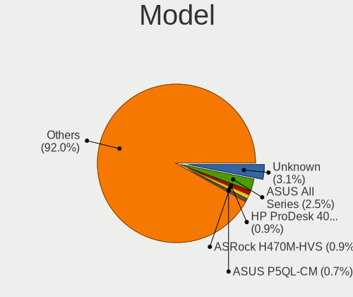
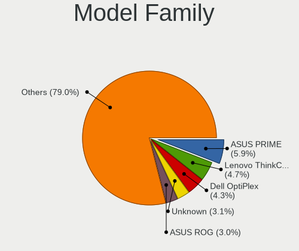
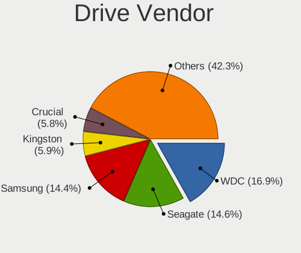
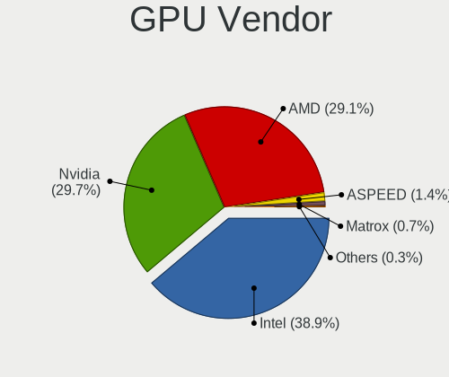
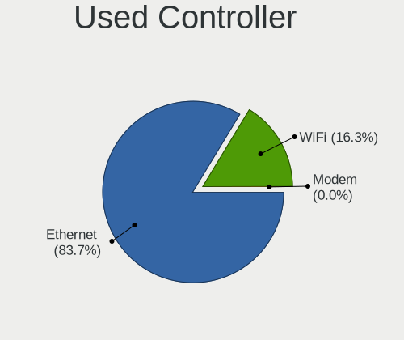
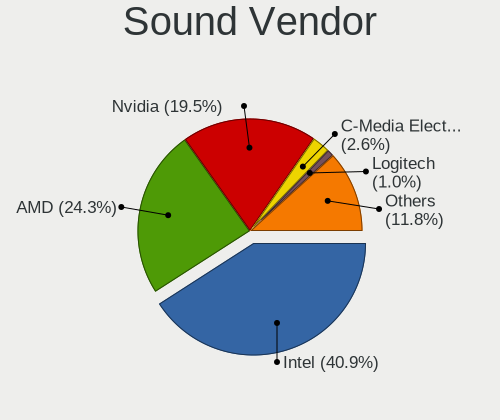
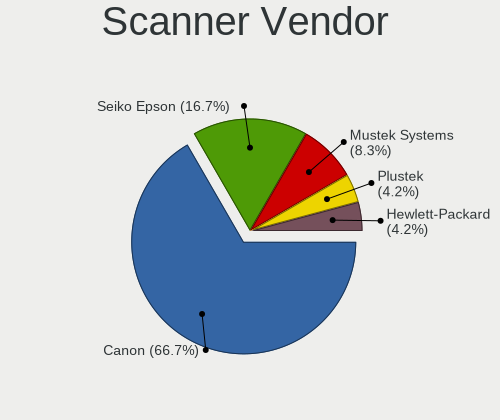

Debian 12 - Tested Hardware & Statistics (Desktops)
---------------------------------------------------

A project to collect tested hardware configurations for Debian 12.

Anyone can contribute to this report by the [hw-probe](https://github.com/linuxhw/hw-probe) tool:

    sudo -E hw-probe -all -upload

Please contribute! Especially if your hardware is rare.

Contents
--------

* [ Test Cases ](#test-cases)

* [ System ](#system)
  - [ Kernel                   ](#kernel)
  - [ Kernel Family            ](#kernel-family)
  - [ Kernel Major Ver.        ](#kernel-major-ver)
  - [ Arch                     ](#arch)
  - [ DE                       ](#de)
  - [ Display Server           ](#display-server)
  - [ Display Manager          ](#display-manager)
  - [ OS Lang                  ](#os-lang)
  - [ Boot Mode                ](#boot-mode)
  - [ Filesystem               ](#filesystem)
  - [ Part. scheme             ](#part-scheme)
  - [ Dual Boot with Linux/BSD ](#dual-boot-with-linuxbsd)
  - [ Dual Boot (Win)          ](#dual-boot-win)

* [ Board ](#board)
  - [ Vendor                   ](#vendor)
  - [ Model                    ](#model)
  - [ Model Family             ](#model-family)
  - [ MFG Year                 ](#mfg-year)
  - [ Form Factor              ](#form-factor)
  - [ Secure Boot              ](#secure-boot)
  - [ Coreboot                 ](#coreboot)
  - [ RAM Size                 ](#ram-size)
  - [ RAM Used                 ](#ram-used)
  - [ Total Drives             ](#total-drives)
  - [ Has CD-ROM               ](#has-cd-rom)
  - [ Has Ethernet             ](#has-ethernet)
  - [ Has WiFi                 ](#has-wifi)
  - [ Has Bluetooth            ](#has-bluetooth)

* [ Location ](#location)
  - [ Country                  ](#country)
  - [ City                     ](#city)

* [ Drives ](#drives)
  - [ Drive Vendor             ](#drive-vendor)
  - [ Drive Model              ](#drive-model)
  - [ HDD Vendor               ](#hdd-vendor)
  - [ SSD Vendor               ](#ssd-vendor)
  - [ Drive Kind               ](#drive-kind)
  - [ Drive Connector          ](#drive-connector)
  - [ Drive Size               ](#drive-size)
  - [ Space Total              ](#space-total)
  - [ Space Used               ](#space-used)
  - [ Malfunc. Drives          ](#malfunc-drives)
  - [ Malfunc. Drive Vendor    ](#malfunc-drive-vendor)
  - [ Malfunc. HDD Vendor      ](#malfunc-hdd-vendor)
  - [ Malfunc. Drive Kind      ](#malfunc-drive-kind)
  - [ Failed Drives            ](#failed-drives)
  - [ Failed Drive Vendor      ](#failed-drive-vendor)
  - [ Drive Status             ](#drive-status)

* [ Storage controller ](#storage-controller)
  - [ Storage Vendor           ](#storage-vendor)
  - [ Storage Model            ](#storage-model)
  - [ Storage Kind             ](#storage-kind)

* [ Processor ](#processor)
  - [ CPU Vendor               ](#cpu-vendor)
  - [ CPU Model                ](#cpu-model)
  - [ CPU Model Family         ](#cpu-model-family)
  - [ CPU Cores                ](#cpu-cores)
  - [ CPU Sockets              ](#cpu-sockets)
  - [ CPU Threads              ](#cpu-threads)
  - [ CPU Op-Modes             ](#cpu-op-modes)
  - [ CPU Microcode            ](#cpu-microcode)
  - [ CPU Microarch            ](#cpu-microarch)

* [ Graphics ](#graphics)
  - [ GPU Vendor               ](#gpu-vendor)
  - [ GPU Model                ](#gpu-model)
  - [ GPU Combo                ](#gpu-combo)
  - [ GPU Driver               ](#gpu-driver)
  - [ GPU Memory               ](#gpu-memory)

* [ Monitor ](#monitor)
  - [ Monitor Vendor           ](#monitor-vendor)
  - [ Monitor Model            ](#monitor-model)
  - [ Monitor Resolution       ](#monitor-resolution)
  - [ Monitor Diagonal         ](#monitor-diagonal)
  - [ Monitor Width            ](#monitor-width)
  - [ Aspect Ratio             ](#aspect-ratio)
  - [ Monitor Area             ](#monitor-area)
  - [ Pixel Density            ](#pixel-density)
  - [ Multiple Monitors        ](#multiple-monitors)

* [ Network ](#network)
  - [ Net Controller Vendor    ](#net-controller-vendor)
  - [ Net Controller Model     ](#net-controller-model)
  - [ Wireless Vendor          ](#wireless-vendor)
  - [ Wireless Model           ](#wireless-model)
  - [ Ethernet Vendor          ](#ethernet-vendor)
  - [ Ethernet Model           ](#ethernet-model)
  - [ Net Controller Kind      ](#net-controller-kind)
  - [ Used Controller          ](#used-controller)
  - [ NICs                     ](#nics)
  - [ IPv6                     ](#ipv6)

* [ Bluetooth ](#bluetooth)
  - [ Bluetooth Vendor         ](#bluetooth-vendor)
  - [ Bluetooth Model          ](#bluetooth-model)

* [ Sound ](#sound)
  - [ Sound Vendor             ](#sound-vendor)
  - [ Sound Model              ](#sound-model)

* [ Memory ](#memory)
  - [ Memory Vendor            ](#memory-vendor)
  - [ Memory Model             ](#memory-model)
  - [ Memory Kind              ](#memory-kind)
  - [ Memory Form Factor       ](#memory-form-factor)
  - [ Memory Size              ](#memory-size)
  - [ Memory Speed             ](#memory-speed)

* [ Printers & scanners ](#printers--scanners)
  - [ Printer Vendor           ](#printer-vendor)
  - [ Printer Model            ](#printer-model)
  - [ Scanner Vendor           ](#scanner-vendor)
  - [ Scanner Model            ](#scanner-model)

* [ Camera ](#camera)
  - [ Camera Vendor            ](#camera-vendor)
  - [ Camera Model             ](#camera-model)

* [ Security ](#security)
  - [ Fingerprint Vendor       ](#fingerprint-vendor)
  - [ Fingerprint Model        ](#fingerprint-model)
  - [ Chipcard Vendor          ](#chipcard-vendor)
  - [ Chipcard Model           ](#chipcard-model)

* [ Unsupported ](#unsupported)
  - [ Unsupported Devices      ](#unsupported-devices)
  - [ Unsupported Device Types ](#unsupported-device-types)

Test Cases
----------

Total: 1449

| Vendor        | Model                       | Probe                                                      | Date         |
|---------------|-----------------------------|------------------------------------------------------------|--------------|
| ASUSTek       | P7P55D-E                    | [7173101a68](https://linux-hardware.org/?probe=7173101a68) | Feb 02, 2024 |
| Sapphire      | PI-AM3RS760G2               | [9b2e938cb4](https://linux-hardware.org/?probe=9b2e938cb4) | Feb 02, 2024 |
| Gigabyte      | B560M H                     | [84e64db583](https://linux-hardware.org/?probe=84e64db583) | Feb 02, 2024 |
| ASRock        | 990FX Extreme4              | [b412a671e4](https://linux-hardware.org/?probe=b412a671e4) | Feb 02, 2024 |
| HP            | 1998                        | [0056c33526](https://linux-hardware.org/?probe=0056c33526) | Feb 02, 2024 |
| Lenovo        | SHARKBAY NOK                | [f4caef7bf1](https://linux-hardware.org/?probe=f4caef7bf1) | Feb 02, 2024 |
| Dell          | 0G214D A00                  | [2973076de3](https://linux-hardware.org/?probe=2973076de3) | Feb 01, 2024 |
| Lenovo        | ThinkCentre M55p 8808D8U    | [763dd9417b](https://linux-hardware.org/?probe=763dd9417b) | Jan 31, 2024 |
| Gigabyte      | B85M-D3H                    | [059252dc92](https://linux-hardware.org/?probe=059252dc92) | Jan 31, 2024 |
| Dell          | 018D1Y A00                  | [28a3a41219](https://linux-hardware.org/?probe=28a3a41219) | Jan 31, 2024 |
| Unknown       | T3 MRD                      | [744984b9d3](https://linux-hardware.org/?probe=744984b9d3) | Jan 31, 2024 |
| ASUSTek       | PRIME A320M-K               | [348cad0405](https://linux-hardware.org/?probe=348cad0405) | Jan 31, 2024 |
| MSI           | H110M PRO-VD                | [29fd183b3b](https://linux-hardware.org/?probe=29fd183b3b) | Jan 31, 2024 |
| ASRock        | A520M-HDV                   | [fa42ae183a](https://linux-hardware.org/?probe=fa42ae183a) | Jan 31, 2024 |
| ASRock        | A520M-HDV                   | [23be9724fe](https://linux-hardware.org/?probe=23be9724fe) | Jan 31, 2024 |
| HP            | 1495                        | [a2017adb28](https://linux-hardware.org/?probe=a2017adb28) | Jan 30, 2024 |
| ASUSTek       | B85M-E/BR                   | [d3a20c90d1](https://linux-hardware.org/?probe=d3a20c90d1) | Jan 30, 2024 |
| ASRock        | 990FX Extreme4              | [dbb897d3e1](https://linux-hardware.org/?probe=dbb897d3e1) | Jan 30, 2024 |
| Gigabyte      | B550M AORUS ELITE           | [e5435a9682](https://linux-hardware.org/?probe=e5435a9682) | Jan 30, 2024 |
| Dell          | 0D4MD1 A00                  | [9dd5ab2544](https://linux-hardware.org/?probe=9dd5ab2544) | Jan 30, 2024 |
| Lenovo        | SHARKBAY 0B98401 PRO        | [141329c8f3](https://linux-hardware.org/?probe=141329c8f3) | Jan 29, 2024 |
| Huanan        | X99-4MF V1.0                | [63f228ae04](https://linux-hardware.org/?probe=63f228ae04) | Jan 29, 2024 |
| Shenzhen M... | F6BFC                       | [3ecbf7ef23](https://linux-hardware.org/?probe=3ecbf7ef23) | Jan 29, 2024 |
| ASRock        | X300TM-ITX                  | [c3277a6c4c](https://linux-hardware.org/?probe=c3277a6c4c) | Jan 29, 2024 |
| MSI           | MS-7060                     | [cfc1584314](https://linux-hardware.org/?probe=cfc1584314) | Jan 29, 2024 |
| HP            | 1495                        | [2bf6b5d794](https://linux-hardware.org/?probe=2bf6b5d794) | Jan 28, 2024 |
| Intel         | DX58SO AAE29331-503         | [57959fa365](https://linux-hardware.org/?probe=57959fa365) | Jan 28, 2024 |
| ASUSTek       | PRIME X570-P                | [0b1a4a9d6c](https://linux-hardware.org/?probe=0b1a4a9d6c) | Jan 28, 2024 |
| ASUSTek       | Z97-K                       | [777446f160](https://linux-hardware.org/?probe=777446f160) | Jan 28, 2024 |
| Gateway       | DS10G                       | [869339de12](https://linux-hardware.org/?probe=869339de12) | Jan 28, 2024 |
| Unknown       | Unknown                     | [52ae8cfe76](https://linux-hardware.org/?probe=52ae8cfe76) | Jan 28, 2024 |
| Unknown       | Unknown                     | [1834dd7444](https://linux-hardware.org/?probe=1834dd7444) | Jan 28, 2024 |
| Gigabyte      | H61M-D2-B3                  | [a177c22fb5](https://linux-hardware.org/?probe=a177c22fb5) | Jan 28, 2024 |
| HP            | 21EF                        | [9fcfe8d663](https://linux-hardware.org/?probe=9fcfe8d663) | Jan 28, 2024 |
| ASUSTek       | TUF Gaming B450-PLUS II     | [08f64cc902](https://linux-hardware.org/?probe=08f64cc902) | Jan 27, 2024 |
| Dell          | 042P49 A01                  | [c419b892e0](https://linux-hardware.org/?probe=c419b892e0) | Jan 27, 2024 |
| ASUSTek       | TUF Gaming B450-PLUS II     | [a6240580d2](https://linux-hardware.org/?probe=a6240580d2) | Jan 27, 2024 |
| Biostar       | A10N-8800E                  | [6035efec56](https://linux-hardware.org/?probe=6035efec56) | Jan 27, 2024 |
| ASUSTek       | ROG STRIX B550-E GAMING     | [48d7c58756](https://linux-hardware.org/?probe=48d7c58756) | Jan 27, 2024 |
| Biostar       | A10N-8800E                  | [9eab4dee46](https://linux-hardware.org/?probe=9eab4dee46) | Jan 27, 2024 |
| ASUSTek       | ROG STRIX B550-E GAMING     | [ff65cf66c3](https://linux-hardware.org/?probe=ff65cf66c3) | Jan 27, 2024 |
| Medion        | MS-7616                     | [3645021c62](https://linux-hardware.org/?probe=3645021c62) | Jan 27, 2024 |
| ASUSTek       | ROG STRIX B450-F GAMING     | [f7b37dcead](https://linux-hardware.org/?probe=f7b37dcead) | Jan 27, 2024 |
| HC Technol... | HCAR5000-MI2                | [19a4048799](https://linux-hardware.org/?probe=19a4048799) | Jan 27, 2024 |
| MSI           | MPG B550 GAMING PLUS        | [fcdc8fc8e3](https://linux-hardware.org/?probe=fcdc8fc8e3) | Jan 26, 2024 |
| ASUSTek       | Z87-C                       | [a63ba339e5](https://linux-hardware.org/?probe=a63ba339e5) | Jan 26, 2024 |
| ASUSTek       | PRIME X570-P                | [f0eb2463d7](https://linux-hardware.org/?probe=f0eb2463d7) | Jan 26, 2024 |
| ECS           | G31T-M9                     | [8af1e631e7](https://linux-hardware.org/?probe=8af1e631e7) | Jan 26, 2024 |
| MSI           | G31M3 V2                    | [b98a012c0e](https://linux-hardware.org/?probe=b98a012c0e) | Jan 26, 2024 |
| Gigabyte      | H81M-S2V                    | [42abec13ac](https://linux-hardware.org/?probe=42abec13ac) | Jan 26, 2024 |
| HP            | 2AAC                        | [d397b1b3b3](https://linux-hardware.org/?probe=d397b1b3b3) | Jan 26, 2024 |
| ASUSTek       | TUF Gaming B450-PLUS II     | [431bc1335a](https://linux-hardware.org/?probe=431bc1335a) | Jan 26, 2024 |
| ASUSTek       | PRIME B350-PLUS             | [c9df4c296f](https://linux-hardware.org/?probe=c9df4c296f) | Jan 26, 2024 |
| ASRock        | 990FX Extreme4              | [80c0bacde5](https://linux-hardware.org/?probe=80c0bacde5) | Jan 25, 2024 |
| ASRock        | 990FX Extreme4              | [70a0ef842a](https://linux-hardware.org/?probe=70a0ef842a) | Jan 25, 2024 |
| Unknown       | Unknown                     | [a1cdf62b17](https://linux-hardware.org/?probe=a1cdf62b17) | Jan 25, 2024 |
| Unknown       | Unknown                     | [a743ba7b8b](https://linux-hardware.org/?probe=a743ba7b8b) | Jan 24, 2024 |
| ECS           | G31T-M9                     | [87e9fbf4fd](https://linux-hardware.org/?probe=87e9fbf4fd) | Jan 24, 2024 |
| ASUSTek       | Z170 PRO GAMING             | [298f2d1380](https://linux-hardware.org/?probe=298f2d1380) | Jan 24, 2024 |
| ASRock        | G31M-GS                     | [8c46163f5c](https://linux-hardware.org/?probe=8c46163f5c) | Jan 24, 2024 |
| ASRock        | G31M-GS                     | [dbe6d0fdd4](https://linux-hardware.org/?probe=dbe6d0fdd4) | Jan 24, 2024 |
| Foxconn       | G33M03                      | [dd33710847](https://linux-hardware.org/?probe=dd33710847) | Jan 24, 2024 |
| ASUSTek       | P7H55-M LE                  | [a864af0be4](https://linux-hardware.org/?probe=a864af0be4) | Jan 24, 2024 |
| Gigabyte      | H55M-UD2H                   | [10c2d49a41](https://linux-hardware.org/?probe=10c2d49a41) | Jan 24, 2024 |
| Foxconn       | G33M03                      | [bd9087ac07](https://linux-hardware.org/?probe=bd9087ac07) | Jan 24, 2024 |
| ASUSTek       | H110M-R                     | [7ed41d411e](https://linux-hardware.org/?probe=7ed41d411e) | Jan 24, 2024 |
| ASUSTek       | P8H61-M LX3 PLUS R2.0       | [0dc2ae0570](https://linux-hardware.org/?probe=0dc2ae0570) | Jan 24, 2024 |
| MSI           | MAG Z790 TOMAHAWK WIFI      | [8b61369e83](https://linux-hardware.org/?probe=8b61369e83) | Jan 24, 2024 |
| Gigabyte      | H61M-S1                     | [b0ac9a9edd](https://linux-hardware.org/?probe=b0ac9a9edd) | Jan 24, 2024 |
| HP            | 158B                        | [d433cc30c0](https://linux-hardware.org/?probe=d433cc30c0) | Jan 23, 2024 |
| ASUSTek       | Pro WS 565-ACE              | [46ef259c25](https://linux-hardware.org/?probe=46ef259c25) | Jan 23, 2024 |
| ASUSTek       | ROG STRIX B560-A GAMING ... | [6887beeb2a](https://linux-hardware.org/?probe=6887beeb2a) | Jan 23, 2024 |
| ASUSTek       | M2N-E SLI                   | [113665efbe](https://linux-hardware.org/?probe=113665efbe) | Jan 23, 2024 |
| Gigabyte      | H61M-D2-B3                  | [a8315f32a0](https://linux-hardware.org/?probe=a8315f32a0) | Jan 23, 2024 |
| ASUSTek       | B150-PRO D3                 | [1f8cd5afac](https://linux-hardware.org/?probe=1f8cd5afac) | Jan 23, 2024 |
| ASRock        | 990FX Extreme4              | [1a19df4d59](https://linux-hardware.org/?probe=1a19df4d59) | Jan 23, 2024 |
| ASUSTek       | SABERTOOTH 990FX R2.0       | [70551a607e](https://linux-hardware.org/?probe=70551a607e) | Jan 23, 2024 |
| Lenovo        | ThinkCentre M55p 8808D8U    | [f265beb810](https://linux-hardware.org/?probe=f265beb810) | Jan 22, 2024 |
| Intel         | DX58SO AAE29331-503         | [ed61279750](https://linux-hardware.org/?probe=ed61279750) | Jan 22, 2024 |
| MSI           | MEG X570 ACE                | [85c7d79003](https://linux-hardware.org/?probe=85c7d79003) | Jan 22, 2024 |
| ASUSTek       | J1800I-C                    | [6adb9446f3](https://linux-hardware.org/?probe=6adb9446f3) | Jan 22, 2024 |
| ASUSTek       | H81M-R                      | [dd7840e283](https://linux-hardware.org/?probe=dd7840e283) | Jan 22, 2024 |
| MSI           | MPG B460I GAMING EDGE WI... | [2449b6b678](https://linux-hardware.org/?probe=2449b6b678) | Jan 22, 2024 |
| HC            | HCAR357-MI V1.0             | [1f15fb2119](https://linux-hardware.org/?probe=1f15fb2119) | Jan 22, 2024 |
| Gigabyte      | B650 GAMING X AX V2         | [24555759ee](https://linux-hardware.org/?probe=24555759ee) | Jan 22, 2024 |
| MSI           | MS-B1711                    | [0949139f7e](https://linux-hardware.org/?probe=0949139f7e) | Jan 22, 2024 |
| MSI           | PRO B760M-P DDR4            | [75f120a935](https://linux-hardware.org/?probe=75f120a935) | Jan 21, 2024 |
| ASRock        | 990FX Extreme4              | [5722aa300f](https://linux-hardware.org/?probe=5722aa300f) | Jan 21, 2024 |
| ASRock        | 990FX Extreme4              | [bc8248af06](https://linux-hardware.org/?probe=bc8248af06) | Jan 21, 2024 |
| Gigabyte      | 945GZM-S2                   | [41c285445b](https://linux-hardware.org/?probe=41c285445b) | Jan 21, 2024 |
| ASRock        | 990FX Extreme4              | [17f186ad10](https://linux-hardware.org/?probe=17f186ad10) | Jan 20, 2024 |
| Gigabyte      | H110M-S2H-CF                | [d57cdb4371](https://linux-hardware.org/?probe=d57cdb4371) | Jan 20, 2024 |
| ASUSTek       | PRIME B450M-K               | [5e16786940](https://linux-hardware.org/?probe=5e16786940) | Jan 20, 2024 |
| IBM           | 830381U                     | [8af6dd9c05](https://linux-hardware.org/?probe=8af6dd9c05) | Jan 20, 2024 |
| ASRock        | N100DC-ITX                  | [dbca9c4ba2](https://linux-hardware.org/?probe=dbca9c4ba2) | Jan 19, 2024 |
| ASUSTek       | TUF Z390-PLUS GAMING        | [a77218f826](https://linux-hardware.org/?probe=a77218f826) | Jan 19, 2024 |
| Gigabyte      | B250M-DS3H-CF               | [b4073d28df](https://linux-hardware.org/?probe=b4073d28df) | Jan 19, 2024 |
| ASUSTek       | Pro WS WRX80E-SAGE SE WI... | [e62243f63a](https://linux-hardware.org/?probe=e62243f63a) | Jan 19, 2024 |
| Intel         | DH77EB AAG39073-304         | [6c6bbd8cc8](https://linux-hardware.org/?probe=6c6bbd8cc8) | Jan 19, 2024 |
| Dell          | 0YJMC0 A02                  | [6dcdea7ca2](https://linux-hardware.org/?probe=6dcdea7ca2) | Jan 19, 2024 |
| ASUSTek       | Z170 PRO GAMING             | [d64ba116db](https://linux-hardware.org/?probe=d64ba116db) | Jan 19, 2024 |
| ASUSTek       | P5QL-CM                     | [a8adaf0c17](https://linux-hardware.org/?probe=a8adaf0c17) | Jan 18, 2024 |
| ASUSTek       | P5QL-CM                     | [26510e18f5](https://linux-hardware.org/?probe=26510e18f5) | Jan 18, 2024 |
| ASUSTek       | P5QL-CM                     | [4ca7c404f0](https://linux-hardware.org/?probe=4ca7c404f0) | Jan 18, 2024 |
| ASUSTek       | P5QL-CM                     | [a2967a1948](https://linux-hardware.org/?probe=a2967a1948) | Jan 18, 2024 |
| Gigabyte      | H610M H DDR4                | [1d9bce4a06](https://linux-hardware.org/?probe=1d9bce4a06) | Jan 18, 2024 |
| ASUSTek       | P5QL-CM                     | [a0c4c6c96a](https://linux-hardware.org/?probe=a0c4c6c96a) | Jan 18, 2024 |
| ASUSTek       | PRIME H310M-E               | [6674d084a8](https://linux-hardware.org/?probe=6674d084a8) | Jan 18, 2024 |
| Grandstrea... | T3 MRD                      | [21c38a3719](https://linux-hardware.org/?probe=21c38a3719) | Jan 18, 2024 |
| ASUSTek       | P5QL-CM                     | [900d299461](https://linux-hardware.org/?probe=900d299461) | Jan 18, 2024 |
| ASUSTek       | P5QL-CM                     | [56d6cc2713](https://linux-hardware.org/?probe=56d6cc2713) | Jan 18, 2024 |
| ASUSTek       | P5QL-CM                     | [3bc6ca5cba](https://linux-hardware.org/?probe=3bc6ca5cba) | Jan 18, 2024 |
| ASUSTek       | P5QL-CM                     | [a71b94ef53](https://linux-hardware.org/?probe=a71b94ef53) | Jan 18, 2024 |
| ASRock        | H61M                        | [653436b855](https://linux-hardware.org/?probe=653436b855) | Jan 18, 2024 |
| ASUSTek       | P5QL-CM                     | [01d717f8fc](https://linux-hardware.org/?probe=01d717f8fc) | Jan 18, 2024 |
| ASUSTek       | P5QL-CM                     | [12129124f0](https://linux-hardware.org/?probe=12129124f0) | Jan 18, 2024 |
| ASUSTek       | P5QL-CM                     | [6ebd6d855d](https://linux-hardware.org/?probe=6ebd6d855d) | Jan 18, 2024 |
| ASUSTek       | P5QL-CM                     | [362052b28a](https://linux-hardware.org/?probe=362052b28a) | Jan 18, 2024 |
| OEM           | X79G                        | [992b83b632](https://linux-hardware.org/?probe=992b83b632) | Jan 18, 2024 |
| HP            | 1495                        | [0e16d785bc](https://linux-hardware.org/?probe=0e16d785bc) | Jan 18, 2024 |
| ASUSTek       | ROG STRIX X670E-E GAMING... | [9cea75cc3c](https://linux-hardware.org/?probe=9cea75cc3c) | Jan 18, 2024 |
| MSI           | PRO Z790-A WIFI             | [9c84b7f26a](https://linux-hardware.org/?probe=9c84b7f26a) | Jan 17, 2024 |
| HP            | 82A2                        | [2d14e52635](https://linux-hardware.org/?probe=2d14e52635) | Jan 17, 2024 |
| SYWZ          | S210H Series                | [b918a28247](https://linux-hardware.org/?probe=b918a28247) | Jan 17, 2024 |
| ASUSTek       | PRIME H310M-R R2.0          | [2b7eda6458](https://linux-hardware.org/?probe=2b7eda6458) | Jan 17, 2024 |
| ASRock        | 990FX Extreme4              | [99bcba4ae3](https://linux-hardware.org/?probe=99bcba4ae3) | Jan 17, 2024 |
| Intel         | DH77KC AAG39641-400         | [b9c3c9837d](https://linux-hardware.org/?probe=b9c3c9837d) | Jan 17, 2024 |
| IBM           | 830381U                     | [114d68f889](https://linux-hardware.org/?probe=114d68f889) | Jan 17, 2024 |
| ASUSTek       | PRIME A320M-K               | [832ff6a79d](https://linux-hardware.org/?probe=832ff6a79d) | Jan 16, 2024 |
| HP            | ProLiant ML310e Gen8 v2     | [75c345abd6](https://linux-hardware.org/?probe=75c345abd6) | Jan 16, 2024 |
| ASUSTek       | P5Q SE2                     | [e357bf8b25](https://linux-hardware.org/?probe=e357bf8b25) | Jan 16, 2024 |
| ASRock        | 990FX Extreme4              | [196ce97a62](https://linux-hardware.org/?probe=196ce97a62) | Jan 16, 2024 |
| Gigabyte      | B560M DS3H V2               | [01f214a86d](https://linux-hardware.org/?probe=01f214a86d) | Jan 15, 2024 |
| ASRock        | 990FX Extreme4              | [bf7672b4a4](https://linux-hardware.org/?probe=bf7672b4a4) | Jan 15, 2024 |
| HP            | 8105                        | [003cac54c4](https://linux-hardware.org/?probe=003cac54c4) | Jan 15, 2024 |
| HP            | 8062                        | [58b81c8ab8](https://linux-hardware.org/?probe=58b81c8ab8) | Jan 15, 2024 |
| HP            | 8105                        | [36e0151976](https://linux-hardware.org/?probe=36e0151976) | Jan 15, 2024 |
| HP            | 8062                        | [9ff293cb06](https://linux-hardware.org/?probe=9ff293cb06) | Jan 15, 2024 |
| HP            | 8105                        | [2ee1b30f19](https://linux-hardware.org/?probe=2ee1b30f19) | Jan 15, 2024 |
| HP            | 8062                        | [64be9fb79c](https://linux-hardware.org/?probe=64be9fb79c) | Jan 15, 2024 |
| HP            | 8062                        | [502adc9396](https://linux-hardware.org/?probe=502adc9396) | Jan 15, 2024 |
| HP            | 8105                        | [142985ca4f](https://linux-hardware.org/?probe=142985ca4f) | Jan 15, 2024 |
| HP            | 8105                        | [aa402dfc3b](https://linux-hardware.org/?probe=aa402dfc3b) | Jan 15, 2024 |
| HP            | 8105                        | [f508c2b4c4](https://linux-hardware.org/?probe=f508c2b4c4) | Jan 15, 2024 |
| HP            | 8105                        | [eb9adb982e](https://linux-hardware.org/?probe=eb9adb982e) | Jan 15, 2024 |
| HP            | 8105                        | [fc6c21da40](https://linux-hardware.org/?probe=fc6c21da40) | Jan 15, 2024 |
| ASRock        | 990FX Extreme4              | [8a02dab1f4](https://linux-hardware.org/?probe=8a02dab1f4) | Jan 15, 2024 |
| ASUSTek       | PRIME A320M-K               | [2ce7044dec](https://linux-hardware.org/?probe=2ce7044dec) | Jan 15, 2024 |
| AZW           | EQ MINI 10                  | [e702ea54ea](https://linux-hardware.org/?probe=e702ea54ea) | Jan 14, 2024 |
| T-bao Tian... | GOD78                       | [c2f6e2c9e1](https://linux-hardware.org/?probe=c2f6e2c9e1) | Jan 14, 2024 |
| ASRock        | 990FX Extreme4              | [cb5bd1f14f](https://linux-hardware.org/?probe=cb5bd1f14f) | Jan 14, 2024 |
| ASUSTek       | ET1610PT                    | [f71bcea580](https://linux-hardware.org/?probe=f71bcea580) | Jan 14, 2024 |
| ASRock        | 990FX Extreme4              | [439b30f633](https://linux-hardware.org/?probe=439b30f633) | Jan 14, 2024 |
| ASRock        | Z68 Extreme3 Gen3           | [9bc7ba0294](https://linux-hardware.org/?probe=9bc7ba0294) | Jan 14, 2024 |
| ASRock        | 990FX Extreme4              | [35533bf402](https://linux-hardware.org/?probe=35533bf402) | Jan 14, 2024 |
| ASRock        | 990FX Extreme4              | [783185e5af](https://linux-hardware.org/?probe=783185e5af) | Jan 13, 2024 |
| ASRock        | 990FX Extreme4              | [1742e2e526](https://linux-hardware.org/?probe=1742e2e526) | Jan 13, 2024 |
| ASRock        | 990FX Extreme4              | [43ceb02173](https://linux-hardware.org/?probe=43ceb02173) | Jan 13, 2024 |
| Gigabyte      | X570 AORUS XTREME           | [58771677c3](https://linux-hardware.org/?probe=58771677c3) | Jan 13, 2024 |
| Gigabyte      | B450M S2H                   | [f29e741e2b](https://linux-hardware.org/?probe=f29e741e2b) | Jan 13, 2024 |
| ASRock        | 990FX Extreme4              | [6adea77d15](https://linux-hardware.org/?probe=6adea77d15) | Jan 13, 2024 |
| Biostar       | A320MH                      | [5bec64f55c](https://linux-hardware.org/?probe=5bec64f55c) | Jan 12, 2024 |
| ASRock        | 990FX Extreme4              | [cde9d2553f](https://linux-hardware.org/?probe=cde9d2553f) | Jan 12, 2024 |
| ASRock        | 990FX Extreme4              | [6c82d498ba](https://linux-hardware.org/?probe=6c82d498ba) | Jan 12, 2024 |
| MSI           | H110M PRO-VD                | [10efa0c4e5](https://linux-hardware.org/?probe=10efa0c4e5) | Jan 12, 2024 |
| MSI           | X470 GAMING PLUS MAX        | [95c2b6739c](https://linux-hardware.org/?probe=95c2b6739c) | Jan 12, 2024 |
| ASUSTek       | PRIME B360M-A               | [5fb795a75b](https://linux-hardware.org/?probe=5fb795a75b) | Jan 12, 2024 |
| Lenovo        | SHARKBAY NOK                | [1ece67bdd1](https://linux-hardware.org/?probe=1ece67bdd1) | Jan 12, 2024 |
| MSI           | MS-7318                     | [58f55e6bd3](https://linux-hardware.org/?probe=58f55e6bd3) | Jan 11, 2024 |
| Gigabyte      | H77N-WIFI                   | [aeb566949b](https://linux-hardware.org/?probe=aeb566949b) | Jan 11, 2024 |
| Gigabyte      | MFLP5IP-00                  | [82e2bfd859](https://linux-hardware.org/?probe=82e2bfd859) | Jan 11, 2024 |
| HP            | ProLiant ML310e Gen8 v2     | [d6e4987996](https://linux-hardware.org/?probe=d6e4987996) | Jan 11, 2024 |
| Gigabyte      | GA-M56S-S3                  | [77af17feec](https://linux-hardware.org/?probe=77af17feec) | Jan 11, 2024 |
| Phoenix       | 945GM                       | [12f56a36d9](https://linux-hardware.org/?probe=12f56a36d9) | Jan 11, 2024 |
| MSI           | MS-B1711                    | [dc032b6456](https://linux-hardware.org/?probe=dc032b6456) | Jan 11, 2024 |
| HP            | 8767 A                      | [b8a28f8c5f](https://linux-hardware.org/?probe=b8a28f8c5f) | Jan 10, 2024 |
| Gigabyte      | A520M K V2                  | [3485cdf9ff](https://linux-hardware.org/?probe=3485cdf9ff) | Jan 10, 2024 |
| ASRock        | 990FX Extreme4              | [975fff0a28](https://linux-hardware.org/?probe=975fff0a28) | Jan 10, 2024 |
| ASRock        | 990FX Extreme4              | [4d91095fa0](https://linux-hardware.org/?probe=4d91095fa0) | Jan 10, 2024 |
| Gigabyte      | A520M K V2                  | [2f7bb41141](https://linux-hardware.org/?probe=2f7bb41141) | Jan 10, 2024 |
| ASRock        | 990FX Extreme4              | [6909d543b0](https://linux-hardware.org/?probe=6909d543b0) | Jan 10, 2024 |
| Medion        | MS-7616                     | [c8a2c8be49](https://linux-hardware.org/?probe=c8a2c8be49) | Jan 10, 2024 |
| newplatfor... | NP-1008i.1                  | [3da4bb5017](https://linux-hardware.org/?probe=3da4bb5017) | Jan 09, 2024 |
| Sapphire      | PI-AM3RS760G2               | [e08d38f8a0](https://linux-hardware.org/?probe=e08d38f8a0) | Jan 09, 2024 |
| ASRock        | 990FX Extreme4              | [a3fa43281d](https://linux-hardware.org/?probe=a3fa43281d) | Jan 09, 2024 |
| Intel         | X99H                        | [b0bb3cb105](https://linux-hardware.org/?probe=b0bb3cb105) | Jan 09, 2024 |
| ASRock        | 990FX Extreme4              | [ddc21e0978](https://linux-hardware.org/?probe=ddc21e0978) | Jan 08, 2024 |
| HP            | 8105                        | [ff8505bc17](https://linux-hardware.org/?probe=ff8505bc17) | Jan 08, 2024 |
| HP            | 8105                        | [7f6df56de0](https://linux-hardware.org/?probe=7f6df56de0) | Jan 08, 2024 |
| HP            | 8105                        | [bff2ea3f8f](https://linux-hardware.org/?probe=bff2ea3f8f) | Jan 08, 2024 |
| HP            | 8105                        | [ca99b2e20d](https://linux-hardware.org/?probe=ca99b2e20d) | Jan 08, 2024 |
| HP            | 8062                        | [4250f0bb2a](https://linux-hardware.org/?probe=4250f0bb2a) | Jan 08, 2024 |
| HP            | 8105                        | [4c3d033a45](https://linux-hardware.org/?probe=4c3d033a45) | Jan 08, 2024 |
| HP            | 8062                        | [2ed973c58e](https://linux-hardware.org/?probe=2ed973c58e) | Jan 08, 2024 |
| HP            | 8062                        | [d644042c15](https://linux-hardware.org/?probe=d644042c15) | Jan 08, 2024 |
| HP            | 8105                        | [e4afcbf22b](https://linux-hardware.org/?probe=e4afcbf22b) | Jan 08, 2024 |
| HP            | 8105                        | [86900314fe](https://linux-hardware.org/?probe=86900314fe) | Jan 08, 2024 |
| HP            | 8105                        | [5eacb006cf](https://linux-hardware.org/?probe=5eacb006cf) | Jan 08, 2024 |
| HP            | 8105                        | [5c691ff566](https://linux-hardware.org/?probe=5c691ff566) | Jan 08, 2024 |
| HP            | 8105                        | [a049370355](https://linux-hardware.org/?probe=a049370355) | Jan 08, 2024 |
| HP            | 8105                        | [98eef698ee](https://linux-hardware.org/?probe=98eef698ee) | Jan 08, 2024 |
| HP            | 8105                        | [6c13f7a773](https://linux-hardware.org/?probe=6c13f7a773) | Jan 08, 2024 |
| Shenzhen M... | F6BFC                       | [5b8c8357ea](https://linux-hardware.org/?probe=5b8c8357ea) | Jan 08, 2024 |
| ASRock        | 990FX Extreme4              | [40407d3445](https://linux-hardware.org/?probe=40407d3445) | Jan 08, 2024 |
| Gigabyte      | 945GZM-S2                   | [931f2e4a0e](https://linux-hardware.org/?probe=931f2e4a0e) | Jan 08, 2024 |
| ASUSTek       | PRIME X670-P WIFI           | [19d6b3732e](https://linux-hardware.org/?probe=19d6b3732e) | Jan 07, 2024 |
| ASRock        | B450 Pro4 R2.0              | [9729786ea6](https://linux-hardware.org/?probe=9729786ea6) | Jan 07, 2024 |
| Dell          | 0NK5PH A00                  | [6a6d55183a](https://linux-hardware.org/?probe=6a6d55183a) | Jan 07, 2024 |
| ASRock        | J5040-ITX                   | [2dc9e2367b](https://linux-hardware.org/?probe=2dc9e2367b) | Jan 07, 2024 |
| ASRock        | 990FX Extreme4              | [cb1ceea0b8](https://linux-hardware.org/?probe=cb1ceea0b8) | Jan 07, 2024 |
| ASRock        | 990FX Extreme4              | [ca81fd63fd](https://linux-hardware.org/?probe=ca81fd63fd) | Jan 07, 2024 |
| HP            | 82F2                        | [eaa0d60c1f](https://linux-hardware.org/?probe=eaa0d60c1f) | Jan 07, 2024 |
| newplatfor... | NP-1004i.1                  | [95788038c5](https://linux-hardware.org/?probe=95788038c5) | Jan 06, 2024 |
| ASUSTek       | PRIME B550M-K               | [7536a68c05](https://linux-hardware.org/?probe=7536a68c05) | Jan 06, 2024 |
| Dell          | 0G919G A00                  | [29eda2d272](https://linux-hardware.org/?probe=29eda2d272) | Jan 06, 2024 |
| ASUSTek       | PRIME B650M-A WIFI II       | [a7c6792366](https://linux-hardware.org/?probe=a7c6792366) | Jan 05, 2024 |
| ASUSTek       | PRIME B650M-A WIFI II       | [bb1b5c33d2](https://linux-hardware.org/?probe=bb1b5c33d2) | Jan 05, 2024 |
| Sapphire      | PI-AM3RS760G2               | [c192611a71](https://linux-hardware.org/?probe=c192611a71) | Jan 05, 2024 |
| MSI           | Z590 PRO WIFI               | [4cec5133bd](https://linux-hardware.org/?probe=4cec5133bd) | Jan 05, 2024 |
| ASRock        | 990FX Extreme4              | [c4f303d6a1](https://linux-hardware.org/?probe=c4f303d6a1) | Jan 05, 2024 |
| ASRock        | 990FX Extreme4              | [37999c37df](https://linux-hardware.org/?probe=37999c37df) | Jan 05, 2024 |
| ASRock        | 990FX Extreme4              | [1aec475668](https://linux-hardware.org/?probe=1aec475668) | Jan 05, 2024 |
| ASUSTek       | ROG STRIX B650E-F GAMING... | [05f8b32828](https://linux-hardware.org/?probe=05f8b32828) | Jan 05, 2024 |
| Lenovo        | SHARKBAY SDK0E50510 WIN     | [fe773de97b](https://linux-hardware.org/?probe=fe773de97b) | Jan 05, 2024 |
| ASRock        | 990FX Extreme4              | [8e8ffbd00e](https://linux-hardware.org/?probe=8e8ffbd00e) | Jan 04, 2024 |
| Dell          | 0PU052                      | [06e3c796ba](https://linux-hardware.org/?probe=06e3c796ba) | Jan 04, 2024 |
| ASRock        | J5040-ITX                   | [18b422e05b](https://linux-hardware.org/?probe=18b422e05b) | Jan 04, 2024 |
| ASUSTek       | PRIME Z270-P                | [e4413dc480](https://linux-hardware.org/?probe=e4413dc480) | Jan 04, 2024 |
| ASRock        | 990FX Extreme4              | [11efc6aeb2](https://linux-hardware.org/?probe=11efc6aeb2) | Jan 04, 2024 |
| Gigabyte      | B650 AORUS ELITE AX         | [74565d105e](https://linux-hardware.org/?probe=74565d105e) | Jan 04, 2024 |
| Gigabyte      | B650 AORUS ELITE AX         | [461cbd9fc4](https://linux-hardware.org/?probe=461cbd9fc4) | Jan 04, 2024 |
| TYAN Compu... | S8030GM2NE 5411T6180004     | [b8716bfb8f](https://linux-hardware.org/?probe=b8716bfb8f) | Jan 03, 2024 |
| Gowin Solu... | GW-MB-U01                   | [9cbf31ad86](https://linux-hardware.org/?probe=9cbf31ad86) | Jan 03, 2024 |
| ASUSTek       | PRIME B760-PLUS             | [59769c2318](https://linux-hardware.org/?probe=59769c2318) | Jan 03, 2024 |
| ASRock        | 990FX Extreme4              | [beb2119db9](https://linux-hardware.org/?probe=beb2119db9) | Jan 03, 2024 |
| ASRock        | 990FX Extreme4              | [8ea5e6198c](https://linux-hardware.org/?probe=8ea5e6198c) | Jan 03, 2024 |
| ASRock        | 990FX Extreme4              | [5744834a9e](https://linux-hardware.org/?probe=5744834a9e) | Jan 03, 2024 |
| Sapphire      | PI-AM3RS760G2               | [4d0fa4b70d](https://linux-hardware.org/?probe=4d0fa4b70d) | Jan 02, 2024 |
| Sapphire      | PI-AM3RS760G2               | [edfe085e75](https://linux-hardware.org/?probe=edfe085e75) | Jan 02, 2024 |
| Acer          | Veriton X2611G V1.0         | [6bd375379c](https://linux-hardware.org/?probe=6bd375379c) | Jan 02, 2024 |
| Acer          | Veriton X2631G V:1.0        | [09ab487a05](https://linux-hardware.org/?probe=09ab487a05) | Jan 02, 2024 |
| Lenovo        | SHARKBAY SDK0E50510 WIN     | [5dc394a7e9](https://linux-hardware.org/?probe=5dc394a7e9) | Jan 02, 2024 |
| Lenovo        | SHARKBAY SDK0E50510 WIN     | [6e68bc0fac](https://linux-hardware.org/?probe=6e68bc0fac) | Jan 02, 2024 |
| HP            | 18E7                        | [e1269783df](https://linux-hardware.org/?probe=e1269783df) | Jan 02, 2024 |
| Lenovo        | SHARKBAY SDK0E50510 WIN     | [acadabf6d3](https://linux-hardware.org/?probe=acadabf6d3) | Jan 02, 2024 |
| Gigabyte      | X570 AORUS ELITE WIFI       | [e5c35b5d54](https://linux-hardware.org/?probe=e5c35b5d54) | Jan 02, 2024 |
| Gigabyte      | B85M-D3H                    | [a146bec6e1](https://linux-hardware.org/?probe=a146bec6e1) | Jan 02, 2024 |
| Lenovo        | SHARKBAY SDK0E50510 WIN     | [b5c2b00a99](https://linux-hardware.org/?probe=b5c2b00a99) | Jan 02, 2024 |
| Lenovo        | SHARKBAY SDK0E50510 WIN     | [a2146214ff](https://linux-hardware.org/?probe=a2146214ff) | Jan 02, 2024 |
| Lenovo        | 30BE SDK0J40697 WIN 3305... | [fd906c174e](https://linux-hardware.org/?probe=fd906c174e) | Jan 02, 2024 |
| Lenovo        | 30BE SDK0J40697 WIN 3305... | [260c5bb8f6](https://linux-hardware.org/?probe=260c5bb8f6) | Jan 02, 2024 |
| HP            | 198E                        | [e7e8af40a6](https://linux-hardware.org/?probe=e7e8af40a6) | Jan 02, 2024 |
| Sapphire      | PI-AM3RS760G2               | [5f34a26ab3](https://linux-hardware.org/?probe=5f34a26ab3) | Jan 01, 2024 |
| HP            | ProLiant ML310e Gen8 v2     | [7271f244c2](https://linux-hardware.org/?probe=7271f244c2) | Jan 01, 2024 |
| ASUSTek       | PRIME Z270-A                | [dea2dc38e4](https://linux-hardware.org/?probe=dea2dc38e4) | Jan 01, 2024 |
| ASUSTek       | TUF Gaming X570-PRO         | [ca2b52b64f](https://linux-hardware.org/?probe=ca2b52b64f) | Dec 31, 2023 |
| ASRock        | 990FX Extreme4              | [edf3eae913](https://linux-hardware.org/?probe=edf3eae913) | Dec 31, 2023 |
| ASUSTek       | ROG STRIX B550-E GAMING     | [eb264efa92](https://linux-hardware.org/?probe=eb264efa92) | Dec 31, 2023 |
| Gigabyte      | B650 AORUS ELITE AX         | [5f1c662ba4](https://linux-hardware.org/?probe=5f1c662ba4) | Dec 31, 2023 |
| Gigabyte      | B650 AORUS ELITE AX         | [fde784b0b5](https://linux-hardware.org/?probe=fde784b0b5) | Dec 31, 2023 |
| ASUSTek       | P11C-I Series               | [b38bcf215d](https://linux-hardware.org/?probe=b38bcf215d) | Dec 30, 2023 |
| Seeed Stud... | ODYSSEY-X86J41X5 SD-BS-C... | [90b5ba3d1e](https://linux-hardware.org/?probe=90b5ba3d1e) | Dec 30, 2023 |
| ASRock        | X300M-STX                   | [7cd1d9d16c](https://linux-hardware.org/?probe=7cd1d9d16c) | Dec 30, 2023 |
| ASRock        | X300M-STX                   | [5fa6e9f755](https://linux-hardware.org/?probe=5fa6e9f755) | Dec 30, 2023 |
| MSI           | H270 GAMING M3              | [92615e0827](https://linux-hardware.org/?probe=92615e0827) | Dec 30, 2023 |
| Gigabyte      | B550M K                     | [8340ced087](https://linux-hardware.org/?probe=8340ced087) | Dec 30, 2023 |
| Apple         | Mac-F4208AC8 PVT            | [11a7c2b836](https://linux-hardware.org/?probe=11a7c2b836) | Dec 30, 2023 |
| HC Technol... | HCAR5000-MI2                | [44a9ba60e7](https://linux-hardware.org/?probe=44a9ba60e7) | Dec 29, 2023 |
| ASRock        | X570S PG Riptide            | [aa3f2ed203](https://linux-hardware.org/?probe=aa3f2ed203) | Dec 29, 2023 |
| ASUSTek       | M5A97 R2.0                  | [c5bc64bc85](https://linux-hardware.org/?probe=c5bc64bc85) | Dec 29, 2023 |
| Dell          | 054KM3 A01                  | [1d078128fe](https://linux-hardware.org/?probe=1d078128fe) | Dec 28, 2023 |
| MACHINIST     | X99 RS9                     | [1e431dc2fc](https://linux-hardware.org/?probe=1e431dc2fc) | Dec 28, 2023 |
| Sapphire      | PI-AM3RS760G2               | [cb13028da5](https://linux-hardware.org/?probe=cb13028da5) | Dec 28, 2023 |
| AZW           | SER V1                      | [9491b3dfb6](https://linux-hardware.org/?probe=9491b3dfb6) | Dec 28, 2023 |
| MSI           | PRO A620M-E                 | [b2e410ff06](https://linux-hardware.org/?probe=b2e410ff06) | Dec 28, 2023 |
| ASRock        | 990FX Extreme4              | [7345f4357e](https://linux-hardware.org/?probe=7345f4357e) | Dec 28, 2023 |
| ASRock        | 990FX Extreme4              | [de1329753d](https://linux-hardware.org/?probe=de1329753d) | Dec 28, 2023 |
| ASUSTek       | ROG STRIX B550-F GAMING     | [37fe922c9d](https://linux-hardware.org/?probe=37fe922c9d) | Dec 28, 2023 |
| MSI           | X470 GAMING PLUS MAX        | [758aa4d9a1](https://linux-hardware.org/?probe=758aa4d9a1) | Dec 27, 2023 |
| Biostar       | A68N-5000                   | [19f4961efd](https://linux-hardware.org/?probe=19f4961efd) | Dec 27, 2023 |
| ASRock        | X670E Steel Legend          | [fde01139b9](https://linux-hardware.org/?probe=fde01139b9) | Dec 27, 2023 |
| Gigabyte      | Z370M D3H-CF                | [d73ec66a3a](https://linux-hardware.org/?probe=d73ec66a3a) | Dec 26, 2023 |
| Biostar       | A68N-5000                   | [39703ac1bc](https://linux-hardware.org/?probe=39703ac1bc) | Dec 26, 2023 |
| Lenovo        | 102F SDK0E50510 WIN 2625... | [9227fed37d](https://linux-hardware.org/?probe=9227fed37d) | Dec 26, 2023 |
| Gigabyte      | B75M-D3V                    | [a58934ade1](https://linux-hardware.org/?probe=a58934ade1) | Dec 26, 2023 |
| Gigabyte      | B75M-D3V                    | [8616b021c1](https://linux-hardware.org/?probe=8616b021c1) | Dec 26, 2023 |
| ASRock        | B660M Steel Legend          | [81860bf790](https://linux-hardware.org/?probe=81860bf790) | Dec 26, 2023 |
| Sapphire      | PI-AM3RS760G2               | [7a4d238793](https://linux-hardware.org/?probe=7a4d238793) | Dec 25, 2023 |
| Gigabyte      | B550 AORUS ELITE V2         | [9a82f5d4ae](https://linux-hardware.org/?probe=9a82f5d4ae) | Dec 25, 2023 |
| ASUSTek       | Z97-A-USB31                 | [7789aa889f](https://linux-hardware.org/?probe=7789aa889f) | Dec 24, 2023 |
| Intel         | D34010WYK H14771-304        | [95ab790a9c](https://linux-hardware.org/?probe=95ab790a9c) | Dec 24, 2023 |
| MSI           | H110M PRO-VH PLUS           | [3c112941d6](https://linux-hardware.org/?probe=3c112941d6) | Dec 24, 2023 |
| iRU           | LPGR.469559.012             | [0f955d2b87](https://linux-hardware.org/?probe=0f955d2b87) | Dec 24, 2023 |
| ASRock        | 990FX Extreme4              | [d698ea94f5](https://linux-hardware.org/?probe=d698ea94f5) | Dec 24, 2023 |
| ASRock        | 990FX Extreme4              | [bfe0870fab](https://linux-hardware.org/?probe=bfe0870fab) | Dec 24, 2023 |
| ASRock        | 990FX Extreme4              | [d6c1f0d202](https://linux-hardware.org/?probe=d6c1f0d202) | Dec 24, 2023 |
| Gigabyte      | M68MT-S2                    | [ba4e48312e](https://linux-hardware.org/?probe=ba4e48312e) | Dec 23, 2023 |
| ASUSTek       | M4A785-M                    | [fe6c638acc](https://linux-hardware.org/?probe=fe6c638acc) | Dec 23, 2023 |
| Gigabyte      | M68MT-S2                    | [e91530e41d](https://linux-hardware.org/?probe=e91530e41d) | Dec 23, 2023 |
| MSI           | MPG B760I EDGE WIFI DDR4    | [58bbd67a73](https://linux-hardware.org/?probe=58bbd67a73) | Dec 23, 2023 |
| T-bao Tian... | GOD78                       | [cd28753d06](https://linux-hardware.org/?probe=cd28753d06) | Dec 23, 2023 |
| Gigabyte      | X570 AORUS ELITE WIFI       | [6c9e82db47](https://linux-hardware.org/?probe=6c9e82db47) | Dec 23, 2023 |
| HPE           | ProLiant MicroServer Gen... | [4d38d67af1](https://linux-hardware.org/?probe=4d38d67af1) | Dec 23, 2023 |
| Gigabyte      | X570 AORUS PRO WIFI         | [bbd50ba27b](https://linux-hardware.org/?probe=bbd50ba27b) | Dec 23, 2023 |
| Gigabyte      | B550 AORUS ELITE V2         | [f71924e3e4](https://linux-hardware.org/?probe=f71924e3e4) | Dec 22, 2023 |
| ASUSTek       | B150-PRO D3                 | [a686071950](https://linux-hardware.org/?probe=a686071950) | Dec 22, 2023 |
| Gigabyte      | B560M AORUS ELITE           | [82304c2a5f](https://linux-hardware.org/?probe=82304c2a5f) | Dec 21, 2023 |
| ASUSTek       | Maximus VIII RANGER         | [b87a575222](https://linux-hardware.org/?probe=b87a575222) | Dec 21, 2023 |
| ASRock        | B760 Pro RS/D4              | [4b020f53e1](https://linux-hardware.org/?probe=4b020f53e1) | Dec 21, 2023 |
| Dell          | 0NKW6Y A02                  | [d41c926291](https://linux-hardware.org/?probe=d41c926291) | Dec 21, 2023 |
| AZW           | EQ                          | [11b8a012c0](https://linux-hardware.org/?probe=11b8a012c0) | Dec 21, 2023 |
| ASUSTek       | ROG STRIX Z690-E GAMING ... | [47d1d26375](https://linux-hardware.org/?probe=47d1d26375) | Dec 21, 2023 |
| ASUSTek       | TUF Gaming B550M-PLUS       | [d5f60126bb](https://linux-hardware.org/?probe=d5f60126bb) | Dec 20, 2023 |
| ASUSTek       | TUF Gaming B650M-E WIFI     | [2464a532b8](https://linux-hardware.org/?probe=2464a532b8) | Dec 20, 2023 |
| Dell          | 0D6H9T A00                  | [2c968508ee](https://linux-hardware.org/?probe=2c968508ee) | Dec 20, 2023 |
| Unknown       | Unknown                     | [2ff77e3571](https://linux-hardware.org/?probe=2ff77e3571) | Dec 20, 2023 |
| Gigabyte      | B85M-D3H                    | [a641f9b41d](https://linux-hardware.org/?probe=a641f9b41d) | Dec 20, 2023 |
| ASUSTek       | PRIME A320M-K               | [3eead324a8](https://linux-hardware.org/?probe=3eead324a8) | Dec 19, 2023 |
| ASUSTek       | H110M-R                     | [ca0eab5d48](https://linux-hardware.org/?probe=ca0eab5d48) | Dec 19, 2023 |
| Lenovo        | 30BE SDK0J40697 WIN 3305... | [9b8d8ec134](https://linux-hardware.org/?probe=9b8d8ec134) | Dec 19, 2023 |
| Lenovo        | MAHOBAY NOK                 | [7fe77a3476](https://linux-hardware.org/?probe=7fe77a3476) | Dec 19, 2023 |
| Lenovo        | 30BE SDK0J40705 WIN 3425... | [65b6d3dcc0](https://linux-hardware.org/?probe=65b6d3dcc0) | Dec 19, 2023 |
| Lenovo        | 30BE SDK0J40705 WIN 3425... | [ab5bffcf0a](https://linux-hardware.org/?probe=ab5bffcf0a) | Dec 19, 2023 |
| Lenovo        | SHARKBAY 0B98401 PRO        | [9f3471e435](https://linux-hardware.org/?probe=9f3471e435) | Dec 19, 2023 |
| Lenovo        | SKYBAY SDK0J40705 WIN 34... | [752a59a0cc](https://linux-hardware.org/?probe=752a59a0cc) | Dec 19, 2023 |
| Lenovo        | SHARKBAY SDK0E50510 WIN     | [bff7dced45](https://linux-hardware.org/?probe=bff7dced45) | Dec 19, 2023 |
| ASUSTek       | H110M-R                     | [61211b72bb](https://linux-hardware.org/?probe=61211b72bb) | Dec 19, 2023 |
| Lenovo        | SHARKBAY 0B98401 PRO        | [993b9536cf](https://linux-hardware.org/?probe=993b9536cf) | Dec 19, 2023 |
| Lenovo        | 30BE SDK0J40705 WIN 3425... | [782dad2128](https://linux-hardware.org/?probe=782dad2128) | Dec 19, 2023 |
| MSI           | MAG Z790 TOMAHAWK WIFI      | [619bbec719](https://linux-hardware.org/?probe=619bbec719) | Dec 19, 2023 |
| ASUSTek       | ROG STRIX Z690-E GAMING ... | [6a962e40ec](https://linux-hardware.org/?probe=6a962e40ec) | Dec 19, 2023 |
| Biostar       | A55MH                       | [f1106ef8c7](https://linux-hardware.org/?probe=f1106ef8c7) | Dec 19, 2023 |
| Gigabyte      | B85M-D3H                    | [95d29a0474](https://linux-hardware.org/?probe=95d29a0474) | Dec 18, 2023 |
| Gigabyte      | H510M H V2                  | [3228539880](https://linux-hardware.org/?probe=3228539880) | Dec 18, 2023 |
| MSI           | A75MA-G55                   | [6af3c61744](https://linux-hardware.org/?probe=6af3c61744) | Dec 18, 2023 |
| ASUSTek       | PRIME B660M-A WIFI D4       | [2eb95b1a7c](https://linux-hardware.org/?probe=2eb95b1a7c) | Dec 18, 2023 |
| Dell          | 0782GW A00                  | [bb37946b48](https://linux-hardware.org/?probe=bb37946b48) | Dec 17, 2023 |
| Dell          | 0782GW A00                  | [a4753bb26d](https://linux-hardware.org/?probe=a4753bb26d) | Dec 17, 2023 |
| ASUSTek       | TUF H310M-PLUS GAMING/BR    | [b6b44f1b80](https://linux-hardware.org/?probe=b6b44f1b80) | Dec 17, 2023 |
| ASUSTek       | P4P800-VM                   | [8fb6faae11](https://linux-hardware.org/?probe=8fb6faae11) | Dec 17, 2023 |
| Dell          | 06X1TJ A00                  | [b9738c48b0](https://linux-hardware.org/?probe=b9738c48b0) | Dec 17, 2023 |
| ASUSTek       | PRIME A520M-E               | [02e1fcae39](https://linux-hardware.org/?probe=02e1fcae39) | Dec 17, 2023 |
| ASUSTek       | PRIME A520M-E               | [c878de7adb](https://linux-hardware.org/?probe=c878de7adb) | Dec 17, 2023 |
| ASRock        | 990FX Extreme4              | [ad7f762f22](https://linux-hardware.org/?probe=ad7f762f22) | Dec 17, 2023 |
| Gigabyte      | F2A88XN-WIFI                | [90024d365b](https://linux-hardware.org/?probe=90024d365b) | Dec 17, 2023 |
| Gigabyte      | B85M-D3H                    | [4d81e6300c](https://linux-hardware.org/?probe=4d81e6300c) | Dec 17, 2023 |
| ASUSTek       | Pro WS W680M-ACE SE         | [f1b9ec56ea](https://linux-hardware.org/?probe=f1b9ec56ea) | Dec 16, 2023 |
| Fujitsu       | D3513-A1 S26361-D3513-A1    | [6f4f0f65bb](https://linux-hardware.org/?probe=6f4f0f65bb) | Dec 15, 2023 |
| Fujitsu       | D3233-A1 S26361-D3233-A1    | [a785d6574b](https://linux-hardware.org/?probe=a785d6574b) | Dec 15, 2023 |
| Inventec      | DQ Class A02                | [98e30b12f1](https://linux-hardware.org/?probe=98e30b12f1) | Dec 15, 2023 |
| ASUSTek       | M5A99FX PRO R2.0            | [969d4fd521](https://linux-hardware.org/?probe=969d4fd521) | Dec 15, 2023 |
| ASUSTek       | TUF Gaming Z490-PLUS        | [a80537094f](https://linux-hardware.org/?probe=a80537094f) | Dec 15, 2023 |
| MSI           | PRO B650-P WIFI             | [06ed7608bf](https://linux-hardware.org/?probe=06ed7608bf) | Dec 15, 2023 |
| Biostar       | A32M2                       | [f3fb9d0673](https://linux-hardware.org/?probe=f3fb9d0673) | Dec 15, 2023 |
| Gigabyte      | B250M-D2V-CF                | [e0e94706d7](https://linux-hardware.org/?probe=e0e94706d7) | Dec 15, 2023 |
| ASRock        | 990FX Extreme4              | [46178ea298](https://linux-hardware.org/?probe=46178ea298) | Dec 14, 2023 |
| Gigabyte      | P35-DS4                     | [23e146afdc](https://linux-hardware.org/?probe=23e146afdc) | Dec 14, 2023 |
| HP            | 8463                        | [0d01616e1c](https://linux-hardware.org/?probe=0d01616e1c) | Dec 14, 2023 |
| ASUSTek       | SABERTOOTH 990FX R2.0       | [545a3cecbc](https://linux-hardware.org/?probe=545a3cecbc) | Dec 14, 2023 |
| ASRock        | 990FX Extreme4              | [f1860954b3](https://linux-hardware.org/?probe=f1860954b3) | Dec 14, 2023 |
| ASRock        | 990FX Extreme4              | [1ed13ea8f2](https://linux-hardware.org/?probe=1ed13ea8f2) | Dec 14, 2023 |
| ASRock        | 990FX Extreme4              | [eafb9ad287](https://linux-hardware.org/?probe=eafb9ad287) | Dec 14, 2023 |
| ASRock        | 990FX Extreme4              | [3504153caa](https://linux-hardware.org/?probe=3504153caa) | Dec 14, 2023 |
| Gigabyte      | F2A88XM-HD3                 | [f2efee9279](https://linux-hardware.org/?probe=f2efee9279) | Dec 13, 2023 |
| Gigabyte      | F2A88XM-HD3                 | [0e23ff0a06](https://linux-hardware.org/?probe=0e23ff0a06) | Dec 13, 2023 |
| Sapphire      | PI-AM3RS760G2               | [1668553525](https://linux-hardware.org/?probe=1668553525) | Dec 13, 2023 |
| Sapphire      | PI-AM3RS760G2               | [89bef2fed5](https://linux-hardware.org/?probe=89bef2fed5) | Dec 13, 2023 |
| Sapphire      | PI-AM3RS760G2               | [0ed1d85207](https://linux-hardware.org/?probe=0ed1d85207) | Dec 13, 2023 |
| ASUSTek       | PRIME B450M-A               | [5a65590bed](https://linux-hardware.org/?probe=5a65590bed) | Dec 13, 2023 |
| ASUSTek       | P5G41T-M LE                 | [e6205fb709](https://linux-hardware.org/?probe=e6205fb709) | Dec 13, 2023 |
| ASUSTek       | P8H61                       | [6f5272ea27](https://linux-hardware.org/?probe=6f5272ea27) | Dec 13, 2023 |
| ASUSTek       | P8H77-V                     | [6b62180e3e](https://linux-hardware.org/?probe=6b62180e3e) | Dec 12, 2023 |
| Intel         | JSL MRD                     | [c811c8be03](https://linux-hardware.org/?probe=c811c8be03) | Dec 12, 2023 |
| Dell          | 0MGK50 A01                  | [7471a7b26e](https://linux-hardware.org/?probe=7471a7b26e) | Dec 12, 2023 |
| Dell          | 0VD5HY A10                  | [366f1ac830](https://linux-hardware.org/?probe=366f1ac830) | Dec 12, 2023 |
| Fujitsu       | JIH61Y3                     | [cb566e2fd0](https://linux-hardware.org/?probe=cb566e2fd0) | Dec 12, 2023 |
| Lenovo        | 3140 SDK0J40697 WIN 3305... | [d5500a3830](https://linux-hardware.org/?probe=d5500a3830) | Dec 11, 2023 |
| Gigabyte      | H610M H DDR4                | [88b93b571e](https://linux-hardware.org/?probe=88b93b571e) | Dec 11, 2023 |
| Intel         | DZ77SL-50K AAG55115-300     | [29590179a8](https://linux-hardware.org/?probe=29590179a8) | Dec 11, 2023 |
| Unknown       | Unknown                     | [2c6a120dd2](https://linux-hardware.org/?probe=2c6a120dd2) | Dec 10, 2023 |
| MSI           | B560M PRO-VDH               | [4a2deac69b](https://linux-hardware.org/?probe=4a2deac69b) | Dec 10, 2023 |
| HP            | 0968h                       | [b1fb94198e](https://linux-hardware.org/?probe=b1fb94198e) | Dec 10, 2023 |
| MSI           | B350 TOMAHAWK               | [18f6c41058](https://linux-hardware.org/?probe=18f6c41058) | Dec 10, 2023 |
| Dell          | 0HY9JP A02                  | [25d8aaca3c](https://linux-hardware.org/?probe=25d8aaca3c) | Dec 10, 2023 |
| Intel         | DZ77SL-50K AAG55115-300     | [c1d93cb6b2](https://linux-hardware.org/?probe=c1d93cb6b2) | Dec 09, 2023 |
| ASUSTek       | PRIME B450M-K               | [c02997fc15](https://linux-hardware.org/?probe=c02997fc15) | Dec 09, 2023 |
| ASUSTek       | TUF Gaming B550-PLUS        | [cc6cd166f2](https://linux-hardware.org/?probe=cc6cd166f2) | Dec 08, 2023 |
| Shenzhen M... | F6BFC                       | [67371c6af4](https://linux-hardware.org/?probe=67371c6af4) | Dec 08, 2023 |
| MSI           | G31TM-P35                   | [e241cfaeca](https://linux-hardware.org/?probe=e241cfaeca) | Dec 08, 2023 |
| Dell          | 04YP6J A01                  | [186bb25f07](https://linux-hardware.org/?probe=186bb25f07) | Dec 08, 2023 |
| Intel         | JSL MRD                     | [fb3b75c8cc](https://linux-hardware.org/?probe=fb3b75c8cc) | Dec 07, 2023 |
| HP            | 339A                        | [a114886e67](https://linux-hardware.org/?probe=a114886e67) | Dec 07, 2023 |
| ASUSTek       | Pro B560M-C                 | [116dce4b93](https://linux-hardware.org/?probe=116dce4b93) | Dec 07, 2023 |
| ASUSTek       | TUF Gaming X570-PLUS        | [39a966c6da](https://linux-hardware.org/?probe=39a966c6da) | Dec 07, 2023 |
| Gigabyte      | X570 GAMING X               | [b7070058fb](https://linux-hardware.org/?probe=b7070058fb) | Dec 06, 2023 |
| ASUSTek       | P8H61-M LX3 R2.0            | [7bd10d1922](https://linux-hardware.org/?probe=7bd10d1922) | Dec 05, 2023 |
| Unknown       | Unknown                     | [56dab5d412](https://linux-hardware.org/?probe=56dab5d412) | Dec 04, 2023 |
| ASUSTek       | SABERTOOTH 990FX R2.0       | [76fdeed52e](https://linux-hardware.org/?probe=76fdeed52e) | Dec 04, 2023 |
| Dell          | 0RN474                      | [17392605bb](https://linux-hardware.org/?probe=17392605bb) | Dec 04, 2023 |
| ASUSTek       | P8Z68-V PRO                 | [fde3c9253f](https://linux-hardware.org/?probe=fde3c9253f) | Dec 04, 2023 |
| HP            | 8619                        | [a33e273f33](https://linux-hardware.org/?probe=a33e273f33) | Dec 04, 2023 |
| ASUSTek       | Maximus VIII RANGER         | [830b83bf5c](https://linux-hardware.org/?probe=830b83bf5c) | Dec 03, 2023 |
| ASUSTek       | Maximus VIII RANGER         | [83b954a1cd](https://linux-hardware.org/?probe=83b954a1cd) | Dec 03, 2023 |
| ASUSTek       | Z97-P                       | [c4e675a705](https://linux-hardware.org/?probe=c4e675a705) | Dec 03, 2023 |
| HP            | ProLiant MicroServer Gen... | [47222bf19c](https://linux-hardware.org/?probe=47222bf19c) | Dec 03, 2023 |
| HP            | ProLiant MicroServer Gen... | [5a5296e72f](https://linux-hardware.org/?probe=5a5296e72f) | Dec 03, 2023 |
| Dell          | 0KWVT8 A02                  | [3c6a13271b](https://linux-hardware.org/?probe=3c6a13271b) | Dec 03, 2023 |
| MSI           | MAG Z790 TOMAHAWK WIFI      | [a28372598e](https://linux-hardware.org/?probe=a28372598e) | Dec 03, 2023 |
| ASUSTek       | ROG STRIX X670E-E GAMING... | [bb1b02ee0c](https://linux-hardware.org/?probe=bb1b02ee0c) | Dec 03, 2023 |
| ASUSTek       | TUF Gaming X570-PLUS_BR     | [5aeec2e399](https://linux-hardware.org/?probe=5aeec2e399) | Dec 03, 2023 |
| Intel         | DQ67SW AAG12527-309         | [99293a328c](https://linux-hardware.org/?probe=99293a328c) | Dec 02, 2023 |
| Intel         | DQ67SW AAG12527-309         | [b8e3a992b3](https://linux-hardware.org/?probe=b8e3a992b3) | Dec 02, 2023 |
| Unknown       | Unknown                     | [d0bbc73e29](https://linux-hardware.org/?probe=d0bbc73e29) | Dec 02, 2023 |
| Gigabyte      | H470 HD3                    | [0b9cf3a0a5](https://linux-hardware.org/?probe=0b9cf3a0a5) | Dec 02, 2023 |
| ASUSTek       | Z97-P                       | [109cecbcba](https://linux-hardware.org/?probe=109cecbcba) | Dec 01, 2023 |
| Dell          | 0VRWRC A00                  | [13e072ec20](https://linux-hardware.org/?probe=13e072ec20) | Dec 01, 2023 |
| Gigabyte      | B760M DS3H AX DDR4          | [8a625099b1](https://linux-hardware.org/?probe=8a625099b1) | Dec 01, 2023 |
| HP            | 212B                        | [dc1382e549](https://linux-hardware.org/?probe=dc1382e549) | Dec 01, 2023 |
| ASRock        | 970 Extreme4                | [4ab4cd31f3](https://linux-hardware.org/?probe=4ab4cd31f3) | Nov 30, 2023 |
| HP            | 8053                        | [a2b9b5d498](https://linux-hardware.org/?probe=a2b9b5d498) | Nov 30, 2023 |
| ASUSTek       | TUF H310M-PLUS GAMING/BR    | [cf7d8fdbf1](https://linux-hardware.org/?probe=cf7d8fdbf1) | Nov 30, 2023 |
| Gigabyte      | B450 AORUS M                | [4bac6b7cd5](https://linux-hardware.org/?probe=4bac6b7cd5) | Nov 30, 2023 |
| Gigabyte      | B450 AORUS M                | [ede8970ea9](https://linux-hardware.org/?probe=ede8970ea9) | Nov 30, 2023 |
| ASUSTek       | ROG STRIX B650E-F GAMING... | [c7b394b498](https://linux-hardware.org/?probe=c7b394b498) | Nov 30, 2023 |
| Dell          | 0427JK A00                  | [38e526321f](https://linux-hardware.org/?probe=38e526321f) | Nov 29, 2023 |
| Dell          | 0PU052                      | [9035e39786](https://linux-hardware.org/?probe=9035e39786) | Nov 29, 2023 |
| MACHINIST     | X99 RS9                     | [722f516451](https://linux-hardware.org/?probe=722f516451) | Nov 29, 2023 |
| HP            | 304Ah                       | [03437e0238](https://linux-hardware.org/?probe=03437e0238) | Nov 29, 2023 |
| HP            | 8643 SMVB                   | [dae10e70d0](https://linux-hardware.org/?probe=dae10e70d0) | Nov 29, 2023 |
| Gigabyte      | G41MT-S2P                   | [6a2c279391](https://linux-hardware.org/?probe=6a2c279391) | Nov 29, 2023 |
| ASUSTek       | PRIME B450-PLUS             | [cf46975c18](https://linux-hardware.org/?probe=cf46975c18) | Nov 28, 2023 |
| ASRock        | B365 Phantom Gaming 4       | [b3de42156e](https://linux-hardware.org/?probe=b3de42156e) | Nov 28, 2023 |
| ASRock        | H61DE/S3                    | [50d5c63e0f](https://linux-hardware.org/?probe=50d5c63e0f) | Nov 28, 2023 |
| Gigabyte      | H470 HD3                    | [0ecb969c2c](https://linux-hardware.org/?probe=0ecb969c2c) | Nov 28, 2023 |
| Gigabyte      | B450M DS3H-CF               | [5d7a20cf12](https://linux-hardware.org/?probe=5d7a20cf12) | Nov 27, 2023 |
| Gigabyte      | X570 GAMING X               | [4609a7f037](https://linux-hardware.org/?probe=4609a7f037) | Nov 27, 2023 |
| ECS           | G31T-M9                     | [fa44ca9239](https://linux-hardware.org/?probe=fa44ca9239) | Nov 27, 2023 |
| Gigabyte      | 970A-DS3P                   | [182a3875c4](https://linux-hardware.org/?probe=182a3875c4) | Nov 27, 2023 |
| Gigabyte      | 970A-DS3P                   | [196be5def7](https://linux-hardware.org/?probe=196be5def7) | Nov 27, 2023 |
| ASUSTek       | P8Z77-M                     | [02ece75e31](https://linux-hardware.org/?probe=02ece75e31) | Nov 27, 2023 |
| Gigabyte      | B550I AORUS PRO AX          | [007cf510b3](https://linux-hardware.org/?probe=007cf510b3) | Nov 26, 2023 |
| ASRock        | B365 Phantom Gaming 4       | [97dfb05d56](https://linux-hardware.org/?probe=97dfb05d56) | Nov 26, 2023 |
| ASUSTek       | ROG STRIX Z370-H GAMING     | [6005ac3fdd](https://linux-hardware.org/?probe=6005ac3fdd) | Nov 26, 2023 |
| ASUSTek       | H97-PLUS                    | [e4c365b554](https://linux-hardware.org/?probe=e4c365b554) | Nov 26, 2023 |
| ASUSTek       | TUF Gaming B650-PLUS WIF... | [aaf90bfd52](https://linux-hardware.org/?probe=aaf90bfd52) | Nov 25, 2023 |
| ASRock        | H61M-GS                     | [b1448b5814](https://linux-hardware.org/?probe=b1448b5814) | Nov 25, 2023 |
| ASUSTek       | P8H77-V                     | [73eebdebc2](https://linux-hardware.org/?probe=73eebdebc2) | Nov 25, 2023 |
| ASUSTek       | PRIME A320M-K               | [e2bbfbaca9](https://linux-hardware.org/?probe=e2bbfbaca9) | Nov 25, 2023 |
| ASUSTek       | PRIME B660M-K D4            | [a6ab0954e0](https://linux-hardware.org/?probe=a6ab0954e0) | Nov 25, 2023 |
| Unknown       | HX90                        | [b4eef50430](https://linux-hardware.org/?probe=b4eef50430) | Nov 25, 2023 |
| ASUSTek       | ROG STRIX B650E-F GAMING... | [84fefe8e38](https://linux-hardware.org/?probe=84fefe8e38) | Nov 25, 2023 |
| Fujitsu       | D3233-A1 S26361-D3233-A1    | [dc456b5cc5](https://linux-hardware.org/?probe=dc456b5cc5) | Nov 24, 2023 |
| ASUSTek       | B85M-G                      | [6497745451](https://linux-hardware.org/?probe=6497745451) | Nov 24, 2023 |
| Gigabyte      | G41MT-S2P                   | [00ef59a95d](https://linux-hardware.org/?probe=00ef59a95d) | Nov 24, 2023 |
| Inventec      | D CLASS A02                 | [d8e9de7c1d](https://linux-hardware.org/?probe=d8e9de7c1d) | Nov 23, 2023 |
| ASUSTek       | PRIME X670-P WIFI           | [9d776a8aa8](https://linux-hardware.org/?probe=9d776a8aa8) | Nov 23, 2023 |
| ASRock        | 4Core1600-GLAN              | [d850b7a222](https://linux-hardware.org/?probe=d850b7a222) | Nov 23, 2023 |
| Acer          | Veriton K8-680G V:1.0       | [415b88184f](https://linux-hardware.org/?probe=415b88184f) | Nov 23, 2023 |
| Gigabyte      | MZBAYAP-00                  | [101c96a0c0](https://linux-hardware.org/?probe=101c96a0c0) | Nov 22, 2023 |
| Gigabyte      | MZBAYAP-00                  | [f990b64367](https://linux-hardware.org/?probe=f990b64367) | Nov 22, 2023 |
| Gigabyte      | X299 AORUS Gaming 7         | [04e88a7e08](https://linux-hardware.org/?probe=04e88a7e08) | Nov 22, 2023 |
| Lenovo        | MAHOBAY NO DPK              | [e0781004e0](https://linux-hardware.org/?probe=e0781004e0) | Nov 22, 2023 |
| Huanan        | X99-F8D PLUS V1.2           | [2edde2bb35](https://linux-hardware.org/?probe=2edde2bb35) | Nov 22, 2023 |
| Gigabyte      | B450 AORUS M                | [942a2e278a](https://linux-hardware.org/?probe=942a2e278a) | Nov 22, 2023 |
| Gigabyte      | B450 AORUS M                | [11bf0b075f](https://linux-hardware.org/?probe=11bf0b075f) | Nov 22, 2023 |
| Gigabyte      | B85M-D3H                    | [f6c29a55ad](https://linux-hardware.org/?probe=f6c29a55ad) | Nov 22, 2023 |
| MSI           | PRO B760M-P DDR4            | [f892ee3011](https://linux-hardware.org/?probe=f892ee3011) | Nov 21, 2023 |
| Lenovo        | SHARKBAY 0B98401 PRO        | [a38fd35585](https://linux-hardware.org/?probe=a38fd35585) | Nov 21, 2023 |
| ASRock        | B450M-HDV R4.0              | [a51c296185](https://linux-hardware.org/?probe=a51c296185) | Nov 21, 2023 |
| MSI           | H110M PRO-VD                | [9fab1b4add](https://linux-hardware.org/?probe=9fab1b4add) | Nov 20, 2023 |
| ASUSTek       | P8H61-M LX3 R2.0            | [7d8f15f875](https://linux-hardware.org/?probe=7d8f15f875) | Nov 20, 2023 |
| Gigabyte      | B75M-D3V                    | [48a562a1b6](https://linux-hardware.org/?probe=48a562a1b6) | Nov 20, 2023 |
| ADLINK Tec... | MXE5400                     | [ae09533003](https://linux-hardware.org/?probe=ae09533003) | Nov 20, 2023 |
| HP            | ProLiant ML310e Gen8 v2     | [eccc68d336](https://linux-hardware.org/?probe=eccc68d336) | Nov 20, 2023 |
| Gigabyte      | B450M DS3H V2               | [ac68da4f7c](https://linux-hardware.org/?probe=ac68da4f7c) | Nov 19, 2023 |
| ASRock        | B550M-ITX/ac                | [c9b5f09ea5](https://linux-hardware.org/?probe=c9b5f09ea5) | Nov 19, 2023 |
| ASRock        | B550M-ITX/ac                | [c76562a6ce](https://linux-hardware.org/?probe=c76562a6ce) | Nov 19, 2023 |
| Acer          | Predator G3620              | [16a30abb8e](https://linux-hardware.org/?probe=16a30abb8e) | Nov 19, 2023 |
| Shuttle       | SW580                       | [31e6c1c2bf](https://linux-hardware.org/?probe=31e6c1c2bf) | Nov 18, 2023 |
| Foxconn       | 2ABF                        | [10abd64eac](https://linux-hardware.org/?probe=10abd64eac) | Nov 18, 2023 |
| Intel         | JSL MRD                     | [fe873e258e](https://linux-hardware.org/?probe=fe873e258e) | Nov 18, 2023 |
| Intel         | JSL MRD                     | [f25d22654a](https://linux-hardware.org/?probe=f25d22654a) | Nov 18, 2023 |
| MSI           | PRO Z790-A MAX WIFI         | [34b83fef89](https://linux-hardware.org/?probe=34b83fef89) | Nov 17, 2023 |
| HPE           | ProLiant MicroServer Gen... | [11a05c0944](https://linux-hardware.org/?probe=11a05c0944) | Nov 17, 2023 |
| HPE           | ProLiant MicroServer Gen... | [3486cc9544](https://linux-hardware.org/?probe=3486cc9544) | Nov 17, 2023 |
| HPE           | ProLiant MicroServer Gen... | [24ea543d99](https://linux-hardware.org/?probe=24ea543d99) | Nov 17, 2023 |
| Gigabyte      | B360M H                     | [05634e2369](https://linux-hardware.org/?probe=05634e2369) | Nov 17, 2023 |
| Gigabyte      | B360M H                     | [bea2b1a0b7](https://linux-hardware.org/?probe=bea2b1a0b7) | Nov 17, 2023 |
| ASUSTek       | TUF B450M-PLUS GAMING       | [04206b8a50](https://linux-hardware.org/?probe=04206b8a50) | Nov 17, 2023 |
| MSI           | PRO B650M-A WIFI            | [2a9ba6fc77](https://linux-hardware.org/?probe=2a9ba6fc77) | Nov 17, 2023 |
| Intel         | DH77KC AAG39641-400         | [9ac3245bda](https://linux-hardware.org/?probe=9ac3245bda) | Nov 16, 2023 |
| Intel         | DH77KC AAG39641-400         | [e66475e9e4](https://linux-hardware.org/?probe=e66475e9e4) | Nov 16, 2023 |
| ASRock        | X570M Pro4                  | [b166167703](https://linux-hardware.org/?probe=b166167703) | Nov 16, 2023 |
| Apple         | Mac-F221BEC8                | [23bd3ec971](https://linux-hardware.org/?probe=23bd3ec971) | Nov 16, 2023 |
| CWWK          | CW-AD4L-N V1                | [494b815098](https://linux-hardware.org/?probe=494b815098) | Nov 16, 2023 |
| ASUSTek       | PRIME B650M-A AX            | [496e69e1e4](https://linux-hardware.org/?probe=496e69e1e4) | Nov 16, 2023 |
| Fujitsu       | D3221-A1 S26361-D3221-A1    | [182484eef8](https://linux-hardware.org/?probe=182484eef8) | Nov 15, 2023 |
| Gigabyte      | X570 AORUS ULTRA            | [1c21a56b5c](https://linux-hardware.org/?probe=1c21a56b5c) | Nov 15, 2023 |
| MSI           | MEG X570 UNIFY              | [d2cafb1814](https://linux-hardware.org/?probe=d2cafb1814) | Nov 15, 2023 |
| Shenzhen M... | F7BAA                       | [e91aa41101](https://linux-hardware.org/?probe=e91aa41101) | Nov 15, 2023 |
| MSI           | PRO H610M-G DDR4            | [1d0338a823](https://linux-hardware.org/?probe=1d0338a823) | Nov 14, 2023 |
| ASUSTek       | P8B75-M LE                  | [4470b846a0](https://linux-hardware.org/?probe=4470b846a0) | Nov 14, 2023 |
| Gigabyte      | B550M AORUS ELITE           | [c5f890cb08](https://linux-hardware.org/?probe=c5f890cb08) | Nov 14, 2023 |
| Dell          | 0T10XW A00                  | [c505d16c82](https://linux-hardware.org/?probe=c505d16c82) | Nov 14, 2023 |
| Dell          | 0T10XW A00                  | [e0349fcb14](https://linux-hardware.org/?probe=e0349fcb14) | Nov 14, 2023 |
| Dell          | 0T10XW A01                  | [f7a8d7d27e](https://linux-hardware.org/?probe=f7a8d7d27e) | Nov 14, 2023 |
| Dell          | 0T10XW A01                  | [149bf90d88](https://linux-hardware.org/?probe=149bf90d88) | Nov 14, 2023 |
| Dell          | 02YRK5 A02                  | [1b4972f4e1](https://linux-hardware.org/?probe=1b4972f4e1) | Nov 14, 2023 |
| Dell          | 02YRK5 A02                  | [7d0e39fe9f](https://linux-hardware.org/?probe=7d0e39fe9f) | Nov 14, 2023 |
| Gigabyte      | B450 AORUS PRO-CF           | [edc5aa4d33](https://linux-hardware.org/?probe=edc5aa4d33) | Nov 13, 2023 |
| ASUSTek       | Z170 PRO GAMING             | [63e36c8c1e](https://linux-hardware.org/?probe=63e36c8c1e) | Nov 13, 2023 |
| ASRock        | 970M Pro3                   | [fe2966d899](https://linux-hardware.org/?probe=fe2966d899) | Nov 13, 2023 |
| ASRock        | QC5000-ITX/PH               | [983df9a44c](https://linux-hardware.org/?probe=983df9a44c) | Nov 13, 2023 |
| Gigabyte      | GA-880GMA-USB3              | [3c0f8e3cdd](https://linux-hardware.org/?probe=3c0f8e3cdd) | Nov 13, 2023 |
| Gigabyte      | Z790 AORUS ELITE AX DDR4    | [27f69cd90a](https://linux-hardware.org/?probe=27f69cd90a) | Nov 12, 2023 |
| Gigabyte      | A320M-S2H V2-CF             | [02a5498c27](https://linux-hardware.org/?probe=02a5498c27) | Nov 12, 2023 |
| Dell          | 0HY9JP A02                  | [d3d9b9a9ba](https://linux-hardware.org/?probe=d3d9b9a9ba) | Nov 12, 2023 |
| Gigabyte      | B85M-D3H                    | [3b86ff657d](https://linux-hardware.org/?probe=3b86ff657d) | Nov 12, 2023 |
| Apple         | Mac-F221BEC8                | [e89b871c81](https://linux-hardware.org/?probe=e89b871c81) | Nov 12, 2023 |
| Gigabyte      | Z97X-Gaming 5               | [b310ceb608](https://linux-hardware.org/?probe=b310ceb608) | Nov 12, 2023 |
| ASUSTek       | ROG STRIX B450-F GAMING     | [e086a0153d](https://linux-hardware.org/?probe=e086a0153d) | Nov 12, 2023 |
| Dell          | 06X1TJ A00                  | [15601ebf87](https://linux-hardware.org/?probe=15601ebf87) | Nov 12, 2023 |
| Gigabyte      | Z68AP-D3                    | [d15a200351](https://linux-hardware.org/?probe=d15a200351) | Nov 11, 2023 |
| Gigabyte      | Z68AP-D3                    | [a0230d58fd](https://linux-hardware.org/?probe=a0230d58fd) | Nov 11, 2023 |
| ASUSTek       | ROG STRIX B450-F GAMING     | [d49ee32dd4](https://linux-hardware.org/?probe=d49ee32dd4) | Nov 11, 2023 |
| Dell          | 0J4NFV A01                  | [d77b36d8b7](https://linux-hardware.org/?probe=d77b36d8b7) | Nov 11, 2023 |
| ASUSTek       | TS10                        | [c35ca1dadb](https://linux-hardware.org/?probe=c35ca1dadb) | Nov 11, 2023 |
| Wistron       | X3xx A                      | [30dbd2bb2b](https://linux-hardware.org/?probe=30dbd2bb2b) | Nov 11, 2023 |
| Gigabyte      | H61M-DS2                    | [26a111bc63](https://linux-hardware.org/?probe=26a111bc63) | Nov 11, 2023 |
| ASRock        | AM2NF6G-VSTA                | [6ea7323880](https://linux-hardware.org/?probe=6ea7323880) | Nov 11, 2023 |
| ASRock        | AM2NF6G-VSTA                | [71a3f3197c](https://linux-hardware.org/?probe=71a3f3197c) | Nov 11, 2023 |
| Gigabyte      | B85M-D3H                    | [70792a111c](https://linux-hardware.org/?probe=70792a111c) | Nov 10, 2023 |
| Gigabyte      | B450M S2H V2                | [3a7e86a61d](https://linux-hardware.org/?probe=3a7e86a61d) | Nov 10, 2023 |
| ASUSTek       | PRIME B760M-A D4            | [715a6e7831](https://linux-hardware.org/?probe=715a6e7831) | Nov 10, 2023 |
| MSI           | B75A-G43                    | [8dcfda3039](https://linux-hardware.org/?probe=8dcfda3039) | Nov 10, 2023 |
| ASUSTek       | PRIME B550-PLUS             | [4023c4bc2d](https://linux-hardware.org/?probe=4023c4bc2d) | Nov 09, 2023 |
| Dell          | 0C27VV A01                  | [cc977cc459](https://linux-hardware.org/?probe=cc977cc459) | Nov 09, 2023 |
| HP            | ProLiant ML310e Gen8 v2     | [280a15fb6e](https://linux-hardware.org/?probe=280a15fb6e) | Nov 09, 2023 |
| Gigabyte      | B450M S2H V2                | [983877d365](https://linux-hardware.org/?probe=983877d365) | Nov 09, 2023 |
| Unknown       | Unknown                     | [ca05ff684b](https://linux-hardware.org/?probe=ca05ff684b) | Nov 09, 2023 |
| ASUSTek       | H110M-R                     | [0cfb1d6280](https://linux-hardware.org/?probe=0cfb1d6280) | Nov 09, 2023 |
| Gigabyte      | B450M S2H                   | [542759f111](https://linux-hardware.org/?probe=542759f111) | Nov 09, 2023 |
| Gigabyte      | B450M DS3H-CF               | [babe4865df](https://linux-hardware.org/?probe=babe4865df) | Nov 09, 2023 |
| Gigabyte      | B450 AORUS ELITE            | [406de45098](https://linux-hardware.org/?probe=406de45098) | Nov 09, 2023 |
| Gigabyte      | B450M S2H V2                | [41bf6a7181](https://linux-hardware.org/?probe=41bf6a7181) | Nov 09, 2023 |
| Gigabyte      | B450M S2H V2                | [606524d77e](https://linux-hardware.org/?probe=606524d77e) | Nov 09, 2023 |
| Gigabyte      | B450M H                     | [d52ce3ac0c](https://linux-hardware.org/?probe=d52ce3ac0c) | Nov 09, 2023 |
| MSI           | 970A-G43                    | [c4aecb23af](https://linux-hardware.org/?probe=c4aecb23af) | Nov 09, 2023 |
| MSI           | 970A-G43                    | [7c748629cb](https://linux-hardware.org/?probe=7c748629cb) | Nov 09, 2023 |
| MSI           | MEG Z690 UNIFY              | [7cf2301cb1](https://linux-hardware.org/?probe=7cf2301cb1) | Nov 08, 2023 |
| ASRock        | Z77 Extreme4                | [18013e6256](https://linux-hardware.org/?probe=18013e6256) | Nov 07, 2023 |
| Dell          | 0CRH6C A02                  | [a1650d3328](https://linux-hardware.org/?probe=a1650d3328) | Nov 07, 2023 |
| Dell          | 0773VG A00                  | [2ff1e288bf](https://linux-hardware.org/?probe=2ff1e288bf) | Nov 07, 2023 |
| MSI           | X299 RAIDER                 | [a30007c9f1](https://linux-hardware.org/?probe=a30007c9f1) | Nov 07, 2023 |
| Shuttle       | FA76 V10                    | [7007593ff3](https://linux-hardware.org/?probe=7007593ff3) | Nov 07, 2023 |
| Dell          | 0T2HR0 A02                  | [359d864b50](https://linux-hardware.org/?probe=359d864b50) | Nov 07, 2023 |
| ASUSTek       | P4SD-VL                     | [3f224de54f](https://linux-hardware.org/?probe=3f224de54f) | Nov 06, 2023 |
| ASUSTek       | Z170 PRO GAMING             | [240fd7c644](https://linux-hardware.org/?probe=240fd7c644) | Nov 06, 2023 |
| Gigabyte      | B450 GAMING X               | [83e5c381b2](https://linux-hardware.org/?probe=83e5c381b2) | Nov 06, 2023 |
| Medion        | MS-7708                     | [9170f4dd42](https://linux-hardware.org/?probe=9170f4dd42) | Nov 06, 2023 |
| ASUSTek       | PRIME B450M-A II            | [c8c8d15e25](https://linux-hardware.org/?probe=c8c8d15e25) | Nov 06, 2023 |
| Gigabyte      | B85M-D3H                    | [42cbdffa93](https://linux-hardware.org/?probe=42cbdffa93) | Nov 05, 2023 |
| Shuttle       | FH87                        | [1488ef29c3](https://linux-hardware.org/?probe=1488ef29c3) | Nov 05, 2023 |
| Gigabyte      | B550 GAMING X V2            | [9213826ac6](https://linux-hardware.org/?probe=9213826ac6) | Nov 05, 2023 |
| HP            | 8643 SMVB                   | [22b09dfb91](https://linux-hardware.org/?probe=22b09dfb91) | Nov 05, 2023 |
| MSI           | PRO B760M-P DDR4            | [5b5425c6d8](https://linux-hardware.org/?probe=5b5425c6d8) | Nov 05, 2023 |
| Lenovo        | 3102 SDK0J40697 WIN 3305... | [dade20f823](https://linux-hardware.org/?probe=dade20f823) | Nov 04, 2023 |
| Apple         | Mac-F221BEC8                | [03f4055831](https://linux-hardware.org/?probe=03f4055831) | Nov 04, 2023 |
| MSI           | MAG B660M MORTAR WIFI DD... | [3521a1f918](https://linux-hardware.org/?probe=3521a1f918) | Nov 04, 2023 |
| ASRock        | H61M-HVS                    | [fbbb34a0cb](https://linux-hardware.org/?probe=fbbb34a0cb) | Nov 03, 2023 |
| Acer          | Predator PO3-600 V:1.1      | [9495d53da4](https://linux-hardware.org/?probe=9495d53da4) | Nov 03, 2023 |
| Gigabyte      | B550 AORUS PRO V2           | [18f018a8ae](https://linux-hardware.org/?probe=18f018a8ae) | Nov 03, 2023 |
| HP            | 18E7                        | [212d6dba47](https://linux-hardware.org/?probe=212d6dba47) | Nov 02, 2023 |
| HP            | 18E7                        | [7064df5d87](https://linux-hardware.org/?probe=7064df5d87) | Nov 02, 2023 |
| Unknown       | X99-GT                      | [751ea1add9](https://linux-hardware.org/?probe=751ea1add9) | Nov 02, 2023 |
| MSI           | B450M-A PRO MAX             | [d48f7514df](https://linux-hardware.org/?probe=d48f7514df) | Nov 02, 2023 |
| ASRock        | X570 Taichi                 | [5ce5b321b0](https://linux-hardware.org/?probe=5ce5b321b0) | Nov 02, 2023 |
| Gigabyte      | A520I AC                    | [2b76c45313](https://linux-hardware.org/?probe=2b76c45313) | Nov 02, 2023 |
| ASRockRack    | X470D4U                     | [553af2a3c2](https://linux-hardware.org/?probe=553af2a3c2) | Nov 02, 2023 |
| Gigabyte      | Z97X-Gaming 5               | [1ca6496a6c](https://linux-hardware.org/?probe=1ca6496a6c) | Nov 01, 2023 |
| ASUSTek       | CM6870                      | [ae34108b69](https://linux-hardware.org/?probe=ae34108b69) | Nov 01, 2023 |
| HP            | 83EE                        | [c32478cd8d](https://linux-hardware.org/?probe=c32478cd8d) | Nov 01, 2023 |
| HP            | 83EE                        | [37c7c72156](https://linux-hardware.org/?probe=37c7c72156) | Nov 01, 2023 |
| Fujitsu       | D3233-A1 S26361-D3233-A1    | [0026b681e2](https://linux-hardware.org/?probe=0026b681e2) | Nov 01, 2023 |
| Unknown       | Unknown                     | [c7ce75613c](https://linux-hardware.org/?probe=c7ce75613c) | Nov 01, 2023 |
| Gigabyte      | X570 GAMING X               | [fee5d3eded](https://linux-hardware.org/?probe=fee5d3eded) | Nov 01, 2023 |
| ASUSTek       | ROG STRIX B550-A GAMING     | [34fe4c8733](https://linux-hardware.org/?probe=34fe4c8733) | Nov 01, 2023 |
| Unknown       | Unknown                     | [3c4e0eb4fc](https://linux-hardware.org/?probe=3c4e0eb4fc) | Nov 01, 2023 |
| Gigabyte      | H610M H DDR4                | [6e876b597c](https://linux-hardware.org/?probe=6e876b597c) | Oct 31, 2023 |
| Gigabyte      | H610M H DDR4                | [01f9a9c872](https://linux-hardware.org/?probe=01f9a9c872) | Oct 31, 2023 |
| ASUSTek       | P8Z77-M                     | [69cd55a4dc](https://linux-hardware.org/?probe=69cd55a4dc) | Oct 31, 2023 |
| Dell          | 0NW6H5 A00                  | [3f76d752df](https://linux-hardware.org/?probe=3f76d752df) | Oct 31, 2023 |
| ASRock        | H61M-HVS                    | [eccf9444b3](https://linux-hardware.org/?probe=eccf9444b3) | Oct 31, 2023 |
| Intel         | X99                         | [426c412f62](https://linux-hardware.org/?probe=426c412f62) | Oct 30, 2023 |
| Dell          | 0NW6H5 A00                  | [51694ddd7c](https://linux-hardware.org/?probe=51694ddd7c) | Oct 30, 2023 |
| MSI           | B550-A PRO                  | [fca3ef2e73](https://linux-hardware.org/?probe=fca3ef2e73) | Oct 30, 2023 |
| ASUSTek       | M5A97 R2.0                  | [7f2d93dc09](https://linux-hardware.org/?probe=7f2d93dc09) | Oct 29, 2023 |
| Acer          | Predator PO3-600 V:1.1      | [a7a54fb14a](https://linux-hardware.org/?probe=a7a54fb14a) | Oct 29, 2023 |
| ASUSTek       | M4A89GTD-PRO/USB3           | [9ca810aaa6](https://linux-hardware.org/?probe=9ca810aaa6) | Oct 29, 2023 |
| Fujitsu       | D2912-A1 S26361-D2912-A1    | [e0b8432cdc](https://linux-hardware.org/?probe=e0b8432cdc) | Oct 29, 2023 |
| ASRock        | AM1B-M                      | [098a155bab](https://linux-hardware.org/?probe=098a155bab) | Oct 29, 2023 |
| Apple         | Mac-F221BEC8                | [4db0be5324](https://linux-hardware.org/?probe=4db0be5324) | Oct 29, 2023 |
| ASRock        | B450 Steel Legend           | [967ed7a2b9](https://linux-hardware.org/?probe=967ed7a2b9) | Oct 28, 2023 |
| ASRock        | B550M-ITX/ac                | [1643900d75](https://linux-hardware.org/?probe=1643900d75) | Oct 28, 2023 |
| Intel         | JSL MRD                     | [689d88c57b](https://linux-hardware.org/?probe=689d88c57b) | Oct 28, 2023 |
| ECS           | H61H2-M12                   | [885cbf522c](https://linux-hardware.org/?probe=885cbf522c) | Oct 28, 2023 |
| Fujitsu       | D2912-A1 S26361-D2912-A1    | [eb1a1b2e44](https://linux-hardware.org/?probe=eb1a1b2e44) | Oct 27, 2023 |
| Gigabyte      | B550M AORUS ELITE           | [5dac9d85f1](https://linux-hardware.org/?probe=5dac9d85f1) | Oct 27, 2023 |
| ASUSTek       | P6TD DELUXE                 | [46049da51f](https://linux-hardware.org/?probe=46049da51f) | Oct 27, 2023 |
| Dell          | 0VD5HY A07                  | [3db7e99c4a](https://linux-hardware.org/?probe=3db7e99c4a) | Oct 27, 2023 |
| Dell          | 0GTK4K A02                  | [df85a996c9](https://linux-hardware.org/?probe=df85a996c9) | Oct 27, 2023 |
| Supermicro    | X10DAI                      | [11b1e48497](https://linux-hardware.org/?probe=11b1e48497) | Oct 27, 2023 |
| Gigabyte      | F2A68HM-H                   | [607a31a8ef](https://linux-hardware.org/?probe=607a31a8ef) | Oct 27, 2023 |
| Foxconn       | P35A01                      | [e63e8acdaa](https://linux-hardware.org/?probe=e63e8acdaa) | Oct 27, 2023 |
| Dell          | 0K240Y A04                  | [5bf155abe0](https://linux-hardware.org/?probe=5bf155abe0) | Oct 26, 2023 |
| ASUSTek       | P8P67 PRO                   | [a1916cc782](https://linux-hardware.org/?probe=a1916cc782) | Oct 26, 2023 |
| ASUSTek       | P5G41T-M LE                 | [ca332e91ff](https://linux-hardware.org/?probe=ca332e91ff) | Oct 26, 2023 |
| MSI           | B450M PRO-VDH MAX           | [df61e58a34](https://linux-hardware.org/?probe=df61e58a34) | Oct 26, 2023 |
| ASUSTek       | ROG CROSSHAIR X670E HERO    | [f38d8a7556](https://linux-hardware.org/?probe=f38d8a7556) | Oct 26, 2023 |
| MSI           | MEG X570 UNIFY              | [f1bcad7519](https://linux-hardware.org/?probe=f1bcad7519) | Oct 26, 2023 |
| Pegatron      | Benicia                     | [62373f17e0](https://linux-hardware.org/?probe=62373f17e0) | Oct 25, 2023 |
| ASRock        | J4125-ITX                   | [b124e800d6](https://linux-hardware.org/?probe=b124e800d6) | Oct 25, 2023 |
| Gigabyte      | B450M H                     | [102b9b2a5b](https://linux-hardware.org/?probe=102b9b2a5b) | Oct 25, 2023 |
| Unknown       | 1.1                         | [4a673ae7d0](https://linux-hardware.org/?probe=4a673ae7d0) | Oct 24, 2023 |
| MSI           | Z87-G43 GAMING              | [31129675c0](https://linux-hardware.org/?probe=31129675c0) | Oct 24, 2023 |
| Gigabyte      | X570 GAMING X               | [78716080bb](https://linux-hardware.org/?probe=78716080bb) | Oct 24, 2023 |
| MSI           | A320M-A PRO                 | [851db330be](https://linux-hardware.org/?probe=851db330be) | Oct 24, 2023 |
| Gigabyte      | H170-D3HP-CF                | [0135013a3b](https://linux-hardware.org/?probe=0135013a3b) | Oct 24, 2023 |
| AZW           | Gemini M                    | [31ec911dd7](https://linux-hardware.org/?probe=31ec911dd7) | Oct 23, 2023 |
| Gigabyte      | MZBSWAP-00                  | [1d274146ba](https://linux-hardware.org/?probe=1d274146ba) | Oct 23, 2023 |
| HP            | 8055                        | [aeee934c45](https://linux-hardware.org/?probe=aeee934c45) | Oct 23, 2023 |
| Biostar       | B450MH                      | [d082b0cf9d](https://linux-hardware.org/?probe=d082b0cf9d) | Oct 23, 2023 |
| Google        | Panther                     | [85ecb9a52b](https://linux-hardware.org/?probe=85ecb9a52b) | Oct 22, 2023 |
| Gigabyte      | B85M-D3H                    | [93e9d3b857](https://linux-hardware.org/?probe=93e9d3b857) | Oct 22, 2023 |
| ASUSTek       | PRIME X670-P WIFI           | [8bc4a56151](https://linux-hardware.org/?probe=8bc4a56151) | Oct 22, 2023 |
| MSI           | B760 GAMING PLUS WIFI       | [817e15f7e6](https://linux-hardware.org/?probe=817e15f7e6) | Oct 22, 2023 |
| ASUSTek       | PRIME X670-P WIFI           | [9908be161f](https://linux-hardware.org/?probe=9908be161f) | Oct 22, 2023 |
| Gigabyte      | Z690 UD AX DDR4             | [6e6e6c3ecf](https://linux-hardware.org/?probe=6e6e6c3ecf) | Oct 22, 2023 |
| ASUSTek       | TUF Gaming B550M-E          | [3eafc2c647](https://linux-hardware.org/?probe=3eafc2c647) | Oct 21, 2023 |
| ASUSTek       | ProArt X670E-CREATOR WIF... | [ec48996f11](https://linux-hardware.org/?probe=ec48996f11) | Oct 21, 2023 |
| Gigabyte      | 990FXA-UD5                  | [98a242f151](https://linux-hardware.org/?probe=98a242f151) | Oct 21, 2023 |
| Gigabyte      | B650 GAMING X AX            | [eb853298f9](https://linux-hardware.org/?probe=eb853298f9) | Oct 21, 2023 |
| ASRock        | H77 Pro4/MVP                | [102735d7e5](https://linux-hardware.org/?probe=102735d7e5) | Oct 21, 2023 |
| Intel         | DH61HO AAG62445-102         | [b2814c5578](https://linux-hardware.org/?probe=b2814c5578) | Oct 21, 2023 |
| Gigabyte      | 970A-DS3P                   | [10fab00c5f](https://linux-hardware.org/?probe=10fab00c5f) | Oct 21, 2023 |
| Gigabyte      | B85M-D3H                    | [5a47896ccd](https://linux-hardware.org/?probe=5a47896ccd) | Oct 20, 2023 |
| Shuttle       | FH67                        | [8c36120faa](https://linux-hardware.org/?probe=8c36120faa) | Oct 20, 2023 |
| MSI           | B450-A PRO MAX              | [e02418f8c1](https://linux-hardware.org/?probe=e02418f8c1) | Oct 20, 2023 |
| ASUSTek       | ROG Maximus X HERO          | [d7d89d2b1b](https://linux-hardware.org/?probe=d7d89d2b1b) | Oct 19, 2023 |
| MSI           | H110M PRO-VD                | [d0664cf154](https://linux-hardware.org/?probe=d0664cf154) | Oct 19, 2023 |
| Lenovo        | 3708 NOK                    | [398302b1e5](https://linux-hardware.org/?probe=398302b1e5) | Oct 19, 2023 |
| ASUSTek       | A68HM-K                     | [d8abffeee6](https://linux-hardware.org/?probe=d8abffeee6) | Oct 18, 2023 |
| Gigabyte      | H510M H                     | [a0282a457d](https://linux-hardware.org/?probe=a0282a457d) | Oct 18, 2023 |
| Gigabyte      | G31M-S2L                    | [4d40f6adef](https://linux-hardware.org/?probe=4d40f6adef) | Oct 18, 2023 |
| ASUSTek       | PRIME Z270-P                | [07d65e0ac6](https://linux-hardware.org/?probe=07d65e0ac6) | Oct 18, 2023 |
| ASUSTek       | ROG STRIX X570-I GAMING     | [fb949d7410](https://linux-hardware.org/?probe=fb949d7410) | Oct 18, 2023 |
| ASUSTek       | ROG STRIX B550-F GAMING     | [8f79e82a3a](https://linux-hardware.org/?probe=8f79e82a3a) | Oct 17, 2023 |
| Acer          | Aspire TC-886 V:2.0         | [808704ebf0](https://linux-hardware.org/?probe=808704ebf0) | Oct 17, 2023 |
| Gigabyte      | Z270-Gaming K3              | [6827d26220](https://linux-hardware.org/?probe=6827d26220) | Oct 17, 2023 |
| ASUSTek       | PRIME H410M-R               | [aa10d84f78](https://linux-hardware.org/?probe=aa10d84f78) | Oct 17, 2023 |
| ASUSTek       | PRIME H310M-E/BR            | [da5796de02](https://linux-hardware.org/?probe=da5796de02) | Oct 17, 2023 |
| Gigabyte      | H81M-DS2                    | [9240952796](https://linux-hardware.org/?probe=9240952796) | Oct 16, 2023 |
| MSI           | PRO B660-A DDR4             | [506accae39](https://linux-hardware.org/?probe=506accae39) | Oct 16, 2023 |
| ASUSTek       | PRIME H510M-A               | [bad56db313](https://linux-hardware.org/?probe=bad56db313) | Oct 16, 2023 |
| Dell          | 09KPNV A00                  | [13db34ae64](https://linux-hardware.org/?probe=13db34ae64) | Oct 16, 2023 |
| Lenovo        | MAHOBAY Win8 Pro DPK TPG    | [6b4ccf6ef7](https://linux-hardware.org/?probe=6b4ccf6ef7) | Oct 15, 2023 |
| Gigabyte      | B450 AORUS M                | [68075a7e8f](https://linux-hardware.org/?probe=68075a7e8f) | Oct 15, 2023 |
| HP            | 2820h                       | [6b9bbe3a64](https://linux-hardware.org/?probe=6b9bbe3a64) | Oct 15, 2023 |
| ASUSTek       | PRIME Z370-P                | [c8c0c21213](https://linux-hardware.org/?probe=c8c0c21213) | Oct 14, 2023 |
| Acer          | Aspire XC-1660G V:1.1       | [3954c51f20](https://linux-hardware.org/?probe=3954c51f20) | Oct 14, 2023 |
| HP            | 2B38                        | [24fb745c2e](https://linux-hardware.org/?probe=24fb745c2e) | Oct 14, 2023 |
| Lenovo        | 30FD SDK0J40697 WIN 3305... | [0e5e9d0e0f](https://linux-hardware.org/?probe=0e5e9d0e0f) | Oct 14, 2023 |
| ASUSTek       | B75M-PLUS                   | [c1baca90e6](https://linux-hardware.org/?probe=c1baca90e6) | Oct 13, 2023 |
| HP            | 8714                        | [1379aae868](https://linux-hardware.org/?probe=1379aae868) | Oct 13, 2023 |
| Inventec      | D CLASS A02                 | [e978ca79f0](https://linux-hardware.org/?probe=e978ca79f0) | Oct 13, 2023 |
| Gigabyte      | H510M H                     | [f5edac9c7d](https://linux-hardware.org/?probe=f5edac9c7d) | Oct 13, 2023 |
| ASUSTek       | H110M-R                     | [6b5ff499ec](https://linux-hardware.org/?probe=6b5ff499ec) | Oct 13, 2023 |
| Dell          | 0200DY A01                  | [4e207b6ab6](https://linux-hardware.org/?probe=4e207b6ab6) | Oct 12, 2023 |
| ASRock        | Z790M-ITX WiFi              | [7f65a85252](https://linux-hardware.org/?probe=7f65a85252) | Oct 12, 2023 |
| Dell          | 0CRH6C A02                  | [865292ecae](https://linux-hardware.org/?probe=865292ecae) | Oct 12, 2023 |
| ASUSTek       | B85-PLUS                    | [62e3b0f03f](https://linux-hardware.org/?probe=62e3b0f03f) | Oct 11, 2023 |
| HP            | 8714                        | [ab691c5017](https://linux-hardware.org/?probe=ab691c5017) | Oct 11, 2023 |
| ASUSTek       | Z170 PRO GAMING             | [f4bae74275](https://linux-hardware.org/?probe=f4bae74275) | Oct 11, 2023 |
| Fujitsu       | D3401-A1 S26361-D3401-A1    | [21bc932110](https://linux-hardware.org/?probe=21bc932110) | Oct 10, 2023 |
| Gigabyte      | X570 AORUS PRO WIFI         | [3e2e0d58df](https://linux-hardware.org/?probe=3e2e0d58df) | Oct 10, 2023 |
| Unknown       | Unknown                     | [5e866a9155](https://linux-hardware.org/?probe=5e866a9155) | Oct 10, 2023 |
| Intel         | JSL MRD                     | [52918e7bbc](https://linux-hardware.org/?probe=52918e7bbc) | Oct 10, 2023 |
| Unknown       | Unknown                     | [73219cd20b](https://linux-hardware.org/?probe=73219cd20b) | Oct 10, 2023 |
| ASUSTek       | Z170M-PLUS                  | [dc37b22fc2](https://linux-hardware.org/?probe=dc37b22fc2) | Oct 09, 2023 |
| Centerm       | C32A                        | [8943d70e57](https://linux-hardware.org/?probe=8943d70e57) | Oct 09, 2023 |
| ASUSTek       | P5KPL-AM IN/GB              | [a1db2cd9a7](https://linux-hardware.org/?probe=a1db2cd9a7) | Oct 09, 2023 |
| ASUSTek       | PRIME B450M-K               | [c21d708813](https://linux-hardware.org/?probe=c21d708813) | Oct 09, 2023 |
| Gigabyte      | G41MT-S2P                   | [3988bb6847](https://linux-hardware.org/?probe=3988bb6847) | Oct 09, 2023 |
| ASRock        | H410M-HVS                   | [bf5a178b35](https://linux-hardware.org/?probe=bf5a178b35) | Oct 09, 2023 |
| ASUSTek       | ROG STRIX X570-E GAMING     | [94f6dd97ae](https://linux-hardware.org/?probe=94f6dd97ae) | Oct 08, 2023 |
| Gigabyte      | B150M-HD3-CF                | [6f431b83bd](https://linux-hardware.org/?probe=6f431b83bd) | Oct 08, 2023 |
| Huanan        | X99-F8 GAMING V2.0          | [1756f5ba93](https://linux-hardware.org/?probe=1756f5ba93) | Oct 08, 2023 |
| HP            | 2B29                        | [ce7319c9ca](https://linux-hardware.org/?probe=ce7319c9ca) | Oct 08, 2023 |
| HP            | 0B4Ch D                     | [dfc53e2c91](https://linux-hardware.org/?probe=dfc53e2c91) | Oct 07, 2023 |
| HP            | 2B29                        | [63a83750e6](https://linux-hardware.org/?probe=63a83750e6) | Oct 07, 2023 |
| Apple         | Mac-F60DEB81FF30ACF6 Mac... | [a5904a1aeb](https://linux-hardware.org/?probe=a5904a1aeb) | Oct 07, 2023 |
| Gigabyte      | B150M-HD3-CF                | [e524ccbf1b](https://linux-hardware.org/?probe=e524ccbf1b) | Oct 07, 2023 |
| ASUSTek       | M5A78L-M LE/USB3            | [765a6eb640](https://linux-hardware.org/?probe=765a6eb640) | Oct 07, 2023 |
| AWOW          | AL34                        | [8933a81f53](https://linux-hardware.org/?probe=8933a81f53) | Oct 07, 2023 |
| ASUSTek       | ROG STRIX B450-F GAMING     | [e7cd82de49](https://linux-hardware.org/?probe=e7cd82de49) | Oct 07, 2023 |
| ASUSTek       | PRIME B760M-A D4            | [b838717a3d](https://linux-hardware.org/?probe=b838717a3d) | Oct 07, 2023 |
| HP            | 2B38                        | [da8ed40a89](https://linux-hardware.org/?probe=da8ed40a89) | Oct 07, 2023 |
| ASUSTek       | P8Z77-V LX                  | [096a49de1b](https://linux-hardware.org/?probe=096a49de1b) | Oct 06, 2023 |
| ASUSTek       | TUF Gaming X570-PLUS        | [16098f839a](https://linux-hardware.org/?probe=16098f839a) | Oct 06, 2023 |
| ASUSTek       | ROG STRIX X670E-E GAMING... | [5295ac09d9](https://linux-hardware.org/?probe=5295ac09d9) | Oct 06, 2023 |
| ECS           | H61H2-M13                   | [7a5404c2d6](https://linux-hardware.org/?probe=7a5404c2d6) | Oct 05, 2023 |
| Gigabyte      | X570 GAMING X               | [3f46a7499f](https://linux-hardware.org/?probe=3f46a7499f) | Oct 05, 2023 |
| ASUSTek       | ROG STRIX B550-F GAMING     | [b8a1928378](https://linux-hardware.org/?probe=b8a1928378) | Oct 04, 2023 |
| ASRock        | X370 Pro4                   | [feb4dbcc8a](https://linux-hardware.org/?probe=feb4dbcc8a) | Oct 04, 2023 |
| Gigabyte      | X570S AERO G                | [5ddc45085a](https://linux-hardware.org/?probe=5ddc45085a) | Oct 04, 2023 |
| AZW           | SEi                         | [84632f00e7](https://linux-hardware.org/?probe=84632f00e7) | Oct 04, 2023 |
| HP            | 8594                        | [320d02db05](https://linux-hardware.org/?probe=320d02db05) | Oct 04, 2023 |
| Unknown       | Unknown                     | [bceb27e642](https://linux-hardware.org/?probe=bceb27e642) | Oct 04, 2023 |
| ASUSTek       | ROG STRIX Z790-F GAMING ... | [30b0594383](https://linux-hardware.org/?probe=30b0594383) | Oct 04, 2023 |
| Gigabyte      | B550M DS3H                  | [6c95b1e3b2](https://linux-hardware.org/?probe=6c95b1e3b2) | Oct 04, 2023 |
| Unknown       | Unknown                     | [3493650868](https://linux-hardware.org/?probe=3493650868) | Oct 03, 2023 |
| Gigabyte      | 5MMSV-RHD                   | [ec5e1c9b31](https://linux-hardware.org/?probe=ec5e1c9b31) | Oct 03, 2023 |
| ECS           | H61H2-M13                   | [df2309fcb0](https://linux-hardware.org/?probe=df2309fcb0) | Oct 03, 2023 |
| Gigabyte      | B85M-D3H                    | [a6aa43cf26](https://linux-hardware.org/?probe=a6aa43cf26) | Oct 03, 2023 |
| Gigabyte      | B450 AORUS PRO WIFI-CF      | [04f08384ff](https://linux-hardware.org/?probe=04f08384ff) | Oct 03, 2023 |
| Gigabyte      | A320M-H-CF                  | [10ebab5a3f](https://linux-hardware.org/?probe=10ebab5a3f) | Oct 02, 2023 |
| HP            | 212B                        | [079a0c34d3](https://linux-hardware.org/?probe=079a0c34d3) | Oct 02, 2023 |
| Dell          | 0NDYHG A01                  | [c84e2b4e06](https://linux-hardware.org/?probe=c84e2b4e06) | Oct 02, 2023 |
| MSI           | MEG Z690I UNIFY             | [660b0653a3](https://linux-hardware.org/?probe=660b0653a3) | Oct 02, 2023 |
| Gigabyte      | 970A-DS3P FX                | [8f0d72cf69](https://linux-hardware.org/?probe=8f0d72cf69) | Oct 01, 2023 |
| ASRock        | J4105-ITX                   | [ee4a3e4056](https://linux-hardware.org/?probe=ee4a3e4056) | Oct 01, 2023 |
| HP            | 8055                        | [260bebafcd](https://linux-hardware.org/?probe=260bebafcd) | Oct 01, 2023 |
| HP            | ProLiant MicroServer Gen... | [aeb0b469c8](https://linux-hardware.org/?probe=aeb0b469c8) | Oct 01, 2023 |
| Google        | Jerry                       | [467be71aaf](https://linux-hardware.org/?probe=467be71aaf) | Sep 30, 2023 |
| Lenovo        | 0B98401 PRO                 | [17bb772d78](https://linux-hardware.org/?probe=17bb772d78) | Sep 29, 2023 |
| Gigabyte      | B450M DS3H-CF               | [3473652871](https://linux-hardware.org/?probe=3473652871) | Sep 29, 2023 |
| ASUSTek       | ROG STRIX X670E-F GAMING... | [5c38fe5e79](https://linux-hardware.org/?probe=5c38fe5e79) | Sep 28, 2023 |
| Pegatron      | JESSE                       | [3f6cf71237](https://linux-hardware.org/?probe=3f6cf71237) | Sep 28, 2023 |
| Huanan        | X99-F8 GAMING V5.0          | [62ba806672](https://linux-hardware.org/?probe=62ba806672) | Sep 28, 2023 |
| ASRock        | B450 Pro4 R2.0              | [82562e75c3](https://linux-hardware.org/?probe=82562e75c3) | Sep 28, 2023 |
| Shenzhen M... | F7BAA                       | [a59f2cf9f2](https://linux-hardware.org/?probe=a59f2cf9f2) | Sep 28, 2023 |
| MSI           | Z97 PC Mate                 | [15a7321226](https://linux-hardware.org/?probe=15a7321226) | Sep 27, 2023 |
| MSI           | Z97 PC Mate                 | [18bf7cff74](https://linux-hardware.org/?probe=18bf7cff74) | Sep 27, 2023 |
| Unknown       | Unknown                     | [2bf5f64c14](https://linux-hardware.org/?probe=2bf5f64c14) | Sep 27, 2023 |
| Gigabyte      | GA-970A-D3                  | [a4d1820df5](https://linux-hardware.org/?probe=a4d1820df5) | Sep 27, 2023 |
| Gigabyte      | GA-880GM-USB3L              | [f160911c14](https://linux-hardware.org/?probe=f160911c14) | Sep 27, 2023 |
| Lenovo        | 0B98401 PRO                 | [2cdf3dac45](https://linux-hardware.org/?probe=2cdf3dac45) | Sep 27, 2023 |
| YANYU         | H17SL                       | [5966ae64d0](https://linux-hardware.org/?probe=5966ae64d0) | Sep 26, 2023 |
| Lenovo        | ThinkServer TS440           | [11efb68800](https://linux-hardware.org/?probe=11efb68800) | Sep 26, 2023 |
| Lenovo        | 102F SDK0E50510 WIN 2625... | [4a36dbb8ff](https://linux-hardware.org/?probe=4a36dbb8ff) | Sep 26, 2023 |
| ASUSTek       | M5A78L-M LE/USB3            | [19858af3cd](https://linux-hardware.org/?probe=19858af3cd) | Sep 26, 2023 |
| Fujitsu       | D3067-A1 S26361-D3067-A1    | [14c3077129](https://linux-hardware.org/?probe=14c3077129) | Sep 24, 2023 |
| MSI           | Z370-A PRO                  | [77c3039fdc](https://linux-hardware.org/?probe=77c3039fdc) | Sep 24, 2023 |
| Dell          | 0D4MD1 A04                  | [5e6e35397a](https://linux-hardware.org/?probe=5e6e35397a) | Sep 24, 2023 |
| Dell          | 0D4MD1 A04                  | [4d7943532f](https://linux-hardware.org/?probe=4d7943532f) | Sep 24, 2023 |
| Gigabyte      | B85M-D3H                    | [e568bc8439](https://linux-hardware.org/?probe=e568bc8439) | Sep 23, 2023 |
| ASUSTek       | ROG STRIX B550-F GAMING     | [e96b971928](https://linux-hardware.org/?probe=e96b971928) | Sep 23, 2023 |
| Dell          | 0NW6H5 A00                  | [c3221c93ca](https://linux-hardware.org/?probe=c3221c93ca) | Sep 23, 2023 |
| Dell          | 0PC5F7 A01                  | [887558c8f3](https://linux-hardware.org/?probe=887558c8f3) | Sep 23, 2023 |
| Dell          | 03KWTV A02                  | [991ec32c75](https://linux-hardware.org/?probe=991ec32c75) | Sep 23, 2023 |
| Gigabyte      | B250M-Gaming5-CF            | [f18f8ef020](https://linux-hardware.org/?probe=f18f8ef020) | Sep 23, 2023 |
| Shenzhen M... | F6BFC                       | [9a906f1b75](https://linux-hardware.org/?probe=9a906f1b75) | Sep 22, 2023 |
| Dell          | 0NW6H5 A00                  | [7df92bb8f5](https://linux-hardware.org/?probe=7df92bb8f5) | Sep 22, 2023 |
| MSI           | X470 GAMING PLUS            | [d22a656bef](https://linux-hardware.org/?probe=d22a656bef) | Sep 22, 2023 |
| ASUSTek       | ROG Maximus XII EXTREME     | [2137a7a54b](https://linux-hardware.org/?probe=2137a7a54b) | Sep 22, 2023 |
| ASUSTek       | P7P55D                      | [ff8d00073e](https://linux-hardware.org/?probe=ff8d00073e) | Sep 21, 2023 |
| Gigabyte      | Z77X-UD3H                   | [f870f9e3ac](https://linux-hardware.org/?probe=f870f9e3ac) | Sep 21, 2023 |
| Gigabyte      | Z790 AERO G                 | [0c99fa225e](https://linux-hardware.org/?probe=0c99fa225e) | Sep 20, 2023 |
| iEi           | SAT3 V1.03                  | [d303736416](https://linux-hardware.org/?probe=d303736416) | Sep 20, 2023 |
| Gigabyte      | Z270-Gaming K3              | [63bebc9690](https://linux-hardware.org/?probe=63bebc9690) | Sep 20, 2023 |
| CWWK          | MINIPC-G12                  | [003a19cc19](https://linux-hardware.org/?probe=003a19cc19) | Sep 20, 2023 |
| Gigabyte      | Z790 AERO G                 | [6ded2501bf](https://linux-hardware.org/?probe=6ded2501bf) | Sep 20, 2023 |
| BESSTAR Te... | HM90                        | [bbb35ce98b](https://linux-hardware.org/?probe=bbb35ce98b) | Sep 20, 2023 |
| ASUSTek       | PRIME B450M-GAMING/BR       | [6d9002e7e3](https://linux-hardware.org/?probe=6d9002e7e3) | Sep 19, 2023 |
| ASUSTek       | PRIME B450M-GAMING/BR       | [c53d44303e](https://linux-hardware.org/?probe=c53d44303e) | Sep 19, 2023 |
| MSI           | MPG B760I EDGE WIFI DDR4    | [5a6ff779bd](https://linux-hardware.org/?probe=5a6ff779bd) | Sep 19, 2023 |
| Gigabyte      | H81M-DS2                    | [85d35b008d](https://linux-hardware.org/?probe=85d35b008d) | Sep 19, 2023 |
| MSI           | A320M-A PRO                 | [03da63d741](https://linux-hardware.org/?probe=03da63d741) | Sep 19, 2023 |
| ASUSTek       | ROG STRIX B650E-I GAMING... | [b06b302844](https://linux-hardware.org/?probe=b06b302844) | Sep 19, 2023 |
| Gigabyte      | 970A-DS3P                   | [0ddcc2944f](https://linux-hardware.org/?probe=0ddcc2944f) | Sep 19, 2023 |
| HP            | 82A2                        | [cc179a17a8](https://linux-hardware.org/?probe=cc179a17a8) | Sep 18, 2023 |
| ASUSTek       | TUF B450-PLUS GAMING        | [a64dc1766a](https://linux-hardware.org/?probe=a64dc1766a) | Sep 18, 2023 |
| MSI           | MS-7366                     | [96731b6fc6](https://linux-hardware.org/?probe=96731b6fc6) | Sep 18, 2023 |
| ASUSTek       | J1800I-C                    | [970e148d8d](https://linux-hardware.org/?probe=970e148d8d) | Sep 18, 2023 |
| MSI           | H81M-P33                    | [d0287bbd0f](https://linux-hardware.org/?probe=d0287bbd0f) | Sep 18, 2023 |
| ASUSTek       | TUF B450-PLUS GAMING        | [3faff3c0aa](https://linux-hardware.org/?probe=3faff3c0aa) | Sep 18, 2023 |
| Gigabyte      | GA-78LMT-USB3               | [cfa7fbd3fe](https://linux-hardware.org/?probe=cfa7fbd3fe) | Sep 18, 2023 |
| AZW           | U59                         | [2bc9b4b184](https://linux-hardware.org/?probe=2bc9b4b184) | Sep 17, 2023 |
| Gigabyte      | H97-HD3                     | [ac1361d323](https://linux-hardware.org/?probe=ac1361d323) | Sep 17, 2023 |
| HP            | 1905                        | [688c5ddf16](https://linux-hardware.org/?probe=688c5ddf16) | Sep 17, 2023 |
| HP            | 1905                        | [562179ca0e](https://linux-hardware.org/?probe=562179ca0e) | Sep 17, 2023 |
| ASRock        | X570S PG Riptide            | [8af23c2e56](https://linux-hardware.org/?probe=8af23c2e56) | Sep 17, 2023 |
| MSI           | X470 GAMING PLUS            | [35d0dc4629](https://linux-hardware.org/?probe=35d0dc4629) | Sep 17, 2023 |
| Gigabyte      | X570 GAMING X               | [50bfb485e5](https://linux-hardware.org/?probe=50bfb485e5) | Sep 17, 2023 |
| Gigabyte      | X570 GAMING X               | [d795a474b2](https://linux-hardware.org/?probe=d795a474b2) | Sep 16, 2023 |
| MSI           | B460M-A PRO                 | [b2d52a5d1c](https://linux-hardware.org/?probe=b2d52a5d1c) | Sep 16, 2023 |
| ASUSTek       | ROG STRIX B550-I GAMING     | [6a908941cd](https://linux-hardware.org/?probe=6a908941cd) | Sep 16, 2023 |
| ASRock        | B450M Pro4                  | [3974827c3e](https://linux-hardware.org/?probe=3974827c3e) | Sep 16, 2023 |
| Fujitsu       | D3220-A1 S26361-D3220-A1    | [effa0104c0](https://linux-hardware.org/?probe=effa0104c0) | Sep 16, 2023 |
| Fujitsu       | D3220-A1 S26361-D3220-A1    | [72ec01815f](https://linux-hardware.org/?probe=72ec01815f) | Sep 16, 2023 |
| ASUSTek       | M5A78L-M LE/USB3            | [923d176004](https://linux-hardware.org/?probe=923d176004) | Sep 15, 2023 |
| MSI           | B450 GAMING PRO CARBON M... | [caba916cf4](https://linux-hardware.org/?probe=caba916cf4) | Sep 15, 2023 |
| Supermicro    | X11SSH-F                    | [2f12035902](https://linux-hardware.org/?probe=2f12035902) | Sep 15, 2023 |
| Supermicro    | X11SSH-F                    | [c46a08bb48](https://linux-hardware.org/?probe=c46a08bb48) | Sep 15, 2023 |
| Supermicro    | X11SSH-F                    | [aa351597ea](https://linux-hardware.org/?probe=aa351597ea) | Sep 15, 2023 |
| Gigabyte      | B250M-D3H-CF                | [e9d6d94486](https://linux-hardware.org/?probe=e9d6d94486) | Sep 15, 2023 |
| JINGSHA       | X99-D8I                     | [2865a9b1e6](https://linux-hardware.org/?probe=2865a9b1e6) | Sep 15, 2023 |
| ASUSTek       | PRIME H510M-A               | [b66654e80e](https://linux-hardware.org/?probe=b66654e80e) | Sep 14, 2023 |
| ASUSTek       | P8H61/USB3                  | [cf48b0b959](https://linux-hardware.org/?probe=cf48b0b959) | Sep 14, 2023 |
| Lenovo        | ThinkServer TS440           | [8ffd465a75](https://linux-hardware.org/?probe=8ffd465a75) | Sep 14, 2023 |
| SolidRun      | CEX7 Platform               | [2a695cf7f9](https://linux-hardware.org/?probe=2a695cf7f9) | Sep 13, 2023 |
| AZW           | MINI S 10                   | [f6bc099f62](https://linux-hardware.org/?probe=f6bc099f62) | Sep 13, 2023 |
| SolidRun      | CEX7 Platform               | [06b4774756](https://linux-hardware.org/?probe=06b4774756) | Sep 13, 2023 |
| ASUSTek       | H110M-R                     | [3530c6e606](https://linux-hardware.org/?probe=3530c6e606) | Sep 13, 2023 |
| Supermicro    | X11SSH-F                    | [3a9630bdc5](https://linux-hardware.org/?probe=3a9630bdc5) | Sep 13, 2023 |
| Gigabyte      | H110M-H-CF                  | [31cc220aae](https://linux-hardware.org/?probe=31cc220aae) | Sep 12, 2023 |
| Dell          | 02N3WF A01                  | [9bd19e6fbf](https://linux-hardware.org/?probe=9bd19e6fbf) | Sep 12, 2023 |
| ASUSTek       | H110M-K                     | [ba05e7b3a7](https://linux-hardware.org/?probe=ba05e7b3a7) | Sep 12, 2023 |
| MSI           | H510M-A PRO                 | [f1a2a6d936](https://linux-hardware.org/?probe=f1a2a6d936) | Sep 12, 2023 |
| Gigabyte      | GA-870A-UD3                 | [b3acd03fb0](https://linux-hardware.org/?probe=b3acd03fb0) | Sep 12, 2023 |
| Dell          | 0GM819                      | [9917a9587a](https://linux-hardware.org/?probe=9917a9587a) | Sep 12, 2023 |
| ASRock        | B560M-HDV                   | [4df04c540a](https://linux-hardware.org/?probe=4df04c540a) | Sep 11, 2023 |
| Gigabyte      | M68MT-S2                    | [cb129260e1](https://linux-hardware.org/?probe=cb129260e1) | Sep 11, 2023 |
| ECS           | G31T-M9                     | [9d2ba7fe88](https://linux-hardware.org/?probe=9d2ba7fe88) | Sep 11, 2023 |
| Gigabyte      | GA-M56S-S3                  | [df2602c134](https://linux-hardware.org/?probe=df2602c134) | Sep 11, 2023 |
| MSI           | MS-B9091                    | [5b1250945b](https://linux-hardware.org/?probe=5b1250945b) | Sep 11, 2023 |
| ASUSTek       | P8H61/USB3                  | [d93600fc7c](https://linux-hardware.org/?probe=d93600fc7c) | Sep 11, 2023 |
| HP            | 8643 SMVB                   | [867d0c64be](https://linux-hardware.org/?probe=867d0c64be) | Sep 11, 2023 |
| MSI           | MPG Z590 GAMING PLUS        | [6db516900f](https://linux-hardware.org/?probe=6db516900f) | Sep 10, 2023 |
| MSI           | Z370-A PRO                  | [b23d13eddc](https://linux-hardware.org/?probe=b23d13eddc) | Sep 10, 2023 |
| Shenzhen M... | HX90G                       | [fda84a9c7c](https://linux-hardware.org/?probe=fda84a9c7c) | Sep 10, 2023 |
| ASUSTek       | TS10                        | [ad867c5e25](https://linux-hardware.org/?probe=ad867c5e25) | Sep 10, 2023 |
| MSI           | B350 TOMAHAWK               | [2a7d4dfb14](https://linux-hardware.org/?probe=2a7d4dfb14) | Sep 09, 2023 |
| Gigabyte      | B85M-D3H                    | [9e26f5a8d3](https://linux-hardware.org/?probe=9e26f5a8d3) | Sep 09, 2023 |
| AZW           | U59                         | [e199a9df01](https://linux-hardware.org/?probe=e199a9df01) | Sep 09, 2023 |
| MSI           | MS-B9091                    | [226300a88d](https://linux-hardware.org/?probe=226300a88d) | Sep 09, 2023 |
| Gigabyte      | GA-78LMT-USB3 SEx           | [5e9fc2a82f](https://linux-hardware.org/?probe=5e9fc2a82f) | Sep 09, 2023 |
| ASRock        | AB350 Gaming-ITX/ac         | [a4e0bc39ba](https://linux-hardware.org/?probe=a4e0bc39ba) | Sep 09, 2023 |
| ASUSTek       | ROG Maximus XI EXTREME      | [9b24a3d874](https://linux-hardware.org/?probe=9b24a3d874) | Sep 09, 2023 |
| MSI           | MS-B1711                    | [4c68221aae](https://linux-hardware.org/?probe=4c68221aae) | Sep 08, 2023 |
| HP            | 83E0                        | [44faaa5738](https://linux-hardware.org/?probe=44faaa5738) | Sep 08, 2023 |
| Acer          | Veriton M2632G V:1.0        | [a0363f72e3](https://linux-hardware.org/?probe=a0363f72e3) | Sep 08, 2023 |
| ASUSTek       | CROSSHAIR V FORMULA-Z       | [e30ef028b9](https://linux-hardware.org/?probe=e30ef028b9) | Sep 08, 2023 |
| ASUSTek       | CROSSHAIR V FORMULA-Z       | [69c2d2f0d0](https://linux-hardware.org/?probe=69c2d2f0d0) | Sep 08, 2023 |
| Lenovo        | 1048 SDK0J40697 WIN 3305... | [8a5a4accb2](https://linux-hardware.org/?probe=8a5a4accb2) | Sep 08, 2023 |
| Gigabyte      | H610M H DDR4                | [72516e7752](https://linux-hardware.org/?probe=72516e7752) | Sep 07, 2023 |
| Intel         | HM570                       | [ea25bde02e](https://linux-hardware.org/?probe=ea25bde02e) | Sep 07, 2023 |
| ASUSTek       | Z170 PRO GAMING             | [7684d60e85](https://linux-hardware.org/?probe=7684d60e85) | Sep 07, 2023 |
| Gigabyte      | Z790 UD                     | [3f67617c93](https://linux-hardware.org/?probe=3f67617c93) | Sep 07, 2023 |
| ASRock        | Z97 Killer                  | [a1537a06ee](https://linux-hardware.org/?probe=a1537a06ee) | Sep 07, 2023 |
| JGINYUE       | X79M-PLUS V2.2              | [602bfb550f](https://linux-hardware.org/?probe=602bfb550f) | Sep 06, 2023 |
| ASRock        | Z97M OC Formula             | [1f2c20e8cf](https://linux-hardware.org/?probe=1f2c20e8cf) | Sep 06, 2023 |
| MSI           | Z370-A PRO                  | [19dc657d04](https://linux-hardware.org/?probe=19dc657d04) | Sep 06, 2023 |
| MSI           | X470 GAMING PLUS            | [f20b630cf8](https://linux-hardware.org/?probe=f20b630cf8) | Sep 06, 2023 |
| MSI           | X470 GAMING PLUS            | [2b9d42ccc9](https://linux-hardware.org/?probe=2b9d42ccc9) | Sep 06, 2023 |
| MSI           | Z370-A PRO                  | [8415f054e5](https://linux-hardware.org/?probe=8415f054e5) | Sep 05, 2023 |
| Techvision    | TVI7309X B0                 | [846d8027c3](https://linux-hardware.org/?probe=846d8027c3) | Sep 05, 2023 |
| ASUSTek       | TUF Gaming B660-PLUS WIF... | [0874ee1444](https://linux-hardware.org/?probe=0874ee1444) | Sep 05, 2023 |
| Fujitsu       | D3183-A1 S26361-D3183-A1    | [85e1b123db](https://linux-hardware.org/?probe=85e1b123db) | Sep 04, 2023 |
| MSI           | Z370-A PRO                  | [b670e69634](https://linux-hardware.org/?probe=b670e69634) | Sep 04, 2023 |
| MSI           | PRO X670-P WIFI             | [326596a962](https://linux-hardware.org/?probe=326596a962) | Sep 04, 2023 |
| Dell          | 0CU409                      | [ca461ddc28](https://linux-hardware.org/?probe=ca461ddc28) | Sep 04, 2023 |
| Gigabyte      | B450 AORUS ELITE V2         | [2292824064](https://linux-hardware.org/?probe=2292824064) | Sep 04, 2023 |
| Gigabyte      | B85M-D3H                    | [9d4d9e6ffa](https://linux-hardware.org/?probe=9d4d9e6ffa) | Sep 03, 2023 |
| HP            | 1825                        | [38d038d2ad](https://linux-hardware.org/?probe=38d038d2ad) | Sep 03, 2023 |
| ASUSTek       | Pro WS X570-ACE             | [c3dc3fd84b](https://linux-hardware.org/?probe=c3dc3fd84b) | Sep 02, 2023 |
| Gigabyte      | Z87X-UD4H-CF                | [213b7c59de](https://linux-hardware.org/?probe=213b7c59de) | Sep 02, 2023 |
| MSI           | MPG B650I EDGE WIFI         | [3ea725d275](https://linux-hardware.org/?probe=3ea725d275) | Sep 02, 2023 |
| ASRock        | B650M PG Riptide            | [0f1a250c7f](https://linux-hardware.org/?probe=0f1a250c7f) | Sep 02, 2023 |
| Lenovo        | 36EE SDK0J40700 WIN 3258... | [0075af1992](https://linux-hardware.org/?probe=0075af1992) | Sep 01, 2023 |
| Gigabyte      | H110M-H-CF                  | [ec5d9509f6](https://linux-hardware.org/?probe=ec5d9509f6) | Sep 01, 2023 |
| ASUSTek       | P8Q77-M                     | [0192700365](https://linux-hardware.org/?probe=0192700365) | Sep 01, 2023 |
| Dell          | 0GM819                      | [8144006f85](https://linux-hardware.org/?probe=8144006f85) | Aug 31, 2023 |
| Dell          | 0GM819                      | [f7c99aa51b](https://linux-hardware.org/?probe=f7c99aa51b) | Aug 31, 2023 |
| ASUSTek       | PRIME Z790-P D4             | [1cea30e36a](https://linux-hardware.org/?probe=1cea30e36a) | Aug 30, 2023 |
| ASUSTek       | PRIME Z790-P D4             | [20b35a5d4f](https://linux-hardware.org/?probe=20b35a5d4f) | Aug 30, 2023 |
| Lenovo        | 102F SDK0Q40081 WIN 3305... | [b6478eb429](https://linux-hardware.org/?probe=b6478eb429) | Aug 29, 2023 |
| HP            | 82A2                        | [44e0a72dad](https://linux-hardware.org/?probe=44e0a72dad) | Aug 28, 2023 |
| BESSTAR Te... | TH50                        | [816347743d](https://linux-hardware.org/?probe=816347743d) | Aug 28, 2023 |
| Dell          | 0JP3NX A01                  | [f52ee2433e](https://linux-hardware.org/?probe=f52ee2433e) | Aug 28, 2023 |
| Gigabyte      | H410M S2H V3                | [c772f3df30](https://linux-hardware.org/?probe=c772f3df30) | Aug 28, 2023 |
| ASUSTek       | PRIME X470-PRO              | [eef69bf730](https://linux-hardware.org/?probe=eef69bf730) | Aug 28, 2023 |
| langchao      | IPM41-D3                    | [a6b482f110](https://linux-hardware.org/?probe=a6b482f110) | Aug 27, 2023 |
| Gigabyte      | GA-MA78GM-S2H               | [8ee437beac](https://linux-hardware.org/?probe=8ee437beac) | Aug 27, 2023 |
| Essentiel ... | MS-7848                     | [228bdfda30](https://linux-hardware.org/?probe=228bdfda30) | Aug 26, 2023 |
| Essentiel ... | MS-7848                     | [9ce89a0c87](https://linux-hardware.org/?probe=9ce89a0c87) | Aug 26, 2023 |
| ASUSTek       | ProArt X670E-CREATOR WIF... | [3067310cf8](https://linux-hardware.org/?probe=3067310cf8) | Aug 25, 2023 |
| ASUSTek       | PRIME H310M-R R2.0          | [0cc7a0f138](https://linux-hardware.org/?probe=0cc7a0f138) | Aug 25, 2023 |
| Shenzhen M... | F7BAA                       | [3ac1398c61](https://linux-hardware.org/?probe=3ac1398c61) | Aug 25, 2023 |
| Unknown       | Unknown                     | [7e6d5fa7bc](https://linux-hardware.org/?probe=7e6d5fa7bc) | Aug 25, 2023 |
| ASUSTek       | PRIME H310M-R R2.0          | [241fead3e6](https://linux-hardware.org/?probe=241fead3e6) | Aug 25, 2023 |
| ASUSTek       | ROG Maximus XII EXTREME     | [815a77392c](https://linux-hardware.org/?probe=815a77392c) | Aug 25, 2023 |
| HP            | 18E4                        | [e209d700ef](https://linux-hardware.org/?probe=e209d700ef) | Aug 25, 2023 |
| Unknown       | Unknown                     | [0e86c5864d](https://linux-hardware.org/?probe=0e86c5864d) | Aug 24, 2023 |
| Dell          | 06D7TR A02                  | [d0b04a9056](https://linux-hardware.org/?probe=d0b04a9056) | Aug 24, 2023 |
| Intel         | DN2820FYK H24582-201        | [bb1402894c](https://linux-hardware.org/?probe=bb1402894c) | Aug 24, 2023 |
| ASUSTek       | STRIX H270F GAMING          | [eeff109a12](https://linux-hardware.org/?probe=eeff109a12) | Aug 24, 2023 |
| HC Technol... | HCAR357-NR                  | [3cd017db11](https://linux-hardware.org/?probe=3cd017db11) | Aug 24, 2023 |
| MSI           | MAG B560 TORPEDO            | [a3ec958f0c](https://linux-hardware.org/?probe=a3ec958f0c) | Aug 23, 2023 |
| MSI           | MAG B560 TORPEDO            | [79db65495a](https://linux-hardware.org/?probe=79db65495a) | Aug 23, 2023 |
| HP            | 8835                        | [6d48f6a632](https://linux-hardware.org/?probe=6d48f6a632) | Aug 23, 2023 |
| HP            | 8835                        | [01d495ff7c](https://linux-hardware.org/?probe=01d495ff7c) | Aug 23, 2023 |
| MSI           | Z270 GAMING PRO CARBON      | [78bfc9060d](https://linux-hardware.org/?probe=78bfc9060d) | Aug 23, 2023 |
| Supermicro    | H12SSL-i                    | [0981b40b5c](https://linux-hardware.org/?probe=0981b40b5c) | Aug 22, 2023 |
| ASUSTek       | E35M1-M                     | [5b3a30e3bc](https://linux-hardware.org/?probe=5b3a30e3bc) | Aug 22, 2023 |
| Inspur        | H110H4-EM                   | [75ce94f0f9](https://linux-hardware.org/?probe=75ce94f0f9) | Aug 21, 2023 |
| ASUSTek       | E35M1-M                     | [c3207e25fd](https://linux-hardware.org/?probe=c3207e25fd) | Aug 21, 2023 |
| Unknown       | Unknown                     | [4d4fcc02f3](https://linux-hardware.org/?probe=4d4fcc02f3) | Aug 21, 2023 |
| Dell          | 06X1TJ A00                  | [85ba56b138](https://linux-hardware.org/?probe=85ba56b138) | Aug 20, 2023 |
| MSI           | PRO B760M-A WIFI DDR4       | [109c0dbb17](https://linux-hardware.org/?probe=109c0dbb17) | Aug 20, 2023 |
| MSI           | B450M BAZOOKA               | [569655b0f2](https://linux-hardware.org/?probe=569655b0f2) | Aug 20, 2023 |
| ASRockRack    | EP2C612D16C-4L              | [61802adf5b](https://linux-hardware.org/?probe=61802adf5b) | Aug 19, 2023 |
| MSI           | B350 TOMAHAWK               | [8b6ec2d9e2](https://linux-hardware.org/?probe=8b6ec2d9e2) | Aug 19, 2023 |
| ASRockRack    | EP2C612D16C-4L              | [52d818cdbd](https://linux-hardware.org/?probe=52d818cdbd) | Aug 19, 2023 |
| MSI           | KA790GX-M                   | [050157c33b](https://linux-hardware.org/?probe=050157c33b) | Aug 19, 2023 |
| MSI           | B350 TOMAHAWK               | [cf83ce90b0](https://linux-hardware.org/?probe=cf83ce90b0) | Aug 19, 2023 |
| Dell          | 06X1TJ A00                  | [9580f6451c](https://linux-hardware.org/?probe=9580f6451c) | Aug 19, 2023 |
| HP            | 8266                        | [22a06599a1](https://linux-hardware.org/?probe=22a06599a1) | Aug 19, 2023 |
| Dell          | 0PU052                      | [2b5816a194](https://linux-hardware.org/?probe=2b5816a194) | Aug 19, 2023 |
| ASUSTek       | TUF Gaming X570-PRO         | [c3d45a0b50](https://linux-hardware.org/?probe=c3d45a0b50) | Aug 18, 2023 |
| HP            | 3047h                       | [a6a9afac2a](https://linux-hardware.org/?probe=a6a9afac2a) | Aug 18, 2023 |
| HP            | 3047h                       | [762697d775](https://linux-hardware.org/?probe=762697d775) | Aug 18, 2023 |
| ASUSTek       | ROG STRIX Z690-A GAMING ... | [5f5f5280d8](https://linux-hardware.org/?probe=5f5f5280d8) | Aug 18, 2023 |
| Gigabyte      | B450 AORUS ELITE            | [097825338b](https://linux-hardware.org/?probe=097825338b) | Aug 18, 2023 |
| ASUSTek       | ROG STRIX Z690-F GAMING ... | [7911ff1df6](https://linux-hardware.org/?probe=7911ff1df6) | Aug 18, 2023 |
| ASUSTek       | CM1630                      | [c1fd29e307](https://linux-hardware.org/?probe=c1fd29e307) | Aug 18, 2023 |
| Intel         | X99H                        | [ee1fff7602](https://linux-hardware.org/?probe=ee1fff7602) | Aug 17, 2023 |
| ASUSTek       | ROG Maximus XII EXTREME     | [1742c682fc](https://linux-hardware.org/?probe=1742c682fc) | Aug 16, 2023 |
| Apple         | Mac-F221BEC8                | [2db998a2ca](https://linux-hardware.org/?probe=2db998a2ca) | Aug 16, 2023 |
| Lenovo        | 1036 NO DPK                 | [61eb0b10f6](https://linux-hardware.org/?probe=61eb0b10f6) | Aug 16, 2023 |
| ASUSTek       | PRIME A320M-R               | [0e1d37c108](https://linux-hardware.org/?probe=0e1d37c108) | Aug 16, 2023 |
| PCWare        | IPMH110G                    | [c07caba6a9](https://linux-hardware.org/?probe=c07caba6a9) | Aug 16, 2023 |
| ASUSTek       | Pro WS X570-ACE             | [a247bcbeb2](https://linux-hardware.org/?probe=a247bcbeb2) | Aug 16, 2023 |
| Gigabyte      | B450M DS3H-CF               | [ec0576c5aa](https://linux-hardware.org/?probe=ec0576c5aa) | Aug 15, 2023 |
| ASUSTek       | TUF Gaming B550-PLUS        | [c5ad691377](https://linux-hardware.org/?probe=c5ad691377) | Aug 14, 2023 |
| Lenovo        | ThinkCentre M58p 7220AR1    | [2bc1532fb7](https://linux-hardware.org/?probe=2bc1532fb7) | Aug 14, 2023 |
| MSI           | B450 TOMAHAWK MAX II        | [493f1773eb](https://linux-hardware.org/?probe=493f1773eb) | Aug 13, 2023 |
| Gigabyte      | B85M-D3H                    | [448534f935](https://linux-hardware.org/?probe=448534f935) | Aug 13, 2023 |
| ASRock        | B550M PG Riptide            | [642c45af5d](https://linux-hardware.org/?probe=642c45af5d) | Aug 13, 2023 |
| ASRock        | B85M Pro4                   | [108dae1eae](https://linux-hardware.org/?probe=108dae1eae) | Aug 12, 2023 |
| CWWK          | CW-J6-6L                    | [8321dcc5ea](https://linux-hardware.org/?probe=8321dcc5ea) | Aug 12, 2023 |
| ASUSTek       | PRIME B660M-K D4            | [dad31fab00](https://linux-hardware.org/?probe=dad31fab00) | Aug 12, 2023 |
| ASUSTek       | ProArt X670E-CREATOR WIF... | [4f6d84a4dd](https://linux-hardware.org/?probe=4f6d84a4dd) | Aug 12, 2023 |
| MSI           | G33M                        | [65de454e8b](https://linux-hardware.org/?probe=65de454e8b) | Aug 11, 2023 |
| Dell          | 06X1TJ A00                  | [91ecb8253e](https://linux-hardware.org/?probe=91ecb8253e) | Aug 11, 2023 |
| ASUSTek       | ROG Maximus XII EXTREME     | [a0350a164c](https://linux-hardware.org/?probe=a0350a164c) | Aug 10, 2023 |
| Dell          | 0VXN67 A01                  | [4fbd39d860](https://linux-hardware.org/?probe=4fbd39d860) | Aug 10, 2023 |
| ASRock        | Z68 Pro3                    | [f949a6e2a5](https://linux-hardware.org/?probe=f949a6e2a5) | Aug 09, 2023 |
| ASUSTek       | Pro WS 565-ACE              | [3d9112e038](https://linux-hardware.org/?probe=3d9112e038) | Aug 09, 2023 |
| Unknown       | AB07H                       | [d0b6bc1fce](https://linux-hardware.org/?probe=d0b6bc1fce) | Aug 09, 2023 |
| ASUSTek       | B85M-G                      | [9fcf84ff7c](https://linux-hardware.org/?probe=9fcf84ff7c) | Aug 09, 2023 |
| Supermicro    | X8ST3                       | [13099babf6](https://linux-hardware.org/?probe=13099babf6) | Aug 09, 2023 |
| ASUSTek       | STRIX H270F GAMING          | [ab74b5c684](https://linux-hardware.org/?probe=ab74b5c684) | Aug 08, 2023 |
| ASUSTek       | STRIX H270F GAMING          | [85ffbedac4](https://linux-hardware.org/?probe=85ffbedac4) | Aug 08, 2023 |
| Gigabyte      | H81M-S2H                    | [f895d0afe3](https://linux-hardware.org/?probe=f895d0afe3) | Aug 07, 2023 |
| Acer          | Aspire TC-605               | [f3bac278d5](https://linux-hardware.org/?probe=f3bac278d5) | Aug 07, 2023 |
| ASRock        | B460M Pro4                  | [66f1fd8cc5](https://linux-hardware.org/?probe=66f1fd8cc5) | Aug 07, 2023 |
| Foxconn       | 2ADA                        | [17d44b6d2c](https://linux-hardware.org/?probe=17d44b6d2c) | Aug 06, 2023 |
| ASRock        | Q1900M                      | [51f69dffd5](https://linux-hardware.org/?probe=51f69dffd5) | Aug 06, 2023 |
| Lenovo        | 1036 NO DPK                 | [d039bb9d5c](https://linux-hardware.org/?probe=d039bb9d5c) | Aug 06, 2023 |
| Gigabyte      | B85M-D3H                    | [ed642341d8](https://linux-hardware.org/?probe=ed642341d8) | Aug 06, 2023 |
| MSI           | B450M MORTAR MAX            | [456ac6507d](https://linux-hardware.org/?probe=456ac6507d) | Aug 05, 2023 |
| Gigabyte      | GA-880GM-UD2H               | [6622cd2887](https://linux-hardware.org/?probe=6622cd2887) | Aug 05, 2023 |
| Shenzhen M... | HX90G                       | [04a083671d](https://linux-hardware.org/?probe=04a083671d) | Aug 05, 2023 |
| ASRockRack    | X470D4U                     | [3c7626751d](https://linux-hardware.org/?probe=3c7626751d) | Aug 04, 2023 |
| Acer          | Veriton M2632G V:1.0        | [b66051af86](https://linux-hardware.org/?probe=b66051af86) | Aug 04, 2023 |
| Gigabyte      | B85M-D3H                    | [5157c58f81](https://linux-hardware.org/?probe=5157c58f81) | Aug 04, 2023 |
| ASUSTek       | H81M-C                      | [cd16d74fc1](https://linux-hardware.org/?probe=cd16d74fc1) | Aug 04, 2023 |
| Dell          | 06X1TJ A00                  | [ac23fbd687](https://linux-hardware.org/?probe=ac23fbd687) | Aug 04, 2023 |
| ASUSTek       | P5K SE/EPU                  | [c125911c18](https://linux-hardware.org/?probe=c125911c18) | Aug 04, 2023 |
| ASUSTek       | M4A785T-M                   | [f297c8efa8](https://linux-hardware.org/?probe=f297c8efa8) | Aug 04, 2023 |
| Gigabyte      | B250M-DS3H-CF               | [701c63b20d](https://linux-hardware.org/?probe=701c63b20d) | Aug 04, 2023 |
| Lenovo        | 1036 NO DPK                 | [a3f6a98176](https://linux-hardware.org/?probe=a3f6a98176) | Aug 03, 2023 |
| Lenovo        | 1036 NO DPK                 | [3aa878541c](https://linux-hardware.org/?probe=3aa878541c) | Aug 03, 2023 |
| ASUSTek       | P8B75-M LX                  | [6d7ac5bfd2](https://linux-hardware.org/?probe=6d7ac5bfd2) | Aug 03, 2023 |
| Gigabyte      | B450M DS3H V2               | [909896213c](https://linux-hardware.org/?probe=909896213c) | Aug 02, 2023 |
| MSI           | MAG B650M MORTAR WIFI       | [fd259f2acd](https://linux-hardware.org/?probe=fd259f2acd) | Aug 02, 2023 |
| Gigabyte      | B85M-D3H                    | [4e092275e4](https://linux-hardware.org/?probe=4e092275e4) | Aug 02, 2023 |
| Dell          | 06X1TJ A00                  | [5f9df619f5](https://linux-hardware.org/?probe=5f9df619f5) | Aug 02, 2023 |
| ASUSTek       | Z170-A                      | [3367a6e149](https://linux-hardware.org/?probe=3367a6e149) | Aug 01, 2023 |
| Fujitsu       | D3543-A1 S26361-D3543-A1... | [30389578ca](https://linux-hardware.org/?probe=30389578ca) | Aug 01, 2023 |
| Unknown       | Unknown                     | [a15a3cfa70](https://linux-hardware.org/?probe=a15a3cfa70) | Jul 30, 2023 |
| Dell          | 0Y5DDC A00                  | [43624df7d4](https://linux-hardware.org/?probe=43624df7d4) | Jul 30, 2023 |
| MSI           | B250 PC MATE                | [9163341ff4](https://linux-hardware.org/?probe=9163341ff4) | Jul 30, 2023 |
| ASRock        | A620M-HDV/M.2+              | [ea91ff9db6](https://linux-hardware.org/?probe=ea91ff9db6) | Jul 28, 2023 |
| Lenovo        | MAHOBAY NO DPK              | [f591b4a83a](https://linux-hardware.org/?probe=f591b4a83a) | Jul 28, 2023 |
| Dell          | 05GD68 A00                  | [47759e14b4](https://linux-hardware.org/?probe=47759e14b4) | Jul 28, 2023 |
| Gigabyte      | B550M AORUS PRO AX          | [f53eed4658](https://linux-hardware.org/?probe=f53eed4658) | Jul 28, 2023 |
| Gigabyte      | A320M-H-CF                  | [2e2b9a12a6](https://linux-hardware.org/?probe=2e2b9a12a6) | Jul 28, 2023 |
| Gigabyte      | P55-UD3L                    | [82a3947c74](https://linux-hardware.org/?probe=82a3947c74) | Jul 28, 2023 |
| AZW           | MINI S 10                   | [3501ec2e9a](https://linux-hardware.org/?probe=3501ec2e9a) | Jul 28, 2023 |
| ASUSTek       | PRIME B350M-A               | [d52776a0a8](https://linux-hardware.org/?probe=d52776a0a8) | Jul 28, 2023 |
| Gigabyte      | H610M H DDR4                | [1950bcc818](https://linux-hardware.org/?probe=1950bcc818) | Jul 28, 2023 |
| ASRock        | H470M-HVS                   | [23183da982](https://linux-hardware.org/?probe=23183da982) | Jul 27, 2023 |
| ASRock        | H470M-HVS                   | [77d42f4b5c](https://linux-hardware.org/?probe=77d42f4b5c) | Jul 27, 2023 |
| ASRock        | H470M-HVS                   | [e8abbb213e](https://linux-hardware.org/?probe=e8abbb213e) | Jul 27, 2023 |
| ASRock        | H470M-HVS                   | [bb4812527c](https://linux-hardware.org/?probe=bb4812527c) | Jul 27, 2023 |
| ASRock        | H470M-HVS                   | [2b7085bd2b](https://linux-hardware.org/?probe=2b7085bd2b) | Jul 27, 2023 |
| MSI           | Z97A GAMING 7               | [cf2d32f045](https://linux-hardware.org/?probe=cf2d32f045) | Jul 27, 2023 |
| Intel         | X99H                        | [1e85498a86](https://linux-hardware.org/?probe=1e85498a86) | Jul 27, 2023 |
| ASRock        | H470M-HVS                   | [a375e21964](https://linux-hardware.org/?probe=a375e21964) | Jul 26, 2023 |

...

See full list of test cases in the file [Test_Cases.md](</Dist/Debian_12/Desktop/Test_Cases.md>).

System
------

Kernel
------

Version of the Linux kernel

| Version                   | Desktops | Percent |
|---------------------------|----------|---------|
| 6.1.0-4-amd64             | 204      | 18.21%  |
| 6.1.0-13-amd64            | 179      | 15.98%  |
| 6.1.0-10-amd64            | 97       | 8.66%   |
| 6.1.0-9-amd64             | 92       | 8.21%   |
| 6.1.0-16-amd64            | 86       | 7.68%   |
| 6.1.0-11-amd64            | 67       | 5.98%   |
| 6.1.0-17-amd64            | 65       | 5.8%    |
| 6.1.0-12-amd64            | 63       | 5.63%   |
| 6.1.0-7-amd64             | 29       | 2.59%   |
| 6.1.0-15-amd64            | 24       | 2.14%   |
| 6.5.11-7-pve              | 15       | 1.34%   |
| 6.1.0-6-amd64             | 13       | 1.16%   |
| 6.1.0-3-amd64             | 12       | 1.07%   |
| 6.2.16-3-pve              | 11       | 0.98%   |
| 6.1.0-5-amd64             | 10       | 0.89%   |
| 6.4.0-0.deb12.2-amd64     | 9        | 0.8%    |
| 6.2.16-15-pve             | 7        | 0.63%   |
| 6.5.11-4-pve              | 6        | 0.54%   |
| 6.2.16-19-pve             | 6        | 0.54%   |
| 6.2.16-14-pve             | 6        | 0.54%   |
| 6.1.0-8-amd64             | 6        | 0.54%   |
| 6.5.0-0.deb12.4-amd64     | 5        | 0.45%   |
| 6.2.16-12-pve             | 5        | 0.45%   |
| 6.1.0-14-amd64            | 4        | 0.36%   |
| 6.6.0-custom              | 3        | 0.27%   |
| 6.2.16-8-pve              | 3        | 0.27%   |
| 6.2.16-6-pve              | 3        | 0.27%   |
| 6.2.16-5-pve              | 3        | 0.27%   |
| 6.2.16-18-pve             | 3        | 0.27%   |
| 6.0.0-6-amd64             | 3        | 0.27%   |
| 6.5.11-6-pve              | 2        | 0.18%   |
| 6.5.0-5-amd64             | 2        | 0.18%   |
| 6.5.0-0.deb12.1-amd64     | 2        | 0.18%   |
| 6.2.16-4-pve              | 2        | 0.18%   |
| 6.2.16-10-pve             | 2        | 0.18%   |
| 6.1.63-production+truenas | 2        | 0.18%   |
| 6.1.0-16-rt-amd64         | 2        | 0.18%   |
| 6.1.0-16-686-pae          | 2        | 0.18%   |
| 6.0.0-2-amd64             | 2        | 0.18%   |
| 5.15.0-starfive           | 2        | 0.18%   |

Kernel Family
-------------

Linux kernel without a distro release

| Version  | Desktops | Percent |
|----------|----------|---------|
| 6.1.0    | 935      | 86.41%  |
| 6.2.16   | 48       | 4.44%   |
| 6.5.11   | 23       | 2.13%   |
| 6.5.0    | 12       | 1.11%   |
| 6.4.0    | 12       | 1.11%   |
| 6.0.0    | 7        | 0.65%   |
| 5.10.0   | 5        | 0.46%   |
| 6.6.0    | 3        | 0.28%   |
| 5.15.0   | 3        | 0.28%   |
| 6.5.3    | 2        | 0.18%   |
| 6.3.0    | 2        | 0.18%   |
| 6.1.63   | 2        | 0.18%   |
| 6.1.52   | 2        | 0.18%   |
| 96.5.7   | 1        | 0.09%   |
| 6.7.1    | 1        | 0.09%   |
| 6.7.0    | 1        | 0.09%   |
| 6.6.10   | 1        | 0.09%   |
| 6.5.7    | 1        | 0.09%   |
| 6.5.5    | 1        | 0.09%   |
| 6.4.6    | 1        | 0.09%   |
| 6.4.3    | 1        | 0.09%   |
| 6.4.11   | 1        | 0.09%   |
| 6.4.10   | 1        | 0.09%   |
| 6.3.9    | 1        | 0.09%   |
| 6.3.5    | 1        | 0.09%   |
| 6.3.3    | 1        | 0.09%   |
| 6.2.8    | 1        | 0.09%   |
| 6.2.11   | 1        | 0.09%   |
| 6.1.9    | 1        | 0.09%   |
| 6.1.55   | 1        | 0.09%   |
| 6.1.38   | 1        | 0.09%   |
| 6.1.27   | 1        | 0.09%   |
| 6.1.13   | 1        | 0.09%   |
| 6.1.11   | 1        | 0.09%   |
| 5.15.90  | 1        | 0.09%   |
| 5.15.108 | 1        | 0.09%   |
| 5.10.142 | 1        | 0.09%   |
| 4.19.0   | 1        | 0.09%   |
| 4.1.42   | 1        | 0.09%   |

Kernel Major Ver.
-----------------

Linux kernel major version

| Version | Desktops | Percent |
|---------|----------|---------|
| 6.1     | 945      | 87.34%  |
| 6.2     | 50       | 4.62%   |
| 6.5     | 39       | 3.6%    |
| 6.4     | 16       | 1.48%   |
| 6.0     | 7        | 0.65%   |
| 5.10    | 6        | 0.55%   |
| 6.3     | 5        | 0.46%   |
| 5.15    | 5        | 0.46%   |
| 6.6     | 4        | 0.37%   |
| 6.7     | 2        | 0.18%   |
| 96.5    | 1        | 0.09%   |
| 4.19    | 1        | 0.09%   |
| 4.1     | 1        | 0.09%   |

Arch
----

OS architecture (x86_64, i586, etc.)

| Name        | Desktops | Percent |
|-------------|----------|---------|
| x86_64      | 1058     | 98.6%   |
| i686        | 8        | 0.75%   |
| riscv64     | 2        | 0.19%   |
| armv7l      | 2        | 0.19%   |
| ppc64       | 1        | 0.09%   |
| loongarch64 | 1        | 0.09%   |
| aarch64     | 1        | 0.09%   |

DE
--

Desktop Environment

| Name              | Desktops | Percent |
|-------------------|----------|---------|
| Unknown           | 368      | 34.04%  |
| GNOME             | 276      | 25.53%  |
| KDE5              | 193      | 17.85%  |
| XFCE              | 85       | 7.86%   |
| X-Cinnamon        | 44       | 4.07%   |
| MATE              | 40       | 3.7%    |
| LXQt              | 17       | 1.57%   |
| LXDE              | 15       | 1.39%   |
| Cinnamon          | 14       | 1.3%    |
| i3                | 7        | 0.65%   |
| GNOME Flashback   | 7        | 0.65%   |
| openbox           | 4        | 0.37%   |
| GNOME Classic     | 3        | 0.28%   |
| x-session-manager | 1        | 0.09%   |
| Trinity           | 1        | 0.09%   |
| sway:GNOME        | 1        | 0.09%   |
| sway              | 1        | 0.09%   |
| KDE               | 1        | 0.09%   |
| dwm               | 1        | 0.09%   |
| Cutefish          | 1        | 0.09%   |
| Budgie            | 1        | 0.09%   |

Display Server
--------------

X11 or Wayland

| Name    | Desktops | Percent |
|---------|----------|---------|
| X11     | 418      | 38.53%  |
| Wayland | 269      | 24.79%  |
| Unknown | 266      | 24.52%  |
| Tty     | 132      | 12.17%  |

Display Manager
---------------

SDDM, LightDM, etc.

| Name    | Desktops | Percent |
|---------|----------|---------|
| Unknown | 570      | 52.78%  |
| GDM3    | 210      | 19.44%  |
| LightDM | 160      | 14.81%  |
| SDDM    | 128      | 11.85%  |
| LXDM    | 4        | 0.37%   |
| XDM     | 2        | 0.19%   |
| SLiM    | 2        | 0.19%   |
| NODM    | 2        | 0.19%   |
| Ly      | 1        | 0.09%   |
| GDM     | 1        | 0.09%   |

OS Lang
-------

Language

| Lang    | Desktops | Percent |
|---------|----------|---------|
| en_US   | 371      | 34.51%  |
| ru_RU   | 240      | 22.33%  |
| fr_FR   | 82       | 7.63%   |
| de_DE   | 80       | 7.44%   |
| en_GB   | 45       | 4.19%   |
| Unknown | 31       | 2.88%   |
| pt_BR   | 30       | 2.79%   |
| es_ES   | 24       | 2.23%   |
| it_IT   | 17       | 1.58%   |
| en_CA   | 15       | 1.4%    |
| pl_PL   | 13       | 1.21%   |
| en_AU   | 11       | 1.02%   |
| en_ZA   | 10       | 0.93%   |
| en_IN   | 8        | 0.74%   |
| zh_CN   | 7        | 0.65%   |
| hu_HU   | 6        | 0.56%   |
| es_AR   | 6        | 0.56%   |
| en_IE   | 6        | 0.56%   |
| C       | 5        | 0.47%   |
| nl_NL   | 4        | 0.37%   |
| fr_BE   | 4        | 0.37%   |
| fi_FI   | 4        | 0.37%   |
| de_CH   | 4        | 0.37%   |
| nl_BE   | 3        | 0.28%   |
| ja_JP   | 3        | 0.28%   |
| es_VE   | 3        | 0.28%   |
| es_PE   | 3        | 0.28%   |
| es_MX   | 3        | 0.28%   |
| es_CL   | 3        | 0.28%   |
| en_DK   | 3        | 0.28%   |
| pt_PT   | 2        | 0.19%   |
| ko_KR   | 2        | 0.19%   |
| fr_CA   | 2        | 0.19%   |
| en_NZ   | 2        | 0.19%   |
| de_AT   | 2        | 0.19%   |
| ca_ES   | 2        | 0.19%   |
| zh_TW   | 1        | 0.09%   |
| sv_SE   | 1        | 0.09%   |
| sv_FI   | 1        | 0.09%   |
| ro_RO   | 1        | 0.09%   |

Boot Mode
---------

EFI or BIOS

| Mode | Desktops | Percent |
|------|----------|---------|
| BIOS | 585      | 54.37%  |
| EFI  | 491      | 45.63%  |

Filesystem
----------

Type of filesystem

| Type    | Desktops | Percent |
|---------|----------|---------|
| Ext4    | 722      | 66.91%  |
| Overlay | 247      | 22.89%  |
| Btrfs   | 47       | 4.36%   |
| Zfs     | 24       | 2.22%   |
| Tmpfs   | 22       | 2.04%   |
| Xfs     | 10       | 0.93%   |
| Ext3    | 4        | 0.37%   |
| Unknown | 2        | 0.19%   |
| XXXXX   | 1        | 0.09%   |

Part. scheme
------------

Scheme of partitioning

| Type    | Desktops | Percent |
|---------|----------|---------|
| GPT     | 562      | 52.28%  |
| MBR     | 309      | 28.74%  |
| Unknown | 204      | 18.98%  |

Dual Boot with Linux/BSD
------------------------

Hosting more than one Linux/BSD

| Dual boot | Desktops | Percent |
|-----------|----------|---------|
| No        | 900      | 83.26%  |
| Yes       | 181      | 16.74%  |

Dual Boot (Win)
---------------

Hosting Linux and Windows

| Dual boot | Desktops | Percent |
|-----------|----------|---------|
| No        | 680      | 63.08%  |
| Yes       | 398      | 36.92%  |

Board
-----

Vendor
------

Motherboard manufacturer

| Name                                 | Desktops | Percent |
|--------------------------------------|----------|---------|
| ASUSTek Computer                     | 292      | 27.21%  |
| Gigabyte Technology                  | 177      | 16.5%   |
| MSI                                  | 102      | 9.51%   |
| ASRock                               | 89       | 8.29%   |
| Hewlett-Packard                      | 87       | 8.11%   |
| Dell                                 | 62       | 5.78%   |
| Lenovo                               | 59       | 5.5%    |
| Unknown                              | 29       | 2.7%    |
| Intel                                | 25       | 2.33%   |
| Fujitsu                              | 15       | 1.4%    |
| Acer                                 | 11       | 1.03%   |
| Foxconn                              | 9        | 0.84%   |
| Biostar                              | 9        | 0.84%   |
| Supermicro                           | 8        | 0.75%   |
| ECS                                  | 8        | 0.75%   |
| AZW                                  | 8        | 0.75%   |
| Shenzhen Meigao Electronic Equipment | 7        | 0.65%   |
| Shuttle                              | 5        | 0.47%   |
| Huanan                               | 5        | 0.47%   |
| Apple                                | 4        | 0.37%   |
| Inventec                             | 3        | 0.28%   |
| HC Technology.                       | 3        | 0.28%   |
| Google                               | 3        | 0.28%   |
| CWWK                                 | 3        | 0.28%   |
| BESSTAR Tech                         | 3        | 0.28%   |
| ASRockRack                           | 3        | 0.28%   |
| Techvision                           | 2        | 0.19%   |
| Pegatron                             | 2        | 0.19%   |
| OEM                                  | 2        | 0.19%   |
| newplatforms                         | 2        | 0.19%   |
| Medion                               | 2        | 0.19%   |
| MACHINIST                            | 2        | 0.19%   |
| JINGSHA                              | 2        | 0.19%   |
| HPE                                  | 2        | 0.19%   |
| YANYU                                | 1        | 0.09%   |
| Wistron                              | 1        | 0.09%   |
| TYAN Computer                        | 1        | 0.09%   |
| T-bao TianBei                        | 1        | 0.09%   |
| SYWZ                                 | 1        | 0.09%   |
| SolidRun                             | 1        | 0.09%   |

Model
-----

Motherboard model

| Name                                | Desktops | Percent |
|-------------------------------------|----------|---------|
| ASUS All Series                     | 39       | 3.63%   |
| Unknown                             | 32       | 2.98%   |
| HP ProDesk 400 G2.5 SFF             | 20       | 1.86%   |
| ASRock H470M-HVS                    | 20       | 1.86%   |
| Lenovo ThinkCentre M55p 8808D8U     | 14       | 1.3%    |
| ASUS P5QL-CM                        | 13       | 1.21%   |
| ASUS PRIME B450M-K                  | 12       | 1.12%   |
| MSI MS-7996                         | 10       | 0.93%   |
| Gigabyte H81M-S2V                   | 9        | 0.84%   |
| Gigabyte A320M-S2H V2               | 8        | 0.75%   |
| HP ProDesk 400 G3 SFF               | 7        | 0.65%   |
| ASUS S20 K29                        | 7        | 0.65%   |
| ASUS H110M-R                        | 7        | 0.65%   |
| ECS G31T-M9                         | 6        | 0.56%   |
| ASUS ProArt X670E-CREATOR WIFI      | 6        | 0.56%   |
| Lenovo ThinkCentre M83 10AHS1T000   | 5        | 0.47%   |
| Lenovo ThinkCentre M800 10FXS0PS00  | 5        | 0.47%   |
| Dell OptiPlex 3010                  | 5        | 0.47%   |
| ASUS PRIME A320M-K                  | 5        | 0.47%   |
| Supermicro SYS-5019S-ML             | 4        | 0.37%   |
| MSI MS-7B79                         | 4        | 0.37%   |
| Intel X99                           | 4        | 0.37%   |
| Intel Jasper Lake Client Platform   | 4        | 0.37%   |
| Gigabyte X570 GAMING X              | 4        | 0.37%   |
| Dell OptiPlex 755                   | 4        | 0.37%   |
| ASUS ROG STRIX X570-E GAMING        | 4        | 0.37%   |
| ASUS PRIME B450M-A                  | 4        | 0.37%   |
| MSI MS-7D91                         | 3        | 0.28%   |
| MSI MS-7C56                         | 3        | 0.28%   |
| MSI MS-7A34                         | 3        | 0.28%   |
| MSI MS-7529                         | 3        | 0.28%   |
| Lenovo ThinkStation P520 30BFS44D00 | 3        | 0.28%   |
| HP ProDesk 400 G4 SFF               | 3        | 0.28%   |
| Gigabyte M68MT-S2                   | 3        | 0.28%   |
| Gigabyte M56S-S3                    | 3        | 0.28%   |
| Gigabyte H610M H DDR4               | 3        | 0.28%   |
| Gigabyte G41MT-S2P                  | 3        | 0.28%   |
| Gigabyte B550M DS3H                 | 3        | 0.28%   |
| Gigabyte B550M AORUS ELITE          | 3        | 0.28%   |
| Gigabyte B450M S2H V2               | 3        | 0.28%   |

Model Family
------------

Motherboard model prefix

| Name                    | Desktops | Percent |
|-------------------------|----------|---------|
| ASUS PRIME              | 68       | 6.34%   |
| Lenovo ThinkCentre      | 44       | 4.1%    |
| HP ProDesk              | 39       | 3.63%   |
| ASUS ROG                | 39       | 3.63%   |
| ASUS All                | 39       | 3.63%   |
| Dell OptiPlex           | 36       | 3.36%   |
| Unknown                 | 32       | 2.98%   |
| ASUS TUF                | 24       | 2.24%   |
| ASRock H470M-HVS        | 20       | 1.86%   |
| Gigabyte B450M          | 13       | 1.21%   |
| ASUS P5QL-CM            | 13       | 1.21%   |
| Gigabyte X570           | 12       | 1.12%   |
| HP EliteDesk            | 11       | 1.03%   |
| Gigabyte B450           | 11       | 1.03%   |
| MSI MS-7996             | 10       | 0.93%   |
| HP Compaq               | 10       | 0.93%   |
| Fujitsu ESPRIMO         | 10       | 0.93%   |
| Lenovo ThinkStation     | 9        | 0.84%   |
| Gigabyte H81M-S2V       | 9        | 0.84%   |
| Gigabyte B550M          | 9        | 0.84%   |
| Dell Precision          | 9        | 0.84%   |
| Gigabyte A320M-S2H      | 8        | 0.75%   |
| ASUS S20                | 7        | 0.65%   |
| ASUS Pro                | 7        | 0.65%   |
| ASUS H110M-R            | 7        | 0.65%   |
| ECS G31T-M9             | 6        | 0.56%   |
| ASUS ProArt             | 6        | 0.56%   |
| Gigabyte B650           | 5        | 0.47%   |
| Dell Inspiron           | 5        | 0.47%   |
| ASUS P5G41T-M           | 5        | 0.47%   |
| Acer Aspire             | 5        | 0.47%   |
| Supermicro SYS-5019S-ML | 4        | 0.37%   |
| MSI MS-7B79             | 4        | 0.37%   |
| Intel X99               | 4        | 0.37%   |
| Intel Jasper            | 4        | 0.37%   |
| HP ProLiant             | 4        | 0.37%   |
| Gigabyte B550           | 4        | 0.37%   |
| Dell Vostro             | 4        | 0.37%   |
| Dell PowerEdge          | 4        | 0.37%   |
| ASUS P8H61-M            | 4        | 0.37%   |

MFG Year
--------

Motherboard manufacture year

| Year    | Desktops | Percent |
|---------|----------|---------|
| 2020    | 98       | 9.13%   |
| 2022    | 96       | 8.95%   |
| 2018    | 90       | 8.39%   |
| 2021    | 87       | 8.11%   |
| 2012    | 74       | 6.9%    |
| 2019    | 70       | 6.52%   |
| 2014    | 68       | 6.34%   |
| 2015    | 61       | 5.68%   |
| 2023    | 60       | 5.59%   |
| 2013    | 58       | 5.41%   |
| 2016    | 53       | 4.94%   |
| 2017    | 42       | 3.91%   |
| 2009    | 42       | 3.91%   |
| 2010    | 41       | 3.82%   |
| 2011    | 40       | 3.73%   |
| 2007    | 39       | 3.63%   |
| 2008    | 38       | 3.54%   |
| Unknown | 6        | 0.56%   |
| 2004    | 3        | 0.28%   |
| 2024    | 2        | 0.19%   |
| 2006    | 2        | 0.19%   |
| 2005    | 2        | 0.19%   |
| 2002    | 1        | 0.09%   |

Form Factor
-----------

Physical design of the computer

| Name    | Desktops | Percent |
|---------|----------|---------|
| Desktop | 1073     | 100%    |

Secure Boot
-----------

Enabled or disabled

| State    | Desktops | Percent |
|----------|----------|---------|
| Disabled | 1044     | 97.3%   |
| Enabled  | 29       | 2.7%    |

Coreboot
--------

Have coreboot on board

| Used | Desktops | Percent |
|------|----------|---------|
| No   | 1069     | 99.63%  |
| Yes  | 4        | 0.37%   |

RAM Size
--------

Total RAM memory

| Size in GB      | Desktops | Percent |
|-----------------|----------|---------|
| 16.01-24.0      | 201      | 18.54%  |
| 32.01-64.0      | 197      | 18.17%  |
| 4.01-8.0        | 170      | 15.68%  |
| 3.01-4.0        | 165      | 15.22%  |
| 8.01-16.0       | 137      | 12.64%  |
| 64.01-256.0     | 105      | 9.69%   |
| 1.01-2.0        | 43       | 3.97%   |
| 24.01-32.0      | 36       | 3.32%   |
| 2.01-3.0        | 16       | 1.48%   |
| More than 256.0 | 8        | 0.74%   |
| 0.51-1.0        | 4        | 0.37%   |
| Unknown         | 2        | 0.18%   |

RAM Used
--------

Used RAM memory

| Used GB     | Desktops | Percent |
|-------------|----------|---------|
| 1.01-2.0    | 248      | 22.18%  |
| 4.01-8.0    | 217      | 19.41%  |
| 0.51-1.0    | 214      | 19.14%  |
| 2.01-3.0    | 177      | 15.83%  |
| 3.01-4.0    | 121      | 10.82%  |
| 8.01-16.0   | 61       | 5.46%   |
| 0.01-0.5    | 33       | 2.95%   |
| 16.01-24.0  | 23       | 2.06%   |
| 24.01-32.0  | 11       | 0.98%   |
| 32.01-64.0  | 7        | 0.63%   |
| 64.01-256.0 | 4        | 0.36%   |
| Unknown     | 2        | 0.18%   |

Total Drives
------------

Number of drives on board

| Drives | Desktops | Percent |
|--------|----------|---------|
| 1      | 512      | 46.84%  |
| 2      | 253      | 23.15%  |
| 3      | 144      | 13.17%  |
| 4      | 86       | 7.87%   |
| 5      | 32       | 2.93%   |
| 6      | 27       | 2.47%   |
| 0      | 10       | 0.91%   |
| 7      | 7        | 0.64%   |
| 8      | 5        | 0.46%   |
| 10     | 3        | 0.27%   |
| 9      | 3        | 0.27%   |
| 11     | 2        | 0.18%   |
| 32     | 1        | 0.09%   |
| 29     | 1        | 0.09%   |
| 27     | 1        | 0.09%   |
| 21     | 1        | 0.09%   |
| 19     | 1        | 0.09%   |
| 17     | 1        | 0.09%   |
| 15     | 1        | 0.09%   |
| 13     | 1        | 0.09%   |
| 12     | 1        | 0.09%   |

Has CD-ROM
----------

Has CD-ROM on board

| Presented | Desktops | Percent |
|-----------|----------|---------|
| No        | 731      | 68%     |
| Yes       | 344      | 32%     |

Has Ethernet
------------

Has Ethernet on board

| Presented | Desktops | Percent |
|-----------|----------|---------|
| Yes       | 1062     | 98.97%  |
| No        | 11       | 1.03%   |

Has WiFi
--------

Has WiFi module

| Presented | Desktops | Percent |
|-----------|----------|---------|
| No        | 683      | 63.36%  |
| Yes       | 395      | 36.64%  |

Has Bluetooth
-------------

Has Bluetooth module

| Presented | Desktops | Percent |
|-----------|----------|---------|
| No        | 748      | 69.2%   |
| Yes       | 333      | 30.8%   |

Location
--------

Country
-------

Geographic location (country)

| Country      | Desktops | Percent |
|--------------|----------|---------|
| Russia       | 271      | 25.16%  |
| USA          | 167      | 15.51%  |
| Germany      | 120      | 11.14%  |
| France       | 87       | 8.08%   |
| Brazil       | 41       | 3.81%   |
| UK           | 32       | 2.97%   |
| Spain        | 32       | 2.97%   |
| Italy        | 27       | 2.51%   |
| Canada       | 25       | 2.32%   |
| Poland       | 20       | 1.86%   |
| Mexico       | 16       | 1.49%   |
| Netherlands  | 15       | 1.39%   |
| Australia    | 15       | 1.39%   |
| India        | 11       | 1.02%   |
| Switzerland  | 10       | 0.93%   |
| South Africa | 9        | 0.84%   |
| Belgium      | 9        | 0.84%   |
| Austria      | 9        | 0.84%   |
| Argentina    | 9        | 0.84%   |
| Romania      | 8        | 0.74%   |
| Hungary      | 8        | 0.74%   |
| Finland      | 8        | 0.74%   |
| China        | 8        | 0.74%   |
| Portugal     | 7        | 0.65%   |
| Japan        | 7        | 0.65%   |
| Greece       | 7        | 0.65%   |
| Slovakia     | 6        | 0.56%   |
| Denmark      | 5        | 0.46%   |
| Sweden       | 4        | 0.37%   |
| Norway       | 4        | 0.37%   |
| Indonesia    | 4        | 0.37%   |
| Hong Kong    | 4        | 0.37%   |
| Estonia      | 4        | 0.37%   |
| Venezuela    | 3        | 0.28%   |
| Serbia       | 3        | 0.28%   |
| Philippines  | 3        | 0.28%   |
| Peru         | 3        | 0.28%   |
| Kazakhstan   | 3        | 0.28%   |
| Czechia      | 3        | 0.28%   |
| Chile        | 3        | 0.28%   |

City
----

Geographic location (city)

| City              | Desktops | Percent |
|-------------------|----------|---------|
| Voronezh          | 204      | 18.7%   |
| Roubaix           | 30       | 2.75%   |
| Bangor            | 19       | 1.74%   |
| Moscow            | 15       | 1.37%   |
| Bagneux           | 15       | 1.37%   |
| St Petersburg     | 14       | 1.28%   |
| Frankfurt am Main | 10       | 0.92%   |
| Vienna            | 8        | 0.73%   |
| Toronto           | 8        | 0.73%   |
| Paris             | 8        | 0.73%   |
| Berlin            | 8        | 0.73%   |
| Tijuana           | 6        | 0.55%   |
| Bonn              | 6        | 0.55%   |
| Athens            | 6        | 0.55%   |
| Ufa               | 5        | 0.46%   |
| Manchester        | 5        | 0.46%   |
| Madrid            | 5        | 0.46%   |
| Hamburg           | 5        | 0.46%   |
| Utrecht           | 4        | 0.37%   |
| Sydney            | 4        | 0.37%   |
| Sao Paulo         | 4        | 0.37%   |
| Rozhanovce        | 4        | 0.37%   |
| Rio de Janeiro    | 4        | 0.37%   |
| Milan             | 4        | 0.37%   |
| Johannesburg      | 4        | 0.37%   |
| Gladbeck          | 4        | 0.37%   |
| Valencia          | 3        | 0.27%   |
| Tallinn           | 3        | 0.27%   |
| Stockholm         | 3        | 0.27%   |
| Ruda lska     | 3        | 0.27%   |
| Richmond          | 3        | 0.27%   |
| Perm              | 3        | 0.27%   |
| Ottawa            | 3        | 0.27%   |
| Miami             | 3        | 0.27%   |
| Melbourne         | 3        | 0.27%   |
| Lima              | 3        | 0.27%   |
| Delhi             | 3        | 0.27%   |
| Cologne           | 3        | 0.27%   |
| Campinas          | 3        | 0.27%   |
| Budapest          | 3        | 0.27%   |

Drives
------

Drive Vendor
------------

Hard drive vendors

| Vendor                      | Desktops | Drives | Percent |
|-----------------------------|----------|--------|---------|
| WDC                         | 341      | 593    | 18.61%  |
| Seagate                     | 264      | 409    | 14.41%  |
| Samsung Electronics         | 257      | 406    | 14.03%  |
| Kingston                    | 117      | 142    | 6.39%   |
| Crucial                     | 115      | 162    | 6.28%   |
| Toshiba                     | 111      | 164    | 6.06%   |
| SanDisk                     | 82       | 103    | 4.48%   |
| Hitachi                     | 58       | 73     | 3.17%   |
| Netac                       | 29       | 31     | 1.58%   |
| China                       | 28       | 34     | 1.53%   |
| Intel                       | 26       | 33     | 1.42%   |
| Unknown                     | 22       | 35     | 1.2%    |
| HGST                        | 21       | 68     | 1.15%   |
| A-DATA Technology           | 19       | 22     | 1.04%   |
| Kingston Technology Company | 17       | 24     | 0.93%   |
| Patriot                     | 15       | 16     | 0.82%   |
| SPCC                        | 14       | 15     | 0.76%   |
| Silicon Motion              | 14       | 15     | 0.76%   |
| Transcend                   | 12       | 20     | 0.66%   |
| Phison Electronics          | 11       | 18     | 0.6%    |
| GOODRAM                     | 11       | 24     | 0.6%    |
| PNY                         | 10       | 16     | 0.55%   |
| Micron Technology           | 10       | 11     | 0.55%   |
| Hewlett-Packard             | 10       | 13     | 0.55%   |
| Micron/Crucial Technology   | 9        | 13     | 0.49%   |
| SK hynix                    | 8        | 11     | 0.44%   |
| Corsair                     | 8        | 12     | 0.44%   |
| Plextor                     | 7        | 7      | 0.38%   |
| Phison                      | 7        | 10     | 0.38%   |
| OCZ                         | 7        | 7      | 0.38%   |
| Maxtor                      | 7        | 7      | 0.38%   |
| MAXIO Technology (Hangzhou) | 7        | 8      | 0.38%   |
| Intenso                     | 7        | 8      | 0.38%   |
| Gigabyte Technology         | 7        | 9      | 0.38%   |
| Apacer                      | 7        | 13     | 0.38%   |
| Unknown                     | 7        | 7      | 0.38%   |
| KIOXIA-EXCERIA              | 6        | 8      | 0.33%   |
| JMicron Technology          | 6        | 6      | 0.33%   |
| Fanxiang                    | 6        | 10     | 0.33%   |
| XPG                         | 5        | 8      | 0.27%   |

Drive Model
-----------

Hard drive models

| Model                                              | Desktops | Percent |
|----------------------------------------------------|----------|---------|
| Seagate ST500DM002-1BD142 500GB                    | 32       | 1.48%   |
| Seagate ST1000DM010-2EP102 1TB                     | 26       | 1.2%    |
| Kingston SA400S37240G 240GB SSD                    | 26       | 1.2%    |
| Crucial CT480BX500SSD1 480GB                       | 25       | 1.16%   |
| Netac SSD 240GB                                    | 21       | 0.97%   |
| Samsung NVMe SSD Controller SM981/PM981/PM983 1TB  | 20       | 0.93%   |
| WDC WD5000AAKX-60U6AA0 500GB                       | 18       | 0.83%   |
| Toshiba DT01ACA050 500GB                           | 18       | 0.83%   |
| Kingston SA400S37480G 480GB SSD                    | 18       | 0.83%   |
| WDC WD3200AAJS-00L7A0 320GB                        | 17       | 0.79%   |
| Toshiba DT01ACA100 1TB                             | 17       | 0.79%   |
| WDC WD10EZEX-08WN4A0 1TB                           | 16       | 0.74%   |
| Crucial CT240BX500SSD1 240GB                       | 16       | 0.74%   |
| Crucial CT1000MX500SSD1 1TB                        | 16       | 0.74%   |
| Toshiba HDWD110 1TB                                | 15       | 0.69%   |
| Seagate ST1000DM003-1ER162 1TB                     | 15       | 0.69%   |
| Samsung SSD 980 PRO 1TB                            | 15       | 0.69%   |
| Samsung NVMe SSD Controller PM9A1/PM9A3/980PRO 2TB | 15       | 0.69%   |
| Samsung SSD 860 EVO 500GB                          | 14       | 0.65%   |
| Kingston SA400S37120G 120GB SSD                    | 14       | 0.65%   |
| Samsung SSD 860 EVO 250GB                          | 13       | 0.6%    |
| Crucial CT500MX500SSD1 500GB                       | 13       | 0.6%    |
| Samsung SSD 970 EVO Plus 1TB                       | 12       | 0.56%   |
| Samsung SSD 850 EVO 250GB                          | 12       | 0.56%   |
| Seagate ST2000DM008-2FR102 2TB                     | 11       | 0.51%   |
| SanDisk NVMe SSD Drive 1TB                         | 11       | 0.51%   |
| Samsung SSD 850 EVO 500GB                          | 11       | 0.51%   |
| Seagate ST4000DM004-2CV104 4TB                     | 10       | 0.46%   |
| Samsung SSD 870 EVO 500GB                          | 10       | 0.46%   |
| Samsung SSD 870 EVO 1TB                            | 10       | 0.46%   |
| Kingston SV300S37A120G 120GB SSD                   | 10       | 0.46%   |
| Seagate ST3500418AS 500GB                          | 9        | 0.42%   |
| Samsung SSD 980 500GB                              | 9        | 0.42%   |
| Hitachi HDS728080PLA380 40Y9028LEN 80GB            | 9        | 0.42%   |
| WDC WD10EZEX-00BN5A0 1TB                           | 8        | 0.37%   |
| Seagate ST2000DM006-2DM164 2TB                     | 8        | 0.37%   |
| Seagate ST1000DM003-1CH162 1TB                     | 8        | 0.37%   |
| Samsung SSD 990 PRO 1TB                            | 8        | 0.37%   |
| Samsung SSD 980 1TB                                | 8        | 0.37%   |
| Samsung SSD 970 EVO Plus 500GB                     | 8        | 0.37%   |

HDD Vendor
----------

Hard disk drive vendors

| Vendor              | Desktops | Drives | Percent |
|---------------------|----------|--------|---------|
| WDC                 | 297      | 524    | 37.98%  |
| Seagate             | 256      | 399    | 32.74%  |
| Toshiba             | 101      | 153    | 12.92%  |
| Hitachi             | 58       | 73     | 7.42%   |
| HGST                | 21       | 68     | 2.69%   |
| Samsung Electronics | 19       | 23     | 2.43%   |
| Maxtor              | 7        | 7      | 0.9%    |
| Unknown             | 6        | 6      | 0.77%   |
| JMicron Technology  | 3        | 3      | 0.38%   |
| Hewlett-Packard     | 3        | 5      | 0.38%   |
| Apple               | 3        | 3      | 0.38%   |
| USB                 | 1        | 1      | 0.13%   |
| Unknown (CF)        | 1        | 1      | 0.13%   |
| TO Exter            | 1        | 1      | 0.13%   |
| H/W                 | 1        | 7      | 0.13%   |
| External            | 1        | 1      | 0.13%   |
| Elite               | 1        | 1      | 0.13%   |
| ASMT                | 1        | 10     | 0.13%   |
| Unknown             | 1        | 1      | 0.13%   |

SSD Vendor
----------

Solid state drive vendors

| Vendor              | Desktops | Drives | Percent |
|---------------------|----------|--------|---------|
| Samsung Electronics | 128      | 169    | 19.84%  |
| Crucial             | 93       | 128    | 14.42%  |
| Kingston            | 91       | 110    | 14.11%  |
| WDC                 | 40       | 50     | 6.2%    |
| SanDisk             | 36       | 39     | 5.58%   |
| Netac               | 28       | 30     | 4.34%   |
| China               | 27       | 33     | 4.19%   |
| Intel               | 16       | 20     | 2.48%   |
| Patriot             | 13       | 14     | 2.02%   |
| SPCC                | 12       | 12     | 1.86%   |
| GOODRAM             | 11       | 18     | 1.71%   |
| PNY                 | 10       | 16     | 1.55%   |
| A-DATA Technology   | 10       | 12     | 1.55%   |
| Transcend           | 9        | 17     | 1.4%    |
| OCZ                 | 7        | 7      | 1.09%   |
| Intenso             | 7        | 8      | 1.09%   |
| Plextor             | 6        | 6      | 0.93%   |
| Apacer              | 6        | 10     | 0.93%   |
| Micron Technology   | 5        | 6      | 0.78%   |
| Hewlett-Packard     | 5        | 5      | 0.78%   |
| Fanxiang            | 5        | 7      | 0.78%   |
| Seagate             | 4        | 5      | 0.62%   |
| Lexar               | 4        | 4      | 0.62%   |
| XrayDisk            | 3        | 3      | 0.47%   |
| Toshiba             | 3        | 3      | 0.47%   |
| SABRENT             | 3        | 3      | 0.47%   |
| LITEON              | 3        | 3      | 0.47%   |
| Innodisk            | 3        | 3      | 0.47%   |
| Gigabyte Technology | 3        | 3      | 0.47%   |
| FORESEE             | 3        | 3      | 0.47%   |
| AMD                 | 3        | 3      | 0.47%   |
| Unknown             | 3        | 3      | 0.47%   |
| Team                | 2        | 2      | 0.31%   |
| T-FORCE             | 2        | 3      | 0.31%   |
| KingSpec            | 2        | 2      | 0.31%   |
| DeTech              | 2        | 3      | 0.31%   |
| Corsair             | 2        | 2      | 0.31%   |
| WDC WDS5            | 1        | 1      | 0.16%   |
| WDC WDS             | 1        | 1      | 0.16%   |
| WALRAM              | 1        | 1      | 0.16%   |

Drive Kind
----------

HDD or SSD

| Kind    | Desktops | Drives | Percent |
|---------|----------|--------|---------|
| HDD     | 639      | 1287   | 40.67%  |
| SSD     | 541      | 805    | 34.44%  |
| NVMe    | 363      | 590    | 23.11%  |
| Unknown | 18       | 30     | 1.15%   |
| MMC     | 10       | 13     | 0.64%   |

Drive Connector
---------------

SATA, SAS, NVMe, etc.

| Type | Desktops | Drives | Percent |
|------|----------|--------|---------|
| SATA | 918      | 1956   | 67.65%  |
| NVMe | 363      | 587    | 26.75%  |
| SAS  | 66       | 169    | 4.86%   |
| MMC  | 10       | 13     | 0.74%   |

Drive Size
----------

Size of hard drive

| Size in TB | Desktops | Drives | Percent |
|------------|----------|--------|---------|
| 0.01-0.5   | 673      | 910    | 51.14%  |
| 0.51-1.0   | 341      | 524    | 25.91%  |
| 1.01-2.0   | 135      | 237    | 10.26%  |
| 3.01-4.0   | 66       | 153    | 5.02%   |
| 4.01-10.0  | 44       | 176    | 3.34%   |
| 2.01-3.0   | 42       | 65     | 3.19%   |
| 10.01-20.0 | 15       | 27     | 1.14%   |

Space Total
-----------

Amount of disk space available on the file system

| Size in GB     | Desktops | Percent |
|----------------|----------|---------|
| Unknown        | 254      | 23.2%   |
| 251-500        | 173      | 15.8%   |
| 501-1000       | 147      | 13.42%  |
| 101-250        | 145      | 13.24%  |
| More than 3000 | 120      | 10.96%  |
| 1001-2000      | 99       | 9.04%   |
| 2001-3000      | 55       | 5.02%   |
| 51-100         | 43       | 3.93%   |
| 1-20           | 38       | 3.47%   |
| 21-50          | 21       | 1.92%   |

Space Used
----------

Amount of used disk space

| Used GB        | Desktops | Percent |
|----------------|----------|---------|
| 1-20           | 301      | 27.14%  |
| Unknown        | 254      | 22.9%   |
| 21-50          | 117      | 10.55%  |
| 101-250        | 105      | 9.47%   |
| 251-500        | 74       | 6.67%   |
| 501-1000       | 72       | 6.49%   |
| 51-100         | 68       | 6.13%   |
| 1001-2000      | 53       | 4.78%   |
| More than 3000 | 48       | 4.33%   |
| 2001-3000      | 16       | 1.44%   |
| 0              | 1        | 0.09%   |

Malfunc. Drives
---------------

Drive models with a malfunction

| Model                                          | Desktops | Drives | Percent |
|------------------------------------------------|----------|--------|---------|
| WDC WD5000AAKX-60U6AA0 500GB                   | 13       | 13     | 5.86%   |
| WDC WD3200AAJS-00L7A0 320GB                    | 12       | 12     | 5.41%   |
| Seagate ST500DM002-1BD142 500GB                | 6        | 6      | 2.7%    |
| Seagate ST3250410AS 250GB                      | 5        | 5      | 2.25%   |
| Seagate ST3500418AS 500GB                      | 4        | 4      | 1.8%    |
| WDC WD20EARS-00MVWB0 2TB                       | 3        | 3      | 1.35%   |
| Seagate ST2000DM006-2DM164 2TB                 | 3        | 3      | 1.35%   |
| Seagate ST1000DM003-9YN162 1TB                 | 3        | 3      | 1.35%   |
| Samsung Electronics SSD 870 EVO 1TB            | 3        | 3      | 1.35%   |
| Maxtor STM3160815AS 160GB                      | 3        | 3      | 1.35%   |
| Hitachi HDS721050CLA362 500GB                  | 3        | 5      | 1.35%   |
| WDC WD5000AAKX-08U6AA0 500GB                   | 2        | 2      | 0.9%    |
| WDC WD30EFRX-68EUZN0 3TB                       | 2        | 2      | 0.9%    |
| WDC WD2500AAJS-00L7A0 250GB                    | 2        | 2      | 0.9%    |
| WDC WD20EFRX-68EUZN0 2TB                       | 2        | 2      | 0.9%    |
| WDC WD20EARX-00PASB0 2TB                       | 2        | 3      | 0.9%    |
| WDC WD1602ABYS-23B7A0 39M4507 42C0462IBM 160GB | 2        | 2      | 0.9%    |
| WDC WD10EZEX-00BN5A0 1TB                       | 2        | 2      | 0.9%    |
| WDC WD10EARS-00MVWB0 1TB                       | 2        | 2      | 0.9%    |
| Toshiba DT01ACA200 2TB                         | 2        | 4      | 0.9%    |
| Seagate ST9250315AS 250GB                      | 2        | 2      | 0.9%    |
| Seagate ST3160815AS 160GB                      | 2        | 2      | 0.9%    |
| Seagate ST2000DX001-1CM164 2TB                 | 2        | 3      | 0.9%    |
| Seagate ST2000DM001-1CH164 2TB                 | 2        | 4      | 0.9%    |
| Seagate ST1000LM024 HN-M101MBB 1TB             | 2        | 2      | 0.9%    |
| Samsung Electronics SSD 970 EVO 1TB            | 2        | 2      | 0.9%    |
| Samsung Electronics SP2004C 200GB              | 2        | 2      | 0.9%    |
| Kingston SV300S37A120G 120GB SSD               | 2        | 2      | 0.9%    |
| Kingston SA400S37240G 240GB SSD                | 2        | 2      | 0.9%    |
| Hitachi HDS721050CLA360 500GB                  | 2        | 2      | 0.9%    |
| Hitachi HDS721010CLA332 1TB                    | 2        | 2      | 0.9%    |
| ZHITAI TiPlus5000 512GB                        | 1        | 1      | 0.45%   |
| WDC WDS480G2G0A-00JH30 480GB SSD               | 1        | 2      | 0.45%   |
| WDC WDS240G2G0A-00JH30 240GB SSD               | 1        | 1      | 0.45%   |
| WDC WD80EMAZ-00WJTA0 8TB                       | 1        | 22     | 0.45%   |
| WDC WD800AAJS-60WAA0 80GB                      | 1        | 1      | 0.45%   |
| WDC WD7500BPKX-80HPJT0 752GB                   | 1        | 1      | 0.45%   |
| WDC WD5000LPLX-60ZNTT1 500GB                   | 1        | 1      | 0.45%   |
| WDC WD5000AZLX-22JKKA0 500GB                   | 1        | 2      | 0.45%   |
| WDC WD5000AURX-63UY4Y0 500GB                   | 1        | 1      | 0.45%   |

Malfunc. Drive Vendor
---------------------

Vendors of faulty drives

| Vendor              | Desktops | Drives | Percent |
|---------------------|----------|--------|---------|
| WDC                 | 84       | 116    | 39.62%  |
| Seagate             | 49       | 58     | 23.11%  |
| Samsung Electronics | 21       | 22     | 9.91%   |
| Hitachi             | 15       | 18     | 7.08%   |
| Toshiba             | 7        | 9      | 3.3%    |
| Kingston            | 5        | 5      | 2.36%   |
| Crucial             | 5        | 6      | 2.36%   |
| Maxtor              | 4        | 4      | 1.89%   |
| Intel               | 3        | 5      | 1.42%   |
| SanDisk             | 2        | 2      | 0.94%   |
| Apple               | 2        | 2      | 0.94%   |
| ZHITAI              | 1        | 1      | 0.47%   |
| SSSTC               | 1        | 1      | 0.47%   |
| OCZ                 | 1        | 1      | 0.47%   |
| Netac               | 1        | 2      | 0.47%   |
| Mushkin             | 1        | 1      | 0.47%   |
| Micron Technology   | 1        | 1      | 0.47%   |
| LITEON              | 1        | 1      | 0.47%   |
| Lenovo              | 1        | 1      | 0.47%   |
| KingSpec            | 1        | 1      | 0.47%   |
| HS-SSD-C100         | 1        | 1      | 0.47%   |
| Corsair             | 1        | 1      | 0.47%   |
| China               | 1        | 1      | 0.47%   |
| ASMT                | 1        | 1      | 0.47%   |
| ADATA Technology    | 1        | 1      | 0.47%   |
| A-DATA Technology   | 1        | 1      | 0.47%   |

Malfunc. HDD Vendor
-------------------

Vendors of faulty HDD drives

| Vendor              | Desktops | Drives | Percent |
|---------------------|----------|--------|---------|
| WDC                 | 80       | 111    | 48.78%  |
| Seagate             | 49       | 58     | 29.88%  |
| Hitachi             | 15       | 18     | 9.15%   |
| Toshiba             | 7        | 9      | 4.27%   |
| Samsung Electronics | 7        | 8      | 4.27%   |
| Maxtor              | 4        | 4      | 2.44%   |
| Apple               | 2        | 2      | 1.22%   |

Malfunc. Drive Kind
-------------------

Kinds of faulty drives

| Kind | Desktops | Drives | Percent |
|------|----------|--------|---------|
| HDD  | 147      | 210    | 75.38%  |
| SSD  | 39       | 44     | 20%     |
| NVMe | 9        | 9      | 4.62%   |

Failed Drives
-------------

Failed drive models

| Model                    | Desktops | Drives | Percent |
|--------------------------|----------|--------|---------|
| Seagate ST31000528AS 1TB | 1        | 1      | 100%    |

Failed Drive Vendor
-------------------

Failed drive vendors

| Vendor  | Desktops | Drives | Percent |
|---------|----------|--------|---------|
| Seagate | 1        | 1      | 100%    |

Drive Status
------------

Number of failed and malfunc. drives

| Status   | Desktops | Drives | Percent |
|----------|----------|--------|---------|
| Works    | 727      | 1674   | 59.88%  |
| Detected | 294      | 786    | 24.22%  |
| Malfunc  | 191      | 263    | 15.73%  |
| Failed   | 1        | 1      | 0.08%   |
| Limited  | 1        | 1      | 0.08%   |

Storage controller
------------------

Storage Vendor
--------------

Storage controller vendors

| Vendor                           | Desktops | Percent |
|----------------------------------|----------|---------|
| Intel                            | 704      | 43.54%  |
| AMD                              | 330      | 20.41%  |
| Samsung Electronics              | 139      | 8.6%    |
| SanDisk                          | 61       | 3.77%   |
| ASMedia Technology               | 58       | 3.59%   |
| Kingston Technology Company      | 44       | 2.72%   |
| JMicron Technology               | 39       | 2.41%   |
| Micron/Crucial Technology        | 35       | 2.16%   |
| Phison Electronics               | 31       | 1.92%   |
| Marvell Technology Group         | 22       | 1.36%   |
| Silicon Motion                   | 17       | 1.05%   |
| ADATA Technology                 | 15       | 0.93%   |
| Nvidia                           | 14       | 0.87%   |
| MAXIO Technology (Hangzhou)      | 12       | 0.74%   |
| Toshiba America Info Systems     | 10       | 0.62%   |
| LSI Logic / Symbios Logic        | 8        | 0.49%   |
| Broadcom / LSI                   | 8        | 0.49%   |
| SK hynix                         | 6        | 0.37%   |
| KIOXIA                           | 6        | 0.37%   |
| Adaptec                          | 6        | 0.37%   |
| Silicon Image                    | 5        | 0.31%   |
| Realtek Semiconductor            | 5        | 0.31%   |
| Micron Technology                | 5        | 0.31%   |
| Yangtze Memory Technologies      | 4        | 0.25%   |
| VIA Technologies                 | 4        | 0.25%   |
| INNOGRIT                         | 4        | 0.25%   |
| Transcend                        | 3        | 0.19%   |
| Shenzhen Longsys Electronics     | 3        | 0.19%   |
| Solidigm                         | 2        | 0.12%   |
| Seagate Technology               | 2        | 0.12%   |
| HighPoint Technologies           | 2        | 0.12%   |
| Biwin Storage Technology         | 2        | 0.12%   |
| Union Memory (Shenzhen)          | 1        | 0.06%   |
| Solid State Storage Technology   | 1        | 0.06%   |
| Silicon Integrated Systems [SiS] | 1        | 0.06%   |
| Radian Memory Systems            | 1        | 0.06%   |
| Netac Technology                 | 1        | 0.06%   |
| Loongson Technology              | 1        | 0.06%   |
| IBM                              | 1        | 0.06%   |
| Hewlett-Packard                  | 1        | 0.06%   |

Storage Model
-------------

Storage controller models

| Model                                                                                   | Desktops | Percent |
|-----------------------------------------------------------------------------------------|----------|---------|
| AMD FCH SATA Controller [AHCI mode]                                                     | 163      | 8.45%   |
| Intel 8 Series/C220 Series Chipset Family 6-port SATA Controller 1 [AHCI mode]          | 115      | 5.96%   |
| AMD 400 Series Chipset SATA Controller                                                  | 82       | 4.25%   |
| Samsung NVMe SSD Controller SM981/PM981/PM983                                           | 63       | 3.26%   |
| Intel Q170/Q150/B150/H170/H110/Z170/CM236 Chipset SATA Controller [AHCI Mode]           | 61       | 3.16%   |
| Intel 200 Series PCH SATA controller [AHCI mode]                                        | 51       | 2.64%   |
| ASMedia ASM1061/ASM1062 Serial ATA Controller                                           | 51       | 2.64%   |
| AMD 500 Series Chipset SATA Controller                                                  | 49       | 2.54%   |
| Samsung NVMe SSD Controller PM9A1/PM9A3/980PRO                                          | 46       | 2.38%   |
| AMD 600 Series Chipset SATA Controller                                                  | 38       | 1.97%   |
| Intel Comet Lake SATA AHCI Controller                                                   | 35       | 1.81%   |
| Intel 6 Series/C200 Series Chipset Family 6 port Desktop SATA AHCI Controller           | 34       | 1.76%   |
| Intel NM10/ICH7 Family SATA Controller [IDE mode]                                       | 32       | 1.66%   |
| AMD SB7x0/SB8x0/SB9x0 SATA Controller [AHCI mode]                                       | 30       | 1.55%   |
| Intel SATA Controller [RAID Mode]                                                       | 29       | 1.5%    |
| Micron/Crucial P2 [Nick P2] / P3 / P3 Plus NVMe PCIe SSD (DRAM-less)                    | 27       | 1.4%    |
| Intel Alder Lake-S PCH SATA Controller [AHCI Mode]                                      | 27       | 1.4%    |
| Intel 7 Series/C210 Series Chipset Family 6-port SATA Controller [AHCI mode]            | 26       | 1.35%   |
| AMD SB7x0/SB8x0/SB9x0 IDE Controller                                                    | 25       | 1.3%    |
| JMicron JMB368 IDE controller                                                           | 24       | 1.24%   |
| Intel Raptor Lake SATA AHCI Controller                                                  | 24       | 1.24%   |
| Intel 82801G (ICH7 Family) IDE Controller                                               | 23       | 1.19%   |
| Intel 82801JI (ICH10 Family) 4 port SATA IDE Controller #1                              | 21       | 1.09%   |
| Intel 82801JI (ICH10 Family) 2 port SATA IDE Controller #2                              | 21       | 1.09%   |
| Intel 500 Series Chipset Family SATA AHCI Controller                                    | 20       | 1.04%   |
| Samsung NVMe SSD Controller 980 (DRAM-less)                                             | 19       | 0.98%   |
| Intel Cannon Lake PCH SATA AHCI Controller                                              | 19       | 0.98%   |
| Intel 6 Series/C200 Series Chipset Family Desktop SATA Controller (IDE mode, ports 4-5) | 19       | 0.98%   |
| Intel 6 Series/C200 Series Chipset Family Desktop SATA Controller (IDE mode, ports 0-3) | 19       | 0.98%   |
| Samsung NVMe SSD Controller S4LV008[Pascal]                                             | 16       | 0.83%   |
| AMD 300 Series Chipset SATA Controller                                                  | 16       | 0.83%   |
| Intel 9 Series Chipset Family SATA Controller [AHCI Mode]                               | 15       | 0.78%   |
| AMD FCH SATA Controller D                                                               | 15       | 0.78%   |
| Silicon Motion SM2263EN/SM2263XT (DRAM-less) NVMe SSD Controllers                       | 14       | 0.73%   |
| Phison E12 NVMe Controller                                                              | 14       | 0.73%   |
| Intel C610/X99 series chipset 6-Port SATA Controller [AHCI mode]                        | 14       | 0.73%   |
| SanDisk Ultra 3D / WD Blue SN570 NVMe SSD (DRAM-less)                                   | 13       | 0.67%   |
| Intel Volume Management Device NVMe RAID Controller                                     | 13       | 0.67%   |
| Intel SATA controller                                                                   | 13       | 0.67%   |
| AMD SB7x0/SB8x0/SB9x0 SATA Controller [IDE mode]                                        | 13       | 0.67%   |

Storage Kind
------------

Kind of storage controller (IDE, SATA, NVMe, SAS, ...)

| Kind | Desktops | Percent |
|------|----------|---------|
| SATA | 899      | 58.53%  |
| NVMe | 360      | 23.44%  |
| IDE  | 191      | 12.43%  |
| RAID | 67       | 4.36%   |
| SAS  | 14       | 0.91%   |
| SCSI | 5        | 0.33%   |

Processor
---------

CPU Vendor
----------

Processor vendors

| Vendor            | Desktops | Percent |
|-------------------|----------|---------|
| Intel             | 715      | 66.64%  |
| AMD               | 350      | 32.62%  |
| ARM               | 3        | 0.28%   |
| sifive,u74-mc     | 2        | 0.19%   |
| Loongson          | 1        | 0.09%   |
| CHRP IBM,8233-E8B | 1        | 0.09%   |
| Unknown           | 1        | 0.09%   |

CPU Model
---------

Processor models

| Model                                       | Desktops | Percent |
|---------------------------------------------|----------|---------|
| Intel Core i7-10700 CPU @ 2.90GHz           | 24       | 2.23%   |
| Intel Pentium CPU G3420 @ 3.20GHz           | 18       | 1.67%   |
| Intel Pentium CPU G4400 @ 3.30GHz           | 16       | 1.49%   |
| Intel Core i3-4130 CPU @ 3.40GHz            | 16       | 1.49%   |
| AMD Ryzen 5 5600G with Radeon Graphics      | 16       | 1.49%   |
| Intel Core 2 CPU 6400 @ 2.13GHz             | 14       | 1.3%    |
| Intel Core 2 Duo CPU E7400 @ 2.80GHz        | 13       | 1.21%   |
| AMD Ryzen 7 5700G with Radeon Graphics      | 13       | 1.21%   |
| AMD Ryzen 7 3700X 8-Core Processor          | 13       | 1.21%   |
| AMD Ryzen 5 3600 6-Core Processor           | 13       | 1.21%   |
| Intel Pentium CPU G3260 @ 3.30GHz           | 12       | 1.12%   |
| AMD Ryzen 7 5800X 8-Core Processor          | 12       | 1.12%   |
| AMD Ryzen 5 5600X 6-Core Processor          | 12       | 1.12%   |
| Intel Core i7-4790 CPU @ 3.60GHz            | 11       | 1.02%   |
| Intel Core i5-3470 CPU @ 3.20GHz            | 10       | 0.93%   |
| Intel Core i3-6100 CPU @ 3.70GHz            | 10       | 0.93%   |
| Intel Core i3-4170 CPU @ 3.70GHz            | 10       | 0.93%   |
| AMD Ryzen 5 3350G with Radeon Vega Graphics | 10       | 0.93%   |
| AMD Ryzen 3 2200G with Radeon Vega Graphics | 10       | 0.93%   |
| Intel Pentium Dual-Core CPU E6500 @ 2.93GHz | 9        | 0.84%   |
| Intel Core 2 Duo CPU E8400 @ 3.00GHz        | 9        | 0.84%   |
| AMD Ryzen 5 PRO 4650G with Radeon Graphics  | 9        | 0.84%   |
| Intel N100                                  | 8        | 0.74%   |
| Intel Core i7-3770 CPU @ 3.40GHz            | 8        | 0.74%   |
| Intel Core i5-9400 CPU @ 2.90GHz            | 8        | 0.74%   |
| AMD Ryzen 9 7950X 16-Core Processor         | 8        | 0.74%   |
| AMD Ryzen 9 7900X 12-Core Processor         | 8        | 0.74%   |
| AMD Ryzen 9 5900X 12-Core Processor         | 8        | 0.74%   |
| AMD Ryzen 9 3900X 12-Core Processor         | 8        | 0.74%   |
| AMD Ryzen 5 2600 Six-Core Processor         | 8        | 0.74%   |
| Intel Core i5-6500 CPU @ 3.20GHz            | 7        | 0.65%   |
| AMD Ryzen 9 5950X 16-Core Processor         | 7        | 0.65%   |
| AMD FX-8350 Eight-Core Processor            | 7        | 0.65%   |
| Intel Core i7-4770 CPU @ 3.40GHz            | 6        | 0.56%   |
| Intel Core i5-10400 CPU @ 2.90GHz           | 6        | 0.56%   |
| Intel Celeron N5105 @ 2.00GHz               | 6        | 0.56%   |
| AMD Ryzen 3 3200G with Radeon Vega Graphics | 6        | 0.56%   |
| Intel Pentium CPU G620 @ 2.60GHz            | 5        | 0.46%   |
| Intel N95                                   | 5        | 0.46%   |
| Intel Core i7-7700K CPU @ 4.20GHz           | 5        | 0.46%   |

CPU Model Family
----------------

Processor model prefix

| Model                   | Desktops | Percent |
|-------------------------|----------|---------|
| Intel Core i5           | 132      | 12.29%  |
| Intel Core i7           | 108      | 10.06%  |
| Other                   | 95       | 8.85%   |
| AMD Ryzen 5             | 95       | 8.85%   |
| Intel Core i3           | 83       | 7.73%   |
| AMD Ryzen 7             | 81       | 7.54%   |
| Intel Pentium           | 76       | 7.08%   |
| Intel Xeon              | 69       | 6.42%   |
| AMD Ryzen 9             | 53       | 4.93%   |
| Intel Celeron           | 46       | 4.28%   |
| Intel Core 2 Duo        | 42       | 3.91%   |
| AMD FX                  | 23       | 2.14%   |
| AMD Ryzen 3             | 20       | 1.86%   |
| Intel Pentium Dual-Core | 16       | 1.49%   |
| Intel Core 2            | 16       | 1.49%   |
| Intel Core 2 Quad       | 11       | 1.02%   |
| AMD Ryzen 5 PRO         | 11       | 1.02%   |
| Intel Core i9           | 8        | 0.74%   |
| Intel Pentium 4         | 7        | 0.65%   |
| Intel Atom              | 7        | 0.65%   |
| AMD Athlon 64 X2        | 7        | 0.65%   |
| AMD Athlon              | 5        | 0.47%   |
| AMD A8                  | 5        | 0.47%   |
| Intel Pentium Gold      | 4        | 0.37%   |
| AMD Phenom II X6        | 4        | 0.37%   |
| AMD Phenom II X4        | 4        | 0.37%   |
| AMD GX                  | 4        | 0.37%   |
| AMD Athlon II X2        | 4        | 0.37%   |
| Intel Pentium Silver    | 3        | 0.28%   |
| AMD Phenom II X3        | 3        | 0.28%   |
| AMD EPYC                | 3        | 0.28%   |
| AMD Athlon II X4        | 3        | 0.28%   |
| AMD Athlon II X3        | 3        | 0.28%   |
| AMD A6                  | 3        | 0.28%   |
| AMD A4                  | 3        | 0.28%   |
| AMD A10                 | 3        | 0.28%   |
| Intel Genuine           | 2        | 0.19%   |
| AMD Ryzen Threadripper  | 2        | 0.19%   |
| AMD PRO A10             | 2        | 0.19%   |
| AMD G                   | 2        | 0.19%   |

CPU Cores
---------

Number of processor cores

| Number  | Desktops | Percent |
|---------|----------|---------|
| 4       | 336      | 31.28%  |
| 2       | 296      | 27.56%  |
| 6       | 149      | 13.87%  |
| 8       | 139      | 12.94%  |
| 12      | 48       | 4.47%   |
| 16      | 33       | 3.07%   |
| 1       | 16       | 1.49%   |
| 10      | 14       | 1.3%    |
| 3       | 13       | 1.21%   |
| 24      | 11       | 1.02%   |
| 14      | 8        | 0.74%   |
| Unknown | 3        | 0.28%   |
| 22      | 2        | 0.19%   |
| 36      | 1        | 0.09%   |
| 32      | 1        | 0.09%   |
| 28      | 1        | 0.09%   |
| 20      | 1        | 0.09%   |
| 18      | 1        | 0.09%   |
| 5       | 1        | 0.09%   |

CPU Sockets
-----------

Number of sockets

| Number  | Desktops | Percent |
|---------|----------|---------|
| 1       | 1059     | 98.6%   |
| 2       | 13       | 1.21%   |
| Unknown | 2        | 0.19%   |

CPU Threads
-----------

Threads per core (Hyper-Threading)

| Number  | Desktops | Percent |
|---------|----------|---------|
| 2       | 635      | 59.12%  |
| 1       | 435      | 40.5%   |
| Unknown | 3        | 0.28%   |
| 4       | 1        | 0.09%   |

CPU Op-Modes
------------

CPU Operation Modes (32-bit, 64-bit)

| Op mode        | Desktops | Percent |
|----------------|----------|---------|
| 32-bit, 64-bit | 1062     | 98.97%  |
| Unknown        | 6        | 0.56%   |
| 32-bit         | 5        | 0.47%   |

CPU Microcode
-------------

Microcode number

| Number     | Desktops | Percent |
|------------|----------|---------|
| Unknown    | 313      | 28.93%  |
| 0x306c3    | 106      | 9.8%    |
| 0x1067a    | 48       | 4.44%   |
| 0x506e3    | 42       | 3.88%   |
| 0x306a9    | 34       | 3.14%   |
| 0x906e9    | 30       | 2.77%   |
| 0x206a7    | 26       | 2.4%    |
| 0xa0655    | 25       | 2.31%   |
| 0x0a50000d | 25       | 2.31%   |
| 0x0a601203 | 22       | 2.03%   |
| 0x08108109 | 22       | 2.03%   |
| 0x906ea    | 17       | 1.57%   |
| 0x90672    | 16       | 1.48%   |
| 0x08701021 | 15       | 1.39%   |
| 0xb0671    | 14       | 1.29%   |
| 0x6f2      | 14       | 1.29%   |
| 0x08600106 | 13       | 1.2%    |
| 0x0800820d | 12       | 1.11%   |
| 0xa0653    | 10       | 0.92%   |
| 0x0a20120a | 10       | 0.92%   |
| 0x0a201016 | 10       | 0.92%   |
| 0xa0671    | 9        | 0.83%   |
| 0x06000852 | 9        | 0.83%   |
| 0x10676    | 8        | 0.74%   |
| 0x08001138 | 8        | 0.74%   |
| 0xb06e0    | 7        | 0.65%   |
| 0x906c0    | 7        | 0.65%   |
| 0x406f1    | 7        | 0.65%   |
| 0x0a601206 | 7        | 0.65%   |
| 0x0810100b | 7        | 0.65%   |
| 0x906ed    | 6        | 0.55%   |
| 0x90675    | 6        | 0.55%   |
| 0x6fd      | 6        | 0.55%   |
| 0x08101016 | 6        | 0.55%   |
| 0x0600611a | 6        | 0.55%   |
| 0x6fb      | 5        | 0.46%   |
| 0x306f2    | 5        | 0.46%   |
| 0x20655    | 5        | 0.46%   |
| 0x106a5    | 5        | 0.46%   |
| 0x08701030 | 5        | 0.46%   |

CPU Microarch
-------------

Microarchitecture

| Name             | Desktops | Percent |
|------------------|----------|---------|
| Haswell          | 154      | 14.31%  |
| Zen 3            | 90       | 8.36%   |
| KabyLake         | 84       | 7.81%   |
| Unknown          | 74       | 6.88%   |
| Penryn           | 67       | 6.23%   |
| Zen 2            | 63       | 5.86%   |
| Skylake          | 63       | 5.86%   |
| IvyBridge        | 52       | 4.83%   |
| CometLake        | 49       | 4.55%   |
| Zen+             | 47       | 4.37%   |
| SandyBridge      | 42       | 3.9%    |
| Alderlake Hybrid | 42       | 3.9%    |
| Core             | 31       | 2.88%   |
| Zen              | 27       | 2.51%   |
| K10              | 24       | 2.23%   |
| Piledriver       | 20       | 1.86%   |
| Nehalem          | 15       | 1.39%   |
| Westmere         | 14       | 1.3%    |
| Tremont          | 13       | 1.21%   |
| Broadwell        | 12       | 1.12%   |
| Icelake          | 11       | 1.02%   |
| Silvermont       | 10       | 0.93%   |
| Gracemont        | 10       | 0.93%   |
| Goldmont plus    | 10       | 0.93%   |
| Excavator        | 9        | 0.84%   |
| NetBurst         | 7        | 0.65%   |
| K8 Hammer        | 7        | 0.65%   |
| Jaguar           | 6        | 0.56%   |
| TigerLake        | 4        | 0.37%   |
| Bulldozer        | 4        | 0.37%   |
| Steamroller      | 3        | 0.28%   |
| Goldmont         | 3        | 0.28%   |
| Bobcat           | 3        | 0.28%   |
| Puma             | 2        | 0.19%   |
| K10 Llano        | 2        | 0.19%   |
| Bonnell          | 2        | 0.19%   |

Graphics
--------

GPU Vendor
----------

Vendors of graphics cards

| Vendor                                       | Desktops | Percent |
|----------------------------------------------|----------|---------|
| Intel                                        | 434      | 38.2%   |
| AMD                                          | 350      | 30.81%  |
| Nvidia                                       | 326      | 28.7%   |
| ASPEED Technology                            | 17       | 1.5%    |
| Matrox Electronics Systems                   | 7        | 0.62%   |
| XGI Technology (eXtreme Graphics Innovation) | 1        | 0.09%   |
| Loongson Technology                          | 1        | 0.09%   |

GPU Model
---------

Graphics card models

| Model                                                                       | Desktops | Percent |
|-----------------------------------------------------------------------------|----------|---------|
| Intel Xeon E3-1200 v3/4th Gen Core Processor Integrated Graphics Controller | 69       | 5.94%   |
| AMD Raphael                                                                 | 34       | 2.93%   |
| Intel 4th Generation Core Processor Family Integrated Graphics Controller   | 30       | 2.58%   |
| AMD Cezanne [Radeon Vega Series / Radeon Vega Mobile Series]                | 30       | 2.58%   |
| Intel HD Graphics 530                                                       | 27       | 2.33%   |
| AMD Picasso/Raven 2 [Radeon Vega Series / Radeon Vega Mobile Series]        | 25       | 2.15%   |
| Nvidia TU106 [GeForce RTX 2060 Rev. A]                                      | 24       | 2.07%   |
| Intel Xeon E3-1200 v2/3rd Gen Core processor Graphics Controller            | 24       | 2.07%   |
| Intel CoffeeLake-S GT2 [UHD Graphics 630]                                   | 23       | 1.98%   |
| AMD Ellesmere [Radeon RX 470/480/570/570X/580/580X/590]                     | 23       | 1.98%   |
| AMD Navi 23 [Radeon RX 6600/6600 XT/6600M]                                  | 21       | 1.81%   |
| Nvidia GF108 [GeForce GT 730]                                               | 20       | 1.72%   |
| Intel 2nd Generation Core Processor Family Integrated Graphics Controller   | 20       | 1.72%   |
| Intel HD Graphics 630                                                       | 19       | 1.64%   |
| Intel CometLake-S GT2 [UHD Graphics 630]                                    | 19       | 1.64%   |
| Intel HD Graphics 510                                                       | 17       | 1.46%   |
| ASPEED Technology ASPEED Graphics Family                                    | 17       | 1.46%   |
| AMD Renoir [Radeon RX Vega 6 (Ryzen 4000/5000 Mobile Series)]               | 17       | 1.46%   |
| Nvidia GP108 [GeForce GT 1030]                                              | 16       | 1.38%   |
| Nvidia TU117 [GeForce GTX 1650]                                             | 15       | 1.29%   |
| Intel Alder Lake-N [UHD Graphics]                                           | 15       | 1.29%   |
| Intel 82Q963/Q965 Integrated Graphics Controller                            | 15       | 1.29%   |
| AMD RV730 XT [Radeon HD 4670]                                               | 15       | 1.29%   |
| Intel 82G33/G31 Express Integrated Graphics Controller                      | 14       | 1.21%   |
| Nvidia GP107 [GeForce GTX 1050 Ti]                                          | 13       | 1.12%   |
| Intel AlderLake-S GT1                                                       | 13       | 1.12%   |
| AMD Raven Ridge [Radeon Vega Series / Radeon Vega Mobile Series]            | 13       | 1.12%   |
| Nvidia GK208B [GeForce GT 710]                                              | 12       | 1.03%   |
| AMD Navi 10 [Radeon RX 5600 OEM/5600 XT / 5700/5700 XT]                     | 12       | 1.03%   |
| Intel 4 Series Chipset Integrated Graphics Controller                       | 11       | 0.95%   |
| Intel Raptor Lake-S GT1 [UHD Graphics 770]                                  | 10       | 0.86%   |
| AMD Lexa PRO [Radeon 540/540X/550/550X / RX 540X/550/550X]                  | 10       | 0.86%   |
| Nvidia GP106 [GeForce GTX 1060 6GB]                                         | 9        | 0.78%   |
| Nvidia GP106 [GeForce GTX 1060 3GB]                                         | 9        | 0.78%   |
| Nvidia GP107 [GeForce GTX 1050]                                             | 8        | 0.69%   |
| Intel JasperLake [UHD Graphics]                                             | 8        | 0.69%   |
| AMD Wani [Radeon R5/R6/R7 Graphics]                                         | 8        | 0.69%   |
| AMD Navi 22 [Radeon RX 6700/6700 XT/6750 XT / 6800M/6850M XT]               | 8        | 0.69%   |
| Nvidia GK208B [GeForce GT 730]                                              | 7        | 0.6%    |
| Intel IvyBridge GT2 [HD Graphics 4000]                                      | 7        | 0.6%    |

GPU Combo
---------

Combinations of graphics cards

| Name                    | Desktops | Percent |
|-------------------------|----------|---------|
| 1 x Intel               | 373      | 34.67%  |
| 1 x AMD                 | 305      | 28.35%  |
| 1 x Nvidia              | 278      | 25.84%  |
| Intel + Nvidia          | 29       | 2.7%    |
| 2 x AMD                 | 19       | 1.77%   |
| AMD + Nvidia            | 15       | 1.39%   |
| 1 x ASPEED              | 14       | 1.3%    |
| Other                   | 11       | 1.02%   |
| 2 x Intel               | 9        | 0.84%   |
| 1 x Matrox              | 7        | 0.65%   |
| Intel + AMD             | 7        | 0.65%   |
| 2 x Nvidia              | 2        | 0.19%   |
| Nvidia + ASPEED         | 2        | 0.19%   |
| 3 x AMD                 | 1        | 0.09%   |
| 1 x XGI                 | 1        | 0.09%   |
| 1 x Loongson Technology | 1        | 0.09%   |
| AMD + Matrox            | 1        | 0.09%   |
| AMD + ASPEED            | 1        | 0.09%   |

GPU Driver
----------

Free vs proprietary

| Driver      | Desktops | Percent |
|-------------|----------|---------|
| Free        | 677      | 62.98%  |
| Unknown     | 269      | 25.02%  |
| Proprietary | 129      | 12%     |

GPU Memory
----------

Total video memory

| Size in GB | Desktops | Percent |
|------------|----------|---------|
| Unknown    | 723      | 66.7%   |
| 1.01-2.0   | 71       | 6.55%   |
| 0.01-0.5   | 68       | 6.27%   |
| 7.01-8.0   | 67       | 6.18%   |
| 3.01-4.0   | 55       | 5.07%   |
| 0.51-1.0   | 40       | 3.69%   |
| 5.01-6.0   | 21       | 1.94%   |
| 8.01-16.0  | 21       | 1.94%   |
| 16.01-24.0 | 9        | 0.83%   |
| 2.01-3.0   | 8        | 0.74%   |
| 4.01-5.0   | 1        | 0.09%   |

Monitor
-------

Monitor Vendor
--------------

Monitor vendors

| Vendor               | Desktops | Percent |
|----------------------|----------|---------|
| Samsung Electronics  | 115      | 13.53%  |
| Dell                 | 113      | 13.29%  |
| Philips              | 76       | 8.94%   |
| Goldstar             | 76       | 8.94%   |
| Hewlett-Packard      | 54       | 6.35%   |
| Ancor Communications | 49       | 5.76%   |
| Acer                 | 47       | 5.53%   |
| BenQ                 | 45       | 5.29%   |
| AOC                  | 37       | 4.35%   |
| ASUSTek Computer     | 28       | 3.29%   |
| Lenovo               | 20       | 2.35%   |
| ViewSonic            | 16       | 1.88%   |
| Iiyama               | 14       | 1.65%   |
| LG Electronics       | 12       | 1.41%   |
| Unknown              | 12       | 1.41%   |
| Sceptre Tech         | 11       | 1.29%   |
| Unknown              | 8        | 0.94%   |
| Sony                 | 7        | 0.82%   |
| Mi                   | 6        | 0.71%   |
| RTK                  | 5        | 0.59%   |
| Vizio                | 4        | 0.47%   |
| NEC Computers        | 4        | 0.47%   |
| Medion               | 4        | 0.47%   |
| Fujitsu Siemens      | 4        | 0.47%   |
| Panasonic            | 3        | 0.35%   |
| MStar                | 3        | 0.35%   |
| MiTAC                | 3        | 0.35%   |
| HKC                  | 3        | 0.35%   |
| Hitachi              | 3        | 0.35%   |
| Gigabyte Technology  | 3        | 0.35%   |
| Eizo                 | 3        | 0.35%   |
| SAC                  | 2        | 0.24%   |
| PCT                  | 2        | 0.24%   |
| MSI                  | 2        | 0.24%   |
| MSD                  | 2        | 0.24%   |
| INNOCN               | 2        | 0.24%   |
| Idek Iiyama          | 2        | 0.24%   |
| HannStar             | 2        | 0.24%   |
| Gateway              | 2        | 0.24%   |
| Denver               | 2        | 0.24%   |

Monitor Model
-------------

Monitor models

| Model                                                                  | Desktops | Percent |
|------------------------------------------------------------------------|----------|---------|
| Philips 197EL PHLC08B 1366x768 410x230mm 18.5-inch                     | 44       | 4.93%   |
| Ancor Communications ASUS VS229 ACI22D3 1920x1080 475x267mm 21.5-inch  | 18       | 2.02%   |
| Unknown                                                                | 12       | 1.34%   |
| Mi Monitor XMI23C3 1920x1080 527x293mm 23.7-inch                       | 6        | 0.67%   |
| Goldstar ULTRAWIDE GSM59F1 2560x1080 673x284mm 28.8-inch               | 6        | 0.67%   |
| Unknown LCD Monitor FFFF 2288x1287 2550x2550mm 142.0-inch              | 5        | 0.56%   |
| Philips PHL 221V8 PHLC211 1920x1080 477x268mm 21.5-inch                | 5        | 0.56%   |
| Samsung Electronics LCD Monitor SAM0A7A 1920x1080 480x270mm 21.7-inch  | 4        | 0.45%   |
| Samsung Electronics C24F390 SAM0D2C 1920x1080 521x293mm 23.5-inch      | 4        | 0.45%   |
| Hewlett-Packard 23xi HWP3032 1920x1080 509x286mm 23.0-inch             | 4        | 0.45%   |
| Ancor Communications ASUS VB178 ACI1714 1280x1024 338x270mm 17.0-inch  | 4        | 0.45%   |
| Sceptre Tech Sceptre F24 SPT09AB 1920x1080 530x290mm 23.8-inch         | 3        | 0.34%   |
| Samsung Electronics SyncMaster SAM036F 1440x900 428x255mm 19.6-inch    | 3        | 0.34%   |
| Samsung Electronics LCD Monitor SyncMaster                             | 3        | 0.34%   |
| Samsung Electronics C27F390 SAM0D32 1920x1080 598x336mm 27.0-inch      | 3        | 0.34%   |
| Hewlett-Packard 24fw HPN3545 1920x1080 527x296mm 23.8-inch             | 3        | 0.34%   |
| Goldstar FULL HD GSM5ABB 1920x1080 480x270mm 21.7-inch                 | 3        | 0.34%   |
| Dell U2515H DELD06F 2560x1440 553x311mm 25.0-inch                      | 3        | 0.34%   |
| Dell U2412M DELA07A 1920x1200 518x324mm 24.1-inch                      | 3        | 0.34%   |
| Dell P2418D DELD0C1 2560x1440 526x296mm 23.8-inch                      | 3        | 0.34%   |
| Dell E2011H DEL406B 1600x900 443x249mm 20.0-inch                       | 3        | 0.34%   |
| Dell E178WFP DELD016 1440x900 370x230mm 17.2-inch                      | 3        | 0.34%   |
| BenQ ZOWIE XL LCD BNQ7F33 1920x1080 531x298mm 24.0-inch                | 3        | 0.34%   |
| BenQ PD2700U BNQ802E 3840x2160 597x336mm 27.0-inch                     | 3        | 0.34%   |
| BenQ GW2270 BNQ78DB 1920x1080 480x270mm 21.7-inch                      | 3        | 0.34%   |
| Acer VG280K ACR0747 3840x2160 621x341mm 27.9-inch                      | 3        | 0.34%   |
| ViewSonic VA2261 VSC0F30 1920x1080 477x268mm 21.5-inch                 | 2        | 0.22%   |
| Unknown SMART TV 0563 1920x1080 1209x680mm 54.6-inch                   | 2        | 0.22%   |
| Sceptre Tech U27 SPT0ABF 3840x2160 600x340mm 27.2-inch                 | 2        | 0.22%   |
| Sceptre Tech Sceptre Y32 SPT0CAD 2560x1440 697x392mm 31.5-inch         | 2        | 0.22%   |
| Samsung Electronics SyncMaster SAM058B 1920x1080 531x298mm 24.0-inch   | 2        | 0.22%   |
| Samsung Electronics S24F350 SAM0D20 1920x1080 521x293mm 23.5-inch      | 2        | 0.22%   |
| Samsung Electronics S22F350 SAM0D1A 1920x1080 477x268mm 21.5-inch      | 2        | 0.22%   |
| Samsung Electronics LF22T35 SAM707B 1920x1080 477x268mm 21.5-inch      | 2        | 0.22%   |
| Samsung Electronics LCD Monitor SAM71B4 3840x2160 1210x680mm 54.6-inch | 2        | 0.22%   |
| Samsung Electronics LCD Monitor SAM0B30 1920x1080 885x498mm 40.0-inch  | 2        | 0.22%   |
| SAC LED MONITOR SAC952D 1920x1080 480x270mm 21.7-inch                  | 2        | 0.22%   |
| RTK LCD Monitor RTK1D1A 1920x1080 1020x570mm 46.0-inch                 | 2        | 0.22%   |
| RTK FHD HDR RTK3B3A 1920x1080 344x195mm 15.6-inch                      | 2        | 0.22%   |
| Philips PHL 243V7 PHLC155 1920x1080 527x296mm 23.8-inch                | 2        | 0.22%   |

Monitor Resolution
------------------

Monitor screen resolution

| Resolution         | Desktops | Percent |
|--------------------|----------|---------|
| 1920x1080 (FHD)    | 358      | 43.08%  |
| 2560x1440 (QHD)    | 88       | 10.59%  |
| 3840x2160 (4K)     | 87       | 10.47%  |
| 1366x768 (WXGA)    | 58       | 6.98%   |
| 1280x1024 (SXGA)   | 40       | 4.81%   |
| 1680x1050 (WSXGA+) | 31       | 3.73%   |
| 1600x900 (HD+)     | 22       | 2.65%   |
| Unknown            | 22       | 2.65%   |
| 1920x1200 (WUXGA)  | 19       | 2.29%   |
| 1440x900 (WXGA+)   | 19       | 2.29%   |
| 2560x1080          | 17       | 2.05%   |
| 3440x1440          | 16       | 1.93%   |
| 1360x768           | 10       | 1.2%    |
| 3840x1080          | 5        | 0.6%    |
| 2288x1287          | 5        | 0.6%    |
| 4480x1440          | 4        | 0.48%   |
| 3840x1600          | 4        | 0.48%   |
| 1920x540           | 4        | 0.48%   |
| 1024x768 (XGA)     | 4        | 0.48%   |
| 5760x2160          | 3        | 0.36%   |
| 7680x2160          | 2        | 0.24%   |
| 3840x1200          | 2        | 0.24%   |
| 1600x1200          | 2        | 0.24%   |
| 7280x2160          | 1        | 0.12%   |
| 7280x1440          | 1        | 0.12%   |
| 6400x2160          | 1        | 0.12%   |
| 6400x1440          | 1        | 0.12%   |
| 3286x1080          | 1        | 0.12%   |
| 2720x768           | 1        | 0.12%   |
| 2048x1152          | 1        | 0.12%   |
| 1400x1050          | 1        | 0.12%   |
| 1280x720 (HD)      | 1        | 0.12%   |

Monitor Diagonal
----------------

Diagonal size in inches

| Inches  | Desktops | Percent |
|---------|----------|---------|
| 24      | 125      | 14.9%   |
| 27      | 119      | 14.18%  |
| 21      | 110      | 13.11%  |
| 23      | 82       | 9.77%   |
| Unknown | 66       | 7.87%   |
| 18      | 64       | 7.63%   |
| 19      | 36       | 4.29%   |
| 31      | 35       | 4.17%   |
| 34      | 24       | 2.86%   |
| 20      | 23       | 2.74%   |
| 17      | 21       | 2.5%    |
| 22      | 18       | 2.15%   |
| 32      | 17       | 2.03%   |
| 15      | 12       | 1.43%   |
| 84      | 10       | 1.19%   |
| 54      | 7        | 0.83%   |
| 40      | 7        | 0.83%   |
| 142     | 5        | 0.6%    |
| 52      | 5        | 0.6%    |
| 28      | 5        | 0.6%    |
| 26      | 5        | 0.6%    |
| 25      | 5        | 0.6%    |
| 72      | 4        | 0.48%   |
| 48      | 4        | 0.48%   |
| 46      | 3        | 0.36%   |
| 43      | 3        | 0.36%   |
| 39      | 3        | 0.36%   |
| 33      | 3        | 0.36%   |
| 16      | 3        | 0.36%   |
| 49      | 2        | 0.24%   |
| 42      | 2        | 0.24%   |
| 37      | 2        | 0.24%   |
| 36      | 2        | 0.24%   |
| 85      | 1        | 0.12%   |
| 65      | 1        | 0.12%   |
| 41      | 1        | 0.12%   |
| 38      | 1        | 0.12%   |
| 35      | 1        | 0.12%   |
| 29      | 1        | 0.12%   |
| 14      | 1        | 0.12%   |

Monitor Width
-------------

Physical width

| Width in mm    | Desktops | Percent |
|----------------|----------|---------|
| 501-600        | 308      | 37.79%  |
| 401-500        | 232      | 28.47%  |
| Unknown        | 66       | 8.1%    |
| 601-700        | 48       | 5.89%   |
| 701-800        | 46       | 5.64%   |
| 301-350        | 34       | 4.17%   |
| 1001-1500      | 22       | 2.7%    |
| 351-400        | 18       | 2.21%   |
| 1501-2000      | 15       | 1.84%   |
| 801-900        | 12       | 1.47%   |
| 901-1000       | 8        | 0.98%   |
| More than 2000 | 5        | 0.61%   |
| 201-300        | 1        | 0.12%   |

Aspect Ratio
------------

Proportional relationship between the width and the height

| Ratio   | Desktops | Percent |
|---------|----------|---------|
| 16/9    | 558      | 71.54%  |
| 16/10   | 72       | 9.23%   |
| Unknown | 57       | 7.31%   |
| 5/4     | 35       | 4.49%   |
| 21/9    | 34       | 4.36%   |
| 4/3     | 9        | 1.15%   |
| 1.00    | 6        | 0.77%   |
| 6/5     | 3        | 0.38%   |
| 32/9    | 3        | 0.38%   |
| 3/2     | 3        | 0.38%   |

Monitor Area
------------

Area in inch

| Area in inch | Desktops | Percent |
|----------------|----------|---------|
| 201-250        | 262      | 31.49%  |
| 301-350        | 121      | 14.54%  |
| 351-500        | 84       | 10.1%   |
| 151-200        | 82       | 9.86%   |
| 141-150        | 81       | 9.74%   |
| Unknown        | 66       | 7.93%   |
| 251-300        | 55       | 6.61%   |
| More than 1000 | 38       | 4.57%   |
| 501-1000       | 25       | 3%      |
| 101-110        | 10       | 1.2%    |
| 131-140        | 4        | 0.48%   |
| 111-120        | 2        | 0.24%   |
| 91-100         | 2        | 0.24%   |

Pixel Density
-------------

Pixels per inch

| Density | Desktops | Percent |
|---------|----------|---------|
| 51-100  | 454      | 57.04%  |
| 101-120 | 178      | 22.36%  |
| Unknown | 66       | 8.29%   |
| 121-160 | 49       | 6.16%   |
| 1-50    | 31       | 3.89%   |
| 161-240 | 18       | 2.26%   |

Multiple Monitors
-----------------

Total monitors connected

| Total | Desktops | Percent |
|-------|----------|---------|
| 1     | 641      | 59.46%  |
| 0     | 310      | 28.76%  |
| 2     | 112      | 10.39%  |
| 3     | 15       | 1.39%   |

Network
-------

Net Controller Vendor
---------------------

Controller vendors

| Vendor                           | Desktops | Percent |
|----------------------------------|----------|---------|
| Realtek Semiconductor            | 707      | 48.03%  |
| Intel                            | 443      | 30.1%   |
| Qualcomm Atheros                 | 58       | 3.94%   |
| MediaTek                         | 44       | 2.99%   |
| Broadcom                         | 34       | 2.31%   |
| Ralink Technology                | 22       | 1.49%   |
| TP-Link                          | 21       | 1.43%   |
| Nvidia                           | 14       | 0.95%   |
| Aquantia                         | 13       | 0.88%   |
| QinHeng Electronics              | 8        | 0.54%   |
| Marvell Technology Group         | 8        | 0.54%   |
| ASUSTek Computer                 | 7        | 0.48%   |
| ASIX Electronics                 | 7        | 0.48%   |
| Mellanox Technologies            | 5        | 0.34%   |
| Samsung Electronics              | 4        | 0.27%   |
| NetGear                          | 4        | 0.27%   |
| Microsoft                        | 4        | 0.27%   |
| D-Link                           | 4        | 0.27%   |
| Broadcom Limited                 | 4        | 0.27%   |
| 3Com                             | 4        | 0.27%   |
| Sigma Designs                    | 3        | 0.2%    |
| Ralink                           | 3        | 0.2%    |
| Qualcomm Atheros Communications  | 3        | 0.2%    |
| Google                           | 3        | 0.2%    |
| American Megatrends              | 3        | 0.2%    |
| VIA Technologies                 | 2        | 0.14%   |
| OnePlus Technology (Shenzhen)    | 2        | 0.14%   |
| Microchip Technology             | 2        | 0.14%   |
| ICS Advent                       | 2        | 0.14%   |
| Edimax Technology                | 2        | 0.14%   |
| Dresden Elektronik               | 2        | 0.14%   |
| DisplayLink                      | 2        | 0.14%   |
| D-Link System                    | 2        | 0.14%   |
| U-Blox                           | 1        | 0.07%   |
| Texas Instruments                | 1        | 0.07%   |
| SysKonnect                       | 1        | 0.07%   |
| Solarflare Communications        | 1        | 0.07%   |
| Silicon Integrated Systems [SiS] | 1        | 0.07%   |
| SEGGER                           | 1        | 0.07%   |
| Seeed Technology                 | 1        | 0.07%   |

Net Controller Model
--------------------

Controller models

| Model                                                                           | Desktops | Percent |
|---------------------------------------------------------------------------------|----------|---------|
| Realtek RTL8111/8168/8211/8411 PCI Express Gigabit Ethernet Controller          | 557      | 33.06%  |
| Realtek RTL8125 2.5GbE Controller                                               | 77       | 4.57%   |
| Intel Ethernet Controller I225-V                                                | 61       | 3.62%   |
| Intel Wi-Fi 6 AX200                                                             | 48       | 2.85%   |
| Intel I211 Gigabit Network Connection                                           | 42       | 2.49%   |
| Intel Ethernet Connection I217-LM                                               | 37       | 2.2%    |
| Intel Wi-Fi 6E(802.11ax) AX210/AX1675* 2x2 [Typhoon Peak]                       | 31       | 1.84%   |
| Intel Ethernet Connection (2) I219-V                                            | 27       | 1.6%    |
| Intel 82579LM Gigabit Network Connection (Lewisville)                           | 22       | 1.31%   |
| MediaTek MT7922 802.11ax PCI Express Wireless Network Adapter                   | 19       | 1.13%   |
| Intel I210 Gigabit Network Connection                                           | 19       | 1.13%   |
| Realtek RTL8152 Fast Ethernet Adapter                                           | 18       | 1.07%   |
| Realtek RTL810xE PCI Express Fast Ethernet controller                           | 17       | 1.01%   |
| MediaTek MT7921K (RZ608) Wi-Fi 6E 80MHz                                         | 17       | 1.01%   |
| Realtek RTL8821CE 802.11ac PCIe Wireless Network Adapter                        | 16       | 0.95%   |
| Intel Ethernet Controller I226-V                                                | 16       | 0.95%   |
| Intel Dual Band Wireless-AC 3168NGW [Stone Peak]                                | 16       | 0.95%   |
| Intel Raptor Lake-S PCH CNVi WiFi                                               | 15       | 0.89%   |
| Intel 82566DM Gigabit Network Connection                                        | 14       | 0.83%   |
| Realtek RTL8852BE PCIe 802.11ax Wireless Network Controller                     | 13       | 0.77%   |
| Intel Ethernet Connection (2) I219-LM                                           | 12       | 0.71%   |
| Intel Alder Lake-S PCH CNVi WiFi                                                | 11       | 0.65%   |
| Intel 82579V Gigabit Network Connection                                         | 11       | 0.65%   |
| Realtek RTL8153 Gigabit Ethernet Adapter                                        | 10       | 0.59%   |
| Realtek 802.11ac NIC                                                            | 10       | 0.59%   |
| Intel 82574L Gigabit Network Connection                                         | 10       | 0.59%   |
| Ralink MT7601U Wireless Adapter                                                 | 9        | 0.53%   |
| Realtek RTL8188EUS 802.11n Wireless Network Adapter                             | 8        | 0.47%   |
| Intel Ethernet Connection I217-V                                                | 8        | 0.47%   |
| Aquantia AQtion AQC113CS NBase-T/IEEE 802.3an Ethernet Controller [Antigua 10G] | 8        | 0.47%   |
| Realtek RTL8111/8168/8411 PCI Express Gigabit Ethernet Controller               | 7        | 0.42%   |
| Realtek RTL-8100/8101L/8139 PCI Fast Ethernet Adapter                           | 7        | 0.42%   |
| QinHeng SONOFF Zigbee 3.0 USB Dongle Plus V2                                    | 7        | 0.42%   |
| Intel Wireless 7260                                                             | 7        | 0.42%   |
| Intel Ethernet Connection (11) I219-LM                                          | 7        | 0.42%   |
| Broadcom NetXtreme BCM5761 Gigabit Ethernet PCIe                                | 7        | 0.42%   |
| TP-Link AC600 wireless Realtek RTL8811AU [Archer T2U Nano]                      | 6        | 0.36%   |
| Qualcomm Atheros Killer E220x Gigabit Ethernet Controller                       | 6        | 0.36%   |
| Qualcomm Atheros AR9287 Wireless Network Adapter (PCI-Express)                  | 6        | 0.36%   |
| Nvidia MCP61 Ethernet                                                           | 6        | 0.36%   |

Wireless Vendor
---------------

Wireless vendors

| Vendor                          | Desktops | Percent |
|---------------------------------|----------|---------|
| Intel                           | 171      | 40.43%  |
| Realtek Semiconductor           | 91       | 21.51%  |
| MediaTek                        | 42       | 9.93%   |
| Qualcomm Atheros                | 32       | 7.57%   |
| Ralink Technology               | 22       | 5.2%    |
| TP-Link                         | 20       | 4.73%   |
| Broadcom                        | 10       | 2.36%   |
| ASUSTek Computer                | 7        | 1.65%   |
| NetGear                         | 4        | 0.95%   |
| D-Link                          | 4        | 0.95%   |
| Ralink                          | 3        | 0.71%   |
| Qualcomm Atheros Communications | 3        | 0.71%   |
| Microsoft                       | 3        | 0.71%   |
| Marvell Technology Group        | 2        | 0.47%   |
| Edimax Technology               | 2        | 0.47%   |
| Broadcom Limited                | 2        | 0.47%   |
| Linksys                         | 1        | 0.24%   |
| IMC Networks                    | 1        | 0.24%   |
| Dell                            | 1        | 0.24%   |
| Belkin Components               | 1        | 0.24%   |
| AVM                             | 1        | 0.24%   |

Wireless Model
--------------

Wireless models

| Model                                                          | Desktops | Percent |
|----------------------------------------------------------------|----------|---------|
| Intel Wi-Fi 6 AX200                                            | 48       | 11.24%  |
| Intel Wi-Fi 6E(802.11ax) AX210/AX1675* 2x2 [Typhoon Peak]      | 31       | 7.26%   |
| MediaTek MT7922 802.11ax PCI Express Wireless Network Adapter  | 19       | 4.45%   |
| MediaTek MT7921K (RZ608) Wi-Fi 6E 80MHz                        | 17       | 3.98%   |
| Realtek RTL8821CE 802.11ac PCIe Wireless Network Adapter       | 16       | 3.75%   |
| Intel Dual Band Wireless-AC 3168NGW [Stone Peak]               | 16       | 3.75%   |
| Intel Raptor Lake-S PCH CNVi WiFi                              | 15       | 3.51%   |
| Realtek RTL8852BE PCIe 802.11ax Wireless Network Controller    | 13       | 3.04%   |
| Intel Alder Lake-S PCH CNVi WiFi                               | 11       | 2.58%   |
| Realtek 802.11ac NIC                                           | 10       | 2.34%   |
| Ralink MT7601U Wireless Adapter                                | 9        | 2.11%   |
| Realtek RTL8188EUS 802.11n Wireless Network Adapter            | 8        | 1.87%   |
| Intel Wireless 7260                                            | 7        | 1.64%   |
| TP-Link AC600 wireless Realtek RTL8811AU [Archer T2U Nano]     | 6        | 1.41%   |
| Qualcomm Atheros AR9287 Wireless Network Adapter (PCI-Express) | 6        | 1.41%   |
| Intel Wireless 7265                                            | 6        | 1.41%   |
| Intel Wi-Fi 5(802.11ac) Wireless-AC 9x6x [Thunder Peak]        | 6        | 1.41%   |
| Realtek RTL88x2bu [AC1200 Techkey]                             | 5        | 1.17%   |
| Realtek RTL8192CU 802.11n WLAN Adapter                         | 5        | 1.17%   |
| Realtek RTL8188EE Wireless Network Adapter                     | 5        | 1.17%   |
| Ralink RT2870/RT3070 Wireless Adapter                          | 5        | 1.17%   |
| Qualcomm Atheros AR9227 Wireless Network Adapter               | 5        | 1.17%   |
| Intel Tiger Lake PCH CNVi WiFi                                 | 5        | 1.17%   |
| TP-Link 802.11ac WLAN Adapter                                  | 4        | 0.94%   |
| TP-Link 802.11ac NIC                                           | 4        | 0.94%   |
| Qualcomm Atheros QCA9377 802.11ac Wireless Network Adapter     | 4        | 0.94%   |
| MediaTek MT7921 802.11ax PCI Express Wireless Network Adapter  | 4        | 0.94%   |
| Intel Wireless 8260                                            | 4        | 0.94%   |
| Intel Wireless 3165                                            | 4        | 0.94%   |
| Intel Comet Lake PCH CNVi WiFi                                 | 4        | 0.94%   |
| TP-Link TL-WN722N v2/v3 [Realtek RTL8188EUS]                   | 3        | 0.7%    |
| Realtek RTL8852CE PCIe 802.11ax Wireless Network Controller    | 3        | 0.7%    |
| Realtek RTL8812AE 802.11ac PCIe Wireless Network Adapter       | 3        | 0.7%    |
| Realtek RTL8192EE PCIe Wireless Network Adapter                | 3        | 0.7%    |
| Realtek RTL8188FTV 802.11b/g/n 1T1R 2.4G WLAN Adapter          | 3        | 0.7%    |
| Ralink RT5572 Wireless Adapter                                 | 3        | 0.7%    |
| Ralink RT5370 Wireless Adapter                                 | 3        | 0.7%    |
| Qualcomm Atheros AR9271 802.11n                                | 3        | 0.7%    |
| Intel CNVi: Wi-Fi                                              | 3        | 0.7%    |
| Broadcom BCM4360 802.11ac Dual Band Wireless Network Adapter   | 3        | 0.7%    |

Ethernet Vendor
---------------

Ethernet vendors

| Vendor                           | Desktops | Percent |
|----------------------------------|----------|---------|
| Realtek Semiconductor            | 685      | 58%     |
| Intel                            | 354      | 29.97%  |
| Qualcomm Atheros                 | 31       | 2.62%   |
| Broadcom                         | 25       | 2.12%   |
| Nvidia                           | 14       | 1.19%   |
| Aquantia                         | 13       | 1.1%    |
| ASIX Electronics                 | 7        | 0.59%   |
| Marvell Technology Group         | 6        | 0.51%   |
| Mellanox Technologies            | 5        | 0.42%   |
| Samsung Electronics              | 4        | 0.34%   |
| 3Com                             | 4        | 0.34%   |
| Google                           | 3        | 0.25%   |
| American Megatrends              | 3        | 0.25%   |
| VIA Technologies                 | 2        | 0.17%   |
| MediaTek                         | 2        | 0.17%   |
| ICS Advent                       | 2        | 0.17%   |
| DisplayLink                      | 2        | 0.17%   |
| D-Link System                    | 2        | 0.17%   |
| Broadcom Limited                 | 2        | 0.17%   |
| TP-Link                          | 1        | 0.08%   |
| SysKonnect                       | 1        | 0.08%   |
| Solarflare Communications        | 1        | 0.08%   |
| Silicon Integrated Systems [SiS] | 1        | 0.08%   |
| Qualcomm                         | 1        | 0.08%   |
| Motorola PCS                     | 1        | 0.08%   |
| Microsoft                        | 1        | 0.08%   |
| Microchip Technology             | 1        | 0.08%   |
| Loongson Technology              | 1        | 0.08%   |
| JMicron Technology               | 1        | 0.08%   |
| Insyde Software                  | 1        | 0.08%   |
| IBM                              | 1        | 0.08%   |
| Emulex                           | 1        | 0.08%   |
| ADMtek                           | 1        | 0.08%   |
| Accton Technology                | 1        | 0.08%   |

Ethernet Model
--------------

Ethernet models

| Model                                                                           | Desktops | Percent |
|---------------------------------------------------------------------------------|----------|---------|
| Realtek RTL8111/8168/8211/8411 PCI Express Gigabit Ethernet Controller          | 557      | 45.17%  |
| Realtek RTL8125 2.5GbE Controller                                               | 77       | 6.24%   |
| Intel Ethernet Controller I225-V                                                | 61       | 4.95%   |
| Intel I211 Gigabit Network Connection                                           | 42       | 3.41%   |
| Intel Ethernet Connection I217-LM                                               | 37       | 3%      |
| Intel Ethernet Connection (2) I219-V                                            | 27       | 2.19%   |
| Intel 82579LM Gigabit Network Connection (Lewisville)                           | 22       | 1.78%   |
| Intel I210 Gigabit Network Connection                                           | 19       | 1.54%   |
| Realtek RTL8152 Fast Ethernet Adapter                                           | 18       | 1.46%   |
| Realtek RTL810xE PCI Express Fast Ethernet controller                           | 17       | 1.38%   |
| Intel Ethernet Controller I226-V                                                | 16       | 1.3%    |
| Intel 82566DM Gigabit Network Connection                                        | 14       | 1.14%   |
| Intel Ethernet Connection (2) I219-LM                                           | 12       | 0.97%   |
| Intel 82579V Gigabit Network Connection                                         | 11       | 0.89%   |
| Realtek RTL8153 Gigabit Ethernet Adapter                                        | 10       | 0.81%   |
| Intel 82574L Gigabit Network Connection                                         | 10       | 0.81%   |
| Intel Ethernet Connection I217-V                                                | 8        | 0.65%   |
| Aquantia AQtion AQC113CS NBase-T/IEEE 802.3an Ethernet Controller [Antigua 10G] | 8        | 0.65%   |
| Realtek RTL8111/8168/8411 PCI Express Gigabit Ethernet Controller               | 7        | 0.57%   |
| Realtek RTL-8100/8101L/8139 PCI Fast Ethernet Adapter                           | 7        | 0.57%   |
| Intel Ethernet Connection (11) I219-LM                                          | 7        | 0.57%   |
| Broadcom NetXtreme BCM5761 Gigabit Ethernet PCIe                                | 7        | 0.57%   |
| Qualcomm Atheros Killer E220x Gigabit Ethernet Controller                       | 6        | 0.49%   |
| Nvidia MCP61 Ethernet                                                           | 6        | 0.49%   |
| Intel 82599ES 10-Gigabit SFI/SFP+ Network Connection                            | 6        | 0.49%   |
| Intel 82567LM-3 Gigabit Network Connection                                      | 6        | 0.49%   |
| Intel 82566DM-2 Gigabit Network Connection                                      | 6        | 0.49%   |
| ASIX AX88179 Gigabit Ethernet                                                   | 6        | 0.49%   |
| Realtek RTL-8110SC/8169SC Gigabit Ethernet                                      | 5        | 0.41%   |
| Qualcomm Atheros AR8151 v2.0 Gigabit Ethernet                                   | 5        | 0.41%   |
| Marvell Group 88E8056 PCI-E Gigabit Ethernet Controller                         | 5        | 0.41%   |
| Intel Ethernet Connection (7) I219-V                                            | 5        | 0.41%   |
| Intel Ethernet Connection (2) I218-LM                                           | 5        | 0.41%   |
| Intel Ethernet Connection (14) I219-V                                           | 5        | 0.41%   |
| Broadcom NetXtreme BCM5720 Gigabit Ethernet PCIe                                | 5        | 0.41%   |
| Realtek RTL8169 PCI Gigabit Ethernet Controller                                 | 4        | 0.32%   |
| Qualcomm Atheros Killer E2500 Gigabit Ethernet Controller                       | 4        | 0.32%   |
| Qualcomm Atheros AR8131 Gigabit Ethernet                                        | 4        | 0.32%   |
| Intel Ethernet Connection (7) I219-LM                                           | 4        | 0.32%   |
| Intel Ethernet Connection (5) I219-LM                                           | 4        | 0.32%   |

Net Controller Kind
-------------------

Ethernet, WiFi or modem

| Kind     | Desktops | Percent |
|----------|----------|---------|
| Ethernet | 1063     | 71.87%  |
| WiFi     | 393      | 26.57%  |
| Modem    | 19       | 1.28%   |
| Unknown  | 4        | 0.27%   |

Used Controller
---------------

Currently used network controller

| Kind     | Desktops | Percent |
|----------|----------|---------|
| Ethernet | 915      | 84.33%  |
| WiFi     | 170      | 15.67%  |

NICs
----

Total network controllers on board

| Total | Desktops | Percent |
|-------|----------|---------|
| 1     | 657      | 61.06%  |
| 2     | 318      | 29.55%  |
| 3     | 56       | 5.2%    |
| 4     | 21       | 1.95%   |
| 0     | 10       | 0.93%   |
| 6     | 7        | 0.65%   |
| 8     | 3        | 0.28%   |
| 5     | 2        | 0.19%   |
| 12    | 1        | 0.09%   |
| 9     | 1        | 0.09%   |

IPv6
----

IPv6 vs IPv4

| Used | Desktops | Percent |
|------|----------|---------|
| No   | 809      | 75.19%  |
| Yes  | 267      | 24.81%  |

Bluetooth
---------

Bluetooth Vendor
----------------

Controller vendors

| Vendor                          | Desktops | Percent |
|---------------------------------|----------|---------|
| Intel                           | 153      | 44.87%  |
| Realtek Semiconductor           | 45       | 13.2%   |
| Cambridge Silicon Radio         | 44       | 12.9%   |
| MediaTek                        | 27       | 7.92%   |
| ASUSTek Computer                | 14       | 4.11%   |
| IMC Networks                    | 11       | 3.23%   |
| TP-Link                         | 9        | 2.64%   |
| Qualcomm Atheros Communications | 7        | 2.05%   |
| Foxconn / Hon Hai               | 7        | 2.05%   |
| Broadcom                        | 7        | 2.05%   |
| Realtek                         | 4        | 1.17%   |
| Apple                           | 4        | 1.17%   |
| Actions                         | 3        | 0.88%   |
| Dynex                           | 2        | 0.59%   |
| Lite-On Technology              | 1        | 0.29%   |
| Integrated System Solution      | 1        | 0.29%   |
| HTC (High Tech Computer)        | 1        | 0.29%   |
| Edimax Technology               | 1        | 0.29%   |

Bluetooth Model
---------------

Controller models

| Model                                                                | Desktops | Percent |
|----------------------------------------------------------------------|----------|---------|
| Cambridge Silicon Radio Bluetooth Dongle (HCI mode)                  | 44       | 12.9%   |
| Realtek Bluetooth Radio                                              | 41       | 12.02%  |
| Intel AX200 Bluetooth                                                | 41       | 12.02%  |
| MediaTek Wireless_Device                                             | 27       | 7.92%   |
| Intel AX210 Bluetooth                                                | 26       | 7.62%   |
| Intel Bluetooth wireless interface                                   | 21       | 6.16%   |
| Intel Bluetooth Device                                               | 20       | 5.87%   |
| Intel AX201 Bluetooth                                                | 20       | 5.87%   |
| Intel Wireless-AC 3168 Bluetooth                                     | 14       | 4.11%   |
| TP-Link UB500 Adapter                                                | 9        | 2.64%   |
| IMC Networks Bluetooth Radio                                         | 8        | 2.35%   |
| Foxconn / Hon Hai Wireless_Device                                    | 7        | 2.05%   |
| ASUS Broadcom BCM20702A0 Bluetooth                                   | 7        | 2.05%   |
| Intel Wireless-AC 9260 Bluetooth Adapter                             | 6        | 1.76%   |
| Broadcom BCM20702A0 Bluetooth 4.0                                    | 6        | 1.76%   |
| Realtek  Bluetooth 4.2 Adapter                                       | 4        | 1.17%   |
| Realtek Bluetooth Radio                                              | 4        | 1.17%   |
| ASUS ASUS USB-BT500                                                  | 4        | 1.17%   |
| Qualcomm Atheros  Bluetooth Device                                   | 3        | 0.88%   |
| Intel Centrino Bluetooth Wireless Transceiver                        | 3        | 0.88%   |
| Actions general adapter                                              | 3        | 0.88%   |
| Qualcomm Atheros QCA61x4 Bluetooth 4.0                               | 2        | 0.59%   |
| Qualcomm Atheros AR9462 Bluetooth                                    | 2        | 0.59%   |
| Intel Bluetooth 9460/9560 Jefferson Peak (JfP)                       | 2        | 0.59%   |
| IMC Networks Wireless_Device                                         | 2        | 0.59%   |
| Dynex Bluetooth 4.0 Adapter [Broadcom, 1.12, BCM20702A0]             | 2        | 0.59%   |
| Apple Built-in Bluetooth 2.0+EDR HCI                                 | 2        | 0.59%   |
| Apple Bluetooth Host Controller                                      | 2        | 0.59%   |
| Lite-On Bluetooth Device                                             | 1        | 0.29%   |
| Integrated System Solution Bluetooth Device                          | 1        | 0.29%   |
| IMC Networks Bluetooth Device                                        | 1        | 0.29%   |
| HTC (High Tech Computer) Vive Hub Bluetooth 4.1 (Broadcom BCM920703) | 1        | 0.29%   |
| Edimax Bluetooth Adapter                                             | 1        | 0.29%   |
| Broadcom BCM43142A0 Bluetooth 4.0                                    | 1        | 0.29%   |
| ASUS Bluetooth Radio                                                 | 1        | 0.29%   |
| ASUS Bluetooth Adapter                                               | 1        | 0.29%   |
| ASUS BCM20702A0                                                      | 1        | 0.29%   |

Sound
-----

Sound Vendor
------------

Sound card vendors

| Vendor                                       | Desktops | Percent |
|----------------------------------------------|----------|---------|
| Intel                                        | 670      | 40.39%  |
| AMD                                          | 427      | 25.74%  |
| Nvidia                                       | 312      | 18.81%  |
| C-Media Electronics                          | 44       | 2.65%   |
| ASUSTek Computer                             | 19       | 1.15%   |
| Logitech                                     | 17       | 1.02%   |
| Zoran Co. Personal Media Division (Nogatech) | 12       | 0.72%   |
| Micro Star International                     | 12       | 0.72%   |
| Creative Labs                                | 12       | 0.72%   |
| Texas Instruments                            | 8        | 0.48%   |
| SteelSeries ApS                              | 8        | 0.48%   |
| JMTek                                        | 8        | 0.48%   |
| Generalplus Technology                       | 7        | 0.42%   |
| Focusrite-Novation                           | 7        | 0.42%   |
| Realtek Semiconductor                        | 6        | 0.36%   |
| BR23                                         | 6        | 0.36%   |
| Blue Microphones                             | 6        | 0.36%   |
| GN Netcom                                    | 5        | 0.3%    |
| Razer USA                                    | 4        | 0.24%   |
| Kingston Technology                          | 4        | 0.24%   |
| Corsair                                      | 4        | 0.24%   |
| VIA Technologies                             | 3        | 0.18%   |
| Creative Technology                          | 3        | 0.18%   |
| Tenx Technology                              | 2        | 0.12%   |
| Sony                                         | 2        | 0.12%   |
| Schiit Audio                                 | 2        | 0.12%   |
| PreSonus Audio Electronics                   | 2        | 0.12%   |
| Medeli Electronics                           | 2        | 0.12%   |
| M-Audio                                      | 2        | 0.12%   |
| KTMicro                                      | 2        | 0.12%   |
| Dell                                         | 2        | 0.12%   |
| Cambridge Silicon Radio                      | 2        | 0.12%   |
| Bose                                         | 2        | 0.12%   |
| BEHRINGER International                      | 2        | 0.12%   |
| Audio-Technica                               | 2        | 0.12%   |
| Yamaha                                       | 1        | 0.06%   |
| Tdlasunnic                                   | 1        | 0.06%   |
| Synaptics                                    | 1        | 0.06%   |
| Silicon Integrated Systems [SiS]             | 1        | 0.06%   |
| Sennheiser Communications                    | 1        | 0.06%   |

Sound Model
-----------

Sound card models

| Model                                                                      | Desktops | Percent |
|----------------------------------------------------------------------------|----------|---------|
| AMD Family 17h/19h HD Audio Controller                                     | 130      | 6.49%   |
| Intel 8 Series/C220 Series Chipset High Definition Audio Controller        | 124      | 6.19%   |
| Intel Xeon E3-1200 v3/4th Gen Core Processor HD Audio Controller           | 96       | 4.79%   |
| AMD Starship/Matisse HD Audio Controller                                   | 86       | 4.29%   |
| AMD Renoir Radeon High Definition Audio Controller                         | 59       | 2.94%   |
| Intel 200 Series PCH HD Audio                                              | 57       | 2.84%   |
| Intel 100 Series/C230 Series Chipset Family HD Audio Controller            | 53       | 2.64%   |
| Intel 6 Series/C200 Series Chipset Family High Definition Audio Controller | 51       | 2.54%   |
| AMD SBx00 Azalia (Intel HDA)                                               | 41       | 2.05%   |
| AMD Rembrandt Radeon High Definition Audio Controller                      | 38       | 1.9%    |
| AMD Navi 21/23 HDMI/DP Audio Controller                                    | 37       | 1.85%   |
| AMD Family 17h (Models 00h-0fh) HD Audio Controller                        | 33       | 1.65%   |
| Intel NM10/ICH7 Family High Definition Audio Controller                    | 32       | 1.6%    |
| Intel Comet Lake PCH cAVS                                                  | 31       | 1.55%   |
| Intel 82801JI (ICH10 Family) HD Audio Controller                           | 30       | 1.5%    |
| Intel 7 Series/C216 Chipset Family High Definition Audio Controller        | 30       | 1.5%    |
| AMD Ellesmere HDMI Audio [Radeon RX 470/480 / 570/580/590]                 | 30       | 1.5%    |
| Nvidia TU106 High Definition Audio Controller                              | 29       | 1.45%   |
| Nvidia GF108 High Definition Audio Controller                              | 28       | 1.4%    |
| AMD Raven/Raven2/Fenghuang HDMI/DP Audio Controller                        | 28       | 1.4%    |
| Intel Alder Lake-S HD Audio Controller                                     | 25       | 1.25%   |
| Nvidia GP107GL High Definition Audio Controller                            | 22       | 1.1%    |
| Intel Raptor Lake High Definition Audio Controller                         | 22       | 1.1%    |
| C-Media Electronics Audio Adapter (Unitek Y-247A)                          | 21       | 1.05%   |
| Nvidia GP106 High Definition Audio Controller                              | 20       | 1%      |
| Nvidia GK208 HDMI/DP Audio Controller                                      | 20       | 1%      |
| Nvidia GA104 High Definition Audio Controller                              | 20       | 1%      |
| AMD RV710/730 HDMI Audio [Radeon HD 4000 series]                           | 20       | 1%      |
| Intel Cannon Lake PCH cAVS                                                 | 19       | 0.95%   |
| AMD Oland/Hainan/Cape Verde/Pitcairn HDMI Audio [Radeon HD 7000 Series]    | 19       | 0.95%   |
| Intel 82801I (ICH9 Family) HD Audio Controller                             | 18       | 0.9%    |
| Nvidia TU107 GeForce GTX 1650 High Definition Audio Controller             | 17       | 0.85%   |
| AMD FCH Azalia Controller                                                  | 17       | 0.85%   |
| Nvidia TU116 High Definition Audio Controller                              | 16       | 0.8%    |
| Nvidia GP108 High Definition Audio Controller                              | 16       | 0.8%    |
| Intel 82801H (ICH8 Family) HD Audio Controller                             | 16       | 0.8%    |
| ASUSTek Computer USB Audio                                                 | 16       | 0.8%    |
| AMD Navi 10 HDMI Audio                                                     | 16       | 0.8%    |
| Intel 5 Series/3400 Series Chipset High Definition Audio                   | 15       | 0.75%   |
| AMD Baffin HDMI/DP Audio [Radeon RX 550 640SP / RX 560/560X]               | 15       | 0.75%   |

Memory
------

Memory Vendor
-------------

Memory module vendors

| Vendor                                  | Desktops | Percent |
|-----------------------------------------|----------|---------|
| Kingston                                | 180      | 19.33%  |
| Unknown                                 | 129      | 13.86%  |
| Samsung Electronics                     | 121      | 13%     |
| Crucial                                 | 85       | 9.13%   |
| SK hynix                                | 72       | 7.73%   |
| Corsair                                 | 70       | 7.52%   |
| G.Skill                                 | 65       | 6.98%   |
| Micron Technology                       | 33       | 3.54%   |
| Unknown                                 | 30       | 3.22%   |
| A-DATA Technology                       | 26       | 2.79%   |
| Hikvision                               | 18       | 1.93%   |
| Team                                    | 12       | 1.29%   |
| Patriot                                 | 12       | 1.29%   |
| Ramaxel Technology                      | 10       | 1.07%   |
| Micro Memory Bank                       | 9        | 0.97%   |
| AMD                                     | 5        | 0.54%   |
| Unknown (ABCD)                          | 4        | 0.43%   |
| Nanya Technology                        | 4        | 0.43%   |
| Unknown (0x0E9D)                        | 3        | 0.32%   |
| Transcend                               | 3        | 0.32%   |
| Elpida                                  | 3        | 0.32%   |
| Unknown (0x0B85)                        | 2        | 0.21%   |
| Toshiba                                 | 2        | 0.21%   |
| Smart                                   | 2        | 0.21%   |
| Silicon Power Computer & Communications | 2        | 0.21%   |
| Patriot Memory (PDP Systems)            | 2        | 0.21%   |
| Hewlett-Packard                         | 2        | 0.21%   |
| Gigabyte Technology                     | 2        | 0.21%   |
| GeIL                                    | 2        | 0.21%   |
| f186                                    | 2        | 0.21%   |
| Avant                                   | 2        | 0.21%   |
| ASint Technology                        | 2        | 0.21%   |
| Wodposit                                | 1        | 0.11%   |
| V-Color                                 | 1        | 0.11%   |
| Unknown (0x7FFF)                        | 1        | 0.11%   |
| Unifosa                                 | 1        | 0.11%   |
| Shenzhen Mic                            | 1        | 0.11%   |
| PUSKILL                                 | 1        | 0.11%   |
| PNY                                     | 1        | 0.11%   |
| KLEVV                                   | 1        | 0.11%   |

Memory Model
------------

Memory module models

| Model                                                                            | Desktops | Percent |
|----------------------------------------------------------------------------------|----------|---------|
| Unknown                                                                          | 30       | 3.03%   |
| Unknown RAM Module 2GB DIMM DDR2 800MT/s                                         | 19       | 1.92%   |
| Hikvision RAM HKED4161DAA1D0MA1 16GB DIMM DDR4 2667MT/s                          | 18       | 1.82%   |
| Kingston RAM 99U5584-010.A00LF 4096MB DIMM DDR3 1866MT/s                         | 17       | 1.72%   |
| Samsung RAM M378B5173EB0-YK0 4GB DIMM DDR3 1600MT/s                              | 16       | 1.61%   |
| Unknown RAM Module 2GB DIMM SDRAM                                                | 12       | 1.21%   |
| Unknown RAM Module 1GB DIMM SDRAM                                                | 11       | 1.11%   |
| Kingston RAM KF3200C16D4/16GX 16GB DIMM DDR4 3200MT/s                            | 11       | 1.11%   |
| Samsung RAM M378A1K43DB2-CTD 8GB DIMM DDR4 4333MT/s                              | 10       | 1.01%   |
| Crucial RAM CT4G4DFS8213.C8FAR2 4GB DIMM DDR4 2133MT/s                           | 10       | 1.01%   |
| Micro Memory Bank RAM FFFFFFFFFFFFFFFFFFFFFFFFFFFFFFFFFFFF 2GB DIMM DDR2 667MT/s | 9        | 0.91%   |
| Corsair RAM CMK16GX4M2B3200C16 8GB DIMM DDR4 3600MT/s                            | 9        | 0.91%   |
| G.Skill RAM F4-3200C16-16GVK 16GB DIMM DDR4 3600MT/s                             | 8        | 0.81%   |
| Unknown RAM Module 4GB DIMM 1333MT/s                                             | 7        | 0.71%   |
| Unknown RAM Module 2GB DIMM 1333MT/s                                             | 7        | 0.71%   |
| Unknown RAM Module 1GB DIMM 667MT/s                                              | 6        | 0.61%   |
| SK hynix RAM HMT451U6BFR8A-PB 4GB DIMM DDR3 1600MT/s                             | 6        | 0.61%   |
| Patriot RAM PSD38G13332 8GB DIMM DDR3 1333MT/s                                   | 6        | 0.61%   |
| Kingston RAM KF3200C16D4/8GX 8GB DIMM DDR4 3600MT/s                              | 6        | 0.61%   |
| Corsair RAM CMK16GX4M2E3200C16 8GB DIMM DDR4 3200MT/s                            | 6        | 0.61%   |
| Unknown RAM Module 4GB DIMM 1066MT/s                                             | 5        | 0.5%    |
| Samsung RAM M378B5273DH0-CH9 4096MB DIMM DDR2 2133MT/s                           | 5        | 0.5%    |
| Samsung RAM M378A5143EB1-CPB 4GB DIMM DDR4 2400MT/s                              | 5        | 0.5%    |
| Samsung RAM M378A1K43CB2-CTD 8GB DIMM DDR4 3266MT/s                              | 5        | 0.5%    |
| Ramaxel RAM RMR5030MN68F9F1600 4GB DIMM DDR3 1600MT/s                            | 5        | 0.5%    |
| Kingston RAM KHX1866C10D3/8G 8GB DIMM DDR3 2133MT/s                              | 5        | 0.5%    |
| G.Skill RAM F5-6000J3040G32G 32GB DIMM DDR5 6000MT/s                             | 5        | 0.5%    |
| Corsair RAM CMK32GX4M2B3200C16 16GB DIMM DDR4 3800MT/s                           | 5        | 0.5%    |
| Unknown RAM Module 1GB DIMM                                                      | 4        | 0.4%    |
| Unknown (ABCD) RAM 123456789012345678 2GB DIMM LPDDR4 2400MT/s                   | 4        | 0.4%    |
| SK hynix RAM HMT351U6CFR8C-PB 4GB DIMM DDR3 1800MT/s                             | 4        | 0.4%    |
| Kingston RAM KHX3200C16D4/8GX 8GB DIMM DDR4 3733MT/s                             | 4        | 0.4%    |
| Kingston RAM 99U5702-095.A00G 8GB DIMM DDR4 2667MT/s                             | 4        | 0.4%    |
| Kingston RAM 99U5471-012.A00LF 4GB DIMM DDR3 1600MT/s                            | 4        | 0.4%    |
| Crucial RAM CT8G4DFRA266.M16FG 8GB DIMM DDR4 2666MT/s                            | 4        | 0.4%    |
| Crucial RAM 524D313238363441413636372E384648FFFF 1GB DIMM DDR2 667MT/s           | 4        | 0.4%    |
| Corsair RAM CMK32GX4M2E3200C16 16GB DIMM DDR4 3534MT/s                           | 4        | 0.4%    |
| Corsair RAM CMK32GX4M2A2666C16 16GB DIMM DDR4 3100MT/s                           | 4        | 0.4%    |
| A-DATA RAM DDR4 3000 16GB DIMM DDR4 3600MT/s                                     | 4        | 0.4%    |
| Unknown RAM Module 8GB DIMM DDR3 1600MT/s                                        | 3        | 0.3%    |

Memory Kind
-----------

Memory module kinds

| Kind    | Desktops | Percent |
|---------|----------|---------|
| DDR4    | 402      | 46.47%  |
| DDR3    | 238      | 27.51%  |
| DDR5    | 58       | 6.71%   |
| DDR2    | 55       | 6.36%   |
| Unknown | 43       | 4.97%   |
| SDRAM   | 40       | 4.62%   |
| LPDDR4  | 10       | 1.16%   |
| DDR     | 10       | 1.16%   |
| LPDDR5  | 5        | 0.58%   |
| EPROM   | 2        | 0.23%   |
| LPDDR3  | 1        | 0.12%   |
| DRAM    | 1        | 0.12%   |

Memory Form Factor
------------------

Physical design of the memory module

| Name         | Desktops | Percent |
|--------------|----------|---------|
| DIMM         | 753      | 88.07%  |
| SODIMM       | 85       | 9.94%   |
| Row Of Chips | 10       | 1.17%   |
| RIMM         | 3        | 0.35%   |
| FB-DIMM      | 2        | 0.23%   |
| Unknown      | 2        | 0.23%   |

Memory Size
-----------

Memory module size

| Size  | Desktops | Percent |
|-------|----------|---------|
| 8192  | 280      | 30.7%   |
| 4096  | 201      | 22.04%  |
| 16384 | 169      | 18.53%  |
| 2048  | 118      | 12.94%  |
| 32768 | 86       | 9.43%   |
| 1024  | 43       | 4.71%   |
| 512   | 10       | 1.1%    |
| 65536 | 1        | 0.11%   |
| 6144  | 1        | 0.11%   |
| 3072  | 1        | 0.11%   |
| 64    | 1        | 0.11%   |
| 16    | 1        | 0.11%   |

Memory Speed
------------

Memory module speed

| Speed   | Desktops | Percent |
|---------|----------|---------|
| 1600    | 135      | 14.82%  |
| 3200    | 102      | 11.2%   |
| 2667    | 86       | 9.44%   |
| 1333    | 67       | 7.35%   |
| 3600    | 56       | 6.15%   |
| 2133    | 53       | 5.82%   |
| 2400    | 52       | 5.71%   |
| 800     | 36       | 3.95%   |
| 667     | 32       | 3.51%   |
| Unknown | 30       | 3.29%   |
| 1866    | 28       | 3.07%   |
| 4800    | 21       | 2.31%   |
| 1867    | 15       | 1.65%   |
| 6000    | 14       | 1.54%   |
| 2666    | 13       | 1.43%   |
| 1066    | 13       | 1.43%   |
| 3733    | 11       | 1.21%   |
| 4333    | 10       | 1.1%    |
| 3800    | 10       | 1.1%    |
| 6400    | 8        | 0.88%   |
| 5600    | 8        | 0.88%   |
| 3000    | 8        | 0.88%   |
| 3400    | 7        | 0.77%   |
| 1800    | 7        | 0.77%   |
| 5200    | 6        | 0.66%   |
| 1648    | 6        | 0.66%   |
| 3266    | 5        | 0.55%   |
| 3534    | 4        | 0.44%   |
| 3100    | 4        | 0.44%   |
| 2933    | 4        | 0.44%   |
| 1067    | 4        | 0.44%   |
| 3933    | 3        | 0.33%   |
| 3866    | 3        | 0.33%   |
| 2866    | 3        | 0.33%   |
| 2800    | 3        | 0.33%   |
| 2200    | 3        | 0.33%   |
| 1331    | 3        | 0.33%   |
| 400     | 3        | 0.33%   |
| 7000    | 2        | 0.22%   |
| 3666    | 2        | 0.22%   |

Printers & scanners
-------------------

Printer Vendor
--------------

Printer device vendors

| Vendor              | Desktops | Percent |
|---------------------|----------|---------|
| Brother Industries  | 9        | 25.71%  |
| Canon               | 8        | 22.86%  |
| Hewlett-Packard     | 7        | 20%     |
| Dymo-CoStar         | 3        | 8.57%   |
| Samsung Electronics | 2        | 5.71%   |
| Pantum              | 2        | 5.71%   |
| Zebra               | 1        | 2.86%   |
| Seiko Epson         | 1        | 2.86%   |
| QinHeng Electronics | 1        | 2.86%   |
| nemonic             | 1        | 2.86%   |

Printer Model
-------------

Printer device models

| Model                                       | Desktops | Percent |
|---------------------------------------------|----------|---------|
| Canon MF3010                                | 2        | 5.71%   |
| Canon LiDE 400                              | 2        | 5.71%   |
| Zebra Thrmal 2844                           | 1        | 2.86%   |
| Seiko Epson ET-4850 Series                  | 1        | 2.86%   |
| Samsung M2070 Series                        | 1        | 2.86%   |
| Samsung M2020 Series                        | 1        | 2.86%   |
| QinHeng CH340S                              | 1        | 2.86%   |
| Pantum P2500W series                        | 1        | 2.86%   |
| Pantum P2200 series                         | 1        | 2.86%   |
| nemonic MIP-001                             | 1        | 2.86%   |
| HP OfficeJet Pro 9020 series                | 1        | 2.86%   |
| HP OfficeJet 5200 series                    | 1        | 2.86%   |
| HP Officejet 4500 G510a-f                   | 1        | 2.86%   |
| HP LaserJet P2035                           | 1        | 2.86%   |
| HP LaserJet 1018                            | 1        | 2.86%   |
| HP Laser 107a                               | 1        | 2.86%   |
| HP ENVY 5540 series                         | 1        | 2.86%   |
| Dymo-CoStar DYMO LabelWriter DUO            | 1        | 2.86%   |
| Dymo-CoStar DYMO LabelWriter 450 Twin Turbo | 1        | 2.86%   |
| Dymo-CoStar DYMO LabelWriter 450 Turbo      | 1        | 2.86%   |
| Canon TS3100 series                         | 1        | 2.86%   |
| Canon PIXMA iP4300 Printer                  | 1        | 2.86%   |
| Canon MF4010 series                         | 1        | 2.86%   |
| Canon G3010 series                          | 1        | 2.86%   |
| Brother MFC-8510DN                          | 1        | 2.86%   |
| Brother HL-L2390DW                          | 1        | 2.86%   |
| Brother HL-3142CW series                    | 1        | 2.86%   |
| Brother HL-3040CN series                    | 1        | 2.86%   |
| Brother HL-1110 series                      | 1        | 2.86%   |
| Brother DCP-T420W                           | 1        | 2.86%   |
| Brother DCP-L8450CDW                        | 1        | 2.86%   |
| Brother DCP-L2500D                          | 1        | 2.86%   |
| Brother DCP-7030                            | 1        | 2.86%   |

Scanner Vendor
--------------

Scanner device vendors

| Vendor          | Desktops | Percent |
|-----------------|----------|---------|
| Canon           | 6        | 60%     |
| Seiko Epson     | 2        | 20%     |
| Plustek         | 1        | 10%     |
| Hewlett-Packard | 1        | 10%     |

Scanner Model
-------------

Scanner device models

| Model                                             | Desktops | Percent |
|---------------------------------------------------|----------|---------|
| Canon CanoScan LiDE 210                           | 3        | 30%     |
| Seiko Epson GT-F650 [GT-S600/Perfection V10/V100] | 2        | 20%     |
| Plustek 1200dpi USB Scanner                       | 1        | 10%     |
| HP ScanJet 82x0C                                  | 1        | 10%     |
| Canon CanoScan N670U/N676U/LiDE 20                | 1        | 10%     |
| Canon CanoScan LIDE 25                            | 1        | 10%     |
| Canon CanoScan LiDE 220                           | 1        | 10%     |

Camera
------

Camera Vendor
-------------

Camera device vendors

| Vendor                        | Desktops | Percent |
|-------------------------------|----------|---------|
| Logitech                      | 60       | 39.22%  |
| Microsoft                     | 16       | 10.46%  |
| Microdia                      | 14       | 9.15%   |
| Samsung Electronics           | 7        | 4.58%   |
| Sunplus Innovation Technology | 6        | 3.92%   |
| Generalplus Technology        | 6        | 3.92%   |
| Realtek Semiconductor         | 4        | 2.61%   |
| KYE Systems (Mouse Systems)   | 4        | 2.61%   |
| Jieli Technology              | 3        | 1.96%   |
| Z-Star Microelectronics       | 2        | 1.31%   |
| MacroSilicon                  | 2        | 1.31%   |
| IMC Networks                  | 2        | 1.31%   |
| Hewlett-Packard               | 2        | 1.31%   |
| Chicony Electronics           | 2        | 1.31%   |
| Apple                         | 2        | 1.31%   |
| webcamvendor                  | 1        | 0.65%   |
| ValueHD                       | 1        | 0.65%   |
| Trust                         | 1        | 0.65%   |
| Tobii Technology AB           | 1        | 0.65%   |
| Suyin                         | 1        | 0.65%   |
| Sonix Technology              | 1        | 0.65%   |
| Ruision                       | 1        | 0.65%   |
| Quanta                        | 1        | 0.65%   |
| Magic Control Technology      | 1        | 0.65%   |
| Lenovo                        | 1        | 0.65%   |
| Hopewin Electronic Material   | 1        | 0.65%   |
| Guillemot                     | 1        | 0.65%   |
| GEMBIRD                       | 1        | 0.65%   |
| EVGA                          | 1        | 0.65%   |
| eMeet                         | 1        | 0.65%   |
| Creative Technology           | 1        | 0.65%   |
| AVerMedia Technologies        | 1        | 0.65%   |
| Aveo Technology               | 1        | 0.65%   |
| Anker PowerConf C200          | 1        | 0.65%   |
| Anker                         | 1        | 0.65%   |
| Unknown                       | 1        | 0.65%   |

Camera Model
------------

Camera device models

| Model                                     | Desktops | Percent |
|-------------------------------------------|----------|---------|
| Logitech Webcam C270                      | 16       | 10.46%  |
| Logitech HD Pro Webcam C920               | 11       | 7.19%   |
| Microsoft LifeCam HD-3000                 | 8        | 5.23%   |
| Samsung Galaxy series, misc. (MTP mode)   | 7        | 4.58%   |
| Logitech C922 Pro Stream Webcam           | 7        | 4.58%   |
| Microdia Webcam Vitade AF                 | 5        | 3.27%   |
| Microdia USB 2.0 Camera                   | 5        | 3.27%   |
| Logitech C920 PRO HD Webcam               | 5        | 3.27%   |
| Generalplus GENERAL WEBCAM                | 5        | 3.27%   |
| Microsoft Modern Webcam                   | 3        | 1.96%   |
| Jieli USB PHY 2.0                         | 3        | 1.96%   |
| Sunplus FHD Camera Microphone             | 2        | 1.31%   |
| Realtek Full HD webcam                    | 2        | 1.31%   |
| MacroSilicon USB3. 0 capture              | 2        | 1.31%   |
| Logitech HD Webcam C615                   | 2        | 1.31%   |
| Logitech HD Webcam C525                   | 2        | 1.31%   |
| Logitech CrystalCam                       | 2        | 1.31%   |
| Logitech BRIO Ultra HD Webcam             | 2        | 1.31%   |
| KYE Systems (Mouse Systems) Genius Webcam | 2        | 1.31%   |
| HP Webcam 3110                            | 2        | 1.31%   |
| Apple iPhone 5/5C/5S/6/SE/7/8/X/XR        | 2        | 1.31%   |
| Z-Star Venus USB2.0 Camera                | 1        | 0.65%   |
| Z-Star A4 TECH USB2.0 PC Camera E         | 1        | 0.65%   |
| webcamvendor webcamproduct                | 1        | 0.65%   |
| ValueHD PTZOptics                         | 1        | 0.65%   |
| Trust USB Camera                          | 1        | 0.65%   |
| Tobii AB EyeChip                          | 1        | 0.65%   |
| Suyin HD Camera                           | 1        | 0.65%   |
| Sunplus USB Camera                        | 1        | 0.65%   |
| Sunplus USB 2.0 Camera                    | 1        | 0.65%   |
| Sunplus HD 720P webcam                    | 1        | 0.65%   |
| Sunplus Full HD webcam                    | 1        | 0.65%   |
| Sonix Foscam Webcam W41 Audio             | 1        | 0.65%   |
| Ruision UVC Camera                        | 1        | 0.65%   |
| Realtek Integrated_Webcam_HD              | 1        | 0.65%   |
| Realtek Dell_Monitor_IR_Webcam            | 1        | 0.65%   |
| Quanta RGB-IR Camera                      | 1        | 0.65%   |
| Microsoft Microsoft LifeCam Studio      | 1        | 0.65%   |
| Microsoft Microsoft LifeCam Cinema      | 1        | 0.65%   |
| Microsoft LifeCam VX-800                  | 1        | 0.65%   |

Security
--------

Fingerprint Vendor
------------------

Fingerprint sensor vendors

Zero info for selected period =(

Fingerprint Model
-----------------

Fingerprint sensor models

Zero info for selected period =(

Chipcard Vendor
---------------

Chipcard module vendors

| Vendor                | Desktops | Percent |
|-----------------------|----------|---------|
| Realtek Semiconductor | 2        | 25%     |
| Advanced Card Systems | 2        | 25%     |
| SCM Microsystems      | 1        | 12.5%   |
| OmniKey               | 1        | 12.5%   |
| Chicony Electronics   | 1        | 12.5%   |
| Cherry                | 1        | 12.5%   |

Chipcard Model
--------------

Chipcard module models

| Model                                                | Desktops | Percent |
|------------------------------------------------------|----------|---------|
| Realtek Semiconductor Smart Card Reader Interface    | 2        | 25%     |
| Advanced Card Systems ACR122U                        | 2        | 25%     |
| SCM Microsystems SCR331 SmartCard Reader             | 1        | 12.5%   |
| OmniKey CardMan 3021 / 3121                          | 1        | 12.5%   |
| Chicony Electronics HP Skylab USB Smartcard Keyboard | 1        | 12.5%   |
| Cherry SmartCard Reader Keyboard KC 1000 SC          | 1        | 12.5%   |

Unsupported
-----------

Unsupported Devices
-------------------

Total unsupported devices on board

| Total | Desktops | Percent |
|-------|----------|---------|
| 0     | 703      | 65.03%  |
| 1     | 335      | 30.99%  |
| 2     | 38       | 3.52%   |
| 5     | 2        | 0.19%   |
| 3     | 2        | 0.19%   |
| 4     | 1        | 0.09%   |

Unsupported Device Types
------------------------

Types of unsupported devices

| Type                     | Desktops | Percent |
|--------------------------|----------|---------|
| Graphics card            | 284      | 71%     |
| Net/wireless             | 53       | 13.25%  |
| Unassigned class         | 18       | 4.5%    |
| Communication controller | 9        | 2.25%   |
| Bluetooth                | 9        | 2.25%   |
| Sound                    | 6        | 1.5%    |
| Multimedia controller    | 5        | 1.25%   |
| Storage/raid             | 3        | 0.75%   |
| Chipcard                 | 3        | 0.75%   |
| Camera                   | 3        | 0.75%   |
| Wireless                 | 2        | 0.5%    |
| Storage/nvme             | 1        | 0.25%   |
| Storage/ide              | 1        | 0.25%   |
| Network                  | 1        | 0.25%   |
| Net/ethernet             | 1        | 0.25%   |
| Modem                    | 1        | 0.25%   |

