Debian 12 - Tested Hardware & Statistics (Desktops)
---------------------------------------------------

A project to collect tested hardware configurations for Debian 12.

Anyone can contribute to this report by the [hw-probe](https://github.com/linuxhw/hw-probe) tool:

    sudo -E hw-probe -all -upload

Please contribute! Especially if your hardware is rare.

Contents
--------

* [ Test Cases ](#test-cases)

* [ System ](#system)
  - [ Kernel                   ](#kernel)
  - [ Kernel Family            ](#kernel-family)
  - [ Kernel Major Ver.        ](#kernel-major-ver)
  - [ Arch                     ](#arch)
  - [ DE                       ](#de)
  - [ Display Server           ](#display-server)
  - [ Display Manager          ](#display-manager)
  - [ OS Lang                  ](#os-lang)
  - [ Boot Mode                ](#boot-mode)
  - [ Filesystem               ](#filesystem)
  - [ Part. scheme             ](#part-scheme)
  - [ Dual Boot with Linux/BSD ](#dual-boot-with-linuxbsd)
  - [ Dual Boot (Win)          ](#dual-boot-win)

* [ Board ](#board)
  - [ Vendor                   ](#vendor)
  - [ Model                    ](#model)
  - [ Model Family             ](#model-family)
  - [ MFG Year                 ](#mfg-year)
  - [ Form Factor              ](#form-factor)
  - [ Secure Boot              ](#secure-boot)
  - [ Coreboot                 ](#coreboot)
  - [ RAM Size                 ](#ram-size)
  - [ RAM Used                 ](#ram-used)
  - [ Total Drives             ](#total-drives)
  - [ Has CD-ROM               ](#has-cd-rom)
  - [ Has Ethernet             ](#has-ethernet)
  - [ Has WiFi                 ](#has-wifi)
  - [ Has Bluetooth            ](#has-bluetooth)

* [ Location ](#location)
  - [ Country                  ](#country)
  - [ City                     ](#city)

* [ Drives ](#drives)
  - [ Drive Vendor             ](#drive-vendor)
  - [ Drive Model              ](#drive-model)
  - [ HDD Vendor               ](#hdd-vendor)
  - [ SSD Vendor               ](#ssd-vendor)
  - [ Drive Kind               ](#drive-kind)
  - [ Drive Connector          ](#drive-connector)
  - [ Drive Size               ](#drive-size)
  - [ Space Total              ](#space-total)
  - [ Space Used               ](#space-used)
  - [ Malfunc. Drives          ](#malfunc-drives)
  - [ Malfunc. Drive Vendor    ](#malfunc-drive-vendor)
  - [ Malfunc. HDD Vendor      ](#malfunc-hdd-vendor)
  - [ Malfunc. Drive Kind      ](#malfunc-drive-kind)
  - [ Failed Drives            ](#failed-drives)
  - [ Failed Drive Vendor      ](#failed-drive-vendor)
  - [ Drive Status             ](#drive-status)

* [ Storage controller ](#storage-controller)
  - [ Storage Vendor           ](#storage-vendor)
  - [ Storage Model            ](#storage-model)
  - [ Storage Kind             ](#storage-kind)

* [ Processor ](#processor)
  - [ CPU Vendor               ](#cpu-vendor)
  - [ CPU Model                ](#cpu-model)
  - [ CPU Model Family         ](#cpu-model-family)
  - [ CPU Cores                ](#cpu-cores)
  - [ CPU Sockets              ](#cpu-sockets)
  - [ CPU Threads              ](#cpu-threads)
  - [ CPU Op-Modes             ](#cpu-op-modes)
  - [ CPU Microcode            ](#cpu-microcode)
  - [ CPU Microarch            ](#cpu-microarch)

* [ Graphics ](#graphics)
  - [ GPU Vendor               ](#gpu-vendor)
  - [ GPU Model                ](#gpu-model)
  - [ GPU Combo                ](#gpu-combo)
  - [ GPU Driver               ](#gpu-driver)
  - [ GPU Memory               ](#gpu-memory)

* [ Monitor ](#monitor)
  - [ Monitor Vendor           ](#monitor-vendor)
  - [ Monitor Model            ](#monitor-model)
  - [ Monitor Resolution       ](#monitor-resolution)
  - [ Monitor Diagonal         ](#monitor-diagonal)
  - [ Monitor Width            ](#monitor-width)
  - [ Aspect Ratio             ](#aspect-ratio)
  - [ Monitor Area             ](#monitor-area)
  - [ Pixel Density            ](#pixel-density)
  - [ Multiple Monitors        ](#multiple-monitors)

* [ Network ](#network)
  - [ Net Controller Vendor    ](#net-controller-vendor)
  - [ Net Controller Model     ](#net-controller-model)
  - [ Wireless Vendor          ](#wireless-vendor)
  - [ Wireless Model           ](#wireless-model)
  - [ Ethernet Vendor          ](#ethernet-vendor)
  - [ Ethernet Model           ](#ethernet-model)
  - [ Net Controller Kind      ](#net-controller-kind)
  - [ Used Controller          ](#used-controller)
  - [ NICs                     ](#nics)
  - [ IPv6                     ](#ipv6)

* [ Bluetooth ](#bluetooth)
  - [ Bluetooth Vendor         ](#bluetooth-vendor)
  - [ Bluetooth Model          ](#bluetooth-model)

* [ Sound ](#sound)
  - [ Sound Vendor             ](#sound-vendor)
  - [ Sound Model              ](#sound-model)

* [ Memory ](#memory)
  - [ Memory Vendor            ](#memory-vendor)
  - [ Memory Model             ](#memory-model)
  - [ Memory Kind              ](#memory-kind)
  - [ Memory Form Factor       ](#memory-form-factor)
  - [ Memory Size              ](#memory-size)
  - [ Memory Speed             ](#memory-speed)

* [ Printers & scanners ](#printers--scanners)
  - [ Printer Vendor           ](#printer-vendor)
  - [ Printer Model            ](#printer-model)
  - [ Scanner Vendor           ](#scanner-vendor)
  - [ Scanner Model            ](#scanner-model)

* [ Camera ](#camera)
  - [ Camera Vendor            ](#camera-vendor)
  - [ Camera Model             ](#camera-model)

* [ Security ](#security)
  - [ Fingerprint Vendor       ](#fingerprint-vendor)
  - [ Fingerprint Model        ](#fingerprint-model)
  - [ Chipcard Vendor          ](#chipcard-vendor)
  - [ Chipcard Model           ](#chipcard-model)

* [ Unsupported ](#unsupported)
  - [ Unsupported Devices      ](#unsupported-devices)
  - [ Unsupported Device Types ](#unsupported-device-types)

Test Cases
----------

Total: 3335

| Vendor        | Model                       | Probe                                                      | Date         |
|---------------|-----------------------------|------------------------------------------------------------|--------------|
| Gigabyte      | B85M-D3H                    | [27053ca724](https://linux-hardware.org/?probe=27053ca724) | Jan 06, 2025 |
| Gigabyte      | B85M-D3H                    | [3d3b4d1ab3](https://linux-hardware.org/?probe=3d3b4d1ab3) | Jan 06, 2025 |
| OEM           | B75 Ver:1.41                | [72dd3048a2](https://linux-hardware.org/?probe=72dd3048a2) | Jan 05, 2025 |
| Unknown       | Unknown                     | [bfe6d86060](https://linux-hardware.org/?probe=bfe6d86060) | Jan 05, 2025 |
| Unknown       | Unknown                     | [bafe044b60](https://linux-hardware.org/?probe=bafe044b60) | Jan 05, 2025 |
| HP            | 2B38                        | [2ea8b8918b](https://linux-hardware.org/?probe=2ea8b8918b) | Jan 05, 2025 |
| OEM           | B75 Ver:1.41                | [b5e4cb38f7](https://linux-hardware.org/?probe=b5e4cb38f7) | Jan 04, 2025 |
| ASRock        | H61M-DGS                    | [0e1053e06a](https://linux-hardware.org/?probe=0e1053e06a) | Jan 04, 2025 |
| ASUSTek       | Z97M-PLUS                   | [92c4bf7d7e](https://linux-hardware.org/?probe=92c4bf7d7e) | Jan 04, 2025 |
| MSI           | B550-A PRO                  | [b689309781](https://linux-hardware.org/?probe=b689309781) | Jan 04, 2025 |
| Gigabyte      | B550M DS3H                  | [a917c66504](https://linux-hardware.org/?probe=a917c66504) | Jan 04, 2025 |
| ASUSTek       | Pro B560M-C                 | [00895d3b67](https://linux-hardware.org/?probe=00895d3b67) | Jan 03, 2025 |
| ASUSTek       | M5A97 R2.0                  | [a671d43d86](https://linux-hardware.org/?probe=a671d43d86) | Jan 03, 2025 |
| HP            | 3399                        | [1371b1c64d](https://linux-hardware.org/?probe=1371b1c64d) | Jan 03, 2025 |
| Dell          | 0HHV7N A00                  | [25ccd84cbc](https://linux-hardware.org/?probe=25ccd84cbc) | Jan 03, 2025 |
| ASUSTek       | PRIME B350M-A               | [014692b809](https://linux-hardware.org/?probe=014692b809) | Jan 03, 2025 |
| HP            | 0B4Ch D                     | [689bb32b5c](https://linux-hardware.org/?probe=689bb32b5c) | Jan 03, 2025 |
| CWWK          | CW-AD4L-N V1                | [ed9e661757](https://linux-hardware.org/?probe=ed9e661757) | Jan 03, 2025 |
| HP            | ProLiant ML150 G6           | [d281d0b24d](https://linux-hardware.org/?probe=d281d0b24d) | Jan 03, 2025 |
| HP            | ProLiant MicroServer        | [f99b996d05](https://linux-hardware.org/?probe=f99b996d05) | Jan 02, 2025 |
| HP            | ProLiant MicroServer        | [74107b78f7](https://linux-hardware.org/?probe=74107b78f7) | Jan 02, 2025 |
| Lenovo        | ThinkCentre M93p            | [3a7e0b811f](https://linux-hardware.org/?probe=3a7e0b811f) | Jan 02, 2025 |
| ASUSTek       | TUF B450M-PLUS GAMING       | [5058b592ae](https://linux-hardware.org/?probe=5058b592ae) | Jan 02, 2025 |
| ASUSTek       | M5A97 R2.0                  | [bb11de9504](https://linux-hardware.org/?probe=bb11de9504) | Jan 02, 2025 |
| Gigabyte      | B460M DS3H V2               | [f3f3a540d4](https://linux-hardware.org/?probe=f3f3a540d4) | Jan 02, 2025 |
| MSI           | B150M MORTAR                | [798c953e09](https://linux-hardware.org/?probe=798c953e09) | Jan 01, 2025 |
| MSI           | PRO B760-P WIFI DDR4        | [5b2124b8e7](https://linux-hardware.org/?probe=5b2124b8e7) | Jan 01, 2025 |
| Dell          | 04Y8V0 A02                  | [2864d95f71](https://linux-hardware.org/?probe=2864d95f71) | Jan 01, 2025 |
| Dell          | 04Y8V0 A02                  | [dd5b8644a1](https://linux-hardware.org/?probe=dd5b8644a1) | Jan 01, 2025 |
| Gigabyte      | B85M-D3H                    | [1766ca8469](https://linux-hardware.org/?probe=1766ca8469) | Jan 01, 2025 |
| Gigabyte      | B85M-D3H                    | [b52a4bed1c](https://linux-hardware.org/?probe=b52a4bed1c) | Dec 31, 2024 |
| ASUSTek       | TUF Gaming Z790-PLUS WIF... | [cdbb6290eb](https://linux-hardware.org/?probe=cdbb6290eb) | Dec 31, 2024 |
| ASUSTek       | PRIME Z490-A                | [f1762af529](https://linux-hardware.org/?probe=f1762af529) | Dec 31, 2024 |
| AMI           | Intel                       | [40322fe630](https://linux-hardware.org/?probe=40322fe630) | Dec 31, 2024 |
| ASUSTek       | Pro B560M-C                 | [0d9d36f397](https://linux-hardware.org/?probe=0d9d36f397) | Dec 30, 2024 |
| ASUSTek       | PRIME B650-PLUS             | [d94ee9a862](https://linux-hardware.org/?probe=d94ee9a862) | Dec 30, 2024 |
| Gigabyte      | B460M DS3H V2               | [2bb09385c0](https://linux-hardware.org/?probe=2bb09385c0) | Dec 30, 2024 |
| Fujitsu Si... | D2348-A3 S26361-D2348-A3    | [88cfef1da9](https://linux-hardware.org/?probe=88cfef1da9) | Dec 30, 2024 |
| ASRock        | 990FX Extreme4              | [4b37ae65f2](https://linux-hardware.org/?probe=4b37ae65f2) | Dec 30, 2024 |
| Unknown       | Unknown                     | [ea27b3376d](https://linux-hardware.org/?probe=ea27b3376d) | Dec 30, 2024 |
| Gigabyte      | X670 AORUS ELITE AX         | [ad6953ff2e](https://linux-hardware.org/?probe=ad6953ff2e) | Dec 30, 2024 |
| AMI           | Intel                       | [92f821a69c](https://linux-hardware.org/?probe=92f821a69c) | Dec 30, 2024 |
| Gigabyte      | B560M AORUS ELITE           | [408b834306](https://linux-hardware.org/?probe=408b834306) | Dec 29, 2024 |
| ICP / iEi     | SA16 V1.00                  | [6c89b49dd8](https://linux-hardware.org/?probe=6c89b49dd8) | Dec 29, 2024 |
| Gigabyte      | GB-BER7-5700                | [915da57e07](https://linux-hardware.org/?probe=915da57e07) | Dec 29, 2024 |
| Dell          | 08WXMX A02                  | [81f35b96d9](https://linux-hardware.org/?probe=81f35b96d9) | Dec 29, 2024 |
| MSI           | MPG B550 GAMING EDGE WIF... | [ea3e3598c1](https://linux-hardware.org/?probe=ea3e3598c1) | Dec 29, 2024 |
| MSI           | PRO Z790-VC WIFI            | [536d20f5de](https://linux-hardware.org/?probe=536d20f5de) | Dec 29, 2024 |
| HP            | 21D0                        | [33452ea42c](https://linux-hardware.org/?probe=33452ea42c) | Dec 28, 2024 |
| HP            | 845A                        | [c79d5baf3e](https://linux-hardware.org/?probe=c79d5baf3e) | Dec 28, 2024 |
| MSI           | MAG B660 TOMAHAWK WIFI D... | [84f3fb88dd](https://linux-hardware.org/?probe=84f3fb88dd) | Dec 28, 2024 |
| Lenovo        | 1056 SDK0T76557 WIN 3915... | [9f23de610a](https://linux-hardware.org/?probe=9f23de610a) | Dec 28, 2024 |
| Gigabyte      | B460M DS3H V2               | [b85d81f6b7](https://linux-hardware.org/?probe=b85d81f6b7) | Dec 28, 2024 |
| Dell          | 0FG011                      | [2056b909f7](https://linux-hardware.org/?probe=2056b909f7) | Dec 28, 2024 |
| Gigabyte      | A520I AC                    | [1574cc05d9](https://linux-hardware.org/?probe=1574cc05d9) | Dec 27, 2024 |
| Dell          | 0JP3NX A01                  | [84b0bca79f](https://linux-hardware.org/?probe=84b0bca79f) | Dec 27, 2024 |
| Gigabyte      | 970A-DS3P                   | [127d67d58a](https://linux-hardware.org/?probe=127d67d58a) | Dec 27, 2024 |
| ASRock        | 990FX Extreme4              | [ae4ac86e01](https://linux-hardware.org/?probe=ae4ac86e01) | Dec 27, 2024 |
| Lenovo        | 3317 SDK0T76463 WIN 3422... | [05481678ba](https://linux-hardware.org/?probe=05481678ba) | Dec 27, 2024 |
| ASRock        | Z97X Killer                 | [447cd42486](https://linux-hardware.org/?probe=447cd42486) | Dec 26, 2024 |
| AZW           | MINI S                      | [b73091a664](https://linux-hardware.org/?probe=b73091a664) | Dec 26, 2024 |
| MSI           | P45 Neo3                    | [4952d3011f](https://linux-hardware.org/?probe=4952d3011f) | Dec 26, 2024 |
| GEEKOM        | A5                          | [2bdc0b3030](https://linux-hardware.org/?probe=2bdc0b3030) | Dec 26, 2024 |
| MSI           | Z370-A PRO                  | [9ce2977625](https://linux-hardware.org/?probe=9ce2977625) | Dec 25, 2024 |
| TB            | WTR R1                      | [587979f8d3](https://linux-hardware.org/?probe=587979f8d3) | Dec 25, 2024 |
| Gigabyte      | B450M DS3H V2               | [9bb72b7cbd](https://linux-hardware.org/?probe=9bb72b7cbd) | Dec 25, 2024 |
| HP            | 1998                        | [5cbefdf3a2](https://linux-hardware.org/?probe=5cbefdf3a2) | Dec 25, 2024 |
| Lenovo        | 317C SDK0J40700 WIN 3258... | [0ab0a286ad](https://linux-hardware.org/?probe=0ab0a286ad) | Dec 25, 2024 |
| ASUSTek       | M5A97 PLUS                  | [a3e4e7043e](https://linux-hardware.org/?probe=a3e4e7043e) | Dec 25, 2024 |
| EVGA          | 122-CK-NF68 2               | [a7af4d0592](https://linux-hardware.org/?probe=a7af4d0592) | Dec 24, 2024 |
| Gigabyte      | B450M DS3H V2               | [ad7ff9155c](https://linux-hardware.org/?probe=ad7ff9155c) | Dec 24, 2024 |
| Dell          | 0HGFJM A00                  | [f849a74d2e](https://linux-hardware.org/?probe=f849a74d2e) | Dec 24, 2024 |
| ASRock        | B760M Pro RS/D4 WiFi        | [9c915961fc](https://linux-hardware.org/?probe=9c915961fc) | Dec 24, 2024 |
| Gigabyte      | B450M DS3H-CF               | [cf730d4359](https://linux-hardware.org/?probe=cf730d4359) | Dec 24, 2024 |
| ASUSTek       | P8H61-MX                    | [b9f7d12796](https://linux-hardware.org/?probe=b9f7d12796) | Dec 24, 2024 |
| Supermicro    | X13SCH-SYS                  | [4291b9f111](https://linux-hardware.org/?probe=4291b9f111) | Dec 24, 2024 |
| Supermicro    | X13SCH-SYS                  | [e8b89f7b32](https://linux-hardware.org/?probe=e8b89f7b32) | Dec 24, 2024 |
| Supermicro    | X13SCH-SYS                  | [1f136d48ed](https://linux-hardware.org/?probe=1f136d48ed) | Dec 24, 2024 |
| Shenzhen M... | AHBNB OEM                   | [3d886fdf20](https://linux-hardware.org/?probe=3d886fdf20) | Dec 23, 2024 |
| Shenzhen M... | AHBNB OEM                   | [14cd81f727](https://linux-hardware.org/?probe=14cd81f727) | Dec 23, 2024 |
| ASRock        | 990FX Extreme4              | [51e8b5da5d](https://linux-hardware.org/?probe=51e8b5da5d) | Dec 23, 2024 |
| Dell          | 0D9JG3 A01                  | [0e667d9d3c](https://linux-hardware.org/?probe=0e667d9d3c) | Dec 23, 2024 |
| ASRock        | N100DC-ITX                  | [3bc5422fdb](https://linux-hardware.org/?probe=3bc5422fdb) | Dec 22, 2024 |
| Gigabyte      | A520M DS3H V2               | [667755c495](https://linux-hardware.org/?probe=667755c495) | Dec 22, 2024 |
| Gigabyte      | GA-MA790XT-UD4P             | [64b32f0a2d](https://linux-hardware.org/?probe=64b32f0a2d) | Dec 22, 2024 |
| UGREEN        | DXP8800 Plus                | [b774f3c225](https://linux-hardware.org/?probe=b774f3c225) | Dec 22, 2024 |
| ASRock        | X399 Taichi                 | [fb9ee0f91d](https://linux-hardware.org/?probe=fb9ee0f91d) | Dec 22, 2024 |
| Gigabyte      | H55M-UD2H                   | [282061195d](https://linux-hardware.org/?probe=282061195d) | Dec 22, 2024 |
| MSI           | X470 GAMING PRO CARBON      | [976a838d5e](https://linux-hardware.org/?probe=976a838d5e) | Dec 22, 2024 |
| ASUSTek       | P8Z77-V LE                  | [468d9fdcd3](https://linux-hardware.org/?probe=468d9fdcd3) | Dec 22, 2024 |
| HP            | 339A                        | [cde6aa76f1](https://linux-hardware.org/?probe=cde6aa76f1) | Dec 21, 2024 |
| HP            | 18E7                        | [d0b93f0461](https://linux-hardware.org/?probe=d0b93f0461) | Dec 21, 2024 |
| Lenovo        | 364F SDK0J40700 WIN 3258... | [ee33250a81](https://linux-hardware.org/?probe=ee33250a81) | Dec 20, 2024 |
| Gigabyte      | B550 AORUS ELITE AX V2      | [fec2e89dd2](https://linux-hardware.org/?probe=fec2e89dd2) | Dec 20, 2024 |
| Unknown       | Unknown                     | [581bac2845](https://linux-hardware.org/?probe=581bac2845) | Dec 20, 2024 |
| ASRock        | B450 Gaming-ITX/ac          | [be8f18e2ad](https://linux-hardware.org/?probe=be8f18e2ad) | Dec 19, 2024 |
| Unknown       | Unknown                     | [ee566f8f11](https://linux-hardware.org/?probe=ee566f8f11) | Dec 19, 2024 |
| ASUSTek       | PRIME B660M-A D4            | [42fb938577](https://linux-hardware.org/?probe=42fb938577) | Dec 19, 2024 |
| ASUSTek       | Z97-K                       | [8150568178](https://linux-hardware.org/?probe=8150568178) | Dec 18, 2024 |
| HP            | 3396                        | [6036453dd4](https://linux-hardware.org/?probe=6036453dd4) | Dec 18, 2024 |
| Unknown       | Unknown                     | [55ad7b2405](https://linux-hardware.org/?probe=55ad7b2405) | Dec 18, 2024 |
| ASRock        | 990FX Extreme4              | [4e38ddc9dc](https://linux-hardware.org/?probe=4e38ddc9dc) | Dec 18, 2024 |
| Sapphire      | PI-AM3RS760G2               | [95613c7635](https://linux-hardware.org/?probe=95613c7635) | Dec 18, 2024 |
| ASUSTek       | ROG STRIX B450-F GAMING     | [67bcacbdcd](https://linux-hardware.org/?probe=67bcacbdcd) | Dec 18, 2024 |
| MSI           | MS-7309                     | [dbe0d9aff5](https://linux-hardware.org/?probe=dbe0d9aff5) | Dec 18, 2024 |
| HP            | 3396                        | [5c7c904cb4](https://linux-hardware.org/?probe=5c7c904cb4) | Dec 17, 2024 |
| Gigabyte      | B85M-D3H                    | [bb23aa7480](https://linux-hardware.org/?probe=bb23aa7480) | Dec 17, 2024 |
| Supermicro    | X10DRU-i+A                  | [6ac9ef200b](https://linux-hardware.org/?probe=6ac9ef200b) | Dec 17, 2024 |
| HP            | 83F3                        | [de8737ca72](https://linux-hardware.org/?probe=de8737ca72) | Dec 16, 2024 |
| HP            | 83F3                        | [e48e3c00d9](https://linux-hardware.org/?probe=e48e3c00d9) | Dec 16, 2024 |
| HP            | 859C                        | [e8bd962d37](https://linux-hardware.org/?probe=e8bd962d37) | Dec 16, 2024 |
| HP            | 83F3                        | [1c40aacec7](https://linux-hardware.org/?probe=1c40aacec7) | Dec 16, 2024 |
| HP            | 83F3                        | [ab0752e1fc](https://linux-hardware.org/?probe=ab0752e1fc) | Dec 16, 2024 |
| ASRock        | B550M-HVS SE                | [c7507cc0e0](https://linux-hardware.org/?probe=c7507cc0e0) | Dec 16, 2024 |
| ASUSTek       | TUF Gaming X870-PLUS WIF... | [9acf9973e2](https://linux-hardware.org/?probe=9acf9973e2) | Dec 16, 2024 |
| GMKtec        | NucBox M6                   | [db441fd218](https://linux-hardware.org/?probe=db441fd218) | Dec 15, 2024 |
| Dell          | 0WR1RF A05                  | [dfe93dbaf4](https://linux-hardware.org/?probe=dfe93dbaf4) | Dec 15, 2024 |
| Unknown       | Unknown                     | [e066e43d11](https://linux-hardware.org/?probe=e066e43d11) | Dec 15, 2024 |
| MSI           | PRO Z790-A MAX WIFI         | [9d8b439c00](https://linux-hardware.org/?probe=9d8b439c00) | Dec 15, 2024 |
| AZW           | GK mini                     | [9d7ad4d5ec](https://linux-hardware.org/?probe=9d7ad4d5ec) | Dec 15, 2024 |
| WTM           | W-N95-R B0                  | [07e55b1b4f](https://linux-hardware.org/?probe=07e55b1b4f) | Dec 15, 2024 |
| MACHINIST     | X99 PR8                     | [f3f38350f6](https://linux-hardware.org/?probe=f3f38350f6) | Dec 15, 2024 |
| HP            | 87D6 SMVB                   | [41333823f1](https://linux-hardware.org/?probe=41333823f1) | Dec 14, 2024 |
| ASRock        | 990FX Extreme4              | [7831fe39d7](https://linux-hardware.org/?probe=7831fe39d7) | Dec 14, 2024 |
| Intel         | X99                         | [1350402676](https://linux-hardware.org/?probe=1350402676) | Dec 14, 2024 |
| Lenovo        | 317C SDK0J40700 WIN 3258... | [845bbbb028](https://linux-hardware.org/?probe=845bbbb028) | Dec 13, 2024 |
| AZW           | GK mini                     | [084b1d007c](https://linux-hardware.org/?probe=084b1d007c) | Dec 13, 2024 |
| Unknown       | Alviso                      | [b5254b9523](https://linux-hardware.org/?probe=b5254b9523) | Dec 13, 2024 |
| Sapphire      | PI-AM3RS760G2               | [f5a32c5d75](https://linux-hardware.org/?probe=f5a32c5d75) | Dec 13, 2024 |
| ASRock        | 990FX Extreme4              | [8b5cf16f3c](https://linux-hardware.org/?probe=8b5cf16f3c) | Dec 13, 2024 |
| Gigabyte      | B450M GAMING                | [d79d1b80e5](https://linux-hardware.org/?probe=d79d1b80e5) | Dec 13, 2024 |
| ASRock        | H61M-VG4                    | [76d007efbe](https://linux-hardware.org/?probe=76d007efbe) | Dec 13, 2024 |
| Intel         | JSL MRD                     | [7e6f631d27](https://linux-hardware.org/?probe=7e6f631d27) | Dec 12, 2024 |
| ASRock        | B450 Pro4                   | [685ed25a9b](https://linux-hardware.org/?probe=685ed25a9b) | Dec 11, 2024 |
| Lenovo        | SHARKBAY SDK0E50510 WIN     | [bd997925b9](https://linux-hardware.org/?probe=bd997925b9) | Dec 11, 2024 |
| Intel         | X99H                        | [5e8c6d50b0](https://linux-hardware.org/?probe=5e8c6d50b0) | Dec 11, 2024 |
| MSI           | MAG B650 TOMAHAWK WIFI      | [80f992c9cc](https://linux-hardware.org/?probe=80f992c9cc) | Dec 11, 2024 |
| Gigabyte      | GA-78LMT-USB3 x.x           | [b7088d6396](https://linux-hardware.org/?probe=b7088d6396) | Dec 10, 2024 |
| ASRock        | 990FX Extreme4              | [5da4d46242](https://linux-hardware.org/?probe=5da4d46242) | Dec 10, 2024 |
| JGINYUE       | X99-8D4G Server             | [9d7190d871](https://linux-hardware.org/?probe=9d7190d871) | Dec 10, 2024 |
| Supermicro    | X10DRU-i+                   | [cdfc73f6f1](https://linux-hardware.org/?probe=cdfc73f6f1) | Dec 09, 2024 |
| Unknown       | Unknown                     | [1d6a060c4b](https://linux-hardware.org/?probe=1d6a060c4b) | Dec 09, 2024 |
| Unknown       | Unknown                     | [4260dec262](https://linux-hardware.org/?probe=4260dec262) | Dec 09, 2024 |
| Foxconn       | 2A8C                        | [797e1376e3](https://linux-hardware.org/?probe=797e1376e3) | Dec 09, 2024 |
| Foxconn       | 2A8C                        | [27417acd19](https://linux-hardware.org/?probe=27417acd19) | Dec 09, 2024 |
| HP            | 87D6 SMVB                   | [39c13368a2](https://linux-hardware.org/?probe=39c13368a2) | Dec 09, 2024 |
| Supermicro    | X10DRU-i+                   | [63381979ef](https://linux-hardware.org/?probe=63381979ef) | Dec 09, 2024 |
| Supermicro    | X10DRU-i+                   | [5fc1009aa8](https://linux-hardware.org/?probe=5fc1009aa8) | Dec 09, 2024 |
| Supermicro    | X10DRU-i+                   | [2809cf44de](https://linux-hardware.org/?probe=2809cf44de) | Dec 09, 2024 |
| Win Elemen... | M6                          | [ece3dbe8e5](https://linux-hardware.org/?probe=ece3dbe8e5) | Dec 09, 2024 |
| ASUSTek       | TUF Gaming Z790-PLUS WIF... | [9b636f440a](https://linux-hardware.org/?probe=9b636f440a) | Dec 09, 2024 |
| ASUSTek       | Z97-K                       | [d8ff8a4bc3](https://linux-hardware.org/?probe=d8ff8a4bc3) | Dec 09, 2024 |
| MSI           | PRO Z790-A MAX WIFI         | [c7e8137b9c](https://linux-hardware.org/?probe=c7e8137b9c) | Dec 08, 2024 |
| ASUSTek       | P8Z68-V LX                  | [8b80731559](https://linux-hardware.org/?probe=8b80731559) | Dec 08, 2024 |
| Gigabyte      | Z97X-Gaming 3               | [3f5e65f8fc](https://linux-hardware.org/?probe=3f5e65f8fc) | Dec 08, 2024 |
| Intel         | D34010WYK H14771-303        | [b768c697c1](https://linux-hardware.org/?probe=b768c697c1) | Dec 07, 2024 |
| Unknown       | Unknown                     | [c756a17fdb](https://linux-hardware.org/?probe=c756a17fdb) | Dec 07, 2024 |
| Gigabyte      | B560 HD3                    | [b22f963519](https://linux-hardware.org/?probe=b22f963519) | Dec 06, 2024 |
| ASRock        | H81M-HDS                    | [a6bc6848cb](https://linux-hardware.org/?probe=a6bc6848cb) | Dec 06, 2024 |
| Dell          | 0GXM1W A02                  | [dff2410903](https://linux-hardware.org/?probe=dff2410903) | Dec 06, 2024 |
| ASRock        | B760M-C                     | [550283158e](https://linux-hardware.org/?probe=550283158e) | Dec 05, 2024 |
| Dell          | 0VHWTR A01                  | [eca14b1552](https://linux-hardware.org/?probe=eca14b1552) | Dec 05, 2024 |
| Gigabyte      | H67M-D2                     | [5dae972ce2](https://linux-hardware.org/?probe=5dae972ce2) | Dec 04, 2024 |
| Gigabyte      | GA-880GMA-UD2H              | [0de4e0ddf7](https://linux-hardware.org/?probe=0de4e0ddf7) | Dec 04, 2024 |
| Inventec      | Z CLASS A02                 | [bdb8bdc00a](https://linux-hardware.org/?probe=bdb8bdc00a) | Dec 04, 2024 |
| ASUSTek       | TUF Gaming Z790-PRO WIFI    | [7dd5e02873](https://linux-hardware.org/?probe=7dd5e02873) | Dec 04, 2024 |
| Unknown       | Unknown                     | [0af040879a](https://linux-hardware.org/?probe=0af040879a) | Dec 03, 2024 |
| Dell          | 0KYJ8C A02                  | [0e01c8cfa2](https://linux-hardware.org/?probe=0e01c8cfa2) | Dec 03, 2024 |
| ASUSTek       | TUF Gaming X570-PLUS        | [cc3c1cb737](https://linux-hardware.org/?probe=cc3c1cb737) | Dec 03, 2024 |
| ASRock        | 990FX Extreme4              | [37cd91857a](https://linux-hardware.org/?probe=37cd91857a) | Dec 03, 2024 |
| ASRock        | B550M Pro4                  | [b5d3d47608](https://linux-hardware.org/?probe=b5d3d47608) | Dec 03, 2024 |
| Dell          | 0VHWTR A01                  | [dd980d15b8](https://linux-hardware.org/?probe=dd980d15b8) | Dec 03, 2024 |
| ASUSTek       | ROG STRIX B550-I GAMING     | [bd3553c7e3](https://linux-hardware.org/?probe=bd3553c7e3) | Dec 03, 2024 |
| Unknown       | T3 MRD                      | [f55dd77b94](https://linux-hardware.org/?probe=f55dd77b94) | Dec 02, 2024 |
| MSI           | A88X-G43                    | [17b626db6d](https://linux-hardware.org/?probe=17b626db6d) | Dec 02, 2024 |
| ASUSTek       | ProArt X670E-CREATOR WIF... | [de579104b9](https://linux-hardware.org/?probe=de579104b9) | Dec 02, 2024 |
| Dell          | 0D4MD1 A00                  | [7328972ec3](https://linux-hardware.org/?probe=7328972ec3) | Dec 02, 2024 |
| Gigabyte      | Z590 AORUS ULTRA            | [ba4ef6acce](https://linux-hardware.org/?probe=ba4ef6acce) | Dec 02, 2024 |
| Sapphire      | PI-AM3RS760G2               | [28717d8de7](https://linux-hardware.org/?probe=28717d8de7) | Dec 02, 2024 |
| ASUSTek       | ROG STRIX X470-F GAMING     | [283e9a8b40](https://linux-hardware.org/?probe=283e9a8b40) | Dec 01, 2024 |
| ASUSTek       | TUF Gaming B650M-PLUS WI... | [2587e5c7d0](https://linux-hardware.org/?probe=2587e5c7d0) | Dec 01, 2024 |
| Unknown       | Unknown                     | [8bc9009246](https://linux-hardware.org/?probe=8bc9009246) | Dec 01, 2024 |
| Gigabyte      | 965P-S3                     | [c52c2fddbc](https://linux-hardware.org/?probe=c52c2fddbc) | Dec 01, 2024 |
| ASRock        | B550M Pro4                  | [2cee8cd1b5](https://linux-hardware.org/?probe=2cee8cd1b5) | Dec 01, 2024 |
| Chuwi         | RZBOX                       | [b70c931ab6](https://linux-hardware.org/?probe=b70c931ab6) | Nov 30, 2024 |
| Chuwi         | RZBOX                       | [841cc4d9c6](https://linux-hardware.org/?probe=841cc4d9c6) | Nov 30, 2024 |
| MSI           | MPG B760I EDGE WIFI DDR4    | [c2162b5ffe](https://linux-hardware.org/?probe=c2162b5ffe) | Nov 30, 2024 |
| ASRock        | 990FX Extreme4              | [721db2016b](https://linux-hardware.org/?probe=721db2016b) | Nov 30, 2024 |
| Acer          | FI946GZG                    | [51525dcf0b](https://linux-hardware.org/?probe=51525dcf0b) | Nov 30, 2024 |
| Acer          | FI946GZG                    | [7ca93acd40](https://linux-hardware.org/?probe=7ca93acd40) | Nov 30, 2024 |
| Itautec       | ST 4271 ST-4271 Padrao 0... | [d12f73db12](https://linux-hardware.org/?probe=d12f73db12) | Nov 30, 2024 |
| Itautec       | ST 4271 ST-4271 Padrao 0... | [76954bf317](https://linux-hardware.org/?probe=76954bf317) | Nov 30, 2024 |
| Unknown       | Unknown                     | [5475f72aa7](https://linux-hardware.org/?probe=5475f72aa7) | Nov 29, 2024 |
| ASRock        | H81M-HDS                    | [632566b3d9](https://linux-hardware.org/?probe=632566b3d9) | Nov 29, 2024 |
| Gigabyte      | B550 AORUS ELITE AX V2      | [82b135ce96](https://linux-hardware.org/?probe=82b135ce96) | Nov 29, 2024 |
| MSI           | MPG B760I EDGE WIFI DDR4    | [1997f45737](https://linux-hardware.org/?probe=1997f45737) | Nov 28, 2024 |
| MSI           | B450M MORTAR MAX            | [ae63e42996](https://linux-hardware.org/?probe=ae63e42996) | Nov 28, 2024 |
| Gigabyte      | H61M-S1                     | [00aeb0fa4c](https://linux-hardware.org/?probe=00aeb0fa4c) | Nov 28, 2024 |
| MSI           | B450M MORTAR MAX            | [72317f91a8](https://linux-hardware.org/?probe=72317f91a8) | Nov 28, 2024 |
| Intel         | D34010WYK H14771-303        | [99f0a68bcd](https://linux-hardware.org/?probe=99f0a68bcd) | Nov 28, 2024 |
| MSI           | PRO H410M-B                 | [afd2fab87d](https://linux-hardware.org/?probe=afd2fab87d) | Nov 27, 2024 |
| Gigabyte      | X470 AORUS ULTRA GAMING-... | [90a508fb91](https://linux-hardware.org/?probe=90a508fb91) | Nov 27, 2024 |
| Intel         | DH67CL AAG10212-210         | [bf9ae5d4ce](https://linux-hardware.org/?probe=bf9ae5d4ce) | Nov 27, 2024 |
| HP            | 158A                        | [82590de33d](https://linux-hardware.org/?probe=82590de33d) | Nov 27, 2024 |
| MSI           | B75A-G43                    | [a9332beaaa](https://linux-hardware.org/?probe=a9332beaaa) | Nov 27, 2024 |
| eMachines     | MCP61PM-GM                  | [ff18233236](https://linux-hardware.org/?probe=ff18233236) | Nov 27, 2024 |
| Intel         | DH77EB AAG39073-304         | [b5be392211](https://linux-hardware.org/?probe=b5be392211) | Nov 27, 2024 |
| Gigabyte      | P55A-UD5                    | [c9f164431d](https://linux-hardware.org/?probe=c9f164431d) | Nov 27, 2024 |
| Acer          | FI946GZG                    | [816946793f](https://linux-hardware.org/?probe=816946793f) | Nov 27, 2024 |
| Acer          | FI946GZG                    | [97bb957570](https://linux-hardware.org/?probe=97bb957570) | Nov 27, 2024 |
| ASUSTek       | M5A97 PLUS                  | [e735cedc40](https://linux-hardware.org/?probe=e735cedc40) | Nov 27, 2024 |
| ASUSTek       | M5A97 PLUS                  | [9c96eb4177](https://linux-hardware.org/?probe=9c96eb4177) | Nov 27, 2024 |
| Sapphire      | PI-AM3RS760G2               | [f82e692b05](https://linux-hardware.org/?probe=f82e692b05) | Nov 27, 2024 |
| Sapphire      | PI-AM3RS760G2               | [c1421ece6a](https://linux-hardware.org/?probe=c1421ece6a) | Nov 27, 2024 |
| AMI           | Cherry Trail CR             | [605d0c79f5](https://linux-hardware.org/?probe=605d0c79f5) | Nov 26, 2024 |
| Intel         | DH67CL AAG10212-210         | [26a2f9f5a2](https://linux-hardware.org/?probe=26a2f9f5a2) | Nov 26, 2024 |
| Supermicro    | X8ST3                       | [4aaef2841b](https://linux-hardware.org/?probe=4aaef2841b) | Nov 26, 2024 |
| Supermicro    | X8ST3                       | [7de9f2f802](https://linux-hardware.org/?probe=7de9f2f802) | Nov 26, 2024 |
| Dell          | 08WXMX A02                  | [8bbbb8617e](https://linux-hardware.org/?probe=8bbbb8617e) | Nov 26, 2024 |
| MSI           | B550M PRO-VDH WIFI          | [04e6ca41f2](https://linux-hardware.org/?probe=04e6ca41f2) | Nov 26, 2024 |
| HP            | 805B                        | [6c22a8f7ed](https://linux-hardware.org/?probe=6c22a8f7ed) | Nov 26, 2024 |
| Unknown       | T100                        | [9fcf3fadbc](https://linux-hardware.org/?probe=9fcf3fadbc) | Nov 25, 2024 |
| Canonical     | LXD pc-q35-8.2              | [d237816bd5](https://linux-hardware.org/?probe=d237816bd5) | Nov 25, 2024 |
| ASUSTek       | Pro B560M-C                 | [84dd81dd0b](https://linux-hardware.org/?probe=84dd81dd0b) | Nov 25, 2024 |
| Lenovo        | 3111 SDK0J40697 WIN 3305... | [d734209cfe](https://linux-hardware.org/?probe=d734209cfe) | Nov 25, 2024 |
| Lenovo        | SKYBAY SDK0J40697 WIN 33... | [64b155aa9d](https://linux-hardware.org/?probe=64b155aa9d) | Nov 25, 2024 |
| Shenzhen s... | miniPC                      | [51b66542ff](https://linux-hardware.org/?probe=51b66542ff) | Nov 25, 2024 |
| Gigabyte      | B85M-D3H                    | [f68bc44064](https://linux-hardware.org/?probe=f68bc44064) | Nov 25, 2024 |
| ASUSTek       | ROG STRIX B450-E GAMING     | [875b7fc3ec](https://linux-hardware.org/?probe=875b7fc3ec) | Nov 25, 2024 |
| HC Technol... | HCAR5000-MI                 | [fe9e031311](https://linux-hardware.org/?probe=fe9e031311) | Nov 25, 2024 |
| AOpen         | nMCP7ALPx-DE R1.07 Apr.1... | [52acb29b24](https://linux-hardware.org/?probe=52acb29b24) | Nov 24, 2024 |
| ASRock        | Z590 Extreme                | [e644a531fa](https://linux-hardware.org/?probe=e644a531fa) | Nov 24, 2024 |
| ASRock        | Z87 Killer                  | [bc4880459e](https://linux-hardware.org/?probe=bc4880459e) | Nov 24, 2024 |
| Intel         | DN2800MT AAG23738-800       | [07e6f311c5](https://linux-hardware.org/?probe=07e6f311c5) | Nov 24, 2024 |
| ASRock        | 990FX Extreme4              | [b30fc2534e](https://linux-hardware.org/?probe=b30fc2534e) | Nov 24, 2024 |
| HP            | 81C5 MVB                    | [18206773c5](https://linux-hardware.org/?probe=18206773c5) | Nov 24, 2024 |
| MSI           | A88X-G43                    | [0a4c2c7e14](https://linux-hardware.org/?probe=0a4c2c7e14) | Nov 23, 2024 |
| MSI           | A320M-A PRO                 | [7e203e22f7](https://linux-hardware.org/?probe=7e203e22f7) | Nov 23, 2024 |
| MSI           | A320M-A PRO                 | [fed882cc64](https://linux-hardware.org/?probe=fed882cc64) | Nov 23, 2024 |
| MSI           | A320M-A PRO                 | [df4b8946cb](https://linux-hardware.org/?probe=df4b8946cb) | Nov 23, 2024 |
| MSI           | A88X-G43                    | [144a4d42dc](https://linux-hardware.org/?probe=144a4d42dc) | Nov 23, 2024 |
| ASRock        | 990FX Extreme4              | [0677efd3fd](https://linux-hardware.org/?probe=0677efd3fd) | Nov 23, 2024 |
| ASRock        | 990FX Extreme4              | [5c29a83065](https://linux-hardware.org/?probe=5c29a83065) | Nov 23, 2024 |
| AZW           | MINI S 10                   | [fb35de03e8](https://linux-hardware.org/?probe=fb35de03e8) | Nov 23, 2024 |
| HP            | 83EF                        | [22dd145abb](https://linux-hardware.org/?probe=22dd145abb) | Nov 23, 2024 |
| MSI           | B550M PRO-VDH WIFI          | [75f0b56d0c](https://linux-hardware.org/?probe=75f0b56d0c) | Nov 22, 2024 |
| ASUSTek       | PRIME H310M-E R2.0          | [50100703aa](https://linux-hardware.org/?probe=50100703aa) | Nov 22, 2024 |
| Shenzhen M... | AHWSA                       | [c245718761](https://linux-hardware.org/?probe=c245718761) | Nov 21, 2024 |
| Acer          | FI946GZG                    | [5dec70689d](https://linux-hardware.org/?probe=5dec70689d) | Nov 21, 2024 |
| Gigabyte      | GA-770TA-UD3                | [07af7e1835](https://linux-hardware.org/?probe=07af7e1835) | Nov 21, 2024 |
| ASRock        | 990FX Extreme4              | [a92920e53b](https://linux-hardware.org/?probe=a92920e53b) | Nov 21, 2024 |
| AZW           | Green G4 10                 | [7e4268122e](https://linux-hardware.org/?probe=7e4268122e) | Nov 21, 2024 |
| Apple         | Mac-F60DEB81FF30ACF6 Mac... | [4afce93b26](https://linux-hardware.org/?probe=4afce93b26) | Nov 21, 2024 |
| Shenzhen M... | AHWSA                       | [58d4d43025](https://linux-hardware.org/?probe=58d4d43025) | Nov 20, 2024 |
| Shenzhen M... | AHBNB OEM                   | [777e9726b5](https://linux-hardware.org/?probe=777e9726b5) | Nov 20, 2024 |
| Unknown       | Unknown                     | [d33042b64f](https://linux-hardware.org/?probe=d33042b64f) | Nov 20, 2024 |
| HC Technol... | HCAR5000-MI                 | [46f7ea754f](https://linux-hardware.org/?probe=46f7ea754f) | Nov 20, 2024 |
| Gigabyte      | B550 AORUS ELITE            | [66344f008f](https://linux-hardware.org/?probe=66344f008f) | Nov 20, 2024 |
| Gigabyte      | B550 AORUS ELITE            | [cf55ce81fa](https://linux-hardware.org/?probe=cf55ce81fa) | Nov 20, 2024 |
| EVGA          | 150-SE-E789 Patsburg        | [835e6e54f8](https://linux-hardware.org/?probe=835e6e54f8) | Nov 19, 2024 |
| Gigabyte      | B85M-D3H                    | [b589ae5920](https://linux-hardware.org/?probe=b589ae5920) | Nov 19, 2024 |
| Dell          | 0D4MD1 A00                  | [132e87f1ef](https://linux-hardware.org/?probe=132e87f1ef) | Nov 19, 2024 |
| ASRock        | 990FX Extreme4              | [62ca0ea99f](https://linux-hardware.org/?probe=62ca0ea99f) | Nov 19, 2024 |
| HP            | 339A                        | [2fe1448d69](https://linux-hardware.org/?probe=2fe1448d69) | Nov 19, 2024 |
| ASUSTek       | Pro B560M-C                 | [e5c007a68f](https://linux-hardware.org/?probe=e5c007a68f) | Nov 19, 2024 |
| MSI           | B550M PRO-VDH WIFI          | [a268500cd9](https://linux-hardware.org/?probe=a268500cd9) | Nov 18, 2024 |
| Lenovo        | SHARKBAY No DPK             | [d423593eab](https://linux-hardware.org/?probe=d423593eab) | Nov 18, 2024 |
| Lenovo        | SHARKBAY NOK                | [5607a6014f](https://linux-hardware.org/?probe=5607a6014f) | Nov 18, 2024 |
| Lenovo        | SHARKBAY NOK                | [cd39cecc53](https://linux-hardware.org/?probe=cd39cecc53) | Nov 18, 2024 |
| Lenovo        | SHARKBAY NOK                | [345015bb04](https://linux-hardware.org/?probe=345015bb04) | Nov 18, 2024 |
| Lenovo        | SHARKBAY NOK                | [3c358a844f](https://linux-hardware.org/?probe=3c358a844f) | Nov 18, 2024 |
| Lenovo        | SHARKBAY NOK                | [4845dc968a](https://linux-hardware.org/?probe=4845dc968a) | Nov 18, 2024 |
| Lenovo        | SHARKBAY NOK                | [254a0b1045](https://linux-hardware.org/?probe=254a0b1045) | Nov 18, 2024 |
| Lenovo        | SHARKBAY NOK                | [a0ab5a1443](https://linux-hardware.org/?probe=a0ab5a1443) | Nov 18, 2024 |
| Lenovo        | SHARKBAY NOK                | [be4331aad3](https://linux-hardware.org/?probe=be4331aad3) | Nov 18, 2024 |
| Lenovo        | SHARKBAY NOK                | [0f8c949253](https://linux-hardware.org/?probe=0f8c949253) | Nov 18, 2024 |
| Lenovo        | SHARKBAY NOK                | [7e6d9e73e9](https://linux-hardware.org/?probe=7e6d9e73e9) | Nov 18, 2024 |
| Lenovo        | SHARKBAY NOK                | [409fa9e45f](https://linux-hardware.org/?probe=409fa9e45f) | Nov 18, 2024 |
| Lenovo        | SHARKBAY NOK                | [9992074193](https://linux-hardware.org/?probe=9992074193) | Nov 18, 2024 |
| Lenovo        | SHARKBAY NOK                | [b2849c39bb](https://linux-hardware.org/?probe=b2849c39bb) | Nov 18, 2024 |
| Lenovo        | SHARKBAY NOK                | [a6b5e3235e](https://linux-hardware.org/?probe=a6b5e3235e) | Nov 18, 2024 |
| Lenovo        | SHARKBAY NOK                | [36e8d012bf](https://linux-hardware.org/?probe=36e8d012bf) | Nov 18, 2024 |
| Lenovo        | SHARKBAY NOK                | [6b3edeb928](https://linux-hardware.org/?probe=6b3edeb928) | Nov 18, 2024 |
| Lenovo        | SHARKBAY NOK                | [4dfbde3876](https://linux-hardware.org/?probe=4dfbde3876) | Nov 18, 2024 |
| Lenovo        | SHARKBAY NOK                | [65c5d8aef2](https://linux-hardware.org/?probe=65c5d8aef2) | Nov 18, 2024 |
| Lenovo        | SHARKBAY NOK                | [c247a3fc9c](https://linux-hardware.org/?probe=c247a3fc9c) | Nov 18, 2024 |
| Lenovo        | SHARKBAY NOK                | [524bb130f7](https://linux-hardware.org/?probe=524bb130f7) | Nov 18, 2024 |
| Lenovo        | SHARKBAY NOK                | [d89b07b12d](https://linux-hardware.org/?probe=d89b07b12d) | Nov 18, 2024 |
| ASRock        | B760M Pro RS/D4 WiFi        | [4388a5c24e](https://linux-hardware.org/?probe=4388a5c24e) | Nov 18, 2024 |
| Dell          | 07WP95 A02                  | [ad630acc87](https://linux-hardware.org/?probe=ad630acc87) | Nov 18, 2024 |
| ASRock        | X670E PG Lightning          | [c700d9e4c0](https://linux-hardware.org/?probe=c700d9e4c0) | Nov 17, 2024 |
| Intel         | H55                         | [94637fbbfe](https://linux-hardware.org/?probe=94637fbbfe) | Nov 17, 2024 |
| ASRock        | Z370 PRO4/OEM               | [62c76ed179](https://linux-hardware.org/?probe=62c76ed179) | Nov 17, 2024 |
| MSI           | AM1I                        | [dcbfb56865](https://linux-hardware.org/?probe=dcbfb56865) | Nov 17, 2024 |
| ASRock        | 990FX Extreme4              | [9533b58887](https://linux-hardware.org/?probe=9533b58887) | Nov 17, 2024 |
| ASRock        | 990FX Extreme4              | [4fdb624e0d](https://linux-hardware.org/?probe=4fdb624e0d) | Nov 17, 2024 |
| ASRock        | 990FX Extreme4              | [e8e51e4661](https://linux-hardware.org/?probe=e8e51e4661) | Nov 17, 2024 |
| Dell          | 07WP95 A02                  | [a5cf2b973a](https://linux-hardware.org/?probe=a5cf2b973a) | Nov 17, 2024 |
| MSI           | H81M-P33                    | [6c41946bc2](https://linux-hardware.org/?probe=6c41946bc2) | Nov 17, 2024 |
| Dell          | 0T7D40 A01                  | [86e7091924](https://linux-hardware.org/?probe=86e7091924) | Nov 17, 2024 |
| ASUSTek       | TS mini-MB WSG              | [4ead61f7f3](https://linux-hardware.org/?probe=4ead61f7f3) | Nov 17, 2024 |
| MSI           | X299 GAMING PRO CARBON A... | [584b0032c5](https://linux-hardware.org/?probe=584b0032c5) | Nov 16, 2024 |
| ASUSTek       | PRIME H610M-R               | [7e2fc2ccdd](https://linux-hardware.org/?probe=7e2fc2ccdd) | Nov 16, 2024 |
| Sapphire      | PI-AM3RS760G2               | [c75747aebf](https://linux-hardware.org/?probe=c75747aebf) | Nov 16, 2024 |
| Sapphire      | PI-AM3RS760G2               | [b8fcc9f859](https://linux-hardware.org/?probe=b8fcc9f859) | Nov 16, 2024 |
| Acer          | FI946GZG                    | [0a4922fa4a](https://linux-hardware.org/?probe=0a4922fa4a) | Nov 16, 2024 |
| Dell          | 0KWVT8 A00                  | [06e7604e5a](https://linux-hardware.org/?probe=06e7604e5a) | Nov 16, 2024 |
| Lenovo        | 5048AB6                     | [7ec246973c](https://linux-hardware.org/?probe=7ec246973c) | Nov 15, 2024 |
| ASUSTek       | ROG STRIX Z370-H GAMING     | [bf43211d64](https://linux-hardware.org/?probe=bf43211d64) | Nov 15, 2024 |
| Lenovo        | 5048AB6                     | [3779284413](https://linux-hardware.org/?probe=3779284413) | Nov 15, 2024 |
| HP            | 212B                        | [336e3528d0](https://linux-hardware.org/?probe=336e3528d0) | Nov 15, 2024 |
| Gigabyte      | H170-HD3 DDR3-CF            | [135575ce87](https://linux-hardware.org/?probe=135575ce87) | Nov 15, 2024 |
| MSI           | B550M PRO-VDH               | [66893f034f](https://linux-hardware.org/?probe=66893f034f) | Nov 15, 2024 |
| Gigabyte      | X570S AERO G                | [44110fbd15](https://linux-hardware.org/?probe=44110fbd15) | Nov 14, 2024 |
| ASUSTek       | PRIME B660-PLUS D4          | [2674fe3d2e](https://linux-hardware.org/?probe=2674fe3d2e) | Nov 14, 2024 |
| ASUSTek       | M5A99X EVO R2.0             | [168d2c565d](https://linux-hardware.org/?probe=168d2c565d) | Nov 14, 2024 |
| ASUSTek       | M5A99X EVO R2.0             | [58961eb604](https://linux-hardware.org/?probe=58961eb604) | Nov 14, 2024 |
| ASUSTek       | ROG STRIX Z370-H GAMING     | [82ada7c4f7](https://linux-hardware.org/?probe=82ada7c4f7) | Nov 14, 2024 |
| MSI           | MAG X670E TOMAHAWK WIFI     | [4b06efd76d](https://linux-hardware.org/?probe=4b06efd76d) | Nov 14, 2024 |
| Dell          | 0HY9JP A00                  | [45185fb10c](https://linux-hardware.org/?probe=45185fb10c) | Nov 14, 2024 |
| Dell          | 0HY9JP A00                  | [15ec08433f](https://linux-hardware.org/?probe=15ec08433f) | Nov 13, 2024 |
| Gigabyte      | B460 HD3                    | [27bfc5f820](https://linux-hardware.org/?probe=27bfc5f820) | Nov 13, 2024 |
| HP            | 212B                        | [bcc3afab34](https://linux-hardware.org/?probe=bcc3afab34) | Nov 13, 2024 |
| HP            | 212B                        | [c0172b4c4f](https://linux-hardware.org/?probe=c0172b4c4f) | Nov 13, 2024 |
| HP            | 212B                        | [3aae2e5b8b](https://linux-hardware.org/?probe=3aae2e5b8b) | Nov 13, 2024 |
| HP            | 212B                        | [c9d3c3b8cc](https://linux-hardware.org/?probe=c9d3c3b8cc) | Nov 13, 2024 |
| HP            | 212B                        | [75df095057](https://linux-hardware.org/?probe=75df095057) | Nov 13, 2024 |
| HP            | 213D A01                    | [9f42f9d058](https://linux-hardware.org/?probe=9f42f9d058) | Nov 13, 2024 |
| ASUSTek       | Z170 PRO GAMING             | [90c9056652](https://linux-hardware.org/?probe=90c9056652) | Nov 13, 2024 |
| HP            | 339A                        | [85906d9468](https://linux-hardware.org/?probe=85906d9468) | Nov 13, 2024 |
| Lenovo        | 3102 SDK0J40705 WIN 3425... | [0d9fdeea1b](https://linux-hardware.org/?probe=0d9fdeea1b) | Nov 12, 2024 |
| Lenovo        | 3102 SDK0J40705 WIN 3425... | [4e28c59f13](https://linux-hardware.org/?probe=4e28c59f13) | Nov 12, 2024 |
| Lenovo        | 3102 SDK0J40705 WIN 3425... | [3f008e1bb5](https://linux-hardware.org/?probe=3f008e1bb5) | Nov 12, 2024 |
| Unknown       | Unknown                     | [f4378d7617](https://linux-hardware.org/?probe=f4378d7617) | Nov 12, 2024 |
| Sapphire      | PI-AM3RS760G2               | [2aeff0c8d3](https://linux-hardware.org/?probe=2aeff0c8d3) | Nov 12, 2024 |
| ASRock        | AB350M Pro4                 | [ecb92e995e](https://linux-hardware.org/?probe=ecb92e995e) | Nov 11, 2024 |
| ASUSTek       | M32CD4-K                    | [30b7bf8ac2](https://linux-hardware.org/?probe=30b7bf8ac2) | Nov 11, 2024 |
| Acer          | FI946GZG                    | [839c93438e](https://linux-hardware.org/?probe=839c93438e) | Nov 11, 2024 |
| ASRock        | 990FX Extreme4              | [249dbb7fd0](https://linux-hardware.org/?probe=249dbb7fd0) | Nov 11, 2024 |
| Lenovo        | SHARKBAY SDK0E50510 WIN     | [5d0ba04af3](https://linux-hardware.org/?probe=5d0ba04af3) | Nov 11, 2024 |
| Lenovo        | SHARKBAY SDK0E50510 WIN     | [40ece38dfe](https://linux-hardware.org/?probe=40ece38dfe) | Nov 11, 2024 |
| HP            | 3397                        | [99bd8ead0e](https://linux-hardware.org/?probe=99bd8ead0e) | Nov 11, 2024 |
| Lenovo        | 312A SDK0J40697 WIN 3305... | [73ff28022d](https://linux-hardware.org/?probe=73ff28022d) | Nov 11, 2024 |
| ECS           | H61H2-M2                    | [ae2038c80a](https://linux-hardware.org/?probe=ae2038c80a) | Nov 11, 2024 |
| Unknown       | Unknown                     | [66788e06ff](https://linux-hardware.org/?probe=66788e06ff) | Nov 11, 2024 |
| HP            | ML110 G4                    | [68590d593a](https://linux-hardware.org/?probe=68590d593a) | Nov 11, 2024 |
| Dell          | 055H3G A01                  | [d373130405](https://linux-hardware.org/?probe=d373130405) | Nov 11, 2024 |
| Pegatron      | BYT-X1                      | [fdfd78335f](https://linux-hardware.org/?probe=fdfd78335f) | Nov 10, 2024 |
| ASRock        | 990FX Extreme4              | [bbee92fd3f](https://linux-hardware.org/?probe=bbee92fd3f) | Nov 10, 2024 |
| ASUSTek       | X99-DELUXE II               | [dacd121910](https://linux-hardware.org/?probe=dacd121910) | Nov 10, 2024 |
| Intel         | DH67CL AAG10212-210         | [367b18be9c](https://linux-hardware.org/?probe=367b18be9c) | Nov 10, 2024 |
| Gigabyte      | B650 GAMING X AX V2         | [e4e03fbe11](https://linux-hardware.org/?probe=e4e03fbe11) | Nov 10, 2024 |
| Gigabyte      | B650 GAMING X AX V2         | [01f38c9006](https://linux-hardware.org/?probe=01f38c9006) | Nov 10, 2024 |
| MSI           | MAG B760M MORTAR DDR4       | [bac58a0444](https://linux-hardware.org/?probe=bac58a0444) | Nov 09, 2024 |
| Shenzhen M... | ANSVK                       | [22c3749a8f](https://linux-hardware.org/?probe=22c3749a8f) | Nov 09, 2024 |
| ASRock        | B650M-HDV/M.2               | [c82c79c83b](https://linux-hardware.org/?probe=c82c79c83b) | Nov 09, 2024 |
| ASRock        | B550M-HVS SE                | [4259078823](https://linux-hardware.org/?probe=4259078823) | Nov 09, 2024 |
| UGREEN        | DXP6800 Pro                 | [ce51d3d1bd](https://linux-hardware.org/?probe=ce51d3d1bd) | Nov 09, 2024 |
| Intel         | DH55TC AAE70932-302         | [69d72435cd](https://linux-hardware.org/?probe=69d72435cd) | Nov 09, 2024 |
| Dell          | 0F428D A00                  | [8adf4e27df](https://linux-hardware.org/?probe=8adf4e27df) | Nov 09, 2024 |
| MSI           | A520M-A PRO                 | [a9064436dc](https://linux-hardware.org/?probe=a9064436dc) | Nov 09, 2024 |
| ASUSTek       | G13CH                       | [4a43a09360](https://linux-hardware.org/?probe=4a43a09360) | Nov 08, 2024 |
| ASUSTek       | Z170 PRO GAMING             | [dbee9dfcc4](https://linux-hardware.org/?probe=dbee9dfcc4) | Nov 08, 2024 |
| ASRock        | B660-ITX                    | [4f6485a182](https://linux-hardware.org/?probe=4f6485a182) | Nov 08, 2024 |
| Intel         | DH77KC AAG39641-400         | [38d1c4d2b3](https://linux-hardware.org/?probe=38d1c4d2b3) | Nov 07, 2024 |
| Supermicro    | X11SSL-F                    | [aab98c60ce](https://linux-hardware.org/?probe=aab98c60ce) | Nov 07, 2024 |
| HP            | 8055                        | [9266bb2ed4](https://linux-hardware.org/?probe=9266bb2ed4) | Nov 07, 2024 |
| Lenovo        | BRASWELL SDK0J40705 WIN ... | [df2362805f](https://linux-hardware.org/?probe=df2362805f) | Nov 07, 2024 |
| MSI           | Z97 GAMING 5                | [89e1c55b42](https://linux-hardware.org/?probe=89e1c55b42) | Nov 07, 2024 |
| ASUSTek       | PRIME H310M-A R2.0          | [bd6703b61c](https://linux-hardware.org/?probe=bd6703b61c) | Nov 07, 2024 |
| ASUSTek       | P5G41T-M LX2/BR             | [2afa99e24b](https://linux-hardware.org/?probe=2afa99e24b) | Nov 07, 2024 |
| ASUSTek       | P5G41T-M LX2/BR             | [e7a2bc3d5e](https://linux-hardware.org/?probe=e7a2bc3d5e) | Nov 06, 2024 |
| ASRock        | X600M-STX                   | [c0977924f9](https://linux-hardware.org/?probe=c0977924f9) | Nov 06, 2024 |
| HP            | 0A64h                       | [c36a74ef8d](https://linux-hardware.org/?probe=c36a74ef8d) | Nov 06, 2024 |
| ASUSTek       | PRIME H610M-E D4            | [7b06b2504f](https://linux-hardware.org/?probe=7b06b2504f) | Nov 06, 2024 |
| Lenovo        | NOK                         | [ed6031b7a7](https://linux-hardware.org/?probe=ed6031b7a7) | Nov 06, 2024 |
| Lenovo        | 102F SDK0E50518 STD 2621... | [b5f2869b8a](https://linux-hardware.org/?probe=b5f2869b8a) | Nov 06, 2024 |
| Lenovo        | 102F SDK0E50518 STD 2621... | [d30d873b70](https://linux-hardware.org/?probe=d30d873b70) | Nov 06, 2024 |
| Unknown       | Unknown                     | [bae2e095ec](https://linux-hardware.org/?probe=bae2e095ec) | Nov 05, 2024 |
| Foxconn       | 2AB7                        | [974b516304](https://linux-hardware.org/?probe=974b516304) | Nov 05, 2024 |
| ASUSTek       | TUF Z370-PLUS GAMING        | [1d99fd9578](https://linux-hardware.org/?probe=1d99fd9578) | Nov 05, 2024 |
| ASUSTek       | Pro B560M-C                 | [670dcfd347](https://linux-hardware.org/?probe=670dcfd347) | Nov 05, 2024 |
| Unknown       | Unknown                     | [865473bcdf](https://linux-hardware.org/?probe=865473bcdf) | Nov 04, 2024 |
| ASUSTek       | TUF Z370-PLUS GAMING        | [bb24ee2ad4](https://linux-hardware.org/?probe=bb24ee2ad4) | Nov 04, 2024 |
| ASUSTek       | P5B-MX                      | [4362c0f099](https://linux-hardware.org/?probe=4362c0f099) | Nov 04, 2024 |
| Dell          | 0HGFJM A00                  | [10808c68a3](https://linux-hardware.org/?probe=10808c68a3) | Nov 04, 2024 |
| ASUSTek       | AM1M-A                      | [9d653fa159](https://linux-hardware.org/?probe=9d653fa159) | Nov 04, 2024 |
| MSI           | MAG B550 TOMAHAWK           | [2a160effed](https://linux-hardware.org/?probe=2a160effed) | Nov 03, 2024 |
| MSI           | B350 PC MATE                | [768d4c8ec6](https://linux-hardware.org/?probe=768d4c8ec6) | Nov 03, 2024 |
| ASUSTek       | H81M-K                      | [0e03e2a67c](https://linux-hardware.org/?probe=0e03e2a67c) | Nov 03, 2024 |
| Dell          | 0T7D40 A01                  | [b7243bccbb](https://linux-hardware.org/?probe=b7243bccbb) | Nov 03, 2024 |
| HP            | ProLiant Micro Server       | [ac1fd940b5](https://linux-hardware.org/?probe=ac1fd940b5) | Nov 03, 2024 |
| ASRock        | ConRoe1333-GLAN             | [d04b2b5697](https://linux-hardware.org/?probe=d04b2b5697) | Nov 03, 2024 |
| ASUSTek       | PRIME X470-PRO              | [362a7706e9](https://linux-hardware.org/?probe=362a7706e9) | Nov 03, 2024 |
| ASUSTek       | PRIME A620M-K               | [ddfdf70b29](https://linux-hardware.org/?probe=ddfdf70b29) | Nov 02, 2024 |
| Dell          | 0Y2K8N A01                  | [0ab6924e23](https://linux-hardware.org/?probe=0ab6924e23) | Nov 02, 2024 |
| HP            | 3031h                       | [0a5295eeab](https://linux-hardware.org/?probe=0a5295eeab) | Nov 02, 2024 |
| MSI           | B760M GAMING PLUS WIFI      | [04ed55c706](https://linux-hardware.org/?probe=04ed55c706) | Nov 02, 2024 |
| ASRock        | B550M Pro4                  | [66f7a1ee14](https://linux-hardware.org/?probe=66f7a1ee14) | Nov 01, 2024 |
| Unknown       | Unknown                     | [2eb724a1a3](https://linux-hardware.org/?probe=2eb724a1a3) | Nov 01, 2024 |
| MSI           | MPG Z590 GAMING PLUS        | [86add53690](https://linux-hardware.org/?probe=86add53690) | Nov 01, 2024 |
| ASUSTek       | PRIME Z490-A                | [cf5b3a300a](https://linux-hardware.org/?probe=cf5b3a300a) | Oct 31, 2024 |
| ASUSTek       | PRIME B650-PLUS             | [2c6943fd48](https://linux-hardware.org/?probe=2c6943fd48) | Oct 31, 2024 |
| HP            | 1589                        | [ef5eea0565](https://linux-hardware.org/?probe=ef5eea0565) | Oct 31, 2024 |
| Dell          | 0WR7PY A02                  | [49fc527ebf](https://linux-hardware.org/?probe=49fc527ebf) | Oct 31, 2024 |
| ASUSTek       | Maximus VIII RANGER         | [01770ecd81](https://linux-hardware.org/?probe=01770ecd81) | Oct 30, 2024 |
| ASUSTek       | NODUSM3                     | [36de51e23d](https://linux-hardware.org/?probe=36de51e23d) | Oct 30, 2024 |
| ASRock        | Z370 Pro4                   | [dfed34972f](https://linux-hardware.org/?probe=dfed34972f) | Oct 30, 2024 |
| ASRock        | B450M-HDV R4.0              | [33fa6601c8](https://linux-hardware.org/?probe=33fa6601c8) | Oct 30, 2024 |
| ASRock        | 990FX Extreme4              | [bda8633651](https://linux-hardware.org/?probe=bda8633651) | Oct 30, 2024 |
| ASRock        | 990FX Extreme4              | [938c450b38](https://linux-hardware.org/?probe=938c450b38) | Oct 30, 2024 |
| Lenovo        | MAHOBAY                     | [142eacf488](https://linux-hardware.org/?probe=142eacf488) | Oct 30, 2024 |
| MSI           | MAG X670E TOMAHAWK WIFI     | [30094cfef3](https://linux-hardware.org/?probe=30094cfef3) | Oct 30, 2024 |
| Gigabyte      | B85M-D3H                    | [b3a6121842](https://linux-hardware.org/?probe=b3a6121842) | Oct 29, 2024 |
| Wistron       | ProLiant ML110 G6           | [f3177fa0fe](https://linux-hardware.org/?probe=f3177fa0fe) | Oct 29, 2024 |
| ASRockRack    | X470D4U                     | [257d37433d](https://linux-hardware.org/?probe=257d37433d) | Oct 29, 2024 |
| Inventec      | Z CLASS A02                 | [f100f7e527](https://linux-hardware.org/?probe=f100f7e527) | Oct 29, 2024 |
| ASRock        | H61M-DGS                    | [1cfd9e3c68](https://linux-hardware.org/?probe=1cfd9e3c68) | Oct 29, 2024 |
| ASUSTek       | ROG STRIX X570-F GAMING     | [b76e374826](https://linux-hardware.org/?probe=b76e374826) | Oct 29, 2024 |
| ASRock        | H670 Steel Legend           | [ed57d7d41b](https://linux-hardware.org/?probe=ed57d7d41b) | Oct 29, 2024 |
| ASUSTek       | Z97-K                       | [8654f28086](https://linux-hardware.org/?probe=8654f28086) | Oct 28, 2024 |
| Gigabyte      | B550M DS3H AC               | [a6e01cee58](https://linux-hardware.org/?probe=a6e01cee58) | Oct 28, 2024 |
| Fujitsu       | D3400-B1 S26361-D3400-B1    | [c18cd1aad4](https://linux-hardware.org/?probe=c18cd1aad4) | Oct 28, 2024 |
| Gigabyte      | B550M DS3H AC               | [20f47e21f7](https://linux-hardware.org/?probe=20f47e21f7) | Oct 28, 2024 |
| Apple         | Mac-F60DEB81FF30ACF6 Mac... | [1f03c68c80](https://linux-hardware.org/?probe=1f03c68c80) | Oct 28, 2024 |
| ASUSTek       | PRIME Z790M-PLUS D4         | [e19db41406](https://linux-hardware.org/?probe=e19db41406) | Oct 27, 2024 |
| Shenzhen s... | miniPC                      | [7b9a3921b7](https://linux-hardware.org/?probe=7b9a3921b7) | Oct 27, 2024 |
| Dell          | 0MN1TX A01                  | [2a3c73972b](https://linux-hardware.org/?probe=2a3c73972b) | Oct 27, 2024 |
| Sapphire      | PI-AM3RS760G2               | [e2d1e7a362](https://linux-hardware.org/?probe=e2d1e7a362) | Oct 27, 2024 |
| Dell          | 0Y56T3 A01                  | [047e20c1bc](https://linux-hardware.org/?probe=047e20c1bc) | Oct 27, 2024 |
| Gigabyte      | X870E AORUS ELITE WIFI7     | [b694335fc3](https://linux-hardware.org/?probe=b694335fc3) | Oct 27, 2024 |
| Intel         | H61                         | [cfba56ae78](https://linux-hardware.org/?probe=cfba56ae78) | Oct 27, 2024 |
| Intel         | JSL MRD                     | [3ae724bf15](https://linux-hardware.org/?probe=3ae724bf15) | Oct 26, 2024 |
| Acer          | Aspire XC-830               | [a69d23e60d](https://linux-hardware.org/?probe=a69d23e60d) | Oct 26, 2024 |
| Acer          | FI946GZG                    | [02965ac18a](https://linux-hardware.org/?probe=02965ac18a) | Oct 26, 2024 |
| Acer          | FI946GZG                    | [aa985cb91e](https://linux-hardware.org/?probe=aa985cb91e) | Oct 26, 2024 |
| Acer          | FI946GZG                    | [2d4aa17377](https://linux-hardware.org/?probe=2d4aa17377) | Oct 26, 2024 |
| ASRock        | B365M Pro4                  | [1614605c8f](https://linux-hardware.org/?probe=1614605c8f) | Oct 26, 2024 |
| Gigabyte      | X570S AORUS ELITE           | [6b160040a8](https://linux-hardware.org/?probe=6b160040a8) | Oct 26, 2024 |
| Gigabyte      | X570S AORUS ELITE           | [382f5df6c1](https://linux-hardware.org/?probe=382f5df6c1) | Oct 26, 2024 |
| HP            | 8056                        | [3cc6dc3879](https://linux-hardware.org/?probe=3cc6dc3879) | Oct 26, 2024 |
| ASUSTek       | ROG STRIX B550-F GAMING     | [08d8d1a7dc](https://linux-hardware.org/?probe=08d8d1a7dc) | Oct 25, 2024 |
| ASRock        | J4125-ITX                   | [14a9a4f70a](https://linux-hardware.org/?probe=14a9a4f70a) | Oct 25, 2024 |
| ASUSTek       | ROG STRIX B550-I GAMING     | [177aace39e](https://linux-hardware.org/?probe=177aace39e) | Oct 25, 2024 |
| ASRock        | X570 Pro4                   | [aeb453702e](https://linux-hardware.org/?probe=aeb453702e) | Oct 25, 2024 |
| Gigabyte      | Z790 AORUS ELITE X WIFI7    | [763d385c18](https://linux-hardware.org/?probe=763d385c18) | Oct 25, 2024 |
| Dell          | 055H3G A01                  | [d650e5606d](https://linux-hardware.org/?probe=d650e5606d) | Oct 25, 2024 |
| ASUSTek       | PRIME B650M-A WIFI II       | [2f83464bd3](https://linux-hardware.org/?probe=2f83464bd3) | Oct 25, 2024 |
| Dell          | 055H3G A01                  | [32011bd5d1](https://linux-hardware.org/?probe=32011bd5d1) | Oct 24, 2024 |
| ASUSTek       | P8H67-M LE                  | [70eaff5b4e](https://linux-hardware.org/?probe=70eaff5b4e) | Oct 24, 2024 |
| Gigabyte      | 970A-DS3P                   | [8bcbf605e7](https://linux-hardware.org/?probe=8bcbf605e7) | Oct 24, 2024 |
| ASUSTek       | ROG STRIX B650E-I GAMING... | [7e5e06b77f](https://linux-hardware.org/?probe=7e5e06b77f) | Oct 24, 2024 |
| Gigabyte      | H61MA-D2V                   | [ec7e93c915](https://linux-hardware.org/?probe=ec7e93c915) | Oct 23, 2024 |
| HP            | 212A                        | [e28d7fe1da](https://linux-hardware.org/?probe=e28d7fe1da) | Oct 23, 2024 |
| Dell          | 0F428D A00                  | [e18fbb4847](https://linux-hardware.org/?probe=e18fbb4847) | Oct 23, 2024 |
| MSI           | X99A MPOWER                 | [f4d7eb1612](https://linux-hardware.org/?probe=f4d7eb1612) | Oct 22, 2024 |
| MSI           | X99A MPOWER                 | [b29df0660f](https://linux-hardware.org/?probe=b29df0660f) | Oct 22, 2024 |
| MSI           | MAG B550M MORTAR            | [5f47ada0ca](https://linux-hardware.org/?probe=5f47ada0ca) | Oct 22, 2024 |
| ASRock        | H61M-DGS                    | [19f104c65a](https://linux-hardware.org/?probe=19f104c65a) | Oct 22, 2024 |
| ASUSTek       | PRIME J4005I-C              | [325b7fe4b7](https://linux-hardware.org/?probe=325b7fe4b7) | Oct 22, 2024 |
| HP            | 8056                        | [35e6ca7c18](https://linux-hardware.org/?probe=35e6ca7c18) | Oct 22, 2024 |
| ASUSTek       | ROG STRIX X570-F GAMING     | [0c6b58355e](https://linux-hardware.org/?probe=0c6b58355e) | Oct 22, 2024 |
| Gigabyte      | B550M DS3H                  | [5be190671f](https://linux-hardware.org/?probe=5be190671f) | Oct 21, 2024 |
| MSI           | Z97 PC Mate                 | [13b135faa6](https://linux-hardware.org/?probe=13b135faa6) | Oct 21, 2024 |
| MSI           | Z97 PC Mate                 | [7b84428731](https://linux-hardware.org/?probe=7b84428731) | Oct 21, 2024 |
| ASRock        | 990FX Extreme4              | [4d658d4db3](https://linux-hardware.org/?probe=4d658d4db3) | Oct 21, 2024 |
| Lenovo        | ThinkCentre M58 6258RW3     | [72e8b9689d](https://linux-hardware.org/?probe=72e8b9689d) | Oct 21, 2024 |
| HP            | 339A                        | [4d2d9e6a91](https://linux-hardware.org/?probe=4d2d9e6a91) | Oct 21, 2024 |
| Unknown       | AD18                        | [eff251f4c1](https://linux-hardware.org/?probe=eff251f4c1) | Oct 20, 2024 |
| Gigabyte      | B550M AORUS ELITE           | [eca35de242](https://linux-hardware.org/?probe=eca35de242) | Oct 20, 2024 |
| ASRock        | X300M-STX                   | [09910b6194](https://linux-hardware.org/?probe=09910b6194) | Oct 19, 2024 |
| Gigabyte      | GA-890GPA-UD3H              | [a6feae9021](https://linux-hardware.org/?probe=a6feae9021) | Oct 19, 2024 |
| MSI           | MAG B660 TOMAHAWK WIFI D... | [8ce384110b](https://linux-hardware.org/?probe=8ce384110b) | Oct 19, 2024 |
| MSI           | Z270 SLI PLUS               | [c31a2b3374](https://linux-hardware.org/?probe=c31a2b3374) | Oct 19, 2024 |
| MSI           | MEG X570 ACE                | [837efe2a04](https://linux-hardware.org/?probe=837efe2a04) | Oct 19, 2024 |
| ASRock        | X670E Taichi                | [5dfd2bb56d](https://linux-hardware.org/?probe=5dfd2bb56d) | Oct 19, 2024 |
| ASUSTek       | ROG STRIX B550-F GAMING     | [ffb122efc7](https://linux-hardware.org/?probe=ffb122efc7) | Oct 19, 2024 |
| ASUSTek       | PRIME J4005I-C              | [f50a53ac93](https://linux-hardware.org/?probe=f50a53ac93) | Oct 18, 2024 |
| ASRock        | B450 Gaming-ITX/ac          | [9f00fdfd6a](https://linux-hardware.org/?probe=9f00fdfd6a) | Oct 18, 2024 |
| MSI           | MS-7360                     | [c04ada2651](https://linux-hardware.org/?probe=c04ada2651) | Oct 18, 2024 |
| Supermicro    | X10DRi-T4+                  | [063ec71f27](https://linux-hardware.org/?probe=063ec71f27) | Oct 18, 2024 |
| Lenovo        | MAHOBAY 0B98401 PRO         | [2214b668d4](https://linux-hardware.org/?probe=2214b668d4) | Oct 18, 2024 |
| Lenovo        | MAHOBAY 0B98401 PRO         | [9f5f474541](https://linux-hardware.org/?probe=9f5f474541) | Oct 18, 2024 |
| ASUSTek       | B760M-AYW WIFI D4           | [3296923f5c](https://linux-hardware.org/?probe=3296923f5c) | Oct 18, 2024 |
| ASRock        | A620M-HDV/M.2               | [9554d9dad6](https://linux-hardware.org/?probe=9554d9dad6) | Oct 18, 2024 |
| Intel         | DH87RL AAG74240-403         | [59941ce50f](https://linux-hardware.org/?probe=59941ce50f) | Oct 18, 2024 |
| Hardkernel    | ODROID-H2                   | [9eca9a4bbf](https://linux-hardware.org/?probe=9eca9a4bbf) | Oct 18, 2024 |
| ASUSTek       | P5KPL-AM IN/ROEM/SI         | [01ec398b73](https://linux-hardware.org/?probe=01ec398b73) | Oct 18, 2024 |
| ASRock        | H81M-VG4                    | [7888cc5e82](https://linux-hardware.org/?probe=7888cc5e82) | Oct 17, 2024 |
| ASUSTek       | TUF Gaming B650M-PLUS WI... | [817f8a9799](https://linux-hardware.org/?probe=817f8a9799) | Oct 17, 2024 |
| MSI           | MS-7360                     | [fc490fdde3](https://linux-hardware.org/?probe=fc490fdde3) | Oct 17, 2024 |
| Dell          | 0J3C2F A00                  | [13429e7bda](https://linux-hardware.org/?probe=13429e7bda) | Oct 17, 2024 |
| MSI           | H97 PC Mate                 | [0e962b2246](https://linux-hardware.org/?probe=0e962b2246) | Oct 16, 2024 |
| Dell          | 00V62H A01                  | [3150f794a8](https://linux-hardware.org/?probe=3150f794a8) | Oct 16, 2024 |
| OEM           | X79G                        | [eff532dd89](https://linux-hardware.org/?probe=eff532dd89) | Oct 16, 2024 |
| ASRock        | J4125-ITX                   | [f6d364da44](https://linux-hardware.org/?probe=f6d364da44) | Oct 16, 2024 |
| Dell EMC      | VEP1485-ADVA-CPU A01        | [b5d215ce6f](https://linux-hardware.org/?probe=b5d215ce6f) | Oct 16, 2024 |
| HP            | 82B4                        | [a5022d795a](https://linux-hardware.org/?probe=a5022d795a) | Oct 16, 2024 |
| AZW           | EQ                          | [eb0ee3c896](https://linux-hardware.org/?probe=eb0ee3c896) | Oct 16, 2024 |
| ASUSTek       | M2N-MX                      | [c83d3ba15d](https://linux-hardware.org/?probe=c83d3ba15d) | Oct 15, 2024 |
| Lenovo        | SHARKBAY NOK                | [8764f71376](https://linux-hardware.org/?probe=8764f71376) | Oct 15, 2024 |
| MSI           | G41M-P28                    | [0133465618](https://linux-hardware.org/?probe=0133465618) | Oct 15, 2024 |
| ECS           | H61H2-CM                    | [f61d208d37](https://linux-hardware.org/?probe=f61d208d37) | Oct 15, 2024 |
| ECS           | H61H2-CM                    | [ccc66822bb](https://linux-hardware.org/?probe=ccc66822bb) | Oct 15, 2024 |
| Foxconn       | 2AB7                        | [02962e01b7](https://linux-hardware.org/?probe=02962e01b7) | Oct 15, 2024 |
| Acer          | Aspire X3990                | [abf500e3cf](https://linux-hardware.org/?probe=abf500e3cf) | Oct 15, 2024 |
| Gigabyte      | B650I AX                    | [37b320f65f](https://linux-hardware.org/?probe=37b320f65f) | Oct 14, 2024 |
| Gigabyte      | B650I AX                    | [c307891b0a](https://linux-hardware.org/?probe=c307891b0a) | Oct 14, 2024 |
| MSI           | B450M MORTAR MAX            | [d18f1963c4](https://linux-hardware.org/?probe=d18f1963c4) | Oct 14, 2024 |
| Gigabyte      | X570 AORUS ULTRA            | [074add1dc3](https://linux-hardware.org/?probe=074add1dc3) | Oct 14, 2024 |
| HP            | 0A04h                       | [7ea9e99abb](https://linux-hardware.org/?probe=7ea9e99abb) | Oct 14, 2024 |
| Acer          | Nitro N70-130               | [0f22e7aa03](https://linux-hardware.org/?probe=0f22e7aa03) | Oct 14, 2024 |
| Dell          | 0DMYN9 A00                  | [18ec2077c6](https://linux-hardware.org/?probe=18ec2077c6) | Oct 14, 2024 |
| Fujitsu       | D3513-A1 S26361-D3513-A1    | [87dc3c681f](https://linux-hardware.org/?probe=87dc3c681f) | Oct 13, 2024 |
| ASRock        | X570 Phantom Gaming X       | [b762a68840](https://linux-hardware.org/?probe=b762a68840) | Oct 13, 2024 |
| Dell          | 0Y56T3 A01                  | [ce2fe87008](https://linux-hardware.org/?probe=ce2fe87008) | Oct 13, 2024 |
| AZW           | Green G4 10                 | [116a4f7500](https://linux-hardware.org/?probe=116a4f7500) | Oct 13, 2024 |
| ASUSTek       | P8Z68-V LX                  | [18f5e5c8e6](https://linux-hardware.org/?probe=18f5e5c8e6) | Oct 13, 2024 |
| Gigabyte      | Z68XP-UD3                   | [58c0235a50](https://linux-hardware.org/?probe=58c0235a50) | Oct 13, 2024 |
| Gigabyte      | B650 AORUS ELITE AX         | [f5fd464012](https://linux-hardware.org/?probe=f5fd464012) | Oct 12, 2024 |
| Gigabyte      | X470 AORUS ULTRA GAMING-... | [afb0284dc3](https://linux-hardware.org/?probe=afb0284dc3) | Oct 12, 2024 |
| ASUSTek       | M5A78L-M/USB3               | [0f8eccba56](https://linux-hardware.org/?probe=0f8eccba56) | Oct 12, 2024 |
| Dell          | 0R230R A00                  | [bd214e98cc](https://linux-hardware.org/?probe=bd214e98cc) | Oct 12, 2024 |
| TianBei       | WTR PRO                     | [ac12fbc7d0](https://linux-hardware.org/?probe=ac12fbc7d0) | Oct 12, 2024 |
| ASUSTek       | TUF Gaming X570-PLUS_BR     | [58437e1c7b](https://linux-hardware.org/?probe=58437e1c7b) | Oct 11, 2024 |
| HP            | 1495                        | [d2880502e1](https://linux-hardware.org/?probe=d2880502e1) | Oct 11, 2024 |
| Gigabyte      | B760 GAMING X AX            | [4c27caad39](https://linux-hardware.org/?probe=4c27caad39) | Oct 11, 2024 |
| Gigabyte      | B760 GAMING X AX            | [61d1060034](https://linux-hardware.org/?probe=61d1060034) | Oct 11, 2024 |
| ASUSTek       | ROG STRIX B450-F GAMING ... | [7368ae1893](https://linux-hardware.org/?probe=7368ae1893) | Oct 10, 2024 |
| Gigabyte      | B85M-D3H                    | [a5cf4bdbe4](https://linux-hardware.org/?probe=a5cf4bdbe4) | Oct 10, 2024 |
| Fujitsu       | D3171-A1 S26361-D3171-A1    | [c3cffb486b](https://linux-hardware.org/?probe=c3cffb486b) | Oct 10, 2024 |
| HP            | 83E1                        | [b0b3463e39](https://linux-hardware.org/?probe=b0b3463e39) | Oct 10, 2024 |
| Gigabyte      | X570S AORUS ELITE           | [a38ba22c21](https://linux-hardware.org/?probe=a38ba22c21) | Oct 10, 2024 |
| Gigabyte      | X670E AORUS XTREME          | [0757f01efd](https://linux-hardware.org/?probe=0757f01efd) | Oct 09, 2024 |
| Lenovo        | 102F SDK0E50510 WIN 2625... | [23a2a79e21](https://linux-hardware.org/?probe=23a2a79e21) | Oct 09, 2024 |
| MSI           | B450M MORTAR MAX            | [a42580caf8](https://linux-hardware.org/?probe=a42580caf8) | Oct 09, 2024 |
| Sapphire      | PI-AM3RS760G2               | [a0a836220b](https://linux-hardware.org/?probe=a0a836220b) | Oct 09, 2024 |
| Sapphire      | PI-AM3RS760G2               | [63eb77aafd](https://linux-hardware.org/?probe=63eb77aafd) | Oct 09, 2024 |
| Sapphire      | PI-AM3RS760G2               | [a2cff54f7a](https://linux-hardware.org/?probe=a2cff54f7a) | Oct 09, 2024 |
| Sapphire      | PI-AM3RS760G2               | [28fcc08ddb](https://linux-hardware.org/?probe=28fcc08ddb) | Oct 09, 2024 |
| Acer          | FI946GZG                    | [dcb630a44e](https://linux-hardware.org/?probe=dcb630a44e) | Oct 09, 2024 |
| Sapphire      | PI-AM3RS760G2               | [0b15120456](https://linux-hardware.org/?probe=0b15120456) | Oct 09, 2024 |
| BESSTAR Te... | TH50                        | [45c1e8a6f5](https://linux-hardware.org/?probe=45c1e8a6f5) | Oct 09, 2024 |
| ASUSTek       | M4N68T-M-LE-V2              | [2366b56516](https://linux-hardware.org/?probe=2366b56516) | Oct 08, 2024 |
| Supermicro    | X13DEMA                     | [4ce14b1603](https://linux-hardware.org/?probe=4ce14b1603) | Oct 08, 2024 |
| MSI           | B450 GAMING PLUS MAX        | [07c2b10071](https://linux-hardware.org/?probe=07c2b10071) | Oct 08, 2024 |
| Gigabyte      | B360N WIFI-CF               | [78592b0936](https://linux-hardware.org/?probe=78592b0936) | Oct 08, 2024 |
| HP            | 83E1                        | [21f35da4a2](https://linux-hardware.org/?probe=21f35da4a2) | Oct 08, 2024 |
| Dell          | 00V62H A01                  | [3e2d7ecdf5](https://linux-hardware.org/?probe=3e2d7ecdf5) | Oct 08, 2024 |
| ASUSTek       | TUF Gaming X570-PLUS_BR     | [26ed25b3cd](https://linux-hardware.org/?probe=26ed25b3cd) | Oct 08, 2024 |
| HP            | 8056                        | [d02f323c84](https://linux-hardware.org/?probe=d02f323c84) | Oct 07, 2024 |
| Gigabyte      | GA-990X-Gaming SLI-CF       | [4d326b7674](https://linux-hardware.org/?probe=4d326b7674) | Oct 07, 2024 |
| Gigabyte      | GA-990X-Gaming SLI-CF       | [95d79048ca](https://linux-hardware.org/?probe=95d79048ca) | Oct 07, 2024 |
| ASRock        | FM2A88M Extreme4+           | [a7c29c4a1d](https://linux-hardware.org/?probe=a7c29c4a1d) | Oct 06, 2024 |
| ASUSTek       | Z97-A                       | [d7b987d600](https://linux-hardware.org/?probe=d7b987d600) | Oct 06, 2024 |
| Gigabyte      | B85M-D2V                    | [1a1262fa5a](https://linux-hardware.org/?probe=1a1262fa5a) | Oct 06, 2024 |
| ASRock        | Z77 Extreme4                | [b1d404980d](https://linux-hardware.org/?probe=b1d404980d) | Oct 06, 2024 |
| HP            | 1791                        | [91267fb5b8](https://linux-hardware.org/?probe=91267fb5b8) | Oct 05, 2024 |
| ASRock        | B450M-HDV R4.0              | [abd4c5fdbd](https://linux-hardware.org/?probe=abd4c5fdbd) | Oct 05, 2024 |
| ASRock        | Z370 PRO4/OEM               | [a336218855](https://linux-hardware.org/?probe=a336218855) | Oct 05, 2024 |
| Intel         | DH67CL AAG10212-210         | [3a7108ce89](https://linux-hardware.org/?probe=3a7108ce89) | Oct 05, 2024 |
| Lenovo        | 0B98401 PRO                 | [6a0516606c](https://linux-hardware.org/?probe=6a0516606c) | Oct 05, 2024 |
| Lenovo        | 0B98401 PRO                 | [f7a99641d8](https://linux-hardware.org/?probe=f7a99641d8) | Oct 05, 2024 |
| Gigabyte      | E3000N                      | [f526f84c19](https://linux-hardware.org/?probe=f526f84c19) | Oct 05, 2024 |
| Gigabyte      | X670E AORUS XTREME          | [05247b6ad6](https://linux-hardware.org/?probe=05247b6ad6) | Oct 05, 2024 |
| HP            | 8299                        | [5424f37e2d](https://linux-hardware.org/?probe=5424f37e2d) | Oct 05, 2024 |
| Intel         | JGINYUE X99 TITANIUM D4     | [aecb4037b0](https://linux-hardware.org/?probe=aecb4037b0) | Oct 05, 2024 |
| Intel         | X99                         | [68f2b63233](https://linux-hardware.org/?probe=68f2b63233) | Oct 04, 2024 |
| MSI           | B450 TOMAHAWK MAX           | [c2fd95622e](https://linux-hardware.org/?probe=c2fd95622e) | Oct 04, 2024 |
| ASRock        | A320M-HDV R4.0              | [1ace02b4ba](https://linux-hardware.org/?probe=1ace02b4ba) | Oct 04, 2024 |
| HC Technol... | HCAR357-NR                  | [9d76df3f47](https://linux-hardware.org/?probe=9d76df3f47) | Oct 04, 2024 |
| Unknown       | Unknown                     | [d4ae2942e2](https://linux-hardware.org/?probe=d4ae2942e2) | Oct 03, 2024 |
| ASUSTek       | PRIME Z270-A                | [651d2afc77](https://linux-hardware.org/?probe=651d2afc77) | Oct 03, 2024 |
| Shenzhen M... | F7BFD                       | [d48e1b999f](https://linux-hardware.org/?probe=d48e1b999f) | Oct 03, 2024 |
| HP            | 158A                        | [5ef07c2202](https://linux-hardware.org/?probe=5ef07c2202) | Oct 03, 2024 |
| HP            | 158A                        | [d23ba5cf96](https://linux-hardware.org/?probe=d23ba5cf96) | Oct 03, 2024 |
| MSI           | MS-7318                     | [94581471da](https://linux-hardware.org/?probe=94581471da) | Oct 03, 2024 |
| ASUSTek       | PRIME Z690-P D4             | [5f68da107e](https://linux-hardware.org/?probe=5f68da107e) | Oct 02, 2024 |
| Dell          | 0YJMC0 A01                  | [6e6e286a38](https://linux-hardware.org/?probe=6e6e286a38) | Oct 01, 2024 |
| Dell          | 00V62H A01                  | [b63165ed44](https://linux-hardware.org/?probe=b63165ed44) | Oct 01, 2024 |
| ASUSTek       | ROG STRIX B550-F GAMING     | [b1a95a4502](https://linux-hardware.org/?probe=b1a95a4502) | Sep 30, 2024 |
| HP            | 8298                        | [8ff4fb6864](https://linux-hardware.org/?probe=8ff4fb6864) | Sep 30, 2024 |
| ASRock        | 990FX Extreme4              | [7a8f5aa1d9](https://linux-hardware.org/?probe=7a8f5aa1d9) | Sep 30, 2024 |
| Unknown       | Unknown                     | [f33cf6d783](https://linux-hardware.org/?probe=f33cf6d783) | Sep 29, 2024 |
| MSI           | MAG B550 TOMAHAWK           | [89b4b01658](https://linux-hardware.org/?probe=89b4b01658) | Sep 29, 2024 |
| ASRock        | 990FX Extreme4              | [86c0fb1040](https://linux-hardware.org/?probe=86c0fb1040) | Sep 29, 2024 |
| Lenovo        | 310B SDK0J40697 WIN 3305... | [b05a473563](https://linux-hardware.org/?probe=b05a473563) | Sep 29, 2024 |
| HP            | 1497                        | [1f3088815d](https://linux-hardware.org/?probe=1f3088815d) | Sep 29, 2024 |
| MSI           | H81M-E33                    | [358f1f3405](https://linux-hardware.org/?probe=358f1f3405) | Sep 28, 2024 |
| MSI           | B460M-A PRO                 | [4035608161](https://linux-hardware.org/?probe=4035608161) | Sep 28, 2024 |
| HP            | 212A                        | [471fc85c0b](https://linux-hardware.org/?probe=471fc85c0b) | Sep 28, 2024 |
| HP            | 212A                        | [f62f7300c0](https://linux-hardware.org/?probe=f62f7300c0) | Sep 28, 2024 |
| Lenovo        | 317C SDK0J40700 WIN 3258... | [807bf527f5](https://linux-hardware.org/?probe=807bf527f5) | Sep 28, 2024 |
| ASRock        | Z790 Pro RS                 | [aa8dd7285c](https://linux-hardware.org/?probe=aa8dd7285c) | Sep 28, 2024 |
| AZW           | Green G4 10                 | [5c7f8d70c3](https://linux-hardware.org/?probe=5c7f8d70c3) | Sep 28, 2024 |
| Lenovo        | 3164 NOK                    | [ed4c66e7ff](https://linux-hardware.org/?probe=ed4c66e7ff) | Sep 27, 2024 |
| Gigabyte      | B450M DS3H-CF               | [cacb731a72](https://linux-hardware.org/?probe=cacb731a72) | Sep 27, 2024 |
| ASUSTek       | PRIME X570-PRO              | [fc7c13836f](https://linux-hardware.org/?probe=fc7c13836f) | Sep 27, 2024 |
| Gigabyte      | X570S AORUS ELITE           | [74e999a6c6](https://linux-hardware.org/?probe=74e999a6c6) | Sep 27, 2024 |
| ASUSTek       | VM40B                       | [9d27e45446](https://linux-hardware.org/?probe=9d27e45446) | Sep 27, 2024 |
| Gigabyte      | Z370 AORUS Ultra Gaming-... | [d04852d9b1](https://linux-hardware.org/?probe=d04852d9b1) | Sep 26, 2024 |
| Biostar       | A320MH                      | [dcba78ac83](https://linux-hardware.org/?probe=dcba78ac83) | Sep 26, 2024 |
| ASRock        | B560M-HDV R3.0              | [dbc73513c7](https://linux-hardware.org/?probe=dbc73513c7) | Sep 26, 2024 |
| Alienware     | 0TYR0X A00                  | [3774d838cf](https://linux-hardware.org/?probe=3774d838cf) | Sep 26, 2024 |
| Dell          | 0NW6H5 A00                  | [d0a3936265](https://linux-hardware.org/?probe=d0a3936265) | Sep 25, 2024 |
| ASUSTek       | M5A97 LE R2.0               | [c3ccf68469](https://linux-hardware.org/?probe=c3ccf68469) | Sep 25, 2024 |
| Unknown       | Unknown                     | [eea8a806f2](https://linux-hardware.org/?probe=eea8a806f2) | Sep 25, 2024 |
| MSI           | PRO B760M-P DDR4            | [649743fa60](https://linux-hardware.org/?probe=649743fa60) | Sep 25, 2024 |
| HP            | 1497                        | [a1d430acb7](https://linux-hardware.org/?probe=a1d430acb7) | Sep 25, 2024 |
| Gigabyte      | B650 AORUS ELITE AX ICE     | [8cab47a383](https://linux-hardware.org/?probe=8cab47a383) | Sep 25, 2024 |
| ASUSTek       | PRIME B350-PLUS             | [9b3981618d](https://linux-hardware.org/?probe=9b3981618d) | Sep 25, 2024 |
| ASUSTek       | PRIME B350-PLUS             | [8b349a041b](https://linux-hardware.org/?probe=8b349a041b) | Sep 25, 2024 |
| AZW           | EQ                          | [26551abec1](https://linux-hardware.org/?probe=26551abec1) | Sep 25, 2024 |
| Gigabyte      | H77M-D3H                    | [ce4c4fdfaa](https://linux-hardware.org/?probe=ce4c4fdfaa) | Sep 24, 2024 |
| Gigabyte      | H77M-D3H                    | [87658ad294](https://linux-hardware.org/?probe=87658ad294) | Sep 24, 2024 |
| ASUSTek       | 970 PRO GAMING/AURA         | [6c6276672b](https://linux-hardware.org/?probe=6c6276672b) | Sep 24, 2024 |
| MSI           | B450M MORTAR MAX            | [54a3a52ad7](https://linux-hardware.org/?probe=54a3a52ad7) | Sep 24, 2024 |
| Intel         | DH67CL AAG10212-210         | [a520fa6ccf](https://linux-hardware.org/?probe=a520fa6ccf) | Sep 24, 2024 |
| MSI           | MAG B550 TOMAHAWK           | [854c1d4b3a](https://linux-hardware.org/?probe=854c1d4b3a) | Sep 24, 2024 |
| Dell          | 0NW6H5 A00                  | [7f9ccc4fa9](https://linux-hardware.org/?probe=7f9ccc4fa9) | Sep 23, 2024 |
| HP            | 1497                        | [4ce96bffb5](https://linux-hardware.org/?probe=4ce96bffb5) | Sep 23, 2024 |
| MSI           | PRO Z690-A WIFI             | [a3afa7cbfa](https://linux-hardware.org/?probe=a3afa7cbfa) | Sep 23, 2024 |
| HP            | 18E7                        | [3cab5dc226](https://linux-hardware.org/?probe=3cab5dc226) | Sep 23, 2024 |
| HP            | 18E7                        | [379e492f63](https://linux-hardware.org/?probe=379e492f63) | Sep 23, 2024 |
| Intel         | X79-VG2 V2.2                | [53df068708](https://linux-hardware.org/?probe=53df068708) | Sep 23, 2024 |
| ASUSTek       | 970 PRO GAMING/AURA         | [1eafa59d7a](https://linux-hardware.org/?probe=1eafa59d7a) | Sep 23, 2024 |
| Sugon         | X9DR3-FA                    | [637613a6fd](https://linux-hardware.org/?probe=637613a6fd) | Sep 23, 2024 |
| MSI           | B250M GAMING PRO            | [5438452424](https://linux-hardware.org/?probe=5438452424) | Sep 22, 2024 |
| ASUSTek       | P5QL/EPU                    | [a35f980f02](https://linux-hardware.org/?probe=a35f980f02) | Sep 22, 2024 |
| Intel         | X79-VG2 V2.2                | [5d3a49f498](https://linux-hardware.org/?probe=5d3a49f498) | Sep 22, 2024 |
| ASUSTek       | PRIME X670-P WIFI           | [e645be3d5d](https://linux-hardware.org/?probe=e645be3d5d) | Sep 21, 2024 |
| ASUSTek       | ROG Maximus Z790 HERO       | [7288a5e3f7](https://linux-hardware.org/?probe=7288a5e3f7) | Sep 21, 2024 |
| ASRock        | 990FX Extreme4              | [d4b92bf589](https://linux-hardware.org/?probe=d4b92bf589) | Sep 21, 2024 |
| Sapphire      | PI-AM3RS760G2               | [8e686cf909](https://linux-hardware.org/?probe=8e686cf909) | Sep 21, 2024 |
| ASUSTek       | A68HM-K                     | [8825d6a3ff](https://linux-hardware.org/?probe=8825d6a3ff) | Sep 21, 2024 |
| Acer          | FI946GZG                    | [5d3261cef9](https://linux-hardware.org/?probe=5d3261cef9) | Sep 20, 2024 |
| Acer          | FI946GZG                    | [6d2cb2830e](https://linux-hardware.org/?probe=6d2cb2830e) | Sep 20, 2024 |
| ASRock        | J3455M                      | [4cf2574349](https://linux-hardware.org/?probe=4cf2574349) | Sep 20, 2024 |
| Apple         | Mac-F221BEC8                | [cd0bc3da73](https://linux-hardware.org/?probe=cd0bc3da73) | Sep 20, 2024 |
| ASUSTek       | P8Z68-V LX                  | [0994eba582](https://linux-hardware.org/?probe=0994eba582) | Sep 19, 2024 |
| Biostar       | H61MHV3                     | [43259673c2](https://linux-hardware.org/?probe=43259673c2) | Sep 19, 2024 |
| ASRock        | 990FX Extreme4              | [43f6819239](https://linux-hardware.org/?probe=43f6819239) | Sep 19, 2024 |
| MSI           | B450M BAZOOKA MAX WIFI      | [21403977b7](https://linux-hardware.org/?probe=21403977b7) | Sep 19, 2024 |
| JGINYUE       | H61M-H V2.1                 | [a787ad78be](https://linux-hardware.org/?probe=a787ad78be) | Sep 19, 2024 |
| HP            | 212B                        | [de4cf8c628](https://linux-hardware.org/?probe=de4cf8c628) | Sep 19, 2024 |
| ASUSTek       | PRIME H410I-PLUS            | [2c97f02202](https://linux-hardware.org/?probe=2c97f02202) | Sep 19, 2024 |
| Intel         | DG41WV AAE90316-103         | [4b0bf4e08e](https://linux-hardware.org/?probe=4b0bf4e08e) | Sep 18, 2024 |
| Intel         | DQ45CB AAE30148-206         | [4dc34bde04](https://linux-hardware.org/?probe=4dc34bde04) | Sep 18, 2024 |
| ASUSTek       | PRIME H410I-PLUS            | [78b830019f](https://linux-hardware.org/?probe=78b830019f) | Sep 18, 2024 |
| Intel         | DG41WV AAE90316-103         | [5fa1966f45](https://linux-hardware.org/?probe=5fa1966f45) | Sep 18, 2024 |
| MSI           | H81M-E33                    | [c91a805424](https://linux-hardware.org/?probe=c91a805424) | Sep 18, 2024 |
| Gigabyte      | B85M-D3H                    | [48fb264377](https://linux-hardware.org/?probe=48fb264377) | Sep 17, 2024 |
| ASUSTek       | PRIME X570-P                | [41069e9de7](https://linux-hardware.org/?probe=41069e9de7) | Sep 17, 2024 |
| Dell          | 0HGFJM A00                  | [607f894c04](https://linux-hardware.org/?probe=607f894c04) | Sep 17, 2024 |
| Acer          | Veriton M2631 V:1.0         | [6624a5c506](https://linux-hardware.org/?probe=6624a5c506) | Sep 17, 2024 |
| Soyo          | SY-YL B550M                 | [d8dfdbd3ac](https://linux-hardware.org/?probe=d8dfdbd3ac) | Sep 17, 2024 |
| Shenzhen M... | AHBNB OEM                   | [e05f44099d](https://linux-hardware.org/?probe=e05f44099d) | Sep 16, 2024 |
| ASUSTek       | TUF X299 MARK 2             | [417f7e4d44](https://linux-hardware.org/?probe=417f7e4d44) | Sep 16, 2024 |
| MSI           | Z590-A PRO                  | [d80feeae57](https://linux-hardware.org/?probe=d80feeae57) | Sep 16, 2024 |
| ASUSTek       | P7P55D PRO                  | [a9ab78a5bf](https://linux-hardware.org/?probe=a9ab78a5bf) | Sep 15, 2024 |
| Dell          | 0WMJ54 A01                  | [61b12e0a86](https://linux-hardware.org/?probe=61b12e0a86) | Sep 15, 2024 |
| ASUSTek       | TUF Gaming B550-PLUS WIF... | [47cecdfd81](https://linux-hardware.org/?probe=47cecdfd81) | Sep 15, 2024 |
| Unknown       | Unknown                     | [b86219f79f](https://linux-hardware.org/?probe=b86219f79f) | Sep 15, 2024 |
| Biostar       | H81MHV3 5.0                 | [7abd7f5dda](https://linux-hardware.org/?probe=7abd7f5dda) | Sep 15, 2024 |
| AZW           | Green G4 10                 | [d3c0256929](https://linux-hardware.org/?probe=d3c0256929) | Sep 15, 2024 |
| ASUSTek       | PRIME B450M-A               | [ef3e670b71](https://linux-hardware.org/?probe=ef3e670b71) | Sep 14, 2024 |
| HP            | 8298                        | [c0613d67ec](https://linux-hardware.org/?probe=c0613d67ec) | Sep 14, 2024 |
| ASUSTek       | ROG STRIX B450-E GAMING     | [3668c12c1b](https://linux-hardware.org/?probe=3668c12c1b) | Sep 14, 2024 |
| HP            | 2820h                       | [04bd708767](https://linux-hardware.org/?probe=04bd708767) | Sep 13, 2024 |
| Dell          | 0YJMC0 A01                  | [3c2e8150df](https://linux-hardware.org/?probe=3c2e8150df) | Sep 13, 2024 |
| ASRock        | B250M Performance           | [289d46efe8](https://linux-hardware.org/?probe=289d46efe8) | Sep 13, 2024 |
| ASRock        | 990FX Extreme4              | [09b425a119](https://linux-hardware.org/?probe=09b425a119) | Sep 13, 2024 |
| ASUSTek       | P6T DELUXE V2               | [8d1d2d8b47](https://linux-hardware.org/?probe=8d1d2d8b47) | Sep 13, 2024 |
| Gigabyte      | GA-970A-UD3                 | [44b396c6f1](https://linux-hardware.org/?probe=44b396c6f1) | Sep 13, 2024 |
| ASUSTek       | ROG STRIX B450-E GAMING     | [2c72216eba](https://linux-hardware.org/?probe=2c72216eba) | Sep 13, 2024 |
| ASUSTek       | TUF X299 MARK 2             | [0b32d063b3](https://linux-hardware.org/?probe=0b32d063b3) | Sep 12, 2024 |
| JGINYUE       | H61M-H V2.1                 | [2d83d05c41](https://linux-hardware.org/?probe=2d83d05c41) | Sep 12, 2024 |
| Gigabyte      | X570 UD                     | [1fc0cb7105](https://linux-hardware.org/?probe=1fc0cb7105) | Sep 12, 2024 |
| Dell          | 03RT16 A00                  | [881ffc9baa](https://linux-hardware.org/?probe=881ffc9baa) | Sep 12, 2024 |
| ASUSTek       | P8Z68-V LE                  | [2449cbc6d9](https://linux-hardware.org/?probe=2449cbc6d9) | Sep 12, 2024 |
| Fujitsu       | D3162-A1 S26361-D3162-A1    | [1f4a8d8e74](https://linux-hardware.org/?probe=1f4a8d8e74) | Sep 11, 2024 |
| ASRock        | B450M/ac                    | [633941bb2c](https://linux-hardware.org/?probe=633941bb2c) | Sep 11, 2024 |
| Pegatron      | TRUCKEE                     | [734fa7bcd1](https://linux-hardware.org/?probe=734fa7bcd1) | Sep 11, 2024 |
| Gigabyte      | H310M S2                    | [8761a4e0d3](https://linux-hardware.org/?probe=8761a4e0d3) | Sep 10, 2024 |
| Gigabyte      | H310M S2                    | [81d62ee509](https://linux-hardware.org/?probe=81d62ee509) | Sep 10, 2024 |
| ASUSTek       | P8Z68-V GEN3                | [f40d8d35c0](https://linux-hardware.org/?probe=f40d8d35c0) | Sep 10, 2024 |
| Unknown       | Unknown                     | [72a807de1e](https://linux-hardware.org/?probe=72a807de1e) | Sep 10, 2024 |
| ASRock        | 990FX Extreme4              | [99d35d63c7](https://linux-hardware.org/?probe=99d35d63c7) | Sep 09, 2024 |
| ASRock        | 990FX Extreme4              | [f1be3f6c90](https://linux-hardware.org/?probe=f1be3f6c90) | Sep 09, 2024 |
| ASUSTek       | PRIME H610I-PLUS D4         | [27f0d99cec](https://linux-hardware.org/?probe=27f0d99cec) | Sep 09, 2024 |
| MSI           | X570-A PRO                  | [b4e4aff7a4](https://linux-hardware.org/?probe=b4e4aff7a4) | Sep 08, 2024 |
| ASUSTek       | PRIME Z270-A                | [5fad3a407c](https://linux-hardware.org/?probe=5fad3a407c) | Sep 08, 2024 |
| ASRock        | 990FX Extreme4              | [6e8771695d](https://linux-hardware.org/?probe=6e8771695d) | Sep 07, 2024 |
| ASUSTek       | PB60                        | [f516855940](https://linux-hardware.org/?probe=f516855940) | Sep 07, 2024 |
| Gigabyte      | B85M-D3H                    | [56643d3660](https://linux-hardware.org/?probe=56643d3660) | Sep 07, 2024 |
| ASUSTek       | PB60                        | [19c2d1c5bc](https://linux-hardware.org/?probe=19c2d1c5bc) | Sep 07, 2024 |
| ASUSTek       | Z170-A                      | [76fe85f480](https://linux-hardware.org/?probe=76fe85f480) | Sep 07, 2024 |
| Dell          | 03KWTV A02                  | [ee60d6498e](https://linux-hardware.org/?probe=ee60d6498e) | Sep 07, 2024 |
| MSI           | PRO H610M-S DDR4            | [0bd913b9b9](https://linux-hardware.org/?probe=0bd913b9b9) | Sep 07, 2024 |
| Huanan        | X99-F8 V2.0                 | [8160b4436f](https://linux-hardware.org/?probe=8160b4436f) | Sep 07, 2024 |
| HP            | ProLiant ML310 G5           | [583471e847](https://linux-hardware.org/?probe=583471e847) | Sep 07, 2024 |
| Unknown       | Unknown                     | [de39368411](https://linux-hardware.org/?probe=de39368411) | Sep 07, 2024 |
| Huanan        | X99-F8 V2.0                 | [1cd3bd0ef6](https://linux-hardware.org/?probe=1cd3bd0ef6) | Sep 07, 2024 |
| Unknown       | Unknown                     | [a697435e69](https://linux-hardware.org/?probe=a697435e69) | Sep 07, 2024 |
| ASRockRack    | B565D4-V1L                  | [e327cb6f7c](https://linux-hardware.org/?probe=e327cb6f7c) | Sep 07, 2024 |
| ASUSTek       | Pro Q670M-C                 | [cd94f76261](https://linux-hardware.org/?probe=cd94f76261) | Sep 06, 2024 |
| ASUSTek       | Pro Q670M-C                 | [f85d0fe279](https://linux-hardware.org/?probe=f85d0fe279) | Sep 06, 2024 |
| ASUSTek       | ET2311I                     | [e18b94958c](https://linux-hardware.org/?probe=e18b94958c) | Sep 06, 2024 |
| Lenovo        | 1036 NO DPK                 | [71b12fea4c](https://linux-hardware.org/?probe=71b12fea4c) | Sep 06, 2024 |
| Lenovo        | 1036 NO DPK                 | [ec83ed056d](https://linux-hardware.org/?probe=ec83ed056d) | Sep 06, 2024 |
| ASUSTek       | TUF Z270 MARK 2             | [78be5b6887](https://linux-hardware.org/?probe=78be5b6887) | Sep 05, 2024 |
| Gigabyte      | Z77-D3H                     | [8ade10a4ce](https://linux-hardware.org/?probe=8ade10a4ce) | Sep 05, 2024 |
| ASRock        | 990FX Extreme4              | [dd3e8c49a7](https://linux-hardware.org/?probe=dd3e8c49a7) | Sep 05, 2024 |
| ASRock        | 990FX Extreme4              | [ccf3202ad6](https://linux-hardware.org/?probe=ccf3202ad6) | Sep 05, 2024 |
| Gigabyte      | A320M-S2H-CF                | [27b60d1777](https://linux-hardware.org/?probe=27b60d1777) | Sep 05, 2024 |
| ASUSTek       | M5A97 R2.0                  | [a6335eecea](https://linux-hardware.org/?probe=a6335eecea) | Sep 04, 2024 |
| ASRockRack    | X570D4U-2L2T                | [939250a0ec](https://linux-hardware.org/?probe=939250a0ec) | Sep 04, 2024 |
| IceWhale T... | ZimaBoard 832 ZMB           | [6b2dd48333](https://linux-hardware.org/?probe=6b2dd48333) | Sep 03, 2024 |
| Dell          | OptiPlex 980                | [38a8537bfe](https://linux-hardware.org/?probe=38a8537bfe) | Sep 03, 2024 |
| Gigabyte      | X470 AORUS ULTRA GAMING-... | [5733ae6378](https://linux-hardware.org/?probe=5733ae6378) | Sep 02, 2024 |
| Shenzhen M... | AHBNB OEM                   | [0d73fea88a](https://linux-hardware.org/?probe=0d73fea88a) | Sep 02, 2024 |
| Gigabyte      | B360M-D3P-WG-CF             | [b2a8f2c6ae](https://linux-hardware.org/?probe=b2a8f2c6ae) | Sep 02, 2024 |
| ASUSTek       | P8Z68-V LX                  | [82db1080dd](https://linux-hardware.org/?probe=82db1080dd) | Sep 01, 2024 |
| HP            | ProLiant ML310 G5           | [aa60c08297](https://linux-hardware.org/?probe=aa60c08297) | Sep 01, 2024 |
| Gigabyte      | B660M GAMING X DDR4         | [3072db1d14](https://linux-hardware.org/?probe=3072db1d14) | Sep 01, 2024 |
| MSI           | B450 GAMING PRO CARBON A... | [6085a7ebcc](https://linux-hardware.org/?probe=6085a7ebcc) | Sep 01, 2024 |
| ASUSTek       | PRIME Z390-A                | [3856e8c9cb](https://linux-hardware.org/?probe=3856e8c9cb) | Sep 01, 2024 |
| ASRock        | B460 Phantom Gaming 4       | [b9e426949f](https://linux-hardware.org/?probe=b9e426949f) | Sep 01, 2024 |
| ASRock        | 990FX Extreme4              | [7a99ae7e13](https://linux-hardware.org/?probe=7a99ae7e13) | Sep 01, 2024 |
| ASRock        | 990FX Extreme4              | [7fb7f32904](https://linux-hardware.org/?probe=7fb7f32904) | Sep 01, 2024 |
| Dell          | 09430Y A00                  | [e9b36c162a](https://linux-hardware.org/?probe=e9b36c162a) | Sep 01, 2024 |
| ASRock        | H61M-HVS                    | [8d9b1c62f5](https://linux-hardware.org/?probe=8d9b1c62f5) | Aug 31, 2024 |
| ASUSTek       | Q87M-E                      | [cde0fe3292](https://linux-hardware.org/?probe=cde0fe3292) | Aug 31, 2024 |
| AZW           | Green G4 10                 | [2bdab7b720](https://linux-hardware.org/?probe=2bdab7b720) | Aug 31, 2024 |
| ASUSTek       | PRIME H270M-PLUS            | [f69096d2d1](https://linux-hardware.org/?probe=f69096d2d1) | Aug 31, 2024 |
| ASUSTek       | PRIME B550-PLUS             | [a816da0c6b](https://linux-hardware.org/?probe=a816da0c6b) | Aug 30, 2024 |
| Gigabyte      | X470 AORUS ULTRA GAMING-... | [99b3b6570f](https://linux-hardware.org/?probe=99b3b6570f) | Aug 30, 2024 |
| ASUSTek       | PRIME B350-PLUS             | [0612a1b763](https://linux-hardware.org/?probe=0612a1b763) | Aug 30, 2024 |
| ASUSTek       | P8Z68-V LX                  | [86a445d59d](https://linux-hardware.org/?probe=86a445d59d) | Aug 30, 2024 |
| AZW           | MINI S                      | [df001776b8](https://linux-hardware.org/?probe=df001776b8) | Aug 30, 2024 |
| Gigabyte      | X570 AORUS MASTER           | [1ae7a65977](https://linux-hardware.org/?probe=1ae7a65977) | Aug 30, 2024 |
| MSI           | PRO B760M-A WIFI            | [620dbe0cd7](https://linux-hardware.org/?probe=620dbe0cd7) | Aug 29, 2024 |
| Dell          | 06XMFM A01                  | [d2e3ea1076](https://linux-hardware.org/?probe=d2e3ea1076) | Aug 29, 2024 |
| Gigabyte      | GA-A75-UD4H                 | [191020d0a6](https://linux-hardware.org/?probe=191020d0a6) | Aug 29, 2024 |
| HP            | 198E                        | [a262b5e280](https://linux-hardware.org/?probe=a262b5e280) | Aug 29, 2024 |
| Gigabyte      | B550M AORUS PRO             | [7dfa339f21](https://linux-hardware.org/?probe=7dfa339f21) | Aug 29, 2024 |
| Lenovo        | 3102 SDK0J40697 WIN 3305... | [10eb6a25b6](https://linux-hardware.org/?probe=10eb6a25b6) | Aug 28, 2024 |
| MSI           | MAG B660 TOMAHAWK WIFI D... | [6d51c6bd88](https://linux-hardware.org/?probe=6d51c6bd88) | Aug 28, 2024 |
| ASRock        | H110M-DVS R3.0              | [a121c5dce4](https://linux-hardware.org/?probe=a121c5dce4) | Aug 28, 2024 |
| Intel         | H61M-DS2                    | [3f2d8b11e5](https://linux-hardware.org/?probe=3f2d8b11e5) | Aug 28, 2024 |
| Dell          | 0M9KCM A01                  | [b08e8aa26c](https://linux-hardware.org/?probe=b08e8aa26c) | Aug 28, 2024 |
| HP            | 18E9                        | [ef77568b87](https://linux-hardware.org/?probe=ef77568b87) | Aug 28, 2024 |
| ASRockRack    | X570D4U-2L2T                | [ab1e98e6e4](https://linux-hardware.org/?probe=ab1e98e6e4) | Aug 27, 2024 |
| MSI           | 2A9C                        | [cfe8b04f49](https://linux-hardware.org/?probe=cfe8b04f49) | Aug 27, 2024 |
| ASRock        | B650E PG Riptide WiFi       | [965f4b818a](https://linux-hardware.org/?probe=965f4b818a) | Aug 27, 2024 |
| Lenovo        | SHARKBAY NOK                | [2510b833ba](https://linux-hardware.org/?probe=2510b833ba) | Aug 27, 2024 |
| ASRock        | A520M-HVS                   | [ca5f3081c3](https://linux-hardware.org/?probe=ca5f3081c3) | Aug 27, 2024 |
| Gigabyte      | B360M D3H-CF                | [f769341be7](https://linux-hardware.org/?probe=f769341be7) | Aug 26, 2024 |
| WeiBu         | ADL-N Prod                  | [a933bfb28d](https://linux-hardware.org/?probe=a933bfb28d) | Aug 26, 2024 |
| faytech       | FTN2807-102                 | [86bf8b0c8d](https://linux-hardware.org/?probe=86bf8b0c8d) | Aug 26, 2024 |
| ASRock        | X570 Phantom Gaming 4       | [260ef44eec](https://linux-hardware.org/?probe=260ef44eec) | Aug 26, 2024 |
| Dell          | 09430Y A00                  | [e3bb505e13](https://linux-hardware.org/?probe=e3bb505e13) | Aug 26, 2024 |
| ASUSTek       | G13CH                       | [b11e7fb2ec](https://linux-hardware.org/?probe=b11e7fb2ec) | Aug 26, 2024 |
| ASRock        | Z690 Pro RS                 | [2790bc02fa](https://linux-hardware.org/?probe=2790bc02fa) | Aug 26, 2024 |
| Lenovo        | SHARKBAY SDK0E50510 WIN     | [3d53c7ed41](https://linux-hardware.org/?probe=3d53c7ed41) | Aug 25, 2024 |
| MSI           | MAG Z690 TOMAHAWK WIFI D... | [cb33d4fa31](https://linux-hardware.org/?probe=cb33d4fa31) | Aug 25, 2024 |
| ASRock        | B550M-ITX/ac                | [927cbc3138](https://linux-hardware.org/?probe=927cbc3138) | Aug 25, 2024 |
| ASUSTek       | H61M-PLUS                   | [ab3e598343](https://linux-hardware.org/?probe=ab3e598343) | Aug 25, 2024 |
| HP            | 18E7                        | [a763da759b](https://linux-hardware.org/?probe=a763da759b) | Aug 25, 2024 |
| Techvision    | TVI7309X B0                 | [093d90b1d5](https://linux-hardware.org/?probe=093d90b1d5) | Aug 24, 2024 |
| ASRock        | Q1900B-ITX                  | [b12c93b991](https://linux-hardware.org/?probe=b12c93b991) | Aug 24, 2024 |
| HP            | 8169                        | [29c1080c2c](https://linux-hardware.org/?probe=29c1080c2c) | Aug 24, 2024 |
| ASUSTek       | M5A99FX PRO R2.0            | [c746edebb6](https://linux-hardware.org/?probe=c746edebb6) | Aug 24, 2024 |
| ASUSTek       | M5A99FX PRO R2.0            | [a82889967f](https://linux-hardware.org/?probe=a82889967f) | Aug 24, 2024 |
| ASUSTek       | ROG STRIX B760-G GAMING ... | [54e6a9011a](https://linux-hardware.org/?probe=54e6a9011a) | Aug 24, 2024 |
| Dell          | 0NRKPK A01                  | [be51ab66e8](https://linux-hardware.org/?probe=be51ab66e8) | Aug 23, 2024 |
| MSI           | H170M PRO-VDH               | [b60f54fa36](https://linux-hardware.org/?probe=b60f54fa36) | Aug 23, 2024 |
| MSI           | Z87-GD65 GAMING             | [d8f64e80ac](https://linux-hardware.org/?probe=d8f64e80ac) | Aug 23, 2024 |
| ASRock        | X370 Taichi                 | [c68b508727](https://linux-hardware.org/?probe=c68b508727) | Aug 22, 2024 |
| MSI           | B560M PRO-VDH               | [7593fb1c03](https://linux-hardware.org/?probe=7593fb1c03) | Aug 22, 2024 |
| ASUSTek       | ROG STRIX B450-F GAMING     | [7e637c2a6c](https://linux-hardware.org/?probe=7e637c2a6c) | Aug 22, 2024 |
| AZW           | Green G4 10                 | [083b688f2a](https://linux-hardware.org/?probe=083b688f2a) | Aug 21, 2024 |
| Fujitsu       | D3164-A1 S26361-D3164-A1    | [350c609158](https://linux-hardware.org/?probe=350c609158) | Aug 21, 2024 |
| Gigabyte      | PH67-UD3-B3                 | [72aa6d3edf](https://linux-hardware.org/?probe=72aa6d3edf) | Aug 21, 2024 |
| Lenovo        | ThinkStation C20 4263BA7    | [4f5744560c](https://linux-hardware.org/?probe=4f5744560c) | Aug 21, 2024 |
| Unknown       | adnbsc01                    | [6e62ce89c8](https://linux-hardware.org/?probe=6e62ce89c8) | Aug 21, 2024 |
| GEEKOM        | Mini IT12                   | [6ce7717ab8](https://linux-hardware.org/?probe=6ce7717ab8) | Aug 20, 2024 |
| MSI           | B560M PRO-VDH               | [5e9b039338](https://linux-hardware.org/?probe=5e9b039338) | Aug 20, 2024 |
| HP            | 828A                        | [8151ac7edc](https://linux-hardware.org/?probe=8151ac7edc) | Aug 20, 2024 |
| Unknown       | Lanner 1510                 | [eaafc77d5e](https://linux-hardware.org/?probe=eaafc77d5e) | Aug 20, 2024 |
| ASUSTek       | SABERTOOTH 990FX R2.0       | [2f52ea7929](https://linux-hardware.org/?probe=2f52ea7929) | Aug 20, 2024 |
| ASUSTek       | TUF Z270 MARK 2             | [afb72b1db1](https://linux-hardware.org/?probe=afb72b1db1) | Aug 19, 2024 |
| Unknown       | Lanner 1510                 | [3baef9560a](https://linux-hardware.org/?probe=3baef9560a) | Aug 19, 2024 |
| MSI           | PRO B760M-P DDR4            | [f62f2a6b9c](https://linux-hardware.org/?probe=f62f2a6b9c) | Aug 19, 2024 |
| ASRock        | N68-S                       | [028d97c1cf](https://linux-hardware.org/?probe=028d97c1cf) | Aug 19, 2024 |
| ASUSTek       | PRO B460M-C                 | [d3e3078263](https://linux-hardware.org/?probe=d3e3078263) | Aug 18, 2024 |
| AZW           | MINI S                      | [04b8dec4be](https://linux-hardware.org/?probe=04b8dec4be) | Aug 17, 2024 |
| ASUSTek       | G13CH                       | [8ac1041239](https://linux-hardware.org/?probe=8ac1041239) | Aug 17, 2024 |
| Gateway       | FIH57                       | [c330284881](https://linux-hardware.org/?probe=c330284881) | Aug 17, 2024 |
| Gateway       | FIH57                       | [0d049be1bc](https://linux-hardware.org/?probe=0d049be1bc) | Aug 17, 2024 |
| Gigabyte      | B760M AORUS ELITE X AX      | [a5b8962a8e](https://linux-hardware.org/?probe=a5b8962a8e) | Aug 17, 2024 |
| MSI           | B450-A PRO                  | [4870948fbf](https://linux-hardware.org/?probe=4870948fbf) | Aug 17, 2024 |
| HP            | 802E                        | [ebc733a8e5](https://linux-hardware.org/?probe=ebc733a8e5) | Aug 17, 2024 |
| Gigabyte      | B760M AORUS ELITE X AX      | [8a079aef34](https://linux-hardware.org/?probe=8a079aef34) | Aug 17, 2024 |
| Gigabyte      | B85M-D3H                    | [58af58b889](https://linux-hardware.org/?probe=58af58b889) | Aug 16, 2024 |
| MSI           | B450-A PRO                  | [75b5b5ebc2](https://linux-hardware.org/?probe=75b5b5ebc2) | Aug 16, 2024 |
| Unknown       | Unknown                     | [5234182195](https://linux-hardware.org/?probe=5234182195) | Aug 16, 2024 |
| AZW           | Green G4 10                 | [dfab81d5fa](https://linux-hardware.org/?probe=dfab81d5fa) | Aug 16, 2024 |
| ASUSTek       | P8Z68-V PRO GEN3            | [8479394280](https://linux-hardware.org/?probe=8479394280) | Aug 16, 2024 |
| Acer          | EM61SM/EM61PM               | [8fb15c7579](https://linux-hardware.org/?probe=8fb15c7579) | Aug 15, 2024 |
| Unknown       | Unknown                     | [d132b60baf](https://linux-hardware.org/?probe=d132b60baf) | Aug 15, 2024 |
| GEEKOM        | Mini IT12                   | [54b3658243](https://linux-hardware.org/?probe=54b3658243) | Aug 15, 2024 |
| HP            | 802E                        | [6518c99181](https://linux-hardware.org/?probe=6518c99181) | Aug 15, 2024 |
| MSI           | H81M-E33                    | [265b036e41](https://linux-hardware.org/?probe=265b036e41) | Aug 15, 2024 |
| ASUSTek       | Z170 PRO GAMING             | [67394a80da](https://linux-hardware.org/?probe=67394a80da) | Aug 14, 2024 |
| Gigabyte      | B760M DS3H DDR4             | [da71019fe2](https://linux-hardware.org/?probe=da71019fe2) | Aug 14, 2024 |
| ASRock        | Q1900B-ITX                  | [0f799e0011](https://linux-hardware.org/?probe=0f799e0011) | Aug 14, 2024 |
| WeiBu         | ADL-N Prod                  | [13d4d2399d](https://linux-hardware.org/?probe=13d4d2399d) | Aug 14, 2024 |
| Dell          | 0YJMC0 A02                  | [9c71ce8405](https://linux-hardware.org/?probe=9c71ce8405) | Aug 14, 2024 |
| Gigabyte      | B85M-D3H                    | [f5953a269a](https://linux-hardware.org/?probe=f5953a269a) | Aug 13, 2024 |
| Lenovo        | SKYBAY SDK0J40697 WIN 33... | [062a1296cd](https://linux-hardware.org/?probe=062a1296cd) | Aug 13, 2024 |
| ASUSTek       | PRIME B650M-A AX            | [de4b50fd56](https://linux-hardware.org/?probe=de4b50fd56) | Aug 13, 2024 |
| Bosgame       | H77                         | [fca15d98d3](https://linux-hardware.org/?probe=fca15d98d3) | Aug 13, 2024 |
| Dell          | 06X1TJ A00                  | [4a093e7209](https://linux-hardware.org/?probe=4a093e7209) | Aug 13, 2024 |
| ASUSTek       | G13CH                       | [eb19b5fb0e](https://linux-hardware.org/?probe=eb19b5fb0e) | Aug 13, 2024 |
| MSI           | H310M PRO-VD PLUS           | [b15b7f542f](https://linux-hardware.org/?probe=b15b7f542f) | Aug 13, 2024 |
| AZW           | Green G4 10                 | [0614bbbfd3](https://linux-hardware.org/?probe=0614bbbfd3) | Aug 13, 2024 |
| ASUSTek       | ProArt Z790-CREATOR WIFI    | [dab15dadab](https://linux-hardware.org/?probe=dab15dadab) | Aug 12, 2024 |
| ASUSTek       | PRIME H610M-A WIFI D4       | [3bed2b05ef](https://linux-hardware.org/?probe=3bed2b05ef) | Aug 12, 2024 |
| Supermicro    | X9DR3-F                     | [27eb6b749c](https://linux-hardware.org/?probe=27eb6b749c) | Aug 12, 2024 |
| Supermicro    | X9DR3-F                     | [24aefc2082](https://linux-hardware.org/?probe=24aefc2082) | Aug 12, 2024 |
| ASUSTek       | PRIME B450M-A               | [7d1d61fa3f](https://linux-hardware.org/?probe=7d1d61fa3f) | Aug 12, 2024 |
| ASUSTek       | STRIX Z270H GAMING          | [2c285f749d](https://linux-hardware.org/?probe=2c285f749d) | Aug 12, 2024 |
| ASRock        | AB350M Pro4                 | [282bd72789](https://linux-hardware.org/?probe=282bd72789) | Aug 11, 2024 |
| ASRock        | AB350M Pro4                 | [7b7f2b1030](https://linux-hardware.org/?probe=7b7f2b1030) | Aug 11, 2024 |
| HP            | 1998                        | [ca4715a6c7](https://linux-hardware.org/?probe=ca4715a6c7) | Aug 10, 2024 |
| HP            | 1998                        | [eeb81a4f14](https://linux-hardware.org/?probe=eeb81a4f14) | Aug 10, 2024 |
| ASRock        | 990FX Extreme4              | [9a0fb7bb34](https://linux-hardware.org/?probe=9a0fb7bb34) | Aug 10, 2024 |
| Dell          | 0FDY5C A00                  | [2de09ca179](https://linux-hardware.org/?probe=2de09ca179) | Aug 10, 2024 |
| ASUSTek       | ROG STRIX B450-F GAMING     | [4b9ae0316a](https://linux-hardware.org/?probe=4b9ae0316a) | Aug 09, 2024 |
| HP            | 158A                        | [5565247cdb](https://linux-hardware.org/?probe=5565247cdb) | Aug 09, 2024 |
| MSI           | A520M-A PRO                 | [3c7024b38b](https://linux-hardware.org/?probe=3c7024b38b) | Aug 09, 2024 |
| ASUSTek       | H110M-K                     | [e2ec9206c7](https://linux-hardware.org/?probe=e2ec9206c7) | Aug 09, 2024 |
| Gigabyte      | B550 AORUS ELITE V2         | [8eb87c85ea](https://linux-hardware.org/?probe=8eb87c85ea) | Aug 08, 2024 |
| ASRock        | G41M-VS3                    | [552d12bdb3](https://linux-hardware.org/?probe=552d12bdb3) | Aug 08, 2024 |
| ASUSTek       | ROG STRIX Z590-E GAMING ... | [590679ee62](https://linux-hardware.org/?probe=590679ee62) | Aug 08, 2024 |
| Intel         | JSL MRD                     | [41cc031495](https://linux-hardware.org/?probe=41cc031495) | Aug 08, 2024 |
| Gigabyte      | B550M K                     | [f086bb22e5](https://linux-hardware.org/?probe=f086bb22e5) | Aug 07, 2024 |
| MSI           | MAG B550 TOMAHAWK           | [f42d300f1f](https://linux-hardware.org/?probe=f42d300f1f) | Aug 06, 2024 |
| MSI           | B150M PRO-DDP               | [0d10699264](https://linux-hardware.org/?probe=0d10699264) | Aug 06, 2024 |
| ASUSTek       | PRIME H610M-K               | [2deaed8934](https://linux-hardware.org/?probe=2deaed8934) | Aug 05, 2024 |
| Dell          | 0M5DCD A00                  | [8935a9e272](https://linux-hardware.org/?probe=8935a9e272) | Aug 05, 2024 |
| Dell          | 0W0CHX A00                  | [bf56242abb](https://linux-hardware.org/?probe=bf56242abb) | Aug 05, 2024 |
| Dell          | 06X1TJ A00                  | [e5130c50ef](https://linux-hardware.org/?probe=e5130c50ef) | Aug 05, 2024 |
| Dell          | 0WMJ54 A01                  | [1a48bdf24e](https://linux-hardware.org/?probe=1a48bdf24e) | Aug 05, 2024 |
| Dell          | 0WMJ54 A01                  | [a624a815ba](https://linux-hardware.org/?probe=a624a815ba) | Aug 05, 2024 |
| ASUSTek       | Z170-A                      | [1aa9b81e7f](https://linux-hardware.org/?probe=1aa9b81e7f) | Aug 04, 2024 |
| eMachines     | EL1850                      | [4e1642126f](https://linux-hardware.org/?probe=4e1642126f) | Aug 04, 2024 |
| ASRock        | X370 Killer SLI             | [4e80889a84](https://linux-hardware.org/?probe=4e80889a84) | Aug 04, 2024 |
| HP            | 339A                        | [e55b214c4e](https://linux-hardware.org/?probe=e55b214c4e) | Aug 04, 2024 |
| ASUSTek       | P5Q SE2                     | [edff6c686b](https://linux-hardware.org/?probe=edff6c686b) | Aug 03, 2024 |
| Fujitsu       | D3171-A1 S26361-D3171-A1    | [5b22bf8657](https://linux-hardware.org/?probe=5b22bf8657) | Aug 03, 2024 |
| Intel         | DH61WW AAG23116-303         | [f46309dc1c](https://linux-hardware.org/?probe=f46309dc1c) | Aug 03, 2024 |
| Intel         | DX58SO AAE29331-503         | [240e1d496c](https://linux-hardware.org/?probe=240e1d496c) | Aug 03, 2024 |
| ASUSTek       | STRIX Z270G GAMING          | [76090a5179](https://linux-hardware.org/?probe=76090a5179) | Aug 02, 2024 |
| HP            | 2B36                        | [640426ba39](https://linux-hardware.org/?probe=640426ba39) | Aug 02, 2024 |
| HP            | 802E                        | [633ba11d0d](https://linux-hardware.org/?probe=633ba11d0d) | Aug 02, 2024 |
| Dell          | 088DT1 A01                  | [33153b13e8](https://linux-hardware.org/?probe=33153b13e8) | Aug 02, 2024 |
| eMachines     | EL1850                      | [73ed0d41c5](https://linux-hardware.org/?probe=73ed0d41c5) | Aug 01, 2024 |
| ASRock        | H81M-DGS R2.0               | [24b0e4a7f5](https://linux-hardware.org/?probe=24b0e4a7f5) | Aug 01, 2024 |
| ASUSTek       | PRIME H510T2/CSM            | [6af2be7a9f](https://linux-hardware.org/?probe=6af2be7a9f) | Aug 01, 2024 |
| ASRock        | H310CM-HDV                  | [8c50133a0c](https://linux-hardware.org/?probe=8c50133a0c) | Aug 01, 2024 |
| ASUSTek       | STRIX Z270G GAMING          | [c7f1467120](https://linux-hardware.org/?probe=c7f1467120) | Aug 01, 2024 |
| AZW           | MINI S 10                   | [30422bdaba](https://linux-hardware.org/?probe=30422bdaba) | Jul 31, 2024 |
| Unknown       | Unknown                     | [2fa4a9a12e](https://linux-hardware.org/?probe=2fa4a9a12e) | Jul 30, 2024 |
| ASUSTek       | Z10PE-D16 WS                | [96261772ca](https://linux-hardware.org/?probe=96261772ca) | Jul 30, 2024 |
| Dell          | 088DT1 A01                  | [2f50624791](https://linux-hardware.org/?probe=2f50624791) | Jul 30, 2024 |
| ASUSTek       | TUF B450-PLUS GAMING        | [31ebd0364c](https://linux-hardware.org/?probe=31ebd0364c) | Jul 30, 2024 |
| MSI           | B550 GAMING GEN3            | [7cd0b3f003](https://linux-hardware.org/?probe=7cd0b3f003) | Jul 30, 2024 |
| Inventec      | DQ Class A02                | [090d4f07b0](https://linux-hardware.org/?probe=090d4f07b0) | Jul 30, 2024 |
| Dell          | 0NDYHG A01                  | [aac0e11fb8](https://linux-hardware.org/?probe=aac0e11fb8) | Jul 29, 2024 |
| ASUSTek       | PRIME B450M-A II            | [7793184460](https://linux-hardware.org/?probe=7793184460) | Jul 29, 2024 |
| AZW           | Green G4 10                 | [e49041a669](https://linux-hardware.org/?probe=e49041a669) | Jul 28, 2024 |
| Unknown       | Unknown                     | [a0459fd494](https://linux-hardware.org/?probe=a0459fd494) | Jul 28, 2024 |
| ASUSTek       | PRIME B550-PLUS             | [47c7866b1b](https://linux-hardware.org/?probe=47c7866b1b) | Jul 28, 2024 |
| AZW           | Green G4 10                 | [65c8eda74f](https://linux-hardware.org/?probe=65c8eda74f) | Jul 28, 2024 |
| Intel         | DB75EN AAG39650-302         | [9cfa6d79b8](https://linux-hardware.org/?probe=9cfa6d79b8) | Jul 27, 2024 |
| HP            | 8055                        | [bcbf6bf73e](https://linux-hardware.org/?probe=bcbf6bf73e) | Jul 27, 2024 |
| ASUSTek       | STRIX Z270E GAMING          | [ae47a8c7fe](https://linux-hardware.org/?probe=ae47a8c7fe) | Jul 26, 2024 |
| ASRock        | N68-GS4/USB3 FX R2.0        | [aa00823a7c](https://linux-hardware.org/?probe=aa00823a7c) | Jul 26, 2024 |
| Dell          | 0XHGV1 A01                  | [89c9f7b700](https://linux-hardware.org/?probe=89c9f7b700) | Jul 26, 2024 |
| ASUSTek       | ROG STRIX X670E-F GAMING... | [bae6684963](https://linux-hardware.org/?probe=bae6684963) | Jul 26, 2024 |
| Gigabyte      | B760 GAMING X DDR4          | [ae6d31e34a](https://linux-hardware.org/?probe=ae6d31e34a) | Jul 25, 2024 |
| Gigabyte      | H110M-S2H-CF                | [003298029a](https://linux-hardware.org/?probe=003298029a) | Jul 25, 2024 |
| MSI           | MS-7253                     | [89164c8b71](https://linux-hardware.org/?probe=89164c8b71) | Jul 25, 2024 |
| Lenovo        | MAHOBAY NOK                 | [9ebc304ea6](https://linux-hardware.org/?probe=9ebc304ea6) | Jul 24, 2024 |
| HP            | 8055                        | [9b70e4da17](https://linux-hardware.org/?probe=9b70e4da17) | Jul 24, 2024 |
| Fujitsu       | D3403-U1 S26361-D3403-U1    | [7e4b0fb863](https://linux-hardware.org/?probe=7e4b0fb863) | Jul 24, 2024 |
| MSI           | MAG B660 TOMAHAWK WIFI D... | [1105b6b49d](https://linux-hardware.org/?probe=1105b6b49d) | Jul 24, 2024 |
| HP            | 0A04h                       | [cc93501e4b](https://linux-hardware.org/?probe=cc93501e4b) | Jul 23, 2024 |
| Dell          | 072TMP A01                  | [9c356ce13f](https://linux-hardware.org/?probe=9c356ce13f) | Jul 23, 2024 |
| ASRock        | 990FX Extreme4              | [e1af01aa6b](https://linux-hardware.org/?probe=e1af01aa6b) | Jul 23, 2024 |
| OEM           | H610M4                      | [71f58ea195](https://linux-hardware.org/?probe=71f58ea195) | Jul 23, 2024 |
| ASUSTek       | ROG STRIX X670E-F GAMING... | [623861a0da](https://linux-hardware.org/?probe=623861a0da) | Jul 23, 2024 |
| Dell          | 0JP3NX A01                  | [036e4a29ed](https://linux-hardware.org/?probe=036e4a29ed) | Jul 23, 2024 |
| Dell          | 0JP3NX A01                  | [18a4f76d43](https://linux-hardware.org/?probe=18a4f76d43) | Jul 23, 2024 |
| HP            | 83F2                        | [1c4f1ae721](https://linux-hardware.org/?probe=1c4f1ae721) | Jul 23, 2024 |
| ASUSTek       | H110M-R                     | [c4ebdee91f](https://linux-hardware.org/?probe=c4ebdee91f) | Jul 23, 2024 |
| ASUSTek       | H110M-R                     | [1274ac92f3](https://linux-hardware.org/?probe=1274ac92f3) | Jul 23, 2024 |
| Lenovo        | 1064 SDK0T76528 WIN 3556... | [bb6c6f615d](https://linux-hardware.org/?probe=bb6c6f615d) | Jul 22, 2024 |
| Unknown       | HM77-3                      | [3059ab9794](https://linux-hardware.org/?probe=3059ab9794) | Jul 22, 2024 |
| ASUSTek       | ROG STRIX B650-A GAMING ... | [e2c12f280f](https://linux-hardware.org/?probe=e2c12f280f) | Jul 22, 2024 |
| Gigabyte      | H410M H V3                  | [1920eb6552](https://linux-hardware.org/?probe=1920eb6552) | Jul 22, 2024 |
| ASRock        | B550M Steel Legend          | [27d4caebac](https://linux-hardware.org/?probe=27d4caebac) | Jul 22, 2024 |
| ASRock        | B650M PG Riptide            | [2672901369](https://linux-hardware.org/?probe=2672901369) | Jul 22, 2024 |
| ASRock        | Z790 Pro RS/D4              | [4c44e16be4](https://linux-hardware.org/?probe=4c44e16be4) | Jul 22, 2024 |
| Lenovo        | 1064 SDK0T76528 WIN 3556... | [376c216d7b](https://linux-hardware.org/?probe=376c216d7b) | Jul 21, 2024 |
| Dell          | 0T568R A00                  | [dcdfb2e676](https://linux-hardware.org/?probe=dcdfb2e676) | Jul 21, 2024 |
| ASRockRack    | WC621D8A-2T                 | [58ac744ef8](https://linux-hardware.org/?probe=58ac744ef8) | Jul 21, 2024 |
| Ant.Countr... | X79-LITE VAA1               | [66fe63e1e3](https://linux-hardware.org/?probe=66fe63e1e3) | Jul 21, 2024 |
| ASRock        | Z590 Taichi                 | [34c8d95eb6](https://linux-hardware.org/?probe=34c8d95eb6) | Jul 21, 2024 |
| ASUSTek       | TUF Gaming Z590-PLUS WIF... | [11a9fd17b0](https://linux-hardware.org/?probe=11a9fd17b0) | Jul 21, 2024 |
| MSI           | H61M-P31/W8                 | [e3370d6e55](https://linux-hardware.org/?probe=e3370d6e55) | Jul 21, 2024 |
| ASUSTek       | PRIME H510M-K R2.0          | [26a09bb027](https://linux-hardware.org/?probe=26a09bb027) | Jul 21, 2024 |
| ASRock        | 990FX Extreme4              | [433b535407](https://linux-hardware.org/?probe=433b535407) | Jul 20, 2024 |
| Gigabyte      | B85M-D3H                    | [d6507b4cd6](https://linux-hardware.org/?probe=d6507b4cd6) | Jul 20, 2024 |
| Unknown       | Unknown                     | [16d35d6b0f](https://linux-hardware.org/?probe=16d35d6b0f) | Jul 20, 2024 |
| ASRock        | 990FX Extreme4              | [f9f12288d6](https://linux-hardware.org/?probe=f9f12288d6) | Jul 20, 2024 |
| System76      | Thelio Spark thelio-spar... | [88a87ebfd3](https://linux-hardware.org/?probe=88a87ebfd3) | Jul 20, 2024 |
| Dell          | 07KY25 A00                  | [5fabc30815](https://linux-hardware.org/?probe=5fabc30815) | Jul 20, 2024 |
| MSI           | PRO A620M-E                 | [d6358c7b9e](https://linux-hardware.org/?probe=d6358c7b9e) | Jul 20, 2024 |
| Apple         | Mac-F60DEB81FF30ACF6 Mac... | [5409068635](https://linux-hardware.org/?probe=5409068635) | Jul 20, 2024 |
| Foxconn       | 2ADA                        | [c49749d63c](https://linux-hardware.org/?probe=c49749d63c) | Jul 19, 2024 |
| HP            | 8595                        | [9adbaf3b87](https://linux-hardware.org/?probe=9adbaf3b87) | Jul 19, 2024 |
| ASRock        | 990FX Extreme4              | [72257b8e54](https://linux-hardware.org/?probe=72257b8e54) | Jul 19, 2024 |
| ASRock        | 990FX Extreme4              | [2ddaa196cc](https://linux-hardware.org/?probe=2ddaa196cc) | Jul 19, 2024 |
| ASRock        | 990FX Extreme4              | [48e91ef395](https://linux-hardware.org/?probe=48e91ef395) | Jul 19, 2024 |
| Apple         | Mac-F60DEB81FF30ACF6 Mac... | [4a21edd528](https://linux-hardware.org/?probe=4a21edd528) | Jul 19, 2024 |
| System76      | Thelio Spark thelio-spar... | [934e13b2e9](https://linux-hardware.org/?probe=934e13b2e9) | Jul 19, 2024 |
| Lenovo        | 1057 SDK0T76536 WIN 3556... | [1dc9c09e48](https://linux-hardware.org/?probe=1dc9c09e48) | Jul 19, 2024 |
| HP            | 09CCh                       | [ee256569f1](https://linux-hardware.org/?probe=ee256569f1) | Jul 18, 2024 |
| ASRock        | H81M-DGS R2.0               | [fce2fe61c4](https://linux-hardware.org/?probe=fce2fe61c4) | Jul 18, 2024 |
| HC Technol... | HCAR5000-MI                 | [a824824f4b](https://linux-hardware.org/?probe=a824824f4b) | Jul 18, 2024 |
| ASRock        | Z370M-ITX/ac                | [add34a81f9](https://linux-hardware.org/?probe=add34a81f9) | Jul 18, 2024 |
| Gigabyte      | 970-GAMING                  | [97f733c58c](https://linux-hardware.org/?probe=97f733c58c) | Jul 17, 2024 |
| Unknown       | Unknown                     | [d4dacef6b6](https://linux-hardware.org/?probe=d4dacef6b6) | Jul 17, 2024 |
| Unknown       | Unknown                     | [a39f78e426](https://linux-hardware.org/?probe=a39f78e426) | Jul 17, 2024 |
| MSI           | MAG X670E TOMAHAWK WIFI     | [cddf41aa18](https://linux-hardware.org/?probe=cddf41aa18) | Jul 17, 2024 |
| ASUSTek       | H81I-PLUS                   | [617f231e5d](https://linux-hardware.org/?probe=617f231e5d) | Jul 17, 2024 |
| HP            | 0ACCh                       | [f482e88a79](https://linux-hardware.org/?probe=f482e88a79) | Jul 17, 2024 |
| ASRock        | 990FX Extreme4              | [32df4c1524](https://linux-hardware.org/?probe=32df4c1524) | Jul 17, 2024 |
| ASRock        | 990FX Extreme4              | [2cf13b3ff1](https://linux-hardware.org/?probe=2cf13b3ff1) | Jul 17, 2024 |
| Gigabyte      | B450M DS3H-CF               | [4b5cc32e84](https://linux-hardware.org/?probe=4b5cc32e84) | Jul 17, 2024 |
| Dell          | 0M3F6C A01                  | [36ce3a98e6](https://linux-hardware.org/?probe=36ce3a98e6) | Jul 16, 2024 |
| Acer          | FI946GZG                    | [f2f80972b8](https://linux-hardware.org/?probe=f2f80972b8) | Jul 16, 2024 |
| Acer          | FI946GZG                    | [d0ace49bcb](https://linux-hardware.org/?probe=d0ace49bcb) | Jul 16, 2024 |
| Gigabyte      | B760 DS3H DDR4              | [e81ee18bb1](https://linux-hardware.org/?probe=e81ee18bb1) | Jul 16, 2024 |
| Gigabyte      | B450 AORUS PRO WIFI-CF      | [50de60fcf8](https://linux-hardware.org/?probe=50de60fcf8) | Jul 16, 2024 |
| Gigabyte      | MZBSWMP-00                  | [6a00cb375d](https://linux-hardware.org/?probe=6a00cb375d) | Jul 15, 2024 |
| Gigabyte      | GA-78LMT-USB3 R2 sex        | [d12ed859af](https://linux-hardware.org/?probe=d12ed859af) | Jul 15, 2024 |
| Lenovo        | BRASWELL SDK0J40705 WIN ... | [1844f50043](https://linux-hardware.org/?probe=1844f50043) | Jul 15, 2024 |
| Dell          | 0PU052                      | [19730d55ac](https://linux-hardware.org/?probe=19730d55ac) | Jul 15, 2024 |
| GizmoSpher... | Gizmo2                      | [d28509b5a4](https://linux-hardware.org/?probe=d28509b5a4) | Jul 15, 2024 |
| Sapphire      | PI-AM3RS760G2               | [1cf68fe3d7](https://linux-hardware.org/?probe=1cf68fe3d7) | Jul 15, 2024 |
| HP            | 8953                        | [d036e100be](https://linux-hardware.org/?probe=d036e100be) | Jul 15, 2024 |
| Sapphire      | PI-AM3RS760G2               | [226e301f3f](https://linux-hardware.org/?probe=226e301f3f) | Jul 15, 2024 |
| Lenovo        | SHARKBAY 0B98401 WIN        | [4c8d0649f8](https://linux-hardware.org/?probe=4c8d0649f8) | Jul 15, 2024 |
| MSI           | H61M-P31/W8                 | [41c32ed230](https://linux-hardware.org/?probe=41c32ed230) | Jul 14, 2024 |
| ASRock        | 990FX Extreme4              | [d815d3cac0](https://linux-hardware.org/?probe=d815d3cac0) | Jul 14, 2024 |
| ASRock        | 990FX Extreme4              | [cd4a6e8390](https://linux-hardware.org/?probe=cd4a6e8390) | Jul 14, 2024 |
| Gigabyte      | F2A85X-UP4                  | [1b83953f36](https://linux-hardware.org/?probe=1b83953f36) | Jul 13, 2024 |
| Pegatron      | IPMIP-GS                    | [431f8b39cd](https://linux-hardware.org/?probe=431f8b39cd) | Jul 13, 2024 |
| HP            | 1495                        | [7d013a52c3](https://linux-hardware.org/?probe=7d013a52c3) | Jul 12, 2024 |
| MSI           | B450M-A PRO MAX             | [0574f76542](https://linux-hardware.org/?probe=0574f76542) | Jul 12, 2024 |
| ASUSTek       | Pro B560M-C                 | [083a63cd0d](https://linux-hardware.org/?probe=083a63cd0d) | Jul 12, 2024 |
| ASUSTek       | Pro B560M-C                 | [c38fb1f3d0](https://linux-hardware.org/?probe=c38fb1f3d0) | Jul 12, 2024 |
| Acer          | Nitro N50-640               | [13c7257d2a](https://linux-hardware.org/?probe=13c7257d2a) | Jul 12, 2024 |
| Dell          | 0M5DCD A00                  | [50d65a1e97](https://linux-hardware.org/?probe=50d65a1e97) | Jul 12, 2024 |
| Dell          | 0PU052                      | [fded9ada09](https://linux-hardware.org/?probe=fded9ada09) | Jul 11, 2024 |
| MSI           | H310M PRO-M2 PLUS           | [51a2ee425d](https://linux-hardware.org/?probe=51a2ee425d) | Jul 11, 2024 |
| ASUSTek       | G13CH                       | [710d799cea](https://linux-hardware.org/?probe=710d799cea) | Jul 11, 2024 |
| ASRock        | Z790M PG Lightning/D4       | [0f4701b067](https://linux-hardware.org/?probe=0f4701b067) | Jul 10, 2024 |
| Gigabyte      | H81M-H                      | [38c814a476](https://linux-hardware.org/?probe=38c814a476) | Jul 10, 2024 |
| Gigabyte      | B450 AORUS M                | [e9f598b824](https://linux-hardware.org/?probe=e9f598b824) | Jul 10, 2024 |
| HP            | 0B4Ch D                     | [6fe410b788](https://linux-hardware.org/?probe=6fe410b788) | Jul 10, 2024 |
| AZW           | GTR V11                     | [0bf12cb9dd](https://linux-hardware.org/?probe=0bf12cb9dd) | Jul 10, 2024 |
| ASUSTek       | TUF Z270 MARK 2             | [60e2ddc651](https://linux-hardware.org/?probe=60e2ddc651) | Jul 10, 2024 |
| Fujitsu       | D3289-B1 S26361-D3289-B1... | [cd1d0243de](https://linux-hardware.org/?probe=cd1d0243de) | Jul 09, 2024 |
| ASUSTek       | Z170 PRO GAMING             | [3bcae0d8b7](https://linux-hardware.org/?probe=3bcae0d8b7) | Jul 09, 2024 |
| ASRock        | 990FX Extreme4              | [ea59b7a384](https://linux-hardware.org/?probe=ea59b7a384) | Jul 09, 2024 |
| ASRock        | 990FX Extreme4              | [9ed3dc5799](https://linux-hardware.org/?probe=9ed3dc5799) | Jul 09, 2024 |
| ASRock        | 990FX Extreme4              | [7973ab8579](https://linux-hardware.org/?probe=7973ab8579) | Jul 09, 2024 |
| ASUSTek       | STRIX Z270H GAMING          | [c3c412960d](https://linux-hardware.org/?probe=c3c412960d) | Jul 09, 2024 |
| Shenzhen M... | AHWSA                       | [f0ccf412fe](https://linux-hardware.org/?probe=f0ccf412fe) | Jul 09, 2024 |
| MSI           | MAG B660 TOMAHAWK WIFI D... | [96bfdb8ed8](https://linux-hardware.org/?probe=96bfdb8ed8) | Jul 08, 2024 |
| Acer          | Veriton M2631 V:1.0         | [e485ea60b8](https://linux-hardware.org/?probe=e485ea60b8) | Jul 08, 2024 |
| Supermicro    | X11SSL-F                    | [2f800deacf](https://linux-hardware.org/?probe=2f800deacf) | Jul 08, 2024 |
| Gigabyte      | B650M AORUS ELITE AX        | [e4ab1c88be](https://linux-hardware.org/?probe=e4ab1c88be) | Jul 08, 2024 |
| Dell          | 0W0CHX A00                  | [8ae15789dd](https://linux-hardware.org/?probe=8ae15789dd) | Jul 08, 2024 |
| MSI           | B450 TOMAHAWK MAX           | [306ad3062f](https://linux-hardware.org/?probe=306ad3062f) | Jul 08, 2024 |
| Dell          | 0W0CHX A00                  | [33d77003fc](https://linux-hardware.org/?probe=33d77003fc) | Jul 07, 2024 |

...

See full list of test cases in the file [Test_Cases.md](</Dist/Debian_12/Desktop/Test_Cases.md>).

System
------

Kernel
------

Version of the Linux kernel

| Version               | Desktops | Percent |
|-----------------------|----------|---------|
| 6.1.0-4-amd64         | 287      | 11.48%  |
| 6.1.0-13-amd64        | 192      | 7.68%   |
| 6.1.0-18-amd64        | 165      | 6.6%    |
| 6.1.0-21-amd64        | 119      | 4.76%   |
| 6.1.0-17-amd64        | 115      | 4.6%    |
| 6.1.0-10-amd64        | 104      | 4.16%   |
| 6.1.0-23-amd64        | 101      | 4.04%   |
| 6.1.0-25-amd64        | 100      | 4%      |
| 6.1.0-26-amd64        | 97       | 3.88%   |
| 6.1.0-9-amd64         | 96       | 3.84%   |
| 6.1.0-16-amd64        | 88       | 3.52%   |
| 6.1.0-28-amd64        | 84       | 3.36%   |
| 6.1.0-27-amd64        | 79       | 3.16%   |
| 6.1.0-11-amd64        | 66       | 2.64%   |
| 6.1.0-12-amd64        | 65       | 2.6%    |
| 6.1.0-20-amd64        | 63       | 2.52%   |
| 6.1.0-22-amd64        | 61       | 2.44%   |
| 6.1.0-15-amd64        | 32       | 1.28%   |
| 6.1.0-7-amd64         | 29       | 1.16%   |
| 6.5.11-7-pve          | 19       | 0.76%   |
| 6.8.8-2-pve           | 18       | 0.72%   |
| 6.8.4-2-pve           | 18       | 0.72%   |
| 6.8.12-2-pve          | 18       | 0.72%   |
| 6.8.4-3-pve           | 16       | 0.64%   |
| 6.8.12-1-pve          | 16       | 0.64%   |
| 6.8.12-4-pve          | 15       | 0.6%    |
| 6.7.12+bpo-amd64      | 14       | 0.56%   |
| 6.6.13+bpo-amd64      | 14       | 0.56%   |
| 6.5.11-8-pve          | 14       | 0.56%   |
| 6.2.16-3-pve          | 14       | 0.56%   |
| 6.9.7+bpo-amd64       | 13       | 0.52%   |
| 6.10.6+bpo-amd64      | 13       | 0.52%   |
| 6.1.0-6-amd64         | 13       | 0.52%   |
| 6.1.0-3-amd64         | 12       | 0.48%   |
| 6.10.11+bpo-amd64     | 11       | 0.44%   |
| 6.5.13-1-pve          | 10       | 0.4%    |
| 6.5.0-0.deb12.4-amd64 | 10       | 0.4%    |
| 6.1.0-5-amd64         | 10       | 0.4%    |
| 6.5.13-3-pve          | 9        | 0.36%   |
| 6.5.11-4-pve          | 9        | 0.36%   |

Kernel Family
-------------

Linux kernel without a distro release

| Version | Desktops | Percent |
|---------|----------|---------|
| 6.1.0   | 1900     | 80.65%  |
| 6.8.12  | 58       | 2.46%   |
| 6.2.16  | 53       | 2.25%   |
| 6.5.11  | 42       | 1.78%   |
| 6.8.4   | 34       | 1.44%   |
| 6.5.13  | 26       | 1.1%    |
| 6.8.8   | 25       | 1.06%   |
| 6.5.0   | 20       | 0.85%   |
| 6.7.12  | 18       | 0.76%   |
| 6.6.13  | 15       | 0.64%   |
| 6.9.7   | 14       | 0.59%   |
| 6.10.6  | 13       | 0.55%   |
| 6.4.0   | 12       | 0.51%   |
| 6.10.11 | 12       | 0.51%   |
| 6.0.0   | 7        | 0.3%    |
| 6.11.5  | 6        | 0.25%   |
| 5.10.0  | 5        | 0.21%   |
| 6.11.0  | 4        | 0.17%   |
| 6.6.44  | 3        | 0.13%   |
| 6.6.0   | 3        | 0.13%   |
| 6.11.10 | 3        | 0.13%   |
| 6.1.67  | 3        | 0.13%   |
| 5.15.0  | 3        | 0.13%   |
| 6.9.10  | 2        | 0.08%   |
| 6.7.4   | 2        | 0.08%   |
| 6.6.11  | 2        | 0.08%   |
| 6.5.3   | 2        | 0.08%   |
| 6.3.9   | 2        | 0.08%   |
| 6.3.0   | 2        | 0.08%   |
| 6.11.6  | 2        | 0.08%   |
| 6.11.3  | 2        | 0.08%   |
| 6.10.0  | 2        | 0.08%   |
| 6.1.63  | 2        | 0.08%   |
| 6.1.52  | 2        | 0.08%   |
| 6.1.42  | 2        | 0.08%   |
| 96.5.7  | 1        | 0.04%   |
| 6.9.9   | 1        | 0.04%   |
| 6.9.5   | 1        | 0.04%   |
| 6.9.12  | 1        | 0.04%   |
| 6.8.9   | 1        | 0.04%   |

Kernel Major Ver.
-----------------

Linux kernel major version

| Version | Desktops | Percent |
|---------|----------|---------|
| 6.1     | 1917     | 81.61%  |
| 6.8     | 119      | 5.07%   |
| 6.5     | 89       | 3.79%   |
| 6.2     | 55       | 2.34%   |
| 6.10    | 31       | 1.32%   |
| 6.6     | 28       | 1.19%   |
| 6.7     | 23       | 0.98%   |
| 6.9     | 19       | 0.81%   |
| 6.11    | 19       | 0.81%   |
| 6.4     | 16       | 0.68%   |
| 6.0     | 7        | 0.3%    |
| 5.10    | 7        | 0.3%    |
| 6.3     | 6        | 0.26%   |
| 5.15    | 5        | 0.21%   |
| 6.12    | 3        | 0.13%   |
| 4.1     | 2        | 0.09%   |
| 96.5    | 1        | 0.04%   |
| 5.19    | 1        | 0.04%   |
| 4.19    | 1        | 0.04%   |

Arch
----

OS architecture (x86_64, i586, etc.)

| Name        | Desktops | Percent |
|-------------|----------|---------|
| x86_64      | 2268     | 98.57%  |
| i686        | 23       | 1%      |
| riscv64     | 2        | 0.09%   |
| armv7l      | 2        | 0.09%   |
| aarch64     | 2        | 0.09%   |
| ppc64le     | 1        | 0.04%   |
| ppc64       | 1        | 0.04%   |
| mips        | 1        | 0.04%   |
| loongarch64 | 1        | 0.04%   |

DE
--

Desktop Environment

| Name              | Desktops | Percent |
|-------------------|----------|---------|
| Unknown           | 702      | 30.19%  |
| GNOME             | 583      | 25.08%  |
| KDE5              | 478      | 20.56%  |
| XFCE              | 219      | 9.42%   |
| X-Cinnamon        | 97       | 4.17%   |
| MATE              | 90       | 3.87%   |
| LXQt              | 33       | 1.42%   |
| LXDE              | 27       | 1.16%   |
| Cinnamon          | 24       | 1.03%   |
| GNOME Flashback   | 16       | 0.69%   |
| i3                | 12       | 0.52%   |
| GNOME Classic     | 9        | 0.39%   |
| KDE               | 5        | 0.22%   |
| Trinity           | 4        | 0.17%   |
| openbox           | 4        | 0.17%   |
| icewm             | 3        | 0.13%   |
| dwm               | 3        | 0.13%   |
| Cutefish          | 3        | 0.13%   |
| Budgie            | 3        | 0.13%   |
| bspwm             | 3        | 0.13%   |
| sway              | 2        | 0.09%   |
| x-session-manager | 1        | 0.04%   |
| WindowMaker       | 1        | 0.04%   |
| sway:GNOME        | 1        | 0.04%   |
| lightdm-xsession  | 1        | 0.04%   |
| awesome           | 1        | 0.04%   |

Display Server
--------------

X11 or Wayland

| Name    | Desktops | Percent |
|---------|----------|---------|
| X11     | 964      | 41.2%   |
| Wayland | 593      | 25.34%  |
| Unknown | 426      | 18.21%  |
| Tty     | 357      | 15.26%  |

Display Manager
---------------

SDDM, LightDM, etc.

| Name    | Desktops | Percent |
|---------|----------|---------|
| Unknown | 1181     | 50.77%  |
| GDM3    | 453      | 19.48%  |
| LightDM | 372      | 15.99%  |
| SDDM    | 298      | 12.81%  |
| SLiM    | 5        | 0.21%   |
| LXDM    | 5        | 0.21%   |
| XDM     | 2        | 0.09%   |
| WDM     | 2        | 0.09%   |
| TDM     | 2        | 0.09%   |
| NODM    | 2        | 0.09%   |
| GDM     | 2        | 0.09%   |
| Ly      | 1        | 0.04%   |
| GREETD  | 1        | 0.04%   |

OS Lang
-------

Language

| Lang    | Desktops | Percent |
|---------|----------|---------|
| en_US   | 901      | 38.95%  |
| ru_RU   | 367      | 15.87%  |
| fr_FR   | 165      | 7.13%   |
| de_DE   | 159      | 6.87%   |
| en_GB   | 111      | 4.8%    |
| pt_BR   | 62       | 2.68%   |
| it_IT   | 61       | 2.64%   |
| Unknown | 56       | 2.42%   |
| es_ES   | 53       | 2.29%   |
| pl_PL   | 40       | 1.73%   |
| en_CA   | 31       | 1.34%   |
| en_AU   | 28       | 1.21%   |
| C       | 19       | 0.82%   |
| es_AR   | 17       | 0.73%   |
| en_IN   | 16       | 0.69%   |
| en_ZA   | 14       | 0.61%   |
| hu_HU   | 13       | 0.56%   |
| es_MX   | 12       | 0.52%   |
| en_IE   | 12       | 0.52%   |
| zh_CN   | 10       | 0.43%   |
| es_VE   | 10       | 0.43%   |
| nl_NL   | 9        | 0.39%   |
| de_AT   | 9        | 0.39%   |
| de_CH   | 8        | 0.35%   |
| fr_CA   | 7        | 0.3%    |
| fr_BE   | 7        | 0.3%    |
| es_PE   | 7        | 0.3%    |
| nb_NO   | 6        | 0.26%   |
| es_CL   | 6        | 0.26%   |
| da_DK   | 6        | 0.26%   |
| tr_TR   | 5        | 0.22%   |
| en_NZ   | 5        | 0.22%   |
| ca_ES   | 5        | 0.22%   |
| nl_BE   | 4        | 0.17%   |
| ja_JP   | 4        | 0.17%   |
| fi_FI   | 4        | 0.17%   |
| es_EC   | 4        | 0.17%   |
| en_DK   | 4        | 0.17%   |
| sv_SE   | 3        | 0.13%   |
| pt_PT   | 3        | 0.13%   |

Boot Mode
---------

EFI or BIOS

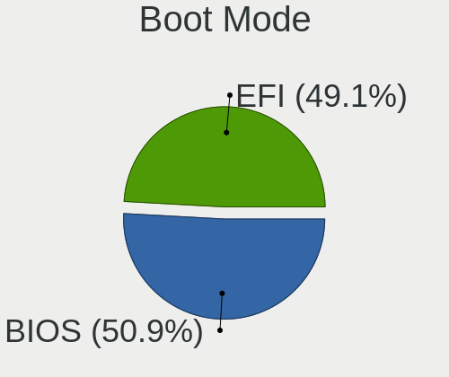

| Mode | Desktops | Percent |
|------|----------|---------|
| BIOS | 1176     | 50.87%  |
| EFI  | 1136     | 49.13%  |

Filesystem
----------

Type of filesystem

| Type    | Desktops | Percent |
|---------|----------|---------|
| Ext4    | 1673     | 71.99%  |
| Overlay | 378      | 16.27%  |
| Btrfs   | 107      | 4.6%    |
| Zfs     | 73       | 3.14%   |
| Tmpfs   | 49       | 2.11%   |
| Xfs     | 30       | 1.29%   |
| Ext3    | 7        | 0.3%    |
| Unknown | 4        | 0.17%   |
| XXXXX   | 1        | 0.04%   |
| Ext2    | 1        | 0.04%   |
| Aufs    | 1        | 0.04%   |

Part. scheme
------------

Scheme of partitioning

| Type    | Desktops | Percent |
|---------|----------|---------|
| GPT     | 1300     | 56.13%  |
| MBR     | 536      | 23.14%  |
| Unknown | 480      | 20.73%  |

Dual Boot with Linux/BSD
------------------------

Hosting more than one Linux/BSD

| Dual boot | Desktops | Percent |
|-----------|----------|---------|
| No        | 1915     | 82.15%  |
| Yes       | 416      | 17.85%  |

Dual Boot (Win)
---------------

Hosting Linux and Windows

| Dual boot | Desktops | Percent |
|-----------|----------|---------|
| No        | 1563     | 67.14%  |
| Yes       | 765      | 32.86%  |

Board
-----

Vendor
------

Motherboard manufacturer

| Name                                 | Desktops | Percent |
|--------------------------------------|----------|---------|
| ASUSTek Computer                     | 545      | 23.69%  |
| Gigabyte Technology                  | 349      | 15.17%  |
| MSI                                  | 231      | 10.04%  |
| ASRock                               | 193      | 8.39%   |
| Hewlett-Packard                      | 190      | 8.26%   |
| Dell                                 | 145      | 6.3%    |
| Lenovo                               | 141      | 6.13%   |
| Unknown                              | 68       | 2.96%   |
| Intel                                | 66       | 2.87%   |
| Acer                                 | 33       | 1.43%   |
| Fujitsu                              | 29       | 1.26%   |
| AZW                                  | 24       | 1.04%   |
| Supermicro                           | 21       | 0.91%   |
| Shenzhen Meigao Electronic Equipment | 20       | 0.87%   |
| ECS                                  | 20       | 0.87%   |
| Biostar                              | 18       | 0.78%   |
| Foxconn                              | 14       | 0.61%   |
| OEM                                  | 9        | 0.39%   |
| Huanan                               | 9        | 0.39%   |
| ASRockRack                           | 9        | 0.39%   |
| Inventec                             | 8        | 0.35%   |
| Apple                                | 8        | 0.35%   |
| HC Technology.                       | 7        | 0.3%    |
| Shuttle                              | 6        | 0.26%   |
| Pegatron                             | 6        | 0.26%   |
| BESSTAR Tech                         | 6        | 0.26%   |
| AMI                                  | 6        | 0.26%   |
| Techvision                           | 4        | 0.17%   |
| JGINYUE                              | 4        | 0.17%   |
| Google                               | 4        | 0.17%   |
| CWWK                                 | 4        | 0.17%   |
| SZMZ                                 | 3        | 0.13%   |
| MACHINIST                            | 3        | 0.13%   |
| HPE                                  | 3        | 0.13%   |
| GEEKOM                               | 3        | 0.13%   |
| Fujitsu Siemens                      | 3        | 0.13%   |
| YANYU                                | 2        | 0.09%   |
| Wistron                              | 2        | 0.09%   |
| WeiBu                                | 2        | 0.09%   |
| UGREEN                               | 2        | 0.09%   |

Model
-----

Motherboard model

| Name                                              | Desktops | Percent |
|---------------------------------------------------|----------|---------|
| Unknown                                           | 72       | 3.13%   |
| ASUS All Series                                   | 58       | 2.52%   |
| HP ProDesk 400 G2.5 SFF                           | 20       | 0.87%   |
| ASRock H470M-HVS                                  | 20       | 0.87%   |
| ASUS P5QL-CM                                      | 15       | 0.65%   |
| Lenovo ThinkCentre M55p 8808D8U                   | 14       | 0.61%   |
| MSI MS-7996                                       | 12       | 0.52%   |
| ASUS PRIME B450M-K                                | 12       | 0.52%   |
| Lenovo ThinkCentre M73 10AXS11800                 | 11       | 0.48%   |
| HP Z440 Workstation                               | 11       | 0.48%   |
| Gigabyte H81M-S2V                                 | 11       | 0.48%   |
| Gigabyte B560M DS3H V3                            | 11       | 0.48%   |
| ASUS S20 K29                                      | 11       | 0.48%   |
| Shenzhen Meigao Electronic Equipment Venus Series | 10       | 0.43%   |
| Lenovo ThinkCentre M79 10JAS05300                 | 9        | 0.39%   |
| Intel X99                                         | 9        | 0.39%   |
| ECS G31T-M9                                       | 9        | 0.39%   |
| Gigabyte A320M-S2H V2                             | 8        | 0.35%   |
| AZW MINI S                                        | 8        | 0.35%   |
| ASUS H110M-R                                      | 8        | 0.35%   |
| MSI MS-7C56                                       | 7        | 0.3%    |
| MSI MS-7B89                                       | 7        | 0.3%    |
| HP ProDesk 400 G3 SFF                             | 7        | 0.3%    |
| Dell OptiPlex 7050                                | 7        | 0.3%    |
| Dell OptiPlex 7010                                | 7        | 0.3%    |
| Dell OptiPlex 3080                                | 7        | 0.3%    |
| ASUS ProArt X670E-CREATOR WIFI                    | 7        | 0.3%    |
| ASUS PRIME A320M-K                                | 7        | 0.3%    |
| OEM X79G                                          | 6        | 0.26%   |
| MSI MS-7E07                                       | 6        | 0.26%   |
| MSI MS-7B86                                       | 6        | 0.26%   |
| MSI MS-7817                                       | 6        | 0.26%   |
| Lenovo ThinkCentre M83 10AHS1T000                 | 6        | 0.26%   |
| Intel Jasper Lake Client Platform                 | 6        | 0.26%   |
| Gigabyte X570 GAMING X                            | 6        | 0.26%   |
| Gigabyte B550M DS3H                               | 6        | 0.26%   |
| Gigabyte B450M DS3H                               | 6        | 0.26%   |
| ASUS TUF Gaming X570-PLUS                         | 6        | 0.26%   |
| ASUS ROG STRIX B550-F GAMING                      | 6        | 0.26%   |
| ASUS PRIME B450M-A                                | 6        | 0.26%   |

Model Family
------------

Motherboard model prefix

| Name                                       | Desktops | Percent |
|--------------------------------------------|----------|---------|
| ASUS PRIME                                 | 136      | 5.91%   |
| Lenovo ThinkCentre                         | 109      | 4.74%   |
| Dell OptiPlex                              | 99       | 4.3%    |
| Unknown                                    | 72       | 3.13%   |
| ASUS ROG                                   | 68       | 2.96%   |
| HP ProDesk                                 | 61       | 2.65%   |
| ASUS All                                   | 58       | 2.52%   |
| ASUS TUF                                   | 50       | 2.17%   |
| HP EliteDesk                               | 33       | 1.43%   |
| HP Compaq                                  | 28       | 1.22%   |
| Gigabyte X570                              | 22       | 0.96%   |
| Gigabyte B450M                             | 20       | 0.87%   |
| ASRock H470M-HVS                           | 20       | 0.87%   |
| Dell Precision                             | 19       | 0.83%   |
| Fujitsu ESPRIMO                            | 17       | 0.74%   |
| Acer Veriton                               | 17       | 0.74%   |
| Lenovo ThinkStation                        | 16       | 0.7%    |
| Gigabyte B550M                             | 16       | 0.7%    |
| Gigabyte B560M                             | 15       | 0.65%   |
| Gigabyte B450                              | 15       | 0.65%   |
| ASUS P5QL-CM                               | 15       | 0.65%   |
| MSI MS-7996                                | 12       | 0.52%   |
| HP Z440                                    | 11       | 0.48%   |
| Gigabyte H81M-S2V                          | 11       | 0.48%   |
| ASUS S20                                   | 11       | 0.48%   |
| ASUS PRO                                   | 11       | 0.48%   |
| Acer Aspire                                | 11       | 0.48%   |
| Shenzhen Meigao Electronic Equipment Venus | 10       | 0.43%   |
| HP ProLiant                                | 10       | 0.43%   |
| Gigabyte Z790                              | 10       | 0.43%   |
| Gigabyte A320M-S2H                         | 10       | 0.43%   |
| Dell Inspiron                              | 10       | 0.43%   |
| ASUS ProArt                                | 10       | 0.43%   |
| ASUS M5A97                                 | 10       | 0.43%   |
| Intel X99                                  | 9        | 0.39%   |
| ECS G31T-M9                                | 9        | 0.39%   |
| ASUS P8H61-M                               | 9        | 0.39%   |
| Gigabyte B650                              | 8        | 0.35%   |
| Gigabyte B550                              | 8        | 0.35%   |
| AZW MINI                                   | 8        | 0.35%   |

MFG Year
--------

Motherboard manufacture year

| Year    | Desktops | Percent |
|---------|----------|---------|
| 2022    | 209      | 9.08%   |
| 2018    | 188      | 8.17%   |
| 2020    | 187      | 8.13%   |
| 2023    | 182      | 7.91%   |
| 2014    | 170      | 7.39%   |
| 2021    | 158      | 6.87%   |
| 2012    | 156      | 6.78%   |
| 2019    | 150      | 6.52%   |
| 2013    | 124      | 5.39%   |
| 2017    | 109      | 4.74%   |
| 2016    | 102      | 4.43%   |
| 2011    | 98       | 4.26%   |
| 2015    | 96       | 4.17%   |
| 2010    | 81       | 3.52%   |
| 2009    | 79       | 3.43%   |
| 2007    | 59       | 2.56%   |
| 2024    | 58       | 2.52%   |
| 2008    | 57       | 2.48%   |
| 2006    | 14       | 0.61%   |
| Unknown | 10       | 0.43%   |
| 2005    | 5        | 0.22%   |
| 2004    | 5        | 0.22%   |
| 2002    | 2        | 0.09%   |
| 2003    | 1        | 0.04%   |
| 2000    | 1        | 0.04%   |

Form Factor
-----------

Physical design of the computer

| Name    | Desktops | Percent |
|---------|----------|---------|
| Desktop | 2301     | 100%    |

Secure Boot
-----------

Enabled or disabled

| State    | Desktops | Percent |
|----------|----------|---------|
| Disabled | 2227     | 96.74%  |
| Enabled  | 75       | 3.26%   |

Coreboot
--------

Have coreboot on board

| Used | Desktops | Percent |
|------|----------|---------|
| No   | 2293     | 99.65%  |
| Yes  | 8        | 0.35%   |

RAM Size
--------

Total RAM memory

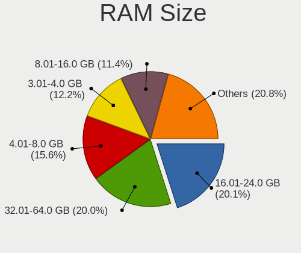

| Size in GB      | Desktops | Percent |
|-----------------|----------|---------|
| 16.01-24.0      | 467      | 20.07%  |
| 32.01-64.0      | 465      | 19.98%  |
| 4.01-8.0        | 362      | 15.56%  |
| 3.01-4.0        | 284      | 12.2%   |
| 8.01-16.0       | 266      | 11.43%  |
| 64.01-256.0     | 260      | 11.17%  |
| 24.01-32.0      | 87       | 3.74%   |
| 1.01-2.0        | 79       | 3.39%   |
| 2.01-3.0        | 29       | 1.25%   |
| More than 256.0 | 12       | 0.52%   |
| 0.51-1.0        | 12       | 0.52%   |
| 0.01-0.5        | 2        | 0.09%   |
| Unknown         | 2        | 0.09%   |

RAM Used
--------

Used RAM memory

| Used GB         | Desktops | Percent |
|-----------------|----------|---------|
| 1.01-2.0        | 512      | 20.95%  |
| 4.01-8.0        | 477      | 19.52%  |
| 2.01-3.0        | 443      | 18.13%  |
| 0.51-1.0        | 347      | 14.2%   |
| 3.01-4.0        | 310      | 12.68%  |
| 8.01-16.0       | 166      | 6.79%   |
| 0.01-0.5        | 60       | 2.45%   |
| 16.01-24.0      | 54       | 2.21%   |
| 32.01-64.0      | 31       | 1.27%   |
| 24.01-32.0      | 30       | 1.23%   |
| 64.01-256.0     | 11       | 0.45%   |
| Unknown         | 2        | 0.08%   |
| More than 256.0 | 1        | 0.04%   |

Total Drives
------------

Number of drives on board

| Drives | Desktops | Percent |
|--------|----------|---------|
| 1      | 1017     | 43.04%  |
| 2      | 595      | 25.18%  |
| 3      | 326      | 13.8%   |
| 4      | 173      | 7.32%   |
| 5      | 93       | 3.94%   |
| 6      | 56       | 2.37%   |
| 7      | 26       | 1.1%    |
| 0      | 18       | 0.76%   |
| 8      | 16       | 0.68%   |
| 9      | 10       | 0.42%   |
| 10     | 7        | 0.3%    |
| 11     | 6        | 0.25%   |
| 12     | 5        | 0.21%   |
| 27     | 2        | 0.08%   |
| 21     | 2        | 0.08%   |
| 15     | 2        | 0.08%   |
| 14     | 2        | 0.08%   |
| 13     | 2        | 0.08%   |
| 32     | 1        | 0.04%   |
| 29     | 1        | 0.04%   |
| 19     | 1        | 0.04%   |
| 17     | 1        | 0.04%   |
| 16     | 1        | 0.04%   |

Has CD-ROM
----------

Has CD-ROM on board

| Presented | Desktops | Percent |
|-----------|----------|---------|
| No        | 1628     | 70.29%  |
| Yes       | 688      | 29.71%  |

Has Ethernet
------------

Has Ethernet on board

| Presented | Desktops | Percent |
|-----------|----------|---------|
| Yes       | 2280     | 99.09%  |
| No        | 21       | 0.91%   |

Has WiFi
--------

Has WiFi module

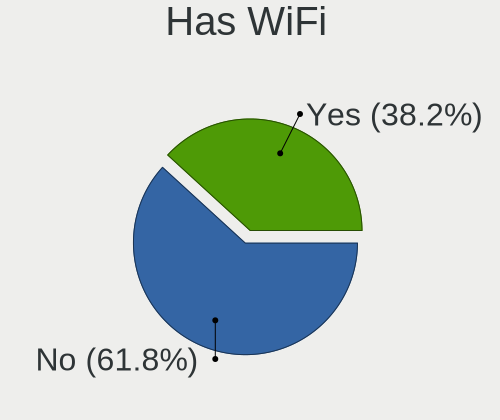

| Presented | Desktops | Percent |
|-----------|----------|---------|
| No        | 1430     | 61.8%   |
| Yes       | 884      | 38.2%   |

Has Bluetooth
-------------

Has Bluetooth module

| Presented | Desktops | Percent |
|-----------|----------|---------|
| No        | 1559     | 67.14%  |
| Yes       | 763      | 32.86%  |

Location
--------

Country
-------

Geographic location (country)

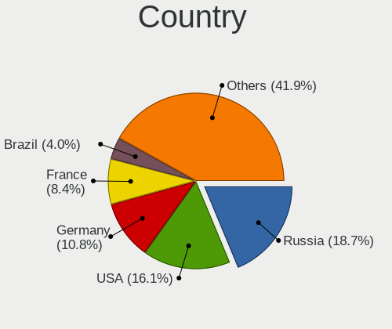

| Country      | Desktops | Percent |
|--------------|----------|---------|
| Russia       | 432      | 18.73%  |
| USA          | 372      | 16.13%  |
| Germany      | 250      | 10.84%  |
| France       | 193      | 8.37%   |
| Brazil       | 92       | 3.99%   |
| Italy        | 85       | 3.69%   |
| UK           | 83       | 3.6%    |
| Spain        | 70       | 3.04%   |
| Canada       | 58       | 2.52%   |
| Poland       | 55       | 2.39%   |
| Australia    | 38       | 1.65%   |
| Netherlands  | 29       | 1.26%   |
| Mexico       | 29       | 1.26%   |
| Argentina    | 26       | 1.13%   |
| Belgium      | 25       | 1.08%   |
| Switzerland  | 24       | 1.04%   |
| Austria      | 23       | 1%      |
| Hungary      | 22       | 0.95%   |
| India        | 20       | 0.87%   |
| China        | 19       | 0.82%   |
| Sweden       | 17       | 0.74%   |
| Romania      | 17       | 0.74%   |
| Norway       | 17       | 0.74%   |
| Denmark      | 17       | 0.74%   |
| South Africa | 14       | 0.61%   |
| Finland      | 14       | 0.61%   |
| Portugal     | 13       | 0.56%   |
| Venezuela    | 12       | 0.52%   |
| Japan        | 12       | 0.52%   |
| Greece       | 12       | 0.52%   |
| Czechia      | 12       | 0.52%   |
| Slovakia     | 10       | 0.43%   |
| Turkey       | 9        | 0.39%   |
| Vietnam      | 8        | 0.35%   |
| Philippines  | 8        | 0.35%   |
| Indonesia    | 8        | 0.35%   |
| Hong Kong    | 8        | 0.35%   |
| Taiwan       | 7        | 0.3%    |
| Serbia       | 7        | 0.3%    |
| Peru         | 7        | 0.3%    |

City
----

Geographic location (city)

| City              | Desktops | Percent |
|-------------------|----------|---------|
| Voronezh          | 288      | 12.16%  |
| Bagneux           | 51       | 2.15%   |
| Moscow            | 33       | 1.39%   |
| Roubaix           | 30       | 1.27%   |
| St Petersburg     | 26       | 1.1%    |
| Paris             | 22       | 0.93%   |
| Bangor            | 21       | 0.89%   |
| Berlin            | 17       | 0.72%   |
| Vienna            | 15       | 0.63%   |
| Frankfurt am Main | 13       | 0.55%   |
| Sao Paulo         | 12       | 0.51%   |
| Milan             | 12       | 0.51%   |
| Madrid            | 11       | 0.46%   |
| Amsterdam         | 11       | 0.46%   |
| Toronto           | 10       | 0.42%   |
| Seattle           | 10       | 0.42%   |
| Bonn              | 10       | 0.42%   |
| Yekaterinburg     | 9        | 0.38%   |
| Sydney            | 9        | 0.38%   |
| Levanger          | 9        | 0.38%   |
| Hamburg           | 9        | 0.38%   |
| Zurich            | 8        | 0.34%   |
| Stockholm         | 8        | 0.34%   |
| Melbourne         | 8        | 0.34%   |
| Athens            | 8        | 0.34%   |
| Rio de Janeiro    | 7        | 0.3%    |
| Prague            | 7        | 0.3%    |
| Munich            | 7        | 0.3%    |
| Los Angeles       | 7        | 0.3%    |
| Bucharest         | 7        | 0.3%    |
| Valencia          | 6        | 0.25%   |
| Tijuana           | 6        | 0.25%   |
| Stuttgart         | 6        | 0.25%   |
| Seville           | 6        | 0.25%   |
| Ruda lska     | 6        | 0.25%   |
| Perm              | 6        | 0.25%   |
| Manchester        | 6        | 0.25%   |
| Leipzig           | 6        | 0.25%   |
| Johannesburg      | 6        | 0.25%   |
| Denver            | 6        | 0.25%   |

Drives
------

Drive Vendor
------------

Hard drive vendors

| Vendor                      | Desktops | Drives | Percent |
|-----------------------------|----------|--------|---------|
| WDC                         | 691      | 1233   | 16.88%  |
| Seagate                     | 599      | 1043   | 14.63%  |
| Samsung Electronics         | 591      | 975    | 14.44%  |
| Kingston                    | 241      | 356    | 5.89%   |
| Crucial                     | 239      | 331    | 5.84%   |
| Toshiba                     | 237      | 390    | 5.79%   |
| SanDisk                     | 201      | 267    | 4.91%   |
| Hitachi                     | 100      | 140    | 2.44%   |
| China                       | 62       | 74     | 1.51%   |
| Intel                       | 51       | 69     | 1.25%   |
| HGST                        | 50       | 113    | 1.22%   |
| A-DATA Technology           | 50       | 65     | 1.22%   |
| Unknown                     | 48       | 68     | 1.17%   |
| Kingston Technology Company | 47       | 62     | 1.15%   |
| SPCC                        | 41       | 46     | 1%      |
| Netac                       | 41       | 50     | 1%      |
| SK hynix                    | 36       | 49     | 0.88%   |
| PNY                         | 35       | 50     | 0.85%   |
| Silicon Motion              | 29       | 31     | 0.71%   |
| Unknown                     | 28       | 35     | 0.68%   |
| Patriot                     | 26       | 35     | 0.64%   |
| Transcend                   | 25       | 46     | 0.61%   |
| Micron Technology           | 24       | 31     | 0.59%   |
| GOODRAM                     | 24       | 46     | 0.59%   |
| MAXIO Technology (Hangzhou) | 23       | 31     | 0.56%   |
| Intenso                     | 22       | 27     | 0.54%   |
| Corsair                     | 22       | 28     | 0.54%   |
| Phison Electronics          | 20       | 31     | 0.49%   |
| Hewlett-Packard             | 20       | 36     | 0.49%   |
| Micron/Crucial Technology   | 19       | 25     | 0.46%   |
| Lexar                       | 17       | 19     | 0.42%   |
| Phison                      | 16       | 21     | 0.39%   |
| Gigabyte Technology         | 16       | 28     | 0.39%   |
| Realtek Semiconductor       | 15       | 16     | 0.37%   |
| Apacer                      | 15       | 25     | 0.37%   |
| Team                        | 14       | 17     | 0.34%   |
| Maxtor                      | 14       | 14     | 0.34%   |
| KIOXIA-EXCERIA              | 14       | 16     | 0.34%   |
| Fanxiang                    | 13       | 20     | 0.32%   |
| XPG                         | 12       | 17     | 0.29%   |

Drive Model
-----------

Hard drive models

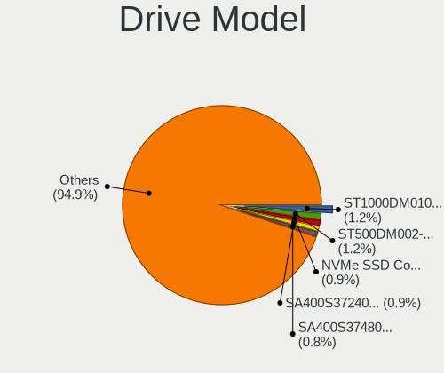

| Model                                                | Desktops | Percent |
|------------------------------------------------------|----------|---------|
| Seagate ST1000DM010-2EP102 1TB                       | 60       | 1.25%   |
| Seagate ST500DM002-1BD142 500GB                      | 58       | 1.2%    |
| Samsung NVMe SSD Controller SM981/PM981/PM983 512GB  | 45       | 0.93%   |
| Kingston SA400S37240G 240GB SSD                      | 44       | 0.91%   |
| Kingston SA400S37480G 480GB SSD                      | 40       | 0.83%   |
| Crucial CT480BX500SSD1 480GB                         | 35       | 0.73%   |
| Toshiba DT01ACA100 1TB                               | 33       | 0.68%   |
| Crucial CT240BX500SSD1 240GB                         | 30       | 0.62%   |
| Samsung SSD 860 EVO 500GB                            | 29       | 0.6%    |
| Samsung SSD 850 EVO 500GB                            | 29       | 0.6%    |
| Crucial CT1000MX500SSD1 1TB                          | 29       | 0.6%    |
| Toshiba HDWD110 1TB                                  | 28       | 0.58%   |
| Unknown                                              | 28       | 0.58%   |
| WDC WD5000AAKX-60U6AA0 500GB                         | 27       | 0.56%   |
| Toshiba DT01ACA050 500GB                             | 27       | 0.56%   |
| SanDisk NVMe SSD Drive 1TB                           | 27       | 0.56%   |
| WDC WD10EZEX-08WN4A0 1TB                             | 26       | 0.54%   |
| SanDisk NVMe SSD Drive 2TB                           | 26       | 0.54%   |
| Samsung NVMe SSD Controller PM9A1/PM9A3/980PRO 512GB | 26       | 0.54%   |
| Seagate ST2000DM008-2FR102 2TB                       | 25       | 0.52%   |
| Seagate ST1000DM003-1ER162 1TB                       | 25       | 0.52%   |
| Samsung SSD 970 EVO Plus 1TB                         | 25       | 0.52%   |
| Samsung SSD 850 EVO 250GB                            | 24       | 0.5%    |
| Crucial CT500MX500SSD1 500GB                         | 24       | 0.5%    |
| Netac SSD 240GB                                      | 23       | 0.48%   |
| Kingston Company SNV2S1000G 1TB                      | 23       | 0.48%   |
| Seagate ST4000DM004-2CV104 4TB                       | 22       | 0.46%   |
| Samsung SSD 870 EVO 500GB                            | 22       | 0.46%   |
| Kingston SA400S37120G 120GB SSD                      | 22       | 0.46%   |
| Samsung SSD 980 PRO 1TB                              | 20       | 0.42%   |
| Samsung SSD 860 EVO 250GB                            | 19       | 0.39%   |
| WDC WD3200AAJS-00L7A0 320GB                          | 18       | 0.37%   |
| Samsung SSD 870 EVO 1TB                              | 18       | 0.37%   |
| Kingston SA400S37960G 960GB SSD                      | 17       | 0.35%   |
| WDC WD20EZRZ-00Z5HB0 2TB                             | 16       | 0.33%   |
| Seagate ST1000DM003-1CH162 1TB                       | 15       | 0.31%   |
| Samsung SSD 990 PRO 2TB                              | 15       | 0.31%   |
| Samsung SSD 990 PRO 1TB                              | 15       | 0.31%   |
| Samsung SSD 980 500GB                                | 15       | 0.31%   |
| Samsung SSD 970 EVO Plus 500GB                       | 15       | 0.31%   |

HDD Vendor
----------

Hard disk drive vendors

| Vendor              | Desktops | Drives | Percent |
|---------------------|----------|--------|---------|
| WDC                 | 599      | 1084   | 35.7%   |
| Seagate             | 580      | 1013   | 34.56%  |
| Toshiba             | 217      | 366    | 12.93%  |
| Hitachi             | 100      | 140    | 5.96%   |
| Samsung Electronics | 50       | 63     | 2.98%   |
| HGST                | 49       | 112    | 2.92%   |
| Maxtor              | 14       | 14     | 0.83%   |
| Unknown             | 11       | 11     | 0.66%   |
| Hewlett-Packard     | 8        | 22     | 0.48%   |
| SABRENT             | 5        | 5      | 0.3%    |
| External            | 5        | 5      | 0.3%    |
| TO Exter            | 4        | 10     | 0.24%   |
| QNAP                | 4        | 6      | 0.24%   |
| JMicron Technology  | 4        | 4      | 0.24%   |
| ASMT                | 4        | 13     | 0.24%   |
| Fujitsu             | 3        | 3      | 0.18%   |
| Apple               | 3        | 3      | 0.18%   |
| Unknown             | 3        | 7      | 0.18%   |
| USB 3.1             | 2        | 2      | 0.12%   |
| XrayDisk            | 1        | 1      | 0.06%   |
| WD MediaMax         | 1        | 1      | 0.06%   |
| USB                 | 1        | 1      | 0.06%   |
| Unknown (CF)        | 1        | 1      | 0.06%   |
| TDAS                | 1        | 4      | 0.06%   |
| QEMU                | 1        | 1      | 0.06%   |
| MARVELL             | 1        | 2      | 0.06%   |
| LaCie               | 1        | 1      | 0.06%   |
| KESU                | 1        | 1      | 0.06%   |
| HGST HTS            | 1        | 1      | 0.06%   |
| H/W                 | 1        | 7      | 0.06%   |
| ExcelStor           | 1        | 1      | 0.06%   |
| Elite               | 1        | 1      | 0.06%   |

SSD Vendor
----------

Solid state drive vendors

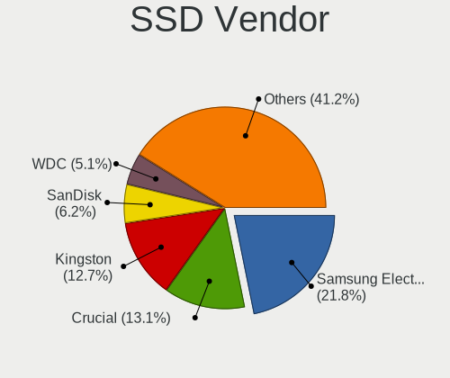

| Vendor              | Desktops | Drives | Percent |
|---------------------|----------|--------|---------|
| Samsung Electronics | 306      | 452    | 21.83%  |
| Crucial             | 183      | 245    | 13.05%  |
| Kingston            | 178      | 257    | 12.7%   |
| SanDisk             | 87       | 111    | 6.21%   |
| WDC                 | 71       | 85     | 5.06%   |
| China               | 61       | 73     | 4.35%   |
| Netac               | 37       | 40     | 2.64%   |
| SPCC                | 34       | 37     | 2.43%   |
| Intel               | 33       | 48     | 2.35%   |
| PNY                 | 30       | 42     | 2.14%   |
| A-DATA Technology   | 30       | 42     | 2.14%   |
| GOODRAM             | 22       | 31     | 1.57%   |
| Transcend           | 20       | 41     | 1.43%   |
| Patriot             | 20       | 29     | 1.43%   |
| Intenso             | 20       | 24     | 1.43%   |
| Apacer              | 14       | 22     | 1%      |
| Unknown             | 12       | 12     | 0.86%   |
| Toshiba             | 11       | 12     | 0.78%   |
| OCZ                 | 11       | 13     | 0.78%   |
| Micron Technology   | 10       | 11     | 0.71%   |
| Fanxiang            | 10       | 14     | 0.71%   |
| XrayDisk            | 9        | 11     | 0.64%   |
| LITEON              | 9        | 11     | 0.64%   |
| Gigabyte Technology | 9        | 12     | 0.64%   |
| Corsair             | 9        | 9      | 0.64%   |
| Team                | 8        | 9      | 0.57%   |
| Hewlett-Packard     | 8        | 9      | 0.57%   |
| Seagate             | 7        | 8      | 0.5%    |
| Lexar               | 7        | 8      | 0.5%    |
| Plextor             | 6        | 6      | 0.43%   |
| Verbatim            | 5        | 5      | 0.36%   |
| KingSpec            | 5        | 6      | 0.36%   |
| FORESEE             | 5        | 5      | 0.36%   |
| T-FORCE             | 4        | 5      | 0.29%   |
| SK hynix            | 4        | 4      | 0.29%   |
| LITEONIT            | 4        | 7      | 0.29%   |
| Lenovo              | 4        | 4      | 0.29%   |
| KIOXIA-EXCERIA      | 4        | 4      | 0.29%   |
| Innodisk            | 4        | 4      | 0.29%   |
| Emtec               | 4        | 4      | 0.29%   |

Drive Kind
----------

HDD or SSD

| Kind    | Desktops | Drives | Percent |
|---------|----------|--------|---------|
| HDD     | 1330     | 2906   | 38.17%  |
| SSD     | 1174     | 1887   | 33.7%   |
| NVMe    | 901      | 1459   | 25.86%  |
| Unknown | 58       | 89     | 1.66%   |
| MMC     | 21       | 26     | 0.6%    |

Drive Connector
---------------

SATA, SAS, NVMe, etc.

| Type | Desktops | Drives | Percent |
|------|----------|--------|---------|
| SATA | 1937     | 4537   | 63.95%  |
| NVMe | 899      | 1447   | 29.68%  |
| SAS  | 172      | 357    | 5.68%   |
| MMC  | 21       | 26     | 0.69%   |

Drive Size
----------

Size of hard drive

| Size in TB | Desktops | Drives | Percent |
|------------|----------|--------|---------|
| 0.01-0.5   | 1360     | 2077   | 48.23%  |
| 0.51-1.0   | 733      | 1131   | 25.99%  |
| 1.01-2.0   | 307      | 571    | 10.89%  |
| 3.01-4.0   | 162      | 350    | 5.74%   |
| 4.01-10.0  | 129      | 396    | 4.57%   |
| 2.01-3.0   | 79       | 133    | 2.8%    |
| 10.01-20.0 | 50       | 135    | 1.77%   |

Space Total
-----------

Amount of disk space available on the file system

| Size in GB     | Desktops | Percent |
|----------------|----------|---------|
| Unknown        | 403      | 17%     |
| 101-250        | 366      | 15.44%  |
| 251-500        | 365      | 15.39%  |
| 501-1000       | 330      | 13.92%  |
| More than 3000 | 291      | 12.27%  |
| 1001-2000      | 235      | 9.91%   |
| 51-100         | 132      | 5.57%   |
| 2001-3000      | 111      | 4.68%   |
| 1-20           | 91       | 3.84%   |
| 21-50          | 47       | 1.98%   |

Space Used
----------

Amount of used disk space

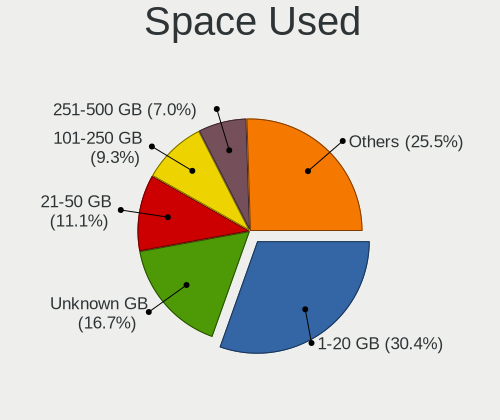

| Used GB        | Desktops | Percent |
|----------------|----------|---------|
| 1-20           | 735      | 30.43%  |
| Unknown        | 403      | 16.69%  |
| 21-50          | 267      | 11.06%  |
| 101-250        | 225      | 9.32%   |
| 251-500        | 169      | 7%      |
| 51-100         | 167      | 6.92%   |
| 501-1000       | 160      | 6.63%   |
| More than 3000 | 123      | 5.09%   |
| 1001-2000      | 123      | 5.09%   |
| 2001-3000      | 41       | 1.7%    |
| 0              | 2        | 0.08%   |

Malfunc. Drives
---------------

Drive models with a malfunction

| Model                                          | Desktops | Drives | Percent |
|------------------------------------------------|----------|--------|---------|
| WDC WD5000AAKX-60U6AA0 500GB                   | 16       | 16     | 3.67%   |
| WDC WD3200AAJS-00L7A0 320GB                    | 13       | 13     | 2.98%   |
| Seagate ST500DM002-1BD142 500GB                | 12       | 13     | 2.75%   |
| Seagate ST3500418AS 500GB                      | 7        | 7      | 1.61%   |
| WDC WD10EZEX-00BN5A0 1TB                       | 5        | 5      | 1.15%   |
| Seagate ST3250410AS 250GB                      | 5        | 5      | 1.15%   |
| Seagate ST3160811AS 160GB                      | 5        | 5      | 1.15%   |
| Hitachi HDS721050CLA362 500GB                  | 5        | 7      | 1.15%   |
| WDC WD2500AAJS-00L7A0 250GB                    | 4        | 4      | 0.92%   |
| Seagate ST2000DL003-9VT166 2TB                 | 4        | 4      | 0.92%   |
| Samsung Electronics SSD 870 EVO 500GB          | 4        | 4      | 0.92%   |
| Samsung Electronics SSD 870 EVO 1TB            | 4        | 4      | 0.92%   |
| Maxtor STM3160815AS 160GB                      | 4        | 4      | 0.92%   |
| WDC WD5000AAKX-22ERMA0 500GB                   | 3        | 3      | 0.69%   |
| WDC WD20EFRX-68EUZN0 2TB                       | 3        | 3      | 0.69%   |
| WDC WD20EARX-00PASB0 2TB                       | 3        | 4      | 0.69%   |
| WDC WD20EARS-00MVWB0 2TB                       | 3        | 3      | 0.69%   |
| WDC WD2002FAEX-007BA0 2TB                      | 3        | 3      | 0.69%   |
| Toshiba DT01ACA200 2TB                         | 3        | 3      | 0.69%   |
| Seagate ST3250318AS 250GB                      | 3        | 3      | 0.69%   |
| Seagate ST250DM000-1BD141 250GB                | 3        | 3      | 0.69%   |
| Seagate ST2000DM006-2DM164 2TB                 | 3        | 3      | 0.69%   |
| Seagate ST2000DM001-1CH164 2TB                 | 3        | 5      | 0.69%   |
| Seagate ST1000LM024 HN-M101MBB 1TB             | 3        | 3      | 0.69%   |
| Seagate ST1000DM003-9YN162 1TB                 | 3        | 7      | 0.69%   |
| Samsung Electronics HD502HJ 500GB              | 3        | 4      | 0.69%   |
| Kingston SA400S37240G 240GB SSD                | 3        | 3      | 0.69%   |
| Hitachi HDS721010CLA332 1TB                    | 3        | 3      | 0.69%   |
| WDC WD5000AAKX-08U6AA0 500GB                   | 2        | 2      | 0.46%   |
| WDC WD5000AAKX-001CA0 500GB                    | 2        | 2      | 0.46%   |
| WDC WD40EFRX-68WT0N0 4TB                       | 2        | 2      | 0.46%   |
| WDC WD3200BEKT-75PVMT1 320GB                   | 2        | 2      | 0.46%   |
| WDC WD30EFRX-68EUZN0 3TB                       | 2        | 2      | 0.46%   |
| WDC WD2500AAKS-00VSA0 250GB                    | 2        | 3      | 0.46%   |
| WDC WD20EZRZ-00Z5HB0 2TB                       | 2        | 3      | 0.46%   |
| WDC WD1602ABYS-23B7A0 39M4507 42C0462IBM 160GB | 2        | 2      | 0.46%   |
| WDC WD10EZEX-60ZF5A0 1TB                       | 2        | 2      | 0.46%   |
| WDC WD10EZEX-00WN4A0 1TB                       | 2        | 2      | 0.46%   |
| WDC WD10EAVS-00D7B0 1TB                        | 2        | 2      | 0.46%   |
| WDC WD10EARS-00MVWB0 1TB                       | 2        | 2      | 0.46%   |

Malfunc. Drive Vendor
---------------------

Vendors of faulty drives

| Vendor              | Desktops | Drives | Percent |
|---------------------|----------|--------|---------|
| WDC                 | 140      | 192    | 33.73%  |
| Seagate             | 106      | 135    | 25.54%  |
| Samsung Electronics | 39       | 46     | 9.4%    |
| Hitachi             | 26       | 36     | 6.27%   |
| Toshiba             | 20       | 24     | 4.82%   |
| Kingston            | 9        | 9      | 2.17%   |
| Crucial             | 9        | 10     | 2.17%   |
| Maxtor              | 8        | 8      | 1.93%   |
| Intel               | 8        | 11     | 1.93%   |
| SanDisk             | 5        | 5      | 1.2%    |
| PNY                 | 3        | 4      | 0.72%   |
| Netac               | 3        | 4      | 0.72%   |
| Micron Technology   | 3        | 3      | 0.72%   |
| HGST                | 3        | 3      | 0.72%   |
| Hewlett-Packard     | 3        | 3      | 0.72%   |
| A-DATA Technology   | 3        | 4      | 0.72%   |
| OCZ                 | 2        | 2      | 0.48%   |
| Mushkin             | 2        | 2      | 0.48%   |
| ASMT                | 2        | 2      | 0.48%   |
| Apple               | 2        | 2      | 0.48%   |
| ZHITAI              | 1        | 1      | 0.24%   |
| XPG                 | 1        | 1      | 0.24%   |
| Transcend           | 1        | 1      | 0.24%   |
| Team                | 1        | 1      | 0.24%   |
| SSSTC               | 1        | 1      | 0.24%   |
| SK hynix            | 1        | 1      | 0.24%   |
| Realtek             | 1        | 1      | 0.24%   |
| Ramsta              | 1        | 1      | 0.24%   |
| LITEONIT            | 1        | 2      | 0.24%   |
| LITEON              | 1        | 1      | 0.24%   |
| Lenovo              | 1        | 1      | 0.24%   |
| KingSpec            | 1        | 1      | 0.24%   |
| Intenso             | 1        | 1      | 0.24%   |
| HS-SSD-C100         | 1        | 1      | 0.24%   |
| Fujitsu             | 1        | 1      | 0.24%   |
| ExcelStor           | 1        | 1      | 0.24%   |
| Corsair             | 1        | 1      | 0.24%   |
| China               | 1        | 1      | 0.24%   |
| ADATA Technology    | 1        | 1      | 0.24%   |

Malfunc. HDD Vendor
-------------------

Vendors of faulty HDD drives

| Vendor              | Desktops | Drives | Percent |
|---------------------|----------|--------|---------|
| WDC                 | 135      | 184    | 42.45%  |
| Seagate             | 106      | 135    | 33.33%  |
| Hitachi             | 26       | 36     | 8.18%   |
| Toshiba             | 20       | 24     | 6.29%   |
| Samsung Electronics | 13       | 14     | 4.09%   |
| Maxtor              | 8        | 8      | 2.52%   |
| HGST                | 3        | 3      | 0.94%   |
| Hewlett-Packard     | 3        | 3      | 0.94%   |
| Apple               | 2        | 2      | 0.63%   |
| ExcelStor           | 1        | 1      | 0.31%   |
| ASMT                | 1        | 1      | 0.31%   |

Malfunc. Drive Kind
-------------------

Kinds of faulty drives

| Kind | Desktops | Drives | Percent |
|------|----------|--------|---------|
| HDD  | 279      | 411    | 74.01%  |
| SSD  | 81       | 96     | 21.49%  |
| NVMe | 17       | 18     | 4.51%   |

Failed Drives
-------------

Failed drive models

| Model                           | Desktops | Drives | Percent |
|---------------------------------|----------|--------|---------|
| Seagate ST31000528AS 1TB        | 2        | 2      | 40%     |
| WDC WDS500G1B0C-00S6U0 500GB    | 1        | 1      | 20%     |
| Toshiba DT01ACA300 3TB          | 1        | 1      | 20%     |
| Samsung Electronics HD204UI 2TB | 1        | 1      | 20%     |

Failed Drive Vendor
-------------------

Failed drive vendors

| Vendor              | Desktops | Drives | Percent |
|---------------------|----------|--------|---------|
| Seagate             | 2        | 2      | 40%     |
| WDC                 | 1        | 1      | 20%     |
| Toshiba             | 1        | 1      | 20%     |
| Samsung Electronics | 1        | 1      | 20%     |

Drive Status
------------

Number of failed and malfunc. drives

| Status   | Desktops | Drives | Percent |
|----------|----------|--------|---------|
| Works    | 1591     | 3902   | 59.1%   |
| Detected | 732      | 1934   | 27.19%  |
| Malfunc  | 363      | 525    | 13.48%  |
| Failed   | 5        | 5      | 0.19%   |
| Limited  | 1        | 1      | 0.04%   |

Storage controller
------------------

Storage Vendor
--------------

Storage controller vendors

| Vendor                           | Desktops | Percent |
|----------------------------------|----------|---------|
| Intel                            | 1542     | 43.01%  |
| AMD                              | 658      | 18.35%  |
| Samsung Electronics              | 312      | 8.7%    |
| SanDisk                          | 162      | 4.52%   |
| ASMedia Technology               | 113      | 3.15%   |
| Kingston Technology Company      | 108      | 3.01%   |
| Phison Electronics               | 79       | 2.2%    |
| Micron/Crucial Technology        | 76       | 2.12%   |
| JMicron Technology               | 67       | 1.87%   |
| Marvell Technology Group         | 48       | 1.34%   |
| Silicon Motion                   | 46       | 1.28%   |
| MAXIO Technology (Hangzhou)      | 37       | 1.03%   |
| Nvidia                           | 34       | 0.95%   |
| ADATA Technology                 | 34       | 0.95%   |
| SK hynix                         | 31       | 0.86%   |
| Realtek Semiconductor            | 27       | 0.75%   |
| Micron Technology                | 23       | 0.64%   |
| Broadcom / LSI                   | 22       | 0.61%   |
| KIOXIA                           | 17       | 0.47%   |
| LSI Logic / Symbios Logic        | 16       | 0.45%   |
| Shenzhen Longsys Electronics     | 15       | 0.42%   |
| Toshiba America Info Systems     | 14       | 0.39%   |
| INNOGRIT                         | 11       | 0.31%   |
| Adaptec                          | 11       | 0.31%   |
| VIA Technologies                 | 10       | 0.28%   |
| Silicon Image                    | 10       | 0.28%   |
| Seagate Technology               | 8        | 0.22%   |
| Solidigm                         | 5        | 0.14%   |
| Unknown                          | 5        | 0.14%   |
| Yangtze Memory Technologies      | 4        | 0.11%   |
| Transcend                        | 4        | 0.11%   |
| Silicon Integrated Systems [SiS] | 4        | 0.11%   |
| Netac Technology                 | 4        | 0.11%   |
| Biwin Storage Technology         | 4        | 0.11%   |
| Nextorage                        | 3        | 0.08%   |
| Lite-On Technology               | 3        | 0.08%   |
| Hewlett-Packard                  | 3        | 0.08%   |
| Solid State Storage Technology   | 2        | 0.06%   |
| HighPoint Technologies           | 2        | 0.06%   |
| Union Memory (Shenzhen)          | 1        | 0.03%   |

Storage Model
-------------

Storage controller models

| Model                                                                                   | Desktops | Percent |
|-----------------------------------------------------------------------------------------|----------|---------|
| AMD FCH SATA Controller [AHCI mode]                                                     | 317      | 7.47%   |
| Intel 8 Series/C220 Series Chipset Family 6-port SATA Controller 1 [AHCI mode]          | 211      | 4.97%   |
| AMD 400 Series Chipset SATA Controller                                                  | 148      | 3.49%   |
| Samsung NVMe SSD Controller SM981/PM981/PM983                                           | 141      | 3.32%   |
| Intel 200 Series PCH SATA controller [AHCI mode]                                        | 119      | 2.8%    |
| AMD 500 Series Chipset SATA Controller                                                  | 111      | 2.61%   |
| Intel Q170/Q150/B150/H170/H110/Z170/CM236 Chipset SATA Controller [AHCI Mode]           | 108      | 2.54%   |
| ASMedia ASM1061/ASM1062 Serial ATA Controller                                           | 93       | 2.19%   |
| Samsung NVMe SSD Controller PM9A1/PM9A3/980PRO                                          | 89       | 2.1%    |
| AMD 600 Series Chipset SATA Controller                                                  | 86       | 2.03%   |
| Intel Raptor Lake SATA AHCI Controller                                                  | 79       | 1.86%   |
| Intel 6 Series/C200 Series Chipset Family 6 port Desktop SATA AHCI Controller           | 75       | 1.77%   |
| Intel Alder Lake-S PCH SATA Controller [AHCI Mode]                                      | 69       | 1.63%   |
| Intel SATA Controller [RAID mode]                                                       | 67       | 1.58%   |
| AMD SB7x0/SB8x0/SB9x0 SATA Controller [AHCI mode]                                       | 64       | 1.51%   |
| Intel NM10/ICH7 Family SATA Controller [IDE mode]                                       | 61       | 1.44%   |
| Intel 7 Series/C210 Series Chipset Family 6-port SATA Controller [AHCI mode]            | 60       | 1.41%   |
| Intel Cannon Lake PCH SATA AHCI Controller                                              | 59       | 1.39%   |
| Intel Comet Lake SATA AHCI Controller                                                   | 58       | 1.37%   |
| Micron/Crucial P2 [Nick P2] / P3 / P3 Plus NVMe PCIe SSD (DRAM-less)                    | 54       | 1.27%   |
| Intel 82801G (ICH7 Family) IDE Controller                                               | 50       | 1.18%   |
| Intel 500 Series Chipset Family SATA AHCI Controller                                    | 45       | 1.06%   |
| AMD SB7x0/SB8x0/SB9x0 IDE Controller                                                    | 45       | 1.06%   |
| Intel Alder Lake-N SATA AHCI Controller                                                 | 44       | 1.04%   |
| Intel 6 Series/C200 Series Chipset Family Desktop SATA Controller (IDE mode, ports 4-5) | 43       | 1.01%   |
| Intel 6 Series/C200 Series Chipset Family Desktop SATA Controller (IDE mode, ports 0-3) | 43       | 1.01%   |
| Samsung NVMe SSD Controller 980 (DRAM-less)                                             | 40       | 0.94%   |
| Intel C610/X99 series chipset 6-Port SATA Controller [AHCI mode]                        | 40       | 0.94%   |
| Silicon Motion SM2263EN/SM2263XT (DRAM-less) NVMe SSD Controllers                       | 37       | 0.87%   |
| Samsung NVMe SSD Controller S4LV008[Pascal]                                             | 36       | 0.85%   |
| Intel Volume Management Device NVMe RAID Controller                                     | 36       | 0.85%   |
| Intel C610/X99 series chipset sSATA Controller [AHCI mode]                              | 35       | 0.82%   |
| JMicron JMB368 IDE controller                                                           | 32       | 0.75%   |
| MAXIO (Hangzhou) NVMe SSD Controller MAP1202 (DRAM-less)                                | 31       | 0.73%   |
| Intel 82801JI (ICH10 Family) 4 port SATA IDE Controller #1                              | 31       | 0.73%   |
| Intel 82801JI (ICH10 Family) 2 port SATA IDE Controller #2                              | 31       | 0.73%   |
| Phison E12 NVMe Controller                                                              | 30       | 0.71%   |
| Intel 9 Series Chipset Family SATA Controller [AHCI Mode]                               | 29       | 0.68%   |
| Intel C600/X79 series chipset 6-Port SATA AHCI Controller                               | 27       | 0.64%   |
| Intel 400 Series Chipset Family SATA AHCI Controller                                    | 27       | 0.64%   |

Storage Kind
------------

Kind of storage controller (IDE, SATA, NVMe, SAS, ...)

| Kind | Desktops | Percent |
|------|----------|---------|
| SATA | 1924     | 56.57%  |
| NVMe | 897      | 26.37%  |
| IDE  | 373      | 10.97%  |
| RAID | 162      | 4.76%   |
| SAS  | 37       | 1.09%   |
| SCSI | 8        | 0.24%   |

Processor
---------

CPU Vendor
----------

Processor vendors

| Vendor                   | Desktops | Percent |
|--------------------------|----------|---------|
| Intel                    | 1579     | 68.62%  |
| AMD                      | 711      | 30.9%   |
| ARM                      | 3        | 0.13%   |
| sifive,u74-mc            | 2        | 0.09%   |
| Unknown                  | 2        | 0.09%   |
| PowerNV C1P9S01 REV 1.02 | 1        | 0.04%   |
| MIPS                     | 1        | 0.04%   |
| Loongson                 | 1        | 0.04%   |
| CHRP IBM,8233-E8B        | 1        | 0.04%   |

CPU Model
---------

Processor models

| Model                                       | Desktops | Percent |
|---------------------------------------------|----------|---------|
| Intel N100                                  | 34       | 1.47%   |
| Intel Core i7-10700 CPU @ 2.90GHz           | 32       | 1.39%   |
| AMD Ryzen 5 3600 6-Core Processor           | 30       | 1.3%    |
| Intel Core i7-3770 CPU @ 3.40GHz            | 28       | 1.21%   |
| AMD Ryzen 7 5700G with Radeon Graphics      | 28       | 1.21%   |
| AMD Ryzen 7 5800X 8-Core Processor          | 27       | 1.17%   |
| AMD Ryzen 7 3700X 8-Core Processor          | 27       | 1.17%   |
| AMD Ryzen 5 5600G with Radeon Graphics      | 27       | 1.17%   |
| Intel Core i7-4790 CPU @ 3.60GHz            | 22       | 0.95%   |
| Intel Core i5-3470 CPU @ 3.20GHz            | 21       | 0.91%   |
| Intel Core i3-4130 CPU @ 3.40GHz            | 21       | 0.91%   |
| AMD Ryzen 5 5600X 6-Core Processor          | 21       | 0.91%   |
| Intel Pentium CPU G4400 @ 3.30GHz           | 19       | 0.82%   |
| Intel Pentium CPU G3420 @ 3.20GHz           | 19       | 0.82%   |
| Intel Core i5-6500 CPU @ 3.20GHz            | 18       | 0.78%   |
| Intel Core i3-4330T CPU @ 3.00GHz           | 18       | 0.78%   |
| AMD Ryzen 9 7950X 16-Core Processor         | 16       | 0.69%   |
| Intel Core i5-10400 CPU @ 2.90GHz           | 15       | 0.65%   |
| Intel Core 2 Duo CPU E8400 @ 3.00GHz        | 15       | 0.65%   |
| Intel Core 2 Duo CPU E7400 @ 2.80GHz        | 15       | 0.65%   |
| Intel Core 2 CPU 6400 @ 2.13GHz             | 15       | 0.65%   |
| AMD Ryzen 9 5900X 12-Core Processor         | 15       | 0.65%   |
| AMD Ryzen 5 2600 Six-Core Processor         | 15       | 0.65%   |
| AMD FX-8350 Eight-Core Processor            | 15       | 0.65%   |
| Intel Core i7-7700K CPU @ 4.20GHz           | 14       | 0.61%   |
| Intel Core i7-2600 CPU @ 3.40GHz            | 14       | 0.61%   |
| Intel Core i3-6100 CPU @ 3.70GHz            | 14       | 0.61%   |
| AMD Ryzen 9 7900X 12-Core Processor         | 14       | 0.61%   |
| AMD Ryzen 9 5950X 16-Core Processor         | 14       | 0.61%   |
| Intel Pentium Dual-Core CPU E6500 @ 2.93GHz | 13       | 0.56%   |
| Intel Core i7-6700 CPU @ 3.40GHz            | 13       | 0.56%   |
| Intel Core i5-9400 CPU @ 2.90GHz            | 13       | 0.56%   |
| Intel Core 2 Duo CPU E7500 @ 2.93GHz        | 13       | 0.56%   |
| Intel Pentium CPU G3260 @ 3.30GHz           | 12       | 0.52%   |
| Intel Core i5-6500T CPU @ 2.50GHz           | 12       | 0.52%   |
| Intel Celeron N5105 @ 2.00GHz               | 12       | 0.52%   |
| AMD Ryzen 9 3900X 12-Core Processor         | 12       | 0.52%   |
| Intel Core i7-8700 CPU @ 3.20GHz            | 11       | 0.48%   |
| Intel Core i7-4790K CPU @ 4.00GHz           | 11       | 0.48%   |
| Intel Core i7-4770 CPU @ 3.40GHz            | 11       | 0.48%   |

CPU Model Family
----------------

Processor model prefix

| Model                   | Desktops | Percent |
|-------------------------|----------|---------|
| Intel Core i5           | 315      | 13.67%  |
| Intel Core i7           | 260      | 11.28%  |
| Other                   | 248      | 10.76%  |
| AMD Ryzen 5             | 194      | 8.42%   |
| Intel Core i3           | 179      | 7.77%   |
| AMD Ryzen 7             | 165      | 7.16%   |
| Intel Xeon              | 162      | 7.03%   |
| Intel Pentium           | 111      | 4.82%   |
| Intel Celeron           | 102      | 4.43%   |
| AMD Ryzen 9             | 100      | 4.34%   |
| Intel Core 2 Duo        | 68       | 2.95%   |
| AMD FX                  | 53       | 2.3%    |
| Intel Pentium Dual-Core | 30       | 1.3%    |
| Intel Core 2 Quad       | 29       | 1.26%   |
| AMD Ryzen 3             | 27       | 1.17%   |
| Intel Core 2            | 22       | 0.95%   |
| AMD Ryzen 5 PRO         | 20       | 0.87%   |
| Intel Atom              | 18       | 0.78%   |
| Intel Core i9           | 17       | 0.74%   |
| Intel Pentium 4         | 13       | 0.56%   |
| AMD Athlon 64 X2        | 13       | 0.56%   |
| AMD GX                  | 12       | 0.52%   |
| AMD A10                 | 11       | 0.48%   |
| Intel Pentium Gold      | 10       | 0.43%   |
| AMD Athlon II X2        | 10       | 0.43%   |
| AMD Athlon              | 10       | 0.43%   |
| AMD PRO A8              | 9        | 0.39%   |
| AMD Phenom II X6        | 9        | 0.39%   |
| Intel Pentium Silver    | 8        | 0.35%   |
| AMD A8                  | 8        | 0.35%   |
| AMD Phenom II X4        | 6        | 0.26%   |
| AMD Athlon II X4        | 6        | 0.26%   |
| AMD Ryzen Threadripper  | 5        | 0.22%   |
| AMD G                   | 5        | 0.22%   |
| AMD Ryzen 7 PRO         | 4        | 0.17%   |
| AMD PRO A10             | 4        | 0.17%   |
| AMD Athlon II X3        | 4        | 0.17%   |
| AMD A6                  | 4        | 0.17%   |
| AMD Phenom II X3        | 3        | 0.13%   |
| AMD EPYC                | 3        | 0.13%   |

CPU Cores
---------

Number of processor cores

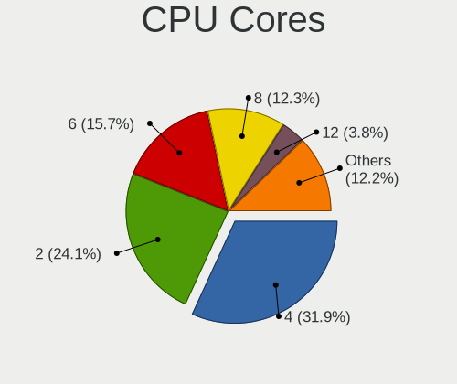

| Number  | Desktops | Percent |
|---------|----------|---------|
| 4       | 735      | 31.86%  |
| 2       | 557      | 24.14%  |
| 6       | 362      | 15.69%  |
| 8       | 284      | 12.31%  |
| 12      | 88       | 3.81%   |
| 16      | 75       | 3.25%   |
| 10      | 43       | 1.86%   |
| 1       | 43       | 1.86%   |
| 14      | 37       | 1.6%    |
| 3       | 26       | 1.13%   |
| 24      | 23       | 1%      |
| 20      | 12       | 0.52%   |
| 28      | 4        | 0.17%   |
| 18      | 4        | 0.17%   |
| 22      | 3        | 0.13%   |
| Unknown | 3        | 0.13%   |
| 36      | 2        | 0.09%   |
| 32      | 2        | 0.09%   |
| 5       | 2        | 0.09%   |
| 56      | 1        | 0.04%   |
| 44      | 1        | 0.04%   |

CPU Sockets
-----------

Number of sockets

| Number  | Desktops | Percent |
|---------|----------|---------|
| 1       | 2267     | 98.48%  |
| 2       | 33       | 1.43%   |
| Unknown | 2        | 0.09%   |

CPU Threads
-----------

Threads per core (Hyper-Threading)

| Number  | Desktops | Percent |
|---------|----------|---------|
| 2       | 1423     | 61.68%  |
| 1       | 878      | 38.06%  |
| 4       | 3        | 0.13%   |
| Unknown | 3        | 0.13%   |

CPU Op-Modes
------------

CPU Operation Modes (32-bit, 64-bit)

| Op mode        | Desktops | Percent |
|----------------|----------|---------|
| 32-bit, 64-bit | 2279     | 99.04%  |
| 32-bit         | 14       | 0.61%   |
| Unknown        | 8        | 0.35%   |

CPU Microcode
-------------

Microcode number

| Number     | Desktops | Percent |
|------------|----------|---------|
| Unknown    | 851      | 36.34%  |
| 0x306c3    | 182      | 7.77%   |
| 0x1067a    | 78       | 3.33%   |
| 0x506e3    | 74       | 3.16%   |
| 0x306a9    | 71       | 3.03%   |
| 0x206a7    | 57       | 2.43%   |
| 0x906e9    | 51       | 2.18%   |
| 0x906ea    | 46       | 1.96%   |
| 0xa0655    | 40       | 1.71%   |
| 0x90672    | 34       | 1.45%   |
| 0x0a50000d | 33       | 1.41%   |
| 0xb0671    | 30       | 1.28%   |
| 0x0a601203 | 29       | 1.24%   |
| 0x06000852 | 27       | 1.15%   |
| 0xa0653    | 26       | 1.11%   |
| 0x08701021 | 26       | 1.11%   |
| 0x08108109 | 25       | 1.07%   |
| 0xb06e0    | 23       | 0.98%   |
| 0x0a601206 | 23       | 0.98%   |
| 0xa0671    | 20       | 0.85%   |
| 0x0800820d | 20       | 0.85%   |
| 0x306f2    | 16       | 0.68%   |
| 0x08600106 | 16       | 0.68%   |
| 0x90675    | 15       | 0.64%   |
| 0x306e4    | 15       | 0.64%   |
| 0x906eb    | 14       | 0.6%    |
| 0x6f2      | 14       | 0.6%    |
| 0x406f1    | 14       | 0.6%    |
| 0x0a20120a | 14       | 0.6%    |
| 0x08701030 | 14       | 0.6%    |
| 0x0a201016 | 13       | 0.56%   |
| 0x08001138 | 13       | 0.56%   |
| 0x06003106 | 13       | 0.56%   |
| 0x6fb      | 12       | 0.51%   |
| 0x906c0    | 11       | 0.47%   |
| 0x6fd      | 11       | 0.47%   |
| 0x106e5    | 11       | 0.47%   |
| 0x0a50000f | 11       | 0.47%   |
| 0x08101016 | 10       | 0.43%   |
| 0x0700010f | 10       | 0.43%   |

CPU Microarch
-------------

Microarchitecture

| Name             | Desktops | Percent |
|------------------|----------|---------|
| Haswell          | 291      | 12.61%  |
| KabyLake         | 196      | 8.49%   |
| Unknown          | 194      | 8.41%   |
| Zen 3            | 176      | 7.63%   |
| IvyBridge        | 134      | 5.81%   |
| Skylake          | 128      | 5.55%   |
| Penryn           | 122      | 5.29%   |
| Zen 2            | 121      | 5.24%   |
| Alderlake Hybrid | 119      | 5.16%   |
| SandyBridge      | 102      | 4.42%   |
| CometLake        | 99       | 4.29%   |
| Zen+             | 74       | 3.21%   |
| Piledriver       | 53       | 2.3%    |
| Core             | 51       | 2.21%   |
| Zen              | 49       | 2.12%   |
| K10              | 46       | 1.99%   |
| Gracemont        | 39       | 1.69%   |
| Nehalem          | 30       | 1.3%    |
| Broadwell        | 30       | 1.3%    |
| Westmere         | 28       | 1.21%   |
| Silvermont       | 28       | 1.21%   |
| Icelake          | 25       | 1.08%   |
| Tremont          | 24       | 1.04%   |
| Goldmont plus    | 21       | 0.91%   |
| K8 Hammer        | 17       | 0.74%   |
| Excavator        | 17       | 0.74%   |
| Steamroller      | 16       | 0.69%   |
| NetBurst         | 16       | 0.69%   |
| Jaguar           | 16       | 0.69%   |
| Goldmont         | 8        | 0.35%   |
| Bulldozer        | 7        | 0.3%    |
| Bonnell          | 7        | 0.3%    |
| TigerLake        | 5        | 0.22%   |
| Bobcat           | 5        | 0.22%   |
| Puma             | 4        | 0.17%   |
| P6               | 3        | 0.13%   |
| K10 Llano        | 3        | 0.13%   |
| Sapphire Rapids  | 2        | 0.09%   |
| K6               | 2        | 0.09%   |

Graphics
--------

GPU Vendor
----------

Vendors of graphics cards

| Vendor                                       | Desktops | Percent |
|----------------------------------------------|----------|---------|
| Intel                                        | 955      | 38.85%  |
| Nvidia                                       | 729      | 29.66%  |
| AMD                                          | 715      | 29.09%  |
| ASPEED Technology                            | 35       | 1.42%   |
| Matrox Electronics Systems                   | 17       | 0.69%   |
| VIA Technologies                             | 2        | 0.08%   |
| XGI Technology (eXtreme Graphics Innovation) | 1        | 0.04%   |
| Silicon Motion                               | 1        | 0.04%   |
| Silicon Integrated Systems [SiS]             | 1        | 0.04%   |
| Red Hat                                      | 1        | 0.04%   |
| Loongson Technology                          | 1        | 0.04%   |

GPU Model
---------

Graphics card models

| Model                                                                       | Desktops | Percent |
|-----------------------------------------------------------------------------|----------|---------|
| Intel Xeon E3-1200 v3/4th Gen Core Processor Integrated Graphics Controller | 143      | 5.66%   |
| AMD Raphael                                                                 | 67       | 2.65%   |
| Intel HD Graphics 530                                                       | 64       | 2.53%   |
| AMD Cezanne [Radeon Vega Series / Radeon Vega Mobile Series]                | 60       | 2.37%   |
| Intel CoffeeLake-S GT2 [UHD Graphics 630]                                   | 58       | 2.3%    |
| AMD Ellesmere [Radeon RX 470/480/570/570X/580/580X/590]                     | 53       | 2.1%    |
| Intel Xeon E3-1200 v2/3rd Gen Core processor Graphics Controller            | 50       | 1.98%   |
| Intel 2nd Generation Core Processor Family Integrated Graphics Controller   | 50       | 1.98%   |
| Intel Alder Lake-N [UHD Graphics]                                           | 49       | 1.94%   |
| Intel CometLake-S GT2 [UHD Graphics 630]                                    | 43       | 1.7%    |
| Intel 4th Generation Core Processor Family Integrated Graphics Controller   | 42       | 1.66%   |
| Intel HD Graphics 630                                                       | 38       | 1.5%    |
| AMD Navi 23 [Radeon RX 6600/6600 XT/6600M]                                  | 38       | 1.5%    |
| Intel 4 Series Chipset Integrated Graphics Controller                       | 37       | 1.46%   |
| ASPEED Technology ASPEED Graphics Family                                    | 35       | 1.39%   |
| Intel AlderLake-S GT1                                                       | 34       | 1.35%   |
| Nvidia GP108 [GeForce GT 1030]                                              | 32       | 1.27%   |
| AMD Picasso/Raven 2 [Radeon Vega Series / Radeon Vega Mobile Series]        | 32       | 1.27%   |
| Nvidia GP107 [GeForce GTX 1050 Ti]                                          | 31       | 1.23%   |
| AMD Lexa PRO [Radeon 540/540X/550/550X / RX 540X/550/550X]                  | 31       | 1.23%   |
| Nvidia TU106 [GeForce RTX 2060 Rev. A]                                      | 29       | 1.15%   |
| Nvidia GK208B [GeForce GT 710]                                              | 28       | 1.11%   |
| Nvidia GM204 [GeForce GTX 970]                                              | 27       | 1.07%   |
| Intel Raptor Lake-S GT1 [UHD Graphics 770]                                  | 27       | 1.07%   |
| AMD Renoir [Radeon Vega Series / Radeon Vega Mobile Series]                 | 26       | 1.03%   |
| Nvidia GF108 [GeForce GT 730]                                               | 25       | 0.99%   |
| Intel HD Graphics 510                                                       | 24       | 0.95%   |
| AMD Navi 10 [Radeon RX 5600 OEM/5600 XT / 5700/5700 XT]                     | 23       | 0.91%   |
| Nvidia GP106 [GeForce GTX 1060 6GB]                                         | 22       | 0.87%   |
| Intel Alder Lake-S GT1 [UHD Graphics 730]                                   | 22       | 0.87%   |
| Intel JasperLake [UHD Graphics]                                             | 21       | 0.83%   |
| Nvidia TU117 [GeForce GTX 1650]                                             | 19       | 0.75%   |
| Nvidia GA106 [GeForce RTX 3060 Lite Hash Rate]                              | 19       | 0.75%   |
| AMD Raven Ridge [Radeon Vega Series / Radeon Vega Mobile Series]            | 19       | 0.75%   |
| Intel 82G33/G31 Express Integrated Graphics Controller                      | 18       | 0.71%   |
| AMD Navi 22 [Radeon RX 6700/6700 XT/6750 XT / 6800M/6850M XT]               | 18       | 0.71%   |
| Nvidia TU106 [GeForce RTX 2070]                                             | 17       | 0.67%   |
| Nvidia GK208B [GeForce GT 730]                                              | 17       | 0.67%   |
| Intel IvyBridge GT2 [HD Graphics 4000]                                      | 17       | 0.67%   |
| Intel Atom Processor Z36xxx/Z37xxx Series Graphics & Display                | 17       | 0.67%   |

GPU Combo
---------

Combinations of graphics cards

| Name                      | Desktops | Percent |
|---------------------------|----------|---------|
| 1 x Intel                 | 828      | 35.77%  |
| 1 x Nvidia                | 606      | 26.18%  |
| 1 x AMD                   | 603      | 26.05%  |
| Intel + Nvidia            | 66       | 2.85%   |
| 2 x AMD                   | 44       | 1.9%    |
| AMD + Nvidia              | 41       | 1.77%   |
| 1 x ASPEED                | 26       | 1.12%   |
| Intel + AMD               | 20       | 0.86%   |
| Other                     | 19       | 0.82%   |
| 2 x Intel                 | 19       | 0.82%   |
| 1 x Matrox                | 16       | 0.69%   |
| Nvidia + ASPEED           | 6        | 0.26%   |
| 2 x Nvidia                | 4        | 0.17%   |
| 3 x AMD                   | 2        | 0.09%   |
| 1 x VIA                   | 2        | 0.09%   |
| 3 x Nvidia                | 1        | 0.04%   |
| 2 x AMD + 1 x Nvidia      | 1        | 0.04%   |
| 1 x XGI                   | 1        | 0.04%   |
| 1 x SiS                   | 1        | 0.04%   |
| 1 x Silicon Motion        | 1        | 0.04%   |
| 1 x Red Hat               | 1        | 0.04%   |
| Nvidia + Matrox           | 1        | 0.04%   |
| 1 x Loongson Technology   | 1        | 0.04%   |
| 1 x Intel + 3 x Nvidia    | 1        | 0.04%   |
| AMD + 2 x Nvidia          | 1        | 0.04%   |
| AMD + Nvidia + 1 x ASPEED | 1        | 0.04%   |
| AMD + Matrox              | 1        | 0.04%   |
| AMD + ASPEED              | 1        | 0.04%   |

GPU Driver
----------

Free vs proprietary

| Driver      | Desktops | Percent |
|-------------|----------|---------|
| Free        | 1527     | 65.88%  |
| Unknown     | 480      | 20.71%  |
| Proprietary | 311      | 13.42%  |

GPU Memory
----------

Total video memory

| Size in GB | Desktops | Percent |
|------------|----------|---------|
| Unknown    | 1488     | 63.84%  |
| 1.01-2.0   | 153      | 6.56%   |
| 7.01-8.0   | 150      | 6.44%   |
| 0.01-0.5   | 148      | 6.35%   |
| 3.01-4.0   | 134      | 5.75%   |
| 0.51-1.0   | 92       | 3.95%   |
| 8.01-16.0  | 75       | 3.22%   |
| 5.01-6.0   | 50       | 2.15%   |
| 16.01-24.0 | 24       | 1.03%   |
| 2.01-3.0   | 15       | 0.64%   |
| 4.01-5.0   | 2        | 0.09%   |

Monitor
-------

Monitor Vendor
--------------

Monitor vendors

| Vendor               | Desktops | Percent |
|----------------------|----------|---------|
| Samsung Electronics  | 268      | 14.04%  |
| Dell                 | 208      | 10.9%   |
| Goldstar             | 169      | 8.85%   |
| Hewlett-Packard      | 146      | 7.65%   |
| Philips              | 135      | 7.07%   |
| Acer                 | 114      | 5.97%   |
| BenQ                 | 93       | 4.87%   |
| AOC                  | 93       | 4.87%   |
| Ancor Communications | 84       | 4.4%    |
| ASUSTek Computer     | 56       | 2.93%   |
| Lenovo               | 42       | 2.2%    |
| ViewSonic            | 39       | 2.04%   |
| Iiyama               | 38       | 1.99%   |
| Unknown              | 33       | 1.73%   |
| LG Electronics       | 25       | 1.31%   |
| Unknown              | 21       | 1.1%    |
| Sony                 | 19       | 1%      |
| Sceptre Tech         | 17       | 0.89%   |
| Eizo                 | 17       | 0.89%   |
| MSI                  | 15       | 0.79%   |
| Fujitsu Siemens      | 13       | 0.68%   |
| RTK                  | 12       | 0.63%   |
| Mi                   | 11       | 0.58%   |
| Gigabyte Technology  | 11       | 0.58%   |
| Toshiba              | 9        | 0.47%   |
| Vizio                | 8        | 0.42%   |
| NEC Computers        | 8        | 0.42%   |
| Panasonic            | 7        | 0.37%   |
| Medion               | 7        | 0.37%   |
| Hitachi              | 7        | 0.37%   |
| Denver               | 5        | 0.26%   |
| Xiaomi               | 4        | 0.21%   |
| TCT                  | 4        | 0.21%   |
| MStar                | 4        | 0.21%   |
| HUAWEI               | 4        | 0.21%   |
| HKC                  | 4        | 0.21%   |
| HannStar             | 4        | 0.21%   |
| Vestel Elektronik    | 3        | 0.16%   |
| Unknown (XXX)        | 3        | 0.16%   |
| SAC                  | 3        | 0.16%   |

Monitor Model
-------------

Monitor models

| Model                                                                  | Desktops | Percent |
|------------------------------------------------------------------------|----------|---------|
| Philips 197EL PHLC08B 1366x768 410x230mm 18.5-inch                     | 69       | 3.42%   |
| Unknown LCD Monitor FFFF 2288x1287 2550x2550mm 142.0-inch              | 25       | 1.24%   |
| Unknown                                                                | 21       | 1.04%   |
| Ancor Communications ASUS VS229 ACI22D3 1920x1080 475x267mm 21.5-inch  | 20       | 0.99%   |
| Goldstar ULTRAWIDE GSM59F1 2560x1080 677x290mm 29.0-inch               | 10       | 0.5%    |
| Goldstar FULL HD GSM5B55 1920x1080 480x270mm 21.7-inch                 | 10       | 0.5%    |
| Samsung Electronics C27F390 SAM0D32 1920x1080 600x340mm 27.2-inch      | 8        | 0.4%    |
| Samsung Electronics C24F390 SAM0D2C 1920x1080 521x293mm 23.5-inch      | 8        | 0.4%    |
| Hewlett-Packard LA2306 HWP294A 1920x1080 509x286mm 23.0-inch           | 8        | 0.4%    |
| Mi Monitor XMI23C3 1920x1080 527x293mm 23.7-inch                       | 7        | 0.35%   |
| Hewlett-Packard 22xi HWP302E 1920x1080 480x270mm 21.7-inch             | 7        | 0.35%   |
| Dell U2412M DELA07A 1920x1200 518x324mm 24.1-inch                      | 7        | 0.35%   |
| Samsung Electronics S24F350 SAM0D20 1920x1080 521x293mm 23.5-inch      | 6        | 0.3%    |
| Philips PHL 221V8 PHLC211 1920x1080 477x268mm 21.5-inch                | 6        | 0.3%    |
| Goldstar ULTRAGEAR GSM5B7F 2560x1440 597x336mm 27.0-inch               | 6        | 0.3%    |
| AOC Q27G2WG4 AOC2702 2560x1440 597x336mm 27.0-inch                     | 6        | 0.3%    |
| Sceptre Tech Sceptre F24 SPT09AB 1920x1080 526x296mm 23.8-inch         | 5        | 0.25%   |
| Philips PHL 243V7 PHLC155 1920x1080 527x296mm 23.8-inch                | 5        | 0.25%   |
| Goldstar HDR 4K GSM7707 3840x2160 600x340mm 27.2-inch                  | 5        | 0.25%   |
| Dell U2515H DELD06F 2560x1440 553x311mm 25.0-inch                      | 5        | 0.25%   |
| BenQ GW2270 BNQ78DB 1920x1080 476x268mm 21.5-inch                      | 5        | 0.25%   |
| BenQ EX2510S BNQ7FA3 1920x1080 544x303mm 24.5-inch                     | 5        | 0.25%   |
| ViewSonic VA2261 Series VSC0F30 1920x1080 477x268mm 21.5-inch          | 4        | 0.2%    |
| Samsung Electronics SyncMaster SAM036F 1440x900 428x255mm 19.6-inch    | 4        | 0.2%    |
| Samsung Electronics LCD Monitor SAM0A7A 1920x1080 1060x626mm 48.5-inch | 4        | 0.2%    |
| RTK LCD Monitor RTK1D1A 1920x1080 1020x570mm 46.0-inch                 | 4        | 0.2%    |
| Iiyama PLE2483H IVM6113 1920x1080 530x300mm 24.0-inch                  | 4        | 0.2%    |
| Hitachi HISENSE HEC0030 3840x2160 1872x1053mm 84.6-inch                | 4        | 0.2%    |
| Hewlett-Packard 23xi HWP3032 1920x1080 509x286mm 23.0-inch             | 4        | 0.2%    |
| Hewlett-Packard 22xi HWP3030 1920x1080 480x270mm 21.7-inch             | 4        | 0.2%    |
| Goldstar Ultra HD GSM5B09 3840x2160 600x340mm 27.2-inch                | 4        | 0.2%    |
| Goldstar LG FULL HD GSM5ABB 1920x1080 480x270mm 21.7-inch              | 4        | 0.2%    |
| Goldstar IPS FULLHD GSM5AB8 1920x1080 480x270mm 21.7-inch              | 4        | 0.2%    |
| Dell G3223Q DEL428C 3840x2160 708x399mm 32.0-inch                      | 4        | 0.2%    |
| ASUSTek Computer VZ279HE AUS27C0 1920x1080 598x336mm 27.0-inch         | 4        | 0.2%    |
| AOC 2460G4 AOC2460 1920x1080 531x299mm 24.0-inch                       | 4        | 0.2%    |
| Ancor Communications ASUS VS247 ACI249A 1920x1080 521x293mm 23.5-inch  | 4        | 0.2%    |
| Ancor Communications ASUS VB178 ACI1714 1280x1024 338x270mm 17.0-inch  | 4        | 0.2%    |
| Acer G246HL ACR02FF 1920x1080 531x299mm 24.0-inch                      | 4        | 0.2%    |
| Vestel Elektronik 49FHD_LCD_TV VES3700 1920x1080 1280x720mm 57.8-inch  | 3        | 0.15%   |

Monitor Resolution
------------------

Monitor screen resolution

| Resolution         | Desktops | Percent |
|--------------------|----------|---------|
| 1920x1080 (FHD)    | 796      | 42.5%   |
| 3840x2160 (4K)     | 208      | 11.11%  |
| 2560x1440 (QHD)    | 195      | 10.41%  |
| 1366x768 (WXGA)    | 115      | 6.14%   |
| 1280x1024 (SXGA)   | 93       | 4.97%   |
| 1680x1050 (WSXGA+) | 61       | 3.26%   |
| 1920x1200 (WUXGA)  | 48       | 2.56%   |
| Unknown            | 46       | 2.46%   |
| 3440x1440          | 45       | 2.4%    |
| 1440x900 (WXGA+)   | 45       | 2.4%    |
| 1600x900 (HD+)     | 40       | 2.14%   |
| 2560x1080          | 31       | 1.66%   |
| 2288x1287          | 25       | 1.33%   |
| 1360x768           | 21       | 1.12%   |
| 3840x1080          | 18       | 0.96%   |
| 1024x768 (XGA)     | 13       | 0.69%   |
| 1920x540           | 8        | 0.43%   |
| 7680x2160          | 6        | 0.32%   |
| 4480x1440          | 5        | 0.27%   |
| 3840x1600          | 5        | 0.27%   |
| 1600x1200          | 5        | 0.27%   |
| 5760x2160          | 4        | 0.21%   |
| 3840x1200          | 3        | 0.16%   |
| 1400x1050          | 3        | 0.16%   |
| 1280x720 (HD)      | 3        | 0.16%   |
| 6400x2160          | 2        | 0.11%   |
| 5360x1440          | 2        | 0.11%   |
| 2560x1600          | 2        | 0.11%   |
| 2256x1504          | 2        | 0.11%   |
| 2048x1152          | 2        | 0.11%   |
| 1280x768           | 2        | 0.11%   |
| 9440x2160          | 1        | 0.05%   |
| 7280x2160          | 1        | 0.05%   |
| 7280x1440          | 1        | 0.05%   |
| 720x480            | 1        | 0.05%   |
| 6440x1920          | 1        | 0.05%   |
| 6400x1440          | 1        | 0.05%   |
| 5760x1200          | 1        | 0.05%   |
| 5760x1080          | 1        | 0.05%   |
| 504x315            | 1        | 0.05%   |

Monitor Diagonal
----------------

Diagonal size in inches

| Inches  | Desktops | Percent |
|---------|----------|---------|
| 27      | 284      | 15.02%  |
| 24      | 273      | 14.44%  |
| 23      | 207      | 10.95%  |
| 21      | 200      | 10.58%  |
| Unknown | 138      | 7.3%    |
| 18      | 123      | 6.5%    |
| 31      | 92       | 4.87%   |
| 19      | 87       | 4.6%    |
| 34      | 60       | 3.17%   |
| 17      | 44       | 2.33%   |
| 22      | 39       | 2.06%   |
| 20      | 38       | 2.01%   |
| 32      | 31       | 1.64%   |
| 15      | 29       | 1.53%   |
| 84      | 27       | 1.43%   |
| 142     | 25       | 1.32%   |
| 25      | 20       | 1.06%   |
| 54      | 17       | 0.9%    |
| 40      | 17       | 0.9%    |
| 72      | 13       | 0.69%   |
| 48      | 12       | 0.63%   |
| 52      | 11       | 0.58%   |
| 46      | 9        | 0.48%   |
| 26      | 9        | 0.48%   |
| 49      | 7        | 0.37%   |
| 43      | 7        | 0.37%   |
| 37      | 7        | 0.37%   |
| 28      | 7        | 0.37%   |
| 42      | 6        | 0.32%   |
| 33      | 5        | 0.26%   |
| 16      | 5        | 0.26%   |
| 14      | 5        | 0.26%   |
| 39      | 4        | 0.21%   |
| 29      | 4        | 0.21%   |
| 12      | 4        | 0.21%   |
| 65      | 3        | 0.16%   |
| 86      | 2        | 0.11%   |
| 85      | 2        | 0.11%   |
| 69      | 2        | 0.11%   |
| 57      | 2        | 0.11%   |

Monitor Width
-------------

Physical width

| Width in mm    | Desktops | Percent |
|----------------|----------|---------|
| 501-600        | 718      | 39.09%  |
| 401-500        | 434      | 23.63%  |
| Unknown        | 138      | 7.51%   |
| 601-700        | 129      | 7.02%   |
| 701-800        | 98       | 5.33%   |
| 301-350        | 75       | 4.08%   |
| 1001-1500      | 62       | 3.38%   |
| 351-400        | 54       | 2.94%   |
| 1501-2000      | 46       | 2.5%    |
| 801-900        | 32       | 1.74%   |
| More than 2000 | 25       | 1.36%   |
| 901-1000       | 16       | 0.87%   |
| 201-300        | 9        | 0.49%   |
| 101-200        | 1        | 0.05%   |

Aspect Ratio
------------

Proportional relationship between the width and the height

| Ratio   | Desktops | Percent |
|---------|----------|---------|
| 16/9    | 1227     | 69.6%   |
| 16/10   | 163      | 9.25%   |
| Unknown | 122      | 6.92%   |
| 5/4     | 82       | 4.65%   |
| 21/9    | 74       | 4.2%    |
| 4/3     | 32       | 1.82%   |
| 1.00    | 27       | 1.53%   |
| 32/9    | 14       | 0.79%   |
| 3/2     | 8        | 0.45%   |
| 6/5     | 7        | 0.4%    |
| 0.56    | 4        | 0.23%   |
| 3.20    | 1        | 0.06%   |
| 1.96    | 1        | 0.06%   |
| 0.25    | 1        | 0.06%   |

Monitor Area
------------

Area in inch

| Area in inch | Desktops | Percent |
|----------------|----------|---------|
| 201-250        | 567      | 30.37%  |
| 301-350        | 289      | 15.48%  |
| 351-500        | 197      | 10.55%  |
| 151-200        | 178      | 9.53%   |
| 141-150        | 149      | 7.98%   |
| Unknown        | 138      | 7.39%   |
| 251-300        | 117      | 6.27%   |
| More than 1000 | 112      | 6%      |
| 501-1000       | 70       | 3.75%   |
| 101-110        | 27       | 1.45%   |
| 131-140        | 7        | 0.37%   |
| 71-80          | 4        | 0.21%   |
| 111-120        | 4        | 0.21%   |
| 81-90          | 3        | 0.16%   |
| 91-100         | 3        | 0.16%   |
| 61-70          | 1        | 0.05%   |
| 1-40           | 1        | 0.05%   |

Pixel Density
-------------

Pixels per inch

| Density | Desktops | Percent |
|---------|----------|---------|
| 51-100  | 1063     | 58.86%  |
| 101-120 | 367      | 20.32%  |
| Unknown | 138      | 7.64%   |
| 121-160 | 101      | 5.59%   |
| 1-50    | 100      | 5.54%   |
| 161-240 | 37       | 2.05%   |

Multiple Monitors
-----------------

Total monitors connected

| Total | Desktops | Percent |
|-------|----------|---------|
| 1     | 1455     | 62.69%  |
| 0     | 580      | 24.99%  |
| 2     | 251      | 10.81%  |
| 3     | 31       | 1.34%   |
| 4     | 4        | 0.17%   |

Network
-------

Net Controller Vendor
---------------------

Controller vendors

| Vendor                           | Desktops | Percent |
|----------------------------------|----------|---------|
| Realtek Semiconductor            | 1448     | 45.04%  |
| Intel                            | 1033     | 32.13%  |
| Qualcomm Atheros                 | 122      | 3.79%   |
| MediaTek                         | 99       | 3.08%   |
| Broadcom                         | 73       | 2.27%   |
| Ralink Technology                | 52       | 1.62%   |
| TP-Link                          | 47       | 1.46%   |
| Nvidia                           | 31       | 0.96%   |
| Aquantia                         | 28       | 0.87%   |
| Marvell Technology Group         | 24       | 0.75%   |
| Mellanox Technologies            | 15       | 0.47%   |
| Samsung Electronics              | 14       | 0.44%   |
| QinHeng Electronics              | 13       | 0.4%    |
| ASUSTek Computer                 | 13       | 0.4%    |
| ASIX Electronics                 | 12       | 0.37%   |
| Ralink                           | 11       | 0.34%   |
| Broadcom Limited                 | 11       | 0.34%   |
| NetGear                          | 9        | 0.28%   |
| Microsoft                        | 9        | 0.28%   |
| VIA Technologies                 | 8        | 0.25%   |
| D-Link System                    | 7        | 0.22%   |
| D-Link                           | 7        | 0.22%   |
| American Megatrends              | 7        | 0.22%   |
| Xiaomi                           | 6        | 0.19%   |
| Qualcomm Atheros Communications  | 6        | 0.19%   |
| Sigma Designs                    | 5        | 0.16%   |
| Qualcomm Technologies            | 5        | 0.16%   |
| 3Com                             | 5        | 0.16%   |
| Silicon Integrated Systems [SiS] | 4        | 0.12%   |
| Linksys                          | 4        | 0.12%   |
| Insyde Software                  | 4        | 0.12%   |
| Google                           | 4        | 0.12%   |
| Edimax Technology                | 4        | 0.12%   |
| Dresden Elektronik               | 4        | 0.12%   |
| Microchip Technology             | 3        | 0.09%   |
| ICS Advent                       | 3        | 0.09%   |
| Huawei Technologies              | 3        | 0.09%   |
| Emulex                           | 3        | 0.09%   |
| AVM                              | 3        | 0.09%   |
| Arduino SA                       | 3        | 0.09%   |

Net Controller Model
--------------------

Controller models

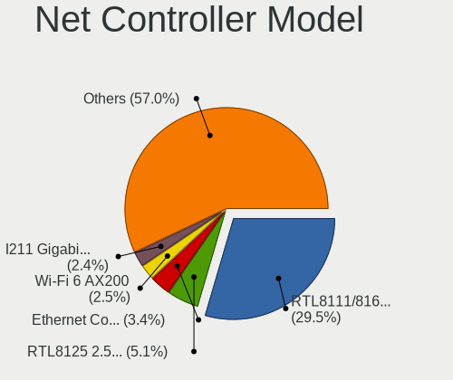

| Model                                                                  | Desktops | Percent |
|------------------------------------------------------------------------|----------|---------|
| Realtek RTL8111/8168/8211/8411 PCI Express Gigabit Ethernet Controller | 1093     | 29.53%  |
| Realtek RTL8125 2.5GbE Controller                                      | 190      | 5.13%   |
| Intel Ethernet Controller I225-V                                       | 125      | 3.38%   |
| Intel Wi-Fi 6 AX200                                                    | 92       | 2.49%   |
| Intel I211 Gigabit Network Connection                                  | 90       | 2.43%   |
| Intel Wi-Fi 6E(802.11ax) AX210/AX1675* 2x2 [Typhoon Peak]              | 63       | 1.7%    |
| Intel Ethernet Connection (2) I219-V                                   | 63       | 1.7%    |
| Intel 82579LM Gigabit Network Connection (Lewisville)                  | 63       | 1.7%    |
| Intel Ethernet Connection I217-LM                                      | 61       | 1.65%   |
| Intel Ethernet Controller I226-V                                       | 55       | 1.49%   |
| MediaTek MT7922 802.11ax PCI Express Wireless Network Adapter          | 45       | 1.22%   |
| Intel Raptor Lake-S PCH CNVi WiFi                                      | 39       | 1.05%   |
| Intel Dual Band Wireless-AC 3168NGW [Stone Peak]                       | 39       | 1.05%   |
| Realtek RTL8821CE 802.11ac PCIe Wireless Network Adapter               | 38       | 1.03%   |
| Realtek RTL810xE PCI Express Fast Ethernet controller                  | 38       | 1.03%   |
| Intel I210 Gigabit Network Connection                                  | 38       | 1.03%   |
| Realtek 802.11ac NIC                                                   | 34       | 0.92%   |
| Intel Ethernet Connection (2) I219-LM                                  | 33       | 0.89%   |
| Intel Ethernet Connection I217-V                                       | 32       | 0.86%   |
| Realtek RTL8852BE PCIe 802.11ax Wireless Network Controller            | 29       | 0.78%   |
| MediaTek MT7921K (RZ608) Wi-Fi 6E 80MHz                                | 28       | 0.76%   |
| Realtek RTL8153 Gigabit Ethernet Adapter                               | 27       | 0.73%   |
| Ralink MT7601U Wireless Adapter                                        | 25       | 0.68%   |
| Intel 82579V Gigabit Network Connection                                | 24       | 0.65%   |
| Intel 82574L Gigabit Network Connection                                | 22       | 0.59%   |
| Realtek RTL8152 Fast Ethernet Adapter                                  | 21       | 0.57%   |
| Intel Alder Lake-S PCH CNVi WiFi                                       | 20       | 0.54%   |
| Intel Ethernet Connection (7) I219-LM                                  | 19       | 0.51%   |
| Nvidia MCP61 Ethernet                                                  | 17       | 0.46%   |
| Intel Wireless 7265                                                    | 17       | 0.46%   |
| Intel Ethernet Connection (7) I219-V                                   | 17       | 0.46%   |
| Intel Ethernet Connection (11) I219-V                                  | 17       | 0.46%   |
| Realtek RTL8188EUS 802.11n Wireless Network Adapter                    | 16       | 0.43%   |
| Intel Wireless 7260                                                    | 16       | 0.43%   |
| Intel Ethernet Connection (2) I218-LM                                  | 16       | 0.43%   |
| Intel CNVi: Wi-Fi                                                      | 16       | 0.43%   |
| Realtek RTL88x2bu [AC1200 Techkey]                                     | 15       | 0.41%   |
| Intel I350 Gigabit Network Connection                                  | 15       | 0.41%   |
| Intel Ethernet Connection (5) I219-LM                                  | 15       | 0.41%   |
| Intel 82599ES 10-Gigabit SFI/SFP+ Network Connection                   | 15       | 0.41%   |

Wireless Vendor
---------------

Wireless vendors

| Vendor                          | Desktops | Percent |
|---------------------------------|----------|---------|
| Intel                           | 371      | 39.14%  |
| Realtek Semiconductor           | 219      | 23.1%   |
| MediaTek                        | 78       | 8.23%   |
| Qualcomm Atheros                | 66       | 6.96%   |
| Ralink Technology               | 52       | 5.49%   |
| TP-Link                         | 46       | 4.85%   |
| Broadcom                        | 25       | 2.64%   |
| ASUSTek Computer                | 13       | 1.37%   |
| Ralink                          | 11       | 1.16%   |
| NetGear                         | 9        | 0.95%   |
| Microsoft                       | 8        | 0.84%   |
| D-Link                          | 7        | 0.74%   |
| Qualcomm Atheros Communications | 6        | 0.63%   |
| Qualcomm Technologies           | 5        | 0.53%   |
| Linksys                         | 4        | 0.42%   |
| Edimax Technology               | 4        | 0.42%   |
| Broadcom Limited                | 4        | 0.42%   |
| Marvell Technology Group        | 3        | 0.32%   |
| AVM                             | 3        | 0.32%   |
| ZyDAS                           | 2        | 0.21%   |
| ZTopInc                         | 2        | 0.21%   |
| Mercucys                        | 2        | 0.21%   |
| D-Link System                   | 2        | 0.21%   |
| ZyXEL Communications            | 1        | 0.11%   |
| Sitecom Europe                  | 1        | 0.11%   |
| Realtek                         | 1        | 0.11%   |
| IMC Networks                    | 1        | 0.11%   |
| Dell                            | 1        | 0.11%   |
| Belkin Components               | 1        | 0.11%   |

Wireless Model
--------------

Wireless models

| Model                                                          | Desktops | Percent |
|----------------------------------------------------------------|----------|---------|
| Intel Wi-Fi 6 AX200                                            | 92       | 9.61%   |
| Intel Wi-Fi 6E(802.11ax) AX210/AX1675* 2x2 [Typhoon Peak]      | 63       | 6.58%   |
| Intel Raptor Lake-S PCH CNVi WiFi                              | 39       | 4.08%   |
| Intel Dual Band Wireless-AC 3168NGW [Stone Peak]               | 39       | 4.08%   |
| Realtek RTL8821CE 802.11ac PCIe Wireless Network Adapter       | 38       | 3.97%   |
| Realtek 802.11ac NIC                                           | 34       | 3.55%   |
| MediaTek MT7922 802.11ax PCI Express Wireless Network Adapter  | 30       | 3.13%   |
| MediaTek MT7921K (RZ608) Wi-Fi 6E 80MHz                        | 28       | 2.93%   |
| Ralink MT7601U Wireless Adapter                                | 25       | 2.61%   |
| Realtek RTL8852BE PCIe 802.11ax Wireless Network Controller    | 20       | 2.09%   |
| Intel Alder Lake-S PCH CNVi WiFi                               | 20       | 2.09%   |
| Intel Wireless 7265                                            | 17       | 1.78%   |
| Realtek RTL8188EUS 802.11n Wireless Network Adapter            | 16       | 1.67%   |
| Intel Wireless 7260                                            | 16       | 1.67%   |
| Realtek RTL88x2bu [AC1200 Techkey]                             | 15       | 1.57%   |
| MediaTek MT7921 802.11ax PCI Express Wireless Network Adapter  | 13       | 1.36%   |
| Intel Wi-Fi 5(802.11ac) Wireless-AC 9x6x [Thunder Peak]        | 13       | 1.36%   |
| TP-Link AC600 wireless Realtek RTL8811AU [Archer T2U Nano]     | 11       | 1.15%   |
| Broadcom BCM4360 802.11ac Dual Band Wireless Network Adapter   | 11       | 1.15%   |
| TP-Link 802.11ac NIC                                           | 10       | 1.04%   |
| Intel Wireless 8260                                            | 10       | 1.04%   |
| Intel Wireless 3165                                            | 10       | 1.04%   |
| TP-Link TL-WN722N v2/v3 [Realtek RTL8188EUS]                   | 9        | 0.94%   |
| Realtek RTL8852CE PCIe 802.11ax Wireless Network Controller    | 9        | 0.94%   |
| Ralink RT2870/RT3070 Wireless Adapter                          | 9        | 0.94%   |
| Qualcomm Atheros AR9485 Wireless Network Adapter               | 9        | 0.94%   |
| Realtek RTL8192EE PCIe Wireless Network Adapter                | 8        | 0.84%   |
| Realtek RTL8192CU 802.11n WLAN Adapter                         | 8        | 0.84%   |
| Qualcomm Atheros AR9287 Wireless Network Adapter (PCI-Express) | 8        | 0.84%   |
| Qualcomm Atheros AR9227 Wireless Network Adapter               | 8        | 0.84%   |
| Intel Cannon Lake PCH CNVi WiFi                                | 8        | 0.84%   |
| Ralink RT5370 Wireless Adapter                                 | 7        | 0.73%   |
| Qualcomm Atheros QCA9377 802.11ac Wireless Network Adapter     | 7        | 0.73%   |
| Intel Tiger Lake PCH CNVi WiFi                                 | 7        | 0.73%   |
| TP-Link 802.11ac WLAN Adapter                                  | 6        | 0.63%   |
| Realtek RTL8821AE 802.11ac PCIe Wireless Network Adapter       | 6        | 0.63%   |
| Realtek RTL8188EE Wireless Network Adapter                     | 6        | 0.63%   |
| Realtek RTL8188CUS 802.11n WLAN Adapter                        | 6        | 0.63%   |
| Intel Comet Lake PCH CNVi WiFi                                 | 6        | 0.63%   |
| Realtek RTL8812AE 802.11ac PCIe Wireless Network Adapter       | 5        | 0.52%   |

Ethernet Vendor
---------------

Ethernet vendors

| Vendor                            | Desktops | Percent |
|-----------------------------------|----------|---------|
| Realtek Semiconductor             | 1374     | 53.92%  |
| Intel                             | 845      | 33.16%  |
| Qualcomm Atheros                  | 64       | 2.51%   |
| Broadcom                          | 52       | 2.04%   |
| Nvidia                            | 31       | 1.22%   |
| Aquantia                          | 28       | 1.1%    |
| Marvell Technology Group          | 21       | 0.82%   |
| MediaTek                          | 20       | 0.78%   |
| Mellanox Technologies             | 14       | 0.55%   |
| ASIX Electronics                  | 12       | 0.47%   |
| VIA Technologies                  | 8        | 0.31%   |
| Samsung Electronics               | 8        | 0.31%   |
| Broadcom Limited                  | 7        | 0.27%   |
| American Megatrends               | 7        | 0.27%   |
| Xiaomi                            | 6        | 0.24%   |
| D-Link System                     | 5        | 0.2%    |
| 3Com                              | 5        | 0.2%    |
| Silicon Integrated Systems [SiS]  | 4        | 0.16%   |
| Insyde Software                   | 4        | 0.16%   |
| Google                            | 4        | 0.16%   |
| ICS Advent                        | 3        | 0.12%   |
| Emulex                            | 3        | 0.12%   |
| Qualcomm                          | 2        | 0.08%   |
| Motorola PCS                      | 2        | 0.08%   |
| JMicron Technology                | 2        | 0.08%   |
| Huawei Technologies               | 2        | 0.08%   |
| DisplayLink                       | 2        | 0.08%   |
| ADMtek                            | 2        | 0.08%   |
| vivo                              | 1        | 0.04%   |
| TP-Link                           | 1        | 0.04%   |
| SysKonnect                        | 1        | 0.04%   |
| Sundance Technology Inc / IC Plus | 1        | 0.04%   |
| Spreadtrum Communications         | 1        | 0.04%   |
| Solarflare Communications         | 1        | 0.04%   |
| Microsoft                         | 1        | 0.04%   |
| Microchip Technology              | 1        | 0.04%   |
| Loongson Technology               | 1        | 0.04%   |
| IBM                               | 1        | 0.04%   |
| Accton Technology                 | 1        | 0.04%   |

Ethernet Model
--------------

Ethernet models

| Model                                                                           | Desktops | Percent |
|---------------------------------------------------------------------------------|----------|---------|
| Realtek RTL8111/8168/8211/8411 PCI Express Gigabit Ethernet Controller          | 1093     | 40.72%  |
| Realtek RTL8125 2.5GbE Controller                                               | 189      | 7.04%   |
| Intel Ethernet Controller I225-V                                                | 125      | 4.66%   |
| Intel I211 Gigabit Network Connection                                           | 90       | 3.35%   |
| Intel Ethernet Connection (2) I219-V                                            | 63       | 2.35%   |
| Intel 82579LM Gigabit Network Connection (Lewisville)                           | 63       | 2.35%   |
| Intel Ethernet Connection I217-LM                                               | 61       | 2.27%   |
| Intel Ethernet Controller I226-V                                                | 55       | 2.05%   |
| Realtek RTL810xE PCI Express Fast Ethernet controller                           | 38       | 1.42%   |
| Intel I210 Gigabit Network Connection                                           | 38       | 1.42%   |
| Intel Ethernet Connection (2) I219-LM                                           | 33       | 1.23%   |
| Intel Ethernet Connection I217-V                                                | 32       | 1.19%   |
| Realtek RTL8153 Gigabit Ethernet Adapter                                        | 27       | 1.01%   |
| Intel 82579V Gigabit Network Connection                                         | 24       | 0.89%   |
| Intel 82574L Gigabit Network Connection                                         | 22       | 0.82%   |
| Realtek RTL8152 Fast Ethernet Adapter                                           | 21       | 0.78%   |
| Intel Ethernet Connection (7) I219-LM                                           | 19       | 0.71%   |
| Nvidia MCP61 Ethernet                                                           | 17       | 0.63%   |
| Intel Ethernet Connection (7) I219-V                                            | 17       | 0.63%   |
| Intel Ethernet Connection (11) I219-V                                           | 17       | 0.63%   |
| Intel Ethernet Connection (2) I218-LM                                           | 16       | 0.6%    |
| MediaTek MT7922 802.11ax PCI Express Wireless Network Adapter                   | 15       | 0.56%   |
| Intel I350 Gigabit Network Connection                                           | 15       | 0.56%   |
| Intel Ethernet Connection (5) I219-LM                                           | 15       | 0.56%   |
| Intel 82599ES 10-Gigabit SFI/SFP+ Network Connection                            | 15       | 0.56%   |
| Intel 82566DM Gigabit Network Connection                                        | 15       | 0.56%   |
| Intel 82567LM-3 Gigabit Network Connection                                      | 14       | 0.52%   |
| Qualcomm Atheros Killer E220x Gigabit Ethernet Controller                       | 13       | 0.48%   |
| Aquantia AQtion AQC113CS NBase-T/IEEE 802.3an Ethernet Controller [Antigua 10G] | 13       | 0.48%   |
| Realtek RTL-8100/8101L/8139 PCI Fast Ethernet Adapter                           | 12       | 0.45%   |
| Intel Ethernet Connection (14) I219-V                                           | 12       | 0.45%   |
| Intel CNVi: Wi-Fi                                                               | 12       | 0.45%   |
| ASIX AX88179 Gigabit Ethernet                                                   | 11       | 0.41%   |
| Realtek RTL8111/8168/8411 PCI Express Gigabit Ethernet Controller               | 10       | 0.37%   |
| Intel Ethernet Connection (17) I219-LM                                          | 10       | 0.37%   |
| Realtek RTL8852BE PCIe 802.11ax Wireless Network Controller                     | 9        | 0.34%   |
| Qualcomm Atheros AR8151 v2.0 Gigabit Ethernet                                   | 9        | 0.34%   |
| Marvell Group 88E8071 PCI-E Gigabit Ethernet Controller                         | 9        | 0.34%   |
| Marvell Group 88E8056 PCI-E Gigabit Ethernet Controller                         | 9        | 0.34%   |
| Intel Ethernet Connection (17) I219-V                                           | 9        | 0.34%   |

Net Controller Kind
-------------------

Ethernet, WiFi or modem

| Kind     | Desktops | Percent |
|----------|----------|---------|
| Ethernet | 2281     | 70.97%  |
| WiFi     | 877      | 27.29%  |
| Modem    | 48       | 1.49%   |
| Unknown  | 8        | 0.25%   |

Used Controller
---------------

Currently used network controller

| Kind     | Desktops | Percent |
|----------|----------|---------|
| Ethernet | 1929     | 83.69%  |
| WiFi     | 375      | 16.27%  |
| Modem    | 1        | 0.04%   |

NICs
----

Total network controllers on board

| Total | Desktops | Percent |
|-------|----------|---------|
| 1     | 1365     | 59.09%  |
| 2     | 699      | 30.26%  |
| 3     | 143      | 6.19%   |
| 4     | 45       | 1.95%   |
| 5     | 20       | 0.87%   |
| 0     | 15       | 0.65%   |
| 6     | 12       | 0.52%   |
| 8     | 5        | 0.22%   |
| 9     | 3        | 0.13%   |
| 7     | 2        | 0.09%   |
| 12    | 1        | 0.04%   |

IPv6
----

IPv6 vs IPv4

| Used | Desktops | Percent |
|------|----------|---------|
| No   | 1757     | 75.93%  |
| Yes  | 557      | 24.07%  |

Bluetooth
---------

Bluetooth Vendor
----------------

Controller vendors

| Vendor                          | Desktops | Percent |
|---------------------------------|----------|---------|
| Intel                           | 346      | 43.52%  |
| Realtek Semiconductor           | 105      | 13.21%  |
| Cambridge Silicon Radio         | 93       | 11.7%   |
| MediaTek                        | 57       | 7.17%   |
| ASUSTek Computer                | 36       | 4.53%   |
| IMC Networks                    | 31       | 3.9%    |
| Foxconn / Hon Hai               | 23       | 2.89%   |
| TP-Link                         | 20       | 2.52%   |
| Qualcomm Atheros Communications | 17       | 2.14%   |
| Broadcom                        | 17       | 2.14%   |
| Apple                           | 13       | 1.64%   |
| Actions                         | 7        | 0.88%   |
| Realtek                         | 6        | 0.75%   |
| Edimax Technology               | 6        | 0.75%   |
| Integrated System Solution      | 4        | 0.5%    |
| Unknown                         | 3        | 0.38%   |
| Lite-On Technology              | 2        | 0.25%   |
| HTC (High Tech Computer)        | 2        | 0.25%   |
| Dynex                           | 2        | 0.25%   |
| Mobile Action Technology        | 1        | 0.13%   |
| Logitech                        | 1        | 0.13%   |
| Conwise Technology              | 1        | 0.13%   |
| Belkin Components               | 1        | 0.13%   |
| Accel Semiconductor             | 1        | 0.13%   |

Bluetooth Model
---------------

Controller models

| Model                                                                | Desktops | Percent |
|----------------------------------------------------------------------|----------|---------|
| Cambridge Silicon Radio Bluetooth Dongle (HCI mode)                  | 93       | 11.7%   |
| Realtek Bluetooth Radio                                              | 90       | 11.32%  |
| Intel AX200 Bluetooth                                                | 80       | 10.06%  |
| MediaTek Wireless_Device                                             | 57       | 7.17%   |
| Intel Bluetooth wireless interface                                   | 55       | 6.92%   |
| Intel AX210 Bluetooth                                                | 55       | 6.92%   |
| Intel AX211 Bluetooth                                                | 47       | 5.91%   |
| Intel AX201 Bluetooth                                                | 44       | 5.53%   |
| Intel Wireless-AC 3168 Bluetooth                                     | 37       | 4.65%   |
| TP-Link TP-Link Bluetooth USB Adapter                                | 20       | 2.52%   |
| IMC Networks Bluetooth Radio                                         | 20       | 2.52%   |
| Foxconn / Hon Hai Wireless_Device                                    | 17       | 2.14%   |
| ASUS ASUS USB-BT500                                                  | 17       | 2.14%   |
| Broadcom BCM20702A0 Bluetooth 4.0                                    | 14       | 1.76%   |
| Intel Wireless-AC 9260 Bluetooth Adapter                             | 13       | 1.64%   |
| ASUS Broadcom BCM20702A0 Bluetooth                                   | 11       | 1.38%   |
| Intel Bluetooth 9460/9560 Jefferson Peak (JfP)                       | 10       | 1.26%   |
| Apple Bluetooth Host Controller                                      | 10       | 1.26%   |
| IMC Networks Wireless_Device                                         | 9        | 1.13%   |
| Realtek Bluetooth 5.3 Radio                                          | 8        | 1.01%   |
| Actions general adapter                                              | 7        | 0.88%   |
| Realtek Bluetooth Radio                                              | 6        | 0.75%   |
| Qualcomm Atheros  Bluetooth Device                                   | 6        | 0.75%   |
| Realtek  Bluetooth 4.2 Adapter                                       | 4        | 0.5%    |
| Qualcomm Atheros AR9462 Bluetooth                                    | 4        | 0.5%    |
| Intel Centrino Bluetooth Wireless Transceiver                        | 4        | 0.5%    |
| Foxconn / Hon Hai Bluetooth Device                                   | 4        | 0.5%    |
| Qualcomm Atheros QCA61x4 Bluetooth 4.0                               | 3        | 0.38%   |
| Integrated System Solution Bluetooth Device                          | 3        | 0.38%   |
| Edimax EW-7611ULB 802.11b/g/n and Bluetooth 4.0 Adapter              | 3        | 0.38%   |
| Edimax Bluetooth Adapter                                             | 3        | 0.38%   |
| ASUS Bluetooth Radio                                                 | 3        | 0.38%   |
| Apple Built-in Bluetooth 2.0+EDR HCI                                 | 3        | 0.38%   |
| Unknown                                                              | 3        | 0.38%   |
| Realtek RTL8822BE Bluetooth 4.2 Adapter                              | 2        | 0.25%   |
| Qualcomm Atheros AR3011 Bluetooth                                    | 2        | 0.25%   |
| IMC Networks Bluetooth Device                                        | 2        | 0.25%   |
| HTC (High Tech Computer) Vive Hub Bluetooth 4.1 (Broadcom BCM920703) | 2        | 0.25%   |
| Foxconn / Hon Hai MediaTek Bluetooth Adapter                         | 2        | 0.25%   |
| Dynex Bluetooth 4.0 Adapter [Broadcom, 1.12, BCM20702A0]             | 2        | 0.25%   |

Sound
-----

Sound Vendor
------------

Sound card vendors

| Vendor                                       | Desktops | Percent |
|----------------------------------------------|----------|---------|
| Intel                                        | 1469     | 40.91%  |
| AMD                                          | 871      | 24.26%  |
| Nvidia                                       | 699      | 19.47%  |
| C-Media Electronics                          | 94       | 2.62%   |
| Logitech                                     | 35       | 0.97%   |
| ASUSTek Computer                             | 30       | 0.84%   |
| Zoran Co. Personal Media Division (Nogatech) | 29       | 0.81%   |
| Creative Labs                                | 27       | 0.75%   |
| Micro Star International                     | 25       | 0.7%    |
| Texas Instruments                            | 19       | 0.53%   |
| Focusrite-Novation                           | 15       | 0.42%   |
| Razer USA                                    | 14       | 0.39%   |
| JMTek                                        | 14       | 0.39%   |
| Generalplus Technology                       | 14       | 0.39%   |
| Creative Technology                          | 14       | 0.39%   |
| VIA Technologies                             | 12       | 0.33%   |
| SteelSeries ApS                              | 12       | 0.33%   |
| Realtek Semiconductor                        | 10       | 0.28%   |
| Kingston Technology                          | 9        | 0.25%   |
| Hewlett-Packard                              | 9        | 0.25%   |
| GN Netcom                                    | 9        | 0.25%   |
| Jieli Technology                             | 8        | 0.22%   |
| Corsair                                      | 8        | 0.22%   |
| KTMicro                                      | 7        | 0.19%   |
| Blue Microphones                             | 7        | 0.19%   |
| Tenx Technology                              | 5        | 0.14%   |
| Sony                                         | 5        | 0.14%   |
| SAVITECH                                     | 5        | 0.14%   |
| Plantronics                                  | 5        | 0.14%   |
| BEHRINGER International                      | 5        | 0.14%   |
| Astro Gaming                                 | 5        | 0.14%   |
| Silicon Integrated Systems [SiS]             | 4        | 0.11%   |
| RODE Microphones                             | 4        | 0.11%   |
| PreSonus Audio Electronics                   | 4        | 0.11%   |
| Giga-Byte Technology                         | 4        | 0.11%   |
| Dell                                         | 4        | 0.11%   |
| Unknown                                      | 4        | 0.11%   |
| Schiit Audio                                 | 3        | 0.08%   |
| DSEA A/S                                     | 3        | 0.08%   |
| Cambridge Silicon Radio                      | 3        | 0.08%   |

Sound Model
-----------

Sound card models

| Model                                                                      | Desktops | Percent |
|----------------------------------------------------------------------------|----------|---------|
| AMD Family 17h/19h/1ah HD Audio Controller                                 | 253      | 5.9%    |
| Intel 8 Series/C220 Series Chipset High Definition Audio Controller        | 221      | 5.15%   |
| AMD Starship/Matisse HD Audio Controller                                   | 176      | 4.1%    |
| Intel Xeon E3-1200 v3/4th Gen Core Processor HD Audio Controller           | 169      | 3.94%   |
| Intel 200 Series PCH HD Audio                                              | 131      | 3.05%   |
| Intel 6 Series/C200 Series Chipset Family High Definition Audio Controller | 117      | 2.73%   |
| AMD Renoir Radeon High Definition Audio Controller                         | 114      | 2.66%   |
| Intel 100 Series/C230 Series Chipset Family HD Audio Controller            | 99       | 2.31%   |
| AMD Rembrandt Radeon High Definition Audio Controller                      | 89       | 2.07%   |
| AMD SBx00 Azalia (Intel HDA)                                               | 85       | 1.98%   |
| AMD Navi 21/23 HDMI/DP Audio Controller                                    | 80       | 1.86%   |
| Intel 7 Series/C216 Chipset Family High Definition Audio Controller        | 76       | 1.77%   |
| AMD Ellesmere HDMI Audio [Radeon RX 470/480 / 570/580/590]                 | 69       | 1.61%   |
| Intel Raptor Lake High Definition Audio Controller                         | 68       | 1.59%   |
| Intel Alder Lake-S HD Audio Controller                                     | 66       | 1.54%   |
| AMD Family 17h (Models 00h-0fh) HD Audio Controller                        | 65       | 1.52%   |
| Intel NM10/ICH7 Family High Definition Audio Controller                    | 62       | 1.45%   |
| Intel Cannon Lake PCH cAVS                                                 | 60       | 1.4%    |
| Nvidia TU106 High Definition Audio Controller                              | 58       | 1.35%   |
| Nvidia GP107GL High Definition Audio Controller                            | 55       | 1.28%   |
| Intel 82801JI (ICH10 Family) HD Audio Controller                           | 55       | 1.28%   |
| Intel Comet Lake PCH cAVS                                                  | 50       | 1.17%   |
| Intel Alder Lake-N PCH High Definition Audio Controller                    | 48       | 1.12%   |
| Nvidia GK208 HDMI/DP Audio Controller                                      | 46       | 1.07%   |
| AMD FCH Azalia Controller                                                  | 46       | 1.07%   |
| AMD Baffin HDMI/DP Audio [Radeon RX 550 640SP / RX 560/560X]               | 46       | 1.07%   |
| Intel C610/X99 series chipset HD Audio Controller                          | 43       | 1%      |
| Nvidia GA104 High Definition Audio Controller                              | 41       | 0.96%   |
| AMD Raven/Raven2/Fenghuang HDMI/DP Audio Controller                        | 41       | 0.96%   |
| Nvidia GF108 High Definition Audio Controller                              | 40       | 0.93%   |
| C-Media Electronics Audio Adapter (Unitek Y-247A)                          | 39       | 0.91%   |
| AMD Oland/Hainan/Cape Verde/Pitcairn HDMI Audio [Radeon HD 7000 Series]    | 39       | 0.91%   |
| Nvidia GP106 High Definition Audio Controller                              | 37       | 0.86%   |
| Nvidia TU116 High Definition Audio Controller                              | 34       | 0.79%   |
| Nvidia GM204 High Definition Audio Controller                              | 34       | 0.79%   |
| Intel 5 Series/3400 Series Chipset High Definition Audio                   | 34       | 0.79%   |
| AMD Navi 31 HDMI/DP Audio                                                  | 34       | 0.79%   |
| Nvidia GP108 High Definition Audio Controller                              | 32       | 0.75%   |
| Nvidia GA102 High Definition Audio Controller                              | 32       | 0.75%   |
| Intel Tiger Lake-H HD Audio Controller                                     | 31       | 0.72%   |

Memory
------

Memory Vendor
-------------

Memory module vendors

| Vendor                                  | Desktops | Percent |
|-----------------------------------------|----------|---------|
| Kingston                                | 378      | 18.91%  |
| Unknown                                 | 247      | 12.36%  |
| Samsung Electronics                     | 247      | 12.36%  |
| SK hynix                                | 192      | 9.6%    |
| Crucial                                 | 172      | 8.6%    |
| Corsair                                 | 168      | 8.4%    |
| G.Skill                                 | 130      | 6.5%    |
| Micron Technology                       | 92       | 4.6%    |
| Unknown                                 | 62       | 3.1%    |
| A-DATA Technology                       | 55       | 2.75%   |
| Patriot                                 | 28       | 1.4%    |
| Team                                    | 27       | 1.35%   |
| Hikvision                               | 19       | 0.95%   |
| Ramaxel Technology                      | 17       | 0.85%   |
| Nanya Technology                        | 11       | 0.55%   |
| Micro Memory Bank                       | 9        | 0.45%   |
| Unknown (0x0E9D)                        | 8        | 0.4%    |
| AMD                                     | 8        | 0.4%    |
| Unknown (ABCD)                          | 7        | 0.35%   |
| Transcend                               | 7        | 0.35%   |
| PNY                                     | 6        | 0.3%    |
| Elpida                                  | 6        | 0.3%    |
| Timetec                                 | 5        | 0.25%   |
| Patriot Memory (PDP Systems)            | 5        | 0.25%   |
| Apacer                                  | 5        | 0.25%   |
| Smart                                   | 4        | 0.2%    |
| Patriot Memory                          | 4        | 0.2%    |
| Avant                                   | 4        | 0.2%    |
| Wodposit                                | 3        | 0.15%   |
| Wilk Elektronik                         | 3        | 0.15%   |
| Unifosa                                 | 3        | 0.15%   |
| Toshiba                                 | 3        | 0.15%   |
| Silicon Power Computer & Communications | 3        | 0.15%   |
| KLEVV                                   | 3        | 0.15%   |
| Hewlett-Packard                         | 3        | 0.15%   |
| GeIL                                    | 3        | 0.15%   |
| Unknown (0x0B85)                        | 2        | 0.1%    |
| Qimonda                                 | 2        | 0.1%    |
| Mushkin                                 | 2        | 0.1%    |
| Lexar Co Limited                        | 2        | 0.1%    |

Memory Model
------------

Memory module models

| Model                                                                            | Desktops | Percent |
|----------------------------------------------------------------------------------|----------|---------|
| Unknown                                                                          | 62       | 2.88%   |
| Unknown RAM Module 2GB DIMM SDRAM                                                | 24       | 1.12%   |
| Unknown RAM Module 2GB DIMM DDR2 800MT/s                                         | 24       | 1.12%   |
| Unknown RAM Module 1GB DIMM SDRAM                                                | 19       | 0.88%   |
| Kingston RAM 99U5584-010.A00LF 4GB DIMM DDR3 1866MT/s                            | 19       | 0.88%   |
| Hikvision RAM HKED4161DAA1D0MA1 16GB DIMM DDR4 2667MT/s                          | 18       | 0.84%   |
| Samsung RAM M378B5173EB0-YK0 4GB DIMM DDR3 1600MT/s                              | 17       | 0.79%   |
| Corsair RAM CMK16GX4M2B3200C16 8GB DIMM DDR4 3600MT/s                            | 16       | 0.74%   |
| Unknown RAM Module 4GB DIMM 1333MT/s                                             | 15       | 0.7%    |
| Kingston RAM KF3200C16D4/16GX 16GB DIMM DDR4 3200MT/s                            | 13       | 0.6%    |
| G.Skill RAM F4-3200C16-16GVK 16GB DIMM DDR4 3600MT/s                             | 13       | 0.6%    |
| Corsair RAM CMK32GX4M2E3200C16 16GB DIMM DDR4 3534MT/s                           | 13       | 0.6%    |
| Samsung RAM M378A1K43DB2-CTD 8GB DIMM DDR4 4333MT/s                              | 11       | 0.51%   |
| Kingston RAM KF426C16BB1/16 16GB DIMM DDR4 2666MT/s                              | 11       | 0.51%   |
| Kingston RAM KF3200C16D4/32GX 32GB DIMM DDR4 3933MT/s                            | 11       | 0.51%   |
| Crucial RAM CT4G4DFS8213.C8FAR2 4GB DIMM DDR4 2133MT/s                           | 11       | 0.51%   |
| SK hynix RAM HMT41GS6BFR8A-PB 8GB SODIMM DDR3 1600MT/s                           | 10       | 0.46%   |
| SK hynix RAM HMA41GR7MFR4N-TF 8GB DIMM DDR4 2133MT/s                             | 10       | 0.46%   |
| Unknown RAM Module 8GB DIMM 1333MT/s                                             | 9        | 0.42%   |
| Unknown RAM Module 2GB DIMM 1333MT/s                                             | 9        | 0.42%   |
| SK hynix RAM HMT351U6CFR8C-PB 4GB DIMM DDR3 1800MT/s                             | 9        | 0.42%   |
| Micro Memory Bank RAM FFFFFFFFFFFFFFFFFFFFFFFFFFFFFFFFFFFF 2GB DIMM DDR2 667MT/s | 9        | 0.42%   |
| Kingston RAM KF3200C16D4/8GX 8GB DIMM DDR4 3600MT/s                              | 9        | 0.42%   |
| Corsair RAM CMK16GX4M2E3200C16 8GB DIMM DDR4 3466MT/s                            | 9        | 0.42%   |
| Unknown RAM Module 8GB DIMM DDR3 1333MT/s                                        | 8        | 0.37%   |
| Unknown RAM Module 4GB DIMM 1066MT/s                                             | 8        | 0.37%   |
| Kingston RAM KHX1600C10D3/8G 8GB DIMM DDR3 1600MT/s                              | 8        | 0.37%   |
| Corsair RAM CMK64GX4M2E3200C16 32GB DIMM DDR4 3600MT/s                           | 8        | 0.37%   |
| Unknown RAM Module 1GB DIMM 667MT/s                                              | 7        | 0.33%   |
| Unknown (ABCD) RAM 123456789012345678 2GB DIMM DDR3 2400MT/s                     | 7        | 0.33%   |
| SK hynix RAM HMT451U6BFR8A-PB 4GB DIMM DDR3 1600MT/s                             | 7        | 0.33%   |
| SK hynix RAM HMT451S6BFR8A-PB 4096MB SODIMM DDR3 1600MT/s                        | 7        | 0.33%   |
| SK hynix RAM HMT425U6AFR6C-PB 2GB DIMM DDR3 1600MT/s                             | 7        | 0.33%   |
| Samsung RAM M471B1G73QH0-YK0 8GB SODIMM DDR3 1600MT/s                            | 7        | 0.33%   |
| Patriot RAM PSD38G13332 8GB DIMM DDR3 1333MT/s                                   | 7        | 0.33%   |
| Kingston RAM KHX2666C16/8G 8GB DIMM DDR4 3466MT/s                                | 7        | 0.33%   |
| Kingston RAM KHX1866C10D3/8G 8GB DIMM DDR3 2133MT/s                              | 7        | 0.33%   |
| Kingston RAM KHX1600C9D3/4GX 4GB DIMM DDR3 1800MT/s                              | 7        | 0.33%   |
| Kingston RAM KF560C36-16 16GB DIMM DDR5 6000MT/s                                 | 7        | 0.33%   |
| Crucial RAM CT8G4DFRA266.M16FG 8GB DIMM DDR4 2667MT/s                            | 7        | 0.33%   |

Memory Kind
-----------

Memory module kinds

| Kind    | Desktops | Percent |
|---------|----------|---------|
| DDR4    | 856      | 47.24%  |
| DDR3    | 500      | 27.59%  |
| DDR5    | 163      | 9%      |
| DDR2    | 90       | 4.97%   |
| Unknown | 75       | 4.14%   |
| SDRAM   | 69       | 3.81%   |
| DDR     | 18       | 0.99%   |
| LPDDR4  | 17       | 0.94%   |
| LPDDR5  | 13       | 0.72%   |
| DRAM    | 7        | 0.39%   |
| EPROM   | 2        | 0.11%   |
| RAM     | 1        | 0.06%   |
| LPDDR3  | 1        | 0.06%   |

Memory Form Factor
------------------

Physical design of the memory module

| Name         | Desktops | Percent |
|--------------|----------|---------|
| DIMM         | 1500     | 83.66%  |
| SODIMM       | 263      | 14.67%  |
| Row Of Chips | 20       | 1.12%   |
| RIMM         | 4        | 0.22%   |
| FB-DIMM      | 3        | 0.17%   |
| Unknown      | 3        | 0.17%   |

Memory Size
-----------

Memory module size

| Size  | Desktops | Percent |
|-------|----------|---------|
| 8192  | 589      | 30.49%  |
| 16384 | 440      | 22.77%  |
| 4096  | 365      | 18.89%  |
| 2048  | 217      | 11.23%  |
| 32768 | 200      | 10.35%  |
| 1024  | 80       | 4.14%   |
| 512   | 18       | 0.93%   |
| 49152 | 11       | 0.57%   |
| 65536 | 3        | 0.16%   |
| 3072  | 2        | 0.1%    |
| 256   | 2        | 0.1%    |
| 24576 | 1        | 0.05%   |
| 12288 | 1        | 0.05%   |
| 6144  | 1        | 0.05%   |
| 64    | 1        | 0.05%   |
| 16    | 1        | 0.05%   |

Memory Speed
------------

Memory module speed

| Speed   | Desktops | Percent |
|---------|----------|---------|
| 1600    | 266      | 13.61%  |
| 3200    | 220      | 11.25%  |
| 2667    | 177      | 9.05%   |
| 1333    | 158      | 8.08%   |
| 2400    | 135      | 6.91%   |
| 3600    | 117      | 5.98%   |
| 2133    | 96       | 4.91%   |
| Unknown | 57       | 2.92%   |
| 4800    | 52       | 2.66%   |
| 800     | 50       | 2.56%   |
| 667     | 49       | 2.51%   |
| 1866    | 46       | 2.35%   |
| 2666    | 41       | 2.1%    |
| 6000    | 36       | 1.84%   |
| 5600    | 36       | 1.84%   |
| 1867    | 32       | 1.64%   |
| 1066    | 27       | 1.38%   |
| 3800    | 23       | 1.18%   |
| 3733    | 21       | 1.07%   |
| 6400    | 18       | 0.92%   |
| 3466    | 18       | 0.92%   |
| 3000    | 17       | 0.87%   |
| 1800    | 14       | 0.72%   |
| 5200    | 13       | 0.66%   |
| 3933    | 13       | 0.66%   |
| 3534    | 13       | 0.66%   |
| 2933    | 12       | 0.61%   |
| 4333    | 11       | 0.56%   |
| 3400    | 11       | 0.56%   |
| 4000    | 9        | 0.46%   |
| 533     | 9        | 0.46%   |
| 3266    | 8        | 0.41%   |
| 1067    | 8        | 0.41%   |
| 3666    | 7        | 0.36%   |
| 2800    | 7        | 0.36%   |
| 1648    | 7        | 0.36%   |
| 3866    | 6        | 0.31%   |
| 3500    | 5        | 0.26%   |
| 3334    | 5        | 0.26%   |
| 3066    | 5        | 0.26%   |

Printers & scanners
-------------------

Printer Vendor
--------------

Printer device vendors

| Vendor                | Desktops | Percent |
|-----------------------|----------|---------|
| Brother Industries    | 24       | 31.58%  |
| Hewlett-Packard       | 16       | 21.05%  |
| Canon                 | 12       | 15.79%  |
| Samsung Electronics   | 6        | 7.89%   |
| Seiko Epson           | 5        | 6.58%   |
| Dymo-CoStar           | 4        | 5.26%   |
| Ricoh                 | 2        | 2.63%   |
| QinHeng Electronics   | 2        | 2.63%   |
| Pantum                | 2        | 2.63%   |
| Zebra                 | 1        | 1.32%   |
| nemonic               | 1        | 1.32%   |
| Lexmark International | 1        | 1.32%   |

Printer Model
-------------

Printer device models

| Model                                   | Desktops | Percent |
|-----------------------------------------|----------|---------|
| Samsung M2070 Series                    | 2        | 2.63%   |
| QinHeng CH340S                          | 2        | 2.63%   |
| HP ENVY 5540 series                     | 2        | 2.63%   |
| Canon MF4010 series                     | 2        | 2.63%   |
| Canon MF3010                            | 2        | 2.63%   |
| Canon LiDE 400                          | 2        | 2.63%   |
| Brother MFC-7360N                       | 2        | 2.63%   |
| Brother HL-3142CW series                | 2        | 2.63%   |
| Brother HL-2030 Laser Printer           | 2        | 2.63%   |
| Zebra Thrmal 2844                       | 1        | 1.32%   |
| Seiko Epson XP-211 214 216 Series       | 1        | 1.32%   |
| Seiko Epson XP-102 103 Series           | 1        | 1.32%   |
| Seiko Epson L3150 Series                | 1        | 1.32%   |
| Seiko Epson ET-4850 Series              | 1        | 1.32%   |
| Seiko Epson ET-2850 Series              | 1        | 1.32%   |
| Samsung SCX-4623 Series                 | 1        | 1.32%   |
| Samsung ML-216x Series Laser Printer    | 1        | 1.32%   |
| Samsung ML-1660 Series                  | 1        | 1.32%   |
| Samsung M2020 Series                    | 1        | 1.32%   |
| Ricoh SP 150                            | 1        | 1.32%   |
| Ricoh Printing Support                  | 1        | 1.32%   |
| Pantum P2500W series                    | 1        | 1.32%   |
| Pantum P2200 series                     | 1        | 1.32%   |
| nemonic MIP-001                         | 1        | 1.32%   |
| Lexmark International E120              | 1        | 1.32%   |
| HP Smart Tank 510 series                | 1        | 1.32%   |
| HP OfficeJet 5200 series                | 1        | 1.32%   |
| HP Officejet 4500 G510a-f               | 1        | 1.32%   |
| HP LaserJet M101-M106                   | 1        | 1.32%   |
| HP LaserJet 1020                        | 1        | 1.32%   |
| HP LaserJet 1018                        | 1        | 1.32%   |
| HP Ink Tank 310 series                  | 1        | 1.32%   |
| HP HP OfficeJet Pro 9020 series         | 1        | 1.32%   |
| HP HP LaserJet Pro M404-M405            | 1        | 1.32%   |
| HP HP LaserJet P2035                    | 1        | 1.32%   |
| HP HP Laser 107w                        | 1        | 1.32%   |
| HP DeskJet Plus 4100 series             | 1        | 1.32%   |
| HP DeskJet 5650c                        | 1        | 1.32%   |
| HP DeskJet 2700 series                  | 1        | 1.32%   |
| Dymo-CoStar DYMO LabelWriter Twin Turbo | 1        | 1.32%   |

Scanner Vendor
--------------

Scanner device vendors

| Vendor          | Desktops | Percent |
|-----------------|----------|---------|
| Canon           | 16       | 66.67%  |
| Seiko Epson     | 4        | 16.67%  |
| Mustek Systems  | 2        | 8.33%   |
| Plustek         | 1        | 4.17%   |
| Hewlett-Packard | 1        | 4.17%   |

Scanner Model
-------------

Scanner device models

| Model                                             | Desktops | Percent |
|---------------------------------------------------|----------|---------|
| Canon CanoScan LiDE 220                           | 4        | 16.67%  |
| Canon CanoScan LiDE 210                           | 4        | 16.67%  |
| Canon CanoScan LiDE 110                           | 3        | 12.5%   |
| Seiko Epson GT-F650 [GT-S600/Perfection V10/V100] | 2        | 8.33%   |
| Seiko Epson GT-X900 [Perfection V700/V750 Photo]  | 1        | 4.17%   |
| Seiko Epson GT-7700U [Perfection 1240U]           | 1        | 4.17%   |
| Plustek 1200dpi USB Scanner                       | 1        | 4.17%   |
| Mustek Systems ScanExpress 1200 UB                | 1        | 4.17%   |
| Mustek Systems BearPaw 1200 CU Plus               | 1        | 4.17%   |
| HP ScanJet 82x0C                                  | 1        | 4.17%   |
| Canon CanoScan N670U/N676U/LiDE 20                | 1        | 4.17%   |
| Canon CanoScan LiDE 50/LiDE 35/LiDE 40            | 1        | 4.17%   |
| Canon CanoScan LIDE 25                            | 1        | 4.17%   |
| Canon CanoScan LiDE 120                           | 1        | 4.17%   |
| Canon CanoScan 1220U                              | 1        | 4.17%   |

Camera
------

Camera Vendor
-------------

Camera device vendors

| Vendor                        | Desktops | Percent |
|-------------------------------|----------|---------|
| Logitech                      | 120      | 39.74%  |
| Microdia                      | 26       | 8.61%   |
| Microsoft                     | 22       | 7.28%   |
| Sunplus Innovation Technology | 13       | 4.3%    |
| Generalplus Technology        | 13       | 4.3%    |
| Samsung Electronics           | 9        | 2.98%   |
| Realtek Semiconductor         | 7        | 2.32%   |
| MacroSilicon                  | 5        | 1.66%   |
| KYE Systems (Mouse Systems)   | 5        | 1.66%   |
| Creative Technology           | 5        | 1.66%   |
| Apple                         | 5        | 1.66%   |
| Trust                         | 4        | 1.32%   |
| AVerMedia Technologies        | 4        | 1.32%   |
| ARC International             | 4        | 1.32%   |
| Z-Star Microelectronics       | 3        | 0.99%   |
| Jieli Technology              | 3        | 0.99%   |
| IMC Networks                  | 3        | 0.99%   |
| 2M UVC CAMERA                 | 3        | 0.99%   |
| Razer USA                     | 2        | 0.66%   |
| Quanta                        | 2        | 0.66%   |
| Novatek Microelectronics      | 2        | 0.66%   |
| Lenovo                        | 2        | 0.66%   |
| Hewlett-Packard               | 2        | 0.66%   |
| Guillemot                     | 2        | 0.66%   |
| GEMBIRD                       | 2        | 0.66%   |
| Chicony Electronics           | 2        | 0.66%   |
| Aveo Technology               | 2        | 0.66%   |
| ANYKA                         | 2        | 0.66%   |
| Valve Software                | 1        | 0.33%   |
| ValueHD                       | 1        | 0.33%   |
| UltraSemi                     | 1        | 0.33%   |
| Tobii Technology AB           | 1        | 0.33%   |
| Suyin                         | 1        | 0.33%   |
| Sunplus IT                    | 1        | 0.33%   |
| Sonix Technology              | 1        | 0.33%   |
| SHENZHEN EMEET TECHNOLOGY     | 1        | 0.33%   |
| Ruision                       | 1        | 0.33%   |
| Pixart Imaging                | 1        | 0.33%   |
| OPPO Electronics              | 1        | 0.33%   |
| Omnivision                    | 1        | 0.33%   |

Camera Model
------------

Camera device models

| Model                                    | Desktops | Percent |
|------------------------------------------|----------|---------|
| Logitech HD Pro Webcam C920              | 33       | 10.89%  |
| Logitech Webcam C270                     | 31       | 10.23%  |
| Microsoft LifeCam HD-3000                | 12       | 3.96%   |
| Logitech C922 Pro Stream Webcam          | 12       | 3.96%   |
| Samsung Galaxy series, misc. (MTP mode)  | 9        | 2.97%   |
| Microdia Webcam Vitade AF                | 9        | 2.97%   |
| Generalplus GENERAL WEBCAM               | 9        | 2.97%   |
| Microdia USB 2.0 Camera                  | 6        | 1.98%   |
| Logitech HD Webcam C615                  | 5        | 1.65%   |
| Microdia Integrated Camera               | 4        | 1.32%   |
| MacroSilicon USB Video                   | 4        | 1.32%   |
| Logitech Webcam C310                     | 4        | 1.32%   |
| Generalplus 808 Camera #9 (web-cam mode) | 4        | 1.32%   |
| ARC International Camera                 | 4        | 1.32%   |
| Sunplus FULL HD webcam                   | 3        | 0.99%   |
| Sunplus DICOTA 4K                        | 3        | 0.99%   |
| Microsoft Modern Webcam                  | 3        | 0.99%   |
| Microdia Sonix USB 2.0 Camera            | 3        | 0.99%   |
| Logitech StreamCam                       | 3        | 0.99%   |
| Logitech HD Webcam C525                  | 3        | 0.99%   |
| Logitech CrystalCam                      | 3        | 0.99%   |
| Logitech BRIO Ultra HD Webcam            | 3        | 0.99%   |
| Jieli USB PHY 2.0                        | 3        | 0.99%   |
| Apple iPhone 5/5C/5S/6/SE/7/8/X/XR       | 3        | 0.99%   |
| 2M UVC CAMERA NexiGo N60 FHD Webcam      | 3        | 0.99%   |
| Z-Star Venus USB2.0 Camera               | 2        | 0.66%   |
| Trust Trust USB Camera                   | 2        | 0.66%   |
| Sunplus HK 5M WebCAM                     | 2        | 0.66%   |
| Realtek FULL HD 1080P Webcam             | 2        | 0.66%   |
| Novatek HP High Definition 2MP Webcam    | 2        | 0.66%   |
| Microdia Camera                          | 2        | 0.66%   |
| Logitech Webcam C300                     | 2        | 0.66%   |
| Logitech QuickCam Pro 9000               | 2        | 0.66%   |
| Logitech QuickCam E 3500                 | 2        | 0.66%   |
| Logitech QuickCam Communicate Deluxe     | 2        | 0.66%   |
| Logitech Logitech Webcam C925e           | 2        | 0.66%   |
| Lenovo Lenovo FHD Webcam Audio           | 2        | 0.66%   |
| HP Webcam 3110                           | 2        | 0.66%   |
| Creative Live! Cam Sync 1080p V2         | 2        | 0.66%   |
| AVerMedia Live Streamer CAM 313          | 2        | 0.66%   |

Security
--------

Fingerprint Vendor
------------------

Fingerprint sensor vendors

| Vendor                | Desktops | Percent |
|-----------------------|----------|---------|
| Microsoft             | 1        | 50%     |
| LighTuning Technology | 1        | 50%     |

Fingerprint Model
-----------------

Fingerprint sensor models

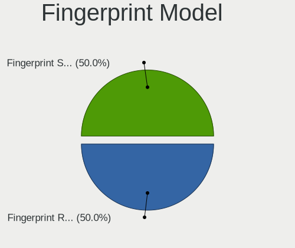

| Model                         | Desktops | Percent |
|-------------------------------|----------|---------|
| Microsoft Fingerprint Reader  | 1        | 50%     |
| LighTuning Fingerprint Sensor | 1        | 50%     |

Chipcard Vendor
---------------

Chipcard module vendors

| Vendor                    | Desktops | Percent |
|---------------------------|----------|---------|
| Realtek Semiconductor     | 3        | 20%     |
| Reiner SCT Kartensysteme  | 2        | 13.33%  |
| Advanced Card Systems     | 2        | 13.33%  |
| SCM Microsystems          | 1        | 6.67%   |
| OmniKey                   | 1        | 6.67%   |
| Gemalto (was Gemplus)     | 1        | 6.67%   |
| Chicony Electronics       | 1        | 6.67%   |
| CHERRY                    | 1        | 6.67%   |
| Alcor Micro               | 1        | 6.67%   |
| Aladdin Knowledge Systems | 1        | 6.67%   |
| Aktiv                     | 1        | 6.67%   |

Chipcard Model
--------------

Chipcard module models

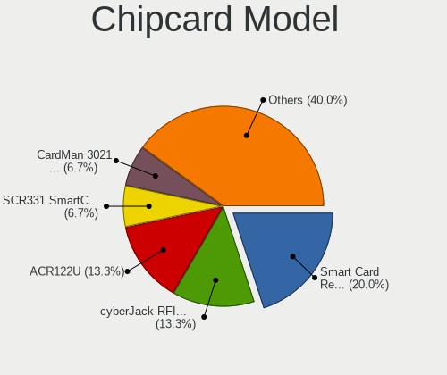

| Model                                                                      | Desktops | Percent |
|----------------------------------------------------------------------------|----------|---------|
| Realtek Semiconductor Smart Card Reader Interface                          | 3        | 20%     |
| Reiner SCT Kartensysteme cyberJack RFID basis contactless smartcard reader | 2        | 13.33%  |
| Advanced Card Systems ACR122U                                              | 2        | 13.33%  |
| SCM Microsystems SCR331 SmartCard Reader                                   | 1        | 6.67%   |
| OmniKey CardMan 3021 / 3121                                                | 1        | 6.67%   |
| Gemalto (was Gemplus) GemPC Twin SmartCard Reader                          | 1        | 6.67%   |
| Chicony Electronics HP Skylab USB Smartcard Keyboard                       | 1        | 6.67%   |
| CHERRY SmartCard Reader Keyboard KC 1000 SC                                | 1        | 6.67%   |
| Alcor Micro AU9540 Smartcard Reader                                        | 1        | 6.67%   |
| Aladdin Knowledge Systems Token JC                                         | 1        | 6.67%   |
| Aktiv Rutoken lite                                                         | 1        | 6.67%   |

Unsupported
-----------

Unsupported Devices
-------------------

Total unsupported devices on board

| Total | Desktops | Percent |
|-------|----------|---------|
| 0     | 1602     | 68.9%   |
| 1     | 623      | 26.8%   |
| 2     | 86       | 3.7%    |
| 3     | 6        | 0.26%   |
| 4     | 4        | 0.17%   |
| 5     | 3        | 0.13%   |
| 7     | 1        | 0.04%   |

Unsupported Device Types
------------------------

Types of unsupported devices

| Type                     | Desktops | Percent |
|--------------------------|----------|---------|
| Graphics card            | 508      | 65.21%  |
| Net/wireless             | 121      | 15.53%  |
| Unassigned class         | 55       | 7.06%   |
| Communication controller | 32       | 4.11%   |
| Bluetooth                | 12       | 1.54%   |
| Sound                    | 11       | 1.41%   |
| Multimedia controller    | 9        | 1.16%   |
| Chipcard                 | 7        | 0.9%    |
| Network                  | 4        | 0.51%   |
| Modem                    | 4        | 0.51%   |
| Storage/raid             | 3        | 0.39%   |
| Camera                   | 3        | 0.39%   |
| Wireless                 | 2        | 0.26%   |
| Fingerprint reader       | 2        | 0.26%   |
| Card reader              | 2        | 0.26%   |
| Video                    | 1        | 0.13%   |
| Storage/nvme             | 1        | 0.13%   |
| Storage/ide              | 1        | 0.13%   |
| Net/ethernet             | 1        | 0.13%   |

