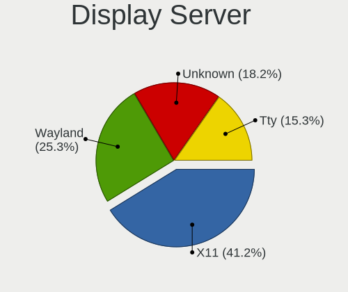
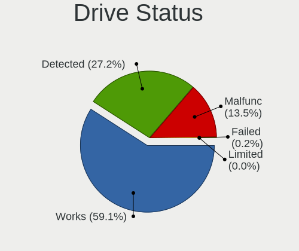
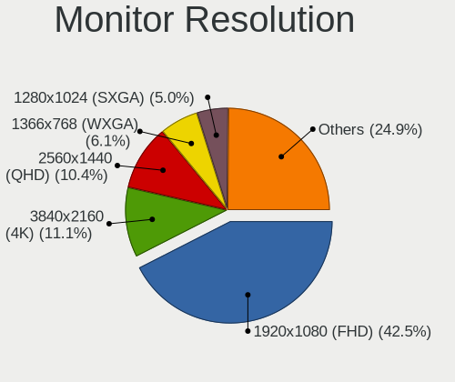
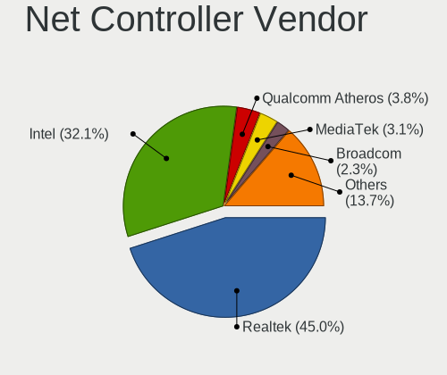
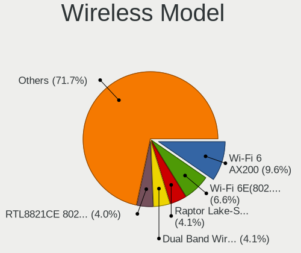
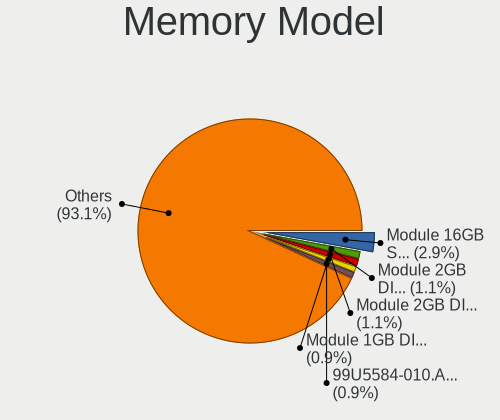

Debian 12 - Tested Hardware & Statistics (Desktops)
---------------------------------------------------

A project to collect tested hardware configurations for Debian 12.

Anyone can contribute to this report by the [hw-probe](https://github.com/linuxhw/hw-probe) tool:

    sudo -E hw-probe -all -upload

Please contribute! Especially if your hardware is rare.

Contents
--------

* [ Test Cases ](#test-cases)

* [ System ](#system)
  - [ Kernel                   ](#kernel)
  - [ Kernel Family            ](#kernel-family)
  - [ Kernel Major Ver.        ](#kernel-major-ver)
  - [ Arch                     ](#arch)
  - [ DE                       ](#de)
  - [ Display Server           ](#display-server)
  - [ Display Manager          ](#display-manager)
  - [ OS Lang                  ](#os-lang)
  - [ Boot Mode                ](#boot-mode)
  - [ Filesystem               ](#filesystem)
  - [ Part. scheme             ](#part-scheme)
  - [ Dual Boot with Linux/BSD ](#dual-boot-with-linuxbsd)
  - [ Dual Boot (Win)          ](#dual-boot-win)

* [ Board ](#board)
  - [ Vendor                   ](#vendor)
  - [ Model                    ](#model)
  - [ Model Family             ](#model-family)
  - [ MFG Year                 ](#mfg-year)
  - [ Form Factor              ](#form-factor)
  - [ Secure Boot              ](#secure-boot)
  - [ Coreboot                 ](#coreboot)
  - [ RAM Size                 ](#ram-size)
  - [ RAM Used                 ](#ram-used)
  - [ Total Drives             ](#total-drives)
  - [ Has CD-ROM               ](#has-cd-rom)
  - [ Has Ethernet             ](#has-ethernet)
  - [ Has WiFi                 ](#has-wifi)
  - [ Has Bluetooth            ](#has-bluetooth)

* [ Location ](#location)
  - [ Country                  ](#country)
  - [ City                     ](#city)

* [ Drives ](#drives)
  - [ Drive Vendor             ](#drive-vendor)
  - [ Drive Model              ](#drive-model)
  - [ HDD Vendor               ](#hdd-vendor)
  - [ SSD Vendor               ](#ssd-vendor)
  - [ Drive Kind               ](#drive-kind)
  - [ Drive Connector          ](#drive-connector)
  - [ Drive Size               ](#drive-size)
  - [ Space Total              ](#space-total)
  - [ Space Used               ](#space-used)
  - [ Malfunc. Drives          ](#malfunc-drives)
  - [ Malfunc. Drive Vendor    ](#malfunc-drive-vendor)
  - [ Malfunc. HDD Vendor      ](#malfunc-hdd-vendor)
  - [ Malfunc. Drive Kind      ](#malfunc-drive-kind)
  - [ Failed Drives            ](#failed-drives)
  - [ Failed Drive Vendor      ](#failed-drive-vendor)
  - [ Drive Status             ](#drive-status)

* [ Storage controller ](#storage-controller)
  - [ Storage Vendor           ](#storage-vendor)
  - [ Storage Model            ](#storage-model)
  - [ Storage Kind             ](#storage-kind)

* [ Processor ](#processor)
  - [ CPU Vendor               ](#cpu-vendor)
  - [ CPU Model                ](#cpu-model)
  - [ CPU Model Family         ](#cpu-model-family)
  - [ CPU Cores                ](#cpu-cores)
  - [ CPU Sockets              ](#cpu-sockets)
  - [ CPU Threads              ](#cpu-threads)
  - [ CPU Op-Modes             ](#cpu-op-modes)
  - [ CPU Microcode            ](#cpu-microcode)
  - [ CPU Microarch            ](#cpu-microarch)

* [ Graphics ](#graphics)
  - [ GPU Vendor               ](#gpu-vendor)
  - [ GPU Model                ](#gpu-model)
  - [ GPU Combo                ](#gpu-combo)
  - [ GPU Driver               ](#gpu-driver)
  - [ GPU Memory               ](#gpu-memory)

* [ Monitor ](#monitor)
  - [ Monitor Vendor           ](#monitor-vendor)
  - [ Monitor Model            ](#monitor-model)
  - [ Monitor Resolution       ](#monitor-resolution)
  - [ Monitor Diagonal         ](#monitor-diagonal)
  - [ Monitor Width            ](#monitor-width)
  - [ Aspect Ratio             ](#aspect-ratio)
  - [ Monitor Area             ](#monitor-area)
  - [ Pixel Density            ](#pixel-density)
  - [ Multiple Monitors        ](#multiple-monitors)

* [ Network ](#network)
  - [ Net Controller Vendor    ](#net-controller-vendor)
  - [ Net Controller Model     ](#net-controller-model)
  - [ Wireless Vendor          ](#wireless-vendor)
  - [ Wireless Model           ](#wireless-model)
  - [ Ethernet Vendor          ](#ethernet-vendor)
  - [ Ethernet Model           ](#ethernet-model)
  - [ Net Controller Kind      ](#net-controller-kind)
  - [ Used Controller          ](#used-controller)
  - [ NICs                     ](#nics)
  - [ IPv6                     ](#ipv6)

* [ Bluetooth ](#bluetooth)
  - [ Bluetooth Vendor         ](#bluetooth-vendor)
  - [ Bluetooth Model          ](#bluetooth-model)

* [ Sound ](#sound)
  - [ Sound Vendor             ](#sound-vendor)
  - [ Sound Model              ](#sound-model)

* [ Memory ](#memory)
  - [ Memory Vendor            ](#memory-vendor)
  - [ Memory Model             ](#memory-model)
  - [ Memory Kind              ](#memory-kind)
  - [ Memory Form Factor       ](#memory-form-factor)
  - [ Memory Size              ](#memory-size)
  - [ Memory Speed             ](#memory-speed)

* [ Printers & scanners ](#printers--scanners)
  - [ Printer Vendor           ](#printer-vendor)
  - [ Printer Model            ](#printer-model)
  - [ Scanner Vendor           ](#scanner-vendor)
  - [ Scanner Model            ](#scanner-model)

* [ Camera ](#camera)
  - [ Camera Vendor            ](#camera-vendor)
  - [ Camera Model             ](#camera-model)

* [ Security ](#security)
  - [ Fingerprint Vendor       ](#fingerprint-vendor)
  - [ Fingerprint Model        ](#fingerprint-model)
  - [ Chipcard Vendor          ](#chipcard-vendor)
  - [ Chipcard Model           ](#chipcard-model)

* [ Unsupported ](#unsupported)
  - [ Unsupported Devices      ](#unsupported-devices)
  - [ Unsupported Device Types ](#unsupported-device-types)

Test Cases
----------

Total: 327

| Vendor        | Model                       | Probe                                                      | Date         |
|---------------|-----------------------------|------------------------------------------------------------|--------------|
| ASRock        | A320M-HD                    | [1df7c65f40](https://linux-hardware.org/?probe=1df7c65f40) | Jul 01, 2023 |
| Gigabyte      | Z77X-UD5H                   | [eea1d9623c](https://linux-hardware.org/?probe=eea1d9623c) | Jun 30, 2023 |
| ASUSTek       | P6X58D PREMIUM              | [b2d81d6e67](https://linux-hardware.org/?probe=b2d81d6e67) | Jun 30, 2023 |
| Gigabyte      | H55M-UD2H                   | [befac7b8de](https://linux-hardware.org/?probe=befac7b8de) | Jun 30, 2023 |
| ASRock        | Z68 Pro3 Gen3               | [9fc143ab80](https://linux-hardware.org/?probe=9fc143ab80) | Jun 30, 2023 |
| ASRock        | G31M-GS                     | [3bd67e0f9f](https://linux-hardware.org/?probe=3bd67e0f9f) | Jun 30, 2023 |
| ASUSTek       | P8Z68-V PRO                 | [a3de72d73c](https://linux-hardware.org/?probe=a3de72d73c) | Jun 29, 2023 |
| Dell          | 0PU052                      | [b4fde65c68](https://linux-hardware.org/?probe=b4fde65c68) | Jun 29, 2023 |
| ASUSTek       | TUF Gaming Z690-PLUS WIF... | [a996f391dc](https://linux-hardware.org/?probe=a996f391dc) | Jun 29, 2023 |
| ASUSTek       | PRIME B550M-A               | [d6823d5ec7](https://linux-hardware.org/?probe=d6823d5ec7) | Jun 28, 2023 |
| HP            | 21B4 A01                    | [50656fb7ec](https://linux-hardware.org/?probe=50656fb7ec) | Jun 28, 2023 |
| HP            | 21B4 A01                    | [4d9322819d](https://linux-hardware.org/?probe=4d9322819d) | Jun 28, 2023 |
| OEM           | Unknown                     | [0448bbee67](https://linux-hardware.org/?probe=0448bbee67) | Jun 28, 2023 |
| ASUSTek       | X99-WS/IPMI                 | [fff4bc4f46](https://linux-hardware.org/?probe=fff4bc4f46) | Jun 28, 2023 |
| ASUSTek       | PRIME A320I-K               | [bc9d733b89](https://linux-hardware.org/?probe=bc9d733b89) | Jun 27, 2023 |
| Lenovo        | 1048 SDK0K17763 WIN 1801... | [d903758323](https://linux-hardware.org/?probe=d903758323) | Jun 27, 2023 |
| Dell          | 0PU052                      | [34eaa7185d](https://linux-hardware.org/?probe=34eaa7185d) | Jun 26, 2023 |
| ASUSTek       | M4A78T-E                    | [7b60ea1445](https://linux-hardware.org/?probe=7b60ea1445) | Jun 26, 2023 |
| Gigabyte      | H310MD2P-CF                 | [1ad319cfc7](https://linux-hardware.org/?probe=1ad319cfc7) | Jun 26, 2023 |
| BESSTAR Te... | B550                        | [87962635d3](https://linux-hardware.org/?probe=87962635d3) | Jun 26, 2023 |
| Gigabyte      | B75M-D3H                    | [aeb1c6b8d2](https://linux-hardware.org/?probe=aeb1c6b8d2) | Jun 26, 2023 |
| ASUSTek       | ROG STRIX B760-F GAMING ... | [117bfb7088](https://linux-hardware.org/?probe=117bfb7088) | Jun 25, 2023 |
| JINGSHA       | Unknown                     | [2ae6ac9599](https://linux-hardware.org/?probe=2ae6ac9599) | Jun 25, 2023 |
| Biostar       | X370GTN                     | [80b2b1d180](https://linux-hardware.org/?probe=80b2b1d180) | Jun 25, 2023 |
| Intel         | H55                         | [993c041483](https://linux-hardware.org/?probe=993c041483) | Jun 25, 2023 |
| Gigabyte      | EP45C-DS3R                  | [655d9d950d](https://linux-hardware.org/?probe=655d9d950d) | Jun 24, 2023 |
| ASUSTek       | K30BF_M32BF                 | [46a7aaf9f1](https://linux-hardware.org/?probe=46a7aaf9f1) | Jun 23, 2023 |
| Foxconn       | G31MXP FAB:1.1              | [9ed9153958](https://linux-hardware.org/?probe=9ed9153958) | Jun 23, 2023 |
| Foxconn       | nT-iBT18/nT-iBT19/nT-iBT... | [51b5eb0fa2](https://linux-hardware.org/?probe=51b5eb0fa2) | Jun 23, 2023 |
| ASUSTek       | K30BF_M32BF                 | [655b20a34b](https://linux-hardware.org/?probe=655b20a34b) | Jun 23, 2023 |
| ASRock        | FM2A58M-VG3+ R2.0           | [9ab87d56a7](https://linux-hardware.org/?probe=9ab87d56a7) | Jun 22, 2023 |
| Acer          | Aspire X1700                | [aac17ef2f2](https://linux-hardware.org/?probe=aac17ef2f2) | Jun 22, 2023 |
| AMI           | Intel                       | [1a4a632d56](https://linux-hardware.org/?probe=1a4a632d56) | Jun 22, 2023 |
| ASUSTek       | ROG CROSSHAIR VIII DARK ... | [abbb1b897d](https://linux-hardware.org/?probe=abbb1b897d) | Jun 22, 2023 |
| ASRock        | NUC-TGL                     | [6dcb1eb43d](https://linux-hardware.org/?probe=6dcb1eb43d) | Jun 22, 2023 |
| ASRock        | X670E PG Lightning          | [b8e19a16f9](https://linux-hardware.org/?probe=b8e19a16f9) | Jun 22, 2023 |
| ASUSTek       | TUF Gaming X570-PLUS        | [7117d51b53](https://linux-hardware.org/?probe=7117d51b53) | Jun 21, 2023 |
| Gigabyte      | B550M DS3H                  | [2e32510f57](https://linux-hardware.org/?probe=2e32510f57) | Jun 21, 2023 |
| MSI           | H110M PRO-D                 | [b652abc634](https://linux-hardware.org/?probe=b652abc634) | Jun 21, 2023 |
| HP            | 1588h                       | [abe5412cf6](https://linux-hardware.org/?probe=abe5412cf6) | Jun 21, 2023 |
| HP            | 1588h                       | [f08e230cd3](https://linux-hardware.org/?probe=f08e230cd3) | Jun 21, 2023 |
| ASRock        | B760 Pro RS/D4              | [bf19dd1c4b](https://linux-hardware.org/?probe=bf19dd1c4b) | Jun 20, 2023 |
| ASUSTek       | PRIME H310M-K               | [1742a525de](https://linux-hardware.org/?probe=1742a525de) | Jun 20, 2023 |
| ASUSTek       | PRIME H310M-K               | [cfc9cd338e](https://linux-hardware.org/?probe=cfc9cd338e) | Jun 20, 2023 |
| Dell          | 0RW203                      | [6872d8e6c5](https://linux-hardware.org/?probe=6872d8e6c5) | Jun 20, 2023 |
| ASUSTek       | P8H67-M                     | [4c2f50a608](https://linux-hardware.org/?probe=4c2f50a608) | Jun 19, 2023 |
| MSI           | B550-A PRO                  | [b0f066ab7e](https://linux-hardware.org/?probe=b0f066ab7e) | Jun 18, 2023 |
| Intel         | H81                         | [5cda43eb30](https://linux-hardware.org/?probe=5cda43eb30) | Jun 18, 2023 |
| Gigabyte      | B550M DS3H                  | [e7fdb650cd](https://linux-hardware.org/?probe=e7fdb650cd) | Jun 18, 2023 |
| ASUSTek       | P8H61-M LX                  | [fe3b7abf1d](https://linux-hardware.org/?probe=fe3b7abf1d) | Jun 17, 2023 |
| HP            | 2B38                        | [b84e03e083](https://linux-hardware.org/?probe=b84e03e083) | Jun 17, 2023 |
| ASUSTek       | P5K Premium                 | [dddb2b8bdf](https://linux-hardware.org/?probe=dddb2b8bdf) | Jun 17, 2023 |
| ASRock        | B760 Pro RS/D4              | [6767dd6968](https://linux-hardware.org/?probe=6767dd6968) | Jun 16, 2023 |
| ASUSTek       | PRIME B450M-A               | [91787f8dfb](https://linux-hardware.org/?probe=91787f8dfb) | Jun 15, 2023 |
| ASUSTek       | M4A78T-E                    | [5ec4b74af2](https://linux-hardware.org/?probe=5ec4b74af2) | Jun 15, 2023 |
| Gigabyte      | GA-M56S-S3                  | [a708d51992](https://linux-hardware.org/?probe=a708d51992) | Jun 15, 2023 |
| HP            | 2820h                       | [77b54a0343](https://linux-hardware.org/?probe=77b54a0343) | Jun 14, 2023 |
| HP            | 2820h                       | [40e65d7a30](https://linux-hardware.org/?probe=40e65d7a30) | Jun 14, 2023 |
| Intel         | DG41TY AAE47335-203         | [4f1d844d48](https://linux-hardware.org/?probe=4f1d844d48) | Jun 14, 2023 |
| Lenovo        | ThinkCentre M55p 8808D8U    | [3117d89b20](https://linux-hardware.org/?probe=3117d89b20) | Jun 14, 2023 |
| Lenovo        | ThinkCentre M55p 8808D8U    | [3feaf0bd19](https://linux-hardware.org/?probe=3feaf0bd19) | Jun 14, 2023 |
| Lenovo        | ThinkCentre M55p 8808D8U    | [5fc5be3367](https://linux-hardware.org/?probe=5fc5be3367) | Jun 14, 2023 |
| Lenovo        | ThinkCentre M55p 8808D8U    | [aba284328c](https://linux-hardware.org/?probe=aba284328c) | Jun 14, 2023 |
| Lenovo        | ThinkCentre M55p 8808D8U    | [b899120507](https://linux-hardware.org/?probe=b899120507) | Jun 14, 2023 |
| ASUSTek       | ROG CROSSHAIR VIII DARK ... | [051cebacd1](https://linux-hardware.org/?probe=051cebacd1) | Jun 14, 2023 |
| Lenovo        | ThinkCentre M55p 8808D8U    | [221a4431e2](https://linux-hardware.org/?probe=221a4431e2) | Jun 13, 2023 |
| Lenovo        | ThinkCentre M55p 8808D8U    | [85abf9e475](https://linux-hardware.org/?probe=85abf9e475) | Jun 13, 2023 |
| Lenovo        | ThinkCentre M55p 8808D8U    | [40df819ebb](https://linux-hardware.org/?probe=40df819ebb) | Jun 13, 2023 |
| Lenovo        | ThinkCentre M55p 8808D8U    | [9ed186ba56](https://linux-hardware.org/?probe=9ed186ba56) | Jun 13, 2023 |
| Lenovo        | ThinkCentre M55p 8808D8U    | [2a4d82175c](https://linux-hardware.org/?probe=2a4d82175c) | Jun 13, 2023 |
| Lenovo        | ThinkCentre M55p 8808D8U    | [1df32db310](https://linux-hardware.org/?probe=1df32db310) | Jun 13, 2023 |
| Lenovo        | ThinkCentre M55p 8808D8U    | [9949220d98](https://linux-hardware.org/?probe=9949220d98) | Jun 13, 2023 |
| Lenovo        | ThinkCentre M55p 8808D8U    | [d801927769](https://linux-hardware.org/?probe=d801927769) | Jun 13, 2023 |
| Shuttle       | FM10 V10                    | [f1396e2cce](https://linux-hardware.org/?probe=f1396e2cce) | Jun 13, 2023 |
| Gigabyte      | B550I AORUS PRO AX          | [d85ad203ff](https://linux-hardware.org/?probe=d85ad203ff) | Jun 13, 2023 |
| Gigabyte      | H61M-DS2                    | [06c6c417c9](https://linux-hardware.org/?probe=06c6c417c9) | Jun 13, 2023 |
| ECS           | G31T-M9                     | [ba2a738c96](https://linux-hardware.org/?probe=ba2a738c96) | Jun 13, 2023 |
| MSI           | Z270 TOMAHAWK ARCTIC        | [86ab821b84](https://linux-hardware.org/?probe=86ab821b84) | Jun 13, 2023 |
| Intel         | JSL MRD                     | [8943f697bc](https://linux-hardware.org/?probe=8943f697bc) | Jun 13, 2023 |
| ASUSTek       | PRIME B365M-K               | [dad1ea59a4](https://linux-hardware.org/?probe=dad1ea59a4) | Jun 12, 2023 |
| ASRock        | H310CM-HDV                  | [a810b267ef](https://linux-hardware.org/?probe=a810b267ef) | Jun 12, 2023 |
| ASUSTek       | PRIME B650M-A AX            | [f39a1874f7](https://linux-hardware.org/?probe=f39a1874f7) | Jun 12, 2023 |
| ASUSTek       | A68HM-PLUS                  | [6b1f9dec93](https://linux-hardware.org/?probe=6b1f9dec93) | Jun 11, 2023 |
| ASUSTek       | H110M-A/M.2                 | [f30be06897](https://linux-hardware.org/?probe=f30be06897) | Jun 11, 2023 |
| Gigabyte      | 990FXA-UD3                  | [756a317dd6](https://linux-hardware.org/?probe=756a317dd6) | Jun 11, 2023 |
| MSI           | MPG X570 GAMING PLUS        | [0aeb6a400a](https://linux-hardware.org/?probe=0aeb6a400a) | Jun 11, 2023 |
| ASUSTek       | P7H55D-M PRO                | [6049b3d69d](https://linux-hardware.org/?probe=6049b3d69d) | Jun 10, 2023 |
| MSI           | MAG B760 TOMAHAWK WIFI      | [88955e82f2](https://linux-hardware.org/?probe=88955e82f2) | Jun 10, 2023 |
| ECS           | G31T-M9                     | [d8ca98b733](https://linux-hardware.org/?probe=d8ca98b733) | Jun 09, 2023 |
| Gigabyte      | B450M S2H V2                | [fb883c82bc](https://linux-hardware.org/?probe=fb883c82bc) | Jun 09, 2023 |
| Gigabyte      | B450 AORUS ELITE            | [b2c39972c2](https://linux-hardware.org/?probe=b2c39972c2) | Jun 09, 2023 |
| Gigabyte      | B450M H                     | [e54b5ce7da](https://linux-hardware.org/?probe=e54b5ce7da) | Jun 09, 2023 |
| Gigabyte      | X570 GAMING X               | [576a624a1b](https://linux-hardware.org/?probe=576a624a1b) | Jun 09, 2023 |
| ASUSTek       | M4A78T-E                    | [fa22309a62](https://linux-hardware.org/?probe=fa22309a62) | Jun 08, 2023 |
| Gigabyte      | GA-M56S-S3                  | [b2c6247a0e](https://linux-hardware.org/?probe=b2c6247a0e) | Jun 07, 2023 |
| Gigabyte      | M68MT-S2                    | [2ff7b71aed](https://linux-hardware.org/?probe=2ff7b71aed) | Jun 06, 2023 |
| Gigabyte      | H61M-DS2                    | [10ecbb2117](https://linux-hardware.org/?probe=10ecbb2117) | Jun 06, 2023 |
| ECS           | G31T-M9                     | [8bb444bdd6](https://linux-hardware.org/?probe=8bb444bdd6) | Jun 05, 2023 |
| Gigabyte      | M68MT-S2                    | [2ec944c5d0](https://linux-hardware.org/?probe=2ec944c5d0) | Jun 05, 2023 |
| Gigabyte      | GA-M56S-S3                  | [8896a460d4](https://linux-hardware.org/?probe=8896a460d4) | Jun 05, 2023 |
| Gigabyte      | M68MT-S2                    | [d392dff6bb](https://linux-hardware.org/?probe=d392dff6bb) | Jun 05, 2023 |
| ECS           | G31T-M9                     | [630360ab38](https://linux-hardware.org/?probe=630360ab38) | Jun 05, 2023 |
| Gigabyte      | M68MT-S2                    | [991c5472ac](https://linux-hardware.org/?probe=991c5472ac) | Jun 05, 2023 |
| ASUSTek       | PRIME H310M-R R2.0          | [5387bcbf7d](https://linux-hardware.org/?probe=5387bcbf7d) | Jun 03, 2023 |
| ASUSTek       | PRIME H310M-R R2.0          | [881df8f45c](https://linux-hardware.org/?probe=881df8f45c) | Jun 03, 2023 |
| ASUSTek       | PRIME H310M-R R2.0          | [0dd3be3300](https://linux-hardware.org/?probe=0dd3be3300) | Jun 03, 2023 |
| HC Technol... | HCAR357-NR                  | [58f698b10a](https://linux-hardware.org/?probe=58f698b10a) | Jun 02, 2023 |
| MSI           | G31TM-P21                   | [964377db0b](https://linux-hardware.org/?probe=964377db0b) | Jun 02, 2023 |
| ASUSTek       | PRIME B450M-K               | [853bd25ca5](https://linux-hardware.org/?probe=853bd25ca5) | Jun 02, 2023 |
| ASUSTek       | PRIME B450M-K               | [3a9fb692f1](https://linux-hardware.org/?probe=3a9fb692f1) | Jun 02, 2023 |
| ASUSTek       | PRIME B450M-K               | [9b549fe65a](https://linux-hardware.org/?probe=9b549fe65a) | Jun 02, 2023 |
| ASUSTek       | PRIME B450M-K               | [db685837d0](https://linux-hardware.org/?probe=db685837d0) | Jun 02, 2023 |
| ASUSTek       | PRIME B450M-K               | [968b38e0b9](https://linux-hardware.org/?probe=968b38e0b9) | Jun 02, 2023 |
| ASUSTek       | PRIME B450M-K               | [c9a04d8da0](https://linux-hardware.org/?probe=c9a04d8da0) | Jun 02, 2023 |
| ASUSTek       | PRIME B450M-K               | [238931757a](https://linux-hardware.org/?probe=238931757a) | Jun 02, 2023 |
| ASUSTek       | PRIME B450M-K               | [e190e991a6](https://linux-hardware.org/?probe=e190e991a6) | Jun 02, 2023 |
| ASUSTek       | PRIME B450M-K               | [0816e77499](https://linux-hardware.org/?probe=0816e77499) | Jun 02, 2023 |
| ASUSTek       | PRIME B450M-K               | [ff143ac918](https://linux-hardware.org/?probe=ff143ac918) | Jun 02, 2023 |
| Lenovo        | SHARKBAY SDK0E50510 WIN     | [07e5342fb8](https://linux-hardware.org/?probe=07e5342fb8) | Jun 02, 2023 |
| Gigabyte      | H61M-DS2                    | [f3b666f725](https://linux-hardware.org/?probe=f3b666f725) | Jun 01, 2023 |
| Gigabyte      | H61M-DS2                    | [1cf7ec0aa5](https://linux-hardware.org/?probe=1cf7ec0aa5) | Jun 01, 2023 |
| Gigabyte      | H61M-DS2                    | [7f9d81bd57](https://linux-hardware.org/?probe=7f9d81bd57) | Jun 01, 2023 |
| ASRock        | H110M-HDV R3.0              | [670044aef5](https://linux-hardware.org/?probe=670044aef5) | May 31, 2023 |
| ECS           | G31T-M9                     | [f227323587](https://linux-hardware.org/?probe=f227323587) | May 31, 2023 |
| Gigabyte      | M68MT-S2                    | [c56271ea6a](https://linux-hardware.org/?probe=c56271ea6a) | May 30, 2023 |
| Gigabyte      | M68MT-S2                    | [a0ffb7fd40](https://linux-hardware.org/?probe=a0ffb7fd40) | May 30, 2023 |
| Gigabyte      | H61M-S2PV                   | [446d026ac1](https://linux-hardware.org/?probe=446d026ac1) | May 30, 2023 |
| Gigabyte      | M68MT-S2                    | [80c2e03e4e](https://linux-hardware.org/?probe=80c2e03e4e) | May 29, 2023 |
| ECS           | G31T-M9                     | [8f4cd5b132](https://linux-hardware.org/?probe=8f4cd5b132) | May 29, 2023 |
| Gigabyte      | M68MT-S2                    | [ffe8469edc](https://linux-hardware.org/?probe=ffe8469edc) | May 29, 2023 |
| Gigabyte      | GA-M56S-S3                  | [e9f274ad89](https://linux-hardware.org/?probe=e9f274ad89) | May 29, 2023 |
| Gigabyte      | M68MT-S2                    | [62a5559050](https://linux-hardware.org/?probe=62a5559050) | May 29, 2023 |
| Gigabyte      | GA-M56S-S3                  | [a9c147d701](https://linux-hardware.org/?probe=a9c147d701) | May 29, 2023 |
| ASRock        | J4105-ITX                   | [570bc894da](https://linux-hardware.org/?probe=570bc894da) | May 29, 2023 |
| ASUSTek       | TUF Gaming B550-PLUS        | [9e0fc265de](https://linux-hardware.org/?probe=9e0fc265de) | May 29, 2023 |
| Gigabyte      | Z690 AERO G                 | [5d4d7c7ef4](https://linux-hardware.org/?probe=5d4d7c7ef4) | May 27, 2023 |
| Gigabyte      | H81M-S2V                    | [bcdfc5a2bf](https://linux-hardware.org/?probe=bcdfc5a2bf) | May 27, 2023 |
| Gigabyte      | H81M-S2V                    | [68cb8bdf49](https://linux-hardware.org/?probe=68cb8bdf49) | May 27, 2023 |
| Biostar       | A10N-8800E                  | [6b8c135c5d](https://linux-hardware.org/?probe=6b8c135c5d) | May 27, 2023 |
| ASRock        | B450 Gaming-ITX/ac          | [4862d28e3f](https://linux-hardware.org/?probe=4862d28e3f) | May 26, 2023 |
| ASUSTek       | B85M-G                      | [92836191e9](https://linux-hardware.org/?probe=92836191e9) | May 26, 2023 |
| ASUSTek       | B85M-G                      | [0d449702e3](https://linux-hardware.org/?probe=0d449702e3) | May 26, 2023 |
| ASUSTek       | B85M-G                      | [a5fbe0c1ba](https://linux-hardware.org/?probe=a5fbe0c1ba) | May 26, 2023 |
| ASUSTek       | B85M-G                      | [f9fd99a8b7](https://linux-hardware.org/?probe=f9fd99a8b7) | May 26, 2023 |
| ASUSTek       | B85M-G                      | [6c87853f8c](https://linux-hardware.org/?probe=6c87853f8c) | May 26, 2023 |
| ASUSTek       | H81M-C                      | [138348e6eb](https://linux-hardware.org/?probe=138348e6eb) | May 26, 2023 |
| ASUSTek       | B85M-G                      | [388eed2f8e](https://linux-hardware.org/?probe=388eed2f8e) | May 26, 2023 |
| ASUSTek       | B85M-G                      | [1bc02afebc](https://linux-hardware.org/?probe=1bc02afebc) | May 26, 2023 |
| ASUSTek       | B85M-G                      | [485617123a](https://linux-hardware.org/?probe=485617123a) | May 26, 2023 |
| ASUSTek       | B85M-G                      | [d1933e40f4](https://linux-hardware.org/?probe=d1933e40f4) | May 26, 2023 |
| ASUSTek       | B85M-G                      | [db84f366d0](https://linux-hardware.org/?probe=db84f366d0) | May 26, 2023 |
| ASUSTek       | B85M-G                      | [4d7f19ec5b](https://linux-hardware.org/?probe=4d7f19ec5b) | May 26, 2023 |
| ASUSTek       | B85M-G                      | [adb7acad13](https://linux-hardware.org/?probe=adb7acad13) | May 26, 2023 |
| ASUSTek       | B85M-G                      | [897503110a](https://linux-hardware.org/?probe=897503110a) | May 26, 2023 |
| ASUSTek       | B85M-G                      | [7ddbfedd32](https://linux-hardware.org/?probe=7ddbfedd32) | May 26, 2023 |
| Gigabyte      | H81M-S2V                    | [96202d100a](https://linux-hardware.org/?probe=96202d100a) | May 26, 2023 |
| Gigabyte      | H81M-S2V                    | [faa830a26c](https://linux-hardware.org/?probe=faa830a26c) | May 26, 2023 |
| Gigabyte      | H81M-S2V                    | [03d0e0d8d7](https://linux-hardware.org/?probe=03d0e0d8d7) | May 26, 2023 |
| Gigabyte      | H81M-S2V                    | [f76e433d68](https://linux-hardware.org/?probe=f76e433d68) | May 26, 2023 |
| Gigabyte      | H81M-S2V                    | [610a5f2bb3](https://linux-hardware.org/?probe=610a5f2bb3) | May 26, 2023 |
| Gigabyte      | H81M-S2V                    | [f10a5bd0f9](https://linux-hardware.org/?probe=f10a5bd0f9) | May 26, 2023 |
| Gigabyte      | GA-M56S-S3                  | [7a40f97a17](https://linux-hardware.org/?probe=7a40f97a17) | May 26, 2023 |
| MSI           | H110M PRO-VD                | [387793dfb2](https://linux-hardware.org/?probe=387793dfb2) | May 25, 2023 |
| ASUSTek       | P9X79                       | [142c9c4384](https://linux-hardware.org/?probe=142c9c4384) | May 25, 2023 |
| ASUSTek       | P8H67-M                     | [7b4b86c1ea](https://linux-hardware.org/?probe=7b4b86c1ea) | May 25, 2023 |
| ASUSTek       | P8H67-M                     | [15c2f741bf](https://linux-hardware.org/?probe=15c2f741bf) | May 25, 2023 |
| ASRock        | B450 Gaming-ITX/ac          | [ac28804681](https://linux-hardware.org/?probe=ac28804681) | May 25, 2023 |
| ASUSTek       | E35M1-M                     | [c62d813dd9](https://linux-hardware.org/?probe=c62d813dd9) | May 24, 2023 |
| Gigabyte      | GA-M56S-S3                  | [3898315bde](https://linux-hardware.org/?probe=3898315bde) | May 24, 2023 |
| Gigabyte      | M61PME-S2                   | [e147bb9d5e](https://linux-hardware.org/?probe=e147bb9d5e) | May 23, 2023 |
| ASUSTek       | H81M-K                      | [17f5577d63](https://linux-hardware.org/?probe=17f5577d63) | May 23, 2023 |
| ASUSTek       | H81M-K                      | [d06b734926](https://linux-hardware.org/?probe=d06b734926) | May 23, 2023 |
| Gigabyte      | B250M-DS3H-CF               | [3ee24557f7](https://linux-hardware.org/?probe=3ee24557f7) | May 23, 2023 |
| ASUSTek       | P5KPL-AM IN/ROEM/SI         | [266235dc3b](https://linux-hardware.org/?probe=266235dc3b) | May 23, 2023 |
| ASRock        | H270 Performance            | [b3f7fdc329](https://linux-hardware.org/?probe=b3f7fdc329) | May 23, 2023 |
| ASUSTek       | PRIME B760M-A D4            | [6ba02717d9](https://linux-hardware.org/?probe=6ba02717d9) | May 22, 2023 |
| ASUSTek       | H81M-K                      | [91aa0c376a](https://linux-hardware.org/?probe=91aa0c376a) | May 22, 2023 |
| ASUSTek       | H81M-K                      | [98f94bccb6](https://linux-hardware.org/?probe=98f94bccb6) | May 22, 2023 |
| Gigabyte      | B250M-D2V-CF                | [71fc64d684](https://linux-hardware.org/?probe=71fc64d684) | May 22, 2023 |
| ASUSTek       | PRIME B450-PLUS             | [d4460792c6](https://linux-hardware.org/?probe=d4460792c6) | May 21, 2023 |
| Gigabyte      | B450 AORUS ELITE            | [a4528c4521](https://linux-hardware.org/?probe=a4528c4521) | May 20, 2023 |
| ASRock        | H470M-HVS                   | [919ed7f9e1](https://linux-hardware.org/?probe=919ed7f9e1) | May 20, 2023 |
| HP            | 1905                        | [1ce2caa771](https://linux-hardware.org/?probe=1ce2caa771) | May 19, 2023 |
| HP            | 1905                        | [de8cea1b10](https://linux-hardware.org/?probe=de8cea1b10) | May 19, 2023 |
| Gigabyte      | B550M AORUS PRO             | [0f034f50a0](https://linux-hardware.org/?probe=0f034f50a0) | May 19, 2023 |
| Gigabyte      | B550M AORUS PRO             | [cdb86f0326](https://linux-hardware.org/?probe=cdb86f0326) | May 19, 2023 |
| ASRock        | X299 Taichi XE              | [deae8ee190](https://linux-hardware.org/?probe=deae8ee190) | May 19, 2023 |
| ASUSTek       | P5G41T-M LE                 | [8c80042f1e](https://linux-hardware.org/?probe=8c80042f1e) | May 19, 2023 |
| ASRock        | X370 Taichi                 | [94bf603662](https://linux-hardware.org/?probe=94bf603662) | May 18, 2023 |
| ASUSTek       | ROG STRIX X570-E GAMING     | [5e003a073d](https://linux-hardware.org/?probe=5e003a073d) | May 18, 2023 |
| Gigabyte      | Z270-Gaming K3              | [058907d9d3](https://linux-hardware.org/?probe=058907d9d3) | May 18, 2023 |
| ASUSTek       | P5B-VM SE                   | [dce4e8be7c](https://linux-hardware.org/?probe=dce4e8be7c) | May 17, 2023 |
| ASUSTek       | P5G41T-M LX                 | [b9410e67b1](https://linux-hardware.org/?probe=b9410e67b1) | May 17, 2023 |
| Gigabyte      | H61M-DS2                    | [9505c6130c](https://linux-hardware.org/?probe=9505c6130c) | May 16, 2023 |
| Gigabyte      | B760 AORUS ELITE AX         | [b1ab3ebdd4](https://linux-hardware.org/?probe=b1ab3ebdd4) | May 15, 2023 |
| ASRock        | H470M-HVS                   | [36cb64f82a](https://linux-hardware.org/?probe=36cb64f82a) | May 15, 2023 |
| Gigabyte      | X570 AORUS ELITE            | [878a94a7c7](https://linux-hardware.org/?probe=878a94a7c7) | May 13, 2023 |
| Gigabyte      | Z690 AERO G                 | [a199ff9b72](https://linux-hardware.org/?probe=a199ff9b72) | May 13, 2023 |
| ASUSTek       | ROG STRIX B450-I GAMING     | [a2a47b4c35](https://linux-hardware.org/?probe=a2a47b4c35) | May 12, 2023 |
| Gigabyte      | H61M-DS2                    | [de18c72638](https://linux-hardware.org/?probe=de18c72638) | May 12, 2023 |
| ASUSTek       | ROG CROSSHAIR VIII HERO     | [2a1dfd0d0c](https://linux-hardware.org/?probe=2a1dfd0d0c) | May 12, 2023 |
| Fujitsu       | D3313-A1 S26361-D3313-A1    | [92a39a22a2](https://linux-hardware.org/?probe=92a39a22a2) | May 12, 2023 |
| ASRock        | H470M-HVS                   | [72aed73d34](https://linux-hardware.org/?probe=72aed73d34) | May 11, 2023 |
| ASUSTek       | ROG STRIX B650E-F GAMING... | [0625860f59](https://linux-hardware.org/?probe=0625860f59) | May 10, 2023 |
| ECS           | G31T-M9                     | [25fd5432f0](https://linux-hardware.org/?probe=25fd5432f0) | May 10, 2023 |
| MSI           | H81M-P33                    | [c3902a3649](https://linux-hardware.org/?probe=c3902a3649) | May 10, 2023 |
| ASRock        | H470M-HVS                   | [e61f99e96e](https://linux-hardware.org/?probe=e61f99e96e) | May 10, 2023 |
| ASUSTek       | ROG STRIX Z690-A GAMING ... | [401db07b93](https://linux-hardware.org/?probe=401db07b93) | May 08, 2023 |
| ASRock        | B760 Pro RS/D4              | [cf7cf903c0](https://linux-hardware.org/?probe=cf7cf903c0) | May 08, 2023 |
| HP            | 1589                        | [be15d33d32](https://linux-hardware.org/?probe=be15d33d32) | May 07, 2023 |
| ASUSTek       | PRIME B550M-A               | [be7c8943ce](https://linux-hardware.org/?probe=be7c8943ce) | May 05, 2023 |
| MSI           | MAG Z690 TOMAHAWK WIFI D... | [4cc44f819d](https://linux-hardware.org/?probe=4cc44f819d) | May 05, 2023 |
| MSI           | MPG X570 GAMING PLUS        | [4ecbee26b1](https://linux-hardware.org/?probe=4ecbee26b1) | May 04, 2023 |
| Lenovo        | SDK0J40705 WIN 342504154... | [0d7dd6a0c1](https://linux-hardware.org/?probe=0d7dd6a0c1) | May 03, 2023 |
| Lenovo        | SDK0J40705 WIN 342504154... | [60d40b601b](https://linux-hardware.org/?probe=60d40b601b) | May 02, 2023 |
| MSI           | B450 TOMAHAWK               | [5195c623c0](https://linux-hardware.org/?probe=5195c623c0) | May 02, 2023 |
| ASUSTek       | ProArt X670E-CREATOR WIF... | [d85b7a2592](https://linux-hardware.org/?probe=d85b7a2592) | Apr 30, 2023 |
| Unknown       | Unknown                     | [5f5809c40f](https://linux-hardware.org/?probe=5f5809c40f) | Apr 27, 2023 |
| ASUSTek       | Z97M-PLUS/BR                | [3255acf414](https://linux-hardware.org/?probe=3255acf414) | Apr 27, 2023 |
| ASRock        | A320M-HDV R3.0              | [d395c6168d](https://linux-hardware.org/?probe=d395c6168d) | Apr 27, 2023 |
| Gigabyte      | B450 I AORUS PRO WIFI-CF    | [2dcf65cf8e](https://linux-hardware.org/?probe=2dcf65cf8e) | Apr 26, 2023 |
| HP            | 8309                        | [cde28bd710](https://linux-hardware.org/?probe=cde28bd710) | Apr 26, 2023 |
| ASUSTek       | PRIME B660-PLUS D4          | [a343d9158a](https://linux-hardware.org/?probe=a343d9158a) | Apr 26, 2023 |
| ASUSTek       | Z170-A                      | [fa21ed6900](https://linux-hardware.org/?probe=fa21ed6900) | Apr 25, 2023 |
| ASRock        | 960GC-GS FX                 | [1cd850e8af](https://linux-hardware.org/?probe=1cd850e8af) | Apr 25, 2023 |
| ASUSTek       | ProArt X670E-CREATOR WIF... | [c5f2fa1c5a](https://linux-hardware.org/?probe=c5f2fa1c5a) | Apr 25, 2023 |
| MSI           | X370 GAMING PLUS            | [5d61deb4d4](https://linux-hardware.org/?probe=5d61deb4d4) | Apr 23, 2023 |
| Gigabyte      | X570S AORUS ELITE AX        | [9c3e15de68](https://linux-hardware.org/?probe=9c3e15de68) | Apr 22, 2023 |
| ASUSTek       | P5N-D                       | [c1af2b9a2c](https://linux-hardware.org/?probe=c1af2b9a2c) | Apr 22, 2023 |
| HP            | ProLiant ML150 G6           | [76dc3db16a](https://linux-hardware.org/?probe=76dc3db16a) | Apr 20, 2023 |
| MSI           | B450 GAMING PRO CARBON A... | [e1da556a0b](https://linux-hardware.org/?probe=e1da556a0b) | Apr 19, 2023 |
| MSI           | H110M PRO-VD                | [d04a1b7f36](https://linux-hardware.org/?probe=d04a1b7f36) | Apr 19, 2023 |
| MSI           | MPG X570 GAMING PLUS        | [c4d3eabb55](https://linux-hardware.org/?probe=c4d3eabb55) | Apr 17, 2023 |
| Biostar       | A10N-8800E                  | [31557d5e8c](https://linux-hardware.org/?probe=31557d5e8c) | Apr 15, 2023 |
| ASUSTek       | Z87-A                       | [3e96076874](https://linux-hardware.org/?probe=3e96076874) | Apr 15, 2023 |
| Acer          | WG43M                       | [a3a49836f9](https://linux-hardware.org/?probe=a3a49836f9) | Apr 15, 2023 |
| Intel         | Alder Lake-H PCH E1.0G      | [0ec41c7bd8](https://linux-hardware.org/?probe=0ec41c7bd8) | Apr 14, 2023 |
| Intel         | Alder Lake-H PCH E1.0G      | [9cf22928fb](https://linux-hardware.org/?probe=9cf22928fb) | Apr 13, 2023 |
| Gigabyte      | H61M-DS2                    | [e0b6eda111](https://linux-hardware.org/?probe=e0b6eda111) | Apr 11, 2023 |
| ASUSTek       | P7H55                       | [8ee190d352](https://linux-hardware.org/?probe=8ee190d352) | Apr 11, 2023 |
| Techvision    | TVI7309X B0                 | [d24ce5fa44](https://linux-hardware.org/?probe=d24ce5fa44) | Apr 09, 2023 |
| ASUSTek       | P7H55                       | [89966b216e](https://linux-hardware.org/?probe=89966b216e) | Apr 07, 2023 |
| QTQD          | Unknown                     | [5cb163c75a](https://linux-hardware.org/?probe=5cb163c75a) | Apr 06, 2023 |
| MSI           | Z68A-GD65                   | [a8939164e7](https://linux-hardware.org/?probe=a8939164e7) | Apr 06, 2023 |
| Gigabyte      | B550 UD AC                  | [a639dfd228](https://linux-hardware.org/?probe=a639dfd228) | Apr 06, 2023 |
| MSI           | MPG X570S CARBON MAX WIF... | [55ea8a957b](https://linux-hardware.org/?probe=55ea8a957b) | Apr 06, 2023 |
| MSI           | MPG X570 GAMING PLUS        | [eadee78860](https://linux-hardware.org/?probe=eadee78860) | Apr 05, 2023 |
| ASUSTek       | VM42                        | [84f848ea21](https://linux-hardware.org/?probe=84f848ea21) | Apr 05, 2023 |
| ASUSTek       | PRIME B250M-PLUS            | [6f4013d94e](https://linux-hardware.org/?probe=6f4013d94e) | Apr 05, 2023 |
| ASUSTek       | TUF Gaming B460M-PLUS       | [5f9965b18e](https://linux-hardware.org/?probe=5f9965b18e) | Apr 05, 2023 |
| Gigabyte      | Z68A-D3-B3                  | [6fb463806f](https://linux-hardware.org/?probe=6fb463806f) | Apr 04, 2023 |
| ASUSTek       | PRIME B250M-PLUS            | [0401a50bac](https://linux-hardware.org/?probe=0401a50bac) | Apr 04, 2023 |
| Gigabyte      | H61M-DS2                    | [5a83d4ef1e](https://linux-hardware.org/?probe=5a83d4ef1e) | Apr 04, 2023 |
| MSI           | MPG X570 GAMING PLUS        | [739f49ff7e](https://linux-hardware.org/?probe=739f49ff7e) | Apr 04, 2023 |
| Techvision    | TVI7309X B0                 | [dbbe4bbbc5](https://linux-hardware.org/?probe=dbbe4bbbc5) | Apr 03, 2023 |
| ASUSTek       | PRIME B450M-A               | [1b35a0e9f7](https://linux-hardware.org/?probe=1b35a0e9f7) | Apr 03, 2023 |
| ASUSTek       | PRIME B450M-A               | [734efd13d3](https://linux-hardware.org/?probe=734efd13d3) | Apr 03, 2023 |
| ASRock        | X470 Gaming-ITX/ac          | [48f07855d1](https://linux-hardware.org/?probe=48f07855d1) | Apr 02, 2023 |
| ASUSTek       | ROG STRIX X570-E GAMING     | [6fd833b58c](https://linux-hardware.org/?probe=6fd833b58c) | Apr 01, 2023 |
| Gigabyte      | H61M-DS2                    | [35e4f876ca](https://linux-hardware.org/?probe=35e4f876ca) | Mar 31, 2023 |
| Gigabyte      | H61M-DS2                    | [fca09d31a2](https://linux-hardware.org/?probe=fca09d31a2) | Mar 31, 2023 |
| ASRock        | B760M Pro RS/D4             | [6a63402e9c](https://linux-hardware.org/?probe=6a63402e9c) | Mar 31, 2023 |
| ASUSTek       | P8H67-M                     | [3806b33cae](https://linux-hardware.org/?probe=3806b33cae) | Mar 31, 2023 |
| ASUSTek       | ROG STRIX B660-F GAMING ... | [de5bf4239c](https://linux-hardware.org/?probe=de5bf4239c) | Mar 30, 2023 |
| ASUSTek       | P5G41T-M LX2/GB             | [f310910b0e](https://linux-hardware.org/?probe=f310910b0e) | Mar 30, 2023 |
| Fujitsu Si... | D2764-A1 S26361-D2764-A1    | [08af010307](https://linux-hardware.org/?probe=08af010307) | Mar 30, 2023 |
| ASUSTek       | ROG STRIX B550-F GAMING     | [244ffc8736](https://linux-hardware.org/?probe=244ffc8736) | Mar 30, 2023 |
| ASUSTek       | TUF Gaming B550M-PLUS       | [82118905ba](https://linux-hardware.org/?probe=82118905ba) | Mar 30, 2023 |
| ASUSTek       | Pro WS X570-ACE             | [6cc34607d1](https://linux-hardware.org/?probe=6cc34607d1) | Mar 30, 2023 |
| ASUSTek       | ROG STRIX B660-F GAMING ... | [dadeec8815](https://linux-hardware.org/?probe=dadeec8815) | Mar 29, 2023 |
| ASUSTek       | PRIME B450M-A II            | [4fe0ddab4b](https://linux-hardware.org/?probe=4fe0ddab4b) | Mar 28, 2023 |
| ASUSTek       | TUF Gaming B550M-PLUS       | [5969fea8f0](https://linux-hardware.org/?probe=5969fea8f0) | Mar 28, 2023 |
| Gigabyte      | H97M-HD3                    | [1b531d5ada](https://linux-hardware.org/?probe=1b531d5ada) | Mar 27, 2023 |
| Lenovo        | SHARKBAY SDK0E50510 WIN     | [ebed945eae](https://linux-hardware.org/?probe=ebed945eae) | Mar 27, 2023 |
| Lenovo        | SHARKBAY SDK0E50510 WIN     | [fd16b858df](https://linux-hardware.org/?probe=fd16b858df) | Mar 27, 2023 |
| HP            | 895D                        | [1cba23395d](https://linux-hardware.org/?probe=1cba23395d) | Mar 27, 2023 |
| ASUSTek       | PRIME X470-PRO              | [a05e768cca](https://linux-hardware.org/?probe=a05e768cca) | Mar 25, 2023 |
| Gigabyte      | H61M-DS2                    | [cea1787057](https://linux-hardware.org/?probe=cea1787057) | Mar 24, 2023 |
| ASUSTek       | PRIME Z690-P                | [6b3cdb2b1a](https://linux-hardware.org/?probe=6b3cdb2b1a) | Mar 23, 2023 |
| ECS           | G31T-M9                     | [e314bf5403](https://linux-hardware.org/?probe=e314bf5403) | Mar 23, 2023 |
| Techvision    | TVI7309X B0                 | [468588ab96](https://linux-hardware.org/?probe=468588ab96) | Mar 21, 2023 |
| ASUSTek       | PRIME H310M-R R2.0          | [6b25c70b9f](https://linux-hardware.org/?probe=6b25c70b9f) | Mar 21, 2023 |
| Intel         | STK2M3W64CC H89289-506      | [5386cc221b](https://linux-hardware.org/?probe=5386cc221b) | Mar 19, 2023 |
| Techvision    | TVI7309X B0                 | [d1a16fdb17](https://linux-hardware.org/?probe=d1a16fdb17) | Mar 18, 2023 |
| Techvision    | TVI7309X B0                 | [08572d5e7c](https://linux-hardware.org/?probe=08572d5e7c) | Mar 18, 2023 |
| Techvision    | TVI7309X B0                 | [82914cf856](https://linux-hardware.org/?probe=82914cf856) | Mar 18, 2023 |
| Gigabyte      | M52L-S3P                    | [89660a09c2](https://linux-hardware.org/?probe=89660a09c2) | Mar 17, 2023 |
| ASUSTek       | M4A88T-M                    | [372deb4bed](https://linux-hardware.org/?probe=372deb4bed) | Mar 16, 2023 |
| ASUSTek       | M4A88T-M                    | [d8e1601e65](https://linux-hardware.org/?probe=d8e1601e65) | Mar 16, 2023 |
| Gigabyte      | B450 I AORUS PRO WIFI-CF    | [b843a727ce](https://linux-hardware.org/?probe=b843a727ce) | Mar 15, 2023 |
| Unknown       | Unknown                     | [0eb13c3117](https://linux-hardware.org/?probe=0eb13c3117) | Mar 15, 2023 |
| Unknown       | Unknown                     | [6e24f7a3c1](https://linux-hardware.org/?probe=6e24f7a3c1) | Mar 15, 2023 |
| MSI           | H110M PRO-VH PLUS           | [088b681bdd](https://linux-hardware.org/?probe=088b681bdd) | Mar 13, 2023 |
| Gigabyte      | B760M AORUS ELITE AX        | [daf687f0a1](https://linux-hardware.org/?probe=daf687f0a1) | Mar 12, 2023 |
| HP            | 8076 MVB,A                  | [20150077f5](https://linux-hardware.org/?probe=20150077f5) | Mar 11, 2023 |
| Gigabyte      | B360M D2V                   | [dd67a26e98](https://linux-hardware.org/?probe=dd67a26e98) | Mar 10, 2023 |
| MSI           | MPG X570 GAMING PLUS        | [cfacdb386a](https://linux-hardware.org/?probe=cfacdb386a) | Mar 09, 2023 |
| ASUSTek       | PRIME X570-P                | [588a008ee1](https://linux-hardware.org/?probe=588a008ee1) | Mar 08, 2023 |
| HP            | 82B4                        | [47d445cfa6](https://linux-hardware.org/?probe=47d445cfa6) | Mar 04, 2023 |
| ASUSTek       | ROG STRIX X570-E GAMING     | [ae03ade800](https://linux-hardware.org/?probe=ae03ade800) | Mar 04, 2023 |
| ASUSTek       | PRIME H510M-K               | [1a83a85925](https://linux-hardware.org/?probe=1a83a85925) | Mar 03, 2023 |
| Intel         | D945GCPE AAD97209-201       | [672684e416](https://linux-hardware.org/?probe=672684e416) | Feb 28, 2023 |
| Intel         | D945GCPE AAD97209-201       | [edf2240a74](https://linux-hardware.org/?probe=edf2240a74) | Feb 28, 2023 |
| ASRock        | X370 Professional Gaming    | [3a670fbd63](https://linux-hardware.org/?probe=3a670fbd63) | Feb 27, 2023 |
| ASUSTek       | PRIME X399-A                | [4009d82fc8](https://linux-hardware.org/?probe=4009d82fc8) | Feb 22, 2023 |
| Dell          | 0T065F A01                  | [c8b1f8651a](https://linux-hardware.org/?probe=c8b1f8651a) | Feb 19, 2023 |
| Gigabyte      | X299 UD4 Pro-CF             | [d442995b00](https://linux-hardware.org/?probe=d442995b00) | Feb 19, 2023 |
| Lenovo        | 3164 NOK                    | [f69ff4a8c8](https://linux-hardware.org/?probe=f69ff4a8c8) | Feb 16, 2023 |
| MSI           | Z270 TOMAHAWK ARCTIC        | [cfdcc68921](https://linux-hardware.org/?probe=cfdcc68921) | Feb 16, 2023 |
| MSI           | Z270 TOMAHAWK ARCTIC        | [7bb3c6268f](https://linux-hardware.org/?probe=7bb3c6268f) | Feb 16, 2023 |
| Gigabyte      | B450M H                     | [5ebd73227b](https://linux-hardware.org/?probe=5ebd73227b) | Feb 14, 2023 |
| HP            | 3648h                       | [18eb122bc9](https://linux-hardware.org/?probe=18eb122bc9) | Feb 14, 2023 |
| Lenovo        | 36F7 SDK0J40700 WIN 3258... | [34ad4bac16](https://linux-hardware.org/?probe=34ad4bac16) | Feb 13, 2023 |
| Unknown       | Unknown                     | [c49317ce12](https://linux-hardware.org/?probe=c49317ce12) | Feb 13, 2023 |
| Unknown       | Unknown                     | [b1d1f36f51](https://linux-hardware.org/?probe=b1d1f36f51) | Feb 13, 2023 |
| ASUSTek       | CROSSHAIR V FORMULA-Z       | [517a5a9e81](https://linux-hardware.org/?probe=517a5a9e81) | Feb 13, 2023 |
| Gigabyte      | B450M H                     | [124d65cd04](https://linux-hardware.org/?probe=124d65cd04) | Feb 12, 2023 |
| Lenovo        | SHARKBAY 0B98401 WIN        | [7b6a31ec69](https://linux-hardware.org/?probe=7b6a31ec69) | Feb 11, 2023 |
| ASUSTek       | TUF Gaming B550M-PLUS       | [65e66dbf71](https://linux-hardware.org/?probe=65e66dbf71) | Feb 10, 2023 |
| ASUSTek       | M4N78                       | [34ddf02a41](https://linux-hardware.org/?probe=34ddf02a41) | Feb 10, 2023 |
| ASUSTek       | SABERTOOTH 990FX R2.0       | [82173d3b08](https://linux-hardware.org/?probe=82173d3b08) | Feb 09, 2023 |
| Gigabyte      | GA-MA78GM-S2H               | [bbaa8165e4](https://linux-hardware.org/?probe=bbaa8165e4) | Feb 08, 2023 |
| Lenovo        | 3164 NOK                    | [750d30cb48](https://linux-hardware.org/?probe=750d30cb48) | Feb 08, 2023 |
| ASUSTek       | Pro WS X570-ACE             | [4b19274da1](https://linux-hardware.org/?probe=4b19274da1) | Feb 06, 2023 |
| ASUSTek       | ROG Maximus Z690 FORMULA    | [bc5b9a2c5d](https://linux-hardware.org/?probe=bc5b9a2c5d) | Feb 06, 2023 |
| ASUSTek       | ROG Maximus Z690 FORMULA    | [55402fea35](https://linux-hardware.org/?probe=55402fea35) | Feb 05, 2023 |
| HP            | 2B36                        | [dde1352d90](https://linux-hardware.org/?probe=dde1352d90) | Feb 05, 2023 |

System
------

Kernel
------

Version of the Linux kernel

| Version                            | Desktops | Percent |
|------------------------------------|----------|---------|
| 6.1.0-4-amd64                      | 87       | 34.12%  |
| 6.1.0-9-amd64                      | 70       | 27.45%  |
| 6.1.0-7-amd64                      | 29       | 11.37%  |
| 6.1.0-6-amd64                      | 13       | 5.1%    |
| 6.1.0-3-amd64                      | 12       | 4.71%   |
| 6.1.0-5-amd64                      | 10       | 3.92%   |
| 6.1.0-8-amd64                      | 6        | 2.35%   |
| 6.0.0-6-amd64                      | 3        | 1.18%   |
| 6.0.0-2-amd64                      | 2        | 0.78%   |
| 6.3.5-x64v3-xanmod1                | 1        | 0.39%   |
| 6.3.3-tkg-cfs                      | 1        | 0.39%   |
| 6.3.0-0-amd64                      | 1        | 0.39%   |
| 6.2.8-x64v3-xanmod1                | 1        | 0.39%   |
| 6.2.16-3-pve                       | 1        | 0.39%   |
| 6.2.16-2-pve                       | 1        | 0.39%   |
| 6.2.11-3-liquorix-amd64            | 1        | 0.39%   |
| 6.1.9-x64v3-xanmod1                | 1        | 0.39%   |
| 6.1.27-mab64                       | 1        | 0.39%   |
| 6.1.13-x64v1-xanmod1               | 1        | 0.39%   |
| 6.1.0-7-rt-amd64                   | 1        | 0.39%   |
| 6.1.0-6-rt-amd64                   | 1        | 0.39%   |
| 6.1.0-6-powerpc64                  | 1        | 0.39%   |
| 6.0.0-6mx-amd64                    | 1        | 0.39%   |
| 6.0.0-4-amd64                      | 1        | 0.39%   |
| 5.15.90.lat                        | 1        | 0.39%   |
| 5.15.108-1-pve                     | 1        | 0.39%   |
| 5.15.0-2-amd64                     | 1        | 0.39%   |
| 5.10.0-8-amd64                     | 1        | 0.39%   |
| 5.10.0-23-amd64                    | 1        | 0.39%   |
| 5.10.0-19-686                      | 1        | 0.39%   |
| 5.10.0-10-amd64                    | 1        | 0.39%   |
| 4.1.42-rivoreo-powerpc64-largepage | 1        | 0.39%   |

Kernel Family
-------------

Linux kernel without a distro release

| Version  | Desktops | Percent |
|----------|----------|---------|
| 6.1.0    | 227      | 90.08%  |
| 6.0.0    | 7        | 2.78%   |
| 5.10.0   | 4        | 1.59%   |
| 6.2.16   | 2        | 0.79%   |
| 6.3.5    | 1        | 0.4%    |
| 6.3.3    | 1        | 0.4%    |
| 6.3.0    | 1        | 0.4%    |
| 6.2.8    | 1        | 0.4%    |
| 6.2.11   | 1        | 0.4%    |
| 6.1.9    | 1        | 0.4%    |
| 6.1.27   | 1        | 0.4%    |
| 6.1.13   | 1        | 0.4%    |
| 5.15.90  | 1        | 0.4%    |
| 5.15.108 | 1        | 0.4%    |
| 5.15.0   | 1        | 0.4%    |
| 4.1.42   | 1        | 0.4%    |

Kernel Major Ver.
-----------------

Linux kernel major version

| Version | Desktops | Percent |
|---------|----------|---------|
| 6.1     | 230      | 91.27%  |
| 6.0     | 7        | 2.78%   |
| 6.2     | 4        | 1.59%   |
| 5.10    | 4        | 1.59%   |
| 6.3     | 3        | 1.19%   |
| 5.15    | 3        | 1.19%   |
| 4.1     | 1        | 0.4%    |

Arch
----

OS architecture (x86_64, i586, etc.)

| Name   | Desktops | Percent |
|--------|----------|---------|
| x86_64 | 248      | 99.2%   |
| ppc64  | 1        | 0.4%    |
| i686   | 1        | 0.4%    |

DE
--

Desktop Environment

| Name            | Desktops | Percent |
|-----------------|----------|---------|
| Unknown         | 114      | 45.42%  |
| GNOME           | 42       | 16.73%  |
| KDE5            | 36       | 14.34%  |
| XFCE            | 21       | 8.37%   |
| MATE            | 14       | 5.58%   |
| X-Cinnamon      | 11       | 4.38%   |
| LXDE            | 5        | 1.99%   |
| i3              | 4        | 1.59%   |
| openbox         | 1        | 0.4%    |
| LXQt            | 1        | 0.4%    |
| GNOME Flashback | 1        | 0.4%    |
| GNOME Classic   | 1        | 0.4%    |

Display Server
--------------

X11 or Wayland

| Name    | Desktops | Percent |
|---------|----------|---------|
| Unknown | 104      | 41.6%   |
| X11     | 98       | 39.2%   |
| Wayland | 34       | 13.6%   |
| Tty     | 14       | 5.6%    |

Display Manager
---------------

SDDM, LightDM, etc.

| Name    | Desktops | Percent |
|---------|----------|---------|
| Unknown | 147      | 58.57%  |
| LightDM | 40       | 15.94%  |
| GDM3    | 30       | 11.95%  |
| SDDM    | 28       | 11.16%  |
| XDM     | 2        | 0.8%    |
| SLiM    | 2        | 0.8%    |
| Ly      | 1        | 0.4%    |
| LXDM    | 1        | 0.4%    |

OS Lang
-------

Language

| Lang    | Desktops | Percent |
|---------|----------|---------|
| ru_RU   | 94       | 37.6%   |
| en_US   | 54       | 21.6%   |
| de_DE   | 27       | 10.8%   |
| Unknown | 16       | 6.4%    |
| en_GB   | 10       | 4%      |
| fr_FR   | 8        | 3.2%    |
| es_ES   | 7        | 2.8%    |
| en_CA   | 5        | 2%      |
| pt_BR   | 4        | 1.6%    |
| it_IT   | 4        | 1.6%    |
| en_IN   | 3        | 1.2%    |
| zh_CN   | 2        | 0.8%    |
| pl_PL   | 2        | 0.8%    |
| zh_TW   | 1        | 0.4%    |
| ko_KR   | 1        | 0.4%    |
| ja_JP   | 1        | 0.4%    |
| id_ID   | 1        | 0.4%    |
| es_PE   | 1        | 0.4%    |
| es_EC   | 1        | 0.4%    |
| es_CL   | 1        | 0.4%    |
| es_AR   | 1        | 0.4%    |
| en_ZA   | 1        | 0.4%    |
| en_NZ   | 1        | 0.4%    |
| en_IE   | 1        | 0.4%    |
| en_DK   | 1        | 0.4%    |
| el_GR   | 1        | 0.4%    |
| de_AT   | 1        | 0.4%    |

Boot Mode
---------

EFI or BIOS

| Mode | Desktops | Percent |
|------|----------|---------|
| BIOS | 164      | 65.6%   |
| EFI  | 86       | 34.4%   |

Filesystem
----------

Type of filesystem

| Type    | Desktops | Percent |
|---------|----------|---------|
| Ext4    | 133      | 53.2%   |
| Overlay | 100      | 40%     |
| Btrfs   | 9        | 3.6%    |
| Xfs     | 3        | 1.2%    |
| Tmpfs   | 3        | 1.2%    |
| Zfs     | 1        | 0.4%    |
| Ext3    | 1        | 0.4%    |

Part. scheme
------------

Scheme of partitioning

| Type    | Desktops | Percent |
|---------|----------|---------|
| GPT     | 116      | 46.4%   |
| MBR     | 103      | 41.2%   |
| Unknown | 31       | 12.4%   |

Dual Boot with Linux/BSD
------------------------

Hosting more than one Linux/BSD

| Dual boot | Desktops | Percent |
|-----------|----------|---------|
| No        | 205      | 82%     |
| Yes       | 45       | 18%     |

Dual Boot (Win)
---------------

Hosting Linux and Windows

| Dual boot | Desktops | Percent |
|-----------|----------|---------|
| Yes       | 139      | 55.6%   |
| No        | 111      | 44.4%   |

Board
-----

Vendor
------

Motherboard manufacturer

| Name                | Desktops | Percent |
|---------------------|----------|---------|
| ASUSTek Computer    | 100      | 40%     |
| Gigabyte Technology | 49       | 19.6%   |
| ASRock              | 20       | 8%      |
| Lenovo              | 18       | 7.2%    |
| MSI                 | 17       | 6.8%    |
| Hewlett-Packard     | 13       | 5.2%    |
| Intel               | 7        | 2.8%    |
| ECS                 | 4        | 1.6%    |
| Dell                | 3        | 1.2%    |
| Techvision          | 2        | 0.8%    |
| Foxconn             | 2        | 0.8%    |
| Biostar             | 2        | 0.8%    |
| Acer                | 2        | 0.8%    |
| Unknown             | 2        | 0.8%    |
| Shuttle             | 1        | 0.4%    |
| QTQD                | 1        | 0.4%    |
| OEM                 | 1        | 0.4%    |
| JINGSHA             | 1        | 0.4%    |
| HC Technology.      | 1        | 0.4%    |
| Fujitsu Siemens     | 1        | 0.4%    |
| Fujitsu             | 1        | 0.4%    |
| BESSTAR Tech        | 1        | 0.4%    |
| AMI                 | 1        | 0.4%    |

Model
-----

Motherboard model

| Name                               | Desktops | Percent |
|------------------------------------|----------|---------|
| ASUS All Series                    | 20       | 8%      |
| Lenovo ThinkCentre M55p 8808D8U    | 12       | 4.8%    |
| ASUS PRIME B450M-K                 | 10       | 4%      |
| Gigabyte H81M-S2V                  | 8        | 3.2%    |
| Unknown                            | 5        | 2%      |
| ECS G31T-M9                        | 4        | 1.6%    |
| ASUS S20 K29                       | 4        | 1.6%    |
| MSI MS-7996                        | 3        | 1.2%    |
| Gigabyte M56S-S3                   | 3        | 1.2%    |
| ASUS ROG STRIX X570-E GAMING       | 3        | 1.2%    |
| ASUS PRIME B450M-A                 | 3        | 1.2%    |
| Techvision TVI7309X                | 2        | 0.8%    |
| MSI MS-7C37                        | 2        | 0.8%    |
| Gigabyte M68MT-S2                  | 2        | 0.8%    |
| Gigabyte H61M-DS2 REV 1.2          | 2        | 0.8%    |
| Gigabyte B550M DS3H                | 2        | 0.8%    |
| Gigabyte B450M H                   | 2        | 0.8%    |
| Gigabyte B450 AORUS ELITE          | 2        | 0.8%    |
| ASUS TUF Gaming B550M-PLUS         | 2        | 0.8%    |
| ASUS ProArt X670E-CREATOR WIFI     | 2        | 0.8%    |
| ASUS PRIME B550M-A                 | 2        | 0.8%    |
| ASUS P8H67-M                       | 2        | 0.8%    |
| ASUS M4A78T-E                      | 2        | 0.8%    |
| Shuttle SK45                       | 1        | 0.4%    |
| MSI MS-7D96                        | 1        | 0.4%    |
| MSI MS-7D52                        | 1        | 0.4%    |
| MSI MS-7D32                        | 1        | 0.4%    |
| MSI MS-7C56                        | 1        | 0.4%    |
| MSI MS-7C02                        | 1        | 0.4%    |
| MSI MS-7B85                        | 1        | 0.4%    |
| MSI MS-7A68                        | 1        | 0.4%    |
| MSI MS-7A33                        | 1        | 0.4%    |
| MSI MS-7A15                        | 1        | 0.4%    |
| MSI MS-7817                        | 1        | 0.4%    |
| MSI MS-7681                        | 1        | 0.4%    |
| MSI MS-7529                        | 1        | 0.4%    |
| Lenovo ThinkCentre M93p 10AAA0WGUK | 1        | 0.4%    |
| Lenovo ThinkCentre M93p 10A8S08114 | 1        | 0.4%    |
| Lenovo ThinkCentre M80s 11CVS3DT00 | 1        | 0.4%    |
| Lenovo ThinkCentre M73 10AXS3JD00  | 1        | 0.4%    |

Model Family
------------

Motherboard model prefix

| Name                | Desktops | Percent |
|---------------------|----------|---------|
| ASUS PRIME          | 29       | 11.6%   |
| ASUS All            | 20       | 8%      |
| Lenovo ThinkCentre  | 17       | 6.8%    |
| ASUS ROG            | 11       | 4.4%    |
| Gigabyte H81M-S2V   | 8        | 3.2%    |
| ASUS TUF            | 6        | 2.4%    |
| Unknown             | 5        | 2%      |
| ECS G31T-M9         | 4        | 1.6%    |
| ASUS S20            | 4        | 1.6%    |
| MSI MS-7996         | 3        | 1.2%    |
| Gigabyte M56S-S3    | 3        | 1.2%    |
| Gigabyte B550M      | 3        | 1.2%    |
| Gigabyte B450M      | 3        | 1.2%    |
| Gigabyte B450       | 3        | 1.2%    |
| ASUS P5G41T-M       | 3        | 1.2%    |
| Techvision TVI7309X | 2        | 0.8%    |
| MSI MS-7C37         | 2        | 0.8%    |
| HP ProDesk          | 2        | 0.8%    |
| HP Compaq           | 2        | 0.8%    |
| Gigabyte X570       | 2        | 0.8%    |
| Gigabyte M68MT-S2   | 2        | 0.8%    |
| Gigabyte H61M-DS2   | 2        | 0.8%    |
| ASUS ProArt         | 2        | 0.8%    |
| ASUS P8H67-M        | 2        | 0.8%    |
| ASUS M4A78T-E       | 2        | 0.8%    |
| ASRock X370         | 2        | 0.8%    |
| Acer Aspire         | 2        | 0.8%    |
| Shuttle SK45        | 1        | 0.4%    |
| MSI MS-7D96         | 1        | 0.4%    |
| MSI MS-7D52         | 1        | 0.4%    |
| MSI MS-7D32         | 1        | 0.4%    |
| MSI MS-7C56         | 1        | 0.4%    |
| MSI MS-7C02         | 1        | 0.4%    |
| MSI MS-7B85         | 1        | 0.4%    |
| MSI MS-7A68         | 1        | 0.4%    |
| MSI MS-7A33         | 1        | 0.4%    |
| MSI MS-7A15         | 1        | 0.4%    |
| MSI MS-7817         | 1        | 0.4%    |
| MSI MS-7681         | 1        | 0.4%    |
| MSI MS-7529         | 1        | 0.4%    |

MFG Year
--------

Motherboard manufacture year

| Year    | Desktops | Percent |
|---------|----------|---------|
| 2018    | 31       | 12.4%   |
| 2020    | 22       | 8.8%    |
| 2014    | 22       | 8.8%    |
| 2007    | 20       | 8%      |
| 2022    | 19       | 7.6%    |
| 2012    | 19       | 7.6%    |
| 2019    | 18       | 7.2%    |
| 2009    | 17       | 6.8%    |
| 2008    | 13       | 5.2%    |
| 2021    | 12       | 4.8%    |
| 2011    | 11       | 4.4%    |
| 2016    | 9        | 3.6%    |
| 2013    | 9        | 3.6%    |
| 2010    | 8        | 3.2%    |
| 2023    | 7        | 2.8%    |
| 2017    | 6        | 2.4%    |
| 2015    | 6        | 2.4%    |
| Unknown | 1        | 0.4%    |

Form Factor
-----------

Physical design of the computer

| Name    | Desktops | Percent |
|---------|----------|---------|
| Desktop | 250      | 100%    |

Secure Boot
-----------

Enabled or disabled

| State    | Desktops | Percent |
|----------|----------|---------|
| Disabled | 243      | 97.2%   |
| Enabled  | 7        | 2.8%    |

Coreboot
--------

Have coreboot on board

| Used | Desktops | Percent |
|------|----------|---------|
| No   | 250      | 100%    |

RAM Size
--------

Total RAM memory

| Size in GB      | Desktops | Percent |
|-----------------|----------|---------|
| 32.01-64.0      | 48       | 19.12%  |
| 3.01-4.0        | 46       | 18.33%  |
| 4.01-8.0        | 39       | 15.54%  |
| 8.01-16.0       | 37       | 14.74%  |
| 16.01-24.0      | 34       | 13.55%  |
| 64.01-256.0     | 16       | 6.37%   |
| 1.01-2.0        | 16       | 6.37%   |
| 24.01-32.0      | 6        | 2.39%   |
| 2.01-3.0        | 5        | 1.99%   |
| 0.51-1.0        | 2        | 0.8%    |
| More than 256.0 | 1        | 0.4%    |
| Unknown         | 1        | 0.4%    |

RAM Used
--------

Used RAM memory

| Used GB     | Desktops | Percent |
|-------------|----------|---------|
| 0.51-1.0    | 90       | 35.43%  |
| 4.01-8.0    | 50       | 19.69%  |
| 1.01-2.0    | 46       | 18.11%  |
| 2.01-3.0    | 27       | 10.63%  |
| 3.01-4.0    | 13       | 5.12%   |
| 8.01-16.0   | 13       | 5.12%   |
| 0.01-0.5    | 6        | 2.36%   |
| 16.01-24.0  | 5        | 1.97%   |
| 32.01-64.0  | 1        | 0.39%   |
| 24.01-32.0  | 1        | 0.39%   |
| 64.01-256.0 | 1        | 0.39%   |
| Unknown     | 1        | 0.39%   |

Total Drives
------------

Number of drives on board

| Drives | Desktops | Percent |
|--------|----------|---------|
| 1      | 142      | 56.8%   |
| 2      | 42       | 16.8%   |
| 3      | 32       | 12.8%   |
| 4      | 14       | 5.6%    |
| 6      | 8        | 3.2%    |
| 5      | 6        | 2.4%    |
| 8      | 2        | 0.8%    |
| 29     | 1        | 0.4%    |
| 10     | 1        | 0.4%    |
| 7      | 1        | 0.4%    |
| 0      | 1        | 0.4%    |

Has CD-ROM
----------

Has CD-ROM on board

| Presented | Desktops | Percent |
|-----------|----------|---------|
| No        | 170      | 67.73%  |
| Yes       | 81       | 32.27%  |

Has Ethernet
------------

Has Ethernet on board

| Presented | Desktops | Percent |
|-----------|----------|---------|
| Yes       | 248      | 99.2%   |
| No        | 2        | 0.8%    |

Has WiFi
--------

Has WiFi module

| Presented | Desktops | Percent |
|-----------|----------|---------|
| No        | 168      | 67.2%   |
| Yes       | 82       | 32.8%   |

Has Bluetooth
-------------

Has Bluetooth module

| Presented | Desktops | Percent |
|-----------|----------|---------|
| No        | 183      | 72.91%  |
| Yes       | 68       | 27.09%  |

Location
--------

Country
-------

Geographic location (country)

| Country     | Desktops | Percent |
|-------------|----------|---------|
| Russia      | 93       | 37.2%   |
| USA         | 41       | 16.4%   |
| Germany     | 33       | 13.2%   |
| Spain       | 8        | 3.2%    |
| UK          | 7        | 2.8%    |
| France      | 7        | 2.8%    |
| Poland      | 5        | 2%      |
| Italy       | 5        | 2%      |
| Canada      | 5        | 2%      |
| Brazil      | 5        | 2%      |
| India       | 3        | 1.2%    |
| Switzerland | 2        | 0.8%    |
| Slovakia    | 2        | 0.8%    |
| Netherlands | 2        | 0.8%    |
| Mexico      | 2        | 0.8%    |
| Japan       | 2        | 0.8%    |
| Ireland     | 2        | 0.8%    |
| Finland     | 2        | 0.8%    |
| Austria     | 2        | 0.8%    |
| Argentina   | 2        | 0.8%    |
| Vietnam     | 1        | 0.4%    |
| Sweden      | 1        | 0.4%    |
| South Korea | 1        | 0.4%    |
| Singapore   | 1        | 0.4%    |
| Peru        | 1        | 0.4%    |
| Norway      | 1        | 0.4%    |
| New Zealand | 1        | 0.4%    |
| Morocco     | 1        | 0.4%    |
| Latvia      | 1        | 0.4%    |
| Israel      | 1        | 0.4%    |
| Indonesia   | 1        | 0.4%    |
| Hong Kong   | 1        | 0.4%    |
| Greece      | 1        | 0.4%    |
| Ecuador     | 1        | 0.4%    |
| Denmark     | 1        | 0.4%    |
| China       | 1        | 0.4%    |
| Chile       | 1        | 0.4%    |
| Bolivia     | 1        | 0.4%    |
| Belarus     | 1        | 0.4%    |
| Australia   | 1        | 0.4%    |

City
----

Geographic location (city)

| City                           | Desktops | Percent |
|--------------------------------|----------|---------|
| Voronezh                       | 86       | 34.4%   |
| Bangor                         | 14       | 5.6%    |
| Toronto                        | 4        | 1.6%    |
| Manchester                     | 4        | 1.6%    |
| Madrid                         | 4        | 1.6%    |
| Gladbeck                       | 3        | 1.2%    |
| Vienna                         | 2        | 0.8%    |
| Rozhanovce                     | 2        | 0.8%    |
| Richmond                       | 2        | 0.8%    |
| Paris                          | 2        | 0.8%    |
| Lneburg                      | 2        | 0.8%    |
| Hofheim am Taunus              | 2        | 0.8%    |
| Hamburg                        | 2        | 0.8%    |
| Frankfurt am Main              | 2        | 0.8%    |
| Dublin                         | 2        | 0.8%    |
| Bonn                           | 2        | 0.8%    |
| Berlin                         | 2        | 0.8%    |
| Wroclaw                        | 1        | 0.4%    |
| Wellington                     | 1        | 0.4%    |
| Weimar                         | 1        | 0.4%    |
| Weaver                         | 1        | 0.4%    |
| Warner Robins                  | 1        | 0.4%    |
| Viladecans                     | 1        | 0.4%    |
| Tsukuba                        | 1        | 0.4%    |
| Trelissac                      | 1        | 0.4%    |
| Tlalnepantla                   | 1        | 0.4%    |
| Tel Aviv                       | 1        | 0.4%    |
| Stockholm                      | 1        | 0.4%    |
| St Petersburg                  | 1        | 0.4%    |
| Singapore                      | 1        | 0.4%    |
| Seocho-gu                      | 1        | 0.4%    |
| Seattle                        | 1        | 0.4%    |
| Saratov                        | 1        | 0.4%    |
| Santo Domingo de los Colorados | 1        | 0.4%    |
| San Jose                       | 1        | 0.4%    |
| San Giovanni Teatino           | 1        | 0.4%    |
| Saint Paul                     | 1        | 0.4%    |
| Rybnik                         | 1        | 0.4%    |
| Rome                           | 1        | 0.4%    |
| Riga                           | 1        | 0.4%    |

Drives
------

Drive Vendor
------------

Hard drive vendors

| Vendor                      | Desktops | Drives | Percent |
|-----------------------------|----------|--------|---------|
| WDC                         | 93       | 135    | 22.74%  |
| Seagate                     | 66       | 105    | 16.14%  |
| Samsung Electronics         | 61       | 90     | 14.91%  |
| Crucial                     | 34       | 40     | 8.31%   |
| Toshiba                     | 23       | 29     | 5.62%   |
| Kingston                    | 18       | 20     | 4.4%    |
| Hitachi                     | 18       | 19     | 4.4%    |
| SanDisk                     | 14       | 15     | 3.42%   |
| Transcend                   | 5        | 5      | 1.22%   |
| SPCC                        | 5        | 6      | 1.22%   |
| Netac                       | 4        | 4      | 0.98%   |
| Intel                       | 4        | 4      | 0.98%   |
| China                       | 4        | 4      | 0.98%   |
| Unknown                     | 3        | 3      | 0.73%   |
| Plextor                     | 3        | 3      | 0.73%   |
| Kingston Technology Company | 3        | 4      | 0.73%   |
| HGST                        | 3        | 4      | 0.73%   |
| XPG                         | 2        | 4      | 0.49%   |
| SABRENT                     | 2        | 2      | 0.49%   |
| PNY                         | 2        | 3      | 0.49%   |
| LITEON                      | 2        | 2      | 0.49%   |
| KIOXIA-EXCERIA              | 2        | 2      | 0.49%   |
| Intenso                     | 2        | 2      | 0.49%   |
| Hewlett-Packard             | 2        | 4      | 0.49%   |
| GOODRAM                     | 2        | 2      | 0.49%   |
| Corsair                     | 2        | 2      | 0.49%   |
| Apacer                      | 2        | 4      | 0.49%   |
| A-DATA Technology           | 2        | 2      | 0.49%   |
| ZHITAI                      | 1        | 2      | 0.24%   |
| USB                         | 1        | 1      | 0.24%   |
| TrekStor                    | 1        | 1      | 0.24%   |
| TO Exter                    | 1        | 1      | 0.24%   |
| Silicon Motion              | 1        | 1      | 0.24%   |
| Realtek Semiconductor       | 1        | 1      | 0.24%   |
| Phison Electronics          | 1        | 2      | 0.24%   |
| Phison                      | 1        | 1      | 0.24%   |
| OCZ-VERTEX3                 | 1        | 1      | 0.24%   |
| OCZ                         | 1        | 1      | 0.24%   |
| Mushkin                     | 1        | 1      | 0.24%   |
| MSI                         | 1        | 1      | 0.24%   |

Drive Model
-----------

Hard drive models

| Model                                               | Desktops | Percent |
|-----------------------------------------------------|----------|---------|
| Crucial CT480BX500SSD1 480GB                        | 17       | 3.59%   |
| WDC WD5000AAKX-60U6AA0 500GB                        | 15       | 3.17%   |
| Seagate ST1000DM003-1ER162 1TB                      | 9        | 1.9%    |
| Hitachi HDS728080PLA380 40Y9028LEN 80GB             | 7        | 1.48%   |
| Samsung SSD 980 PRO 1TB                             | 6        | 1.27%   |
| Samsung SSD 970 EVO Plus 500GB                      | 5        | 1.06%   |
| Samsung NVMe SSD Controller SM981/PM981/PM983 250GB | 5        | 1.06%   |
| Kingston SA400S37480G 480GB SSD                     | 5        | 1.06%   |
| Kingston SA400S37240G 240GB SSD                     | 5        | 1.06%   |
| WDC WD10EZEX-08WN4A0 1TB                            | 4        | 0.85%   |
| Seagate ST4000DM004-2CV104 4TB                      | 4        | 0.85%   |
| Seagate ST3250410AS 250GB                           | 4        | 0.85%   |
| Samsung SSD 970 EVO Plus 1TB                        | 4        | 0.85%   |
| Samsung SSD 850 EVO 500GB                           | 4        | 0.85%   |
| Samsung NVMe SSD Controller PM9A1/PM9A3/980PRO 2TB  | 4        | 0.85%   |
| Kingston SA400S37120G 120GB SSD                     | 4        | 0.85%   |
| Crucial CT500MX500SSD1 500GB                        | 4        | 0.85%   |
| WDC WDS100T2B0A-00SM50 1TB SSD                      | 3        | 0.63%   |
| WDC WD800JD-08MSA1 80GB                             | 3        | 0.63%   |
| WDC WD2500AAKS-00VSA0 250GB                         | 3        | 0.63%   |
| WDC WD20EZRZ-00Z5HB0 2TB                            | 3        | 0.63%   |
| Toshiba DT01ACA100 1TB                              | 3        | 0.63%   |
| Toshiba DT01ACA050 500GB                            | 3        | 0.63%   |
| Seagate ST3808110AS 41N3267 LEN 80GB                | 3        | 0.63%   |
| Seagate ST1000DM010-2EP102 1TB                      | 3        | 0.63%   |
| SanDisk SDSSDA120G 120GB                            | 3        | 0.63%   |
| Samsung SSD 860 EVO 250GB                           | 3        | 0.63%   |
| Samsung SSD 860 EVO 1TB                             | 3        | 0.63%   |
| Samsung SSD 850 EVO 250GB                           | 3        | 0.63%   |
| Samsung PSSD T7 1TB                                 | 3        | 0.63%   |
| Crucial CT240BX500SSD1 240GB                        | 3        | 0.63%   |
| Crucial CT1000MX500SSD1 1TB                         | 3        | 0.63%   |
| XPG GAMMIX S11 Pro 512GB                            | 2        | 0.42%   |
| WDC WDS500G1X0E-00AFY0 500GB                        | 2        | 0.42%   |
| WDC WD5000LPLX-00ZNTT0 500GB                        | 2        | 0.42%   |
| WDC WD5000AAKX-08U6AA0 500GB                        | 2        | 0.42%   |
| WDC WD5000AAKX-08ANVA0 500GB                        | 2        | 0.42%   |
| WDC WD5000AAKX-001CA0 500GB                         | 2        | 0.42%   |
| WDC WD40EZRZ-00GXCB0 4TB                            | 2        | 0.42%   |
| WDC WD40EFRX-68WT0N0 4TB                            | 2        | 0.42%   |

HDD Vendor
----------

Hard disk drive vendors

| Vendor              | Desktops | Drives | Percent |
|---------------------|----------|--------|---------|
| WDC                 | 81       | 110    | 41.75%  |
| Seagate             | 63       | 102    | 32.47%  |
| Toshiba             | 23       | 29     | 11.86%  |
| Hitachi             | 18       | 19     | 9.28%   |
| HGST                | 3        | 4      | 1.55%   |
| Unknown             | 2        | 2      | 1.03%   |
| USB                 | 1        | 1      | 0.52%   |
| Samsung Electronics | 1        | 1      | 0.52%   |
| Maxtor              | 1        | 1      | 0.52%   |
| Hewlett-Packard     | 1        | 2      | 0.52%   |

SSD Vendor
----------

Solid state drive vendors

| Vendor              | Desktops | Drives | Percent |
|---------------------|----------|--------|---------|
| Samsung Electronics | 30       | 35     | 22.56%  |
| Crucial             | 28       | 32     | 21.05%  |
| Kingston            | 14       | 16     | 10.53%  |
| WDC                 | 10       | 19     | 7.52%   |
| SanDisk             | 7        | 8      | 5.26%   |
| SPCC                | 4        | 4      | 3.01%   |
| China               | 4        | 4      | 3.01%   |
| Transcend           | 3        | 3      | 2.26%   |
| Plextor             | 3        | 3      | 2.26%   |
| Netac               | 3        | 3      | 2.26%   |
| Intel               | 3        | 3      | 2.26%   |
| Seagate             | 2        | 2      | 1.5%    |
| PNY                 | 2        | 3      | 1.5%    |
| LITEON              | 2        | 2      | 1.5%    |
| Intenso             | 2        | 2      | 1.5%    |
| GOODRAM             | 2        | 2      | 1.5%    |
| TrekStor            | 1        | 1      | 0.75%   |
| TO Exter            | 1        | 1      | 0.75%   |
| OCZ-VERTEX3         | 1        | 1      | 0.75%   |
| OCZ                 | 1        | 1      | 0.75%   |
| MSI                 | 1        | 1      | 0.75%   |
| KOWIN               | 1        | 1      | 0.75%   |
| Innodisk            | 1        | 1      | 0.75%   |
| Gigabyte Technology | 1        | 1      | 0.75%   |
| External            | 1        | 1      | 0.75%   |
| Colorful            | 1        | 1      | 0.75%   |
| Apacer              | 1        | 1      | 0.75%   |
| AMD                 | 1        | 1      | 0.75%   |
| A-DATA Technology   | 1        | 1      | 0.75%   |
| 240G                | 1        | 1      | 0.75%   |

Drive Kind
----------

HDD or SSD

| Kind    | Desktops | Drives | Percent |
|---------|----------|--------|---------|
| HDD     | 165      | 271    | 46.88%  |
| SSD     | 110      | 155    | 31.25%  |
| NVMe    | 75       | 119    | 21.31%  |
| MMC     | 1        | 1      | 0.28%   |
| Unknown | 1        | 1      | 0.28%   |

Drive Connector
---------------

SATA, SAS, NVMe, etc.

| Type | Desktops | Drives | Percent |
|------|----------|--------|---------|
| SATA | 219      | 393    | 71.1%   |
| NVMe | 73       | 115    | 23.7%   |
| SAS  | 15       | 38     | 4.87%   |
| MMC  | 1        | 1      | 0.32%   |

Drive Size
----------

Size of hard drive

| Size in TB | Desktops | Drives | Percent |
|------------|----------|--------|---------|
| 0.01-0.5   | 170      | 223    | 55.74%  |
| 0.51-1.0   | 67       | 93     | 21.97%  |
| 1.01-2.0   | 30       | 42     | 9.84%   |
| 3.01-4.0   | 18       | 39     | 5.9%    |
| 2.01-3.0   | 9        | 9      | 2.95%   |
| 4.01-10.0  | 9        | 14     | 2.95%   |
| 10.01-20.0 | 2        | 6      | 0.66%   |

Space Total
-----------

Amount of disk space available on the file system

| Size in GB     | Desktops | Percent |
|----------------|----------|---------|
| Unknown        | 99       | 39.29%  |
| More than 3000 | 33       | 13.1%   |
| 251-500        | 28       | 11.11%  |
| 101-250        | 25       | 9.92%   |
| 501-1000       | 24       | 9.52%   |
| 1001-2000      | 20       | 7.94%   |
| 2001-3000      | 9        | 3.57%   |
| 1-20           | 6        | 2.38%   |
| 21-50          | 5        | 1.98%   |
| 51-100         | 3        | 1.19%   |

Space Used
----------

Amount of used disk space

| Used GB        | Desktops | Percent |
|----------------|----------|---------|
| Unknown        | 99       | 39.13%  |
| 1-20           | 44       | 17.39%  |
| 101-250        | 22       | 8.7%    |
| 501-1000       | 22       | 8.7%    |
| 21-50          | 14       | 5.53%   |
| 51-100         | 13       | 5.14%   |
| 251-500        | 12       | 4.74%   |
| 1001-2000      | 12       | 4.74%   |
| More than 3000 | 11       | 4.35%   |
| 2001-3000      | 4        | 1.58%   |

Malfunc. Drives
---------------

Drive models with a malfunction

| Model                                 | Desktops | Drives | Percent |
|---------------------------------------|----------|--------|---------|
| WDC WD5000AAKX-60U6AA0 500GB          | 12       | 12     | 19.05%  |
| Seagate ST3250410AS 250GB             | 3        | 3      | 4.76%   |
| WDC WD3200AAJS-00L7A0 320GB           | 2        | 2      | 3.17%   |
| Hitachi HDS721050CLA362 500GB         | 2        | 3      | 3.17%   |
| ZHITAI TiPlus5000 512GB               | 1        | 1      | 1.59%   |
| WDC WDS480G2G0A-00JH30 480GB SSD      | 1        | 2      | 1.59%   |
| WDC WD800AAJS-60WAA0 80GB             | 1        | 1      | 1.59%   |
| WDC WD40EFRX-68N32N0 4TB              | 1        | 3      | 1.59%   |
| WDC WD400BD-60LRA0 40GB               | 1        | 1      | 1.59%   |
| WDC WD30EFRX-68EUZN0 3TB              | 1        | 1      | 1.59%   |
| WDC WD2500AAKS-00VSA0 250GB           | 1        | 2      | 1.59%   |
| WDC WD2500AAJS-00B4A0 250GB           | 1        | 1      | 1.59%   |
| WDC WD20EARX-00PASB0 2TB              | 1        | 1      | 1.59%   |
| WDC WD1600AAJS-00B4A0 160GB           | 1        | 1      | 1.59%   |
| WDC WD10JPVX-08JC3T5 1TB              | 1        | 1      | 1.59%   |
| WDC WD10EZEX-00WN4A0 1TB              | 1        | 1      | 1.59%   |
| WDC WD10EARS-00MVWB0 1TB              | 1        | 1      | 1.59%   |
| WDC WD10EALX-009BA0 1TB               | 1        | 1      | 1.59%   |
| WDC WD10EADS-00L5B1 1TB               | 1        | 1      | 1.59%   |
| WDC WD1000DHTZ-04N21V0 1TB            | 1        | 1      | 1.59%   |
| WDC WD Blue SA510 2.5 1000GB SSD      | 1        | 1      | 1.59%   |
| Toshiba MK3263GSX 320GB               | 1        | 1      | 1.59%   |
| Toshiba DT01ACA200 2TB                | 1        | 1      | 1.59%   |
| Seagate ST9500325AS 500GB             | 1        | 1      | 1.59%   |
| Seagate ST9160314AS 160GB             | 1        | 1      | 1.59%   |
| Seagate ST5000LM000-2AN170 5TB        | 1        | 2      | 1.59%   |
| Seagate ST4000LM016-1N2170 4TB        | 1        | 1      | 1.59%   |
| Seagate ST3808110AS 41N3267 LEN 80GB  | 1        | 1      | 1.59%   |
| Seagate ST3250824AS 250GB             | 1        | 1      | 1.59%   |
| Seagate ST3160815AS 160GB             | 1        | 1      | 1.59%   |
| Seagate ST3160215AS 160GB             | 1        | 1      | 1.59%   |
| Seagate ST3000DM001-1ER166 3TB        | 1        | 1      | 1.59%   |
| Seagate ST2000DX001-1CM164 2TB        | 1        | 1      | 1.59%   |
| Seagate ST2000DM006-2DM164 2TB        | 1        | 1      | 1.59%   |
| Seagate ST2000DM001-9YN164 2TB        | 1        | 1      | 1.59%   |
| Seagate ST1000LM024 HN-M101MBB 1TB    | 1        | 1      | 1.59%   |
| Samsung Electronics SSD 850 EVO 1TB   | 1        | 1      | 1.59%   |
| Samsung Electronics SSD 840 EVO 500GB | 1        | 1      | 1.59%   |
| Samsung Electronics SP2004C 200GB     | 1        | 1      | 1.59%   |
| Mushkin MKNSSDHL500GB-D8              | 1        | 1      | 1.59%   |

Malfunc. Drive Vendor
---------------------

Vendors of faulty drives

| Vendor              | Desktops | Drives | Percent |
|---------------------|----------|--------|---------|
| WDC                 | 29       | 34     | 47.54%  |
| Seagate             | 15       | 17     | 24.59%  |
| Hitachi             | 5        | 6      | 8.2%    |
| Samsung Electronics | 3        | 3      | 4.92%   |
| Toshiba             | 2        | 2      | 3.28%   |
| ZHITAI              | 1        | 1      | 1.64%   |
| Mushkin             | 1        | 1      | 1.64%   |
| Maxtor              | 1        | 1      | 1.64%   |
| LITEON              | 1        | 1      | 1.64%   |
| Kingston            | 1        | 1      | 1.64%   |
| Intel               | 1        | 1      | 1.64%   |
| China               | 1        | 1      | 1.64%   |

Malfunc. HDD Vendor
-------------------

Vendors of faulty HDD drives

| Vendor              | Desktops | Drives | Percent |
|---------------------|----------|--------|---------|
| WDC                 | 27       | 31     | 52.94%  |
| Seagate             | 15       | 17     | 29.41%  |
| Hitachi             | 5        | 6      | 9.8%    |
| Toshiba             | 2        | 2      | 3.92%   |
| Samsung Electronics | 1        | 1      | 1.96%   |
| Maxtor              | 1        | 1      | 1.96%   |

Malfunc. Drive Kind
-------------------

Kinds of faulty drives

| Kind | Desktops | Drives | Percent |
|------|----------|--------|---------|
| HDD  | 46       | 58     | 82.14%  |
| SSD  | 8        | 9      | 14.29%  |
| NVMe | 2        | 2      | 3.57%   |

Failed Drives
-------------

Failed drive models

Zero info for selected period =(

Failed Drive Vendor
-------------------

Failed drive vendors

Zero info for selected period =(

Drive Status
------------

Number of failed and malfunc. drives

| Status   | Desktops | Drives | Percent |
|----------|----------|--------|---------|
| Works    | 182      | 354    | 63.41%  |
| Malfunc  | 55       | 69     | 19.16%  |
| Detected | 50       | 124    | 17.42%  |

Storage controller
------------------

Storage Vendor
--------------

Storage controller vendors

| Vendor                       | Desktops | Percent |
|------------------------------|----------|---------|
| Intel                        | 156      | 42.74%  |
| AMD                          | 83       | 22.74%  |
| Samsung Electronics          | 35       | 9.59%   |
| ASMedia Technology           | 14       | 3.84%   |
| SanDisk                      | 11       | 3.01%   |
| Nvidia                       | 10       | 2.74%   |
| Micron/Crucial Technology    | 8        | 2.19%   |
| JMicron Technology           | 8        | 2.19%   |
| Kingston Technology Company  | 7        | 1.92%   |
| Phison Electronics           | 6        | 1.64%   |
| Silicon Motion               | 3        | 0.82%   |
| Marvell Technology Group     | 3        | 0.82%   |
| ADATA Technology             | 3        | 0.82%   |
| VIA Technologies             | 2        | 0.55%   |
| Transcend                    | 2        | 0.55%   |
| Silicon Image                | 2        | 0.55%   |
| KIOXIA                       | 2        | 0.55%   |
| Yangtze Memory Technologies  | 1        | 0.27%   |
| Toshiba America Info Systems | 1        | 0.27%   |
| Seagate Technology           | 1        | 0.27%   |
| Realtek Semiconductor        | 1        | 0.27%   |
| Netac Technology             | 1        | 0.27%   |
| LSI Logic / Symbios Logic    | 1        | 0.27%   |
| IBM                          | 1        | 0.27%   |
| Hewlett-Packard              | 1        | 0.27%   |
| Broadcom / LSI               | 1        | 0.27%   |
| Artop Electronic             | 1        | 0.27%   |

Storage Model
-------------

Storage controller models

| Model                                                                                   | Desktops | Percent |
|-----------------------------------------------------------------------------------------|----------|---------|
| AMD FCH SATA Controller [AHCI mode]                                                     | 54       | 11.49%  |
| Intel 8 Series/C220 Series Chipset Family 6-port SATA Controller 1 [AHCI mode]          | 30       | 6.38%   |
| AMD 400 Series Chipset SATA Controller                                                  | 27       | 5.74%   |
| Samsung NVMe SSD Controller SM981/PM981/PM983                                           | 18       | 3.83%   |
| Intel 200 Series PCH SATA controller [AHCI mode]                                        | 16       | 3.4%    |
| Samsung NVMe SSD Controller PM9A1/PM9A3/980PRO                                          | 14       | 2.98%   |
| Intel NM10/ICH7 Family SATA Controller [IDE mode]                                       | 14       | 2.98%   |
| ASMedia ASM1062 Serial ATA Controller                                                   | 14       | 2.98%   |
| AMD 500 Series Chipset SATA Controller                                                  | 13       | 2.77%   |
| Intel 82801G (ICH7 Family) IDE Controller                                               | 11       | 2.34%   |
| Intel Alder Lake-S PCH SATA Controller [AHCI Mode]                                      | 9        | 1.91%   |
| Intel 82Q963/Q965 PT IDER Controller                                                    | 9        | 1.91%   |
| Intel 82801HR/HO/HH (ICH8R/DO/DH) 6 port SATA Controller [AHCI mode]                    | 8        | 1.7%    |
| Intel Volume Management Device NVMe RAID Controller                                     | 7        | 1.49%   |
| Intel Q170/Q150/B150/H170/H110/Z170/CM236 Chipset SATA Controller [AHCI Mode]           | 7        | 1.49%   |
| Intel 700 Series Chipset Family SATA AHCI Controller                                    | 7        | 1.49%   |
| AMD SB7x0/SB8x0/SB9x0 SATA Controller [AHCI mode]                                       | 7        | 1.49%   |
| AMD SB7x0/SB8x0/SB9x0 IDE Controller                                                    | 7        | 1.49%   |
| Micron/Crucial P2 NVMe PCIe SSD                                                         | 6        | 1.28%   |
| Intel 82801HR/HO/HH (ICH8R/DO/DH) 2 port SATA Controller [IDE mode]                     | 6        | 1.28%   |
| Intel 82801H (ICH8 Family) 4 port SATA Controller [IDE mode]                            | 6        | 1.28%   |
| Intel 6 Series/C200 Series Chipset Family 6 port Desktop SATA AHCI Controller           | 6        | 1.28%   |
| JMicron JMB368 IDE controller                                                           | 5        | 1.06%   |
| Intel 6 Series/C200 Series Chipset Family Desktop SATA Controller (IDE mode, ports 4-5) | 5        | 1.06%   |
| Intel 6 Series/C200 Series Chipset Family Desktop SATA Controller (IDE mode, ports 0-3) | 5        | 1.06%   |
| Samsung NVMe SSD Controller 980                                                         | 4        | 0.85%   |
| Nvidia MCP61 SATA Controller                                                            | 4        | 0.85%   |
| Kingston Company Company Non-Volatile memory controller                                 | 4        | 0.85%   |
| AMD X370 Series Chipset SATA Controller                                                 | 4        | 0.85%   |
| Silicon Motion SM2263EN/SM2263XT SSD Controller                                         | 3        | 0.64%   |
| SanDisk WD PC SN810 / Black SN850 NVMe SSD                                              | 3        | 0.64%   |
| SanDisk Non-Volatile memory controller                                                  | 3        | 0.64%   |
| Nvidia MCP65 SATA Controller                                                            | 3        | 0.64%   |
| Nvidia MCP65 IDE                                                                        | 3        | 0.64%   |
| Intel Tiger Lake-LP SATA Controller                                                     | 3        | 0.64%   |
| Intel Jasper Lake SATA AHCI Controller                                                  | 3        | 0.64%   |
| Intel Comet Lake SATA AHCI Controller                                                   | 3        | 0.64%   |
| Intel 9 Series Chipset Family SATA Controller [AHCI Mode]                               | 3        | 0.64%   |
| Intel 8 Series/C220 Series Chipset Family 4-port SATA Controller 1 [IDE mode]           | 3        | 0.64%   |
| Intel 5 Series/3400 Series Chipset 6 port SATA AHCI Controller                          | 3        | 0.64%   |

Storage Kind
------------

Kind of storage controller (IDE, SATA, NVMe, SAS, ...)

| Kind | Desktops | Percent |
|------|----------|---------|
| SATA | 203      | 56.55%  |
| NVMe | 71       | 19.78%  |
| IDE  | 65       | 18.11%  |
| RAID | 17       | 4.74%   |
| SAS  | 2        | 0.56%   |
| SCSI | 1        | 0.28%   |

Processor
---------

CPU Vendor
----------

Processor vendors

| Vendor            | Desktops | Percent |
|-------------------|----------|---------|
| Intel             | 158      | 63.2%   |
| AMD               | 91       | 36.4%   |
| CHRP IBM,8233-E8B | 1        | 0.4%    |

CPU Model
---------

Processor models

| Model                                       | Desktops | Percent |
|---------------------------------------------|----------|---------|
| Intel Pentium CPU G3420 @ 3.20GHz           | 15       | 6%      |
| Intel Core 2 CPU 6400 @ 2.13GHz             | 12       | 4.8%    |
| AMD Ryzen 5 3350G with Radeon Vega Graphics | 10       | 4%      |
| Intel Core i3-4130 CPU @ 3.40GHz            | 8        | 3.2%    |
| Intel Pentium Dual-Core CPU E6500 @ 2.93GHz | 5        | 2%      |
| Intel Core i5-9400 CPU @ 2.90GHz            | 5        | 2%      |
| AMD Ryzen 7 5800X 8-Core Processor          | 5        | 2%      |
| AMD Ryzen 5 5600X 6-Core Processor          | 5        | 2%      |
| AMD Ryzen 7 5700G with Radeon Graphics      | 4        | 1.6%    |
| AMD Ryzen 7 3700X 8-Core Processor          | 4        | 1.6%    |
| AMD Ryzen 5 5600G with Radeon Graphics      | 4        | 1.6%    |
| Intel Core 2 Duo CPU E8400 @ 3.00GHz        | 3        | 1.2%    |
| Intel Celeron N5105 @ 2.00GHz               | 3        | 1.2%    |
| Intel 12th Gen Core i5-12400F               | 3        | 1.2%    |
| AMD Ryzen 9 5900X 12-Core Processor         | 3        | 1.2%    |
| AMD Ryzen 5 PRO 4650G with Radeon Graphics  | 3        | 1.2%    |
| AMD FX-8350 Eight-Core Processor            | 3        | 1.2%    |
| Intel Pentium Dual-Core CPU E5300 @ 2.60GHz | 2        | 0.8%    |
| Intel Pentium CPU G620 @ 2.60GHz            | 2        | 0.8%    |
| Intel Pentium CPU G4400 @ 3.30GHz           | 2        | 0.8%    |
| Intel Core i7-7700K CPU @ 4.20GHz           | 2        | 0.8%    |
| Intel Core i7-4790 CPU @ 3.60GHz            | 2        | 0.8%    |
| Intel Core i5-9400F CPU @ 2.90GHz           | 2        | 0.8%    |
| Intel Core i5-6500 CPU @ 3.20GHz            | 2        | 0.8%    |
| Intel Core i5-2500K CPU @ 3.30GHz           | 2        | 0.8%    |
| Intel Core i5-2300 CPU @ 2.80GHz            | 2        | 0.8%    |
| Intel Core i5 CPU 650 @ 3.20GHz             | 2        | 0.8%    |
| Intel Core i3-4330 CPU @ 3.50GHz            | 2        | 0.8%    |
| Intel Core 2 Duo CPU E7500 @ 2.93GHz        | 2        | 0.8%    |
| Intel Celeron 2957U @ 1.40GHz               | 2        | 0.8%    |
| Intel 13th Gen Core i7-13700K               | 2        | 0.8%    |
| Intel 12th Gen Core i9-12900K               | 2        | 0.8%    |
| AMD Ryzen 9 7950X 16-Core Processor         | 2        | 0.8%    |
| AMD Ryzen 9 7900X 12-Core Processor         | 2        | 0.8%    |
| AMD Ryzen 7 5800X3D 8-Core Processor        | 2        | 0.8%    |
| AMD Ryzen 7 5700X 8-Core Processor          | 2        | 0.8%    |
| AMD Ryzen 5 3600 6-Core Processor           | 2        | 0.8%    |
| AMD Ryzen 5 2600 Six-Core Processor         | 2        | 0.8%    |
| AMD Ryzen 5 1400 Quad-Core Processor        | 2        | 0.8%    |
| AMD Ryzen 3 3200G with Radeon Vega Graphics | 2        | 0.8%    |

CPU Model Family
----------------

Processor model prefix

| Model                   | Desktops | Percent |
|-------------------------|----------|---------|
| Intel Core i5           | 30       | 12%     |
| AMD Ryzen 5             | 28       | 11.2%   |
| Intel Pentium           | 24       | 9.6%    |
| Other                   | 21       | 8.4%    |
| AMD Ryzen 7             | 20       | 8%      |
| Intel Core i7           | 17       | 6.8%    |
| Intel Core i3           | 13       | 5.2%    |
| Intel Core 2            | 13       | 5.2%    |
| Intel Celeron           | 11       | 4.4%    |
| AMD Ryzen 9             | 10       | 4%      |
| Intel Pentium Dual-Core | 8        | 3.2%    |
| Intel Core 2 Duo        | 8        | 3.2%    |
| Intel Xeon              | 7        | 2.8%    |
| AMD FX                  | 5        | 2%      |
| AMD Ryzen 3             | 4        | 1.6%    |
| AMD Athlon 64 X2        | 4        | 1.6%    |
| Intel Core 2 Quad       | 3        | 1.2%    |
| AMD Ryzen 5 PRO         | 3        | 1.2%    |
| Intel Pentium Gold      | 2        | 0.8%    |
| AMD GX                  | 2        | 0.8%    |
| AMD Athlon II X3        | 2        | 0.8%    |
| AMD A6                  | 2        | 0.8%    |
| Intel Pentium 4         | 1        | 0.4%    |
| Intel Core m3           | 1        | 0.4%    |
| AMD Ryzen Threadripper  | 1        | 0.4%    |
| AMD Phenom II X6        | 1        | 0.4%    |
| AMD Phenom II X4        | 1        | 0.4%    |
| AMD Phenom II X3        | 1        | 0.4%    |
| AMD Phenom              | 1        | 0.4%    |
| AMD E                   | 1        | 0.4%    |
| AMD Athlon II X4        | 1        | 0.4%    |
| AMD Athlon II X2        | 1        | 0.4%    |
| AMD Athlon              | 1        | 0.4%    |
| AMD A8                  | 1        | 0.4%    |
| AMD A10                 | 1        | 0.4%    |

CPU Cores
---------

Number of processor cores

| Number | Desktops | Percent |
|--------|----------|---------|
| 2      | 89       | 35.6%   |
| 4      | 68       | 27.2%   |
| 6      | 33       | 13.2%   |
| 8      | 24       | 9.6%    |
| 16     | 10       | 4%      |
| 12     | 10       | 4%      |
| 1      | 6        | 2.4%    |
| 3      | 4        | 1.6%    |
| 24     | 2        | 0.8%    |
| 14     | 2        | 0.8%    |
| 22     | 1        | 0.4%    |
| 10     | 1        | 0.4%    |

CPU Sockets
-----------

Number of sockets

| Number | Desktops | Percent |
|--------|----------|---------|
| 1      | 247      | 98.8%   |
| 2      | 3        | 1.2%    |

CPU Threads
-----------

Threads per core (Hyper-Threading)

| Number | Desktops | Percent |
|--------|----------|---------|
| 2      | 139      | 55.6%   |
| 1      | 110      | 44%     |
| 4      | 1        | 0.4%    |

CPU Op-Modes
------------

CPU Operation Modes (32-bit, 64-bit)

| Op mode        | Desktops | Percent |
|----------------|----------|---------|
| 32-bit, 64-bit | 250      | 100%    |

CPU Microcode
-------------

Microcode number

| Number     | Desktops | Percent |
|------------|----------|---------|
| Unknown    | 42       | 16.73%  |
| 0x306c3    | 33       | 13.15%  |
| 0x1067a    | 15       | 5.98%   |
| 0x08108109 | 13       | 5.18%   |
| 0x6f2      | 12       | 4.78%   |
| 0x206a7    | 8        | 3.19%   |
| 0x90672    | 7        | 2.79%   |
| 0x506e3    | 7        | 2.79%   |
| 0x0a50000d | 7        | 2.79%   |
| 0x0a20120a | 7        | 2.79%   |
| 0x906ea    | 5        | 1.99%   |
| 0x906e9    | 5        | 1.99%   |
| 0xb0671    | 4        | 1.59%   |
| 0x306a9    | 4        | 1.59%   |
| 0x0a601203 | 4        | 1.59%   |
| 0x0a201016 | 4        | 1.59%   |
| 0x08701021 | 4        | 1.59%   |
| 0x0800820d | 4        | 1.59%   |
| 0xa0653    | 3        | 1.2%    |
| 0x906c0    | 3        | 1.2%    |
| 0x10676    | 3        | 1.2%    |
| 0x08600106 | 3        | 1.2%    |
| 0x08001138 | 3        | 1.2%    |
| 0x06000852 | 3        | 1.2%    |
| 0x010000c6 | 3        | 1.2%    |
| 0xa0655    | 2        | 0.8%    |
| 0x90675    | 2        | 0.8%    |
| 0x50654    | 2        | 0.8%    |
| 0x206d7    | 2        | 0.8%    |
| 0x20655    | 2        | 0.8%    |
| 0x20652    | 2        | 0.8%    |
| 0x106a5    | 2        | 0.8%    |
| 0x0a201009 | 2        | 0.8%    |
| 0x08701013 | 2        | 0.8%    |
| 0x08001137 | 2        | 0.8%    |
| 0xb06f2    | 1        | 0.4%    |
| 0x906ed    | 1        | 0.4%    |
| 0x906eb    | 1        | 0.4%    |
| 0x906a3    | 1        | 0.4%    |
| 0x806c2    | 1        | 0.4%    |

CPU Microarch
-------------

Microarchitecture

| Name             | Desktops | Percent |
|------------------|----------|---------|
| Haswell          | 39       | 15.6%   |
| Zen 3            | 26       | 10.4%   |
| Penryn           | 23       | 9.2%    |
| Zen+             | 19       | 7.6%    |
| KabyLake         | 16       | 6.4%    |
| Core             | 15       | 6%      |
| Alderlake Hybrid | 14       | 5.6%    |
| Zen 2            | 12       | 4.8%    |
| SandyBridge      | 11       | 4.4%    |
| Skylake          | 10       | 4%      |
| K10              | 8        | 3.2%    |
| Unknown          | 8        | 3.2%    |
| Zen              | 6        | 2.4%    |
| Piledriver       | 6        | 2.4%    |
| IvyBridge        | 6        | 2.4%    |
| CometLake        | 5        | 2%      |
| Westmere         | 4        | 1.6%    |
| K8 Hammer        | 4        | 1.6%    |
| Tremont          | 3        | 1.2%    |
| TigerLake        | 3        | 1.2%    |
| Nehalem          | 2        | 0.8%    |
| Jaguar           | 2        | 0.8%    |
| Excavator        | 2        | 0.8%    |
| Steamroller      | 1        | 0.4%    |
| Silvermont       | 1        | 0.4%    |
| NetBurst         | 1        | 0.4%    |
| Goldmont plus    | 1        | 0.4%    |
| Broadwell        | 1        | 0.4%    |
| Bobcat           | 1        | 0.4%    |

Graphics
--------

GPU Vendor
----------

Vendors of graphics cards

| Vendor                     | Desktops | Percent |
|----------------------------|----------|---------|
| Intel                      | 101      | 37.27%  |
| Nvidia                     | 87       | 32.1%   |
| AMD                        | 80       | 29.52%  |
| Matrox Electronics Systems | 2        | 0.74%   |
| ASPEED Technology          | 1        | 0.37%   |

GPU Model
---------

Graphics card models

| Model                                                                       | Desktops | Percent |
|-----------------------------------------------------------------------------|----------|---------|
| Intel Xeon E3-1200 v3/4th Gen Core Processor Integrated Graphics Controller | 21       | 7.66%   |
| Nvidia GF108 [GeForce GT 730]                                               | 17       | 6.2%    |
| AMD Picasso/Raven 2 [Radeon Vega Series / Radeon Vega Mobile Series]        | 14       | 5.11%   |
| Intel 82Q963/Q965 Integrated Graphics Controller                            | 13       | 4.74%   |
| Intel 4th Generation Core Processor Family Integrated Graphics Controller   | 8        | 2.92%   |
| AMD Ellesmere [Radeon RX 470/480/570/570X/580/580X/590]                     | 7        | 2.55%   |
| AMD Cezanne [Radeon Vega Series / Radeon Vega Mobile Series]                | 7        | 2.55%   |
| Intel CoffeeLake-S GT2 [UHD Graphics 630]                                   | 6        | 2.19%   |
| AMD Lexa PRO [Radeon 540/540X/550/550X / RX 540X/550/550X]                  | 6        | 2.19%   |
| Intel 4 Series Chipset Integrated Graphics Controller                       | 5        | 1.82%   |
| Intel 2nd Generation Core Processor Family Integrated Graphics Controller   | 5        | 1.82%   |
| Nvidia GP107 [GeForce GTX 1050 Ti]                                          | 4        | 1.46%   |
| Intel HD Graphics 630                                                       | 4        | 1.46%   |
| Intel AlderLake-S GT1                                                       | 4        | 1.46%   |
| AMD Navi 23 [Radeon RX 6600/6600 XT/6600M]                                  | 4        | 1.46%   |
| AMD Navi 10 [Radeon RX 5600 OEM/5600 XT / 5700/5700 XT]                     | 4        | 1.46%   |
| Nvidia TU117 [GeForce GTX 1650]                                             | 3        | 1.09%   |
| Nvidia GT218 [GeForce 210]                                                  | 3        | 1.09%   |
| Nvidia GP108 [GeForce GT 1030]                                              | 3        | 1.09%   |
| Nvidia GK208B [GeForce GT 730]                                              | 3        | 1.09%   |
| Intel TigerLake-LP GT2 [Iris Xe Graphics]                                   | 3        | 1.09%   |
| Intel JasperLake [UHD Graphics]                                             | 3        | 1.09%   |
| Intel HD Graphics 530                                                       | 3        | 1.09%   |
| Intel 82G33/G31 Express Integrated Graphics Controller                      | 3        | 1.09%   |
| AMD Renoir                                                                  | 3        | 1.09%   |
| AMD Raphael                                                                 | 3        | 1.09%   |
| Nvidia TU116 [GeForce GTX 1660 SUPER]                                       | 2        | 0.73%   |
| Nvidia NV43 [GeForce 6600]                                                  | 2        | 0.73%   |
| Nvidia GT216 [GeForce GT 220]                                               | 2        | 0.73%   |
| Nvidia GP107 [GeForce GTX 1050]                                             | 2        | 0.73%   |
| Nvidia GP106 [GeForce GTX 1060 6GB]                                         | 2        | 0.73%   |
| Nvidia GP106 [GeForce GTX 1060 3GB]                                         | 2        | 0.73%   |
| Nvidia GP104 [GeForce GTX 1070]                                             | 2        | 0.73%   |
| Nvidia GP102 [GeForce GTX 1080 Ti]                                          | 2        | 0.73%   |
| Nvidia GM206 [GeForce GTX 960]                                              | 2        | 0.73%   |
| Nvidia GK104 [GeForce GTX 770]                                              | 2        | 0.73%   |
| Nvidia GF119 [GeForce GT 610]                                               | 2        | 0.73%   |
| Nvidia GF108 [GeForce GT 630]                                               | 2        | 0.73%   |
| Nvidia GA102 [GeForce RTX 3080]                                             | 2        | 0.73%   |
| Nvidia G96C [GeForce 9500 GT]                                               | 2        | 0.73%   |

GPU Combo
---------

Combinations of graphics cards

| Name           | Desktops | Percent |
|----------------|----------|---------|
| 1 x Intel      | 84       | 33.47%  |
| 1 x AMD        | 71       | 28.29%  |
| 1 x Nvidia     | 70       | 27.89%  |
| Intel + Nvidia | 13       | 5.18%   |
| AMD + Nvidia   | 4        | 1.59%   |
| 2 x AMD        | 3        | 1.2%    |
| 1 x Matrox     | 2        | 0.8%    |
| 2 x Intel      | 1        | 0.4%    |
| Intel + AMD    | 1        | 0.4%    |
| 1 x ASPEED     | 1        | 0.4%    |
| AMD + Matrox   | 1        | 0.4%    |

GPU Driver
----------

Free vs proprietary

| Driver      | Desktops | Percent |
|-------------|----------|---------|
| Free        | 124      | 49.6%   |
| Unknown     | 92       | 36.8%   |
| Proprietary | 34       | 13.6%   |

GPU Memory
----------

Total video memory

| Size in GB | Desktops | Percent |
|------------|----------|---------|
| Unknown    | 170      | 68%     |
| 7.01-8.0   | 20       | 8%      |
| 3.01-4.0   | 15       | 6%      |
| 1.01-2.0   | 14       | 5.6%    |
| 0.51-1.0   | 9        | 3.6%    |
| 0.01-0.5   | 7        | 2.8%    |
| 8.01-16.0  | 6        | 2.4%    |
| 5.01-6.0   | 4        | 1.6%    |
| 2.01-3.0   | 2        | 0.8%    |
| 16.01-24.0 | 2        | 0.8%    |
| 4.01-5.0   | 1        | 0.4%    |

Monitor
-------

Monitor Vendor
--------------

Monitor vendors

| Vendor               | Desktops | Percent |
|----------------------|----------|---------|
| Dell                 | 21       | 11.6%   |
| Samsung Electronics  | 19       | 10.5%   |
| Goldstar             | 17       | 9.39%   |
| Ancor Communications | 16       | 8.84%   |
| BenQ                 | 14       | 7.73%   |
| Hewlett-Packard      | 13       | 7.18%   |
| Acer                 | 12       | 6.63%   |
| AOC                  | 9        | 4.97%   |
| Philips              | 7        | 3.87%   |
| Sceptre Tech         | 3        | 1.66%   |
| LG Electronics       | 3        | 1.66%   |
| Lenovo               | 3        | 1.66%   |
| Iiyama               | 3        | 1.66%   |
| ASUSTek Computer     | 3        | 1.66%   |
| Unknown              | 3        | 1.66%   |
| Vizio                | 2        | 1.1%    |
| ViewSonic            | 2        | 1.1%    |
| Sony                 | 2        | 1.1%    |
| Panasonic            | 2        | 1.1%    |
| Mi                   | 2        | 1.1%    |
| HKC                  | 2        | 1.1%    |
| YSD                  | 1        | 0.55%   |
| Unknown              | 1        | 0.55%   |
| TCL                  | 1        | 0.55%   |
| RTK                  | 1        | 0.55%   |
| Plain Tree Systems   | 1        | 0.55%   |
| Pixio                | 1        | 0.55%   |
| PCT                  | 1        | 0.55%   |
| MStar                | 1        | 0.55%   |
| MSI                  | 1        | 0.55%   |
| Mitsubishi           | 1        | 0.55%   |
| MiTAC                | 1        | 0.55%   |
| Medion               | 1        | 0.55%   |
| Lenovo Group Limited | 1        | 0.55%   |
| IPS                  | 1        | 0.55%   |
| Idek Iiyama          | 1        | 0.55%   |
| HUYINIUDA            | 1        | 0.55%   |
| HUAWEI               | 1        | 0.55%   |
| HCG                  | 1        | 0.55%   |
| HannStar             | 1        | 0.55%   |

Monitor Model
-------------

Monitor models

| Model                                                                   | Desktops | Percent |
|-------------------------------------------------------------------------|----------|---------|
| Ancor Communications ASUS VS229 ACI22D3 1920x1080 475x267mm 21.5-inch   | 13       | 6.74%   |
| BenQ PD2700U BNQ802E 3840x2160 597x336mm 27.0-inch                      | 3        | 1.55%   |
| Unknown                                                                 | 3        | 1.55%   |
| Samsung Electronics LCD Monitor SyncMaster                              | 2        | 1.04%   |
| Mi Monitor XMI23C3 1920x1080 527x293mm 23.7-inch                        | 2        | 1.04%   |
| LG Electronics LCD Monitor LG FULL HD                                   | 2        | 1.04%   |
| Hewlett-Packard 23xi HWP3032 1920x1080 509x286mm 23.0-inch              | 2        | 1.04%   |
| Goldstar FULL HD GSM5ABB 1920x1080 480x270mm 21.7-inch                  | 2        | 1.04%   |
| Dell G3223Q DEL428C 3840x2160 708x399mm 32.0-inch                       | 2        | 1.04%   |
| BenQ GW2270 BNQ78DB 1920x1080 480x270mm 21.7-inch                       | 2        | 1.04%   |
| BenQ BenQG2222HDL BNQ785A 1920x1080 478x269mm 21.6-inch                 | 2        | 1.04%   |
| YSD HDMI YSD0190 1440x900 368x207mm 16.6-inch                           | 1        | 0.52%   |
| Vizio E231-B1 VIZ0095 1360x768 534x311mm 24.3-inch                      | 1        | 0.52%   |
| Vizio D40f-G9 VIZ1027 1920x1080 930x520mm 41.9-inch                     | 1        | 0.52%   |
| ViewSonic VG175 VSCDD00 1280x1024 345x276mm 17.4-inch                   | 1        | 0.52%   |
| ViewSonic VA2446 SERIES VSC732E 1920x1080 521x293mm 23.5-inch           | 1        | 0.52%   |
| Unknown LCD Monitor FFFF 2288x1287 2550x2550mm 142.0-inch               | 1        | 0.52%   |
| TCL SMART TV TCL6586 3840x2160 1209x680mm 54.6-inch                     | 1        | 0.52%   |
| Sony TV *30 SNYB905 3840x2160 1439x809mm 65.0-inch                      | 1        | 0.52%   |
| Sony SDM-HS75 SNY2400 1280x1024 338x270mm 17.0-inch                     | 1        | 0.52%   |
| Sceptre Tech Sceptre X24WG SPT2401 1920x1080 518x324mm 24.1-inch        | 1        | 0.52%   |
| Sceptre Tech Sceptre F27 SPT0AD7 1920x1080 600x330mm 27.0-inch          | 1        | 0.52%   |
| Sceptre Tech E195BV-SHDE SPT07A0 1360x768 410x230mm 18.5-inch           | 1        | 0.52%   |
| Samsung Electronics U28E850 SAM0CCD 3840x2160 608x345mm 27.5-inch       | 1        | 0.52%   |
| Samsung Electronics U28E850 SAM0CCB 3840x2160 607x345mm 27.5-inch       | 1        | 0.52%   |
| Samsung Electronics U28E590 SAM0C4D 3840x2160 607x345mm 27.5-inch       | 1        | 0.52%   |
| Samsung Electronics T22E390 SAM0C1E 1920x1080 480x270mm 21.7-inch       | 1        | 0.52%   |
| Samsung Electronics SyncMaster SAM027F 1680x1050 474x296mm 22.0-inch    | 1        | 0.52%   |
| Samsung Electronics SMS27A850 SAM083C 2560x1440 518x324mm 24.1-inch     | 1        | 0.52%   |
| Samsung Electronics SMS24A350H SAM07D5 1920x1080 531x299mm 24.0-inch    | 1        | 0.52%   |
| Samsung Electronics SMB2030N SAM0634 1600x900 440x250mm 19.9-inch       | 1        | 0.52%   |
| Samsung Electronics S34J55x SAM0F72 3440x1440 797x333mm 34.0-inch       | 1        | 0.52%   |
| Samsung Electronics S24C450 SAM09CD 1920x1080 521x293mm 23.5-inch       | 1        | 0.52%   |
| Samsung Electronics LF24T450F SAM7094 1920x1080 527x296mm 23.8-inch     | 1        | 0.52%   |
| Samsung Electronics LCD Monitor U28E590                                 | 1        | 0.52%   |
| Samsung Electronics LCD Monitor SyncMaster 1680x1050                    | 1        | 0.52%   |
| Samsung Electronics LCD Monitor SAM71B4 3840x2160 1872x1053mm 84.6-inch | 1        | 0.52%   |
| Samsung Electronics LCD Monitor SAM7108 3840x1600 950x540mm 43.0-inch   | 1        | 0.52%   |
| Samsung Electronics LCD Monitor Odyssey G8 7680x2160                    | 1        | 0.52%   |
| Samsung Electronics LCD Monitor LS27AG32x 1920x1080                     | 1        | 0.52%   |

Monitor Resolution
------------------

Monitor screen resolution

| Resolution         | Desktops | Percent |
|--------------------|----------|---------|
| 1920x1080 (FHD)    | 77       | 43.5%   |
| 3840x2160 (4K)     | 25       | 14.12%  |
| 2560x1440 (QHD)    | 11       | 6.21%   |
| Unknown            | 10       | 5.65%   |
| 1280x1024 (SXGA)   | 8        | 4.52%   |
| 1600x900 (HD+)     | 6        | 3.39%   |
| 1366x768 (WXGA)    | 6        | 3.39%   |
| 1920x1200 (WUXGA)  | 5        | 2.82%   |
| 3440x1440          | 4        | 2.26%   |
| 1680x1050 (WSXGA+) | 4        | 2.26%   |
| 2560x1080          | 3        | 1.69%   |
| 1440x900 (WXGA+)   | 3        | 1.69%   |
| 3840x1600          | 2        | 1.13%   |
| 3840x1200          | 2        | 1.13%   |
| 7680x2160          | 1        | 0.56%   |
| 7280x2160          | 1        | 0.56%   |
| 6400x2160          | 1        | 0.56%   |
| 6400x1440          | 1        | 0.56%   |
| 5760x2160          | 1        | 0.56%   |
| 4480x1440          | 1        | 0.56%   |
| 3840x1080          | 1        | 0.56%   |
| 3286x1080          | 1        | 0.56%   |
| 2288x1287          | 1        | 0.56%   |
| 1920x540           | 1        | 0.56%   |
| 1360x768           | 1        | 0.56%   |

Monitor Diagonal
----------------

Diagonal size in inches

| Inches  | Desktops | Percent |
|---------|----------|---------|
| 21      | 31       | 17.71%  |
| 27      | 26       | 14.86%  |
| 24      | 25       | 14.29%  |
| Unknown | 19       | 10.86%  |
| 23      | 17       | 9.71%   |
| 34      | 7        | 4%      |
| 31      | 7        | 4%      |
| 18      | 7        | 4%      |
| 20      | 6        | 3.43%   |
| 17      | 5        | 2.86%   |
| 19      | 4        | 2.29%   |
| 32      | 3        | 1.71%   |
| 26      | 2        | 1.14%   |
| 22      | 2        | 1.14%   |
| 15      | 2        | 1.14%   |
| 142     | 1        | 0.57%   |
| 85      | 1        | 0.57%   |
| 84      | 1        | 0.57%   |
| 54      | 1        | 0.57%   |
| 52      | 1        | 0.57%   |
| 49      | 1        | 0.57%   |
| 43      | 1        | 0.57%   |
| 40      | 1        | 0.57%   |
| 39      | 1        | 0.57%   |
| 37      | 1        | 0.57%   |
| 16      | 1        | 0.57%   |
| 14      | 1        | 0.57%   |

Monitor Width
-------------

Physical width

| Width in mm    | Desktops | Percent |
|----------------|----------|---------|
| 501-600        | 61       | 36.31%  |
| 401-500        | 46       | 27.38%  |
| Unknown        | 19       | 11.31%  |
| 701-800        | 10       | 5.95%   |
| 601-700        | 10       | 5.95%   |
| 301-350        | 7        | 4.17%   |
| 351-400        | 4        | 2.38%   |
| 801-900        | 3        | 1.79%   |
| 1001-1500      | 3        | 1.79%   |
| 1501-2000      | 2        | 1.19%   |
| More than 2000 | 1        | 0.6%    |
| 201-300        | 1        | 0.6%    |
| 901-1000       | 1        | 0.6%    |

Aspect Ratio
------------

Proportional relationship between the width and the height

| Ratio   | Desktops | Percent |
|---------|----------|---------|
| 16/9    | 107      | 66.88%  |
| Unknown | 18       | 11.25%  |
| 16/10   | 16       | 10%     |
| 5/4     | 8        | 5%      |
| 21/9    | 8        | 5%      |
| 4/3     | 1        | 0.63%   |
| 32/9    | 1        | 0.63%   |
| 1.00    | 1        | 0.63%   |

Monitor Area
------------

Area in inch

| Area in inch | Desktops | Percent |
|----------------|----------|---------|
| 201-250        | 58       | 33.33%  |
| 301-350        | 27       | 15.52%  |
| Unknown        | 19       | 10.92%  |
| 351-500        | 17       | 9.77%   |
| 151-200        | 15       | 8.62%   |
| 251-300        | 13       | 7.47%   |
| 141-150        | 10       | 5.75%   |
| More than 1000 | 6        | 3.45%   |
| 501-1000       | 4        | 2.3%    |
| 101-110        | 3        | 1.72%   |
| 131-140        | 1        | 0.57%   |
| 111-120        | 1        | 0.57%   |

Pixel Density
-------------

Pixels per inch

| Density | Desktops | Percent |
|---------|----------|---------|
| 51-100  | 77       | 46.39%  |
| 101-120 | 44       | 26.51%  |
| Unknown | 19       | 11.45%  |
| 121-160 | 14       | 8.43%   |
| 161-240 | 8        | 4.82%   |
| 1-50    | 4        | 2.41%   |

Multiple Monitors
-----------------

Total monitors connected

| Total | Desktops | Percent |
|-------|----------|---------|
| 1     | 119      | 47.6%   |
| 0     | 97       | 38.8%   |
| 2     | 27       | 10.8%   |
| 3     | 7        | 2.8%    |

Network
-------

Net Controller Vendor
---------------------

Controller vendors

| Vendor                          | Desktops | Percent |
|---------------------------------|----------|---------|
| Realtek Semiconductor           | 178      | 52.05%  |
| Intel                           | 89       | 26.02%  |
| Qualcomm Atheros                | 16       | 4.68%   |
| Nvidia                          | 10       | 2.92%   |
| MediaTek                        | 7        | 2.05%   |
| Broadcom                        | 7        | 2.05%   |
| TP-Link                         | 4        | 1.17%   |
| Aquantia                        | 4        | 1.17%   |
| Ralink Technology               | 3        | 0.88%   |
| Marvell Technology Group        | 3        | 0.88%   |
| ASUSTek Computer                | 2        | 0.58%   |
| ASIX Electronics                | 2        | 0.58%   |
| 3Com                            | 2        | 0.58%   |
| SysKonnect                      | 1        | 0.29%   |
| Solarflare Communications       | 1        | 0.29%   |
| Raspberry Pi                    | 1        | 0.29%   |
| Qualcomm Atheros Communications | 1        | 0.29%   |
| OnePlus Technology (Shenzhen)   | 1        | 0.29%   |
| NetGear                         | 1        | 0.29%   |
| MCS                             | 1        | 0.29%   |
| Linksys                         | 1        | 0.29%   |
| IBM                             | 1        | 0.29%   |
| Emulex                          | 1        | 0.29%   |
| Edimax Technology               | 1        | 0.29%   |
| D-Link System                   | 1        | 0.29%   |
| D-Link                          | 1        | 0.29%   |
| Broadcom Limited                | 1        | 0.29%   |
| Unknown                         | 1        | 0.29%   |

Net Controller Model
--------------------

Controller models

| Model                                                               | Desktops | Percent |
|---------------------------------------------------------------------|----------|---------|
| Realtek RTL8111/8168/8411 PCI Express Gigabit Ethernet Controller   | 128      | 32.74%  |
| Realtek RTL8125 2.5GbE Controller                                   | 23       | 5.88%   |
| Intel I211 Gigabit Network Connection                               | 17       | 4.35%   |
| Intel Wi-Fi 6 AX200                                                 | 15       | 3.84%   |
| Realtek RTL8152 Fast Ethernet Adapter                               | 14       | 3.58%   |
| Intel 82566DM Gigabit Network Connection                            | 12       | 3.07%   |
| Intel Ethernet Controller I225-V                                    | 11       | 2.81%   |
| Realtek RTL810xE PCI Express Fast Ethernet controller               | 9        | 2.3%    |
| Intel Ethernet Connection (2) I219-V                                | 7        | 1.79%   |
| Intel Wi-Fi 6 AX210/AX211/AX411 160MHz                              | 6        | 1.53%   |
| Intel Alder Lake-S PCH CNVi WiFi                                    | 5        | 1.28%   |
| Intel 700 Series Chipset Family Wi-Fi                               | 5        | 1.28%   |
| Nvidia MCP61 Ethernet                                               | 4        | 1.02%   |
| Intel Ethernet Connection I217-LM                                   | 4        | 1.02%   |
| Realtek RTL8852BE PCIe 802.11ax Wireless Network Controller         | 3        | 0.77%   |
| Realtek RTL8153 Gigabit Ethernet Adapter                            | 3        | 0.77%   |
| Qualcomm Atheros AR9287 Wireless Network Adapter (PCI-Express)      | 3        | 0.77%   |
| Qualcomm Atheros AR9227 Wireless Network Adapter                    | 3        | 0.77%   |
| Nvidia MCP65 Ethernet                                               | 3        | 0.77%   |
| Marvell Group 88E8056 PCI-E Gigabit Ethernet Controller             | 3        | 0.77%   |
| Intel Wireless-AC 9260                                              | 3        | 0.77%   |
| Intel Dual Band Wireless-AC 3168NGW [Stone Peak]                    | 3        | 0.77%   |
| Intel 82579V Gigabit Network Connection                             | 3        | 0.77%   |
| Aquantia AQC113CS NBase-T/IEEE 802.3bz Ethernet Controller [AQtion] | 3        | 0.77%   |
| TP-Link TL-WN722N v2/v3 [Realtek RTL8188EUS]                        | 2        | 0.51%   |
| TP-Link 802.11ac WLAN Adapter                                       | 2        | 0.51%   |
| Realtek RTL88x2bu [AC1200 Techkey]                                  | 2        | 0.51%   |
| Realtek RTL8821CE 802.11ac PCIe Wireless Network Adapter            | 2        | 0.51%   |
| Realtek RTL8192CU 802.11n WLAN Adapter                              | 2        | 0.51%   |
| Realtek RTL8188EUS 802.11n Wireless Network Adapter                 | 2        | 0.51%   |
| Realtek RTL-8100/8101L/8139 PCI Fast Ethernet Adapter               | 2        | 0.51%   |
| Ralink RT5370 Wireless Adapter                                      | 2        | 0.51%   |
| Qualcomm Atheros AR8131 Gigabit Ethernet                            | 2        | 0.51%   |
| Qualcomm Atheros AR8121/AR8113/AR8114 Gigabit or Fast Ethernet      | 2        | 0.51%   |
| MediaTek MT7922 802.11ax PCI Express Wireless Network Adapter       | 2        | 0.51%   |
| MediaTek MT7921K (RZ608) Wi-Fi 6E 80MHz                             | 2        | 0.51%   |
| Intel Ethernet Connection (11) I219-LM                              | 2        | 0.51%   |
| Intel 82579LM Gigabit Network Connection (Lewisville)               | 2        | 0.51%   |
| Intel 82566DM-2 Gigabit Network Connection                          | 2        | 0.51%   |
| Broadcom NetXtreme BCM5754 Gigabit Ethernet PCI Express             | 2        | 0.51%   |

Wireless Vendor
---------------

Wireless vendors

| Vendor                          | Desktops | Percent |
|---------------------------------|----------|---------|
| Intel                           | 39       | 42.86%  |
| Realtek Semiconductor           | 19       | 20.88%  |
| Qualcomm Atheros                | 9        | 9.89%   |
| MediaTek                        | 6        | 6.59%   |
| TP-Link                         | 4        | 4.4%    |
| Ralink Technology               | 3        | 3.3%    |
| Broadcom                        | 3        | 3.3%    |
| ASUSTek Computer                | 2        | 2.2%    |
| Qualcomm Atheros Communications | 1        | 1.1%    |
| NetGear                         | 1        | 1.1%    |
| Linksys                         | 1        | 1.1%    |
| Edimax Technology               | 1        | 1.1%    |
| D-Link                          | 1        | 1.1%    |
| Broadcom Limited                | 1        | 1.1%    |

Wireless Model
--------------

Wireless models

| Model                                                                     | Desktops | Percent |
|---------------------------------------------------------------------------|----------|---------|
| Intel Wi-Fi 6 AX200                                                       | 15       | 16.13%  |
| Intel Wi-Fi 6 AX210/AX211/AX411 160MHz                                    | 6        | 6.45%   |
| Intel Alder Lake-S PCH CNVi WiFi                                          | 5        | 5.38%   |
| Intel 700 Series Chipset Family Wi-Fi                                     | 5        | 5.38%   |
| Realtek RTL8852BE PCIe 802.11ax Wireless Network Controller               | 3        | 3.23%   |
| Qualcomm Atheros AR9287 Wireless Network Adapter (PCI-Express)            | 3        | 3.23%   |
| Qualcomm Atheros AR9227 Wireless Network Adapter                          | 3        | 3.23%   |
| Intel Wireless-AC 9260                                                    | 3        | 3.23%   |
| Intel Dual Band Wireless-AC 3168NGW [Stone Peak]                          | 3        | 3.23%   |
| TP-Link TL-WN722N v2/v3 [Realtek RTL8188EUS]                              | 2        | 2.15%   |
| TP-Link 802.11ac WLAN Adapter                                             | 2        | 2.15%   |
| Realtek RTL88x2bu [AC1200 Techkey]                                        | 2        | 2.15%   |
| Realtek RTL8821CE 802.11ac PCIe Wireless Network Adapter                  | 2        | 2.15%   |
| Realtek RTL8192CU 802.11n WLAN Adapter                                    | 2        | 2.15%   |
| Realtek RTL8188EUS 802.11n Wireless Network Adapter                       | 2        | 2.15%   |
| Ralink RT5370 Wireless Adapter                                            | 2        | 2.15%   |
| MediaTek MT7922 802.11ax PCI Express Wireless Network Adapter             | 2        | 2.15%   |
| MediaTek MT7921K (RZ608) Wi-Fi 6E 80MHz                                   | 2        | 2.15%   |
| TP-Link TL-WN823N v2/v3 [Realtek RTL8192EU]                               | 1        | 1.08%   |
| TP-Link Archer T9UH v1 [Realtek RTL8814AU]                                | 1        | 1.08%   |
| Realtek RTL8822BE 802.11a/b/g/n/ac WiFi adapter                           | 1        | 1.08%   |
| Realtek RTL8821AE 802.11ac PCIe Wireless Network Adapter                  | 1        | 1.08%   |
| Realtek RTL8812AU 802.11a/b/g/n/ac 2T2R DB WLAN Adapter                   | 1        | 1.08%   |
| Realtek RTL8812AE 802.11ac PCIe Wireless Network Adapter                  | 1        | 1.08%   |
| Realtek RTL8191SU 802.11n WLAN Adapter                                    | 1        | 1.08%   |
| Realtek RTL8188CUS 802.11n WLAN Adapter                                   | 1        | 1.08%   |
| Realtek RTL8187 Wireless Adapter                                          | 1        | 1.08%   |
| Realtek 802.11ac NIC                                                      | 1        | 1.08%   |
| Ralink RT5572 Wireless Adapter                                            | 1        | 1.08%   |
| Qualcomm Atheros AR9271 802.11n                                           | 1        | 1.08%   |
| Qualcomm Atheros AR93xx Wireless Network Adapter                          | 1        | 1.08%   |
| Qualcomm Atheros AR922X Wireless Network Adapter                          | 1        | 1.08%   |
| Qualcomm Atheros AR5416 Wireless Network Adapter [AR5008 802.11(a)bgn]    | 1        | 1.08%   |
| NetGear Nighthawk A7000 802.11ac Wireless Adapter AC1900 [Realtek 8814AU] | 1        | 1.08%   |
| MediaTek WiFi                                                             | 1        | 1.08%   |
| MediaTek MT7921 802.11ax PCI Express Wireless Network Adapter             | 1        | 1.08%   |
| Linksys AE1200 802.11bgn Wireless Adapter [Broadcom BCM43235]             | 1        | 1.08%   |
| Intel Wireless 8260                                                       | 1        | 1.08%   |
| Intel Wireless 7260                                                       | 1        | 1.08%   |
| Edimax AC1200 MU-MIMO USB3.0 Adapter                                      | 1        | 1.08%   |

Ethernet Vendor
---------------

Ethernet vendors

| Vendor                    | Desktops | Percent |
|---------------------------|----------|---------|
| Realtek Semiconductor     | 177      | 61.67%  |
| Intel                     | 72       | 25.09%  |
| Nvidia                    | 10       | 3.48%   |
| Qualcomm Atheros          | 7        | 2.44%   |
| Broadcom                  | 4        | 1.39%   |
| Aquantia                  | 4        | 1.39%   |
| Marvell Technology Group  | 3        | 1.05%   |
| ASIX Electronics          | 2        | 0.7%    |
| 3Com                      | 2        | 0.7%    |
| SysKonnect                | 1        | 0.35%   |
| Solarflare Communications | 1        | 0.35%   |
| MediaTek                  | 1        | 0.35%   |
| IBM                       | 1        | 0.35%   |
| Emulex                    | 1        | 0.35%   |
| D-Link System             | 1        | 0.35%   |

Ethernet Model
--------------

Ethernet models

| Model                                                               | Desktops | Percent |
|---------------------------------------------------------------------|----------|---------|
| Realtek RTL8111/8168/8411 PCI Express Gigabit Ethernet Controller   | 128      | 43.54%  |
| Realtek RTL8125 2.5GbE Controller                                   | 23       | 7.82%   |
| Intel I211 Gigabit Network Connection                               | 17       | 5.78%   |
| Realtek RTL8152 Fast Ethernet Adapter                               | 14       | 4.76%   |
| Intel 82566DM Gigabit Network Connection                            | 12       | 4.08%   |
| Intel Ethernet Controller I225-V                                    | 11       | 3.74%   |
| Realtek RTL810xE PCI Express Fast Ethernet controller               | 9        | 3.06%   |
| Intel Ethernet Connection (2) I219-V                                | 7        | 2.38%   |
| Nvidia MCP61 Ethernet                                               | 4        | 1.36%   |
| Intel Ethernet Connection I217-LM                                   | 4        | 1.36%   |
| Realtek RTL8153 Gigabit Ethernet Adapter                            | 3        | 1.02%   |
| Nvidia MCP65 Ethernet                                               | 3        | 1.02%   |
| Marvell Group 88E8056 PCI-E Gigabit Ethernet Controller             | 3        | 1.02%   |
| Intel 82579V Gigabit Network Connection                             | 3        | 1.02%   |
| Aquantia AQC113CS NBase-T/IEEE 802.3bz Ethernet Controller [AQtion] | 3        | 1.02%   |
| Realtek RTL-8100/8101L/8139 PCI Fast Ethernet Adapter               | 2        | 0.68%   |
| Qualcomm Atheros AR8131 Gigabit Ethernet                            | 2        | 0.68%   |
| Qualcomm Atheros AR8121/AR8113/AR8114 Gigabit or Fast Ethernet      | 2        | 0.68%   |
| Intel Ethernet Connection (11) I219-LM                              | 2        | 0.68%   |
| Intel 82579LM Gigabit Network Connection (Lewisville)               | 2        | 0.68%   |
| Intel 82566DM-2 Gigabit Network Connection                          | 2        | 0.68%   |
| Broadcom NetXtreme BCM5754 Gigabit Ethernet PCI Express             | 2        | 0.68%   |
| 3Com 3c905C-TX/TX-M [Tornado]                                       | 2        | 0.68%   |
| SysKonnect SK-98xx V2.0 Gigabit Ethernet Adapter [Marvell 88E8001]  | 1        | 0.34%   |
| Solarflare SFC9120 10G Ethernet Controller                          | 1        | 0.34%   |
| Realtek RTL8169 PCI Gigabit Ethernet Controller                     | 1        | 0.34%   |
| Realtek RTL-8110SC/8169SC Gigabit Ethernet                          | 1        | 0.34%   |
| Qualcomm Atheros Killer E2500 Gigabit Ethernet Controller           | 1        | 0.34%   |
| Qualcomm Atheros Attansic L1 Gigabit Ethernet                       | 1        | 0.34%   |
| Qualcomm Atheros AR8151 v2.0 Gigabit Ethernet                       | 1        | 0.34%   |
| Nvidia MCP77 Ethernet                                               | 1        | 0.34%   |
| Nvidia MCP73 Ethernet                                               | 1        | 0.34%   |
| Nvidia MCP51 Ethernet Controller                                    | 1        | 0.34%   |
| MediaTek Armor X10 Pro                                              | 1        | 0.34%   |
| Intel I350 Gigabit Network Connection                               | 1        | 0.34%   |
| Intel I210 Gigabit Network Connection                               | 1        | 0.34%   |
| Intel Ethernet Controller I226-V                                    | 1        | 0.34%   |
| Intel Ethernet Controller I225-LM                                   | 1        | 0.34%   |
| Intel Ethernet Connection I217-V                                    | 1        | 0.34%   |
| Intel Ethernet Connection (5) I219-LM                               | 1        | 0.34%   |

Net Controller Kind
-------------------

Ethernet, WiFi or modem

| Kind     | Desktops | Percent |
|----------|----------|---------|
| Ethernet | 248      | 74.47%  |
| WiFi     | 82       | 24.62%  |
| Unknown  | 2        | 0.6%    |
| Modem    | 1        | 0.3%    |

Used Controller
---------------

Currently used network controller

| Kind     | Desktops | Percent |
|----------|----------|---------|
| Ethernet | 215      | 84.31%  |
| WiFi     | 40       | 15.69%  |

NICs
----

Total network controllers on board

| Total | Desktops | Percent |
|-------|----------|---------|
| 1     | 164      | 65.34%  |
| 2     | 67       | 26.69%  |
| 3     | 13       | 5.18%   |
| 4     | 4        | 1.59%   |
| 9     | 1        | 0.4%    |
| 6     | 1        | 0.4%    |
| 0     | 1        | 0.4%    |

IPv6
----

IPv6 vs IPv4

| Used | Desktops | Percent |
|------|----------|---------|
| No   | 203      | 81.2%   |
| Yes  | 47       | 18.8%   |

Bluetooth
---------

Bluetooth Vendor
----------------

Controller vendors

| Vendor                     | Desktops | Percent |
|----------------------------|----------|---------|
| Intel                      | 35       | 50%     |
| Cambridge Silicon Radio    | 11       | 15.71%  |
| Realtek Semiconductor      | 9        | 12.86%  |
| ASUSTek Computer           | 4        | 5.71%   |
| TP-Link                    | 2        | 2.86%   |
| IMC Networks               | 2        | 2.86%   |
| Broadcom                   | 2        | 2.86%   |
| Realtek                    | 1        | 1.43%   |
| MediaTek                   | 1        | 1.43%   |
| Integrated System Solution | 1        | 1.43%   |
| Foxconn / Hon Hai          | 1        | 1.43%   |
| Edimax Technology          | 1        | 1.43%   |

Bluetooth Model
---------------

Controller models

| Model                                               | Desktops | Percent |
|-----------------------------------------------------|----------|---------|
| Intel AX200 Bluetooth                               | 14       | 20%     |
| Cambridge Silicon Radio Bluetooth Dongle (HCI mode) | 11       | 15.71%  |
| Realtek Bluetooth Radio                             | 8        | 11.43%  |
| Intel Bluetooth Device                              | 6        | 8.57%   |
| Intel AX210 Bluetooth                               | 5        | 7.14%   |
| Intel AX201 Bluetooth                               | 4        | 5.71%   |
| Intel Wireless-AC 9260 Bluetooth Adapter            | 3        | 4.29%   |
| TP-Link UB500 Adapter                               | 2        | 2.86%   |
| Intel Bluetooth wireless interface                  | 2        | 2.86%   |
| IMC Networks Bluetooth Radio                        | 2        | 2.86%   |
| ASUS Broadcom BCM20702A0 Bluetooth                  | 2        | 2.86%   |
| Realtek  Bluetooth 4.2 Adapter                      | 1        | 1.43%   |
| Realtek Bluetooth Radio                             | 1        | 1.43%   |
| MediaTek Wireless_Device                            | 1        | 1.43%   |
| Intel Wireless-AC 3168 Bluetooth                    | 1        | 1.43%   |
| Integrated System Solution Bluetooth Device         | 1        | 1.43%   |
| Foxconn / Hon Hai Wireless_Device                   | 1        | 1.43%   |
| Edimax Bluetooth Adapter                            | 1        | 1.43%   |
| Broadcom BCM43142A0 Bluetooth 4.0                   | 1        | 1.43%   |
| Broadcom BCM20702A0 Bluetooth 4.0                   | 1        | 1.43%   |
| ASUS Bluetooth Radio                                | 1        | 1.43%   |
| ASUS ASUS USB-BT500                                 | 1        | 1.43%   |

Sound
-----

Sound Vendor
------------

Sound card vendors

| Vendor                       | Desktops | Percent |
|------------------------------|----------|---------|
| Intel                        | 152      | 38.97%  |
| AMD                          | 97       | 24.87%  |
| Nvidia                       | 85       | 21.79%  |
| C-Media Electronics          | 11       | 2.82%   |
| Logitech                     | 8        | 2.05%   |
| Creative Labs                | 5        | 1.28%   |
| ASUSTek Computer             | 5        | 1.28%   |
| Realtek Semiconductor        | 3        | 0.77%   |
| Kingston Technology          | 3        | 0.77%   |
| GN Netcom                    | 3        | 0.77%   |
| Blue Microphones             | 3        | 0.77%   |
| SteelSeries ApS              | 2        | 0.51%   |
| Micro Star International     | 2        | 0.51%   |
| VIA Technologies             | 1        | 0.26%   |
| USB MICROPHONE               | 1        | 0.26%   |
| Texas Instruments            | 1        | 0.26%   |
| OPPO Electronics             | 1        | 0.26%   |
| Giga-Byte Technology         | 1        | 0.26%   |
| Generalplus Technology       | 1        | 0.26%   |
| Focusrite-Novation           | 1        | 0.26%   |
| Dell                         | 1        | 0.26%   |
| D&M Holdings (Denon/Marantz) | 1        | 0.26%   |
| Audient                      | 1        | 0.26%   |
| Asahi Kasei Microsystems     | 1        | 0.26%   |

Sound Model
-----------

Sound card models

| Model                                                                      | Desktops | Percent |
|----------------------------------------------------------------------------|----------|---------|
| Intel 8 Series/C220 Series Chipset High Definition Audio Controller        | 33       | 6.9%    |
| AMD Family 17h/19h HD Audio Controller                                     | 31       | 6.49%   |
| Intel Xeon E3-1200 v3/4th Gen Core Processor HD Audio Controller           | 28       | 5.86%   |
| AMD Starship/Matisse HD Audio Controller                                   | 26       | 5.44%   |
| Nvidia GF108 High Definition Audio Controller                              | 21       | 4.39%   |
| Intel 200 Series PCH HD Audio                                              | 15       | 3.14%   |
| Intel NM10/ICH7 Family High Definition Audio Controller                    | 14       | 2.93%   |
| Intel 82801H (ICH8 Family) HD Audio Controller                             | 14       | 2.93%   |
| Intel 6 Series/C200 Series Chipset Family High Definition Audio Controller | 11       | 2.3%    |
| AMD Renoir Radeon High Definition Audio Controller                         | 11       | 2.3%    |
| Intel Alder Lake-S HD Audio Controller                                     | 9        | 1.88%   |
| AMD SBx00 Azalia (Intel HDA)                                               | 9        | 1.88%   |
| AMD Navi 21/23 HDMI/DP Audio Controller                                    | 9        | 1.88%   |
| AMD Family 17h (Models 00h-0fh) HD Audio Controller                        | 8        | 1.67%   |
| AMD Ellesmere HDMI Audio [Radeon RX 470/480 / 570/580/590]                 | 8        | 1.67%   |
| AMD Baffin HDMI/DP Audio [Radeon RX 550 640SP / RX 560/560X]               | 8        | 1.67%   |
| Intel 700 Series Chipset Family Precise Touch and Stylus Port #1           | 7        | 1.46%   |
| Nvidia GP107GL High Definition Audio Controller                            | 6        | 1.26%   |
| Intel 100 Series/C230 Series Chipset Family HD Audio Controller            | 6        | 1.26%   |
| C-Media Electronics Audio Adapter (Unitek Y-247A)                          | 6        | 1.26%   |
| AMD Raven/Raven2/Fenghuang HDMI/DP Audio Controller                        | 6        | 1.26%   |
| Nvidia GP106 High Definition Audio Controller                              | 5        | 1.05%   |
| Nvidia GA104 High Definition Audio Controller                              | 5        | 1.05%   |
| AMD Navi 10 HDMI Audio                                                     | 5        | 1.05%   |
| AMD FCH Azalia Controller                                                  | 5        | 1.05%   |
| Nvidia TU107 GeForce GTX 1650 High Definition Audio Controller             | 4        | 0.84%   |
| Nvidia MCP61 High Definition Audio                                         | 4        | 0.84%   |
| Nvidia High Definition Audio Controller                                    | 4        | 0.84%   |
| Nvidia GK208 HDMI/DP Audio Controller                                      | 4        | 0.84%   |
| Nvidia GA102 High Definition Audio Controller                              | 4        | 0.84%   |
| Intel 82801I (ICH9 Family) HD Audio Controller                             | 4        | 0.84%   |
| Intel 5 Series/3400 Series Chipset High Definition Audio                   | 4        | 0.84%   |
| ASUSTek Computer USB Audio                                                 | 4        | 0.84%   |
| AMD Kabini HDMI/DP Audio                                                   | 4        | 0.84%   |
| Nvidia MCP65 High Definition Audio                                         | 3        | 0.63%   |
| Nvidia GP108 High Definition Audio Controller                              | 3        | 0.63%   |
| Nvidia GP104 High Definition Audio Controller                              | 3        | 0.63%   |
| Nvidia GF119 HDMI Audio Controller                                         | 3        | 0.63%   |
| Intel Tiger Lake-LP Smart Sound Technology Audio Controller                | 3        | 0.63%   |
| Intel Jasper Lake HD Audio                                                 | 3        | 0.63%   |

Memory
------

Memory Vendor
-------------

Memory module vendors

| Vendor                                  | Desktops | Percent |
|-----------------------------------------|----------|---------|
| Kingston                                | 59       | 25.21%  |
| Unknown                                 | 41       | 17.52%  |
| Crucial                                 | 29       | 12.39%  |
| Samsung Electronics                     | 27       | 11.54%  |
| G.Skill                                 | 15       | 6.41%   |
| Corsair                                 | 14       | 5.98%   |
| SK hynix                                | 9        | 3.85%   |
| Micro Memory Bank                       | 8        | 3.42%   |
| Patriot                                 | 6        | 2.56%   |
| Micron Technology                       | 5        | 2.14%   |
| A-DATA Technology                       | 5        | 2.14%   |
| Unknown                                 | 3        | 1.28%   |
| Team                                    | 2        | 0.85%   |
| V-Color                                 | 1        | 0.43%   |
| Unknown (0x7FFF)                        | 1        | 0.43%   |
| Unknown (0x0E9D)                        | 1        | 0.43%   |
| Transcend                               | 1        | 0.43%   |
| Toshiba                                 | 1        | 0.43%   |
| Silicon Power Computer & Communications | 1        | 0.43%   |
| Patriot Memory (PDP Systems)            | 1        | 0.43%   |
| Nanya Technology                        | 1        | 0.43%   |
| KLEVV                                   | 1        | 0.43%   |
| Hikvision                               | 1        | 0.43%   |
| 48spaces                                | 1        | 0.43%   |

Memory Model
------------

Memory module models

| Model                                                                            | Desktops | Percent |
|----------------------------------------------------------------------------------|----------|---------|
| Kingston RAM 99U5584-010.A00LF 4GB DIMM DDR3 1866MT/s                            | 15       | 5.93%   |
| Samsung RAM M378A1K43DB2-CTD 8GB DIMM DDR4 4333MT/s                              | 10       | 3.95%   |
| Micro Memory Bank RAM FFFFFFFFFFFFFFFFFFFFFFFFFFFFFFFFFFFF 2GB DIMM DDR2 667MT/s | 8        | 3.16%   |
| Patriot RAM PSD38G13332 8GB DIMM DDR3 1333MT/s                                   | 6        | 2.37%   |
| Unknown RAM Module 2GB DIMM SDRAM                                                | 5        | 1.98%   |
| G.Skill RAM F4-3200C16-16GVK 16GB DIMM DDR4 3600MT/s                             | 5        | 1.98%   |
| Unknown RAM Module 4GB DIMM 1066MT/s                                             | 4        | 1.58%   |
| Unknown RAM Module 2GB DIMM 1333MT/s                                             | 4        | 1.58%   |
| Kingston RAM KF3200C16D4/16GX 16GB DIMM DDR4 3200MT/s                            | 4        | 1.58%   |
| Unknown RAM Module 2GB DIMM 800MT/s                                              | 3        | 1.19%   |
| Samsung RAM M378A1K43CB2-CTD 8GB DIMM DDR4 3266MT/s                              | 3        | 1.19%   |
| Crucial RAM 524D313238363441413636372E384648FFFF 1GB DIMM DDR2 667MT/s           | 3        | 1.19%   |
| Corsair RAM CMK16GX4M2B3200C16 8192MB DIMM DDR4 3600MT/s                         | 3        | 1.19%   |
| Unknown                                                                          | 3        | 1.19%   |
| Unknown RAM Module 4GB DIMM DDR 1333MT/s                                         | 2        | 0.79%   |
| Unknown RAM Module 2GB DIMM DDR2 800MT/s                                         | 2        | 0.79%   |
| Unknown RAM Module 2GB DIMM DDR 1333MT/s                                         | 2        | 0.79%   |
| Unknown RAM Module 2GB DIMM 667MT/s                                              | 2        | 0.79%   |
| Unknown RAM Module 1GB DIMM SDRAM                                                | 2        | 0.79%   |
| Unknown RAM Module 1GB DIMM DDR2 667MT/s                                         | 2        | 0.79%   |
| Unknown RAM Module 1GB DIMM 800MT/s                                              | 2        | 0.79%   |
| Unknown RAM Module 1GB DIMM 667MT/s                                              | 2        | 0.79%   |
| Kingston RAM KHX3200C16D4/8GX 8GB DIMM DDR4 3600MT/s                             | 2        | 0.79%   |
| Kingston RAM KHX1866C10D3/8G 8GB DIMM DDR3 2133MT/s                              | 2        | 0.79%   |
| Kingston RAM KF3200C16D4/32GX 32GB DIMM DDR4 3933MT/s                            | 2        | 0.79%   |
| Kingston RAM KF2666C15S4/8G 8GB SODIMM DDR4 2667MT/s                             | 2        | 0.79%   |
| Kingston RAM 99U5471-054.A00LF 8GB DIMM DDR3 1600MT/s                            | 2        | 0.79%   |
| Kingston RAM 99U5471-012.A00LF 4GB DIMM DDR3 1600MT/s                            | 2        | 0.79%   |
| Kingston RAM 9965745-039.A00G 32GB DIMM DDR4 3200MT/s                            | 2        | 0.79%   |
| Kingston RAM 9905474-012.A00LF 2GB DIMM DDR3 1333MT/s                            | 2        | 0.79%   |
| G.Skill RAM F5-6000J3040G32G 32GB DIMM DDR5 6000MT/s                             | 2        | 0.79%   |
| G.Skill RAM F4-3600C16-16GTZNC 16GB DIMM DDR4 3600MT/s                           | 2        | 0.79%   |
| Crucial RAM CT8G4DFRA266.M16FG 8GB DIMM DDR4 2666MT/s                            | 2        | 0.79%   |
| Crucial RAM CT8G4DFRA266.C8FN 8GB DIMM DDR4 2866MT/s                             | 2        | 0.79%   |
| Crucial RAM CT51264BA160BJ.C8F 4GB DIMM DDR3 1600MT/s                            | 2        | 0.79%   |
| Crucial RAM CT4G4DFS8213.C8FAR2 4GB DIMM DDR4 2133MT/s                           | 2        | 0.79%   |
| Crucial RAM CT102464BA160B.C16 8GB DIMM DDR3 1600MT/s                            | 2        | 0.79%   |
| Crucial RAM BL8G32C16U4BL.M8FE 8GB DIMM DDR4 3600MT/s                            | 2        | 0.79%   |
| Corsair RAM CMK32GX4M2E3200C16 16GB DIMM DDR4 3534MT/s                           | 2        | 0.79%   |
| V-Color RAM TN4G8C11-H11 4GB DIMM DDR3 1600MT/s                                  | 1        | 0.4%    |

Memory Kind
-----------

Memory module kinds

| Kind    | Desktops | Percent |
|---------|----------|---------|
| DDR4    | 93       | 42.08%  |
| DDR3    | 54       | 24.43%  |
| DDR2    | 23       | 10.41%  |
| Unknown | 19       | 8.6%    |
| DDR5    | 13       | 5.88%   |
| SDRAM   | 12       | 5.43%   |
| DDR     | 5        | 2.26%   |
| LPDDR4  | 1        | 0.45%   |
| LPDDR3  | 1        | 0.45%   |

Memory Form Factor
------------------

Physical design of the memory module

| Name         | Desktops | Percent |
|--------------|----------|---------|
| DIMM         | 201      | 92.2%   |
| SODIMM       | 14       | 6.42%   |
| Row Of Chips | 1        | 0.46%   |
| RIMM         | 1        | 0.46%   |
| FB-DIMM      | 1        | 0.46%   |

Memory Size
-----------

Memory module size

| Size  | Desktops | Percent |
|-------|----------|---------|
| 8192  | 73       | 31.33%  |
| 2048  | 45       | 19.31%  |
| 4096  | 43       | 18.45%  |
| 16384 | 33       | 14.16%  |
| 32768 | 17       | 7.3%    |
| 1024  | 16       | 6.87%   |
| 512   | 5        | 2.15%   |
| 64    | 1        | 0.43%   |

Memory Speed
------------

Memory module speed

| Speed   | Desktops | Percent |
|---------|----------|---------|
| 1600    | 25       | 10.92%  |
| 3200    | 21       | 9.17%   |
| 667     | 20       | 8.73%   |
| 1333    | 19       | 8.3%    |
| 3600    | 18       | 7.86%   |
| 1866    | 16       | 6.99%   |
| 4333    | 10       | 4.37%   |
| 2667    | 10       | 4.37%   |
| 2133    | 10       | 4.37%   |
| Unknown | 10       | 4.37%   |
| 800     | 9        | 3.93%   |
| 2400    | 8        | 3.49%   |
| 1066    | 6        | 2.62%   |
| 4800    | 5        | 2.18%   |
| 6000    | 3        | 1.31%   |
| 5200    | 3        | 1.31%   |
| 3400    | 3        | 1.31%   |
| 3266    | 3        | 1.31%   |
| 2666    | 3        | 1.31%   |
| 3933    | 2        | 0.87%   |
| 3733    | 2        | 0.87%   |
| 3534    | 2        | 0.87%   |
| 2866    | 2        | 0.87%   |
| 1867    | 2        | 0.87%   |
| 1639    | 2        | 0.87%   |
| 6400    | 1        | 0.44%   |
| 5600    | 1        | 0.44%   |
| 5354    | 1        | 0.44%   |
| 3800    | 1        | 0.44%   |
| 3500    | 1        | 0.44%   |
| 3100    | 1        | 0.44%   |
| 3000    | 1        | 0.44%   |
| 2933    | 1        | 0.44%   |
| 2733    | 1        | 0.44%   |
| 2473    | 1        | 0.44%   |
| 2200    | 1        | 0.44%   |
| 2048    | 1        | 0.44%   |
| 1800    | 1        | 0.44%   |
| 1400    | 1        | 0.44%   |
| 1331    | 1        | 0.44%   |

Printers & scanners
-------------------

Printer Vendor
--------------

Printer device vendors

| Vendor              | Desktops | Percent |
|---------------------|----------|---------|
| Canon               | 3        | 23.08%  |
| Brother Industries  | 3        | 23.08%  |
| Hewlett-Packard     | 2        | 15.38%  |
| Zebra               | 1        | 7.69%   |
| Seiko Epson         | 1        | 7.69%   |
| Samsung Electronics | 1        | 7.69%   |
| Pantum              | 1        | 7.69%   |
| Dymo-CoStar         | 1        | 7.69%   |

Printer Model
-------------

Printer device models

| Model                            | Desktops | Percent |
|----------------------------------|----------|---------|
| Zebra Printer                    | 1        | 7.69%   |
| Seiko Epson L6290 Series         | 1        | 7.69%   |
| Samsung M2020 Series             | 1        | 7.69%   |
| Pantum P2500W series             | 1        | 7.69%   |
| HP LaserJet P2035                | 1        | 7.69%   |
| HP ENVY 5540 series              | 1        | 7.69%   |
| Dymo-CoStar DYMO LabelWriter DUO | 1        | 7.69%   |
| Canon PIXMA iP4300 Printer       | 1        | 7.69%   |
| Canon MF4010 series              | 1        | 7.69%   |
| Canon MF3010                     | 1        | 7.69%   |
| Brother HL-3040CN series         | 1        | 7.69%   |
| Brother HL-1110 series           | 1        | 7.69%   |
| Brother DCP-7030                 | 1        | 7.69%   |

Scanner Vendor
--------------

Scanner device vendors

| Vendor          | Desktops | Percent |
|-----------------|----------|---------|
| Canon           | 2        | 66.67%  |
| Hewlett-Packard | 1        | 33.33%  |

Scanner Model
-------------

Scanner device models

| Model                              | Desktops | Percent |
|------------------------------------|----------|---------|
| HP ScanJet 82x0C                   | 1        | 33.33%  |
| Canon CanoScan N670U/N676U/LiDE 20 | 1        | 33.33%  |
| Canon CanoScan LiDE 210            | 1        | 33.33%  |

Camera
------

Camera Vendor
-------------

Camera device vendors

| Vendor                   | Desktops | Percent |
|--------------------------|----------|---------|
| Logitech                 | 16       | 47.06%  |
| Microsoft                | 5        | 14.71%  |
| Generalplus Technology   | 3        | 8.82%   |
| ValueHD                  | 1        | 2.94%   |
| Samsung Electronics      | 1        | 2.94%   |
| Realtek Semiconductor    | 1        | 2.94%   |
| Microdia                 | 1        | 2.94%   |
| Magic Control Technology | 1        | 2.94%   |
| Jieli Technology         | 1        | 2.94%   |
| IMC Networks             | 1        | 2.94%   |
| GEMBIRD                  | 1        | 2.94%   |
| EVGA                     | 1        | 2.94%   |
| Apple                    | 1        | 2.94%   |

Camera Model
------------

Camera device models

| Model                                | Desktops | Percent |
|--------------------------------------|----------|---------|
| Logitech Webcam C270                 | 5        | 14.71%  |
| Logitech HD Pro Webcam C920          | 5        | 14.71%  |
| Generalplus GENERAL WEBCAM           | 3        | 8.82%   |
| Logitech C920 PRO HD Webcam          | 2        | 5.88%   |
| ValueHD PTZOptics                    | 1        | 2.94%   |
| Samsung Galaxy A5 (MTP)              | 1        | 2.94%   |
| Realtek Full HD Webcam               | 1        | 2.94%   |
| Microsoft Modern Webcam              | 1        | 2.94%   |
| Microsoft Microsoft LifeCam Studio | 1        | 2.94%   |
| Microsoft LifeCam VX-800             | 1        | 2.94%   |
| Microsoft LifeCam HD-5000            | 1        | 2.94%   |
| Microsoft LifeCam HD-3000            | 1        | 2.94%   |
| Microdia Webcam Vitade AF            | 1        | 2.94%   |
| Magic Control j5 WebCam JVCU435      | 1        | 2.94%   |
| Logitech StreamCam                   | 1        | 2.94%   |
| Logitech HD Webcam C525              | 1        | 2.94%   |
| Logitech BRIO Ultra HD Webcam        | 1        | 2.94%   |
| Logitech B525 HD Webcam              | 1        | 2.94%   |
| Jieli USB PHY 2.0                    | 1        | 2.94%   |
| IMC Networks USB 2.0 Camera          | 1        | 2.94%   |
| GEMBIRD USB2.0 PC CAMERA             | 1        | 2.94%   |
| EVGA XR1 Capture Box                 | 1        | 2.94%   |
| Apple iPhone 5/5C/5S/6/SE/7/8/X      | 1        | 2.94%   |

Security
--------

Fingerprint Vendor
------------------

Fingerprint sensor vendors

Zero info for selected period =(

Fingerprint Model
-----------------

Fingerprint sensor models

Zero info for selected period =(

Chipcard Vendor
---------------

Chipcard module vendors

| Vendor                | Desktops | Percent |
|-----------------------|----------|---------|
| Realtek Semiconductor | 2        | 66.67%  |
| SCM Microsystems      | 1        | 33.33%  |

Chipcard Model
--------------

Chipcard module models

| Model                                             | Desktops | Percent |
|---------------------------------------------------|----------|---------|
| Realtek Semiconductor Smart Card Reader Interface | 2        | 66.67%  |
| SCM Microsystems SCR331 SmartCard Reader          | 1        | 33.33%  |

Unsupported
-----------

Unsupported Devices
-------------------

Total unsupported devices on board

| Total | Desktops | Percent |
|-------|----------|---------|
| 0     | 142      | 56.13%  |
| 1     | 98       | 38.74%  |
| 2     | 12       | 4.74%   |
| 5     | 1        | 0.4%    |

Unsupported Device Types
------------------------

Types of unsupported devices

| Type                     | Desktops | Percent |
|--------------------------|----------|---------|
| Graphics card            | 96       | 87.27%  |
| Net/wireless             | 6        | 5.45%   |
| Unassigned class         | 2        | 1.82%   |
| Bluetooth                | 2        | 1.82%   |
| Wireless                 | 1        | 0.91%   |
| Communication controller | 1        | 0.91%   |
| Chipcard                 | 1        | 0.91%   |
| Camera                   | 1        | 0.91%   |

