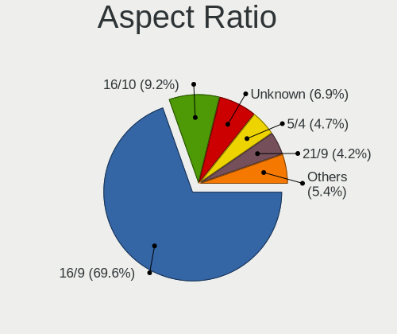
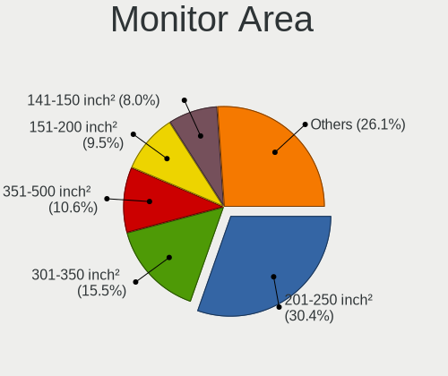
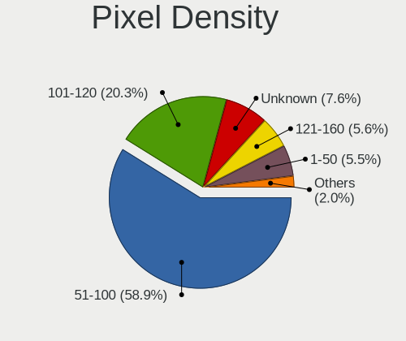
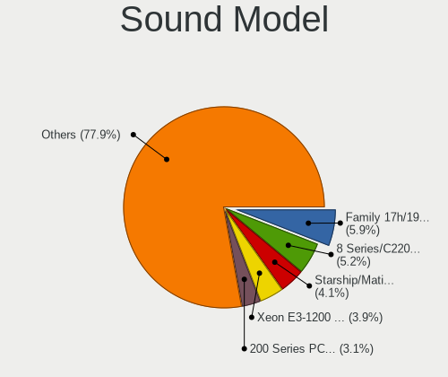
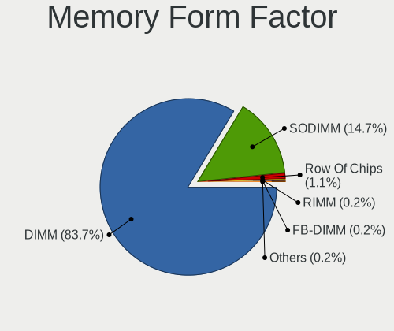

Debian 12 - Tested Hardware & Statistics (Desktops)
---------------------------------------------------

A project to collect tested hardware configurations for Debian 12.

Anyone can contribute to this report by the [hw-probe](https://github.com/linuxhw/hw-probe) tool:

    sudo -E hw-probe -all -upload

Please contribute! Especially if your hardware is rare.

Contents
--------

* [ Test Cases ](#test-cases)

* [ System ](#system)
  - [ Kernel                   ](#kernel)
  - [ Kernel Family            ](#kernel-family)
  - [ Kernel Major Ver.        ](#kernel-major-ver)
  - [ Arch                     ](#arch)
  - [ DE                       ](#de)
  - [ Display Server           ](#display-server)
  - [ Display Manager          ](#display-manager)
  - [ OS Lang                  ](#os-lang)
  - [ Boot Mode                ](#boot-mode)
  - [ Filesystem               ](#filesystem)
  - [ Part. scheme             ](#part-scheme)
  - [ Dual Boot with Linux/BSD ](#dual-boot-with-linuxbsd)
  - [ Dual Boot (Win)          ](#dual-boot-win)

* [ Board ](#board)
  - [ Vendor                   ](#vendor)
  - [ Model                    ](#model)
  - [ Model Family             ](#model-family)
  - [ MFG Year                 ](#mfg-year)
  - [ Form Factor              ](#form-factor)
  - [ Secure Boot              ](#secure-boot)
  - [ Coreboot                 ](#coreboot)
  - [ RAM Size                 ](#ram-size)
  - [ RAM Used                 ](#ram-used)
  - [ Total Drives             ](#total-drives)
  - [ Has CD-ROM               ](#has-cd-rom)
  - [ Has Ethernet             ](#has-ethernet)
  - [ Has WiFi                 ](#has-wifi)
  - [ Has Bluetooth            ](#has-bluetooth)

* [ Location ](#location)
  - [ Country                  ](#country)
  - [ City                     ](#city)

* [ Drives ](#drives)
  - [ Drive Vendor             ](#drive-vendor)
  - [ Drive Model              ](#drive-model)
  - [ HDD Vendor               ](#hdd-vendor)
  - [ SSD Vendor               ](#ssd-vendor)
  - [ Drive Kind               ](#drive-kind)
  - [ Drive Connector          ](#drive-connector)
  - [ Drive Size               ](#drive-size)
  - [ Space Total              ](#space-total)
  - [ Space Used               ](#space-used)
  - [ Malfunc. Drives          ](#malfunc-drives)
  - [ Malfunc. Drive Vendor    ](#malfunc-drive-vendor)
  - [ Malfunc. HDD Vendor      ](#malfunc-hdd-vendor)
  - [ Malfunc. Drive Kind      ](#malfunc-drive-kind)
  - [ Failed Drives            ](#failed-drives)
  - [ Failed Drive Vendor      ](#failed-drive-vendor)
  - [ Drive Status             ](#drive-status)

* [ Storage controller ](#storage-controller)
  - [ Storage Vendor           ](#storage-vendor)
  - [ Storage Model            ](#storage-model)
  - [ Storage Kind             ](#storage-kind)

* [ Processor ](#processor)
  - [ CPU Vendor               ](#cpu-vendor)
  - [ CPU Model                ](#cpu-model)
  - [ CPU Model Family         ](#cpu-model-family)
  - [ CPU Cores                ](#cpu-cores)
  - [ CPU Sockets              ](#cpu-sockets)
  - [ CPU Threads              ](#cpu-threads)
  - [ CPU Op-Modes             ](#cpu-op-modes)
  - [ CPU Microcode            ](#cpu-microcode)
  - [ CPU Microarch            ](#cpu-microarch)

* [ Graphics ](#graphics)
  - [ GPU Vendor               ](#gpu-vendor)
  - [ GPU Model                ](#gpu-model)
  - [ GPU Combo                ](#gpu-combo)
  - [ GPU Driver               ](#gpu-driver)
  - [ GPU Memory               ](#gpu-memory)

* [ Monitor ](#monitor)
  - [ Monitor Vendor           ](#monitor-vendor)
  - [ Monitor Model            ](#monitor-model)
  - [ Monitor Resolution       ](#monitor-resolution)
  - [ Monitor Diagonal         ](#monitor-diagonal)
  - [ Monitor Width            ](#monitor-width)
  - [ Aspect Ratio             ](#aspect-ratio)
  - [ Monitor Area             ](#monitor-area)
  - [ Pixel Density            ](#pixel-density)
  - [ Multiple Monitors        ](#multiple-monitors)

* [ Network ](#network)
  - [ Net Controller Vendor    ](#net-controller-vendor)
  - [ Net Controller Model     ](#net-controller-model)
  - [ Wireless Vendor          ](#wireless-vendor)
  - [ Wireless Model           ](#wireless-model)
  - [ Ethernet Vendor          ](#ethernet-vendor)
  - [ Ethernet Model           ](#ethernet-model)
  - [ Net Controller Kind      ](#net-controller-kind)
  - [ Used Controller          ](#used-controller)
  - [ NICs                     ](#nics)
  - [ IPv6                     ](#ipv6)

* [ Bluetooth ](#bluetooth)
  - [ Bluetooth Vendor         ](#bluetooth-vendor)
  - [ Bluetooth Model          ](#bluetooth-model)

* [ Sound ](#sound)
  - [ Sound Vendor             ](#sound-vendor)
  - [ Sound Model              ](#sound-model)

* [ Memory ](#memory)
  - [ Memory Vendor            ](#memory-vendor)
  - [ Memory Model             ](#memory-model)
  - [ Memory Kind              ](#memory-kind)
  - [ Memory Form Factor       ](#memory-form-factor)
  - [ Memory Size              ](#memory-size)
  - [ Memory Speed             ](#memory-speed)

* [ Printers & scanners ](#printers--scanners)
  - [ Printer Vendor           ](#printer-vendor)
  - [ Printer Model            ](#printer-model)
  - [ Scanner Vendor           ](#scanner-vendor)
  - [ Scanner Model            ](#scanner-model)

* [ Camera ](#camera)
  - [ Camera Vendor            ](#camera-vendor)
  - [ Camera Model             ](#camera-model)

* [ Security ](#security)
  - [ Fingerprint Vendor       ](#fingerprint-vendor)
  - [ Fingerprint Model        ](#fingerprint-model)
  - [ Chipcard Vendor          ](#chipcard-vendor)
  - [ Chipcard Model           ](#chipcard-model)

* [ Unsupported ](#unsupported)
  - [ Unsupported Devices      ](#unsupported-devices)
  - [ Unsupported Device Types ](#unsupported-device-types)

Test Cases
----------

Total: 505

| Vendor        | Model                       | Probe                                                      | Date         |
|---------------|-----------------------------|------------------------------------------------------------|--------------|
| ASRock        | B85M Pro4                   | [108dae1eae](https://linux-hardware.org/?probe=108dae1eae) | Aug 12, 2023 |
| CWWK          | CW-J6-6L                    | [8321dcc5ea](https://linux-hardware.org/?probe=8321dcc5ea) | Aug 12, 2023 |
| ASUSTek       | PRIME B660M-K D4            | [dad31fab00](https://linux-hardware.org/?probe=dad31fab00) | Aug 12, 2023 |
| ASUSTek       | ProArt X670E-CREATOR WIF... | [4f6d84a4dd](https://linux-hardware.org/?probe=4f6d84a4dd) | Aug 12, 2023 |
| MSI           | G33M                        | [65de454e8b](https://linux-hardware.org/?probe=65de454e8b) | Aug 11, 2023 |
| Dell          | 06X1TJ A00                  | [91ecb8253e](https://linux-hardware.org/?probe=91ecb8253e) | Aug 11, 2023 |
| ASUSTek       | ROG Maximus XII EXTREME     | [a0350a164c](https://linux-hardware.org/?probe=a0350a164c) | Aug 10, 2023 |
| Dell          | 0VXN67 A01                  | [4fbd39d860](https://linux-hardware.org/?probe=4fbd39d860) | Aug 10, 2023 |
| ASRock        | Z68 Pro3                    | [f949a6e2a5](https://linux-hardware.org/?probe=f949a6e2a5) | Aug 09, 2023 |
| ASUSTek       | Pro WS 565-ACE              | [3d9112e038](https://linux-hardware.org/?probe=3d9112e038) | Aug 09, 2023 |
| Unknown       | AB07H                       | [d0b6bc1fce](https://linux-hardware.org/?probe=d0b6bc1fce) | Aug 09, 2023 |
| ASUSTek       | B85M-G                      | [9fcf84ff7c](https://linux-hardware.org/?probe=9fcf84ff7c) | Aug 09, 2023 |
| Supermicro    | X8ST3                       | [13099babf6](https://linux-hardware.org/?probe=13099babf6) | Aug 09, 2023 |
| ASUSTek       | STRIX H270F GAMING          | [ab74b5c684](https://linux-hardware.org/?probe=ab74b5c684) | Aug 08, 2023 |
| ASUSTek       | STRIX H270F GAMING          | [85ffbedac4](https://linux-hardware.org/?probe=85ffbedac4) | Aug 08, 2023 |
| Gigabyte      | H81M-S2H                    | [f895d0afe3](https://linux-hardware.org/?probe=f895d0afe3) | Aug 07, 2023 |
| Acer          | Aspire TC-605               | [f3bac278d5](https://linux-hardware.org/?probe=f3bac278d5) | Aug 07, 2023 |
| ASRock        | B460M Pro4                  | [66f1fd8cc5](https://linux-hardware.org/?probe=66f1fd8cc5) | Aug 07, 2023 |
| Foxconn       | 2ADA                        | [17d44b6d2c](https://linux-hardware.org/?probe=17d44b6d2c) | Aug 06, 2023 |
| ASRock        | Q1900M                      | [51f69dffd5](https://linux-hardware.org/?probe=51f69dffd5) | Aug 06, 2023 |
| Lenovo        | 1036 NO DPK                 | [d039bb9d5c](https://linux-hardware.org/?probe=d039bb9d5c) | Aug 06, 2023 |
| Gigabyte      | B85M-D3H                    | [ed642341d8](https://linux-hardware.org/?probe=ed642341d8) | Aug 06, 2023 |
| MSI           | B450M MORTAR MAX            | [456ac6507d](https://linux-hardware.org/?probe=456ac6507d) | Aug 05, 2023 |
| Gigabyte      | GA-880GM-UD2H               | [6622cd2887](https://linux-hardware.org/?probe=6622cd2887) | Aug 05, 2023 |
| Shenzhen M... | HX90G                       | [04a083671d](https://linux-hardware.org/?probe=04a083671d) | Aug 05, 2023 |
| ASRockRack    | X470D4U                     | [3c7626751d](https://linux-hardware.org/?probe=3c7626751d) | Aug 04, 2023 |
| Acer          | Veriton M2632G V:1.0        | [b66051af86](https://linux-hardware.org/?probe=b66051af86) | Aug 04, 2023 |
| Gigabyte      | B85M-D3H                    | [5157c58f81](https://linux-hardware.org/?probe=5157c58f81) | Aug 04, 2023 |
| ASUSTek       | H81M-C                      | [cd16d74fc1](https://linux-hardware.org/?probe=cd16d74fc1) | Aug 04, 2023 |
| Dell          | 06X1TJ A00                  | [ac23fbd687](https://linux-hardware.org/?probe=ac23fbd687) | Aug 04, 2023 |
| ASUSTek       | P5K SE/EPU                  | [c125911c18](https://linux-hardware.org/?probe=c125911c18) | Aug 04, 2023 |
| ASUSTek       | M4A785T-M                   | [f297c8efa8](https://linux-hardware.org/?probe=f297c8efa8) | Aug 04, 2023 |
| Gigabyte      | B250M-DS3H-CF               | [701c63b20d](https://linux-hardware.org/?probe=701c63b20d) | Aug 04, 2023 |
| Lenovo        | 1036 NO DPK                 | [a3f6a98176](https://linux-hardware.org/?probe=a3f6a98176) | Aug 03, 2023 |
| Lenovo        | 1036 NO DPK                 | [3aa878541c](https://linux-hardware.org/?probe=3aa878541c) | Aug 03, 2023 |
| ASUSTek       | P8B75-M LX                  | [6d7ac5bfd2](https://linux-hardware.org/?probe=6d7ac5bfd2) | Aug 03, 2023 |
| Gigabyte      | B450M DS3H V2               | [909896213c](https://linux-hardware.org/?probe=909896213c) | Aug 02, 2023 |
| MSI           | MAG B650M MORTAR WIFI       | [fd259f2acd](https://linux-hardware.org/?probe=fd259f2acd) | Aug 02, 2023 |
| Gigabyte      | B85M-D3H                    | [4e092275e4](https://linux-hardware.org/?probe=4e092275e4) | Aug 02, 2023 |
| Dell          | 06X1TJ A00                  | [5f9df619f5](https://linux-hardware.org/?probe=5f9df619f5) | Aug 02, 2023 |
| ASUSTek       | Z170-A                      | [3367a6e149](https://linux-hardware.org/?probe=3367a6e149) | Aug 01, 2023 |
| Fujitsu       | D3543-A1 S26361-D3543-A1... | [30389578ca](https://linux-hardware.org/?probe=30389578ca) | Aug 01, 2023 |
| Unknown       | Unknown                     | [a15a3cfa70](https://linux-hardware.org/?probe=a15a3cfa70) | Jul 30, 2023 |
| Dell          | 0Y5DDC A00                  | [43624df7d4](https://linux-hardware.org/?probe=43624df7d4) | Jul 30, 2023 |
| MSI           | B250 PC MATE                | [9163341ff4](https://linux-hardware.org/?probe=9163341ff4) | Jul 30, 2023 |
| ASRock        | A620M-HDV/M.2+              | [ea91ff9db6](https://linux-hardware.org/?probe=ea91ff9db6) | Jul 28, 2023 |
| Lenovo        | MAHOBAY NO DPK              | [f591b4a83a](https://linux-hardware.org/?probe=f591b4a83a) | Jul 28, 2023 |
| Dell          | 05GD68 A00                  | [47759e14b4](https://linux-hardware.org/?probe=47759e14b4) | Jul 28, 2023 |
| Gigabyte      | B550M AORUS PRO AX          | [f53eed4658](https://linux-hardware.org/?probe=f53eed4658) | Jul 28, 2023 |
| Gigabyte      | A320M-H-CF                  | [2e2b9a12a6](https://linux-hardware.org/?probe=2e2b9a12a6) | Jul 28, 2023 |
| Gigabyte      | P55-UD3L                    | [82a3947c74](https://linux-hardware.org/?probe=82a3947c74) | Jul 28, 2023 |
| AZW           | MINI S 10                   | [3501ec2e9a](https://linux-hardware.org/?probe=3501ec2e9a) | Jul 28, 2023 |
| ASUSTek       | PRIME B350M-A               | [d52776a0a8](https://linux-hardware.org/?probe=d52776a0a8) | Jul 28, 2023 |
| Gigabyte      | H610M H DDR4                | [1950bcc818](https://linux-hardware.org/?probe=1950bcc818) | Jul 28, 2023 |
| ASRock        | H470M-HVS                   | [23183da982](https://linux-hardware.org/?probe=23183da982) | Jul 27, 2023 |
| ASRock        | H470M-HVS                   | [77d42f4b5c](https://linux-hardware.org/?probe=77d42f4b5c) | Jul 27, 2023 |
| ASRock        | H470M-HVS                   | [e8abbb213e](https://linux-hardware.org/?probe=e8abbb213e) | Jul 27, 2023 |
| ASRock        | H470M-HVS                   | [bb4812527c](https://linux-hardware.org/?probe=bb4812527c) | Jul 27, 2023 |
| ASRock        | H470M-HVS                   | [2b7085bd2b](https://linux-hardware.org/?probe=2b7085bd2b) | Jul 27, 2023 |
| MSI           | Z97A GAMING 7               | [cf2d32f045](https://linux-hardware.org/?probe=cf2d32f045) | Jul 27, 2023 |
| Intel         | X99H                        | [1e85498a86](https://linux-hardware.org/?probe=1e85498a86) | Jul 27, 2023 |
| ASRock        | H470M-HVS                   | [a375e21964](https://linux-hardware.org/?probe=a375e21964) | Jul 26, 2023 |
| ASRock        | H470M-HVS                   | [d0e6321772](https://linux-hardware.org/?probe=d0e6321772) | Jul 26, 2023 |
| ASRock        | H470M-HVS                   | [28ea1c85d1](https://linux-hardware.org/?probe=28ea1c85d1) | Jul 26, 2023 |
| ASRock        | H470M-HVS                   | [3fd18c9a77](https://linux-hardware.org/?probe=3fd18c9a77) | Jul 26, 2023 |
| ASRock        | H470M-HVS                   | [d974298840](https://linux-hardware.org/?probe=d974298840) | Jul 26, 2023 |
| ASRock        | H470M-HVS                   | [b06f493001](https://linux-hardware.org/?probe=b06f493001) | Jul 26, 2023 |
| ASRock        | H470M-HVS                   | [894bb319dc](https://linux-hardware.org/?probe=894bb319dc) | Jul 26, 2023 |
| ASRock        | H470M-HVS                   | [7ec6d64d2f](https://linux-hardware.org/?probe=7ec6d64d2f) | Jul 26, 2023 |
| ASRock        | H470M-HVS                   | [09662b0f5d](https://linux-hardware.org/?probe=09662b0f5d) | Jul 26, 2023 |
| ASRock        | H470M-HVS                   | [3c8721254c](https://linux-hardware.org/?probe=3c8721254c) | Jul 26, 2023 |
| ASRock        | H470M-HVS                   | [7dfa96789f](https://linux-hardware.org/?probe=7dfa96789f) | Jul 26, 2023 |
| ASRock        | H470M-HVS                   | [c538742db7](https://linux-hardware.org/?probe=c538742db7) | Jul 26, 2023 |
| ASRock        | H470M-HVS                   | [9da53986f9](https://linux-hardware.org/?probe=9da53986f9) | Jul 26, 2023 |
| ASRock        | H470M-HVS                   | [c950f7dbc1](https://linux-hardware.org/?probe=c950f7dbc1) | Jul 26, 2023 |
| ASRock        | H470M-HVS                   | [dcf4ead958](https://linux-hardware.org/?probe=dcf4ead958) | Jul 26, 2023 |
| Gigabyte      | A320M-S2H V2-CF             | [759b0f997f](https://linux-hardware.org/?probe=759b0f997f) | Jul 26, 2023 |
| Gigabyte      | A320M-S2H V2-CF             | [a1ef57fb8e](https://linux-hardware.org/?probe=a1ef57fb8e) | Jul 26, 2023 |
| ASRock        | A320M Pro4                  | [9ecdd1e4d3](https://linux-hardware.org/?probe=9ecdd1e4d3) | Jul 26, 2023 |
| Gigabyte      | A320M-S2H V2-CF             | [f45c4baaa3](https://linux-hardware.org/?probe=f45c4baaa3) | Jul 26, 2023 |
| Gigabyte      | A320M-S2H V2-CF             | [7abbda5ed3](https://linux-hardware.org/?probe=7abbda5ed3) | Jul 26, 2023 |
| Gigabyte      | A320M-S2H V2-CF             | [67036356d3](https://linux-hardware.org/?probe=67036356d3) | Jul 26, 2023 |
| Gigabyte      | A320M-S2H V2-CF             | [5a134aede2](https://linux-hardware.org/?probe=5a134aede2) | Jul 26, 2023 |
| Gigabyte      | A320M-S2H V2-CF             | [28c92b6f8d](https://linux-hardware.org/?probe=28c92b6f8d) | Jul 26, 2023 |
| MSI           | H110M PRO-VD                | [808dae186a](https://linux-hardware.org/?probe=808dae186a) | Jul 26, 2023 |
| MSI           | H110M PRO-VD                | [b45586c5cf](https://linux-hardware.org/?probe=b45586c5cf) | Jul 26, 2023 |
| Lenovo        | 1036 NO DPK                 | [725aae77c4](https://linux-hardware.org/?probe=725aae77c4) | Jul 26, 2023 |
| Gigabyte      | X570 GAMING X               | [f67be57cba](https://linux-hardware.org/?probe=f67be57cba) | Jul 26, 2023 |
| Gigabyte      | Z77X-UD3H                   | [b75ed54995](https://linux-hardware.org/?probe=b75ed54995) | Jul 25, 2023 |
| ASUSTek       | Pro WS X570-ACE             | [d60f3de4c7](https://linux-hardware.org/?probe=d60f3de4c7) | Jul 25, 2023 |
| MSI           | PRO B660M-A WIFI DDR4       | [bf88e1114e](https://linux-hardware.org/?probe=bf88e1114e) | Jul 25, 2023 |
| MSI           | PRO B660M-A WIFI DDR4       | [69b707119e](https://linux-hardware.org/?probe=69b707119e) | Jul 25, 2023 |
| Lenovo        | ThinkServer TS140           | [24b688cbfd](https://linux-hardware.org/?probe=24b688cbfd) | Jul 25, 2023 |
| Intel         | D34010WYK H14771-304        | [c5960175bc](https://linux-hardware.org/?probe=c5960175bc) | Jul 25, 2023 |
| MSI           | H110M PRO-VD                | [7076b096fd](https://linux-hardware.org/?probe=7076b096fd) | Jul 24, 2023 |
| Lenovo        | 1036 NO DPK                 | [15c9141aa3](https://linux-hardware.org/?probe=15c9141aa3) | Jul 24, 2023 |
| MSI           | B450-A PRO MAX              | [b54465e0da](https://linux-hardware.org/?probe=b54465e0da) | Jul 23, 2023 |
| ASUSTek       | PRIME B650M-A WIFI II       | [f2e2436cf1](https://linux-hardware.org/?probe=f2e2436cf1) | Jul 23, 2023 |
| Lenovo        | ThinkServer TS140           | [8c41263814](https://linux-hardware.org/?probe=8c41263814) | Jul 23, 2023 |
| ASUSTek       | ProArt X670E-CREATOR WIF... | [8dbf2477d3](https://linux-hardware.org/?probe=8dbf2477d3) | Jul 22, 2023 |
| ASUSTek       | ProArt X670E-CREATOR WIF... | [4bd62a58b8](https://linux-hardware.org/?probe=4bd62a58b8) | Jul 22, 2023 |
| ASUSTek       | P5Q-PRO                     | [cc299998bb](https://linux-hardware.org/?probe=cc299998bb) | Jul 20, 2023 |
| ASUSTek       | ROG CROSSHAIR VIII DARK ... | [cb0ad6375e](https://linux-hardware.org/?probe=cb0ad6375e) | Jul 20, 2023 |
| Unknown       | Unknown                     | [ce80e4d17f](https://linux-hardware.org/?probe=ce80e4d17f) | Jul 18, 2023 |
| ASUSTek       | H81M-K                      | [5facab887b](https://linux-hardware.org/?probe=5facab887b) | Jul 18, 2023 |
| ASUSTek       | P8H61-MX                    | [c68138ca5c](https://linux-hardware.org/?probe=c68138ca5c) | Jul 18, 2023 |
| ASUSTek       | B85M-E/BR                   | [c2ac257f6e](https://linux-hardware.org/?probe=c2ac257f6e) | Jul 18, 2023 |
| ASUSTek       | TUF Gaming Z590-PLUS WIF... | [a6c81d2b9e](https://linux-hardware.org/?probe=a6c81d2b9e) | Jul 18, 2023 |
| ASRockRack    | X470D4U                     | [9bd188ee9b](https://linux-hardware.org/?probe=9bd188ee9b) | Jul 18, 2023 |
| Gigabyte      | A520M S2H                   | [801b25d335](https://linux-hardware.org/?probe=801b25d335) | Jul 18, 2023 |
| Foxconn       | 2A8C                        | [539fb9855b](https://linux-hardware.org/?probe=539fb9855b) | Jul 18, 2023 |
| ASUSTek       | H81M-C                      | [d75cfffdca](https://linux-hardware.org/?probe=d75cfffdca) | Jul 17, 2023 |
| MSI           | 2A9C                        | [676f61f0c9](https://linux-hardware.org/?probe=676f61f0c9) | Jul 17, 2023 |
| ASUSTek       | B85M-G                      | [fc5b33ac00](https://linux-hardware.org/?probe=fc5b33ac00) | Jul 17, 2023 |
| MSI           | 2A9C                        | [87dd24dabe](https://linux-hardware.org/?probe=87dd24dabe) | Jul 17, 2023 |
| Unknown       | Unknown                     | [29ed3e238d](https://linux-hardware.org/?probe=29ed3e238d) | Jul 16, 2023 |
| Dell          | Dimension 4500S             | [f10ee5f25d](https://linux-hardware.org/?probe=f10ee5f25d) | Jul 16, 2023 |
| MSI           | MPG B550 GAMING EDGE WIF... | [151797320d](https://linux-hardware.org/?probe=151797320d) | Jul 16, 2023 |
| MSI           | MPG B550 GAMING EDGE WIF... | [e760f4570f](https://linux-hardware.org/?probe=e760f4570f) | Jul 16, 2023 |
| Google        | Guado                       | [4216aa46a6](https://linux-hardware.org/?probe=4216aa46a6) | Jul 16, 2023 |
| Google        | Guado                       | [9a3e217e78](https://linux-hardware.org/?probe=9a3e217e78) | Jul 15, 2023 |
| Gigabyte      | X79-UD3                     | [ce378ce93b](https://linux-hardware.org/?probe=ce378ce93b) | Jul 15, 2023 |
| Gigabyte      | Z490M GAMING X              | [fc51c8fd14](https://linux-hardware.org/?probe=fc51c8fd14) | Jul 15, 2023 |
| Gigabyte      | Z490M GAMING X              | [1222689443](https://linux-hardware.org/?probe=1222689443) | Jul 15, 2023 |
| Biostar       | FX9830M                     | [db3c95d18d](https://linux-hardware.org/?probe=db3c95d18d) | Jul 15, 2023 |
| Huanan        | X99-F8 GAMING V2.0          | [de6db92e0a](https://linux-hardware.org/?probe=de6db92e0a) | Jul 14, 2023 |
| Dell          | 0NDYHG A01                  | [f3723937e1](https://linux-hardware.org/?probe=f3723937e1) | Jul 14, 2023 |
| MSI           | MAG B650 TOMAHAWK WIFI      | [9404c94281](https://linux-hardware.org/?probe=9404c94281) | Jul 14, 2023 |
| Unknown       | Unknown                     | [a63f044df1](https://linux-hardware.org/?probe=a63f044df1) | Jul 14, 2023 |
| MSI           | B450M PRO-M2 MAX            | [dc3059f5b9](https://linux-hardware.org/?probe=dc3059f5b9) | Jul 14, 2023 |
| ASUSTek       | H110M-R                     | [b52ebf4fc9](https://linux-hardware.org/?probe=b52ebf4fc9) | Jul 13, 2023 |
| ASUSTek       | PRIME Z390-A                | [2551062f30](https://linux-hardware.org/?probe=2551062f30) | Jul 13, 2023 |
| ASUSTek       | P10S-I Series               | [109d52a9be](https://linux-hardware.org/?probe=109d52a9be) | Jul 13, 2023 |
| HP            | 8643 SMVB                   | [1d6544e56b](https://linux-hardware.org/?probe=1d6544e56b) | Jul 12, 2023 |
| Lenovo        | SHARKBAY NOK                | [66c5696981](https://linux-hardware.org/?probe=66c5696981) | Jul 12, 2023 |
| Gigabyte      | X570 AORUS PRO              | [e49876314d](https://linux-hardware.org/?probe=e49876314d) | Jul 11, 2023 |
| ASRock        | 4Core1600-GLAN              | [3e733151f2](https://linux-hardware.org/?probe=3e733151f2) | Jul 11, 2023 |
| Foxconn       | G33M03                      | [487435e6e7](https://linux-hardware.org/?probe=487435e6e7) | Jul 11, 2023 |
| ASUSTek       | Z170-A                      | [cbcf43d3dd](https://linux-hardware.org/?probe=cbcf43d3dd) | Jul 11, 2023 |
| ASUSTek       | CROSSHAIR VI HERO           | [84088522ca](https://linux-hardware.org/?probe=84088522ca) | Jul 11, 2023 |
| Fujitsu       | D3220-A1 S26361-D3220-A1    | [0ae95a7985](https://linux-hardware.org/?probe=0ae95a7985) | Jul 10, 2023 |
| Lenovo        | SHARKBAY SDK0E50510 WIN     | [73b13fd5eb](https://linux-hardware.org/?probe=73b13fd5eb) | Jul 10, 2023 |
| Loongson      | LS3A5000-7A2000-1w-EVB-V... | [97348ef480](https://linux-hardware.org/?probe=97348ef480) | Jul 10, 2023 |
| ASUSTek       | H81M-K                      | [6593286092](https://linux-hardware.org/?probe=6593286092) | Jul 10, 2023 |
| ASUSTek       | Maximus VI IMPACT           | [ce682089cb](https://linux-hardware.org/?probe=ce682089cb) | Jul 10, 2023 |
| HP            | 2B38                        | [94e5178425](https://linux-hardware.org/?probe=94e5178425) | Jul 10, 2023 |
| Gigabyte      | B650 GAMING X AX            | [64e129ec04](https://linux-hardware.org/?probe=64e129ec04) | Jul 09, 2023 |
| ASUSTek       | ROG CROSSHAIR VIII DARK ... | [1e27d93bb4](https://linux-hardware.org/?probe=1e27d93bb4) | Jul 09, 2023 |
| Dell          | 0V8WGR A00                  | [89e81df1b9](https://linux-hardware.org/?probe=89e81df1b9) | Jul 08, 2023 |
| Dell          | 0V8WGR A00                  | [0eaaaced27](https://linux-hardware.org/?probe=0eaaaced27) | Jul 08, 2023 |
| Dell          | 0V8WGR A00                  | [a208acb623](https://linux-hardware.org/?probe=a208acb623) | Jul 08, 2023 |
| Dell          | 096JG8 A01                  | [3bf9689ee5](https://linux-hardware.org/?probe=3bf9689ee5) | Jul 08, 2023 |
| Dell          | 0CU409                      | [196ea8332b](https://linux-hardware.org/?probe=196ea8332b) | Jul 08, 2023 |
| ASUSTek       | CROSSHAIR VI HERO           | [59c2893e1a](https://linux-hardware.org/?probe=59c2893e1a) | Jul 08, 2023 |
| ASRock        | B550 Taichi Razer Editio... | [c5578cae9e](https://linux-hardware.org/?probe=c5578cae9e) | Jul 07, 2023 |
| HP            | 2B4B                        | [9b9e0f8037](https://linux-hardware.org/?probe=9b9e0f8037) | Jul 07, 2023 |
| ASUSTek       | PRIME A320M-K               | [e9709930a9](https://linux-hardware.org/?probe=e9709930a9) | Jul 07, 2023 |
| HP            | 2B4B                        | [9198ca9615](https://linux-hardware.org/?probe=9198ca9615) | Jul 07, 2023 |
| MSI           | B250M PRO-VDH               | [5b085b711b](https://linux-hardware.org/?probe=5b085b711b) | Jul 06, 2023 |
| ASUSTek       | ROG CROSSHAIR VIII DARK ... | [f99a1ccf8f](https://linux-hardware.org/?probe=f99a1ccf8f) | Jul 06, 2023 |
| HP            | 8860 A                      | [5bc7810c4b](https://linux-hardware.org/?probe=5bc7810c4b) | Jul 06, 2023 |
| ASUSTek       | P6X58D PREMIUM              | [7e3ad6f5a7](https://linux-hardware.org/?probe=7e3ad6f5a7) | Jul 05, 2023 |
| Gigabyte      | MZBSWAP-00                  | [4e61ff196e](https://linux-hardware.org/?probe=4e61ff196e) | Jul 05, 2023 |
| ASRock        | 990FX Killer                | [696e4c24d1](https://linux-hardware.org/?probe=696e4c24d1) | Jul 05, 2023 |
| ASUSTek       | ROG CROSSHAIR VIII DARK ... | [3707ca3e1d](https://linux-hardware.org/?probe=3707ca3e1d) | Jul 05, 2023 |
| ASUSTek       | P6X58D PREMIUM              | [8c224974f3](https://linux-hardware.org/?probe=8c224974f3) | Jul 04, 2023 |
| MSI           | Z170A GAMING M3             | [ebd5d13804](https://linux-hardware.org/?probe=ebd5d13804) | Jul 04, 2023 |
| iEi           | SAT3 V1.03                  | [fa5767b5f5](https://linux-hardware.org/?probe=fa5767b5f5) | Jul 03, 2023 |
| HP            | 0AECh D                     | [bd8035963a](https://linux-hardware.org/?probe=bd8035963a) | Jul 03, 2023 |
| Dell          | 0D24M8 A01                  | [8ad2509708](https://linux-hardware.org/?probe=8ad2509708) | Jul 03, 2023 |
| ASUSTek       | CROSSHAIR VI HERO           | [cac603cdf3](https://linux-hardware.org/?probe=cac603cdf3) | Jul 03, 2023 |
| Fujitsu       | D3162-A1 S26361-D3162-A1    | [5f6fc07aaa](https://linux-hardware.org/?probe=5f6fc07aaa) | Jul 03, 2023 |
| Unknown       | AB07H                       | [868ad2b334](https://linux-hardware.org/?probe=868ad2b334) | Jul 03, 2023 |
| Shenzhen M... | F6BFC                       | [61bc4ee589](https://linux-hardware.org/?probe=61bc4ee589) | Jul 02, 2023 |
| ASUSTek       | P6X58D PREMIUM              | [12a82e799d](https://linux-hardware.org/?probe=12a82e799d) | Jul 01, 2023 |
| MSI           | Z490-A PRO                  | [eb4b65c767](https://linux-hardware.org/?probe=eb4b65c767) | Jul 01, 2023 |
| Supermicro    | X8ST3                       | [91e094e5c8](https://linux-hardware.org/?probe=91e094e5c8) | Jul 01, 2023 |
| Supermicro    | X8ST3                       | [f1eddf9437](https://linux-hardware.org/?probe=f1eddf9437) | Jul 01, 2023 |
| ASRock        | A320M-HD                    | [1df7c65f40](https://linux-hardware.org/?probe=1df7c65f40) | Jul 01, 2023 |
| Gigabyte      | Z77X-UD5H                   | [eea1d9623c](https://linux-hardware.org/?probe=eea1d9623c) | Jun 30, 2023 |
| ASUSTek       | P6X58D PREMIUM              | [b2d81d6e67](https://linux-hardware.org/?probe=b2d81d6e67) | Jun 30, 2023 |
| Gigabyte      | H55M-UD2H                   | [befac7b8de](https://linux-hardware.org/?probe=befac7b8de) | Jun 30, 2023 |
| ASRock        | Z68 Pro3 Gen3               | [9fc143ab80](https://linux-hardware.org/?probe=9fc143ab80) | Jun 30, 2023 |
| ASRock        | G31M-GS                     | [3bd67e0f9f](https://linux-hardware.org/?probe=3bd67e0f9f) | Jun 30, 2023 |
| ASUSTek       | P8Z68-V PRO                 | [a3de72d73c](https://linux-hardware.org/?probe=a3de72d73c) | Jun 29, 2023 |
| Dell          | 0PU052                      | [b4fde65c68](https://linux-hardware.org/?probe=b4fde65c68) | Jun 29, 2023 |
| ASUSTek       | TUF Gaming Z690-PLUS WIF... | [a996f391dc](https://linux-hardware.org/?probe=a996f391dc) | Jun 29, 2023 |
| ASUSTek       | PRIME B550M-A               | [d6823d5ec7](https://linux-hardware.org/?probe=d6823d5ec7) | Jun 28, 2023 |
| HP            | 21B4 A01                    | [50656fb7ec](https://linux-hardware.org/?probe=50656fb7ec) | Jun 28, 2023 |
| HP            | 21B4 A01                    | [4d9322819d](https://linux-hardware.org/?probe=4d9322819d) | Jun 28, 2023 |
| OEM           | Unknown                     | [0448bbee67](https://linux-hardware.org/?probe=0448bbee67) | Jun 28, 2023 |
| ASUSTek       | X99-WS/IPMI                 | [fff4bc4f46](https://linux-hardware.org/?probe=fff4bc4f46) | Jun 28, 2023 |
| ASUSTek       | PRIME A320I-K               | [bc9d733b89](https://linux-hardware.org/?probe=bc9d733b89) | Jun 27, 2023 |
| Lenovo        | 1048 SDK0K17763 WIN 1801... | [d903758323](https://linux-hardware.org/?probe=d903758323) | Jun 27, 2023 |
| Dell          | 0PU052                      | [34eaa7185d](https://linux-hardware.org/?probe=34eaa7185d) | Jun 26, 2023 |
| ASUSTek       | M4A78T-E                    | [7b60ea1445](https://linux-hardware.org/?probe=7b60ea1445) | Jun 26, 2023 |
| Gigabyte      | H310MD2P-CF                 | [1ad319cfc7](https://linux-hardware.org/?probe=1ad319cfc7) | Jun 26, 2023 |
| BESSTAR Te... | B550                        | [87962635d3](https://linux-hardware.org/?probe=87962635d3) | Jun 26, 2023 |
| Gigabyte      | B75M-D3H                    | [aeb1c6b8d2](https://linux-hardware.org/?probe=aeb1c6b8d2) | Jun 26, 2023 |
| ASUSTek       | ROG STRIX B760-F GAMING ... | [117bfb7088](https://linux-hardware.org/?probe=117bfb7088) | Jun 25, 2023 |
| JINGSHA       | Unknown                     | [2ae6ac9599](https://linux-hardware.org/?probe=2ae6ac9599) | Jun 25, 2023 |
| Biostar       | X370GTN                     | [80b2b1d180](https://linux-hardware.org/?probe=80b2b1d180) | Jun 25, 2023 |
| Intel         | H55                         | [993c041483](https://linux-hardware.org/?probe=993c041483) | Jun 25, 2023 |
| Gigabyte      | EP45C-DS3R                  | [655d9d950d](https://linux-hardware.org/?probe=655d9d950d) | Jun 24, 2023 |
| ASUSTek       | K30BF_M32BF                 | [46a7aaf9f1](https://linux-hardware.org/?probe=46a7aaf9f1) | Jun 23, 2023 |
| Foxconn       | G31MXP FAB:1.1              | [9ed9153958](https://linux-hardware.org/?probe=9ed9153958) | Jun 23, 2023 |
| Foxconn       | nT-iBT18/nT-iBT19/nT-iBT... | [51b5eb0fa2](https://linux-hardware.org/?probe=51b5eb0fa2) | Jun 23, 2023 |
| ASUSTek       | K30BF_M32BF                 | [655b20a34b](https://linux-hardware.org/?probe=655b20a34b) | Jun 23, 2023 |
| ASRock        | FM2A58M-VG3+ R2.0           | [9ab87d56a7](https://linux-hardware.org/?probe=9ab87d56a7) | Jun 22, 2023 |
| Acer          | Aspire X1700                | [aac17ef2f2](https://linux-hardware.org/?probe=aac17ef2f2) | Jun 22, 2023 |
| AMI           | Intel                       | [1a4a632d56](https://linux-hardware.org/?probe=1a4a632d56) | Jun 22, 2023 |
| ASUSTek       | ROG CROSSHAIR VIII DARK ... | [abbb1b897d](https://linux-hardware.org/?probe=abbb1b897d) | Jun 22, 2023 |
| ASRock        | NUC-TGL                     | [6dcb1eb43d](https://linux-hardware.org/?probe=6dcb1eb43d) | Jun 22, 2023 |
| ASRock        | X670E PG Lightning          | [b8e19a16f9](https://linux-hardware.org/?probe=b8e19a16f9) | Jun 22, 2023 |
| ASUSTek       | TUF Gaming X570-PLUS        | [7117d51b53](https://linux-hardware.org/?probe=7117d51b53) | Jun 21, 2023 |
| Gigabyte      | B550M DS3H                  | [2e32510f57](https://linux-hardware.org/?probe=2e32510f57) | Jun 21, 2023 |
| MSI           | H110M PRO-D                 | [b652abc634](https://linux-hardware.org/?probe=b652abc634) | Jun 21, 2023 |
| HP            | 1588h                       | [abe5412cf6](https://linux-hardware.org/?probe=abe5412cf6) | Jun 21, 2023 |
| HP            | 1588h                       | [f08e230cd3](https://linux-hardware.org/?probe=f08e230cd3) | Jun 21, 2023 |
| ASRock        | B760 Pro RS/D4              | [bf19dd1c4b](https://linux-hardware.org/?probe=bf19dd1c4b) | Jun 20, 2023 |
| ASUSTek       | PRIME H310M-K               | [1742a525de](https://linux-hardware.org/?probe=1742a525de) | Jun 20, 2023 |
| ASUSTek       | PRIME H310M-K               | [cfc9cd338e](https://linux-hardware.org/?probe=cfc9cd338e) | Jun 20, 2023 |
| Dell          | 0RW203                      | [6872d8e6c5](https://linux-hardware.org/?probe=6872d8e6c5) | Jun 20, 2023 |
| ASUSTek       | P8H67-M                     | [4c2f50a608](https://linux-hardware.org/?probe=4c2f50a608) | Jun 19, 2023 |
| MSI           | B550-A PRO                  | [b0f066ab7e](https://linux-hardware.org/?probe=b0f066ab7e) | Jun 18, 2023 |
| Intel         | H81                         | [5cda43eb30](https://linux-hardware.org/?probe=5cda43eb30) | Jun 18, 2023 |
| Gigabyte      | B550M DS3H                  | [e7fdb650cd](https://linux-hardware.org/?probe=e7fdb650cd) | Jun 18, 2023 |
| ASUSTek       | P8H61-M LX                  | [fe3b7abf1d](https://linux-hardware.org/?probe=fe3b7abf1d) | Jun 17, 2023 |
| HP            | 2B38                        | [b84e03e083](https://linux-hardware.org/?probe=b84e03e083) | Jun 17, 2023 |
| ASUSTek       | P5K Premium                 | [dddb2b8bdf](https://linux-hardware.org/?probe=dddb2b8bdf) | Jun 17, 2023 |
| ASRock        | B760 Pro RS/D4              | [6767dd6968](https://linux-hardware.org/?probe=6767dd6968) | Jun 16, 2023 |
| ASUSTek       | PRIME B450M-A               | [91787f8dfb](https://linux-hardware.org/?probe=91787f8dfb) | Jun 15, 2023 |
| ASUSTek       | M4A78T-E                    | [5ec4b74af2](https://linux-hardware.org/?probe=5ec4b74af2) | Jun 15, 2023 |
| Gigabyte      | GA-M56S-S3                  | [a708d51992](https://linux-hardware.org/?probe=a708d51992) | Jun 15, 2023 |
| HP            | 2820h                       | [77b54a0343](https://linux-hardware.org/?probe=77b54a0343) | Jun 14, 2023 |
| HP            | 2820h                       | [40e65d7a30](https://linux-hardware.org/?probe=40e65d7a30) | Jun 14, 2023 |
| Intel         | DG41TY AAE47335-203         | [4f1d844d48](https://linux-hardware.org/?probe=4f1d844d48) | Jun 14, 2023 |
| Lenovo        | ThinkCentre M55p 8808D8U    | [3117d89b20](https://linux-hardware.org/?probe=3117d89b20) | Jun 14, 2023 |
| Lenovo        | ThinkCentre M55p 8808D8U    | [3feaf0bd19](https://linux-hardware.org/?probe=3feaf0bd19) | Jun 14, 2023 |
| Lenovo        | ThinkCentre M55p 8808D8U    | [5fc5be3367](https://linux-hardware.org/?probe=5fc5be3367) | Jun 14, 2023 |
| Lenovo        | ThinkCentre M55p 8808D8U    | [aba284328c](https://linux-hardware.org/?probe=aba284328c) | Jun 14, 2023 |
| Lenovo        | ThinkCentre M55p 8808D8U    | [b899120507](https://linux-hardware.org/?probe=b899120507) | Jun 14, 2023 |
| ASUSTek       | ROG CROSSHAIR VIII DARK ... | [051cebacd1](https://linux-hardware.org/?probe=051cebacd1) | Jun 14, 2023 |
| Lenovo        | ThinkCentre M55p 8808D8U    | [221a4431e2](https://linux-hardware.org/?probe=221a4431e2) | Jun 13, 2023 |
| Lenovo        | ThinkCentre M55p 8808D8U    | [85abf9e475](https://linux-hardware.org/?probe=85abf9e475) | Jun 13, 2023 |
| Lenovo        | ThinkCentre M55p 8808D8U    | [40df819ebb](https://linux-hardware.org/?probe=40df819ebb) | Jun 13, 2023 |
| Lenovo        | ThinkCentre M55p 8808D8U    | [9ed186ba56](https://linux-hardware.org/?probe=9ed186ba56) | Jun 13, 2023 |
| Lenovo        | ThinkCentre M55p 8808D8U    | [2a4d82175c](https://linux-hardware.org/?probe=2a4d82175c) | Jun 13, 2023 |
| Lenovo        | ThinkCentre M55p 8808D8U    | [1df32db310](https://linux-hardware.org/?probe=1df32db310) | Jun 13, 2023 |
| Lenovo        | ThinkCentre M55p 8808D8U    | [9949220d98](https://linux-hardware.org/?probe=9949220d98) | Jun 13, 2023 |
| Lenovo        | ThinkCentre M55p 8808D8U    | [d801927769](https://linux-hardware.org/?probe=d801927769) | Jun 13, 2023 |
| Shuttle       | FM10 V10                    | [f1396e2cce](https://linux-hardware.org/?probe=f1396e2cce) | Jun 13, 2023 |
| Gigabyte      | B550I AORUS PRO AX          | [d85ad203ff](https://linux-hardware.org/?probe=d85ad203ff) | Jun 13, 2023 |
| Gigabyte      | H61M-DS2                    | [06c6c417c9](https://linux-hardware.org/?probe=06c6c417c9) | Jun 13, 2023 |
| ECS           | G31T-M9                     | [ba2a738c96](https://linux-hardware.org/?probe=ba2a738c96) | Jun 13, 2023 |
| MSI           | Z270 TOMAHAWK ARCTIC        | [86ab821b84](https://linux-hardware.org/?probe=86ab821b84) | Jun 13, 2023 |
| Intel         | JSL MRD                     | [8943f697bc](https://linux-hardware.org/?probe=8943f697bc) | Jun 13, 2023 |
| ASUSTek       | PRIME B365M-K               | [dad1ea59a4](https://linux-hardware.org/?probe=dad1ea59a4) | Jun 12, 2023 |
| ASRock        | H310CM-HDV                  | [a810b267ef](https://linux-hardware.org/?probe=a810b267ef) | Jun 12, 2023 |
| ASUSTek       | PRIME B650M-A AX            | [f39a1874f7](https://linux-hardware.org/?probe=f39a1874f7) | Jun 12, 2023 |
| ASUSTek       | A68HM-PLUS                  | [6b1f9dec93](https://linux-hardware.org/?probe=6b1f9dec93) | Jun 11, 2023 |
| ASUSTek       | H110M-A/M.2                 | [f30be06897](https://linux-hardware.org/?probe=f30be06897) | Jun 11, 2023 |
| Gigabyte      | 990FXA-UD3                  | [756a317dd6](https://linux-hardware.org/?probe=756a317dd6) | Jun 11, 2023 |
| MSI           | MPG X570 GAMING PLUS        | [0aeb6a400a](https://linux-hardware.org/?probe=0aeb6a400a) | Jun 11, 2023 |
| ASUSTek       | P7H55D-M PRO                | [6049b3d69d](https://linux-hardware.org/?probe=6049b3d69d) | Jun 10, 2023 |
| MSI           | MAG B760 TOMAHAWK WIFI      | [88955e82f2](https://linux-hardware.org/?probe=88955e82f2) | Jun 10, 2023 |
| ECS           | G31T-M9                     | [d8ca98b733](https://linux-hardware.org/?probe=d8ca98b733) | Jun 09, 2023 |
| Gigabyte      | B450M S2H V2                | [fb883c82bc](https://linux-hardware.org/?probe=fb883c82bc) | Jun 09, 2023 |
| Gigabyte      | B450 AORUS ELITE            | [b2c39972c2](https://linux-hardware.org/?probe=b2c39972c2) | Jun 09, 2023 |
| Gigabyte      | B450M H                     | [e54b5ce7da](https://linux-hardware.org/?probe=e54b5ce7da) | Jun 09, 2023 |
| Gigabyte      | X570 GAMING X               | [576a624a1b](https://linux-hardware.org/?probe=576a624a1b) | Jun 09, 2023 |
| ASUSTek       | M4A78T-E                    | [fa22309a62](https://linux-hardware.org/?probe=fa22309a62) | Jun 08, 2023 |
| Gigabyte      | GA-M56S-S3                  | [b2c6247a0e](https://linux-hardware.org/?probe=b2c6247a0e) | Jun 07, 2023 |
| Gigabyte      | M68MT-S2                    | [2ff7b71aed](https://linux-hardware.org/?probe=2ff7b71aed) | Jun 06, 2023 |
| Gigabyte      | H61M-DS2                    | [10ecbb2117](https://linux-hardware.org/?probe=10ecbb2117) | Jun 06, 2023 |
| ECS           | G31T-M9                     | [8bb444bdd6](https://linux-hardware.org/?probe=8bb444bdd6) | Jun 05, 2023 |
| Gigabyte      | M68MT-S2                    | [2ec944c5d0](https://linux-hardware.org/?probe=2ec944c5d0) | Jun 05, 2023 |
| Gigabyte      | GA-M56S-S3                  | [8896a460d4](https://linux-hardware.org/?probe=8896a460d4) | Jun 05, 2023 |
| Gigabyte      | M68MT-S2                    | [d392dff6bb](https://linux-hardware.org/?probe=d392dff6bb) | Jun 05, 2023 |
| ECS           | G31T-M9                     | [630360ab38](https://linux-hardware.org/?probe=630360ab38) | Jun 05, 2023 |
| Gigabyte      | M68MT-S2                    | [991c5472ac](https://linux-hardware.org/?probe=991c5472ac) | Jun 05, 2023 |
| ASUSTek       | PRIME H310M-R R2.0          | [5387bcbf7d](https://linux-hardware.org/?probe=5387bcbf7d) | Jun 03, 2023 |
| ASUSTek       | PRIME H310M-R R2.0          | [881df8f45c](https://linux-hardware.org/?probe=881df8f45c) | Jun 03, 2023 |
| ASUSTek       | PRIME H310M-R R2.0          | [0dd3be3300](https://linux-hardware.org/?probe=0dd3be3300) | Jun 03, 2023 |
| HC Technol... | HCAR357-NR                  | [58f698b10a](https://linux-hardware.org/?probe=58f698b10a) | Jun 02, 2023 |
| MSI           | G31TM-P21                   | [964377db0b](https://linux-hardware.org/?probe=964377db0b) | Jun 02, 2023 |
| ASUSTek       | PRIME B450M-K               | [853bd25ca5](https://linux-hardware.org/?probe=853bd25ca5) | Jun 02, 2023 |
| ASUSTek       | PRIME B450M-K               | [3a9fb692f1](https://linux-hardware.org/?probe=3a9fb692f1) | Jun 02, 2023 |
| ASUSTek       | PRIME B450M-K               | [9b549fe65a](https://linux-hardware.org/?probe=9b549fe65a) | Jun 02, 2023 |
| ASUSTek       | PRIME B450M-K               | [db685837d0](https://linux-hardware.org/?probe=db685837d0) | Jun 02, 2023 |
| ASUSTek       | PRIME B450M-K               | [968b38e0b9](https://linux-hardware.org/?probe=968b38e0b9) | Jun 02, 2023 |
| ASUSTek       | PRIME B450M-K               | [c9a04d8da0](https://linux-hardware.org/?probe=c9a04d8da0) | Jun 02, 2023 |
| ASUSTek       | PRIME B450M-K               | [238931757a](https://linux-hardware.org/?probe=238931757a) | Jun 02, 2023 |
| ASUSTek       | PRIME B450M-K               | [e190e991a6](https://linux-hardware.org/?probe=e190e991a6) | Jun 02, 2023 |
| ASUSTek       | PRIME B450M-K               | [0816e77499](https://linux-hardware.org/?probe=0816e77499) | Jun 02, 2023 |
| ASUSTek       | PRIME B450M-K               | [ff143ac918](https://linux-hardware.org/?probe=ff143ac918) | Jun 02, 2023 |
| Lenovo        | SHARKBAY SDK0E50510 WIN     | [07e5342fb8](https://linux-hardware.org/?probe=07e5342fb8) | Jun 02, 2023 |
| Gigabyte      | H61M-DS2                    | [f3b666f725](https://linux-hardware.org/?probe=f3b666f725) | Jun 01, 2023 |
| Gigabyte      | H61M-DS2                    | [1cf7ec0aa5](https://linux-hardware.org/?probe=1cf7ec0aa5) | Jun 01, 2023 |
| Gigabyte      | H61M-DS2                    | [7f9d81bd57](https://linux-hardware.org/?probe=7f9d81bd57) | Jun 01, 2023 |
| ASRock        | H110M-HDV R3.0              | [670044aef5](https://linux-hardware.org/?probe=670044aef5) | May 31, 2023 |
| ECS           | G31T-M9                     | [f227323587](https://linux-hardware.org/?probe=f227323587) | May 31, 2023 |
| Gigabyte      | M68MT-S2                    | [c56271ea6a](https://linux-hardware.org/?probe=c56271ea6a) | May 30, 2023 |
| Gigabyte      | M68MT-S2                    | [a0ffb7fd40](https://linux-hardware.org/?probe=a0ffb7fd40) | May 30, 2023 |
| Gigabyte      | H61M-S2PV                   | [446d026ac1](https://linux-hardware.org/?probe=446d026ac1) | May 30, 2023 |
| Gigabyte      | M68MT-S2                    | [80c2e03e4e](https://linux-hardware.org/?probe=80c2e03e4e) | May 29, 2023 |
| ECS           | G31T-M9                     | [8f4cd5b132](https://linux-hardware.org/?probe=8f4cd5b132) | May 29, 2023 |
| Gigabyte      | M68MT-S2                    | [ffe8469edc](https://linux-hardware.org/?probe=ffe8469edc) | May 29, 2023 |
| Gigabyte      | GA-M56S-S3                  | [e9f274ad89](https://linux-hardware.org/?probe=e9f274ad89) | May 29, 2023 |
| Gigabyte      | M68MT-S2                    | [62a5559050](https://linux-hardware.org/?probe=62a5559050) | May 29, 2023 |
| Gigabyte      | GA-M56S-S3                  | [a9c147d701](https://linux-hardware.org/?probe=a9c147d701) | May 29, 2023 |
| ASRock        | J4105-ITX                   | [570bc894da](https://linux-hardware.org/?probe=570bc894da) | May 29, 2023 |
| ASUSTek       | TUF Gaming B550-PLUS        | [9e0fc265de](https://linux-hardware.org/?probe=9e0fc265de) | May 29, 2023 |
| Gigabyte      | Z690 AERO G                 | [5d4d7c7ef4](https://linux-hardware.org/?probe=5d4d7c7ef4) | May 27, 2023 |
| Gigabyte      | H81M-S2V                    | [bcdfc5a2bf](https://linux-hardware.org/?probe=bcdfc5a2bf) | May 27, 2023 |
| Gigabyte      | H81M-S2V                    | [68cb8bdf49](https://linux-hardware.org/?probe=68cb8bdf49) | May 27, 2023 |
| Biostar       | A10N-8800E                  | [6b8c135c5d](https://linux-hardware.org/?probe=6b8c135c5d) | May 27, 2023 |
| ASRock        | B450 Gaming-ITX/ac          | [4862d28e3f](https://linux-hardware.org/?probe=4862d28e3f) | May 26, 2023 |
| ASUSTek       | B85M-G                      | [92836191e9](https://linux-hardware.org/?probe=92836191e9) | May 26, 2023 |
| ASUSTek       | B85M-G                      | [0d449702e3](https://linux-hardware.org/?probe=0d449702e3) | May 26, 2023 |
| ASUSTek       | B85M-G                      | [a5fbe0c1ba](https://linux-hardware.org/?probe=a5fbe0c1ba) | May 26, 2023 |
| ASUSTek       | B85M-G                      | [f9fd99a8b7](https://linux-hardware.org/?probe=f9fd99a8b7) | May 26, 2023 |
| ASUSTek       | B85M-G                      | [6c87853f8c](https://linux-hardware.org/?probe=6c87853f8c) | May 26, 2023 |
| ASUSTek       | H81M-C                      | [138348e6eb](https://linux-hardware.org/?probe=138348e6eb) | May 26, 2023 |
| ASUSTek       | B85M-G                      | [388eed2f8e](https://linux-hardware.org/?probe=388eed2f8e) | May 26, 2023 |
| ASUSTek       | B85M-G                      | [1bc02afebc](https://linux-hardware.org/?probe=1bc02afebc) | May 26, 2023 |
| ASUSTek       | B85M-G                      | [485617123a](https://linux-hardware.org/?probe=485617123a) | May 26, 2023 |
| ASUSTek       | B85M-G                      | [d1933e40f4](https://linux-hardware.org/?probe=d1933e40f4) | May 26, 2023 |
| ASUSTek       | B85M-G                      | [db84f366d0](https://linux-hardware.org/?probe=db84f366d0) | May 26, 2023 |
| ASUSTek       | B85M-G                      | [4d7f19ec5b](https://linux-hardware.org/?probe=4d7f19ec5b) | May 26, 2023 |
| ASUSTek       | B85M-G                      | [adb7acad13](https://linux-hardware.org/?probe=adb7acad13) | May 26, 2023 |
| ASUSTek       | B85M-G                      | [897503110a](https://linux-hardware.org/?probe=897503110a) | May 26, 2023 |
| ASUSTek       | B85M-G                      | [7ddbfedd32](https://linux-hardware.org/?probe=7ddbfedd32) | May 26, 2023 |
| Gigabyte      | H81M-S2V                    | [96202d100a](https://linux-hardware.org/?probe=96202d100a) | May 26, 2023 |
| Gigabyte      | H81M-S2V                    | [faa830a26c](https://linux-hardware.org/?probe=faa830a26c) | May 26, 2023 |
| Gigabyte      | H81M-S2V                    | [03d0e0d8d7](https://linux-hardware.org/?probe=03d0e0d8d7) | May 26, 2023 |
| Gigabyte      | H81M-S2V                    | [f76e433d68](https://linux-hardware.org/?probe=f76e433d68) | May 26, 2023 |
| Gigabyte      | H81M-S2V                    | [610a5f2bb3](https://linux-hardware.org/?probe=610a5f2bb3) | May 26, 2023 |
| Gigabyte      | H81M-S2V                    | [f10a5bd0f9](https://linux-hardware.org/?probe=f10a5bd0f9) | May 26, 2023 |
| Gigabyte      | GA-M56S-S3                  | [7a40f97a17](https://linux-hardware.org/?probe=7a40f97a17) | May 26, 2023 |
| MSI           | H110M PRO-VD                | [387793dfb2](https://linux-hardware.org/?probe=387793dfb2) | May 25, 2023 |
| ASUSTek       | P9X79                       | [142c9c4384](https://linux-hardware.org/?probe=142c9c4384) | May 25, 2023 |
| ASUSTek       | P8H67-M                     | [7b4b86c1ea](https://linux-hardware.org/?probe=7b4b86c1ea) | May 25, 2023 |
| ASUSTek       | P8H67-M                     | [15c2f741bf](https://linux-hardware.org/?probe=15c2f741bf) | May 25, 2023 |
| ASRock        | B450 Gaming-ITX/ac          | [ac28804681](https://linux-hardware.org/?probe=ac28804681) | May 25, 2023 |
| ASUSTek       | E35M1-M                     | [c62d813dd9](https://linux-hardware.org/?probe=c62d813dd9) | May 24, 2023 |
| Gigabyte      | GA-M56S-S3                  | [3898315bde](https://linux-hardware.org/?probe=3898315bde) | May 24, 2023 |
| Gigabyte      | M61PME-S2                   | [e147bb9d5e](https://linux-hardware.org/?probe=e147bb9d5e) | May 23, 2023 |
| ASUSTek       | H81M-K                      | [17f5577d63](https://linux-hardware.org/?probe=17f5577d63) | May 23, 2023 |
| ASUSTek       | H81M-K                      | [d06b734926](https://linux-hardware.org/?probe=d06b734926) | May 23, 2023 |
| Gigabyte      | B250M-DS3H-CF               | [3ee24557f7](https://linux-hardware.org/?probe=3ee24557f7) | May 23, 2023 |
| ASUSTek       | P5KPL-AM IN/ROEM/SI         | [266235dc3b](https://linux-hardware.org/?probe=266235dc3b) | May 23, 2023 |
| ASRock        | H270 Performance            | [b3f7fdc329](https://linux-hardware.org/?probe=b3f7fdc329) | May 23, 2023 |
| ASUSTek       | PRIME B760M-A D4            | [6ba02717d9](https://linux-hardware.org/?probe=6ba02717d9) | May 22, 2023 |
| ASUSTek       | H81M-K                      | [91aa0c376a](https://linux-hardware.org/?probe=91aa0c376a) | May 22, 2023 |
| ASUSTek       | H81M-K                      | [98f94bccb6](https://linux-hardware.org/?probe=98f94bccb6) | May 22, 2023 |
| Gigabyte      | B250M-D2V-CF                | [71fc64d684](https://linux-hardware.org/?probe=71fc64d684) | May 22, 2023 |
| ASUSTek       | PRIME B450-PLUS             | [d4460792c6](https://linux-hardware.org/?probe=d4460792c6) | May 21, 2023 |
| Gigabyte      | B450 AORUS ELITE            | [a4528c4521](https://linux-hardware.org/?probe=a4528c4521) | May 20, 2023 |
| ASRock        | H470M-HVS                   | [919ed7f9e1](https://linux-hardware.org/?probe=919ed7f9e1) | May 20, 2023 |
| HP            | 1905                        | [1ce2caa771](https://linux-hardware.org/?probe=1ce2caa771) | May 19, 2023 |
| HP            | 1905                        | [de8cea1b10](https://linux-hardware.org/?probe=de8cea1b10) | May 19, 2023 |
| Gigabyte      | B550M AORUS PRO             | [0f034f50a0](https://linux-hardware.org/?probe=0f034f50a0) | May 19, 2023 |
| Gigabyte      | B550M AORUS PRO             | [cdb86f0326](https://linux-hardware.org/?probe=cdb86f0326) | May 19, 2023 |
| ASRock        | X299 Taichi XE              | [deae8ee190](https://linux-hardware.org/?probe=deae8ee190) | May 19, 2023 |
| ASUSTek       | P5G41T-M LE                 | [8c80042f1e](https://linux-hardware.org/?probe=8c80042f1e) | May 19, 2023 |
| ASRock        | X370 Taichi                 | [94bf603662](https://linux-hardware.org/?probe=94bf603662) | May 18, 2023 |
| ASUSTek       | ROG STRIX X570-E GAMING     | [5e003a073d](https://linux-hardware.org/?probe=5e003a073d) | May 18, 2023 |
| Gigabyte      | Z270-Gaming K3              | [058907d9d3](https://linux-hardware.org/?probe=058907d9d3) | May 18, 2023 |
| ASUSTek       | P5B-VM SE                   | [dce4e8be7c](https://linux-hardware.org/?probe=dce4e8be7c) | May 17, 2023 |
| ASUSTek       | P5G41T-M LX                 | [b9410e67b1](https://linux-hardware.org/?probe=b9410e67b1) | May 17, 2023 |
| Gigabyte      | H61M-DS2                    | [9505c6130c](https://linux-hardware.org/?probe=9505c6130c) | May 16, 2023 |
| Gigabyte      | B760 AORUS ELITE AX         | [b1ab3ebdd4](https://linux-hardware.org/?probe=b1ab3ebdd4) | May 15, 2023 |
| ASRock        | H470M-HVS                   | [36cb64f82a](https://linux-hardware.org/?probe=36cb64f82a) | May 15, 2023 |
| Gigabyte      | X570 AORUS ELITE            | [878a94a7c7](https://linux-hardware.org/?probe=878a94a7c7) | May 13, 2023 |
| Gigabyte      | Z690 AERO G                 | [a199ff9b72](https://linux-hardware.org/?probe=a199ff9b72) | May 13, 2023 |
| ASUSTek       | ROG STRIX B450-I GAMING     | [a2a47b4c35](https://linux-hardware.org/?probe=a2a47b4c35) | May 12, 2023 |
| Gigabyte      | H61M-DS2                    | [de18c72638](https://linux-hardware.org/?probe=de18c72638) | May 12, 2023 |
| ASUSTek       | ROG CROSSHAIR VIII HERO     | [2a1dfd0d0c](https://linux-hardware.org/?probe=2a1dfd0d0c) | May 12, 2023 |
| Fujitsu       | D3313-A1 S26361-D3313-A1    | [92a39a22a2](https://linux-hardware.org/?probe=92a39a22a2) | May 12, 2023 |
| ASRock        | H470M-HVS                   | [72aed73d34](https://linux-hardware.org/?probe=72aed73d34) | May 11, 2023 |
| ASUSTek       | ROG STRIX B650E-F GAMING... | [0625860f59](https://linux-hardware.org/?probe=0625860f59) | May 10, 2023 |
| ECS           | G31T-M9                     | [25fd5432f0](https://linux-hardware.org/?probe=25fd5432f0) | May 10, 2023 |
| MSI           | H81M-P33                    | [c3902a3649](https://linux-hardware.org/?probe=c3902a3649) | May 10, 2023 |
| ASRock        | H470M-HVS                   | [e61f99e96e](https://linux-hardware.org/?probe=e61f99e96e) | May 10, 2023 |
| ASUSTek       | ROG STRIX Z690-A GAMING ... | [401db07b93](https://linux-hardware.org/?probe=401db07b93) | May 08, 2023 |
| ASRock        | B760 Pro RS/D4              | [cf7cf903c0](https://linux-hardware.org/?probe=cf7cf903c0) | May 08, 2023 |
| HP            | 1589                        | [be15d33d32](https://linux-hardware.org/?probe=be15d33d32) | May 07, 2023 |
| ASUSTek       | PRIME B550M-A               | [be7c8943ce](https://linux-hardware.org/?probe=be7c8943ce) | May 05, 2023 |
| MSI           | MAG Z690 TOMAHAWK WIFI D... | [4cc44f819d](https://linux-hardware.org/?probe=4cc44f819d) | May 05, 2023 |
| MSI           | MPG X570 GAMING PLUS        | [4ecbee26b1](https://linux-hardware.org/?probe=4ecbee26b1) | May 04, 2023 |
| Lenovo        | SDK0J40705 WIN 342504154... | [0d7dd6a0c1](https://linux-hardware.org/?probe=0d7dd6a0c1) | May 03, 2023 |
| Lenovo        | SDK0J40705 WIN 342504154... | [60d40b601b](https://linux-hardware.org/?probe=60d40b601b) | May 02, 2023 |
| MSI           | B450 TOMAHAWK               | [5195c623c0](https://linux-hardware.org/?probe=5195c623c0) | May 02, 2023 |
| ASUSTek       | ProArt X670E-CREATOR WIF... | [d85b7a2592](https://linux-hardware.org/?probe=d85b7a2592) | Apr 30, 2023 |
| Unknown       | Unknown                     | [5f5809c40f](https://linux-hardware.org/?probe=5f5809c40f) | Apr 27, 2023 |
| ASUSTek       | Z97M-PLUS/BR                | [3255acf414](https://linux-hardware.org/?probe=3255acf414) | Apr 27, 2023 |
| ASRock        | A320M-HDV R3.0              | [d395c6168d](https://linux-hardware.org/?probe=d395c6168d) | Apr 27, 2023 |
| Gigabyte      | B450 I AORUS PRO WIFI-CF    | [2dcf65cf8e](https://linux-hardware.org/?probe=2dcf65cf8e) | Apr 26, 2023 |
| HP            | 8309                        | [cde28bd710](https://linux-hardware.org/?probe=cde28bd710) | Apr 26, 2023 |
| ASUSTek       | PRIME B660-PLUS D4          | [a343d9158a](https://linux-hardware.org/?probe=a343d9158a) | Apr 26, 2023 |
| ASUSTek       | Z170-A                      | [fa21ed6900](https://linux-hardware.org/?probe=fa21ed6900) | Apr 25, 2023 |
| ASRock        | 960GC-GS FX                 | [1cd850e8af](https://linux-hardware.org/?probe=1cd850e8af) | Apr 25, 2023 |
| ASUSTek       | ProArt X670E-CREATOR WIF... | [c5f2fa1c5a](https://linux-hardware.org/?probe=c5f2fa1c5a) | Apr 25, 2023 |
| MSI           | X370 GAMING PLUS            | [5d61deb4d4](https://linux-hardware.org/?probe=5d61deb4d4) | Apr 23, 2023 |
| Gigabyte      | X570S AORUS ELITE AX        | [9c3e15de68](https://linux-hardware.org/?probe=9c3e15de68) | Apr 22, 2023 |
| ASUSTek       | P5N-D                       | [c1af2b9a2c](https://linux-hardware.org/?probe=c1af2b9a2c) | Apr 22, 2023 |
| HP            | ProLiant ML150 G6           | [76dc3db16a](https://linux-hardware.org/?probe=76dc3db16a) | Apr 20, 2023 |
| MSI           | B450 GAMING PRO CARBON A... | [e1da556a0b](https://linux-hardware.org/?probe=e1da556a0b) | Apr 19, 2023 |
| MSI           | H110M PRO-VD                | [d04a1b7f36](https://linux-hardware.org/?probe=d04a1b7f36) | Apr 19, 2023 |
| MSI           | MPG X570 GAMING PLUS        | [c4d3eabb55](https://linux-hardware.org/?probe=c4d3eabb55) | Apr 17, 2023 |
| Biostar       | A10N-8800E                  | [31557d5e8c](https://linux-hardware.org/?probe=31557d5e8c) | Apr 15, 2023 |
| ASUSTek       | Z87-A                       | [3e96076874](https://linux-hardware.org/?probe=3e96076874) | Apr 15, 2023 |
| Acer          | WG43M                       | [a3a49836f9](https://linux-hardware.org/?probe=a3a49836f9) | Apr 15, 2023 |
| Intel         | Alder Lake-H PCH E1.0G      | [0ec41c7bd8](https://linux-hardware.org/?probe=0ec41c7bd8) | Apr 14, 2023 |
| Intel         | Alder Lake-H PCH E1.0G      | [9cf22928fb](https://linux-hardware.org/?probe=9cf22928fb) | Apr 13, 2023 |
| Gigabyte      | H61M-DS2                    | [e0b6eda111](https://linux-hardware.org/?probe=e0b6eda111) | Apr 11, 2023 |
| ASUSTek       | P7H55                       | [8ee190d352](https://linux-hardware.org/?probe=8ee190d352) | Apr 11, 2023 |
| Techvision    | TVI7309X B0                 | [d24ce5fa44](https://linux-hardware.org/?probe=d24ce5fa44) | Apr 09, 2023 |
| ASUSTek       | P7H55                       | [89966b216e](https://linux-hardware.org/?probe=89966b216e) | Apr 07, 2023 |
| QTQD          | Unknown                     | [5cb163c75a](https://linux-hardware.org/?probe=5cb163c75a) | Apr 06, 2023 |
| MSI           | Z68A-GD65                   | [a8939164e7](https://linux-hardware.org/?probe=a8939164e7) | Apr 06, 2023 |
| Gigabyte      | B550 UD AC                  | [a639dfd228](https://linux-hardware.org/?probe=a639dfd228) | Apr 06, 2023 |
| MSI           | MPG X570S CARBON MAX WIF... | [55ea8a957b](https://linux-hardware.org/?probe=55ea8a957b) | Apr 06, 2023 |
| MSI           | MPG X570 GAMING PLUS        | [eadee78860](https://linux-hardware.org/?probe=eadee78860) | Apr 05, 2023 |
| ASUSTek       | VM42                        | [84f848ea21](https://linux-hardware.org/?probe=84f848ea21) | Apr 05, 2023 |
| ASUSTek       | PRIME B250M-PLUS            | [6f4013d94e](https://linux-hardware.org/?probe=6f4013d94e) | Apr 05, 2023 |
| ASUSTek       | TUF Gaming B460M-PLUS       | [5f9965b18e](https://linux-hardware.org/?probe=5f9965b18e) | Apr 05, 2023 |
| Gigabyte      | Z68A-D3-B3                  | [6fb463806f](https://linux-hardware.org/?probe=6fb463806f) | Apr 04, 2023 |
| ASUSTek       | PRIME B250M-PLUS            | [0401a50bac](https://linux-hardware.org/?probe=0401a50bac) | Apr 04, 2023 |
| Gigabyte      | H61M-DS2                    | [5a83d4ef1e](https://linux-hardware.org/?probe=5a83d4ef1e) | Apr 04, 2023 |
| MSI           | MPG X570 GAMING PLUS        | [739f49ff7e](https://linux-hardware.org/?probe=739f49ff7e) | Apr 04, 2023 |
| Techvision    | TVI7309X B0                 | [dbbe4bbbc5](https://linux-hardware.org/?probe=dbbe4bbbc5) | Apr 03, 2023 |
| ASUSTek       | PRIME B450M-A               | [1b35a0e9f7](https://linux-hardware.org/?probe=1b35a0e9f7) | Apr 03, 2023 |
| ASUSTek       | PRIME B450M-A               | [734efd13d3](https://linux-hardware.org/?probe=734efd13d3) | Apr 03, 2023 |
| ASRock        | X470 Gaming-ITX/ac          | [48f07855d1](https://linux-hardware.org/?probe=48f07855d1) | Apr 02, 2023 |
| ASUSTek       | ROG STRIX X570-E GAMING     | [6fd833b58c](https://linux-hardware.org/?probe=6fd833b58c) | Apr 01, 2023 |
| Gigabyte      | H61M-DS2                    | [35e4f876ca](https://linux-hardware.org/?probe=35e4f876ca) | Mar 31, 2023 |
| Gigabyte      | H61M-DS2                    | [fca09d31a2](https://linux-hardware.org/?probe=fca09d31a2) | Mar 31, 2023 |
| ASRock        | B760M Pro RS/D4             | [6a63402e9c](https://linux-hardware.org/?probe=6a63402e9c) | Mar 31, 2023 |
| ASUSTek       | P8H67-M                     | [3806b33cae](https://linux-hardware.org/?probe=3806b33cae) | Mar 31, 2023 |
| ASUSTek       | ROG STRIX B660-F GAMING ... | [de5bf4239c](https://linux-hardware.org/?probe=de5bf4239c) | Mar 30, 2023 |
| ASUSTek       | P5G41T-M LX2/GB             | [f310910b0e](https://linux-hardware.org/?probe=f310910b0e) | Mar 30, 2023 |
| Fujitsu Si... | D2764-A1 S26361-D2764-A1    | [08af010307](https://linux-hardware.org/?probe=08af010307) | Mar 30, 2023 |
| ASUSTek       | ROG STRIX B550-F GAMING     | [244ffc8736](https://linux-hardware.org/?probe=244ffc8736) | Mar 30, 2023 |
| ASUSTek       | TUF Gaming B550M-PLUS       | [82118905ba](https://linux-hardware.org/?probe=82118905ba) | Mar 30, 2023 |
| ASUSTek       | Pro WS X570-ACE             | [6cc34607d1](https://linux-hardware.org/?probe=6cc34607d1) | Mar 30, 2023 |
| ASUSTek       | ROG STRIX B660-F GAMING ... | [dadeec8815](https://linux-hardware.org/?probe=dadeec8815) | Mar 29, 2023 |
| ASUSTek       | PRIME B450M-A II            | [4fe0ddab4b](https://linux-hardware.org/?probe=4fe0ddab4b) | Mar 28, 2023 |
| ASUSTek       | TUF Gaming B550M-PLUS       | [5969fea8f0](https://linux-hardware.org/?probe=5969fea8f0) | Mar 28, 2023 |
| Gigabyte      | H97M-HD3                    | [1b531d5ada](https://linux-hardware.org/?probe=1b531d5ada) | Mar 27, 2023 |
| Lenovo        | SHARKBAY SDK0E50510 WIN     | [ebed945eae](https://linux-hardware.org/?probe=ebed945eae) | Mar 27, 2023 |
| Lenovo        | SHARKBAY SDK0E50510 WIN     | [fd16b858df](https://linux-hardware.org/?probe=fd16b858df) | Mar 27, 2023 |
| HP            | 895D                        | [1cba23395d](https://linux-hardware.org/?probe=1cba23395d) | Mar 27, 2023 |
| ASUSTek       | PRIME X470-PRO              | [a05e768cca](https://linux-hardware.org/?probe=a05e768cca) | Mar 25, 2023 |
| Gigabyte      | H61M-DS2                    | [cea1787057](https://linux-hardware.org/?probe=cea1787057) | Mar 24, 2023 |
| ASUSTek       | PRIME Z690-P                | [6b3cdb2b1a](https://linux-hardware.org/?probe=6b3cdb2b1a) | Mar 23, 2023 |
| ECS           | G31T-M9                     | [e314bf5403](https://linux-hardware.org/?probe=e314bf5403) | Mar 23, 2023 |
| Techvision    | TVI7309X B0                 | [468588ab96](https://linux-hardware.org/?probe=468588ab96) | Mar 21, 2023 |
| ASUSTek       | PRIME H310M-R R2.0          | [6b25c70b9f](https://linux-hardware.org/?probe=6b25c70b9f) | Mar 21, 2023 |
| Intel         | STK2M3W64CC H89289-506      | [5386cc221b](https://linux-hardware.org/?probe=5386cc221b) | Mar 19, 2023 |
| Techvision    | TVI7309X B0                 | [d1a16fdb17](https://linux-hardware.org/?probe=d1a16fdb17) | Mar 18, 2023 |
| Techvision    | TVI7309X B0                 | [08572d5e7c](https://linux-hardware.org/?probe=08572d5e7c) | Mar 18, 2023 |
| Techvision    | TVI7309X B0                 | [82914cf856](https://linux-hardware.org/?probe=82914cf856) | Mar 18, 2023 |
| Gigabyte      | M52L-S3P                    | [89660a09c2](https://linux-hardware.org/?probe=89660a09c2) | Mar 17, 2023 |
| ASUSTek       | M4A88T-M                    | [372deb4bed](https://linux-hardware.org/?probe=372deb4bed) | Mar 16, 2023 |
| ASUSTek       | M4A88T-M                    | [d8e1601e65](https://linux-hardware.org/?probe=d8e1601e65) | Mar 16, 2023 |
| Gigabyte      | B450 I AORUS PRO WIFI-CF    | [b843a727ce](https://linux-hardware.org/?probe=b843a727ce) | Mar 15, 2023 |
| Unknown       | Unknown                     | [0eb13c3117](https://linux-hardware.org/?probe=0eb13c3117) | Mar 15, 2023 |
| Unknown       | Unknown                     | [6e24f7a3c1](https://linux-hardware.org/?probe=6e24f7a3c1) | Mar 15, 2023 |
| MSI           | H110M PRO-VH PLUS           | [088b681bdd](https://linux-hardware.org/?probe=088b681bdd) | Mar 13, 2023 |
| Gigabyte      | B760M AORUS ELITE AX        | [daf687f0a1](https://linux-hardware.org/?probe=daf687f0a1) | Mar 12, 2023 |
| HP            | 8076 MVB,A                  | [20150077f5](https://linux-hardware.org/?probe=20150077f5) | Mar 11, 2023 |
| Gigabyte      | B360M D2V                   | [dd67a26e98](https://linux-hardware.org/?probe=dd67a26e98) | Mar 10, 2023 |
| MSI           | MPG X570 GAMING PLUS        | [cfacdb386a](https://linux-hardware.org/?probe=cfacdb386a) | Mar 09, 2023 |
| ASUSTek       | PRIME X570-P                | [588a008ee1](https://linux-hardware.org/?probe=588a008ee1) | Mar 08, 2023 |
| HP            | 82B4                        | [47d445cfa6](https://linux-hardware.org/?probe=47d445cfa6) | Mar 04, 2023 |
| ASUSTek       | ROG STRIX X570-E GAMING     | [ae03ade800](https://linux-hardware.org/?probe=ae03ade800) | Mar 04, 2023 |
| ASUSTek       | PRIME H510M-K               | [1a83a85925](https://linux-hardware.org/?probe=1a83a85925) | Mar 03, 2023 |
| Intel         | D945GCPE AAD97209-201       | [672684e416](https://linux-hardware.org/?probe=672684e416) | Feb 28, 2023 |
| Intel         | D945GCPE AAD97209-201       | [edf2240a74](https://linux-hardware.org/?probe=edf2240a74) | Feb 28, 2023 |
| ASRock        | X370 Professional Gaming    | [3a670fbd63](https://linux-hardware.org/?probe=3a670fbd63) | Feb 27, 2023 |
| ASUSTek       | PRIME X399-A                | [4009d82fc8](https://linux-hardware.org/?probe=4009d82fc8) | Feb 22, 2023 |
| Dell          | 0T065F A01                  | [c8b1f8651a](https://linux-hardware.org/?probe=c8b1f8651a) | Feb 19, 2023 |
| Gigabyte      | X299 UD4 Pro-CF             | [d442995b00](https://linux-hardware.org/?probe=d442995b00) | Feb 19, 2023 |
| Lenovo        | 3164 NOK                    | [f69ff4a8c8](https://linux-hardware.org/?probe=f69ff4a8c8) | Feb 16, 2023 |
| MSI           | Z270 TOMAHAWK ARCTIC        | [cfdcc68921](https://linux-hardware.org/?probe=cfdcc68921) | Feb 16, 2023 |
| MSI           | Z270 TOMAHAWK ARCTIC        | [7bb3c6268f](https://linux-hardware.org/?probe=7bb3c6268f) | Feb 16, 2023 |
| Gigabyte      | B450M H                     | [5ebd73227b](https://linux-hardware.org/?probe=5ebd73227b) | Feb 14, 2023 |
| HP            | 3648h                       | [18eb122bc9](https://linux-hardware.org/?probe=18eb122bc9) | Feb 14, 2023 |
| Lenovo        | 36F7 SDK0J40700 WIN 3258... | [34ad4bac16](https://linux-hardware.org/?probe=34ad4bac16) | Feb 13, 2023 |
| Unknown       | Unknown                     | [c49317ce12](https://linux-hardware.org/?probe=c49317ce12) | Feb 13, 2023 |
| Unknown       | Unknown                     | [b1d1f36f51](https://linux-hardware.org/?probe=b1d1f36f51) | Feb 13, 2023 |
| ASUSTek       | CROSSHAIR V FORMULA-Z       | [517a5a9e81](https://linux-hardware.org/?probe=517a5a9e81) | Feb 13, 2023 |
| Gigabyte      | B450M H                     | [124d65cd04](https://linux-hardware.org/?probe=124d65cd04) | Feb 12, 2023 |
| Lenovo        | SHARKBAY 0B98401 WIN        | [7b6a31ec69](https://linux-hardware.org/?probe=7b6a31ec69) | Feb 11, 2023 |
| ASUSTek       | TUF Gaming B550M-PLUS       | [65e66dbf71](https://linux-hardware.org/?probe=65e66dbf71) | Feb 10, 2023 |
| ASUSTek       | M4N78                       | [34ddf02a41](https://linux-hardware.org/?probe=34ddf02a41) | Feb 10, 2023 |
| ASUSTek       | SABERTOOTH 990FX R2.0       | [82173d3b08](https://linux-hardware.org/?probe=82173d3b08) | Feb 09, 2023 |
| Gigabyte      | GA-MA78GM-S2H               | [bbaa8165e4](https://linux-hardware.org/?probe=bbaa8165e4) | Feb 08, 2023 |
| Lenovo        | 3164 NOK                    | [750d30cb48](https://linux-hardware.org/?probe=750d30cb48) | Feb 08, 2023 |
| ASUSTek       | Pro WS X570-ACE             | [4b19274da1](https://linux-hardware.org/?probe=4b19274da1) | Feb 06, 2023 |
| ASUSTek       | ROG Maximus Z690 FORMULA    | [bc5b9a2c5d](https://linux-hardware.org/?probe=bc5b9a2c5d) | Feb 06, 2023 |
| ASUSTek       | ROG Maximus Z690 FORMULA    | [55402fea35](https://linux-hardware.org/?probe=55402fea35) | Feb 05, 2023 |
| HP            | 2B36                        | [dde1352d90](https://linux-hardware.org/?probe=dde1352d90) | Feb 05, 2023 |

...

See full list of test cases in the file [Test_Cases.md](</Dist/Debian_12/Desktop/Test_Cases.md>).

System
------

Kernel
------

Version of the Linux kernel

| Version                    | Desktops | Percent |
|----------------------------|----------|---------|
| 6.1.0-4-amd64              | 132      | 33%     |
| 6.1.0-9-amd64              | 87       | 21.75%  |
| 6.1.0-10-amd64             | 67       | 16.75%  |
| 6.1.0-7-amd64              | 29       | 7.25%   |
| 6.1.0-6-amd64              | 13       | 3.25%   |
| 6.1.0-3-amd64              | 12       | 3%      |
| 6.1.0-5-amd64              | 10       | 2.5%    |
| 6.1.0-8-amd64              | 6        | 1.5%    |
| 6.2.16-3-pve               | 5        | 1.25%   |
| 6.0.0-6-amd64              | 3        | 0.75%   |
| 6.0.0-2-amd64              | 2        | 0.5%    |
| 6.4.6-1-liquorix-amd64     | 1        | 0.25%   |
| 6.4.0-01280-g7116cae43716  | 1        | 0.25%   |
| 6.3.9-i7                   | 1        | 0.25%   |
| 6.3.5-x64v3-xanmod1        | 1        | 0.25%   |
| 6.3.3-tkg-cfs              | 1        | 0.25%   |
| 6.3.0-1-amd64              | 1        | 0.25%   |
| 6.3.0-0-amd64              | 1        | 0.25%   |
| 6.2.8-x64v3-xanmod1        | 1        | 0.25%   |
| 6.2.16-6-pve               | 1        | 0.25%   |
| 6.2.16-5-pve               | 1        | 0.25%   |
| 6.2.16-4-pve               | 1        | 0.25%   |
| 6.2.16-2-pve               | 1        | 0.25%   |
| 6.2.11-3-liquorix-amd64    | 1        | 0.25%   |
| 6.1.9-x64v3-xanmod1        | 1        | 0.25%   |
| 6.1.38-i3                  | 1        | 0.25%   |
| 6.1.27-mab64               | 1        | 0.25%   |
| 6.1.13-x64v1-xanmod1       | 1        | 0.25%   |
| 6.1.0-7-rt-amd64           | 1        | 0.25%   |
| 6.1.0-6-rt-amd64           | 1        | 0.25%   |
| 6.1.0-6-powerpc64          | 1        | 0.25%   |
| 6.1.0-11-amd64             | 1        | 0.25%   |
| 6.1.0-10-686-pae           | 1        | 0.25%   |
| 6.0.0-6mx-amd64            | 1        | 0.25%   |
| 6.0.0-4-amd64              | 1        | 0.25%   |
| 5.15.90.lat                | 1        | 0.25%   |
| 5.15.108-1-pve             | 1        | 0.25%   |
| 5.15.0-2-amd64             | 1        | 0.25%   |
| 5.10.142-antix.2-amd64-smp | 1        | 0.25%   |
| 5.10.0-8-amd64             | 1        | 0.25%   |

Kernel Family
-------------

Linux kernel without a distro release

| Version  | Desktops | Percent |
|----------|----------|---------|
| 6.1.0    | 357      | 90.15%  |
| 6.2.16   | 9        | 2.27%   |
| 6.0.0    | 7        | 1.77%   |
| 5.10.0   | 4        | 1.01%   |
| 6.3.0    | 2        | 0.51%   |
| 6.4.6    | 1        | 0.25%   |
| 6.4.0    | 1        | 0.25%   |
| 6.3.9    | 1        | 0.25%   |
| 6.3.5    | 1        | 0.25%   |
| 6.3.3    | 1        | 0.25%   |
| 6.2.8    | 1        | 0.25%   |
| 6.2.11   | 1        | 0.25%   |
| 6.1.9    | 1        | 0.25%   |
| 6.1.38   | 1        | 0.25%   |
| 6.1.27   | 1        | 0.25%   |
| 6.1.13   | 1        | 0.25%   |
| 5.15.90  | 1        | 0.25%   |
| 5.15.108 | 1        | 0.25%   |
| 5.15.0   | 1        | 0.25%   |
| 5.10.142 | 1        | 0.25%   |
| 4.19.0   | 1        | 0.25%   |
| 4.1.42   | 1        | 0.25%   |

Kernel Major Ver.
-----------------

Linux kernel major version

| Version | Desktops | Percent |
|---------|----------|---------|
| 6.1     | 361      | 91.16%  |
| 6.2     | 11       | 2.78%   |
| 6.0     | 7        | 1.77%   |
| 6.3     | 5        | 1.26%   |
| 5.10    | 5        | 1.26%   |
| 5.15    | 3        | 0.76%   |
| 6.4     | 2        | 0.51%   |
| 4.19    | 1        | 0.25%   |
| 4.1     | 1        | 0.25%   |

Arch
----

OS architecture (x86_64, i586, etc.)

| Name        | Desktops | Percent |
|-------------|----------|---------|
| x86_64      | 390      | 98.98%  |
| i686        | 2        | 0.51%   |
| ppc64       | 1        | 0.25%   |
| loongarch64 | 1        | 0.25%   |

DE
--

Desktop Environment

| Name            | Desktops | Percent |
|-----------------|----------|---------|
| Unknown         | 174      | 44.05%  |
| GNOME           | 80       | 20.25%  |
| KDE5            | 60       | 15.19%  |
| XFCE            | 26       | 6.58%   |
| MATE            | 17       | 4.3%    |
| X-Cinnamon      | 16       | 4.05%   |
| LXDE            | 6        | 1.52%   |
| LXQt            | 5        | 1.27%   |
| i3              | 4        | 1.01%   |
| Cinnamon        | 2        | 0.51%   |
| openbox         | 1        | 0.25%   |
| GNOME Flashback | 1        | 0.25%   |
| GNOME Classic   | 1        | 0.25%   |
| dwm             | 1        | 0.25%   |
| Cutefish        | 1        | 0.25%   |

Display Server
--------------

X11 or Wayland

| Name    | Desktops | Percent |
|---------|----------|---------|
| Unknown | 158      | 40.1%   |
| X11     | 144      | 36.55%  |
| Wayland | 72       | 18.27%  |
| Tty     | 20       | 5.08%   |

Display Manager
---------------

SDDM, LightDM, etc.

| Name    | Desktops | Percent |
|---------|----------|---------|
| Unknown | 241      | 61.01%  |
| LightDM | 58       | 14.68%  |
| GDM3    | 47       | 11.9%   |
| SDDM    | 43       | 10.89%  |
| XDM     | 2        | 0.51%   |
| SLiM    | 2        | 0.51%   |
| Ly      | 1        | 0.25%   |
| LXDM    | 1        | 0.25%   |

OS Lang
-------

Language

| Lang    | Desktops | Percent |
|---------|----------|---------|
| ru_RU   | 141      | 35.79%  |
| en_US   | 97       | 24.62%  |
| de_DE   | 40       | 10.15%  |
| en_GB   | 23       | 5.84%   |
| Unknown | 16       | 4.06%   |
| es_ES   | 11       | 2.79%   |
| fr_FR   | 9        | 2.28%   |
| pt_BR   | 8        | 2.03%   |
| en_CA   | 8        | 2.03%   |
| es_AR   | 5        | 1.27%   |
| zh_CN   | 4        | 1.02%   |
| it_IT   | 4        | 1.02%   |
| pl_PL   | 3        | 0.76%   |
| en_IN   | 3        | 0.76%   |
| fi_FI   | 2        | 0.51%   |
| es_PE   | 2        | 0.51%   |
| en_ZA   | 2        | 0.51%   |
| en_AU   | 2        | 0.51%   |
| zh_TW   | 1        | 0.25%   |
| ko_KR   | 1        | 0.25%   |
| ja_JP   | 1        | 0.25%   |
| id_ID   | 1        | 0.25%   |
| es_MX   | 1        | 0.25%   |
| es_EC   | 1        | 0.25%   |
| es_CL   | 1        | 0.25%   |
| en_NZ   | 1        | 0.25%   |
| en_IL   | 1        | 0.25%   |
| en_IE   | 1        | 0.25%   |
| en_HK   | 1        | 0.25%   |
| en_DK   | 1        | 0.25%   |
| el_GR   | 1        | 0.25%   |
| de_AT   | 1        | 0.25%   |

Boot Mode
---------

EFI or BIOS

| Mode | Desktops | Percent |
|------|----------|---------|
| BIOS | 260      | 65.99%  |
| EFI  | 134      | 34.01%  |

Filesystem
----------

Type of filesystem

| Type    | Desktops | Percent |
|---------|----------|---------|
| Ext4    | 216      | 54.68%  |
| Overlay | 149      | 37.72%  |
| Btrfs   | 19       | 4.81%   |
| Xfs     | 5        | 1.27%   |
| Tmpfs   | 3        | 0.76%   |
| Zfs     | 2        | 0.51%   |
| Ext3    | 1        | 0.25%   |

Part. scheme
------------

Scheme of partitioning

| Type    | Desktops | Percent |
|---------|----------|---------|
| GPT     | 171      | 43.4%   |
| MBR     | 158      | 40.1%   |
| Unknown | 65       | 16.5%   |

Dual Boot with Linux/BSD
------------------------

Hosting more than one Linux/BSD

| Dual boot | Desktops | Percent |
|-----------|----------|---------|
| No        | 330      | 83.76%  |
| Yes       | 64       | 16.24%  |

Dual Boot (Win)
---------------

Hosting Linux and Windows

| Dual boot | Desktops | Percent |
|-----------|----------|---------|
| Yes       | 204      | 51.78%  |
| No        | 190      | 48.22%  |

Board
-----

Vendor
------

Motherboard manufacturer

| Name                                 | Desktops | Percent |
|--------------------------------------|----------|---------|
| ASUSTek Computer                     | 129      | 32.74%  |
| Gigabyte Technology                  | 73       | 18.53%  |
| ASRock                               | 47       | 11.93%  |
| MSI                                  | 34       | 8.63%   |
| Lenovo                               | 24       | 6.09%   |
| Hewlett-Packard                      | 17       | 4.31%   |
| Dell                                 | 13       | 3.3%    |
| Intel                                | 9        | 2.28%   |
| Unknown                              | 6        | 1.52%   |
| Foxconn                              | 5        | 1.27%   |
| Fujitsu                              | 4        | 1.02%   |
| ECS                                  | 4        | 1.02%   |
| Acer                                 | 4        | 1.02%   |
| Biostar                              | 3        | 0.76%   |
| Techvision                           | 2        | 0.51%   |
| Supermicro                           | 2        | 0.51%   |
| Shenzhen Meigao Electronic Equipment | 2        | 0.51%   |
| ASRockRack                           | 2        | 0.51%   |
| Shuttle                              | 1        | 0.25%   |
| QTQD                                 | 1        | 0.25%   |
| OEM                                  | 1        | 0.25%   |
| Loongson                             | 1        | 0.25%   |
| JINGSHA                              | 1        | 0.25%   |
| iEi                                  | 1        | 0.25%   |
| Huanan                               | 1        | 0.25%   |
| HC Technology.                       | 1        | 0.25%   |
| Google                               | 1        | 0.25%   |
| Fujitsu Siemens                      | 1        | 0.25%   |
| CWWK                                 | 1        | 0.25%   |
| BESSTAR Tech                         | 1        | 0.25%   |
| AZW                                  | 1        | 0.25%   |
| AMI                                  | 1        | 0.25%   |

Model
-----

Motherboard model

| Name                                       | Desktops | Percent |
|--------------------------------------------|----------|---------|
| ASUS All Series                            | 28       | 7.11%   |
| ASRock H470M-HVS                           | 20       | 5.08%   |
| Lenovo ThinkCentre M55p 8808D8U            | 12       | 3.05%   |
| ASUS PRIME B450M-K                         | 10       | 2.54%   |
| Unknown                                    | 9        | 2.28%   |
| Gigabyte H81M-S2V                          | 8        | 2.03%   |
| Gigabyte A320M-S2H V2                      | 7        | 1.78%   |
| MSI MS-7996                                | 6        | 1.52%   |
| ECS G31T-M9                                | 4        | 1.02%   |
| ASUS S20 K29                               | 4        | 1.02%   |
| ASUS ProArt X670E-CREATOR WIFI             | 4        | 1.02%   |
| Gigabyte M56S-S3                           | 3        | 0.76%   |
| ASUS ROG STRIX X570-E GAMING               | 3        | 0.76%   |
| ASUS PRIME B450M-A                         | 3        | 0.76%   |
| Techvision TVI7309X                        | 2        | 0.51%   |
| Supermicro X8ST3                           | 2        | 0.51%   |
| MSI MS-7C37                                | 2        | 0.51%   |
| Lenovo ThinkStation P520 30BFS44D00        | 2        | 0.51%   |
| Gigabyte X570 GAMING X                     | 2        | 0.51%   |
| Gigabyte M68MT-S2                          | 2        | 0.51%   |
| Gigabyte H61M-DS2 REV 1.2                  | 2        | 0.51%   |
| Gigabyte B550M DS3H                        | 2        | 0.51%   |
| Gigabyte B450M H                           | 2        | 0.51%   |
| Gigabyte B450 AORUS ELITE                  | 2        | 0.51%   |
| Gigabyte B250M-DS3H                        | 2        | 0.51%   |
| ASUS Z170-A                                | 2        | 0.51%   |
| ASUS TUF Gaming B550M-PLUS                 | 2        | 0.51%   |
| ASUS Pro WS X570-ACE                       | 2        | 0.51%   |
| ASUS PRIME B550M-A                         | 2        | 0.51%   |
| ASUS P8H67-M                               | 2        | 0.51%   |
| ASUS P6X58D PREMIUM                        | 2        | 0.51%   |
| ASUS M4A78T-E                              | 2        | 0.51%   |
| ASRockRack X470D4U                         | 2        | 0.51%   |
| Shuttle SK45                               | 1        | 0.25%   |
| Shenzhen Meigao Electronic Equipment UM560 | 1        | 0.25%   |
| Shenzhen Meigao Electronic Equipment HX90G | 1        | 0.25%   |
| MSI MS-7D96                                | 1        | 0.25%   |
| MSI MS-7D76                                | 1        | 0.25%   |
| MSI MS-7D75                                | 1        | 0.25%   |
| MSI MS-7D52                                | 1        | 0.25%   |

Model Family
------------

Motherboard model prefix

| Name                | Desktops | Percent |
|---------------------|----------|---------|
| ASUS PRIME          | 34       | 8.63%   |
| ASUS All            | 28       | 7.11%   |
| ASRock H470M-HVS    | 20       | 5.08%   |
| Lenovo ThinkCentre  | 19       | 4.82%   |
| ASUS ROG            | 12       | 3.05%   |
| Unknown             | 9        | 2.28%   |
| Gigabyte H81M-S2V   | 8        | 2.03%   |
| Gigabyte A320M-S2H  | 7        | 1.78%   |
| ASUS TUF            | 7        | 1.78%   |
| MSI MS-7996         | 6        | 1.52%   |
| Dell OptiPlex       | 6        | 1.52%   |
| Gigabyte X570       | 4        | 1.02%   |
| Gigabyte B550M      | 4        | 1.02%   |
| Gigabyte B450M      | 4        | 1.02%   |
| ECS G31T-M9         | 4        | 1.02%   |
| ASUS S20            | 4        | 1.02%   |
| ASUS ProArt         | 4        | 1.02%   |
| Lenovo ThinkStation | 3        | 0.76%   |
| Gigabyte M56S-S3    | 3        | 0.76%   |
| Gigabyte B450       | 3        | 0.76%   |
| ASUS Pro            | 3        | 0.76%   |
| ASUS P5G41T-M       | 3        | 0.76%   |
| Acer Aspire         | 3        | 0.76%   |
| Techvision TVI7309X | 2        | 0.51%   |
| Supermicro X8ST3    | 2        | 0.51%   |
| MSI MS-7C37         | 2        | 0.51%   |
| HP ProDesk          | 2        | 0.51%   |
| HP Compaq           | 2        | 0.51%   |
| Gigabyte M68MT-S2   | 2        | 0.51%   |
| Gigabyte H61M-DS2   | 2        | 0.51%   |
| Gigabyte B250M-DS3H | 2        | 0.51%   |
| Fujitsu FUTRO       | 2        | 0.51%   |
| Fujitsu ESPRIMO     | 2        | 0.51%   |
| Dell Vostro         | 2        | 0.51%   |
| Dell Precision      | 2        | 0.51%   |
| ASUS Z170-A         | 2        | 0.51%   |
| ASUS P8H67-M        | 2        | 0.51%   |
| ASUS P6X58D         | 2        | 0.51%   |
| ASUS P5K            | 2        | 0.51%   |
| ASUS M4A78T-E       | 2        | 0.51%   |

MFG Year
--------

Motherboard manufacture year

| Year    | Desktops | Percent |
|---------|----------|---------|
| 2018    | 42       | 10.66%  |
| 2021    | 41       | 10.41%  |
| 2022    | 34       | 8.63%   |
| 2020    | 31       | 7.87%   |
| 2014    | 29       | 7.36%   |
| 2012    | 26       | 6.6%    |
| 2019    | 25       | 6.35%   |
| 2007    | 22       | 5.58%   |
| 2009    | 21       | 5.33%   |
| 2013    | 19       | 4.82%   |
| 2016    | 17       | 4.31%   |
| 2008    | 16       | 4.06%   |
| 2011    | 15       | 3.81%   |
| 2023    | 14       | 3.55%   |
| 2015    | 14       | 3.55%   |
| 2010    | 13       | 3.3%    |
| 2017    | 11       | 2.79%   |
| Unknown | 3        | 0.76%   |
| 2002    | 1        | 0.25%   |

Form Factor
-----------

Physical design of the computer

| Name    | Desktops | Percent |
|---------|----------|---------|
| Desktop | 394      | 100%    |

Secure Boot
-----------

Enabled or disabled

| State    | Desktops | Percent |
|----------|----------|---------|
| Disabled | 383      | 97.21%  |
| Enabled  | 11       | 2.79%   |

Coreboot
--------

Have coreboot on board

| Used | Desktops | Percent |
|------|----------|---------|
| No   | 393      | 99.75%  |
| Yes  | 1        | 0.25%   |

RAM Size
--------

Total RAM memory

| Size in GB      | Desktops | Percent |
|-----------------|----------|---------|
| 32.01-64.0      | 88       | 22.28%  |
| 3.01-4.0        | 63       | 15.95%  |
| 4.01-8.0        | 59       | 14.94%  |
| 16.01-24.0      | 58       | 14.68%  |
| 8.01-16.0       | 57       | 14.43%  |
| 64.01-256.0     | 29       | 7.34%   |
| 1.01-2.0        | 16       | 4.05%   |
| 24.01-32.0      | 15       | 3.8%    |
| 2.01-3.0        | 5        | 1.27%   |
| 0.51-1.0        | 3        | 0.76%   |
| More than 256.0 | 1        | 0.25%   |
| Unknown         | 1        | 0.25%   |

RAM Used
--------

Used RAM memory

| Used GB     | Desktops | Percent |
|-------------|----------|---------|
| 0.51-1.0    | 118      | 29.5%   |
| 1.01-2.0    | 84       | 21%     |
| 4.01-8.0    | 77       | 19.25%  |
| 2.01-3.0    | 54       | 13.5%   |
| 3.01-4.0    | 27       | 6.75%   |
| 8.01-16.0   | 18       | 4.5%    |
| 0.01-0.5    | 9        | 2.25%   |
| 16.01-24.0  | 6        | 1.5%    |
| 24.01-32.0  | 3        | 0.75%   |
| 32.01-64.0  | 2        | 0.5%    |
| 64.01-256.0 | 1        | 0.25%   |
| Unknown     | 1        | 0.25%   |

Total Drives
------------

Number of drives on board

| Drives | Desktops | Percent |
|--------|----------|---------|
| 1      | 204      | 51.65%  |
| 2      | 88       | 22.28%  |
| 3      | 48       | 12.15%  |
| 4      | 25       | 6.33%   |
| 6      | 11       | 2.78%   |
| 5      | 7        | 1.77%   |
| 8      | 3        | 0.76%   |
| 7      | 3        | 0.76%   |
| 0      | 3        | 0.76%   |
| 29     | 1        | 0.25%   |
| 27     | 1        | 0.25%   |
| 10     | 1        | 0.25%   |

Has CD-ROM
----------

Has CD-ROM on board

| Presented | Desktops | Percent |
|-----------|----------|---------|
| No        | 282      | 71.39%  |
| Yes       | 113      | 28.61%  |

Has Ethernet
------------

Has Ethernet on board

| Presented | Desktops | Percent |
|-----------|----------|---------|
| Yes       | 390      | 98.98%  |
| No        | 4        | 1.02%   |

Has WiFi
--------

Has WiFi module

| Presented | Desktops | Percent |
|-----------|----------|---------|
| No        | 264      | 67.01%  |
| Yes       | 130      | 32.99%  |

Has Bluetooth
-------------

Has Bluetooth module

| Presented | Desktops | Percent |
|-----------|----------|---------|
| No        | 283      | 71.65%  |
| Yes       | 112      | 28.35%  |

Location
--------

Country
-------

Geographic location (country)

| Country      | Desktops | Percent |
|--------------|----------|---------|
| Russia       | 147      | 37.31%  |
| USA          | 59       | 14.97%  |
| Germany      | 49       | 12.44%  |
| Spain        | 13       | 3.3%    |
| UK           | 12       | 3.05%   |
| Canada       | 10       | 2.54%   |
| Brazil       | 10       | 2.54%   |
| France       | 9        | 2.28%   |
| Italy        | 8        | 2.03%   |
| Poland       | 7        | 1.78%   |
| Argentina    | 7        | 1.78%   |
| Finland      | 6        | 1.52%   |
| China        | 4        | 1.02%   |
| Switzerland  | 3        | 0.76%   |
| India        | 3        | 0.76%   |
| Austria      | 3        | 0.76%   |
| Australia    | 3        | 0.76%   |
| Sweden       | 2        | 0.51%   |
| Slovakia     | 2        | 0.51%   |
| Singapore    | 2        | 0.51%   |
| Peru         | 2        | 0.51%   |
| Netherlands  | 2        | 0.51%   |
| Morocco      | 2        | 0.51%   |
| Mexico       | 2        | 0.51%   |
| Japan        | 2        | 0.51%   |
| Israel       | 2        | 0.51%   |
| Ireland      | 2        | 0.51%   |
| Indonesia    | 2        | 0.51%   |
| Hong Kong    | 2        | 0.51%   |
| Vietnam      | 1        | 0.25%   |
| Turkey       | 1        | 0.25%   |
| South Korea  | 1        | 0.25%   |
| South Africa | 1        | 0.25%   |
| Romania      | 1        | 0.25%   |
| Portugal     | 1        | 0.25%   |
| Norway       | 1        | 0.25%   |
| New Zealand  | 1        | 0.25%   |
| Latvia       | 1        | 0.25%   |
| Hungary      | 1        | 0.25%   |
| Greece       | 1        | 0.25%   |

City
----

Geographic location (city)

| City              | Desktops | Percent |
|-------------------|----------|---------|
| Voronezh          | 131      | 33.25%  |
| Bangor            | 14       | 3.55%   |
| Manchester        | 5        | 1.27%   |
| Vienna            | 4        | 1.02%   |
| Toronto           | 4        | 1.02%   |
| Moscow            | 4        | 1.02%   |
| Madrid            | 4        | 1.02%   |
| Gladbeck          | 4        | 1.02%   |
| Berlin            | 4        | 1.02%   |
| St Petersburg     | 3        | 0.76%   |
| Hamburg           | 3        | 0.76%   |
| Frankfurt am Main | 3        | 0.76%   |
| Bonn              | 3        | 0.76%   |
| Tel Aviv          | 2        | 0.51%   |
| Stockholm         | 2        | 0.51%   |
| Singapore         | 2        | 0.51%   |
| Rozhanovce        | 2        | 0.51%   |
| Richmond          | 2        | 0.51%   |
| Paris             | 2        | 0.51%   |
| Ottawa            | 2        | 0.51%   |
| Lneburg         | 2        | 0.51%   |
| Lima              | 2        | 0.51%   |
| Hofheim am Taunus | 2        | 0.51%   |
| Helsinki          | 2        | 0.51%   |
| Espoo             | 2        | 0.51%   |
| Dublin            | 2        | 0.51%   |
| Casablanca        | 2        | 0.51%   |
| Bedford           | 2        | 0.51%   |
| Austin            | 2        | 0.51%   |
| Zurich            | 1        | 0.25%   |
| Zhangzhou         | 1        | 0.25%   |
| Wroclaw           | 1        | 0.25%   |
| Wiesbaden         | 1        | 0.25%   |
| Wielu           | 1        | 0.25%   |
| Wellington        | 1        | 0.25%   |
| Weimar            | 1        | 0.25%   |
| Weaver            | 1        | 0.25%   |
| Warner Robins     | 1        | 0.25%   |
| Virginia Beach    | 1        | 0.25%   |
| Viladecans        | 1        | 0.25%   |

Drives
------

Drive Vendor
------------

Hard drive vendors

| Vendor                      | Desktops | Drives | Percent |
|-----------------------------|----------|--------|---------|
| WDC                         | 137      | 248    | 20.57%  |
| Samsung Electronics         | 93       | 135    | 13.96%  |
| Seagate                     | 90       | 132    | 13.51%  |
| Crucial                     | 52       | 58     | 7.81%   |
| Toshiba                     | 46       | 57     | 6.91%   |
| Kingston                    | 33       | 37     | 4.95%   |
| Sandisk                     | 26       | 28     | 3.9%    |
| Netac                       | 23       | 24     | 3.45%   |
| Hitachi                     | 22       | 23     | 3.3%    |
| Transcend                   | 9        | 10     | 1.35%   |
| SPCC                        | 8        | 9      | 1.2%    |
| Intel                       | 8        | 8      | 1.2%    |
| Unknown                     | 7        | 10     | 1.05%   |
| Kingston Technology Company | 7        | 11     | 1.05%   |
| HGST                        | 7        | 9      | 1.05%   |
| PNY                         | 5        | 6      | 0.75%   |
| Phison Electronics          | 5        | 7      | 0.75%   |
| A-DATA Technology           | 5        | 5      | 0.75%   |
| Plextor                     | 4        | 4      | 0.6%    |
| Phison                      | 4        | 4      | 0.6%    |
| Hewlett-Packard             | 4        | 6      | 0.6%    |
| China                       | 4        | 4      | 0.6%    |
| Micron/Crucial Technology   | 3        | 3      | 0.45%   |
| Micron Technology           | 3        | 3      | 0.45%   |
| KIOXIA-EXCERIA              | 3        | 3      | 0.45%   |
| ZHITAI                      | 2        | 3      | 0.3%    |
| XPG                         | 2        | 4      | 0.3%    |
| SK hynix                    | 2        | 2      | 0.3%    |
| Silicon Motion              | 2        | 2      | 0.3%    |
| SABRENT                     | 2        | 2      | 0.3%    |
| OCZ                         | 2        | 2      | 0.3%    |
| Maxtor                      | 2        | 2      | 0.3%    |
| LITEON                      | 2        | 2      | 0.3%    |
| JMicron Technology          | 2        | 2      | 0.3%    |
| Intenso                     | 2        | 2      | 0.3%    |
| GOODRAM                     | 2        | 2      | 0.3%    |
| Gigabyte Technology         | 2        | 2      | 0.3%    |
| Corsair                     | 2        | 3      | 0.3%    |
| Apacer                      | 2        | 4      | 0.3%    |
| USB                         | 1        | 1      | 0.15%   |

Drive Model
-----------

Hard drive models

| Model                                               | Desktops | Percent |
|-----------------------------------------------------|----------|---------|
| Netac SSD 240GB                                     | 19       | 2.43%   |
| Crucial CT480BX500SSD1 480GB                        | 17       | 2.18%   |
| WDC WD5000AAKX-60U6AA0 500GB                        | 15       | 1.92%   |
| Toshiba HDWD110 1TB                                 | 14       | 1.79%   |
| Crucial CT240BX500SSD1 240GB                        | 12       | 1.54%   |
| Seagate ST1000DM003-1ER162 1TB                      | 9        | 1.15%   |
| Samsung SSD 980 PRO 1TB                             | 9        | 1.15%   |
| Samsung NVMe SSD Controller SM981/PM981/PM983 500GB | 8        | 1.02%   |
| Kingston SA400S37240G 240GB SSD                     | 8        | 1.02%   |
| Samsung SSD 850 EVO 500GB                           | 7        | 0.9%    |
| Hitachi HDS728080PLA380 40Y9028LEN 80GB             | 7        | 0.9%    |
| WDC WD10EZEX-08WN4A0 1TB                            | 6        | 0.77%   |
| Seagate ST1000DM010-2EP102 1TB                      | 6        | 0.77%   |
| Samsung SSD 970 EVO Plus 500GB                      | 6        | 0.77%   |
| Samsung SSD 870 EVO 500GB                           | 6        | 0.77%   |
| Samsung NVMe SSD Controller PM9A1/PM9A3/980PRO 1TB  | 6        | 0.77%   |
| Kingston SA400S37480G 480GB SSD                     | 6        | 0.77%   |
| Crucial CT500MX500SSD1 500GB                        | 6        | 0.77%   |
| Toshiba DT01ACA100 1TB                              | 5        | 0.64%   |
| Seagate ST4000DM004-2CV104 4TB                      | 5        | 0.64%   |
| Samsung SSD 970 EVO Plus 1TB                        | 5        | 0.64%   |
| Samsung SSD 860 EVO 1TB                             | 5        | 0.64%   |
| Kingston SA400S37120G 120GB SSD                     | 5        | 0.64%   |
| Crucial CT1000MX500SSD1 1TB                         | 5        | 0.64%   |
| WDC WD20EZRZ-00Z5HB0 2TB                            | 4        | 0.51%   |
| Unknown SD/MMC/MS PRO 128GB                         | 4        | 0.51%   |
| Toshiba DT01ACA050 500GB                            | 4        | 0.51%   |
| Seagate ST3250410AS 250GB                           | 4        | 0.51%   |
| Seagate ST2000DM008-2FR102 2TB                      | 4        | 0.51%   |
| Seagate ST1000DM003-1SB102 1TB                      | 4        | 0.51%   |
| Samsung SSD 860 EVO 500GB                           | 4        | 0.51%   |
| Samsung SSD 860 EVO 250GB                           | 4        | 0.51%   |
| Samsung PSSD T7 1TB                                 | 4        | 0.51%   |
| Phison E12 NVMe Controller 2TB                      | 4        | 0.51%   |
| Kingston SV300S37A120G 120GB SSD                    | 4        | 0.51%   |
| WDC WDS100T2B0A-00SM50 1TB SSD                      | 3        | 0.38%   |
| WDC WD800JD-08MSA1 80GB                             | 3        | 0.38%   |
| WDC WD5000AAKX-08U6AA0 500GB                        | 3        | 0.38%   |
| WDC WD40EZRZ-00GXCB0 4TB                            | 3        | 0.38%   |
| WDC WD40EFRX-68WT0N0 4TB                            | 3        | 0.38%   |

HDD Vendor
----------

Hard disk drive vendors

| Vendor              | Desktops | Drives | Percent |
|---------------------|----------|--------|---------|
| WDC                 | 121      | 217    | 40.74%  |
| Seagate             | 87       | 129    | 29.29%  |
| Toshiba             | 45       | 56     | 15.15%  |
| Hitachi             | 22       | 23     | 7.41%   |
| HGST                | 7        | 9      | 2.36%   |
| Unknown             | 4        | 4      | 1.35%   |
| Samsung Electronics | 3        | 3      | 1.01%   |
| Maxtor              | 2        | 2      | 0.67%   |
| JMicron Technology  | 2        | 2      | 0.67%   |
| USB                 | 1        | 1      | 0.34%   |
| Hewlett-Packard     | 1        | 2      | 0.34%   |
| External            | 1        | 1      | 0.34%   |
| Unknown             | 1        | 1      | 0.34%   |

SSD Vendor
----------

Solid state drive vendors

| Vendor              | Desktops | Drives | Percent |
|---------------------|----------|--------|---------|
| Samsung Electronics | 49       | 59     | 20.42%  |
| Crucial             | 46       | 50     | 19.17%  |
| Kingston            | 27       | 31     | 11.25%  |
| Netac               | 22       | 23     | 9.17%   |
| WDC                 | 14       | 23     | 5.83%   |
| SanDisk             | 13       | 14     | 5.42%   |
| Transcend           | 7        | 8      | 2.92%   |
| SPCC                | 7        | 7      | 2.92%   |
| Intel               | 6        | 6      | 2.5%    |
| PNY                 | 5        | 6      | 2.08%   |
| Plextor             | 4        | 4      | 1.67%   |
| China               | 4        | 4      | 1.67%   |
| Seagate             | 2        | 2      | 0.83%   |
| OCZ                 | 2        | 2      | 0.83%   |
| LITEON              | 2        | 2      | 0.83%   |
| Intenso             | 2        | 2      | 0.83%   |
| Hewlett-Packard     | 2        | 2      | 0.83%   |
| GOODRAM             | 2        | 2      | 0.83%   |
| Gigabyte Technology | 2        | 2      | 0.83%   |
| A-DATA Technology   | 2        | 2      | 0.83%   |
| TrekStor            | 1        | 1      | 0.42%   |
| TO Exter            | 1        | 1      | 0.42%   |
| Timetec             | 1        | 2      | 0.42%   |
| T-FORCE             | 1        | 2      | 0.42%   |
| SSSTC               | 1        | 1      | 0.42%   |
| Rogueware           | 1        | 1      | 0.42%   |
| Patriot             | 1        | 1      | 0.42%   |
| OCZ-VERTEX3         | 1        | 1      | 0.42%   |
| MSI                 | 1        | 1      | 0.42%   |
| Micron Technology   | 1        | 1      | 0.42%   |
| KOWIN               | 1        | 1      | 0.42%   |
| KIOXIA-EXCERIA      | 1        | 1      | 0.42%   |
| KingSpec            | 1        | 1      | 0.42%   |
| Innodisk            | 1        | 1      | 0.42%   |
| Fanxiang            | 1        | 1      | 0.42%   |
| Dogfish             | 1        | 1      | 0.42%   |
| Colorful            | 1        | 1      | 0.42%   |
| Apacer              | 1        | 1      | 0.42%   |
| AMD                 | 1        | 1      | 0.42%   |
| 240G                | 1        | 1      | 0.42%   |

Drive Kind
----------

HDD or SSD

| Kind    | Desktops | Drives | Percent |
|---------|----------|--------|---------|
| HDD     | 251      | 450    | 43.28%  |
| SSD     | 207      | 273    | 35.69%  |
| NVMe    | 117      | 179    | 20.17%  |
| Unknown | 3        | 5      | 0.52%   |
| MMC     | 2        | 3      | 0.34%   |

Drive Connector
---------------

SATA, SAS, NVMe, etc.

| Type | Desktops | Drives | Percent |
|------|----------|--------|---------|
| SATA | 347      | 679    | 70.82%  |
| NVMe | 116      | 176    | 23.67%  |
| SAS  | 25       | 52     | 5.1%    |
| MMC  | 2        | 3      | 0.41%   |

Drive Size
----------

Size of hard drive

| Size in TB | Desktops | Drives | Percent |
|------------|----------|--------|---------|
| 0.01-0.5   | 267      | 345    | 53.83%  |
| 0.51-1.0   | 119      | 161    | 23.99%  |
| 1.01-2.0   | 44       | 75     | 8.87%   |
| 3.01-4.0   | 27       | 57     | 5.44%   |
| 4.01-10.0  | 18       | 54     | 3.63%   |
| 2.01-3.0   | 17       | 22     | 3.43%   |
| 10.01-20.0 | 4        | 9      | 0.81%   |

Space Total
-----------

Amount of disk space available on the file system

| Size in GB     | Desktops | Percent |
|----------------|----------|---------|
| Unknown        | 147      | 37.12%  |
| More than 3000 | 50       | 12.63%  |
| 101-250        | 49       | 12.37%  |
| 501-1000       | 42       | 10.61%  |
| 251-500        | 40       | 10.1%   |
| 1001-2000      | 27       | 6.82%   |
| 2001-3000      | 19       | 4.8%    |
| 1-20           | 10       | 2.53%   |
| 21-50          | 7        | 1.77%   |
| 51-100         | 5        | 1.26%   |

Space Used
----------

Amount of used disk space

| Used GB        | Desktops | Percent |
|----------------|----------|---------|
| Unknown        | 147      | 36.84%  |
| 1-20           | 78       | 19.55%  |
| 101-250        | 33       | 8.27%   |
| 21-50          | 29       | 7.27%   |
| 501-1000       | 27       | 6.77%   |
| 1001-2000      | 26       | 6.52%   |
| 251-500        | 19       | 4.76%   |
| 51-100         | 17       | 4.26%   |
| More than 3000 | 16       | 4.01%   |
| 2001-3000      | 7        | 1.75%   |

Malfunc. Drives
---------------

Drive models with a malfunction

| Model                            | Desktops | Drives | Percent |
|----------------------------------|----------|--------|---------|
| WDC WD5000AAKX-60U6AA0 500GB     | 12       | 12     | 13.64%  |
| WDC WD3200AAJS-00L7A0 320GB      | 3        | 3      | 3.41%   |
| Seagate ST3250410AS 250GB        | 3        | 3      | 3.41%   |
| Seagate ST2000DX001-1CM164 2TB   | 2        | 3      | 2.27%   |
| Maxtor STM3160815AS 160GB        | 2        | 2      | 2.27%   |
| Hitachi HDS721050CLA362 500GB    | 2        | 3      | 2.27%   |
| ZHITAI TiPlus5000 512GB          | 1        | 1      | 1.14%   |
| WDC WDS480G2G0A-00JH30 480GB SSD | 1        | 2      | 1.14%   |
| WDC WDS240G2G0A-00JH30 240GB SSD | 1        | 1      | 1.14%   |
| WDC WD80EMAZ-00WJTA0 8TB         | 1        | 11     | 1.14%   |
| WDC WD800AAJS-60WAA0 80GB        | 1        | 1      | 1.14%   |
| WDC WD7500BPKX-80HPJT0 752GB     | 1        | 1      | 1.14%   |
| WDC WD5000AAKX-08U6AA0 500GB     | 1        | 1      | 1.14%   |
| WDC WD40EFRX-68N32N0 4TB         | 1        | 3      | 1.14%   |
| WDC WD400BD-60LRA0 40GB          | 1        | 1      | 1.14%   |
| WDC WD400BB-75CAA0 40GB          | 1        | 1      | 1.14%   |
| WDC WD3200AAJS-56M0A0 320GB      | 1        | 1      | 1.14%   |
| WDC WD30EFRX-68EUZN0 3TB         | 1        | 1      | 1.14%   |
| WDC WD2500AAKX-001CA0 250GB      | 1        | 1      | 1.14%   |
| WDC WD2500AAKS-00VSA0 250GB      | 1        | 2      | 1.14%   |
| WDC WD2500AAJS-00YZCA0 250GB     | 1        | 1      | 1.14%   |
| WDC WD2500AAJS-00B4A0 250GB      | 1        | 1      | 1.14%   |
| WDC WD20EARX-00PASB0 2TB         | 1        | 1      | 1.14%   |
| WDC WD1600AAJS-00B4A0 160GB      | 1        | 1      | 1.14%   |
| WDC WD10JPVX-08JC3T5 1TB         | 1        | 1      | 1.14%   |
| WDC WD10EZEX-00WN4A0 1TB         | 1        | 1      | 1.14%   |
| WDC WD10EZEX-00BN5A0 1TB         | 1        | 1      | 1.14%   |
| WDC WD10EARS-00MVWB0 1TB         | 1        | 1      | 1.14%   |
| WDC WD10EALX-009BA0 1TB          | 1        | 1      | 1.14%   |
| WDC WD10EADS-00L5B1 1TB          | 1        | 1      | 1.14%   |
| WDC WD1000DHTZ-04N21V0 1TB       | 1        | 1      | 1.14%   |
| WDC WD Blue SA510 2.5 1000GB SSD | 1        | 1      | 1.14%   |
| Toshiba MK3263GSX 320GB          | 1        | 1      | 1.14%   |
| Toshiba DT01ACA200 2TB           | 1        | 1      | 1.14%   |
| SSSTC CVB-8D128-HP 128GB SSD     | 1        | 1      | 1.14%   |
| Seagate ST9500325AS 500GB        | 1        | 1      | 1.14%   |
| Seagate ST9250315AS 250GB        | 1        | 1      | 1.14%   |
| Seagate ST9160314AS 160GB        | 1        | 1      | 1.14%   |
| Seagate ST5000LM000-2AN170 5TB   | 1        | 2      | 1.14%   |
| Seagate ST4000LM016-1N2170 4TB   | 1        | 1      | 1.14%   |

Malfunc. Drive Vendor
---------------------

Vendors of faulty drives

| Vendor              | Desktops | Drives | Percent |
|---------------------|----------|--------|---------|
| WDC                 | 39       | 54     | 45.35%  |
| Seagate             | 18       | 21     | 20.93%  |
| Samsung Electronics | 6        | 6      | 6.98%   |
| Hitachi             | 6        | 7      | 6.98%   |
| Toshiba             | 2        | 2      | 2.33%   |
| SanDisk             | 2        | 2      | 2.33%   |
| Maxtor              | 2        | 2      | 2.33%   |
| Kingston            | 2        | 2      | 2.33%   |
| Crucial             | 2        | 2      | 2.33%   |
| ZHITAI              | 1        | 1      | 1.16%   |
| SSSTC               | 1        | 1      | 1.16%   |
| Mushkin             | 1        | 1      | 1.16%   |
| LITEON              | 1        | 1      | 1.16%   |
| KingSpec            | 1        | 1      | 1.16%   |
| Intel               | 1        | 1      | 1.16%   |
| A-DATA Technology   | 1        | 1      | 1.16%   |

Malfunc. HDD Vendor
-------------------

Vendors of faulty HDD drives

| Vendor              | Desktops | Drives | Percent |
|---------------------|----------|--------|---------|
| WDC                 | 36       | 50     | 54.55%  |
| Seagate             | 18       | 21     | 27.27%  |
| Hitachi             | 6        | 7      | 9.09%   |
| Toshiba             | 2        | 2      | 3.03%   |
| Samsung Electronics | 2        | 2      | 3.03%   |
| Maxtor              | 2        | 2      | 3.03%   |

Malfunc. Drive Kind
-------------------

Kinds of faulty drives

| Kind | Desktops | Drives | Percent |
|------|----------|--------|---------|
| HDD  | 60       | 84     | 75%     |
| SSD  | 17       | 18     | 21.25%  |
| NVMe | 3        | 3      | 3.75%   |

Failed Drives
-------------

Failed drive models

| Model                    | Desktops | Drives | Percent |
|--------------------------|----------|--------|---------|
| Seagate ST31000528AS 1TB | 1        | 1      | 100%    |

Failed Drive Vendor
-------------------

Failed drive vendors

| Vendor  | Desktops | Drives | Percent |
|---------|----------|--------|---------|
| Seagate | 1        | 1      | 100%    |

Drive Status
------------

Number of failed and malfunc. drives

| Status   | Desktops | Drives | Percent |
|----------|----------|--------|---------|
| Works    | 273      | 577    | 61.21%  |
| Detected | 93       | 226    | 20.85%  |
| Malfunc  | 78       | 105    | 17.49%  |
| Failed   | 1        | 1      | 0.22%   |
| Limited  | 1        | 1      | 0.22%   |

Storage controller
------------------

Storage Vendor
--------------

Storage controller vendors

| Vendor                       | Desktops | Percent |
|------------------------------|----------|---------|
| Intel                        | 256      | 44.29%  |
| AMD                          | 121      | 20.93%  |
| Samsung Electronics          | 51       | 8.82%   |
| ASMedia Technology           | 23       | 3.98%   |
| SanDisk                      | 19       | 3.29%   |
| Phison Electronics           | 13       | 2.25%   |
| Kingston Technology Company  | 13       | 2.25%   |
| JMicron Technology           | 12       | 2.08%   |
| Nvidia                       | 10       | 1.73%   |
| Micron/Crucial Technology    | 10       | 1.73%   |
| Marvell Technology Group     | 8        | 1.38%   |
| ADATA Technology             | 5        | 0.87%   |
| Silicon Motion               | 4        | 0.69%   |
| LSI Logic / Symbios Logic    | 3        | 0.52%   |
| Yangtze Memory Technologies  | 2        | 0.35%   |
| VIA Technologies             | 2        | 0.35%   |
| Transcend                    | 2        | 0.35%   |
| Toshiba America Info Systems | 2        | 0.35%   |
| SK hynix                     | 2        | 0.35%   |
| Silicon Image                | 2        | 0.35%   |
| Micron Technology            | 2        | 0.35%   |
| KIOXIA                       | 2        | 0.35%   |
| Adaptec                      | 2        | 0.35%   |
| Seagate Technology           | 1        | 0.17%   |
| Realtek Semiconductor        | 1        | 0.17%   |
| Radian Memory Systems        | 1        | 0.17%   |
| Netac Technology             | 1        | 0.17%   |
| MAXIO Technology (Hangzhou)  | 1        | 0.17%   |
| Loongson Technology          | 1        | 0.17%   |
| IBM                          | 1        | 0.17%   |
| HighPoint Technologies       | 1        | 0.17%   |
| Hewlett-Packard              | 1        | 0.17%   |
| Broadcom / LSI               | 1        | 0.17%   |
| Biwin Storage Technology     | 1        | 0.17%   |
| Artop Electronic             | 1        | 0.17%   |

Storage Model
-------------

Storage controller models

| Model                                                                                   | Desktops | Percent |
|-----------------------------------------------------------------------------------------|----------|---------|
| AMD FCH SATA Controller [AHCI mode]                                                     | 78       | 10.94%  |
| Intel 8 Series/C220 Series Chipset Family 6-port SATA Controller 1 [AHCI mode]          | 47       | 6.59%   |
| AMD 400 Series Chipset SATA Controller                                                  | 34       | 4.77%   |
| Samsung NVMe SSD Controller SM981/PM981/PM983                                           | 25       | 3.51%   |
| Intel Comet Lake SATA AHCI Controller                                                   | 25       | 3.51%   |
| Intel 200 Series PCH SATA controller [AHCI mode]                                        | 22       | 3.09%   |
| ASMedia ASM1062 Serial ATA Controller                                                   | 22       | 3.09%   |
| Samsung NVMe SSD Controller PM9A1/PM9A3/980PRO                                          | 21       | 2.95%   |
| AMD 500 Series Chipset SATA Controller                                                  | 18       | 2.52%   |
| Intel Q170/Q150/B150/H170/H110/Z170/CM236 Chipset SATA Controller [AHCI Mode]           | 16       | 2.24%   |
| Intel NM10/ICH7 Family SATA Controller [IDE mode]                                       | 16       | 2.24%   |
| Intel 82801G (ICH7 Family) IDE Controller                                               | 13       | 1.82%   |
| Intel Alder Lake-S PCH SATA Controller [AHCI Mode]                                      | 12       | 1.68%   |
| AMD SB7x0/SB8x0/SB9x0 IDE Controller                                                    | 10       | 1.4%    |
| Intel 82Q963/Q965 PT IDER Controller                                                    | 9        | 1.26%   |
| AMD SB7x0/SB8x0/SB9x0 SATA Controller [AHCI mode]                                       | 9        | 1.26%   |
| AMD 300 Series Chipset SATA Controller                                                  | 9        | 1.26%   |
| Micron/Crucial P2 [Nick P2] / P3 / P3 Plus NVMe PCIe SSD (DRAM-less)                    | 8        | 1.12%   |
| Intel Volume Management Device NVMe RAID Controller                                     | 8        | 1.12%   |
| Intel 82801HR/HO/HH (ICH8R/DO/DH) 6 port SATA Controller [AHCI mode]                    | 8        | 1.12%   |
| Kingston Company Company Non-Volatile memory controller                                 | 7        | 0.98%   |
| Intel SATA Controller [RAID mode]                                                       | 7        | 0.98%   |
| Intel 700 Series Chipset Family SATA AHCI Controller                                    | 7        | 0.98%   |
| Intel 6 Series/C200 Series Chipset Family Desktop SATA Controller (IDE mode, ports 4-5) | 7        | 0.98%   |
| Intel 6 Series/C200 Series Chipset Family Desktop SATA Controller (IDE mode, ports 0-3) | 7        | 0.98%   |
| Intel 6 Series/C200 Series Chipset Family 6 port Desktop SATA AHCI Controller           | 7        | 0.98%   |
| Samsung NVMe SSD Controller 980                                                         | 6        | 0.84%   |
| Phison E12 NVMe Controller                                                              | 6        | 0.84%   |
| JMicron JMB368 IDE controller                                                           | 6        | 0.84%   |
| Intel 82801HR/HO/HH (ICH8R/DO/DH) 2 port SATA Controller [IDE mode]                     | 6        | 0.84%   |
| Intel 82801H (ICH8 Family) 4 port SATA Controller [IDE mode]                            | 6        | 0.84%   |
| Intel 7 Series/C210 Series Chipset Family 6-port SATA Controller [AHCI mode]            | 6        | 0.84%   |
| Intel 82801JI (ICH10 Family) 4 port SATA IDE Controller #1                              | 5        | 0.7%    |
| Intel 82801JI (ICH10 Family) 2 port SATA IDE Controller #2                              | 5        | 0.7%    |
| Intel 82801I (ICH9 Family) 2 port SATA Controller [IDE mode]                            | 5        | 0.7%    |
| AMD FCH SATA Controller D                                                               | 5        | 0.7%    |
| Silicon Motion SM2263EN/SM2263XT (DRAM-less) NVMe SSD Controllers                       | 4        | 0.56%   |
| SanDisk WD PC SN810 / Black SN850 NVMe SSD                                              | 4        | 0.56%   |
| SanDisk WD Blue SN550 NVMe SSD                                                          | 4        | 0.56%   |
| Nvidia MCP61 SATA Controller                                                            | 4        | 0.56%   |

Storage Kind
------------

Kind of storage controller (IDE, SATA, NVMe, SAS, ...)

| Kind | Desktops | Percent |
|------|----------|---------|
| SATA | 326      | 58.74%  |
| NVMe | 114      | 20.54%  |
| IDE  | 84       | 15.14%  |
| RAID | 26       | 4.68%   |
| SAS  | 3        | 0.54%   |
| SCSI | 2        | 0.36%   |

Processor
---------

CPU Vendor
----------

Processor vendors

| Vendor            | Desktops | Percent |
|-------------------|----------|---------|
| Intel             | 261      | 66.24%  |
| AMD               | 131      | 33.25%  |
| Loongson          | 1        | 0.25%   |
| CHRP IBM,8233-E8B | 1        | 0.25%   |

CPU Model
---------

Processor models

| Model                                       | Desktops | Percent |
|---------------------------------------------|----------|---------|
| Intel Core i7-10700 CPU @ 2.90GHz           | 21       | 5.33%   |
| Intel Pentium CPU G3420 @ 3.20GHz           | 16       | 4.06%   |
| Intel Core 2 CPU 6400 @ 2.13GHz             | 12       | 3.05%   |
| Intel Core i3-4130 CPU @ 3.40GHz            | 10       | 2.54%   |
| AMD Ryzen 5 3350G with Radeon Vega Graphics | 10       | 2.54%   |
| AMD Ryzen 3 2200G with Radeon Vega Graphics | 9        | 2.28%   |
| Intel Pentium Dual-Core CPU E6500 @ 2.93GHz | 7        | 1.78%   |
| Intel Core i7-4790 CPU @ 3.60GHz            | 6        | 1.52%   |
| AMD Ryzen 7 3700X 8-Core Processor          | 6        | 1.52%   |
| AMD Ryzen 5 5600X 6-Core Processor          | 6        | 1.52%   |
| Intel Pentium CPU G4400 @ 3.30GHz           | 5        | 1.27%   |
| Intel Core i5-9400 CPU @ 2.90GHz            | 5        | 1.27%   |
| AMD Ryzen 7 5800X 8-Core Processor          | 5        | 1.27%   |
| AMD Ryzen 7 5700G with Radeon Graphics      | 5        | 1.27%   |
| AMD Ryzen 5 PRO 4650G with Radeon Graphics  | 5        | 1.27%   |
| Intel Core i7-3770 CPU @ 3.40GHz            | 4        | 1.02%   |
| Intel 12th Gen Core i5-12400F               | 4        | 1.02%   |
| AMD Ryzen 5 5600G with Radeon Graphics      | 4        | 1.02%   |
| Intel Xeon CPU E5520 @ 2.27GHz              | 3        | 0.76%   |
| Intel Pentium CPU G620 @ 2.60GHz            | 3        | 0.76%   |
| Intel Pentium CPU G3240 @ 3.10GHz           | 3        | 0.76%   |
| Intel Core i5-6600K CPU @ 3.50GHz           | 3        | 0.76%   |
| Intel Core 2 Duo CPU E8400 @ 3.00GHz        | 3        | 0.76%   |
| Intel Core 2 Duo CPU E7500 @ 2.93GHz        | 3        | 0.76%   |
| Intel Celeron N5105 @ 2.00GHz               | 3        | 0.76%   |
| AMD Ryzen 9 7950X 16-Core Processor         | 3        | 0.76%   |
| AMD Ryzen 9 7900X 12-Core Processor         | 3        | 0.76%   |
| AMD Ryzen 9 5900X 12-Core Processor         | 3        | 0.76%   |
| AMD Ryzen 9 3900X 12-Core Processor         | 3        | 0.76%   |
| AMD Ryzen 7 1700 Eight-Core Processor       | 3        | 0.76%   |
| AMD Ryzen 3 3200G with Radeon Vega Graphics | 3        | 0.76%   |
| AMD FX-8350 Eight-Core Processor            | 3        | 0.76%   |
| Intel Xeon W-2135 CPU @ 3.70GHz             | 2        | 0.51%   |
| Intel Pentium Dual-Core CPU E5300 @ 2.60GHz | 2        | 0.51%   |
| Intel Pentium CPU G4600 @ 3.60GHz           | 2        | 0.51%   |
| Intel Pentium CPU G4560 @ 3.50GHz           | 2        | 0.51%   |
| Intel Core i7-7700K CPU @ 4.20GHz           | 2        | 0.51%   |
| Intel Core i7-6700K CPU @ 4.00GHz           | 2        | 0.51%   |
| Intel Core i7-4790K CPU @ 4.00GHz           | 2        | 0.51%   |
| Intel Core i5-9400F CPU @ 2.90GHz           | 2        | 0.51%   |

CPU Model Family
----------------

Processor model prefix

| Model                   | Desktops | Percent |
|-------------------------|----------|---------|
| Intel Core i7           | 51       | 12.94%  |
| Intel Core i5           | 44       | 11.17%  |
| Intel Pentium           | 35       | 8.88%   |
| AMD Ryzen 7             | 31       | 7.87%   |
| AMD Ryzen 5             | 31       | 7.87%   |
| Other                   | 30       | 7.61%   |
| Intel Core i3           | 22       | 5.58%   |
| Intel Xeon              | 19       | 4.82%   |
| AMD Ryzen 9             | 19       | 4.82%   |
| Intel Celeron           | 16       | 4.06%   |
| Intel Core 2            | 13       | 3.3%    |
| AMD Ryzen 3             | 13       | 3.3%    |
| Intel Pentium Dual-Core | 11       | 2.79%   |
| Intel Core 2 Duo        | 11       | 2.79%   |
| AMD FX                  | 8        | 2.03%   |
| AMD Ryzen 5 PRO         | 5        | 1.27%   |
| Intel Core 2 Quad       | 4        | 1.02%   |
| AMD Athlon 64 X2        | 4        | 1.02%   |
| Intel Pentium Gold      | 2        | 0.51%   |
| Intel Pentium 4         | 2        | 0.51%   |
| AMD Phenom II X4        | 2        | 0.51%   |
| AMD GX                  | 2        | 0.51%   |
| AMD Athlon II X3        | 2        | 0.51%   |
| AMD Athlon              | 2        | 0.51%   |
| AMD A6                  | 2        | 0.51%   |
| Intel Pentium Silver    | 1        | 0.25%   |
| Intel Core m3           | 1        | 0.25%   |
| Intel Core i9           | 1        | 0.25%   |
| AMD Ryzen Threadripper  | 1        | 0.25%   |
| AMD Phenom II X6        | 1        | 0.25%   |
| AMD Phenom II X3        | 1        | 0.25%   |
| AMD Phenom              | 1        | 0.25%   |
| AMD EPYC                | 1        | 0.25%   |
| AMD E                   | 1        | 0.25%   |
| AMD Athlon II X4        | 1        | 0.25%   |
| AMD Athlon II X2        | 1        | 0.25%   |
| AMD A8                  | 1        | 0.25%   |
| AMD A10                 | 1        | 0.25%   |

CPU Cores
---------

Number of processor cores

| Number | Desktops | Percent |
|--------|----------|---------|
| 2      | 122      | 30.96%  |
| 4      | 116      | 29.44%  |
| 8      | 60       | 15.23%  |
| 6      | 47       | 11.93%  |
| 12     | 17       | 4.31%   |
| 16     | 12       | 3.05%   |
| 1      | 8        | 2.03%   |
| 3      | 4        | 1.02%   |
| 14     | 3        | 0.76%   |
| 24     | 2        | 0.51%   |
| 10     | 2        | 0.51%   |
| 22     | 1        | 0.25%   |

CPU Sockets
-----------

Number of sockets

| Number | Desktops | Percent |
|--------|----------|---------|
| 1      | 390      | 98.98%  |
| 2      | 4        | 1.02%   |

CPU Threads
-----------

Threads per core (Hyper-Threading)

| Number | Desktops | Percent |
|--------|----------|---------|
| 2      | 231      | 58.63%  |
| 1      | 162      | 41.12%  |
| 4      | 1        | 0.25%   |

CPU Op-Modes
------------

CPU Operation Modes (32-bit, 64-bit)

| Op mode        | Desktops | Percent |
|----------------|----------|---------|
| 32-bit, 64-bit | 392      | 99.49%  |
| 32-bit         | 1        | 0.25%   |
| Unknown        | 1        | 0.25%   |

CPU Microcode
-------------

Microcode number

| Number     | Desktops | Percent |
|------------|----------|---------|
| Unknown    | 90       | 22.78%  |
| 0x306c3    | 48       | 12.15%  |
| 0xa0655    | 21       | 5.32%   |
| 0x1067a    | 19       | 4.81%   |
| 0x08108109 | 15       | 3.8%    |
| 0x506e3    | 14       | 3.54%   |
| 0x6f2      | 12       | 3.04%   |
| 0x0a601203 | 10       | 2.53%   |
| 0x206a7    | 9        | 2.28%   |
| 0x90672    | 8        | 2.03%   |
| 0x306a9    | 8        | 2.03%   |
| 0x0a50000d | 8        | 2.03%   |
| 0x0a20120a | 8        | 2.03%   |
| 0x906e9    | 7        | 1.77%   |
| 0x08701021 | 6        | 1.52%   |
| 0x906ea    | 5        | 1.27%   |
| 0x08101016 | 5        | 1.27%   |
| 0x0800820d | 5        | 1.27%   |
| 0xb0671    | 4        | 1.01%   |
| 0x10676    | 4        | 1.01%   |
| 0x0a201016 | 4        | 1.01%   |
| 0x08600106 | 4        | 1.01%   |
| 0x0810100b | 4        | 1.01%   |
| 0x08001138 | 4        | 1.01%   |
| 0x06000852 | 4        | 1.01%   |
| 0xa0653    | 3        | 0.76%   |
| 0x906c0    | 3        | 0.76%   |
| 0x90675    | 3        | 0.76%   |
| 0x50654    | 3        | 0.76%   |
| 0x20655    | 3        | 0.76%   |
| 0x010000c6 | 3        | 0.76%   |
| 0x6fd      | 2        | 0.51%   |
| 0x406f1    | 2        | 0.51%   |
| 0x40651    | 2        | 0.51%   |
| 0x30678    | 2        | 0.51%   |
| 0x206d7    | 2        | 0.51%   |
| 0x20652    | 2        | 0.51%   |
| 0x106a5    | 2        | 0.51%   |
| 0x0a201009 | 2        | 0.51%   |
| 0x08701013 | 2        | 0.51%   |

CPU Microarch
-------------

Microarchitecture

| Name             | Desktops | Percent |
|------------------|----------|---------|
| Haswell          | 60       | 15.23%  |
| Zen 3            | 32       | 8.12%   |
| CometLake        | 29       | 7.36%   |
| Penryn           | 28       | 7.11%   |
| Zen+             | 24       | 6.09%   |
| KabyLake         | 23       | 5.84%   |
| Zen 2            | 21       | 5.33%   |
| Skylake          | 21       | 5.33%   |
| Unknown          | 20       | 5.08%   |
| Core             | 17       | 4.31%   |
| Alderlake Hybrid | 16       | 4.06%   |
| Zen              | 15       | 3.81%   |
| SandyBridge      | 14       | 3.55%   |
| IvyBridge        | 12       | 3.05%   |
| K10              | 9        | 2.28%   |
| Westmere         | 7        | 1.78%   |
| Piledriver       | 7        | 1.78%   |
| Tremont          | 5        | 1.27%   |
| Nehalem          | 5        | 1.27%   |
| K8 Hammer        | 4        | 1.02%   |
| Broadwell        | 4        | 1.02%   |
| TigerLake        | 3        | 0.76%   |
| Silvermont       | 3        | 0.76%   |
| Excavator        | 3        | 0.76%   |
| NetBurst         | 2        | 0.51%   |
| Jaguar           | 2        | 0.51%   |
| Goldmont plus    | 2        | 0.51%   |
| Steamroller      | 1        | 0.25%   |
| Icelake          | 1        | 0.25%   |
| Gracemont        | 1        | 0.25%   |
| Goldmont         | 1        | 0.25%   |
| Bulldozer        | 1        | 0.25%   |
| Bobcat           | 1        | 0.25%   |

Graphics
--------

GPU Vendor
----------

Vendors of graphics cards

| Vendor                     | Desktops | Percent |
|----------------------------|----------|---------|
| Intel                      | 146      | 34.52%  |
| Nvidia                     | 141      | 33.33%  |
| AMD                        | 126      | 29.79%  |
| ASPEED Technology          | 5        | 1.18%   |
| Matrox Electronics Systems | 4        | 0.95%   |
| Loongson Technology        | 1        | 0.24%   |

GPU Model
---------

Graphics card models

| Model                                                                       | Desktops | Percent |
|-----------------------------------------------------------------------------|----------|---------|
| Intel Xeon E3-1200 v3/4th Gen Core Processor Integrated Graphics Controller | 29       | 6.73%   |
| Nvidia TU106 [GeForce RTX 2060 Rev. A]                                      | 21       | 4.87%   |
| Nvidia GF108 [GeForce GT 730]                                               | 18       | 4.18%   |
| AMD Picasso/Raven 2 [Radeon Vega Series / Radeon Vega Mobile Series]        | 16       | 3.71%   |
| AMD Ellesmere [Radeon RX 470/480/570/570X/580/580X/590]                     | 16       | 3.71%   |
| Intel 82Q963/Q965 Integrated Graphics Controller                            | 13       | 3.02%   |
| Intel 4th Generation Core Processor Family Integrated Graphics Controller   | 12       | 2.78%   |
| AMD Raphael                                                                 | 10       | 2.32%   |
| AMD Raven Ridge [Radeon Vega Series / Radeon Vega Mobile Series]            | 9        | 2.09%   |
| AMD Cezanne [Radeon Vega Series / Radeon Vega Mobile Series]                | 9        | 2.09%   |
| Intel CoffeeLake-S GT2 [UHD Graphics 630]                                   | 8        | 1.86%   |
| AMD Navi 23 [Radeon RX 6600/6600 XT/6600M]                                  | 8        | 1.86%   |
| Nvidia GP108 [GeForce GT 1030]                                              | 7        | 1.62%   |
| AMD Lexa PRO [Radeon 540/540X/550/550X / RX 540X/550/550X]                  | 7        | 1.62%   |
| Nvidia GP107 [GeForce GTX 1050 Ti]                                          | 6        | 1.39%   |
| Intel HD Graphics 630                                                       | 6        | 1.39%   |
| Intel 2nd Generation Core Processor Family Integrated Graphics Controller   | 6        | 1.39%   |
| Nvidia TU117 [GeForce GTX 1650]                                             | 5        | 1.16%   |
| Intel HD Graphics 530                                                       | 5        | 1.16%   |
| Intel HD Graphics 510                                                       | 5        | 1.16%   |
| Intel CometLake-S GT2 [UHD Graphics 630]                                    | 5        | 1.16%   |
| Intel 82G33/G31 Express Integrated Graphics Controller                      | 5        | 1.16%   |
| Intel 4 Series Chipset Integrated Graphics Controller                       | 5        | 1.16%   |
| ASPEED Technology ASPEED Graphics Family                                    | 5        | 1.16%   |
| AMD Renoir                                                                  | 5        | 1.16%   |
| Nvidia GT218 [GeForce 210]                                                  | 4        | 0.93%   |
| Nvidia GK208B [GeForce GT 730]                                              | 4        | 0.93%   |
| Nvidia GF108 [GeForce GT 630]                                               | 4        | 0.93%   |
| Intel AlderLake-S GT1                                                       | 4        | 0.93%   |
| AMD Navi 10 [Radeon RX 5600 OEM/5600 XT / 5700/5700 XT]                     | 4        | 0.93%   |
| AMD Cedar [Radeon HD 5000/6000/7350/8350 Series]                            | 4        | 0.93%   |
| Nvidia TU116 [GeForce GTX 1660 SUPER]                                       | 3        | 0.7%    |
| Nvidia GK208B [GeForce GT 710]                                              | 3        | 0.7%    |
| Nvidia GA102 [GeForce RTX 3090]                                             | 3        | 0.7%    |
| Intel TigerLake-LP GT2 [Iris Xe Graphics]                                   | 3        | 0.7%    |
| Intel JasperLake [UHD Graphics]                                             | 3        | 0.7%    |
| Intel Haswell-ULT Integrated Graphics Controller                            | 3        | 0.7%    |
| AMD Wani [Radeon R5/R6/R7 Graphics]                                         | 3        | 0.7%    |
| AMD Navi 31 [Radeon RX 7900 XT/7900 XTX]                                    | 3        | 0.7%    |
| AMD Navi 22 [Radeon RX 6700/6700 XT/6750 XT / 6800M/6850M XT]               | 3        | 0.7%    |

GPU Combo
---------

Combinations of graphics cards

| Name                    | Desktops | Percent |
|-------------------------|----------|---------|
| 1 x Intel               | 124      | 31.39%  |
| 1 x Nvidia              | 120      | 30.38%  |
| 1 x AMD                 | 108      | 27.34%  |
| Intel + Nvidia          | 15       | 3.8%    |
| 2 x AMD                 | 7        | 1.77%   |
| AMD + Nvidia            | 6        | 1.52%   |
| 1 x Matrox              | 4        | 1.01%   |
| 1 x ASPEED              | 4        | 1.01%   |
| Intel + AMD             | 2        | 0.51%   |
| Other                   | 1        | 0.25%   |
| 2 x Intel               | 1        | 0.25%   |
| 1 x Loongson Technology | 1        | 0.25%   |
| AMD + Matrox            | 1        | 0.25%   |
| AMD + ASPEED            | 1        | 0.25%   |

GPU Driver
----------

Free vs proprietary

| Driver      | Desktops | Percent |
|-------------|----------|---------|
| Free        | 206      | 52.28%  |
| Unknown     | 139      | 35.28%  |
| Proprietary | 49       | 12.44%  |

GPU Memory
----------

Total video memory

| Size in GB | Desktops | Percent |
|------------|----------|---------|
| Unknown    | 277      | 70.13%  |
| 7.01-8.0   | 26       | 6.58%   |
| 3.01-4.0   | 23       | 5.82%   |
| 1.01-2.0   | 22       | 5.57%   |
| 0.01-0.5   | 15       | 3.8%    |
| 0.51-1.0   | 10       | 2.53%   |
| 8.01-16.0  | 8        | 2.03%   |
| 16.01-24.0 | 6        | 1.52%   |
| 5.01-6.0   | 5        | 1.27%   |
| 2.01-3.0   | 2        | 0.51%   |
| 4.01-5.0   | 1        | 0.25%   |

Monitor
-------

Monitor Vendor
--------------

Monitor vendors

| Vendor               | Desktops | Percent |
|----------------------|----------|---------|
| Samsung Electronics  | 39       | 13.64%  |
| Dell                 | 29       | 10.14%  |
| Goldstar             | 26       | 9.09%   |
| Hewlett-Packard      | 22       | 7.69%   |
| BenQ                 | 20       | 6.99%   |
| Ancor Communications | 20       | 6.99%   |
| Acer                 | 16       | 5.59%   |
| AOC                  | 12       | 4.2%    |
| Philips              | 11       | 3.85%   |
| Lenovo               | 8        | 2.8%    |
| Sceptre Tech         | 6        | 2.1%    |
| Iiyama               | 6        | 2.1%    |
| LG Electronics       | 5        | 1.75%   |
| ASUSTek Computer     | 5        | 1.75%   |
| Unknown              | 5        | 1.75%   |
| ViewSonic            | 3        | 1.05%   |
| Sony                 | 3        | 1.05%   |
| RTK                  | 3        | 1.05%   |
| Mi                   | 3        | 1.05%   |
| HKC                  | 3        | 1.05%   |
| Vizio                | 2        | 0.7%    |
| Unknown              | 2        | 0.7%    |
| Panasonic            | 2        | 0.7%    |
| MStar                | 2        | 0.7%    |
| MiTAC                | 2        | 0.7%    |
| HannStar             | 2        | 0.7%    |
| Gigabyte Technology  | 2        | 0.7%    |
| CHR                  | 2        | 0.7%    |
| YSD                  | 1        | 0.35%   |
| TCL                  | 1        | 0.35%   |
| SAC                  | 1        | 0.35%   |
| Plain Tree Systems   | 1        | 0.35%   |
| Pixio                | 1        | 0.35%   |
| PCT                  | 1        | 0.35%   |
| Orion                | 1        | 0.35%   |
| NEC Computers        | 1        | 0.35%   |
| MSI                  | 1        | 0.35%   |
| MSD                  | 1        | 0.35%   |
| Mitsubishi           | 1        | 0.35%   |
| Microstep            | 1        | 0.35%   |

Monitor Model
-------------

Monitor models

| Model                                                                 | Desktops | Percent |
|-----------------------------------------------------------------------|----------|---------|
| Ancor Communications ASUS VS229 ACI22D3 1920x1080 475x267mm 21.5-inch | 13       | 4.26%   |
| Unknown                                                               | 5        | 1.64%   |
| Mi Redmi Monitor XMI23C3 1920x1080 527x293mm 23.7-inch                | 3        | 0.98%   |
| Hewlett-Packard 23xi HWP3032 1920x1080 510x290mm 23.1-inch            | 3        | 0.98%   |
| BenQ PD2700U BNQ802E 3840x2160 597x336mm 27.0-inch                    | 3        | 0.98%   |
| BenQ GW2270 BNQ78DB 1920x1080 476x268mm 21.5-inch                     | 3        | 0.98%   |
| Unknown LCD Monitor FFFF 2288x1287 2550x2550mm 142.0-inch             | 2        | 0.66%   |
| Sceptre Tech Sceptre Y32 SPT0CAD 2560x1440 697x392mm 31.5-inch        | 2        | 0.66%   |
| Samsung Electronics LCD Monitor SyncMaster                            | 2        | 0.66%   |
| Samsung Electronics C27F390 SAM0D32 1920x1080 598x336mm 27.0-inch     | 2        | 0.66%   |
| Samsung Electronics C24F390 SAM0D2C 1920x1080 521x293mm 23.5-inch     | 2        | 0.66%   |
| RTK FHD HDR RTK3B3A 1920x1080 344x195mm 15.6-inch                     | 2        | 0.66%   |
| Philips PHL 221V8 PHLC211 1920x1080 477x268mm 21.5-inch               | 2        | 0.66%   |
| MStar TV MST0030 1920x1080 708x398mm 32.0-inch                        | 2        | 0.66%   |
| LG Electronics LCD Monitor LG FULL HD                                 | 2        | 0.66%   |
| Lenovo LEN P27u-10 LEN61B0 3840x2160 597x336mm 27.0-inch              | 2        | 0.66%   |
| Goldstar HDR 4K GSM7707 3840x2160 600x340mm 27.2-inch                 | 2        | 0.66%   |
| Goldstar FULL HD GSM5ABB 1920x1080 480x270mm 21.7-inch                | 2        | 0.66%   |
| Dell G3223Q DEL428C 3840x2160 710x400mm 32.1-inch                     | 2        | 0.66%   |
| BenQ G2222HDL BNQ785A 1920x1080 477x268mm 21.5-inch                   | 2        | 0.66%   |
| AOC 22B2WG5 AOC2202 1920x1080 477x268mm 21.5-inch                     | 2        | 0.66%   |
| YSD HDMI YSD0190 1440x900 368x207mm 16.6-inch                         | 1        | 0.33%   |
| Vizio E231-B1 VIZ0095 1360x768 534x311mm 24.3-inch                    | 1        | 0.33%   |
| Vizio D40f-G9 VIZ1027 1920x1080 477x268mm 21.5-inch                   | 1        | 0.33%   |
| ViewSonic VG2755-2K VSC4E37 2560x1440 597x336mm 27.0-inch             | 1        | 0.33%   |
| ViewSonic VG175 VSCDD00 1280x1024 345x276mm 17.4-inch                 | 1        | 0.33%   |
| ViewSonic VA2446 SERIES VSC732E 1920x1080 521x293mm 23.5-inch         | 1        | 0.33%   |
| TCL SMART TV TCL6586 3840x2160 1209x680mm 54.6-inch                   | 1        | 0.33%   |
| Sony TV SNYFF00 1360x768                                              | 1        | 0.33%   |
| Sony TV *30 SNYB905 3840x2160 1439x809mm 65.0-inch                    | 1        | 0.33%   |
| Sony SDM-HS75 SNY2400 1280x1024 338x270mm 17.0-inch                   | 1        | 0.33%   |
| Sceptre Tech Sceptre X24WG SPT2401 1920x1080 518x324mm 24.1-inch      | 1        | 0.33%   |
| Sceptre Tech Sceptre F27 SPT0AD7 1920x1080 600x330mm 27.0-inch        | 1        | 0.33%   |
| Sceptre Tech E248W-1920 SPT099D 1920x1080 443x249mm 20.0-inch         | 1        | 0.33%   |
| Sceptre Tech E195BV-SHDE SPT07A0 1360x768 410x230mm 18.5-inch         | 1        | 0.33%   |
| Samsung Electronics U32J59x SAM0F33 3840x2160 697x392mm 31.5-inch     | 1        | 0.33%   |
| Samsung Electronics U28E850 SAM0CCD 3840x2160 608x345mm 27.5-inch     | 1        | 0.33%   |
| Samsung Electronics U28E850 SAM0CCB 3840x2160 607x345mm 27.5-inch     | 1        | 0.33%   |
| Samsung Electronics U28E590 SAM0C4D 3840x2160 607x345mm 27.5-inch     | 1        | 0.33%   |
| Samsung Electronics T22E390 SAM0C1E 1920x1080 480x270mm 21.7-inch     | 1        | 0.33%   |

Monitor Resolution
------------------

Monitor screen resolution

| Resolution         | Desktops | Percent |
|--------------------|----------|---------|
| 1920x1080 (FHD)    | 127      | 45.52%  |
| 3840x2160 (4K)     | 39       | 13.98%  |
| 2560x1440 (QHD)    | 25       | 8.96%   |
| Unknown            | 13       | 4.66%   |
| 1600x900 (HD+)     | 10       | 3.58%   |
| 1280x1024 (SXGA)   | 9        | 3.23%   |
| 1920x1200 (WUXGA)  | 8        | 2.87%   |
| 1680x1050 (WSXGA+) | 7        | 2.51%   |
| 1366x768 (WXGA)    | 7        | 2.51%   |
| 3440x1440          | 4        | 1.43%   |
| 1440x900 (WXGA+)   | 4        | 1.43%   |
| 4480x1440          | 3        | 1.08%   |
| 2560x1080          | 3        | 1.08%   |
| 1360x768           | 3        | 1.08%   |
| 7680x2160          | 2        | 0.72%   |
| 3840x1600          | 2        | 0.72%   |
| 3840x1200          | 2        | 0.72%   |
| 2288x1287          | 2        | 0.72%   |
| 1920x540           | 2        | 0.72%   |
| 7280x2160          | 1        | 0.36%   |
| 6400x2160          | 1        | 0.36%   |
| 6400x1440          | 1        | 0.36%   |
| 5760x2160          | 1        | 0.36%   |
| 3840x1080          | 1        | 0.36%   |
| 3286x1080          | 1        | 0.36%   |
| 1600x1200          | 1        | 0.36%   |

Monitor Diagonal
----------------

Diagonal size in inches

| Inches  | Desktops | Percent |
|---------|----------|---------|
| 21      | 46       | 16.55%  |
| 27      | 45       | 16.19%  |
| 24      | 41       | 14.75%  |
| 23      | 28       | 10.07%  |
| Unknown | 28       | 10.07%  |
| 31      | 13       | 4.68%   |
| 20      | 10       | 3.6%    |
| 18      | 8        | 2.88%   |
| 34      | 7        | 2.52%   |
| 19      | 7        | 2.52%   |
| 32      | 6        | 2.16%   |
| 17      | 5        | 1.8%    |
| 22      | 4        | 1.44%   |
| 84      | 3        | 1.08%   |
| 52      | 3        | 1.08%   |
| 40      | 3        | 1.08%   |
| 15      | 3        | 1.08%   |
| 142     | 2        | 0.72%   |
| 72      | 2        | 0.72%   |
| 46      | 2        | 0.72%   |
| 26      | 2        | 0.72%   |
| 85      | 1        | 0.36%   |
| 54      | 1        | 0.36%   |
| 49      | 1        | 0.36%   |
| 48      | 1        | 0.36%   |
| 43      | 1        | 0.36%   |
| 39      | 1        | 0.36%   |
| 38      | 1        | 0.36%   |
| 37      | 1        | 0.36%   |
| 16      | 1        | 0.36%   |
| 14      | 1        | 0.36%   |

Monitor Width
-------------

Physical width

| Width in mm    | Desktops | Percent |
|----------------|----------|---------|
| 501-600        | 106      | 39.41%  |
| 401-500        | 69       | 25.65%  |
| Unknown        | 28       | 10.41%  |
| 601-700        | 16       | 5.95%   |
| 701-800        | 13       | 4.83%   |
| 301-350        | 8        | 2.97%   |
| 1001-1500      | 8        | 2.97%   |
| 801-900        | 6        | 2.23%   |
| 1501-2000      | 6        | 2.23%   |
| 351-400        | 5        | 1.86%   |
| More than 2000 | 2        | 0.74%   |
| 201-300        | 1        | 0.37%   |
| 901-1000       | 1        | 0.37%   |

Aspect Ratio
------------

Proportional relationship between the width and the height

| Ratio   | Desktops | Percent |
|---------|----------|---------|
| 16/9    | 181      | 71.54%  |
| Unknown | 25       | 9.88%   |
| 16/10   | 23       | 9.09%   |
| 5/4     | 9        | 3.56%   |
| 21/9    | 8        | 3.16%   |
| 4/3     | 2        | 0.79%   |
| 32/9    | 2        | 0.79%   |
| 1.00    | 2        | 0.79%   |
| 3/2     | 1        | 0.4%    |

Monitor Area
------------

Area in inch

| Area in inch | Desktops | Percent |
|----------------|----------|---------|
| 201-250        | 94       | 33.69%  |
| 301-350        | 46       | 16.49%  |
| Unknown        | 28       | 10.04%  |
| 351-500        | 26       | 9.32%   |
| 151-200        | 25       | 8.96%   |
| 251-300        | 20       | 7.17%   |
| More than 1000 | 14       | 5.02%   |
| 141-150        | 11       | 3.94%   |
| 501-1000       | 9        | 3.23%   |
| 101-110        | 4        | 1.43%   |
| 131-140        | 1        | 0.36%   |
| 111-120        | 1        | 0.36%   |

Pixel Density
-------------

Pixels per inch

| Density | Desktops | Percent |
|---------|----------|---------|
| 51-100  | 131      | 49.62%  |
| 101-120 | 62       | 23.48%  |
| Unknown | 28       | 10.61%  |
| 121-160 | 18       | 6.82%   |
| 161-240 | 14       | 5.3%    |
| 1-50    | 11       | 4.17%   |

Multiple Monitors
-----------------

Total monitors connected

| Total | Desktops | Percent |
|-------|----------|---------|
| 1     | 191      | 48.48%  |
| 0     | 151      | 38.32%  |
| 2     | 43       | 10.91%  |
| 3     | 9        | 2.28%   |

Network
-------

Net Controller Vendor
---------------------

Controller vendors

| Vendor                          | Desktops | Percent |
|---------------------------------|----------|---------|
| Realtek Semiconductor           | 275      | 51.12%  |
| Intel                           | 144      | 26.77%  |
| Qualcomm Atheros                | 24       | 4.46%   |
| MediaTek                        | 15       | 2.79%   |
| Nvidia                          | 10       | 1.86%   |
| Broadcom                        | 9        | 1.67%   |
| TP-Link                         | 7        | 1.3%    |
| Ralink Technology               | 7        | 1.3%    |
| Aquantia                        | 7        | 1.3%    |
| Marvell Technology Group        | 4        | 0.74%   |
| ASUSTek Computer                | 3        | 0.56%   |
| ASIX Electronics                | 3        | 0.56%   |
| Qualcomm Atheros Communications | 2        | 0.37%   |
| D-Link                          | 2        | 0.37%   |
| Broadcom Limited                | 2        | 0.37%   |
| American Megatrends             | 2        | 0.37%   |
| 3Com                            | 2        | 0.37%   |
| SysKonnect                      | 1        | 0.19%   |
| Solarflare Communications       | 1        | 0.19%   |
| Samsung Electronics             | 1        | 0.19%   |
| Raspberry Pi                    | 1        | 0.19%   |
| QinHeng Electronics             | 1        | 0.19%   |
| OnePlus Technology (Shenzhen)   | 1        | 0.19%   |
| NetGear                         | 1        | 0.19%   |
| Motorola PCS                    | 1        | 0.19%   |
| Mellanox Technologies           | 1        | 0.19%   |
| MCS                             | 1        | 0.19%   |
| Loongson Technology             | 1        | 0.19%   |
| Linksys                         | 1        | 0.19%   |
| IBM                             | 1        | 0.19%   |
| Google                          | 1        | 0.19%   |
| Emulex                          | 1        | 0.19%   |
| Edimax Technology               | 1        | 0.19%   |
| DisplayLink                     | 1        | 0.19%   |
| D-Link System                   | 1        | 0.19%   |
| Accton Technology               | 1        | 0.19%   |
| Unknown                         | 1        | 0.19%   |

Net Controller Model
--------------------

Controller models

| Model                                                               | Desktops | Percent |
|---------------------------------------------------------------------|----------|---------|
| Realtek RTL8111/8168/8411 PCI Express Gigabit Ethernet Controller   | 209      | 34.6%   |
| Realtek RTL8125 2.5GbE Controller                                   | 31       | 5.13%   |
| Intel Wi-Fi 6 AX200                                                 | 23       | 3.81%   |
| Intel I211 Gigabit Network Connection                               | 18       | 2.98%   |
| Intel Ethernet Controller I225-V                                    | 18       | 2.98%   |
| Realtek RTL8152 Fast Ethernet Adapter                               | 14       | 2.32%   |
| Intel 82566DM Gigabit Network Connection                            | 12       | 1.99%   |
| Realtek RTL810xE PCI Express Fast Ethernet controller               | 10       | 1.66%   |
| Intel Wi-Fi 6 AX210/AX211/AX411 160MHz                              | 10       | 1.66%   |
| Intel Ethernet Connection (2) I219-V                                | 10       | 1.66%   |
| Intel Ethernet Connection I217-LM                                   | 9        | 1.49%   |
| MediaTek MT7922 802.11ax PCI Express Wireless Network Adapter       | 8        | 1.32%   |
| Intel Alder Lake-S PCH CNVi WiFi                                    | 6        | 0.99%   |
| Realtek RTL8852BE PCIe 802.11ax Wireless Network Controller         | 5        | 0.83%   |
| Realtek RTL8153 Gigabit Ethernet Adapter                            | 5        | 0.83%   |
| Intel I210 Gigabit Network Connection                               | 5        | 0.83%   |
| Intel 82579LM Gigabit Network Connection (Lewisville)               | 5        | 0.83%   |
| Intel 700 Series Chipset Family Wi-Fi                               | 5        | 0.83%   |
| Aquantia AQC113CS NBase-T/IEEE 802.3bz Ethernet Controller [AQtion] | 5        | 0.83%   |
| Realtek RTL8821CE 802.11ac PCIe Wireless Network Adapter            | 4        | 0.66%   |
| Realtek 802.11ac NIC                                                | 4        | 0.66%   |
| Qualcomm Atheros AR9287 Wireless Network Adapter (PCI-Express)      | 4        | 0.66%   |
| Nvidia MCP61 Ethernet                                               | 4        | 0.66%   |
| MediaTek MT7921K (RZ608) Wi-Fi 6E 80MHz                             | 4        | 0.66%   |
| Marvell Group 88E8056 PCI-E Gigabit Ethernet Controller             | 4        | 0.66%   |
| Intel Ethernet Connection I217-V                                    | 4        | 0.66%   |
| Intel 82579V Gigabit Network Connection                             | 4        | 0.66%   |
| TP-Link 802.11ac WLAN Adapter                                       | 3        | 0.5%    |
| Realtek RTL8169 PCI Gigabit Ethernet Controller                     | 3        | 0.5%    |
| Qualcomm Atheros AR9227 Wireless Network Adapter                    | 3        | 0.5%    |
| Qualcomm Atheros AR8121/AR8113/AR8114 Gigabit or Fast Ethernet      | 3        | 0.5%    |
| Nvidia MCP65 Ethernet                                               | 3        | 0.5%    |
| Intel Wireless-AC 9260                                              | 3        | 0.5%    |
| Intel Wireless 7260                                                 | 3        | 0.5%    |
| Intel Ethernet Connection (2) I219-LM                               | 3        | 0.5%    |
| Intel Dual Band Wireless-AC 3168NGW [Stone Peak]                    | 3        | 0.5%    |
| Intel 82574L Gigabit Network Connection                             | 3        | 0.5%    |
| TP-Link TL-WN722N v2/v3 [Realtek RTL8188EUS]                        | 2        | 0.33%   |
| Realtek RTL88x2bu [AC1200 Techkey]                                  | 2        | 0.33%   |
| Realtek RTL8192CU 802.11n WLAN Adapter                              | 2        | 0.33%   |

Wireless Vendor
---------------

Wireless vendors

| Vendor                          | Desktops | Percent |
|---------------------------------|----------|---------|
| Intel                           | 61       | 42.07%  |
| Realtek Semiconductor           | 28       | 19.31%  |
| MediaTek                        | 14       | 9.66%   |
| Qualcomm Atheros                | 12       | 8.28%   |
| TP-Link                         | 7        | 4.83%   |
| Ralink Technology               | 7        | 4.83%   |
| Broadcom                        | 4        | 2.76%   |
| ASUSTek Computer                | 3        | 2.07%   |
| Qualcomm Atheros Communications | 2        | 1.38%   |
| D-Link                          | 2        | 1.38%   |
| Broadcom Limited                | 2        | 1.38%   |
| NetGear                         | 1        | 0.69%   |
| Linksys                         | 1        | 0.69%   |
| Edimax Technology               | 1        | 0.69%   |

Wireless Model
--------------

Wireless models

| Model                                                          | Desktops | Percent |
|----------------------------------------------------------------|----------|---------|
| Intel Wi-Fi 6 AX200                                            | 23       | 15.65%  |
| Intel Wi-Fi 6 AX210/AX211/AX411 160MHz                         | 10       | 6.8%    |
| MediaTek MT7922 802.11ax PCI Express Wireless Network Adapter  | 8        | 5.44%   |
| Intel Alder Lake-S PCH CNVi WiFi                               | 6        | 4.08%   |
| Realtek RTL8852BE PCIe 802.11ax Wireless Network Controller    | 5        | 3.4%    |
| Intel 700 Series Chipset Family Wi-Fi                          | 5        | 3.4%    |
| Realtek RTL8821CE 802.11ac PCIe Wireless Network Adapter       | 4        | 2.72%   |
| Realtek 802.11ac NIC                                           | 4        | 2.72%   |
| Qualcomm Atheros AR9287 Wireless Network Adapter (PCI-Express) | 4        | 2.72%   |
| MediaTek MT7921K (RZ608) Wi-Fi 6E 80MHz                        | 4        | 2.72%   |
| TP-Link 802.11ac WLAN Adapter                                  | 3        | 2.04%   |
| Qualcomm Atheros AR9227 Wireless Network Adapter               | 3        | 2.04%   |
| Intel Wireless-AC 9260                                         | 3        | 2.04%   |
| Intel Wireless 7260                                            | 3        | 2.04%   |
| Intel Dual Band Wireless-AC 3168NGW [Stone Peak]               | 3        | 2.04%   |
| TP-Link TL-WN722N v2/v3 [Realtek RTL8188EUS]                   | 2        | 1.36%   |
| Realtek RTL88x2bu [AC1200 Techkey]                             | 2        | 1.36%   |
| Realtek RTL8192CU 802.11n WLAN Adapter                         | 2        | 1.36%   |
| Ralink RT5572 Wireless Adapter                                 | 2        | 1.36%   |
| Ralink RT5370 Wireless Adapter                                 | 2        | 1.36%   |
| Ralink MT7601U Wireless Adapter                                | 2        | 1.36%   |
| Qualcomm Atheros AR9271 802.11n                                | 2        | 1.36%   |
| Intel Tiger Lake PCH CNVi WiFi                                 | 2        | 1.36%   |
| TP-Link TL-WN823N v2/v3 [Realtek RTL8192EU]                    | 1        | 0.68%   |
| TP-Link Archer T9UH v1 [Realtek RTL8814AU]                     | 1        | 0.68%   |
| TP-Link Archer T2U PLUS [RTL8821AU]                            | 1        | 0.68%   |
| TP-Link AC600 wireless Realtek RTL8811AU [Archer T2U Nano]     | 1        | 0.68%   |
| Realtek RTL8822BE 802.11a/b/g/n/ac WiFi adapter                | 1        | 0.68%   |
| Realtek RTL8821AE 802.11ac PCIe Wireless Network Adapter       | 1        | 0.68%   |
| Realtek RTL8814AU 802.11a/b/g/n/ac Wireless Adapter            | 1        | 0.68%   |
| Realtek RTL8812AU 802.11a/b/g/n/ac 2T2R DB WLAN Adapter        | 1        | 0.68%   |
| Realtek RTL8812AE 802.11ac PCIe Wireless Network Adapter       | 1        | 0.68%   |
| Realtek RTL8192EE PCIe Wireless Network Adapter                | 1        | 0.68%   |
| Realtek RTL8191SU 802.11n WLAN Adapter                         | 1        | 0.68%   |
| Realtek RTL8188SU 802.11n WLAN Adapter                         | 1        | 0.68%   |
| Realtek RTL8188EUS 802.11n Wireless Network Adapter            | 1        | 0.68%   |
| Realtek RTL8188CUS 802.11n WLAN Adapter                        | 1        | 0.68%   |
| Realtek RTL8187 Wireless Adapter                               | 1        | 0.68%   |
| Ralink RT2870/RT3070 Wireless Adapter                          | 1        | 0.68%   |
| Qualcomm Atheros AR9462 Wireless Network Adapter               | 1        | 0.68%   |

Ethernet Vendor
---------------

Ethernet vendors

| Vendor                    | Desktops | Percent |
|---------------------------|----------|---------|
| Realtek Semiconductor     | 271      | 61.17%  |
| Intel                     | 113      | 25.51%  |
| Qualcomm Atheros          | 13       | 2.93%   |
| Nvidia                    | 10       | 2.26%   |
| Aquantia                  | 7        | 1.58%   |
| Broadcom                  | 5        | 1.13%   |
| Marvell Technology Group  | 4        | 0.9%    |
| ASIX Electronics          | 3        | 0.68%   |
| American Megatrends       | 2        | 0.45%   |
| 3Com                      | 2        | 0.45%   |
| SysKonnect                | 1        | 0.23%   |
| Solarflare Communications | 1        | 0.23%   |
| Samsung Electronics       | 1        | 0.23%   |
| Motorola PCS              | 1        | 0.23%   |
| Mellanox Technologies     | 1        | 0.23%   |
| MediaTek                  | 1        | 0.23%   |
| Loongson Technology       | 1        | 0.23%   |
| IBM                       | 1        | 0.23%   |
| Google                    | 1        | 0.23%   |
| Emulex                    | 1        | 0.23%   |
| DisplayLink               | 1        | 0.23%   |
| D-Link System             | 1        | 0.23%   |
| Accton Technology         | 1        | 0.23%   |

Ethernet Model
--------------

Ethernet models

| Model                                                               | Desktops | Percent |
|---------------------------------------------------------------------|----------|---------|
| Realtek RTL8111/8168/8411 PCI Express Gigabit Ethernet Controller   | 209      | 46.24%  |
| Realtek RTL8125 2.5GbE Controller                                   | 31       | 6.86%   |
| Intel I211 Gigabit Network Connection                               | 18       | 3.98%   |
| Intel Ethernet Controller I225-V                                    | 18       | 3.98%   |
| Realtek RTL8152 Fast Ethernet Adapter                               | 14       | 3.1%    |
| Intel 82566DM Gigabit Network Connection                            | 12       | 2.65%   |
| Realtek RTL810xE PCI Express Fast Ethernet controller               | 10       | 2.21%   |
| Intel Ethernet Connection (2) I219-V                                | 10       | 2.21%   |
| Intel Ethernet Connection I217-LM                                   | 9        | 1.99%   |
| Realtek RTL8153 Gigabit Ethernet Adapter                            | 5        | 1.11%   |
| Intel I210 Gigabit Network Connection                               | 5        | 1.11%   |
| Intel 82579LM Gigabit Network Connection (Lewisville)               | 5        | 1.11%   |
| Aquantia AQC113CS NBase-T/IEEE 802.3bz Ethernet Controller [AQtion] | 5        | 1.11%   |
| Nvidia MCP61 Ethernet                                               | 4        | 0.88%   |
| Marvell Group 88E8056 PCI-E Gigabit Ethernet Controller             | 4        | 0.88%   |
| Intel Ethernet Connection I217-V                                    | 4        | 0.88%   |
| Intel 82579V Gigabit Network Connection                             | 4        | 0.88%   |
| Realtek RTL8169 PCI Gigabit Ethernet Controller                     | 3        | 0.66%   |
| Qualcomm Atheros AR8121/AR8113/AR8114 Gigabit or Fast Ethernet      | 3        | 0.66%   |
| Nvidia MCP65 Ethernet                                               | 3        | 0.66%   |
| Intel Ethernet Connection (2) I219-LM                               | 3        | 0.66%   |
| Intel 82574L Gigabit Network Connection                             | 3        | 0.66%   |
| Realtek RTL-8110SC/8169SC Gigabit Ethernet                          | 2        | 0.44%   |
| Realtek RTL-8100/8101L/8139 PCI Fast Ethernet Adapter               | 2        | 0.44%   |
| Qualcomm Atheros Killer E220x Gigabit Ethernet Controller           | 2        | 0.44%   |
| Qualcomm Atheros Attansic L1 Gigabit Ethernet                       | 2        | 0.44%   |
| Qualcomm Atheros AR8151 v2.0 Gigabit Ethernet                       | 2        | 0.44%   |
| Qualcomm Atheros AR8131 Gigabit Ethernet                            | 2        | 0.44%   |
| Intel Ethernet Controller I226-V                                    | 2        | 0.44%   |
| Intel Ethernet Connection (5) I219-LM                               | 2        | 0.44%   |
| Intel Ethernet Connection (12) I219-V                               | 2        | 0.44%   |
| Intel Ethernet Connection (11) I219-LM                              | 2        | 0.44%   |
| Intel 82566DM-2 Gigabit Network Connection                          | 2        | 0.44%   |
| Broadcom NetXtreme BCM5754 Gigabit Ethernet PCI Express             | 2        | 0.44%   |
| ASIX AX88179 Gigabit Ethernet                                       | 2        | 0.44%   |
| American Megatrends Virtual Ethernet.                               | 2        | 0.44%   |
| 3Com 3c905C-TX/TX-M [Tornado]                                       | 2        | 0.44%   |
| SysKonnect SK-98xx V2.0 Gigabit Ethernet Adapter [Marvell 88E8001]  | 1        | 0.22%   |
| Solarflare SFC9120 10G Ethernet Controller                          | 1        | 0.22%   |
| Samsung Galaxy series, misc. (tethering mode)                       | 1        | 0.22%   |

Net Controller Kind
-------------------

Ethernet, WiFi or modem

| Kind     | Desktops | Percent |
|----------|----------|---------|
| Ethernet | 390      | 74.43%  |
| WiFi     | 130      | 24.81%  |
| Modem    | 2        | 0.38%   |
| Unknown  | 2        | 0.38%   |

Used Controller
---------------

Currently used network controller

| Kind     | Desktops | Percent |
|----------|----------|---------|
| Ethernet | 336      | 83.58%  |
| WiFi     | 66       | 16.42%  |

NICs
----

Total network controllers on board

| Total | Desktops | Percent |
|-------|----------|---------|
| 1     | 262      | 66.16%  |
| 2     | 107      | 27.02%  |
| 3     | 18       | 4.55%   |
| 4     | 5        | 1.26%   |
| 6     | 2        | 0.51%   |
| 9     | 1        | 0.25%   |
| 0     | 1        | 0.25%   |

IPv6
----

IPv6 vs IPv4

| Used | Desktops | Percent |
|------|----------|---------|
| No   | 316      | 80.2%   |
| Yes  | 78       | 19.8%   |

Bluetooth
---------

Bluetooth Vendor
----------------

Controller vendors

| Vendor                          | Desktops | Percent |
|---------------------------------|----------|---------|
| Intel                           | 51       | 44.35%  |
| Realtek Semiconductor           | 17       | 14.78%  |
| Cambridge Silicon Radio         | 16       | 13.91%  |
| MediaTek                        | 6        | 5.22%   |
| ASUSTek Computer                | 6        | 5.22%   |
| IMC Networks                    | 3        | 2.61%   |
| Foxconn / Hon Hai               | 3        | 2.61%   |
| Broadcom                        | 3        | 2.61%   |
| TP-Link                         | 2        | 1.74%   |
| Realtek                         | 1        | 0.87%   |
| Qualcomm Atheros Communications | 1        | 0.87%   |
| Lite-On Technology              | 1        | 0.87%   |
| Integrated System Solution      | 1        | 0.87%   |
| HTC (High Tech Computer)        | 1        | 0.87%   |
| Edimax Technology               | 1        | 0.87%   |
| Dynex                           | 1        | 0.87%   |
| Apple                           | 1        | 0.87%   |

Bluetooth Model
---------------

Controller models

| Model                                                                | Desktops | Percent |
|----------------------------------------------------------------------|----------|---------|
| Intel AX200 Bluetooth                                                | 19       | 16.52%  |
| Cambridge Silicon Radio Bluetooth Dongle (HCI mode)                  | 16       | 13.91%  |
| Realtek Bluetooth Radio                                              | 15       | 13.04%  |
| Intel AX201 Bluetooth                                                | 9        | 7.83%   |
| Intel AX210 Bluetooth                                                | 7        | 6.09%   |
| MediaTek Wireless_Device                                             | 6        | 5.22%   |
| Intel Bluetooth wireless interface                                   | 6        | 5.22%   |
| Intel Bluetooth Device                                               | 6        | 5.22%   |
| Intel Wireless-AC 9260 Bluetooth Adapter                             | 3        | 2.61%   |
| IMC Networks Bluetooth Radio                                         | 3        | 2.61%   |
| Foxconn / Hon Hai Wireless_Device                                    | 3        | 2.61%   |
| ASUS Broadcom BCM20702A0 Bluetooth                                   | 3        | 2.61%   |
| TP-Link UB500 Adapter                                                | 2        | 1.74%   |
| Realtek  Bluetooth 4.2 Adapter                                       | 2        | 1.74%   |
| Broadcom BCM20702A0 Bluetooth 4.0                                    | 2        | 1.74%   |
| Realtek Bluetooth Radio                                              | 1        | 0.87%   |
| Qualcomm Atheros  Bluetooth Device                                   | 1        | 0.87%   |
| Lite-On Bluetooth Device                                             | 1        | 0.87%   |
| Intel Wireless-AC 3168 Bluetooth                                     | 1        | 0.87%   |
| Integrated System Solution Bluetooth Device                          | 1        | 0.87%   |
| HTC (High Tech Computer) Vive Hub Bluetooth 4.1 (Broadcom BCM920703) | 1        | 0.87%   |
| Edimax Bluetooth Adapter                                             | 1        | 0.87%   |
| Dynex Bluetooth 4.0 Adapter [Broadcom, 1.12, BCM20702A0]             | 1        | 0.87%   |
| Broadcom BCM43142A0 Bluetooth 4.0                                    | 1        | 0.87%   |
| ASUS Bluetooth Radio                                                 | 1        | 0.87%   |
| ASUS BCM20702A0                                                      | 1        | 0.87%   |
| ASUS ASUS USB-BT500                                                  | 1        | 0.87%   |
| Apple Bluetooth USB Host Controller                                  | 1        | 0.87%   |

Sound
-----

Sound Vendor
------------

Sound card vendors

| Vendor                                       | Desktops | Percent |
|----------------------------------------------|----------|---------|
| Intel                                        | 248      | 40%     |
| AMD                                          | 148      | 23.87%  |
| Nvidia                                       | 138      | 22.26%  |
| C-Media Electronics                          | 17       | 2.74%   |
| Logitech                                     | 9        | 1.45%   |
| Creative Labs                                | 7        | 1.13%   |
| ASUSTek Computer                             | 5        | 0.81%   |
| Realtek Semiconductor                        | 4        | 0.65%   |
| Micro Star International                     | 4        | 0.65%   |
| GN Netcom                                    | 4        | 0.65%   |
| Kingston Technology                          | 3        | 0.48%   |
| Focusrite-Novation                           | 3        | 0.48%   |
| Blue Microphones                             | 3        | 0.48%   |
| Zoran Co. Personal Media Division (Nogatech) | 2        | 0.32%   |
| Texas Instruments                            | 2        | 0.32%   |
| SteelSeries ApS                              | 2        | 0.32%   |
| Razer USA                                    | 2        | 0.32%   |
| JMTek                                        | 2        | 0.32%   |
| Generalplus Technology                       | 2        | 0.32%   |
| VIA Technologies                             | 1        | 0.16%   |
| USB MICROPHONE                               | 1        | 0.16%   |
| Tdlasunnic                                   | 1        | 0.16%   |
| Schiit Audio                                 | 1        | 0.16%   |
| Samson Technologies                          | 1        | 0.16%   |
| OPPO Electronics                             | 1        | 0.16%   |
| Loongson Technology                          | 1        | 0.16%   |
| Jieli Technology                             | 1        | 0.16%   |
| Global Sun Technology                        | 1        | 0.16%   |
| Giga-Byte Technology                         | 1        | 0.16%   |
| FUXIN                                        | 1        | 0.16%   |
| Dell                                         | 1        | 0.16%   |
| D&M Holdings (Denon/Marantz)                 | 1        | 0.16%   |
| Audient                                      | 1        | 0.16%   |
| Asahi Kasei Microsystems                     | 1        | 0.16%   |

Sound Model
-----------

Sound card models

| Model                                                                      | Desktops | Percent |
|----------------------------------------------------------------------------|----------|---------|
| AMD Family 17h/19h HD Audio Controller                                     | 54       | 7.15%   |
| Intel 8 Series/C220 Series Chipset High Definition Audio Controller        | 52       | 6.89%   |
| Intel Xeon E3-1200 v3/4th Gen Core Processor HD Audio Controller           | 40       | 5.3%    |
| AMD Starship/Matisse HD Audio Controller                                   | 32       | 4.24%   |
| Intel Comet Lake PCH cAVS                                                  | 25       | 3.31%   |
| Nvidia GF108 High Definition Audio Controller                              | 24       | 3.18%   |
| Intel 200 Series PCH HD Audio                                              | 22       | 2.91%   |
| Nvidia TU106 High Definition Audio Controller                              | 21       | 2.78%   |
| AMD Renoir Radeon High Definition Audio Controller                         | 17       | 2.25%   |
| AMD Ellesmere HDMI Audio [Radeon RX 470/480 / 570/580/590]                 | 17       | 2.25%   |
| Intel NM10/ICH7 Family High Definition Audio Controller                    | 16       | 2.12%   |
| AMD Raven/Raven2/Fenghuang HDMI/DP Audio Controller                        | 15       | 1.99%   |
| AMD Navi 21/23 HDMI/DP Audio Controller                                    | 15       | 1.99%   |
| Intel 82801H (ICH8 Family) HD Audio Controller                             | 14       | 1.85%   |
| Intel 6 Series/C200 Series Chipset Family High Definition Audio Controller | 14       | 1.85%   |
| Intel Alder Lake-S HD Audio Controller                                     | 12       | 1.59%   |
| Intel 100 Series/C230 Series Chipset Family HD Audio Controller            | 12       | 1.59%   |
| AMD Family 17h (Models 00h-0fh) HD Audio Controller                        | 12       | 1.59%   |
| AMD SBx00 Azalia (Intel HDA)                                               | 10       | 1.32%   |
| AMD Rembrandt Radeon High Definition Audio Controller                      | 10       | 1.32%   |
| Nvidia GP107GL High Definition Audio Controller                            | 9        | 1.19%   |
| AMD Baffin HDMI/DP Audio [Radeon RX 550 640SP / RX 560/560X]               | 9        | 1.19%   |
| Nvidia GA102 High Definition Audio Controller                              | 8        | 1.06%   |
| Intel 82801I (ICH9 Family) HD Audio Controller                             | 8        | 1.06%   |
| C-Media Electronics Audio Adapter (Unitek Y-247A)                          | 8        | 1.06%   |
| Nvidia GP108 High Definition Audio Controller                              | 7        | 0.93%   |
| Nvidia GK208 HDMI/DP Audio Controller                                      | 7        | 0.93%   |
| Nvidia GA104 High Definition Audio Controller                              | 7        | 0.93%   |
| Intel 700 Series Chipset Family Precise Touch and Stylus Port #1           | 7        | 0.93%   |
| Intel 7 Series/C216 Chipset Family High Definition Audio Controller        | 7        | 0.93%   |
| Nvidia TU107 GeForce GTX 1650 High Definition Audio Controller             | 6        | 0.79%   |
| Nvidia High Definition Audio Controller                                    | 6        | 0.79%   |
| Intel 82801JI (ICH10 Family) HD Audio Controller                           | 6        | 0.79%   |
| Intel 5 Series/3400 Series Chipset High Definition Audio                   | 6        | 0.79%   |
| AMD Navi 10 HDMI Audio                                                     | 6        | 0.79%   |
| Nvidia GP106 High Definition Audio Controller                              | 5        | 0.66%   |
| AMD Kabini HDMI/DP Audio                                                   | 5        | 0.66%   |
| AMD FCH Azalia Controller                                                  | 5        | 0.66%   |
| Nvidia TU116 High Definition Audio Controller                              | 4        | 0.53%   |
| Nvidia MCP61 High Definition Audio                                         | 4        | 0.53%   |

Memory
------

Memory Vendor
-------------

Memory module vendors

| Vendor                                  | Desktops | Percent |
|-----------------------------------------|----------|---------|
| Kingston                                | 82       | 23.43%  |
| Unknown                                 | 55       | 15.71%  |
| Crucial                                 | 41       | 11.71%  |
| Samsung Electronics                     | 36       | 10.29%  |
| G.Skill                                 | 21       | 6%      |
| Corsair                                 | 19       | 5.43%   |
| SK hynix                                | 18       | 5.14%   |
| Hikvision                               | 18       | 5.14%   |
| Micron Technology                       | 10       | 2.86%   |
| A-DATA Technology                       | 9        | 2.57%   |
| Micro Memory Bank                       | 8        | 2.29%   |
| Patriot                                 | 7        | 2%      |
| Unknown                                 | 5        | 1.43%   |
| Team                                    | 4        | 1.14%   |
| AMD                                     | 3        | 0.86%   |
| Toshiba                                 | 2        | 0.57%   |
| V-Color                                 | 1        | 0.29%   |
| Unknown (ABCD)                          | 1        | 0.29%   |
| Unknown (0x7FFF)                        | 1        | 0.29%   |
| Unknown (0x0E9D)                        | 1        | 0.29%   |
| Transcend                               | 1        | 0.29%   |
| Smart                                   | 1        | 0.29%   |
| Silicon Power Computer & Communications | 1        | 0.29%   |
| Shenzhen Mic                            | 1        | 0.29%   |
| Patriot Memory (PDP Systems)            | 1        | 0.29%   |
| Nanya Technology                        | 1        | 0.29%   |
| KLEVV                                   | 1        | 0.29%   |
| 48spaces                                | 1        | 0.29%   |

Memory Model
------------

Memory module models

| Model                                                                            | Desktops | Percent |
|----------------------------------------------------------------------------------|----------|---------|
| Hikvision RAM HKED4161DAA1D0MA1 16GB DIMM DDR4 2667MT/s                          | 18       | 4.77%   |
| Kingston RAM 99U5584-010.A00LF 4GB DIMM 1866MT/s                                 | 15       | 3.98%   |
| Samsung RAM M378A1K43DB2-CTD 8GB DIMM DDR4 4333MT/s                              | 10       | 2.65%   |
| Micro Memory Bank RAM FFFFFFFFFFFFFFFFFFFFFFFFFFFFFFFFFFFF 2GB DIMM DDR2 667MT/s | 8        | 2.12%   |
| Unknown RAM Module 2GB DIMM SDRAM                                                | 7        | 1.86%   |
| Patriot RAM PSD38G13332 8GB DIMM DDR3 1333MT/s                                   | 6        | 1.59%   |
| Crucial RAM CT4G4DFS8213.C8FAR2 4GB DIMM DDR4 2133MT/s                           | 6        | 1.59%   |
| Unknown RAM Module 2GB DIMM 1333MT/s                                             | 5        | 1.33%   |
| Samsung RAM M378A1K43CB2-CTD 8GB DIMM DDR4 3266MT/s                              | 5        | 1.33%   |
| Kingston RAM KF3200C16D4/16GX 16GB DIMM DDR4 3200MT/s                            | 5        | 1.33%   |
| G.Skill RAM F4-3200C16-16GVK 16GB DIMM DDR4 3600MT/s                             | 5        | 1.33%   |
| Unknown                                                                          | 5        | 1.33%   |
| Unknown RAM Module 4GB DIMM 1333MT/s                                             | 4        | 1.06%   |
| Unknown RAM Module 4GB DIMM 1066MT/s                                             | 4        | 1.06%   |
| Unknown RAM Module 1GB DIMM SDRAM                                                | 4        | 1.06%   |
| Corsair RAM CMK16GX4M2B3200C16 8GB DIMM DDR4 3600MT/s                            | 4        | 1.06%   |
| Unknown RAM Module 2GB DIMM DDR2 800MT/s                                         | 3        | 0.8%    |
| Unknown RAM Module 2GB DIMM 800MT/s                                              | 3        | 0.8%    |
| Kingston RAM KHX1600C10D3/8G 8GB DIMM DDR3 1600MT/s                              | 3        | 0.8%    |
| Kingston RAM 9905702-120.A00G 8GB DIMM DDR4 2667MT/s                             | 3        | 0.8%    |
| Crucial RAM 524D313238363441413636372E384648FFFF 1GB DIMM DDR2 667MT/s           | 3        | 0.8%    |
| Unknown RAM Module 8GB DIMM DDR3 1600MT/s                                        | 2        | 0.53%   |
| Unknown RAM Module 4GB DIMM DDR 1333MT/s                                         | 2        | 0.53%   |
| Unknown RAM Module 2GB DIMM DDR 1333MT/s                                         | 2        | 0.53%   |
| Unknown RAM Module 2GB DIMM 667MT/s                                              | 2        | 0.53%   |
| Unknown RAM Module 1GB DIMM DDR2 667MT/s                                         | 2        | 0.53%   |
| Unknown RAM Module 1GB DIMM 800MT/s                                              | 2        | 0.53%   |
| Unknown RAM Module 1GB DIMM 667MT/s                                              | 2        | 0.53%   |
| SK hynix RAM Module 8GB DIMM DDR3 1600MT/s                                       | 2        | 0.53%   |
| SK hynix RAM HMT325U6BFR8C-H9 2GB DIMM DDR3 1333MT/s                             | 2        | 0.53%   |
| SK hynix RAM HMA82GU6JJR8N-VK 16GB DIMM DDR4 2667MT/s                            | 2        | 0.53%   |
| Samsung RAM M378B5273DH0-CH9 4GB DIMM DDR3 2133MT/s                              | 2        | 0.53%   |
| Kingston RAM KHX3200C16D4/8GX 8GB DIMM DDR4 3600MT/s                             | 2        | 0.53%   |
| Kingston RAM KHX1866C10D3/8G 8GB DIMM DDR3 2133MT/s                              | 2        | 0.53%   |
| Kingston RAM KF560C36-16 16GB DIMM DDR5 6000MT/s                                 | 2        | 0.53%   |
| Kingston RAM KF552C40-16 16GB DIMM DDR5 5200MT/s                                 | 2        | 0.53%   |
| Kingston RAM KF3200C16D4/32GX 32GB DIMM DDR4 3933MT/s                            | 2        | 0.53%   |
| Kingston RAM KF2666C15S4/8G 8GB SODIMM DDR4 2667MT/s                             | 2        | 0.53%   |
| Kingston RAM CL16-20-20 D4-3200 16GB DIMM DDR4 3200MT/s                          | 2        | 0.53%   |
| Kingston RAM 99U5471-054.A00LF 8GB DIMM DDR3 1600MT/s                            | 2        | 0.53%   |

Memory Kind
-----------

Memory module kinds

| Kind    | Desktops | Percent |
|---------|----------|---------|
| DDR4    | 157      | 47.43%  |
| DDR3    | 79       | 23.87%  |
| DDR2    | 26       | 7.85%   |
| Unknown | 23       | 6.95%   |
| DDR5    | 19       | 5.74%   |
| SDRAM   | 18       | 5.44%   |
| DDR     | 5        | 1.51%   |
| LPDDR4  | 3        | 0.91%   |
| LPDDR3  | 1        | 0.3%    |

Memory Form Factor
------------------

Physical design of the memory module

| Name         | Desktops | Percent |
|--------------|----------|---------|
| DIMM         | 298      | 91.13%  |
| SODIMM       | 25       | 7.65%   |
| Row Of Chips | 2        | 0.61%   |
| RIMM         | 1        | 0.31%   |
| FB-DIMM      | 1        | 0.31%   |

Memory Size
-----------

Memory module size

| Size  | Desktops | Percent |
|-------|----------|---------|
| 8192  | 106      | 30.11%  |
| 16384 | 70       | 19.89%  |
| 4096  | 68       | 19.32%  |
| 2048  | 55       | 15.63%  |
| 32768 | 26       | 7.39%   |
| 1024  | 19       | 5.4%    |
| 512   | 7        | 1.99%   |
| 64    | 1        | 0.28%   |

Memory Speed
------------

Memory module speed

| Speed   | Desktops | Percent |
|---------|----------|---------|
| 2667    | 40       | 11.46%  |
| 1600    | 39       | 11.17%  |
| 3200    | 34       | 9.74%   |
| 1333    | 27       | 7.74%   |
| 3600    | 23       | 6.59%   |
| 667     | 21       | 6.02%   |
| 2133    | 18       | 5.16%   |
| 2400    | 16       | 4.58%   |
| 1866    | 16       | 4.58%   |
| Unknown | 14       | 4.01%   |
| 800     | 12       | 3.44%   |
| 4333    | 10       | 2.87%   |
| 4800    | 6        | 1.72%   |
| 1867    | 6        | 1.72%   |
| 1066    | 6        | 1.72%   |
| 3266    | 5        | 1.43%   |
| 2666    | 5        | 1.43%   |
| 6000    | 4        | 1.15%   |
| 5200    | 4        | 1.15%   |
| 3733    | 3        | 0.86%   |
| 3400    | 3        | 0.86%   |
| 3000    | 3        | 0.86%   |
| 6400    | 2        | 0.57%   |
| 5600    | 2        | 0.57%   |
| 3933    | 2        | 0.57%   |
| 3800    | 2        | 0.57%   |
| 3534    | 2        | 0.57%   |
| 2933    | 2        | 0.57%   |
| 2866    | 2        | 0.57%   |
| 1800    | 2        | 0.57%   |
| 1639    | 2        | 0.57%   |
| 5800    | 1        | 0.29%   |
| 5354    | 1        | 0.29%   |
| 4199    | 1        | 0.29%   |
| 3500    | 1        | 0.29%   |
| 3100    | 1        | 0.29%   |
| 2800    | 1        | 0.29%   |
| 2733    | 1        | 0.29%   |
| 2473    | 1        | 0.29%   |
| 2200    | 1        | 0.29%   |

Printers & scanners
-------------------

Printer Vendor
--------------

Printer device vendors

| Vendor              | Desktops | Percent |
|---------------------|----------|---------|
| Canon               | 4        | 22.22%  |
| Brother Industries  | 4        | 22.22%  |
| Hewlett-Packard     | 3        | 16.67%  |
| Samsung Electronics | 2        | 11.11%  |
| Dymo-CoStar         | 2        | 11.11%  |
| Zebra               | 1        | 5.56%   |
| Seiko Epson         | 1        | 5.56%   |
| Pantum              | 1        | 5.56%   |

Printer Model
-------------

Printer device models

| Model                                  | Desktops | Percent |
|----------------------------------------|----------|---------|
| Canon MF3010                           | 2        | 11.11%  |
| Zebra Printer                          | 1        | 5.56%   |
| Seiko Epson L6290 Series               | 1        | 5.56%   |
| Samsung M2070 Series                   | 1        | 5.56%   |
| Samsung M2020 Series                   | 1        | 5.56%   |
| Pantum P2500W series                   | 1        | 5.56%   |
| HP Officejet 4500 G510a-f              | 1        | 5.56%   |
| HP LaserJet P2035                      | 1        | 5.56%   |
| HP ENVY 5540 series                    | 1        | 5.56%   |
| Dymo-CoStar DYMO LabelWriter DUO       | 1        | 5.56%   |
| Dymo-CoStar DYMO LabelWriter 450 Turbo | 1        | 5.56%   |
| Canon PIXMA iP4300 Printer             | 1        | 5.56%   |
| Canon MF4010 series                    | 1        | 5.56%   |
| Brother HL-L2390DW                     | 1        | 5.56%   |
| Brother HL-3040CN series               | 1        | 5.56%   |
| Brother HL-1110 series                 | 1        | 5.56%   |
| Brother DCP-7030                       | 1        | 5.56%   |

Scanner Vendor
--------------

Scanner device vendors

| Vendor          | Desktops | Percent |
|-----------------|----------|---------|
| Canon           | 2        | 66.67%  |
| Hewlett-Packard | 1        | 33.33%  |

Scanner Model
-------------

Scanner device models

| Model                              | Desktops | Percent |
|------------------------------------|----------|---------|
| HP ScanJet 82x0C                   | 1        | 33.33%  |
| Canon CanoScan N670U/N676U/LiDE 20 | 1        | 33.33%  |
| Canon CanoScan LiDE 210            | 1        | 33.33%  |

Camera
------

Camera Vendor
-------------

Camera device vendors

| Vendor                        | Desktops | Percent |
|-------------------------------|----------|---------|
| Logitech                      | 24       | 44.44%  |
| Microsoft                     | 9        | 16.67%  |
| Microdia                      | 3        | 5.56%   |
| Generalplus Technology        | 3        | 5.56%   |
| KYE Systems (Mouse Systems)   | 2        | 3.7%    |
| Jieli Technology              | 2        | 3.7%    |
| ValueHD                       | 1        | 1.85%   |
| Tobii Technology AB           | 1        | 1.85%   |
| Sunplus Innovation Technology | 1        | 1.85%   |
| Samsung Electronics           | 1        | 1.85%   |
| Ruision                       | 1        | 1.85%   |
| Realtek Semiconductor         | 1        | 1.85%   |
| Magic Control Technology      | 1        | 1.85%   |
| IMC Networks                  | 1        | 1.85%   |
| GEMBIRD                       | 1        | 1.85%   |
| EVGA                          | 1        | 1.85%   |
| Apple                         | 1        | 1.85%   |

Camera Model
------------

Camera device models

| Model                                      | Desktops | Percent |
|--------------------------------------------|----------|---------|
| Logitech Webcam C270                       | 8        | 14.81%  |
| Logitech HD Pro Webcam C920                | 5        | 9.26%   |
| Microsoft LifeCam HD-3000                  | 4        | 7.41%   |
| Logitech C922 Pro Stream Webcam            | 3        | 5.56%   |
| Generalplus GENERAL WEBCAM                 | 3        | 5.56%   |
| Logitech C920 PRO HD Webcam                | 2        | 3.7%    |
| Jieli USB PHY 2.0                          | 2        | 3.7%    |
| ValueHD PTZOptics                          | 1        | 1.85%   |
| Tobii AB EyeChip                           | 1        | 1.85%   |
| Sunplus USB 2.0 Camera                     | 1        | 1.85%   |
| Samsung Galaxy series, misc. (MTP mode)    | 1        | 1.85%   |
| Ruision UVC Camera                         | 1        | 1.85%   |
| Realtek Full HD Webcam                     | 1        | 1.85%   |
| Microsoft Modern Webcam                    | 1        | 1.85%   |
| Microsoft Microsoft LifeCam Studio       | 1        | 1.85%   |
| Microsoft Microsoft LifeCam Cinema       | 1        | 1.85%   |
| Microsoft LifeCam VX-800                   | 1        | 1.85%   |
| Microsoft LifeCam HD-5000                  | 1        | 1.85%   |
| Microdia Webcam Vitade AF                  | 1        | 1.85%   |
| Microdia Sonix USB 2.0 Camera              | 1        | 1.85%   |
| Microdia Front camera                      | 1        | 1.85%   |
| Magic Control j5 WebCam JVCU435            | 1        | 1.85%   |
| Logitech StreamCam                         | 1        | 1.85%   |
| Logitech HD Webcam C525                    | 1        | 1.85%   |
| Logitech CrystalCam                        | 1        | 1.85%   |
| Logitech C930c                             | 1        | 1.85%   |
| Logitech BRIO Ultra HD Webcam              | 1        | 1.85%   |
| Logitech B525 HD Webcam                    | 1        | 1.85%   |
| KYE Systems (Mouse Systems) PC-LM1E Camera | 1        | 1.85%   |
| KYE Systems (Mouse Systems) Genius Webcam  | 1        | 1.85%   |
| IMC Networks USB 2.0 Camera                | 1        | 1.85%   |
| GEMBIRD USB2.0 PC CAMERA                   | 1        | 1.85%   |
| EVGA XR1 Capture Box                       | 1        | 1.85%   |
| Apple iPhone 5/5C/5S/6/SE/7/8/X            | 1        | 1.85%   |

Security
--------

Fingerprint Vendor
------------------

Fingerprint sensor vendors

Zero info for selected period =(

Fingerprint Model
-----------------

Fingerprint sensor models

Zero info for selected period =(

Chipcard Vendor
---------------

Chipcard module vendors

| Vendor                | Desktops | Percent |
|-----------------------|----------|---------|
| Realtek Semiconductor | 2        | 66.67%  |
| SCM Microsystems      | 1        | 33.33%  |

Chipcard Model
--------------

Chipcard module models

| Model                                             | Desktops | Percent |
|---------------------------------------------------|----------|---------|
| Realtek Semiconductor Smart Card Reader Interface | 2        | 66.67%  |
| SCM Microsystems SCR331 SmartCard Reader          | 1        | 33.33%  |

Unsupported
-----------

Unsupported Devices
-------------------

Total unsupported devices on board

| Total | Desktops | Percent |
|-------|----------|---------|
| 0     | 220      | 55.42%  |
| 1     | 160      | 40.3%   |
| 2     | 16       | 4.03%   |
| 5     | 1        | 0.25%   |

Unsupported Device Types
------------------------

Types of unsupported devices

| Type                     | Desktops | Percent |
|--------------------------|----------|---------|
| Graphics card            | 148      | 83.15%  |
| Net/wireless             | 15       | 8.43%   |
| Unassigned class         | 3        | 1.69%   |
| Bluetooth                | 3        | 1.69%   |
| Sound                    | 2        | 1.12%   |
| Communication controller | 2        | 1.12%   |
| Wireless                 | 1        | 0.56%   |
| Storage/raid             | 1        | 0.56%   |
| Network                  | 1        | 0.56%   |
| Chipcard                 | 1        | 0.56%   |
| Camera                   | 1        | 0.56%   |

