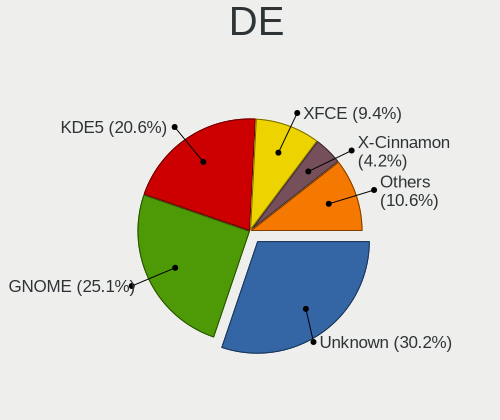
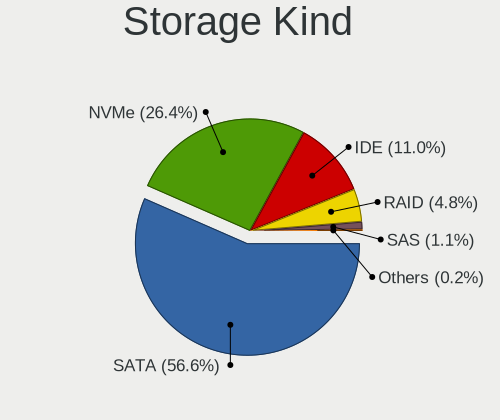
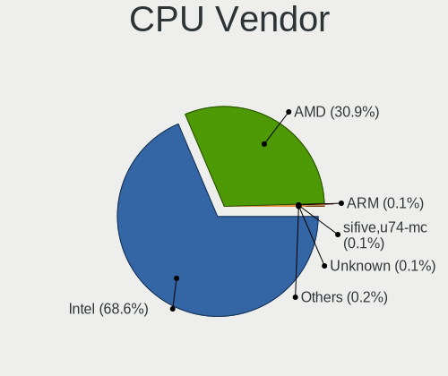
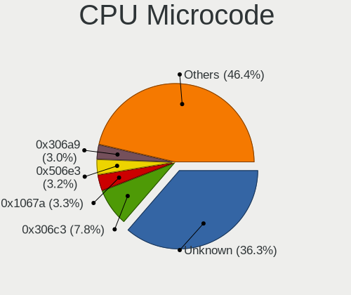
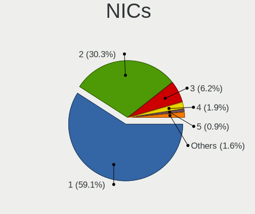
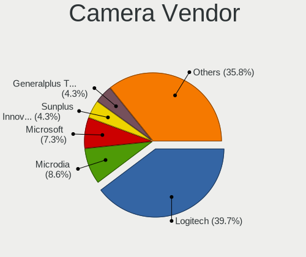

Debian 12 - Tested Hardware & Statistics (Desktops)
---------------------------------------------------

A project to collect tested hardware configurations for Debian 12.

Anyone can contribute to this report by the [hw-probe](https://github.com/linuxhw/hw-probe) tool:

    sudo -E hw-probe -all -upload

Please contribute! Especially if your hardware is rare.

Contents
--------

* [ Test Cases ](#test-cases)

* [ System ](#system)
  - [ Kernel                   ](#kernel)
  - [ Kernel Family            ](#kernel-family)
  - [ Kernel Major Ver.        ](#kernel-major-ver)
  - [ Arch                     ](#arch)
  - [ DE                       ](#de)
  - [ Display Server           ](#display-server)
  - [ Display Manager          ](#display-manager)
  - [ OS Lang                  ](#os-lang)
  - [ Boot Mode                ](#boot-mode)
  - [ Filesystem               ](#filesystem)
  - [ Part. scheme             ](#part-scheme)
  - [ Dual Boot with Linux/BSD ](#dual-boot-with-linuxbsd)
  - [ Dual Boot (Win)          ](#dual-boot-win)

* [ Board ](#board)
  - [ Vendor                   ](#vendor)
  - [ Model                    ](#model)
  - [ Model Family             ](#model-family)
  - [ MFG Year                 ](#mfg-year)
  - [ Form Factor              ](#form-factor)
  - [ Secure Boot              ](#secure-boot)
  - [ Coreboot                 ](#coreboot)
  - [ RAM Size                 ](#ram-size)
  - [ RAM Used                 ](#ram-used)
  - [ Total Drives             ](#total-drives)
  - [ Has CD-ROM               ](#has-cd-rom)
  - [ Has Ethernet             ](#has-ethernet)
  - [ Has WiFi                 ](#has-wifi)
  - [ Has Bluetooth            ](#has-bluetooth)

* [ Location ](#location)
  - [ Country                  ](#country)
  - [ City                     ](#city)

* [ Drives ](#drives)
  - [ Drive Vendor             ](#drive-vendor)
  - [ Drive Model              ](#drive-model)
  - [ HDD Vendor               ](#hdd-vendor)
  - [ SSD Vendor               ](#ssd-vendor)
  - [ Drive Kind               ](#drive-kind)
  - [ Drive Connector          ](#drive-connector)
  - [ Drive Size               ](#drive-size)
  - [ Space Total              ](#space-total)
  - [ Space Used               ](#space-used)
  - [ Malfunc. Drives          ](#malfunc-drives)
  - [ Malfunc. Drive Vendor    ](#malfunc-drive-vendor)
  - [ Malfunc. HDD Vendor      ](#malfunc-hdd-vendor)
  - [ Malfunc. Drive Kind      ](#malfunc-drive-kind)
  - [ Failed Drives            ](#failed-drives)
  - [ Failed Drive Vendor      ](#failed-drive-vendor)
  - [ Drive Status             ](#drive-status)

* [ Storage controller ](#storage-controller)
  - [ Storage Vendor           ](#storage-vendor)
  - [ Storage Model            ](#storage-model)
  - [ Storage Kind             ](#storage-kind)

* [ Processor ](#processor)
  - [ CPU Vendor               ](#cpu-vendor)
  - [ CPU Model                ](#cpu-model)
  - [ CPU Model Family         ](#cpu-model-family)
  - [ CPU Cores                ](#cpu-cores)
  - [ CPU Sockets              ](#cpu-sockets)
  - [ CPU Threads              ](#cpu-threads)
  - [ CPU Op-Modes             ](#cpu-op-modes)
  - [ CPU Microcode            ](#cpu-microcode)
  - [ CPU Microarch            ](#cpu-microarch)

* [ Graphics ](#graphics)
  - [ GPU Vendor               ](#gpu-vendor)
  - [ GPU Model                ](#gpu-model)
  - [ GPU Combo                ](#gpu-combo)
  - [ GPU Driver               ](#gpu-driver)
  - [ GPU Memory               ](#gpu-memory)

* [ Monitor ](#monitor)
  - [ Monitor Vendor           ](#monitor-vendor)
  - [ Monitor Model            ](#monitor-model)
  - [ Monitor Resolution       ](#monitor-resolution)
  - [ Monitor Diagonal         ](#monitor-diagonal)
  - [ Monitor Width            ](#monitor-width)
  - [ Aspect Ratio             ](#aspect-ratio)
  - [ Monitor Area             ](#monitor-area)
  - [ Pixel Density            ](#pixel-density)
  - [ Multiple Monitors        ](#multiple-monitors)

* [ Network ](#network)
  - [ Net Controller Vendor    ](#net-controller-vendor)
  - [ Net Controller Model     ](#net-controller-model)
  - [ Wireless Vendor          ](#wireless-vendor)
  - [ Wireless Model           ](#wireless-model)
  - [ Ethernet Vendor          ](#ethernet-vendor)
  - [ Ethernet Model           ](#ethernet-model)
  - [ Net Controller Kind      ](#net-controller-kind)
  - [ Used Controller          ](#used-controller)
  - [ NICs                     ](#nics)
  - [ IPv6                     ](#ipv6)

* [ Bluetooth ](#bluetooth)
  - [ Bluetooth Vendor         ](#bluetooth-vendor)
  - [ Bluetooth Model          ](#bluetooth-model)

* [ Sound ](#sound)
  - [ Sound Vendor             ](#sound-vendor)
  - [ Sound Model              ](#sound-model)

* [ Memory ](#memory)
  - [ Memory Vendor            ](#memory-vendor)
  - [ Memory Model             ](#memory-model)
  - [ Memory Kind              ](#memory-kind)
  - [ Memory Form Factor       ](#memory-form-factor)
  - [ Memory Size              ](#memory-size)
  - [ Memory Speed             ](#memory-speed)

* [ Printers & scanners ](#printers--scanners)
  - [ Printer Vendor           ](#printer-vendor)
  - [ Printer Model            ](#printer-model)
  - [ Scanner Vendor           ](#scanner-vendor)
  - [ Scanner Model            ](#scanner-model)

* [ Camera ](#camera)
  - [ Camera Vendor            ](#camera-vendor)
  - [ Camera Model             ](#camera-model)

* [ Security ](#security)
  - [ Fingerprint Vendor       ](#fingerprint-vendor)
  - [ Fingerprint Model        ](#fingerprint-model)
  - [ Chipcard Vendor          ](#chipcard-vendor)
  - [ Chipcard Model           ](#chipcard-model)

* [ Unsupported ](#unsupported)
  - [ Unsupported Devices      ](#unsupported-devices)
  - [ Unsupported Device Types ](#unsupported-device-types)

Test Cases
----------

Total: 1197

| Vendor        | Model                       | Probe                                                      | Date         |
|---------------|-----------------------------|------------------------------------------------------------|--------------|
| Sapphire      | PI-AM3RS760G2               | [5f34a26ab3](https://linux-hardware.org/?probe=5f34a26ab3) | Jan 01, 2024 |
| HP            | ProLiant ML310e Gen8 v2     | [7271f244c2](https://linux-hardware.org/?probe=7271f244c2) | Jan 01, 2024 |
| ASUSTek       | PRIME Z270-A                | [dea2dc38e4](https://linux-hardware.org/?probe=dea2dc38e4) | Jan 01, 2024 |
| ASUSTek       | TUF Gaming X570-PRO         | [ca2b52b64f](https://linux-hardware.org/?probe=ca2b52b64f) | Dec 31, 2023 |
| ASRock        | 990FX Extreme4              | [edf3eae913](https://linux-hardware.org/?probe=edf3eae913) | Dec 31, 2023 |
| ASUSTek       | ROG STRIX B550-E GAMING     | [eb264efa92](https://linux-hardware.org/?probe=eb264efa92) | Dec 31, 2023 |
| Gigabyte      | B650 AORUS ELITE AX         | [5f1c662ba4](https://linux-hardware.org/?probe=5f1c662ba4) | Dec 31, 2023 |
| Gigabyte      | B650 AORUS ELITE AX         | [fde784b0b5](https://linux-hardware.org/?probe=fde784b0b5) | Dec 31, 2023 |
| ASUSTek       | P11C-I Series               | [b38bcf215d](https://linux-hardware.org/?probe=b38bcf215d) | Dec 30, 2023 |
| Seeed Stud... | ODYSSEY-X86J41X5 SD-BS-C... | [90b5ba3d1e](https://linux-hardware.org/?probe=90b5ba3d1e) | Dec 30, 2023 |
| ASRock        | X300M-STX                   | [7cd1d9d16c](https://linux-hardware.org/?probe=7cd1d9d16c) | Dec 30, 2023 |
| ASRock        | X300M-STX                   | [5fa6e9f755](https://linux-hardware.org/?probe=5fa6e9f755) | Dec 30, 2023 |
| MSI           | H270 GAMING M3              | [92615e0827](https://linux-hardware.org/?probe=92615e0827) | Dec 30, 2023 |
| Gigabyte      | B550M K                     | [8340ced087](https://linux-hardware.org/?probe=8340ced087) | Dec 30, 2023 |
| Apple         | Mac-F4208AC8 PVT            | [11a7c2b836](https://linux-hardware.org/?probe=11a7c2b836) | Dec 30, 2023 |
| HC Technol... | HCAR5000-MI2                | [44a9ba60e7](https://linux-hardware.org/?probe=44a9ba60e7) | Dec 29, 2023 |
| ASRock        | X570S PG Riptide            | [aa3f2ed203](https://linux-hardware.org/?probe=aa3f2ed203) | Dec 29, 2023 |
| ASUSTek       | M5A97 R2.0                  | [c5bc64bc85](https://linux-hardware.org/?probe=c5bc64bc85) | Dec 29, 2023 |
| Dell          | 054KM3 A01                  | [1d078128fe](https://linux-hardware.org/?probe=1d078128fe) | Dec 28, 2023 |
| MACHINIST     | X99 RS9                     | [1e431dc2fc](https://linux-hardware.org/?probe=1e431dc2fc) | Dec 28, 2023 |
| Sapphire      | PI-AM3RS760G2               | [cb13028da5](https://linux-hardware.org/?probe=cb13028da5) | Dec 28, 2023 |
| AZW           | SER V1                      | [9491b3dfb6](https://linux-hardware.org/?probe=9491b3dfb6) | Dec 28, 2023 |
| MSI           | PRO A620M-E                 | [b2e410ff06](https://linux-hardware.org/?probe=b2e410ff06) | Dec 28, 2023 |
| ASRock        | 990FX Extreme4              | [7345f4357e](https://linux-hardware.org/?probe=7345f4357e) | Dec 28, 2023 |
| ASRock        | 990FX Extreme4              | [de1329753d](https://linux-hardware.org/?probe=de1329753d) | Dec 28, 2023 |
| ASUSTek       | ROG STRIX B550-F GAMING     | [37fe922c9d](https://linux-hardware.org/?probe=37fe922c9d) | Dec 28, 2023 |
| MSI           | X470 GAMING PLUS MAX        | [758aa4d9a1](https://linux-hardware.org/?probe=758aa4d9a1) | Dec 27, 2023 |
| Biostar       | A68N-5000                   | [19f4961efd](https://linux-hardware.org/?probe=19f4961efd) | Dec 27, 2023 |
| ASRock        | X670E Steel Legend          | [fde01139b9](https://linux-hardware.org/?probe=fde01139b9) | Dec 27, 2023 |
| Gigabyte      | Z370M D3H-CF                | [d73ec66a3a](https://linux-hardware.org/?probe=d73ec66a3a) | Dec 26, 2023 |
| Biostar       | A68N-5000                   | [39703ac1bc](https://linux-hardware.org/?probe=39703ac1bc) | Dec 26, 2023 |
| Lenovo        | 102F SDK0E50510 WIN 2625... | [9227fed37d](https://linux-hardware.org/?probe=9227fed37d) | Dec 26, 2023 |
| Gigabyte      | B75M-D3V                    | [a58934ade1](https://linux-hardware.org/?probe=a58934ade1) | Dec 26, 2023 |
| Gigabyte      | B75M-D3V                    | [8616b021c1](https://linux-hardware.org/?probe=8616b021c1) | Dec 26, 2023 |
| ASRock        | B660M Steel Legend          | [81860bf790](https://linux-hardware.org/?probe=81860bf790) | Dec 26, 2023 |
| Sapphire      | PI-AM3RS760G2               | [7a4d238793](https://linux-hardware.org/?probe=7a4d238793) | Dec 25, 2023 |
| Gigabyte      | B550 AORUS ELITE V2         | [9a82f5d4ae](https://linux-hardware.org/?probe=9a82f5d4ae) | Dec 25, 2023 |
| ASUSTek       | Z97-A-USB31                 | [7789aa889f](https://linux-hardware.org/?probe=7789aa889f) | Dec 24, 2023 |
| Intel         | D34010WYK H14771-304        | [95ab790a9c](https://linux-hardware.org/?probe=95ab790a9c) | Dec 24, 2023 |
| MSI           | H110M PRO-VH PLUS           | [3c112941d6](https://linux-hardware.org/?probe=3c112941d6) | Dec 24, 2023 |
| iRU           | LPGR.469559.012             | [0f955d2b87](https://linux-hardware.org/?probe=0f955d2b87) | Dec 24, 2023 |
| ASRock        | 990FX Extreme4              | [d698ea94f5](https://linux-hardware.org/?probe=d698ea94f5) | Dec 24, 2023 |
| ASRock        | 990FX Extreme4              | [bfe0870fab](https://linux-hardware.org/?probe=bfe0870fab) | Dec 24, 2023 |
| ASRock        | 990FX Extreme4              | [d6c1f0d202](https://linux-hardware.org/?probe=d6c1f0d202) | Dec 24, 2023 |
| Gigabyte      | M68MT-S2                    | [ba4e48312e](https://linux-hardware.org/?probe=ba4e48312e) | Dec 23, 2023 |
| ASUSTek       | M4A785-M                    | [fe6c638acc](https://linux-hardware.org/?probe=fe6c638acc) | Dec 23, 2023 |
| Gigabyte      | M68MT-S2                    | [e91530e41d](https://linux-hardware.org/?probe=e91530e41d) | Dec 23, 2023 |
| MSI           | MPG B760I EDGE WIFI DDR4    | [58bbd67a73](https://linux-hardware.org/?probe=58bbd67a73) | Dec 23, 2023 |
| T-bao Tian... | GOD78                       | [cd28753d06](https://linux-hardware.org/?probe=cd28753d06) | Dec 23, 2023 |
| Gigabyte      | X570 AORUS ELITE WIFI       | [6c9e82db47](https://linux-hardware.org/?probe=6c9e82db47) | Dec 23, 2023 |
| HPE           | ProLiant MicroServer Gen... | [4d38d67af1](https://linux-hardware.org/?probe=4d38d67af1) | Dec 23, 2023 |
| Gigabyte      | X570 AORUS PRO WIFI         | [bbd50ba27b](https://linux-hardware.org/?probe=bbd50ba27b) | Dec 23, 2023 |
| Gigabyte      | B550 AORUS ELITE V2         | [f71924e3e4](https://linux-hardware.org/?probe=f71924e3e4) | Dec 22, 2023 |
| ASUSTek       | B150-PRO D3                 | [a686071950](https://linux-hardware.org/?probe=a686071950) | Dec 22, 2023 |
| Gigabyte      | B560M AORUS ELITE           | [82304c2a5f](https://linux-hardware.org/?probe=82304c2a5f) | Dec 21, 2023 |
| ASUSTek       | Maximus VIII RANGER         | [b87a575222](https://linux-hardware.org/?probe=b87a575222) | Dec 21, 2023 |
| ASRock        | B760 Pro RS/D4              | [4b020f53e1](https://linux-hardware.org/?probe=4b020f53e1) | Dec 21, 2023 |
| Dell          | 0NKW6Y A02                  | [d41c926291](https://linux-hardware.org/?probe=d41c926291) | Dec 21, 2023 |
| AZW           | EQ                          | [11b8a012c0](https://linux-hardware.org/?probe=11b8a012c0) | Dec 21, 2023 |
| ASUSTek       | ROG STRIX Z690-E GAMING ... | [47d1d26375](https://linux-hardware.org/?probe=47d1d26375) | Dec 21, 2023 |
| ASUSTek       | TUF Gaming B550M-PLUS       | [d5f60126bb](https://linux-hardware.org/?probe=d5f60126bb) | Dec 20, 2023 |
| ASUSTek       | TUF Gaming B650M-E WIFI     | [2464a532b8](https://linux-hardware.org/?probe=2464a532b8) | Dec 20, 2023 |
| Dell          | 0D6H9T A00                  | [2c968508ee](https://linux-hardware.org/?probe=2c968508ee) | Dec 20, 2023 |
| Unknown       | Unknown                     | [2ff77e3571](https://linux-hardware.org/?probe=2ff77e3571) | Dec 20, 2023 |
| Gigabyte      | B85M-D3H                    | [a641f9b41d](https://linux-hardware.org/?probe=a641f9b41d) | Dec 20, 2023 |
| ASUSTek       | PRIME A320M-K               | [3eead324a8](https://linux-hardware.org/?probe=3eead324a8) | Dec 19, 2023 |
| ASUSTek       | H110M-R                     | [ca0eab5d48](https://linux-hardware.org/?probe=ca0eab5d48) | Dec 19, 2023 |
| Lenovo        | 30BE SDK0J40697 WIN 3305... | [9b8d8ec134](https://linux-hardware.org/?probe=9b8d8ec134) | Dec 19, 2023 |
| Lenovo        | MAHOBAY NOK                 | [7fe77a3476](https://linux-hardware.org/?probe=7fe77a3476) | Dec 19, 2023 |
| Lenovo        | 30BE SDK0J40705 WIN 3425... | [65b6d3dcc0](https://linux-hardware.org/?probe=65b6d3dcc0) | Dec 19, 2023 |
| Lenovo        | 30BE SDK0J40705 WIN 3425... | [ab5bffcf0a](https://linux-hardware.org/?probe=ab5bffcf0a) | Dec 19, 2023 |
| Lenovo        | SHARKBAY 0B98401 PRO        | [9f3471e435](https://linux-hardware.org/?probe=9f3471e435) | Dec 19, 2023 |
| Lenovo        | SKYBAY SDK0J40705 WIN 34... | [752a59a0cc](https://linux-hardware.org/?probe=752a59a0cc) | Dec 19, 2023 |
| Lenovo        | SHARKBAY SDK0E50510 WIN     | [bff7dced45](https://linux-hardware.org/?probe=bff7dced45) | Dec 19, 2023 |
| ASUSTek       | H110M-R                     | [61211b72bb](https://linux-hardware.org/?probe=61211b72bb) | Dec 19, 2023 |
| Lenovo        | SHARKBAY 0B98401 PRO        | [993b9536cf](https://linux-hardware.org/?probe=993b9536cf) | Dec 19, 2023 |
| Lenovo        | 30BE SDK0J40705 WIN 3425... | [782dad2128](https://linux-hardware.org/?probe=782dad2128) | Dec 19, 2023 |
| MSI           | MAG Z790 TOMAHAWK WIFI      | [619bbec719](https://linux-hardware.org/?probe=619bbec719) | Dec 19, 2023 |
| ASUSTek       | ROG STRIX Z690-E GAMING ... | [6a962e40ec](https://linux-hardware.org/?probe=6a962e40ec) | Dec 19, 2023 |
| Biostar       | A55MH                       | [f1106ef8c7](https://linux-hardware.org/?probe=f1106ef8c7) | Dec 19, 2023 |
| Gigabyte      | B85M-D3H                    | [95d29a0474](https://linux-hardware.org/?probe=95d29a0474) | Dec 18, 2023 |
| Gigabyte      | H510M H V2                  | [3228539880](https://linux-hardware.org/?probe=3228539880) | Dec 18, 2023 |
| MSI           | A75MA-G55                   | [6af3c61744](https://linux-hardware.org/?probe=6af3c61744) | Dec 18, 2023 |
| ASUSTek       | PRIME B660M-A WIFI D4       | [2eb95b1a7c](https://linux-hardware.org/?probe=2eb95b1a7c) | Dec 18, 2023 |
| Dell          | 0782GW A00                  | [bb37946b48](https://linux-hardware.org/?probe=bb37946b48) | Dec 17, 2023 |
| Dell          | 0782GW A00                  | [a4753bb26d](https://linux-hardware.org/?probe=a4753bb26d) | Dec 17, 2023 |
| ASUSTek       | TUF H310M-PLUS GAMING/BR    | [b6b44f1b80](https://linux-hardware.org/?probe=b6b44f1b80) | Dec 17, 2023 |
| ASUSTek       | P4P800-VM                   | [8fb6faae11](https://linux-hardware.org/?probe=8fb6faae11) | Dec 17, 2023 |
| Dell          | 06X1TJ A00                  | [b9738c48b0](https://linux-hardware.org/?probe=b9738c48b0) | Dec 17, 2023 |
| ASUSTek       | PRIME A520M-E               | [02e1fcae39](https://linux-hardware.org/?probe=02e1fcae39) | Dec 17, 2023 |
| ASUSTek       | PRIME A520M-E               | [c878de7adb](https://linux-hardware.org/?probe=c878de7adb) | Dec 17, 2023 |
| ASRock        | 990FX Extreme4              | [ad7f762f22](https://linux-hardware.org/?probe=ad7f762f22) | Dec 17, 2023 |
| Gigabyte      | F2A88XN-WIFI                | [90024d365b](https://linux-hardware.org/?probe=90024d365b) | Dec 17, 2023 |
| Gigabyte      | B85M-D3H                    | [4d81e6300c](https://linux-hardware.org/?probe=4d81e6300c) | Dec 17, 2023 |
| ASUSTek       | Pro WS W680M-ACE SE         | [f1b9ec56ea](https://linux-hardware.org/?probe=f1b9ec56ea) | Dec 16, 2023 |
| Fujitsu       | D3513-A1 S26361-D3513-A1    | [6f4f0f65bb](https://linux-hardware.org/?probe=6f4f0f65bb) | Dec 15, 2023 |
| Fujitsu       | D3233-A1 S26361-D3233-A1    | [a785d6574b](https://linux-hardware.org/?probe=a785d6574b) | Dec 15, 2023 |
| Inventec      | DQ Class A02                | [98e30b12f1](https://linux-hardware.org/?probe=98e30b12f1) | Dec 15, 2023 |
| ASUSTek       | M5A99FX PRO R2.0            | [969d4fd521](https://linux-hardware.org/?probe=969d4fd521) | Dec 15, 2023 |
| ASUSTek       | TUF Gaming Z490-PLUS        | [a80537094f](https://linux-hardware.org/?probe=a80537094f) | Dec 15, 2023 |
| MSI           | PRO B650-P WIFI             | [06ed7608bf](https://linux-hardware.org/?probe=06ed7608bf) | Dec 15, 2023 |
| Biostar       | A32M2                       | [f3fb9d0673](https://linux-hardware.org/?probe=f3fb9d0673) | Dec 15, 2023 |
| Gigabyte      | B250M-D2V-CF                | [e0e94706d7](https://linux-hardware.org/?probe=e0e94706d7) | Dec 15, 2023 |
| ASRock        | 990FX Extreme4              | [46178ea298](https://linux-hardware.org/?probe=46178ea298) | Dec 14, 2023 |
| Gigabyte      | P35-DS4                     | [23e146afdc](https://linux-hardware.org/?probe=23e146afdc) | Dec 14, 2023 |
| HP            | 8463                        | [0d01616e1c](https://linux-hardware.org/?probe=0d01616e1c) | Dec 14, 2023 |
| ASUSTek       | SABERTOOTH 990FX R2.0       | [545a3cecbc](https://linux-hardware.org/?probe=545a3cecbc) | Dec 14, 2023 |
| ASRock        | 990FX Extreme4              | [f1860954b3](https://linux-hardware.org/?probe=f1860954b3) | Dec 14, 2023 |
| ASRock        | 990FX Extreme4              | [1ed13ea8f2](https://linux-hardware.org/?probe=1ed13ea8f2) | Dec 14, 2023 |
| ASRock        | 990FX Extreme4              | [eafb9ad287](https://linux-hardware.org/?probe=eafb9ad287) | Dec 14, 2023 |
| ASRock        | 990FX Extreme4              | [3504153caa](https://linux-hardware.org/?probe=3504153caa) | Dec 14, 2023 |
| Gigabyte      | F2A88XM-HD3                 | [f2efee9279](https://linux-hardware.org/?probe=f2efee9279) | Dec 13, 2023 |
| Gigabyte      | F2A88XM-HD3                 | [0e23ff0a06](https://linux-hardware.org/?probe=0e23ff0a06) | Dec 13, 2023 |
| Sapphire      | PI-AM3RS760G2               | [1668553525](https://linux-hardware.org/?probe=1668553525) | Dec 13, 2023 |
| Sapphire      | PI-AM3RS760G2               | [89bef2fed5](https://linux-hardware.org/?probe=89bef2fed5) | Dec 13, 2023 |
| Sapphire      | PI-AM3RS760G2               | [0ed1d85207](https://linux-hardware.org/?probe=0ed1d85207) | Dec 13, 2023 |
| ASUSTek       | PRIME B450M-A               | [5a65590bed](https://linux-hardware.org/?probe=5a65590bed) | Dec 13, 2023 |
| ASUSTek       | P5G41T-M LE                 | [e6205fb709](https://linux-hardware.org/?probe=e6205fb709) | Dec 13, 2023 |
| ASUSTek       | P8H61                       | [6f5272ea27](https://linux-hardware.org/?probe=6f5272ea27) | Dec 13, 2023 |
| ASUSTek       | P8H77-V                     | [6b62180e3e](https://linux-hardware.org/?probe=6b62180e3e) | Dec 12, 2023 |
| Intel         | JSL MRD                     | [c811c8be03](https://linux-hardware.org/?probe=c811c8be03) | Dec 12, 2023 |
| Dell          | 0MGK50 A01                  | [7471a7b26e](https://linux-hardware.org/?probe=7471a7b26e) | Dec 12, 2023 |
| Dell          | 0VD5HY A10                  | [366f1ac830](https://linux-hardware.org/?probe=366f1ac830) | Dec 12, 2023 |
| Fujitsu       | JIH61Y3                     | [cb566e2fd0](https://linux-hardware.org/?probe=cb566e2fd0) | Dec 12, 2023 |
| Lenovo        | 3140 SDK0J40697 WIN 3305... | [d5500a3830](https://linux-hardware.org/?probe=d5500a3830) | Dec 11, 2023 |
| Gigabyte      | H610M H DDR4                | [88b93b571e](https://linux-hardware.org/?probe=88b93b571e) | Dec 11, 2023 |
| Intel         | DZ77SL-50K AAG55115-300     | [29590179a8](https://linux-hardware.org/?probe=29590179a8) | Dec 11, 2023 |
| Unknown       | Unknown                     | [2c6a120dd2](https://linux-hardware.org/?probe=2c6a120dd2) | Dec 10, 2023 |
| MSI           | B560M PRO-VDH               | [4a2deac69b](https://linux-hardware.org/?probe=4a2deac69b) | Dec 10, 2023 |
| HP            | 0968h                       | [b1fb94198e](https://linux-hardware.org/?probe=b1fb94198e) | Dec 10, 2023 |
| MSI           | B350 TOMAHAWK               | [18f6c41058](https://linux-hardware.org/?probe=18f6c41058) | Dec 10, 2023 |
| Dell          | 0HY9JP A02                  | [25d8aaca3c](https://linux-hardware.org/?probe=25d8aaca3c) | Dec 10, 2023 |
| Intel         | DZ77SL-50K AAG55115-300     | [c1d93cb6b2](https://linux-hardware.org/?probe=c1d93cb6b2) | Dec 09, 2023 |
| ASUSTek       | PRIME B450M-K               | [c02997fc15](https://linux-hardware.org/?probe=c02997fc15) | Dec 09, 2023 |
| ASUSTek       | TUF Gaming B550-PLUS        | [cc6cd166f2](https://linux-hardware.org/?probe=cc6cd166f2) | Dec 08, 2023 |
| Shenzhen M... | F6BFC                       | [67371c6af4](https://linux-hardware.org/?probe=67371c6af4) | Dec 08, 2023 |
| MSI           | G31TM-P35                   | [e241cfaeca](https://linux-hardware.org/?probe=e241cfaeca) | Dec 08, 2023 |
| Dell          | 04YP6J A01                  | [186bb25f07](https://linux-hardware.org/?probe=186bb25f07) | Dec 08, 2023 |
| Intel         | JSL MRD                     | [fb3b75c8cc](https://linux-hardware.org/?probe=fb3b75c8cc) | Dec 07, 2023 |
| HP            | 339A                        | [a114886e67](https://linux-hardware.org/?probe=a114886e67) | Dec 07, 2023 |
| ASUSTek       | Pro B560M-C                 | [116dce4b93](https://linux-hardware.org/?probe=116dce4b93) | Dec 07, 2023 |
| ASUSTek       | TUF Gaming X570-PLUS        | [39a966c6da](https://linux-hardware.org/?probe=39a966c6da) | Dec 07, 2023 |
| Gigabyte      | X570 GAMING X               | [b7070058fb](https://linux-hardware.org/?probe=b7070058fb) | Dec 06, 2023 |
| ASUSTek       | P8H61-M LX3 R2.0            | [7bd10d1922](https://linux-hardware.org/?probe=7bd10d1922) | Dec 05, 2023 |
| Unknown       | Unknown                     | [56dab5d412](https://linux-hardware.org/?probe=56dab5d412) | Dec 04, 2023 |
| ASUSTek       | SABERTOOTH 990FX R2.0       | [76fdeed52e](https://linux-hardware.org/?probe=76fdeed52e) | Dec 04, 2023 |
| Dell          | 0RN474                      | [17392605bb](https://linux-hardware.org/?probe=17392605bb) | Dec 04, 2023 |
| ASUSTek       | P8Z68-V PRO                 | [fde3c9253f](https://linux-hardware.org/?probe=fde3c9253f) | Dec 04, 2023 |
| HP            | 8619                        | [a33e273f33](https://linux-hardware.org/?probe=a33e273f33) | Dec 04, 2023 |
| ASUSTek       | Maximus VIII RANGER         | [830b83bf5c](https://linux-hardware.org/?probe=830b83bf5c) | Dec 03, 2023 |
| ASUSTek       | Maximus VIII RANGER         | [83b954a1cd](https://linux-hardware.org/?probe=83b954a1cd) | Dec 03, 2023 |
| ASUSTek       | Z97-P                       | [c4e675a705](https://linux-hardware.org/?probe=c4e675a705) | Dec 03, 2023 |
| HP            | ProLiant MicroServer Gen... | [47222bf19c](https://linux-hardware.org/?probe=47222bf19c) | Dec 03, 2023 |
| HP            | ProLiant MicroServer Gen... | [5a5296e72f](https://linux-hardware.org/?probe=5a5296e72f) | Dec 03, 2023 |
| Dell          | 0KWVT8 A02                  | [3c6a13271b](https://linux-hardware.org/?probe=3c6a13271b) | Dec 03, 2023 |
| MSI           | MAG Z790 TOMAHAWK WIFI      | [a28372598e](https://linux-hardware.org/?probe=a28372598e) | Dec 03, 2023 |
| ASUSTek       | ROG STRIX X670E-E GAMING... | [bb1b02ee0c](https://linux-hardware.org/?probe=bb1b02ee0c) | Dec 03, 2023 |
| ASUSTek       | TUF Gaming X570-PLUS_BR     | [5aeec2e399](https://linux-hardware.org/?probe=5aeec2e399) | Dec 03, 2023 |
| Intel         | DQ67SW AAG12527-309         | [99293a328c](https://linux-hardware.org/?probe=99293a328c) | Dec 02, 2023 |
| Intel         | DQ67SW AAG12527-309         | [b8e3a992b3](https://linux-hardware.org/?probe=b8e3a992b3) | Dec 02, 2023 |
| Unknown       | Unknown                     | [d0bbc73e29](https://linux-hardware.org/?probe=d0bbc73e29) | Dec 02, 2023 |
| Gigabyte      | H470 HD3                    | [0b9cf3a0a5](https://linux-hardware.org/?probe=0b9cf3a0a5) | Dec 02, 2023 |
| ASUSTek       | Z97-P                       | [109cecbcba](https://linux-hardware.org/?probe=109cecbcba) | Dec 01, 2023 |
| Dell          | 0VRWRC A00                  | [13e072ec20](https://linux-hardware.org/?probe=13e072ec20) | Dec 01, 2023 |
| Gigabyte      | B760M DS3H AX DDR4          | [8a625099b1](https://linux-hardware.org/?probe=8a625099b1) | Dec 01, 2023 |
| HP            | 212B                        | [dc1382e549](https://linux-hardware.org/?probe=dc1382e549) | Dec 01, 2023 |
| ASRock        | 970 Extreme4                | [4ab4cd31f3](https://linux-hardware.org/?probe=4ab4cd31f3) | Nov 30, 2023 |
| HP            | 8053                        | [a2b9b5d498](https://linux-hardware.org/?probe=a2b9b5d498) | Nov 30, 2023 |
| ASUSTek       | TUF H310M-PLUS GAMING/BR    | [cf7d8fdbf1](https://linux-hardware.org/?probe=cf7d8fdbf1) | Nov 30, 2023 |
| Gigabyte      | B450 AORUS M                | [4bac6b7cd5](https://linux-hardware.org/?probe=4bac6b7cd5) | Nov 30, 2023 |
| Gigabyte      | B450 AORUS M                | [ede8970ea9](https://linux-hardware.org/?probe=ede8970ea9) | Nov 30, 2023 |
| ASUSTek       | ROG STRIX B650E-F GAMING... | [c7b394b498](https://linux-hardware.org/?probe=c7b394b498) | Nov 30, 2023 |
| Dell          | 0427JK A00                  | [38e526321f](https://linux-hardware.org/?probe=38e526321f) | Nov 29, 2023 |
| Dell          | 0PU052                      | [9035e39786](https://linux-hardware.org/?probe=9035e39786) | Nov 29, 2023 |
| MACHINIST     | X99 RS9                     | [722f516451](https://linux-hardware.org/?probe=722f516451) | Nov 29, 2023 |
| HP            | 304Ah                       | [03437e0238](https://linux-hardware.org/?probe=03437e0238) | Nov 29, 2023 |
| HP            | 8643 SMVB                   | [dae10e70d0](https://linux-hardware.org/?probe=dae10e70d0) | Nov 29, 2023 |
| Gigabyte      | G41MT-S2P                   | [6a2c279391](https://linux-hardware.org/?probe=6a2c279391) | Nov 29, 2023 |
| ASUSTek       | PRIME B450-PLUS             | [cf46975c18](https://linux-hardware.org/?probe=cf46975c18) | Nov 28, 2023 |
| ASRock        | B365 Phantom Gaming 4       | [b3de42156e](https://linux-hardware.org/?probe=b3de42156e) | Nov 28, 2023 |
| ASRock        | H61DE/S3                    | [50d5c63e0f](https://linux-hardware.org/?probe=50d5c63e0f) | Nov 28, 2023 |
| Gigabyte      | H470 HD3                    | [0ecb969c2c](https://linux-hardware.org/?probe=0ecb969c2c) | Nov 28, 2023 |
| Gigabyte      | B450M DS3H-CF               | [5d7a20cf12](https://linux-hardware.org/?probe=5d7a20cf12) | Nov 27, 2023 |
| Gigabyte      | X570 GAMING X               | [4609a7f037](https://linux-hardware.org/?probe=4609a7f037) | Nov 27, 2023 |
| ECS           | G31T-M9                     | [fa44ca9239](https://linux-hardware.org/?probe=fa44ca9239) | Nov 27, 2023 |
| Gigabyte      | 970A-DS3P                   | [182a3875c4](https://linux-hardware.org/?probe=182a3875c4) | Nov 27, 2023 |
| Gigabyte      | 970A-DS3P                   | [196be5def7](https://linux-hardware.org/?probe=196be5def7) | Nov 27, 2023 |
| ASUSTek       | P8Z77-M                     | [02ece75e31](https://linux-hardware.org/?probe=02ece75e31) | Nov 27, 2023 |
| Gigabyte      | B550I AORUS PRO AX          | [007cf510b3](https://linux-hardware.org/?probe=007cf510b3) | Nov 26, 2023 |
| ASRock        | B365 Phantom Gaming 4       | [97dfb05d56](https://linux-hardware.org/?probe=97dfb05d56) | Nov 26, 2023 |
| ASUSTek       | ROG STRIX Z370-H GAMING     | [6005ac3fdd](https://linux-hardware.org/?probe=6005ac3fdd) | Nov 26, 2023 |
| ASUSTek       | H97-PLUS                    | [e4c365b554](https://linux-hardware.org/?probe=e4c365b554) | Nov 26, 2023 |
| ASUSTek       | TUF Gaming B650-PLUS WIF... | [aaf90bfd52](https://linux-hardware.org/?probe=aaf90bfd52) | Nov 25, 2023 |
| ASRock        | H61M-GS                     | [b1448b5814](https://linux-hardware.org/?probe=b1448b5814) | Nov 25, 2023 |
| ASUSTek       | P8H77-V                     | [73eebdebc2](https://linux-hardware.org/?probe=73eebdebc2) | Nov 25, 2023 |
| ASUSTek       | PRIME A320M-K               | [e2bbfbaca9](https://linux-hardware.org/?probe=e2bbfbaca9) | Nov 25, 2023 |
| ASUSTek       | PRIME B660M-K D4            | [a6ab0954e0](https://linux-hardware.org/?probe=a6ab0954e0) | Nov 25, 2023 |
| Unknown       | HX90                        | [b4eef50430](https://linux-hardware.org/?probe=b4eef50430) | Nov 25, 2023 |
| ASUSTek       | ROG STRIX B650E-F GAMING... | [84fefe8e38](https://linux-hardware.org/?probe=84fefe8e38) | Nov 25, 2023 |
| Fujitsu       | D3233-A1 S26361-D3233-A1    | [dc456b5cc5](https://linux-hardware.org/?probe=dc456b5cc5) | Nov 24, 2023 |
| ASUSTek       | B85M-G                      | [6497745451](https://linux-hardware.org/?probe=6497745451) | Nov 24, 2023 |
| Gigabyte      | G41MT-S2P                   | [00ef59a95d](https://linux-hardware.org/?probe=00ef59a95d) | Nov 24, 2023 |
| Inventec      | D CLASS A02                 | [d8e9de7c1d](https://linux-hardware.org/?probe=d8e9de7c1d) | Nov 23, 2023 |
| ASUSTek       | PRIME X670-P WIFI           | [9d776a8aa8](https://linux-hardware.org/?probe=9d776a8aa8) | Nov 23, 2023 |
| ASRock        | 4Core1600-GLAN              | [d850b7a222](https://linux-hardware.org/?probe=d850b7a222) | Nov 23, 2023 |
| Acer          | Veriton K8-680G V:1.0       | [415b88184f](https://linux-hardware.org/?probe=415b88184f) | Nov 23, 2023 |
| Gigabyte      | MZBAYAP-00                  | [101c96a0c0](https://linux-hardware.org/?probe=101c96a0c0) | Nov 22, 2023 |
| Gigabyte      | MZBAYAP-00                  | [f990b64367](https://linux-hardware.org/?probe=f990b64367) | Nov 22, 2023 |
| Gigabyte      | X299 AORUS Gaming 7         | [04e88a7e08](https://linux-hardware.org/?probe=04e88a7e08) | Nov 22, 2023 |
| Lenovo        | MAHOBAY NO DPK              | [e0781004e0](https://linux-hardware.org/?probe=e0781004e0) | Nov 22, 2023 |
| Huanan        | X99-F8D PLUS V1.2           | [2edde2bb35](https://linux-hardware.org/?probe=2edde2bb35) | Nov 22, 2023 |
| Gigabyte      | B450 AORUS M                | [942a2e278a](https://linux-hardware.org/?probe=942a2e278a) | Nov 22, 2023 |
| Gigabyte      | B450 AORUS M                | [11bf0b075f](https://linux-hardware.org/?probe=11bf0b075f) | Nov 22, 2023 |
| Gigabyte      | B85M-D3H                    | [f6c29a55ad](https://linux-hardware.org/?probe=f6c29a55ad) | Nov 22, 2023 |
| MSI           | PRO B760M-P DDR4            | [f892ee3011](https://linux-hardware.org/?probe=f892ee3011) | Nov 21, 2023 |
| Lenovo        | SHARKBAY 0B98401 PRO        | [a38fd35585](https://linux-hardware.org/?probe=a38fd35585) | Nov 21, 2023 |
| ASRock        | B450M-HDV R4.0              | [a51c296185](https://linux-hardware.org/?probe=a51c296185) | Nov 21, 2023 |
| MSI           | H110M PRO-VD                | [9fab1b4add](https://linux-hardware.org/?probe=9fab1b4add) | Nov 20, 2023 |
| ASUSTek       | P8H61-M LX3 R2.0            | [7d8f15f875](https://linux-hardware.org/?probe=7d8f15f875) | Nov 20, 2023 |
| Gigabyte      | B75M-D3V                    | [48a562a1b6](https://linux-hardware.org/?probe=48a562a1b6) | Nov 20, 2023 |
| ADLINK Tec... | MXE5400                     | [ae09533003](https://linux-hardware.org/?probe=ae09533003) | Nov 20, 2023 |
| HP            | ProLiant ML310e Gen8 v2     | [eccc68d336](https://linux-hardware.org/?probe=eccc68d336) | Nov 20, 2023 |
| Gigabyte      | B450M DS3H V2               | [ac68da4f7c](https://linux-hardware.org/?probe=ac68da4f7c) | Nov 19, 2023 |
| ASRock        | B550M-ITX/ac                | [c9b5f09ea5](https://linux-hardware.org/?probe=c9b5f09ea5) | Nov 19, 2023 |
| ASRock        | B550M-ITX/ac                | [c76562a6ce](https://linux-hardware.org/?probe=c76562a6ce) | Nov 19, 2023 |
| Acer          | Predator G3620              | [16a30abb8e](https://linux-hardware.org/?probe=16a30abb8e) | Nov 19, 2023 |
| Shuttle       | SW580                       | [31e6c1c2bf](https://linux-hardware.org/?probe=31e6c1c2bf) | Nov 18, 2023 |
| Foxconn       | 2ABF                        | [10abd64eac](https://linux-hardware.org/?probe=10abd64eac) | Nov 18, 2023 |
| Intel         | JSL MRD                     | [fe873e258e](https://linux-hardware.org/?probe=fe873e258e) | Nov 18, 2023 |
| Intel         | JSL MRD                     | [f25d22654a](https://linux-hardware.org/?probe=f25d22654a) | Nov 18, 2023 |
| MSI           | PRO Z790-A MAX WIFI         | [34b83fef89](https://linux-hardware.org/?probe=34b83fef89) | Nov 17, 2023 |
| HPE           | ProLiant MicroServer Gen... | [11a05c0944](https://linux-hardware.org/?probe=11a05c0944) | Nov 17, 2023 |
| HPE           | ProLiant MicroServer Gen... | [3486cc9544](https://linux-hardware.org/?probe=3486cc9544) | Nov 17, 2023 |
| HPE           | ProLiant MicroServer Gen... | [24ea543d99](https://linux-hardware.org/?probe=24ea543d99) | Nov 17, 2023 |
| Gigabyte      | B360M H                     | [05634e2369](https://linux-hardware.org/?probe=05634e2369) | Nov 17, 2023 |
| Gigabyte      | B360M H                     | [bea2b1a0b7](https://linux-hardware.org/?probe=bea2b1a0b7) | Nov 17, 2023 |
| ASUSTek       | TUF B450M-PLUS GAMING       | [04206b8a50](https://linux-hardware.org/?probe=04206b8a50) | Nov 17, 2023 |
| MSI           | PRO B650M-A WIFI            | [2a9ba6fc77](https://linux-hardware.org/?probe=2a9ba6fc77) | Nov 17, 2023 |
| Intel         | DH77KC AAG39641-400         | [9ac3245bda](https://linux-hardware.org/?probe=9ac3245bda) | Nov 16, 2023 |
| Intel         | DH77KC AAG39641-400         | [e66475e9e4](https://linux-hardware.org/?probe=e66475e9e4) | Nov 16, 2023 |
| ASRock        | X570M Pro4                  | [b166167703](https://linux-hardware.org/?probe=b166167703) | Nov 16, 2023 |
| Apple         | Mac-F221BEC8                | [23bd3ec971](https://linux-hardware.org/?probe=23bd3ec971) | Nov 16, 2023 |
| CWWK          | CW-AD4L-N V1                | [494b815098](https://linux-hardware.org/?probe=494b815098) | Nov 16, 2023 |
| ASUSTek       | PRIME B650M-A AX            | [496e69e1e4](https://linux-hardware.org/?probe=496e69e1e4) | Nov 16, 2023 |
| Fujitsu       | D3221-A1 S26361-D3221-A1    | [182484eef8](https://linux-hardware.org/?probe=182484eef8) | Nov 15, 2023 |
| Gigabyte      | X570 AORUS ULTRA            | [1c21a56b5c](https://linux-hardware.org/?probe=1c21a56b5c) | Nov 15, 2023 |
| MSI           | MEG X570 UNIFY              | [d2cafb1814](https://linux-hardware.org/?probe=d2cafb1814) | Nov 15, 2023 |
| Shenzhen M... | F7BAA                       | [e91aa41101](https://linux-hardware.org/?probe=e91aa41101) | Nov 15, 2023 |
| MSI           | PRO H610M-G DDR4            | [1d0338a823](https://linux-hardware.org/?probe=1d0338a823) | Nov 14, 2023 |
| ASUSTek       | P8B75-M LE                  | [4470b846a0](https://linux-hardware.org/?probe=4470b846a0) | Nov 14, 2023 |
| Gigabyte      | B550M AORUS ELITE           | [c5f890cb08](https://linux-hardware.org/?probe=c5f890cb08) | Nov 14, 2023 |
| Dell          | 0T10XW A00                  | [c505d16c82](https://linux-hardware.org/?probe=c505d16c82) | Nov 14, 2023 |
| Dell          | 0T10XW A00                  | [e0349fcb14](https://linux-hardware.org/?probe=e0349fcb14) | Nov 14, 2023 |
| Dell          | 0T10XW A01                  | [f7a8d7d27e](https://linux-hardware.org/?probe=f7a8d7d27e) | Nov 14, 2023 |
| Dell          | 0T10XW A01                  | [149bf90d88](https://linux-hardware.org/?probe=149bf90d88) | Nov 14, 2023 |
| Dell          | 02YRK5 A02                  | [1b4972f4e1](https://linux-hardware.org/?probe=1b4972f4e1) | Nov 14, 2023 |
| Dell          | 02YRK5 A02                  | [7d0e39fe9f](https://linux-hardware.org/?probe=7d0e39fe9f) | Nov 14, 2023 |
| Gigabyte      | B450 AORUS PRO-CF           | [edc5aa4d33](https://linux-hardware.org/?probe=edc5aa4d33) | Nov 13, 2023 |
| ASUSTek       | Z170 PRO GAMING             | [63e36c8c1e](https://linux-hardware.org/?probe=63e36c8c1e) | Nov 13, 2023 |
| ASRock        | 970M Pro3                   | [fe2966d899](https://linux-hardware.org/?probe=fe2966d899) | Nov 13, 2023 |
| ASRock        | QC5000-ITX/PH               | [983df9a44c](https://linux-hardware.org/?probe=983df9a44c) | Nov 13, 2023 |
| Gigabyte      | GA-880GMA-USB3              | [3c0f8e3cdd](https://linux-hardware.org/?probe=3c0f8e3cdd) | Nov 13, 2023 |
| Gigabyte      | Z790 AORUS ELITE AX DDR4    | [27f69cd90a](https://linux-hardware.org/?probe=27f69cd90a) | Nov 12, 2023 |
| Gigabyte      | A320M-S2H V2-CF             | [02a5498c27](https://linux-hardware.org/?probe=02a5498c27) | Nov 12, 2023 |
| Dell          | 0HY9JP A02                  | [d3d9b9a9ba](https://linux-hardware.org/?probe=d3d9b9a9ba) | Nov 12, 2023 |
| Gigabyte      | B85M-D3H                    | [3b86ff657d](https://linux-hardware.org/?probe=3b86ff657d) | Nov 12, 2023 |
| Apple         | Mac-F221BEC8                | [e89b871c81](https://linux-hardware.org/?probe=e89b871c81) | Nov 12, 2023 |
| Gigabyte      | Z97X-Gaming 5               | [b310ceb608](https://linux-hardware.org/?probe=b310ceb608) | Nov 12, 2023 |
| ASUSTek       | ROG STRIX B450-F GAMING     | [e086a0153d](https://linux-hardware.org/?probe=e086a0153d) | Nov 12, 2023 |
| Dell          | 06X1TJ A00                  | [15601ebf87](https://linux-hardware.org/?probe=15601ebf87) | Nov 12, 2023 |
| Gigabyte      | Z68AP-D3                    | [d15a200351](https://linux-hardware.org/?probe=d15a200351) | Nov 11, 2023 |
| Gigabyte      | Z68AP-D3                    | [a0230d58fd](https://linux-hardware.org/?probe=a0230d58fd) | Nov 11, 2023 |
| ASUSTek       | ROG STRIX B450-F GAMING     | [d49ee32dd4](https://linux-hardware.org/?probe=d49ee32dd4) | Nov 11, 2023 |
| Dell          | 0J4NFV A01                  | [d77b36d8b7](https://linux-hardware.org/?probe=d77b36d8b7) | Nov 11, 2023 |
| ASUSTek       | TS10                        | [c35ca1dadb](https://linux-hardware.org/?probe=c35ca1dadb) | Nov 11, 2023 |
| Wistron       | X3xx A                      | [30dbd2bb2b](https://linux-hardware.org/?probe=30dbd2bb2b) | Nov 11, 2023 |
| Gigabyte      | H61M-DS2                    | [26a111bc63](https://linux-hardware.org/?probe=26a111bc63) | Nov 11, 2023 |
| ASRock        | AM2NF6G-VSTA                | [6ea7323880](https://linux-hardware.org/?probe=6ea7323880) | Nov 11, 2023 |
| ASRock        | AM2NF6G-VSTA                | [71a3f3197c](https://linux-hardware.org/?probe=71a3f3197c) | Nov 11, 2023 |
| Gigabyte      | B85M-D3H                    | [70792a111c](https://linux-hardware.org/?probe=70792a111c) | Nov 10, 2023 |
| Gigabyte      | B450M S2H V2                | [3a7e86a61d](https://linux-hardware.org/?probe=3a7e86a61d) | Nov 10, 2023 |
| ASUSTek       | PRIME B760M-A D4            | [715a6e7831](https://linux-hardware.org/?probe=715a6e7831) | Nov 10, 2023 |
| MSI           | B75A-G43                    | [8dcfda3039](https://linux-hardware.org/?probe=8dcfda3039) | Nov 10, 2023 |
| ASUSTek       | PRIME B550-PLUS             | [4023c4bc2d](https://linux-hardware.org/?probe=4023c4bc2d) | Nov 09, 2023 |
| Dell          | 0C27VV A01                  | [cc977cc459](https://linux-hardware.org/?probe=cc977cc459) | Nov 09, 2023 |
| HP            | ProLiant ML310e Gen8 v2     | [280a15fb6e](https://linux-hardware.org/?probe=280a15fb6e) | Nov 09, 2023 |
| Gigabyte      | B450M S2H V2                | [983877d365](https://linux-hardware.org/?probe=983877d365) | Nov 09, 2023 |
| Unknown       | Unknown                     | [ca05ff684b](https://linux-hardware.org/?probe=ca05ff684b) | Nov 09, 2023 |
| ASUSTek       | H110M-R                     | [0cfb1d6280](https://linux-hardware.org/?probe=0cfb1d6280) | Nov 09, 2023 |
| Gigabyte      | B450M S2H                   | [542759f111](https://linux-hardware.org/?probe=542759f111) | Nov 09, 2023 |
| Gigabyte      | B450M DS3H-CF               | [babe4865df](https://linux-hardware.org/?probe=babe4865df) | Nov 09, 2023 |
| Gigabyte      | B450 AORUS ELITE            | [406de45098](https://linux-hardware.org/?probe=406de45098) | Nov 09, 2023 |
| Gigabyte      | B450M S2H V2                | [41bf6a7181](https://linux-hardware.org/?probe=41bf6a7181) | Nov 09, 2023 |
| Gigabyte      | B450M S2H V2                | [606524d77e](https://linux-hardware.org/?probe=606524d77e) | Nov 09, 2023 |
| Gigabyte      | B450M H                     | [d52ce3ac0c](https://linux-hardware.org/?probe=d52ce3ac0c) | Nov 09, 2023 |
| MSI           | 970A-G43                    | [c4aecb23af](https://linux-hardware.org/?probe=c4aecb23af) | Nov 09, 2023 |
| MSI           | 970A-G43                    | [7c748629cb](https://linux-hardware.org/?probe=7c748629cb) | Nov 09, 2023 |
| MSI           | MEG Z690 UNIFY              | [7cf2301cb1](https://linux-hardware.org/?probe=7cf2301cb1) | Nov 08, 2023 |
| ASRock        | Z77 Extreme4                | [18013e6256](https://linux-hardware.org/?probe=18013e6256) | Nov 07, 2023 |
| Dell          | 0CRH6C A02                  | [a1650d3328](https://linux-hardware.org/?probe=a1650d3328) | Nov 07, 2023 |
| Dell          | 0773VG A00                  | [2ff1e288bf](https://linux-hardware.org/?probe=2ff1e288bf) | Nov 07, 2023 |
| MSI           | X299 RAIDER                 | [a30007c9f1](https://linux-hardware.org/?probe=a30007c9f1) | Nov 07, 2023 |
| Shuttle       | FA76 V10                    | [7007593ff3](https://linux-hardware.org/?probe=7007593ff3) | Nov 07, 2023 |
| Dell          | 0T2HR0 A02                  | [359d864b50](https://linux-hardware.org/?probe=359d864b50) | Nov 07, 2023 |
| ASUSTek       | P4SD-VL                     | [3f224de54f](https://linux-hardware.org/?probe=3f224de54f) | Nov 06, 2023 |
| ASUSTek       | Z170 PRO GAMING             | [240fd7c644](https://linux-hardware.org/?probe=240fd7c644) | Nov 06, 2023 |
| Gigabyte      | B450 GAMING X               | [83e5c381b2](https://linux-hardware.org/?probe=83e5c381b2) | Nov 06, 2023 |
| Medion        | MS-7708                     | [9170f4dd42](https://linux-hardware.org/?probe=9170f4dd42) | Nov 06, 2023 |
| ASUSTek       | PRIME B450M-A II            | [c8c8d15e25](https://linux-hardware.org/?probe=c8c8d15e25) | Nov 06, 2023 |
| Gigabyte      | B85M-D3H                    | [42cbdffa93](https://linux-hardware.org/?probe=42cbdffa93) | Nov 05, 2023 |
| Shuttle       | FH87                        | [1488ef29c3](https://linux-hardware.org/?probe=1488ef29c3) | Nov 05, 2023 |
| Gigabyte      | B550 GAMING X V2            | [9213826ac6](https://linux-hardware.org/?probe=9213826ac6) | Nov 05, 2023 |
| HP            | 8643 SMVB                   | [22b09dfb91](https://linux-hardware.org/?probe=22b09dfb91) | Nov 05, 2023 |
| MSI           | PRO B760M-P DDR4            | [5b5425c6d8](https://linux-hardware.org/?probe=5b5425c6d8) | Nov 05, 2023 |
| Lenovo        | 3102 SDK0J40697 WIN 3305... | [dade20f823](https://linux-hardware.org/?probe=dade20f823) | Nov 04, 2023 |
| Apple         | Mac-F221BEC8                | [03f4055831](https://linux-hardware.org/?probe=03f4055831) | Nov 04, 2023 |
| MSI           | MAG B660M MORTAR WIFI DD... | [3521a1f918](https://linux-hardware.org/?probe=3521a1f918) | Nov 04, 2023 |
| ASRock        | H61M-HVS                    | [fbbb34a0cb](https://linux-hardware.org/?probe=fbbb34a0cb) | Nov 03, 2023 |
| Acer          | Predator PO3-600 V:1.1      | [9495d53da4](https://linux-hardware.org/?probe=9495d53da4) | Nov 03, 2023 |
| Gigabyte      | B550 AORUS PRO V2           | [18f018a8ae](https://linux-hardware.org/?probe=18f018a8ae) | Nov 03, 2023 |
| HP            | 18E7                        | [212d6dba47](https://linux-hardware.org/?probe=212d6dba47) | Nov 02, 2023 |
| HP            | 18E7                        | [7064df5d87](https://linux-hardware.org/?probe=7064df5d87) | Nov 02, 2023 |
| Unknown       | X99-GT                      | [751ea1add9](https://linux-hardware.org/?probe=751ea1add9) | Nov 02, 2023 |
| MSI           | B450M-A PRO MAX             | [d48f7514df](https://linux-hardware.org/?probe=d48f7514df) | Nov 02, 2023 |
| ASRock        | X570 Taichi                 | [5ce5b321b0](https://linux-hardware.org/?probe=5ce5b321b0) | Nov 02, 2023 |
| Gigabyte      | A520I AC                    | [2b76c45313](https://linux-hardware.org/?probe=2b76c45313) | Nov 02, 2023 |
| ASRockRack    | X470D4U                     | [553af2a3c2](https://linux-hardware.org/?probe=553af2a3c2) | Nov 02, 2023 |
| Gigabyte      | Z97X-Gaming 5               | [1ca6496a6c](https://linux-hardware.org/?probe=1ca6496a6c) | Nov 01, 2023 |
| ASUSTek       | CM6870                      | [ae34108b69](https://linux-hardware.org/?probe=ae34108b69) | Nov 01, 2023 |
| HP            | 83EE                        | [c32478cd8d](https://linux-hardware.org/?probe=c32478cd8d) | Nov 01, 2023 |
| HP            | 83EE                        | [37c7c72156](https://linux-hardware.org/?probe=37c7c72156) | Nov 01, 2023 |
| Fujitsu       | D3233-A1 S26361-D3233-A1    | [0026b681e2](https://linux-hardware.org/?probe=0026b681e2) | Nov 01, 2023 |
| Unknown       | Unknown                     | [c7ce75613c](https://linux-hardware.org/?probe=c7ce75613c) | Nov 01, 2023 |
| Gigabyte      | X570 GAMING X               | [fee5d3eded](https://linux-hardware.org/?probe=fee5d3eded) | Nov 01, 2023 |
| ASUSTek       | ROG STRIX B550-A GAMING     | [34fe4c8733](https://linux-hardware.org/?probe=34fe4c8733) | Nov 01, 2023 |
| Unknown       | Unknown                     | [3c4e0eb4fc](https://linux-hardware.org/?probe=3c4e0eb4fc) | Nov 01, 2023 |
| Gigabyte      | H610M H DDR4                | [6e876b597c](https://linux-hardware.org/?probe=6e876b597c) | Oct 31, 2023 |
| Gigabyte      | H610M H DDR4                | [01f9a9c872](https://linux-hardware.org/?probe=01f9a9c872) | Oct 31, 2023 |
| ASUSTek       | P8Z77-M                     | [69cd55a4dc](https://linux-hardware.org/?probe=69cd55a4dc) | Oct 31, 2023 |
| Dell          | 0NW6H5 A00                  | [3f76d752df](https://linux-hardware.org/?probe=3f76d752df) | Oct 31, 2023 |
| ASRock        | H61M-HVS                    | [eccf9444b3](https://linux-hardware.org/?probe=eccf9444b3) | Oct 31, 2023 |
| Intel         | X99                         | [426c412f62](https://linux-hardware.org/?probe=426c412f62) | Oct 30, 2023 |
| Dell          | 0NW6H5 A00                  | [51694ddd7c](https://linux-hardware.org/?probe=51694ddd7c) | Oct 30, 2023 |
| MSI           | B550-A PRO                  | [fca3ef2e73](https://linux-hardware.org/?probe=fca3ef2e73) | Oct 30, 2023 |
| ASUSTek       | M5A97 R2.0                  | [7f2d93dc09](https://linux-hardware.org/?probe=7f2d93dc09) | Oct 29, 2023 |
| Acer          | Predator PO3-600 V:1.1      | [a7a54fb14a](https://linux-hardware.org/?probe=a7a54fb14a) | Oct 29, 2023 |
| ASUSTek       | M4A89GTD-PRO/USB3           | [9ca810aaa6](https://linux-hardware.org/?probe=9ca810aaa6) | Oct 29, 2023 |
| Fujitsu       | D2912-A1 S26361-D2912-A1    | [e0b8432cdc](https://linux-hardware.org/?probe=e0b8432cdc) | Oct 29, 2023 |
| ASRock        | AM1B-M                      | [098a155bab](https://linux-hardware.org/?probe=098a155bab) | Oct 29, 2023 |
| Apple         | Mac-F221BEC8                | [4db0be5324](https://linux-hardware.org/?probe=4db0be5324) | Oct 29, 2023 |
| ASRock        | B450 Steel Legend           | [967ed7a2b9](https://linux-hardware.org/?probe=967ed7a2b9) | Oct 28, 2023 |
| ASRock        | B550M-ITX/ac                | [1643900d75](https://linux-hardware.org/?probe=1643900d75) | Oct 28, 2023 |
| Intel         | JSL MRD                     | [689d88c57b](https://linux-hardware.org/?probe=689d88c57b) | Oct 28, 2023 |
| ECS           | H61H2-M12                   | [885cbf522c](https://linux-hardware.org/?probe=885cbf522c) | Oct 28, 2023 |
| Fujitsu       | D2912-A1 S26361-D2912-A1    | [eb1a1b2e44](https://linux-hardware.org/?probe=eb1a1b2e44) | Oct 27, 2023 |
| Gigabyte      | B550M AORUS ELITE           | [5dac9d85f1](https://linux-hardware.org/?probe=5dac9d85f1) | Oct 27, 2023 |
| ASUSTek       | P6TD DELUXE                 | [46049da51f](https://linux-hardware.org/?probe=46049da51f) | Oct 27, 2023 |
| Dell          | 0VD5HY A07                  | [3db7e99c4a](https://linux-hardware.org/?probe=3db7e99c4a) | Oct 27, 2023 |
| Dell          | 0GTK4K A02                  | [df85a996c9](https://linux-hardware.org/?probe=df85a996c9) | Oct 27, 2023 |
| Supermicro    | X10DAI                      | [11b1e48497](https://linux-hardware.org/?probe=11b1e48497) | Oct 27, 2023 |
| Gigabyte      | F2A68HM-H                   | [607a31a8ef](https://linux-hardware.org/?probe=607a31a8ef) | Oct 27, 2023 |
| Foxconn       | P35A01                      | [e63e8acdaa](https://linux-hardware.org/?probe=e63e8acdaa) | Oct 27, 2023 |
| Dell          | 0K240Y A04                  | [5bf155abe0](https://linux-hardware.org/?probe=5bf155abe0) | Oct 26, 2023 |
| ASUSTek       | P8P67 PRO                   | [a1916cc782](https://linux-hardware.org/?probe=a1916cc782) | Oct 26, 2023 |
| ASUSTek       | P5G41T-M LE                 | [ca332e91ff](https://linux-hardware.org/?probe=ca332e91ff) | Oct 26, 2023 |
| MSI           | B450M PRO-VDH MAX           | [df61e58a34](https://linux-hardware.org/?probe=df61e58a34) | Oct 26, 2023 |
| ASUSTek       | ROG CROSSHAIR X670E HERO    | [f38d8a7556](https://linux-hardware.org/?probe=f38d8a7556) | Oct 26, 2023 |
| MSI           | MEG X570 UNIFY              | [f1bcad7519](https://linux-hardware.org/?probe=f1bcad7519) | Oct 26, 2023 |
| Pegatron      | Benicia                     | [62373f17e0](https://linux-hardware.org/?probe=62373f17e0) | Oct 25, 2023 |
| ASRock        | J4125-ITX                   | [b124e800d6](https://linux-hardware.org/?probe=b124e800d6) | Oct 25, 2023 |
| Gigabyte      | B450M H                     | [102b9b2a5b](https://linux-hardware.org/?probe=102b9b2a5b) | Oct 25, 2023 |
| Unknown       | 1.1                         | [4a673ae7d0](https://linux-hardware.org/?probe=4a673ae7d0) | Oct 24, 2023 |
| MSI           | Z87-G43 GAMING              | [31129675c0](https://linux-hardware.org/?probe=31129675c0) | Oct 24, 2023 |
| Gigabyte      | X570 GAMING X               | [78716080bb](https://linux-hardware.org/?probe=78716080bb) | Oct 24, 2023 |
| MSI           | A320M-A PRO                 | [851db330be](https://linux-hardware.org/?probe=851db330be) | Oct 24, 2023 |
| Gigabyte      | H170-D3HP-CF                | [0135013a3b](https://linux-hardware.org/?probe=0135013a3b) | Oct 24, 2023 |
| AZW           | Gemini M                    | [31ec911dd7](https://linux-hardware.org/?probe=31ec911dd7) | Oct 23, 2023 |
| Gigabyte      | MZBSWAP-00                  | [1d274146ba](https://linux-hardware.org/?probe=1d274146ba) | Oct 23, 2023 |
| HP            | 8055                        | [aeee934c45](https://linux-hardware.org/?probe=aeee934c45) | Oct 23, 2023 |
| Biostar       | B450MH                      | [d082b0cf9d](https://linux-hardware.org/?probe=d082b0cf9d) | Oct 23, 2023 |
| Google        | Panther                     | [85ecb9a52b](https://linux-hardware.org/?probe=85ecb9a52b) | Oct 22, 2023 |
| Gigabyte      | B85M-D3H                    | [93e9d3b857](https://linux-hardware.org/?probe=93e9d3b857) | Oct 22, 2023 |
| ASUSTek       | PRIME X670-P WIFI           | [8bc4a56151](https://linux-hardware.org/?probe=8bc4a56151) | Oct 22, 2023 |
| MSI           | B760 GAMING PLUS WIFI       | [817e15f7e6](https://linux-hardware.org/?probe=817e15f7e6) | Oct 22, 2023 |
| ASUSTek       | PRIME X670-P WIFI           | [9908be161f](https://linux-hardware.org/?probe=9908be161f) | Oct 22, 2023 |
| Gigabyte      | Z690 UD AX DDR4             | [6e6e6c3ecf](https://linux-hardware.org/?probe=6e6e6c3ecf) | Oct 22, 2023 |
| ASUSTek       | TUF Gaming B550M-E          | [3eafc2c647](https://linux-hardware.org/?probe=3eafc2c647) | Oct 21, 2023 |
| ASUSTek       | ProArt X670E-CREATOR WIF... | [ec48996f11](https://linux-hardware.org/?probe=ec48996f11) | Oct 21, 2023 |
| Gigabyte      | 990FXA-UD5                  | [98a242f151](https://linux-hardware.org/?probe=98a242f151) | Oct 21, 2023 |
| Gigabyte      | B650 GAMING X AX            | [eb853298f9](https://linux-hardware.org/?probe=eb853298f9) | Oct 21, 2023 |
| ASRock        | H77 Pro4/MVP                | [102735d7e5](https://linux-hardware.org/?probe=102735d7e5) | Oct 21, 2023 |
| Intel         | DH61HO AAG62445-102         | [b2814c5578](https://linux-hardware.org/?probe=b2814c5578) | Oct 21, 2023 |
| Gigabyte      | 970A-DS3P                   | [10fab00c5f](https://linux-hardware.org/?probe=10fab00c5f) | Oct 21, 2023 |
| Gigabyte      | B85M-D3H                    | [5a47896ccd](https://linux-hardware.org/?probe=5a47896ccd) | Oct 20, 2023 |
| Shuttle       | FH67                        | [8c36120faa](https://linux-hardware.org/?probe=8c36120faa) | Oct 20, 2023 |
| MSI           | B450-A PRO MAX              | [e02418f8c1](https://linux-hardware.org/?probe=e02418f8c1) | Oct 20, 2023 |
| ASUSTek       | ROG Maximus X HERO          | [d7d89d2b1b](https://linux-hardware.org/?probe=d7d89d2b1b) | Oct 19, 2023 |
| MSI           | H110M PRO-VD                | [d0664cf154](https://linux-hardware.org/?probe=d0664cf154) | Oct 19, 2023 |
| Lenovo        | 3708 NOK                    | [398302b1e5](https://linux-hardware.org/?probe=398302b1e5) | Oct 19, 2023 |
| ASUSTek       | A68HM-K                     | [d8abffeee6](https://linux-hardware.org/?probe=d8abffeee6) | Oct 18, 2023 |
| Gigabyte      | H510M H                     | [a0282a457d](https://linux-hardware.org/?probe=a0282a457d) | Oct 18, 2023 |
| Gigabyte      | G31M-S2L                    | [4d40f6adef](https://linux-hardware.org/?probe=4d40f6adef) | Oct 18, 2023 |
| ASUSTek       | PRIME Z270-P                | [07d65e0ac6](https://linux-hardware.org/?probe=07d65e0ac6) | Oct 18, 2023 |
| ASUSTek       | ROG STRIX X570-I GAMING     | [fb949d7410](https://linux-hardware.org/?probe=fb949d7410) | Oct 18, 2023 |
| ASUSTek       | ROG STRIX B550-F GAMING     | [8f79e82a3a](https://linux-hardware.org/?probe=8f79e82a3a) | Oct 17, 2023 |
| Acer          | Aspire TC-886 V:2.0         | [808704ebf0](https://linux-hardware.org/?probe=808704ebf0) | Oct 17, 2023 |
| Gigabyte      | Z270-Gaming K3              | [6827d26220](https://linux-hardware.org/?probe=6827d26220) | Oct 17, 2023 |
| ASUSTek       | PRIME H410M-R               | [aa10d84f78](https://linux-hardware.org/?probe=aa10d84f78) | Oct 17, 2023 |
| ASUSTek       | PRIME H310M-E/BR            | [da5796de02](https://linux-hardware.org/?probe=da5796de02) | Oct 17, 2023 |
| Gigabyte      | H81M-DS2                    | [9240952796](https://linux-hardware.org/?probe=9240952796) | Oct 16, 2023 |
| MSI           | PRO B660-A DDR4             | [506accae39](https://linux-hardware.org/?probe=506accae39) | Oct 16, 2023 |
| ASUSTek       | PRIME H510M-A               | [bad56db313](https://linux-hardware.org/?probe=bad56db313) | Oct 16, 2023 |
| Dell          | 09KPNV A00                  | [13db34ae64](https://linux-hardware.org/?probe=13db34ae64) | Oct 16, 2023 |
| Lenovo        | MAHOBAY Win8 Pro DPK TPG    | [6b4ccf6ef7](https://linux-hardware.org/?probe=6b4ccf6ef7) | Oct 15, 2023 |
| Gigabyte      | B450 AORUS M                | [68075a7e8f](https://linux-hardware.org/?probe=68075a7e8f) | Oct 15, 2023 |
| HP            | 2820h                       | [6b9bbe3a64](https://linux-hardware.org/?probe=6b9bbe3a64) | Oct 15, 2023 |
| ASUSTek       | PRIME Z370-P                | [c8c0c21213](https://linux-hardware.org/?probe=c8c0c21213) | Oct 14, 2023 |
| Acer          | Aspire XC-1660G V:1.1       | [3954c51f20](https://linux-hardware.org/?probe=3954c51f20) | Oct 14, 2023 |
| HP            | 2B38                        | [24fb745c2e](https://linux-hardware.org/?probe=24fb745c2e) | Oct 14, 2023 |
| Lenovo        | 30FD SDK0J40697 WIN 3305... | [0e5e9d0e0f](https://linux-hardware.org/?probe=0e5e9d0e0f) | Oct 14, 2023 |
| ASUSTek       | B75M-PLUS                   | [c1baca90e6](https://linux-hardware.org/?probe=c1baca90e6) | Oct 13, 2023 |
| HP            | 8714                        | [1379aae868](https://linux-hardware.org/?probe=1379aae868) | Oct 13, 2023 |
| Inventec      | D CLASS A02                 | [e978ca79f0](https://linux-hardware.org/?probe=e978ca79f0) | Oct 13, 2023 |
| Gigabyte      | H510M H                     | [f5edac9c7d](https://linux-hardware.org/?probe=f5edac9c7d) | Oct 13, 2023 |
| ASUSTek       | H110M-R                     | [6b5ff499ec](https://linux-hardware.org/?probe=6b5ff499ec) | Oct 13, 2023 |
| Dell          | 0200DY A01                  | [4e207b6ab6](https://linux-hardware.org/?probe=4e207b6ab6) | Oct 12, 2023 |
| ASRock        | Z790M-ITX WiFi              | [7f65a85252](https://linux-hardware.org/?probe=7f65a85252) | Oct 12, 2023 |
| Dell          | 0CRH6C A02                  | [865292ecae](https://linux-hardware.org/?probe=865292ecae) | Oct 12, 2023 |
| ASUSTek       | B85-PLUS                    | [62e3b0f03f](https://linux-hardware.org/?probe=62e3b0f03f) | Oct 11, 2023 |
| HP            | 8714                        | [ab691c5017](https://linux-hardware.org/?probe=ab691c5017) | Oct 11, 2023 |
| ASUSTek       | Z170 PRO GAMING             | [f4bae74275](https://linux-hardware.org/?probe=f4bae74275) | Oct 11, 2023 |
| Fujitsu       | D3401-A1 S26361-D3401-A1    | [21bc932110](https://linux-hardware.org/?probe=21bc932110) | Oct 10, 2023 |
| Gigabyte      | X570 AORUS PRO WIFI         | [3e2e0d58df](https://linux-hardware.org/?probe=3e2e0d58df) | Oct 10, 2023 |
| Unknown       | Unknown                     | [5e866a9155](https://linux-hardware.org/?probe=5e866a9155) | Oct 10, 2023 |
| Intel         | JSL MRD                     | [52918e7bbc](https://linux-hardware.org/?probe=52918e7bbc) | Oct 10, 2023 |
| Unknown       | Unknown                     | [73219cd20b](https://linux-hardware.org/?probe=73219cd20b) | Oct 10, 2023 |
| ASUSTek       | Z170M-PLUS                  | [dc37b22fc2](https://linux-hardware.org/?probe=dc37b22fc2) | Oct 09, 2023 |
| Centerm       | C32A                        | [8943d70e57](https://linux-hardware.org/?probe=8943d70e57) | Oct 09, 2023 |
| ASUSTek       | P5KPL-AM IN/GB              | [a1db2cd9a7](https://linux-hardware.org/?probe=a1db2cd9a7) | Oct 09, 2023 |
| ASUSTek       | PRIME B450M-K               | [c21d708813](https://linux-hardware.org/?probe=c21d708813) | Oct 09, 2023 |
| Gigabyte      | G41MT-S2P                   | [3988bb6847](https://linux-hardware.org/?probe=3988bb6847) | Oct 09, 2023 |
| ASRock        | H410M-HVS                   | [bf5a178b35](https://linux-hardware.org/?probe=bf5a178b35) | Oct 09, 2023 |
| ASUSTek       | ROG STRIX X570-E GAMING     | [94f6dd97ae](https://linux-hardware.org/?probe=94f6dd97ae) | Oct 08, 2023 |
| Gigabyte      | B150M-HD3-CF                | [6f431b83bd](https://linux-hardware.org/?probe=6f431b83bd) | Oct 08, 2023 |
| Huanan        | X99-F8 GAMING V2.0          | [1756f5ba93](https://linux-hardware.org/?probe=1756f5ba93) | Oct 08, 2023 |
| HP            | 2B29                        | [ce7319c9ca](https://linux-hardware.org/?probe=ce7319c9ca) | Oct 08, 2023 |
| HP            | 0B4Ch D                     | [dfc53e2c91](https://linux-hardware.org/?probe=dfc53e2c91) | Oct 07, 2023 |
| HP            | 2B29                        | [63a83750e6](https://linux-hardware.org/?probe=63a83750e6) | Oct 07, 2023 |
| Apple         | Mac-F60DEB81FF30ACF6 Mac... | [a5904a1aeb](https://linux-hardware.org/?probe=a5904a1aeb) | Oct 07, 2023 |
| Gigabyte      | B150M-HD3-CF                | [e524ccbf1b](https://linux-hardware.org/?probe=e524ccbf1b) | Oct 07, 2023 |
| ASUSTek       | M5A78L-M LE/USB3            | [765a6eb640](https://linux-hardware.org/?probe=765a6eb640) | Oct 07, 2023 |
| AWOW          | AL34                        | [8933a81f53](https://linux-hardware.org/?probe=8933a81f53) | Oct 07, 2023 |
| ASUSTek       | ROG STRIX B450-F GAMING     | [e7cd82de49](https://linux-hardware.org/?probe=e7cd82de49) | Oct 07, 2023 |
| ASUSTek       | PRIME B760M-A D4            | [b838717a3d](https://linux-hardware.org/?probe=b838717a3d) | Oct 07, 2023 |
| HP            | 2B38                        | [da8ed40a89](https://linux-hardware.org/?probe=da8ed40a89) | Oct 07, 2023 |
| ASUSTek       | P8Z77-V LX                  | [096a49de1b](https://linux-hardware.org/?probe=096a49de1b) | Oct 06, 2023 |
| ASUSTek       | TUF Gaming X570-PLUS        | [16098f839a](https://linux-hardware.org/?probe=16098f839a) | Oct 06, 2023 |
| ASUSTek       | ROG STRIX X670E-E GAMING... | [5295ac09d9](https://linux-hardware.org/?probe=5295ac09d9) | Oct 06, 2023 |
| ECS           | H61H2-M13                   | [7a5404c2d6](https://linux-hardware.org/?probe=7a5404c2d6) | Oct 05, 2023 |
| Gigabyte      | X570 GAMING X               | [3f46a7499f](https://linux-hardware.org/?probe=3f46a7499f) | Oct 05, 2023 |
| ASUSTek       | ROG STRIX B550-F GAMING     | [b8a1928378](https://linux-hardware.org/?probe=b8a1928378) | Oct 04, 2023 |
| ASRock        | X370 Pro4                   | [feb4dbcc8a](https://linux-hardware.org/?probe=feb4dbcc8a) | Oct 04, 2023 |
| Gigabyte      | X570S AERO G                | [5ddc45085a](https://linux-hardware.org/?probe=5ddc45085a) | Oct 04, 2023 |
| AZW           | SEi                         | [84632f00e7](https://linux-hardware.org/?probe=84632f00e7) | Oct 04, 2023 |
| HP            | 8594                        | [320d02db05](https://linux-hardware.org/?probe=320d02db05) | Oct 04, 2023 |
| Unknown       | Unknown                     | [bceb27e642](https://linux-hardware.org/?probe=bceb27e642) | Oct 04, 2023 |
| ASUSTek       | ROG STRIX Z790-F GAMING ... | [30b0594383](https://linux-hardware.org/?probe=30b0594383) | Oct 04, 2023 |
| Gigabyte      | B550M DS3H                  | [6c95b1e3b2](https://linux-hardware.org/?probe=6c95b1e3b2) | Oct 04, 2023 |
| Unknown       | Unknown                     | [3493650868](https://linux-hardware.org/?probe=3493650868) | Oct 03, 2023 |
| Gigabyte      | 5MMSV-RHD                   | [ec5e1c9b31](https://linux-hardware.org/?probe=ec5e1c9b31) | Oct 03, 2023 |
| ECS           | H61H2-M13                   | [df2309fcb0](https://linux-hardware.org/?probe=df2309fcb0) | Oct 03, 2023 |
| Gigabyte      | B85M-D3H                    | [a6aa43cf26](https://linux-hardware.org/?probe=a6aa43cf26) | Oct 03, 2023 |
| Gigabyte      | B450 AORUS PRO WIFI-CF      | [04f08384ff](https://linux-hardware.org/?probe=04f08384ff) | Oct 03, 2023 |
| Gigabyte      | A320M-H-CF                  | [10ebab5a3f](https://linux-hardware.org/?probe=10ebab5a3f) | Oct 02, 2023 |
| HP            | 212B                        | [079a0c34d3](https://linux-hardware.org/?probe=079a0c34d3) | Oct 02, 2023 |
| Dell          | 0NDYHG A01                  | [c84e2b4e06](https://linux-hardware.org/?probe=c84e2b4e06) | Oct 02, 2023 |
| MSI           | MEG Z690I UNIFY             | [660b0653a3](https://linux-hardware.org/?probe=660b0653a3) | Oct 02, 2023 |
| Gigabyte      | 970A-DS3P FX                | [8f0d72cf69](https://linux-hardware.org/?probe=8f0d72cf69) | Oct 01, 2023 |
| ASRock        | J4105-ITX                   | [ee4a3e4056](https://linux-hardware.org/?probe=ee4a3e4056) | Oct 01, 2023 |
| HP            | 8055                        | [260bebafcd](https://linux-hardware.org/?probe=260bebafcd) | Oct 01, 2023 |
| HP            | ProLiant MicroServer Gen... | [aeb0b469c8](https://linux-hardware.org/?probe=aeb0b469c8) | Oct 01, 2023 |
| Google        | Jerry                       | [467be71aaf](https://linux-hardware.org/?probe=467be71aaf) | Sep 30, 2023 |
| Lenovo        | 0B98401 PRO                 | [17bb772d78](https://linux-hardware.org/?probe=17bb772d78) | Sep 29, 2023 |
| Gigabyte      | B450M DS3H-CF               | [3473652871](https://linux-hardware.org/?probe=3473652871) | Sep 29, 2023 |
| ASUSTek       | ROG STRIX X670E-F GAMING... | [5c38fe5e79](https://linux-hardware.org/?probe=5c38fe5e79) | Sep 28, 2023 |
| Pegatron      | JESSE                       | [3f6cf71237](https://linux-hardware.org/?probe=3f6cf71237) | Sep 28, 2023 |
| Huanan        | X99-F8 GAMING V5.0          | [62ba806672](https://linux-hardware.org/?probe=62ba806672) | Sep 28, 2023 |
| ASRock        | B450 Pro4 R2.0              | [82562e75c3](https://linux-hardware.org/?probe=82562e75c3) | Sep 28, 2023 |
| Shenzhen M... | F7BAA                       | [a59f2cf9f2](https://linux-hardware.org/?probe=a59f2cf9f2) | Sep 28, 2023 |
| MSI           | Z97 PC Mate                 | [15a7321226](https://linux-hardware.org/?probe=15a7321226) | Sep 27, 2023 |
| MSI           | Z97 PC Mate                 | [18bf7cff74](https://linux-hardware.org/?probe=18bf7cff74) | Sep 27, 2023 |
| Unknown       | Unknown                     | [2bf5f64c14](https://linux-hardware.org/?probe=2bf5f64c14) | Sep 27, 2023 |
| Gigabyte      | GA-970A-D3                  | [a4d1820df5](https://linux-hardware.org/?probe=a4d1820df5) | Sep 27, 2023 |
| Gigabyte      | GA-880GM-USB3L              | [f160911c14](https://linux-hardware.org/?probe=f160911c14) | Sep 27, 2023 |
| Lenovo        | 0B98401 PRO                 | [2cdf3dac45](https://linux-hardware.org/?probe=2cdf3dac45) | Sep 27, 2023 |
| YANYU         | H17SL                       | [5966ae64d0](https://linux-hardware.org/?probe=5966ae64d0) | Sep 26, 2023 |
| Lenovo        | ThinkServer TS440           | [11efb68800](https://linux-hardware.org/?probe=11efb68800) | Sep 26, 2023 |
| Lenovo        | 102F SDK0E50510 WIN 2625... | [4a36dbb8ff](https://linux-hardware.org/?probe=4a36dbb8ff) | Sep 26, 2023 |
| ASUSTek       | M5A78L-M LE/USB3            | [19858af3cd](https://linux-hardware.org/?probe=19858af3cd) | Sep 26, 2023 |
| Fujitsu       | D3067-A1 S26361-D3067-A1    | [14c3077129](https://linux-hardware.org/?probe=14c3077129) | Sep 24, 2023 |
| MSI           | Z370-A PRO                  | [77c3039fdc](https://linux-hardware.org/?probe=77c3039fdc) | Sep 24, 2023 |
| Dell          | 0D4MD1 A04                  | [5e6e35397a](https://linux-hardware.org/?probe=5e6e35397a) | Sep 24, 2023 |
| Dell          | 0D4MD1 A04                  | [4d7943532f](https://linux-hardware.org/?probe=4d7943532f) | Sep 24, 2023 |
| Gigabyte      | B85M-D3H                    | [e568bc8439](https://linux-hardware.org/?probe=e568bc8439) | Sep 23, 2023 |
| ASUSTek       | ROG STRIX B550-F GAMING     | [e96b971928](https://linux-hardware.org/?probe=e96b971928) | Sep 23, 2023 |
| Dell          | 0NW6H5 A00                  | [c3221c93ca](https://linux-hardware.org/?probe=c3221c93ca) | Sep 23, 2023 |
| Dell          | 0PC5F7 A01                  | [887558c8f3](https://linux-hardware.org/?probe=887558c8f3) | Sep 23, 2023 |
| Dell          | 03KWTV A02                  | [991ec32c75](https://linux-hardware.org/?probe=991ec32c75) | Sep 23, 2023 |
| Gigabyte      | B250M-Gaming5-CF            | [f18f8ef020](https://linux-hardware.org/?probe=f18f8ef020) | Sep 23, 2023 |
| Shenzhen M... | F6BFC                       | [9a906f1b75](https://linux-hardware.org/?probe=9a906f1b75) | Sep 22, 2023 |
| Dell          | 0NW6H5 A00                  | [7df92bb8f5](https://linux-hardware.org/?probe=7df92bb8f5) | Sep 22, 2023 |
| MSI           | X470 GAMING PLUS            | [d22a656bef](https://linux-hardware.org/?probe=d22a656bef) | Sep 22, 2023 |
| ASUSTek       | ROG Maximus XII EXTREME     | [2137a7a54b](https://linux-hardware.org/?probe=2137a7a54b) | Sep 22, 2023 |
| ASUSTek       | P7P55D                      | [ff8d00073e](https://linux-hardware.org/?probe=ff8d00073e) | Sep 21, 2023 |
| Gigabyte      | Z77X-UD3H                   | [f870f9e3ac](https://linux-hardware.org/?probe=f870f9e3ac) | Sep 21, 2023 |
| Gigabyte      | Z790 AERO G                 | [0c99fa225e](https://linux-hardware.org/?probe=0c99fa225e) | Sep 20, 2023 |
| iEi           | SAT3 V1.03                  | [d303736416](https://linux-hardware.org/?probe=d303736416) | Sep 20, 2023 |
| Gigabyte      | Z270-Gaming K3              | [63bebc9690](https://linux-hardware.org/?probe=63bebc9690) | Sep 20, 2023 |
| CWWK          | MINIPC-G12                  | [003a19cc19](https://linux-hardware.org/?probe=003a19cc19) | Sep 20, 2023 |
| Gigabyte      | Z790 AERO G                 | [6ded2501bf](https://linux-hardware.org/?probe=6ded2501bf) | Sep 20, 2023 |
| BESSTAR Te... | HM90                        | [bbb35ce98b](https://linux-hardware.org/?probe=bbb35ce98b) | Sep 20, 2023 |
| ASUSTek       | PRIME B450M-GAMING/BR       | [6d9002e7e3](https://linux-hardware.org/?probe=6d9002e7e3) | Sep 19, 2023 |
| ASUSTek       | PRIME B450M-GAMING/BR       | [c53d44303e](https://linux-hardware.org/?probe=c53d44303e) | Sep 19, 2023 |
| MSI           | MPG B760I EDGE WIFI DDR4    | [5a6ff779bd](https://linux-hardware.org/?probe=5a6ff779bd) | Sep 19, 2023 |
| Gigabyte      | H81M-DS2                    | [85d35b008d](https://linux-hardware.org/?probe=85d35b008d) | Sep 19, 2023 |
| MSI           | A320M-A PRO                 | [03da63d741](https://linux-hardware.org/?probe=03da63d741) | Sep 19, 2023 |
| ASUSTek       | ROG STRIX B650E-I GAMING... | [b06b302844](https://linux-hardware.org/?probe=b06b302844) | Sep 19, 2023 |
| Gigabyte      | 970A-DS3P                   | [0ddcc2944f](https://linux-hardware.org/?probe=0ddcc2944f) | Sep 19, 2023 |
| HP            | 82A2                        | [cc179a17a8](https://linux-hardware.org/?probe=cc179a17a8) | Sep 18, 2023 |
| ASUSTek       | TUF B450-PLUS GAMING        | [a64dc1766a](https://linux-hardware.org/?probe=a64dc1766a) | Sep 18, 2023 |
| MSI           | MS-7366                     | [96731b6fc6](https://linux-hardware.org/?probe=96731b6fc6) | Sep 18, 2023 |
| ASUSTek       | J1800I-C                    | [970e148d8d](https://linux-hardware.org/?probe=970e148d8d) | Sep 18, 2023 |
| MSI           | H81M-P33                    | [d0287bbd0f](https://linux-hardware.org/?probe=d0287bbd0f) | Sep 18, 2023 |
| ASUSTek       | TUF B450-PLUS GAMING        | [3faff3c0aa](https://linux-hardware.org/?probe=3faff3c0aa) | Sep 18, 2023 |
| Gigabyte      | GA-78LMT-USB3               | [cfa7fbd3fe](https://linux-hardware.org/?probe=cfa7fbd3fe) | Sep 18, 2023 |
| AZW           | U59                         | [2bc9b4b184](https://linux-hardware.org/?probe=2bc9b4b184) | Sep 17, 2023 |
| Gigabyte      | H97-HD3                     | [ac1361d323](https://linux-hardware.org/?probe=ac1361d323) | Sep 17, 2023 |
| HP            | 1905                        | [688c5ddf16](https://linux-hardware.org/?probe=688c5ddf16) | Sep 17, 2023 |
| HP            | 1905                        | [562179ca0e](https://linux-hardware.org/?probe=562179ca0e) | Sep 17, 2023 |
| ASRock        | X570S PG Riptide            | [8af23c2e56](https://linux-hardware.org/?probe=8af23c2e56) | Sep 17, 2023 |
| MSI           | X470 GAMING PLUS            | [35d0dc4629](https://linux-hardware.org/?probe=35d0dc4629) | Sep 17, 2023 |
| Gigabyte      | X570 GAMING X               | [50bfb485e5](https://linux-hardware.org/?probe=50bfb485e5) | Sep 17, 2023 |
| Gigabyte      | X570 GAMING X               | [d795a474b2](https://linux-hardware.org/?probe=d795a474b2) | Sep 16, 2023 |
| MSI           | B460M-A PRO                 | [b2d52a5d1c](https://linux-hardware.org/?probe=b2d52a5d1c) | Sep 16, 2023 |
| ASUSTek       | ROG STRIX B550-I GAMING     | [6a908941cd](https://linux-hardware.org/?probe=6a908941cd) | Sep 16, 2023 |
| ASRock        | B450M Pro4                  | [3974827c3e](https://linux-hardware.org/?probe=3974827c3e) | Sep 16, 2023 |
| Fujitsu       | D3220-A1 S26361-D3220-A1    | [effa0104c0](https://linux-hardware.org/?probe=effa0104c0) | Sep 16, 2023 |
| Fujitsu       | D3220-A1 S26361-D3220-A1    | [72ec01815f](https://linux-hardware.org/?probe=72ec01815f) | Sep 16, 2023 |
| ASUSTek       | M5A78L-M LE/USB3            | [923d176004](https://linux-hardware.org/?probe=923d176004) | Sep 15, 2023 |
| MSI           | B450 GAMING PRO CARBON M... | [caba916cf4](https://linux-hardware.org/?probe=caba916cf4) | Sep 15, 2023 |
| Supermicro    | X11SSH-F                    | [2f12035902](https://linux-hardware.org/?probe=2f12035902) | Sep 15, 2023 |
| Supermicro    | X11SSH-F                    | [c46a08bb48](https://linux-hardware.org/?probe=c46a08bb48) | Sep 15, 2023 |
| Supermicro    | X11SSH-F                    | [aa351597ea](https://linux-hardware.org/?probe=aa351597ea) | Sep 15, 2023 |
| Gigabyte      | B250M-D3H-CF                | [e9d6d94486](https://linux-hardware.org/?probe=e9d6d94486) | Sep 15, 2023 |
| JINGSHA       | X99-D8I                     | [2865a9b1e6](https://linux-hardware.org/?probe=2865a9b1e6) | Sep 15, 2023 |
| ASUSTek       | PRIME H510M-A               | [b66654e80e](https://linux-hardware.org/?probe=b66654e80e) | Sep 14, 2023 |
| ASUSTek       | P8H61/USB3                  | [cf48b0b959](https://linux-hardware.org/?probe=cf48b0b959) | Sep 14, 2023 |
| Lenovo        | ThinkServer TS440           | [8ffd465a75](https://linux-hardware.org/?probe=8ffd465a75) | Sep 14, 2023 |
| SolidRun      | CEX7 Platform               | [2a695cf7f9](https://linux-hardware.org/?probe=2a695cf7f9) | Sep 13, 2023 |
| AZW           | MINI S 10                   | [f6bc099f62](https://linux-hardware.org/?probe=f6bc099f62) | Sep 13, 2023 |
| SolidRun      | CEX7 Platform               | [06b4774756](https://linux-hardware.org/?probe=06b4774756) | Sep 13, 2023 |
| ASUSTek       | H110M-R                     | [3530c6e606](https://linux-hardware.org/?probe=3530c6e606) | Sep 13, 2023 |
| Supermicro    | X11SSH-F                    | [3a9630bdc5](https://linux-hardware.org/?probe=3a9630bdc5) | Sep 13, 2023 |
| Gigabyte      | H110M-H-CF                  | [31cc220aae](https://linux-hardware.org/?probe=31cc220aae) | Sep 12, 2023 |
| Dell          | 02N3WF A01                  | [9bd19e6fbf](https://linux-hardware.org/?probe=9bd19e6fbf) | Sep 12, 2023 |
| ASUSTek       | H110M-K                     | [ba05e7b3a7](https://linux-hardware.org/?probe=ba05e7b3a7) | Sep 12, 2023 |
| MSI           | H510M-A PRO                 | [f1a2a6d936](https://linux-hardware.org/?probe=f1a2a6d936) | Sep 12, 2023 |
| Gigabyte      | GA-870A-UD3                 | [b3acd03fb0](https://linux-hardware.org/?probe=b3acd03fb0) | Sep 12, 2023 |
| Dell          | 0GM819                      | [9917a9587a](https://linux-hardware.org/?probe=9917a9587a) | Sep 12, 2023 |
| ASRock        | B560M-HDV                   | [4df04c540a](https://linux-hardware.org/?probe=4df04c540a) | Sep 11, 2023 |
| Gigabyte      | M68MT-S2                    | [cb129260e1](https://linux-hardware.org/?probe=cb129260e1) | Sep 11, 2023 |
| ECS           | G31T-M9                     | [9d2ba7fe88](https://linux-hardware.org/?probe=9d2ba7fe88) | Sep 11, 2023 |
| Gigabyte      | GA-M56S-S3                  | [df2602c134](https://linux-hardware.org/?probe=df2602c134) | Sep 11, 2023 |
| MSI           | MS-B9091                    | [5b1250945b](https://linux-hardware.org/?probe=5b1250945b) | Sep 11, 2023 |
| ASUSTek       | P8H61/USB3                  | [d93600fc7c](https://linux-hardware.org/?probe=d93600fc7c) | Sep 11, 2023 |
| HP            | 8643 SMVB                   | [867d0c64be](https://linux-hardware.org/?probe=867d0c64be) | Sep 11, 2023 |
| MSI           | MPG Z590 GAMING PLUS        | [6db516900f](https://linux-hardware.org/?probe=6db516900f) | Sep 10, 2023 |
| MSI           | Z370-A PRO                  | [b23d13eddc](https://linux-hardware.org/?probe=b23d13eddc) | Sep 10, 2023 |
| Shenzhen M... | HX90G                       | [fda84a9c7c](https://linux-hardware.org/?probe=fda84a9c7c) | Sep 10, 2023 |
| ASUSTek       | TS10                        | [ad867c5e25](https://linux-hardware.org/?probe=ad867c5e25) | Sep 10, 2023 |
| MSI           | B350 TOMAHAWK               | [2a7d4dfb14](https://linux-hardware.org/?probe=2a7d4dfb14) | Sep 09, 2023 |
| Gigabyte      | B85M-D3H                    | [9e26f5a8d3](https://linux-hardware.org/?probe=9e26f5a8d3) | Sep 09, 2023 |
| AZW           | U59                         | [e199a9df01](https://linux-hardware.org/?probe=e199a9df01) | Sep 09, 2023 |
| MSI           | MS-B9091                    | [226300a88d](https://linux-hardware.org/?probe=226300a88d) | Sep 09, 2023 |
| Gigabyte      | GA-78LMT-USB3 SEx           | [5e9fc2a82f](https://linux-hardware.org/?probe=5e9fc2a82f) | Sep 09, 2023 |
| ASRock        | AB350 Gaming-ITX/ac         | [a4e0bc39ba](https://linux-hardware.org/?probe=a4e0bc39ba) | Sep 09, 2023 |
| ASUSTek       | ROG Maximus XI EXTREME      | [9b24a3d874](https://linux-hardware.org/?probe=9b24a3d874) | Sep 09, 2023 |
| MSI           | MS-B1711                    | [4c68221aae](https://linux-hardware.org/?probe=4c68221aae) | Sep 08, 2023 |
| HP            | 83E0                        | [44faaa5738](https://linux-hardware.org/?probe=44faaa5738) | Sep 08, 2023 |
| Acer          | Veriton M2632G V:1.0        | [a0363f72e3](https://linux-hardware.org/?probe=a0363f72e3) | Sep 08, 2023 |
| ASUSTek       | CROSSHAIR V FORMULA-Z       | [e30ef028b9](https://linux-hardware.org/?probe=e30ef028b9) | Sep 08, 2023 |
| ASUSTek       | CROSSHAIR V FORMULA-Z       | [69c2d2f0d0](https://linux-hardware.org/?probe=69c2d2f0d0) | Sep 08, 2023 |
| Lenovo        | 1048 SDK0J40697 WIN 3305... | [8a5a4accb2](https://linux-hardware.org/?probe=8a5a4accb2) | Sep 08, 2023 |
| Gigabyte      | H610M H DDR4                | [72516e7752](https://linux-hardware.org/?probe=72516e7752) | Sep 07, 2023 |
| Intel         | HM570                       | [ea25bde02e](https://linux-hardware.org/?probe=ea25bde02e) | Sep 07, 2023 |
| ASUSTek       | Z170 PRO GAMING             | [7684d60e85](https://linux-hardware.org/?probe=7684d60e85) | Sep 07, 2023 |
| Gigabyte      | Z790 UD                     | [3f67617c93](https://linux-hardware.org/?probe=3f67617c93) | Sep 07, 2023 |
| ASRock        | Z97 Killer                  | [a1537a06ee](https://linux-hardware.org/?probe=a1537a06ee) | Sep 07, 2023 |
| JGINYUE       | X79M-PLUS V2.2              | [602bfb550f](https://linux-hardware.org/?probe=602bfb550f) | Sep 06, 2023 |
| ASRock        | Z97M OC Formula             | [1f2c20e8cf](https://linux-hardware.org/?probe=1f2c20e8cf) | Sep 06, 2023 |
| MSI           | Z370-A PRO                  | [19dc657d04](https://linux-hardware.org/?probe=19dc657d04) | Sep 06, 2023 |
| MSI           | X470 GAMING PLUS            | [f20b630cf8](https://linux-hardware.org/?probe=f20b630cf8) | Sep 06, 2023 |
| MSI           | X470 GAMING PLUS            | [2b9d42ccc9](https://linux-hardware.org/?probe=2b9d42ccc9) | Sep 06, 2023 |
| MSI           | Z370-A PRO                  | [8415f054e5](https://linux-hardware.org/?probe=8415f054e5) | Sep 05, 2023 |
| Techvision    | TVI7309X B0                 | [846d8027c3](https://linux-hardware.org/?probe=846d8027c3) | Sep 05, 2023 |
| ASUSTek       | TUF Gaming B660-PLUS WIF... | [0874ee1444](https://linux-hardware.org/?probe=0874ee1444) | Sep 05, 2023 |
| Fujitsu       | D3183-A1 S26361-D3183-A1    | [85e1b123db](https://linux-hardware.org/?probe=85e1b123db) | Sep 04, 2023 |
| MSI           | Z370-A PRO                  | [b670e69634](https://linux-hardware.org/?probe=b670e69634) | Sep 04, 2023 |
| MSI           | PRO X670-P WIFI             | [326596a962](https://linux-hardware.org/?probe=326596a962) | Sep 04, 2023 |
| Dell          | 0CU409                      | [ca461ddc28](https://linux-hardware.org/?probe=ca461ddc28) | Sep 04, 2023 |
| Gigabyte      | B450 AORUS ELITE V2         | [2292824064](https://linux-hardware.org/?probe=2292824064) | Sep 04, 2023 |
| Gigabyte      | B85M-D3H                    | [9d4d9e6ffa](https://linux-hardware.org/?probe=9d4d9e6ffa) | Sep 03, 2023 |
| HP            | 1825                        | [38d038d2ad](https://linux-hardware.org/?probe=38d038d2ad) | Sep 03, 2023 |
| ASUSTek       | Pro WS X570-ACE             | [c3dc3fd84b](https://linux-hardware.org/?probe=c3dc3fd84b) | Sep 02, 2023 |
| Gigabyte      | Z87X-UD4H-CF                | [213b7c59de](https://linux-hardware.org/?probe=213b7c59de) | Sep 02, 2023 |
| MSI           | MPG B650I EDGE WIFI         | [3ea725d275](https://linux-hardware.org/?probe=3ea725d275) | Sep 02, 2023 |
| ASRock        | B650M PG Riptide            | [0f1a250c7f](https://linux-hardware.org/?probe=0f1a250c7f) | Sep 02, 2023 |
| Lenovo        | 36EE SDK0J40700 WIN 3258... | [0075af1992](https://linux-hardware.org/?probe=0075af1992) | Sep 01, 2023 |
| Gigabyte      | H110M-H-CF                  | [ec5d9509f6](https://linux-hardware.org/?probe=ec5d9509f6) | Sep 01, 2023 |
| ASUSTek       | P8Q77-M                     | [0192700365](https://linux-hardware.org/?probe=0192700365) | Sep 01, 2023 |
| Dell          | 0GM819                      | [8144006f85](https://linux-hardware.org/?probe=8144006f85) | Aug 31, 2023 |
| Dell          | 0GM819                      | [f7c99aa51b](https://linux-hardware.org/?probe=f7c99aa51b) | Aug 31, 2023 |
| ASUSTek       | PRIME Z790-P D4             | [1cea30e36a](https://linux-hardware.org/?probe=1cea30e36a) | Aug 30, 2023 |
| ASUSTek       | PRIME Z790-P D4             | [20b35a5d4f](https://linux-hardware.org/?probe=20b35a5d4f) | Aug 30, 2023 |
| Lenovo        | 102F SDK0Q40081 WIN 3305... | [b6478eb429](https://linux-hardware.org/?probe=b6478eb429) | Aug 29, 2023 |
| HP            | 82A2                        | [44e0a72dad](https://linux-hardware.org/?probe=44e0a72dad) | Aug 28, 2023 |
| BESSTAR Te... | TH50                        | [816347743d](https://linux-hardware.org/?probe=816347743d) | Aug 28, 2023 |
| Dell          | 0JP3NX A01                  | [f52ee2433e](https://linux-hardware.org/?probe=f52ee2433e) | Aug 28, 2023 |
| Gigabyte      | H410M S2H V3                | [c772f3df30](https://linux-hardware.org/?probe=c772f3df30) | Aug 28, 2023 |
| ASUSTek       | PRIME X470-PRO              | [eef69bf730](https://linux-hardware.org/?probe=eef69bf730) | Aug 28, 2023 |
| langchao      | IPM41-D3                    | [a6b482f110](https://linux-hardware.org/?probe=a6b482f110) | Aug 27, 2023 |
| Gigabyte      | GA-MA78GM-S2H               | [8ee437beac](https://linux-hardware.org/?probe=8ee437beac) | Aug 27, 2023 |
| Essentiel ... | MS-7848                     | [228bdfda30](https://linux-hardware.org/?probe=228bdfda30) | Aug 26, 2023 |
| Essentiel ... | MS-7848                     | [9ce89a0c87](https://linux-hardware.org/?probe=9ce89a0c87) | Aug 26, 2023 |
| ASUSTek       | ProArt X670E-CREATOR WIF... | [3067310cf8](https://linux-hardware.org/?probe=3067310cf8) | Aug 25, 2023 |
| ASUSTek       | PRIME H310M-R R2.0          | [0cc7a0f138](https://linux-hardware.org/?probe=0cc7a0f138) | Aug 25, 2023 |
| Shenzhen M... | F7BAA                       | [3ac1398c61](https://linux-hardware.org/?probe=3ac1398c61) | Aug 25, 2023 |
| Unknown       | Unknown                     | [7e6d5fa7bc](https://linux-hardware.org/?probe=7e6d5fa7bc) | Aug 25, 2023 |
| ASUSTek       | PRIME H310M-R R2.0          | [241fead3e6](https://linux-hardware.org/?probe=241fead3e6) | Aug 25, 2023 |
| ASUSTek       | ROG Maximus XII EXTREME     | [815a77392c](https://linux-hardware.org/?probe=815a77392c) | Aug 25, 2023 |
| HP            | 18E4                        | [e209d700ef](https://linux-hardware.org/?probe=e209d700ef) | Aug 25, 2023 |
| Unknown       | Unknown                     | [0e86c5864d](https://linux-hardware.org/?probe=0e86c5864d) | Aug 24, 2023 |
| Dell          | 06D7TR A02                  | [d0b04a9056](https://linux-hardware.org/?probe=d0b04a9056) | Aug 24, 2023 |
| Intel         | DN2820FYK H24582-201        | [bb1402894c](https://linux-hardware.org/?probe=bb1402894c) | Aug 24, 2023 |
| ASUSTek       | STRIX H270F GAMING          | [eeff109a12](https://linux-hardware.org/?probe=eeff109a12) | Aug 24, 2023 |
| HC Technol... | HCAR357-NR                  | [3cd017db11](https://linux-hardware.org/?probe=3cd017db11) | Aug 24, 2023 |
| MSI           | MAG B560 TORPEDO            | [a3ec958f0c](https://linux-hardware.org/?probe=a3ec958f0c) | Aug 23, 2023 |
| MSI           | MAG B560 TORPEDO            | [79db65495a](https://linux-hardware.org/?probe=79db65495a) | Aug 23, 2023 |
| HP            | 8835                        | [6d48f6a632](https://linux-hardware.org/?probe=6d48f6a632) | Aug 23, 2023 |
| HP            | 8835                        | [01d495ff7c](https://linux-hardware.org/?probe=01d495ff7c) | Aug 23, 2023 |
| MSI           | Z270 GAMING PRO CARBON      | [78bfc9060d](https://linux-hardware.org/?probe=78bfc9060d) | Aug 23, 2023 |
| Supermicro    | H12SSL-i                    | [0981b40b5c](https://linux-hardware.org/?probe=0981b40b5c) | Aug 22, 2023 |
| ASUSTek       | E35M1-M                     | [5b3a30e3bc](https://linux-hardware.org/?probe=5b3a30e3bc) | Aug 22, 2023 |
| Inspur        | H110H4-EM                   | [75ce94f0f9](https://linux-hardware.org/?probe=75ce94f0f9) | Aug 21, 2023 |
| ASUSTek       | E35M1-M                     | [c3207e25fd](https://linux-hardware.org/?probe=c3207e25fd) | Aug 21, 2023 |
| Unknown       | Unknown                     | [4d4fcc02f3](https://linux-hardware.org/?probe=4d4fcc02f3) | Aug 21, 2023 |
| Dell          | 06X1TJ A00                  | [85ba56b138](https://linux-hardware.org/?probe=85ba56b138) | Aug 20, 2023 |
| MSI           | PRO B760M-A WIFI DDR4       | [109c0dbb17](https://linux-hardware.org/?probe=109c0dbb17) | Aug 20, 2023 |
| MSI           | B450M BAZOOKA               | [569655b0f2](https://linux-hardware.org/?probe=569655b0f2) | Aug 20, 2023 |
| ASRockRack    | EP2C612D16C-4L              | [61802adf5b](https://linux-hardware.org/?probe=61802adf5b) | Aug 19, 2023 |
| MSI           | B350 TOMAHAWK               | [8b6ec2d9e2](https://linux-hardware.org/?probe=8b6ec2d9e2) | Aug 19, 2023 |
| ASRockRack    | EP2C612D16C-4L              | [52d818cdbd](https://linux-hardware.org/?probe=52d818cdbd) | Aug 19, 2023 |
| MSI           | KA790GX-M                   | [050157c33b](https://linux-hardware.org/?probe=050157c33b) | Aug 19, 2023 |
| MSI           | B350 TOMAHAWK               | [cf83ce90b0](https://linux-hardware.org/?probe=cf83ce90b0) | Aug 19, 2023 |
| Dell          | 06X1TJ A00                  | [9580f6451c](https://linux-hardware.org/?probe=9580f6451c) | Aug 19, 2023 |
| HP            | 8266                        | [22a06599a1](https://linux-hardware.org/?probe=22a06599a1) | Aug 19, 2023 |
| Dell          | 0PU052                      | [2b5816a194](https://linux-hardware.org/?probe=2b5816a194) | Aug 19, 2023 |
| ASUSTek       | TUF Gaming X570-PRO         | [c3d45a0b50](https://linux-hardware.org/?probe=c3d45a0b50) | Aug 18, 2023 |
| HP            | 3047h                       | [a6a9afac2a](https://linux-hardware.org/?probe=a6a9afac2a) | Aug 18, 2023 |
| HP            | 3047h                       | [762697d775](https://linux-hardware.org/?probe=762697d775) | Aug 18, 2023 |
| ASUSTek       | ROG STRIX Z690-A GAMING ... | [5f5f5280d8](https://linux-hardware.org/?probe=5f5f5280d8) | Aug 18, 2023 |
| Gigabyte      | B450 AORUS ELITE            | [097825338b](https://linux-hardware.org/?probe=097825338b) | Aug 18, 2023 |
| ASUSTek       | ROG STRIX Z690-F GAMING ... | [7911ff1df6](https://linux-hardware.org/?probe=7911ff1df6) | Aug 18, 2023 |
| ASUSTek       | CM1630                      | [c1fd29e307](https://linux-hardware.org/?probe=c1fd29e307) | Aug 18, 2023 |
| Intel         | X99H                        | [ee1fff7602](https://linux-hardware.org/?probe=ee1fff7602) | Aug 17, 2023 |
| ASUSTek       | ROG Maximus XII EXTREME     | [1742c682fc](https://linux-hardware.org/?probe=1742c682fc) | Aug 16, 2023 |
| Apple         | Mac-F221BEC8                | [2db998a2ca](https://linux-hardware.org/?probe=2db998a2ca) | Aug 16, 2023 |
| Lenovo        | 1036 NO DPK                 | [61eb0b10f6](https://linux-hardware.org/?probe=61eb0b10f6) | Aug 16, 2023 |
| ASUSTek       | PRIME A320M-R               | [0e1d37c108](https://linux-hardware.org/?probe=0e1d37c108) | Aug 16, 2023 |
| PCWare        | IPMH110G                    | [c07caba6a9](https://linux-hardware.org/?probe=c07caba6a9) | Aug 16, 2023 |
| ASUSTek       | Pro WS X570-ACE             | [a247bcbeb2](https://linux-hardware.org/?probe=a247bcbeb2) | Aug 16, 2023 |
| Gigabyte      | B450M DS3H-CF               | [ec0576c5aa](https://linux-hardware.org/?probe=ec0576c5aa) | Aug 15, 2023 |
| ASUSTek       | TUF Gaming B550-PLUS        | [c5ad691377](https://linux-hardware.org/?probe=c5ad691377) | Aug 14, 2023 |
| Lenovo        | ThinkCentre M58p 7220AR1    | [2bc1532fb7](https://linux-hardware.org/?probe=2bc1532fb7) | Aug 14, 2023 |
| MSI           | B450 TOMAHAWK MAX II        | [493f1773eb](https://linux-hardware.org/?probe=493f1773eb) | Aug 13, 2023 |
| Gigabyte      | B85M-D3H                    | [448534f935](https://linux-hardware.org/?probe=448534f935) | Aug 13, 2023 |
| ASRock        | B550M PG Riptide            | [642c45af5d](https://linux-hardware.org/?probe=642c45af5d) | Aug 13, 2023 |
| ASRock        | B85M Pro4                   | [108dae1eae](https://linux-hardware.org/?probe=108dae1eae) | Aug 12, 2023 |
| CWWK          | CW-J6-6L                    | [8321dcc5ea](https://linux-hardware.org/?probe=8321dcc5ea) | Aug 12, 2023 |
| ASUSTek       | PRIME B660M-K D4            | [dad31fab00](https://linux-hardware.org/?probe=dad31fab00) | Aug 12, 2023 |
| ASUSTek       | ProArt X670E-CREATOR WIF... | [4f6d84a4dd](https://linux-hardware.org/?probe=4f6d84a4dd) | Aug 12, 2023 |
| MSI           | G33M                        | [65de454e8b](https://linux-hardware.org/?probe=65de454e8b) | Aug 11, 2023 |
| Dell          | 06X1TJ A00                  | [91ecb8253e](https://linux-hardware.org/?probe=91ecb8253e) | Aug 11, 2023 |
| ASUSTek       | ROG Maximus XII EXTREME     | [a0350a164c](https://linux-hardware.org/?probe=a0350a164c) | Aug 10, 2023 |
| Dell          | 0VXN67 A01                  | [4fbd39d860](https://linux-hardware.org/?probe=4fbd39d860) | Aug 10, 2023 |
| ASRock        | Z68 Pro3                    | [f949a6e2a5](https://linux-hardware.org/?probe=f949a6e2a5) | Aug 09, 2023 |
| ASUSTek       | Pro WS 565-ACE              | [3d9112e038](https://linux-hardware.org/?probe=3d9112e038) | Aug 09, 2023 |
| Unknown       | AB07H                       | [d0b6bc1fce](https://linux-hardware.org/?probe=d0b6bc1fce) | Aug 09, 2023 |
| ASUSTek       | B85M-G                      | [9fcf84ff7c](https://linux-hardware.org/?probe=9fcf84ff7c) | Aug 09, 2023 |
| Supermicro    | X8ST3                       | [13099babf6](https://linux-hardware.org/?probe=13099babf6) | Aug 09, 2023 |
| ASUSTek       | STRIX H270F GAMING          | [ab74b5c684](https://linux-hardware.org/?probe=ab74b5c684) | Aug 08, 2023 |
| ASUSTek       | STRIX H270F GAMING          | [85ffbedac4](https://linux-hardware.org/?probe=85ffbedac4) | Aug 08, 2023 |
| Gigabyte      | H81M-S2H                    | [f895d0afe3](https://linux-hardware.org/?probe=f895d0afe3) | Aug 07, 2023 |
| Acer          | Aspire TC-605               | [f3bac278d5](https://linux-hardware.org/?probe=f3bac278d5) | Aug 07, 2023 |
| ASRock        | B460M Pro4                  | [66f1fd8cc5](https://linux-hardware.org/?probe=66f1fd8cc5) | Aug 07, 2023 |
| Foxconn       | 2ADA                        | [17d44b6d2c](https://linux-hardware.org/?probe=17d44b6d2c) | Aug 06, 2023 |
| ASRock        | Q1900M                      | [51f69dffd5](https://linux-hardware.org/?probe=51f69dffd5) | Aug 06, 2023 |
| Lenovo        | 1036 NO DPK                 | [d039bb9d5c](https://linux-hardware.org/?probe=d039bb9d5c) | Aug 06, 2023 |
| Gigabyte      | B85M-D3H                    | [ed642341d8](https://linux-hardware.org/?probe=ed642341d8) | Aug 06, 2023 |
| MSI           | B450M MORTAR MAX            | [456ac6507d](https://linux-hardware.org/?probe=456ac6507d) | Aug 05, 2023 |
| Gigabyte      | GA-880GM-UD2H               | [6622cd2887](https://linux-hardware.org/?probe=6622cd2887) | Aug 05, 2023 |
| Shenzhen M... | HX90G                       | [04a083671d](https://linux-hardware.org/?probe=04a083671d) | Aug 05, 2023 |
| ASRockRack    | X470D4U                     | [3c7626751d](https://linux-hardware.org/?probe=3c7626751d) | Aug 04, 2023 |
| Acer          | Veriton M2632G V:1.0        | [b66051af86](https://linux-hardware.org/?probe=b66051af86) | Aug 04, 2023 |
| Gigabyte      | B85M-D3H                    | [5157c58f81](https://linux-hardware.org/?probe=5157c58f81) | Aug 04, 2023 |
| ASUSTek       | H81M-C                      | [cd16d74fc1](https://linux-hardware.org/?probe=cd16d74fc1) | Aug 04, 2023 |
| Dell          | 06X1TJ A00                  | [ac23fbd687](https://linux-hardware.org/?probe=ac23fbd687) | Aug 04, 2023 |
| ASUSTek       | P5K SE/EPU                  | [c125911c18](https://linux-hardware.org/?probe=c125911c18) | Aug 04, 2023 |
| ASUSTek       | M4A785T-M                   | [f297c8efa8](https://linux-hardware.org/?probe=f297c8efa8) | Aug 04, 2023 |
| Gigabyte      | B250M-DS3H-CF               | [701c63b20d](https://linux-hardware.org/?probe=701c63b20d) | Aug 04, 2023 |
| Lenovo        | 1036 NO DPK                 | [a3f6a98176](https://linux-hardware.org/?probe=a3f6a98176) | Aug 03, 2023 |
| Lenovo        | 1036 NO DPK                 | [3aa878541c](https://linux-hardware.org/?probe=3aa878541c) | Aug 03, 2023 |
| ASUSTek       | P8B75-M LX                  | [6d7ac5bfd2](https://linux-hardware.org/?probe=6d7ac5bfd2) | Aug 03, 2023 |
| Gigabyte      | B450M DS3H V2               | [909896213c](https://linux-hardware.org/?probe=909896213c) | Aug 02, 2023 |
| MSI           | MAG B650M MORTAR WIFI       | [fd259f2acd](https://linux-hardware.org/?probe=fd259f2acd) | Aug 02, 2023 |
| Gigabyte      | B85M-D3H                    | [4e092275e4](https://linux-hardware.org/?probe=4e092275e4) | Aug 02, 2023 |
| Dell          | 06X1TJ A00                  | [5f9df619f5](https://linux-hardware.org/?probe=5f9df619f5) | Aug 02, 2023 |
| ASUSTek       | Z170-A                      | [3367a6e149](https://linux-hardware.org/?probe=3367a6e149) | Aug 01, 2023 |
| Fujitsu       | D3543-A1 S26361-D3543-A1... | [30389578ca](https://linux-hardware.org/?probe=30389578ca) | Aug 01, 2023 |
| Unknown       | Unknown                     | [a15a3cfa70](https://linux-hardware.org/?probe=a15a3cfa70) | Jul 30, 2023 |
| Dell          | 0Y5DDC A00                  | [43624df7d4](https://linux-hardware.org/?probe=43624df7d4) | Jul 30, 2023 |
| MSI           | B250 PC MATE                | [9163341ff4](https://linux-hardware.org/?probe=9163341ff4) | Jul 30, 2023 |
| ASRock        | A620M-HDV/M.2+              | [ea91ff9db6](https://linux-hardware.org/?probe=ea91ff9db6) | Jul 28, 2023 |
| Lenovo        | MAHOBAY NO DPK              | [f591b4a83a](https://linux-hardware.org/?probe=f591b4a83a) | Jul 28, 2023 |
| Dell          | 05GD68 A00                  | [47759e14b4](https://linux-hardware.org/?probe=47759e14b4) | Jul 28, 2023 |
| Gigabyte      | B550M AORUS PRO AX          | [f53eed4658](https://linux-hardware.org/?probe=f53eed4658) | Jul 28, 2023 |
| Gigabyte      | A320M-H-CF                  | [2e2b9a12a6](https://linux-hardware.org/?probe=2e2b9a12a6) | Jul 28, 2023 |
| Gigabyte      | P55-UD3L                    | [82a3947c74](https://linux-hardware.org/?probe=82a3947c74) | Jul 28, 2023 |
| AZW           | MINI S 10                   | [3501ec2e9a](https://linux-hardware.org/?probe=3501ec2e9a) | Jul 28, 2023 |
| ASUSTek       | PRIME B350M-A               | [d52776a0a8](https://linux-hardware.org/?probe=d52776a0a8) | Jul 28, 2023 |
| Gigabyte      | H610M H DDR4                | [1950bcc818](https://linux-hardware.org/?probe=1950bcc818) | Jul 28, 2023 |
| ASRock        | H470M-HVS                   | [23183da982](https://linux-hardware.org/?probe=23183da982) | Jul 27, 2023 |
| ASRock        | H470M-HVS                   | [77d42f4b5c](https://linux-hardware.org/?probe=77d42f4b5c) | Jul 27, 2023 |
| ASRock        | H470M-HVS                   | [e8abbb213e](https://linux-hardware.org/?probe=e8abbb213e) | Jul 27, 2023 |
| ASRock        | H470M-HVS                   | [bb4812527c](https://linux-hardware.org/?probe=bb4812527c) | Jul 27, 2023 |
| ASRock        | H470M-HVS                   | [2b7085bd2b](https://linux-hardware.org/?probe=2b7085bd2b) | Jul 27, 2023 |
| MSI           | Z97A GAMING 7               | [cf2d32f045](https://linux-hardware.org/?probe=cf2d32f045) | Jul 27, 2023 |
| Intel         | X99H                        | [1e85498a86](https://linux-hardware.org/?probe=1e85498a86) | Jul 27, 2023 |
| ASRock        | H470M-HVS                   | [a375e21964](https://linux-hardware.org/?probe=a375e21964) | Jul 26, 2023 |
| ASRock        | H470M-HVS                   | [d0e6321772](https://linux-hardware.org/?probe=d0e6321772) | Jul 26, 2023 |
| ASRock        | H470M-HVS                   | [28ea1c85d1](https://linux-hardware.org/?probe=28ea1c85d1) | Jul 26, 2023 |
| ASRock        | H470M-HVS                   | [3fd18c9a77](https://linux-hardware.org/?probe=3fd18c9a77) | Jul 26, 2023 |
| ASRock        | H470M-HVS                   | [d974298840](https://linux-hardware.org/?probe=d974298840) | Jul 26, 2023 |
| ASRock        | H470M-HVS                   | [b06f493001](https://linux-hardware.org/?probe=b06f493001) | Jul 26, 2023 |
| ASRock        | H470M-HVS                   | [894bb319dc](https://linux-hardware.org/?probe=894bb319dc) | Jul 26, 2023 |
| ASRock        | H470M-HVS                   | [7ec6d64d2f](https://linux-hardware.org/?probe=7ec6d64d2f) | Jul 26, 2023 |
| ASRock        | H470M-HVS                   | [09662b0f5d](https://linux-hardware.org/?probe=09662b0f5d) | Jul 26, 2023 |
| ASRock        | H470M-HVS                   | [3c8721254c](https://linux-hardware.org/?probe=3c8721254c) | Jul 26, 2023 |
| ASRock        | H470M-HVS                   | [7dfa96789f](https://linux-hardware.org/?probe=7dfa96789f) | Jul 26, 2023 |
| ASRock        | H470M-HVS                   | [c538742db7](https://linux-hardware.org/?probe=c538742db7) | Jul 26, 2023 |
| ASRock        | H470M-HVS                   | [9da53986f9](https://linux-hardware.org/?probe=9da53986f9) | Jul 26, 2023 |
| ASRock        | H470M-HVS                   | [c950f7dbc1](https://linux-hardware.org/?probe=c950f7dbc1) | Jul 26, 2023 |
| ASRock        | H470M-HVS                   | [dcf4ead958](https://linux-hardware.org/?probe=dcf4ead958) | Jul 26, 2023 |
| Gigabyte      | A320M-S2H V2-CF             | [759b0f997f](https://linux-hardware.org/?probe=759b0f997f) | Jul 26, 2023 |
| Gigabyte      | A320M-S2H V2-CF             | [a1ef57fb8e](https://linux-hardware.org/?probe=a1ef57fb8e) | Jul 26, 2023 |
| ASRock        | A320M Pro4                  | [9ecdd1e4d3](https://linux-hardware.org/?probe=9ecdd1e4d3) | Jul 26, 2023 |
| Gigabyte      | A320M-S2H V2-CF             | [f45c4baaa3](https://linux-hardware.org/?probe=f45c4baaa3) | Jul 26, 2023 |
| Gigabyte      | A320M-S2H V2-CF             | [7abbda5ed3](https://linux-hardware.org/?probe=7abbda5ed3) | Jul 26, 2023 |
| Gigabyte      | A320M-S2H V2-CF             | [67036356d3](https://linux-hardware.org/?probe=67036356d3) | Jul 26, 2023 |
| Gigabyte      | A320M-S2H V2-CF             | [5a134aede2](https://linux-hardware.org/?probe=5a134aede2) | Jul 26, 2023 |
| Gigabyte      | A320M-S2H V2-CF             | [28c92b6f8d](https://linux-hardware.org/?probe=28c92b6f8d) | Jul 26, 2023 |
| MSI           | H110M PRO-VD                | [808dae186a](https://linux-hardware.org/?probe=808dae186a) | Jul 26, 2023 |
| MSI           | H110M PRO-VD                | [b45586c5cf](https://linux-hardware.org/?probe=b45586c5cf) | Jul 26, 2023 |
| Lenovo        | 1036 NO DPK                 | [725aae77c4](https://linux-hardware.org/?probe=725aae77c4) | Jul 26, 2023 |
| Gigabyte      | X570 GAMING X               | [f67be57cba](https://linux-hardware.org/?probe=f67be57cba) | Jul 26, 2023 |
| Gigabyte      | Z77X-UD3H                   | [b75ed54995](https://linux-hardware.org/?probe=b75ed54995) | Jul 25, 2023 |
| ASUSTek       | Pro WS X570-ACE             | [d60f3de4c7](https://linux-hardware.org/?probe=d60f3de4c7) | Jul 25, 2023 |
| MSI           | PRO B660M-A WIFI DDR4       | [bf88e1114e](https://linux-hardware.org/?probe=bf88e1114e) | Jul 25, 2023 |
| MSI           | PRO B660M-A WIFI DDR4       | [69b707119e](https://linux-hardware.org/?probe=69b707119e) | Jul 25, 2023 |
| Lenovo        | ThinkServer TS140           | [24b688cbfd](https://linux-hardware.org/?probe=24b688cbfd) | Jul 25, 2023 |
| Intel         | D34010WYK H14771-304        | [c5960175bc](https://linux-hardware.org/?probe=c5960175bc) | Jul 25, 2023 |
| MSI           | H110M PRO-VD                | [7076b096fd](https://linux-hardware.org/?probe=7076b096fd) | Jul 24, 2023 |
| Lenovo        | 1036 NO DPK                 | [15c9141aa3](https://linux-hardware.org/?probe=15c9141aa3) | Jul 24, 2023 |
| MSI           | B450-A PRO MAX              | [b54465e0da](https://linux-hardware.org/?probe=b54465e0da) | Jul 23, 2023 |
| ASUSTek       | PRIME B650M-A WIFI II       | [f2e2436cf1](https://linux-hardware.org/?probe=f2e2436cf1) | Jul 23, 2023 |
| Lenovo        | ThinkServer TS140           | [8c41263814](https://linux-hardware.org/?probe=8c41263814) | Jul 23, 2023 |
| ASUSTek       | ProArt X670E-CREATOR WIF... | [8dbf2477d3](https://linux-hardware.org/?probe=8dbf2477d3) | Jul 22, 2023 |
| ASUSTek       | ProArt X670E-CREATOR WIF... | [4bd62a58b8](https://linux-hardware.org/?probe=4bd62a58b8) | Jul 22, 2023 |
| ASUSTek       | P5Q-PRO                     | [cc299998bb](https://linux-hardware.org/?probe=cc299998bb) | Jul 20, 2023 |
| ASUSTek       | ROG CROSSHAIR VIII DARK ... | [cb0ad6375e](https://linux-hardware.org/?probe=cb0ad6375e) | Jul 20, 2023 |
| Unknown       | Unknown                     | [ce80e4d17f](https://linux-hardware.org/?probe=ce80e4d17f) | Jul 18, 2023 |
| ASUSTek       | H81M-K                      | [5facab887b](https://linux-hardware.org/?probe=5facab887b) | Jul 18, 2023 |
| ASUSTek       | P8H61-MX                    | [c68138ca5c](https://linux-hardware.org/?probe=c68138ca5c) | Jul 18, 2023 |
| ASUSTek       | B85M-E/BR                   | [c2ac257f6e](https://linux-hardware.org/?probe=c2ac257f6e) | Jul 18, 2023 |
| ASUSTek       | TUF Gaming Z590-PLUS WIF... | [a6c81d2b9e](https://linux-hardware.org/?probe=a6c81d2b9e) | Jul 18, 2023 |
| ASRockRack    | X470D4U                     | [9bd188ee9b](https://linux-hardware.org/?probe=9bd188ee9b) | Jul 18, 2023 |
| Gigabyte      | A520M S2H                   | [801b25d335](https://linux-hardware.org/?probe=801b25d335) | Jul 18, 2023 |
| Foxconn       | 2A8C                        | [539fb9855b](https://linux-hardware.org/?probe=539fb9855b) | Jul 18, 2023 |
| ASUSTek       | H81M-C                      | [d75cfffdca](https://linux-hardware.org/?probe=d75cfffdca) | Jul 17, 2023 |
| MSI           | 2A9C                        | [676f61f0c9](https://linux-hardware.org/?probe=676f61f0c9) | Jul 17, 2023 |
| ASUSTek       | B85M-G                      | [fc5b33ac00](https://linux-hardware.org/?probe=fc5b33ac00) | Jul 17, 2023 |
| MSI           | 2A9C                        | [87dd24dabe](https://linux-hardware.org/?probe=87dd24dabe) | Jul 17, 2023 |
| Unknown       | Unknown                     | [29ed3e238d](https://linux-hardware.org/?probe=29ed3e238d) | Jul 16, 2023 |
| Dell          | Dimension 4500S             | [f10ee5f25d](https://linux-hardware.org/?probe=f10ee5f25d) | Jul 16, 2023 |
| MSI           | MPG B550 GAMING EDGE WIF... | [151797320d](https://linux-hardware.org/?probe=151797320d) | Jul 16, 2023 |
| MSI           | MPG B550 GAMING EDGE WIF... | [e760f4570f](https://linux-hardware.org/?probe=e760f4570f) | Jul 16, 2023 |
| Google        | Guado                       | [4216aa46a6](https://linux-hardware.org/?probe=4216aa46a6) | Jul 16, 2023 |
| Google        | Guado                       | [9a3e217e78](https://linux-hardware.org/?probe=9a3e217e78) | Jul 15, 2023 |
| Gigabyte      | X79-UD3                     | [ce378ce93b](https://linux-hardware.org/?probe=ce378ce93b) | Jul 15, 2023 |
| Gigabyte      | Z490M GAMING X              | [fc51c8fd14](https://linux-hardware.org/?probe=fc51c8fd14) | Jul 15, 2023 |
| Gigabyte      | Z490M GAMING X              | [1222689443](https://linux-hardware.org/?probe=1222689443) | Jul 15, 2023 |
| Biostar       | FX9830M                     | [db3c95d18d](https://linux-hardware.org/?probe=db3c95d18d) | Jul 15, 2023 |
| Huanan        | X99-F8 GAMING V2.0          | [de6db92e0a](https://linux-hardware.org/?probe=de6db92e0a) | Jul 14, 2023 |
| Dell          | 0NDYHG A01                  | [f3723937e1](https://linux-hardware.org/?probe=f3723937e1) | Jul 14, 2023 |
| MSI           | MAG B650 TOMAHAWK WIFI      | [9404c94281](https://linux-hardware.org/?probe=9404c94281) | Jul 14, 2023 |
| Unknown       | Unknown                     | [a63f044df1](https://linux-hardware.org/?probe=a63f044df1) | Jul 14, 2023 |
| MSI           | B450M PRO-M2 MAX            | [dc3059f5b9](https://linux-hardware.org/?probe=dc3059f5b9) | Jul 14, 2023 |
| ASUSTek       | H110M-R                     | [b52ebf4fc9](https://linux-hardware.org/?probe=b52ebf4fc9) | Jul 13, 2023 |
| ASUSTek       | PRIME Z390-A                | [2551062f30](https://linux-hardware.org/?probe=2551062f30) | Jul 13, 2023 |
| ASUSTek       | P10S-I Series               | [109d52a9be](https://linux-hardware.org/?probe=109d52a9be) | Jul 13, 2023 |
| HP            | 8643 SMVB                   | [1d6544e56b](https://linux-hardware.org/?probe=1d6544e56b) | Jul 12, 2023 |
| Lenovo        | SHARKBAY NOK                | [66c5696981](https://linux-hardware.org/?probe=66c5696981) | Jul 12, 2023 |
| Gigabyte      | X570 AORUS PRO              | [e49876314d](https://linux-hardware.org/?probe=e49876314d) | Jul 11, 2023 |
| ASRock        | 4Core1600-GLAN              | [3e733151f2](https://linux-hardware.org/?probe=3e733151f2) | Jul 11, 2023 |
| Foxconn       | G33M03                      | [487435e6e7](https://linux-hardware.org/?probe=487435e6e7) | Jul 11, 2023 |
| ASUSTek       | Z170-A                      | [cbcf43d3dd](https://linux-hardware.org/?probe=cbcf43d3dd) | Jul 11, 2023 |
| ASUSTek       | CROSSHAIR VI HERO           | [84088522ca](https://linux-hardware.org/?probe=84088522ca) | Jul 11, 2023 |
| Fujitsu       | D3220-A1 S26361-D3220-A1    | [0ae95a7985](https://linux-hardware.org/?probe=0ae95a7985) | Jul 10, 2023 |
| Lenovo        | SHARKBAY SDK0E50510 WIN     | [73b13fd5eb](https://linux-hardware.org/?probe=73b13fd5eb) | Jul 10, 2023 |
| Loongson      | LS3A5000-7A2000-1w-EVB-V... | [97348ef480](https://linux-hardware.org/?probe=97348ef480) | Jul 10, 2023 |
| ASUSTek       | H81M-K                      | [6593286092](https://linux-hardware.org/?probe=6593286092) | Jul 10, 2023 |
| ASUSTek       | Maximus VI IMPACT           | [ce682089cb](https://linux-hardware.org/?probe=ce682089cb) | Jul 10, 2023 |
| HP            | 2B38                        | [94e5178425](https://linux-hardware.org/?probe=94e5178425) | Jul 10, 2023 |
| Gigabyte      | B650 GAMING X AX            | [64e129ec04](https://linux-hardware.org/?probe=64e129ec04) | Jul 09, 2023 |
| ASUSTek       | ROG CROSSHAIR VIII DARK ... | [1e27d93bb4](https://linux-hardware.org/?probe=1e27d93bb4) | Jul 09, 2023 |
| Dell          | 0V8WGR A00                  | [89e81df1b9](https://linux-hardware.org/?probe=89e81df1b9) | Jul 08, 2023 |
| Dell          | 0V8WGR A00                  | [0eaaaced27](https://linux-hardware.org/?probe=0eaaaced27) | Jul 08, 2023 |
| Dell          | 0V8WGR A00                  | [a208acb623](https://linux-hardware.org/?probe=a208acb623) | Jul 08, 2023 |
| Dell          | 096JG8 A01                  | [3bf9689ee5](https://linux-hardware.org/?probe=3bf9689ee5) | Jul 08, 2023 |
| Dell          | 0CU409                      | [196ea8332b](https://linux-hardware.org/?probe=196ea8332b) | Jul 08, 2023 |
| ASUSTek       | CROSSHAIR VI HERO           | [59c2893e1a](https://linux-hardware.org/?probe=59c2893e1a) | Jul 08, 2023 |
| ASRock        | B550 Taichi Razer Editio... | [c5578cae9e](https://linux-hardware.org/?probe=c5578cae9e) | Jul 07, 2023 |
| HP            | 2B4B                        | [9b9e0f8037](https://linux-hardware.org/?probe=9b9e0f8037) | Jul 07, 2023 |
| ASUSTek       | PRIME A320M-K               | [e9709930a9](https://linux-hardware.org/?probe=e9709930a9) | Jul 07, 2023 |
| HP            | 2B4B                        | [9198ca9615](https://linux-hardware.org/?probe=9198ca9615) | Jul 07, 2023 |
| MSI           | B250M PRO-VDH               | [5b085b711b](https://linux-hardware.org/?probe=5b085b711b) | Jul 06, 2023 |
| ASUSTek       | ROG CROSSHAIR VIII DARK ... | [f99a1ccf8f](https://linux-hardware.org/?probe=f99a1ccf8f) | Jul 06, 2023 |
| HP            | 8860 A                      | [5bc7810c4b](https://linux-hardware.org/?probe=5bc7810c4b) | Jul 06, 2023 |
| ASUSTek       | P6X58D PREMIUM              | [7e3ad6f5a7](https://linux-hardware.org/?probe=7e3ad6f5a7) | Jul 05, 2023 |
| Gigabyte      | MZBSWAP-00                  | [4e61ff196e](https://linux-hardware.org/?probe=4e61ff196e) | Jul 05, 2023 |
| ASRock        | 990FX Killer                | [696e4c24d1](https://linux-hardware.org/?probe=696e4c24d1) | Jul 05, 2023 |
| ASUSTek       | ROG CROSSHAIR VIII DARK ... | [3707ca3e1d](https://linux-hardware.org/?probe=3707ca3e1d) | Jul 05, 2023 |
| ASUSTek       | P6X58D PREMIUM              | [8c224974f3](https://linux-hardware.org/?probe=8c224974f3) | Jul 04, 2023 |
| MSI           | Z170A GAMING M3             | [ebd5d13804](https://linux-hardware.org/?probe=ebd5d13804) | Jul 04, 2023 |
| iEi           | SAT3 V1.03                  | [fa5767b5f5](https://linux-hardware.org/?probe=fa5767b5f5) | Jul 03, 2023 |
| HP            | 0AECh D                     | [bd8035963a](https://linux-hardware.org/?probe=bd8035963a) | Jul 03, 2023 |
| Dell          | 0D24M8 A01                  | [8ad2509708](https://linux-hardware.org/?probe=8ad2509708) | Jul 03, 2023 |
| ASUSTek       | CROSSHAIR VI HERO           | [cac603cdf3](https://linux-hardware.org/?probe=cac603cdf3) | Jul 03, 2023 |
| Fujitsu       | D3162-A1 S26361-D3162-A1    | [5f6fc07aaa](https://linux-hardware.org/?probe=5f6fc07aaa) | Jul 03, 2023 |
| Unknown       | AB07H                       | [868ad2b334](https://linux-hardware.org/?probe=868ad2b334) | Jul 03, 2023 |
| Shenzhen M... | F6BFC                       | [61bc4ee589](https://linux-hardware.org/?probe=61bc4ee589) | Jul 02, 2023 |
| Lenovo        | 1036 NO DPK                 | [12a82e799d](https://linux-hardware.org/?probe=12a82e799d) | Jul 01, 2023 |
| MSI           | Z490-A PRO                  | [eb4b65c767](https://linux-hardware.org/?probe=eb4b65c767) | Jul 01, 2023 |
| Supermicro    | X8ST3                       | [91e094e5c8](https://linux-hardware.org/?probe=91e094e5c8) | Jul 01, 2023 |
| Supermicro    | X8ST3                       | [f1eddf9437](https://linux-hardware.org/?probe=f1eddf9437) | Jul 01, 2023 |
| ASRock        | A320M-HD                    | [1df7c65f40](https://linux-hardware.org/?probe=1df7c65f40) | Jul 01, 2023 |
| Gigabyte      | Z77X-UD5H                   | [eea1d9623c](https://linux-hardware.org/?probe=eea1d9623c) | Jun 30, 2023 |
| ASUSTek       | P6X58D PREMIUM              | [b2d81d6e67](https://linux-hardware.org/?probe=b2d81d6e67) | Jun 30, 2023 |
| Gigabyte      | H55M-UD2H                   | [befac7b8de](https://linux-hardware.org/?probe=befac7b8de) | Jun 30, 2023 |
| ASRock        | Z68 Pro3 Gen3               | [9fc143ab80](https://linux-hardware.org/?probe=9fc143ab80) | Jun 30, 2023 |
| ASRock        | G31M-GS                     | [3bd67e0f9f](https://linux-hardware.org/?probe=3bd67e0f9f) | Jun 30, 2023 |
| ASUSTek       | P8Z68-V PRO                 | [a3de72d73c](https://linux-hardware.org/?probe=a3de72d73c) | Jun 29, 2023 |
| Dell          | 0PU052                      | [b4fde65c68](https://linux-hardware.org/?probe=b4fde65c68) | Jun 29, 2023 |
| ASUSTek       | TUF Gaming Z690-PLUS WIF... | [a996f391dc](https://linux-hardware.org/?probe=a996f391dc) | Jun 29, 2023 |
| ASUSTek       | PRIME B550M-A               | [d6823d5ec7](https://linux-hardware.org/?probe=d6823d5ec7) | Jun 28, 2023 |
| HP            | 21B4 A01                    | [50656fb7ec](https://linux-hardware.org/?probe=50656fb7ec) | Jun 28, 2023 |
| HP            | 21B4 A01                    | [4d9322819d](https://linux-hardware.org/?probe=4d9322819d) | Jun 28, 2023 |
| OEM           | Unknown                     | [0448bbee67](https://linux-hardware.org/?probe=0448bbee67) | Jun 28, 2023 |
| ASUSTek       | X99-WS/IPMI                 | [fff4bc4f46](https://linux-hardware.org/?probe=fff4bc4f46) | Jun 28, 2023 |
| ASUSTek       | PRIME A320I-K               | [bc9d733b89](https://linux-hardware.org/?probe=bc9d733b89) | Jun 27, 2023 |
| Lenovo        | 1048 SDK0K17763 WIN 1801... | [d903758323](https://linux-hardware.org/?probe=d903758323) | Jun 27, 2023 |
| Dell          | 0PU052                      | [34eaa7185d](https://linux-hardware.org/?probe=34eaa7185d) | Jun 26, 2023 |
| ASUSTek       | M4A78T-E                    | [7b60ea1445](https://linux-hardware.org/?probe=7b60ea1445) | Jun 26, 2023 |
| Gigabyte      | H310MD2P-CF                 | [1ad319cfc7](https://linux-hardware.org/?probe=1ad319cfc7) | Jun 26, 2023 |
| BESSTAR Te... | B550                        | [87962635d3](https://linux-hardware.org/?probe=87962635d3) | Jun 26, 2023 |
| Gigabyte      | B75M-D3H                    | [aeb1c6b8d2](https://linux-hardware.org/?probe=aeb1c6b8d2) | Jun 26, 2023 |
| ASUSTek       | ROG STRIX B760-F GAMING ... | [117bfb7088](https://linux-hardware.org/?probe=117bfb7088) | Jun 25, 2023 |
| JINGSHA       | Unknown                     | [2ae6ac9599](https://linux-hardware.org/?probe=2ae6ac9599) | Jun 25, 2023 |
| Biostar       | X370GTN                     | [80b2b1d180](https://linux-hardware.org/?probe=80b2b1d180) | Jun 25, 2023 |
| Intel         | H55                         | [993c041483](https://linux-hardware.org/?probe=993c041483) | Jun 25, 2023 |
| Gigabyte      | EP45C-DS3R                  | [655d9d950d](https://linux-hardware.org/?probe=655d9d950d) | Jun 24, 2023 |
| ASUSTek       | K30BF_M32BF                 | [46a7aaf9f1](https://linux-hardware.org/?probe=46a7aaf9f1) | Jun 23, 2023 |
| Foxconn       | G31MXP FAB:1.1              | [9ed9153958](https://linux-hardware.org/?probe=9ed9153958) | Jun 23, 2023 |
| Foxconn       | nT-iBT18/nT-iBT19/nT-iBT... | [51b5eb0fa2](https://linux-hardware.org/?probe=51b5eb0fa2) | Jun 23, 2023 |
| ASUSTek       | K30BF_M32BF                 | [655b20a34b](https://linux-hardware.org/?probe=655b20a34b) | Jun 23, 2023 |
| ASRock        | FM2A58M-VG3+ R2.0           | [9ab87d56a7](https://linux-hardware.org/?probe=9ab87d56a7) | Jun 22, 2023 |
| Acer          | Aspire X1700                | [aac17ef2f2](https://linux-hardware.org/?probe=aac17ef2f2) | Jun 22, 2023 |
| AMI           | Intel                       | [1a4a632d56](https://linux-hardware.org/?probe=1a4a632d56) | Jun 22, 2023 |
| ASUSTek       | ROG CROSSHAIR VIII DARK ... | [abbb1b897d](https://linux-hardware.org/?probe=abbb1b897d) | Jun 22, 2023 |
| ASRock        | NUC-TGL                     | [6dcb1eb43d](https://linux-hardware.org/?probe=6dcb1eb43d) | Jun 22, 2023 |
| ASRock        | X670E PG Lightning          | [b8e19a16f9](https://linux-hardware.org/?probe=b8e19a16f9) | Jun 22, 2023 |
| ASUSTek       | TUF Gaming X570-PLUS        | [7117d51b53](https://linux-hardware.org/?probe=7117d51b53) | Jun 21, 2023 |
| Gigabyte      | B550M DS3H                  | [2e32510f57](https://linux-hardware.org/?probe=2e32510f57) | Jun 21, 2023 |
| MSI           | H110M PRO-D                 | [b652abc634](https://linux-hardware.org/?probe=b652abc634) | Jun 21, 2023 |
| HP            | 1588h                       | [abe5412cf6](https://linux-hardware.org/?probe=abe5412cf6) | Jun 21, 2023 |
| HP            | 1588h                       | [f08e230cd3](https://linux-hardware.org/?probe=f08e230cd3) | Jun 21, 2023 |
| ASRock        | B760 Pro RS/D4              | [bf19dd1c4b](https://linux-hardware.org/?probe=bf19dd1c4b) | Jun 20, 2023 |
| ASUSTek       | PRIME H310M-K               | [1742a525de](https://linux-hardware.org/?probe=1742a525de) | Jun 20, 2023 |
| ASUSTek       | PRIME H310M-K               | [cfc9cd338e](https://linux-hardware.org/?probe=cfc9cd338e) | Jun 20, 2023 |
| Dell          | 0CRH6C A02                  | [6872d8e6c5](https://linux-hardware.org/?probe=6872d8e6c5) | Jun 20, 2023 |
| ASUSTek       | P8H67-M                     | [4c2f50a608](https://linux-hardware.org/?probe=4c2f50a608) | Jun 19, 2023 |
| MSI           | B550-A PRO                  | [b0f066ab7e](https://linux-hardware.org/?probe=b0f066ab7e) | Jun 18, 2023 |
| Intel         | H81                         | [5cda43eb30](https://linux-hardware.org/?probe=5cda43eb30) | Jun 18, 2023 |
| Gigabyte      | B550M DS3H                  | [e7fdb650cd](https://linux-hardware.org/?probe=e7fdb650cd) | Jun 18, 2023 |
| ASUSTek       | P8H61-M LX                  | [fe3b7abf1d](https://linux-hardware.org/?probe=fe3b7abf1d) | Jun 17, 2023 |
| HP            | 2B38                        | [b84e03e083](https://linux-hardware.org/?probe=b84e03e083) | Jun 17, 2023 |
| ASUSTek       | P5K Premium                 | [dddb2b8bdf](https://linux-hardware.org/?probe=dddb2b8bdf) | Jun 17, 2023 |
| ASRock        | B760 Pro RS/D4              | [6767dd6968](https://linux-hardware.org/?probe=6767dd6968) | Jun 16, 2023 |
| ASUSTek       | PRIME B450M-A               | [91787f8dfb](https://linux-hardware.org/?probe=91787f8dfb) | Jun 15, 2023 |
| ASUSTek       | M4A78T-E                    | [5ec4b74af2](https://linux-hardware.org/?probe=5ec4b74af2) | Jun 15, 2023 |
| Gigabyte      | GA-M56S-S3                  | [a708d51992](https://linux-hardware.org/?probe=a708d51992) | Jun 15, 2023 |
| HP            | 2820h                       | [77b54a0343](https://linux-hardware.org/?probe=77b54a0343) | Jun 14, 2023 |
| HP            | 2820h                       | [40e65d7a30](https://linux-hardware.org/?probe=40e65d7a30) | Jun 14, 2023 |
| Intel         | DG41TY AAE47335-203         | [4f1d844d48](https://linux-hardware.org/?probe=4f1d844d48) | Jun 14, 2023 |
| Lenovo        | ThinkCentre M55p 8808D8U    | [3117d89b20](https://linux-hardware.org/?probe=3117d89b20) | Jun 14, 2023 |
| Lenovo        | ThinkCentre M55p 8808D8U    | [3feaf0bd19](https://linux-hardware.org/?probe=3feaf0bd19) | Jun 14, 2023 |
| Lenovo        | ThinkCentre M55p 8808D8U    | [5fc5be3367](https://linux-hardware.org/?probe=5fc5be3367) | Jun 14, 2023 |
| Lenovo        | ThinkCentre M55p 8808D8U    | [aba284328c](https://linux-hardware.org/?probe=aba284328c) | Jun 14, 2023 |
| Lenovo        | ThinkCentre M55p 8808D8U    | [b899120507](https://linux-hardware.org/?probe=b899120507) | Jun 14, 2023 |
| ASUSTek       | ROG CROSSHAIR VIII DARK ... | [051cebacd1](https://linux-hardware.org/?probe=051cebacd1) | Jun 14, 2023 |
| Lenovo        | ThinkCentre M55p 8808D8U    | [221a4431e2](https://linux-hardware.org/?probe=221a4431e2) | Jun 13, 2023 |
| Lenovo        | ThinkCentre M55p 8808D8U    | [85abf9e475](https://linux-hardware.org/?probe=85abf9e475) | Jun 13, 2023 |
| Lenovo        | ThinkCentre M55p 8808D8U    | [40df819ebb](https://linux-hardware.org/?probe=40df819ebb) | Jun 13, 2023 |
| Lenovo        | ThinkCentre M55p 8808D8U    | [9ed186ba56](https://linux-hardware.org/?probe=9ed186ba56) | Jun 13, 2023 |
| Lenovo        | ThinkCentre M55p 8808D8U    | [2a4d82175c](https://linux-hardware.org/?probe=2a4d82175c) | Jun 13, 2023 |
| Lenovo        | ThinkCentre M55p 8808D8U    | [1df32db310](https://linux-hardware.org/?probe=1df32db310) | Jun 13, 2023 |
| Lenovo        | ThinkCentre M55p 8808D8U    | [9949220d98](https://linux-hardware.org/?probe=9949220d98) | Jun 13, 2023 |
| Lenovo        | ThinkCentre M55p 8808D8U    | [d801927769](https://linux-hardware.org/?probe=d801927769) | Jun 13, 2023 |
| Shuttle       | FM10 V10                    | [f1396e2cce](https://linux-hardware.org/?probe=f1396e2cce) | Jun 13, 2023 |
| Gigabyte      | B550I AORUS PRO AX          | [d85ad203ff](https://linux-hardware.org/?probe=d85ad203ff) | Jun 13, 2023 |
| Gigabyte      | H61M-DS2                    | [06c6c417c9](https://linux-hardware.org/?probe=06c6c417c9) | Jun 13, 2023 |
| ECS           | G31T-M9                     | [ba2a738c96](https://linux-hardware.org/?probe=ba2a738c96) | Jun 13, 2023 |
| MSI           | Z270 TOMAHAWK ARCTIC        | [86ab821b84](https://linux-hardware.org/?probe=86ab821b84) | Jun 13, 2023 |
| Intel         | JSL MRD                     | [8943f697bc](https://linux-hardware.org/?probe=8943f697bc) | Jun 13, 2023 |
| ASUSTek       | PRIME B365M-K               | [dad1ea59a4](https://linux-hardware.org/?probe=dad1ea59a4) | Jun 12, 2023 |
| ASRock        | H310CM-HDV                  | [a810b267ef](https://linux-hardware.org/?probe=a810b267ef) | Jun 12, 2023 |
| ASUSTek       | PRIME B650M-A AX            | [f39a1874f7](https://linux-hardware.org/?probe=f39a1874f7) | Jun 12, 2023 |
| ASUSTek       | A68HM-PLUS                  | [6b1f9dec93](https://linux-hardware.org/?probe=6b1f9dec93) | Jun 11, 2023 |
| ASUSTek       | H110M-A/M.2                 | [f30be06897](https://linux-hardware.org/?probe=f30be06897) | Jun 11, 2023 |
| Gigabyte      | 990FXA-UD3                  | [756a317dd6](https://linux-hardware.org/?probe=756a317dd6) | Jun 11, 2023 |
| MSI           | MPG X570 GAMING PLUS        | [0aeb6a400a](https://linux-hardware.org/?probe=0aeb6a400a) | Jun 11, 2023 |
| ASUSTek       | P7H55D-M PRO                | [6049b3d69d](https://linux-hardware.org/?probe=6049b3d69d) | Jun 10, 2023 |
| MSI           | MAG B760 TOMAHAWK WIFI      | [88955e82f2](https://linux-hardware.org/?probe=88955e82f2) | Jun 10, 2023 |
| ECS           | G31T-M9                     | [d8ca98b733](https://linux-hardware.org/?probe=d8ca98b733) | Jun 09, 2023 |
| Gigabyte      | B450M S2H V2                | [fb883c82bc](https://linux-hardware.org/?probe=fb883c82bc) | Jun 09, 2023 |
| Gigabyte      | B450 AORUS ELITE            | [b2c39972c2](https://linux-hardware.org/?probe=b2c39972c2) | Jun 09, 2023 |
| Gigabyte      | B450M H                     | [e54b5ce7da](https://linux-hardware.org/?probe=e54b5ce7da) | Jun 09, 2023 |
| Gigabyte      | X570 GAMING X               | [576a624a1b](https://linux-hardware.org/?probe=576a624a1b) | Jun 09, 2023 |
| ASUSTek       | M4A78T-E                    | [fa22309a62](https://linux-hardware.org/?probe=fa22309a62) | Jun 08, 2023 |
| Gigabyte      | GA-M56S-S3                  | [b2c6247a0e](https://linux-hardware.org/?probe=b2c6247a0e) | Jun 07, 2023 |
| Gigabyte      | M68MT-S2                    | [2ff7b71aed](https://linux-hardware.org/?probe=2ff7b71aed) | Jun 06, 2023 |
| Gigabyte      | H61M-DS2                    | [10ecbb2117](https://linux-hardware.org/?probe=10ecbb2117) | Jun 06, 2023 |
| ECS           | G31T-M9                     | [8bb444bdd6](https://linux-hardware.org/?probe=8bb444bdd6) | Jun 05, 2023 |
| Gigabyte      | M68MT-S2                    | [2ec944c5d0](https://linux-hardware.org/?probe=2ec944c5d0) | Jun 05, 2023 |
| Gigabyte      | GA-M56S-S3                  | [8896a460d4](https://linux-hardware.org/?probe=8896a460d4) | Jun 05, 2023 |
| Gigabyte      | M68MT-S2                    | [d392dff6bb](https://linux-hardware.org/?probe=d392dff6bb) | Jun 05, 2023 |
| ECS           | G31T-M9                     | [630360ab38](https://linux-hardware.org/?probe=630360ab38) | Jun 05, 2023 |
| Gigabyte      | M68MT-S2                    | [991c5472ac](https://linux-hardware.org/?probe=991c5472ac) | Jun 05, 2023 |
| Unknown       | Unknown                     | [9cb76f0184](https://linux-hardware.org/?probe=9cb76f0184) | Jun 04, 2023 |
| Unknown       | Unknown                     | [7e2052896c](https://linux-hardware.org/?probe=7e2052896c) | Jun 04, 2023 |
| ASUSTek       | PRIME H310M-R R2.0          | [5387bcbf7d](https://linux-hardware.org/?probe=5387bcbf7d) | Jun 03, 2023 |
| ASUSTek       | PRIME H310M-R R2.0          | [881df8f45c](https://linux-hardware.org/?probe=881df8f45c) | Jun 03, 2023 |
| ASUSTek       | PRIME H310M-R R2.0          | [0dd3be3300](https://linux-hardware.org/?probe=0dd3be3300) | Jun 03, 2023 |
| HC Technol... | HCAR357-NR                  | [58f698b10a](https://linux-hardware.org/?probe=58f698b10a) | Jun 02, 2023 |
| MSI           | G31TM-P21                   | [964377db0b](https://linux-hardware.org/?probe=964377db0b) | Jun 02, 2023 |
| ASUSTek       | PRIME B450M-K               | [853bd25ca5](https://linux-hardware.org/?probe=853bd25ca5) | Jun 02, 2023 |
| ASUSTek       | PRIME B450M-K               | [3a9fb692f1](https://linux-hardware.org/?probe=3a9fb692f1) | Jun 02, 2023 |
| ASUSTek       | PRIME B450M-K               | [9b549fe65a](https://linux-hardware.org/?probe=9b549fe65a) | Jun 02, 2023 |
| ASUSTek       | PRIME B450M-K               | [db685837d0](https://linux-hardware.org/?probe=db685837d0) | Jun 02, 2023 |
| ASUSTek       | PRIME B450M-K               | [968b38e0b9](https://linux-hardware.org/?probe=968b38e0b9) | Jun 02, 2023 |
| ASUSTek       | PRIME B450M-K               | [c9a04d8da0](https://linux-hardware.org/?probe=c9a04d8da0) | Jun 02, 2023 |
| ASUSTek       | PRIME B450M-K               | [238931757a](https://linux-hardware.org/?probe=238931757a) | Jun 02, 2023 |
| ASUSTek       | PRIME B450M-K               | [e190e991a6](https://linux-hardware.org/?probe=e190e991a6) | Jun 02, 2023 |
| ASUSTek       | PRIME B450M-K               | [0816e77499](https://linux-hardware.org/?probe=0816e77499) | Jun 02, 2023 |
| ASUSTek       | PRIME B450M-K               | [ff143ac918](https://linux-hardware.org/?probe=ff143ac918) | Jun 02, 2023 |
| Lenovo        | SHARKBAY SDK0E50510 WIN     | [07e5342fb8](https://linux-hardware.org/?probe=07e5342fb8) | Jun 02, 2023 |
| Gigabyte      | H61M-DS2                    | [f3b666f725](https://linux-hardware.org/?probe=f3b666f725) | Jun 01, 2023 |
| Gigabyte      | H61M-DS2                    | [1cf7ec0aa5](https://linux-hardware.org/?probe=1cf7ec0aa5) | Jun 01, 2023 |
| Gigabyte      | H61M-DS2                    | [7f9d81bd57](https://linux-hardware.org/?probe=7f9d81bd57) | Jun 01, 2023 |
| ASRock        | H110M-HDV R3.0              | [670044aef5](https://linux-hardware.org/?probe=670044aef5) | May 31, 2023 |
| ECS           | G31T-M9                     | [f227323587](https://linux-hardware.org/?probe=f227323587) | May 31, 2023 |
| Gigabyte      | M68MT-S2                    | [c56271ea6a](https://linux-hardware.org/?probe=c56271ea6a) | May 30, 2023 |
| Gigabyte      | M68MT-S2                    | [a0ffb7fd40](https://linux-hardware.org/?probe=a0ffb7fd40) | May 30, 2023 |
| Gigabyte      | H61M-S2PV                   | [446d026ac1](https://linux-hardware.org/?probe=446d026ac1) | May 30, 2023 |
| Gigabyte      | M68MT-S2                    | [80c2e03e4e](https://linux-hardware.org/?probe=80c2e03e4e) | May 29, 2023 |
| ECS           | G31T-M9                     | [8f4cd5b132](https://linux-hardware.org/?probe=8f4cd5b132) | May 29, 2023 |
| Gigabyte      | M68MT-S2                    | [ffe8469edc](https://linux-hardware.org/?probe=ffe8469edc) | May 29, 2023 |
| Gigabyte      | GA-M56S-S3                  | [e9f274ad89](https://linux-hardware.org/?probe=e9f274ad89) | May 29, 2023 |
| Gigabyte      | M68MT-S2                    | [62a5559050](https://linux-hardware.org/?probe=62a5559050) | May 29, 2023 |
| Gigabyte      | GA-M56S-S3                  | [a9c147d701](https://linux-hardware.org/?probe=a9c147d701) | May 29, 2023 |
| ASRock        | J4105-ITX                   | [570bc894da](https://linux-hardware.org/?probe=570bc894da) | May 29, 2023 |

...

See full list of test cases in the file [Test_Cases.md](</Dist/Debian_12/Desktop/Test_Cases.md>).

System
------

Kernel
------

Version of the Linux kernel

| Version                          | Desktops | Percent |
|----------------------------------|----------|---------|
| 6.1.0-13-amd64                   | 176      | 18.74%  |
| 6.1.0-4-amd64                    | 169      | 18%     |
| 6.1.0-10-amd64                   | 97       | 10.33%  |
| 6.1.0-9-amd64                    | 92       | 9.8%    |
| 6.1.0-11-amd64                   | 67       | 7.14%   |
| 6.1.0-12-amd64                   | 62       | 6.6%    |
| 6.1.0-16-amd64                   | 44       | 4.69%   |
| 6.1.0-7-amd64                    | 29       | 3.09%   |
| 6.1.0-15-amd64                   | 16       | 1.7%    |
| 6.1.0-6-amd64                    | 13       | 1.38%   |
| 6.1.0-3-amd64                    | 12       | 1.28%   |
| 6.2.16-3-pve                     | 11       | 1.17%   |
| 6.1.0-5-amd64                    | 10       | 1.06%   |
| 6.4.0-0.deb12.2-amd64            | 9        | 0.96%   |
| 6.2.16-15-pve                    | 7        | 0.75%   |
| 6.2.16-14-pve                    | 6        | 0.64%   |
| 6.1.0-8-amd64                    | 6        | 0.64%   |
| 6.5.11-7-pve                     | 5        | 0.53%   |
| 6.2.16-19-pve                    | 5        | 0.53%   |
| 6.2.16-12-pve                    | 5        | 0.53%   |
| 6.5.11-4-pve                     | 4        | 0.43%   |
| 6.1.0-14-amd64                   | 4        | 0.43%   |
| 6.6.0-custom                     | 3        | 0.32%   |
| 6.2.16-8-pve                     | 3        | 0.32%   |
| 6.2.16-6-pve                     | 3        | 0.32%   |
| 6.2.16-5-pve                     | 3        | 0.32%   |
| 6.2.16-18-pve                    | 3        | 0.32%   |
| 6.0.0-6-amd64                    | 3        | 0.32%   |
| 6.5.11-6-pve                     | 2        | 0.21%   |
| 6.5.0-0.deb12.1-amd64            | 2        | 0.21%   |
| 6.2.16-4-pve                     | 2        | 0.21%   |
| 6.2.16-10-pve                    | 2        | 0.21%   |
| 6.0.0-2-amd64                    | 2        | 0.21%   |
| 5.15.0-starfive                  | 2        | 0.21%   |
| 96.5.7-srb-hydramd-g5608462499cf | 1        | 0.11%   |
| 6.5.7                            | 1        | 0.11%   |
| 6.5.5-2-liquorix-amd64           | 1        | 0.11%   |
| 6.5.3-bootes2-p-1000             | 1        | 0.11%   |
| 6.5.3-amd64                      | 1        | 0.11%   |
| 6.5.0-5mx-ahs-amd64              | 1        | 0.11%   |

Kernel Family
-------------

Linux kernel without a distro release

| Version  | Desktops | Percent |
|----------|----------|---------|
| 6.1.0    | 784      | 86.34%  |
| 6.2.16   | 47       | 5.18%   |
| 6.5.11   | 11       | 1.21%   |
| 6.4.0    | 11       | 1.21%   |
| 6.5.0    | 8        | 0.88%   |
| 6.0.0    | 7        | 0.77%   |
| 5.10.0   | 4        | 0.44%   |
| 6.6.0    | 3        | 0.33%   |
| 5.15.0   | 3        | 0.33%   |
| 6.5.3    | 2        | 0.22%   |
| 6.3.0    | 2        | 0.22%   |
| 6.1.52   | 2        | 0.22%   |
| 96.5.7   | 1        | 0.11%   |
| 6.5.7    | 1        | 0.11%   |
| 6.5.5    | 1        | 0.11%   |
| 6.4.6    | 1        | 0.11%   |
| 6.4.3    | 1        | 0.11%   |
| 6.4.11   | 1        | 0.11%   |
| 6.4.10   | 1        | 0.11%   |
| 6.3.9    | 1        | 0.11%   |
| 6.3.5    | 1        | 0.11%   |
| 6.3.3    | 1        | 0.11%   |
| 6.2.8    | 1        | 0.11%   |
| 6.2.11   | 1        | 0.11%   |
| 6.1.9    | 1        | 0.11%   |
| 6.1.63   | 1        | 0.11%   |
| 6.1.55   | 1        | 0.11%   |
| 6.1.38   | 1        | 0.11%   |
| 6.1.27   | 1        | 0.11%   |
| 6.1.13   | 1        | 0.11%   |
| 6.1.11   | 1        | 0.11%   |
| 5.15.90  | 1        | 0.11%   |
| 5.15.108 | 1        | 0.11%   |
| 5.10.142 | 1        | 0.11%   |
| 4.19.0   | 1        | 0.11%   |
| 4.1.42   | 1        | 0.11%   |

Kernel Major Ver.
-----------------

Linux kernel major version

| Version | Desktops | Percent |
|---------|----------|---------|
| 6.1     | 793      | 87.33%  |
| 6.2     | 49       | 5.4%    |
| 6.5     | 23       | 2.53%   |
| 6.4     | 15       | 1.65%   |
| 6.0     | 7        | 0.77%   |
| 6.3     | 5        | 0.55%   |
| 5.15    | 5        | 0.55%   |
| 5.10    | 5        | 0.55%   |
| 6.6     | 3        | 0.33%   |
| 96.5    | 1        | 0.11%   |
| 4.19    | 1        | 0.11%   |
| 4.1     | 1        | 0.11%   |

Arch
----

OS architecture (x86_64, i586, etc.)

| Name        | Desktops | Percent |
|-------------|----------|---------|
| x86_64      | 888      | 98.56%  |
| i686        | 6        | 0.67%   |
| riscv64     | 2        | 0.22%   |
| armv7l      | 2        | 0.22%   |
| ppc64       | 1        | 0.11%   |
| loongarch64 | 1        | 0.11%   |
| aarch64     | 1        | 0.11%   |

DE
--

Desktop Environment

| Name              | Desktops | Percent |
|-------------------|----------|---------|
| Unknown           | 307      | 33.85%  |
| GNOME             | 214      | 23.59%  |
| KDE5              | 170      | 18.74%  |
| XFCE              | 71       | 7.83%   |
| X-Cinnamon        | 40       | 4.41%   |
| MATE              | 36       | 3.97%   |
| LXQt              | 17       | 1.87%   |
| LXDE              | 14       | 1.54%   |
| Cinnamon          | 13       | 1.43%   |
| i3                | 7        | 0.77%   |
| GNOME Flashback   | 5        | 0.55%   |
| openbox           | 4        | 0.44%   |
| GNOME Classic     | 2        | 0.22%   |
| x-session-manager | 1        | 0.11%   |
| Trinity           | 1        | 0.11%   |
| sway              | 1        | 0.11%   |
| KDE               | 1        | 0.11%   |
| dwm               | 1        | 0.11%   |
| Cutefish          | 1        | 0.11%   |
| Budgie            | 1        | 0.11%   |

Display Server
--------------

X11 or Wayland

| Name    | Desktops | Percent |
|---------|----------|---------|
| X11     | 358      | 39.3%   |
| Unknown | 228      | 25.03%  |
| Wayland | 223      | 24.48%  |
| Tty     | 102      | 11.2%   |

Display Manager
---------------

SDDM, LightDM, etc.

| Name    | Desktops | Percent |
|---------|----------|---------|
| Unknown | 481      | 52.97%  |
| GDM3    | 156      | 17.18%  |
| LightDM | 142      | 15.64%  |
| SDDM    | 117      | 12.89%  |
| LXDM    | 4        | 0.44%   |
| XDM     | 2        | 0.22%   |
| SLiM    | 2        | 0.22%   |
| NODM    | 2        | 0.22%   |
| Ly      | 1        | 0.11%   |
| GDM     | 1        | 0.11%   |

OS Lang
-------

Language

| Lang       | Desktops | Percent |
|------------|----------|---------|
| en_US      | 324      | 35.88%  |
| ru_RU      | 200      | 22.15%  |
| de_DE      | 69       | 7.64%   |
| en_GB      | 43       | 4.76%   |
| fr_FR      | 37       | 4.1%    |
| Unknown    | 27       | 2.99%   |
| pt_BR      | 25       | 2.77%   |
| es_ES      | 23       | 2.55%   |
| it_IT      | 16       | 1.77%   |
| en_CA      | 14       | 1.55%   |
| pl_PL      | 13       | 1.44%   |
| en_ZA      | 10       | 1.11%   |
| en_AU      | 10       | 1.11%   |
| en_IN      | 7        | 0.78%   |
| hu_HU      | 6        | 0.66%   |
| es_AR      | 6        | 0.66%   |
| zh_CN      | 5        | 0.55%   |
| C          | 5        | 0.55%   |
| nl_NL      | 4        | 0.44%   |
| fr_BE      | 4        | 0.44%   |
| fi_FI      | 4        | 0.44%   |
| en_IE      | 4        | 0.44%   |
| nl_BE      | 3        | 0.33%   |
| es_VE      | 3        | 0.33%   |
| es_PE      | 3        | 0.33%   |
| es_CL      | 3        | 0.33%   |
| en_DK      | 3        | 0.33%   |
| pt_PT      | 2        | 0.22%   |
| ko_KR      | 2        | 0.22%   |
| ja_JP      | 2        | 0.22%   |
| es_MX      | 2        | 0.22%   |
| de_CH      | 2        | 0.22%   |
| de_AT      | 2        | 0.22%   |
| ca_ES      | 2        | 0.22%   |
| zh_TW      | 1        | 0.11%   |
| sv_SE      | 1        | 0.11%   |
| nb_NO      | 1        | 0.11%   |
| lt_LT      | 1        | 0.11%   |
| it_IT@euro | 1        | 0.11%   |
| it_CH      | 1        | 0.11%   |

Boot Mode
---------

EFI or BIOS

| Mode | Desktops | Percent |
|------|----------|---------|
| BIOS | 499      | 55.2%   |
| EFI  | 405      | 44.8%   |

Filesystem
----------

Type of filesystem

| Type    | Desktops | Percent |
|---------|----------|---------|
| Ext4    | 605      | 66.78%  |
| Overlay | 205      | 22.63%  |
| Btrfs   | 43       | 4.75%   |
| Zfs     | 20       | 2.21%   |
| Tmpfs   | 19       | 2.1%    |
| Xfs     | 8        | 0.88%   |
| Ext3    | 3        | 0.33%   |
| Unknown | 2        | 0.22%   |
| XXXXX   | 1        | 0.11%   |

Part. scheme
------------

Scheme of partitioning

| Type    | Desktops | Percent |
|---------|----------|---------|
| GPT     | 466      | 51.61%  |
| MBR     | 262      | 29.01%  |
| Unknown | 175      | 19.38%  |

Dual Boot with Linux/BSD
------------------------

Hosting more than one Linux/BSD

| Dual boot | Desktops | Percent |
|-----------|----------|---------|
| No        | 756      | 83.26%  |
| Yes       | 152      | 16.74%  |

Dual Boot (Win)
---------------

Hosting Linux and Windows

| Dual boot | Desktops | Percent |
|-----------|----------|---------|
| No        | 563      | 62.28%  |
| Yes       | 341      | 37.72%  |

Board
-----

Vendor
------

Motherboard manufacturer

| Name                                 | Desktops | Percent |
|--------------------------------------|----------|---------|
| ASUSTek Computer                     | 247      | 27.41%  |
| Gigabyte Technology                  | 160      | 17.76%  |
| MSI                                  | 88       | 9.77%   |
| ASRock                               | 81       | 8.99%   |
| Dell                                 | 55       | 6.1%    |
| Hewlett-Packard                      | 50       | 5.55%   |
| Lenovo                               | 47       | 5.22%   |
| Unknown                              | 25       | 2.77%   |
| Intel                                | 21       | 2.33%   |
| Fujitsu                              | 15       | 1.66%   |
| Acer                                 | 9        | 1%      |
| Supermicro                           | 8        | 0.89%   |
| Foxconn                              | 7        | 0.78%   |
| Biostar                              | 7        | 0.78%   |
| AZW                                  | 7        | 0.78%   |
| Shenzhen Meigao Electronic Equipment | 6        | 0.67%   |
| ECS                                  | 6        | 0.67%   |
| Shuttle                              | 5        | 0.55%   |
| Huanan                               | 4        | 0.44%   |
| Apple                                | 4        | 0.44%   |
| Inventec                             | 3        | 0.33%   |
| Google                               | 3        | 0.33%   |
| CWWK                                 | 3        | 0.33%   |
| BESSTAR Tech                         | 3        | 0.33%   |
| ASRockRack                           | 3        | 0.33%   |
| Techvision                           | 2        | 0.22%   |
| Pegatron                             | 2        | 0.22%   |
| MACHINIST                            | 2        | 0.22%   |
| JINGSHA                              | 2        | 0.22%   |
| HPE                                  | 2        | 0.22%   |
| HC Technology.                       | 2        | 0.22%   |
| YANYU                                | 1        | 0.11%   |
| Wistron                              | 1        | 0.11%   |
| T-bao TianBei                        | 1        | 0.11%   |
| SolidRun                             | 1        | 0.11%   |
| Seeed Studio                         | 1        | 0.11%   |
| Sapphire                             | 1        | 0.11%   |
| QTQD                                 | 1        | 0.11%   |
| PCWare                               | 1        | 0.11%   |
| OEM                                  | 1        | 0.11%   |

Model
-----

Motherboard model

| Name                                | Desktops | Percent |
|-------------------------------------|----------|---------|
| ASUS All Series                     | 35       | 3.88%   |
| Unknown                             | 28       | 3.11%   |
| ASRock H470M-HVS                    | 20       | 2.22%   |
| Lenovo ThinkCentre M55p 8808D8U     | 12       | 1.33%   |
| ASUS PRIME B450M-K                  | 12       | 1.33%   |
| MSI MS-7996                         | 8        | 0.89%   |
| Gigabyte H81M-S2V                   | 8        | 0.89%   |
| Gigabyte A320M-S2H V2               | 8        | 0.89%   |
| ASUS S20 K29                        | 6        | 0.67%   |
| ASUS ProArt X670E-CREATOR WIFI      | 6        | 0.67%   |
| ASUS H110M-R                        | 6        | 0.67%   |
| Supermicro SYS-5019S-ML             | 4        | 0.44%   |
| Lenovo ThinkCentre M800 10FXS0PS00  | 4        | 0.44%   |
| Intel Jasper Lake Client Platform   | 4        | 0.44%   |
| Gigabyte X570 GAMING X              | 4        | 0.44%   |
| ECS G31T-M9                         | 4        | 0.44%   |
| Dell OptiPlex 755                   | 4        | 0.44%   |
| Dell OptiPlex 3010                  | 4        | 0.44%   |
| ASUS ROG STRIX X570-E GAMING        | 4        | 0.44%   |
| ASUS PRIME B450M-A                  | 4        | 0.44%   |
| MSI MS-7B79                         | 3        | 0.33%   |
| MSI MS-7A34                         | 3        | 0.33%   |
| Lenovo ThinkStation P520 30BFS44D00 | 3        | 0.33%   |
| Intel X99                           | 3        | 0.33%   |
| Gigabyte M68MT-S2                   | 3        | 0.33%   |
| Gigabyte M56S-S3                    | 3        | 0.33%   |
| Gigabyte H610M H DDR4               | 3        | 0.33%   |
| Gigabyte G41MT-S2P                  | 3        | 0.33%   |
| Gigabyte B550M DS3H                 | 3        | 0.33%   |
| Gigabyte B450M S2H V2               | 3        | 0.33%   |
| Gigabyte B450M H                    | 3        | 0.33%   |
| Gigabyte B450M DS3H                 | 3        | 0.33%   |
| Gigabyte B450 AORUS M               | 3        | 0.33%   |
| Gigabyte B450 AORUS ELITE           | 3        | 0.33%   |
| Fujitsu ESPRIMO Q920                | 3        | 0.33%   |
| Dell OptiPlex 9020                  | 3        | 0.33%   |
| Dell OptiPlex 790                   | 3        | 0.33%   |
| Dell OptiPlex 7050                  | 3        | 0.33%   |
| ASUS TUF Gaming X570-PLUS           | 3        | 0.33%   |
| ASUS TUF Gaming B550M-PLUS          | 3        | 0.33%   |

Model Family
------------

Motherboard model prefix

| Name                    | Desktops | Percent |
|-------------------------|----------|---------|
| ASUS PRIME              | 58       | 6.44%   |
| ASUS All                | 35       | 3.88%   |
| ASUS ROG                | 34       | 3.77%   |
| Lenovo ThinkCentre      | 32       | 3.55%   |
| Dell OptiPlex           | 32       | 3.55%   |
| Unknown                 | 28       | 3.11%   |
| ASUS TUF                | 22       | 2.44%   |
| ASRock H470M-HVS        | 20       | 2.22%   |
| Gigabyte B450M          | 12       | 1.33%   |
| Gigabyte B450           | 11       | 1.22%   |
| HP EliteDesk            | 10       | 1.11%   |
| Gigabyte X570           | 10       | 1.11%   |
| Fujitsu ESPRIMO         | 10       | 1.11%   |
| Lenovo ThinkStation     | 9        | 1%      |
| HP ProDesk              | 9        | 1%      |
| MSI MS-7996             | 8        | 0.89%   |
| HP Compaq               | 8        | 0.89%   |
| Gigabyte H81M-S2V       | 8        | 0.89%   |
| Gigabyte B550M          | 8        | 0.89%   |
| Gigabyte A320M-S2H      | 8        | 0.89%   |
| Dell Precision          | 7        | 0.78%   |
| ASUS S20                | 6        | 0.67%   |
| ASUS ProArt             | 6        | 0.67%   |
| ASUS H110M-R            | 6        | 0.67%   |
| ASUS Pro                | 5        | 0.55%   |
| ASUS P5G41T-M           | 5        | 0.55%   |
| Acer Aspire             | 5        | 0.55%   |
| Supermicro SYS-5019S-ML | 4        | 0.44%   |
| Intel Jasper            | 4        | 0.44%   |
| HP ProLiant             | 4        | 0.44%   |
| Gigabyte B650           | 4        | 0.44%   |
| Gigabyte B550           | 4        | 0.44%   |
| ECS G31T-M9             | 4        | 0.44%   |
| Dell Vostro             | 4        | 0.44%   |
| Dell PowerEdge          | 4        | 0.44%   |
| Dell Inspiron           | 4        | 0.44%   |
| MSI MS-7B79             | 3        | 0.33%   |
| MSI MS-7A34             | 3        | 0.33%   |
| Intel X99               | 3        | 0.33%   |
| Huanan X99-F8           | 3        | 0.33%   |

MFG Year
--------

Motherboard manufacture year

| Year    | Desktops | Percent |
|---------|----------|---------|
| 2022    | 87       | 9.66%   |
| 2020    | 84       | 9.32%   |
| 2018    | 81       | 8.99%   |
| 2021    | 77       | 8.55%   |
| 2012    | 65       | 7.21%   |
| 2019    | 63       | 6.99%   |
| 2014    | 58       | 6.44%   |
| 2013    | 50       | 5.55%   |
| 2023    | 46       | 5.11%   |
| 2016    | 41       | 4.55%   |
| 2015    | 39       | 4.33%   |
| 2017    | 38       | 4.22%   |
| 2011    | 36       | 4%      |
| 2009    | 36       | 4%      |
| 2010    | 33       | 3.66%   |
| 2007    | 33       | 3.66%   |
| 2008    | 21       | 2.33%   |
| Unknown | 6        | 0.67%   |
| 2004    | 3        | 0.33%   |
| 2024    | 2        | 0.22%   |
| 2006    | 1        | 0.11%   |
| 2002    | 1        | 0.11%   |

Form Factor
-----------

Physical design of the computer

| Name    | Desktops | Percent |
|---------|----------|---------|
| Desktop | 901      | 100%    |

Secure Boot
-----------

Enabled or disabled

| State    | Desktops | Percent |
|----------|----------|---------|
| Disabled | 873      | 96.89%  |
| Enabled  | 28       | 3.11%   |

Coreboot
--------

Have coreboot on board

| Used | Desktops | Percent |
|------|----------|---------|
| No   | 899      | 99.78%  |
| Yes  | 2        | 0.22%   |

RAM Size
--------

Total RAM memory

| Size in GB      | Desktops | Percent |
|-----------------|----------|---------|
| 32.01-64.0      | 177      | 19.45%  |
| 16.01-24.0      | 174      | 19.12%  |
| 4.01-8.0        | 152      | 16.7%   |
| 8.01-16.0       | 122      | 13.41%  |
| 3.01-4.0        | 113      | 12.42%  |
| 64.01-256.0     | 95       | 10.44%  |
| 24.01-32.0      | 33       | 3.63%   |
| 1.01-2.0        | 24       | 2.64%   |
| 2.01-3.0        | 9        | 0.99%   |
| More than 256.0 | 5        | 0.55%   |
| 0.51-1.0        | 4        | 0.44%   |
| Unknown         | 2        | 0.22%   |

RAM Used
--------

Used RAM memory

| Used GB     | Desktops | Percent |
|-------------|----------|---------|
| 4.01-8.0    | 195      | 20.77%  |
| 1.01-2.0    | 188      | 20.02%  |
| 0.51-1.0    | 175      | 18.64%  |
| 2.01-3.0    | 152      | 16.19%  |
| 3.01-4.0    | 106      | 11.29%  |
| 8.01-16.0   | 54       | 5.75%   |
| 0.01-0.5    | 30       | 3.19%   |
| 16.01-24.0  | 19       | 2.02%   |
| 24.01-32.0  | 9        | 0.96%   |
| 32.01-64.0  | 5        | 0.53%   |
| 64.01-256.0 | 4        | 0.43%   |
| Unknown     | 2        | 0.21%   |

Total Drives
------------

Number of drives on board

| Drives | Desktops | Percent |
|--------|----------|---------|
| 1      | 400      | 43.62%  |
| 2      | 222      | 24.21%  |
| 3      | 133      | 14.5%   |
| 4      | 75       | 8.18%   |
| 5      | 27       | 2.94%   |
| 6      | 24       | 2.62%   |
| 0      | 10       | 1.09%   |
| 7      | 6        | 0.65%   |
| 8      | 4        | 0.44%   |
| 10     | 3        | 0.33%   |
| 9      | 3        | 0.33%   |
| 32     | 1        | 0.11%   |
| 29     | 1        | 0.11%   |
| 27     | 1        | 0.11%   |
| 21     | 1        | 0.11%   |
| 19     | 1        | 0.11%   |
| 17     | 1        | 0.11%   |
| 15     | 1        | 0.11%   |
| 13     | 1        | 0.11%   |
| 12     | 1        | 0.11%   |
| 11     | 1        | 0.11%   |

Has CD-ROM
----------

Has CD-ROM on board

| Presented | Desktops | Percent |
|-----------|----------|---------|
| No        | 637      | 70.54%  |
| Yes       | 266      | 29.46%  |

Has Ethernet
------------

Has Ethernet on board

| Presented | Desktops | Percent |
|-----------|----------|---------|
| Yes       | 890      | 98.78%  |
| No        | 11       | 1.22%   |

Has WiFi
--------

Has WiFi module

| Presented | Desktops | Percent |
|-----------|----------|---------|
| No        | 567      | 62.65%  |
| Yes       | 338      | 37.35%  |

Has Bluetooth
-------------

Has Bluetooth module

| Presented | Desktops | Percent |
|-----------|----------|---------|
| No        | 617      | 67.88%  |
| Yes       | 292      | 32.12%  |

Location
--------

Country
-------

Geographic location (country)

| Country      | Desktops | Percent |
|--------------|----------|---------|
| Russia       | 226      | 25%     |
| USA          | 146      | 16.15%  |
| Germany      | 102      | 11.28%  |
| France       | 41       | 4.54%   |
| Brazil       | 34       | 3.76%   |
| UK           | 29       | 3.21%   |
| Spain        | 29       | 3.21%   |
| Italy        | 26       | 2.88%   |
| Canada       | 22       | 2.43%   |
| Poland       | 19       | 2.1%    |
| Mexico       | 15       | 1.66%   |
| Australia    | 13       | 1.44%   |
| Netherlands  | 12       | 1.33%   |
| South Africa | 9        | 1%      |
| India        | 9        | 1%      |
| Belgium      | 9        | 1%      |
| Argentina    | 9        | 1%      |
| Switzerland  | 8        | 0.88%   |
| Hungary      | 8        | 0.88%   |
| Greece       | 7        | 0.77%   |
| Finland      | 7        | 0.77%   |
| Austria      | 7        | 0.77%   |
| Slovakia     | 6        | 0.66%   |
| Portugal     | 6        | 0.66%   |
| Japan        | 6        | 0.66%   |
| China        | 6        | 0.66%   |
| Denmark      | 5        | 0.55%   |
| Sweden       | 4        | 0.44%   |
| Romania      | 4        | 0.44%   |
| Norway       | 4        | 0.44%   |
| Indonesia    | 4        | 0.44%   |
| Hong Kong    | 4        | 0.44%   |
| Venezuela    | 3        | 0.33%   |
| Serbia       | 3        | 0.33%   |
| Philippines  | 3        | 0.33%   |
| Peru         | 3        | 0.33%   |
| Kazakhstan   | 3        | 0.33%   |
| Estonia      | 3        | 0.33%   |
| Czechia      | 3        | 0.33%   |
| Chile        | 3        | 0.33%   |

City
----

Geographic location (city)

| City              | Desktops | Percent |
|-------------------|----------|---------|
| Voronezh          | 169      | 18.43%  |
| Bangor            | 17       | 1.85%   |
| St Petersburg     | 13       | 1.42%   |
| Moscow            | 12       | 1.31%   |
| Frankfurt am Main | 10       | 1.09%   |
| Toronto           | 8        | 0.87%   |
| Roubaix           | 8        | 0.87%   |
| Berlin            | 7        | 0.76%   |
| Vienna            | 6        | 0.65%   |
| Tijuana           | 6        | 0.65%   |
| Paris             | 6        | 0.65%   |
| Athens            | 6        | 0.65%   |
| Ufa               | 5        | 0.55%   |
| Manchester        | 5        | 0.55%   |
| Madrid            | 5        | 0.55%   |
| Sydney            | 4        | 0.44%   |
| Rozhanovce        | 4        | 0.44%   |
| Rio de Janeiro    | 4        | 0.44%   |
| Johannesburg      | 4        | 0.44%   |
| Hamburg           | 4        | 0.44%   |
| Gladbeck          | 4        | 0.44%   |
| Utrecht           | 3        | 0.33%   |
| Stockholm         | 3        | 0.33%   |
| Sao Paulo         | 3        | 0.33%   |
| Ruda lska     | 3        | 0.33%   |
| Richmond          | 3        | 0.33%   |
| Ottawa            | 3        | 0.33%   |
| Milan             | 3        | 0.33%   |
| Miami             | 3        | 0.33%   |
| Lima              | 3        | 0.33%   |
| Cologne           | 3        | 0.33%   |
| Budapest          | 3        | 0.33%   |
| Bonn              | 3        | 0.33%   |
| Amsterdam         | 3        | 0.33%   |
| Zurich            | 2        | 0.22%   |
| Zapopan           | 2        | 0.22%   |
| Verkhnyaya Salda  | 2        | 0.22%   |
| Veliky Novgorod   | 2        | 0.22%   |
| Valencia          | 2        | 0.22%   |
| Tsukuba           | 2        | 0.22%   |

Drives
------

Drive Vendor
------------

Hard drive vendors

| Vendor                      | Desktops | Drives | Percent |
|-----------------------------|----------|--------|---------|
| WDC                         | 279      | 516    | 17.62%  |
| Samsung Electronics         | 226      | 343    | 14.28%  |
| Seagate                     | 225      | 352    | 14.21%  |
| Kingston                    | 105      | 118    | 6.63%   |
| Crucial                     | 105      | 148    | 6.63%   |
| Toshiba                     | 99       | 144    | 6.25%   |
| Sandisk                     | 72       | 91     | 4.55%   |
| Hitachi                     | 49       | 64     | 3.1%    |
| Netac                       | 27       | 29     | 1.71%   |
| China                       | 25       | 30     | 1.58%   |
| Intel                       | 23       | 30     | 1.45%   |
| HGST                        | 21       | 68     | 1.33%   |
| Unknown                     | 19       | 29     | 1.2%    |
| A-DATA Technology           | 18       | 21     | 1.14%   |
| Kingston Technology Company | 15       | 22     | 0.95%   |
| Transcend                   | 12       | 19     | 0.76%   |
| SPCC                        | 12       | 13     | 0.76%   |
| Silicon Motion              | 12       | 13     | 0.76%   |
| Patriot                     | 11       | 12     | 0.69%   |
| GOODRAM                     | 11       | 24     | 0.69%   |
| PNY                         | 10       | 15     | 0.63%   |
| Hewlett-Packard             | 10       | 13     | 0.63%   |
| Phison Electronics          | 9        | 16     | 0.57%   |
| Micron Technology           | 9        | 10     | 0.57%   |
| SK hynix                    | 8        | 10     | 0.51%   |
| Corsair                     | 8        | 12     | 0.51%   |
| Micron/Crucial Technology   | 7        | 9      | 0.44%   |
| MAXIO Technology (Hangzhou) | 7        | 8      | 0.44%   |
| Apacer                      | 7        | 13     | 0.44%   |
| Phison                      | 6        | 7      | 0.38%   |
| OCZ                         | 6        | 6      | 0.38%   |
| Maxtor                      | 6        | 6      | 0.38%   |
| JMicron Technology          | 6        | 6      | 0.38%   |
| XPG                         | 5        | 8      | 0.32%   |
| Plextor                     | 5        | 5      | 0.32%   |
| KIOXIA-EXCERIA              | 5        | 7      | 0.32%   |
| Intenso                     | 5        | 5      | 0.32%   |
| Fanxiang                    | 5        | 9      | 0.32%   |
| Lexar                       | 4        | 4      | 0.25%   |
| Gigabyte Technology         | 4        | 5      | 0.25%   |

Drive Model
-----------

Hard drive models

| Model                                                 | Desktops | Percent |
|-------------------------------------------------------|----------|---------|
| Seagate ST1000DM010-2EP102 1TB                        | 23       | 1.23%   |
| Crucial CT480BX500SSD1 480GB                          | 23       | 1.23%   |
| Kingston SA400S37240G 240GB SSD                       | 21       | 1.12%   |
| Seagate ST500DM002-1BD142 500GB                       | 19       | 1.02%   |
| Netac SSD 240GB                                       | 19       | 1.02%   |
| WDC WD5000AAKX-60U6AA0 500GB                          | 16       | 0.86%   |
| Toshiba DT01ACA100 1TB                                | 16       | 0.86%   |
| Samsung NVMe SSD Controller SM981/PM981/PM983 512GB   | 16       | 0.86%   |
| Crucial CT240BX500SSD1 240GB                          | 16       | 0.86%   |
| Toshiba HDWD110 1TB                                   | 15       | 0.8%    |
| Samsung SSD 980 PRO 1TB                               | 15       | 0.8%    |
| Kingston SA400S37480G 480GB SSD                       | 15       | 0.8%    |
| Crucial CT1000MX500SSD1 1TB                           | 15       | 0.8%    |
| WDC WD10EZEX-08WN4A0 1TB                              | 14       | 0.75%   |
| Seagate ST1000DM003-1ER162 1TB                        | 14       | 0.75%   |
| Toshiba DT01ACA050 500GB                              | 13       | 0.7%    |
| Samsung NVMe SSD Controller PM9A1/PM9A3/980PRO 2TB    | 13       | 0.7%    |
| Kingston SA400S37120G 120GB SSD                       | 13       | 0.7%    |
| Samsung SSD 860 EVO 500GB                             | 12       | 0.64%   |
| Samsung SSD 860 EVO 250GB                             | 12       | 0.64%   |
| Crucial CT500MX500SSD1 500GB                          | 12       | 0.64%   |
| Seagate ST2000DM008-2FR102 2TB                        | 11       | 0.59%   |
| SanDisk NVMe SSD Drive 1TB                            | 10       | 0.53%   |
| Samsung SSD 970 EVO Plus 1TB                          | 10       | 0.53%   |
| Samsung SSD 870 EVO 500GB                             | 10       | 0.53%   |
| Samsung SSD 850 EVO 500GB                             | 10       | 0.53%   |
| Seagate ST4000DM004-2CV104 4TB                        | 9        | 0.48%   |
| Samsung SSD 980 500GB                                 | 9        | 0.48%   |
| Samsung SSD 850 EVO 250GB                             | 9        | 0.48%   |
| Kingston SV300S37A120G 120GB SSD                      | 9        | 0.48%   |
| WDC WD10EZEX-00BN5A0 1TB                              | 8        | 0.43%   |
| Samsung SSD 980 1TB                                   | 8        | 0.43%   |
| Samsung SSD 970 EVO Plus 500GB                        | 8        | 0.43%   |
| WDC WD20EARX-00PASB0 2TB                              | 7        | 0.37%   |
| Silicon Motion SM2263EN/SM2263XT SSD Controller 500GB | 7        | 0.37%   |
| Seagate ST3500418AS 500GB                             | 7        | 0.37%   |
| Seagate ST1000DM003-9YN162 1TB                        | 7        | 0.37%   |
| SanDisk SSD PLUS 240GB                                | 7        | 0.37%   |
| Samsung SSD 990 PRO 1TB                               | 7        | 0.37%   |
| Samsung SSD 860 EVO 1TB                               | 7        | 0.37%   |

HDD Vendor
----------

Hard disk drive vendors

| Vendor              | Desktops | Drives | Percent |
|---------------------|----------|--------|---------|
| WDC                 | 239      | 453    | 36.16%  |
| Seagate             | 217      | 342    | 32.83%  |
| Toshiba             | 91       | 135    | 13.77%  |
| Hitachi             | 49       | 64     | 7.41%   |
| HGST                | 21       | 68     | 3.18%   |
| Samsung Electronics | 17       | 21     | 2.57%   |
| Maxtor              | 6        | 6      | 0.91%   |
| Unknown             | 5        | 5      | 0.76%   |
| SABRENT             | 3        | 3      | 0.45%   |
| Hewlett-Packard     | 3        | 5      | 0.45%   |
| Apple               | 3        | 3      | 0.45%   |
| USB                 | 1        | 1      | 0.15%   |
| TO Exter            | 1        | 1      | 0.15%   |
| H/W                 | 1        | 7      | 0.15%   |
| External            | 1        | 1      | 0.15%   |
| Elite               | 1        | 1      | 0.15%   |
| ASMT                | 1        | 10     | 0.15%   |
| Unknown             | 1        | 1      | 0.15%   |

SSD Vendor
----------

Solid state drive vendors

| Vendor              | Desktops | Drives | Percent |
|---------------------|----------|--------|---------|
| Samsung Electronics | 110      | 142    | 19.57%  |
| Crucial             | 84       | 115    | 14.95%  |
| Kingston            | 80       | 90     | 14.23%  |
| WDC                 | 35       | 45     | 6.23%   |
| SanDisk             | 32       | 34     | 5.69%   |
| Netac               | 26       | 28     | 4.63%   |
| China               | 24       | 29     | 4.27%   |
| Intel               | 14       | 18     | 2.49%   |
| GOODRAM             | 11       | 18     | 1.96%   |
| SPCC                | 10       | 10     | 1.78%   |
| PNY                 | 10       | 15     | 1.78%   |
| Patriot             | 10       | 11     | 1.78%   |
| A-DATA Technology   | 10       | 12     | 1.78%   |
| Transcend           | 9        | 16     | 1.6%    |
| OCZ                 | 6        | 6      | 1.07%   |
| Apacer              | 6        | 10     | 1.07%   |
| Micron Technology   | 5        | 6      | 0.89%   |
| Intenso             | 5        | 5      | 0.89%   |
| Hewlett-Packard     | 5        | 5      | 0.89%   |
| Seagate             | 4        | 5      | 0.71%   |
| Plextor             | 4        | 4      | 0.71%   |
| Fanxiang            | 4        | 6      | 0.71%   |
| Toshiba             | 3        | 3      | 0.53%   |
| LITEON              | 3        | 3      | 0.53%   |
| Lexar               | 3        | 3      | 0.53%   |
| JMicron Technology  | 3        | 3      | 0.53%   |
| FORESEE             | 3        | 3      | 0.53%   |
| AMD                 | 3        | 3      | 0.53%   |
| Team                | 2        | 2      | 0.36%   |
| T-FORCE             | 2        | 3      | 0.36%   |
| KingSpec            | 2        | 2      | 0.36%   |
| Corsair             | 2        | 2      | 0.36%   |
| WDC WDS5            | 1        | 1      | 0.18%   |
| WDC WDS             | 1        | 1      | 0.18%   |
| TrekStor            | 1        | 1      | 0.18%   |
| Timetec             | 1        | 4      | 0.18%   |
| SSSTC               | 1        | 1      | 0.18%   |
| SK hynix            | 1        | 1      | 0.18%   |
| Rogueware           | 1        | 2      | 0.18%   |
| Reeinno             | 1        | 2      | 0.18%   |

Drive Kind
----------

HDD or SSD

| Kind    | Desktops | Drives | Percent |
|---------|----------|--------|---------|
| HDD     | 524      | 1127   | 39.08%  |
| SSD     | 472      | 694    | 35.2%   |
| NVMe    | 322      | 513    | 24.01%  |
| Unknown | 16       | 25     | 1.19%   |
| MMC     | 7        | 10     | 0.52%   |

Drive Connector
---------------

SATA, SAS, NVMe, etc.

| Type | Desktops | Drives | Percent |
|------|----------|--------|---------|
| SATA | 765      | 1692   | 66.29%  |
| NVMe | 322      | 510    | 27.9%   |
| SAS  | 60       | 157    | 5.2%    |
| MMC  | 7        | 10     | 0.61%   |

Drive Size
----------

Size of hard drive

| Size in TB | Desktops | Drives | Percent |
|------------|----------|--------|---------|
| 0.01-0.5   | 551      | 749    | 49.15%  |
| 0.51-1.0   | 291      | 463    | 25.96%  |
| 1.01-2.0   | 124      | 214    | 11.06%  |
| 3.01-4.0   | 59       | 138    | 5.26%   |
| 2.01-3.0   | 42       | 65     | 3.75%   |
| 4.01-10.0  | 42       | 169    | 3.75%   |
| 10.01-20.0 | 12       | 23     | 1.07%   |

Space Total
-----------

Amount of disk space available on the file system

| Size in GB     | Desktops | Percent |
|----------------|----------|---------|
| Unknown        | 211      | 22.96%  |
| 101-250        | 127      | 13.82%  |
| 501-1000       | 125      | 13.6%   |
| 251-500        | 122      | 13.28%  |
| More than 3000 | 113      | 12.3%   |
| 1001-2000      | 89       | 9.68%   |
| 2001-3000      | 48       | 5.22%   |
| 51-100         | 34       | 3.7%    |
| 1-20           | 32       | 3.48%   |
| 21-50          | 18       | 1.96%   |

Space Used
----------

Amount of used disk space

| Used GB        | Desktops | Percent |
|----------------|----------|---------|
| 1-20           | 227      | 24.33%  |
| Unknown        | 211      | 22.62%  |
| 21-50          | 103      | 11.04%  |
| 101-250        | 100      | 10.72%  |
| 251-500        | 66       | 7.07%   |
| 501-1000       | 60       | 6.43%   |
| 51-100         | 56       | 6%      |
| 1001-2000      | 47       | 5.04%   |
| More than 3000 | 46       | 4.93%   |
| 2001-3000      | 16       | 1.71%   |
| 0              | 1        | 0.11%   |

Malfunc. Drives
---------------

Drive models with a malfunction

| Model                               | Desktops | Drives | Percent |
|-------------------------------------|----------|--------|---------|
| WDC WD5000AAKX-60U6AA0 500GB        | 13       | 13     | 6.91%   |
| Seagate ST3250410AS 250GB           | 5        | 5      | 2.66%   |
| Seagate ST500DM002-1BD142 500GB     | 4        | 4      | 2.13%   |
| Seagate ST3500418AS 500GB           | 4        | 4      | 2.13%   |
| WDC WD3200AAJS-00L7A0 320GB         | 3        | 3      | 1.6%    |
| WDC WD20EARS-00MVWB0 2TB            | 3        | 3      | 1.6%    |
| Seagate ST1000DM003-9YN162 1TB      | 3        | 3      | 1.6%    |
| Samsung Electronics SSD 870 EVO 1TB | 3        | 3      | 1.6%    |
| Maxtor STM3160815AS 160GB           | 3        | 3      | 1.6%    |
| WDC WD30EFRX-68EUZN0 3TB            | 2        | 2      | 1.06%   |
| WDC WD20EARX-00PASB0 2TB            | 2        | 3      | 1.06%   |
| WDC WD10EZEX-00BN5A0 1TB            | 2        | 2      | 1.06%   |
| WDC WD10EARS-00MVWB0 1TB            | 2        | 2      | 1.06%   |
| Toshiba DT01ACA200 2TB              | 2        | 2      | 1.06%   |
| Seagate ST9250315AS 250GB           | 2        | 2      | 1.06%   |
| Seagate ST2000DX001-1CM164 2TB      | 2        | 3      | 1.06%   |
| Seagate ST2000DM006-2DM164 2TB      | 2        | 2      | 1.06%   |
| Seagate ST2000DM001-1CH164 2TB      | 2        | 3      | 1.06%   |
| Samsung Electronics SSD 970 EVO 1TB | 2        | 2      | 1.06%   |
| Samsung Electronics SP2004C 200GB   | 2        | 2      | 1.06%   |
| Kingston SV300S37A120G 120GB SSD    | 2        | 2      | 1.06%   |
| Hitachi HDS721050CLA362 500GB       | 2        | 4      | 1.06%   |
| Hitachi HDS721050CLA360 500GB       | 2        | 2      | 1.06%   |
| Hitachi HDS721010CLA332 1TB         | 2        | 2      | 1.06%   |
| ZHITAI TiPlus5000 512GB             | 1        | 1      | 0.53%   |
| WDC WDS480G2G0A-00JH30 480GB SSD    | 1        | 2      | 0.53%   |
| WDC WDS240G2G0A-00JH30 240GB SSD    | 1        | 1      | 0.53%   |
| WDC WD80EMAZ-00WJTA0 8TB            | 1        | 22     | 0.53%   |
| WDC WD800AAJS-60WAA0 80GB           | 1        | 1      | 0.53%   |
| WDC WD7500BPKX-80HPJT0 752GB        | 1        | 1      | 0.53%   |
| WDC WD5000LPLX-60ZNTT1 500GB        | 1        | 1      | 0.53%   |
| WDC WD5000AZLX-22JKKA0 500GB        | 1        | 2      | 0.53%   |
| WDC WD5000AURX-63UY4Y0 500GB        | 1        | 1      | 0.53%   |
| WDC WD5000AAKX-08U6AA0 500GB        | 1        | 1      | 0.53%   |
| WDC WD5000AAKS-00A7B0 500GB         | 1        | 1      | 0.53%   |
| WDC WD40PURX-64GVNY0 4TB            | 1        | 1      | 0.53%   |
| WDC WD40EFRX-68WT0N0 4TB            | 1        | 1      | 0.53%   |
| WDC WD40EFRX-68N32N0 4TB            | 1        | 3      | 0.53%   |
| WDC WD400BD-60LRA0 40GB             | 1        | 1      | 0.53%   |
| WDC WD400BB-75CAA0 40GB             | 1        | 1      | 0.53%   |

Malfunc. Drive Vendor
---------------------

Vendors of faulty drives

| Vendor              | Desktops | Drives | Percent |
|---------------------|----------|--------|---------|
| WDC                 | 64       | 95     | 35.96%  |
| Seagate             | 43       | 51     | 24.16%  |
| Samsung Electronics | 17       | 18     | 9.55%   |
| Hitachi             | 14       | 17     | 7.87%   |
| Toshiba             | 7        | 7      | 3.93%   |
| Crucial             | 5        | 5      | 2.81%   |
| Maxtor              | 4        | 4      | 2.25%   |
| Kingston            | 4        | 4      | 2.25%   |
| Intel               | 3        | 5      | 1.69%   |
| SanDisk             | 2        | 2      | 1.12%   |
| Apple               | 2        | 2      | 1.12%   |
| ZHITAI              | 1        | 1      | 0.56%   |
| SSSTC               | 1        | 1      | 0.56%   |
| OCZ                 | 1        | 1      | 0.56%   |
| Netac               | 1        | 2      | 0.56%   |
| Mushkin             | 1        | 1      | 0.56%   |
| Micron Technology   | 1        | 1      | 0.56%   |
| LITEON              | 1        | 1      | 0.56%   |
| KingSpec            | 1        | 1      | 0.56%   |
| HS-SSD-C100         | 1        | 1      | 0.56%   |
| Corsair             | 1        | 1      | 0.56%   |
| China               | 1        | 1      | 0.56%   |
| ADATA Technology    | 1        | 1      | 0.56%   |
| A-DATA Technology   | 1        | 1      | 0.56%   |

Malfunc. HDD Vendor
-------------------

Vendors of faulty HDD drives

| Vendor              | Desktops | Drives | Percent |
|---------------------|----------|--------|---------|
| WDC                 | 61       | 91     | 44.85%  |
| Seagate             | 43       | 51     | 31.62%  |
| Hitachi             | 14       | 17     | 10.29%  |
| Toshiba             | 7        | 7      | 5.15%   |
| Samsung Electronics | 5        | 6      | 3.68%   |
| Maxtor              | 4        | 4      | 2.94%   |
| Apple               | 2        | 2      | 1.47%   |

Malfunc. Drive Kind
-------------------

Kinds of faulty drives

| Kind | Desktops | Drives | Percent |
|------|----------|--------|---------|
| HDD  | 120      | 178    | 74.07%  |
| SSD  | 35       | 39     | 21.6%   |
| NVMe | 7        | 7      | 4.32%   |

Failed Drives
-------------

Failed drive models

| Model                    | Desktops | Drives | Percent |
|--------------------------|----------|--------|---------|
| Seagate ST31000528AS 1TB | 1        | 1      | 100%    |

Failed Drive Vendor
-------------------

Failed drive vendors

| Vendor  | Desktops | Drives | Percent |
|---------|----------|--------|---------|
| Seagate | 1        | 1      | 100%    |

Drive Status
------------

Number of failed and malfunc. drives

| Status   | Desktops | Drives | Percent |
|----------|----------|--------|---------|
| Works    | 616      | 1450   | 59.75%  |
| Detected | 255      | 693    | 24.73%  |
| Malfunc  | 158      | 224    | 15.32%  |
| Failed   | 1        | 1      | 0.1%    |
| Limited  | 1        | 1      | 0.1%    |

Storage controller
------------------

Storage Vendor
--------------

Storage controller vendors

| Vendor                         | Desktops | Percent |
|--------------------------------|----------|---------|
| Intel                          | 571      | 41.65%  |
| AMD                            | 299      | 21.81%  |
| Samsung Electronics            | 121      | 8.83%   |
| SanDisk                        | 55       | 4.01%   |
| ASMedia Technology             | 52       | 3.79%   |
| Kingston Technology Company    | 40       | 2.92%   |
| Micron/Crucial Technology      | 31       | 2.26%   |
| Phison Electronics             | 28       | 2.04%   |
| JMicron Technology             | 21       | 1.53%   |
| Marvell Technology Group       | 20       | 1.46%   |
| Silicon Motion                 | 15       | 1.09%   |
| ADATA Technology               | 14       | 1.02%   |
| Nvidia                         | 13       | 0.95%   |
| MAXIO Technology (Hangzhou)    | 10       | 0.73%   |
| Toshiba America Info Systems   | 8        | 0.58%   |
| LSI Logic / Symbios Logic      | 7        | 0.51%   |
| SK hynix                       | 6        | 0.44%   |
| Broadcom / LSI                 | 6        | 0.44%   |
| Adaptec                        | 6        | 0.44%   |
| KIOXIA                         | 5        | 0.36%   |
| Silicon Image                  | 4        | 0.29%   |
| Realtek Semiconductor          | 4        | 0.29%   |
| Micron Technology              | 4        | 0.29%   |
| INNOGRIT                       | 4        | 0.29%   |
| VIA Technologies               | 3        | 0.22%   |
| Transcend                      | 3        | 0.22%   |
| Yangtze Memory Technologies    | 2        | 0.15%   |
| Solidigm                       | 2        | 0.15%   |
| Seagate Technology             | 2        | 0.15%   |
| HighPoint Technologies         | 2        | 0.15%   |
| Biwin Storage Technology       | 2        | 0.15%   |
| Union Memory (Shenzhen)        | 1        | 0.07%   |
| Solid State Storage Technology | 1        | 0.07%   |
| Shenzhen Longsys Electronics   | 1        | 0.07%   |
| Radian Memory Systems          | 1        | 0.07%   |
| Netac Technology               | 1        | 0.07%   |
| Loongson Technology            | 1        | 0.07%   |
| IBM                            | 1        | 0.07%   |
| Hewlett-Packard                | 1        | 0.07%   |
| ATTO Technology                | 1        | 0.07%   |

Storage Model
-------------

Storage controller models

| Model                                                                                   | Desktops | Percent |
|-----------------------------------------------------------------------------------------|----------|---------|
| AMD FCH SATA Controller [AHCI mode]                                                     | 182      | 11.12%  |
| AMD 400 Series Chipset SATA Controller                                                  | 78       | 4.77%   |
| Intel 8 Series/C220 Series Chipset Family 6-port SATA Controller 1 [AHCI mode]          | 77       | 4.71%   |
| Samsung NVMe SSD Controller SM981/PM981/PM983                                           | 53       | 3.24%   |
| Intel Q170/Q150/B150/H170/H110/Z170/CM236 Chipset SATA Controller [AHCI Mode]           | 49       | 3%      |
| Intel 200 Series PCH SATA controller [AHCI mode]                                        | 47       | 2.87%   |
| ASMedia ASM1062 Serial ATA Controller                                                   | 46       | 2.81%   |
| AMD 500 Series Chipset SATA Controller                                                  | 42       | 2.57%   |
| Samsung NVMe SSD Controller PM9A1/PM9A3/980PRO                                          | 41       | 2.51%   |
| Intel Comet Lake SATA AHCI Controller                                                   | 34       | 2.08%   |
| Intel 6 Series/C200 Series Chipset Family 6 port Desktop SATA AHCI Controller           | 29       | 1.77%   |
| AMD SB7x0/SB8x0/SB9x0 SATA Controller [AHCI mode]                                       | 28       | 1.71%   |
| Intel Alder Lake-S PCH SATA Controller [AHCI Mode]                                      | 27       | 1.65%   |
| Intel NM10/ICH7 Family SATA Controller [IDE mode]                                       | 26       | 1.59%   |
| AMD SB7x0/SB8x0/SB9x0 IDE Controller                                                    | 25       | 1.53%   |
| Micron/Crucial P2 [Nick P2] / P3 / P3 Plus NVMe PCIe SSD (DRAM-less)                    | 23       | 1.41%   |
| Intel 7 Series/C210 Series Chipset Family 6-port SATA Controller [AHCI mode]            | 23       | 1.41%   |
| Intel SATA Controller [RAID mode]                                                       | 21       | 1.28%   |
| Intel 700 Series Chipset Family SATA AHCI Controller                                    | 20       | 1.22%   |
| Samsung NVMe SSD Controller 980 (DRAM-less)                                             | 18       | 1.1%    |
| Intel Cannon Lake PCH SATA AHCI Controller                                              | 17       | 1.04%   |
| Intel 82801G (ICH7 Family) IDE Controller                                               | 17       | 1.04%   |
| Intel 500 Series Chipset Family SATA AHCI Controller                                    | 17       | 1.04%   |
| Intel 6 Series/C200 Series Chipset Family Desktop SATA Controller (IDE mode, ports 4-5) | 15       | 0.92%   |
| Intel 6 Series/C200 Series Chipset Family Desktop SATA Controller (IDE mode, ports 0-3) | 15       | 0.92%   |
| AMD 300 Series Chipset SATA Controller                                                  | 15       | 0.92%   |
| Phison E12 NVMe Controller                                                              | 14       | 0.86%   |
| Intel 9 Series Chipset Family SATA Controller [AHCI Mode]                               | 14       | 0.86%   |
| Silicon Motion SM2263EN/SM2263XT (DRAM-less) NVMe SSD Controllers                       | 13       | 0.79%   |
| Samsung NVMe SSD Controller S4LV008[Pascal]                                             | 13       | 0.79%   |
| Intel C610/X99 series chipset 6-Port SATA Controller [AHCI mode]                        | 13       | 0.79%   |
| AMD SB7x0/SB8x0/SB9x0 SATA Controller [IDE mode]                                        | 13       | 0.79%   |
| Intel Volume Management Device NVMe RAID Controller                                     | 12       | 0.73%   |
| AMD FCH SATA Controller D                                                               | 12       | 0.73%   |
| SanDisk Ultra 3D / WD Blue SN570 NVMe SSD (DRAM-less)                                   | 11       | 0.67%   |
| Kingston Company NV2 NVMe SSD SM2267XT                                                  | 10       | 0.61%   |
| MAXIO (Hangzhou) NVMe SSD Controller MAP1202                                            | 9        | 0.55%   |
| Intel C610/X99 series chipset sSATA Controller [AHCI mode]                              | 9        | 0.55%   |
| Intel 82Q963/Q965 PT IDER Controller                                                    | 9        | 0.55%   |
| ADATA XPG SX8200 Pro PCIe Gen3x4 M.2 2280 Solid State Drive                             | 9        | 0.55%   |

Storage Kind
------------

Kind of storage controller (IDE, SATA, NVMe, SAS, ...)

| Kind | Desktops | Percent |
|------|----------|---------|
| SATA | 770      | 58.64%  |
| NVMe | 317      | 24.14%  |
| IDE  | 151      | 11.5%   |
| RAID | 59       | 4.49%   |
| SAS  | 11       | 0.84%   |
| SCSI | 5        | 0.38%   |

Processor
---------

CPU Vendor
----------

Processor vendors

| Vendor            | Desktops | Percent |
|-------------------|----------|---------|
| Intel             | 577      | 64.04%  |
| AMD               | 316      | 35.07%  |
| ARM               | 3        | 0.33%   |
| sifive,u74-mc     | 2        | 0.22%   |
| Loongson          | 1        | 0.11%   |
| CHRP IBM,8233-E8B | 1        | 0.11%   |
| Unknown           | 1        | 0.11%   |

CPU Model
---------

Processor models

| Model                                       | Desktops | Percent |
|---------------------------------------------|----------|---------|
| Intel Core i7-10700 CPU @ 2.90GHz           | 23       | 2.54%   |
| Intel Pentium CPU G3420 @ 3.20GHz           | 18       | 1.99%   |
| AMD Ryzen 7 5700G with Radeon Graphics      | 13       | 1.44%   |
| AMD Ryzen 5 5600G with Radeon Graphics      | 13       | 1.44%   |
| Intel Core i3-4130 CPU @ 3.40GHz            | 12       | 1.33%   |
| Intel Core 2 CPU 6400 @ 2.13GHz             | 12       | 1.33%   |
| AMD Ryzen 7 5800X 8-Core Processor          | 12       | 1.33%   |
| Intel Core i7-4790 CPU @ 3.60GHz            | 11       | 1.22%   |
| AMD Ryzen 5 3600 6-Core Processor           | 11       | 1.22%   |
| Intel Core i5-3470 CPU @ 3.20GHz            | 10       | 1.11%   |
| AMD Ryzen 7 3700X 8-Core Processor          | 10       | 1.11%   |
| AMD Ryzen 5 5600X 6-Core Processor          | 10       | 1.11%   |
| AMD Ryzen 5 3350G with Radeon Vega Graphics | 10       | 1.11%   |
| AMD Ryzen 3 2200G with Radeon Vega Graphics | 10       | 1.11%   |
| Intel Pentium CPU G4400 @ 3.30GHz           | 9        | 1%      |
| AMD Ryzen 5 PRO 4650G with Radeon Graphics  | 9        | 1%      |
| Intel Pentium Dual-Core CPU E6500 @ 2.93GHz | 8        | 0.88%   |
| AMD Ryzen 9 7950X 16-Core Processor         | 8        | 0.88%   |
| AMD Ryzen 9 7900X 12-Core Processor         | 8        | 0.88%   |
| AMD Ryzen 9 5900X 12-Core Processor         | 8        | 0.88%   |
| AMD Ryzen 9 3900X 12-Core Processor         | 8        | 0.88%   |
| Intel Core i7-3770 CPU @ 3.40GHz            | 7        | 0.77%   |
| Intel Core i5-9400 CPU @ 2.90GHz            | 7        | 0.77%   |
| Intel Core i5-6500 CPU @ 3.20GHz            | 7        | 0.77%   |
| Intel Core 2 Duo CPU E8400 @ 3.00GHz        | 7        | 0.77%   |
| AMD Ryzen 5 2600 Six-Core Processor         | 7        | 0.77%   |
| Intel Core i3-6100 CPU @ 3.70GHz            | 6        | 0.66%   |
| Intel Celeron N5105 @ 2.00GHz               | 6        | 0.66%   |
| AMD Ryzen 3 3200G with Radeon Vega Graphics | 6        | 0.66%   |
| AMD FX-8350 Eight-Core Processor            | 6        | 0.66%   |
| Intel N95                                   | 5        | 0.55%   |
| Intel Core i7-7700K CPU @ 4.20GHz           | 5        | 0.55%   |
| Intel Core i7-4790K CPU @ 4.00GHz           | 5        | 0.55%   |
| Intel Core i5-4590T CPU @ 2.00GHz           | 5        | 0.55%   |
| Intel Core i5-10400 CPU @ 2.90GHz           | 5        | 0.55%   |
| Intel Core i3-8100 CPU @ 3.60GHz            | 5        | 0.55%   |
| Intel Core i3-7100 CPU @ 3.90GHz            | 5        | 0.55%   |
| Intel Core 2 Duo CPU E7500 @ 2.93GHz        | 5        | 0.55%   |
| Intel 13th Gen Core i9-13900K               | 5        | 0.55%   |
| Intel 13th Gen Core i7-13700K               | 5        | 0.55%   |

CPU Model Family
----------------

Processor model prefix

| Model                   | Desktops | Percent |
|-------------------------|----------|---------|
| Intel Core i5           | 122      | 13.53%  |
| Intel Core i7           | 94       | 10.42%  |
| Other                   | 83       | 9.2%    |
| AMD Ryzen 5             | 79       | 8.76%   |
| AMD Ryzen 7             | 75       | 8.31%   |
| Intel Xeon              | 62       | 6.87%   |
| Intel Core i3           | 57       | 6.32%   |
| Intel Pentium           | 49       | 5.43%   |
| AMD Ryzen 9             | 49       | 5.43%   |
| Intel Celeron           | 41       | 4.55%   |
| Intel Core 2 Duo        | 21       | 2.33%   |
| AMD FX                  | 21       | 2.33%   |
| AMD Ryzen 3             | 20       | 2.22%   |
| Intel Pentium Dual-Core | 14       | 1.55%   |
| Intel Core 2            | 14       | 1.55%   |
| Intel Core 2 Quad       | 10       | 1.11%   |
| AMD Ryzen 5 PRO         | 10       | 1.11%   |
| Intel Core i9           | 7        | 0.78%   |
| AMD Athlon 64 X2        | 6        | 0.67%   |
| Intel Pentium 4         | 5        | 0.55%   |
| AMD Athlon              | 5        | 0.55%   |
| AMD A8                  | 5        | 0.55%   |
| Intel Pentium Gold      | 4        | 0.44%   |
| AMD Phenom II X6        | 4        | 0.44%   |
| AMD Phenom II X4        | 4        | 0.44%   |
| AMD Athlon II X2        | 4        | 0.44%   |
| AMD Phenom II X3        | 3        | 0.33%   |
| AMD GX                  | 3        | 0.33%   |
| AMD Athlon II X3        | 3        | 0.33%   |
| AMD A6                  | 3        | 0.33%   |
| AMD A4                  | 3        | 0.33%   |
| AMD A10                 | 3        | 0.33%   |
| Intel Atom              | 2        | 0.22%   |
| AMD PRO A10             | 2        | 0.22%   |
| AMD G                   | 2        | 0.22%   |
| AMD EPYC                | 2        | 0.22%   |
| AMD Athlon II X4        | 2        | 0.22%   |
| Intel Pentium Silver    | 1        | 0.11%   |
| Intel Genuine           | 1        | 0.11%   |
| Intel Core m3           | 1        | 0.11%   |

CPU Cores
---------

Number of processor cores

| Number  | Desktops | Percent |
|---------|----------|---------|
| 4       | 303      | 33.59%  |
| 2       | 210      | 23.28%  |
| 8       | 126      | 13.97%  |
| 6       | 125      | 13.86%  |
| 12      | 44       | 4.88%   |
| 16      | 28       | 3.1%    |
| 10      | 13       | 1.44%   |
| 3       | 13       | 1.44%   |
| 1       | 13       | 1.44%   |
| 24      | 11       | 1.22%   |
| 14      | 7        | 0.78%   |
| Unknown | 3        | 0.33%   |
| 22      | 2        | 0.22%   |
| 36      | 1        | 0.11%   |
| 28      | 1        | 0.11%   |
| 18      | 1        | 0.11%   |
| 5       | 1        | 0.11%   |

CPU Sockets
-----------

Number of sockets

| Number  | Desktops | Percent |
|---------|----------|---------|
| 1       | 888      | 98.45%  |
| 2       | 12       | 1.33%   |
| Unknown | 2        | 0.22%   |

CPU Threads
-----------

Threads per core (Hyper-Threading)

| Number  | Desktops | Percent |
|---------|----------|---------|
| 2       | 547      | 60.64%  |
| 1       | 351      | 38.91%  |
| Unknown | 3        | 0.33%   |
| 4       | 1        | 0.11%   |

CPU Op-Modes
------------

CPU Operation Modes (32-bit, 64-bit)

| Op mode        | Desktops | Percent |
|----------------|----------|---------|
| 32-bit, 64-bit | 892      | 99%     |
| Unknown        | 6        | 0.67%   |
| 32-bit         | 3        | 0.33%   |

CPU Microcode
-------------

Microcode number

| Number     | Desktops | Percent |
|------------|----------|---------|
| Unknown    | 266      | 29.26%  |
| 0x306c3    | 73       | 8.03%   |
| 0x306a9    | 30       | 3.3%    |
| 0x1067a    | 30       | 3.3%    |
| 0x506e3    | 29       | 3.19%   |
| 0x906e9    | 28       | 3.08%   |
| 0xa0655    | 24       | 2.64%   |
| 0x206a7    | 23       | 2.53%   |
| 0x0a601203 | 22       | 2.42%   |
| 0x08108109 | 22       | 2.42%   |
| 0x0a50000d | 21       | 2.31%   |
| 0x90672    | 15       | 1.65%   |
| 0x906ea    | 14       | 1.54%   |
| 0xb0671    | 13       | 1.43%   |
| 0x08701021 | 13       | 1.43%   |
| 0x6f2      | 12       | 1.32%   |
| 0x0800820d | 12       | 1.32%   |
| 0x08600106 | 11       | 1.21%   |
| 0x0a20120a | 10       | 1.1%    |
| 0x0a201016 | 10       | 1.1%    |
| 0xa0653    | 9        | 0.99%   |
| 0x06000852 | 9        | 0.99%   |
| 0x08001138 | 8        | 0.88%   |
| 0x906c0    | 7        | 0.77%   |
| 0x406f1    | 7        | 0.77%   |
| 0xa0671    | 6        | 0.66%   |
| 0x90675    | 6        | 0.66%   |
| 0x08101016 | 6        | 0.66%   |
| 0x0810100b | 6        | 0.66%   |
| 0xb06e0    | 5        | 0.55%   |
| 0x306f2    | 5        | 0.55%   |
| 0x106a5    | 5        | 0.55%   |
| 0x10676    | 5        | 0.55%   |
| 0x0a601206 | 5        | 0.55%   |
| 0x08701030 | 5        | 0.55%   |
| 0x0700010f | 5        | 0.55%   |
| 0x0600611a | 5        | 0.55%   |
| 0x906ed    | 4        | 0.44%   |
| 0x6fb      | 4        | 0.44%   |
| 0x08701013 | 4        | 0.44%   |

CPU Microarch
-------------

Microarchitecture

| Name             | Desktops | Percent |
|------------------|----------|---------|
| Haswell          | 115      | 12.72%  |
| Zen 3            | 80       | 8.85%   |
| KabyLake         | 74       | 8.19%   |
| Unknown          | 66       | 7.3%    |
| Zen 2            | 51       | 5.64%   |
| Skylake          | 49       | 5.42%   |
| Zen+             | 46       | 5.09%   |
| CometLake        | 46       | 5.09%   |
| Penryn           | 44       | 4.87%   |
| IvyBridge        | 43       | 4.76%   |
| Alderlake Hybrid | 40       | 4.42%   |
| SandyBridge      | 37       | 4.09%   |
| Zen              | 26       | 2.88%   |
| Core             | 24       | 2.65%   |
| K10              | 23       | 2.54%   |
| Piledriver       | 19       | 2.1%    |
| Tremont          | 13       | 1.44%   |
| Nehalem          | 13       | 1.44%   |
| Westmere         | 11       | 1.22%   |
| Broadwell        | 10       | 1.11%   |
| Silvermont       | 8        | 0.88%   |
| Icelake          | 8        | 0.88%   |
| Goldmont plus    | 8        | 0.88%   |
| Excavator        | 8        | 0.88%   |
| K8 Hammer        | 6        | 0.66%   |
| Jaguar           | 6        | 0.66%   |
| Gracemont        | 6        | 0.66%   |
| NetBurst         | 5        | 0.55%   |
| TigerLake        | 4        | 0.44%   |
| Bulldozer        | 4        | 0.44%   |
| Steamroller      | 3        | 0.33%   |
| Bobcat           | 3        | 0.33%   |
| K10 Llano        | 2        | 0.22%   |
| Puma             | 1        | 0.11%   |
| Goldmont         | 1        | 0.11%   |
| Bonnell          | 1        | 0.11%   |

Graphics
--------

GPU Vendor
----------

Vendors of graphics cards

| Vendor                                       | Desktops | Percent |
|----------------------------------------------|----------|---------|
| Intel                                        | 339      | 35.46%  |
| AMD                                          | 302      | 31.59%  |
| Nvidia                                       | 293      | 30.65%  |
| ASPEED Technology                            | 13       | 1.36%   |
| Matrox Electronics Systems                   | 7        | 0.73%   |
| XGI Technology (eXtreme Graphics Innovation) | 1        | 0.1%    |
| Loongson Technology                          | 1        | 0.1%    |

GPU Model
---------

Graphics card models

| Model                                                                       | Desktops | Percent |
|-----------------------------------------------------------------------------|----------|---------|
| Intel Xeon E3-1200 v3/4th Gen Core Processor Integrated Graphics Controller | 49       | 5.02%   |
| AMD Raphael                                                                 | 30       | 3.07%   |
| AMD Cezanne [Radeon Vega Series / Radeon Vega Mobile Series]                | 26       | 2.66%   |
| AMD Picasso/Raven 2 [Radeon Vega Series / Radeon Vega Mobile Series]        | 25       | 2.56%   |
| Nvidia TU106 [GeForce RTX 2060 Rev. A]                                      | 23       | 2.35%   |
| Intel HD Graphics 530                                                       | 22       | 2.25%   |
| AMD Navi 23 [Radeon RX 6600/6600 XT/6600M]                                  | 21       | 2.15%   |
| AMD Ellesmere [Radeon RX 470/480/570/570X/580/580X/590]                     | 21       | 2.15%   |
| Intel Xeon E3-1200 v2/3rd Gen Core processor Graphics Controller            | 20       | 2.05%   |
| Nvidia GF108 [GeForce GT 730]                                               | 19       | 1.94%   |
| Intel CoffeeLake-S GT2 [UHD Graphics 630]                                   | 19       | 1.94%   |
| Intel HD Graphics 630                                                       | 17       | 1.74%   |
| Intel CometLake-S GT2 [UHD Graphics 630]                                    | 16       | 1.64%   |
| Intel 4th Generation Core Processor Family Integrated Graphics Controller   | 16       | 1.64%   |
| Intel 2nd Generation Core Processor Family Integrated Graphics Controller   | 16       | 1.64%   |
| Nvidia GP108 [GeForce GT 1030]                                              | 15       | 1.54%   |
| Nvidia TU117 [GeForce GTX 1650]                                             | 14       | 1.43%   |
| AMD Renoir [Radeon RX Vega 6 (Ryzen 4000/5000 Mobile Series)]               | 14       | 1.43%   |
| Intel 82Q963/Q965 Integrated Graphics Controller                            | 13       | 1.33%   |
| ASPEED Technology ASPEED Graphics Family                                    | 13       | 1.33%   |
| Nvidia GP107 [GeForce GTX 1050 Ti]                                          | 12       | 1.23%   |
| Intel AlderLake-S GT1                                                       | 12       | 1.23%   |
| AMD Raven Ridge [Radeon Vega Series / Radeon Vega Mobile Series]            | 12       | 1.23%   |
| Nvidia GK208B [GeForce GT 710]                                              | 11       | 1.13%   |
| AMD Navi 10 [Radeon RX 5600 OEM/5600 XT / 5700/5700 XT]                     | 11       | 1.13%   |
| Intel HD Graphics 510                                                       | 10       | 1.02%   |
| Intel 4 Series Chipset Integrated Graphics Controller                       | 10       | 1.02%   |
| AMD Lexa PRO [Radeon 540/540X/550/550X / RX 540X/550/550X]                  | 10       | 1.02%   |
| Intel Raptor Lake-S GT1 [UHD Graphics 770]                                  | 9        | 0.92%   |
| Intel Alder Lake-N [UHD Graphics]                                           | 9        | 0.92%   |
| Nvidia GP106 [GeForce GTX 1060 3GB]                                         | 8        | 0.82%   |
| Intel JasperLake [UHD Graphics]                                             | 8        | 0.82%   |
| Intel 82G33/G31 Express Integrated Graphics Controller                      | 8        | 0.82%   |
| AMD Navi 22 [Radeon RX 6700/6700 XT/6750 XT / 6800M/6850M XT]               | 8        | 0.82%   |
| Nvidia GP107 [GeForce GTX 1050]                                             | 7        | 0.72%   |
| Nvidia GP106 [GeForce GTX 1060 6GB]                                         | 7        | 0.72%   |
| Intel GeminiLake [UHD Graphics 600]                                         | 7        | 0.72%   |
| AMD Wani [Radeon R5/R6/R7 Graphics]                                         | 7        | 0.72%   |
| Nvidia TU116 [GeForce GTX 1660 SUPER]                                       | 6        | 0.61%   |
| Nvidia GP102 [GeForce GTX 1080 Ti]                                          | 6        | 0.61%   |

GPU Combo
---------

Combinations of graphics cards

| Name                    | Desktops | Percent |
|-------------------------|----------|---------|
| 1 x Intel               | 286      | 31.67%  |
| 1 x AMD                 | 261      | 28.9%   |
| 1 x Nvidia              | 250      | 27.69%  |
| Intel + Nvidia          | 26       | 2.88%   |
| 2 x AMD                 | 16       | 1.77%   |
| AMD + Nvidia            | 14       | 1.55%   |
| 1 x ASPEED              | 12       | 1.33%   |
| Other                   | 10       | 1.11%   |
| 2 x Intel               | 7        | 0.78%   |
| 1 x Matrox              | 7        | 0.78%   |
| Intel + AMD             | 7        | 0.78%   |
| 2 x Nvidia              | 2        | 0.22%   |
| 3 x AMD                 | 1        | 0.11%   |
| 1 x XGI                 | 1        | 0.11%   |
| 1 x Loongson Technology | 1        | 0.11%   |
| AMD + Matrox            | 1        | 0.11%   |
| AMD + ASPEED            | 1        | 0.11%   |

GPU Driver
----------

Free vs proprietary

| Driver      | Desktops | Percent |
|-------------|----------|---------|
| Free        | 566      | 62.68%  |
| Unknown     | 220      | 24.36%  |
| Proprietary | 117      | 12.96%  |

GPU Memory
----------

Total video memory

| Size in GB | Desktops | Percent |
|------------|----------|---------|
| Unknown    | 582      | 64.24%  |
| 1.01-2.0   | 64       | 7.06%   |
| 7.01-8.0   | 58       | 6.4%    |
| 0.01-0.5   | 58       | 6.4%    |
| 3.01-4.0   | 54       | 5.96%   |
| 0.51-1.0   | 33       | 3.64%   |
| 8.01-16.0  | 21       | 2.32%   |
| 5.01-6.0   | 19       | 2.1%    |
| 16.01-24.0 | 9        | 0.99%   |
| 2.01-3.0   | 7        | 0.77%   |
| 4.01-5.0   | 1        | 0.11%   |

Monitor
-------

Monitor Vendor
--------------

Monitor vendors

| Vendor               | Desktops | Percent |
|----------------------|----------|---------|
| Samsung Electronics  | 105      | 14.44%  |
| Dell                 | 99       | 13.62%  |
| Goldstar             | 69       | 9.49%   |
| Hewlett-Packard      | 48       | 6.6%    |
| Ancor Communications | 41       | 5.64%   |
| Acer                 | 41       | 5.64%   |
| BenQ                 | 39       | 5.36%   |
| Philips              | 37       | 5.09%   |
| AOC                  | 34       | 4.68%   |
| ASUSTek Computer     | 25       | 3.44%   |
| Lenovo               | 19       | 2.61%   |
| Iiyama               | 14       | 1.93%   |
| ViewSonic            | 12       | 1.65%   |
| LG Electronics       | 12       | 1.65%   |
| Sceptre Tech         | 11       | 1.51%   |
| Unknown              | 11       | 1.51%   |
| Sony                 | 7        | 0.96%   |
| Unknown              | 6        | 0.83%   |
| RTK                  | 5        | 0.69%   |
| Mi                   | 5        | 0.69%   |
| Vizio                | 4        | 0.55%   |
| NEC Computers        | 4        | 0.55%   |
| Fujitsu Siemens      | 4        | 0.55%   |
| MiTAC                | 3        | 0.41%   |
| Medion               | 3        | 0.41%   |
| HKC                  | 3        | 0.41%   |
| Hitachi              | 3        | 0.41%   |
| Gigabyte Technology  | 3        | 0.41%   |
| Eizo                 | 3        | 0.41%   |
| SAC                  | 2        | 0.28%   |
| Panasonic            | 2        | 0.28%   |
| MStar                | 2        | 0.28%   |
| MSD                  | 2        | 0.28%   |
| INNOCN               | 2        | 0.28%   |
| Idek Iiyama          | 2        | 0.28%   |
| HannStar             | 2        | 0.28%   |
| Denver               | 2        | 0.28%   |
| CHR                  | 2        | 0.28%   |
| YSD                  | 1        | 0.14%   |
| Yamaha               | 1        | 0.14%   |

Monitor Model
-------------

Monitor models

| Model                                                                   | Desktops | Percent |
|-------------------------------------------------------------------------|----------|---------|
| Ancor Communications ASUS VS229 ACI22D3 1920x1080 475x267mm 21.5-inch   | 16       | 2.09%   |
| Unknown                                                                 | 11       | 1.44%   |
| Philips 197EL PHLC08B 1366x768 410x230mm 18.5-inch                      | 7        | 0.92%   |
| Philips PHL 221V8 PHLC211 1920x1080 477x268mm 21.5-inch                 | 5        | 0.65%   |
| Mi Redmi Monitor XMI23C3 1920x1080 527x293mm 23.7-inch                  | 5        | 0.65%   |
| Goldstar ULTRAWIDE GSM59F1 2560x1080 673x284mm 28.8-inch                | 5        | 0.65%   |
| Samsung Electronics LCD Monitor SAM0A7A 1920x1080 1060x626mm 48.5-inch  | 4        | 0.52%   |
| Samsung Electronics C24F390 SAM0D2C 1920x1080 521x293mm 23.5-inch       | 4        | 0.52%   |
| Hewlett-Packard 23xi HWP3032 1920x1080 509x286mm 23.0-inch              | 4        | 0.52%   |
| Ancor Communications ASUS VB178 ACI1714 1280x1024 338x270mm 17.0-inch   | 4        | 0.52%   |
| Unknown LCD Monitor FFFF 2288x1287 2550x2550mm 142.0-inch               | 3        | 0.39%   |
| Sceptre Tech Sceptre C24 SPT09AB 1920x1080 530x300mm 24.0-inch          | 3        | 0.39%   |
| Samsung Electronics LCD Monitor SyncMaster                              | 3        | 0.39%   |
| Samsung Electronics C27F390 SAM0D32 1920x1080 598x336mm 27.0-inch       | 3        | 0.39%   |
| Hewlett-Packard 24f HPN3545 1920x1080 527x296mm 23.8-inch               | 3        | 0.39%   |
| Goldstar FULL HD GSM5ABB 1920x1080 480x270mm 21.7-inch                  | 3        | 0.39%   |
| Dell U2412M DELA07A 1920x1200 520x320mm 24.0-inch                       | 3        | 0.39%   |
| Dell P2418D DELD0C1 2560x1440 526x296mm 23.8-inch                       | 3        | 0.39%   |
| Dell E2011H DEL406B 1600x900 443x249mm 20.0-inch                        | 3        | 0.39%   |
| Dell E178WFP DELD016 1440x900 370x230mm 17.2-inch                       | 3        | 0.39%   |
| BenQ ZOWIE XL LCD BNQ7F33 1920x1080 531x298mm 24.0-inch                 | 3        | 0.39%   |
| BenQ PD2700U BNQ802E 3840x2160 597x336mm 27.0-inch                      | 3        | 0.39%   |
| BenQ GW2270 BNQ78DB 1920x1080 476x268mm 21.5-inch                       | 3        | 0.39%   |
| Acer VG280K ACR0747 3840x2160 621x341mm 27.9-inch                       | 3        | 0.39%   |
| ViewSonic VA2261 Series VSC0F30 1920x1080 477x268mm 21.5-inch           | 2        | 0.26%   |
| Unknown SMART TV 0563 1920x1080 1209x680mm 54.6-inch                    | 2        | 0.26%   |
| Sceptre Tech Sceptre Y32 SPT0CAD 2560x1440 697x392mm 31.5-inch          | 2        | 0.26%   |
| Sceptre Tech F27 SPT0ABF 1920x1080 409x230mm 18.5-inch                  | 2        | 0.26%   |
| Samsung Electronics SyncMaster SAM058B 1920x1080 531x298mm 24.0-inch    | 2        | 0.26%   |
| Samsung Electronics SyncMaster SAM036F 1440x900 428x255mm 19.6-inch     | 2        | 0.26%   |
| Samsung Electronics S24F350 SAM0D20 1920x1080 521x293mm 23.5-inch       | 2        | 0.26%   |
| Samsung Electronics LCD Monitor SAM71B4 3840x2160 1872x1053mm 84.6-inch | 2        | 0.26%   |
| SAC LED MONITOR SAC952D 1920x1080 443x249mm 20.0-inch                   | 2        | 0.26%   |
| RTK LCD Monitor RTK1D1A 1920x1080 1020x570mm 46.0-inch                  | 2        | 0.26%   |
| RTK FHD HDR RTK3B3A 1920x1080 344x195mm 15.6-inch                       | 2        | 0.26%   |
| Philips PHL 243V7 PHLC155 1920x1080 527x296mm 23.8-inch                 | 2        | 0.26%   |
| Philips PHL 223V5 PHLC0CF 1920x1080 480x270mm 21.7-inch                 | 2        | 0.26%   |
| Philips 220E PHLC02E 1920x1080 476x268mm 21.5-inch                      | 2        | 0.26%   |
| MStar TV MST0030 1920x1080 708x398mm 32.0-inch                          | 2        | 0.26%   |
| LG Electronics LCD Monitor LG FULL HD                                   | 2        | 0.26%   |

Monitor Resolution
------------------

Monitor screen resolution

| Resolution         | Desktops | Percent |
|--------------------|----------|---------|
| 1920x1080 (FHD)    | 316      | 44.51%  |
| 3840x2160 (4K)     | 81       | 11.41%  |
| 2560x1440 (QHD)    | 79       | 11.13%  |
| 1280x1024 (SXGA)   | 38       | 5.35%   |
| 1680x1050 (WSXGA+) | 27       | 3.8%    |
| Unknown            | 22       | 3.1%    |
| 1600x900 (HD+)     | 19       | 2.68%   |
| 1920x1200 (WUXGA)  | 18       | 2.54%   |
| 1366x768 (WXGA)    | 18       | 2.54%   |
| 3440x1440          | 16       | 2.25%   |
| 1440x900 (WXGA+)   | 15       | 2.11%   |
| 2560x1080          | 12       | 1.69%   |
| 1360x768           | 9        | 1.27%   |
| 3840x1080          | 5        | 0.7%    |
| 4480x1440          | 4        | 0.56%   |
| 1920x540           | 4        | 0.56%   |
| 5760x2160          | 3        | 0.42%   |
| 3840x1600          | 3        | 0.42%   |
| 2288x1287          | 3        | 0.42%   |
| 1024x768 (XGA)     | 3        | 0.42%   |
| 7680x2160          | 2        | 0.28%   |
| 3840x1200          | 2        | 0.28%   |
| 1600x1200          | 2        | 0.28%   |
| 7280x2160          | 1        | 0.14%   |
| 7280x1440          | 1        | 0.14%   |
| 6400x2160          | 1        | 0.14%   |
| 6400x1440          | 1        | 0.14%   |
| 3286x1080          | 1        | 0.14%   |
| 2720x768           | 1        | 0.14%   |
| 2048x1152          | 1        | 0.14%   |
| 1400x1050          | 1        | 0.14%   |
| 1280x720 (HD)      | 1        | 0.14%   |

Monitor Diagonal
----------------

Diagonal size in inches

| Inches  | Desktops | Percent |
|---------|----------|---------|
| 24      | 112      | 15.71%  |
| 27      | 106      | 14.87%  |
| 21      | 97       | 13.6%   |
| 23      | 75       | 10.52%  |
| Unknown | 58       | 8.13%   |
| 31      | 33       | 4.63%   |
| 19      | 29       | 4.07%   |
| 18      | 24       | 3.37%   |
| 20      | 22       | 3.09%   |
| 34      | 21       | 2.95%   |
| 17      | 21       | 2.95%   |
| 32      | 15       | 2.1%    |
| 22      | 15       | 2.1%    |
| 84      | 10       | 1.4%    |
| 15      | 10       | 1.4%    |
| 54      | 6        | 0.84%   |
| 40      | 6        | 0.84%   |
| 52      | 5        | 0.7%    |
| 26      | 5        | 0.7%    |
| 72      | 4        | 0.56%   |
| 48      | 4        | 0.56%   |
| 142     | 3        | 0.42%   |
| 46      | 3        | 0.42%   |
| 43      | 3        | 0.42%   |
| 39      | 3        | 0.42%   |
| 33      | 3        | 0.42%   |
| 28      | 3        | 0.42%   |
| 49      | 2        | 0.28%   |
| 42      | 2        | 0.28%   |
| 25      | 2        | 0.28%   |
| 16      | 2        | 0.28%   |
| 85      | 1        | 0.14%   |
| 65      | 1        | 0.14%   |
| 41      | 1        | 0.14%   |
| 38      | 1        | 0.14%   |
| 37      | 1        | 0.14%   |
| 36      | 1        | 0.14%   |
| 35      | 1        | 0.14%   |
| 29      | 1        | 0.14%   |
| 14      | 1        | 0.14%   |

Monitor Width
-------------

Physical width

| Width in mm    | Desktops | Percent |
|----------------|----------|---------|
| 501-600        | 274      | 39.6%   |
| 401-500        | 170      | 24.57%  |
| Unknown        | 58       | 8.38%   |
| 601-700        | 44       | 6.36%   |
| 701-800        | 40       | 5.78%   |
| 301-350        | 31       | 4.48%   |
| 1001-1500      | 21       | 3.03%   |
| 351-400        | 17       | 2.46%   |
| 1501-2000      | 15       | 2.17%   |
| 801-900        | 10       | 1.45%   |
| 901-1000       | 8        | 1.16%   |
| More than 2000 | 3        | 0.43%   |
| 201-300        | 1        | 0.14%   |

Aspect Ratio
------------

Proportional relationship between the width and the height

| Ratio   | Desktops | Percent |
|---------|----------|---------|
| 16/9    | 465      | 70.35%  |
| 16/10   | 63       | 9.53%   |
| Unknown | 52       | 7.87%   |
| 5/4     | 34       | 5.14%   |
| 21/9    | 28       | 4.24%   |
| 4/3     | 8        | 1.21%   |
| 1.00    | 4        | 0.61%   |
| 32/9    | 3        | 0.45%   |
| 6/5     | 2        | 0.3%    |
| 3/2     | 2        | 0.3%    |

Monitor Area
------------

Area in inch

| Area in inch | Desktops | Percent |
|----------------|----------|---------|
| 201-250        | 231      | 32.63%  |
| 301-350        | 108      | 15.25%  |
| 351-500        | 77       | 10.88%  |
| 151-200        | 74       | 10.45%  |
| Unknown        | 58       | 8.19%   |
| 251-300        | 47       | 6.64%   |
| 141-150        | 41       | 5.79%   |
| More than 1000 | 35       | 4.94%   |
| 501-1000       | 22       | 3.11%   |
| 101-110        | 9        | 1.27%   |
| 131-140        | 3        | 0.42%   |
| 111-120        | 2        | 0.28%   |
| 91-100         | 1        | 0.14%   |

Pixel Density
-------------

Pixels per inch

| Density | Desktops | Percent |
|---------|----------|---------|
| 51-100  | 370      | 54.98%  |
| 101-120 | 157      | 23.33%  |
| Unknown | 58       | 8.62%   |
| 121-160 | 42       | 6.24%   |
| 1-50    | 28       | 4.16%   |
| 161-240 | 18       | 2.67%   |

Multiple Monitors
-----------------

Total monitors connected

| Total | Desktops | Percent |
|-------|----------|---------|
| 1     | 536      | 59.36%  |
| 0     | 253      | 28.02%  |
| 2     | 100      | 11.07%  |
| 3     | 14       | 1.55%   |

Network
-------

Net Controller Vendor
---------------------

Controller vendors

| Vendor                          | Desktops | Percent |
|---------------------------------|----------|---------|
| Realtek Semiconductor           | 580      | 46.93%  |
| Intel                           | 374      | 30.26%  |
| Qualcomm Atheros                | 55       | 4.45%   |
| MediaTek                        | 42       | 3.4%    |
| Broadcom                        | 31       | 2.51%   |
| TP-Link                         | 18       | 1.46%   |
| Ralink Technology               | 18       | 1.46%   |
| Nvidia                          | 13       | 1.05%   |
| Aquantia                        | 11       | 0.89%   |
| Marvell Technology Group        | 8        | 0.65%   |
| QinHeng Electronics             | 7        | 0.57%   |
| ASUSTek Computer                | 6        | 0.49%   |
| ASIX Electronics                | 5        | 0.4%    |
| Samsung Electronics             | 4        | 0.32%   |
| Mellanox Technologies           | 4        | 0.32%   |
| D-Link                          | 4        | 0.32%   |
| Broadcom Limited                | 4        | 0.32%   |
| Ralink                          | 3        | 0.24%   |
| Qualcomm Atheros Communications | 3        | 0.24%   |
| Microsoft                       | 3        | 0.24%   |
| American Megatrends             | 3        | 0.24%   |
| 3Com                            | 3        | 0.24%   |
| NetGear                         | 2        | 0.16%   |
| Microchip Technology            | 2        | 0.16%   |
| Google                          | 2        | 0.16%   |
| Edimax Technology               | 2        | 0.16%   |
| D-Link System                   | 2        | 0.16%   |
| VIA Technologies                | 1        | 0.08%   |
| U-Blox                          | 1        | 0.08%   |
| Texas Instruments               | 1        | 0.08%   |
| SysKonnect                      | 1        | 0.08%   |
| Solarflare Communications       | 1        | 0.08%   |
| Sigma Designs                   | 1        | 0.08%   |
| SEGGER                          | 1        | 0.08%   |
| Seeed Technology                | 1        | 0.08%   |
| Raspberry Pi                    | 1        | 0.08%   |
| Qualcomm                        | 1        | 0.08%   |
| OnePlus Technology (Shenzhen)   | 1        | 0.08%   |
| Motorola PCS                    | 1        | 0.08%   |
| MCS                             | 1        | 0.08%   |

Net Controller Model
--------------------

Controller models

| Model                                                               | Desktops | Percent |
|---------------------------------------------------------------------|----------|---------|
| Realtek RTL8111/8168/8411 PCI Express Gigabit Ethernet Controller   | 456      | 32.27%  |
| Realtek RTL8125 2.5GbE Controller                                   | 71       | 5.02%   |
| Intel Ethernet Controller I225-V                                    | 54       | 3.82%   |
| Intel Wi-Fi 6 AX200                                                 | 38       | 2.69%   |
| Intel I211 Gigabit Network Connection                               | 36       | 2.55%   |
| Intel Ethernet Connection (2) I219-V                                | 27       | 1.91%   |
| Intel Ethernet Connection I217-LM                                   | 26       | 1.84%   |
| Intel Wi-Fi 6 AX210/AX211/AX411 160MHz                              | 23       | 1.63%   |
| MediaTek MT7922 802.11ax PCI Express Wireless Network Adapter       | 19       | 1.34%   |
| Intel 82579LM Gigabit Network Connection (Lewisville)               | 19       | 1.34%   |
| Realtek RTL8821CE 802.11ac PCIe Wireless Network Adapter            | 15       | 1.06%   |
| Realtek RTL8152 Fast Ethernet Adapter                               | 15       | 1.06%   |
| MediaTek MT7921K (RZ608) Wi-Fi 6E 80MHz                             | 15       | 1.06%   |
| Intel I210 Gigabit Network Connection                               | 15       | 1.06%   |
| Realtek RTL810xE PCI Express Fast Ethernet controller               | 14       | 0.99%   |
| Realtek RTL8852BE PCIe 802.11ax Wireless Network Controller         | 13       | 0.92%   |
| Intel Ethernet Controller I226-V                                    | 13       | 0.92%   |
| Intel 700 Series Chipset Family Wi-Fi                               | 13       | 0.92%   |
| Intel Dual Band Wireless-AC 3168NGW [Stone Peak]                    | 12       | 0.85%   |
| Intel 82566DM Gigabit Network Connection                            | 12       | 0.85%   |
| Intel Ethernet Connection (2) I219-LM                               | 11       | 0.78%   |
| Intel Alder Lake-S PCH CNVi WiFi                                    | 11       | 0.78%   |
| Realtek RTL8153 Gigabit Ethernet Adapter                            | 9        | 0.64%   |
| Intel 82579V Gigabit Network Connection                             | 8        | 0.57%   |
| Intel 82574L Gigabit Network Connection                             | 8        | 0.57%   |
| Aquantia AQC113CS NBase-T/IEEE 802.3bz Ethernet Controller [AQtion] | 8        | 0.57%   |
| Realtek RTL8188EUS 802.11n Wireless Network Adapter                 | 7        | 0.5%    |
| Realtek 802.11ac NIC                                                | 7        | 0.5%    |
| Ralink MT7601U Wireless Adapter                                     | 7        | 0.5%    |
| Intel Ethernet Connection I217-V                                    | 7        | 0.5%    |
| Broadcom NetXtreme BCM5761 Gigabit Ethernet PCIe                    | 7        | 0.5%    |
| TP-Link AC600 wireless Realtek RTL8811AU [Archer T2U Nano]          | 6        | 0.42%   |
| Qualcomm Atheros Killer E220x Gigabit Ethernet Controller           | 6        | 0.42%   |
| Qualcomm Atheros AR9287 Wireless Network Adapter (PCI-Express)      | 6        | 0.42%   |
| QinHeng SONOFF Zigbee 3.0 USB Dongle Plus V2                        | 6        | 0.42%   |
| Nvidia MCP61 Ethernet                                               | 6        | 0.42%   |
| Intel Wireless-AC 9260                                              | 6        | 0.42%   |
| Intel Wireless 7260                                                 | 6        | 0.42%   |
| Intel Ethernet Connection (11) I219-LM                              | 6        | 0.42%   |
| Intel 82566DM-2 Gigabit Network Connection                          | 6        | 0.42%   |

Wireless Vendor
---------------

Wireless vendors

| Vendor                          | Desktops | Percent |
|---------------------------------|----------|---------|
| Intel                           | 139      | 38.5%   |
| Realtek Semiconductor           | 78       | 21.61%  |
| MediaTek                        | 40       | 11.08%  |
| Qualcomm Atheros                | 30       | 8.31%   |
| TP-Link                         | 18       | 4.99%   |
| Ralink Technology               | 18       | 4.99%   |
| Broadcom                        | 9        | 2.49%   |
| ASUSTek Computer                | 6        | 1.66%   |
| D-Link                          | 4        | 1.11%   |
| Ralink                          | 3        | 0.83%   |
| Qualcomm Atheros Communications | 3        | 0.83%   |
| NetGear                         | 2        | 0.55%   |
| Microsoft                       | 2        | 0.55%   |
| Marvell Technology Group        | 2        | 0.55%   |
| Edimax Technology               | 2        | 0.55%   |
| Broadcom Limited                | 2        | 0.55%   |
| Linksys                         | 1        | 0.28%   |
| Belkin Components               | 1        | 0.28%   |
| AVM                             | 1        | 0.28%   |

Wireless Model
--------------

Wireless models

| Model                                                          | Desktops | Percent |
|----------------------------------------------------------------|----------|---------|
| Intel Wi-Fi 6 AX200                                            | 38       | 10.44%  |
| Intel Wi-Fi 6 AX210/AX211/AX411 160MHz                         | 23       | 6.32%   |
| MediaTek MT7922 802.11ax PCI Express Wireless Network Adapter  | 19       | 5.22%   |
| Realtek RTL8821CE 802.11ac PCIe Wireless Network Adapter       | 15       | 4.12%   |
| MediaTek MT7921K (RZ608) Wi-Fi 6E 80MHz                        | 15       | 4.12%   |
| Realtek RTL8852BE PCIe 802.11ax Wireless Network Controller    | 13       | 3.57%   |
| Intel 700 Series Chipset Family Wi-Fi                          | 13       | 3.57%   |
| Intel Dual Band Wireless-AC 3168NGW [Stone Peak]               | 12       | 3.3%    |
| Intel Alder Lake-S PCH CNVi WiFi                               | 11       | 3.02%   |
| Realtek RTL8188EUS 802.11n Wireless Network Adapter            | 7        | 1.92%   |
| Realtek 802.11ac NIC                                           | 7        | 1.92%   |
| Ralink MT7601U Wireless Adapter                                | 7        | 1.92%   |
| TP-Link AC600 wireless Realtek RTL8811AU [Archer T2U Nano]     | 6        | 1.65%   |
| Qualcomm Atheros AR9287 Wireless Network Adapter (PCI-Express) | 6        | 1.65%   |
| Intel Wireless-AC 9260                                         | 6        | 1.65%   |
| Intel Wireless 7260                                            | 6        | 1.65%   |
| Realtek RTL8192CU 802.11n WLAN Adapter                         | 5        | 1.37%   |
| Realtek RTL8188EE Wireless Network Adapter                     | 5        | 1.37%   |
| TP-Link 802.11ac WLAN Adapter                                  | 4        | 1.1%    |
| Realtek RTL88x2bu [AC1200 Techkey]                             | 4        | 1.1%    |
| Qualcomm Atheros QCA9377 802.11ac Wireless Network Adapter     | 4        | 1.1%    |
| Qualcomm Atheros AR9227 Wireless Network Adapter               | 4        | 1.1%    |
| MediaTek MT7921 802.11ax PCI Express Wireless Network Adapter  | 4        | 1.1%    |
| Intel Wireless 8260                                            | 4        | 1.1%    |
| Intel Wireless 7265                                            | 4        | 1.1%    |
| Intel Tiger Lake PCH CNVi WiFi                                 | 4        | 1.1%    |
| TP-Link TL-WN722N v2/v3 [Realtek RTL8188EUS]                   | 3        | 0.82%   |
| TP-Link 802.11ac NIC                                           | 3        | 0.82%   |
| Realtek RTL8812AE 802.11ac PCIe Wireless Network Adapter       | 3        | 0.82%   |
| Realtek RTL8188FTV 802.11b/g/n 1T1R 2.4G WLAN Adapter          | 3        | 0.82%   |
| Ralink RT5572 Wireless Adapter                                 | 3        | 0.82%   |
| Ralink RT5370 Wireless Adapter                                 | 3        | 0.82%   |
| Ralink RT2870/RT3070 Wireless Adapter                          | 3        | 0.82%   |
| Qualcomm Atheros AR9271 802.11n                                | 3        | 0.82%   |
| Intel Wireless 3165                                            | 3        | 0.82%   |
| Intel Comet Lake PCH CNVi WiFi                                 | 3        | 0.82%   |
| Broadcom BCM4360 802.11ac Dual Band Wireless Network Adapter   | 3        | 0.82%   |
| TP-Link Archer T2U PLUS [RTL8821AU]                            | 2        | 0.55%   |
| Realtek RTL8188SU 802.11n WLAN Adapter                         | 2        | 0.55%   |
| Realtek RTL8188CUS 802.11n WLAN Adapter                        | 2        | 0.55%   |

Ethernet Vendor
---------------

Ethernet vendors

| Vendor                    | Desktops | Percent |
|---------------------------|----------|---------|
| Realtek Semiconductor     | 563      | 56.93%  |
| Intel                     | 302      | 30.54%  |
| Qualcomm Atheros          | 30       | 3.03%   |
| Broadcom                  | 23       | 2.33%   |
| Nvidia                    | 13       | 1.31%   |
| Aquantia                  | 11       | 1.11%   |
| Marvell Technology Group  | 6        | 0.61%   |
| ASIX Electronics          | 5        | 0.51%   |
| Mellanox Technologies     | 4        | 0.4%    |
| Samsung Electronics       | 3        | 0.3%    |
| American Megatrends       | 3        | 0.3%    |
| 3Com                      | 3        | 0.3%    |
| MediaTek                  | 2        | 0.2%    |
| Google                    | 2        | 0.2%    |
| D-Link System             | 2        | 0.2%    |
| Broadcom Limited          | 2        | 0.2%    |
| VIA Technologies          | 1        | 0.1%    |
| SysKonnect                | 1        | 0.1%    |
| Solarflare Communications | 1        | 0.1%    |
| Qualcomm                  | 1        | 0.1%    |
| Motorola PCS              | 1        | 0.1%    |
| Microsoft                 | 1        | 0.1%    |
| Microchip Technology      | 1        | 0.1%    |
| Loongson Technology       | 1        | 0.1%    |
| Insyde Software           | 1        | 0.1%    |
| ICS Advent                | 1        | 0.1%    |
| IBM                       | 1        | 0.1%    |
| Emulex                    | 1        | 0.1%    |
| DisplayLink               | 1        | 0.1%    |
| ADMtek                    | 1        | 0.1%    |
| Accton Technology         | 1        | 0.1%    |

Ethernet Model
--------------

Ethernet models

| Model                                                               | Desktops | Percent |
|---------------------------------------------------------------------|----------|---------|
| Realtek RTL8111/8168/8411 PCI Express Gigabit Ethernet Controller   | 456      | 44.31%  |
| Realtek RTL8125 2.5GbE Controller                                   | 71       | 6.9%    |
| Intel Ethernet Controller I225-V                                    | 54       | 5.25%   |
| Intel I211 Gigabit Network Connection                               | 36       | 3.5%    |
| Intel Ethernet Connection (2) I219-V                                | 27       | 2.62%   |
| Intel Ethernet Connection I217-LM                                   | 26       | 2.53%   |
| Intel 82579LM Gigabit Network Connection (Lewisville)               | 19       | 1.85%   |
| Realtek RTL8152 Fast Ethernet Adapter                               | 15       | 1.46%   |
| Intel I210 Gigabit Network Connection                               | 15       | 1.46%   |
| Realtek RTL810xE PCI Express Fast Ethernet controller               | 14       | 1.36%   |
| Intel Ethernet Controller I226-V                                    | 13       | 1.26%   |
| Intel 82566DM Gigabit Network Connection                            | 12       | 1.17%   |
| Intel Ethernet Connection (2) I219-LM                               | 11       | 1.07%   |
| Realtek RTL8153 Gigabit Ethernet Adapter                            | 9        | 0.87%   |
| Intel 82579V Gigabit Network Connection                             | 8        | 0.78%   |
| Intel 82574L Gigabit Network Connection                             | 8        | 0.78%   |
| Aquantia AQC113CS NBase-T/IEEE 802.3bz Ethernet Controller [AQtion] | 8        | 0.78%   |
| Intel Ethernet Connection I217-V                                    | 7        | 0.68%   |
| Broadcom NetXtreme BCM5761 Gigabit Ethernet PCIe                    | 7        | 0.68%   |
| Qualcomm Atheros Killer E220x Gigabit Ethernet Controller           | 6        | 0.58%   |
| Nvidia MCP61 Ethernet                                               | 6        | 0.58%   |
| Intel Ethernet Connection (11) I219-LM                              | 6        | 0.58%   |
| Intel 82566DM-2 Gigabit Network Connection                          | 6        | 0.58%   |
| Marvell Group 88E8056 PCI-E Gigabit Ethernet Controller             | 5        | 0.49%   |
| Intel Ethernet Connection (2) I218-LM                               | 5        | 0.49%   |
| Intel Ethernet Connection (14) I219-V                               | 5        | 0.49%   |
| Broadcom NetXtreme BCM5720 Gigabit Ethernet PCIe                    | 5        | 0.49%   |
| Realtek RTL8169 PCI Gigabit Ethernet Controller                     | 4        | 0.39%   |
| Realtek RTL-8100/8101L/8139 PCI Fast Ethernet Adapter               | 4        | 0.39%   |
| Qualcomm Atheros Killer E2500 Gigabit Ethernet Controller           | 4        | 0.39%   |
| Qualcomm Atheros AR8151 v2.0 Gigabit Ethernet                       | 4        | 0.39%   |
| Qualcomm Atheros AR8131 Gigabit Ethernet                            | 4        | 0.39%   |
| Intel Ethernet Connection (7) I219-LM                               | 4        | 0.39%   |
| Intel Ethernet Connection (5) I219-LM                               | 4        | 0.39%   |
| Intel Ethernet Connection (14) I219-LM                              | 4        | 0.39%   |
| Intel 82599ES 10-Gigabit SFI/SFP+ Network Connection                | 4        | 0.39%   |
| Intel 82567LM-3 Gigabit Network Connection                          | 4        | 0.39%   |
| ASIX AX88179 Gigabit Ethernet                                       | 4        | 0.39%   |
| Samsung Galaxy series, misc. (tethering mode)                       | 3        | 0.29%   |
| Qualcomm Atheros AR8151 v1.0 Gigabit Ethernet                       | 3        | 0.29%   |

Net Controller Kind
-------------------

Ethernet, WiFi or modem

| Kind     | Desktops | Percent |
|----------|----------|---------|
| Ethernet | 891      | 71.57%  |
| WiFi     | 336      | 26.99%  |
| Modem    | 15       | 1.2%    |
| Unknown  | 3        | 0.24%   |

Used Controller
---------------

Currently used network controller

| Kind     | Desktops | Percent |
|----------|----------|---------|
| Ethernet | 763      | 83.66%  |
| WiFi     | 148      | 16.23%  |
| Modem    | 1        | 0.11%   |

NICs
----

Total network controllers on board

| Total | Desktops | Percent |
|-------|----------|---------|
| 1     | 544      | 60.18%  |
| 2     | 277      | 30.64%  |
| 3     | 46       | 5.09%   |
| 4     | 19       | 2.1%    |
| 0     | 8        | 0.88%   |
| 6     | 6        | 0.66%   |
| 5     | 2        | 0.22%   |
| 12    | 1        | 0.11%   |
| 9     | 1        | 0.11%   |

IPv6
----

IPv6 vs IPv4

| Used | Desktops | Percent |
|------|----------|---------|
| No   | 691      | 76.44%  |
| Yes  | 213      | 23.56%  |

Bluetooth
---------

Bluetooth Vendor
----------------

Controller vendors

| Vendor                          | Desktops | Percent |
|---------------------------------|----------|---------|
| Intel                           | 125      | 41.67%  |
| Cambridge Silicon Radio         | 41       | 13.67%  |
| Realtek Semiconductor           | 40       | 13.33%  |
| MediaTek                        | 25       | 8.33%   |
| ASUSTek Computer                | 12       | 4%      |
| IMC Networks                    | 11       | 3.67%   |
| TP-Link                         | 8        | 2.67%   |
| Broadcom                        | 8        | 2.67%   |
| Qualcomm Atheros Communications | 7        | 2.33%   |
| Foxconn / Hon Hai               | 7        | 2.33%   |
| Realtek                         | 4        | 1.33%   |
| Apple                           | 4        | 1.33%   |
| Dynex                           | 2        | 0.67%   |
| Actions                         | 2        | 0.67%   |
| Lite-On Technology              | 1        | 0.33%   |
| Integrated System Solution      | 1        | 0.33%   |
| HTC (High Tech Computer)        | 1        | 0.33%   |
| Edimax Technology               | 1        | 0.33%   |

Bluetooth Model
---------------

Controller models

| Model                                                                | Desktops | Percent |
|----------------------------------------------------------------------|----------|---------|
| Cambridge Silicon Radio Bluetooth Dongle (HCI mode)                  | 41       | 13.67%  |
| Realtek Bluetooth Radio                                              | 36       | 12%     |
| Intel Bluetooth Device                                               | 35       | 11.67%  |
| Intel AX200 Bluetooth                                                | 33       | 11%     |
| MediaTek Wireless_Device                                             | 25       | 8.33%   |
| Intel AX210 Bluetooth                                                | 19       | 6.33%   |
| Intel Bluetooth wireless interface                                   | 18       | 6%      |
| Intel Wireless-AC 3168 Bluetooth                                     | 10       | 3.33%   |
| TP-Link UB500 Adapter                                                | 8        | 2.67%   |
| IMC Networks Bluetooth Radio                                         | 8        | 2.67%   |
| Foxconn / Hon Hai Wireless_Device                                    | 7        | 2.33%   |
| ASUS Broadcom BCM20702A0 Bluetooth                                   | 7        | 2.33%   |
| Intel Wireless-AC 9260 Bluetooth Adapter                             | 6        | 2%      |
| Broadcom BCM20702A0 Bluetooth 4.0                                    | 6        | 2%      |
| Realtek  Bluetooth 4.2 Adapter                                       | 4        | 1.33%   |
| Realtek Bluetooth Radio                                              | 4        | 1.33%   |
| Qualcomm Atheros  Bluetooth Device                                   | 3        | 1%      |
| ASUS Bluetooth Device                                                | 3        | 1%      |
| Qualcomm Atheros QCA61x4 Bluetooth 4.0                               | 2        | 0.67%   |
| Qualcomm Atheros AR9462 Bluetooth                                    | 2        | 0.67%   |
| Intel Centrino Bluetooth Wireless Transceiver                        | 2        | 0.67%   |
| Intel Bluetooth 9460/9560 Jefferson Peak (JfP)                       | 2        | 0.67%   |
| IMC Networks Wireless_Device                                         | 2        | 0.67%   |
| Dynex Bluetooth 4.0 Adapter [Broadcom, 1.12, BCM20702A0]             | 2        | 0.67%   |
| Apple Built-in Bluetooth 2.0+EDR HCI                                 | 2        | 0.67%   |
| Apple Bluetooth USB Host Controller                                  | 2        | 0.67%   |
| Actions general adapter                                              | 2        | 0.67%   |
| Lite-On Bluetooth Device                                             | 1        | 0.33%   |
| Integrated System Solution Bluetooth Device                          | 1        | 0.33%   |
| IMC Networks Bluetooth Device                                        | 1        | 0.33%   |
| HTC (High Tech Computer) Vive Hub Bluetooth 4.1 (Broadcom BCM920703) | 1        | 0.33%   |
| Edimax Edimax Bluetooth Adapter                                      | 1        | 0.33%   |
| Broadcom BCM43142A0 Bluetooth 4.0                                    | 1        | 0.33%   |
| Broadcom BCM20702A0                                                  | 1        | 0.33%   |
| ASUS Bluetooth Radio                                                 | 1        | 0.33%   |
| ASUS Bluetooth Adapter                                               | 1        | 0.33%   |

Sound
-----

Sound Vendor
------------

Sound card vendors

| Vendor                                       | Desktops | Percent |
|----------------------------------------------|----------|---------|
| Intel                                        | 544      | 38.42%  |
| AMD                                          | 371      | 26.2%   |
| Nvidia                                       | 282      | 19.92%  |
| C-Media Electronics                          | 38       | 2.68%   |
| ASUSTek Computer                             | 16       | 1.13%   |
| Logitech                                     | 14       | 0.99%   |
| Creative Labs                                | 12       | 0.85%   |
| Micro Star International                     | 10       | 0.71%   |
| Zoran Co. Personal Media Division (Nogatech) | 9        | 0.64%   |
| Texas Instruments                            | 7        | 0.49%   |
| SteelSeries ApS                              | 7        | 0.49%   |
| JMTek                                        | 7        | 0.49%   |
| Generalplus Technology                       | 7        | 0.49%   |
| Focusrite-Novation                           | 7        | 0.49%   |
| Realtek Semiconductor                        | 6        | 0.42%   |
| BR23                                         | 6        | 0.42%   |
| Blue Microphones                             | 6        | 0.42%   |
| GN Netcom                                    | 5        | 0.35%   |
| Razer USA                                    | 4        | 0.28%   |
| Kingston Technology                          | 4        | 0.28%   |
| Corsair                                      | 4        | 0.28%   |
| Creative Technology                          | 3        | 0.21%   |
| VIA Technologies                             | 2        | 0.14%   |
| Tenx Technology                              | 2        | 0.14%   |
| Sony                                         | 2        | 0.14%   |
| Medeli Electronics                           | 2        | 0.14%   |
| M-Audio                                      | 2        | 0.14%   |
| DSEA A/S                                     | 2        | 0.14%   |
| Dell                                         | 2        | 0.14%   |
| DCMT Technology                              | 2        | 0.14%   |
| Cambridge Silicon Radio                      | 2        | 0.14%   |
| BEHRINGER International                      | 2        | 0.14%   |
| Yamaha                                       | 1        | 0.07%   |
| Tdlasunnic                                   | 1        | 0.07%   |
| Schiit Audio                                 | 1        | 0.07%   |
| Samson Technologies                          | 1        | 0.07%   |
| Plantronics                                  | 1        | 0.07%   |
| OPPO Electronics                             | 1        | 0.07%   |
| ONN                                          | 1        | 0.07%   |
| Native Instruments                           | 1        | 0.07%   |

Sound Model
-----------

Sound card models

| Model                                                                      | Desktops | Percent |
|----------------------------------------------------------------------------|----------|---------|
| AMD Family 17h/19h HD Audio Controller                                     | 118      | 6.92%   |
| Intel 8 Series/C220 Series Chipset High Definition Audio Controller        | 86       | 5.04%   |
| AMD Starship/Matisse HD Audio Controller                                   | 74       | 4.34%   |
| Intel Xeon E3-1200 v3/4th Gen Core Processor HD Audio Controller           | 63       | 3.7%    |
| Intel 200 Series PCH HD Audio                                              | 52       | 3.05%   |
| AMD Renoir Radeon High Definition Audio Controller                         | 49       | 2.87%   |
| Intel 6 Series/C200 Series Chipset Family High Definition Audio Controller | 42       | 2.46%   |
| Intel 100 Series/C230 Series Chipset Family HD Audio Controller            | 41       | 2.4%    |
| AMD SBx00 Azalia (Intel HDA)                                               | 39       | 2.29%   |
| AMD Navi 21/23 HDMI/DP Audio Controller                                    | 37       | 2.17%   |
| AMD Rembrandt Radeon High Definition Audio Controller                      | 34       | 1.99%   |
| AMD Family 17h (Models 00h-0fh) HD Audio Controller                        | 32       | 1.88%   |
| Intel Comet Lake PCH cAVS                                                  | 30       | 1.76%   |
| Nvidia GF108 High Definition Audio Controller                              | 27       | 1.58%   |
| Intel 7 Series/C216 Chipset Family High Definition Audio Controller        | 27       | 1.58%   |
| AMD Raven/Raven2/Fenghuang HDMI/DP Audio Controller                        | 27       | 1.58%   |
| Nvidia TU106 High Definition Audio Controller                              | 26       | 1.52%   |
| AMD Ellesmere HDMI Audio [Radeon RX 470/480 / 570/580/590]                 | 26       | 1.52%   |
| Intel NM10/ICH7 Family High Definition Audio Controller                    | 25       | 1.47%   |
| Intel Alder Lake-S HD Audio Controller                                     | 25       | 1.47%   |
| Nvidia GP107GL High Definition Audio Controller                            | 19       | 1.11%   |
| Intel 700 Series Chipset Family Precise Touch and Stylus Port #1           | 19       | 1.11%   |
| C-Media Electronics Audio Adapter (Unitek Y-247A)                          | 19       | 1.11%   |
| AMD Oland/Hainan/Cape Verde/Pitcairn HDMI Audio [Radeon HD 7000 Series]    | 18       | 1.06%   |
| Nvidia GP106 High Definition Audio Controller                              | 17       | 1%      |
| Nvidia GK208 HDMI/DP Audio Controller                                      | 17       | 1%      |
| Nvidia GA104 High Definition Audio Controller                              | 17       | 1%      |
| Nvidia TU107 GeForce GTX 1650 High Definition Audio Controller             | 16       | 0.94%   |
| Intel 82801I (ICH9 Family) HD Audio Controller                             | 16       | 0.94%   |
| AMD FCH Azalia Controller                                                  | 16       | 0.94%   |
| Nvidia TU116 High Definition Audio Controller                              | 15       | 0.88%   |
| Nvidia GP108 High Definition Audio Controller                              | 15       | 0.88%   |
| Intel Cannon Lake PCH cAVS                                                 | 15       | 0.88%   |
| Intel 82801H (ICH8 Family) HD Audio Controller                             | 14       | 0.82%   |
| ASUSTek Computer USB Audio                                                 | 14       | 0.82%   |
| AMD Baffin HDMI/DP Audio [Radeon RX 550 640SP / RX 560/560X]               | 14       | 0.82%   |
| Nvidia GA102 High Definition Audio Controller                              | 13       | 0.76%   |
| Intel C610/X99 series chipset HD Audio Controller                          | 13       | 0.76%   |
| Intel 9 Series Chipset Family HD Audio Controller                          | 13       | 0.76%   |
| Intel 82801JI (ICH10 Family) HD Audio Controller                           | 13       | 0.76%   |

Memory
------

Memory Vendor
-------------

Memory module vendors

| Vendor                                  | Desktops | Percent |
|-----------------------------------------|----------|---------|
| Kingston                                | 169      | 21.53%  |
| Unknown                                 | 96       | 12.23%  |
| Samsung Electronics                     | 90       | 11.46%  |
| Crucial                                 | 73       | 9.3%    |
| Corsair                                 | 59       | 7.52%   |
| SK hynix                                | 58       | 7.39%   |
| G.Skill                                 | 58       | 7.39%   |
| Micron Technology                       | 25       | 3.18%   |
| A-DATA Technology                       | 24       | 3.06%   |
| Unknown                                 | 22       | 2.8%    |
| Hikvision                               | 18       | 2.29%   |
| Team                                    | 12       | 1.53%   |
| Patriot                                 | 11       | 1.4%    |
| Micro Memory Bank                       | 8        | 1.02%   |
| Ramaxel Technology                      | 5        | 0.64%   |
| AMD                                     | 5        | 0.64%   |
| Unknown (ABCD)                          | 4        | 0.51%   |
| Nanya Technology                        | 4        | 0.51%   |
| Unknown (0x0E9D)                        | 3        | 0.38%   |
| Transcend                               | 3        | 0.38%   |
| Elpida                                  | 3        | 0.38%   |
| Unknown (0x0B85)                        | 2        | 0.25%   |
| Toshiba                                 | 2        | 0.25%   |
| Smart                                   | 2        | 0.25%   |
| Silicon Power Computer & Communications | 2        | 0.25%   |
| Patriot Memory (PDP Systems)            | 2        | 0.25%   |
| Hewlett-Packard                         | 2        | 0.25%   |
| Gigabyte Technology                     | 2        | 0.25%   |
| GeIL                                    | 2        | 0.25%   |
| Avant                                   | 2        | 0.25%   |
| ASint Technology                        | 2        | 0.25%   |
| Wodposit                                | 1        | 0.13%   |
| V-Color                                 | 1        | 0.13%   |
| Unknown (0x7FFF)                        | 1        | 0.13%   |
| Unifosa                                 | 1        | 0.13%   |
| Shenzhen Mic                            | 1        | 0.13%   |
| PUSKILL                                 | 1        | 0.13%   |
| PNY                                     | 1        | 0.13%   |
| KLEVV                                   | 1        | 0.13%   |
| KingSpec                                | 1        | 0.13%   |

Memory Model
------------

Memory module models

| Model                                                                            | Desktops | Percent |
|----------------------------------------------------------------------------------|----------|---------|
| Unknown                                                                          | 22       | 2.63%   |
| Hikvision RAM HKED4161DAA1D0MA1 16GB DIMM DDR4 2667MT/s                          | 18       | 2.16%   |
| Kingston RAM 99U5584-010.A00LF 4096MB DIMM DDR3 1866MT/s                         | 17       | 2.04%   |
| Kingston RAM KF3200C16D4/16GX 16GB DIMM DDR4 3200MT/s                            | 11       | 1.32%   |
| Samsung RAM M378A1K43DB2-CTD 8GB DIMM DDR4 4333MT/s                              | 10       | 1.2%    |
| Unknown RAM Module 2GB DIMM SDRAM                                                | 8        | 0.96%   |
| Micro Memory Bank RAM FFFFFFFFFFFFFFFFFFFFFFFFFFFFFFFFFFFF 2GB DIMM DDR2 667MT/s | 8        | 0.96%   |
| Crucial RAM CT4G4DFS8213.C8FAR2 4096MB DIMM DDR4 2133MT/s                        | 8        | 0.96%   |
| Corsair RAM CMK16GX4M2B3200C16 8GB DIMM DDR4 3600MT/s                            | 8        | 0.96%   |
| Unknown RAM Module 4GB DIMM 1333MT/s                                             | 7        | 0.84%   |
| G.Skill RAM F4-3200C16-16GVK 16GB DIMM DDR4 3600MT/s                             | 7        | 0.84%   |
| Unknown RAM Module 2GB DIMM 1333MT/s                                             | 6        | 0.72%   |
| Patriot RAM PSD38G13332 8GB DIMM DDR3 1333MT/s                                   | 6        | 0.72%   |
| Kingston RAM KF3200C16D4/8GX 8192MB DIMM DDR4 3600MT/s                           | 6        | 0.72%   |
| Corsair RAM CMK16GX4M2E3200C16 8GB DIMM DDR4 3200MT/s                            | 6        | 0.72%   |
| Unknown RAM Module 2GB DIMM DDR2 800MT/s                                         | 5        | 0.6%    |
| Unknown RAM Module 1GB DIMM SDRAM                                                | 5        | 0.6%    |
| Unknown RAM Module 1GB DIMM 667MT/s                                              | 5        | 0.6%    |
| Samsung RAM M378A1K43CB2-CTD 8GB DIMM DDR4 3266MT/s                              | 5        | 0.6%    |
| G.Skill RAM F5-6000J3040G32G 32GB DIMM DDR5 6000MT/s                             | 5        | 0.6%    |
| Unknown RAM Module 4GB DIMM 1066MT/s                                             | 4        | 0.48%   |
| Unknown (ABCD) RAM 123456789012345678 2GB DIMM LPDDR4 2400MT/s                   | 4        | 0.48%   |
| SK hynix RAM HMT351U6CFR8C-PB 4GB DIMM DDR3 1800MT/s                             | 4        | 0.48%   |
| Samsung RAM M378A5143EB1-CPB 4GB DIMM DDR4 2400MT/s                              | 4        | 0.48%   |
| Kingston RAM KHX3200C16D4/8GX 8GB DIMM DDR4 3733MT/s                             | 4        | 0.48%   |
| Kingston RAM KHX1866C10D3/8G 8GB DIMM DDR3 2133MT/s                              | 4        | 0.48%   |
| Corsair RAM CMK32GX4M2E3200C16 16GB DIMM DDR4 3534MT/s                           | 4        | 0.48%   |
| Unknown RAM Module 8GB DIMM DDR3 1600MT/s                                        | 3        | 0.36%   |
| Unknown RAM Module 8GB DIMM 1333MT/s                                             | 3        | 0.36%   |
| Unknown RAM Module 4GB DIMM DDR3 1600MT/s                                        | 3        | 0.36%   |
| Unknown RAM Module 4GB DIMM DDR 1333MT/s                                         | 3        | 0.36%   |
| Unknown RAM Module 2GB DIMM 800MT/s                                              | 3        | 0.36%   |
| Unknown RAM Module 2GB DIMM 667MT/s                                              | 3        | 0.36%   |
| Unknown RAM Module 1GB DIMM 800MT/s                                              | 3        | 0.36%   |
| Unknown RAM Module 1GB DIMM                                                      | 3        | 0.36%   |
| Team RAM TEAMGROUP-UD4-3200 8GB DIMM DDR4 3733MT/s                               | 3        | 0.36%   |
| Samsung RAM M378B5273DH0-CH9 4096MB DIMM DDR2 2133MT/s                           | 3        | 0.36%   |
| Kingston RAM KHX1600C10D3/8G 8GB DIMM DDR3 1648MT/s                              | 3        | 0.36%   |
| Kingston RAM KHX1600C10D3/4G 4GB DIMM DDR3 1600MT/s                              | 3        | 0.36%   |
| Kingston RAM KF560C36-16 16GB DIMM DDR5 6000MT/s                                 | 3        | 0.36%   |

Memory Kind
-----------

Memory module kinds

| Kind    | Desktops | Percent |
|---------|----------|---------|
| DDR4    | 355      | 48.97%  |
| DDR3    | 189      | 26.07%  |
| DDR5    | 54       | 7.45%   |
| Unknown | 39       | 5.38%   |
| DDR2    | 36       | 4.97%   |
| SDRAM   | 32       | 4.41%   |
| LPDDR4  | 10       | 1.38%   |
| DDR     | 7        | 0.97%   |
| LPDDR5  | 2        | 0.28%   |
| LPDDR3  | 1        | 0.14%   |

Memory Form Factor
------------------

Physical design of the memory module

| Name         | Desktops | Percent |
|--------------|----------|---------|
| DIMM         | 629      | 87.97%  |
| SODIMM       | 75       | 10.49%  |
| Row Of Chips | 7        | 0.98%   |
| RIMM         | 2        | 0.28%   |
| FB-DIMM      | 2        | 0.28%   |

Memory Size
-----------

Memory module size

| Size  | Desktops | Percent |
|-------|----------|---------|
| 8192  | 251      | 32.85%  |
| 4096  | 151      | 19.76%  |
| 16384 | 148      | 19.37%  |
| 2048  | 90       | 11.78%  |
| 32768 | 79       | 10.34%  |
| 1024  | 32       | 4.19%   |
| 512   | 9        | 1.18%   |
| 65536 | 1        | 0.13%   |
| 6144  | 1        | 0.13%   |
| 64    | 1        | 0.13%   |
| 16    | 1        | 0.13%   |

Memory Speed
------------

Memory module speed

| Speed   | Desktops | Percent |
|---------|----------|---------|
| 1600    | 103      | 13.38%  |
| 3200    | 93       | 12.08%  |
| 2667    | 77       | 10%     |
| 1333    | 59       | 7.66%   |
| 3600    | 52       | 6.75%   |
| 2400    | 43       | 5.58%   |
| 2133    | 39       | 5.06%   |
| 667     | 28       | 3.64%   |
| 1866    | 27       | 3.51%   |
| 800     | 21       | 2.73%   |
| 4800    | 19       | 2.47%   |
| Unknown | 19       | 2.47%   |
| 1867    | 15       | 1.95%   |
| 6000    | 14       | 1.82%   |
| 3733    | 11       | 1.43%   |
| 4333    | 10       | 1.3%    |
| 3400    | 10       | 1.3%    |
| 2666    | 10       | 1.3%    |
| 3000    | 9        | 1.17%   |
| 1066    | 9        | 1.17%   |
| 5600    | 7        | 0.91%   |
| 1800    | 7        | 0.91%   |
| 5200    | 6        | 0.78%   |
| 3800    | 5        | 0.65%   |
| 3266    | 5        | 0.65%   |
| 6400    | 4        | 0.52%   |
| 3534    | 4        | 0.52%   |
| 1067    | 4        | 0.52%   |
| 3933    | 3        | 0.39%   |
| 3100    | 3        | 0.39%   |
| 2933    | 3        | 0.39%   |
| 2866    | 3        | 0.39%   |
| 2200    | 3        | 0.39%   |
| 1331    | 3        | 0.39%   |
| 400     | 3        | 0.39%   |
| 7000    | 2        | 0.26%   |
| 3866    | 2        | 0.26%   |
| 3666    | 2        | 0.26%   |
| 3334    | 2        | 0.26%   |
| 2800    | 2        | 0.26%   |

Printers & scanners
-------------------

Printer Vendor
--------------

Printer device vendors

| Vendor              | Desktops | Percent |
|---------------------|----------|---------|
| Canon               | 8        | 26.67%  |
| Brother Industries  | 7        | 23.33%  |
| Hewlett-Packard     | 6        | 20%     |
| Dymo-CoStar         | 3        | 10%     |
| Samsung Electronics | 2        | 6.67%   |
| Zebra               | 1        | 3.33%   |
| Seiko Epson         | 1        | 3.33%   |
| Pantum              | 1        | 3.33%   |
| nemonic             | 1        | 3.33%   |

Printer Model
-------------

Printer device models

| Model                                       | Desktops | Percent |
|---------------------------------------------|----------|---------|
| Canon MF3010                                | 2        | 6.67%   |
| Canon LiDE 400                              | 2        | 6.67%   |
| Zebra Thrmal 2844                           | 1        | 3.33%   |
| Seiko Epson ET-4850 Series                  | 1        | 3.33%   |
| Samsung M2070 Series                        | 1        | 3.33%   |
| Samsung M2020 Series                        | 1        | 3.33%   |
| Pantum P2500W series                        | 1        | 3.33%   |
| nemonic MIP-001                             | 1        | 3.33%   |
| HP OfficeJet 5200 series                    | 1        | 3.33%   |
| HP Officejet 4500 G510a-f                   | 1        | 3.33%   |
| HP LaserJet P2035                           | 1        | 3.33%   |
| HP LaserJet 1018                            | 1        | 3.33%   |
| HP Laser 107a                               | 1        | 3.33%   |
| HP ENVY 5540 series                         | 1        | 3.33%   |
| Dymo-CoStar DYMO LabelWriter DUO            | 1        | 3.33%   |
| Dymo-CoStar DYMO LabelWriter 450 Twin Turbo | 1        | 3.33%   |
| Dymo-CoStar DYMO LabelWriter 450 Turbo      | 1        | 3.33%   |
| Canon TS3100 series                         | 1        | 3.33%   |
| Canon PIXMA iP4300 Printer                  | 1        | 3.33%   |
| Canon MF4010 series                         | 1        | 3.33%   |
| Canon G3010 series                          | 1        | 3.33%   |
| Brother MFC-8510DN                          | 1        | 3.33%   |
| Brother HL-L2390DW                          | 1        | 3.33%   |
| Brother HL-3040CN series                    | 1        | 3.33%   |
| Brother HL-1110 series                      | 1        | 3.33%   |
| Brother DCP-T420W                           | 1        | 3.33%   |
| Brother DCP-L8450CDW                        | 1        | 3.33%   |
| Brother DCP-7030                            | 1        | 3.33%   |

Scanner Vendor
--------------

Scanner device vendors

| Vendor          | Desktops | Percent |
|-----------------|----------|---------|
| Canon           | 6        | 66.67%  |
| Seiko Epson     | 1        | 11.11%  |
| Plustek         | 1        | 11.11%  |
| Hewlett-Packard | 1        | 11.11%  |

Scanner Model
-------------

Scanner device models

| Model                                             | Desktops | Percent |
|---------------------------------------------------|----------|---------|
| Canon CanoScan LiDE 210                           | 3        | 33.33%  |
| Seiko Epson GT-F650 [GT-S600/Perfection V10/V100] | 1        | 11.11%  |
| Plustek 1200dpi USB Scanner                       | 1        | 11.11%  |
| HP ScanJet 82x0C                                  | 1        | 11.11%  |
| Canon CanoScan N670U/N676U/LiDE 20                | 1        | 11.11%  |
| Canon CanoScan LIDE 25                            | 1        | 11.11%  |
| Canon CanoScan LiDE 220                           | 1        | 11.11%  |

Camera
------

Camera Vendor
-------------

Camera device vendors

| Vendor                        | Desktops | Percent |
|-------------------------------|----------|---------|
| Logitech                      | 51       | 38.06%  |
| Microsoft                     | 14       | 10.45%  |
| Microdia                      | 13       | 9.7%    |
| Sunplus Innovation Technology | 6        | 4.48%   |
| Samsung Electronics           | 6        | 4.48%   |
| Generalplus Technology        | 5        | 3.73%   |
| Realtek Semiconductor         | 4        | 2.99%   |
| KYE Systems (Mouse Systems)   | 4        | 2.99%   |
| Jieli Technology              | 3        | 2.24%   |
| Z-Star Microelectronics       | 2        | 1.49%   |
| MacroSilicon                  | 2        | 1.49%   |
| Hewlett-Packard               | 2        | 1.49%   |
| Apple                         | 2        | 1.49%   |
| ValueHD                       | 1        | 0.75%   |
| Trust                         | 1        | 0.75%   |
| Tobii Technology AB           | 1        | 0.75%   |
| Suyin                         | 1        | 0.75%   |
| Sonix Technology              | 1        | 0.75%   |
| Ruision                       | 1        | 0.75%   |
| Quanta                        | 1        | 0.75%   |
| Magic Control Technology      | 1        | 0.75%   |
| IMC Networks                  | 1        | 0.75%   |
| Hopewin Electronic Material   | 1        | 0.75%   |
| GEMBIRD                       | 1        | 0.75%   |
| EVGA                          | 1        | 0.75%   |
| eMeet                         | 1        | 0.75%   |
| Creative Technology           | 1        | 0.75%   |
| Creality 3D Technology        | 1        | 0.75%   |
| Chicony Electronics           | 1        | 0.75%   |
| AVerMedia Technologies        | 1        | 0.75%   |
| Aveo Technology               | 1        | 0.75%   |
| Anker PowerConf C200          | 1        | 0.75%   |
| Anker                         | 1        | 0.75%   |

Camera Model
------------

Camera device models

| Model                                     | Desktops | Percent |
|-------------------------------------------|----------|---------|
| Logitech Webcam C270                      | 15       | 11.19%  |
| Logitech HD Pro Webcam C920               | 10       | 7.46%   |
| Microsoft LifeCam HD-3000                 | 7        | 5.22%   |
| Samsung Galaxy series, misc. (MTP mode)   | 6        | 4.48%   |
| Logitech C922 Pro Stream Webcam           | 5        | 3.73%   |
| Generalplus GENERAL WEBCAM                | 5        | 3.73%   |
| Microdia Webcam Vitade AF                 | 4        | 2.99%   |
| Microdia USB Camera                       | 4        | 2.99%   |
| Microsoft Modern Webcam                   | 3        | 2.24%   |
| Logitech C920 PRO HD Webcam               | 3        | 2.24%   |
| Jieli USB PHY 2.0                         | 3        | 2.24%   |
| Sunplus Integrated_Webcam_HD              | 2        | 1.49%   |
| Realtek Full HD webcam                    | 2        | 1.49%   |
| Logitech HD Webcam C615                   | 2        | 1.49%   |
| Logitech HD Webcam C525                   | 2        | 1.49%   |
| Logitech CrystalCam                       | 2        | 1.49%   |
| Logitech BRIO Ultra HD Webcam             | 2        | 1.49%   |
| KYE Systems (Mouse Systems) Genius Webcam | 2        | 1.49%   |
| HP Webcam 3110                            | 2        | 1.49%   |
| Apple iPhone 5/5C/5S/6/SE                 | 2        | 1.49%   |
| Z-Star Venus USB2.0 Camera                | 1        | 0.75%   |
| Z-Star A4 TECH USB2.0 PC Camera E         | 1        | 0.75%   |
| ValueHD PTZOptics                         | 1        | 0.75%   |
| Trust USB Camera                          | 1        | 0.75%   |
| Tobii AB EyeChip                          | 1        | 0.75%   |
| Suyin HD Camera                           | 1        | 0.75%   |
| Sunplus USB Camera                        | 1        | 0.75%   |
| Sunplus USB 2.0 Camera                    | 1        | 0.75%   |
| Sunplus HD 720P webcam                    | 1        | 0.75%   |
| Sunplus Full HD webcam                    | 1        | 0.75%   |
| Sonix Foscam Webcam W41 Audio             | 1        | 0.75%   |
| Ruision UVC Camera                        | 1        | 0.75%   |
| Realtek Integrated_Webcam_HD              | 1        | 0.75%   |
| Realtek Dell_Monitor_IR_Webcam            | 1        | 0.75%   |
| Quanta RGB-IR Camera                      | 1        | 0.75%   |
| Microsoft Microsoft LifeCam Studio      | 1        | 0.75%   |
| Microsoft Microsoft LifeCam Cinema      | 1        | 0.75%   |
| Microsoft LifeCam VX-800                  | 1        | 0.75%   |
| Microsoft LifeCam HD-5000                 | 1        | 0.75%   |
| Microdia USB 2.0 Camera                   | 1        | 0.75%   |

Security
--------

Fingerprint Vendor
------------------

Fingerprint sensor vendors

Zero info for selected period =(

Fingerprint Model
-----------------

Fingerprint sensor models

Zero info for selected period =(

Chipcard Vendor
---------------

Chipcard module vendors

| Vendor                | Desktops | Percent |
|-----------------------|----------|---------|
| Realtek Semiconductor | 2        | 25%     |
| Advanced Card Systems | 2        | 25%     |
| SCM Microsystems      | 1        | 12.5%   |
| OmniKey               | 1        | 12.5%   |
| Chicony Electronics   | 1        | 12.5%   |
| Cherry                | 1        | 12.5%   |

Chipcard Model
--------------

Chipcard module models

| Model                                                | Desktops | Percent |
|------------------------------------------------------|----------|---------|
| Realtek Semiconductor Smart Card Reader Interface    | 2        | 25%     |
| Advanced Card Systems ACR122U                        | 2        | 25%     |
| SCM Microsystems SCR331 SmartCard Reader             | 1        | 12.5%   |
| OmniKey CardMan 3021 / 3121                          | 1        | 12.5%   |
| Chicony Electronics HP Skylab USB Smartcard Keyboard | 1        | 12.5%   |
| Cherry SmartCard Reader Keyboard KC 1000 SC          | 1        | 12.5%   |

Unsupported
-----------

Unsupported Devices
-------------------

Total unsupported devices on board

| Total | Desktops | Percent |
|-------|----------|---------|
| 0     | 597      | 65.82%  |
| 1     | 272      | 29.99%  |
| 2     | 34       | 3.75%   |
| 5     | 2        | 0.22%   |
| 4     | 1        | 0.11%   |
| 3     | 1        | 0.11%   |

Unsupported Device Types
------------------------

Types of unsupported devices

| Type                     | Desktops | Percent |
|--------------------------|----------|---------|
| Graphics card            | 228      | 69.72%  |
| Net/wireless             | 43       | 13.15%  |
| Unassigned class         | 17       | 5.2%    |
| Bluetooth                | 9        | 2.75%   |
| Communication controller | 7        | 2.14%   |
| Sound                    | 5        | 1.53%   |
| Multimedia controller    | 4        | 1.22%   |
| Storage/raid             | 3        | 0.92%   |
| Chipcard                 | 3        | 0.92%   |
| Camera                   | 3        | 0.92%   |
| Wireless                 | 1        | 0.31%   |
| Storage/ide              | 1        | 0.31%   |
| Network                  | 1        | 0.31%   |
| Net/ethernet             | 1        | 0.31%   |
| Modem                    | 1        | 0.31%   |

