Debian 12 - Tested Hardware & Statistics (Notebooks)
----------------------------------------------------

A project to collect tested hardware configurations for Debian 12.

Anyone can contribute to this report by the [hw-probe](https://github.com/linuxhw/hw-probe) tool:

    sudo -E hw-probe -all -upload

Please contribute! Especially if your hardware is rare.

Contents
--------

* [ Test Cases ](#test-cases)

* [ System ](#system)
  - [ Kernel                   ](#kernel)
  - [ Kernel Family            ](#kernel-family)
  - [ Kernel Major Ver.        ](#kernel-major-ver)
  - [ Arch                     ](#arch)
  - [ DE                       ](#de)
  - [ Display Server           ](#display-server)
  - [ Display Manager          ](#display-manager)
  - [ OS Lang                  ](#os-lang)
  - [ Boot Mode                ](#boot-mode)
  - [ Filesystem               ](#filesystem)
  - [ Part. scheme             ](#part-scheme)
  - [ Dual Boot with Linux/BSD ](#dual-boot-with-linuxbsd)
  - [ Dual Boot (Win)          ](#dual-boot-win)

* [ Board ](#board)
  - [ Vendor                   ](#vendor)
  - [ Model                    ](#model)
  - [ Model Family             ](#model-family)
  - [ MFG Year                 ](#mfg-year)
  - [ Form Factor              ](#form-factor)
  - [ Secure Boot              ](#secure-boot)
  - [ Coreboot                 ](#coreboot)
  - [ RAM Size                 ](#ram-size)
  - [ RAM Used                 ](#ram-used)
  - [ Total Drives             ](#total-drives)
  - [ Has CD-ROM               ](#has-cd-rom)
  - [ Has Ethernet             ](#has-ethernet)
  - [ Has WiFi                 ](#has-wifi)
  - [ Has Bluetooth            ](#has-bluetooth)

* [ Location ](#location)
  - [ Country                  ](#country)
  - [ City                     ](#city)

* [ Drives ](#drives)
  - [ Drive Vendor             ](#drive-vendor)
  - [ Drive Model              ](#drive-model)
  - [ HDD Vendor               ](#hdd-vendor)
  - [ SSD Vendor               ](#ssd-vendor)
  - [ Drive Kind               ](#drive-kind)
  - [ Drive Connector          ](#drive-connector)
  - [ Drive Size               ](#drive-size)
  - [ Space Total              ](#space-total)
  - [ Space Used               ](#space-used)
  - [ Malfunc. Drives          ](#malfunc-drives)
  - [ Malfunc. Drive Vendor    ](#malfunc-drive-vendor)
  - [ Malfunc. HDD Vendor      ](#malfunc-hdd-vendor)
  - [ Malfunc. Drive Kind      ](#malfunc-drive-kind)
  - [ Failed Drives            ](#failed-drives)
  - [ Failed Drive Vendor      ](#failed-drive-vendor)
  - [ Drive Status             ](#drive-status)

* [ Storage controller ](#storage-controller)
  - [ Storage Vendor           ](#storage-vendor)
  - [ Storage Model            ](#storage-model)
  - [ Storage Kind             ](#storage-kind)

* [ Processor ](#processor)
  - [ CPU Vendor               ](#cpu-vendor)
  - [ CPU Model                ](#cpu-model)
  - [ CPU Model Family         ](#cpu-model-family)
  - [ CPU Cores                ](#cpu-cores)
  - [ CPU Sockets              ](#cpu-sockets)
  - [ CPU Threads              ](#cpu-threads)
  - [ CPU Op-Modes             ](#cpu-op-modes)
  - [ CPU Microcode            ](#cpu-microcode)
  - [ CPU Microarch            ](#cpu-microarch)

* [ Graphics ](#graphics)
  - [ GPU Vendor               ](#gpu-vendor)
  - [ GPU Model                ](#gpu-model)
  - [ GPU Combo                ](#gpu-combo)
  - [ GPU Driver               ](#gpu-driver)
  - [ GPU Memory               ](#gpu-memory)

* [ Monitor ](#monitor)
  - [ Monitor Vendor           ](#monitor-vendor)
  - [ Monitor Model            ](#monitor-model)
  - [ Monitor Resolution       ](#monitor-resolution)
  - [ Monitor Diagonal         ](#monitor-diagonal)
  - [ Monitor Width            ](#monitor-width)
  - [ Aspect Ratio             ](#aspect-ratio)
  - [ Monitor Area             ](#monitor-area)
  - [ Pixel Density            ](#pixel-density)
  - [ Multiple Monitors        ](#multiple-monitors)

* [ Network ](#network)
  - [ Net Controller Vendor    ](#net-controller-vendor)
  - [ Net Controller Model     ](#net-controller-model)
  - [ Wireless Vendor          ](#wireless-vendor)
  - [ Wireless Model           ](#wireless-model)
  - [ Ethernet Vendor          ](#ethernet-vendor)
  - [ Ethernet Model           ](#ethernet-model)
  - [ Net Controller Kind      ](#net-controller-kind)
  - [ Used Controller          ](#used-controller)
  - [ NICs                     ](#nics)
  - [ IPv6                     ](#ipv6)

* [ Bluetooth ](#bluetooth)
  - [ Bluetooth Vendor         ](#bluetooth-vendor)
  - [ Bluetooth Model          ](#bluetooth-model)

* [ Sound ](#sound)
  - [ Sound Vendor             ](#sound-vendor)
  - [ Sound Model              ](#sound-model)

* [ Memory ](#memory)
  - [ Memory Vendor            ](#memory-vendor)
  - [ Memory Model             ](#memory-model)
  - [ Memory Kind              ](#memory-kind)
  - [ Memory Form Factor       ](#memory-form-factor)
  - [ Memory Size              ](#memory-size)
  - [ Memory Speed             ](#memory-speed)

* [ Printers & scanners ](#printers--scanners)
  - [ Printer Vendor           ](#printer-vendor)
  - [ Printer Model            ](#printer-model)
  - [ Scanner Vendor           ](#scanner-vendor)
  - [ Scanner Model            ](#scanner-model)

* [ Camera ](#camera)
  - [ Camera Vendor            ](#camera-vendor)
  - [ Camera Model             ](#camera-model)

* [ Security ](#security)
  - [ Fingerprint Vendor       ](#fingerprint-vendor)
  - [ Fingerprint Model        ](#fingerprint-model)
  - [ Chipcard Vendor          ](#chipcard-vendor)
  - [ Chipcard Model           ](#chipcard-model)

* [ Unsupported ](#unsupported)
  - [ Unsupported Devices      ](#unsupported-devices)
  - [ Unsupported Device Types ](#unsupported-device-types)

Test Cases
----------

Total: 5170

| Vendor        | Model                       | Probe                                                      | Date         |
|---------------|-----------------------------|------------------------------------------------------------|--------------|
| HP            | Laptop                      | [74f04603cd](https://linux-hardware.org/?probe=74f04603cd) | Jan 02, 2026 |
| Lenovo        | IdeaPad Gaming 3 15ACH6 ... | [5c94ecebcf](https://linux-hardware.org/?probe=5c94ecebcf) | Jan 01, 2026 |
| Dell          | Latitude D620               | [4e471fb978](https://linux-hardware.org/?probe=4e471fb978) | Dec 29, 2025 |
| Dell          | Latitude D620               | [c0ee547b3d](https://linux-hardware.org/?probe=c0ee547b3d) | Dec 29, 2025 |
| HP            | Pavilion 15                 | [ce11e5d5ed](https://linux-hardware.org/?probe=ce11e5d5ed) | Dec 27, 2025 |
| Lenovo        | ThinkPad T410 2522W53       | [7a2568e1f3](https://linux-hardware.org/?probe=7a2568e1f3) | Dec 26, 2025 |
| Unknown       | Unknown                     | [4a4cca86ac](https://linux-hardware.org/?probe=4a4cca86ac) | Dec 23, 2025 |
| Unknown       | Unknown                     | [b39d9c2ede](https://linux-hardware.org/?probe=b39d9c2ede) | Dec 23, 2025 |
| Lenovo        | G50-70 20351                | [6aa1d5d59c](https://linux-hardware.org/?probe=6aa1d5d59c) | Dec 21, 2025 |
| ASUSTek       | K55VM                       | [2cb7533a97](https://linux-hardware.org/?probe=2cb7533a97) | Dec 18, 2025 |
| Lenovo        | V15 G4 AMN 82YU             | [0f48018cad](https://linux-hardware.org/?probe=0f48018cad) | Dec 17, 2025 |
| Sony          | VGN-FW41J_H                 | [2115e3ab1a](https://linux-hardware.org/?probe=2115e3ab1a) | Dec 14, 2025 |
| ASUSTek       | X555UJ                      | [da57824006](https://linux-hardware.org/?probe=da57824006) | Dec 12, 2025 |
| HP            | EliteBook 840 G4            | [3a34088921](https://linux-hardware.org/?probe=3a34088921) | Dec 12, 2025 |
| Dell          | XPS 9315                    | [4465e96249](https://linux-hardware.org/?probe=4465e96249) | Dec 12, 2025 |
| HP            | Compaq Mini CQ10-500        | [e650be230d](https://linux-hardware.org/?probe=e650be230d) | Dec 12, 2025 |
| ASUSTek       | N56VZ                       | [34a4e6d6c7](https://linux-hardware.org/?probe=34a4e6d6c7) | Dec 12, 2025 |
| Positivo      | I38256CI-15                 | [d3d1f978b9](https://linux-hardware.org/?probe=d3d1f978b9) | Dec 10, 2025 |
| HP            | ProBook 640 G1              | [c2d0492cb6](https://linux-hardware.org/?probe=c2d0492cb6) | Dec 09, 2025 |
| Acer          | Aspire A315-24P             | [56c68dee93](https://linux-hardware.org/?probe=56c68dee93) | Dec 08, 2025 |
| Dell          | Vostro 1500                 | [252795720f](https://linux-hardware.org/?probe=252795720f) | Dec 07, 2025 |
| Dell          | Latitude E5540              | [fd12b61341](https://linux-hardware.org/?probe=fd12b61341) | Dec 07, 2025 |
| Dell          | Latitude E5540              | [bbb4b51060](https://linux-hardware.org/?probe=bbb4b51060) | Dec 07, 2025 |
| Intel         | CedarTrail                  | [6367a570d1](https://linux-hardware.org/?probe=6367a570d1) | Dec 07, 2025 |
| HP            | 250 G8 Notebook PC          | [4f80d7e143](https://linux-hardware.org/?probe=4f80d7e143) | Dec 06, 2025 |
| ASUSTek       | ROG Flow X13 GV301QH_GV3... | [acf20b4f53](https://linux-hardware.org/?probe=acf20b4f53) | Dec 05, 2025 |
| Fujitsu Si... | ESPRIMO Mobile V6535        | [140e0c359a](https://linux-hardware.org/?probe=140e0c359a) | Dec 05, 2025 |
| Lenovo        | IdeaPad Slim 3 15IAH8 83... | [a11c88481c](https://linux-hardware.org/?probe=a11c88481c) | Dec 05, 2025 |
| BANGHO        | GM-15Z11 RTX3050 i5         | [7f5eff99e9](https://linux-hardware.org/?probe=7f5eff99e9) | Dec 03, 2025 |
| HP            | Laptop 17-ca1xxx            | [3d419fcada](https://linux-hardware.org/?probe=3d419fcada) | Nov 30, 2025 |
| HP            | Laptop 17-ca1xxx            | [06ebe83264](https://linux-hardware.org/?probe=06ebe83264) | Nov 29, 2025 |
| Lenovo        | ThinkPad T530 239242U       | [ad193a3ec8](https://linux-hardware.org/?probe=ad193a3ec8) | Nov 28, 2025 |
| TUXEDO        | Book XP14 Gen12             | [c8e3e8cd95](https://linux-hardware.org/?probe=c8e3e8cd95) | Nov 26, 2025 |
| Dell          | Latitude E7470              | [5fce78d658](https://linux-hardware.org/?probe=5fce78d658) | Nov 23, 2025 |
| Acer          | Aspire 5736Z                | [a1f8c828e4](https://linux-hardware.org/?probe=a1f8c828e4) | Nov 23, 2025 |
| ASUSTek       | K55VM                       | [f97e627195](https://linux-hardware.org/?probe=f97e627195) | Nov 21, 2025 |
| Lenovo        | Z50-75 80EC                 | [6ba3d4a548](https://linux-hardware.org/?probe=6ba3d4a548) | Nov 20, 2025 |
| ASUSTek       | X556UQK                     | [f99f2a0d51](https://linux-hardware.org/?probe=f99f2a0d51) | Nov 20, 2025 |
| Lenovo        | Z710 20250                  | [6b18a65e1d](https://linux-hardware.org/?probe=6b18a65e1d) | Nov 17, 2025 |
| Apple         | MacBook4,1                  | [12a40768ff](https://linux-hardware.org/?probe=12a40768ff) | Nov 16, 2025 |
| Lenovo        | ThinkPad T470 20HES1RB06    | [f67fb09d4e](https://linux-hardware.org/?probe=f67fb09d4e) | Nov 15, 2025 |
| Itautec       | Infoway w7430               | [327a070968](https://linux-hardware.org/?probe=327a070968) | Nov 15, 2025 |
| Itautec       | Infoway w7430               | [157049ec05](https://linux-hardware.org/?probe=157049ec05) | Nov 15, 2025 |
| HP            | EliteBook 840 G4            | [99d02d4e84](https://linux-hardware.org/?probe=99d02d4e84) | Nov 13, 2025 |
| Packard Be... | EasyNote TE11HC             | [47c19b2c85](https://linux-hardware.org/?probe=47c19b2c85) | Nov 11, 2025 |
| HP            | ProBook 450 G5              | [375ea69724](https://linux-hardware.org/?probe=375ea69724) | Nov 11, 2025 |
| AWOW          | AL34                        | [03bafe6bfc](https://linux-hardware.org/?probe=03bafe6bfc) | Nov 09, 2025 |
| AWOW          | AL34                        | [83acc5d357](https://linux-hardware.org/?probe=83acc5d357) | Nov 09, 2025 |
| Packard Be... | EasyNote LM86               | [213f0604b2](https://linux-hardware.org/?probe=213f0604b2) | Nov 09, 2025 |
| ASUSTek       | UX303LN                     | [7cc1a66d94](https://linux-hardware.org/?probe=7cc1a66d94) | Nov 08, 2025 |
| ASUSTek       | ZenBook UX425EA_UX425EA     | [c050c80aac](https://linux-hardware.org/?probe=c050c80aac) | Nov 08, 2025 |
| ASUSTek       | ROG Flow X13 GV301QH_GV3... | [307139b8d5](https://linux-hardware.org/?probe=307139b8d5) | Nov 07, 2025 |
| ASUSTek       | X456URK                     | [91b2017dcd](https://linux-hardware.org/?probe=91b2017dcd) | Nov 07, 2025 |
| Fujitsu Si... | ESPRIMO Mobile V6505        | [99e9ec1753](https://linux-hardware.org/?probe=99e9ec1753) | Nov 05, 2025 |
| Lenovo        | ThinkPad X230 232577G       | [168be53f7d](https://linux-hardware.org/?probe=168be53f7d) | Nov 04, 2025 |
| HP            | Pavilion dv4                | [d69eb63b67](https://linux-hardware.org/?probe=d69eb63b67) | Nov 04, 2025 |
| Notebook      | NL4x_NL5xLU                 | [e869cad1ba](https://linux-hardware.org/?probe=e869cad1ba) | Nov 03, 2025 |
| Toshiba       | Satellite E105              | [034c60fabc](https://linux-hardware.org/?probe=034c60fabc) | Nov 03, 2025 |
| ASUSTek       | VivoBook_ASUSLaptop X150... | [5480309cbd](https://linux-hardware.org/?probe=5480309cbd) | Nov 02, 2025 |
| Dell          | Latitude E7440              | [996f46544d](https://linux-hardware.org/?probe=996f46544d) | Nov 02, 2025 |
| Packard Be... | EasyNote LM86               | [2abc87b2f6](https://linux-hardware.org/?probe=2abc87b2f6) | Nov 01, 2025 |
| Samsung       | 340XAA/350XAA/550XAA        | [01a9ac72b2](https://linux-hardware.org/?probe=01a9ac72b2) | Nov 01, 2025 |
| HP            | InsydeH2O EFI BIOS          | [271c62ba4b](https://linux-hardware.org/?probe=271c62ba4b) | Oct 28, 2025 |
| ASUSTek       | G53SW                       | [d2e9336e88](https://linux-hardware.org/?probe=d2e9336e88) | Oct 28, 2025 |
| Lenovo        | ThinkPad X1 Carbon 7th 2... | [c5812ddecd](https://linux-hardware.org/?probe=c5812ddecd) | Oct 26, 2025 |
| Intel         | Unknown                     | [a62cc746f0](https://linux-hardware.org/?probe=a62cc746f0) | Oct 25, 2025 |
| Dell          | Latitude 5490               | [7d2ab907e2](https://linux-hardware.org/?probe=7d2ab907e2) | Oct 24, 2025 |
| HP            | Stream Notebook PC 11       | [4231b753ef](https://linux-hardware.org/?probe=4231b753ef) | Oct 24, 2025 |
| HP            | EliteBook 2570p             | [c8313ebd02](https://linux-hardware.org/?probe=c8313ebd02) | Oct 22, 2025 |
| Dell          | Inspiron N4020              | [400774de7d](https://linux-hardware.org/?probe=400774de7d) | Oct 21, 2025 |
| Lenovo        | IdeaPad 3 17IRU7 82X9       | [3c73310969](https://linux-hardware.org/?probe=3c73310969) | Oct 19, 2025 |
| HP            | Pavilion Gaming Laptop 1... | [e2511d31fe](https://linux-hardware.org/?probe=e2511d31fe) | Oct 19, 2025 |
| Lenovo        | ThinkPad L480 20LTS81B00    | [2f48bb6faa](https://linux-hardware.org/?probe=2f48bb6faa) | Oct 18, 2025 |
| HP            | Victus by Laptop 16-e0xx... | [4c256e220f](https://linux-hardware.org/?probe=4c256e220f) | Oct 18, 2025 |
| HP            | Pavilion g6                 | [2c0b45ae2b](https://linux-hardware.org/?probe=2c0b45ae2b) | Oct 16, 2025 |
| Dell          | Latitude 5500               | [1b8982e78b](https://linux-hardware.org/?probe=1b8982e78b) | Oct 16, 2025 |
| ASUSTek       | ROG GU501GM                 | [697ad64875](https://linux-hardware.org/?probe=697ad64875) | Oct 16, 2025 |
| Dell          | Latitude E5410              | [1991ed30d0](https://linux-hardware.org/?probe=1991ed30d0) | Oct 15, 2025 |
| Apple         | MacBookPro11,4              | [e44bb65a7b](https://linux-hardware.org/?probe=e44bb65a7b) | Oct 15, 2025 |
| Panasonic     | FZQ2-1                      | [42e815c658](https://linux-hardware.org/?probe=42e815c658) | Oct 15, 2025 |
| HONOR         | NMH-WDX9                    | [163a68862b](https://linux-hardware.org/?probe=163a68862b) | Oct 13, 2025 |
| Lenovo        | IdeaPad 110-15IBR 80T7      | [dc67040791](https://linux-hardware.org/?probe=dc67040791) | Oct 13, 2025 |
| Framework     | Laptop (12th Gen Intel C... | [1e2097438c](https://linux-hardware.org/?probe=1e2097438c) | Oct 13, 2025 |
| HP            | InsydeH2O EFI BIOS          | [448c8685af](https://linux-hardware.org/?probe=448c8685af) | Oct 12, 2025 |
| Lenovo        | IdeaPad 110-15IBR 80T7      | [1574ac52c7](https://linux-hardware.org/?probe=1574ac52c7) | Oct 12, 2025 |
| Lenovo        | Yoga 900-13ISK 80MK         | [a9db3890bc](https://linux-hardware.org/?probe=a9db3890bc) | Oct 12, 2025 |
| ASUSTek       | M3N                         | [5eb58cc9bd](https://linux-hardware.org/?probe=5eb58cc9bd) | Oct 11, 2025 |
| HP            | InsydeH2O EFI BIOS          | [72664beac4](https://linux-hardware.org/?probe=72664beac4) | Oct 10, 2025 |
| Google        | Setzer                      | [59d6153e0f](https://linux-hardware.org/?probe=59d6153e0f) | Oct 10, 2025 |
| Acer          | Aspire 5732Z                | [3027f01e76](https://linux-hardware.org/?probe=3027f01e76) | Oct 10, 2025 |
| Fujitsu       | LIFEBOOK LH531              | [a5b4eaf8ef](https://linux-hardware.org/?probe=a5b4eaf8ef) | Oct 08, 2025 |
| MSI           | WS76 11UK                   | [140311d297](https://linux-hardware.org/?probe=140311d297) | Oct 07, 2025 |
| Dell          | Latitude 3550               | [be8cad8c94](https://linux-hardware.org/?probe=be8cad8c94) | Oct 07, 2025 |
| ASUSTek       | P50IJ                       | [434acb997f](https://linux-hardware.org/?probe=434acb997f) | Oct 05, 2025 |
| ASUSTek       | P50IJ                       | [2b20c9a86a](https://linux-hardware.org/?probe=2b20c9a86a) | Oct 04, 2025 |
| HP            | Laptop 17-ca1xxx            | [77bb292fd1](https://linux-hardware.org/?probe=77bb292fd1) | Oct 04, 2025 |
| HP            | Pavilion dv6                | [f6423812ee](https://linux-hardware.org/?probe=f6423812ee) | Oct 03, 2025 |
| Apple         | MacBookPro8,1               | [ce0a3fc6ec](https://linux-hardware.org/?probe=ce0a3fc6ec) | Sep 30, 2025 |
| Apple         | MacBookPro8,1               | [b1818ad095](https://linux-hardware.org/?probe=b1818ad095) | Sep 30, 2025 |
| Apple         | MacBookAir7,2               | [be3a0a7b5f](https://linux-hardware.org/?probe=be3a0a7b5f) | Sep 30, 2025 |
| Insyde        | Braswell                    | [0b68a92efc](https://linux-hardware.org/?probe=0b68a92efc) | Sep 27, 2025 |
| Dell          | Latitude 7212 Rugged Ext... | [d2f673770c](https://linux-hardware.org/?probe=d2f673770c) | Sep 27, 2025 |
| Acer          | Aspire 8940G                | [707bdf1dea](https://linux-hardware.org/?probe=707bdf1dea) | Sep 26, 2025 |
| Medion        | E14412                      | [fa988b9f9a](https://linux-hardware.org/?probe=fa988b9f9a) | Sep 26, 2025 |
| HP            | EliteBook 840 G5            | [b03fd2ae3a](https://linux-hardware.org/?probe=b03fd2ae3a) | Sep 25, 2025 |
| ASUSTek       | ROG Flow X13 GV301QH_GV3... | [9a4f27c570](https://linux-hardware.org/?probe=9a4f27c570) | Sep 25, 2025 |
| Google        | Cyan                        | [3ce9ba06e3](https://linux-hardware.org/?probe=3ce9ba06e3) | Sep 25, 2025 |
| Shuttle       | NC03U                       | [9b97ef9ac0](https://linux-hardware.org/?probe=9b97ef9ac0) | Sep 23, 2025 |
| HP            | ProBook 640 G2              | [da321eb533](https://linux-hardware.org/?probe=da321eb533) | Sep 23, 2025 |
| Chuwi         | HeroBook Pro                | [f239de25ca](https://linux-hardware.org/?probe=f239de25ca) | Sep 23, 2025 |
| HP            | Unknown                     | [f038c8022e](https://linux-hardware.org/?probe=f038c8022e) | Sep 22, 2025 |
| Lenovo        | ThinkPad X240 20AMS06D00    | [4d295c406d](https://linux-hardware.org/?probe=4d295c406d) | Sep 21, 2025 |
| Acer          | Aspire 1810TZ               | [e70a98b268](https://linux-hardware.org/?probe=e70a98b268) | Sep 21, 2025 |
| Lenovo        | ThinkPad T470 20HD0001MB    | [8752dab17b](https://linux-hardware.org/?probe=8752dab17b) | Sep 21, 2025 |
| HP            | Pavilion dv6500             | [a80821d684](https://linux-hardware.org/?probe=a80821d684) | Sep 20, 2025 |
| ASUSTek       | VivoBook E14 E402YA_L402... | [a446bd881b](https://linux-hardware.org/?probe=a446bd881b) | Sep 20, 2025 |
| Lenovo        | IdeaPad Slim 3 15AMN8 82... | [452b3403ac](https://linux-hardware.org/?probe=452b3403ac) | Sep 19, 2025 |
| Dell          | Latitude D610               | [30464394d0](https://linux-hardware.org/?probe=30464394d0) | Sep 18, 2025 |
| Lenovo        | ThinkPad X1 Carbon Gen 1... | [4ed33bf19e](https://linux-hardware.org/?probe=4ed33bf19e) | Sep 16, 2025 |
| ASUSTek       | N56VZ                       | [1e12b4eed0](https://linux-hardware.org/?probe=1e12b4eed0) | Sep 15, 2025 |
| Dell          | Latitude E6420              | [03dbcd0e9c](https://linux-hardware.org/?probe=03dbcd0e9c) | Sep 15, 2025 |
| Dell          | Latitude E7440              | [cebf4d4204](https://linux-hardware.org/?probe=cebf4d4204) | Sep 14, 2025 |
| Lenovo        | ThinkPad T14 Gen 4          | [689e59587a](https://linux-hardware.org/?probe=689e59587a) | Sep 13, 2025 |
| ASUSTek       | ROG Flow X13 GV301QH_GV3... | [aa49dc3c86](https://linux-hardware.org/?probe=aa49dc3c86) | Sep 13, 2025 |
| Lenovo        | G50-45 80E3                 | [622f9e771a](https://linux-hardware.org/?probe=622f9e771a) | Sep 12, 2025 |
| Lenovo        | G50-45 80E3                 | [a24d92bb4c](https://linux-hardware.org/?probe=a24d92bb4c) | Sep 11, 2025 |
| Acer          | Aspire AG15-42P             | [6106b0816e](https://linux-hardware.org/?probe=6106b0816e) | Sep 11, 2025 |
| ASUSTek       | ROG Flow X13 GV301QH_GV3... | [41fce85f04](https://linux-hardware.org/?probe=41fce85f04) | Sep 11, 2025 |
| SZ Reachin... | DreamQuest Pro Plus         | [0a4bd7d93c](https://linux-hardware.org/?probe=0a4bd7d93c) | Sep 10, 2025 |
| Lenovo        | ThinkPad T14 Gen 3 21AHC... | [0bcb1b2fde](https://linux-hardware.org/?probe=0bcb1b2fde) | Sep 10, 2025 |
| ASUSTek       | K54HR                       | [c8ab999ad0](https://linux-hardware.org/?probe=c8ab999ad0) | Sep 09, 2025 |
| HP            | Laptop 15-ra0xx             | [a7f6c2d584](https://linux-hardware.org/?probe=a7f6c2d584) | Sep 08, 2025 |
| Toshiba       | Satellite L735              | [5bf98fa9dc](https://linux-hardware.org/?probe=5bf98fa9dc) | Sep 07, 2025 |
| Acer          | Aspire A515-52              | [6dee8ac82c](https://linux-hardware.org/?probe=6dee8ac82c) | Sep 07, 2025 |
| ASUSTek       | ROG Flow X13 GV301QH_GV3... | [fbab0a328d](https://linux-hardware.org/?probe=fbab0a328d) | Sep 06, 2025 |
| Dell          | Latitude 5400               | [a2378fd371](https://linux-hardware.org/?probe=a2378fd371) | Sep 05, 2025 |
| Apple         | MacBookPro14,1              | [893d196d22](https://linux-hardware.org/?probe=893d196d22) | Sep 05, 2025 |
| Toshiba       | Satellite L735              | [413a15b1b9](https://linux-hardware.org/?probe=413a15b1b9) | Sep 05, 2025 |
| HP            | Pavilion dv6500             | [68d5674d09](https://linux-hardware.org/?probe=68d5674d09) | Sep 04, 2025 |
| Toshiba       | Satellite L735              | [b5acac2639](https://linux-hardware.org/?probe=b5acac2639) | Sep 04, 2025 |
| ASUSTek       | X540LJ                      | [43ba35f7a4](https://linux-hardware.org/?probe=43ba35f7a4) | Sep 03, 2025 |
| ASUSTek       | X540LJ                      | [ee52434ee2](https://linux-hardware.org/?probe=ee52434ee2) | Sep 03, 2025 |
| ASUSTek       | GL753VE                     | [f6426cc186](https://linux-hardware.org/?probe=f6426cc186) | Sep 03, 2025 |
| HP            | ProBook 430 G8 Notebook ... | [374e91ce56](https://linux-hardware.org/?probe=374e91ce56) | Sep 02, 2025 |
| Lenovo        | Legion 5 15ARH05 82B5       | [19e731023d](https://linux-hardware.org/?probe=19e731023d) | Sep 01, 2025 |
| Dell          | Inspiron 15 3525            | [ccd0894dc6](https://linux-hardware.org/?probe=ccd0894dc6) | Sep 01, 2025 |
| Dell          | Inspiron 7720               | [78491d17ec](https://linux-hardware.org/?probe=78491d17ec) | Sep 01, 2025 |
| Lenovo        | G500 20236                  | [337bc7289e](https://linux-hardware.org/?probe=337bc7289e) | Aug 31, 2025 |
| ASUSTek       | T100TAF                     | [fd8295e4ae](https://linux-hardware.org/?probe=fd8295e4ae) | Aug 29, 2025 |
| Dynabook      | TECRA A50-J                 | [4363b0dad5](https://linux-hardware.org/?probe=4363b0dad5) | Aug 28, 2025 |
| Dell          | Inspiron 7720               | [027e73b986](https://linux-hardware.org/?probe=027e73b986) | Aug 27, 2025 |
| Apple         | MacBookAir6,2               | [caf39c1efc](https://linux-hardware.org/?probe=caf39c1efc) | Aug 27, 2025 |
| Lenovo        | ThinkPad Twist 33472GU      | [8d5b96fa53](https://linux-hardware.org/?probe=8d5b96fa53) | Aug 27, 2025 |
| UNIQCELL      | Q15.6                       | [1b6b4a971c](https://linux-hardware.org/?probe=1b6b4a971c) | Aug 26, 2025 |
| Lenovo        | ThinkPad T14 Gen 3 21AH0... | [4a8831a879](https://linux-hardware.org/?probe=4a8831a879) | Aug 26, 2025 |
| Lenovo        | ThinkPad T420 4180F64       | [b87d8bbcfc](https://linux-hardware.org/?probe=b87d8bbcfc) | Aug 25, 2025 |
| Dell          | Inspiron 7737               | [9e3043f80c](https://linux-hardware.org/?probe=9e3043f80c) | Aug 24, 2025 |
| Apple         | MacBookPro5,5               | [fbea68dfe2](https://linux-hardware.org/?probe=fbea68dfe2) | Aug 24, 2025 |
| Dell          | Precision 5480              | [9135072549](https://linux-hardware.org/?probe=9135072549) | Aug 24, 2025 |
| ASUSTek       | X200MA                      | [31e51b3084](https://linux-hardware.org/?probe=31e51b3084) | Aug 23, 2025 |
| Dell          | Latitude 7300               | [e9a0c215e5](https://linux-hardware.org/?probe=e9a0c215e5) | Aug 23, 2025 |
| Acer          | Aspire 7741                 | [5dbbb22db8](https://linux-hardware.org/?probe=5dbbb22db8) | Aug 23, 2025 |
| Acer          | Nitro AN515-58              | [2ec1b8373b](https://linux-hardware.org/?probe=2ec1b8373b) | Aug 23, 2025 |
| Dell          | Inspiron 13-5368            | [2485b2c34b](https://linux-hardware.org/?probe=2485b2c34b) | Aug 21, 2025 |
| Apple         | MacBookPro7,1               | [7a49387c71](https://linux-hardware.org/?probe=7a49387c71) | Aug 21, 2025 |
| Acer          | Aspire V5-123               | [b82548455e](https://linux-hardware.org/?probe=b82548455e) | Aug 20, 2025 |
| Acer          | Aspire V5-123               | [245d0e8c6b](https://linux-hardware.org/?probe=245d0e8c6b) | Aug 20, 2025 |
| Dell          | Precision 5550              | [40ac979c37](https://linux-hardware.org/?probe=40ac979c37) | Aug 20, 2025 |
| TUXEDO        | InfinityBook13V3            | [41d4a3d9bb](https://linux-hardware.org/?probe=41d4a3d9bb) | Aug 20, 2025 |
| TUXEDO        | InfinityBook13V3            | [2deeef2f4e](https://linux-hardware.org/?probe=2deeef2f4e) | Aug 20, 2025 |
| Lenovo        | 100e 2nd Gen 81M8           | [febdfaa813](https://linux-hardware.org/?probe=febdfaa813) | Aug 19, 2025 |
| Hampoo        | Cherry Trail CR V200        | [7c6a81bf4f](https://linux-hardware.org/?probe=7c6a81bf4f) | Aug 19, 2025 |
| HP            | ENVY Laptop 17-cw0xxx       | [3106261deb](https://linux-hardware.org/?probe=3106261deb) | Aug 18, 2025 |
| PC Special... | Lafite Pro IV 14            | [fcc8a3ea6c](https://linux-hardware.org/?probe=fcc8a3ea6c) | Aug 18, 2025 |
| Acer          | Aspire 7736                 | [6912496d4c](https://linux-hardware.org/?probe=6912496d4c) | Aug 18, 2025 |
| Lenovo        | ThinkPad T420s 41732BU      | [adb7aa0975](https://linux-hardware.org/?probe=adb7aa0975) | Aug 18, 2025 |
| Apple         | MacBookPro9,2               | [70adb99499](https://linux-hardware.org/?probe=70adb99499) | Aug 18, 2025 |
| MSI           | GF75 Thin 10SCSXR           | [a41e9b30a9](https://linux-hardware.org/?probe=a41e9b30a9) | Aug 18, 2025 |
| Lenovo        | ThinkPad T410 2537AF8       | [47b1980205](https://linux-hardware.org/?probe=47b1980205) | Aug 17, 2025 |
| Lenovo        | ThinkPad T590 20N5S31U02    | [7a8f8ba626](https://linux-hardware.org/?probe=7a8f8ba626) | Aug 17, 2025 |
| Acer          | Aspire AG15-42P             | [a371d81c80](https://linux-hardware.org/?probe=a371d81c80) | Aug 14, 2025 |
| Acer          | Aspire AG15-42P             | [23b77ec877](https://linux-hardware.org/?probe=23b77ec877) | Aug 14, 2025 |
| HP            | Stream Notebook PC 11       | [71d167990f](https://linux-hardware.org/?probe=71d167990f) | Aug 14, 2025 |
| Dell          | Latitude 5410               | [bbebfd7e75](https://linux-hardware.org/?probe=bbebfd7e75) | Aug 14, 2025 |
| ASUSTek       | X550CL                      | [6c0f5e427c](https://linux-hardware.org/?probe=6c0f5e427c) | Aug 12, 2025 |
| Dell          | Precision 5550              | [e22c42219d](https://linux-hardware.org/?probe=e22c42219d) | Aug 12, 2025 |
| HONOR         | BRN-GXXXA                   | [19b38cde98](https://linux-hardware.org/?probe=19b38cde98) | Aug 11, 2025 |
| MSI           | GT73EVR 7RD                 | [258be46bb7](https://linux-hardware.org/?probe=258be46bb7) | Aug 10, 2025 |
| Acer          | Aspire VN7-571G             | [0f52eb1fe1](https://linux-hardware.org/?probe=0f52eb1fe1) | Aug 10, 2025 |
| Lenovo        | ThinkPad E14 Gen 4 21E40... | [5468308083](https://linux-hardware.org/?probe=5468308083) | Aug 10, 2025 |
| HP            | Pavilion g6                 | [dbc0417730](https://linux-hardware.org/?probe=dbc0417730) | Aug 10, 2025 |
| Acer          | Swift SF315-41G             | [037b83a9d7](https://linux-hardware.org/?probe=037b83a9d7) | Aug 09, 2025 |
| HP            | ZBook 15 G6                 | [0b786050db](https://linux-hardware.org/?probe=0b786050db) | Aug 09, 2025 |
| HP            | ZBook 15 G6                 | [f311fe8cea](https://linux-hardware.org/?probe=f311fe8cea) | Aug 09, 2025 |
| ASUSTek       | VivoBook_ASUSLaptop M160... | [9589371562](https://linux-hardware.org/?probe=9589371562) | Aug 08, 2025 |
| ASUSTek       | VivoBook_ASUSLaptop M160... | [c557a787d7](https://linux-hardware.org/?probe=c557a787d7) | Aug 08, 2025 |
| Lenovo        | V14 G3 ABA 82TU             | [e7d0b3c978](https://linux-hardware.org/?probe=e7d0b3c978) | Aug 08, 2025 |
| ASUSTek       | ROG Flow X13 GV301QH_GV3... | [3206a96207](https://linux-hardware.org/?probe=3206a96207) | Aug 07, 2025 |
| GPU Compan... | GWTN156-1                   | [3dde8e80ea](https://linux-hardware.org/?probe=3dde8e80ea) | Aug 07, 2025 |
| Dell          | Inspiron 15-3565            | [aa33471341](https://linux-hardware.org/?probe=aa33471341) | Aug 07, 2025 |
| Dell          | Inspiron 15-3565            | [f4187dc745](https://linux-hardware.org/?probe=f4187dc745) | Aug 07, 2025 |
| Lenovo        | IdeaPad 320-15IKB 80YH      | [7b67a32954](https://linux-hardware.org/?probe=7b67a32954) | Aug 07, 2025 |
| Google        | Cyan                        | [3d3d4ecbf1](https://linux-hardware.org/?probe=3d3d4ecbf1) | Aug 07, 2025 |
| Dell          | Latitude E7450              | [5c7fdef9c4](https://linux-hardware.org/?probe=5c7fdef9c4) | Aug 06, 2025 |
| Dell          | Pro 14 PC14255              | [935dee7a0e](https://linux-hardware.org/?probe=935dee7a0e) | Aug 06, 2025 |
| HP            | Pavilion Notebook           | [1e5fd48d69](https://linux-hardware.org/?probe=1e5fd48d69) | Aug 06, 2025 |
| ASUSTek       | Vivobook Go E1504FA_E150... | [f88b2a5c17](https://linux-hardware.org/?probe=f88b2a5c17) | Aug 06, 2025 |
| Google        | Liara                       | [424c088749](https://linux-hardware.org/?probe=424c088749) | Aug 06, 2025 |
| Lenovo        | LOQ 15IRX9 83DV             | [9300462356](https://linux-hardware.org/?probe=9300462356) | Aug 06, 2025 |
| Lenovo        | ThinkPad E15 Gen 4 21E60... | [fa0a9f2db9](https://linux-hardware.org/?probe=fa0a9f2db9) | Aug 05, 2025 |
| Lenovo        | ThinkPad T14s Gen 1 20T0... | [942f859bbe](https://linux-hardware.org/?probe=942f859bbe) | Aug 05, 2025 |
| ASUSTek       | ZenBook UX325EA_UX325EA     | [178b0697fd](https://linux-hardware.org/?probe=178b0697fd) | Aug 05, 2025 |
| HP            | ProBook 450 G4              | [8bd059b693](https://linux-hardware.org/?probe=8bd059b693) | Aug 05, 2025 |
| Lenovo        | ThinkPad T470 W10DG 20JN... | [925169c2b4](https://linux-hardware.org/?probe=925169c2b4) | Aug 04, 2025 |
| HP            | Laptop 17-cp3xxx            | [db87b27043](https://linux-hardware.org/?probe=db87b27043) | Aug 03, 2025 |
| Google        | Phaser360                   | [46870ba222](https://linux-hardware.org/?probe=46870ba222) | Aug 03, 2025 |
| Lenovo        | ThinkPad L380 20M6S2YE00    | [69986b734a](https://linux-hardware.org/?probe=69986b734a) | Aug 03, 2025 |
| Lenovo        | IdeaPad 320-15IKB 80YH      | [8256d590e5](https://linux-hardware.org/?probe=8256d590e5) | Aug 03, 2025 |
| Lenovo        | ThinkPad T440p 20ANS09W0... | [7d5f346f3b](https://linux-hardware.org/?probe=7d5f346f3b) | Aug 03, 2025 |
| Fujitsu       | LIFEBOOK AH531              | [08745cdfa1](https://linux-hardware.org/?probe=08745cdfa1) | Aug 03, 2025 |
| Lenovo        | ThinkPad X260 20F6006AUS    | [1868e83ee0](https://linux-hardware.org/?probe=1868e83ee0) | Aug 03, 2025 |
| Lenovo        | ThinkPad X1 Carbon Gen 9... | [166ddb2123](https://linux-hardware.org/?probe=166ddb2123) | Aug 03, 2025 |
| Toshiba       | Satellite C670D-122         | [5d3feebc79](https://linux-hardware.org/?probe=5d3feebc79) | Aug 02, 2025 |
| Dell          | Inspiron 16 Plus 7620       | [a56c2bd176](https://linux-hardware.org/?probe=a56c2bd176) | Aug 02, 2025 |
| Dell          | Latitude 7390               | [50249c66b4](https://linux-hardware.org/?probe=50249c66b4) | Aug 02, 2025 |
| Dell          | XPS 15 9550                 | [4ddb5c4436](https://linux-hardware.org/?probe=4ddb5c4436) | Aug 02, 2025 |
| Dell          | Latitude 3420               | [5d6d41ee19](https://linux-hardware.org/?probe=5d6d41ee19) | Aug 01, 2025 |
| HP            | Pavilion g6                 | [d86ad94a91](https://linux-hardware.org/?probe=d86ad94a91) | Aug 01, 2025 |
| Dell          | Latitude 5424 Rugged        | [5df470515d](https://linux-hardware.org/?probe=5df470515d) | Aug 01, 2025 |
| Fujitsu       | LIFEBOOK E746               | [e2d329b100](https://linux-hardware.org/?probe=e2d329b100) | Aug 01, 2025 |
| ASUSTek       | X555LA                      | [a1fd6c0480](https://linux-hardware.org/?probe=a1fd6c0480) | Jul 31, 2025 |
| Acer          | Aspire AG15-51P             | [d14750fb65](https://linux-hardware.org/?probe=d14750fb65) | Jul 31, 2025 |
| Dell          | Vostro 3520                 | [3e73d82750](https://linux-hardware.org/?probe=3e73d82750) | Jul 31, 2025 |
| Dell          | Vostro 3520                 | [504b7cdc14](https://linux-hardware.org/?probe=504b7cdc14) | Jul 31, 2025 |
| HP            | Laptop 17-ca1xxx            | [1d96ad3429](https://linux-hardware.org/?probe=1d96ad3429) | Jul 31, 2025 |
| HP            | Laptop 17-ca1xxx            | [ee3f956ec4](https://linux-hardware.org/?probe=ee3f956ec4) | Jul 31, 2025 |
| Intel         | ZERO G0505                  | [724e47cfdd](https://linux-hardware.org/?probe=724e47cfdd) | Jul 31, 2025 |
| HP            | Victus by Laptop 16-e0xx... | [ac721edfa3](https://linux-hardware.org/?probe=ac721edfa3) | Jul 30, 2025 |
| HP            | EliteBook 8770w             | [0cc37d22ea](https://linux-hardware.org/?probe=0cc37d22ea) | Jul 29, 2025 |
| Lenovo        | ThinkPad T460 20F90019US    | [b84e5628c1](https://linux-hardware.org/?probe=b84e5628c1) | Jul 28, 2025 |
| Lenovo        | ThinkPad X1 Carbon 6th 2... | [ddffc0ffc5](https://linux-hardware.org/?probe=ddffc0ffc5) | Jul 27, 2025 |
| Notebook      | V370SNx                     | [0b4eebf242](https://linux-hardware.org/?probe=0b4eebf242) | Jul 27, 2025 |
| Acer          | Predator PHN16-71           | [95701d3465](https://linux-hardware.org/?probe=95701d3465) | Jul 27, 2025 |
| Apple         | MacBookPro8,2               | [e23ba1ad40](https://linux-hardware.org/?probe=e23ba1ad40) | Jul 27, 2025 |
| HUAWEI        | BOD-WXX9                    | [f74026306f](https://linux-hardware.org/?probe=f74026306f) | Jul 27, 2025 |
| Lenovo        | ThinkPad T430s 2355DQ4      | [38e22b4f92](https://linux-hardware.org/?probe=38e22b4f92) | Jul 27, 2025 |
| HUAWEI        | MACHC-WAX9                  | [f645141f1b](https://linux-hardware.org/?probe=f645141f1b) | Jul 27, 2025 |
| Lenovo        | ThinkPad T410 2522W53       | [60890c617e](https://linux-hardware.org/?probe=60890c617e) | Jul 26, 2025 |
| Lenovo        | ThinkPad P16s Gen 3 21KS... | [c41e0f9d54](https://linux-hardware.org/?probe=c41e0f9d54) | Jul 25, 2025 |
| Dell          | Latitude 5420               | [05ceee159a](https://linux-hardware.org/?probe=05ceee159a) | Jul 23, 2025 |
| Dell          | Latitude 7280               | [2da443d9fc](https://linux-hardware.org/?probe=2da443d9fc) | Jul 23, 2025 |
| ASUSTek       | VivoBook_ASUSLaptop X580... | [74284ce144](https://linux-hardware.org/?probe=74284ce144) | Jul 23, 2025 |
| HP            | Pavilion 17                 | [6d1efcc857](https://linux-hardware.org/?probe=6d1efcc857) | Jul 23, 2025 |
| Lenovo        | V15 G4 IRU 83A1             | [7819341d98](https://linux-hardware.org/?probe=7819341d98) | Jul 23, 2025 |
| Google        | Lillipup                    | [8707ce7672](https://linux-hardware.org/?probe=8707ce7672) | Jul 23, 2025 |
| ASUSTek       | GL552VX                     | [7b38ff29c9](https://linux-hardware.org/?probe=7b38ff29c9) | Jul 23, 2025 |
| ASUSTek       | VivoBook_ASUSLaptop X150... | [78ebd465f4](https://linux-hardware.org/?probe=78ebd465f4) | Jul 22, 2025 |
| Apple         | MacBook3,1                  | [b72cf4f1a3](https://linux-hardware.org/?probe=b72cf4f1a3) | Jul 22, 2025 |
| HP            | EliteBook 820 G2            | [1f4acdd9ab](https://linux-hardware.org/?probe=1f4acdd9ab) | Jul 22, 2025 |
| HP            | Laptop                      | [ae52779f47](https://linux-hardware.org/?probe=ae52779f47) | Jul 21, 2025 |
| ASUSTek       | GL753VD                     | [b6b768cc64](https://linux-hardware.org/?probe=b6b768cc64) | Jul 21, 2025 |
| Dell          | Latitude E5440              | [5815a288c4](https://linux-hardware.org/?probe=5815a288c4) | Jul 21, 2025 |
| Lenovo        | ThinkPad T470p 20J6S0170... | [3af6bd2e4e](https://linux-hardware.org/?probe=3af6bd2e4e) | Jul 21, 2025 |
| HP            | Pavilion Laptop 15-cw1xx... | [a2379afbf2](https://linux-hardware.org/?probe=a2379afbf2) | Jul 20, 2025 |
| Lenovo        | IdeaPad 3 15IIL05 U 81WE    | [91e81c1def](https://linux-hardware.org/?probe=91e81c1def) | Jul 20, 2025 |
| HP            | Pavilion Laptop 15-cw1xx... | [eb54170399](https://linux-hardware.org/?probe=eb54170399) | Jul 20, 2025 |
| Dell          | OptiPlex 9020               | [4b5d8462c2](https://linux-hardware.org/?probe=4b5d8462c2) | Jul 20, 2025 |
| Toshiba       | Satellite P200              | [f9f1953bdf](https://linux-hardware.org/?probe=f9f1953bdf) | Jul 20, 2025 |
| Lenovo        | ThinkPad X13 Gen 1 20UFC... | [aa23b300c4](https://linux-hardware.org/?probe=aa23b300c4) | Jul 20, 2025 |
| Lenovo        | U310                        | [f06266477b](https://linux-hardware.org/?probe=f06266477b) | Jul 20, 2025 |
| Lenovo        | U310                        | [b0be7aea5c](https://linux-hardware.org/?probe=b0be7aea5c) | Jul 20, 2025 |
| Samsung       | 550XED                      | [d0a91237b5](https://linux-hardware.org/?probe=d0a91237b5) | Jul 20, 2025 |
| Apple         | MacBookPro5,1               | [b28e749ae4](https://linux-hardware.org/?probe=b28e749ae4) | Jul 19, 2025 |
| Lenovo        | ThinkPad L13 20R30004UK     | [3116437644](https://linux-hardware.org/?probe=3116437644) | Jul 19, 2025 |
| Lenovo        | IdeaPad 3 15IML05 81WB      | [452ed32fcc](https://linux-hardware.org/?probe=452ed32fcc) | Jul 19, 2025 |
| ASUSTek       | 1215B                       | [77665f320c](https://linux-hardware.org/?probe=77665f320c) | Jul 19, 2025 |
| WIKO          | LYOI-XX                     | [788dc18c4e](https://linux-hardware.org/?probe=788dc18c4e) | Jul 19, 2025 |
| ASUSTek       | VivoBook_ASUSLaptop X160... | [3d7eea6022](https://linux-hardware.org/?probe=3d7eea6022) | Jul 19, 2025 |
| Dell          | Inspiron 5402               | [387f86ce0d](https://linux-hardware.org/?probe=387f86ce0d) | Jul 18, 2025 |
| Dell          | Inspiron 5402               | [b2d4366f13](https://linux-hardware.org/?probe=b2d4366f13) | Jul 18, 2025 |
| HP            | Stream Laptop 14-cb1xxx     | [e98ed05057](https://linux-hardware.org/?probe=e98ed05057) | Jul 18, 2025 |
| ASUSTek       | M3N                         | [b8b7fb20f7](https://linux-hardware.org/?probe=b8b7fb20f7) | Jul 18, 2025 |
| ASUSTek       | K53TA                       | [bd11c5c7c6](https://linux-hardware.org/?probe=bd11c5c7c6) | Jul 18, 2025 |
| Raskat        | Notebook                    | [69e8d72a02](https://linux-hardware.org/?probe=69e8d72a02) | Jul 18, 2025 |
| Raskat        | Notebook                    | [0bbc24dbaa](https://linux-hardware.org/?probe=0bbc24dbaa) | Jul 18, 2025 |
| Lenovo        | IdeaPad 1 15IAU7 82QD       | [75edf55d3b](https://linux-hardware.org/?probe=75edf55d3b) | Jul 17, 2025 |
| Lenovo        | IdeaPad 1 15IAU7 82QD       | [98e068f5a7](https://linux-hardware.org/?probe=98e068f5a7) | Jul 17, 2025 |
| HP            | ZBook 15 G3                 | [dde4914519](https://linux-hardware.org/?probe=dde4914519) | Jul 16, 2025 |
| Apple         | MacBookAir7,2               | [2fcf961537](https://linux-hardware.org/?probe=2fcf961537) | Jul 16, 2025 |
| Sony          | SVF1521E6EW                 | [b332a2e785](https://linux-hardware.org/?probe=b332a2e785) | Jul 16, 2025 |
| HP            | ZBook 14u G5                | [99306179f1](https://linux-hardware.org/?probe=99306179f1) | Jul 16, 2025 |
| Lenovo        | ThinkPad E14 Gen 2 20T6H... | [705dec5678](https://linux-hardware.org/?probe=705dec5678) | Jul 16, 2025 |
| HP            | Laptop 14s-dq3xxx           | [a29b347c6e](https://linux-hardware.org/?probe=a29b347c6e) | Jul 16, 2025 |
| Acer          | Aspire A515-45              | [bf2ee68a39](https://linux-hardware.org/?probe=bf2ee68a39) | Jul 15, 2025 |
| Medion        | Akoya E7226                 | [f6610f5e67](https://linux-hardware.org/?probe=f6610f5e67) | Jul 15, 2025 |
| Dell          | System XPS L321X            | [a7c159bc8e](https://linux-hardware.org/?probe=a7c159bc8e) | Jul 15, 2025 |
| HP            | Laptop 14-dq0xxx            | [fa263ba480](https://linux-hardware.org/?probe=fa263ba480) | Jul 15, 2025 |
| HP            | Laptop 14-dq0xxx            | [90d31f9cff](https://linux-hardware.org/?probe=90d31f9cff) | Jul 15, 2025 |
| Lenovo        | ThinkPad T14 Gen 2a 20XL... | [7b3e394085](https://linux-hardware.org/?probe=7b3e394085) | Jul 15, 2025 |
| Lenovo        | ThinkPad T14 Gen 2a 20XL... | [b759d856f9](https://linux-hardware.org/?probe=b759d856f9) | Jul 15, 2025 |
| Lenovo        | IdeaPad 3 14ALC6 82KT       | [db43457938](https://linux-hardware.org/?probe=db43457938) | Jul 14, 2025 |
| Acer          | Aspire A17-51M              | [3222d6ce8b](https://linux-hardware.org/?probe=3222d6ce8b) | Jul 14, 2025 |
| Dell          | Latitude 3420               | [2371211010](https://linux-hardware.org/?probe=2371211010) | Jul 14, 2025 |
| HP            | Laptop 14-cf2xxx            | [c96ba22cf5](https://linux-hardware.org/?probe=c96ba22cf5) | Jul 14, 2025 |
| Unknown       | Unknown                     | [c0ae1cea20](https://linux-hardware.org/?probe=c0ae1cea20) | Jul 14, 2025 |
| HP            | Laptop 17-cp3xxx            | [7e53d447bb](https://linux-hardware.org/?probe=7e53d447bb) | Jul 13, 2025 |
| GPU Compan... | GWTC116-2                   | [d5af3c2b3a](https://linux-hardware.org/?probe=d5af3c2b3a) | Jul 13, 2025 |
| ASUSTek       | ASUS Zenbook S 16 UM5606... | [2665a3813a](https://linux-hardware.org/?probe=2665a3813a) | Jul 13, 2025 |
| Toshiba       | Satellite P200              | [5e751ae023](https://linux-hardware.org/?probe=5e751ae023) | Jul 13, 2025 |
| Dell          | G15 5520                    | [0a2159681f](https://linux-hardware.org/?probe=0a2159681f) | Jul 13, 2025 |
| Dell          | Vostro 1320                 | [435571c2e7](https://linux-hardware.org/?probe=435571c2e7) | Jul 13, 2025 |
| Positivo      | C8256AI-15                  | [c4b1880dd5](https://linux-hardware.org/?probe=c4b1880dd5) | Jul 12, 2025 |
| Lenovo        | ThinkPad R61/R61i 77321F... | [4584d98fa9](https://linux-hardware.org/?probe=4584d98fa9) | Jul 12, 2025 |
| HP            | Pavilion g6                 | [dd8d822e2a](https://linux-hardware.org/?probe=dd8d822e2a) | Jul 12, 2025 |
| Lenovo        | ThinkPad R61/R61i 77321F... | [c762a2d1ab](https://linux-hardware.org/?probe=c762a2d1ab) | Jul 12, 2025 |
| Acer          | Aspire A17-51M              | [b60641fc41](https://linux-hardware.org/?probe=b60641fc41) | Jul 12, 2025 |
| Acer          | Aspire 5737Z                | [7f0e1eb58a](https://linux-hardware.org/?probe=7f0e1eb58a) | Jul 12, 2025 |
| Dell          | XPS 15 9560                 | [50298cf6d8](https://linux-hardware.org/?probe=50298cf6d8) | Jul 12, 2025 |
| Lenovo        | ThinkBook 14 G5+ ARP 21H... | [9207c0fd00](https://linux-hardware.org/?probe=9207c0fd00) | Jul 11, 2025 |
| Dell          | XPS 15 9510                 | [0e45bde39a](https://linux-hardware.org/?probe=0e45bde39a) | Jul 11, 2025 |
| Positivo B... | VJFE69F11X-B0221H           | [3c569e69b6](https://linux-hardware.org/?probe=3c569e69b6) | Jul 11, 2025 |
| HUAWEI        | KPL-W0X                     | [cde30b5a97](https://linux-hardware.org/?probe=cde30b5a97) | Jul 11, 2025 |
| ASUSTek       | ASUS EXPERTBOOK B1503CVA    | [e289041be3](https://linux-hardware.org/?probe=e289041be3) | Jul 11, 2025 |
| HP            | Pavilion Gaming Laptop 1... | [5dae15d91f](https://linux-hardware.org/?probe=5dae15d91f) | Jul 11, 2025 |
| HP            | Pavilion Gaming Laptop 1... | [2b79b94e4f](https://linux-hardware.org/?probe=2b79b94e4f) | Jul 11, 2025 |
| HP            | Pavilion g6                 | [60870620e8](https://linux-hardware.org/?probe=60870620e8) | Jul 11, 2025 |
| Lenovo        | ThinkBook 15p 20V3          | [285637edcc](https://linux-hardware.org/?probe=285637edcc) | Jul 10, 2025 |
| Acer          | Aspire 8935G                | [72ca4935de](https://linux-hardware.org/?probe=72ca4935de) | Jul 10, 2025 |
| Dell          | G7 7500                     | [66b3ba1ef6](https://linux-hardware.org/?probe=66b3ba1ef6) | Jul 10, 2025 |
| HP            | Laptop 15s-fq5xxx           | [e5e15d8145](https://linux-hardware.org/?probe=e5e15d8145) | Jul 08, 2025 |
| Dell          | Inspiron 3584               | [66702a825b](https://linux-hardware.org/?probe=66702a825b) | Jul 08, 2025 |
| Dell          | Latitude 7420               | [27c55cdd46](https://linux-hardware.org/?probe=27c55cdd46) | Jul 08, 2025 |
| Dell          | OptiPlex 9020               | [57e5af17b8](https://linux-hardware.org/?probe=57e5af17b8) | Jul 08, 2025 |
| Dell          | OptiPlex 9020               | [84688234aa](https://linux-hardware.org/?probe=84688234aa) | Jul 08, 2025 |
| Acer          | Aspire Lite AL15-41         | [e35c88ff57](https://linux-hardware.org/?probe=e35c88ff57) | Jul 08, 2025 |
| HP            | Pavilion dv6                | [17a9b22ce4](https://linux-hardware.org/?probe=17a9b22ce4) | Jul 08, 2025 |
| Apple         | MacBook5,1                  | [3ccbdfff12](https://linux-hardware.org/?probe=3ccbdfff12) | Jul 08, 2025 |
| Dell          | XPS 15 9560                 | [2bdaef4275](https://linux-hardware.org/?probe=2bdaef4275) | Jul 07, 2025 |
| Lenovo        | ThinkPad T14 Gen 5 21MC0... | [c62d7a3dd1](https://linux-hardware.org/?probe=c62d7a3dd1) | Jul 07, 2025 |
| Samsung       | SR700                       | [598775a0ef](https://linux-hardware.org/?probe=598775a0ef) | Jul 07, 2025 |
| Dell          | Latitude 5420               | [ddde9e8a90](https://linux-hardware.org/?probe=ddde9e8a90) | Jul 07, 2025 |
| Lenovo        | ZHAOYANG E40-70 80EQ        | [5260fde1ff](https://linux-hardware.org/?probe=5260fde1ff) | Jul 07, 2025 |
| Dell          | XPS 15 9520                 | [f889754fb5](https://linux-hardware.org/?probe=f889754fb5) | Jul 07, 2025 |
| Dell          | Latitude 3540               | [4bfe1ba73c](https://linux-hardware.org/?probe=4bfe1ba73c) | Jul 07, 2025 |
| Dell          | Latitude 3540               | [81be041537](https://linux-hardware.org/?probe=81be041537) | Jul 07, 2025 |
| ASUSTek       | G75VX                       | [d070862766](https://linux-hardware.org/?probe=d070862766) | Jul 07, 2025 |
| Positivo B... | VJFE53F11X-XXXXXX           | [bc13cd9b0a](https://linux-hardware.org/?probe=bc13cd9b0a) | Jul 07, 2025 |
| Medion        | Akoya E7226                 | [247757364f](https://linux-hardware.org/?probe=247757364f) | Jul 06, 2025 |
| Lenovo        | Yoga Slim 7 ProX 14ARH7 ... | [fa085cc9f6](https://linux-hardware.org/?probe=fa085cc9f6) | Jul 06, 2025 |
| Lenovo        | Yoga Slim 7 ProX 14ARH7 ... | [b468202d5b](https://linux-hardware.org/?probe=b468202d5b) | Jul 06, 2025 |
| SZ Reachin... | DreamQuest Pro Plus         | [43f70f9def](https://linux-hardware.org/?probe=43f70f9def) | Jul 05, 2025 |
| Dell          | Latitude 7330               | [a1913d2d46](https://linux-hardware.org/?probe=a1913d2d46) | Jul 05, 2025 |
| ASUSTek       | G71GX                       | [a7cf396bf9](https://linux-hardware.org/?probe=a7cf396bf9) | Jul 05, 2025 |
| Dell          | Latitude 7330               | [d26b0ca645](https://linux-hardware.org/?probe=d26b0ca645) | Jul 05, 2025 |
| ASUSTek       | X507UB                      | [9972414011](https://linux-hardware.org/?probe=9972414011) | Jul 05, 2025 |
| ASUSTek       | Vivobook Go E1504FA_E150... | [c0b83922c4](https://linux-hardware.org/?probe=c0b83922c4) | Jul 03, 2025 |
| Dell          | Inspiron 3476               | [17f82bb049](https://linux-hardware.org/?probe=17f82bb049) | Jul 03, 2025 |
| Lenovo        | ThinkPad P1 Gen 5 21DC00... | [b5ebcf7fbd](https://linux-hardware.org/?probe=b5ebcf7fbd) | Jul 02, 2025 |
| HP            | Laptop 15-bs0xx             | [39945f5a24](https://linux-hardware.org/?probe=39945f5a24) | Jul 02, 2025 |
| Acer          | Aspire A315-23              | [88cbb18a61](https://linux-hardware.org/?probe=88cbb18a61) | Jul 02, 2025 |
| HP            | EliteBook 840 G5            | [44332cb2d6](https://linux-hardware.org/?probe=44332cb2d6) | Jul 02, 2025 |
| MSI           | GS65 Stealth Thin 8RF       | [bf90ba0913](https://linux-hardware.org/?probe=bf90ba0913) | Jul 02, 2025 |
| Lenovo        | IdeaPad Gaming 3 15ARH7 ... | [06b207a4f8](https://linux-hardware.org/?probe=06b207a4f8) | Jul 02, 2025 |
| Dell          | Inspiron N5010              | [b1253604c8](https://linux-hardware.org/?probe=b1253604c8) | Jul 01, 2025 |
| MACHENIKE     | L17A                        | [ef61ff93d4](https://linux-hardware.org/?probe=ef61ff93d4) | Jul 01, 2025 |
| Dell          | Latitude 3420               | [b386f08c87](https://linux-hardware.org/?probe=b386f08c87) | Jul 01, 2025 |
| Lenovo        | ThinkPad X230 23253A2       | [795e4df888](https://linux-hardware.org/?probe=795e4df888) | Jul 01, 2025 |
| HP            | Pavilion Laptop 15-eg2xx... | [c43c915641](https://linux-hardware.org/?probe=c43c915641) | Jul 01, 2025 |
| Unknown       | Unknown                     | [546a98be03](https://linux-hardware.org/?probe=546a98be03) | Jul 01, 2025 |
| Gigabyte      | GB-BSi7A-6500               | [c03f4e3039](https://linux-hardware.org/?probe=c03f4e3039) | Jul 01, 2025 |
| HP            | Presario C500 (RQ335UA#A... | [0eb6d18d70](https://linux-hardware.org/?probe=0eb6d18d70) | Jun 30, 2025 |
| Dell          | Latitude 5440               | [6dbcef1196](https://linux-hardware.org/?probe=6dbcef1196) | Jun 30, 2025 |
| HUAWEI        | EMD-WXX                     | [1d1cb69bf4](https://linux-hardware.org/?probe=1d1cb69bf4) | Jun 30, 2025 |
| Lenovo        | Legion 5 15ITH6H 82MH       | [8af9a1bac7](https://linux-hardware.org/?probe=8af9a1bac7) | Jun 30, 2025 |
| HP            | ProBook 445 14 inch G11 ... | [8240410d07](https://linux-hardware.org/?probe=8240410d07) | Jun 30, 2025 |
| Lenovo        | ThinkPad L540 20AVA05CJP    | [96a5324d59](https://linux-hardware.org/?probe=96a5324d59) | Jun 28, 2025 |
| Samsung       | 750XGK                      | [15cf2aa313](https://linux-hardware.org/?probe=15cf2aa313) | Jun 28, 2025 |
| Acer          | Okinawa                     | [f2e686b05e](https://linux-hardware.org/?probe=f2e686b05e) | Jun 28, 2025 |
| ASUSTek       | VivoBook_ASUSLaptop K350... | [f01bde8e34](https://linux-hardware.org/?probe=f01bde8e34) | Jun 27, 2025 |
| Dell          | Inspiron 3493               | [c2c6b92638](https://linux-hardware.org/?probe=c2c6b92638) | Jun 27, 2025 |
| Lenovo        | ThinkPad T14 Gen 3 21AH0... | [3023595693](https://linux-hardware.org/?probe=3023595693) | Jun 27, 2025 |
| PC Special... | Initia Ii 15                | [102e701aac](https://linux-hardware.org/?probe=102e701aac) | Jun 27, 2025 |
| HP            | ProBook 650 G4              | [a5d4711ac4](https://linux-hardware.org/?probe=a5d4711ac4) | Jun 27, 2025 |
| Apple         | MacBookPro12,1              | [f6f88d6674](https://linux-hardware.org/?probe=f6f88d6674) | Jun 27, 2025 |
| Lenovo        | IdeaPad Slim 3 16IRH10 8... | [2aa8773d1b](https://linux-hardware.org/?probe=2aa8773d1b) | Jun 27, 2025 |
| HP            | Victus by Laptop 16-e0xx... | [bc2f2a8397](https://linux-hardware.org/?probe=bc2f2a8397) | Jun 27, 2025 |
| MSI           | CR700                       | [a81b481ae2](https://linux-hardware.org/?probe=a81b481ae2) | Jun 26, 2025 |
| HP            | Pavilion dv6500             | [0ea4e657ca](https://linux-hardware.org/?probe=0ea4e657ca) | Jun 26, 2025 |
| Lenovo        | IdeaPad Slim 3 16IRH10 8... | [33f3f9c3d8](https://linux-hardware.org/?probe=33f3f9c3d8) | Jun 26, 2025 |
| Acer          | Aspire A315-23              | [8cc1ca987f](https://linux-hardware.org/?probe=8cc1ca987f) | Jun 26, 2025 |
| ASUSTek       | 701SD                       | [ceb1d57171](https://linux-hardware.org/?probe=ceb1d57171) | Jun 26, 2025 |
| Lenovo        | IdeaPad 320-15IKB 80YH      | [f7c3d02693](https://linux-hardware.org/?probe=f7c3d02693) | Jun 26, 2025 |
| Lenovo        | IdeaPad 320-15IKB 80YH      | [63f550f2f0](https://linux-hardware.org/?probe=63f550f2f0) | Jun 26, 2025 |
| HP            | EliteBook 840 G6            | [67550e14fe](https://linux-hardware.org/?probe=67550e14fe) | Jun 25, 2025 |
| Dell          | Inspiron 1545               | [6e708335ab](https://linux-hardware.org/?probe=6e708335ab) | Jun 25, 2025 |
| Positivo B... | VJFE69F11X-B0221H           | [a15920a4b2](https://linux-hardware.org/?probe=a15920a4b2) | Jun 25, 2025 |
| Lenovo        | Legion 5 16IRX9 83DG        | [00d86db5e6](https://linux-hardware.org/?probe=00d86db5e6) | Jun 24, 2025 |
| Lenovo        | Legion 5 16IRX9 83DG        | [372ad44fd2](https://linux-hardware.org/?probe=372ad44fd2) | Jun 24, 2025 |
| HP            | Victus by Laptop 16-e0xx... | [002ab4bd52](https://linux-hardware.org/?probe=002ab4bd52) | Jun 24, 2025 |
| Google        | Elemi                       | [7a3f8f5bb0](https://linux-hardware.org/?probe=7a3f8f5bb0) | Jun 24, 2025 |
| Lenovo        | ThinkPad E15 Gen 4 21EES... | [24c76e3ef9](https://linux-hardware.org/?probe=24c76e3ef9) | Jun 24, 2025 |
| HONOR         | BRN-GXXXA                   | [ce9d03c575](https://linux-hardware.org/?probe=ce9d03c575) | Jun 24, 2025 |
| Toshiba       | TECRA A2                    | [73eb6170ad](https://linux-hardware.org/?probe=73eb6170ad) | Jun 24, 2025 |
| Acer          | Aspire 4750                 | [6457946093](https://linux-hardware.org/?probe=6457946093) | Jun 24, 2025 |
| ASUSTek       | Zenbook UX3402ZA            | [26a136bbb6](https://linux-hardware.org/?probe=26a136bbb6) | Jun 24, 2025 |
| ASUSTek       | ASUS TUF Gaming A15 FA50... | [06a86c6b2b](https://linux-hardware.org/?probe=06a86c6b2b) | Jun 23, 2025 |
| Dell          | Inspiron 15 3525            | [141673c12d](https://linux-hardware.org/?probe=141673c12d) | Jun 23, 2025 |
| HP            | Pavilion Gaming Laptop 1... | [39aabeddd8](https://linux-hardware.org/?probe=39aabeddd8) | Jun 22, 2025 |
| Positivo      | W217CUQD                    | [72e7c8c916](https://linux-hardware.org/?probe=72e7c8c916) | Jun 22, 2025 |
| Acer          | Aspire A315-41G             | [a9b86e00c4](https://linux-hardware.org/?probe=a9b86e00c4) | Jun 21, 2025 |
| Lenovo        | IdeaPad 3 15ALC6 82KU       | [643a396c37](https://linux-hardware.org/?probe=643a396c37) | Jun 21, 2025 |
| ASUSTek       | VivoBook_ASUSLaptop M350... | [e22de31875](https://linux-hardware.org/?probe=e22de31875) | Jun 21, 2025 |
| Acer          | Aspire A315-23              | [bb2686c1a0](https://linux-hardware.org/?probe=bb2686c1a0) | Jun 21, 2025 |
| Dell          | Latitude 5450               | [c701c1907a](https://linux-hardware.org/?probe=c701c1907a) | Jun 20, 2025 |
| ASUSTek       | X751SJ                      | [bbb3431d7f](https://linux-hardware.org/?probe=bbb3431d7f) | Jun 20, 2025 |
| Dell          | Inspiron 15 3520            | [d930e7904b](https://linux-hardware.org/?probe=d930e7904b) | Jun 19, 2025 |
| ASUSTek       | X751SJ                      | [d978cd6457](https://linux-hardware.org/?probe=d978cd6457) | Jun 19, 2025 |
| Dell          | Inspiron 15 3520            | [641d9c9c10](https://linux-hardware.org/?probe=641d9c9c10) | Jun 19, 2025 |
| Lenovo        | ThinkPad T460p 20FXS0D20... | [a74246fc8f](https://linux-hardware.org/?probe=a74246fc8f) | Jun 19, 2025 |
| Clevo         | W150HRM                     | [c5461c7f98](https://linux-hardware.org/?probe=c5461c7f98) | Jun 19, 2025 |
| Dell          | Inspiron 5505               | [852cfc181d](https://linux-hardware.org/?probe=852cfc181d) | Jun 19, 2025 |
| Lenovo        | ThinkPad P53 20QN001BUS     | [b2a7474030](https://linux-hardware.org/?probe=b2a7474030) | Jun 18, 2025 |
| HP            | EliteBook 8470p             | [7b48e83166](https://linux-hardware.org/?probe=7b48e83166) | Jun 18, 2025 |
| HP            | EliteBook 8470p             | [a032694d78](https://linux-hardware.org/?probe=a032694d78) | Jun 18, 2025 |
| Lenovo        | IdeaPad 5 14ITL05 82FE      | [322f18bd07](https://linux-hardware.org/?probe=322f18bd07) | Jun 18, 2025 |
| Lenovo        | IdeaPad 5 14ITL05 82FE      | [32c3ff017a](https://linux-hardware.org/?probe=32c3ff017a) | Jun 18, 2025 |
| ASUSTek       | VivoBook_ASUSLaptop X515... | [01851b5caf](https://linux-hardware.org/?probe=01851b5caf) | Jun 18, 2025 |
| Lenovo        | ThinkPad T14 Gen 3 21AH0... | [07ab705541](https://linux-hardware.org/?probe=07ab705541) | Jun 18, 2025 |
| HP            | EliteBook 8440p             | [35290b1a76](https://linux-hardware.org/?probe=35290b1a76) | Jun 18, 2025 |
| Dell          | Latitude 5480               | [d7953aa983](https://linux-hardware.org/?probe=d7953aa983) | Jun 18, 2025 |
| Exo           | EXOMATE SF22                | [f3018c54a3](https://linux-hardware.org/?probe=f3018c54a3) | Jun 18, 2025 |
| Dell          | Inspiron 1545               | [ca0896e901](https://linux-hardware.org/?probe=ca0896e901) | Jun 18, 2025 |
| Samsung       | R430/R480/R440              | [848a1a3253](https://linux-hardware.org/?probe=848a1a3253) | Jun 17, 2025 |
| Apple         | MacBookPro14,1              | [b7e928d1ab](https://linux-hardware.org/?probe=b7e928d1ab) | Jun 17, 2025 |
| Apple         | MacBookPro14,1              | [56ec894f0e](https://linux-hardware.org/?probe=56ec894f0e) | Jun 17, 2025 |
| Apple         | MacBookPro13,2              | [0aacba7d22](https://linux-hardware.org/?probe=0aacba7d22) | Jun 16, 2025 |
| Apple         | MacBookAir7,2               | [26207a20d5](https://linux-hardware.org/?probe=26207a20d5) | Jun 16, 2025 |
| ASUSTek       | K52JT                       | [e5a4355bb3](https://linux-hardware.org/?probe=e5a4355bb3) | Jun 16, 2025 |
| Apple         | MacBookAir7,2               | [f61484d451](https://linux-hardware.org/?probe=f61484d451) | Jun 16, 2025 |
| HP            | Laptop 15t-dy200            | [2880a601c0](https://linux-hardware.org/?probe=2880a601c0) | Jun 16, 2025 |
| Lenovo        | ThinkPad X220 4291LR7       | [775a240877](https://linux-hardware.org/?probe=775a240877) | Jun 16, 2025 |
| ASUSTek       | VivoBook_ASUSLaptop X150... | [0d84bc880f](https://linux-hardware.org/?probe=0d84bc880f) | Jun 16, 2025 |
| HP            | 255 G3                      | [19a88801ac](https://linux-hardware.org/?probe=19a88801ac) | Jun 15, 2025 |
| Dell          | Latitude E6430              | [86ffff11fd](https://linux-hardware.org/?probe=86ffff11fd) | Jun 15, 2025 |
| HP            | ZBook 15 G3                 | [b2069040ab](https://linux-hardware.org/?probe=b2069040ab) | Jun 14, 2025 |
| Dell          | G15 5520                    | [81ad4c166d](https://linux-hardware.org/?probe=81ad4c166d) | Jun 13, 2025 |
| HP            | Laptop 14-dq2xxx            | [192f808422](https://linux-hardware.org/?probe=192f808422) | Jun 13, 2025 |
| Acer          | Aspire A317-51K             | [1cd3be735e](https://linux-hardware.org/?probe=1cd3be735e) | Jun 12, 2025 |
| Dell          | Latitude 3420               | [85fc725568](https://linux-hardware.org/?probe=85fc725568) | Jun 12, 2025 |
| HP            | EliteBook 840 14 inch G1... | [01092d6667](https://linux-hardware.org/?probe=01092d6667) | Jun 12, 2025 |
| Dell          | Latitude 3540               | [431b13745a](https://linux-hardware.org/?probe=431b13745a) | Jun 12, 2025 |
| Fujitsu       | LIFEBOOK P702               | [c145d0e3e0](https://linux-hardware.org/?probe=c145d0e3e0) | Jun 12, 2025 |
| Lenovo        | ThinkPad P14s Gen 5 AMD ... | [5763c554fe](https://linux-hardware.org/?probe=5763c554fe) | Jun 11, 2025 |
| TUXEDO        | Stellaris Slim 15 AMD Ge... | [fe20703e92](https://linux-hardware.org/?probe=fe20703e92) | Jun 11, 2025 |
| Lenovo        | ThinkPad T480 20L6SAEC1B    | [3c11fdbac5](https://linux-hardware.org/?probe=3c11fdbac5) | Jun 11, 2025 |
| ASUSTek       | TUF Gaming FX705GM_FX705... | [cd011c77cc](https://linux-hardware.org/?probe=cd011c77cc) | Jun 11, 2025 |
| HP            | Compaq nx7300 (RM131UT#A... | [b89e35359c](https://linux-hardware.org/?probe=b89e35359c) | Jun 11, 2025 |
| Fujitsu       | FMVA05007                   | [2f49695ed6](https://linux-hardware.org/?probe=2f49695ed6) | Jun 10, 2025 |
| PRIXTON       | Flex Pro F100 4/64          | [5b19e8963a](https://linux-hardware.org/?probe=5b19e8963a) | Jun 10, 2025 |
| Dell          | Pro 14 Premium PA14250      | [75eb0e8b18](https://linux-hardware.org/?probe=75eb0e8b18) | Jun 10, 2025 |
| ASUSTek       | ASUS BR1100CKA BR1100CKA... | [030fa32aac](https://linux-hardware.org/?probe=030fa32aac) | Jun 10, 2025 |
| HP            | EliteBook Folio 9470m       | [264ef11eab](https://linux-hardware.org/?probe=264ef11eab) | Jun 10, 2025 |
| Acer          | Aspire A315-24P             | [9989181a0b](https://linux-hardware.org/?probe=9989181a0b) | Jun 10, 2025 |
| Dell          | Inspiron 3501               | [b891081f43](https://linux-hardware.org/?probe=b891081f43) | Jun 10, 2025 |
| HP            | ProBook 650 G1              | [e581d0eb94](https://linux-hardware.org/?probe=e581d0eb94) | Jun 10, 2025 |
| HP            | Compaq 6710b (KE207ES#AB... | [e2db3ade18](https://linux-hardware.org/?probe=e2db3ade18) | Jun 08, 2025 |
| Lenovo        | ThinkPad T14 Gen 1 20S1S... | [536b4fa2cb](https://linux-hardware.org/?probe=536b4fa2cb) | Jun 08, 2025 |
| Samsung       | 350V5C/350V5X/350V4C/350... | [05db8ca884](https://linux-hardware.org/?probe=05db8ca884) | Jun 08, 2025 |
| Toshiba       | Satellite E105              | [a3925e3211](https://linux-hardware.org/?probe=a3925e3211) | Jun 08, 2025 |
| ASUSTek       | ROG Flow X13 GV301QH_GV3... | [04556c0b94](https://linux-hardware.org/?probe=04556c0b94) | Jun 08, 2025 |
| Google        | Voxel                       | [0b0abcc66b](https://linux-hardware.org/?probe=0b0abcc66b) | Jun 08, 2025 |
| Acer          | Aspire ES1-131              | [894e8d7caa](https://linux-hardware.org/?probe=894e8d7caa) | Jun 08, 2025 |
| ASUSTek       | K53U                        | [dd2cb048be](https://linux-hardware.org/?probe=dd2cb048be) | Jun 07, 2025 |
| Samsung       | N130                        | [72715f6fa2](https://linux-hardware.org/?probe=72715f6fa2) | Jun 07, 2025 |
| Dell          | XPS 15 9560                 | [4176830dda](https://linux-hardware.org/?probe=4176830dda) | Jun 07, 2025 |
| Sony          | SVF1521E6EW                 | [aba93f48e8](https://linux-hardware.org/?probe=aba93f48e8) | Jun 07, 2025 |
| Dell          | Latitude 7490               | [dd6881274e](https://linux-hardware.org/?probe=dd6881274e) | Jun 07, 2025 |
| Dell          | Latitude E6400              | [70e70428ff](https://linux-hardware.org/?probe=70e70428ff) | Jun 07, 2025 |
| IFSA          | Positivo BGH                | [7f3d8a7ec8](https://linux-hardware.org/?probe=7f3d8a7ec8) | Jun 07, 2025 |
| Sony          | SVF1521E6EW                 | [1846c0e8a8](https://linux-hardware.org/?probe=1846c0e8a8) | Jun 06, 2025 |
| Lenovo        | ThinkPad P16v Gen 2 21KX... | [50a828032c](https://linux-hardware.org/?probe=50a828032c) | Jun 06, 2025 |
| Dell          | Latitude 5521               | [80dd27b44d](https://linux-hardware.org/?probe=80dd27b44d) | Jun 06, 2025 |
| HP            | EliteBook 845 14 inch G1... | [fac02a777c](https://linux-hardware.org/?probe=fac02a777c) | Jun 06, 2025 |
| Lenovo        | ThinkPad T460p 20FXS0D20... | [41015a80ab](https://linux-hardware.org/?probe=41015a80ab) | Jun 06, 2025 |
| Dell          | Latitude 7300               | [70a3f25c10](https://linux-hardware.org/?probe=70a3f25c10) | Jun 06, 2025 |
| Dell          | Inspiron 15 3511            | [4ed2ca1aaa](https://linux-hardware.org/?probe=4ed2ca1aaa) | Jun 05, 2025 |
| Lenovo        | IdeaPad 5 14ARE05 81YM      | [d12550415f](https://linux-hardware.org/?probe=d12550415f) | Jun 05, 2025 |
| HP            | Laptop 15t-dy200            | [7855cdb93c](https://linux-hardware.org/?probe=7855cdb93c) | Jun 05, 2025 |
| HUAWEI        | CREM-WXX9                   | [11d44e85d2](https://linux-hardware.org/?probe=11d44e85d2) | Jun 05, 2025 |
| ASUSTek       | ROG Flow X13 GV301QH_GV3... | [c6b6fa4512](https://linux-hardware.org/?probe=c6b6fa4512) | Jun 04, 2025 |
| ASUSTek       | S551LN                      | [2b64e620dd](https://linux-hardware.org/?probe=2b64e620dd) | Jun 04, 2025 |
| Dell          | Inspiron 3501               | [607b9e31e6](https://linux-hardware.org/?probe=607b9e31e6) | Jun 04, 2025 |
| Lenovo        | ThinkPad X270 20HMS10600    | [232b7a579b](https://linux-hardware.org/?probe=232b7a579b) | Jun 03, 2025 |
| Apple         | MacBookAir7,2               | [206f116829](https://linux-hardware.org/?probe=206f116829) | Jun 03, 2025 |
| Apple         | MacBookAir7,2               | [7a02a39647](https://linux-hardware.org/?probe=7a02a39647) | Jun 03, 2025 |
| Toshiba       | dynabook T552/47FW          | [4985948d65](https://linux-hardware.org/?probe=4985948d65) | Jun 03, 2025 |
| Dell          | Latitude E7450              | [d52e42c10c](https://linux-hardware.org/?probe=d52e42c10c) | Jun 02, 2025 |
| HP            | ProBook 450 15.6 inch G1... | [f0fbcdfe2e](https://linux-hardware.org/?probe=f0fbcdfe2e) | Jun 02, 2025 |
| HP            | Pavilion Laptop 15-eg2xx... | [fa5ecad22c](https://linux-hardware.org/?probe=fa5ecad22c) | Jun 02, 2025 |
| HP            | Laptop 15-fd0xxx            | [4246379416](https://linux-hardware.org/?probe=4246379416) | Jun 02, 2025 |
| HP            | Laptop 15-fd0xxx            | [3b76e25bd3](https://linux-hardware.org/?probe=3b76e25bd3) | Jun 02, 2025 |
| DellInc.      | Venue 8 Pro 5830            | [5aedd15adb](https://linux-hardware.org/?probe=5aedd15adb) | Jun 02, 2025 |
| Dell          | Latitude 3420               | [b0211112b7](https://linux-hardware.org/?probe=b0211112b7) | Jun 01, 2025 |
| Lenovo        | Yoga Pro 7 14APH8 82Y8      | [7025ba83a0](https://linux-hardware.org/?probe=7025ba83a0) | Jun 01, 2025 |
| HP            | Pavilion g6                 | [e18eaad348](https://linux-hardware.org/?probe=e18eaad348) | Jun 01, 2025 |
| NEC Comput... | PC-VK27MXNGGUAN             | [60a726a2bb](https://linux-hardware.org/?probe=60a726a2bb) | Jun 01, 2025 |
| Lenovo        | V14 G2 ITL 82KA             | [05d26b4fd4](https://linux-hardware.org/?probe=05d26b4fd4) | Jun 01, 2025 |
| Lenovo        | IdeaPad Slim 5 16ABR8 82... | [2d6f783ae6](https://linux-hardware.org/?probe=2d6f783ae6) | Jun 01, 2025 |
| HP            | ZBook Firefly 14 inch G8... | [5dc0fff658](https://linux-hardware.org/?probe=5dc0fff658) | May 31, 2025 |
| HP            | ProBook 630 G8 Notebook ... | [39a0f20664](https://linux-hardware.org/?probe=39a0f20664) | May 31, 2025 |
| ASUSTek       | ROG Flow X13 GV301QH_GV3... | [f01e23027c](https://linux-hardware.org/?probe=f01e23027c) | May 31, 2025 |
| HP            | Laptop 15s-eq2xxx           | [96c12fd8a8](https://linux-hardware.org/?probe=96c12fd8a8) | May 31, 2025 |
| IBM           | 26628HH                     | [3d09ecb624](https://linux-hardware.org/?probe=3d09ecb624) | May 30, 2025 |
| Lenovo        | ThinkPad P14s Gen 5 21G2... | [a878ced224](https://linux-hardware.org/?probe=a878ced224) | May 30, 2025 |
| MSI           | Cyborg 15 A12VE             | [2170ee2b4c](https://linux-hardware.org/?probe=2170ee2b4c) | May 30, 2025 |
| Lenovo        | ThinkPad E15 Gen 2 20TES... | [ceda8f0728](https://linux-hardware.org/?probe=ceda8f0728) | May 30, 2025 |
| Dell          | Latitude 3420               | [7f9fb05656](https://linux-hardware.org/?probe=7f9fb05656) | May 29, 2025 |
| Apple         | MacBookAir7,1               | [90bb8bac44](https://linux-hardware.org/?probe=90bb8bac44) | May 29, 2025 |
| Lenovo        | ThinkPad X1 Carbon Gen 1... | [b0861ef502](https://linux-hardware.org/?probe=b0861ef502) | May 29, 2025 |
| Dell          | Inspiron 14 5440            | [50076c8816](https://linux-hardware.org/?probe=50076c8816) | May 29, 2025 |
| Dell          | XPS 13 9360                 | [428f2bc103](https://linux-hardware.org/?probe=428f2bc103) | May 29, 2025 |
| Apple         | MacBookPro8,1               | [4aa7dfccce](https://linux-hardware.org/?probe=4aa7dfccce) | May 29, 2025 |
| HP            | Pavilion Laptop 15-eh1xx... | [02f9435353](https://linux-hardware.org/?probe=02f9435353) | May 28, 2025 |
| Lenovo        | ThinkPad E470 20H1004VIV    | [c3beaadda9](https://linux-hardware.org/?probe=c3beaadda9) | May 28, 2025 |
| Dell          | Inspiron 14 5440            | [2b814ba161](https://linux-hardware.org/?probe=2b814ba161) | May 28, 2025 |
| ASUSTek       | VivoBook_ASUSLaptop X509... | [3b9eb0d1f8](https://linux-hardware.org/?probe=3b9eb0d1f8) | May 28, 2025 |
| Lenovo        | ThinkPad P14s Gen 2a 21A... | [a8b3ac72a0](https://linux-hardware.org/?probe=a8b3ac72a0) | May 28, 2025 |
| HP            | Laptop 15-fc0xxx            | [fd61ff238f](https://linux-hardware.org/?probe=fd61ff238f) | May 28, 2025 |
| HP            | ZBook 15 G3                 | [8cca1c90b3](https://linux-hardware.org/?probe=8cca1c90b3) | May 27, 2025 |
| Sony          | VPCEH1M1E                   | [e5ca11d383](https://linux-hardware.org/?probe=e5ca11d383) | May 27, 2025 |
| HP            | EliteBook 830 G5            | [d347ceebae](https://linux-hardware.org/?probe=d347ceebae) | May 27, 2025 |
| Lenovo        | ThinkPad X13 Gen 1 20UGS... | [ad7a57f220](https://linux-hardware.org/?probe=ad7a57f220) | May 27, 2025 |
| Lenovo        | IdeaPad 3 15IAU7 82RK       | [83692304ae](https://linux-hardware.org/?probe=83692304ae) | May 27, 2025 |
| Acer          | Aspire V3-571G              | [32e62c8fc9](https://linux-hardware.org/?probe=32e62c8fc9) | May 26, 2025 |
| Lenovo        | ThinkPad X230 2325AZ8       | [c23ec8ff8c](https://linux-hardware.org/?probe=c23ec8ff8c) | May 26, 2025 |
| Lenovo        | ThinkPad P53 20QQS5WG00     | [c08a1d16de](https://linux-hardware.org/?probe=c08a1d16de) | May 26, 2025 |
| HP            | 250 G7 Notebook PC          | [425249e142](https://linux-hardware.org/?probe=425249e142) | May 26, 2025 |
| Sony          | VPCF232FX                   | [d9ad54921e](https://linux-hardware.org/?probe=d9ad54921e) | May 25, 2025 |
| ASUSTek       | T100TA                      | [ca27c1fea2](https://linux-hardware.org/?probe=ca27c1fea2) | May 25, 2025 |
| Notebook      | NV4XMB,ME,MZ                | [7cf5979e27](https://linux-hardware.org/?probe=7cf5979e27) | May 24, 2025 |
| Acer          | Aspire 7736                 | [299314bb85](https://linux-hardware.org/?probe=299314bb85) | May 24, 2025 |
| ASUSTek       | X502CA                      | [330f32cc3a](https://linux-hardware.org/?probe=330f32cc3a) | May 24, 2025 |
| Lenovo        | LOQ 15IRX9 83DV             | [253e26beef](https://linux-hardware.org/?probe=253e26beef) | May 23, 2025 |
| Lenovo        | LOQ 15IRX9 83DV             | [4d98023253](https://linux-hardware.org/?probe=4d98023253) | May 23, 2025 |
| HUAWEI        | BOD-WXX9                    | [f86dc29f84](https://linux-hardware.org/?probe=f86dc29f84) | May 23, 2025 |
| Acer          | Aspire Lite AL15-41         | [abb8ca6a37](https://linux-hardware.org/?probe=abb8ca6a37) | May 23, 2025 |
| HP            | OMEN by Laptop 17-an0xx     | [fd326304a1](https://linux-hardware.org/?probe=fd326304a1) | May 23, 2025 |
| Dell          | XPS 9315                    | [5c6ad24275](https://linux-hardware.org/?probe=5c6ad24275) | May 23, 2025 |
| GEEKOM        | IT1 Mega                    | [8f572b0f98](https://linux-hardware.org/?probe=8f572b0f98) | May 22, 2025 |
| HONOR         | BOHK-WAX9X                  | [894d80143c](https://linux-hardware.org/?probe=894d80143c) | May 22, 2025 |
| Lenovo        | ThinkPad L460 20FVS01500    | [720fa744f5](https://linux-hardware.org/?probe=720fa744f5) | May 22, 2025 |
| Lenovo        | IdeaPad 5 Pro 16ARH7 82S... | [e9aa37fcbb](https://linux-hardware.org/?probe=e9aa37fcbb) | May 22, 2025 |
| Lenovo        | ThinkPad P14s Gen 5 AMD ... | [68c3c92c3f](https://linux-hardware.org/?probe=68c3c92c3f) | May 22, 2025 |
| LG Electro... | 15Z990-V.AR52Y              | [42dc971377](https://linux-hardware.org/?probe=42dc971377) | May 22, 2025 |
| Acer          | Swift SF315-41G             | [9aa5411a68](https://linux-hardware.org/?probe=9aa5411a68) | May 21, 2025 |
| Lenovo        | ThinkPad L14 Gen 5 21L50... | [d988649263](https://linux-hardware.org/?probe=d988649263) | May 21, 2025 |
| ASUSTek       | ROG Flow X13 GV301QH_GV3... | [4a30b11608](https://linux-hardware.org/?probe=4a30b11608) | May 20, 2025 |
| Packard Be... | EasyNote SL81               | [ed7dec8830](https://linux-hardware.org/?probe=ed7dec8830) | May 20, 2025 |
| Dell          | Vostro 16 5640              | [55eb278e51](https://linux-hardware.org/?probe=55eb278e51) | May 20, 2025 |
| Dell          | Vostro 16 5640              | [34c30e94f5](https://linux-hardware.org/?probe=34c30e94f5) | May 20, 2025 |
| ASUSTek       | ASUS TUF Gaming A15 FA50... | [45b8f4e385](https://linux-hardware.org/?probe=45b8f4e385) | May 20, 2025 |
| Lenovo        | ThinkBook 14 G7 IML 21MR    | [437fd2a887](https://linux-hardware.org/?probe=437fd2a887) | May 20, 2025 |
| Lenovo        | ThinkPad T440p 20AWS0WP0... | [a75c4a4195](https://linux-hardware.org/?probe=a75c4a4195) | May 19, 2025 |
| Lenovo        | ThinkPad T440p 20AWS0WP0... | [27c87c54c7](https://linux-hardware.org/?probe=27c87c54c7) | May 19, 2025 |
| Dell          | Inspiron 15 3530            | [145047b441](https://linux-hardware.org/?probe=145047b441) | May 19, 2025 |
| Lenovo        | ThinkPad P14s Gen 5 AMD ... | [d3b20d9584](https://linux-hardware.org/?probe=d3b20d9584) | May 19, 2025 |
| Lenovo        | IdeaPad Z510 20287          | [208ab7349b](https://linux-hardware.org/?probe=208ab7349b) | May 18, 2025 |
| Positivo B... | VJFE69F11X-B0221H           | [4208b09194](https://linux-hardware.org/?probe=4208b09194) | May 18, 2025 |
| Samsung       | N150P/N210P/N220P           | [6fbdea676e](https://linux-hardware.org/?probe=6fbdea676e) | May 18, 2025 |
| Dynabook      | S73/HU                      | [335e0744d4](https://linux-hardware.org/?probe=335e0744d4) | May 18, 2025 |
| Lenovo        | ThinkPad P14s Gen 5 AMD ... | [c296f22886](https://linux-hardware.org/?probe=c296f22886) | May 17, 2025 |
| ASUSTek       | ASUS TUF Gaming A17 FA70... | [192047eca1](https://linux-hardware.org/?probe=192047eca1) | May 17, 2025 |
| Lenovo        | G40-30 80FY                 | [32a53fed7f](https://linux-hardware.org/?probe=32a53fed7f) | May 17, 2025 |
| MSI           | Modern 14 C11M              | [7a522477e0](https://linux-hardware.org/?probe=7a522477e0) | May 17, 2025 |
| Dell          | Vostro 15 3510              | [4234732be1](https://linux-hardware.org/?probe=4234732be1) | May 17, 2025 |
| ASUSTek       | ASUS Vivobook S 14 M5406... | [d6c6df5c71](https://linux-hardware.org/?probe=d6c6df5c71) | May 17, 2025 |
| Framework     | Laptop 13 (AMD Ryzen 704... | [52deaa130e](https://linux-hardware.org/?probe=52deaa130e) | May 16, 2025 |
| Apple         | MacBookPro9,2               | [4f8429fc53](https://linux-hardware.org/?probe=4f8429fc53) | May 16, 2025 |
| Apple         | MacBookPro9,2               | [e7db11cb10](https://linux-hardware.org/?probe=e7db11cb10) | May 16, 2025 |
| SK hynix      | HTLB14INC4Z1SSG             | [9c1ebf1eae](https://linux-hardware.org/?probe=9c1ebf1eae) | May 16, 2025 |
| Dell          | Precision 3590              | [ad4e31a5e8](https://linux-hardware.org/?probe=ad4e31a5e8) | May 15, 2025 |
| Dell          | Inspiron 5521               | [d2352cf808](https://linux-hardware.org/?probe=d2352cf808) | May 15, 2025 |
| MSI           | GT70 2OC/2OD                | [5e84af768b](https://linux-hardware.org/?probe=5e84af768b) | May 15, 2025 |
| Dell          | Inspiron 5521               | [28cc25da02](https://linux-hardware.org/?probe=28cc25da02) | May 15, 2025 |
| Multilaser    | PC28X                       | [d7335fb2f1](https://linux-hardware.org/?probe=d7335fb2f1) | May 15, 2025 |
| Dell          | Latitude E6410              | [e4ce2b0975](https://linux-hardware.org/?probe=e4ce2b0975) | May 15, 2025 |
| Dell          | Latitude E6410              | [c58ef10709](https://linux-hardware.org/?probe=c58ef10709) | May 15, 2025 |
| Lenovo        | ThinkPad L450 20DT0003GE    | [5246ee0f83](https://linux-hardware.org/?probe=5246ee0f83) | May 15, 2025 |
| Dell          | Latitude 5490               | [ae8b75b42e](https://linux-hardware.org/?probe=ae8b75b42e) | May 14, 2025 |
| ASUSTek       | K53SD                       | [ab28cfed7d](https://linux-hardware.org/?probe=ab28cfed7d) | May 14, 2025 |
| HP            | 255 15.6 inch G10           | [a80c0737b3](https://linux-hardware.org/?probe=a80c0737b3) | May 14, 2025 |
| HP            | EliteBook 840 G7 Noteboo... | [acfe9e0d80](https://linux-hardware.org/?probe=acfe9e0d80) | May 13, 2025 |
| Lenovo        | IdeaPad 110-14AST 80TQ      | [ed2ba76ed3](https://linux-hardware.org/?probe=ed2ba76ed3) | May 13, 2025 |
| ASUSTek       | T100TAF                     | [ff32193e10](https://linux-hardware.org/?probe=ff32193e10) | May 13, 2025 |
| Acer          | Nitro ANV16-41              | [ae5d46309e](https://linux-hardware.org/?probe=ae5d46309e) | May 13, 2025 |
| Acer          | Nitro ANV16-41              | [11d59604b0](https://linux-hardware.org/?probe=11d59604b0) | May 13, 2025 |
| Samsung       | R430/R480/R440              | [7b6e3b19c5](https://linux-hardware.org/?probe=7b6e3b19c5) | May 13, 2025 |
| ASUSTek       | X555BP                      | [18cde063db](https://linux-hardware.org/?probe=18cde063db) | May 12, 2025 |
| Acer          | Aspire A315-22              | [4b4180a83d](https://linux-hardware.org/?probe=4b4180a83d) | May 12, 2025 |
| Acer          | Aspire A315-22              | [32a38ce05d](https://linux-hardware.org/?probe=32a38ce05d) | May 12, 2025 |
| Dell          | Inspiron 5755               | [d2fd7cd9d1](https://linux-hardware.org/?probe=d2fd7cd9d1) | May 12, 2025 |
| HP            | Pavilion dv6                | [4d6beb4e1d](https://linux-hardware.org/?probe=4d6beb4e1d) | May 12, 2025 |
| Lenovo        | ThinkPad X270 20HMS0G700    | [af4740c0d8](https://linux-hardware.org/?probe=af4740c0d8) | May 12, 2025 |
| Framework     | Laptop 13 (AMD Ryzen 704... | [0fe53dd209](https://linux-hardware.org/?probe=0fe53dd209) | May 11, 2025 |
| HP            | EliteBook 840 G8 Noteboo... | [18e4e0fcb3](https://linux-hardware.org/?probe=18e4e0fcb3) | May 11, 2025 |
| Apple         | MacBookPro15,1              | [d7978ee14e](https://linux-hardware.org/?probe=d7978ee14e) | May 10, 2025 |
| Samsung       | N150P/N210P/N220P           | [0b59d87e01](https://linux-hardware.org/?probe=0b59d87e01) | May 10, 2025 |
| Unknown       | Unknown                     | [159249878f](https://linux-hardware.org/?probe=159249878f) | May 10, 2025 |
| Lenovo        | ThinkPad Edge E330 3354D... | [237b1f6e1b](https://linux-hardware.org/?probe=237b1f6e1b) | May 10, 2025 |
| Unknown       | Unknown                     | [6f70d40443](https://linux-hardware.org/?probe=6f70d40443) | May 10, 2025 |
| HP            | Pavilion g6                 | [680ec113ca](https://linux-hardware.org/?probe=680ec113ca) | May 10, 2025 |
| PC Special... | Lafite Pro IV 14            | [6e3691f908](https://linux-hardware.org/?probe=6e3691f908) | May 10, 2025 |
| Positivo      | Q232B                       | [04ca8aca12](https://linux-hardware.org/?probe=04ca8aca12) | May 10, 2025 |
| Essentiel ... | SmartMOUV series            | [42af7bc087](https://linux-hardware.org/?probe=42af7bc087) | May 10, 2025 |
| Dell          | Latitude E7470              | [f9b9e3bd1f](https://linux-hardware.org/?probe=f9b9e3bd1f) | May 09, 2025 |
| ASUSTek       | ROG Zephyrus M16 GU603ZM... | [92be9bc963](https://linux-hardware.org/?probe=92be9bc963) | May 09, 2025 |
| Lenovo        | IdeaPad Gaming 3 15IMH05... | [f671c357c4](https://linux-hardware.org/?probe=f671c357c4) | May 09, 2025 |
| Dell          | Latitude E6540              | [b2be4b340e](https://linux-hardware.org/?probe=b2be4b340e) | May 09, 2025 |
| HP            | Victus by Gaming Laptop ... | [0fbbf4a950](https://linux-hardware.org/?probe=0fbbf4a950) | May 08, 2025 |
| Samsung       | 950XEE                      | [56e3a74510](https://linux-hardware.org/?probe=56e3a74510) | May 08, 2025 |
| Acer          | Aspire 5736Z                | [47c8b608b1](https://linux-hardware.org/?probe=47c8b608b1) | May 08, 2025 |
| Acer          | Nitro ANV15-41              | [bd5ffcfd32](https://linux-hardware.org/?probe=bd5ffcfd32) | May 08, 2025 |
| Dell          | Precision 5530              | [2abaa492c7](https://linux-hardware.org/?probe=2abaa492c7) | May 07, 2025 |
| Daten Tecn... | DCM4A-5                     | [4ccfed6b3b](https://linux-hardware.org/?probe=4ccfed6b3b) | May 07, 2025 |
| Acer          | Predator PH3D15-71          | [397b5874a1](https://linux-hardware.org/?probe=397b5874a1) | May 07, 2025 |
| Apple         | MacBook2,1                  | [378b5bf70e](https://linux-hardware.org/?probe=378b5bf70e) | May 07, 2025 |
| Lenovo        | IdeaPad 1 15IGL7 82V7       | [bad6dbb459](https://linux-hardware.org/?probe=bad6dbb459) | May 07, 2025 |
| ASUSTek       | ASUS TUF Dash F15 FX517Z... | [68efec3101](https://linux-hardware.org/?probe=68efec3101) | May 07, 2025 |
| Google        | Astronaut                   | [1d55a08bf0](https://linux-hardware.org/?probe=1d55a08bf0) | May 07, 2025 |
| Acer          | Aspire A515-45              | [79b8a7d843](https://linux-hardware.org/?probe=79b8a7d843) | May 06, 2025 |
| Unknown       | Y116                        | [be0b4ebaba](https://linux-hardware.org/?probe=be0b4ebaba) | May 05, 2025 |
| HP            | ZBook 15 G3                 | [29aab80b15](https://linux-hardware.org/?probe=29aab80b15) | May 05, 2025 |
| HP            | Pavilion Laptop 15-cw1xx... | [833e6809cf](https://linux-hardware.org/?probe=833e6809cf) | May 05, 2025 |
| Lenovo        | G585 20137                  | [ef5517f0af](https://linux-hardware.org/?probe=ef5517f0af) | May 05, 2025 |
| HP            | Pavilion Laptop 15-cw1xx... | [6df993e5e5](https://linux-hardware.org/?probe=6df993e5e5) | May 05, 2025 |
| Acer          | Aspire A515-54G             | [6437fc54fc](https://linux-hardware.org/?probe=6437fc54fc) | May 05, 2025 |
| Acer          | Aspire A515-54G             | [ea751204f6](https://linux-hardware.org/?probe=ea751204f6) | May 05, 2025 |
| Dell          | G15 5520                    | [54cde10558](https://linux-hardware.org/?probe=54cde10558) | May 05, 2025 |
| HP            | Pavilion Laptop 15-eg2xx... | [c87594022c](https://linux-hardware.org/?probe=c87594022c) | May 05, 2025 |
| Dell          | Latitude 3420               | [afde9197ee](https://linux-hardware.org/?probe=afde9197ee) | May 04, 2025 |
| Lenovo        | ThinkPad X1 Carbon 6th 2... | [77b59815a1](https://linux-hardware.org/?probe=77b59815a1) | May 04, 2025 |
| Dell          | Latitude E6230              | [61a4af126f](https://linux-hardware.org/?probe=61a4af126f) | May 04, 2025 |
| ASUSTek       | Vivobook Go E1504GA_E150... | [3f3cad4151](https://linux-hardware.org/?probe=3f3cad4151) | May 04, 2025 |
| Lenovo        | ThinkPad X1 Carbon 7th 2... | [148cbdef89](https://linux-hardware.org/?probe=148cbdef89) | May 04, 2025 |
| ASUSTek       | X510UQR                     | [37c8b7d6a5](https://linux-hardware.org/?probe=37c8b7d6a5) | May 03, 2025 |
| HP            | 550                         | [a6b54e0c99](https://linux-hardware.org/?probe=a6b54e0c99) | May 03, 2025 |
| Juana Mans... | SF20GM7                     | [5823fd7a11](https://linux-hardware.org/?probe=5823fd7a11) | May 03, 2025 |
| PCBOX         | Kant                        | [66e3c4d87b](https://linux-hardware.org/?probe=66e3c4d87b) | May 02, 2025 |
| PCBOX         | Kant                        | [83055c623c](https://linux-hardware.org/?probe=83055c623c) | May 02, 2025 |
| Lenovo        | IdeaPad 1 15AMN7 82VG       | [e7f8955816](https://linux-hardware.org/?probe=e7f8955816) | May 01, 2025 |
| Acer          | AO532h                      | [994bfca24e](https://linux-hardware.org/?probe=994bfca24e) | May 01, 2025 |
| PC Special... | Lafite Pro 16 AMD           | [f19a3e42ec](https://linux-hardware.org/?probe=f19a3e42ec) | May 01, 2025 |
| Apple         | MacBookAir7,2               | [0244ef8d5c](https://linux-hardware.org/?probe=0244ef8d5c) | May 01, 2025 |
| Apple         | MacBookAir7,2               | [1b7e40490d](https://linux-hardware.org/?probe=1b7e40490d) | May 01, 2025 |
| Apple         | MacBook4,1                  | [0e3f5d1946](https://linux-hardware.org/?probe=0e3f5d1946) | May 01, 2025 |
| Dell          | Latitude 3420               | [4fe4b53c80](https://linux-hardware.org/?probe=4fe4b53c80) | May 01, 2025 |
| HP            | Victus by Laptop 16-e0xx... | [0d9be24c06](https://linux-hardware.org/?probe=0d9be24c06) | Apr 30, 2025 |
| HUAWEI        | HVY-WXX9                    | [7777f6f457](https://linux-hardware.org/?probe=7777f6f457) | Apr 30, 2025 |
| Lenovo        | IdeaPad L340-15IWL 81LG     | [03cc3ebc65](https://linux-hardware.org/?probe=03cc3ebc65) | Apr 30, 2025 |
| Lenovo        | LOQ 15ARP9 83JC             | [41a71cbce4](https://linux-hardware.org/?probe=41a71cbce4) | Apr 30, 2025 |
| Lenovo        | ThinkPad T480 20L50010US    | [b16bfe4793](https://linux-hardware.org/?probe=b16bfe4793) | Apr 30, 2025 |
| HUAWEI        | HVY-WXX9                    | [ce4be76381](https://linux-hardware.org/?probe=ce4be76381) | Apr 29, 2025 |
| Lenovo        | ThinkPad T470 W10DG 20JN... | [3017c3dfff](https://linux-hardware.org/?probe=3017c3dfff) | Apr 29, 2025 |
| HP            | OMEN by Laptop 15-dc0xxx    | [40da009c7f](https://linux-hardware.org/?probe=40da009c7f) | Apr 29, 2025 |
| Lenovo        | IdeaPad Y570 0862           | [78449186b9](https://linux-hardware.org/?probe=78449186b9) | Apr 29, 2025 |
| HP            | EliteBook 865 16 inch G1... | [c766f6fc22](https://linux-hardware.org/?probe=c766f6fc22) | Apr 29, 2025 |
| Lenovo        | ThinkPad P14s Gen 5 AMD ... | [e46353f088](https://linux-hardware.org/?probe=e46353f088) | Apr 28, 2025 |
| HP            | EliteBook 865 16 inch G1... | [4c777c2de8](https://linux-hardware.org/?probe=4c777c2de8) | Apr 28, 2025 |
| HP            | 245 G2                      | [1414845134](https://linux-hardware.org/?probe=1414845134) | Apr 28, 2025 |
| Lenovo        | ThinkPad T14 Gen 5 21MCC... | [1793904f89](https://linux-hardware.org/?probe=1793904f89) | Apr 27, 2025 |
| HP            | Pavilion Gaming Laptop 1... | [e11a52e19e](https://linux-hardware.org/?probe=e11a52e19e) | Apr 27, 2025 |
| Lenovo        | ThinkPad T14 Gen 5 21MCC... | [2edbf097dd](https://linux-hardware.org/?probe=2edbf097dd) | Apr 27, 2025 |
| Samsung       | 300E5EV/300E4EV/270E5EV/... | [584bb6cea0](https://linux-hardware.org/?probe=584bb6cea0) | Apr 27, 2025 |
| ASUSTek       | ZenBook UX534FT_UX534FT     | [8fce3064c2](https://linux-hardware.org/?probe=8fce3064c2) | Apr 27, 2025 |
| HP            | Laptop 14-dq0xxx            | [881840caac](https://linux-hardware.org/?probe=881840caac) | Apr 27, 2025 |
| Dell          | Inspiron 7737               | [9deffd787e](https://linux-hardware.org/?probe=9deffd787e) | Apr 26, 2025 |
| Lenovo        | IdeaPad MIIX 700-12ISK 8... | [594b56368d](https://linux-hardware.org/?probe=594b56368d) | Apr 26, 2025 |
| Unknown       | Unknown                     | [19b32327bb](https://linux-hardware.org/?probe=19b32327bb) | Apr 25, 2025 |
| Unknown       | Unknown                     | [49990b3b0a](https://linux-hardware.org/?probe=49990b3b0a) | Apr 25, 2025 |
| Fujitsu       | LIFEBOOK SH531              | [31efbafa41](https://linux-hardware.org/?probe=31efbafa41) | Apr 25, 2025 |
| Lenovo        | IdeaPad 1 15IAU7 82QD       | [fb27689c69](https://linux-hardware.org/?probe=fb27689c69) | Apr 25, 2025 |
| Dell          | XPS 9320                    | [d0628e1ae9](https://linux-hardware.org/?probe=d0628e1ae9) | Apr 25, 2025 |
| Acer          | Aspire A315-41              | [3b1db47f9b](https://linux-hardware.org/?probe=3b1db47f9b) | Apr 25, 2025 |
| Lenovo        | IdeaPad MIIX 700-12ISK 8... | [78020d0059](https://linux-hardware.org/?probe=78020d0059) | Apr 25, 2025 |
| ASUSTek       | F5R                         | [1b74bdb8b3](https://linux-hardware.org/?probe=1b74bdb8b3) | Apr 25, 2025 |
| Dell          | Inspiron 5502               | [f7874d89bb](https://linux-hardware.org/?probe=f7874d89bb) | Apr 25, 2025 |
| Intel         | powered classmate PC        | [c6aa177848](https://linux-hardware.org/?probe=c6aa177848) | Apr 25, 2025 |
| Dell          | Precision 3490              | [86db3e59f0](https://linux-hardware.org/?probe=86db3e59f0) | Apr 25, 2025 |
| Intel         | HuronRiver Platform         | [72cf62c8a2](https://linux-hardware.org/?probe=72cf62c8a2) | Apr 24, 2025 |
| Dell          | Latitude 5411               | [ce1cecb34f](https://linux-hardware.org/?probe=ce1cecb34f) | Apr 24, 2025 |
| MSI           | Thin GF63 12VE              | [b65e7e9041](https://linux-hardware.org/?probe=b65e7e9041) | Apr 24, 2025 |
| Lenovo        | ThinkPad E14 Gen 4 21ECS... | [66d89cf49b](https://linux-hardware.org/?probe=66d89cf49b) | Apr 24, 2025 |
| MSI           | Thin GF63 12VE              | [57d99f8445](https://linux-hardware.org/?probe=57d99f8445) | Apr 24, 2025 |
| HP            | ProBook 460 16 inch G11 ... | [0dffcf88e0](https://linux-hardware.org/?probe=0dffcf88e0) | Apr 24, 2025 |
| ASUSTek       | T100TA                      | [f33d362d08](https://linux-hardware.org/?probe=f33d362d08) | Apr 23, 2025 |
| Dell          | Latitude E5270              | [95bfe61a85](https://linux-hardware.org/?probe=95bfe61a85) | Apr 23, 2025 |
| Lenovo        | IdeaPad 1 15ADA7 82R1       | [9c6921d07a](https://linux-hardware.org/?probe=9c6921d07a) | Apr 23, 2025 |
| HUAWEI        | NBLK-WAX9X                  | [8d93f4c3c4](https://linux-hardware.org/?probe=8d93f4c3c4) | Apr 22, 2025 |
| Lenovo        | ThinkBook 16 G6 IRL 21KH    | [1c17baa4e6](https://linux-hardware.org/?probe=1c17baa4e6) | Apr 22, 2025 |
| Lenovo        | ThinkBook 16 G6 IRL 21KH    | [1fc28e7273](https://linux-hardware.org/?probe=1fc28e7273) | Apr 22, 2025 |
| HP            | ZBook 15 G3                 | [f5fcb45348](https://linux-hardware.org/?probe=f5fcb45348) | Apr 22, 2025 |
| ASUSTek       | ROG Zephyrus G14 GA402RK... | [3a83417d6f](https://linux-hardware.org/?probe=3a83417d6f) | Apr 22, 2025 |
| Lenovo        | ThinkBook 13s G4 IAP 21A... | [59f5d57bae](https://linux-hardware.org/?probe=59f5d57bae) | Apr 22, 2025 |
| Dell          | XPS 13 9360                 | [f84a36db61](https://linux-hardware.org/?probe=f84a36db61) | Apr 22, 2025 |
| Dell          | Precision 3591              | [e324fab710](https://linux-hardware.org/?probe=e324fab710) | Apr 21, 2025 |
| HP            | EliteBook 8460p             | [76e1acaaf3](https://linux-hardware.org/?probe=76e1acaaf3) | Apr 21, 2025 |
| Lenovo        | ThinkPad P52 20MAS25B1F     | [87fdb05bba](https://linux-hardware.org/?probe=87fdb05bba) | Apr 20, 2025 |
| Lenovo        | ThinkPad P14s Gen 4 21HF... | [2549548ff7](https://linux-hardware.org/?probe=2549548ff7) | Apr 20, 2025 |
| Samsung       | N150/N210/N220              | [85c2dcf458](https://linux-hardware.org/?probe=85c2dcf458) | Apr 20, 2025 |
| Dell          | Latitude E6520              | [911590bd82](https://linux-hardware.org/?probe=911590bd82) | Apr 20, 2025 |
| Dell          | Latitude E6520              | [9a7b5f2016](https://linux-hardware.org/?probe=9a7b5f2016) | Apr 20, 2025 |
| Dell          | Latitude 3420               | [a2adc43cc9](https://linux-hardware.org/?probe=a2adc43cc9) | Apr 20, 2025 |
| Lenovo        | ThinkPad T470 W10DG 20JN... | [e3694a1b98](https://linux-hardware.org/?probe=e3694a1b98) | Apr 19, 2025 |
| HP            | Presario F500 (GH835EA#A... | [b0e73f07c8](https://linux-hardware.org/?probe=b0e73f07c8) | Apr 19, 2025 |
| HP            | Presario F500 (GH835EA#A... | [ab00e38fd3](https://linux-hardware.org/?probe=ab00e38fd3) | Apr 19, 2025 |
| Lenovo        | S20-30 Touch 20434          | [c9ca477fd8](https://linux-hardware.org/?probe=c9ca477fd8) | Apr 19, 2025 |
| THUNDEROBO... | ZERO                        | [a13ce1cd79](https://linux-hardware.org/?probe=a13ce1cd79) | Apr 19, 2025 |
| HP            | EliteBook 8460p             | [a588ef3e2f](https://linux-hardware.org/?probe=a588ef3e2f) | Apr 19, 2025 |
| HP            | Stream Notebook PC 11       | [6696ff78b9](https://linux-hardware.org/?probe=6696ff78b9) | Apr 19, 2025 |
| Apple         | MacBookPro9,2               | [71a5933594](https://linux-hardware.org/?probe=71a5933594) | Apr 19, 2025 |
| Apple         | MacBookPro9,2               | [ae04c44c15](https://linux-hardware.org/?probe=ae04c44c15) | Apr 19, 2025 |
| Google        | Volet                       | [d2c199f6e6](https://linux-hardware.org/?probe=d2c199f6e6) | Apr 18, 2025 |
| Wortmann      | 1220767_1470407             | [7399207afb](https://linux-hardware.org/?probe=7399207afb) | Apr 17, 2025 |
| HP            | ZBook 17 G3                 | [7f37e34ab2](https://linux-hardware.org/?probe=7f37e34ab2) | Apr 17, 2025 |
| Fujitsu       | LIFEBOOK E751               | [32af74ed81](https://linux-hardware.org/?probe=32af74ed81) | Apr 17, 2025 |
| HP            | Pavilion Laptop 15-eg0xx... | [a1f13c2000](https://linux-hardware.org/?probe=a1f13c2000) | Apr 17, 2025 |
| Lenovo        | ThinkPad S1 Yoga 20CD00A... | [8d9c12b21a](https://linux-hardware.org/?probe=8d9c12b21a) | Apr 16, 2025 |
| HP            | Notebook                    | [a41367efb3](https://linux-hardware.org/?probe=a41367efb3) | Apr 16, 2025 |
| Lenovo        | IdeaPad 5 14ARE05 81YM      | [ebf227c03e](https://linux-hardware.org/?probe=ebf227c03e) | Apr 16, 2025 |
| Lenovo        | ThinkPad X1 Carbon 7th 2... | [2f4553d15f](https://linux-hardware.org/?probe=2f4553d15f) | Apr 16, 2025 |
| Lenovo        | IdeaPad 3 15ADA05 81W1      | [07b6de5b1e](https://linux-hardware.org/?probe=07b6de5b1e) | Apr 16, 2025 |
| Lenovo        | IdeaPad 3 15ADA05 81W1      | [b6401aba30](https://linux-hardware.org/?probe=b6401aba30) | Apr 16, 2025 |
| Dell          | Latitude 5521               | [c09cb83b70](https://linux-hardware.org/?probe=c09cb83b70) | Apr 15, 2025 |
| ASUSTek       | VivoBook_ASUSLaptop X160... | [1349f3cae6](https://linux-hardware.org/?probe=1349f3cae6) | Apr 15, 2025 |
| Dell          | Latitude 5580               | [444447ca5f](https://linux-hardware.org/?probe=444447ca5f) | Apr 15, 2025 |
| Lenovo        | IdeaPad Gaming 3 15ACH6 ... | [0d1e34f5d6](https://linux-hardware.org/?probe=0d1e34f5d6) | Apr 15, 2025 |
| ASUSTek       | VivoBook_ASUS Laptop E41... | [cde3e0a8bc](https://linux-hardware.org/?probe=cde3e0a8bc) | Apr 15, 2025 |
| HP            | OMEN by Laptop 15-ce0xx     | [b1b2a27fc2](https://linux-hardware.org/?probe=b1b2a27fc2) | Apr 15, 2025 |
| HP            | EliteBook 8440p (VD485AV... | [e91702bb6b](https://linux-hardware.org/?probe=e91702bb6b) | Apr 15, 2025 |
| Lenovo        | ThinkPad T590 20N4S0UA00    | [9f53a8829d](https://linux-hardware.org/?probe=9f53a8829d) | Apr 15, 2025 |
| Lenovo        | ThinkPad T590 20N4S0UA00    | [203fe038a9](https://linux-hardware.org/?probe=203fe038a9) | Apr 15, 2025 |
| HP            | ZBook 17 G3                 | [54ec20999c](https://linux-hardware.org/?probe=54ec20999c) | Apr 15, 2025 |
| HP            | ProBook 6460b               | [d9e422d4e2](https://linux-hardware.org/?probe=d9e422d4e2) | Apr 14, 2025 |
| Lenovo        | ThinkPad T61 64665WG        | [8152f3cea3](https://linux-hardware.org/?probe=8152f3cea3) | Apr 14, 2025 |
| Lenovo        | ThinkPad X1 Carbon 2nd 2... | [4b3dddacdd](https://linux-hardware.org/?probe=4b3dddacdd) | Apr 14, 2025 |
| Lenovo        | ThinkPad T14 Gen 3 21AH0... | [7f930f4aac](https://linux-hardware.org/?probe=7f930f4aac) | Apr 14, 2025 |
| Lenovo        | ThinkPad T14 Gen 3 21AH0... | [3f736d2cfd](https://linux-hardware.org/?probe=3f736d2cfd) | Apr 14, 2025 |
| NEC Comput... | PC-LL550WG6P                | [a6c9d75191](https://linux-hardware.org/?probe=a6c9d75191) | Apr 14, 2025 |
| HP            | Laptop 15-da0xxx            | [4e7745ef5d](https://linux-hardware.org/?probe=4e7745ef5d) | Apr 14, 2025 |
| ASUSTek       | ROG Flow X13 GV301QH_GV3... | [e984084a39](https://linux-hardware.org/?probe=e984084a39) | Apr 14, 2025 |
| Acer          | Aspire 5532                 | [cdc6eef23b](https://linux-hardware.org/?probe=cdc6eef23b) | Apr 13, 2025 |
| Lenovo        | LOQ 15APH8 82XT             | [d31eea6a5f](https://linux-hardware.org/?probe=d31eea6a5f) | Apr 13, 2025 |
| Lenovo        | ThinkPad P53 20QQS5WG00     | [ccd9b1c54b](https://linux-hardware.org/?probe=ccd9b1c54b) | Apr 13, 2025 |
| ASUSTek       | X555LJ                      | [fcd456957a](https://linux-hardware.org/?probe=fcd456957a) | Apr 13, 2025 |
| Lenovo        | ThinkPad E560 20EV002FUS    | [8db5deb675](https://linux-hardware.org/?probe=8db5deb675) | Apr 13, 2025 |
| Dell          | Latitude 3310               | [cecf1a3c2c](https://linux-hardware.org/?probe=cecf1a3c2c) | Apr 12, 2025 |
| HP            | ProBook 450 G5              | [af87c7d25e](https://linux-hardware.org/?probe=af87c7d25e) | Apr 12, 2025 |
| Lenovo        | B40-80 80F6                 | [8b30cdf2a3](https://linux-hardware.org/?probe=8b30cdf2a3) | Apr 12, 2025 |
| Lenovo        | IdeaPad L340-15API 81LW     | [4becf454f9](https://linux-hardware.org/?probe=4becf454f9) | Apr 12, 2025 |
| Unknown       | Unknown                     | [66cc4c8263](https://linux-hardware.org/?probe=66cc4c8263) | Apr 12, 2025 |
| Acer          | TravelMate 6410             | [1d405ca7b3](https://linux-hardware.org/?probe=1d405ca7b3) | Apr 11, 2025 |
| Lenovo        | ThinkPad X1 Carbon 7th 2... | [2833786270](https://linux-hardware.org/?probe=2833786270) | Apr 11, 2025 |
| HP            | EliteBook 745 G5            | [532563e931](https://linux-hardware.org/?probe=532563e931) | Apr 11, 2025 |
| Lenovo        | T480                        | [d627291fb8](https://linux-hardware.org/?probe=d627291fb8) | Apr 11, 2025 |
| Lenovo        | T480                        | [5b5726437f](https://linux-hardware.org/?probe=5b5726437f) | Apr 11, 2025 |
| Lenovo        | ThinkPad X1 Carbon 6th 2... | [b6050c4655](https://linux-hardware.org/?probe=b6050c4655) | Apr 11, 2025 |
| Lenovo        | ThinkPad P16s Gen 2 21HK... | [4513e4a9b6](https://linux-hardware.org/?probe=4513e4a9b6) | Apr 11, 2025 |
| Dell          | Precision 7560              | [71cb3dd814](https://linux-hardware.org/?probe=71cb3dd814) | Apr 11, 2025 |
| Dell          | Inspiron 3542               | [672408a681](https://linux-hardware.org/?probe=672408a681) | Apr 10, 2025 |
| Lenovo        | Legion 5 15IMH6 82NL        | [344490971d](https://linux-hardware.org/?probe=344490971d) | Apr 10, 2025 |
| MSI           | Raider GE68HX 13VF          | [abe6c0a619](https://linux-hardware.org/?probe=abe6c0a619) | Apr 10, 2025 |
| Lenovo        | V15 G3 IAP 82TT             | [b57ce01314](https://linux-hardware.org/?probe=b57ce01314) | Apr 09, 2025 |
| Lenovo        | ThinkPad P52 20MAS25B1F     | [ecf3e2a73c](https://linux-hardware.org/?probe=ecf3e2a73c) | Apr 09, 2025 |
| ASUSTek       | Vivobook Go E1504FA_E150... | [618ad87dad](https://linux-hardware.org/?probe=618ad87dad) | Apr 08, 2025 |
| Acer          | Aspire A515-58M             | [d35566ee6e](https://linux-hardware.org/?probe=d35566ee6e) | Apr 08, 2025 |
| HP            | EliteBook 840 G2            | [f8d5cc50aa](https://linux-hardware.org/?probe=f8d5cc50aa) | Apr 07, 2025 |
| HP            | EliteBook 840 G2            | [35ce5b2be6](https://linux-hardware.org/?probe=35ce5b2be6) | Apr 07, 2025 |
| Acer          | TravelMate 6410             | [bb45817170](https://linux-hardware.org/?probe=bb45817170) | Apr 07, 2025 |
| Lenovo        | ThinkPad P53 20QQS5WG00     | [d598327950](https://linux-hardware.org/?probe=d598327950) | Apr 07, 2025 |
| ASUSTek       | ROG Strix G513QY_G513QY     | [e4627786e9](https://linux-hardware.org/?probe=e4627786e9) | Apr 07, 2025 |
| LG Electro... | S425-L.BC22P1               | [33b7bcfe38](https://linux-hardware.org/?probe=33b7bcfe38) | Apr 07, 2025 |
| HP            | ProBook 640 G4              | [08f94e0a1f](https://linux-hardware.org/?probe=08f94e0a1f) | Apr 06, 2025 |
| MSI           | Thin GF63 12VE              | [6aa4c0b86f](https://linux-hardware.org/?probe=6aa4c0b86f) | Apr 06, 2025 |
| HP            | Pavilion Laptop 15-eg0xx... | [c815786f7c](https://linux-hardware.org/?probe=c815786f7c) | Apr 06, 2025 |
| Lenovo        | Legion 5 Pro 16ARH7H 82R... | [94f8307051](https://linux-hardware.org/?probe=94f8307051) | Apr 05, 2025 |
| Lenovo        | IdeaPad 1 15IGL7 82V7       | [0b06ba73f3](https://linux-hardware.org/?probe=0b06ba73f3) | Apr 05, 2025 |
| Lenovo        | ThinkPad T480s 20L70024U... | [7c562237aa](https://linux-hardware.org/?probe=7c562237aa) | Apr 05, 2025 |
| ASUSTek       | ROG Flow X13 GV301QH_GV3... | [1ad07f51ad](https://linux-hardware.org/?probe=1ad07f51ad) | Apr 05, 2025 |
| Comexr        | Clevo                       | [0ce12c52a6](https://linux-hardware.org/?probe=0ce12c52a6) | Apr 04, 2025 |
| HP            | Laptop 15-da0xxx            | [fc45ea6e27](https://linux-hardware.org/?probe=fc45ea6e27) | Apr 04, 2025 |
| Lenovo        | IdeaPad 1 15IGL7 82V7       | [572d7825a8](https://linux-hardware.org/?probe=572d7825a8) | Apr 03, 2025 |
| Lenovo        | IdeaPad 1 15ADA7 82R1       | [ec3d4008ac](https://linux-hardware.org/?probe=ec3d4008ac) | Apr 03, 2025 |
| HP            | EliteBook 840 G8 Noteboo... | [353bf6368a](https://linux-hardware.org/?probe=353bf6368a) | Apr 02, 2025 |
| HP            | EliteBook 840 G8 Noteboo... | [ef5fa2c36e](https://linux-hardware.org/?probe=ef5fa2c36e) | Apr 02, 2025 |
| HP            | EliteBook 840 G6            | [cfd0f66370](https://linux-hardware.org/?probe=cfd0f66370) | Apr 01, 2025 |
| Dell          | Inspiron 3542               | [ac9b9c8bfe](https://linux-hardware.org/?probe=ac9b9c8bfe) | Apr 01, 2025 |
| HP            | Pavilion Notebook           | [7f64c9efeb](https://linux-hardware.org/?probe=7f64c9efeb) | Apr 01, 2025 |
| Dell          | Latitude 3420               | [b949d2a056](https://linux-hardware.org/?probe=b949d2a056) | Apr 01, 2025 |
| HP            | ZBook 17 G6                 | [cf359fb09f](https://linux-hardware.org/?probe=cf359fb09f) | Mar 31, 2025 |
| Dell          | Latitude 5521               | [255d29f441](https://linux-hardware.org/?probe=255d29f441) | Mar 31, 2025 |
| Lenovo        | IdeaPad 3 14ITL6 82H7       | [a56ef7744a](https://linux-hardware.org/?probe=a56ef7744a) | Mar 31, 2025 |
| Dell          | Precision 3541              | [e5e5fbbd71](https://linux-hardware.org/?probe=e5e5fbbd71) | Mar 31, 2025 |
| Lenovo        | IdeaPad 3 14ALC6 82KT       | [0ed8b76f7b](https://linux-hardware.org/?probe=0ed8b76f7b) | Mar 31, 2025 |
| Dell          | Precision 3590              | [cf7931f10f](https://linux-hardware.org/?probe=cf7931f10f) | Mar 31, 2025 |
| Lenovo        | IdeaPad 3 14ALC6 82KT       | [62104baab8](https://linux-hardware.org/?probe=62104baab8) | Mar 31, 2025 |
| Acer          | Aspire A515-57              | [3dd92abb91](https://linux-hardware.org/?probe=3dd92abb91) | Mar 31, 2025 |
| ASUSTek       | X55A                        | [32c8553108](https://linux-hardware.org/?probe=32c8553108) | Mar 30, 2025 |
| Acer          | Aspire 5750                 | [8ae5f358d6](https://linux-hardware.org/?probe=8ae5f358d6) | Mar 30, 2025 |
| Dell          | Precision 3591              | [8f6282d885](https://linux-hardware.org/?probe=8f6282d885) | Mar 29, 2025 |
| Lenovo        | ThinkPad T470 20JNS00U0D    | [1614b9e507](https://linux-hardware.org/?probe=1614b9e507) | Mar 29, 2025 |
| Dell          | Latitude E6440              | [f6c4e92230](https://linux-hardware.org/?probe=f6c4e92230) | Mar 29, 2025 |
| Dell          | Latitude E6440              | [6ad863800b](https://linux-hardware.org/?probe=6ad863800b) | Mar 29, 2025 |
| Lenovo        | ThinkPad T510 43142ZM       | [225de645bb](https://linux-hardware.org/?probe=225de645bb) | Mar 29, 2025 |
| Lenovo        | V15-ADA 82C7                | [5775d7409a](https://linux-hardware.org/?probe=5775d7409a) | Mar 29, 2025 |
| HP            | 255 15.6 inch G10           | [891d5b76e4](https://linux-hardware.org/?probe=891d5b76e4) | Mar 29, 2025 |
| Lenovo        | ThinkPad T14 Gen 5 21MC0... | [ecb0b4cfbc](https://linux-hardware.org/?probe=ecb0b4cfbc) | Mar 29, 2025 |
| Medion        | E15413                      | [97296e9c5b](https://linux-hardware.org/?probe=97296e9c5b) | Mar 28, 2025 |
| Acer          | Nitro ANV15-41              | [c74c17c163](https://linux-hardware.org/?probe=c74c17c163) | Mar 27, 2025 |
| DNS           | W510LU                      | [f989da4c05](https://linux-hardware.org/?probe=f989da4c05) | Mar 27, 2025 |
| ASUSTek       | ASUS Vivobook S 14 S5406... | [67bd654724](https://linux-hardware.org/?probe=67bd654724) | Mar 27, 2025 |
| Apple         | MacBookPro10,1              | [6a6c2ab73e](https://linux-hardware.org/?probe=6a6c2ab73e) | Mar 27, 2025 |
| Apple         | MacBookPro10,1              | [83eb1d4e99](https://linux-hardware.org/?probe=83eb1d4e99) | Mar 27, 2025 |
| Dell          | Precision 3561              | [2aaf129522](https://linux-hardware.org/?probe=2aaf129522) | Mar 27, 2025 |
| HP            | Mini 210-3000               | [42e1de0ff1](https://linux-hardware.org/?probe=42e1de0ff1) | Mar 27, 2025 |
| HP            | Mini 210-3000               | [af6df2bf1b](https://linux-hardware.org/?probe=af6df2bf1b) | Mar 27, 2025 |
| Sony          | VGN-SZ71E_B                 | [b3bd82b2f8](https://linux-hardware.org/?probe=b3bd82b2f8) | Mar 26, 2025 |
| LG Electro... | 15Z90N-V.AR52D              | [5b1bb33a58](https://linux-hardware.org/?probe=5b1bb33a58) | Mar 26, 2025 |
| Dell          | Latitude D520               | [f81c125411](https://linux-hardware.org/?probe=f81c125411) | Mar 26, 2025 |
| Lenovo        | ThinkPad E15 Gen 4 21EES... | [b87399e8e7](https://linux-hardware.org/?probe=b87399e8e7) | Mar 26, 2025 |
| Acer          | Aspire A515-56              | [773c4a010a](https://linux-hardware.org/?probe=773c4a010a) | Mar 26, 2025 |
| Acer          | Aspire A515-56              | [396d5098f0](https://linux-hardware.org/?probe=396d5098f0) | Mar 26, 2025 |
| Dell          | Latitude 7420               | [dabe0f3a1f](https://linux-hardware.org/?probe=dabe0f3a1f) | Mar 26, 2025 |
| HONOR         | BRN-GXXXA                   | [74775fd40e](https://linux-hardware.org/?probe=74775fd40e) | Mar 26, 2025 |
| HP            | Laptop 15s-eq2xxx           | [8dd7f26098](https://linux-hardware.org/?probe=8dd7f26098) | Mar 26, 2025 |
| Lenovo        | IdeaPad 1 15IGL7 82V7       | [63ee0ec5ca](https://linux-hardware.org/?probe=63ee0ec5ca) | Mar 25, 2025 |
| Dell          | Latitude E6520              | [4eebbf944e](https://linux-hardware.org/?probe=4eebbf944e) | Mar 25, 2025 |
| HP            | 255 15.6 inch G10           | [c0704b6939](https://linux-hardware.org/?probe=c0704b6939) | Mar 25, 2025 |
| ASUSTek       | ZenBook UX533FD_UX533FD     | [d037bdf983](https://linux-hardware.org/?probe=d037bdf983) | Mar 25, 2025 |
| Dell          | Precision 5550              | [6155c28709](https://linux-hardware.org/?probe=6155c28709) | Mar 25, 2025 |
| Google        | Shyvana                     | [781ede6d39](https://linux-hardware.org/?probe=781ede6d39) | Mar 25, 2025 |
| Dell          | Latitude 3420               | [d1a5c60aa4](https://linux-hardware.org/?probe=d1a5c60aa4) | Mar 25, 2025 |
| Dell          | Latitude 3420               | [4bbff0abc1](https://linux-hardware.org/?probe=4bbff0abc1) | Mar 24, 2025 |
| Acer          | Aspire A315-41              | [fff7c1ef4c](https://linux-hardware.org/?probe=fff7c1ef4c) | Mar 24, 2025 |
| Sony          | VPCF11M1E                   | [ad88c4b1fd](https://linux-hardware.org/?probe=ad88c4b1fd) | Mar 24, 2025 |
| Positivo B... | VJFE59F11X-B0821H           | [18b7c744dc](https://linux-hardware.org/?probe=18b7c744dc) | Mar 24, 2025 |
| Dell          | Latitude 5520               | [9ad658cfe8](https://linux-hardware.org/?probe=9ad658cfe8) | Mar 24, 2025 |
| Dell          | Latitude 5440               | [d27e1886c8](https://linux-hardware.org/?probe=d27e1886c8) | Mar 24, 2025 |
| Google        | Eve                         | [daacfc925e](https://linux-hardware.org/?probe=daacfc925e) | Mar 24, 2025 |
| ASUSTek       | K55VM                       | [5df87b2c16](https://linux-hardware.org/?probe=5df87b2c16) | Mar 24, 2025 |
| Dell          | Latitude 5490               | [62882b5369](https://linux-hardware.org/?probe=62882b5369) | Mar 24, 2025 |
| ASUSTek       | VivoBook_ASUSLaptop X160... | [d5fb22c17a](https://linux-hardware.org/?probe=d5fb22c17a) | Mar 24, 2025 |
| Dell          | Latitude 7420               | [0f3532654e](https://linux-hardware.org/?probe=0f3532654e) | Mar 23, 2025 |
| Lenovo        | ThinkPad R61/R61i 77321F... | [e5253e117f](https://linux-hardware.org/?probe=e5253e117f) | Mar 23, 2025 |
| Lenovo        | ThinkPad L14 Gen 1 20U10... | [9fb5870c79](https://linux-hardware.org/?probe=9fb5870c79) | Mar 23, 2025 |
| Lenovo        | ThinkPad L14 Gen 1 20U10... | [2c41964850](https://linux-hardware.org/?probe=2c41964850) | Mar 23, 2025 |
| MSI           | GF75 Thin 10SCSR            | [abb221a61e](https://linux-hardware.org/?probe=abb221a61e) | Mar 22, 2025 |
| ASUSTek       | N551VW                      | [9b114d846b](https://linux-hardware.org/?probe=9b114d846b) | Mar 22, 2025 |
| HP            | Pavilion dv6                | [018fb7452b](https://linux-hardware.org/?probe=018fb7452b) | Mar 22, 2025 |
| Acer          | Aspire 5750                 | [cf35fdba94](https://linux-hardware.org/?probe=cf35fdba94) | Mar 22, 2025 |
| Google        | Babytiger                   | [a43a84d054](https://linux-hardware.org/?probe=a43a84d054) | Mar 21, 2025 |
| Acer          | Nitro AN515-57              | [898ee7d999](https://linux-hardware.org/?probe=898ee7d999) | Mar 21, 2025 |
| ASUSTek       | ASUS TUF Gaming A17 FA70... | [38105e4ba7](https://linux-hardware.org/?probe=38105e4ba7) | Mar 21, 2025 |
| ASUSTek       | ASUS Vivobook S 15 M5506... | [b10b9f2d29](https://linux-hardware.org/?probe=b10b9f2d29) | Mar 21, 2025 |
| HP            | 255 15.6 inch G10           | [f6fce79160](https://linux-hardware.org/?probe=f6fce79160) | Mar 21, 2025 |
| Lenovo        | G40-30 80FY                 | [106a695be3](https://linux-hardware.org/?probe=106a695be3) | Mar 21, 2025 |
| Acer          | Aspire 6930                 | [47cf0f2672](https://linux-hardware.org/?probe=47cf0f2672) | Mar 20, 2025 |
| Dell          | Inspiron 5415               | [044a512115](https://linux-hardware.org/?probe=044a512115) | Mar 20, 2025 |
| LG Electro... | R590-U.BE53P1               | [eeb9778ba7](https://linux-hardware.org/?probe=eeb9778ba7) | Mar 20, 2025 |
| Acer          | Aspire E5-573               | [5a6813fd49](https://linux-hardware.org/?probe=5a6813fd49) | Mar 19, 2025 |
| Lenovo        | IdeaPad 100-15IBY 80MJ      | [3a2990d35a](https://linux-hardware.org/?probe=3a2990d35a) | Mar 19, 2025 |
| ASUSTek       | T100TAM                     | [b3969714ba](https://linux-hardware.org/?probe=b3969714ba) | Mar 19, 2025 |
| HP            | Compaq 15                   | [c19f9e03d4](https://linux-hardware.org/?probe=c19f9e03d4) | Mar 18, 2025 |
| AZW           | SEi                         | [85cbabefdb](https://linux-hardware.org/?probe=85cbabefdb) | Mar 18, 2025 |
| Dell          | Latitude 3420               | [58e3679dda](https://linux-hardware.org/?probe=58e3679dda) | Mar 18, 2025 |
| HP            | 240 G6 Notebook PC          | [38f9c8366e](https://linux-hardware.org/?probe=38f9c8366e) | Mar 18, 2025 |
| Lenovo        | ThinkPad T14 Gen 1 20UD0... | [9a86a5d969](https://linux-hardware.org/?probe=9a86a5d969) | Mar 17, 2025 |
| HP            | ProBook 650 G5              | [f04f4e108b](https://linux-hardware.org/?probe=f04f4e108b) | Mar 17, 2025 |
| MSI           | Vector 16 HX A14VIG         | [bbdbf4b64e](https://linux-hardware.org/?probe=bbdbf4b64e) | Mar 17, 2025 |
| TUXEDO        | InfinityBook Pro 15 v5      | [8d16d4c072](https://linux-hardware.org/?probe=8d16d4c072) | Mar 17, 2025 |
| ASUSTek       | ASUS TUF Gaming A16 FA61... | [af22af4d50](https://linux-hardware.org/?probe=af22af4d50) | Mar 17, 2025 |
| Lenovo        | Legion 5 Pro 16ACH6H 82J... | [760da2520f](https://linux-hardware.org/?probe=760da2520f) | Mar 17, 2025 |
| HP            | Pavilion Laptop 15-cw1xx... | [7de9535351](https://linux-hardware.org/?probe=7de9535351) | Mar 17, 2025 |
| Acer          | TravelMate P414-41          | [ee056fa3ac](https://linux-hardware.org/?probe=ee056fa3ac) | Mar 17, 2025 |
| Acer          | Aspire ES1-512              | [3966c4bb71](https://linux-hardware.org/?probe=3966c4bb71) | Mar 17, 2025 |
| HP            | EliteBook 840 14 inch G1... | [dca2bd7c96](https://linux-hardware.org/?probe=dca2bd7c96) | Mar 16, 2025 |
| Acer          | Nitro ANV15-51              | [111b2965aa](https://linux-hardware.org/?probe=111b2965aa) | Mar 16, 2025 |
| Lenovo        | ThinkPad E14 Gen 6 21M3C... | [66704e98f5](https://linux-hardware.org/?probe=66704e98f5) | Mar 16, 2025 |
| Google        | Epaulette                   | [777c6e4f2f](https://linux-hardware.org/?probe=777c6e4f2f) | Mar 16, 2025 |
| Acer          | Aspire E5-571               | [0610fcf0f0](https://linux-hardware.org/?probe=0610fcf0f0) | Mar 16, 2025 |
| Google        | Epaulette                   | [da4befea5d](https://linux-hardware.org/?probe=da4befea5d) | Mar 16, 2025 |
| YK            | Y86                         | [3e43a2f0a9](https://linux-hardware.org/?probe=3e43a2f0a9) | Mar 16, 2025 |
| Lenovo        | ThinkPad X280 20KES2XL00    | [619702c781](https://linux-hardware.org/?probe=619702c781) | Mar 15, 2025 |
| Lenovo        | IdeaPad 3 15ALC6 82MF       | [cb7b1ad62d](https://linux-hardware.org/?probe=cb7b1ad62d) | Mar 15, 2025 |
| HP            | Laptop 15-fd0xxx            | [620eb217e8](https://linux-hardware.org/?probe=620eb217e8) | Mar 15, 2025 |
| Acer          | Aspire 5720Z                | [f78e5989b7](https://linux-hardware.org/?probe=f78e5989b7) | Mar 15, 2025 |
| NEC Comput... | PC-LL550RG6B                | [b388fdfeda](https://linux-hardware.org/?probe=b388fdfeda) | Mar 14, 2025 |
| Lenovo        | ThinkPad X280 20KES5840A    | [950e321b39](https://linux-hardware.org/?probe=950e321b39) | Mar 14, 2025 |
| Lenovo        | ThinkPad X280 20KES5840A    | [7267f6043d](https://linux-hardware.org/?probe=7267f6043d) | Mar 14, 2025 |
| Lenovo        | IdeaPad 5 14ITL05 82FE      | [5c7944a85d](https://linux-hardware.org/?probe=5c7944a85d) | Mar 14, 2025 |
| Lenovo        | ThinkPad P15v Gen 1 20TQ... | [5c00045e9d](https://linux-hardware.org/?probe=5c00045e9d) | Mar 14, 2025 |
| Sony          | SVF15218CXW                 | [2bac0af56e](https://linux-hardware.org/?probe=2bac0af56e) | Mar 13, 2025 |
| Lenovo        | ThinkPad T14 Gen 3 21AH0... | [6d77759874](https://linux-hardware.org/?probe=6d77759874) | Mar 13, 2025 |
| Lenovo        | ThinkPad T470 W10DG 20JN... | [e27ea7e038](https://linux-hardware.org/?probe=e27ea7e038) | Mar 13, 2025 |
| Medion        | S10                         | [543ed2241e](https://linux-hardware.org/?probe=543ed2241e) | Mar 13, 2025 |
| Lenovo        | IdeaPad Gaming 3 15IAH7 ... | [b295ff8fd7](https://linux-hardware.org/?probe=b295ff8fd7) | Mar 13, 2025 |
| Lenovo        | IdeaPad Gaming 3 15IAH7 ... | [3bde780223](https://linux-hardware.org/?probe=3bde780223) | Mar 13, 2025 |
| Lenovo        | ThinkPad L520 5016NU7       | [2ec9519988](https://linux-hardware.org/?probe=2ec9519988) | Mar 13, 2025 |
| Dell          | Latitude 5530               | [ca2ab3b184](https://linux-hardware.org/?probe=ca2ab3b184) | Mar 13, 2025 |
| Dell          | Latitude E6440              | [9aa400cb14](https://linux-hardware.org/?probe=9aa400cb14) | Mar 13, 2025 |
| Lenovo        | ThinkPad L450 20DT0003MH    | [c5b3a3935b](https://linux-hardware.org/?probe=c5b3a3935b) | Mar 13, 2025 |
| Dell          | Latitude D830               | [50a9cbff45](https://linux-hardware.org/?probe=50a9cbff45) | Mar 12, 2025 |
| HP            | EliteBook 660 16 inch G1... | [223debf3f6](https://linux-hardware.org/?probe=223debf3f6) | Mar 12, 2025 |
| Lenovo        | ThinkPad E14 20RA0084AD     | [33e496b7bf](https://linux-hardware.org/?probe=33e496b7bf) | Mar 12, 2025 |
| HP            | EliteBook 8570w             | [384cd20ea1](https://linux-hardware.org/?probe=384cd20ea1) | Mar 12, 2025 |
| HP            | EliteBook 8570w             | [fb2b87875c](https://linux-hardware.org/?probe=fb2b87875c) | Mar 12, 2025 |
| Apple         | MacBookPro11,2              | [450b163507](https://linux-hardware.org/?probe=450b163507) | Mar 11, 2025 |
| Acer          | Aspire ES1-512              | [39e40b9622](https://linux-hardware.org/?probe=39e40b9622) | Mar 11, 2025 |
| HP            | OMEN by Laptop 15-ce0xx     | [516cf16833](https://linux-hardware.org/?probe=516cf16833) | Mar 11, 2025 |
| Acer          | Aspire E5-571               | [b6446f1528](https://linux-hardware.org/?probe=b6446f1528) | Mar 11, 2025 |
| Lenovo        | ThinkPad T14 Gen 4 21K4C... | [f23f5617a0](https://linux-hardware.org/?probe=f23f5617a0) | Mar 11, 2025 |
| TrekStor      | MiniPC W3                   | [47d6fe2bbb](https://linux-hardware.org/?probe=47d6fe2bbb) | Mar 10, 2025 |
| Google        | Ultima                      | [a8d5b2f931](https://linux-hardware.org/?probe=a8d5b2f931) | Mar 10, 2025 |
| Dell          | Latitude 3420               | [7495ecae6b](https://linux-hardware.org/?probe=7495ecae6b) | Mar 10, 2025 |
| Dell          | Latitude E6330              | [68de971193](https://linux-hardware.org/?probe=68de971193) | Mar 10, 2025 |
| MSI           | Modern 15 B5M               | [2f6ed89738](https://linux-hardware.org/?probe=2f6ed89738) | Mar 09, 2025 |
| HP            | Notebook                    | [2dda57bd11](https://linux-hardware.org/?probe=2dda57bd11) | Mar 09, 2025 |
| ASUSTek       | K46CA                       | [95a3732c73](https://linux-hardware.org/?probe=95a3732c73) | Mar 09, 2025 |
| Dell          | Latitude D830               | [472cf20fe7](https://linux-hardware.org/?probe=472cf20fe7) | Mar 09, 2025 |
| Lenovo        | B51-35 80LH                 | [c118ee5e4b](https://linux-hardware.org/?probe=c118ee5e4b) | Mar 09, 2025 |
| HP            | Victus by Gaming Laptop ... | [68e269224e](https://linux-hardware.org/?probe=68e269224e) | Mar 09, 2025 |
| Lenovo        | ThinkPad T520 4243A12       | [cf346abc91](https://linux-hardware.org/?probe=cf346abc91) | Mar 09, 2025 |
| Positivo      | C500                        | [564dcf0b89](https://linux-hardware.org/?probe=564dcf0b89) | Mar 08, 2025 |
| Lenovo        | ThinkPad T495s 20QKS01E0... | [56022c5432](https://linux-hardware.org/?probe=56022c5432) | Mar 08, 2025 |
| Lenovo        | ThinkPad T14 Gen 5 21MCS... | [9d476e28c6](https://linux-hardware.org/?probe=9d476e28c6) | Mar 08, 2025 |
| Lenovo        | ThinkPad T14 Gen 5 21MCS... | [8b24cfd11e](https://linux-hardware.org/?probe=8b24cfd11e) | Mar 08, 2025 |
| HP            | EliteBook 830 G5            | [b801aea698](https://linux-hardware.org/?probe=b801aea698) | Mar 08, 2025 |
| Dell          | Latitude 7480               | [b3d48308df](https://linux-hardware.org/?probe=b3d48308df) | Mar 08, 2025 |
| Apple         | MacBookPro12,1              | [c1111a5d32](https://linux-hardware.org/?probe=c1111a5d32) | Mar 07, 2025 |
| Toshiba       | Satellite Pro A50-D         | [9637a232d4](https://linux-hardware.org/?probe=9637a232d4) | Mar 07, 2025 |
| Acer          | TravelMate P214-52          | [aba1551a7b](https://linux-hardware.org/?probe=aba1551a7b) | Mar 07, 2025 |
| ASUSTek       | Zenbook S 13 UX5304VA_UX... | [0bd3646254](https://linux-hardware.org/?probe=0bd3646254) | Mar 07, 2025 |
| HP            | ZBook Firefly 14 G7 Mobi... | [e154afaa5e](https://linux-hardware.org/?probe=e154afaa5e) | Mar 07, 2025 |
| HP            | EliteBook 645 14 inch G9... | [f26b67d5b2](https://linux-hardware.org/?probe=f26b67d5b2) | Mar 06, 2025 |
| Dell          | XPS 15 9560                 | [9f8bb2ae82](https://linux-hardware.org/?probe=9f8bb2ae82) | Mar 06, 2025 |
| Dell          | Latitude 7480               | [10b3bb56ac](https://linux-hardware.org/?probe=10b3bb56ac) | Mar 05, 2025 |
| Lenovo        | ThinkPad T14 Gen 1 20UES... | [efc41da627](https://linux-hardware.org/?probe=efc41da627) | Mar 05, 2025 |
| Acer          | Aspire A315-24P             | [30d5f84ac0](https://linux-hardware.org/?probe=30d5f84ac0) | Mar 05, 2025 |
| Acer          | Aspire A315-24P             | [806a222b90](https://linux-hardware.org/?probe=806a222b90) | Mar 05, 2025 |
| Lenovo        | ThinkPad W541               | [e2bac80e2f](https://linux-hardware.org/?probe=e2bac80e2f) | Mar 05, 2025 |
| Lenovo        | ThinkPad T540p 20RUTIOER... | [f3138a594e](https://linux-hardware.org/?probe=f3138a594e) | Mar 05, 2025 |
| Beelink       | Gemini X                    | [29918e8e6d](https://linux-hardware.org/?probe=29918e8e6d) | Mar 05, 2025 |
| Acer          | AOA150                      | [c88411bf54](https://linux-hardware.org/?probe=c88411bf54) | Mar 05, 2025 |
| ASUSTek       | S400CA                      | [a907ac8863](https://linux-hardware.org/?probe=a907ac8863) | Mar 04, 2025 |
| ASUSTek       | BU401LG                     | [6e45c4cd39](https://linux-hardware.org/?probe=6e45c4cd39) | Mar 04, 2025 |
| Lenovo        | ThinkPad T480 20L6S4920M    | [0c945be332](https://linux-hardware.org/?probe=0c945be332) | Mar 04, 2025 |
| Lenovo        | ThinkPad T14 Gen 3 21AH0... | [693ec6f795](https://linux-hardware.org/?probe=693ec6f795) | Mar 04, 2025 |
| ASUSTek       | VivoBook_ASUSLaptop X140... | [7bc0a6a6a6](https://linux-hardware.org/?probe=7bc0a6a6a6) | Mar 04, 2025 |
| Lenovo        | ThinkPad T480s 20L8S7BH0... | [8b7049f6cc](https://linux-hardware.org/?probe=8b7049f6cc) | Mar 04, 2025 |
| Lenovo        | IdeaPad 3 14IAU7 82RJ       | [517a0b0bf8](https://linux-hardware.org/?probe=517a0b0bf8) | Mar 03, 2025 |
| Lenovo        | ThinkPad T490 20N3S2PK00    | [aa8a69c846](https://linux-hardware.org/?probe=aa8a69c846) | Mar 03, 2025 |
| Lenovo        | V17 G2 ITL 82NX             | [ef2c0e0a22](https://linux-hardware.org/?probe=ef2c0e0a22) | Mar 03, 2025 |
| Lenovo        | ThinkPad T450 20BUS2RN09    | [f09c87a871](https://linux-hardware.org/?probe=f09c87a871) | Mar 03, 2025 |
| HP            | Laptop 14-dq2xxx            | [8fdea844cf](https://linux-hardware.org/?probe=8fdea844cf) | Mar 03, 2025 |
| Lenovo        | ThinkPad E16 Gen 1 21JN0... | [60e6afef1c](https://linux-hardware.org/?probe=60e6afef1c) | Mar 02, 2025 |
| ASUSTek       | N55SF                       | [9b2fc6bb31](https://linux-hardware.org/?probe=9b2fc6bb31) | Mar 02, 2025 |
| HP            | EliteBook 8440p (VD485AV... | [6cd6326638](https://linux-hardware.org/?probe=6cd6326638) | Mar 01, 2025 |
| HP            | EliteBook 8460p             | [9e6dfa8b30](https://linux-hardware.org/?probe=9e6dfa8b30) | Mar 01, 2025 |
| Fujitsu Si... | ESPRIMO Mobile V6535        | [9123c5019a](https://linux-hardware.org/?probe=9123c5019a) | Mar 01, 2025 |
| Clevo         | W150HRM                     | [6ef5d037d5](https://linux-hardware.org/?probe=6ef5d037d5) | Mar 01, 2025 |
| HP            | Compaq nx7300 (RM131UT#A... | [0beefab0d4](https://linux-hardware.org/?probe=0beefab0d4) | Mar 01, 2025 |
| Insyde        | AlderLake                   | [3593f2f0a5](https://linux-hardware.org/?probe=3593f2f0a5) | Feb 28, 2025 |
| Lenovo        | ThinkPad T590 20N5S22000    | [fd141d49f3](https://linux-hardware.org/?probe=fd141d49f3) | Feb 28, 2025 |
| Lenovo        | IdeaPad 3 15ITL6 82MD       | [60c6dbd1ec](https://linux-hardware.org/?probe=60c6dbd1ec) | Feb 28, 2025 |
| HP            | EliteBook 645 14 inch G9... | [e6a5fd4034](https://linux-hardware.org/?probe=e6a5fd4034) | Feb 28, 2025 |
| Dell          | Precision 3590              | [03703998d8](https://linux-hardware.org/?probe=03703998d8) | Feb 27, 2025 |
| Alienware     | M11xR3                      | [a9a59abecd](https://linux-hardware.org/?probe=a9a59abecd) | Feb 27, 2025 |
| HP            | Unknown                     | [7e7b6c4b30](https://linux-hardware.org/?probe=7e7b6c4b30) | Feb 27, 2025 |
| HP            | Unknown                     | [7ba7acf77b](https://linux-hardware.org/?probe=7ba7acf77b) | Feb 27, 2025 |
| Lenovo        | ThinkPad X220 42915L1       | [fb282a1f45](https://linux-hardware.org/?probe=fb282a1f45) | Feb 27, 2025 |
| HP            | EliteBook 830 G7 Noteboo... | [c253a847b7](https://linux-hardware.org/?probe=c253a847b7) | Feb 27, 2025 |
| HP            | Pavilion Laptop 15-eg0xx... | [7f2a3271d0](https://linux-hardware.org/?probe=7f2a3271d0) | Feb 26, 2025 |
| Fujitsu Si... | ESPRIMO Mobile V6535        | [1658bd6137](https://linux-hardware.org/?probe=1658bd6137) | Feb 26, 2025 |
| HP            | EliteBook 640 14 inch G1... | [4b1bd003bb](https://linux-hardware.org/?probe=4b1bd003bb) | Feb 26, 2025 |
| HP            | EliteBook 640 14 inch G1... | [10f043deb9](https://linux-hardware.org/?probe=10f043deb9) | Feb 26, 2025 |
| Lenovo        | ThinkPad P14s Gen 2a 21A... | [ed3ad2a096](https://linux-hardware.org/?probe=ed3ad2a096) | Feb 26, 2025 |
| Lenovo        | IdeaPad Slim 5 16IRL8 82... | [2d91797d55](https://linux-hardware.org/?probe=2d91797d55) | Feb 25, 2025 |
| Dell          | Latitude 5480               | [9f99bfe4f8](https://linux-hardware.org/?probe=9f99bfe4f8) | Feb 25, 2025 |
| Acer          | Aspire AG14-31P             | [86c64aa4e5](https://linux-hardware.org/?probe=86c64aa4e5) | Feb 25, 2025 |
| Apple         | MacBookPro11,1              | [402406727e](https://linux-hardware.org/?probe=402406727e) | Feb 25, 2025 |
| Lenovo        | ThinkPad E15 Gen 4 21E7S... | [58acab76a1](https://linux-hardware.org/?probe=58acab76a1) | Feb 25, 2025 |
| Gear          | Geranium                    | [aecaf23815](https://linux-hardware.org/?probe=aecaf23815) | Feb 24, 2025 |
| Lenovo        | ThinkPad X13 Gen 5 21LUC... | [fde15fd590](https://linux-hardware.org/?probe=fde15fd590) | Feb 24, 2025 |
| ASUSTek       | UX305CA                     | [5227d1b1a2](https://linux-hardware.org/?probe=5227d1b1a2) | Feb 24, 2025 |
| MSI           | Cyborg 15 A12VE             | [abd55d12f9](https://linux-hardware.org/?probe=abd55d12f9) | Feb 24, 2025 |
| Framework     | Laptop 16 (AMD Ryzen 704... | [72cee34bd1](https://linux-hardware.org/?probe=72cee34bd1) | Feb 24, 2025 |
| Lenovo        | ThinkPad E16 Gen 2 21M6S... | [f0d6f69071](https://linux-hardware.org/?probe=f0d6f69071) | Feb 24, 2025 |
| Dell          | Latitude D430               | [13befb481c](https://linux-hardware.org/?probe=13befb481c) | Feb 24, 2025 |
| Toshiba       | Satellite C660D             | [90c118e594](https://linux-hardware.org/?probe=90c118e594) | Feb 23, 2025 |
| GEO           | GeoBook1M                   | [05f59292b3](https://linux-hardware.org/?probe=05f59292b3) | Feb 23, 2025 |
| ASUSTek       | N550JK                      | [c75f51634e](https://linux-hardware.org/?probe=c75f51634e) | Feb 23, 2025 |
| Unknown       | F16pro(F1P1)                | [97bcf36ae8](https://linux-hardware.org/?probe=97bcf36ae8) | Feb 23, 2025 |

...

See full list of test cases in the file [Test_Cases.md](</Dist/Debian_12/Notebook/Test_Cases.md>).

System
------

Kernel
------

Version of the Linux kernel

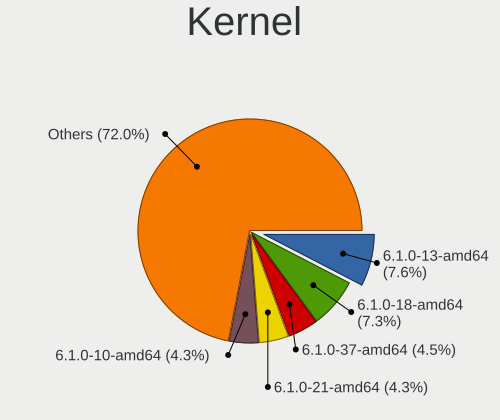

| Version               | Notebooks | Percent |
|-----------------------|-----------|---------|
| 6.1.0-13-amd64        | 320       | 7.6%    |
| 6.1.0-18-amd64        | 308       | 7.32%   |
| 6.1.0-37-amd64        | 188       | 4.47%   |
| 6.1.0-21-amd64        | 183       | 4.35%   |
| 6.1.0-10-amd64        | 181       | 4.3%    |
| 6.1.0-23-amd64        | 179       | 4.25%   |
| 6.1.0-9-amd64         | 175       | 4.16%   |
| 6.1.0-17-amd64        | 168       | 3.99%   |
| 6.1.0-28-amd64        | 150       | 3.56%   |
| 6.1.0-25-amd64        | 147       | 3.49%   |
| 6.1.0-26-amd64        | 127       | 3.02%   |
| 6.1.0-12-amd64        | 125       | 2.97%   |
| 6.1.0-31-amd64        | 116       | 2.76%   |
| 6.1.0-22-amd64        | 115       | 2.73%   |
| 6.1.0-32-amd64        | 113       | 2.69%   |
| 6.1.0-11-amd64        | 109       | 2.59%   |
| 6.1.0-27-amd64        | 96        | 2.28%   |
| 6.1.0-16-amd64        | 92        | 2.19%   |
| 6.1.0-30-amd64        | 88        | 2.09%   |
| 6.1.0-4-amd64         | 74        | 1.76%   |
| 6.1.0-20-amd64        | 71        | 1.69%   |
| 6.1.0-15-amd64        | 58        | 1.38%   |
| 6.1.0-7-amd64         | 51        | 1.21%   |
| 6.1.0-34-amd64        | 50        | 1.19%   |
| 6.1.0-33-amd64        | 43        | 1.02%   |
| 6.1.0-35-amd64        | 40        | 0.95%   |
| 6.1.0-29-amd64        | 39        | 0.93%   |
| 6.1.0-40-amd64        | 38        | 0.9%    |
| 6.1.0-6-amd64         | 27        | 0.64%   |
| 6.1.0-38-amd64        | 27        | 0.64%   |
| 6.10.11+bpo-amd64     | 26        | 0.62%   |
| 6.5.0-0.deb12.4-amd64 | 25        | 0.59%   |
| 6.1.0-5-amd64         | 21        | 0.5%    |
| 6.1.0-3-amd64         | 21        | 0.5%    |
| 6.9.7+bpo-amd64       | 18        | 0.43%   |
| 6.7.12+bpo-amd64      | 18        | 0.43%   |
| 6.6.13+bpo-amd64      | 18        | 0.43%   |
| 6.1.0-41-amd64        | 18        | 0.43%   |
| 6.12.22+bpo-amd64     | 17        | 0.4%    |
| 6.5.0-0.deb12.1-amd64 | 16        | 0.38%   |

Kernel Family
-------------

Linux kernel without a distro release

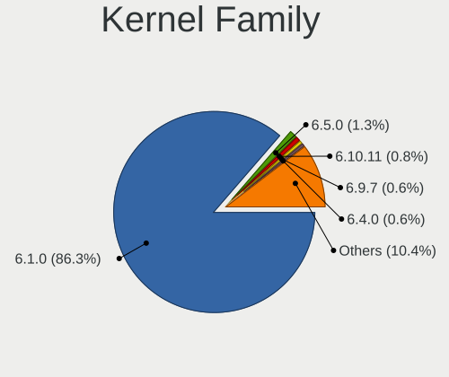

| Version | Notebooks | Percent |
|---------|-----------|---------|
| 6.1.0   | 3333      | 86.35%  |
| 6.5.0   | 51        | 1.32%   |
| 6.10.11 | 31        | 0.8%    |
| 6.9.7   | 22        | 0.57%   |
| 6.4.0   | 22        | 0.57%   |
| 6.7.12  | 21        | 0.54%   |
| 6.8.12  | 20        | 0.52%   |
| 6.12.22 | 20        | 0.52%   |
| 6.6.13  | 19        | 0.49%   |
| 6.10.6  | 16        | 0.41%   |
| 6.12.9  | 14        | 0.36%   |
| 6.12.12 | 14        | 0.36%   |
| 6.11.5  | 14        | 0.36%   |
| 6.8.4   | 13        | 0.34%   |
| 5.10.0  | 12        | 0.31%   |
| 6.2.16  | 11        | 0.28%   |
| 6.0.0   | 9         | 0.23%   |
| 6.11.10 | 8         | 0.21%   |
| 6.8.9   | 6         | 0.16%   |
| 6.12.27 | 6         | 0.16%   |
| 6.5.11  | 5         | 0.13%   |
| 6.3.0   | 5         | 0.13%   |
| 6.12.38 | 5         | 0.13%   |
| 6.12.32 | 5         | 0.13%   |
| 6.12.30 | 5         | 0.13%   |
| 6.9.3   | 4         | 0.1%    |
| 6.9.10  | 4         | 0.1%    |
| 6.7.9   | 4         | 0.1%    |
| 6.6.58  | 4         | 0.1%    |
| 6.6.43  | 4         | 0.1%    |
| 6.6.10  | 4         | 0.1%    |
| 6.9.6   | 3         | 0.08%   |
| 6.7.4   | 3         | 0.08%   |
| 6.6.11  | 3         | 0.08%   |
| 6.6.0   | 3         | 0.08%   |
| 6.5.3   | 3         | 0.08%   |
| 6.14.2  | 3         | 0.08%   |
| 6.12.6  | 3         | 0.08%   |
| 6.12.33 | 3         | 0.08%   |
| 6.1.38  | 3         | 0.08%   |

Kernel Major Ver.
-----------------

Linux kernel major version

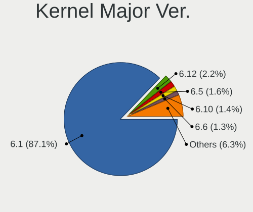

| Version | Notebooks | Percent |
|---------|-----------|---------|
| 6.1     | 3349      | 87.15%  |
| 6.12    | 85        | 2.21%   |
| 6.5     | 63        | 1.64%   |
| 6.10    | 55        | 1.43%   |
| 6.6     | 49        | 1.28%   |
| 6.8     | 44        | 1.14%   |
| 6.9     | 40        | 1.04%   |
| 6.7     | 35        | 0.91%   |
| 6.4     | 28        | 0.73%   |
| 6.11    | 26        | 0.68%   |
| 5.10    | 15        | 0.39%   |
| 6.2     | 13        | 0.34%   |
| 6.0     | 9         | 0.23%   |
| 6.3     | 8         | 0.21%   |
| 6.14    | 8         | 0.21%   |
| 6.15    | 5         | 0.13%   |
| 6.13    | 3         | 0.08%   |
| 6       | 2         | 0.05%   |
| 4.19    | 2         | 0.05%   |
| 6.17    | 1         | 0.03%   |
| 5.19    | 1         | 0.03%   |
| 5.16    | 1         | 0.03%   |
| 5.15    | 1         | 0.03%   |

Arch
----

OS architecture (x86_64, i586, etc.)

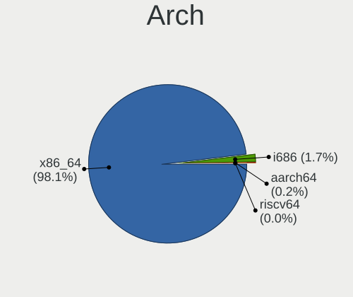

| Name    | Notebooks | Percent |
|---------|-----------|---------|
| x86_64  | 3697      | 98.09%  |
| i686    | 63        | 1.67%   |
| aarch64 | 6         | 0.16%   |
| armv7l  | 2         | 0.05%   |
| riscv64 | 1         | 0.03%   |

DE
--

Desktop Environment

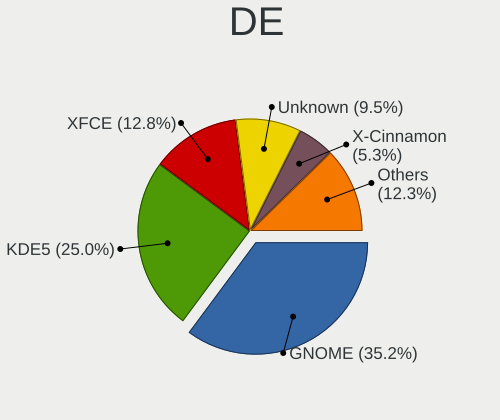

| Name                        | Notebooks | Percent |
|-----------------------------|-----------|---------|
| GNOME                       | 1349      | 35.16%  |
| KDE5                        | 959       | 24.99%  |
| XFCE                        | 491       | 12.8%   |
| Unknown                     | 363       | 9.46%   |
| X-Cinnamon                  | 202       | 5.26%   |
| MATE                        | 140       | 3.65%   |
| LXDE                        | 58        | 1.51%   |
| LXQt                        | 53        | 1.38%   |
| i3                          | 48        | 1.25%   |
| Cinnamon                    | 33        | 0.86%   |
| Trinity                     | 17        | 0.44%   |
| KDE                         | 16        | 0.42%   |
| GNOME Flashback             | 15        | 0.39%   |
| GNOME Classic               | 14        | 0.36%   |
| Budgie                      | 10        | 0.26%   |
| BunsenLabs                  | 9         | 0.23%   |
| lightdm-xsession            | 8         | 0.21%   |
| KDE6                        | 6         | 0.16%   |
| Enlightenment               | 5         | 0.13%   |
| sway                        | 4         | 0.1%    |
| Openbox                     | 4         | 0.1%    |
| fluxbox                     | 4         | 0.1%    |
| default                     | 4         | 0.1%    |
| bspwm                       | 3         | 0.08%   |
| x-session-manager           | 2         | 0.05%   |
| WindowMaker                 | 2         | 0.05%   |
| ICEWM                       | 2         | 0.05%   |
| DWM                         | 2         | 0.05%   |
| Deepin                      | 2         | 0.05%   |
| Cutefish                    | 2         | 0.05%   |
| awesome                     | 2         | 0.05%   |
| xmonad                      | 1         | 0.03%   |
| Unity                       | 1         | 0.03%   |
| qtile                       | 1         | 0.03%   |
| Pantheon                    | 1         | 0.03%   |
| mwm                         | 1         | 0.03%   |
| labwc                       | 1         | 0.03%   |
| i3-with-shmlog              | 1         | 0.03%   |
| /usr/local/bin/start-mwm.sh | 1         | 0.03%   |

Display Server
--------------

X11 or Wayland

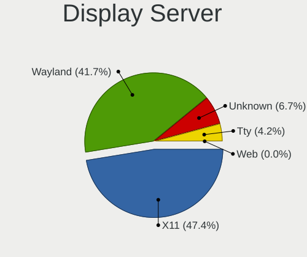

| Name    | Notebooks | Percent |
|---------|-----------|---------|
| X11     | 1821      | 47.41%  |
| Wayland | 1600      | 41.66%  |
| Unknown | 259       | 6.74%   |
| Tty     | 160       | 4.17%   |
| Web     | 1         | 0.03%   |

Display Manager
---------------

SDDM, LightDM, etc.

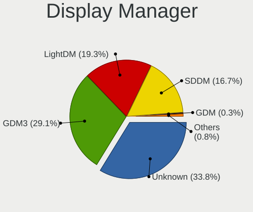

| Name          | Notebooks | Percent |
|---------------|-----------|---------|
| Unknown       | 1291      | 33.75%  |
| GDM3          | 1112      | 29.07%  |
| LightDM       | 740       | 19.35%  |
| SDDM          | 637       | 16.65%  |
| GDM           | 13        | 0.34%   |
| LXDM          | 8         | 0.21%   |
| XDM           | 5         | 0.13%   |
| TDM           | 5         | 0.13%   |
| SLiM          | 4         | 0.1%    |
| GREETD        | 4         | 0.1%    |
| WDM           | 2         | 0.05%   |
| Ly            | 2         | 0.05%   |
| NODM          | 1         | 0.03%   |
| DARKDM_ON_TTY | 1         | 0.03%   |

OS Lang
-------

Language

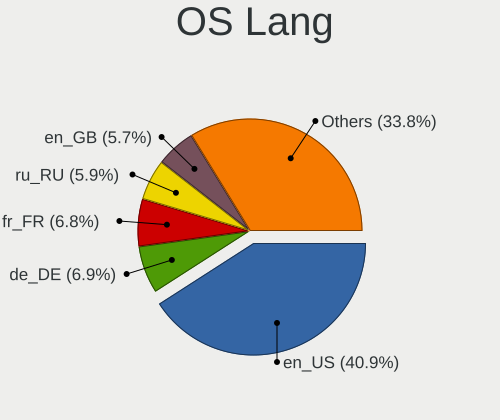

| Lang    | Notebooks | Percent |
|---------|-----------|---------|
| en_US   | 1557      | 40.91%  |
| de_DE   | 262       | 6.88%   |
| fr_FR   | 260       | 6.83%   |
| ru_RU   | 225       | 5.91%   |
| en_GB   | 217       | 5.7%    |
| Unknown | 183       | 4.81%   |
| it_IT   | 127       | 3.34%   |
| pt_BR   | 114       | 3%      |
| es_ES   | 110       | 2.89%   |
| en_CA   | 59        | 1.55%   |
| en_IN   | 53        | 1.39%   |
| pl_PL   | 48        | 1.26%   |
| es_MX   | 46        | 1.21%   |
| en_AU   | 42        | 1.1%    |
| zh_CN   | 32        | 0.84%   |
| es_AR   | 27        | 0.71%   |
| sv_SE   | 25        | 0.66%   |
| nl_NL   | 25        | 0.66%   |
| hu_HU   | 24        | 0.63%   |
| C       | 24        | 0.63%   |
| tr_TR   | 21        | 0.55%   |
| es_CL   | 21        | 0.55%   |
| en_IE   | 21        | 0.55%   |
| de_CH   | 16        | 0.42%   |
| cs_CZ   | 16        | 0.42%   |
| pt_PT   | 14        | 0.37%   |
| de_AT   | 14        | 0.37%   |
| es_CO   | 13        | 0.34%   |
| en_NZ   | 11        | 0.29%   |
| en_PH   | 10        | 0.26%   |
| fr_BE   | 9         | 0.24%   |
| fi_FI   | 9         | 0.24%   |
| ca_ES   | 9         | 0.24%   |
| ja_JP   | 7         | 0.18%   |
| fr_CH   | 7         | 0.18%   |
| fr_CA   | 7         | 0.18%   |
| es_VE   | 7         | 0.18%   |
| es_UY   | 7         | 0.18%   |
| en_IL   | 7         | 0.18%   |
| da_DK   | 7         | 0.18%   |

Boot Mode
---------

EFI or BIOS

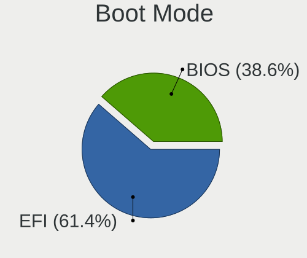

| Mode | Notebooks | Percent |
|------|-----------|---------|
| EFI  | 2328      | 61.38%  |
| BIOS | 1465      | 38.62%  |

Filesystem
----------

Type of filesystem

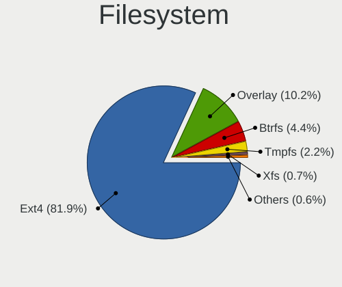

| Type    | Notebooks | Percent |
|---------|-----------|---------|
| Ext4    | 3112      | 81.87%  |
| Overlay | 389       | 10.23%  |
| Btrfs   | 166       | 4.37%   |
| Tmpfs   | 85        | 2.24%   |
| Xfs     | 25        | 0.66%   |
| Zfs     | 15        | 0.39%   |
| Ext3    | 4         | 0.11%   |
| Ext2    | 2         | 0.05%   |
| Aufs    | 2         | 0.05%   |
| Jfs     | 1         | 0.03%   |

Part. scheme
------------

Scheme of partitioning

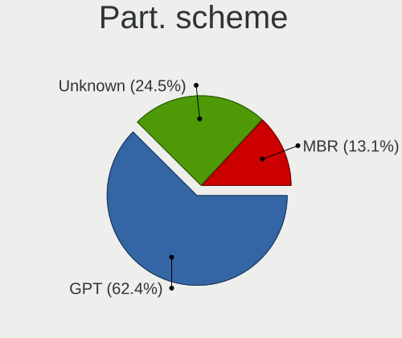

| Type    | Notebooks | Percent |
|---------|-----------|---------|
| GPT     | 2373      | 62.45%  |
| Unknown | 930       | 24.47%  |
| MBR     | 497       | 13.08%  |

Dual Boot with Linux/BSD
------------------------

Hosting more than one Linux/BSD

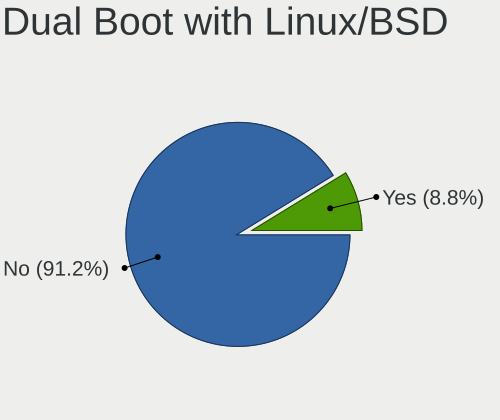

| Dual boot | Notebooks | Percent |
|-----------|-----------|---------|
| No        | 3469      | 91.24%  |
| Yes       | 333       | 8.76%   |

Dual Boot (Win)
---------------

Hosting Linux and Windows

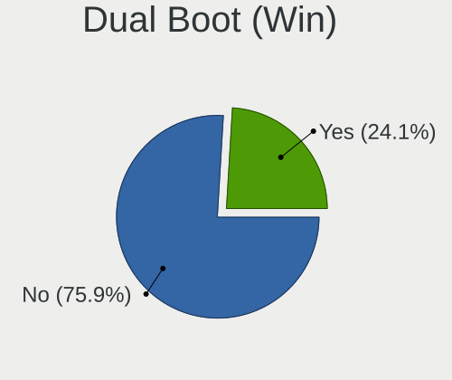

| Dual boot | Notebooks | Percent |
|-----------|-----------|---------|
| No        | 2883      | 75.95%  |
| Yes       | 913       | 24.05%  |

Board
-----

Vendor
------

Motherboard manufacturer

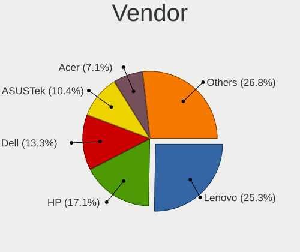

| Name                  | Notebooks | Percent |
|-----------------------|-----------|---------|
| Lenovo                | 952       | 25.27%  |
| Hewlett-Packard       | 646       | 17.14%  |
| Dell                  | 502       | 13.32%  |
| ASUSTek Computer      | 390       | 10.35%  |
| Acer                  | 269       | 7.14%   |
| Google                | 143       | 3.8%    |
| Apple                 | 132       | 3.5%    |
| MSI                   | 74        | 1.96%   |
| Samsung Electronics   | 56        | 1.49%   |
| Toshiba               | 53        | 1.41%   |
| HUAWEI                | 51        | 1.35%   |
| Unknown               | 40        | 1.06%   |
| Aquarius              | 37        | 0.98%   |
| Sony                  | 35        | 0.93%   |
| Fujitsu               | 21        | 0.56%   |
| HONOR                 | 19        | 0.5%    |
| Framework             | 19        | 0.5%    |
| Medion                | 14        | 0.37%   |
| Alienware             | 14        | 0.37%   |
| Notebook              | 13        | 0.35%   |
| Positivo              | 12        | 0.32%   |
| TUXEDO                | 11        | 0.29%   |
| Packard Bell          | 11        | 0.29%   |
| Intel                 | 11        | 0.29%   |
| Timi                  | 10        | 0.27%   |
| LG Electronics        | 10        | 0.27%   |
| Panasonic             | 8         | 0.21%   |
| Gigabyte Technology   | 8         | 0.21%   |
| Positivo Bahia - VAIO | 7         | 0.19%   |
| Fujitsu Siemens       | 7         | 0.19%   |
| eMachines             | 7         | 0.19%   |
| PC Specialist         | 6         | 0.16%   |
| IBM                   | 6         | 0.16%   |
| Schenker              | 5         | 0.13%   |
| Razer                 | 5         | 0.13%   |
| Insyde                | 5         | 0.13%   |
| GPU Company           | 5         | 0.13%   |
| Clevo                 | 5         | 0.13%   |
| Chuwi                 | 5         | 0.13%   |
| UNOWHY                | 4         | 0.11%   |

Model
-----

Motherboard model

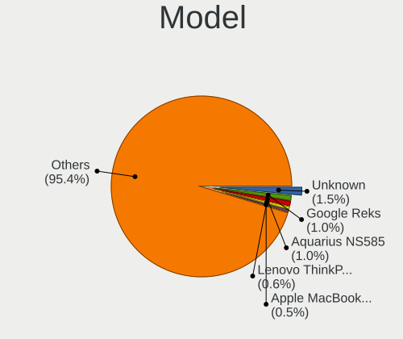

| Name                                       | Notebooks | Percent |
|--------------------------------------------|-----------|---------|
| Unknown                                    | 57        | 1.51%   |
| Google Reks                                | 39        | 1.04%   |
| Aquarius NS585                             | 37        | 0.98%   |
| Lenovo ThinkPad E475 20H40006US            | 23        | 0.61%   |
| Apple MacBookAir7,2                        | 19        | 0.5%    |
| HP Notebook                                | 18        | 0.48%   |
| Google Stout                               | 18        | 0.48%   |
| Google Enguarde                            | 16        | 0.42%   |
| Dell Latitude E7440                        | 13        | 0.35%   |
| Lenovo ThinkPad 13 2nd Gen 20J10046US      | 12        | 0.32%   |
| HP Pavilion dv6                            | 11        | 0.29%   |
| HP EliteBook 840 G6                        | 11        | 0.29%   |
| HP EliteBook 745 G3                        | 10        | 0.27%   |
| Dell Latitude E6420                        | 10        | 0.27%   |
| Dell Latitude E6400                        | 10        | 0.27%   |
| Dell Latitude 7480                         | 10        | 0.27%   |
| Apple MacBook5,2                           | 10        | 0.27%   |
| HP Pavilion Notebook                       | 9         | 0.24%   |
| HP EliteBook 8460p                         | 9         | 0.24%   |
| Dell Latitude 7490                         | 9         | 0.24%   |
| ASUS Vivobook Go E1504FA_E1504FA           | 9         | 0.24%   |
| Lenovo ThinkPad X230 2325V2Y               | 8         | 0.21%   |
| Lenovo IdeaPad 3 15ALC6 82KU               | 8         | 0.21%   |
| HP Pavilion dv7                            | 8         | 0.21%   |
| HP Laptop 15s-eq2xxx                       | 8         | 0.21%   |
| HP EliteBook 840 G3                        | 8         | 0.21%   |
| Dell Precision 5570                        | 8         | 0.21%   |
| Apple MacBookPro9,2                        | 8         | 0.21%   |
| Apple MacBookPro12,1                       | 8         | 0.21%   |
| HP ProBook 650 G1                          | 7         | 0.19%   |
| HP ProBook 450 G3                          | 7         | 0.19%   |
| HP EliteBook 845 G8 Notebook PC            | 7         | 0.19%   |
| Framework Laptop 13 (AMD Ryzen 7040Series) | 7         | 0.19%   |
| Framework Laptop (13th Gen Intel Core)     | 7         | 0.19%   |
| Dell Vostro 15-3568                        | 7         | 0.19%   |
| Dell Latitude 5480                         | 7         | 0.19%   |
| Apple MacBookPro8,1                        | 7         | 0.19%   |
| Acer Aspire A515-57                        | 7         | 0.19%   |
| Acer Aspire A515-56                        | 7         | 0.19%   |
| Acer Aspire A315-58                        | 7         | 0.19%   |

Model Family
------------

Motherboard model prefix

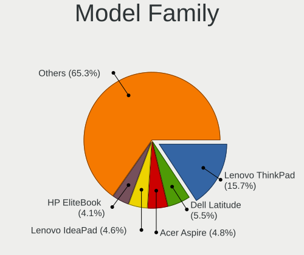

| Name               | Notebooks | Percent |
|--------------------|-----------|---------|
| Lenovo ThinkPad    | 593       | 15.74%  |
| Dell Latitude      | 208       | 5.52%   |
| Acer Aspire        | 181       | 4.8%    |
| Lenovo IdeaPad     | 172       | 4.56%   |
| HP EliteBook       | 154       | 4.09%   |
| ASUS VivoBook      | 121       | 3.21%   |
| HP Pavilion        | 106       | 2.81%   |
| Dell Inspiron      | 98        | 2.6%    |
| HP Laptop          | 91        | 2.42%   |
| HP ProBook         | 90        | 2.39%   |
| Dell Precision     | 62        | 1.65%   |
| Dell XPS           | 57        | 1.51%   |
| Unknown            | 57        | 1.51%   |
| ASUS ASUS          | 44        | 1.17%   |
| Toshiba Satellite  | 41        | 1.09%   |
| Dell Vostro        | 41        | 1.09%   |
| Google Reks        | 39        | 1.04%   |
| ASUS ZenBook       | 37        | 0.98%   |
| Aquarius NS585     | 37        | 0.98%   |
| HP ZBook           | 32        | 0.85%   |
| Lenovo Legion      | 31        | 0.82%   |
| Lenovo Yoga        | 28        | 0.74%   |
| Acer Nitro         | 27        | 0.72%   |
| Lenovo ThinkBook   | 25        | 0.66%   |
| Apple MacBookAir7  | 23        | 0.61%   |
| ASUS ROG           | 22        | 0.58%   |
| HP Victus          | 20        | 0.53%   |
| HP Compaq          | 20        | 0.53%   |
| Acer Swift         | 20        | 0.53%   |
| Framework Laptop   | 19        | 0.5%    |
| HP OMEN            | 18        | 0.48%   |
| HP Notebook        | 18        | 0.48%   |
| Google Stout       | 18        | 0.48%   |
| Fujitsu LIFEBOOK   | 18        | 0.48%   |
| HP 255             | 17        | 0.45%   |
| Google Enguarde    | 16        | 0.42%   |
| Apple MacBookPro11 | 15        | 0.4%    |
| HP ENVY            | 14        | 0.37%   |
| Acer TravelMate    | 14        | 0.37%   |
| Lenovo V15         | 13        | 0.35%   |

MFG Year
--------

Motherboard manufacture year

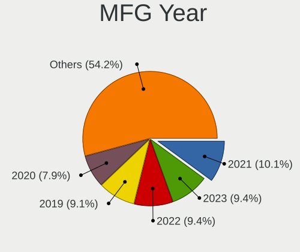

| Year    | Notebooks | Percent |
|---------|-----------|---------|
| 2021    | 379       | 10.06%  |
| 2023    | 354       | 9.39%   |
| 2022    | 353       | 9.37%   |
| 2019    | 342       | 9.08%   |
| 2020    | 298       | 7.91%   |
| 2018    | 225       | 5.97%   |
| 2013    | 200       | 5.31%   |
| 2017    | 197       | 5.23%   |
| 2011    | 194       | 5.15%   |
| 2012    | 191       | 5.07%   |
| 2024    | 163       | 4.33%   |
| 2016    | 163       | 4.33%   |
| 2014    | 151       | 4.01%   |
| 2015    | 136       | 3.61%   |
| 2008    | 116       | 3.08%   |
| 2010    | 103       | 2.73%   |
| 2009    | 90        | 2.39%   |
| 2007    | 45        | 1.19%   |
| 2006    | 33        | 0.88%   |
| 2025    | 12        | 0.32%   |
| Unknown | 9         | 0.24%   |
| 2005    | 8         | 0.21%   |
| 2004    | 4         | 0.11%   |
| 2001    | 2         | 0.05%   |

Form Factor
-----------

Physical design of the computer

| Name     | Notebooks | Percent |
|----------|-----------|---------|
| Notebook | 3768      | 100%    |

Secure Boot
-----------

Enabled or disabled

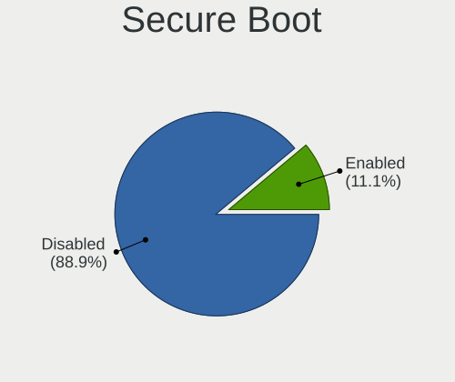

| State    | Notebooks | Percent |
|----------|-----------|---------|
| Disabled | 3367      | 88.91%  |
| Enabled  | 420       | 11.09%  |

Coreboot
--------

Have coreboot on board

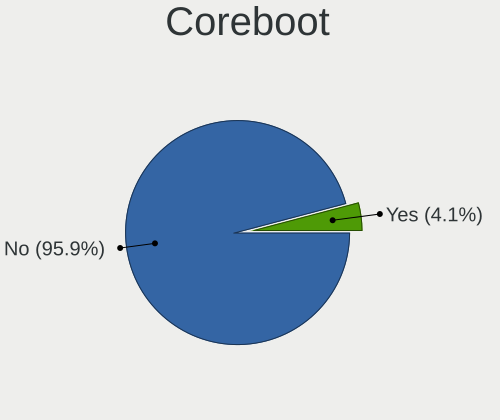

| Used | Notebooks | Percent |
|------|-----------|---------|
| No   | 3613      | 95.89%  |
| Yes  | 155       | 4.11%   |

RAM Size
--------

Total RAM memory

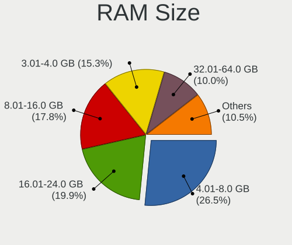

| Size in GB  | Notebooks | Percent |
|-------------|-----------|---------|
| 4.01-8.0    | 1009      | 26.55%  |
| 16.01-24.0  | 757       | 19.92%  |
| 8.01-16.0   | 677       | 17.81%  |
| 3.01-4.0    | 580       | 15.26%  |
| 32.01-64.0  | 379       | 9.97%   |
| 1.01-2.0    | 132       | 3.47%   |
| 64.01-256.0 | 99        | 2.6%    |
| 24.01-32.0  | 97        | 2.55%   |
| 2.01-3.0    | 50        | 1.32%   |
| 0.51-1.0    | 16        | 0.42%   |
| 0.01-0.5    | 5         | 0.13%   |

RAM Used
--------

Used RAM memory

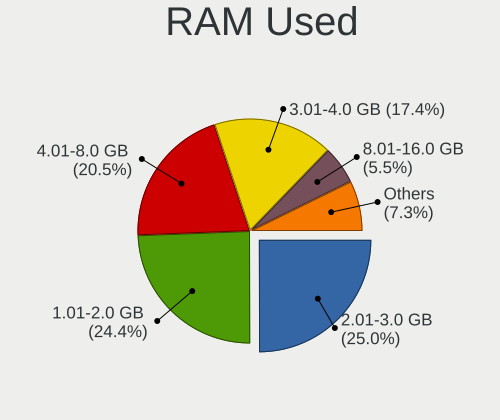

| Used GB    | Notebooks | Percent |
|------------|-----------|---------|
| 2.01-3.0   | 1007      | 24.97%  |
| 1.01-2.0   | 985       | 24.42%  |
| 4.01-8.0   | 826       | 20.48%  |
| 3.01-4.0   | 700       | 17.36%  |
| 8.01-16.0  | 222       | 5.5%    |
| 0.51-1.0   | 204       | 5.06%   |
| 0.01-0.5   | 47        | 1.17%   |
| 16.01-24.0 | 29        | 0.72%   |
| 24.01-32.0 | 10        | 0.25%   |
| 32.01-64.0 | 3         | 0.07%   |

Total Drives
------------

Number of drives on board

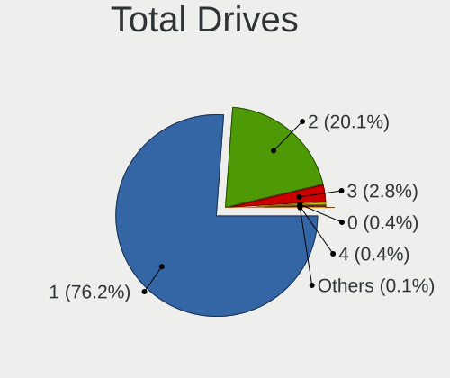

| Drives | Notebooks | Percent |
|--------|-----------|---------|
| 1      | 2908      | 76.17%  |
| 2      | 768       | 20.12%  |
| 3      | 106       | 2.78%   |
| 0      | 17        | 0.45%   |
| 4      | 14        | 0.37%   |
| 5      | 4         | 0.1%    |
| 7      | 1         | 0.03%   |

Has CD-ROM
----------

Has CD-ROM on board

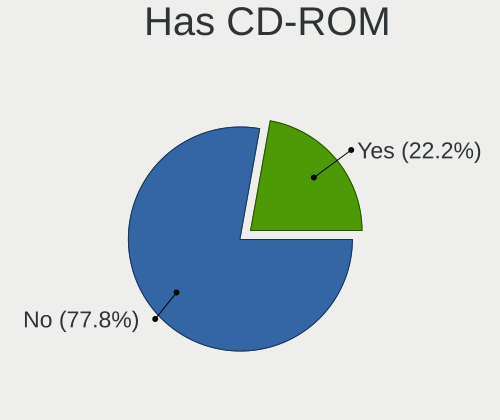

| Presented | Notebooks | Percent |
|-----------|-----------|---------|
| No        | 2940      | 77.82%  |
| Yes       | 838       | 22.18%  |

Has Ethernet
------------

Has Ethernet on board

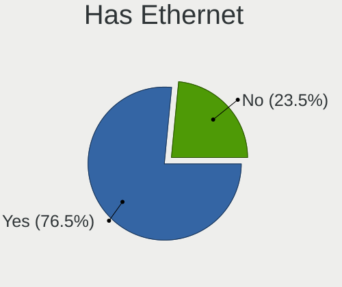

| Presented | Notebooks | Percent |
|-----------|-----------|---------|
| Yes       | 2897      | 76.52%  |
| No        | 889       | 23.48%  |

Has WiFi
--------

Has WiFi module

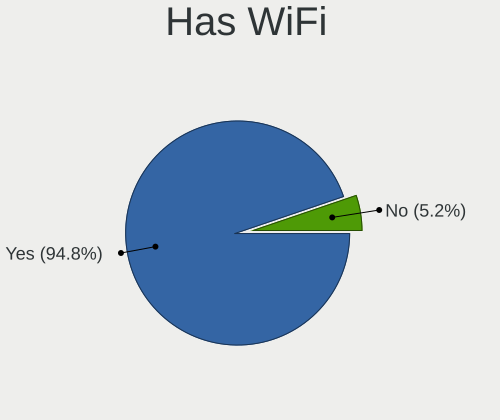

| Presented | Notebooks | Percent |
|-----------|-----------|---------|
| Yes       | 3580      | 94.78%  |
| No        | 197       | 5.22%   |

Has Bluetooth
-------------

Has Bluetooth module

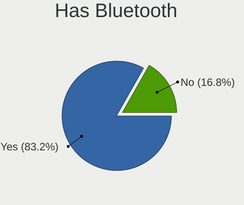

| Presented | Notebooks | Percent |
|-----------|-----------|---------|
| Yes       | 3148      | 83.21%  |
| No        | 635       | 16.79%  |

Location
--------

Country
-------

Geographic location (country)

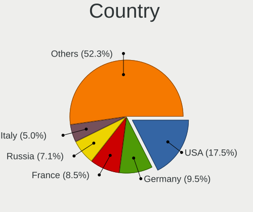

| Country     | Notebooks | Percent |
|-------------|-----------|---------|
| USA         | 664       | 17.51%  |
| Germany     | 362       | 9.55%   |
| France      | 323       | 8.52%   |
| Russia      | 270       | 7.12%   |
| Italy       | 190       | 5.01%   |
| Brazil      | 166       | 4.38%   |
| Spain       | 158       | 4.17%   |
| Canada      | 106       | 2.8%    |
| UK          | 105       | 2.77%   |
| Poland      | 100       | 2.64%   |
| India       | 72        | 1.9%    |
| Sweden      | 70        | 1.85%   |
| Netherlands | 69        | 1.82%   |
| Mexico      | 67        | 1.77%   |
| Belgium     | 48        | 1.27%   |
| Switzerland | 46        | 1.21%   |
| China       | 45        | 1.19%   |
| Australia   | 45        | 1.19%   |
| Turkey      | 44        | 1.16%   |
| Argentina   | 39        | 1.03%   |
| Indonesia   | 37        | 0.98%   |
| Czechia     | 35        | 0.92%   |
| Romania     | 34        | 0.9%    |
| Hungary     | 34        | 0.9%    |
| Austria     | 31        | 0.82%   |
| Portugal    | 30        | 0.79%   |
| Chile       | 30        | 0.79%   |
| Colombia    | 29        | 0.76%   |
| Norway      | 27        | 0.71%   |
| Finland     | 23        | 0.61%   |
| Greece      | 22        | 0.58%   |
| Denmark     | 20        | 0.53%   |
| Philippines | 19        | 0.5%    |
| Bulgaria    | 17        | 0.45%   |
| Ukraine     | 15        | 0.4%    |
| Vietnam     | 14        | 0.37%   |
| Costa Rica  | 14        | 0.37%   |
| Japan       | 13        | 0.34%   |
| Belarus     | 13        | 0.34%   |
| New Zealand | 12        | 0.32%   |

City
----

Geographic location (city)

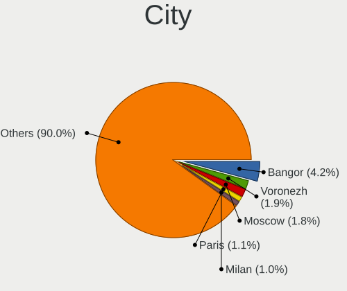

| City              | Notebooks | Percent |
|-------------------|-----------|---------|
| Bangor            | 167       | 4.22%   |
| Voronezh          | 74        | 1.87%   |
| Moscow            | 70        | 1.77%   |
| Paris             | 44        | 1.11%   |
| Milan             | 40        | 1.01%   |
| Roubaix           | 37        | 0.94%   |
| Berlin            | 36        | 0.91%   |
| Madrid            | 30        | 0.76%   |
| Amsterdam         | 30        | 0.76%   |
| Frankfurt am Main | 22        | 0.56%   |
| Warsaw            | 20        | 0.51%   |
| Toronto           | 19        | 0.48%   |
| Budapest          | 18        | 0.46%   |
| Vienna            | 17        | 0.43%   |
| Sao Paulo         | 17        | 0.43%   |
| Santiago          | 17        | 0.43%   |
| Bucharest         | 17        | 0.43%   |
| Bogotá           | 17        | 0.43%   |
| Barcelona         | 16        | 0.4%    |
| Stockholm         | 15        | 0.38%   |
| St Petersburg     | 15        | 0.38%   |
| Prague            | 15        | 0.38%   |
| Quimper           | 14        | 0.35%   |
| Hamburg           | 14        | 0.35%   |
| Bengaluru         | 14        | 0.35%   |
| Antwerp           | 14        | 0.35%   |
| Saltsjoe-Boo      | 13        | 0.33%   |
| Munich            | 13        | 0.33%   |
| Montreal          | 13        | 0.33%   |
| Mexico City       | 13        | 0.33%   |
| Helsinki          | 13        | 0.33%   |
| Dresden           | 13        | 0.33%   |
| Sydney            | 12        | 0.3%    |
| Melbourne         | 12        | 0.3%    |
| Istanbul          | 12        | 0.3%    |
| Dublin            | 12        | 0.3%    |
| Brasília         | 12        | 0.3%    |
| Athens            | 12        | 0.3%    |
| Rome              | 11        | 0.28%   |
| London            | 11        | 0.28%   |

Drives
------

Drive Vendor
------------

Hard drive vendors

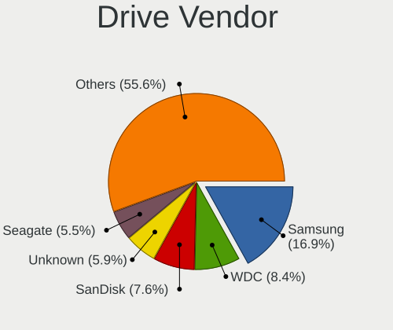

| Vendor                      | Notebooks | Drives | Percent |
|-----------------------------|-----------|--------|---------|
| Samsung Electronics         | 786       | 997    | 16.94%  |
| WDC                         | 391       | 461    | 8.43%   |
| SanDisk                     | 354       | 414    | 7.63%   |
| Unknown                     | 276       | 323    | 5.95%   |
| Seagate                     | 253       | 291    | 5.45%   |
| SK hynix                    | 248       | 305    | 5.34%   |
| Kingston                    | 237       | 295    | 5.11%   |
| Toshiba                     | 221       | 251    | 4.76%   |
| Micron Technology           | 211       | 234    | 4.55%   |
| Crucial                     | 155       | 183    | 3.34%   |
| Intel                       | 132       | 164    | 2.84%   |
| A-DATA Technology           | 93        | 135    | 2%      |
| KIOXIA                      | 91        | 105    | 1.96%   |
| Hitachi                     | 73        | 81     | 1.57%   |
| HGST                        | 71        | 82     | 1.53%   |
| Apple                       | 65        | 80     | 1.4%    |
| China                       | 59        | 67     | 1.27%   |
| Unknown                     | 59        | 65     | 1.27%   |
| Kingston Technology Company | 38        | 50     | 0.82%   |
| Transcend                   | 29        | 39     | 0.63%   |
| SSSTC                       | 27        | 29     | 0.58%   |
| Phison                      | 27        | 30     | 0.58%   |
| Intenso                     | 27        | 32     | 0.58%   |
| SPCC                        | 26        | 33     | 0.56%   |
| Phison Electronics          | 24        | 33     | 0.52%   |
| Patriot                     | 22        | 28     | 0.47%   |
| Silicon Motion              | 21        | 25     | 0.45%   |
| Lexar                       | 21        | 21     | 0.45%   |
| Fujitsu                     | 21        | 25     | 0.45%   |
| PNY                         | 20        | 25     | 0.43%   |
| MAXIO Technology (Hangzhou) | 20        | 25     | 0.43%   |
| Netac                       | 19        | 23     | 0.41%   |
| JMicron Technology          | 19        | 19     | 0.41%   |
| Micron/Crucial Technology   | 18        | 19     | 0.39%   |
| Team                        | 17        | 18     | 0.37%   |
| ADATA Technology            | 17        | 19     | 0.37%   |
| LITEON                      | 16        | 18     | 0.34%   |
| UMIS                        | 15        | 16     | 0.32%   |
| GOODRAM                     | 14        | 15     | 0.3%    |
| Fanxiang                    | 14        | 19     | 0.3%    |

Drive Model
-----------

Hard drive models

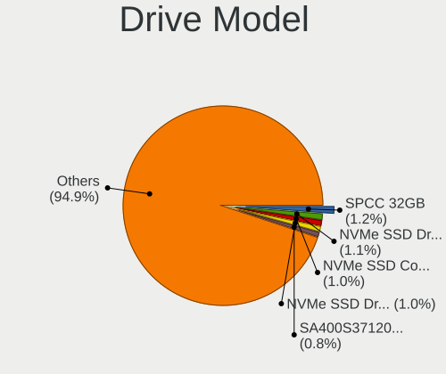

| Model                                                | Notebooks | Percent |
|------------------------------------------------------|-----------|---------|
| Unknown                                              | 59        | 1.23%   |
| SanDisk NVMe SSD Drive 512GB                         | 52        | 1.09%   |
| Samsung NVMe SSD Controller SM981/PM981/PM983 1TB    | 47        | 0.98%   |
| SanDisk NVMe SSD Drive 1TB                           | 46        | 0.96%   |
| Kingston SA400S37120G 120GB SSD                      | 40        | 0.84%   |
| Kingston SA400S37240G 240GB SSD                      | 38        | 0.79%   |
| A-DATA SU800 512GB SSD                               | 38        | 0.79%   |
| Seagate ST1000LM035-1RK172 1TB                       | 36        | 0.75%   |
| Kingston SA400S37480G 480GB SSD                      | 33        | 0.69%   |
| Unknown MMC Card  32GB                               | 26        | 0.54%   |
| Seagate ST1000LM024 HN-M101MBB 1TB                   | 25        | 0.52%   |
| Micron 2400_MTFDKBA512QFM 512GB                      | 24        | 0.5%    |
| Unknown MMC Card  64GB                               | 23        | 0.48%   |
| Unknown DF4016  16GB                                 | 23        | 0.48%   |
| Micron 2450_MTFDKBA512TFK 512GB                      | 23        | 0.48%   |
| Crucial CT500MX500SSD1 500GB                         | 23        | 0.48%   |
| HGST HTS721010A9E630 1TB                             | 22        | 0.46%   |
| Toshiba MQ04ABF100 1TB                               | 21        | 0.44%   |
| Samsung NVMe SSD Controller PM9A1/PM9A3/980PRO 1TB   | 20        | 0.42%   |
| Toshiba MQ01ABD100 1TB                               | 19        | 0.4%    |
| Samsung SSD 980 1TB                                  | 19        | 0.4%    |
| Toshiba MQ01ABF050 500GB                             | 18        | 0.38%   |
| Sandisk WD Black SN750 / PC SN730 NVMe SSD 500GB     | 18        | 0.38%   |
| SanDisk SSD U100 16GB                                | 18        | 0.38%   |
| Samsung SSD 870 EVO 500GB                            | 18        | 0.38%   |
| Intel SSDPEKNU512GZ 512GB                            | 18        | 0.38%   |
| Seagate ST500LT012-1DG142 500GB                      | 17        | 0.35%   |
| Samsung SSD 860 EVO 500GB                            | 17        | 0.35%   |
| Apple SSD SM0128G 121GB                              | 17        | 0.35%   |
| Unknown MMC Card  128GB                              | 16        | 0.33%   |
| Seagate ST9500325AS 500GB                            | 16        | 0.33%   |
| Samsung MZVL4512HBLU-00BTW 512GB                     | 16        | 0.33%   |
| Samsung SSD 970 EVO Plus 1TB                         | 15        | 0.31%   |
| Samsung NVMe SSD Controller SM961/PM961/SM963 1024GB | 15        | 0.31%   |
| Samsung SSD 990 PRO 2TB                              | 14        | 0.29%   |
| Samsung SSD 860 EVO 250GB                            | 14        | 0.29%   |
| Kingston Company SNV2S1000G 1TB                      | 14        | 0.29%   |
| Toshiba XG6 NVMe SSD Controller 1024GB               | 13        | 0.27%   |
| Sandisk WD Blue SN550 NVMe SSD 1024GB                | 13        | 0.27%   |
| Samsung SSD 850 EVO 250GB                            | 13        | 0.27%   |

HDD Vendor
----------

Hard disk drive vendors

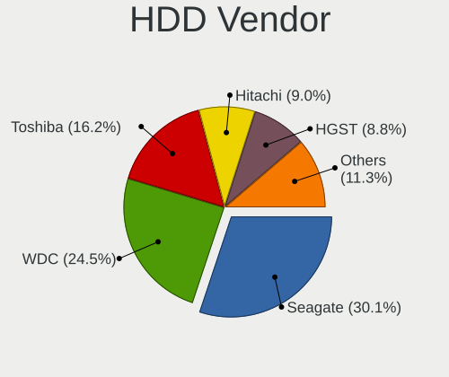

| Vendor              | Notebooks | Drives | Percent |
|---------------------|-----------|--------|---------|
| Seagate             | 243       | 277    | 30.11%  |
| WDC                 | 198       | 218    | 24.54%  |
| Toshiba             | 131       | 151    | 16.23%  |
| Hitachi             | 73        | 81     | 9.05%   |
| HGST                | 71        | 82     | 8.8%    |
| Fujitsu             | 21        | 25     | 2.6%    |
| Samsung Electronics | 16        | 16     | 1.98%   |
| Unknown             | 13        | 17     | 1.61%   |
| JMicron Technology  | 8         | 8      | 0.99%   |
| ASMT                | 4         | 4      | 0.5%    |
| TO Exter            | 3         | 5      | 0.37%   |
| IBM/Hitachi         | 3         | 4      | 0.37%   |
| ASMedia             | 3         | 3      | 0.37%   |
| IB-AC703            | 2         | 2      | 0.25%   |
| HGST HTS            | 2         | 2      | 0.25%   |
| External            | 2         | 2      | 0.25%   |
| Apple               | 2         | 2      | 0.25%   |
| WALRAM              | 1         | 1      | 0.12%   |
| USB                 | 1         | 2      | 0.12%   |
| SYMTEC              | 1         | 1      | 0.12%   |
| STEC                | 1         | 1      | 0.12%   |
| SAGE                | 1         | 1      | 0.12%   |
| SABRENT             | 1         | 1      | 0.12%   |
| LaCie               | 1         | 1      | 0.12%   |
| JetFlash            | 1         | 1      | 0.12%   |
| Intenso             | 1         | 1      | 0.12%   |
| IB-377U3            | 1         | 1      | 0.12%   |
| FC-1307             | 1         | 2      | 0.12%   |
| Unknown             | 1         | 1      | 0.12%   |

SSD Vendor
----------

Solid state drive vendors

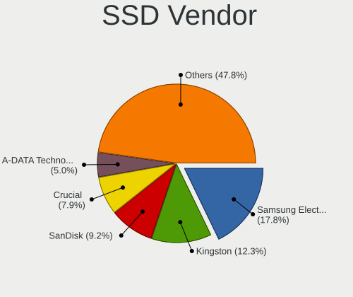

| Vendor              | Notebooks | Drives | Percent |
|---------------------|-----------|--------|---------|
| Samsung Electronics | 254       | 302    | 17.81%  |
| Kingston            | 176       | 223    | 12.34%  |
| SanDisk             | 131       | 156    | 9.19%   |
| Crucial             | 112       | 133    | 7.85%   |
| A-DATA Technology   | 72        | 110    | 5.05%   |
| WDC                 | 62        | 75     | 4.35%   |
| China               | 53        | 60     | 3.72%   |
| Apple               | 44        | 45     | 3.09%   |
| SK hynix            | 43        | 47     | 3.02%   |
| Micron Technology   | 34        | 41     | 2.38%   |
| Toshiba             | 27        | 30     | 1.89%   |
| Transcend           | 25        | 28     | 1.75%   |
| Intenso             | 24        | 29     | 1.68%   |
| Intel               | 24        | 26     | 1.68%   |
| SPCC                | 18        | 25     | 1.26%   |
| PNY                 | 18        | 23     | 1.26%   |
| Patriot             | 17        | 21     | 1.19%   |
| Netac               | 14        | 17     | 0.98%   |
| LITEON              | 14        | 16     | 0.98%   |
| Lexar               | 12        | 12     | 0.84%   |
| LITEONIT            | 11        | 13     | 0.77%   |
| KingSpec            | 11        | 11     | 0.77%   |
| Unknown             | 11        | 11     | 0.77%   |
| GOODRAM             | 9         | 10     | 0.63%   |
| Emtec               | 8         | 9      | 0.56%   |
| Team                | 7         | 8      | 0.49%   |
| BHT                 | 7         | 8      | 0.49%   |
| KIOXIA-EXCERIA      | 6         | 6      | 0.42%   |
| Hewlett-Packard     | 6         | 7      | 0.42%   |
| Verbatim            | 5         | 5      | 0.35%   |
| Fanxiang            | 5         | 6      | 0.35%   |
| AMD                 | 5         | 5      | 0.35%   |
| XrayDisk            | 4         | 4      | 0.28%   |
| Wibtek              | 4         | 4      | 0.28%   |
| V-GeN               | 4         | 4      | 0.28%   |
| SSSTC               | 4         | 5      | 0.28%   |
| SABRENT             | 4         | 4      | 0.28%   |
| INNOVATION IT       | 4         | 5      | 0.28%   |
| ASMT                | 4         | 4      | 0.28%   |
| S3+                 | 3         | 4      | 0.21%   |

Drive Kind
----------

HDD or SSD

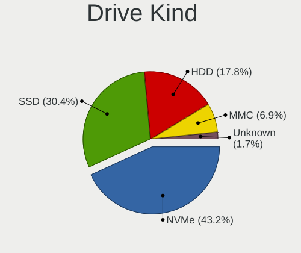

| Kind    | Notebooks | Drives | Percent |
|---------|-----------|--------|---------|
| NVMe    | 1883      | 2499   | 43.17%  |
| SSD     | 1325      | 1699   | 30.38%  |
| HDD     | 777       | 913    | 17.81%  |
| MMC     | 303       | 360    | 6.95%   |
| Unknown | 74        | 82     | 1.7%    |

Drive Connector
---------------

SATA, SAS, NVMe, etc.

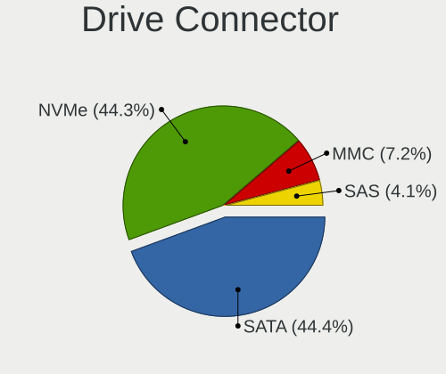

| Type | Notebooks | Drives | Percent |
|------|-----------|--------|---------|
| SATA | 1878      | 2494   | 44.4%   |
| NVMe | 1874      | 2474   | 44.3%   |
| MMC  | 303       | 360    | 7.16%   |
| SAS  | 175       | 225    | 4.14%   |

Drive Size
----------

Size of hard drive

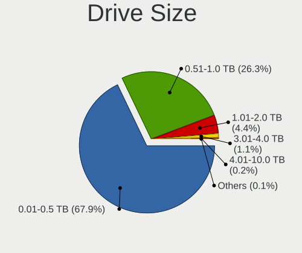

| Size in TB | Notebooks | Drives | Percent |
|------------|-----------|--------|---------|
| 0.01-0.5   | 1411      | 1764   | 67.9%   |
| 0.51-1.0   | 547       | 697    | 26.32%  |
| 1.01-2.0   | 91        | 113    | 4.38%   |
| 3.01-4.0   | 22        | 29     | 1.06%   |
| 4.01-10.0  | 5         | 6      | 0.24%   |
| 2.01-3.0   | 2         | 3      | 0.1%    |

Space Total
-----------

Amount of disk space available on the file system

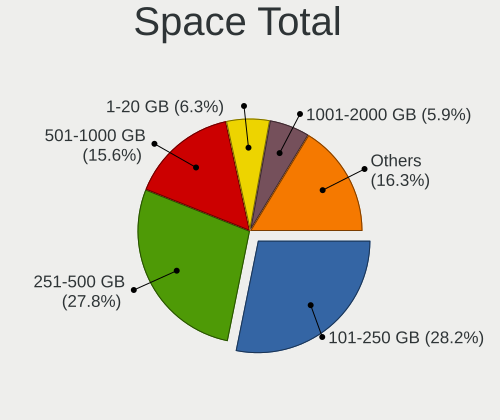

| Size in GB     | Notebooks | Percent |
|----------------|-----------|---------|
| 101-250        | 1098      | 28.18%  |
| 251-500        | 1085      | 27.84%  |
| 501-1000       | 606       | 15.55%  |
| 1-20           | 245       | 6.29%   |
| 1001-2000      | 228       | 5.85%   |
| 51-100         | 223       | 5.72%   |
| Unknown        | 164       | 4.21%   |
| 21-50          | 132       | 3.39%   |
| More than 3000 | 60        | 1.54%   |
| 2001-3000      | 56        | 1.44%   |

Space Used
----------

Amount of used disk space

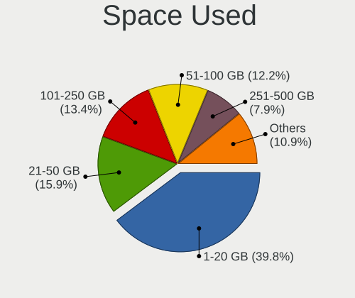

| Used GB        | Notebooks | Percent |
|----------------|-----------|---------|
| 1-20           | 1594      | 39.75%  |
| 21-50          | 636       | 15.86%  |
| 101-250        | 539       | 13.44%  |
| 51-100         | 488       | 12.17%  |
| 251-500        | 316       | 7.88%   |
| 501-1000       | 167       | 4.16%   |
| Unknown        | 164       | 4.09%   |
| 1001-2000      | 73        | 1.82%   |
| 2001-3000      | 17        | 0.42%   |
| More than 3000 | 14        | 0.35%   |
| 0              | 2         | 0.05%   |

Malfunc. Drives
---------------

Drive models with a malfunction

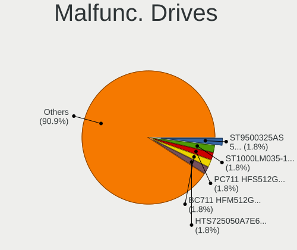

| Model                                               | Notebooks | Drives | Percent |
|-----------------------------------------------------|-----------|--------|---------|
| SK hynix PC711 HFS512GDE9X073N 512GB                | 5         | 6      | 1.82%   |
| SK hynix BC711 HFM512GD3JX013N 512GB                | 5         | 6      | 1.82%   |
| Seagate ST9500325AS 500GB                           | 5         | 5      | 1.82%   |
| Seagate ST1000LM035-1RK172 1TB                      | 5         | 5      | 1.82%   |
| HGST HTS725050A7E630 500GB                          | 5         | 5      | 1.82%   |
| SK hynix HFS128G39TND-N210A 128GB SSD               | 4         | 4      | 1.46%   |
| Seagate ST9320325AS 320GB                           | 4         | 5      | 1.46%   |
| Seagate ST500LT012-9WS142 500GB                     | 4         | 4      | 1.46%   |
| Seagate ST1000LM024 HN-M101MBB 1TB                  | 4         | 4      | 1.46%   |
| HGST HTS721010A9E630 1TB                            | 4         | 4      | 1.46%   |
| HGST HTS545050A7E680 500GB                          | 4         | 6      | 1.46%   |
| Toshiba MQ01ACF050 500GB                            | 3         | 3      | 1.09%   |
| Toshiba MQ01ABD100 1TB                              | 3         | 3      | 1.09%   |
| SSSTC CV8-8E128-HP 128GB SSD                        | 3         | 3      | 1.09%   |
| Seagate ST500LM021-1KJ152 500GB                     | 3         | 3      | 1.09%   |
| Seagate ST320LT007-9ZV142 320GB                     | 3         | 3      | 1.09%   |
| Micron Technology MTFDDAV256TDL-1AW1ZABHA 256GB SSD | 3         | 3      | 1.09%   |
| Kingston SV300S37A120G 120GB SSD                    | 3         | 3      | 1.09%   |
| Hitachi HTS547575A9E384 752GB                       | 3         | 6      | 1.09%   |
| Hitachi HTS543216L9A300 160GB                       | 3         | 3      | 1.09%   |
| HGST HTS725032A7E630 320GB                          | 3         | 3      | 1.09%   |
| WDC WDS480G2G0A-00JH30 480GB SSD                    | 2         | 2      | 0.73%   |
| WDC WDS240G2G0A-00JH30 240GB SSD                    | 2         | 2      | 0.73%   |
| WDC WD5000LPLX-60ZNTT1 500GB                        | 2         | 2      | 0.73%   |
| WDC WD5000LPCX-00VHAT0 500GB                        | 2         | 3      | 0.73%   |
| WDC WD1200BEVS-60UST0 120GB                         | 2         | 3      | 0.73%   |
| WDC WD10SPZX-24Z10T0 1TB                            | 2         | 2      | 0.73%   |
| Toshiba MQ01ABF050 500GB                            | 2         | 2      | 0.73%   |
| Toshiba MK3259GSXP 320GB                            | 2         | 2      | 0.73%   |
| SK hynix SH920 mSATA 128GB SSD                      | 2         | 2      | 0.73%   |
| SK hynix SC401 SATA 512GB SSD                       | 2         | 2      | 0.73%   |
| SK hynix HFS256G39TND-N210A 256GB SSD               | 2         | 2      | 0.73%   |
| Seagate ST500LT012-1DG142 500GB                     | 2         | 2      | 0.73%   |
| Seagate ST500LM000-1EJ162 500GB                     | 2         | 2      | 0.73%   |
| Seagate ST320LM001 HN-M320MBB 320GB                 | 2         | 2      | 0.73%   |
| Samsung Electronics SSD 870 EVO 500GB               | 2         | 2      | 0.73%   |
| Hitachi HTS545050B9A300 500GB                       | 2         | 2      | 0.73%   |
| Hitachi HTS545050A7E380 500GB                       | 2         | 2      | 0.73%   |
| Hitachi HTS545032B9A300 320GB                       | 2         | 3      | 0.73%   |
| Hitachi HTS543232A7A384 320GB                       | 2         | 2      | 0.73%   |

Malfunc. Drive Vendor
---------------------

Vendors of faulty drives

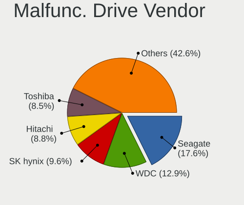

| Vendor                      | Notebooks | Drives | Percent |
|-----------------------------|-----------|--------|---------|
| Seagate                     | 48        | 52     | 17.65%  |
| WDC                         | 35        | 38     | 12.87%  |
| SK hynix                    | 26        | 30     | 9.56%   |
| Hitachi                     | 24        | 30     | 8.82%   |
| Toshiba                     | 23        | 25     | 8.46%   |
| HGST                        | 22        | 24     | 8.09%   |
| Samsung Electronics         | 20        | 24     | 7.35%   |
| Intel                       | 12        | 12     | 4.41%   |
| SanDisk                     | 8         | 8      | 2.94%   |
| Kingston                    | 8         | 9      | 2.94%   |
| Micron Technology           | 7         | 8      | 2.57%   |
| Crucial                     | 6         | 6      | 2.21%   |
| Apple                       | 4         | 4      | 1.47%   |
| SSSTC                       | 3         | 3      | 1.1%    |
| LITEON                      | 3         | 3      | 1.1%    |
| Kimtigo                     | 2         | 2      | 0.74%   |
| Unknown                     | 2         | 2      | 0.74%   |
| XPG                         | 1         | 1      | 0.37%   |
| Transcend                   | 1         | 1      | 0.37%   |
| Team                        | 1         | 1      | 0.37%   |
| ShiJi                       | 1         | 5      | 0.37%   |
| S3+                         | 1         | 1      | 0.37%   |
| OCZ                         | 1         | 1      | 0.37%   |
| NGFF                        | 1         | 1      | 0.37%   |
| KIOXIA                      | 1         | 1      | 0.37%   |
| Kingston Technology Company | 1         | 1      | 0.37%   |
| KingDian                    | 1         | 1      | 0.37%   |
| JMicron Technology          | 1         | 1      | 0.37%   |
| IBM/Hitachi                 | 1         | 1      | 0.37%   |
| Hikvision                   | 1         | 1      | 0.37%   |
| HECTRON                     | 1         | 1      | 0.37%   |
| Fujitsu                     | 1         | 1      | 0.37%   |
| Dogfish                     | 1         | 1      | 0.37%   |
| Corsair                     | 1         | 1      | 0.37%   |
| China                       | 1         | 1      | 0.37%   |
| BAITITON                    | 1         | 1      | 0.37%   |

Malfunc. HDD Vendor
-------------------

Vendors of faulty HDD drives

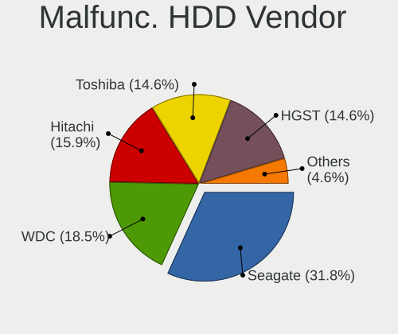

| Vendor              | Notebooks | Drives | Percent |
|---------------------|-----------|--------|---------|
| Seagate             | 48        | 52     | 31.79%  |
| WDC                 | 28        | 31     | 18.54%  |
| Hitachi             | 24        | 30     | 15.89%  |
| Toshiba             | 22        | 24     | 14.57%  |
| HGST                | 22        | 24     | 14.57%  |
| Samsung Electronics | 4         | 4      | 2.65%   |
| JMicron Technology  | 1         | 1      | 0.66%   |
| IBM/Hitachi         | 1         | 1      | 0.66%   |
| Fujitsu             | 1         | 1      | 0.66%   |

Malfunc. Drive Kind
-------------------

Kinds of faulty drives

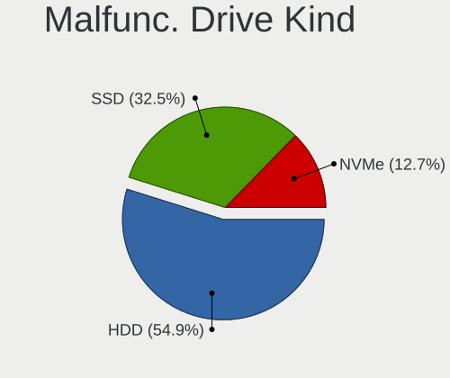

| Kind | Notebooks | Drives | Percent |
|------|-----------|--------|---------|
| HDD  | 147       | 168    | 54.85%  |
| SSD  | 87        | 91     | 32.46%  |
| NVMe | 34        | 44     | 12.69%  |

Failed Drives
-------------

Failed drive models

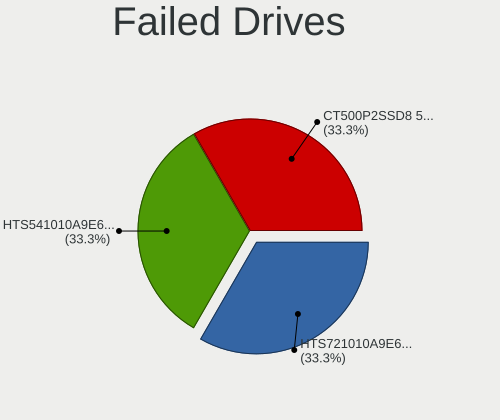

| Model                     | Notebooks | Drives | Percent |
|---------------------------|-----------|--------|---------|
| HGST HTS721010A9E630 1TB  | 1         | 1      | 33.33%  |
| HGST HTS541010A9E680 1TB  | 1         | 1      | 33.33%  |
| Crucial CT500P2SSD8 500GB | 1         | 1      | 33.33%  |

Failed Drive Vendor
-------------------

Failed drive vendors

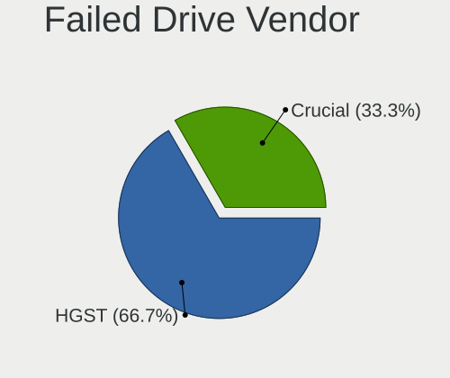

| Vendor  | Notebooks | Drives | Percent |
|---------|-----------|--------|---------|
| HGST    | 2         | 2      | 66.67%  |
| Crucial | 1         | 1      | 33.33%  |

Drive Status
------------

Number of failed and malfunc. drives

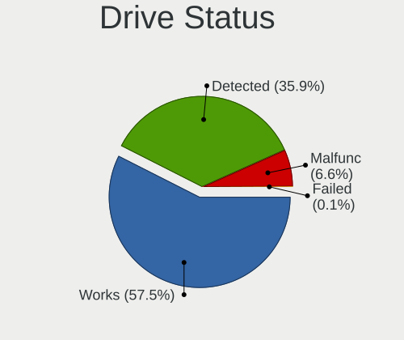

| Status   | Notebooks | Drives | Percent |
|----------|-----------|--------|---------|
| Works    | 2316      | 3095   | 57.45%  |
| Detected | 1446      | 2152   | 35.87%  |
| Malfunc  | 266       | 303    | 6.6%    |
| Failed   | 3         | 3      | 0.07%   |

Storage controller
------------------

Storage Vendor
--------------

Storage controller vendors

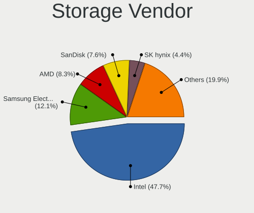

| Vendor                                  | Notebooks | Percent |
|-----------------------------------------|-----------|---------|
| Intel                                   | 2144      | 47.72%  |
| Samsung Electronics                     | 545       | 12.13%  |
| AMD                                     | 371       | 8.26%   |
| SanDisk                                 | 341       | 7.59%   |
| SK hynix                                | 198       | 4.41%   |
| Micron Technology                       | 183       | 4.07%   |
| Kingston Technology Company             | 97        | 2.16%   |
| KIOXIA                                  | 88        | 1.96%   |
| Toshiba America Info Systems            | 75        | 1.67%   |
| Phison Electronics                      | 69        | 1.54%   |
| Micron/Crucial Technology               | 57        | 1.27%   |
| ADATA Technology                        | 40        | 0.89%   |
| MAXIO Technology (Hangzhou)             | 39        | 0.87%   |
| Silicon Motion                          | 35        | 0.78%   |
| Nvidia                                  | 35        | 0.78%   |
| Solid State Storage Technology          | 30        | 0.67%   |
| Union Memory (Shenzhen)                 | 21        | 0.47%   |
| Solidigm                                | 18        | 0.4%    |
| Realtek Semiconductor                   | 14        | 0.31%   |
| Apple                                   | 14        | 0.31%   |
| Shenzhen Longsys Electronics            | 13        | 0.29%   |
| Yangtze Memory Technologies             | 12        | 0.27%   |
| INNOGRIT                                | 7         | 0.16%   |
| Marvell Technology Group                | 6         | 0.13%   |
| Seagate Technology                      | 5         | 0.11%   |
| Hosin Global Electronics                | 5         | 0.11%   |
| Biwin Storage Technology                | 5         | 0.11%   |
| Transcend                               | 3         | 0.07%   |
| Silicon Integrated Systems [SiS]        | 3         | 0.07%   |
| Shenzhen Unionmemory Information System | 3         | 0.07%   |
| Lite-On Technology                      | 3         | 0.07%   |
| ASMedia Technology                      | 3         | 0.07%   |
| VIA Technologies                        | 2         | 0.04%   |
| ShenZhen TIGO Semiconductor             | 2         | 0.04%   |
| Netac Technology                        | 2         | 0.04%   |
| Lenovo                                  | 2         | 0.04%   |
| JMicron Technology                      | 1         | 0.02%   |
| Jiangsu Huacun Elec.                    | 1         | 0.02%   |
| Unknown                                 | 1         | 0.02%   |

Storage Model
-------------

Storage controller models

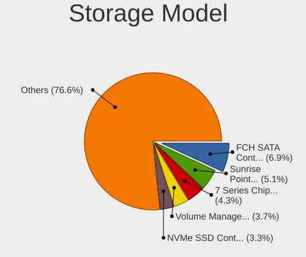

| Model                                                                          | Notebooks | Percent |
|--------------------------------------------------------------------------------|-----------|---------|
| AMD FCH SATA Controller [AHCI mode]                                            | 329       | 6.92%   |
| Intel Sunrise Point-LP SATA Controller [AHCI mode]                             | 244       | 5.13%   |
| Intel 7 Series Chipset Family 6-port SATA Controller [AHCI mode]               | 204       | 4.29%   |
| Intel Volume Management Device NVMe RAID Controller                            | 175       | 3.68%   |
| Samsung NVMe SSD Controller SM981/PM981/PM983                                  | 159       | 3.35%   |
| Intel 82801 Mobile SATA Controller [RAID mode]                                 | 156       | 3.28%   |
| Intel 6 Series/C200 Series Chipset Family 6 port Mobile SATA AHCI Controller   | 148       | 3.11%   |
| Samsung NVMe SSD Controller 980 (DRAM-less)                                    | 119       | 2.5%    |
| Samsung NVMe SSD Controller PM9A1/PM9A3/980PRO                                 | 112       | 2.36%   |
| Intel 8 Series SATA Controller 1 [AHCI mode]                                   | 93        | 1.96%   |
| Intel 82801IBM/IEM (ICH9M/ICH9M-E) 4 port SATA Controller [AHCI mode]          | 86        | 1.81%   |
| Intel 8 Series/C220 Series Chipset Family 6-port SATA Controller 1 [AHCI mode] | 80        | 1.68%   |
| Intel Alder Lake-P SATA AHCI Controller                                        | 75        | 1.58%   |
| SK hynix Gold P31/BC711/PC711 NVMe Solid State Drive                           | 72        | 1.51%   |
| Intel Tiger Lake-LP SATA Controller                                            | 65        | 1.37%   |
| Intel RST Volume Management Device Controller                                  | 61        | 1.28%   |
| SanDisk WD SN560/SN740/SN770/SN5000 NVMe SSD                                   | 60        | 1.26%   |
| SanDisk Extreme Pro / WD Black SN750 / PC SN730 / Red SN700 NVMe SSD           | 55        | 1.16%   |
| Micron 2450 NVMe SSD [HendrixV] (DRAM-less)                                    | 55        | 1.16%   |
| Intel SSD 670p Series [Keystone Harbor]                                        | 55        | 1.16%   |
| Intel Wildcat Point-LP SATA Controller [AHCI Mode]                             | 54        | 1.14%   |
| Intel Cannon Lake Mobile PCH SATA AHCI Controller                              | 53        | 1.12%   |
| Intel 5 Series/3400 Series Chipset 4 port SATA AHCI Controller                 | 52        | 1.09%   |
| Samsung NVMe SSD Controller PM9B1 (DRAM-less)                                  | 48        | 1.01%   |
| Intel Celeron/Pentium Silver Processor SATA Controller                         | 48        | 1.01%   |
| Micron 2400 NVMe SSD (DRAM-less)                                               | 47        | 0.99%   |
| SanDisk Ultra 3D / WD PC SN530, IX SN530, Blue SN550 NVMe SSD (DRAM-less)      | 44        | 0.93%   |
| Intel 82801HM/HEM (ICH8M/ICH8M-E) IDE Controller                               | 44        | 0.93%   |
| Intel Comet Lake SATA AHCI Controller                                          | 42        | 0.88%   |
| Intel 82801HM/HEM (ICH8M/ICH8M-E) SATA Controller [AHCI mode]                  | 40        | 0.84%   |
| Intel HM170/QM170 Chipset SATA Controller [AHCI Mode]                          | 39        | 0.82%   |
| Intel Cannon Point-LP SATA Controller [AHCI Mode]                              | 39        | 0.82%   |
| Intel Cannon Lake PCH SATA AHCI Controller                                     | 37        | 0.78%   |
| Intel 5 Series/3400 Series Chipset 6 port SATA AHCI Controller                 | 37        | 0.78%   |
| Toshiba America Info Systems XG6 NVMe SSD Controller                           | 36        | 0.76%   |
| SK hynix Platinum P41/PC801 NVMe Solid State Drive                             | 35        | 0.74%   |
| Samsung NVMe SSD Controller SM961/PM961/SM963                                  | 34        | 0.72%   |
| KIOXIA NVMe SSD Controller BG5 (DRAM-less)                                     | 34        | 0.72%   |
| Intel Atom Processor E3800 Series SATA AHCI Controller                         | 34        | 0.72%   |
| AMD SB7x0/SB8x0/SB9x0 SATA Controller [AHCI mode]                              | 34        | 0.72%   |

Storage Kind
------------

Kind of storage controller (IDE, SATA, NVMe, SAS, ...)

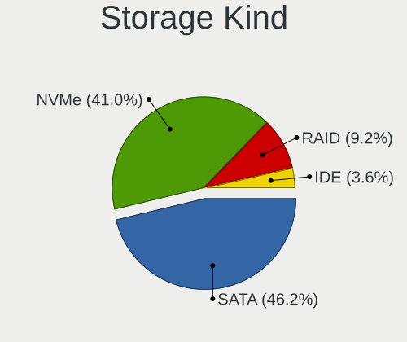

| Kind | Notebooks | Percent |
|------|-----------|---------|
| SATA | 2101      | 46.24%  |
| NVMe | 1864      | 41.02%  |
| RAID | 417       | 9.18%   |
| IDE  | 162       | 3.57%   |

Processor
---------

CPU Vendor
----------

Processor vendors

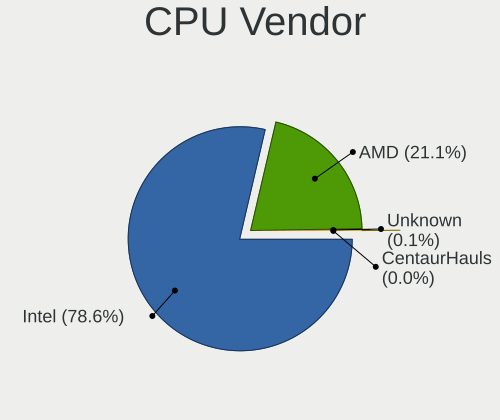

| Vendor       | Notebooks | Percent |
|--------------|-----------|---------|
| Intel        | 2965      | 78.65%  |
| AMD          | 795       | 21.09%  |
| Unknown      | 5         | 0.13%   |
| ARM          | 4         | 0.11%   |
| CentaurHauls | 1         | 0.03%   |

CPU Model
---------

Processor models

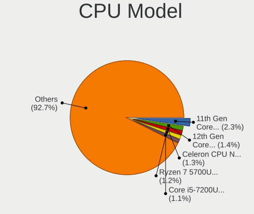

| Model                                         | Notebooks | Percent |
|-----------------------------------------------|-----------|---------|
| Intel 11th Gen Core i5-1135G7 @ 2.40GHz       | 87        | 2.3%    |
| Intel 12th Gen Core i5-1235U                  | 51        | 1.35%   |
| Intel Celeron CPU N3060 @ 1.60GHz             | 50        | 1.32%   |
| AMD Ryzen 7 5700U with Radeon Graphics        | 45        | 1.19%   |
| Intel Core i5-7200U CPU @ 2.50GHz             | 43        | 1.14%   |
| Intel Core i5-8265U CPU @ 1.60GHz             | 41        | 1.09%   |
| Intel Core i5-2520M CPU @ 2.50GHz             | 40        | 1.06%   |
| Intel Core i5-8350U CPU @ 1.70GHz             | 37        | 0.98%   |
| Intel Core i5-6300U CPU @ 2.40GHz             | 37        | 0.98%   |
| Intel Core i5-10210U CPU @ 1.60GHz            | 37        | 0.98%   |
| Intel Core i3-9100 CPU @ 3.60GHz              | 37        | 0.98%   |
| AMD Ryzen 5 5500U with Radeon Graphics        | 37        | 0.98%   |
| Intel 11th Gen Core i7-1165G7 @ 2.80GHz       | 36        | 0.95%   |
| Intel Core i5-8250U CPU @ 1.60GHz             | 33        | 0.87%   |
| Intel 12th Gen Core i7-12700H                 | 33        | 0.87%   |
| Intel Core i7-8550U CPU @ 1.80GHz             | 32        | 0.85%   |
| Intel Core i5-3320M CPU @ 2.60GHz             | 32        | 0.85%   |
| Intel Core i5-6200U CPU @ 2.30GHz             | 31        | 0.82%   |
| Intel 11th Gen Core i3-1115G4 @ 3.00GHz       | 31        | 0.82%   |
| AMD Ryzen 5 3500U with Radeon Vega Mobile Gfx | 31        | 0.82%   |
| Intel Celeron N4020 CPU @ 1.10GHz             | 30        | 0.79%   |
| Intel Celeron CPU N2840 @ 2.16GHz             | 29        | 0.77%   |
| AMD Ryzen 5 5600H with Radeon Graphics        | 29        | 0.77%   |
| Intel Core i7-8650U CPU @ 1.90GHz             | 26        | 0.69%   |
| Intel Core i7-7700HQ CPU @ 2.80GHz            | 26        | 0.69%   |
| Intel Core i7-7500U CPU @ 2.70GHz             | 26        | 0.69%   |
| Intel Core i5-1035G1 CPU @ 1.00GHz            | 26        | 0.69%   |
| AMD Ryzen 7 5800H with Radeon Graphics        | 26        | 0.69%   |
| Intel 13th Gen Core i7-1355U                  | 25        | 0.66%   |
| Intel 12th Gen Core i7-1255U                  | 25        | 0.66%   |
| Intel Core i7-8565U CPU @ 1.80GHz             | 24        | 0.64%   |
| Intel Core i5-3210M CPU @ 2.50GHz             | 24        | 0.64%   |
| Intel Celeron CPU N3350 @ 1.10GHz             | 24        | 0.64%   |
| Intel Core i7-8750H CPU @ 2.20GHz             | 23        | 0.61%   |
| Intel Core i5-4300U CPU @ 1.90GHz             | 23        | 0.61%   |
| Intel Core i5-3230M CPU @ 2.60GHz             | 23        | 0.61%   |
| AMD PRO A6-9500B R5, 6 COMPUTE CORES 2C+4G    | 23        | 0.61%   |
| Intel Celeron CPU 1007U @ 1.50GHz             | 22        | 0.58%   |
| Intel 13th Gen Core i7-13700H                 | 22        | 0.58%   |
| AMD Ryzen 5 7520U with Radeon Graphics        | 22        | 0.58%   |

CPU Model Family
----------------

Processor model prefix

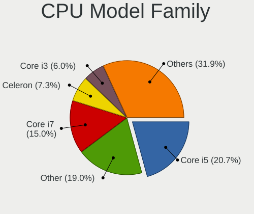

| Model                   | Notebooks | Percent |
|-------------------------|-----------|---------|
| Intel Core i5           | 783       | 20.74%  |
| Other                   | 719       | 19.05%  |
| Intel Core i7           | 568       | 15.05%  |
| Intel Celeron           | 274       | 7.26%   |
| Intel Core i3           | 227       | 6.01%   |
| AMD Ryzen 5             | 219       | 5.8%    |
| AMD Ryzen 7             | 210       | 5.56%   |
| Intel Core 2 Duo        | 129       | 3.42%   |
| Intel Atom              | 80        | 2.12%   |
| Intel Pentium           | 65        | 1.72%   |
| AMD Ryzen 7 PRO         | 62        | 1.64%   |
| Intel Core              | 47        | 1.25%   |
| AMD Ryzen 3             | 43        | 1.14%   |
| AMD Ryzen 5 PRO         | 35        | 0.93%   |
| AMD Ryzen 9             | 34        | 0.9%    |
| Intel Pentium Dual-Core | 24        | 0.64%   |
| AMD E                   | 18        | 0.48%   |
| Intel Genuine           | 15        | 0.4%    |
| AMD A8                  | 15        | 0.4%    |
| AMD A6                  | 14        | 0.37%   |
| AMD A4                  | 14        | 0.37%   |
| Intel Pentium Silver    | 13        | 0.34%   |
| Intel Core 2            | 13        | 0.34%   |
| AMD E1                  | 13        | 0.34%   |
| Intel Core i9           | 12        | 0.32%   |
| AMD E2                  | 12        | 0.32%   |
| AMD PRO A10             | 11        | 0.29%   |
| Intel Xeon              | 10        | 0.26%   |
| Intel Pentium Dual      | 10        | 0.26%   |
| Intel Pentium M         | 9         | 0.24%   |
| Intel Celeron M         | 7         | 0.19%   |
| AMD A10                 | 7         | 0.19%   |
| AMD Athlon II           | 6         | 0.16%   |
| AMD Athlon              | 6         | 0.16%   |
| Intel Core m5           | 4         | 0.11%   |
| AMD Turion 64 X2 Mobile | 4         | 0.11%   |
| AMD Athlon X2           | 4         | 0.11%   |
| Intel Pentium III       | 3         | 0.08%   |
| Intel Pentium Gold      | 3         | 0.08%   |
| Intel Core m3           | 3         | 0.08%   |

CPU Cores
---------

Number of processor cores

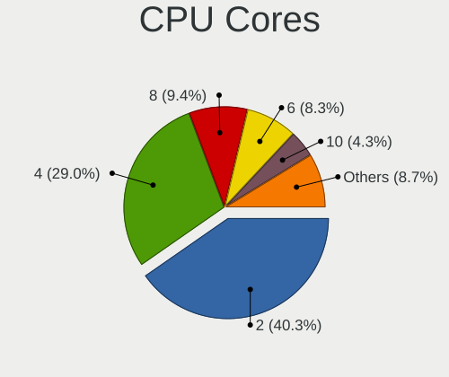

| Number  | Notebooks | Percent |
|---------|-----------|---------|
| 2       | 1522      | 40.33%  |
| 4       | 1093      | 28.96%  |
| 8       | 355       | 9.41%   |
| 6       | 312       | 8.27%   |
| 10      | 163       | 4.32%   |
| 14      | 101       | 2.68%   |
| 12      | 88        | 2.33%   |
| 1       | 83        | 2.2%    |
| 16      | 36        | 0.95%   |
| 24      | 15        | 0.4%    |
| 5       | 3         | 0.08%   |
| 20      | 2         | 0.05%   |
| Unknown | 1         | 0.03%   |

CPU Sockets
-----------

Number of sockets

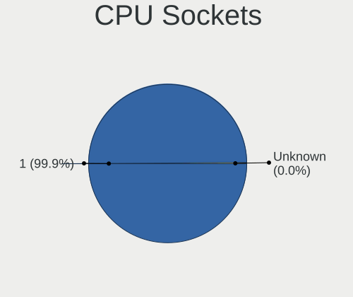

| Number  | Notebooks | Percent |
|---------|-----------|---------|
| 1       | 3764      | 99.89%  |
| 8       | 2         | 0.05%   |
| 2       | 1         | 0.03%   |
| Unknown | 1         | 0.03%   |

CPU Threads
-----------

Threads per core (Hyper-Threading)

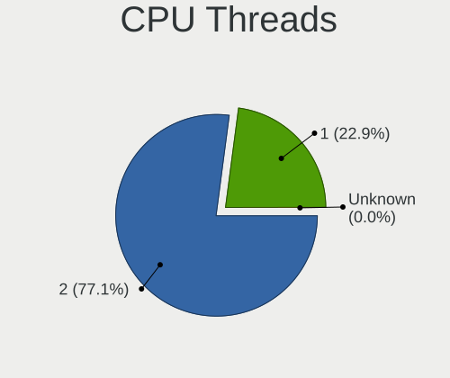

| Number  | Notebooks | Percent |
|---------|-----------|---------|
| 2       | 2909      | 77.08%  |
| 1       | 864       | 22.89%  |
| Unknown | 1         | 0.03%   |

CPU Op-Modes
------------

CPU Operation Modes (32-bit, 64-bit)

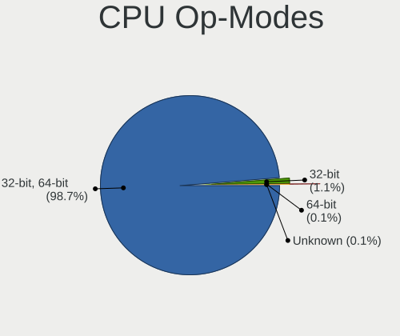

| Op mode        | Notebooks | Percent |
|----------------|-----------|---------|
| 32-bit, 64-bit | 3720      | 98.73%  |
| 32-bit         | 41        | 1.09%   |
| 64-bit         | 4         | 0.11%   |
| Unknown        | 3         | 0.08%   |

CPU Microcode
-------------

Microcode number

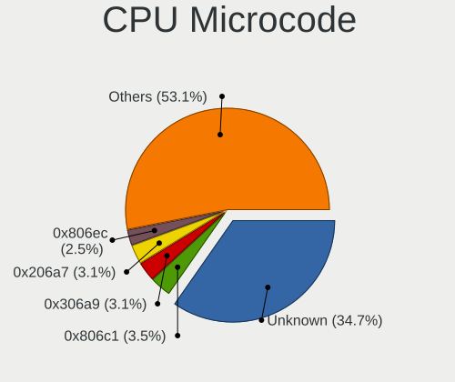

| Number     | Notebooks | Percent |
|------------|-----------|---------|
| Unknown    | 1336      | 34.7%   |
| 0x806c1    | 133       | 3.45%   |
| 0x306a9    | 120       | 3.12%   |
| 0x206a7    | 120       | 3.12%   |
| 0x806ec    | 97        | 2.52%   |
| 0x906a4    | 86        | 2.23%   |
| 0x906a3    | 86        | 2.23%   |
| 0x806ea    | 86        | 2.23%   |
| 0x406e3    | 86        | 2.23%   |
| 0x40651    | 81        | 2.1%    |
| 0x806e9    | 78        | 2.03%   |
| 0x1067a    | 66        | 1.71%   |
| 0x406c4    | 65        | 1.69%   |
| 0x306d4    | 61        | 1.58%   |
| 0x306c3    | 61        | 1.58%   |
| 0xb06a2    | 56        | 1.45%   |
| 0x30678    | 54        | 1.4%    |
| 0x08108109 | 52        | 1.35%   |
| 0x0a50000d | 50        | 1.3%    |
| 0xb06a3    | 49        | 1.27%   |
| 0x0a50000c | 41        | 1.06%   |
| 0x20655    | 40        | 1.04%   |
| 0x706a8    | 38        | 0.99%   |
| 0x08608103 | 38        | 0.99%   |
| 0x906eb    | 37        | 0.96%   |
| 0x0600611a | 32        | 0.83%   |
| 0x906ea    | 31        | 0.81%   |
| 0x806d1    | 29        | 0.75%   |
| 0xa0652    | 27        | 0.7%    |
| 0x6fd      | 25        | 0.65%   |
| 0x706e5    | 23        | 0.6%    |
| 0x506c9    | 23        | 0.6%    |
| 0x08600106 | 23        | 0.6%    |
| 0x0a404102 | 22        | 0.57%   |
| 0xa06a4    | 21        | 0.55%   |
| 0x906e9    | 21        | 0.55%   |
| 0x506e3    | 21        | 0.55%   |
| 0x10676    | 21        | 0.55%   |
| 0x08a00008 | 20        | 0.52%   |
| 0x20652    | 19        | 0.49%   |

CPU Microarch
-------------

Microarchitecture

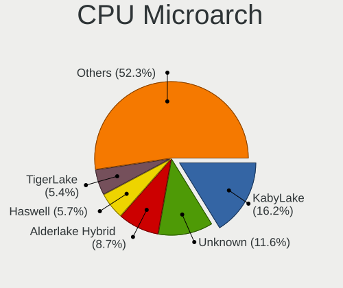

| Name              | Notebooks | Percent |
|-------------------|-----------|---------|
| KabyLake          | 614       | 16.19%  |
| Unknown           | 440       | 11.6%   |
| Alderlake Hybrid  | 330       | 8.7%    |
| Haswell           | 217       | 5.72%   |
| TigerLake         | 206       | 5.43%   |
| IvyBridge         | 202       | 5.33%   |
| SandyBridge       | 196       | 5.17%   |
| Skylake           | 178       | 4.69%   |
| Zen 3             | 167       | 4.4%    |
| Silvermont        | 167       | 4.4%    |
| Penryn            | 127       | 3.35%   |
| Broadwell         | 91        | 2.4%    |
| Westmere          | 87        | 2.29%   |
| Zen+              | 86        | 2.27%   |
| Goldmont plus     | 76        | 2%      |
| Zen 2             | 73        | 1.93%   |
| IceLake           | 73        | 1.93%   |
| Excavator         | 72        | 1.9%    |
| Core              | 65        | 1.71%   |
| CometLake         | 52        | 1.37%   |
| Bonnell           | 39        | 1.03%   |
| Goldmont          | 36        | 0.95%   |
| P6                | 26        | 0.69%   |
| Bobcat            | 26        | 0.69%   |
| Puma              | 21        | 0.55%   |
| Zen               | 20        | 0.53%   |
| Meteorlake Hybrid | 16        | 0.42%   |
| Jaguar            | 16        | 0.42%   |
| Gracemont         | 13        | 0.34%   |
| Piledriver        | 11        | 0.29%   |
| Tremont           | 10        | 0.26%   |
| K8 Hammer         | 9         | 0.24%   |
| Nehalem           | 8         | 0.21%   |
| K10               | 8         | 0.21%   |
| K8 & K10 hybrid   | 7         | 0.18%   |
| K10 Llano         | 5         | 0.13%   |
| Steamroller       | 2         | 0.05%   |

Graphics
--------

GPU Vendor
----------

Vendors of graphics cards

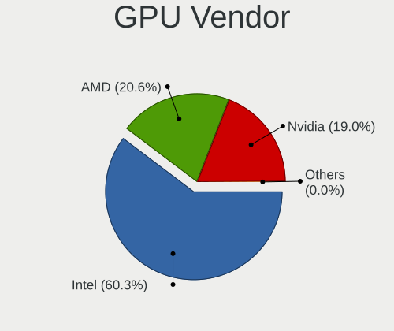

| Vendor                           | Notebooks | Percent |
|----------------------------------|-----------|---------|
| Intel                            | 2751      | 60.3%   |
| AMD                              | 940       | 20.6%   |
| Nvidia                           | 866       | 18.98%  |
| Silicon Integrated Systems [SiS] | 2         | 0.04%   |
| Zhaoxin                          | 1         | 0.02%   |
| VIA Technologies                 | 1         | 0.02%   |
| S3 Graphics                      | 1         | 0.02%   |

GPU Model
---------

Graphics card models

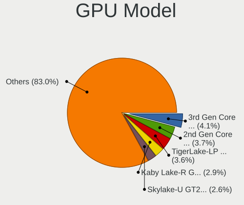

| Model                                                                                    | Notebooks | Percent |
|------------------------------------------------------------------------------------------|-----------|---------|
| Intel 3rd Gen Core processor Graphics Controller                                         | 194       | 4.15%   |
| Intel 2nd Generation Core Processor Family Integrated Graphics Controller                | 173       | 3.7%    |
| Intel TigerLake-LP GT2 [Iris Xe Graphics]                                                | 170       | 3.63%   |
| Intel Kaby Lake-R GT2 [UHD Graphics 620]                                                 | 136       | 2.91%   |
| Intel Skylake-U GT2 [HD Graphics 520]                                                    | 122       | 2.61%   |
| Intel Haswell-ULT Integrated Graphics Controller                                         | 118       | 2.52%   |
| Intel Raptor Lake-P [Iris Xe Graphics]                                                   | 105       | 2.24%   |
| Intel Kaby Lake-U GT2 [HD Graphics 620]                                                  | 104       | 2.22%   |
| Intel WhiskeyLake-U GT2 [UHD Graphics 620]                                               | 101       | 2.16%   |
| AMD Lucienne                                                                             | 95        | 2.03%   |
| AMD Cezanne [Radeon Vega Series / Radeon Vega Mobile Series]                             | 92        | 1.97%   |
| Intel Atom/Celeron/Pentium Processor x5-E8000/J3xxx/N3xxx Integrated Graphics Controller | 90        | 1.92%   |
| AMD Picasso/Raven 2 [Radeon Vega Series / Radeon Vega Mobile Series]                     | 90        | 1.92%   |
| Intel Alder Lake-P GT2 [Iris Xe Graphics]                                                | 88        | 1.88%   |
| Intel 4th Gen Core Processor Integrated Graphics Controller                              | 79        | 1.69%   |
| Intel Atom Processor Z36xxx/Z37xxx Series Graphics & Display                             | 77        | 1.65%   |
| Intel CoffeeLake-H GT2 [UHD Graphics 630]                                                | 76        | 1.62%   |
| Intel CometLake-U GT2 [UHD Graphics]                                                     | 75        | 1.6%    |
| AMD Barcelo                                                                              | 73        | 1.56%   |
| Intel Alder Lake-UP3 GT2 [Iris Xe Graphics]                                              | 69        | 1.47%   |
| AMD Renoir [Radeon Vega Series / Radeon Vega Mobile Series]                              | 69        | 1.47%   |
| Intel GeminiLake [UHD Graphics 600]                                                      | 66        | 1.41%   |
| AMD Rembrandt [Radeon 680M]                                                              | 64        | 1.37%   |
| Intel Mobile 4 Series Chipset Integrated Graphics Controller                             | 63        | 1.35%   |
| Intel Core Processor Integrated Graphics Controller                                      | 58        | 1.24%   |
| Nvidia TU117M [GeForce GTX 1650 Mobile / Max-Q]                                          | 54        | 1.15%   |
| Intel Broadwell-U GT2 [HD Graphics 5500]                                                 | 53        | 1.13%   |
| AMD Wani [Radeon R5/R6/R7 Graphics]                                                      | 43        | 0.92%   |
| AMD Phoenix1                                                                             | 42        | 0.9%    |
| Intel TigerLake-H GT1 [UHD Graphics]                                                     | 41        | 0.88%   |
| Intel CometLake-H GT2 [UHD Graphics]                                                     | 41        | 0.88%   |
| Intel Raptor Lake-P [UHD Graphics]                                                       | 40        | 0.86%   |
| Intel CoffeeLake-S GT2 [UHD Graphics 630]                                                | 37        | 0.79%   |
| Intel Tiger Lake-LP GT2 [UHD Graphics G4]                                                | 36        | 0.77%   |
| Nvidia AD107M [GeForce RTX 4060 Max-Q / Mobile]                                          | 33        | 0.71%   |
| Intel Iris Plus Graphics G1 (Ice Lake)                                                   | 33        | 0.71%   |
| Intel Apollo Lake GT1 [HD Graphics 500]                                                  | 33        | 0.71%   |
| AMD Mendocino [Radeon 610M]                                                              | 33        | 0.71%   |
| Intel Kaby Lake-H GT2 [HD Graphics 630]                                                  | 32        | 0.68%   |
| Nvidia GA107M [GeForce RTX 3050 Mobile]                                                  | 31        | 0.66%   |

GPU Combo
---------

Combinations of graphics cards

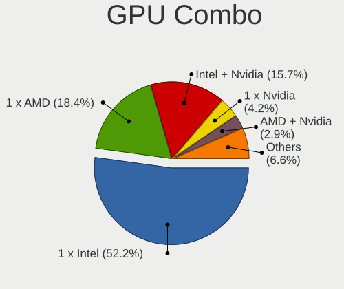

| Name                   | Notebooks | Percent |
|------------------------|-----------|---------|
| 1 x Intel              | 1970      | 52.17%  |
| 1 x AMD                | 694       | 18.38%  |
| Intel + Nvidia         | 594       | 15.73%  |
| 1 x Nvidia             | 160       | 4.24%   |
| AMD + Nvidia           | 110       | 2.91%   |
| Intel + AMD            | 91        | 2.41%   |
| 2 x Intel              | 87        | 2.3%    |
| 2 x AMD                | 45        | 1.19%   |
| Other                  | 16        | 0.42%   |
| 2 x Nvidia             | 3         | 0.08%   |
| 1 x SiS                | 2         | 0.05%   |
| 2 x Intel + 1 x Nvidia | 1         | 0.03%   |
| 1 x Zhaoxin            | 1         | 0.03%   |
| 1 x VIA                | 1         | 0.03%   |
| 1 x S3 Graphics        | 1         | 0.03%   |

GPU Driver
----------

Free vs proprietary

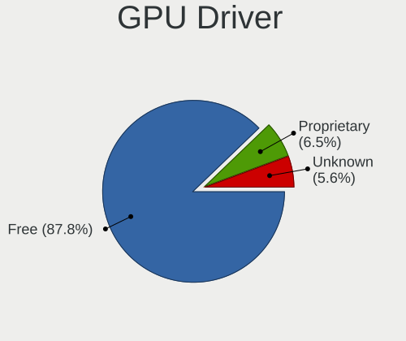

| Driver      | Notebooks | Percent |
|-------------|-----------|---------|
| Free        | 3333      | 87.83%  |
| Proprietary | 248       | 6.53%   |
| Unknown     | 214       | 5.64%   |

GPU Memory
----------

Total video memory

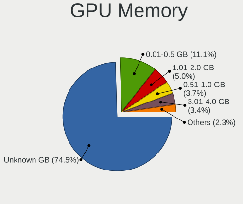

| Size in GB | Notebooks | Percent |
|------------|-----------|---------|
| Unknown    | 2831      | 74.5%   |
| 0.01-0.5   | 422       | 11.11%  |
| 1.01-2.0   | 191       | 5.03%   |
| 0.51-1.0   | 141       | 3.71%   |
| 3.01-4.0   | 128       | 3.37%   |
| 5.01-6.0   | 43        | 1.13%   |
| 7.01-8.0   | 31        | 0.82%   |
| 2.01-3.0   | 7         | 0.18%   |
| 8.01-16.0  | 4         | 0.11%   |
| 16.01-24.0 | 1         | 0.03%   |
| 0          | 1         | 0.03%   |

Monitor
-------

Monitor Vendor
--------------

Monitor vendors

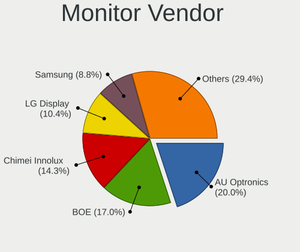

| Vendor                  | Notebooks | Percent |
|-------------------------|-----------|---------|
| AU Optronics            | 833       | 19.97%  |
| BOE                     | 711       | 17.04%  |
| Chimei Innolux          | 598       | 14.33%  |
| LG Display              | 435       | 10.43%  |
| Samsung Electronics     | 369       | 8.84%   |
| Apple                   | 131       | 3.14%   |
| Dell                    | 101       | 2.42%   |
| InfoVision              | 96        | 2.3%    |
| Goldstar                | 89        | 2.13%   |
| Sharp                   | 78        | 1.87%   |
| Lenovo                  | 72        | 1.73%   |
| Chi Mei Optoelectronics | 71        | 1.7%    |
| PANDA                   | 67        | 1.61%   |
| Hewlett-Packard         | 40        | 0.96%   |
| AOC                     | 38        | 0.91%   |
| Philips                 | 32        | 0.77%   |
| LG Philips              | 32        | 0.77%   |
| CSO                     | 32        | 0.77%   |
| Acer                    | 31        | 0.74%   |
| BenQ                    | 28        | 0.67%   |
| ASUSTek Computer        | 25        | 0.6%    |
| Iiyama                  | 14        | 0.34%   |
| HannStar                | 14        | 0.34%   |
| Ancor Communications    | 14        | 0.34%   |
| CSOT                    | 13        | 0.31%   |
| Sony                    | 11        | 0.26%   |
| ViewSonic               | 10        | 0.24%   |
| MSI                     | 9         | 0.22%   |
| Panasonic               | 8         | 0.19%   |
| HKC                     | 8         | 0.19%   |
| Fujitsu Siemens         | 7         | 0.17%   |
| Toshiba                 | 6         | 0.14%   |
| Mi                      | 6         | 0.14%   |
| CSW                     | 6         | 0.14%   |
| TMX                     | 5         | 0.12%   |
| CPT                     | 5         | 0.12%   |
| BOE Technology Group    | 5         | 0.12%   |
| Unknown                 | 5         | 0.12%   |
| Vizio                   | 4         | 0.1%    |
| Pixio                   | 4         | 0.1%    |

Monitor Model
-------------

Monitor models

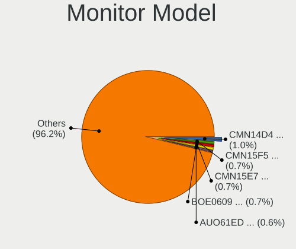

| Model                                                                     | Notebooks | Percent |
|---------------------------------------------------------------------------|-----------|---------|
| Chimei Innolux LCD Monitor CMN14D4 1920x1080 309x173mm 13.9-inch          | 44        | 1.04%   |
| Chimei Innolux LCD Monitor CMN15F5 1920x1080 344x193mm 15.5-inch          | 30        | 0.71%   |
| Chimei Innolux LCD Monitor CMN15E7 1920x1080 344x193mm 15.5-inch          | 30        | 0.71%   |
| BOE LCD Monitor BOE0609 1366x768 256x144mm 11.6-inch                      | 30        | 0.71%   |
| AU Optronics LCD Monitor AUO61ED 1920x1080 344x194mm 15.5-inch            | 26        | 0.62%   |
| AU Optronics LCD Monitor AUO106C 1366x768 276x155mm 12.5-inch             | 24        | 0.57%   |
| BOE LCD Monitor BOE06B3 1366x768 309x173mm 13.9-inch                      | 23        | 0.55%   |
| BOE LCD Monitor BOE0872 1920x1080 344x194mm 15.5-inch                     | 22        | 0.52%   |
| Chimei Innolux LCD Monitor CMN15DB 1366x768 344x193mm 15.5-inch           | 21        | 0.5%    |
| Chimei Innolux LCD Monitor CMN1132 1366x768 256x144mm 11.6-inch           | 21        | 0.5%    |
| AU Optronics LCD Monitor AUO403D 1920x1080 309x174mm 14.0-inch            | 20        | 0.47%   |
| InfoVision LCD Monitor IVO0489 1366x768 256x144mm 11.6-inch               | 19        | 0.45%   |
| Chimei Innolux LCD Monitor CMN1521 1920x1080 344x193mm 15.5-inch          | 18        | 0.43%   |
| AU Optronics LCD Monitor AUO26EC 1366x768 344x193mm 15.5-inch             | 18        | 0.43%   |
| Chimei Innolux LCD Monitor CMN14C9 1920x1080 309x173mm 13.9-inch          | 17        | 0.4%    |
| AU Optronics LCD Monitor AUO243D 1920x1080 309x173mm 13.9-inch            | 16        | 0.38%   |
| Chimei Innolux LCD Monitor CMN153B 1920x1080 344x193mm 15.5-inch          | 15        | 0.36%   |
| AU Optronics LCD Monitor AUO22EC 1366x768 344x193mm 15.5-inch             | 15        | 0.36%   |
| BOE LCD Monitor BOE08D5 1920x1080 344x194mm 15.5-inch                     | 14        | 0.33%   |
| Samsung Electronics LCD Monitor SDC4171 2880x1800 302x189mm 14.0-inch     | 13        | 0.31%   |
| PANDA LCD Monitor NCP004D 1920x1080 344x194mm 15.5-inch                   | 13        | 0.31%   |
| BOE LCD Monitor BOE0BCA 2256x1504 285x190mm 13.5-inch                     | 13        | 0.31%   |
| AU Optronics LCD Monitor AUO573D 1920x1080 309x174mm 14.0-inch            | 13        | 0.31%   |
| AU Optronics LCD Monitor AUO38ED 1920x1080 344x193mm 15.5-inch            | 13        | 0.31%   |
| AU Optronics LCD Monitor AUO369F 1920x1080 344x194mm 15.5-inch            | 13        | 0.31%   |
| AU Optronics LCD Monitor AUO21ED 1920x1080 344x193mm 15.5-inch            | 13        | 0.31%   |
| Chi Mei Optoelectronics LCD Monitor CMO1720 1920x1080 382x215mm 17.3-inch | 12        | 0.28%   |
| AU Optronics LCD Monitor AUO2E3C 1366x768 309x173mm 13.9-inch             | 12        | 0.28%   |
| AU Optronics LCD Monitor AUO103D 1920x1080 309x173mm 13.9-inch            | 12        | 0.28%   |
| LG Display LCD Monitor LGD0521 1920x1080 309x174mm 14.0-inch              | 11        | 0.26%   |
| Lenovo LCD Monitor LEN40BA 1920x1080 344x194mm 15.5-inch                  | 11        | 0.26%   |
| Chimei Innolux LCD Monitor CMN14D5 1920x1080 309x173mm 13.9-inch          | 11        | 0.26%   |
| AU Optronics LCD Monitor AUO133D 1920x1080 309x173mm 13.9-inch            | 11        | 0.26%   |
| AU Optronics LCD Monitor AUO123D 1920x1080 309x173mm 13.9-inch            | 11        | 0.26%   |
| InfoVision LCD Monitor IVO057D 1920x1080 309x174mm 14.0-inch              | 10        | 0.24%   |
| Goldstar FULL HD GSM5B55 1920x1080 480x270mm 21.7-inch                    | 10        | 0.24%   |
| AU Optronics LCD Monitor AUO499F 1920x1080 344x194mm 15.5-inch            | 10        | 0.24%   |
| Apple LCD Monitor APP9C5F 1280x800 286x179mm 13.3-inch                    | 10        | 0.24%   |
| Samsung Electronics LCD Monitor SEC5441 1280x800 331x207mm 15.4-inch      | 9         | 0.21%   |
| Samsung Electronics LCD Monitor SDC4161 1920x1080 344x194mm 15.5-inch     | 9         | 0.21%   |

Monitor Resolution
------------------

Monitor screen resolution

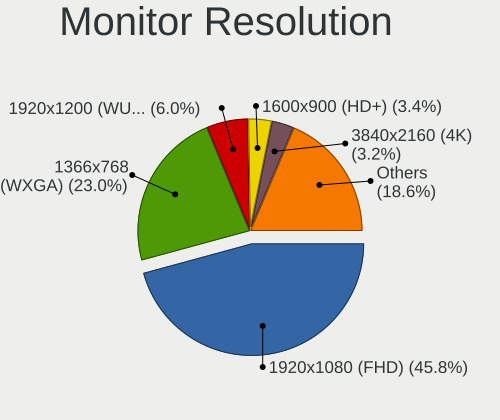

| Resolution         | Notebooks | Percent |
|--------------------|-----------|---------|
| 1920x1080 (FHD)    | 1801      | 45.77%  |
| 1366x768 (WXGA)    | 904       | 22.97%  |
| 1920x1200 (WUXGA)  | 236       | 6%      |
| 1600x900 (HD+)     | 134       | 3.41%   |
| 3840x2160 (4K)     | 127       | 3.23%   |
| 2560x1440 (QHD)    | 124       | 3.15%   |
| 1280x800 (WXGA)    | 119       | 3.02%   |
| 2560x1600          | 90        | 2.29%   |
| 1440x900 (WXGA+)   | 80        | 2.03%   |
| 2880x1800          | 65        | 1.65%   |
| 1680x1050 (WSXGA+) | 27        | 0.69%   |
| 3840x2400          | 25        | 0.64%   |
| 1024x600           | 25        | 0.64%   |
| 2560x1080          | 22        | 0.56%   |
| 2256x1504          | 18        | 0.46%   |
| 3440x1440          | 17        | 0.43%   |
| 3200x1800 (QHD+)   | 11        | 0.28%   |
| 2160x1440          | 11        | 0.28%   |
| 3200x2000          | 10        | 0.25%   |
| 1280x1024 (SXGA)   | 9         | 0.23%   |
| 3072x1920          | 6         | 0.15%   |
| 2520x1680          | 6         | 0.15%   |
| 1360x768           | 6         | 0.15%   |
| 2880x1620          | 5         | 0.13%   |
| 2240x1400          | 5         | 0.13%   |
| 1920x540           | 5         | 0.13%   |
| 1024x768 (XGA)     | 5         | 0.13%   |
| 3456x2160          | 4         | 0.1%    |
| 1600x1200          | 4         | 0.1%    |
| 1400x1050          | 4         | 0.1%    |
| Unknown            | 4         | 0.1%    |
| 3000x2000          | 3         | 0.08%   |
| 2048x1152          | 3         | 0.08%   |
| 3840x1600          | 2         | 0.05%   |
| 3840x1100          | 2         | 0.05%   |
| 3840x1080          | 2         | 0.05%   |
| 2880x1920          | 2         | 0.05%   |
| 2304x1440          | 2         | 0.05%   |
| 1600x2560          | 2         | 0.05%   |
| 800x1280           | 1         | 0.03%   |

Monitor Diagonal
----------------

Diagonal size in inches

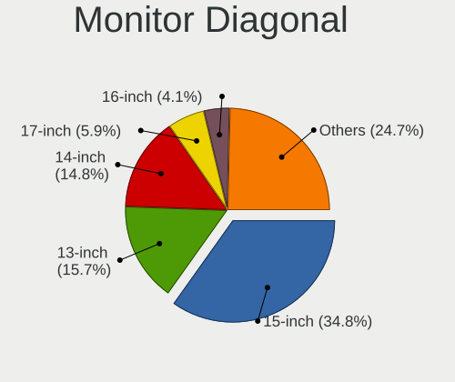

| Inches  | Notebooks | Percent |
|---------|-----------|---------|
| 15      | 1453      | 34.84%  |
| 13      | 656       | 15.73%  |
| 14      | 617       | 14.8%   |
| 17      | 246       | 5.9%    |
| 16      | 170       | 4.08%   |
| 11      | 150       | 3.6%    |
| 27      | 145       | 3.48%   |
| 24      | 137       | 3.29%   |
| 12      | 122       | 2.93%   |
| 23      | 96        | 2.3%    |
| 21      | 81        | 1.94%   |
| 31      | 50        | 1.2%    |
| 34      | 27        | 0.65%   |
| 18      | 27        | 0.65%   |
| Unknown | 27        | 0.65%   |
| 10      | 26        | 0.62%   |
| 19      | 19        | 0.46%   |
| 22      | 16        | 0.38%   |
| 25      | 9         | 0.22%   |
| 28      | 8         | 0.19%   |
| 20      | 8         | 0.19%   |
| 72      | 6         | 0.14%   |
| 40      | 6         | 0.14%   |
| 8       | 6         | 0.14%   |
| 32      | 5         | 0.12%   |
| 29      | 5         | 0.12%   |
| 84      | 4         | 0.1%    |
| 54      | 4         | 0.1%    |
| 48      | 4         | 0.1%    |
| 74      | 3         | 0.07%   |
| 63      | 3         | 0.07%   |
| 46      | 3         | 0.07%   |
| 86      | 2         | 0.05%   |
| 65      | 2         | 0.05%   |
| 58      | 2         | 0.05%   |
| 43      | 2         | 0.05%   |
| 41      | 2         | 0.05%   |
| 38      | 2         | 0.05%   |
| 37      | 2         | 0.05%   |
| 35      | 2         | 0.05%   |

Monitor Width
-------------

Physical width

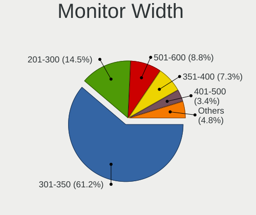

| Width in mm | Notebooks | Percent |
|-------------|-----------|---------|
| 301-350     | 2533      | 61.23%  |
| 201-300     | 600       | 14.5%   |
| 501-600     | 362       | 8.75%   |
| 351-400     | 303       | 7.32%   |
| 401-500     | 141       | 3.41%   |
| 601-700     | 72        | 1.74%   |
| 701-800     | 33        | 0.8%    |
| Unknown     | 27        | 0.65%   |
| 1001-1500   | 25        | 0.6%    |
| 1501-2000   | 15        | 0.36%   |
| 801-900     | 13        | 0.31%   |
| 101-200     | 6         | 0.15%   |
| 901-1000    | 6         | 0.15%   |
| 1-100       | 1         | 0.02%   |

Aspect Ratio
------------

Proportional relationship between the width and the height

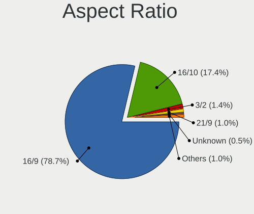

| Ratio   | Notebooks | Percent |
|---------|-----------|---------|
| 16/9    | 2939      | 78.71%  |
| 16/10   | 650       | 17.41%  |
| 3/2     | 51        | 1.37%   |
| 21/9    | 36        | 0.96%   |
| Unknown | 20        | 0.54%   |
| 4/3     | 14        | 0.37%   |
| 5/4     | 9         | 0.24%   |
| 2.65    | 3         | 0.08%   |
| 32/9    | 2         | 0.05%   |
| 3.40    | 2         | 0.05%   |
| 0.56    | 2         | 0.05%   |
| 2.70    | 1         | 0.03%   |
| 2.07    | 1         | 0.03%   |
| 2.00    | 1         | 0.03%   |
| 1.96    | 1         | 0.03%   |
| 0.67    | 1         | 0.03%   |
| 0.58    | 1         | 0.03%   |

Monitor Area
------------

Area in inch²

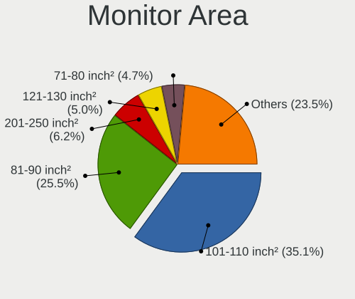

| Area in inch² | Notebooks | Percent |
|----------------|-----------|---------|
| 101-110        | 1457      | 35.07%  |
| 81-90          | 1061      | 25.54%  |
| 201-250        | 256       | 6.16%   |
| 121-130        | 208       | 5.01%   |
| 71-80          | 195       | 4.69%   |
| 111-120        | 159       | 3.83%   |
| 51-60          | 152       | 3.66%   |
| 301-350        | 146       | 3.51%   |
| 61-70          | 119       | 2.86%   |
| 351-500        | 92        | 2.21%   |
| 251-300        | 62        | 1.49%   |
| 151-200        | 44        | 1.06%   |
| 131-140        | 39        | 0.94%   |
| More than 1000 | 34        | 0.82%   |
| 141-150        | 27        | 0.65%   |
| Unknown        | 27        | 0.65%   |
| 41-50          | 26        | 0.63%   |
| 501-1000       | 22        | 0.53%   |
| 91-100         | 21        | 0.51%   |
| 1-40           | 7         | 0.17%   |

Pixel Density
-------------

Pixels per inch

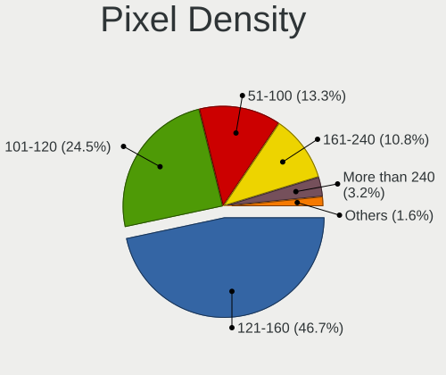

| Density       | Notebooks | Percent |
|---------------|-----------|---------|
| 121-160       | 1912      | 46.67%  |
| 101-120       | 1004      | 24.51%  |
| 51-100        | 543       | 13.25%  |
| 161-240       | 444       | 10.84%  |
| More than 240 | 130       | 3.17%   |
| 1-50          | 37        | 0.9%    |
| Unknown       | 27        | 0.66%   |

Multiple Monitors
-----------------

Total monitors connected

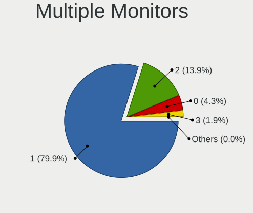

| Total | Notebooks | Percent |
|-------|-----------|---------|
| 1     | 3056      | 79.85%  |
| 2     | 532       | 13.9%   |
| 0     | 164       | 4.29%   |
| 3     | 71        | 1.86%   |
| 4     | 3         | 0.08%   |
| 5     | 1         | 0.03%   |

Network
-------

Net Controller Vendor
---------------------

Controller vendors

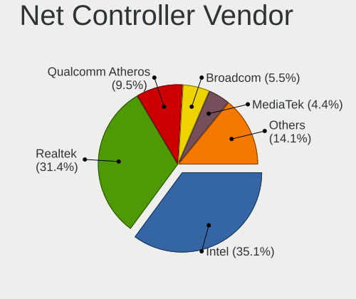

| Vendor                                 | Notebooks | Percent |
|----------------------------------------|-----------|---------|
| Intel                                  | 2071      | 35.1%   |
| Realtek Semiconductor                  | 1852      | 31.38%  |
| Qualcomm Atheros                       | 560       | 9.49%   |
| Broadcom                               | 323       | 5.47%   |
| MediaTek                               | 262       | 4.44%   |
| Broadcom Limited                       | 95        | 1.61%   |
| ASIX Electronics                       | 72        | 1.22%   |
| TP-Link                                | 61        | 1.03%   |
| Qualcomm                               | 58        | 0.98%   |
| Marvell Technology Group               | 58        | 0.98%   |
| Samsung Electronics                    | 44        | 0.75%   |
| Ralink Technology                      | 32        | 0.54%   |
| Nvidia                                 | 32        | 0.54%   |
| Xiaomi                                 | 29        | 0.49%   |
| Ralink                                 | 28        | 0.47%   |
| Lenovo                                 | 25        | 0.42%   |
| Sierra Wireless                        | 24        | 0.41%   |
| Ericsson Business Mobile Networks      | 22        | 0.37%   |
| Hewlett-Packard                        | 21        | 0.36%   |
| Shenzhen Goodix Technology             | 20        | 0.34%   |
| Google                                 | 16        | 0.27%   |
| Dell                                   | 15        | 0.25%   |
| Fibocom                                | 14        | 0.24%   |
| JMicron Technology                     | 13        | 0.22%   |
| DisplayLink                            | 12        | 0.2%    |
| NetGear                                | 10        | 0.17%   |
| Motorola PCS                           | 9         | 0.15%   |
| QinHeng Electronics                    | 7         | 0.12%   |
| Huawei Technologies                    | 7         | 0.12%   |
| D-Link                                 | 7         | 0.12%   |
| Attansic Technology                    | 7         | 0.12%   |
| OPPO Electronics                       | 6         | 0.1%    |
| Linksys                                | 6         | 0.1%    |
| U-Blox                                 | 5         | 0.08%   |
| Suzhou Motorcomm Electronic Technology | 5         | 0.08%   |
| Qualcomm Technologies                  | 5         | 0.08%   |
| Qualcomm Atheros Communications        | 5         | 0.08%   |
| ASUSTek Computer                       | 5         | 0.08%   |
| Microsoft                              | 4         | 0.07%   |
| Silicon Integrated Systems [SiS]       | 3         | 0.05%   |

Net Controller Model
--------------------

Controller models

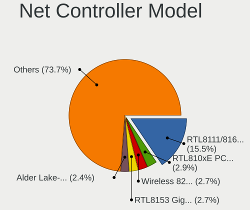

| Model                                                                  | Notebooks | Percent |
|------------------------------------------------------------------------|-----------|---------|
| Realtek RTL8111/8168/8211/8411 PCI Express Gigabit Ethernet Controller | 1106      | 15.52%  |
| Realtek RTL810xE PCI Express Fast Ethernet controller                  | 208       | 2.92%   |
| Intel Wireless 8265 / 8275                                             | 195       | 2.74%   |
| Realtek RTL8153 Gigabit Ethernet Adapter                               | 190       | 2.67%   |
| Intel Alder Lake-P PCH CNVi WiFi                                       | 173       | 2.43%   |
| Intel Wi-Fi 6 AX201                                                    | 158       | 2.22%   |
| Intel Wireless 7265                                                    | 139       | 1.95%   |
| Intel 82579LM Gigabit Network Connection (Lewisville)                  | 132       | 1.85%   |
| Intel Wi-Fi 6 AX200                                                    | 127       | 1.78%   |
| Realtek RTL8821CE 802.11ac PCIe Wireless Network Adapter               | 125       | 1.75%   |
| Intel Wireless 7260                                                    | 114       | 1.6%    |
| Realtek RTL8822CE 802.11ac PCIe Wireless Network Adapter               | 111       | 1.56%   |
| MediaTek MT7921 802.11ax PCIe Wireless Network Adapter [Filogic 330]   | 110       | 1.54%   |
| Qualcomm Atheros QCA9377 802.11ac Wireless Network Adapter             | 106       | 1.49%   |
| Intel Raptor Lake PCH CNVi WiFi                                        | 99        | 1.39%   |
| Intel Ethernet Connection (4) I219-LM                                  | 95        | 1.33%   |
| Intel Wireless 8260                                                    | 92        | 1.29%   |
| Realtek RTL8852BE PCIe 802.11ax Wireless Network Controller            | 87        | 1.22%   |
| Intel Cannon Lake PCH CNVi WiFi                                        | 80        | 1.12%   |
| MediaTek MT7922 802.11ax PCI Express Wireless Network Adapter          | 72        | 1.01%   |
| Intel Centrino Advanced-N 6205 [Taylor Peak]                           | 72        | 1.01%   |
| Qualcomm Atheros QCA6174 802.11ac Wireless Network Adapter             | 70        | 0.98%   |
| Qualcomm Atheros QCA9565 / AR9565 Wireless Network Adapter             | 69        | 0.97%   |
| Intel Comet Lake PCH-LP CNVi WiFi                                      | 69        | 0.97%   |
| Qualcomm Atheros AR9485 Wireless Network Adapter                       | 68        | 0.95%   |
| ASIX AX88179 Gigabit Ethernet                                          | 67        | 0.94%   |
| Intel Cannon Point-LP CNVi [Wireless-AC]                               | 66        | 0.93%   |
| Intel Ethernet Connection (4) I219-V                                   | 60        | 0.84%   |
| Intel Wi-Fi 6E(802.11ax) AX210/AX1675* 2x2 [Typhoon Peak]              | 57        | 0.8%    |
| Qualcomm Atheros AR9285 Wireless Network Adapter (PCI-Express)         | 55        | 0.77%   |
| Broadcom BCM4313 802.11bgn Wireless Network Adapter                    | 53        | 0.74%   |
| MediaTek MT7902 802.11ax PCIe Wireless Network Adapter [Filogic 310]   | 52        | 0.73%   |
| Qualcomm QCNFA765 Wireless Network Adapter                             | 49        | 0.69%   |
| Intel Ethernet Connection I219-LM                                      | 49        | 0.69%   |
| Intel Ethernet Connection I218-LM                                      | 44        | 0.62%   |
| Qualcomm Atheros AR9462 Wireless Network Adapter                       | 43        | 0.6%    |
| Broadcom BCM43142 802.11b/g/n                                          | 37        | 0.52%   |
| Intel Wireless 3165                                                    | 36        | 0.51%   |
| Intel Comet Lake PCH CNVi WiFi                                         | 36        | 0.51%   |
| Realtek RTL8852AE 802.11ax PCIe Wireless Network Adapter               | 35        | 0.49%   |

Wireless Vendor
---------------

Wireless vendors

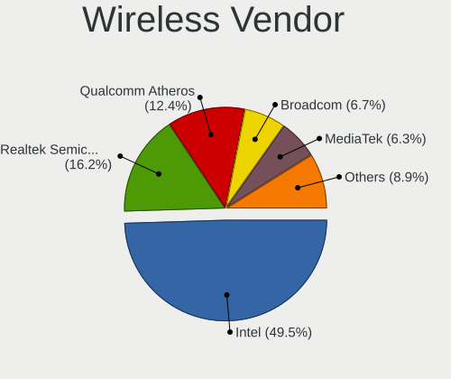

| Vendor                                | Notebooks | Percent |
|---------------------------------------|-----------|---------|
| Intel                                 | 1879      | 49.51%  |
| Realtek Semiconductor                 | 613       | 16.15%  |
| Qualcomm Atheros                      | 471       | 12.41%  |
| Broadcom                              | 255       | 6.72%   |
| MediaTek                              | 240       | 6.32%   |
| Broadcom Limited                      | 71        | 1.87%   |
| Qualcomm                              | 50        | 1.32%   |
| TP-Link                               | 48        | 1.26%   |
| Ralink Technology                     | 32        | 0.84%   |
| Ralink                                | 28        | 0.74%   |
| Sierra Wireless                       | 24        | 0.63%   |
| Fibocom                               | 14        | 0.37%   |
| NetGear                               | 10        | 0.26%   |
| Dell                                  | 10        | 0.26%   |
| D-Link                                | 7         | 0.18%   |
| Qualcomm Technologies                 | 5         | 0.13%   |
| Qualcomm Atheros Communications       | 5         | 0.13%   |
| Hewlett-Packard                       | 5         | 0.13%   |
| ASUSTek Computer                      | 5         | 0.13%   |
| Microsoft                             | 4         | 0.11%   |
| Linksys                               | 4         | 0.11%   |
| Quectel Wireless Solutions            | 2         | 0.05%   |
| Ericsson Business Mobile Networks     | 2         | 0.05%   |
| Edimax Technology                     | 2         | 0.05%   |
| D-Link System                         | 2         | 0.05%   |
| ZyDAS                                 | 1         | 0.03%   |
| Wacom                                 | 1         | 0.03%   |
| Sitecom Europe                        | 1         | 0.03%   |
| Samsung Electronics                   | 1         | 0.03%   |
| Elecom                                | 1         | 0.03%   |
| AVM                                   | 1         | 0.03%   |
| 802.11g Adapter [Linksys WUSB54GC v3] | 1         | 0.03%   |

Wireless Model
--------------

Wireless models

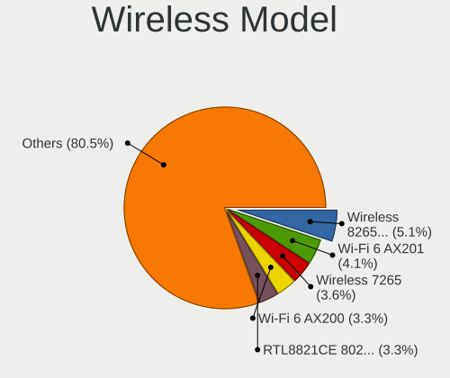

| Model                                                                | Notebooks | Percent |
|----------------------------------------------------------------------|-----------|---------|
| Intel Wireless 8265 / 8275                                           | 195       | 5.11%   |
| Intel Wi-Fi 6 AX201                                                  | 158       | 4.14%   |
| Intel Wireless 7265                                                  | 139       | 3.64%   |
| Intel Wi-Fi 6 AX200                                                  | 127       | 3.33%   |
| Realtek RTL8821CE 802.11ac PCIe Wireless Network Adapter             | 125       | 3.27%   |
| Intel Wireless 7260                                                  | 114       | 2.99%   |
| Realtek RTL8822CE 802.11ac PCIe Wireless Network Adapter             | 111       | 2.91%   |
| MediaTek MT7921 802.11ax PCIe Wireless Network Adapter [Filogic 330] | 110       | 2.88%   |
| Qualcomm Atheros QCA9377 802.11ac Wireless Network Adapter           | 106       | 2.78%   |
| Intel Alder Lake-P PCH CNVi WiFi                                     | 101       | 2.64%   |
| Intel Raptor Lake PCH CNVi WiFi                                      | 96        | 2.51%   |
| Intel Wireless 8260                                                  | 92        | 2.41%   |
| Realtek RTL8852BE PCIe 802.11ax Wireless Network Controller          | 82        | 2.15%   |
| Intel Cannon Lake PCH CNVi WiFi                                      | 80        | 2.09%   |
| Intel Centrino Advanced-N 6205 [Taylor Peak]                         | 72        | 1.89%   |
| Qualcomm Atheros QCA6174 802.11ac Wireless Network Adapter           | 70        | 1.83%   |
| Qualcomm Atheros QCA9565 / AR9565 Wireless Network Adapter           | 69        | 1.81%   |
| Intel Comet Lake PCH-LP CNVi WiFi                                    | 69        | 1.81%   |
| Qualcomm Atheros AR9485 Wireless Network Adapter                     | 68        | 1.78%   |
| Intel Cannon Point-LP CNVi [Wireless-AC]                             | 66        | 1.73%   |
| MediaTek MT7922 802.11ax PCI Express Wireless Network Adapter        | 57        | 1.49%   |
| Intel Wi-Fi 6E(802.11ax) AX210/AX1675* 2x2 [Typhoon Peak]            | 57        | 1.49%   |
| Qualcomm Atheros AR9285 Wireless Network Adapter (PCI-Express)       | 55        | 1.44%   |
| Broadcom BCM4313 802.11bgn Wireless Network Adapter                  | 53        | 1.39%   |
| MediaTek MT7902 802.11ax PCIe Wireless Network Adapter [Filogic 310] | 52        | 1.36%   |
| Qualcomm QCNFA765 Wireless Network Adapter                           | 49        | 1.28%   |
| Qualcomm Atheros AR9462 Wireless Network Adapter                     | 43        | 1.13%   |
| Broadcom BCM43142 802.11b/g/n                                        | 37        | 0.97%   |
| Intel Wireless 3165                                                  | 36        | 0.94%   |
| Intel Comet Lake PCH CNVi WiFi                                       | 36        | 0.94%   |
| Realtek RTL8852AE 802.11ax PCIe Wireless Network Adapter             | 35        | 0.92%   |
| Realtek RTL8188CE 802.11b/g/n WiFi Adapter                           | 35        | 0.92%   |
| Realtek RTL8723BE PCIe Wireless Network Adapter                      | 34        | 0.89%   |
| Broadcom Limited BCM4360 802.11ac Dual Band Wireless Network Adapter | 34        | 0.89%   |
| Intel Meteor Lake PCH CNVi WiFi                                      | 29        | 0.76%   |
| Intel Tiger Lake PCH CNVi WiFi                                       | 28        | 0.73%   |
| Intel Gemini Lake PCH CNVi WiFi                                      | 28        | 0.73%   |
| Intel WiFi Link 5100                                                 | 27        | 0.71%   |
| Intel Centrino Ultimate-N 6300                                       | 27        | 0.71%   |
| Intel Wireless 3160                                                  | 25        | 0.65%   |

Ethernet Vendor
---------------

Ethernet vendors

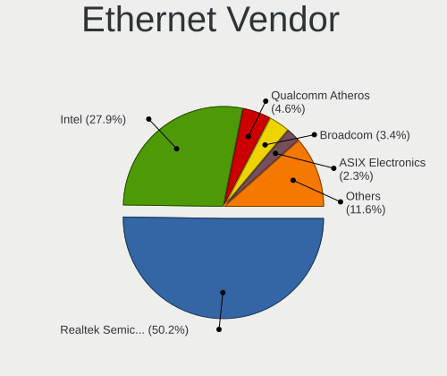

| Vendor                                 | Notebooks | Percent |
|----------------------------------------|-----------|---------|
| Realtek Semiconductor                  | 1573      | 50.22%  |
| Intel                                  | 874       | 27.91%  |
| Qualcomm Atheros                       | 143       | 4.57%   |
| Broadcom                               | 108       | 3.45%   |
| ASIX Electronics                       | 72        | 2.3%    |
| Marvell Technology Group               | 58        | 1.85%   |
| Samsung Electronics                    | 42        | 1.34%   |
| Nvidia                                 | 32        | 1.02%   |
| Xiaomi                                 | 29        | 0.93%   |
| Lenovo                                 | 25        | 0.8%    |
| Broadcom Limited                       | 24        | 0.77%   |
| MediaTek                               | 21        | 0.67%   |
| Google                                 | 15        | 0.48%   |
| TP-Link                                | 13        | 0.42%   |
| JMicron Technology                     | 13        | 0.42%   |
| Hewlett-Packard                        | 12        | 0.38%   |
| DisplayLink                            | 12        | 0.38%   |
| Motorola PCS                           | 9         | 0.29%   |
| Qualcomm                               | 8         | 0.26%   |
| Attansic Technology                    | 7         | 0.22%   |
| OPPO Electronics                       | 6         | 0.19%   |
| Suzhou Motorcomm Electronic Technology | 5         | 0.16%   |
| QinHeng Electronics                    | 4         | 0.13%   |
| Silicon Integrated Systems [SiS]       | 3         | 0.1%    |
| Microchip Technology                   | 3         | 0.1%    |
| Huawei Technologies                    | 3         | 0.1%    |
| Cypress Semiconductor                  | 3         | 0.1%    |
| Linksys                                | 2         | 0.06%   |
| ICS Advent                             | 2         | 0.06%   |
| Apple                                  | 2         | 0.06%   |
| ADMtek                                 | 2         | 0.06%   |
| VIA Technologies                       | 1         | 0.03%   |
| TOMTOM                                 | 1         | 0.03%   |
| Spreadtrum Communications              | 1         | 0.03%   |
| Realtek                                | 1         | 0.03%   |
| LG Electronics                         | 1         | 0.03%   |
| Davicom Semiconductor                  | 1         | 0.03%   |
| 3DSP                                   | 1         | 0.03%   |

Ethernet Model
--------------

Ethernet models

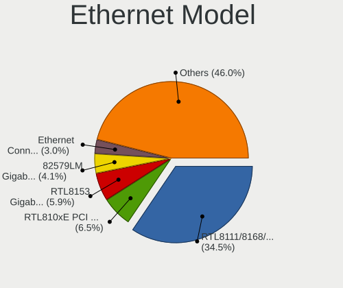

| Model                                                                  | Notebooks | Percent |
|------------------------------------------------------------------------|-----------|---------|
| Realtek RTL8111/8168/8211/8411 PCI Express Gigabit Ethernet Controller | 1106      | 34.48%  |
| Realtek RTL810xE PCI Express Fast Ethernet controller                  | 208       | 6.48%   |
| Realtek RTL8153 Gigabit Ethernet Adapter                               | 190       | 5.92%   |
| Intel 82579LM Gigabit Network Connection (Lewisville)                  | 132       | 4.11%   |
| Intel Ethernet Connection (4) I219-LM                                  | 95        | 2.96%   |
| Intel Alder Lake-P PCH CNVi WiFi                                       | 72        | 2.24%   |
| ASIX AX88179 Gigabit Ethernet                                          | 67        | 2.09%   |
| Intel Ethernet Connection (4) I219-V                                   | 60        | 1.87%   |
| Intel Ethernet Connection I219-LM                                      | 49        | 1.53%   |
| Intel Ethernet Connection I218-LM                                      | 44        | 1.37%   |
| Intel Ethernet Connection (16) I219-V                                  | 34        | 1.06%   |
| Intel Ethernet Connection I217-LM                                      | 31        | 0.97%   |
| Realtek RTL8152 Fast Ethernet Adapter                                  | 28        | 0.87%   |
| Samsung Galaxy series, misc. (tethering mode)                          | 27        | 0.84%   |
| Intel Ethernet Connection I219-V                                       | 27        | 0.84%   |
| Qualcomm Atheros AR8151 v2.0 Gigabit Ethernet                          | 26        | 0.81%   |
| Intel Ethernet Connection (6) I219-LM                                  | 26        | 0.81%   |
| Xiaomi Mi/Redmi series (RNDIS)                                         | 24        | 0.75%   |
| Realtek RTL8125 2.5GbE Controller                                      | 24        | 0.75%   |
| Intel Ethernet Connection (6) I219-V                                   | 24        | 0.75%   |
| Nvidia MCP79 Ethernet                                                  | 22        | 0.69%   |
| Intel Ethernet Connection (18) I219-LM                                 | 22        | 0.69%   |
| Realtek Killer E2600 GbE Controller                                    | 21        | 0.65%   |
| Intel Ethernet Connection (3) I218-LM                                  | 21        | 0.65%   |
| Intel Ethernet Connection (13) I219-V                                  | 21        | 0.65%   |
| Intel 82577LM Gigabit Network Connection                               | 21        | 0.65%   |
| Intel 82567LM Gigabit Network Connection                               | 20        | 0.62%   |
| Broadcom NetXtreme BCM57765 Gigabit Ethernet PCIe                      | 20        | 0.62%   |
| Qualcomm Atheros AR8161 Gigabit Ethernet                               | 18        | 0.56%   |
| Intel Ethernet Connection I217-V                                       | 17        | 0.53%   |
| Qualcomm Atheros QCA8172 Fast Ethernet                                 | 16        | 0.5%    |
| Marvell Group 88E8040 PCI-E Fast Ethernet Controller                   | 16        | 0.5%    |
| Broadcom NetLink BCM57785 Gigabit Ethernet PCIe                        | 16        | 0.5%    |
| Samsung GT-I9070 (network tethering, USB debugging enabled)            | 15        | 0.47%   |
| MediaTek MT7922 802.11ax PCI Express Wireless Network Adapter          | 15        | 0.47%   |
| Marvell Group 88E8055 PCI-E Gigabit Ethernet Controller                | 15        | 0.47%   |
| Intel Ethernet Connection (7) I219-LM                                  | 14        | 0.44%   |
| TP-Link UE300 10/100/1000 LAN (ethernet mode) [Realtek RTL8153]        | 13        | 0.41%   |
| Intel Ethernet Connection (2) I219-LM                                  | 13        | 0.41%   |
| Intel Ethernet Connection (16) I219-LM                                 | 13        | 0.41%   |

Net Controller Kind
-------------------

Ethernet, WiFi or modem

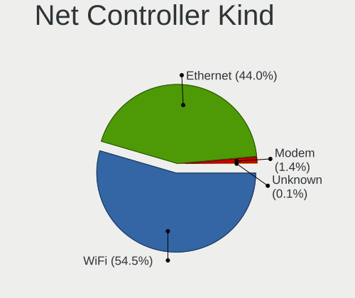

| Kind     | Notebooks | Percent |
|----------|-----------|---------|
| WiFi     | 3582      | 54.52%  |
| Ethernet | 2892      | 44.02%  |
| Modem    | 90        | 1.37%   |
| Unknown  | 6         | 0.09%   |

Used Controller
---------------

Currently used network controller

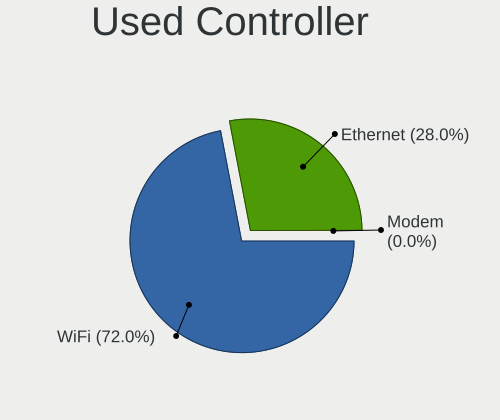

| Kind     | Notebooks | Percent |
|----------|-----------|---------|
| WiFi     | 2869      | 71.99%  |
| Ethernet | 1115      | 27.98%  |
| Modem    | 1         | 0.03%   |

NICs
----

Total network controllers on board

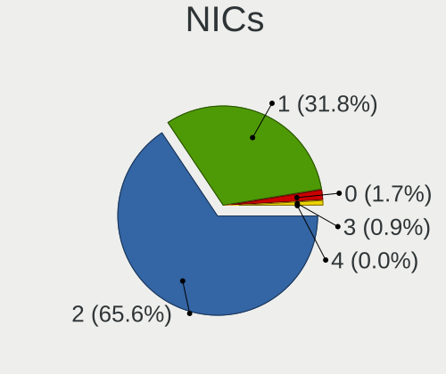

| Total | Notebooks | Percent |
|-------|-----------|---------|
| 2     | 2477      | 65.63%  |
| 1     | 1199      | 31.77%  |
| 0     | 64        | 1.7%    |
| 3     | 33        | 0.87%   |
| 4     | 1         | 0.03%   |

IPv6
----

IPv6 vs IPv4

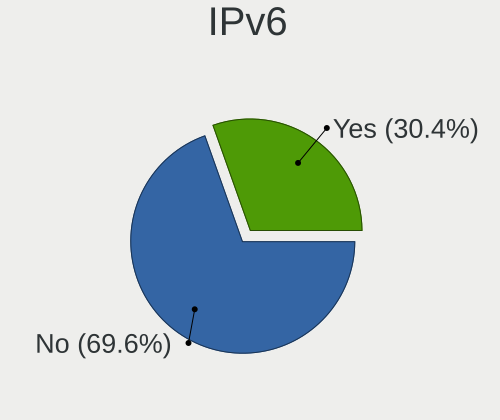

| Used | Notebooks | Percent |
|------|-----------|---------|
| No   | 2668      | 69.57%  |
| Yes  | 1167      | 30.43%  |

Bluetooth
---------

Bluetooth Vendor
----------------

Controller vendors

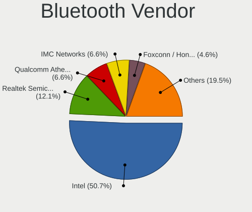

| Vendor                          | Notebooks | Percent |
|---------------------------------|-----------|---------|
| Intel                           | 1616      | 50.72%  |
| Realtek Semiconductor           | 386       | 12.12%  |
| Qualcomm Atheros Communications | 209       | 6.56%   |
| IMC Networks                    | 209       | 6.56%   |
| Foxconn / Hon Hai               | 146       | 4.58%   |
| Broadcom                        | 131       | 4.11%   |
| Apple                           | 117       | 3.67%   |
| Lite-On Technology              | 94        | 2.95%   |
| Hewlett-Packard                 | 41        | 1.29%   |
| Dell                            | 39        | 1.22%   |
| MediaTek                        | 33        | 1.04%   |
| USI                             | 29        | 0.91%   |
| Cambridge Silicon Radio         | 29        | 0.91%   |
| Realtek                         | 25        | 0.78%   |
| Toshiba                         | 15        | 0.47%   |
| Ralink                          | 11        | 0.35%   |
| ASUSTek Computer                | 9         | 0.28%   |
| TP-Link                         | 8         | 0.25%   |
| Alps Electric                   | 8         | 0.25%   |
| Foxconn International           | 7         | 0.22%   |
| Ralink Technology               | 4         | 0.13%   |
| Fujitsu                         | 3         | 0.09%   |
| Edimax Technology               | 3         | 0.09%   |
| Qcom                            | 2         | 0.06%   |
| Opticis                         | 2         | 0.06%   |
| Micro Star International        | 2         | 0.06%   |
| Chicony Electronics             | 2         | 0.06%   |
| Askey Computer                  | 2         | 0.06%   |
| Taiyo Yuden                     | 1         | 0.03%   |
| Integrated System Solution      | 1         | 0.03%   |
| Corsair                         | 1         | 0.03%   |
| Belkin Components               | 1         | 0.03%   |

Bluetooth Model
---------------

Controller models

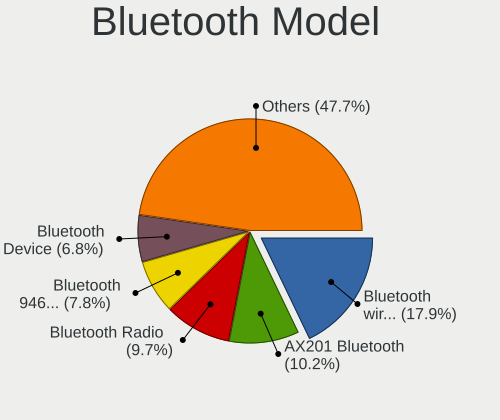

| Model                                               | Notebooks | Percent |
|-----------------------------------------------------|-----------|---------|
| Intel Bluetooth wireless interface                  | 570       | 17.87%  |
| Intel AX201 Bluetooth                               | 324       | 10.16%  |
| Realtek Bluetooth Radio                             | 309       | 9.69%   |
| Intel Bluetooth 9460/9560 Jefferson Peak (JfP)      | 249       | 7.81%   |
| Intel Bluetooth Device                              | 216       | 6.77%   |
| Intel AX200 Bluetooth                               | 123       | 3.86%   |
| IMC Networks Wireless_Device                        | 109       | 3.42%   |
| Qualcomm Atheros  Bluetooth Device                  | 105       | 3.29%   |
| Apple Bluetooth Host Controller                     | 53        | 1.66%   |
| Realtek  Bluetooth 4.2 Adapter                      | 52        | 1.63%   |
| IMC Networks Bluetooth Radio                        | 52        | 1.63%   |
| Intel AX210 Bluetooth                               | 51        | 1.6%    |
| Qualcomm Atheros AR3012 Bluetooth 4.0               | 46        | 1.44%   |
| Foxconn / Hon Hai Bluetooth Device                  | 43        | 1.35%   |
| Foxconn / Hon Hai Wireless_Device                   | 40        | 1.25%   |
| Apple Bluetooth USB Host Controller                 | 40        | 1.25%   |
| Lite-On Wireless_Device                             | 35        | 1.1%    |
| MediaTek Wireless_Device                            | 33        | 1.03%   |
| USI Bluetooth Device                                | 29        | 0.91%   |
| Intel Centrino Bluetooth Wireless Transceiver       | 29        | 0.91%   |
| Cambridge Silicon Radio Bluetooth Dongle (HCI mode) | 29        | 0.91%   |
| Broadcom BCM2045B (BDC-2.1)                         | 29        | 0.91%   |
| Qualcomm Atheros QCA61x4 Bluetooth 4.0              | 28        | 0.88%   |
| Foxconn / Hon Hai MediaTek Bluetooth Adapter        | 28        | 0.88%   |
| IMC Networks Bluetooth Device                       | 26        | 0.82%   |
| Realtek Bluetooth Radio                             | 25        | 0.78%   |
| HP Broadcom 2070 Bluetooth Combo                    | 25        | 0.78%   |
| Intel Wireless-AC 9260 Bluetooth Adapter            | 24        | 0.75%   |
| Broadcom BCM20702 Bluetooth 4.0 [ThinkPad]          | 23        | 0.72%   |
| Lite-On Qualcomm Atheros QCA9377 Bluetooth          | 22        | 0.69%   |
| Lite-On Bluetooth Device                            | 19        | 0.6%    |
| Intel Wireless-AC 3168 Bluetooth                    | 16        | 0.5%    |
| Intel Centrino Advanced-N 6230 Bluetooth adapter    | 15        | 0.47%   |
| Apple Built-in Bluetooth 2.0+EDR HCI                | 15        | 0.47%   |
| Qualcomm Atheros AR3011 Bluetooth                   | 14        | 0.44%   |
| HP Bluetooth 2.0 Interface [Broadcom BCM2045]       | 13        | 0.41%   |
| Broadcom HP Portable Bumble Bee                     | 12        | 0.38%   |
| Ralink RT3290 Bluetooth                             | 11        | 0.34%   |
| Qualcomm Atheros AR9462 Bluetooth                   | 11        | 0.34%   |
| Dell BCM20702A0 Bluetooth Module                    | 11        | 0.34%   |

Sound
-----

Sound Vendor
------------

Sound card vendors

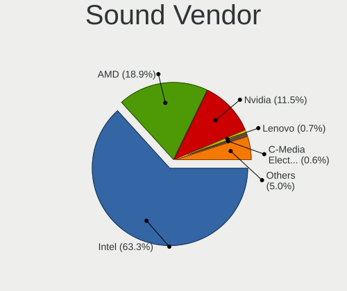

| Vendor                                       | Notebooks | Percent |
|----------------------------------------------|-----------|---------|
| Intel                                        | 2876      | 63.28%  |
| AMD                                          | 859       | 18.9%   |
| Nvidia                                       | 522       | 11.49%  |
| Lenovo                                       | 34        | 0.75%   |
| C-Media Electronics                          | 28        | 0.62%   |
| GN Netcom                                    | 22        | 0.48%   |
| Logitech                                     | 21        | 0.46%   |
| Realtek Semiconductor                        | 17        | 0.37%   |
| Hewlett-Packard                              | 15        | 0.33%   |
| Texas Instruments                            | 13        | 0.29%   |
| JMTek                                        | 10        | 0.22%   |
| Generalplus Technology                       | 10        | 0.22%   |
| Zoran Co. Personal Media Division (Nogatech) | 6         | 0.13%   |
| SteelSeries ApS                              | 6         | 0.13%   |
| Plantronics                                  | 5         | 0.11%   |
| Jieli Technology                             | 5         | 0.11%   |
| ASUSTek Computer                             | 5         | 0.11%   |
| Kingston Technology                          | 4         | 0.09%   |
| Apple                                        | 4         | 0.09%   |
| Silicon Integrated Systems [SiS]             | 3         | 0.07%   |
| Creative Technology                          | 3         | 0.07%   |
| Conexant Systems                             | 3         | 0.07%   |
| Yamaha                                       | 2         | 0.04%   |
| Trust                                        | 2         | 0.04%   |
| Tenx Technology                              | 2         | 0.04%   |
| Sony                                         | 2         | 0.04%   |
| QinHeng Electronics                          | 2         | 0.04%   |
| M-Audio                                      | 2         | 0.04%   |
| Fujitsu                                      | 2         | 0.04%   |
| Focusrite-Novation                           | 2         | 0.04%   |
| FiiO Electronics Technology                  | 2         | 0.04%   |
| fifine Microphones                           | 2         | 0.04%   |
| ESS Technology                               | 2         | 0.04%   |
| DSEA A/S                                     | 2         | 0.04%   |
| Dell                                         | 2         | 0.04%   |
| Corsair                                      | 2         | 0.04%   |
| CMX Systems                                  | 2         | 0.04%   |
| AKAI Professional M.I.                       | 2         | 0.04%   |
| Zhaoxin                                      | 1         | 0.02%   |
| Walmart                                      | 1         | 0.02%   |

Sound Model
-----------

Sound card models

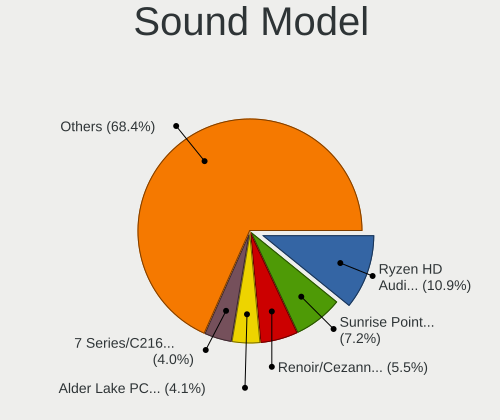

| Model                                                                                             | Notebooks | Percent |
|---------------------------------------------------------------------------------------------------|-----------|---------|
| AMD Ryzen HD Audio Controller                                                                     | 605       | 10.85%  |
| Intel Sunrise Point-LP HD Audio                                                                   | 401       | 7.19%   |
| AMD Renoir/Cezanne HDMI/DP Audio Controller                                                       | 305       | 5.47%   |
| Intel Alder Lake PCH-P High Definition Audio Controller                                           | 229       | 4.11%   |
| Intel 7 Series/C216 Chipset Family High Definition Audio Controller                               | 224       | 4.02%   |
| Intel Tiger Lake-LP Smart Sound Technology Audio Controller                                       | 205       | 3.68%   |
| Intel 6 Series/C200 Series Chipset Family High Definition Audio Controller                        | 172       | 3.09%   |
| AMD Radeon High Definition Audio Controller                                                       | 161       | 2.89%   |
| Intel Raptor Lake-P/U/H cAVS                                                                      | 151       | 2.71%   |
| Intel Cannon Lake PCH cAVS                                                                        | 121       | 2.17%   |
| Intel Haswell-ULT HD Audio Controller                                                             | 119       | 2.13%   |
| Intel 8 Series HD Audio Controller                                                                | 119       | 2.13%   |
| Intel Cannon Point-LP High Definition Audio Controller                                            | 104       | 1.87%   |
| AMD Raven/Raven2/Fenghuang HDMI/DP Audio Controller                                               | 102       | 1.83%   |
| Intel 82801I (ICH9 Family) HD Audio Controller                                                    | 99        | 1.78%   |
| Intel 8 Series/C220 Series Chipset High Definition Audio Controller                               | 98        | 1.76%   |
| Intel 5 Series/3400 Series Chipset High Definition Audio                                          | 94        | 1.69%   |
| Intel Broadwell-U Audio Controller                                                                | 90        | 1.61%   |
| Intel Wildcat Point-LP High Definition Audio Controller                                           | 89        | 1.6%    |
| Intel Comet Lake PCH-LP cAVS                                                                      | 81        | 1.45%   |
| Intel Xeon E3-1200 v3/4th Gen Core Processor HD Audio Controller                                  | 80        | 1.44%   |
| AMD Kabini HDMI/DP Audio                                                                          | 80        | 1.44%   |
| Intel Celeron/Pentium Silver Processor High Definition Audio                                      | 76        | 1.36%   |
| Intel Atom/Celeron/Pentium Processor x5-E8000/J3xxx/N3xxx Series High Definition Audio Controller | 69        | 1.24%   |
| AMD Family 15h (Models 60h-6fh) Audio Controller                                                  | 69        | 1.24%   |
| Intel NM10/ICH7 Family High Definition Audio Controller                                           | 62        | 1.11%   |
| AMD FCH Azalia Controller                                                                         | 61        | 1.09%   |
| Nvidia AD107 High Definition Audio Controller                                                     | 57        | 1.02%   |
| Intel Atom Processor Z36xxx/Z37xxx Series High Definition Audio Controller                        | 57        | 1.02%   |
| Nvidia TU107 GeForce GTX 1650 High Definition Audio Controller                                    | 56        | 1%      |
| Intel Comet Lake PCH cAVS                                                                         | 46        | 0.83%   |
| Intel Tiger Lake-H HD Audio Controller                                                            | 45        | 0.81%   |
| Intel 82801H (ICH8 Family) HD Audio Controller                                                    | 45        | 0.81%   |
| Nvidia GA107 High Definition Audio Controller                                                     | 43        | 0.77%   |
| Intel Ice Lake-LP Smart Sound Technology Audio Controller                                         | 43        | 0.77%   |
| Intel CM238 HD Audio Controller                                                                   | 42        | 0.75%   |
| Intel 100 Series/C230 Series Chipset Family HD Audio Controller                                   | 40        | 0.72%   |
| Intel Meteor Lake-P HD Audio Controller                                                           | 39        | 0.7%    |
| AMD SBx00 Azalia (Intel HDA)                                                                      | 38        | 0.68%   |
| Intel Celeron N3350/Pentium N4200/Atom E3900 Series Audio Cluster                                 | 36        | 0.65%   |

Memory
------

Memory Vendor
-------------

Memory module vendors

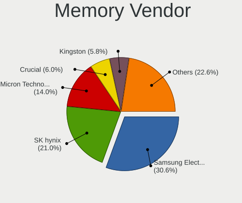

| Vendor                                  | Notebooks | Percent |
|-----------------------------------------|-----------|---------|
| Samsung Electronics                     | 1028      | 30.58%  |
| SK hynix                                | 706       | 21%     |
| Micron Technology                       | 472       | 14.04%  |
| Crucial                                 | 201       | 5.98%   |
| Kingston                                | 195       | 5.8%    |
| Unknown                                 | 181       | 5.38%   |
| Unknown                                 | 77        | 2.29%   |
| Ramaxel Technology                      | 63        | 1.87%   |
| Elpida                                  | 60        | 1.78%   |
| A-DATA Technology                       | 60        | 1.78%   |
| Corsair                                 | 38        | 1.13%   |
| Nanya Technology                        | 31        | 0.92%   |
| Unknown (ABCD)                          | 27        | 0.8%    |
| G.Skill                                 | 25        | 0.74%   |
| 4ea5                                    | 17        | 0.51%   |
| Smart                                   | 14        | 0.42%   |
| Team                                    | 13        | 0.39%   |
| ff                                      | 11        | 0.33%   |
| fef5                                    | 10        | 0.3%    |
| Timetec                                 | 8         | 0.24%   |
| Patriot                                 | 8         | 0.24%   |
| Teikon                                  | 7         | 0.21%   |
| Transcend                               | 6         | 0.18%   |
| Neo Forza                               | 5         | 0.15%   |
| GOODRAM                                 | 5         | 0.15%   |
| Lexar Co Limited                        | 4         | 0.12%   |
| ASint Technology                        | 4         | 0.12%   |
| 48spaces                                | 4         | 0.12%   |
| Smart Modular                           | 3         | 0.09%   |
| Silicon Power Computer & Communications | 3         | 0.09%   |
| Qimonda                                 | 3         | 0.09%   |
| PNY                                     | 3         | 0.09%   |
| 8F9400008F94                            | 3         | 0.09%   |
| Smart Brazil                            | 2         | 0.06%   |
| SHARETRONIC                             | 2         | 0.06%   |
| Magnum Tech                             | 2         | 0.06%   |
| Hikvision                               | 2         | 0.06%   |
| Hewlett-Packard                         | 2         | 0.06%   |
| ChangXin Memory                         | 2         | 0.06%   |
| Apacer                                  | 2         | 0.06%   |

Memory Model
------------

Memory module models

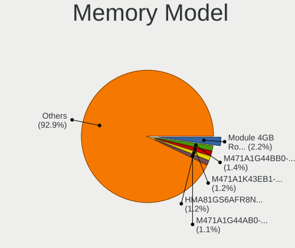

| Model                                                            | Notebooks | Percent |
|------------------------------------------------------------------|-----------|---------|
| Unknown                                                          | 77        | 2.18%   |
| Samsung RAM M471A1G44BB0-CWE 8GB SODIMM DDR4 3200MT/s            | 49        | 1.39%   |
| Samsung RAM M471A1K43EB1-CWE 8GB SODIMM DDR4 3200MT/s            | 44        | 1.25%   |
| SK hynix RAM HMA81GS6AFR8N-UH 8GB SODIMM DDR4 2667MT/s           | 41        | 1.16%   |
| Samsung RAM M471A1G44AB0-CWE 8GiB SODIMM DDR4 3200MT/s           | 40        | 1.13%   |
| Samsung RAM K4E8E324EB-EGCF 2GB LPDDR3 1867MT/s                  | 40        | 1.13%   |
| Crucial RAM CT8G4SFRA266.C8FD1 8GB SODIMM DDR4 2667MT/s          | 39        | 1.1%    |
| Samsung RAM M471B5173DB0-YK0 4GB SODIMM DDR3 1600MT/s            | 37        | 1.05%   |
| Micron RAM 4ATF1G64HZ-3G2F1 8GB SODIMM DDR4 3200MT/s             | 32        | 0.91%   |
| SK hynix RAM HMAA1GS6CJR6N-XN 8GB SODIMM DDR4 3200MT/s           | 29        | 0.82%   |
| Samsung RAM M471A5244CB0-CWE 4GB SODIMM DDR4 3200MT/s            | 28        | 0.79%   |
| Samsung RAM M471A5244CB0-CTD 4GB SODIMM DDR4 3266MT/s            | 28        | 0.79%   |
| Micron RAM 8ATF1G64HZ-3G2R1 8GB SODIMM DDR4 3200MT/s             | 27        | 0.76%   |
| Unknown (ABCD) RAM 123456789012345678 2GB SODIMM LPDDR4 2400MT/s | 25        | 0.71%   |
| SK hynix RAM HMT451S6BFR8A-PB 4GB SODIMM DDR3 1600MT/s           | 23        | 0.65%   |
| Samsung RAM M471A1K43DB1-CWE 8GB SODIMM DDR4 3200MT/s            | 23        | 0.65%   |
| Samsung RAM M471B5173EB0-YK0 4GB SODIMM DDR3 1600MT/s            | 22        | 0.62%   |
| SK hynix RAM HMT41GS6BFR8A-PB 8GB SODIMM DDR3 2667MT/s           | 20        | 0.57%   |
| Samsung RAM M471B5273DH0-CH9 4GB SODIMM DDR3 1600MT/s            | 20        | 0.57%   |
| Samsung RAM M471A1G44AB0-CWE 8GB Row Of Chips DDR4 3200MT/s      | 19        | 0.54%   |
| Samsung RAM M471B5674QH0-YK0 2GB SODIMM DDR3 3200MT/s            | 18        | 0.51%   |
| Samsung RAM M471A1K43BB1-CRC 8GB SODIMM DDR4 2667MT/s            | 18        | 0.51%   |
| Unknown RAM Module 2GB SODIMM DDR2 667MT/s                       | 17        | 0.48%   |
| Samsung RAM M471B5173QH0-YK0 4GB SODIMM DDR3 1600MT/s            | 17        | 0.48%   |
| Samsung RAM M471A1K43CB1-CRC 8GB SODIMM DDR4 8400MT/s            | 17        | 0.48%   |
| SK hynix RAM Module 4GB SODIMM DDR3 1600MT/s                     | 16        | 0.45%   |
| Crucial RAM CT8G4SFS824A.M8FE 8GB SODIMM DDR4 2667MT/s           | 16        | 0.45%   |
| SK hynix RAM HMT451S6AFR8A-PB 4GB SODIMM DDR3 1600MT/s           | 15        | 0.42%   |
| SK hynix RAM HMA851S6CJR6N-VK 4GB SODIMM DDR4 2667MT/s           | 15        | 0.42%   |
| SK hynix RAM H9JCNNNCP3MLYR-N6E 2GB Row Of Chips LPDDR5 6400MT/s | 15        | 0.42%   |
| SK hynix RAM HMT351S6CFR8C-PB 4GB SODIMM DDR3 1600MT/s           | 14        | 0.4%    |
| SK hynix RAM HMT325S6CFR8C-PB 2GB SODIMM DDR3 1600MT/s           | 14        | 0.4%    |
| Samsung RAM M471B1G73QH0-YK0 8GB SODIMM DDR3 1600MT/s            | 14        | 0.4%    |
| Samsung RAM M471A5244BB0-CRC 4GB SODIMM DDR4 2667MT/s            | 14        | 0.4%    |
| Micron RAM 4ATF51264HZ-2G6E1 4GB SODIMM DDR4 2667MT/s            | 14        | 0.4%    |
| Samsung RAM M471A5143SB1-CRC 4GB SODIMM DDR4 2400MT/s            | 13        | 0.37%   |
| Samsung RAM M471A2K43CB1-CRC 16GB SODIMM DDR4 2667MT/s           | 13        | 0.37%   |
| Micron RAM 8KTF51264HZ-1G6E1 4GB SODIMM DDR3 1600MT/s            | 13        | 0.37%   |
| Micron RAM 4ATF51264HZ-3G2J1 4GB SODIMM DDR4 3200MT/s            | 13        | 0.37%   |
| SK hynix RAM HMCG78AGBSA092N 16GB SODIMM DDR5 5600MT/s           | 12        | 0.34%   |

Memory Kind
-----------

Memory module kinds

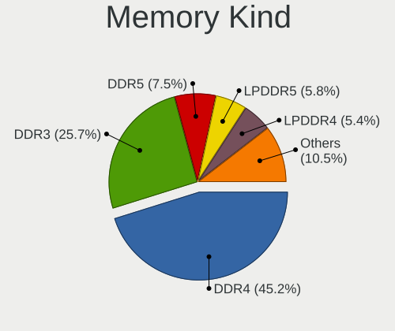

| Kind    | Notebooks | Percent |
|---------|-----------|---------|
| DDR4    | 1287      | 45.16%  |
| DDR3    | 732       | 25.68%  |
| DDR5    | 214       | 7.51%   |
| LPDDR5  | 165       | 5.79%   |
| LPDDR4  | 153       | 5.37%   |
| LPDDR3  | 116       | 4.07%   |
| DDR2    | 104       | 3.65%   |
| SDRAM   | 41        | 1.44%   |
| Unknown | 18        | 0.63%   |
| DDR     | 16        | 0.56%   |
| DRAM    | 4         | 0.14%   |

Memory Form Factor
------------------

Physical design of the memory module

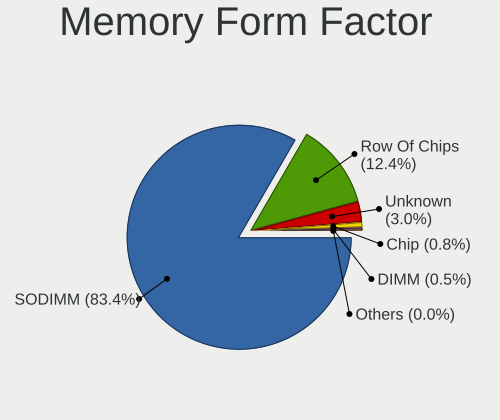

| Name            | Notebooks | Percent |
|-----------------|-----------|---------|
| SODIMM          | 2392      | 83.37%  |
| Row Of Chips    | 355       | 12.37%  |
| Unknown         | 85        | 2.96%   |
| Chip            | 22        | 0.77%   |
| DIMM            | 14        | 0.49%   |
| Proprietary Car | 1         | 0.03%   |

Memory Size
-----------

Memory module size

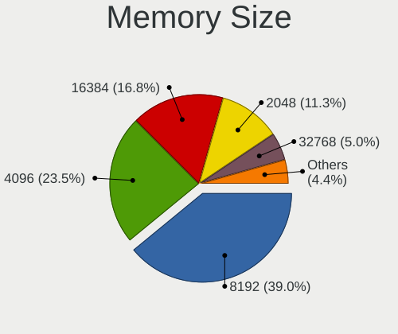

| Size    | Notebooks | Percent |
|---------|-----------|---------|
| 8192    | 1219      | 39.05%  |
| 4096    | 733       | 23.48%  |
| 16384   | 525       | 16.82%  |
| 2048    | 352       | 11.27%  |
| 32768   | 157       | 5.03%   |
| 1024    | 109       | 3.49%   |
| 512     | 10        | 0.32%   |
| 49152   | 6         | 0.19%   |
| 256     | 4         | 0.13%   |
| 3072    | 2         | 0.06%   |
| 65536   | 1         | 0.03%   |
| 5120    | 1         | 0.03%   |
| 1536    | 1         | 0.03%   |
| 128     | 1         | 0.03%   |
| Unknown | 1         | 0.03%   |

Memory Speed
------------

Memory module speed

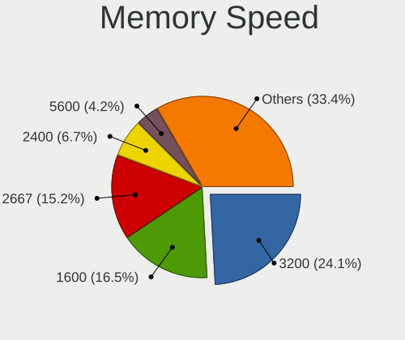

| Speed   | Notebooks | Percent |
|---------|-----------|---------|
| 3200    | 732       | 24.13%  |
| 1600    | 499       | 16.45%  |
| 2667    | 460       | 15.17%  |
| 2400    | 204       | 6.73%   |
| 5600    | 126       | 4.15%   |
| 2133    | 124       | 4.09%   |
| 6400    | 107       | 3.53%   |
| 4800    | 88        | 2.9%    |
| 1867    | 78        | 2.57%   |
| 1333    | 72        | 2.37%   |
| 1334    | 70        | 2.31%   |
| 667     | 53        | 1.75%   |
| 4267    | 52        | 1.71%   |
| Unknown | 52        | 1.71%   |
| 800     | 36        | 1.19%   |
| 7500    | 35        | 1.15%   |
| 1067    | 31        | 1.02%   |
| 3266    | 28        | 0.92%   |
| 8400    | 25        | 0.82%   |
| 1066    | 21        | 0.69%   |
| 1596    | 17        | 0.56%   |
| 4266    | 16        | 0.53%   |
| 4199    | 15        | 0.49%   |
| 2048    | 13        | 0.43%   |
| 533     | 13        | 0.43%   |
| 3733    | 11        | 0.36%   |
| 975     | 11        | 0.36%   |
| 5500    | 8         | 0.26%   |
| 7467    | 7         | 0.23%   |
| 1639    | 5         | 0.16%   |
| 8533    | 4         | 0.13%   |
| 7400    | 3         | 0.1%    |
| 2933    | 3         | 0.1%    |
| 2666    | 2         | 0.07%   |
| 666     | 2         | 0.07%   |
| 400     | 2         | 0.07%   |
| 8600    | 1         | 0.03%   |
| 6000    | 1         | 0.03%   |
| 4000    | 1         | 0.03%   |
| 2800    | 1         | 0.03%   |

Printers & scanners
-------------------

Printer Vendor
--------------

Printer device vendors

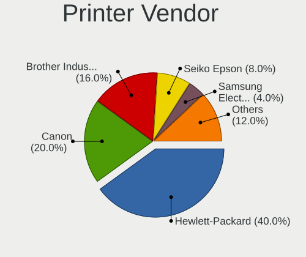

| Vendor                | Notebooks | Percent |
|-----------------------|-----------|---------|
| Hewlett-Packard       | 10        | 40%     |
| Canon                 | 5         | 20%     |
| Brother Industries    | 4         | 16%     |
| Seiko Epson           | 2         | 8%      |
| STMicroelectronics    | 1         | 4%      |
| Samsung Electronics   | 1         | 4%      |
| Lexmark International | 1         | 4%      |
| Dymo-CoStar           | 1         | 4%      |

Printer Model
-------------

Printer device models

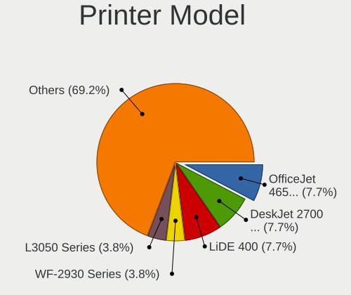

| Model                                                     | Notebooks | Percent |
|-----------------------------------------------------------|-----------|---------|
| HP OfficeJet 4650 series                                  | 2         | 7.69%   |
| HP DeskJet 2700 series                                    | 2         | 7.69%   |
| Canon LiDE 400                                            | 2         | 7.69%   |
| STMicroelectronics LED badge -- mini LED display -- 11x44 | 1         | 3.85%   |
| Seiko Epson WF-2930 Series                                | 1         | 3.85%   |
| Seiko Epson L3050 Series                                  | 1         | 3.85%   |
| Samsung M2070 Series                                      | 1         | 3.85%   |
| Lexmark International E260dn                              | 1         | 3.85%   |
| HP Printing Support                                       | 1         | 3.85%   |
| HP Officejet 4500 G510g-m                                 | 1         | 3.85%   |
| HP LaserJet P2055 series                                  | 1         | 3.85%   |
| HP LaserJet 1022                                          | 1         | 3.85%   |
| HP LaserJet 1018                                          | 1         | 3.85%   |
| HP Deskjet 1510                                           | 1         | 3.85%   |
| Dymo-CoStar DYMO XTL                                      | 1         | 3.85%   |
| Dymo-CoStar DYMO LabelWriter 4XL                          | 1         | 3.85%   |
| Canon LBP2900                                             | 1         | 3.85%   |
| Canon G4010 series                                        | 1         | 3.85%   |
| Canon G3030 series                                        | 1         | 3.85%   |
| Brother MFC Composite Device                              | 1         | 3.85%   |
| Brother HL-L2340D series                                  | 1         | 3.85%   |
| Brother HL-2240D series                                   | 1         | 3.85%   |
| Brother DCP-7010                                          | 1         | 3.85%   |

Scanner Vendor
--------------

Scanner device vendors

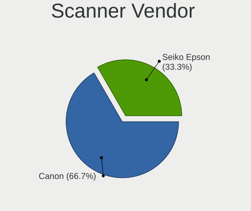

| Vendor      | Notebooks | Percent |
|-------------|-----------|---------|
| Seiko Epson | 2         | 40%     |
| Canon       | 2         | 40%     |
| Sagem       | 1         | 20%     |

Scanner Model
-------------

Scanner device models

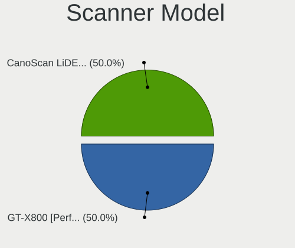

| Model                                       | Notebooks | Percent |
|---------------------------------------------|-----------|---------|
| Seiko Epson GT-X800 [Perfection 4990 PHOTO] | 1         | 20%     |
| Seiko Epson GT-X770 [Perfection V500]       | 1         | 20%     |
| Sagem 600dpi USB Scanner                    | 1         | 20%     |
| Canon CanoScan LiDE 210                     | 1         | 20%     |
| Canon CanoScan LiDE 110                     | 1         | 20%     |

Camera
------

Camera Vendor
-------------

Camera device vendors

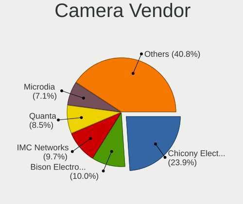

| Vendor                                 | Notebooks | Percent |
|----------------------------------------|-----------|---------|
| Chicony Electronics                    | 806       | 23.91%  |
| Bison Electronics                      | 338       | 10.03%  |
| IMC Networks                           | 326       | 9.67%   |
| Quanta                                 | 287       | 8.51%   |
| Microdia                               | 239       | 7.09%   |
| Realtek Semiconductor                  | 224       | 6.64%   |
| Sunplus Innovation Technology          | 164       | 4.87%   |
| Luxvisions Innotech Limited            | 144       | 4.27%   |
| Cheng Uei Precision Industry (Foxlink) | 110       | 3.26%   |
| Syntek                                 | 92        | 2.73%   |
| Lite-On Technology                     | 85        | 2.52%   |
| Apple                                  | 71        | 2.11%   |
| Suyin                                  | 50        | 1.48%   |
| Sonix Technology                       | 46        | 1.36%   |
| Logitech                               | 34        | 1.01%   |
| Alcor Micro                            | 32        | 0.95%   |
| Shinetech                              | 29        | 0.86%   |
| Silicon Motion                         | 26        | 0.77%   |
| Ricoh                                  | 25        | 0.74%   |
| SunplusIT                              | 21        | 0.62%   |
| icSpring                               | 17        | 0.5%    |
| Samsung Electronics                    | 16        | 0.47%   |
| Lenovo                                 | 16        | 0.47%   |
| Z-Star Microelectronics                | 14        | 0.42%   |
| Acer                                   | 13        | 0.39%   |
| Primax Electronics                     | 10        | 0.3%    |
| Importek                               | 10        | 0.3%    |
| Unknown                                | 10        | 0.3%    |
| Shine-optics                           | 8         | 0.24%   |
| Microsoft                              | 8         | 0.24%   |
| kingcome                               | 8         | 0.24%   |
| ALi                                    | 6         | 0.18%   |
| BillionPixels                          | 5         | 0.15%   |
| ShineOptics                            | 4         | 0.12%   |
| OmniVision Technologies                | 4         | 0.12%   |
| Generalplus Technology                 | 4         | 0.12%   |
| DigiTech                               | 4         | 0.12%   |
| Jieli Technology                       | 3         | 0.09%   |
| Y Media                                | 2         | 0.06%   |
| TXD                                    | 2         | 0.06%   |

Camera Model
------------

Camera device models

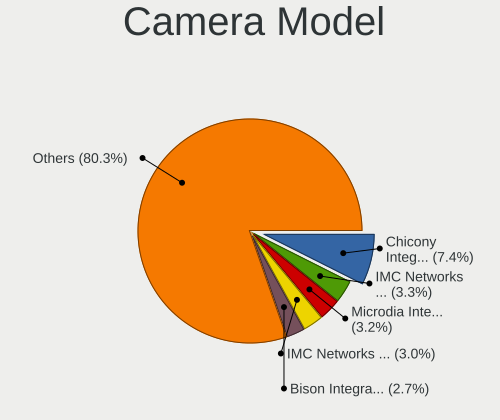

| Model                                               | Notebooks | Percent |
|-----------------------------------------------------|-----------|---------|
| Chicony Integrated Camera                           | 252       | 7.43%   |
| IMC Networks Integrated Camera                      | 113       | 3.33%   |
| Microdia Integrated_Webcam_HD                       | 109       | 3.21%   |
| IMC Networks USB2.0 HD UVC WebCam                   | 102       | 3.01%   |
| Bison Integrated Camera                             | 91        | 2.68%   |
| Syntek Integrated Camera                            | 75        | 2.21%   |
| Realtek Integrated_Webcam_HD                        | 67        | 1.97%   |
| Chicony HP HD Camera                                | 61        | 1.8%    |
| Quanta Chromebook HD Camera                         | 50        | 1.47%   |
| Sunplus Integrated_Webcam_HD                        | 48        | 1.41%   |
| Bison BisonCam, NB Pro                              | 48        | 1.41%   |
| Chicony HD WebCam                                   | 45        | 1.33%   |
| Quanta HD User Facing                               | 41        | 1.21%   |
| Lite-On Integrated Camera                           | 34        | 1%      |
| Luxvisions Innotech Limited Integrated Camera       | 33        | 0.97%   |
| IMC Networks USB2.0 VGA UVC WebCam                  | 31        | 0.91%   |
| Chicony Integrated Camera (1280x720@30)             | 30        | 0.88%   |
| Luxvisions Innotech Limited HP TrueVision HD Camera | 29        | 0.85%   |
| Bison Lenovo Integrated Webcam                      | 29        | 0.85%   |
| Sonix USB2.0 HD UVC WebCam                          | 27        | 0.8%    |
| Quanta HP TrueVision HD Camera                      | 27        | 0.8%    |
| Cheng Uei Precision Industry (Foxlink) HP HD Camera | 27        | 0.8%    |
| Bison HD Webcam                                     | 27        | 0.8%    |
| Bison Integrated RGB Camera                         | 26        | 0.77%   |
| Chicony HD User Facing                              | 25        | 0.74%   |
| Bison SunplusIT Integrated Camera                   | 25        | 0.74%   |
| Quanta HD Webcam                                    | 24        | 0.71%   |
| Lite-On HP HD Camera                                | 24        | 0.71%   |
| Chicony HP Truevision HD                            | 23        | 0.68%   |
| Quanta HP HD Camera                                 | 22        | 0.65%   |
| Chicony HP TrueVision HD Camera                     | 22        | 0.65%   |
| Microdia Integrated Webcam                          | 21        | 0.62%   |
| Luxvisions Innotech Limited Integrated RGB Camera   | 20        | 0.59%   |
| Apple Built-in iSight                               | 20        | 0.59%   |
| Chicony USB2.0 VGA UVC WebCam                       | 19        | 0.56%   |
| Chicony USB 2.0 Camera                              | 19        | 0.56%   |
| Chicony HP Wide Vision HD Camera                    | 19        | 0.56%   |
| Chicony ACER HD User Facing                         | 19        | 0.56%   |
| Quanta ov9734_techfront_camera                      | 18        | 0.53%   |
| Bison Lenovo EasyCamera                             | 18        | 0.53%   |

Security
--------

Fingerprint Vendor
------------------

Fingerprint sensor vendors

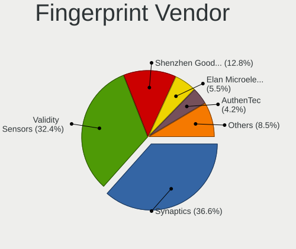

| Vendor                             | Notebooks | Percent |
|------------------------------------|-----------|---------|
| Synaptics                          | 228       | 36.6%   |
| Validity Sensors                   | 202       | 32.42%  |
| Shenzhen Goodix Technology         | 80        | 12.84%  |
| Elan Microelectronics              | 34        | 5.46%   |
| AuthenTec                          | 26        | 4.17%   |
| Upek                               | 22        | 3.53%   |
| LighTuning Technology              | 11        | 1.77%   |
| STMicroelectronics                 | 8         | 1.28%   |
| Realtek USB2.0 Finger Print Bridge | 5         | 0.8%    |
| HOLTEK                             | 3         | 0.48%   |
| DigitalPersona                     | 2         | 0.32%   |
| GDMicroelectronics                 | 1         | 0.16%   |
| Focal-systems.Corp                 | 1         | 0.16%   |

Fingerprint Model
-----------------

Fingerprint sensor models

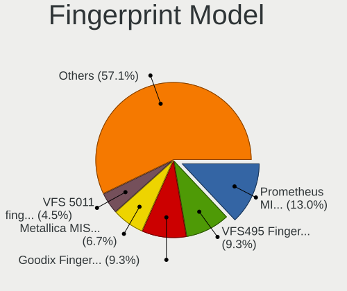

| Model                                                                      | Notebooks | Percent |
|----------------------------------------------------------------------------|-----------|---------|
| Synaptics Prometheus MIS Touch Fingerprint Reader                          | 81        | 13%     |
| Validity Sensors VFS495 Fingerprint Reader                                 | 58        | 9.31%   |
| Shenzhen Goodix  Fingerprint Device                                        | 58        | 9.31%   |
| Synaptics Metallica MIS Touch Fingerprint Reader                           | 42        | 6.74%   |
| Validity Sensors VFS 5011 fingerprint sensor                               | 28        | 4.49%   |
| Validity Sensors VFS5011 Fingerprint Reader                                | 27        | 4.33%   |
| Synaptics FS7604 Touch Fingerprint Sensor with PurePrint                   | 26        | 4.17%   |
| Synaptics UWP WBDI Device                                                  | 25        | 4.01%   |
| Validity Sensors Synaptics WBDI                                            | 21        | 3.37%   |
| Elan ELAN:ARM-M4                                                           | 21        | 3.37%   |
| Upek Biometric Touchchip/Touchstrip Fingerprint Sensor                     | 20        | 3.21%   |
| Synaptics Prometheus Fingerprint Reader                                    | 14        | 2.25%   |
| Validity Sensors Synaptics VFS7552 Touch Fingerprint Sensor with PurePrint | 13        | 2.09%   |
| Shenzhen Goodix Fingerprint Reader                                         | 13        | 2.09%   |
| Validity Sensors VFS471 Fingerprint Reader                                 | 12        | 1.93%   |
| Synaptics Fingerprint reader [HP G6]                                       | 12        | 1.93%   |
| Elan ELAN:Fingerprint                                                      | 12        | 1.93%   |
| Validity Sensors VFS7500 Touch Fingerprint Sensor                          | 10        | 1.61%   |
| Shenzhen Goodix FingerPrint                                                | 9         | 1.44%   |
| Validity Sensors VFS491                                                    | 8         | 1.28%   |
| Validity Sensors Fingerprint scanner                                       | 8         | 1.28%   |
| Synaptics WBDI Fingerprint Reader USB 086                                  | 8         | 1.28%   |
| STMicroelectronics Fingerprint Reader                                      | 8         | 1.28%   |
| AuthenTec AES2810                                                          | 8         | 1.28%   |
| Synaptics Metallica MOH Touch Fingerprint Reader                           | 7         | 1.12%   |
| LighTuning EgisTec Touch Fingerprint Sensor                                | 7         | 1.12%   |
| Validity Sensors VFS451 Fingerprint Reader                                 | 6         | 0.96%   |
| Synaptics  FS7604 Touch Fingerprint Sensor with PurePrint                  | 6         | 0.96%   |
| Validity Sensors VFS Fingerprint sensor                                    | 5         | 0.8%    |
| Realtek USB2.0 Finger Print Bridge FocalTech Fingerprint Device            | 5         | 0.8%    |
| AuthenTec AES2501 Fingerprint Sensor                                       | 5         | 0.8%    |
| Validity Sensors Swipe Fingerprint Sensor                                  | 4         | 0.64%   |
| AuthenTec Fingerprint Sensor                                               | 4         | 0.64%   |
| AuthenTec AES1600                                                          | 4         | 0.64%   |
| LighTuning Fingerprint Reader                                              | 3         | 0.48%   |
| HOLTEK FocalTech Fingerprint Device                                        | 3         | 0.48%   |
| AuthenTec AES1660 Fingerprint Sensor                                       | 3         | 0.48%   |
| Unknown                                                                    | 3         | 0.48%   |
| Upek TCS5B Fingerprint sensor                                              | 2         | 0.32%   |
| Synaptics WBDI                                                             | 2         | 0.32%   |

Chipcard Vendor
---------------

Chipcard module vendors

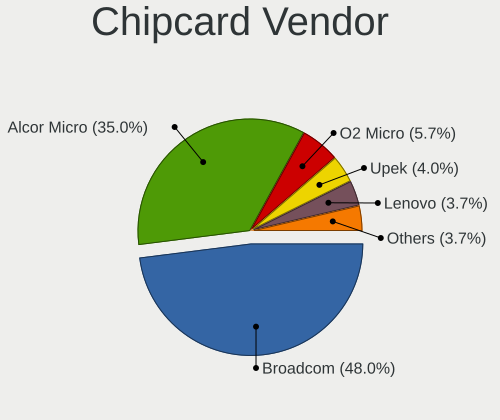

| Vendor                | Notebooks | Percent |
|-----------------------|-----------|---------|
| Broadcom              | 144       | 48%     |
| Alcor Micro           | 105       | 35%     |
| O2 Micro              | 17        | 5.67%   |
| Upek                  | 12        | 4%      |
| Lenovo                | 11        | 3.67%   |
| Yubico.com            | 4         | 1.33%   |
| Gemalto (was Gemplus) | 2         | 0.67%   |
| SCM Microsystems      | 1         | 0.33%   |
| Realtek Semiconductor | 1         | 0.33%   |
| OmniKey               | 1         | 0.33%   |
| Giesecke & Devrient   | 1         | 0.33%   |
| Advanced Card Systems | 1         | 0.33%   |

Chipcard Model
--------------

Chipcard module models

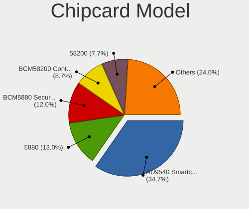

| Model                                                                        | Notebooks | Percent |
|------------------------------------------------------------------------------|-----------|---------|
| Alcor Micro AU9540 Smartcard Reader                                          | 104       | 34.67%  |
| Broadcom 5880                                                                | 39        | 13%     |
| Broadcom BCM5880 Secure Applications Processor                               | 36        | 12%     |
| Broadcom BCM58200 ControlVault 3 (FingerPrint sensor + Contacted SmartCard)  | 26        | 8.67%   |
| Broadcom 58200                                                               | 23        | 7.67%   |
| Broadcom BCM5880 Secure Applications Processor with fingerprint swipe sensor | 19        | 6.33%   |
| O2 Micro OZ776 CCID Smartcard Reader                                         | 13        | 4.33%   |
| Upek TouchChip Fingerprint Coprocessor (WBF advanced mode)                   | 12        | 4%      |
| Lenovo Integrated Smart Card Reader                                          | 10        | 3.33%   |
| O2 Micro Oz776 SmartCard Reader                                              | 4         | 1.33%   |
| Yubico.com Yubikey 4/5 U2F+CCID                                              | 3         | 1%      |
| Gemalto (was Gemplus) Compact Smart Card Reader Writer                       | 2         | 0.67%   |
| Yubico.com Yubikey 4/5 CCID                                                  | 1         | 0.33%   |
| SCM Microsystems SCR35xx Smart Card Reader                                   | 1         | 0.33%   |
| Realtek Semiconductor Smart Card Reader Interface                            | 1         | 0.33%   |
| OmniKey 3x21 Smart Card Reader                                               | 1         | 0.33%   |
| Lenovo Smartcard Keyboard                                                    | 1         | 0.33%   |
| Giesecke & Devrient StarSign CUT S                                           | 1         | 0.33%   |
| Broadcom BCM5880 Secure Applications Processor with fingerprint touch sensor | 1         | 0.33%   |
| Alcor Micro Watchdata W 1981                                                 | 1         | 0.33%   |
| Advanced Card Systems ACR39U                                                 | 1         | 0.33%   |

Unsupported
-----------

Unsupported Devices
-------------------

Total unsupported devices on board

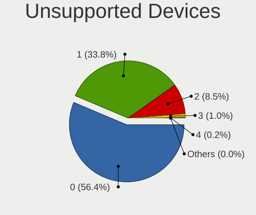

| Total | Notebooks | Percent |
|-------|-----------|---------|
| 0     | 2168      | 56.36%  |
| 1     | 1302      | 33.84%  |
| 2     | 328       | 8.53%   |
| 3     | 40        | 1.04%   |
| 4     | 8         | 0.21%   |
| 5     | 1         | 0.03%   |

Unsupported Device Types
------------------------

Types of unsupported devices

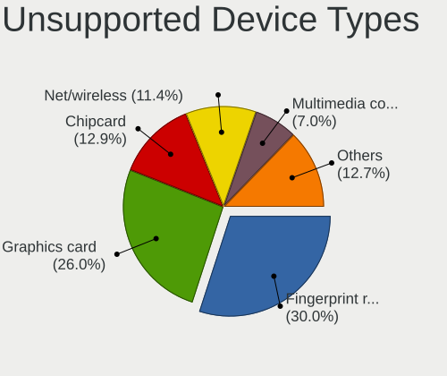

| Type                     | Notebooks | Percent |
|--------------------------|-----------|---------|
| Fingerprint reader       | 610       | 29.99%  |
| Graphics card            | 529       | 26.01%  |
| Chipcard                 | 262       | 12.88%  |
| Net/wireless             | 232       | 11.41%  |
| Multimedia controller    | 142       | 6.98%   |
| Camera                   | 94        | 4.62%   |
| Card reader              | 35        | 1.72%   |
| Bluetooth                | 32        | 1.57%   |
| Storage                  | 27        | 1.33%   |
| Modem                    | 16        | 0.79%   |
| Net/ethernet             | 14        | 0.69%   |
| Communication controller | 14        | 0.69%   |
| Sound                    | 6         | 0.29%   |
| Network                  | 6         | 0.29%   |
| Unassigned class         | 4         | 0.2%    |
| Wireless                 | 3         | 0.15%   |
| Flash memory             | 2         | 0.1%    |
| Unclassified device      | 1         | 0.05%   |
| Tv card                  | 1         | 0.05%   |
| Storage/nvme             | 1         | 0.05%   |
| Storage/ide              | 1         | 0.05%   |
| Firewire controller      | 1         | 0.05%   |
| Dvb card                 | 1         | 0.05%   |

