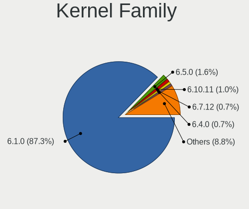
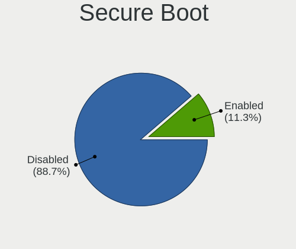
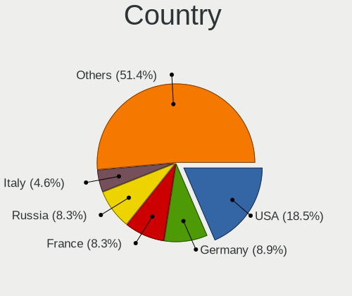
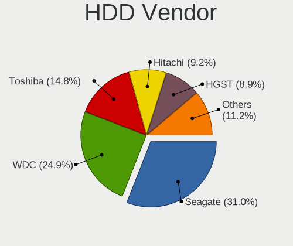
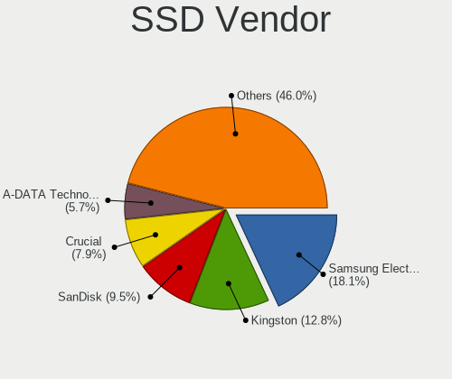
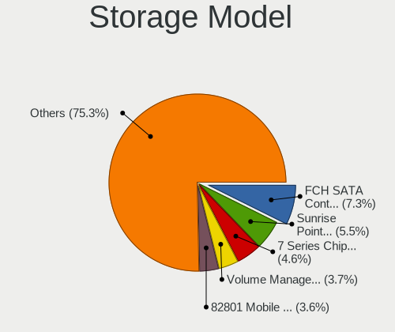
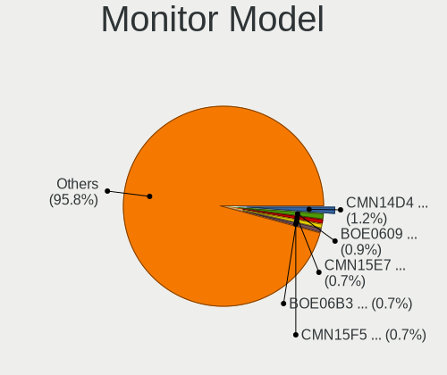
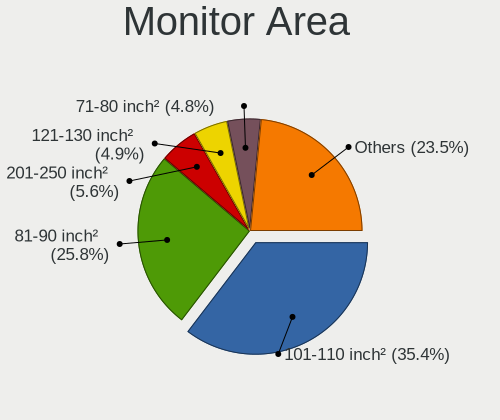
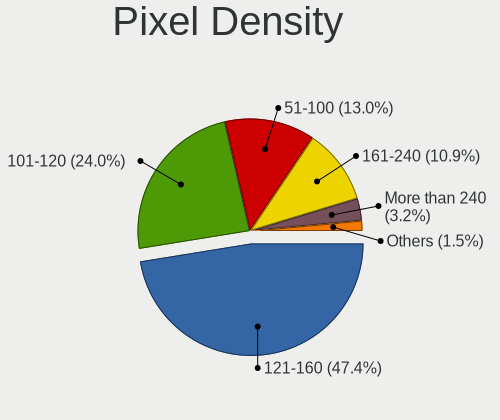
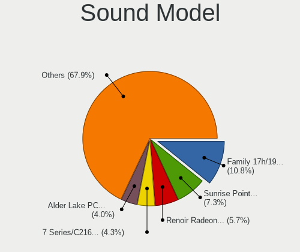

Debian 12 - Tested Hardware & Statistics (Notebooks)
----------------------------------------------------

A project to collect tested hardware configurations for Debian 12.

Anyone can contribute to this report by the [hw-probe](https://github.com/linuxhw/hw-probe) tool:

    sudo -E hw-probe -all -upload

Please contribute! Especially if your hardware is rare.

Contents
--------

* [ Test Cases ](#test-cases)

* [ System ](#system)
  - [ Kernel                   ](#kernel)
  - [ Kernel Family            ](#kernel-family)
  - [ Kernel Major Ver.        ](#kernel-major-ver)
  - [ Arch                     ](#arch)
  - [ DE                       ](#de)
  - [ Display Server           ](#display-server)
  - [ Display Manager          ](#display-manager)
  - [ OS Lang                  ](#os-lang)
  - [ Boot Mode                ](#boot-mode)
  - [ Filesystem               ](#filesystem)
  - [ Part. scheme             ](#part-scheme)
  - [ Dual Boot with Linux/BSD ](#dual-boot-with-linuxbsd)
  - [ Dual Boot (Win)          ](#dual-boot-win)

* [ Board ](#board)
  - [ Vendor                   ](#vendor)
  - [ Model                    ](#model)
  - [ Model Family             ](#model-family)
  - [ MFG Year                 ](#mfg-year)
  - [ Form Factor              ](#form-factor)
  - [ Secure Boot              ](#secure-boot)
  - [ Coreboot                 ](#coreboot)
  - [ RAM Size                 ](#ram-size)
  - [ RAM Used                 ](#ram-used)
  - [ Total Drives             ](#total-drives)
  - [ Has CD-ROM               ](#has-cd-rom)
  - [ Has Ethernet             ](#has-ethernet)
  - [ Has WiFi                 ](#has-wifi)
  - [ Has Bluetooth            ](#has-bluetooth)

* [ Location ](#location)
  - [ Country                  ](#country)
  - [ City                     ](#city)

* [ Drives ](#drives)
  - [ Drive Vendor             ](#drive-vendor)
  - [ Drive Model              ](#drive-model)
  - [ HDD Vendor               ](#hdd-vendor)
  - [ SSD Vendor               ](#ssd-vendor)
  - [ Drive Kind               ](#drive-kind)
  - [ Drive Connector          ](#drive-connector)
  - [ Drive Size               ](#drive-size)
  - [ Space Total              ](#space-total)
  - [ Space Used               ](#space-used)
  - [ Malfunc. Drives          ](#malfunc-drives)
  - [ Malfunc. Drive Vendor    ](#malfunc-drive-vendor)
  - [ Malfunc. HDD Vendor      ](#malfunc-hdd-vendor)
  - [ Malfunc. Drive Kind      ](#malfunc-drive-kind)
  - [ Failed Drives            ](#failed-drives)
  - [ Failed Drive Vendor      ](#failed-drive-vendor)
  - [ Drive Status             ](#drive-status)

* [ Storage controller ](#storage-controller)
  - [ Storage Vendor           ](#storage-vendor)
  - [ Storage Model            ](#storage-model)
  - [ Storage Kind             ](#storage-kind)

* [ Processor ](#processor)
  - [ CPU Vendor               ](#cpu-vendor)
  - [ CPU Model                ](#cpu-model)
  - [ CPU Model Family         ](#cpu-model-family)
  - [ CPU Cores                ](#cpu-cores)
  - [ CPU Sockets              ](#cpu-sockets)
  - [ CPU Threads              ](#cpu-threads)
  - [ CPU Op-Modes             ](#cpu-op-modes)
  - [ CPU Microcode            ](#cpu-microcode)
  - [ CPU Microarch            ](#cpu-microarch)

* [ Graphics ](#graphics)
  - [ GPU Vendor               ](#gpu-vendor)
  - [ GPU Model                ](#gpu-model)
  - [ GPU Combo                ](#gpu-combo)
  - [ GPU Driver               ](#gpu-driver)
  - [ GPU Memory               ](#gpu-memory)

* [ Monitor ](#monitor)
  - [ Monitor Vendor           ](#monitor-vendor)
  - [ Monitor Model            ](#monitor-model)
  - [ Monitor Resolution       ](#monitor-resolution)
  - [ Monitor Diagonal         ](#monitor-diagonal)
  - [ Monitor Width            ](#monitor-width)
  - [ Aspect Ratio             ](#aspect-ratio)
  - [ Monitor Area             ](#monitor-area)
  - [ Pixel Density            ](#pixel-density)
  - [ Multiple Monitors        ](#multiple-monitors)

* [ Network ](#network)
  - [ Net Controller Vendor    ](#net-controller-vendor)
  - [ Net Controller Model     ](#net-controller-model)
  - [ Wireless Vendor          ](#wireless-vendor)
  - [ Wireless Model           ](#wireless-model)
  - [ Ethernet Vendor          ](#ethernet-vendor)
  - [ Ethernet Model           ](#ethernet-model)
  - [ Net Controller Kind      ](#net-controller-kind)
  - [ Used Controller          ](#used-controller)
  - [ NICs                     ](#nics)
  - [ IPv6                     ](#ipv6)

* [ Bluetooth ](#bluetooth)
  - [ Bluetooth Vendor         ](#bluetooth-vendor)
  - [ Bluetooth Model          ](#bluetooth-model)

* [ Sound ](#sound)
  - [ Sound Vendor             ](#sound-vendor)
  - [ Sound Model              ](#sound-model)

* [ Memory ](#memory)
  - [ Memory Vendor            ](#memory-vendor)
  - [ Memory Model             ](#memory-model)
  - [ Memory Kind              ](#memory-kind)
  - [ Memory Form Factor       ](#memory-form-factor)
  - [ Memory Size              ](#memory-size)
  - [ Memory Speed             ](#memory-speed)

* [ Printers & scanners ](#printers--scanners)
  - [ Printer Vendor           ](#printer-vendor)
  - [ Printer Model            ](#printer-model)
  - [ Scanner Vendor           ](#scanner-vendor)
  - [ Scanner Model            ](#scanner-model)

* [ Camera ](#camera)
  - [ Camera Vendor            ](#camera-vendor)
  - [ Camera Model             ](#camera-model)

* [ Security ](#security)
  - [ Fingerprint Vendor       ](#fingerprint-vendor)
  - [ Fingerprint Model        ](#fingerprint-model)
  - [ Chipcard Vendor          ](#chipcard-vendor)
  - [ Chipcard Model           ](#chipcard-model)

* [ Unsupported ](#unsupported)
  - [ Unsupported Devices      ](#unsupported-devices)
  - [ Unsupported Device Types ](#unsupported-device-types)

Test Cases
----------

Total: 3908

| Vendor        | Model                       | Probe                                                      | Date         |
|---------------|-----------------------------|------------------------------------------------------------|--------------|
| ASUSTek       | VivoBook S13 X330FN_S330... | [50ff12c678](https://linux-hardware.org/?probe=50ff12c678) | Jan 06, 2025 |
| Lenovo        | V15-ADA 82C7                | [c5c9a457aa](https://linux-hardware.org/?probe=c5c9a457aa) | Jan 06, 2025 |
| Lenovo        | ThinkPad L15 Gen 2 20X4S... | [928b89625a](https://linux-hardware.org/?probe=928b89625a) | Jan 06, 2025 |
| HP            | Presario CQ57               | [970ab9cc5f](https://linux-hardware.org/?probe=970ab9cc5f) | Jan 06, 2025 |
| Positivo B... | VJFE59F11X-B1011H           | [eeea3c518d](https://linux-hardware.org/?probe=eeea3c518d) | Jan 06, 2025 |
| Lenovo        | ThinkPad T14 Gen 3 21AH0... | [58b338f268](https://linux-hardware.org/?probe=58b338f268) | Jan 06, 2025 |
| Lenovo        | ThinkPad E475 20H40006US    | [69908d16ca](https://linux-hardware.org/?probe=69908d16ca) | Jan 06, 2025 |
| Acer          | AOD257                      | [48ac1f7a96](https://linux-hardware.org/?probe=48ac1f7a96) | Jan 06, 2025 |
| Lenovo        | ThinkPad E475 20H40006US    | [78b9a699ff](https://linux-hardware.org/?probe=78b9a699ff) | Jan 05, 2025 |
| Lenovo        | ThinkPad T14 Gen 3 21AH0... | [a40f8a9531](https://linux-hardware.org/?probe=a40f8a9531) | Jan 05, 2025 |
| Lenovo        | ThinkPad T14 Gen 3 21AH0... | [8e4aafe314](https://linux-hardware.org/?probe=8e4aafe314) | Jan 05, 2025 |
| HP            | Presario CQ57               | [8c1782d787](https://linux-hardware.org/?probe=8c1782d787) | Jan 05, 2025 |
| Lenovo        | ThinkPad T480 20L5S1S000    | [c35541e56b](https://linux-hardware.org/?probe=c35541e56b) | Jan 05, 2025 |
| Lenovo        | ThinkPad T14 Gen 5 21MCC... | [6e4f05f56f](https://linux-hardware.org/?probe=6e4f05f56f) | Jan 05, 2025 |
| UNOWHY        | Y13G113S4EI                 | [8d772f9e5a](https://linux-hardware.org/?probe=8d772f9e5a) | Jan 05, 2025 |
| TongFang      | GM5HG0A                     | [7613e29f5b](https://linux-hardware.org/?probe=7613e29f5b) | Jan 04, 2025 |
| TongFang      | GM5HG0A                     | [dd74d3e454](https://linux-hardware.org/?probe=dd74d3e454) | Jan 04, 2025 |
| Lenovo        | ThinkPad T560 20FH001RUS    | [00bb35dd31](https://linux-hardware.org/?probe=00bb35dd31) | Jan 04, 2025 |
| HP            | Pavilion Laptop 15-eh1xx... | [24988d9cd8](https://linux-hardware.org/?probe=24988d9cd8) | Jan 04, 2025 |
| Lenovo        | ThinkPad E475 20H40006US    | [1f287326ed](https://linux-hardware.org/?probe=1f287326ed) | Jan 04, 2025 |
| Lenovo        | IdeaPad 110-15ACL 80TJ      | [976937be1b](https://linux-hardware.org/?probe=976937be1b) | Jan 04, 2025 |
| Lenovo        | ThinkPad E475 20H40006US    | [74d7973a3d](https://linux-hardware.org/?probe=74d7973a3d) | Jan 03, 2025 |
| Dell          | Vostro 3520                 | [77b90abaf0](https://linux-hardware.org/?probe=77b90abaf0) | Jan 03, 2025 |
| ASUSTek       | U56E                        | [e777c929c0](https://linux-hardware.org/?probe=e777c929c0) | Jan 03, 2025 |
| Acer          | Aspire 5741G                | [3785e1f57b](https://linux-hardware.org/?probe=3785e1f57b) | Jan 03, 2025 |
| Dell          | Inspiron 14 5425            | [573be124f2](https://linux-hardware.org/?probe=573be124f2) | Jan 03, 2025 |
| Google        | Dragonair                   | [69b034d6b7](https://linux-hardware.org/?probe=69b034d6b7) | Jan 03, 2025 |
| Dell          | Inspiron 5405               | [e6c57490c8](https://linux-hardware.org/?probe=e6c57490c8) | Jan 02, 2025 |
| ASUSTek       | Vivobook Go E1404FA_E140... | [d65b464077](https://linux-hardware.org/?probe=d65b464077) | Jan 02, 2025 |
| ASUSTek       | ROG Strix G713PI_G713PI     | [d086aef8fc](https://linux-hardware.org/?probe=d086aef8fc) | Jan 02, 2025 |
| HP            | ENVY Laptop 13-ah0xxx       | [2bf35e6afa](https://linux-hardware.org/?probe=2bf35e6afa) | Jan 02, 2025 |
| Dell          | XPS 9315                    | [1620c81455](https://linux-hardware.org/?probe=1620c81455) | Jan 01, 2025 |
| HP            | Laptop 15s-du1xxx           | [5029ac1a06](https://linux-hardware.org/?probe=5029ac1a06) | Jan 01, 2025 |
| Dell          | Latitude 5480               | [d4da596a26](https://linux-hardware.org/?probe=d4da596a26) | Jan 01, 2025 |
| HP            | EliteBook 830 G5            | [8382fe388f](https://linux-hardware.org/?probe=8382fe388f) | Dec 31, 2024 |
| HP            | EliteBook 830 G5            | [a61a178741](https://linux-hardware.org/?probe=a61a178741) | Dec 31, 2024 |
| Acer          | Nitro AN515-51              | [3555e1e029](https://linux-hardware.org/?probe=3555e1e029) | Dec 31, 2024 |
| ASUSTek       | VivoBook_ASUSLaptop X580... | [994b1d92c5](https://linux-hardware.org/?probe=994b1d92c5) | Dec 30, 2024 |
| Dell          | XPS 17 9730                 | [216ff4e7eb](https://linux-hardware.org/?probe=216ff4e7eb) | Dec 30, 2024 |
| Packard Be... | EasyNote_MX45               | [e696c77b8f](https://linux-hardware.org/?probe=e696c77b8f) | Dec 30, 2024 |
| Lenovo        | ThinkPad T430 2349TFK       | [976885ff78](https://linux-hardware.org/?probe=976885ff78) | Dec 30, 2024 |
| HP            | EliteBook 660 16 inch G1... | [97a21cd2b9](https://linux-hardware.org/?probe=97a21cd2b9) | Dec 30, 2024 |
| Apple         | MacBookPro9,2               | [3cda74dca1](https://linux-hardware.org/?probe=3cda74dca1) | Dec 29, 2024 |
| HP            | 255 G7 Notebook PC          | [c4f95fe88f](https://linux-hardware.org/?probe=c4f95fe88f) | Dec 29, 2024 |
| Lenovo        | ThinkPad E490 20N8CTO1WW    | [61fe1222c2](https://linux-hardware.org/?probe=61fe1222c2) | Dec 29, 2024 |
| Lenovo        | IdeaPad 330-15ARR 81D2      | [0ce672d09f](https://linux-hardware.org/?probe=0ce672d09f) | Dec 29, 2024 |
| ASUSTek       | VivoBook_ASUSLaptop M160... | [dc70a933c3](https://linux-hardware.org/?probe=dc70a933c3) | Dec 29, 2024 |
| Packard Be... | EasyNote_MX45               | [8ef7bf6e6d](https://linux-hardware.org/?probe=8ef7bf6e6d) | Dec 29, 2024 |
| Lenovo        | IdeaPad Y700-15ISK 80NV     | [4122ae81a0](https://linux-hardware.org/?probe=4122ae81a0) | Dec 29, 2024 |
| ASUSTek       | Zenbook UX3402ZA            | [be06529f29](https://linux-hardware.org/?probe=be06529f29) | Dec 28, 2024 |
| MSI           | MS-16F1                     | [9906c1fa28](https://linux-hardware.org/?probe=9906c1fa28) | Dec 28, 2024 |
| Acer          | Aspire A315-54K             | [9d416da92a](https://linux-hardware.org/?probe=9d416da92a) | Dec 28, 2024 |
| Fujitsu Si... | ESPRIMO Mobile V5555        | [e443699b8d](https://linux-hardware.org/?probe=e443699b8d) | Dec 28, 2024 |
| ASUSTek       | ASUS TUF Gaming A17 FA70... | [2831363437](https://linux-hardware.org/?probe=2831363437) | Dec 28, 2024 |
| Alienware     | M17xR3                      | [2363abbe5c](https://linux-hardware.org/?probe=2363abbe5c) | Dec 28, 2024 |
| Dell          | Venue 11 Pro 7140           | [a91398af2a](https://linux-hardware.org/?probe=a91398af2a) | Dec 27, 2024 |
| Dell          | XPS L701X                   | [6cd016a478](https://linux-hardware.org/?probe=6cd016a478) | Dec 27, 2024 |
| HP            | 15 TouchSmart               | [dbea1582fb](https://linux-hardware.org/?probe=dbea1582fb) | Dec 27, 2024 |
| Acer          | Swift SF314-511             | [f0e61d80d6](https://linux-hardware.org/?probe=f0e61d80d6) | Dec 27, 2024 |
| Dell          | Precision 7520              | [ad770a5b2a](https://linux-hardware.org/?probe=ad770a5b2a) | Dec 27, 2024 |
| Lenovo        | ThinkPad E14 Gen 3 20Y70... | [9f0e63713d](https://linux-hardware.org/?probe=9f0e63713d) | Dec 27, 2024 |
| Lenovo        | ThinkPad T490 20N3S64400    | [86b8ea0471](https://linux-hardware.org/?probe=86b8ea0471) | Dec 27, 2024 |
| Morshow       | CB01 V100                   | [0f58cef0a2](https://linux-hardware.org/?probe=0f58cef0a2) | Dec 27, 2024 |
| ASUSTek       | ASUS TUF Gaming A17 FA70... | [ae31e6ad1c](https://linux-hardware.org/?probe=ae31e6ad1c) | Dec 26, 2024 |
| Acer          | Aspire ES1-311              | [d4cf291b46](https://linux-hardware.org/?probe=d4cf291b46) | Dec 26, 2024 |
| Shuttle       | NC03U                       | [7262526f1a](https://linux-hardware.org/?probe=7262526f1a) | Dec 26, 2024 |
| ASUSTek       | VivoBook_ASUSLaptop K360... | [4c2cba015f](https://linux-hardware.org/?probe=4c2cba015f) | Dec 26, 2024 |
| HP            | EliteBook 8460p             | [0916dd5986](https://linux-hardware.org/?probe=0916dd5986) | Dec 25, 2024 |
| Lenovo        | V15 G3 ABA 82TV             | [75b2764000](https://linux-hardware.org/?probe=75b2764000) | Dec 25, 2024 |
| ASUSTek       | VivoBook_ASUSLaptop K360... | [fcb6f7fe6c](https://linux-hardware.org/?probe=fcb6f7fe6c) | Dec 25, 2024 |
| Samsung       | 750XGK                      | [178e559f24](https://linux-hardware.org/?probe=178e559f24) | Dec 25, 2024 |
| HP            | ENVY m7                     | [1eae0d7a3f](https://linux-hardware.org/?probe=1eae0d7a3f) | Dec 25, 2024 |
| Unknown       | Unknown                     | [e3c37d254f](https://linux-hardware.org/?probe=e3c37d254f) | Dec 25, 2024 |
| Lenovo        | ThinkPad P53 20QQS5WG00     | [8afcf6a4e5](https://linux-hardware.org/?probe=8afcf6a4e5) | Dec 25, 2024 |
| Dell          | Latitude 7480               | [faa26e30d0](https://linux-hardware.org/?probe=faa26e30d0) | Dec 24, 2024 |
| ASUSTek       | Vivobook Go E1404FA_E140... | [b67b195148](https://linux-hardware.org/?probe=b67b195148) | Dec 24, 2024 |
| HP            | Pavilion dv6                | [db20c486f1](https://linux-hardware.org/?probe=db20c486f1) | Dec 24, 2024 |
| Schenker      | XMG Mobile A507 VE          | [883657a313](https://linux-hardware.org/?probe=883657a313) | Dec 24, 2024 |
| Dell          | XPS 13 9300                 | [496f49c231](https://linux-hardware.org/?probe=496f49c231) | Dec 24, 2024 |
| Google        | Lava                        | [8e4deea274](https://linux-hardware.org/?probe=8e4deea274) | Dec 24, 2024 |
| ASUSTek       | VivoBook S13 X330FN_S330... | [b9714a1c2f](https://linux-hardware.org/?probe=b9714a1c2f) | Dec 23, 2024 |
| Lenovo        | ThinkPad X1 Carbon 7th 2... | [e871f1fdc6](https://linux-hardware.org/?probe=e871f1fdc6) | Dec 23, 2024 |
| ECT           | Unknown                     | [1bcbfee6c4](https://linux-hardware.org/?probe=1bcbfee6c4) | Dec 23, 2024 |
| Lenovo        | IdeaPad 1 15ALC7 82R4       | [20dc00eb37](https://linux-hardware.org/?probe=20dc00eb37) | Dec 23, 2024 |
| Dell          | Latitude E6440              | [d5e7ca3b8f](https://linux-hardware.org/?probe=d5e7ca3b8f) | Dec 23, 2024 |
| ASUSTek       | VivoBook_ASUSLaptop K360... | [8690e3274f](https://linux-hardware.org/?probe=8690e3274f) | Dec 23, 2024 |
| ASUSTek       | VivoBook_ASUSLaptop K360... | [5a779ffa7e](https://linux-hardware.org/?probe=5a779ffa7e) | Dec 23, 2024 |
| Fujitsu Si... | ESPRIMO Mobile V5555        | [0a16cb4410](https://linux-hardware.org/?probe=0a16cb4410) | Dec 22, 2024 |
| Lenovo        | ThinkPad L390 20NR001HPG    | [30c7fd95ce](https://linux-hardware.org/?probe=30c7fd95ce) | Dec 22, 2024 |
| Lenovo        | ThinkPad T440s 20ARA000A... | [606caa4eb0](https://linux-hardware.org/?probe=606caa4eb0) | Dec 22, 2024 |
| Lenovo        | ThinkPad T440s 20ARA000A... | [813d572708](https://linux-hardware.org/?probe=813d572708) | Dec 22, 2024 |
| HP            | EliteBook 855 G7 Noteboo... | [b10a15562d](https://linux-hardware.org/?probe=b10a15562d) | Dec 22, 2024 |
| Gigabyte      | P55V5                       | [5a6d2df08d](https://linux-hardware.org/?probe=5a6d2df08d) | Dec 22, 2024 |
| Lenovo        | IdeaPad U330 Touch 20268    | [480ee6fe0c](https://linux-hardware.org/?probe=480ee6fe0c) | Dec 22, 2024 |
| Lenovo        | ThinkPad S2 Gen 6 20VMA0... | [df6fdd6e8a](https://linux-hardware.org/?probe=df6fdd6e8a) | Dec 22, 2024 |
| Dell          | Precision 3591              | [e1c2dd2dce](https://linux-hardware.org/?probe=e1c2dd2dce) | Dec 21, 2024 |
| HP            | Notebook                    | [0382c42708](https://linux-hardware.org/?probe=0382c42708) | Dec 21, 2024 |
| Dell          | Latitude 7490               | [31661d6299](https://linux-hardware.org/?probe=31661d6299) | Dec 21, 2024 |
| Lenovo        | ThinkPad S2 Gen 6 20VMA0... | [17282fe4c7](https://linux-hardware.org/?probe=17282fe4c7) | Dec 21, 2024 |
| HONOR         | BRN-GXXXA                   | [807540b5a6](https://linux-hardware.org/?probe=807540b5a6) | Dec 21, 2024 |
| HP            | EliteBook 840 G6            | [fdcfe34b78](https://linux-hardware.org/?probe=fdcfe34b78) | Dec 21, 2024 |
| Lenovo        | IdeaPad 120S-14IAP 81A5     | [b458c0587b](https://linux-hardware.org/?probe=b458c0587b) | Dec 21, 2024 |
| Lenovo        | ThinkPad T490 20N3S2XL00    | [dd701f3856](https://linux-hardware.org/?probe=dd701f3856) | Dec 20, 2024 |
| Lenovo        | ThinkPad T14 Gen 3 21AH0... | [8145f1c8c7](https://linux-hardware.org/?probe=8145f1c8c7) | Dec 20, 2024 |
| HP            | InsydeH2O EFI BIOS          | [11d54a43ed](https://linux-hardware.org/?probe=11d54a43ed) | Dec 20, 2024 |
| Notebook      | P375SM                      | [d888f7c54b](https://linux-hardware.org/?probe=d888f7c54b) | Dec 20, 2024 |
| Dell          | Latitude 5480               | [2e3bc581e6](https://linux-hardware.org/?probe=2e3bc581e6) | Dec 19, 2024 |
| ASUSTek       | VivoBook_ASUSLaptop E210... | [35a79619d9](https://linux-hardware.org/?probe=35a79619d9) | Dec 19, 2024 |
| Lenovo        | ThinkPad T14 Gen 3 21AH0... | [c10492aedf](https://linux-hardware.org/?probe=c10492aedf) | Dec 19, 2024 |
| ASUSTek       | SABERTOOTH Z170 MARK 1      | [98eb4dd31b](https://linux-hardware.org/?probe=98eb4dd31b) | Dec 18, 2024 |
| Positivo      | R516256AI-15                | [9a731a05a6](https://linux-hardware.org/?probe=9a731a05a6) | Dec 18, 2024 |
| Acer          | Aspire 5560                 | [8765d80e65](https://linux-hardware.org/?probe=8765d80e65) | Dec 18, 2024 |
| Lenovo        | ThinkPad T14 Gen 5 21MCC... | [e33e8e4bbb](https://linux-hardware.org/?probe=e33e8e4bbb) | Dec 17, 2024 |
| ASUSTek       | Vivobook Go E1504FA_E150... | [357c54b699](https://linux-hardware.org/?probe=357c54b699) | Dec 17, 2024 |
| Lenovo        | ThinkPad Z13 Gen 2 21JVC... | [9499feb64f](https://linux-hardware.org/?probe=9499feb64f) | Dec 17, 2024 |
| Acer          | Nitro AN515-51              | [3bf6da80b5](https://linux-hardware.org/?probe=3bf6da80b5) | Dec 17, 2024 |
| HP            | Pavilion Gaming Laptop 1... | [e82cfdaf8f](https://linux-hardware.org/?probe=e82cfdaf8f) | Dec 17, 2024 |
| HP            | Notebook                    | [cd9bb8bac9](https://linux-hardware.org/?probe=cd9bb8bac9) | Dec 17, 2024 |
| Lenovo        | IdeaPad 5 14ALC05 82LM      | [97f04be17e](https://linux-hardware.org/?probe=97f04be17e) | Dec 17, 2024 |
| Lenovo        | ThinkPad X1 Carbon 6th 2... | [dcaa5a0395](https://linux-hardware.org/?probe=dcaa5a0395) | Dec 17, 2024 |
| ASUSTek       | K42JY                       | [35095b2b4c](https://linux-hardware.org/?probe=35095b2b4c) | Dec 16, 2024 |
| Lenovo        | IdeaPad 1 15ALC7 82R4       | [f27e2a89ad](https://linux-hardware.org/?probe=f27e2a89ad) | Dec 16, 2024 |
| Dell          | Inspiron N5010              | [2642d419b6](https://linux-hardware.org/?probe=2642d419b6) | Dec 16, 2024 |
| Apple         | MacBookAir5,1               | [f5f9cdb828](https://linux-hardware.org/?probe=f5f9cdb828) | Dec 16, 2024 |
| Toshiba       | Satellite S70-B             | [384c0e568a](https://linux-hardware.org/?probe=384c0e568a) | Dec 16, 2024 |
| Apple         | MacBook6,1                  | [69c0a3cfea](https://linux-hardware.org/?probe=69c0a3cfea) | Dec 16, 2024 |
| Acer          | Swift SF314-71              | [a9466608b7](https://linux-hardware.org/?probe=a9466608b7) | Dec 15, 2024 |
| Lenovo        | ThinkBook 15 G4 IAP 21DJ    | [d5184c7a52](https://linux-hardware.org/?probe=d5184c7a52) | Dec 15, 2024 |
| Lenovo        | ThinkPad Edge E530c 3366... | [e73050a450](https://linux-hardware.org/?probe=e73050a450) | Dec 15, 2024 |
| HP            | Laptop 14-dq0xxx            | [be39b7b958](https://linux-hardware.org/?probe=be39b7b958) | Dec 15, 2024 |
| HP            | Laptop 14-dq0xxx            | [039c1af4f6](https://linux-hardware.org/?probe=039c1af4f6) | Dec 15, 2024 |
| HP            | Pavilion 17                 | [4cea084a27](https://linux-hardware.org/?probe=4cea084a27) | Dec 15, 2024 |
| Sony          | VPCYB15AG                   | [2b66b4ead4](https://linux-hardware.org/?probe=2b66b4ead4) | Dec 14, 2024 |
| Lenovo        | ThinkPad T470 20HD0001MB    | [8858dce58d](https://linux-hardware.org/?probe=8858dce58d) | Dec 14, 2024 |
| HP            | EliteBook 745 G3            | [7384d01ae6](https://linux-hardware.org/?probe=7384d01ae6) | Dec 14, 2024 |
| Dell          | Latitude E7470              | [34f407dadd](https://linux-hardware.org/?probe=34f407dadd) | Dec 13, 2024 |
| Lenovo        | ThinkBook 14 G6 ABP 21KJ    | [7b878d7d0b](https://linux-hardware.org/?probe=7b878d7d0b) | Dec 13, 2024 |
| HP            | Pavilion 17                 | [419cf21120](https://linux-hardware.org/?probe=419cf21120) | Dec 13, 2024 |
| Dell          | Inspiron 15 3520            | [c6c434f6db](https://linux-hardware.org/?probe=c6c434f6db) | Dec 13, 2024 |
| Dell          | Inspiron 15 3520            | [a9a0bade6e](https://linux-hardware.org/?probe=a9a0bade6e) | Dec 13, 2024 |
| Dell          | Inspiron 15 3520            | [157197d70c](https://linux-hardware.org/?probe=157197d70c) | Dec 13, 2024 |
| Dell          | Precision M4800             | [c5e65a893a](https://linux-hardware.org/?probe=c5e65a893a) | Dec 13, 2024 |
| HP            | 255 15.6 inch G10           | [e23abcfd28](https://linux-hardware.org/?probe=e23abcfd28) | Dec 12, 2024 |
| Lenovo        | ThinkPad T470 20HD0001MB    | [e975663b16](https://linux-hardware.org/?probe=e975663b16) | Dec 12, 2024 |
| Notebook      | W65_W67RZ1                  | [2d537d4d2f](https://linux-hardware.org/?probe=2d537d4d2f) | Dec 12, 2024 |
| Google        | Droid                       | [406e167688](https://linux-hardware.org/?probe=406e167688) | Dec 12, 2024 |
| MSI           | Katana A15 AI B8VF          | [fa1981cbf6](https://linux-hardware.org/?probe=fa1981cbf6) | Dec 11, 2024 |
| Lenovo        | ThinkPad X260 VB6R77903H    | [90c5c9954f](https://linux-hardware.org/?probe=90c5c9954f) | Dec 11, 2024 |
| Lenovo        | ThinkPad T410 2537P94       | [ef3410fac6](https://linux-hardware.org/?probe=ef3410fac6) | Dec 11, 2024 |
| HP            | 250 G3                      | [5ed55512ed](https://linux-hardware.org/?probe=5ed55512ed) | Dec 11, 2024 |
| Google        | Gnawty                      | [834d30e2c7](https://linux-hardware.org/?probe=834d30e2c7) | Dec 11, 2024 |
| Samsung       | 940XFG                      | [dc618b8f3c](https://linux-hardware.org/?probe=dc618b8f3c) | Dec 10, 2024 |
| Dell          | Latitude E6440              | [8a2677fae6](https://linux-hardware.org/?probe=8a2677fae6) | Dec 10, 2024 |
| Lenovo        | Yoga 3 14 80JH              | [c74f5d3654](https://linux-hardware.org/?probe=c74f5d3654) | Dec 10, 2024 |
| Lenovo        | ThinkPad E14 Gen 6 21M4C... | [791f38ca0c](https://linux-hardware.org/?probe=791f38ca0c) | Dec 10, 2024 |
| Lenovo        | IdeaPad 3 15IML05 81WR      | [2e6e73a4d5](https://linux-hardware.org/?probe=2e6e73a4d5) | Dec 10, 2024 |
| HP            | ProBook 640 G1              | [9a57299146](https://linux-hardware.org/?probe=9a57299146) | Dec 09, 2024 |
| Lenovo        | ThinkPad 13 2nd Gen 20J1... | [c39a789b7c](https://linux-hardware.org/?probe=c39a789b7c) | Dec 09, 2024 |
| ASUSTek       | VivoBook_ASUSLaptop M150... | [f2663b158a](https://linux-hardware.org/?probe=f2663b158a) | Dec 09, 2024 |
| Intel Clie... | LAPQC71D                    | [74b3b9a1aa](https://linux-hardware.org/?probe=74b3b9a1aa) | Dec 09, 2024 |
| Lenovo        | ThinkPad T430 2349NZ4       | [67f174c3f1](https://linux-hardware.org/?probe=67f174c3f1) | Dec 09, 2024 |
| Dell          | Inspiron 5579               | [5fc44cfb4a](https://linux-hardware.org/?probe=5fc44cfb4a) | Dec 09, 2024 |
| HP            | Laptop 14-bp0xx             | [012068b3e1](https://linux-hardware.org/?probe=012068b3e1) | Dec 09, 2024 |
| ASUSTek       | SABERTOOTH Z170 MARK 1      | [d1af1da978](https://linux-hardware.org/?probe=d1af1da978) | Dec 08, 2024 |
| ASUSTek       | UX305FA                     | [294aae36e4](https://linux-hardware.org/?probe=294aae36e4) | Dec 08, 2024 |
| Google        | Gnawty                      | [b58d8f8569](https://linux-hardware.org/?probe=b58d8f8569) | Dec 08, 2024 |
| HP            | EliteBook 850 G4            | [eda32d0dac](https://linux-hardware.org/?probe=eda32d0dac) | Dec 08, 2024 |
| Acer          | Aspire A317-54              | [bdb1888389](https://linux-hardware.org/?probe=bdb1888389) | Dec 07, 2024 |
| Notebook      | NJx0AU                      | [013002ebef](https://linux-hardware.org/?probe=013002ebef) | Dec 07, 2024 |
| Acer          | Aspire ES1-512              | [21750c8987](https://linux-hardware.org/?probe=21750c8987) | Dec 07, 2024 |
| Lenovo        | ThinkPad T590 20N4001NUS    | [1f07a8a914](https://linux-hardware.org/?probe=1f07a8a914) | Dec 07, 2024 |
| Dell          | Latitude 5480               | [0dd91cf54a](https://linux-hardware.org/?probe=0dd91cf54a) | Dec 06, 2024 |
| HP            | 255 15.6 inch G10           | [917eafba30](https://linux-hardware.org/?probe=917eafba30) | Dec 06, 2024 |
| Acer          | Aspire V3-771               | [44298e427a](https://linux-hardware.org/?probe=44298e427a) | Dec 06, 2024 |
| Acer          | Aspire V3-771               | [75d53f2ee5](https://linux-hardware.org/?probe=75d53f2ee5) | Dec 06, 2024 |
| Acer          | Aspire 7750G                | [2cc45674a3](https://linux-hardware.org/?probe=2cc45674a3) | Dec 06, 2024 |
| Acer          | Aspire 7750G                | [aa8102d5b9](https://linux-hardware.org/?probe=aa8102d5b9) | Dec 06, 2024 |
| Dell          | Latitude 7480               | [2a52b171cb](https://linux-hardware.org/?probe=2a52b171cb) | Dec 06, 2024 |
| Positivo      | R516256AI-15                | [5e090ab777](https://linux-hardware.org/?probe=5e090ab777) | Dec 05, 2024 |
| Lenovo        | Yoga 3 14 80JH              | [b3d252047c](https://linux-hardware.org/?probe=b3d252047c) | Dec 05, 2024 |
| Packard Be... | EasyNote TE11HC             | [323d54f24b](https://linux-hardware.org/?probe=323d54f24b) | Dec 05, 2024 |
| ASUSTek       | VivoBook_ASUSLaptop K660... | [d1cf3d5b2b](https://linux-hardware.org/?probe=d1cf3d5b2b) | Dec 05, 2024 |
| Lenovo        | ThinkPad E475 20H40006US    | [4865b7e85e](https://linux-hardware.org/?probe=4865b7e85e) | Dec 05, 2024 |
| Lenovo        | ThinkPad T440p 20AWS0WP0... | [1b667db1d3](https://linux-hardware.org/?probe=1b667db1d3) | Dec 04, 2024 |
| Lenovo        | ThinkPad T440p 20AWS0WP0... | [4b2d509faa](https://linux-hardware.org/?probe=4b2d509faa) | Dec 04, 2024 |
| HP            | EliteBook 645 14 inch G1... | [4b12beb5b9](https://linux-hardware.org/?probe=4b12beb5b9) | Dec 04, 2024 |
| HP            | EliteBook 640 14 inch G1... | [8379915764](https://linux-hardware.org/?probe=8379915764) | Dec 04, 2024 |
| Lenovo        | IdeaPad 1 15AMN7 82VG       | [c0d3064f9e](https://linux-hardware.org/?probe=c0d3064f9e) | Dec 04, 2024 |
| Sony          | VGN-FW51ZF_H                | [946eceac16](https://linux-hardware.org/?probe=946eceac16) | Dec 04, 2024 |
| ASUSTek       | N56VZ                       | [db563e09d2](https://linux-hardware.org/?probe=db563e09d2) | Dec 04, 2024 |
| Dell          | Latitude E7470              | [3d27c262dc](https://linux-hardware.org/?probe=3d27c262dc) | Dec 04, 2024 |
| Lenovo        | IdeaPad Slim 3 15AMN8 82... | [3635d82d65](https://linux-hardware.org/?probe=3635d82d65) | Dec 03, 2024 |
| MSI           | Modern 14 C5M               | [029d800852](https://linux-hardware.org/?probe=029d800852) | Dec 03, 2024 |
| ASUSTek       | VivoBook_ASUSLaptop M650... | [09c386afe5](https://linux-hardware.org/?probe=09c386afe5) | Dec 03, 2024 |
| HP            | EliteBook 845 14 inch G1... | [76d2be874d](https://linux-hardware.org/?probe=76d2be874d) | Dec 03, 2024 |
| Lenovo        | IdeaPad 1 15AMN7 82VG       | [60c03e4401](https://linux-hardware.org/?probe=60c03e4401) | Dec 03, 2024 |
| eMachines     | E627                        | [76f066dc32](https://linux-hardware.org/?probe=76f066dc32) | Dec 03, 2024 |
| Lenovo        | ThinkPad X230 23252EG       | [25092e7391](https://linux-hardware.org/?probe=25092e7391) | Dec 02, 2024 |
| Lenovo        | ThinkPad X1 Carbon Gen 8... | [e4edce6c98](https://linux-hardware.org/?probe=e4edce6c98) | Dec 02, 2024 |
| HP            | ProBook 445 14 inch G10 ... | [573df92343](https://linux-hardware.org/?probe=573df92343) | Dec 01, 2024 |
| Acer          | Aspire V3-371               | [cfe5b2b181](https://linux-hardware.org/?probe=cfe5b2b181) | Dec 01, 2024 |
| Schenker      | XMG Mobile A507 VE          | [77becf1ea3](https://linux-hardware.org/?probe=77becf1ea3) | Dec 01, 2024 |
| Framework     | Laptop 13 (AMD Ryzen 704... | [f67fc451ae](https://linux-hardware.org/?probe=f67fc451ae) | Nov 30, 2024 |
| MSI           | Modern 14 B11MOU            | [2a16433223](https://linux-hardware.org/?probe=2a16433223) | Nov 30, 2024 |
| Lenovo        | ThinkBook 14 G7 IML 21MR    | [301419675c](https://linux-hardware.org/?probe=301419675c) | Nov 29, 2024 |
| Google        | Volmar                      | [e5e4fff585](https://linux-hardware.org/?probe=e5e4fff585) | Nov 29, 2024 |
| Acer          | Swift SF315-41G             | [4ceee24a7a](https://linux-hardware.org/?probe=4ceee24a7a) | Nov 29, 2024 |
| Lenovo        | ThinkPad E595 20NF0000GE    | [44bc0008b2](https://linux-hardware.org/?probe=44bc0008b2) | Nov 28, 2024 |
| HP            | ProBook 645 G1              | [111e54d3ef](https://linux-hardware.org/?probe=111e54d3ef) | Nov 28, 2024 |
| Lenovo        | ThinkPad E14 Gen 2 20TBS... | [0e80cc35d3](https://linux-hardware.org/?probe=0e80cc35d3) | Nov 28, 2024 |
| Acer          | Swift SF314-43              | [82fcdbb537](https://linux-hardware.org/?probe=82fcdbb537) | Nov 28, 2024 |
| Lenovo        | IdeaPad Slim 3 15ABR8 82... | [fa44240612](https://linux-hardware.org/?probe=fa44240612) | Nov 28, 2024 |
| Acer          | Aspire 3830T                | [60fd51eaff](https://linux-hardware.org/?probe=60fd51eaff) | Nov 28, 2024 |
| KVADRA        | NAU LE14U                   | [ca3a711a9a](https://linux-hardware.org/?probe=ca3a711a9a) | Nov 28, 2024 |
| ASUSTek       | Zenbook UX3402ZA            | [75d97803ac](https://linux-hardware.org/?probe=75d97803ac) | Nov 28, 2024 |
| Dell          | System XPS L702X            | [482528c7df](https://linux-hardware.org/?probe=482528c7df) | Nov 27, 2024 |
| Acer          | Swift SF315-41G             | [40cb81624b](https://linux-hardware.org/?probe=40cb81624b) | Nov 27, 2024 |
| Lenovo        | IdeaPad Slim 5 14AHP9 83... | [f2e869dbea](https://linux-hardware.org/?probe=f2e869dbea) | Nov 27, 2024 |
| Lenovo        | ThinkPad P14s Gen 5 AMD ... | [c8d5a11077](https://linux-hardware.org/?probe=c8d5a11077) | Nov 27, 2024 |
| Lenovo        | IdeaPad 330-15AST 81D6      | [2c2ce4feac](https://linux-hardware.org/?probe=2c2ce4feac) | Nov 27, 2024 |
| Lenovo        | ThinkPad W500 4061B77       | [d1f2cd5f87](https://linux-hardware.org/?probe=d1f2cd5f87) | Nov 26, 2024 |
| HP            | EliteBook 840 G8 Noteboo... | [e367e88086](https://linux-hardware.org/?probe=e367e88086) | Nov 26, 2024 |
| Lenovo        | ThinkPad T450s 20BWS0H90... | [0758306c94](https://linux-hardware.org/?probe=0758306c94) | Nov 26, 2024 |
| Lenovo        | G570 20079                  | [46c212744a](https://linux-hardware.org/?probe=46c212744a) | Nov 26, 2024 |
| MSI           | Modern 14 B11MOU            | [7eb7ffe050](https://linux-hardware.org/?probe=7eb7ffe050) | Nov 26, 2024 |
| Unknown       | Unknown                     | [9e6f40d79b](https://linux-hardware.org/?probe=9e6f40d79b) | Nov 26, 2024 |
| Unknown       | Unknown                     | [e8125c2d97](https://linux-hardware.org/?probe=e8125c2d97) | Nov 26, 2024 |
| Dell          | Latitude E6520              | [47301f32db](https://linux-hardware.org/?probe=47301f32db) | Nov 26, 2024 |
| Dell          | Latitude E6520              | [ab38b0cf4c](https://linux-hardware.org/?probe=ab38b0cf4c) | Nov 26, 2024 |
| HP            | EliteBook 8560w             | [5c651293f0](https://linux-hardware.org/?probe=5c651293f0) | Nov 25, 2024 |
| Dell          | Latitude 5480               | [ccc8af5d1c](https://linux-hardware.org/?probe=ccc8af5d1c) | Nov 25, 2024 |
| Lenovo        | IdeaPad 5 15ARE05 81YQ      | [0fcbbf148b](https://linux-hardware.org/?probe=0fcbbf148b) | Nov 25, 2024 |
| Lenovo        | ThinkPad P53 20QQS5WG00     | [1fcd89b3c9](https://linux-hardware.org/?probe=1fcd89b3c9) | Nov 24, 2024 |
| ASUSTek       | N751JK                      | [76172e8cf6](https://linux-hardware.org/?probe=76172e8cf6) | Nov 24, 2024 |
| HP            | Laptop 15s-eq2xxx           | [d8be9ca50f](https://linux-hardware.org/?probe=d8be9ca50f) | Nov 24, 2024 |
| HP            | 255 15.6 inch G10           | [96f5e9c69f](https://linux-hardware.org/?probe=96f5e9c69f) | Nov 24, 2024 |
| Alienware     | 17 R3                       | [d6363a7652](https://linux-hardware.org/?probe=d6363a7652) | Nov 24, 2024 |
| Acer          | Aspire 3830T                | [50275fc28d](https://linux-hardware.org/?probe=50275fc28d) | Nov 24, 2024 |
| Acer          | Swift SF114-32              | [388ad0b976](https://linux-hardware.org/?probe=388ad0b976) | Nov 24, 2024 |
| HP            | Pavilion dv6500             | [0ce3102aaa](https://linux-hardware.org/?probe=0ce3102aaa) | Nov 24, 2024 |
| Lenovo        | ThinkPad X220 4290DK6       | [b3e7b7af43](https://linux-hardware.org/?probe=b3e7b7af43) | Nov 24, 2024 |
| Lenovo        | IdeaPad Slim 3 15AMN8 82... | [3736516c3b](https://linux-hardware.org/?probe=3736516c3b) | Nov 24, 2024 |
| Lenovo        | Legion 5 15ARH05H 82B1      | [abd518a26a](https://linux-hardware.org/?probe=abd518a26a) | Nov 23, 2024 |
| Sony          | SVF1521E6EW                 | [3f90ff5914](https://linux-hardware.org/?probe=3f90ff5914) | Nov 23, 2024 |
| Sony          | SVF1521E6EW                 | [1b39708b5e](https://linux-hardware.org/?probe=1b39708b5e) | Nov 23, 2024 |
| Lenovo        | ThinkPad T14 Gen 4 21HDC... | [54831941d8](https://linux-hardware.org/?probe=54831941d8) | Nov 23, 2024 |
| Dell          | Latitude 5480               | [17715d8391](https://linux-hardware.org/?probe=17715d8391) | Nov 23, 2024 |
| Unknown       | Unknown                     | [848fad443d](https://linux-hardware.org/?probe=848fad443d) | Nov 23, 2024 |
| Unknown       | Unknown                     | [7f0bff7add](https://linux-hardware.org/?probe=7f0bff7add) | Nov 23, 2024 |
| HP            | Laptop 17-cn2xxx            | [24ac88f462](https://linux-hardware.org/?probe=24ac88f462) | Nov 23, 2024 |
| Digma         | Pro Magnus M DN16R9-ADXW... | [4084fffbdf](https://linux-hardware.org/?probe=4084fffbdf) | Nov 23, 2024 |
| HUAWEI        | KLVL-WXXW                   | [efdc073a5e](https://linux-hardware.org/?probe=efdc073a5e) | Nov 22, 2024 |
| HP            | Compaq 6820s                | [3980eb67c5](https://linux-hardware.org/?probe=3980eb67c5) | Nov 22, 2024 |
| Lenovo        | IdeaPad L340-15IRH Gamin... | [79dfcb127b](https://linux-hardware.org/?probe=79dfcb127b) | Nov 22, 2024 |
| Lenovo        | ThinkPad T14 Gen 3 21CF0... | [c5a23e5058](https://linux-hardware.org/?probe=c5a23e5058) | Nov 21, 2024 |
| Lenovo        | ThinkPad Z13 Gen 2 21JVC... | [f0502de57e](https://linux-hardware.org/?probe=f0502de57e) | Nov 21, 2024 |
| Unknown       | Apple MacBook Air (M1, 2... | [a3dab07d59](https://linux-hardware.org/?probe=a3dab07d59) | Nov 21, 2024 |
| HP            | 250 G7 Notebook PC          | [6be5b2a8ec](https://linux-hardware.org/?probe=6be5b2a8ec) | Nov 21, 2024 |
| ASUSTek       | X205TA                      | [6d88dc8bcf](https://linux-hardware.org/?probe=6d88dc8bcf) | Nov 21, 2024 |
| MSI           | CX61 0NC/CX61 0ND/CX61 0... | [9a1eff8250](https://linux-hardware.org/?probe=9a1eff8250) | Nov 21, 2024 |
| Lenovo        | V15-ADA 82C7                | [16ef607aec](https://linux-hardware.org/?probe=16ef607aec) | Nov 21, 2024 |
| ASUSTek       | K55A                        | [a201300a29](https://linux-hardware.org/?probe=a201300a29) | Nov 21, 2024 |
| HP            | Laptop 15s-fq5xxx           | [f62f6ec257](https://linux-hardware.org/?probe=f62f6ec257) | Nov 21, 2024 |
| ASUSTek       | X751MD                      | [10f66dd3e4](https://linux-hardware.org/?probe=10f66dd3e4) | Nov 20, 2024 |
| Lenovo        | ThinkPad X270 W10DG 20K5... | [65b049cc4d](https://linux-hardware.org/?probe=65b049cc4d) | Nov 20, 2024 |
| Acer          | Aspire A317-54              | [63b1cd668f](https://linux-hardware.org/?probe=63b1cd668f) | Nov 20, 2024 |
| Acer          | Aspire A317-54              | [31ed3fd69e](https://linux-hardware.org/?probe=31ed3fd69e) | Nov 20, 2024 |
| HONOR         | BRN-GXXXA                   | [225ca8921e](https://linux-hardware.org/?probe=225ca8921e) | Nov 20, 2024 |
| Schenker      | XMG EVO (M24)               | [6a2af97f00](https://linux-hardware.org/?probe=6a2af97f00) | Nov 20, 2024 |
| HP            | Pavilion dv7                | [bad29ac9c4](https://linux-hardware.org/?probe=bad29ac9c4) | Nov 20, 2024 |
| Schenker      | XMG EVO (M24)               | [4ad58fcdc5](https://linux-hardware.org/?probe=4ad58fcdc5) | Nov 20, 2024 |
| Lenovo        | IdeaPad 330-15AST 81D6      | [dd120b3848](https://linux-hardware.org/?probe=dd120b3848) | Nov 20, 2024 |
| HP            | 250 G1                      | [f3e587f360](https://linux-hardware.org/?probe=f3e587f360) | Nov 19, 2024 |
| Acer          | Aspire A315-44P             | [062a1972b9](https://linux-hardware.org/?probe=062a1972b9) | Nov 19, 2024 |
| Lenovo        | ThinkPad X1 Carbon Gen 1... | [4546b30b47](https://linux-hardware.org/?probe=4546b30b47) | Nov 19, 2024 |
| Alcor Digi... | Snugbook N1431              | [404711d5c8](https://linux-hardware.org/?probe=404711d5c8) | Nov 19, 2024 |
| Lenovo        | ThinkPad E475 20H40006US    | [3d86b93c50](https://linux-hardware.org/?probe=3d86b93c50) | Nov 19, 2024 |
| Dell          | Latitude 5420               | [add3d1e8e3](https://linux-hardware.org/?probe=add3d1e8e3) | Nov 18, 2024 |
| Dell          | System Inspiron N4110       | [9337d58c59](https://linux-hardware.org/?probe=9337d58c59) | Nov 18, 2024 |
| ASUSTek       | VivoBook_ASUSLaptop M150... | [c3b63fd37e](https://linux-hardware.org/?probe=c3b63fd37e) | Nov 18, 2024 |
| ASUSTek       | X55VD                       | [fb12478a49](https://linux-hardware.org/?probe=fb12478a49) | Nov 18, 2024 |
| HP            | Pavilion Notebook           | [e07129b7d0](https://linux-hardware.org/?probe=e07129b7d0) | Nov 18, 2024 |
| Lenovo        | ThinkPad 20NMS0C900         | [4966e097ee](https://linux-hardware.org/?probe=4966e097ee) | Nov 17, 2024 |
| Lenovo        | ThinkPad 20NMS0C900         | [f32f6badec](https://linux-hardware.org/?probe=f32f6badec) | Nov 17, 2024 |
| MSI           | GT83 Titan 8RF              | [ec6a819838](https://linux-hardware.org/?probe=ec6a819838) | Nov 17, 2024 |
| Lenovo        | ThinkPad T14 Gen 1 20S1S... | [f2c1099cb7](https://linux-hardware.org/?probe=f2c1099cb7) | Nov 17, 2024 |
| Lenovo        | IdeaPad 3 15IAU7 82RK       | [3a1c81c5c8](https://linux-hardware.org/?probe=3a1c81c5c8) | Nov 17, 2024 |
| Lenovo        | ThinkPad Edge 030255U       | [66c0e08a15](https://linux-hardware.org/?probe=66c0e08a15) | Nov 17, 2024 |
| Lenovo        | ThinkPad T14 Gen 1 20S1S... | [446eddf59a](https://linux-hardware.org/?probe=446eddf59a) | Nov 17, 2024 |
| ASUSTek       | VivoBook_ASUSLaptop X160... | [8859e2ff8e](https://linux-hardware.org/?probe=8859e2ff8e) | Nov 17, 2024 |
| Lenovo        | ThinkPad T400 6474AW6       | [eff842aac2](https://linux-hardware.org/?probe=eff842aac2) | Nov 16, 2024 |
| Dell          | Inspiron N5110              | [53e5c4a853](https://linux-hardware.org/?probe=53e5c4a853) | Nov 16, 2024 |
| Apple         | MacBookPro2,2               | [37e593aa38](https://linux-hardware.org/?probe=37e593aa38) | Nov 16, 2024 |
| Gigabyte      | P55V5                       | [e9fe9007e0](https://linux-hardware.org/?probe=e9fe9007e0) | Nov 16, 2024 |
| Gigabyte      | P55V5                       | [4ff2bec916](https://linux-hardware.org/?probe=4ff2bec916) | Nov 16, 2024 |
| Lenovo        | ThinkPad T14 Gen 1 20S1S... | [c55bb1e04a](https://linux-hardware.org/?probe=c55bb1e04a) | Nov 16, 2024 |
| Lenovo        | IdeaPad S540-13ITL 82H1     | [ae1583866f](https://linux-hardware.org/?probe=ae1583866f) | Nov 16, 2024 |
| HP            | Notebook                    | [b7f9f0a23d](https://linux-hardware.org/?probe=b7f9f0a23d) | Nov 16, 2024 |
| Lenovo        | ThinkPad T14s Gen 4 21F8... | [ee3c65e37e](https://linux-hardware.org/?probe=ee3c65e37e) | Nov 16, 2024 |
| Lenovo        | G50-30 80G0                 | [070edd2e48](https://linux-hardware.org/?probe=070edd2e48) | Nov 16, 2024 |
| Lenovo        | ThinkPad T420 418062U       | [ebd683559d](https://linux-hardware.org/?probe=ebd683559d) | Nov 16, 2024 |
| ASUSTek       | VivoBook_ASUSLaptop M150... | [3e09dbf345](https://linux-hardware.org/?probe=3e09dbf345) | Nov 15, 2024 |
| Apple         | MacBookPro8,1               | [ec16e8a559](https://linux-hardware.org/?probe=ec16e8a559) | Nov 15, 2024 |
| Apple         | MacBookPro8,1               | [2be62b0b65](https://linux-hardware.org/?probe=2be62b0b65) | Nov 15, 2024 |
| Lenovo        | IdeaPad Gaming3 15ARH05D... | [ee4d99aac5](https://linux-hardware.org/?probe=ee4d99aac5) | Nov 15, 2024 |
| Dell          | Latitude 5580               | [23ae65a443](https://linux-hardware.org/?probe=23ae65a443) | Nov 15, 2024 |
| MSI           | U-100 Ver.001               | [24522fda07](https://linux-hardware.org/?probe=24522fda07) | Nov 15, 2024 |
| MSI           | Prestige 15 A12UC           | [b1feb7756d](https://linux-hardware.org/?probe=b1feb7756d) | Nov 15, 2024 |
| Lenovo        | ThinkPad X220 4286CTO       | [48685c2f0f](https://linux-hardware.org/?probe=48685c2f0f) | Nov 15, 2024 |
| HP            | 255 15.6 inch G10           | [9dbc6684d7](https://linux-hardware.org/?probe=9dbc6684d7) | Nov 15, 2024 |
| Lenovo        | IdeaPad 320-17IKB 80XM      | [0db94ed770](https://linux-hardware.org/?probe=0db94ed770) | Nov 14, 2024 |
| Dell          | Latitude 7480               | [d7a47d8576](https://linux-hardware.org/?probe=d7a47d8576) | Nov 14, 2024 |
| Apple         | MacBookPro11,2              | [64db2efecb](https://linux-hardware.org/?probe=64db2efecb) | Nov 14, 2024 |
| Apple         | MacBookPro2,2               | [e15a7c3ce8](https://linux-hardware.org/?probe=e15a7c3ce8) | Nov 14, 2024 |
| Dell          | Precision 5540              | [6db2b1cbad](https://linux-hardware.org/?probe=6db2b1cbad) | Nov 14, 2024 |
| Dell          | Latitude 7390               | [caea874a2f](https://linux-hardware.org/?probe=caea874a2f) | Nov 14, 2024 |
| Lenovo        | IdeaPad 320-15IAP 80XR      | [f0ce419267](https://linux-hardware.org/?probe=f0ce419267) | Nov 13, 2024 |
| Dell          | Latitude D630               | [e5a395e42a](https://linux-hardware.org/?probe=e5a395e42a) | Nov 13, 2024 |
| Samsung       | R710                        | [981d2ccf1d](https://linux-hardware.org/?probe=981d2ccf1d) | Nov 13, 2024 |
| Samsung       | RV410/RV510/S3510/E3510     | [dc0261731f](https://linux-hardware.org/?probe=dc0261731f) | Nov 13, 2024 |
| Sony          | SVE1513G1EB                 | [71f5a2a25f](https://linux-hardware.org/?probe=71f5a2a25f) | Nov 13, 2024 |
| Lenovo        | ThinkPad P16s Gen 3 21KS... | [21e9dab6ea](https://linux-hardware.org/?probe=21e9dab6ea) | Nov 13, 2024 |
| Lenovo        | ThinkPad P16s Gen 3 21KS... | [03f6531c9e](https://linux-hardware.org/?probe=03f6531c9e) | Nov 13, 2024 |
| HP            | ProBook 640 G8 Notebook ... | [10250cdc16](https://linux-hardware.org/?probe=10250cdc16) | Nov 12, 2024 |
| Fujitsu       | LIFEBOOK A530               | [3f35643c04](https://linux-hardware.org/?probe=3f35643c04) | Nov 12, 2024 |
| Lenovo        | V17 G4 IRU 83A2             | [22aeb27e01](https://linux-hardware.org/?probe=22aeb27e01) | Nov 12, 2024 |
| Dell          | Inspiron 5447               | [bf1b6ee49f](https://linux-hardware.org/?probe=bf1b6ee49f) | Nov 12, 2024 |
| ASUSTek       | Vivobook Go E1504FA_E150... | [d3d7f3e562](https://linux-hardware.org/?probe=d3d7f3e562) | Nov 12, 2024 |
| Lenovo        | ThinkPad X270 20HMS24F00    | [190463db3c](https://linux-hardware.org/?probe=190463db3c) | Nov 12, 2024 |
| HUAWEI        | BOM-WXX9                    | [0331c59ba2](https://linux-hardware.org/?probe=0331c59ba2) | Nov 12, 2024 |
| ASUSTek       | ZenBook S UX391UA           | [8913deb8fe](https://linux-hardware.org/?probe=8913deb8fe) | Nov 12, 2024 |
| MECHREVO      | WUJIE14XA                   | [96ed82ccbf](https://linux-hardware.org/?probe=96ed82ccbf) | Nov 12, 2024 |
| Lenovo        | IdeaPad 3 15ITL6 82H8       | [59877579f0](https://linux-hardware.org/?probe=59877579f0) | Nov 12, 2024 |
| HP            | EliteBook 845 14 inch G1... | [b7086817a8](https://linux-hardware.org/?probe=b7086817a8) | Nov 12, 2024 |
| HP            | EliteBook 845 14 inch G1... | [9739937f81](https://linux-hardware.org/?probe=9739937f81) | Nov 12, 2024 |
| ASUSTek       | VivoBook_ASUS Laptop E21... | [2ba55cd21c](https://linux-hardware.org/?probe=2ba55cd21c) | Nov 12, 2024 |
| MECHREVO      | WUJIE14XA                   | [f67868b6d1](https://linux-hardware.org/?probe=f67868b6d1) | Nov 12, 2024 |
| ASUSTek       | VivoBook_ASUS Laptop E41... | [dc0dd3a948](https://linux-hardware.org/?probe=dc0dd3a948) | Nov 12, 2024 |
| Sony          | VPCEA3S1E                   | [dc4bf023a2](https://linux-hardware.org/?probe=dc4bf023a2) | Nov 11, 2024 |
| eMachines     | eME730                      | [babe1a68da](https://linux-hardware.org/?probe=babe1a68da) | Nov 11, 2024 |
| Toshiba       | TECRA M9                    | [c9bf77d72b](https://linux-hardware.org/?probe=c9bf77d72b) | Nov 11, 2024 |
| Lenovo        | ThinkPad T480s 20L8S7232... | [3a310b25cc](https://linux-hardware.org/?probe=3a310b25cc) | Nov 11, 2024 |
| Lenovo        | IdeaPad Slim 3 15AMN8 82... | [24efeeab44](https://linux-hardware.org/?probe=24efeeab44) | Nov 11, 2024 |
| ASUSTek       | VivoBook_ASUSLaptop X509... | [a94e54ceca](https://linux-hardware.org/?probe=a94e54ceca) | Nov 11, 2024 |
| Sony          | SVE1713S1EW                 | [c88f369732](https://linux-hardware.org/?probe=c88f369732) | Nov 11, 2024 |
| Win elemen... | M8S                         | [3b972b3f72](https://linux-hardware.org/?probe=3b972b3f72) | Nov 11, 2024 |
| Sony          | SVE1713S1EW                 | [08cbff8480](https://linux-hardware.org/?probe=08cbff8480) | Nov 11, 2024 |
| Toshiba       | WT8-A                       | [e99f4125d4](https://linux-hardware.org/?probe=e99f4125d4) | Nov 10, 2024 |
| Dixonsxp      | Crestline & ICH8M Chipse... | [dc7ab7548b](https://linux-hardware.org/?probe=dc7ab7548b) | Nov 10, 2024 |
| Medion        | P6402 MD60800               | [53a167ff43](https://linux-hardware.org/?probe=53a167ff43) | Nov 10, 2024 |
| Dell          | XPS 15 9530                 | [5667c491cd](https://linux-hardware.org/?probe=5667c491cd) | Nov 10, 2024 |
| Lenovo        | ThinkPad E560 20EV002FUS    | [db8bceb3f0](https://linux-hardware.org/?probe=db8bceb3f0) | Nov 10, 2024 |
| Dell          | Latitude 5420               | [4bdc982517](https://linux-hardware.org/?probe=4bdc982517) | Nov 10, 2024 |
| Lenovo        | ThinkPad E560 20EV002FUS    | [cb531f1729](https://linux-hardware.org/?probe=cb531f1729) | Nov 10, 2024 |
| Framework     | Laptop 13 (AMD Ryzen 704... | [6b7ec53237](https://linux-hardware.org/?probe=6b7ec53237) | Nov 10, 2024 |
| HP            | EliteBook 8440p             | [1ff0179575](https://linux-hardware.org/?probe=1ff0179575) | Nov 09, 2024 |
| HP            | 250 G7 Notebook PC          | [fdac2e572a](https://linux-hardware.org/?probe=fdac2e572a) | Nov 09, 2024 |
| HP            | 250 G7 Notebook PC          | [0ce79c7374](https://linux-hardware.org/?probe=0ce79c7374) | Nov 08, 2024 |
| Dell          | Inspiron 5505               | [e44d7f2f25](https://linux-hardware.org/?probe=e44d7f2f25) | Nov 08, 2024 |
| Dell          | Precision 5690              | [3e9c005bc1](https://linux-hardware.org/?probe=3e9c005bc1) | Nov 08, 2024 |
| ASUSTek       | Zenbook UX3402ZA            | [362f80e77f](https://linux-hardware.org/?probe=362f80e77f) | Nov 06, 2024 |
| Lenovo        | Unknown                     | [18084edb88](https://linux-hardware.org/?probe=18084edb88) | Nov 06, 2024 |
| Google        | Reks                        | [812c11b90a](https://linux-hardware.org/?probe=812c11b90a) | Nov 06, 2024 |
| HUAWEI        | BOD-WXX9                    | [5d7f9f6298](https://linux-hardware.org/?probe=5d7f9f6298) | Nov 06, 2024 |
| Timi          | Xiaomi Book Pro 14 2022     | [cee54323a9](https://linux-hardware.org/?probe=cee54323a9) | Nov 06, 2024 |
| ASUSTek       | N56VZ                       | [b9d0972185](https://linux-hardware.org/?probe=b9d0972185) | Nov 05, 2024 |
| Dell          | Precision 5570              | [064f2e0ac6](https://linux-hardware.org/?probe=064f2e0ac6) | Nov 05, 2024 |
| ASUSTek       | VivoBook_ASUSLaptop K360... | [a3816ce6d3](https://linux-hardware.org/?probe=a3816ce6d3) | Nov 04, 2024 |
| HP            | EliteBook 8560w             | [dcd30fd3d0](https://linux-hardware.org/?probe=dcd30fd3d0) | Nov 04, 2024 |
| HP            | Pavilion Notebook           | [3ff032130b](https://linux-hardware.org/?probe=3ff032130b) | Nov 04, 2024 |
| HP            | ProBook 450 G4              | [bbe42e4f22](https://linux-hardware.org/?probe=bbe42e4f22) | Nov 04, 2024 |
| Apple         | MacBookAir6,1               | [cd233d88fd](https://linux-hardware.org/?probe=cd233d88fd) | Nov 04, 2024 |
| HP            | Pavilion dv6500             | [116231ed5e](https://linux-hardware.org/?probe=116231ed5e) | Nov 03, 2024 |
| HP            | Notebook                    | [2430b14aee](https://linux-hardware.org/?probe=2430b14aee) | Nov 03, 2024 |
| Lenovo        | ThinkPad P51 20HH0016GE     | [c23460e039](https://linux-hardware.org/?probe=c23460e039) | Nov 03, 2024 |
| HP            | Pavilion Notebook           | [70e9b1322c](https://linux-hardware.org/?probe=70e9b1322c) | Nov 03, 2024 |
| HP            | Pavilion Laptop 15-cs3xx... | [4b20824a61](https://linux-hardware.org/?probe=4b20824a61) | Nov 02, 2024 |
| Lenovo        | G570 20079                  | [5e6d8de626](https://linux-hardware.org/?probe=5e6d8de626) | Nov 02, 2024 |
| Google        | Lillipup                    | [edf52b9f3c](https://linux-hardware.org/?probe=edf52b9f3c) | Nov 01, 2024 |
| HP            | Pavilion Laptop 15-eg2xx... | [d85745f586](https://linux-hardware.org/?probe=d85745f586) | Nov 01, 2024 |
| HP            | EliteBook 2570p             | [7f904ff9f5](https://linux-hardware.org/?probe=7f904ff9f5) | Nov 01, 2024 |
| Lenovo        | ThinkPad E490 20N8000RFR    | [8ea6d50c56](https://linux-hardware.org/?probe=8ea6d50c56) | Nov 01, 2024 |
| Lenovo        | IdeaPad Y700-14ISK 80NU     | [fe49c1b15d](https://linux-hardware.org/?probe=fe49c1b15d) | Nov 01, 2024 |
| Lenovo        | IdeaPad Y700-14ISK 80NU     | [7ea533c0eb](https://linux-hardware.org/?probe=7ea533c0eb) | Nov 01, 2024 |
| ASUSTek       | VivoBook_ASUSLaptop M160... | [54bedc23d6](https://linux-hardware.org/?probe=54bedc23d6) | Oct 31, 2024 |
| HP            | Pavilion Notebook           | [41cef70a32](https://linux-hardware.org/?probe=41cef70a32) | Oct 31, 2024 |
| Lenovo        | ThinkPad P53 20QQS5WG00     | [a80fc08b83](https://linux-hardware.org/?probe=a80fc08b83) | Oct 31, 2024 |
| Toshiba       | Satellite P200              | [b36b178807](https://linux-hardware.org/?probe=b36b178807) | Oct 31, 2024 |
| Dell          | Latitude E5500              | [f93b362839](https://linux-hardware.org/?probe=f93b362839) | Oct 31, 2024 |
| ASUSTek       | VivoBook_ASUSLaptop X515... | [a8f6d80fe9](https://linux-hardware.org/?probe=a8f6d80fe9) | Oct 31, 2024 |
| HP            | Laptop 15s-fq5xxx           | [71ff049fdd](https://linux-hardware.org/?probe=71ff049fdd) | Oct 31, 2024 |
| HP            | EliteBook 2760p             | [fbc84b0559](https://linux-hardware.org/?probe=fbc84b0559) | Oct 31, 2024 |
| HP            | ENVY 14                     | [27e74d0815](https://linux-hardware.org/?probe=27e74d0815) | Oct 30, 2024 |
| ASUSTek       | VivoBook_ASUSLaptop X170... | [83b6747c5a](https://linux-hardware.org/?probe=83b6747c5a) | Oct 30, 2024 |
| Dell          | Latitude 5410               | [7e4f2bc66a](https://linux-hardware.org/?probe=7e4f2bc66a) | Oct 30, 2024 |
| Dell          | Latitude 5410               | [4fdba8edb7](https://linux-hardware.org/?probe=4fdba8edb7) | Oct 30, 2024 |
| Lenovo        | IdeaPad 3 15ALC6 82KU       | [3b039374f1](https://linux-hardware.org/?probe=3b039374f1) | Oct 30, 2024 |
| HP            | EliteBook 2760p             | [3482c8190d](https://linux-hardware.org/?probe=3482c8190d) | Oct 30, 2024 |
| Dell          | Precision 5540              | [cabab07d6f](https://linux-hardware.org/?probe=cabab07d6f) | Oct 30, 2024 |
| Lenovo        | ThinkPad L14 Gen 1 20U50... | [a2143e92d7](https://linux-hardware.org/?probe=a2143e92d7) | Oct 29, 2024 |
| Dell          | XPS 15 9510                 | [b8edc748d7](https://linux-hardware.org/?probe=b8edc748d7) | Oct 29, 2024 |
| Dell          | Latitude 7520               | [25268ed392](https://linux-hardware.org/?probe=25268ed392) | Oct 29, 2024 |
| Lenovo        | Yoga Pro 7 14APH8 82Y8      | [b6011566de](https://linux-hardware.org/?probe=b6011566de) | Oct 29, 2024 |
| HUAWEI        | KPRC-WX0                    | [3b8dd1a9b7](https://linux-hardware.org/?probe=3b8dd1a9b7) | Oct 29, 2024 |
| Dell          | Precision 3540              | [86d0b2944a](https://linux-hardware.org/?probe=86d0b2944a) | Oct 29, 2024 |
| HP            | Laptop 14-ep0xxx            | [3154b599fb](https://linux-hardware.org/?probe=3154b599fb) | Oct 28, 2024 |
| UNOWHY        | Y13G010S4EI                 | [d2bca198d0](https://linux-hardware.org/?probe=d2bca198d0) | Oct 28, 2024 |
| AMI           | Intel                       | [87b4824155](https://linux-hardware.org/?probe=87b4824155) | Oct 28, 2024 |
| Unknown       | X133                        | [4db82cec58](https://linux-hardware.org/?probe=4db82cec58) | Oct 28, 2024 |
| Unknown       | X133                        | [254e65834e](https://linux-hardware.org/?probe=254e65834e) | Oct 28, 2024 |
| Samsung       | N150P                       | [ee76fc27fa](https://linux-hardware.org/?probe=ee76fc27fa) | Oct 28, 2024 |
| Dell          | Vostro 5590                 | [0d894e3104](https://linux-hardware.org/?probe=0d894e3104) | Oct 28, 2024 |
| UNOWHY        | Y13G010S4EI                 | [1868b677e5](https://linux-hardware.org/?probe=1868b677e5) | Oct 28, 2024 |
| Lenovo        | IdeaPad Slim 5 14IAH8 83... | [a4c9ad2ad8](https://linux-hardware.org/?probe=a4c9ad2ad8) | Oct 27, 2024 |
| Lenovo        | ThinkPad X1 Carbon 5th 2... | [9e1a54505c](https://linux-hardware.org/?probe=9e1a54505c) | Oct 27, 2024 |
| ASUSTek       | VivoBook_ASUSLaptop X515... | [73518c75af](https://linux-hardware.org/?probe=73518c75af) | Oct 27, 2024 |
| Lenovo        | ThinkPad Z16 Gen 1 21D4S... | [8d76cc4bca](https://linux-hardware.org/?probe=8d76cc4bca) | Oct 27, 2024 |
| ASUSTek       | 1011CX                      | [afd499d960](https://linux-hardware.org/?probe=afd499d960) | Oct 27, 2024 |
| HP            | Pavilion Laptop 15-cs3xx... | [c2761a98de](https://linux-hardware.org/?probe=c2761a98de) | Oct 27, 2024 |
| HP            | EliteBook 835 G8 Noteboo... | [ef44303a0a](https://linux-hardware.org/?probe=ef44303a0a) | Oct 27, 2024 |
| Dell          | Latitude 7490               | [6e6ac56fcc](https://linux-hardware.org/?probe=6e6ac56fcc) | Oct 27, 2024 |
| Lenovo        | ThinkPad T450 20AUQWER09    | [121126e862](https://linux-hardware.org/?probe=121126e862) | Oct 27, 2024 |
| Lenovo        | ThinkPad T450 20AUQWER09    | [15aea43010](https://linux-hardware.org/?probe=15aea43010) | Oct 27, 2024 |
| HP            | Compaq 6710b (GJ679LA#AB... | [09df69c2c4](https://linux-hardware.org/?probe=09df69c2c4) | Oct 27, 2024 |
| Toshiba       | Satellite L845              | [7e634d4ee6](https://linux-hardware.org/?probe=7e634d4ee6) | Oct 27, 2024 |
| HP            | EliteBook 845 G8 Noteboo... | [cb6f1609b1](https://linux-hardware.org/?probe=cb6f1609b1) | Oct 27, 2024 |
| Google        | Treeya                      | [bd2d5d31a6](https://linux-hardware.org/?probe=bd2d5d31a6) | Oct 27, 2024 |
| Acer          | Aspire A515-57              | [17d9cf69ee](https://linux-hardware.org/?probe=17d9cf69ee) | Oct 27, 2024 |
| Lenovo        | IdeaPad 3 15IML05 81WR      | [2a3b19fb54](https://linux-hardware.org/?probe=2a3b19fb54) | Oct 27, 2024 |
| Dell          | Latitude D630               | [b9cef5931a](https://linux-hardware.org/?probe=b9cef5931a) | Oct 26, 2024 |
| Dell          | Latitude D630               | [43b41071a9](https://linux-hardware.org/?probe=43b41071a9) | Oct 26, 2024 |
| HP            | Stream Laptop 11-ah0XX      | [1d427542ad](https://linux-hardware.org/?probe=1d427542ad) | Oct 26, 2024 |
| Medion        | Unknown                     | [edbbb5e94d](https://linux-hardware.org/?probe=edbbb5e94d) | Oct 26, 2024 |
| HP            | EliteBook 835 G8 Noteboo... | [063b01b970](https://linux-hardware.org/?probe=063b01b970) | Oct 26, 2024 |
| ASUSTek       | A6Rp                        | [823b17b704](https://linux-hardware.org/?probe=823b17b704) | Oct 26, 2024 |
| ASUSTek       | N56VZ                       | [5a2ccfc817](https://linux-hardware.org/?probe=5a2ccfc817) | Oct 25, 2024 |
| HP            | EliteBook 640 14 inch G1... | [986a8ed166](https://linux-hardware.org/?probe=986a8ed166) | Oct 25, 2024 |
| Dell          | Precision 3540              | [f54b002b34](https://linux-hardware.org/?probe=f54b002b34) | Oct 25, 2024 |
| HP            | Laptop 17-bs0xx             | [6fcdd70dc4](https://linux-hardware.org/?probe=6fcdd70dc4) | Oct 25, 2024 |
| ASUSTek       | VivoBook_ASUSLaptop X415... | [d46929135e](https://linux-hardware.org/?probe=d46929135e) | Oct 25, 2024 |
| HP            | ProBook 445 G8 Notebook ... | [5a786be98f](https://linux-hardware.org/?probe=5a786be98f) | Oct 25, 2024 |
| HP            | ZBook 15 G6                 | [bc909e1b57](https://linux-hardware.org/?probe=bc909e1b57) | Oct 25, 2024 |
| HP            | ProBook 445 G8 Notebook ... | [6ddbc76ba2](https://linux-hardware.org/?probe=6ddbc76ba2) | Oct 25, 2024 |
| HP            | Laptop 15-dy2xxx            | [b98436c123](https://linux-hardware.org/?probe=b98436c123) | Oct 24, 2024 |
| Dell          | Precision 7670              | [eff40613bf](https://linux-hardware.org/?probe=eff40613bf) | Oct 24, 2024 |
| Lenovo        | ThinkPad E16 Gen 2 21MA0... | [9e6cf7eb75](https://linux-hardware.org/?probe=9e6cf7eb75) | Oct 24, 2024 |
| Samsung       | R430/R480/R440              | [eeba7bd721](https://linux-hardware.org/?probe=eeba7bd721) | Oct 24, 2024 |
| Lenovo        | IdeaPad 3 15IML05 81WR      | [b94a077a9c](https://linux-hardware.org/?probe=b94a077a9c) | Oct 24, 2024 |
| Lenovo        | ThinkPad E14 Gen 6 21M70... | [14f06670e6](https://linux-hardware.org/?probe=14f06670e6) | Oct 23, 2024 |
| AMI           | Cherry Trail CR             | [8ec7b24398](https://linux-hardware.org/?probe=8ec7b24398) | Oct 23, 2024 |
| Lenovo        | ThinkPad E15 Gen 2 20TD0... | [ca0d12638d](https://linux-hardware.org/?probe=ca0d12638d) | Oct 23, 2024 |
| Dell          | Latitude 5440               | [e312fca55b](https://linux-hardware.org/?probe=e312fca55b) | Oct 23, 2024 |
| HONOR         | BRN-GXXXA                   | [c8f365af9e](https://linux-hardware.org/?probe=c8f365af9e) | Oct 23, 2024 |
| HP            | Victus by Gaming Laptop ... | [975b858e28](https://linux-hardware.org/?probe=975b858e28) | Oct 23, 2024 |
| Toshiba       | Satellite NB10-A            | [22b28cedab](https://linux-hardware.org/?probe=22b28cedab) | Oct 23, 2024 |
| HP            | Laptop 14-fq1xxx            | [3a135ae6af](https://linux-hardware.org/?probe=3a135ae6af) | Oct 23, 2024 |
| Lenovo        | ThinkPad X61s 766929G       | [c1214c8fa7](https://linux-hardware.org/?probe=c1214c8fa7) | Oct 22, 2024 |
| Lenovo        | ThinkPad P1 Gen 6 21FWS9... | [4dad6a065d](https://linux-hardware.org/?probe=4dad6a065d) | Oct 22, 2024 |
| HP            | ProBook 4525s               | [1d0a0e4c65](https://linux-hardware.org/?probe=1d0a0e4c65) | Oct 22, 2024 |
| Lenovo        | ThinkPad T440 20B7A1BRBR    | [e6b3d99057](https://linux-hardware.org/?probe=e6b3d99057) | Oct 22, 2024 |
| Dell          | G16 7630                    | [602255e1da](https://linux-hardware.org/?probe=602255e1da) | Oct 22, 2024 |
| Lenovo        | ThinkPad T450s 20BWS0H90... | [b643d36fae](https://linux-hardware.org/?probe=b643d36fae) | Oct 22, 2024 |
| Lenovo        | ThinkPad T440 20B7A1BRBR    | [ca303af007](https://linux-hardware.org/?probe=ca303af007) | Oct 22, 2024 |
| ASUSTek       | N61Vg                       | [751bf5f70d](https://linux-hardware.org/?probe=751bf5f70d) | Oct 21, 2024 |
| Lenovo        | G460 20041                  | [6907ee1cc1](https://linux-hardware.org/?probe=6907ee1cc1) | Oct 21, 2024 |
| HP            | EliteBook 8460p             | [5bb585061d](https://linux-hardware.org/?probe=5bb585061d) | Oct 21, 2024 |
| ASUSTek       | P552SA                      | [242e7447ec](https://linux-hardware.org/?probe=242e7447ec) | Oct 21, 2024 |
| ASUSTek       | P552SA                      | [d65871e3a5](https://linux-hardware.org/?probe=d65871e3a5) | Oct 21, 2024 |
| Toshiba       | Satellite NB10-A            | [21513242cc](https://linux-hardware.org/?probe=21513242cc) | Oct 21, 2024 |
| ASUSTek       | PU301LA                     | [60b48fa00a](https://linux-hardware.org/?probe=60b48fa00a) | Oct 21, 2024 |
| Dell          | Precision 5690              | [54bd34e286](https://linux-hardware.org/?probe=54bd34e286) | Oct 21, 2024 |
| Lenovo        | ThinkPad T14s Gen 3 21BR... | [bfdf835138](https://linux-hardware.org/?probe=bfdf835138) | Oct 20, 2024 |
| Toshiba       | QOSMIO X75-A                | [90eddc4513](https://linux-hardware.org/?probe=90eddc4513) | Oct 20, 2024 |
| Toshiba       | QOSMIO X75-A                | [7bbaac259d](https://linux-hardware.org/?probe=7bbaac259d) | Oct 20, 2024 |
| ASUSTek       | VivoBook_ASUSLaptop X415... | [1224637f0c](https://linux-hardware.org/?probe=1224637f0c) | Oct 20, 2024 |
| Apple         | MacBookPro11,3              | [651628a4fc](https://linux-hardware.org/?probe=651628a4fc) | Oct 20, 2024 |
| Acer          | Aspire E5-521               | [f086192ce5](https://linux-hardware.org/?probe=f086192ce5) | Oct 20, 2024 |
| Lenovo        | IdeaPad 330-15AST 81D6      | [62bb51fb46](https://linux-hardware.org/?probe=62bb51fb46) | Oct 19, 2024 |
| HP            | Pavilion g6                 | [a6a9d7daa7](https://linux-hardware.org/?probe=a6a9d7daa7) | Oct 19, 2024 |
| HP            | Pavilion g6                 | [e00c3b3199](https://linux-hardware.org/?probe=e00c3b3199) | Oct 19, 2024 |
| MSI           | Modern 14 A10M              | [90642cf1fa](https://linux-hardware.org/?probe=90642cf1fa) | Oct 19, 2024 |
| Lenovo        | ThinkPad T480s 20L8002VM... | [fee3d99904](https://linux-hardware.org/?probe=fee3d99904) | Oct 19, 2024 |
| Lenovo        | Legion 5 15ARH05H 82B1      | [2c5dd173ae](https://linux-hardware.org/?probe=2c5dd173ae) | Oct 18, 2024 |
| Lenovo        | ThinkPad X1 Carbon 7th 2... | [4b2dfe2b19](https://linux-hardware.org/?probe=4b2dfe2b19) | Oct 18, 2024 |
| Lenovo        | IdeaPad 5 14ITL05 82FE      | [7ec1a67395](https://linux-hardware.org/?probe=7ec1a67395) | Oct 18, 2024 |
| Framework     | Laptop 13 (AMD Ryzen 704... | [c21bf61be4](https://linux-hardware.org/?probe=c21bf61be4) | Oct 18, 2024 |
| Acer          | Nitro AN515-55              | [5212832bd3](https://linux-hardware.org/?probe=5212832bd3) | Oct 17, 2024 |
| ASUSTek       | VivoBook_ASUSLaptop X515... | [5db9f3ef63](https://linux-hardware.org/?probe=5db9f3ef63) | Oct 17, 2024 |
| HP            | Compaq 6910p                | [2d33276514](https://linux-hardware.org/?probe=2d33276514) | Oct 17, 2024 |
| Dell          | Vostro 5568                 | [ee0b0344d6](https://linux-hardware.org/?probe=ee0b0344d6) | Oct 17, 2024 |
| ASUSTek       | VivoBook_ASUSLaptop X509... | [2dffd335d3](https://linux-hardware.org/?probe=2dffd335d3) | Oct 16, 2024 |
| Lenovo        | IdeaPad 330S-15IKB 81F5     | [be67857435](https://linux-hardware.org/?probe=be67857435) | Oct 16, 2024 |
| Lenovo        | IdeaPad 330S-15IKB 81F5     | [4ef504c41a](https://linux-hardware.org/?probe=4ef504c41a) | Oct 16, 2024 |
| Acer          | Aspire A515-45              | [23f0f1620b](https://linux-hardware.org/?probe=23f0f1620b) | Oct 16, 2024 |
| Apple         | MacBookAir6,1               | [afbb43d9ac](https://linux-hardware.org/?probe=afbb43d9ac) | Oct 15, 2024 |
| ASUSTek       | ROG Strix G513RW_G513RW     | [e9c8a9f007](https://linux-hardware.org/?probe=e9c8a9f007) | Oct 15, 2024 |
| HP            | ProBook 450 G4              | [e519e7e92e](https://linux-hardware.org/?probe=e519e7e92e) | Oct 15, 2024 |
| Dell          | Latitude 7280               | [6ca6f77d16](https://linux-hardware.org/?probe=6ca6f77d16) | Oct 15, 2024 |
| Dell          | Inspiron 15 3525            | [f04084f8c7](https://linux-hardware.org/?probe=f04084f8c7) | Oct 15, 2024 |
| HP            | Pavilion dv6500             | [b2277e71e1](https://linux-hardware.org/?probe=b2277e71e1) | Oct 14, 2024 |
| Dell          | Precision 5570              | [91acfd36a9](https://linux-hardware.org/?probe=91acfd36a9) | Oct 14, 2024 |
| Dell          | Precision 5570              | [59646d280c](https://linux-hardware.org/?probe=59646d280c) | Oct 14, 2024 |
| ASUSTek       | X555LAB                     | [1c071d0507](https://linux-hardware.org/?probe=1c071d0507) | Oct 14, 2024 |
| Lenovo        | ThinkPad L390 20NRCTO1WW    | [4ba4d1d00c](https://linux-hardware.org/?probe=4ba4d1d00c) | Oct 14, 2024 |
| Lenovo        | ThinkPad T480 20L6S63U0U    | [e3e28f31f3](https://linux-hardware.org/?probe=e3e28f31f3) | Oct 14, 2024 |
| Lenovo        | LOQ 15IAX9 83GS             | [083d1aadd9](https://linux-hardware.org/?probe=083d1aadd9) | Oct 14, 2024 |
| Lenovo        | ThinkPad X390 20Q0S1FS00    | [a8debb3ea7](https://linux-hardware.org/?probe=a8debb3ea7) | Oct 14, 2024 |
| Lenovo        | LOQ 15IAX9 83GS             | [6a71048e50](https://linux-hardware.org/?probe=6a71048e50) | Oct 14, 2024 |
| AMD           | Brazos Platform             | [9dd03dc5dc](https://linux-hardware.org/?probe=9dd03dc5dc) | Oct 14, 2024 |
| ASUSTek       | ROG Strix G731GT_G731GT     | [06da3c14ff](https://linux-hardware.org/?probe=06da3c14ff) | Oct 14, 2024 |
| HP            | Laptop 17-cp3xxx            | [163ce83800](https://linux-hardware.org/?probe=163ce83800) | Oct 14, 2024 |
| Google        | Pantheon                    | [355a4514ce](https://linux-hardware.org/?probe=355a4514ce) | Oct 13, 2024 |
| Lenovo        | ThinkPad T14 Gen 3 21AH0... | [f773930c3a](https://linux-hardware.org/?probe=f773930c3a) | Oct 13, 2024 |
| Lenovo        | ThinkPad P16v Gen 1 21FC... | [7e183d610e](https://linux-hardware.org/?probe=7e183d610e) | Oct 13, 2024 |
| Insyde        | BayTrail                    | [ce5ccd96a1](https://linux-hardware.org/?probe=ce5ccd96a1) | Oct 13, 2024 |
| Lenovo        | IdeaPad 3 15ALC6 82KU       | [14c88c6e79](https://linux-hardware.org/?probe=14c88c6e79) | Oct 13, 2024 |
| Chuwi         | CoreBook X                  | [1cdcd982f9](https://linux-hardware.org/?probe=1cdcd982f9) | Oct 13, 2024 |
| Lenovo        | ThinkPad T480 20L6S01Q0G    | [c30839caf4](https://linux-hardware.org/?probe=c30839caf4) | Oct 13, 2024 |
| Dell          | Latitude 7440               | [3e318704cb](https://linux-hardware.org/?probe=3e318704cb) | Oct 13, 2024 |
| Apple         | MacBookPro9,2               | [9323762ea0](https://linux-hardware.org/?probe=9323762ea0) | Oct 12, 2024 |
| ASUSTek       | ROG Strix G513RC_G513RC     | [10e167a65f](https://linux-hardware.org/?probe=10e167a65f) | Oct 12, 2024 |
| HP            | Pavilion Gaming Laptop 1... | [e6ff967588](https://linux-hardware.org/?probe=e6ff967588) | Oct 12, 2024 |
| HP            | OMEN by Laptop              | [9b27a597c9](https://linux-hardware.org/?probe=9b27a597c9) | Oct 12, 2024 |
| Dell          | Latitude 7490               | [5059be1beb](https://linux-hardware.org/?probe=5059be1beb) | Oct 12, 2024 |
| Dell          | Latitude 7280               | [09d4456853](https://linux-hardware.org/?probe=09d4456853) | Oct 12, 2024 |
| Dell          | Latitude 7280               | [2a735e592d](https://linux-hardware.org/?probe=2a735e592d) | Oct 12, 2024 |
| Apple         | MacBookPro9,1               | [c1c3732888](https://linux-hardware.org/?probe=c1c3732888) | Oct 12, 2024 |
| ASUSTek       | X551MA                      | [a99a06d185](https://linux-hardware.org/?probe=a99a06d185) | Oct 11, 2024 |
| HP            | 250 G7 Notebook PC          | [6c9c0f7683](https://linux-hardware.org/?probe=6c9c0f7683) | Oct 11, 2024 |
| HP            | 250 G7 Notebook PC          | [9d7205990c](https://linux-hardware.org/?probe=9d7205990c) | Oct 11, 2024 |
| Lenovo        | Y520-15IKBN 80WK            | [dcf7dcbdc0](https://linux-hardware.org/?probe=dcf7dcbdc0) | Oct 11, 2024 |
| Acer          | Swift SF314-71              | [ff07bbbe5a](https://linux-hardware.org/?probe=ff07bbbe5a) | Oct 11, 2024 |
| Lenovo        | IdeaPad 3 15IIL05 81WE      | [7476a679e5](https://linux-hardware.org/?probe=7476a679e5) | Oct 11, 2024 |
| Positivo      | A14CR6A                     | [0ec3226457](https://linux-hardware.org/?probe=0ec3226457) | Oct 11, 2024 |
| ASUSTek       | VivoBook_ASUSLaptop K360... | [8dd84b85fa](https://linux-hardware.org/?probe=8dd84b85fa) | Oct 10, 2024 |
| Lenovo        | ThinkPad X240 20AMS22S00    | [a38f5e8565](https://linux-hardware.org/?probe=a38f5e8565) | Oct 10, 2024 |
| ASUSTek       | T100TA                      | [27cc9eff0c](https://linux-hardware.org/?probe=27cc9eff0c) | Oct 09, 2024 |
| VALE          | Notebook Evolution i5-11... | [bdc3ddf356](https://linux-hardware.org/?probe=bdc3ddf356) | Oct 09, 2024 |
| Google        | Stout                       | [35f4d5648d](https://linux-hardware.org/?probe=35f4d5648d) | Oct 09, 2024 |
| Google        | Rabbid                      | [f861d7621f](https://linux-hardware.org/?probe=f861d7621f) | Oct 09, 2024 |
| Google        | Rabbid                      | [cc84f208e7](https://linux-hardware.org/?probe=cc84f208e7) | Oct 09, 2024 |
| Insyde        | BayTrail                    | [af802807b9](https://linux-hardware.org/?probe=af802807b9) | Oct 09, 2024 |
| Google        | Fleex                       | [f810d0e9a8](https://linux-hardware.org/?probe=f810d0e9a8) | Oct 08, 2024 |
| Apple         | MacBook5,2                  | [8fe95ce85d](https://linux-hardware.org/?probe=8fe95ce85d) | Oct 08, 2024 |
| Apple         | MacBook2,1                  | [53f9a6a3cf](https://linux-hardware.org/?probe=53f9a6a3cf) | Oct 08, 2024 |
| Lenovo        | ThinkPad X1 Carbon 7th 2... | [4d336c2fd3](https://linux-hardware.org/?probe=4d336c2fd3) | Oct 08, 2024 |
| Dell          | Latitude 7430               | [0cc092545d](https://linux-hardware.org/?probe=0cc092545d) | Oct 08, 2024 |
| Dell          | Latitude 5530               | [7bf43022c5](https://linux-hardware.org/?probe=7bf43022c5) | Oct 08, 2024 |
| Apple         | MacBook7,1                  | [5c04542f5e](https://linux-hardware.org/?probe=5c04542f5e) | Oct 08, 2024 |
| HUAWEI        | BOD-WXX9                    | [8d6d48ae28](https://linux-hardware.org/?probe=8d6d48ae28) | Oct 08, 2024 |
| Acer          | Predator PT516-51s          | [86cb6e091c](https://linux-hardware.org/?probe=86cb6e091c) | Oct 08, 2024 |
| Dell          | XPS 13 9360                 | [c92ed4f5e9](https://linux-hardware.org/?probe=c92ed4f5e9) | Oct 07, 2024 |
| Lenovo        | IdeaPad 3 15ALC6 82KU       | [64d275f237](https://linux-hardware.org/?probe=64d275f237) | Oct 07, 2024 |
| Lenovo        | IdeaPad 3 15ALC6 82KU       | [86f0b268b4](https://linux-hardware.org/?probe=86f0b268b4) | Oct 07, 2024 |
| Intel         | Calistoga & ICH7M Chipse... | [ec8d81044e](https://linux-hardware.org/?probe=ec8d81044e) | Oct 07, 2024 |
| Lenovo        | ThinkPad E450c 20EHA003C... | [05857518a1](https://linux-hardware.org/?probe=05857518a1) | Oct 07, 2024 |
| Samsung       | RC530/RC730                 | [6b0bed93f7](https://linux-hardware.org/?probe=6b0bed93f7) | Oct 07, 2024 |
| Lenovo        | IdeaPad 5 14ALC05 82LM      | [87da8f0384](https://linux-hardware.org/?probe=87da8f0384) | Oct 06, 2024 |
| ASUSTek       | TUF Gaming FA506IV_TUF56... | [28d0dc2377](https://linux-hardware.org/?probe=28d0dc2377) | Oct 06, 2024 |
| Acer          | Aspire A515-57              | [eb92b3b8a2](https://linux-hardware.org/?probe=eb92b3b8a2) | Oct 06, 2024 |
| HP            | ZBook Firefly 16 inch G1... | [b630765989](https://linux-hardware.org/?probe=b630765989) | Oct 06, 2024 |
| Dell          | Vostro 5470                 | [983e045a8a](https://linux-hardware.org/?probe=983e045a8a) | Oct 06, 2024 |
| ASUSTek       | ROG Flow X13 GV301QH_GV3... | [ad76a5fb72](https://linux-hardware.org/?probe=ad76a5fb72) | Oct 06, 2024 |
| Lenovo        | ThinkPad E15 Gen 2 20TD0... | [c183bc0fcb](https://linux-hardware.org/?probe=c183bc0fcb) | Oct 05, 2024 |
| Dell          | Vostro 3520                 | [3d655882bb](https://linux-hardware.org/?probe=3d655882bb) | Oct 05, 2024 |
| Dell          | Precision 7540              | [46bfb92493](https://linux-hardware.org/?probe=46bfb92493) | Oct 05, 2024 |
| Lenovo        | G580 20150                  | [21162c92b4](https://linux-hardware.org/?probe=21162c92b4) | Oct 05, 2024 |
| HP            | Pavilion g4                 | [f4e0ac0658](https://linux-hardware.org/?probe=f4e0ac0658) | Oct 05, 2024 |
| HP            | Pavilion g4                 | [934cf2a99b](https://linux-hardware.org/?probe=934cf2a99b) | Oct 05, 2024 |
| HUAWEI        | BOHK-WAX9X                  | [e13f29974f](https://linux-hardware.org/?probe=e13f29974f) | Oct 05, 2024 |
| HP            | Laptop 17-bs0xx             | [169a158b0b](https://linux-hardware.org/?probe=169a158b0b) | Oct 05, 2024 |
| HP            | Pavilion Notebook           | [ffec3065c0](https://linux-hardware.org/?probe=ffec3065c0) | Oct 04, 2024 |
| Lenovo        | IdeaPad Slim 3 15IAN8 82... | [fc9f9260f9](https://linux-hardware.org/?probe=fc9f9260f9) | Oct 04, 2024 |
| ASUSTek       | VivoBook_ASUSLaptop X150... | [c1d8d998c2](https://linux-hardware.org/?probe=c1d8d998c2) | Oct 04, 2024 |
| HP            | EliteBook 660 16 inch G1... | [97b155f222](https://linux-hardware.org/?probe=97b155f222) | Oct 04, 2024 |
| ASUSTek       | X551MA                      | [31d45e02da](https://linux-hardware.org/?probe=31d45e02da) | Oct 04, 2024 |
| ASUSTek       | VivoBook_ASUSLaptop X160... | [4084c5c4b5](https://linux-hardware.org/?probe=4084c5c4b5) | Oct 03, 2024 |
| Lenovo        | ThinkPad P16s Gen 1 21CK... | [aef086fad5](https://linux-hardware.org/?probe=aef086fad5) | Oct 03, 2024 |
| Dell          | Latitude E6400              | [6fb4a249bd](https://linux-hardware.org/?probe=6fb4a249bd) | Oct 03, 2024 |
| Lenovo        | IdeaPad S540-15IWL D 81N... | [50fb26a910](https://linux-hardware.org/?probe=50fb26a910) | Oct 02, 2024 |
| Apple         | MacBook5,2                  | [fbbc5b4ae5](https://linux-hardware.org/?probe=fbbc5b4ae5) | Oct 02, 2024 |
| HP            | OMEN by Laptop              | [6332ae90ac](https://linux-hardware.org/?probe=6332ae90ac) | Oct 02, 2024 |
| HP            | OMEN by Laptop              | [62c9265ff3](https://linux-hardware.org/?probe=62c9265ff3) | Oct 02, 2024 |
| Lenovo        | IdeaPad 5 14ALC05 82LM      | [90b6d6089f](https://linux-hardware.org/?probe=90b6d6089f) | Oct 02, 2024 |
| HP            | EliteBook 850 G5            | [fb275667e9](https://linux-hardware.org/?probe=fb275667e9) | Oct 01, 2024 |
| Lenovo        | IdeaPad 3 14ALC6 82KT       | [2a1d682889](https://linux-hardware.org/?probe=2a1d682889) | Oct 01, 2024 |
| Dell          | Latitude E7240              | [19b6586031](https://linux-hardware.org/?probe=19b6586031) | Oct 01, 2024 |
| Apple         | MacBook5,2                  | [b5ea0baf07](https://linux-hardware.org/?probe=b5ea0baf07) | Sep 30, 2024 |
| Apple         | MacBook5,2                  | [c17d6f00ac](https://linux-hardware.org/?probe=c17d6f00ac) | Sep 30, 2024 |
| Lenovo        | ThinkPad X1 Carbon 7th 2... | [03f6086944](https://linux-hardware.org/?probe=03f6086944) | Sep 30, 2024 |
| HP            | EliteBook 860 16 inch G1... | [ce12c2ab86](https://linux-hardware.org/?probe=ce12c2ab86) | Sep 30, 2024 |
| Acer          | Aspire 7741                 | [88aadffbb1](https://linux-hardware.org/?probe=88aadffbb1) | Sep 30, 2024 |
| Lenovo        | IdeaPad 100-15IBY 80MJ      | [a4acb21d64](https://linux-hardware.org/?probe=a4acb21d64) | Sep 30, 2024 |
| Dell          | Latitude 7420               | [bdec0be003](https://linux-hardware.org/?probe=bdec0be003) | Sep 30, 2024 |
| Acer          | Aspire A515-57              | [619261162f](https://linux-hardware.org/?probe=619261162f) | Sep 29, 2024 |
| Dell          | Latitude 3420               | [d7672fb8f4](https://linux-hardware.org/?probe=d7672fb8f4) | Sep 29, 2024 |
| MSI           | Katana GF76 11UC            | [550c429265](https://linux-hardware.org/?probe=550c429265) | Sep 29, 2024 |
| Gigabyte      | P55V5                       | [de51bd9d80](https://linux-hardware.org/?probe=de51bd9d80) | Sep 29, 2024 |
| Lenovo        | ThinkPad L14 Gen 2 20X2S... | [cc04538bf0](https://linux-hardware.org/?probe=cc04538bf0) | Sep 29, 2024 |
| Unknown       | Unknown                     | [2165e3e7ca](https://linux-hardware.org/?probe=2165e3e7ca) | Sep 29, 2024 |
| Dell          | Inspiron 5437               | [75905f4f04](https://linux-hardware.org/?probe=75905f4f04) | Sep 29, 2024 |
| Lenovo        | IdeaPad Slim 5 16AHP9 83... | [c5322b9a31](https://linux-hardware.org/?probe=c5322b9a31) | Sep 29, 2024 |
| HP            | Laptop 15s-eq2xxx           | [a79dcec2fd](https://linux-hardware.org/?probe=a79dcec2fd) | Sep 29, 2024 |
| Acer          | Swift SF314-54              | [f68cbf046f](https://linux-hardware.org/?probe=f68cbf046f) | Sep 28, 2024 |
| Acer          | Swift SF314-54              | [72d85702bc](https://linux-hardware.org/?probe=72d85702bc) | Sep 28, 2024 |
| Lenovo        | ThinkPad P15v Gen 2i 21A... | [7efd1669e4](https://linux-hardware.org/?probe=7efd1669e4) | Sep 28, 2024 |
| HP            | ProBook 650 G1              | [d010c9c143](https://linux-hardware.org/?probe=d010c9c143) | Sep 28, 2024 |
| HP            | Pavilion dv6500             | [7eccfe4395](https://linux-hardware.org/?probe=7eccfe4395) | Sep 28, 2024 |
| Lenovo        | ThinkPad T560 20FHS0CJ00    | [a54fe38abb](https://linux-hardware.org/?probe=a54fe38abb) | Sep 28, 2024 |
| HP            | Pavilion dv7                | [c9109396d9](https://linux-hardware.org/?probe=c9109396d9) | Sep 28, 2024 |
| HP            | Pavilion dv7                | [37fec6e919](https://linux-hardware.org/?probe=37fec6e919) | Sep 28, 2024 |
| Positivo      | Q4128C-S                    | [d956dcf37e](https://linux-hardware.org/?probe=d956dcf37e) | Sep 28, 2024 |
| Positivo      | Q4128C-S                    | [9b234e2aa4](https://linux-hardware.org/?probe=9b234e2aa4) | Sep 28, 2024 |
| Intel         | Calistoga & ICH7M Chipse... | [e45282ff55](https://linux-hardware.org/?probe=e45282ff55) | Sep 27, 2024 |
| Insyde        | i101c                       | [7dd9fb58f1](https://linux-hardware.org/?probe=7dd9fb58f1) | Sep 27, 2024 |
| Insyde        | CherryTrail                 | [fe0ba34dbe](https://linux-hardware.org/?probe=fe0ba34dbe) | Sep 27, 2024 |
| HP            | Victus by Gaming Laptop ... | [cbcbf6fb45](https://linux-hardware.org/?probe=cbcbf6fb45) | Sep 27, 2024 |
| Apple         | MacBook5,2                  | [ba2c64cf36](https://linux-hardware.org/?probe=ba2c64cf36) | Sep 27, 2024 |
| HP            | Laptop 15-fd0xxx            | [d267d17389](https://linux-hardware.org/?probe=d267d17389) | Sep 27, 2024 |
| ASUSTek       | ProArt Studiobook H7604J... | [4cd5114101](https://linux-hardware.org/?probe=4cd5114101) | Sep 26, 2024 |
| Lenovo        | IdeaPad 320-15IKB 80XL      | [a48a57eec3](https://linux-hardware.org/?probe=a48a57eec3) | Sep 26, 2024 |
| Dell          | Latitude 7430               | [7c5b40a58e](https://linux-hardware.org/?probe=7c5b40a58e) | Sep 26, 2024 |
| Lenovo        | ThinkPad E490 20N8000RFR    | [c45671a7d1](https://linux-hardware.org/?probe=c45671a7d1) | Sep 25, 2024 |
| HP            | Pavilion dv7                | [13f04d7403](https://linux-hardware.org/?probe=13f04d7403) | Sep 25, 2024 |
| Dell          | Latitude E7450              | [70bcbcd63f](https://linux-hardware.org/?probe=70bcbcd63f) | Sep 25, 2024 |
| Lenovo        | ThinkPad P15v Gen 3 21EM... | [8e78623c20](https://linux-hardware.org/?probe=8e78623c20) | Sep 25, 2024 |
| Sony          | VGN-FW31J                   | [4abb461451](https://linux-hardware.org/?probe=4abb461451) | Sep 25, 2024 |
| Lenovo        | ThinkPad T480s 20L8S2330... | [6109441a72](https://linux-hardware.org/?probe=6109441a72) | Sep 25, 2024 |
| HP            | Victus by Laptop 16-d0xx... | [a92e602f4a](https://linux-hardware.org/?probe=a92e602f4a) | Sep 24, 2024 |
| Dell          | Inspiron 5405               | [2bef67a454](https://linux-hardware.org/?probe=2bef67a454) | Sep 24, 2024 |
| Lenovo        | ThinkPad T480s 20L8S2330... | [2e5db39f9a](https://linux-hardware.org/?probe=2e5db39f9a) | Sep 24, 2024 |
| Lenovo        | ThinkPad T480s 20L8002UM... | [fb843f4c9e](https://linux-hardware.org/?probe=fb843f4c9e) | Sep 23, 2024 |
| Lenovo        | ThinkPad T440 20B7004AUS    | [f0dbfd7410](https://linux-hardware.org/?probe=f0dbfd7410) | Sep 23, 2024 |
| Acer          | Extensa 215-55              | [2d1f251fc7](https://linux-hardware.org/?probe=2d1f251fc7) | Sep 22, 2024 |
| Lenovo        | ThinkPad P14s Gen 5 AMD ... | [c8b757063d](https://linux-hardware.org/?probe=c8b757063d) | Sep 22, 2024 |
| Lenovo        | IdeaPad 100-15IBY 80MJ      | [2d0b6a9144](https://linux-hardware.org/?probe=2d0b6a9144) | Sep 22, 2024 |
| Lenovo        | ThinkPad T470s 20HGS6Y80... | [cfb3db9849](https://linux-hardware.org/?probe=cfb3db9849) | Sep 22, 2024 |
| Dell          | Precision 3540              | [dedc845956](https://linux-hardware.org/?probe=dedc845956) | Sep 22, 2024 |
| ASUSTek       | VivoBook_ASUSLaptop X509... | [0d9d2bad43](https://linux-hardware.org/?probe=0d9d2bad43) | Sep 22, 2024 |
| HP            | EliteBook 840 G6            | [3051525bf1](https://linux-hardware.org/?probe=3051525bf1) | Sep 22, 2024 |
| ASUSTek       | Zenbook UM6702RC_RM6702R... | [5c9631490c](https://linux-hardware.org/?probe=5c9631490c) | Sep 22, 2024 |
| Acer          | AOA110                      | [ff0ad14af9](https://linux-hardware.org/?probe=ff0ad14af9) | Sep 22, 2024 |
| Dell          | Latitude 7290               | [7310d2504b](https://linux-hardware.org/?probe=7310d2504b) | Sep 22, 2024 |
| GPD           | G1621-02                    | [64bdd36dae](https://linux-hardware.org/?probe=64bdd36dae) | Sep 21, 2024 |
| Lenovo        | V15 G4 IRU 83A1             | [179751794f](https://linux-hardware.org/?probe=179751794f) | Sep 21, 2024 |
| HP            | Compaq 6510b (KE131ET#AB... | [fe08e4fc9e](https://linux-hardware.org/?probe=fe08e4fc9e) | Sep 21, 2024 |
| Lenovo        | Yoga 300-11IBY 80M0         | [566f0612c9](https://linux-hardware.org/?probe=566f0612c9) | Sep 21, 2024 |
| Gigabyte      | AORUS 15 XE4                | [0ab6f0a659](https://linux-hardware.org/?probe=0ab6f0a659) | Sep 21, 2024 |
| Dell          | Latitude 3420               | [91dbcf2851](https://linux-hardware.org/?probe=91dbcf2851) | Sep 21, 2024 |
| Intel         | Shark Bay Client platfor... | [3139ca4949](https://linux-hardware.org/?probe=3139ca4949) | Sep 21, 2024 |
| HP            | EliteBook 8470p             | [f71728ea0e](https://linux-hardware.org/?probe=f71728ea0e) | Sep 20, 2024 |
| ASUSTek       | ZenBook UX325UA_UM325UA     | [62e1a9a394](https://linux-hardware.org/?probe=62e1a9a394) | Sep 20, 2024 |
| Lenovo        | Unknown                     | [fb2e9dc537](https://linux-hardware.org/?probe=fb2e9dc537) | Sep 20, 2024 |
| Lenovo        | ThinkPad X1 Carbon 7th 2... | [666811b8d7](https://linux-hardware.org/?probe=666811b8d7) | Sep 20, 2024 |
| Unknown       | Unknown                     | [f13d634470](https://linux-hardware.org/?probe=f13d634470) | Sep 20, 2024 |
| ASUSTek       | K75VJ                       | [0d79ca1d3e](https://linux-hardware.org/?probe=0d79ca1d3e) | Sep 19, 2024 |
| HP            | EliteBook 840 14 inch G1... | [6ceca74333](https://linux-hardware.org/?probe=6ceca74333) | Sep 19, 2024 |
| Lenovo        | ThinkPad T480s 20L8S7232... | [17b7e775d5](https://linux-hardware.org/?probe=17b7e775d5) | Sep 19, 2024 |
| Samsung       | R540/SA41/E452              | [483174975b](https://linux-hardware.org/?probe=483174975b) | Sep 19, 2024 |
| Samsung       | R540/SA41/E452              | [12c0c1345f](https://linux-hardware.org/?probe=12c0c1345f) | Sep 19, 2024 |
| Dell          | Vostro 5402                 | [7ee496edf8](https://linux-hardware.org/?probe=7ee496edf8) | Sep 19, 2024 |
| Google        | Bobba                       | [679d38c680](https://linux-hardware.org/?probe=679d38c680) | Sep 19, 2024 |
| ASUSTek       | N61Vg                       | [456f9b3749](https://linux-hardware.org/?probe=456f9b3749) | Sep 19, 2024 |
| HP            | Laptop 14-cf1xxx            | [feaafc6a77](https://linux-hardware.org/?probe=feaafc6a77) | Sep 19, 2024 |
| HP            | Notebook                    | [38974c0ba6](https://linux-hardware.org/?probe=38974c0ba6) | Sep 18, 2024 |
| Dell          | Precision 3551              | [c201795f7c](https://linux-hardware.org/?probe=c201795f7c) | Sep 18, 2024 |
| Lenovo        | IdeaPad Pro 5 16ARP8 83A... | [f70500ed8e](https://linux-hardware.org/?probe=f70500ed8e) | Sep 18, 2024 |
| LG Electro... | 15Z90Q-GA76K                | [15ed518141](https://linux-hardware.org/?probe=15ed518141) | Sep 18, 2024 |
| Google        | Eldrid                      | [bc59e673eb](https://linux-hardware.org/?probe=bc59e673eb) | Sep 18, 2024 |
| HP            | ProBook 470 G4              | [283d65a8a9](https://linux-hardware.org/?probe=283d65a8a9) | Sep 18, 2024 |
| Lenovo        | IdeaPad 3 15ALC6 82KU       | [9184f51a66](https://linux-hardware.org/?probe=9184f51a66) | Sep 18, 2024 |
| Dell          | Precision 5550              | [d90098bef5](https://linux-hardware.org/?probe=d90098bef5) | Sep 18, 2024 |
| Fujitsu       | LIFEBOOK U7510              | [70ddb226a2](https://linux-hardware.org/?probe=70ddb226a2) | Sep 18, 2024 |
| Dell          | System XPS 15Z              | [4596b76ac8](https://linux-hardware.org/?probe=4596b76ac8) | Sep 17, 2024 |
| ASUSTek       | TUF Gaming FX705DY_FX705... | [e5ab781986](https://linux-hardware.org/?probe=e5ab781986) | Sep 17, 2024 |
| Lenovo        | V15 G2 ITL 82KB             | [f67ca87ce0](https://linux-hardware.org/?probe=f67ca87ce0) | Sep 16, 2024 |
| Dell          | Latitude 5440               | [0118c98393](https://linux-hardware.org/?probe=0118c98393) | Sep 16, 2024 |
| Lenovo        | IdeaPad 3 15IAU7 82RK       | [91e8f921fb](https://linux-hardware.org/?probe=91e8f921fb) | Sep 16, 2024 |
| Lenovo        | Legion 5 17ARH05H 82GN      | [ca053a2d24](https://linux-hardware.org/?probe=ca053a2d24) | Sep 15, 2024 |
| ASUSTek       | X550LC                      | [470155ee76](https://linux-hardware.org/?probe=470155ee76) | Sep 15, 2024 |
| Apple         | MacBook5,2                  | [87d210b0ee](https://linux-hardware.org/?probe=87d210b0ee) | Sep 15, 2024 |
| Apple         | MacBookPro5,3               | [fcb97b94c1](https://linux-hardware.org/?probe=fcb97b94c1) | Sep 14, 2024 |
| Dell          | Inspiron 3521               | [4dff294dbf](https://linux-hardware.org/?probe=4dff294dbf) | Sep 14, 2024 |
| Dell          | Inspiron 14 Plus 7430       | [554f3d4550](https://linux-hardware.org/?probe=554f3d4550) | Sep 14, 2024 |
| Dell          | Inspiron 14 Plus 7430       | [43db33b847](https://linux-hardware.org/?probe=43db33b847) | Sep 14, 2024 |
| HP            | EliteBook 840 G6            | [3e89958a33](https://linux-hardware.org/?probe=3e89958a33) | Sep 14, 2024 |
| Dell          | Vostro 5391                 | [76f0d14eba](https://linux-hardware.org/?probe=76f0d14eba) | Sep 14, 2024 |
| Google        | Lindar                      | [54bae3abd7](https://linux-hardware.org/?probe=54bae3abd7) | Sep 14, 2024 |
| Lenovo        | ThinkPad E450c 20EHA003C... | [221cf509e7](https://linux-hardware.org/?probe=221cf509e7) | Sep 14, 2024 |
| Lenovo        | ThinkBook 16p Gen 2 20YM    | [2200373513](https://linux-hardware.org/?probe=2200373513) | Sep 14, 2024 |
| Lenovo        | IdeaPad 3 15ADA05 81W1      | [34178a7238](https://linux-hardware.org/?probe=34178a7238) | Sep 14, 2024 |
| ASUSTek       | ASUS TUF Gaming A15 FA50... | [b4aeae98a7](https://linux-hardware.org/?probe=b4aeae98a7) | Sep 14, 2024 |
| Dell          | Vostro 5391                 | [6e1469cdc7](https://linux-hardware.org/?probe=6e1469cdc7) | Sep 13, 2024 |
| Samsung       | R519/R719                   | [9fc5931563](https://linux-hardware.org/?probe=9fc5931563) | Sep 13, 2024 |
| Apple         | MacBook5,2                  | [d9bf7bf88a](https://linux-hardware.org/?probe=d9bf7bf88a) | Sep 13, 2024 |
| MSI           | Vector GP77 13VG            | [0ed7fec538](https://linux-hardware.org/?probe=0ed7fec538) | Sep 13, 2024 |
| ASUSTek       | K53SC                       | [0cf34f63c5](https://linux-hardware.org/?probe=0cf34f63c5) | Sep 13, 2024 |
| Acer          | Aspire A515-45              | [5d44025135](https://linux-hardware.org/?probe=5d44025135) | Sep 13, 2024 |
| Lenovo        | ThinkBook 16 G6 IRL 21KH    | [59d0bd0a62](https://linux-hardware.org/?probe=59d0bd0a62) | Sep 13, 2024 |
| Lenovo        | ThinkBook 16 G6 ABP 21KK    | [089454045f](https://linux-hardware.org/?probe=089454045f) | Sep 12, 2024 |
| Acer          | Aspire 7740                 | [ca477b674b](https://linux-hardware.org/?probe=ca477b674b) | Sep 12, 2024 |
| Dell          | Inspiron 3521               | [e1e9fecf7c](https://linux-hardware.org/?probe=e1e9fecf7c) | Sep 12, 2024 |
| Lenovo        | ThinkPad T14 Gen 3 21AH0... | [c5e4efc43c](https://linux-hardware.org/?probe=c5e4efc43c) | Sep 12, 2024 |
| Lenovo        | ThinkBook 15 G5 ABP 21JF    | [9eb6ba53d9](https://linux-hardware.org/?probe=9eb6ba53d9) | Sep 12, 2024 |
| ASUSTek       | VivoBook_ASUSLaptop X170... | [5fd39b626d](https://linux-hardware.org/?probe=5fd39b626d) | Sep 12, 2024 |
| Lenovo        | ThinkPad T460 20FMS10H00    | [81f2f6298a](https://linux-hardware.org/?probe=81f2f6298a) | Sep 12, 2024 |
| HP            | EliteBook 840 G5            | [abdf739930](https://linux-hardware.org/?probe=abdf739930) | Sep 12, 2024 |
| Acer          | Aspire M5-481PT             | [acd68500b8](https://linux-hardware.org/?probe=acd68500b8) | Sep 11, 2024 |
| HP            | EliteBook 850 G4            | [b2ee876695](https://linux-hardware.org/?probe=b2ee876695) | Sep 11, 2024 |
| Acer          | Nitro ANV15-51              | [3496cc9987](https://linux-hardware.org/?probe=3496cc9987) | Sep 11, 2024 |
| Dell          | Latitude 7390               | [738fbe7846](https://linux-hardware.org/?probe=738fbe7846) | Sep 11, 2024 |
| HP            | Pavilion dv6500             | [5766b47503](https://linux-hardware.org/?probe=5766b47503) | Sep 11, 2024 |
| Lenovo        | ThinkPad X240 20AMS22S00    | [d1a470a092](https://linux-hardware.org/?probe=d1a470a092) | Sep 11, 2024 |
| HP            | OMEN by Gaming Laptop 16... | [c904fcc486](https://linux-hardware.org/?probe=c904fcc486) | Sep 11, 2024 |
| MTECHE        | MTL1732J                    | [adb2356cf9](https://linux-hardware.org/?probe=adb2356cf9) | Sep 11, 2024 |
| Dell          | Latitude E6430s             | [4c5951a6ab](https://linux-hardware.org/?probe=4c5951a6ab) | Sep 11, 2024 |
| HP            | Laptop 17z-ca300            | [04d1bcbe7c](https://linux-hardware.org/?probe=04d1bcbe7c) | Sep 10, 2024 |
| Notebook      | NS5x_NS7xAU                 | [d8c7bfeb10](https://linux-hardware.org/?probe=d8c7bfeb10) | Sep 10, 2024 |
| IBM           | 26478EG                     | [a3857f6354](https://linux-hardware.org/?probe=a3857f6354) | Sep 10, 2024 |
| HP            | ZBook Fury 16 G10 Mobile... | [7c0d7e1242](https://linux-hardware.org/?probe=7c0d7e1242) | Sep 09, 2024 |
| ASUSTek       | VivoBook_ASUSLaptop X513... | [160a67618d](https://linux-hardware.org/?probe=160a67618d) | Sep 09, 2024 |
| Lenovo        | ThinkPad T440p 20AN0069U... | [df5f91f326](https://linux-hardware.org/?probe=df5f91f326) | Sep 09, 2024 |
| Lenovo        | ThinkPad E475 20H40006US    | [d39935d094](https://linux-hardware.org/?probe=d39935d094) | Sep 09, 2024 |
| Lenovo        | ThinkPad E475 20H40006US    | [5857717431](https://linux-hardware.org/?probe=5857717431) | Sep 09, 2024 |
| Google        | Lindar                      | [45089c96cd](https://linux-hardware.org/?probe=45089c96cd) | Sep 09, 2024 |
| Acer          | Aspire A515-57              | [654a0c2e82](https://linux-hardware.org/?probe=654a0c2e82) | Sep 09, 2024 |
| Dell          | Vostro 5590                 | [ed8fe0784a](https://linux-hardware.org/?probe=ed8fe0784a) | Sep 08, 2024 |
| Razer         | Blade                       | [660d84cc87](https://linux-hardware.org/?probe=660d84cc87) | Sep 08, 2024 |
| Lenovo        | ThinkPad T410 253722G       | [851485830a](https://linux-hardware.org/?probe=851485830a) | Sep 08, 2024 |
| Acer          | Aspire A317-54              | [f33771c54d](https://linux-hardware.org/?probe=f33771c54d) | Sep 08, 2024 |
| Acer          | Predator PT516-51s          | [5e00825e4e](https://linux-hardware.org/?probe=5e00825e4e) | Sep 08, 2024 |
| Acer          | Predator PT315-53           | [2d1010c782](https://linux-hardware.org/?probe=2d1010c782) | Sep 07, 2024 |
| Apple         | MacBookPro6,2               | [d4cd8c1692](https://linux-hardware.org/?probe=d4cd8c1692) | Sep 07, 2024 |
| Acer          | Aspire 5738                 | [7a3a65b876](https://linux-hardware.org/?probe=7a3a65b876) | Sep 07, 2024 |
| Lenovo        | ThinkPad E450c 20EHA003C... | [c3005e1e45](https://linux-hardware.org/?probe=c3005e1e45) | Sep 07, 2024 |
| HP            | Laptop 14-cf2xxx            | [061f60691b](https://linux-hardware.org/?probe=061f60691b) | Sep 07, 2024 |
| Lenovo        | ThinkPad E475 20H40006US    | [8139963bf1](https://linux-hardware.org/?probe=8139963bf1) | Sep 06, 2024 |
| Acer          | One S1002                   | [42601193da](https://linux-hardware.org/?probe=42601193da) | Sep 06, 2024 |
| Lenovo        | ThinkPad E475 20H40006US    | [dca2937fb6](https://linux-hardware.org/?probe=dca2937fb6) | Sep 06, 2024 |
| Lenovo        | ThinkPad E475 20H40006US    | [c871ccce44](https://linux-hardware.org/?probe=c871ccce44) | Sep 06, 2024 |
| Acer          | One S1002                   | [1730c8b423](https://linux-hardware.org/?probe=1730c8b423) | Sep 06, 2024 |
| ASUSTek       | VivoBook E14 E402YA_F402... | [f5b06832d9](https://linux-hardware.org/?probe=f5b06832d9) | Sep 06, 2024 |
| Dell          | System XPS L502X            | [7d1efcbe6a](https://linux-hardware.org/?probe=7d1efcbe6a) | Sep 06, 2024 |
| ASUSTek       | U36JC                       | [64f2aff020](https://linux-hardware.org/?probe=64f2aff020) | Sep 06, 2024 |
| Framework     | Laptop (13th Gen Intel C... | [a345eebd60](https://linux-hardware.org/?probe=a345eebd60) | Sep 06, 2024 |
| Dell          | Latitude E5470              | [4580734bcf](https://linux-hardware.org/?probe=4580734bcf) | Sep 05, 2024 |
| Acer          | Aspire A315-21G             | [b256d13f30](https://linux-hardware.org/?probe=b256d13f30) | Sep 05, 2024 |
| HP            | 15                          | [ff910fe111](https://linux-hardware.org/?probe=ff910fe111) | Sep 05, 2024 |
| HP            | 250 G8 Notebook PC          | [cc6fc2d1c3](https://linux-hardware.org/?probe=cc6fc2d1c3) | Sep 05, 2024 |
| Lenovo        | ThinkPad E450c 20EHA003C... | [5946bf2573](https://linux-hardware.org/?probe=5946bf2573) | Sep 05, 2024 |
| Clevo         | W760T/M740T/M760T           | [b7eb6ccaf2](https://linux-hardware.org/?probe=b7eb6ccaf2) | Sep 05, 2024 |
| HONOR         | NMH-WDX9                    | [055cbc7ddb](https://linux-hardware.org/?probe=055cbc7ddb) | Sep 04, 2024 |
| ASUSTek       | SABERTOOTH Z170 MARK 1      | [ae2092a033](https://linux-hardware.org/?probe=ae2092a033) | Sep 04, 2024 |
| ASUSTek       | UL30VT                      | [8b417dda95](https://linux-hardware.org/?probe=8b417dda95) | Sep 04, 2024 |
| ASUSTek       | ASUS TUF Gaming A15 FA50... | [55e160f953](https://linux-hardware.org/?probe=55e160f953) | Sep 04, 2024 |
| HP            | EliteBook 755 G5            | [d941c3b3c9](https://linux-hardware.org/?probe=d941c3b3c9) | Sep 04, 2024 |
| Lenovo        | ThinkPad E475 20H40006US    | [4ab435eafa](https://linux-hardware.org/?probe=4ab435eafa) | Sep 04, 2024 |
| ASUSTek       | 1215N                       | [876da15409](https://linux-hardware.org/?probe=876da15409) | Sep 04, 2024 |
| Acer          | Aspire 5738                 | [39a33bafc0](https://linux-hardware.org/?probe=39a33bafc0) | Sep 03, 2024 |
| Lenovo        | ThinkPad E475 20H40006US    | [6bc4d69eb9](https://linux-hardware.org/?probe=6bc4d69eb9) | Sep 03, 2024 |
| Lenovo        | ThinkPad X230 2325Z7D       | [d396ee5c80](https://linux-hardware.org/?probe=d396ee5c80) | Sep 03, 2024 |
| Unknown       | Unknown                     | [5fa73d7a62](https://linux-hardware.org/?probe=5fa73d7a62) | Sep 03, 2024 |
| HP            | Pavilion dm3                | [9f6753fde0](https://linux-hardware.org/?probe=9f6753fde0) | Sep 03, 2024 |
| Lenovo        | LOQ 15IAX9 83GS             | [ae94cd873c](https://linux-hardware.org/?probe=ae94cd873c) | Sep 03, 2024 |
| Lenovo        | IdeaPad 3 15IAU7 82RK       | [1eeee26d36](https://linux-hardware.org/?probe=1eeee26d36) | Sep 03, 2024 |
| Google        | Pantheon                    | [0722a36dd5](https://linux-hardware.org/?probe=0722a36dd5) | Sep 03, 2024 |
| Clevo         | P170HMx                     | [adcf23d4b1](https://linux-hardware.org/?probe=adcf23d4b1) | Sep 03, 2024 |
| Dell          | Latitude 5290 2-in-1        | [cb9c80a2e1](https://linux-hardware.org/?probe=cb9c80a2e1) | Sep 02, 2024 |
| HP            | Compaq 510                  | [9d6336524c](https://linux-hardware.org/?probe=9d6336524c) | Sep 02, 2024 |
| Maibenben     | Perfectum Series            | [fb22dd8a11](https://linux-hardware.org/?probe=fb22dd8a11) | Sep 02, 2024 |
| Acer          | Extensa 215-55              | [fe50fe409e](https://linux-hardware.org/?probe=fe50fe409e) | Sep 02, 2024 |
| HP            | Notebook                    | [a269ef9f94](https://linux-hardware.org/?probe=a269ef9f94) | Sep 02, 2024 |
| Sony          | VGN-FW21M                   | [05588e0fcb](https://linux-hardware.org/?probe=05588e0fcb) | Sep 01, 2024 |
| ASUSTek       | VivoBook_ASUSLaptop M370... | [de174cd167](https://linux-hardware.org/?probe=de174cd167) | Sep 01, 2024 |
| Acer          | Predator PT315-53           | [636347c33f](https://linux-hardware.org/?probe=636347c33f) | Sep 01, 2024 |
| HP            | OMEN by Laptop 17-cb1xxx    | [89cc968d14](https://linux-hardware.org/?probe=89cc968d14) | Sep 01, 2024 |
| Lenovo        | IdeaPad Gaming 3 15ARH05... | [2ee8616173](https://linux-hardware.org/?probe=2ee8616173) | Sep 01, 2024 |
| Dell          | Latitude E6420              | [2fd546015b](https://linux-hardware.org/?probe=2fd546015b) | Sep 01, 2024 |
| Google        | Pantheon                    | [38b69e0944](https://linux-hardware.org/?probe=38b69e0944) | Aug 31, 2024 |
| HP            | Notebook                    | [ac2eaa0e44](https://linux-hardware.org/?probe=ac2eaa0e44) | Aug 31, 2024 |
| Acer          | Aspire A315-24PT            | [f9815d1b5b](https://linux-hardware.org/?probe=f9815d1b5b) | Aug 31, 2024 |
| Acer          | Aspire A315-41G             | [71e96b0436](https://linux-hardware.org/?probe=71e96b0436) | Aug 31, 2024 |
| HP            | Laptop 15s-fq3xxx           | [836d39ff5a](https://linux-hardware.org/?probe=836d39ff5a) | Aug 31, 2024 |
| Dell          | Latitude 5400               | [40b51b4f2a](https://linux-hardware.org/?probe=40b51b4f2a) | Aug 30, 2024 |
| Lenovo        | ThinkPad X220 4286CTO       | [c8db468f99](https://linux-hardware.org/?probe=c8db468f99) | Aug 30, 2024 |
| HP            | Laptop 15-dy2xxx            | [a81fe9ffe5](https://linux-hardware.org/?probe=a81fe9ffe5) | Aug 30, 2024 |
| HP            | Laptop 15-rb0xx             | [491800a55e](https://linux-hardware.org/?probe=491800a55e) | Aug 30, 2024 |
| HP            | Stream Notebook             | [a43fc69119](https://linux-hardware.org/?probe=a43fc69119) | Aug 30, 2024 |
| Lenovo        | IdeaPad 3 15ALC6 82KU       | [ef1ecc15b9](https://linux-hardware.org/?probe=ef1ecc15b9) | Aug 30, 2024 |
| ASUSTek       | Vivobook Go E1404GAB_E14... | [5a3dac80c0](https://linux-hardware.org/?probe=5a3dac80c0) | Aug 29, 2024 |
| Lenovo        | ThinkPad X1 Carbon 4th 2... | [b50d13ed69](https://linux-hardware.org/?probe=b50d13ed69) | Aug 29, 2024 |
| HP            | Pavilion Gaming Laptop 1... | [95c264530c](https://linux-hardware.org/?probe=95c264530c) | Aug 29, 2024 |
| Lenovo        | ThinkPad T14 Gen 1 20UES... | [cb155fdf26](https://linux-hardware.org/?probe=cb155fdf26) | Aug 29, 2024 |
| Dell          | Inspiron 3521               | [d1e6b42b91](https://linux-hardware.org/?probe=d1e6b42b91) | Aug 29, 2024 |
| ASUSTek       | TUF Gaming FX705DT_FX705... | [6243eef682](https://linux-hardware.org/?probe=6243eef682) | Aug 29, 2024 |
| Lenovo        | ThinkPad T440p 20AWS17U0... | [006961bc3f](https://linux-hardware.org/?probe=006961bc3f) | Aug 29, 2024 |
| Apple         | MacBook5,2                  | [1ca5ade8db](https://linux-hardware.org/?probe=1ca5ade8db) | Aug 28, 2024 |
| Acer          | Aspire A315-58              | [da5322547c](https://linux-hardware.org/?probe=da5322547c) | Aug 28, 2024 |
| Lenovo        | ThinkPad T480 20L6S7AY00    | [bcfbff8893](https://linux-hardware.org/?probe=bcfbff8893) | Aug 28, 2024 |
| HP            | Victus by Laptop 16-e0xx... | [87f3ae7450](https://linux-hardware.org/?probe=87f3ae7450) | Aug 28, 2024 |
| Lenovo        | IdeaPad 5 15IIL05 81YK      | [a9f9e36533](https://linux-hardware.org/?probe=a9f9e36533) | Aug 28, 2024 |
| Lenovo        | ThinkPad P53 20QQS3831V     | [7011c28a17](https://linux-hardware.org/?probe=7011c28a17) | Aug 28, 2024 |
| Dell          | Precision 5540              | [70876aced0](https://linux-hardware.org/?probe=70876aced0) | Aug 28, 2024 |
| HP            | ProBook 6470b               | [0f3e431d44](https://linux-hardware.org/?probe=0f3e431d44) | Aug 27, 2024 |
| Google        | Kohaku                      | [cabed264bd](https://linux-hardware.org/?probe=cabed264bd) | Aug 27, 2024 |
| ASUSTek       | X55VD                       | [cec6d2c43f](https://linux-hardware.org/?probe=cec6d2c43f) | Aug 27, 2024 |
| Google        | Swanky                      | [7f05080ed5](https://linux-hardware.org/?probe=7f05080ed5) | Aug 27, 2024 |
| Sony          | VGN-FW21M                   | [8b318a2f42](https://linux-hardware.org/?probe=8b318a2f42) | Aug 27, 2024 |
| Google        | Kohaku                      | [293a3b3069](https://linux-hardware.org/?probe=293a3b3069) | Aug 27, 2024 |
| Samsung       | 550XED                      | [da9a7eef16](https://linux-hardware.org/?probe=da9a7eef16) | Aug 27, 2024 |
| Lenovo        | ThinkPad P52 20MAS3V600     | [bbc65cf9ff](https://linux-hardware.org/?probe=bbc65cf9ff) | Aug 27, 2024 |
| Acer          | Aspire A515-57              | [4131b43f77](https://linux-hardware.org/?probe=4131b43f77) | Aug 27, 2024 |
| Lenovo        | IdeaPad Slim 5 16IRL8 82... | [8cb51b1f2b](https://linux-hardware.org/?probe=8cb51b1f2b) | Aug 27, 2024 |
| ASUSTek       | VivoBook_ASUSLaptop X160... | [4d06766012](https://linux-hardware.org/?probe=4d06766012) | Aug 26, 2024 |
| MSI           | PS42 8M                     | [587b57bd84](https://linux-hardware.org/?probe=587b57bd84) | Aug 26, 2024 |
| IBM           | ThinkPad T43 2668BU7        | [879c92e2cb](https://linux-hardware.org/?probe=879c92e2cb) | Aug 26, 2024 |
| Lenovo        | IdeaPad Gaming 3 15ARH05... | [bc4ae8d05c](https://linux-hardware.org/?probe=bc4ae8d05c) | Aug 26, 2024 |
| Acer          | Aspire E1-571               | [58fce66860](https://linux-hardware.org/?probe=58fce66860) | Aug 26, 2024 |
| ASUSTek       | ASUS TUF Gaming A15 FA50... | [db2af7add1](https://linux-hardware.org/?probe=db2af7add1) | Aug 26, 2024 |
| HP            | ZBook Power 16 inch G11 ... | [570df618ae](https://linux-hardware.org/?probe=570df618ae) | Aug 26, 2024 |
| Lenovo        | ThinkPad S5 Yoga 15 20DQ... | [e1b26067ab](https://linux-hardware.org/?probe=e1b26067ab) | Aug 26, 2024 |
| HP            | ProBook 450 G5              | [691e208374](https://linux-hardware.org/?probe=691e208374) | Aug 25, 2024 |
| Acer          | Aspire E5-523G              | [bfc409fa43](https://linux-hardware.org/?probe=bfc409fa43) | Aug 25, 2024 |
| ASUSTek       | VivoBook_ASUSLaptop X140... | [5a9d4a4493](https://linux-hardware.org/?probe=5a9d4a4493) | Aug 25, 2024 |
| HP            | Laptop 15-fc0xxx            | [b8adeadb11](https://linux-hardware.org/?probe=b8adeadb11) | Aug 25, 2024 |
| Lenovo        | ThinkPad X1 Carbon 4th 2... | [9c03be6f50](https://linux-hardware.org/?probe=9c03be6f50) | Aug 24, 2024 |
| Lenovo        | ThinkPad X1 Carbon 5th 2... | [264807f9b0](https://linux-hardware.org/?probe=264807f9b0) | Aug 24, 2024 |
| Dell          | Inspiron 3543               | [7b1f9f4905](https://linux-hardware.org/?probe=7b1f9f4905) | Aug 24, 2024 |
| Lenovo        | ThinkPad T480 20L6S2LK2K    | [60fdc5f12b](https://linux-hardware.org/?probe=60fdc5f12b) | Aug 24, 2024 |
| HP            | EliteBook 830 G8 Noteboo... | [d0049c7c01](https://linux-hardware.org/?probe=d0049c7c01) | Aug 24, 2024 |
| Lenovo        | IdeaPad 3 17ALC6 82KV       | [653a368c95](https://linux-hardware.org/?probe=653a368c95) | Aug 23, 2024 |
| Lenovo        | ThinkPad X250 20CLS05Q11    | [6617e4ca26](https://linux-hardware.org/?probe=6617e4ca26) | Aug 23, 2024 |
| Lenovo        | ThinkBook 15 G2 ITL 20VE    | [2a747b08c7](https://linux-hardware.org/?probe=2a747b08c7) | Aug 23, 2024 |
| ASUSTek       | ASUS TUF Gaming A16 FA61... | [48762503a7](https://linux-hardware.org/?probe=48762503a7) | Aug 23, 2024 |
| HONOR         | BRN-GXXXA                   | [009ca8504c](https://linux-hardware.org/?probe=009ca8504c) | Aug 23, 2024 |
| Lenovo        | IdeaPad 5 15ABA7 82SG       | [84baecd76d](https://linux-hardware.org/?probe=84baecd76d) | Aug 23, 2024 |
| ASUSTek       | X551CA                      | [64a422154b](https://linux-hardware.org/?probe=64a422154b) | Aug 22, 2024 |
| HONOR         | BRN-GXXXA                   | [6efcf8828e](https://linux-hardware.org/?probe=6efcf8828e) | Aug 22, 2024 |
| Dell          | Latitude 3410               | [0b09307b53](https://linux-hardware.org/?probe=0b09307b53) | Aug 22, 2024 |
| Dell          | Latitude 7490               | [6c34210dbc](https://linux-hardware.org/?probe=6c34210dbc) | Aug 22, 2024 |
| HP            | Laptop 15-dy2xxx            | [a6c8f7592a](https://linux-hardware.org/?probe=a6c8f7592a) | Aug 22, 2024 |
| MSI           | WE75 9TK                    | [4d05773644](https://linux-hardware.org/?probe=4d05773644) | Aug 22, 2024 |
| Lenovo        | ThinkPad T14 Gen 3 21AH0... | [9c4596123c](https://linux-hardware.org/?probe=9c4596123c) | Aug 22, 2024 |
| Lenovo        | ThinkPad T14 Gen 3 21AH0... | [4bf0034a29](https://linux-hardware.org/?probe=4bf0034a29) | Aug 22, 2024 |
| Lenovo        | ThinkPad Edge 030255U       | [79dac1f118](https://linux-hardware.org/?probe=79dac1f118) | Aug 22, 2024 |
| MSI           | Cyborg 15 A12VF             | [f3409a16bc](https://linux-hardware.org/?probe=f3409a16bc) | Aug 21, 2024 |
| UNOWHY        | Y13G010S4EI                 | [6aacc43067](https://linux-hardware.org/?probe=6aacc43067) | Aug 21, 2024 |
| Lenovo        | Yoga Slim 6 14APU8 82X3     | [eb3ae6069e](https://linux-hardware.org/?probe=eb3ae6069e) | Aug 21, 2024 |
| MSI           | Cyborg 15 A12VF             | [e8712ff63e](https://linux-hardware.org/?probe=e8712ff63e) | Aug 21, 2024 |
| Dell          | Precision M6700             | [1dcbe019a3](https://linux-hardware.org/?probe=1dcbe019a3) | Aug 21, 2024 |
| HP            | 255 15.6 inch G9 Noteboo... | [fd482a365d](https://linux-hardware.org/?probe=fd482a365d) | Aug 21, 2024 |
| HP            | Pavilion dv5                | [788c26bc87](https://linux-hardware.org/?probe=788c26bc87) | Aug 21, 2024 |
| HP            | Pavilion dv5                | [bad59f7ed2](https://linux-hardware.org/?probe=bad59f7ed2) | Aug 21, 2024 |
| Dell          | XPS 13 9310                 | [87ba3cca0f](https://linux-hardware.org/?probe=87ba3cca0f) | Aug 21, 2024 |
| Panasonic     | CF-31SEU34FL                | [0c24752143](https://linux-hardware.org/?probe=0c24752143) | Aug 21, 2024 |
| Samsung       | R580/R590                   | [1994009f5a](https://linux-hardware.org/?probe=1994009f5a) | Aug 20, 2024 |
| Lenovo        | ThinkPad X270 W10DG 20K5... | [62f0ae71dd](https://linux-hardware.org/?probe=62f0ae71dd) | Aug 20, 2024 |
| Lenovo        | ThinkPad X395 20NMS12S00    | [0516073849](https://linux-hardware.org/?probe=0516073849) | Aug 20, 2024 |
| Unknown       | Unknown                     | [140fc6ae6e](https://linux-hardware.org/?probe=140fc6ae6e) | Aug 20, 2024 |
| Alienware     | m16 R2                      | [934de105ff](https://linux-hardware.org/?probe=934de105ff) | Aug 20, 2024 |
| ASUSTek       | VivoBook_ASUSLaptop S540... | [0766b94163](https://linux-hardware.org/?probe=0766b94163) | Aug 19, 2024 |
| Dell          | Studio 1737                 | [e38fc1cde0](https://linux-hardware.org/?probe=e38fc1cde0) | Aug 19, 2024 |
| Lenovo        | ThinkPad E475 20H40006US    | [2ac805381e](https://linux-hardware.org/?probe=2ac805381e) | Aug 19, 2024 |
| Acer          | Nitro AN515-57              | [805a90f139](https://linux-hardware.org/?probe=805a90f139) | Aug 19, 2024 |
| Dell          | Vostro 1510                 | [4a396ec81d](https://linux-hardware.org/?probe=4a396ec81d) | Aug 19, 2024 |
| Unknown       | Unknown                     | [8ea60bf0d5](https://linux-hardware.org/?probe=8ea60bf0d5) | Aug 19, 2024 |
| HP            | Laptop 17-cn3xxx            | [83b532757b](https://linux-hardware.org/?probe=83b532757b) | Aug 19, 2024 |
| Lenovo        | ThinkPad T14s Gen 3 21BR... | [59b090b3d8](https://linux-hardware.org/?probe=59b090b3d8) | Aug 18, 2024 |
| Alienware     | m16 R2                      | [593d4524fd](https://linux-hardware.org/?probe=593d4524fd) | Aug 18, 2024 |
| Lenovo        | ThinkPad P16s Gen 3 21KS... | [9936c9aacd](https://linux-hardware.org/?probe=9936c9aacd) | Aug 18, 2024 |
| Apple         | MacBook7,1                  | [170ffff080](https://linux-hardware.org/?probe=170ffff080) | Aug 18, 2024 |
| Acer          | Aspire A515-57              | [31d6ecb010](https://linux-hardware.org/?probe=31d6ecb010) | Aug 17, 2024 |
| Lenovo        | IdeaPad 5 15ARE05 81YQ      | [b543fa8dec](https://linux-hardware.org/?probe=b543fa8dec) | Aug 17, 2024 |
| Lenovo        | ThinkPad T520 424049U       | [83e6be233c](https://linux-hardware.org/?probe=83e6be233c) | Aug 17, 2024 |
| Lenovo        | G40-30 80FY                 | [c8438ab694](https://linux-hardware.org/?probe=c8438ab694) | Aug 17, 2024 |
| HONOR         | NBD-WXX9                    | [4b349bb538](https://linux-hardware.org/?probe=4b349bb538) | Aug 17, 2024 |
| HONOR         | NBD-WXX9                    | [1ecc78df54](https://linux-hardware.org/?probe=1ecc78df54) | Aug 17, 2024 |
| HP            | ProBook 650 G4              | [5628e916a8](https://linux-hardware.org/?probe=5628e916a8) | Aug 16, 2024 |
| HP            | EliteBook 840 G6            | [bdd1d10448](https://linux-hardware.org/?probe=bdd1d10448) | Aug 16, 2024 |
| HP            | ProBook 650 G4              | [0afb92533d](https://linux-hardware.org/?probe=0afb92533d) | Aug 16, 2024 |
| HP            | Laptop 15-dw2xxx            | [a57dd0c0f7](https://linux-hardware.org/?probe=a57dd0c0f7) | Aug 16, 2024 |
| HP            | Pavilion Laptop 15-eh3xx... | [d9373606d1](https://linux-hardware.org/?probe=d9373606d1) | Aug 16, 2024 |
| Apple         | MacBook10,1                 | [17312f298b](https://linux-hardware.org/?probe=17312f298b) | Aug 15, 2024 |
| Lenovo        | ThinkPad T14s Gen 3 21BR... | [c7e8234bd5](https://linux-hardware.org/?probe=c7e8234bd5) | Aug 15, 2024 |
| Lenovo        | ThinkPad E475 20H40006US    | [b358a504dc](https://linux-hardware.org/?probe=b358a504dc) | Aug 15, 2024 |
| Dell          | Latitude 7280               | [95439ce6aa](https://linux-hardware.org/?probe=95439ce6aa) | Aug 15, 2024 |
| HP            | Laptop 15-dw2xxx            | [d7ba4cdf5b](https://linux-hardware.org/?probe=d7ba4cdf5b) | Aug 14, 2024 |
| Acer          | Aspire ES1-533              | [f442d0d646](https://linux-hardware.org/?probe=f442d0d646) | Aug 14, 2024 |
| Lenovo        | ThinkPad T470p 20J7S1KX0... | [8606bb3052](https://linux-hardware.org/?probe=8606bb3052) | Aug 14, 2024 |
| eMachines     | eME732G                     | [eeef83ab8a](https://linux-hardware.org/?probe=eeef83ab8a) | Aug 14, 2024 |
| Timi          | A7S                         | [81276e0f77](https://linux-hardware.org/?probe=81276e0f77) | Aug 14, 2024 |
| HP            | Pavilion Laptop 15-cw1xx... | [305bb79998](https://linux-hardware.org/?probe=305bb79998) | Aug 13, 2024 |
| Lenovo        | ThinkPad X1 Carbon 4th 2... | [e0b1e65bfc](https://linux-hardware.org/?probe=e0b1e65bfc) | Aug 13, 2024 |
| Acer          | Extensa 215-21              | [f9d6c67d58](https://linux-hardware.org/?probe=f9d6c67d58) | Aug 13, 2024 |
| Packard Be... | EasyNote TJ65               | [cd2472601a](https://linux-hardware.org/?probe=cd2472601a) | Aug 13, 2024 |
| Acer          | Aspire 5738                 | [14393b0b2c](https://linux-hardware.org/?probe=14393b0b2c) | Aug 13, 2024 |
| Acer          | Aspire 5738                 | [3e44011aa5](https://linux-hardware.org/?probe=3e44011aa5) | Aug 13, 2024 |
| Lenovo        | ThinkPad X1 Carbon Gen 1... | [f3bc04961a](https://linux-hardware.org/?probe=f3bc04961a) | Aug 13, 2024 |
| ASUSTek       | ASUS Vivobook 17 X1704VA... | [a08f766647](https://linux-hardware.org/?probe=a08f766647) | Aug 13, 2024 |
| Lenovo        | ThinkPad E475 20H40006US    | [8724f82c8b](https://linux-hardware.org/?probe=8724f82c8b) | Aug 13, 2024 |
| Lenovo        | ThinkPad P53 20QQS5WG00     | [9ddba0ba82](https://linux-hardware.org/?probe=9ddba0ba82) | Aug 13, 2024 |
| Toshiba       | Satellite A660              | [1a5131aae1](https://linux-hardware.org/?probe=1a5131aae1) | Aug 13, 2024 |
| HONOR         | BRN-FXXC                    | [3f0bdffdc0](https://linux-hardware.org/?probe=3f0bdffdc0) | Aug 12, 2024 |
| Dell          | Latitude 5440               | [c35ec9c7e2](https://linux-hardware.org/?probe=c35ec9c7e2) | Aug 12, 2024 |
| HP            | Casablanca H510             | [53794a587e](https://linux-hardware.org/?probe=53794a587e) | Aug 12, 2024 |
| Acer          | Aspire V5-552P              | [9a80c84fcb](https://linux-hardware.org/?probe=9a80c84fcb) | Aug 12, 2024 |
| HP            | Laptop 15s-fq0xxx           | [0217026e62](https://linux-hardware.org/?probe=0217026e62) | Aug 12, 2024 |
| Acer          | Aspire E5-475               | [08272656f2](https://linux-hardware.org/?probe=08272656f2) | Aug 11, 2024 |
| Unknown       | Unknown                     | [42c6e5ad9f](https://linux-hardware.org/?probe=42c6e5ad9f) | Aug 11, 2024 |
| Acer          | Aspire A515-57              | [97464e75cf](https://linux-hardware.org/?probe=97464e75cf) | Aug 11, 2024 |
| HP            | EliteBook 660 16 inch G1... | [0c79eed659](https://linux-hardware.org/?probe=0c79eed659) | Aug 11, 2024 |
| Acer          | Extensa 5635G               | [9f423ffc83](https://linux-hardware.org/?probe=9f423ffc83) | Aug 11, 2024 |
| Lenovo        | ThinkPad X1 Carbon Gen 9... | [fc28777fc9](https://linux-hardware.org/?probe=fc28777fc9) | Aug 11, 2024 |
| Intel         | Jasper Lake Client Platf... | [6e89c2ad7b](https://linux-hardware.org/?probe=6e89c2ad7b) | Aug 11, 2024 |
| Lenovo        | V15 G3 IAP 82TT             | [12eca68eb9](https://linux-hardware.org/?probe=12eca68eb9) | Aug 10, 2024 |
| Fujitsu Si... | AMILO M3438 Series          | [22891b2f71](https://linux-hardware.org/?probe=22891b2f71) | Aug 10, 2024 |
| HP            | EliteBook 840 G3            | [92bd64ed1f](https://linux-hardware.org/?probe=92bd64ed1f) | Aug 10, 2024 |
| Apple         | MacBookAir6,2               | [4571596659](https://linux-hardware.org/?probe=4571596659) | Aug 10, 2024 |
| Lenovo        | IdeaPad S340-14API 81NB     | [fae9503ed3](https://linux-hardware.org/?probe=fae9503ed3) | Aug 10, 2024 |
| Dell          | Inspiron 15-3567            | [15551f39a4](https://linux-hardware.org/?probe=15551f39a4) | Aug 10, 2024 |
| ASUSTek       | ASUS TUF Gaming F17 FX70... | [cb3afecba9](https://linux-hardware.org/?probe=cb3afecba9) | Aug 10, 2024 |
| Lenovo        | ThinkPad P50 20EQS2CC00     | [ace72f92db](https://linux-hardware.org/?probe=ace72f92db) | Aug 09, 2024 |
| Unknown       | Unknown                     | [c19d2e52d7](https://linux-hardware.org/?probe=c19d2e52d7) | Aug 09, 2024 |
| Lenovo        | ThinkPad T480 20L6S03X1H    | [c4c6048c05](https://linux-hardware.org/?probe=c4c6048c05) | Aug 09, 2024 |
| Lenovo        | IdeaPad 330-15IKB 81FD      | [6f76ec0e5f](https://linux-hardware.org/?probe=6f76ec0e5f) | Aug 08, 2024 |
| Lenovo        | ThinkPad E16 Gen 1 21JT0... | [1e50fb1862](https://linux-hardware.org/?probe=1e50fb1862) | Aug 08, 2024 |
| Acer          | Aspire A315-44P             | [5b3c906f5a](https://linux-hardware.org/?probe=5b3c906f5a) | Aug 07, 2024 |
| ASUSTek       | ZenBook UX431DA_UM431DA     | [13137540f9](https://linux-hardware.org/?probe=13137540f9) | Aug 07, 2024 |
| Lenovo        | G560 20042                  | [0d7aec50bd](https://linux-hardware.org/?probe=0d7aec50bd) | Aug 07, 2024 |
| Lenovo        | ThinkPad T14 Gen 3 21AH0... | [caad1591a9](https://linux-hardware.org/?probe=caad1591a9) | Aug 07, 2024 |
| HP            | ProBook 650 G4              | [1119226c9c](https://linux-hardware.org/?probe=1119226c9c) | Aug 07, 2024 |
| Dell          | Latitude 7275               | [5d825db6b5](https://linux-hardware.org/?probe=5d825db6b5) | Aug 06, 2024 |
| HONOR         | NMH-WDX9                    | [f3990619e7](https://linux-hardware.org/?probe=f3990619e7) | Aug 06, 2024 |
| Toshiba       | TECRA A2                    | [e11f5448d4](https://linux-hardware.org/?probe=e11f5448d4) | Aug 06, 2024 |
| Apple         | MacBookPro8,1               | [ad92cfb1ce](https://linux-hardware.org/?probe=ad92cfb1ce) | Aug 06, 2024 |
| Apple         | MacBookPro8,1               | [1800b09e4b](https://linux-hardware.org/?probe=1800b09e4b) | Aug 06, 2024 |
| HP            | Pavilion Laptop 15-cw1xx... | [691dbbb763](https://linux-hardware.org/?probe=691dbbb763) | Aug 06, 2024 |
| Toshiba       | Satellite C660              | [150ba02436](https://linux-hardware.org/?probe=150ba02436) | Aug 05, 2024 |
| Timi          | RedmiBook 15 Pro            | [94e360dadb](https://linux-hardware.org/?probe=94e360dadb) | Aug 05, 2024 |
| Dell          | Precision 5570              | [0bb62cf06c](https://linux-hardware.org/?probe=0bb62cf06c) | Aug 05, 2024 |
| Lenovo        | ThinkPad 13 2nd Gen 20J1... | [2b431540a0](https://linux-hardware.org/?probe=2b431540a0) | Aug 05, 2024 |
| Lenovo        | ThinkPad P14s Gen 1 20Y1... | [bcba8a683c](https://linux-hardware.org/?probe=bcba8a683c) | Aug 05, 2024 |
| HP            | Pavilion Gaming Laptop 1... | [4dc9dc72d1](https://linux-hardware.org/?probe=4dc9dc72d1) | Aug 04, 2024 |
| Lenovo        | S10-3                       | [64d128d74c](https://linux-hardware.org/?probe=64d128d74c) | Aug 04, 2024 |
| ASUSTek       | VivoBook_ASUSLaptop M650... | [325e981d67](https://linux-hardware.org/?probe=325e981d67) | Aug 04, 2024 |
| Lenovo        | IdeaPad 3 15ALC6 82KU       | [90f0868cc8](https://linux-hardware.org/?probe=90f0868cc8) | Aug 04, 2024 |
| Lenovo        | ThinkPad T460 20FMS2FV00    | [685055d4b7](https://linux-hardware.org/?probe=685055d4b7) | Aug 04, 2024 |
| Samsung       | 340XAA/350XAA/550XAA        | [045d87b349](https://linux-hardware.org/?probe=045d87b349) | Aug 03, 2024 |
| Samsung       | 340XAA/350XAA/550XAA        | [90084daa60](https://linux-hardware.org/?probe=90084daa60) | Aug 03, 2024 |
| HUAWEI        | BOM-WXX9                    | [1e93bfca76](https://linux-hardware.org/?probe=1e93bfca76) | Aug 03, 2024 |
| Toshiba       | Satellite L40               | [130c897815](https://linux-hardware.org/?probe=130c897815) | Aug 03, 2024 |
| Lenovo        | ThinkPad T470 20HES20M09    | [163ee34e77](https://linux-hardware.org/?probe=163ee34e77) | Aug 03, 2024 |
| Acer          | Aspire 5749                 | [5bb123d2b3](https://linux-hardware.org/?probe=5bb123d2b3) | Aug 03, 2024 |
| Lenovo        | IdeaPad 310-15IKB 80TV      | [3c0bf98172](https://linux-hardware.org/?probe=3c0bf98172) | Aug 03, 2024 |
| Dell          | Latitude 5490               | [cc68b3c7f8](https://linux-hardware.org/?probe=cc68b3c7f8) | Aug 03, 2024 |
| Samsung       | 960XFG                      | [611bdbdf95](https://linux-hardware.org/?probe=611bdbdf95) | Aug 02, 2024 |
| Lenovo        | ThinkPad T430 2347G8G       | [0225df29df](https://linux-hardware.org/?probe=0225df29df) | Aug 02, 2024 |
| Gigabyte      | P55V5                       | [a211bb272a](https://linux-hardware.org/?probe=a211bb272a) | Aug 02, 2024 |
| HP            | EliteBook 840 G8 Noteboo... | [54edaca514](https://linux-hardware.org/?probe=54edaca514) | Aug 02, 2024 |
| HP            | ProBook 450 G3              | [e0891897e9](https://linux-hardware.org/?probe=e0891897e9) | Aug 01, 2024 |
| Acer          | Nitro AN515-54              | [8e80749a5a](https://linux-hardware.org/?probe=8e80749a5a) | Aug 01, 2024 |
| Lenovo        | S10-3                       | [c25cc431f8](https://linux-hardware.org/?probe=c25cc431f8) | Aug 01, 2024 |
| Dell          | Latitude D620               | [3e87cb22fe](https://linux-hardware.org/?probe=3e87cb22fe) | Aug 01, 2024 |
| Dell          | Latitude D620               | [33b3f24a56](https://linux-hardware.org/?probe=33b3f24a56) | Aug 01, 2024 |
| HP            | EliteBook 8560w             | [a0d197459b](https://linux-hardware.org/?probe=a0d197459b) | Jul 31, 2024 |
| Packard Be... | EasyNote LJ75               | [6648afef6b](https://linux-hardware.org/?probe=6648afef6b) | Jul 31, 2024 |
| Chuwi         | Hi10 Go                     | [ad6318a578](https://linux-hardware.org/?probe=ad6318a578) | Jul 31, 2024 |
| Lenovo        | ThinkPad P16s Gen 3 21KS... | [6fdbbffff1](https://linux-hardware.org/?probe=6fdbbffff1) | Jul 31, 2024 |
| Lenovo        | V15-IIL 82C5                | [8dbc443fe5](https://linux-hardware.org/?probe=8dbc443fe5) | Jul 31, 2024 |
| ASUSTek       | ROG Zephyrus G14 GA402XV... | [87cec1cd6a](https://linux-hardware.org/?probe=87cec1cd6a) | Jul 31, 2024 |
| Fujitsu       | LIFEBOOK U939               | [59f90b88f5](https://linux-hardware.org/?probe=59f90b88f5) | Jul 31, 2024 |
| HP            | Pavilion 15                 | [53922c21db](https://linux-hardware.org/?probe=53922c21db) | Jul 30, 2024 |
| Lenovo        | ThinkPad X1 Carbon Gen 9... | [192e15f4e3](https://linux-hardware.org/?probe=192e15f4e3) | Jul 30, 2024 |
| OEM           | CedarTrail Platform         | [4e2dfd14b4](https://linux-hardware.org/?probe=4e2dfd14b4) | Jul 30, 2024 |
| Sony          | VPCF13WFX                   | [7a2ad8f708](https://linux-hardware.org/?probe=7a2ad8f708) | Jul 30, 2024 |
| HP            | Pavilion dv6500             | [18d72ed0d9](https://linux-hardware.org/?probe=18d72ed0d9) | Jul 30, 2024 |
| ASUSTek       | Zenbook UM3402YAR_UM3402... | [bd60ce4e11](https://linux-hardware.org/?probe=bd60ce4e11) | Jul 29, 2024 |
| ASUSTek       | ZenBook UX431DA_UM431DA     | [99f2f580e0](https://linux-hardware.org/?probe=99f2f580e0) | Jul 29, 2024 |
| Dell          | Precision 5480              | [d79458a57b](https://linux-hardware.org/?probe=d79458a57b) | Jul 29, 2024 |
| MSI           | Creator M16 B13VE           | [a8f65dda60](https://linux-hardware.org/?probe=a8f65dda60) | Jul 29, 2024 |
| MSI           | Creator M16 B13VE           | [a3ff8b007b](https://linux-hardware.org/?probe=a3ff8b007b) | Jul 29, 2024 |
| Dell          | Precision 5550              | [e0fec75bcf](https://linux-hardware.org/?probe=e0fec75bcf) | Jul 29, 2024 |
| Lenovo        | IdeaPad 1 15AMN7 82VG       | [9c5e862263](https://linux-hardware.org/?probe=9c5e862263) | Jul 28, 2024 |
| HONOR         | NMH-WCX9                    | [4025f056e2](https://linux-hardware.org/?probe=4025f056e2) | Jul 28, 2024 |
| Lenovo        | ThinkPad X1 Extreme Gen ... | [9f7be87252](https://linux-hardware.org/?probe=9f7be87252) | Jul 27, 2024 |
| Lenovo        | G560 20042                  | [d2dc729fc7](https://linux-hardware.org/?probe=d2dc729fc7) | Jul 27, 2024 |
| Timi          | RedmiBook 15 Pro            | [b092b38301](https://linux-hardware.org/?probe=b092b38301) | Jul 27, 2024 |
| Dell          | Latitude E6420              | [a899b2f4e8](https://linux-hardware.org/?probe=a899b2f4e8) | Jul 27, 2024 |
| Intel Clie... | LAPBC710                    | [66bd3971da](https://linux-hardware.org/?probe=66bd3971da) | Jul 27, 2024 |
| Lenovo        | IdeaPad 3 15IAU7 82RK       | [8427c964f9](https://linux-hardware.org/?probe=8427c964f9) | Jul 27, 2024 |
| Apple         | MacBookAir5,2               | [129ab40d03](https://linux-hardware.org/?probe=129ab40d03) | Jul 27, 2024 |
| ASUSTek       | ASUS TUF Gaming A16 FA60... | [0adfab33d3](https://linux-hardware.org/?probe=0adfab33d3) | Jul 26, 2024 |
| Google        | Volet                       | [3686011760](https://linux-hardware.org/?probe=3686011760) | Jul 26, 2024 |
| Dell          | Vostro 5468                 | [6f51e95a13](https://linux-hardware.org/?probe=6f51e95a13) | Jul 26, 2024 |
| HP            | Compaq Presario A900        | [f34c049ce7](https://linux-hardware.org/?probe=f34c049ce7) | Jul 26, 2024 |
| Pine Micro... | Pine64 Pinebook Pro         | [2727f0a782](https://linux-hardware.org/?probe=2727f0a782) | Jul 26, 2024 |
| Dell          | Vostro 3520                 | [51dc7545f8](https://linux-hardware.org/?probe=51dc7545f8) | Jul 26, 2024 |
| Lenovo        | ThinkPad T440p 20AWS2MB0... | [01173c9a5e](https://linux-hardware.org/?probe=01173c9a5e) | Jul 26, 2024 |
| Positivo B... | VJFE42F11X-XXXXXX           | [55e484bff2](https://linux-hardware.org/?probe=55e484bff2) | Jul 25, 2024 |
| HP            | Victus by Laptop 16-e0xx... | [c87721eb94](https://linux-hardware.org/?probe=c87721eb94) | Jul 25, 2024 |
| HP            | Pavilion Laptop 15-eh0xx... | [ba13a043f7](https://linux-hardware.org/?probe=ba13a043f7) | Jul 25, 2024 |

...

See full list of test cases in the file [Test_Cases.md](</Dist/Debian_12/Notebook/Test_Cases.md>).

System
------

Kernel
------

Version of the Linux kernel

| Version               | Notebooks | Percent |
|-----------------------|-----------|---------|
| 6.1.0-13-amd64        | 318       | 10%     |
| 6.1.0-18-amd64        | 306       | 9.62%   |
| 6.1.0-21-amd64        | 179       | 5.63%   |
| 6.1.0-10-amd64        | 178       | 5.6%    |
| 6.1.0-9-amd64         | 175       | 5.5%    |
| 6.1.0-23-amd64        | 175       | 5.5%    |
| 6.1.0-17-amd64        | 164       | 5.16%   |
| 6.1.0-25-amd64        | 143       | 4.5%    |
| 6.1.0-26-amd64        | 125       | 3.93%   |
| 6.1.0-12-amd64        | 125       | 3.93%   |
| 6.1.0-28-amd64        | 116       | 3.65%   |
| 6.1.0-22-amd64        | 110       | 3.46%   |
| 6.1.0-11-amd64        | 109       | 3.43%   |
| 6.1.0-16-amd64        | 91        | 2.86%   |
| 6.1.0-27-amd64        | 86        | 2.7%    |
| 6.1.0-4-amd64         | 74        | 2.33%   |
| 6.1.0-20-amd64        | 71        | 2.23%   |
| 6.1.0-15-amd64        | 56        | 1.76%   |
| 6.1.0-7-amd64         | 51        | 1.6%    |
| 6.1.0-6-amd64         | 27        | 0.85%   |
| 6.5.0-0.deb12.4-amd64 | 25        | 0.79%   |
| 6.10.11+bpo-amd64     | 24        | 0.75%   |
| 6.1.0-5-amd64         | 21        | 0.66%   |
| 6.1.0-3-amd64         | 21        | 0.66%   |
| 6.7.12+bpo-amd64      | 18        | 0.57%   |
| 6.6.13+bpo-amd64      | 18        | 0.57%   |
| 6.9.7+bpo-amd64       | 16        | 0.5%    |
| 6.4.0-0.deb12.2-amd64 | 15        | 0.47%   |
| 6.11.5+bpo-amd64      | 12        | 0.38%   |
| 6.10.6+bpo-amd64      | 12        | 0.38%   |
| 6.5.0-0.deb12.1-amd64 | 11        | 0.35%   |
| 6.1.0-8-amd64         | 8         | 0.25%   |
| 6.1.0-14-amd64        | 7         | 0.22%   |
| 6.1.0-10-686-pae      | 6         | 0.19%   |
| 6.8.4-2-pve           | 5         | 0.16%   |
| 6.2.16-3-pve          | 5         | 0.16%   |
| 6.1.0-25-686-pae      | 5         | 0.16%   |
| 6.1.0-18-686-pae      | 5         | 0.16%   |
| 6.8.12-1-pve          | 4         | 0.13%   |
| 6.6.43-chrultrabook   | 4         | 0.13%   |

Kernel Family
-------------

Linux kernel without a distro release

| Version | Notebooks | Percent |
|---------|-----------|---------|
| 6.1.0   | 2572      | 87.28%  |
| 6.5.0   | 46        | 1.56%   |
| 6.10.11 | 28        | 0.95%   |
| 6.7.12  | 21        | 0.71%   |
| 6.4.0   | 21        | 0.71%   |
| 6.9.7   | 20        | 0.68%   |
| 6.6.13  | 19        | 0.64%   |
| 6.10.6  | 15        | 0.51%   |
| 6.11.5  | 13        | 0.44%   |
| 6.8.4   | 11        | 0.37%   |
| 6.2.16  | 11        | 0.37%   |
| 5.10.0  | 10        | 0.34%   |
| 6.8.12  | 9         | 0.31%   |
| 6.0.0   | 9         | 0.31%   |
| 6.8.9   | 6         | 0.2%    |
| 6.5.11  | 5         | 0.17%   |
| 6.3.0   | 5         | 0.17%   |
| 6.9.3   | 4         | 0.14%   |
| 6.9.10  | 4         | 0.14%   |
| 6.7.9   | 4         | 0.14%   |
| 6.6.43  | 4         | 0.14%   |
| 6.6.10  | 4         | 0.14%   |
| 6.9.6   | 3         | 0.1%    |
| 6.7.4   | 3         | 0.1%    |
| 6.6.58  | 3         | 0.1%    |
| 6.6.11  | 3         | 0.1%    |
| 6.6.0   | 3         | 0.1%    |
| 6.5.3   | 3         | 0.1%    |
| 6.11.10 | 3         | 0.1%    |
| 6.1.38  | 3         | 0.1%    |
| 6.9.9   | 2         | 0.07%   |
| 6.9.8   | 2         | 0.07%   |
| 6.8.8   | 2         | 0.07%   |
| 6.7.7   | 2         | 0.07%   |
| 6.6.28  | 2         | 0.07%   |
| 6.6.12  | 2         | 0.07%   |
| 6.4.3   | 2         | 0.07%   |
| 6.4.2   | 2         | 0.07%   |
| 6.12.6  | 2         | 0.07%   |
| 6.11.4  | 2         | 0.07%   |

Kernel Major Ver.
-----------------

Linux kernel major version

| Version | Notebooks | Percent |
|---------|-----------|---------|
| 6.1     | 2584      | 87.92%  |
| 6.5     | 58        | 1.97%   |
| 6.10    | 48        | 1.63%   |
| 6.6     | 45        | 1.53%   |
| 6.9     | 38        | 1.29%   |
| 6.7     | 34        | 1.16%   |
| 6.8     | 31        | 1.05%   |
| 6.4     | 27        | 0.92%   |
| 6.11    | 20        | 0.68%   |
| 6.2     | 13        | 0.44%   |
| 5.10    | 13        | 0.44%   |
| 6.0     | 9         | 0.31%   |
| 6.3     | 8         | 0.27%   |
| 6.12    | 5         | 0.17%   |
| 4.19    | 2         | 0.07%   |
| 6       | 1         | 0.03%   |
| 5.19    | 1         | 0.03%   |
| 5.16    | 1         | 0.03%   |
| 5.15    | 1         | 0.03%   |

Arch
----

OS architecture (x86_64, i586, etc.)

| Name    | Notebooks | Percent |
|---------|-----------|---------|
| x86_64  | 2824      | 97.95%  |
| i686    | 50        | 1.73%   |
| aarch64 | 6         | 0.21%   |
| armv7l  | 2         | 0.07%   |
| riscv64 | 1         | 0.03%   |

DE
--

Desktop Environment

| Name              | Notebooks | Percent |
|-------------------|-----------|---------|
| GNOME             | 1044      | 35.64%  |
| KDE5              | 699       | 23.86%  |
| XFCE              | 362       | 12.36%  |
| Unknown           | 327       | 11.16%  |
| X-Cinnamon        | 154       | 5.26%   |
| MATE              | 110       | 3.76%   |
| LXQt              | 41        | 1.4%    |
| LXDE              | 41        | 1.4%    |
| i3                | 37        | 1.26%   |
| Cinnamon          | 23        | 0.79%   |
| GNOME Flashback   | 14        | 0.48%   |
| KDE               | 13        | 0.44%   |
| GNOME Classic     | 9         | 0.31%   |
| Budgie            | 9         | 0.31%   |
| Trinity           | 7         | 0.24%   |
| lightdm-xsession  | 6         | 0.2%    |
| sway              | 3         | 0.1%    |
| Enlightenment     | 3         | 0.1%    |
| BunsenLabs        | 3         | 0.1%    |
| x-session-manager | 2         | 0.07%   |
| WindowMaker       | 2         | 0.07%   |
| Openbox           | 2         | 0.07%   |
| fluxbox           | 2         | 0.07%   |
| DWM               | 2         | 0.07%   |
| Deepin            | 2         | 0.07%   |
| bspwm             | 2         | 0.07%   |
| awesome           | 2         | 0.07%   |
| xmonad            | 1         | 0.03%   |
| Unity             | 1         | 0.03%   |
| qtile             | 1         | 0.03%   |
| Pantheon          | 1         | 0.03%   |
| mwm               | 1         | 0.03%   |
| KDE6              | 1         | 0.03%   |
| icewm             | 1         | 0.03%   |
| i3-with-shmlog    | 1         | 0.03%   |

Display Server
--------------

X11 or Wayland

| Name    | Notebooks | Percent |
|---------|-----------|---------|
| X11     | 1337      | 45.51%  |
| Wayland | 1227      | 41.76%  |
| Unknown | 253       | 8.61%   |
| Tty     | 120       | 4.08%   |
| Web     | 1         | 0.03%   |

Display Manager
---------------

SDDM, LightDM, etc.

| Name          | Notebooks | Percent |
|---------------|-----------|---------|
| Unknown       | 999       | 34.17%  |
| GDM3          | 864       | 29.55%  |
| LightDM       | 548       | 18.74%  |
| SDDM          | 477       | 16.31%  |
| GDM           | 11        | 0.38%   |
| LXDM          | 8         | 0.27%   |
| GREETD        | 4         | 0.14%   |
| XDM           | 3         | 0.1%    |
| WDM           | 2         | 0.07%   |
| TDM           | 2         | 0.07%   |
| SLiM          | 2         | 0.07%   |
| Ly            | 2         | 0.07%   |
| NODM          | 1         | 0.03%   |
| DARKDM_ON_TTY | 1         | 0.03%   |

OS Lang
-------

Language

| Lang    | Notebooks | Percent |
|---------|-----------|---------|
| en_US   | 1181      | 40.58%  |
| ru_RU   | 197       | 6.77%   |
| fr_FR   | 195       | 6.7%    |
| de_DE   | 183       | 6.29%   |
| Unknown | 178       | 6.12%   |
| en_GB   | 174       | 5.98%   |
| it_IT   | 85        | 2.92%   |
| es_ES   | 84        | 2.89%   |
| pt_BR   | 79        | 2.71%   |
| en_CA   | 49        | 1.68%   |
| pl_PL   | 39        | 1.34%   |
| en_IN   | 39        | 1.34%   |
| en_AU   | 28        | 0.96%   |
| es_MX   | 27        | 0.93%   |
| zh_CN   | 24        | 0.82%   |
| sv_SE   | 22        | 0.76%   |
| C       | 19        | 0.65%   |
| hu_HU   | 18        | 0.62%   |
| nl_NL   | 17        | 0.58%   |
| en_IE   | 17        | 0.58%   |
| tr_TR   | 16        | 0.55%   |
| es_CL   | 15        | 0.52%   |
| es_AR   | 15        | 0.52%   |
| de_CH   | 15        | 0.52%   |
| cs_CZ   | 15        | 0.52%   |
| pt_PT   | 11        | 0.38%   |
| es_CO   | 10        | 0.34%   |
| en_NZ   | 10        | 0.34%   |
| ca_ES   | 9         | 0.31%   |
| de_AT   | 8         | 0.27%   |
| fr_BE   | 6         | 0.21%   |
| fi_FI   | 6         | 0.21%   |
| es_VE   | 6         | 0.21%   |
| en_ZA   | 6         | 0.21%   |
| zh_TW   | 5         | 0.17%   |
| fr_CA   | 5         | 0.17%   |
| es_UY   | 5         | 0.17%   |
| en_PH   | 5         | 0.17%   |
| sk_SK   | 4         | 0.14%   |
| es_US   | 4         | 0.14%   |

Boot Mode
---------

EFI or BIOS

| Mode | Notebooks | Percent |
|------|-----------|---------|
| EFI  | 1785      | 61.55%  |
| BIOS | 1115      | 38.45%  |

Filesystem
----------

Type of filesystem

| Type    | Notebooks | Percent |
|---------|-----------|---------|
| Ext4    | 2330      | 80.18%  |
| Overlay | 354       | 12.18%  |
| Btrfs   | 124       | 4.27%   |
| Tmpfs   | 62        | 2.13%   |
| Xfs     | 21        | 0.72%   |
| Zfs     | 11        | 0.38%   |
| Ext3    | 2         | 0.07%   |
| Jfs     | 1         | 0.03%   |
| Aufs    | 1         | 0.03%   |

Part. scheme
------------

Scheme of partitioning

| Type    | Notebooks | Percent |
|---------|-----------|---------|
| GPT     | 1835      | 63.15%  |
| Unknown | 668       | 22.99%  |
| MBR     | 403       | 13.87%  |

Dual Boot with Linux/BSD
------------------------

Hosting more than one Linux/BSD

| Dual boot | Notebooks | Percent |
|-----------|-----------|---------|
| No        | 2662      | 91.57%  |
| Yes       | 245       | 8.43%   |

Dual Boot (Win)
---------------

Hosting Linux and Windows

| Dual boot | Notebooks | Percent |
|-----------|-----------|---------|
| No        | 2192      | 75.48%  |
| Yes       | 712       | 24.52%  |

Board
-----

Vendor
------

Motherboard manufacturer

| Name                  | Notebooks | Percent |
|-----------------------|-----------|---------|
| Lenovo                | 742       | 25.75%  |
| Hewlett-Packard       | 496       | 17.21%  |
| Dell                  | 373       | 12.94%  |
| ASUSTek Computer      | 292       | 10.13%  |
| Acer                  | 203       | 7.04%   |
| Google                | 126       | 4.37%   |
| Apple                 | 98        | 3.4%    |
| MSI                   | 61        | 2.12%   |
| Samsung Electronics   | 42        | 1.46%   |
| HUAWEI                | 42        | 1.46%   |
| Toshiba               | 41        | 1.42%   |
| Aquarius              | 37        | 1.28%   |
| Unknown               | 29        | 1.01%   |
| Sony                  | 28        | 0.97%   |
| HONOR                 | 16        | 0.56%   |
| Framework             | 14        | 0.49%   |
| Fujitsu               | 13        | 0.45%   |
| Alienware             | 12        | 0.42%   |
| Timi                  | 10        | 0.35%   |
| Notebook              | 10        | 0.35%   |
| Medion                | 10        | 0.35%   |
| TUXEDO                | 7         | 0.24%   |
| Positivo              | 7         | 0.24%   |
| Panasonic             | 7         | 0.24%   |
| Packard Bell          | 7         | 0.24%   |
| eMachines             | 7         | 0.24%   |
| LG Electronics        | 6         | 0.21%   |
| Schenker              | 5         | 0.17%   |
| Intel                 | 5         | 0.17%   |
| IBM                   | 5         | 0.17%   |
| Gigabyte Technology   | 5         | 0.17%   |
| Fujitsu Siemens       | 5         | 0.17%   |
| UNOWHY                | 4         | 0.14%   |
| Razer                 | 4         | 0.14%   |
| Positivo Bahia - VAIO | 4         | 0.14%   |
| Clevo                 | 4         | 0.14%   |
| Chuwi                 | 4         | 0.14%   |
| VALE                  | 3         | 0.1%    |
| Insyde                | 3         | 0.1%    |
| GPU Company           | 3         | 0.1%    |

Model
-----

Motherboard model

| Name                                   | Notebooks | Percent |
|----------------------------------------|-----------|---------|
| Unknown                                | 42        | 1.46%   |
| Google Reks                            | 39        | 1.35%   |
| Aquarius NS585                         | 37        | 1.28%   |
| Lenovo ThinkPad E475 20H40006US        | 23        | 0.8%    |
| Google Stout                           | 18        | 0.62%   |
| Google Enguarde                        | 16        | 0.56%   |
| Apple MacBookAir7,2                    | 14        | 0.49%   |
| HP Notebook                            | 13        | 0.45%   |
| Lenovo ThinkPad 13 2nd Gen 20J10046US  | 12        | 0.42%   |
| Dell Latitude E7440                    | 11        | 0.38%   |
| HP EliteBook 745 G3                    | 10        | 0.35%   |
| Apple MacBook5,2                       | 10        | 0.35%   |
| Dell Latitude E6420                    | 9         | 0.31%   |
| Dell Latitude E6400                    | 9         | 0.31%   |
| Lenovo ThinkPad X230 2325V2Y           | 8         | 0.28%   |
| HP Pavilion Notebook                   | 8         | 0.28%   |
| HP Pavilion dv7                        | 8         | 0.28%   |
| HP EliteBook 840 G6                    | 8         | 0.28%   |
| Dell Precision 5570                    | 8         | 0.28%   |
| Dell Latitude 7480                     | 8         | 0.28%   |
| Lenovo IdeaPad 3 15ALC6 82KU           | 7         | 0.24%   |
| HP ProBook 450 G3                      | 7         | 0.24%   |
| HP EliteBook 8460p                     | 7         | 0.24%   |
| HP EliteBook 845 G8 Notebook PC        | 7         | 0.24%   |
| Dell Vostro 15-3568                    | 7         | 0.24%   |
| Dell Latitude 7490                     | 7         | 0.24%   |
| Acer Aspire A315-58                    | 7         | 0.24%   |
| HUAWEI BOM-WXX9                        | 6         | 0.21%   |
| HP ProBook 650 G1                      | 6         | 0.21%   |
| HP Pavilion dv6                        | 6         | 0.21%   |
| HP Laptop 15s-eq2xxx                   | 6         | 0.21%   |
| HP EliteBook 840 G3                    | 6         | 0.21%   |
| Framework Laptop (13th Gen Intel Core) | 6         | 0.21%   |
| ASUS Vivobook Go E1504FA_E1504FA       | 6         | 0.21%   |
| Apple MacBookPro9,2                    | 6         | 0.21%   |
| Apple MacBookPro8,1                    | 6         | 0.21%   |
| Acer Aspire A515-57                    | 6         | 0.21%   |
| Acer Aspire A515-56                    | 6         | 0.21%   |
| HUAWEI BOHK-WAX9X                      | 5         | 0.17%   |
| HP ProBook 655 G2                      | 5         | 0.17%   |

Model Family
------------

Motherboard model prefix

| Name              | Notebooks | Percent |
|-------------------|-----------|---------|
| Lenovo ThinkPad   | 469       | 16.27%  |
| Dell Latitude     | 150       | 5.2%    |
| Lenovo IdeaPad    | 132       | 4.58%   |
| Acer Aspire       | 132       | 4.58%   |
| HP EliteBook      | 119       | 4.13%   |
| ASUS VivoBook     | 101       | 3.5%    |
| HP Pavilion       | 82        | 2.85%   |
| HP ProBook        | 72        | 2.5%    |
| HP Laptop         | 71        | 2.46%   |
| Dell Inspiron     | 67        | 2.32%   |
| Dell XPS          | 48        | 1.67%   |
| Dell Precision    | 46        | 1.6%    |
| Unknown           | 42        | 1.46%   |
| Google Reks       | 39        | 1.35%   |
| Aquarius NS585    | 37        | 1.28%   |
| Dell Vostro       | 36        | 1.25%   |
| Toshiba Satellite | 31        | 1.08%   |
| ASUS ZenBook      | 29        | 1.01%   |
| ASUS ASUS         | 29        | 1.01%   |
| Lenovo Legion     | 24        | 0.83%   |
| Lenovo Yoga       | 23        | 0.8%    |
| HP ZBook          | 23        | 0.8%    |
| Lenovo ThinkBook  | 19        | 0.66%   |
| Acer Swift        | 19        | 0.66%   |
| Acer Nitro        | 19        | 0.66%   |
| Google Stout      | 18        | 0.62%   |
| ASUS ROG          | 18        | 0.62%   |
| Apple MacBookAir7 | 17        | 0.59%   |
| Google Enguarde   | 16        | 0.56%   |
| HP Victus         | 15        | 0.52%   |
| HP OMEN           | 15        | 0.52%   |
| HP Compaq         | 15        | 0.52%   |
| Framework Laptop  | 14        | 0.49%   |
| HP Notebook       | 13        | 0.45%   |
| HP ENVY           | 12        | 0.42%   |
| Fujitsu LIFEBOOK  | 11        | 0.38%   |
| Apple MacBook5    | 11        | 0.38%   |
| Acer Extensa      | 11        | 0.38%   |
| HP 250            | 10        | 0.35%   |
| Acer TravelMate   | 10        | 0.35%   |

MFG Year
--------

Motherboard manufacture year

| Year    | Notebooks | Percent |
|---------|-----------|---------|
| 2021    | 319       | 11.07%  |
| 2023    | 295       | 10.24%  |
| 2022    | 281       | 9.75%   |
| 2019    | 270       | 9.37%   |
| 2020    | 225       | 7.81%   |
| 2018    | 171       | 5.93%   |
| 2013    | 158       | 5.48%   |
| 2012    | 147       | 5.1%    |
| 2017    | 145       | 5.03%   |
| 2011    | 140       | 4.86%   |
| 2016    | 129       | 4.48%   |
| 2014    | 109       | 3.78%   |
| 2015    | 101       | 3.5%    |
| 2008    | 85        | 2.95%   |
| 2010    | 82        | 2.85%   |
| 2024    | 81        | 2.81%   |
| 2009    | 65        | 2.26%   |
| 2007    | 49        | 1.7%    |
| 2006    | 9         | 0.31%   |
| Unknown | 9         | 0.31%   |
| 2005    | 7         | 0.24%   |
| 2004    | 4         | 0.14%   |
| 2001    | 1         | 0.03%   |

Form Factor
-----------

Physical design of the computer

| Name     | Notebooks | Percent |
|----------|-----------|---------|
| Notebook | 2882      | 100%    |

Secure Boot
-----------

Enabled or disabled

| State    | Notebooks | Percent |
|----------|-----------|---------|
| Disabled | 2570      | 88.71%  |
| Enabled  | 327       | 11.29%  |

Coreboot
--------

Have coreboot on board

| Used | Notebooks | Percent |
|------|-----------|---------|
| No   | 2749      | 95.39%  |
| Yes  | 133       | 4.61%   |

RAM Size
--------

Total RAM memory

| Size in GB  | Notebooks | Percent |
|-------------|-----------|---------|
| 4.01-8.0    | 805       | 27.74%  |
| 16.01-24.0  | 566       | 19.5%   |
| 8.01-16.0   | 509       | 17.54%  |
| 3.01-4.0    | 463       | 15.95%  |
| 32.01-64.0  | 280       | 9.65%   |
| 1.01-2.0    | 90        | 3.1%    |
| 64.01-256.0 | 70        | 2.41%   |
| 24.01-32.0  | 65        | 2.24%   |
| 2.01-3.0    | 39        | 1.34%   |
| 0.51-1.0    | 11        | 0.38%   |
| 0.01-0.5    | 4         | 0.14%   |

RAM Used
--------

Used RAM memory

| Used GB    | Notebooks | Percent |
|------------|-----------|---------|
| 1.01-2.0   | 778       | 25.42%  |
| 2.01-3.0   | 759       | 24.8%   |
| 4.01-8.0   | 602       | 19.67%  |
| 3.01-4.0   | 545       | 17.8%   |
| 0.51-1.0   | 161       | 5.26%   |
| 8.01-16.0  | 151       | 4.93%   |
| 0.01-0.5   | 39        | 1.27%   |
| 16.01-24.0 | 18        | 0.59%   |
| 24.01-32.0 | 7         | 0.23%   |
| 32.01-64.0 | 1         | 0.03%   |

Total Drives
------------

Number of drives on board

| Drives | Notebooks | Percent |
|--------|-----------|---------|
| 1      | 2239      | 76.81%  |
| 2      | 568       | 19.49%  |
| 3      | 78        | 2.68%   |
| 0      | 16        | 0.55%   |
| 4      | 13        | 0.45%   |
| 5      | 1         | 0.03%   |

Has CD-ROM
----------

Has CD-ROM on board

| Presented | Notebooks | Percent |
|-----------|-----------|---------|
| No        | 2256      | 78.06%  |
| Yes       | 634       | 21.94%  |

Has Ethernet
------------

Has Ethernet on board

| Presented | Notebooks | Percent |
|-----------|-----------|---------|
| Yes       | 2188      | 75.63%  |
| No        | 705       | 24.37%  |

Has WiFi
--------

Has WiFi module

| Presented | Notebooks | Percent |
|-----------|-----------|---------|
| Yes       | 2774      | 96.09%  |
| No        | 113       | 3.91%   |

Has Bluetooth
-------------

Has Bluetooth module

| Presented | Notebooks | Percent |
|-----------|-----------|---------|
| Yes       | 2439      | 84.34%  |
| No        | 453       | 15.66%  |

Location
--------

Country
-------

Geographic location (country)

| Country     | Notebooks | Percent |
|-------------|-----------|---------|
| USA         | 536       | 18.51%  |
| Germany     | 259       | 8.94%   |
| France      | 240       | 8.29%   |
| Russia      | 239       | 8.25%   |
| Italy       | 133       | 4.59%   |
| Spain       | 124       | 4.28%   |
| Brazil      | 117       | 4.04%   |
| UK          | 84        | 2.9%    |
| Canada      | 83        | 2.87%   |
| Poland      | 81        | 2.8%    |
| Sweden      | 60        | 2.07%   |
| India       | 54        | 1.86%   |
| Netherlands | 52        | 1.8%    |
| Mexico      | 46        | 1.59%   |
| Turkey      | 36        | 1.24%   |
| Switzerland | 36        | 1.24%   |
| Belgium     | 35        | 1.21%   |
| China       | 34        | 1.17%   |
| Czechia     | 31        | 1.07%   |
| Australia   | 30        | 1.04%   |
| Romania     | 26        | 0.9%    |
| Portugal    | 25        | 0.86%   |
| Hungary     | 24        | 0.83%   |
| Colombia    | 24        | 0.83%   |
| Austria     | 22        | 0.76%   |
| Indonesia   | 21        | 0.73%   |
| Chile       | 21        | 0.73%   |
| Argentina   | 21        | 0.73%   |
| Norway      | 20        | 0.69%   |
| Greece      | 19        | 0.66%   |
| Finland     | 16        | 0.55%   |
| Ukraine     | 13        | 0.45%   |
| Belarus     | 13        | 0.45%   |
| Philippines | 12        | 0.41%   |
| New Zealand | 11        | 0.38%   |
| Ireland     | 11        | 0.38%   |
| Costa Rica  | 11        | 0.38%   |
| Vietnam     | 10        | 0.35%   |
| Denmark     | 10        | 0.35%   |
| Venezuela   | 9         | 0.31%   |

City
----

Geographic location (city)

| City              | Notebooks | Percent |
|-------------------|-----------|---------|
| Bangor            | 167       | 5.56%   |
| Voronezh          | 73        | 2.43%   |
| Moscow            | 60        | 2%      |
| Roubaix           | 36        | 1.2%    |
| Paris             | 30        | 1%      |
| Madrid            | 25        | 0.83%   |
| Berlin            | 25        | 0.83%   |
| Milan             | 24        | 0.8%    |
| Amsterdam         | 20        | 0.67%   |
| Warsaw            | 16        | 0.53%   |
| Toronto           | 16        | 0.53%   |
| Frankfurt am Main | 15        | 0.5%    |
| Stockholm         | 14        | 0.47%   |
| St Petersburg     | 14        | 0.47%   |
| Prague            | 14        | 0.47%   |
| Budapest          | 14        | 0.47%   |
| Bogot           | 14        | 0.47%   |
| Vienna            | 13        | 0.43%   |
| Sao Paulo         | 13        | 0.43%   |
| Saltsjoe-Boo      | 13        | 0.43%   |
| Antwerp           | 13        | 0.43%   |
| Santiago          | 12        | 0.4%    |
| Hamburg           | 12        | 0.4%    |
| Dublin            | 12        | 0.4%    |
| Bucharest         | 12        | 0.4%    |
| Barcelona         | 12        | 0.4%    |
| Athens            | 11        | 0.37%   |
| Wroclaw           | 10        | 0.33%   |
| Shanghai          | 10        | 0.33%   |
| Quimper           | 10        | 0.33%   |
| London            | 10        | 0.33%   |
| Istanbul          | 10        | 0.33%   |
| Braslia         | 10        | 0.33%   |
| Sydney            | 9         | 0.3%    |
| Seville           | 9         | 0.3%    |
| Perm              | 9         | 0.3%    |
| Munich            | 9         | 0.3%    |
| Montreal          | 9         | 0.3%    |
| Mesa              | 9         | 0.3%    |
| Dresden           | 9         | 0.3%    |

Drives
------

Drive Vendor
------------

Hard drive vendors

| Vendor                      | Notebooks | Drives | Percent |
|-----------------------------|-----------|--------|---------|
| Samsung Electronics         | 611       | 764    | 17.4%   |
| WDC                         | 299       | 344    | 8.51%   |
| SanDisk                     | 261       | 306    | 7.43%   |
| Unknown                     | 215       | 253    | 6.12%   |
| SK hynix                    | 200       | 244    | 5.69%   |
| Seagate                     | 194       | 222    | 5.52%   |
| Kingston                    | 190       | 239    | 5.41%   |
| Toshiba                     | 161       | 182    | 4.58%   |
| Micron Technology           | 156       | 169    | 4.44%   |
| Crucial                     | 121       | 141    | 3.45%   |
| Intel                       | 105       | 131    | 2.99%   |
| A-DATA Technology           | 81        | 117    | 2.31%   |
| KIOXIA                      | 65        | 77     | 1.85%   |
| Hitachi                     | 56        | 61     | 1.59%   |
| HGST                        | 54        | 59     | 1.54%   |
| Apple                       | 49        | 61     | 1.4%    |
| Unknown                     | 47        | 52     | 1.34%   |
| China                       | 40        | 48     | 1.14%   |
| Kingston Technology Company | 26        | 29     | 0.74%   |
| Phison                      | 24        | 25     | 0.68%   |
| Intenso                     | 22        | 25     | 0.63%   |
| SSSTC                       | 20        | 22     | 0.57%   |
| Transcend                   | 19        | 23     | 0.54%   |
| SPCC                        | 18        | 23     | 0.51%   |
| Phison Electronics          | 18        | 23     | 0.51%   |
| Fujitsu                     | 17        | 17     | 0.48%   |
| Lexar                       | 16        | 16     | 0.46%   |
| JMicron Technology          | 16        | 16     | 0.46%   |
| Silicon Motion              | 15        | 17     | 0.43%   |
| Patriot                     | 15        | 16     | 0.43%   |
| Netac                       | 15        | 18     | 0.43%   |
| Micron/Crucial Technology   | 13        | 13     | 0.37%   |
| UMIS                        | 12        | 13     | 0.34%   |
| Team                        | 12        | 13     | 0.34%   |
| PNY                         | 11        | 15     | 0.31%   |
| MAXIO Technology (Hangzhou) | 11        | 13     | 0.31%   |
| LITEON                      | 11        | 13     | 0.31%   |
| ADATA Technology            | 11        | 11     | 0.31%   |
| KIOXIA-EXCERIA              | 9         | 13     | 0.26%   |
| Realtek                     | 8         | 8      | 0.23%   |

Drive Model
-----------

Hard drive models

| Model                                                | Notebooks | Percent |
|------------------------------------------------------|-----------|---------|
| Unknown                                              | 47        | 1.3%    |
| Samsung NVMe SSD Controller SM981/PM981/PM983 512GB  | 38        | 1.05%   |
| A-DATA SU800 512GB SSD                               | 37        | 1.02%   |
| Kingston SA400S37120G 120GB SSD                      | 36        | 0.99%   |
| SanDisk NVMe SSD Drive 512GB                         | 34        | 0.94%   |
| Kingston SA400S37240G 240GB SSD                      | 31        | 0.85%   |
| SanDisk NVMe SSD Drive 1TB                           | 28        | 0.77%   |
| Seagate ST1000LM035-1RK172 1TB                       | 27        | 0.74%   |
| Kingston SA400S37480G 480GB SSD                      | 26        | 0.72%   |
| Unknown DF4016  16GB                                 | 23        | 0.63%   |
| Unknown MMC Card  32GB                               | 20        | 0.55%   |
| Micron 2450_MTFDKBA512TFK 512GB                      | 20        | 0.55%   |
| Micron 2400_MTFDKBA512QFM 512GB                      | 20        | 0.55%   |
| Seagate ST1000LM024 HN-M101MBB 1TB                   | 19        | 0.52%   |
| Samsung NVMe SSD Controller PM9A1/PM9A3/980PRO 512GB | 19        | 0.52%   |
| SanDisk SSD U100 16GB                                | 18        | 0.5%    |
| Unknown MMC Card  64GB                               | 17        | 0.47%   |
| Samsung SSD 980 1TB                                  | 17        | 0.47%   |
| Intel SSDPEKNU512GZ 512GB                            | 16        | 0.44%   |
| Crucial CT500MX500SSD1 500GB                         | 16        | 0.44%   |
| Sandisk WD Black SN750 / PC SN730 NVMe SSD 512GB     | 15        | 0.41%   |
| Samsung SSD 870 EVO 500GB                            | 15        | 0.41%   |
| HGST HTS721010A9E630 1TB                             | 15        | 0.41%   |
| Toshiba MQ01ABF050 500GB                             | 14        | 0.39%   |
| Toshiba MQ04ABF100 1TB                               | 13        | 0.36%   |
| Toshiba MQ01ABD100 1TB                               | 13        | 0.36%   |
| Samsung MZVL4512HBLU-00BTW 512GB                     | 13        | 0.36%   |
| Apple SSD SM0128G 121GB                              | 13        | 0.36%   |
| Unknown MMC Card  128GB                              | 12        | 0.33%   |
| Toshiba XG6 NVMe SSD Controller 1024GB               | 12        | 0.33%   |
| Seagate ST9500325AS 500GB                            | 12        | 0.33%   |
| Samsung SSD 860 EVO 500GB                            | 12        | 0.33%   |
| Samsung PM9A1 NVMe 1024GB                            | 12        | 0.33%   |
| Seagate ST500LT012-1DG142 500GB                      | 11        | 0.3%    |
| Sandisk WD Blue SN550 NVMe SSD 256GB                 | 11        | 0.3%    |
| Samsung SSD 970 EVO Plus 1TB                         | 11        | 0.3%    |
| Samsung SSD 860 EVO 250GB                            | 11        | 0.3%    |
| Samsung NVMe SSD Controller SM961/PM961/SM963 256GB  | 11        | 0.3%    |
| Kingston Company SNV2S1000G 1TB                      | 11        | 0.3%    |
| Samsung SSD 990 PRO 2TB                              | 10        | 0.28%   |

HDD Vendor
----------

Hard disk drive vendors

| Vendor              | Notebooks | Drives | Percent |
|---------------------|-----------|--------|---------|
| Seagate             | 188       | 213    | 30.97%  |
| WDC                 | 151       | 167    | 24.88%  |
| Toshiba             | 90        | 102    | 14.83%  |
| Hitachi             | 56        | 61     | 9.23%   |
| HGST                | 54        | 59     | 8.9%    |
| Fujitsu             | 17        | 17     | 2.8%    |
| Samsung Electronics | 15        | 15     | 2.47%   |
| Unknown             | 7         | 8      | 1.15%   |
| JMicron Technology  | 7         | 7      | 1.15%   |
| ASMT                | 3         | 3      | 0.49%   |
| TO Exter            | 2         | 3      | 0.33%   |
| SABRENT             | 2         | 2      | 0.33%   |
| IBM/Hitachi         | 2         | 3      | 0.33%   |
| ASMedia             | 2         | 2      | 0.33%   |
| Apple               | 2         | 2      | 0.33%   |
| WALRAM              | 1         | 1      | 0.16%   |
| USB                 | 1         | 2      | 0.16%   |
| SYMTEC              | 1         | 1      | 0.16%   |
| STEC                | 1         | 1      | 0.16%   |
| LaCie               | 1         | 1      | 0.16%   |
| Intenso             | 1         | 1      | 0.16%   |
| FC-1307             | 1         | 1      | 0.16%   |
| External            | 1         | 1      | 0.16%   |
| Unknown             | 1         | 1      | 0.16%   |

SSD Vendor
----------

Solid state drive vendors

| Vendor              | Notebooks | Drives | Percent |
|---------------------|-----------|--------|---------|
| Samsung Electronics | 198       | 240    | 18.07%  |
| Kingston            | 140       | 180    | 12.77%  |
| SanDisk             | 104       | 125    | 9.49%   |
| Crucial             | 87        | 101    | 7.94%   |
| A-DATA Technology   | 63        | 96     | 5.75%   |
| WDC                 | 47        | 54     | 4.29%   |
| China               | 39        | 46     | 3.56%   |
| Apple               | 35        | 36     | 3.19%   |
| SK hynix            | 34        | 36     | 3.1%    |
| Micron Technology   | 27        | 30     | 2.46%   |
| Toshiba             | 19        | 22     | 1.73%   |
| Intenso             | 19        | 22     | 1.73%   |
| Intel               | 19        | 21     | 1.73%   |
| Transcend           | 16        | 17     | 1.46%   |
| SPCC                | 13        | 18     | 1.19%   |
| Netac               | 13        | 16     | 1.19%   |
| Patriot             | 12        | 13     | 1.09%   |
| PNY                 | 10        | 14     | 0.91%   |
| LITEON              | 10        | 12     | 0.91%   |
| Unknown             | 10        | 10     | 0.91%   |
| LITEONIT            | 8         | 9      | 0.73%   |
| Lexar               | 7         | 7      | 0.64%   |
| GOODRAM             | 7         | 8      | 0.64%   |
| KIOXIA-EXCERIA      | 6         | 6      | 0.55%   |
| Emtec               | 6         | 6      | 0.55%   |
| BHT                 | 6         | 6      | 0.55%   |
| Verbatim            | 5         | 5      | 0.46%   |
| Team                | 5         | 6      | 0.46%   |
| KingSpec            | 5         | 5      | 0.46%   |
| Hewlett-Packard     | 5         | 6      | 0.46%   |
| AMD                 | 5         | 5      | 0.46%   |
| Wibtek              | 4         | 4      | 0.36%   |
| INNOVATION IT       | 4         | 5      | 0.36%   |
| SSSTC               | 3         | 4      | 0.27%   |
| OCZ                 | 3         | 3      | 0.27%   |
| NT-512              | 3         | 3      | 0.27%   |
| Gigabyte Technology | 3         | 4      | 0.27%   |
| Fanxiang            | 3         | 4      | 0.27%   |
| Dogfish             | 3         | 3      | 0.27%   |
| Zheino              | 2         | 2      | 0.18%   |

Drive Kind
----------

HDD or SSD

| Kind    | Notebooks | Drives | Percent |
|---------|-----------|--------|---------|
| NVMe    | 1420      | 1842   | 42.67%  |
| SSD     | 1029      | 1309   | 30.92%  |
| HDD     | 592       | 674    | 17.79%  |
| MMC     | 238       | 280    | 7.15%   |
| Unknown | 49        | 55     | 1.47%   |

Drive Connector
---------------

SATA, SAS, NVMe, etc.

| Type | Notebooks | Drives | Percent |
|------|-----------|--------|---------|
| SATA | 1451      | 1898   | 44.99%  |
| NVMe | 1414      | 1826   | 43.84%  |
| MMC  | 238       | 280    | 7.38%   |
| SAS  | 122       | 156    | 3.78%   |

Drive Size
----------

Size of hard drive

| Size in TB | Notebooks | Drives | Percent |
|------------|-----------|--------|---------|
| 0.01-0.5   | 1083      | 1340   | 67.81%  |
| 0.51-1.0   | 427       | 537    | 26.74%  |
| 1.01-2.0   | 64        | 78     | 4.01%   |
| 3.01-4.0   | 13        | 15     | 0.81%   |
| 4.01-10.0  | 7         | 9      | 0.44%   |
| 2.01-3.0   | 2         | 3      | 0.13%   |
| 10.01-20.0 | 1         | 1      | 0.06%   |

Space Total
-----------

Amount of disk space available on the file system

| Size in GB     | Notebooks | Percent |
|----------------|-----------|---------|
| 101-250        | 851       | 28.66%  |
| 251-500        | 804       | 27.08%  |
| 501-1000       | 471       | 15.86%  |
| 1-20           | 204       | 6.87%   |
| 51-100         | 162       | 5.46%   |
| 1001-2000      | 157       | 5.29%   |
| Unknown        | 152       | 5.12%   |
| 21-50          | 87        | 2.93%   |
| More than 3000 | 44        | 1.48%   |
| 2001-3000      | 37        | 1.25%   |

Space Used
----------

Amount of used disk space

| Used GB        | Notebooks | Percent |
|----------------|-----------|---------|
| 1-20           | 1253      | 41.15%  |
| 21-50          | 476       | 15.63%  |
| 101-250        | 389       | 12.78%  |
| 51-100         | 361       | 11.86%  |
| 251-500        | 228       | 7.49%   |
| Unknown        | 152       | 4.99%   |
| 501-1000       | 112       | 3.68%   |
| 1001-2000      | 52        | 1.71%   |
| 2001-3000      | 14        | 0.46%   |
| More than 3000 | 7         | 0.23%   |
| 0              | 1         | 0.03%   |

Malfunc. Drives
---------------

Drive models with a malfunction

| Model                                               | Notebooks | Drives | Percent |
|-----------------------------------------------------|-----------|--------|---------|
| HGST HTS725050A7E630 500GB                          | 5         | 5      | 2.45%   |
| SK hynix PC711 HFS512GDE9X073N 512GB                | 4         | 5      | 1.96%   |
| SK hynix BC711 HFM512GD3JX013N 512GB                | 4         | 4      | 1.96%   |
| Seagate ST9320325AS 320GB                           | 4         | 5      | 1.96%   |
| Seagate ST500LT012-9WS142 500GB                     | 4         | 4      | 1.96%   |
| HGST HTS545050A7E680 500GB                          | 4         | 5      | 1.96%   |
| Toshiba MQ01ABD100 1TB                              | 3         | 3      | 1.47%   |
| SK hynix HFS128G39TND-N210A 128GB SSD               | 3         | 3      | 1.47%   |
| Seagate ST9500325AS 500GB                           | 3         | 3      | 1.47%   |
| Seagate ST1000LM035-1RK172 1TB                      | 3         | 3      | 1.47%   |
| Micron Technology MTFDDAV256TDL-1AW1ZABHA 256GB SSD | 3         | 3      | 1.47%   |
| Kingston SV300S37A120G 120GB SSD                    | 3         | 3      | 1.47%   |
| HGST HTS725032A7E630 320GB                          | 3         | 3      | 1.47%   |
| WDC WD5000LPLX-60ZNTT1 500GB                        | 2         | 2      | 0.98%   |
| WDC WD1200BEVS-60UST0 120GB                         | 2         | 3      | 0.98%   |
| WDC WD10SPZX-24Z10T0 1TB                            | 2         | 2      | 0.98%   |
| Toshiba MQ01ACF050 500GB                            | 2         | 2      | 0.98%   |
| Toshiba MQ01ABF050 500GB                            | 2         | 2      | 0.98%   |
| SSSTC CV8-8E128-HP 128GB SSD                        | 2         | 2      | 0.98%   |
| SK hynix SH920 mSATA 128GB SSD                      | 2         | 2      | 0.98%   |
| SK hynix SC401 SATA 512GB SSD                       | 2         | 2      | 0.98%   |
| SK hynix HFS256G39TND-N210A 256GB SSD               | 2         | 2      | 0.98%   |
| Seagate ST500LT012-1DG142 500GB                     | 2         | 2      | 0.98%   |
| Seagate ST500LM021-1KJ152 500GB                     | 2         | 2      | 0.98%   |
| Seagate ST500LM000-1EJ162 500GB                     | 2         | 2      | 0.98%   |
| Seagate ST320LT007-9ZV142 320GB                     | 2         | 2      | 0.98%   |
| Seagate ST320LM001 HN-M320MBB 320GB                 | 2         | 2      | 0.98%   |
| Seagate ST1000LM024 HN-M101MBB 1TB                  | 2         | 2      | 0.98%   |
| Samsung Electronics SSD 870 EVO 500GB               | 2         | 2      | 0.98%   |
| Hitachi HTS545032B9A300 320GB                       | 2         | 3      | 0.98%   |
| Hitachi HTS543232A7A384 320GB                       | 2         | 2      | 0.98%   |
| Hitachi HTS543216L9A300 160GB                       | 2         | 2      | 0.98%   |
| HGST HTS721010A9E630 1TB                            | 2         | 2      | 0.98%   |
| Crucial CT525MX300SSD1 528GB                        | 2         | 2      | 0.98%   |
| Apple SSD TS128E 121GB                              | 2         | 2      | 0.98%   |
| Unknown                                             | 2         | 2      | 0.98%   |
| WDC WDS480G2G0A-00JH30 480GB SSD                    | 1         | 1      | 0.49%   |
| WDC WDS240G2G0A-00JH30 240GB SSD                    | 1         | 1      | 0.49%   |
| WDC WD6400BPVT-75HXZT1 640GB                        | 1         | 1      | 0.49%   |
| WDC WD6400BPVT-22HXZT3 640GB                        | 1         | 1      | 0.49%   |

Malfunc. Drive Vendor
---------------------

Vendors of faulty drives

| Vendor              | Notebooks | Drives | Percent |
|---------------------|-----------|--------|---------|
| Seagate             | 36        | 40     | 17.73%  |
| WDC                 | 26        | 27     | 12.81%  |
| SK hynix            | 21        | 23     | 10.34%  |
| HGST                | 19        | 20     | 9.36%   |
| Samsung Electronics | 18        | 22     | 8.87%   |
| Hitachi             | 17        | 20     | 8.37%   |
| Toshiba             | 13        | 14     | 6.4%    |
| Intel               | 11        | 11     | 5.42%   |
| Kingston            | 7         | 8      | 3.45%   |
| SanDisk             | 6         | 6      | 2.96%   |
| Micron Technology   | 6         | 7      | 2.96%   |
| Crucial             | 4         | 4      | 1.97%   |
| Apple               | 4         | 4      | 1.97%   |
| SSSTC               | 2         | 2      | 0.99%   |
| Kimtigo             | 2         | 2      | 0.99%   |
| Unknown             | 2         | 2      | 0.99%   |
| Transcend           | 1         | 1      | 0.49%   |
| ShiJi               | 1         | 5      | 0.49%   |
| OCZ                 | 1         | 1      | 0.49%   |
| LITEON              | 1         | 1      | 0.49%   |
| JMicron Technology  | 1         | 1      | 0.49%   |
| IBM/Hitachi         | 1         | 1      | 0.49%   |
| HECTRON             | 1         | 1      | 0.49%   |
| Dogfish             | 1         | 1      | 0.49%   |
| China               | 1         | 1      | 0.49%   |

Malfunc. HDD Vendor
-------------------

Vendors of faulty HDD drives

| Vendor              | Notebooks | Drives | Percent |
|---------------------|-----------|--------|---------|
| Seagate             | 36        | 40     | 31.58%  |
| WDC                 | 23        | 24     | 20.18%  |
| HGST                | 19        | 20     | 16.67%  |
| Hitachi             | 17        | 20     | 14.91%  |
| Toshiba             | 13        | 14     | 11.4%   |
| Samsung Electronics | 4         | 4      | 3.51%   |
| JMicron Technology  | 1         | 1      | 0.88%   |
| IBM/Hitachi         | 1         | 1      | 0.88%   |

Malfunc. Drive Kind
-------------------

Kinds of faulty drives

| Kind | Notebooks | Drives | Percent |
|------|-----------|--------|---------|
| HDD  | 113       | 124    | 55.94%  |
| SSD  | 68        | 71     | 33.66%  |
| NVMe | 21        | 30     | 10.4%   |

Failed Drives
-------------

Failed drive models

| Model                     | Notebooks | Drives | Percent |
|---------------------------|-----------|--------|---------|
| HGST HTS721010A9E630 1TB  | 1         | 1      | 50%     |
| Crucial CT500P2SSD8 500GB | 1         | 1      | 50%     |

Failed Drive Vendor
-------------------

Failed drive vendors

| Vendor  | Notebooks | Drives | Percent |
|---------|-----------|--------|---------|
| HGST    | 1         | 1      | 50%     |
| Crucial | 1         | 1      | 50%     |

Drive Status
------------

Number of failed and malfunc. drives

| Status   | Notebooks | Drives | Percent |
|----------|-----------|--------|---------|
| Works    | 1818      | 2401   | 59.24%  |
| Detected | 1049      | 1532   | 34.18%  |
| Malfunc  | 200       | 225    | 6.52%   |
| Failed   | 2         | 2      | 0.07%   |

Storage controller
------------------

Storage Vendor
--------------

Storage controller vendors

| Vendor                                  | Notebooks | Percent |
|-----------------------------------------|-----------|---------|
| Intel                                   | 1642      | 47.96%  |
| Samsung Electronics                     | 422       | 12.32%  |
| AMD                                     | 298       | 8.7%    |
| Sandisk                                 | 250       | 7.3%    |
| SK hynix                                | 161       | 4.7%    |
| Micron Technology                       | 132       | 3.86%   |
| Kingston Technology Company             | 73        | 2.13%   |
| KIOXIA                                  | 63        | 1.84%   |
| Toshiba America Info Systems            | 59        | 1.72%   |
| Phison Electronics                      | 53        | 1.55%   |
| Micron/Crucial Technology               | 46        | 1.34%   |
| ADATA Technology                        | 30        | 0.88%   |
| Nvidia                                  | 28        | 0.82%   |
| Silicon Motion                          | 25        | 0.73%   |
| Solid State Storage Technology          | 21        | 0.61%   |
| MAXIO Technology (Hangzhou)             | 20        | 0.58%   |
| Union Memory (Shenzhen)                 | 17        | 0.5%    |
| Solidigm                                | 11        | 0.32%   |
| Shenzhen Longsys Electronics            | 10        | 0.29%   |
| Yangtze Memory Technologies             | 9         | 0.26%   |
| Realtek Semiconductor                   | 9         | 0.26%   |
| Apple                                   | 8         | 0.23%   |
| Marvell Technology Group                | 5         | 0.15%   |
| INNOGRIT                                | 5         | 0.15%   |
| Biwin Storage Technology                | 4         | 0.12%   |
| Silicon Integrated Systems [SiS]        | 3         | 0.09%   |
| Shenzhen Unionmemory Information System | 3         | 0.09%   |
| Seagate Technology                      | 3         | 0.09%   |
| Hosin Global Electronics                | 3         | 0.09%   |
| VIA Technologies                        | 2         | 0.06%   |
| Transcend                               | 2         | 0.06%   |
| Lite-On Technology                      | 2         | 0.06%   |
| ASMedia Technology                      | 2         | 0.06%   |
| ShenZhen TIGO Semiconductor             | 1         | 0.03%   |
| Lenovo                                  | 1         | 0.03%   |
| Jiangsu Huacun Elec.                    | 1         | 0.03%   |

Storage Model
-------------

Storage controller models

| Model                                                                          | Notebooks | Percent |
|--------------------------------------------------------------------------------|-----------|---------|
| AMD FCH SATA Controller [AHCI mode]                                            | 266       | 7.34%   |
| Intel Sunrise Point-LP SATA Controller [AHCI mode]                             | 198       | 5.47%   |
| Intel 7 Series Chipset Family 6-port SATA Controller [AHCI mode]               | 167       | 4.61%   |
| Intel Volume Management Device NVMe RAID Controller                            | 134       | 3.7%    |
| Intel 82801 Mobile SATA Controller [RAID mode]                                 | 129       | 3.56%   |
| Samsung NVMe SSD Controller SM981/PM981/PM983                                  | 123       | 3.39%   |
| Intel 6 Series/C200 Series Chipset Family 6 port Mobile SATA AHCI Controller   | 108       | 2.98%   |
| Samsung NVMe SSD Controller 980 (DRAM-less)                                    | 98        | 2.7%    |
| Samsung NVMe SSD Controller PM9A1/PM9A3/980PRO                                 | 94        | 2.59%   |
| Intel 8 Series SATA Controller 1 [AHCI mode]                                   | 74        | 2.04%   |
| Intel 82801IBM/IEM (ICH9M/ICH9M-E) 4 port SATA Controller [AHCI mode]          | 63        | 1.74%   |
| Intel 8 Series/C220 Series Chipset Family 6-port SATA Controller 1 [AHCI mode] | 63        | 1.74%   |
| SK hynix Gold P31/BC711/PC711 NVMe Solid State Drive                           | 62        | 1.71%   |
| Intel Tiger Lake-LP SATA Controller                                            | 55        | 1.52%   |
| Intel Alder Lake-P SATA AHCI Controller                                        | 54        | 1.49%   |
| Intel Volume Management Device NVMe RAID Controller Intel Corporation          | 50        | 1.38%   |
| Micron 2450 NVMe SSD [HendrixV] (DRAM-less)                                    | 47        | 1.3%    |
| Intel SSD 670p Series [Keystone Harbor]                                        | 46        | 1.27%   |
| Intel Cannon Lake Mobile PCH SATA AHCI Controller                              | 45        | 1.24%   |
| SanDisk WD Black SN770 / PC SN740 256GB / PC SN560 (DRAM-less) NVMe SSD        | 44        | 1.21%   |
| Intel Wildcat Point-LP SATA Controller [AHCI Mode]                             | 42        | 1.16%   |
| SanDisk Extreme Pro / WD Black SN750 / PC SN730 / Red SN700 NVMe SSD           | 41        | 1.13%   |
| Intel 5 Series/3400 Series Chipset 4 port SATA AHCI Controller                 | 40        | 1.1%    |
| Samsung NVMe SSD Controller PM9B1 (DRAM-less)                                  | 38        | 1.05%   |
| SanDisk Ultra 3D / WD PC SN530, IX SN530, Blue SN550 NVMe SSD (DRAM-less)      | 37        | 1.02%   |
| Intel Cannon Lake PCH SATA AHCI Controller                                     | 37        | 1.02%   |
| Micron 2400 NVMe SSD (DRAM-less)                                               | 34        | 0.94%   |
| Intel Comet Lake SATA AHCI Controller                                          | 34        | 0.94%   |
| Intel Celeron/Pentium Silver Processor SATA Controller                         | 33        | 0.91%   |
| Intel 82801HM/HEM (ICH8M/ICH8M-E) IDE Controller                               | 32        | 0.88%   |
| Intel 82801HM/HEM (ICH8M/ICH8M-E) SATA Controller [AHCI mode]                  | 30        | 0.83%   |
| Toshiba America Info Systems XG6 NVMe SSD Controller                           | 29        | 0.8%    |
| Micron/Crucial P2 [Nick P2] / P3 / P3 Plus NVMe PCIe SSD (DRAM-less)           | 29        | 0.8%    |
| KIOXIA NVMe SSD Controller BG5 (DRAM-less)                                     | 29        | 0.8%    |
| Intel 5 Series/3400 Series Chipset 6 port SATA AHCI Controller                 | 28        | 0.77%   |
| AMD SB7x0/SB8x0/SB9x0 SATA Controller [AHCI mode]                              | 27        | 0.75%   |
| SK hynix Platinum P41/PC801 NVMe Solid State Drive                             | 26        | 0.72%   |
| Intel HM170/QM170 Chipset SATA Controller [AHCI Mode]                          | 26        | 0.72%   |
| Intel Cannon Point-LP SATA Controller [AHCI Mode]                              | 25        | 0.69%   |
| Intel Q170/Q150/B150/H170/H110/Z170/CM236 Chipset SATA Controller [AHCI Mode]  | 24        | 0.66%   |

Storage Kind
------------

Kind of storage controller (IDE, SATA, NVMe, SAS, ...)

| Kind | Notebooks | Percent |
|------|-----------|---------|
| SATA | 1632      | 46.99%  |
| NVMe | 1404      | 40.43%  |
| RAID | 322       | 9.27%   |
| IDE  | 115       | 3.31%   |

Processor
---------

CPU Vendor
----------

Processor vendors

| Vendor       | Notebooks | Percent |
|--------------|-----------|---------|
| Intel        | 2256      | 78.25%  |
| AMD          | 617       | 21.4%   |
| Unknown      | 5         | 0.17%   |
| ARM          | 4         | 0.14%   |
| CentaurHauls | 1         | 0.03%   |

CPU Model
---------

Processor models

| Model                                         | Notebooks | Percent |
|-----------------------------------------------|-----------|---------|
| Intel 11th Gen Core i5-1135G7 @ 2.40GHz       | 68        | 2.36%   |
| Intel Celeron CPU N3060 @ 1.60GHz             | 47        | 1.63%   |
| Intel Core i3-9100 CPU @ 3.60GHz              | 37        | 1.28%   |
| Intel 12th Gen Core i5-1235U                  | 37        | 1.28%   |
| AMD Ryzen 7 5700U with Radeon Graphics        | 37        | 1.28%   |
| Intel Core i5-7200U CPU @ 2.50GHz             | 35        | 1.21%   |
| Intel Core i5-8265U CPU @ 1.60GHz             | 32        | 1.11%   |
| Intel Core i5-6300U CPU @ 2.40GHz             | 30        | 1.04%   |
| Intel Core i5-10210U CPU @ 1.60GHz            | 30        | 1.04%   |
| AMD Ryzen 5 5500U with Radeon Graphics        | 30        | 1.04%   |
| Intel Core i5-8250U CPU @ 1.60GHz             | 29        | 1%      |
| Intel Core i5-2520M CPU @ 2.50GHz             | 29        | 1%      |
| Intel Core i5-8350U CPU @ 1.70GHz             | 28        | 0.97%   |
| Intel 11th Gen Core i7-1165G7 @ 2.80GHz       | 28        | 0.97%   |
| Intel Core i5-6200U CPU @ 2.30GHz             | 27        | 0.94%   |
| Intel Celeron CPU N2840 @ 2.16GHz             | 26        | 0.9%    |
| AMD Ryzen 5 3500U with Radeon Vega Mobile Gfx | 26        | 0.9%    |
| Intel Core i5-3320M CPU @ 2.60GHz             | 24        | 0.83%   |
| AMD Ryzen 5 5600H with Radeon Graphics        | 24        | 0.83%   |
| Intel Core i5-3230M CPU @ 2.60GHz             | 23        | 0.8%    |
| Intel 12th Gen Core i7-12700H                 | 23        | 0.8%    |
| AMD PRO A6-9500B R5, 6 COMPUTE CORES 2C+4G    | 23        | 0.8%    |
| Intel Core i7-8550U CPU @ 1.80GHz             | 22        | 0.76%   |
| Intel 11th Gen Core i3-1115G4 @ 3.00GHz       | 22        | 0.76%   |
| AMD Ryzen 7 5800H with Radeon Graphics        | 22        | 0.76%   |
| Intel Core i7-7500U CPU @ 2.70GHz             | 21        | 0.73%   |
| Intel Core i5-4300U CPU @ 1.90GHz             | 21        | 0.73%   |
| Intel Core i5-1035G1 CPU @ 1.00GHz            | 21        | 0.73%   |
| Intel Celeron N4020 CPU @ 1.10GHz             | 21        | 0.73%   |
| Intel Celeron CPU 1007U @ 1.50GHz             | 21        | 0.73%   |
| Intel Core i7-8565U CPU @ 1.80GHz             | 20        | 0.69%   |
| Intel Core i5-3210M CPU @ 2.50GHz             | 20        | 0.69%   |
| Intel Core i7-8750H CPU @ 2.20GHz             | 19        | 0.66%   |
| Intel Core i7-8650U CPU @ 1.90GHz             | 19        | 0.66%   |
| Intel 12th Gen Core i7-1255U                  | 19        | 0.66%   |
| Intel Core i7-9750H CPU @ 2.60GHz             | 18        | 0.62%   |
| Intel Celeron CPU N3350 @ 1.10GHz             | 18        | 0.62%   |
| Intel 13th Gen Core i7-13700H                 | 17        | 0.59%   |
| Intel 13th Gen Core i7-1355U                  | 16        | 0.55%   |
| Intel 12th Gen Core i3-1215U                  | 16        | 0.55%   |

CPU Model Family
----------------

Processor model prefix

| Model                   | Notebooks | Percent |
|-------------------------|-----------|---------|
| Intel Core i5           | 612       | 21.2%   |
| Other                   | 548       | 18.98%  |
| Intel Core i7           | 422       | 14.62%  |
| Intel Celeron           | 218       | 7.55%   |
| Intel Core i3           | 191       | 6.62%   |
| AMD Ryzen 5             | 165       | 5.72%   |
| AMD Ryzen 7             | 163       | 5.65%   |
| Intel Core 2 Duo        | 97        | 3.36%   |
| Intel Atom              | 55        | 1.91%   |
| AMD Ryzen 7 PRO         | 51        | 1.77%   |
| Intel Pentium           | 46        | 1.59%   |
| AMD Ryzen 9             | 31        | 1.07%   |
| AMD Ryzen 3             | 31        | 1.07%   |
| AMD Ryzen 5 PRO         | 24        | 0.83%   |
| Intel Core              | 22        | 0.76%   |
| Intel Pentium Dual-Core | 16        | 0.55%   |
| AMD E                   | 13        | 0.45%   |
| Intel Pentium Silver    | 12        | 0.42%   |
| Intel Genuine           | 12        | 0.42%   |
| AMD E2                  | 12        | 0.42%   |
| AMD PRO A10             | 11        | 0.38%   |
| AMD A6                  | 11        | 0.38%   |
| AMD A4                  | 11        | 0.38%   |
| Intel Core 2            | 10        | 0.35%   |
| AMD A8                  | 10        | 0.35%   |
| Intel Pentium M         | 8         | 0.28%   |
| Intel Core i9           | 8         | 0.28%   |
| AMD E1                  | 8         | 0.28%   |
| Intel Xeon              | 7         | 0.24%   |
| Intel Pentium Dual      | 7         | 0.24%   |
| AMD Athlon II           | 6         | 0.21%   |
| AMD A10                 | 5         | 0.17%   |
| AMD Athlon              | 4         | 0.14%   |
| Intel Pentium Gold      | 3         | 0.1%    |
| Intel Celeron M         | 3         | 0.1%    |
| AMD Turion 64 X2 Mobile | 3         | 0.1%    |
| Intel Pentium III       | 2         | 0.07%   |
| Intel Core m5           | 2         | 0.07%   |
| Intel Core m3           | 2         | 0.07%   |
| Intel Core M            | 2         | 0.07%   |

CPU Cores
---------

Number of processor cores

| Number  | Notebooks | Percent |
|---------|-----------|---------|
| 2       | 1181      | 40.94%  |
| 4       | 841       | 29.15%  |
| 8       | 279       | 9.67%   |
| 6       | 227       | 7.87%   |
| 10      | 115       | 3.99%   |
| 14      | 73        | 2.53%   |
| 1       | 66        | 2.29%   |
| 12      | 65        | 2.25%   |
| 16      | 25        | 0.87%   |
| 24      | 9         | 0.31%   |
| 5       | 2         | 0.07%   |
| 20      | 1         | 0.03%   |
| Unknown | 1         | 0.03%   |

CPU Sockets
-----------

Number of sockets

| Number  | Notebooks | Percent |
|---------|-----------|---------|
| 1       | 2880      | 99.93%  |
| 2       | 1         | 0.03%   |
| Unknown | 1         | 0.03%   |

CPU Threads
-----------

Threads per core (Hyper-Threading)

| Number  | Notebooks | Percent |
|---------|-----------|---------|
| 2       | 2224      | 77.06%  |
| 1       | 661       | 22.9%   |
| Unknown | 1         | 0.03%   |

CPU Op-Modes
------------

CPU Operation Modes (32-bit, 64-bit)

| Op mode        | Notebooks | Percent |
|----------------|-----------|---------|
| 32-bit, 64-bit | 2843      | 98.65%  |
| 32-bit         | 32        | 1.11%   |
| 64-bit         | 4         | 0.14%   |
| Unknown        | 3         | 0.1%    |

CPU Microcode
-------------

Microcode number

| Number     | Notebooks | Percent |
|------------|-----------|---------|
| Unknown    | 978       | 33.3%   |
| 0x806c1    | 109       | 3.71%   |
| 0x306a9    | 103       | 3.51%   |
| 0x206a7    | 87        | 2.96%   |
| 0x806ec    | 74        | 2.52%   |
| 0x406e3    | 71        | 2.42%   |
| 0x906a4    | 68        | 2.32%   |
| 0x906a3    | 67        | 2.28%   |
| 0x806ea    | 64        | 2.18%   |
| 0x40651    | 63        | 2.15%   |
| 0x806e9    | 57        | 1.94%   |
| 0x406c4    | 56        | 1.91%   |
| 0x1067a    | 56        | 1.91%   |
| 0x306c3    | 48        | 1.63%   |
| 0x306d4    | 46        | 1.57%   |
| 0x0a50000d | 45        | 1.53%   |
| 0x08108109 | 43        | 1.46%   |
| 0xb06a2    | 42        | 1.43%   |
| 0x30678    | 42        | 1.43%   |
| 0x906eb    | 37        | 1.26%   |
| 0x08608103 | 35        | 1.19%   |
| 0x0a50000c | 34        | 1.16%   |
| 0xb06a3    | 32        | 1.09%   |
| 0x20655    | 32        | 1.09%   |
| 0x0600611a | 32        | 1.09%   |
| 0x906ea    | 29        | 0.99%   |
| 0x706a8    | 28        | 0.95%   |
| 0x806d1    | 24        | 0.82%   |
| 0x08600106 | 21        | 0.72%   |
| 0xa0652    | 20        | 0.68%   |
| 0x0a404102 | 20        | 0.68%   |
| 0x706e5    | 18        | 0.61%   |
| 0x506e3    | 18        | 0.61%   |
| 0x6fd      | 17        | 0.58%   |
| 0x506c9    | 17        | 0.58%   |
| 0x10676    | 16        | 0.54%   |
| 0x08a00008 | 15        | 0.51%   |
| 0x906e9    | 14        | 0.48%   |
| 0x20652    | 14        | 0.48%   |
| 0x08608104 | 14        | 0.48%   |

CPU Microarch
-------------

Microarchitecture

| Name              | Notebooks | Percent |
|-------------------|-----------|---------|
| KabyLake          | 486       | 16.76%  |
| Unknown           | 305       | 10.52%  |
| Alderlake Hybrid  | 247       | 8.52%   |
| Haswell           | 170       | 5.86%   |
| IvyBridge         | 165       | 5.69%   |
| TigerLake         | 163       | 5.62%   |
| Skylake           | 142       | 4.9%    |
| SandyBridge       | 141       | 4.86%   |
| Zen 3             | 133       | 4.59%   |
| Silvermont        | 130       | 4.48%   |
| Penryn            | 96        | 3.31%   |
| Zen+              | 70        | 2.41%   |
| Broadwell         | 68        | 2.34%   |
| Westmere          | 67        | 2.31%   |
| Zen 2             | 62        | 2.14%   |
| Excavator         | 62        | 2.14%   |
| Icelake           | 58        | 2%      |
| Goldmont plus     | 53        | 1.83%   |
| Core              | 46        | 1.59%   |
| CometLake         | 36        | 1.24%   |
| Bonnell           | 28        | 0.97%   |
| Goldmont          | 26        | 0.9%    |
| Bobcat            | 21        | 0.72%   |
| P6                | 20        | 0.69%   |
| Puma              | 17        | 0.59%   |
| Zen               | 15        | 0.52%   |
| Jaguar            | 10        | 0.34%   |
| Piledriver        | 9         | 0.31%   |
| Meteorlake Hybrid | 9         | 0.31%   |
| Tremont           | 8         | 0.28%   |
| Gracemont         | 8         | 0.28%   |
| K10               | 7         | 0.24%   |
| Nehalem           | 6         | 0.21%   |
| K8 Hammer         | 6         | 0.21%   |
| K8 & K10 hybrid   | 5         | 0.17%   |
| K10 Llano         | 4         | 0.14%   |
| Steamroller       | 1         | 0.03%   |

Graphics
--------

GPU Vendor
----------

Vendors of graphics cards

| Vendor                           | Notebooks | Percent |
|----------------------------------|-----------|---------|
| Intel                            | 2098      | 59.84%  |
| AMD                              | 739       | 21.08%  |
| Nvidia                           | 664       | 18.94%  |
| Silicon Integrated Systems [SiS] | 2         | 0.06%   |
| Zhaoxin                          | 1         | 0.03%   |
| VIA Technologies                 | 1         | 0.03%   |
| S3 Graphics                      | 1         | 0.03%   |

GPU Model
---------

Graphics card models

| Model                                                                                    | Notebooks | Percent |
|------------------------------------------------------------------------------------------|-----------|---------|
| Intel 3rd Gen Core processor Graphics Controller                                         | 162       | 4.51%   |
| Intel TigerLake-LP GT2 [Iris Xe Graphics]                                                | 136       | 3.79%   |
| Intel 2nd Generation Core Processor Family Integrated Graphics Controller                | 126       | 3.51%   |
| Intel UHD Graphics 620                                                                   | 103       | 2.87%   |
| Intel Skylake GT2 [HD Graphics 520]                                                      | 100       | 2.78%   |
| Intel Haswell-ULT Integrated Graphics Controller                                         | 91        | 2.53%   |
| Intel Raptor Lake-P [Iris Xe Graphics]                                                   | 84        | 2.34%   |
| Intel HD Graphics 620                                                                    | 82        | 2.28%   |
| AMD Cezanne [Radeon Vega Series / Radeon Vega Mobile Series]                             | 79        | 2.2%    |
| Intel WhiskeyLake-U GT2 [UHD Graphics 620]                                               | 78        | 2.17%   |
| AMD Lucienne                                                                             | 76        | 2.12%   |
| AMD Picasso/Raven 2 [Radeon Vega Series / Radeon Vega Mobile Series]                     | 74        | 2.06%   |
| Intel Atom/Celeron/Pentium Processor x5-E8000/J3xxx/N3xxx Integrated Graphics Controller | 72        | 2%      |
| Intel Alder Lake-P GT2 [Iris Xe Graphics]                                                | 65        | 1.81%   |
| Intel CoffeeLake-H GT2 [UHD Graphics 630]                                                | 64        | 1.78%   |
| Intel 4th Gen Core Processor Integrated Graphics Controller                              | 62        | 1.73%   |
| Intel CometLake-U GT2 [UHD Graphics]                                                     | 60        | 1.67%   |
| AMD Renoir [Radeon Vega Series / Radeon Vega Mobile Series]                              | 59        | 1.64%   |
| Intel Atom Processor Z36xxx/Z37xxx Series Graphics & Display                             | 58        | 1.61%   |
| Intel Alder Lake-UP3 GT2 [Iris Xe Graphics]                                              | 54        | 1.5%    |
| AMD Barcelo                                                                              | 52        | 1.45%   |
| Nvidia TU117M [GeForce GTX 1650 Mobile / Max-Q]                                          | 49        | 1.36%   |
| Intel Mobile 4 Series Chipset Integrated Graphics Controller                             | 46        | 1.28%   |
| Intel Core Processor Integrated Graphics Controller                                      | 45        | 1.25%   |
| Intel GeminiLake [UHD Graphics 600]                                                      | 44        | 1.22%   |
| AMD Rembrandt [Radeon 680M]                                                              | 44        | 1.22%   |
| AMD Wani [Radeon R5/R6/R7 Graphics]                                                      | 41        | 1.14%   |
| Intel HD Graphics 5500                                                                   | 40        | 1.11%   |
| Intel CoffeeLake-S GT2 [UHD Graphics 630]                                                | 37        | 1.03%   |
| Intel TigerLake-H GT1 [UHD Graphics]                                                     | 34        | 0.95%   |
| AMD Phoenix1                                                                             | 32        | 0.89%   |
| Intel CometLake-H GT2 [UHD Graphics]                                                     | 29        | 0.81%   |
| Intel Tiger Lake-LP GT2 [UHD Graphics G4]                                                | 27        | 0.75%   |
| Nvidia GA106M [GeForce RTX 3060 Mobile / Max-Q]                                          | 26        | 0.72%   |
| Intel Iris Plus Graphics G1 (Ice Lake)                                                   | 26        | 0.72%   |
| Intel HD Graphics 530                                                                    | 25        | 0.7%    |
| Intel HD Graphics 500                                                                    | 25        | 0.7%    |
| Nvidia GA107M [GeForce RTX 3050 Mobile]                                                  | 24        | 0.67%   |
| Nvidia AD107M [GeForce RTX 4060 Max-Q / Mobile]                                          | 24        | 0.67%   |
| Intel HD Graphics 630                                                                    | 23        | 0.64%   |

GPU Combo
---------

Combinations of graphics cards

| Name                   | Notebooks | Percent |
|------------------------|-----------|---------|
| 1 x Intel              | 1490      | 51.59%  |
| 1 x AMD                | 537       | 18.59%  |
| Intel + Nvidia         | 461       | 15.96%  |
| 1 x Nvidia             | 113       | 3.91%   |
| AMD + Nvidia           | 89        | 3.08%   |
| Intel + AMD            | 78        | 2.7%    |
| 2 x Intel              | 62        | 2.15%   |
| 2 x AMD                | 35        | 1.21%   |
| Other                  | 15        | 0.52%   |
| 2 x Nvidia             | 2         | 0.07%   |
| 1 x SiS                | 2         | 0.07%   |
| 2 x Intel + 1 x Nvidia | 1         | 0.03%   |
| 1 x Zhaoxin            | 1         | 0.03%   |
| 1 x VIA                | 1         | 0.03%   |
| 1 x S3 Graphics        | 1         | 0.03%   |

GPU Driver
----------

Free vs proprietary

| Driver      | Notebooks | Percent |
|-------------|-----------|---------|
| Free        | 2504      | 86.37%  |
| Proprietary | 236       | 8.14%   |
| Unknown     | 159       | 5.48%   |

GPU Memory
----------

Total video memory

| Size in GB | Notebooks | Percent |
|------------|-----------|---------|
| Unknown    | 2142      | 73.76%  |
| 0.01-0.5   | 335       | 11.54%  |
| 1.01-2.0   | 150       | 5.17%   |
| 3.01-4.0   | 106       | 3.65%   |
| 0.51-1.0   | 105       | 3.62%   |
| 5.01-6.0   | 33        | 1.14%   |
| 7.01-8.0   | 23        | 0.79%   |
| 2.01-3.0   | 5         | 0.17%   |
| 8.01-16.0  | 3         | 0.1%    |
| 16.01-24.0 | 1         | 0.03%   |
| 0          | 1         | 0.03%   |

Monitor
-------

Monitor Vendor
--------------

Monitor vendors

| Vendor                  | Notebooks | Percent |
|-------------------------|-----------|---------|
| AU Optronics            | 628       | 19.84%  |
| BOE                     | 549       | 17.34%  |
| Chimei Innolux          | 455       | 14.37%  |
| LG Display              | 323       | 10.2%   |
| Samsung Electronics     | 292       | 9.22%   |
| Apple                   | 96        | 3.03%   |
| InfoVision              | 80        | 2.53%   |
| Dell                    | 80        | 2.53%   |
| Sharp                   | 65        | 2.05%   |
| Goldstar                | 61        | 1.93%   |
| PANDA                   | 58        | 1.83%   |
| Lenovo                  | 56        | 1.77%   |
| Chi Mei Optoelectronics | 44        | 1.39%   |
| CSO                     | 32        | 1.01%   |
| Hewlett-Packard         | 30        | 0.95%   |
| AOC                     | 30        | 0.95%   |
| Philips                 | 28        | 0.88%   |
| LG Philips              | 26        | 0.82%   |
| BenQ                    | 24        | 0.76%   |
| Acer                    | 22        | 0.69%   |
| ASUSTek Computer        | 19        | 0.6%    |
| Iiyama                  | 11        | 0.35%   |
| HannStar                | 11        | 0.35%   |
| Ancor Communications    | 9         | 0.28%   |
| ViewSonic               | 8         | 0.25%   |
| MSI                     | 8         | 0.25%   |
| Sony                    | 7         | 0.22%   |
| Toshiba                 | 5         | 0.16%   |
| HKC                     | 5         | 0.16%   |
| Vizio                   | 4         | 0.13%   |
| TMX                     | 4         | 0.13%   |
| Panasonic               | 4         | 0.13%   |
| Mi                      | 4         | 0.13%   |
| BOE Technology Group    | 4         | 0.13%   |
| Unknown                 | 4         | 0.13%   |
| Pixio                   | 3         | 0.09%   |
| InnoLux Display         | 3         | 0.09%   |
| HUAWEI                  | 3         | 0.09%   |
| Eizo                    | 3         | 0.09%   |
| CPT                     | 3         | 0.09%   |

Monitor Model
-------------

Monitor models

| Model                                                                     | Notebooks | Percent |
|---------------------------------------------------------------------------|-----------|---------|
| Chimei Innolux LCD Monitor CMN14D4 1920x1080 309x173mm 13.9-inch          | 37        | 1.16%   |
| BOE LCD Monitor BOE0609 1366x768 256x144mm 11.6-inch                      | 30        | 0.94%   |
| Chimei Innolux LCD Monitor CMN15E7 1920x1080 344x193mm 15.5-inch          | 23        | 0.72%   |
| BOE LCD Monitor BOE06B3 1366x768 309x173mm 13.9-inch                      | 23        | 0.72%   |
| Chimei Innolux LCD Monitor CMN15F5 1920x1080 344x193mm 15.5-inch          | 22        | 0.69%   |
| Chimei Innolux LCD Monitor CMN1132 1366x768 256x144mm 11.6-inch           | 20        | 0.63%   |
| BOE LCD Monitor BOE0872 1920x1080 344x194mm 15.5-inch                     | 20        | 0.63%   |
| AU Optronics LCD Monitor AUO61ED 1920x1080 344x194mm 15.5-inch            | 19        | 0.59%   |
| InfoVision LCD Monitor IVO0489 1366x768 256x144mm 11.6-inch               | 18        | 0.56%   |
| AU Optronics LCD Monitor AUO106C 1366x768 277x156mm 12.5-inch             | 18        | 0.56%   |
| Chimei Innolux LCD Monitor CMN15DB 1366x768 344x193mm 15.5-inch           | 17        | 0.53%   |
| AU Optronics LCD Monitor AUO403D 1920x1080 309x174mm 14.0-inch            | 16        | 0.5%    |
| Chimei Innolux LCD Monitor CMN1521 1920x1080 344x193mm 15.5-inch          | 13        | 0.41%   |
| AU Optronics LCD Monitor AUO26EC 1366x768 344x193mm 15.5-inch             | 13        | 0.41%   |
| PANDA LCD Monitor NCP004D 1920x1080 344x194mm 15.5-inch                   | 12        | 0.38%   |
| Chimei Innolux LCD Monitor CMN14C9 1920x1080 309x173mm 13.9-inch          | 12        | 0.38%   |
| Chimei Innolux LCD Monitor CMN153B 1920x1080 344x193mm 15.5-inch          | 11        | 0.34%   |
| AU Optronics LCD Monitor AUO573D 1920x1080 309x174mm 14.0-inch            | 11        | 0.34%   |
| AU Optronics LCD Monitor AUO38ED 1920x1080 344x193mm 15.5-inch            | 11        | 0.34%   |
| AU Optronics LCD Monitor AUO2E3C 1366x768 309x173mm 13.9-inch             | 11        | 0.34%   |
| Samsung Electronics LCD Monitor SDC4171 2880x1800 302x189mm 14.0-inch     | 10        | 0.31%   |
| BOE LCD Monitor BOE0BCA 2256x1504 285x190mm 13.5-inch                     | 10        | 0.31%   |
| BOE LCD Monitor BOE08D5 1920x1080 344x194mm 15.5-inch                     | 10        | 0.31%   |
| AU Optronics LCD Monitor AUO243D 1920x1080 309x173mm 13.9-inch            | 10        | 0.31%   |
| AU Optronics LCD Monitor AUO21ED 1920x1080 344x193mm 15.5-inch            | 10        | 0.31%   |
| InfoVision LCD Monitor IVO048E 1366x768 256x144mm 11.6-inch               | 9         | 0.28%   |
| BOE LCD Monitor BOE0893 2160x1440 296x197mm 14.0-inch                     | 9         | 0.28%   |
| AU Optronics LCD Monitor AUO235C 1366x768 256x144mm 11.6-inch             | 9         | 0.28%   |
| AU Optronics LCD Monitor AUO22EC 1366x768 344x193mm 15.5-inch             | 9         | 0.28%   |
| AU Optronics LCD Monitor AUO133D 1920x1080 309x173mm 13.9-inch            | 9         | 0.28%   |
| AU Optronics LCD Monitor AUO123D 1920x1080 309x173mm 13.9-inch            | 9         | 0.28%   |
| Samsung Electronics LCD Monitor SEC5441 1280x800 286x179mm 13.3-inch      | 8         | 0.25%   |
| LG Display LCD Monitor LGD0521 1920x1080 309x174mm 14.0-inch              | 8         | 0.25%   |
| Lenovo LCD Monitor LEN40BA 1920x1080 344x194mm 15.5-inch                  | 8         | 0.25%   |
| InfoVision LCD Monitor IVO057D 1920x1080 309x174mm 14.0-inch              | 8         | 0.25%   |
| Goldstar FULL HD GSM5B55 1920x1080 480x270mm 21.7-inch                    | 8         | 0.25%   |
| Chimei Innolux LCD Monitor CMN14D5 1920x1080 309x173mm 13.9-inch          | 8         | 0.25%   |
| Chi Mei Optoelectronics LCD Monitor CMO1720 1920x1080 382x215mm 17.3-inch | 8         | 0.25%   |
| BOE LCD Monitor BOE084E 1920x1080 382x215mm 17.3-inch                     | 8         | 0.25%   |
| BOE LCD Monitor BOE0700 1920x1080 344x194mm 15.5-inch                     | 8         | 0.25%   |

Monitor Resolution
------------------

Monitor screen resolution

| Resolution         | Notebooks | Percent |
|--------------------|-----------|---------|
| 1920x1080 (FHD)    | 1379      | 46.09%  |
| 1366x768 (WXGA)    | 695       | 23.23%  |
| 1920x1200 (WUXGA)  | 169       | 5.65%   |
| 1600x900 (HD+)     | 106       | 3.54%   |
| 3840x2160 (4K)     | 95        | 3.18%   |
| 1280x800 (WXGA)    | 91        | 3.04%   |
| 2560x1440 (QHD)    | 90        | 3.01%   |
| 2560x1600          | 63        | 2.11%   |
| 1440x900 (WXGA+)   | 61        | 2.04%   |
| 2880x1800          | 46        | 1.54%   |
| 3840x2400          | 24        | 0.8%    |
| 1680x1050 (WSXGA+) | 19        | 0.64%   |
| 1024x600           | 18        | 0.6%    |
| 3440x1440          | 17        | 0.57%   |
| 2560x1080          | 14        | 0.47%   |
| 2256x1504          | 13        | 0.43%   |
| 3200x2000          | 10        | 0.33%   |
| 2160x1440          | 9         | 0.3%    |
| 3200x1800 (QHD+)   | 7         | 0.23%   |
| 1280x1024 (SXGA)   | 7         | 0.23%   |
| 1920x540           | 5         | 0.17%   |
| 3456x2160          | 4         | 0.13%   |
| 3072x1920          | 4         | 0.13%   |
| 2880x1620          | 4         | 0.13%   |
| 1600x1200          | 4         | 0.13%   |
| Unknown            | 4         | 0.13%   |
| 2520x1680          | 3         | 0.1%    |
| 2240x1400          | 3         | 0.1%    |
| 1400x1050          | 3         | 0.1%    |
| 1360x768           | 3         | 0.1%    |
| 1024x768 (XGA)     | 3         | 0.1%    |
| 3840x1600          | 2         | 0.07%   |
| 3840x1100          | 2         | 0.07%   |
| 3000x2000          | 2         | 0.07%   |
| 2048x1152          | 2         | 0.07%   |
| 800x1280           | 1         | 0.03%   |
| 4480x1600          | 1         | 0.03%   |
| 3840x1080          | 1         | 0.03%   |
| 2966x900           | 1         | 0.03%   |
| 2880x1920          | 1         | 0.03%   |

Monitor Diagonal
----------------

Diagonal size in inches

| Inches  | Notebooks | Percent |
|---------|-----------|---------|
| 15      | 1109      | 35.05%  |
| 13      | 500       | 15.8%   |
| 14      | 479       | 15.14%  |
| 17      | 182       | 5.75%   |
| 16      | 127       | 4.01%   |
| 11      | 122       | 3.86%   |
| 27      | 107       | 3.38%   |
| 24      | 102       | 3.22%   |
| 12      | 97        | 3.07%   |
| 23      | 73        | 2.31%   |
| 21      | 48        | 1.52%   |
| 31      | 36        | 1.14%   |
| 18      | 23        | 0.73%   |
| 34      | 21        | 0.66%   |
| Unknown | 21        | 0.66%   |
| 19      | 17        | 0.54%   |
| 10      | 17        | 0.54%   |
| 22      | 9         | 0.28%   |
| 28      | 7         | 0.22%   |
| 20      | 7         | 0.22%   |
| 40      | 5         | 0.16%   |
| 25      | 5         | 0.16%   |
| 8       | 5         | 0.16%   |
| 54      | 4         | 0.13%   |
| 32      | 4         | 0.13%   |
| 29      | 4         | 0.13%   |
| 72      | 3         | 0.09%   |
| 48      | 3         | 0.09%   |
| 46      | 3         | 0.09%   |
| 84      | 2         | 0.06%   |
| 69      | 2         | 0.06%   |
| 65      | 2         | 0.06%   |
| 58      | 2         | 0.06%   |
| 41      | 2         | 0.06%   |
| 37      | 2         | 0.06%   |
| 35      | 2         | 0.06%   |
| 33      | 2         | 0.06%   |
| 86      | 1         | 0.03%   |
| 78      | 1         | 0.03%   |
| 74      | 1         | 0.03%   |

Monitor Width
-------------

Physical width

| Width in mm | Notebooks | Percent |
|-------------|-----------|---------|
| 301-350     | 1933      | 61.52%  |
| 201-300     | 470       | 14.96%  |
| 501-600     | 271       | 8.63%   |
| 351-400     | 232       | 7.38%   |
| 401-500     | 94        | 2.99%   |
| 601-700     | 50        | 1.59%   |
| 701-800     | 27        | 0.86%   |
| Unknown     | 21        | 0.67%   |
| 1001-1500   | 17        | 0.54%   |
| 801-900     | 9         | 0.29%   |
| 1501-2000   | 9         | 0.29%   |
| 101-200     | 5         | 0.16%   |
| 901-1000    | 3         | 0.1%    |
| 1-100       | 1         | 0.03%   |

Aspect Ratio
------------

Proportional relationship between the width and the height

| Ratio   | Notebooks | Percent |
|---------|-----------|---------|
| 16/9    | 2251      | 79.15%  |
| 16/10   | 484       | 17.02%  |
| 3/2     | 37        | 1.3%    |
| 21/9    | 29        | 1.02%   |
| Unknown | 15        | 0.53%   |
| 4/3     | 11        | 0.39%   |
| 5/4     | 7         | 0.25%   |
| 2.65    | 3         | 0.11%   |
| 3.40    | 2         | 0.07%   |
| 32/9    | 1         | 0.04%   |
| 1.96    | 1         | 0.04%   |
| 0.67    | 1         | 0.04%   |
| 0.58    | 1         | 0.04%   |
| 0.56    | 1         | 0.04%   |

Monitor Area
------------

Area in inch

| Area in inch | Notebooks | Percent |
|----------------|-----------|---------|
| 101-110        | 1116      | 35.37%  |
| 81-90          | 815       | 25.83%  |
| 201-250        | 176       | 5.58%   |
| 121-130        | 156       | 4.94%   |
| 71-80          | 152       | 4.82%   |
| 51-60          | 124       | 3.93%   |
| 111-120        | 113       | 3.58%   |
| 301-350        | 108       | 3.42%   |
| 61-70          | 94        | 2.98%   |
| 351-500        | 69        | 2.19%   |
| 251-300        | 49        | 1.55%   |
| 151-200        | 35        | 1.11%   |
| 131-140        | 29        | 0.92%   |
| 141-150        | 22        | 0.7%    |
| More than 1000 | 21        | 0.67%   |
| Unknown        | 21        | 0.67%   |
| 41-50          | 17        | 0.54%   |
| 91-100         | 17        | 0.54%   |
| 501-1000       | 15        | 0.48%   |
| 1-40           | 6         | 0.19%   |

Pixel Density
-------------

Pixels per inch

| Density       | Notebooks | Percent |
|---------------|-----------|---------|
| 121-160       | 1477      | 47.45%  |
| 101-120       | 746       | 23.96%  |
| 51-100        | 405       | 13.01%  |
| 161-240       | 339       | 10.89%  |
| More than 240 | 100       | 3.21%   |
| 1-50          | 25        | 0.8%    |
| Unknown       | 21        | 0.67%   |

Multiple Monitors
-----------------

Total monitors connected

| Total | Notebooks | Percent |
|-------|-----------|---------|
| 1     | 2337      | 80.09%  |
| 2     | 393       | 13.47%  |
| 0     | 132       | 4.52%   |
| 3     | 53        | 1.82%   |
| 4     | 2         | 0.07%   |
| 5     | 1         | 0.03%   |

Network
-------

Net Controller Vendor
---------------------

Controller vendors

| Vendor                                 | Notebooks | Percent |
|----------------------------------------|-----------|---------|
| Intel                                  | 1603      | 35.83%  |
| Realtek Semiconductor                  | 1399      | 31.27%  |
| Qualcomm Atheros                       | 432       | 9.66%   |
| Broadcom                               | 248       | 5.54%   |
| MediaTek                               | 204       | 4.56%   |
| Broadcom Limited                       | 66        | 1.48%   |
| ASIX Electronics                       | 50        | 1.12%   |
| Qualcomm                               | 46        | 1.03%   |
| TP-Link                                | 45        | 1.01%   |
| Marvell Technology Group               | 44        | 0.98%   |
| Samsung Electronics                    | 27        | 0.6%    |
| Nvidia                                 | 27        | 0.6%    |
| Xiaomi                                 | 22        | 0.49%   |
| Ralink                                 | 21        | 0.47%   |
| Sierra Wireless                        | 20        | 0.45%   |
| Ralink Technology                      | 19        | 0.42%   |
| Ericsson Business Mobile Networks      | 19        | 0.42%   |
| Hewlett-Packard                        | 17        | 0.38%   |
| Lenovo                                 | 15        | 0.34%   |
| Google                                 | 13        | 0.29%   |
| DisplayLink                            | 11        | 0.25%   |
| Fibocom                                | 10        | 0.22%   |
| Dell                                   | 10        | 0.22%   |
| JMicron Technology                     | 9         | 0.2%    |
| NetGear                                | 8         | 0.18%   |
| Huawei Technologies                    | 6         | 0.13%   |
| D-Link                                 | 6         | 0.13%   |
| QinHeng Electronics                    | 5         | 0.11%   |
| OPPO Electronics                       | 5         | 0.11%   |
| Motorola PCS                           | 5         | 0.11%   |
| Attansic Technology                    | 5         | 0.11%   |
| ASUSTek Computer                       | 5         | 0.11%   |
| U-Blox                                 | 3         | 0.07%   |
| Suzhou Motorcomm Electronic Technology | 3         | 0.07%   |
| Silicon Integrated Systems [SiS]       | 3         | 0.07%   |
| Qualcomm Technologies                  | 3         | 0.07%   |
| Microsoft                              | 3         | 0.07%   |
| Microchip Technology                   | 3         | 0.07%   |
| Linksys                                | 3         | 0.07%   |
| Cypress Semiconductor                  | 3         | 0.07%   |

Net Controller Model
--------------------

Controller models

| Model                                                                  | Notebooks | Percent |
|------------------------------------------------------------------------|-----------|---------|
| Realtek RTL8111/8168/8211/8411 PCI Express Gigabit Ethernet Controller | 845       | 15.68%  |
| Realtek RTL810xE PCI Express Fast Ethernet controller                  | 159       | 2.95%   |
| Intel Wireless 8265 / 8275                                             | 148       | 2.75%   |
| Realtek RTL8153 Gigabit Ethernet Adapter                               | 142       | 2.63%   |
| Intel Alder Lake-P PCH CNVi WiFi                                       | 133       | 2.47%   |
| Intel Wi-Fi 6 AX201                                                    | 123       | 2.28%   |
| Intel Wireless 7265                                                    | 112       | 2.08%   |
| Intel 82579LM Gigabit Network Connection (Lewisville)                  | 105       | 1.95%   |
| Intel Wi-Fi 6 AX200                                                    | 101       | 1.87%   |
| Intel Wireless 7260                                                    | 94        | 1.74%   |
| Realtek RTL8822CE 802.11ac PCIe Wireless Network Adapter               | 92        | 1.71%   |
| Realtek RTL8821CE 802.11ac PCIe Wireless Network Adapter               | 90        | 1.67%   |
| Qualcomm Atheros QCA9377 802.11ac Wireless Network Adapter             | 90        | 1.67%   |
| MediaTek MT7921 802.11ax PCI Express Wireless Network Adapter          | 87        | 1.61%   |
| Intel Raptor Lake PCH CNVi WiFi                                        | 76        | 1.41%   |
| Intel Cannon Lake PCH CNVi WiFi                                        | 74        | 1.37%   |
| Intel Ethernet Connection (4) I219-LM                                  | 72        | 1.34%   |
| Intel Wireless 8260                                                    | 71        | 1.32%   |
| Qualcomm Atheros QCA6174 802.11ac Wireless Network Adapter             | 58        | 1.08%   |
| Qualcomm Atheros AR9485 Wireless Network Adapter                       | 57        | 1.06%   |
| MediaTek MT7922 802.11ax PCI Express Wireless Network Adapter          | 57        | 1.06%   |
| Intel Comet Lake PCH-LP CNVi WiFi                                      | 54        | 1%      |
| Intel Centrino Advanced-N 6205 [Taylor Peak]                           | 54        | 1%      |
| Qualcomm Atheros QCA9565 / AR9565 Wireless Network Adapter             | 48        | 0.89%   |
| Intel Ethernet Connection (4) I219-V                                   | 47        | 0.87%   |
| Intel Cannon Point-LP CNVi [Wireless-AC]                               | 47        | 0.87%   |
| ASIX AX88179 Gigabit Ethernet                                          | 46        | 0.85%   |
| Realtek RTL8852BE PCIe 802.11ax Wireless Network Controller            | 42        | 0.78%   |
| Qualcomm Atheros AR9285 Wireless Network Adapter (PCI-Express)         | 42        | 0.78%   |
| Intel Wi-Fi 6E(802.11ax) AX210/AX1675* 2x2 [Typhoon Peak]              | 42        | 0.78%   |
| Broadcom BCM4313 802.11bgn Wireless Network Adapter                    | 42        | 0.78%   |
| MediaTek Wi-Fi 6E MT7902 Wireless Network Adapter                      | 40        | 0.74%   |
| Qualcomm QCNFA765 Wireless Network Adapter                             | 38        | 0.71%   |
| Intel Ethernet Connection I219-LM                                      | 37        | 0.69%   |
| Intel Ethernet Connection I218-LM                                      | 37        | 0.69%   |
| Qualcomm Atheros AR9462 Wireless Network Adapter                       | 35        | 0.65%   |
| Broadcom BCM43142 802.11b/g/n                                          | 32        | 0.59%   |
| Realtek RTL8852AE 802.11ax PCIe Wireless Network Adapter               | 30        | 0.56%   |
| Intel Wireless 3165                                                    | 30        | 0.56%   |
| Realtek RTL8723BE PCIe Wireless Network Adapter                        | 28        | 0.52%   |

Wireless Vendor
---------------

Wireless vendors

| Vendor                                | Notebooks | Percent |
|---------------------------------------|-----------|---------|
| Intel                                 | 1502      | 51.37%  |
| Realtek Semiconductor                 | 430       | 14.71%  |
| Qualcomm Atheros                      | 369       | 12.62%  |
| Broadcom                              | 201       | 6.87%   |
| MediaTek                              | 177       | 6.05%   |
| Broadcom Limited                      | 52        | 1.78%   |
| Qualcomm                              | 39        | 1.33%   |
| TP-Link                               | 36        | 1.23%   |
| Ralink                                | 21        | 0.72%   |
| Sierra Wireless                       | 20        | 0.68%   |
| Ralink Technology                     | 19        | 0.65%   |
| Fibocom                               | 10        | 0.34%   |
| NetGear                               | 8         | 0.27%   |
| Dell                                  | 7         | 0.24%   |
| D-Link                                | 6         | 0.21%   |
| ASUSTek Computer                      | 5         | 0.17%   |
| Hewlett-Packard                       | 4         | 0.14%   |
| Qualcomm Technologies                 | 3         | 0.1%    |
| Microsoft                             | 3         | 0.1%    |
| Linksys                               | 3         | 0.1%    |
| Qualcomm Atheros Communications       | 2         | 0.07%   |
| D-Link System                         | 2         | 0.07%   |
| ZyDAS                                 | 1         | 0.03%   |
| Wacom                                 | 1         | 0.03%   |
| Samsung Electronics                   | 1         | 0.03%   |
| Quectel Wireless Solutions            | 1         | 0.03%   |
| 802.11g Adapter [Linksys WUSB54GC v3] | 1         | 0.03%   |

Wireless Model
--------------

Wireless models

| Model                                                                | Notebooks | Percent |
|----------------------------------------------------------------------|-----------|---------|
| Intel Wireless 8265 / 8275                                           | 148       | 5.03%   |
| Intel Alder Lake-P PCH CNVi WiFi                                     | 129       | 4.39%   |
| Intel Wi-Fi 6 AX201                                                  | 123       | 4.18%   |
| Intel Wireless 7265                                                  | 112       | 3.81%   |
| Intel Wi-Fi 6 AX200                                                  | 101       | 3.44%   |
| Intel Wireless 7260                                                  | 94        | 3.2%    |
| Realtek RTL8822CE 802.11ac PCIe Wireless Network Adapter             | 92        | 3.13%   |
| Realtek RTL8821CE 802.11ac PCIe Wireless Network Adapter             | 90        | 3.06%   |
| Qualcomm Atheros QCA9377 802.11ac Wireless Network Adapter           | 90        | 3.06%   |
| MediaTek MT7921 802.11ax PCI Express Wireless Network Adapter        | 87        | 2.96%   |
| Intel Raptor Lake PCH CNVi WiFi                                      | 76        | 2.59%   |
| Intel Cannon Lake PCH CNVi WiFi                                      | 74        | 2.52%   |
| Intel Wireless 8260                                                  | 71        | 2.41%   |
| Qualcomm Atheros QCA6174 802.11ac Wireless Network Adapter           | 58        | 1.97%   |
| Qualcomm Atheros AR9485 Wireless Network Adapter                     | 57        | 1.94%   |
| Intel Comet Lake PCH-LP CNVi WiFi                                    | 54        | 1.84%   |
| Intel Centrino Advanced-N 6205 [Taylor Peak]                         | 54        | 1.84%   |
| Qualcomm Atheros QCA9565 / AR9565 Wireless Network Adapter           | 48        | 1.63%   |
| Intel Cannon Point-LP CNVi [Wireless-AC]                             | 47        | 1.6%    |
| Qualcomm Atheros AR9285 Wireless Network Adapter (PCI-Express)       | 42        | 1.43%   |
| Intel Wi-Fi 6E(802.11ax) AX210/AX1675* 2x2 [Typhoon Peak]            | 42        | 1.43%   |
| Broadcom BCM4313 802.11bgn Wireless Network Adapter                  | 42        | 1.43%   |
| MediaTek Wi-Fi 6E MT7902 Wireless Network Adapter                    | 40        | 1.36%   |
| Qualcomm QCNFA765 Wireless Network Adapter                           | 38        | 1.29%   |
| Realtek RTL8852BE PCIe 802.11ax Wireless Network Controller          | 35        | 1.19%   |
| Qualcomm Atheros AR9462 Wireless Network Adapter                     | 35        | 1.19%   |
| MediaTek MT7922 802.11ax PCI Express Wireless Network Adapter        | 35        | 1.19%   |
| Broadcom BCM43142 802.11b/g/n                                        | 32        | 1.09%   |
| Realtek RTL8852AE 802.11ax PCIe Wireless Network Adapter             | 30        | 1.02%   |
| Intel Wireless 3165                                                  | 30        | 1.02%   |
| Realtek RTL8723BE PCIe Wireless Network Adapter                      | 28        | 0.95%   |
| Realtek RTL8188CE 802.11b/g/n WiFi Adapter                           | 25        | 0.85%   |
| Intel Comet Lake PCH CNVi WiFi                                       | 25        | 0.85%   |
| Broadcom Limited BCM4360 802.11ac Dual Band Wireless Network Adapter | 24        | 0.82%   |
| Broadcom BCM43224 802.11a/b/g/n                                      | 23        | 0.78%   |
| Intel Wi-Fi 5(802.11ac) Wireless-AC 9x6x [Thunder Peak]              | 22        | 0.75%   |
| Intel Gemini Lake PCH CNVi WiFi                                      | 22        | 0.75%   |
| Intel Tiger Lake PCH CNVi WiFi                                       | 21        | 0.71%   |
| Broadcom BCM43228 802.11a/b/g/n                                      | 20        | 0.68%   |
| Realtek 802.11ac NIC                                                 | 19        | 0.65%   |

Ethernet Vendor
---------------

Ethernet vendors

| Vendor                                 | Notebooks | Percent |
|----------------------------------------|-----------|---------|
| Realtek Semiconductor                  | 1203      | 51.63%  |
| Intel                                  | 628       | 26.95%  |
| Qualcomm Atheros                       | 106       | 4.55%   |
| Broadcom                               | 79        | 3.39%   |
| ASIX Electronics                       | 50        | 2.15%   |
| Marvell Technology Group               | 44        | 1.89%   |
| Nvidia                                 | 27        | 1.16%   |
| MediaTek                               | 27        | 1.16%   |
| Xiaomi                                 | 22        | 0.94%   |
| Samsung Electronics                    | 17        | 0.73%   |
| Lenovo                                 | 15        | 0.64%   |
| Broadcom Limited                       | 14        | 0.6%    |
| Google                                 | 12        | 0.52%   |
| DisplayLink                            | 11        | 0.47%   |
| Hewlett-Packard                        | 10        | 0.43%   |
| TP-Link                                | 9         | 0.39%   |
| JMicron Technology                     | 9         | 0.39%   |
| Qualcomm                               | 7         | 0.3%    |
| OPPO Electronics                       | 5         | 0.21%   |
| Motorola PCS                           | 5         | 0.21%   |
| Attansic Technology                    | 5         | 0.21%   |
| Suzhou Motorcomm Electronic Technology | 3         | 0.13%   |
| Silicon Integrated Systems [SiS]       | 3         | 0.13%   |
| QinHeng Electronics                    | 3         | 0.13%   |
| Microchip Technology                   | 3         | 0.13%   |
| Cypress Semiconductor                  | 3         | 0.13%   |
| ICS Advent                             | 2         | 0.09%   |
| Huawei Technologies                    | 2         | 0.09%   |
| VIA Technologies                       | 1         | 0.04%   |
| TOMTOM                                 | 1         | 0.04%   |
| Spreadtrum Communications              | 1         | 0.04%   |
| LG Electronics                         | 1         | 0.04%   |
| Apple                                  | 1         | 0.04%   |
| 3DSP                                   | 1         | 0.04%   |

Ethernet Model
--------------

Ethernet models

| Model                                                                  | Notebooks | Percent |
|------------------------------------------------------------------------|-----------|---------|
| Realtek RTL8111/8168/8211/8411 PCI Express Gigabit Ethernet Controller | 845       | 35.5%   |
| Realtek RTL810xE PCI Express Fast Ethernet controller                  | 159       | 6.68%   |
| Realtek RTL8153 Gigabit Ethernet Adapter                               | 142       | 5.97%   |
| Intel 82579LM Gigabit Network Connection (Lewisville)                  | 105       | 4.41%   |
| Intel Ethernet Connection (4) I219-LM                                  | 72        | 3.03%   |
| Intel Ethernet Connection (4) I219-V                                   | 47        | 1.97%   |
| ASIX AX88179 Gigabit Ethernet                                          | 46        | 1.93%   |
| Intel Ethernet Connection I219-LM                                      | 37        | 1.55%   |
| Intel Ethernet Connection I218-LM                                      | 37        | 1.55%   |
| Intel Ethernet Connection I217-LM                                      | 24        | 1.01%   |
| Intel Ethernet Connection (16) I219-V                                  | 24        | 1.01%   |
| Intel Ethernet Connection I219-V                                       | 23        | 0.97%   |
| MediaTek MT7922 802.11ax PCI Express Wireless Network Adapter          | 22        | 0.92%   |
| Realtek RTL8152 Fast Ethernet Adapter                                  | 20        | 0.84%   |
| Intel Ethernet Connection (6) I219-LM                                  | 20        | 0.84%   |
| Realtek RTL8125 2.5GbE Controller                                      | 19        | 0.8%    |
| Nvidia MCP79 Ethernet                                                  | 19        | 0.8%    |
| Xiaomi Mi/Redmi series (RNDIS)                                         | 18        | 0.76%   |
| Qualcomm Atheros AR8151 v2.0 Gigabit Ethernet                          | 18        | 0.76%   |
| Intel Ethernet Connection (6) I219-V                                   | 18        | 0.76%   |
| Intel Ethernet Connection (13) I219-V                                  | 18        | 0.76%   |
| Samsung Galaxy series, misc. (tethering mode)                          | 17        | 0.71%   |
| Intel 82567LM Gigabit Network Connection                               | 17        | 0.71%   |
| Realtek Killer E2600 GbE Controller                                    | 16        | 0.67%   |
| Intel Ethernet Connection (3) I218-LM                                  | 16        | 0.67%   |
| Broadcom NetXtreme BCM57765 Gigabit Ethernet PCIe                      | 16        | 0.67%   |
| Intel Ethernet Connection I217-V                                       | 15        | 0.63%   |
| Qualcomm Atheros QCA8172 Fast Ethernet                                 | 14        | 0.59%   |
| Qualcomm Atheros AR8161 Gigabit Ethernet                               | 14        | 0.59%   |
| Intel 82577LM Gigabit Network Connection                               | 14        | 0.59%   |
| Marvell Group 88E8055 PCI-E Gigabit Ethernet Controller                | 11        | 0.46%   |
| Broadcom NetLink BCM57785 Gigabit Ethernet PCIe                        | 11        | 0.46%   |
| Marvell Group 88E8040 PCI-E Fast Ethernet Controller                   | 10        | 0.42%   |
| Intel Ethernet Connection (7) I219-LM                                  | 10        | 0.42%   |
| Intel Ethernet Connection (13) I219-LM                                 | 10        | 0.42%   |
| HP HP lt4120 Snapdragon X5 LTE                                         | 10        | 0.42%   |
| Broadcom NetXtreme BCM5762 Gigabit Ethernet PCIe                       | 10        | 0.42%   |
| TP-Link UE300 10/100/1000 LAN (ethernet mode) [Realtek RTL8153]        | 9         | 0.38%   |
| Intel Ethernet Connection (5) I219-LM                                  | 9         | 0.38%   |
| Intel Ethernet Connection (2) I219-LM                                  | 9         | 0.38%   |

Net Controller Kind
-------------------

Ethernet, WiFi or modem

| Kind     | Notebooks | Percent |
|----------|-----------|---------|
| WiFi     | 2773      | 55.2%   |
| Ethernet | 2182      | 43.43%  |
| Modem    | 64        | 1.27%   |
| Unknown  | 5         | 0.1%    |

Used Controller
---------------

Currently used network controller

| Kind     | Notebooks | Percent |
|----------|-----------|---------|
| WiFi     | 2225      | 72.86%  |
| Ethernet | 828       | 27.11%  |
| Modem    | 1         | 0.03%   |

NICs
----

Total network controllers on board

| Total | Notebooks | Percent |
|-------|-----------|---------|
| 2     | 1896      | 65.72%  |
| 1     | 922       | 31.96%  |
| 0     | 46        | 1.59%   |
| 3     | 21        | 0.73%   |

IPv6
----

IPv6 vs IPv4

| Used | Notebooks | Percent |
|------|-----------|---------|
| No   | 2055      | 70.35%  |
| Yes  | 866       | 29.65%  |

Bluetooth
---------

Bluetooth Vendor
----------------

Controller vendors

| Vendor                          | Notebooks | Percent |
|---------------------------------|-----------|---------|
| Intel                           | 1269      | 51.5%   |
| Realtek Semiconductor           | 269       | 10.92%  |
| Qualcomm Atheros Communications | 171       | 6.94%   |
| IMC Networks                    | 156       | 6.33%   |
| Foxconn / Hon Hai               | 116       | 4.71%   |
| Broadcom                        | 103       | 4.18%   |
| Apple                           | 90        | 3.65%   |
| Lite-On Technology              | 75        | 3.04%   |
| Hewlett-Packard                 | 35        | 1.42%   |
| Dell                            | 29        | 1.18%   |
| MediaTek                        | 25        | 1.01%   |
| Realtek                         | 22        | 0.89%   |
| USI                             | 20        | 0.81%   |
| Cambridge Silicon Radio         | 19        | 0.77%   |
| Toshiba                         | 13        | 0.53%   |
| Ralink                          | 9         | 0.37%   |
| Foxconn International           | 6         | 0.24%   |
| ASUSTek Computer                | 6         | 0.24%   |
| Alps Electric                   | 6         | 0.24%   |
| TP-Link                         | 5         | 0.2%    |
| Ralink Technology               | 3         | 0.12%   |
| Edimax Technology               | 3         | 0.12%   |
| Opticis                         | 2         | 0.08%   |
| Micro Star International        | 2         | 0.08%   |
| Fujitsu                         | 2         | 0.08%   |
| Chicony Electronics             | 2         | 0.08%   |
| Askey Computer                  | 2         | 0.08%   |
| Taiyo Yuden                     | 1         | 0.04%   |
| Integrated System Solution      | 1         | 0.04%   |
| Corsair                         | 1         | 0.04%   |
| Belkin Components               | 1         | 0.04%   |

Bluetooth Model
---------------

Controller models

| Model                                               | Notebooks | Percent |
|-----------------------------------------------------|-----------|---------|
| Intel Bluetooth wireless interface                  | 455       | 18.45%  |
| Intel AX201 Bluetooth                               | 238       | 9.65%   |
| Intel Bluetooth 9460/9560 Jefferson Peak (JfP)      | 208       | 8.43%   |
| Realtek Bluetooth Radio                             | 182       | 7.38%   |
| Intel AX211 Bluetooth                               | 155       | 6.29%   |
| Intel AX200 Bluetooth                               | 98        | 3.97%   |
| Qualcomm Atheros  Bluetooth Device                  | 90        | 3.65%   |
| IMC Networks Wireless_Device                        | 85        | 3.45%   |
| Realtek  Bluetooth 4.2 Adapter                      | 40        | 1.62%   |
| IMC Networks Bluetooth Radio                        | 39        | 1.58%   |
| Qualcomm Atheros AR3012 Bluetooth 4.0               | 37        | 1.5%    |
| Intel AX210 Bluetooth                               | 37        | 1.5%    |
| Apple Bluetooth Host Controller                     | 37        | 1.5%    |
| Foxconn / Hon Hai Wireless_Device                   | 35        | 1.42%   |
| Foxconn / Hon Hai Bluetooth Device                  | 35        | 1.42%   |
| Apple Bluetooth USB Host Controller                 | 32        | 1.3%    |
| Realtek 802.11ac WLAN Adapter                       | 31        | 1.26%   |
| Lite-On Wireless_Device                             | 27        | 1.09%   |
| MediaTek Wireless_Device                            | 25        | 1.01%   |
| Intel Centrino Bluetooth Wireless Transceiver       | 25        | 1.01%   |
| Broadcom BCM2045B (BDC-2.1)                         | 23        | 0.93%   |
| Realtek Bluetooth Radio                             | 22        | 0.89%   |
| Intel Wireless-AC 9260 Bluetooth Adapter            | 22        | 0.89%   |
| HP Broadcom 2070 Bluetooth Combo                    | 21        | 0.85%   |
| Foxconn / Hon Hai MediaTek Bluetooth Adapter        | 21        | 0.85%   |
| USI Bluetooth Device                                | 20        | 0.81%   |
| Qualcomm Atheros QCA61x4 Bluetooth 4.0              | 20        | 0.81%   |
| Cambridge Silicon Radio Bluetooth Dongle (HCI mode) | 19        | 0.77%   |
| Broadcom BCM20702 Bluetooth 4.0 [ThinkPad]          | 19        | 0.77%   |
| Lite-On Bluetooth Device                            | 18        | 0.73%   |
| Lite-On Qualcomm Atheros QCA9377 Bluetooth          | 15        | 0.61%   |
| IMC Networks Bluetooth Device                       | 15        | 0.61%   |
| Apple Built-in Bluetooth 2.0+EDR HCI                | 15        | 0.61%   |
| Intel Wireless-AC 3168 Bluetooth                    | 14        | 0.57%   |
| Intel Centrino Advanced-N 6230 Bluetooth adapter    | 12        | 0.49%   |
| HP Bluetooth 2.0 Interface [Broadcom BCM2045]       | 11        | 0.45%   |
| Qualcomm Atheros AR3011 Bluetooth                   | 10        | 0.41%   |
| Broadcom HP Portable Bumble Bee                     | 10        | 0.41%   |
| Ralink RT3290 Bluetooth                             | 9         | 0.36%   |
| Qualcomm Atheros AR9462 Bluetooth                   | 9         | 0.36%   |

Sound
-----

Sound Vendor
------------

Sound card vendors

| Vendor                                       | Notebooks | Percent |
|----------------------------------------------|-----------|---------|
| Intel                                        | 2192      | 62.99%  |
| AMD                                          | 668       | 19.2%   |
| Nvidia                                       | 398       | 11.44%  |
| Lenovo                                       | 25        | 0.72%   |
| C-Media Electronics                          | 21        | 0.6%    |
| Logitech                                     | 18        | 0.52%   |
| GN Netcom                                    | 18        | 0.52%   |
| Realtek Semiconductor                        | 17        | 0.49%   |
| Texas Instruments                            | 11        | 0.32%   |
| Hewlett-Packard                              | 11        | 0.32%   |
| Generalplus Technology                       | 9         | 0.26%   |
| JMTek                                        | 8         | 0.23%   |
| SteelSeries ApS                              | 5         | 0.14%   |
| ASUSTek Computer                             | 4         | 0.11%   |
| Silicon Integrated Systems [SiS]             | 3         | 0.09%   |
| Plantronics                                  | 3         | 0.09%   |
| Creative Technology                          | 3         | 0.09%   |
| Zoran Co. Personal Media Division (Nogatech) | 2         | 0.06%   |
| Yamaha                                       | 2         | 0.06%   |
| QinHeng Electronics                          | 2         | 0.06%   |
| Kingston Technology                          | 2         | 0.06%   |
| Jieli Technology                             | 2         | 0.06%   |
| Fujitsu                                      | 2         | 0.06%   |
| Focusrite-Novation                           | 2         | 0.06%   |
| Dell                                         | 2         | 0.06%   |
| CMX Systems                                  | 2         | 0.06%   |
| Apple                                        | 2         | 0.06%   |
| AKAI Professional M.I.                       | 2         | 0.06%   |
| Unknown                                      | 2         | 0.06%   |
| Zhaoxin                                      | 1         | 0.03%   |
| VIA Technologies                             | 1         | 0.03%   |
| Unknown                                      | 1         | 0.03%   |
| Thomann                                      | 1         | 0.03%   |
| Tenx Technology                              | 1         | 0.03%   |
| Syntek                                       | 1         | 0.03%   |
| Sony                                         | 1         | 0.03%   |
| Solid State Logic                            | 1         | 0.03%   |
| Samsung Electronics                          | 1         | 0.03%   |
| Samson Technologies                          | 1         | 0.03%   |
| RODE Microphones                             | 1         | 0.03%   |

Sound Model
-----------

Sound card models

| Model                                                                                             | Notebooks | Percent |
|---------------------------------------------------------------------------------------------------|-----------|---------|
| AMD Family 17h/19h/1ah HD Audio Controller                                                        | 461       | 10.79%  |
| Intel Sunrise Point-LP HD Audio                                                                   | 313       | 7.32%   |
| AMD Renoir Radeon High Definition Audio Controller                                                | 244       | 5.71%   |
| Intel 7 Series/C216 Chipset Family High Definition Audio Controller                               | 182       | 4.26%   |
| Intel Alder Lake PCH-P High Definition Audio Controller                                           | 170       | 3.98%   |
| Intel Tiger Lake-LP Smart Sound Technology Audio Controller                                       | 162       | 3.79%   |
| Intel 6 Series/C200 Series Chipset Family High Definition Audio Controller                        | 124       | 2.9%    |
| Intel Cannon Lake PCH cAVS                                                                        | 109       | 2.55%   |
| Intel Raptor Lake-P/U/H cAVS                                                                      | 107       | 2.5%    |
| AMD Rembrandt Radeon High Definition Audio Controller                                             | 107       | 2.5%    |
| Intel Haswell-ULT HD Audio Controller                                                             | 92        | 2.15%   |
| Intel 8 Series HD Audio Controller                                                                | 92        | 2.15%   |
| AMD Raven/Raven2/Fenghuang HDMI/DP Audio Controller                                               | 82        | 1.92%   |
| Intel Cannon Point-LP High Definition Audio Controller                                            | 80        | 1.87%   |
| Intel 8 Series/C220 Series Chipset High Definition Audio Controller                               | 78        | 1.82%   |
| Intel 82801I (ICH9 Family) HD Audio Controller                                                    | 73        | 1.71%   |
| Intel 5 Series/3400 Series Chipset High Definition Audio                                          | 72        | 1.68%   |
| Intel Broadwell-U Audio Controller                                                                | 68        | 1.59%   |
| AMD Kabini HDMI/DP Audio                                                                          | 68        | 1.59%   |
| Intel Wildcat Point-LP High Definition Audio Controller                                           | 67        | 1.57%   |
| Intel Xeon E3-1200 v3/4th Gen Core Processor HD Audio Controller                                  | 64        | 1.5%    |
| Intel Comet Lake PCH-LP cAVS                                                                      | 64        | 1.5%    |
| AMD Family 15h (Models 60h-6fh) Audio Controller                                                  | 60        | 1.4%    |
| Intel Atom/Celeron/Pentium Processor x5-E8000/J3xxx/N3xxx Series High Definition Audio Controller | 58        | 1.36%   |
| Intel Celeron/Pentium Silver Processor High Definition Audio                                      | 53        | 1.24%   |
| Nvidia TU107 GeForce GTX 1650 High Definition Audio Controller                                    | 49        | 1.15%   |
| AMD FCH Azalia Controller                                                                         | 46        | 1.08%   |
| Intel NM10/ICH7 Family High Definition Audio Controller                                           | 44        | 1.03%   |
| Intel Atom Processor Z36xxx/Z37xxx Series High Definition Audio Controller                        | 44        | 1.03%   |
| Nvidia AD107 High Definition Audio Controller                                                     | 40        | 0.94%   |
| Intel Tiger Lake-H HD Audio Controller                                                            | 36        | 0.84%   |
| Intel Ice Lake-LP Smart Sound Technology Audio Controller                                         | 33        | 0.77%   |
| Intel Comet Lake PCH cAVS                                                                         | 33        | 0.77%   |
| Intel 82801H (ICH8 Family) HD Audio Controller                                                    | 32        | 0.75%   |
| Intel 100 Series/C230 Series Chipset Family HD Audio Controller                                   | 32        | 0.75%   |
| Intel CM238 HD Audio Controller                                                                   | 29        | 0.68%   |
| AMD SBx00 Azalia (Intel HDA)                                                                      | 29        | 0.68%   |
| Nvidia GA107 High Definition Audio Controller                                                     | 26        | 0.61%   |
| Nvidia GA106 High Definition Audio Controller                                                     | 26        | 0.61%   |
| Intel Celeron N3350/Pentium N4200/Atom E3900 Series Audio Cluster                                 | 26        | 0.61%   |

Memory
------

Memory Vendor
-------------

Memory module vendors

| Vendor                                  | Notebooks | Percent |
|-----------------------------------------|-----------|---------|
| Samsung Electronics                     | 783       | 30.19%  |
| SK hynix                                | 548       | 21.13%  |
| Micron Technology                       | 368       | 14.19%  |
| Crucial                                 | 171       | 6.59%   |
| Kingston                                | 148       | 5.71%   |
| Unknown                                 | 137       | 5.28%   |
| Unknown                                 | 53        | 2.04%   |
| Ramaxel Technology                      | 51        | 1.97%   |
| Elpida                                  | 50        | 1.93%   |
| A-DATA Technology                       | 45        | 1.73%   |
| Nanya Technology                        | 27        | 1.04%   |
| Corsair                                 | 26        | 1%      |
| G.Skill                                 | 21        | 0.81%   |
| Unknown (ABCD)                          | 20        | 0.77%   |
| 4ea5                                    | 15        | 0.58%   |
| Smart                                   | 13        | 0.5%    |
| Team                                    | 12        | 0.46%   |
| ff                                      | 10        | 0.39%   |
| Timetec                                 | 8         | 0.31%   |
| Transcend                               | 6         | 0.23%   |
| Patriot                                 | 6         | 0.23%   |
| fef5                                    | 6         | 0.23%   |
| Teikon                                  | 5         | 0.19%   |
| Lexar Co Limited                        | 4         | 0.15%   |
| ASint Technology                        | 4         | 0.15%   |
| Qimonda                                 | 3         | 0.12%   |
| GOODRAM                                 | 3         | 0.12%   |
| Smart Brazil                            | 2         | 0.08%   |
| Silicon Power Computer & Communications | 2         | 0.08%   |
| ChangXin Memory                         | 2         | 0.08%   |
| 8F9400008F94                            | 2         | 0.08%   |
| 48spaces                                | 2         | 0.08%   |
| 2B0B00000000                            | 2         | 0.08%   |
| Wilk                                    | 1         | 0.04%   |
| Veineda                                 | 1         | 0.04%   |
| Vasekey                                 | 1         | 0.04%   |
| Unknown (8AF1)                          | 1         | 0.04%   |
| Unknown (8AD6)                          | 1         | 0.04%   |
| Unknown (268C)                          | 1         | 0.04%   |
| Unknown (0x0F94)                        | 1         | 0.04%   |

Memory Model
------------

Memory module models

| Model                                                            | Notebooks | Percent |
|------------------------------------------------------------------|-----------|---------|
| Unknown                                                          | 53        | 1.94%   |
| Samsung RAM K4E8E324EB-EGCF 2GB LPDDR3 1867MT/s                  | 39        | 1.43%   |
| Crucial RAM CT8G4SFRA266.C8FD1 8GB SODIMM DDR4 2667MT/s          | 39        | 1.43%   |
| Samsung RAM M471A1K43EB1-CWE 8GB SODIMM DDR4 3200MT/s            | 38        | 1.39%   |
| SK hynix RAM HMA81GS6AFR8N-UH 8GB SODIMM DDR4 2667MT/s           | 35        | 1.28%   |
| Samsung RAM M471A1G44BB0-CWE 8GB SODIMM DDR4 3200MT/s            | 33        | 1.21%   |
| Samsung RAM M471A1G44AB0-CWE 8GB SODIMM DDR4 3200MT/s            | 33        | 1.21%   |
| Samsung RAM M471B5173DB0-YK0 4GB SODIMM DDR3 1600MT/s            | 29        | 1.06%   |
| Micron RAM 4ATF1G64HZ-3G2F1 8GB SODIMM DDR4 3200MT/s             | 28        | 1.03%   |
| Samsung RAM M471A5244CB0-CTD 4GB SODIMM DDR4 3266MT/s            | 23        | 0.84%   |
| SK hynix RAM HMT41GS6BFR8A-PB 8GB SODIMM DDR3 1600MT/s           | 22        | 0.81%   |
| Micron RAM 8ATF1G64HZ-3G2R1 8GB SODIMM DDR4 3200MT/s             | 22        | 0.81%   |
| Samsung RAM M471B5173EB0-YK0 4GB SODIMM DDR3 1600MT/s            | 20        | 0.73%   |
| Samsung RAM M471A5244CB0-CWE 4096MB SODIMM DDR4 3200MT/s         | 20        | 0.73%   |
| SK hynix RAM HMAA1GS6CJR6N-XN 8GB SODIMM DDR4 3200MT/s           | 19        | 0.7%    |
| Unknown (ABCD) RAM 123456789012345678 2GB SODIMM LPDDR3 2400MT/s | 18        | 0.66%   |
| Samsung RAM M471B5674QH0-YK0 2GB SODIMM DDR3 3200MT/s            | 18        | 0.66%   |
| Samsung RAM M471A1K43DB1-CWE 8GB SODIMM DDR4 3200MT/s            | 18        | 0.66%   |
| Samsung RAM M471B5273DH0-CH9 4GB SODIMM DDR3 1334MT/s            | 17        | 0.62%   |
| Crucial RAM CT8G4SFS824A.M8FE 8GB SODIMM DDR4 2667MT/s           | 16        | 0.59%   |
| SK hynix RAM Module 4GB SODIMM DDR3 1600MT/s                     | 15        | 0.55%   |
| SK hynix RAM HMT351S6CFR8C-PB 4GB SODIMM DDR3 1600MT/s           | 15        | 0.55%   |
| Samsung RAM M471A1K43BB1-CRC 8GB SODIMM DDR4 2667MT/s            | 15        | 0.55%   |
| Samsung RAM M471A1G44AB0-CWE 8GB Row Of Chips DDR4 3200MT/s      | 14        | 0.51%   |
| Unknown RAM Module 2GB SODIMM DDR2 667MT/s                       | 13        | 0.48%   |
| SK hynix RAM HMA851S6CJR6N-VK 4GB SODIMM DDR4 2667MT/s           | 13        | 0.48%   |
| Samsung RAM M471A5244BB0-CRC 4GB SODIMM DDR4 2667MT/s            | 13        | 0.48%   |
| Samsung RAM M471A5143SB1-CRC 4GB SODIMM DDR4 2400MT/s            | 13        | 0.48%   |
| Micron RAM 4ATF51264HZ-2G6E1 4GB SODIMM DDR4 2667MT/s            | 13        | 0.48%   |
| SK hynix RAM HMT451S6AFR8A-PB 4GB SODIMM DDR3 1600MT/s           | 12        | 0.44%   |
| Samsung RAM M471B5173QH0-YK0 4GB SODIMM DDR3 1600MT/s            | 12        | 0.44%   |
| SK hynix RAM HMT451S6BFR8A-PB 4096MB SODIMM DDR3 1600MT/s        | 11        | 0.4%    |
| SK hynix RAM H9JCNNNCP3MLYR-N6E 2GB Row Of Chips LPDDR5 6400MT/s | 11        | 0.4%    |
| Samsung RAM M471A1K43CB1-CRC 8GB SODIMM DDR4 2667MT/s            | 11        | 0.4%    |
| Micron RAM 4ATF51264HZ-3G2J1 4GB SODIMM DDR4 3200MT/s            | 11        | 0.4%    |
| Micron RAM 4ATF1G64HZ-3G2E1 8GB SODIMM DDR4 3200MT/s             | 11        | 0.4%    |
| Unknown RAM Module 4GB SODIMM DDR3                               | 10        | 0.37%   |
| Unknown RAM Module 2GB SODIMM DDR3 1600MT/s                      | 10        | 0.37%   |
| SK hynix RAM HMT325S6CFR8C-PB 2GB SODIMM DDR3 1600MT/s           | 10        | 0.37%   |
| SK hynix RAM HMAA1GS6CJR6N-XN 8GB Row Of Chips DDR4 3200MT/s     | 10        | 0.37%   |

Memory Kind
-----------

Memory module kinds

| Kind    | Notebooks | Percent |
|---------|-----------|---------|
| DDR4    | 1009      | 45.59%  |
| DDR3    | 587       | 26.53%  |
| DDR5    | 132       | 5.96%   |
| LPDDR4  | 127       | 5.74%   |
| LPDDR5  | 120       | 5.42%   |
| LPDDR3  | 95        | 4.29%   |
| DDR2    | 77        | 3.48%   |
| SDRAM   | 34        | 1.54%   |
| DDR     | 14        | 0.63%   |
| Unknown | 14        | 0.63%   |
| DRAM    | 4         | 0.18%   |

Memory Form Factor
------------------

Physical design of the memory module

| Name            | Notebooks | Percent |
|-----------------|-----------|---------|
| SODIMM          | 1853      | 83.02%  |
| Row Of Chips    | 277       | 12.41%  |
| Unknown         | 73        | 3.27%   |
| Chip            | 19        | 0.85%   |
| DIMM            | 9         | 0.4%    |
| Proprietary Car | 1         | 0.04%   |

Memory Size
-----------

Memory module size

| Size    | Notebooks | Percent |
|---------|-----------|---------|
| 8192    | 930       | 38.43%  |
| 4096    | 598       | 24.71%  |
| 16384   | 385       | 15.91%  |
| 2048    | 299       | 12.36%  |
| 32768   | 102       | 4.21%   |
| 1024    | 86        | 3.55%   |
| 512     | 7         | 0.29%   |
| 49152   | 4         | 0.17%   |
| 256     | 4         | 0.17%   |
| 65536   | 1         | 0.04%   |
| 5120    | 1         | 0.04%   |
| 3072    | 1         | 0.04%   |
| 1536    | 1         | 0.04%   |
| Unknown | 1         | 0.04%   |

Memory Speed
------------

Memory module speed

| Speed   | Notebooks | Percent |
|---------|-----------|---------|
| 3200    | 556       | 23.81%  |
| 1600    | 395       | 16.92%  |
| 2667    | 360       | 15.42%  |
| 2400    | 162       | 6.94%   |
| 2133    | 91        | 3.9%    |
| 6400    | 79        | 3.38%   |
| 1334    | 79        | 3.38%   |
| 5600    | 69        | 2.96%   |
| 1867    | 67        | 2.87%   |
| 4800    | 63        | 2.7%    |
| 1333    | 51        | 2.18%   |
| Unknown | 45        | 1.93%   |
| 4267    | 44        | 1.88%   |
| 667     | 32        | 1.37%   |
| 800     | 31        | 1.33%   |
| 1067    | 27        | 1.16%   |
| 7500    | 26        | 1.11%   |
| 3266    | 23        | 0.99%   |
| 1596    | 17        | 0.73%   |
| 1066    | 17        | 0.73%   |
| 4266    | 15        | 0.64%   |
| 4199    | 13        | 0.56%   |
| 2048    | 12        | 0.51%   |
| 975     | 10        | 0.43%   |
| 533     | 10        | 0.43%   |
| 3733    | 8         | 0.34%   |
| 8400    | 6         | 0.26%   |
| 7467    | 5         | 0.21%   |
| 5500    | 5         | 0.21%   |
| 8533    | 2         | 0.09%   |
| 7400    | 2         | 0.09%   |
| 2933    | 2         | 0.09%   |
| 2666    | 2         | 0.09%   |
| 8600    | 1         | 0.04%   |
| 4000    | 1         | 0.04%   |
| 2800    | 1         | 0.04%   |
| 1866    | 1         | 0.04%   |
| 1639    | 1         | 0.04%   |
| 666     | 1         | 0.04%   |
| 400     | 1         | 0.04%   |

Printers & scanners
-------------------

Printer Vendor
--------------

Printer device vendors

| Vendor                | Notebooks | Percent |
|-----------------------|-----------|---------|
| Hewlett-Packard       | 9         | 50%     |
| Brother Industries    | 4         | 22.22%  |
| Canon                 | 2         | 11.11%  |
| Seiko Epson           | 1         | 5.56%   |
| Lexmark International | 1         | 5.56%   |
| Dymo-CoStar           | 1         | 5.56%   |

Printer Model
-------------

Printer device models

| Model                            | Notebooks | Percent |
|----------------------------------|-----------|---------|
| HP OfficeJet 4650 series         | 2         | 10.53%  |
| HP DeskJet 2700 series           | 2         | 10.53%  |
| Canon LiDE 400                   | 2         | 10.53%  |
| Seiko Epson ET-2600 Series       | 1         | 5.26%   |
| Lexmark International E260dn     | 1         | 5.26%   |
| HP Printing Support              | 1         | 5.26%   |
| HP Officejet 4500 G510g-m        | 1         | 5.26%   |
| HP LaserJet P2055 series         | 1         | 5.26%   |
| HP LaserJet 1022                 | 1         | 5.26%   |
| HP LaserJet 1018                 | 1         | 5.26%   |
| Dymo-CoStar DYMO XTL             | 1         | 5.26%   |
| Dymo-CoStar DYMO LabelWriter 4XL | 1         | 5.26%   |
| Brother MFC Composite Device     | 1         | 5.26%   |
| Brother HL-L2340D series         | 1         | 5.26%   |
| Brother HL-2240D series          | 1         | 5.26%   |
| Brother DCP-7010                 | 1         | 5.26%   |

Scanner Vendor
--------------

Scanner device vendors

| Vendor      | Notebooks | Percent |
|-------------|-----------|---------|
| Seiko Epson | 2         | 40%     |
| Canon       | 2         | 40%     |
| Sagem       | 1         | 20%     |

Scanner Model
-------------

Scanner device models

| Model                                       | Notebooks | Percent |
|---------------------------------------------|-----------|---------|
| Seiko Epson GT-X800 [Perfection 4990 PHOTO] | 1         | 20%     |
| Seiko Epson GT-X770 [Perfection V500]       | 1         | 20%     |
| Sagem 600dpi USB Scanner                    | 1         | 20%     |
| Canon CanoScan LiDE 210                     | 1         | 20%     |
| Canon CanoScan LiDE 110                     | 1         | 20%     |

Camera
------

Camera Vendor
-------------

Camera device vendors

| Vendor                                 | Notebooks | Percent |
|----------------------------------------|-----------|---------|
| Chicony Electronics                    | 639       | 24.74%  |
| Bison Electronics                      | 252       | 9.76%   |
| IMC Networks                           | 243       | 9.41%   |
| Quanta                                 | 230       | 8.9%    |
| Microdia                               | 178       | 6.89%   |
| Realtek Semiconductor                  | 168       | 6.5%    |
| Sunplus Innovation Technology          | 119       | 4.61%   |
| Luxvisions Innotech Limited            | 104       | 4.03%   |
| Cheng Uei Precision Industry (Foxlink) | 85        | 3.29%   |
| Syntek                                 | 72        | 2.79%   |
| Lite-On Technology                     | 66        | 2.56%   |
| Apple                                  | 56        | 2.17%   |
| Sonix Technology                       | 40        | 1.55%   |
| Suyin                                  | 37        | 1.43%   |
| Acer                                   | 32        | 1.24%   |
| Silicon Motion                         | 24        | 0.93%   |
| Logitech                               | 24        | 0.93%   |
| Alcor Micro                            | 19        | 0.74%   |
| ShineTech                              | 18        | 0.7%    |
| Ricoh                                  | 18        | 0.7%    |
| Lenovo                                 | 13        | 0.5%    |
| SunplusIT                              | 11        | 0.43%   |
| Z-Star Microelectronics                | 10        | 0.39%   |
| Samsung Electronics                    | 10        | 0.39%   |
| icSpring                               | 9         | 0.35%   |
| Microsoft                              | 7         | 0.27%   |
| Importek                               | 7         | 0.27%   |
| Primax Electronics                     | 6         | 0.23%   |
| Shine-optics                           | 5         | 0.19%   |
| kingcome                               | 5         | 0.19%   |
| ALi                                    | 5         | 0.19%   |
| ShineOptics                            | 4         | 0.15%   |
| Unknown                                | 4         | 0.15%   |
| Generalplus Technology                 | 3         | 0.12%   |
| DigiTech                               | 3         | 0.12%   |
| BillionPixels                          | 3         | 0.12%   |
| Y Media                                | 2         | 0.08%   |
| TXD                                    | 2         | 0.08%   |
| SN0002                                 | 2         | 0.08%   |
| OPPO Electronics                       | 2         | 0.08%   |

Camera Model
------------

Camera device models

| Model                                               | Notebooks | Percent |
|-----------------------------------------------------|-----------|---------|
| Chicony Integrated Camera                           | 210       | 8.09%   |
| Microdia Integrated_Webcam_HD                       | 84        | 3.23%   |
| IMC Networks USB2.0 HD UVC WebCam                   | 81        | 3.12%   |
| IMC Networks Integrated Camera                      | 80        | 3.08%   |
| Bison Integrated Camera                             | 68        | 2.62%   |
| Syntek Integrated Camera                            | 59        | 2.27%   |
| Realtek Integrated_Webcam_HD                        | 54        | 2.08%   |
| Chicony HP HD Camera                                | 51        | 1.96%   |
| Quanta Chromebook HD Camera                         | 50        | 1.93%   |
| Bison BisonCam, NB Pro                              | 48        | 1.85%   |
| Chicony HD WebCam                                   | 37        | 1.42%   |
| Sunplus Integrated_Webcam_HD                        | 34        | 1.31%   |
| Quanta HD User Facing                               | 33        | 1.27%   |
| Lite-On Integrated Camera                           | 26        | 1%      |
| IMC Networks USB2.0 VGA UVC WebCam                  | 25        | 0.96%   |
| Chicony Integrated Camera (1280x720@30)             | 25        | 0.96%   |
| Luxvisions Innotech Limited Integrated Camera       | 24        | 0.92%   |
| Bison Lenovo Integrated Webcam                      | 24        | 0.92%   |
| Sonix USB2.0 HD UVC WebCam                          | 23        | 0.89%   |
| Luxvisions Innotech Limited HP TrueVision HD Camera | 23        | 0.89%   |
| Quanta HP TrueVision HD Camera                      | 22        | 0.85%   |
| Chicony HD User Facing                              | 22        | 0.85%   |
| Bison SunplusIT Integrated Camera                   | 22        | 0.85%   |
| Bison HD Webcam                                     | 22        | 0.85%   |
| Quanta ACER HD User Facing                          | 20        | 0.77%   |
| Cheng Uei Precision Industry (Foxlink) HP HD Camera | 20        | 0.77%   |
| Chicony HP Truevision HD camera                     | 19        | 0.73%   |
| Chicony HP Truevision HD                            | 19        | 0.73%   |
| Quanta HP HD Camera                                 | 17        | 0.65%   |
| Microdia Integrated Webcam                          | 17        | 0.65%   |
| Lite-On HP HD Camera                                | 17        | 0.65%   |
| Bison Integrated RGB Camera                         | 16        | 0.62%   |
| Apple Built-in iSight                               | 16        | 0.62%   |
| ShineTech USB2.0 HD UVC WebCam                      | 15        | 0.58%   |
| Quanta ov9734_techfront_camera                      | 15        | 0.58%   |
| Chicony USB 2.0 Camera                              | 15        | 0.58%   |
| Apple FaceTime HD Camera                            | 15        | 0.58%   |
| Sonix USB2.0 FHD UVC WebCam                         | 14        | 0.54%   |
| Quanta HP Wide Vision HD Camera                     | 14        | 0.54%   |
| Realtek Integrated Webcam                           | 13        | 0.5%    |

Security
--------

Fingerprint Vendor
------------------

Fingerprint sensor vendors

| Vendor                             | Notebooks | Percent |
|------------------------------------|-----------|---------|
| Synaptics                          | 176       | 35.34%  |
| Validity Sensors                   | 165       | 33.13%  |
| Shenzhen Goodix Technology         | 65        | 13.05%  |
| Elan Microelectronics              | 29        | 5.82%   |
| AuthenTec                          | 20        | 4.02%   |
| Upek                               | 18        | 3.61%   |
| LighTuning Technology              | 9         | 1.81%   |
| STMicroelectronics                 | 7         | 1.41%   |
| Realtek USB2.0 Finger Print Bridge | 4         | 0.8%    |
| DigitalPersona                     | 2         | 0.4%    |
| HOLTEK                             | 1         | 0.2%    |
| GDMicroelectronics                 | 1         | 0.2%    |
| Focal-systems.Corp                 | 1         | 0.2%    |

Fingerprint Model
-----------------

Fingerprint sensor models

| Model                                                                      | Notebooks | Percent |
|----------------------------------------------------------------------------|-----------|---------|
| Synaptics Prometheus MIS Touch Fingerprint Reader                          | 66        | 13.25%  |
| Shenzhen Goodix  FingerPrint Device                                        | 48        | 9.64%   |
| Validity Sensors VFS495 Fingerprint Reader                                 | 47        | 9.44%   |
| Synaptics Metallica MIS Touch Fingerprint Reader                           | 33        | 6.63%   |
| Validity Sensors VFS 5011 fingerprint sensor                               | 25        | 5.02%   |
| Validity Sensors VFS5011 Fingerprint Reader                                | 23        | 4.62%   |
| Synaptics FS7604 Touch Fingerprint Sensor with PurePrint                   | 19        | 3.82%   |
| Elan ELAN:ARM-M4                                                           | 18        | 3.61%   |
| Synaptics UWP WBDI Device                                                  | 17        | 3.41%   |
| Validity Sensors Synaptics WBDI                                            | 16        | 3.21%   |
| Upek Biometric Touchchip/Touchstrip Fingerprint Sensor                     | 16        | 3.21%   |
| Validity Sensors VFS471 Fingerprint Reader                                 | 11        | 2.21%   |
| Validity Sensors Synaptics VFS7552 Touch Fingerprint Sensor with PurePrint | 10        | 2.01%   |
| Synaptics Prometheus Fingerprint Reader                                    | 10        | 2.01%   |
| Elan ELAN:Fingerprint                                                      | 10        | 2.01%   |
| Synaptics Fingerprint reader [HP G6]                                       | 9         | 1.81%   |
| Shenzhen Goodix Fingerprint Reader                                         | 9         | 1.81%   |
| Validity Sensors VFS7500 Touch Fingerprint Sensor                          | 8         | 1.61%   |
| Synaptics WBDI Fingerprint Reader USB 086                                  | 8         | 1.61%   |
| Shenzhen Goodix FingerPrint                                                | 8         | 1.61%   |
| Synaptics Metallica MOH Touch Fingerprint Reader                           | 7         | 1.41%   |
| STMicroelectronics Fingerprint Reader                                      | 7         | 1.41%   |
| LighTuning EgisTec Touch Fingerprint Sensor                                | 7         | 1.41%   |
| AuthenTec AES2810                                                          | 7         | 1.41%   |
| Validity Sensors VFS491                                                    | 6         | 1.2%    |
| Validity Sensors Fingerprint scanner                                       | 6         | 1.2%    |
| Validity Sensors VFS451 Fingerprint Reader                                 | 4         | 0.8%    |
| Validity Sensors Swipe Fingerprint Sensor                                  | 4         | 0.8%    |
| Realtek USB2.0 Finger Print Bridge FocalTech Fingerprint Device            | 4         | 0.8%    |
| AuthenTec AES2501 Fingerprint Sensor                                       | 4         | 0.8%    |
| Validity Sensors VFS Fingerprint sensor                                    | 3         | 0.6%    |
| AuthenTec Fingerprint Sensor                                               | 3         | 0.6%    |
| AuthenTec AES1660 Fingerprint Sensor                                       | 3         | 0.6%    |
| Upek TCS5B Fingerprint sensor                                              | 2         | 0.4%    |
| Synaptics  FS7604 Touch Fingerprint Sensor with PurePrint                  | 2         | 0.4%    |
| DigitalPersona Fingerprint Reader                                          | 2         | 0.4%    |
| AuthenTec AES2550 Fingerprint Sensor                                       | 2         | 0.4%    |
| Unknown                                                                    | 2         | 0.4%    |
| Validity Sensors VFS301 Fingerprint Reader                                 | 1         | 0.2%    |
| Validity Sensors VFS101 Fingerprint Reader                                 | 1         | 0.2%    |

Chipcard Vendor
---------------

Chipcard module vendors

| Vendor                | Notebooks | Percent |
|-----------------------|-----------|---------|
| Broadcom              | 103       | 46.19%  |
| Alcor Micro           | 84        | 37.67%  |
| Upek                  | 10        | 4.48%   |
| O2 Micro              | 9         | 4.04%   |
| Lenovo                | 8         | 3.59%   |
| Yubico.com            | 4         | 1.79%   |
| SCM Microsystems      | 1         | 0.45%   |
| OmniKey               | 1         | 0.45%   |
| Giesecke & Devrient   | 1         | 0.45%   |
| Gemalto (was Gemplus) | 1         | 0.45%   |
| Advanced Card Systems | 1         | 0.45%   |

Chipcard Model
--------------

Chipcard module models

| Model                                                                        | Notebooks | Percent |
|------------------------------------------------------------------------------|-----------|---------|
| Alcor Micro AU9540 Smartcard Reader                                          | 83        | 37.22%  |
| Broadcom 58200                                                               | 31        | 13.9%   |
| Broadcom 5880                                                                | 30        | 13.45%  |
| Broadcom BCM5880 Secure Applications Processor                               | 27        | 12.11%  |
| Broadcom BCM5880 Secure Applications Processor with fingerprint swipe sensor | 14        | 6.28%   |
| Upek TouchChip Fingerprint Coprocessor (WBF advanced mode)                   | 10        | 4.48%   |
| O2 Micro OZ776 CCID Smartcard Reader                                         | 7         | 3.14%   |
| Lenovo Integrated Smart Card Reader                                          | 7         | 3.14%   |
| Yubico.com Yubikey 4/5 U2F+CCID                                              | 3         | 1.35%   |
| O2 Micro Oz776 SmartCard Reader                                              | 2         | 0.9%    |
| Yubico.com Yubikey 4/5 CCID                                                  | 1         | 0.45%   |
| SCM Microsystems SCR35xx Smart Card Reader                                   | 1         | 0.45%   |
| OmniKey 3x21 Smart Card Reader                                               | 1         | 0.45%   |
| Lenovo Smartcard Keyboard                                                    | 1         | 0.45%   |
| Giesecke & Devrient StarSign CUT S                                           | 1         | 0.45%   |
| Gemalto (was Gemplus) Compact Smart Card Reader Writer                       | 1         | 0.45%   |
| Broadcom BCM5880 Secure Applications Processor with fingerprint touch sensor | 1         | 0.45%   |
| Alcor Micro Watchdata W 1981                                                 | 1         | 0.45%   |
| Advanced Card Systems ACR39U                                                 | 1         | 0.45%   |

Unsupported
-----------

Unsupported Devices
-------------------

Total unsupported devices on board

| Total | Notebooks | Percent |
|-------|-----------|---------|
| 0     | 1646      | 56.1%   |
| 1     | 994       | 33.88%  |
| 2     | 260       | 8.86%   |
| 3     | 26        | 0.89%   |
| 4     | 7         | 0.24%   |
| 5     | 1         | 0.03%   |

Unsupported Device Types
------------------------

Types of unsupported devices

| Type                     | Notebooks | Percent |
|--------------------------|-----------|---------|
| Fingerprint reader       | 489       | 31.43%  |
| Graphics card            | 401       | 25.77%  |
| Chipcard                 | 195       | 12.53%  |
| Net/wireless             | 166       | 10.67%  |
| Multimedia controller    | 109       | 7.01%   |
| Camera                   | 86        | 5.53%   |
| Card reader              | 24        | 1.54%   |
| Storage                  | 21        | 1.35%   |
| Bluetooth                | 21        | 1.35%   |
| Modem                    | 13        | 0.84%   |
| Net/ethernet             | 8         | 0.51%   |
| Communication controller | 6         | 0.39%   |
| Sound                    | 5         | 0.32%   |
| Network                  | 4         | 0.26%   |
| Wireless                 | 3         | 0.19%   |
| Unassigned class         | 2         | 0.13%   |
| Flash memory             | 2         | 0.13%   |
| Dvb card                 | 1         | 0.06%   |

