Debian 12 - Tested Hardware & Statistics (Notebooks)
----------------------------------------------------

A project to collect tested hardware configurations for Debian 12.

Anyone can contribute to this report by the [hw-probe](https://github.com/linuxhw/hw-probe) tool:

    sudo -E hw-probe -all -upload

Please contribute! Especially if your hardware is rare.

Contents
--------

* [ Test Cases ](#test-cases)

* [ System ](#system)
  - [ Kernel                   ](#kernel)
  - [ Kernel Family            ](#kernel-family)
  - [ Kernel Major Ver.        ](#kernel-major-ver)
  - [ Arch                     ](#arch)
  - [ DE                       ](#de)
  - [ Display Server           ](#display-server)
  - [ Display Manager          ](#display-manager)
  - [ OS Lang                  ](#os-lang)
  - [ Boot Mode                ](#boot-mode)
  - [ Filesystem               ](#filesystem)
  - [ Part. scheme             ](#part-scheme)
  - [ Dual Boot with Linux/BSD ](#dual-boot-with-linuxbsd)
  - [ Dual Boot (Win)          ](#dual-boot-win)

* [ Board ](#board)
  - [ Vendor                   ](#vendor)
  - [ Model                    ](#model)
  - [ Model Family             ](#model-family)
  - [ MFG Year                 ](#mfg-year)
  - [ Form Factor              ](#form-factor)
  - [ Secure Boot              ](#secure-boot)
  - [ Coreboot                 ](#coreboot)
  - [ RAM Size                 ](#ram-size)
  - [ RAM Used                 ](#ram-used)
  - [ Total Drives             ](#total-drives)
  - [ Has CD-ROM               ](#has-cd-rom)
  - [ Has Ethernet             ](#has-ethernet)
  - [ Has WiFi                 ](#has-wifi)
  - [ Has Bluetooth            ](#has-bluetooth)

* [ Location ](#location)
  - [ Country                  ](#country)
  - [ City                     ](#city)

* [ Drives ](#drives)
  - [ Drive Vendor             ](#drive-vendor)
  - [ Drive Model              ](#drive-model)
  - [ HDD Vendor               ](#hdd-vendor)
  - [ SSD Vendor               ](#ssd-vendor)
  - [ Drive Kind               ](#drive-kind)
  - [ Drive Connector          ](#drive-connector)
  - [ Drive Size               ](#drive-size)
  - [ Space Total              ](#space-total)
  - [ Space Used               ](#space-used)
  - [ Malfunc. Drives          ](#malfunc-drives)
  - [ Malfunc. Drive Vendor    ](#malfunc-drive-vendor)
  - [ Malfunc. HDD Vendor      ](#malfunc-hdd-vendor)
  - [ Malfunc. Drive Kind      ](#malfunc-drive-kind)
  - [ Failed Drives            ](#failed-drives)
  - [ Failed Drive Vendor      ](#failed-drive-vendor)
  - [ Drive Status             ](#drive-status)

* [ Storage controller ](#storage-controller)
  - [ Storage Vendor           ](#storage-vendor)
  - [ Storage Model            ](#storage-model)
  - [ Storage Kind             ](#storage-kind)

* [ Processor ](#processor)
  - [ CPU Vendor               ](#cpu-vendor)
  - [ CPU Model                ](#cpu-model)
  - [ CPU Model Family         ](#cpu-model-family)
  - [ CPU Cores                ](#cpu-cores)
  - [ CPU Sockets              ](#cpu-sockets)
  - [ CPU Threads              ](#cpu-threads)
  - [ CPU Op-Modes             ](#cpu-op-modes)
  - [ CPU Microcode            ](#cpu-microcode)
  - [ CPU Microarch            ](#cpu-microarch)

* [ Graphics ](#graphics)
  - [ GPU Vendor               ](#gpu-vendor)
  - [ GPU Model                ](#gpu-model)
  - [ GPU Combo                ](#gpu-combo)
  - [ GPU Driver               ](#gpu-driver)
  - [ GPU Memory               ](#gpu-memory)

* [ Monitor ](#monitor)
  - [ Monitor Vendor           ](#monitor-vendor)
  - [ Monitor Model            ](#monitor-model)
  - [ Monitor Resolution       ](#monitor-resolution)
  - [ Monitor Diagonal         ](#monitor-diagonal)
  - [ Monitor Width            ](#monitor-width)
  - [ Aspect Ratio             ](#aspect-ratio)
  - [ Monitor Area             ](#monitor-area)
  - [ Pixel Density            ](#pixel-density)
  - [ Multiple Monitors        ](#multiple-monitors)

* [ Network ](#network)
  - [ Net Controller Vendor    ](#net-controller-vendor)
  - [ Net Controller Model     ](#net-controller-model)
  - [ Wireless Vendor          ](#wireless-vendor)
  - [ Wireless Model           ](#wireless-model)
  - [ Ethernet Vendor          ](#ethernet-vendor)
  - [ Ethernet Model           ](#ethernet-model)
  - [ Net Controller Kind      ](#net-controller-kind)
  - [ Used Controller          ](#used-controller)
  - [ NICs                     ](#nics)
  - [ IPv6                     ](#ipv6)

* [ Bluetooth ](#bluetooth)
  - [ Bluetooth Vendor         ](#bluetooth-vendor)
  - [ Bluetooth Model          ](#bluetooth-model)

* [ Sound ](#sound)
  - [ Sound Vendor             ](#sound-vendor)
  - [ Sound Model              ](#sound-model)

* [ Memory ](#memory)
  - [ Memory Vendor            ](#memory-vendor)
  - [ Memory Model             ](#memory-model)
  - [ Memory Kind              ](#memory-kind)
  - [ Memory Form Factor       ](#memory-form-factor)
  - [ Memory Size              ](#memory-size)
  - [ Memory Speed             ](#memory-speed)

* [ Printers & scanners ](#printers--scanners)
  - [ Printer Vendor           ](#printer-vendor)
  - [ Printer Model            ](#printer-model)
  - [ Scanner Vendor           ](#scanner-vendor)
  - [ Scanner Model            ](#scanner-model)

* [ Camera ](#camera)
  - [ Camera Vendor            ](#camera-vendor)
  - [ Camera Model             ](#camera-model)

* [ Security ](#security)
  - [ Fingerprint Vendor       ](#fingerprint-vendor)
  - [ Fingerprint Model        ](#fingerprint-model)
  - [ Chipcard Vendor          ](#chipcard-vendor)
  - [ Chipcard Model           ](#chipcard-model)

* [ Unsupported ](#unsupported)
  - [ Unsupported Devices      ](#unsupported-devices)
  - [ Unsupported Device Types ](#unsupported-device-types)

Test Cases
----------

Total: 652

| Vendor        | Model                       | Probe                                                      | Date         |
|---------------|-----------------------------|------------------------------------------------------------|--------------|
| ASUSTek       | GL552VW                     | [6986ca63da](https://linux-hardware.org/?probe=6986ca63da) | Aug 12, 2023 |
| Dell          | Latitude E6430              | [8037585070](https://linux-hardware.org/?probe=8037585070) | Aug 12, 2023 |
| HP            | ZBook 17 G3                 | [475b07d2dc](https://linux-hardware.org/?probe=475b07d2dc) | Aug 12, 2023 |
| Unknown       | Unknown                     | [8d7674c3b3](https://linux-hardware.org/?probe=8d7674c3b3) | Aug 11, 2023 |
| HP            | Pavilion dv5                | [41c7682f98](https://linux-hardware.org/?probe=41c7682f98) | Aug 11, 2023 |
| HP            | Pavilion dv5                | [a8f62e42dc](https://linux-hardware.org/?probe=a8f62e42dc) | Aug 11, 2023 |
| Unknown       | Unknown                     | [a064a2d5fd](https://linux-hardware.org/?probe=a064a2d5fd) | Aug 11, 2023 |
| Dell          | Inspiron 3531               | [0384e8a950](https://linux-hardware.org/?probe=0384e8a950) | Aug 11, 2023 |
| Avell High... | A40 LIV                     | [9bc62c7eec](https://linux-hardware.org/?probe=9bc62c7eec) | Aug 11, 2023 |
| HP            | Laptop 15s-eq2xxx           | [e45562b838](https://linux-hardware.org/?probe=e45562b838) | Aug 10, 2023 |
| PC Special... | NH5xAx                      | [891b5ec398](https://linux-hardware.org/?probe=891b5ec398) | Aug 10, 2023 |
| Lenovo        | ThinkPad T410 25372E6       | [69c4723b51](https://linux-hardware.org/?probe=69c4723b51) | Aug 10, 2023 |
| Lenovo        | ThinkPad T480 20L6S29D00    | [a728658683](https://linux-hardware.org/?probe=a728658683) | Aug 10, 2023 |
| HP            | Laptop 15s-eq2xxx           | [c87b299407](https://linux-hardware.org/?probe=c87b299407) | Aug 10, 2023 |
| Acer          | Aspire A515-57              | [b95e28ab5d](https://linux-hardware.org/?probe=b95e28ab5d) | Aug 09, 2023 |
| Lenovo        | G460 20041                  | [709445c691](https://linux-hardware.org/?probe=709445c691) | Aug 09, 2023 |
| Lenovo        | ThinkPad X1 Carbon 4th 2... | [72655a5d65](https://linux-hardware.org/?probe=72655a5d65) | Aug 08, 2023 |
| Dell          | Inspiron 7537               | [61093a9af1](https://linux-hardware.org/?probe=61093a9af1) | Aug 08, 2023 |
| Lenovo        | IdeaPad 330-15IKB 81FE      | [965f96493c](https://linux-hardware.org/?probe=965f96493c) | Aug 08, 2023 |
| HONOR         | HYM-WXX                     | [6f5e2be121](https://linux-hardware.org/?probe=6f5e2be121) | Aug 08, 2023 |
| Lenovo        | IdeaPad Gaming 3 15IHU6 ... | [c06b23398a](https://linux-hardware.org/?probe=c06b23398a) | Aug 08, 2023 |
| Avell High... | A40 LIV                     | [4022d66d9a](https://linux-hardware.org/?probe=4022d66d9a) | Aug 08, 2023 |
| Lenovo        | ThinkPad T530 2394EN6       | [d348a65379](https://linux-hardware.org/?probe=d348a65379) | Aug 07, 2023 |
| Echips Imp... | NQ15E                       | [7d5e97a545](https://linux-hardware.org/?probe=7d5e97a545) | Aug 07, 2023 |
| ASUSTek       | ZenBook UX431DA_UM431DA     | [36c52dfe36](https://linux-hardware.org/?probe=36c52dfe36) | Aug 07, 2023 |
| Lenovo        | IdeaPad Gaming 3 15IHU6 ... | [543719cf07](https://linux-hardware.org/?probe=543719cf07) | Aug 07, 2023 |
| ASUSTek       | ZenBook UX431DA_UM431DA     | [be823adc05](https://linux-hardware.org/?probe=be823adc05) | Aug 07, 2023 |
| Acer          | Aspire V5-121               | [4b8b0f132d](https://linux-hardware.org/?probe=4b8b0f132d) | Aug 07, 2023 |
| Lenovo        | ThinkPad T480 20L6S29E02    | [a3e3489451](https://linux-hardware.org/?probe=a3e3489451) | Aug 07, 2023 |
| Lenovo        | IdeaPad 330-15IKB 81FE      | [7e185ae211](https://linux-hardware.org/?probe=7e185ae211) | Aug 07, 2023 |
| Lenovo        | IdeaPad 120S-14IAP 81A5     | [053d461635](https://linux-hardware.org/?probe=053d461635) | Aug 06, 2023 |
| Apple         | MacBook7,1                  | [38d285144e](https://linux-hardware.org/?probe=38d285144e) | Aug 06, 2023 |
| Lenovo        | ThinkPad T440s 20AQ005TU... | [55e9e43f37](https://linux-hardware.org/?probe=55e9e43f37) | Aug 06, 2023 |
| HP            | Presario CQ57               | [cd84f6fa01](https://linux-hardware.org/?probe=cd84f6fa01) | Aug 06, 2023 |
| GPU Compan... | GWNR71517                   | [d754d51977](https://linux-hardware.org/?probe=d754d51977) | Aug 06, 2023 |
| Dell          | Latitude E5440              | [326ba9627a](https://linux-hardware.org/?probe=326ba9627a) | Aug 06, 2023 |
| HP            | EliteBook 840 G3            | [9c2b1b1da7](https://linux-hardware.org/?probe=9c2b1b1da7) | Aug 06, 2023 |
| Acer          | Aspire E5-553G              | [39140ff7de](https://linux-hardware.org/?probe=39140ff7de) | Aug 05, 2023 |
| Acer          | Aspire A315-59              | [fc1d6007aa](https://linux-hardware.org/?probe=fc1d6007aa) | Aug 05, 2023 |
| Acer          | Aspire A315-59              | [deff4c99b6](https://linux-hardware.org/?probe=deff4c99b6) | Aug 05, 2023 |
| HUAWEI        | MACHD-WXX9                  | [8511f4c245](https://linux-hardware.org/?probe=8511f4c245) | Aug 05, 2023 |
| Sony          | VGN-NS11S_S                 | [8ad31bd20c](https://linux-hardware.org/?probe=8ad31bd20c) | Aug 05, 2023 |
| Shuttle       | DS47D                       | [7d1ceb9b3a](https://linux-hardware.org/?probe=7d1ceb9b3a) | Aug 05, 2023 |
| Lenovo        | IdeaPad 5 14ALC05 82LM      | [76662ba2c9](https://linux-hardware.org/?probe=76662ba2c9) | Aug 05, 2023 |
| Dell          | Latitude E6400              | [ca61145546](https://linux-hardware.org/?probe=ca61145546) | Aug 04, 2023 |
| Lenovo        | Legion Pro 5 16IRX8 82WK    | [12948b89f6](https://linux-hardware.org/?probe=12948b89f6) | Aug 04, 2023 |
| HP            | ProBook 640 G2              | [7cacb46425](https://linux-hardware.org/?probe=7cacb46425) | Aug 04, 2023 |
| Dell          | XPS 9320                    | [140f8f8b2e](https://linux-hardware.org/?probe=140f8f8b2e) | Aug 04, 2023 |
| Sony          | VGN-FW373D                  | [535f0edf33](https://linux-hardware.org/?probe=535f0edf33) | Aug 04, 2023 |
| Lenovo        | ThinkPad E15 Gen 4 21ED0... | [51ad22a795](https://linux-hardware.org/?probe=51ad22a795) | Aug 03, 2023 |
| Dell          | Vostro 3405                 | [db4954c21d](https://linux-hardware.org/?probe=db4954c21d) | Aug 03, 2023 |
| Lenovo        | ThinkPad T480 20L6S5LF00    | [6bc628f4e6](https://linux-hardware.org/?probe=6bc628f4e6) | Aug 03, 2023 |
| Google        | Enguarde                    | [663e44ce58](https://linux-hardware.org/?probe=663e44ce58) | Aug 03, 2023 |
| Acer          | Nitro AN515-57              | [cef74aa3cb](https://linux-hardware.org/?probe=cef74aa3cb) | Aug 03, 2023 |
| Lenovo        | Yoga Pro 7 14ARP8 83AU      | [1317097350](https://linux-hardware.org/?probe=1317097350) | Aug 03, 2023 |
| ASUSTek       | TUF Gaming FX505DV_FX505... | [8036065591](https://linux-hardware.org/?probe=8036065591) | Aug 03, 2023 |
| Samsung       | 305U1A                      | [f65d34a8fb](https://linux-hardware.org/?probe=f65d34a8fb) | Aug 03, 2023 |
| ASUSTek       | 1015BX                      | [4770dbfc22](https://linux-hardware.org/?probe=4770dbfc22) | Aug 02, 2023 |
| ASUSTek       | ZenBook UX431DA_UM431DA     | [a1f99c3e4d](https://linux-hardware.org/?probe=a1f99c3e4d) | Aug 02, 2023 |
| HP            | EliteBook 840 G3            | [0ae0b35097](https://linux-hardware.org/?probe=0ae0b35097) | Aug 02, 2023 |
| Dell          | Vostro 5515                 | [0e031a4729](https://linux-hardware.org/?probe=0e031a4729) | Aug 02, 2023 |
| HP            | Laptop 15s-eq2xxx           | [2d046d70cc](https://linux-hardware.org/?probe=2d046d70cc) | Aug 02, 2023 |
| Samsung       | 300E5M/300E5L               | [d4c5149060](https://linux-hardware.org/?probe=d4c5149060) | Aug 02, 2023 |
| Lenovo        | ThinkPad X1 Carbon Gen 8... | [291bf82303](https://linux-hardware.org/?probe=291bf82303) | Aug 02, 2023 |
| Lenovo        | ThinkPad X1 Carbon Gen 8... | [7a9c57ad84](https://linux-hardware.org/?probe=7a9c57ad84) | Aug 02, 2023 |
| Lenovo        | ThinkPad E475 20H40006US    | [dfb33be517](https://linux-hardware.org/?probe=dfb33be517) | Aug 01, 2023 |
| HP            | EliteBook 840 G3            | [b53d4c2fad](https://linux-hardware.org/?probe=b53d4c2fad) | Aug 01, 2023 |
| Lenovo        | ThinkPad 13 2nd Gen 20J1... | [d3250ef8d7](https://linux-hardware.org/?probe=d3250ef8d7) | Aug 01, 2023 |
| Timi          | Xiaomi Book Pro 16 2022     | [1e963cc76b](https://linux-hardware.org/?probe=1e963cc76b) | Aug 01, 2023 |
| ASUSTek       | G750JX                      | [06279baf34](https://linux-hardware.org/?probe=06279baf34) | Aug 01, 2023 |
| Samsung       | 305E4Z/305E5Z/305E7Z        | [a9232da3e4](https://linux-hardware.org/?probe=a9232da3e4) | Jul 31, 2023 |
| Lenovo        | Flex 2-14 20404             | [dd24507513](https://linux-hardware.org/?probe=dd24507513) | Jul 31, 2023 |
| HP            | ProBook 640 G2              | [9e297e7c8e](https://linux-hardware.org/?probe=9e297e7c8e) | Jul 31, 2023 |
| Dell          | Inspiron 15 3511            | [3ea3ff2535](https://linux-hardware.org/?probe=3ea3ff2535) | Jul 31, 2023 |
| Apple         | MacBookAir3,1               | [1859204a6f](https://linux-hardware.org/?probe=1859204a6f) | Jul 31, 2023 |
| Apple         | MacBookPro6,2               | [c5205f5512](https://linux-hardware.org/?probe=c5205f5512) | Jul 30, 2023 |
| Dell          | Latitude E5270              | [ae07c57989](https://linux-hardware.org/?probe=ae07c57989) | Jul 30, 2023 |
| HP            | ProBook 640 G2              | [87a4b835cf](https://linux-hardware.org/?probe=87a4b835cf) | Jul 30, 2023 |
| Lenovo        | ThinkPad Edge E430 32543... | [b30651e46f](https://linux-hardware.org/?probe=b30651e46f) | Jul 30, 2023 |
| Lenovo        | ThinkPad T480s 20L8S0YW0... | [3ff995e8b7](https://linux-hardware.org/?probe=3ff995e8b7) | Jul 30, 2023 |
| ASUSTek       | Zephyrus S GX701GX_GX701... | [69da742061](https://linux-hardware.org/?probe=69da742061) | Jul 30, 2023 |
| Lenovo        | ThinkPad X201 3680BF5       | [dd11ccaaad](https://linux-hardware.org/?probe=dd11ccaaad) | Jul 29, 2023 |
| ASUSTek       | VivoBook_ASUSLaptop M350... | [d1a4b2769a](https://linux-hardware.org/?probe=d1a4b2769a) | Jul 29, 2023 |
| ASUSTek       | ASUS TUF Gaming F17 FX70... | [d1bf55b135](https://linux-hardware.org/?probe=d1bf55b135) | Jul 29, 2023 |
| ASUSTek       | ASUS TUF Gaming F17 FX70... | [ea8a893b11](https://linux-hardware.org/?probe=ea8a893b11) | Jul 29, 2023 |
| Acer          | Swift SF315-52G             | [aca997f2b5](https://linux-hardware.org/?probe=aca997f2b5) | Jul 29, 2023 |
| ASUSTek       | VivoBook_ASUS Laptop E41... | [ce140941bc](https://linux-hardware.org/?probe=ce140941bc) | Jul 29, 2023 |
| ASUSTek       | VivoBook_ASUS Laptop E41... | [19850c3ad1](https://linux-hardware.org/?probe=19850c3ad1) | Jul 29, 2023 |
| Lenovo        | IdeaPad 1 15ADA7 82R1       | [7207a12cd1](https://linux-hardware.org/?probe=7207a12cd1) | Jul 29, 2023 |
| VALE          | Notebook Classic C140       | [ec65662265](https://linux-hardware.org/?probe=ec65662265) | Jul 28, 2023 |
| HP            | Pavilion Gaming Laptop      | [b277fcda26](https://linux-hardware.org/?probe=b277fcda26) | Jul 28, 2023 |
| HP            | Victus by Gaming Laptop ... | [7595472fb4](https://linux-hardware.org/?probe=7595472fb4) | Jul 28, 2023 |
| Dell          | Latitude 7480               | [4287f8186f](https://linux-hardware.org/?probe=4287f8186f) | Jul 28, 2023 |
| Chitech Sh... | Tibuta_MasterPad-W100       | [202a9be7b7](https://linux-hardware.org/?probe=202a9be7b7) | Jul 28, 2023 |
| Casper        | EXCALIBUR G770              | [1b416b9f01](https://linux-hardware.org/?probe=1b416b9f01) | Jul 28, 2023 |
| Dell          | Precision 3520              | [bc2e0ff018](https://linux-hardware.org/?probe=bc2e0ff018) | Jul 28, 2023 |
| ASUSTek       | VivoBook_ASUSLaptop M350... | [9cbedced8b](https://linux-hardware.org/?probe=9cbedced8b) | Jul 28, 2023 |
| Dell          | System XPS L702X            | [5e9f83aa10](https://linux-hardware.org/?probe=5e9f83aa10) | Jul 28, 2023 |
| Acer          | Aspire A315-21G             | [0a4e1c4510](https://linux-hardware.org/?probe=0a4e1c4510) | Jul 28, 2023 |
| Apple         | MacBookPro5,2               | [2c6617e2f9](https://linux-hardware.org/?probe=2c6617e2f9) | Jul 27, 2023 |
| Dell          | Inspiron 5720               | [8674c464bd](https://linux-hardware.org/?probe=8674c464bd) | Jul 27, 2023 |
| Google        | Vortininja                  | [70f9ee30d3](https://linux-hardware.org/?probe=70f9ee30d3) | Jul 27, 2023 |
| Acer          | Aspire A315-23G             | [4d7b874be2](https://linux-hardware.org/?probe=4d7b874be2) | Jul 27, 2023 |
| Fujitsu       | LIFEBOOK U748               | [23d71a87d0](https://linux-hardware.org/?probe=23d71a87d0) | Jul 26, 2023 |
| Unknown       | Apple MacBook Pro (14-in... | [0552cb3e44](https://linux-hardware.org/?probe=0552cb3e44) | Jul 26, 2023 |
| Dell          | XPS 13 7390                 | [0217675942](https://linux-hardware.org/?probe=0217675942) | Jul 26, 2023 |
| Dell          | Precision 3520              | [2502fbaef2](https://linux-hardware.org/?probe=2502fbaef2) | Jul 26, 2023 |
| Dell          | Vostro 3405                 | [82a990b785](https://linux-hardware.org/?probe=82a990b785) | Jul 26, 2023 |
| Dell          | Vostro 3405                 | [dc97ca175a](https://linux-hardware.org/?probe=dc97ca175a) | Jul 25, 2023 |
| HP            | ProBook 640 G2              | [ae244aab21](https://linux-hardware.org/?probe=ae244aab21) | Jul 25, 2023 |
| Google        | Droid                       | [ae803483c2](https://linux-hardware.org/?probe=ae803483c2) | Jul 25, 2023 |
| Dell          | XPS 13 9370                 | [835ca23b88](https://linux-hardware.org/?probe=835ca23b88) | Jul 25, 2023 |
| HP            | Laptop 15-db0xxx            | [f01ec95642](https://linux-hardware.org/?probe=f01ec95642) | Jul 25, 2023 |
| Dell          | XPS 13 9370                 | [321bdf6295](https://linux-hardware.org/?probe=321bdf6295) | Jul 25, 2023 |
| Acer          | Aspire 3610                 | [b40dd6ad17](https://linux-hardware.org/?probe=b40dd6ad17) | Jul 25, 2023 |
| Dell          | Latitude 3420               | [18d920dab2](https://linux-hardware.org/?probe=18d920dab2) | Jul 24, 2023 |
| Lenovo        | ThinkPad 13 2nd Gen 20J1... | [fd441fa52f](https://linux-hardware.org/?probe=fd441fa52f) | Jul 24, 2023 |
| ASUSTek       | X541UV                      | [eb0aac9c32](https://linux-hardware.org/?probe=eb0aac9c32) | Jul 24, 2023 |
| Acer          | Nitro AN515-57              | [ae6caf81d7](https://linux-hardware.org/?probe=ae6caf81d7) | Jul 24, 2023 |
| Acer          | Aspire A515-45              | [e1de4fabc7](https://linux-hardware.org/?probe=e1de4fabc7) | Jul 24, 2023 |
| Timi          | A7S                         | [d0bcd36416](https://linux-hardware.org/?probe=d0bcd36416) | Jul 24, 2023 |
| MSI           | Alpha 15 B5EEK              | [ea2f3666ba](https://linux-hardware.org/?probe=ea2f3666ba) | Jul 23, 2023 |
| HP            | EliteBook 835 G8 Noteboo... | [a3350e1d80](https://linux-hardware.org/?probe=a3350e1d80) | Jul 23, 2023 |
| Acer          | Aspire A315-21              | [17f482e878](https://linux-hardware.org/?probe=17f482e878) | Jul 23, 2023 |
| Lenovo        | ThinkPad X1 Carbon 7th 2... | [d957d5efe0](https://linux-hardware.org/?probe=d957d5efe0) | Jul 22, 2023 |
| Lenovo        | IdeaPad L340-15IRH Gamin... | [467cc30f89](https://linux-hardware.org/?probe=467cc30f89) | Jul 22, 2023 |
| HP            | EliteBook 840 G1            | [cafa1082f8](https://linux-hardware.org/?probe=cafa1082f8) | Jul 22, 2023 |
| HP            | Presario CQ57               | [2c1bcfe898](https://linux-hardware.org/?probe=2c1bcfe898) | Jul 22, 2023 |
| Dell          | Inspiron 3558               | [2cad6d3cb7](https://linux-hardware.org/?probe=2cad6d3cb7) | Jul 22, 2023 |
| Dell          | Latitude 5580               | [06c9677557](https://linux-hardware.org/?probe=06c9677557) | Jul 22, 2023 |
| HP            | ENVY Laptop 17-ch2xxx       | [7d88a01e49](https://linux-hardware.org/?probe=7d88a01e49) | Jul 22, 2023 |
| HP            | 635                         | [bb148a8b2b](https://linux-hardware.org/?probe=bb148a8b2b) | Jul 21, 2023 |
| Lenovo        | ThinkPad P73 20QRCTO1WW     | [7527ca0197](https://linux-hardware.org/?probe=7527ca0197) | Jul 20, 2023 |
| HP            | Pavilion Notebook           | [d366e7101c](https://linux-hardware.org/?probe=d366e7101c) | Jul 20, 2023 |
| ASUSTek       | T100TAM                     | [43cb18f0ee](https://linux-hardware.org/?probe=43cb18f0ee) | Jul 20, 2023 |
| ASUSTek       | VivoBook E14 E402YA_L402... | [311144e138](https://linux-hardware.org/?probe=311144e138) | Jul 20, 2023 |
| Shanghai Z... | ZXE CRB                     | [da6bb4265c](https://linux-hardware.org/?probe=da6bb4265c) | Jul 20, 2023 |
| Notebook      | N650DU                      | [c04f4faa06](https://linux-hardware.org/?probe=c04f4faa06) | Jul 19, 2023 |
| HP            | Pavilion 15                 | [e1bfe97e63](https://linux-hardware.org/?probe=e1bfe97e63) | Jul 19, 2023 |
| Lenovo        | ThinkPad X1 Carbon 5th 2... | [524d69b498](https://linux-hardware.org/?probe=524d69b498) | Jul 19, 2023 |
| Acer          | Aspire 7739Z                | [3e75dec5e0](https://linux-hardware.org/?probe=3e75dec5e0) | Jul 19, 2023 |
| ASUSTek       | ZenBook Pro Duo UX581GV_... | [9672a393c9](https://linux-hardware.org/?probe=9672a393c9) | Jul 19, 2023 |
| Acer          | Extensa 215-22              | [fc3dadd5bc](https://linux-hardware.org/?probe=fc3dadd5bc) | Jul 19, 2023 |
| Acer          | Nitro AN515-57              | [cdad3aa931](https://linux-hardware.org/?probe=cdad3aa931) | Jul 19, 2023 |
| Lenovo        | IdeaPad 3 15ALC6 82MF       | [bddb3e26c1](https://linux-hardware.org/?probe=bddb3e26c1) | Jul 19, 2023 |
| ASUSTek       | VivoBook_ASUSLaptop X421... | [a4584a139f](https://linux-hardware.org/?probe=a4584a139f) | Jul 19, 2023 |
| MSI           | GF63 Thin 11UC              | [3ef8cdcacb](https://linux-hardware.org/?probe=3ef8cdcacb) | Jul 18, 2023 |
| Dell          | Vostro 3500                 | [69cc1eb6f6](https://linux-hardware.org/?probe=69cc1eb6f6) | Jul 18, 2023 |
| HP            | Pavilion 15                 | [a5485bb7e0](https://linux-hardware.org/?probe=a5485bb7e0) | Jul 18, 2023 |
| Lenovo        | ThinkPad P16s Gen 1 21CK... | [c6da4f3b1e](https://linux-hardware.org/?probe=c6da4f3b1e) | Jul 18, 2023 |
| Lenovo        | ThinkPad L580 20LW000WGE    | [1b210ca778](https://linux-hardware.org/?probe=1b210ca778) | Jul 18, 2023 |
| Lenovo        | ThinkPad E15 Gen 2 20T80... | [35d510901b](https://linux-hardware.org/?probe=35d510901b) | Jul 18, 2023 |
| HP            | Laptop 17-cp0xxx            | [9d9ff78d29](https://linux-hardware.org/?probe=9d9ff78d29) | Jul 18, 2023 |
| Unknown       | TU-142                      | [d62ade82c2](https://linux-hardware.org/?probe=d62ade82c2) | Jul 17, 2023 |
| HP            | Pavilion dm1                | [135bb20fbd](https://linux-hardware.org/?probe=135bb20fbd) | Jul 17, 2023 |
| Acer          | Aspire A515-57T             | [dd4a3bf595](https://linux-hardware.org/?probe=dd4a3bf595) | Jul 17, 2023 |
| Acer          | Aspire A315-23G             | [df26ae3dab](https://linux-hardware.org/?probe=df26ae3dab) | Jul 17, 2023 |
| Lenovo        | IdeaPad 3 15IML05 81WB      | [ab43e6b8ef](https://linux-hardware.org/?probe=ab43e6b8ef) | Jul 16, 2023 |
| Lenovo        | IdeaPad 3 15IML05 81WB      | [6b52cef555](https://linux-hardware.org/?probe=6b52cef555) | Jul 16, 2023 |
| Lenovo        | Yoga 14sITL 2021 82G2       | [899c1452e4](https://linux-hardware.org/?probe=899c1452e4) | Jul 16, 2023 |
| Lenovo        | ThinkPad X120e 0611AN2      | [497e6c5432](https://linux-hardware.org/?probe=497e6c5432) | Jul 16, 2023 |
| HP            | Laptop 14s-dq2xxx           | [cd9bfc68b6](https://linux-hardware.org/?probe=cd9bfc68b6) | Jul 16, 2023 |
| SIRAGON       | LM-C100                     | [daef084233](https://linux-hardware.org/?probe=daef084233) | Jul 16, 2023 |
| Lenovo        | ThinkPad X1 Carbon 5th 2... | [1625385cef](https://linux-hardware.org/?probe=1625385cef) | Jul 16, 2023 |
| Dell          | Latitude D610               | [791cabd713](https://linux-hardware.org/?probe=791cabd713) | Jul 16, 2023 |
| Lenovo        | ThinkPad T440p 20AN0069U... | [02af27da78](https://linux-hardware.org/?probe=02af27da78) | Jul 16, 2023 |
| ASUSTek       | VivoBook_ASUSLaptop X515... | [d43ad7594c](https://linux-hardware.org/?probe=d43ad7594c) | Jul 16, 2023 |
| Dell          | Latitude E6330              | [6adb67344f](https://linux-hardware.org/?probe=6adb67344f) | Jul 15, 2023 |
| SLIMBOOK      | PROX15-AMD                  | [7e088e838b](https://linux-hardware.org/?probe=7e088e838b) | Jul 15, 2023 |
| Lenovo        | ThinkPad T470s 20HGS1VD0... | [b62ed55325](https://linux-hardware.org/?probe=b62ed55325) | Jul 15, 2023 |
| Dell          | Latitude 7490               | [6811ebe45a](https://linux-hardware.org/?probe=6811ebe45a) | Jul 15, 2023 |
| Apple         | MacBookPro14,3              | [bd2e85e3ce](https://linux-hardware.org/?probe=bd2e85e3ce) | Jul 15, 2023 |
| HUAWEI        | KLVL-WXXW                   | [c76e3df311](https://linux-hardware.org/?probe=c76e3df311) | Jul 14, 2023 |
| Lenovo        | ThinkPad T530 2429HD6       | [1c48702f3c](https://linux-hardware.org/?probe=1c48702f3c) | Jul 14, 2023 |
| Lenovo        | ThinkPad X220 4290FC1       | [d6c0ccb8f1](https://linux-hardware.org/?probe=d6c0ccb8f1) | Jul 14, 2023 |
| HP            | ProBook 640 G2              | [e5efd1b971](https://linux-hardware.org/?probe=e5efd1b971) | Jul 14, 2023 |
| HP            | Pavilion dm1                | [3b05c5dc5c](https://linux-hardware.org/?probe=3b05c5dc5c) | Jul 14, 2023 |
| HP            | Pavilion Aero Laptop 13-... | [e790a3c22f](https://linux-hardware.org/?probe=e790a3c22f) | Jul 14, 2023 |
| HP            | Pavilion Aero Laptop 13-... | [dae11c33ed](https://linux-hardware.org/?probe=dae11c33ed) | Jul 14, 2023 |
| Google        | Blorb                       | [6bbcc9b8f3](https://linux-hardware.org/?probe=6bbcc9b8f3) | Jul 14, 2023 |
| Valve         | Jupiter                     | [14f7ea4a48](https://linux-hardware.org/?probe=14f7ea4a48) | Jul 13, 2023 |
| Dell          | XPS 17 9730                 | [b074a1deb3](https://linux-hardware.org/?probe=b074a1deb3) | Jul 13, 2023 |
| Google        | Reks                        | [680b857c0d](https://linux-hardware.org/?probe=680b857c0d) | Jul 13, 2023 |
| Lenovo        | ThinkPad E475 20H40006US    | [7d2bb16563](https://linux-hardware.org/?probe=7d2bb16563) | Jul 13, 2023 |
| Lenovo        | ThinkPad E475 20H40006US    | [b054249d03](https://linux-hardware.org/?probe=b054249d03) | Jul 13, 2023 |
| MSI           | Alpha 15 A4DEK              | [9a192c4a0b](https://linux-hardware.org/?probe=9a192c4a0b) | Jul 13, 2023 |
| ASUSTek       | VivoBook E14 E402YA_L402... | [34ec75d601](https://linux-hardware.org/?probe=34ec75d601) | Jul 13, 2023 |
| Acer          | Aspire A515-52              | [56b110f152](https://linux-hardware.org/?probe=56b110f152) | Jul 13, 2023 |
| Acer          | Aspire A515-52              | [ad9fd505fa](https://linux-hardware.org/?probe=ad9fd505fa) | Jul 13, 2023 |
| Toshiba       | Satellite S75-B             | [ee71e28c8f](https://linux-hardware.org/?probe=ee71e28c8f) | Jul 12, 2023 |
| Lenovo        | ThinkPad 13 2nd Gen 20J1... | [603a591fcb](https://linux-hardware.org/?probe=603a591fcb) | Jul 12, 2023 |
| Acer          | Aspire 5820TG               | [86cfbf79ce](https://linux-hardware.org/?probe=86cfbf79ce) | Jul 12, 2023 |
| MSI           | FX603                       | [a2c598f9eb](https://linux-hardware.org/?probe=a2c598f9eb) | Jul 12, 2023 |
| MSI           | SUMMIT E13FlipEvo A12MT     | [90faae34f3](https://linux-hardware.org/?probe=90faae34f3) | Jul 12, 2023 |
| ASUSTek       | ASUS TUF Gaming F15 FX50... | [15c5dec8dc](https://linux-hardware.org/?probe=15c5dec8dc) | Jul 12, 2023 |
| Dell          | XPS 13 9380                 | [e40c69408d](https://linux-hardware.org/?probe=e40c69408d) | Jul 11, 2023 |
| Lenovo        | IdeaPad S540-14API 81NH     | [9fc68063e3](https://linux-hardware.org/?probe=9fc68063e3) | Jul 11, 2023 |
| Dell          | Latitude 7275               | [0647894f7f](https://linux-hardware.org/?probe=0647894f7f) | Jul 11, 2023 |
| HP            | ProBook 4730s               | [0b6a6c7260](https://linux-hardware.org/?probe=0b6a6c7260) | Jul 11, 2023 |
| HP            | EliteBook 645 14 inch G9... | [65f4b4e813](https://linux-hardware.org/?probe=65f4b4e813) | Jul 11, 2023 |
| Unknown       | HP Chromebook 14            | [63b183aa51](https://linux-hardware.org/?probe=63b183aa51) | Jul 11, 2023 |
| Dell          | Inspiron 7560               | [a761bfffd2](https://linux-hardware.org/?probe=a761bfffd2) | Jul 11, 2023 |
| HP            | ZBook 15 G6                 | [47ea5a35cb](https://linux-hardware.org/?probe=47ea5a35cb) | Jul 11, 2023 |
| Acer          | Aspire 4937                 | [fe9bfd5f77](https://linux-hardware.org/?probe=fe9bfd5f77) | Jul 10, 2023 |
| Acer          | Aspire 4937                 | [d4dadd2e77](https://linux-hardware.org/?probe=d4dadd2e77) | Jul 10, 2023 |
| ASUSTek       | ASUS TUF Gaming F15 FX50... | [707f0b8eeb](https://linux-hardware.org/?probe=707f0b8eeb) | Jul 10, 2023 |
| HP            | Victus by Laptop 16-e1xx... | [a14d8855bc](https://linux-hardware.org/?probe=a14d8855bc) | Jul 10, 2023 |
| Dell          | OptiPlex 9020               | [3384a64b67](https://linux-hardware.org/?probe=3384a64b67) | Jul 10, 2023 |
| Fujitsu       | LIFEBOOK U727               | [ce095d85c9](https://linux-hardware.org/?probe=ce095d85c9) | Jul 09, 2023 |
| HP            | Pro x2 612 G1 Tablet USA... | [c10c965a51](https://linux-hardware.org/?probe=c10c965a51) | Jul 09, 2023 |
| Acer          | Aspire V3-372T              | [566ff1d23e](https://linux-hardware.org/?probe=566ff1d23e) | Jul 09, 2023 |
| MSI           | Modern 14 B11MOU            | [c2e76ab704](https://linux-hardware.org/?probe=c2e76ab704) | Jul 09, 2023 |
| ASUSTek       | VivoBook S14 X430UA         | [fdb15c83de](https://linux-hardware.org/?probe=fdb15c83de) | Jul 09, 2023 |
| Lenovo        | IdeaPad 3 15IAU7 82RK       | [59f06e2baf](https://linux-hardware.org/?probe=59f06e2baf) | Jul 09, 2023 |
| Acer          | Aspire V3-372T              | [f2a9fbdf50](https://linux-hardware.org/?probe=f2a9fbdf50) | Jul 09, 2023 |
| HP            | EliteBook 8560p             | [39fe220963](https://linux-hardware.org/?probe=39fe220963) | Jul 09, 2023 |
| Dell          | Inspiron N4050              | [d5fa70cfda](https://linux-hardware.org/?probe=d5fa70cfda) | Jul 08, 2023 |
| Acer          | TravelMate P215-53          | [5810f4f1f8](https://linux-hardware.org/?probe=5810f4f1f8) | Jul 08, 2023 |
| Apple         | MacBookPro14,3              | [6a739102d0](https://linux-hardware.org/?probe=6a739102d0) | Jul 08, 2023 |
| ASUSTek       | VivoBook_ASUSLaptop M760... | [ae008e5343](https://linux-hardware.org/?probe=ae008e5343) | Jul 07, 2023 |
| Fujitsu       | LIFEBOOK E5512A             | [96d1578908](https://linux-hardware.org/?probe=96d1578908) | Jul 07, 2023 |
| HP            | ProBook 430 G1              | [abb4e75faa](https://linux-hardware.org/?probe=abb4e75faa) | Jul 07, 2023 |
| Lenovo        | ThinkPad X270 20HMS10600    | [5d03b4b2ad](https://linux-hardware.org/?probe=5d03b4b2ad) | Jul 07, 2023 |
| Lenovo        | Flex 2-14 20404             | [93f50211c2](https://linux-hardware.org/?probe=93f50211c2) | Jul 07, 2023 |
| HUAWEI        | BOM-WXX9                    | [905af6686d](https://linux-hardware.org/?probe=905af6686d) | Jul 06, 2023 |
| Dell          | Latitude 7430               | [743d41d534](https://linux-hardware.org/?probe=743d41d534) | Jul 06, 2023 |
| Lenovo        | ThinkPad E15 Gen 4 21ED0... | [37f1a0082b](https://linux-hardware.org/?probe=37f1a0082b) | Jul 06, 2023 |
| Lenovo        | ThinkPad T470 20HES05500    | [12b31081e2](https://linux-hardware.org/?probe=12b31081e2) | Jul 06, 2023 |
| HONOR         | BOHK-WAX9X                  | [95d2ae1051](https://linux-hardware.org/?probe=95d2ae1051) | Jul 06, 2023 |
| HONOR         | BOHK-WAX9X                  | [4f6d2375a3](https://linux-hardware.org/?probe=4f6d2375a3) | Jul 06, 2023 |
| Apple         | MacBookAir7,2               | [c1d387dfc5](https://linux-hardware.org/?probe=c1d387dfc5) | Jul 06, 2023 |
| Dell          | XPS 15 9520                 | [f255433162](https://linux-hardware.org/?probe=f255433162) | Jul 06, 2023 |
| Dell          | Precision M6800             | [4b8d02d04a](https://linux-hardware.org/?probe=4b8d02d04a) | Jul 06, 2023 |
| Dell          | Precision M6800             | [239c3ea2b9](https://linux-hardware.org/?probe=239c3ea2b9) | Jul 06, 2023 |
| Apple         | MacBookPro14,3              | [d6153317bf](https://linux-hardware.org/?probe=d6153317bf) | Jul 05, 2023 |
| Samsung       | 770Z5E/780Z5E               | [2d38e98c83](https://linux-hardware.org/?probe=2d38e98c83) | Jul 05, 2023 |
| Apple         | MacBook5,2                  | [41366bcd54](https://linux-hardware.org/?probe=41366bcd54) | Jul 05, 2023 |
| HUAWEI        | BOHK-WAX9X                  | [9d57d6a85f](https://linux-hardware.org/?probe=9d57d6a85f) | Jul 05, 2023 |
| HP            | ProBook 450 G5              | [7a15493631](https://linux-hardware.org/?probe=7a15493631) | Jul 05, 2023 |
| Lenovo        | ThinkPad E16 Gen 1 21JT0... | [fc1c7254b3](https://linux-hardware.org/?probe=fc1c7254b3) | Jul 04, 2023 |
| MSI           | Creator 15M A9SD            | [84c85a8969](https://linux-hardware.org/?probe=84c85a8969) | Jul 04, 2023 |
| Lenovo        | ThinkPad P15v Gen 1 20TQ... | [79c5344e62](https://linux-hardware.org/?probe=79c5344e62) | Jul 04, 2023 |
| Google        | Lick                        | [f2b9397a8b](https://linux-hardware.org/?probe=f2b9397a8b) | Jul 04, 2023 |
| Acer          | Aspire 6930                 | [772d3d7f4a](https://linux-hardware.org/?probe=772d3d7f4a) | Jul 04, 2023 |
| HP            | Pavilion dv6                | [517e6b81c1](https://linux-hardware.org/?probe=517e6b81c1) | Jul 04, 2023 |
| ASUSTek       | VivoBook_ASUSLaptop M150... | [73146ccba2](https://linux-hardware.org/?probe=73146ccba2) | Jul 03, 2023 |
| ASUSTek       | VivoBook_ASUSLaptop M760... | [19a254cdee](https://linux-hardware.org/?probe=19a254cdee) | Jul 03, 2023 |
| Lenovo        | ThinkPad T440s 20ARA1DJM... | [18230f7c64](https://linux-hardware.org/?probe=18230f7c64) | Jul 03, 2023 |
| HONOR         | NMH-WCX9                    | [a8caf9af8e](https://linux-hardware.org/?probe=a8caf9af8e) | Jul 02, 2023 |
| HUAWEI        | BOHB-WAX9                   | [4055aa6f2b](https://linux-hardware.org/?probe=4055aa6f2b) | Jul 02, 2023 |
| Dell          | Latitude 3410               | [11d9814008](https://linux-hardware.org/?probe=11d9814008) | Jul 02, 2023 |
| Lenovo        | ThinkPad T61p 6457UN2       | [4708f2b480](https://linux-hardware.org/?probe=4708f2b480) | Jul 02, 2023 |
| Lenovo        | ThinkPad T14 Gen 1 20UDC... | [54987b03a1](https://linux-hardware.org/?probe=54987b03a1) | Jul 02, 2023 |
| HP            | Laptop 15-dw3xxx            | [3fe182f682](https://linux-hardware.org/?probe=3fe182f682) | Jul 02, 2023 |
| HP            | Pavilion dv7                | [e10b64716f](https://linux-hardware.org/?probe=e10b64716f) | Jul 01, 2023 |
| HP            | EliteBook 2570p             | [c55a78c98a](https://linux-hardware.org/?probe=c55a78c98a) | Jul 01, 2023 |
| ASUSTek       | X541UV                      | [d0fc2ea58e](https://linux-hardware.org/?probe=d0fc2ea58e) | Jul 01, 2023 |
| Dell          | Inspiron 7720               | [9d8f40247e](https://linux-hardware.org/?probe=9d8f40247e) | Jul 01, 2023 |
| ASUSTek       | X541UV                      | [8b5dc3456b](https://linux-hardware.org/?probe=8b5dc3456b) | Jul 01, 2023 |
| Lenovo        | ThinkPad E14 Gen 3 20YDC... | [0aed51f639](https://linux-hardware.org/?probe=0aed51f639) | Jul 01, 2023 |
| Lenovo        | ThinkPad T400 2768WGB       | [55bfc9f544](https://linux-hardware.org/?probe=55bfc9f544) | Jul 01, 2023 |
| Apple         | MacBookPro14,3              | [4a51b35cb8](https://linux-hardware.org/?probe=4a51b35cb8) | Jul 01, 2023 |
| Dell          | Latitude 3500               | [8e82f9abda](https://linux-hardware.org/?probe=8e82f9abda) | Jul 01, 2023 |
| Acer          | Aspire V5-123               | [8507833f22](https://linux-hardware.org/?probe=8507833f22) | Jul 01, 2023 |
| Lenovo        | IdeaPad 330S-15IKB 81F5     | [39a8ee4269](https://linux-hardware.org/?probe=39a8ee4269) | Jun 30, 2023 |
| HP            | EliteBook 850 G1            | [a5f3a5ad14](https://linux-hardware.org/?probe=a5f3a5ad14) | Jun 30, 2023 |
| Lenovo        | ThinkPad T495 20NK000XBR    | [2b5e40efaa](https://linux-hardware.org/?probe=2b5e40efaa) | Jun 30, 2023 |
| Lenovo        | ThinkPad T430s 23554L7      | [501b0860c8](https://linux-hardware.org/?probe=501b0860c8) | Jun 30, 2023 |
| Dell          | G3 3590                     | [5c7312fed9](https://linux-hardware.org/?probe=5c7312fed9) | Jun 30, 2023 |
| Lenovo        | ThinkPad L512 44444NG       | [300a79aa88](https://linux-hardware.org/?probe=300a79aa88) | Jun 30, 2023 |
| ASUSTek       | T100TA                      | [921821fda8](https://linux-hardware.org/?probe=921821fda8) | Jun 30, 2023 |
| ASUSTek       | K52F                        | [98e9b448c7](https://linux-hardware.org/?probe=98e9b448c7) | Jun 30, 2023 |
| Lenovo        | ThinkPad T440p 2000CT0      | [10c852dc38](https://linux-hardware.org/?probe=10c852dc38) | Jun 29, 2023 |
| Lenovo        | V14 G2 ITL 82NM             | [25a1aaf938](https://linux-hardware.org/?probe=25a1aaf938) | Jun 29, 2023 |
| Lenovo        | ThinkPad T480 20L6S68T00    | [a50310948a](https://linux-hardware.org/?probe=a50310948a) | Jun 29, 2023 |
| Dell          | Latitude 3500               | [e1831984f8](https://linux-hardware.org/?probe=e1831984f8) | Jun 28, 2023 |
| Aquarius      | NS585                       | [52a07593c9](https://linux-hardware.org/?probe=52a07593c9) | Jun 28, 2023 |
| HP            | Pavilion dv6                | [7fe9e439c0](https://linux-hardware.org/?probe=7fe9e439c0) | Jun 28, 2023 |
| Aquarius      | NS585                       | [b2f86e98f9](https://linux-hardware.org/?probe=b2f86e98f9) | Jun 28, 2023 |
| ASUSTek       | ZenBook Pro 15 UX550GEX_... | [56eef68e89](https://linux-hardware.org/?probe=56eef68e89) | Jun 28, 2023 |
| Acer          | Aspire A315-23G             | [1c07c9f0b8](https://linux-hardware.org/?probe=1c07c9f0b8) | Jun 28, 2023 |
| HP            | EliteBook 845 G8 Noteboo... | [8112f38f33](https://linux-hardware.org/?probe=8112f38f33) | Jun 27, 2023 |
| HP            | Laptop 15-ef1xxx            | [765d0708eb](https://linux-hardware.org/?probe=765d0708eb) | Jun 26, 2023 |
| Lenovo        | ThinkPad T480 20L6S5LF00    | [5a062be874](https://linux-hardware.org/?probe=5a062be874) | Jun 26, 2023 |
| HP            | EliteBook 835 13 inch G1... | [e43818af40](https://linux-hardware.org/?probe=e43818af40) | Jun 26, 2023 |
| LG Electro... | 17Z90R-G.AD79F              | [0d641b84fe](https://linux-hardware.org/?probe=0d641b84fe) | Jun 26, 2023 |
| Acer          | Aspire A515-56              | [0ee45fd3e8](https://linux-hardware.org/?probe=0ee45fd3e8) | Jun 26, 2023 |
| Lenovo        | IdeaPad 3 15ABA7 82RN       | [b8a3042b9d](https://linux-hardware.org/?probe=b8a3042b9d) | Jun 26, 2023 |
| Aquarius      | NS585                       | [25af22ec30](https://linux-hardware.org/?probe=25af22ec30) | Jun 26, 2023 |
| Aquarius      | NS585                       | [8e957a70f0](https://linux-hardware.org/?probe=8e957a70f0) | Jun 26, 2023 |
| Aquarius      | NS585                       | [bb09ae1f8d](https://linux-hardware.org/?probe=bb09ae1f8d) | Jun 26, 2023 |
| HP            | OMEN by Laptop              | [07d9cc6d71](https://linux-hardware.org/?probe=07d9cc6d71) | Jun 26, 2023 |
| Apple         | MacBook2,1                  | [f5c0a2fd49](https://linux-hardware.org/?probe=f5c0a2fd49) | Jun 26, 2023 |
| HP            | Compaq Mini 110c-1100       | [0dc147bd7c](https://linux-hardware.org/?probe=0dc147bd7c) | Jun 26, 2023 |
| Lenovo        | ThinkPad T430 34766TT       | [06ad7b4a25](https://linux-hardware.org/?probe=06ad7b4a25) | Jun 26, 2023 |
| Dell          | XPS 15 7590                 | [dfc817892b](https://linux-hardware.org/?probe=dfc817892b) | Jun 26, 2023 |
| Lenovo        | IdeaPad 520-15IKB 80YL      | [ed89cd0d05](https://linux-hardware.org/?probe=ed89cd0d05) | Jun 26, 2023 |
| Lenovo        | IdeaPad 520-15IKB 80YL      | [62665eec25](https://linux-hardware.org/?probe=62665eec25) | Jun 26, 2023 |
| ASUSTek       | VivoBook_ASUSLaptop X515... | [0a233c34b3](https://linux-hardware.org/?probe=0a233c34b3) | Jun 26, 2023 |
| Avell High... | A70 HYB                     | [3ccdaf3c82](https://linux-hardware.org/?probe=3ccdaf3c82) | Jun 26, 2023 |
| ASUSTek       | E403SA                      | [bdc47269c3](https://linux-hardware.org/?probe=bdc47269c3) | Jun 25, 2023 |
| Lenovo        | IdeaPad Gaming 3 15ARH7 ... | [cee2bb11dc](https://linux-hardware.org/?probe=cee2bb11dc) | Jun 25, 2023 |
| HP            | Laptop 15s-eq2xxx           | [14cc9e067f](https://linux-hardware.org/?probe=14cc9e067f) | Jun 25, 2023 |
| Dell          | Inspiron 5593               | [06f1256f88](https://linux-hardware.org/?probe=06f1256f88) | Jun 25, 2023 |
| Dell          | Latitude E6430              | [be9b6c75da](https://linux-hardware.org/?probe=be9b6c75da) | Jun 25, 2023 |
| Toshiba       | IS 1413G                    | [a87db20468](https://linux-hardware.org/?probe=a87db20468) | Jun 25, 2023 |
| Lenovo        | V15 G2 ALC 82KD             | [a7df01b153](https://linux-hardware.org/?probe=a7df01b153) | Jun 24, 2023 |
| HUAWEI        | BOHK-WAX9X                  | [fe084d5ddb](https://linux-hardware.org/?probe=fe084d5ddb) | Jun 24, 2023 |
| Lenovo        | ThinkPad X120e 0611AN2      | [a8420bc87d](https://linux-hardware.org/?probe=a8420bc87d) | Jun 24, 2023 |
| Dell          | XPS 15 9570                 | [2c09eb930c](https://linux-hardware.org/?probe=2c09eb930c) | Jun 23, 2023 |
| Lenovo        | ThinkPad X270 W10DG 20K5... | [3cc7c77a76](https://linux-hardware.org/?probe=3cc7c77a76) | Jun 23, 2023 |
| HP            | 8470p EliteBook             | [da3719515b](https://linux-hardware.org/?probe=da3719515b) | Jun 23, 2023 |
| Acer          | Predator PH315-54           | [46d748a0a1](https://linux-hardware.org/?probe=46d748a0a1) | Jun 23, 2023 |
| Lenovo        | ThinkPad X1 Carbon 4th 2... | [3cdf59359c](https://linux-hardware.org/?probe=3cdf59359c) | Jun 23, 2023 |
| ASUSTek       | ZenBook Pro Duo UX581GV_... | [5298e132fc](https://linux-hardware.org/?probe=5298e132fc) | Jun 23, 2023 |
| Lenovo        | Flex 2-14 20404             | [b5576af3f8](https://linux-hardware.org/?probe=b5576af3f8) | Jun 23, 2023 |
| Lenovo        | Flex 2-14 20404             | [911336b572](https://linux-hardware.org/?probe=911336b572) | Jun 23, 2023 |
| Lenovo        | ThinkPad X230 2325SRQ       | [fd42553eea](https://linux-hardware.org/?probe=fd42553eea) | Jun 22, 2023 |
| ASUSTek       | X45U                        | [63a491a160](https://linux-hardware.org/?probe=63a491a160) | Jun 22, 2023 |
| Apple         | MacBookPro10,1              | [9841bf505c](https://linux-hardware.org/?probe=9841bf505c) | Jun 21, 2023 |
| Apple         | MacBookAir7,2               | [9f3829c99f](https://linux-hardware.org/?probe=9f3829c99f) | Jun 21, 2023 |
| Apple         | MacBookAir7,2               | [379e3473e2](https://linux-hardware.org/?probe=379e3473e2) | Jun 21, 2023 |
| Apple         | MacBookAir7,2               | [8a2a9fd293](https://linux-hardware.org/?probe=8a2a9fd293) | Jun 21, 2023 |
| Dell          | Inspiron 5570               | [d661316023](https://linux-hardware.org/?probe=d661316023) | Jun 21, 2023 |
| Lenovo        | IdeaPad Gaming 3 15ACH6 ... | [8a61f834dd](https://linux-hardware.org/?probe=8a61f834dd) | Jun 21, 2023 |
| Dell          | Vostro 5490                 | [10d1aeda8b](https://linux-hardware.org/?probe=10d1aeda8b) | Jun 21, 2023 |
| Lenovo        | IdeaPad 330-17AST 81D7      | [dc5a63aacc](https://linux-hardware.org/?probe=dc5a63aacc) | Jun 20, 2023 |
| Apple         | MacBook6,1                  | [c7e1912b55](https://linux-hardware.org/?probe=c7e1912b55) | Jun 20, 2023 |
| Apple         | MacBook5,2                  | [53f708517b](https://linux-hardware.org/?probe=53f708517b) | Jun 20, 2023 |
| Google        | Stout                       | [cb67ad655e](https://linux-hardware.org/?probe=cb67ad655e) | Jun 20, 2023 |
| HP            | Pavilion Laptop 15-cs0xx... | [c3f77cf346](https://linux-hardware.org/?probe=c3f77cf346) | Jun 20, 2023 |
| Lenovo        | Yoga Slim 7 Pro 14ACH5 O... | [a0862de551](https://linux-hardware.org/?probe=a0862de551) | Jun 19, 2023 |
| Lenovo        | Yoga Slim 7 Pro 14ACH5 O... | [3cfd8a448c](https://linux-hardware.org/?probe=3cfd8a448c) | Jun 19, 2023 |
| ASUSTek       | VivoBook_ASUSLaptop X513... | [42fd301e8b](https://linux-hardware.org/?probe=42fd301e8b) | Jun 19, 2023 |
| Lenovo        | IdeaPad S340-15APITouch ... | [fe617b45f8](https://linux-hardware.org/?probe=fe617b45f8) | Jun 19, 2023 |
| Toshiba       | TECRA R850                  | [c40116d0de](https://linux-hardware.org/?probe=c40116d0de) | Jun 19, 2023 |
| Dell          | Latitude E7450              | [addda016c8](https://linux-hardware.org/?probe=addda016c8) | Jun 18, 2023 |
| HP            | EliteBook 8440p             | [4b1b2457a4](https://linux-hardware.org/?probe=4b1b2457a4) | Jun 17, 2023 |
| Lenovo        | IdeaPad Gaming 3 15ACH6 ... | [e4c418382a](https://linux-hardware.org/?probe=e4c418382a) | Jun 17, 2023 |
| Lenovo        | ThinkPad X1 Carbon 5th 2... | [26b4c05332](https://linux-hardware.org/?probe=26b4c05332) | Jun 17, 2023 |
| Lenovo        | ThinkPad T480s 20L8S10T0... | [a3dd392c51](https://linux-hardware.org/?probe=a3dd392c51) | Jun 17, 2023 |
| Dell          | Latitude E6400              | [0f8aca3e72](https://linux-hardware.org/?probe=0f8aca3e72) | Jun 17, 2023 |
| Lenovo        | ThinkPad T14s Gen 1 20UJ... | [d9e1222bc3](https://linux-hardware.org/?probe=d9e1222bc3) | Jun 17, 2023 |
| HP            | OMEN by Laptop 16-c0xxx     | [9cdeeb06de](https://linux-hardware.org/?probe=9cdeeb06de) | Jun 16, 2023 |
| Lenovo        | ThinkPad P51 20HJS1SF00     | [664ae7a0f2](https://linux-hardware.org/?probe=664ae7a0f2) | Jun 16, 2023 |
| HONOR         | NMH-WCX9                    | [ec1b8c4ef4](https://linux-hardware.org/?probe=ec1b8c4ef4) | Jun 16, 2023 |
| HUAWEI        | NBD-WXX9                    | [b9bf7ea3c2](https://linux-hardware.org/?probe=b9bf7ea3c2) | Jun 16, 2023 |
| HUAWEI        | BOHK-WAX9X                  | [b05e4ee752](https://linux-hardware.org/?probe=b05e4ee752) | Jun 15, 2023 |
| Unknown       | Unknown                     | [f1294224ee](https://linux-hardware.org/?probe=f1294224ee) | Jun 15, 2023 |
| Unknown       | Unknown                     | [9b8a05d0f9](https://linux-hardware.org/?probe=9b8a05d0f9) | Jun 15, 2023 |
| Acer          | TravelMate 8172             | [569fde2487](https://linux-hardware.org/?probe=569fde2487) | Jun 15, 2023 |
| Apple         | MacBookAir7,2               | [2db615249d](https://linux-hardware.org/?probe=2db615249d) | Jun 15, 2023 |
| Apple         | MacBookAir7,2               | [138e2807af](https://linux-hardware.org/?probe=138e2807af) | Jun 15, 2023 |
| Apple         | MacBookAir7,1               | [5d8061c350](https://linux-hardware.org/?probe=5d8061c350) | Jun 15, 2023 |
| HP            | EliteBook 845 G8 Noteboo... | [aafa9250df](https://linux-hardware.org/?probe=aafa9250df) | Jun 15, 2023 |
| Lenovo        | B590 20206                  | [f7e4f16796](https://linux-hardware.org/?probe=f7e4f16796) | Jun 15, 2023 |
| ASUSTek       | VivoBook_ASUSLaptop X513... | [eb0ba3c881](https://linux-hardware.org/?probe=eb0ba3c881) | Jun 15, 2023 |
| Lenovo        | ThinkPad P14s Gen 1 20Y1... | [65298dde46](https://linux-hardware.org/?probe=65298dde46) | Jun 14, 2023 |
| HONOR         | BBR-WAX9                    | [b980e4f162](https://linux-hardware.org/?probe=b980e4f162) | Jun 14, 2023 |
| Dell          | XPS M1530                   | [252d777fa0](https://linux-hardware.org/?probe=252d777fa0) | Jun 14, 2023 |
| Acer          | TravelMate 5742Z            | [abf5dbde31](https://linux-hardware.org/?probe=abf5dbde31) | Jun 14, 2023 |
| Dell          | Latitude 7480               | [375fb09bca](https://linux-hardware.org/?probe=375fb09bca) | Jun 14, 2023 |
| Acer          | Aspire A315-23G             | [18a5adccb6](https://linux-hardware.org/?probe=18a5adccb6) | Jun 14, 2023 |
| ASUSTek       | VivoBook_ASUSLaptop X415... | [e073b99b63](https://linux-hardware.org/?probe=e073b99b63) | Jun 13, 2023 |
| HP            | Pavilion Notebook           | [f444f44a49](https://linux-hardware.org/?probe=f444f44a49) | Jun 13, 2023 |
| Samsung       | 750XED                      | [8997330d6a](https://linux-hardware.org/?probe=8997330d6a) | Jun 13, 2023 |
| Sony          | SVE11116FGW                 | [4c34707bef](https://linux-hardware.org/?probe=4c34707bef) | Jun 13, 2023 |
| Sony          | SVE11116FGW                 | [a048cbcdeb](https://linux-hardware.org/?probe=a048cbcdeb) | Jun 13, 2023 |
| HP            | Pavilion Laptop 15-eh1xx... | [f578df0eb9](https://linux-hardware.org/?probe=f578df0eb9) | Jun 13, 2023 |
| Apple         | MacBookPro12,1              | [a515b0dbf7](https://linux-hardware.org/?probe=a515b0dbf7) | Jun 12, 2023 |
| ASUSTek       | ASUSPRO P5440FA_P5440FA     | [20b91b813f](https://linux-hardware.org/?probe=20b91b813f) | Jun 12, 2023 |
| HP            | EliteBook 840 G5            | [331ac1da01](https://linux-hardware.org/?probe=331ac1da01) | Jun 12, 2023 |
| HP            | EliteBook 2530p             | [8e5a09ba99](https://linux-hardware.org/?probe=8e5a09ba99) | Jun 12, 2023 |
| Dell          | Latitude 3320               | [e467a71dac](https://linux-hardware.org/?probe=e467a71dac) | Jun 12, 2023 |
| Dell          | Latitude 3320               | [ec4f04b63e](https://linux-hardware.org/?probe=ec4f04b63e) | Jun 12, 2023 |
| NEC Comput... | VERSA P91 series            | [7a4183e095](https://linux-hardware.org/?probe=7a4183e095) | Jun 12, 2023 |
| NEC Comput... | VERSA P91 series            | [2051db7014](https://linux-hardware.org/?probe=2051db7014) | Jun 12, 2023 |
| Dell          | Inspiron 5515               | [9ac2f1ed7e](https://linux-hardware.org/?probe=9ac2f1ed7e) | Jun 12, 2023 |
| Dell          | Inspiron 3501               | [8e9562dd9a](https://linux-hardware.org/?probe=8e9562dd9a) | Jun 11, 2023 |
| Lenovo        | G565 4385                   | [2fd61f3fc5](https://linux-hardware.org/?probe=2fd61f3fc5) | Jun 11, 2023 |
| MSI           | Prestige 15 A10SC           | [ceb7680734](https://linux-hardware.org/?probe=ceb7680734) | Jun 11, 2023 |
| ASUSTek       | ZenBook UX334FAC_UX334FA    | [ba762c6d80](https://linux-hardware.org/?probe=ba762c6d80) | Jun 11, 2023 |
| ASUSTek       | VivoBook_ASUSLaptop K350... | [8b88702b69](https://linux-hardware.org/?probe=8b88702b69) | Jun 11, 2023 |
| Dell          | Latitude 5480               | [5b3fb0b4f8](https://linux-hardware.org/?probe=5b3fb0b4f8) | Jun 09, 2023 |
| HP            | Laptop 14-cm0xxx            | [f1100ce875](https://linux-hardware.org/?probe=f1100ce875) | Jun 08, 2023 |
| HP            | G62                         | [fb9522ceac](https://linux-hardware.org/?probe=fb9522ceac) | Jun 08, 2023 |
| Lenovo        | ThinkPad X1 Carbon Gen 9... | [ef71a1641b](https://linux-hardware.org/?probe=ef71a1641b) | Jun 08, 2023 |
| Fujitsu       | FMVNA4NE-                   | [626a677331](https://linux-hardware.org/?probe=626a677331) | Jun 06, 2023 |
| Aquarius      | NS585                       | [b3f11e4a53](https://linux-hardware.org/?probe=b3f11e4a53) | Jun 05, 2023 |
| Fujitsu       | FMVNA4NE-                   | [b1c1176a5b](https://linux-hardware.org/?probe=b1c1176a5b) | Jun 05, 2023 |
| Dell          | Latitude 5420               | [9085f3c8f7](https://linux-hardware.org/?probe=9085f3c8f7) | Jun 04, 2023 |
| Apple         | MacBookPro9,2               | [eb51cb6dcf](https://linux-hardware.org/?probe=eb51cb6dcf) | Jun 03, 2023 |
| Acer          | Aspire A115-31              | [338f025bce](https://linux-hardware.org/?probe=338f025bce) | Jun 03, 2023 |
| HP            | Laptop 14-cm0xxx            | [8933e1b0ad](https://linux-hardware.org/?probe=8933e1b0ad) | Jun 03, 2023 |
| Lenovo        | ThinkPad T470 W10DG 20JN... | [2a67b74a26](https://linux-hardware.org/?probe=2a67b74a26) | Jun 02, 2023 |
| HP            | ZBook 15 G6                 | [2f7bb21988](https://linux-hardware.org/?probe=2f7bb21988) | Jun 02, 2023 |
| Aquarius      | NS585                       | [6f93385917](https://linux-hardware.org/?probe=6f93385917) | Jun 02, 2023 |
| Dell          | Inspiron 5567               | [bd3a6c5bd8](https://linux-hardware.org/?probe=bd3a6c5bd8) | Jun 02, 2023 |
| Aquarius      | NS585                       | [091267ec3a](https://linux-hardware.org/?probe=091267ec3a) | Jun 02, 2023 |
| Aquarius      | NS585                       | [7534819f94](https://linux-hardware.org/?probe=7534819f94) | Jun 02, 2023 |
| Lenovo        | S40-70 80GQ                 | [9a3fbc7388](https://linux-hardware.org/?probe=9a3fbc7388) | Jun 02, 2023 |
| Aquarius      | NS585                       | [ffa7425b95](https://linux-hardware.org/?probe=ffa7425b95) | Jun 01, 2023 |
| Aquarius      | NS585                       | [fafcbbe90e](https://linux-hardware.org/?probe=fafcbbe90e) | Jun 01, 2023 |
| Lenovo        | Legion Y540-15IRH 81SX      | [ffc6b5e345](https://linux-hardware.org/?probe=ffc6b5e345) | Jun 01, 2023 |
| Unknown       | Unknown                     | [412c6d4af8](https://linux-hardware.org/?probe=412c6d4af8) | May 31, 2023 |
| Apple         | MacBookPro16,1              | [717c7884c8](https://linux-hardware.org/?probe=717c7884c8) | May 31, 2023 |
| Chuwi         | HeroBook Air                | [80afc31c99](https://linux-hardware.org/?probe=80afc31c99) | May 30, 2023 |
| Acer          | Aspire A315-58              | [66de62e958](https://linux-hardware.org/?probe=66de62e958) | May 29, 2023 |
| Lenovo        | ThinkPad E15 Gen 4 21E60... | [c8e0efc288](https://linux-hardware.org/?probe=c8e0efc288) | May 29, 2023 |
| Lenovo        | ThinkPad E15 Gen 4 21E60... | [da399dc7cc](https://linux-hardware.org/?probe=da399dc7cc) | May 29, 2023 |
| HP            | EliteBook 735 G6            | [18b33e6fc7](https://linux-hardware.org/?probe=18b33e6fc7) | May 29, 2023 |
| Acer          | Aspire A515-56              | [108833c92b](https://linux-hardware.org/?probe=108833c92b) | May 29, 2023 |
| Dell          | Latitude 7480               | [9eb2396796](https://linux-hardware.org/?probe=9eb2396796) | May 28, 2023 |
| Lenovo        | ThinkPad T400 2768WGB       | [447ea38d26](https://linux-hardware.org/?probe=447ea38d26) | May 27, 2023 |
| Lenovo        | ThinkPad T400 2768WGB       | [57dcd55314](https://linux-hardware.org/?probe=57dcd55314) | May 27, 2023 |
| Aquarius      | NS585                       | [a87c8d46b6](https://linux-hardware.org/?probe=a87c8d46b6) | May 27, 2023 |
| HP            | 250 15.6 inch G9 Noteboo... | [9b93292db9](https://linux-hardware.org/?probe=9b93292db9) | May 26, 2023 |
| Dell          | Latitude 3520               | [bfa8a18cb5](https://linux-hardware.org/?probe=bfa8a18cb5) | May 26, 2023 |
| eMachines     | E725                        | [a4be8012a8](https://linux-hardware.org/?probe=a4be8012a8) | May 26, 2023 |
| Aquarius      | NS585                       | [82a0d45251](https://linux-hardware.org/?probe=82a0d45251) | May 25, 2023 |
| Acer          | Aspire E5-575               | [45ac56e70c](https://linux-hardware.org/?probe=45ac56e70c) | May 25, 2023 |
| Lenovo        | ThinkPad P73 20QRCTO1WW     | [f8ef460648](https://linux-hardware.org/?probe=f8ef460648) | May 23, 2023 |
| Acer          | Nitro AN515-45              | [d784b0822d](https://linux-hardware.org/?probe=d784b0822d) | May 22, 2023 |
| Lenovo        | ThinkPad T410s 2904FAG      | [742f2c09c5](https://linux-hardware.org/?probe=742f2c09c5) | May 21, 2023 |
| Terrans Fo... | AMD                         | [8087d42d0e](https://linux-hardware.org/?probe=8087d42d0e) | May 21, 2023 |
| Lenovo        | ThinkPad S1 Yoga 12 20DK... | [473ea193d5](https://linux-hardware.org/?probe=473ea193d5) | May 21, 2023 |
| Acer          | Aspire 5253                 | [f28727e594](https://linux-hardware.org/?probe=f28727e594) | May 21, 2023 |
| Acer          | Aspire 5739G                | [23a84a79ed](https://linux-hardware.org/?probe=23a84a79ed) | May 20, 2023 |
| Acer          | Aspire 5739G                | [2ae6c83437](https://linux-hardware.org/?probe=2ae6c83437) | May 20, 2023 |
| Dell          | Latitude E5430 non-vPro     | [51827f5ae5](https://linux-hardware.org/?probe=51827f5ae5) | May 19, 2023 |
| Acer          | Aspire 5253                 | [fa328bbd9c](https://linux-hardware.org/?probe=fa328bbd9c) | May 19, 2023 |
| Avell High... | A40 LIV                     | [d1e00e62c4](https://linux-hardware.org/?probe=d1e00e62c4) | May 19, 2023 |
| Toshiba       | Satellite C855-22N          | [f5ccfb46ea](https://linux-hardware.org/?probe=f5ccfb46ea) | May 18, 2023 |
| Aquarius      | NS585                       | [dc2b351b40](https://linux-hardware.org/?probe=dc2b351b40) | May 18, 2023 |
| ASUSTek       | Zenbook UM6702RA_RM6702R... | [66f184855c](https://linux-hardware.org/?probe=66f184855c) | May 17, 2023 |
| Acer          | TravelMate X514-51          | [24465d2184](https://linux-hardware.org/?probe=24465d2184) | May 17, 2023 |
| Lenovo        | ThinkPad L13 Gen 3 21BAA... | [5e4e802b87](https://linux-hardware.org/?probe=5e4e802b87) | May 17, 2023 |
| Lenovo        | ThinkPad L14 Gen 1 20U6S... | [966e89afc3](https://linux-hardware.org/?probe=966e89afc3) | May 17, 2023 |
| Lenovo        | ThinkPad L14 Gen 2 20X10... | [b4bd4b7d23](https://linux-hardware.org/?probe=b4bd4b7d23) | May 17, 2023 |
| Lenovo        | ThinkPad L14 Gen 2 20X10... | [3089c7ab46](https://linux-hardware.org/?probe=3089c7ab46) | May 16, 2023 |
| Lenovo        | ThinkPad L14 Gen 2 20X10... | [a587179a2f](https://linux-hardware.org/?probe=a587179a2f) | May 16, 2023 |
| Lenovo        | ThinkPad T14s Gen 3 21BS... | [0fd753db6d](https://linux-hardware.org/?probe=0fd753db6d) | May 16, 2023 |
| Lenovo        | ThinkPad L14 Gen 2 20X10... | [8ab7fe837d](https://linux-hardware.org/?probe=8ab7fe837d) | May 16, 2023 |
| HP            | EliteBook 840 G5            | [7b8c68cfcf](https://linux-hardware.org/?probe=7b8c68cfcf) | May 13, 2023 |
| ASUSTek       | Zenbook UM6702RA_RM6702R... | [a25f9e8d93](https://linux-hardware.org/?probe=a25f9e8d93) | May 13, 2023 |
| ASUSTek       | Zenbook UM6702RA_RM6702R... | [d2ba323017](https://linux-hardware.org/?probe=d2ba323017) | May 13, 2023 |
| HUAWEI        | BOHB-WAX9                   | [89747b6213](https://linux-hardware.org/?probe=89747b6213) | May 12, 2023 |
| Lenovo        | ThinkPad L13 Gen 2 20VJS... | [17510fcd4f](https://linux-hardware.org/?probe=17510fcd4f) | May 12, 2023 |
| Lenovo        | ThinkPad L13 Gen 2 20VJS... | [6eb320d381](https://linux-hardware.org/?probe=6eb320d381) | May 12, 2023 |
| HP            | ProBook 640 G1              | [4bbb20185b](https://linux-hardware.org/?probe=4bbb20185b) | May 12, 2023 |
| HP            | ProBook 640 G1              | [f89a68e432](https://linux-hardware.org/?probe=f89a68e432) | May 12, 2023 |
| Lenovo        | ThinkPad T480 20L6S29E02    | [d90b0e6626](https://linux-hardware.org/?probe=d90b0e6626) | May 12, 2023 |
| HP            | ProBook 440 14 inch G9 N... | [a07acb448b](https://linux-hardware.org/?probe=a07acb448b) | May 12, 2023 |
| Lenovo        | ThinkPad X260 20F600A7MS    | [67daafed56](https://linux-hardware.org/?probe=67daafed56) | May 12, 2023 |
| HP            | ProBook 6470b               | [7f1a6e0d48](https://linux-hardware.org/?probe=7f1a6e0d48) | May 12, 2023 |
| HP            | ProBook 440 14 inch G9 N... | [f4df381f0e](https://linux-hardware.org/?probe=f4df381f0e) | May 12, 2023 |
| Lenovo        | ThinkPad T440 20B7S2SM00    | [8f6bd394c4](https://linux-hardware.org/?probe=8f6bd394c4) | May 12, 2023 |
| ASUSTek       | Zenbook UM6702RA_RM6702R... | [ba177fa007](https://linux-hardware.org/?probe=ba177fa007) | May 12, 2023 |
| HUAWEI        | MACHD-WXX9                  | [f5d0a04a09](https://linux-hardware.org/?probe=f5d0a04a09) | May 12, 2023 |
| Dell          | XPS 9315                    | [d53e7f5d92](https://linux-hardware.org/?probe=d53e7f5d92) | May 11, 2023 |
| Dell          | Precision 5520              | [5dfdbeff37](https://linux-hardware.org/?probe=5dfdbeff37) | May 10, 2023 |
| Dell          | XPS 15 9560                 | [b904defc14](https://linux-hardware.org/?probe=b904defc14) | May 09, 2023 |
| Lenovo        | ThinkPad E15 Gen 4 21ED0... | [9b21cbbca0](https://linux-hardware.org/?probe=9b21cbbca0) | May 09, 2023 |
| Avell High... | A40 LIV                     | [c4c4a1fe74](https://linux-hardware.org/?probe=c4c4a1fe74) | May 09, 2023 |
| Lenovo        | Legion 5 15ACH6 82JW        | [1f874eaf6d](https://linux-hardware.org/?probe=1f874eaf6d) | May 08, 2023 |
| Lenovo        | ThinkPad T14 Gen 3 21AHC... | [36334e327a](https://linux-hardware.org/?probe=36334e327a) | May 08, 2023 |
| Lenovo        | ThinkPad X260 20F6CTO1WW    | [7998abcdcd](https://linux-hardware.org/?probe=7998abcdcd) | May 07, 2023 |
| HP            | Pavilion Laptop 15-eh1xx... | [e0357a19f3](https://linux-hardware.org/?probe=e0357a19f3) | May 05, 2023 |
| Samsung       | 530U3C/530U4C/532U3C        | [d016282342](https://linux-hardware.org/?probe=d016282342) | May 05, 2023 |
| Avell High... | A40 LIV                     | [5745ae021d](https://linux-hardware.org/?probe=5745ae021d) | May 05, 2023 |
| Aquarius      | NS585                       | [817d9a6b62](https://linux-hardware.org/?probe=817d9a6b62) | May 04, 2023 |
| Aquarius      | NS585                       | [c629501448](https://linux-hardware.org/?probe=c629501448) | May 03, 2023 |
| Lenovo        | ThinkPad T495 20NK000XBR    | [c7ca4b1477](https://linux-hardware.org/?probe=c7ca4b1477) | May 03, 2023 |
| MSI           | Unknown                     | [917d7a7fc9](https://linux-hardware.org/?probe=917d7a7fc9) | May 03, 2023 |
| HP            | OMEN by Laptop              | [a60578cfe2](https://linux-hardware.org/?probe=a60578cfe2) | May 02, 2023 |
| Aquarius      | NS585                       | [e6922e974c](https://linux-hardware.org/?probe=e6922e974c) | May 02, 2023 |
| Toshiba       | Satellite X200              | [e1674b1234](https://linux-hardware.org/?probe=e1674b1234) | May 02, 2023 |
| Sony          | VPCF13WFX                   | [6500c354c7](https://linux-hardware.org/?probe=6500c354c7) | May 01, 2023 |
| Lenovo        | Slim 9 14IAP7 82T1          | [fe1b421c9d](https://linux-hardware.org/?probe=fe1b421c9d) | May 01, 2023 |
| HP            | 255 G8 Notebook PC          | [7262375294](https://linux-hardware.org/?probe=7262375294) | Apr 30, 2023 |
| Lenovo        | ThinkPad T14 Gen 2i 20W1... | [0a9a85f5f0](https://linux-hardware.org/?probe=0a9a85f5f0) | Apr 29, 2023 |
| Lenovo        | ThinkPad T14 Gen 2i 20W1... | [83b10185e8](https://linux-hardware.org/?probe=83b10185e8) | Apr 29, 2023 |
| Aquarius      | NS585                       | [b23696ca41](https://linux-hardware.org/?probe=b23696ca41) | Apr 28, 2023 |
| ASUSTek       | ASUS TUF Gaming A15 FA50... | [2474e8e580](https://linux-hardware.org/?probe=2474e8e580) | Apr 27, 2023 |
| ASUSTek       | Zenbook UX535QE_UM535QE     | [2093399e21](https://linux-hardware.org/?probe=2093399e21) | Apr 27, 2023 |
| ASUSTek       | VivoBook_ASUSLaptop M640... | [0234325d36](https://linux-hardware.org/?probe=0234325d36) | Apr 26, 2023 |
| Aquarius      | NS585                       | [a0983c89d8](https://linux-hardware.org/?probe=a0983c89d8) | Apr 25, 2023 |
| Aquarius      | NS585                       | [5d9edb6ed4](https://linux-hardware.org/?probe=5d9edb6ed4) | Apr 25, 2023 |
| Aquarius      | NS585                       | [972d7f6e4a](https://linux-hardware.org/?probe=972d7f6e4a) | Apr 25, 2023 |
| Aquarius      | NS585                       | [c89bbd8bc0](https://linux-hardware.org/?probe=c89bbd8bc0) | Apr 25, 2023 |
| Aquarius      | NS585                       | [a6e5a5f3d1](https://linux-hardware.org/?probe=a6e5a5f3d1) | Apr 25, 2023 |
| Aquarius      | NS585                       | [b6dac5b058](https://linux-hardware.org/?probe=b6dac5b058) | Apr 25, 2023 |
| Aquarius      | NS585                       | [1563889dac](https://linux-hardware.org/?probe=1563889dac) | Apr 25, 2023 |
| Aquarius      | NS585                       | [9bdbad2ab7](https://linux-hardware.org/?probe=9bdbad2ab7) | Apr 25, 2023 |
| Aquarius      | NS585                       | [e30d7dde7b](https://linux-hardware.org/?probe=e30d7dde7b) | Apr 25, 2023 |
| Aquarius      | NS585                       | [68527a900f](https://linux-hardware.org/?probe=68527a900f) | Apr 25, 2023 |
| Aquarius      | NS585                       | [ce99b27fb4](https://linux-hardware.org/?probe=ce99b27fb4) | Apr 25, 2023 |
| Aquarius      | NS585                       | [fc377acae2](https://linux-hardware.org/?probe=fc377acae2) | Apr 25, 2023 |
| Aquarius      | NS585                       | [ed32f24d6e](https://linux-hardware.org/?probe=ed32f24d6e) | Apr 25, 2023 |
| Aquarius      | NS585                       | [ea60267a5b](https://linux-hardware.org/?probe=ea60267a5b) | Apr 25, 2023 |
| Aquarius      | NS585                       | [f71897bf76](https://linux-hardware.org/?probe=f71897bf76) | Apr 25, 2023 |
| Aquarius      | NS585                       | [7aa4561ca5](https://linux-hardware.org/?probe=7aa4561ca5) | Apr 25, 2023 |
| Aquarius      | NS585                       | [385ce8cd93](https://linux-hardware.org/?probe=385ce8cd93) | Apr 25, 2023 |
| Aquarius      | NS585                       | [3fc8926a1a](https://linux-hardware.org/?probe=3fc8926a1a) | Apr 25, 2023 |
| Lenovo        | V15 G2 ALC 82KD             | [9e6ce2eb71](https://linux-hardware.org/?probe=9e6ce2eb71) | Apr 25, 2023 |
| Aquarius      | NS585                       | [58306d0266](https://linux-hardware.org/?probe=58306d0266) | Apr 25, 2023 |
| HP            | ProBook 4520s               | [b680525b61](https://linux-hardware.org/?probe=b680525b61) | Apr 24, 2023 |
| HP            | ProBook 4520s               | [e4ce7aed55](https://linux-hardware.org/?probe=e4ce7aed55) | Apr 24, 2023 |
| Hampoo        | Cherry Trail CR V200        | [f3d90b0d4a](https://linux-hardware.org/?probe=f3d90b0d4a) | Apr 23, 2023 |
| Acer          | Aspire E1-571G              | [0e2671ee2e](https://linux-hardware.org/?probe=0e2671ee2e) | Apr 23, 2023 |
| Dell          | G15 5520                    | [238c8f53aa](https://linux-hardware.org/?probe=238c8f53aa) | Apr 22, 2023 |
| Dell          | Latitude E6330              | [b532a9756c](https://linux-hardware.org/?probe=b532a9756c) | Apr 22, 2023 |
| Acer          | Nitro AN515-45              | [91f538e2ab](https://linux-hardware.org/?probe=91f538e2ab) | Apr 21, 2023 |
| Lenovo        | IdeaPad S510p 20298         | [8a1e6b7f32](https://linux-hardware.org/?probe=8a1e6b7f32) | Apr 21, 2023 |
| HP            | ZBook Power 15.6 inch G9... | [036616c992](https://linux-hardware.org/?probe=036616c992) | Apr 21, 2023 |
| HP            | ZBook Power 15.6 inch G8... | [cb40e046d8](https://linux-hardware.org/?probe=cb40e046d8) | Apr 21, 2023 |
| Toshiba       | Satellite X200              | [15035835d0](https://linux-hardware.org/?probe=15035835d0) | Apr 20, 2023 |
| HP            | Notebook                    | [7174065ed3](https://linux-hardware.org/?probe=7174065ed3) | Apr 20, 2023 |
| Aquarius      | NS585                       | [753222f54f](https://linux-hardware.org/?probe=753222f54f) | Apr 20, 2023 |
| Aquarius      | NS585                       | [be0bc2be01](https://linux-hardware.org/?probe=be0bc2be01) | Apr 20, 2023 |
| HP            | EliteBook 830 G5            | [6090be709d](https://linux-hardware.org/?probe=6090be709d) | Apr 20, 2023 |
| Aquarius      | NS585                       | [f7f0464c39](https://linux-hardware.org/?probe=f7f0464c39) | Apr 20, 2023 |
| Aquarius      | NS585                       | [8393642230](https://linux-hardware.org/?probe=8393642230) | Apr 20, 2023 |
| Aquarius      | NS585                       | [a5b9a09e63](https://linux-hardware.org/?probe=a5b9a09e63) | Apr 20, 2023 |
| Medion        | P17605                      | [b68359f3d1](https://linux-hardware.org/?probe=b68359f3d1) | Apr 20, 2023 |
| ASUSTek       | VivoBook_ASUSLaptop M350... | [d669bcc680](https://linux-hardware.org/?probe=d669bcc680) | Apr 19, 2023 |
| Tactus        | GeoBook 140                 | [704da241f5](https://linux-hardware.org/?probe=704da241f5) | Apr 18, 2023 |
| Dell          | Vostro 5402                 | [e492c87b46](https://linux-hardware.org/?probe=e492c87b46) | Apr 18, 2023 |
| Dell          | Vostro 5402                 | [b15f47258b](https://linux-hardware.org/?probe=b15f47258b) | Apr 18, 2023 |
| PC Special... | NV4XMB,ME,MZ                | [65c0a28c58](https://linux-hardware.org/?probe=65c0a28c58) | Apr 18, 2023 |
| Lenovo        | IdeaPad S510p 20298         | [7f0be1868e](https://linux-hardware.org/?probe=7f0be1868e) | Apr 18, 2023 |
| MSI           | Prestige 15 A12UC           | [0f4c1e1ac3](https://linux-hardware.org/?probe=0f4c1e1ac3) | Apr 18, 2023 |
| ASUSTek       | G551JW                      | [65f6143e36](https://linux-hardware.org/?probe=65f6143e36) | Apr 18, 2023 |
| Lenovo        | ThinkPad L540 20AUA39QJP    | [180ef53338](https://linux-hardware.org/?probe=180ef53338) | Apr 18, 2023 |
| Lenovo        | ThinkPad L540 20AUA39QJP    | [fd3b20c292](https://linux-hardware.org/?probe=fd3b20c292) | Apr 18, 2023 |
| LG Electro... | 17Z90Q-K.AA78A1             | [594a7fa16b](https://linux-hardware.org/?probe=594a7fa16b) | Apr 18, 2023 |
| IBM           | ThinkPad R51 1836Q4U        | [ebec8b53eb](https://linux-hardware.org/?probe=ebec8b53eb) | Apr 18, 2023 |
| Acer          | Swift SF314-41              | [8c42a0aba8](https://linux-hardware.org/?probe=8c42a0aba8) | Apr 16, 2023 |
| Dell          | XPS 13 9305                 | [838519057f](https://linux-hardware.org/?probe=838519057f) | Apr 16, 2023 |
| HP            | 255 G8 Notebook PC          | [58ec498e8f](https://linux-hardware.org/?probe=58ec498e8f) | Apr 14, 2023 |
| Toshiba       | Satellite L850              | [15de4db91b](https://linux-hardware.org/?probe=15de4db91b) | Apr 14, 2023 |
| Dell          | G15 5510                    | [6b4ef54307](https://linux-hardware.org/?probe=6b4ef54307) | Apr 13, 2023 |
| HP            | Pavilion Laptop 15-eh1xx... | [60f7db51fa](https://linux-hardware.org/?probe=60f7db51fa) | Apr 13, 2023 |
| HP            | Pavilion Laptop 15-eh1xx... | [e9708d65e9](https://linux-hardware.org/?probe=e9708d65e9) | Apr 13, 2023 |
| Dell          | Latitude 5490               | [38ebdedf58](https://linux-hardware.org/?probe=38ebdedf58) | Apr 12, 2023 |
| Acer          | Aspire E1-571G              | [45a3503764](https://linux-hardware.org/?probe=45a3503764) | Apr 11, 2023 |
| Aquarius      | NS585                       | [6f4b987640](https://linux-hardware.org/?probe=6f4b987640) | Apr 11, 2023 |
| Dell          | Latitude 3320               | [b7c2bb88b3](https://linux-hardware.org/?probe=b7c2bb88b3) | Apr 10, 2023 |
| Dell          | Latitude 3320               | [436e7b8903](https://linux-hardware.org/?probe=436e7b8903) | Apr 10, 2023 |
| Lenovo        | Yoga 500-15IBD 80N6         | [885fff9ddb](https://linux-hardware.org/?probe=885fff9ddb) | Apr 10, 2023 |
| Lenovo        | ThinkPad X220 4291LR6       | [ea86227d59](https://linux-hardware.org/?probe=ea86227d59) | Apr 09, 2023 |
| Lenovo        | ThinkPad P15v Gen 3 21D8... | [8d4288ca33](https://linux-hardware.org/?probe=8d4288ca33) | Apr 09, 2023 |
| eMachines     | eME728                      | [aff08e7f2d](https://linux-hardware.org/?probe=aff08e7f2d) | Apr 05, 2023 |
| eMachines     | eMachiens G443              | [58c297218a](https://linux-hardware.org/?probe=58c297218a) | Apr 05, 2023 |
| System76      | Lemur Pro                   | [2232424d5a](https://linux-hardware.org/?probe=2232424d5a) | Apr 05, 2023 |
| HONOR         | NMH-WCX9                    | [9ea45909a2](https://linux-hardware.org/?probe=9ea45909a2) | Apr 05, 2023 |
| Framework     | Laptop                      | [5bb187865d](https://linux-hardware.org/?probe=5bb187865d) | Apr 04, 2023 |
| Packard Be... | EasyNote TJ65               | [cd6a05149d](https://linux-hardware.org/?probe=cd6a05149d) | Apr 02, 2023 |
| Schenker      | XMG CORE (REN/M20)          | [50e9dee7b1](https://linux-hardware.org/?probe=50e9dee7b1) | Apr 01, 2023 |
| HP            | EliteBook 840 G5            | [3c509a7075](https://linux-hardware.org/?probe=3c509a7075) | Apr 01, 2023 |
| Tactus        | GeoBook 140                 | [0ceb5a3b7c](https://linux-hardware.org/?probe=0ceb5a3b7c) | Apr 01, 2023 |
| Lenovo        | ThinkPad T14s Gen 2i 20W... | [a9e7ad7ecd](https://linux-hardware.org/?probe=a9e7ad7ecd) | Mar 29, 2023 |
| MSI           | Prestige 14Evo A11M         | [fc06b01f31](https://linux-hardware.org/?probe=fc06b01f31) | Mar 29, 2023 |
| MSI           | Prestige 14Evo A11M         | [5ac693dbd4](https://linux-hardware.org/?probe=5ac693dbd4) | Mar 29, 2023 |
| Acer          | Nitro AN515-43              | [47c758c261](https://linux-hardware.org/?probe=47c758c261) | Mar 29, 2023 |
| THUNDEROBO... | 911 Plus                    | [6617ad47b7](https://linux-hardware.org/?probe=6617ad47b7) | Mar 28, 2023 |
| Google        | Swanky                      | [0f32e48b38](https://linux-hardware.org/?probe=0f32e48b38) | Mar 28, 2023 |
| Lenovo        | ThinkPad L13 Gen 3 21B9C... | [0744b26f5c](https://linux-hardware.org/?probe=0744b26f5c) | Mar 27, 2023 |
| GPD           | P3 MAX                      | [b3627909f1](https://linux-hardware.org/?probe=b3627909f1) | Mar 27, 2023 |
| Dell          | Latitude E5430 non-vPro     | [17794caffa](https://linux-hardware.org/?probe=17794caffa) | Mar 27, 2023 |
| Lenovo        | ThinkPad P73 20QRCTO1WW     | [7cd7234999](https://linux-hardware.org/?probe=7cd7234999) | Mar 27, 2023 |
| Lenovo        | ThinkPad P73 20QRCTO1WW     | [2d83ebd124](https://linux-hardware.org/?probe=2d83ebd124) | Mar 26, 2023 |
| Dell          | Precision 5570              | [454590a1a8](https://linux-hardware.org/?probe=454590a1a8) | Mar 26, 2023 |
| Dell          | Latitude E6330              | [32833b4683](https://linux-hardware.org/?probe=32833b4683) | Mar 25, 2023 |
| Lenovo        | ThinkPad 13 2nd Gen 20J1... | [9b9a21b7da](https://linux-hardware.org/?probe=9b9a21b7da) | Mar 24, 2023 |
| Lenovo        | ThinkPad 13 2nd Gen 20J1... | [58f8d5849a](https://linux-hardware.org/?probe=58f8d5849a) | Mar 24, 2023 |
| Toshiba       | Satellite C50-B             | [4b563f19dd](https://linux-hardware.org/?probe=4b563f19dd) | Mar 24, 2023 |
| Sony          | SVE1512M6ESI                | [db00c70eb7](https://linux-hardware.org/?probe=db00c70eb7) | Mar 24, 2023 |
| Acer          | Aspire VN7-791              | [054efde4e8](https://linux-hardware.org/?probe=054efde4e8) | Mar 22, 2023 |
| ASUSTek       | Zenbook UX535QE_UM535QE     | [1f5d2a057c](https://linux-hardware.org/?probe=1f5d2a057c) | Mar 22, 2023 |
| Lenovo        | ThinkPad T440 20B7S3N304    | [af39e826be](https://linux-hardware.org/?probe=af39e826be) | Mar 22, 2023 |
| Lenovo        | ThinkPad T14s Gen 1 20UJ... | [de7c628210](https://linux-hardware.org/?probe=de7c628210) | Mar 22, 2023 |
| Toshiba       | Satellite C50-B             | [b9bf22cc53](https://linux-hardware.org/?probe=b9bf22cc53) | Mar 20, 2023 |
| Dell          | G3 3590                     | [cba689e7f5](https://linux-hardware.org/?probe=cba689e7f5) | Mar 20, 2023 |
| ASUSTek       | ZenBook 13 UX331UAL         | [9d44bf5769](https://linux-hardware.org/?probe=9d44bf5769) | Mar 20, 2023 |
| Lenovo        | IdeaPad 5 14ALC05 82LM      | [d58b6cfe61](https://linux-hardware.org/?probe=d58b6cfe61) | Mar 18, 2023 |
| Aquarius      | NS585                       | [cd1e92458f](https://linux-hardware.org/?probe=cd1e92458f) | Mar 17, 2023 |
| Lenovo        | ThinkPad E15 Gen 4 21ED0... | [66f4a76724](https://linux-hardware.org/?probe=66f4a76724) | Mar 17, 2023 |
| Lenovo        | ThinkPad E15 Gen 4 21ED0... | [b50b834744](https://linux-hardware.org/?probe=b50b834744) | Mar 16, 2023 |
| Lenovo        | ThinkPad 13 2nd Gen 20J1... | [f3ee556fb5](https://linux-hardware.org/?probe=f3ee556fb5) | Mar 16, 2023 |
| HP            | EliteBook 830 G5            | [c6aa050dd1](https://linux-hardware.org/?probe=c6aa050dd1) | Mar 16, 2023 |
| HP            | ProBook 430 G8 Notebook ... | [ca6ab3c197](https://linux-hardware.org/?probe=ca6ab3c197) | Mar 16, 2023 |
| TUXEDO        | Aura 15 Gen2                | [15d4cdae49](https://linux-hardware.org/?probe=15d4cdae49) | Mar 14, 2023 |
| Acer          | Aspire E5-551G              | [7a992ff109](https://linux-hardware.org/?probe=7a992ff109) | Mar 14, 2023 |
| Schenker      | VIA 15 Pro                  | [ef02f8156e](https://linux-hardware.org/?probe=ef02f8156e) | Mar 13, 2023 |
| ASUSTek       | VivoBook_ASUSLaptop X515... | [cc878090ee](https://linux-hardware.org/?probe=cc878090ee) | Mar 13, 2023 |
| Lenovo        | Yoga 2 Pro 20266            | [f762c7cc29](https://linux-hardware.org/?probe=f762c7cc29) | Mar 13, 2023 |
| Lenovo        | Legion 5 15IAH7H 82RB       | [9841e70d67](https://linux-hardware.org/?probe=9841e70d67) | Mar 13, 2023 |
| Lenovo        | ThinkPad P14s Gen 2i 20V... | [fd6d58db15](https://linux-hardware.org/?probe=fd6d58db15) | Mar 12, 2023 |
| ASUSTek       | VivoBook_ASUSLaptop M340... | [55a73e2e07](https://linux-hardware.org/?probe=55a73e2e07) | Mar 12, 2023 |
| HP            | Pavilion Notebook           | [158d246d65](https://linux-hardware.org/?probe=158d246d65) | Mar 11, 2023 |
| Dell          | Precision 5570              | [470ba58973](https://linux-hardware.org/?probe=470ba58973) | Mar 11, 2023 |
| Dell          | Latitude 3320               | [2a58a07005](https://linux-hardware.org/?probe=2a58a07005) | Mar 11, 2023 |
| Dell          | Latitude 3320               | [d17364c0ef](https://linux-hardware.org/?probe=d17364c0ef) | Mar 11, 2023 |
| Dell          | XPS 13 9310                 | [c528b16696](https://linux-hardware.org/?probe=c528b16696) | Mar 10, 2023 |
| Lenovo        | ThinkPad X1 Carbon Gen 1... | [276ce8bd7c](https://linux-hardware.org/?probe=276ce8bd7c) | Mar 09, 2023 |
| Lenovo        | ThinkBook 14 G3 ACL 21A2    | [5bc1f5d6d8](https://linux-hardware.org/?probe=5bc1f5d6d8) | Mar 09, 2023 |
| Dell          | Precision 3560              | [0873d45206](https://linux-hardware.org/?probe=0873d45206) | Mar 08, 2023 |
| Dell          | XPS 15 9570                 | [fc0152a6de](https://linux-hardware.org/?probe=fc0152a6de) | Mar 08, 2023 |
| Acer          | Nitro AN515-43              | [32d1af5dee](https://linux-hardware.org/?probe=32d1af5dee) | Mar 07, 2023 |
| ASUSTek       | VivoBook_ASUSLaptop X150... | [ac92e5ce13](https://linux-hardware.org/?probe=ac92e5ce13) | Mar 07, 2023 |
| Lenovo        | ThinkPad X1 Carbon 5th 2... | [92f8093adb](https://linux-hardware.org/?probe=92f8093adb) | Mar 07, 2023 |
| HP            | EliteBook 830 G7 Noteboo... | [cee8496315](https://linux-hardware.org/?probe=cee8496315) | Mar 06, 2023 |
| ASUSTek       | X550JX                      | [a9a82b2395](https://linux-hardware.org/?probe=a9a82b2395) | Mar 06, 2023 |
| Fujitsu       | LIFEBOOK U9312              | [19a72f502b](https://linux-hardware.org/?probe=19a72f502b) | Mar 06, 2023 |
| MSI           | Modern 15 A5M               | [7d708fea96](https://linux-hardware.org/?probe=7d708fea96) | Mar 06, 2023 |
| HUAWEI        | BOHB-WAX9                   | [eb5b9b8cb9](https://linux-hardware.org/?probe=eb5b9b8cb9) | Mar 06, 2023 |
| Lenovo        | ThinkPad T440p 20AWS37F0... | [48677f9f86](https://linux-hardware.org/?probe=48677f9f86) | Mar 05, 2023 |
| Toshiba       | Satellite A200              | [b9677c823b](https://linux-hardware.org/?probe=b9677c823b) | Mar 05, 2023 |
| Toshiba       | Satellite A200              | [47f08e4094](https://linux-hardware.org/?probe=47f08e4094) | Mar 04, 2023 |
| Dell          | Vostro 3700                 | [ea14c47abb](https://linux-hardware.org/?probe=ea14c47abb) | Mar 04, 2023 |
| Lenovo        | IdeaPad 5 15ARE05 81YQ      | [c4def038d9](https://linux-hardware.org/?probe=c4def038d9) | Mar 04, 2023 |
| Dell          | XPS 15 9520                 | [1bef11c91d](https://linux-hardware.org/?probe=1bef11c91d) | Mar 04, 2023 |
| Lenovo        | ThinkPad X220 429035U       | [83266c1006](https://linux-hardware.org/?probe=83266c1006) | Mar 04, 2023 |
| Notebook      | NS5x_NS7xPU                 | [55ca2f6ac5](https://linux-hardware.org/?probe=55ca2f6ac5) | Mar 03, 2023 |
| HP            | Laptop 17-bs0xx             | [e055e73b69](https://linux-hardware.org/?probe=e055e73b69) | Mar 02, 2023 |
| Lenovo        | ThinkPad T16 Gen 1 21BWS... | [e56350a1c1](https://linux-hardware.org/?probe=e56350a1c1) | Feb 28, 2023 |
| ASUSTek       | UX31A                       | [56654a2659](https://linux-hardware.org/?probe=56654a2659) | Feb 27, 2023 |
| Dell          | G3 3590                     | [eb9009fad9](https://linux-hardware.org/?probe=eb9009fad9) | Feb 27, 2023 |
| ASUSTek       | Zenbook UX535QE_UM535QE     | [7d7953a826](https://linux-hardware.org/?probe=7d7953a826) | Feb 26, 2023 |
| Lenovo        | ThinkPad T440s 20AQ009DG... | [27e2d41750](https://linux-hardware.org/?probe=27e2d41750) | Feb 24, 2023 |
| Shanghai Z... | ZXE CRB                     | [478a4b921f](https://linux-hardware.org/?probe=478a4b921f) | Feb 24, 2023 |
| Dell          | Latitude 7530               | [4844568edb](https://linux-hardware.org/?probe=4844568edb) | Feb 21, 2023 |
| Dell          | Inspiron 3468               | [e5977ee094](https://linux-hardware.org/?probe=e5977ee094) | Feb 21, 2023 |
| HP            | EliteBook 830 G5            | [0cb773d407](https://linux-hardware.org/?probe=0cb773d407) | Feb 20, 2023 |
| Dell          | XPS 13 9370                 | [e710561f68](https://linux-hardware.org/?probe=e710561f68) | Feb 19, 2023 |
| ASUSTek       | VivoBook_ASUSLaptop M350... | [5300c136fd](https://linux-hardware.org/?probe=5300c136fd) | Feb 19, 2023 |
| HP            | Laptop 17-bs0xx             | [cc805e31b0](https://linux-hardware.org/?probe=cc805e31b0) | Feb 17, 2023 |
| Lenovo        | ThinkPad T61p 6457UN2       | [02e6818311](https://linux-hardware.org/?probe=02e6818311) | Feb 17, 2023 |
| Dell          | Precision 5570              | [d5f9d13ae3](https://linux-hardware.org/?probe=d5f9d13ae3) | Feb 16, 2023 |
| Dell          | Precision 5570              | [d0f2fa25c3](https://linux-hardware.org/?probe=d0f2fa25c3) | Feb 15, 2023 |
| ASUSTek       | VivoBook_ASUSLaptop X515... | [13866e78a2](https://linux-hardware.org/?probe=13866e78a2) | Feb 15, 2023 |
| ASUSTek       | X505BP                      | [579388a539](https://linux-hardware.org/?probe=579388a539) | Feb 13, 2023 |
| Dell          | Latitude E6330              | [1b5cdf846f](https://linux-hardware.org/?probe=1b5cdf846f) | Feb 11, 2023 |
| Lenovo        | ThinkPad SL510 28477MG      | [8f22e1beaa](https://linux-hardware.org/?probe=8f22e1beaa) | Feb 10, 2023 |
| Samsung       | 550XDA                      | [45d947c9f9](https://linux-hardware.org/?probe=45d947c9f9) | Feb 10, 2023 |
| HP            | Laptop 17-bs0xx             | [84eb5f0ad8](https://linux-hardware.org/?probe=84eb5f0ad8) | Feb 09, 2023 |
| Dell          | Precision 5570              | [6c257e667d](https://linux-hardware.org/?probe=6c257e667d) | Feb 08, 2023 |
| HUAWEI        | NBLK-WAX9X                  | [d37cc19110](https://linux-hardware.org/?probe=d37cc19110) | Feb 08, 2023 |
| Dell          | Precision 5570              | [e81b3de663](https://linux-hardware.org/?probe=e81b3de663) | Feb 08, 2023 |
| ASUSTek       | VivoBook_ASUSLaptop M340... | [eca3a05d41](https://linux-hardware.org/?probe=eca3a05d41) | Feb 07, 2023 |
| Dell          | Latitude E5430 non-vPro     | [7d2d46a579](https://linux-hardware.org/?probe=7d2d46a579) | Feb 06, 2023 |

...

See full list of test cases in the file [Test_Cases.md](</Dist/Debian_12/Notebook/Test_Cases.md>).

System
------

Kernel
------

Version of the Linux kernel

| Version                         | Notebooks | Percent |
|---------------------------------|-----------|---------|
| 6.1.0-9-amd64                   | 170       | 32.2%   |
| 6.1.0-10-amd64                  | 134       | 25.38%  |
| 6.1.0-7-amd64                   | 50        | 9.47%   |
| 6.1.0-4-amd64                   | 40        | 7.58%   |
| 6.1.0-6-amd64                   | 28        | 5.3%    |
| 6.1.0-5-amd64                   | 21        | 3.98%   |
| 6.1.0-3-amd64                   | 20        | 3.79%   |
| 6.1.0-8-amd64                   | 8         | 1.52%   |
| 6.1.0-10-686-pae                | 6         | 1.14%   |
| 6.2.16-3-pve                    | 3         | 0.57%   |
| 6.0.0-2-amd64                   | 3         | 0.57%   |
| 6.4.3-1-liquorix-amd64          | 2         | 0.38%   |
| 6.2.16-6-pve                    | 2         | 0.38%   |
| 6.1.0-9-686-pae                 | 2         | 0.38%   |
| 6.1.0-7-rt-amd64                | 2         | 0.38%   |
| 6.0.0-6-amd64                   | 2         | 0.38%   |
| 6.0.0-0.deb11.6-amd64           | 2         | 0.38%   |
| 6.4.7-1-liquorix-amd64          | 1         | 0.19%   |
| 6.4.2-surface                   | 1         | 0.19%   |
| 6.4.2-edwardron-amd64           | 1         | 0.19%   |
| 6.4.0-asahi-00515-g35564c906fa6 | 1         | 0.19%   |
| 6.4.0-1mx-ahs-amd64             | 1         | 0.19%   |
| 6.4.0-1-amd64                   | 1         | 0.19%   |
| 6.3.9-1-liquorix-amd64          | 1         | 0.19%   |
| 6.3.8-1-liquorix-amd64          | 1         | 0.19%   |
| 6.3.10-1-liquorix-amd64         | 1         | 0.19%   |
| 6.3.0-7-amd64                   | 1         | 0.19%   |
| 6.3.0-2-amd64                   | 1         | 0.19%   |
| 6.3.0-1-amd64                   | 1         | 0.19%   |
| 6.2.8                           | 1         | 0.19%   |
| 6.2.11                          | 1         | 0.19%   |
| 6.1.38-cuerdos-amd              | 1         | 0.19%   |
| 6.1.12+                         | 1         | 0.19%   |
| 6.1.11-stb-cbt+                 | 1         | 0.19%   |
| 6.1.0-9-rt-amd64                | 1         | 0.19%   |
| 6.1.0-7-686                     | 1         | 0.19%   |
| 6.1.0-3-686-pae                 | 1         | 0.19%   |
| 6.1.0-2-amd64                   | 1         | 0.19%   |
| 6.1.0-11-amd64                  | 1         | 0.19%   |
| 6.1.0-1-amd64                   | 1         | 0.19%   |

Kernel Family
-------------

Linux kernel without a distro release

| Version | Notebooks | Percent |
|---------|-----------|---------|
| 6.1.0   | 464       | 92.06%  |
| 6.0.0   | 8         | 1.59%   |
| 6.2.16  | 5         | 0.99%   |
| 5.10.0  | 5         | 0.99%   |
| 6.4.0   | 3         | 0.6%    |
| 6.3.0   | 3         | 0.6%    |
| 6.4.3   | 2         | 0.4%    |
| 6.4.2   | 2         | 0.4%    |
| 6.4.7   | 1         | 0.2%    |
| 6.3.9   | 1         | 0.2%    |
| 6.3.8   | 1         | 0.2%    |
| 6.3.10  | 1         | 0.2%    |
| 6.2.8   | 1         | 0.2%    |
| 6.2.11  | 1         | 0.2%    |
| 6.1.38  | 1         | 0.2%    |
| 6.1.12  | 1         | 0.2%    |
| 6.1.11  | 1         | 0.2%    |
| 5.19.0  | 1         | 0.2%    |
| 5.16.0  | 1         | 0.2%    |
| 5.15.95 | 1         | 0.2%    |

Kernel Major Ver.
-----------------

Linux kernel major version

| Version | Notebooks | Percent |
|---------|-----------|---------|
| 6.1     | 467       | 92.66%  |
| 6.4     | 8         | 1.59%   |
| 6.0     | 8         | 1.59%   |
| 6.2     | 7         | 1.39%   |
| 6.3     | 6         | 1.19%   |
| 5.10    | 5         | 0.99%   |
| 5.19    | 1         | 0.2%    |
| 5.16    | 1         | 0.2%    |
| 5.15    | 1         | 0.2%    |

Arch
----

OS architecture (x86_64, i586, etc.)

| Name    | Notebooks | Percent |
|---------|-----------|---------|
| x86_64  | 490       | 97.61%  |
| i686    | 10        | 1.99%   |
| armv7l  | 1         | 0.2%    |
| aarch64 | 1         | 0.2%    |

DE
--

Desktop Environment

| Name             | Notebooks | Percent |
|------------------|-----------|---------|
| GNOME            | 192       | 38.02%  |
| KDE5             | 98        | 19.41%  |
| Unknown          | 74        | 14.65%  |
| XFCE             | 47        | 9.31%   |
| X-Cinnamon       | 35        | 6.93%   |
| MATE             | 19        | 3.76%   |
| i3               | 7         | 1.39%   |
| LXDE             | 6         | 1.19%   |
| LXQt             | 5         | 0.99%   |
| GNOME Flashback  | 4         | 0.79%   |
| Cinnamon         | 4         | 0.79%   |
| GNOME Classic    | 2         | 0.4%    |
| Enlightenment    | 2         | 0.4%    |
| xmonad           | 1         | 0.2%    |
| Trinity          | 1         | 0.2%    |
| sway             | 1         | 0.2%    |
| Pantheon         | 1         | 0.2%    |
| lightdm-xsession | 1         | 0.2%    |
| KDE              | 1         | 0.2%    |
| dwm              | 1         | 0.2%    |
| Budgie           | 1         | 0.2%    |
| bspwm            | 1         | 0.2%    |
| awesome          | 1         | 0.2%    |

Display Server
--------------

X11 or Wayland

| Name    | Notebooks | Percent |
|---------|-----------|---------|
| X11     | 231       | 45.47%  |
| Wayland | 195       | 38.39%  |
| Unknown | 57        | 11.22%  |
| Tty     | 25        | 4.92%   |

Display Manager
---------------

SDDM, LightDM, etc.

| Name    | Notebooks | Percent |
|---------|-----------|---------|
| Unknown | 171       | 33.73%  |
| GDM3    | 152       | 29.98%  |
| LightDM | 94        | 18.54%  |
| SDDM    | 82        | 16.17%  |
| Ly      | 2         | 0.39%   |
| LXDM    | 2         | 0.39%   |
| GREETD  | 2         | 0.39%   |
| GDM     | 2         | 0.39%   |

OS Lang
-------

Language

| Lang    | Notebooks | Percent |
|---------|-----------|---------|
| en_US   | 179       | 35.59%  |
| ru_RU   | 63        | 12.52%  |
| de_DE   | 37        | 7.36%   |
| fr_FR   | 34        | 6.76%   |
| en_GB   | 34        | 6.76%   |
| Unknown | 16        | 3.18%   |
| pt_BR   | 15        | 2.98%   |
| sv_SE   | 13        | 2.58%   |
| es_ES   | 10        | 1.99%   |
| en_CA   | 10        | 1.99%   |
| en_IN   | 8         | 1.59%   |
| zh_CN   | 7         | 1.39%   |
| it_IT   | 7         | 1.39%   |
| C       | 7         | 1.39%   |
| pl_PL   | 6         | 1.19%   |
| hu_HU   | 4         | 0.8%    |
| en_AU   | 4         | 0.8%    |
| nl_NL   | 3         | 0.6%    |
| es_VE   | 3         | 0.6%    |
| en_IE   | 3         | 0.6%    |
| be_BY   | 3         | 0.6%    |
| tr_TR   | 2         | 0.4%    |
| pt_PT   | 2         | 0.4%    |
| es_CL   | 2         | 0.4%    |
| en_NZ   | 2         | 0.4%    |
| en_IL   | 2         | 0.4%    |
| en_DK   | 2         | 0.4%    |
| ca_ES   | 2         | 0.4%    |
| zh_SG   | 1         | 0.2%    |
| uk_UA   | 1         | 0.2%    |
| oc_FR   | 1         | 0.2%    |
| nn_NO   | 1         | 0.2%    |
| nl_BE   | 1         | 0.2%    |
| ko_KR   | 1         | 0.2%    |
| it_CH   | 1         | 0.2%    |
| hr_HR   | 1         | 0.2%    |
| fr_BE   | 1         | 0.2%    |
| fi_FI   | 1         | 0.2%    |
| es_US   | 1         | 0.2%    |
| es_SV   | 1         | 0.2%    |

Boot Mode
---------

EFI or BIOS

| Mode | Notebooks | Percent |
|------|-----------|---------|
| EFI  | 323       | 64.21%  |
| BIOS | 180       | 35.79%  |

Filesystem
----------

Type of filesystem

| Type    | Notebooks | Percent |
|---------|-----------|---------|
| Ext4    | 386       | 76.89%  |
| Overlay | 73        | 14.54%  |
| Btrfs   | 28        | 5.58%   |
| Tmpfs   | 7         | 1.39%   |
| Xfs     | 5         | 1%      |
| Zfs     | 3         | 0.6%    |

Part. scheme
------------

Scheme of partitioning

| Type    | Notebooks | Percent |
|---------|-----------|---------|
| GPT     | 331       | 65.54%  |
| Unknown | 101       | 20%     |
| MBR     | 73        | 14.46%  |

Dual Boot with Linux/BSD
------------------------

Hosting more than one Linux/BSD

| Dual boot | Notebooks | Percent |
|-----------|-----------|---------|
| No        | 452       | 89.86%  |
| Yes       | 51        | 10.14%  |

Dual Boot (Win)
---------------

Hosting Linux and Windows

| Dual boot | Notebooks | Percent |
|-----------|-----------|---------|
| No        | 354       | 70.24%  |
| Yes       | 150       | 29.76%  |

Board
-----

Vendor
------

Motherboard manufacturer

| Name                           | Notebooks | Percent |
|--------------------------------|-----------|---------|
| Lenovo                         | 121       | 24.1%   |
| Dell                           | 77        | 15.34%  |
| Hewlett-Packard                | 72        | 14.34%  |
| ASUSTek Computer               | 43        | 8.57%   |
| Acer                           | 38        | 7.57%   |
| Aquarius                       | 29        | 5.78%   |
| Apple                          | 21        | 4.18%   |
| MSI                            | 12        | 2.39%   |
| HUAWEI                         | 10        | 1.99%   |
| Google                         | 8         | 1.59%   |
| Samsung Electronics            | 7         | 1.39%   |
| HONOR                          | 6         | 1.2%    |
| Toshiba                        | 5         | 1%      |
| Sony                           | 5         | 1%      |
| Unknown                        | 5         | 1%      |
| Fujitsu                        | 4         | 0.8%    |
| eMachines                      | 3         | 0.6%    |
| Timi                           | 2         | 0.4%    |
| Schenker                       | 2         | 0.4%    |
| PC Specialist                  | 2         | 0.4%    |
| Notebook                       | 2         | 0.4%    |
| LG Electronics                 | 2         | 0.4%    |
| Avell High Performance         | 2         | 0.4%    |
| Valve                          | 1         | 0.2%    |
| VALE                           | 1         | 0.2%    |
| TUXEDO                         | 1         | 0.2%    |
| THUNDEROBOT                    | 1         | 0.2%    |
| Terrans Force                  | 1         | 0.2%    |
| Tactus                         | 1         | 0.2%    |
| System76                       | 1         | 0.2%    |
| SLIMBOOK                       | 1         | 0.2%    |
| SIRAGON                        | 1         | 0.2%    |
| Shuttle                        | 1         | 0.2%    |
| Shanghai Zhaoxin Semiconductor | 1         | 0.2%    |
| Semp Toshiba                   | 1         | 0.2%    |
| Packard Bell                   | 1         | 0.2%    |
| NEC Computers                  | 1         | 0.2%    |
| Medion                         | 1         | 0.2%    |
| IBM                            | 1         | 0.2%    |
| Hampoo                         | 1         | 0.2%    |

Model
-----

Motherboard model

| Name                                     | Notebooks | Percent |
|------------------------------------------|-----------|---------|
| Aquarius NS585                           | 29        | 5.78%   |
| Apple MacBookAir7,2                      | 6         | 1.2%    |
| Unknown                                  | 6         | 1.2%    |
| Lenovo ThinkPad L14 Gen 2 20X1004CMX     | 4         | 0.8%    |
| Dell Precision 5570                      | 4         | 0.8%    |
| HUAWEI BOHK-WAX9X                        | 3         | 0.6%    |
| HONOR NMH-WCX9                           | 3         | 0.6%    |
| HP Laptop 15s-eq2xxx                     | 3         | 0.6%    |
| HP EliteBook 840 G5                      | 3         | 0.6%    |
| HP EliteBook 840 G3                      | 3         | 0.6%    |
| Dell Latitude 7480                       | 3         | 0.6%    |
| Lenovo ThinkPad L13 Gen 2 20VJS6RY00     | 2         | 0.4%    |
| Lenovo ThinkPad 13 2nd Gen 20J10046US    | 2         | 0.4%    |
| Lenovo IdeaPad 5 14ALC05 82LM            | 2         | 0.4%    |
| HUAWEI MACHD-WXX9                        | 2         | 0.4%    |
| HUAWEI BOHB-WAX9                         | 2         | 0.4%    |
| HP ProBook 640 G2                        | 2         | 0.4%    |
| HP ProBook 640 G1                        | 2         | 0.4%    |
| HP ProBook 440 14 inch G9 Notebook PC    | 2         | 0.4%    |
| HP Presario CQ57                         | 2         | 0.4%    |
| HP Pavilion Notebook                     | 2         | 0.4%    |
| HP Pavilion dv6                          | 2         | 0.4%    |
| HP OMEN by Laptop                        | 2         | 0.4%    |
| HP EliteBook 845 G8 Notebook PC          | 2         | 0.4%    |
| HP 255 G8 Notebook PC                    | 2         | 0.4%    |
| Dell XPS 15 9570                         | 2         | 0.4%    |
| Dell XPS 13 9370                         | 2         | 0.4%    |
| Dell Latitude E6430                      | 2         | 0.4%    |
| Dell Latitude E6400                      | 2         | 0.4%    |
| Dell Latitude E6330                      | 2         | 0.4%    |
| Dell Latitude 3320                       | 2         | 0.4%    |
| Dell G3 3590                             | 2         | 0.4%    |
| ASUS Zenbook UX535QE_UM535QE             | 2         | 0.4%    |
| ASUS VivoBook_ASUSLaptop M3401QA_M3401QA | 2         | 0.4%    |
| Apple MacBookPro14,3                     | 2         | 0.4%    |
| Apple MacBook5,2                         | 2         | 0.4%    |
| Acer Nitro AN515-57                      | 2         | 0.4%    |
| Acer Nitro AN515-45                      | 2         | 0.4%    |
| Acer Nitro AN515-43                      | 2         | 0.4%    |
| Acer Aspire A515-56                      | 2         | 0.4%    |

Model Family
------------

Motherboard model prefix

| Name               | Notebooks | Percent |
|--------------------|-----------|---------|
| Lenovo ThinkPad    | 84        | 16.73%  |
| Aquarius NS585     | 29        | 5.78%   |
| Dell Latitude      | 28        | 5.58%   |
| Acer Aspire        | 25        | 4.98%   |
| Lenovo IdeaPad     | 20        | 3.98%   |
| HP EliteBook       | 19        | 3.78%   |
| ASUS VivoBook      | 17        | 3.39%   |
| Dell XPS           | 15        | 2.99%   |
| Dell Inspiron      | 14        | 2.79%   |
| HP ProBook         | 12        | 2.39%   |
| HP Pavilion        | 11        | 2.19%   |
| HP Laptop          | 9         | 1.79%   |
| Dell Precision     | 8         | 1.59%   |
| ASUS ZenBook       | 7         | 1.39%   |
| Apple MacBookAir7  | 7         | 1.39%   |
| Dell Vostro        | 6         | 1.2%    |
| Acer Nitro         | 6         | 1.2%    |
| Unknown            | 6         | 1.2%    |
| Toshiba Satellite  | 5         | 1%      |
| Lenovo Yoga        | 5         | 1%      |
| HP ZBook           | 4         | 0.8%    |
| Fujitsu LIFEBOOK   | 4         | 0.8%    |
| Acer TravelMate    | 4         | 0.8%    |
| MSI Prestige       | 3         | 0.6%    |
| Lenovo Legion      | 3         | 0.6%    |
| HUAWEI BOHK-WAX9X  | 3         | 0.6%    |
| HONOR NMH-WCX9     | 3         | 0.6%    |
| HP OMEN            | 3         | 0.6%    |
| ASUS ASUS          | 3         | 0.6%    |
| MSI Modern         | 2         | 0.4%    |
| MSI Alpha          | 2         | 0.4%    |
| HUAWEI MACHD-WXX9  | 2         | 0.4%    |
| HUAWEI BOHB-WAX9   | 2         | 0.4%    |
| HP Victus          | 2         | 0.4%    |
| HP Presario        | 2         | 0.4%    |
| HP 255             | 2         | 0.4%    |
| Dell G3            | 2         | 0.4%    |
| Dell G15           | 2         | 0.4%    |
| Apple MacBookPro14 | 2         | 0.4%    |
| Apple MacBook5     | 2         | 0.4%    |

MFG Year
--------

Motherboard manufacture year

| Year    | Notebooks | Percent |
|---------|-----------|---------|
| 2021    | 79        | 15.74%  |
| 2022    | 67        | 13.35%  |
| 2019    | 66        | 13.15%  |
| 2020    | 50        | 9.96%   |
| 2018    | 31        | 6.18%   |
| 2017    | 30        | 5.98%   |
| 2012    | 27        | 5.38%   |
| 2013    | 24        | 4.78%   |
| 2010    | 19        | 3.78%   |
| 2016    | 18        | 3.59%   |
| 2011    | 17        | 3.39%   |
| 2015    | 16        | 3.19%   |
| 2009    | 15        | 2.99%   |
| 2014    | 13        | 2.59%   |
| 2008    | 11        | 2.19%   |
| 2023    | 10        | 1.99%   |
| 2007    | 4         | 0.8%    |
| 2005    | 3         | 0.6%    |
| Unknown | 2         | 0.4%    |

Form Factor
-----------

Physical design of the computer

| Name     | Notebooks | Percent |
|----------|-----------|---------|
| Notebook | 502       | 100%    |

Secure Boot
-----------

Enabled or disabled

| State    | Notebooks | Percent |
|----------|-----------|---------|
| Disabled | 434       | 86.28%  |
| Enabled  | 69        | 13.72%  |

Coreboot
--------

Have coreboot on board

| Used | Notebooks | Percent |
|------|-----------|---------|
| No   | 492       | 98.01%  |
| Yes  | 10        | 1.99%   |

RAM Size
--------

Total RAM memory

| Size in GB  | Notebooks | Percent |
|-------------|-----------|---------|
| 4.01-8.0    | 166       | 32.94%  |
| 8.01-16.0   | 102       | 20.24%  |
| 16.01-24.0  | 95        | 18.85%  |
| 3.01-4.0    | 58        | 11.51%  |
| 32.01-64.0  | 49        | 9.72%   |
| 1.01-2.0    | 11        | 2.18%   |
| 64.01-256.0 | 10        | 1.98%   |
| 2.01-3.0    | 9         | 1.79%   |
| 24.01-32.0  | 3         | 0.6%    |
| 0.51-1.0    | 1         | 0.2%    |

RAM Used
--------

Used RAM memory

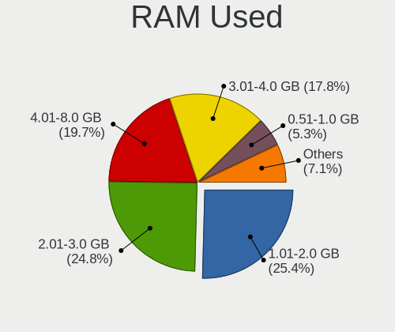

| Used GB    | Notebooks | Percent |
|------------|-----------|---------|
| 2.01-3.0   | 127       | 24.52%  |
| 1.01-2.0   | 116       | 22.39%  |
| 4.01-8.0   | 114       | 22.01%  |
| 3.01-4.0   | 70        | 13.51%  |
| 0.51-1.0   | 55        | 10.62%  |
| 8.01-16.0  | 27        | 5.21%   |
| 0.01-0.5   | 6         | 1.16%   |
| 32.01-64.0 | 1         | 0.19%   |
| 24.01-32.0 | 1         | 0.19%   |
| 16.01-24.0 | 1         | 0.19%   |

Total Drives
------------

Number of drives on board

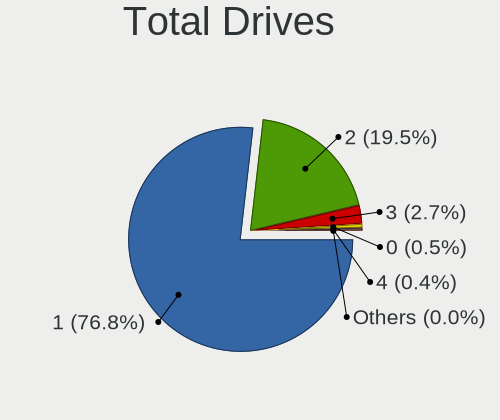

| Drives | Notebooks | Percent |
|--------|-----------|---------|
| 1      | 391       | 77.58%  |
| 2      | 95        | 18.85%  |
| 3      | 15        | 2.98%   |
| 4      | 2         | 0.4%    |
| 0      | 1         | 0.2%    |

Has CD-ROM
----------

Has CD-ROM on board

| Presented | Notebooks | Percent |
|-----------|-----------|---------|
| No        | 408       | 81.27%  |
| Yes       | 94        | 18.73%  |

Has Ethernet
------------

Has Ethernet on board

| Presented | Notebooks | Percent |
|-----------|-----------|---------|
| Yes       | 379       | 75.5%   |
| No        | 123       | 24.5%   |

Has WiFi
--------

Has WiFi module

| Presented | Notebooks | Percent |
|-----------|-----------|---------|
| Yes       | 492       | 98.01%  |
| No        | 10        | 1.99%   |

Has Bluetooth
-------------

Has Bluetooth module

| Presented | Notebooks | Percent |
|-----------|-----------|---------|
| Yes       | 429       | 85.29%  |
| No        | 74        | 14.71%  |

Location
--------

Country
-------

Geographic location (country)

| Country     | Notebooks | Percent |
|-------------|-----------|---------|
| Russia      | 70        | 13.81%  |
| USA         | 66        | 13.02%  |
| Germany     | 53        | 10.45%  |
| France      | 37        | 7.3%    |
| Brazil      | 25        | 4.93%   |
| Sweden      | 23        | 4.54%   |
| UK          | 18        | 3.55%   |
| Spain       | 16        | 3.16%   |
| Poland      | 16        | 3.16%   |
| Italy       | 14        | 2.76%   |
| Canada      | 14        | 2.76%   |
| India       | 10        | 1.97%   |
| Turkey      | 8         | 1.58%   |
| Netherlands | 8         | 1.58%   |
| China       | 8         | 1.58%   |
| Austria     | 7         | 1.38%   |
| Hungary     | 6         | 1.18%   |
| Czechia     | 6         | 1.18%   |
| Australia   | 6         | 1.18%   |
| Romania     | 5         | 0.99%   |
| Belarus     | 5         | 0.99%   |
| Venezuela   | 4         | 0.79%   |
| Ukraine     | 3         | 0.59%   |
| Switzerland | 3         | 0.59%   |
| Singapore   | 3         | 0.59%   |
| Portugal    | 3         | 0.59%   |
| New Zealand | 3         | 0.59%   |
| Mexico      | 3         | 0.59%   |
| Israel      | 3         | 0.59%   |
| Indonesia   | 3         | 0.59%   |
| Greece      | 3         | 0.59%   |
| Chile       | 3         | 0.59%   |
| Belgium     | 3         | 0.59%   |
| Philippines | 2         | 0.39%   |
| Norway      | 2         | 0.39%   |
| Madagascar  | 2         | 0.39%   |
| Lithuania   | 2         | 0.39%   |
| Georgia     | 2         | 0.39%   |
| Denmark     | 2         | 0.39%   |
| Croatia     | 2         | 0.39%   |

City
----

Geographic location (city)

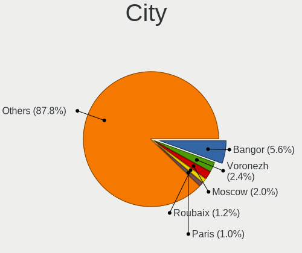

| City              | Notebooks | Percent |
|-------------------|-----------|---------|
| Voronezh          | 40        | 7.75%   |
| Moscow            | 17        | 3.29%   |
| Bangor            | 16        | 3.1%    |
| Saltsjoe-Boo      | 13        | 2.52%   |
| Paris             | 7         | 1.36%   |
| Berlin            | 5         | 0.97%   |
| Wroclaw           | 4         | 0.78%   |
| Toronto           | 4         | 0.78%   |
| Marseille         | 4         | 0.78%   |
| London            | 4         | 0.78%   |
| Braslia         | 4         | 0.78%   |
| Vienna            | 3         | 0.58%   |
| Stockholm         | 3         | 0.58%   |
| St Petersburg     | 3         | 0.58%   |
| Singapore         | 3         | 0.58%   |
| Munich            | 3         | 0.58%   |
| Istanbul          | 3         | 0.58%   |
| Frankfurt am Main | 3         | 0.58%   |
| Beijing           | 3         | 0.58%   |
| Washington        | 2         | 0.39%   |
| Tiranges          | 2         | 0.39%   |
| Tbilisi           | 2         | 0.39%   |
| Sydney            | 2         | 0.39%   |
| Seville           | 2         | 0.39%   |
| San Francisco     | 2         | 0.39%   |
| Samara            | 2         | 0.39%   |
| Pock            | 2         | 0.39%   |
| Prague            | 2         | 0.39%   |
| Most              | 2         | 0.39%   |
| Montpellier       | 2         | 0.39%   |
| Mogilev           | 2         | 0.39%   |
| Mesa              | 2         | 0.39%   |
| Melbourne         | 2         | 0.39%   |
| Malmo             | 2         | 0.39%   |
| Madrid            | 2         | 0.39%   |
| Lonato            | 2         | 0.39%   |
| Karlsruhe         | 2         | 0.39%   |
| Indianapolis      | 2         | 0.39%   |
| Hrodna            | 2         | 0.39%   |
| Guangzhou         | 2         | 0.39%   |

Drives
------

Drive Vendor
------------

Hard drive vendors

| Vendor                      | Notebooks | Drives | Percent |
|-----------------------------|-----------|--------|---------|
| Samsung Electronics         | 103       | 122    | 16.94%  |
| WDC                         | 66        | 74     | 10.86%  |
| SK hynix                    | 40        | 44     | 6.58%   |
| SanDisk                     | 39        | 45     | 6.41%   |
| A-DATA Technology           | 37        | 51     | 6.09%   |
| Micron Technology           | 28        | 29     | 4.61%   |
| Kingston                    | 28        | 31     | 4.61%   |
| Toshiba                     | 27        | 30     | 4.44%   |
| Seagate                     | 27        | 29     | 4.44%   |
| Unknown                     | 26        | 32     | 4.28%   |
| Intel                       | 17        | 19     | 2.8%    |
| Crucial                     | 17        | 19     | 2.8%    |
| Apple                       | 12        | 14     | 1.97%   |
| KIOXIA                      | 10        | 12     | 1.64%   |
| Hitachi                     | 10        | 10     | 1.64%   |
| HGST                        | 9         | 9      | 1.48%   |
| Kingston Technology Company | 7         | 7      | 1.15%   |
| China                       | 7         | 9      | 1.15%   |
| SSSTC                       | 6         | 6      | 0.99%   |
| Intenso                     | 6         | 6      | 0.99%   |
| Phison                      | 5         | 5      | 0.82%   |
| SPCC                        | 4         | 4      | 0.66%   |
| Patriot                     | 4         | 4      | 0.66%   |
| LITEON                      | 4         | 4      | 0.66%   |
| JMicron Technology          | 4         | 4      | 0.66%   |
| Fujitsu                     | 4         | 4      | 0.66%   |
| YMTC                        | 3         | 3      | 0.49%   |
| Silicon Motion              | 3         | 4      | 0.49%   |
| Netac                       | 3         | 3      | 0.49%   |
| ADATA Technology            | 3         | 3      | 0.49%   |
| TO Exter                    | 2         | 3      | 0.33%   |
| Realtek                     | 2         | 2      | 0.33%   |
| Phison Electronics          | 2         | 2      | 0.33%   |
| OCZ                         | 2         | 2      | 0.33%   |
| LITEONIT                    | 2         | 2      | 0.33%   |
| Lexar                       | 2         | 2      | 0.33%   |
| KIOXIA-EXCERIA              | 2         | 2      | 0.33%   |
| Gigabyte Technology         | 2         | 2      | 0.33%   |
| Unknown                     | 2         | 2      | 0.33%   |
| Wibtek                      | 1         | 1      | 0.16%   |

Drive Model
-----------

Hard drive models

| Model                                               | Notebooks | Percent |
|-----------------------------------------------------|-----------|---------|
| A-DATA SU800 512GB SSD                              | 29        | 4.67%   |
| Samsung NVMe SSD Controller SM981/PM981/PM983 500GB | 10        | 1.61%   |
| Kingston SA400S37480G 480GB SSD                     | 8         | 1.29%   |
| Seagate ST1000LM035-1RK172 1TB                      | 6         | 0.97%   |
| Sandisk WD Blue SN550 NVMe SSD 250GB                | 6         | 0.97%   |
| Samsung PM9A1 NVMe 1024GB                           | 5         | 0.81%   |
| Crucial CT500MX500SSD1 500GB                        | 5         | 0.81%   |
| Apple SSD SM0128G 121GB                             | 5         | 0.81%   |
| Toshiba XG6 NVMe SSD Controller 512GB               | 4         | 0.64%   |
| SK hynix BC711 NVMe 256GB                           | 4         | 0.64%   |
| Samsung SSD 980 1TB                                 | 4         | 0.64%   |
| Intel SSDPEKNU512GZ 512GB                           | 4         | 0.64%   |
| WDC WDS240G2G0A-00JH30 240GB SSD                    | 3         | 0.48%   |
| Unknown SD32G  32GB                                 | 3         | 0.48%   |
| Unknown MMC Card  64GB                              | 3         | 0.48%   |
| Toshiba MQ01ABF050 500GB                            | 3         | 0.48%   |
| SanDisk SD8SN8U128G1001 128GB SSD                   | 3         | 0.48%   |
| SanDisk NVMe SSD Drive 512GB                        | 3         | 0.48%   |
| Samsung SSD 990 PRO 2TB                             | 3         | 0.48%   |
| Samsung SSD 980 PRO 1TB                             | 3         | 0.48%   |
| Samsung SSD 860 EVO 500GB                           | 3         | 0.48%   |
| Samsung NVMe SSD Controller SM961/PM961/SM963 256GB | 3         | 0.48%   |
| KIOXIA KBG50ZNS256G NVMe 256GB                      | 3         | 0.48%   |
| Hitachi HTS545032B9A300 320GB                       | 3         | 0.48%   |
| HGST HTS721010A9E630 1TB                            | 3         | 0.48%   |
| Fujitsu MHZ2160BH FFS G1 160GB                      | 3         | 0.48%   |
| China SSD 256GB                                     | 3         | 0.48%   |
| A-DATA IM2P33F3A NVMe 256GB                         | 3         | 0.48%   |
| WDC WDS500G2B0A-00SM50 500GB SSD                    | 2         | 0.32%   |
| WDC WD5000LPVX-22V0TT0 500GB                        | 2         | 0.32%   |
| WDC WD3200BPVT-80ZEST0 320GB                        | 2         | 0.32%   |
| WDC PC SN730 SDBPNTY-512G-1027 512GB                | 2         | 0.32%   |
| WDC PC SN730 SDBPNTY-1T00-1102 1TB                  | 2         | 0.32%   |
| WDC PC SN530 SDBPNPZ-512G-1114 512GB                | 2         | 0.32%   |
| WDC PC SN530 SDBPNPZ-1T00-1006 1TB                  | 2         | 0.32%   |
| WDC PC SN520 SDAPNUW-512G-1014 512GB                | 2         | 0.32%   |
| WDC PC SN520 SDAPMUW-512G-1101 512GB                | 2         | 0.32%   |
| Unknown HAG2e  16GB                                 | 2         | 0.32%   |
| Unknown DA4128  128GB                               | 2         | 0.32%   |
| Toshiba MQ04ABF100 1TB                              | 2         | 0.32%   |

HDD Vendor
----------

Hard disk drive vendors

| Vendor             | Notebooks | Drives | Percent |
|--------------------|-----------|--------|---------|
| WDC                | 25        | 26     | 28.09%  |
| Seagate            | 25        | 26     | 28.09%  |
| Toshiba            | 10        | 12     | 11.24%  |
| Hitachi            | 10        | 10     | 11.24%  |
| HGST               | 9         | 9      | 10.11%  |
| Fujitsu            | 4         | 4      | 4.49%   |
| JMicron Technology | 2         | 2      | 2.25%   |
| WALRAM             | 1         | 1      | 1.12%   |
| Unknown            | 1         | 1      | 1.12%   |
| SYMTEC             | 1         | 1      | 1.12%   |
| Apple              | 1         | 1      | 1.12%   |

SSD Vendor
----------

Solid state drive vendors

| Vendor              | Notebooks | Drives | Percent |
|---------------------|-----------|--------|---------|
| A-DATA Technology   | 31        | 43     | 14.62%  |
| Samsung Electronics | 29        | 32     | 13.68%  |
| SanDisk             | 18        | 23     | 8.49%   |
| Kingston            | 18        | 20     | 8.49%   |
| Crucial             | 16        | 17     | 7.55%   |
| WDC                 | 14        | 15     | 6.6%    |
| SK hynix            | 8         | 8      | 3.77%   |
| Apple               | 8         | 8      | 3.77%   |
| China               | 7         | 9      | 3.3%    |
| Toshiba             | 6         | 7      | 2.83%   |
| Intenso             | 6         | 6      | 2.83%   |
| Micron Technology   | 5         | 6      | 2.36%   |
| Intel               | 4         | 4      | 1.89%   |
| SPCC                | 3         | 3      | 1.42%   |
| Netac               | 3         | 3      | 1.42%   |
| LITEON              | 3         | 3      | 1.42%   |
| TO Exter            | 2         | 3      | 0.94%   |
| Patriot             | 2         | 2      | 0.94%   |
| OCZ                 | 2         | 2      | 0.94%   |
| LITEONIT            | 2         | 2      | 0.94%   |
| Lexar               | 2         | 2      | 0.94%   |
| Wibtek              | 1         | 1      | 0.47%   |
| Wellcomm            | 1         | 1      | 0.47%   |
| V-GeN               | 1         | 1      | 0.47%   |
| Team                | 1         | 1      | 0.47%   |
| S3+                 | 1         | 1      | 0.47%   |
| Plextor             | 1         | 1      | 0.47%   |
| Pioneer             | 1         | 1      | 0.47%   |
| Origin              | 1         | 1      | 0.47%   |
| Mushkin             | 1         | 1      | 0.47%   |
| MicroFrom           | 1         | 1      | 0.47%   |
| Maxtor              | 1         | 1      | 0.47%   |
| KIOXIA-EXCERIA      | 1         | 1      | 0.47%   |
| KingFast            | 1         | 1      | 0.47%   |
| INNOVATION IT       | 1         | 2      | 0.47%   |
| Hikvision           | 1         | 1      | 0.47%   |
| Hewlett-Packard     | 1         | 1      | 0.47%   |
| Haizhide            | 1         | 1      | 0.47%   |
| GOODRAM             | 1         | 1      | 0.47%   |
| Gigabyte Technology | 1         | 1      | 0.47%   |

Drive Kind
----------

HDD or SSD

| Kind    | Notebooks | Drives | Percent |
|---------|-----------|--------|---------|
| NVMe    | 260       | 312    | 44.52%  |
| SSD     | 199       | 242    | 34.08%  |
| HDD     | 88        | 93     | 15.07%  |
| MMC     | 27        | 32     | 4.62%   |
| Unknown | 10        | 10     | 1.71%   |

Drive Connector
---------------

SATA, SAS, NVMe, etc.

| Type | Notebooks | Drives | Percent |
|------|-----------|--------|---------|
| SATA | 263       | 328    | 46.38%  |
| NVMe | 259       | 309    | 45.68%  |
| MMC  | 27        | 32     | 4.76%   |
| SAS  | 18        | 20     | 3.17%   |

Drive Size
----------

Size of hard drive

| Size in TB | Notebooks | Drives | Percent |
|------------|-----------|--------|---------|
| 0.01-0.5   | 181       | 214    | 64.64%  |
| 0.51-1.0   | 90        | 112    | 32.14%  |
| 1.01-2.0   | 7         | 7      | 2.5%    |
| 3.01-4.0   | 2         | 2      | 0.71%   |

Space Total
-----------

Amount of disk space available on the file system

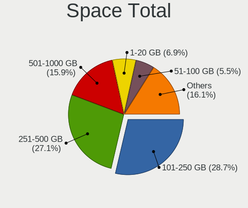

| Size in GB     | Notebooks | Percent |
|----------------|-----------|---------|
| 251-500        | 138       | 27.17%  |
| 101-250        | 126       | 24.8%   |
| 501-1000       | 75        | 14.76%  |
| Unknown        | 56        | 11.02%  |
| 1001-2000      | 42        | 8.27%   |
| 51-100         | 28        | 5.51%   |
| 1-20           | 23        | 4.53%   |
| 21-50          | 14        | 2.76%   |
| More than 3000 | 3         | 0.59%   |
| 2001-3000      | 3         | 0.59%   |

Space Used
----------

Amount of used disk space

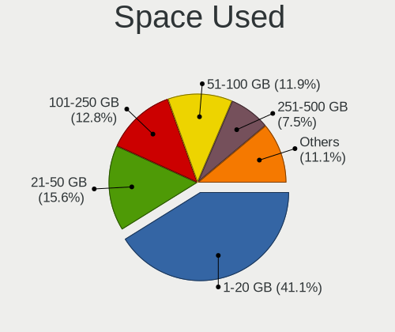

| Used GB   | Notebooks | Percent |
|-----------|-----------|---------|
| 1-20      | 183       | 35.74%  |
| 101-250   | 81        | 15.82%  |
| 21-50     | 73        | 14.26%  |
| 51-100    | 56        | 10.94%  |
| Unknown   | 56        | 10.94%  |
| 251-500   | 34        | 6.64%   |
| 501-1000  | 19        | 3.71%   |
| 1001-2000 | 10        | 1.95%   |

Malfunc. Drives
---------------

Drive models with a malfunction

| Model                                 | Notebooks | Drives | Percent |
|---------------------------------------|-----------|--------|---------|
| SK hynix PC711 HFS512GDE9X073N 512GB  | 2         | 2      | 5.13%   |
| SK hynix HFS128G39TND-N210A 128GB SSD | 2         | 2      | 5.13%   |
| SK hynix BC711 HFM512GD3JX013N 512GB  | 2         | 2      | 5.13%   |
| Seagate ST9500325AS 500GB             | 2         | 2      | 5.13%   |
| WDC WD5000LPVT-08G33T1 500GB          | 1         | 1      | 2.56%   |
| WDC WD400UE-22HCT0 40GB               | 1         | 1      | 2.56%   |
| WDC WD3200BPVT-80ZEST0 320GB          | 1         | 1      | 2.56%   |
| WDC WD3200BEVT-00A0RT0 320GB          | 1         | 1      | 2.56%   |
| Toshiba MQ01ACF032 320GB              | 1         | 1      | 2.56%   |
| Toshiba MQ01ABF050 500GB              | 1         | 1      | 2.56%   |
| Toshiba MQ01ABD100 1TB                | 1         | 1      | 2.56%   |
| Toshiba MK3259GSXP 320GB              | 1         | 1      | 2.56%   |
| SK hynix HFS128G3BTND-N210A 128GB SSD | 1         | 1      | 2.56%   |
| ShiJi 1TB                             | 1         | 3      | 2.56%   |
| Seagate ST9250414ASG 250GB            | 1         | 1      | 2.56%   |
| Seagate ST500LM021-1KJ152 500GB       | 1         | 1      | 2.56%   |
| SanDisk SDSSDXPS960G 960GB            | 1         | 1      | 2.56%   |
| SanDisk SD7SB2Q512G1001 512GB SSD     | 1         | 1      | 2.56%   |
| Samsung Electronics SSD 870 EVO 500GB | 1         | 1      | 2.56%   |
| Micron Technology 2300 NVMe 512GB     | 1         | 1      | 2.56%   |
| Kingston SV300S37A120G 120GB SSD      | 1         | 1      | 2.56%   |
| Kingston SA400S37240G 240GB SSD       | 1         | 1      | 2.56%   |
| JMicron Technology Generic 512GB      | 1         | 1      | 2.56%   |
| Intel SSDSC2BW120A4 120GB             | 1         | 1      | 2.56%   |
| Intel SSDSC2BF240A4L 240GB            | 1         | 1      | 2.56%   |
| Hitachi HTS545050B9SA02 500GB         | 1         | 1      | 2.56%   |
| Hitachi HTS545050B9A300 500GB         | 1         | 1      | 2.56%   |
| Hitachi HTS541616J9SA00 160GB         | 1         | 1      | 2.56%   |
| HGST HTS725032A7E630 320GB            | 1         | 1      | 2.56%   |
| HGST HTS545050A7E680 500GB            | 1         | 1      | 2.56%   |
| HGST HTS541075A9E680 752GB            | 1         | 1      | 2.56%   |
| HGST HTS541010B7E610 1TB              | 1         | 1      | 2.56%   |
| HGST HTS541010A7E630 1TB              | 1         | 1      | 2.56%   |
| Crucial CT525MX300SSD1 528GB          | 1         | 1      | 2.56%   |
| Crucial CT256M550SSD1 256GB           | 1         | 1      | 2.56%   |

Malfunc. Drive Vendor
---------------------

Vendors of faulty drives

| Vendor              | Notebooks | Drives | Percent |
|---------------------|-----------|--------|---------|
| SK hynix            | 7         | 7      | 17.95%  |
| HGST                | 5         | 5      | 12.82%  |
| WDC                 | 4         | 4      | 10.26%  |
| Toshiba             | 4         | 4      | 10.26%  |
| Seagate             | 4         | 4      | 10.26%  |
| Hitachi             | 3         | 3      | 7.69%   |
| SanDisk             | 2         | 2      | 5.13%   |
| Kingston            | 2         | 2      | 5.13%   |
| Intel               | 2         | 2      | 5.13%   |
| Crucial             | 2         | 2      | 5.13%   |
| ShiJi               | 1         | 3      | 2.56%   |
| Samsung Electronics | 1         | 1      | 2.56%   |
| Micron Technology   | 1         | 1      | 2.56%   |
| JMicron Technology  | 1         | 1      | 2.56%   |

Malfunc. HDD Vendor
-------------------

Vendors of faulty HDD drives

| Vendor             | Notebooks | Drives | Percent |
|--------------------|-----------|--------|---------|
| HGST               | 5         | 5      | 23.81%  |
| WDC                | 4         | 4      | 19.05%  |
| Toshiba            | 4         | 4      | 19.05%  |
| Seagate            | 4         | 4      | 19.05%  |
| Hitachi            | 3         | 3      | 14.29%  |
| JMicron Technology | 1         | 1      | 4.76%   |

Malfunc. Drive Kind
-------------------

Kinds of faulty drives

| Kind | Notebooks | Drives | Percent |
|------|-----------|--------|---------|
| HDD  | 21        | 21     | 53.85%  |
| SSD  | 12        | 12     | 30.77%  |
| NVMe | 6         | 8      | 15.38%  |

Failed Drives
-------------

Failed drive models

Zero info for selected period =(

Failed Drive Vendor
-------------------

Failed drive vendors

Zero info for selected period =(

Drive Status
------------

Number of failed and malfunc. drives

| Status   | Notebooks | Drives | Percent |
|----------|-----------|--------|---------|
| Works    | 347       | 440    | 65.23%  |
| Detected | 146       | 208    | 27.44%  |
| Malfunc  | 39        | 41     | 7.33%   |

Storage controller
------------------

Storage Vendor
--------------

Storage controller vendors

| Vendor                         | Notebooks | Percent |
|--------------------------------|-----------|---------|
| Intel                          | 273       | 45.2%   |
| Samsung Electronics            | 78        | 12.91%  |
| AMD                            | 64        | 10.6%   |
| SanDisk                        | 48        | 7.95%   |
| SK hynix                       | 30        | 4.97%   |
| Micron Technology              | 23        | 3.81%   |
| Kingston Technology Company    | 16        | 2.65%   |
| Toshiba America Info Systems   | 12        | 1.99%   |
| Phison Electronics             | 10        | 1.66%   |
| KIOXIA                         | 10        | 1.66%   |
| ADATA Technology               | 9         | 1.49%   |
| Solid State Storage Technology | 6         | 0.99%   |
| Nvidia                         | 6         | 0.99%   |
| Silicon Motion                 | 4         | 0.66%   |
| Yangtze Memory Technologies    | 3         | 0.5%    |
| Micron/Crucial Technology      | 3         | 0.5%    |
| MAXIO Technology (Hangzhou)    | 2         | 0.33%   |
| Apple                          | 2         | 0.33%   |
| Union Memory (Shenzhen)        | 1         | 0.17%   |
| Seagate Technology             | 1         | 0.17%   |
| Lite-On Technology             | 1         | 0.17%   |
| Jiangsu Huacun Elec.           | 1         | 0.17%   |
| Biwin Storage Technology       | 1         | 0.17%   |

Storage Model
-------------

Storage controller models

| Model                                                                          | Notebooks | Percent |
|--------------------------------------------------------------------------------|-----------|---------|
| AMD FCH SATA Controller [AHCI mode]                                            | 54        | 8.48%   |
| Intel Sunrise Point-LP SATA Controller [AHCI mode]                             | 38        | 5.97%   |
| Intel Cannon Lake PCH SATA AHCI Controller                                     | 29        | 4.55%   |
| Samsung NVMe SSD Controller SM981/PM981/PM983                                  | 26        | 4.08%   |
| Intel 7 Series Chipset Family 6-port SATA Controller [AHCI mode]               | 24        | 3.77%   |
| Intel Volume Management Device NVMe RAID Controller                            | 23        | 3.61%   |
| Samsung NVMe SSD Controller PM9A1/PM9A3/980PRO                                 | 21        | 3.3%    |
| Samsung NVMe SSD Controller 980                                                | 17        | 2.67%   |
| SK hynix Gold P31/BC711/PC711 NVMe Solid State Drive                           | 16        | 2.51%   |
| SanDisk WD Blue SN550 NVMe SSD                                                 | 16        | 2.51%   |
| Intel Tiger Lake-LP SATA Controller                                            | 14        | 2.2%    |
| Intel 82801IBM/IEM (ICH9M/ICH9M-E) 4 port SATA Controller [AHCI mode]          | 14        | 2.2%    |
| Intel 8 Series SATA Controller 1 [AHCI mode]                                   | 14        | 2.2%    |
| Intel 8 Series/C220 Series Chipset Family 6-port SATA Controller 1 [AHCI mode] | 13        | 2.04%   |
| SanDisk WD Black SN750 / PC SN730 NVMe SSD                                     | 11        | 1.73%   |
| Intel 82801 Mobile SATA Controller [RAID mode]                                 | 11        | 1.73%   |
| AMD SB7x0/SB8x0/SB9x0 SATA Controller [AHCI mode]                              | 10        | 1.57%   |
| Micron 2450 NVMe SSD [HendrixV] (DRAM-less)                                    | 9         | 1.41%   |
| Intel 6 Series/C200 Series Chipset Family 6 port Mobile SATA AHCI Controller   | 9         | 1.41%   |
| Intel 5 Series/3400 Series Chipset 4 port SATA AHCI Controller                 | 9         | 1.41%   |
| Intel SSD 670p Series [Keystone Harbor]                                        | 8         | 1.26%   |
| Intel Cannon Lake Mobile PCH SATA AHCI Controller                              | 8         | 1.26%   |
| Toshiba America Info Systems XG6 NVMe SSD Controller                           | 7         | 1.1%    |
| Intel Comet Lake SATA AHCI Controller                                          | 7         | 1.1%    |
| Intel Celeron/Pentium Silver Processor SATA Controller                         | 7         | 1.1%    |
| Intel 5 Series/3400 Series Chipset 6 port SATA AHCI Controller                 | 7         | 1.1%    |
| Samsung S4LN058A01[SSUBX] AHCI SSD Controller (Apple slot)                     | 6         | 0.94%   |
| Samsung NVMe SSD Controller SM961/PM961/SM963                                  | 6         | 0.94%   |
| KIOXIA NVMe SSD Controller BG5 (DRAM-less)                                     | 6         | 0.94%   |
| Intel Q170/Q150/B150/H170/H110/Z170/CM236 Chipset SATA Controller [AHCI Mode]  | 6         | 0.94%   |
| Intel Alder Lake-P SATA AHCI Controller                                        | 6         | 0.94%   |
| Phison PS5013 E13 NVMe Controller                                              | 5         | 0.78%   |
| Intel Wildcat Point-LP SATA Controller [AHCI Mode]                             | 5         | 0.78%   |
| Intel 82801HM/HEM (ICH8M/ICH8M-E) SATA Controller [AHCI mode]                  | 5         | 0.78%   |
| Intel 82801HM/HEM (ICH8M/ICH8M-E) IDE Controller                               | 5         | 0.78%   |
| Solid State Storage Non-Volatile memory controller                             | 4         | 0.63%   |
| Nvidia MCP79 AHCI Controller                                                   | 4         | 0.63%   |
| Micron 2300 NVMe SSD [Santana]                                                 | 4         | 0.63%   |
| Kingston Company Company Non-Volatile memory controller                        | 4         | 0.63%   |
| Intel Tiger Lake SATA AHCI Controller                                          | 4         | 0.63%   |

Storage Kind
------------

Kind of storage controller (IDE, SATA, NVMe, SAS, ...)

| Kind | Notebooks | Percent |
|------|-----------|---------|
| SATA | 312       | 50.49%  |
| NVMe | 257       | 41.59%  |
| RAID | 35        | 5.66%   |
| IDE  | 14        | 2.27%   |

Processor
---------

CPU Vendor
----------

Processor vendors

| Vendor       | Notebooks | Percent |
|--------------|-----------|---------|
| Intel        | 383       | 76.29%  |
| AMD          | 116       | 23.11%  |
| CentaurHauls | 1         | 0.2%    |
| ARM          | 1         | 0.2%    |
| Unknown      | 1         | 0.2%    |

CPU Model
---------

Processor models

| Model                                         | Notebooks | Percent |
|-----------------------------------------------|-----------|---------|
| Intel Core i3-9100 CPU @ 3.60GHz              | 29        | 5.77%   |
| Intel 11th Gen Core i5-1135G7 @ 2.40GHz       | 21        | 4.17%   |
| AMD Ryzen 5 5500U with Radeon Graphics        | 12        | 2.39%   |
| Intel Celeron N4020 CPU @ 1.10GHz             | 9         | 1.79%   |
| Intel 12th Gen Core i7-12700H                 | 8         | 1.59%   |
| Intel 12th Gen Core i5-1235U                  | 8         | 1.59%   |
| AMD Ryzen 5 3500U with Radeon Vega Mobile Gfx | 8         | 1.59%   |
| Intel Core i5-5250U CPU @ 1.60GHz             | 7         | 1.39%   |
| Intel 11th Gen Core i7-1165G7 @ 2.80GHz       | 7         | 1.39%   |
| AMD Ryzen 5 5600H with Radeon Graphics        | 7         | 1.39%   |
| Intel Core i7-8650U CPU @ 1.90GHz             | 6         | 1.19%   |
| Intel Core i5-8250U CPU @ 1.60GHz             | 6         | 1.19%   |
| Intel Core i5-6200U CPU @ 2.30GHz             | 6         | 1.19%   |
| Intel Core i5-3320M CPU @ 2.60GHz             | 6         | 1.19%   |
| AMD Ryzen 7 5800H with Radeon Graphics        | 6         | 1.19%   |
| AMD Ryzen 7 5700U with Radeon Graphics        | 6         | 1.19%   |
| Intel Core i7-9750H CPU @ 2.60GHz             | 5         | 0.99%   |
| Intel Core i5-7200U CPU @ 2.50GHz             | 5         | 0.99%   |
| Intel Core i5-10210U CPU @ 1.60GHz            | 5         | 0.99%   |
| Intel 11th Gen Core i7-1185G7 @ 3.00GHz       | 5         | 0.99%   |
| Intel 11th Gen Core i7-11800H @ 2.30GHz       | 5         | 0.99%   |
| Intel 11th Gen Core i3-1115G4 @ 3.00GHz       | 5         | 0.99%   |
| AMD Ryzen 7 5825U with Radeon Graphics        | 5         | 0.99%   |
| Intel Core i7-7600U CPU @ 2.80GHz             | 4         | 0.8%    |
| Intel Core i7-7500U CPU @ 2.70GHz             | 4         | 0.8%    |
| Intel Core i5-8350U CPU @ 1.70GHz             | 4         | 0.8%    |
| Intel Core i5-8265U CPU @ 1.60GHz             | 4         | 0.8%    |
| Intel Core i5-6300U CPU @ 2.40GHz             | 4         | 0.8%    |
| Intel Core i5-4300U CPU @ 1.90GHz             | 4         | 0.8%    |
| Intel 12th Gen Core i7-1255U                  | 4         | 0.8%    |
| AMD Ryzen 7 3700U with Radeon Vega Mobile Gfx | 4         | 0.8%    |
| Intel Pentium CPU P6200 @ 2.13GHz             | 3         | 0.6%    |
| Intel Core i7-8750H CPU @ 2.20GHz             | 3         | 0.6%    |
| Intel Core i7-8550U CPU @ 1.80GHz             | 3         | 0.6%    |
| Intel Core i7-7700HQ CPU @ 2.80GHz            | 3         | 0.6%    |
| Intel Core i7-6600U CPU @ 2.60GHz             | 3         | 0.6%    |
| Intel Core i7-10510U CPU @ 1.80GHz            | 3         | 0.6%    |
| Intel Core i5-4200U CPU @ 1.60GHz             | 3         | 0.6%    |
| Intel Core i5-4200M CPU @ 2.50GHz             | 3         | 0.6%    |
| Intel Core 2 Duo CPU P8600 @ 2.40GHz          | 3         | 0.6%    |

CPU Model Family
----------------

Processor model prefix

| Model                   | Notebooks | Percent |
|-------------------------|-----------|---------|
| Other                   | 99        | 19.68%  |
| Intel Core i5           | 95        | 18.89%  |
| Intel Core i7           | 75        | 14.91%  |
| Intel Core i3           | 50        | 9.94%   |
| AMD Ryzen 5             | 38        | 7.55%   |
| AMD Ryzen 7             | 31        | 6.16%   |
| Intel Core 2 Duo        | 23        | 4.57%   |
| Intel Celeron           | 19        | 3.78%   |
| Intel Pentium           | 12        | 2.39%   |
| AMD Ryzen 7 PRO         | 7         | 1.39%   |
| AMD E                   | 7         | 1.39%   |
| AMD Ryzen 9             | 6         | 1.19%   |
| AMD Ryzen 5 PRO         | 6         | 1.19%   |
| Intel Atom              | 5         | 0.99%   |
| Intel Pentium Dual-Core | 3         | 0.6%    |
| AMD Ryzen 3             | 3         | 0.6%    |
| Intel Pentium Silver    | 2         | 0.4%    |
| Intel Pentium M         | 2         | 0.4%    |
| Intel Core i9           | 2         | 0.4%    |
| AMD E2                  | 2         | 0.4%    |
| AMD Athlon II           | 2         | 0.4%    |
| AMD A6                  | 2         | 0.4%    |
| AMD A4                  | 2         | 0.4%    |
| Intel Xeon              | 1         | 0.2%    |
| Intel Genuine           | 1         | 0.2%    |
| Intel Core m5           | 1         | 0.2%    |
| Intel Core 2            | 1         | 0.2%    |
| Intel Celeron M         | 1         | 0.2%    |
| AMD E1                  | 1         | 0.2%    |
| AMD C-70                | 1         | 0.2%    |
| AMD C-60                | 1         | 0.2%    |
| AMD C-50                | 1         | 0.2%    |
| AMD Athlon              | 1         | 0.2%    |

CPU Cores
---------

Number of processor cores

| Number | Notebooks | Percent |
|--------|-----------|---------|
| 2      | 195       | 38.84%  |
| 4      | 169       | 33.67%  |
| 6      | 48        | 9.56%   |
| 8      | 44        | 8.76%   |
| 10     | 17        | 3.39%   |
| 14     | 13        | 2.59%   |
| 12     | 9         | 1.79%   |
| 1      | 6         | 1.2%    |
| 16     | 1         | 0.2%    |

CPU Sockets
-----------

Number of sockets

| Number | Notebooks | Percent |
|--------|-----------|---------|
| 1      | 502       | 100%    |

CPU Threads
-----------

Threads per core (Hyper-Threading)

| Number | Notebooks | Percent |
|--------|-----------|---------|
| 2      | 377       | 74.8%   |
| 1      | 127       | 25.2%   |

CPU Op-Modes
------------

CPU Operation Modes (32-bit, 64-bit)

| Op mode        | Notebooks | Percent |
|----------------|-----------|---------|
| 32-bit, 64-bit | 496       | 98.8%   |
| 32-bit         | 4         | 0.8%    |
| 64-bit         | 1         | 0.2%    |
| Unknown        | 1         | 0.2%    |

CPU Microcode
-------------

Microcode number

| Number     | Notebooks | Percent |
|------------|-----------|---------|
| Unknown    | 146       | 28.85%  |
| 0x806c1    | 34        | 6.72%   |
| 0x906eb    | 29        | 5.73%   |
| 0x906a4    | 17        | 3.36%   |
| 0x906a3    | 17        | 3.36%   |
| 0x806ea    | 14        | 2.77%   |
| 0x1067a    | 14        | 2.77%   |
| 0x0a50000c | 13        | 2.57%   |
| 0x806ec    | 12        | 2.37%   |
| 0x08108109 | 12        | 2.37%   |
| 0x806e9    | 11        | 2.17%   |
| 0x40651    | 11        | 2.17%   |
| 0x306d4    | 11        | 2.17%   |
| 0x306a9    | 11        | 2.17%   |
| 0x08608103 | 11        | 2.17%   |
| 0x406e3    | 10        | 1.98%   |
| 0x306c3    | 10        | 1.98%   |
| 0x206a7    | 10        | 1.98%   |
| 0x706a8    | 9         | 1.78%   |
| 0x20655    | 9         | 1.78%   |
| 0x0a50000d | 8         | 1.58%   |
| 0x906ea    | 6         | 1.19%   |
| 0x08600106 | 5         | 0.99%   |
| 0x806d1    | 4         | 0.79%   |
| 0x30678    | 4         | 0.79%   |
| 0x06006705 | 4         | 0.79%   |
| 0x05000119 | 4         | 0.79%   |
| 0x10676    | 3         | 0.59%   |
| 0x0a404102 | 3         | 0.59%   |
| 0x08600103 | 3         | 0.59%   |
| 0x05000029 | 3         | 0.59%   |
| 0xb06a2    | 2         | 0.4%    |
| 0xa0652    | 2         | 0.4%    |
| 0x906e9    | 2         | 0.4%    |
| 0x806eb    | 2         | 0.4%    |
| 0x806c2    | 2         | 0.4%    |
| 0x6fd      | 2         | 0.4%    |
| 0x6d8      | 2         | 0.4%    |
| 0x506e3    | 2         | 0.4%    |
| 0x08701013 | 2         | 0.4%    |

CPU Microarch
-------------

Microarchitecture

| Name             | Notebooks | Percent |
|------------------|-----------|---------|
| KabyLake         | 109       | 21.67%  |
| TigerLake        | 43        | 8.55%   |
| Unknown          | 42        | 8.35%   |
| Alderlake Hybrid | 35        | 6.96%   |
| Zen 3            | 30        | 5.96%   |
| Haswell          | 29        | 5.77%   |
| Skylake          | 25        | 4.97%   |
| IvyBridge        | 23        | 4.57%   |
| Penryn           | 22        | 4.37%   |
| Zen+             | 19        | 3.78%   |
| Zen 2            | 15        | 2.98%   |
| Westmere         | 15        | 2.98%   |
| SandyBridge      | 14        | 2.78%   |
| Broadwell        | 13        | 2.58%   |
| Goldmont plus    | 11        | 2.19%   |
| Bobcat           | 11        | 2.19%   |
| Silvermont       | 9         | 1.79%   |
| Icelake          | 7         | 1.39%   |
| Excavator        | 6         | 1.19%   |
| Core             | 6         | 1.19%   |
| CometLake        | 5         | 0.99%   |
| P6               | 3         | 0.6%    |
| K10              | 2         | 0.4%    |
| Goldmont         | 2         | 0.4%    |
| Bonnell          | 2         | 0.4%    |
| Zen              | 1         | 0.2%    |
| Puma             | 1         | 0.2%    |
| Nehalem          | 1         | 0.2%    |
| K10 Llano        | 1         | 0.2%    |
| Jaguar           | 1         | 0.2%    |

Graphics
--------

GPU Vendor
----------

Vendors of graphics cards

| Vendor  | Notebooks | Percent |
|---------|-----------|---------|
| Intel   | 352       | 57.89%  |
| AMD     | 138       | 22.7%   |
| Nvidia  | 117       | 19.24%  |
| Zhaoxin | 1         | 0.16%   |

GPU Model
---------

Graphics card models

| Model                                                                                 | Notebooks | Percent |
|---------------------------------------------------------------------------------------|-----------|---------|
| Intel TigerLake-LP GT2 [Iris Xe Graphics]                                             | 38        | 6.09%   |
| Intel CoffeeLake-S GT2 [UHD Graphics 630]                                             | 29        | 4.65%   |
| Intel 3rd Gen Core processor Graphics Controller                                      | 23        | 3.69%   |
| AMD Picasso/Raven 2 [Radeon Vega Series / Radeon Vega Mobile Series]                  | 21        | 3.37%   |
| AMD Lucienne                                                                          | 21        | 3.37%   |
| AMD Cezanne [Radeon Vega Series / Radeon Vega Mobile Series]                          | 21        | 3.37%   |
| Intel UHD Graphics 620                                                                | 20        | 3.21%   |
| Intel Skylake GT2 [HD Graphics 520]                                                   | 18        | 2.88%   |
| Intel Alder Lake-P Integrated Graphics Controller                                     | 17        | 2.72%   |
| Intel HD Graphics 620                                                                 | 16        | 2.56%   |
| Intel Haswell-ULT Integrated Graphics Controller                                      | 15        | 2.4%    |
| Intel Alder Lake-UP3 GT2 [Iris Xe Graphics]                                           | 14        | 2.24%   |
| Intel Core Processor Integrated Graphics Controller                                   | 13        | 2.08%   |
| AMD Renoir                                                                            | 13        | 2.08%   |
| Intel CoffeeLake-H GT2 [UHD Graphics 630]                                             | 12        | 1.92%   |
| Intel 4th Gen Core Processor Integrated Graphics Controller                           | 11        | 1.76%   |
| Intel 2nd Generation Core Processor Family Integrated Graphics Controller             | 11        | 1.76%   |
| Intel GeminiLake [UHD Graphics 600]                                                   | 10        | 1.6%    |
| Intel CometLake-U GT2 [UHD Graphics]                                                  | 10        | 1.6%    |
| AMD Barcelo                                                                           | 9         | 1.44%   |
| Intel WhiskeyLake-U GT2 [UHD Graphics 620]                                            | 8         | 1.28%   |
| Intel Mobile 4 Series Chipset Integrated Graphics Controller                          | 8         | 1.28%   |
| Nvidia TU117M [GeForce GTX 1650 Mobile / Max-Q]                                       | 7         | 1.12%   |
| Nvidia GA107M [GeForce RTX 3050 Ti Mobile]                                            | 7         | 1.12%   |
| Intel TigerLake-H GT1 [UHD Graphics]                                                  | 7         | 1.12%   |
| Intel HD Graphics 6000                                                                | 7         | 1.12%   |
| Intel Atom Processor Z36xxx/Z37xxx Series Graphics & Display                          | 6         | 0.96%   |
| AMD Rembrandt [Radeon 680M]                                                           | 6         | 0.96%   |
| Nvidia GA107M [GeForce RTX 3050 Mobile]                                               | 5         | 0.8%    |
| Nvidia GA106M [GeForce RTX 3060 Mobile / Max-Q]                                       | 5         | 0.8%    |
| Intel Tiger Lake-LP GT2 [UHD Graphics G4]                                             | 5         | 0.8%    |
| Intel HD Graphics 630                                                                 | 5         | 0.8%    |
| AMD Wrestler [Radeon HD 6310]                                                         | 5         | 0.8%    |
| AMD Stoney [Radeon R2/R3/R4/R5 Graphics]                                              | 5         | 0.8%    |
| AMD Seymour [Radeon HD 6400M/7400M Series]                                            | 5         | 0.8%    |
| Nvidia TU106M [GeForce RTX 2060 Mobile]                                               | 4         | 0.64%   |
| Intel HD Graphics 610                                                                 | 4         | 0.64%   |
| Intel HD Graphics 5500                                                                | 4         | 0.64%   |
| Intel HD Graphics 530                                                                 | 4         | 0.64%   |
| AMD Topaz XT [Radeon R7 M260/M265 / M340/M360 / M440/M445 / 530/535 / 620/625 Mobile] | 4         | 0.64%   |

GPU Combo
---------

Combinations of graphics cards

| Name           | Notebooks | Percent |
|----------------|-----------|---------|
| 1 x Intel      | 252       | 50.1%   |
| 1 x AMD        | 99        | 19.68%  |
| Intel + Nvidia | 78        | 15.51%  |
| 1 x Nvidia     | 22        | 4.37%   |
| AMD + Nvidia   | 16        | 3.18%   |
| Intel + AMD    | 13        | 2.58%   |
| 2 x AMD        | 10        | 1.99%   |
| 2 x Intel      | 8         | 1.59%   |
| Other          | 3         | 0.6%    |
| 2 x Nvidia     | 1         | 0.2%    |
| 1 x Zhaoxin    | 1         | 0.2%    |

GPU Driver
----------

Free vs proprietary

| Driver      | Notebooks | Percent |
|-------------|-----------|---------|
| Free        | 413       | 81.94%  |
| Unknown     | 48        | 9.52%   |
| Proprietary | 43        | 8.53%   |

GPU Memory
----------

Total video memory

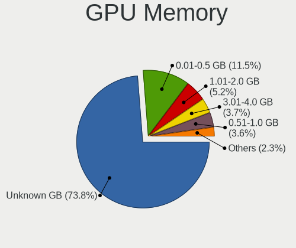

| Size in GB | Notebooks | Percent |
|------------|-----------|---------|
| Unknown    | 368       | 72.87%  |
| 0.01-0.5   | 59        | 11.68%  |
| 1.01-2.0   | 23        | 4.55%   |
| 0.51-1.0   | 21        | 4.16%   |
| 3.01-4.0   | 20        | 3.96%   |
| 7.01-8.0   | 7         | 1.39%   |
| 5.01-6.0   | 4         | 0.79%   |
| 2.01-3.0   | 2         | 0.4%    |
| 0          | 1         | 0.2%    |

Monitor
-------

Monitor Vendor
--------------

Monitor vendors

| Vendor                  | Notebooks | Percent |
|-------------------------|-----------|---------|
| AU Optronics            | 103       | 19.69%  |
| BOE                     | 77        | 14.72%  |
| Chimei Innolux          | 69        | 13.19%  |
| LG Display              | 55        | 10.52%  |
| Samsung Electronics     | 43        | 8.22%   |
| Apple                   | 20        | 3.82%   |
| Sharp                   | 19        | 3.63%   |
| PANDA                   | 17        | 3.25%   |
| InfoVision              | 14        | 2.68%   |
| Dell                    | 14        | 2.68%   |
| Lenovo                  | 13        | 2.49%   |
| Hewlett-Packard         | 8         | 1.53%   |
| BenQ                    | 8         | 1.53%   |
| Philips                 | 7         | 1.34%   |
| Goldstar                | 6         | 1.15%   |
| Chi Mei Optoelectronics | 6         | 1.15%   |
| LG Philips              | 4         | 0.76%   |
| CSO                     | 4         | 0.76%   |
| ASUSTek Computer        | 4         | 0.76%   |
| AOC                     | 3         | 0.57%   |
| Ancor Communications    | 3         | 0.57%   |
| Acer                    | 3         | 0.57%   |
| ViewSonic               | 2         | 0.38%   |
| Toshiba                 | 2         | 0.38%   |
| Sony                    | 2         | 0.38%   |
| Iiyama                  | 2         | 0.38%   |
| Valve                   | 1         | 0.19%   |
| Tianma XM               | 1         | 0.19%   |
| STD                     | 1         | 0.19%   |
| SANYO                   | 1         | 0.19%   |
| SAC                     | 1         | 0.19%   |
| MSF                     | 1         | 0.19%   |
| Mi                      | 1         | 0.19%   |
| InnoLux Display         | 1         | 0.19%   |
| IBM                     | 1         | 0.19%   |
| HKC                     | 1         | 0.19%   |
| Denver                  | 1         | 0.19%   |
| CTO                     | 1         | 0.19%   |
| CPT                     | 1         | 0.19%   |
| BOE Technology Group    | 1         | 0.19%   |

Monitor Model
-------------

Monitor models

| Model                                                                 | Notebooks | Percent |
|-----------------------------------------------------------------------|-----------|---------|
| Chimei Innolux LCD Monitor CMN14D4 1920x1080 309x173mm 13.9-inch      | 10        | 1.9%    |
| BOE LCD Monitor BOE0872 1920x1080 344x194mm 15.5-inch                 | 6         | 1.14%   |
| Samsung Electronics LCD Monitor SDC4161 1920x1080 344x194mm 15.5-inch | 5         | 0.95%   |
| PANDA LCD Monitor NCP004D 1920x1080 344x194mm 15.5-inch               | 4         | 0.76%   |
| AU Optronics LCD Monitor AUOE48D 1920x1080 344x194mm 15.5-inch        | 4         | 0.76%   |
| Sharp LCD Monitor SHP1516 3840x2400 336x210mm 15.6-inch               | 3         | 0.57%   |
| LG Display LCD Monitor LGD0590 1920x1080 344x194mm 15.5-inch          | 3         | 0.57%   |
| InfoVision LCD Monitor IVO057D 1920x1080 309x174mm 14.0-inch          | 3         | 0.57%   |
| Chimei Innolux LCD Monitor CMN1521 1920x1080 344x193mm 15.5-inch      | 3         | 0.57%   |
| Chimei Innolux LCD Monitor CMN14D5 1920x1080 309x173mm 13.9-inch      | 3         | 0.57%   |
| AU Optronics LCD Monitor AUOAF90 1920x1080 344x193mm 15.5-inch        | 3         | 0.57%   |
| AU Optronics LCD Monitor AUO80ED 1920x1080 344x193mm 15.5-inch        | 3         | 0.57%   |
| AU Optronics LCD Monitor AUO5B2D 1920x1080 293x162mm 13.2-inch        | 3         | 0.57%   |
| AU Optronics LCD Monitor AUO38ED 1920x1080 344x193mm 15.5-inch        | 3         | 0.57%   |
| AU Optronics LCD Monitor AUO303E 1600x900 309x174mm 14.0-inch         | 3         | 0.57%   |
| AU Optronics LCD Monitor AUO26EC 1366x768 344x193mm 15.5-inch         | 3         | 0.57%   |
| Apple LCD Monitor APP9C5F 1280x800 286x179mm 13.3-inch                | 3         | 0.57%   |
| Apple Color LCD APP9CDF 1440x900 286x179mm 13.3-inch                  | 3         | 0.57%   |
| Sharp LQ156M1JW01 SHP14C3 1920x1080 344x194mm 15.5-inch               | 2         | 0.38%   |
| Sharp LCD Monitor SHP1515 1920x1200 336x210mm 15.6-inch               | 2         | 0.38%   |
| Sharp LCD Monitor SHP1484 1920x1080 294x165mm 13.3-inch               | 2         | 0.38%   |
| Sharp LCD Monitor SHP1453 1920x1080 346x194mm 15.6-inch               | 2         | 0.38%   |
| Samsung Electronics U28E590 SAM0C4D 3840x2160 607x345mm 27.5-inch     | 2         | 0.38%   |
| PANDA LCD Monitor NCP005F 1920x1080 344x194mm 15.5-inch               | 2         | 0.38%   |
| PANDA LCD Monitor NCP0046 1920x1080 344x194mm 15.5-inch               | 2         | 0.38%   |
| PANDA LCD Monitor NCP0035 1920x1080 309x174mm 14.0-inch               | 2         | 0.38%   |
| LG Display LCD Monitor LGD06EA 2560x1600 366x229mm 17.0-inch          | 2         | 0.38%   |
| LG Display LCD Monitor LGD05FA 1920x1080 309x174mm 14.0-inch          | 2         | 0.38%   |
| LG Display LCD Monitor LGD04B1 1366x768 310x174mm 14.0-inch           | 2         | 0.38%   |
| LG Display LCD Monitor LGD046D 1920x1080 309x174mm 14.0-inch          | 2         | 0.38%   |
| LG Display LCD Monitor LGD03F1 1600x900 309x174mm 14.0-inch           | 2         | 0.38%   |
| LG Display LCD Monitor LGD034C 1366x768 293x165mm 13.2-inch           | 2         | 0.38%   |
| LG Display LCD Monitor LGD033E 1366x768 309x174mm 14.0-inch           | 2         | 0.38%   |
| Lenovo LEN LT2252pwA LEN0A0C 1680x1050 474x296mm 22.0-inch            | 2         | 0.38%   |
| Lenovo LCD Monitor LEN40B0 1366x768 344x194mm 15.5-inch               | 2         | 0.38%   |
| Lenovo LCD Monitor LEN4036 1440x900 303x189mm 14.1-inch               | 2         | 0.38%   |
| InfoVision LCD Monitor IVO854A 1920x1200 286x179mm 13.3-inch          | 2         | 0.38%   |
| Hewlett-Packard E240 HWP3265 1920x1080 527x296mm 23.8-inch            | 2         | 0.38%   |
| Dell U2412M DELA07A 1920x1200 518x324mm 24.1-inch                     | 2         | 0.38%   |
| Chimei Innolux LCD Monitor CMN1738 1920x1080 381x214mm 17.2-inch      | 2         | 0.38%   |

Monitor Resolution
------------------

Monitor screen resolution

| Resolution         | Notebooks | Percent |
|--------------------|-----------|---------|
| 1920x1080 (FHD)    | 258       | 52.12%  |
| 1366x768 (WXGA)    | 94        | 18.99%  |
| 1600x900 (HD+)     | 21        | 4.24%   |
| 1920x1200 (WUXGA)  | 20        | 4.04%   |
| 2560x1440 (QHD)    | 16        | 3.23%   |
| 3840x2160 (4K)     | 12        | 2.42%   |
| 1280x800 (WXGA)    | 12        | 2.42%   |
| 1440x900 (WXGA+)   | 10        | 2.02%   |
| 3840x2400          | 8         | 1.62%   |
| 2880x1800          | 7         | 1.41%   |
| 2560x1600          | 7         | 1.41%   |
| 1680x1050 (WSXGA+) | 4         | 0.81%   |
| 3440x1440          | 3         | 0.61%   |
| 3456x2160          | 2         | 0.4%    |
| 3000x2000          | 2         | 0.4%    |
| 2560x1080          | 2         | 0.4%    |
| 1280x1024 (SXGA)   | 2         | 0.4%    |
| 800x1280           | 1         | 0.2%    |
| 3840x1100          | 1         | 0.2%    |
| 3200x1800 (QHD+)   | 1         | 0.2%    |
| 3072x1920          | 1         | 0.2%    |
| 2966x900           | 1         | 0.2%    |
| 2880x1620          | 1         | 0.2%    |
| 2256x1504          | 1         | 0.2%    |
| 2160x1440          | 1         | 0.2%    |
| 1920x540           | 1         | 0.2%    |
| 1600x2560          | 1         | 0.2%    |
| 1400x1050          | 1         | 0.2%    |
| 1360x768           | 1         | 0.2%    |
| 1024x768 (XGA)     | 1         | 0.2%    |
| 1024x600           | 1         | 0.2%    |
| Unknown            | 1         | 0.2%    |

Monitor Diagonal
----------------

Diagonal size in inches

| Inches  | Notebooks | Percent |
|---------|-----------|---------|
| 15      | 188       | 36.02%  |
| 13      | 104       | 19.92%  |
| 14      | 78        | 14.94%  |
| 24      | 27        | 5.17%   |
| 17      | 26        | 4.98%   |
| 27      | 16        | 3.07%   |
| 12      | 14        | 2.68%   |
| 11      | 14        | 2.68%   |
| 16      | 11        | 2.11%   |
| 23      | 10        | 1.92%   |
| 21      | 7         | 1.34%   |
| 34      | 5         | 0.96%   |
| Unknown | 5         | 0.96%   |
| 22      | 3         | 0.57%   |
| 72      | 2         | 0.38%   |
| 31      | 2         | 0.38%   |
| 18      | 2         | 0.38%   |
| 48      | 1         | 0.19%   |
| 28      | 1         | 0.19%   |
| 26      | 1         | 0.19%   |
| 20      | 1         | 0.19%   |
| 19      | 1         | 0.19%   |
| 10      | 1         | 0.19%   |
| 8       | 1         | 0.19%   |
| 7       | 1         | 0.19%   |

Monitor Width
-------------

Physical width

| Width in mm | Notebooks | Percent |
|-------------|-----------|---------|
| 301-350     | 322       | 61.92%  |
| 201-300     | 80        | 15.38%  |
| 501-600     | 52        | 10%     |
| 351-400     | 34        | 6.54%   |
| 401-500     | 13        | 2.5%    |
| 701-800     | 5         | 0.96%   |
| Unknown     | 5         | 0.96%   |
| 601-700     | 4         | 0.77%   |
| 1501-2000   | 2         | 0.38%   |
| 101-200     | 1         | 0.19%   |
| 1001-1500   | 1         | 0.19%   |
| 1-100       | 1         | 0.19%   |

Aspect Ratio
------------

Proportional relationship between the width and the height

| Ratio   | Notebooks | Percent |
|---------|-----------|---------|
| 16/9    | 376       | 80.51%  |
| 16/10   | 69        | 14.78%  |
| 3/2     | 5         | 1.07%   |
| 21/9    | 5         | 1.07%   |
| 4/3     | 4         | 0.86%   |
| Unknown | 4         | 0.86%   |
| 5/4     | 1         | 0.21%   |
| 3.40    | 1         | 0.21%   |
| 0.67    | 1         | 0.21%   |
| 0.58    | 1         | 0.21%   |

Monitor Area
------------

Area in inch

| Area in inch | Notebooks | Percent |
|----------------|-----------|---------|
| 101-110        | 186       | 35.63%  |
| 81-90          | 143       | 27.39%  |
| 201-250        | 37        | 7.09%   |
| 71-80          | 36        | 6.9%    |
| 121-130        | 24        | 4.6%    |
| 301-350        | 17        | 3.26%   |
| 51-60          | 15        | 2.87%   |
| 61-70          | 14        | 2.68%   |
| 111-120        | 13        | 2.49%   |
| 351-500        | 8         | 1.53%   |
| 251-300        | 7         | 1.34%   |
| 151-200        | 5         | 0.96%   |
| Unknown        | 5         | 0.96%   |
| More than 1000 | 3         | 0.57%   |
| 1-40           | 2         | 0.38%   |
| 141-150        | 2         | 0.38%   |
| 131-140        | 2         | 0.38%   |
| 91-100         | 2         | 0.38%   |
| 41-50          | 1         | 0.19%   |

Pixel Density
-------------

Pixels per inch

| Density       | Notebooks | Percent |
|---------------|-----------|---------|
| 121-160       | 267       | 51.74%  |
| 101-120       | 100       | 19.38%  |
| 51-100        | 66        | 12.79%  |
| 161-240       | 53        | 10.27%  |
| More than 240 | 22        | 4.26%   |
| Unknown       | 5         | 0.97%   |
| 1-50          | 3         | 0.58%   |

Multiple Monitors
-----------------

Total monitors connected

| Total | Notebooks | Percent |
|-------|-----------|---------|
| 1     | 378       | 74.56%  |
| 2     | 77        | 15.19%  |
| 0     | 47        | 9.27%   |
| 3     | 5         | 0.99%   |

Network
-------

Net Controller Vendor
---------------------

Controller vendors

| Vendor                            | Notebooks | Percent |
|-----------------------------------|-----------|---------|
| Intel                             | 298       | 38.06%  |
| Realtek Semiconductor             | 255       | 32.57%  |
| Qualcomm Atheros                  | 67        | 8.56%   |
| Broadcom                          | 39        | 4.98%   |
| MediaTek                          | 24        | 3.07%   |
| ASIX Electronics                  | 15        | 1.92%   |
| Broadcom Limited                  | 14        | 1.79%   |
| Qualcomm                          | 12        | 1.53%   |
| Sierra Wireless                   | 6         | 0.77%   |
| Ralink Technology                 | 5         | 0.64%   |
| Nvidia                            | 5         | 0.64%   |
| Marvell Technology Group          | 5         | 0.64%   |
| Xiaomi                            | 4         | 0.51%   |
| TP-Link                           | 4         | 0.51%   |
| Ralink                            | 3         | 0.38%   |
| Lenovo                            | 2         | 0.26%   |
| Google                            | 2         | 0.26%   |
| Ericsson Business Mobile Networks | 2         | 0.26%   |
| Dell                              | 2         | 0.26%   |
| D-Link                            | 2         | 0.26%   |
| Wacom                             | 1         | 0.13%   |
| U-Blox                            | 1         | 0.13%   |
| Spreadtrum Communications         | 1         | 0.13%   |
| OPPO Electronics                  | 1         | 0.13%   |
| OpenMoko                          | 1         | 0.13%   |
| NetGear                           | 1         | 0.13%   |
| Microsoft                         | 1         | 0.13%   |
| JMicron Technology                | 1         | 0.13%   |
| Huawei Technologies               | 1         | 0.13%   |
| Hewlett-Packard                   | 1         | 0.13%   |
| Fujitsu                           | 1         | 0.13%   |
| Fibocom                           | 1         | 0.13%   |
| Dresden Elektronik                | 1         | 0.13%   |
| DisplayLink                       | 1         | 0.13%   |
| Attansic Technology               | 1         | 0.13%   |
| ASUSTek Computer                  | 1         | 0.13%   |
| Apple                             | 1         | 0.13%   |

Net Controller Model
--------------------

Controller models

| Model                                                             | Notebooks | Percent |
|-------------------------------------------------------------------|-----------|---------|
| Realtek RTL8111/8168/8411 PCI Express Gigabit Ethernet Controller | 164       | 17.37%  |
| Intel Wireless 8265 / 8275                                        | 35        | 3.71%   |
| Intel Cannon Lake PCH CNVi WiFi                                   | 33        | 3.5%    |
| Intel Wi-Fi 6 AX201                                               | 31        | 3.28%   |
| Intel Alder Lake-P PCH CNVi WiFi                                  | 31        | 3.28%   |
| Realtek RTL8153 Gigabit Ethernet Adapter                          | 30        | 3.18%   |
| Realtek RTL810xE PCI Express Fast Ethernet controller             | 27        | 2.86%   |
| Intel Wi-Fi 6 AX200                                               | 25        | 2.65%   |
| Realtek RTL8822CE 802.11ac PCIe Wireless Network Adapter          | 20        | 2.12%   |
| Intel Ethernet Connection (4) I219-LM                             | 19        | 2.01%   |
| Intel Wireless 7260                                               | 18        | 1.91%   |
| Qualcomm Atheros QCA9377 802.11ac Wireless Network Adapter        | 15        | 1.59%   |
| Intel Wireless 8260                                               | 15        | 1.59%   |
| MediaTek MT7921 802.11ax PCI Express Wireless Network Adapter     | 14        | 1.48%   |
| Intel 82579LM Gigabit Network Connection (Lewisville)             | 14        | 1.48%   |
| ASIX AX88179 Gigabit Ethernet                                     | 14        | 1.48%   |
| Realtek RTL8821CE 802.11ac PCIe Wireless Network Adapter          | 13        | 1.38%   |
| Qualcomm Atheros QCA6174 802.11ac Wireless Network Adapter        | 12        | 1.27%   |
| Realtek RTL8852BE PCIe 802.11ax Wireless Network Controller       | 11        | 1.17%   |
| Qualcomm Atheros AR9285 Wireless Network Adapter (PCI-Express)    | 10        | 1.06%   |
| Intel Comet Lake PCH-LP CNVi WiFi                                 | 10        | 1.06%   |
| Intel Centrino Advanced-N 6205 [Taylor Peak]                      | 10        | 1.06%   |
| Realtek RTL8852AE 802.11ax PCIe Wireless Network Adapter          | 8         | 0.85%   |
| Qualcomm QCNFA765 Wireless Network Adapter                        | 8         | 0.85%   |
| Intel Wireless 7265                                               | 8         | 0.85%   |
| Intel Ethernet Connection I219-LM                                 | 8         | 0.85%   |
| Intel Ethernet Connection (13) I219-V                             | 8         | 0.85%   |
| Qualcomm Atheros AR9485 Wireless Network Adapter                  | 7         | 0.74%   |
| Intel Ethernet Connection I218-LM                                 | 7         | 0.74%   |
| Intel Ethernet Connection (4) I219-V                              | 7         | 0.74%   |
| Broadcom Limited BCM4360 802.11ac Wireless Network Adapter        | 7         | 0.74%   |
| Qualcomm Atheros QCA9565 / AR9565 Wireless Network Adapter        | 6         | 0.64%   |
| MediaTek MT7922 802.11ax PCI Express Wireless Network Adapter     | 6         | 0.64%   |
| Intel Gemini Lake PCH CNVi WiFi                                   | 6         | 0.64%   |
| Broadcom BCM4313 802.11bgn Wireless Network Adapter               | 6         | 0.64%   |
| Realtek Killer E2600 Gigabit Ethernet Controller                  | 5         | 0.53%   |
| Intel Tiger Lake PCH CNVi WiFi                                    | 5         | 0.53%   |
| Intel Ethernet Connection I217-LM                                 | 5         | 0.53%   |
| Intel Ethernet Connection (16) I219-V                             | 5         | 0.53%   |
| Broadcom BCM43224 802.11a/b/g/n                                   | 5         | 0.53%   |

Wireless Vendor
---------------

Wireless vendors

| Vendor                            | Notebooks | Percent |
|-----------------------------------|-----------|---------|
| Intel                             | 282       | 54.44%  |
| Realtek Semiconductor             | 74        | 14.29%  |
| Qualcomm Atheros                  | 60        | 11.58%  |
| Broadcom                          | 33        | 6.37%   |
| MediaTek                          | 23        | 4.44%   |
| Broadcom Limited                  | 12        | 2.32%   |
| Qualcomm                          | 9         | 1.74%   |
| Sierra Wireless                   | 6         | 1.16%   |
| Ralink Technology                 | 5         | 0.97%   |
| TP-Link                           | 3         | 0.58%   |
| Ralink                            | 3         | 0.58%   |
| D-Link                            | 2         | 0.39%   |
| Wacom                             | 1         | 0.19%   |
| NetGear                           | 1         | 0.19%   |
| Microsoft                         | 1         | 0.19%   |
| Fibocom                           | 1         | 0.19%   |
| Ericsson Business Mobile Networks | 1         | 0.19%   |
| ASUSTek Computer                  | 1         | 0.19%   |

Wireless Model
--------------

Wireless models

| Model                                                          | Notebooks | Percent |
|----------------------------------------------------------------|-----------|---------|
| Intel Wireless 8265 / 8275                                     | 35        | 6.7%    |
| Intel Cannon Lake PCH CNVi WiFi                                | 33        | 6.32%   |
| Intel Wi-Fi 6 AX201                                            | 31        | 5.94%   |
| Intel Alder Lake-P PCH CNVi WiFi                               | 31        | 5.94%   |
| Intel Wi-Fi 6 AX200                                            | 25        | 4.79%   |
| Realtek RTL8822CE 802.11ac PCIe Wireless Network Adapter       | 20        | 3.83%   |
| Intel Wireless 7260                                            | 18        | 3.45%   |
| Qualcomm Atheros QCA9377 802.11ac Wireless Network Adapter     | 15        | 2.87%   |
| Intel Wireless 8260                                            | 15        | 2.87%   |
| MediaTek MT7921 802.11ax PCI Express Wireless Network Adapter  | 14        | 2.68%   |
| Realtek RTL8821CE 802.11ac PCIe Wireless Network Adapter       | 13        | 2.49%   |
| Qualcomm Atheros QCA6174 802.11ac Wireless Network Adapter     | 12        | 2.3%    |
| Realtek RTL8852BE PCIe 802.11ax Wireless Network Controller    | 11        | 2.11%   |
| Qualcomm Atheros AR9285 Wireless Network Adapter (PCI-Express) | 10        | 1.92%   |
| Intel Comet Lake PCH-LP CNVi WiFi                              | 10        | 1.92%   |
| Intel Centrino Advanced-N 6205 [Taylor Peak]                   | 10        | 1.92%   |
| Realtek RTL8852AE 802.11ax PCIe Wireless Network Adapter       | 8         | 1.53%   |
| Qualcomm QCNFA765 Wireless Network Adapter                     | 8         | 1.53%   |
| Intel Wireless 7265                                            | 8         | 1.53%   |
| Qualcomm Atheros AR9485 Wireless Network Adapter               | 7         | 1.34%   |
| Broadcom Limited BCM4360 802.11ac Wireless Network Adapter     | 7         | 1.34%   |
| Qualcomm Atheros QCA9565 / AR9565 Wireless Network Adapter     | 6         | 1.15%   |
| MediaTek MT7922 802.11ax PCI Express Wireless Network Adapter  | 6         | 1.15%   |
| Intel Gemini Lake PCH CNVi WiFi                                | 6         | 1.15%   |
| Broadcom BCM4313 802.11bgn Wireless Network Adapter            | 6         | 1.15%   |
| Intel Tiger Lake PCH CNVi WiFi                                 | 5         | 0.96%   |
| Broadcom BCM43224 802.11a/b/g/n                                | 5         | 0.96%   |
| Realtek RTL8188CE 802.11b/g/n WiFi Adapter                     | 4         | 0.77%   |
| Qualcomm Atheros AR9462 Wireless Network Adapter               | 4         | 0.77%   |
| Intel Wireless-AC 9260                                         | 4         | 0.77%   |
| Intel WiFi Link 5100                                           | 4         | 0.77%   |
| Intel Dual Band Wireless-AC 3168NGW [Stone Peak]               | 4         | 0.77%   |
| Intel Cannon Point-LP CNVi [Wireless-AC]                       | 4         | 0.77%   |
| Broadcom BCM4322 802.11a/b/g/n Wireless LAN Controller         | 4         | 0.77%   |
| Sierra Wireless EM7455                                         | 3         | 0.57%   |
| Realtek RTL8822BE 802.11a/b/g/n/ac WiFi adapter                | 3         | 0.57%   |
| Intel Raptor Lake PCH CNVi WiFi                                | 3         | 0.57%   |
| Intel PRO/Wireless 5100 AGN [Shiloh] Network Connection        | 3         | 0.57%   |
| Intel Dual Band Wireless-AC 3165 Plus Bluetooth                | 3         | 0.57%   |
| Intel Comet Lake PCH CNVi WiFi                                 | 3         | 0.57%   |

Ethernet Vendor
---------------

Ethernet vendors

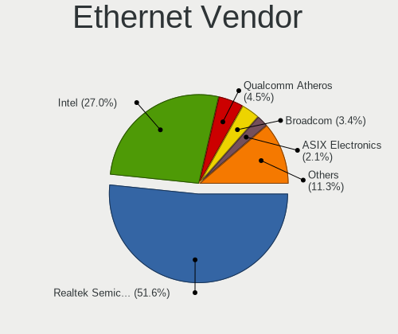

| Vendor                    | Notebooks | Percent |
|---------------------------|-----------|---------|
| Realtek Semiconductor     | 224       | 55.58%  |
| Intel                     | 108       | 26.8%   |
| Qualcomm Atheros          | 15        | 3.72%   |
| ASIX Electronics          | 15        | 3.72%   |
| Broadcom                  | 8         | 1.99%   |
| Nvidia                    | 5         | 1.24%   |
| Marvell Technology Group  | 5         | 1.24%   |
| Xiaomi                    | 4         | 0.99%   |
| Qualcomm                  | 3         | 0.74%   |
| Lenovo                    | 2         | 0.5%    |
| Google                    | 2         | 0.5%    |
| Broadcom Limited          | 2         | 0.5%    |
| TP-Link                   | 1         | 0.25%   |
| Spreadtrum Communications | 1         | 0.25%   |
| OPPO Electronics          | 1         | 0.25%   |
| MediaTek                  | 1         | 0.25%   |
| JMicron Technology        | 1         | 0.25%   |
| Huawei Technologies       | 1         | 0.25%   |
| Hewlett-Packard           | 1         | 0.25%   |
| DisplayLink               | 1         | 0.25%   |
| Attansic Technology       | 1         | 0.25%   |
| Apple                     | 1         | 0.25%   |

Ethernet Model
--------------

Ethernet models

| Model                                                             | Notebooks | Percent |
|-------------------------------------------------------------------|-----------|---------|
| Realtek RTL8111/8168/8411 PCI Express Gigabit Ethernet Controller | 164       | 39.9%   |
| Realtek RTL8153 Gigabit Ethernet Adapter                          | 30        | 7.3%    |
| Realtek RTL810xE PCI Express Fast Ethernet controller             | 27        | 6.57%   |
| Intel Ethernet Connection (4) I219-LM                             | 19        | 4.62%   |
| Intel 82579LM Gigabit Network Connection (Lewisville)             | 14        | 3.41%   |
| ASIX AX88179 Gigabit Ethernet                                     | 14        | 3.41%   |
| Intel Ethernet Connection I219-LM                                 | 8         | 1.95%   |
| Intel Ethernet Connection (13) I219-V                             | 8         | 1.95%   |
| Intel Ethernet Connection I218-LM                                 | 7         | 1.7%    |
| Intel Ethernet Connection (4) I219-V                              | 7         | 1.7%    |
| Realtek Killer E2600 Gigabit Ethernet Controller                  | 5         | 1.22%   |
| Intel Ethernet Connection I217-LM                                 | 5         | 1.22%   |
| Intel Ethernet Connection (16) I219-V                             | 5         | 1.22%   |
| Nvidia MCP79 Ethernet                                             | 4         | 0.97%   |
| Intel Ethernet Connection I219-V                                  | 4         | 0.97%   |
| Intel 82577LM Gigabit Network Connection                          | 4         | 0.97%   |
| Xiaomi Mi/Redmi series (RNDIS)                                    | 3         | 0.73%   |
| Realtek RTL8152 Fast Ethernet Adapter                             | 3         | 0.73%   |
| Intel Ethernet Connection I217-V                                  | 3         | 0.73%   |
| Intel Ethernet Connection (5) I219-LM                             | 3         | 0.73%   |
| Intel Ethernet Connection (13) I219-LM                            | 3         | 0.73%   |
| Intel 82567LM Gigabit Network Connection                          | 3         | 0.73%   |
| Realtek RTL8125 2.5GbE Controller                                 | 2         | 0.49%   |
| Qualcomm Redmi Note 8                                             | 2         | 0.49%   |
| Qualcomm Atheros QCA8171 Gigabit Ethernet                         | 2         | 0.49%   |
| Qualcomm Atheros AR8152 v2.0 Fast Ethernet                        | 2         | 0.49%   |
| Qualcomm Atheros AR8132 Fast Ethernet                             | 2         | 0.49%   |
| Qualcomm Atheros AR8131 Gigabit Ethernet                          | 2         | 0.49%   |
| Qualcomm Atheros AR8121/AR8113/AR8114 Gigabit or Fast Ethernet    | 2         | 0.49%   |
| Marvell Group 88E8055 PCI-E Gigabit Ethernet Controller           | 2         | 0.49%   |
| Intel Ethernet Connection I218-V                                  | 2         | 0.49%   |
| Intel Ethernet Connection (16) I219-LM                            | 2         | 0.49%   |
| Google Nexus/Pixel Device (tether)                                | 2         | 0.49%   |
| Xiaomi Mi/Redmi series (RNDIS + ADB)                              | 1         | 0.24%   |
| TP-Link UE300 10/100/1000 LAN (ethernet mode) [Realtek RTL8153]   | 1         | 0.24%   |
| Spreadtrum Spreadtrum Phone                                       | 1         | 0.24%   |
| Realtek RTL-8100/8101L/8139 PCI Fast Ethernet Adapter             | 1         | 0.24%   |
| Qualcomm SM6150-IDP _SN:488AC473                                  | 1         | 0.24%   |
| Qualcomm Atheros AR8162 Fast Ethernet                             | 1         | 0.24%   |
| Qualcomm Atheros AR8161 Gigabit Ethernet                          | 1         | 0.24%   |

Net Controller Kind
-------------------

Ethernet, WiFi or modem

| Kind     | Notebooks | Percent |
|----------|-----------|---------|
| WiFi     | 492       | 55.72%  |
| Ethernet | 380       | 43.04%  |
| Modem    | 10        | 1.13%   |
| Unknown  | 1         | 0.11%   |

Used Controller
---------------

Currently used network controller

| Kind     | Notebooks | Percent |
|----------|-----------|---------|
| WiFi     | 365       | 68.87%  |
| Ethernet | 165       | 31.13%  |

NICs
----

Total network controllers on board

| Total | Notebooks | Percent |
|-------|-----------|---------|
| 2     | 335       | 66.73%  |
| 1     | 157       | 31.27%  |
| 0     | 7         | 1.39%   |
| 3     | 3         | 0.6%    |

IPv6
----

IPv6 vs IPv4

| Used | Notebooks | Percent |
|------|-----------|---------|
| No   | 358       | 70.47%  |
| Yes  | 150       | 29.53%  |

Bluetooth
---------

Bluetooth Vendor
----------------

Controller vendors

| Vendor                          | Notebooks | Percent |
|---------------------------------|-----------|---------|
| Intel                           | 247       | 56.78%  |
| Realtek Semiconductor           | 47        | 10.8%   |
| Qualcomm Atheros Communications | 25        | 5.75%   |
| Foxconn / Hon Hai               | 20        | 4.6%    |
| IMC Networks                    | 18        | 4.14%   |
| Apple                           | 17        | 3.91%   |
| Lite-On Technology              | 16        | 3.68%   |
| Broadcom                        | 15        | 3.45%   |
| Realtek                         | 7         | 1.61%   |
| Dell                            | 5         | 1.15%   |
| Hewlett-Packard                 | 4         | 0.92%   |
| Toshiba                         | 2         | 0.46%   |
| Micro Star International        | 2         | 0.46%   |
| MediaTek                        | 2         | 0.46%   |
| Cambridge Silicon Radio         | 2         | 0.46%   |
| ASUSTek Computer                | 2         | 0.46%   |
| USI                             | 1         | 0.23%   |
| Ralink Technology               | 1         | 0.23%   |
| Fujitsu                         | 1         | 0.23%   |
| Foxconn International           | 1         | 0.23%   |

Bluetooth Model
---------------

Controller models

| Model                                               | Notebooks | Percent |
|-----------------------------------------------------|-----------|---------|
| Intel Bluetooth wireless interface                  | 81        | 18.62%  |
| Intel Bluetooth 9460/9560 Jefferson Peak (JfP)      | 57        | 13.1%   |
| Intel AX201 Bluetooth                               | 46        | 10.57%  |
| Realtek Bluetooth Radio                             | 43        | 9.89%   |
| Intel AX200 Bluetooth                               | 25        | 5.75%   |
| Intel Bluetooth Device                              | 23        | 5.29%   |
| Qualcomm Atheros  Bluetooth Device                  | 13        | 2.99%   |
| Foxconn / Hon Hai Bluetooth Device                  | 12        | 2.76%   |
| IMC Networks Wireless_Device                        | 8         | 1.84%   |
| Apple Bluetooth USB Host Controller                 | 8         | 1.84%   |
| Realtek 802.11ac WLAN Adapter                       | 7         | 1.61%   |
| Lite-On Wireless_Device                             | 6         | 1.38%   |
| IMC Networks Bluetooth Radio                        | 6         | 1.38%   |
| Foxconn / Hon Hai Wireless_Device                   | 6         | 1.38%   |
| Apple Bluetooth Host Controller                     | 6         | 1.38%   |
| Lite-On Bluetooth Device                            | 5         | 1.15%   |
| Intel Wireless-AC 9260 Bluetooth Adapter            | 5         | 1.15%   |
| Qualcomm Atheros AR3012 Bluetooth 4.0               | 4         | 0.92%   |
| Lite-On Qualcomm Atheros QCA9377 Bluetooth          | 4         | 0.92%   |
| Intel Centrino Bluetooth Wireless Transceiver       | 4         | 0.92%   |
| Dell BCM20702A0 Bluetooth Module                    | 4         | 0.92%   |
| Realtek  Bluetooth 4.2 Adapter                      | 3         | 0.69%   |
| Qualcomm Atheros QCA61x4 Bluetooth 4.0              | 3         | 0.69%   |
| Qualcomm Atheros AR3011 Bluetooth                   | 3         | 0.69%   |
| Intel Wireless-AC 3168 Bluetooth                    | 3         | 0.69%   |
| Broadcom BCM2045B (BDC-2.1)                         | 3         | 0.69%   |
| MediaTek Wireless_Device                            | 2         | 0.46%   |
| Intel AX210 Bluetooth                               | 2         | 0.46%   |
| Cambridge Silicon Radio Bluetooth Dongle (HCI mode) | 2         | 0.46%   |
| Broadcom HP Portable SoftSailing                    | 2         | 0.46%   |
| Broadcom HP Portable Bumble Bee                     | 2         | 0.46%   |
| Broadcom BCM20702 Bluetooth 4.0 [ThinkPad]          | 2         | 0.46%   |
| Apple Built-in Bluetooth 2.0+EDR HCI                | 2         | 0.46%   |
| USI Bluetooth Device                                | 1         | 0.23%   |
| Toshiba RT Bluetooth Radio                          | 1         | 0.23%   |
| Toshiba Integrated Bluetooth HCI                    | 1         | 0.23%   |
| Realtek RTL8822BE Bluetooth 4.2 Adapter             | 1         | 0.23%   |
| Ralink Motorola BC4 Bluetooth 3.0+HS Adapter        | 1         | 0.23%   |
| Qualcomm Atheros Bluetooth                          | 1         | 0.23%   |
| Qualcomm Atheros AR3012 Bluetooth                   | 1         | 0.23%   |

Sound
-----

Sound Vendor
------------

Sound card vendors

| Vendor                  | Notebooks | Percent |
|-------------------------|-----------|---------|
| Intel                   | 371       | 62.04%  |
| AMD                     | 126       | 21.07%  |
| Nvidia                  | 58        | 9.7%    |
| Lenovo                  | 5         | 0.84%   |
| C-Media Electronics     | 5         | 0.84%   |
| Realtek Semiconductor   | 4         | 0.67%   |
| Logitech                | 4         | 0.67%   |
| JMTek                   | 2         | 0.33%   |
| Hewlett-Packard         | 2         | 0.33%   |
| Creative Technology     | 2         | 0.33%   |
| CMX Systems             | 2         | 0.33%   |
| Zhaoxin                 | 1         | 0.17%   |
| Yamaha                  | 1         | 0.17%   |
| SteelSeries ApS         | 1         | 0.17%   |
| Samson Technologies     | 1         | 0.17%   |
| Plantronics             | 1         | 0.17%   |
| Kingston Technology     | 1         | 0.17%   |
| GN Netcom               | 1         | 0.17%   |
| Generalplus Technology  | 1         | 0.17%   |
| Fujitsu                 | 1         | 0.17%   |
| Focusrite-Novation      | 1         | 0.17%   |
| Cambridge Silicon Radio | 1         | 0.17%   |
| Beyerdynamic            | 1         | 0.17%   |
| bestechnic              | 1         | 0.17%   |
| Audient                 | 1         | 0.17%   |
| ASUSTek Computer        | 1         | 0.17%   |
| Apple                   | 1         | 0.17%   |
| AlfaPlus Semiconductor  | 1         | 0.17%   |

Sound Model
-----------

Sound card models

| Model                                                                      | Notebooks | Percent |
|----------------------------------------------------------------------------|-----------|---------|
| AMD Family 17h/19h HD Audio Controller                                     | 89        | 11.88%  |
| AMD Renoir Radeon High Definition Audio Controller                         | 59        | 7.88%   |
| Intel Sunrise Point-LP HD Audio                                            | 58        | 7.74%   |
| Intel Tiger Lake-LP Smart Sound Technology Audio Controller                | 43        | 5.74%   |
| Intel Cannon Lake PCH cAVS                                                 | 42        | 5.61%   |
| Intel Alder Lake PCH-P High Definition Audio Controller                    | 36        | 4.81%   |
| Intel 7 Series/C216 Chipset Family High Definition Audio Controller        | 28        | 3.74%   |
| AMD Raven/Raven2/Fenghuang HDMI/DP Audio Controller                        | 20        | 2.67%   |
| Intel Haswell-ULT HD Audio Controller                                      | 16        | 2.14%   |
| Intel 82801I (ICH9 Family) HD Audio Controller                             | 16        | 2.14%   |
| Intel 8 Series HD Audio Controller                                         | 16        | 2.14%   |
| Intel 5 Series/3400 Series Chipset High Definition Audio                   | 15        | 2%      |
| Intel Wildcat Point-LP High Definition Audio Controller                    | 13        | 1.74%   |
| Intel Comet Lake PCH-LP cAVS                                               | 13        | 1.74%   |
| Intel Broadwell-U Audio Controller                                         | 13        | 1.74%   |
| Intel 8 Series/C220 Series Chipset High Definition Audio Controller        | 13        | 1.74%   |
| Intel Xeon E3-1200 v3/4th Gen Core Processor HD Audio Controller           | 12        | 1.6%    |
| Intel Celeron/Pentium Silver Processor High Definition Audio               | 11        | 1.47%   |
| AMD SBx00 Azalia (Intel HDA)                                               | 10        | 1.34%   |
| Nvidia Audio device                                                        | 9         | 1.2%    |
| Intel 6 Series/C200 Series Chipset Family High Definition Audio Controller | 9         | 1.2%    |
| AMD Wrestler HDMI Audio                                                    | 9         | 1.2%    |
| Intel Cannon Point-LP High Definition Audio Controller                     | 8         | 1.07%   |
| Intel Tiger Lake-H HD Audio Controller                                     | 7         | 0.93%   |
| Intel CM238 HD Audio Controller                                            | 7         | 0.93%   |
| AMD Rembrandt Radeon High Definition Audio Controller                      | 7         | 0.93%   |
| Nvidia TU106 High Definition Audio Controller                              | 6         | 0.8%    |
| Intel 100 Series/C230 Series Chipset Family HD Audio Controller            | 6         | 0.8%    |
| AMD FCH Azalia Controller                                                  | 6         | 0.8%    |
| AMD Family 15h (Models 60h-6fh) Audio Controller                           | 6         | 0.8%    |
| Nvidia TU107 GeForce GTX 1650 High Definition Audio Controller             | 5         | 0.67%   |
| Nvidia GP107GL High Definition Audio Controller                            | 5         | 0.67%   |
| Nvidia GF108 High Definition Audio Controller                              | 5         | 0.67%   |
| Nvidia GA106 High Definition Audio Controller                              | 5         | 0.67%   |
| Intel 82801H (ICH8 Family) HD Audio Controller                             | 5         | 0.67%   |
| AMD High Definition Audio Controller                                       | 5         | 0.67%   |
| Realtek Semiconductor USB Audio                                            | 4         | 0.53%   |
| Nvidia MCP79 High Definition Audio                                         | 4         | 0.53%   |
| Intel Atom Processor Z36xxx/Z37xxx Series High Definition Audio Controller | 4         | 0.53%   |
| Nvidia GT216 HDMI Audio Controller                                         | 3         | 0.4%    |

Memory
------

Memory Vendor
-------------

Memory module vendors

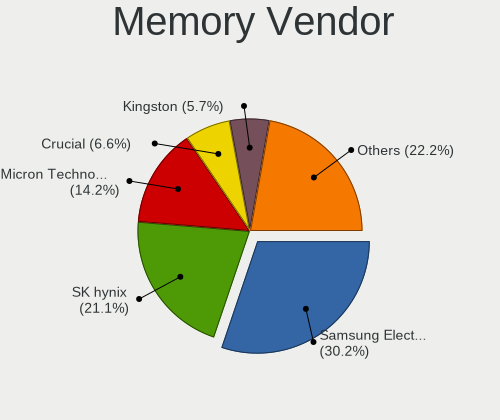

| Vendor                                  | Notebooks | Percent |
|-----------------------------------------|-----------|---------|
| Samsung Electronics                     | 128       | 27.06%  |
| SK hynix                                | 104       | 21.99%  |
| Micron Technology                       | 70        | 14.8%   |
| Crucial                                 | 45        | 9.51%   |
| Kingston                                | 30        | 6.34%   |
| Unknown                                 | 23        | 4.86%   |
| Elpida                                  | 14        | 2.96%   |
| A-DATA Technology                       | 11        | 2.33%   |
| Ramaxel Technology                      | 8         | 1.69%   |
| Corsair                                 | 7         | 1.48%   |
| Unknown (ABCD)                          | 5         | 1.06%   |
| Nanya Technology                        | 3         | 0.63%   |
| G.Skill                                 | 3         | 0.63%   |
| ff                                      | 3         | 0.63%   |
| ASint Technology                        | 3         | 0.63%   |
| 4ea5                                    | 3         | 0.63%   |
| Unknown                                 | 3         | 0.63%   |
| Smart                                   | 2         | 0.42%   |
| Unknown (06CE)                          | 1         | 0.21%   |
| Team                                    | 1         | 0.21%   |
| Silicon Power Computer & Communications | 1         | 0.21%   |
| PKI                                     | 1         | 0.21%   |
| Patriot                                 | 1         | 0.21%   |
| Neo Forza                               | 1         | 0.21%   |
| A Force                                 | 1         | 0.21%   |
| <Invalid>                               | 1         | 0.21%   |

Memory Model
------------

Memory module models

| Model                                                            | Notebooks | Percent |
|------------------------------------------------------------------|-----------|---------|
| Crucial RAM CT8G4SFRA266.C8FD1 8GB SODIMM DDR4 2667MT/s          | 29        | 5.78%   |
| Samsung RAM M471A1K43EB1-CWE 8GB SODIMM DDR4 3200MT/s            | 11        | 2.19%   |
| Samsung RAM M471A1G44AB0-CWE 8GB SODIMM DDR4 3200MT/s            | 9         | 1.79%   |
| Samsung RAM M471A1G44BB0-CWE 8GB SODIMM DDR4 3200MT/s            | 7         | 1.39%   |
| SK hynix RAM HMT451S6AFR8A-PB 4GB SODIMM DDR3 1600MT/s           | 6         | 1.2%    |
| SK hynix RAM HMA81GS6AFR8N-UH 8GB SODIMM DDR4 2667MT/s           | 6         | 1.2%    |
| Samsung RAM M471A1K43DB1-CWE 8192MB SODIMM DDR4 3200MT/s         | 6         | 1.2%    |
| Unknown (ABCD) RAM 123456789012345678 2GB SODIMM LPDDR4 2400MT/s | 5         | 1%      |
| SK hynix RAM HMA851S6CJR6N-VK 4GB SODIMM DDR4 2667MT/s           | 5         | 1%      |
| Samsung RAM M471B5173EB0-YK0 4GB SODIMM DDR3 1600MT/s            | 5         | 1%      |
| Samsung RAM M471A5244CB0-CWE 4GB SODIMM DDR4 3200MT/s            | 5         | 1%      |
| Samsung RAM M471A1G44AB0-CWE 8GB Row Of Chips DDR4 3200MT/s      | 5         | 1%      |
| Micron RAM 8ATF1G64HZ-3G2R1 8GB SODIMM DDR4 3200MT/s             | 5         | 1%      |
| SK hynix RAM HMT351S6CFR8C-PB 4GB SODIMM DDR3 1600MT/s           | 4         | 0.8%    |
| SK hynix RAM HMAA1GS6CJR6N-XN 8GB Row Of Chips DDR4 3200MT/s     | 4         | 0.8%    |
| Samsung RAM M471B5273CH0-CH9 4GB SODIMM DDR3 1334MT/s            | 4         | 0.8%    |
| Samsung RAM M471B5173DB0-YK0 4GB SODIMM DDR3 1600MT/s            | 4         | 0.8%    |
| Micron RAM 8KTF51264HZ-1G6E1 4GB SODIMM DDR3 1600MT/s            | 4         | 0.8%    |
| Micron RAM 4ATF1G64HZ-3G2E2 8GB SODIMM DDR4 3200MT/s             | 4         | 0.8%    |
| SK hynix RAM Module 8GB SODIMM DDR4 2133MT/s                     | 3         | 0.6%    |
| SK hynix RAM Module 4GB SODIMM DDR3 1600MT/s                     | 3         | 0.6%    |
| SK hynix RAM Module 16GB SODIMM DDR4 3200MT/s                    | 3         | 0.6%    |
| SK hynix RAM HMT41GS6BFR8A-PB 8GB SODIMM DDR3 1600MT/s           | 3         | 0.6%    |
| SK hynix RAM HMCG88MEBSA092N 32GB SODIMM DDR5 4800MT/s           | 3         | 0.6%    |
| SK hynix RAM HMAA1GS6CJR6N-XN 8GB SODIMM DDR4 3200MT/s           | 3         | 0.6%    |
| SK hynix RAM HMA851S6CJR6N-VK 4GB Row Of Chips DDR4 2667MT/s     | 3         | 0.6%    |
| SK hynix RAM HMA82GS6AFR8N-UH 16GB SODIMM DDR4 2667MT/s          | 3         | 0.6%    |
| SK hynix RAM HMA81GS6DJR8N-XN 8GB SODIMM DDR4 3200MT/s           | 3         | 0.6%    |
| Samsung RAM M471A5244CB0-CTD 4GB SODIMM DDR4 3266MT/s            | 3         | 0.6%    |
| Samsung RAM M471A1K43CB1-CRC 8GB SODIMM DDR4 2667MT/s            | 3         | 0.6%    |
| Samsung RAM M471A1K43BB1-CRC 8GB SODIMM DDR4 2667MT/s            | 3         | 0.6%    |
| Micron RAM MT62F1G32D4DR-031 WT 4GB SODIMM LPDDR5 6400MT/s       | 3         | 0.6%    |
| Micron RAM 4ATF51264HZ-3G2J1 4GB SODIMM DDR4 3200MT/s            | 3         | 0.6%    |
| Micron RAM 4ATF1G64HZ-3G2F1 8GB SODIMM DDR4 3200MT/s             | 3         | 0.6%    |
| Elpida RAM Module 4GB SODIMM DDR3 1600MT/s                       | 3         | 0.6%    |
| Elpida RAM EBJ41UF8BCS0-DJ-F 4GB SODIMM DDR3 1334MT/s            | 3         | 0.6%    |
| A-DATA RAM Module 16GB SODIMM DDR4 3200MT/s                      | 3         | 0.6%    |
| Unknown                                                          | 3         | 0.6%    |
| Unknown RAM Module 4GB SODIMM DDR3                               | 2         | 0.4%    |
| Unknown RAM Module 4GB Row Of Chips LPDDR4 4267MT/s              | 2         | 0.4%    |

Memory Kind
-----------

Memory module kinds

| Kind    | Notebooks | Percent |
|---------|-----------|---------|
| DDR4    | 217       | 54.66%  |
| DDR3    | 95        | 23.93%  |
| LPDDR4  | 25        | 6.3%    |
| LPDDR3  | 16        | 4.03%   |
| DDR5    | 14        | 3.53%   |
| LPDDR5  | 11        | 2.77%   |
| DDR2    | 8         | 2.02%   |
| SDRAM   | 4         | 1.01%   |
| Unknown | 4         | 1.01%   |
| DDR     | 3         | 0.76%   |

Memory Form Factor
------------------

Physical design of the memory module

| Name         | Notebooks | Percent |
|--------------|-----------|---------|
| SODIMM       | 342       | 83.82%  |
| Row Of Chips | 54        | 13.24%  |
| Unknown      | 7         | 1.72%   |
| Chip         | 5         | 1.23%   |

Memory Size
-----------

Memory module size

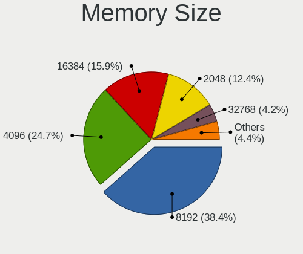

| Size  | Notebooks | Percent |
|-------|-----------|---------|
| 8192  | 192       | 43.94%  |
| 4096  | 114       | 26.09%  |
| 16384 | 58        | 13.27%  |
| 2048  | 39        | 8.92%   |
| 1024  | 17        | 3.89%   |
| 32768 | 16        | 3.66%   |
| 256   | 1         | 0.23%   |

Memory Speed
------------

Memory module speed

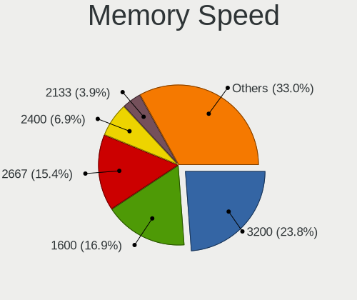

| Speed   | Notebooks | Percent |
|---------|-----------|---------|
| 3200    | 104       | 24.7%   |
| 2667    | 87        | 20.67%  |
| 1600    | 63        | 14.96%  |
| 2400    | 34        | 8.08%   |
| 2133    | 22        | 5.23%   |
| 1334    | 16        | 3.8%    |
| 4267    | 13        | 3.09%   |
| 4800    | 12        | 2.85%   |
| 6400    | 11        | 2.61%   |
| 1067    | 10        | 2.38%   |
| 1333    | 8         | 1.9%    |
| Unknown | 8         | 1.9%    |
| 800     | 7         | 1.66%   |
| 1867    | 5         | 1.19%   |
| 1066    | 4         | 0.95%   |
| 3266    | 3         | 0.71%   |
| 667     | 3         | 0.71%   |
| 8400    | 2         | 0.48%   |
| 5600    | 2         | 0.48%   |
| 4266    | 2         | 0.48%   |
| 4199    | 2         | 0.48%   |
| 2666    | 1         | 0.24%   |
| 2048    | 1         | 0.24%   |
| 975     | 1         | 0.24%   |

Printers & scanners
-------------------

Printer Vendor
--------------

Printer device vendors

| Vendor             | Notebooks | Percent |
|--------------------|-----------|---------|
| Brother Industries | 1         | 100%    |

Printer Model
-------------

Printer device models

| Model            | Notebooks | Percent |
|------------------|-----------|---------|
| Brother DCP-7010 | 1         | 100%    |

Scanner Vendor
--------------

Scanner device vendors

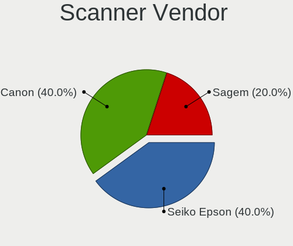

| Vendor      | Notebooks | Percent |
|-------------|-----------|---------|
| Seiko Epson | 1         | 50%     |
| Canon       | 1         | 50%     |

Scanner Model
-------------

Scanner device models

| Model                                       | Notebooks | Percent |
|---------------------------------------------|-----------|---------|
| Seiko Epson GT-X800 [Perfection 4990 PHOTO] | 1         | 50%     |
| Canon CanoScan LiDE 110                     | 1         | 50%     |

Camera
------

Camera Vendor
-------------

Camera device vendors

| Vendor                                 | Notebooks | Percent |
|----------------------------------------|-----------|---------|
| Chicony Electronics                    | 110       | 24.07%  |
| IMC Networks                           | 54        | 11.82%  |
| Bison Electronics                      | 49        | 10.72%  |
| Microdia                               | 39        | 8.53%   |
| Quanta                                 | 32        | 7%      |
| Realtek Semiconductor                  | 25        | 5.47%   |
| Sunplus Innovation Technology          | 18        | 3.94%   |
| Acer                                   | 17        | 3.72%   |
| Luxvisions Innotech Limited            | 15        | 3.28%   |
| Cheng Uei Precision Industry (Foxlink) | 13        | 2.84%   |
| Apple                                  | 12        | 2.63%   |
| Lite-On Technology                     | 11        | 2.41%   |
| Syntek                                 | 9         | 1.97%   |
| Suyin                                  | 8         | 1.75%   |
| Silicon Motion                         | 5         | 1.09%   |
| Lenovo                                 | 5         | 1.09%   |
| Sonix Technology                       | 4         | 0.88%   |
| Logitech                               | 4         | 0.88%   |
| SunplusIT                              | 3         | 0.66%   |
| Ricoh                                  | 3         | 0.66%   |
| Microsoft                              | 3         | 0.66%   |
| icSpring                               | 3         | 0.66%   |
| Jieli Technology                       | 2         | 0.44%   |
| ALi                                    | 2         | 0.44%   |
| Alcor Micro                            | 2         | 0.44%   |
| Z-Star Microelectronics                | 1         | 0.22%   |
| Sony Electronics                       | 1         | 0.22%   |
| Primax Electronics                     | 1         | 0.22%   |
| OmniVision Technologies                | 1         | 0.22%   |
| Importek                               | 1         | 0.22%   |
| Image Processor                        | 1         | 0.22%   |
| HRY                                    | 1         | 0.22%   |
| Generalplus Technology                 | 1         | 0.22%   |
| BKX-FAY-220407                         | 1         | 0.22%   |

Camera Model
------------

Camera device models

| Model                                               | Notebooks | Percent |
|-----------------------------------------------------|-----------|---------|
| Chicony Integrated Camera                           | 32        | 6.91%   |
| Bison BisonCam, NB Pro                              | 29        | 6.26%   |
| Microdia Integrated_Webcam_HD                       | 24        | 5.18%   |
| IMC Networks Integrated Camera                      | 16        | 3.46%   |
| IMC Networks USB2.0 HD UVC WebCam                   | 15        | 3.24%   |
| Realtek Integrated_Webcam_HD                        | 11        | 2.38%   |
| Sunplus Integrated_Webcam_HD                        | 10        | 2.16%   |
| Chicony HP HD Camera                                | 10        | 2.16%   |
| Chicony HD Webcam                                   | 9         | 1.94%   |
| Syntek Integrated Camera                            | 8         | 1.73%   |
| IMC Networks USB2.0 VGA UVC WebCam                  | 8         | 1.73%   |
| Quanta HD User Facing                               | 7         | 1.51%   |
| Chicony HD User Facing                              | 7         | 1.51%   |
| Acer Integrated Camera                              | 7         | 1.51%   |
| Lite-On Integrated Camera                           | 6         | 1.3%    |
| Bison Integrated Camera                             | 6         | 1.3%    |
| Quanta HP TrueVision HD Camera                      | 5         | 1.08%   |
| IMC Networks ov9734_azurewave_camera                | 5         | 1.08%   |
| Sonix USB2.0 HD UVC WebCam                          | 4         | 0.86%   |
| Quanta ov9734_techfront_camera                      | 4         | 0.86%   |
| Luxvisions Innotech Limited HP TrueVision HD Camera | 4         | 0.86%   |
| Chicony USB2.0 Camera                               | 4         | 0.86%   |
| Chicony USB 2.0 Camera                              | 4         | 0.86%   |
| Chicony Integrated Camera (1280x720@30)             | 4         | 0.86%   |
| Apple Built-in iSight                               | 4         | 0.86%   |
| Realtek USB Camera                                  | 3         | 0.65%   |
| Realtek Integrated Webcam                           | 3         | 0.65%   |
| Quanta HP HD Camera                                 | 3         | 0.65%   |
| Microdia Integrated Webcam                          | 3         | 0.65%   |
| Luxvisions Innotech Limited Integrated Camera       | 3         | 0.65%   |
| Luxvisions Innotech Limited HP HD Camera            | 3         | 0.65%   |
| Lite-On HP HD Camera                                | 3         | 0.65%   |
| Lenovo Integrated Webcam [R5U877]                   | 3         | 0.65%   |
| IMC Networks HD Camera                              | 3         | 0.65%   |
| icSpring camera                                     | 3         | 0.65%   |
| Chicony Integrated HP HD Webcam                     | 3         | 0.65%   |
| Chicony HP Wide Vision HD Camera                    | 3         | 0.65%   |
| Chicony HP Webcam                                   | 3         | 0.65%   |
| Chicony FJ Camera                                   | 3         | 0.65%   |
| Cheng Uei Precision Industry (Foxlink) HP HD Webcam | 3         | 0.65%   |

Security
--------

Fingerprint Vendor
------------------

Fingerprint sensor vendors

| Vendor                             | Notebooks | Percent |
|------------------------------------|-----------|---------|
| Synaptics                          | 35        | 33.65%  |
| Validity Sensors                   | 33        | 31.73%  |
| Shenzhen Goodix Technology         | 17        | 16.35%  |
| Elan Microelectronics              | 5         | 4.81%   |
| Upek                               | 4         | 3.85%   |
| STMicroelectronics                 | 3         | 2.88%   |
| Realtek USB2.0 Finger Print Bridge | 2         | 1.92%   |
| LighTuning Technology              | 2         | 1.92%   |
| AuthenTec                          | 2         | 1.92%   |
| Focal-systems.Corp                 | 1         | 0.96%   |

Fingerprint Model
-----------------

Fingerprint sensor models

| Model                                                                      | Notebooks | Percent |
|----------------------------------------------------------------------------|-----------|---------|
| Shenzhen Goodix  Fingerprint Device                                        | 15        | 14.42%  |
| Synaptics Prometheus MIS Touch Fingerprint Reader                          | 14        | 13.46%  |
| Validity Sensors VFS495 Fingerprint Reader                                 | 11        | 10.58%  |
| Synaptics Metallica MIS Touch Fingerprint Reader                           | 7         | 6.73%   |
| Validity Sensors VFS 5011 fingerprint sensor                               | 6         | 5.77%   |
| Validity Sensors Synaptics WBDI                                            | 5         | 4.81%   |
| Synaptics WBDI Fingerprint Reader USB 086                                  | 4         | 3.85%   |
| Synaptics UWP WBDI Device                                                  | 4         | 3.85%   |
| Synaptics FS7604 Touch Fingerprint Sensor with PurePrint                   | 4         | 3.85%   |
| Validity Sensors VFS5011 Fingerprint Reader                                | 3         | 2.88%   |
| Validity Sensors Synaptics VFS7552 Touch Fingerprint Sensor with PurePrint | 3         | 2.88%   |
| Upek Biometric Touchchip/Touchstrip Fingerprint Sensor                     | 3         | 2.88%   |
| STMicroelectronics Fingerprint Reader                                      | 3         | 2.88%   |
| Elan ELAN:ARM-M4                                                           | 3         | 2.88%   |
| Validity Sensors VFS7500 Touch Fingerprint Sensor                          | 2         | 1.92%   |
| Validity Sensors Fingerprint scanner                                       | 2         | 1.92%   |
| Realtek USB2.0 Finger Print Bridge FocalTech Fingerprint Device            | 2         | 1.92%   |
| LighTuning EgisTec Touch Fingerprint Sensor                                | 2         | 1.92%   |
| Elan ELAN:Fingerprint                                                      | 2         | 1.92%   |
| Unknown                                                                    | 2         | 1.92%   |
| Validity Sensors VFS451 Fingerprint Reader                                 | 1         | 0.96%   |
| Upek TCS5B Fingerprint sensor                                              | 1         | 0.96%   |
| Shenzhen Goodix Fingerprint Reader                                         | 1         | 0.96%   |
| Shenzhen Goodix FingerPrint                                                | 1         | 0.96%   |
| Focal-systems.Corp FT9201Fingerprint.                                      | 1         | 0.96%   |
| AuthenTec Fingerprint Sensor                                               | 1         | 0.96%   |
| AuthenTec AES1600                                                          | 1         | 0.96%   |

Chipcard Vendor
---------------

Chipcard module vendors

| Vendor      | Notebooks | Percent |
|-------------|-----------|---------|
| Alcor Micro | 17        | 44.74%  |
| Broadcom    | 14        | 36.84%  |
| Lenovo      | 3         | 7.89%   |
| Upek        | 2         | 5.26%   |
| Yubico.com  | 1         | 2.63%   |
| O2 Micro    | 1         | 2.63%   |

Chipcard Model
--------------

Chipcard module models

| Model                                                                        | Notebooks | Percent |
|------------------------------------------------------------------------------|-----------|---------|
| Alcor Micro AU9540 Smartcard Reader                                          | 16        | 42.11%  |
| Broadcom BCM5880 Secure Applications Processor with fingerprint swipe sensor | 4         | 10.53%  |
| Broadcom 5880                                                                | 4         | 10.53%  |
| Broadcom 58200                                                               | 4         | 10.53%  |
| Lenovo Integrated Smart Card Reader                                          | 3         | 7.89%   |
| Upek TouchChip Fingerprint Coprocessor (WBF advanced mode)                   | 2         | 5.26%   |
| Broadcom BCM5880 Secure Applications Processor                               | 2         | 5.26%   |
| Yubico.com Yubikey 4/5 U2F+CCID                                              | 1         | 2.63%   |
| O2 Micro OZ776 CCID Smartcard Reader                                         | 1         | 2.63%   |
| Alcor Micro Watchdata W 1981                                                 | 1         | 2.63%   |

Unsupported
-----------

Unsupported Devices
-------------------

Total unsupported devices on board

| Total | Notebooks | Percent |
|-------|-----------|---------|
| 0     | 250       | 49.31%  |
| 1     | 208       | 41.03%  |
| 2     | 42        | 8.28%   |
| 3     | 5         | 0.99%   |
| 5     | 1         | 0.2%    |
| 4     | 1         | 0.2%    |

Unsupported Device Types
------------------------

Types of unsupported devices

| Type                     | Notebooks | Percent |
|--------------------------|-----------|---------|
| Fingerprint reader       | 102       | 34.81%  |
| Graphics card            | 84        | 28.67%  |
| Chipcard                 | 32        | 10.92%  |
| Multimedia controller    | 22        | 7.51%   |
| Camera                   | 22        | 7.51%   |
| Net/wireless             | 19        | 6.48%   |
| Bluetooth                | 4         | 1.37%   |
| Sound                    | 2         | 0.68%   |
| Network                  | 2         | 0.68%   |
| Wireless                 | 1         | 0.34%   |
| Storage                  | 1         | 0.34%   |
| Net/ethernet             | 1         | 0.34%   |
| Communication controller | 1         | 0.34%   |

