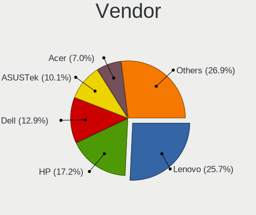
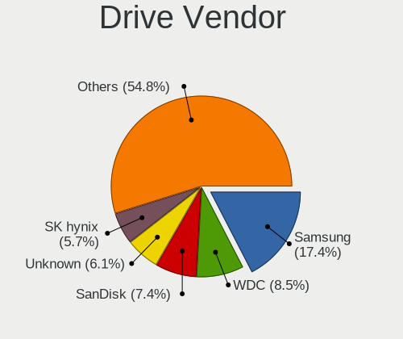
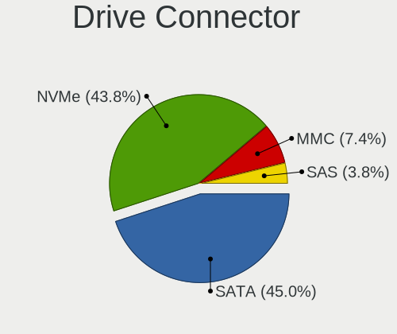
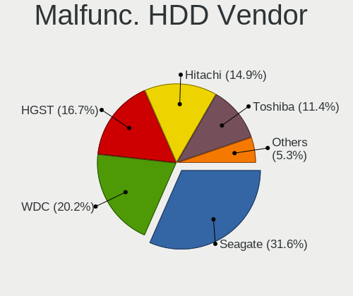
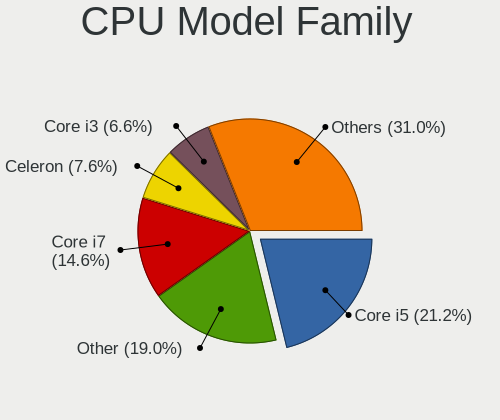
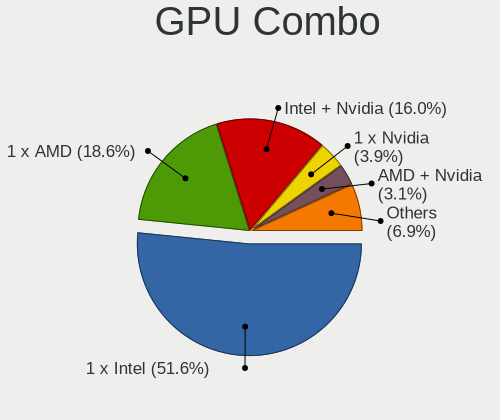
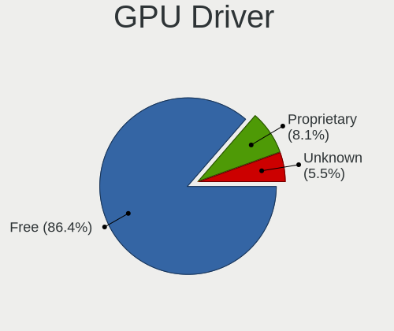
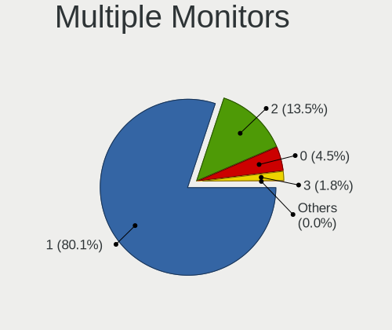
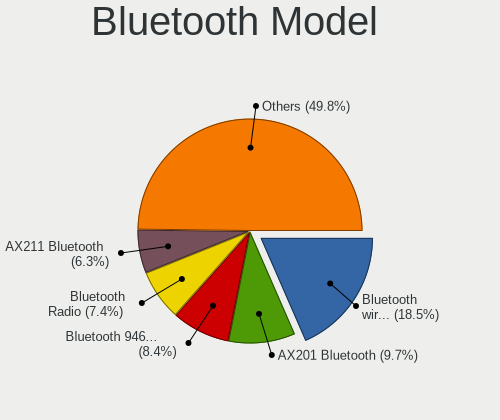

Debian 12 - Tested Hardware & Statistics (Notebooks)
----------------------------------------------------

A project to collect tested hardware configurations for Debian 12.

Anyone can contribute to this report by the [hw-probe](https://github.com/linuxhw/hw-probe) tool:

    sudo -E hw-probe -all -upload

Please contribute! Especially if your hardware is rare.

Contents
--------

* [ Test Cases ](#test-cases)

* [ System ](#system)
  - [ Kernel                   ](#kernel)
  - [ Kernel Family            ](#kernel-family)
  - [ Kernel Major Ver.        ](#kernel-major-ver)
  - [ Arch                     ](#arch)
  - [ DE                       ](#de)
  - [ Display Server           ](#display-server)
  - [ Display Manager          ](#display-manager)
  - [ OS Lang                  ](#os-lang)
  - [ Boot Mode                ](#boot-mode)
  - [ Filesystem               ](#filesystem)
  - [ Part. scheme             ](#part-scheme)
  - [ Dual Boot with Linux/BSD ](#dual-boot-with-linuxbsd)
  - [ Dual Boot (Win)          ](#dual-boot-win)

* [ Board ](#board)
  - [ Vendor                   ](#vendor)
  - [ Model                    ](#model)
  - [ Model Family             ](#model-family)
  - [ MFG Year                 ](#mfg-year)
  - [ Form Factor              ](#form-factor)
  - [ Secure Boot              ](#secure-boot)
  - [ Coreboot                 ](#coreboot)
  - [ RAM Size                 ](#ram-size)
  - [ RAM Used                 ](#ram-used)
  - [ Total Drives             ](#total-drives)
  - [ Has CD-ROM               ](#has-cd-rom)
  - [ Has Ethernet             ](#has-ethernet)
  - [ Has WiFi                 ](#has-wifi)
  - [ Has Bluetooth            ](#has-bluetooth)

* [ Location ](#location)
  - [ Country                  ](#country)
  - [ City                     ](#city)

* [ Drives ](#drives)
  - [ Drive Vendor             ](#drive-vendor)
  - [ Drive Model              ](#drive-model)
  - [ HDD Vendor               ](#hdd-vendor)
  - [ SSD Vendor               ](#ssd-vendor)
  - [ Drive Kind               ](#drive-kind)
  - [ Drive Connector          ](#drive-connector)
  - [ Drive Size               ](#drive-size)
  - [ Space Total              ](#space-total)
  - [ Space Used               ](#space-used)
  - [ Malfunc. Drives          ](#malfunc-drives)
  - [ Malfunc. Drive Vendor    ](#malfunc-drive-vendor)
  - [ Malfunc. HDD Vendor      ](#malfunc-hdd-vendor)
  - [ Malfunc. Drive Kind      ](#malfunc-drive-kind)
  - [ Failed Drives            ](#failed-drives)
  - [ Failed Drive Vendor      ](#failed-drive-vendor)
  - [ Drive Status             ](#drive-status)

* [ Storage controller ](#storage-controller)
  - [ Storage Vendor           ](#storage-vendor)
  - [ Storage Model            ](#storage-model)
  - [ Storage Kind             ](#storage-kind)

* [ Processor ](#processor)
  - [ CPU Vendor               ](#cpu-vendor)
  - [ CPU Model                ](#cpu-model)
  - [ CPU Model Family         ](#cpu-model-family)
  - [ CPU Cores                ](#cpu-cores)
  - [ CPU Sockets              ](#cpu-sockets)
  - [ CPU Threads              ](#cpu-threads)
  - [ CPU Op-Modes             ](#cpu-op-modes)
  - [ CPU Microcode            ](#cpu-microcode)
  - [ CPU Microarch            ](#cpu-microarch)

* [ Graphics ](#graphics)
  - [ GPU Vendor               ](#gpu-vendor)
  - [ GPU Model                ](#gpu-model)
  - [ GPU Combo                ](#gpu-combo)
  - [ GPU Driver               ](#gpu-driver)
  - [ GPU Memory               ](#gpu-memory)

* [ Monitor ](#monitor)
  - [ Monitor Vendor           ](#monitor-vendor)
  - [ Monitor Model            ](#monitor-model)
  - [ Monitor Resolution       ](#monitor-resolution)
  - [ Monitor Diagonal         ](#monitor-diagonal)
  - [ Monitor Width            ](#monitor-width)
  - [ Aspect Ratio             ](#aspect-ratio)
  - [ Monitor Area             ](#monitor-area)
  - [ Pixel Density            ](#pixel-density)
  - [ Multiple Monitors        ](#multiple-monitors)

* [ Network ](#network)
  - [ Net Controller Vendor    ](#net-controller-vendor)
  - [ Net Controller Model     ](#net-controller-model)
  - [ Wireless Vendor          ](#wireless-vendor)
  - [ Wireless Model           ](#wireless-model)
  - [ Ethernet Vendor          ](#ethernet-vendor)
  - [ Ethernet Model           ](#ethernet-model)
  - [ Net Controller Kind      ](#net-controller-kind)
  - [ Used Controller          ](#used-controller)
  - [ NICs                     ](#nics)
  - [ IPv6                     ](#ipv6)

* [ Bluetooth ](#bluetooth)
  - [ Bluetooth Vendor         ](#bluetooth-vendor)
  - [ Bluetooth Model          ](#bluetooth-model)

* [ Sound ](#sound)
  - [ Sound Vendor             ](#sound-vendor)
  - [ Sound Model              ](#sound-model)

* [ Memory ](#memory)
  - [ Memory Vendor            ](#memory-vendor)
  - [ Memory Model             ](#memory-model)
  - [ Memory Kind              ](#memory-kind)
  - [ Memory Form Factor       ](#memory-form-factor)
  - [ Memory Size              ](#memory-size)
  - [ Memory Speed             ](#memory-speed)

* [ Printers & scanners ](#printers--scanners)
  - [ Printer Vendor           ](#printer-vendor)
  - [ Printer Model            ](#printer-model)
  - [ Scanner Vendor           ](#scanner-vendor)
  - [ Scanner Model            ](#scanner-model)

* [ Camera ](#camera)
  - [ Camera Vendor            ](#camera-vendor)
  - [ Camera Model             ](#camera-model)

* [ Security ](#security)
  - [ Fingerprint Vendor       ](#fingerprint-vendor)
  - [ Fingerprint Model        ](#fingerprint-model)
  - [ Chipcard Vendor          ](#chipcard-vendor)
  - [ Chipcard Model           ](#chipcard-model)

* [ Unsupported ](#unsupported)
  - [ Unsupported Devices      ](#unsupported-devices)
  - [ Unsupported Device Types ](#unsupported-device-types)

Test Cases
----------

Total: 106

| Vendor        | Model                       | Probe                                                      | Date         |
|---------------|-----------------------------|------------------------------------------------------------|--------------|
| Lenovo        | Slim 9 14IAP7 82T1          | [fe1b421c9d](https://linux-hardware.org/?probe=fe1b421c9d) | May 01, 2023 |
| HP            | 255 G8 Notebook PC          | [7262375294](https://linux-hardware.org/?probe=7262375294) | Apr 30, 2023 |
| Lenovo        | ThinkPad T14 Gen 2i 20W1... | [0a9a85f5f0](https://linux-hardware.org/?probe=0a9a85f5f0) | Apr 29, 2023 |
| Lenovo        | ThinkPad T14 Gen 2i 20W1... | [83b10185e8](https://linux-hardware.org/?probe=83b10185e8) | Apr 29, 2023 |
| Aquarius      | NS585                       | [b23696ca41](https://linux-hardware.org/?probe=b23696ca41) | Apr 28, 2023 |
| ASUSTek       | ASUS TUF Gaming A15 FA50... | [2474e8e580](https://linux-hardware.org/?probe=2474e8e580) | Apr 27, 2023 |
| ASUSTek       | Zenbook UX535QE_UM535QE     | [2093399e21](https://linux-hardware.org/?probe=2093399e21) | Apr 27, 2023 |
| ASUSTek       | VivoBook_ASUSLaptop M640... | [0234325d36](https://linux-hardware.org/?probe=0234325d36) | Apr 26, 2023 |
| Aquarius      | NS585                       | [a0983c89d8](https://linux-hardware.org/?probe=a0983c89d8) | Apr 25, 2023 |
| Aquarius      | NS585                       | [5d9edb6ed4](https://linux-hardware.org/?probe=5d9edb6ed4) | Apr 25, 2023 |
| Aquarius      | NS585                       | [972d7f6e4a](https://linux-hardware.org/?probe=972d7f6e4a) | Apr 25, 2023 |
| Aquarius      | NS585                       | [c89bbd8bc0](https://linux-hardware.org/?probe=c89bbd8bc0) | Apr 25, 2023 |
| Aquarius      | NS585                       | [a6e5a5f3d1](https://linux-hardware.org/?probe=a6e5a5f3d1) | Apr 25, 2023 |
| Aquarius      | NS585                       | [b6dac5b058](https://linux-hardware.org/?probe=b6dac5b058) | Apr 25, 2023 |
| Aquarius      | NS585                       | [1563889dac](https://linux-hardware.org/?probe=1563889dac) | Apr 25, 2023 |
| Aquarius      | NS585                       | [9bdbad2ab7](https://linux-hardware.org/?probe=9bdbad2ab7) | Apr 25, 2023 |
| Aquarius      | NS585                       | [e30d7dde7b](https://linux-hardware.org/?probe=e30d7dde7b) | Apr 25, 2023 |
| Aquarius      | NS585                       | [68527a900f](https://linux-hardware.org/?probe=68527a900f) | Apr 25, 2023 |
| Aquarius      | NS585                       | [ce99b27fb4](https://linux-hardware.org/?probe=ce99b27fb4) | Apr 25, 2023 |
| Aquarius      | NS585                       | [fc377acae2](https://linux-hardware.org/?probe=fc377acae2) | Apr 25, 2023 |
| Aquarius      | NS585                       | [ed32f24d6e](https://linux-hardware.org/?probe=ed32f24d6e) | Apr 25, 2023 |
| Aquarius      | NS585                       | [ea60267a5b](https://linux-hardware.org/?probe=ea60267a5b) | Apr 25, 2023 |
| Aquarius      | NS585                       | [f71897bf76](https://linux-hardware.org/?probe=f71897bf76) | Apr 25, 2023 |
| Aquarius      | NS585                       | [7aa4561ca5](https://linux-hardware.org/?probe=7aa4561ca5) | Apr 25, 2023 |
| Aquarius      | NS585                       | [385ce8cd93](https://linux-hardware.org/?probe=385ce8cd93) | Apr 25, 2023 |
| Aquarius      | NS585                       | [3fc8926a1a](https://linux-hardware.org/?probe=3fc8926a1a) | Apr 25, 2023 |
| Lenovo        | V15 G2 ALC 82KD             | [9e6ce2eb71](https://linux-hardware.org/?probe=9e6ce2eb71) | Apr 25, 2023 |
| Aquarius      | NS585                       | [58306d0266](https://linux-hardware.org/?probe=58306d0266) | Apr 25, 2023 |
| HP            | ProBook 4520s               | [b680525b61](https://linux-hardware.org/?probe=b680525b61) | Apr 24, 2023 |
| HP            | ProBook 4520s               | [e4ce7aed55](https://linux-hardware.org/?probe=e4ce7aed55) | Apr 24, 2023 |
| Hampoo        | Cherry Trail CR V200        | [f3d90b0d4a](https://linux-hardware.org/?probe=f3d90b0d4a) | Apr 23, 2023 |
| Acer          | Aspire E1-571G              | [0e2671ee2e](https://linux-hardware.org/?probe=0e2671ee2e) | Apr 23, 2023 |
| Dell          | G15 5520                    | [238c8f53aa](https://linux-hardware.org/?probe=238c8f53aa) | Apr 22, 2023 |
| Dell          | Latitude E6330              | [b532a9756c](https://linux-hardware.org/?probe=b532a9756c) | Apr 22, 2023 |
| Acer          | Nitro AN515-45              | [91f538e2ab](https://linux-hardware.org/?probe=91f538e2ab) | Apr 21, 2023 |
| Lenovo        | IdeaPad S510p 20298         | [8a1e6b7f32](https://linux-hardware.org/?probe=8a1e6b7f32) | Apr 21, 2023 |
| HP            | ZBook Power 15.6 inch G9... | [036616c992](https://linux-hardware.org/?probe=036616c992) | Apr 21, 2023 |
| HP            | ZBook Power 15.6 inch G8... | [cb40e046d8](https://linux-hardware.org/?probe=cb40e046d8) | Apr 21, 2023 |
| Toshiba       | Satellite X200              | [15035835d0](https://linux-hardware.org/?probe=15035835d0) | Apr 20, 2023 |
| HP            | Notebook                    | [7174065ed3](https://linux-hardware.org/?probe=7174065ed3) | Apr 20, 2023 |
| Aquarius      | NS585                       | [753222f54f](https://linux-hardware.org/?probe=753222f54f) | Apr 20, 2023 |
| Aquarius      | NS585                       | [be0bc2be01](https://linux-hardware.org/?probe=be0bc2be01) | Apr 20, 2023 |
| HP            | EliteBook 830 G5            | [6090be709d](https://linux-hardware.org/?probe=6090be709d) | Apr 20, 2023 |
| Aquarius      | NS585                       | [f7f0464c39](https://linux-hardware.org/?probe=f7f0464c39) | Apr 20, 2023 |
| Aquarius      | NS585                       | [8393642230](https://linux-hardware.org/?probe=8393642230) | Apr 20, 2023 |
| Aquarius      | NS585                       | [a5b9a09e63](https://linux-hardware.org/?probe=a5b9a09e63) | Apr 20, 2023 |
| Medion        | P17605                      | [b68359f3d1](https://linux-hardware.org/?probe=b68359f3d1) | Apr 20, 2023 |
| ASUSTek       | VivoBook_ASUSLaptop M350... | [d669bcc680](https://linux-hardware.org/?probe=d669bcc680) | Apr 19, 2023 |
| Tactus        | GeoBook 140                 | [704da241f5](https://linux-hardware.org/?probe=704da241f5) | Apr 18, 2023 |
| Dell          | Vostro 5402                 | [e492c87b46](https://linux-hardware.org/?probe=e492c87b46) | Apr 18, 2023 |
| Dell          | Vostro 5402                 | [b15f47258b](https://linux-hardware.org/?probe=b15f47258b) | Apr 18, 2023 |
| PC Special... | NV4XMB,ME,MZ                | [65c0a28c58](https://linux-hardware.org/?probe=65c0a28c58) | Apr 18, 2023 |
| Lenovo        | IdeaPad S510p 20298         | [7f0be1868e](https://linux-hardware.org/?probe=7f0be1868e) | Apr 18, 2023 |
| MSI           | Prestige 15 A12UC           | [0f4c1e1ac3](https://linux-hardware.org/?probe=0f4c1e1ac3) | Apr 18, 2023 |
| ASUSTek       | G551JW                      | [65f6143e36](https://linux-hardware.org/?probe=65f6143e36) | Apr 18, 2023 |
| Lenovo        | ThinkPad L540 20AUA39QJP    | [180ef53338](https://linux-hardware.org/?probe=180ef53338) | Apr 18, 2023 |
| Lenovo        | ThinkPad L540 20AUA39QJP    | [fd3b20c292](https://linux-hardware.org/?probe=fd3b20c292) | Apr 18, 2023 |
| LG Electro... | 17Z90Q-K.AA78A1             | [594a7fa16b](https://linux-hardware.org/?probe=594a7fa16b) | Apr 18, 2023 |
| IBM           | ThinkPad R51 1836Q4U        | [ebec8b53eb](https://linux-hardware.org/?probe=ebec8b53eb) | Apr 18, 2023 |
| Acer          | Swift SF314-41              | [8c42a0aba8](https://linux-hardware.org/?probe=8c42a0aba8) | Apr 16, 2023 |
| Dell          | XPS 13 9305                 | [838519057f](https://linux-hardware.org/?probe=838519057f) | Apr 16, 2023 |
| HP            | 255 G8 Notebook PC          | [58ec498e8f](https://linux-hardware.org/?probe=58ec498e8f) | Apr 14, 2023 |
| Toshiba       | Satellite L850              | [15de4db91b](https://linux-hardware.org/?probe=15de4db91b) | Apr 14, 2023 |
| Dell          | G15 5510                    | [6b4ef54307](https://linux-hardware.org/?probe=6b4ef54307) | Apr 13, 2023 |
| HP            | Pavilion Laptop 15-eh1xx... | [60f7db51fa](https://linux-hardware.org/?probe=60f7db51fa) | Apr 13, 2023 |
| HP            | Pavilion Laptop 15-eh1xx... | [e9708d65e9](https://linux-hardware.org/?probe=e9708d65e9) | Apr 13, 2023 |
| Dell          | Latitude 5490               | [38ebdedf58](https://linux-hardware.org/?probe=38ebdedf58) | Apr 12, 2023 |
| Acer          | Aspire E1-571G              | [45a3503764](https://linux-hardware.org/?probe=45a3503764) | Apr 11, 2023 |
| Aquarius      | NS585                       | [6f4b987640](https://linux-hardware.org/?probe=6f4b987640) | Apr 11, 2023 |
| Dell          | Latitude 3320               | [b7c2bb88b3](https://linux-hardware.org/?probe=b7c2bb88b3) | Apr 10, 2023 |
| Dell          | Latitude 3320               | [436e7b8903](https://linux-hardware.org/?probe=436e7b8903) | Apr 10, 2023 |
| Lenovo        | Yoga 500-15IBD 80N6         | [885fff9ddb](https://linux-hardware.org/?probe=885fff9ddb) | Apr 10, 2023 |
| Lenovo        | ThinkPad X220 4291LR6       | [ea86227d59](https://linux-hardware.org/?probe=ea86227d59) | Apr 09, 2023 |
| Lenovo        | ThinkPad P15v Gen 3 21D8... | [8d4288ca33](https://linux-hardware.org/?probe=8d4288ca33) | Apr 09, 2023 |
| eMachines     | eME728                      | [aff08e7f2d](https://linux-hardware.org/?probe=aff08e7f2d) | Apr 05, 2023 |
| eMachines     | eMachiens G443              | [58c297218a](https://linux-hardware.org/?probe=58c297218a) | Apr 05, 2023 |
| System76      | Lemur Pro                   | [2232424d5a](https://linux-hardware.org/?probe=2232424d5a) | Apr 05, 2023 |
| HONOR         | NMH-WCX9                    | [9ea45909a2](https://linux-hardware.org/?probe=9ea45909a2) | Apr 05, 2023 |
| Framework     | Laptop                      | [5bb187865d](https://linux-hardware.org/?probe=5bb187865d) | Apr 04, 2023 |
| Packard Be... | EasyNote TJ65               | [cd6a05149d](https://linux-hardware.org/?probe=cd6a05149d) | Apr 02, 2023 |
| Schenker      | XMG CORE (REN/M20)          | [50e9dee7b1](https://linux-hardware.org/?probe=50e9dee7b1) | Apr 01, 2023 |
| HP            | EliteBook 840 G5            | [3c509a7075](https://linux-hardware.org/?probe=3c509a7075) | Apr 01, 2023 |
| Tactus        | GeoBook 140                 | [0ceb5a3b7c](https://linux-hardware.org/?probe=0ceb5a3b7c) | Apr 01, 2023 |
| Lenovo        | ThinkPad T14s Gen 2i 20W... | [a9e7ad7ecd](https://linux-hardware.org/?probe=a9e7ad7ecd) | Mar 29, 2023 |
| MSI           | Prestige 14Evo A11M         | [fc06b01f31](https://linux-hardware.org/?probe=fc06b01f31) | Mar 29, 2023 |
| MSI           | Prestige 14Evo A11M         | [5ac693dbd4](https://linux-hardware.org/?probe=5ac693dbd4) | Mar 29, 2023 |
| Acer          | Nitro AN515-43              | [47c758c261](https://linux-hardware.org/?probe=47c758c261) | Mar 29, 2023 |
| Google        | Swanky                      | [0f32e48b38](https://linux-hardware.org/?probe=0f32e48b38) | Mar 28, 2023 |
| Lenovo        | ThinkPad L13 Gen 3 21B9C... | [0744b26f5c](https://linux-hardware.org/?probe=0744b26f5c) | Mar 27, 2023 |
| GPD           | P3 MAX                      | [b3627909f1](https://linux-hardware.org/?probe=b3627909f1) | Mar 27, 2023 |
| Dell          | Latitude E5430 non-vPro     | [17794caffa](https://linux-hardware.org/?probe=17794caffa) | Mar 27, 2023 |
| Dell          | Precision 5570              | [454590a1a8](https://linux-hardware.org/?probe=454590a1a8) | Mar 26, 2023 |
| Dell          | Latitude E6330              | [32833b4683](https://linux-hardware.org/?probe=32833b4683) | Mar 25, 2023 |
| Lenovo        | ThinkPad 13 2nd Gen 20J1... | [9b9a21b7da](https://linux-hardware.org/?probe=9b9a21b7da) | Mar 24, 2023 |
| Lenovo        | ThinkPad 13 2nd Gen 20J1... | [58f8d5849a](https://linux-hardware.org/?probe=58f8d5849a) | Mar 24, 2023 |
| Toshiba       | Satellite C50-B             | [4b563f19dd](https://linux-hardware.org/?probe=4b563f19dd) | Mar 24, 2023 |
| Sony          | SVE1512M6ESI                | [db00c70eb7](https://linux-hardware.org/?probe=db00c70eb7) | Mar 24, 2023 |
| Toshiba       | Satellite C50-B             | [b9bf22cc53](https://linux-hardware.org/?probe=b9bf22cc53) | Mar 20, 2023 |
| HP            | ProBook 430 G8 Notebook ... | [ca6ab3c197](https://linux-hardware.org/?probe=ca6ab3c197) | Mar 16, 2023 |
| ASUSTek       | VivoBook_ASUSLaptop M340... | [55a73e2e07](https://linux-hardware.org/?probe=55a73e2e07) | Mar 12, 2023 |
| Acer          | Nitro AN515-43              | [32d1af5dee](https://linux-hardware.org/?probe=32d1af5dee) | Mar 07, 2023 |
| ASUSTek       | VivoBook_ASUSLaptop X150... | [ac92e5ce13](https://linux-hardware.org/?probe=ac92e5ce13) | Mar 07, 2023 |
| HP            | EliteBook 830 G7 Noteboo... | [cee8496315](https://linux-hardware.org/?probe=cee8496315) | Mar 06, 2023 |
| ASUSTek       | X550JX                      | [a9a82b2395](https://linux-hardware.org/?probe=a9a82b2395) | Mar 06, 2023 |
| HUAWEI        | BOHB-WAX9                   | [eb5b9b8cb9](https://linux-hardware.org/?probe=eb5b9b8cb9) | Mar 06, 2023 |
| Dell          | Vostro 3700                 | [ea14c47abb](https://linux-hardware.org/?probe=ea14c47abb) | Mar 04, 2023 |

System
------

Kernel
------

Version of the Linux kernel

| Version                | Notebooks | Percent |
|------------------------|-----------|---------|
| 6.1.0-7-amd64          | 34        | 37.36%  |
| 6.1.0-4-amd64          | 29        | 31.87%  |
| 6.1.0-6-amd64          | 18        | 19.78%  |
| 6.1.0-5-amd64          | 3         | 3.3%    |
| 6.2.8                  | 1         | 1.1%    |
| 6.2.11                 | 1         | 1.1%    |
| 6.1.0-8-amd64          | 1         | 1.1%    |
| 6.1.0-7-rt-amd64       | 1         | 1.1%    |
| 6.1.0-7-686            | 1         | 1.1%    |
| 6.0.0-0.deb11.6-amd64  | 1         | 1.1%    |
| 5.19.0-0.deb11.2-amd64 | 1         | 1.1%    |

Kernel Family
-------------

Linux kernel without a distro release

| Version | Notebooks | Percent |
|---------|-----------|---------|
| 6.1.0   | 87        | 95.6%   |
| 6.2.8   | 1         | 1.1%    |
| 6.2.11  | 1         | 1.1%    |
| 6.0.0   | 1         | 1.1%    |
| 5.19.0  | 1         | 1.1%    |

Kernel Major Ver.
-----------------

Linux kernel major version

| Version | Notebooks | Percent |
|---------|-----------|---------|
| 6.1     | 87        | 95.6%   |
| 6.2     | 2         | 2.2%    |
| 6.0     | 1         | 1.1%    |
| 5.19    | 1         | 1.1%    |

Arch
----

OS architecture (x86_64, i586, etc.)

| Name   | Notebooks | Percent |
|--------|-----------|---------|
| x86_64 | 90        | 98.9%   |
| i686   | 1         | 1.1%    |

DE
--

Desktop Environment

| Name            | Notebooks | Percent |
|-----------------|-----------|---------|
| Unknown         | 35        | 38.46%  |
| GNOME           | 27        | 29.67%  |
| KDE5            | 11        | 12.09%  |
| XFCE            | 6         | 6.59%   |
| MATE            | 4         | 4.4%    |
| X-Cinnamon      | 2         | 2.2%    |
| i3              | 2         | 2.2%    |
| GNOME Flashback | 2         | 2.2%    |
| Enlightenment   | 1         | 1.1%    |
| awesome         | 1         | 1.1%    |

Display Server
--------------

X11 or Wayland

| Name    | Notebooks | Percent |
|---------|-----------|---------|
| Unknown | 32        | 35.16%  |
| X11     | 28        | 30.77%  |
| Wayland | 26        | 28.57%  |
| Tty     | 5         | 5.49%   |

Display Manager
---------------

SDDM, LightDM, etc.

| Name    | Notebooks | Percent |
|---------|-----------|---------|
| Unknown | 43        | 47.25%  |
| GDM3    | 26        | 28.57%  |
| LightDM | 12        | 13.19%  |
| SDDM    | 10        | 10.99%  |

OS Lang
-------

Language

| Lang    | Notebooks | Percent |
|---------|-----------|---------|
| ru_RU   | 31        | 34.07%  |
| en_US   | 24        | 26.37%  |
| de_DE   | 10        | 10.99%  |
| fr_FR   | 7         | 7.69%   |
| es_ES   | 3         | 3.3%    |
| en_GB   | 3         | 3.3%    |
| pt_BR   | 2         | 2.2%    |
| it_IT   | 2         | 2.2%    |
| zh_CN   | 1         | 1.1%    |
| pl_PL   | 1         | 1.1%    |
| oc_FR   | 1         | 1.1%    |
| nl_BE   | 1         | 1.1%    |
| fi_FI   | 1         | 1.1%    |
| es_AR   | 1         | 1.1%    |
| en_NZ   | 1         | 1.1%    |
| en_AU   | 1         | 1.1%    |
| Unknown | 1         | 1.1%    |

Boot Mode
---------

EFI or BIOS

| Mode | Notebooks | Percent |
|------|-----------|---------|
| EFI  | 71        | 78.02%  |
| BIOS | 20        | 21.98%  |

Filesystem
----------

Type of filesystem

| Type    | Notebooks | Percent |
|---------|-----------|---------|
| Ext4    | 56        | 61.54%  |
| Overlay | 31        | 34.07%  |
| Btrfs   | 3         | 3.3%    |
| Xfs     | 1         | 1.1%    |

Part. scheme
------------

Scheme of partitioning

| Type    | Notebooks | Percent |
|---------|-----------|---------|
| GPT     | 72        | 79.12%  |
| MBR     | 11        | 12.09%  |
| Unknown | 8         | 8.79%   |

Dual Boot with Linux/BSD
------------------------

Hosting more than one Linux/BSD

| Dual boot | Notebooks | Percent |
|-----------|-----------|---------|
| No        | 86        | 94.51%  |
| Yes       | 5         | 5.49%   |

Dual Boot (Win)
---------------

Hosting Linux and Windows

| Dual boot | Notebooks | Percent |
|-----------|-----------|---------|
| No        | 47        | 51.65%  |
| Yes       | 44        | 48.35%  |

Board
-----

Vendor
------

Motherboard manufacturer

| Name             | Notebooks | Percent |
|------------------|-----------|---------|
| Aquarius         | 25        | 27.47%  |
| Lenovo           | 11        | 12.09%  |
| Dell             | 11        | 12.09%  |
| Hewlett-Packard  | 10        | 10.99%  |
| ASUSTek Computer | 8         | 8.79%   |
| Acer             | 5         | 5.49%   |
| Toshiba          | 2         | 2.2%    |
| MSI              | 2         | 2.2%    |
| eMachines        | 2         | 2.2%    |
| Tactus           | 1         | 1.1%    |
| System76         | 1         | 1.1%    |
| Sony             | 1         | 1.1%    |
| Schenker         | 1         | 1.1%    |
| PC Specialist    | 1         | 1.1%    |
| Packard Bell     | 1         | 1.1%    |
| Medion           | 1         | 1.1%    |
| LG Electronics   | 1         | 1.1%    |
| IBM              | 1         | 1.1%    |
| HUAWEI           | 1         | 1.1%    |
| HONOR            | 1         | 1.1%    |
| Hampoo           | 1         | 1.1%    |
| GPD              | 1         | 1.1%    |
| Google           | 1         | 1.1%    |
| Framework        | 1         | 1.1%    |

Model
-----

Motherboard model

| Name                                              | Notebooks | Percent |
|---------------------------------------------------|-----------|---------|
| Aquarius NS585                                    | 25        | 27.47%  |
| HP 255 G8 Notebook PC                             | 2         | 2.2%    |
| Dell Latitude 3320                                | 2         | 2.2%    |
| Acer Nitro AN515-43                               | 2         | 2.2%    |
| Toshiba Satellite X200                            | 1         | 1.1%    |
| Toshiba Satellite C50-B                           | 1         | 1.1%    |
| Tactus GeoBook 140                                | 1         | 1.1%    |
| System76 Lemur Pro                                | 1         | 1.1%    |
| Sony SVE1512M6ESI                                 | 1         | 1.1%    |
| Schenker XMG CORE (REN/M20)                       | 1         | 1.1%    |
| PC Specialist NV4XMB,ME,MZ                        | 1         | 1.1%    |
| Packard Bell EasyNote TJ65                        | 1         | 1.1%    |
| MSI Prestige 15 A12UC                             | 1         | 1.1%    |
| MSI Prestige 14Evo A11M                           | 1         | 1.1%    |
| Medion P17605                                     | 1         | 1.1%    |
| LG 17Z90Q-K.AA78A1                                | 1         | 1.1%    |
| Lenovo Yoga 500-15IBD 80N6                        | 1         | 1.1%    |
| Lenovo V15 G2 ALC 82KD                            | 1         | 1.1%    |
| Lenovo ThinkPad X220 4291LR6                      | 1         | 1.1%    |
| Lenovo ThinkPad T14s Gen 2i 20WM00A8SP            | 1         | 1.1%    |
| Lenovo ThinkPad T14 Gen 2i 20W1S6CB00             | 1         | 1.1%    |
| Lenovo ThinkPad P15v Gen 3 21D8A00ACD             | 1         | 1.1%    |
| Lenovo ThinkPad L540 20AUA39QJP                   | 1         | 1.1%    |
| Lenovo ThinkPad L13 Gen 3 21B9CTO1WW              | 1         | 1.1%    |
| Lenovo ThinkPad 13 2nd Gen 20J10046US             | 1         | 1.1%    |
| Lenovo Slim 9 14IAP7 82T1                         | 1         | 1.1%    |
| Lenovo IdeaPad S510p 20298                        | 1         | 1.1%    |
| IBM ThinkPad R51 1836Q4U                          | 1         | 1.1%    |
| HUAWEI BOHB-WAX9                                  | 1         | 1.1%    |
| HONOR NMH-WCX9                                    | 1         | 1.1%    |
| HP ZBook Power 15.6 inch G9 Mobile Workstation PC | 1         | 1.1%    |
| HP ZBook Power 15.6 inch G8 Mobile Workstation PC | 1         | 1.1%    |
| HP ProBook 4520s                                  | 1         | 1.1%    |
| HP ProBook 430 G8 Notebook PC                     | 1         | 1.1%    |
| HP Notebook                                       | 1         | 1.1%    |
| HP EliteBook 840 G5                               | 1         | 1.1%    |
| HP EliteBook 830 G7 Notebook PC                   | 1         | 1.1%    |
| HP EliteBook 830 G5                               | 1         | 1.1%    |
| Hampoo SurfTab duo W1 10.1 (VT4)                  | 1         | 1.1%    |
| GPD P3 MAX                                        | 1         | 1.1%    |

Model Family
------------

Motherboard model prefix

| Name                  | Notebooks | Percent |
|-----------------------|-----------|---------|
| Aquarius NS585        | 25        | 27.47%  |
| Lenovo ThinkPad       | 7         | 7.69%   |
| Dell Latitude         | 5         | 5.49%   |
| ASUS VivoBook         | 4         | 4.4%    |
| HP EliteBook          | 3         | 3.3%    |
| Acer Nitro            | 3         | 3.3%    |
| Toshiba Satellite     | 2         | 2.2%    |
| MSI Prestige          | 2         | 2.2%    |
| HP ZBook              | 2         | 2.2%    |
| HP ProBook            | 2         | 2.2%    |
| HP 255                | 2         | 2.2%    |
| Dell Vostro           | 2         | 2.2%    |
| Dell G15              | 2         | 2.2%    |
| Tactus GeoBook        | 1         | 1.1%    |
| System76 Lemur        | 1         | 1.1%    |
| Sony SVE1512M6ESI     | 1         | 1.1%    |
| Schenker XMG          | 1         | 1.1%    |
| PC Specialist NV4XMB  | 1         | 1.1%    |
| Packard Bell EasyNote | 1         | 1.1%    |
| Medion P17605         | 1         | 1.1%    |
| LG 17Z90Q-K.AA78A1    | 1         | 1.1%    |
| Lenovo Yoga           | 1         | 1.1%    |
| Lenovo V15            | 1         | 1.1%    |
| Lenovo Slim           | 1         | 1.1%    |
| Lenovo IdeaPad        | 1         | 1.1%    |
| IBM ThinkPad          | 1         | 1.1%    |
| HUAWEI BOHB-WAX9      | 1         | 1.1%    |
| HONOR NMH-WCX9        | 1         | 1.1%    |
| HP Notebook           | 1         | 1.1%    |
| Hampoo SurfTab        | 1         | 1.1%    |
| GPD P3                | 1         | 1.1%    |
| Google Swanky         | 1         | 1.1%    |
| Framework Laptop      | 1         | 1.1%    |
| eMachines eME728      | 1         | 1.1%    |
| eMachines eMachiens   | 1         | 1.1%    |
| Dell XPS              | 1         | 1.1%    |
| Dell Precision        | 1         | 1.1%    |
| ASUS Zenbook          | 1         | 1.1%    |
| ASUS X550JX           | 1         | 1.1%    |
| ASUS G551JW           | 1         | 1.1%    |

MFG Year
--------

Motherboard manufacture year

| Year | Notebooks | Percent |
|------|-----------|---------|
| 2019 | 28        | 30.77%  |
| 2022 | 15        | 16.48%  |
| 2021 | 15        | 16.48%  |
| 2020 | 9         | 9.89%   |
| 2015 | 5         | 5.49%   |
| 2012 | 4         | 4.4%    |
| 2018 | 3         | 3.3%    |
| 2010 | 3         | 3.3%    |
| 2014 | 2         | 2.2%    |
| 2011 | 2         | 2.2%    |
| 2017 | 1         | 1.1%    |
| 2013 | 1         | 1.1%    |
| 2009 | 1         | 1.1%    |
| 2008 | 1         | 1.1%    |
| 2005 | 1         | 1.1%    |

Form Factor
-----------

Physical design of the computer

| Name     | Notebooks | Percent |
|----------|-----------|---------|
| Notebook | 91        | 100%    |

Secure Boot
-----------

Enabled or disabled

| State    | Notebooks | Percent |
|----------|-----------|---------|
| Disabled | 81        | 89.01%  |
| Enabled  | 10        | 10.99%  |

Coreboot
--------

Have coreboot on board

| Used | Notebooks | Percent |
|------|-----------|---------|
| No   | 89        | 97.8%   |
| Yes  | 2         | 2.2%    |

RAM Size
--------

Total RAM memory

| Size in GB  | Notebooks | Percent |
|-------------|-----------|---------|
| 4.01-8.0    | 40        | 43.96%  |
| 16.01-24.0  | 15        | 16.48%  |
| 8.01-16.0   | 15        | 16.48%  |
| 3.01-4.0    | 9         | 9.89%   |
| 32.01-64.0  | 8         | 8.79%   |
| 1.01-2.0    | 3         | 3.3%    |
| 64.01-256.0 | 1         | 1.1%    |

RAM Used
--------

Used RAM memory

| Used GB   | Notebooks | Percent |
|-----------|-----------|---------|
| 0.51-1.0  | 31        | 33.7%   |
| 4.01-8.0  | 20        | 21.74%  |
| 2.01-3.0  | 19        | 20.65%  |
| 3.01-4.0  | 9         | 9.78%   |
| 1.01-2.0  | 6         | 6.52%   |
| 8.01-16.0 | 5         | 5.43%   |
| 0.01-0.5  | 2         | 2.17%   |

Total Drives
------------

Number of drives on board

| Drives | Notebooks | Percent |
|--------|-----------|---------|
| 1      | 76        | 83.52%  |
| 2      | 12        | 13.19%  |
| 3      | 3         | 3.3%    |

Has CD-ROM
----------

Has CD-ROM on board

| Presented | Notebooks | Percent |
|-----------|-----------|---------|
| No        | 75        | 82.42%  |
| Yes       | 16        | 17.58%  |

Has Ethernet
------------

Has Ethernet on board

| Presented | Notebooks | Percent |
|-----------|-----------|---------|
| Yes       | 70        | 76.92%  |
| No        | 21        | 23.08%  |

Has WiFi
--------

Has WiFi module

| Presented | Notebooks | Percent |
|-----------|-----------|---------|
| Yes       | 90        | 98.9%   |
| No        | 1         | 1.1%    |

Has Bluetooth
-------------

Has Bluetooth module

| Presented | Notebooks | Percent |
|-----------|-----------|---------|
| Yes       | 81        | 89.01%  |
| No        | 10        | 10.99%  |

Location
--------

Country
-------

Geographic location (country)

| Country     | Notebooks | Percent |
|-------------|-----------|---------|
| Russia      | 32        | 35.16%  |
| Germany     | 13        | 14.29%  |
| France      | 9         | 9.89%   |
| USA         | 5         | 5.49%   |
| Spain       | 4         | 4.4%    |
| Italy       | 4         | 4.4%    |
| Brazil      | 4         | 4.4%    |
| Poland      | 3         | 3.3%    |
| Madagascar  | 2         | 2.2%    |
| Ukraine     | 1         | 1.1%    |
| UK          | 1         | 1.1%    |
| Turkey      | 1         | 1.1%    |
| Sweden      | 1         | 1.1%    |
| Sudan       | 1         | 1.1%    |
| New Zealand | 1         | 1.1%    |
| Georgia     | 1         | 1.1%    |
| Finland     | 1         | 1.1%    |
| Czechia     | 1         | 1.1%    |
| Cyprus      | 1         | 1.1%    |
| China       | 1         | 1.1%    |
| Belgium     | 1         | 1.1%    |
| Austria     | 1         | 1.1%    |
| Australia   | 1         | 1.1%    |
| Argentina   | 1         | 1.1%    |

City
----

Geographic location (city)

| City                     | Notebooks | Percent |
|--------------------------|-----------|---------|
| Voronezh                 | 29        | 31.87%  |
| Paris                    | 3         | 3.3%    |
| San Francisco            | 2         | 2.2%    |
| Munich                   | 2         | 2.2%    |
| Moscow                   | 2         | 2.2%    |
| Frankfurt am Main        | 2         | 2.2%    |
| Berlin                   | 2         | 2.2%    |
| Antananarivo             | 2         | 2.2%    |
| Zgorzelec                | 1         | 1.1%    |
| Whitianga                | 1         | 1.1%    |
| Wetzlar                  | 1         | 1.1%    |
| Vorselaar                | 1         | 1.1%    |
| Thermopolis              | 1         | 1.1%    |
| Tempio Pausania          | 1         | 1.1%    |
| Tbilisi                  | 1         | 1.1%    |
| Sydney                   | 1         | 1.1%    |
| Stockholm                | 1         | 1.1%    |
| Seville                  | 1         | 1.1%    |
| Santo Antonio de Padua   | 1         | 1.1%    |
| Sant'Antonio Abate       | 1         | 1.1%    |
| Saint-Mars-sur-la-Futaie | 1         | 1.1%    |
| Rome                     | 1         | 1.1%    |
| Płock                   | 1         | 1.1%    |
| Providence               | 1         | 1.1%    |
| Porto Alegre             | 1         | 1.1%    |
| Ostrava                  | 1         | 1.1%    |
| Nuremberg                | 1         | 1.1%    |
| Nicosia                  | 1         | 1.1%    |
| Mostoles                 | 1         | 1.1%    |
| Mendoza                  | 1         | 1.1%    |
| Ludwigshafen am Rhein    | 1         | 1.1%    |
| Lübeck                  | 1         | 1.1%    |
| London                   | 1         | 1.1%    |
| Labastidette             | 1         | 1.1%    |
| Kirishi                  | 1         | 1.1%    |
| Khartoum                 | 1         | 1.1%    |
| Kematen an der Krems     | 1         | 1.1%    |
| Kassel                   | 1         | 1.1%    |
| Istanbul                 | 1         | 1.1%    |
| Helsinki                 | 1         | 1.1%    |

Drives
------

Drive Vendor
------------

Hard drive vendors

| Vendor                   | Notebooks | Drives | Percent |
|--------------------------|-----------|--------|---------|
| A-DATA Technology        | 27        | 27     | 25%     |
| Samsung Electronics      | 17        | 19     | 15.74%  |
| WDC                      | 13        | 13     | 12.04%  |
| SK hynix                 | 5         | 5      | 4.63%   |
| Micron Technology        | 5         | 5      | 4.63%   |
| Kingston                 | 5         | 6      | 4.63%   |
| Intel                    | 4         | 4      | 3.7%    |
| Crucial                  | 4         | 4      | 3.7%    |
| Unknown                  | 3         | 4      | 2.78%   |
| Toshiba                  | 3         | 3      | 2.78%   |
| Sandisk                  | 3         | 3      | 2.78%   |
| Silicon Motion           | 2         | 2      | 1.85%   |
| Seagate                  | 2         | 2      | 1.85%   |
| Phison                   | 2         | 2      | 1.85%   |
| KIOXIA                   | 2         | 2      | 1.85%   |
| Intenso                  | 2         | 2      | 1.85%   |
| TO Exter                 | 1         | 1      | 0.93%   |
| SSSTC                    | 1         | 1      | 0.93%   |
| SABRENT                  | 1         | 1      | 0.93%   |
| OCZ                      | 1         | 1      | 0.93%   |
| Lexar                    | 1         | 1      | 0.93%   |
| JMicron Technology       | 1         | 1      | 0.93%   |
| Hitachi                  | 1         | 1      | 0.93%   |
| Biwin Storage Technology | 1         | 1      | 0.93%   |
| Apple                    | 1         | 1      | 0.93%   |

Drive Model
-----------

Hard drive models

| Model                                 | Notebooks | Percent |
|---------------------------------------|-----------|---------|
| A-DATA SU800 512GB SSD                | 25        | 22.94%  |
| SK hynix BC711 NVMe 256GB             | 2         | 1.83%   |
| Micron MTFDKCD1T0TFK 1TB              | 2         | 1.83%   |
| Intel SSDPEKNU512GZ 512GB             | 2         | 1.83%   |
| Crucial CT500MX500SSD1 500GB          | 2         | 1.83%   |
| Crucial CT250MX500SSD1 250GB          | 2         | 1.83%   |
| WDC WDS250G2B0A-00SM50 250GB SSD      | 1         | 0.92%   |
| WDC WDS240G2G0B-00EPW0 240GB SSD      | 1         | 0.92%   |
| WDC WD5000LPCX-08VHA 500GB            | 1         | 0.92%   |
| WDC WD3200BEKT-75KA9T0 320GB          | 1         | 0.92%   |
| WDC WD2500BEVE-00WZT0 250GB           | 1         | 0.92%   |
| WDC WD10SPZX-21Z10T0 1TB              | 1         | 0.92%   |
| WDC PC SN730 SDBPNTY-1T00-1102 1TB    | 1         | 0.92%   |
| WDC PC SN730 SDBPNTY-1T00 1TB         | 1         | 0.92%   |
| WDC PC SN530 SDBPNPZ-256G-1036 256GB  | 1         | 0.92%   |
| WDC PC SN530 SDBPNPZ-1T00-1114 1TB    | 1         | 0.92%   |
| WDC PC SN530 NVMe 256GB               | 1         | 0.92%   |
| WDC PC SN520 SDAPNUW-512G-1114 512GB  | 1         | 0.92%   |
| WDC PC SN520 SDAPNUW-512G-1014 512GB  | 1         | 0.92%   |
| Unknown SD/MMC/MS PRO 249GB           | 1         | 0.92%   |
| Unknown MMC Card  32GB                | 1         | 0.92%   |
| Unknown 016GE2  16GB                  | 1         | 0.92%   |
| Toshiba TR200 240GB SSD               | 1         | 0.92%   |
| Toshiba MK3259GSXP 320GB              | 1         | 0.92%   |
| Toshiba KXG50ZNV256G NVMe 256GB       | 1         | 0.92%   |
| TO Exter nal USB 3.0 320GB            | 1         | 0.92%   |
| SSSTC CA5-8D256-Q79 256GB             | 1         | 0.92%   |
| SK hynix HFM512GDJTNG-8310A 512GB     | 1         | 0.92%   |
| SK hynix BC901 NVMe 512GB             | 1         | 0.92%   |
| SK hynix BC711 HFM512GD3JX013N 512GB  | 1         | 0.92%   |
| Silicon Motion PCIe-8 SSD 256GB       | 1         | 0.92%   |
| Silicon Motion NE-1TB                 | 1         | 0.92%   |
| Seagate ST1500LM012-1R817G 1TB        | 1         | 0.92%   |
| Seagate Backup+ BK 1TB                | 1         | 0.92%   |
| Sandisk WD Blue SN550 NVMe SSD 1024GB | 1         | 0.92%   |
| SanDisk SD8SN8U128G1001 128GB SSD     | 1         | 0.92%   |
| SanDisk SD8SN8U-256G-1006 256GB SSD   | 1         | 0.92%   |
| Samsung SSD 980 PRO 1TB               | 1         | 0.92%   |
| Samsung SSD 980 1TB                   | 1         | 0.92%   |
| Samsung SSD 970 EVO Plus 1TB          | 1         | 0.92%   |

HDD Vendor
----------

Hard disk drive vendors

| Vendor  | Notebooks | Drives | Percent |
|---------|-----------|--------|---------|
| WDC     | 4         | 4      | 44.44%  |
| Unknown | 1         | 1      | 11.11%  |
| Toshiba | 1         | 1      | 11.11%  |
| Seagate | 1         | 1      | 11.11%  |
| Hitachi | 1         | 1      | 11.11%  |
| Apple   | 1         | 1      | 11.11%  |

SSD Vendor
----------

Solid state drive vendors

| Vendor              | Notebooks | Drives | Percent |
|---------------------|-----------|--------|---------|
| A-DATA Technology   | 26        | 26     | 53.06%  |
| Samsung Electronics | 4         | 5      | 8.16%   |
| Kingston            | 4         | 4      | 8.16%   |
| Crucial             | 4         | 4      | 8.16%   |
| WDC                 | 2         | 2      | 4.08%   |
| SanDisk             | 2         | 2      | 4.08%   |
| Intenso             | 2         | 2      | 4.08%   |
| Toshiba             | 1         | 1      | 2.04%   |
| TO Exter            | 1         | 1      | 2.04%   |
| OCZ                 | 1         | 1      | 2.04%   |
| Lexar               | 1         | 1      | 2.04%   |
| Intel               | 1         | 1      | 2.04%   |

Drive Kind
----------

HDD or SSD

| Kind    | Notebooks | Drives | Percent |
|---------|-----------|--------|---------|
| SSD     | 48        | 50     | 46.15%  |
| NVMe    | 43        | 48     | 41.35%  |
| HDD     | 9         | 9      | 8.65%   |
| MMC     | 2         | 3      | 1.92%   |
| Unknown | 2         | 2      | 1.92%   |

Drive Connector
---------------

SATA, SAS, NVMe, etc.

| Type | Notebooks | Drives | Percent |
|------|-----------|--------|---------|
| SATA | 52        | 56     | 51.49%  |
| NVMe | 42        | 47     | 41.58%  |
| SAS  | 5         | 6      | 4.95%   |
| MMC  | 2         | 3      | 1.98%   |

Drive Size
----------

Size of hard drive

| Size in TB | Notebooks | Drives | Percent |
|------------|-----------|--------|---------|
| 0.51-1.0   | 31        | 31     | 54.39%  |
| 0.01-0.5   | 26        | 28     | 45.61%  |

Space Total
-----------

Amount of disk space available on the file system

| Size in GB | Notebooks | Percent |
|------------|-----------|---------|
| Unknown    | 30        | 32.97%  |
| 251-500    | 19        | 20.88%  |
| 101-250    | 15        | 16.48%  |
| 501-1000   | 12        | 13.19%  |
| 1001-2000  | 8         | 8.79%   |
| 51-100     | 3         | 3.3%    |
| 1-20       | 2         | 2.2%    |
| 21-50      | 1         | 1.1%    |
| 2001-3000  | 1         | 1.1%    |

Space Used
----------

Amount of used disk space

| Used GB   | Notebooks | Percent |
|-----------|-----------|---------|
| Unknown   | 30        | 32.61%  |
| 101-250   | 19        | 20.65%  |
| 1-20      | 13        | 14.13%  |
| 51-100    | 10        | 10.87%  |
| 21-50     | 7         | 7.61%   |
| 1001-2000 | 5         | 5.43%   |
| 251-500   | 4         | 4.35%   |
| 501-1000  | 4         | 4.35%   |

Malfunc. Drives
---------------

Drive models with a malfunction

| Model                                | Notebooks | Drives | Percent |
|--------------------------------------|-----------|--------|---------|
| Toshiba MK3259GSXP 320GB             | 1         | 1      | 25%     |
| SK hynix BC711 HFM512GD3JX013N 512GB | 1         | 1      | 25%     |
| Micron Technology 2300 NVMe 512GB    | 1         | 1      | 25%     |
| Hitachi HTS541616J9SA00 160GB        | 1         | 1      | 25%     |

Malfunc. Drive Vendor
---------------------

Vendors of faulty drives

| Vendor            | Notebooks | Drives | Percent |
|-------------------|-----------|--------|---------|
| Toshiba           | 1         | 1      | 25%     |
| SK hynix          | 1         | 1      | 25%     |
| Micron Technology | 1         | 1      | 25%     |
| Hitachi           | 1         | 1      | 25%     |

Malfunc. HDD Vendor
-------------------

Vendors of faulty HDD drives

| Vendor  | Notebooks | Drives | Percent |
|---------|-----------|--------|---------|
| Toshiba | 1         | 1      | 50%     |
| Hitachi | 1         | 1      | 50%     |

Malfunc. Drive Kind
-------------------

Kinds of faulty drives

| Kind | Notebooks | Drives | Percent |
|------|-----------|--------|---------|
| NVMe | 2         | 2      | 50%     |
| HDD  | 2         | 2      | 50%     |

Failed Drives
-------------

Failed drive models

Zero info for selected period =(

Failed Drive Vendor
-------------------

Failed drive vendors

Zero info for selected period =(

Drive Status
------------

Number of failed and malfunc. drives

| Status   | Notebooks | Drives | Percent |
|----------|-----------|--------|---------|
| Works    | 79        | 88     | 81.44%  |
| Detected | 14        | 20     | 14.43%  |
| Malfunc  | 4         | 4      | 4.12%   |

Storage controller
------------------

Storage Vendor
--------------

Storage controller vendors

| Vendor                         | Notebooks | Percent |
|--------------------------------|-----------|---------|
| Intel                          | 54        | 51.43%  |
| Samsung Electronics            | 13        | 12.38%  |
| AMD                            | 9         | 8.57%   |
| SanDisk                        | 8         | 7.62%   |
| SK hynix                       | 5         | 4.76%   |
| Micron Technology              | 5         | 4.76%   |
| Silicon Motion                 | 2         | 1.9%    |
| Phison Electronics             | 2         | 1.9%    |
| KIOXIA                         | 2         | 1.9%    |
| Toshiba America Info Systems   | 1         | 0.95%   |
| Solid State Storage Technology | 1         | 0.95%   |
| Kingston Technology Company    | 1         | 0.95%   |
| Biwin Storage Technology       | 1         | 0.95%   |
| ADATA Technology               | 1         | 0.95%   |

Storage Model
-------------

Storage controller models

| Model                                                                          | Notebooks | Percent |
|--------------------------------------------------------------------------------|-----------|---------|
| Intel Cannon Lake PCH SATA AHCI Controller                                     | 25        | 23.36%  |
| AMD FCH SATA Controller [AHCI mode]                                            | 8         | 7.48%   |
| Samsung NVMe SSD Controller PM9A1/PM9A3/980PRO                                 | 7         | 6.54%   |
| Samsung NVMe SSD Controller 980                                                | 4         | 3.74%   |
| Micron NVMe Storage Controller                                                 | 4         | 3.74%   |
| SK hynix Gold P31/PC711 NVMe Solid State Drive                                 | 3         | 2.8%    |
| SanDisk WD Blue SN550 NVMe SSD                                                 | 3         | 2.8%    |
| Samsung NVMe SSD Controller SM981/PM981/PM983                                  | 3         | 2.8%    |
| Intel Volume Management Device NVMe RAID Controller                            | 3         | 2.8%    |
| Intel Sunrise Point-LP SATA Controller [AHCI mode]                             | 3         | 2.8%    |
| Intel 82801 Mobile SATA Controller [RAID mode]                                 | 3         | 2.8%    |
| Intel 8 Series/C220 Series Chipset Family 6-port SATA Controller 1 [AHCI mode] | 3         | 2.8%    |
| SanDisk WD Blue SN500 / PC SN520 NVMe SSD                                      | 2         | 1.87%   |
| SanDisk WD Black SN750 / PC SN730 NVMe SSD                                     | 2         | 1.87%   |
| Intel Wildcat Point-LP SATA Controller [AHCI Mode]                             | 2         | 1.87%   |
| Intel Non-Volatile memory controller                                           | 2         | 1.87%   |
| Intel 82801IBM/IEM (ICH9M/ICH9M-E) 4 port SATA Controller [AHCI mode]          | 2         | 1.87%   |
| Intel 7 Series Chipset Family 6-port SATA Controller [AHCI mode]               | 2         | 1.87%   |
| Intel 5 Series/3400 Series Chipset 6 port SATA AHCI Controller                 | 2         | 1.87%   |
| Toshiba America Info Systems XG5 NVMe SSD Controller                           | 1         | 0.93%   |
| Solid State Storage Non-Volatile memory controller                             | 1         | 0.93%   |
| SK hynix Non-Volatile memory controller                                        | 1         | 0.93%   |
| SK hynix BC501 NVMe Solid State Drive                                          | 1         | 0.93%   |
| Silicon Motion SM2263EN/SM2263XT SSD Controller                                | 1         | 0.93%   |
| Silicon Motion Non-Volatile memory controller                                  | 1         | 0.93%   |
| SanDisk Non-Volatile memory controller                                         | 1         | 0.93%   |
| Phison E16 PCIe4 NVMe Controller                                               | 1         | 0.93%   |
| Phison E12 NVMe Controller                                                     | 1         | 0.93%   |
| Micron NVMe Controller                                                         | 1         | 0.93%   |
| KIOXIA NVMe SSD Controller BG4                                                 | 1         | 0.93%   |
| KIOXIA Non-Volatile memory controller                                          | 1         | 0.93%   |
| Kingston Company KC2000 NVMe SSD                                               | 1         | 0.93%   |
| Intel Comet Lake SATA AHCI Controller                                          | 1         | 0.93%   |
| Intel Celeron/Pentium Silver Processor SATA Controller                         | 1         | 0.93%   |
| Intel Atom Processor E3800 Series SATA AHCI Controller                         | 1         | 0.93%   |
| Intel 82801HM/HEM (ICH8M/ICH8M-E) SATA Controller [AHCI mode]                  | 1         | 0.93%   |
| Intel 82801HM/HEM (ICH8M/ICH8M-E) IDE Controller                               | 1         | 0.93%   |
| Intel 82801DBM (ICH4-M) IDE Controller                                         | 1         | 0.93%   |
| Intel 8 Series SATA Controller 1 [AHCI mode]                                   | 1         | 0.93%   |
| Intel 6 Series/C200 Series Chipset Family 6 port Mobile SATA AHCI Controller   | 1         | 0.93%   |

Storage Kind
------------

Kind of storage controller (IDE, SATA, NVMe, SAS, ...)

| Kind | Notebooks | Percent |
|------|-----------|---------|
| SATA | 54        | 52.43%  |
| NVMe | 41        | 39.81%  |
| RAID | 6         | 5.83%   |
| IDE  | 2         | 1.94%   |

Processor
---------

CPU Vendor
----------

Processor vendors

| Vendor | Notebooks | Percent |
|--------|-----------|---------|
| Intel  | 75        | 82.42%  |
| AMD    | 16        | 17.58%  |

CPU Model
---------

Processor models

| Model                                       | Notebooks | Percent |
|---------------------------------------------|-----------|---------|
| Intel Core i3-9100 CPU @ 3.60GHz            | 25        | 27.47%  |
| Intel 11th Gen Core i7-1165G7 @ 2.80GHz     | 5         | 5.49%   |
| Intel Core i5-10210U CPU @ 1.60GHz          | 3         | 3.3%    |
| Intel 11th Gen Core i5-1135G7 @ 2.40GHz     | 3         | 3.3%    |
| Intel Core i5-8250U CPU @ 1.60GHz           | 2         | 2.2%    |
| Intel 12th Gen Core i7-1280P                | 2         | 2.2%    |
| Intel 12th Gen Core i7-12700H               | 2         | 2.2%    |
| Intel 11th Gen Core i7-1185G7 @ 3.00GHz     | 2         | 2.2%    |
| AMD Ryzen 7 6800H with Radeon Graphics      | 2         | 2.2%    |
| AMD Ryzen 5 5600H with Radeon Graphics      | 2         | 2.2%    |
| AMD Ryzen 5 5500U with Radeon Graphics      | 2         | 2.2%    |
| Intel Pentium Silver N6000 @ 1.10GHz        | 1         | 1.1%    |
| Intel Pentium M processor 1.60GHz           | 1         | 1.1%    |
| Intel Pentium Dual-Core CPU T4500 @ 2.30GHz | 1         | 1.1%    |
| Intel Pentium Dual-Core CPU T4400 @ 2.20GHz | 1         | 1.1%    |
| Intel Pentium CPU N3540 @ 2.16GHz           | 1         | 1.1%    |
| Intel Pentium CPU 3825U @ 1.90GHz           | 1         | 1.1%    |
| Intel Core i7-8650U CPU @ 1.90GHz           | 1         | 1.1%    |
| Intel Core i7-5500U CPU @ 2.40GHz           | 1         | 1.1%    |
| Intel Core i7-4720HQ CPU @ 2.60GHz          | 1         | 1.1%    |
| Intel Core i7-3612QM CPU @ 2.10GHz          | 1         | 1.1%    |
| Intel Core i5-4300M CPU @ 2.60GHz           | 1         | 1.1%    |
| Intel Core i5-4200H CPU @ 2.80GHz           | 1         | 1.1%    |
| Intel Core i5-3340M CPU @ 2.70GHz           | 1         | 1.1%    |
| Intel Core i5-3320M CPU @ 2.60GHz           | 1         | 1.1%    |
| Intel Core i5-2520M CPU @ 2.50GHz           | 1         | 1.1%    |
| Intel Core i5-10500H CPU @ 2.50GHz          | 1         | 1.1%    |
| Intel Core i5 CPU M 450 @ 2.40GHz           | 1         | 1.1%    |
| Intel Core i5 CPU M 430 @ 2.27GHz           | 1         | 1.1%    |
| Intel Core i3-4010U CPU @ 1.70GHz           | 1         | 1.1%    |
| Intel Core i3-2328M CPU @ 2.20GHz           | 1         | 1.1%    |
| Intel Core 2 Duo CPU T9300 @ 2.50GHz        | 1         | 1.1%    |
| Intel Celeron N4020 CPU @ 1.10GHz           | 1         | 1.1%    |
| Intel Celeron CPU N2840 @ 2.16GHz           | 1         | 1.1%    |
| Intel Celeron CPU 3865U @ 1.80GHz           | 1         | 1.1%    |
| Intel Atom x5-Z8300 CPU @ 1.44GHz           | 1         | 1.1%    |
| Intel 12th Gen Core i9-12900H               | 1         | 1.1%    |
| Intel 12th Gen Core i7-1260P                | 1         | 1.1%    |
| Intel 12th Gen Core i5-12500H               | 1         | 1.1%    |
| Intel 12th Gen Core i3-1215U                | 1         | 1.1%    |

CPU Model Family
----------------

Processor model prefix

| Model                   | Notebooks | Percent |
|-------------------------|-----------|---------|
| Intel Core i3           | 27        | 29.67%  |
| Other                   | 21        | 23.08%  |
| Intel Core i5           | 13        | 14.29%  |
| AMD Ryzen 5             | 7         | 7.69%   |
| AMD Ryzen 7             | 5         | 5.49%   |
| Intel Core i7           | 4         | 4.4%    |
| Intel Celeron           | 3         | 3.3%    |
| Intel Pentium Dual-Core | 2         | 2.2%    |
| Intel Pentium           | 2         | 2.2%    |
| Intel Pentium Silver    | 1         | 1.1%    |
| Intel Pentium M         | 1         | 1.1%    |
| Intel Core 2 Duo        | 1         | 1.1%    |
| Intel Atom              | 1         | 1.1%    |
| AMD Ryzen 9             | 1         | 1.1%    |
| AMD Ryzen 7 PRO         | 1         | 1.1%    |
| AMD E                   | 1         | 1.1%    |

CPU Cores
---------

Number of processor cores

| Number | Notebooks | Percent |
|--------|-----------|---------|
| 4      | 50        | 54.95%  |
| 2      | 19        | 20.88%  |
| 8      | 7         | 7.69%   |
| 6      | 7         | 7.69%   |
| 14     | 5         | 5.49%   |
| 12     | 2         | 2.2%    |
| 1      | 1         | 1.1%    |

CPU Sockets
-----------

Number of sockets

| Number | Notebooks | Percent |
|--------|-----------|---------|
| 1      | 91        | 100%    |

CPU Threads
-----------

Threads per core (Hyper-Threading)

| Number | Notebooks | Percent |
|--------|-----------|---------|
| 2      | 54        | 59.34%  |
| 1      | 37        | 40.66%  |

CPU Op-Modes
------------

CPU Operation Modes (32-bit, 64-bit)

| Op mode        | Notebooks | Percent |
|----------------|-----------|---------|
| 32-bit, 64-bit | 90        | 98.9%   |
| 32-bit         | 1         | 1.1%    |

CPU Microcode
-------------

Microcode number

| Number     | Notebooks | Percent |
|------------|-----------|---------|
| 0x906eb    | 25        | 27.47%  |
| 0x806c1    | 11        | 12.09%  |
| Unknown    | 11        | 12.09%  |
| 0x906a3    | 6         | 6.59%   |
| 0x806ea    | 3         | 3.3%    |
| 0x0a50000d | 3         | 3.3%    |
| 0x08608103 | 3         | 3.3%    |
| 0x806ec    | 2         | 2.2%    |
| 0x306d4    | 2         | 2.2%    |
| 0x306c3    | 2         | 2.2%    |
| 0x206a7    | 2         | 2.2%    |
| 0x1067a    | 2         | 2.2%    |
| 0x0a50000c | 2         | 2.2%    |
| 0x08108102 | 2         | 2.2%    |
| 0xa0652    | 1         | 1.1%    |
| 0x906a4    | 1         | 1.1%    |
| 0x806e9    | 1         | 1.1%    |
| 0x806d1    | 1         | 1.1%    |
| 0x706a8    | 1         | 1.1%    |
| 0x6d6      | 1         | 1.1%    |
| 0x40651    | 1         | 1.1%    |
| 0x306a9    | 1         | 1.1%    |
| 0x30678    | 1         | 1.1%    |
| 0x20655    | 1         | 1.1%    |
| 0x10676    | 1         | 1.1%    |
| 0x0a404102 | 1         | 1.1%    |
| 0x0a404101 | 1         | 1.1%    |
| 0x08600103 | 1         | 1.1%    |
| 0x05000029 | 1         | 1.1%    |

CPU Microarch
-------------

Microarchitecture

| Name             | Notebooks | Percent |
|------------------|-----------|---------|
| KabyLake         | 32        | 35.16%  |
| TigerLake        | 11        | 12.09%  |
| Alderlake Hybrid | 8         | 8.79%   |
| Unknown          | 6         | 6.59%   |
| Zen 3            | 5         | 5.49%   |
| Haswell          | 4         | 4.4%    |
| Zen+             | 3         | 3.3%    |
| Silvermont       | 3         | 3.3%    |
| Penryn           | 3         | 3.3%    |
| IvyBridge        | 3         | 3.3%    |
| Westmere         | 2         | 2.2%    |
| SandyBridge      | 2         | 2.2%    |
| Broadwell        | 2         | 2.2%    |
| Zen 2            | 1         | 1.1%    |
| Zen              | 1         | 1.1%    |
| P6               | 1         | 1.1%    |
| Icelake          | 1         | 1.1%    |
| Goldmont plus    | 1         | 1.1%    |
| CometLake        | 1         | 1.1%    |
| Bobcat           | 1         | 1.1%    |

Graphics
--------

GPU Vendor
----------

Vendors of graphics cards

| Vendor | Notebooks | Percent |
|--------|-----------|---------|
| Intel  | 69        | 62.16%  |
| Nvidia | 22        | 19.82%  |
| AMD    | 20        | 18.02%  |

GPU Model
---------

Graphics card models

| Model                                                                                    | Notebooks | Percent |
|------------------------------------------------------------------------------------------|-----------|---------|
| Intel CoffeeLake-S GT2 [UHD Graphics 630]                                                | 25        | 22.32%  |
| Intel TigerLake-LP GT2 [Iris Xe Graphics]                                                | 11        | 9.82%   |
| Intel Alder Lake-P Integrated Graphics Controller                                        | 7         | 6.25%   |
| AMD Picasso/Raven 2 [Radeon Vega Series / Radeon Vega Mobile Series]                     | 4         | 3.57%   |
| AMD Cezanne [Radeon Vega Series / Radeon Vega Mobile Series]                             | 4         | 3.57%   |
| Intel UHD Graphics 620                                                                   | 3         | 2.68%   |
| Intel CometLake-U GT2 [UHD Graphics]                                                     | 3         | 2.68%   |
| Intel 4th Gen Core Processor Integrated Graphics Controller                              | 3         | 2.68%   |
| Intel 3rd Gen Core processor Graphics Controller                                         | 3         | 2.68%   |
| AMD Lucienne                                                                             | 3         | 2.68%   |
| Nvidia TU117M [GeForce GTX 1650 Mobile / Max-Q]                                          | 2         | 1.79%   |
| Nvidia GF117M [GeForce 610M/710M/810M/820M / GT 620M/625M/630M/720M]                     | 2         | 1.79%   |
| Nvidia GA107M [GeForce RTX 3050 Ti Mobile]                                               | 2         | 1.79%   |
| Nvidia GA107M [GeForce RTX 3050 Mobile]                                                  | 2         | 1.79%   |
| Intel Atom Processor Z36xxx/Z37xxx Series Graphics & Display                             | 2         | 1.79%   |
| AMD Rembrandt [Radeon 680M]                                                              | 2         | 1.79%   |
| Nvidia TU117GLM [T600 Mobile]                                                            | 1         | 0.89%   |
| Nvidia TU117GLM [T600 Laptop GPU]                                                        | 1         | 0.89%   |
| Nvidia TU106M [GeForce RTX 2060 Mobile]                                                  | 1         | 0.89%   |
| Nvidia GT218M [GeForce G210M]                                                            | 1         | 0.89%   |
| Nvidia GT216M [GeForce GT 330M]                                                          | 1         | 0.89%   |
| Nvidia GP108M [GeForce MX330]                                                            | 1         | 0.89%   |
| Nvidia GP108M [GeForce MX250]                                                            | 1         | 0.89%   |
| Nvidia GM108M [GeForce 940M]                                                             | 1         | 0.89%   |
| Nvidia GM107M [GeForce GTX 960M]                                                         | 1         | 0.89%   |
| Nvidia GM107M [GeForce GTX 950M]                                                         | 1         | 0.89%   |
| Nvidia GA107GLM [RTX A2000 8GB Laptop GPU]                                               | 1         | 0.89%   |
| Nvidia GA107BM [GeForce RTX 3050 Mobile]                                                 | 1         | 0.89%   |
| Nvidia GA104M [GeForce RTX 3070 Mobile / Max-Q]                                          | 1         | 0.89%   |
| Nvidia G84M [GeForce 8600M GT]                                                           | 1         | 0.89%   |
| Intel TigerLake-H GT1 [UHD Graphics]                                                     | 1         | 0.89%   |
| Intel Mobile 4 Series Chipset Integrated Graphics Controller                             | 1         | 0.89%   |
| Intel JasperLake [UHD Graphics]                                                          | 1         | 0.89%   |
| Intel HD Graphics 610                                                                    | 1         | 0.89%   |
| Intel HD Graphics 5500                                                                   | 1         | 0.89%   |
| Intel HD Graphics                                                                        | 1         | 0.89%   |
| Intel Haswell-ULT Integrated Graphics Controller                                         | 1         | 0.89%   |
| Intel GeminiLake [UHD Graphics 600]                                                      | 1         | 0.89%   |
| Intel CometLake-H GT2 [UHD Graphics]                                                     | 1         | 0.89%   |
| Intel Atom/Celeron/Pentium Processor x5-E8000/J3xxx/N3xxx Integrated Graphics Controller | 1         | 0.89%   |

GPU Combo
---------

Combinations of graphics cards

| Name           | Notebooks | Percent |
|----------------|-----------|---------|
| 1 x Intel      | 55        | 60.44%  |
| Intel + Nvidia | 13        | 14.29%  |
| 1 x AMD        | 12        | 13.19%  |
| AMD + Nvidia   | 6         | 6.59%   |
| 1 x Nvidia     | 3         | 3.3%    |
| 2 x AMD        | 1         | 1.1%    |
| Intel + AMD    | 1         | 1.1%    |

GPU Driver
----------

Free vs proprietary

| Driver      | Notebooks | Percent |
|-------------|-----------|---------|
| Free        | 54        | 59.34%  |
| Unknown     | 30        | 32.97%  |
| Proprietary | 7         | 7.69%   |

GPU Memory
----------

Total video memory

| Size in GB | Notebooks | Percent |
|------------|-----------|---------|
| Unknown    | 67        | 73.63%  |
| 0.01-0.5   | 9         | 9.89%   |
| 1.01-2.0   | 5         | 5.49%   |
| 3.01-4.0   | 4         | 4.4%    |
| 0.51-1.0   | 3         | 3.3%    |
| 7.01-8.0   | 2         | 2.2%    |
| 5.01-6.0   | 1         | 1.1%    |

Monitor
-------

Monitor Vendor
--------------

Monitor vendors

| Vendor              | Notebooks | Percent |
|---------------------|-----------|---------|
| AU Optronics        | 16        | 21.92%  |
| BOE                 | 12        | 16.44%  |
| Samsung Electronics | 10        | 13.7%   |
| Chimei Innolux      | 9         | 12.33%  |
| Dell                | 5         | 6.85%   |
| PANDA               | 4         | 5.48%   |
| LG Display          | 4         | 5.48%   |
| Philips             | 3         | 4.11%   |
| InfoVision          | 3         | 4.11%   |
| BenQ                | 2         | 2.74%   |
| ViewSonic           | 1         | 1.37%   |
| Sony                | 1         | 1.37%   |
| Sharp               | 1         | 1.37%   |
| InnoLux Display     | 1         | 1.37%   |
| Hewlett-Packard     | 1         | 1.37%   |

Monitor Model
-------------

Monitor models

| Model                                                                  | Notebooks | Percent |
|------------------------------------------------------------------------|-----------|---------|
| Samsung Electronics LCD Monitor SDC4161 1920x1080 344x194mm 15.5-inch  | 2         | 2.74%   |
| PANDA LCD Monitor NCP005F 1920x1080 344x194mm 15.5-inch                | 2         | 2.74%   |
| Chimei Innolux LCD Monitor CMN14D4 1920x1080 309x173mm 13.9-inch       | 2         | 2.74%   |
| AU Optronics LCD Monitor AUO2B99 1920x1080 293x165mm 13.2-inch         | 2         | 2.74%   |
| ViewSonic VX3276-QHD VSCE635 2560x1440 698x393mm 31.5-inch             | 1         | 1.37%   |
| Sony JDI_8.9_LCD MS_0003 2560x1600 192x120mm 8.9-inch                  | 1         | 1.37%   |
| Sharp LCD Monitor SHP1515 1920x1200 336x210mm 15.6-inch                | 1         | 1.37%   |
| Samsung Electronics U28E590 SAM0C4D 3840x2160 607x345mm 27.5-inch      | 1         | 1.37%   |
| Samsung Electronics S27H85x SAM0E0E 2560x1440 597x336mm 27.0-inch      | 1         | 1.37%   |
| Samsung Electronics LCD Monitor SEC3047 1366x768 277x156mm 12.5-inch   | 1         | 1.37%   |
| Samsung Electronics LCD Monitor SDC4171 2880x1800 302x189mm 14.0-inch  | 1         | 1.37%   |
| Samsung Electronics LCD Monitor SDC415A 3840x2400 302x189mm 14.0-inch  | 1         | 1.37%   |
| Samsung Electronics LCD Monitor SDC4154 2880x1800 302x189mm 14.0-inch  | 1         | 1.37%   |
| Samsung Electronics LCD Monitor SDC4146 1366x768 344x194mm 15.5-inch   | 1         | 1.37%   |
| Samsung Electronics LCD Monitor SAM0A7D 1920x1080 1060x626mm 48.5-inch | 1         | 1.37%   |
| Philips PHL 272B8Q PHL0918 2560x1440 597x336mm 27.0-inch               | 1         | 1.37%   |
| Philips LCD Monitor 192E                                               | 1         | 1.37%   |
| Philips 236VL PHLC082 1920x1080 509x286mm 23.0-inch                    | 1         | 1.37%   |
| PANDA LCD Monitor NCP004D 1920x1080 344x194mm 15.5-inch                | 1         | 1.37%   |
| PANDA LCD Monitor NCP0046 1920x1080 344x194mm 15.5-inch                | 1         | 1.37%   |
| LG Display LCD Monitor LGD06EA 2560x1600 366x229mm 17.0-inch           | 1         | 1.37%   |
| LG Display LCD Monitor LGD05F6 1920x1080 309x174mm 14.0-inch           | 1         | 1.37%   |
| LG Display LCD Monitor LGD0563 1920x1080 344x194mm 15.5-inch           | 1         | 1.37%   |
| LG Display LCD Monitor LGD034C 1366x768 293x165mm 13.2-inch            | 1         | 1.37%   |
| InnoLux Display LCD Monitor INL0005 1366x768 344x194mm 15.5-inch       | 1         | 1.37%   |
| InfoVision LCD Monitor IVO854A 1920x1200 286x179mm 13.3-inch           | 1         | 1.37%   |
| InfoVision LCD Monitor IVO0535 1920x1080 294x165mm 13.3-inch           | 1         | 1.37%   |
| InfoVision LCD Monitor IVO0533 1366x768 293x165mm 13.2-inch            | 1         | 1.37%   |
| Hewlett-Packard E232 HWP3279 1920x1080 509x286mm 23.0-inch             | 1         | 1.37%   |
| Dell U2412M DELA07A 1920x1200 518x324mm 24.1-inch                      | 1         | 1.37%   |
| Dell P2720D DELD100 2560x1440 597x336mm 27.0-inch                      | 1         | 1.37%   |
| Dell P2422HE DELA1C7 1920x1080 527x296mm 23.8-inch                     | 1         | 1.37%   |
| Dell P2417H DELA0DC 1920x1080 527x296mm 23.8-inch                      | 1         | 1.37%   |
| Dell P2212H DELA07F 1920x1080 531x299mm 24.0-inch                      | 1         | 1.37%   |
| Chimei Innolux LCD Monitor CMN154A 1920x1080 344x193mm 15.5-inch       | 1         | 1.37%   |
| Chimei Innolux LCD Monitor CMN153C 1920x1080 344x193mm 15.5-inch       | 1         | 1.37%   |
| Chimei Innolux LCD Monitor CMN1538 1920x1080 344x193mm 15.5-inch       | 1         | 1.37%   |
| Chimei Innolux LCD Monitor CMN152D 1920x1080 344x193mm 15.5-inch       | 1         | 1.37%   |
| Chimei Innolux LCD Monitor CMN1515 1920x1080 344x193mm 15.5-inch       | 1         | 1.37%   |
| Chimei Innolux LCD Monitor CMN14D5 1920x1080 309x173mm 13.9-inch       | 1         | 1.37%   |

Monitor Resolution
------------------

Monitor screen resolution

| Resolution        | Notebooks | Percent |
|-------------------|-----------|---------|
| 1920x1080 (FHD)   | 40        | 57.97%  |
| 1366x768 (WXGA)   | 11        | 15.94%  |
| 2560x1440 (QHD)   | 4         | 5.8%    |
| 1920x1200 (WUXGA) | 4         | 5.8%    |
| 2880x1800         | 2         | 2.9%    |
| 2560x1600         | 2         | 2.9%    |
| 3840x2400         | 1         | 1.45%   |
| 3840x2160 (4K)    | 1         | 1.45%   |
| 2966x900          | 1         | 1.45%   |
| 2256x1504         | 1         | 1.45%   |
| 1600x900 (HD+)    | 1         | 1.45%   |
| Unknown           | 1         | 1.45%   |

Monitor Diagonal
----------------

Diagonal size in inches

| Inches  | Notebooks | Percent |
|---------|-----------|---------|
| 15      | 26        | 36.11%  |
| 13      | 19        | 26.39%  |
| 14      | 8         | 11.11%  |
| 24      | 5         | 6.94%   |
| 27      | 4         | 5.56%   |
| 17      | 3         | 4.17%   |
| 23      | 2         | 2.78%   |
| 48      | 1         | 1.39%   |
| 31      | 1         | 1.39%   |
| 21      | 1         | 1.39%   |
| 12      | 1         | 1.39%   |
| Unknown | 1         | 1.39%   |

Monitor Width
-------------

Physical width

| Width in mm | Notebooks | Percent |
|-------------|-----------|---------|
| 301-350     | 41        | 56.94%  |
| 201-300     | 13        | 18.06%  |
| 501-600     | 10        | 13.89%  |
| 351-400     | 3         | 4.17%   |
| 601-700     | 2         | 2.78%   |
| 401-500     | 1         | 1.39%   |
| 1001-1500   | 1         | 1.39%   |
| Unknown     | 1         | 1.39%   |

Aspect Ratio
------------

Proportional relationship between the width and the height

| Ratio   | Notebooks | Percent |
|---------|-----------|---------|
| 16/9    | 50        | 81.97%  |
| 16/10   | 8         | 13.11%  |
| 4/3     | 1         | 1.64%   |
| 3/2     | 1         | 1.64%   |
| Unknown | 1         | 1.64%   |

Monitor Area
------------

Area in inch²

| Area in inch² | Notebooks | Percent |
|----------------|-----------|---------|
| 101-110        | 25        | 34.72%  |
| 81-90          | 17        | 23.61%  |
| 71-80          | 10        | 13.89%  |
| 201-250        | 5         | 6.94%   |
| 301-350        | 4         | 5.56%   |
| 121-130        | 3         | 4.17%   |
| 251-300        | 2         | 2.78%   |
| More than 1000 | 1         | 1.39%   |
| 61-70          | 1         | 1.39%   |
| 351-500        | 1         | 1.39%   |
| 151-200        | 1         | 1.39%   |
| 111-120        | 1         | 1.39%   |
| Unknown        | 1         | 1.39%   |

Pixel Density
-------------

Pixels per inch

| Density       | Notebooks | Percent |
|---------------|-----------|---------|
| 121-160       | 34        | 47.89%  |
| 101-120       | 14        | 19.72%  |
| 161-240       | 9         | 12.68%  |
| 51-100        | 9         | 12.68%  |
| More than 240 | 3         | 4.23%   |
| 1-50          | 1         | 1.41%   |
| Unknown       | 1         | 1.41%   |

Multiple Monitors
-----------------

Total monitors connected

| Total | Notebooks | Percent |
|-------|-----------|---------|
| 1     | 44        | 48.35%  |
| 0     | 32        | 35.16%  |
| 2     | 15        | 16.48%  |

Network
-------

Net Controller Vendor
---------------------

Controller vendors

| Vendor                | Notebooks | Percent |
|-----------------------|-----------|---------|
| Intel                 | 64        | 43.54%  |
| Realtek Semiconductor | 51        | 34.69%  |
| Qualcomm Atheros      | 13        | 8.84%   |
| Broadcom              | 7         | 4.76%   |
| MediaTek              | 5         | 3.4%    |
| ASIX Electronics      | 3         | 2.04%   |
| Xiaomi                | 1         | 0.68%   |
| Qualcomm              | 1         | 0.68%   |
| NetGear               | 1         | 0.68%   |
| Dell                  | 1         | 0.68%   |

Net Controller Model
--------------------

Controller models

| Model                                                             | Notebooks | Percent |
|-------------------------------------------------------------------|-----------|---------|
| Realtek RTL8111/8168/8411 PCI Express Gigabit Ethernet Controller | 43        | 25.9%   |
| Intel Cannon Lake PCH CNVi WiFi                                   | 25        | 15.06%  |
| Intel Wi-Fi 6 AX201                                               | 9         | 5.42%   |
| Intel Alder Lake-P PCH CNVi WiFi                                  | 8         | 4.82%   |
| Realtek RTL8153 Gigabit Ethernet Adapter                          | 4         | 2.41%   |
| Qualcomm Atheros QCA6174 802.11ac Wireless Network Adapter        | 4         | 2.41%   |
| Intel Wi-Fi 6 AX200                                               | 4         | 2.41%   |
| MediaTek MT7921 802.11ax PCI Express Wireless Network Adapter     | 3         | 1.81%   |
| Intel Wireless 8265 / 8275                                        | 3         | 1.81%   |
| Intel Comet Lake PCH-LP CNVi WiFi                                 | 3         | 1.81%   |
| ASIX AX88179 Gigabit Ethernet                                     | 3         | 1.81%   |
| Realtek RTL8822CE 802.11ac PCIe Wireless Network Adapter          | 2         | 1.2%    |
| Realtek RTL8821CE 802.11ac PCIe Wireless Network Adapter          | 2         | 1.2%    |
| Realtek RTL810xE PCI Express Fast Ethernet controller             | 2         | 1.2%    |
| Qualcomm Atheros QCA9565 / AR9565 Wireless Network Adapter        | 2         | 1.2%    |
| Qualcomm Atheros AR9485 Wireless Network Adapter                  | 2         | 1.2%    |
| Qualcomm Atheros AR9285 Wireless Network Adapter (PCI-Express)    | 2         | 1.2%    |
| MediaTek MT7922 802.11ax PCI Express Wireless Network Adapter     | 2         | 1.2%    |
| Intel Wireless 7260                                               | 2         | 1.2%    |
| Intel Ethernet Connection (4) I219-V                              | 2         | 1.2%    |
| Intel Ethernet Connection (4) I219-LM                             | 2         | 1.2%    |
| Intel Ethernet Connection (16) I219-V                             | 2         | 1.2%    |
| Intel 82579LM Gigabit Network Connection (Lewisville)             | 2         | 1.2%    |
| Broadcom BCM4313 802.11bgn Wireless Network Adapter               | 2         | 1.2%    |
| Xiaomi Mi/Redmi series (RNDIS)                                    | 1         | 0.6%    |
| Realtek RTL8188EE Wireless Network Adapter                        | 1         | 0.6%    |
| Realtek Killer E2600 Gigabit Ethernet Controller                  | 1         | 0.6%    |
| Qualcomm QCNFA765 Wireless Network Adapter                        | 1         | 0.6%    |
| Qualcomm Atheros QCA9377 802.11ac Wireless Network Adapter        | 1         | 0.6%    |
| Qualcomm Atheros AR9462 Wireless Network Adapter                  | 1         | 0.6%    |
| Qualcomm Atheros AR928X Wireless Network Adapter (PCI-Express)    | 1         | 0.6%    |
| Qualcomm Atheros AR8162 Fast Ethernet                             | 1         | 0.6%    |
| Qualcomm Atheros AR8152 v2.0 Fast Ethernet                        | 1         | 0.6%    |
| Qualcomm Atheros AR8131 Gigabit Ethernet                          | 1         | 0.6%    |
| NetGear A6150                                                     | 1         | 0.6%    |
| Intel Wireless-AC 9260                                            | 1         | 0.6%    |
| Intel Wireless 7265                                               | 1         | 0.6%    |
| Intel Wi-Fi 6 AX201 160MHz                                        | 1         | 0.6%    |
| Intel Tiger Lake PCH CNVi WiFi                                    | 1         | 0.6%    |
| Intel PRO/Wireless 4965 AG or AGN [Kedron] Network Connection     | 1         | 0.6%    |

Wireless Vendor
---------------

Wireless vendors

| Vendor                | Notebooks | Percent |
|-----------------------|-----------|---------|
| Intel                 | 62        | 68.13%  |
| Qualcomm Atheros      | 13        | 14.29%  |
| Realtek Semiconductor | 5         | 5.49%   |
| MediaTek              | 5         | 5.49%   |
| Broadcom              | 4         | 4.4%    |
| Qualcomm              | 1         | 1.1%    |
| NetGear               | 1         | 1.1%    |

Wireless Model
--------------

Wireless models

| Model                                                          | Notebooks | Percent |
|----------------------------------------------------------------|-----------|---------|
| Intel Cannon Lake PCH CNVi WiFi                                | 25        | 27.47%  |
| Intel Wi-Fi 6 AX201                                            | 9         | 9.89%   |
| Intel Alder Lake-P PCH CNVi WiFi                               | 8         | 8.79%   |
| Qualcomm Atheros QCA6174 802.11ac Wireless Network Adapter     | 4         | 4.4%    |
| Intel Wi-Fi 6 AX200                                            | 4         | 4.4%    |
| MediaTek MT7921 802.11ax PCI Express Wireless Network Adapter  | 3         | 3.3%    |
| Intel Wireless 8265 / 8275                                     | 3         | 3.3%    |
| Intel Comet Lake PCH-LP CNVi WiFi                              | 3         | 3.3%    |
| Realtek RTL8822CE 802.11ac PCIe Wireless Network Adapter       | 2         | 2.2%    |
| Realtek RTL8821CE 802.11ac PCIe Wireless Network Adapter       | 2         | 2.2%    |
| Qualcomm Atheros QCA9565 / AR9565 Wireless Network Adapter     | 2         | 2.2%    |
| Qualcomm Atheros AR9485 Wireless Network Adapter               | 2         | 2.2%    |
| Qualcomm Atheros AR9285 Wireless Network Adapter (PCI-Express) | 2         | 2.2%    |
| MediaTek MT7922 802.11ax PCI Express Wireless Network Adapter  | 2         | 2.2%    |
| Intel Wireless 7260                                            | 2         | 2.2%    |
| Broadcom BCM4313 802.11bgn Wireless Network Adapter            | 2         | 2.2%    |
| Realtek RTL8188EE Wireless Network Adapter                     | 1         | 1.1%    |
| Qualcomm QCNFA765 Wireless Network Adapter                     | 1         | 1.1%    |
| Qualcomm Atheros QCA9377 802.11ac Wireless Network Adapter     | 1         | 1.1%    |
| Qualcomm Atheros AR9462 Wireless Network Adapter               | 1         | 1.1%    |
| Qualcomm Atheros AR928X Wireless Network Adapter (PCI-Express) | 1         | 1.1%    |
| NetGear A6150                                                  | 1         | 1.1%    |
| Intel Wireless-AC 9260                                         | 1         | 1.1%    |
| Intel Wireless 7265                                            | 1         | 1.1%    |
| Intel Wi-Fi 6 AX201 160MHz                                     | 1         | 1.1%    |
| Intel Tiger Lake PCH CNVi WiFi                                 | 1         | 1.1%    |
| Intel PRO/Wireless 4965 AG or AGN [Kedron] Network Connection  | 1         | 1.1%    |
| Intel PRO/Wireless 2200BG [Calexico2] Network Connection       | 1         | 1.1%    |
| Intel Comet Lake PCH CNVi WiFi                                 | 1         | 1.1%    |
| Intel Centrino Advanced-N 6205 [Taylor Peak]                   | 1         | 1.1%    |
| Broadcom BCM43162 802.11ac Wireless Network Adapter            | 1         | 1.1%    |
| Broadcom BCM4312 802.11b/g LP-PHY                              | 1         | 1.1%    |

Ethernet Vendor
---------------

Ethernet vendors

| Vendor                | Notebooks | Percent |
|-----------------------|-----------|---------|
| Realtek Semiconductor | 50        | 68.49%  |
| Intel                 | 13        | 17.81%  |
| Qualcomm Atheros      | 3         | 4.11%   |
| Broadcom              | 3         | 4.11%   |
| ASIX Electronics      | 3         | 4.11%   |
| Xiaomi                | 1         | 1.37%   |

Ethernet Model
--------------

Ethernet models

| Model                                                             | Notebooks | Percent |
|-------------------------------------------------------------------|-----------|---------|
| Realtek RTL8111/8168/8411 PCI Express Gigabit Ethernet Controller | 43        | 58.9%   |
| Realtek RTL8153 Gigabit Ethernet Adapter                          | 4         | 5.48%   |
| ASIX AX88179 Gigabit Ethernet                                     | 3         | 4.11%   |
| Realtek RTL810xE PCI Express Fast Ethernet controller             | 2         | 2.74%   |
| Intel Ethernet Connection (4) I219-V                              | 2         | 2.74%   |
| Intel Ethernet Connection (4) I219-LM                             | 2         | 2.74%   |
| Intel Ethernet Connection (16) I219-V                             | 2         | 2.74%   |
| Intel 82579LM Gigabit Network Connection (Lewisville)             | 2         | 2.74%   |
| Xiaomi Mi/Redmi series (RNDIS)                                    | 1         | 1.37%   |
| Realtek Killer E2600 Gigabit Ethernet Controller                  | 1         | 1.37%   |
| Qualcomm Atheros AR8162 Fast Ethernet                             | 1         | 1.37%   |
| Qualcomm Atheros AR8152 v2.0 Fast Ethernet                        | 1         | 1.37%   |
| Qualcomm Atheros AR8131 Gigabit Ethernet                          | 1         | 1.37%   |
| Intel Ethernet Connection I217-V                                  | 1         | 1.37%   |
| Intel Ethernet Connection (14) I219-V                             | 1         | 1.37%   |
| Intel Ethernet Connection (13) I219-V                             | 1         | 1.37%   |
| Intel Ethernet Connection (13) I219-LM                            | 1         | 1.37%   |
| Intel 82801DB PRO/100 VE (MOB) Ethernet Controller                | 1         | 1.37%   |
| Broadcom NetXtreme BCM5761 Gigabit Ethernet PCIe                  | 1         | 1.37%   |
| Broadcom NetLink BCM5784M Gigabit Ethernet PCIe                   | 1         | 1.37%   |
| Broadcom NetLink BCM57785 Gigabit Ethernet PCIe                   | 1         | 1.37%   |

Net Controller Kind
-------------------

Ethernet, WiFi or modem

| Kind     | Notebooks | Percent |
|----------|-----------|---------|
| WiFi     | 90        | 55.56%  |
| Ethernet | 70        | 43.21%  |
| Modem    | 2         | 1.23%   |

Used Controller
---------------

Currently used network controller

| Kind     | Notebooks | Percent |
|----------|-----------|---------|
| WiFi     | 51        | 51.52%  |
| Ethernet | 48        | 48.48%  |

NICs
----

Total network controllers on board

| Total | Notebooks | Percent |
|-------|-----------|---------|
| 2     | 65        | 71.43%  |
| 1     | 25        | 27.47%  |
| 0     | 1         | 1.1%    |

IPv6
----

IPv6 vs IPv4

| Used | Notebooks | Percent |
|------|-----------|---------|
| No   | 67        | 73.63%  |
| Yes  | 24        | 26.37%  |

Bluetooth
---------

Bluetooth Vendor
----------------

Controller vendors

| Vendor                          | Notebooks | Percent |
|---------------------------------|-----------|---------|
| Intel                           | 58        | 70.73%  |
| Foxconn / Hon Hai               | 6         | 7.32%   |
| Realtek Semiconductor           | 4         | 4.88%   |
| Lite-On Technology              | 4         | 4.88%   |
| IMC Networks                    | 4         | 4.88%   |
| Qualcomm Atheros Communications | 3         | 3.66%   |
| Dell                            | 2         | 2.44%   |
| Toshiba                         | 1         | 1.22%   |

Bluetooth Model
---------------

Controller models

| Model                                           | Notebooks | Percent |
|-------------------------------------------------|-----------|---------|
| Intel Bluetooth 9460/9560 Jefferson Peak (JfP)  | 27        | 32.93%  |
| Intel AX201 Bluetooth                           | 14        | 17.07%  |
| Intel Bluetooth wireless interface              | 6         | 7.32%   |
| Intel Bluetooth Device                          | 6         | 7.32%   |
| Realtek Bluetooth Radio                         | 4         | 4.88%   |
| Intel AX200 Bluetooth                           | 4         | 4.88%   |
| Lite-On Bluetooth Device                        | 3         | 3.66%   |
| Qualcomm Atheros  Bluetooth Device              | 2         | 2.44%   |
| IMC Networks Wireless_Device                    | 2         | 2.44%   |
| Foxconn / Hon Hai Wireless_Device               | 2         | 2.44%   |
| Foxconn / Hon Hai Bluetooth Device              | 2         | 2.44%   |
| Dell BCM20702A0 Bluetooth Module                | 2         | 2.44%   |
| Toshiba Integrated Bluetooth HCI                | 1         | 1.22%   |
| Qualcomm Atheros AR3012 Bluetooth 4.0           | 1         | 1.22%   |
| Lite-On Wireless_Device                         | 1         | 1.22%   |
| Intel Wireless-AC 9260 Bluetooth Adapter        | 1         | 1.22%   |
| IMC Networks Bluetooth USB Host Controller      | 1         | 1.22%   |
| IMC Networks Bluetooth module                   | 1         | 1.22%   |
| Foxconn / Hon Hai Bluetooth USB Host Controller | 1         | 1.22%   |
| Foxconn / Hon Hai BCM2045A0                     | 1         | 1.22%   |

Sound
-----

Sound Vendor
------------

Sound card vendors

| Vendor                | Notebooks | Percent |
|-----------------------|-----------|---------|
| Intel                 | 74        | 68.52%  |
| AMD                   | 17        | 15.74%  |
| Nvidia                | 8         | 7.41%   |
| SteelSeries ApS       | 1         | 0.93%   |
| Realtek Semiconductor | 1         | 0.93%   |
| Plantronics           | 1         | 0.93%   |
| Logitech              | 1         | 0.93%   |
| Lenovo                | 1         | 0.93%   |
| Kingston Technology   | 1         | 0.93%   |
| GN Netcom             | 1         | 0.93%   |
| C-Media Electronics   | 1         | 0.93%   |
| ASUSTek Computer      | 1         | 0.93%   |

Sound Model
-----------

Sound card models

| Model                                                                      | Notebooks | Percent |
|----------------------------------------------------------------------------|-----------|---------|
| Intel Cannon Lake PCH cAVS                                                 | 25        | 19.69%  |
| AMD Family 17h/19h HD Audio Controller                                     | 14        | 11.02%  |
| Intel Tiger Lake-LP Smart Sound Technology Audio Controller                | 11        | 8.66%   |
| Intel Alder Lake PCH-P High Definition Audio Controller                    | 8         | 6.3%    |
| AMD Renoir Radeon High Definition Audio Controller                         | 7         | 5.51%   |
| Intel Sunrise Point-LP HD Audio                                            | 4         | 3.15%   |
| Intel 7 Series/C216 Chipset Family High Definition Audio Controller        | 4         | 3.15%   |
| AMD Raven/Raven2/Fenghuang HDMI/DP Audio Controller                        | 4         | 3.15%   |
| Nvidia Audio device                                                        | 3         | 2.36%   |
| Intel Xeon E3-1200 v3/4th Gen Core Processor HD Audio Controller           | 3         | 2.36%   |
| Intel Comet Lake PCH-LP cAVS                                               | 3         | 2.36%   |
| Intel 8 Series/C220 Series Chipset High Definition Audio Controller        | 3         | 2.36%   |
| Intel Wildcat Point-LP High Definition Audio Controller                    | 2         | 1.57%   |
| Intel Broadwell-U Audio Controller                                         | 2         | 1.57%   |
| Intel Atom Processor Z36xxx/Z37xxx Series High Definition Audio Controller | 2         | 1.57%   |
| Intel 82801I (ICH9 Family) HD Audio Controller                             | 2         | 1.57%   |
| Intel 5 Series/3400 Series Chipset High Definition Audio                   | 2         | 1.57%   |
| SteelSeries ApS SteelSeries Arctis 1 Wireless                              | 1         | 0.79%   |
| Realtek Semiconductor USB Audio                                            | 1         | 0.79%   |
| Plantronics C320-M                                                         | 1         | 0.79%   |
| Nvidia TU107 GeForce GTX 1650 High Definition Audio Controller             | 1         | 0.79%   |
| Nvidia TU106 High Definition Audio Controller                              | 1         | 0.79%   |
| Nvidia High Definition Audio Controller                                    | 1         | 0.79%   |
| Nvidia GT216 HDMI Audio Controller                                         | 1         | 0.79%   |
| Nvidia GA104 High Definition Audio Controller                              | 1         | 0.79%   |
| Logitech G432 Gaming Headset                                               | 1         | 0.79%   |
| Lenovo ThinkPad Dock USB Audio                                             | 1         | 0.79%   |
| Kingston Technology HyperX 7.1 Audio                                       | 1         | 0.79%   |
| Intel Tiger Lake-H HD Audio Controller                                     | 1         | 0.79%   |
| Intel Jasper Lake HD Audio                                                 | 1         | 0.79%   |
| Intel Haswell-ULT HD Audio Controller                                      | 1         | 0.79%   |
| Intel Comet Lake PCH cAVS                                                  | 1         | 0.79%   |
| Intel Celeron/Pentium Silver Processor High Definition Audio               | 1         | 0.79%   |
| Intel 82801H (ICH8 Family) HD Audio Controller                             | 1         | 0.79%   |
| Intel 82801DB/DBL/DBM (ICH4/ICH4-L/ICH4-M) AC'97 Audio Controller          | 1         | 0.79%   |
| Intel 8 Series HD Audio Controller                                         | 1         | 0.79%   |
| Intel 6 Series/C200 Series Chipset Family High Definition Audio Controller | 1         | 0.79%   |
| GN Netcom Jabra Evolve2 75                                                 | 1         | 0.79%   |
| C-Media Electronics Audio Adapter (Unitek Y-247A)                          | 1         | 0.79%   |
| ASUSTek Computer C-Media Audio                                             | 1         | 0.79%   |

Memory
------

Memory Vendor
-------------

Memory module vendors

| Vendor              | Notebooks | Percent |
|---------------------|-----------|---------|
| Crucial             | 27        | 29.67%  |
| Samsung Electronics | 21        | 23.08%  |
| SK hynix            | 13        | 14.29%  |
| Micron Technology   | 11        | 12.09%  |
| Unknown             | 8         | 8.79%   |
| Kingston            | 3         | 3.3%    |
| Elpida              | 2         | 2.2%    |
| Unknown (ABCD)      | 1         | 1.1%    |
| Ramaxel Technology  | 1         | 1.1%    |
| Neo Forza           | 1         | 1.1%    |
| Nanya Technology    | 1         | 1.1%    |
| Corsair             | 1         | 1.1%    |
| A-DATA Technology   | 1         | 1.1%    |

Memory Model
------------

Memory module models

| Model                                                            | Notebooks | Percent |
|------------------------------------------------------------------|-----------|---------|
| Crucial RAM CT8G4SFRA266.C8FD1 8GB SODIMM DDR4 2667MT/s          | 25        | 25.77%  |
| Samsung RAM M471A1G44AB0-CWE 8GB SODIMM DDR4 3200MT/s            | 3         | 3.09%   |
| Unknown RAM Module 4GB Row Of Chips LPDDR4 4267MT/s              | 2         | 2.06%   |
| Samsung RAM M471B5173BH0-YK0 4GB SODIMM DDR3 1600MT/s            | 2         | 2.06%   |
| Micron RAM 4ATF1G64HZ-3G2E2 8GB SODIMM DDR4 3200MT/s             | 2         | 2.06%   |
| Unknown RAM Module 2GB SODIMM DDR3 1066MT/s                      | 1         | 1.03%   |
| Unknown RAM Module 2GB SODIMM DDR3                               | 1         | 1.03%   |
| Unknown RAM Module 2GB SODIMM DDR2 667MT/s                       | 1         | 1.03%   |
| Unknown RAM Module 2GB SODIMM 800MT/s                            | 1         | 1.03%   |
| Unknown RAM Module 2GB Row Of Chips LPDDR4 4267MT/s              | 1         | 1.03%   |
| Unknown RAM Module 256MB SODIMM DDR                              | 1         | 1.03%   |
| Unknown RAM Module 1GB SODIMM DDR2 667MT/s                       | 1         | 1.03%   |
| Unknown RAM Module 1GB SODIMM DDR                                | 1         | 1.03%   |
| Unknown (ABCD) RAM 123456789012345678 3GB SODIMM LPDDR4 2400MT/s | 1         | 1.03%   |
| SK hynix RAM Module 8GB SODIMM DDR4 2400MT/s                     | 1         | 1.03%   |
| SK hynix RAM Module 16GB SODIMM DDR4 3200MT/s                    | 1         | 1.03%   |
| SK hynix RAM HMT451S6AFR8A-PB 4GB SODIMM DDR3 1600MT/s           | 1         | 1.03%   |
| SK hynix RAM HMT41GS6BFR8A-PB 8GB SODIMM DDR3 1600MT/s           | 1         | 1.03%   |
| SK hynix RAM HMT325S6BFR8C-H9 2GB SODIMM DDR3 1600MT/s           | 1         | 1.03%   |
| SK hynix RAM HMCG66AEBSA095N 8GB SODIMM DDR5 4800MT/s            | 1         | 1.03%   |
| SK hynix RAM HMA851S6JJR6N-VK 4GB SODIMM DDR4 2667MT/s           | 1         | 1.03%   |
| SK hynix RAM HMA851S6CJR6N-VK 4GB SODIMM DDR4 2667MT/s           | 1         | 1.03%   |
| SK hynix RAM HMA81GS6JJR8N-VK 8GB SODIMM DDR4 2667MT/s           | 1         | 1.03%   |
| SK hynix RAM HMA81GS6DJR8N-XN 8GB SODIMM DDR4 3200MT/s           | 1         | 1.03%   |
| SK hynix RAM HMA81GS6AFR8N-UH 8GB SODIMM DDR4 2667MT/s           | 1         | 1.03%   |
| SK hynix RAM HCNNNCPMMLXR-NEE 2GB Row Of Chips LPDDR4 4267MT/s   | 1         | 1.03%   |
| SK hynix RAM H9HCNNNCPMMLXR-NEE 8GB SODIMM LPDDR4 4266MT/s       | 1         | 1.03%   |
| SK hynix RAM H9HCNNNCPMMLXR-NEE 2GB Row Of Chips LPDDR4 4267MT/s | 1         | 1.03%   |
| Samsung RAM UBE3D4AA-MGCR 2GB Row Of Chips LPDDR4 4267MT/s       | 1         | 1.03%   |
| Samsung RAM Module 8GB SODIMM DDR5 4800MT/s                      | 1         | 1.03%   |
| Samsung RAM Module 16GB SODIMM DDR4 3200MT/s                     | 1         | 1.03%   |
| Samsung RAM Module 16GB SODIMM DDR4 2667MT/s                     | 1         | 1.03%   |
| Samsung RAM M471B5674QH0-YK0 2GB SODIMM DDR3 1600MT/s            | 1         | 1.03%   |
| Samsung RAM M471B5173QH0-YK0 4GB SODIMM DDR3 1600MT/s            | 1         | 1.03%   |
| Samsung RAM M471B5173EB0-YK0 4GB SODIMM DDR3 1600MT/s            | 1         | 1.03%   |
| Samsung RAM M471B5173DB0-YK0 4GB SODIMM DDR3 1600MT/s            | 1         | 1.03%   |
| Samsung RAM M471B1G73DB0-YK0 8GB SODIMM DDR3 1600MT/s            | 1         | 1.03%   |
| Samsung RAM M471A5244CB0-CWE 4GB Row Of Chips DDR4 3200MT/s      | 1         | 1.03%   |
| Samsung RAM M471A4G43AB1-CWE 32GB SODIMM DDR4 3200MT/s           | 1         | 1.03%   |
| Samsung RAM M471A1K43DB1-CWE 8GB SODIMM DDR4 3200MT/s            | 1         | 1.03%   |

Memory Kind
-----------

Memory module kinds

| Kind    | Notebooks | Percent |
|---------|-----------|---------|
| DDR4    | 51        | 62.2%   |
| DDR3    | 11        | 13.41%  |
| LPDDR4  | 8         | 9.76%   |
| DDR5    | 5         | 6.1%    |
| LPDDR5  | 3         | 3.66%   |
| SDRAM   | 1         | 1.22%   |
| DDR2    | 1         | 1.22%   |
| DDR     | 1         | 1.22%   |
| Unknown | 1         | 1.22%   |

Memory Form Factor
------------------

Physical design of the memory module

| Name         | Notebooks | Percent |
|--------------|-----------|---------|
| SODIMM       | 73        | 87.95%  |
| Row Of Chips | 10        | 12.05%  |

Memory Size
-----------

Memory module size

| Size  | Notebooks | Percent |
|-------|-----------|---------|
| 8192  | 54        | 62.07%  |
| 4096  | 11        | 12.64%  |
| 16384 | 8         | 9.2%    |
| 2048  | 8         | 9.2%    |
| 32768 | 3         | 3.45%   |
| 1024  | 2         | 2.3%    |
| 256   | 1         | 1.15%   |

Memory Speed
------------

Memory module speed

| Speed   | Notebooks | Percent |
|---------|-----------|---------|
| 2667    | 31        | 36.9%   |
| 3200    | 17        | 20.24%  |
| 1600    | 9         | 10.71%  |
| 4267    | 6         | 7.14%   |
| 4800    | 5         | 5.95%   |
| 2400    | 4         | 4.76%   |
| 6400    | 3         | 3.57%   |
| 1334    | 2         | 2.38%   |
| Unknown | 2         | 2.38%   |
| 4266    | 1         | 1.19%   |
| 2048    | 1         | 1.19%   |
| 1066    | 1         | 1.19%   |
| 800     | 1         | 1.19%   |
| 667     | 1         | 1.19%   |

Printers & scanners
-------------------

Printer Vendor
--------------

Printer device vendors

Zero info for selected period =(

Printer Model
-------------

Printer device models

Zero info for selected period =(

Scanner Vendor
--------------

Scanner device vendors

Zero info for selected period =(

Scanner Model
-------------

Scanner device models

Zero info for selected period =(

Camera
------

Camera Vendor
-------------

Camera device vendors

| Vendor                                 | Notebooks | Percent |
|----------------------------------------|-----------|---------|
| Acer                                   | 26        | 31.33%  |
| Chicony Electronics                    | 17        | 20.48%  |
| Microdia                               | 9         | 10.84%  |
| Quanta                                 | 7         | 8.43%   |
| IMC Networks                           | 4         | 4.82%   |
| Bison Electronics                      | 3         | 3.61%   |
| Syntek                                 | 2         | 2.41%   |
| Sunplus Innovation Technology          | 2         | 2.41%   |
| Sonix Technology                       | 2         | 2.41%   |
| Realtek Semiconductor                  | 2         | 2.41%   |
| Luxvisions Innotech Limited            | 2         | 2.41%   |
| Cheng Uei Precision Industry (Foxlink) | 2         | 2.41%   |
| Suyin                                  | 1         | 1.2%    |
| SunplusIT                              | 1         | 1.2%    |
| Silicon Motion                         | 1         | 1.2%    |
| Logitech                               | 1         | 1.2%    |
| icSpring                               | 1         | 1.2%    |

Camera Model
------------

Camera device models

| Model                                               | Notebooks | Percent |
|-----------------------------------------------------|-----------|---------|
| Acer BisonCam, NB Pro                               | 24        | 28.57%  |
| Microdia Integrated_Webcam_HD                       | 6         | 7.14%   |
| IMC Networks USB2.0 HD UVC WebCam                   | 4         | 4.76%   |
| Chicony Integrated Camera                           | 4         | 4.76%   |
| Quanta HP HD Camera                                 | 3         | 3.57%   |
| Sonix USB2.0 HD UVC WebCam                          | 2         | 2.38%   |
| Chicony USB 2.0 Camera                              | 2         | 2.38%   |
| Chicony HP Webcam                                   | 2         | 2.38%   |
| Chicony HD User Facing                              | 2         | 2.38%   |
| Syntek Lenovo EasyCamera                            | 1         | 1.19%   |
| Syntek Integrated Camera                            | 1         | 1.19%   |
| Suyin WebCam                                        | 1         | 1.19%   |
| SunplusIT USB camera                                | 1         | 1.19%   |
| Sunplus Integrated_Webcam_HD                        | 1         | 1.19%   |
| Sunplus HD User Facing                              | 1         | 1.19%   |
| Silicon Motion 300k Pixel Camera                    | 1         | 1.19%   |
| Realtek USB Camera                                  | 1         | 1.19%   |
| Realtek Integrated_Webcam_HD                        | 1         | 1.19%   |
| Quanta ov9734_techfront_camera                      | 1         | 1.19%   |
| Quanta HP TrueVision HD Camera                      | 1         | 1.19%   |
| Quanta HD User Facing                               | 1         | 1.19%   |
| Quanta HD Camera                                    | 1         | 1.19%   |
| Microdia USB 2.0 Camera                             | 1         | 1.19%   |
| Microdia Laptop_Integrated_Webcam_E4HD              | 1         | 1.19%   |
| Microdia Laptop_Integrated_Webcam_2M                | 1         | 1.19%   |
| Microdia Integrated Webcam                          | 1         | 1.19%   |
| Luxvisions Innotech Limited LGE Camera              | 1         | 1.19%   |
| Luxvisions Innotech Limited HP HD Camera            | 1         | 1.19%   |
| Logitech HD Webcam C615                             | 1         | 1.19%   |
| icSpring camera                                     | 1         | 1.19%   |
| Chicony USB2.0 HD UVC WebCam                        | 1         | 1.19%   |
| Chicony USB2.0 Camera                               | 1         | 1.19%   |
| Chicony TOSHIBA Web Camera - HD                     | 1         | 1.19%   |
| Chicony HP HD Camera                                | 1         | 1.19%   |
| Chicony HD WebCam                                   | 1         | 1.19%   |
| Chicony Acer CrystalEye Webcam                      | 1         | 1.19%   |
| Chicony 1.3M Webcam                                 | 1         | 1.19%   |
| Cheng Uei Precision Industry (Foxlink) Webcam       | 1         | 1.19%   |
| Cheng Uei Precision Industry (Foxlink) HP HD Camera | 1         | 1.19%   |
| Bison USB2.0 Camera                                 | 1         | 1.19%   |

Security
--------

Fingerprint Vendor
------------------

Fingerprint sensor vendors

| Vendor                             | Notebooks | Percent |
|------------------------------------|-----------|---------|
| Synaptics                          | 6         | 42.86%  |
| Validity Sensors                   | 3         | 21.43%  |
| Shenzhen Goodix Technology         | 2         | 14.29%  |
| STMicroelectronics                 | 1         | 7.14%   |
| Realtek USB2.0 Finger Print Bridge | 1         | 7.14%   |
| LighTuning Technology              | 1         | 7.14%   |

Fingerprint Model
-----------------

Fingerprint sensor models

| Model                                                                      | Notebooks | Percent |
|----------------------------------------------------------------------------|-----------|---------|
| Synaptics WBDI Fingerprint Reader USB 086                                  | 2         | 14.29%  |
| Synaptics Prometheus MIS Touch Fingerprint Reader                          | 2         | 14.29%  |
| Shenzhen Goodix  Fingerprint Device                                        | 2         | 14.29%  |
| Validity Sensors VFS5011 Fingerprint Reader                                | 1         | 7.14%   |
| Validity Sensors VFS451 Fingerprint Reader                                 | 1         | 7.14%   |
| Validity Sensors Synaptics VFS7552 Touch Fingerprint Sensor with PurePrint | 1         | 7.14%   |
| Synaptics UWP WBDI Device                                                  | 1         | 7.14%   |
| Synaptics FS7604 Touch Fingerprint Sensor with PurePrint                   | 1         | 7.14%   |
| STMicroelectronics Fingerprint Reader                                      | 1         | 7.14%   |
| Realtek USB2.0 Finger Print Bridge FocalTech Fingerprint Device            | 1         | 7.14%   |
| LighTuning EgisTec Touch Fingerprint Sensor                                | 1         | 7.14%   |

Chipcard Vendor
---------------

Chipcard module vendors

| Vendor      | Notebooks | Percent |
|-------------|-----------|---------|
| Broadcom    | 1         | 50%     |
| Alcor Micro | 1         | 50%     |

Chipcard Model
--------------

Chipcard module models

| Model                                                                        | Notebooks | Percent |
|------------------------------------------------------------------------------|-----------|---------|
| Broadcom BCM5880 Secure Applications Processor with fingerprint swipe sensor | 1         | 50%     |
| Alcor Micro AU9540 Smartcard Reader                                          | 1         | 50%     |

Unsupported
-----------

Unsupported Devices
-------------------

Total unsupported devices on board

| Total | Notebooks | Percent |
|-------|-----------|---------|
| 1     | 42        | 46.15%  |
| 0     | 42        | 46.15%  |
| 2     | 5         | 5.49%   |
| 3     | 2         | 2.2%    |

Unsupported Device Types
------------------------

Types of unsupported devices

| Type                  | Notebooks | Percent |
|-----------------------|-----------|---------|
| Graphics card         | 36        | 65.45%  |
| Fingerprint reader    | 13        | 23.64%  |
| Camera                | 3         | 5.45%   |
| Net/wireless          | 1         | 1.82%   |
| Multimedia controller | 1         | 1.82%   |
| Chipcard              | 1         | 1.82%   |

