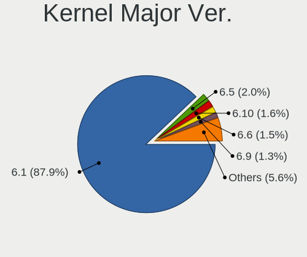
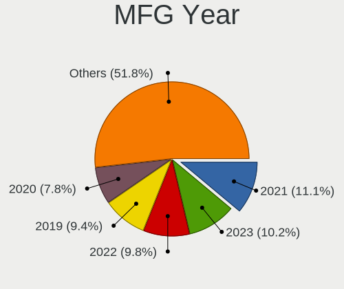
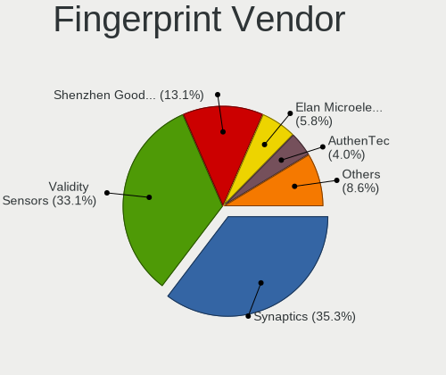

Debian 12 - Tested Hardware & Statistics (Notebooks)
----------------------------------------------------

A project to collect tested hardware configurations for Debian 12.

Anyone can contribute to this report by the [hw-probe](https://github.com/linuxhw/hw-probe) tool:

    sudo -E hw-probe -all -upload

Please contribute! Especially if your hardware is rare.

Contents
--------

* [ Test Cases ](#test-cases)

* [ System ](#system)
  - [ Kernel                   ](#kernel)
  - [ Kernel Family            ](#kernel-family)
  - [ Kernel Major Ver.        ](#kernel-major-ver)
  - [ Arch                     ](#arch)
  - [ DE                       ](#de)
  - [ Display Server           ](#display-server)
  - [ Display Manager          ](#display-manager)
  - [ OS Lang                  ](#os-lang)
  - [ Boot Mode                ](#boot-mode)
  - [ Filesystem               ](#filesystem)
  - [ Part. scheme             ](#part-scheme)
  - [ Dual Boot with Linux/BSD ](#dual-boot-with-linuxbsd)
  - [ Dual Boot (Win)          ](#dual-boot-win)

* [ Board ](#board)
  - [ Vendor                   ](#vendor)
  - [ Model                    ](#model)
  - [ Model Family             ](#model-family)
  - [ MFG Year                 ](#mfg-year)
  - [ Form Factor              ](#form-factor)
  - [ Secure Boot              ](#secure-boot)
  - [ Coreboot                 ](#coreboot)
  - [ RAM Size                 ](#ram-size)
  - [ RAM Used                 ](#ram-used)
  - [ Total Drives             ](#total-drives)
  - [ Has CD-ROM               ](#has-cd-rom)
  - [ Has Ethernet             ](#has-ethernet)
  - [ Has WiFi                 ](#has-wifi)
  - [ Has Bluetooth            ](#has-bluetooth)

* [ Location ](#location)
  - [ Country                  ](#country)
  - [ City                     ](#city)

* [ Drives ](#drives)
  - [ Drive Vendor             ](#drive-vendor)
  - [ Drive Model              ](#drive-model)
  - [ HDD Vendor               ](#hdd-vendor)
  - [ SSD Vendor               ](#ssd-vendor)
  - [ Drive Kind               ](#drive-kind)
  - [ Drive Connector          ](#drive-connector)
  - [ Drive Size               ](#drive-size)
  - [ Space Total              ](#space-total)
  - [ Space Used               ](#space-used)
  - [ Malfunc. Drives          ](#malfunc-drives)
  - [ Malfunc. Drive Vendor    ](#malfunc-drive-vendor)
  - [ Malfunc. HDD Vendor      ](#malfunc-hdd-vendor)
  - [ Malfunc. Drive Kind      ](#malfunc-drive-kind)
  - [ Failed Drives            ](#failed-drives)
  - [ Failed Drive Vendor      ](#failed-drive-vendor)
  - [ Drive Status             ](#drive-status)

* [ Storage controller ](#storage-controller)
  - [ Storage Vendor           ](#storage-vendor)
  - [ Storage Model            ](#storage-model)
  - [ Storage Kind             ](#storage-kind)

* [ Processor ](#processor)
  - [ CPU Vendor               ](#cpu-vendor)
  - [ CPU Model                ](#cpu-model)
  - [ CPU Model Family         ](#cpu-model-family)
  - [ CPU Cores                ](#cpu-cores)
  - [ CPU Sockets              ](#cpu-sockets)
  - [ CPU Threads              ](#cpu-threads)
  - [ CPU Op-Modes             ](#cpu-op-modes)
  - [ CPU Microcode            ](#cpu-microcode)
  - [ CPU Microarch            ](#cpu-microarch)

* [ Graphics ](#graphics)
  - [ GPU Vendor               ](#gpu-vendor)
  - [ GPU Model                ](#gpu-model)
  - [ GPU Combo                ](#gpu-combo)
  - [ GPU Driver               ](#gpu-driver)
  - [ GPU Memory               ](#gpu-memory)

* [ Monitor ](#monitor)
  - [ Monitor Vendor           ](#monitor-vendor)
  - [ Monitor Model            ](#monitor-model)
  - [ Monitor Resolution       ](#monitor-resolution)
  - [ Monitor Diagonal         ](#monitor-diagonal)
  - [ Monitor Width            ](#monitor-width)
  - [ Aspect Ratio             ](#aspect-ratio)
  - [ Monitor Area             ](#monitor-area)
  - [ Pixel Density            ](#pixel-density)
  - [ Multiple Monitors        ](#multiple-monitors)

* [ Network ](#network)
  - [ Net Controller Vendor    ](#net-controller-vendor)
  - [ Net Controller Model     ](#net-controller-model)
  - [ Wireless Vendor          ](#wireless-vendor)
  - [ Wireless Model           ](#wireless-model)
  - [ Ethernet Vendor          ](#ethernet-vendor)
  - [ Ethernet Model           ](#ethernet-model)
  - [ Net Controller Kind      ](#net-controller-kind)
  - [ Used Controller          ](#used-controller)
  - [ NICs                     ](#nics)
  - [ IPv6                     ](#ipv6)

* [ Bluetooth ](#bluetooth)
  - [ Bluetooth Vendor         ](#bluetooth-vendor)
  - [ Bluetooth Model          ](#bluetooth-model)

* [ Sound ](#sound)
  - [ Sound Vendor             ](#sound-vendor)
  - [ Sound Model              ](#sound-model)

* [ Memory ](#memory)
  - [ Memory Vendor            ](#memory-vendor)
  - [ Memory Model             ](#memory-model)
  - [ Memory Kind              ](#memory-kind)
  - [ Memory Form Factor       ](#memory-form-factor)
  - [ Memory Size              ](#memory-size)
  - [ Memory Speed             ](#memory-speed)

* [ Printers & scanners ](#printers--scanners)
  - [ Printer Vendor           ](#printer-vendor)
  - [ Printer Model            ](#printer-model)
  - [ Scanner Vendor           ](#scanner-vendor)
  - [ Scanner Model            ](#scanner-model)

* [ Camera ](#camera)
  - [ Camera Vendor            ](#camera-vendor)
  - [ Camera Model             ](#camera-model)

* [ Security ](#security)
  - [ Fingerprint Vendor       ](#fingerprint-vendor)
  - [ Fingerprint Model        ](#fingerprint-model)
  - [ Chipcard Vendor          ](#chipcard-vendor)
  - [ Chipcard Model           ](#chipcard-model)

* [ Unsupported ](#unsupported)
  - [ Unsupported Devices      ](#unsupported-devices)
  - [ Unsupported Device Types ](#unsupported-device-types)

Test Cases
----------

Total: 1534

| Vendor        | Model                       | Probe                                                      | Date         |
|---------------|-----------------------------|------------------------------------------------------------|--------------|
| Toshiba       | Satellite C55-C             | [256b476a15](https://linux-hardware.org/?probe=256b476a15) | Dec 24, 2023 |
| Dell          | Inspiron 15 7000 Gaming     | [9eff3f535e](https://linux-hardware.org/?probe=9eff3f535e) | Dec 24, 2023 |
| HUAWEI        | KLVD-WXX9                   | [ee7b7ce7cc](https://linux-hardware.org/?probe=ee7b7ce7cc) | Dec 24, 2023 |
| Toshiba       | Satellite A205              | [c3680bfd29](https://linux-hardware.org/?probe=c3680bfd29) | Dec 24, 2023 |
| HP            | Pavilion g7                 | [bbe3fb1914](https://linux-hardware.org/?probe=bbe3fb1914) | Dec 24, 2023 |
| IBM           | ThinkPad R50e 1842QDU       | [32a349ab97](https://linux-hardware.org/?probe=32a349ab97) | Dec 23, 2023 |
| Lenovo        | ThinkPad T420 4178AFU       | [c2681f33cc](https://linux-hardware.org/?probe=c2681f33cc) | Dec 23, 2023 |
| HP            | ProBook 655 G2              | [033325e722](https://linux-hardware.org/?probe=033325e722) | Dec 23, 2023 |
| AVITA         | NS14A6                      | [adf732b1b6](https://linux-hardware.org/?probe=adf732b1b6) | Dec 23, 2023 |
| Lenovo        | ThinkPad T480 20L5000BGE    | [8753b04999](https://linux-hardware.org/?probe=8753b04999) | Dec 23, 2023 |
| Google        | Reks                        | [52375a57c5](https://linux-hardware.org/?probe=52375a57c5) | Dec 22, 2023 |
| HP            | EliteBook 850 G3            | [5e8dc79e2c](https://linux-hardware.org/?probe=5e8dc79e2c) | Dec 22, 2023 |
| Samsung       | 300E4C/300E5C/300E7C        | [a11f0a948c](https://linux-hardware.org/?probe=a11f0a948c) | Dec 22, 2023 |
| Irbis         | NB264                       | [8821679765](https://linux-hardware.org/?probe=8821679765) | Dec 22, 2023 |
| HP            | ENVY 15                     | [2997ffe5cf](https://linux-hardware.org/?probe=2997ffe5cf) | Dec 22, 2023 |
| Dell          | Inspiron 15 3515            | [cdff1cf322](https://linux-hardware.org/?probe=cdff1cf322) | Dec 22, 2023 |
| HP            | ENVY Notebook               | [ca2e6f9061](https://linux-hardware.org/?probe=ca2e6f9061) | Dec 22, 2023 |
| HP            | EliteBook 830 G5            | [aa3d919a29](https://linux-hardware.org/?probe=aa3d919a29) | Dec 22, 2023 |
| HONOR         | HYM-WXX                     | [1c225a853e](https://linux-hardware.org/?probe=1c225a853e) | Dec 21, 2023 |
| Lenovo        | ThinkPad T490 20N3S5GP12    | [093906d110](https://linux-hardware.org/?probe=093906d110) | Dec 21, 2023 |
| HP            | EliteBook 650 15.6 inch ... | [2e9f8a97e5](https://linux-hardware.org/?probe=2e9f8a97e5) | Dec 21, 2023 |
| Google        | Reks                        | [9a6f15c5d9](https://linux-hardware.org/?probe=9a6f15c5d9) | Dec 21, 2023 |
| Acer          | Swift SF314-54              | [edc5223b9b](https://linux-hardware.org/?probe=edc5223b9b) | Dec 21, 2023 |
| Lenovo        | Legion 5 Pro 16ARH7H 82R... | [1c3113c9b9](https://linux-hardware.org/?probe=1c3113c9b9) | Dec 20, 2023 |
| Lenovo        | IdeaPad 530S-14ARR 81H1     | [2785a8b9c6](https://linux-hardware.org/?probe=2785a8b9c6) | Dec 20, 2023 |
| Apple         | MacBookAir6,2               | [ef17f12758](https://linux-hardware.org/?probe=ef17f12758) | Dec 20, 2023 |
| HP            | ENVY m6                     | [237331a1ba](https://linux-hardware.org/?probe=237331a1ba) | Dec 20, 2023 |
| Dell          | G7 7790                     | [bcc6b4046b](https://linux-hardware.org/?probe=bcc6b4046b) | Dec 19, 2023 |
| DellInc.      | Venue 8 Pro 5830            | [d6408a26a1](https://linux-hardware.org/?probe=d6408a26a1) | Dec 19, 2023 |
| HP            | ZBook Firefly 15 G7 Mobi... | [020e3af833](https://linux-hardware.org/?probe=020e3af833) | Dec 18, 2023 |
| Gigabyte      | AORUS 17H BXF               | [ad8b646e5c](https://linux-hardware.org/?probe=ad8b646e5c) | Dec 18, 2023 |
| Dell          | Vostro 15 3515              | [baf5b47a47](https://linux-hardware.org/?probe=baf5b47a47) | Dec 18, 2023 |
| Acer          | Swift SF314-71              | [5a5f20e49a](https://linux-hardware.org/?probe=5a5f20e49a) | Dec 18, 2023 |
| Apple         | MacBookPro13,2              | [dd9d263269](https://linux-hardware.org/?probe=dd9d263269) | Dec 18, 2023 |
| HP            | 15 Notebook PC              | [1293ea8b65](https://linux-hardware.org/?probe=1293ea8b65) | Dec 18, 2023 |
| HUAWEI        | BOHB-WAX9                   | [94757e986e](https://linux-hardware.org/?probe=94757e986e) | Dec 18, 2023 |
| Panasonic     | FZ-M1CCA17E3                | [87024c17b5](https://linux-hardware.org/?probe=87024c17b5) | Dec 17, 2023 |
| Panasonic     | FZ-M1CCA17E3                | [8f2a76eb09](https://linux-hardware.org/?probe=8f2a76eb09) | Dec 17, 2023 |
| Medion        | BEAST X30                   | [cec06735ba](https://linux-hardware.org/?probe=cec06735ba) | Dec 17, 2023 |
| Acer          | Swift SF314-43              | [7ff498fc83](https://linux-hardware.org/?probe=7ff498fc83) | Dec 17, 2023 |
| HP            | Compaq 6730s                | [628e8cf362](https://linux-hardware.org/?probe=628e8cf362) | Dec 17, 2023 |
| HP            | Compaq 6730s                | [774f3d4feb](https://linux-hardware.org/?probe=774f3d4feb) | Dec 17, 2023 |
| HP            | Pavilion Laptop 15-eh1xx... | [b212e62ef7](https://linux-hardware.org/?probe=b212e62ef7) | Dec 17, 2023 |
| Samsung       | 760XDA                      | [53ab21d486](https://linux-hardware.org/?probe=53ab21d486) | Dec 17, 2023 |
| Packard Be... | EasyNote TE11HC             | [a155267edc](https://linux-hardware.org/?probe=a155267edc) | Dec 17, 2023 |
| ASUSTek       | VivoBook_ASUSLaptop M160... | [7162b25b98](https://linux-hardware.org/?probe=7162b25b98) | Dec 16, 2023 |
| Lenovo        | ThinkBook 14 G2 ITL 20VD    | [5f19b6ce4f](https://linux-hardware.org/?probe=5f19b6ce4f) | Dec 16, 2023 |
| HP            | Pavilion Laptop 15-eh1xx... | [314b3b98d7](https://linux-hardware.org/?probe=314b3b98d7) | Dec 16, 2023 |
| Dell          | Vostro 5490                 | [ca117be9d4](https://linux-hardware.org/?probe=ca117be9d4) | Dec 16, 2023 |
| Lenovo        | ThinkPad P1 20MDS02BGE      | [65eb962233](https://linux-hardware.org/?probe=65eb962233) | Dec 15, 2023 |
| HP            | EliteBook 745 G3            | [ec4a48125c](https://linux-hardware.org/?probe=ec4a48125c) | Dec 15, 2023 |
| HP            | EliteBook 745 G3            | [d43271b873](https://linux-hardware.org/?probe=d43271b873) | Dec 15, 2023 |
| Medion        | Akoya E7226                 | [a8677e8420](https://linux-hardware.org/?probe=a8677e8420) | Dec 15, 2023 |
| Medion        | Akoya E7226                 | [059918d809](https://linux-hardware.org/?probe=059918d809) | Dec 15, 2023 |
| ASUSTek       | ROG Strix G713QE_G713QE     | [b4bcda5523](https://linux-hardware.org/?probe=b4bcda5523) | Dec 15, 2023 |
| ASUSTek       | ROG Strix G713QE_G713QE     | [de24d459c5](https://linux-hardware.org/?probe=de24d459c5) | Dec 14, 2023 |
| Apple         | MacBookAir7,2               | [09a184f2e4](https://linux-hardware.org/?probe=09a184f2e4) | Dec 14, 2023 |
| Lenovo        | ThinkPad T480s 20L8S7232... | [d9de3edb6b](https://linux-hardware.org/?probe=d9de3edb6b) | Dec 14, 2023 |
| Lenovo        | ThinkPad T480s 20L8S7232... | [84f162f88f](https://linux-hardware.org/?probe=84f162f88f) | Dec 14, 2023 |
| Dell          | XPS 15 9570                 | [67a32f0dd0](https://linux-hardware.org/?probe=67a32f0dd0) | Dec 14, 2023 |
| Dell          | XPS 15 9570                 | [283dc2dab5](https://linux-hardware.org/?probe=283dc2dab5) | Dec 14, 2023 |
| Dell          | Inspiron 7560               | [83034fb404](https://linux-hardware.org/?probe=83034fb404) | Dec 14, 2023 |
| Lenovo        | IdeaPad Gaming 3 15IHU6 ... | [d2b1e67451](https://linux-hardware.org/?probe=d2b1e67451) | Dec 14, 2023 |
| Apple         | MacBookAir7,2               | [05c8fb1ded](https://linux-hardware.org/?probe=05c8fb1ded) | Dec 13, 2023 |
| HP            | Pavilion Aero Laptop 13-... | [c4e3486e91](https://linux-hardware.org/?probe=c4e3486e91) | Dec 13, 2023 |
| ASUSTek       | VivoBook_ASUSLaptop X150... | [68e68f1683](https://linux-hardware.org/?probe=68e68f1683) | Dec 13, 2023 |
| Acer          | Aspire R3-131T              | [5fc8de17bb](https://linux-hardware.org/?probe=5fc8de17bb) | Dec 13, 2023 |
| Lenovo        | G50-45 80E3                 | [cfa115323d](https://linux-hardware.org/?probe=cfa115323d) | Dec 13, 2023 |
| Dell          | Latitude 5424 Rugged        | [ce56e420fc](https://linux-hardware.org/?probe=ce56e420fc) | Dec 13, 2023 |
| ASUSTek       | X556UQK                     | [1ac3287ee1](https://linux-hardware.org/?probe=1ac3287ee1) | Dec 13, 2023 |
| Lenovo        | V15 G3 IAP 82TT             | [e28730f84d](https://linux-hardware.org/?probe=e28730f84d) | Dec 12, 2023 |
| Lenovo        | V15 G3 IAP 82TT             | [f90b33b7d5](https://linux-hardware.org/?probe=f90b33b7d5) | Dec 12, 2023 |
| HP            | EliteBook 830 G7 Noteboo... | [774925ed25](https://linux-hardware.org/?probe=774925ed25) | Dec 12, 2023 |
| Lenovo        | ThinkPad X13 Gen 4 21J3C... | [e99a0bd1db](https://linux-hardware.org/?probe=e99a0bd1db) | Dec 12, 2023 |
| Positivo      | H14BT58                     | [74530bb40a](https://linux-hardware.org/?probe=74530bb40a) | Dec 12, 2023 |
| ASUSTek       | VivoBook_ASUSLaptop X340... | [53ee047174](https://linux-hardware.org/?probe=53ee047174) | Dec 12, 2023 |
| Lenovo        | IdeaPad 3 15ALC6 82KU       | [756283ec58](https://linux-hardware.org/?probe=756283ec58) | Dec 12, 2023 |
| Lenovo        | IdeaPad 3 15ALC6 82KU       | [c258c213e6](https://linux-hardware.org/?probe=c258c213e6) | Dec 12, 2023 |
| HP            | EliteBook 830 G5            | [a4bdf16134](https://linux-hardware.org/?probe=a4bdf16134) | Dec 12, 2023 |
| HP            | ProBook 455 G7              | [1bec383138](https://linux-hardware.org/?probe=1bec383138) | Dec 11, 2023 |
| Unknown       | Unknown                     | [79c6d70468](https://linux-hardware.org/?probe=79c6d70468) | Dec 11, 2023 |
| Lenovo        | ThinkPad E15 Gen 3 20YG0... | [0d7abecf9b](https://linux-hardware.org/?probe=0d7abecf9b) | Dec 11, 2023 |
| Lenovo        | ThinkPad E15 Gen 3 20YG0... | [3dcb225ff4](https://linux-hardware.org/?probe=3dcb225ff4) | Dec 11, 2023 |
| HP            | Laptop 15-fd0xxx            | [f5b7104728](https://linux-hardware.org/?probe=f5b7104728) | Dec 11, 2023 |
| HP            | Laptop 14s-dy5xxx           | [bfe021294b](https://linux-hardware.org/?probe=bfe021294b) | Dec 11, 2023 |
| Google        | Electro                     | [503645df79](https://linux-hardware.org/?probe=503645df79) | Dec 11, 2023 |
| HP            | ProBook 450 G3              | [57a80d9d1b](https://linux-hardware.org/?probe=57a80d9d1b) | Dec 11, 2023 |
| Dell          | XPS 13 9370                 | [201fa157d6](https://linux-hardware.org/?probe=201fa157d6) | Dec 10, 2023 |
| ASUSTek       | TUF Gaming FX504GD_FX80G... | [324e195003](https://linux-hardware.org/?probe=324e195003) | Dec 10, 2023 |
| ASUSTek       | TUF Gaming FX504GD_FX80G... | [f60e90cfd0](https://linux-hardware.org/?probe=f60e90cfd0) | Dec 10, 2023 |
| Fujitsu Si... | LIFEBOOK S7110              | [bb7ea992e6](https://linux-hardware.org/?probe=bb7ea992e6) | Dec 09, 2023 |
| Lenovo        | ThinkPad T530 242922G       | [2b8062d3cc](https://linux-hardware.org/?probe=2b8062d3cc) | Dec 09, 2023 |
| Dell          | Latitude E7240              | [93f24d2411](https://linux-hardware.org/?probe=93f24d2411) | Dec 09, 2023 |
| HP            | EliteBook 830 G5            | [b2743fd826](https://linux-hardware.org/?probe=b2743fd826) | Dec 09, 2023 |
| Apple         | MacBookPro12,1              | [9d633902a0](https://linux-hardware.org/?probe=9d633902a0) | Dec 09, 2023 |
| HP            | Laptop 15-da0xxx            | [4106c6dbcf](https://linux-hardware.org/?probe=4106c6dbcf) | Dec 09, 2023 |
| ASUSTek       | X507UB                      | [f1a1ea60e6](https://linux-hardware.org/?probe=f1a1ea60e6) | Dec 09, 2023 |
| Dell          | Precision 3550              | [a3be7ab761](https://linux-hardware.org/?probe=a3be7ab761) | Dec 09, 2023 |
| Dell          | Vostro 15 3515              | [0257ed619f](https://linux-hardware.org/?probe=0257ed619f) | Dec 08, 2023 |
| Toshiba       | Satellite L50-A-19P         | [cd3314169e](https://linux-hardware.org/?probe=cd3314169e) | Dec 08, 2023 |
| HP            | EliteBook 840 G6            | [b53080f09f](https://linux-hardware.org/?probe=b53080f09f) | Dec 08, 2023 |
| HONOR         | HYM-WXX                     | [b008f53987](https://linux-hardware.org/?probe=b008f53987) | Dec 08, 2023 |
| ASUSTek       | ASUS EXPERTBOOK B1502CBA    | [b46d0490b6](https://linux-hardware.org/?probe=b46d0490b6) | Dec 08, 2023 |
| Lenovo        | ThinkBook 16p Gen 2 20YM    | [ba71538aed](https://linux-hardware.org/?probe=ba71538aed) | Dec 08, 2023 |
| ASUSTek       | Zenbook UX5401EA_UX5401E... | [0e2900b443](https://linux-hardware.org/?probe=0e2900b443) | Dec 08, 2023 |
| Lenovo        | ThinkPad X250 20CLS8C000    | [bff5eac6db](https://linux-hardware.org/?probe=bff5eac6db) | Dec 08, 2023 |
| Lenovo        | ThinkPad Mini10 3507A31     | [1229fd52f5](https://linux-hardware.org/?probe=1229fd52f5) | Dec 08, 2023 |
| HP            | G62                         | [c2f10412aa](https://linux-hardware.org/?probe=c2f10412aa) | Dec 07, 2023 |
| HP            | EliteBook 8470p             | [c723bcc62a](https://linux-hardware.org/?probe=c723bcc62a) | Dec 07, 2023 |
| Lenovo        | IdeaPad 3 15ALC6 82KU       | [e7fabdedad](https://linux-hardware.org/?probe=e7fabdedad) | Dec 07, 2023 |
| Acer          | Extensa 4210                | [4f8a82394a](https://linux-hardware.org/?probe=4f8a82394a) | Dec 07, 2023 |
| Aquarius      | NS585                       | [b6b0a78cfa](https://linux-hardware.org/?probe=b6b0a78cfa) | Dec 07, 2023 |
| MSI           | Prestige 15 A10SC           | [b1c3e47458](https://linux-hardware.org/?probe=b1c3e47458) | Dec 07, 2023 |
| Dell          | Precision 7550              | [11f63c8ba3](https://linux-hardware.org/?probe=11f63c8ba3) | Dec 07, 2023 |
| Lenovo        | IdeaPad 110-15ISK 80UD      | [256fbd42a6](https://linux-hardware.org/?probe=256fbd42a6) | Dec 06, 2023 |
| Lenovo        | Yoga Pro 7 14ARP8 83AU      | [280a9a93e6](https://linux-hardware.org/?probe=280a9a93e6) | Dec 06, 2023 |
| Dell          | Inspiron 1545               | [d54ba07f49](https://linux-hardware.org/?probe=d54ba07f49) | Dec 06, 2023 |
| HP            | ENVY Notebook               | [26a4295a68](https://linux-hardware.org/?probe=26a4295a68) | Dec 06, 2023 |
| Acer          | Aspire A314-22              | [ce624b95df](https://linux-hardware.org/?probe=ce624b95df) | Dec 05, 2023 |
| ASUSTek       | P553UJ                      | [e5ed994bf9](https://linux-hardware.org/?probe=e5ed994bf9) | Dec 05, 2023 |
| Lenovo        | IdeaPad 300-14ISK 80Q6      | [68784031ca](https://linux-hardware.org/?probe=68784031ca) | Dec 05, 2023 |
| HP            | EliteBook 840 G1            | [1b39d673f8](https://linux-hardware.org/?probe=1b39d673f8) | Dec 05, 2023 |
| HUAWEI        | BOD-WXX9                    | [da8437565a](https://linux-hardware.org/?probe=da8437565a) | Dec 04, 2023 |
| Dell          | Inspiron 5567               | [03fe12170c](https://linux-hardware.org/?probe=03fe12170c) | Dec 04, 2023 |
| Dell          | Inspiron 16 Plus 7620       | [969efab4b8](https://linux-hardware.org/?probe=969efab4b8) | Dec 04, 2023 |
| Acer          | Extensa 215-55              | [87616f0d71](https://linux-hardware.org/?probe=87616f0d71) | Dec 04, 2023 |
| ASUSTek       | ASUS TUF Gaming F17 FX70... | [3f26c37883](https://linux-hardware.org/?probe=3f26c37883) | Dec 04, 2023 |
| Lenovo        | ThinkPad T450 20BUS3L502    | [592eb925fd](https://linux-hardware.org/?probe=592eb925fd) | Dec 04, 2023 |
| Lenovo        | ThinkPad T480 20L5S2J200    | [75603d3c20](https://linux-hardware.org/?probe=75603d3c20) | Dec 04, 2023 |
| Lenovo        | ThinkPad T14 Gen 3 21AHC... | [7afcab06a4](https://linux-hardware.org/?probe=7afcab06a4) | Dec 04, 2023 |
| HUAWEI        | BOD-WXX9                    | [961b00cfbe](https://linux-hardware.org/?probe=961b00cfbe) | Dec 04, 2023 |
| Samsung       | R530/R730/R540              | [7c16c8b9ac](https://linux-hardware.org/?probe=7c16c8b9ac) | Dec 03, 2023 |
| Lenovo        | ThinkPad T14 Gen 3 21AHC... | [bbd413d34b](https://linux-hardware.org/?probe=bbd413d34b) | Dec 03, 2023 |
| Lenovo        | V14-IIL 82C4                | [848e0dbd37](https://linux-hardware.org/?probe=848e0dbd37) | Dec 03, 2023 |
| Acer          | Aspire A315-24P             | [b8af3ee6d5](https://linux-hardware.org/?probe=b8af3ee6d5) | Dec 03, 2023 |
| Acer          | Unknown                     | [6555dd06ac](https://linux-hardware.org/?probe=6555dd06ac) | Dec 03, 2023 |
| Acer          | Aspire A315-24P             | [67efae847f](https://linux-hardware.org/?probe=67efae847f) | Dec 03, 2023 |
| Timi          | Mi Laptop Pro 15            | [41ef064705](https://linux-hardware.org/?probe=41ef064705) | Dec 03, 2023 |
| Timi          | Mi Laptop Pro 15            | [b14a847625](https://linux-hardware.org/?probe=b14a847625) | Dec 03, 2023 |
| Dell          | Precision M4800             | [ff01ff15f9](https://linux-hardware.org/?probe=ff01ff15f9) | Dec 03, 2023 |
| Lenovo        | ThinkPad P16s Gen 2 21K9... | [744c430aa7](https://linux-hardware.org/?probe=744c430aa7) | Dec 02, 2023 |
| Lenovo        | ThinkPad L470 W10DG 20JV... | [1462381824](https://linux-hardware.org/?probe=1462381824) | Dec 02, 2023 |
| Apple         | MacBookPro12,1              | [138a63b91b](https://linux-hardware.org/?probe=138a63b91b) | Dec 02, 2023 |
| Lenovo        | Flex 2-14 20404             | [f366381075](https://linux-hardware.org/?probe=f366381075) | Dec 02, 2023 |
| Lenovo        | ThinkPad X220 4291OL3       | [d07f89fdd6](https://linux-hardware.org/?probe=d07f89fdd6) | Dec 02, 2023 |
| Dell          | Latitude 7440               | [b4179d70c3](https://linux-hardware.org/?probe=b4179d70c3) | Dec 01, 2023 |
| Lenovo        | IdeaPad 3 15ALC6 82KU       | [d4a1f56f8d](https://linux-hardware.org/?probe=d4a1f56f8d) | Dec 01, 2023 |
| HP            | ProBook 450 15.6 inch G9... | [fc30a356f0](https://linux-hardware.org/?probe=fc30a356f0) | Dec 01, 2023 |
| Toshiba       | Satellite L775              | [da7cc192f7](https://linux-hardware.org/?probe=da7cc192f7) | Dec 01, 2023 |
| Lenovo        | V15 G4 AMN 82YU             | [f17a1eb208](https://linux-hardware.org/?probe=f17a1eb208) | Dec 01, 2023 |
| Lenovo        | ThinkPad L14 Gen 4 21H1C... | [7590036270](https://linux-hardware.org/?probe=7590036270) | Dec 01, 2023 |
| HP            | OMEN Laptop 15-en1xxx       | [a828388299](https://linux-hardware.org/?probe=a828388299) | Nov 30, 2023 |
| Dell          | Inspiron 5570               | [6642e4462f](https://linux-hardware.org/?probe=6642e4462f) | Nov 30, 2023 |
| Lenovo        | ThinkPad T590 20N5S56P00    | [352fffb7a9](https://linux-hardware.org/?probe=352fffb7a9) | Nov 30, 2023 |
| Toshiba       | Satellite L455D             | [d08710e3d3](https://linux-hardware.org/?probe=d08710e3d3) | Nov 29, 2023 |
| Samsung       | RC530/RC730                 | [01aee620f1](https://linux-hardware.org/?probe=01aee620f1) | Nov 29, 2023 |
| HP            | Laptop 15s-du0xxx           | [bf583ba008](https://linux-hardware.org/?probe=bf583ba008) | Nov 29, 2023 |
| Lenovo        | IdeaPad Slim 5 16IRL8 82... | [ef2a2ab2a9](https://linux-hardware.org/?probe=ef2a2ab2a9) | Nov 29, 2023 |
| ASUSTek       | M50Vc                       | [0eba431c7a](https://linux-hardware.org/?probe=0eba431c7a) | Nov 29, 2023 |
| Acer          | Nitro AN515-55              | [6865be0fd7](https://linux-hardware.org/?probe=6865be0fd7) | Nov 29, 2023 |
| Lenovo        | IdeaPad Slim 5 16IRL8 82... | [414132dc07](https://linux-hardware.org/?probe=414132dc07) | Nov 29, 2023 |
| Lenovo        | ThinkPad T520 4243VU3       | [6cbaf1893d](https://linux-hardware.org/?probe=6cbaf1893d) | Nov 29, 2023 |
| Dell          | Precision 7560              | [035f0d6f41](https://linux-hardware.org/?probe=035f0d6f41) | Nov 29, 2023 |
| HP            | ProBook 450 G3              | [0d6a4cd900](https://linux-hardware.org/?probe=0d6a4cd900) | Nov 28, 2023 |
| HP            | Victus by Gaming Laptop ... | [b01d99f799](https://linux-hardware.org/?probe=b01d99f799) | Nov 28, 2023 |
| Samsung       | 530U3C/530U4C/532U3C        | [6b10244910](https://linux-hardware.org/?probe=6b10244910) | Nov 28, 2023 |
| ASUSTek       | Zenbook UX3402ZA_UX3402Z... | [413049d0f4](https://linux-hardware.org/?probe=413049d0f4) | Nov 28, 2023 |
| HP            | ZBook 15 G6                 | [1f87fc5fca](https://linux-hardware.org/?probe=1f87fc5fca) | Nov 28, 2023 |
| ASUSTek       | F52Q                        | [705aa34dce](https://linux-hardware.org/?probe=705aa34dce) | Nov 27, 2023 |
| ASUSTek       | F52Q                        | [569db41ca1](https://linux-hardware.org/?probe=569db41ca1) | Nov 27, 2023 |
| Lenovo        | ThinkPad T490 20N3S2YS00    | [635d73bd44](https://linux-hardware.org/?probe=635d73bd44) | Nov 27, 2023 |
| HP            | ProBook 440 G8 Notebook ... | [2715c8329f](https://linux-hardware.org/?probe=2715c8329f) | Nov 27, 2023 |
| Google        | Terra                       | [b21072bf0e](https://linux-hardware.org/?probe=b21072bf0e) | Nov 27, 2023 |
| HP            | Pavilion Gaming Laptop 1... | [97e207d679](https://linux-hardware.org/?probe=97e207d679) | Nov 27, 2023 |
| Acer          | Aspire A515-56              | [419daf1e57](https://linux-hardware.org/?probe=419daf1e57) | Nov 27, 2023 |
| Lenovo        | ThinkPad X200 7458PN6       | [e37f4ef1d4](https://linux-hardware.org/?probe=e37f4ef1d4) | Nov 27, 2023 |
| HUAWEI        | BOM-WXX9                    | [13c14b2399](https://linux-hardware.org/?probe=13c14b2399) | Nov 27, 2023 |
| Lenovo        | Legion 7 15IMH05 81YT       | [f18c7cb67b](https://linux-hardware.org/?probe=f18c7cb67b) | Nov 26, 2023 |
| ASUSTek       | VivoBook_ASUSLaptop M340... | [332eec50ca](https://linux-hardware.org/?probe=332eec50ca) | Nov 26, 2023 |
| Apple         | MacBook5,1                  | [9e05915f77](https://linux-hardware.org/?probe=9e05915f77) | Nov 26, 2023 |
| Apple         | MacBook5,1                  | [ff1af2d7d2](https://linux-hardware.org/?probe=ff1af2d7d2) | Nov 26, 2023 |
| HP            | Laptop 15-dy2xxx            | [484699c792](https://linux-hardware.org/?probe=484699c792) | Nov 26, 2023 |
| Acer          | Swift SF314-42              | [bebbc2f6c4](https://linux-hardware.org/?probe=bebbc2f6c4) | Nov 25, 2023 |
| Lenovo        | IdeaPad Gaming 3 15IMH05... | [0f05f2568e](https://linux-hardware.org/?probe=0f05f2568e) | Nov 25, 2023 |
| ASUSTek       | Zenbook UX3402ZA_UX3402Z... | [8cba28d4a5](https://linux-hardware.org/?probe=8cba28d4a5) | Nov 25, 2023 |
| HP            | OMEN by Laptop 15-dc1xxx    | [1e4a3ed089](https://linux-hardware.org/?probe=1e4a3ed089) | Nov 25, 2023 |
| HP            | EliteBook 735 G6            | [a0480513dd](https://linux-hardware.org/?probe=a0480513dd) | Nov 25, 2023 |
| HP            | EliteBook 2570p             | [e01ac99a92](https://linux-hardware.org/?probe=e01ac99a92) | Nov 25, 2023 |
| HP            | Laptop 15s-du0xxx           | [7e541895b2](https://linux-hardware.org/?probe=7e541895b2) | Nov 25, 2023 |
| HP            | Compaq 6730b (NB027EA#AK... | [3b3bf03eee](https://linux-hardware.org/?probe=3b3bf03eee) | Nov 25, 2023 |
| HP            | EliteBook 865 16 inch G9... | [9620d48b2f](https://linux-hardware.org/?probe=9620d48b2f) | Nov 25, 2023 |
| Dell          | Latitude 3510               | [0ebe37e56d](https://linux-hardware.org/?probe=0ebe37e56d) | Nov 25, 2023 |
| Lenovo        | V14-IIL 82C4                | [eb4379efae](https://linux-hardware.org/?probe=eb4379efae) | Nov 24, 2023 |
| HP            | EliteBook 845 G7 Noteboo... | [4b725b7022](https://linux-hardware.org/?probe=4b725b7022) | Nov 24, 2023 |
| Lenovo        | IdeaPad Y500 20193          | [9a8395f2ac](https://linux-hardware.org/?probe=9a8395f2ac) | Nov 24, 2023 |
| HUAWEI        | NBD-WXX9                    | [59a3d34f64](https://linux-hardware.org/?probe=59a3d34f64) | Nov 24, 2023 |
| ASUSTek       | VivoBook_ASUSLaptop M160... | [499c7927dd](https://linux-hardware.org/?probe=499c7927dd) | Nov 23, 2023 |
| HP            | Pavilion Gaming Laptop 1... | [9102327ebf](https://linux-hardware.org/?probe=9102327ebf) | Nov 23, 2023 |
| Lenovo        | IdeaPad Gaming 3 15ACH6 ... | [1e5ad7dda0](https://linux-hardware.org/?probe=1e5ad7dda0) | Nov 23, 2023 |
| Samsung       | 270E5J/2570EJ               | [d6ab9c6df5](https://linux-hardware.org/?probe=d6ab9c6df5) | Nov 23, 2023 |
| Lenovo        | ThinkPad T460 20FMS57C00    | [adabeb3e91](https://linux-hardware.org/?probe=adabeb3e91) | Nov 23, 2023 |
| Lenovo        | IdeaPad 130-15AST 81H5      | [b6496b25f7](https://linux-hardware.org/?probe=b6496b25f7) | Nov 23, 2023 |
| ASUSTek       | VivoBook_ASUSLaptop K660... | [be47adc197](https://linux-hardware.org/?probe=be47adc197) | Nov 23, 2023 |
| Google        | Edgar                       | [12d8e1b6af](https://linux-hardware.org/?probe=12d8e1b6af) | Nov 22, 2023 |
| Lenovo        | ThinkPad E15 Gen 2 20TD0... | [0337023dbe](https://linux-hardware.org/?probe=0337023dbe) | Nov 22, 2023 |
| HP            | Laptop 15-dw1xxx            | [d05f324edf](https://linux-hardware.org/?probe=d05f324edf) | Nov 22, 2023 |
| Dell          | Precision M4600             | [864f0c5cfe](https://linux-hardware.org/?probe=864f0c5cfe) | Nov 22, 2023 |
| Lenovo        | ThinkPad P52 20MAS21905     | [ada7aab2dd](https://linux-hardware.org/?probe=ada7aab2dd) | Nov 22, 2023 |
| Lenovo        | G500 20236                  | [43a399828f](https://linux-hardware.org/?probe=43a399828f) | Nov 22, 2023 |
| Lenovo        | G500 20236                  | [b72fbdf43a](https://linux-hardware.org/?probe=b72fbdf43a) | Nov 22, 2023 |
| Dell          | Latitude E6400              | [adb43d89ab](https://linux-hardware.org/?probe=adb43d89ab) | Nov 22, 2023 |
| Dell          | Latitude 7440               | [fa13937043](https://linux-hardware.org/?probe=fa13937043) | Nov 22, 2023 |
| Dell          | Latitude E6400              | [96e98f8c80](https://linux-hardware.org/?probe=96e98f8c80) | Nov 22, 2023 |
| HP            | G62                         | [de2f290631](https://linux-hardware.org/?probe=de2f290631) | Nov 20, 2023 |
| Lenovo        | ThinkPad P15v Gen 3 21D8... | [7c6999858f](https://linux-hardware.org/?probe=7c6999858f) | Nov 20, 2023 |
| Dell          | Latitude 5401               | [b3698296b0](https://linux-hardware.org/?probe=b3698296b0) | Nov 20, 2023 |
| Lenovo        | IdeaPad Y700-15ISK 80NV     | [a090e73dbf](https://linux-hardware.org/?probe=a090e73dbf) | Nov 20, 2023 |
| Lenovo        | Yoga Pro 7 14ARP8 83AU      | [e0d3e7cba3](https://linux-hardware.org/?probe=e0d3e7cba3) | Nov 19, 2023 |
| Lenovo        | G510 20238                  | [2567713f24](https://linux-hardware.org/?probe=2567713f24) | Nov 19, 2023 |
| Dell          | XPS 15 7590                 | [a40bc78bcf](https://linux-hardware.org/?probe=a40bc78bcf) | Nov 19, 2023 |
| Toshiba       | QOSMIO X70-A                | [4173fd74a2](https://linux-hardware.org/?probe=4173fd74a2) | Nov 19, 2023 |
| IBM           | ThinkPad T42 2374GB1        | [455a2c937b](https://linux-hardware.org/?probe=455a2c937b) | Nov 19, 2023 |
| HUAWEI        | BOHK-WAX9X                  | [ebfe063207](https://linux-hardware.org/?probe=ebfe063207) | Nov 19, 2023 |
| HP            | ProBook 650 G1              | [80d502e7c1](https://linux-hardware.org/?probe=80d502e7c1) | Nov 19, 2023 |
| Lenovo        | Yoga 2 Pro 20266            | [65f7027c84](https://linux-hardware.org/?probe=65f7027c84) | Nov 19, 2023 |
| ASUSTek       | VivoBook_ASUSLaptop M340... | [08f1313c20](https://linux-hardware.org/?probe=08f1313c20) | Nov 19, 2023 |
| Framework     | Laptop (12th Gen Intel C... | [8ebb2df251](https://linux-hardware.org/?probe=8ebb2df251) | Nov 18, 2023 |
| MSI           | N6105                       | [647e6d71a4](https://linux-hardware.org/?probe=647e6d71a4) | Nov 18, 2023 |
| HP            | Laptop 15-da0xxx            | [666f76f4e9](https://linux-hardware.org/?probe=666f76f4e9) | Nov 18, 2023 |
| HP            | Stream Notebook             | [5d318f7956](https://linux-hardware.org/?probe=5d318f7956) | Nov 18, 2023 |
| Lenovo        | ThinkPad 13 2nd Gen 20J1... | [0fcb08b949](https://linux-hardware.org/?probe=0fcb08b949) | Nov 18, 2023 |
| Toshiba       | Satellite L300              | [416018ed84](https://linux-hardware.org/?probe=416018ed84) | Nov 17, 2023 |
| Irbis         | NB120                       | [a90949861b](https://linux-hardware.org/?probe=a90949861b) | Nov 17, 2023 |
| Lenovo        | Yoga Slim 7 14ARE05 82A2    | [c8af1c096b](https://linux-hardware.org/?probe=c8af1c096b) | Nov 17, 2023 |
| Samsung       | N102SP/N100SP/N101SP        | [be914025c2](https://linux-hardware.org/?probe=be914025c2) | Nov 17, 2023 |
| MSI           | GS65 Stealth 9SD            | [b0eba2e921](https://linux-hardware.org/?probe=b0eba2e921) | Nov 16, 2023 |
| Schenker      | VIA 15 Pro                  | [604f785353](https://linux-hardware.org/?probe=604f785353) | Nov 16, 2023 |
| Acer          | Aspire V3-771               | [5b38f976c4](https://linux-hardware.org/?probe=5b38f976c4) | Nov 16, 2023 |
| MSI           | GS65 Stealth 9SD            | [0331447937](https://linux-hardware.org/?probe=0331447937) | Nov 16, 2023 |
| Dell          | Latitude 5530               | [4490ae8afe](https://linux-hardware.org/?probe=4490ae8afe) | Nov 16, 2023 |
| Lenovo        | G50-70 20351                | [7f136c3e39](https://linux-hardware.org/?probe=7f136c3e39) | Nov 16, 2023 |
| Acer          | Aspire A315-42              | [a21066a759](https://linux-hardware.org/?probe=a21066a759) | Nov 15, 2023 |
| Acer          | Aspire E1-572               | [c7c8df77be](https://linux-hardware.org/?probe=c7c8df77be) | Nov 15, 2023 |
| HP            | Laptop 15-da0xxx            | [3f0b4a0bfe](https://linux-hardware.org/?probe=3f0b4a0bfe) | Nov 15, 2023 |
| Acer          | Aspire E5-576G              | [694833562c](https://linux-hardware.org/?probe=694833562c) | Nov 15, 2023 |
| HP            | Pavilion dv6                | [a7404738ed](https://linux-hardware.org/?probe=a7404738ed) | Nov 15, 2023 |
| Lenovo        | XiaoXinPro 16 IRH8 83AQ     | [1eb15d0477](https://linux-hardware.org/?probe=1eb15d0477) | Nov 15, 2023 |
| ASUSTek       | VivoBook_ASUSLaptop K660... | [98dd1a4a4f](https://linux-hardware.org/?probe=98dd1a4a4f) | Nov 15, 2023 |
| Dell          | Inspiron 1545               | [fd459af24b](https://linux-hardware.org/?probe=fd459af24b) | Nov 15, 2023 |
| Lenovo        | ThinkPad X1 Carbon 7th 2... | [049356e4bc](https://linux-hardware.org/?probe=049356e4bc) | Nov 15, 2023 |
| MSI           | Thin GF63 12HW              | [bdac7a70aa](https://linux-hardware.org/?probe=bdac7a70aa) | Nov 14, 2023 |
| Acer          | Extensa 2540                | [22e65d0a5b](https://linux-hardware.org/?probe=22e65d0a5b) | Nov 14, 2023 |
| Acer          | Aspire A315-42              | [42d05f19a2](https://linux-hardware.org/?probe=42d05f19a2) | Nov 13, 2023 |
| Lenovo        | ThinkPad L15 Gen 3 21C30... | [137d579104](https://linux-hardware.org/?probe=137d579104) | Nov 13, 2023 |
| Lenovo        | ThinkPad L15 Gen 3 21C30... | [aacc7d1f61](https://linux-hardware.org/?probe=aacc7d1f61) | Nov 13, 2023 |
| Acer          | Aspire ES1-521              | [429add2d41](https://linux-hardware.org/?probe=429add2d41) | Nov 13, 2023 |
| HP            | Presario CQ57               | [0d4999d483](https://linux-hardware.org/?probe=0d4999d483) | Nov 13, 2023 |
| HP            | Laptop 15-dy2xxx            | [189c917237](https://linux-hardware.org/?probe=189c917237) | Nov 13, 2023 |
| HP            | ZBook 15 G2                 | [960b3732b0](https://linux-hardware.org/?probe=960b3732b0) | Nov 13, 2023 |
| Toshiba       | Satellite L40               | [0d2accfed1](https://linux-hardware.org/?probe=0d2accfed1) | Nov 13, 2023 |
| Apple         | MacBookPro16,2              | [bbc6a54b40](https://linux-hardware.org/?probe=bbc6a54b40) | Nov 12, 2023 |
| Lenovo        | ThinkPad Edge E535 32607... | [f5bea4eb8b](https://linux-hardware.org/?probe=f5bea4eb8b) | Nov 12, 2023 |
| Lenovo        | ThinkPad T14 Gen 3 21AH0... | [929afc7ae1](https://linux-hardware.org/?probe=929afc7ae1) | Nov 12, 2023 |
| HUAWEI        | BOM-WXX9                    | [d3fd2f491d](https://linux-hardware.org/?probe=d3fd2f491d) | Nov 12, 2023 |
| HP            | 15                          | [dbd704fdbb](https://linux-hardware.org/?probe=dbd704fdbb) | Nov 11, 2023 |
| ASUSTek       | VivoBook_ASUSLaptop X160... | [daab2f9dc6](https://linux-hardware.org/?probe=daab2f9dc6) | Nov 11, 2023 |
| Lenovo        | ThinkBook 13s G4 IAP 21A... | [e713ed7256](https://linux-hardware.org/?probe=e713ed7256) | Nov 11, 2023 |
| Lenovo        | ThinkPad L15 Gen 2a 20X8... | [4bf49cfb42](https://linux-hardware.org/?probe=4bf49cfb42) | Nov 11, 2023 |
| Timi          | Mi NoteBook Pro             | [f08c831e30](https://linux-hardware.org/?probe=f08c831e30) | Nov 11, 2023 |
| Apple         | MacBookPro8,1               | [3da6dfb4b3](https://linux-hardware.org/?probe=3da6dfb4b3) | Nov 11, 2023 |
| Lenovo        | IdeaPad Y500 20193          | [de5f1aa77e](https://linux-hardware.org/?probe=de5f1aa77e) | Nov 11, 2023 |
| Lenovo        | ThinkPad X1 Carbon 7th 2... | [f4dc3b24c4](https://linux-hardware.org/?probe=f4dc3b24c4) | Nov 11, 2023 |
| HP            | Stream Notebook             | [f93159b053](https://linux-hardware.org/?probe=f93159b053) | Nov 11, 2023 |
| Lenovo        | ThinkPad X270 W10DG 20K5... | [b88ecdebac](https://linux-hardware.org/?probe=b88ecdebac) | Nov 10, 2023 |
| Dell          | Latitude E5430 non-vPro     | [518492850b](https://linux-hardware.org/?probe=518492850b) | Nov 10, 2023 |
| HP            | ProBook 4510s               | [9b83dea197](https://linux-hardware.org/?probe=9b83dea197) | Nov 10, 2023 |
| Aquarius      | NS585                       | [0f0c55bda1](https://linux-hardware.org/?probe=0f0c55bda1) | Nov 10, 2023 |
| Acer          | Aspire A315-23              | [95ea718240](https://linux-hardware.org/?probe=95ea718240) | Nov 10, 2023 |
| Lenovo        | ThinkPad T420 4180AZ8       | [089405c957](https://linux-hardware.org/?probe=089405c957) | Nov 09, 2023 |
| Apple         | MacBook2,1                  | [448165ceca](https://linux-hardware.org/?probe=448165ceca) | Nov 09, 2023 |
| ASUSTek       | S400CA                      | [0e5628865a](https://linux-hardware.org/?probe=0e5628865a) | Nov 09, 2023 |
| ASUSTek       | Vivobook Go E1504GA_E150... | [50b3f888e9](https://linux-hardware.org/?probe=50b3f888e9) | Nov 09, 2023 |
| ASUSTek       | Vivobook Go E1504GA_E150... | [a2c63a08f3](https://linux-hardware.org/?probe=a2c63a08f3) | Nov 09, 2023 |
| Acer          | Aspire A515-47              | [50a18dd494](https://linux-hardware.org/?probe=50a18dd494) | Nov 09, 2023 |
| Dell          | Latitude 5420               | [efa8caa859](https://linux-hardware.org/?probe=efa8caa859) | Nov 09, 2023 |
| Dell          | Latitude E5430 non-vPro     | [39e2c7584e](https://linux-hardware.org/?probe=39e2c7584e) | Nov 08, 2023 |
| ASUSTek       | VivoBook_ASUSLaptop K660... | [46458a043d](https://linux-hardware.org/?probe=46458a043d) | Nov 08, 2023 |
| ASUSTek       | ROG Zephyrus G15 GA503QS... | [52b0129f48](https://linux-hardware.org/?probe=52b0129f48) | Nov 08, 2023 |
| ASUSTek       | ROG Zephyrus G15 GA503QS... | [b05a5bff97](https://linux-hardware.org/?probe=b05a5bff97) | Nov 08, 2023 |
| MACHENIKE     | L16P                        | [c8e67672f3](https://linux-hardware.org/?probe=c8e67672f3) | Nov 08, 2023 |
| Samsung       | 767XCL                      | [beba8edd4f](https://linux-hardware.org/?probe=beba8edd4f) | Nov 08, 2023 |
| Apple         | MacBook5,1                  | [ed339d2cbb](https://linux-hardware.org/?probe=ed339d2cbb) | Nov 08, 2023 |
| Lenovo        | ThinkPad E14 Gen 4 21EBC... | [0fceea6321](https://linux-hardware.org/?probe=0fceea6321) | Nov 08, 2023 |
| Lenovo        | ThinkPad T470s W10DG 20J... | [b111aacb49](https://linux-hardware.org/?probe=b111aacb49) | Nov 08, 2023 |
| Acer          | Aspire A515-43              | [6e215a4ade](https://linux-hardware.org/?probe=6e215a4ade) | Nov 08, 2023 |
| Lenovo        | ThinkPad X1 Carbon Gen 1... | [54b91fa265](https://linux-hardware.org/?probe=54b91fa265) | Nov 08, 2023 |
| Dell          | Latitude 5414               | [ad924833a5](https://linux-hardware.org/?probe=ad924833a5) | Nov 08, 2023 |
| ASUSTek       | VivoBook_ASUSLaptop M760... | [696f32a866](https://linux-hardware.org/?probe=696f32a866) | Nov 08, 2023 |
| Apple         | MacBook5,2                  | [24a63b1a77](https://linux-hardware.org/?probe=24a63b1a77) | Nov 07, 2023 |
| Apple         | MacBookAir7,1               | [dcbc2d171e](https://linux-hardware.org/?probe=dcbc2d171e) | Nov 07, 2023 |
| Aquarius      | NS585                       | [a5b5734657](https://linux-hardware.org/?probe=a5b5734657) | Nov 07, 2023 |
| Aquarius      | NS585                       | [d9d5e97f89](https://linux-hardware.org/?probe=d9d5e97f89) | Nov 07, 2023 |
| Unknown       | Unknown                     | [988072756b](https://linux-hardware.org/?probe=988072756b) | Nov 07, 2023 |
| Aquarius      | NS585                       | [83a4894072](https://linux-hardware.org/?probe=83a4894072) | Nov 07, 2023 |
| Lenovo        | ThinkPad P15v Gen 3 21D8... | [1d557ddec8](https://linux-hardware.org/?probe=1d557ddec8) | Nov 07, 2023 |
| Lenovo        | ThinkPad P15v Gen 3 21D8... | [beca8ba507](https://linux-hardware.org/?probe=beca8ba507) | Nov 07, 2023 |
| ASUSTek       | X200CA                      | [a982252e30](https://linux-hardware.org/?probe=a982252e30) | Nov 07, 2023 |
| Lenovo        | ThinkPad T430 23475H2       | [3dcdf3830e](https://linux-hardware.org/?probe=3dcdf3830e) | Nov 07, 2023 |
| HP            | Pavilion Notebook           | [8cf5696a9e](https://linux-hardware.org/?probe=8cf5696a9e) | Nov 07, 2023 |
| MSI           | Modern 15 A10M              | [e1120cd270](https://linux-hardware.org/?probe=e1120cd270) | Nov 06, 2023 |
| HP            | EliteBook 8460p             | [cc6b66c576](https://linux-hardware.org/?probe=cc6b66c576) | Nov 06, 2023 |
| Aquarius      | NS585                       | [ddc8256647](https://linux-hardware.org/?probe=ddc8256647) | Nov 06, 2023 |
| Aquarius      | NS585                       | [2f4e49837d](https://linux-hardware.org/?probe=2f4e49837d) | Nov 06, 2023 |
| Aquarius      | NS585                       | [4fea63336a](https://linux-hardware.org/?probe=4fea63336a) | Nov 06, 2023 |
| HP            | 250 G7 Notebook PC          | [a2ad36d26c](https://linux-hardware.org/?probe=a2ad36d26c) | Nov 06, 2023 |
| Toshiba       | TECRA R950                  | [864877692e](https://linux-hardware.org/?probe=864877692e) | Nov 05, 2023 |
| ASUSTek       | X541NA                      | [f0399efc08](https://linux-hardware.org/?probe=f0399efc08) | Nov 05, 2023 |
| ASUSTek       | VivoBook_ASUSLaptop X140... | [92ed6d25c3](https://linux-hardware.org/?probe=92ed6d25c3) | Nov 05, 2023 |
| HP            | Mini 210-3000               | [8b55a876a9](https://linux-hardware.org/?probe=8b55a876a9) | Nov 05, 2023 |
| Google        | Nami                        | [19c94b9484](https://linux-hardware.org/?probe=19c94b9484) | Nov 05, 2023 |
| HP            | Laptop 15-bw0xx             | [7d9395e4a7](https://linux-hardware.org/?probe=7d9395e4a7) | Nov 05, 2023 |
| HP            | EliteBook 840 G3            | [1bb894cf19](https://linux-hardware.org/?probe=1bb894cf19) | Nov 04, 2023 |
| HP            | Pavilion dv7                | [6a44cc2c3c](https://linux-hardware.org/?probe=6a44cc2c3c) | Nov 04, 2023 |
| Google        | Bluebird                    | [55dbc11653](https://linux-hardware.org/?probe=55dbc11653) | Nov 04, 2023 |
| Google        | Bluebird                    | [9e12130a28](https://linux-hardware.org/?probe=9e12130a28) | Nov 04, 2023 |
| HP            | OMEN by Laptop 17-ck1xxx    | [bea6a6babf](https://linux-hardware.org/?probe=bea6a6babf) | Nov 04, 2023 |
| Lenovo        | ThinkPad T530 2429F27       | [0767db36fe](https://linux-hardware.org/?probe=0767db36fe) | Nov 04, 2023 |
| Dell          | Precision 7560              | [54a8deb305](https://linux-hardware.org/?probe=54a8deb305) | Nov 04, 2023 |
| ASUSTek       | X551CA                      | [20bee22e0a](https://linux-hardware.org/?probe=20bee22e0a) | Nov 03, 2023 |
| Dell          | Latitude E6420              | [43ccf36bf0](https://linux-hardware.org/?probe=43ccf36bf0) | Nov 03, 2023 |
| Google        | Enguarde                    | [bc6a541eb9](https://linux-hardware.org/?probe=bc6a541eb9) | Nov 03, 2023 |
| Lenovo        | ThinkBook 14 G3 ACL 21A2    | [8b855ce4f4](https://linux-hardware.org/?probe=8b855ce4f4) | Nov 03, 2023 |
| Lenovo        | G500s 20245                 | [c4aa915297](https://linux-hardware.org/?probe=c4aa915297) | Nov 03, 2023 |
| ASUSTek       | VivoBook_ASUSLaptop X515... | [1bdfa38b3e](https://linux-hardware.org/?probe=1bdfa38b3e) | Nov 03, 2023 |
| Lenovo        | IdeaPad Y500 20193          | [f96f6e6127](https://linux-hardware.org/?probe=f96f6e6127) | Nov 03, 2023 |
| ASUSTek       | X205TA                      | [b29e9ebfbe](https://linux-hardware.org/?probe=b29e9ebfbe) | Nov 03, 2023 |
| HP            | 250 G7 Notebook PC          | [1889111d8a](https://linux-hardware.org/?probe=1889111d8a) | Nov 03, 2023 |
| ASUSTek       | G750JX                      | [9493bec7e6](https://linux-hardware.org/?probe=9493bec7e6) | Nov 02, 2023 |
| Framework     | Laptop (12th Gen Intel C... | [7c06ac2664](https://linux-hardware.org/?probe=7c06ac2664) | Nov 02, 2023 |
| Google        | Nasher360                   | [0d1cc1b584](https://linux-hardware.org/?probe=0d1cc1b584) | Nov 02, 2023 |
| Framework     | Laptop (13th Gen Intel C... | [df4f43ca44](https://linux-hardware.org/?probe=df4f43ca44) | Nov 01, 2023 |
| Lenovo        | ThinkPad 13 2nd Gen 20J1... | [bb5bbc3e51](https://linux-hardware.org/?probe=bb5bbc3e51) | Nov 01, 2023 |
| Lenovo        | ThinkPad L15 Gen 2 20X4S... | [ac563e5542](https://linux-hardware.org/?probe=ac563e5542) | Nov 01, 2023 |
| HP            | Laptop 15s-eq1xxx           | [075049b538](https://linux-hardware.org/?probe=075049b538) | Nov 01, 2023 |
| Dell          | Precision M4700             | [1d7e76c1d9](https://linux-hardware.org/?probe=1d7e76c1d9) | Nov 01, 2023 |
| Lenovo        | ThinkPad P16s Gen 2 21K9... | [317aadad91](https://linux-hardware.org/?probe=317aadad91) | Nov 01, 2023 |
| Dell          | Vostro 5590                 | [300630cf8c](https://linux-hardware.org/?probe=300630cf8c) | Nov 01, 2023 |
| Dell          | Latitude 5480               | [1bf5aeba87](https://linux-hardware.org/?probe=1bf5aeba87) | Nov 01, 2023 |
| Lenovo        | ThinkPad P14s Gen 4 21K5... | [2bdd27dc18](https://linux-hardware.org/?probe=2bdd27dc18) | Oct 31, 2023 |
| Lenovo        | ThinkPad P14s Gen 4 21K5... | [cb35a8d8f6](https://linux-hardware.org/?probe=cb35a8d8f6) | Oct 31, 2023 |
| Lenovo        | ThinkPad 13 2nd Gen 20J1... | [4ebd30711e](https://linux-hardware.org/?probe=4ebd30711e) | Oct 31, 2023 |
| Lenovo        | ThinkPad 13 2nd Gen 20J1... | [a664733aaf](https://linux-hardware.org/?probe=a664733aaf) | Oct 31, 2023 |
| Lenovo        | ThinkPad 13 2nd Gen 20J2... | [72131fb5de](https://linux-hardware.org/?probe=72131fb5de) | Oct 31, 2023 |
| VANT          | MOOVE3-15                   | [5fc04a6d0a](https://linux-hardware.org/?probe=5fc04a6d0a) | Oct 31, 2023 |
| Apple         | MacBookPro9,1               | [8f7c5b801b](https://linux-hardware.org/?probe=8f7c5b801b) | Oct 31, 2023 |
| Apple         | MacBookPro9,1               | [4e15275faa](https://linux-hardware.org/?probe=4e15275faa) | Oct 31, 2023 |
| HP            | Victus by Gaming Laptop ... | [0f4fa9169b](https://linux-hardware.org/?probe=0f4fa9169b) | Oct 31, 2023 |
| Lenovo        | ThinkPad L14 Gen 3 21C10... | [2f63bfb399](https://linux-hardware.org/?probe=2f63bfb399) | Oct 31, 2023 |
| VANT          | MOOVE3-15                   | [7e12621e6d](https://linux-hardware.org/?probe=7e12621e6d) | Oct 31, 2023 |
| Timi          | RedmiBook Pro 14S           | [780e721e24](https://linux-hardware.org/?probe=780e721e24) | Oct 30, 2023 |
| Lenovo        | ThinkPad X260 VB6R77903H    | [c4baf8a67b](https://linux-hardware.org/?probe=c4baf8a67b) | Oct 30, 2023 |
| THUNDEROBO... | 911AirD                     | [698adeeba7](https://linux-hardware.org/?probe=698adeeba7) | Oct 30, 2023 |
| Dell          | XPS 15 9520                 | [0fb7ced892](https://linux-hardware.org/?probe=0fb7ced892) | Oct 30, 2023 |
| Google        | Blooguard                   | [cd817fb666](https://linux-hardware.org/?probe=cd817fb666) | Oct 30, 2023 |
| Lenovo        | ThinkPad 13 2nd Gen 20J1... | [995b159589](https://linux-hardware.org/?probe=995b159589) | Oct 30, 2023 |
| Gigabyte      | A5 X1                       | [981be88a61](https://linux-hardware.org/?probe=981be88a61) | Oct 30, 2023 |
| Lenovo        | ThinkPad T14s Gen 3 21CQ... | [4aceca5660](https://linux-hardware.org/?probe=4aceca5660) | Oct 28, 2023 |
| Acer          | Aspire 4752                 | [ce321700bc](https://linux-hardware.org/?probe=ce321700bc) | Oct 28, 2023 |
| Lenovo        | ThinkPad T15g Gen 2i 20Y... | [dcd6988b7a](https://linux-hardware.org/?probe=dcd6988b7a) | Oct 28, 2023 |
| TELECOMITA... | M7x0S                       | [feabc7e111](https://linux-hardware.org/?probe=feabc7e111) | Oct 28, 2023 |
| MSI           | WS63 7RK                    | [dcfa2c2f75](https://linux-hardware.org/?probe=dcfa2c2f75) | Oct 27, 2023 |
| Lenovo        | ThinkPad X230 2325SDE       | [cbdbd4a156](https://linux-hardware.org/?probe=cbdbd4a156) | Oct 27, 2023 |
| Lenovo        | IdeaPad Gaming 3 15IAH7 ... | [d8bfe77d00](https://linux-hardware.org/?probe=d8bfe77d00) | Oct 27, 2023 |
| Lenovo        | ThinkPad T470 20HES0FW00    | [198bee98eb](https://linux-hardware.org/?probe=198bee98eb) | Oct 27, 2023 |
| Lenovo        | G50-70 20351                | [39e2fb6be6](https://linux-hardware.org/?probe=39e2fb6be6) | Oct 27, 2023 |
| ASUSTek       | ROG Strix G513QC_G513QC     | [bdf8012e05](https://linux-hardware.org/?probe=bdf8012e05) | Oct 27, 2023 |
| Lenovo        | ThinkPad P15v Gen 3 21D8... | [67b966e75c](https://linux-hardware.org/?probe=67b966e75c) | Oct 27, 2023 |
| Google        | Enguarde                    | [074b44ce16](https://linux-hardware.org/?probe=074b44ce16) | Oct 26, 2023 |
| Acer          | Aspire 5750G                | [afe742ceca](https://linux-hardware.org/?probe=afe742ceca) | Oct 26, 2023 |
| Dell          | Latitude 5414               | [78fb4f9907](https://linux-hardware.org/?probe=78fb4f9907) | Oct 26, 2023 |
| Medion        | Unknown                     | [ffcdfb3003](https://linux-hardware.org/?probe=ffcdfb3003) | Oct 26, 2023 |
| HP            | ProBook 4530s               | [b86df6ad72](https://linux-hardware.org/?probe=b86df6ad72) | Oct 26, 2023 |
| Lenovo        | IdeaPad S145-15IIL 81W8     | [cc3370083d](https://linux-hardware.org/?probe=cc3370083d) | Oct 26, 2023 |
| Exo           | Smart Serie R               | [d68b300ca7](https://linux-hardware.org/?probe=d68b300ca7) | Oct 26, 2023 |
| Toshiba       | Satellite L455D             | [29337c2310](https://linux-hardware.org/?probe=29337c2310) | Oct 26, 2023 |
| HUAWEI        | KLVL-WXXW                   | [303c4197c7](https://linux-hardware.org/?probe=303c4197c7) | Oct 26, 2023 |
| HP            | Compaq 15                   | [83fab35dec](https://linux-hardware.org/?probe=83fab35dec) | Oct 26, 2023 |
| Dell          | Latitude 5414               | [692b53f9d9](https://linux-hardware.org/?probe=692b53f9d9) | Oct 26, 2023 |
| HP            | Compaq 15                   | [41ada9e77d](https://linux-hardware.org/?probe=41ada9e77d) | Oct 26, 2023 |
| ASUSTek       | VivoBook_ASUSLaptop X512... | [bfe12f37dc](https://linux-hardware.org/?probe=bfe12f37dc) | Oct 25, 2023 |
| Acer          | Aspire 5750G                | [b726b22da1](https://linux-hardware.org/?probe=b726b22da1) | Oct 25, 2023 |
| Lenovo        | ThinkPad X1C 5th W10DG 2... | [c66ebc8e70](https://linux-hardware.org/?probe=c66ebc8e70) | Oct 25, 2023 |
| Google        | Reks                        | [d397eae4e5](https://linux-hardware.org/?probe=d397eae4e5) | Oct 25, 2023 |
| Acer          | Aspire ES1-521              | [2df6fb3e2a](https://linux-hardware.org/?probe=2df6fb3e2a) | Oct 25, 2023 |
| MSI           | Katana GF76 11SC            | [b1a5449e72](https://linux-hardware.org/?probe=b1a5449e72) | Oct 25, 2023 |
| HP            | Victus by Gaming Laptop ... | [71a22f4706](https://linux-hardware.org/?probe=71a22f4706) | Oct 25, 2023 |
| HP            | Laptop 15-dw3xxx            | [8994962017](https://linux-hardware.org/?probe=8994962017) | Oct 25, 2023 |
| Lenovo        | ThinkPad T480 20L6S29D00    | [b270ca3670](https://linux-hardware.org/?probe=b270ca3670) | Oct 24, 2023 |
| Lenovo        | ThinkPad T440p 20AWS18U0... | [1406d2f4d5](https://linux-hardware.org/?probe=1406d2f4d5) | Oct 24, 2023 |
| Medion        | Unknown                     | [fa168b5e75](https://linux-hardware.org/?probe=fa168b5e75) | Oct 24, 2023 |
| Lenovo        | ThinkPad T440p 20AWS18U0... | [56fa067caa](https://linux-hardware.org/?probe=56fa067caa) | Oct 24, 2023 |
| HP            | EliteBook 8740w             | [3669a01d21](https://linux-hardware.org/?probe=3669a01d21) | Oct 24, 2023 |
| Notebook      | P7xxDM(-G)                  | [bb211b2fb4](https://linux-hardware.org/?probe=bb211b2fb4) | Oct 24, 2023 |
| Alienware     | m15 Ryzen Ed. R5            | [dd704a643f](https://linux-hardware.org/?probe=dd704a643f) | Oct 24, 2023 |
| Acer          | Aspire 7750G                | [91006bdfa7](https://linux-hardware.org/?probe=91006bdfa7) | Oct 24, 2023 |
| Alienware     | m15 R6                      | [c6711f7b02](https://linux-hardware.org/?probe=c6711f7b02) | Oct 24, 2023 |
| ASUSTek       | G551JX                      | [db16c87fe8](https://linux-hardware.org/?probe=db16c87fe8) | Oct 24, 2023 |
| Lenovo        | IdeaPad 3 15ALC6 82KU       | [8754714bce](https://linux-hardware.org/?probe=8754714bce) | Oct 23, 2023 |
| Lenovo        | Yoga Slim 7 ProX 14IAH7 ... | [f4375f7115](https://linux-hardware.org/?probe=f4375f7115) | Oct 23, 2023 |
| Aquarius      | NS585                       | [3c793ad14b](https://linux-hardware.org/?probe=3c793ad14b) | Oct 23, 2023 |
| Aquarius      | NS585                       | [9e7366fb3a](https://linux-hardware.org/?probe=9e7366fb3a) | Oct 23, 2023 |
| Dell          | XPS 9315                    | [c03a4ad29d](https://linux-hardware.org/?probe=c03a4ad29d) | Oct 23, 2023 |
| Timi          | Mi NoteBook Pro             | [470eb40837](https://linux-hardware.org/?probe=470eb40837) | Oct 23, 2023 |
| Acer          | Aspire E5-573               | [d83f4bf9ad](https://linux-hardware.org/?probe=d83f4bf9ad) | Oct 23, 2023 |
| Lenovo        | ThinkPad T480s 20L8S1WH0... | [4d383aebdc](https://linux-hardware.org/?probe=4d383aebdc) | Oct 23, 2023 |
| Lenovo        | ThinkPad T480s 20L8S1WH0... | [4cb151fdfe](https://linux-hardware.org/?probe=4cb151fdfe) | Oct 23, 2023 |
| Dell          | XPS 13 9300                 | [9d7ecc567c](https://linux-hardware.org/?probe=9d7ecc567c) | Oct 23, 2023 |
| Dell          | Precision 3571              | [a2ba806246](https://linux-hardware.org/?probe=a2ba806246) | Oct 22, 2023 |
| Dell          | Precision 3571              | [efedaee27d](https://linux-hardware.org/?probe=efedaee27d) | Oct 22, 2023 |
| Dell          | Inspiron 6000               | [be4108e195](https://linux-hardware.org/?probe=be4108e195) | Oct 22, 2023 |
| Dell          | XPS 15 9560                 | [c2c4d81d07](https://linux-hardware.org/?probe=c2c4d81d07) | Oct 22, 2023 |
| GPU Compan... | GWTC51427                   | [69b6cd7a6f](https://linux-hardware.org/?probe=69b6cd7a6f) | Oct 22, 2023 |
| Acer          | Swift SF314-42              | [e19b58f8be](https://linux-hardware.org/?probe=e19b58f8be) | Oct 21, 2023 |
| Lenovo        | V130-15IGM 81HL             | [fc8d54a39c](https://linux-hardware.org/?probe=fc8d54a39c) | Oct 21, 2023 |
| Lenovo        | ThinkPad P15v Gen 3 21D8... | [5e57624ceb](https://linux-hardware.org/?probe=5e57624ceb) | Oct 21, 2023 |
| ASUSTek       | ASUS TUF Gaming A17 FA70... | [f30ccc13f5](https://linux-hardware.org/?probe=f30ccc13f5) | Oct 21, 2023 |
| ASUSTek       | ASUS TUF Dash F15 FX517Z... | [d9a8c7946e](https://linux-hardware.org/?probe=d9a8c7946e) | Oct 20, 2023 |
| ASUSTek       | ASUS TUF Dash F15 FX517Z... | [5cac857cd9](https://linux-hardware.org/?probe=5cac857cd9) | Oct 20, 2023 |
| Lenovo        | V15-IIL 82C5                | [50f6d4cb01](https://linux-hardware.org/?probe=50f6d4cb01) | Oct 20, 2023 |
| MSI           | Alpha 17 B5EEK              | [125e76df80](https://linux-hardware.org/?probe=125e76df80) | Oct 20, 2023 |
| MSI           | Alpha 17 B5EEK              | [3a5c553fcb](https://linux-hardware.org/?probe=3a5c553fcb) | Oct 20, 2023 |
| ASUSTek       | ROG Zephyrus G14 GA401QM... | [2147efec4e](https://linux-hardware.org/?probe=2147efec4e) | Oct 20, 2023 |
| Lenovo        | ThinkPad E14 Gen 5 21JK0... | [f35c9d006e](https://linux-hardware.org/?probe=f35c9d006e) | Oct 20, 2023 |
| Lenovo        | ThinkPad T470 20HES4VB00    | [423a16c64a](https://linux-hardware.org/?probe=423a16c64a) | Oct 20, 2023 |
| Razer         | Blade 14 (2022) - RZ09-0... | [64929e25f7](https://linux-hardware.org/?probe=64929e25f7) | Oct 20, 2023 |
| Razer         | Blade 14 (2022) - RZ09-0... | [da8f06a8e0](https://linux-hardware.org/?probe=da8f06a8e0) | Oct 19, 2023 |
| HP            | Laptop 15s-eq2xxx           | [9c9781a7ee](https://linux-hardware.org/?probe=9c9781a7ee) | Oct 19, 2023 |
| Dell          | XPS 13 9380                 | [a108313537](https://linux-hardware.org/?probe=a108313537) | Oct 19, 2023 |
| ASUSTek       | ASUS TUF Gaming F15 FX50... | [a8e2b482f4](https://linux-hardware.org/?probe=a8e2b482f4) | Oct 19, 2023 |
| Lenovo        | ThinkPad P15v Gen 3 21D8... | [81bfadb2d9](https://linux-hardware.org/?probe=81bfadb2d9) | Oct 18, 2023 |
| Dell          | Precision 7560              | [847d5dfd06](https://linux-hardware.org/?probe=847d5dfd06) | Oct 18, 2023 |
| Acer          | Aspire 5920G                | [5921ebc3f7](https://linux-hardware.org/?probe=5921ebc3f7) | Oct 18, 2023 |
| Acer          | Aspire 5920G                | [b6619c64fd](https://linux-hardware.org/?probe=b6619c64fd) | Oct 18, 2023 |
| Dell          | Latitude E6420              | [f703c6bd74](https://linux-hardware.org/?probe=f703c6bd74) | Oct 17, 2023 |
| Dell          | Latitude E6430              | [54d411b12d](https://linux-hardware.org/?probe=54d411b12d) | Oct 17, 2023 |
| Google        | Reks                        | [1053eb8fee](https://linux-hardware.org/?probe=1053eb8fee) | Oct 17, 2023 |
| Google        | Reks                        | [84b42b74a0](https://linux-hardware.org/?probe=84b42b74a0) | Oct 17, 2023 |
| HP            | ProBook 645 G1              | [d1eeca057f](https://linux-hardware.org/?probe=d1eeca057f) | Oct 17, 2023 |
| Lenovo        | ThinkPad P15 Gen 2i 20YQ... | [f9a0ba2cba](https://linux-hardware.org/?probe=f9a0ba2cba) | Oct 17, 2023 |
| Unknown       | Unknown                     | [f776cdb186](https://linux-hardware.org/?probe=f776cdb186) | Oct 17, 2023 |
| Lenovo        | ThinkPad P15 Gen 2i 20YQ... | [902d95cec2](https://linux-hardware.org/?probe=902d95cec2) | Oct 17, 2023 |
| HP            | EliteBook 820 G2            | [14f5dbdc5a](https://linux-hardware.org/?probe=14f5dbdc5a) | Oct 17, 2023 |
| Acer          | Aspire V3-771               | [e56b3d3602](https://linux-hardware.org/?probe=e56b3d3602) | Oct 17, 2023 |
| Acer          | Aspire 7750G                | [6c7f890049](https://linux-hardware.org/?probe=6c7f890049) | Oct 17, 2023 |
| Acer          | Aspire A515-54              | [a89d6c8f24](https://linux-hardware.org/?probe=a89d6c8f24) | Oct 17, 2023 |
| Dell          | Precision 7560              | [5d9dd29a22](https://linux-hardware.org/?probe=5d9dd29a22) | Oct 17, 2023 |
| Google        | Reks                        | [7610580a91](https://linux-hardware.org/?probe=7610580a91) | Oct 16, 2023 |
| HP            | Laptop 15-fd0xxx            | [0e6cc9fc48](https://linux-hardware.org/?probe=0e6cc9fc48) | Oct 16, 2023 |
| Acer          | Aspire 7750G                | [2a2d5e2425](https://linux-hardware.org/?probe=2a2d5e2425) | Oct 16, 2023 |
| ASUSTek       | 1015PN                      | [b6cbd56a75](https://linux-hardware.org/?probe=b6cbd56a75) | Oct 16, 2023 |
| Apple         | MacBookPro8,1               | [abfce57204](https://linux-hardware.org/?probe=abfce57204) | Oct 16, 2023 |
| Lenovo        | ThinkPad E565 20EY000XUK    | [b7cf6113c4](https://linux-hardware.org/?probe=b7cf6113c4) | Oct 16, 2023 |
| HUAWEI        | HVY-WXX9                    | [57e0cf4149](https://linux-hardware.org/?probe=57e0cf4149) | Oct 16, 2023 |
| ASUSTek       | Vivobook Go E1504FA_E150... | [2408be3605](https://linux-hardware.org/?probe=2408be3605) | Oct 16, 2023 |
| MSI           | GF63 Thin 11SC              | [1072e8d802](https://linux-hardware.org/?probe=1072e8d802) | Oct 16, 2023 |
| HP            | 250 G8 Notebook PC          | [38c84587d8](https://linux-hardware.org/?probe=38c84587d8) | Oct 16, 2023 |
| Apple         | MacBookAir4,1               | [f63091b76b](https://linux-hardware.org/?probe=f63091b76b) | Oct 16, 2023 |
| Lenovo        | ThinkPad P16v Gen 1 21FC... | [33ce923fc9](https://linux-hardware.org/?probe=33ce923fc9) | Oct 15, 2023 |
| Apple         | MacBookPro6,2               | [1df7e29365](https://linux-hardware.org/?probe=1df7e29365) | Oct 15, 2023 |
| Lenovo        | G50-70 20351                | [bdd8aeaf43](https://linux-hardware.org/?probe=bdd8aeaf43) | Oct 14, 2023 |
| HP            | Victus by Laptop 16-d1xx... | [50ebc1407b](https://linux-hardware.org/?probe=50ebc1407b) | Oct 14, 2023 |
| Dell          | Inspiron 3501               | [a1ada382fa](https://linux-hardware.org/?probe=a1ada382fa) | Oct 14, 2023 |
| Dell          | Latitude 5400               | [26c8a94f7f](https://linux-hardware.org/?probe=26c8a94f7f) | Oct 14, 2023 |
| Fujitsu       | LIFEBOOK T5010              | [f35263745a](https://linux-hardware.org/?probe=f35263745a) | Oct 14, 2023 |
| Dell          | Latitude 5414               | [2984ae5140](https://linux-hardware.org/?probe=2984ae5140) | Oct 14, 2023 |
| Google        | Reks                        | [066e8305fe](https://linux-hardware.org/?probe=066e8305fe) | Oct 13, 2023 |
| Google        | Reks                        | [acb8eb7f44](https://linux-hardware.org/?probe=acb8eb7f44) | Oct 13, 2023 |
| Google        | Reks                        | [707eb71f31](https://linux-hardware.org/?probe=707eb71f31) | Oct 13, 2023 |
| Lenovo        | IdeaPad 110-14IBR 80T6      | [94e6d9d3cb](https://linux-hardware.org/?probe=94e6d9d3cb) | Oct 13, 2023 |
| Google        | Reks                        | [4bc10c8b6b](https://linux-hardware.org/?probe=4bc10c8b6b) | Oct 13, 2023 |
| Lenovo        | V17 G4 IRU 83A2             | [5298e96c35](https://linux-hardware.org/?probe=5298e96c35) | Oct 13, 2023 |
| Lenovo        | ThinkPad X1 Carbon Gen 1... | [7ee4351584](https://linux-hardware.org/?probe=7ee4351584) | Oct 13, 2023 |
| Apple         | MacBookPro9,2               | [27b7cf72ac](https://linux-hardware.org/?probe=27b7cf72ac) | Oct 13, 2023 |
| Lenovo        | ThinkPad 13 2nd Gen 20J1... | [02c3723dae](https://linux-hardware.org/?probe=02c3723dae) | Oct 12, 2023 |
| Lenovo        | ThinkPad E475 20H40006US    | [d874291459](https://linux-hardware.org/?probe=d874291459) | Oct 12, 2023 |
| Lenovo        | IdeaPad 3 15ADA05 81W1      | [b53da36041](https://linux-hardware.org/?probe=b53da36041) | Oct 12, 2023 |
| Google        | Reks                        | [20f8a11067](https://linux-hardware.org/?probe=20f8a11067) | Oct 12, 2023 |
| Google        | Reks                        | [4e35f7ebe4](https://linux-hardware.org/?probe=4e35f7ebe4) | Oct 12, 2023 |
| Google        | Reks                        | [41c6c948bb](https://linux-hardware.org/?probe=41c6c948bb) | Oct 12, 2023 |
| ASUSTek       | X541UJ                      | [c061e67481](https://linux-hardware.org/?probe=c061e67481) | Oct 12, 2023 |
| Lenovo        | ThinkPad E475 20H40006US    | [24adbfd09a](https://linux-hardware.org/?probe=24adbfd09a) | Oct 11, 2023 |
| Google        | Reks                        | [1854f5e2fb](https://linux-hardware.org/?probe=1854f5e2fb) | Oct 11, 2023 |
| Lenovo        | ThinkPad P14s Gen 1 20Y1... | [9de2f282f8](https://linux-hardware.org/?probe=9de2f282f8) | Oct 11, 2023 |
| Lenovo        | ThinkPad E475 20H40006US    | [dc4ce65d14](https://linux-hardware.org/?probe=dc4ce65d14) | Oct 11, 2023 |
| Lenovo        | ThinkPad E475 20H40006US    | [c26fe51dd5](https://linux-hardware.org/?probe=c26fe51dd5) | Oct 11, 2023 |
| Google        | Reks                        | [f9857342ec](https://linux-hardware.org/?probe=f9857342ec) | Oct 11, 2023 |
| Lenovo        | ThinkPad E475 20H40006US    | [4a0728b60c](https://linux-hardware.org/?probe=4a0728b60c) | Oct 11, 2023 |
| Lenovo        | ThinkPad E475 20H40006US    | [63c9bedd9d](https://linux-hardware.org/?probe=63c9bedd9d) | Oct 11, 2023 |
| Lenovo        | ThinkPad E475 20H40006US    | [77fe4b27cf](https://linux-hardware.org/?probe=77fe4b27cf) | Oct 11, 2023 |
| Google        | Reks                        | [9b2d9c0f7c](https://linux-hardware.org/?probe=9b2d9c0f7c) | Oct 11, 2023 |
| Lenovo        | ThinkPad E475 20H40006US    | [a735df7685](https://linux-hardware.org/?probe=a735df7685) | Oct 11, 2023 |
| Google        | Reks                        | [e78d454248](https://linux-hardware.org/?probe=e78d454248) | Oct 11, 2023 |
| Google        | Reks                        | [e7c6590991](https://linux-hardware.org/?probe=e7c6590991) | Oct 11, 2023 |
| Lenovo        | ThinkPad E475 20H40006US    | [627ce99f24](https://linux-hardware.org/?probe=627ce99f24) | Oct 11, 2023 |
| Google        | Reks                        | [cc53305ade](https://linux-hardware.org/?probe=cc53305ade) | Oct 11, 2023 |
| Lenovo        | ThinkPad E475 20H40006US    | [d957b0375b](https://linux-hardware.org/?probe=d957b0375b) | Oct 11, 2023 |
| Google        | Reks                        | [286fdb3692](https://linux-hardware.org/?probe=286fdb3692) | Oct 11, 2023 |
| ASUSTek       | X541UJ                      | [0cb7dbb73b](https://linux-hardware.org/?probe=0cb7dbb73b) | Oct 11, 2023 |
| HP            | Laptop 15-fc0xxx            | [670b2194c0](https://linux-hardware.org/?probe=670b2194c0) | Oct 11, 2023 |
| Prestigio     | Visconte Quad 3GK           | [5ffdb7e479](https://linux-hardware.org/?probe=5ffdb7e479) | Oct 11, 2023 |
| Google        | Reks                        | [4bd21164ba](https://linux-hardware.org/?probe=4bd21164ba) | Oct 10, 2023 |
| Google        | Reks                        | [e574b981ae](https://linux-hardware.org/?probe=e574b981ae) | Oct 10, 2023 |
| Google        | Reks                        | [5d44d0021b](https://linux-hardware.org/?probe=5d44d0021b) | Oct 10, 2023 |
| Google        | Reks                        | [a4300f1369](https://linux-hardware.org/?probe=a4300f1369) | Oct 10, 2023 |
| Google        | Reks                        | [9b338e1cfb](https://linux-hardware.org/?probe=9b338e1cfb) | Oct 10, 2023 |
| Google        | Reks                        | [8c2146eff1](https://linux-hardware.org/?probe=8c2146eff1) | Oct 10, 2023 |
| Google        | Reks                        | [2d878f9b40](https://linux-hardware.org/?probe=2d878f9b40) | Oct 10, 2023 |
| Lenovo        | ThinkPad E475 20H40006US    | [8ca2bf7fc9](https://linux-hardware.org/?probe=8ca2bf7fc9) | Oct 10, 2023 |
| Google        | Reks                        | [b206e1538b](https://linux-hardware.org/?probe=b206e1538b) | Oct 10, 2023 |
| Google        | Reks                        | [3cf1a391be](https://linux-hardware.org/?probe=3cf1a391be) | Oct 10, 2023 |
| Google        | Reks                        | [d694213be1](https://linux-hardware.org/?probe=d694213be1) | Oct 10, 2023 |
| Lenovo        | ThinkPad T14s Gen 2i 20W... | [f91905858e](https://linux-hardware.org/?probe=f91905858e) | Oct 10, 2023 |
| Lenovo        | ThinkPad X1 Carbon 7th 2... | [c1c56db09e](https://linux-hardware.org/?probe=c1c56db09e) | Oct 10, 2023 |
| HP            | Pavilion Gaming Laptop 1... | [f95efe1e80](https://linux-hardware.org/?probe=f95efe1e80) | Oct 09, 2023 |
| ASUSTek       | VivoBook_ASUSLaptop K660... | [b3635689de](https://linux-hardware.org/?probe=b3635689de) | Oct 09, 2023 |
| Lenovo        | IdeaPad 3 15ADA05 81W1      | [6d2a6c2a6f](https://linux-hardware.org/?probe=6d2a6c2a6f) | Oct 09, 2023 |
| ASUSTek       | ROG Zephyrus G14 GA401QM... | [3c54fe835e](https://linux-hardware.org/?probe=3c54fe835e) | Oct 09, 2023 |
| MSI           | Katana GF66 11UG            | [0816e0912b](https://linux-hardware.org/?probe=0816e0912b) | Oct 09, 2023 |
| Lenovo        | ThinkPad T14 Gen 3 21AH0... | [a41b75e081](https://linux-hardware.org/?probe=a41b75e081) | Oct 09, 2023 |
| Lenovo        | ThinkPad T14 Gen 3 21AH0... | [ac6149e371](https://linux-hardware.org/?probe=ac6149e371) | Oct 08, 2023 |
| TUXEDO        | InfinityBook S 14 v5        | [7ad7f14fea](https://linux-hardware.org/?probe=7ad7f14fea) | Oct 08, 2023 |
| Lenovo        | ThinkPad P50 20EQS1WW00     | [91f26dd2c7](https://linux-hardware.org/?probe=91f26dd2c7) | Oct 08, 2023 |
| Acer          | Swift SF314-56G             | [2696a8d9c0](https://linux-hardware.org/?probe=2696a8d9c0) | Oct 08, 2023 |
| ASUSTek       | VivoBook_ASUSLaptop X140... | [8678e7aace](https://linux-hardware.org/?probe=8678e7aace) | Oct 08, 2023 |
| AXDIA Inte... | MYBOOK PRO 14 SE            | [344ed10ccd](https://linux-hardware.org/?probe=344ed10ccd) | Oct 07, 2023 |
| Lenovo        | ThinkPad P50 20EQS1WW00     | [a830045a2a](https://linux-hardware.org/?probe=a830045a2a) | Oct 07, 2023 |
| ASUSTek       | T100TAS                     | [f6a5a046b6](https://linux-hardware.org/?probe=f6a5a046b6) | Oct 07, 2023 |
| ASUSTek       | T100TAS                     | [c7e6160070](https://linux-hardware.org/?probe=c7e6160070) | Oct 07, 2023 |
| HP            | ENVY Laptop 13-aq0xxx       | [45be4f4f29](https://linux-hardware.org/?probe=45be4f4f29) | Oct 07, 2023 |
| Lenovo        | ThinkPad 13 2nd Gen 20J1... | [37eeaf5771](https://linux-hardware.org/?probe=37eeaf5771) | Oct 06, 2023 |
| Lenovo        | ThinkPad E475 20H40006US    | [275c59d0de](https://linux-hardware.org/?probe=275c59d0de) | Oct 06, 2023 |
| Lenovo        | ThinkPad E475 20H40006US    | [212dd29010](https://linux-hardware.org/?probe=212dd29010) | Oct 06, 2023 |
| Lenovo        | ThinkPad E475 20H40006US    | [5928c10f4a](https://linux-hardware.org/?probe=5928c10f4a) | Oct 06, 2023 |
| Lenovo        | ThinkPad E475 20H40006US    | [3bc146338b](https://linux-hardware.org/?probe=3bc146338b) | Oct 06, 2023 |
| Lenovo        | ThinkPad E475 20H40006US    | [82b7f17c90](https://linux-hardware.org/?probe=82b7f17c90) | Oct 06, 2023 |
| Lenovo        | ThinkPad E475 20H40006US    | [5f740996ed](https://linux-hardware.org/?probe=5f740996ed) | Oct 06, 2023 |
| Lenovo        | ThinkPad E475 20H40006US    | [64ffddf53c](https://linux-hardware.org/?probe=64ffddf53c) | Oct 06, 2023 |
| Lenovo        | ThinkPad E475 20H40006US    | [26bb748122](https://linux-hardware.org/?probe=26bb748122) | Oct 06, 2023 |
| HP            | 255 15.6 inch G9 Noteboo... | [a9fb0ad7d5](https://linux-hardware.org/?probe=a9fb0ad7d5) | Oct 06, 2023 |
| Lenovo        | ThinkPad E475 20H40006US    | [5f9cd4dfbe](https://linux-hardware.org/?probe=5f9cd4dfbe) | Oct 06, 2023 |
| Lenovo        | ThinkPad E475 20H40006US    | [7f948138a8](https://linux-hardware.org/?probe=7f948138a8) | Oct 06, 2023 |
| Lenovo        | ThinkPad E475 20H40006US    | [9b11272e7a](https://linux-hardware.org/?probe=9b11272e7a) | Oct 06, 2023 |
| Direkt-Tek    | DTLAPY116-1                 | [aaa295fa26](https://linux-hardware.org/?probe=aaa295fa26) | Oct 06, 2023 |
| Dell          | Latitude 7275               | [f1892c721d](https://linux-hardware.org/?probe=f1892c721d) | Oct 06, 2023 |
| Lenovo        | ThinkBook 15 G2 ARE 20VG    | [1c741fc115](https://linux-hardware.org/?probe=1c741fc115) | Oct 06, 2023 |
| Apple         | MacBookPro12,1              | [50fc69b25f](https://linux-hardware.org/?probe=50fc69b25f) | Oct 06, 2023 |
| HP            | ZBook 14 G2                 | [e1b3f48f3c](https://linux-hardware.org/?probe=e1b3f48f3c) | Oct 05, 2023 |
| ASUSTek       | ASUS TUF Gaming F17 FX70... | [fc37084670](https://linux-hardware.org/?probe=fc37084670) | Oct 05, 2023 |
| HP            | Pavilion Laptop 15-cs3xx... | [763ef47e79](https://linux-hardware.org/?probe=763ef47e79) | Oct 05, 2023 |
| Lenovo        | ThinkPad P15 Gen 2i 20YQ... | [1edb630be1](https://linux-hardware.org/?probe=1edb630be1) | Oct 05, 2023 |
| Dell          | Vostro 3490                 | [83f825d43e](https://linux-hardware.org/?probe=83f825d43e) | Oct 05, 2023 |
| Dell          | Latitude 7290               | [8822662fb7](https://linux-hardware.org/?probe=8822662fb7) | Oct 05, 2023 |
| Acer          | Aspire V5-531               | [555d578f86](https://linux-hardware.org/?probe=555d578f86) | Oct 05, 2023 |
| Lenovo        | Legion 5 15ARH05H 82B1      | [8ba8fa3184](https://linux-hardware.org/?probe=8ba8fa3184) | Oct 05, 2023 |
| Acer          | Aspire A317-54              | [12732988d1](https://linux-hardware.org/?probe=12732988d1) | Oct 05, 2023 |
| HP            | EliteBook 735 G6            | [94ac6e4439](https://linux-hardware.org/?probe=94ac6e4439) | Oct 04, 2023 |
| ASUSTek       | VivoBook_ASUSLaptop K650... | [258d726766](https://linux-hardware.org/?probe=258d726766) | Oct 04, 2023 |
| Lenovo        | ThinkPad P51 20HJS0RE02     | [892c35359f](https://linux-hardware.org/?probe=892c35359f) | Oct 04, 2023 |
| ASUSTek       | VivoBook_ASUSLaptop E210... | [03949619e9](https://linux-hardware.org/?probe=03949619e9) | Oct 04, 2023 |
| ASUSTek       | VivoBook_ASUSLaptop E410... | [627e882ad2](https://linux-hardware.org/?probe=627e882ad2) | Oct 04, 2023 |
| HP            | ZBook 17 G4                 | [ead2e4611e](https://linux-hardware.org/?probe=ead2e4611e) | Oct 04, 2023 |
| Acer          | Swift SF314-43              | [36d6c2e275](https://linux-hardware.org/?probe=36d6c2e275) | Oct 04, 2023 |
| Lenovo        | ThinkPad X1 Carbon Gen 1... | [82820de211](https://linux-hardware.org/?probe=82820de211) | Oct 03, 2023 |
| Lenovo        | ThinkPad E475 20H40006US    | [e80a668fc3](https://linux-hardware.org/?probe=e80a668fc3) | Oct 03, 2023 |
| Acer          | Aspire V5-531               | [b6a9eaaec5](https://linux-hardware.org/?probe=b6a9eaaec5) | Oct 03, 2023 |
| Notebook      | W65_67SJ                    | [4de813ee21](https://linux-hardware.org/?probe=4de813ee21) | Oct 03, 2023 |
| Lenovo        | Legion 5 15IAH7H 82RB       | [48ee75db0b](https://linux-hardware.org/?probe=48ee75db0b) | Oct 03, 2023 |
| Lenovo        | ThinkPad E475 20H40006US    | [9c6c3cf92b](https://linux-hardware.org/?probe=9c6c3cf92b) | Oct 03, 2023 |
| Toshiba       | Satellite P75-A             | [10da36f2b7](https://linux-hardware.org/?probe=10da36f2b7) | Oct 03, 2023 |
| Lenovo        | ThinkPad E580 20KS003WUS    | [5aed5aaa9b](https://linux-hardware.org/?probe=5aed5aaa9b) | Oct 03, 2023 |
| Lenovo        | ThinkPad E16 Gen 1 21JNC... | [fc95f3feef](https://linux-hardware.org/?probe=fc95f3feef) | Oct 03, 2023 |
| Lenovo        | ThinkPad T450 20BUA007SG    | [85af04a1cc](https://linux-hardware.org/?probe=85af04a1cc) | Oct 03, 2023 |
| Acer          | TravelMate P414-51          | [520fe0b494](https://linux-hardware.org/?probe=520fe0b494) | Oct 03, 2023 |
| Acer          | Swift SF314-56G             | [15b613a264](https://linux-hardware.org/?probe=15b613a264) | Oct 03, 2023 |
| ASUSTek       | VivoBook_ASUSLaptop X740... | [3a8b2b229a](https://linux-hardware.org/?probe=3a8b2b229a) | Oct 03, 2023 |
| Dell          | Wyse 5470                   | [301b504179](https://linux-hardware.org/?probe=301b504179) | Oct 03, 2023 |
| Google        | Reks                        | [00fe240f8b](https://linux-hardware.org/?probe=00fe240f8b) | Oct 02, 2023 |
| Google        | Reks                        | [c4dc39039e](https://linux-hardware.org/?probe=c4dc39039e) | Oct 02, 2023 |
| Google        | Reks                        | [0d9a805f5a](https://linux-hardware.org/?probe=0d9a805f5a) | Oct 02, 2023 |
| Google        | Reks                        | [22c6ac7ba8](https://linux-hardware.org/?probe=22c6ac7ba8) | Oct 02, 2023 |
| Google        | Reks                        | [0db25d0a2f](https://linux-hardware.org/?probe=0db25d0a2f) | Oct 02, 2023 |
| Lenovo        | ThinkPad T480 20L6S5LF00    | [9637400928](https://linux-hardware.org/?probe=9637400928) | Oct 02, 2023 |
| Compaq        | 420                         | [b327579e60](https://linux-hardware.org/?probe=b327579e60) | Oct 02, 2023 |
| VALE          | Notebook Classic C140       | [0516711124](https://linux-hardware.org/?probe=0516711124) | Oct 02, 2023 |
| Google        | Treeya                      | [b2251358a1](https://linux-hardware.org/?probe=b2251358a1) | Oct 02, 2023 |
| Lenovo        | B570e HuronRiver Platfor... | [cc181da4e1](https://linux-hardware.org/?probe=cc181da4e1) | Oct 02, 2023 |
| MSI           | GF63 Thin 9SC               | [3670f5ea70](https://linux-hardware.org/?probe=3670f5ea70) | Oct 02, 2023 |
| Lenovo        | B570e HuronRiver Platfor... | [f35e389d78](https://linux-hardware.org/?probe=f35e389d78) | Oct 02, 2023 |
| IX1401        | Unknown                     | [8014a1028b](https://linux-hardware.org/?probe=8014a1028b) | Oct 02, 2023 |
| Dell          | Inspiron 5570               | [93e66c7d47](https://linux-hardware.org/?probe=93e66c7d47) | Oct 02, 2023 |
| HP            | Presario CQ57               | [e83f052dc8](https://linux-hardware.org/?probe=e83f052dc8) | Oct 01, 2023 |
| Lenovo        | ThinkPad T480 20L6SA5Q2V    | [d9262b2225](https://linux-hardware.org/?probe=d9262b2225) | Oct 01, 2023 |
| Acer          | Aspire E1-571               | [2e7aba6432](https://linux-hardware.org/?probe=2e7aba6432) | Oct 01, 2023 |
| Acer          | AOA150                      | [969a729098](https://linux-hardware.org/?probe=969a729098) | Oct 01, 2023 |
| Apple         | MacBook4,1                  | [d17d6d2b70](https://linux-hardware.org/?probe=d17d6d2b70) | Oct 01, 2023 |
| HP            | Pavilion Laptop 15t-eg30... | [ed7bf5aee1](https://linux-hardware.org/?probe=ed7bf5aee1) | Oct 01, 2023 |
| Lenovo        | Legion Pro 5 16ARX8 82WM    | [83d91ea2fe](https://linux-hardware.org/?probe=83d91ea2fe) | Sep 30, 2023 |
| Lenovo        | ThinkPad X260 VB6R77903H    | [e7dad368d2](https://linux-hardware.org/?probe=e7dad368d2) | Sep 30, 2023 |
| Lenovo        | ThinkPad X260 VB6R77903H    | [de3079ae33](https://linux-hardware.org/?probe=de3079ae33) | Sep 30, 2023 |
| IX1401        | Unknown                     | [c77c1d010e](https://linux-hardware.org/?probe=c77c1d010e) | Sep 30, 2023 |
| HP            | Pavilion dv5                | [0b1da8643f](https://linux-hardware.org/?probe=0b1da8643f) | Sep 30, 2023 |
| Alienware     | m15 R4                      | [a67899ed06](https://linux-hardware.org/?probe=a67899ed06) | Sep 30, 2023 |
| Fujitsu Si... | ESPRIMO Mobile V6555        | [703170e428](https://linux-hardware.org/?probe=703170e428) | Sep 30, 2023 |
| HP            | Notebook                    | [193ec8deb3](https://linux-hardware.org/?probe=193ec8deb3) | Sep 30, 2023 |
| HP            | Pavilion dv9000 (GA359UA... | [cea70d5f75](https://linux-hardware.org/?probe=cea70d5f75) | Sep 29, 2023 |
| Dell          | Inspiron 5570               | [0e12b69b96](https://linux-hardware.org/?probe=0e12b69b96) | Sep 29, 2023 |
| Lenovo        | ThinkPad T500 22439AG       | [e5a2cd9816](https://linux-hardware.org/?probe=e5a2cd9816) | Sep 29, 2023 |
| Lenovo        | ThinkPad E490 20N8000SRT    | [274b3b5210](https://linux-hardware.org/?probe=274b3b5210) | Sep 28, 2023 |
| Lenovo        | IdeaPad Slim 5 14ABR8 82... | [c61d70bcfa](https://linux-hardware.org/?probe=c61d70bcfa) | Sep 28, 2023 |
| Lenovo        | IdeaPad Slim 5 16ABR8 82... | [1fcc841148](https://linux-hardware.org/?probe=1fcc841148) | Sep 28, 2023 |
| Lenovo        | IdeaPad Slim 5 14ABR8 82... | [be49c167d0](https://linux-hardware.org/?probe=be49c167d0) | Sep 28, 2023 |
| Apple         | MacBookAir7,2               | [c25eeffab1](https://linux-hardware.org/?probe=c25eeffab1) | Sep 28, 2023 |
| Acer          | Acadia V1.35                | [c2074b2535](https://linux-hardware.org/?probe=c2074b2535) | Sep 28, 2023 |
| Lenovo        | ThinkPad 13 2nd Gen 20J1... | [3cb2bdba37](https://linux-hardware.org/?probe=3cb2bdba37) | Sep 27, 2023 |
| EUROCOM       | RACER 2.0                   | [4351733d37](https://linux-hardware.org/?probe=4351733d37) | Sep 27, 2023 |
| HP            | ElitePad 1000 G2            | [2668770971](https://linux-hardware.org/?probe=2668770971) | Sep 27, 2023 |
| Fujitsu       | LIFEBOOK E4512              | [08b39b38bd](https://linux-hardware.org/?probe=08b39b38bd) | Sep 27, 2023 |
| ASUSTek       | K50IJ                       | [8556633dad](https://linux-hardware.org/?probe=8556633dad) | Sep 27, 2023 |
| Lenovo        | IdeaPad Gaming 3 15IMH05... | [1317c1f1a9](https://linux-hardware.org/?probe=1317c1f1a9) | Sep 27, 2023 |
| Lenovo        | ThinkPad E475 20H40006US    | [1a472d3072](https://linux-hardware.org/?probe=1a472d3072) | Sep 27, 2023 |
| Dell          | Latitude E6530              | [40cdcd2545](https://linux-hardware.org/?probe=40cdcd2545) | Sep 27, 2023 |
| Acer          | Aspire 5951G                | [cae145acab](https://linux-hardware.org/?probe=cae145acab) | Sep 26, 2023 |
| Lenovo        | ThinkPad E475 20H40006US    | [d406193722](https://linux-hardware.org/?probe=d406193722) | Sep 26, 2023 |
| Dell          | XPS 9315                    | [6fa1beb451](https://linux-hardware.org/?probe=6fa1beb451) | Sep 26, 2023 |
| Lenovo        | ThinkPad T420 4236EV9       | [d621ecd81f](https://linux-hardware.org/?probe=d621ecd81f) | Sep 26, 2023 |
| Aquarius      | NS585                       | [ce1c1d6e56](https://linux-hardware.org/?probe=ce1c1d6e56) | Sep 26, 2023 |
| Acer          | Aspire A515-47              | [3c1e418bf0](https://linux-hardware.org/?probe=3c1e418bf0) | Sep 26, 2023 |
| ASUSTek       | Zenbook UM3402YAR_UM3402... | [9e9ff26362](https://linux-hardware.org/?probe=9e9ff26362) | Sep 26, 2023 |
| Acer          | Aspire A515-56              | [b047457fd1](https://linux-hardware.org/?probe=b047457fd1) | Sep 25, 2023 |
| Dell          | XPS 15 9560                 | [a524453c71](https://linux-hardware.org/?probe=a524453c71) | Sep 25, 2023 |
| Lenovo        | G710 20252                  | [d7926809d7](https://linux-hardware.org/?probe=d7926809d7) | Sep 25, 2023 |
| HP            | Presario CQ43               | [c206dc84ad](https://linux-hardware.org/?probe=c206dc84ad) | Sep 25, 2023 |
| Aquarius      | NS585                       | [e901467e39](https://linux-hardware.org/?probe=e901467e39) | Sep 25, 2023 |
| Lenovo        | ThinkPad X270 W10DG 20K5... | [ab332c2dcb](https://linux-hardware.org/?probe=ab332c2dcb) | Sep 25, 2023 |
| Acer          | Aspire 5951G                | [4c50b8e9b0](https://linux-hardware.org/?probe=4c50b8e9b0) | Sep 25, 2023 |
| Lenovo        | ThinkPad T440s 20ARS0CN0... | [9c0b702e21](https://linux-hardware.org/?probe=9c0b702e21) | Sep 24, 2023 |
| Dell          | Latitude 5420               | [0e22f551b9](https://linux-hardware.org/?probe=0e22f551b9) | Sep 24, 2023 |
| HP            | 250 G8 Notebook PC          | [6b3c3ce703](https://linux-hardware.org/?probe=6b3c3ce703) | Sep 23, 2023 |
| Lenovo        | ThinkPad X1 Carbon 6th 2... | [42309ddc8c](https://linux-hardware.org/?probe=42309ddc8c) | Sep 23, 2023 |
| HP            | 250 G8 Notebook PC          | [e2dd7767f0](https://linux-hardware.org/?probe=e2dd7767f0) | Sep 23, 2023 |
| HP            | EliteBook 845 G8 Noteboo... | [574c2193bb](https://linux-hardware.org/?probe=574c2193bb) | Sep 23, 2023 |
| Lenovo        | ThinkPad L13 Gen 3 21B90... | [e273beb83a](https://linux-hardware.org/?probe=e273beb83a) | Sep 22, 2023 |
| Lenovo        | ThinkPad T470s W10DG 20J... | [ad1b8126d2](https://linux-hardware.org/?probe=ad1b8126d2) | Sep 22, 2023 |
| Lenovo        | ThinkPad L13 Gen 3 21B90... | [0d786ffd74](https://linux-hardware.org/?probe=0d786ffd74) | Sep 22, 2023 |
| Lenovo        | IdeaPad S340-15IWL 81N8     | [c14178c7fa](https://linux-hardware.org/?probe=c14178c7fa) | Sep 22, 2023 |
| Samsung       | R505                        | [8aef37cda9](https://linux-hardware.org/?probe=8aef37cda9) | Sep 22, 2023 |
| HP            | Pavilion Aero Laptop 13-... | [4bf358cd4f](https://linux-hardware.org/?probe=4bf358cd4f) | Sep 22, 2023 |
| HP            | EliteBook 840 G3            | [b6379ef77c](https://linux-hardware.org/?probe=b6379ef77c) | Sep 22, 2023 |
| Lenovo        | ThinkPad E475 20H40006US    | [ea491d194f](https://linux-hardware.org/?probe=ea491d194f) | Sep 21, 2023 |
| Lenovo        | ThinkPad 13 2nd Gen 20J1... | [e33bb92eb6](https://linux-hardware.org/?probe=e33bb92eb6) | Sep 21, 2023 |
| Lenovo        | V14 G3 IAP 82TS             | [2528381c0e](https://linux-hardware.org/?probe=2528381c0e) | Sep 21, 2023 |
| Lenovo        | Legion 5 15ACH6H 82JU       | [f9430fd075](https://linux-hardware.org/?probe=f9430fd075) | Sep 21, 2023 |
| Lenovo        | ThinkPad 13 2nd Gen 20J1... | [e337cc85e5](https://linux-hardware.org/?probe=e337cc85e5) | Sep 20, 2023 |
| Acer          | Aspire E1-531               | [f0173f0458](https://linux-hardware.org/?probe=f0173f0458) | Sep 20, 2023 |
| Lenovo        | ThinkPad L390 20NRCTO1WW    | [228d31bf59](https://linux-hardware.org/?probe=228d31bf59) | Sep 20, 2023 |
| Dell          | XPS 13 9300                 | [49bb68e979](https://linux-hardware.org/?probe=49bb68e979) | Sep 20, 2023 |
| HP            | ProBook 450 G1              | [4e5ae95013](https://linux-hardware.org/?probe=4e5ae95013) | Sep 20, 2023 |
| ASUSTek       | X556UQ                      | [c34d9b9514](https://linux-hardware.org/?probe=c34d9b9514) | Sep 20, 2023 |
| ASUSTek       | X556UQ                      | [7ec3567855](https://linux-hardware.org/?probe=7ec3567855) | Sep 20, 2023 |
| ASUSTek       | X556UQ                      | [676dd13401](https://linux-hardware.org/?probe=676dd13401) | Sep 20, 2023 |
| Lenovo        | IdeaPad Y700-15ISK 80NV     | [5662d8f95c](https://linux-hardware.org/?probe=5662d8f95c) | Sep 20, 2023 |
| HP            | Laptop 15-bs0xx             | [963330511d](https://linux-hardware.org/?probe=963330511d) | Sep 19, 2023 |
| Notebook      | P7xxDM3(-G)                 | [b302c7b008](https://linux-hardware.org/?probe=b302c7b008) | Sep 19, 2023 |
| Lenovo        | ThinkPad X61s 7666Y2X       | [177e40808d](https://linux-hardware.org/?probe=177e40808d) | Sep 19, 2023 |
| Notebook      | P7xxDM3(-G)                 | [ec386099b2](https://linux-hardware.org/?probe=ec386099b2) | Sep 19, 2023 |
| HP            | Laptop 17-cp0xxx            | [05e3350e1f](https://linux-hardware.org/?probe=05e3350e1f) | Sep 19, 2023 |
| Dell          | XPS 13 9360                 | [149f246bd7](https://linux-hardware.org/?probe=149f246bd7) | Sep 19, 2023 |
| Acer          | Aspire A515-56              | [db16273e72](https://linux-hardware.org/?probe=db16273e72) | Sep 19, 2023 |
| Intel Clie... | LAPBC710                    | [af446fcb4d](https://linux-hardware.org/?probe=af446fcb4d) | Sep 19, 2023 |
| Intel Clie... | LAPBC710                    | [eae124fa61](https://linux-hardware.org/?probe=eae124fa61) | Sep 19, 2023 |
| HP            | Laptop 15-bs0xx             | [5f8df7dfcb](https://linux-hardware.org/?probe=5f8df7dfcb) | Sep 19, 2023 |
| Dell          | Latitude E6430              | [d83d7bbfa8](https://linux-hardware.org/?probe=d83d7bbfa8) | Sep 18, 2023 |
| HP            | 15                          | [b016d5ee79](https://linux-hardware.org/?probe=b016d5ee79) | Sep 18, 2023 |
| Aquarius      | NS585                       | [6ac8bd5909](https://linux-hardware.org/?probe=6ac8bd5909) | Sep 18, 2023 |
| HP            | Mini 110-1000               | [dda4d7a910](https://linux-hardware.org/?probe=dda4d7a910) | Sep 18, 2023 |
| HP            | Mini 110-1000               | [ee2d142228](https://linux-hardware.org/?probe=ee2d142228) | Sep 18, 2023 |
| HP            | Compaq Mini 311-1100        | [8bdfb6307c](https://linux-hardware.org/?probe=8bdfb6307c) | Sep 17, 2023 |
| HP            | Laptop 15-dw3xxx            | [f84a480b09](https://linux-hardware.org/?probe=f84a480b09) | Sep 17, 2023 |
| Lenovo        | ThinkPad P14s Gen 2a 21A... | [cda370cdc3](https://linux-hardware.org/?probe=cda370cdc3) | Sep 16, 2023 |
| ASUSTek       | ASUSPRO P5440FA_P5440FA     | [b7c1a0a0a0](https://linux-hardware.org/?probe=b7c1a0a0a0) | Sep 16, 2023 |
| Apple         | MacBookPro8,1               | [c3791ba730](https://linux-hardware.org/?probe=c3791ba730) | Sep 16, 2023 |
| Lenovo        | ThinkPad X201 3249CTO       | [f5884967d0](https://linux-hardware.org/?probe=f5884967d0) | Sep 16, 2023 |
| Dell          | Latitude E5570              | [fd5ba4aa5a](https://linux-hardware.org/?probe=fd5ba4aa5a) | Sep 15, 2023 |
| Dell          | Precision 5570              | [8b3c21b110](https://linux-hardware.org/?probe=8b3c21b110) | Sep 15, 2023 |
| Lenovo        | ThinkPad P15 Gen 1 20STC... | [66b29aeb1d](https://linux-hardware.org/?probe=66b29aeb1d) | Sep 15, 2023 |
| Lenovo        | Yoga Pro 9 16IRP8 83BY      | [eaa723190d](https://linux-hardware.org/?probe=eaa723190d) | Sep 15, 2023 |
| ASUSTek       | X507UB                      | [ca19710375](https://linux-hardware.org/?probe=ca19710375) | Sep 15, 2023 |
| ASUSTek       | X751LN                      | [77ecc965aa](https://linux-hardware.org/?probe=77ecc965aa) | Sep 14, 2023 |
| ASUSTek       | VivoBook 15_ASUS Laptop ... | [0ffb2a765f](https://linux-hardware.org/?probe=0ffb2a765f) | Sep 14, 2023 |
| Toshiba       | PORTEGE Z830                | [a3e1ac295c](https://linux-hardware.org/?probe=a3e1ac295c) | Sep 14, 2023 |
| ASUSTek       | P553UJ                      | [3463413300](https://linux-hardware.org/?probe=3463413300) | Sep 14, 2023 |
| Toshiba       | PORTEGE Z830                | [6f4c4a4120](https://linux-hardware.org/?probe=6f4c4a4120) | Sep 14, 2023 |
| ASUSTek       | TUF Gaming FX505DT_FX505... | [d27fa5404b](https://linux-hardware.org/?probe=d27fa5404b) | Sep 14, 2023 |
| Dell          | Latitude 5440               | [93a296a628](https://linux-hardware.org/?probe=93a296a628) | Sep 14, 2023 |
| Lenovo        | ThinkPad T14s Gen 3 21CQ... | [033eca4030](https://linux-hardware.org/?probe=033eca4030) | Sep 14, 2023 |
| HP            | 245 G7 Notebook PC          | [ab68dea087](https://linux-hardware.org/?probe=ab68dea087) | Sep 14, 2023 |
| HP            | ProBook 6570b               | [fc5c01d215](https://linux-hardware.org/?probe=fc5c01d215) | Sep 14, 2023 |
| Lenovo        | ThinkPad P14s Gen 3 21AK... | [0cdeaab8be](https://linux-hardware.org/?probe=0cdeaab8be) | Sep 13, 2023 |
| MSI           | GS66 Stealth 11UG           | [304abac74b](https://linux-hardware.org/?probe=304abac74b) | Sep 13, 2023 |
| HP            | Stream Notebook PC 11       | [f4c5ae4297](https://linux-hardware.org/?probe=f4c5ae4297) | Sep 13, 2023 |
| Acer          | AOA150                      | [bc32c4814d](https://linux-hardware.org/?probe=bc32c4814d) | Sep 13, 2023 |
| Lenovo        | ThinkPad X230 232036U       | [58ec12094c](https://linux-hardware.org/?probe=58ec12094c) | Sep 13, 2023 |
| Google        | Cave                        | [74c8e00b23](https://linux-hardware.org/?probe=74c8e00b23) | Sep 13, 2023 |
| Dell          | Latitude E6430              | [79cf77c6ba](https://linux-hardware.org/?probe=79cf77c6ba) | Sep 12, 2023 |
| Dell          | Latitude E7470              | [4f2094dfef](https://linux-hardware.org/?probe=4f2094dfef) | Sep 12, 2023 |
| Toshiba       | Satellite L640              | [ac5a264fea](https://linux-hardware.org/?probe=ac5a264fea) | Sep 12, 2023 |
| ASUSTek       | ASUS TUF Gaming F15 FX50... | [be2af85bb7](https://linux-hardware.org/?probe=be2af85bb7) | Sep 12, 2023 |
| HUAWEI        | BOM-WXX9                    | [0224dfd46f](https://linux-hardware.org/?probe=0224dfd46f) | Sep 11, 2023 |
| Framework     | Laptop (13th Gen Intel C... | [52b50b0d68](https://linux-hardware.org/?probe=52b50b0d68) | Sep 11, 2023 |
| Google        | Enguarde                    | [4fd827adc5](https://linux-hardware.org/?probe=4fd827adc5) | Sep 11, 2023 |
| Google        | Enguarde                    | [b2b5b5f73b](https://linux-hardware.org/?probe=b2b5b5f73b) | Sep 11, 2023 |
| Lenovo        | ThinkPad L380 20M50013GE    | [e7778dd80d](https://linux-hardware.org/?probe=e7778dd80d) | Sep 11, 2023 |
| HP            | 250 G3                      | [162574954f](https://linux-hardware.org/?probe=162574954f) | Sep 11, 2023 |
| ASUSTek       | ZenBook UX325EA_UX325EA     | [24e256ad9e](https://linux-hardware.org/?probe=24e256ad9e) | Sep 11, 2023 |
| ASUSTek       | ASUS EXPERTBOOK L1500CDA... | [57e8f1b556](https://linux-hardware.org/?probe=57e8f1b556) | Sep 11, 2023 |
| Samsung       | 550XED                      | [69d754d35b](https://linux-hardware.org/?probe=69d754d35b) | Sep 11, 2023 |
| Samsung       | 550XED                      | [8187eca3e3](https://linux-hardware.org/?probe=8187eca3e3) | Sep 11, 2023 |
| ASUSTek       | G751JT                      | [4395b1ccb2](https://linux-hardware.org/?probe=4395b1ccb2) | Sep 10, 2023 |
| ASUSTek       | X550VX                      | [b1b59ca70c](https://linux-hardware.org/?probe=b1b59ca70c) | Sep 10, 2023 |
| HP            | Unknown                     | [cb5704a65f](https://linux-hardware.org/?probe=cb5704a65f) | Sep 10, 2023 |
| Google        | Lillipup                    | [c3a892cdca](https://linux-hardware.org/?probe=c3a892cdca) | Sep 10, 2023 |
| HP            | ProBook 6570b               | [3ed768081c](https://linux-hardware.org/?probe=3ed768081c) | Sep 09, 2023 |
| HP            | Pavilion Plus Laptop 14-... | [780a68ac11](https://linux-hardware.org/?probe=780a68ac11) | Sep 09, 2023 |
| Dell          | Inspiron 7580               | [9705f02462](https://linux-hardware.org/?probe=9705f02462) | Sep 09, 2023 |
| ASUSTek       | ZenBook UX431FLC_UX431FL    | [3865278574](https://linux-hardware.org/?probe=3865278574) | Sep 09, 2023 |
| Acer          | Nitro AN515-55              | [3f247b15c6](https://linux-hardware.org/?probe=3f247b15c6) | Sep 09, 2023 |
| Lenovo        | ThinkPad T440s 20AQ005QU... | [0a57a98442](https://linux-hardware.org/?probe=0a57a98442) | Sep 09, 2023 |
| Lenovo        | ThinkPad X395 20NMS0YG00    | [b3697e5a7e](https://linux-hardware.org/?probe=b3697e5a7e) | Sep 09, 2023 |
| Google        | Enguarde                    | [3ec3cf816b](https://linux-hardware.org/?probe=3ec3cf816b) | Sep 08, 2023 |
| Google        | Enguarde                    | [fa7b318083](https://linux-hardware.org/?probe=fa7b318083) | Sep 08, 2023 |
| Google        | Enguarde                    | [1621463a03](https://linux-hardware.org/?probe=1621463a03) | Sep 08, 2023 |
| Google        | Enguarde                    | [b54a785396](https://linux-hardware.org/?probe=b54a785396) | Sep 08, 2023 |
| Google        | Enguarde                    | [b35f66260b](https://linux-hardware.org/?probe=b35f66260b) | Sep 08, 2023 |
| Google        | Enguarde                    | [e754c23dd9](https://linux-hardware.org/?probe=e754c23dd9) | Sep 08, 2023 |
| Google        | Enguarde                    | [71e3d1a632](https://linux-hardware.org/?probe=71e3d1a632) | Sep 08, 2023 |
| Google        | Enguarde                    | [352198bb3c](https://linux-hardware.org/?probe=352198bb3c) | Sep 08, 2023 |
| Google        | Enguarde                    | [15edd97e90](https://linux-hardware.org/?probe=15edd97e90) | Sep 08, 2023 |
| Google        | Enguarde                    | [265336497a](https://linux-hardware.org/?probe=265336497a) | Sep 08, 2023 |
| Google        | Enguarde                    | [af54a959e3](https://linux-hardware.org/?probe=af54a959e3) | Sep 08, 2023 |
| Google        | Enguarde                    | [d102cf6258](https://linux-hardware.org/?probe=d102cf6258) | Sep 08, 2023 |
| Google        | Enguarde                    | [d6fd89750c](https://linux-hardware.org/?probe=d6fd89750c) | Sep 08, 2023 |
| Lenovo        | V15 G3 IAP 82TT             | [4e756a7c7d](https://linux-hardware.org/?probe=4e756a7c7d) | Sep 08, 2023 |
| HP            | Pavilion Gaming Laptop 1... | [e0899f8743](https://linux-hardware.org/?probe=e0899f8743) | Sep 08, 2023 |
| Dell          | Latitude 5530               | [ae835c8d8b](https://linux-hardware.org/?probe=ae835c8d8b) | Sep 08, 2023 |
| HP            | 250 G3                      | [51ef1d34d0](https://linux-hardware.org/?probe=51ef1d34d0) | Sep 08, 2023 |
| Lenovo        | ThinkPad T495s 20QJCTO1W... | [c9d6171716](https://linux-hardware.org/?probe=c9d6171716) | Sep 08, 2023 |
| ASUSTek       | X507UB                      | [4604e73045](https://linux-hardware.org/?probe=4604e73045) | Sep 08, 2023 |
| Lenovo        | V15 G3 IAP 82TT             | [db6d9f2293](https://linux-hardware.org/?probe=db6d9f2293) | Sep 08, 2023 |
| Lenovo        | ThinkPad P43s 20RH001UMX    | [0fdff74089](https://linux-hardware.org/?probe=0fdff74089) | Sep 07, 2023 |
| Google        | Enguarde                    | [7718db84e9](https://linux-hardware.org/?probe=7718db84e9) | Sep 07, 2023 |
| Lenovo        | ThinkPad E475 20H40006US    | [9117a08473](https://linux-hardware.org/?probe=9117a08473) | Sep 07, 2023 |
| Google        | Enguarde                    | [8a82984679](https://linux-hardware.org/?probe=8a82984679) | Sep 07, 2023 |
| HP            | Pavilion Gaming Laptop 1... | [e2f9ce90d3](https://linux-hardware.org/?probe=e2f9ce90d3) | Sep 07, 2023 |
| Lenovo        | ThinkPad E14 Gen 2 20TA0... | [0468bc91fc](https://linux-hardware.org/?probe=0468bc91fc) | Sep 06, 2023 |
| ASUSTek       | X542UQ                      | [50ecc5159c](https://linux-hardware.org/?probe=50ecc5159c) | Sep 06, 2023 |
| ASUSTek       | X542UQ                      | [b34e0e7866](https://linux-hardware.org/?probe=b34e0e7866) | Sep 06, 2023 |
| Acer          | Aspire E1-531               | [9d5880bc6c](https://linux-hardware.org/?probe=9d5880bc6c) | Sep 06, 2023 |
| Acer          | Aspire E1-531               | [6ffc334cf9](https://linux-hardware.org/?probe=6ffc334cf9) | Sep 06, 2023 |
| HP            | ZBook 15 G3                 | [faac131992](https://linux-hardware.org/?probe=faac131992) | Sep 05, 2023 |
| Framework     | Laptop (13th Gen Intel C... | [1bcf7b95c6](https://linux-hardware.org/?probe=1bcf7b95c6) | Sep 05, 2023 |
| Lenovo        | ThinkPad T490 20N2001YUS    | [75c15ac2e8](https://linux-hardware.org/?probe=75c15ac2e8) | Sep 05, 2023 |
| ASUSTek       | K53SD                       | [051fefc7ca](https://linux-hardware.org/?probe=051fefc7ca) | Sep 05, 2023 |
| Sony          | VGN-CS108D                  | [24bf5bb06c](https://linux-hardware.org/?probe=24bf5bb06c) | Sep 05, 2023 |
| HUAWEI        | NBD-WXX9                    | [005ebd39ce](https://linux-hardware.org/?probe=005ebd39ce) | Sep 05, 2023 |
| ASUSTek       | X541NC                      | [927ba04557](https://linux-hardware.org/?probe=927ba04557) | Sep 05, 2023 |
| Acer          | Aspire E1-531               | [7f9460a97c](https://linux-hardware.org/?probe=7f9460a97c) | Sep 04, 2023 |
| eMachines     | Rhine V1.42                 | [c18c4d64bd](https://linux-hardware.org/?probe=c18c4d64bd) | Sep 04, 2023 |
| ASUSTek       | ROG Strix G531GT_G531GT     | [f7a6b9d479](https://linux-hardware.org/?probe=f7a6b9d479) | Sep 04, 2023 |
| ASUSTek       | X507UB                      | [e74c3ad568](https://linux-hardware.org/?probe=e74c3ad568) | Sep 03, 2023 |
| Dell          | Latitude 5414               | [704d861366](https://linux-hardware.org/?probe=704d861366) | Sep 03, 2023 |
| Lenovo        | ThinkPad X1 Carbon 6th 2... | [526a6826ab](https://linux-hardware.org/?probe=526a6826ab) | Sep 03, 2023 |
| Google        | Droid                       | [da26431a82](https://linux-hardware.org/?probe=da26431a82) | Sep 03, 2023 |
| Google        | Droid                       | [278861e9e8](https://linux-hardware.org/?probe=278861e9e8) | Sep 03, 2023 |
| Acer          | Aspire A515-56              | [435cb2d610](https://linux-hardware.org/?probe=435cb2d610) | Sep 03, 2023 |
| HP            | 255 15.6 inch G9 Noteboo... | [7ba8b58ea7](https://linux-hardware.org/?probe=7ba8b58ea7) | Sep 03, 2023 |
| Toshiba       | Satellite L10W-B-101        | [1865cdf1ad](https://linux-hardware.org/?probe=1865cdf1ad) | Sep 02, 2023 |
| HP            | ZBook 15 G2                 | [d20f8f324d](https://linux-hardware.org/?probe=d20f8f324d) | Sep 02, 2023 |
| Lenovo        | IdeaPad 3 15IML05 81WB      | [d00f64dfcf](https://linux-hardware.org/?probe=d00f64dfcf) | Sep 02, 2023 |
| Samsung       | RF511/RF411/RF711           | [ab39767c20](https://linux-hardware.org/?probe=ab39767c20) | Sep 02, 2023 |
| Lenovo        | G505 20240                  | [ea15ab596a](https://linux-hardware.org/?probe=ea15ab596a) | Sep 02, 2023 |
| Lenovo        | IdeaPad 5 14ARE05 81YM      | [155023d91f](https://linux-hardware.org/?probe=155023d91f) | Sep 02, 2023 |
| Lenovo        | Legion 5 15ACH6 82QJ        | [5897684d9e](https://linux-hardware.org/?probe=5897684d9e) | Sep 02, 2023 |
| Dell          | Latitude 5430               | [7a9eb9995d](https://linux-hardware.org/?probe=7a9eb9995d) | Sep 02, 2023 |
| Lenovo        | ThinkPad Z13 Gen 1 21D20... | [52e8a720ba](https://linux-hardware.org/?probe=52e8a720ba) | Sep 01, 2023 |
| Lenovo        | ThinkPad X1 Carbon 6th 2... | [062f19958d](https://linux-hardware.org/?probe=062f19958d) | Sep 01, 2023 |
| ASUSTek       | VivoBook_ASUSLaptop M160... | [af78cafb1a](https://linux-hardware.org/?probe=af78cafb1a) | Sep 01, 2023 |
| Lenovo        | ThinkPad 13 2nd Gen 20J1... | [f98a2afc33](https://linux-hardware.org/?probe=f98a2afc33) | Aug 31, 2023 |
| Acer          | Swift SF314-42              | [80bebab849](https://linux-hardware.org/?probe=80bebab849) | Aug 31, 2023 |
| Google        | Enguarde                    | [d67a18c110](https://linux-hardware.org/?probe=d67a18c110) | Aug 30, 2023 |
| GPU Compan... | GWTN156-9                   | [4c8ea16ab2](https://linux-hardware.org/?probe=4c8ea16ab2) | Aug 30, 2023 |
| HP            | Laptop 15s-fq2xxx           | [6d85c1d397](https://linux-hardware.org/?probe=6d85c1d397) | Aug 30, 2023 |
| Acer          | Aspire A515-57              | [c9a61f810d](https://linux-hardware.org/?probe=c9a61f810d) | Aug 30, 2023 |
| Google        | Enguarde                    | [08ff2764b2](https://linux-hardware.org/?probe=08ff2764b2) | Aug 30, 2023 |
| Unknown       | Unknown                     | [3718299cea](https://linux-hardware.org/?probe=3718299cea) | Aug 29, 2023 |
| Google        | Enguarde                    | [e2e5a3dadc](https://linux-hardware.org/?probe=e2e5a3dadc) | Aug 29, 2023 |
| Google        | Enguarde                    | [e7a59ac286](https://linux-hardware.org/?probe=e7a59ac286) | Aug 29, 2023 |
| Lenovo        | ThinkPad T495s 20QJCTO1W... | [4bdfa8b9ea](https://linux-hardware.org/?probe=4bdfa8b9ea) | Aug 29, 2023 |
| HP            | EliteBook 845 14 inch G9... | [41ce572b6d](https://linux-hardware.org/?probe=41ce572b6d) | Aug 29, 2023 |
| Acer          | Swift SF314-512             | [a41a08d4ae](https://linux-hardware.org/?probe=a41a08d4ae) | Aug 29, 2023 |
| ASUSTek       | TUF Gaming FX504GD_FX80G... | [62ff88eaf7](https://linux-hardware.org/?probe=62ff88eaf7) | Aug 29, 2023 |
| Lenovo        | ThinkPad E470 20H2S00700    | [cea73826dc](https://linux-hardware.org/?probe=cea73826dc) | Aug 28, 2023 |
| win elemen... | MoreFine S500+              | [9675488adc](https://linux-hardware.org/?probe=9675488adc) | Aug 28, 2023 |
| win elemen... | MoreFine S500+              | [29e062fb36](https://linux-hardware.org/?probe=29e062fb36) | Aug 27, 2023 |
| Apple         | MacBookPro6,2               | [e25e18e9b1](https://linux-hardware.org/?probe=e25e18e9b1) | Aug 27, 2023 |
| Lenovo        | B590 20208                  | [65bf0970da](https://linux-hardware.org/?probe=65bf0970da) | Aug 27, 2023 |
| ASUSTek       | VivoBook_ASUSLaptop X760... | [5ef3048a11](https://linux-hardware.org/?probe=5ef3048a11) | Aug 26, 2023 |
| Dell          | Latitude E6420              | [ae48a8c618](https://linux-hardware.org/?probe=ae48a8c618) | Aug 26, 2023 |
| MSI           | GP76 Leopard 11UG           | [5de726089b](https://linux-hardware.org/?probe=5de726089b) | Aug 26, 2023 |
| Alienware     | m16 R1                      | [75f20a1519](https://linux-hardware.org/?probe=75f20a1519) | Aug 26, 2023 |
| Alienware     | m16 R1                      | [89cffc75ea](https://linux-hardware.org/?probe=89cffc75ea) | Aug 26, 2023 |
| Lenovo        | ThinkPad 13 2nd Gen 20J1... | [4ca70b63ef](https://linux-hardware.org/?probe=4ca70b63ef) | Aug 25, 2023 |
| HP            | EliteBook 845 G8 Noteboo... | [c288ff6b78](https://linux-hardware.org/?probe=c288ff6b78) | Aug 25, 2023 |
| MSI           | GS65 Stealth Thin 8RE       | [b53212efce](https://linux-hardware.org/?probe=b53212efce) | Aug 24, 2023 |
| Acer          | Aspire 7741                 | [648f667e11](https://linux-hardware.org/?probe=648f667e11) | Aug 24, 2023 |
| Lenovo        | ThinkPad Z13 Gen 1 21D20... | [4d1d53f6d8](https://linux-hardware.org/?probe=4d1d53f6d8) | Aug 24, 2023 |
| ASUSTek       | VivoBook_ASUSLaptop X150... | [5a6247f9b2](https://linux-hardware.org/?probe=5a6247f9b2) | Aug 24, 2023 |
| HP            | Laptop 17-by4xxx            | [9fd582b91e](https://linux-hardware.org/?probe=9fd582b91e) | Aug 24, 2023 |
| HP            | ZBook 14 G2                 | [fcbebfc95a](https://linux-hardware.org/?probe=fcbebfc95a) | Aug 23, 2023 |
| Acer          | Aspire ES1-311              | [93f204808e](https://linux-hardware.org/?probe=93f204808e) | Aug 23, 2023 |
| Panasonic     | CFMX4-1                     | [fd352acae8](https://linux-hardware.org/?probe=fd352acae8) | Aug 23, 2023 |
| Acer          | TravelMate P214-52          | [6d7eeef62a](https://linux-hardware.org/?probe=6d7eeef62a) | Aug 23, 2023 |
| MSI           | Stealth 17Studio A13VF      | [ca952946e9](https://linux-hardware.org/?probe=ca952946e9) | Aug 23, 2023 |
| ASUSTek       | X507UB                      | [6c8e9739d4](https://linux-hardware.org/?probe=6c8e9739d4) | Aug 23, 2023 |
| Positivo      | Mobile                      | [e39dbd02a9](https://linux-hardware.org/?probe=e39dbd02a9) | Aug 22, 2023 |
| ASUSTek       | ZenBook UX425UG_Q408UG      | [8b219ffa3b](https://linux-hardware.org/?probe=8b219ffa3b) | Aug 22, 2023 |
| Lenovo        | ThinkPad T14 Gen 2a 20XL... | [b460d0aa2d](https://linux-hardware.org/?probe=b460d0aa2d) | Aug 22, 2023 |
| Samsung       | 905S3G/906S3G/915S3G        | [ae599c9d4b](https://linux-hardware.org/?probe=ae599c9d4b) | Aug 22, 2023 |
| ASUSTek       | ROG Strix G531GU_G531GU     | [627606b933](https://linux-hardware.org/?probe=627606b933) | Aug 22, 2023 |
| HP            | Laptop 15z-ef3xxx           | [cf603a20c0](https://linux-hardware.org/?probe=cf603a20c0) | Aug 22, 2023 |
| Sony          | SVE14123CBW                 | [b7891b51b2](https://linux-hardware.org/?probe=b7891b51b2) | Aug 21, 2023 |
| Sony          | SVE14123CBW                 | [9730d7f8f5](https://linux-hardware.org/?probe=9730d7f8f5) | Aug 21, 2023 |
| Lenovo        | ThinkPad T14 Gen 2i 20W0... | [0baece8878](https://linux-hardware.org/?probe=0baece8878) | Aug 21, 2023 |
| Dell          | Inspiron 15 3515            | [534e1dc3e5](https://linux-hardware.org/?probe=534e1dc3e5) | Aug 21, 2023 |
| Sony          | VPCEH2J9R                   | [a919beee79](https://linux-hardware.org/?probe=a919beee79) | Aug 21, 2023 |
| Acer          | Aspire A517-53G             | [692bd3fa37](https://linux-hardware.org/?probe=692bd3fa37) | Aug 20, 2023 |
| Acer          | Aspire A517-53G             | [6313b3f69e](https://linux-hardware.org/?probe=6313b3f69e) | Aug 20, 2023 |
| Dell          | Latitude E5550              | [0f3afef2ac](https://linux-hardware.org/?probe=0f3afef2ac) | Aug 20, 2023 |
| EUROCOM       | RACER 2.0                   | [b27f687c16](https://linux-hardware.org/?probe=b27f687c16) | Aug 20, 2023 |
| Acer          | Aspire A515-56              | [501ee4caf7](https://linux-hardware.org/?probe=501ee4caf7) | Aug 20, 2023 |
| Lenovo        | ThinkPad X1 Carbon Gen 9... | [ab5bc08964](https://linux-hardware.org/?probe=ab5bc08964) | Aug 19, 2023 |
| Dell          | Vostro 3501                 | [5369c283ad](https://linux-hardware.org/?probe=5369c283ad) | Aug 18, 2023 |
| Acer          | Extensa 5235                | [1dc9843f33](https://linux-hardware.org/?probe=1dc9843f33) | Aug 18, 2023 |
| Lenovo        | ThinkPad 13 2nd Gen 20J1... | [95c536cff4](https://linux-hardware.org/?probe=95c536cff4) | Aug 18, 2023 |
| ASUSTek       | M3N                         | [7c4b9386db](https://linux-hardware.org/?probe=7c4b9386db) | Aug 18, 2023 |
| Lenovo        | ThinkPad T430s 2355C33      | [4c589a0320](https://linux-hardware.org/?probe=4c589a0320) | Aug 18, 2023 |
| HUAWEI        | NBLK-WAX9X                  | [e66c463188](https://linux-hardware.org/?probe=e66c463188) | Aug 18, 2023 |
| Lenovo        | IdeaPad S145-15IIL 82DJ     | [55b9d87888](https://linux-hardware.org/?probe=55b9d87888) | Aug 18, 2023 |
| HP            | Laptop 15-dy0xxx            | [f938725821](https://linux-hardware.org/?probe=f938725821) | Aug 18, 2023 |
| Lenovo        | ThinkPad T14 Gen 2i 20W1... | [748298f0c8](https://linux-hardware.org/?probe=748298f0c8) | Aug 18, 2023 |
| HP            | ProBook 445 G8 Notebook ... | [24a295f95b](https://linux-hardware.org/?probe=24a295f95b) | Aug 17, 2023 |
| Lenovo        | ThinkPad X220 4291MW5       | [adf4aceec8](https://linux-hardware.org/?probe=adf4aceec8) | Aug 17, 2023 |
| HP            | Laptop 15s-eq2xxx           | [c647987aaf](https://linux-hardware.org/?probe=c647987aaf) | Aug 16, 2023 |
| Acer          | Aspire A515-52G             | [2d38a6554a](https://linux-hardware.org/?probe=2d38a6554a) | Aug 16, 2023 |
| Lenovo        | G505s 20255                 | [2486dc323f](https://linux-hardware.org/?probe=2486dc323f) | Aug 16, 2023 |
| Lenovo        | ThinkPad L580 20LW000WGE    | [69e443b8a8](https://linux-hardware.org/?probe=69e443b8a8) | Aug 16, 2023 |
| Google        | Phaser360                   | [3c248cc2c8](https://linux-hardware.org/?probe=3c248cc2c8) | Aug 16, 2023 |
| Dell          | Vostro 3501                 | [c36d4d9de0](https://linux-hardware.org/?probe=c36d4d9de0) | Aug 15, 2023 |
| Acer          | Aspire A315-59              | [901f34e440](https://linux-hardware.org/?probe=901f34e440) | Aug 15, 2023 |
| Framework     | Laptop (13th Gen Intel C... | [268eeb2657](https://linux-hardware.org/?probe=268eeb2657) | Aug 15, 2023 |
| Lenovo        | Yoga Pro 9 16IRP8 83BY      | [6242833326](https://linux-hardware.org/?probe=6242833326) | Aug 15, 2023 |
| Lenovo        | Yoga Pro 9 16IRP8 83BY      | [22252eb1d9](https://linux-hardware.org/?probe=22252eb1d9) | Aug 15, 2023 |
| Alienware     | m15 R4                      | [40d4ad1e4f](https://linux-hardware.org/?probe=40d4ad1e4f) | Aug 14, 2023 |
| Framework     | Laptop (13th Gen Intel C... | [72e71d1afc](https://linux-hardware.org/?probe=72e71d1afc) | Aug 14, 2023 |
| MSI           | Z790 GAMING WIFI            | [95e340d91b](https://linux-hardware.org/?probe=95e340d91b) | Aug 14, 2023 |
| Beelink       | Gemini X                    | [1610652627](https://linux-hardware.org/?probe=1610652627) | Aug 14, 2023 |
| Google        | Blooglet                    | [b9967e65c2](https://linux-hardware.org/?probe=b9967e65c2) | Aug 14, 2023 |
| Lenovo        | ThinkPad P50 20EQS1WW00     | [57af1d89d6](https://linux-hardware.org/?probe=57af1d89d6) | Aug 14, 2023 |
| ASUSTek       | VivoBook_ASUSLaptop M760... | [ab5728ee52](https://linux-hardware.org/?probe=ab5728ee52) | Aug 13, 2023 |
| ASUSTek       | GL552VW                     | [1d77ac2450](https://linux-hardware.org/?probe=1d77ac2450) | Aug 13, 2023 |
| HP            | Pavilion dv5                | [78530d4418](https://linux-hardware.org/?probe=78530d4418) | Aug 13, 2023 |
| Lenovo        | ThinkPad E15 Gen 4 21ED0... | [b0524c4203](https://linux-hardware.org/?probe=b0524c4203) | Aug 13, 2023 |
| ASUSTek       | GL552VW                     | [6986ca63da](https://linux-hardware.org/?probe=6986ca63da) | Aug 12, 2023 |
| Dell          | Latitude E6430              | [8037585070](https://linux-hardware.org/?probe=8037585070) | Aug 12, 2023 |
| HP            | ZBook 17 G3                 | [475b07d2dc](https://linux-hardware.org/?probe=475b07d2dc) | Aug 12, 2023 |
| Unknown       | Unknown                     | [8d7674c3b3](https://linux-hardware.org/?probe=8d7674c3b3) | Aug 11, 2023 |
| HP            | Pavilion dv5                | [41c7682f98](https://linux-hardware.org/?probe=41c7682f98) | Aug 11, 2023 |
| HP            | Pavilion dv5                | [a8f62e42dc](https://linux-hardware.org/?probe=a8f62e42dc) | Aug 11, 2023 |
| Unknown       | Unknown                     | [a064a2d5fd](https://linux-hardware.org/?probe=a064a2d5fd) | Aug 11, 2023 |
| Dell          | Inspiron 3531               | [0384e8a950](https://linux-hardware.org/?probe=0384e8a950) | Aug 11, 2023 |
| Avell High... | A40 LIV                     | [9bc62c7eec](https://linux-hardware.org/?probe=9bc62c7eec) | Aug 11, 2023 |
| HP            | Laptop 15s-eq2xxx           | [e45562b838](https://linux-hardware.org/?probe=e45562b838) | Aug 10, 2023 |
| PC Special... | NH5xAx                      | [891b5ec398](https://linux-hardware.org/?probe=891b5ec398) | Aug 10, 2023 |
| Lenovo        | ThinkPad T410 25372E6       | [69c4723b51](https://linux-hardware.org/?probe=69c4723b51) | Aug 10, 2023 |
| Lenovo        | ThinkPad T480 20L6S29D00    | [a728658683](https://linux-hardware.org/?probe=a728658683) | Aug 10, 2023 |
| HP            | Laptop 15s-eq2xxx           | [c87b299407](https://linux-hardware.org/?probe=c87b299407) | Aug 10, 2023 |
| Acer          | Aspire A515-57              | [b95e28ab5d](https://linux-hardware.org/?probe=b95e28ab5d) | Aug 09, 2023 |
| Lenovo        | G460 20041                  | [709445c691](https://linux-hardware.org/?probe=709445c691) | Aug 09, 2023 |
| Lenovo        | ThinkPad X1 Carbon 4th 2... | [72655a5d65](https://linux-hardware.org/?probe=72655a5d65) | Aug 08, 2023 |
| Dell          | Inspiron 7537               | [61093a9af1](https://linux-hardware.org/?probe=61093a9af1) | Aug 08, 2023 |
| Lenovo        | IdeaPad 330-15IKB 81FE      | [965f96493c](https://linux-hardware.org/?probe=965f96493c) | Aug 08, 2023 |
| HONOR         | HYM-WXX                     | [6f5e2be121](https://linux-hardware.org/?probe=6f5e2be121) | Aug 08, 2023 |
| Lenovo        | IdeaPad Gaming 3 15IHU6 ... | [c06b23398a](https://linux-hardware.org/?probe=c06b23398a) | Aug 08, 2023 |
| Avell High... | A40 LIV                     | [4022d66d9a](https://linux-hardware.org/?probe=4022d66d9a) | Aug 08, 2023 |
| Lenovo        | ThinkPad T530 2394EN6       | [d348a65379](https://linux-hardware.org/?probe=d348a65379) | Aug 07, 2023 |
| Echips Imp... | NQ15E                       | [7d5e97a545](https://linux-hardware.org/?probe=7d5e97a545) | Aug 07, 2023 |
| ASUSTek       | ZenBook UX431DA_UM431DA     | [36c52dfe36](https://linux-hardware.org/?probe=36c52dfe36) | Aug 07, 2023 |
| Lenovo        | IdeaPad Gaming 3 15IHU6 ... | [543719cf07](https://linux-hardware.org/?probe=543719cf07) | Aug 07, 2023 |
| ASUSTek       | ZenBook UX431DA_UM431DA     | [be823adc05](https://linux-hardware.org/?probe=be823adc05) | Aug 07, 2023 |
| Acer          | Aspire V5-121               | [4b8b0f132d](https://linux-hardware.org/?probe=4b8b0f132d) | Aug 07, 2023 |
| Lenovo        | ThinkPad T480 20L6S29E02    | [a3e3489451](https://linux-hardware.org/?probe=a3e3489451) | Aug 07, 2023 |
| Lenovo        | IdeaPad 330-15IKB 81FE      | [7e185ae211](https://linux-hardware.org/?probe=7e185ae211) | Aug 07, 2023 |
| Lenovo        | IdeaPad 120S-14IAP 81A5     | [053d461635](https://linux-hardware.org/?probe=053d461635) | Aug 06, 2023 |
| Apple         | MacBook7,1                  | [38d285144e](https://linux-hardware.org/?probe=38d285144e) | Aug 06, 2023 |
| Lenovo        | ThinkPad T440s 20AQ005TU... | [55e9e43f37](https://linux-hardware.org/?probe=55e9e43f37) | Aug 06, 2023 |
| HP            | Presario CQ57               | [cd84f6fa01](https://linux-hardware.org/?probe=cd84f6fa01) | Aug 06, 2023 |
| GPU Compan... | GWNR71517                   | [d754d51977](https://linux-hardware.org/?probe=d754d51977) | Aug 06, 2023 |
| Dell          | Latitude E5440              | [326ba9627a](https://linux-hardware.org/?probe=326ba9627a) | Aug 06, 2023 |
| HP            | EliteBook 840 G3            | [9c2b1b1da7](https://linux-hardware.org/?probe=9c2b1b1da7) | Aug 06, 2023 |
| Acer          | Aspire E5-553G              | [39140ff7de](https://linux-hardware.org/?probe=39140ff7de) | Aug 05, 2023 |
| Acer          | Aspire A315-59              | [fc1d6007aa](https://linux-hardware.org/?probe=fc1d6007aa) | Aug 05, 2023 |
| Acer          | Aspire A315-59              | [deff4c99b6](https://linux-hardware.org/?probe=deff4c99b6) | Aug 05, 2023 |
| HUAWEI        | MACHD-WXX9                  | [8511f4c245](https://linux-hardware.org/?probe=8511f4c245) | Aug 05, 2023 |
| Sony          | VGN-NS11S_S                 | [8ad31bd20c](https://linux-hardware.org/?probe=8ad31bd20c) | Aug 05, 2023 |
| Shuttle       | DS47D                       | [7d1ceb9b3a](https://linux-hardware.org/?probe=7d1ceb9b3a) | Aug 05, 2023 |
| Lenovo        | IdeaPad 5 14ALC05 82LM      | [76662ba2c9](https://linux-hardware.org/?probe=76662ba2c9) | Aug 05, 2023 |
| Dell          | Latitude E6400              | [ca61145546](https://linux-hardware.org/?probe=ca61145546) | Aug 04, 2023 |
| Lenovo        | Legion Pro 5 16IRX8 82WK    | [12948b89f6](https://linux-hardware.org/?probe=12948b89f6) | Aug 04, 2023 |
| HP            | ProBook 640 G2              | [7cacb46425](https://linux-hardware.org/?probe=7cacb46425) | Aug 04, 2023 |
| Dell          | XPS 9320                    | [140f8f8b2e](https://linux-hardware.org/?probe=140f8f8b2e) | Aug 04, 2023 |
| Sony          | VGN-FW373D                  | [535f0edf33](https://linux-hardware.org/?probe=535f0edf33) | Aug 04, 2023 |
| Lenovo        | ThinkPad E15 Gen 4 21ED0... | [51ad22a795](https://linux-hardware.org/?probe=51ad22a795) | Aug 03, 2023 |
| Dell          | Vostro 3405                 | [db4954c21d](https://linux-hardware.org/?probe=db4954c21d) | Aug 03, 2023 |
| Lenovo        | ThinkPad T480 20L6S5LF00    | [6bc628f4e6](https://linux-hardware.org/?probe=6bc628f4e6) | Aug 03, 2023 |
| Google        | Enguarde                    | [663e44ce58](https://linux-hardware.org/?probe=663e44ce58) | Aug 03, 2023 |
| Acer          | Nitro AN515-57              | [cef74aa3cb](https://linux-hardware.org/?probe=cef74aa3cb) | Aug 03, 2023 |
| Lenovo        | Yoga Pro 7 14ARP8 83AU      | [1317097350](https://linux-hardware.org/?probe=1317097350) | Aug 03, 2023 |
| ASUSTek       | TUF Gaming FX505DV_FX505... | [8036065591](https://linux-hardware.org/?probe=8036065591) | Aug 03, 2023 |
| Samsung       | 305U1A                      | [f65d34a8fb](https://linux-hardware.org/?probe=f65d34a8fb) | Aug 03, 2023 |
| ASUSTek       | 1015BX                      | [4770dbfc22](https://linux-hardware.org/?probe=4770dbfc22) | Aug 02, 2023 |
| ASUSTek       | ZenBook UX431DA_UM431DA     | [a1f99c3e4d](https://linux-hardware.org/?probe=a1f99c3e4d) | Aug 02, 2023 |
| HP            | EliteBook 840 G3            | [0ae0b35097](https://linux-hardware.org/?probe=0ae0b35097) | Aug 02, 2023 |
| Dell          | Vostro 5515                 | [0e031a4729](https://linux-hardware.org/?probe=0e031a4729) | Aug 02, 2023 |
| HP            | Laptop 15s-eq2xxx           | [2d046d70cc](https://linux-hardware.org/?probe=2d046d70cc) | Aug 02, 2023 |
| Samsung       | 300E5M/300E5L               | [d4c5149060](https://linux-hardware.org/?probe=d4c5149060) | Aug 02, 2023 |
| Lenovo        | ThinkPad X1 Carbon Gen 8... | [291bf82303](https://linux-hardware.org/?probe=291bf82303) | Aug 02, 2023 |
| Lenovo        | ThinkPad X1 Carbon Gen 8... | [7a9c57ad84](https://linux-hardware.org/?probe=7a9c57ad84) | Aug 02, 2023 |
| Lenovo        | ThinkPad E475 20H40006US    | [dfb33be517](https://linux-hardware.org/?probe=dfb33be517) | Aug 01, 2023 |
| HP            | EliteBook 840 G3            | [b53d4c2fad](https://linux-hardware.org/?probe=b53d4c2fad) | Aug 01, 2023 |
| Lenovo        | ThinkPad 13 2nd Gen 20J1... | [d3250ef8d7](https://linux-hardware.org/?probe=d3250ef8d7) | Aug 01, 2023 |
| Timi          | Xiaomi Book Pro 16 2022     | [1e963cc76b](https://linux-hardware.org/?probe=1e963cc76b) | Aug 01, 2023 |
| ASUSTek       | G750JX                      | [06279baf34](https://linux-hardware.org/?probe=06279baf34) | Aug 01, 2023 |
| Samsung       | 305E4Z/305E5Z/305E7Z        | [a9232da3e4](https://linux-hardware.org/?probe=a9232da3e4) | Jul 31, 2023 |
| Lenovo        | Flex 2-14 20404             | [dd24507513](https://linux-hardware.org/?probe=dd24507513) | Jul 31, 2023 |
| Google        | Hanawl                      | [08995c0e52](https://linux-hardware.org/?probe=08995c0e52) | Jul 31, 2023 |
| HP            | ProBook 640 G2              | [9e297e7c8e](https://linux-hardware.org/?probe=9e297e7c8e) | Jul 31, 2023 |
| Dell          | Inspiron 15 3511            | [3ea3ff2535](https://linux-hardware.org/?probe=3ea3ff2535) | Jul 31, 2023 |
| Apple         | MacBookAir3,1               | [1859204a6f](https://linux-hardware.org/?probe=1859204a6f) | Jul 31, 2023 |
| Apple         | MacBookPro6,2               | [c5205f5512](https://linux-hardware.org/?probe=c5205f5512) | Jul 30, 2023 |
| Dell          | Latitude E5270              | [ae07c57989](https://linux-hardware.org/?probe=ae07c57989) | Jul 30, 2023 |
| HP            | ProBook 640 G2              | [87a4b835cf](https://linux-hardware.org/?probe=87a4b835cf) | Jul 30, 2023 |
| Lenovo        | ThinkPad Edge E430 32543... | [b30651e46f](https://linux-hardware.org/?probe=b30651e46f) | Jul 30, 2023 |
| Lenovo        | ThinkPad T480s 20L8S0YW0... | [3ff995e8b7](https://linux-hardware.org/?probe=3ff995e8b7) | Jul 30, 2023 |
| ASUSTek       | Zephyrus S GX701GX_GX701... | [69da742061](https://linux-hardware.org/?probe=69da742061) | Jul 30, 2023 |
| Lenovo        | ThinkPad X201 3680BF5       | [dd11ccaaad](https://linux-hardware.org/?probe=dd11ccaaad) | Jul 29, 2023 |
| ASUSTek       | VivoBook_ASUSLaptop M350... | [d1a4b2769a](https://linux-hardware.org/?probe=d1a4b2769a) | Jul 29, 2023 |
| ASUSTek       | ASUS TUF Gaming F17 FX70... | [d1bf55b135](https://linux-hardware.org/?probe=d1bf55b135) | Jul 29, 2023 |
| ASUSTek       | ASUS TUF Gaming F17 FX70... | [ea8a893b11](https://linux-hardware.org/?probe=ea8a893b11) | Jul 29, 2023 |
| Acer          | Swift SF315-52G             | [aca997f2b5](https://linux-hardware.org/?probe=aca997f2b5) | Jul 29, 2023 |
| ASUSTek       | VivoBook_ASUS Laptop E41... | [ce140941bc](https://linux-hardware.org/?probe=ce140941bc) | Jul 29, 2023 |
| ASUSTek       | VivoBook_ASUS Laptop E41... | [19850c3ad1](https://linux-hardware.org/?probe=19850c3ad1) | Jul 29, 2023 |
| Lenovo        | IdeaPad 1 15ADA7 82R1       | [7207a12cd1](https://linux-hardware.org/?probe=7207a12cd1) | Jul 29, 2023 |
| VALE          | Notebook Classic C140       | [ec65662265](https://linux-hardware.org/?probe=ec65662265) | Jul 28, 2023 |
| HP            | Pavilion Gaming Laptop      | [b277fcda26](https://linux-hardware.org/?probe=b277fcda26) | Jul 28, 2023 |
| HP            | Victus by Gaming Laptop ... | [7595472fb4](https://linux-hardware.org/?probe=7595472fb4) | Jul 28, 2023 |
| Dell          | Latitude 7480               | [4287f8186f](https://linux-hardware.org/?probe=4287f8186f) | Jul 28, 2023 |
| Chitech Sh... | Tibuta_MasterPad-W100       | [202a9be7b7](https://linux-hardware.org/?probe=202a9be7b7) | Jul 28, 2023 |
| Casper        | EXCALIBUR G770              | [1b416b9f01](https://linux-hardware.org/?probe=1b416b9f01) | Jul 28, 2023 |
| Dell          | Precision 3520              | [bc2e0ff018](https://linux-hardware.org/?probe=bc2e0ff018) | Jul 28, 2023 |
| ASUSTek       | VivoBook_ASUSLaptop M350... | [9cbedced8b](https://linux-hardware.org/?probe=9cbedced8b) | Jul 28, 2023 |
| Dell          | System XPS L702X            | [5e9f83aa10](https://linux-hardware.org/?probe=5e9f83aa10) | Jul 28, 2023 |
| Acer          | Aspire A315-21G             | [0a4e1c4510](https://linux-hardware.org/?probe=0a4e1c4510) | Jul 28, 2023 |
| Apple         | MacBookPro5,2               | [2c6617e2f9](https://linux-hardware.org/?probe=2c6617e2f9) | Jul 27, 2023 |
| Dell          | Inspiron 5720               | [8674c464bd](https://linux-hardware.org/?probe=8674c464bd) | Jul 27, 2023 |
| Google        | Vortininja                  | [70f9ee30d3](https://linux-hardware.org/?probe=70f9ee30d3) | Jul 27, 2023 |
| Acer          | Aspire A315-23G             | [4d7b874be2](https://linux-hardware.org/?probe=4d7b874be2) | Jul 27, 2023 |
| Fujitsu       | LIFEBOOK U748               | [23d71a87d0](https://linux-hardware.org/?probe=23d71a87d0) | Jul 26, 2023 |
| Unknown       | Apple MacBook Pro (14-in... | [0552cb3e44](https://linux-hardware.org/?probe=0552cb3e44) | Jul 26, 2023 |
| Dell          | XPS 13 7390                 | [0217675942](https://linux-hardware.org/?probe=0217675942) | Jul 26, 2023 |
| Dell          | Precision 3520              | [2502fbaef2](https://linux-hardware.org/?probe=2502fbaef2) | Jul 26, 2023 |
| Dell          | Vostro 3405                 | [82a990b785](https://linux-hardware.org/?probe=82a990b785) | Jul 26, 2023 |
| Dell          | Vostro 3405                 | [dc97ca175a](https://linux-hardware.org/?probe=dc97ca175a) | Jul 25, 2023 |
| HP            | ProBook 640 G2              | [ae244aab21](https://linux-hardware.org/?probe=ae244aab21) | Jul 25, 2023 |
| Google        | Droid                       | [ae803483c2](https://linux-hardware.org/?probe=ae803483c2) | Jul 25, 2023 |
| Dell          | XPS 13 9370                 | [835ca23b88](https://linux-hardware.org/?probe=835ca23b88) | Jul 25, 2023 |
| HP            | Laptop 15-db0xxx            | [f01ec95642](https://linux-hardware.org/?probe=f01ec95642) | Jul 25, 2023 |
| Dell          | XPS 13 9370                 | [321bdf6295](https://linux-hardware.org/?probe=321bdf6295) | Jul 25, 2023 |
| Acer          | Aspire 3610                 | [b40dd6ad17](https://linux-hardware.org/?probe=b40dd6ad17) | Jul 25, 2023 |
| Dell          | Latitude 3420               | [18d920dab2](https://linux-hardware.org/?probe=18d920dab2) | Jul 24, 2023 |
| Lenovo        | ThinkPad 13 2nd Gen 20J1... | [fd441fa52f](https://linux-hardware.org/?probe=fd441fa52f) | Jul 24, 2023 |
| ASUSTek       | X541UV                      | [eb0aac9c32](https://linux-hardware.org/?probe=eb0aac9c32) | Jul 24, 2023 |
| Acer          | Nitro AN515-57              | [ae6caf81d7](https://linux-hardware.org/?probe=ae6caf81d7) | Jul 24, 2023 |

...

See full list of test cases in the file [Test_Cases.md](</Dist/Debian_12/Notebook/Test_Cases.md>).

System
------

Kernel
------

Version of the Linux kernel

| Version                | Notebooks | Percent |
|------------------------|-----------|---------|
| 6.1.0-13-amd64         | 302       | 24.47%  |
| 6.1.0-9-amd64          | 174       | 14.1%   |
| 6.1.0-10-amd64         | 173       | 14.02%  |
| 6.1.0-12-amd64         | 121       | 9.81%   |
| 6.1.0-11-amd64         | 106       | 8.59%   |
| 6.1.0-4-amd64          | 52        | 4.21%   |
| 6.1.0-7-amd64          | 50        | 4.05%   |
| 6.1.0-15-amd64         | 31        | 2.51%   |
| 6.1.0-6-amd64          | 28        | 2.27%   |
| 6.1.0-16-amd64         | 25        | 2.03%   |
| 6.1.0-5-amd64          | 21        | 1.7%    |
| 6.1.0-3-amd64          | 20        | 1.62%   |
| 6.4.0-0.deb12.2-amd64  | 12        | 0.97%   |
| 6.1.0-8-amd64          | 8         | 0.65%   |
| 6.1.0-14-amd64         | 7         | 0.57%   |
| 6.1.0-10-686-pae       | 6         | 0.49%   |
| 6.5.0-0.deb12.1-amd64  | 5         | 0.41%   |
| 6.2.16-3-pve           | 4         | 0.32%   |
| 6.1.0-12-686-pae       | 4         | 0.32%   |
| 6.5.0-0.deb12.4-amd64  | 3         | 0.24%   |
| 6.0.0-2-amd64          | 3         | 0.24%   |
| 6.5.11-x64v3-xanmod1   | 2         | 0.16%   |
| 6.4.3-1-liquorix-amd64 | 2         | 0.16%   |
| 6.4.0-1mx-ahs-amd64    | 2         | 0.16%   |
| 6.4.0-1-amd64          | 2         | 0.16%   |
| 6.3.0-2mx-ahs-amd64    | 2         | 0.16%   |
| 6.2.16-6-pve           | 2         | 0.16%   |
| 6.1.0-9-686-pae        | 2         | 0.16%   |
| 6.1.0-7-rt-amd64       | 2         | 0.16%   |
| 6.1.0-13-686-pae       | 2         | 0.16%   |
| 6.0.0-6-amd64          | 2         | 0.16%   |
| 6.0.0-0.deb11.6-amd64  | 2         | 0.16%   |
| 5.10.0-21-amd64        | 2         | 0.16%   |
| 6.6.8-x64v1-xanmod1    | 1         | 0.08%   |
| 6.6.0-custom           | 1         | 0.08%   |
| 6.5.5-x64v3-xanmod1    | 1         | 0.08%   |
| 6.5.4-chrultrabook     | 1         | 0.08%   |
| 6.5.3                  | 1         | 0.08%   |
| 6.5.10-zabbly+         | 1         | 0.08%   |
| 6.5.0-rc5              | 1         | 0.08%   |

Kernel Family
-------------

Linux kernel without a distro release

| Version | Notebooks | Percent |
|---------|-----------|---------|
| 6.1.0   | 1091      | 92.46%  |
| 6.4.0   | 18        | 1.53%   |
| 6.5.0   | 13        | 1.1%    |
| 6.2.16  | 9         | 0.76%   |
| 6.0.0   | 8         | 0.68%   |
| 5.10.0  | 6         | 0.51%   |
| 6.3.0   | 5         | 0.42%   |
| 6.5.11  | 2         | 0.17%   |
| 6.4.3   | 2         | 0.17%   |
| 6.4.2   | 2         | 0.17%   |
| 6.1.38  | 2         | 0.17%   |
| 6.1.11  | 2         | 0.17%   |
| 6.6.8   | 1         | 0.08%   |
| 6.6.0   | 1         | 0.08%   |
| 6.5.5   | 1         | 0.08%   |
| 6.5.4   | 1         | 0.08%   |
| 6.5.3   | 1         | 0.08%   |
| 6.5.10  | 1         | 0.08%   |
| 6.4.9   | 1         | 0.08%   |
| 6.4.7   | 1         | 0.08%   |
| 6.4.12  | 1         | 0.08%   |
| 6.3.9   | 1         | 0.08%   |
| 6.3.8   | 1         | 0.08%   |
| 6.3.10  | 1         | 0.08%   |
| 6.2.8   | 1         | 0.08%   |
| 6.2.11  | 1         | 0.08%   |
| 6.1.52  | 1         | 0.08%   |
| 6.1.48  | 1         | 0.08%   |
| 6.1.12  | 1         | 0.08%   |
| 5.19.0  | 1         | 0.08%   |
| 5.16.0  | 1         | 0.08%   |
| 5.15.95 | 1         | 0.08%   |

Kernel Major Ver.
-----------------

Linux kernel major version

| Version | Notebooks | Percent |
|---------|-----------|---------|
| 6.1     | 1098      | 93.13%  |
| 6.4     | 24        | 2.04%   |
| 6.5     | 19        | 1.61%   |
| 6.2     | 11        | 0.93%   |
| 6.3     | 8         | 0.68%   |
| 6.0     | 8         | 0.68%   |
| 5.10    | 6         | 0.51%   |
| 6.6     | 2         | 0.17%   |
| 5.19    | 1         | 0.08%   |
| 5.16    | 1         | 0.08%   |
| 5.15    | 1         | 0.08%   |

Arch
----

OS architecture (x86_64, i586, etc.)

| Name    | Notebooks | Percent |
|---------|-----------|---------|
| x86_64  | 1148      | 98.04%  |
| i686    | 20        | 1.71%   |
| aarch64 | 2         | 0.17%   |
| armv7l  | 1         | 0.09%   |

DE
--

Desktop Environment

| Name              | Notebooks | Percent |
|-------------------|-----------|---------|
| GNOME             | 427       | 36.03%  |
| KDE5              | 262       | 22.11%  |
| Unknown           | 184       | 15.53%  |
| XFCE              | 112       | 9.45%   |
| X-Cinnamon        | 69        | 5.82%   |
| MATE              | 44        | 3.71%   |
| i3                | 18        | 1.52%   |
| LXQt              | 14        | 1.18%   |
| LXDE              | 14        | 1.18%   |
| Cinnamon          | 10        | 0.84%   |
| GNOME Flashback   | 7         | 0.59%   |
| Budgie            | 4         | 0.34%   |
| lightdm-xsession  | 2         | 0.17%   |
| KDE               | 2         | 0.17%   |
| GNOME Classic     | 2         | 0.17%   |
| Enlightenment     | 2         | 0.17%   |
| awesome           | 2         | 0.17%   |
| xmonad            | 1         | 0.08%   |
| x-session-manager | 1         | 0.08%   |
| Unity             | 1         | 0.08%   |
| Trinity           | 1         | 0.08%   |
| sway              | 1         | 0.08%   |
| qtile             | 1         | 0.08%   |
| Pantheon          | 1         | 0.08%   |
| dwm               | 1         | 0.08%   |
| Deepin            | 1         | 0.08%   |
| bspwm             | 1         | 0.08%   |

Display Server
--------------

X11 or Wayland

| Name    | Notebooks | Percent |
|---------|-----------|---------|
| X11     | 514       | 43.16%  |
| Wayland | 472       | 39.63%  |
| Unknown | 157       | 13.18%  |
| Tty     | 48        | 4.03%   |

Display Manager
---------------

SDDM, LightDM, etc.

| Name    | Notebooks | Percent |
|---------|-----------|---------|
| Unknown | 432       | 36.52%  |
| GDM3    | 347       | 29.33%  |
| LightDM | 201       | 16.99%  |
| SDDM    | 189       | 15.98%  |
| LXDM    | 4         | 0.34%   |
| GDM     | 4         | 0.34%   |
| GREETD  | 3         | 0.25%   |
| Ly      | 2         | 0.17%   |
| SLiM    | 1         | 0.08%   |

OS Lang
-------

Language

| Lang    | Notebooks | Percent |
|---------|-----------|---------|
| en_US   | 461       | 39.1%   |
| ru_RU   | 102       | 8.65%   |
| Unknown | 102       | 8.65%   |
| de_DE   | 76        | 6.45%   |
| en_GB   | 71        | 6.02%   |
| fr_FR   | 57        | 4.83%   |
| pt_BR   | 33        | 2.8%    |
| es_ES   | 32        | 2.71%   |
| it_IT   | 26        | 2.21%   |
| sv_SE   | 19        | 1.61%   |
| en_IN   | 18        | 1.53%   |
| en_CA   | 17        | 1.44%   |
| pl_PL   | 14        | 1.19%   |
| en_AU   | 13        | 1.1%    |
| zh_CN   | 11        | 0.93%   |
| C       | 11        | 0.93%   |
| es_CL   | 7         | 0.59%   |
| hu_HU   | 6         | 0.51%   |
| es_MX   | 6         | 0.51%   |
| en_IE   | 6         | 0.51%   |
| zh_TW   | 5         | 0.42%   |
| tr_TR   | 5         | 0.42%   |
| nl_NL   | 5         | 0.42%   |
| de_AT   | 5         | 0.42%   |
| cs_CZ   | 5         | 0.42%   |
| ca_ES   | 5         | 0.42%   |
| pt_PT   | 4         | 0.34%   |
| fi_FI   | 3         | 0.25%   |
| es_VE   | 3         | 0.25%   |
| de_CH   | 3         | 0.25%   |
| be_BY   | 3         | 0.25%   |
| sk_SK   | 2         | 0.17%   |
| nn_NO   | 2         | 0.17%   |
| es_PA   | 2         | 0.17%   |
| es_AR   | 2         | 0.17%   |
| en_ZA   | 2         | 0.17%   |
| en_SG   | 2         | 0.17%   |
| en_NZ   | 2         | 0.17%   |
| en_IL   | 2         | 0.17%   |
| en_DK   | 2         | 0.17%   |

Boot Mode
---------

EFI or BIOS

| Mode | Notebooks | Percent |
|------|-----------|---------|
| EFI  | 742       | 63.15%  |
| BIOS | 433       | 36.85%  |

Filesystem
----------

Type of filesystem

| Type    | Notebooks | Percent |
|---------|-----------|---------|
| Ext4    | 879       | 74.62%  |
| Overlay | 199       | 16.89%  |
| Btrfs   | 57        | 4.84%   |
| Tmpfs   | 24        | 2.04%   |
| Xfs     | 10        | 0.85%   |
| Zfs     | 6         | 0.51%   |
| Ext3    | 2         | 0.17%   |
| Jfs     | 1         | 0.08%   |

Part. scheme
------------

Scheme of partitioning

| Type    | Notebooks | Percent |
|---------|-----------|---------|
| GPT     | 766       | 65.08%  |
| Unknown | 250       | 21.24%  |
| MBR     | 161       | 13.68%  |

Dual Boot with Linux/BSD
------------------------

Hosting more than one Linux/BSD

| Dual boot | Notebooks | Percent |
|-----------|-----------|---------|
| No        | 1069      | 90.52%  |
| Yes       | 112       | 9.48%   |

Dual Boot (Win)
---------------

Hosting Linux and Windows

| Dual boot | Notebooks | Percent |
|-----------|-----------|---------|
| No        | 849       | 72.01%  |
| Yes       | 330       | 27.99%  |

Board
-----

Vendor
------

Motherboard manufacturer

| Name                   | Notebooks | Percent |
|------------------------|-----------|---------|
| Lenovo                 | 311       | 26.56%  |
| Hewlett-Packard        | 175       | 14.94%  |
| Dell                   | 140       | 11.96%  |
| ASUSTek Computer       | 110       | 9.39%   |
| Acer                   | 88        | 7.51%   |
| Google                 | 70        | 5.98%   |
| Apple                  | 41        | 3.5%    |
| Aquarius               | 32        | 2.73%   |
| MSI                    | 27        | 2.31%   |
| Toshiba                | 18        | 1.54%   |
| Samsung Electronics    | 18        | 1.54%   |
| HUAWEI                 | 18        | 1.54%   |
| Unknown                | 9         | 0.77%   |
| Sony                   | 8         | 0.68%   |
| Framework              | 8         | 0.68%   |
| HONOR                  | 7         | 0.6%    |
| Fujitsu                | 6         | 0.51%   |
| Timi                   | 5         | 0.43%   |
| Notebook               | 5         | 0.43%   |
| Medion                 | 4         | 0.34%   |
| eMachines              | 4         | 0.34%   |
| Alienware              | 4         | 0.34%   |
| IBM                    | 3         | 0.26%   |
| GPU Company            | 3         | 0.26%   |
| VALE                   | 2         | 0.17%   |
| TUXEDO                 | 2         | 0.17%   |
| THUNDEROBOT            | 2         | 0.17%   |
| Schenker               | 2         | 0.17%   |
| Positivo               | 2         | 0.17%   |
| PC Specialist          | 2         | 0.17%   |
| Panasonic              | 2         | 0.17%   |
| Packard Bell           | 2         | 0.17%   |
| LG Electronics         | 2         | 0.17%   |
| Irbis                  | 2         | 0.17%   |
| Gigabyte Technology    | 2         | 0.17%   |
| Fujitsu Siemens        | 2         | 0.17%   |
| Avell High Performance | 2         | 0.17%   |
| win element            | 1         | 0.09%   |
| VANT                   | 1         | 0.09%   |
| Valve                  | 1         | 0.09%   |

Model
-----

Motherboard model

| Name                                   | Notebooks | Percent |
|----------------------------------------|-----------|---------|
| Google Reks                            | 35        | 2.99%   |
| Aquarius NS585                         | 32        | 2.73%   |
| Lenovo ThinkPad E475 20H40006US        | 22        | 1.88%   |
| Google Enguarde                        | 16        | 1.37%   |
| Unknown                                | 14        | 1.2%    |
| Lenovo ThinkPad 13 2nd Gen 20J10046US  | 9         | 0.77%   |
| Apple MacBookAir7,2                    | 9         | 0.77%   |
| Framework Laptop (13th Gen Intel Core) | 5         | 0.43%   |
| Acer Aspire A515-56                    | 5         | 0.43%   |
| Lenovo ThinkPad L14 Gen 2 20X1004CMX   | 4         | 0.34%   |
| HP Laptop 15s-eq2xxx                   | 4         | 0.34%   |
| HP EliteBook 845 G8 Notebook PC        | 4         | 0.34%   |
| HP EliteBook 840 G3                    | 4         | 0.34%   |
| Dell Precision 5570                    | 4         | 0.34%   |
| Apple MacBookPro12,1                   | 4         | 0.34%   |
| Lenovo Yoga Pro 7 14ARP8 83AU          | 3         | 0.26%   |
| Lenovo IdeaPad 3 15ALC6 82KU           | 3         | 0.26%   |
| HUAWEI BOHK-WAX9X                      | 3         | 0.26%   |
| HUAWEI BOHB-WAX9                       | 3         | 0.26%   |
| HONOR NMH-WCX9                         | 3         | 0.26%   |
| HP Victus by Gaming Laptop 15-fb0xxx   | 3         | 0.26%   |
| HP Presario CQ57                       | 3         | 0.26%   |
| HP Pavilion Notebook                   | 3         | 0.26%   |
| HP Pavilion dv6                        | 3         | 0.26%   |
| HP Pavilion Aero Laptop 13-be0xxx      | 3         | 0.26%   |
| HP EliteBook 840 G5                    | 3         | 0.26%   |
| HP EliteBook 830 G5                    | 3         | 0.26%   |
| Dell XPS 9315                          | 3         | 0.26%   |
| Dell XPS 15 9570                       | 3         | 0.26%   |
| Dell XPS 15 9560                       | 3         | 0.26%   |
| Dell XPS 13 9370                       | 3         | 0.26%   |
| Dell Latitude E6420                    | 3         | 0.26%   |
| Dell Latitude E6400                    | 3         | 0.26%   |
| Dell Latitude 7480                     | 3         | 0.26%   |
| Dell Latitude 5420                     | 3         | 0.26%   |
| Dell Inspiron 5570                     | 3         | 0.26%   |
| Apple MacBookPro8,1                    | 3         | 0.26%   |
| Apple MacBook5,2                       | 3         | 0.26%   |
| VALE Notebook Classic C140             | 2         | 0.17%   |
| MSI Prestige 15 A10SC                  | 2         | 0.17%   |

Model Family
------------

Motherboard model prefix

| Name              | Notebooks | Percent |
|-------------------|-----------|---------|
| Lenovo ThinkPad   | 211       | 18.02%  |
| Acer Aspire       | 57        | 4.87%   |
| Dell Latitude     | 54        | 4.61%   |
| Lenovo IdeaPad    | 45        | 3.84%   |
| HP EliteBook      | 39        | 3.33%   |
| ASUS VivoBook     | 38        | 3.25%   |
| Google Reks       | 35        | 2.99%   |
| Aquarius NS585    | 32        | 2.73%   |
| HP Laptop         | 27        | 2.31%   |
| Dell XPS          | 27        | 2.31%   |
| HP Pavilion       | 26        | 2.22%   |
| Dell Inspiron     | 26        | 2.22%   |
| HP ProBook        | 25        | 2.13%   |
| Google Enguarde   | 16        | 1.37%   |
| Toshiba Satellite | 15        | 1.28%   |
| Dell Precision    | 14        | 1.2%    |
| Unknown           | 14        | 1.2%    |
| ASUS ZenBook      | 13        | 1.11%   |
| Lenovo Yoga       | 12        | 1.02%   |
| Dell Vostro       | 11        | 0.94%   |
| ASUS ASUS         | 11        | 0.94%   |
| Apple MacBookAir7 | 11        | 0.94%   |
| Lenovo Legion     | 10        | 0.85%   |
| HP ZBook          | 9         | 0.77%   |
| Framework Laptop  | 8         | 0.68%   |
| Acer Swift        | 8         | 0.68%   |
| Acer Nitro        | 8         | 0.68%   |
| Lenovo ThinkBook  | 6         | 0.51%   |
| HP Victus         | 6         | 0.51%   |
| HP OMEN           | 6         | 0.51%   |
| Fujitsu LIFEBOOK  | 6         | 0.51%   |
| ASUS ROG          | 6         | 0.51%   |
| Acer TravelMate   | 6         | 0.51%   |
| HP ENVY           | 5         | 0.43%   |
| HP 250            | 5         | 0.43%   |
| Acer Extensa      | 5         | 0.43%   |
| MSI Prestige      | 4         | 0.34%   |
| Lenovo V15        | 4         | 0.34%   |
| HP Presario       | 4         | 0.34%   |
| HP Compaq         | 4         | 0.34%   |

MFG Year
--------

Motherboard manufacture year

| Year    | Notebooks | Percent |
|---------|-----------|---------|
| 2021    | 171       | 14.6%   |
| 2022    | 140       | 11.96%  |
| 2019    | 138       | 11.78%  |
| 2020    | 106       | 9.05%   |
| 2023    | 100       | 8.54%   |
| 2018    | 69        | 5.89%   |
| 2017    | 57        | 4.87%   |
| 2012    | 56        | 4.78%   |
| 2013    | 50        | 4.27%   |
| 2011    | 48        | 4.1%    |
| 2016    | 45        | 3.84%   |
| 2015    | 40        | 3.42%   |
| 2014    | 38        | 3.25%   |
| 2010    | 28        | 2.39%   |
| 2009    | 27        | 2.31%   |
| 2008    | 27        | 2.31%   |
| 2007    | 20        | 1.71%   |
| 2005    | 5         | 0.43%   |
| Unknown | 3         | 0.26%   |
| 2004    | 2         | 0.17%   |
| 2006    | 1         | 0.09%   |

Form Factor
-----------

Physical design of the computer

| Name     | Notebooks | Percent |
|----------|-----------|---------|
| Notebook | 1171      | 100%    |

Secure Boot
-----------

Enabled or disabled

| State    | Notebooks | Percent |
|----------|-----------|---------|
| Disabled | 1028      | 87.49%  |
| Enabled  | 147       | 12.51%  |

Coreboot
--------

Have coreboot on board

| Used | Notebooks | Percent |
|------|-----------|---------|
| No   | 1097      | 93.68%  |
| Yes  | 74        | 6.32%   |

RAM Size
--------

Total RAM memory

| Size in GB  | Notebooks | Percent |
|-------------|-----------|---------|
| 4.01-8.0    | 334       | 28.4%   |
| 16.01-24.0  | 223       | 18.96%  |
| 8.01-16.0   | 223       | 18.96%  |
| 3.01-4.0    | 186       | 15.82%  |
| 32.01-64.0  | 115       | 9.78%   |
| 1.01-2.0    | 31        | 2.64%   |
| 64.01-256.0 | 25        | 2.13%   |
| 2.01-3.0    | 17        | 1.45%   |
| 24.01-32.0  | 16        | 1.36%   |
| 0.51-1.0    | 4         | 0.34%   |
| 0.01-0.5    | 2         | 0.17%   |

RAM Used
--------

Used RAM memory

| Used GB    | Notebooks | Percent |
|------------|-----------|---------|
| 1.01-2.0   | 313       | 25.68%  |
| 2.01-3.0   | 298       | 24.45%  |
| 4.01-8.0   | 242       | 19.85%  |
| 3.01-4.0   | 186       | 15.26%  |
| 0.51-1.0   | 89        | 7.3%    |
| 8.01-16.0  | 66        | 5.41%   |
| 0.01-0.5   | 15        | 1.23%   |
| 16.01-24.0 | 5         | 0.41%   |
| 24.01-32.0 | 4         | 0.33%   |
| 32.01-64.0 | 1         | 0.08%   |

Total Drives
------------

Number of drives on board

| Drives | Notebooks | Percent |
|--------|-----------|---------|
| 1      | 908       | 77.01%  |
| 2      | 232       | 19.68%  |
| 3      | 31        | 2.63%   |
| 4      | 4         | 0.34%   |
| 0      | 4         | 0.34%   |

Has CD-ROM
----------

Has CD-ROM on board

| Presented | Notebooks | Percent |
|-----------|-----------|---------|
| No        | 948       | 80.68%  |
| Yes       | 227       | 19.32%  |

Has Ethernet
------------

Has Ethernet on board

| Presented | Notebooks | Percent |
|-----------|-----------|---------|
| Yes       | 857       | 73.06%  |
| No        | 316       | 26.94%  |

Has WiFi
--------

Has WiFi module

| Presented | Notebooks | Percent |
|-----------|-----------|---------|
| Yes       | 1141      | 97.44%  |
| No        | 30        | 2.56%   |

Has Bluetooth
-------------

Has Bluetooth module

| Presented | Notebooks | Percent |
|-----------|-----------|---------|
| Yes       | 1000      | 85.25%  |
| No        | 173       | 14.75%  |

Location
--------

Country
-------

Geographic location (country)

| Country     | Notebooks | Percent |
|-------------|-----------|---------|
| USA         | 237       | 20.15%  |
| Russia      | 121       | 10.29%  |
| Germany     | 110       | 9.35%   |
| France      | 70        | 5.95%   |
| Italy       | 51        | 4.34%   |
| Spain       | 50        | 4.25%   |
| Brazil      | 50        | 4.25%   |
| Poland      | 36        | 3.06%   |
| UK          | 35        | 2.98%   |
| Sweden      | 33        | 2.81%   |
| Canada      | 27        | 2.3%    |
| India       | 21        | 1.79%   |
| Netherlands | 20        | 1.7%    |
| China       | 18        | 1.53%   |
| Australia   | 16        | 1.36%   |
| Turkey      | 15        | 1.28%   |
| Austria     | 15        | 1.28%   |
| Czechia     | 14        | 1.19%   |
| Mexico      | 13        | 1.11%   |
| Switzerland | 11        | 0.94%   |
| Portugal    | 11        | 0.94%   |
| Romania     | 10        | 0.85%   |
| Hungary     | 9         | 0.77%   |
| Chile       | 8         | 0.68%   |
| Belgium     | 8         | 0.68%   |
| Ukraine     | 7         | 0.6%    |
| Norway      | 7         | 0.6%    |
| Indonesia   | 7         | 0.6%    |
| Finland     | 6         | 0.51%   |
| Costa Rica  | 6         | 0.51%   |
| Colombia    | 6         | 0.51%   |
| Belarus     | 6         | 0.51%   |
| Greece      | 5         | 0.43%   |
| Bulgaria    | 5         | 0.43%   |
| Vietnam     | 4         | 0.34%   |
| Venezuela   | 4         | 0.34%   |
| UAE         | 4         | 0.34%   |
| Taiwan      | 4         | 0.34%   |
| Singapore   | 4         | 0.34%   |
| Philippines | 4         | 0.34%   |

City
----

Geographic location (city)

| City              | Notebooks | Percent |
|-------------------|-----------|---------|
| Bangor            | 103       | 8.55%   |
| Voronezh          | 52        | 4.32%   |
| Moscow            | 28        | 2.32%   |
| Paris             | 14        | 1.16%   |
| Saltsjoe-Boo      | 13        | 1.08%   |
| Berlin            | 12        | 1%      |
| Milan             | 10        | 0.83%   |
| Vienna            | 8         | 0.66%   |
| Toronto           | 8         | 0.66%   |
| Perm              | 8         | 0.66%   |
| Sydney            | 7         | 0.58%   |
| St Petersburg     | 7         | 0.58%   |
| Mesa              | 7         | 0.58%   |
| Madrid            | 7         | 0.58%   |
| Amsterdam         | 6         | 0.5%    |
| Wroclaw           | 5         | 0.41%   |
| Warsaw            | 5         | 0.41%   |
| Stockholm         | 5         | 0.41%   |
| Shanghai          | 5         | 0.41%   |
| Seville           | 5         | 0.41%   |
| Prague            | 5         | 0.41%   |
| Portland          | 5         | 0.41%   |
| Milano            | 5         | 0.41%   |
| Lisbon            | 5         | 0.41%   |
| Frankfurt am Main | 5         | 0.41%   |
| Dublin            | 5         | 0.41%   |
| Budapest          | 5         | 0.41%   |
| Braslia         | 5         | 0.41%   |
| Bengaluru         | 5         | 0.41%   |
| Singapore         | 4         | 0.33%   |
| Santiago          | 4         | 0.33%   |
| Samara            | 4         | 0.33%   |
| Rio de Janeiro    | 4         | 0.33%   |
| Melbourne         | 4         | 0.33%   |
| Marseille         | 4         | 0.33%   |
| London            | 4         | 0.33%   |
| Leipzig           | 4         | 0.33%   |
| Krakow            | 4         | 0.33%   |
| Istanbul          | 4         | 0.33%   |
| Dubai             | 4         | 0.33%   |

Drives
------

Drive Vendor
------------

Hard drive vendors

| Vendor                      | Notebooks | Drives | Percent |
|-----------------------------|-----------|--------|---------|
| Samsung Electronics         | 262       | 320    | 18.45%  |
| WDC                         | 121       | 136    | 8.52%   |
| Unknown                     | 104       | 120    | 7.32%   |
| SanDisk                     | 92        | 106    | 6.48%   |
| Kingston                    | 91        | 99     | 6.41%   |
| SK hynix                    | 79        | 84     | 5.56%   |
| Seagate                     | 68        | 74     | 4.79%   |
| Micron Technology           | 63        | 68     | 4.44%   |
| Toshiba                     | 59        | 66     | 4.15%   |
| A-DATA Technology           | 52        | 76     | 3.66%   |
| Crucial                     | 50        | 55     | 3.52%   |
| Intel                       | 47        | 56     | 3.31%   |
| HGST                        | 22        | 23     | 1.55%   |
| Apple                       | 22        | 25     | 1.55%   |
| Unknown                     | 22        | 24     | 1.55%   |
| KIOXIA                      | 20        | 23     | 1.41%   |
| Hitachi                     | 19        | 20     | 1.34%   |
| China                       | 12        | 15     | 0.85%   |
| Kingston Technology Company | 11        | 12     | 0.77%   |
| Phison                      | 10        | 10     | 0.7%    |
| SSSTC                       | 9         | 10     | 0.63%   |
| SPCC                        | 9         | 13     | 0.63%   |
| Silicon Motion              | 8         | 9      | 0.56%   |
| JMicron Technology          | 8         | 8      | 0.56%   |
| Intenso                     | 8         | 9      | 0.56%   |
| Phison Electronics          | 7         | 9      | 0.49%   |
| Fujitsu                     | 7         | 7      | 0.49%   |
| Transcend                   | 6         | 6      | 0.42%   |
| Patriot                     | 6         | 6      | 0.42%   |
| ADATA Technology            | 6         | 6      | 0.42%   |
| UMIS                        | 5         | 5      | 0.35%   |
| Netac                       | 5         | 5      | 0.35%   |
| Micron/Crucial Technology   | 5         | 5      | 0.35%   |
| LITEON                      | 5         | 6      | 0.35%   |
| KIOXIA-EXCERIA              | 5         | 5      | 0.35%   |
| YMTC                        | 4         | 5      | 0.28%   |
| Team                        | 4         | 4      | 0.28%   |
| Realtek                     | 4         | 4      | 0.28%   |
| MAXIO Technology (Hangzhou) | 4         | 4      | 0.28%   |
| Wibtek                      | 3         | 3      | 0.21%   |

Drive Model
-----------

Hard drive models

| Model                                               | Notebooks | Percent |
|-----------------------------------------------------|-----------|---------|
| A-DATA SU800 512GB SSD                              | 32        | 2.18%   |
| Kingston SA400S37120G 120GB SSD                     | 27        | 1.84%   |
| Unknown DF4016  16GB                                | 23        | 1.56%   |
| Unknown                                             | 22        | 1.5%    |
| Samsung NVMe SSD Controller SM981/PM981/PM983 250GB | 19        | 1.29%   |
| Crucial CT500MX500SSD1 500GB                        | 11        | 0.75%   |
| Seagate ST1000LM035-1RK172 1TB                      | 10        | 0.68%   |
| SanDisk NVMe SSD Drive 512GB                        | 10        | 0.68%   |
| Kingston SA400S37480G 480GB SSD                     | 10        | 0.68%   |
| Kingston SA400S37240G 240GB SSD                     | 10        | 0.68%   |
| Unknown MMC Card  64GB                              | 9         | 0.61%   |
| Unknown AGND3R  16GB                                | 9         | 0.61%   |
| Samsung NVMe SSD Controller PM9A1/PM9A3/980PRO 2TB  | 9         | 0.61%   |
| Micron 2450_MTFDKBA512TFK 512GB                     | 9         | 0.61%   |
| Intel SSDPEKNU512GZ 512GB                           | 9         | 0.61%   |
| Samsung SSD 980 1TB                                 | 8         | 0.54%   |
| Unknown HAG2e  16GB                                 | 7         | 0.48%   |
| Toshiba XG6 NVMe SSD Controller 512GB               | 7         | 0.48%   |
| Toshiba MQ01ABF050 500GB                            | 7         | 0.48%   |
| Sandisk WD Black SN750 / PC SN730 NVMe SSD 500GB    | 7         | 0.48%   |
| SanDisk SD8SN8U128G1001 128GB SSD                   | 7         | 0.48%   |
| SanDisk NVMe SSD Drive 1TB                          | 7         | 0.48%   |
| Samsung SSD 970 EVO Plus 1TB                        | 7         | 0.48%   |
| Micron 2400_MTFDKBA512QFM 512GB                     | 7         | 0.48%   |
| Apple SSD SM0128G 121GB                             | 7         | 0.48%   |
| Sandisk WD Blue SN550 NVMe SSD 512GB                | 6         | 0.41%   |
| SanDisk NVMe SSD Drive 500GB                        | 6         | 0.41%   |
| Samsung SSD 860 EVO 500GB                           | 6         | 0.41%   |
| HGST HTS721010A9E630 1TB                            | 6         | 0.41%   |
| WDC WDS240G2G0A-00JH30 240GB SSD                    | 5         | 0.34%   |
| WDC WD10SPZX-21Z10T0 1TB                            | 5         | 0.34%   |
| Unknown SD32G  32GB                                 | 5         | 0.34%   |
| Toshiba MQ04ABF100 1TB                              | 5         | 0.34%   |
| Toshiba MQ01ABD100 1TB                              | 5         | 0.34%   |
| SK hynix BC711 NVMe 256GB                           | 5         | 0.34%   |
| Seagate ST1000LM024 HN-M101MBB 1TB                  | 5         | 0.34%   |
| Samsung PM9A1 NVMe 1024GB                           | 5         | 0.34%   |
| Samsung MZVLQ512HBLU-00BH1 512GB                    | 5         | 0.34%   |
| Samsung MZVLQ512HBLU-00B00 512GB                    | 5         | 0.34%   |
| Samsung MZVLQ256HBJD-00BH1 256GB                    | 5         | 0.34%   |

HDD Vendor
----------

Hard disk drive vendors

| Vendor              | Notebooks | Drives | Percent |
|---------------------|-----------|--------|---------|
| Seagate             | 64        | 69     | 30.62%  |
| WDC                 | 56        | 59     | 26.79%  |
| Toshiba             | 27        | 30     | 12.92%  |
| HGST                | 22        | 23     | 10.53%  |
| Hitachi             | 19        | 20     | 9.09%   |
| Fujitsu             | 7         | 7      | 3.35%   |
| Samsung Electronics | 6         | 6      | 2.87%   |
| Unknown             | 3         | 3      | 1.44%   |
| TO Exter            | 2         | 3      | 0.96%   |
| WALRAM              | 1         | 1      | 0.48%   |
| SYMTEC              | 1         | 1      | 0.48%   |
| Apple               | 1         | 1      | 0.48%   |

SSD Vendor
----------

Solid state drive vendors

| Vendor              | Notebooks | Drives | Percent |
|---------------------|-----------|--------|---------|
| Samsung Electronics | 70        | 80     | 15.87%  |
| Kingston            | 67        | 73     | 15.19%  |
| A-DATA Technology   | 45        | 67     | 10.2%   |
| SanDisk             | 38        | 51     | 8.62%   |
| Crucial             | 37        | 39     | 8.39%   |
| WDC                 | 19        | 21     | 4.31%   |
| Apple               | 15        | 15     | 3.4%    |
| SK hynix            | 13        | 13     | 2.95%   |
| China               | 12        | 15     | 2.72%   |
| Micron Technology   | 11        | 13     | 2.49%   |
| Toshiba             | 9         | 10     | 2.04%   |
| Intenso             | 8         | 9      | 1.81%   |
| Intel               | 8         | 9      | 1.81%   |
| SPCC                | 6         | 10     | 1.36%   |
| Netac               | 5         | 5      | 1.13%   |
| Transcend           | 4         | 4      | 0.91%   |
| Patriot             | 4         | 4      | 0.91%   |
| LITEON              | 4         | 5      | 0.91%   |
| KIOXIA-EXCERIA      | 4         | 4      | 0.91%   |
| JMicron Technology  | 4         | 4      | 0.91%   |
| Wibtek              | 3         | 3      | 0.68%   |
| Hewlett-Packard     | 3         | 4      | 0.68%   |
| Zheino              | 2         | 2      | 0.45%   |
| Team                | 2         | 2      | 0.45%   |
| Plextor             | 2         | 2      | 0.45%   |
| Pioneer             | 2         | 2      | 0.45%   |
| Origin              | 2         | 2      | 0.45%   |
| OCZ                 | 2         | 2      | 0.45%   |
| LITEONIT            | 2         | 3      | 0.45%   |
| Lexar               | 2         | 2      | 0.45%   |
| INNOVATION IT       | 2         | 3      | 0.45%   |
| GOODRAM             | 2         | 3      | 0.45%   |
| Gigabyte Technology | 2         | 2      | 0.45%   |
| Dogfish             | 2         | 2      | 0.45%   |
| Unknown             | 2         | 2      | 0.45%   |
| Wellcomm            | 1         | 1      | 0.23%   |
| V-GeN               | 1         | 1      | 0.23%   |
| Union Memory        | 1         | 1      | 0.23%   |
| SSSTC               | 1         | 1      | 0.23%   |
| S3+                 | 1         | 1      | 0.23%   |

Drive Kind
----------

HDD or SSD

| Kind    | Notebooks | Drives | Percent |
|---------|-----------|--------|---------|
| NVMe    | 591       | 732    | 43.78%  |
| SSD     | 413       | 513    | 30.59%  |
| HDD     | 208       | 223    | 15.41%  |
| MMC     | 123       | 141    | 9.11%   |
| Unknown | 15        | 17     | 1.11%   |

Drive Connector
---------------

SATA, SAS, NVMe, etc.

| Type | Notebooks | Drives | Percent |
|------|-----------|--------|---------|
| NVMe | 589       | 725    | 44.69%  |
| SATA | 565       | 713    | 42.87%  |
| MMC  | 123       | 141    | 9.33%   |
| SAS  | 41        | 47     | 3.11%   |

Drive Size
----------

Size of hard drive

| Size in TB | Notebooks | Drives | Percent |
|------------|-----------|--------|---------|
| 0.01-0.5   | 408       | 482    | 66.34%  |
| 0.51-1.0   | 179       | 223    | 29.11%  |
| 1.01-2.0   | 23        | 26     | 3.74%   |
| 4.01-10.0  | 3         | 3      | 0.49%   |
| 3.01-4.0   | 2         | 2      | 0.33%   |

Space Total
-----------

Amount of disk space available on the file system

| Size in GB     | Notebooks | Percent |
|----------------|-----------|---------|
| 251-500        | 317       | 26.53%  |
| 101-250        | 296       | 24.77%  |
| 501-1000       | 171       | 14.31%  |
| Unknown        | 107       | 8.95%   |
| 1-20           | 102       | 8.54%   |
| 1001-2000      | 83        | 6.95%   |
| 51-100         | 65        | 5.44%   |
| 21-50          | 31        | 2.59%   |
| 2001-3000      | 13        | 1.09%   |
| More than 3000 | 10        | 0.84%   |

Space Used
----------

Amount of used disk space

| Used GB        | Notebooks | Percent |
|----------------|-----------|---------|
| 1-20           | 479       | 39.46%  |
| 21-50          | 179       | 14.74%  |
| 101-250        | 155       | 12.77%  |
| 51-100         | 143       | 11.78%  |
| Unknown        | 107       | 8.81%   |
| 251-500        | 86        | 7.08%   |
| 501-1000       | 42        | 3.46%   |
| 1001-2000      | 20        | 1.65%   |
| More than 3000 | 2         | 0.16%   |
| 2001-3000      | 1         | 0.08%   |

Malfunc. Drives
---------------

Drive models with a malfunction

| Model                                                 | Notebooks | Drives | Percent |
|-------------------------------------------------------|-----------|--------|---------|
| Toshiba MQ01ABD100 1TB                                | 3         | 3      | 3.57%   |
| SK hynix PC711 HFS512GDE9X073N 512GB                  | 3         | 3      | 3.57%   |
| SK hynix BC711 HFM512GD3JX013N 512GB                  | 3         | 3      | 3.57%   |
| SK hynix HFS128G39TND-N210A 128GB SSD                 | 2         | 2      | 2.38%   |
| Seagate ST9500325AS 500GB                             | 2         | 2      | 2.38%   |
| Micron Technology MTFDDAV256TDL-1AW1ZABHA 256GB SSD   | 2         | 2      | 2.38%   |
| Kingston SV300S37A120G 120GB SSD                      | 2         | 2      | 2.38%   |
| HGST HTS725050A7E630 500GB                            | 2         | 2      | 2.38%   |
| HGST HTS725032A7E630 320GB                            | 2         | 2      | 2.38%   |
| HGST HTS545050A7E680 500GB                            | 2         | 2      | 2.38%   |
| WDC WDS240G2G0A-00JH30 240GB SSD                      | 1         | 1      | 1.19%   |
| WDC WD6400BPVT-22HXZT3 640GB                          | 1         | 1      | 1.19%   |
| WDC WD5000LPVT-08G33T1 500GB                          | 1         | 1      | 1.19%   |
| WDC WD5000LPCX-00VHAT0 500GB                          | 1         | 1      | 1.19%   |
| WDC WD400UE-22HCT0 40GB                               | 1         | 1      | 1.19%   |
| WDC WD3200BPVT-80ZEST0 320GB                          | 1         | 1      | 1.19%   |
| WDC WD3200BEVT-80A0RT0 320GB                          | 1         | 1      | 1.19%   |
| WDC WD3200BEVT-00A0RT0 320GB                          | 1         | 1      | 1.19%   |
| WDC WD2500BEVT-22A23T0 250GB                          | 1         | 1      | 1.19%   |
| Toshiba MQ01ACF032 320GB                              | 1         | 1      | 1.19%   |
| Toshiba MQ01ABF050 500GB                              | 1         | 1      | 1.19%   |
| Toshiba MK6475GSX 640GB                               | 1         | 1      | 1.19%   |
| Toshiba MK3259GSXP 320GB                              | 1         | 1      | 1.19%   |
| SK hynix HFS256G39TND-N210A 256GB SSD                 | 1         | 1      | 1.19%   |
| SK hynix HFS128G3BTND-N210A 128GB SSD                 | 1         | 1      | 1.19%   |
| ShiJi 1TB                                             | 1         | 3      | 1.19%   |
| Seagate ST9320325AS 320GB                             | 1         | 1      | 1.19%   |
| Seagate ST9250414ASG 250GB                            | 1         | 1      | 1.19%   |
| Seagate ST500LM021-1KJ152 500GB                       | 1         | 1      | 1.19%   |
| Seagate ST320LM001 HN-M320MBB 320GB                   | 1         | 1      | 1.19%   |
| Seagate ST1000LM035-1RK172 1TB                        | 1         | 1      | 1.19%   |
| SanDisk SDSSDXPS960G 960GB                            | 1         | 1      | 1.19%   |
| SanDisk SD7SB2Q512G1001 512GB SSD                     | 1         | 1      | 1.19%   |
| Samsung Electronics SSD PM810 2.5 128GB               | 1         | 1      | 1.19%   |
| Samsung Electronics SSD 970 EVO 500GB S5H7NS0N586263N | 1         | 1      | 1.19%   |
| Samsung Electronics SSD 970 EVO 500GB                 | 1         | 2      | 1.19%   |
| Samsung Electronics SSD 870 EVO 500GB                 | 1         | 1      | 1.19%   |
| Samsung Electronics SSD 870 EVO 1TB                   | 1         | 1      | 1.19%   |
| Samsung Electronics SSD 840 EVO 250GB mSATA           | 1         | 1      | 1.19%   |
| Samsung Electronics MZVLQ512HBLU-00B00 512GB          | 1         | 1      | 1.19%   |

Malfunc. Drive Vendor
---------------------

Vendors of faulty drives

| Vendor              | Notebooks | Drives | Percent |
|---------------------|-----------|--------|---------|
| HGST                | 11        | 11     | 13.1%   |
| SK hynix            | 10        | 10     | 11.9%   |
| WDC                 | 9         | 9      | 10.71%  |
| Samsung Electronics | 9         | 10     | 10.71%  |
| Toshiba             | 7         | 7      | 8.33%   |
| Seagate             | 7         | 7      | 8.33%   |
| Hitachi             | 7         | 8      | 8.33%   |
| Intel               | 6         | 6      | 7.14%   |
| Micron Technology   | 4         | 4      | 4.76%   |
| Kingston            | 4         | 4      | 4.76%   |
| SanDisk             | 2         | 2      | 2.38%   |
| Crucial             | 2         | 2      | 2.38%   |
| ShiJi               | 1         | 3      | 1.19%   |
| LITEON              | 1         | 1      | 1.19%   |
| Kimtigo             | 1         | 1      | 1.19%   |
| JMicron Technology  | 1         | 1      | 1.19%   |
| HECTRON             | 1         | 1      | 1.19%   |
| Dogfish             | 1         | 1      | 1.19%   |

Malfunc. HDD Vendor
-------------------

Vendors of faulty HDD drives

| Vendor              | Notebooks | Drives | Percent |
|---------------------|-----------|--------|---------|
| HGST                | 11        | 11     | 26.83%  |
| WDC                 | 8         | 8      | 19.51%  |
| Toshiba             | 7         | 7      | 17.07%  |
| Seagate             | 7         | 7      | 17.07%  |
| Hitachi             | 7         | 8      | 17.07%  |
| Samsung Electronics | 1         | 1      | 2.44%   |

Malfunc. Drive Kind
-------------------

Kinds of faulty drives

| Kind | Notebooks | Drives | Percent |
|------|-----------|--------|---------|
| HDD  | 41        | 42     | 48.81%  |
| SSD  | 29        | 29     | 34.52%  |
| NVMe | 14        | 17     | 16.67%  |

Failed Drives
-------------

Failed drive models

Zero info for selected period =(

Failed Drive Vendor
-------------------

Failed drive vendors

Zero info for selected period =(

Drive Status
------------

Number of failed and malfunc. drives

| Status   | Notebooks | Drives | Percent |
|----------|-----------|--------|---------|
| Works    | 738       | 956    | 58.99%  |
| Detected | 429       | 582    | 34.29%  |
| Malfunc  | 84        | 88     | 6.71%   |

Storage controller
------------------

Storage Vendor
--------------

Storage controller vendors

| Vendor                                  | Notebooks | Percent |
|-----------------------------------------|-----------|---------|
| Intel                                   | 621       | 45.36%  |
| Samsung Electronics                     | 196       | 14.32%  |
| AMD                                     | 134       | 9.79%   |
| SanDisk                                 | 99        | 7.23%   |
| SK hynix                                | 63        | 4.6%    |
| Micron Technology                       | 53        | 3.87%   |
| Kingston Technology Company             | 34        | 2.48%   |
| Toshiba America Info Systems            | 25        | 1.83%   |
| Phison Electronics                      | 22        | 1.61%   |
| Micron/Crucial Technology               | 20        | 1.46%   |
| KIOXIA                                  | 19        | 1.39%   |
| ADATA Technology                        | 13        | 0.95%   |
| Silicon Motion                          | 11        | 0.8%    |
| Nvidia                                  | 10        | 0.73%   |
| Solid State Storage Technology          | 8         | 0.58%   |
| MAXIO Technology (Hangzhou)             | 7         | 0.51%   |
| Union Memory (Shenzhen)                 | 6         | 0.44%   |
| Apple                                   | 5         | 0.37%   |
| Yangtze Memory Technologies             | 4         | 0.29%   |
| Realtek Semiconductor                   | 4         | 0.29%   |
| Seagate Technology                      | 3         | 0.22%   |
| Transcend                               | 2         | 0.15%   |
| Silicon Integrated Systems [SiS]        | 1         | 0.07%   |
| Shenzhen Unionmemory Information System | 1         | 0.07%   |
| ShenZhen TIGO Semiconductor             | 1         | 0.07%   |
| Shenzhen Longsys Electronics            | 1         | 0.07%   |
| Marvell Technology Group                | 1         | 0.07%   |
| Lite-On Technology                      | 1         | 0.07%   |
| Jiangsu Huacun Elec.                    | 1         | 0.07%   |
| INNOGRIT                                | 1         | 0.07%   |
| Biwin Storage Technology                | 1         | 0.07%   |
| ASMedia Technology                      | 1         | 0.07%   |

Storage Model
-------------

Storage controller models

| Model                                                                          | Notebooks | Percent |
|--------------------------------------------------------------------------------|-----------|---------|
| AMD FCH SATA Controller [AHCI mode]                                            | 121       | 8.38%   |
| Intel Sunrise Point-LP SATA Controller [AHCI mode]                             | 77        | 5.33%   |
| Samsung NVMe SSD Controller SM981/PM981/PM983                                  | 66        | 4.57%   |
| Intel Volume Management Device NVMe RAID Controller                            | 61        | 4.22%   |
| Samsung NVMe SSD Controller 980 (DRAM-less)                                    | 54        | 3.74%   |
| Intel 7 Series Chipset Family 6-port SATA Controller [AHCI mode]               | 52        | 3.6%    |
| Samsung NVMe SSD Controller PM9A1/PM9A3/980PRO                                 | 47        | 3.25%   |
| Intel 82801 Mobile SATA Controller [RAID mode]                                 | 40        | 2.77%   |
| Intel 6 Series/C200 Series Chipset Family 6 port Mobile SATA AHCI Controller   | 37        | 2.56%   |
| SK hynix Gold P31/BC711/PC711 NVMe Solid State Drive                           | 35        | 2.42%   |
| Intel Cannon Lake PCH SATA AHCI Controller                                     | 32        | 2.22%   |
| Intel 82801IBM/IEM (ICH9M/ICH9M-E) 4 port SATA Controller [AHCI mode]          | 27        | 1.87%   |
| Intel Tiger Lake-LP SATA Controller                                            | 26        | 1.8%    |
| Intel 8 Series/C220 Series Chipset Family 6-port SATA Controller 1 [AHCI mode] | 25        | 1.73%   |
| Intel SSD 670p Series [Keystone Harbor]                                        | 24        | 1.66%   |
| Intel 8 Series SATA Controller 1 [AHCI mode]                                   | 24        | 1.66%   |
| SanDisk Extreme Pro / WD Black SN750 / PC SN730 / Red SN700 NVMe SSD           | 22        | 1.52%   |
| Micron 2450 NVMe SSD [HendrixV] (DRAM-less)                                    | 20        | 1.39%   |
| SanDisk Ultra 3D / WD Blue SN550 NVMe SSD                                      | 18        | 1.25%   |
| Intel Celeron/Pentium Silver Processor SATA Controller                         | 18        | 1.25%   |
| Intel Alder Lake-P SATA AHCI Controller                                        | 18        | 1.25%   |
| Intel Cannon Lake Mobile PCH SATA AHCI Controller                              | 16        | 1.11%   |
| Micron/Crucial P2 [Nick P2] / P3 / P3 Plus NVMe PCIe SSD (DRAM-less)           | 15        | 1.04%   |
| Intel Comet Lake SATA AHCI Controller                                          | 15        | 1.04%   |
| Intel 5 Series/3400 Series Chipset 4 port SATA AHCI Controller                 | 15        | 1.04%   |
| Intel Wildcat Point-LP SATA Controller [AHCI Mode]                             | 13        | 0.9%    |
| AMD SB7x0/SB8x0/SB9x0 SATA Controller [AHCI mode]                              | 13        | 0.9%    |
| Toshiba America Info Systems XG6 NVMe SSD Controller                           | 12        | 0.83%   |
| Intel 82801HM/HEM (ICH8M/ICH8M-E) SATA Controller [AHCI mode]                  | 12        | 0.83%   |
| Intel 82801HM/HEM (ICH8M/ICH8M-E) IDE Controller                               | 12        | 0.83%   |
| KIOXIA NVMe SSD Controller BG5 (DRAM-less)                                     | 11        | 0.76%   |
| Intel Q170/Q150/B150/H170/H110/Z170/CM236 Chipset SATA Controller [AHCI Mode]  | 11        | 0.76%   |
| Intel Cannon Point-LP SATA Controller [AHCI Mode]                              | 11        | 0.76%   |
| Samsung S4LN058A01[SSUBX] AHCI SSD Controller (Apple slot)                     | 10        | 0.69%   |
| Samsung NVMe SSD Controller SM961/PM961/SM963                                  | 10        | 0.69%   |
| Phison PS5013-E13 PCIe3 NVMe Controller (DRAM-less)                            | 10        | 0.69%   |
| Intel Tiger Lake SATA AHCI Controller                                          | 10        | 0.69%   |
| Intel HM170/QM170 Chipset SATA Controller [AHCI Mode]                          | 10        | 0.69%   |
| Sandisk WD PC SN740 NVMe SSD 512GB (DRAM-less)                                 | 9         | 0.62%   |
| SanDisk WD Black SN770 / PC SN740 256GB / PC SN560 (DRAM-less) NVMe SSD        | 9         | 0.62%   |

Storage Kind
------------

Kind of storage controller (IDE, SATA, NVMe, SAS, ...)

| Kind | Notebooks | Percent |
|------|-----------|---------|
| SATA | 646       | 46.71%  |
| NVMe | 586       | 42.37%  |
| RAID | 110       | 7.95%   |
| IDE  | 41        | 2.96%   |

Processor
---------

CPU Vendor
----------

Processor vendors

| Vendor       | Notebooks | Percent |
|--------------|-----------|---------|
| Intel        | 908       | 77.54%  |
| AMD          | 259       | 22.12%  |
| ARM          | 2         | 0.17%   |
| CentaurHauls | 1         | 0.09%   |
| Unknown      | 1         | 0.09%   |

CPU Model
---------

Processor models

| Model                                         | Notebooks | Percent |
|-----------------------------------------------|-----------|---------|
| Intel Celeron CPU N3060 @ 1.60GHz             | 37        | 3.16%   |
| Intel 11th Gen Core i5-1135G7 @ 2.40GHz       | 33        | 2.82%   |
| Intel Core i3-9100 CPU @ 3.60GHz              | 32        | 2.73%   |
| Intel 12th Gen Core i5-1235U                  | 22        | 1.88%   |
| AMD PRO A6-9500B R5, 6 COMPUTE CORES 2C+4G    | 22        | 1.88%   |
| Intel Celeron CPU N2840 @ 2.16GHz             | 19        | 1.62%   |
| AMD Ryzen 5 5500U with Radeon Graphics        | 17        | 1.45%   |
| Intel 12th Gen Core i7-12700H                 | 16        | 1.37%   |
| Intel Celeron N4020 CPU @ 1.10GHz             | 15        | 1.28%   |
| Intel 11th Gen Core i7-1165G7 @ 2.80GHz       | 15        | 1.28%   |
| AMD Ryzen 7 5800H with Radeon Graphics        | 14        | 1.19%   |
| AMD Ryzen 7 5700U with Radeon Graphics        | 14        | 1.19%   |
| Intel Core i5-6200U CPU @ 2.30GHz             | 13        | 1.11%   |
| AMD Ryzen 5 5600H with Radeon Graphics        | 13        | 1.11%   |
| Intel Core i5-8250U CPU @ 1.60GHz             | 12        | 1.02%   |
| Intel Core i5-7200U CPU @ 2.50GHz             | 12        | 1.02%   |
| Intel Core i5-3320M CPU @ 2.60GHz             | 12        | 1.02%   |
| Intel Core i5-10210U CPU @ 1.60GHz            | 12        | 1.02%   |
| AMD Ryzen 5 3500U with Radeon Vega Mobile Gfx | 12        | 1.02%   |
| Intel Core i5-6300U CPU @ 2.40GHz             | 11        | 0.94%   |
| Intel Core i7-9750H CPU @ 2.60GHz             | 10        | 0.85%   |
| Intel Core i7-8650U CPU @ 1.90GHz             | 10        | 0.85%   |
| Intel Core i7-8565U CPU @ 1.80GHz             | 10        | 0.85%   |
| Intel Celeron CPU 3865U @ 1.80GHz             | 10        | 0.85%   |
| Intel 11th Gen Core i7-11800H @ 2.30GHz       | 10        | 0.85%   |
| Intel Core i7-7500U CPU @ 2.70GHz             | 9         | 0.77%   |
| Intel Core i7-10510U CPU @ 1.80GHz            | 9         | 0.77%   |
| Intel Core i5-8265U CPU @ 1.60GHz             | 9         | 0.77%   |
| Intel Core i5-5250U CPU @ 1.60GHz             | 9         | 0.77%   |
| Intel Core i5-2520M CPU @ 2.50GHz             | 9         | 0.77%   |
| Intel 11th Gen Core i3-1115G4 @ 3.00GHz       | 9         | 0.77%   |
| Intel Core i7-8750H CPU @ 2.20GHz             | 8         | 0.68%   |
| Intel Core i5-8350U CPU @ 1.70GHz             | 8         | 0.68%   |
| Intel Core i5-1035G1 CPU @ 1.00GHz            | 7         | 0.6%    |
| Intel 12th Gen Core i7-1260P                  | 7         | 0.6%    |
| Intel 12th Gen Core i7-1255U                  | 7         | 0.6%    |
| AMD Ryzen 7 5825U with Radeon Graphics        | 7         | 0.6%    |
| Intel Core i7-8550U CPU @ 1.80GHz             | 6         | 0.51%   |
| Intel Core i7-7700HQ CPU @ 2.80GHz            | 6         | 0.51%   |
| Intel Core i7-6600U CPU @ 2.60GHz             | 6         | 0.51%   |

CPU Model Family
----------------

Processor model prefix

| Model                          | Notebooks | Percent |
|--------------------------------|-----------|---------|
| Other                          | 249       | 21.25%  |
| Intel Core i5                  | 215       | 18.34%  |
| Intel Core i7                  | 178       | 15.19%  |
| Intel Celeron                  | 108       | 9.22%   |
| Intel Core i3                  | 75        | 6.4%    |
| AMD Ryzen 5                    | 68        | 5.8%    |
| AMD Ryzen 7                    | 66        | 5.63%   |
| Intel Core 2 Duo               | 37        | 3.16%   |
| Intel Pentium                  | 22        | 1.88%   |
| AMD Ryzen 7 PRO                | 21        | 1.79%   |
| Intel Atom                     | 17        | 1.45%   |
| AMD Ryzen 9                    | 12        | 1.02%   |
| AMD Ryzen 3                    | 12        | 1.02%   |
| AMD Ryzen 5 PRO                | 10        | 0.85%   |
| Intel Pentium Dual-Core        | 8         | 0.68%   |
| AMD E                          | 7         | 0.6%    |
| AMD A6                         | 7         | 0.6%    |
| Intel Pentium Silver           | 5         | 0.43%   |
| Intel Pentium M                | 5         | 0.43%   |
| Intel Core 2                   | 4         | 0.34%   |
| AMD A8                         | 4         | 0.34%   |
| AMD A4                         | 4         | 0.34%   |
| Intel Xeon                     | 3         | 0.26%   |
| Intel Pentium Dual             | 3         | 0.26%   |
| Intel Genuine                  | 3         | 0.26%   |
| Intel Core i9                  | 3         | 0.26%   |
| Intel Celeron M                | 3         | 0.26%   |
| AMD Athlon II                  | 3         | 0.26%   |
| AMD Athlon                     | 3         | 0.26%   |
| Intel Core m5                  | 2         | 0.17%   |
| AMD PRO A10                    | 2         | 0.17%   |
| AMD E2                         | 2         | 0.17%   |
| AMD E1                         | 2         | 0.17%   |
| AMD Turion X2 Dual-Core Mobile | 1         | 0.09%   |
| AMD Turion 64 X2 Mobile        | 1         | 0.09%   |
| AMD Sempron                    | 1         | 0.09%   |
| AMD Ryzen 3 PRO                | 1         | 0.09%   |
| AMD Quad-Core                  | 1         | 0.09%   |
| AMD C-70                       | 1         | 0.09%   |
| AMD C-60                       | 1         | 0.09%   |

CPU Cores
---------

Number of processor cores

| Number | Notebooks | Percent |
|--------|-----------|---------|
| 2      | 457       | 39.03%  |
| 4      | 345       | 29.46%  |
| 8      | 108       | 9.22%   |
| 6      | 101       | 8.63%   |
| 10     | 53        | 4.53%   |
| 1      | 40        | 3.42%   |
| 14     | 31        | 2.65%   |
| 12     | 29        | 2.48%   |
| 16     | 4         | 0.34%   |
| 5      | 2         | 0.17%   |
| 24     | 1         | 0.09%   |

CPU Sockets
-----------

Number of sockets

| Number | Notebooks | Percent |
|--------|-----------|---------|
| 1      | 1171      | 100%    |

CPU Threads
-----------

Threads per core (Hyper-Threading)

| Number | Notebooks | Percent |
|--------|-----------|---------|
| 2      | 876       | 74.68%  |
| 1      | 297       | 25.32%  |

CPU Op-Modes
------------

CPU Operation Modes (32-bit, 64-bit)

| Op mode        | Notebooks | Percent |
|----------------|-----------|---------|
| 32-bit, 64-bit | 1157      | 98.8%   |
| 32-bit         | 12        | 1.02%   |
| 64-bit         | 1         | 0.09%   |
| Unknown        | 1         | 0.09%   |

CPU Microcode
-------------

Microcode number

| Number     | Notebooks | Percent |
|------------|-----------|---------|
| Unknown    | 339       | 28.58%  |
| 0x806c1    | 55        | 4.64%   |
| 0x406c4    | 40        | 3.37%   |
| 0x906a3    | 37        | 3.12%   |
| 0x906a4    | 36        | 3.04%   |
| 0x906eb    | 32        | 2.7%    |
| 0x806ec    | 31        | 2.61%   |
| 0x306a9    | 30        | 2.53%   |
| 0x806e9    | 29        | 2.45%   |
| 0x206a7    | 29        | 2.45%   |
| 0x406e3    | 27        | 2.28%   |
| 0x30678    | 27        | 2.28%   |
| 0x1067a    | 27        | 2.28%   |
| 0x806ea    | 26        | 2.19%   |
| 0x08108109 | 25        | 2.11%   |
| 0x0a50000c | 24        | 2.02%   |
| 0x0600611a | 24        | 2.02%   |
| 0x306d4    | 22        | 1.85%   |
| 0x0a50000d | 22        | 1.85%   |
| 0x40651    | 19        | 1.6%    |
| 0x306c3    | 18        | 1.52%   |
| 0x08608103 | 18        | 1.52%   |
| 0x906ea    | 16        | 1.35%   |
| 0x706a8    | 16        | 1.35%   |
| 0xb06a2    | 13        | 1.1%    |
| 0x806d1    | 12        | 1.01%   |
| 0x0a404102 | 12        | 1.01%   |
| 0x20655    | 11        | 0.93%   |
| 0xb06a3    | 10        | 0.84%   |
| 0xa0652    | 8         | 0.67%   |
| 0x906e9    | 8         | 0.67%   |
| 0x6fd      | 8         | 0.67%   |
| 0x08600106 | 8         | 0.67%   |
| 0x506e3    | 7         | 0.59%   |
| 0x06006705 | 7         | 0.59%   |
| 0x706e5    | 6         | 0.51%   |
| 0x10676    | 6         | 0.51%   |
| 0x806eb    | 5         | 0.42%   |
| 0x08608104 | 5         | 0.42%   |
| 0x6d8      | 4         | 0.34%   |

CPU Microarch
-------------

Microarchitecture

| Name             | Notebooks | Percent |
|------------------|-----------|---------|
| KabyLake         | 212       | 18.07%  |
| Alderlake Hybrid | 101       | 8.61%   |
| Unknown          | 99        | 8.44%   |
| Silvermont       | 77        | 6.56%   |
| TigerLake        | 76        | 6.48%   |
| Zen 3            | 68        | 5.8%    |
| Skylake          | 55        | 4.69%   |
| Haswell          | 53        | 4.52%   |
| IvyBridge        | 51        | 4.35%   |
| SandyBridge      | 49        | 4.18%   |
| Penryn           | 39        | 3.32%   |
| Zen+             | 36        | 3.07%   |
| Excavator        | 34        | 2.9%    |
| Broadwell        | 29        | 2.47%   |
| Zen 2            | 26        | 2.22%   |
| Goldmont plus    | 26        | 2.22%   |
| IceLake          | 25        | 2.13%   |
| Westmere         | 22        | 1.88%   |
| Core             | 18        | 1.53%   |
| CometLake        | 18        | 1.53%   |
| Bobcat           | 11        | 0.94%   |
| P6               | 8         | 0.68%   |
| Bonnell          | 8         | 0.68%   |
| Goldmont         | 6         | 0.51%   |
| Jaguar           | 5         | 0.43%   |
| Piledriver       | 4         | 0.34%   |
| Puma             | 3         | 0.26%   |
| K10              | 3         | 0.26%   |
| Zen              | 2         | 0.17%   |
| Tremont          | 2         | 0.17%   |
| Nehalem          | 2         | 0.17%   |
| K8 & K10 hybrid  | 2         | 0.17%   |
| K8 Hammer        | 1         | 0.09%   |
| K10 Llano        | 1         | 0.09%   |
| Gracemont        | 1         | 0.09%   |

Graphics
--------

GPU Vendor
----------

Vendors of graphics cards

| Vendor                           | Notebooks | Percent |
|----------------------------------|-----------|---------|
| Intel                            | 853       | 59.36%  |
| AMD                              | 303       | 21.09%  |
| Nvidia                           | 279       | 19.42%  |
| Zhaoxin                          | 1         | 0.07%   |
| Silicon Integrated Systems [SiS] | 1         | 0.07%   |

GPU Model
---------

Graphics card models

| Model                                                                                    | Notebooks | Percent |
|------------------------------------------------------------------------------------------|-----------|---------|
| Intel TigerLake-LP GT2 [Iris Xe Graphics]                                                | 67        | 4.55%   |
| Intel 3rd Gen Core processor Graphics Controller                                         | 49        | 3.33%   |
| AMD Cezanne [Radeon Vega Series / Radeon Vega Mobile Series]                             | 47        | 3.2%    |
| Intel Atom/Celeron/Pentium Processor x5-E8000/J3xxx/N3xxx Integrated Graphics Controller | 45        | 3.06%   |
| Intel 2nd Generation Core Processor Family Integrated Graphics Controller                | 44        | 2.99%   |
| Intel Skylake GT2 [HD Graphics 520]                                                      | 40        | 2.72%   |
| Intel UHD Graphics 620                                                                   | 39        | 2.65%   |
| AMD Picasso/Raven 2 [Radeon Vega Series / Radeon Vega Mobile Series]                     | 38        | 2.58%   |
| Intel Alder Lake-P GT2 [Iris Xe Graphics]                                                | 36        | 2.45%   |
| AMD Lucienne                                                                             | 36        | 2.45%   |
| Intel HD Graphics 620                                                                    | 32        | 2.18%   |
| Intel CoffeeLake-S GT2 [UHD Graphics 630]                                                | 32        | 2.18%   |
| Intel Atom Processor Z36xxx/Z37xxx Series Graphics & Display                             | 32        | 2.18%   |
| Intel WhiskeyLake-U GT2 [UHD Graphics 620]                                               | 28        | 1.9%    |
| Intel Raptor Lake-P [Iris Xe Graphics]                                                   | 27        | 1.84%   |
| Intel Alder Lake-UP3 GT2 [Iris Xe Graphics]                                              | 27        | 1.84%   |
| Nvidia TU117M [GeForce GTX 1650 Mobile / Max-Q]                                          | 26        | 1.77%   |
| Intel Haswell-ULT Integrated Graphics Controller                                         | 25        | 1.7%    |
| Intel CometLake-U GT2 [UHD Graphics]                                                     | 25        | 1.7%    |
| Intel CoffeeLake-H GT2 [UHD Graphics 630]                                                | 25        | 1.7%    |
| AMD Wani [Radeon R5/R6/R7 Graphics]                                                      | 25        | 1.7%    |
| AMD Renoir [Radeon RX Vega 6 (Ryzen 4000/5000 Mobile Series)]                            | 24        | 1.63%   |
| Intel GeminiLake [UHD Graphics 600]                                                      | 22        | 1.5%    |
| Intel Mobile 4 Series Chipset Integrated Graphics Controller                             | 21        | 1.43%   |
| Intel 4th Gen Core Processor Integrated Graphics Controller                              | 21        | 1.43%   |
| AMD Barcelo                                                                              | 21        | 1.43%   |
| Intel TigerLake-H GT1 [UHD Graphics]                                                     | 19        | 1.29%   |
| Intel Core Processor Integrated Graphics Controller                                      | 18        | 1.22%   |
| AMD Rembrandt [Radeon 680M]                                                              | 17        | 1.16%   |
| Intel CometLake-H GT2 [UHD Graphics]                                                     | 15        | 1.02%   |
| Nvidia GA107M [GeForce RTX 3050 Mobile]                                                  | 14        | 0.95%   |
| Nvidia GA107M [GeForce RTX 3050 Ti Mobile]                                               | 12        | 0.82%   |
| Nvidia GA106M [GeForce RTX 3060 Mobile / Max-Q]                                          | 12        | 0.82%   |
| Intel HD Graphics 610                                                                    | 12        | 0.82%   |
| Intel HD Graphics 5500                                                                   | 12        | 0.82%   |
| Intel HD Graphics 630                                                                    | 11        | 0.75%   |
| Intel HD Graphics 6000                                                                   | 11        | 0.75%   |
| Nvidia GA104M [GeForce RTX 3070 Mobile / Max-Q]                                          | 10        | 0.68%   |
| Intel Tiger Lake-LP GT2 [UHD Graphics G4]                                                | 9         | 0.61%   |
| Intel Mobile 945GM/GMS/GME, 943/940GML Express Integrated Graphics Controller            | 9         | 0.61%   |

GPU Combo
---------

Combinations of graphics cards

| Name           | Notebooks | Percent |
|----------------|-----------|---------|
| 1 x Intel      | 596       | 50.77%  |
| 1 x AMD        | 219       | 18.65%  |
| Intel + Nvidia | 197       | 16.78%  |
| 1 x Nvidia     | 44        | 3.75%   |
| AMD + Nvidia   | 39        | 3.32%   |
| Intel + AMD    | 30        | 2.56%   |
| 2 x Intel      | 26        | 2.21%   |
| 2 x AMD        | 15        | 1.28%   |
| Other          | 5         | 0.43%   |
| 2 x Nvidia     | 1         | 0.09%   |
| 1 x Zhaoxin    | 1         | 0.09%   |
| 1 x SiS        | 1         | 0.09%   |

GPU Driver
----------

Free vs proprietary

| Driver      | Notebooks | Percent |
|-------------|-----------|---------|
| Free        | 978       | 83.3%   |
| Proprietary | 104       | 8.86%   |
| Unknown     | 92        | 7.84%   |

GPU Memory
----------

Total video memory

| Size in GB | Notebooks | Percent |
|------------|-----------|---------|
| Unknown    | 865       | 73.49%  |
| 0.01-0.5   | 126       | 10.71%  |
| 1.01-2.0   | 62        | 5.27%   |
| 3.01-4.0   | 51        | 4.33%   |
| 0.51-1.0   | 39        | 3.31%   |
| 5.01-6.0   | 16        | 1.36%   |
| 7.01-8.0   | 12        | 1.02%   |
| 2.01-3.0   | 3         | 0.25%   |
| 16.01-24.0 | 1         | 0.08%   |
| 8.01-16.0  | 1         | 0.08%   |
| 0          | 1         | 0.08%   |

Monitor
-------

Monitor Vendor
--------------

Monitor vendors

| Vendor                  | Notebooks | Percent |
|-------------------------|-----------|---------|
| AU Optronics            | 260       | 20.57%  |
| BOE                     | 234       | 18.51%  |
| Chimei Innolux          | 168       | 13.29%  |
| LG Display              | 123       | 9.73%   |
| Samsung Electronics     | 101       | 7.99%   |
| Apple                   | 40        | 3.16%   |
| Sharp                   | 34        | 2.69%   |
| Dell                    | 33        | 2.61%   |
| PANDA                   | 32        | 2.53%   |
| InfoVision              | 31        | 2.45%   |
| Lenovo                  | 22        | 1.74%   |
| Goldstar                | 21        | 1.66%   |
| Chi Mei Optoelectronics | 16        | 1.27%   |
| CSO                     | 15        | 1.19%   |
| Philips                 | 13        | 1.03%   |
| Hewlett-Packard         | 13        | 1.03%   |
| BenQ                    | 11        | 0.87%   |
| LG Philips              | 10        | 0.79%   |
| AOC                     | 9         | 0.71%   |
| Acer                    | 9         | 0.71%   |
| Iiyama                  | 8         | 0.63%   |
| ASUSTek Computer        | 7         | 0.55%   |
| ViewSonic               | 4         | 0.32%   |
| HKC                     | 3         | 0.24%   |
| CPT                     | 3         | 0.24%   |
| Ancor Communications    | 3         | 0.24%   |
| Vizio                   | 2         | 0.16%   |
| Toshiba                 | 2         | 0.16%   |
| Sony                    | 2         | 0.16%   |
| MSI                     | 2         | 0.16%   |
| Mi                      | 2         | 0.16%   |
| InnoLux Display         | 2         | 0.16%   |
| HannStar                | 2         | 0.16%   |
| Xiaomi                  | 1         | 0.08%   |
| VIE                     | 1         | 0.08%   |
| Valve                   | 1         | 0.08%   |
| TMX                     | 1         | 0.08%   |
| Tianma XM               | 1         | 0.08%   |
| STD                     | 1         | 0.08%   |
| SGT                     | 1         | 0.08%   |

Monitor Model
-------------

Monitor models

| Model                                                                     | Notebooks | Percent |
|---------------------------------------------------------------------------|-----------|---------|
| BOE LCD Monitor BOE0609 1366x768 256x144mm 11.6-inch                      | 28        | 2.2%    |
| BOE LCD Monitor BOE06B3 1366x768 309x173mm 13.9-inch                      | 22        | 1.73%   |
| Chimei Innolux LCD Monitor CMN14D4 1920x1080 309x173mm 13.9-inch          | 18        | 1.41%   |
| Chimei Innolux LCD Monitor CMN1132 1366x768 256x144mm 11.6-inch           | 14        | 1.1%    |
| BOE LCD Monitor BOE0872 1920x1080 344x194mm 15.5-inch                     | 10        | 0.78%   |
| Chimei Innolux LCD Monitor CMN15E7 1920x1080 344x193mm 15.5-inch          | 9         | 0.71%   |
| PANDA LCD Monitor NCP004D 1920x1080 344x194mm 15.5-inch                   | 8         | 0.63%   |
| AU Optronics LCD Monitor AUO403D 1920x1080 309x174mm 14.0-inch            | 7         | 0.55%   |
| InfoVision LCD Monitor IVO048E 1366x768 256x144mm 11.6-inch               | 6         | 0.47%   |
| AU Optronics LCD Monitor AUO80ED 1920x1080 344x193mm 15.5-inch            | 6         | 0.47%   |
| AU Optronics LCD Monitor AUO38ED 1920x1080 344x193mm 15.5-inch            | 6         | 0.47%   |
| Samsung Electronics LCD Monitor SDC4171 2880x1800 302x189mm 14.0-inch     | 5         | 0.39%   |
| Samsung Electronics LCD Monitor SDC4161 1920x1080 344x194mm 15.5-inch     | 5         | 0.39%   |
| PANDA LCD Monitor NCP0035 1920x1080 309x174mm 14.0-inch                   | 5         | 0.39%   |
| InfoVision LCD Monitor IVO057D 1920x1080 309x174mm 14.0-inch              | 5         | 0.39%   |
| Chimei Innolux LCD Monitor CMN15F5 1920x1080 344x193mm 15.5-inch          | 5         | 0.39%   |
| Chimei Innolux LCD Monitor CMN15DB 1366x768 344x193mm 15.5-inch           | 5         | 0.39%   |
| Chimei Innolux LCD Monitor CMN153B 1920x1080 344x193mm 15.5-inch          | 5         | 0.39%   |
| Chimei Innolux LCD Monitor CMN1521 1920x1080 344x193mm 15.5-inch          | 5         | 0.39%   |
| BOE LCD Monitor BOE0BCA 2256x1504 285x190mm 13.5-inch                     | 5         | 0.39%   |
| BOE LCD Monitor BOE08D5 1920x1080 344x194mm 15.5-inch                     | 5         | 0.39%   |
| BOE LCD Monitor BOE06CF 1366x768 277x156mm 12.5-inch                      | 5         | 0.39%   |
| AU Optronics LCD Monitor AUO499F 1920x1080 344x194mm 15.5-inch            | 5         | 0.39%   |
| AU Optronics LCD Monitor AUO303E 1600x900 309x174mm 14.0-inch             | 5         | 0.39%   |
| AU Optronics LCD Monitor AUO2E3C 1366x768 309x173mm 13.9-inch             | 5         | 0.39%   |
| AU Optronics LCD Monitor AUO235C 1366x768 256x144mm 11.6-inch             | 5         | 0.39%   |
| Sharp LCD Monitor SHP1453 1920x1080 346x194mm 15.6-inch                   | 4         | 0.31%   |
| Samsung Electronics LCD Monitor SEC3047 1366x768 277x156mm 12.5-inch      | 4         | 0.31%   |
| InfoVision LCD Monitor IVO0533 1366x768 293x165mm 13.2-inch               | 4         | 0.31%   |
| Chimei Innolux LCD Monitor CMN15C4 1920x1080 344x193mm 15.5-inch          | 4         | 0.31%   |
| Chimei Innolux LCD Monitor CMN1538 1920x1080 344x193mm 15.5-inch          | 4         | 0.31%   |
| Chimei Innolux LCD Monitor CMN14D5 1920x1080 309x173mm 13.9-inch          | 4         | 0.31%   |
| Chimei Innolux LCD Monitor CMN14C9 1920x1080 309x173mm 13.9-inch          | 4         | 0.31%   |
| Chi Mei Optoelectronics LCD Monitor CMO1720 1920x1080 382x215mm 17.3-inch | 4         | 0.31%   |
| BOE LCD Monitor BOE0A81 1920x1080 344x194mm 15.5-inch                     | 4         | 0.31%   |
| BOE LCD Monitor BOE091D 1920x1080 309x174mm 14.0-inch                     | 4         | 0.31%   |
| AU Optronics LCD Monitor AUOE48D 1920x1080 344x194mm 15.5-inch            | 4         | 0.31%   |
| AU Optronics LCD Monitor AUOD291 1920x1200 301x188mm 14.0-inch            | 4         | 0.31%   |
| AU Optronics LCD Monitor AUO8294 1920x1080 382x215mm 17.3-inch            | 4         | 0.31%   |
| AU Optronics LCD Monitor AUO61ED 1920x1080 344x194mm 15.5-inch            | 4         | 0.31%   |

Monitor Resolution
------------------

Monitor screen resolution

| Resolution         | Notebooks | Percent |
|--------------------|-----------|---------|
| 1920x1080 (FHD)    | 576       | 48%     |
| 1366x768 (WXGA)    | 274       | 22.83%  |
| 1920x1200 (WUXGA)  | 59        | 4.92%   |
| 2560x1440 (QHD)    | 40        | 3.33%   |
| 1600x900 (HD+)     | 38        | 3.17%   |
| 3840x2160 (4K)     | 36        | 3%      |
| 1280x800 (WXGA)    | 31        | 2.58%   |
| 2560x1600          | 23        | 1.92%   |
| 1440x900 (WXGA+)   | 20        | 1.67%   |
| 2880x1800          | 15        | 1.25%   |
| 3840x2400          | 14        | 1.17%   |
| 1680x1050 (WSXGA+) | 10        | 0.83%   |
| 3440x1440          | 8         | 0.67%   |
| 2256x1504          | 8         | 0.67%   |
| 1024x600           | 6         | 0.5%    |
| 2560x1080          | 5         | 0.42%   |
| 3200x2000          | 4         | 0.33%   |
| 3072x1920          | 4         | 0.33%   |
| 2160x1440          | 3         | 0.25%   |
| 1920x540           | 3         | 0.25%   |
| 1600x1200          | 3         | 0.25%   |
| 1280x1024 (SXGA)   | 3         | 0.25%   |
| 3456x2160          | 2         | 0.17%   |
| 3200x1800 (QHD+)   | 2         | 0.17%   |
| 3000x2000          | 2         | 0.17%   |
| 2880x1620          | 2         | 0.17%   |
| 800x1280           | 1         | 0.08%   |
| 3840x1100          | 1         | 0.08%   |
| 2966x900           | 1         | 0.08%   |
| 1600x2560          | 1         | 0.08%   |
| 1400x1050          | 1         | 0.08%   |
| 1360x768           | 1         | 0.08%   |
| 1024x768 (XGA)     | 1         | 0.08%   |
| 1024x576           | 1         | 0.08%   |
| Unknown            | 1         | 0.08%   |

Monitor Diagonal
----------------

Diagonal size in inches

| Inches  | Notebooks | Percent |
|---------|-----------|---------|
| 15      | 436       | 34.49%  |
| 13      | 225       | 17.8%   |
| 14      | 187       | 14.79%  |
| 11      | 79        | 6.25%   |
| 17      | 60        | 4.75%   |
| 24      | 46        | 3.64%   |
| 27      | 40        | 3.16%   |
| 16      | 40        | 3.16%   |
| 12      | 34        | 2.69%   |
| 23      | 24        | 1.9%    |
| 21      | 18        | 1.42%   |
| 31      | 11        | 0.87%   |
| 34      | 9         | 0.71%   |
| Unknown | 8         | 0.63%   |
| 18      | 6         | 0.47%   |
| 10      | 6         | 0.47%   |
| 22      | 5         | 0.4%    |
| 20      | 5         | 0.4%    |
| 19      | 5         | 0.4%    |
| 8       | 3         | 0.24%   |
| 72      | 2         | 0.16%   |
| 32      | 2         | 0.16%   |
| 29      | 2         | 0.16%   |
| 28      | 2         | 0.16%   |
| 25      | 2         | 0.16%   |
| 86      | 1         | 0.08%   |
| 69      | 1         | 0.08%   |
| 48      | 1         | 0.08%   |
| 41      | 1         | 0.08%   |
| 35      | 1         | 0.08%   |
| 33      | 1         | 0.08%   |
| 7       | 1         | 0.08%   |

Monitor Width
-------------

Physical width

| Width in mm | Notebooks | Percent |
|-------------|-----------|---------|
| 301-350     | 765       | 60.91%  |
| 201-300     | 226       | 17.99%  |
| 501-600     | 105       | 8.36%   |
| 351-400     | 76        | 6.05%   |
| 401-500     | 36        | 2.87%   |
| 601-700     | 17        | 1.35%   |
| 701-800     | 12        | 0.96%   |
| Unknown     | 8         | 0.64%   |
| 1501-2000   | 3         | 0.24%   |
| 101-200     | 3         | 0.24%   |
| 1001-1500   | 2         | 0.16%   |
| 801-900     | 1         | 0.08%   |
| 901-1000    | 1         | 0.08%   |
| 1-100       | 1         | 0.08%   |

Aspect Ratio
------------

Proportional relationship between the width and the height

| Ratio   | Notebooks | Percent |
|---------|-----------|---------|
| 16/9    | 915       | 80.19%  |
| 16/10   | 182       | 15.95%  |
| 3/2     | 15        | 1.31%   |
| 21/9    | 11        | 0.96%   |
| 4/3     | 5         | 0.44%   |
| Unknown | 5         | 0.44%   |
| 5/4     | 3         | 0.26%   |
| 3.40    | 1         | 0.09%   |
| 2.65    | 1         | 0.09%   |
| 0.67    | 1         | 0.09%   |
| 0.58    | 1         | 0.09%   |
| 0.56    | 1         | 0.09%   |

Monitor Area
------------

Area in inch

| Area in inch | Notebooks | Percent |
|----------------|-----------|---------|
| 101-110        | 439       | 34.79%  |
| 81-90          | 335       | 26.55%  |
| 51-60          | 80        | 6.34%   |
| 201-250        | 73        | 5.78%   |
| 71-80          | 71        | 5.63%   |
| 121-130        | 53        | 4.2%    |
| 301-350        | 41        | 3.25%   |
| 111-120        | 37        | 2.93%   |
| 61-70          | 34        | 2.69%   |
| 351-500        | 26        | 2.06%   |
| 251-300        | 16        | 1.27%   |
| 151-200        | 15        | 1.19%   |
| Unknown        | 8         | 0.63%   |
| 131-140        | 7         | 0.55%   |
| 41-50          | 6         | 0.48%   |
| 141-150        | 6         | 0.48%   |
| More than 1000 | 5         | 0.4%    |
| 91-100         | 5         | 0.4%    |
| 1-40           | 4         | 0.32%   |
| 501-1000       | 1         | 0.08%   |

Pixel Density
-------------

Pixels per inch

| Density       | Notebooks | Percent |
|---------------|-----------|---------|
| 121-160       | 639       | 51.33%  |
| 101-120       | 253       | 20.32%  |
| 51-100        | 151       | 12.13%  |
| 161-240       | 135       | 10.84%  |
| More than 240 | 52        | 4.18%   |
| Unknown       | 8         | 0.64%   |
| 1-50          | 7         | 0.56%   |

Multiple Monitors
-----------------

Total monitors connected

| Total | Notebooks | Percent |
|-------|-----------|---------|
| 1     | 928       | 78.51%  |
| 2     | 162       | 13.71%  |
| 0     | 72        | 6.09%   |
| 3     | 19        | 1.61%   |
| 4     | 1         | 0.08%   |

Network
-------

Net Controller Vendor
---------------------

Controller vendors

| Vendor                            | Notebooks | Percent |
|-----------------------------------|-----------|---------|
| Intel                             | 670       | 37.49%  |
| Realtek Semiconductor             | 564       | 31.56%  |
| Qualcomm Atheros                  | 174       | 9.74%   |
| Broadcom                          | 88        | 4.92%   |
| MediaTek                          | 73        | 4.09%   |
| Qualcomm                          | 25        | 1.4%    |
| Broadcom Limited                  | 24        | 1.34%   |
| ASIX Electronics                  | 22        | 1.23%   |
| Marvell Technology Group          | 17        | 0.95%   |
| TP-Link                           | 12        | 0.67%   |
| Xiaomi                            | 10        | 0.56%   |
| Sierra Wireless                   | 10        | 0.56%   |
| Ralink Technology                 | 10        | 0.56%   |
| Nvidia                            | 9         | 0.5%    |
| Samsung Electronics               | 8         | 0.45%   |
| Lenovo                            | 8         | 0.45%   |
| Ralink                            | 6         | 0.34%   |
| Google                            | 6         | 0.34%   |
| Hewlett-Packard                   | 5         | 0.28%   |
| DisplayLink                       | 5         | 0.28%   |
| Huawei Technologies               | 3         | 0.17%   |
| Fibocom                           | 3         | 0.17%   |
| Ericsson Business Mobile Networks | 3         | 0.17%   |
| Dell                              | 3         | 0.17%   |
| D-Link                            | 3         | 0.17%   |
| NetGear                           | 2         | 0.11%   |
| Microsoft                         | 2         | 0.11%   |
| Microchip Technology              | 2         | 0.11%   |
| Linksys                           | 2         | 0.11%   |
| JMicron Technology                | 2         | 0.11%   |
| ASUSTek Computer                  | 2         | 0.11%   |
| Wacom                             | 1         | 0.06%   |
| U-Blox                            | 1         | 0.06%   |
| Spreadtrum Communications         | 1         | 0.06%   |
| Silicon Integrated Systems [SiS]  | 1         | 0.06%   |
| Quectel Wireless Solutions        | 1         | 0.06%   |
| OPPO Electronics                  | 1         | 0.06%   |
| OpenMoko                          | 1         | 0.06%   |
| Motorola PCS                      | 1         | 0.06%   |
| Fujitsu                           | 1         | 0.06%   |

Net Controller Model
--------------------

Controller models

| Model                                                                | Notebooks | Percent |
|----------------------------------------------------------------------|-----------|---------|
| Realtek RTL8111/8168/8411 PCI Express Gigabit Ethernet Controller    | 354       | 16.43%  |
| Intel Alder Lake-P PCH CNVi WiFi                                     | 70        | 3.25%   |
| Realtek RTL8153 Gigabit Ethernet Adapter                             | 65        | 3.02%   |
| Intel Wireless 8265 / 8275                                           | 62        | 2.88%   |
| Intel Wireless 7265                                                  | 58        | 2.69%   |
| Realtek RTL810xE PCI Express Fast Ethernet controller                | 56        | 2.6%    |
| Intel Wi-Fi 6 AX201                                                  | 55        | 2.55%   |
| Intel Wi-Fi 6 AX200                                                  | 49        | 2.27%   |
| Qualcomm Atheros QCA9377 802.11ac Wireless Network Adapter           | 47        | 2.18%   |
| Intel Wireless 7260                                                  | 46        | 2.14%   |
| Intel Cannon Lake PCH CNVi WiFi                                      | 45        | 2.09%   |
| Realtek RTL8822CE 802.11ac PCIe Wireless Network Adapter             | 42        | 1.95%   |
| MediaTek MT7921 802.11ax PCI Express Wireless Network Adapter        | 40        | 1.86%   |
| Realtek RTL8821CE 802.11ac PCIe Wireless Network Adapter             | 36        | 1.67%   |
| Intel 82579LM Gigabit Network Connection (Lewisville)                | 35        | 1.62%   |
| Intel Wireless 8260                                                  | 31        | 1.44%   |
| Intel Ethernet Connection (4) I219-LM                                | 30        | 1.39%   |
| Qualcomm Atheros QCA6174 802.11ac Wireless Network Adapter           | 24        | 1.11%   |
| Intel Comet Lake PCH-LP CNVi WiFi                                    | 22        | 1.02%   |
| Intel Centrino Advanced-N 6205 [Taylor Peak]                         | 22        | 1.02%   |
| Qualcomm QCNFA765 Wireless Network Adapter                           | 20        | 0.93%   |
| Qualcomm Atheros AR9485 Wireless Network Adapter                     | 20        | 0.93%   |
| Intel Wi-Fi 6 AX210/AX211/AX411 160MHz                               | 20        | 0.93%   |
| Intel Ethernet Connection (4) I219-V                                 | 20        | 0.93%   |
| Qualcomm Atheros QCA9565 / AR9565 Wireless Network Adapter           | 19        | 0.88%   |
| ASIX AX88179 Gigabit Ethernet                                        | 19        | 0.88%   |
| Intel Ethernet Connection I219-LM                                    | 18        | 0.84%   |
| Broadcom BCM4313 802.11bgn Wireless Network Adapter                  | 18        | 0.84%   |
| Realtek RTL8852BE PCIe 802.11ax Wireless Network Controller          | 17        | 0.79%   |
| Intel Cannon Point-LP CNVi [Wireless-AC]                             | 17        | 0.79%   |
| MediaTek MT7922 802.11ax PCI Express Wireless Network Adapter        | 16        | 0.74%   |
| Intel Raptor Lake PCH CNVi WiFi                                      | 16        | 0.74%   |
| Realtek RTL8852AE 802.11ax PCIe Wireless Network Adapter             | 15        | 0.7%    |
| Qualcomm Atheros AR9285 Wireless Network Adapter (PCI-Express)       | 15        | 0.7%    |
| Intel Ethernet Connection (16) I219-V                                | 15        | 0.7%    |
| Intel Wireless-AC 9260                                               | 12        | 0.56%   |
| Broadcom Limited BCM4360 802.11ac Dual Band Wireless Network Adapter | 12        | 0.56%   |
| Realtek RTL8723BE PCIe Wireless Network Adapter                      | 10        | 0.46%   |
| Intel Wireless 3165                                                  | 10        | 0.46%   |
| Intel Tiger Lake PCH CNVi WiFi                                       | 10        | 0.46%   |

Wireless Vendor
---------------

Wireless vendors

| Vendor                            | Notebooks | Percent |
|-----------------------------------|-----------|---------|
| Intel                             | 640       | 53.51%  |
| Realtek Semiconductor             | 167       | 13.96%  |
| Qualcomm Atheros                  | 151       | 12.63%  |
| Broadcom                          | 73        | 6.1%    |
| MediaTek                          | 68        | 5.69%   |
| Qualcomm                          | 21        | 1.76%   |
| Broadcom Limited                  | 20        | 1.67%   |
| TP-Link                           | 10        | 0.84%   |
| Sierra Wireless                   | 10        | 0.84%   |
| Ralink Technology                 | 10        | 0.84%   |
| Ralink                            | 6         | 0.5%    |
| Fibocom                           | 3         | 0.25%   |
| D-Link                            | 3         | 0.25%   |
| NetGear                           | 2         | 0.17%   |
| Microsoft                         | 2         | 0.17%   |
| Linksys                           | 2         | 0.17%   |
| ASUSTek Computer                  | 2         | 0.17%   |
| Wacom                             | 1         | 0.08%   |
| Quectel Wireless Solutions        | 1         | 0.08%   |
| Hewlett-Packard                   | 1         | 0.08%   |
| Ericsson Business Mobile Networks | 1         | 0.08%   |
| Dell                              | 1         | 0.08%   |
| D-Link System                     | 1         | 0.08%   |

Wireless Model
--------------

Wireless models

| Model                                                                | Notebooks | Percent |
|----------------------------------------------------------------------|-----------|---------|
| Intel Alder Lake-P PCH CNVi WiFi                                     | 70        | 5.83%   |
| Intel Wireless 8265 / 8275                                           | 62        | 5.16%   |
| Intel Wireless 7265                                                  | 58        | 4.83%   |
| Intel Wi-Fi 6 AX201                                                  | 55        | 4.58%   |
| Intel Wi-Fi 6 AX200                                                  | 49        | 4.08%   |
| Qualcomm Atheros QCA9377 802.11ac Wireless Network Adapter           | 47        | 3.91%   |
| Intel Wireless 7260                                                  | 46        | 3.83%   |
| Intel Cannon Lake PCH CNVi WiFi                                      | 45        | 3.75%   |
| Realtek RTL8822CE 802.11ac PCIe Wireless Network Adapter             | 42        | 3.5%    |
| MediaTek MT7921 802.11ax PCI Express Wireless Network Adapter        | 40        | 3.33%   |
| Realtek RTL8821CE 802.11ac PCIe Wireless Network Adapter             | 36        | 3%      |
| Intel Wireless 8260                                                  | 31        | 2.58%   |
| Qualcomm Atheros QCA6174 802.11ac Wireless Network Adapter           | 24        | 2%      |
| Intel Comet Lake PCH-LP CNVi WiFi                                    | 22        | 1.83%   |
| Intel Centrino Advanced-N 6205 [Taylor Peak]                         | 22        | 1.83%   |
| Qualcomm QCNFA765 Wireless Network Adapter                           | 20        | 1.67%   |
| Qualcomm Atheros AR9485 Wireless Network Adapter                     | 20        | 1.67%   |
| Intel Wi-Fi 6 AX210/AX211/AX411 160MHz                               | 20        | 1.67%   |
| Qualcomm Atheros QCA9565 / AR9565 Wireless Network Adapter           | 19        | 1.58%   |
| Broadcom BCM4313 802.11bgn Wireless Network Adapter                  | 18        | 1.5%    |
| Realtek RTL8852BE PCIe 802.11ax Wireless Network Controller          | 17        | 1.42%   |
| Intel Cannon Point-LP CNVi [Wireless-AC]                             | 17        | 1.42%   |
| Intel Raptor Lake PCH CNVi WiFi                                      | 16        | 1.33%   |
| Realtek RTL8852AE 802.11ax PCIe Wireless Network Adapter             | 15        | 1.25%   |
| Qualcomm Atheros AR9285 Wireless Network Adapter (PCI-Express)       | 15        | 1.25%   |
| MediaTek MT7922 802.11ax PCI Express Wireless Network Adapter        | 13        | 1.08%   |
| Intel Wireless-AC 9260                                               | 12        | 1%      |
| Broadcom Limited BCM4360 802.11ac Dual Band Wireless Network Adapter | 12        | 1%      |
| Realtek RTL8723BE PCIe Wireless Network Adapter                      | 10        | 0.83%   |
| Intel Wireless 3165                                                  | 10        | 0.83%   |
| Intel Tiger Lake PCH CNVi WiFi                                       | 10        | 0.83%   |
| Intel Gemini Lake PCH CNVi WiFi                                      | 10        | 0.83%   |
| Intel Comet Lake PCH CNVi WiFi                                       | 10        | 0.83%   |
| MediaTek Wi-Fi 6E MT7902 Wireless Network Adapter                    | 9         | 0.75%   |
| Intel Dual Band Wireless-AC 3168NGW [Stone Peak]                     | 8         | 0.67%   |
| Broadcom BCM43142 802.11b/g/n                                        | 8         | 0.67%   |
| Realtek RTL8822BE 802.11a/b/g/n/ac WiFi adapter                      | 7         | 0.58%   |
| Realtek RTL8188CE 802.11b/g/n WiFi Adapter                           | 7         | 0.58%   |
| Qualcomm Atheros AR9462 Wireless Network Adapter                     | 7         | 0.58%   |
| Broadcom BCM43602 802.11ac Wireless LAN SoC                          | 7         | 0.58%   |

Ethernet Vendor
---------------

Ethernet vendors

| Vendor                           | Notebooks | Percent |
|----------------------------------|-----------|---------|
| Realtek Semiconductor            | 490       | 53.55%  |
| Intel                            | 244       | 26.67%  |
| Qualcomm Atheros                 | 40        | 4.37%   |
| Broadcom                         | 27        | 2.95%   |
| ASIX Electronics                 | 22        | 2.4%    |
| Marvell Technology Group         | 17        | 1.86%   |
| Xiaomi                           | 10        | 1.09%   |
| Nvidia                           | 9         | 0.98%   |
| Lenovo                           | 8         | 0.87%   |
| Samsung Electronics              | 7         | 0.77%   |
| Google                           | 6         | 0.66%   |
| MediaTek                         | 5         | 0.55%   |
| DisplayLink                      | 5         | 0.55%   |
| Qualcomm                         | 4         | 0.44%   |
| Broadcom Limited                 | 4         | 0.44%   |
| Hewlett-Packard                  | 3         | 0.33%   |
| TP-Link                          | 2         | 0.22%   |
| Microchip Technology             | 2         | 0.22%   |
| JMicron Technology               | 2         | 0.22%   |
| Huawei Technologies              | 2         | 0.22%   |
| Spreadtrum Communications        | 1         | 0.11%   |
| Silicon Integrated Systems [SiS] | 1         | 0.11%   |
| OPPO Electronics                 | 1         | 0.11%   |
| Cypress Semiconductor            | 1         | 0.11%   |
| Attansic Technology              | 1         | 0.11%   |
| Apple                            | 1         | 0.11%   |

Ethernet Model
--------------

Ethernet models

| Model                                                             | Notebooks | Percent |
|-------------------------------------------------------------------|-----------|---------|
| Realtek RTL8111/8168/8411 PCI Express Gigabit Ethernet Controller | 354       | 37.94%  |
| Realtek RTL8153 Gigabit Ethernet Adapter                          | 65        | 6.97%   |
| Realtek RTL810xE PCI Express Fast Ethernet controller             | 56        | 6%      |
| Intel 82579LM Gigabit Network Connection (Lewisville)             | 35        | 3.75%   |
| Intel Ethernet Connection (4) I219-LM                             | 30        | 3.22%   |
| Intel Ethernet Connection (4) I219-V                              | 20        | 2.14%   |
| ASIX AX88179 Gigabit Ethernet                                     | 19        | 2.04%   |
| Intel Ethernet Connection I219-LM                                 | 18        | 1.93%   |
| Intel Ethernet Connection (16) I219-V                             | 15        | 1.61%   |
| Intel Ethernet Connection I218-LM                                 | 10        | 1.07%   |
| Realtek RTL8125 2.5GbE Controller                                 | 9         | 0.96%   |
| Intel Ethernet Connection (13) I219-V                             | 9         | 0.96%   |
| Realtek RTL8152 Fast Ethernet Adapter                             | 8         | 0.86%   |
| Realtek Killer E2600 Gigabit Ethernet Controller                  | 8         | 0.86%   |
| Intel Ethernet Connection I219-V                                  | 8         | 0.86%   |
| Intel Ethernet Connection I217-LM                                 | 8         | 0.86%   |
| Intel Ethernet Connection (16) I219-LM                            | 8         | 0.86%   |
| Xiaomi Mi/Redmi series (RNDIS)                                    | 7         | 0.75%   |
| Samsung Galaxy series, misc. (tethering mode)                     | 7         | 0.75%   |
| Qualcomm Atheros QCA8172 Fast Ethernet                            | 7         | 0.75%   |
| Nvidia MCP79 Ethernet                                             | 7         | 0.75%   |
| Intel Ethernet Connection (3) I218-LM                             | 7         | 0.75%   |
| Intel Ethernet Connection (13) I219-LM                            | 7         | 0.75%   |
| Intel Ethernet Connection (6) I219-LM                             | 6         | 0.64%   |
| Intel 82577LM Gigabit Network Connection                          | 6         | 0.64%   |
| Intel 82567LM Gigabit Network Connection                          | 6         | 0.64%   |
| Broadcom NetXtreme BCM57765 Gigabit Ethernet PCIe                 | 6         | 0.64%   |
| Broadcom NetLink BCM57785 Gigabit Ethernet PCIe                   | 6         | 0.64%   |
| Qualcomm Atheros AR8161 Gigabit Ethernet                          | 5         | 0.54%   |
| Qualcomm Atheros AR8151 v2.0 Gigabit Ethernet                     | 5         | 0.54%   |
| Marvell Group 88E8040 PCI-E Fast Ethernet Controller              | 5         | 0.54%   |
| Intel Ethernet Connection (6) I219-V                              | 5         | 0.54%   |
| Qualcomm Atheros AR8132 Fast Ethernet                             | 4         | 0.43%   |
| Intel Ethernet Connection I217-V                                  | 4         | 0.43%   |
| Intel Ethernet Connection (5) I219-LM                             | 4         | 0.43%   |
| Intel Ethernet Connection (2) I219-LM                             | 4         | 0.43%   |
| Intel 82579V Gigabit Network Connection                           | 4         | 0.43%   |
| Xiaomi Mi/Redmi series (RNDIS + ADB)                              | 3         | 0.32%   |
| Realtek Killer E3000 2.5GbE Controller                            | 3         | 0.32%   |
| Qualcomm Atheros QCA8171 Gigabit Ethernet                         | 3         | 0.32%   |

Net Controller Kind
-------------------

Ethernet, WiFi or modem

| Kind     | Notebooks | Percent |
|----------|-----------|---------|
| WiFi     | 1142      | 56.62%  |
| Ethernet | 855       | 42.39%  |
| Modem    | 18        | 0.89%   |
| Unknown  | 2         | 0.1%    |

Used Controller
---------------

Currently used network controller

| Kind     | Notebooks | Percent |
|----------|-----------|---------|
| WiFi     | 898       | 71.27%  |
| Ethernet | 362       | 28.73%  |

NICs
----

Total network controllers on board

| Total | Notebooks | Percent |
|-------|-----------|---------|
| 2     | 751       | 64.08%  |
| 1     | 393       | 33.53%  |
| 0     | 21        | 1.79%   |
| 3     | 7         | 0.6%    |

IPv6
----

IPv6 vs IPv4

| Used | Notebooks | Percent |
|------|-----------|---------|
| No   | 869       | 73.4%   |
| Yes  | 315       | 26.6%   |

Bluetooth
---------

Bluetooth Vendor
----------------

Controller vendors

| Vendor                          | Notebooks | Percent |
|---------------------------------|-----------|---------|
| Intel                           | 553       | 54.86%  |
| Realtek Semiconductor           | 108       | 10.71%  |
| Qualcomm Atheros Communications | 74        | 7.34%   |
| IMC Networks                    | 58        | 5.75%   |
| Foxconn / Hon Hai               | 45        | 4.46%   |
| Apple                           | 34        | 3.37%   |
| Broadcom                        | 33        | 3.27%   |
| Lite-On Technology              | 32        | 3.17%   |
| Realtek                         | 11        | 1.09%   |
| Dell                            | 11        | 1.09%   |
| Hewlett-Packard                 | 10        | 0.99%   |
| USI                             | 8         | 0.79%   |
| Toshiba                         | 6         | 0.6%    |
| MediaTek                        | 5         | 0.5%    |
| Cambridge Silicon Radio         | 5         | 0.5%    |
| Foxconn International           | 3         | 0.3%    |
| Ralink Technology               | 2         | 0.2%    |
| Micro Star International        | 2         | 0.2%    |
| ASUSTek Computer                | 2         | 0.2%    |
| TP-Link                         | 1         | 0.1%    |
| Taiyo Yuden                     | 1         | 0.1%    |
| Ralink                          | 1         | 0.1%    |
| Opticis                         | 1         | 0.1%    |
| Fujitsu                         | 1         | 0.1%    |
| Alps Electric                   | 1         | 0.1%    |

Bluetooth Model
---------------

Controller models

| Model                                               | Notebooks | Percent |
|-----------------------------------------------------|-----------|---------|
| Intel Bluetooth wireless interface                  | 200       | 19.84%  |
| Intel Bluetooth 9460/9560 Jefferson Peak (JfP)      | 102       | 10.12%  |
| Intel AX201 Bluetooth                               | 92        | 9.13%   |
| Realtek Bluetooth Radio                             | 77        | 7.64%   |
| Intel Bluetooth Device                              | 62        | 6.15%   |
| Intel AX200 Bluetooth                               | 47        | 4.66%   |
| Qualcomm Atheros  Bluetooth Device                  | 42        | 4.17%   |
| IMC Networks Wireless_Device                        | 32        | 3.17%   |
| Foxconn / Hon Hai Bluetooth Device                  | 20        | 1.98%   |
| Intel AX210 Bluetooth                               | 19        | 1.88%   |
| Realtek 802.11ac WLAN Adapter                       | 15        | 1.49%   |
| Apple Bluetooth USB Host Controller                 | 15        | 1.49%   |
| Lite-On Wireless_Device                             | 14        | 1.39%   |
| IMC Networks Bluetooth Radio                        | 14        | 1.39%   |
| Qualcomm Atheros AR3012 Bluetooth 4.0               | 13        | 1.29%   |
| Intel Wireless-AC 9260 Bluetooth Adapter            | 13        | 1.29%   |
| Apple Bluetooth Host Controller                     | 13        | 1.29%   |
| Realtek  Bluetooth 4.2 Adapter                      | 11        | 1.09%   |
| Realtek 802.11ac WLAN Adapter                       | 11        | 1.09%   |
| Qualcomm Atheros QCA61x4 Bluetooth 4.0              | 11        | 1.09%   |
| USI Bluetooth Device                                | 8         | 0.79%   |
| Lite-On Bluetooth Device                            | 8         | 0.79%   |
| Intel Centrino Bluetooth Wireless Transceiver       | 8         | 0.79%   |
| Foxconn / Hon Hai Wireless_Device                   | 8         | 0.79%   |
| Broadcom BCM2045B (BDC-2.1)                         | 8         | 0.79%   |
| Intel Wireless-AC 3168 Bluetooth                    | 7         | 0.69%   |
| IMC Networks Bluetooth Device                       | 7         | 0.69%   |
| Foxconn / Hon Hai Bluetooth Adapter                 | 7         | 0.69%   |
| Lite-On Qualcomm Atheros QCA9377 Bluetooth          | 6         | 0.6%    |
| HP Broadcom 2070 Bluetooth Combo                    | 6         | 0.6%    |
| Dell BCM20702A0 Bluetooth Module                    | 6         | 0.6%    |
| Qualcomm Atheros AR3011 Bluetooth                   | 5         | 0.5%    |
| MediaTek Wireless_Device                            | 5         | 0.5%    |
| Cambridge Silicon Radio Bluetooth Dongle (HCI mode) | 5         | 0.5%    |
| Foxconn / Hon Hai MediaTek Bluetooth Adapter        | 4         | 0.4%    |
| Broadcom HP Portable SoftSailing                    | 4         | 0.4%    |
| Broadcom HP Portable Bumble Bee                     | 4         | 0.4%    |
| Broadcom BCM20702 Bluetooth 4.0 [ThinkPad]          | 4         | 0.4%    |
| Apple Built-in Bluetooth 2.0+EDR HCI                | 4         | 0.4%    |
| Intel Centrino Advanced-N 6230 Bluetooth adapter    | 3         | 0.3%    |

Sound
-----

Sound Vendor
------------

Sound card vendors

| Vendor                           | Notebooks | Percent |
|----------------------------------|-----------|---------|
| Intel                            | 887       | 62.95%  |
| AMD                              | 276       | 19.59%  |
| Nvidia                           | 153       | 10.86%  |
| Lenovo                           | 12        | 0.85%   |
| C-Media Electronics              | 11        | 0.78%   |
| Realtek Semiconductor            | 9         | 0.64%   |
| Logitech                         | 8         | 0.57%   |
| JMTek                            | 6         | 0.43%   |
| Hewlett-Packard                  | 5         | 0.35%   |
| SteelSeries ApS                  | 3         | 0.21%   |
| GN Netcom                        | 3         | 0.21%   |
| Yamaha                           | 2         | 0.14%   |
| Texas Instruments                | 2         | 0.14%   |
| Kingston Technology              | 2         | 0.14%   |
| Generalplus Technology           | 2         | 0.14%   |
| Focusrite-Novation               | 2         | 0.14%   |
| Creative Technology              | 2         | 0.14%   |
| CMX Systems                      | 2         | 0.14%   |
| ASUSTek Computer                 | 2         | 0.14%   |
| Apple                            | 2         | 0.14%   |
| Zhaoxin                          | 1         | 0.07%   |
| Unknown                          | 1         | 0.07%   |
| Thomann                          | 1         | 0.07%   |
| Silicon Integrated Systems [SiS] | 1         | 0.07%   |
| Samson Technologies              | 1         | 0.07%   |
| Plantronics                      | 1         | 0.07%   |
| Phoenix Audio Technologies       | 1         | 0.07%   |
| OPPO Electronics                 | 1         | 0.07%   |
| Microchip Technology             | 1         | 0.07%   |
| Fujitsu                          | 1         | 0.07%   |
| Cambridge Silicon Radio          | 1         | 0.07%   |
| Bose                             | 1         | 0.07%   |
| Beyerdynamic                     | 1         | 0.07%   |
| bestechnic                       | 1         | 0.07%   |
| Audient                          | 1         | 0.07%   |
| Astro Gaming                     | 1         | 0.07%   |
| AlfaPlus Semiconductor           | 1         | 0.07%   |
| Unknown                          | 1         | 0.07%   |

Sound Model
-----------

Sound card models

| Model                                                                                             | Notebooks | Percent |
|---------------------------------------------------------------------------------------------------|-----------|---------|
| AMD Family 17h/19h HD Audio Controller                                                            | 186       | 10.78%  |
| Intel Sunrise Point-LP HD Audio                                                                   | 125       | 7.24%   |
| AMD Renoir Radeon High Definition Audio Controller                                                | 117       | 6.78%   |
| Intel Alder Lake PCH-P High Definition Audio Controller                                           | 84        | 4.87%   |
| Intel Tiger Lake-LP Smart Sound Technology Audio Controller                                       | 76        | 4.4%    |
| Intel Cannon Lake PCH cAVS                                                                        | 60        | 3.48%   |
| Intel 7 Series/C216 Chipset Family High Definition Audio Controller                               | 59        | 3.42%   |
| Intel Atom/Celeron/Pentium Processor x5-E8000/J3xxx/N3xxx Series High Definition Audio Controller | 43        | 2.49%   |
| Intel 6 Series/C200 Series Chipset Family High Definition Audio Controller                        | 41        | 2.38%   |
| AMD Raven/Raven2/Fenghuang HDMI/DP Audio Controller                                               | 37        | 2.14%   |
| AMD Kabini HDMI/DP Audio                                                                          | 33        | 1.91%   |
| AMD Family 15h (Models 60h-6fh) Audio Controller                                                  | 33        | 1.91%   |
| Intel 82801I (ICH9 Family) HD Audio Controller                                                    | 31        | 1.8%    |
| Intel Wildcat Point-LP High Definition Audio Controller                                           | 29        | 1.68%   |
| Intel Raptor Lake-P/U/H cAVS                                                                      | 29        | 1.68%   |
| Intel Comet Lake PCH-LP cAVS                                                                      | 29        | 1.68%   |
| Intel Broadwell-U Audio Controller                                                                | 29        | 1.68%   |
| Intel Cannon Point-LP High Definition Audio Controller                                            | 28        | 1.62%   |
| Nvidia Audio device                                                                               | 27        | 1.56%   |
| Intel Haswell-ULT HD Audio Controller                                                             | 27        | 1.56%   |
| Intel 8 Series HD Audio Controller                                                                | 27        | 1.56%   |
| Intel Celeron/Pentium Silver Processor High Definition Audio                                      | 26        | 1.51%   |
| Intel 8 Series/C220 Series Chipset High Definition Audio Controller                               | 26        | 1.51%   |
| Intel Atom Processor Z36xxx/Z37xxx Series High Definition Audio Controller                        | 25        | 1.45%   |
| Intel 5 Series/3400 Series Chipset High Definition Audio                                          | 23        | 1.33%   |
| AMD Rembrandt Radeon High Definition Audio Controller                                             | 23        | 1.33%   |
| Intel Xeon E3-1200 v3/4th Gen Core Processor HD Audio Controller                                  | 22        | 1.27%   |
| Intel Tiger Lake-H HD Audio Controller                                                            | 21        | 1.22%   |
| Nvidia TU107 GeForce GTX 1650 High Definition Audio Controller                                    | 18        | 1.04%   |
| AMD FCH Azalia Controller                                                                         | 16        | 0.93%   |
| Intel Comet Lake PCH cAVS                                                                         | 15        | 0.87%   |
| Nvidia GA104 High Definition Audio Controller                                                     | 14        | 0.81%   |
| Intel NM10/ICH7 Family High Definition Audio Controller                                           | 13        | 0.75%   |
| Intel CM238 HD Audio Controller                                                                   | 13        | 0.75%   |
| Intel 100 Series/C230 Series Chipset Family HD Audio Controller                                   | 13        | 0.75%   |
| AMD SBx00 Azalia (Intel HDA)                                                                      | 13        | 0.75%   |
| Nvidia GA106 High Definition Audio Controller                                                     | 12        | 0.7%    |
| Intel 82801H (ICH8 Family) HD Audio Controller                                                    | 12        | 0.7%    |
| Intel Ice Lake-LP Smart Sound Technology Audio Controller                                         | 11        | 0.64%   |
| Realtek Semiconductor USB Audio                                                                   | 9         | 0.52%   |

Memory
------

Memory Vendor
-------------

Memory module vendors

| Vendor                                  | Notebooks | Percent |
|-----------------------------------------|-----------|---------|
| Samsung Electronics                     | 354       | 32.75%  |
| SK hynix                                | 214       | 19.8%   |
| Micron Technology                       | 149       | 13.78%  |
| Crucial                                 | 88        | 8.14%   |
| Kingston                                | 61        | 5.64%   |
| Unknown                                 | 52        | 4.81%   |
| Ramaxel Technology                      | 22        | 2.04%   |
| Elpida                                  | 21        | 1.94%   |
| A-DATA Technology                       | 15        | 1.39%   |
| Corsair                                 | 14        | 1.3%    |
| Unknown                                 | 10        | 0.93%   |
| Unknown (ABCD)                          | 9         | 0.83%   |
| Smart                                   | 8         | 0.74%   |
| Nanya Technology                        | 8         | 0.74%   |
| 4ea5                                    | 7         | 0.65%   |
| G.Skill                                 | 6         | 0.56%   |
| ff                                      | 6         | 0.56%   |
| Team                                    | 5         | 0.46%   |
| Teikon                                  | 4         | 0.37%   |
| Transcend                               | 3         | 0.28%   |
| ASint Technology                        | 3         | 0.28%   |
| Silicon Power Computer & Communications | 2         | 0.19%   |
| Qimonda                                 | 2         | 0.19%   |
| Patriot                                 | 2         | 0.19%   |
| fef5                                    | 2         | 0.19%   |
| 2B0B00000000                            | 2         | 0.19%   |
| Unknown (0x0BEC)                        | 1         | 0.09%   |
| Unknown (06CE)                          | 1         | 0.09%   |
| Toshiba                                 | 1         | 0.09%   |
| Timetec                                 | 1         | 0.09%   |
| PKI                                     | 1         | 0.09%   |
| Neo Forza                               | 1         | 0.09%   |
| King Tiger                              | 1         | 0.09%   |
| Asgard                                  | 1         | 0.09%   |
| ad8a                                    | 1         | 0.09%   |
| A-TECH                                  | 1         | 0.09%   |
| A Force                                 | 1         | 0.09%   |
| <Invalid>                               | 1         | 0.09%   |

Memory Model
------------

Memory module models

| Model                                                            | Notebooks | Percent |
|------------------------------------------------------------------|-----------|---------|
| Samsung RAM K4E8E324EB-EGCF 2GB LPDDR3 1867MT/s                  | 35        | 3.08%   |
| Crucial RAM CT8G4SFRA266.C8FD1 8GB SODIMM DDR4 2667MT/s          | 34        | 2.99%   |
| Samsung RAM M471A1K43EB1-CWE 8GB SODIMM DDR4 3200MT/s            | 23        | 2.02%   |
| Samsung RAM M471A1G44AB0-CWE 8GB SODIMM DDR4 3200MT/s            | 20        | 1.76%   |
| Samsung RAM M471B5674QH0-YK0 2GB SODIMM DDR3 3200MT/s            | 16        | 1.41%   |
| Samsung RAM M471A1G44BB0-CWE 8GB SODIMM DDR4 3200MT/s            | 15        | 1.32%   |
| SK hynix RAM HMA81GS6AFR8N-UH 8GB SODIMM DDR4 2667MT/s           | 13        | 1.14%   |
| Samsung RAM M471A5143SB1-CRC 4GB SODIMM DDR4 2400MT/s            | 12        | 1.06%   |
| Crucial RAM CT8G4SFS824A.M8FE 8GB SODIMM DDR4 2667MT/s           | 12        | 1.06%   |
| Samsung RAM M471A5244BB0-CRC 4GB SODIMM DDR4 2667MT/s            | 11        | 0.97%   |
| Samsung RAM M471A1K43DB1-CWE 8GB SODIMM DDR4 3200MT/s            | 11        | 0.97%   |
| Samsung RAM M471A5244CB0-CWE 4GB SODIMM DDR4 3200MT/s            | 10        | 0.88%   |
| Unknown                                                          | 10        | 0.88%   |
| SK hynix RAM Module 4GB SODIMM DDR3 1600MT/s                     | 9         | 0.79%   |
| SK hynix RAM HMAA1GS6CJR6N-XN 8GB SODIMM DDR4 3200MT/s           | 9         | 0.79%   |
| Samsung RAM M471A1G44AB0-CWE 8GB Row Of Chips DDR4 3200MT/s      | 9         | 0.79%   |
| Micron RAM 8ATF1G64HZ-3G2R1 8GB SODIMM DDR4 3200MT/s             | 9         | 0.79%   |
| Unknown (ABCD) RAM 123456789012345678 2GB SODIMM LPDDR4 2400MT/s | 8         | 0.7%    |
| SK hynix RAM HMT41GS6BFR8A-PB 8GB SODIMM DDR3 1600MT/s           | 8         | 0.7%    |
| SK hynix RAM HMT351S6CFR8C-PB 4GB SODIMM DDR3 1600MT/s           | 8         | 0.7%    |
| Samsung RAM M471B5273DH0-CH9 4GB SODIMM DDR3 1334MT/s            | 8         | 0.7%    |
| Micron RAM 4ATF1G64HZ-3G2F1 8GB SODIMM DDR4 3200MT/s             | 8         | 0.7%    |
| SK hynix RAM HMA851S6CJR6N-VK 4GB SODIMM DDR4 2667MT/s           | 7         | 0.62%   |
| SK hynix RAM HMA81GS6JJR8N-VK 8GB SODIMM DDR4 2667MT/s           | 7         | 0.62%   |
| Samsung RAM M471B5173EB0-YK0 4GB SODIMM DDR3 1600MT/s            | 7         | 0.62%   |
| Samsung RAM M471B1G73QH0-YK0 8GB SODIMM DDR3 1867MT/s            | 7         | 0.62%   |
| Samsung RAM M471A1K43CB1-CRC 8GB SODIMM DDR4 2667MT/s            | 7         | 0.62%   |
| Unknown RAM Module 2GB SODIMM DDR2 667MT/s                       | 6         | 0.53%   |
| SK hynix RAM HMT451S6AFR8A-PB 4GB SODIMM DDR3 1600MT/s           | 6         | 0.53%   |
| SK hynix RAM HMAA1GS6CJR6N-XN 8GB Row Of Chips DDR4 3200MT/s     | 6         | 0.53%   |
| Samsung RAM M471A5244CB0-CTD 4GB SODIMM DDR4 3266MT/s            | 6         | 0.53%   |
| Samsung RAM M471A2G43BB2-CWE 16GB SODIMM DDR4 3200MT/s           | 6         | 0.53%   |
| Samsung RAM M471A1K43CB1-CTD 8GB SODIMM DDR4 2667MT/s            | 6         | 0.53%   |
| Micron RAM 4ATF51264HZ-3G2J1 4GB SODIMM DDR4 3200MT/s            | 6         | 0.53%   |
| Micron RAM 4ATF1G64HZ-3G2E2 8GB SODIMM DDR4 3200MT/s             | 6         | 0.53%   |
| SK hynix RAM HMA81GS6CJR8N-VK 8GB SODIMM DDR4 2667MT/s           | 5         | 0.44%   |
| Samsung RAM M471B5273CH0-CH9 4GB SODIMM DDR3 1334MT/s            | 5         | 0.44%   |
| Samsung RAM M471B5173QH0-YK0 4GB SODIMM DDR3 1600MT/s            | 5         | 0.44%   |
| Samsung RAM M471B5173DB0-YK0 4GB SODIMM DDR3 1600MT/s            | 5         | 0.44%   |
| Samsung RAM M471A5244CB0-CTD 4GB Row Of Chips DDR4 2667MT/s      | 5         | 0.44%   |

Memory Kind
-----------

Memory module kinds

| Kind    | Notebooks | Percent |
|---------|-----------|---------|
| DDR4    | 474       | 51.35%  |
| DDR3    | 204       | 22.1%   |
| LPDDR3  | 60        | 6.5%    |
| LPDDR4  | 54        | 5.85%   |
| LPDDR5  | 36        | 3.9%    |
| DDR5    | 36        | 3.9%    |
| DDR2    | 30        | 3.25%   |
| SDRAM   | 14        | 1.52%   |
| Unknown | 8         | 0.87%   |
| DDR     | 6         | 0.65%   |
| DRAM    | 1         | 0.11%   |

Memory Form Factor
------------------

Physical design of the memory module

| Name         | Notebooks | Percent |
|--------------|-----------|---------|
| SODIMM       | 759       | 81%     |
| Row Of Chips | 118       | 12.59%  |
| Unknown      | 50        | 5.34%   |
| DIMM         | 5         | 0.53%   |
| Chip         | 5         | 0.53%   |

Memory Size
-----------

Memory module size

| Size  | Notebooks | Percent |
|-------|-----------|---------|
| 8192  | 415       | 41.33%  |
| 4096  | 226       | 22.51%  |
| 16384 | 147       | 14.64%  |
| 2048  | 137       | 13.65%  |
| 1024  | 38        | 3.78%   |
| 32768 | 35        | 3.49%   |
| 512   | 3         | 0.3%    |
| 256   | 2         | 0.2%    |
| 1536  | 1         | 0.1%    |

Memory Speed
------------

Memory module speed

| Speed   | Notebooks | Percent |
|---------|-----------|---------|
| 3200    | 255       | 26.07%  |
| 2667    | 186       | 19.02%  |
| 1600    | 125       | 12.78%  |
| 2400    | 73        | 7.46%   |
| 1867    | 45        | 4.6%    |
| 2133    | 44        | 4.5%    |
| 6400    | 35        | 3.58%   |
| 1334    | 35        | 3.58%   |
| 4800    | 28        | 2.86%   |
| 4267    | 23        | 2.35%   |
| 1333    | 20        | 2.04%   |
| Unknown | 19        | 1.94%   |
| 800     | 15        | 1.53%   |
| 1067    | 12        | 1.23%   |
| 667     | 8         | 0.82%   |
| 5600    | 7         | 0.72%   |
| 4199    | 7         | 0.72%   |
| 1066    | 7         | 0.72%   |
| 4266    | 6         | 0.61%   |
| 3266    | 6         | 0.61%   |
| 975     | 4         | 0.41%   |
| 533     | 4         | 0.41%   |
| 8400    | 3         | 0.31%   |
| 2048    | 3         | 0.31%   |
| 7500    | 2         | 0.2%    |
| 3733    | 1         | 0.1%    |
| 2933    | 1         | 0.1%    |
| 2666    | 1         | 0.1%    |
| 666     | 1         | 0.1%    |
| 400     | 1         | 0.1%    |
| 333     | 1         | 0.1%    |

Printers & scanners
-------------------

Printer Vendor
--------------

Printer device vendors

| Vendor                | Notebooks | Percent |
|-----------------------|-----------|---------|
| Hewlett-Packard       | 3         | 33.33%  |
| Brother Industries    | 3         | 33.33%  |
| Lexmark International | 1         | 11.11%  |
| Dymo-CoStar           | 1         | 11.11%  |
| Canon                 | 1         | 11.11%  |

Printer Model
-------------

Printer device models

| Model                            | Notebooks | Percent |
|----------------------------------|-----------|---------|
| Lexmark International E260dn     | 1         | 10%     |
| HP Printing Support              | 1         | 10%     |
| HP LaserJet 1018                 | 1         | 10%     |
| HP DeskJet 2700 series           | 1         | 10%     |
| Dymo-CoStar DYMO XTL             | 1         | 10%     |
| Dymo-CoStar DYMO LabelWriter 4XL | 1         | 10%     |
| Canon LiDE 400                   | 1         | 10%     |
| Brother HL-L2340D series         | 1         | 10%     |
| Brother HL-2240D series          | 1         | 10%     |
| Brother DCP-7010                 | 1         | 10%     |

Scanner Vendor
--------------

Scanner device vendors

| Vendor      | Notebooks | Percent |
|-------------|-----------|---------|
| Canon       | 2         | 66.67%  |
| Seiko Epson | 1         | 33.33%  |

Scanner Model
-------------

Scanner device models

| Model                                       | Notebooks | Percent |
|---------------------------------------------|-----------|---------|
| Seiko Epson GT-X800 [Perfection 4990 PHOTO] | 1         | 33.33%  |
| Canon CanoScan LiDE 210                     | 1         | 33.33%  |
| Canon CanoScan LiDE 110                     | 1         | 33.33%  |

Camera
------

Camera Vendor
-------------

Camera device vendors

| Vendor                                 | Notebooks | Percent |
|----------------------------------------|-----------|---------|
| Chicony Electronics                    | 264       | 24.7%   |
| Quanta                                 | 115       | 10.76%  |
| IMC Networks                           | 106       | 9.92%   |
| Bison Electronics                      | 83        | 7.76%   |
| Microdia                               | 72        | 6.74%   |
| Realtek Semiconductor                  | 56        | 5.24%   |
| Sunplus Innovation Technology          | 50        | 4.68%   |
| Luxvisions Innotech Limited            | 44        | 4.12%   |
| Acer                                   | 43        | 4.02%   |
| Cheng Uei Precision Industry (Foxlink) | 32        | 2.99%   |
| Lite-On Technology                     | 28        | 2.62%   |
| Syntek                                 | 27        | 2.53%   |
| Apple                                  | 24        | 2.25%   |
| Sonix Technology                       | 17        | 1.59%   |
| Suyin                                  | 16        | 1.5%    |
| Logitech                               | 11        | 1.03%   |
| Silicon Motion                         | 10        | 0.94%   |
| Lenovo                                 | 8         | 0.75%   |
| Alcor Micro                            | 6         | 0.56%   |
| SunplusIT                              | 5         | 0.47%   |
| Ricoh                                  | 5         | 0.47%   |
| Microsoft                              | 4         | 0.37%   |
| icSpring                               | 4         | 0.37%   |
| Z-Star Microelectronics                | 3         | 0.28%   |
| ShineTech                              | 3         | 0.28%   |
| Samsung Electronics                    | 3         | 0.28%   |
| USB Camera CS                          | 2         | 0.19%   |
| Primax Electronics                     | 2         | 0.19%   |
| OmniVision Technologies                | 2         | 0.19%   |
| Jieli Technology                       | 2         | 0.19%   |
| Importek                               | 2         | 0.19%   |
| BKX-210918                             | 2         | 0.19%   |
| ALi                                    | 2         | 0.19%   |
| Tenveo                                 | 1         | 0.09%   |
| Sony Electronics                       | 1         | 0.09%   |
| SN0002                                 | 1         | 0.09%   |
| SHENZHEN AONI ELECTRONIC               | 1         | 0.09%   |
| Ruision                                | 1         | 0.09%   |
| Razer USA                              | 1         | 0.09%   |
| Intel                                  | 1         | 0.09%   |

Camera Model
------------

Camera device models

| Model                                                | Notebooks | Percent |
|------------------------------------------------------|-----------|---------|
| Chicony integrated camera                            | 99        | 9.18%   |
| Quanta Chromebook HD Camera                          | 48        | 4.45%   |
| Microdia Integrated_Webcam_HD                        | 39        | 3.61%   |
| IMC Networks USB2.0 HD UVC WebCam                    | 35        | 3.24%   |
| IMC Networks Integrated Camera                       | 34        | 3.15%   |
| Acer BisonCam, NB Pro                                | 33        | 3.06%   |
| Bison Integrated Camera                              | 27        | 2.5%    |
| Syntek Integrated Camera                             | 22        | 2.04%   |
| Realtek Integrated_Webcam_HD                         | 20        | 1.85%   |
| Chicony HP HD Camera                                 | 17        | 1.58%   |
| Sunplus Integrated_Webcam_HD                         | 16        | 1.48%   |
| Chicony HD WebCam                                    | 16        | 1.48%   |
| Quanta HD User Facing                                | 13        | 1.2%    |
| Luxvisions Innotech Limited HP TrueVision HD Camera  | 13        | 1.2%    |
| Lite-On Integrated Camera                            | 13        | 1.2%    |
| Chicony HD User Facing                               | 13        | 1.2%    |
| IMC Networks USB2.0 VGA UVC WebCam                   | 12        | 1.11%   |
| Sonix USB2.0 HD UVC WebCam                           | 11        | 1.02%   |
| Bison Integrated RGB Camera                          | 10        | 0.93%   |
| Quanta ACER HD User Facing                           | 9         | 0.83%   |
| Bison SunplusIT Integrated Camera                    | 9         | 0.83%   |
| Quanta ov9734_techfront_camera                       | 8         | 0.74%   |
| Lite-On HP HD Camera                                 | 8         | 0.74%   |
| Chicony Integrated Camera (1280x720@30)              | 8         | 0.74%   |
| Chicony HP Wide Vision HD Camera                     | 8         | 0.74%   |
| Bison HD Webcam                                      | 8         | 0.74%   |
| Realtek USB Camera                                   | 7         | 0.65%   |
| Quanta HP TrueVision HD Camera                       | 7         | 0.65%   |
| Luxvisions Innotech Limited Integrated Camera        | 7         | 0.65%   |
| Chicony HP TrueVision HD Camera                      | 7         | 0.65%   |
| Realtek Integrated Webcam                            | 6         | 0.56%   |
| Quanta HP Wide Vision HD Camera                      | 6         | 0.56%   |
| Quanta HP HD Camera                                  | 6         | 0.56%   |
| Microdia Integrated_Webcam_FHD                       | 6         | 0.56%   |
| Microdia Integrated Webcam                           | 6         | 0.56%   |
| Luxvisions Innotech Limited Integrated RGB Camera    | 6         | 0.56%   |
| Luxvisions Innotech Limited HP Wide Vision HD Camera | 6         | 0.56%   |
| Luxvisions Innotech Limited HP HD Camera             | 6         | 0.56%   |
| IMC Networks ov9734_azurewave_camera                 | 6         | 0.56%   |
| Chicony USB2.0 VGA UVC WebCam                        | 6         | 0.56%   |

Security
--------

Fingerprint Vendor
------------------

Fingerprint sensor vendors

| Vendor                             | Notebooks | Percent |
|------------------------------------|-----------|---------|
| Synaptics                          | 77        | 34.84%  |
| Validity Sensors                   | 67        | 30.32%  |
| Shenzhen Goodix Technology         | 29        | 13.12%  |
| Elan Microelectronics              | 13        | 5.88%   |
| Upek                               | 10        | 4.52%   |
| AuthenTec                          | 8         | 3.62%   |
| LighTuning Technology              | 6         | 2.71%   |
| STMicroelectronics                 | 4         | 1.81%   |
| Realtek USB2.0 Finger Print Bridge | 3         | 1.36%   |
| DigitalPersona                     | 2         | 0.9%    |
| HOLTEK                             | 1         | 0.45%   |
| Focal-systems.Corp                 | 1         | 0.45%   |

Fingerprint Model
-----------------

Fingerprint sensor models

| Model                                                                      | Notebooks | Percent |
|----------------------------------------------------------------------------|-----------|---------|
| Synaptics Prometheus MIS Touch Fingerprint Reader                          | 30        | 13.57%  |
| Shenzhen Goodix  Fingerprint Device                                        | 24        | 10.86%  |
| Validity Sensors VFS495 Fingerprint Reader                                 | 19        | 8.6%    |
| Synaptics Metallica MIS Touch Fingerprint Reader                           | 16        | 7.24%   |
| Validity Sensors VFS5011 Fingerprint Reader                                | 11        | 4.98%   |
| Validity Sensors VFS 5011 fingerprint sensor                               | 9         | 4.07%   |
| Validity Sensors Synaptics WBDI                                            | 9         | 4.07%   |
| Upek Biometric Touchchip/Touchstrip Fingerprint Sensor                     | 9         | 4.07%   |
| Synaptics UWP WBDI Device                                                  | 9         | 4.07%   |
| Elan ELAN:ARM-M4                                                           | 8         | 3.62%   |
| Synaptics FS7604 Touch Fingerprint Sensor with PurePrint                   | 6         | 2.71%   |
| Synaptics WBDI Fingerprint Reader USB 086                                  | 5         | 2.26%   |
| Elan ELAN:Fingerprint                                                      | 5         | 2.26%   |
| Validity Sensors Synaptics VFS7552 Touch Fingerprint Sensor with PurePrint | 4         | 1.81%   |
| Synaptics Metallica MOH Touch Fingerprint Reader                           | 4         | 1.81%   |
| STMicroelectronics Fingerprint Reader                                      | 4         | 1.81%   |
| LighTuning EgisTec Touch Fingerprint Sensor                                | 4         | 1.81%   |
| AuthenTec AES2810                                                          | 4         | 1.81%   |
| Validity Sensors VFS7500 Touch Fingerprint Sensor                          | 3         | 1.36%   |
| Validity Sensors VFS491                                                    | 3         | 1.36%   |
| Validity Sensors VFS471 Fingerprint Reader                                 | 3         | 1.36%   |
| Shenzhen Goodix FingerPrint                                                | 3         | 1.36%   |
| Realtek USB2.0 Finger Print Bridge FocalTech Fingerprint Device            | 3         | 1.36%   |
| Validity Sensors VFS451 Fingerprint Reader                                 | 2         | 0.9%    |
| Validity Sensors Fingerprint scanner                                       | 2         | 0.9%    |
| Synaptics Fingerprint reader [HP G6]                                       | 2         | 0.9%    |
| Shenzhen Goodix Fingerprint Reader                                         | 2         | 0.9%    |
| DigitalPersona Fingerprint Reader                                          | 2         | 0.9%    |
| AuthenTec Fingerprint Sensor                                               | 2         | 0.9%    |
| Unknown                                                                    | 2         | 0.9%    |
| Validity Sensors VFS301 Fingerprint Reader                                 | 1         | 0.45%   |
| Validity Sensors Swipe Fingerprint Sensor                                  | 1         | 0.45%   |
| Upek TCS5B Fingerprint sensor                                              | 1         | 0.45%   |
| Synaptics WBDI Device                                                      | 1         | 0.45%   |
| Synaptics UWP WBDI                                                         | 1         | 0.45%   |
| Synaptics  FS7604 Touch Fingerprint Sensor with PurePrint                  | 1         | 0.45%   |
| LighTuning Fingerprint Reader                                              | 1         | 0.45%   |
| LighTuning ES603 Swipe Fingerprint Sensor                                  | 1         | 0.45%   |
| HOLTEK FocalTech Fingerprint Device                                        | 1         | 0.45%   |
| Focal-systems.Corp FT9201Fingerprint.                                      | 1         | 0.45%   |

Chipcard Vendor
---------------

Chipcard module vendors

| Vendor                | Notebooks | Percent |
|-----------------------|-----------|---------|
| Alcor Micro           | 42        | 46.67%  |
| Broadcom              | 34        | 37.78%  |
| Lenovo                | 5         | 5.56%   |
| Upek                  | 4         | 4.44%   |
| Yubico.com            | 3         | 3.33%   |
| O2 Micro              | 1         | 1.11%   |
| Gemalto (was Gemplus) | 1         | 1.11%   |

Chipcard Model
--------------

Chipcard module models

| Model                                                                        | Notebooks | Percent |
|------------------------------------------------------------------------------|-----------|---------|
| Alcor Micro AU9540 Smartcard Reader                                          | 41        | 45.56%  |
| Broadcom 58200                                                               | 13        | 14.44%  |
| Broadcom 5880                                                                | 9         | 10%     |
| Broadcom BCM5880 Secure Applications Processor with fingerprint swipe sensor | 6         | 6.67%   |
| Broadcom BCM5880 Secure Applications Processor                               | 6         | 6.67%   |
| Lenovo Integrated Smart Card Reader                                          | 5         | 5.56%   |
| Upek TouchChip Fingerprint Coprocessor (WBF advanced mode)                   | 4         | 4.44%   |
| Yubico.com Yubikey 4/5 U2F+CCID                                              | 2         | 2.22%   |
| Yubico.com Yubikey 4/5 CCID                                                  | 1         | 1.11%   |
| O2 Micro OZ776 CCID Smartcard Reader                                         | 1         | 1.11%   |
| Gemalto (was Gemplus) Compact Smart Card Reader Writer                       | 1         | 1.11%   |
| Alcor Micro Watchdata W 1981                                                 | 1         | 1.11%   |

Unsupported
-----------

Unsupported Devices
-------------------

Total unsupported devices on board

| Total | Notebooks | Percent |
|-------|-----------|---------|
| 0     | 623       | 52.62%  |
| 1     | 448       | 37.84%  |
| 2     | 92        | 7.77%   |
| 3     | 16        | 1.35%   |
| 4     | 4         | 0.34%   |
| 5     | 1         | 0.08%   |

Unsupported Device Types
------------------------

Types of unsupported devices

| Type                     | Notebooks | Percent |
|--------------------------|-----------|---------|
| Fingerprint reader       | 219       | 32.64%  |
| Graphics card            | 186       | 27.72%  |
| Chipcard                 | 79        | 11.77%  |
| Camera                   | 56        | 8.35%   |
| Multimedia controller    | 47        | 7%      |
| Net/wireless             | 45        | 6.71%   |
| Bluetooth                | 10        | 1.49%   |
| Card reader              | 8         | 1.19%   |
| Storage                  | 6         | 0.89%   |
| Sound                    | 5         | 0.75%   |
| Wireless                 | 3         | 0.45%   |
| Communication controller | 3         | 0.45%   |
| Network                  | 2         | 0.3%    |
| Net/ethernet             | 1         | 0.15%   |
| Modem                    | 1         | 0.15%   |

