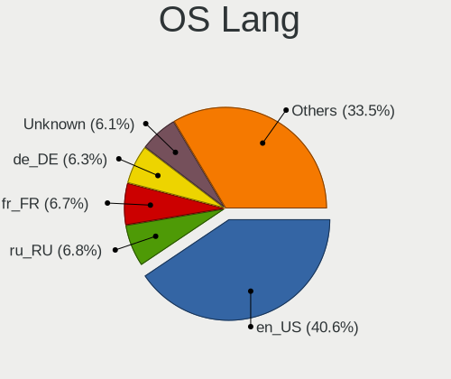
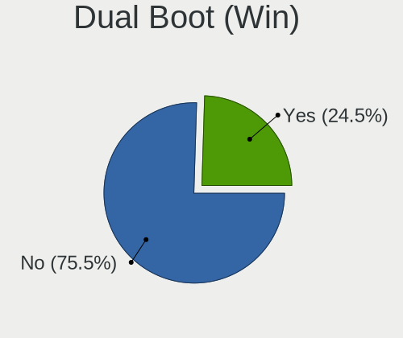
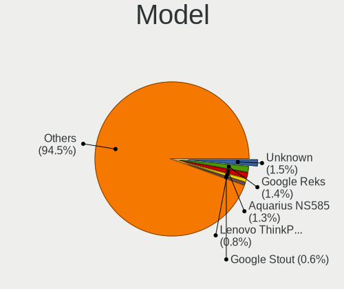
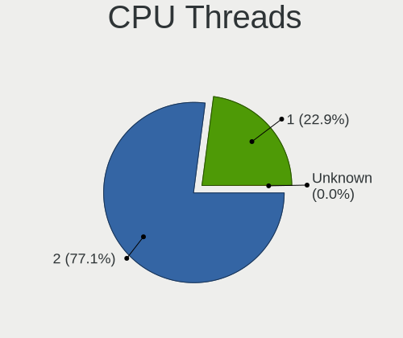
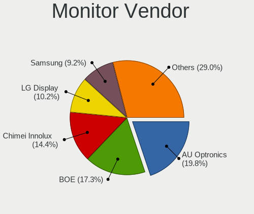
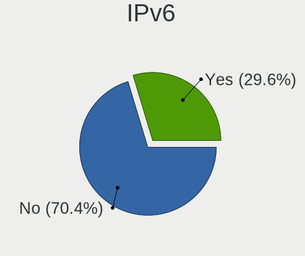
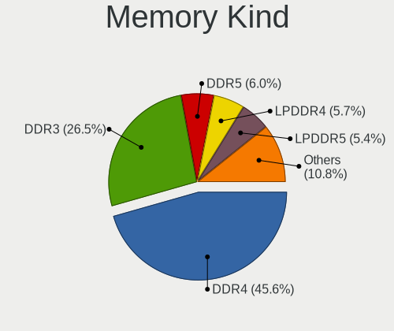

Debian 12 - Tested Hardware & Statistics (Notebooks)
----------------------------------------------------

A project to collect tested hardware configurations for Debian 12.

Anyone can contribute to this report by the [hw-probe](https://github.com/linuxhw/hw-probe) tool:

    sudo -E hw-probe -all -upload

Please contribute! Especially if your hardware is rare.

Contents
--------

* [ Test Cases ](#test-cases)

* [ System ](#system)
  - [ Kernel                   ](#kernel)
  - [ Kernel Family            ](#kernel-family)
  - [ Kernel Major Ver.        ](#kernel-major-ver)
  - [ Arch                     ](#arch)
  - [ DE                       ](#de)
  - [ Display Server           ](#display-server)
  - [ Display Manager          ](#display-manager)
  - [ OS Lang                  ](#os-lang)
  - [ Boot Mode                ](#boot-mode)
  - [ Filesystem               ](#filesystem)
  - [ Part. scheme             ](#part-scheme)
  - [ Dual Boot with Linux/BSD ](#dual-boot-with-linuxbsd)
  - [ Dual Boot (Win)          ](#dual-boot-win)

* [ Board ](#board)
  - [ Vendor                   ](#vendor)
  - [ Model                    ](#model)
  - [ Model Family             ](#model-family)
  - [ MFG Year                 ](#mfg-year)
  - [ Form Factor              ](#form-factor)
  - [ Secure Boot              ](#secure-boot)
  - [ Coreboot                 ](#coreboot)
  - [ RAM Size                 ](#ram-size)
  - [ RAM Used                 ](#ram-used)
  - [ Total Drives             ](#total-drives)
  - [ Has CD-ROM               ](#has-cd-rom)
  - [ Has Ethernet             ](#has-ethernet)
  - [ Has WiFi                 ](#has-wifi)
  - [ Has Bluetooth            ](#has-bluetooth)

* [ Location ](#location)
  - [ Country                  ](#country)
  - [ City                     ](#city)

* [ Drives ](#drives)
  - [ Drive Vendor             ](#drive-vendor)
  - [ Drive Model              ](#drive-model)
  - [ HDD Vendor               ](#hdd-vendor)
  - [ SSD Vendor               ](#ssd-vendor)
  - [ Drive Kind               ](#drive-kind)
  - [ Drive Connector          ](#drive-connector)
  - [ Drive Size               ](#drive-size)
  - [ Space Total              ](#space-total)
  - [ Space Used               ](#space-used)
  - [ Malfunc. Drives          ](#malfunc-drives)
  - [ Malfunc. Drive Vendor    ](#malfunc-drive-vendor)
  - [ Malfunc. HDD Vendor      ](#malfunc-hdd-vendor)
  - [ Malfunc. Drive Kind      ](#malfunc-drive-kind)
  - [ Failed Drives            ](#failed-drives)
  - [ Failed Drive Vendor      ](#failed-drive-vendor)
  - [ Drive Status             ](#drive-status)

* [ Storage controller ](#storage-controller)
  - [ Storage Vendor           ](#storage-vendor)
  - [ Storage Model            ](#storage-model)
  - [ Storage Kind             ](#storage-kind)

* [ Processor ](#processor)
  - [ CPU Vendor               ](#cpu-vendor)
  - [ CPU Model                ](#cpu-model)
  - [ CPU Model Family         ](#cpu-model-family)
  - [ CPU Cores                ](#cpu-cores)
  - [ CPU Sockets              ](#cpu-sockets)
  - [ CPU Threads              ](#cpu-threads)
  - [ CPU Op-Modes             ](#cpu-op-modes)
  - [ CPU Microcode            ](#cpu-microcode)
  - [ CPU Microarch            ](#cpu-microarch)

* [ Graphics ](#graphics)
  - [ GPU Vendor               ](#gpu-vendor)
  - [ GPU Model                ](#gpu-model)
  - [ GPU Combo                ](#gpu-combo)
  - [ GPU Driver               ](#gpu-driver)
  - [ GPU Memory               ](#gpu-memory)

* [ Monitor ](#monitor)
  - [ Monitor Vendor           ](#monitor-vendor)
  - [ Monitor Model            ](#monitor-model)
  - [ Monitor Resolution       ](#monitor-resolution)
  - [ Monitor Diagonal         ](#monitor-diagonal)
  - [ Monitor Width            ](#monitor-width)
  - [ Aspect Ratio             ](#aspect-ratio)
  - [ Monitor Area             ](#monitor-area)
  - [ Pixel Density            ](#pixel-density)
  - [ Multiple Monitors        ](#multiple-monitors)

* [ Network ](#network)
  - [ Net Controller Vendor    ](#net-controller-vendor)
  - [ Net Controller Model     ](#net-controller-model)
  - [ Wireless Vendor          ](#wireless-vendor)
  - [ Wireless Model           ](#wireless-model)
  - [ Ethernet Vendor          ](#ethernet-vendor)
  - [ Ethernet Model           ](#ethernet-model)
  - [ Net Controller Kind      ](#net-controller-kind)
  - [ Used Controller          ](#used-controller)
  - [ NICs                     ](#nics)
  - [ IPv6                     ](#ipv6)

* [ Bluetooth ](#bluetooth)
  - [ Bluetooth Vendor         ](#bluetooth-vendor)
  - [ Bluetooth Model          ](#bluetooth-model)

* [ Sound ](#sound)
  - [ Sound Vendor             ](#sound-vendor)
  - [ Sound Model              ](#sound-model)

* [ Memory ](#memory)
  - [ Memory Vendor            ](#memory-vendor)
  - [ Memory Model             ](#memory-model)
  - [ Memory Kind              ](#memory-kind)
  - [ Memory Form Factor       ](#memory-form-factor)
  - [ Memory Size              ](#memory-size)
  - [ Memory Speed             ](#memory-speed)

* [ Printers & scanners ](#printers--scanners)
  - [ Printer Vendor           ](#printer-vendor)
  - [ Printer Model            ](#printer-model)
  - [ Scanner Vendor           ](#scanner-vendor)
  - [ Scanner Model            ](#scanner-model)

* [ Camera ](#camera)
  - [ Camera Vendor            ](#camera-vendor)
  - [ Camera Model             ](#camera-model)

* [ Security ](#security)
  - [ Fingerprint Vendor       ](#fingerprint-vendor)
  - [ Fingerprint Model        ](#fingerprint-model)
  - [ Chipcard Vendor          ](#chipcard-vendor)
  - [ Chipcard Model           ](#chipcard-model)

* [ Unsupported ](#unsupported)
  - [ Unsupported Devices      ](#unsupported-devices)
  - [ Unsupported Device Types ](#unsupported-device-types)

Test Cases
----------

Total: 1223

| Vendor        | Model                       | Probe                                                      | Date         |
|---------------|-----------------------------|------------------------------------------------------------|--------------|
| HP            | EliteBook 8460p             | [cc6b66c576](https://linux-hardware.org/?probe=cc6b66c576) | Nov 06, 2023 |
| Aquarius      | NS585                       | [ddc8256647](https://linux-hardware.org/?probe=ddc8256647) | Nov 06, 2023 |
| Aquarius      | NS585                       | [2f4e49837d](https://linux-hardware.org/?probe=2f4e49837d) | Nov 06, 2023 |
| Aquarius      | NS585                       | [4fea63336a](https://linux-hardware.org/?probe=4fea63336a) | Nov 06, 2023 |
| HP            | 250 G7 Notebook PC          | [a2ad36d26c](https://linux-hardware.org/?probe=a2ad36d26c) | Nov 06, 2023 |
| Toshiba       | TECRA R950                  | [864877692e](https://linux-hardware.org/?probe=864877692e) | Nov 05, 2023 |
| ASUSTek       | X541NA                      | [f0399efc08](https://linux-hardware.org/?probe=f0399efc08) | Nov 05, 2023 |
| ASUSTek       | VivoBook_ASUSLaptop X140... | [92ed6d25c3](https://linux-hardware.org/?probe=92ed6d25c3) | Nov 05, 2023 |
| HP            | Mini 210-3000               | [8b55a876a9](https://linux-hardware.org/?probe=8b55a876a9) | Nov 05, 2023 |
| Google        | Nami                        | [19c94b9484](https://linux-hardware.org/?probe=19c94b9484) | Nov 05, 2023 |
| HP            | Laptop 15-bw0xx             | [7d9395e4a7](https://linux-hardware.org/?probe=7d9395e4a7) | Nov 05, 2023 |
| HP            | EliteBook 840 G3            | [1bb894cf19](https://linux-hardware.org/?probe=1bb894cf19) | Nov 04, 2023 |
| HP            | Pavilion dv7                | [6a44cc2c3c](https://linux-hardware.org/?probe=6a44cc2c3c) | Nov 04, 2023 |
| Google        | Bluebird                    | [55dbc11653](https://linux-hardware.org/?probe=55dbc11653) | Nov 04, 2023 |
| Google        | Bluebird                    | [9e12130a28](https://linux-hardware.org/?probe=9e12130a28) | Nov 04, 2023 |
| HP            | OMEN by Laptop 17-ck1xxx    | [bea6a6babf](https://linux-hardware.org/?probe=bea6a6babf) | Nov 04, 2023 |
| Lenovo        | ThinkPad T530 2429F27       | [0767db36fe](https://linux-hardware.org/?probe=0767db36fe) | Nov 04, 2023 |
| Dell          | Precision 7560              | [54a8deb305](https://linux-hardware.org/?probe=54a8deb305) | Nov 04, 2023 |
| ASUSTek       | X551CA                      | [20bee22e0a](https://linux-hardware.org/?probe=20bee22e0a) | Nov 03, 2023 |
| Dell          | Latitude E6420              | [43ccf36bf0](https://linux-hardware.org/?probe=43ccf36bf0) | Nov 03, 2023 |
| Google        | Enguarde                    | [bc6a541eb9](https://linux-hardware.org/?probe=bc6a541eb9) | Nov 03, 2023 |
| Lenovo        | ThinkBook 14 G3 ACL 21A2    | [8b855ce4f4](https://linux-hardware.org/?probe=8b855ce4f4) | Nov 03, 2023 |
| Lenovo        | G500s 20245                 | [c4aa915297](https://linux-hardware.org/?probe=c4aa915297) | Nov 03, 2023 |
| ASUSTek       | VivoBook_ASUSLaptop X515... | [1bdfa38b3e](https://linux-hardware.org/?probe=1bdfa38b3e) | Nov 03, 2023 |
| Lenovo        | IdeaPad Y500 20193          | [f96f6e6127](https://linux-hardware.org/?probe=f96f6e6127) | Nov 03, 2023 |
| ASUSTek       | X205TA                      | [b29e9ebfbe](https://linux-hardware.org/?probe=b29e9ebfbe) | Nov 03, 2023 |
| HP            | 250 G7 Notebook PC          | [1889111d8a](https://linux-hardware.org/?probe=1889111d8a) | Nov 03, 2023 |
| ASUSTek       | G750JX                      | [9493bec7e6](https://linux-hardware.org/?probe=9493bec7e6) | Nov 02, 2023 |
| Framework     | Laptop (12th Gen Intel C... | [7c06ac2664](https://linux-hardware.org/?probe=7c06ac2664) | Nov 02, 2023 |
| Google        | Nasher360                   | [0d1cc1b584](https://linux-hardware.org/?probe=0d1cc1b584) | Nov 02, 2023 |
| Framework     | Laptop (13th Gen Intel C... | [df4f43ca44](https://linux-hardware.org/?probe=df4f43ca44) | Nov 01, 2023 |
| Lenovo        | ThinkPad 13 2nd Gen 20J1... | [bb5bbc3e51](https://linux-hardware.org/?probe=bb5bbc3e51) | Nov 01, 2023 |
| Lenovo        | ThinkPad L15 Gen 2 20X4S... | [ac563e5542](https://linux-hardware.org/?probe=ac563e5542) | Nov 01, 2023 |
| HP            | Laptop 15s-eq1xxx           | [075049b538](https://linux-hardware.org/?probe=075049b538) | Nov 01, 2023 |
| Dell          | Precision M4700             | [1d7e76c1d9](https://linux-hardware.org/?probe=1d7e76c1d9) | Nov 01, 2023 |
| Lenovo        | ThinkPad P16s Gen 2 21K9... | [317aadad91](https://linux-hardware.org/?probe=317aadad91) | Nov 01, 2023 |
| Dell          | Vostro 5590                 | [300630cf8c](https://linux-hardware.org/?probe=300630cf8c) | Nov 01, 2023 |
| Dell          | Latitude 5480               | [1bf5aeba87](https://linux-hardware.org/?probe=1bf5aeba87) | Nov 01, 2023 |
| Lenovo        | ThinkPad P14s Gen 4 21K5... | [2bdd27dc18](https://linux-hardware.org/?probe=2bdd27dc18) | Oct 31, 2023 |
| Lenovo        | ThinkPad P14s Gen 4 21K5... | [cb35a8d8f6](https://linux-hardware.org/?probe=cb35a8d8f6) | Oct 31, 2023 |
| Lenovo        | ThinkPad 13 2nd Gen 20J1... | [4ebd30711e](https://linux-hardware.org/?probe=4ebd30711e) | Oct 31, 2023 |
| Lenovo        | ThinkPad 13 2nd Gen 20J1... | [a664733aaf](https://linux-hardware.org/?probe=a664733aaf) | Oct 31, 2023 |
| Lenovo        | ThinkPad 13 2nd Gen 20J2... | [72131fb5de](https://linux-hardware.org/?probe=72131fb5de) | Oct 31, 2023 |
| VANT          | MOOVE3-15                   | [5fc04a6d0a](https://linux-hardware.org/?probe=5fc04a6d0a) | Oct 31, 2023 |
| Apple         | MacBookPro9,1               | [8f7c5b801b](https://linux-hardware.org/?probe=8f7c5b801b) | Oct 31, 2023 |
| Apple         | MacBookPro9,1               | [4e15275faa](https://linux-hardware.org/?probe=4e15275faa) | Oct 31, 2023 |
| HP            | Victus by Gaming Laptop ... | [0f4fa9169b](https://linux-hardware.org/?probe=0f4fa9169b) | Oct 31, 2023 |
| Lenovo        | ThinkPad L14 Gen 3 21C10... | [2f63bfb399](https://linux-hardware.org/?probe=2f63bfb399) | Oct 31, 2023 |
| VANT          | MOOVE3-15                   | [7e12621e6d](https://linux-hardware.org/?probe=7e12621e6d) | Oct 31, 2023 |
| Timi          | RedmiBook Pro 14S           | [780e721e24](https://linux-hardware.org/?probe=780e721e24) | Oct 30, 2023 |
| Lenovo        | ThinkPad X260 VB6R77903H    | [c4baf8a67b](https://linux-hardware.org/?probe=c4baf8a67b) | Oct 30, 2023 |
| THUNDEROBO... | 911AirD                     | [698adeeba7](https://linux-hardware.org/?probe=698adeeba7) | Oct 30, 2023 |
| Dell          | XPS 15 9520                 | [0fb7ced892](https://linux-hardware.org/?probe=0fb7ced892) | Oct 30, 2023 |
| Google        | Blooguard                   | [cd817fb666](https://linux-hardware.org/?probe=cd817fb666) | Oct 30, 2023 |
| Lenovo        | ThinkPad 13 2nd Gen 20J1... | [995b159589](https://linux-hardware.org/?probe=995b159589) | Oct 30, 2023 |
| Gigabyte      | A5 X1                       | [981be88a61](https://linux-hardware.org/?probe=981be88a61) | Oct 30, 2023 |
| Lenovo        | ThinkPad T14s Gen 3 21CQ... | [4aceca5660](https://linux-hardware.org/?probe=4aceca5660) | Oct 28, 2023 |
| Acer          | Aspire 4752                 | [ce321700bc](https://linux-hardware.org/?probe=ce321700bc) | Oct 28, 2023 |
| Lenovo        | ThinkPad T15g Gen 2i 20Y... | [dcd6988b7a](https://linux-hardware.org/?probe=dcd6988b7a) | Oct 28, 2023 |
| TELECOMITA... | M7x0S                       | [feabc7e111](https://linux-hardware.org/?probe=feabc7e111) | Oct 28, 2023 |
| MSI           | WS63 7RK                    | [dcfa2c2f75](https://linux-hardware.org/?probe=dcfa2c2f75) | Oct 27, 2023 |
| Lenovo        | ThinkPad X230 2325SDE       | [cbdbd4a156](https://linux-hardware.org/?probe=cbdbd4a156) | Oct 27, 2023 |
| Lenovo        | IdeaPad Gaming 3 15IAH7 ... | [d8bfe77d00](https://linux-hardware.org/?probe=d8bfe77d00) | Oct 27, 2023 |
| Lenovo        | ThinkPad T470 20HES0FW00    | [198bee98eb](https://linux-hardware.org/?probe=198bee98eb) | Oct 27, 2023 |
| Lenovo        | G50-70 20351                | [39e2fb6be6](https://linux-hardware.org/?probe=39e2fb6be6) | Oct 27, 2023 |
| ASUSTek       | ROG Strix G513QC_G513QC     | [bdf8012e05](https://linux-hardware.org/?probe=bdf8012e05) | Oct 27, 2023 |
| Lenovo        | ThinkPad P15v Gen 3 21D8... | [67b966e75c](https://linux-hardware.org/?probe=67b966e75c) | Oct 27, 2023 |
| Google        | Enguarde                    | [074b44ce16](https://linux-hardware.org/?probe=074b44ce16) | Oct 26, 2023 |
| Acer          | Aspire 5750G                | [afe742ceca](https://linux-hardware.org/?probe=afe742ceca) | Oct 26, 2023 |
| Dell          | Latitude 5414               | [78fb4f9907](https://linux-hardware.org/?probe=78fb4f9907) | Oct 26, 2023 |
| Medion        | Unknown                     | [ffcdfb3003](https://linux-hardware.org/?probe=ffcdfb3003) | Oct 26, 2023 |
| HP            | ProBook 4530s               | [b86df6ad72](https://linux-hardware.org/?probe=b86df6ad72) | Oct 26, 2023 |
| Lenovo        | IdeaPad S145-15IIL 81W8     | [cc3370083d](https://linux-hardware.org/?probe=cc3370083d) | Oct 26, 2023 |
| Exo           | Smart Serie R               | [d68b300ca7](https://linux-hardware.org/?probe=d68b300ca7) | Oct 26, 2023 |
| Toshiba       | Satellite L455D             | [29337c2310](https://linux-hardware.org/?probe=29337c2310) | Oct 26, 2023 |
| HUAWEI        | KLVL-WXXW                   | [303c4197c7](https://linux-hardware.org/?probe=303c4197c7) | Oct 26, 2023 |
| HP            | Compaq 15                   | [83fab35dec](https://linux-hardware.org/?probe=83fab35dec) | Oct 26, 2023 |
| Dell          | Latitude 5414               | [692b53f9d9](https://linux-hardware.org/?probe=692b53f9d9) | Oct 26, 2023 |
| HP            | Compaq 15                   | [41ada9e77d](https://linux-hardware.org/?probe=41ada9e77d) | Oct 26, 2023 |
| ASUSTek       | VivoBook_ASUSLaptop X512... | [bfe12f37dc](https://linux-hardware.org/?probe=bfe12f37dc) | Oct 25, 2023 |
| Acer          | Aspire 5750G                | [b726b22da1](https://linux-hardware.org/?probe=b726b22da1) | Oct 25, 2023 |
| Lenovo        | ThinkPad X1C 5th W10DG 2... | [c66ebc8e70](https://linux-hardware.org/?probe=c66ebc8e70) | Oct 25, 2023 |
| Google        | Reks                        | [d397eae4e5](https://linux-hardware.org/?probe=d397eae4e5) | Oct 25, 2023 |
| Acer          | Aspire ES1-521              | [2df6fb3e2a](https://linux-hardware.org/?probe=2df6fb3e2a) | Oct 25, 2023 |
| MSI           | Katana GF76 11SC            | [b1a5449e72](https://linux-hardware.org/?probe=b1a5449e72) | Oct 25, 2023 |
| HP            | Victus by Gaming Laptop ... | [71a22f4706](https://linux-hardware.org/?probe=71a22f4706) | Oct 25, 2023 |
| HP            | Laptop 15-dw3xxx            | [8994962017](https://linux-hardware.org/?probe=8994962017) | Oct 25, 2023 |
| Lenovo        | ThinkPad T480 20L6S29D00    | [b270ca3670](https://linux-hardware.org/?probe=b270ca3670) | Oct 24, 2023 |
| Lenovo        | ThinkPad T440p 20AWS18U0... | [1406d2f4d5](https://linux-hardware.org/?probe=1406d2f4d5) | Oct 24, 2023 |
| Medion        | Unknown                     | [fa168b5e75](https://linux-hardware.org/?probe=fa168b5e75) | Oct 24, 2023 |
| Lenovo        | ThinkPad T440p 20AWS18U0... | [56fa067caa](https://linux-hardware.org/?probe=56fa067caa) | Oct 24, 2023 |
| HP            | EliteBook 8740w             | [3669a01d21](https://linux-hardware.org/?probe=3669a01d21) | Oct 24, 2023 |
| Notebook      | P7xxDM(-G)                  | [bb211b2fb4](https://linux-hardware.org/?probe=bb211b2fb4) | Oct 24, 2023 |
| Alienware     | m15 Ryzen Ed. R5            | [dd704a643f](https://linux-hardware.org/?probe=dd704a643f) | Oct 24, 2023 |
| Acer          | Aspire 7750G                | [91006bdfa7](https://linux-hardware.org/?probe=91006bdfa7) | Oct 24, 2023 |
| Alienware     | m15 R6                      | [c6711f7b02](https://linux-hardware.org/?probe=c6711f7b02) | Oct 24, 2023 |
| ASUSTek       | G551JX                      | [db16c87fe8](https://linux-hardware.org/?probe=db16c87fe8) | Oct 24, 2023 |
| Lenovo        | IdeaPad 3 15ALC6 82KU       | [8754714bce](https://linux-hardware.org/?probe=8754714bce) | Oct 23, 2023 |
| Lenovo        | Yoga Slim 7 ProX 14IAH7 ... | [f4375f7115](https://linux-hardware.org/?probe=f4375f7115) | Oct 23, 2023 |
| Aquarius      | NS585                       | [3c793ad14b](https://linux-hardware.org/?probe=3c793ad14b) | Oct 23, 2023 |
| Aquarius      | NS585                       | [9e7366fb3a](https://linux-hardware.org/?probe=9e7366fb3a) | Oct 23, 2023 |
| Dell          | XPS 9315                    | [c03a4ad29d](https://linux-hardware.org/?probe=c03a4ad29d) | Oct 23, 2023 |
| Timi          | Mi NoteBook Pro             | [470eb40837](https://linux-hardware.org/?probe=470eb40837) | Oct 23, 2023 |
| Acer          | Aspire E5-573               | [d83f4bf9ad](https://linux-hardware.org/?probe=d83f4bf9ad) | Oct 23, 2023 |
| Lenovo        | ThinkPad T480s 20L8S1WH0... | [4d383aebdc](https://linux-hardware.org/?probe=4d383aebdc) | Oct 23, 2023 |
| Lenovo        | ThinkPad T480s 20L8S1WH0... | [4cb151fdfe](https://linux-hardware.org/?probe=4cb151fdfe) | Oct 23, 2023 |
| Dell          | XPS 13 9300                 | [9d7ecc567c](https://linux-hardware.org/?probe=9d7ecc567c) | Oct 23, 2023 |
| Dell          | Precision 3571              | [a2ba806246](https://linux-hardware.org/?probe=a2ba806246) | Oct 22, 2023 |
| Dell          | Precision 3571              | [efedaee27d](https://linux-hardware.org/?probe=efedaee27d) | Oct 22, 2023 |
| Dell          | Inspiron 6000               | [be4108e195](https://linux-hardware.org/?probe=be4108e195) | Oct 22, 2023 |
| Dell          | XPS 15 9560                 | [c2c4d81d07](https://linux-hardware.org/?probe=c2c4d81d07) | Oct 22, 2023 |
| GPU Compan... | GWTC51427                   | [69b6cd7a6f](https://linux-hardware.org/?probe=69b6cd7a6f) | Oct 22, 2023 |
| Acer          | Swift SF314-42              | [e19b58f8be](https://linux-hardware.org/?probe=e19b58f8be) | Oct 21, 2023 |
| Lenovo        | V130-15IGM 81HL             | [fc8d54a39c](https://linux-hardware.org/?probe=fc8d54a39c) | Oct 21, 2023 |
| Lenovo        | ThinkPad P15v Gen 3 21D8... | [5e57624ceb](https://linux-hardware.org/?probe=5e57624ceb) | Oct 21, 2023 |
| ASUSTek       | ASUS TUF Gaming A17 FA70... | [f30ccc13f5](https://linux-hardware.org/?probe=f30ccc13f5) | Oct 21, 2023 |
| ASUSTek       | ASUS TUF Dash F15 FX517Z... | [d9a8c7946e](https://linux-hardware.org/?probe=d9a8c7946e) | Oct 20, 2023 |
| ASUSTek       | ASUS TUF Dash F15 FX517Z... | [5cac857cd9](https://linux-hardware.org/?probe=5cac857cd9) | Oct 20, 2023 |
| Lenovo        | V15-IIL 82C5                | [50f6d4cb01](https://linux-hardware.org/?probe=50f6d4cb01) | Oct 20, 2023 |
| MSI           | Alpha 17 B5EEK              | [125e76df80](https://linux-hardware.org/?probe=125e76df80) | Oct 20, 2023 |
| MSI           | Alpha 17 B5EEK              | [3a5c553fcb](https://linux-hardware.org/?probe=3a5c553fcb) | Oct 20, 2023 |
| ASUSTek       | ROG Zephyrus G14 GA401QM... | [2147efec4e](https://linux-hardware.org/?probe=2147efec4e) | Oct 20, 2023 |
| Lenovo        | ThinkPad E14 Gen 5 21JK0... | [f35c9d006e](https://linux-hardware.org/?probe=f35c9d006e) | Oct 20, 2023 |
| Lenovo        | ThinkPad T470 20HES4VB00    | [423a16c64a](https://linux-hardware.org/?probe=423a16c64a) | Oct 20, 2023 |
| Razer         | Blade 14 (2022) - RZ09-0... | [64929e25f7](https://linux-hardware.org/?probe=64929e25f7) | Oct 20, 2023 |
| Razer         | Blade 14 (2022) - RZ09-0... | [da8f06a8e0](https://linux-hardware.org/?probe=da8f06a8e0) | Oct 19, 2023 |
| HP            | Laptop 15s-eq2xxx           | [9c9781a7ee](https://linux-hardware.org/?probe=9c9781a7ee) | Oct 19, 2023 |
| Dell          | XPS 13 9380                 | [a108313537](https://linux-hardware.org/?probe=a108313537) | Oct 19, 2023 |
| ASUSTek       | ASUS TUF Gaming F15 FX50... | [a8e2b482f4](https://linux-hardware.org/?probe=a8e2b482f4) | Oct 19, 2023 |
| Lenovo        | ThinkPad P15v Gen 3 21D8... | [81bfadb2d9](https://linux-hardware.org/?probe=81bfadb2d9) | Oct 18, 2023 |
| Dell          | Precision 7560              | [847d5dfd06](https://linux-hardware.org/?probe=847d5dfd06) | Oct 18, 2023 |
| Acer          | Aspire 5920G                | [5921ebc3f7](https://linux-hardware.org/?probe=5921ebc3f7) | Oct 18, 2023 |
| Acer          | Aspire 5920G                | [b6619c64fd](https://linux-hardware.org/?probe=b6619c64fd) | Oct 18, 2023 |
| Dell          | Latitude E6420              | [f703c6bd74](https://linux-hardware.org/?probe=f703c6bd74) | Oct 17, 2023 |
| Dell          | Latitude E6430              | [54d411b12d](https://linux-hardware.org/?probe=54d411b12d) | Oct 17, 2023 |
| Google        | Reks                        | [1053eb8fee](https://linux-hardware.org/?probe=1053eb8fee) | Oct 17, 2023 |
| Google        | Reks                        | [84b42b74a0](https://linux-hardware.org/?probe=84b42b74a0) | Oct 17, 2023 |
| HP            | ProBook 645 G1              | [d1eeca057f](https://linux-hardware.org/?probe=d1eeca057f) | Oct 17, 2023 |
| Lenovo        | ThinkPad P15 Gen 2i 20YQ... | [f9a0ba2cba](https://linux-hardware.org/?probe=f9a0ba2cba) | Oct 17, 2023 |
| Unknown       | Unknown                     | [f776cdb186](https://linux-hardware.org/?probe=f776cdb186) | Oct 17, 2023 |
| Lenovo        | ThinkPad P15 Gen 2i 20YQ... | [902d95cec2](https://linux-hardware.org/?probe=902d95cec2) | Oct 17, 2023 |
| HP            | EliteBook 820 G2            | [14f5dbdc5a](https://linux-hardware.org/?probe=14f5dbdc5a) | Oct 17, 2023 |
| Acer          | Aspire V3-771               | [e56b3d3602](https://linux-hardware.org/?probe=e56b3d3602) | Oct 17, 2023 |
| Acer          | Aspire 7750G                | [6c7f890049](https://linux-hardware.org/?probe=6c7f890049) | Oct 17, 2023 |
| Acer          | Aspire A515-54              | [a89d6c8f24](https://linux-hardware.org/?probe=a89d6c8f24) | Oct 17, 2023 |
| Dell          | Precision 7560              | [5d9dd29a22](https://linux-hardware.org/?probe=5d9dd29a22) | Oct 17, 2023 |
| Google        | Reks                        | [7610580a91](https://linux-hardware.org/?probe=7610580a91) | Oct 16, 2023 |
| HP            | Laptop 15-fd0xxx            | [0e6cc9fc48](https://linux-hardware.org/?probe=0e6cc9fc48) | Oct 16, 2023 |
| Acer          | Aspire 7750G                | [2a2d5e2425](https://linux-hardware.org/?probe=2a2d5e2425) | Oct 16, 2023 |
| ASUSTek       | 1015PN                      | [b6cbd56a75](https://linux-hardware.org/?probe=b6cbd56a75) | Oct 16, 2023 |
| Apple         | MacBookPro8,1               | [abfce57204](https://linux-hardware.org/?probe=abfce57204) | Oct 16, 2023 |
| Lenovo        | ThinkPad E565 20EY000XUK    | [b7cf6113c4](https://linux-hardware.org/?probe=b7cf6113c4) | Oct 16, 2023 |
| HUAWEI        | HVY-WXX9                    | [57e0cf4149](https://linux-hardware.org/?probe=57e0cf4149) | Oct 16, 2023 |
| ASUSTek       | Vivobook Go E1504FA_E150... | [2408be3605](https://linux-hardware.org/?probe=2408be3605) | Oct 16, 2023 |
| MSI           | GF63 Thin 11SC              | [1072e8d802](https://linux-hardware.org/?probe=1072e8d802) | Oct 16, 2023 |
| HP            | 250 G8 Notebook PC          | [38c84587d8](https://linux-hardware.org/?probe=38c84587d8) | Oct 16, 2023 |
| Apple         | MacBookAir4,1               | [f63091b76b](https://linux-hardware.org/?probe=f63091b76b) | Oct 16, 2023 |
| Lenovo        | ThinkPad P16v Gen 1 21FC... | [33ce923fc9](https://linux-hardware.org/?probe=33ce923fc9) | Oct 15, 2023 |
| Apple         | MacBookPro6,2               | [1df7e29365](https://linux-hardware.org/?probe=1df7e29365) | Oct 15, 2023 |
| Lenovo        | G50-70 20351                | [bdd8aeaf43](https://linux-hardware.org/?probe=bdd8aeaf43) | Oct 14, 2023 |
| HP            | Victus by Laptop 16-d1xx... | [50ebc1407b](https://linux-hardware.org/?probe=50ebc1407b) | Oct 14, 2023 |
| Dell          | Inspiron 3501               | [a1ada382fa](https://linux-hardware.org/?probe=a1ada382fa) | Oct 14, 2023 |
| Dell          | Latitude 5400               | [26c8a94f7f](https://linux-hardware.org/?probe=26c8a94f7f) | Oct 14, 2023 |
| Fujitsu       | LIFEBOOK T5010              | [f35263745a](https://linux-hardware.org/?probe=f35263745a) | Oct 14, 2023 |
| Dell          | Latitude 5414               | [2984ae5140](https://linux-hardware.org/?probe=2984ae5140) | Oct 14, 2023 |
| Google        | Reks                        | [066e8305fe](https://linux-hardware.org/?probe=066e8305fe) | Oct 13, 2023 |
| Google        | Reks                        | [acb8eb7f44](https://linux-hardware.org/?probe=acb8eb7f44) | Oct 13, 2023 |
| Google        | Reks                        | [707eb71f31](https://linux-hardware.org/?probe=707eb71f31) | Oct 13, 2023 |
| Lenovo        | IdeaPad 110-14IBR 80T6      | [94e6d9d3cb](https://linux-hardware.org/?probe=94e6d9d3cb) | Oct 13, 2023 |
| Google        | Reks                        | [4bc10c8b6b](https://linux-hardware.org/?probe=4bc10c8b6b) | Oct 13, 2023 |
| Lenovo        | V17 G4 IRU 83A2             | [5298e96c35](https://linux-hardware.org/?probe=5298e96c35) | Oct 13, 2023 |
| Lenovo        | ThinkPad X1 Carbon Gen 1... | [7ee4351584](https://linux-hardware.org/?probe=7ee4351584) | Oct 13, 2023 |
| Apple         | MacBookPro9,2               | [27b7cf72ac](https://linux-hardware.org/?probe=27b7cf72ac) | Oct 13, 2023 |
| Lenovo        | ThinkPad 13 2nd Gen 20J1... | [02c3723dae](https://linux-hardware.org/?probe=02c3723dae) | Oct 12, 2023 |
| Lenovo        | ThinkPad E475 20H40006US    | [d874291459](https://linux-hardware.org/?probe=d874291459) | Oct 12, 2023 |
| Lenovo        | IdeaPad 3 15ADA05 81W1      | [b53da36041](https://linux-hardware.org/?probe=b53da36041) | Oct 12, 2023 |
| Google        | Reks                        | [20f8a11067](https://linux-hardware.org/?probe=20f8a11067) | Oct 12, 2023 |
| Google        | Reks                        | [4e35f7ebe4](https://linux-hardware.org/?probe=4e35f7ebe4) | Oct 12, 2023 |
| Google        | Reks                        | [41c6c948bb](https://linux-hardware.org/?probe=41c6c948bb) | Oct 12, 2023 |
| ASUSTek       | X541UJ                      | [c061e67481](https://linux-hardware.org/?probe=c061e67481) | Oct 12, 2023 |
| Lenovo        | ThinkPad E475 20H40006US    | [24adbfd09a](https://linux-hardware.org/?probe=24adbfd09a) | Oct 11, 2023 |
| Google        | Reks                        | [1854f5e2fb](https://linux-hardware.org/?probe=1854f5e2fb) | Oct 11, 2023 |
| Lenovo        | ThinkPad P14s Gen 1 20Y1... | [9de2f282f8](https://linux-hardware.org/?probe=9de2f282f8) | Oct 11, 2023 |
| Lenovo        | ThinkPad E475 20H40006US    | [dc4ce65d14](https://linux-hardware.org/?probe=dc4ce65d14) | Oct 11, 2023 |
| Lenovo        | ThinkPad E475 20H40006US    | [c26fe51dd5](https://linux-hardware.org/?probe=c26fe51dd5) | Oct 11, 2023 |
| Google        | Reks                        | [f9857342ec](https://linux-hardware.org/?probe=f9857342ec) | Oct 11, 2023 |
| Lenovo        | ThinkPad E475 20H40006US    | [4a0728b60c](https://linux-hardware.org/?probe=4a0728b60c) | Oct 11, 2023 |
| Lenovo        | ThinkPad E475 20H40006US    | [63c9bedd9d](https://linux-hardware.org/?probe=63c9bedd9d) | Oct 11, 2023 |
| Lenovo        | ThinkPad E475 20H40006US    | [77fe4b27cf](https://linux-hardware.org/?probe=77fe4b27cf) | Oct 11, 2023 |
| Google        | Reks                        | [9b2d9c0f7c](https://linux-hardware.org/?probe=9b2d9c0f7c) | Oct 11, 2023 |
| Lenovo        | ThinkPad E475 20H40006US    | [a735df7685](https://linux-hardware.org/?probe=a735df7685) | Oct 11, 2023 |
| Google        | Reks                        | [e78d454248](https://linux-hardware.org/?probe=e78d454248) | Oct 11, 2023 |
| Google        | Reks                        | [e7c6590991](https://linux-hardware.org/?probe=e7c6590991) | Oct 11, 2023 |
| Lenovo        | ThinkPad E475 20H40006US    | [627ce99f24](https://linux-hardware.org/?probe=627ce99f24) | Oct 11, 2023 |
| Google        | Reks                        | [cc53305ade](https://linux-hardware.org/?probe=cc53305ade) | Oct 11, 2023 |
| Lenovo        | ThinkPad E475 20H40006US    | [d957b0375b](https://linux-hardware.org/?probe=d957b0375b) | Oct 11, 2023 |
| Google        | Reks                        | [286fdb3692](https://linux-hardware.org/?probe=286fdb3692) | Oct 11, 2023 |
| ASUSTek       | X541UJ                      | [0cb7dbb73b](https://linux-hardware.org/?probe=0cb7dbb73b) | Oct 11, 2023 |
| HP            | Laptop 15-fc0xxx            | [670b2194c0](https://linux-hardware.org/?probe=670b2194c0) | Oct 11, 2023 |
| Prestigio     | Visconte Quad 3GK           | [5ffdb7e479](https://linux-hardware.org/?probe=5ffdb7e479) | Oct 11, 2023 |
| Google        | Reks                        | [4bd21164ba](https://linux-hardware.org/?probe=4bd21164ba) | Oct 10, 2023 |
| Google        | Reks                        | [e574b981ae](https://linux-hardware.org/?probe=e574b981ae) | Oct 10, 2023 |
| Google        | Reks                        | [5d44d0021b](https://linux-hardware.org/?probe=5d44d0021b) | Oct 10, 2023 |
| Google        | Reks                        | [a4300f1369](https://linux-hardware.org/?probe=a4300f1369) | Oct 10, 2023 |
| Google        | Reks                        | [9b338e1cfb](https://linux-hardware.org/?probe=9b338e1cfb) | Oct 10, 2023 |
| Google        | Reks                        | [8c2146eff1](https://linux-hardware.org/?probe=8c2146eff1) | Oct 10, 2023 |
| Google        | Reks                        | [2d878f9b40](https://linux-hardware.org/?probe=2d878f9b40) | Oct 10, 2023 |
| Lenovo        | ThinkPad E475 20H40006US    | [8ca2bf7fc9](https://linux-hardware.org/?probe=8ca2bf7fc9) | Oct 10, 2023 |
| Google        | Reks                        | [b206e1538b](https://linux-hardware.org/?probe=b206e1538b) | Oct 10, 2023 |
| Google        | Reks                        | [3cf1a391be](https://linux-hardware.org/?probe=3cf1a391be) | Oct 10, 2023 |
| Google        | Reks                        | [d694213be1](https://linux-hardware.org/?probe=d694213be1) | Oct 10, 2023 |
| Lenovo        | ThinkPad T14s Gen 2i 20W... | [f91905858e](https://linux-hardware.org/?probe=f91905858e) | Oct 10, 2023 |
| Lenovo        | ThinkPad X1 Carbon 7th 2... | [c1c56db09e](https://linux-hardware.org/?probe=c1c56db09e) | Oct 10, 2023 |
| HP            | Pavilion Gaming Laptop 1... | [f95efe1e80](https://linux-hardware.org/?probe=f95efe1e80) | Oct 09, 2023 |
| ASUSTek       | VivoBook_ASUSLaptop K660... | [b3635689de](https://linux-hardware.org/?probe=b3635689de) | Oct 09, 2023 |
| Lenovo        | IdeaPad 3 15ADA05 81W1      | [6d2a6c2a6f](https://linux-hardware.org/?probe=6d2a6c2a6f) | Oct 09, 2023 |
| ASUSTek       | ROG Zephyrus G14 GA401QM... | [3c54fe835e](https://linux-hardware.org/?probe=3c54fe835e) | Oct 09, 2023 |
| MSI           | Katana GF66 11UG            | [0816e0912b](https://linux-hardware.org/?probe=0816e0912b) | Oct 09, 2023 |
| Lenovo        | ThinkPad T14 Gen 3 21AH0... | [a41b75e081](https://linux-hardware.org/?probe=a41b75e081) | Oct 09, 2023 |
| Lenovo        | ThinkPad T14 Gen 3 21AH0... | [ac6149e371](https://linux-hardware.org/?probe=ac6149e371) | Oct 08, 2023 |
| TUXEDO        | InfinityBook S 14 v5        | [7ad7f14fea](https://linux-hardware.org/?probe=7ad7f14fea) | Oct 08, 2023 |
| Lenovo        | ThinkPad P50 20EQS1WW00     | [91f26dd2c7](https://linux-hardware.org/?probe=91f26dd2c7) | Oct 08, 2023 |
| Acer          | Swift SF314-56G             | [2696a8d9c0](https://linux-hardware.org/?probe=2696a8d9c0) | Oct 08, 2023 |
| ASUSTek       | VivoBook_ASUSLaptop X140... | [8678e7aace](https://linux-hardware.org/?probe=8678e7aace) | Oct 08, 2023 |
| AXDIA Inte... | MYBOOK PRO 14 SE            | [344ed10ccd](https://linux-hardware.org/?probe=344ed10ccd) | Oct 07, 2023 |
| Lenovo        | ThinkPad P50 20EQS1WW00     | [a830045a2a](https://linux-hardware.org/?probe=a830045a2a) | Oct 07, 2023 |
| ASUSTek       | T100TAS                     | [f6a5a046b6](https://linux-hardware.org/?probe=f6a5a046b6) | Oct 07, 2023 |
| ASUSTek       | T100TAS                     | [c7e6160070](https://linux-hardware.org/?probe=c7e6160070) | Oct 07, 2023 |
| HP            | ENVY Laptop 13-aq0xxx       | [45be4f4f29](https://linux-hardware.org/?probe=45be4f4f29) | Oct 07, 2023 |
| Lenovo        | ThinkPad 13 2nd Gen 20J1... | [37eeaf5771](https://linux-hardware.org/?probe=37eeaf5771) | Oct 06, 2023 |
| Lenovo        | ThinkPad E475 20H40006US    | [275c59d0de](https://linux-hardware.org/?probe=275c59d0de) | Oct 06, 2023 |
| Lenovo        | ThinkPad E475 20H40006US    | [212dd29010](https://linux-hardware.org/?probe=212dd29010) | Oct 06, 2023 |
| Lenovo        | ThinkPad E475 20H40006US    | [5928c10f4a](https://linux-hardware.org/?probe=5928c10f4a) | Oct 06, 2023 |
| Lenovo        | ThinkPad E475 20H40006US    | [3bc146338b](https://linux-hardware.org/?probe=3bc146338b) | Oct 06, 2023 |
| Lenovo        | ThinkPad E475 20H40006US    | [82b7f17c90](https://linux-hardware.org/?probe=82b7f17c90) | Oct 06, 2023 |
| Lenovo        | ThinkPad E475 20H40006US    | [5f740996ed](https://linux-hardware.org/?probe=5f740996ed) | Oct 06, 2023 |
| Lenovo        | ThinkPad E475 20H40006US    | [64ffddf53c](https://linux-hardware.org/?probe=64ffddf53c) | Oct 06, 2023 |
| Lenovo        | ThinkPad E475 20H40006US    | [26bb748122](https://linux-hardware.org/?probe=26bb748122) | Oct 06, 2023 |
| HP            | 255 15.6 inch G9 Noteboo... | [a9fb0ad7d5](https://linux-hardware.org/?probe=a9fb0ad7d5) | Oct 06, 2023 |
| Lenovo        | ThinkPad E475 20H40006US    | [5f9cd4dfbe](https://linux-hardware.org/?probe=5f9cd4dfbe) | Oct 06, 2023 |
| Lenovo        | ThinkPad E475 20H40006US    | [7f948138a8](https://linux-hardware.org/?probe=7f948138a8) | Oct 06, 2023 |
| Lenovo        | ThinkPad E475 20H40006US    | [9b11272e7a](https://linux-hardware.org/?probe=9b11272e7a) | Oct 06, 2023 |
| Direkt-Tek    | DTLAPY116-1                 | [aaa295fa26](https://linux-hardware.org/?probe=aaa295fa26) | Oct 06, 2023 |
| Dell          | Latitude 7275               | [f1892c721d](https://linux-hardware.org/?probe=f1892c721d) | Oct 06, 2023 |
| Lenovo        | ThinkBook 15 G2 ARE 20VG    | [1c741fc115](https://linux-hardware.org/?probe=1c741fc115) | Oct 06, 2023 |
| Apple         | MacBookPro12,1              | [50fc69b25f](https://linux-hardware.org/?probe=50fc69b25f) | Oct 06, 2023 |
| HP            | ZBook 14 G2                 | [e1b3f48f3c](https://linux-hardware.org/?probe=e1b3f48f3c) | Oct 05, 2023 |
| ASUSTek       | ASUS TUF Gaming F17 FX70... | [fc37084670](https://linux-hardware.org/?probe=fc37084670) | Oct 05, 2023 |
| HP            | Pavilion Laptop 15-cs3xx... | [763ef47e79](https://linux-hardware.org/?probe=763ef47e79) | Oct 05, 2023 |
| Lenovo        | ThinkPad P15 Gen 2i 20YQ... | [1edb630be1](https://linux-hardware.org/?probe=1edb630be1) | Oct 05, 2023 |
| Dell          | Vostro 3490                 | [83f825d43e](https://linux-hardware.org/?probe=83f825d43e) | Oct 05, 2023 |
| Dell          | Latitude 7290               | [8822662fb7](https://linux-hardware.org/?probe=8822662fb7) | Oct 05, 2023 |
| Acer          | Aspire V5-531               | [555d578f86](https://linux-hardware.org/?probe=555d578f86) | Oct 05, 2023 |
| Lenovo        | Legion 5 15ARH05H 82B1      | [8ba8fa3184](https://linux-hardware.org/?probe=8ba8fa3184) | Oct 05, 2023 |
| Acer          | Aspire A317-54              | [12732988d1](https://linux-hardware.org/?probe=12732988d1) | Oct 05, 2023 |
| HP            | EliteBook 735 G6            | [94ac6e4439](https://linux-hardware.org/?probe=94ac6e4439) | Oct 04, 2023 |
| ASUSTek       | VivoBook_ASUSLaptop K650... | [258d726766](https://linux-hardware.org/?probe=258d726766) | Oct 04, 2023 |
| Lenovo        | ThinkPad P51 20HJS0RE02     | [892c35359f](https://linux-hardware.org/?probe=892c35359f) | Oct 04, 2023 |
| ASUSTek       | VivoBook_ASUSLaptop E210... | [03949619e9](https://linux-hardware.org/?probe=03949619e9) | Oct 04, 2023 |
| ASUSTek       | VivoBook_ASUSLaptop E410... | [627e882ad2](https://linux-hardware.org/?probe=627e882ad2) | Oct 04, 2023 |
| HP            | ZBook 17 G4                 | [ead2e4611e](https://linux-hardware.org/?probe=ead2e4611e) | Oct 04, 2023 |
| Acer          | Swift SF314-43              | [36d6c2e275](https://linux-hardware.org/?probe=36d6c2e275) | Oct 04, 2023 |
| Lenovo        | ThinkPad X1 Carbon Gen 1... | [82820de211](https://linux-hardware.org/?probe=82820de211) | Oct 03, 2023 |
| Lenovo        | ThinkPad E475 20H40006US    | [e80a668fc3](https://linux-hardware.org/?probe=e80a668fc3) | Oct 03, 2023 |
| Acer          | Aspire V5-531               | [b6a9eaaec5](https://linux-hardware.org/?probe=b6a9eaaec5) | Oct 03, 2023 |
| Notebook      | W65_67SJ                    | [4de813ee21](https://linux-hardware.org/?probe=4de813ee21) | Oct 03, 2023 |
| Lenovo        | Legion 5 15IAH7H 82RB       | [48ee75db0b](https://linux-hardware.org/?probe=48ee75db0b) | Oct 03, 2023 |
| Lenovo        | ThinkPad E475 20H40006US    | [9c6c3cf92b](https://linux-hardware.org/?probe=9c6c3cf92b) | Oct 03, 2023 |
| Toshiba       | Satellite P75-A             | [10da36f2b7](https://linux-hardware.org/?probe=10da36f2b7) | Oct 03, 2023 |
| Lenovo        | ThinkPad E580 20KS003WUS    | [5aed5aaa9b](https://linux-hardware.org/?probe=5aed5aaa9b) | Oct 03, 2023 |
| Lenovo        | ThinkPad E16 Gen 1 21JNC... | [fc95f3feef](https://linux-hardware.org/?probe=fc95f3feef) | Oct 03, 2023 |
| Lenovo        | ThinkPad T450 20BUA007SG    | [85af04a1cc](https://linux-hardware.org/?probe=85af04a1cc) | Oct 03, 2023 |
| Acer          | TravelMate P414-51          | [520fe0b494](https://linux-hardware.org/?probe=520fe0b494) | Oct 03, 2023 |
| Acer          | Swift SF314-56G             | [15b613a264](https://linux-hardware.org/?probe=15b613a264) | Oct 03, 2023 |
| ASUSTek       | VivoBook_ASUSLaptop X740... | [3a8b2b229a](https://linux-hardware.org/?probe=3a8b2b229a) | Oct 03, 2023 |
| Dell          | Wyse 5470                   | [301b504179](https://linux-hardware.org/?probe=301b504179) | Oct 03, 2023 |
| Google        | Reks                        | [00fe240f8b](https://linux-hardware.org/?probe=00fe240f8b) | Oct 02, 2023 |
| Google        | Reks                        | [c4dc39039e](https://linux-hardware.org/?probe=c4dc39039e) | Oct 02, 2023 |
| Google        | Reks                        | [0d9a805f5a](https://linux-hardware.org/?probe=0d9a805f5a) | Oct 02, 2023 |
| Google        | Reks                        | [22c6ac7ba8](https://linux-hardware.org/?probe=22c6ac7ba8) | Oct 02, 2023 |
| Google        | Reks                        | [0db25d0a2f](https://linux-hardware.org/?probe=0db25d0a2f) | Oct 02, 2023 |
| Lenovo        | ThinkPad T480 20L6S5LF00    | [9637400928](https://linux-hardware.org/?probe=9637400928) | Oct 02, 2023 |
| Compaq        | 420                         | [b327579e60](https://linux-hardware.org/?probe=b327579e60) | Oct 02, 2023 |
| VALE          | Notebook Classic C140       | [0516711124](https://linux-hardware.org/?probe=0516711124) | Oct 02, 2023 |
| Google        | Treeya                      | [b2251358a1](https://linux-hardware.org/?probe=b2251358a1) | Oct 02, 2023 |
| Lenovo        | B570e HuronRiver Platfor... | [cc181da4e1](https://linux-hardware.org/?probe=cc181da4e1) | Oct 02, 2023 |
| MSI           | GF63 Thin 9SC               | [3670f5ea70](https://linux-hardware.org/?probe=3670f5ea70) | Oct 02, 2023 |
| Lenovo        | B570e HuronRiver Platfor... | [f35e389d78](https://linux-hardware.org/?probe=f35e389d78) | Oct 02, 2023 |
| IX1401        | Unknown                     | [8014a1028b](https://linux-hardware.org/?probe=8014a1028b) | Oct 02, 2023 |
| Dell          | Inspiron 5570               | [93e66c7d47](https://linux-hardware.org/?probe=93e66c7d47) | Oct 02, 2023 |
| HP            | Presario CQ57               | [e83f052dc8](https://linux-hardware.org/?probe=e83f052dc8) | Oct 01, 2023 |
| Lenovo        | ThinkPad T480 20L6SA5Q2V    | [d9262b2225](https://linux-hardware.org/?probe=d9262b2225) | Oct 01, 2023 |
| Acer          | Aspire E1-571               | [2e7aba6432](https://linux-hardware.org/?probe=2e7aba6432) | Oct 01, 2023 |
| Acer          | AOA150                      | [969a729098](https://linux-hardware.org/?probe=969a729098) | Oct 01, 2023 |
| Apple         | MacBook4,1                  | [d17d6d2b70](https://linux-hardware.org/?probe=d17d6d2b70) | Oct 01, 2023 |
| HP            | Pavilion Laptop 15t-eg30... | [ed7bf5aee1](https://linux-hardware.org/?probe=ed7bf5aee1) | Oct 01, 2023 |
| Lenovo        | Legion Pro 5 16ARX8 82WM    | [83d91ea2fe](https://linux-hardware.org/?probe=83d91ea2fe) | Sep 30, 2023 |
| Lenovo        | ThinkPad X260 VB6R77903H    | [e7dad368d2](https://linux-hardware.org/?probe=e7dad368d2) | Sep 30, 2023 |
| Lenovo        | ThinkPad X260 VB6R77903H    | [de3079ae33](https://linux-hardware.org/?probe=de3079ae33) | Sep 30, 2023 |
| IX1401        | Unknown                     | [c77c1d010e](https://linux-hardware.org/?probe=c77c1d010e) | Sep 30, 2023 |
| HP            | Pavilion dv5                | [0b1da8643f](https://linux-hardware.org/?probe=0b1da8643f) | Sep 30, 2023 |
| Alienware     | m15 R4                      | [a67899ed06](https://linux-hardware.org/?probe=a67899ed06) | Sep 30, 2023 |
| Fujitsu Si... | ESPRIMO Mobile V6555        | [703170e428](https://linux-hardware.org/?probe=703170e428) | Sep 30, 2023 |
| HP            | Notebook                    | [193ec8deb3](https://linux-hardware.org/?probe=193ec8deb3) | Sep 30, 2023 |
| HP            | Pavilion dv9000 (GA359UA... | [cea70d5f75](https://linux-hardware.org/?probe=cea70d5f75) | Sep 29, 2023 |
| Dell          | Inspiron 5570               | [0e12b69b96](https://linux-hardware.org/?probe=0e12b69b96) | Sep 29, 2023 |
| Lenovo        | ThinkPad T500 22439AG       | [e5a2cd9816](https://linux-hardware.org/?probe=e5a2cd9816) | Sep 29, 2023 |
| Lenovo        | ThinkPad E490 20N8000SRT    | [274b3b5210](https://linux-hardware.org/?probe=274b3b5210) | Sep 28, 2023 |
| Lenovo        | IdeaPad Slim 5 14ABR8 82... | [c61d70bcfa](https://linux-hardware.org/?probe=c61d70bcfa) | Sep 28, 2023 |
| Lenovo        | IdeaPad Slim 5 16ABR8 82... | [1fcc841148](https://linux-hardware.org/?probe=1fcc841148) | Sep 28, 2023 |
| Lenovo        | IdeaPad Slim 5 14ABR8 82... | [be49c167d0](https://linux-hardware.org/?probe=be49c167d0) | Sep 28, 2023 |
| Apple         | MacBookAir7,2               | [c25eeffab1](https://linux-hardware.org/?probe=c25eeffab1) | Sep 28, 2023 |
| Acer          | Acadia V1.35                | [c2074b2535](https://linux-hardware.org/?probe=c2074b2535) | Sep 28, 2023 |
| Lenovo        | ThinkPad 13 2nd Gen 20J1... | [3cb2bdba37](https://linux-hardware.org/?probe=3cb2bdba37) | Sep 27, 2023 |
| EUROCOM       | RACER 2.0                   | [4351733d37](https://linux-hardware.org/?probe=4351733d37) | Sep 27, 2023 |
| HP            | ElitePad 1000 G2            | [2668770971](https://linux-hardware.org/?probe=2668770971) | Sep 27, 2023 |
| Fujitsu       | LIFEBOOK E4512              | [08b39b38bd](https://linux-hardware.org/?probe=08b39b38bd) | Sep 27, 2023 |
| ASUSTek       | K50IJ                       | [8556633dad](https://linux-hardware.org/?probe=8556633dad) | Sep 27, 2023 |
| Lenovo        | IdeaPad Gaming 3 15IMH05... | [1317c1f1a9](https://linux-hardware.org/?probe=1317c1f1a9) | Sep 27, 2023 |
| Lenovo        | ThinkPad E475 20H40006US    | [1a472d3072](https://linux-hardware.org/?probe=1a472d3072) | Sep 27, 2023 |
| Dell          | Latitude E6530              | [40cdcd2545](https://linux-hardware.org/?probe=40cdcd2545) | Sep 27, 2023 |
| Acer          | Aspire 5951G                | [cae145acab](https://linux-hardware.org/?probe=cae145acab) | Sep 26, 2023 |
| Lenovo        | ThinkPad E475 20H40006US    | [d406193722](https://linux-hardware.org/?probe=d406193722) | Sep 26, 2023 |
| Dell          | XPS 9315                    | [6fa1beb451](https://linux-hardware.org/?probe=6fa1beb451) | Sep 26, 2023 |
| Lenovo        | ThinkPad T420 4236EV9       | [d621ecd81f](https://linux-hardware.org/?probe=d621ecd81f) | Sep 26, 2023 |
| Aquarius      | NS585                       | [ce1c1d6e56](https://linux-hardware.org/?probe=ce1c1d6e56) | Sep 26, 2023 |
| Acer          | Aspire A515-47              | [3c1e418bf0](https://linux-hardware.org/?probe=3c1e418bf0) | Sep 26, 2023 |
| ASUSTek       | Zenbook UM3402YAR_UM3402... | [9e9ff26362](https://linux-hardware.org/?probe=9e9ff26362) | Sep 26, 2023 |
| Acer          | Aspire A515-56              | [b047457fd1](https://linux-hardware.org/?probe=b047457fd1) | Sep 25, 2023 |
| Dell          | XPS 15 9560                 | [a524453c71](https://linux-hardware.org/?probe=a524453c71) | Sep 25, 2023 |
| Lenovo        | G710 20252                  | [d7926809d7](https://linux-hardware.org/?probe=d7926809d7) | Sep 25, 2023 |
| HP            | Presario CQ43               | [c206dc84ad](https://linux-hardware.org/?probe=c206dc84ad) | Sep 25, 2023 |
| Aquarius      | NS585                       | [e901467e39](https://linux-hardware.org/?probe=e901467e39) | Sep 25, 2023 |
| Lenovo        | ThinkPad X270 W10DG 20K5... | [ab332c2dcb](https://linux-hardware.org/?probe=ab332c2dcb) | Sep 25, 2023 |
| Acer          | Aspire 5951G                | [4c50b8e9b0](https://linux-hardware.org/?probe=4c50b8e9b0) | Sep 25, 2023 |
| Lenovo        | ThinkPad T440s 20ARS0CN0... | [9c0b702e21](https://linux-hardware.org/?probe=9c0b702e21) | Sep 24, 2023 |
| Dell          | Latitude 5420               | [0e22f551b9](https://linux-hardware.org/?probe=0e22f551b9) | Sep 24, 2023 |
| HP            | 250 G8 Notebook PC          | [6b3c3ce703](https://linux-hardware.org/?probe=6b3c3ce703) | Sep 23, 2023 |
| Lenovo        | ThinkPad X1 Carbon 6th 2... | [42309ddc8c](https://linux-hardware.org/?probe=42309ddc8c) | Sep 23, 2023 |
| HP            | 250 G8 Notebook PC          | [e2dd7767f0](https://linux-hardware.org/?probe=e2dd7767f0) | Sep 23, 2023 |
| HP            | EliteBook 845 G8 Noteboo... | [574c2193bb](https://linux-hardware.org/?probe=574c2193bb) | Sep 23, 2023 |
| Lenovo        | ThinkPad L13 Gen 3 21B90... | [e273beb83a](https://linux-hardware.org/?probe=e273beb83a) | Sep 22, 2023 |
| Lenovo        | ThinkPad T470s W10DG 20J... | [ad1b8126d2](https://linux-hardware.org/?probe=ad1b8126d2) | Sep 22, 2023 |
| Lenovo        | ThinkPad L13 Gen 3 21B90... | [0d786ffd74](https://linux-hardware.org/?probe=0d786ffd74) | Sep 22, 2023 |
| Lenovo        | IdeaPad S340-15IWL 81N8     | [c14178c7fa](https://linux-hardware.org/?probe=c14178c7fa) | Sep 22, 2023 |
| Samsung       | R505                        | [8aef37cda9](https://linux-hardware.org/?probe=8aef37cda9) | Sep 22, 2023 |
| HP            | Pavilion Aero Laptop 13-... | [4bf358cd4f](https://linux-hardware.org/?probe=4bf358cd4f) | Sep 22, 2023 |
| HP            | EliteBook 840 G3            | [b6379ef77c](https://linux-hardware.org/?probe=b6379ef77c) | Sep 22, 2023 |
| Lenovo        | ThinkPad E475 20H40006US    | [ea491d194f](https://linux-hardware.org/?probe=ea491d194f) | Sep 21, 2023 |
| Lenovo        | ThinkPad 13 2nd Gen 20J1... | [e33bb92eb6](https://linux-hardware.org/?probe=e33bb92eb6) | Sep 21, 2023 |
| Lenovo        | V14 G3 IAP 82TS             | [2528381c0e](https://linux-hardware.org/?probe=2528381c0e) | Sep 21, 2023 |
| Lenovo        | Legion 5 15ACH6H 82JU       | [f9430fd075](https://linux-hardware.org/?probe=f9430fd075) | Sep 21, 2023 |
| Lenovo        | ThinkPad 13 2nd Gen 20J1... | [e337cc85e5](https://linux-hardware.org/?probe=e337cc85e5) | Sep 20, 2023 |
| Acer          | Aspire E1-531               | [f0173f0458](https://linux-hardware.org/?probe=f0173f0458) | Sep 20, 2023 |
| Lenovo        | ThinkPad L390 20NRCTO1WW    | [228d31bf59](https://linux-hardware.org/?probe=228d31bf59) | Sep 20, 2023 |
| Dell          | XPS 13 9300                 | [49bb68e979](https://linux-hardware.org/?probe=49bb68e979) | Sep 20, 2023 |
| HP            | ProBook 450 G1              | [4e5ae95013](https://linux-hardware.org/?probe=4e5ae95013) | Sep 20, 2023 |
| ASUSTek       | X556UQ                      | [c34d9b9514](https://linux-hardware.org/?probe=c34d9b9514) | Sep 20, 2023 |
| ASUSTek       | X556UQ                      | [7ec3567855](https://linux-hardware.org/?probe=7ec3567855) | Sep 20, 2023 |
| ASUSTek       | X556UQ                      | [676dd13401](https://linux-hardware.org/?probe=676dd13401) | Sep 20, 2023 |
| Lenovo        | IdeaPad Y700-15ISK 80NV     | [5662d8f95c](https://linux-hardware.org/?probe=5662d8f95c) | Sep 20, 2023 |
| HP            | Laptop 15-bs0xx             | [963330511d](https://linux-hardware.org/?probe=963330511d) | Sep 19, 2023 |
| Notebook      | P7xxDM3(-G)                 | [b302c7b008](https://linux-hardware.org/?probe=b302c7b008) | Sep 19, 2023 |
| Lenovo        | ThinkPad X61s 7666Y2X       | [177e40808d](https://linux-hardware.org/?probe=177e40808d) | Sep 19, 2023 |
| Notebook      | P7xxDM3(-G)                 | [ec386099b2](https://linux-hardware.org/?probe=ec386099b2) | Sep 19, 2023 |
| HP            | Laptop 17-cp0xxx            | [05e3350e1f](https://linux-hardware.org/?probe=05e3350e1f) | Sep 19, 2023 |
| Dell          | XPS 13 9360                 | [149f246bd7](https://linux-hardware.org/?probe=149f246bd7) | Sep 19, 2023 |
| Acer          | Aspire A515-56              | [db16273e72](https://linux-hardware.org/?probe=db16273e72) | Sep 19, 2023 |
| Intel Clie... | LAPBC710                    | [af446fcb4d](https://linux-hardware.org/?probe=af446fcb4d) | Sep 19, 2023 |
| Intel Clie... | LAPBC710                    | [eae124fa61](https://linux-hardware.org/?probe=eae124fa61) | Sep 19, 2023 |
| HP            | Laptop 15-bs0xx             | [5f8df7dfcb](https://linux-hardware.org/?probe=5f8df7dfcb) | Sep 19, 2023 |
| Dell          | Latitude E6430              | [d83d7bbfa8](https://linux-hardware.org/?probe=d83d7bbfa8) | Sep 18, 2023 |
| HP            | 15                          | [b016d5ee79](https://linux-hardware.org/?probe=b016d5ee79) | Sep 18, 2023 |
| Aquarius      | NS585                       | [6ac8bd5909](https://linux-hardware.org/?probe=6ac8bd5909) | Sep 18, 2023 |
| HP            | Mini 110-1000               | [dda4d7a910](https://linux-hardware.org/?probe=dda4d7a910) | Sep 18, 2023 |
| HP            | Mini 110-1000               | [ee2d142228](https://linux-hardware.org/?probe=ee2d142228) | Sep 18, 2023 |
| HP            | Compaq Mini 311-1100        | [8bdfb6307c](https://linux-hardware.org/?probe=8bdfb6307c) | Sep 17, 2023 |
| HP            | Laptop 15-dw3xxx            | [f84a480b09](https://linux-hardware.org/?probe=f84a480b09) | Sep 17, 2023 |
| Lenovo        | ThinkPad P14s Gen 2a 21A... | [cda370cdc3](https://linux-hardware.org/?probe=cda370cdc3) | Sep 16, 2023 |
| ASUSTek       | ASUSPRO P5440FA_P5440FA     | [b7c1a0a0a0](https://linux-hardware.org/?probe=b7c1a0a0a0) | Sep 16, 2023 |
| Apple         | MacBookPro8,1               | [c3791ba730](https://linux-hardware.org/?probe=c3791ba730) | Sep 16, 2023 |
| Lenovo        | ThinkPad X201 3249CTO       | [f5884967d0](https://linux-hardware.org/?probe=f5884967d0) | Sep 16, 2023 |
| Dell          | Latitude E5570              | [fd5ba4aa5a](https://linux-hardware.org/?probe=fd5ba4aa5a) | Sep 15, 2023 |
| Dell          | Precision 5570              | [8b3c21b110](https://linux-hardware.org/?probe=8b3c21b110) | Sep 15, 2023 |
| Lenovo        | ThinkPad P15 Gen 1 20STC... | [66b29aeb1d](https://linux-hardware.org/?probe=66b29aeb1d) | Sep 15, 2023 |
| Lenovo        | Yoga Pro 9 16IRP8 83BY      | [eaa723190d](https://linux-hardware.org/?probe=eaa723190d) | Sep 15, 2023 |
| ASUSTek       | X507UB                      | [ca19710375](https://linux-hardware.org/?probe=ca19710375) | Sep 15, 2023 |
| ASUSTek       | X751LN                      | [77ecc965aa](https://linux-hardware.org/?probe=77ecc965aa) | Sep 14, 2023 |
| ASUSTek       | VivoBook 15_ASUS Laptop ... | [0ffb2a765f](https://linux-hardware.org/?probe=0ffb2a765f) | Sep 14, 2023 |
| Toshiba       | PORTEGE Z830                | [a3e1ac295c](https://linux-hardware.org/?probe=a3e1ac295c) | Sep 14, 2023 |
| ASUSTek       | P553UJ                      | [3463413300](https://linux-hardware.org/?probe=3463413300) | Sep 14, 2023 |
| Toshiba       | PORTEGE Z830                | [6f4c4a4120](https://linux-hardware.org/?probe=6f4c4a4120) | Sep 14, 2023 |
| ASUSTek       | TUF Gaming FX505DT_FX505... | [d27fa5404b](https://linux-hardware.org/?probe=d27fa5404b) | Sep 14, 2023 |
| Dell          | Latitude 5440               | [93a296a628](https://linux-hardware.org/?probe=93a296a628) | Sep 14, 2023 |
| Lenovo        | ThinkPad T14s Gen 3 21CQ... | [033eca4030](https://linux-hardware.org/?probe=033eca4030) | Sep 14, 2023 |
| HP            | 245 G7 Notebook PC          | [ab68dea087](https://linux-hardware.org/?probe=ab68dea087) | Sep 14, 2023 |
| HP            | ProBook 6570b               | [fc5c01d215](https://linux-hardware.org/?probe=fc5c01d215) | Sep 14, 2023 |
| Lenovo        | ThinkPad P14s Gen 3 21AK... | [0cdeaab8be](https://linux-hardware.org/?probe=0cdeaab8be) | Sep 13, 2023 |
| MSI           | GS66 Stealth 11UG           | [304abac74b](https://linux-hardware.org/?probe=304abac74b) | Sep 13, 2023 |
| HP            | Stream Notebook PC 11       | [f4c5ae4297](https://linux-hardware.org/?probe=f4c5ae4297) | Sep 13, 2023 |
| Acer          | AOA150                      | [bc32c4814d](https://linux-hardware.org/?probe=bc32c4814d) | Sep 13, 2023 |
| Lenovo        | ThinkPad X230 232036U       | [58ec12094c](https://linux-hardware.org/?probe=58ec12094c) | Sep 13, 2023 |
| Google        | Cave                        | [74c8e00b23](https://linux-hardware.org/?probe=74c8e00b23) | Sep 13, 2023 |
| Dell          | Latitude E6430              | [79cf77c6ba](https://linux-hardware.org/?probe=79cf77c6ba) | Sep 12, 2023 |
| Dell          | Latitude E7470              | [4f2094dfef](https://linux-hardware.org/?probe=4f2094dfef) | Sep 12, 2023 |
| Toshiba       | Satellite L640              | [ac5a264fea](https://linux-hardware.org/?probe=ac5a264fea) | Sep 12, 2023 |
| ASUSTek       | ASUS TUF Gaming F15 FX50... | [be2af85bb7](https://linux-hardware.org/?probe=be2af85bb7) | Sep 12, 2023 |
| HUAWEI        | BOM-WXX9                    | [0224dfd46f](https://linux-hardware.org/?probe=0224dfd46f) | Sep 11, 2023 |
| Framework     | Laptop (13th Gen Intel C... | [52b50b0d68](https://linux-hardware.org/?probe=52b50b0d68) | Sep 11, 2023 |
| Google        | Enguarde                    | [4fd827adc5](https://linux-hardware.org/?probe=4fd827adc5) | Sep 11, 2023 |
| Google        | Enguarde                    | [b2b5b5f73b](https://linux-hardware.org/?probe=b2b5b5f73b) | Sep 11, 2023 |
| Lenovo        | ThinkPad L380 20M50013GE    | [e7778dd80d](https://linux-hardware.org/?probe=e7778dd80d) | Sep 11, 2023 |
| HP            | 250 G3                      | [162574954f](https://linux-hardware.org/?probe=162574954f) | Sep 11, 2023 |
| ASUSTek       | ZenBook UX325EA_UX325EA     | [24e256ad9e](https://linux-hardware.org/?probe=24e256ad9e) | Sep 11, 2023 |
| ASUSTek       | ASUS EXPERTBOOK L1500CDA... | [57e8f1b556](https://linux-hardware.org/?probe=57e8f1b556) | Sep 11, 2023 |
| Samsung       | 550XED                      | [69d754d35b](https://linux-hardware.org/?probe=69d754d35b) | Sep 11, 2023 |
| Samsung       | 550XED                      | [8187eca3e3](https://linux-hardware.org/?probe=8187eca3e3) | Sep 11, 2023 |
| ASUSTek       | G751JT                      | [4395b1ccb2](https://linux-hardware.org/?probe=4395b1ccb2) | Sep 10, 2023 |
| ASUSTek       | X550VX                      | [b1b59ca70c](https://linux-hardware.org/?probe=b1b59ca70c) | Sep 10, 2023 |
| HP            | Unknown                     | [cb5704a65f](https://linux-hardware.org/?probe=cb5704a65f) | Sep 10, 2023 |
| Google        | Lillipup                    | [c3a892cdca](https://linux-hardware.org/?probe=c3a892cdca) | Sep 10, 2023 |
| HP            | ProBook 6570b               | [3ed768081c](https://linux-hardware.org/?probe=3ed768081c) | Sep 09, 2023 |
| HP            | Pavilion Plus Laptop 14-... | [780a68ac11](https://linux-hardware.org/?probe=780a68ac11) | Sep 09, 2023 |
| Dell          | Inspiron 7580               | [9705f02462](https://linux-hardware.org/?probe=9705f02462) | Sep 09, 2023 |
| ASUSTek       | ZenBook UX431FLC_UX431FL    | [3865278574](https://linux-hardware.org/?probe=3865278574) | Sep 09, 2023 |
| Acer          | Nitro AN515-55              | [3f247b15c6](https://linux-hardware.org/?probe=3f247b15c6) | Sep 09, 2023 |
| Lenovo        | ThinkPad T440s 20AQ005QU... | [0a57a98442](https://linux-hardware.org/?probe=0a57a98442) | Sep 09, 2023 |
| Lenovo        | ThinkPad X395 20NMS0YG00    | [b3697e5a7e](https://linux-hardware.org/?probe=b3697e5a7e) | Sep 09, 2023 |
| Google        | Enguarde                    | [3ec3cf816b](https://linux-hardware.org/?probe=3ec3cf816b) | Sep 08, 2023 |
| Google        | Enguarde                    | [fa7b318083](https://linux-hardware.org/?probe=fa7b318083) | Sep 08, 2023 |
| Google        | Enguarde                    | [1621463a03](https://linux-hardware.org/?probe=1621463a03) | Sep 08, 2023 |
| Google        | Enguarde                    | [b54a785396](https://linux-hardware.org/?probe=b54a785396) | Sep 08, 2023 |
| Google        | Enguarde                    | [b35f66260b](https://linux-hardware.org/?probe=b35f66260b) | Sep 08, 2023 |
| Google        | Enguarde                    | [e754c23dd9](https://linux-hardware.org/?probe=e754c23dd9) | Sep 08, 2023 |
| Google        | Enguarde                    | [71e3d1a632](https://linux-hardware.org/?probe=71e3d1a632) | Sep 08, 2023 |
| Google        | Enguarde                    | [352198bb3c](https://linux-hardware.org/?probe=352198bb3c) | Sep 08, 2023 |
| Google        | Enguarde                    | [15edd97e90](https://linux-hardware.org/?probe=15edd97e90) | Sep 08, 2023 |
| Google        | Enguarde                    | [265336497a](https://linux-hardware.org/?probe=265336497a) | Sep 08, 2023 |
| Google        | Enguarde                    | [af54a959e3](https://linux-hardware.org/?probe=af54a959e3) | Sep 08, 2023 |
| Google        | Enguarde                    | [d102cf6258](https://linux-hardware.org/?probe=d102cf6258) | Sep 08, 2023 |
| Google        | Enguarde                    | [d6fd89750c](https://linux-hardware.org/?probe=d6fd89750c) | Sep 08, 2023 |
| Lenovo        | V15 G3 IAP 82TT             | [4e756a7c7d](https://linux-hardware.org/?probe=4e756a7c7d) | Sep 08, 2023 |
| HP            | Pavilion Gaming Laptop 1... | [e0899f8743](https://linux-hardware.org/?probe=e0899f8743) | Sep 08, 2023 |
| Dell          | Latitude 5530               | [ae835c8d8b](https://linux-hardware.org/?probe=ae835c8d8b) | Sep 08, 2023 |
| HP            | 250 G3                      | [51ef1d34d0](https://linux-hardware.org/?probe=51ef1d34d0) | Sep 08, 2023 |
| Lenovo        | ThinkPad T495s 20QJCTO1W... | [c9d6171716](https://linux-hardware.org/?probe=c9d6171716) | Sep 08, 2023 |
| ASUSTek       | X507UB                      | [4604e73045](https://linux-hardware.org/?probe=4604e73045) | Sep 08, 2023 |
| Lenovo        | V15 G3 IAP 82TT             | [db6d9f2293](https://linux-hardware.org/?probe=db6d9f2293) | Sep 08, 2023 |
| Lenovo        | ThinkPad P43s 20RH001UMX    | [0fdff74089](https://linux-hardware.org/?probe=0fdff74089) | Sep 07, 2023 |
| Google        | Enguarde                    | [7718db84e9](https://linux-hardware.org/?probe=7718db84e9) | Sep 07, 2023 |
| Lenovo        | ThinkPad E475 20H40006US    | [9117a08473](https://linux-hardware.org/?probe=9117a08473) | Sep 07, 2023 |
| Google        | Enguarde                    | [8a82984679](https://linux-hardware.org/?probe=8a82984679) | Sep 07, 2023 |
| HP            | Pavilion Gaming Laptop 1... | [e2f9ce90d3](https://linux-hardware.org/?probe=e2f9ce90d3) | Sep 07, 2023 |
| Lenovo        | ThinkPad E14 Gen 2 20TA0... | [0468bc91fc](https://linux-hardware.org/?probe=0468bc91fc) | Sep 06, 2023 |
| ASUSTek       | X542UQ                      | [50ecc5159c](https://linux-hardware.org/?probe=50ecc5159c) | Sep 06, 2023 |
| ASUSTek       | X542UQ                      | [b34e0e7866](https://linux-hardware.org/?probe=b34e0e7866) | Sep 06, 2023 |
| Acer          | Aspire E1-531               | [9d5880bc6c](https://linux-hardware.org/?probe=9d5880bc6c) | Sep 06, 2023 |
| Acer          | Aspire E1-531               | [6ffc334cf9](https://linux-hardware.org/?probe=6ffc334cf9) | Sep 06, 2023 |
| HP            | ZBook 15 G3                 | [faac131992](https://linux-hardware.org/?probe=faac131992) | Sep 05, 2023 |
| Framework     | Laptop (13th Gen Intel C... | [1bcf7b95c6](https://linux-hardware.org/?probe=1bcf7b95c6) | Sep 05, 2023 |
| Lenovo        | ThinkPad T490 20N2001YUS    | [75c15ac2e8](https://linux-hardware.org/?probe=75c15ac2e8) | Sep 05, 2023 |
| ASUSTek       | K53SD                       | [051fefc7ca](https://linux-hardware.org/?probe=051fefc7ca) | Sep 05, 2023 |
| Sony          | VGN-CS108D                  | [24bf5bb06c](https://linux-hardware.org/?probe=24bf5bb06c) | Sep 05, 2023 |
| HUAWEI        | NBD-WXX9                    | [005ebd39ce](https://linux-hardware.org/?probe=005ebd39ce) | Sep 05, 2023 |
| ASUSTek       | X541NC                      | [927ba04557](https://linux-hardware.org/?probe=927ba04557) | Sep 05, 2023 |
| Acer          | Aspire E1-531               | [7f9460a97c](https://linux-hardware.org/?probe=7f9460a97c) | Sep 04, 2023 |
| eMachines     | Rhine V1.42                 | [c18c4d64bd](https://linux-hardware.org/?probe=c18c4d64bd) | Sep 04, 2023 |
| ASUSTek       | ROG Strix G531GT_G531GT     | [f7a6b9d479](https://linux-hardware.org/?probe=f7a6b9d479) | Sep 04, 2023 |
| ASUSTek       | X507UB                      | [e74c3ad568](https://linux-hardware.org/?probe=e74c3ad568) | Sep 03, 2023 |
| Dell          | Latitude 5414               | [704d861366](https://linux-hardware.org/?probe=704d861366) | Sep 03, 2023 |
| Lenovo        | ThinkPad X1 Carbon 6th 2... | [526a6826ab](https://linux-hardware.org/?probe=526a6826ab) | Sep 03, 2023 |
| Google        | Droid                       | [da26431a82](https://linux-hardware.org/?probe=da26431a82) | Sep 03, 2023 |
| Google        | Droid                       | [278861e9e8](https://linux-hardware.org/?probe=278861e9e8) | Sep 03, 2023 |
| Acer          | Aspire A515-56              | [435cb2d610](https://linux-hardware.org/?probe=435cb2d610) | Sep 03, 2023 |
| HP            | 255 15.6 inch G9 Noteboo... | [7ba8b58ea7](https://linux-hardware.org/?probe=7ba8b58ea7) | Sep 03, 2023 |
| Toshiba       | Satellite L10W-B-101        | [1865cdf1ad](https://linux-hardware.org/?probe=1865cdf1ad) | Sep 02, 2023 |
| HP            | ZBook 15 G2                 | [d20f8f324d](https://linux-hardware.org/?probe=d20f8f324d) | Sep 02, 2023 |
| Lenovo        | IdeaPad 3 15IML05 81WB      | [d00f64dfcf](https://linux-hardware.org/?probe=d00f64dfcf) | Sep 02, 2023 |
| Samsung       | RF511/RF411/RF711           | [ab39767c20](https://linux-hardware.org/?probe=ab39767c20) | Sep 02, 2023 |
| Lenovo        | G505 20240                  | [ea15ab596a](https://linux-hardware.org/?probe=ea15ab596a) | Sep 02, 2023 |
| Lenovo        | IdeaPad 5 14ARE05 81YM      | [155023d91f](https://linux-hardware.org/?probe=155023d91f) | Sep 02, 2023 |
| Lenovo        | Legion 5 15ACH6 82QJ        | [5897684d9e](https://linux-hardware.org/?probe=5897684d9e) | Sep 02, 2023 |
| Dell          | Latitude 5430               | [7a9eb9995d](https://linux-hardware.org/?probe=7a9eb9995d) | Sep 02, 2023 |
| Lenovo        | ThinkPad Z13 Gen 1 21D20... | [52e8a720ba](https://linux-hardware.org/?probe=52e8a720ba) | Sep 01, 2023 |
| Lenovo        | ThinkPad X1 Carbon 6th 2... | [062f19958d](https://linux-hardware.org/?probe=062f19958d) | Sep 01, 2023 |
| ASUSTek       | VivoBook_ASUSLaptop M160... | [af78cafb1a](https://linux-hardware.org/?probe=af78cafb1a) | Sep 01, 2023 |
| Lenovo        | ThinkPad 13 2nd Gen 20J1... | [f98a2afc33](https://linux-hardware.org/?probe=f98a2afc33) | Aug 31, 2023 |
| Acer          | Swift SF314-42              | [80bebab849](https://linux-hardware.org/?probe=80bebab849) | Aug 31, 2023 |
| Google        | Enguarde                    | [d67a18c110](https://linux-hardware.org/?probe=d67a18c110) | Aug 30, 2023 |
| GPU Compan... | GWTN156-9                   | [4c8ea16ab2](https://linux-hardware.org/?probe=4c8ea16ab2) | Aug 30, 2023 |
| HP            | Laptop 15s-fq2xxx           | [6d85c1d397](https://linux-hardware.org/?probe=6d85c1d397) | Aug 30, 2023 |
| Acer          | Aspire A515-57              | [c9a61f810d](https://linux-hardware.org/?probe=c9a61f810d) | Aug 30, 2023 |
| Google        | Enguarde                    | [08ff2764b2](https://linux-hardware.org/?probe=08ff2764b2) | Aug 30, 2023 |
| Unknown       | Unknown                     | [3718299cea](https://linux-hardware.org/?probe=3718299cea) | Aug 29, 2023 |
| Google        | Enguarde                    | [e2e5a3dadc](https://linux-hardware.org/?probe=e2e5a3dadc) | Aug 29, 2023 |
| Google        | Enguarde                    | [e7a59ac286](https://linux-hardware.org/?probe=e7a59ac286) | Aug 29, 2023 |
| Lenovo        | ThinkPad T495s 20QJCTO1W... | [4bdfa8b9ea](https://linux-hardware.org/?probe=4bdfa8b9ea) | Aug 29, 2023 |
| HP            | EliteBook 845 14 inch G9... | [41ce572b6d](https://linux-hardware.org/?probe=41ce572b6d) | Aug 29, 2023 |
| Acer          | Swift SF314-512             | [a41a08d4ae](https://linux-hardware.org/?probe=a41a08d4ae) | Aug 29, 2023 |
| ASUSTek       | TUF Gaming FX504GD_FX80G... | [62ff88eaf7](https://linux-hardware.org/?probe=62ff88eaf7) | Aug 29, 2023 |
| Lenovo        | ThinkPad E470 20H2S00700    | [cea73826dc](https://linux-hardware.org/?probe=cea73826dc) | Aug 28, 2023 |
| win elemen... | MoreFine S500+              | [9675488adc](https://linux-hardware.org/?probe=9675488adc) | Aug 28, 2023 |
| win elemen... | MoreFine S500+              | [29e062fb36](https://linux-hardware.org/?probe=29e062fb36) | Aug 27, 2023 |
| Apple         | MacBookPro6,2               | [e25e18e9b1](https://linux-hardware.org/?probe=e25e18e9b1) | Aug 27, 2023 |
| Lenovo        | B590 20208                  | [65bf0970da](https://linux-hardware.org/?probe=65bf0970da) | Aug 27, 2023 |
| ASUSTek       | VivoBook_ASUSLaptop X760... | [5ef3048a11](https://linux-hardware.org/?probe=5ef3048a11) | Aug 26, 2023 |
| Dell          | Latitude E6420              | [ae48a8c618](https://linux-hardware.org/?probe=ae48a8c618) | Aug 26, 2023 |
| MSI           | GP76 Leopard 11UG           | [5de726089b](https://linux-hardware.org/?probe=5de726089b) | Aug 26, 2023 |
| Alienware     | m16 R1                      | [75f20a1519](https://linux-hardware.org/?probe=75f20a1519) | Aug 26, 2023 |
| Alienware     | m16 R1                      | [89cffc75ea](https://linux-hardware.org/?probe=89cffc75ea) | Aug 26, 2023 |
| Lenovo        | ThinkPad 13 2nd Gen 20J1... | [4ca70b63ef](https://linux-hardware.org/?probe=4ca70b63ef) | Aug 25, 2023 |
| HP            | EliteBook 845 G8 Noteboo... | [c288ff6b78](https://linux-hardware.org/?probe=c288ff6b78) | Aug 25, 2023 |
| MSI           | GS65 Stealth Thin 8RE       | [b53212efce](https://linux-hardware.org/?probe=b53212efce) | Aug 24, 2023 |
| Acer          | Aspire 7741                 | [648f667e11](https://linux-hardware.org/?probe=648f667e11) | Aug 24, 2023 |
| Lenovo        | ThinkPad Z13 Gen 1 21D20... | [4d1d53f6d8](https://linux-hardware.org/?probe=4d1d53f6d8) | Aug 24, 2023 |
| ASUSTek       | VivoBook_ASUSLaptop X150... | [5a6247f9b2](https://linux-hardware.org/?probe=5a6247f9b2) | Aug 24, 2023 |
| HP            | Laptop 17-by4xxx            | [9fd582b91e](https://linux-hardware.org/?probe=9fd582b91e) | Aug 24, 2023 |
| HP            | ZBook 14 G2                 | [fcbebfc95a](https://linux-hardware.org/?probe=fcbebfc95a) | Aug 23, 2023 |
| Acer          | Aspire ES1-311              | [93f204808e](https://linux-hardware.org/?probe=93f204808e) | Aug 23, 2023 |
| Panasonic     | CFMX4-1                     | [fd352acae8](https://linux-hardware.org/?probe=fd352acae8) | Aug 23, 2023 |
| Acer          | TravelMate P214-52          | [6d7eeef62a](https://linux-hardware.org/?probe=6d7eeef62a) | Aug 23, 2023 |
| MSI           | Stealth 17Studio A13VF      | [ca952946e9](https://linux-hardware.org/?probe=ca952946e9) | Aug 23, 2023 |
| ASUSTek       | X507UB                      | [6c8e9739d4](https://linux-hardware.org/?probe=6c8e9739d4) | Aug 23, 2023 |
| Positivo      | Mobile                      | [e39dbd02a9](https://linux-hardware.org/?probe=e39dbd02a9) | Aug 22, 2023 |
| ASUSTek       | ZenBook UX425UG_Q408UG      | [8b219ffa3b](https://linux-hardware.org/?probe=8b219ffa3b) | Aug 22, 2023 |
| Lenovo        | ThinkPad T14 Gen 2a 20XL... | [b460d0aa2d](https://linux-hardware.org/?probe=b460d0aa2d) | Aug 22, 2023 |
| Samsung       | 905S3G/906S3G/915S3G        | [ae599c9d4b](https://linux-hardware.org/?probe=ae599c9d4b) | Aug 22, 2023 |
| ASUSTek       | ROG Strix G531GU_G531GU     | [627606b933](https://linux-hardware.org/?probe=627606b933) | Aug 22, 2023 |
| HP            | Laptop 15z-ef3xxx           | [cf603a20c0](https://linux-hardware.org/?probe=cf603a20c0) | Aug 22, 2023 |
| Sony          | SVE14123CBW                 | [b7891b51b2](https://linux-hardware.org/?probe=b7891b51b2) | Aug 21, 2023 |
| Sony          | SVE14123CBW                 | [9730d7f8f5](https://linux-hardware.org/?probe=9730d7f8f5) | Aug 21, 2023 |
| Lenovo        | ThinkPad T14 Gen 2i 20W0... | [0baece8878](https://linux-hardware.org/?probe=0baece8878) | Aug 21, 2023 |
| Dell          | Inspiron 15 3515            | [534e1dc3e5](https://linux-hardware.org/?probe=534e1dc3e5) | Aug 21, 2023 |
| Sony          | VPCEH2J9R                   | [a919beee79](https://linux-hardware.org/?probe=a919beee79) | Aug 21, 2023 |
| Acer          | Aspire A517-53G             | [692bd3fa37](https://linux-hardware.org/?probe=692bd3fa37) | Aug 20, 2023 |
| Acer          | Aspire A517-53G             | [6313b3f69e](https://linux-hardware.org/?probe=6313b3f69e) | Aug 20, 2023 |
| Dell          | Latitude E5550              | [0f3afef2ac](https://linux-hardware.org/?probe=0f3afef2ac) | Aug 20, 2023 |
| EUROCOM       | RACER 2.0                   | [b27f687c16](https://linux-hardware.org/?probe=b27f687c16) | Aug 20, 2023 |
| Acer          | Aspire A515-56              | [501ee4caf7](https://linux-hardware.org/?probe=501ee4caf7) | Aug 20, 2023 |
| Lenovo        | ThinkPad X1 Carbon Gen 9... | [ab5bc08964](https://linux-hardware.org/?probe=ab5bc08964) | Aug 19, 2023 |
| Dell          | Vostro 3501                 | [5369c283ad](https://linux-hardware.org/?probe=5369c283ad) | Aug 18, 2023 |
| Acer          | Extensa 5235                | [1dc9843f33](https://linux-hardware.org/?probe=1dc9843f33) | Aug 18, 2023 |
| Lenovo        | ThinkPad 13 2nd Gen 20J1... | [95c536cff4](https://linux-hardware.org/?probe=95c536cff4) | Aug 18, 2023 |
| ASUSTek       | M3N                         | [7c4b9386db](https://linux-hardware.org/?probe=7c4b9386db) | Aug 18, 2023 |
| Lenovo        | ThinkPad T430s 2355C33      | [4c589a0320](https://linux-hardware.org/?probe=4c589a0320) | Aug 18, 2023 |
| HUAWEI        | NBLK-WAX9X                  | [e66c463188](https://linux-hardware.org/?probe=e66c463188) | Aug 18, 2023 |
| Lenovo        | IdeaPad S145-15IIL 82DJ     | [55b9d87888](https://linux-hardware.org/?probe=55b9d87888) | Aug 18, 2023 |
| HP            | Laptop 15-dy0xxx            | [f938725821](https://linux-hardware.org/?probe=f938725821) | Aug 18, 2023 |
| Lenovo        | ThinkPad T14 Gen 2i 20W1... | [748298f0c8](https://linux-hardware.org/?probe=748298f0c8) | Aug 18, 2023 |
| HP            | ProBook 445 G8 Notebook ... | [24a295f95b](https://linux-hardware.org/?probe=24a295f95b) | Aug 17, 2023 |
| Lenovo        | ThinkPad X220 4291MW5       | [adf4aceec8](https://linux-hardware.org/?probe=adf4aceec8) | Aug 17, 2023 |
| HP            | Laptop 15s-eq2xxx           | [c647987aaf](https://linux-hardware.org/?probe=c647987aaf) | Aug 16, 2023 |
| Acer          | Aspire A515-52G             | [2d38a6554a](https://linux-hardware.org/?probe=2d38a6554a) | Aug 16, 2023 |
| Lenovo        | G505s 20255                 | [2486dc323f](https://linux-hardware.org/?probe=2486dc323f) | Aug 16, 2023 |
| Lenovo        | ThinkPad L580 20LW000WGE    | [69e443b8a8](https://linux-hardware.org/?probe=69e443b8a8) | Aug 16, 2023 |
| Google        | Phaser360                   | [3c248cc2c8](https://linux-hardware.org/?probe=3c248cc2c8) | Aug 16, 2023 |
| Dell          | Vostro 3501                 | [c36d4d9de0](https://linux-hardware.org/?probe=c36d4d9de0) | Aug 15, 2023 |
| Acer          | Aspire A315-59              | [901f34e440](https://linux-hardware.org/?probe=901f34e440) | Aug 15, 2023 |
| Framework     | Laptop (13th Gen Intel C... | [268eeb2657](https://linux-hardware.org/?probe=268eeb2657) | Aug 15, 2023 |
| Lenovo        | Yoga Pro 9 16IRP8 83BY      | [6242833326](https://linux-hardware.org/?probe=6242833326) | Aug 15, 2023 |
| Lenovo        | Yoga Pro 9 16IRP8 83BY      | [22252eb1d9](https://linux-hardware.org/?probe=22252eb1d9) | Aug 15, 2023 |
| Alienware     | m15 R4                      | [40d4ad1e4f](https://linux-hardware.org/?probe=40d4ad1e4f) | Aug 14, 2023 |
| Framework     | Laptop (13th Gen Intel C... | [72e71d1afc](https://linux-hardware.org/?probe=72e71d1afc) | Aug 14, 2023 |
| MSI           | Z790 GAMING WIFI            | [95e340d91b](https://linux-hardware.org/?probe=95e340d91b) | Aug 14, 2023 |
| Beelink       | Gemini X                    | [1610652627](https://linux-hardware.org/?probe=1610652627) | Aug 14, 2023 |
| Google        | Blooglet                    | [b9967e65c2](https://linux-hardware.org/?probe=b9967e65c2) | Aug 14, 2023 |
| Lenovo        | ThinkPad P50 20EQS1WW00     | [57af1d89d6](https://linux-hardware.org/?probe=57af1d89d6) | Aug 14, 2023 |
| ASUSTek       | VivoBook_ASUSLaptop M760... | [ab5728ee52](https://linux-hardware.org/?probe=ab5728ee52) | Aug 13, 2023 |
| ASUSTek       | GL552VW                     | [1d77ac2450](https://linux-hardware.org/?probe=1d77ac2450) | Aug 13, 2023 |
| HP            | Pavilion dv5                | [78530d4418](https://linux-hardware.org/?probe=78530d4418) | Aug 13, 2023 |
| Lenovo        | ThinkPad E15 Gen 4 21ED0... | [b0524c4203](https://linux-hardware.org/?probe=b0524c4203) | Aug 13, 2023 |
| ASUSTek       | GL552VW                     | [6986ca63da](https://linux-hardware.org/?probe=6986ca63da) | Aug 12, 2023 |
| Dell          | Latitude E6430              | [8037585070](https://linux-hardware.org/?probe=8037585070) | Aug 12, 2023 |
| HP            | ZBook 17 G3                 | [475b07d2dc](https://linux-hardware.org/?probe=475b07d2dc) | Aug 12, 2023 |
| Unknown       | Unknown                     | [8d7674c3b3](https://linux-hardware.org/?probe=8d7674c3b3) | Aug 11, 2023 |
| HP            | Pavilion dv5                | [41c7682f98](https://linux-hardware.org/?probe=41c7682f98) | Aug 11, 2023 |
| HP            | Pavilion dv5                | [a8f62e42dc](https://linux-hardware.org/?probe=a8f62e42dc) | Aug 11, 2023 |
| Unknown       | Unknown                     | [a064a2d5fd](https://linux-hardware.org/?probe=a064a2d5fd) | Aug 11, 2023 |
| Dell          | Inspiron 3531               | [0384e8a950](https://linux-hardware.org/?probe=0384e8a950) | Aug 11, 2023 |
| Avell High... | A40 LIV                     | [9bc62c7eec](https://linux-hardware.org/?probe=9bc62c7eec) | Aug 11, 2023 |
| HP            | Laptop 15s-eq2xxx           | [e45562b838](https://linux-hardware.org/?probe=e45562b838) | Aug 10, 2023 |
| PC Special... | NH5xAx                      | [891b5ec398](https://linux-hardware.org/?probe=891b5ec398) | Aug 10, 2023 |
| Lenovo        | ThinkPad T410 25372E6       | [69c4723b51](https://linux-hardware.org/?probe=69c4723b51) | Aug 10, 2023 |
| Lenovo        | ThinkPad T480 20L6S29D00    | [a728658683](https://linux-hardware.org/?probe=a728658683) | Aug 10, 2023 |
| HP            | Laptop 15s-eq2xxx           | [c87b299407](https://linux-hardware.org/?probe=c87b299407) | Aug 10, 2023 |
| Acer          | Aspire A515-57              | [b95e28ab5d](https://linux-hardware.org/?probe=b95e28ab5d) | Aug 09, 2023 |
| Lenovo        | G460 20041                  | [709445c691](https://linux-hardware.org/?probe=709445c691) | Aug 09, 2023 |
| Lenovo        | ThinkPad X1 Carbon 4th 2... | [72655a5d65](https://linux-hardware.org/?probe=72655a5d65) | Aug 08, 2023 |
| Dell          | Inspiron 7537               | [61093a9af1](https://linux-hardware.org/?probe=61093a9af1) | Aug 08, 2023 |
| Lenovo        | IdeaPad 330-15IKB 81FE      | [965f96493c](https://linux-hardware.org/?probe=965f96493c) | Aug 08, 2023 |
| HONOR         | HYM-WXX                     | [6f5e2be121](https://linux-hardware.org/?probe=6f5e2be121) | Aug 08, 2023 |
| Lenovo        | IdeaPad Gaming 3 15IHU6 ... | [c06b23398a](https://linux-hardware.org/?probe=c06b23398a) | Aug 08, 2023 |
| Avell High... | A40 LIV                     | [4022d66d9a](https://linux-hardware.org/?probe=4022d66d9a) | Aug 08, 2023 |
| Lenovo        | ThinkPad T530 2394EN6       | [d348a65379](https://linux-hardware.org/?probe=d348a65379) | Aug 07, 2023 |
| Echips Imp... | NQ15E                       | [7d5e97a545](https://linux-hardware.org/?probe=7d5e97a545) | Aug 07, 2023 |
| ASUSTek       | ZenBook UX431DA_UM431DA     | [36c52dfe36](https://linux-hardware.org/?probe=36c52dfe36) | Aug 07, 2023 |
| Lenovo        | IdeaPad Gaming 3 15IHU6 ... | [543719cf07](https://linux-hardware.org/?probe=543719cf07) | Aug 07, 2023 |
| ASUSTek       | ZenBook UX431DA_UM431DA     | [be823adc05](https://linux-hardware.org/?probe=be823adc05) | Aug 07, 2023 |
| Acer          | Aspire V5-121               | [4b8b0f132d](https://linux-hardware.org/?probe=4b8b0f132d) | Aug 07, 2023 |
| Lenovo        | ThinkPad T480 20L6S29E02    | [a3e3489451](https://linux-hardware.org/?probe=a3e3489451) | Aug 07, 2023 |
| Lenovo        | IdeaPad 330-15IKB 81FE      | [7e185ae211](https://linux-hardware.org/?probe=7e185ae211) | Aug 07, 2023 |
| Lenovo        | IdeaPad 120S-14IAP 81A5     | [053d461635](https://linux-hardware.org/?probe=053d461635) | Aug 06, 2023 |
| Apple         | MacBook7,1                  | [38d285144e](https://linux-hardware.org/?probe=38d285144e) | Aug 06, 2023 |
| Lenovo        | ThinkPad T440s 20AQ005TU... | [55e9e43f37](https://linux-hardware.org/?probe=55e9e43f37) | Aug 06, 2023 |
| HP            | Presario CQ57               | [cd84f6fa01](https://linux-hardware.org/?probe=cd84f6fa01) | Aug 06, 2023 |
| GPU Compan... | GWNR71517                   | [d754d51977](https://linux-hardware.org/?probe=d754d51977) | Aug 06, 2023 |
| Dell          | Latitude E5440              | [326ba9627a](https://linux-hardware.org/?probe=326ba9627a) | Aug 06, 2023 |
| HP            | EliteBook 840 G3            | [9c2b1b1da7](https://linux-hardware.org/?probe=9c2b1b1da7) | Aug 06, 2023 |
| Acer          | Aspire E5-553G              | [39140ff7de](https://linux-hardware.org/?probe=39140ff7de) | Aug 05, 2023 |
| Acer          | Aspire A315-59              | [fc1d6007aa](https://linux-hardware.org/?probe=fc1d6007aa) | Aug 05, 2023 |
| Acer          | Aspire A315-59              | [deff4c99b6](https://linux-hardware.org/?probe=deff4c99b6) | Aug 05, 2023 |
| HUAWEI        | MACHD-WXX9                  | [8511f4c245](https://linux-hardware.org/?probe=8511f4c245) | Aug 05, 2023 |
| Sony          | VGN-NS11S_S                 | [8ad31bd20c](https://linux-hardware.org/?probe=8ad31bd20c) | Aug 05, 2023 |
| Shuttle       | DS47D                       | [7d1ceb9b3a](https://linux-hardware.org/?probe=7d1ceb9b3a) | Aug 05, 2023 |
| Lenovo        | IdeaPad 5 14ALC05 82LM      | [76662ba2c9](https://linux-hardware.org/?probe=76662ba2c9) | Aug 05, 2023 |
| Dell          | Latitude E6400              | [ca61145546](https://linux-hardware.org/?probe=ca61145546) | Aug 04, 2023 |
| Lenovo        | Legion Pro 5 16IRX8 82WK    | [12948b89f6](https://linux-hardware.org/?probe=12948b89f6) | Aug 04, 2023 |
| HP            | ProBook 640 G2              | [7cacb46425](https://linux-hardware.org/?probe=7cacb46425) | Aug 04, 2023 |
| Dell          | XPS 9320                    | [140f8f8b2e](https://linux-hardware.org/?probe=140f8f8b2e) | Aug 04, 2023 |
| Sony          | VGN-FW373D                  | [535f0edf33](https://linux-hardware.org/?probe=535f0edf33) | Aug 04, 2023 |
| Lenovo        | ThinkPad E15 Gen 4 21ED0... | [51ad22a795](https://linux-hardware.org/?probe=51ad22a795) | Aug 03, 2023 |
| Dell          | Vostro 3405                 | [db4954c21d](https://linux-hardware.org/?probe=db4954c21d) | Aug 03, 2023 |
| Lenovo        | ThinkPad T480 20L6S5LF00    | [6bc628f4e6](https://linux-hardware.org/?probe=6bc628f4e6) | Aug 03, 2023 |
| Google        | Enguarde                    | [663e44ce58](https://linux-hardware.org/?probe=663e44ce58) | Aug 03, 2023 |
| Acer          | Nitro AN515-57              | [cef74aa3cb](https://linux-hardware.org/?probe=cef74aa3cb) | Aug 03, 2023 |
| Lenovo        | Yoga Pro 7 14ARP8 83AU      | [1317097350](https://linux-hardware.org/?probe=1317097350) | Aug 03, 2023 |
| ASUSTek       | TUF Gaming FX505DV_FX505... | [8036065591](https://linux-hardware.org/?probe=8036065591) | Aug 03, 2023 |
| Samsung       | 305U1A                      | [f65d34a8fb](https://linux-hardware.org/?probe=f65d34a8fb) | Aug 03, 2023 |
| ASUSTek       | 1015BX                      | [4770dbfc22](https://linux-hardware.org/?probe=4770dbfc22) | Aug 02, 2023 |
| ASUSTek       | ZenBook UX431DA_UM431DA     | [a1f99c3e4d](https://linux-hardware.org/?probe=a1f99c3e4d) | Aug 02, 2023 |
| HP            | EliteBook 840 G3            | [0ae0b35097](https://linux-hardware.org/?probe=0ae0b35097) | Aug 02, 2023 |
| Dell          | Vostro 5515                 | [0e031a4729](https://linux-hardware.org/?probe=0e031a4729) | Aug 02, 2023 |
| HP            | Laptop 15s-eq2xxx           | [2d046d70cc](https://linux-hardware.org/?probe=2d046d70cc) | Aug 02, 2023 |
| Samsung       | 300E5M/300E5L               | [d4c5149060](https://linux-hardware.org/?probe=d4c5149060) | Aug 02, 2023 |
| Lenovo        | ThinkPad X1 Carbon Gen 8... | [291bf82303](https://linux-hardware.org/?probe=291bf82303) | Aug 02, 2023 |
| Lenovo        | ThinkPad X1 Carbon Gen 8... | [7a9c57ad84](https://linux-hardware.org/?probe=7a9c57ad84) | Aug 02, 2023 |
| Lenovo        | ThinkPad E475 20H40006US    | [dfb33be517](https://linux-hardware.org/?probe=dfb33be517) | Aug 01, 2023 |
| HP            | EliteBook 840 G3            | [b53d4c2fad](https://linux-hardware.org/?probe=b53d4c2fad) | Aug 01, 2023 |
| Lenovo        | ThinkPad 13 2nd Gen 20J1... | [d3250ef8d7](https://linux-hardware.org/?probe=d3250ef8d7) | Aug 01, 2023 |
| Timi          | Xiaomi Book Pro 16 2022     | [1e963cc76b](https://linux-hardware.org/?probe=1e963cc76b) | Aug 01, 2023 |
| ASUSTek       | G750JX                      | [06279baf34](https://linux-hardware.org/?probe=06279baf34) | Aug 01, 2023 |
| Samsung       | 305E4Z/305E5Z/305E7Z        | [a9232da3e4](https://linux-hardware.org/?probe=a9232da3e4) | Jul 31, 2023 |
| Lenovo        | Flex 2-14 20404             | [dd24507513](https://linux-hardware.org/?probe=dd24507513) | Jul 31, 2023 |
| HP            | ProBook 640 G2              | [9e297e7c8e](https://linux-hardware.org/?probe=9e297e7c8e) | Jul 31, 2023 |
| Dell          | Inspiron 15 3511            | [3ea3ff2535](https://linux-hardware.org/?probe=3ea3ff2535) | Jul 31, 2023 |
| Apple         | MacBookAir3,1               | [1859204a6f](https://linux-hardware.org/?probe=1859204a6f) | Jul 31, 2023 |
| Apple         | MacBookPro6,2               | [c5205f5512](https://linux-hardware.org/?probe=c5205f5512) | Jul 30, 2023 |
| Dell          | Latitude E5270              | [ae07c57989](https://linux-hardware.org/?probe=ae07c57989) | Jul 30, 2023 |
| HP            | ProBook 640 G2              | [87a4b835cf](https://linux-hardware.org/?probe=87a4b835cf) | Jul 30, 2023 |
| Lenovo        | ThinkPad Edge E430 32543... | [b30651e46f](https://linux-hardware.org/?probe=b30651e46f) | Jul 30, 2023 |
| Lenovo        | ThinkPad T480s 20L8S0YW0... | [3ff995e8b7](https://linux-hardware.org/?probe=3ff995e8b7) | Jul 30, 2023 |
| ASUSTek       | Zephyrus S GX701GX_GX701... | [69da742061](https://linux-hardware.org/?probe=69da742061) | Jul 30, 2023 |
| Lenovo        | ThinkPad X201 3680BF5       | [dd11ccaaad](https://linux-hardware.org/?probe=dd11ccaaad) | Jul 29, 2023 |
| ASUSTek       | VivoBook_ASUSLaptop M350... | [d1a4b2769a](https://linux-hardware.org/?probe=d1a4b2769a) | Jul 29, 2023 |
| ASUSTek       | ASUS TUF Gaming F17 FX70... | [d1bf55b135](https://linux-hardware.org/?probe=d1bf55b135) | Jul 29, 2023 |
| ASUSTek       | ASUS TUF Gaming F17 FX70... | [ea8a893b11](https://linux-hardware.org/?probe=ea8a893b11) | Jul 29, 2023 |
| Acer          | Swift SF315-52G             | [aca997f2b5](https://linux-hardware.org/?probe=aca997f2b5) | Jul 29, 2023 |
| ASUSTek       | VivoBook_ASUS Laptop E41... | [ce140941bc](https://linux-hardware.org/?probe=ce140941bc) | Jul 29, 2023 |
| ASUSTek       | VivoBook_ASUS Laptop E41... | [19850c3ad1](https://linux-hardware.org/?probe=19850c3ad1) | Jul 29, 2023 |
| Lenovo        | IdeaPad 1 15ADA7 82R1       | [7207a12cd1](https://linux-hardware.org/?probe=7207a12cd1) | Jul 29, 2023 |
| VALE          | Notebook Classic C140       | [ec65662265](https://linux-hardware.org/?probe=ec65662265) | Jul 28, 2023 |
| HP            | Pavilion Gaming Laptop      | [b277fcda26](https://linux-hardware.org/?probe=b277fcda26) | Jul 28, 2023 |
| HP            | Victus by Gaming Laptop ... | [7595472fb4](https://linux-hardware.org/?probe=7595472fb4) | Jul 28, 2023 |
| Dell          | Latitude 7480               | [4287f8186f](https://linux-hardware.org/?probe=4287f8186f) | Jul 28, 2023 |
| Chitech Sh... | Tibuta_MasterPad-W100       | [202a9be7b7](https://linux-hardware.org/?probe=202a9be7b7) | Jul 28, 2023 |
| Casper        | EXCALIBUR G770              | [1b416b9f01](https://linux-hardware.org/?probe=1b416b9f01) | Jul 28, 2023 |
| Dell          | Precision 3520              | [bc2e0ff018](https://linux-hardware.org/?probe=bc2e0ff018) | Jul 28, 2023 |
| ASUSTek       | VivoBook_ASUSLaptop M350... | [9cbedced8b](https://linux-hardware.org/?probe=9cbedced8b) | Jul 28, 2023 |
| Dell          | System XPS L702X            | [5e9f83aa10](https://linux-hardware.org/?probe=5e9f83aa10) | Jul 28, 2023 |
| Acer          | Aspire A315-21G             | [0a4e1c4510](https://linux-hardware.org/?probe=0a4e1c4510) | Jul 28, 2023 |
| Apple         | MacBookPro5,2               | [2c6617e2f9](https://linux-hardware.org/?probe=2c6617e2f9) | Jul 27, 2023 |
| Dell          | Inspiron 5720               | [8674c464bd](https://linux-hardware.org/?probe=8674c464bd) | Jul 27, 2023 |
| Google        | Vortininja                  | [70f9ee30d3](https://linux-hardware.org/?probe=70f9ee30d3) | Jul 27, 2023 |
| Acer          | Aspire A315-23G             | [4d7b874be2](https://linux-hardware.org/?probe=4d7b874be2) | Jul 27, 2023 |
| Fujitsu       | LIFEBOOK U748               | [23d71a87d0](https://linux-hardware.org/?probe=23d71a87d0) | Jul 26, 2023 |
| Unknown       | Apple MacBook Pro (14-in... | [0552cb3e44](https://linux-hardware.org/?probe=0552cb3e44) | Jul 26, 2023 |
| Dell          | XPS 13 7390                 | [0217675942](https://linux-hardware.org/?probe=0217675942) | Jul 26, 2023 |
| Dell          | Precision 3520              | [2502fbaef2](https://linux-hardware.org/?probe=2502fbaef2) | Jul 26, 2023 |
| Dell          | Vostro 3405                 | [82a990b785](https://linux-hardware.org/?probe=82a990b785) | Jul 26, 2023 |
| Dell          | Vostro 3405                 | [dc97ca175a](https://linux-hardware.org/?probe=dc97ca175a) | Jul 25, 2023 |
| HP            | ProBook 640 G2              | [ae244aab21](https://linux-hardware.org/?probe=ae244aab21) | Jul 25, 2023 |
| Google        | Droid                       | [ae803483c2](https://linux-hardware.org/?probe=ae803483c2) | Jul 25, 2023 |
| Dell          | XPS 13 9370                 | [835ca23b88](https://linux-hardware.org/?probe=835ca23b88) | Jul 25, 2023 |
| HP            | Laptop 15-db0xxx            | [f01ec95642](https://linux-hardware.org/?probe=f01ec95642) | Jul 25, 2023 |
| Dell          | XPS 13 9370                 | [321bdf6295](https://linux-hardware.org/?probe=321bdf6295) | Jul 25, 2023 |
| Acer          | Aspire 3610                 | [b40dd6ad17](https://linux-hardware.org/?probe=b40dd6ad17) | Jul 25, 2023 |
| Dell          | Latitude 3420               | [18d920dab2](https://linux-hardware.org/?probe=18d920dab2) | Jul 24, 2023 |
| Lenovo        | ThinkPad 13 2nd Gen 20J1... | [fd441fa52f](https://linux-hardware.org/?probe=fd441fa52f) | Jul 24, 2023 |
| ASUSTek       | X541UV                      | [eb0aac9c32](https://linux-hardware.org/?probe=eb0aac9c32) | Jul 24, 2023 |
| Acer          | Nitro AN515-57              | [ae6caf81d7](https://linux-hardware.org/?probe=ae6caf81d7) | Jul 24, 2023 |
| Acer          | Aspire A515-45              | [e1de4fabc7](https://linux-hardware.org/?probe=e1de4fabc7) | Jul 24, 2023 |
| Timi          | A7S                         | [d0bcd36416](https://linux-hardware.org/?probe=d0bcd36416) | Jul 24, 2023 |
| MSI           | Alpha 15 B5EEK              | [ea2f3666ba](https://linux-hardware.org/?probe=ea2f3666ba) | Jul 23, 2023 |
| HP            | EliteBook 835 G8 Noteboo... | [a3350e1d80](https://linux-hardware.org/?probe=a3350e1d80) | Jul 23, 2023 |
| Acer          | Aspire A315-21              | [17f482e878](https://linux-hardware.org/?probe=17f482e878) | Jul 23, 2023 |
| Lenovo        | ThinkPad X1 Carbon 7th 2... | [d957d5efe0](https://linux-hardware.org/?probe=d957d5efe0) | Jul 22, 2023 |
| Lenovo        | IdeaPad L340-15IRH Gamin... | [467cc30f89](https://linux-hardware.org/?probe=467cc30f89) | Jul 22, 2023 |
| HP            | EliteBook 840 G1            | [cafa1082f8](https://linux-hardware.org/?probe=cafa1082f8) | Jul 22, 2023 |
| HP            | Presario CQ57               | [2c1bcfe898](https://linux-hardware.org/?probe=2c1bcfe898) | Jul 22, 2023 |
| Dell          | Inspiron 3558               | [2cad6d3cb7](https://linux-hardware.org/?probe=2cad6d3cb7) | Jul 22, 2023 |
| Dell          | Latitude 5580               | [06c9677557](https://linux-hardware.org/?probe=06c9677557) | Jul 22, 2023 |
| HP            | ENVY Laptop 17-ch2xxx       | [7d88a01e49](https://linux-hardware.org/?probe=7d88a01e49) | Jul 22, 2023 |
| HP            | 635                         | [bb148a8b2b](https://linux-hardware.org/?probe=bb148a8b2b) | Jul 21, 2023 |
| Lenovo        | ThinkPad P73 20QRCTO1WW     | [7527ca0197](https://linux-hardware.org/?probe=7527ca0197) | Jul 20, 2023 |
| HP            | Pavilion Notebook           | [d366e7101c](https://linux-hardware.org/?probe=d366e7101c) | Jul 20, 2023 |
| ASUSTek       | T100TAM                     | [43cb18f0ee](https://linux-hardware.org/?probe=43cb18f0ee) | Jul 20, 2023 |
| ASUSTek       | VivoBook E14 E402YA_L402... | [311144e138](https://linux-hardware.org/?probe=311144e138) | Jul 20, 2023 |
| Shanghai Z... | ZXE CRB                     | [da6bb4265c](https://linux-hardware.org/?probe=da6bb4265c) | Jul 20, 2023 |
| Notebook      | N650DU                      | [c04f4faa06](https://linux-hardware.org/?probe=c04f4faa06) | Jul 19, 2023 |
| HP            | Pavilion 15                 | [e1bfe97e63](https://linux-hardware.org/?probe=e1bfe97e63) | Jul 19, 2023 |
| Lenovo        | ThinkPad X1 Carbon 5th 2... | [524d69b498](https://linux-hardware.org/?probe=524d69b498) | Jul 19, 2023 |
| Acer          | Aspire 7739Z                | [3e75dec5e0](https://linux-hardware.org/?probe=3e75dec5e0) | Jul 19, 2023 |
| ASUSTek       | ZenBook Pro Duo UX581GV_... | [9672a393c9](https://linux-hardware.org/?probe=9672a393c9) | Jul 19, 2023 |
| Acer          | Extensa 215-22              | [fc3dadd5bc](https://linux-hardware.org/?probe=fc3dadd5bc) | Jul 19, 2023 |
| Acer          | Nitro AN515-57              | [cdad3aa931](https://linux-hardware.org/?probe=cdad3aa931) | Jul 19, 2023 |
| Lenovo        | IdeaPad 3 15ALC6 82MF       | [bddb3e26c1](https://linux-hardware.org/?probe=bddb3e26c1) | Jul 19, 2023 |
| ASUSTek       | VivoBook_ASUSLaptop X421... | [a4584a139f](https://linux-hardware.org/?probe=a4584a139f) | Jul 19, 2023 |
| MSI           | GF63 Thin 11UC              | [3ef8cdcacb](https://linux-hardware.org/?probe=3ef8cdcacb) | Jul 18, 2023 |
| Dell          | Vostro 3500                 | [69cc1eb6f6](https://linux-hardware.org/?probe=69cc1eb6f6) | Jul 18, 2023 |
| HP            | Pavilion 15                 | [a5485bb7e0](https://linux-hardware.org/?probe=a5485bb7e0) | Jul 18, 2023 |
| Lenovo        | ThinkPad P16s Gen 1 21CK... | [c6da4f3b1e](https://linux-hardware.org/?probe=c6da4f3b1e) | Jul 18, 2023 |
| Lenovo        | ThinkPad L580 20LW000WGE    | [1b210ca778](https://linux-hardware.org/?probe=1b210ca778) | Jul 18, 2023 |
| Lenovo        | ThinkPad E15 Gen 2 20T80... | [35d510901b](https://linux-hardware.org/?probe=35d510901b) | Jul 18, 2023 |
| HP            | Laptop 17-cp0xxx            | [9d9ff78d29](https://linux-hardware.org/?probe=9d9ff78d29) | Jul 18, 2023 |
| Unknown       | TU-142                      | [d62ade82c2](https://linux-hardware.org/?probe=d62ade82c2) | Jul 17, 2023 |
| HP            | Pavilion dm1                | [135bb20fbd](https://linux-hardware.org/?probe=135bb20fbd) | Jul 17, 2023 |
| Acer          | Aspire A515-57T             | [dd4a3bf595](https://linux-hardware.org/?probe=dd4a3bf595) | Jul 17, 2023 |
| Acer          | Aspire A315-23G             | [df26ae3dab](https://linux-hardware.org/?probe=df26ae3dab) | Jul 17, 2023 |
| Lenovo        | IdeaPad 3 15IML05 81WB      | [ab43e6b8ef](https://linux-hardware.org/?probe=ab43e6b8ef) | Jul 16, 2023 |
| Lenovo        | IdeaPad 3 15IML05 81WB      | [6b52cef555](https://linux-hardware.org/?probe=6b52cef555) | Jul 16, 2023 |
| Lenovo        | Yoga 14sITL 2021 82G2       | [899c1452e4](https://linux-hardware.org/?probe=899c1452e4) | Jul 16, 2023 |
| Lenovo        | ThinkPad X120e 0611AN2      | [497e6c5432](https://linux-hardware.org/?probe=497e6c5432) | Jul 16, 2023 |
| HP            | Laptop 14s-dq2xxx           | [cd9bfc68b6](https://linux-hardware.org/?probe=cd9bfc68b6) | Jul 16, 2023 |
| SIRAGON       | LM-C100                     | [daef084233](https://linux-hardware.org/?probe=daef084233) | Jul 16, 2023 |
| Lenovo        | ThinkPad X1 Carbon 5th 2... | [1625385cef](https://linux-hardware.org/?probe=1625385cef) | Jul 16, 2023 |
| Dell          | Latitude D610               | [791cabd713](https://linux-hardware.org/?probe=791cabd713) | Jul 16, 2023 |
| Lenovo        | ThinkPad T440p 20AN0069U... | [02af27da78](https://linux-hardware.org/?probe=02af27da78) | Jul 16, 2023 |
| ASUSTek       | VivoBook_ASUSLaptop X515... | [d43ad7594c](https://linux-hardware.org/?probe=d43ad7594c) | Jul 16, 2023 |
| Dell          | Latitude E6330              | [6adb67344f](https://linux-hardware.org/?probe=6adb67344f) | Jul 15, 2023 |
| SLIMBOOK      | PROX15-AMD                  | [7e088e838b](https://linux-hardware.org/?probe=7e088e838b) | Jul 15, 2023 |
| Lenovo        | ThinkPad T470s 20HGS1VD0... | [b62ed55325](https://linux-hardware.org/?probe=b62ed55325) | Jul 15, 2023 |
| Dell          | Latitude 7490               | [6811ebe45a](https://linux-hardware.org/?probe=6811ebe45a) | Jul 15, 2023 |
| Apple         | MacBookPro14,3              | [bd2e85e3ce](https://linux-hardware.org/?probe=bd2e85e3ce) | Jul 15, 2023 |
| HUAWEI        | KLVL-WXXW                   | [c76e3df311](https://linux-hardware.org/?probe=c76e3df311) | Jul 14, 2023 |
| Lenovo        | ThinkPad T530 2429HD6       | [1c48702f3c](https://linux-hardware.org/?probe=1c48702f3c) | Jul 14, 2023 |
| Lenovo        | ThinkPad X220 4290FC1       | [d6c0ccb8f1](https://linux-hardware.org/?probe=d6c0ccb8f1) | Jul 14, 2023 |
| HP            | ProBook 640 G2              | [e5efd1b971](https://linux-hardware.org/?probe=e5efd1b971) | Jul 14, 2023 |
| HP            | Pavilion dm1                | [3b05c5dc5c](https://linux-hardware.org/?probe=3b05c5dc5c) | Jul 14, 2023 |
| HP            | Pavilion Aero Laptop 13-... | [e790a3c22f](https://linux-hardware.org/?probe=e790a3c22f) | Jul 14, 2023 |
| HP            | Pavilion Aero Laptop 13-... | [dae11c33ed](https://linux-hardware.org/?probe=dae11c33ed) | Jul 14, 2023 |
| Google        | Blorb                       | [6bbcc9b8f3](https://linux-hardware.org/?probe=6bbcc9b8f3) | Jul 14, 2023 |
| Valve         | Jupiter                     | [14f7ea4a48](https://linux-hardware.org/?probe=14f7ea4a48) | Jul 13, 2023 |
| Dell          | XPS 17 9730                 | [b074a1deb3](https://linux-hardware.org/?probe=b074a1deb3) | Jul 13, 2023 |
| Google        | Reks                        | [680b857c0d](https://linux-hardware.org/?probe=680b857c0d) | Jul 13, 2023 |
| Lenovo        | ThinkPad E475 20H40006US    | [7d2bb16563](https://linux-hardware.org/?probe=7d2bb16563) | Jul 13, 2023 |
| Lenovo        | ThinkPad E475 20H40006US    | [b054249d03](https://linux-hardware.org/?probe=b054249d03) | Jul 13, 2023 |
| MSI           | Alpha 15 A4DEK              | [9a192c4a0b](https://linux-hardware.org/?probe=9a192c4a0b) | Jul 13, 2023 |
| ASUSTek       | VivoBook E14 E402YA_L402... | [34ec75d601](https://linux-hardware.org/?probe=34ec75d601) | Jul 13, 2023 |
| Acer          | Aspire A515-52              | [56b110f152](https://linux-hardware.org/?probe=56b110f152) | Jul 13, 2023 |
| Acer          | Aspire A515-52              | [ad9fd505fa](https://linux-hardware.org/?probe=ad9fd505fa) | Jul 13, 2023 |
| Toshiba       | Satellite S75-B             | [ee71e28c8f](https://linux-hardware.org/?probe=ee71e28c8f) | Jul 12, 2023 |
| Lenovo        | ThinkPad 13 2nd Gen 20J1... | [603a591fcb](https://linux-hardware.org/?probe=603a591fcb) | Jul 12, 2023 |
| Acer          | Aspire 5820TG               | [86cfbf79ce](https://linux-hardware.org/?probe=86cfbf79ce) | Jul 12, 2023 |
| MSI           | FX603                       | [a2c598f9eb](https://linux-hardware.org/?probe=a2c598f9eb) | Jul 12, 2023 |
| MSI           | SUMMIT E13FlipEvo A12MT     | [90faae34f3](https://linux-hardware.org/?probe=90faae34f3) | Jul 12, 2023 |
| ASUSTek       | ASUS TUF Gaming F15 FX50... | [15c5dec8dc](https://linux-hardware.org/?probe=15c5dec8dc) | Jul 12, 2023 |
| Dell          | XPS 13 9380                 | [e40c69408d](https://linux-hardware.org/?probe=e40c69408d) | Jul 11, 2023 |
| Lenovo        | IdeaPad S540-14API 81NH     | [9fc68063e3](https://linux-hardware.org/?probe=9fc68063e3) | Jul 11, 2023 |
| Dell          | Latitude 7275               | [0647894f7f](https://linux-hardware.org/?probe=0647894f7f) | Jul 11, 2023 |
| HP            | ProBook 4730s               | [0b6a6c7260](https://linux-hardware.org/?probe=0b6a6c7260) | Jul 11, 2023 |
| HP            | EliteBook 645 14 inch G9... | [65f4b4e813](https://linux-hardware.org/?probe=65f4b4e813) | Jul 11, 2023 |
| Unknown       | HP Chromebook 14            | [63b183aa51](https://linux-hardware.org/?probe=63b183aa51) | Jul 11, 2023 |
| Dell          | Inspiron 7560               | [a761bfffd2](https://linux-hardware.org/?probe=a761bfffd2) | Jul 11, 2023 |
| HP            | ZBook 15 G6                 | [47ea5a35cb](https://linux-hardware.org/?probe=47ea5a35cb) | Jul 11, 2023 |
| Acer          | Aspire 4937                 | [fe9bfd5f77](https://linux-hardware.org/?probe=fe9bfd5f77) | Jul 10, 2023 |
| Acer          | Aspire 4937                 | [d4dadd2e77](https://linux-hardware.org/?probe=d4dadd2e77) | Jul 10, 2023 |
| ASUSTek       | ASUS TUF Gaming F15 FX50... | [707f0b8eeb](https://linux-hardware.org/?probe=707f0b8eeb) | Jul 10, 2023 |
| HP            | Victus by Laptop 16-e1xx... | [a14d8855bc](https://linux-hardware.org/?probe=a14d8855bc) | Jul 10, 2023 |
| Dell          | OptiPlex 9020               | [3384a64b67](https://linux-hardware.org/?probe=3384a64b67) | Jul 10, 2023 |
| Fujitsu       | LIFEBOOK U727               | [ce095d85c9](https://linux-hardware.org/?probe=ce095d85c9) | Jul 09, 2023 |
| HP            | Pro x2 612 G1 Tablet USA... | [c10c965a51](https://linux-hardware.org/?probe=c10c965a51) | Jul 09, 2023 |
| Acer          | Aspire V3-372T              | [566ff1d23e](https://linux-hardware.org/?probe=566ff1d23e) | Jul 09, 2023 |
| MSI           | Modern 14 B11MOU            | [c2e76ab704](https://linux-hardware.org/?probe=c2e76ab704) | Jul 09, 2023 |
| ASUSTek       | VivoBook S14 X430UA         | [fdb15c83de](https://linux-hardware.org/?probe=fdb15c83de) | Jul 09, 2023 |
| Lenovo        | IdeaPad 3 15IAU7 82RK       | [59f06e2baf](https://linux-hardware.org/?probe=59f06e2baf) | Jul 09, 2023 |
| Acer          | Aspire V3-372T              | [f2a9fbdf50](https://linux-hardware.org/?probe=f2a9fbdf50) | Jul 09, 2023 |
| HP            | EliteBook 8560p             | [39fe220963](https://linux-hardware.org/?probe=39fe220963) | Jul 09, 2023 |
| Dell          | Inspiron N4050              | [d5fa70cfda](https://linux-hardware.org/?probe=d5fa70cfda) | Jul 08, 2023 |
| Acer          | TravelMate P215-53          | [5810f4f1f8](https://linux-hardware.org/?probe=5810f4f1f8) | Jul 08, 2023 |
| Apple         | MacBookPro14,3              | [6a739102d0](https://linux-hardware.org/?probe=6a739102d0) | Jul 08, 2023 |
| ASUSTek       | VivoBook_ASUSLaptop M760... | [ae008e5343](https://linux-hardware.org/?probe=ae008e5343) | Jul 07, 2023 |
| Fujitsu       | LIFEBOOK E5512A             | [96d1578908](https://linux-hardware.org/?probe=96d1578908) | Jul 07, 2023 |
| HP            | ProBook 430 G1              | [abb4e75faa](https://linux-hardware.org/?probe=abb4e75faa) | Jul 07, 2023 |
| Lenovo        | ThinkPad X270 20HMS10600    | [5d03b4b2ad](https://linux-hardware.org/?probe=5d03b4b2ad) | Jul 07, 2023 |
| Lenovo        | Flex 2-14 20404             | [93f50211c2](https://linux-hardware.org/?probe=93f50211c2) | Jul 07, 2023 |
| HUAWEI        | BOM-WXX9                    | [905af6686d](https://linux-hardware.org/?probe=905af6686d) | Jul 06, 2023 |
| Dell          | Latitude 7430               | [743d41d534](https://linux-hardware.org/?probe=743d41d534) | Jul 06, 2023 |
| Lenovo        | ThinkPad E15 Gen 4 21ED0... | [37f1a0082b](https://linux-hardware.org/?probe=37f1a0082b) | Jul 06, 2023 |
| Lenovo        | ThinkPad T470 20HES05500    | [12b31081e2](https://linux-hardware.org/?probe=12b31081e2) | Jul 06, 2023 |
| HONOR         | BOHK-WAX9X                  | [95d2ae1051](https://linux-hardware.org/?probe=95d2ae1051) | Jul 06, 2023 |
| HONOR         | BOHK-WAX9X                  | [4f6d2375a3](https://linux-hardware.org/?probe=4f6d2375a3) | Jul 06, 2023 |
| Apple         | MacBookAir7,2               | [c1d387dfc5](https://linux-hardware.org/?probe=c1d387dfc5) | Jul 06, 2023 |
| Dell          | XPS 15 9520                 | [f255433162](https://linux-hardware.org/?probe=f255433162) | Jul 06, 2023 |
| Dell          | Precision M6800             | [4b8d02d04a](https://linux-hardware.org/?probe=4b8d02d04a) | Jul 06, 2023 |
| Dell          | Precision M6800             | [239c3ea2b9](https://linux-hardware.org/?probe=239c3ea2b9) | Jul 06, 2023 |
| Apple         | MacBookPro14,3              | [d6153317bf](https://linux-hardware.org/?probe=d6153317bf) | Jul 05, 2023 |
| Samsung       | 770Z5E/780Z5E               | [2d38e98c83](https://linux-hardware.org/?probe=2d38e98c83) | Jul 05, 2023 |
| Apple         | MacBook5,2                  | [41366bcd54](https://linux-hardware.org/?probe=41366bcd54) | Jul 05, 2023 |
| HUAWEI        | BOHK-WAX9X                  | [9d57d6a85f](https://linux-hardware.org/?probe=9d57d6a85f) | Jul 05, 2023 |
| HP            | ProBook 450 G5              | [7a15493631](https://linux-hardware.org/?probe=7a15493631) | Jul 05, 2023 |
| Lenovo        | ThinkPad E16 Gen 1 21JT0... | [fc1c7254b3](https://linux-hardware.org/?probe=fc1c7254b3) | Jul 04, 2023 |
| MSI           | Creator 15M A9SD            | [84c85a8969](https://linux-hardware.org/?probe=84c85a8969) | Jul 04, 2023 |
| Lenovo        | ThinkPad P15v Gen 1 20TQ... | [79c5344e62](https://linux-hardware.org/?probe=79c5344e62) | Jul 04, 2023 |
| Google        | Lick                        | [f2b9397a8b](https://linux-hardware.org/?probe=f2b9397a8b) | Jul 04, 2023 |
| Acer          | Aspire 6930                 | [772d3d7f4a](https://linux-hardware.org/?probe=772d3d7f4a) | Jul 04, 2023 |
| HP            | Pavilion dv6                | [517e6b81c1](https://linux-hardware.org/?probe=517e6b81c1) | Jul 04, 2023 |
| ASUSTek       | VivoBook_ASUSLaptop M150... | [73146ccba2](https://linux-hardware.org/?probe=73146ccba2) | Jul 03, 2023 |
| ASUSTek       | VivoBook_ASUSLaptop M760... | [19a254cdee](https://linux-hardware.org/?probe=19a254cdee) | Jul 03, 2023 |
| Lenovo        | ThinkPad T440s 20ARA1DJM... | [18230f7c64](https://linux-hardware.org/?probe=18230f7c64) | Jul 03, 2023 |
| HONOR         | NMH-WCX9                    | [a8caf9af8e](https://linux-hardware.org/?probe=a8caf9af8e) | Jul 02, 2023 |
| HUAWEI        | BOHB-WAX9                   | [4055aa6f2b](https://linux-hardware.org/?probe=4055aa6f2b) | Jul 02, 2023 |
| Dell          | Latitude 3410               | [11d9814008](https://linux-hardware.org/?probe=11d9814008) | Jul 02, 2023 |
| Lenovo        | ThinkPad T61p 6457UN2       | [4708f2b480](https://linux-hardware.org/?probe=4708f2b480) | Jul 02, 2023 |
| Lenovo        | ThinkPad T14 Gen 1 20UDC... | [54987b03a1](https://linux-hardware.org/?probe=54987b03a1) | Jul 02, 2023 |
| HP            | Laptop 15-dw3xxx            | [3fe182f682](https://linux-hardware.org/?probe=3fe182f682) | Jul 02, 2023 |
| HP            | Pavilion dv7                | [e10b64716f](https://linux-hardware.org/?probe=e10b64716f) | Jul 01, 2023 |
| HP            | EliteBook 2570p             | [c55a78c98a](https://linux-hardware.org/?probe=c55a78c98a) | Jul 01, 2023 |
| ASUSTek       | X541UV                      | [d0fc2ea58e](https://linux-hardware.org/?probe=d0fc2ea58e) | Jul 01, 2023 |
| Dell          | Inspiron 7720               | [9d8f40247e](https://linux-hardware.org/?probe=9d8f40247e) | Jul 01, 2023 |
| ASUSTek       | X541UV                      | [8b5dc3456b](https://linux-hardware.org/?probe=8b5dc3456b) | Jul 01, 2023 |
| Lenovo        | ThinkPad E14 Gen 3 20YDC... | [0aed51f639](https://linux-hardware.org/?probe=0aed51f639) | Jul 01, 2023 |
| Lenovo        | ThinkPad T400 2768WGB       | [55bfc9f544](https://linux-hardware.org/?probe=55bfc9f544) | Jul 01, 2023 |
| Apple         | MacBookPro14,3              | [4a51b35cb8](https://linux-hardware.org/?probe=4a51b35cb8) | Jul 01, 2023 |
| Dell          | Latitude 3500               | [8e82f9abda](https://linux-hardware.org/?probe=8e82f9abda) | Jul 01, 2023 |
| Acer          | Aspire V5-123               | [8507833f22](https://linux-hardware.org/?probe=8507833f22) | Jul 01, 2023 |
| Lenovo        | IdeaPad 330S-15IKB 81F5     | [39a8ee4269](https://linux-hardware.org/?probe=39a8ee4269) | Jun 30, 2023 |
| HP            | EliteBook 850 G1            | [a5f3a5ad14](https://linux-hardware.org/?probe=a5f3a5ad14) | Jun 30, 2023 |
| Lenovo        | ThinkPad T495 20NK000XBR    | [2b5e40efaa](https://linux-hardware.org/?probe=2b5e40efaa) | Jun 30, 2023 |
| Lenovo        | ThinkPad T430s 23554L7      | [501b0860c8](https://linux-hardware.org/?probe=501b0860c8) | Jun 30, 2023 |
| Dell          | G3 3590                     | [5c7312fed9](https://linux-hardware.org/?probe=5c7312fed9) | Jun 30, 2023 |
| Lenovo        | ThinkPad L512 44444NG       | [300a79aa88](https://linux-hardware.org/?probe=300a79aa88) | Jun 30, 2023 |
| ASUSTek       | T100TA                      | [921821fda8](https://linux-hardware.org/?probe=921821fda8) | Jun 30, 2023 |
| ASUSTek       | K52F                        | [98e9b448c7](https://linux-hardware.org/?probe=98e9b448c7) | Jun 30, 2023 |
| Lenovo        | ThinkPad T440p 2000CT0      | [10c852dc38](https://linux-hardware.org/?probe=10c852dc38) | Jun 29, 2023 |
| Lenovo        | V14 G2 ITL 82NM             | [25a1aaf938](https://linux-hardware.org/?probe=25a1aaf938) | Jun 29, 2023 |
| Lenovo        | ThinkPad T480 20L6S68T00    | [a50310948a](https://linux-hardware.org/?probe=a50310948a) | Jun 29, 2023 |
| Dell          | Latitude 3500               | [e1831984f8](https://linux-hardware.org/?probe=e1831984f8) | Jun 28, 2023 |
| Aquarius      | NS585                       | [52a07593c9](https://linux-hardware.org/?probe=52a07593c9) | Jun 28, 2023 |
| HP            | Pavilion dv6                | [7fe9e439c0](https://linux-hardware.org/?probe=7fe9e439c0) | Jun 28, 2023 |
| Aquarius      | NS585                       | [b2f86e98f9](https://linux-hardware.org/?probe=b2f86e98f9) | Jun 28, 2023 |
| ASUSTek       | ZenBook Pro 15 UX550GEX_... | [56eef68e89](https://linux-hardware.org/?probe=56eef68e89) | Jun 28, 2023 |
| Acer          | Aspire A315-23G             | [1c07c9f0b8](https://linux-hardware.org/?probe=1c07c9f0b8) | Jun 28, 2023 |
| HP            | EliteBook 845 G8 Noteboo... | [8112f38f33](https://linux-hardware.org/?probe=8112f38f33) | Jun 27, 2023 |
| HP            | Laptop 15-ef1xxx            | [765d0708eb](https://linux-hardware.org/?probe=765d0708eb) | Jun 26, 2023 |
| Lenovo        | ThinkPad T480 20L6S5LF00    | [5a062be874](https://linux-hardware.org/?probe=5a062be874) | Jun 26, 2023 |
| HP            | EliteBook 835 13 inch G1... | [e43818af40](https://linux-hardware.org/?probe=e43818af40) | Jun 26, 2023 |
| LG Electro... | 17Z90R-G.AD79F              | [0d641b84fe](https://linux-hardware.org/?probe=0d641b84fe) | Jun 26, 2023 |
| Acer          | Aspire A515-56              | [0ee45fd3e8](https://linux-hardware.org/?probe=0ee45fd3e8) | Jun 26, 2023 |
| Lenovo        | IdeaPad 3 15ABA7 82RN       | [b8a3042b9d](https://linux-hardware.org/?probe=b8a3042b9d) | Jun 26, 2023 |
| Aquarius      | NS585                       | [25af22ec30](https://linux-hardware.org/?probe=25af22ec30) | Jun 26, 2023 |
| Aquarius      | NS585                       | [8e957a70f0](https://linux-hardware.org/?probe=8e957a70f0) | Jun 26, 2023 |
| Aquarius      | NS585                       | [bb09ae1f8d](https://linux-hardware.org/?probe=bb09ae1f8d) | Jun 26, 2023 |
| HP            | OMEN by Laptop              | [07d9cc6d71](https://linux-hardware.org/?probe=07d9cc6d71) | Jun 26, 2023 |
| Apple         | MacBook2,1                  | [f5c0a2fd49](https://linux-hardware.org/?probe=f5c0a2fd49) | Jun 26, 2023 |
| HP            | Compaq Mini 110c-1100       | [0dc147bd7c](https://linux-hardware.org/?probe=0dc147bd7c) | Jun 26, 2023 |
| Lenovo        | ThinkPad T430 34766TT       | [06ad7b4a25](https://linux-hardware.org/?probe=06ad7b4a25) | Jun 26, 2023 |
| Dell          | XPS 15 7590                 | [dfc817892b](https://linux-hardware.org/?probe=dfc817892b) | Jun 26, 2023 |
| Lenovo        | IdeaPad 520-15IKB 80YL      | [ed89cd0d05](https://linux-hardware.org/?probe=ed89cd0d05) | Jun 26, 2023 |
| Lenovo        | IdeaPad 520-15IKB 80YL      | [62665eec25](https://linux-hardware.org/?probe=62665eec25) | Jun 26, 2023 |
| ASUSTek       | VivoBook_ASUSLaptop X515... | [0a233c34b3](https://linux-hardware.org/?probe=0a233c34b3) | Jun 26, 2023 |
| Avell High... | A70 HYB                     | [3ccdaf3c82](https://linux-hardware.org/?probe=3ccdaf3c82) | Jun 26, 2023 |
| ASUSTek       | E403SA                      | [bdc47269c3](https://linux-hardware.org/?probe=bdc47269c3) | Jun 25, 2023 |
| Lenovo        | IdeaPad Gaming 3 15ARH7 ... | [cee2bb11dc](https://linux-hardware.org/?probe=cee2bb11dc) | Jun 25, 2023 |
| HP            | Laptop 15s-eq2xxx           | [14cc9e067f](https://linux-hardware.org/?probe=14cc9e067f) | Jun 25, 2023 |
| Dell          | Inspiron 5593               | [06f1256f88](https://linux-hardware.org/?probe=06f1256f88) | Jun 25, 2023 |
| Dell          | Latitude E6430              | [be9b6c75da](https://linux-hardware.org/?probe=be9b6c75da) | Jun 25, 2023 |
| Toshiba       | IS 1413G                    | [a87db20468](https://linux-hardware.org/?probe=a87db20468) | Jun 25, 2023 |
| Lenovo        | V15 G2 ALC 82KD             | [a7df01b153](https://linux-hardware.org/?probe=a7df01b153) | Jun 24, 2023 |
| HUAWEI        | BOHK-WAX9X                  | [fe084d5ddb](https://linux-hardware.org/?probe=fe084d5ddb) | Jun 24, 2023 |
| Lenovo        | ThinkPad X120e 0611AN2      | [a8420bc87d](https://linux-hardware.org/?probe=a8420bc87d) | Jun 24, 2023 |
| Dell          | XPS 15 9570                 | [2c09eb930c](https://linux-hardware.org/?probe=2c09eb930c) | Jun 23, 2023 |
| Lenovo        | ThinkPad X270 W10DG 20K5... | [3cc7c77a76](https://linux-hardware.org/?probe=3cc7c77a76) | Jun 23, 2023 |
| HP            | 8470p EliteBook             | [da3719515b](https://linux-hardware.org/?probe=da3719515b) | Jun 23, 2023 |
| Acer          | Predator PH315-54           | [46d748a0a1](https://linux-hardware.org/?probe=46d748a0a1) | Jun 23, 2023 |
| Lenovo        | ThinkPad X1 Carbon 4th 2... | [3cdf59359c](https://linux-hardware.org/?probe=3cdf59359c) | Jun 23, 2023 |
| ASUSTek       | ZenBook Pro Duo UX581GV_... | [5298e132fc](https://linux-hardware.org/?probe=5298e132fc) | Jun 23, 2023 |
| Lenovo        | Flex 2-14 20404             | [b5576af3f8](https://linux-hardware.org/?probe=b5576af3f8) | Jun 23, 2023 |
| Lenovo        | Flex 2-14 20404             | [911336b572](https://linux-hardware.org/?probe=911336b572) | Jun 23, 2023 |
| Lenovo        | ThinkPad X230 2325SRQ       | [fd42553eea](https://linux-hardware.org/?probe=fd42553eea) | Jun 22, 2023 |
| ASUSTek       | X45U                        | [63a491a160](https://linux-hardware.org/?probe=63a491a160) | Jun 22, 2023 |
| Apple         | MacBookPro10,1              | [9841bf505c](https://linux-hardware.org/?probe=9841bf505c) | Jun 21, 2023 |
| Apple         | MacBookAir7,2               | [9f3829c99f](https://linux-hardware.org/?probe=9f3829c99f) | Jun 21, 2023 |
| Apple         | MacBookAir7,2               | [379e3473e2](https://linux-hardware.org/?probe=379e3473e2) | Jun 21, 2023 |
| Apple         | MacBookAir7,2               | [8a2a9fd293](https://linux-hardware.org/?probe=8a2a9fd293) | Jun 21, 2023 |
| Dell          | Inspiron 5570               | [d661316023](https://linux-hardware.org/?probe=d661316023) | Jun 21, 2023 |
| Lenovo        | IdeaPad Gaming 3 15ACH6 ... | [8a61f834dd](https://linux-hardware.org/?probe=8a61f834dd) | Jun 21, 2023 |
| Dell          | Vostro 5490                 | [10d1aeda8b](https://linux-hardware.org/?probe=10d1aeda8b) | Jun 21, 2023 |
| Lenovo        | IdeaPad 330-17AST 81D7      | [dc5a63aacc](https://linux-hardware.org/?probe=dc5a63aacc) | Jun 20, 2023 |
| Apple         | MacBook6,1                  | [c7e1912b55](https://linux-hardware.org/?probe=c7e1912b55) | Jun 20, 2023 |
| Apple         | MacBook5,2                  | [53f708517b](https://linux-hardware.org/?probe=53f708517b) | Jun 20, 2023 |
| Google        | Stout                       | [cb67ad655e](https://linux-hardware.org/?probe=cb67ad655e) | Jun 20, 2023 |
| HP            | Pavilion Laptop 15-cs0xx... | [c3f77cf346](https://linux-hardware.org/?probe=c3f77cf346) | Jun 20, 2023 |
| Lenovo        | Yoga Slim 7 Pro 14ACH5 O... | [a0862de551](https://linux-hardware.org/?probe=a0862de551) | Jun 19, 2023 |
| Lenovo        | Yoga Slim 7 Pro 14ACH5 O... | [3cfd8a448c](https://linux-hardware.org/?probe=3cfd8a448c) | Jun 19, 2023 |
| ASUSTek       | VivoBook_ASUSLaptop X513... | [42fd301e8b](https://linux-hardware.org/?probe=42fd301e8b) | Jun 19, 2023 |
| Lenovo        | IdeaPad S340-15APITouch ... | [fe617b45f8](https://linux-hardware.org/?probe=fe617b45f8) | Jun 19, 2023 |
| Toshiba       | TECRA R850                  | [c40116d0de](https://linux-hardware.org/?probe=c40116d0de) | Jun 19, 2023 |
| Dell          | Latitude E7450              | [addda016c8](https://linux-hardware.org/?probe=addda016c8) | Jun 18, 2023 |
| HP            | EliteBook 8440p             | [4b1b2457a4](https://linux-hardware.org/?probe=4b1b2457a4) | Jun 17, 2023 |
| Lenovo        | IdeaPad Gaming 3 15ACH6 ... | [e4c418382a](https://linux-hardware.org/?probe=e4c418382a) | Jun 17, 2023 |
| Lenovo        | ThinkPad X1 Carbon 5th 2... | [26b4c05332](https://linux-hardware.org/?probe=26b4c05332) | Jun 17, 2023 |
| Lenovo        | ThinkPad T480s 20L8S10T0... | [a3dd392c51](https://linux-hardware.org/?probe=a3dd392c51) | Jun 17, 2023 |
| Dell          | Latitude E6400              | [0f8aca3e72](https://linux-hardware.org/?probe=0f8aca3e72) | Jun 17, 2023 |
| Lenovo        | ThinkPad T14s Gen 1 20UJ... | [d9e1222bc3](https://linux-hardware.org/?probe=d9e1222bc3) | Jun 17, 2023 |
| HP            | OMEN by Laptop 16-c0xxx     | [9cdeeb06de](https://linux-hardware.org/?probe=9cdeeb06de) | Jun 16, 2023 |
| Lenovo        | ThinkPad P51 20HJS1SF00     | [664ae7a0f2](https://linux-hardware.org/?probe=664ae7a0f2) | Jun 16, 2023 |
| HONOR         | NMH-WCX9                    | [ec1b8c4ef4](https://linux-hardware.org/?probe=ec1b8c4ef4) | Jun 16, 2023 |
| HUAWEI        | NBD-WXX9                    | [b9bf7ea3c2](https://linux-hardware.org/?probe=b9bf7ea3c2) | Jun 16, 2023 |
| HUAWEI        | BOHK-WAX9X                  | [b05e4ee752](https://linux-hardware.org/?probe=b05e4ee752) | Jun 15, 2023 |
| Unknown       | Unknown                     | [f1294224ee](https://linux-hardware.org/?probe=f1294224ee) | Jun 15, 2023 |
| Unknown       | Unknown                     | [9b8a05d0f9](https://linux-hardware.org/?probe=9b8a05d0f9) | Jun 15, 2023 |
| Acer          | TravelMate 8172             | [569fde2487](https://linux-hardware.org/?probe=569fde2487) | Jun 15, 2023 |
| Apple         | MacBookAir7,2               | [2db615249d](https://linux-hardware.org/?probe=2db615249d) | Jun 15, 2023 |
| Apple         | MacBookAir7,2               | [138e2807af](https://linux-hardware.org/?probe=138e2807af) | Jun 15, 2023 |
| Apple         | MacBookAir7,1               | [5d8061c350](https://linux-hardware.org/?probe=5d8061c350) | Jun 15, 2023 |
| HP            | EliteBook 845 G8 Noteboo... | [aafa9250df](https://linux-hardware.org/?probe=aafa9250df) | Jun 15, 2023 |
| Lenovo        | B590 20206                  | [f7e4f16796](https://linux-hardware.org/?probe=f7e4f16796) | Jun 15, 2023 |
| ASUSTek       | VivoBook_ASUSLaptop X513... | [eb0ba3c881](https://linux-hardware.org/?probe=eb0ba3c881) | Jun 15, 2023 |
| Lenovo        | ThinkPad P14s Gen 1 20Y1... | [65298dde46](https://linux-hardware.org/?probe=65298dde46) | Jun 14, 2023 |
| HONOR         | BBR-WAX9                    | [b980e4f162](https://linux-hardware.org/?probe=b980e4f162) | Jun 14, 2023 |
| Dell          | XPS M1530                   | [252d777fa0](https://linux-hardware.org/?probe=252d777fa0) | Jun 14, 2023 |
| Acer          | TravelMate 5742Z            | [abf5dbde31](https://linux-hardware.org/?probe=abf5dbde31) | Jun 14, 2023 |
| Dell          | Latitude 7480               | [375fb09bca](https://linux-hardware.org/?probe=375fb09bca) | Jun 14, 2023 |
| Acer          | Aspire A315-23G             | [18a5adccb6](https://linux-hardware.org/?probe=18a5adccb6) | Jun 14, 2023 |
| ASUSTek       | VivoBook_ASUSLaptop X415... | [e073b99b63](https://linux-hardware.org/?probe=e073b99b63) | Jun 13, 2023 |
| HP            | Pavilion Notebook           | [f444f44a49](https://linux-hardware.org/?probe=f444f44a49) | Jun 13, 2023 |
| Samsung       | 750XED                      | [8997330d6a](https://linux-hardware.org/?probe=8997330d6a) | Jun 13, 2023 |
| Sony          | SVE11116FGW                 | [4c34707bef](https://linux-hardware.org/?probe=4c34707bef) | Jun 13, 2023 |
| Sony          | SVE11116FGW                 | [a048cbcdeb](https://linux-hardware.org/?probe=a048cbcdeb) | Jun 13, 2023 |
| HP            | Pavilion Laptop 15-eh1xx... | [f578df0eb9](https://linux-hardware.org/?probe=f578df0eb9) | Jun 13, 2023 |
| Apple         | MacBookPro12,1              | [a515b0dbf7](https://linux-hardware.org/?probe=a515b0dbf7) | Jun 12, 2023 |
| ASUSTek       | ASUSPRO P5440FA_P5440FA     | [20b91b813f](https://linux-hardware.org/?probe=20b91b813f) | Jun 12, 2023 |
| HP            | EliteBook 840 G5            | [331ac1da01](https://linux-hardware.org/?probe=331ac1da01) | Jun 12, 2023 |
| HP            | EliteBook 2530p             | [8e5a09ba99](https://linux-hardware.org/?probe=8e5a09ba99) | Jun 12, 2023 |
| Dell          | Latitude 3320               | [e467a71dac](https://linux-hardware.org/?probe=e467a71dac) | Jun 12, 2023 |
| Dell          | Latitude 3320               | [ec4f04b63e](https://linux-hardware.org/?probe=ec4f04b63e) | Jun 12, 2023 |
| NEC Comput... | VERSA P91 series            | [7a4183e095](https://linux-hardware.org/?probe=7a4183e095) | Jun 12, 2023 |
| NEC Comput... | VERSA P91 series            | [2051db7014](https://linux-hardware.org/?probe=2051db7014) | Jun 12, 2023 |
| Dell          | Inspiron 5515               | [9ac2f1ed7e](https://linux-hardware.org/?probe=9ac2f1ed7e) | Jun 12, 2023 |
| Dell          | Inspiron 3501               | [8e9562dd9a](https://linux-hardware.org/?probe=8e9562dd9a) | Jun 11, 2023 |
| Lenovo        | G565 4385                   | [2fd61f3fc5](https://linux-hardware.org/?probe=2fd61f3fc5) | Jun 11, 2023 |
| MSI           | Prestige 15 A10SC           | [ceb7680734](https://linux-hardware.org/?probe=ceb7680734) | Jun 11, 2023 |
| ASUSTek       | ZenBook UX334FAC_UX334FA    | [ba762c6d80](https://linux-hardware.org/?probe=ba762c6d80) | Jun 11, 2023 |
| ASUSTek       | VivoBook_ASUSLaptop K350... | [8b88702b69](https://linux-hardware.org/?probe=8b88702b69) | Jun 11, 2023 |
| Dell          | Latitude 5480               | [5b3fb0b4f8](https://linux-hardware.org/?probe=5b3fb0b4f8) | Jun 09, 2023 |
| HP            | Laptop 14-cm0xxx            | [f1100ce875](https://linux-hardware.org/?probe=f1100ce875) | Jun 08, 2023 |
| HP            | G62                         | [fb9522ceac](https://linux-hardware.org/?probe=fb9522ceac) | Jun 08, 2023 |
| Lenovo        | ThinkPad X1 Carbon Gen 9... | [ef71a1641b](https://linux-hardware.org/?probe=ef71a1641b) | Jun 08, 2023 |
| Fujitsu       | FMVNA4NE-                   | [626a677331](https://linux-hardware.org/?probe=626a677331) | Jun 06, 2023 |
| Aquarius      | NS585                       | [b3f11e4a53](https://linux-hardware.org/?probe=b3f11e4a53) | Jun 05, 2023 |
| Fujitsu       | FMVNA4NE-                   | [b1c1176a5b](https://linux-hardware.org/?probe=b1c1176a5b) | Jun 05, 2023 |
| Dell          | Latitude 5420               | [9085f3c8f7](https://linux-hardware.org/?probe=9085f3c8f7) | Jun 04, 2023 |
| Apple         | MacBookPro9,2               | [eb51cb6dcf](https://linux-hardware.org/?probe=eb51cb6dcf) | Jun 03, 2023 |
| Acer          | Aspire A115-31              | [338f025bce](https://linux-hardware.org/?probe=338f025bce) | Jun 03, 2023 |
| HP            | Laptop 14-cm0xxx            | [8933e1b0ad](https://linux-hardware.org/?probe=8933e1b0ad) | Jun 03, 2023 |
| Lenovo        | ThinkPad T470 W10DG 20JN... | [2a67b74a26](https://linux-hardware.org/?probe=2a67b74a26) | Jun 02, 2023 |
| HP            | ZBook 15 G6                 | [2f7bb21988](https://linux-hardware.org/?probe=2f7bb21988) | Jun 02, 2023 |
| Aquarius      | NS585                       | [6f93385917](https://linux-hardware.org/?probe=6f93385917) | Jun 02, 2023 |
| Dell          | Inspiron 5567               | [bd3a6c5bd8](https://linux-hardware.org/?probe=bd3a6c5bd8) | Jun 02, 2023 |
| Aquarius      | NS585                       | [091267ec3a](https://linux-hardware.org/?probe=091267ec3a) | Jun 02, 2023 |
| Aquarius      | NS585                       | [7534819f94](https://linux-hardware.org/?probe=7534819f94) | Jun 02, 2023 |
| Lenovo        | S40-70 80GQ                 | [9a3fbc7388](https://linux-hardware.org/?probe=9a3fbc7388) | Jun 02, 2023 |
| Aquarius      | NS585                       | [ffa7425b95](https://linux-hardware.org/?probe=ffa7425b95) | Jun 01, 2023 |
| Aquarius      | NS585                       | [fafcbbe90e](https://linux-hardware.org/?probe=fafcbbe90e) | Jun 01, 2023 |
| Lenovo        | Legion Y540-15IRH 81SX      | [ffc6b5e345](https://linux-hardware.org/?probe=ffc6b5e345) | Jun 01, 2023 |
| Unknown       | Unknown                     | [412c6d4af8](https://linux-hardware.org/?probe=412c6d4af8) | May 31, 2023 |
| Apple         | MacBookPro16,1              | [717c7884c8](https://linux-hardware.org/?probe=717c7884c8) | May 31, 2023 |
| Chuwi         | HeroBook Air                | [80afc31c99](https://linux-hardware.org/?probe=80afc31c99) | May 30, 2023 |
| Acer          | Aspire A315-58              | [66de62e958](https://linux-hardware.org/?probe=66de62e958) | May 29, 2023 |
| Lenovo        | ThinkPad E15 Gen 4 21E60... | [c8e0efc288](https://linux-hardware.org/?probe=c8e0efc288) | May 29, 2023 |
| Lenovo        | ThinkPad E15 Gen 4 21E60... | [da399dc7cc](https://linux-hardware.org/?probe=da399dc7cc) | May 29, 2023 |
| HP            | EliteBook 735 G6            | [18b33e6fc7](https://linux-hardware.org/?probe=18b33e6fc7) | May 29, 2023 |
| Acer          | Aspire A515-56              | [108833c92b](https://linux-hardware.org/?probe=108833c92b) | May 29, 2023 |
| Dell          | Latitude 7480               | [9eb2396796](https://linux-hardware.org/?probe=9eb2396796) | May 28, 2023 |
| Lenovo        | ThinkPad T400 2768WGB       | [447ea38d26](https://linux-hardware.org/?probe=447ea38d26) | May 27, 2023 |
| Lenovo        | ThinkPad T400 2768WGB       | [57dcd55314](https://linux-hardware.org/?probe=57dcd55314) | May 27, 2023 |
| Aquarius      | NS585                       | [a87c8d46b6](https://linux-hardware.org/?probe=a87c8d46b6) | May 27, 2023 |
| HP            | 250 15.6 inch G9 Noteboo... | [9b93292db9](https://linux-hardware.org/?probe=9b93292db9) | May 26, 2023 |
| Dell          | Latitude 3520               | [bfa8a18cb5](https://linux-hardware.org/?probe=bfa8a18cb5) | May 26, 2023 |
| eMachines     | E725                        | [a4be8012a8](https://linux-hardware.org/?probe=a4be8012a8) | May 26, 2023 |
| Aquarius      | NS585                       | [82a0d45251](https://linux-hardware.org/?probe=82a0d45251) | May 25, 2023 |
| Acer          | Aspire E5-575               | [45ac56e70c](https://linux-hardware.org/?probe=45ac56e70c) | May 25, 2023 |
| Lenovo        | ThinkPad P73 20QRCTO1WW     | [f8ef460648](https://linux-hardware.org/?probe=f8ef460648) | May 23, 2023 |
| Acer          | Nitro AN515-45              | [d784b0822d](https://linux-hardware.org/?probe=d784b0822d) | May 22, 2023 |
| Lenovo        | ThinkPad T410s 2904FAG      | [742f2c09c5](https://linux-hardware.org/?probe=742f2c09c5) | May 21, 2023 |
| Terrans Fo... | AMD                         | [8087d42d0e](https://linux-hardware.org/?probe=8087d42d0e) | May 21, 2023 |
| Lenovo        | ThinkPad S1 Yoga 12 20DK... | [473ea193d5](https://linux-hardware.org/?probe=473ea193d5) | May 21, 2023 |
| Acer          | Aspire 5253                 | [f28727e594](https://linux-hardware.org/?probe=f28727e594) | May 21, 2023 |
| Acer          | Aspire 5739G                | [23a84a79ed](https://linux-hardware.org/?probe=23a84a79ed) | May 20, 2023 |
| Acer          | Aspire 5739G                | [2ae6c83437](https://linux-hardware.org/?probe=2ae6c83437) | May 20, 2023 |
| Dell          | Latitude E5430 non-vPro     | [51827f5ae5](https://linux-hardware.org/?probe=51827f5ae5) | May 19, 2023 |

...

See full list of test cases in the file [Test_Cases.md](</Dist/Debian_12/Notebook/Test_Cases.md>).

System
------

Kernel
------

Version of the Linux kernel

| Version                         | Notebooks | Percent |
|---------------------------------|-----------|---------|
| 6.1.0-9-amd64                   | 172       | 17.44%  |
| 6.1.0-10-amd64                  | 172       | 17.44%  |
| 6.1.0-13-amd64                  | 155       | 15.72%  |
| 6.1.0-12-amd64                  | 119       | 12.07%  |
| 6.1.0-11-amd64                  | 105       | 10.65%  |
| 6.1.0-7-amd64                   | 50        | 5.07%   |
| 6.1.0-4-amd64                   | 45        | 4.56%   |
| 6.1.0-6-amd64                   | 28        | 2.84%   |
| 6.1.0-5-amd64                   | 21        | 2.13%   |
| 6.1.0-3-amd64                   | 20        | 2.03%   |
| 6.4.0-0.deb12.2-amd64           | 10        | 1.01%   |
| 6.1.0-8-amd64                   | 8         | 0.81%   |
| 6.1.0-10-686-pae                | 6         | 0.61%   |
| 6.2.16-3-pve                    | 4         | 0.41%   |
| 6.1.0-12-686-pae                | 4         | 0.41%   |
| 6.0.0-2-amd64                   | 3         | 0.3%    |
| 6.4.3-1-liquorix-amd64          | 2         | 0.2%    |
| 6.4.0-1mx-ahs-amd64             | 2         | 0.2%    |
| 6.4.0-1-amd64                   | 2         | 0.2%    |
| 6.2.16-6-pve                    | 2         | 0.2%    |
| 6.1.0-9-686-pae                 | 2         | 0.2%    |
| 6.1.0-7-rt-amd64                | 2         | 0.2%    |
| 6.0.0-6-amd64                   | 2         | 0.2%    |
| 6.0.0-0.deb11.6-amd64           | 2         | 0.2%    |
| 5.10.0-21-amd64                 | 2         | 0.2%    |
| 6.5.5-x64v3-xanmod1             | 1         | 0.1%    |
| 6.5.4-chrultrabook              | 1         | 0.1%    |
| 6.5.3                           | 1         | 0.1%    |
| 6.5.0-rc5                       | 1         | 0.1%    |
| 6.5.0-1-amd64                   | 1         | 0.1%    |
| 6.5.0-0.deb12.1-amd64           | 1         | 0.1%    |
| 6.4.9-1-liquorix-amd64          | 1         | 0.1%    |
| 6.4.7-1-liquorix-amd64          | 1         | 0.1%    |
| 6.4.2-surface                   | 1         | 0.1%    |
| 6.4.2-edwardron-amd64           | 1         | 0.1%    |
| 6.4.12-surface                  | 1         | 0.1%    |
| 6.4.0-asahi-00515-g35564c906fa6 | 1         | 0.1%    |
| 6.3.9-1-liquorix-amd64          | 1         | 0.1%    |
| 6.3.8-1-liquorix-amd64          | 1         | 0.1%    |
| 6.3.10-1-liquorix-amd64         | 1         | 0.1%    |

Kernel Family
-------------

Linux kernel without a distro release

| Version | Notebooks | Percent |
|---------|-----------|---------|
| 6.1.0   | 876       | 92.8%   |
| 6.4.0   | 15        | 1.59%   |
| 6.2.16  | 9         | 0.95%   |
| 6.0.0   | 8         | 0.85%   |
| 5.10.0  | 6         | 0.64%   |
| 6.3.0   | 4         | 0.42%   |
| 6.5.0   | 3         | 0.32%   |
| 6.4.3   | 2         | 0.21%   |
| 6.4.2   | 2         | 0.21%   |
| 6.1.38  | 2         | 0.21%   |
| 6.5.5   | 1         | 0.11%   |
| 6.5.4   | 1         | 0.11%   |
| 6.5.3   | 1         | 0.11%   |
| 6.4.9   | 1         | 0.11%   |
| 6.4.7   | 1         | 0.11%   |
| 6.4.12  | 1         | 0.11%   |
| 6.3.9   | 1         | 0.11%   |
| 6.3.8   | 1         | 0.11%   |
| 6.3.10  | 1         | 0.11%   |
| 6.2.8   | 1         | 0.11%   |
| 6.2.11  | 1         | 0.11%   |
| 6.1.48  | 1         | 0.11%   |
| 6.1.12  | 1         | 0.11%   |
| 6.1.11  | 1         | 0.11%   |
| 5.19.0  | 1         | 0.11%   |
| 5.16.0  | 1         | 0.11%   |
| 5.15.95 | 1         | 0.11%   |

Kernel Major Ver.
-----------------

Linux kernel major version

| Version | Notebooks | Percent |
|---------|-----------|---------|
| 6.1     | 881       | 93.43%  |
| 6.4     | 21        | 2.23%   |
| 6.2     | 11        | 1.17%   |
| 6.0     | 8         | 0.85%   |
| 6.3     | 7         | 0.74%   |
| 6.5     | 6         | 0.64%   |
| 5.10    | 6         | 0.64%   |
| 5.19    | 1         | 0.11%   |
| 5.16    | 1         | 0.11%   |
| 5.15    | 1         | 0.11%   |

Arch
----

OS architecture (x86_64, i586, etc.)

| Name    | Notebooks | Percent |
|---------|-----------|---------|
| x86_64  | 921       | 98.08%  |
| i686    | 16        | 1.7%    |
| armv7l  | 1         | 0.11%   |
| aarch64 | 1         | 0.11%   |

DE
--

Desktop Environment

| Name              | Notebooks | Percent |
|-------------------|-----------|---------|
| GNOME             | 337       | 35.62%  |
| KDE5              | 204       | 21.56%  |
| Unknown           | 165       | 17.44%  |
| XFCE              | 86        | 9.09%   |
| X-Cinnamon        | 53        | 5.6%    |
| MATE              | 34        | 3.59%   |
| LXQt              | 11        | 1.16%   |
| LXDE              | 11        | 1.16%   |
| i3                | 11        | 1.16%   |
| Cinnamon          | 8         | 0.85%   |
| GNOME Flashback   | 5         | 0.53%   |
| Budgie            | 3         | 0.32%   |
| lightdm-xsession  | 2         | 0.21%   |
| KDE               | 2         | 0.21%   |
| GNOME Classic     | 2         | 0.21%   |
| Enlightenment     | 2         | 0.21%   |
| awesome           | 2         | 0.21%   |
| xmonad            | 1         | 0.11%   |
| x-session-manager | 1         | 0.11%   |
| Trinity           | 1         | 0.11%   |
| sway              | 1         | 0.11%   |
| qtile             | 1         | 0.11%   |
| Pantheon          | 1         | 0.11%   |
| dwm               | 1         | 0.11%   |
| bspwm             | 1         | 0.11%   |

Display Server
--------------

X11 or Wayland

| Name    | Notebooks | Percent |
|---------|-----------|---------|
| X11     | 400       | 42.02%  |
| Wayland | 371       | 38.97%  |
| Unknown | 142       | 14.92%  |
| Tty     | 39        | 4.1%    |

Display Manager
---------------

SDDM, LightDM, etc.

| Name    | Notebooks | Percent |
|---------|-----------|---------|
| Unknown | 356       | 37.63%  |
| GDM3    | 273       | 28.86%  |
| LightDM | 154       | 16.28%  |
| SDDM    | 152       | 16.07%  |
| LXDM    | 4         | 0.42%   |
| GREETD  | 3         | 0.32%   |
| Ly      | 2         | 0.21%   |
| GDM     | 2         | 0.21%   |

OS Lang
-------

Language

| Lang    | Notebooks | Percent |
|---------|-----------|---------|
| en_US   | 357       | 37.82%  |
| Unknown | 96        | 10.17%  |
| ru_RU   | 84        | 8.9%    |
| de_DE   | 62        | 6.57%   |
| en_GB   | 56        | 5.93%   |
| fr_FR   | 49        | 5.19%   |
| pt_BR   | 27        | 2.86%   |
| es_ES   | 24        | 2.54%   |
| sv_SE   | 18        | 1.91%   |
| it_IT   | 15        | 1.59%   |
| en_IN   | 13        | 1.38%   |
| en_CA   | 13        | 1.38%   |
| zh_CN   | 10        | 1.06%   |
| pl_PL   | 10        | 1.06%   |
| en_AU   | 8         | 0.85%   |
| C       | 8         | 0.85%   |
| es_CL   | 6         | 0.64%   |
| nl_NL   | 5         | 0.53%   |
| hu_HU   | 5         | 0.53%   |
| es_MX   | 5         | 0.53%   |
| en_IE   | 5         | 0.53%   |
| ca_ES   | 5         | 0.53%   |
| tr_TR   | 4         | 0.42%   |
| de_AT   | 4         | 0.42%   |
| es_VE   | 3         | 0.32%   |
| cs_CZ   | 3         | 0.32%   |
| be_BY   | 3         | 0.32%   |
| zh_TW   | 2         | 0.21%   |
| sk_SK   | 2         | 0.21%   |
| pt_PT   | 2         | 0.21%   |
| nn_NO   | 2         | 0.21%   |
| fi_FI   | 2         | 0.21%   |
| es_AR   | 2         | 0.21%   |
| en_ZA   | 2         | 0.21%   |
| en_NZ   | 2         | 0.21%   |
| en_IL   | 2         | 0.21%   |
| en_DK   | 2         | 0.21%   |
| de_CH   | 2         | 0.21%   |
| bg_BG   | 2         | 0.21%   |
| zh_SG   | 1         | 0.11%   |

Boot Mode
---------

EFI or BIOS

| Mode | Notebooks | Percent |
|------|-----------|---------|
| EFI  | 598       | 63.55%  |
| BIOS | 343       | 36.45%  |

Filesystem
----------

Type of filesystem

| Type    | Notebooks | Percent |
|---------|-----------|---------|
| Ext4    | 688       | 73.11%  |
| Overlay | 170       | 18.07%  |
| Btrfs   | 50        | 5.31%   |
| Tmpfs   | 18        | 1.91%   |
| Xfs     | 8         | 0.85%   |
| Zfs     | 5         | 0.53%   |
| Jfs     | 1         | 0.11%   |
| Ext3    | 1         | 0.11%   |

Part. scheme
------------

Scheme of partitioning

| Type    | Notebooks | Percent |
|---------|-----------|---------|
| GPT     | 621       | 65.85%  |
| Unknown | 196       | 20.78%  |
| MBR     | 126       | 13.36%  |

Dual Boot with Linux/BSD
------------------------

Hosting more than one Linux/BSD

| Dual boot | Notebooks | Percent |
|-----------|-----------|---------|
| No        | 859       | 90.9%   |
| Yes       | 86        | 9.1%    |

Dual Boot (Win)
---------------

Hosting Linux and Windows

| Dual boot | Notebooks | Percent |
|-----------|-----------|---------|
| No        | 679       | 71.93%  |
| Yes       | 265       | 28.07%  |

Board
-----

Vendor
------

Motherboard manufacturer

| Name                   | Notebooks | Percent |
|------------------------|-----------|---------|
| Lenovo                 | 248       | 26.41%  |
| Hewlett-Packard        | 130       | 13.84%  |
| Dell                   | 114       | 12.14%  |
| ASUSTek Computer       | 90        | 9.58%   |
| Acer                   | 71        | 7.56%   |
| Google                 | 64        | 6.82%   |
| Aquarius               | 31        | 3.3%    |
| Apple                  | 29        | 3.09%   |
| MSI                    | 23        | 2.45%   |
| HUAWEI                 | 13        | 1.38%   |
| Toshiba                | 11        | 1.17%   |
| Samsung Electronics    | 11        | 1.17%   |
| Sony                   | 8         | 0.85%   |
| Framework              | 7         | 0.75%   |
| Unknown                | 7         | 0.75%   |
| HONOR                  | 6         | 0.64%   |
| Fujitsu                | 6         | 0.64%   |
| Notebook               | 5         | 0.53%   |
| Timi                   | 4         | 0.43%   |
| eMachines              | 4         | 0.43%   |
| Alienware              | 4         | 0.43%   |
| GPU Company            | 3         | 0.32%   |
| VALE                   | 2         | 0.21%   |
| TUXEDO                 | 2         | 0.21%   |
| THUNDEROBOT            | 2         | 0.21%   |
| Schenker               | 2         | 0.21%   |
| PC Specialist          | 2         | 0.21%   |
| Medion                 | 2         | 0.21%   |
| LG Electronics         | 2         | 0.21%   |
| Avell High Performance | 2         | 0.21%   |
| win element            | 1         | 0.11%   |
| VANT                   | 1         | 0.11%   |
| Valve                  | 1         | 0.11%   |
| Terrans Force          | 1         | 0.11%   |
| TELECOMITALIA          | 1         | 0.11%   |
| Tactus                 | 1         | 0.11%   |
| System76               | 1         | 0.11%   |
| SLIMBOOK               | 1         | 0.11%   |
| SIRAGON                | 1         | 0.11%   |
| Shuttle                | 1         | 0.11%   |

Model
-----

Motherboard model

| Name                                        | Notebooks | Percent |
|---------------------------------------------|-----------|---------|
| Google Reks                                 | 33        | 3.51%   |
| Aquarius NS585                              | 31        | 3.3%    |
| Lenovo ThinkPad E475 20H40006US             | 22        | 2.34%   |
| Google Enguarde                             | 16        | 1.7%    |
| Unknown                                     | 11        | 1.17%   |
| Lenovo ThinkPad 13 2nd Gen 20J10046US       | 8         | 0.85%   |
| Apple MacBookAir7,2                         | 7         | 0.75%   |
| Framework Laptop (13th Gen Intel Core)      | 5         | 0.53%   |
| Acer Aspire A515-56                         | 5         | 0.53%   |
| Lenovo ThinkPad L14 Gen 2 20X1004CMX        | 4         | 0.43%   |
| HP Laptop 15s-eq2xxx                        | 4         | 0.43%   |
| HP EliteBook 845 G8 Notebook PC             | 4         | 0.43%   |
| HP EliteBook 840 G3                         | 4         | 0.43%   |
| Dell Precision 5570                         | 4         | 0.43%   |
| HUAWEI BOHK-WAX9X                           | 3         | 0.32%   |
| HONOR NMH-WCX9                              | 3         | 0.32%   |
| HP Victus by Gaming Laptop 15-fb0xxx        | 3         | 0.32%   |
| HP Presario CQ57                            | 3         | 0.32%   |
| HP EliteBook 840 G5                         | 3         | 0.32%   |
| Dell XPS 9315                               | 3         | 0.32%   |
| Dell XPS 15 9560                            | 3         | 0.32%   |
| Dell Latitude E6420                         | 3         | 0.32%   |
| Dell Latitude 7480                          | 3         | 0.32%   |
| VALE Notebook Classic C140                  | 2         | 0.21%   |
| Lenovo Yoga Pro 9 16IRP8 83BY               | 2         | 0.21%   |
| Lenovo ThinkPad X1 Carbon Gen 10 21CBCTO1WW | 2         | 0.21%   |
| Lenovo ThinkPad T480 20L6S29D00             | 2         | 0.21%   |
| Lenovo ThinkPad L13 Gen 2 20VJS6RY00        | 2         | 0.21%   |
| Lenovo ThinkBook 14 G3 ACL 21A2             | 2         | 0.21%   |
| Lenovo Legion 5 15IAH7H 82RB                | 2         | 0.21%   |
| Lenovo IdeaPad Slim 5 14ABR8 82XE           | 2         | 0.21%   |
| Lenovo IdeaPad 5 14ALC05 82LM               | 2         | 0.21%   |
| Lenovo IdeaPad 3 15IML05 81WB               | 2         | 0.21%   |
| HUAWEI NBLK-WAX9X                           | 2         | 0.21%   |
| HUAWEI MACHD-WXX9                           | 2         | 0.21%   |
| HUAWEI KLVL-WXXW                            | 2         | 0.21%   |
| HUAWEI BOHB-WAX9                            | 2         | 0.21%   |
| HP ProBook 640 G2                           | 2         | 0.21%   |
| HP ProBook 640 G1                           | 2         | 0.21%   |
| HP ProBook 440 14 inch G9 Notebook PC       | 2         | 0.21%   |

Model Family
------------

Motherboard model prefix

| Name              | Notebooks | Percent |
|-------------------|-----------|---------|
| Lenovo ThinkPad   | 175       | 18.64%  |
| Acer Aspire       | 48        | 5.11%   |
| Dell Latitude     | 44        | 4.69%   |
| Lenovo IdeaPad    | 34        | 3.62%   |
| Google Reks       | 33        | 3.51%   |
| Aquarius NS585    | 31        | 3.3%    |
| ASUS VivoBook     | 30        | 3.19%   |
| HP EliteBook      | 27        | 2.88%   |
| Dell XPS          | 24        | 2.56%   |
| HP Laptop         | 21        | 2.24%   |
| HP Pavilion       | 19        | 2.02%   |
| Dell Inspiron     | 19        | 2.02%   |
| HP ProBook        | 17        | 1.81%   |
| Google Enguarde   | 16        | 1.7%    |
| Dell Precision    | 11        | 1.17%   |
| Unknown           | 11        | 1.17%   |
| ASUS ZenBook      | 10        | 1.06%   |
| Toshiba Satellite | 9         | 0.96%   |
| Dell Vostro       | 9         | 0.96%   |
| ASUS ASUS         | 9         | 0.96%   |
| Lenovo Yoga       | 8         | 0.85%   |
| Lenovo Legion     | 8         | 0.85%   |
| HP ZBook          | 8         | 0.85%   |
| Apple MacBookAir7 | 8         | 0.85%   |
| Framework Laptop  | 7         | 0.75%   |
| Acer Nitro        | 7         | 0.75%   |
| Fujitsu LIFEBOOK  | 6         | 0.64%   |
| Acer TravelMate   | 6         | 0.64%   |
| HP Victus         | 5         | 0.53%   |
| HP 250            | 5         | 0.53%   |
| Acer Swift        | 5         | 0.53%   |
| HP Presario       | 4         | 0.43%   |
| HP OMEN           | 4         | 0.43%   |
| HP 255            | 4         | 0.43%   |
| ASUS ROG          | 4         | 0.43%   |
| MSI Prestige      | 3         | 0.32%   |
| MSI GF63          | 3         | 0.32%   |
| MSI Alpha         | 3         | 0.32%   |
| Lenovo ThinkBook  | 3         | 0.32%   |
| HUAWEI BOHK-WAX9X | 3         | 0.32%   |

MFG Year
--------

Motherboard manufacture year

| Year    | Notebooks | Percent |
|---------|-----------|---------|
| 2021    | 145       | 15.44%  |
| 2019    | 115       | 12.25%  |
| 2022    | 114       | 12.14%  |
| 2020    | 86        | 9.16%   |
| 2023    | 75        | 7.99%   |
| 2018    | 55        | 5.86%   |
| 2017    | 54        | 5.75%   |
| 2012    | 46        | 4.9%    |
| 2011    | 37        | 3.94%   |
| 2013    | 36        | 3.83%   |
| 2015    | 33        | 3.51%   |
| 2016    | 32        | 3.41%   |
| 2014    | 31        | 3.3%    |
| 2010    | 25        | 2.66%   |
| 2009    | 23        | 2.45%   |
| 2008    | 19        | 2.02%   |
| 2007    | 6         | 0.64%   |
| 2005    | 4         | 0.43%   |
| Unknown | 2         | 0.21%   |
| 2004    | 1         | 0.11%   |

Form Factor
-----------

Physical design of the computer

| Name     | Notebooks | Percent |
|----------|-----------|---------|
| Notebook | 939       | 100%    |

Secure Boot
-----------

Enabled or disabled

| State    | Notebooks | Percent |
|----------|-----------|---------|
| Disabled | 817       | 86.91%  |
| Enabled  | 123       | 13.09%  |

Coreboot
--------

Have coreboot on board

| Used | Notebooks | Percent |
|------|-----------|---------|
| No   | 872       | 92.86%  |
| Yes  | 67        | 7.14%   |

RAM Size
--------

Total RAM memory

| Size in GB  | Notebooks | Percent |
|-------------|-----------|---------|
| 4.01-8.0    | 272       | 28.84%  |
| 16.01-24.0  | 176       | 18.66%  |
| 8.01-16.0   | 174       | 18.45%  |
| 3.01-4.0    | 157       | 16.65%  |
| 32.01-64.0  | 92        | 9.76%   |
| 64.01-256.0 | 23        | 2.44%   |
| 1.01-2.0    | 22        | 2.33%   |
| 24.01-32.0  | 12        | 1.27%   |
| 2.01-3.0    | 10        | 1.06%   |
| 0.51-1.0    | 4         | 0.42%   |
| 0.01-0.5    | 1         | 0.11%   |

RAM Used
--------

Used RAM memory

| Used GB    | Notebooks | Percent |
|------------|-----------|---------|
| 1.01-2.0   | 260       | 26.78%  |
| 2.01-3.0   | 227       | 23.38%  |
| 4.01-8.0   | 196       | 20.19%  |
| 3.01-4.0   | 144       | 14.83%  |
| 0.51-1.0   | 74        | 7.62%   |
| 8.01-16.0  | 52        | 5.36%   |
| 0.01-0.5   | 11        | 1.13%   |
| 16.01-24.0 | 4         | 0.41%   |
| 24.01-32.0 | 2         | 0.21%   |
| 32.01-64.0 | 1         | 0.1%    |

Total Drives
------------

Number of drives on board

| Drives | Notebooks | Percent |
|--------|-----------|---------|
| 1      | 730       | 77.33%  |
| 2      | 184       | 19.49%  |
| 3      | 25        | 2.65%   |
| 4      | 3         | 0.32%   |
| 0      | 2         | 0.21%   |

Has CD-ROM
----------

Has CD-ROM on board

| Presented | Notebooks | Percent |
|-----------|-----------|---------|
| No        | 773       | 82.06%  |
| Yes       | 169       | 17.94%  |

Has Ethernet
------------

Has Ethernet on board

| Presented | Notebooks | Percent |
|-----------|-----------|---------|
| Yes       | 681       | 72.45%  |
| No        | 259       | 27.55%  |

Has WiFi
--------

Has WiFi module

| Presented | Notebooks | Percent |
|-----------|-----------|---------|
| Yes       | 919       | 97.87%  |
| No        | 20        | 2.13%   |

Has Bluetooth
-------------

Has Bluetooth module

| Presented | Notebooks | Percent |
|-----------|-----------|---------|
| Yes       | 811       | 86.28%  |
| No        | 129       | 13.72%  |

Location
--------

Country
-------

Geographic location (country)

| Country     | Notebooks | Percent |
|-------------|-----------|---------|
| USA         | 205       | 21.72%  |
| Russia      | 101       | 10.7%   |
| Germany     | 90        | 9.53%   |
| France      | 57        | 6.04%   |
| Brazil      | 40        | 4.24%   |
| Spain       | 39        | 4.13%   |
| Italy       | 31        | 3.28%   |
| Sweden      | 29        | 3.07%   |
| UK          | 28        | 2.97%   |
| Poland      | 26        | 2.75%   |
| Canada      | 22        | 2.33%   |
| Netherlands | 18        | 1.91%   |
| India       | 16        | 1.69%   |
| Austria     | 13        | 1.38%   |
| China       | 12        | 1.27%   |
| Turkey      | 11        | 1.17%   |
| Australia   | 11        | 1.17%   |
| Czechia     | 10        | 1.06%   |
| Romania     | 9         | 0.95%   |
| Mexico      | 9         | 0.95%   |
| Hungary     | 8         | 0.85%   |
| Portugal    | 7         | 0.74%   |
| Indonesia   | 7         | 0.74%   |
| Belgium     | 7         | 0.74%   |
| Ukraine     | 6         | 0.64%   |
| Switzerland | 6         | 0.64%   |
| Chile       | 6         | 0.64%   |
| Norway      | 5         | 0.53%   |
| Finland     | 5         | 0.53%   |
| Costa Rica  | 5         | 0.53%   |
| Belarus     | 5         | 0.53%   |
| Venezuela   | 4         | 0.42%   |
| UAE         | 4         | 0.42%   |
| Philippines | 4         | 0.42%   |
| Greece      | 4         | 0.42%   |
| Colombia    | 4         | 0.42%   |
| Argentina   | 4         | 0.42%   |
| Vietnam     | 3         | 0.32%   |
| Slovakia    | 3         | 0.32%   |
| Singapore   | 3         | 0.32%   |

City
----

Geographic location (city)

| City              | Notebooks | Percent |
|-------------------|-----------|---------|
| Bangor            | 96        | 9.95%   |
| Voronezh          | 45        | 4.66%   |
| Moscow            | 25        | 2.59%   |
| Saltsjoe-Boo      | 13        | 1.35%   |
| Paris             | 11        | 1.14%   |
| Berlin            | 10        | 1.04%   |
| Vienna            | 8         | 0.83%   |
| Toronto           | 7         | 0.73%   |
| Mesa              | 7         | 0.73%   |
| Perm              | 6         | 0.62%   |
| Milan             | 6         | 0.62%   |
| Warsaw            | 5         | 0.52%   |
| St Petersburg     | 5         | 0.52%   |
| Portland          | 5         | 0.52%   |
| Madrid            | 5         | 0.52%   |
| Braslia         | 5         | 0.52%   |
| Amsterdam         | 5         | 0.52%   |
| Wroclaw           | 4         | 0.41%   |
| Sydney            | 4         | 0.41%   |
| Stockholm         | 4         | 0.41%   |
| Seville           | 4         | 0.41%   |
| Samara            | 4         | 0.41%   |
| Melbourne         | 4         | 0.41%   |
| Marseille         | 4         | 0.41%   |
| London            | 4         | 0.41%   |
| Frankfurt am Main | 4         | 0.41%   |
| Dubai             | 4         | 0.41%   |
| Budapest          | 4         | 0.41%   |
| Bucharest         | 4         | 0.41%   |
| Beijing           | 4         | 0.41%   |
| Vancouver         | 3         | 0.31%   |
| Turin             | 3         | 0.31%   |
| Singapore         | 3         | 0.31%   |
| Santiago          | 3         | 0.31%   |
| Prague            | 3         | 0.31%   |
| Munich            | 3         | 0.31%   |
| Milano            | 3         | 0.31%   |
| Lisbon            | 3         | 0.31%   |
| Istanbul          | 3         | 0.31%   |
| Helsinki          | 3         | 0.31%   |

Drives
------

Drive Vendor
------------

Hard drive vendors

| Vendor                      | Notebooks | Drives | Percent |
|-----------------------------|-----------|--------|---------|
| Samsung Electronics         | 200       | 243    | 17.56%  |
| WDC                         | 101       | 113    | 8.87%   |
| Unknown                     | 93        | 107    | 8.17%   |
| SanDisk                     | 75        | 87     | 6.58%   |
| Kingston                    | 72        | 79     | 6.32%   |
| SK hynix                    | 61        | 66     | 5.36%   |
| Toshiba                     | 53        | 59     | 4.65%   |
| Seagate                     | 52        | 57     | 4.57%   |
| A-DATA Technology           | 50        | 69     | 4.39%   |
| Micron Technology           | 48        | 50     | 4.21%   |
| Crucial                     | 38        | 42     | 3.34%   |
| Intel                       | 37        | 42     | 3.25%   |
| Unknown                     | 18        | 20     | 1.58%   |
| KIOXIA                      | 17        | 19     | 1.49%   |
| Hitachi                     | 17        | 18     | 1.49%   |
| HGST                        | 16        | 16     | 1.4%    |
| Apple                       | 15        | 17     | 1.32%   |
| Kingston Technology Company | 10        | 11     | 0.88%   |
| China                       | 10        | 12     | 0.88%   |
| SPCC                        | 8         | 10     | 0.7%    |
| Intenso                     | 8         | 8      | 0.7%    |
| Phison Electronics          | 7         | 8      | 0.61%   |
| Phison                      | 7         | 7      | 0.61%   |
| SSSTC                       | 6         | 6      | 0.53%   |
| JMicron Technology          | 6         | 6      | 0.53%   |
| Fujitsu                     | 6         | 6      | 0.53%   |
| ADATA Technology            | 6         | 6      | 0.53%   |
| Silicon Motion              | 5         | 6      | 0.44%   |
| YMTC                        | 4         | 4      | 0.35%   |
| UMIS                        | 4         | 4      | 0.35%   |
| Patriot                     | 4         | 4      | 0.35%   |
| LITEON                      | 4         | 4      | 0.35%   |
| Wibtek                      | 3         | 3      | 0.26%   |
| Union Memory (Shenzhen)     | 3         | 4      | 0.26%   |
| Realtek                     | 3         | 3      | 0.26%   |
| Netac                       | 3         | 3      | 0.26%   |
| Micron/Crucial Technology   | 3         | 3      | 0.26%   |
| Hewlett-Packard             | 3         | 4      | 0.26%   |
| Gigabyte Technology         | 3         | 3      | 0.26%   |
| Transcend                   | 2         | 2      | 0.18%   |

Drive Model
-----------

Hard drive models

| Model                                              | Notebooks | Percent |
|----------------------------------------------------|-----------|---------|
| A-DATA SU800 512GB SSD                             | 31        | 2.64%   |
| Kingston SA400S37120G 120GB SSD                    | 24        | 2.04%   |
| Unknown DF4016  16GB                               | 23        | 1.96%   |
| Unknown                                            | 18        | 1.53%   |
| Samsung NVMe SSD Controller SM981/PM981/PM983 1TB  | 16        | 1.36%   |
| Unknown AGND3R  16GB                               | 9         | 0.77%   |
| Seagate ST1000LM035-1RK172 1TB                     | 9         | 0.77%   |
| Kingston SA400S37480G 480GB SSD                    | 9         | 0.77%   |
| Crucial CT500MX500SSD1 500GB                       | 9         | 0.77%   |
| Samsung NVMe SSD Controller PM9A1/PM9A3/980PRO 1TB | 8         | 0.68%   |
| Unknown MMC Card  64GB                             | 7         | 0.6%    |
| Unknown HAG2e  16GB                                | 7         | 0.6%    |
| Toshiba XG6 NVMe SSD Controller 256GB              | 7         | 0.6%    |
| SanDisk SD8SN8U128G1001 128GB SSD                  | 7         | 0.6%    |
| SanDisk NVMe SSD Drive 512GB                       | 7         | 0.6%    |
| Samsung SSD 980 1TB                                | 7         | 0.6%    |
| Toshiba MQ01ABF050 500GB                           | 6         | 0.51%   |
| Sandisk WD Blue SN550 NVMe SSD 1TB                 | 6         | 0.51%   |
| SanDisk NVMe SSD Drive 500GB                       | 6         | 0.51%   |
| Samsung SSD 970 EVO Plus 1TB                       | 6         | 0.51%   |
| Intel SSDPEKNU512GZ 512GB                          | 6         | 0.51%   |
| HGST HTS721010A9E630 1TB                           | 6         | 0.51%   |
| Apple SSD SM0128G 121GB                            | 6         | 0.51%   |
| Unknown SD32G  32GB                                | 5         | 0.43%   |
| Toshiba MQ04ABF100 1TB                             | 5         | 0.43%   |
| SK hynix BC711 NVMe 256GB                          | 5         | 0.43%   |
| SanDisk NVMe SSD Drive 1TB                         | 5         | 0.43%   |
| Samsung SSD 860 EVO 500GB                          | 5         | 0.43%   |
| Samsung PM9A1 NVMe 1024GB                          | 5         | 0.43%   |
| Samsung MZVL21T0HCLR-00BL7 1TB                     | 5         | 0.43%   |
| Micron 2450_MTFDKBA512TFK 512GB                    | 5         | 0.43%   |
| Micron 2400_MTFDKBA512QFM 512GB                    | 5         | 0.43%   |
| Kingston SA400S37240G 240GB SSD                    | 5         | 0.43%   |
| WDC WDS240G2G0A-00JH30 240GB SSD                   | 4         | 0.34%   |
| WDC WD10SPZX-21Z10T0 1TB                           | 4         | 0.34%   |
| Toshiba MQ01ABD100 1TB                             | 4         | 0.34%   |
| Seagate ST1000LM024 HN-M101MBB 1TB                 | 4         | 0.34%   |
| Sandisk WD Black SN750 / PC SN730 NVMe SSD 1024GB  | 4         | 0.34%   |
| Samsung SSD 990 PRO 2TB                            | 4         | 0.34%   |
| Samsung SSD 980 PRO 2TB                            | 4         | 0.34%   |

HDD Vendor
----------

Hard disk drive vendors

| Vendor              | Notebooks | Drives | Percent |
|---------------------|-----------|--------|---------|
| Seagate             | 48        | 52     | 29.45%  |
| WDC                 | 44        | 46     | 26.99%  |
| Toshiba             | 24        | 26     | 14.72%  |
| Hitachi             | 17        | 18     | 10.43%  |
| HGST                | 16        | 16     | 9.82%   |
| Fujitsu             | 6         | 6      | 3.68%   |
| Unknown             | 3         | 3      | 1.84%   |
| Samsung Electronics | 2         | 2      | 1.23%   |
| WALRAM              | 1         | 1      | 0.61%   |
| SYMTEC              | 1         | 1      | 0.61%   |
| Apple               | 1         | 1      | 0.61%   |

SSD Vendor
----------

Solid state drive vendors

| Vendor              | Notebooks | Drives | Percent |
|---------------------|-----------|--------|---------|
| Kingston            | 52        | 58     | 14.81%  |
| Samsung Electronics | 49        | 56     | 13.96%  |
| A-DATA Technology   | 44        | 61     | 12.54%  |
| SanDisk             | 32        | 43     | 9.12%   |
| Crucial             | 29        | 31     | 8.26%   |
| WDC                 | 17        | 18     | 4.84%   |
| Apple               | 11        | 11     | 3.13%   |
| China               | 10        | 12     | 2.85%   |
| SK hynix            | 9         | 9      | 2.56%   |
| Micron Technology   | 9         | 10     | 2.56%   |
| Intenso             | 8         | 8      | 2.28%   |
| Intel               | 8         | 9      | 2.28%   |
| Toshiba             | 7         | 8      | 1.99%   |
| SPCC                | 6         | 8      | 1.71%   |
| Wibtek              | 3         | 3      | 0.85%   |
| Netac               | 3         | 3      | 0.85%   |
| LITEON              | 3         | 3      | 0.85%   |
| Hewlett-Packard     | 3         | 4      | 0.85%   |
| Transcend           | 2         | 2      | 0.57%   |
| TO Exter            | 2         | 3      | 0.57%   |
| Pioneer             | 2         | 2      | 0.57%   |
| Patriot             | 2         | 2      | 0.57%   |
| OCZ                 | 2         | 2      | 0.57%   |
| LITEONIT            | 2         | 3      | 0.57%   |
| Lexar               | 2         | 2      | 0.57%   |
| INNOVATION IT       | 2         | 3      | 0.57%   |
| Gigabyte Technology | 2         | 2      | 0.57%   |
| Dogfish             | 2         | 2      | 0.57%   |
| Zheino              | 1         | 1      | 0.28%   |
| Wellcomm            | 1         | 1      | 0.28%   |
| V-GeN               | 1         | 1      | 0.28%   |
| Team                | 1         | 1      | 0.28%   |
| SABRENT             | 1         | 1      | 0.28%   |
| S3+                 | 1         | 1      | 0.28%   |
| Plextor             | 1         | 1      | 0.28%   |
| Origin              | 1         | 1      | 0.28%   |
| NT-512              | 1         | 1      | 0.28%   |
| Neo                 | 1         | 1      | 0.28%   |
| Mushkin             | 1         | 1      | 0.28%   |
| MicroFrom           | 1         | 1      | 0.28%   |

Drive Kind
----------

HDD or SSD

| Kind    | Notebooks | Drives | Percent |
|---------|-----------|--------|---------|
| NVMe    | 469       | 580    | 43.35%  |
| SSD     | 331       | 406    | 30.59%  |
| HDD     | 162       | 172    | 14.97%  |
| MMC     | 108       | 124    | 9.98%   |
| Unknown | 12        | 12     | 1.11%   |

Drive Connector
---------------

SATA, SAS, NVMe, etc.

| Type | Notebooks | Drives | Percent |
|------|-----------|--------|---------|
| NVMe | 466       | 571    | 44%     |
| SATA | 455       | 567    | 42.97%  |
| MMC  | 108       | 124    | 10.2%   |
| SAS  | 30        | 32     | 2.83%   |

Drive Size
----------

Size of hard drive

| Size in TB | Notebooks | Drives | Percent |
|------------|-----------|--------|---------|
| 0.01-0.5   | 316       | 374    | 65.15%  |
| 0.51-1.0   | 145       | 177    | 29.9%   |
| 1.01-2.0   | 21        | 24     | 4.33%   |
| 3.01-4.0   | 1         | 1      | 0.21%   |
| 2.01-3.0   | 1         | 1      | 0.21%   |
| 4.01-10.0  | 1         | 1      | 0.21%   |

Space Total
-----------

Amount of disk space available on the file system

| Size in GB     | Notebooks | Percent |
|----------------|-----------|---------|
| 251-500        | 250       | 26.18%  |
| 101-250        | 225       | 23.56%  |
| 501-1000       | 130       | 13.61%  |
| Unknown        | 95        | 9.95%   |
| 1-20           | 83        | 8.69%   |
| 1001-2000      | 71        | 7.43%   |
| 51-100         | 58        | 6.07%   |
| 21-50          | 23        | 2.41%   |
| 2001-3000      | 12        | 1.26%   |
| More than 3000 | 8         | 0.84%   |

Space Used
----------

Amount of used disk space

| Used GB        | Notebooks | Percent |
|----------------|-----------|---------|
| 1-20           | 381       | 39.36%  |
| 21-50          | 147       | 15.19%  |
| 101-250        | 119       | 12.29%  |
| 51-100         | 105       | 10.85%  |
| Unknown        | 95        | 9.81%   |
| 251-500        | 67        | 6.92%   |
| 501-1000       | 32        | 3.31%   |
| 1001-2000      | 20        | 2.07%   |
| More than 3000 | 1         | 0.1%    |
| 2001-3000      | 1         | 0.1%    |

Malfunc. Drives
---------------

Drive models with a malfunction

| Model                                                 | Notebooks | Drives | Percent |
|-------------------------------------------------------|-----------|--------|---------|
| Toshiba MQ01ABD100 1TB                                | 3         | 3      | 4%      |
| SK hynix PC711 HFS512GDE9X073N 512GB                  | 3         | 3      | 4%      |
| SK hynix BC711 HFM512GD3JX013N 512GB                  | 3         | 3      | 4%      |
| SK hynix HFS128G39TND-N210A 128GB SSD                 | 2         | 2      | 2.67%   |
| Seagate ST9500325AS 500GB                             | 2         | 2      | 2.67%   |
| Micron Technology MTFDDAV256TDL-1AW1ZABHA 256GB SSD   | 2         | 2      | 2.67%   |
| Kingston SV300S37A120G 120GB SSD                      | 2         | 2      | 2.67%   |
| HGST HTS725032A7E630 320GB                            | 2         | 2      | 2.67%   |
| HGST HTS545050A7E680 500GB                            | 2         | 2      | 2.67%   |
| WDC WD6400BPVT-22HXZT3 640GB                          | 1         | 1      | 1.33%   |
| WDC WD5000LPVT-08G33T1 500GB                          | 1         | 1      | 1.33%   |
| WDC WD400UE-22HCT0 40GB                               | 1         | 1      | 1.33%   |
| WDC WD3200BPVT-80ZEST0 320GB                          | 1         | 1      | 1.33%   |
| WDC WD3200BEVT-80A0RT0 320GB                          | 1         | 1      | 1.33%   |
| WDC WD3200BEVT-00A0RT0 320GB                          | 1         | 1      | 1.33%   |
| WDC WD2500BEVT-22A23T0 250GB                          | 1         | 1      | 1.33%   |
| Toshiba MQ01ACF032 320GB                              | 1         | 1      | 1.33%   |
| Toshiba MQ01ABF050 500GB                              | 1         | 1      | 1.33%   |
| Toshiba MK6475GSX 640GB                               | 1         | 1      | 1.33%   |
| Toshiba MK3259GSXP 320GB                              | 1         | 1      | 1.33%   |
| SK hynix HFS128G3BTND-N210A 128GB SSD                 | 1         | 1      | 1.33%   |
| ShiJi 1TB                                             | 1         | 3      | 1.33%   |
| Seagate ST9250414ASG 250GB                            | 1         | 1      | 1.33%   |
| Seagate ST500LM021-1KJ152 500GB                       | 1         | 1      | 1.33%   |
| Seagate ST320LM001 HN-M320MBB 320GB                   | 1         | 1      | 1.33%   |
| Seagate ST1000LM035-1RK172 1TB                        | 1         | 1      | 1.33%   |
| SanDisk SDSSDXPS960G 960GB                            | 1         | 1      | 1.33%   |
| SanDisk SD7SB2Q512G1001 512GB SSD                     | 1         | 1      | 1.33%   |
| Samsung Electronics SSD PM810 2.5 128GB               | 1         | 1      | 1.33%   |
| Samsung Electronics SSD 970 EVO 500GB S5H7NS0N586263N | 1         | 1      | 1.33%   |
| Samsung Electronics SSD 970 EVO 500GB                 | 1         | 2      | 1.33%   |
| Samsung Electronics SSD 870 EVO 500GB                 | 1         | 1      | 1.33%   |
| Samsung Electronics SSD 870 EVO 1TB                   | 1         | 1      | 1.33%   |
| Samsung Electronics MZVLQ512HBLU-00B00 512GB          | 1         | 1      | 1.33%   |
| Samsung Electronics MZNLH128HBHQ-000H1 128GB SSD      | 1         | 1      | 1.33%   |
| Samsung Electronics HN-M101MBB 1TB                    | 1         | 1      | 1.33%   |
| Micron Technology 2300 NVMe 512GB                     | 1         | 1      | 1.33%   |
| Micron Technology 2200V_MTFDHBA512TCK 512GB           | 1         | 1      | 1.33%   |
| Kingston SA400S37480G 480GB SSD                       | 1         | 1      | 1.33%   |
| Kingston SA400S37240G 240GB SSD                       | 1         | 1      | 1.33%   |

Malfunc. Drive Vendor
---------------------

Vendors of faulty drives

| Vendor              | Notebooks | Drives | Percent |
|---------------------|-----------|--------|---------|
| SK hynix            | 9         | 9      | 12%     |
| HGST                | 9         | 9      | 12%     |
| Samsung Electronics | 8         | 9      | 10.67%  |
| WDC                 | 7         | 7      | 9.33%   |
| Toshiba             | 7         | 7      | 9.33%   |
| Seagate             | 6         | 6      | 8%      |
| Intel               | 6         | 6      | 8%      |
| Hitachi             | 6         | 7      | 8%      |
| Micron Technology   | 4         | 4      | 5.33%   |
| Kingston            | 4         | 4      | 5.33%   |
| SanDisk             | 2         | 2      | 2.67%   |
| Crucial             | 2         | 2      | 2.67%   |
| ShiJi               | 1         | 3      | 1.33%   |
| Kimtigo             | 1         | 1      | 1.33%   |
| JMicron Technology  | 1         | 1      | 1.33%   |
| HECTRON             | 1         | 1      | 1.33%   |
| Dogfish             | 1         | 1      | 1.33%   |

Malfunc. HDD Vendor
-------------------

Vendors of faulty HDD drives

| Vendor              | Notebooks | Drives | Percent |
|---------------------|-----------|--------|---------|
| HGST                | 9         | 9      | 25%     |
| WDC                 | 7         | 7      | 19.44%  |
| Toshiba             | 7         | 7      | 19.44%  |
| Seagate             | 6         | 6      | 16.67%  |
| Hitachi             | 6         | 7      | 16.67%  |
| Samsung Electronics | 1         | 1      | 2.78%   |

Malfunc. Drive Kind
-------------------

Kinds of faulty drives

| Kind | Notebooks | Drives | Percent |
|------|-----------|--------|---------|
| HDD  | 36        | 37     | 48%     |
| SSD  | 24        | 24     | 32%     |
| NVMe | 15        | 18     | 20%     |

Failed Drives
-------------

Failed drive models

Zero info for selected period =(

Failed Drive Vendor
-------------------

Failed drive vendors

Zero info for selected period =(

Drive Status
------------

Number of failed and malfunc. drives

| Status   | Notebooks | Drives | Percent |
|----------|-----------|--------|---------|
| Works    | 585       | 751    | 58.27%  |
| Detected | 344       | 464    | 34.26%  |
| Malfunc  | 75        | 79     | 7.47%   |

Storage controller
------------------

Storage Vendor
--------------

Storage controller vendors

| Vendor                           | Notebooks | Percent |
|----------------------------------|-----------|---------|
| Intel                            | 494       | 45.16%  |
| Samsung Electronics              | 152       | 13.89%  |
| AMD                              | 113       | 10.33%  |
| SanDisk                          | 84        | 7.68%   |
| SK hynix                         | 50        | 4.57%   |
| Micron Technology                | 39        | 3.56%   |
| Kingston Technology Company      | 29        | 2.65%   |
| Toshiba America Info Systems     | 24        | 2.19%   |
| Phison Electronics               | 18        | 1.65%   |
| KIOXIA                           | 16        | 1.46%   |
| Micron/Crucial Technology        | 14        | 1.28%   |
| ADATA Technology                 | 12        | 1.1%    |
| Nvidia                           | 8         | 0.73%   |
| Silicon Motion                   | 7         | 0.64%   |
| Union Memory (Shenzhen)          | 6         | 0.55%   |
| Solid State Storage Technology   | 6         | 0.55%   |
| Yangtze Memory Technologies      | 4         | 0.37%   |
| Seagate Technology               | 3         | 0.27%   |
| MAXIO Technology (Hangzhou)      | 3         | 0.27%   |
| Realtek Semiconductor            | 2         | 0.18%   |
| Apple                            | 2         | 0.18%   |
| Silicon Integrated Systems [SiS] | 1         | 0.09%   |
| ShenZhen TIGO Semiconductor      | 1         | 0.09%   |
| Shenzhen Longsys Electronics     | 1         | 0.09%   |
| Lite-On Technology               | 1         | 0.09%   |
| Jiangsu Huacun Elec.             | 1         | 0.09%   |
| INNOGRIT                         | 1         | 0.09%   |
| Biwin Storage Technology         | 1         | 0.09%   |
| ASMedia Technology               | 1         | 0.09%   |

Storage Model
-------------

Storage controller models

| Model                                                                          | Notebooks | Percent |
|--------------------------------------------------------------------------------|-----------|---------|
| AMD FCH SATA Controller [AHCI mode]                                            | 101       | 8.74%   |
| Intel Sunrise Point-LP SATA Controller [AHCI mode]                             | 59        | 5.1%    |
| Samsung NVMe SSD Controller SM981/PM981/PM983                                  | 50        | 4.33%   |
| Intel Volume Management Device NVMe RAID Controller                            | 49        | 4.24%   |
| Intel 7 Series Chipset Family 6-port SATA Controller [AHCI mode]               | 44        | 3.81%   |
| Samsung NVMe SSD Controller 980 (DRAM-less)                                    | 42        | 3.63%   |
| Samsung NVMe SSD Controller PM9A1/PM9A3/980PRO                                 | 41        | 3.55%   |
| Intel Cannon Lake PCH SATA AHCI Controller                                     | 31        | 2.68%   |
| SK hynix Gold P31/BC711/PC711 NVMe Solid State Drive                           | 27        | 2.34%   |
| Intel 82801 Mobile SATA Controller [RAID mode]                                 | 27        | 2.34%   |
| Intel 6 Series/C200 Series Chipset Family 6 port Mobile SATA AHCI Controller   | 27        | 2.34%   |
| Intel Tiger Lake-LP SATA Controller                                            | 24        | 2.08%   |
| Intel 8 Series/C220 Series Chipset Family 6-port SATA Controller 1 [AHCI mode] | 21        | 1.82%   |
| Intel 82801IBM/IEM (ICH9M/ICH9M-E) 4 port SATA Controller [AHCI mode]          | 20        | 1.73%   |
| SanDisk Ultra 3D / WD Blue SN550 NVMe SSD                                      | 18        | 1.56%   |
| SanDisk Extreme Pro / WD Black SN750 / PC SN730 / Red SN700 NVMe SSD           | 18        | 1.56%   |
| Intel 8 Series SATA Controller 1 [AHCI mode]                                   | 18        | 1.56%   |
| Intel SSD 670p Series [Keystone Harbor]                                        | 17        | 1.47%   |
| Intel Celeron/Pentium Silver Processor SATA Controller                         | 16        | 1.38%   |
| Micron 2450 NVMe SSD [HendrixV] (DRAM-less)                                    | 15        | 1.3%    |
| Intel Alder Lake-P SATA AHCI Controller                                        | 15        | 1.3%    |
| Intel 5 Series/3400 Series Chipset 4 port SATA AHCI Controller                 | 14        | 1.21%   |
| Toshiba America Info Systems XG6 NVMe SSD Controller                           | 12        | 1.04%   |
| Intel Comet Lake SATA AHCI Controller                                          | 12        | 1.04%   |
| Intel Cannon Lake Mobile PCH SATA AHCI Controller                              | 12        | 1.04%   |
| AMD SB7x0/SB8x0/SB9x0 SATA Controller [AHCI mode]                              | 12        | 1.04%   |
| Intel Wildcat Point-LP SATA Controller [AHCI Mode]                             | 11        | 0.95%   |
| Intel Q170/Q150/B150/H170/H110/Z170/CM236 Chipset SATA Controller [AHCI Mode]  | 11        | 0.95%   |
| Micron/Crucial P2 [Nick P2] / P3 / P3 Plus NVMe PCIe SSD (DRAM-less)           | 10        | 0.87%   |
| Intel Cannon Point-LP SATA Controller [AHCI Mode]                              | 10        | 0.87%   |
| KIOXIA NVMe SSD Controller BG5 (DRAM-less)                                     | 9         | 0.78%   |
| Intel Tiger Lake SATA AHCI Controller                                          | 9         | 0.78%   |
| Intel HM170/QM170 Chipset SATA Controller [AHCI Mode]                          | 9         | 0.78%   |
| Intel 82801HM/HEM (ICH8M/ICH8M-E) SATA Controller [AHCI mode]                  | 9         | 0.78%   |
| Intel 82801HM/HEM (ICH8M/ICH8M-E) IDE Controller                               | 9         | 0.78%   |
| Intel 5 Series/3400 Series Chipset 6 port SATA AHCI Controller                 | 9         | 0.78%   |
| SanDisk WD Black SN770 / PC SN740 256GB / PC SN560 (DRAM-less) NVMe SSD        | 8         | 0.69%   |
| Samsung S4LN058A01[SSUBX] AHCI SSD Controller (Apple slot)                     | 8         | 0.69%   |
| Samsung NVMe SSD Controller SM961/PM961/SM963                                  | 8         | 0.69%   |
| Sandisk WD PC SN740 NVMe SSD 512GB (DRAM-less)                                 | 7         | 0.61%   |

Storage Kind
------------

Kind of storage controller (IDE, SATA, NVMe, SAS, ...)

| Kind | Notebooks | Percent |
|------|-----------|---------|
| SATA | 532       | 48.14%  |
| NVMe | 463       | 41.9%   |
| RAID | 81        | 7.33%   |
| IDE  | 29        | 2.62%   |

Processor
---------

CPU Vendor
----------

Processor vendors

| Vendor       | Notebooks | Percent |
|--------------|-----------|---------|
| Intel        | 727       | 77.42%  |
| AMD          | 209       | 22.26%  |
| CentaurHauls | 1         | 0.11%   |
| ARM          | 1         | 0.11%   |
| Unknown      | 1         | 0.11%   |

CPU Model
---------

Processor models

| Model                                         | Notebooks | Percent |
|-----------------------------------------------|-----------|---------|
| Intel Celeron CPU N3060 @ 1.60GHz             | 34        | 3.62%   |
| Intel Core i3-9100 CPU @ 3.60GHz              | 31        | 3.3%    |
| Intel 11th Gen Core i5-1135G7 @ 2.40GHz       | 29        | 3.09%   |
| AMD PRO A6-9500B R5, 6 COMPUTE CORES 2C+4G    | 22        | 2.34%   |
| Intel Celeron CPU N2840 @ 2.16GHz             | 19        | 2.02%   |
| Intel 12th Gen Core i5-1235U                  | 16        | 1.7%    |
| Intel 12th Gen Core i7-12700H                 | 15        | 1.6%    |
| AMD Ryzen 5 5500U with Radeon Graphics        | 15        | 1.6%    |
| Intel Celeron N4020 CPU @ 1.10GHz             | 13        | 1.38%   |
| Intel 11th Gen Core i7-1165G7 @ 2.80GHz       | 13        | 1.38%   |
| Intel Core i7-8650U CPU @ 1.90GHz             | 10        | 1.06%   |
| Intel 11th Gen Core i7-11800H @ 2.30GHz       | 10        | 1.06%   |
| AMD Ryzen 7 5800H with Radeon Graphics        | 10        | 1.06%   |
| AMD Ryzen 7 5700U with Radeon Graphics        | 10        | 1.06%   |
| AMD Ryzen 5 5600H with Radeon Graphics        | 10        | 1.06%   |
| AMD Ryzen 5 3500U with Radeon Vega Mobile Gfx | 10        | 1.06%   |
| Intel Core i7-9750H CPU @ 2.60GHz             | 9         | 0.96%   |
| Intel Core i5-7200U CPU @ 2.50GHz             | 9         | 0.96%   |
| Intel Core i5-6300U CPU @ 2.40GHz             | 9         | 0.96%   |
| Intel Core i5-6200U CPU @ 2.30GHz             | 9         | 0.96%   |
| Intel Core i5-3320M CPU @ 2.60GHz             | 9         | 0.96%   |
| Intel Core i5-10210U CPU @ 1.60GHz            | 9         | 0.96%   |
| Intel Celeron CPU 3865U @ 1.80GHz             | 9         | 0.96%   |
| Intel 11th Gen Core i3-1115G4 @ 3.00GHz       | 9         | 0.96%   |
| Intel Core i5-8265U CPU @ 1.60GHz             | 8         | 0.85%   |
| Intel Core i5-8250U CPU @ 1.60GHz             | 8         | 0.85%   |
| Intel Core i7-8565U CPU @ 1.80GHz             | 7         | 0.74%   |
| Intel Core i7-7500U CPU @ 2.70GHz             | 7         | 0.74%   |
| Intel Core i5-5250U CPU @ 1.60GHz             | 7         | 0.74%   |
| Intel Core i5-2520M CPU @ 2.50GHz             | 7         | 0.74%   |
| Intel Core i7-10510U CPU @ 1.80GHz            | 6         | 0.64%   |
| Intel Core i5-8350U CPU @ 1.70GHz             | 6         | 0.64%   |
| Intel Core i5-1035G1 CPU @ 1.00GHz            | 6         | 0.64%   |
| Intel 13th Gen Core i7-1360P                  | 6         | 0.64%   |
| Intel 12th Gen Core i7-1260P                  | 6         | 0.64%   |
| AMD Ryzen 7 5825U with Radeon Graphics        | 6         | 0.64%   |
| Intel Core i7-8750H CPU @ 2.20GHz             | 5         | 0.53%   |
| Intel Core i7-7700HQ CPU @ 2.80GHz            | 5         | 0.53%   |
| Intel Core i7-6600U CPU @ 2.60GHz             | 5         | 0.53%   |
| Intel Core i5-7300U CPU @ 2.60GHz             | 5         | 0.53%   |

CPU Model Family
----------------

Processor model prefix

| Model                          | Notebooks | Percent |
|--------------------------------|-----------|---------|
| Other                          | 206       | 21.91%  |
| Intel Core i5                  | 162       | 17.23%  |
| Intel Core i7                  | 142       | 15.11%  |
| Intel Celeron                  | 94        | 10%     |
| Intel Core i3                  | 64        | 6.81%   |
| AMD Ryzen 5                    | 56        | 5.96%   |
| AMD Ryzen 7                    | 48        | 5.11%   |
| Intel Core 2 Duo               | 30        | 3.19%   |
| Intel Pentium                  | 20        | 2.13%   |
| AMD Ryzen 7 PRO                | 17        | 1.81%   |
| Intel Atom                     | 15        | 1.6%    |
| AMD Ryzen 9                    | 11        | 1.17%   |
| AMD Ryzen 5 PRO                | 9         | 0.96%   |
| AMD E                          | 7         | 0.74%   |
| AMD Ryzen 3                    | 6         | 0.64%   |
| Intel Pentium Silver           | 5         | 0.53%   |
| Intel Pentium Dual-Core        | 5         | 0.53%   |
| AMD A6                         | 5         | 0.53%   |
| AMD A4                         | 4         | 0.43%   |
| Intel Pentium M                | 3         | 0.32%   |
| AMD Athlon                     | 3         | 0.32%   |
| AMD A8                         | 3         | 0.32%   |
| Intel Xeon                     | 2         | 0.21%   |
| Intel Genuine                  | 2         | 0.21%   |
| Intel Core m5                  | 2         | 0.21%   |
| Intel Core i9                  | 2         | 0.21%   |
| Intel Celeron M                | 2         | 0.21%   |
| AMD E2                         | 2         | 0.21%   |
| AMD E1                         | 2         | 0.21%   |
| AMD Athlon II                  | 2         | 0.21%   |
| Intel Core 2                   | 1         | 0.11%   |
| AMD Turion X2 Dual-Core Mobile | 1         | 0.11%   |
| AMD Turion 64 X2 Mobile        | 1         | 0.11%   |
| AMD Sempron                    | 1         | 0.11%   |
| AMD Ryzen 3 PRO                | 1         | 0.11%   |
| AMD Quad-Core                  | 1         | 0.11%   |
| AMD C-70                       | 1         | 0.11%   |
| AMD C-60                       | 1         | 0.11%   |
| AMD C-50                       | 1         | 0.11%   |

CPU Cores
---------

Number of processor cores

| Number | Notebooks | Percent |
|--------|-----------|---------|
| 2      | 367       | 39.08%  |
| 4      | 284       | 30.24%  |
| 8      | 85        | 9.05%   |
| 6      | 79        | 8.41%   |
| 10     | 37        | 3.94%   |
| 1      | 35        | 3.73%   |
| 14     | 26        | 2.77%   |
| 12     | 20        | 2.13%   |
| 16     | 4         | 0.43%   |
| 24     | 1         | 0.11%   |
| 5      | 1         | 0.11%   |

CPU Sockets
-----------

Number of sockets

| Number | Notebooks | Percent |
|--------|-----------|---------|
| 1      | 939       | 100%    |

CPU Threads
-----------

Threads per core (Hyper-Threading)

| Number | Notebooks | Percent |
|--------|-----------|---------|
| 2      | 691       | 73.43%  |
| 1      | 250       | 26.57%  |

CPU Op-Modes
------------

CPU Operation Modes (32-bit, 64-bit)

| Op mode        | Notebooks | Percent |
|----------------|-----------|---------|
| 32-bit, 64-bit | 928       | 98.83%  |
| 32-bit         | 9         | 0.96%   |
| 64-bit         | 1         | 0.11%   |
| Unknown        | 1         | 0.11%   |

CPU Microcode
-------------

Microcode number

| Number     | Notebooks | Percent |
|------------|-----------|---------|
| Unknown    | 270       | 28.45%  |
| 0x806c1    | 48        | 5.06%   |
| 0x406c4    | 35        | 3.69%   |
| 0x906eb    | 31        | 3.27%   |
| 0x906a3    | 31        | 3.27%   |
| 0x906a4    | 29        | 3.06%   |
| 0x306a9    | 27        | 2.85%   |
| 0x806e9    | 26        | 2.74%   |
| 0x30678    | 24        | 2.53%   |
| 0x0600611a | 23        | 2.42%   |
| 0x206a7    | 22        | 2.32%   |
| 0x08108109 | 21        | 2.21%   |
| 0x806ea    | 19        | 2%      |
| 0x1067a    | 19        | 2%      |
| 0x806ec    | 18        | 1.9%    |
| 0x406e3    | 18        | 1.9%    |
| 0x0a50000c | 18        | 1.9%    |
| 0x0a50000d | 17        | 1.79%   |
| 0x306d4    | 16        | 1.69%   |
| 0x706a8    | 15        | 1.58%   |
| 0x306c3    | 14        | 1.48%   |
| 0x40651    | 13        | 1.37%   |
| 0x08608103 | 13        | 1.37%   |
| 0xb06a2    | 11        | 1.16%   |
| 0x806d1    | 11        | 1.16%   |
| 0x906ea    | 10        | 1.05%   |
| 0x20655    | 10        | 1.05%   |
| 0x906e9    | 7         | 0.74%   |
| 0x0a404102 | 7         | 0.74%   |
| 0xb06a3    | 6         | 0.63%   |
| 0xa0652    | 6         | 0.63%   |
| 0x506e3    | 6         | 0.63%   |
| 0x08600106 | 6         | 0.63%   |
| 0x06006705 | 6         | 0.63%   |
| 0x806eb    | 5         | 0.53%   |
| 0x706e5    | 5         | 0.53%   |
| 0x6fd      | 5         | 0.53%   |
| 0x506c9    | 4         | 0.42%   |
| 0x106c2    | 4         | 0.42%   |
| 0x10676    | 4         | 0.42%   |

CPU Microarch
-------------

Microarchitecture

| Name             | Notebooks | Percent |
|------------------|-----------|---------|
| KabyLake         | 169       | 17.96%  |
| Alderlake Hybrid | 81        | 8.61%   |
| Unknown          | 70        | 7.44%   |
| TigerLake        | 67        | 7.12%   |
| Silvermont       | 66        | 7.01%   |
| Zen 3            | 55        | 5.84%   |
| IvyBridge        | 43        | 4.57%   |
| Skylake          | 42        | 4.46%   |
| Haswell          | 41        | 4.36%   |
| SandyBridge      | 36        | 3.83%   |
| Excavator        | 31        | 3.29%   |
| Zen+             | 29        | 3.08%   |
| Penryn           | 29        | 3.08%   |
| Goldmont plus    | 24        | 2.55%   |
| Zen 2            | 22        | 2.34%   |
| Broadwell        | 22        | 2.34%   |
| Westmere         | 21        | 2.23%   |
| Icelake          | 21        | 2.23%   |
| CometLake        | 13        | 1.38%   |
| Core             | 11        | 1.17%   |
| Bobcat           | 11        | 1.17%   |
| Bonnell          | 7         | 0.74%   |
| Goldmont         | 6         | 0.64%   |
| P6               | 5         | 0.53%   |
| Jaguar           | 4         | 0.43%   |
| Tremont          | 2         | 0.21%   |
| Puma             | 2         | 0.21%   |
| Piledriver       | 2         | 0.21%   |
| Nehalem          | 2         | 0.21%   |
| K8 & K10 hybrid  | 2         | 0.21%   |
| K10              | 2         | 0.21%   |
| Zen              | 1         | 0.11%   |
| K8 Hammer        | 1         | 0.11%   |
| K10 Llano        | 1         | 0.11%   |

Graphics
--------

GPU Vendor
----------

Vendors of graphics cards

| Vendor                           | Notebooks | Percent |
|----------------------------------|-----------|---------|
| Intel                            | 680       | 59.18%  |
| AMD                              | 244       | 21.24%  |
| Nvidia                           | 223       | 19.41%  |
| Zhaoxin                          | 1         | 0.09%   |
| Silicon Integrated Systems [SiS] | 1         | 0.09%   |

GPU Model
---------

Graphics card models

| Model                                                                                    | Notebooks | Percent |
|------------------------------------------------------------------------------------------|-----------|---------|
| Intel TigerLake-LP GT2 [Iris Xe Graphics]                                                | 58        | 4.94%   |
| Intel 3rd Gen Core processor Graphics Controller                                         | 41        | 3.49%   |
| Intel Atom/Celeron/Pentium Processor x5-E8000/J3xxx/N3xxx Integrated Graphics Controller | 38        | 3.24%   |
| AMD Cezanne [Radeon Vega Series / Radeon Vega Mobile Series]                             | 37        | 3.15%   |
| Intel 2nd Generation Core Processor Family Integrated Graphics Controller                | 32        | 2.73%   |
| Intel CoffeeLake-S GT2 [UHD Graphics 630]                                                | 31        | 2.64%   |
| AMD Picasso/Raven 2 [Radeon Vega Series / Radeon Vega Mobile Series]                     | 31        | 2.64%   |
| Intel UHD Graphics 620                                                                   | 29        | 2.47%   |
| Intel Skylake GT2 [HD Graphics 520]                                                      | 29        | 2.47%   |
| AMD Lucienne                                                                             | 29        | 2.47%   |
| Intel Atom Processor Z36xxx/Z37xxx Series Graphics & Display                             | 28        | 2.39%   |
| Intel Alder Lake-P GT2 [Iris Xe Graphics]                                                | 28        | 2.39%   |
| Intel HD Graphics 620                                                                    | 27        | 2.3%    |
| AMD Wani [Radeon R5/R6/R7 Graphics]                                                      | 23        | 1.96%   |
| Intel WhiskeyLake-U GT2 [UHD Graphics 620]                                               | 21        | 1.79%   |
| Intel GeminiLake [UHD Graphics 600]                                                      | 20        | 1.7%    |
| Intel Alder Lake-UP3 GT2 [Iris Xe Graphics]                                              | 20        | 1.7%    |
| AMD Renoir [Radeon RX Vega 6 (Ryzen 4000/5000 Mobile Series)]                            | 20        | 1.7%    |
| Intel Raptor Lake-P [Iris Xe Graphics]                                                   | 19        | 1.62%   |
| Intel Haswell-ULT Integrated Graphics Controller                                         | 19        | 1.62%   |
| Nvidia TU117M [GeForce GTX 1650 Mobile / Max-Q]                                          | 18        | 1.53%   |
| Intel CoffeeLake-H GT2 [UHD Graphics 630]                                                | 18        | 1.53%   |
| AMD Barcelo                                                                              | 18        | 1.53%   |
| Intel TigerLake-H GT1 [UHD Graphics]                                                     | 17        | 1.45%   |
| Intel Core Processor Integrated Graphics Controller                                      | 17        | 1.45%   |
| Intel CometLake-U GT2 [UHD Graphics]                                                     | 17        | 1.45%   |
| Intel 4th Gen Core Processor Integrated Graphics Controller                              | 16        | 1.36%   |
| Intel Mobile 4 Series Chipset Integrated Graphics Controller                             | 14        | 1.19%   |
| Intel CometLake-H GT2 [UHD Graphics]                                                     | 11        | 0.94%   |
| AMD Rembrandt [Radeon 680M]                                                              | 11        | 0.94%   |
| Nvidia GA107M [GeForce RTX 3050 Ti Mobile]                                               | 10        | 0.85%   |
| Nvidia GA107M [GeForce RTX 3050 Mobile]                                                  | 10        | 0.85%   |
| Nvidia GA104M [GeForce RTX 3070 Mobile / Max-Q]                                          | 10        | 0.85%   |
| Intel HD Graphics 630                                                                    | 10        | 0.85%   |
| Intel HD Graphics 610                                                                    | 10        | 0.85%   |
| Intel HD Graphics 5500                                                                   | 10        | 0.85%   |
| Nvidia GA106M [GeForce RTX 3060 Mobile / Max-Q]                                          | 9         | 0.77%   |
| Intel Tiger Lake-LP GT2 [UHD Graphics G4]                                                | 9         | 0.77%   |
| Intel Iris Plus Graphics G1 (Ice Lake)                                                   | 8         | 0.68%   |
| Intel HD Graphics 6000                                                                   | 8         | 0.68%   |

GPU Combo
---------

Combinations of graphics cards

| Name           | Notebooks | Percent |
|----------------|-----------|---------|
| 1 x Intel      | 478       | 50.74%  |
| 1 x AMD        | 180       | 19.11%  |
| Intel + Nvidia | 158       | 16.77%  |
| 1 x Nvidia     | 38        | 4.03%   |
| AMD + Nvidia   | 28        | 2.97%   |
| Intel + AMD    | 23        | 2.44%   |
| 2 x Intel      | 17        | 1.8%    |
| 2 x AMD        | 13        | 1.38%   |
| Other          | 4         | 0.42%   |
| 2 x Nvidia     | 1         | 0.11%   |
| 1 x Zhaoxin    | 1         | 0.11%   |
| 1 x SiS        | 1         | 0.11%   |

GPU Driver
----------

Free vs proprietary

| Driver      | Notebooks | Percent |
|-------------|-----------|---------|
| Free        | 783       | 83.12%  |
| Proprietary | 81        | 8.6%    |
| Unknown     | 78        | 8.28%   |

GPU Memory
----------

Total video memory

| Size in GB | Notebooks | Percent |
|------------|-----------|---------|
| Unknown    | 687       | 72.78%  |
| 0.01-0.5   | 105       | 11.12%  |
| 1.01-2.0   | 50        | 5.3%    |
| 3.01-4.0   | 40        | 4.24%   |
| 0.51-1.0   | 33        | 3.5%    |
| 5.01-6.0   | 13        | 1.38%   |
| 7.01-8.0   | 11        | 1.17%   |
| 2.01-3.0   | 3         | 0.32%   |
| 16.01-24.0 | 1         | 0.11%   |
| 0          | 1         | 0.11%   |

Monitor
-------

Monitor Vendor
--------------

Monitor vendors

| Vendor                  | Notebooks | Percent |
|-------------------------|-----------|---------|
| BOE                     | 198       | 19.66%  |
| AU Optronics            | 198       | 19.66%  |
| Chimei Innolux          | 136       | 13.51%  |
| LG Display              | 95        | 9.43%   |
| Samsung Electronics     | 76        | 7.55%   |
| Sharp                   | 28        | 2.78%   |
| Apple                   | 28        | 2.78%   |
| PANDA                   | 27        | 2.68%   |
| InfoVision              | 27        | 2.68%   |
| Dell                    | 26        | 2.58%   |
| Lenovo                  | 19        | 1.89%   |
| Goldstar                | 14        | 1.39%   |
| CSO                     | 14        | 1.39%   |
| Chi Mei Optoelectronics | 13        | 1.29%   |
| Hewlett-Packard         | 11        | 1.09%   |
| BenQ                    | 11        | 1.09%   |
| Philips                 | 10        | 0.99%   |
| AOC                     | 7         | 0.7%    |
| ASUSTek Computer        | 6         | 0.6%    |
| Acer                    | 6         | 0.6%    |
| LG Philips              | 5         | 0.5%    |
| Iiyama                  | 5         | 0.5%    |
| ViewSonic               | 4         | 0.4%    |
| Ancor Communications    | 3         | 0.3%    |
| Vizio                   | 2         | 0.2%    |
| Toshiba                 | 2         | 0.2%    |
| Sony                    | 2         | 0.2%    |
| MSI                     | 2         | 0.2%    |
| InnoLux Display         | 2         | 0.2%    |
| HKC                     | 2         | 0.2%    |
| HannStar                | 2         | 0.2%    |
| CPT                     | 2         | 0.2%    |
| Xiaomi                  | 1         | 0.1%    |
| Valve                   | 1         | 0.1%    |
| TMX                     | 1         | 0.1%    |
| Tianma XM               | 1         | 0.1%    |
| STD                     | 1         | 0.1%    |
| SGT                     | 1         | 0.1%    |
| Sceptre Tech            | 1         | 0.1%    |
| SANYO                   | 1         | 0.1%    |

Monitor Model
-------------

Monitor models

| Model                                                                     | Notebooks | Percent |
|---------------------------------------------------------------------------|-----------|---------|
| BOE LCD Monitor BOE0609 1366x768 256x144mm 11.6-inch                      | 28        | 2.76%   |
| BOE LCD Monitor BOE06B3 1920x1080                                         | 22        | 2.17%   |
| Chimei Innolux LCD Monitor CMN14D4 1920x1080 309x173mm 13.9-inch          | 15        | 1.48%   |
| Chimei Innolux LCD Monitor CMN1132 1366x768 256x144mm 11.6-inch           | 12        | 1.18%   |
| PANDA LCD Monitor NCP004D 1920x1080 344x194mm 15.5-inch                   | 7         | 0.69%   |
| Chimei Innolux LCD Monitor CMN15E7 1920x1080 344x193mm 15.5-inch          | 7         | 0.69%   |
| BOE LCD Monitor BOE0872 1920x1080 344x194mm 15.5-inch                     | 6         | 0.59%   |
| Samsung Electronics LCD Monitor SDC4161 1920x1080 344x194mm 15.5-inch     | 5         | 0.49%   |
| InfoVision LCD Monitor IVO057D 1920x1080 309x174mm 14.0-inch              | 5         | 0.49%   |
| InfoVision LCD Monitor IVO048E 1366x768 256x144mm 11.6-inch               | 5         | 0.49%   |
| Chimei Innolux LCD Monitor CMN153B 1920x1080 344x193mm 15.5-inch          | 5         | 0.49%   |
| Chimei Innolux LCD Monitor CMN1521 1920x1080 344x193mm 15.5-inch          | 5         | 0.49%   |
| BOE LCD Monitor BOE0BCA 2256x1504 285x190mm 13.5-inch                     | 5         | 0.49%   |
| BOE LCD Monitor BOE06CF 1366x768 277x156mm 12.5-inch                      | 5         | 0.49%   |
| AU Optronics LCD Monitor AUO80ED 1920x1080 344x194mm 15.5-inch            | 5         | 0.49%   |
| AU Optronics LCD Monitor AUO38ED 1920x1080 344x193mm 15.5-inch            | 5         | 0.49%   |
| Sharp LCD Monitor SHP1453 1920x1080 346x194mm 15.6-inch                   | 4         | 0.39%   |
| Samsung Electronics LCD Monitor SEC3047 1366x768 277x156mm 12.5-inch      | 4         | 0.39%   |
| PANDA LCD Monitor NCP0035 1920x1080 309x174mm 14.0-inch                   | 4         | 0.39%   |
| Chimei Innolux LCD Monitor CMN15F5 1920x1080 344x193mm 15.5-inch          | 4         | 0.39%   |
| Chimei Innolux LCD Monitor CMN15DB 1366x768 344x193mm 15.5-inch           | 4         | 0.39%   |
| Chimei Innolux LCD Monitor CMN1538 1920x1080 344x193mm 15.5-inch          | 4         | 0.39%   |
| Chimei Innolux LCD Monitor CMN14D5 1920x1080 309x173mm 13.9-inch          | 4         | 0.39%   |
| Chimei Innolux LCD Monitor CMN14C9 1920x1080 309x173mm 13.9-inch          | 4         | 0.39%   |
| Chi Mei Optoelectronics LCD Monitor CMO1720 1920x1080 382x215mm 17.3-inch | 4         | 0.39%   |
| BOE LCD Monitor BOE0A81 1920x1080 344x194mm 15.5-inch                     | 4         | 0.39%   |
| AU Optronics LCD Monitor AUOE48D 1920x1080 344x194mm 15.5-inch            | 4         | 0.39%   |
| AU Optronics LCD Monitor AUOD291 1920x1200 301x188mm 14.0-inch            | 4         | 0.39%   |
| AU Optronics LCD Monitor AUO499F 1920x1080 344x194mm 15.5-inch            | 4         | 0.39%   |
| AU Optronics LCD Monitor AUO403D 1920x1080 309x173mm 13.9-inch            | 4         | 0.39%   |
| AU Optronics LCD Monitor AUO303E 1600x900 309x174mm 14.0-inch             | 4         | 0.39%   |
| AU Optronics LCD Monitor AUO2E3C 1366x768 309x173mm 13.9-inch             | 4         | 0.39%   |
| AU Optronics LCD Monitor AUO26EC 1366x768 344x193mm 15.5-inch             | 4         | 0.39%   |
| AU Optronics LCD Monitor AUO235C 1366x768 256x144mm 11.6-inch             | 4         | 0.39%   |
| Apple Color LCD APP9CDF 1440x900 286x179mm 13.3-inch                      | 4         | 0.39%   |
| Sharp LCD Monitor SHP1516 3840x2400 336x210mm 15.6-inch                   | 3         | 0.3%    |
| PANDA LCD Monitor NCP0046 1920x1080 344x194mm 15.5-inch                   | 3         | 0.3%    |
| LG Display LCD Monitor LGD0590 1920x1080 344x194mm 15.5-inch              | 3         | 0.3%    |
| InfoVision LCD Monitor IVO854A 1920x1200 286x179mm 13.3-inch              | 3         | 0.3%    |
| InfoVision LCD Monitor IVO0533 1366x768 293x165mm 13.2-inch               | 3         | 0.3%    |

Monitor Resolution
------------------

Monitor screen resolution

| Resolution         | Notebooks | Percent |
|--------------------|-----------|---------|
| 1920x1080 (FHD)    | 469       | 49.06%  |
| 1366x768 (WXGA)    | 222       | 23.22%  |
| 1920x1200 (WUXGA)  | 46        | 4.81%   |
| 2560x1440 (QHD)    | 34        | 3.56%   |
| 1600x900 (HD+)     | 30        | 3.14%   |
| 3840x2160 (4K)     | 23        | 2.41%   |
| 1280x800 (WXGA)    | 21        | 2.2%    |
| 1440x900 (WXGA+)   | 16        | 1.67%   |
| 2560x1600          | 13        | 1.36%   |
| 3840x2400          | 10        | 1.05%   |
| 2880x1800          | 10        | 1.05%   |
| 3440x1440          | 8         | 0.84%   |
| 2256x1504          | 7         | 0.73%   |
| 1680x1050 (WSXGA+) | 7         | 0.73%   |
| 2560x1080          | 5         | 0.52%   |
| 1024x600           | 5         | 0.52%   |
| 3200x2000          | 3         | 0.31%   |
| 3072x1920          | 3         | 0.31%   |
| 1920x540           | 3         | 0.31%   |
| 3456x2160          | 2         | 0.21%   |
| 3000x2000          | 2         | 0.21%   |
| 2880x1620          | 2         | 0.21%   |
| 2160x1440          | 2         | 0.21%   |
| 1280x1024 (SXGA)   | 2         | 0.21%   |
| 800x1280           | 1         | 0.1%    |
| 3840x1100          | 1         | 0.1%    |
| 3200x1800 (QHD+)   | 1         | 0.1%    |
| 2966x900           | 1         | 0.1%    |
| 1600x2560          | 1         | 0.1%    |
| 1600x1200          | 1         | 0.1%    |
| 1400x1050          | 1         | 0.1%    |
| 1360x768           | 1         | 0.1%    |
| 1024x768 (XGA)     | 1         | 0.1%    |
| 1024x576           | 1         | 0.1%    |
| Unknown            | 1         | 0.1%    |

Monitor Diagonal
----------------

Diagonal size in inches

| Inches  | Notebooks | Percent |
|---------|-----------|---------|
| 15      | 338       | 33.6%   |
| 13      | 193       | 19.18%  |
| 14      | 140       | 13.92%  |
| 11      | 70        | 6.96%   |
| 17      | 51        | 5.07%   |
| 24      | 40        | 3.98%   |
| 27      | 33        | 3.28%   |
| 12      | 28        | 2.78%   |
| 16      | 27        | 2.68%   |
| 23      | 16        | 1.59%   |
| 21      | 12        | 1.19%   |
| 34      | 9         | 0.89%   |
| Unknown | 7         | 0.7%    |
| 31      | 6         | 0.6%    |
| 22      | 5         | 0.5%    |
| 10      | 5         | 0.5%    |
| 19      | 4         | 0.4%    |
| 18      | 3         | 0.3%    |
| 8       | 3         | 0.3%    |
| 72      | 2         | 0.2%    |
| 32      | 2         | 0.2%    |
| 29      | 2         | 0.2%    |
| 28      | 2         | 0.2%    |
| 86      | 1         | 0.1%    |
| 69      | 1         | 0.1%    |
| 48      | 1         | 0.1%    |
| 35      | 1         | 0.1%    |
| 33      | 1         | 0.1%    |
| 25      | 1         | 0.1%    |
| 20      | 1         | 0.1%    |
| 7       | 1         | 0.1%    |

Monitor Width
-------------

Physical width

| Width in mm | Notebooks | Percent |
|-------------|-----------|---------|
| 301-350     | 599       | 60.02%  |
| 201-300     | 188       | 18.84%  |
| 501-600     | 84        | 8.42%   |
| 351-400     | 64        | 6.41%   |
| 401-500     | 23        | 2.3%    |
| 701-800     | 12        | 1.2%    |
| 601-700     | 11        | 1.1%    |
| Unknown     | 7         | 0.7%    |
| 1501-2000   | 3         | 0.3%    |
| 101-200     | 3         | 0.3%    |
| 1001-1500   | 2         | 0.2%    |
| 801-900     | 1         | 0.1%    |
| 1-100       | 1         | 0.1%    |

Aspect Ratio
------------

Proportional relationship between the width and the height

| Ratio   | Notebooks | Percent |
|---------|-----------|---------|
| 16/9    | 740       | 81.32%  |
| 16/10   | 130       | 14.29%  |
| 3/2     | 13        | 1.43%   |
| 21/9    | 11        | 1.21%   |
| Unknown | 5         | 0.55%   |
| 4/3     | 4         | 0.44%   |
| 5/4     | 2         | 0.22%   |
| 3.40    | 1         | 0.11%   |
| 2.65    | 1         | 0.11%   |
| 0.67    | 1         | 0.11%   |
| 0.58    | 1         | 0.11%   |
| 0.56    | 1         | 0.11%   |

Monitor Area
------------

Area in inch

| Area in inch | Notebooks | Percent |
|----------------|-----------|---------|
| 101-110        | 340       | 33.83%  |
| 81-90          | 270       | 26.87%  |
| 51-60          | 71        | 7.06%   |
| 71-80          | 59        | 5.87%   |
| 201-250        | 57        | 5.67%   |
| 121-130        | 44        | 4.38%   |
| 301-350        | 34        | 3.38%   |
| 61-70          | 28        | 2.79%   |
| 111-120        | 25        | 2.49%   |
| 351-500        | 21        | 2.09%   |
| 251-300        | 14        | 1.39%   |
| 151-200        | 8         | 0.8%    |
| 131-140        | 7         | 0.7%    |
| Unknown        | 7         | 0.7%    |
| More than 1000 | 5         | 0.5%    |
| 41-50          | 5         | 0.5%    |
| 1-40           | 4         | 0.4%    |
| 141-150        | 3         | 0.3%    |
| 91-100         | 3         | 0.3%    |

Pixel Density
-------------

Pixels per inch

| Density       | Notebooks | Percent |
|---------------|-----------|---------|
| 121-160       | 517       | 52.17%  |
| 101-120       | 205       | 20.69%  |
| 51-100        | 115       | 11.6%   |
| 161-240       | 106       | 10.7%   |
| More than 240 | 35        | 3.53%   |
| Unknown       | 7         | 0.71%   |
| 1-50          | 6         | 0.61%   |

Multiple Monitors
-----------------

Total monitors connected

| Total | Notebooks | Percent |
|-------|-----------|---------|
| 1     | 749       | 79.01%  |
| 2     | 127       | 13.4%   |
| 0     | 58        | 6.12%   |
| 3     | 13        | 1.37%   |
| 4     | 1         | 0.11%   |

Network
-------

Net Controller Vendor
---------------------

Controller vendors

| Vendor                            | Notebooks | Percent |
|-----------------------------------|-----------|---------|
| Intel                             | 545       | 38.06%  |
| Realtek Semiconductor             | 452       | 31.56%  |
| Qualcomm Atheros                  | 145       | 10.13%  |
| Broadcom                          | 69        | 4.82%   |
| MediaTek                          | 53        | 3.7%    |
| Qualcomm                          | 21        | 1.47%   |
| ASIX Electronics                  | 19        | 1.33%   |
| Broadcom Limited                  | 17        | 1.19%   |
| Xiaomi                            | 8         | 0.56%   |
| TP-Link                           | 8         | 0.56%   |
| Sierra Wireless                   | 8         | 0.56%   |
| Ralink Technology                 | 8         | 0.56%   |
| Nvidia                            | 7         | 0.49%   |
| Marvell Technology Group          | 7         | 0.49%   |
| Google                            | 6         | 0.42%   |
| Ralink                            | 5         | 0.35%   |
| Lenovo                            | 5         | 0.35%   |
| DisplayLink                       | 5         | 0.35%   |
| Hewlett-Packard                   | 4         | 0.28%   |
| Samsung Electronics               | 3         | 0.21%   |
| Dell                              | 3         | 0.21%   |
| D-Link                            | 3         | 0.21%   |
| ASUSTek Computer                  | 3         | 0.21%   |
| NetGear                           | 2         | 0.14%   |
| Microsoft                         | 2         | 0.14%   |
| Microchip Technology              | 2         | 0.14%   |
| JMicron Technology                | 2         | 0.14%   |
| Huawei Technologies               | 2         | 0.14%   |
| Fibocom                           | 2         | 0.14%   |
| Ericsson Business Mobile Networks | 2         | 0.14%   |
| Wacom                             | 1         | 0.07%   |
| U-Blox                            | 1         | 0.07%   |
| Spreadtrum Communications         | 1         | 0.07%   |
| Silicon Integrated Systems [SiS]  | 1         | 0.07%   |
| OPPO Electronics                  | 1         | 0.07%   |
| OpenMoko                          | 1         | 0.07%   |
| Motorola PCS                      | 1         | 0.07%   |
| Linksys                           | 1         | 0.07%   |
| Fujitsu                           | 1         | 0.07%   |
| Dresden Elektronik                | 1         | 0.07%   |

Net Controller Model
--------------------

Controller models

| Model                                                             | Notebooks | Percent |
|-------------------------------------------------------------------|-----------|---------|
| Realtek RTL8111/8168/8411 PCI Express Gigabit Ethernet Controller | 291       | 16.85%  |
| Intel Wireless 8265 / 8275                                        | 55        | 3.18%   |
| Intel Alder Lake-P PCH CNVi WiFi                                  | 55        | 3.18%   |
| Realtek RTL8153 Gigabit Ethernet Adapter                          | 50        | 2.9%    |
| Intel Wireless 7265                                               | 49        | 2.84%   |
| Intel Wi-Fi 6 AX201                                               | 47        | 2.72%   |
| Realtek RTL810xE PCI Express Fast Ethernet controller             | 43        | 2.49%   |
| Qualcomm Atheros QCA9377 802.11ac Wireless Network Adapter        | 43        | 2.49%   |
| Intel Wireless 7260                                               | 40        | 2.32%   |
| Intel Cannon Lake PCH CNVi WiFi                                   | 40        | 2.32%   |
| Intel Wi-Fi 6 AX200                                               | 37        | 2.14%   |
| Realtek RTL8822CE 802.11ac PCIe Wireless Network Adapter          | 35        | 2.03%   |
| MediaTek MT7921 802.11ax PCI Express Wireless Network Adapter     | 30        | 1.74%   |
| Realtek RTL8821CE 802.11ac PCIe Wireless Network Adapter          | 28        | 1.62%   |
| Intel Ethernet Connection (4) I219-LM                             | 28        | 1.62%   |
| Intel 82579LM Gigabit Network Connection (Lewisville)             | 26        | 1.51%   |
| Intel Wireless 8260                                               | 25        | 1.45%   |
| Qualcomm Atheros QCA6174 802.11ac Wireless Network Adapter        | 21        | 1.22%   |
| Intel Wi-Fi 6 AX210/AX211/AX411 160MHz                            | 18        | 1.04%   |
| Intel Centrino Advanced-N 6205 [Taylor Peak]                      | 17        | 0.98%   |
| ASIX AX88179 Gigabit Ethernet                                     | 17        | 0.98%   |
| Qualcomm QCNFA765 Wireless Network Adapter                        | 16        | 0.93%   |
| Intel Ethernet Connection I219-LM                                 | 15        | 0.87%   |
| Intel Ethernet Connection (4) I219-V                              | 15        | 0.87%   |
| Intel Comet Lake PCH-LP CNVi WiFi                                 | 15        | 0.87%   |
| Realtek RTL8852BE PCIe 802.11ax Wireless Network Controller       | 14        | 0.81%   |
| Qualcomm Atheros QCA9565 / AR9565 Wireless Network Adapter        | 14        | 0.81%   |
| Broadcom BCM4313 802.11bgn Wireless Network Adapter               | 14        | 0.81%   |
| Realtek RTL8852AE 802.11ax PCIe Wireless Network Adapter          | 13        | 0.75%   |
| Qualcomm Atheros AR9485 Wireless Network Adapter                  | 13        | 0.75%   |
| Qualcomm Atheros AR9285 Wireless Network Adapter (PCI-Express)    | 13        | 0.75%   |
| MediaTek MT7922 802.11ax PCI Express Wireless Network Adapter     | 12        | 0.69%   |
| Intel Cannon Point-LP CNVi [Wireless-AC]                          | 12        | 0.69%   |
| Intel Wireless-AC 9260                                            | 11        | 0.64%   |
| Intel Raptor Lake PCH CNVi WiFi                                   | 11        | 0.64%   |
| Intel Gemini Lake PCH CNVi WiFi                                   | 10        | 0.58%   |
| Intel Ethernet Connection (16) I219-V                             | 10        | 0.58%   |
| Intel Tiger Lake PCH CNVi WiFi                                    | 9         | 0.52%   |
| Intel Ethernet Connection (13) I219-V                             | 9         | 0.52%   |
| Realtek RTL8723BE PCIe Wireless Network Adapter                   | 8         | 0.46%   |

Wireless Vendor
---------------

Wireless vendors

| Vendor                            | Notebooks | Percent |
|-----------------------------------|-----------|---------|
| Intel                             | 521       | 53.99%  |
| Realtek Semiconductor             | 133       | 13.78%  |
| Qualcomm Atheros                  | 127       | 13.16%  |
| Broadcom                          | 57        | 5.91%   |
| MediaTek                          | 51        | 5.28%   |
| Qualcomm                          | 17        | 1.76%   |
| Broadcom Limited                  | 14        | 1.45%   |
| Sierra Wireless                   | 8         | 0.83%   |
| Ralink Technology                 | 8         | 0.83%   |
| TP-Link                           | 6         | 0.62%   |
| Ralink                            | 5         | 0.52%   |
| D-Link                            | 3         | 0.31%   |
| ASUSTek Computer                  | 3         | 0.31%   |
| NetGear                           | 2         | 0.21%   |
| Microsoft                         | 2         | 0.21%   |
| Fibocom                           | 2         | 0.21%   |
| Wacom                             | 1         | 0.1%    |
| Linksys                           | 1         | 0.1%    |
| Hewlett-Packard                   | 1         | 0.1%    |
| Ericsson Business Mobile Networks | 1         | 0.1%    |
| Dell                              | 1         | 0.1%    |
| D-Link System                     | 1         | 0.1%    |

Wireless Model
--------------

Wireless models

| Model                                                                   | Notebooks | Percent |
|-------------------------------------------------------------------------|-----------|---------|
| Intel Wireless 8265 / 8275                                              | 55        | 5.67%   |
| Intel Alder Lake-P PCH CNVi WiFi                                        | 55        | 5.67%   |
| Intel Wireless 7265                                                     | 49        | 5.05%   |
| Intel Wi-Fi 6 AX201                                                     | 47        | 4.85%   |
| Qualcomm Atheros QCA9377 802.11ac Wireless Network Adapter              | 43        | 4.43%   |
| Intel Wireless 7260                                                     | 40        | 4.12%   |
| Intel Cannon Lake PCH CNVi WiFi                                         | 40        | 4.12%   |
| Intel Wi-Fi 6 AX200                                                     | 37        | 3.81%   |
| Realtek RTL8822CE 802.11ac PCIe Wireless Network Adapter                | 35        | 3.61%   |
| MediaTek MT7921 802.11ax PCI Express Wireless Network Adapter           | 30        | 3.09%   |
| Realtek RTL8821CE 802.11ac PCIe Wireless Network Adapter                | 28        | 2.89%   |
| Intel Wireless 8260                                                     | 25        | 2.58%   |
| Qualcomm Atheros QCA6174 802.11ac Wireless Network Adapter              | 21        | 2.16%   |
| Intel Wi-Fi 6 AX210/AX211/AX411 160MHz                                  | 18        | 1.86%   |
| Intel Centrino Advanced-N 6205 [Taylor Peak]                            | 17        | 1.75%   |
| Qualcomm QCNFA765 Wireless Network Adapter                              | 16        | 1.65%   |
| Intel Comet Lake PCH-LP CNVi WiFi                                       | 15        | 1.55%   |
| Realtek RTL8852BE PCIe 802.11ax Wireless Network Controller             | 14        | 1.44%   |
| Qualcomm Atheros QCA9565 / AR9565 Wireless Network Adapter              | 14        | 1.44%   |
| Broadcom BCM4313 802.11bgn Wireless Network Adapter                     | 14        | 1.44%   |
| Realtek RTL8852AE 802.11ax PCIe Wireless Network Adapter                | 13        | 1.34%   |
| Qualcomm Atheros AR9485 Wireless Network Adapter                        | 13        | 1.34%   |
| Qualcomm Atheros AR9285 Wireless Network Adapter (PCI-Express)          | 13        | 1.34%   |
| MediaTek MT7922 802.11ax PCI Express Wireless Network Adapter           | 12        | 1.24%   |
| Intel Cannon Point-LP CNVi [Wireless-AC]                                | 12        | 1.24%   |
| Intel Wireless-AC 9260                                                  | 11        | 1.13%   |
| Intel Raptor Lake PCH CNVi WiFi                                         | 11        | 1.13%   |
| Intel Gemini Lake PCH CNVi WiFi                                         | 10        | 1.03%   |
| Intel Tiger Lake PCH CNVi WiFi                                          | 9         | 0.93%   |
| Realtek RTL8723BE PCIe Wireless Network Adapter                         | 8         | 0.82%   |
| Broadcom Limited BCM4360 802.11ac Dual Band Wireless Network Adapter    | 8         | 0.82%   |
| Qualcomm Atheros AR9462 Wireless Network Adapter                        | 7         | 0.72%   |
| Broadcom BCM43224 802.11a/b/g/n                                         | 7         | 0.72%   |
| Realtek RTL8188CE 802.11b/g/n WiFi Adapter                              | 6         | 0.62%   |
| Intel Comet Lake PCH CNVi WiFi                                          | 6         | 0.62%   |
| Realtek RTL8822BE 802.11a/b/g/n/ac WiFi adapter                         | 5         | 0.52%   |
| Qualcomm Atheros AR242x / AR542x Wireless Network Adapter (PCI-Express) | 5         | 0.52%   |
| Intel Wireless 3165                                                     | 5         | 0.52%   |
| Intel Ice Lake-LP PCH CNVi WiFi                                         | 5         | 0.52%   |
| Intel Dual Band Wireless-AC 3168NGW [Stone Peak]                        | 5         | 0.52%   |

Ethernet Vendor
---------------

Ethernet vendors

| Vendor                           | Notebooks | Percent |
|----------------------------------|-----------|---------|
| Realtek Semiconductor            | 394       | 54.2%   |
| Intel                            | 195       | 26.82%  |
| Qualcomm Atheros                 | 32        | 4.4%    |
| Broadcom                         | 21        | 2.89%   |
| ASIX Electronics                 | 19        | 2.61%   |
| Xiaomi                           | 8         | 1.1%    |
| Nvidia                           | 7         | 0.96%   |
| Marvell Technology Group         | 7         | 0.96%   |
| Google                           | 6         | 0.83%   |
| Lenovo                           | 5         | 0.69%   |
| DisplayLink                      | 5         | 0.69%   |
| Qualcomm                         | 4         | 0.55%   |
| Samsung Electronics              | 3         | 0.41%   |
| Hewlett-Packard                  | 3         | 0.41%   |
| Broadcom Limited                 | 3         | 0.41%   |
| TP-Link                          | 2         | 0.28%   |
| Microchip Technology             | 2         | 0.28%   |
| MediaTek                         | 2         | 0.28%   |
| JMicron Technology               | 2         | 0.28%   |
| Spreadtrum Communications        | 1         | 0.14%   |
| Silicon Integrated Systems [SiS] | 1         | 0.14%   |
| OPPO Electronics                 | 1         | 0.14%   |
| Huawei Technologies              | 1         | 0.14%   |
| Cypress Semiconductor            | 1         | 0.14%   |
| Attansic Technology              | 1         | 0.14%   |
| Apple                            | 1         | 0.14%   |

Ethernet Model
--------------

Ethernet models

| Model                                                             | Notebooks | Percent |
|-------------------------------------------------------------------|-----------|---------|
| Realtek RTL8111/8168/8411 PCI Express Gigabit Ethernet Controller | 291       | 39.22%  |
| Realtek RTL8153 Gigabit Ethernet Adapter                          | 50        | 6.74%   |
| Realtek RTL810xE PCI Express Fast Ethernet controller             | 43        | 5.8%    |
| Intel Ethernet Connection (4) I219-LM                             | 28        | 3.77%   |
| Intel 82579LM Gigabit Network Connection (Lewisville)             | 26        | 3.5%    |
| ASIX AX88179 Gigabit Ethernet                                     | 17        | 2.29%   |
| Intel Ethernet Connection I219-LM                                 | 15        | 2.02%   |
| Intel Ethernet Connection (4) I219-V                              | 15        | 2.02%   |
| Intel Ethernet Connection (16) I219-V                             | 10        | 1.35%   |
| Intel Ethernet Connection (13) I219-V                             | 9         | 1.21%   |
| Intel Ethernet Connection I218-LM                                 | 8         | 1.08%   |
| Realtek RTL8125 2.5GbE Controller                                 | 7         | 0.94%   |
| Realtek Killer E2600 Gigabit Ethernet Controller                  | 7         | 0.94%   |
| Intel Ethernet Connection I217-LM                                 | 7         | 0.94%   |
| Realtek RTL8152 Fast Ethernet Adapter                             | 6         | 0.81%   |
| Intel Ethernet Connection I219-V                                  | 6         | 0.81%   |
| Intel Ethernet Connection (16) I219-LM                            | 6         | 0.81%   |
| Intel Ethernet Connection (13) I219-LM                            | 6         | 0.81%   |
| Intel 82577LM Gigabit Network Connection                          | 6         | 0.81%   |
| Xiaomi Mi/Redmi series (RNDIS)                                    | 5         | 0.67%   |
| Nvidia MCP79 Ethernet                                             | 5         | 0.67%   |
| Intel Ethernet Connection (3) I218-LM                             | 5         | 0.67%   |
| Broadcom NetXtreme BCM57765 Gigabit Ethernet PCIe                 | 5         | 0.67%   |
| Broadcom NetLink BCM57785 Gigabit Ethernet PCIe                   | 5         | 0.67%   |
| Qualcomm Atheros QCA8172 Fast Ethernet                            | 4         | 0.54%   |
| Qualcomm Atheros AR8151 v2.0 Gigabit Ethernet                     | 4         | 0.54%   |
| Qualcomm Atheros AR8132 Fast Ethernet                             | 4         | 0.54%   |
| Intel Ethernet Connection (5) I219-LM                             | 4         | 0.54%   |
| Intel Ethernet Connection (2) I219-LM                             | 4         | 0.54%   |
| Intel 82579V Gigabit Network Connection                           | 4         | 0.54%   |
| Intel 82567LM Gigabit Network Connection                          | 4         | 0.54%   |
| Xiaomi Mi/Redmi series (RNDIS + ADB)                              | 3         | 0.4%    |
| Realtek Killer E3000 2.5GbE Controller                            | 3         | 0.4%    |
| Qualcomm Atheros AR8161 Gigabit Ethernet                          | 3         | 0.4%    |
| Qualcomm Atheros AR8131 Gigabit Ethernet                          | 3         | 0.4%    |
| Qualcomm Atheros AR8121/AR8113/AR8114 Gigabit or Fast Ethernet    | 3         | 0.4%    |
| Intel Ethernet Connection I217-V                                  | 3         | 0.4%    |
| Intel Ethernet Connection (6) I219-LM                             | 3         | 0.4%    |
| HP lt4120 Snapdragon X5 LTE                                       | 3         | 0.4%    |
| Google Pixel 8 Pro                                                | 3         | 0.4%    |

Net Controller Kind
-------------------

Ethernet, WiFi or modem

| Kind     | Notebooks | Percent |
|----------|-----------|---------|
| WiFi     | 920       | 56.93%  |
| Ethernet | 681       | 42.14%  |
| Modem    | 13        | 0.8%    |
| Unknown  | 2         | 0.12%   |

Used Controller
---------------

Currently used network controller

| Kind     | Notebooks | Percent |
|----------|-----------|---------|
| WiFi     | 722       | 71.27%  |
| Ethernet | 291       | 28.73%  |

NICs
----

Total network controllers on board

| Total | Notebooks | Percent |
|-------|-----------|---------|
| 2     | 601       | 63.94%  |
| 1     | 316       | 33.62%  |
| 0     | 16        | 1.7%    |
| 3     | 7         | 0.74%   |

IPv6
----

IPv6 vs IPv4

| Used | Notebooks | Percent |
|------|-----------|---------|
| No   | 696       | 73.34%  |
| Yes  | 253       | 26.66%  |

Bluetooth
---------

Bluetooth Vendor
----------------

Controller vendors

| Vendor                          | Notebooks | Percent |
|---------------------------------|-----------|---------|
| Intel                           | 457       | 55.87%  |
| Realtek Semiconductor           | 87        | 10.64%  |
| Qualcomm Atheros Communications | 66        | 8.07%   |
| IMC Networks                    | 44        | 5.38%   |
| Foxconn / Hon Hai               | 36        | 4.4%    |
| Lite-On Technology              | 26        | 3.18%   |
| Broadcom                        | 24        | 2.93%   |
| Apple                           | 24        | 2.93%   |
| Realtek                         | 9         | 1.1%    |
| Hewlett-Packard                 | 8         | 0.98%   |
| Dell                            | 7         | 0.86%   |
| USI                             | 6         | 0.73%   |
| Toshiba                         | 5         | 0.61%   |
| Cambridge Silicon Radio         | 4         | 0.49%   |
| MediaTek                        | 3         | 0.37%   |
| Ralink Technology               | 2         | 0.24%   |
| Micro Star International        | 2         | 0.24%   |
| ASUSTek Computer                | 2         | 0.24%   |
| TP-Link                         | 1         | 0.12%   |
| Ralink                          | 1         | 0.12%   |
| Opticis                         | 1         | 0.12%   |
| Fujitsu                         | 1         | 0.12%   |
| Foxconn International           | 1         | 0.12%   |
| Alps Electric                   | 1         | 0.12%   |

Bluetooth Model
---------------

Controller models

| Model                                               | Notebooks | Percent |
|-----------------------------------------------------|-----------|---------|
| Intel Bluetooth wireless interface                  | 171       | 20.9%   |
| Intel Bluetooth 9460/9560 Jefferson Peak (JfP)      | 87        | 10.64%  |
| Realtek Bluetooth Radio                             | 74        | 9.05%   |
| Intel AX201 Bluetooth                               | 74        | 9.05%   |
| Intel Bluetooth Device                              | 47        | 5.75%   |
| Qualcomm Atheros  Bluetooth Device                  | 38        | 4.65%   |
| Intel AX200 Bluetooth                               | 37        | 4.52%   |
| IMC Networks Wireless_Device                        | 23        | 2.81%   |
| Intel AX210 Bluetooth                               | 17        | 2.08%   |
| Foxconn / Hon Hai Bluetooth Device                  | 17        | 2.08%   |
| Foxconn / Hon Hai Wireless_Device                   | 13        | 1.59%   |
| Intel Wireless-AC 9260 Bluetooth Adapter            | 12        | 1.47%   |
| IMC Networks Bluetooth Radio                        | 12        | 1.47%   |
| Qualcomm Atheros QCA61x4 Bluetooth 4.0              | 11        | 1.34%   |
| Lite-On Wireless_Device                             | 11        | 1.34%   |
| Apple Bluetooth USB Host Controller                 | 11        | 1.34%   |
| Realtek  Bluetooth 4.2 Adapter                      | 9         | 1.1%    |
| Realtek Bluetooth Radio                             | 9         | 1.1%    |
| Qualcomm Atheros AR3012 Bluetooth 4.0               | 9         | 1.1%    |
| Apple Bluetooth Host Controller                     | 9         | 1.1%    |
| Intel Centrino Bluetooth Wireless Transceiver       | 8         | 0.98%   |
| Lite-On Bluetooth Device                            | 7         | 0.86%   |
| USI Bluetooth Device                                | 6         | 0.73%   |
| Broadcom BCM2045B (BDC-2.1)                         | 6         | 0.73%   |
| Qualcomm Atheros AR3011 Bluetooth                   | 5         | 0.61%   |
| IMC Networks Bluetooth Device                       | 5         | 0.61%   |
| HP Broadcom 2070 Bluetooth Combo                    | 5         | 0.61%   |
| Dell BCM20702A0 Bluetooth Module                    | 5         | 0.61%   |
| Lite-On Qualcomm Atheros QCA9377 Bluetooth          | 4         | 0.49%   |
| Intel Wireless-AC 3168 Bluetooth                    | 4         | 0.49%   |
| Cambridge Silicon Radio Bluetooth Dongle (HCI mode) | 4         | 0.49%   |
| MediaTek Wireless_Device                            | 3         | 0.37%   |
| Foxconn / Hon Hai Bluetooth USB Host Controller     | 3         | 0.37%   |
| Broadcom HP Portable Bumble Bee                     | 3         | 0.37%   |
| Broadcom BCM20702 Bluetooth 4.0 [ThinkPad]          | 3         | 0.37%   |
| Apple Built-in Bluetooth 2.0+EDR HCI                | 3         | 0.37%   |
| Realtek RTL8822BE Bluetooth 4.2 Adapter             | 2         | 0.24%   |
| Qualcomm Atheros AR3012 Bluetooth                   | 2         | 0.24%   |
| Lite-On Atheros AR3012 Bluetooth                    | 2         | 0.24%   |
| IMC Networks Bluetooth module                       | 2         | 0.24%   |

Sound
-----

Sound Vendor
------------

Sound card vendors

| Vendor                           | Notebooks | Percent |
|----------------------------------|-----------|---------|
| Intel                            | 709       | 63.25%  |
| AMD                              | 224       | 19.98%  |
| Nvidia                           | 123       | 10.97%  |
| Lenovo                           | 8         | 0.71%   |
| C-Media Electronics              | 8         | 0.71%   |
| Realtek Semiconductor            | 6         | 0.54%   |
| Logitech                         | 6         | 0.54%   |
| JMTek                            | 4         | 0.36%   |
| Hewlett-Packard                  | 3         | 0.27%   |
| Yamaha                           | 2         | 0.18%   |
| SteelSeries ApS                  | 2         | 0.18%   |
| GN Netcom                        | 2         | 0.18%   |
| Generalplus Technology           | 2         | 0.18%   |
| Creative Technology              | 2         | 0.18%   |
| CMX Systems                      | 2         | 0.18%   |
| ASUSTek Computer                 | 2         | 0.18%   |
| Zhaoxin                          | 1         | 0.09%   |
| Texas Instruments                | 1         | 0.09%   |
| Silicon Integrated Systems [SiS] | 1         | 0.09%   |
| Samson Technologies              | 1         | 0.09%   |
| Plantronics                      | 1         | 0.09%   |
| Phoenix Audio Technologies       | 1         | 0.09%   |
| OPPO Electronics                 | 1         | 0.09%   |
| Kingston Technology              | 1         | 0.09%   |
| Fujitsu                          | 1         | 0.09%   |
| Focusrite-Novation               | 1         | 0.09%   |
| Cambridge Silicon Radio          | 1         | 0.09%   |
| Beyerdynamic                     | 1         | 0.09%   |
| bestechnic                       | 1         | 0.09%   |
| Audient                          | 1         | 0.09%   |
| Apple                            | 1         | 0.09%   |
| AlfaPlus Semiconductor           | 1         | 0.09%   |

Sound Model
-----------

Sound card models

| Model                                                                                             | Notebooks | Percent |
|---------------------------------------------------------------------------------------------------|-----------|---------|
| AMD Family 17h/19h HD Audio Controller                                                            | 146       | 10.61%  |
| Intel Sunrise Point-LP HD Audio                                                                   | 96        | 6.98%   |
| AMD Renoir Radeon High Definition Audio Controller                                                | 96        | 6.98%   |
| Intel Tiger Lake-LP Smart Sound Technology Audio Controller                                       | 67        | 4.87%   |
| Intel Alder Lake PCH-P High Definition Audio Controller                                           | 64        | 4.65%   |
| Intel Cannon Lake PCH cAVS                                                                        | 50        | 3.63%   |
| Intel 7 Series/C216 Chipset Family High Definition Audio Controller                               | 49        | 3.56%   |
| Intel Atom/Celeron/Pentium Processor x5-E8000/J3xxx/N3xxx Series High Definition Audio Controller | 36        | 2.62%   |
| Intel 6 Series/C200 Series Chipset Family High Definition Audio Controller                        | 30        | 2.18%   |
| AMD Family 15h (Models 60h-6fh) Audio Controller                                                  | 30        | 2.18%   |
| AMD Raven/Raven2/Fenghuang HDMI/DP Audio Controller                                               | 29        | 2.11%   |
| AMD Kabini HDMI/DP Audio                                                                          | 29        | 2.11%   |
| Intel Celeron/Pentium Silver Processor High Definition Audio                                      | 24        | 1.74%   |
| Intel Wildcat Point-LP High Definition Audio Controller                                           | 22        | 1.6%    |
| Intel Broadwell-U Audio Controller                                                                | 22        | 1.6%    |
| Intel Atom Processor Z36xxx/Z37xxx Series High Definition Audio Controller                        | 22        | 1.6%    |
| Intel 82801I (ICH9 Family) HD Audio Controller                                                    | 22        | 1.6%    |
| Intel 5 Series/3400 Series Chipset High Definition Audio                                          | 22        | 1.6%    |
| Intel Cannon Point-LP High Definition Audio Controller                                            | 21        | 1.53%   |
| Intel 8 Series/C220 Series Chipset High Definition Audio Controller                               | 21        | 1.53%   |
| Nvidia Audio device                                                                               | 20        | 1.45%   |
| Intel Haswell-ULT HD Audio Controller                                                             | 20        | 1.45%   |
| Intel Comet Lake PCH-LP cAVS                                                                      | 20        | 1.45%   |
| Intel 8 Series HD Audio Controller                                                                | 20        | 1.45%   |
| Intel Tiger Lake-H HD Audio Controller                                                            | 19        | 1.38%   |
| Intel Raptor Lake-P/U/H cAVS                                                                      | 19        | 1.38%   |
| Intel Xeon E3-1200 v3/4th Gen Core Processor HD Audio Controller                                  | 17        | 1.24%   |
| Nvidia TU107 GeForce GTX 1650 High Definition Audio Controller                                    | 15        | 1.09%   |
| AMD Rembrandt Radeon High Definition Audio Controller                                             | 15        | 1.09%   |
| Nvidia GA104 High Definition Audio Controller                                                     | 13        | 0.94%   |
| Intel CM238 HD Audio Controller                                                                   | 12        | 0.87%   |
| Intel 100 Series/C230 Series Chipset Family HD Audio Controller                                   | 12        | 0.87%   |
| AMD SBx00 Azalia (Intel HDA)                                                                      | 12        | 0.87%   |
| AMD FCH Azalia Controller                                                                         | 12        | 0.87%   |
| Intel Comet Lake PCH cAVS                                                                         | 11        | 0.8%    |
| Intel Ice Lake-LP Smart Sound Technology Audio Controller                                         | 10        | 0.73%   |
| Nvidia GA106 High Definition Audio Controller                                                     | 9         | 0.65%   |
| Intel 82801H (ICH8 Family) HD Audio Controller                                                    | 9         | 0.65%   |
| AMD Wrestler HDMI Audio                                                                           | 9         | 0.65%   |
| Nvidia GF108 High Definition Audio Controller                                                     | 8         | 0.58%   |

Memory
------

Memory Vendor
-------------

Memory module vendors

| Vendor                                  | Notebooks | Percent |
|-----------------------------------------|-----------|---------|
| Samsung Electronics                     | 276       | 31.83%  |
| SK hynix                                | 168       | 19.38%  |
| Micron Technology                       | 119       | 13.73%  |
| Crucial                                 | 78        | 9%      |
| Kingston                                | 52        | 6%      |
| Unknown                                 | 43        | 4.96%   |
| Elpida                                  | 18        | 2.08%   |
| Ramaxel Technology                      | 16        | 1.85%   |
| Corsair                                 | 14        | 1.61%   |
| A-DATA Technology                       | 14        | 1.61%   |
| Nanya Technology                        | 8         | 0.92%   |
| Unknown (ABCD)                          | 7         | 0.81%   |
| 4ea5                                    | 7         | 0.81%   |
| ff                                      | 6         | 0.69%   |
| Unknown                                 | 6         | 0.69%   |
| Smart                                   | 5         | 0.58%   |
| G.Skill                                 | 5         | 0.58%   |
| Transcend                               | 3         | 0.35%   |
| ASint Technology                        | 3         | 0.35%   |
| Team                                    | 2         | 0.23%   |
| 2B0B00000000                            | 2         | 0.23%   |
| Unknown (06CE)                          | 1         | 0.12%   |
| Toshiba                                 | 1         | 0.12%   |
| Timetec                                 | 1         | 0.12%   |
| Teikon                                  | 1         | 0.12%   |
| Silicon Power Computer & Communications | 1         | 0.12%   |
| PKI                                     | 1         | 0.12%   |
| Patriot                                 | 1         | 0.12%   |
| Neo Forza                               | 1         | 0.12%   |
| King Tiger                              | 1         | 0.12%   |
| fef5                                    | 1         | 0.12%   |
| Asgard                                  | 1         | 0.12%   |
| ad8a                                    | 1         | 0.12%   |
| A-TECH                                  | 1         | 0.12%   |
| A Force                                 | 1         | 0.12%   |
| <Invalid>                               | 1         | 0.12%   |

Memory Model
------------

Memory module models

| Model                                                            | Notebooks | Percent |
|------------------------------------------------------------------|-----------|---------|
| Samsung RAM K4E8E324EB-EGCF 2GB LPDDR3 1867MT/s                  | 33        | 3.63%   |
| Crucial RAM CT8G4SFRA266.C8FD1 8GB SODIMM DDR4 2667MT/s          | 33        | 3.63%   |
| Samsung RAM M471A1K43EB1-CWE 8GB SODIMM DDR4 3200MT/s            | 19        | 2.09%   |
| Samsung RAM M471B5674QH0-YK0 2GB SODIMM DDR3 3200MT/s            | 16        | 1.76%   |
| Samsung RAM M471A1G44AB0-CWE 8GB SODIMM DDR4 3200MT/s            | 15        | 1.65%   |
| Samsung RAM M471A5143SB1-CRC 4GB SODIMM DDR4 2400MT/s            | 12        | 1.32%   |
| SK hynix RAM HMA81GS6AFR8N-UH 8GB SODIMM DDR4 2667MT/s           | 11        | 1.21%   |
| Samsung RAM M471A1G44BB0-CWE 8GB SODIMM DDR4 3200MT/s            | 11        | 1.21%   |
| Crucial RAM CT8G4SFS824A.M8FE 8GB SODIMM DDR4 2667MT/s           | 11        | 1.21%   |
| Samsung RAM M471A5244BB0-CRC 4GB SODIMM DDR4 2667MT/s            | 10        | 1.1%    |
| Samsung RAM M471A5244CB0-CWE 4GB SODIMM DDR4 3200MT/s            | 9         | 0.99%   |
| Samsung RAM M471A1K43DB1-CWE 8GB SODIMM DDR4 3200MT/s            | 9         | 0.99%   |
| Micron RAM 8ATF1G64HZ-3G2R1 8GB SODIMM DDR4 3200MT/s             | 8         | 0.88%   |
| SK hynix RAM HMAA1GS6CJR6N-XN 8GB SODIMM DDR4 3200MT/s           | 7         | 0.77%   |
| Samsung RAM M471B5173EB0-YK0 4GB SODIMM DDR3 1600MT/s            | 7         | 0.77%   |
| Samsung RAM M471A1G44AB0-CWE 8GB Row Of Chips DDR4 3200MT/s      | 7         | 0.77%   |
| Unknown RAM Module 2GB SODIMM DDR2 667MT/s                       | 6         | 0.66%   |
| Unknown (ABCD) RAM 123456789012345678 2GB SODIMM LPDDR4 2400MT/s | 6         | 0.66%   |
| SK hynix RAM HMT451S6AFR8A-PB 4GB SODIMM DDR3 1600MT/s           | 6         | 0.66%   |
| SK hynix RAM HMT41GS6BFR8A-PB 8192MB SODIMM DDR3 1600MT/s        | 6         | 0.66%   |
| SK hynix RAM HMT351S6CFR8C-PB 4GB SODIMM DDR3 1600MT/s           | 6         | 0.66%   |
| SK hynix RAM HMA81GS6JJR8N-VK 8GB SODIMM DDR4 2667MT/s           | 6         | 0.66%   |
| Unknown                                                          | 6         | 0.66%   |
| SK hynix RAM Module 4GB SODIMM DDR3 1600MT/s                     | 5         | 0.55%   |
| SK hynix RAM HMAA1GS6CJR6N-XN 8GB Row Of Chips DDR4 3200MT/s     | 5         | 0.55%   |
| SK hynix RAM HMA851S6CJR6N-VK 4GB SODIMM DDR4 2667MT/s           | 5         | 0.55%   |
| Samsung RAM M471B5173DB0-YK0 4GB SODIMM DDR3 1600MT/s            | 5         | 0.55%   |
| Samsung RAM M471A5244CB0-CTD 4GB SODIMM DDR4 3266MT/s            | 5         | 0.55%   |
| Samsung RAM M471A5244CB0-CTD 4GB Row Of Chips DDR4 2667MT/s      | 5         | 0.55%   |
| Samsung RAM M471A1K43CB1-CRC 8GB SODIMM DDR4 2667MT/s            | 5         | 0.55%   |
| Micron RAM 4ATF51264HZ-3G2J1 4GB SODIMM DDR4 3200MT/s            | 5         | 0.55%   |
| Micron RAM 4ATF1G64HZ-3G2F1 8GB SODIMM DDR4 3200MT/s             | 5         | 0.55%   |
| Micron RAM 4ATF1G64HZ-3G2E2 8GB SODIMM DDR4 3200MT/s             | 5         | 0.55%   |
| Unknown RAM Module 4GB SODIMM DDR3                               | 4         | 0.44%   |
| SK hynix RAM Module 16GB SODIMM DDR4 3200MT/s                    | 4         | 0.44%   |
| SK hynix RAM HMAA2GS6CJR8N-XN 16GB SODIMM DDR4 3200MT/s          | 4         | 0.44%   |
| SK hynix RAM HMA81GS6CJR8N-VK 8GB SODIMM DDR4 2667MT/s           | 4         | 0.44%   |
| Samsung RAM M471B5273DH0-CH9 4GB SODIMM DDR3 1334MT/s            | 4         | 0.44%   |
| Samsung RAM M471B5273CH0-CH9 4GB SODIMM DDR3 1334MT/s            | 4         | 0.44%   |
| Samsung RAM M471B5173QH0-YK0 4GB SODIMM DDR3 1600MT/s            | 4         | 0.44%   |

Memory Kind
-----------

Memory module kinds

| Kind    | Notebooks | Percent |
|---------|-----------|---------|
| DDR4    | 384       | 51.89%  |
| DDR3    | 170       | 22.97%  |
| LPDDR3  | 53        | 7.16%   |
| LPDDR4  | 45        | 6.08%   |
| DDR5    | 29        | 3.92%   |
| LPDDR5  | 23        | 3.11%   |
| DDR2    | 18        | 2.43%   |
| SDRAM   | 7         | 0.95%   |
| Unknown | 6         | 0.81%   |
| DDR     | 4         | 0.54%   |
| DRAM    | 1         | 0.14%   |

Memory Form Factor
------------------

Physical design of the memory module

| Name         | Notebooks | Percent |
|--------------|-----------|---------|
| SODIMM       | 610       | 80.79%  |
| Row Of Chips | 92        | 12.19%  |
| Unknown      | 45        | 5.96%   |
| Chip         | 5         | 0.66%   |
| DIMM         | 3         | 0.4%    |

Memory Size
-----------

Memory module size

| Size  | Notebooks | Percent |
|-------|-----------|---------|
| 8192  | 334       | 41.39%  |
| 4096  | 183       | 22.68%  |
| 16384 | 113       | 14%     |
| 2048  | 112       | 13.88%  |
| 32768 | 31        | 3.84%   |
| 1024  | 29        | 3.59%   |
| 512   | 2         | 0.25%   |
| 256   | 2         | 0.25%   |
| 1536  | 1         | 0.12%   |

Memory Speed
------------

Memory module speed

| Speed   | Notebooks | Percent |
|---------|-----------|---------|
| 3200    | 205       | 26.15%  |
| 2667    | 152       | 19.39%  |
| 1600    | 101       | 12.88%  |
| 2400    | 65        | 8.29%   |
| 1867    | 40        | 5.1%    |
| 2133    | 35        | 4.46%   |
| 1334    | 29        | 3.7%    |
| 6400    | 23        | 2.93%   |
| 4800    | 22        | 2.81%   |
| 4267    | 20        | 2.55%   |
| 1333    | 14        | 1.79%   |
| Unknown | 14        | 1.79%   |
| 1067    | 12        | 1.53%   |
| 800     | 9         | 1.15%   |
| 1066    | 7         | 0.89%   |
| 667     | 7         | 0.89%   |
| 5600    | 6         | 0.77%   |
| 3266    | 5         | 0.64%   |
| 4266    | 4         | 0.51%   |
| 4199    | 3         | 0.38%   |
| 533     | 3         | 0.38%   |
| 8400    | 2         | 0.26%   |
| 7500    | 1         | 0.13%   |
| 2666    | 1         | 0.13%   |
| 2048    | 1         | 0.13%   |
| 975     | 1         | 0.13%   |
| 666     | 1         | 0.13%   |
| 400     | 1         | 0.13%   |

Printers & scanners
-------------------

Printer Vendor
--------------

Printer device vendors

| Vendor                | Notebooks | Percent |
|-----------------------|-----------|---------|
| Brother Industries    | 2         | 40%     |
| Lexmark International | 1         | 20%     |
| Hewlett-Packard       | 1         | 20%     |
| Dymo-CoStar           | 1         | 20%     |

Printer Model
-------------

Printer device models

| Model                            | Notebooks | Percent |
|----------------------------------|-----------|---------|
| Lexmark International E260dn     | 1         | 16.67%  |
| HP Printing Support              | 1         | 16.67%  |
| Dymo-CoStar DYMO XTL             | 1         | 16.67%  |
| Dymo-CoStar DYMO LabelWriter 4XL | 1         | 16.67%  |
| Brother HL-L2340D series         | 1         | 16.67%  |
| Brother DCP-7010                 | 1         | 16.67%  |

Scanner Vendor
--------------

Scanner device vendors

| Vendor      | Notebooks | Percent |
|-------------|-----------|---------|
| Canon       | 2         | 66.67%  |
| Seiko Epson | 1         | 33.33%  |

Scanner Model
-------------

Scanner device models

| Model                                       | Notebooks | Percent |
|---------------------------------------------|-----------|---------|
| Seiko Epson GT-X800 [Perfection 4990 PHOTO] | 1         | 33.33%  |
| Canon CanoScan LiDE 210                     | 1         | 33.33%  |
| Canon CanoScan LiDE 110                     | 1         | 33.33%  |

Camera
------

Camera Vendor
-------------

Camera device vendors

| Vendor                                 | Notebooks | Percent |
|----------------------------------------|-----------|---------|
| Chicony Electronics                    | 209       | 24.3%   |
| Quanta                                 | 96        | 11.16%  |
| IMC Networks                           | 93        | 10.81%  |
| Bison Electronics                      | 59        | 6.86%   |
| Microdia                               | 55        | 6.4%    |
| Acer                                   | 50        | 5.81%   |
| Realtek Semiconductor                  | 44        | 5.12%   |
| Sunplus Innovation Technology          | 43        | 5%      |
| Luxvisions Innotech Limited            | 30        | 3.49%   |
| Cheng Uei Precision Industry (Foxlink) | 23        | 2.67%   |
| Apple                                  | 20        | 2.33%   |
| Syntek                                 | 19        | 2.21%   |
| Lite-On Technology                     | 19        | 2.21%   |
| Suyin                                  | 14        | 1.63%   |
| Sonix Technology                       | 14        | 1.63%   |
| Logitech                               | 9         | 1.05%   |
| Silicon Motion                         | 7         | 0.81%   |
| Lenovo                                 | 7         | 0.81%   |
| Alcor Micro                            | 5         | 0.58%   |
| SunplusIT                              | 4         | 0.47%   |
| Ricoh                                  | 4         | 0.47%   |
| Microsoft                              | 4         | 0.47%   |
| icSpring                               | 4         | 0.47%   |
| Z-Star Microelectronics                | 3         | 0.35%   |
| Samsung Electronics                    | 2         | 0.23%   |
| Primax Electronics                     | 2         | 0.23%   |
| Jieli Technology                       | 2         | 0.23%   |
| Importek                               | 2         | 0.23%   |
| BKX-210918                             | 2         | 0.23%   |
| ALi                                    | 2         | 0.23%   |
| Sony Electronics                       | 1         | 0.12%   |
| SN0002                                 | 1         | 0.12%   |
| ShineTech                              | 1         | 0.12%   |
| SHENZHEN AONI ELECTRONIC               | 1         | 0.12%   |
| Ruision                                | 1         | 0.12%   |
| Razer USA                              | 1         | 0.12%   |
| OmniVision Technologies                | 1         | 0.12%   |
| Image Processor                        | 1         | 0.12%   |
| HRY                                    | 1         | 0.12%   |
| Google                                 | 1         | 0.12%   |

Camera Model
------------

Camera device models

| Model                                               | Notebooks | Percent |
|-----------------------------------------------------|-----------|---------|
| Chicony Integrated Camera                           | 81        | 9.33%   |
| Quanta Chromebook HD Camera                         | 46        | 5.3%    |
| Microdia Integrated_Webcam_HD                       | 32        | 3.69%   |
| Acer BisonCam, NB Pro                               | 31        | 3.57%   |
| IMC Networks Integrated Camera                      | 30        | 3.46%   |
| IMC Networks USB2.0 HD UVC WebCam                   | 28        | 3.23%   |
| Realtek Integrated_Webcam_HD                        | 17        | 1.96%   |
| Syntek Integrated Camera                            | 15        | 1.73%   |
| Sunplus Integrated_Webcam_HD                        | 15        | 1.73%   |
| Chicony HP HD Camera                                | 13        | 1.5%    |
| Bison Integrated Camera                             | 13        | 1.5%    |
| IMC Networks USB2.0 VGA UVC WebCam                  | 12        | 1.38%   |
| Chicony HD User Facing                              | 12        | 1.38%   |
| Acer Integrated Camera                              | 12        | 1.38%   |
| Quanta HD User Facing                               | 11        | 1.27%   |
| Luxvisions Innotech Limited HP TrueVision HD Camera | 11        | 1.27%   |
| Lite-On Integrated Camera                           | 11        | 1.27%   |
| Sonix USB2.0 HD UVC WebCam                          | 10        | 1.15%   |
| Chicony HD WebCam                                   | 10        | 1.15%   |
| Chicony USB2.0 Camera                               | 7         | 0.81%   |
| Chicony Integrated Camera (1280x720@30)             | 7         | 0.81%   |
| Chicony HP Wide Vision HD Camera                    | 7         | 0.81%   |
| Bison SunplusIT Integrated Camera                   | 7         | 0.81%   |
| Bison Integrated RGB Camera                         | 7         | 0.81%   |
| Quanta HP TrueVision HD Camera                      | 6         | 0.69%   |
| Quanta ACER HD User Facing                          | 6         | 0.69%   |
| IMC Networks ov9734_azurewave_camera                | 6         | 0.69%   |
| Chicony USB2.0 VGA UVC WebCam                       | 6         | 0.69%   |
| Chicony HP TrueVision HD Camera                     | 6         | 0.69%   |
| Quanta HP Wide Vision HD Camera                     | 5         | 0.58%   |
| Luxvisions Innotech Limited Integrated Camera       | 5         | 0.58%   |
| Cheng Uei Precision Industry (Foxlink) HP HD Webcam | 5         | 0.58%   |
| Bison HD Webcam                                     | 5         | 0.58%   |
| Apple iPhone 5/5C/5S/6/SE/7/8/X                     | 5         | 0.58%   |
| Apple Built-in iSight                               | 5         | 0.58%   |
| Sunplus HD WebCam                                   | 4         | 0.46%   |
| Realtek USB Camera                                  | 4         | 0.46%   |
| Realtek Laptop Camera                               | 4         | 0.46%   |
| Realtek Integrated Webcam                           | 4         | 0.46%   |
| Quanta ov9734_techfront_camera                      | 4         | 0.46%   |

Security
--------

Fingerprint Vendor
------------------

Fingerprint sensor vendors

| Vendor                             | Notebooks | Percent |
|------------------------------------|-----------|---------|
| Synaptics                          | 64        | 35.56%  |
| Validity Sensors                   | 56        | 31.11%  |
| Shenzhen Goodix Technology         | 23        | 12.78%  |
| Elan Microelectronics              | 10        | 5.56%   |
| Upek                               | 7         | 3.89%   |
| LighTuning Technology              | 5         | 2.78%   |
| AuthenTec                          | 5         | 2.78%   |
| STMicroelectronics                 | 4         | 2.22%   |
| Realtek USB2.0 Finger Print Bridge | 3         | 1.67%   |
| DigitalPersona                     | 2         | 1.11%   |
| Focal-systems.Corp                 | 1         | 0.56%   |

Fingerprint Model
-----------------

Fingerprint sensor models

| Model                                                                      | Notebooks | Percent |
|----------------------------------------------------------------------------|-----------|---------|
| Synaptics Prometheus MIS Touch Fingerprint Reader                          | 26        | 14.44%  |
| Shenzhen Goodix  Fingerprint Device                                        | 19        | 10.56%  |
| Validity Sensors VFS495 Fingerprint Reader                                 | 15        | 8.33%   |
| Synaptics Metallica MIS Touch Fingerprint Reader                           | 12        | 6.67%   |
| Validity Sensors VFS5011 Fingerprint Reader                                | 10        | 5.56%   |
| Validity Sensors VFS 5011 fingerprint sensor                               | 8         | 4.44%   |
| Validity Sensors Synaptics WBDI                                            | 8         | 4.44%   |
| Synaptics UWP WBDI Device                                                  | 8         | 4.44%   |
| Upek Biometric Touchchip/Touchstrip Fingerprint Sensor                     | 6         | 3.33%   |
| Elan ELAN:ARM-M4                                                           | 6         | 3.33%   |
| Synaptics FS7604 Touch Fingerprint Sensor with PurePrint                   | 5         | 2.78%   |
| Synaptics WBDI Fingerprint Reader USB 086                                  | 4         | 2.22%   |
| Synaptics Metallica MOH Touch Fingerprint Reader                           | 4         | 2.22%   |
| STMicroelectronics Fingerprint Reader                                      | 4         | 2.22%   |
| Elan ELAN:Fingerprint                                                      | 4         | 2.22%   |
| Validity Sensors VFS7500 Touch Fingerprint Sensor                          | 3         | 1.67%   |
| Validity Sensors VFS471 Fingerprint Reader                                 | 3         | 1.67%   |
| Validity Sensors Synaptics VFS7552 Touch Fingerprint Sensor with PurePrint | 3         | 1.67%   |
| Shenzhen Goodix FingerPrint                                                | 3         | 1.67%   |
| Realtek USB2.0 Finger Print Bridge FocalTech Fingerprint Device            | 3         | 1.67%   |
| LighTuning EgisTec Touch Fingerprint Sensor                                | 3         | 1.67%   |
| Validity Sensors VFS451 Fingerprint Reader                                 | 2         | 1.11%   |
| Validity Sensors Fingerprint scanner                                       | 2         | 1.11%   |
| DigitalPersona Fingerprint Reader                                          | 2         | 1.11%   |
| AuthenTec Fingerprint Sensor                                               | 2         | 1.11%   |
| Unknown                                                                    | 2         | 1.11%   |
| Validity Sensors VFS491                                                    | 1         | 0.56%   |
| Validity Sensors VFS301 Fingerprint Reader                                 | 1         | 0.56%   |
| Upek TCS5B Fingerprint sensor                                              | 1         | 0.56%   |
| Synaptics WBDI Device                                                      | 1         | 0.56%   |
| Synaptics UWP WBDI                                                         | 1         | 0.56%   |
| Synaptics Fingerprint reader [HP G6]                                       | 1         | 0.56%   |
| Shenzhen Goodix Fingerprint Reader                                         | 1         | 0.56%   |
| LighTuning Fingerprint Reader                                              | 1         | 0.56%   |
| LighTuning ES603 Swipe Fingerprint Sensor                                  | 1         | 0.56%   |
| Focal-systems.Corp FT9201Fingerprint.                                      | 1         | 0.56%   |
| AuthenTec AES2810                                                          | 1         | 0.56%   |
| AuthenTec AES2550 Fingerprint Sensor                                       | 1         | 0.56%   |
| AuthenTec AES1600                                                          | 1         | 0.56%   |

Chipcard Vendor
---------------

Chipcard module vendors

| Vendor      | Notebooks | Percent |
|-------------|-----------|---------|
| Alcor Micro | 37        | 50.68%  |
| Broadcom    | 26        | 35.62%  |
| Lenovo      | 4         | 5.48%   |
| Upek        | 3         | 4.11%   |
| Yubico.com  | 2         | 2.74%   |
| O2 Micro    | 1         | 1.37%   |

Chipcard Model
--------------

Chipcard module models

| Model                                                                        | Notebooks | Percent |
|------------------------------------------------------------------------------|-----------|---------|
| Alcor Micro AU9540 Smartcard Reader                                          | 36        | 49.32%  |
| Broadcom 5880                                                                | 9         | 12.33%  |
| Broadcom 58200                                                               | 9         | 12.33%  |
| Lenovo Integrated Smart Card Reader                                          | 4         | 5.48%   |
| Broadcom BCM5880 Secure Applications Processor with fingerprint swipe sensor | 4         | 5.48%   |
| Broadcom BCM5880 Secure Applications Processor                               | 4         | 5.48%   |
| Upek TouchChip Fingerprint Coprocessor (WBF advanced mode)                   | 3         | 4.11%   |
| Yubico.com Yubikey 4/5 U2F+CCID                                              | 2         | 2.74%   |
| O2 Micro OZ776 CCID Smartcard Reader                                         | 1         | 1.37%   |
| Alcor Micro Watchdata W 1981                                                 | 1         | 1.37%   |

Unsupported
-----------

Unsupported Devices
-------------------

Total unsupported devices on board

| Total | Notebooks | Percent |
|-------|-----------|---------|
| 0     | 506       | 53.32%  |
| 1     | 352       | 37.09%  |
| 2     | 74        | 7.8%    |
| 3     | 14        | 1.48%   |
| 4     | 2         | 0.21%   |
| 5     | 1         | 0.11%   |

Unsupported Device Types
------------------------

Types of unsupported devices

| Type                     | Notebooks | Percent |
|--------------------------|-----------|---------|
| Fingerprint reader       | 178       | 33.84%  |
| Graphics card            | 144       | 27.38%  |
| Chipcard                 | 64        | 12.17%  |
| Camera                   | 41        | 7.79%   |
| Net/wireless             | 35        | 6.65%   |
| Multimedia controller    | 35        | 6.65%   |
| Bluetooth                | 7         | 1.33%   |
| Card reader              | 6         | 1.14%   |
| Storage                  | 5         | 0.95%   |
| Wireless                 | 3         | 0.57%   |
| Sound                    | 3         | 0.57%   |
| Network                  | 2         | 0.38%   |
| Communication controller | 2         | 0.38%   |
| Net/ethernet             | 1         | 0.19%   |

