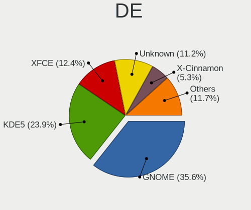
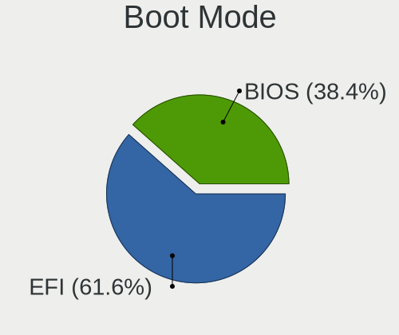
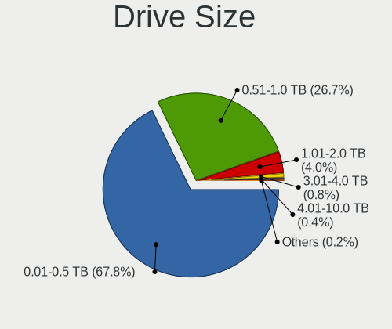
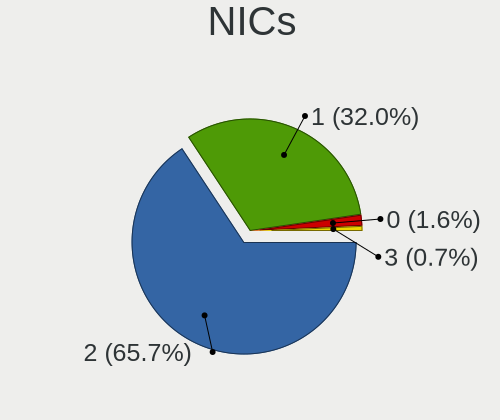
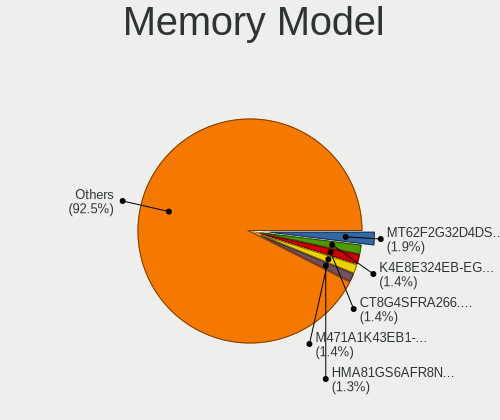
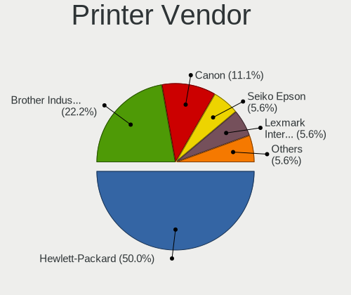
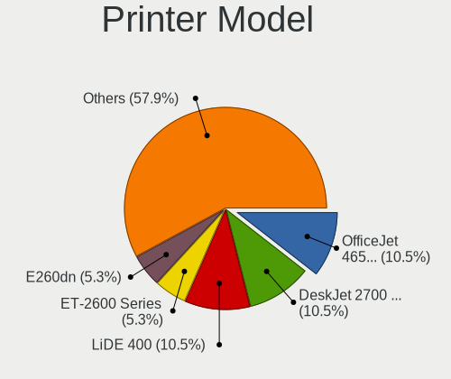
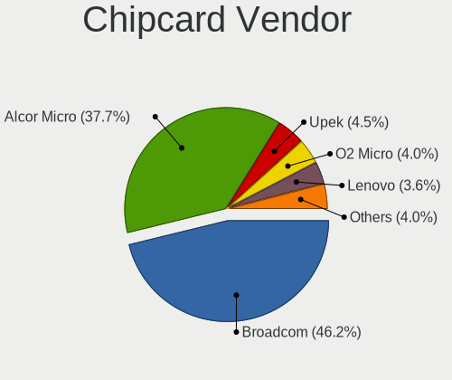

Debian 12 - Tested Hardware & Statistics (Notebooks)
----------------------------------------------------

A project to collect tested hardware configurations for Debian 12.

Anyone can contribute to this report by the [hw-probe](https://github.com/linuxhw/hw-probe) tool:

    sudo -E hw-probe -all -upload

Please contribute! Especially if your hardware is rare.

Contents
--------

* [ Test Cases ](#test-cases)

* [ System ](#system)
  - [ Kernel                   ](#kernel)
  - [ Kernel Family            ](#kernel-family)
  - [ Kernel Major Ver.        ](#kernel-major-ver)
  - [ Arch                     ](#arch)
  - [ DE                       ](#de)
  - [ Display Server           ](#display-server)
  - [ Display Manager          ](#display-manager)
  - [ OS Lang                  ](#os-lang)
  - [ Boot Mode                ](#boot-mode)
  - [ Filesystem               ](#filesystem)
  - [ Part. scheme             ](#part-scheme)
  - [ Dual Boot with Linux/BSD ](#dual-boot-with-linuxbsd)
  - [ Dual Boot (Win)          ](#dual-boot-win)

* [ Board ](#board)
  - [ Vendor                   ](#vendor)
  - [ Model                    ](#model)
  - [ Model Family             ](#model-family)
  - [ MFG Year                 ](#mfg-year)
  - [ Form Factor              ](#form-factor)
  - [ Secure Boot              ](#secure-boot)
  - [ Coreboot                 ](#coreboot)
  - [ RAM Size                 ](#ram-size)
  - [ RAM Used                 ](#ram-used)
  - [ Total Drives             ](#total-drives)
  - [ Has CD-ROM               ](#has-cd-rom)
  - [ Has Ethernet             ](#has-ethernet)
  - [ Has WiFi                 ](#has-wifi)
  - [ Has Bluetooth            ](#has-bluetooth)

* [ Location ](#location)
  - [ Country                  ](#country)
  - [ City                     ](#city)

* [ Drives ](#drives)
  - [ Drive Vendor             ](#drive-vendor)
  - [ Drive Model              ](#drive-model)
  - [ HDD Vendor               ](#hdd-vendor)
  - [ SSD Vendor               ](#ssd-vendor)
  - [ Drive Kind               ](#drive-kind)
  - [ Drive Connector          ](#drive-connector)
  - [ Drive Size               ](#drive-size)
  - [ Space Total              ](#space-total)
  - [ Space Used               ](#space-used)
  - [ Malfunc. Drives          ](#malfunc-drives)
  - [ Malfunc. Drive Vendor    ](#malfunc-drive-vendor)
  - [ Malfunc. HDD Vendor      ](#malfunc-hdd-vendor)
  - [ Malfunc. Drive Kind      ](#malfunc-drive-kind)
  - [ Failed Drives            ](#failed-drives)
  - [ Failed Drive Vendor      ](#failed-drive-vendor)
  - [ Drive Status             ](#drive-status)

* [ Storage controller ](#storage-controller)
  - [ Storage Vendor           ](#storage-vendor)
  - [ Storage Model            ](#storage-model)
  - [ Storage Kind             ](#storage-kind)

* [ Processor ](#processor)
  - [ CPU Vendor               ](#cpu-vendor)
  - [ CPU Model                ](#cpu-model)
  - [ CPU Model Family         ](#cpu-model-family)
  - [ CPU Cores                ](#cpu-cores)
  - [ CPU Sockets              ](#cpu-sockets)
  - [ CPU Threads              ](#cpu-threads)
  - [ CPU Op-Modes             ](#cpu-op-modes)
  - [ CPU Microcode            ](#cpu-microcode)
  - [ CPU Microarch            ](#cpu-microarch)

* [ Graphics ](#graphics)
  - [ GPU Vendor               ](#gpu-vendor)
  - [ GPU Model                ](#gpu-model)
  - [ GPU Combo                ](#gpu-combo)
  - [ GPU Driver               ](#gpu-driver)
  - [ GPU Memory               ](#gpu-memory)

* [ Monitor ](#monitor)
  - [ Monitor Vendor           ](#monitor-vendor)
  - [ Monitor Model            ](#monitor-model)
  - [ Monitor Resolution       ](#monitor-resolution)
  - [ Monitor Diagonal         ](#monitor-diagonal)
  - [ Monitor Width            ](#monitor-width)
  - [ Aspect Ratio             ](#aspect-ratio)
  - [ Monitor Area             ](#monitor-area)
  - [ Pixel Density            ](#pixel-density)
  - [ Multiple Monitors        ](#multiple-monitors)

* [ Network ](#network)
  - [ Net Controller Vendor    ](#net-controller-vendor)
  - [ Net Controller Model     ](#net-controller-model)
  - [ Wireless Vendor          ](#wireless-vendor)
  - [ Wireless Model           ](#wireless-model)
  - [ Ethernet Vendor          ](#ethernet-vendor)
  - [ Ethernet Model           ](#ethernet-model)
  - [ Net Controller Kind      ](#net-controller-kind)
  - [ Used Controller          ](#used-controller)
  - [ NICs                     ](#nics)
  - [ IPv6                     ](#ipv6)

* [ Bluetooth ](#bluetooth)
  - [ Bluetooth Vendor         ](#bluetooth-vendor)
  - [ Bluetooth Model          ](#bluetooth-model)

* [ Sound ](#sound)
  - [ Sound Vendor             ](#sound-vendor)
  - [ Sound Model              ](#sound-model)

* [ Memory ](#memory)
  - [ Memory Vendor            ](#memory-vendor)
  - [ Memory Model             ](#memory-model)
  - [ Memory Kind              ](#memory-kind)
  - [ Memory Form Factor       ](#memory-form-factor)
  - [ Memory Size              ](#memory-size)
  - [ Memory Speed             ](#memory-speed)

* [ Printers & scanners ](#printers--scanners)
  - [ Printer Vendor           ](#printer-vendor)
  - [ Printer Model            ](#printer-model)
  - [ Scanner Vendor           ](#scanner-vendor)
  - [ Scanner Model            ](#scanner-model)

* [ Camera ](#camera)
  - [ Camera Vendor            ](#camera-vendor)
  - [ Camera Model             ](#camera-model)

* [ Security ](#security)
  - [ Fingerprint Vendor       ](#fingerprint-vendor)
  - [ Fingerprint Model        ](#fingerprint-model)
  - [ Chipcard Vendor          ](#chipcard-vendor)
  - [ Chipcard Model           ](#chipcard-model)

* [ Unsupported ](#unsupported)
  - [ Unsupported Devices      ](#unsupported-devices)
  - [ Unsupported Device Types ](#unsupported-device-types)

Test Cases
----------

Total: 930

| Vendor        | Model                       | Probe                                                      | Date         |
|---------------|-----------------------------|------------------------------------------------------------|--------------|
| Acer          | AOA150                      | [969a729098](https://linux-hardware.org/?probe=969a729098) | Oct 01, 2023 |
| Apple         | MacBook4,1                  | [d17d6d2b70](https://linux-hardware.org/?probe=d17d6d2b70) | Oct 01, 2023 |
| HP            | Pavilion Laptop 15t-eg30... | [ed7bf5aee1](https://linux-hardware.org/?probe=ed7bf5aee1) | Oct 01, 2023 |
| Lenovo        | Legion Pro 5 16ARX8 82WM    | [83d91ea2fe](https://linux-hardware.org/?probe=83d91ea2fe) | Sep 30, 2023 |
| Lenovo        | ThinkPad X260 VB6R77903H    | [e7dad368d2](https://linux-hardware.org/?probe=e7dad368d2) | Sep 30, 2023 |
| Lenovo        | ThinkPad X260 VB6R77903H    | [de3079ae33](https://linux-hardware.org/?probe=de3079ae33) | Sep 30, 2023 |
| IX1401        | Unknown                     | [c77c1d010e](https://linux-hardware.org/?probe=c77c1d010e) | Sep 30, 2023 |
| HP            | Pavilion dv5                | [0b1da8643f](https://linux-hardware.org/?probe=0b1da8643f) | Sep 30, 2023 |
| Alienware     | m15 R4                      | [a67899ed06](https://linux-hardware.org/?probe=a67899ed06) | Sep 30, 2023 |
| Fujitsu Si... | ESPRIMO Mobile V6555        | [703170e428](https://linux-hardware.org/?probe=703170e428) | Sep 30, 2023 |
| HP            | Notebook                    | [193ec8deb3](https://linux-hardware.org/?probe=193ec8deb3) | Sep 30, 2023 |
| HP            | Pavilion dv9000 (GA359UA... | [cea70d5f75](https://linux-hardware.org/?probe=cea70d5f75) | Sep 29, 2023 |
| Dell          | Inspiron 5570               | [0e12b69b96](https://linux-hardware.org/?probe=0e12b69b96) | Sep 29, 2023 |
| Lenovo        | ThinkPad T500 22439AG       | [e5a2cd9816](https://linux-hardware.org/?probe=e5a2cd9816) | Sep 29, 2023 |
| Lenovo        | ThinkPad E490 20N8000SRT    | [274b3b5210](https://linux-hardware.org/?probe=274b3b5210) | Sep 28, 2023 |
| Lenovo        | IdeaPad Slim 5 14ABR8 82... | [c61d70bcfa](https://linux-hardware.org/?probe=c61d70bcfa) | Sep 28, 2023 |
| Lenovo        | IdeaPad Slim 5 16ABR8 82... | [1fcc841148](https://linux-hardware.org/?probe=1fcc841148) | Sep 28, 2023 |
| Lenovo        | IdeaPad Slim 5 14ABR8 82... | [be49c167d0](https://linux-hardware.org/?probe=be49c167d0) | Sep 28, 2023 |
| Apple         | MacBookAir7,2               | [c25eeffab1](https://linux-hardware.org/?probe=c25eeffab1) | Sep 28, 2023 |
| Acer          | Acadia V1.35                | [c2074b2535](https://linux-hardware.org/?probe=c2074b2535) | Sep 28, 2023 |
| Lenovo        | ThinkPad 13 2nd Gen 20J1... | [3cb2bdba37](https://linux-hardware.org/?probe=3cb2bdba37) | Sep 27, 2023 |
| EUROCOM       | RACER 2.0                   | [4351733d37](https://linux-hardware.org/?probe=4351733d37) | Sep 27, 2023 |
| HP            | ElitePad 1000 G2            | [2668770971](https://linux-hardware.org/?probe=2668770971) | Sep 27, 2023 |
| Fujitsu       | LIFEBOOK E4512              | [08b39b38bd](https://linux-hardware.org/?probe=08b39b38bd) | Sep 27, 2023 |
| ASUSTek       | K50IJ                       | [8556633dad](https://linux-hardware.org/?probe=8556633dad) | Sep 27, 2023 |
| Lenovo        | IdeaPad Gaming 3 15IMH05... | [1317c1f1a9](https://linux-hardware.org/?probe=1317c1f1a9) | Sep 27, 2023 |
| Lenovo        | ThinkPad E475 20H40006US    | [1a472d3072](https://linux-hardware.org/?probe=1a472d3072) | Sep 27, 2023 |
| Dell          | Latitude E6530              | [40cdcd2545](https://linux-hardware.org/?probe=40cdcd2545) | Sep 27, 2023 |
| Acer          | Aspire 5951G                | [cae145acab](https://linux-hardware.org/?probe=cae145acab) | Sep 26, 2023 |
| Lenovo        | ThinkPad E475 20H40006US    | [d406193722](https://linux-hardware.org/?probe=d406193722) | Sep 26, 2023 |
| Dell          | XPS 9315                    | [6fa1beb451](https://linux-hardware.org/?probe=6fa1beb451) | Sep 26, 2023 |
| Lenovo        | ThinkPad T420 4236EV9       | [d621ecd81f](https://linux-hardware.org/?probe=d621ecd81f) | Sep 26, 2023 |
| Aquarius      | NS585                       | [ce1c1d6e56](https://linux-hardware.org/?probe=ce1c1d6e56) | Sep 26, 2023 |
| Acer          | Aspire A515-47              | [3c1e418bf0](https://linux-hardware.org/?probe=3c1e418bf0) | Sep 26, 2023 |
| ASUSTek       | Zenbook UM3402YAR_UM3402... | [9e9ff26362](https://linux-hardware.org/?probe=9e9ff26362) | Sep 26, 2023 |
| Acer          | Aspire A515-56              | [b047457fd1](https://linux-hardware.org/?probe=b047457fd1) | Sep 25, 2023 |
| Dell          | XPS 15 9560                 | [a524453c71](https://linux-hardware.org/?probe=a524453c71) | Sep 25, 2023 |
| Lenovo        | G710 20252                  | [d7926809d7](https://linux-hardware.org/?probe=d7926809d7) | Sep 25, 2023 |
| HP            | Presario CQ43               | [c206dc84ad](https://linux-hardware.org/?probe=c206dc84ad) | Sep 25, 2023 |
| Aquarius      | NS585                       | [e901467e39](https://linux-hardware.org/?probe=e901467e39) | Sep 25, 2023 |
| Lenovo        | ThinkPad X270 W10DG 20K5... | [ab332c2dcb](https://linux-hardware.org/?probe=ab332c2dcb) | Sep 25, 2023 |
| Acer          | Aspire 5951G                | [4c50b8e9b0](https://linux-hardware.org/?probe=4c50b8e9b0) | Sep 25, 2023 |
| Lenovo        | ThinkPad T440s 20ARS0CN0... | [9c0b702e21](https://linux-hardware.org/?probe=9c0b702e21) | Sep 24, 2023 |
| Dell          | Latitude 5420               | [0e22f551b9](https://linux-hardware.org/?probe=0e22f551b9) | Sep 24, 2023 |
| HP            | 250 G8 Notebook PC          | [6b3c3ce703](https://linux-hardware.org/?probe=6b3c3ce703) | Sep 23, 2023 |
| Lenovo        | ThinkPad X1 Carbon 6th 2... | [42309ddc8c](https://linux-hardware.org/?probe=42309ddc8c) | Sep 23, 2023 |
| HP            | 250 G8 Notebook PC          | [e2dd7767f0](https://linux-hardware.org/?probe=e2dd7767f0) | Sep 23, 2023 |
| HP            | EliteBook 845 G8 Noteboo... | [574c2193bb](https://linux-hardware.org/?probe=574c2193bb) | Sep 23, 2023 |
| Lenovo        | ThinkPad L13 Gen 3 21B90... | [e273beb83a](https://linux-hardware.org/?probe=e273beb83a) | Sep 22, 2023 |
| Lenovo        | ThinkPad T470s W10DG 20J... | [ad1b8126d2](https://linux-hardware.org/?probe=ad1b8126d2) | Sep 22, 2023 |
| Lenovo        | ThinkPad L13 Gen 3 21B90... | [0d786ffd74](https://linux-hardware.org/?probe=0d786ffd74) | Sep 22, 2023 |
| Lenovo        | IdeaPad S340-15IWL 81N8     | [c14178c7fa](https://linux-hardware.org/?probe=c14178c7fa) | Sep 22, 2023 |
| Samsung       | R505                        | [8aef37cda9](https://linux-hardware.org/?probe=8aef37cda9) | Sep 22, 2023 |
| HP            | Pavilion Aero Laptop 13-... | [4bf358cd4f](https://linux-hardware.org/?probe=4bf358cd4f) | Sep 22, 2023 |
| HP            | EliteBook 840 G3            | [b6379ef77c](https://linux-hardware.org/?probe=b6379ef77c) | Sep 22, 2023 |
| Lenovo        | ThinkPad E475 20H40006US    | [ea491d194f](https://linux-hardware.org/?probe=ea491d194f) | Sep 21, 2023 |
| Lenovo        | ThinkPad 13 2nd Gen 20J1... | [e33bb92eb6](https://linux-hardware.org/?probe=e33bb92eb6) | Sep 21, 2023 |
| Lenovo        | V14 G3 IAP 82TS             | [2528381c0e](https://linux-hardware.org/?probe=2528381c0e) | Sep 21, 2023 |
| Lenovo        | Legion 5 15ACH6H 82JU       | [f9430fd075](https://linux-hardware.org/?probe=f9430fd075) | Sep 21, 2023 |
| Lenovo        | ThinkPad 13 2nd Gen 20J1... | [e337cc85e5](https://linux-hardware.org/?probe=e337cc85e5) | Sep 20, 2023 |
| Acer          | Aspire E1-531               | [f0173f0458](https://linux-hardware.org/?probe=f0173f0458) | Sep 20, 2023 |
| Lenovo        | ThinkPad L390 20NRCTO1WW    | [228d31bf59](https://linux-hardware.org/?probe=228d31bf59) | Sep 20, 2023 |
| Dell          | XPS 13 9300                 | [49bb68e979](https://linux-hardware.org/?probe=49bb68e979) | Sep 20, 2023 |
| HP            | ProBook 450 G1              | [4e5ae95013](https://linux-hardware.org/?probe=4e5ae95013) | Sep 20, 2023 |
| ASUSTek       | X556UQ                      | [c34d9b9514](https://linux-hardware.org/?probe=c34d9b9514) | Sep 20, 2023 |
| ASUSTek       | X556UQ                      | [7ec3567855](https://linux-hardware.org/?probe=7ec3567855) | Sep 20, 2023 |
| ASUSTek       | X556UQ                      | [676dd13401](https://linux-hardware.org/?probe=676dd13401) | Sep 20, 2023 |
| Lenovo        | IdeaPad Y700-15ISK 80NV     | [5662d8f95c](https://linux-hardware.org/?probe=5662d8f95c) | Sep 20, 2023 |
| HP            | Laptop 15-bs0xx             | [963330511d](https://linux-hardware.org/?probe=963330511d) | Sep 19, 2023 |
| Notebook      | P7xxDM3(-G)                 | [b302c7b008](https://linux-hardware.org/?probe=b302c7b008) | Sep 19, 2023 |
| Lenovo        | ThinkPad X61s 7666Y2X       | [177e40808d](https://linux-hardware.org/?probe=177e40808d) | Sep 19, 2023 |
| Notebook      | P7xxDM3(-G)                 | [ec386099b2](https://linux-hardware.org/?probe=ec386099b2) | Sep 19, 2023 |
| HP            | Laptop 17-cp0xxx            | [05e3350e1f](https://linux-hardware.org/?probe=05e3350e1f) | Sep 19, 2023 |
| Dell          | XPS 13 9360                 | [149f246bd7](https://linux-hardware.org/?probe=149f246bd7) | Sep 19, 2023 |
| Acer          | Aspire A515-56              | [db16273e72](https://linux-hardware.org/?probe=db16273e72) | Sep 19, 2023 |
| Intel Clie... | LAPBC710                    | [af446fcb4d](https://linux-hardware.org/?probe=af446fcb4d) | Sep 19, 2023 |
| Intel Clie... | LAPBC710                    | [eae124fa61](https://linux-hardware.org/?probe=eae124fa61) | Sep 19, 2023 |
| HP            | Laptop 15-bs0xx             | [5f8df7dfcb](https://linux-hardware.org/?probe=5f8df7dfcb) | Sep 19, 2023 |
| Dell          | Latitude E6430              | [d83d7bbfa8](https://linux-hardware.org/?probe=d83d7bbfa8) | Sep 18, 2023 |
| HP            | 15                          | [b016d5ee79](https://linux-hardware.org/?probe=b016d5ee79) | Sep 18, 2023 |
| Aquarius      | NS585                       | [6ac8bd5909](https://linux-hardware.org/?probe=6ac8bd5909) | Sep 18, 2023 |
| HP            | Mini 110-1000               | [dda4d7a910](https://linux-hardware.org/?probe=dda4d7a910) | Sep 18, 2023 |
| HP            | Mini 110-1000               | [ee2d142228](https://linux-hardware.org/?probe=ee2d142228) | Sep 18, 2023 |
| HP            | Compaq Mini 311-1100        | [8bdfb6307c](https://linux-hardware.org/?probe=8bdfb6307c) | Sep 17, 2023 |
| HP            | Laptop 15-dw3xxx            | [f84a480b09](https://linux-hardware.org/?probe=f84a480b09) | Sep 17, 2023 |
| Lenovo        | ThinkPad P14s Gen 2a 21A... | [cda370cdc3](https://linux-hardware.org/?probe=cda370cdc3) | Sep 16, 2023 |
| ASUSTek       | ASUSPRO P5440FA_P5440FA     | [b7c1a0a0a0](https://linux-hardware.org/?probe=b7c1a0a0a0) | Sep 16, 2023 |
| Apple         | MacBookPro8,1               | [c3791ba730](https://linux-hardware.org/?probe=c3791ba730) | Sep 16, 2023 |
| Lenovo        | ThinkPad X201 3249CTO       | [f5884967d0](https://linux-hardware.org/?probe=f5884967d0) | Sep 16, 2023 |
| Dell          | Latitude E5570              | [fd5ba4aa5a](https://linux-hardware.org/?probe=fd5ba4aa5a) | Sep 15, 2023 |
| Dell          | Precision 5570              | [8b3c21b110](https://linux-hardware.org/?probe=8b3c21b110) | Sep 15, 2023 |
| Lenovo        | ThinkPad P15 Gen 1 20STC... | [66b29aeb1d](https://linux-hardware.org/?probe=66b29aeb1d) | Sep 15, 2023 |
| Lenovo        | Yoga Pro 9 16IRP8 83BY      | [eaa723190d](https://linux-hardware.org/?probe=eaa723190d) | Sep 15, 2023 |
| ASUSTek       | X507UB                      | [ca19710375](https://linux-hardware.org/?probe=ca19710375) | Sep 15, 2023 |
| ASUSTek       | X751LN                      | [77ecc965aa](https://linux-hardware.org/?probe=77ecc965aa) | Sep 14, 2023 |
| ASUSTek       | VivoBook 15_ASUS Laptop ... | [0ffb2a765f](https://linux-hardware.org/?probe=0ffb2a765f) | Sep 14, 2023 |
| Toshiba       | PORTEGE Z830                | [a3e1ac295c](https://linux-hardware.org/?probe=a3e1ac295c) | Sep 14, 2023 |
| ASUSTek       | P553UJ                      | [3463413300](https://linux-hardware.org/?probe=3463413300) | Sep 14, 2023 |
| Toshiba       | PORTEGE Z830                | [6f4c4a4120](https://linux-hardware.org/?probe=6f4c4a4120) | Sep 14, 2023 |
| ASUSTek       | TUF Gaming FX505DT_FX505... | [d27fa5404b](https://linux-hardware.org/?probe=d27fa5404b) | Sep 14, 2023 |
| Dell          | Latitude 5440               | [93a296a628](https://linux-hardware.org/?probe=93a296a628) | Sep 14, 2023 |
| Lenovo        | ThinkPad T14s Gen 3 21CQ... | [033eca4030](https://linux-hardware.org/?probe=033eca4030) | Sep 14, 2023 |
| HP            | 245 G7 Notebook PC          | [ab68dea087](https://linux-hardware.org/?probe=ab68dea087) | Sep 14, 2023 |
| HP            | ProBook 6570b               | [fc5c01d215](https://linux-hardware.org/?probe=fc5c01d215) | Sep 14, 2023 |
| Lenovo        | ThinkPad P14s Gen 3 21AK... | [0cdeaab8be](https://linux-hardware.org/?probe=0cdeaab8be) | Sep 13, 2023 |
| MSI           | GS66 Stealth 11UG           | [304abac74b](https://linux-hardware.org/?probe=304abac74b) | Sep 13, 2023 |
| HP            | Stream Notebook PC 11       | [f4c5ae4297](https://linux-hardware.org/?probe=f4c5ae4297) | Sep 13, 2023 |
| Acer          | AOA150                      | [bc32c4814d](https://linux-hardware.org/?probe=bc32c4814d) | Sep 13, 2023 |
| Lenovo        | ThinkPad X230 232036U       | [58ec12094c](https://linux-hardware.org/?probe=58ec12094c) | Sep 13, 2023 |
| Google        | Cave                        | [74c8e00b23](https://linux-hardware.org/?probe=74c8e00b23) | Sep 13, 2023 |
| Dell          | Latitude E6430              | [79cf77c6ba](https://linux-hardware.org/?probe=79cf77c6ba) | Sep 12, 2023 |
| Dell          | Latitude E7470              | [4f2094dfef](https://linux-hardware.org/?probe=4f2094dfef) | Sep 12, 2023 |
| Toshiba       | Satellite L640              | [ac5a264fea](https://linux-hardware.org/?probe=ac5a264fea) | Sep 12, 2023 |
| ASUSTek       | ASUS TUF Gaming F15 FX50... | [be2af85bb7](https://linux-hardware.org/?probe=be2af85bb7) | Sep 12, 2023 |
| HUAWEI        | BOM-WXX9                    | [0224dfd46f](https://linux-hardware.org/?probe=0224dfd46f) | Sep 11, 2023 |
| Framework     | Laptop (13th Gen Intel C... | [52b50b0d68](https://linux-hardware.org/?probe=52b50b0d68) | Sep 11, 2023 |
| Google        | Enguarde                    | [4fd827adc5](https://linux-hardware.org/?probe=4fd827adc5) | Sep 11, 2023 |
| Google        | Enguarde                    | [b2b5b5f73b](https://linux-hardware.org/?probe=b2b5b5f73b) | Sep 11, 2023 |
| Lenovo        | ThinkPad L380 20M50013GE    | [e7778dd80d](https://linux-hardware.org/?probe=e7778dd80d) | Sep 11, 2023 |
| HP            | 250 G3                      | [162574954f](https://linux-hardware.org/?probe=162574954f) | Sep 11, 2023 |
| ASUSTek       | ZenBook UX325EA_UX325EA     | [24e256ad9e](https://linux-hardware.org/?probe=24e256ad9e) | Sep 11, 2023 |
| ASUSTek       | ASUS EXPERTBOOK L1500CDA... | [57e8f1b556](https://linux-hardware.org/?probe=57e8f1b556) | Sep 11, 2023 |
| Samsung       | 550XED                      | [69d754d35b](https://linux-hardware.org/?probe=69d754d35b) | Sep 11, 2023 |
| Samsung       | 550XED                      | [8187eca3e3](https://linux-hardware.org/?probe=8187eca3e3) | Sep 11, 2023 |
| ASUSTek       | G751JT                      | [4395b1ccb2](https://linux-hardware.org/?probe=4395b1ccb2) | Sep 10, 2023 |
| ASUSTek       | X550VX                      | [b1b59ca70c](https://linux-hardware.org/?probe=b1b59ca70c) | Sep 10, 2023 |
| HP            | Unknown                     | [cb5704a65f](https://linux-hardware.org/?probe=cb5704a65f) | Sep 10, 2023 |
| Google        | Lillipup                    | [c3a892cdca](https://linux-hardware.org/?probe=c3a892cdca) | Sep 10, 2023 |
| HP            | ProBook 6570b               | [3ed768081c](https://linux-hardware.org/?probe=3ed768081c) | Sep 09, 2023 |
| HP            | Pavilion Plus Laptop 14-... | [780a68ac11](https://linux-hardware.org/?probe=780a68ac11) | Sep 09, 2023 |
| Dell          | Inspiron 7580               | [9705f02462](https://linux-hardware.org/?probe=9705f02462) | Sep 09, 2023 |
| ASUSTek       | ZenBook UX431FLC_UX431FL    | [3865278574](https://linux-hardware.org/?probe=3865278574) | Sep 09, 2023 |
| Acer          | Nitro AN515-55              | [3f247b15c6](https://linux-hardware.org/?probe=3f247b15c6) | Sep 09, 2023 |
| Lenovo        | ThinkPad T440s 20AQ005QU... | [0a57a98442](https://linux-hardware.org/?probe=0a57a98442) | Sep 09, 2023 |
| Lenovo        | ThinkPad X395 20NMS0YG00    | [b3697e5a7e](https://linux-hardware.org/?probe=b3697e5a7e) | Sep 09, 2023 |
| Google        | Enguarde                    | [3ec3cf816b](https://linux-hardware.org/?probe=3ec3cf816b) | Sep 08, 2023 |
| Google        | Enguarde                    | [fa7b318083](https://linux-hardware.org/?probe=fa7b318083) | Sep 08, 2023 |
| Google        | Enguarde                    | [1621463a03](https://linux-hardware.org/?probe=1621463a03) | Sep 08, 2023 |
| Google        | Enguarde                    | [b54a785396](https://linux-hardware.org/?probe=b54a785396) | Sep 08, 2023 |
| Google        | Enguarde                    | [b35f66260b](https://linux-hardware.org/?probe=b35f66260b) | Sep 08, 2023 |
| Google        | Enguarde                    | [e754c23dd9](https://linux-hardware.org/?probe=e754c23dd9) | Sep 08, 2023 |
| Google        | Enguarde                    | [71e3d1a632](https://linux-hardware.org/?probe=71e3d1a632) | Sep 08, 2023 |
| Google        | Enguarde                    | [352198bb3c](https://linux-hardware.org/?probe=352198bb3c) | Sep 08, 2023 |
| Google        | Enguarde                    | [15edd97e90](https://linux-hardware.org/?probe=15edd97e90) | Sep 08, 2023 |
| Google        | Enguarde                    | [265336497a](https://linux-hardware.org/?probe=265336497a) | Sep 08, 2023 |
| Google        | Enguarde                    | [af54a959e3](https://linux-hardware.org/?probe=af54a959e3) | Sep 08, 2023 |
| Google        | Enguarde                    | [d102cf6258](https://linux-hardware.org/?probe=d102cf6258) | Sep 08, 2023 |
| Google        | Enguarde                    | [d6fd89750c](https://linux-hardware.org/?probe=d6fd89750c) | Sep 08, 2023 |
| Lenovo        | V15 G3 IAP 82TT             | [4e756a7c7d](https://linux-hardware.org/?probe=4e756a7c7d) | Sep 08, 2023 |
| HP            | Pavilion Gaming Laptop 1... | [e0899f8743](https://linux-hardware.org/?probe=e0899f8743) | Sep 08, 2023 |
| Dell          | Latitude 5530               | [ae835c8d8b](https://linux-hardware.org/?probe=ae835c8d8b) | Sep 08, 2023 |
| HP            | 250 G3                      | [51ef1d34d0](https://linux-hardware.org/?probe=51ef1d34d0) | Sep 08, 2023 |
| Lenovo        | ThinkPad T495s 20QJCTO1W... | [c9d6171716](https://linux-hardware.org/?probe=c9d6171716) | Sep 08, 2023 |
| ASUSTek       | X507UB                      | [4604e73045](https://linux-hardware.org/?probe=4604e73045) | Sep 08, 2023 |
| Lenovo        | V15 G3 IAP 82TT             | [db6d9f2293](https://linux-hardware.org/?probe=db6d9f2293) | Sep 08, 2023 |
| Lenovo        | ThinkPad P43s 20RH001UMX    | [0fdff74089](https://linux-hardware.org/?probe=0fdff74089) | Sep 07, 2023 |
| Google        | Enguarde                    | [7718db84e9](https://linux-hardware.org/?probe=7718db84e9) | Sep 07, 2023 |
| Lenovo        | ThinkPad E475 20H40006US    | [9117a08473](https://linux-hardware.org/?probe=9117a08473) | Sep 07, 2023 |
| Google        | Enguarde                    | [8a82984679](https://linux-hardware.org/?probe=8a82984679) | Sep 07, 2023 |
| HP            | Pavilion Gaming Laptop 1... | [e2f9ce90d3](https://linux-hardware.org/?probe=e2f9ce90d3) | Sep 07, 2023 |
| Lenovo        | ThinkPad E14 Gen 2 20TA0... | [0468bc91fc](https://linux-hardware.org/?probe=0468bc91fc) | Sep 06, 2023 |
| ASUSTek       | X542UQ                      | [50ecc5159c](https://linux-hardware.org/?probe=50ecc5159c) | Sep 06, 2023 |
| ASUSTek       | X542UQ                      | [b34e0e7866](https://linux-hardware.org/?probe=b34e0e7866) | Sep 06, 2023 |
| Acer          | Aspire E1-531               | [9d5880bc6c](https://linux-hardware.org/?probe=9d5880bc6c) | Sep 06, 2023 |
| Acer          | Aspire E1-531               | [6ffc334cf9](https://linux-hardware.org/?probe=6ffc334cf9) | Sep 06, 2023 |
| HP            | ZBook 15 G3                 | [faac131992](https://linux-hardware.org/?probe=faac131992) | Sep 05, 2023 |
| Framework     | Laptop (13th Gen Intel C... | [1bcf7b95c6](https://linux-hardware.org/?probe=1bcf7b95c6) | Sep 05, 2023 |
| Lenovo        | ThinkPad T490 20N2001YUS    | [75c15ac2e8](https://linux-hardware.org/?probe=75c15ac2e8) | Sep 05, 2023 |
| ASUSTek       | K53SD                       | [051fefc7ca](https://linux-hardware.org/?probe=051fefc7ca) | Sep 05, 2023 |
| Sony          | VGN-CS108D                  | [24bf5bb06c](https://linux-hardware.org/?probe=24bf5bb06c) | Sep 05, 2023 |
| HUAWEI        | NBD-WXX9                    | [005ebd39ce](https://linux-hardware.org/?probe=005ebd39ce) | Sep 05, 2023 |
| ASUSTek       | X541NC                      | [927ba04557](https://linux-hardware.org/?probe=927ba04557) | Sep 05, 2023 |
| Acer          | Aspire E1-531               | [7f9460a97c](https://linux-hardware.org/?probe=7f9460a97c) | Sep 04, 2023 |
| eMachines     | Rhine V1.42                 | [c18c4d64bd](https://linux-hardware.org/?probe=c18c4d64bd) | Sep 04, 2023 |
| ASUSTek       | ROG Strix G531GT_G531GT     | [f7a6b9d479](https://linux-hardware.org/?probe=f7a6b9d479) | Sep 04, 2023 |
| ASUSTek       | X507UB                      | [e74c3ad568](https://linux-hardware.org/?probe=e74c3ad568) | Sep 03, 2023 |
| Dell          | Latitude 5414               | [704d861366](https://linux-hardware.org/?probe=704d861366) | Sep 03, 2023 |
| Lenovo        | ThinkPad X1 Carbon 6th 2... | [526a6826ab](https://linux-hardware.org/?probe=526a6826ab) | Sep 03, 2023 |
| Google        | Droid                       | [da26431a82](https://linux-hardware.org/?probe=da26431a82) | Sep 03, 2023 |
| Google        | Droid                       | [278861e9e8](https://linux-hardware.org/?probe=278861e9e8) | Sep 03, 2023 |
| Acer          | Aspire A515-56              | [435cb2d610](https://linux-hardware.org/?probe=435cb2d610) | Sep 03, 2023 |
| HP            | 255 15.6 inch G9 Noteboo... | [7ba8b58ea7](https://linux-hardware.org/?probe=7ba8b58ea7) | Sep 03, 2023 |
| Toshiba       | Satellite L10W-B-101        | [1865cdf1ad](https://linux-hardware.org/?probe=1865cdf1ad) | Sep 02, 2023 |
| HP            | ZBook 15 G2                 | [d20f8f324d](https://linux-hardware.org/?probe=d20f8f324d) | Sep 02, 2023 |
| Lenovo        | IdeaPad 3 15IML05 81WB      | [d00f64dfcf](https://linux-hardware.org/?probe=d00f64dfcf) | Sep 02, 2023 |
| Samsung       | RF511/RF411/RF711           | [ab39767c20](https://linux-hardware.org/?probe=ab39767c20) | Sep 02, 2023 |
| Lenovo        | G505 20240                  | [ea15ab596a](https://linux-hardware.org/?probe=ea15ab596a) | Sep 02, 2023 |
| Lenovo        | IdeaPad 5 14ARE05 81YM      | [155023d91f](https://linux-hardware.org/?probe=155023d91f) | Sep 02, 2023 |
| Lenovo        | Legion 5 15ACH6 82QJ        | [5897684d9e](https://linux-hardware.org/?probe=5897684d9e) | Sep 02, 2023 |
| Dell          | Latitude 5430               | [7a9eb9995d](https://linux-hardware.org/?probe=7a9eb9995d) | Sep 02, 2023 |
| Lenovo        | ThinkPad Z13 Gen 1 21D20... | [52e8a720ba](https://linux-hardware.org/?probe=52e8a720ba) | Sep 01, 2023 |
| Lenovo        | ThinkPad X1 Carbon 6th 2... | [062f19958d](https://linux-hardware.org/?probe=062f19958d) | Sep 01, 2023 |
| ASUSTek       | VivoBook_ASUSLaptop M160... | [af78cafb1a](https://linux-hardware.org/?probe=af78cafb1a) | Sep 01, 2023 |
| Lenovo        | ThinkPad 13 2nd Gen 20J1... | [f98a2afc33](https://linux-hardware.org/?probe=f98a2afc33) | Aug 31, 2023 |
| Acer          | Swift SF314-42              | [80bebab849](https://linux-hardware.org/?probe=80bebab849) | Aug 31, 2023 |
| Google        | Enguarde                    | [d67a18c110](https://linux-hardware.org/?probe=d67a18c110) | Aug 30, 2023 |
| GPU Compan... | GWTN156-9                   | [4c8ea16ab2](https://linux-hardware.org/?probe=4c8ea16ab2) | Aug 30, 2023 |
| HP            | Laptop 15s-fq2xxx           | [6d85c1d397](https://linux-hardware.org/?probe=6d85c1d397) | Aug 30, 2023 |
| Acer          | Aspire A515-57              | [c9a61f810d](https://linux-hardware.org/?probe=c9a61f810d) | Aug 30, 2023 |
| Google        | Enguarde                    | [08ff2764b2](https://linux-hardware.org/?probe=08ff2764b2) | Aug 30, 2023 |
| Unknown       | Unknown                     | [3718299cea](https://linux-hardware.org/?probe=3718299cea) | Aug 29, 2023 |
| Google        | Enguarde                    | [e2e5a3dadc](https://linux-hardware.org/?probe=e2e5a3dadc) | Aug 29, 2023 |
| Google        | Enguarde                    | [e7a59ac286](https://linux-hardware.org/?probe=e7a59ac286) | Aug 29, 2023 |
| Lenovo        | ThinkPad T495s 20QJCTO1W... | [4bdfa8b9ea](https://linux-hardware.org/?probe=4bdfa8b9ea) | Aug 29, 2023 |
| HP            | EliteBook 845 14 inch G9... | [41ce572b6d](https://linux-hardware.org/?probe=41ce572b6d) | Aug 29, 2023 |
| Acer          | Swift SF314-512             | [a41a08d4ae](https://linux-hardware.org/?probe=a41a08d4ae) | Aug 29, 2023 |
| ASUSTek       | TUF Gaming FX504GD_FX80G... | [62ff88eaf7](https://linux-hardware.org/?probe=62ff88eaf7) | Aug 29, 2023 |
| Lenovo        | ThinkPad E470 20H2S00700    | [cea73826dc](https://linux-hardware.org/?probe=cea73826dc) | Aug 28, 2023 |
| win elemen... | MoreFine S500+              | [9675488adc](https://linux-hardware.org/?probe=9675488adc) | Aug 28, 2023 |
| win elemen... | MoreFine S500+              | [29e062fb36](https://linux-hardware.org/?probe=29e062fb36) | Aug 27, 2023 |
| Apple         | MacBookPro6,2               | [e25e18e9b1](https://linux-hardware.org/?probe=e25e18e9b1) | Aug 27, 2023 |
| Lenovo        | B590 20208                  | [65bf0970da](https://linux-hardware.org/?probe=65bf0970da) | Aug 27, 2023 |
| ASUSTek       | VivoBook_ASUSLaptop X760... | [5ef3048a11](https://linux-hardware.org/?probe=5ef3048a11) | Aug 26, 2023 |
| Dell          | Latitude E6420              | [ae48a8c618](https://linux-hardware.org/?probe=ae48a8c618) | Aug 26, 2023 |
| MSI           | GP76 Leopard 11UG           | [5de726089b](https://linux-hardware.org/?probe=5de726089b) | Aug 26, 2023 |
| Alienware     | m16 R1                      | [75f20a1519](https://linux-hardware.org/?probe=75f20a1519) | Aug 26, 2023 |
| Alienware     | m16 R1                      | [89cffc75ea](https://linux-hardware.org/?probe=89cffc75ea) | Aug 26, 2023 |
| Lenovo        | ThinkPad 13 2nd Gen 20J1... | [4ca70b63ef](https://linux-hardware.org/?probe=4ca70b63ef) | Aug 25, 2023 |
| HP            | EliteBook 845 G8 Noteboo... | [c288ff6b78](https://linux-hardware.org/?probe=c288ff6b78) | Aug 25, 2023 |
| MSI           | GS65 Stealth Thin 8RE       | [b53212efce](https://linux-hardware.org/?probe=b53212efce) | Aug 24, 2023 |
| Acer          | Aspire 7741                 | [648f667e11](https://linux-hardware.org/?probe=648f667e11) | Aug 24, 2023 |
| Lenovo        | ThinkPad Z13 Gen 1 21D20... | [4d1d53f6d8](https://linux-hardware.org/?probe=4d1d53f6d8) | Aug 24, 2023 |
| ASUSTek       | VivoBook_ASUSLaptop X150... | [5a6247f9b2](https://linux-hardware.org/?probe=5a6247f9b2) | Aug 24, 2023 |
| HP            | Laptop 17-by4xxx            | [9fd582b91e](https://linux-hardware.org/?probe=9fd582b91e) | Aug 24, 2023 |
| HP            | ZBook 14 G2                 | [fcbebfc95a](https://linux-hardware.org/?probe=fcbebfc95a) | Aug 23, 2023 |
| Acer          | Aspire ES1-311              | [93f204808e](https://linux-hardware.org/?probe=93f204808e) | Aug 23, 2023 |
| Panasonic     | CFMX4-1                     | [fd352acae8](https://linux-hardware.org/?probe=fd352acae8) | Aug 23, 2023 |
| Acer          | TravelMate P214-52          | [6d7eeef62a](https://linux-hardware.org/?probe=6d7eeef62a) | Aug 23, 2023 |
| MSI           | Stealth 17Studio A13VF      | [ca952946e9](https://linux-hardware.org/?probe=ca952946e9) | Aug 23, 2023 |
| ASUSTek       | X507UB                      | [6c8e9739d4](https://linux-hardware.org/?probe=6c8e9739d4) | Aug 23, 2023 |
| Positivo      | Mobile                      | [e39dbd02a9](https://linux-hardware.org/?probe=e39dbd02a9) | Aug 22, 2023 |
| ASUSTek       | ZenBook UX425UG_Q408UG      | [8b219ffa3b](https://linux-hardware.org/?probe=8b219ffa3b) | Aug 22, 2023 |
| Lenovo        | ThinkPad T14 Gen 2a 20XL... | [b460d0aa2d](https://linux-hardware.org/?probe=b460d0aa2d) | Aug 22, 2023 |
| Samsung       | 905S3G/906S3G/915S3G        | [ae599c9d4b](https://linux-hardware.org/?probe=ae599c9d4b) | Aug 22, 2023 |
| ASUSTek       | ROG Strix G531GU_G531GU     | [627606b933](https://linux-hardware.org/?probe=627606b933) | Aug 22, 2023 |
| HP            | Laptop 15z-ef3xxx           | [cf603a20c0](https://linux-hardware.org/?probe=cf603a20c0) | Aug 22, 2023 |
| Sony          | SVE14123CBW                 | [b7891b51b2](https://linux-hardware.org/?probe=b7891b51b2) | Aug 21, 2023 |
| Sony          | SVE14123CBW                 | [9730d7f8f5](https://linux-hardware.org/?probe=9730d7f8f5) | Aug 21, 2023 |
| Lenovo        | ThinkPad T14 Gen 2i 20W0... | [0baece8878](https://linux-hardware.org/?probe=0baece8878) | Aug 21, 2023 |
| Dell          | Inspiron 15 3515            | [534e1dc3e5](https://linux-hardware.org/?probe=534e1dc3e5) | Aug 21, 2023 |
| Sony          | VPCEH2J9R                   | [a919beee79](https://linux-hardware.org/?probe=a919beee79) | Aug 21, 2023 |
| Acer          | Aspire A517-53G             | [692bd3fa37](https://linux-hardware.org/?probe=692bd3fa37) | Aug 20, 2023 |
| Acer          | Aspire A517-53G             | [6313b3f69e](https://linux-hardware.org/?probe=6313b3f69e) | Aug 20, 2023 |
| Dell          | Latitude E5550              | [0f3afef2ac](https://linux-hardware.org/?probe=0f3afef2ac) | Aug 20, 2023 |
| EUROCOM       | RACER 2.0                   | [b27f687c16](https://linux-hardware.org/?probe=b27f687c16) | Aug 20, 2023 |
| Acer          | Aspire A515-56              | [501ee4caf7](https://linux-hardware.org/?probe=501ee4caf7) | Aug 20, 2023 |
| Lenovo        | ThinkPad X1 Carbon Gen 9... | [ab5bc08964](https://linux-hardware.org/?probe=ab5bc08964) | Aug 19, 2023 |
| Dell          | Vostro 3501                 | [5369c283ad](https://linux-hardware.org/?probe=5369c283ad) | Aug 18, 2023 |
| Acer          | Extensa 5235                | [1dc9843f33](https://linux-hardware.org/?probe=1dc9843f33) | Aug 18, 2023 |
| Lenovo        | ThinkPad 13 2nd Gen 20J1... | [95c536cff4](https://linux-hardware.org/?probe=95c536cff4) | Aug 18, 2023 |
| ASUSTek       | M3N                         | [7c4b9386db](https://linux-hardware.org/?probe=7c4b9386db) | Aug 18, 2023 |
| Lenovo        | ThinkPad T430s 2355C33      | [4c589a0320](https://linux-hardware.org/?probe=4c589a0320) | Aug 18, 2023 |
| HUAWEI        | NBLK-WAX9X                  | [e66c463188](https://linux-hardware.org/?probe=e66c463188) | Aug 18, 2023 |
| Lenovo        | IdeaPad S145-15IIL 82DJ     | [55b9d87888](https://linux-hardware.org/?probe=55b9d87888) | Aug 18, 2023 |
| HP            | Laptop 15-dy0xxx            | [f938725821](https://linux-hardware.org/?probe=f938725821) | Aug 18, 2023 |
| Lenovo        | ThinkPad T14 Gen 2i 20W1... | [748298f0c8](https://linux-hardware.org/?probe=748298f0c8) | Aug 18, 2023 |
| HP            | ProBook 445 G8 Notebook ... | [24a295f95b](https://linux-hardware.org/?probe=24a295f95b) | Aug 17, 2023 |
| Lenovo        | ThinkPad X220 4291MW5       | [adf4aceec8](https://linux-hardware.org/?probe=adf4aceec8) | Aug 17, 2023 |
| HP            | Laptop 15s-eq2xxx           | [c647987aaf](https://linux-hardware.org/?probe=c647987aaf) | Aug 16, 2023 |
| Acer          | Aspire A515-52G             | [2d38a6554a](https://linux-hardware.org/?probe=2d38a6554a) | Aug 16, 2023 |
| Lenovo        | G505s 20255                 | [2486dc323f](https://linux-hardware.org/?probe=2486dc323f) | Aug 16, 2023 |
| Lenovo        | ThinkPad L580 20LW000WGE    | [69e443b8a8](https://linux-hardware.org/?probe=69e443b8a8) | Aug 16, 2023 |
| Google        | Phaser360                   | [3c248cc2c8](https://linux-hardware.org/?probe=3c248cc2c8) | Aug 16, 2023 |
| Dell          | Vostro 3501                 | [c36d4d9de0](https://linux-hardware.org/?probe=c36d4d9de0) | Aug 15, 2023 |
| Acer          | Aspire A315-59              | [901f34e440](https://linux-hardware.org/?probe=901f34e440) | Aug 15, 2023 |
| Framework     | Laptop (13th Gen Intel C... | [268eeb2657](https://linux-hardware.org/?probe=268eeb2657) | Aug 15, 2023 |
| Lenovo        | Yoga Pro 9 16IRP8 83BY      | [6242833326](https://linux-hardware.org/?probe=6242833326) | Aug 15, 2023 |
| Lenovo        | Yoga Pro 9 16IRP8 83BY      | [22252eb1d9](https://linux-hardware.org/?probe=22252eb1d9) | Aug 15, 2023 |
| Alienware     | m15 R4                      | [40d4ad1e4f](https://linux-hardware.org/?probe=40d4ad1e4f) | Aug 14, 2023 |
| Framework     | Laptop (13th Gen Intel C... | [72e71d1afc](https://linux-hardware.org/?probe=72e71d1afc) | Aug 14, 2023 |
| MSI           | Z790 GAMING WIFI            | [95e340d91b](https://linux-hardware.org/?probe=95e340d91b) | Aug 14, 2023 |
| Beelink       | Gemini X                    | [1610652627](https://linux-hardware.org/?probe=1610652627) | Aug 14, 2023 |
| Google        | Blooglet                    | [b9967e65c2](https://linux-hardware.org/?probe=b9967e65c2) | Aug 14, 2023 |
| Lenovo        | ThinkPad P50 20EQS1WW00     | [57af1d89d6](https://linux-hardware.org/?probe=57af1d89d6) | Aug 14, 2023 |
| ASUSTek       | VivoBook_ASUSLaptop M760... | [ab5728ee52](https://linux-hardware.org/?probe=ab5728ee52) | Aug 13, 2023 |
| ASUSTek       | GL552VW                     | [1d77ac2450](https://linux-hardware.org/?probe=1d77ac2450) | Aug 13, 2023 |
| HP            | Pavilion dv5                | [78530d4418](https://linux-hardware.org/?probe=78530d4418) | Aug 13, 2023 |
| Lenovo        | ThinkPad E15 Gen 4 21ED0... | [b0524c4203](https://linux-hardware.org/?probe=b0524c4203) | Aug 13, 2023 |
| ASUSTek       | GL552VW                     | [6986ca63da](https://linux-hardware.org/?probe=6986ca63da) | Aug 12, 2023 |
| Dell          | Latitude E6430              | [8037585070](https://linux-hardware.org/?probe=8037585070) | Aug 12, 2023 |
| HP            | ZBook 17 G3                 | [475b07d2dc](https://linux-hardware.org/?probe=475b07d2dc) | Aug 12, 2023 |
| Unknown       | Unknown                     | [8d7674c3b3](https://linux-hardware.org/?probe=8d7674c3b3) | Aug 11, 2023 |
| HP            | Pavilion dv5                | [41c7682f98](https://linux-hardware.org/?probe=41c7682f98) | Aug 11, 2023 |
| HP            | Pavilion dv5                | [a8f62e42dc](https://linux-hardware.org/?probe=a8f62e42dc) | Aug 11, 2023 |
| Unknown       | Unknown                     | [a064a2d5fd](https://linux-hardware.org/?probe=a064a2d5fd) | Aug 11, 2023 |
| Dell          | Inspiron 3531               | [0384e8a950](https://linux-hardware.org/?probe=0384e8a950) | Aug 11, 2023 |
| Avell High... | A40 LIV                     | [9bc62c7eec](https://linux-hardware.org/?probe=9bc62c7eec) | Aug 11, 2023 |
| HP            | Laptop 15s-eq2xxx           | [e45562b838](https://linux-hardware.org/?probe=e45562b838) | Aug 10, 2023 |
| PC Special... | NH5xAx                      | [891b5ec398](https://linux-hardware.org/?probe=891b5ec398) | Aug 10, 2023 |
| Lenovo        | ThinkPad T410 25372E6       | [69c4723b51](https://linux-hardware.org/?probe=69c4723b51) | Aug 10, 2023 |
| Lenovo        | ThinkPad T480 20L6S29D00    | [a728658683](https://linux-hardware.org/?probe=a728658683) | Aug 10, 2023 |
| HP            | Laptop 15s-eq2xxx           | [c87b299407](https://linux-hardware.org/?probe=c87b299407) | Aug 10, 2023 |
| Acer          | Aspire A515-57              | [b95e28ab5d](https://linux-hardware.org/?probe=b95e28ab5d) | Aug 09, 2023 |
| Lenovo        | G460 20041                  | [709445c691](https://linux-hardware.org/?probe=709445c691) | Aug 09, 2023 |
| Lenovo        | ThinkPad X1 Carbon 4th 2... | [72655a5d65](https://linux-hardware.org/?probe=72655a5d65) | Aug 08, 2023 |
| Dell          | Inspiron 7537               | [61093a9af1](https://linux-hardware.org/?probe=61093a9af1) | Aug 08, 2023 |
| Lenovo        | IdeaPad 330-15IKB 81FE      | [965f96493c](https://linux-hardware.org/?probe=965f96493c) | Aug 08, 2023 |
| HONOR         | HYM-WXX                     | [6f5e2be121](https://linux-hardware.org/?probe=6f5e2be121) | Aug 08, 2023 |
| Lenovo        | IdeaPad Gaming 3 15IHU6 ... | [c06b23398a](https://linux-hardware.org/?probe=c06b23398a) | Aug 08, 2023 |
| Avell High... | A40 LIV                     | [4022d66d9a](https://linux-hardware.org/?probe=4022d66d9a) | Aug 08, 2023 |
| Lenovo        | ThinkPad T530 2394EN6       | [d348a65379](https://linux-hardware.org/?probe=d348a65379) | Aug 07, 2023 |
| Echips Imp... | NQ15E                       | [7d5e97a545](https://linux-hardware.org/?probe=7d5e97a545) | Aug 07, 2023 |
| ASUSTek       | ZenBook UX431DA_UM431DA     | [36c52dfe36](https://linux-hardware.org/?probe=36c52dfe36) | Aug 07, 2023 |
| Lenovo        | IdeaPad Gaming 3 15IHU6 ... | [543719cf07](https://linux-hardware.org/?probe=543719cf07) | Aug 07, 2023 |
| ASUSTek       | ZenBook UX431DA_UM431DA     | [be823adc05](https://linux-hardware.org/?probe=be823adc05) | Aug 07, 2023 |
| Acer          | Aspire V5-121               | [4b8b0f132d](https://linux-hardware.org/?probe=4b8b0f132d) | Aug 07, 2023 |
| Lenovo        | ThinkPad T480 20L6S29E02    | [a3e3489451](https://linux-hardware.org/?probe=a3e3489451) | Aug 07, 2023 |
| Lenovo        | IdeaPad 330-15IKB 81FE      | [7e185ae211](https://linux-hardware.org/?probe=7e185ae211) | Aug 07, 2023 |
| Lenovo        | IdeaPad 120S-14IAP 81A5     | [053d461635](https://linux-hardware.org/?probe=053d461635) | Aug 06, 2023 |
| Apple         | MacBook7,1                  | [38d285144e](https://linux-hardware.org/?probe=38d285144e) | Aug 06, 2023 |
| Lenovo        | ThinkPad T440s 20AQ005TU... | [55e9e43f37](https://linux-hardware.org/?probe=55e9e43f37) | Aug 06, 2023 |
| HP            | Presario CQ57               | [cd84f6fa01](https://linux-hardware.org/?probe=cd84f6fa01) | Aug 06, 2023 |
| GPU Compan... | GWNR71517                   | [d754d51977](https://linux-hardware.org/?probe=d754d51977) | Aug 06, 2023 |
| Dell          | Latitude E5440              | [326ba9627a](https://linux-hardware.org/?probe=326ba9627a) | Aug 06, 2023 |
| HP            | EliteBook 840 G3            | [9c2b1b1da7](https://linux-hardware.org/?probe=9c2b1b1da7) | Aug 06, 2023 |
| Acer          | Aspire E5-553G              | [39140ff7de](https://linux-hardware.org/?probe=39140ff7de) | Aug 05, 2023 |
| Acer          | Aspire A315-59              | [fc1d6007aa](https://linux-hardware.org/?probe=fc1d6007aa) | Aug 05, 2023 |
| Acer          | Aspire A315-59              | [deff4c99b6](https://linux-hardware.org/?probe=deff4c99b6) | Aug 05, 2023 |
| HUAWEI        | MACHD-WXX9                  | [8511f4c245](https://linux-hardware.org/?probe=8511f4c245) | Aug 05, 2023 |
| Sony          | VGN-NS11S_S                 | [8ad31bd20c](https://linux-hardware.org/?probe=8ad31bd20c) | Aug 05, 2023 |
| Shuttle       | DS47D                       | [7d1ceb9b3a](https://linux-hardware.org/?probe=7d1ceb9b3a) | Aug 05, 2023 |
| Lenovo        | IdeaPad 5 14ALC05 82LM      | [76662ba2c9](https://linux-hardware.org/?probe=76662ba2c9) | Aug 05, 2023 |
| Dell          | Latitude E6400              | [ca61145546](https://linux-hardware.org/?probe=ca61145546) | Aug 04, 2023 |
| Lenovo        | Legion Pro 5 16IRX8 82WK    | [12948b89f6](https://linux-hardware.org/?probe=12948b89f6) | Aug 04, 2023 |
| HP            | ProBook 640 G2              | [7cacb46425](https://linux-hardware.org/?probe=7cacb46425) | Aug 04, 2023 |
| Dell          | XPS 9320                    | [140f8f8b2e](https://linux-hardware.org/?probe=140f8f8b2e) | Aug 04, 2023 |
| Sony          | VGN-FW373D                  | [535f0edf33](https://linux-hardware.org/?probe=535f0edf33) | Aug 04, 2023 |
| Lenovo        | ThinkPad E15 Gen 4 21ED0... | [51ad22a795](https://linux-hardware.org/?probe=51ad22a795) | Aug 03, 2023 |
| Dell          | Vostro 3405                 | [db4954c21d](https://linux-hardware.org/?probe=db4954c21d) | Aug 03, 2023 |
| Lenovo        | ThinkPad T480 20L6S5LF00    | [6bc628f4e6](https://linux-hardware.org/?probe=6bc628f4e6) | Aug 03, 2023 |
| Google        | Enguarde                    | [663e44ce58](https://linux-hardware.org/?probe=663e44ce58) | Aug 03, 2023 |
| Acer          | Nitro AN515-57              | [cef74aa3cb](https://linux-hardware.org/?probe=cef74aa3cb) | Aug 03, 2023 |
| Lenovo        | Yoga Pro 7 14ARP8 83AU      | [1317097350](https://linux-hardware.org/?probe=1317097350) | Aug 03, 2023 |
| ASUSTek       | TUF Gaming FX505DV_FX505... | [8036065591](https://linux-hardware.org/?probe=8036065591) | Aug 03, 2023 |
| Samsung       | 305U1A                      | [f65d34a8fb](https://linux-hardware.org/?probe=f65d34a8fb) | Aug 03, 2023 |
| ASUSTek       | 1015BX                      | [4770dbfc22](https://linux-hardware.org/?probe=4770dbfc22) | Aug 02, 2023 |
| ASUSTek       | ZenBook UX431DA_UM431DA     | [a1f99c3e4d](https://linux-hardware.org/?probe=a1f99c3e4d) | Aug 02, 2023 |
| HP            | EliteBook 840 G3            | [0ae0b35097](https://linux-hardware.org/?probe=0ae0b35097) | Aug 02, 2023 |
| Dell          | Vostro 5515                 | [0e031a4729](https://linux-hardware.org/?probe=0e031a4729) | Aug 02, 2023 |
| HP            | Laptop 15s-eq2xxx           | [2d046d70cc](https://linux-hardware.org/?probe=2d046d70cc) | Aug 02, 2023 |
| Samsung       | 300E5M/300E5L               | [d4c5149060](https://linux-hardware.org/?probe=d4c5149060) | Aug 02, 2023 |
| Lenovo        | ThinkPad X1 Carbon Gen 8... | [291bf82303](https://linux-hardware.org/?probe=291bf82303) | Aug 02, 2023 |
| Lenovo        | ThinkPad X1 Carbon Gen 8... | [7a9c57ad84](https://linux-hardware.org/?probe=7a9c57ad84) | Aug 02, 2023 |
| Lenovo        | ThinkPad E475 20H40006US    | [dfb33be517](https://linux-hardware.org/?probe=dfb33be517) | Aug 01, 2023 |
| HP            | EliteBook 840 G3            | [b53d4c2fad](https://linux-hardware.org/?probe=b53d4c2fad) | Aug 01, 2023 |
| Lenovo        | ThinkPad 13 2nd Gen 20J1... | [d3250ef8d7](https://linux-hardware.org/?probe=d3250ef8d7) | Aug 01, 2023 |
| Timi          | Xiaomi Book Pro 16 2022     | [1e963cc76b](https://linux-hardware.org/?probe=1e963cc76b) | Aug 01, 2023 |
| ASUSTek       | G750JX                      | [06279baf34](https://linux-hardware.org/?probe=06279baf34) | Aug 01, 2023 |
| Samsung       | 305E4Z/305E5Z/305E7Z        | [a9232da3e4](https://linux-hardware.org/?probe=a9232da3e4) | Jul 31, 2023 |
| Lenovo        | Flex 2-14 20404             | [dd24507513](https://linux-hardware.org/?probe=dd24507513) | Jul 31, 2023 |
| HP            | ProBook 640 G2              | [9e297e7c8e](https://linux-hardware.org/?probe=9e297e7c8e) | Jul 31, 2023 |
| Dell          | Inspiron 15 3511            | [3ea3ff2535](https://linux-hardware.org/?probe=3ea3ff2535) | Jul 31, 2023 |
| Apple         | MacBookAir3,1               | [1859204a6f](https://linux-hardware.org/?probe=1859204a6f) | Jul 31, 2023 |
| Apple         | MacBookPro6,2               | [c5205f5512](https://linux-hardware.org/?probe=c5205f5512) | Jul 30, 2023 |
| Dell          | Latitude E5270              | [ae07c57989](https://linux-hardware.org/?probe=ae07c57989) | Jul 30, 2023 |
| HP            | ProBook 640 G2              | [87a4b835cf](https://linux-hardware.org/?probe=87a4b835cf) | Jul 30, 2023 |
| Lenovo        | ThinkPad Edge E430 32543... | [b30651e46f](https://linux-hardware.org/?probe=b30651e46f) | Jul 30, 2023 |
| Lenovo        | ThinkPad T480s 20L8S0YW0... | [3ff995e8b7](https://linux-hardware.org/?probe=3ff995e8b7) | Jul 30, 2023 |
| ASUSTek       | Zephyrus S GX701GX_GX701... | [69da742061](https://linux-hardware.org/?probe=69da742061) | Jul 30, 2023 |
| Lenovo        | ThinkPad X201 3680BF5       | [dd11ccaaad](https://linux-hardware.org/?probe=dd11ccaaad) | Jul 29, 2023 |
| ASUSTek       | VivoBook_ASUSLaptop M350... | [d1a4b2769a](https://linux-hardware.org/?probe=d1a4b2769a) | Jul 29, 2023 |
| ASUSTek       | ASUS TUF Gaming F17 FX70... | [d1bf55b135](https://linux-hardware.org/?probe=d1bf55b135) | Jul 29, 2023 |
| ASUSTek       | ASUS TUF Gaming F17 FX70... | [ea8a893b11](https://linux-hardware.org/?probe=ea8a893b11) | Jul 29, 2023 |
| Acer          | Swift SF315-52G             | [aca997f2b5](https://linux-hardware.org/?probe=aca997f2b5) | Jul 29, 2023 |
| ASUSTek       | VivoBook_ASUS Laptop E41... | [ce140941bc](https://linux-hardware.org/?probe=ce140941bc) | Jul 29, 2023 |
| ASUSTek       | VivoBook_ASUS Laptop E41... | [19850c3ad1](https://linux-hardware.org/?probe=19850c3ad1) | Jul 29, 2023 |
| Lenovo        | IdeaPad 1 15ADA7 82R1       | [7207a12cd1](https://linux-hardware.org/?probe=7207a12cd1) | Jul 29, 2023 |
| VALE          | Notebook Classic C140       | [ec65662265](https://linux-hardware.org/?probe=ec65662265) | Jul 28, 2023 |
| HP            | Pavilion Gaming Laptop      | [b277fcda26](https://linux-hardware.org/?probe=b277fcda26) | Jul 28, 2023 |
| HP            | Victus by Gaming Laptop ... | [7595472fb4](https://linux-hardware.org/?probe=7595472fb4) | Jul 28, 2023 |
| Dell          | Latitude 7480               | [4287f8186f](https://linux-hardware.org/?probe=4287f8186f) | Jul 28, 2023 |
| Chitech Sh... | Tibuta_MasterPad-W100       | [202a9be7b7](https://linux-hardware.org/?probe=202a9be7b7) | Jul 28, 2023 |
| Casper        | EXCALIBUR G770              | [1b416b9f01](https://linux-hardware.org/?probe=1b416b9f01) | Jul 28, 2023 |
| Dell          | Precision 3520              | [bc2e0ff018](https://linux-hardware.org/?probe=bc2e0ff018) | Jul 28, 2023 |
| ASUSTek       | VivoBook_ASUSLaptop M350... | [9cbedced8b](https://linux-hardware.org/?probe=9cbedced8b) | Jul 28, 2023 |
| Dell          | System XPS L702X            | [5e9f83aa10](https://linux-hardware.org/?probe=5e9f83aa10) | Jul 28, 2023 |
| Acer          | Aspire A315-21G             | [0a4e1c4510](https://linux-hardware.org/?probe=0a4e1c4510) | Jul 28, 2023 |
| Apple         | MacBookPro5,2               | [2c6617e2f9](https://linux-hardware.org/?probe=2c6617e2f9) | Jul 27, 2023 |
| Dell          | Inspiron 5720               | [8674c464bd](https://linux-hardware.org/?probe=8674c464bd) | Jul 27, 2023 |
| Google        | Vortininja                  | [70f9ee30d3](https://linux-hardware.org/?probe=70f9ee30d3) | Jul 27, 2023 |
| Acer          | Aspire A315-23G             | [4d7b874be2](https://linux-hardware.org/?probe=4d7b874be2) | Jul 27, 2023 |
| Fujitsu       | LIFEBOOK U748               | [23d71a87d0](https://linux-hardware.org/?probe=23d71a87d0) | Jul 26, 2023 |
| Unknown       | Apple MacBook Pro (14-in... | [0552cb3e44](https://linux-hardware.org/?probe=0552cb3e44) | Jul 26, 2023 |
| Dell          | XPS 13 7390                 | [0217675942](https://linux-hardware.org/?probe=0217675942) | Jul 26, 2023 |
| Dell          | Precision 3520              | [2502fbaef2](https://linux-hardware.org/?probe=2502fbaef2) | Jul 26, 2023 |
| Dell          | Vostro 3405                 | [82a990b785](https://linux-hardware.org/?probe=82a990b785) | Jul 26, 2023 |
| Dell          | Vostro 3405                 | [dc97ca175a](https://linux-hardware.org/?probe=dc97ca175a) | Jul 25, 2023 |
| HP            | ProBook 640 G2              | [ae244aab21](https://linux-hardware.org/?probe=ae244aab21) | Jul 25, 2023 |
| Google        | Droid                       | [ae803483c2](https://linux-hardware.org/?probe=ae803483c2) | Jul 25, 2023 |
| Dell          | XPS 13 9370                 | [835ca23b88](https://linux-hardware.org/?probe=835ca23b88) | Jul 25, 2023 |
| HP            | Laptop 15-db0xxx            | [f01ec95642](https://linux-hardware.org/?probe=f01ec95642) | Jul 25, 2023 |
| Dell          | XPS 13 9370                 | [321bdf6295](https://linux-hardware.org/?probe=321bdf6295) | Jul 25, 2023 |
| Acer          | Aspire 3610                 | [b40dd6ad17](https://linux-hardware.org/?probe=b40dd6ad17) | Jul 25, 2023 |
| Dell          | Latitude 3420               | [18d920dab2](https://linux-hardware.org/?probe=18d920dab2) | Jul 24, 2023 |
| Lenovo        | ThinkPad 13 2nd Gen 20J1... | [fd441fa52f](https://linux-hardware.org/?probe=fd441fa52f) | Jul 24, 2023 |
| ASUSTek       | X541UV                      | [eb0aac9c32](https://linux-hardware.org/?probe=eb0aac9c32) | Jul 24, 2023 |
| Acer          | Nitro AN515-57              | [ae6caf81d7](https://linux-hardware.org/?probe=ae6caf81d7) | Jul 24, 2023 |
| Acer          | Aspire A515-45              | [e1de4fabc7](https://linux-hardware.org/?probe=e1de4fabc7) | Jul 24, 2023 |
| Timi          | A7S                         | [d0bcd36416](https://linux-hardware.org/?probe=d0bcd36416) | Jul 24, 2023 |
| MSI           | Alpha 15 B5EEK              | [ea2f3666ba](https://linux-hardware.org/?probe=ea2f3666ba) | Jul 23, 2023 |
| HP            | EliteBook 835 G8 Noteboo... | [a3350e1d80](https://linux-hardware.org/?probe=a3350e1d80) | Jul 23, 2023 |
| Acer          | Aspire A315-21              | [17f482e878](https://linux-hardware.org/?probe=17f482e878) | Jul 23, 2023 |
| Lenovo        | ThinkPad X1 Carbon 7th 2... | [d957d5efe0](https://linux-hardware.org/?probe=d957d5efe0) | Jul 22, 2023 |
| Lenovo        | IdeaPad L340-15IRH Gamin... | [467cc30f89](https://linux-hardware.org/?probe=467cc30f89) | Jul 22, 2023 |
| HP            | EliteBook 840 G1            | [cafa1082f8](https://linux-hardware.org/?probe=cafa1082f8) | Jul 22, 2023 |
| HP            | Presario CQ57               | [2c1bcfe898](https://linux-hardware.org/?probe=2c1bcfe898) | Jul 22, 2023 |
| Dell          | Inspiron 3558               | [2cad6d3cb7](https://linux-hardware.org/?probe=2cad6d3cb7) | Jul 22, 2023 |
| Dell          | Latitude 5580               | [06c9677557](https://linux-hardware.org/?probe=06c9677557) | Jul 22, 2023 |
| HP            | ENVY Laptop 17-ch2xxx       | [7d88a01e49](https://linux-hardware.org/?probe=7d88a01e49) | Jul 22, 2023 |
| HP            | 635                         | [bb148a8b2b](https://linux-hardware.org/?probe=bb148a8b2b) | Jul 21, 2023 |
| Lenovo        | ThinkPad P73 20QRCTO1WW     | [7527ca0197](https://linux-hardware.org/?probe=7527ca0197) | Jul 20, 2023 |
| HP            | Pavilion Notebook           | [d366e7101c](https://linux-hardware.org/?probe=d366e7101c) | Jul 20, 2023 |
| ASUSTek       | T100TAM                     | [43cb18f0ee](https://linux-hardware.org/?probe=43cb18f0ee) | Jul 20, 2023 |
| ASUSTek       | VivoBook E14 E402YA_L402... | [311144e138](https://linux-hardware.org/?probe=311144e138) | Jul 20, 2023 |
| Shanghai Z... | ZXE CRB                     | [da6bb4265c](https://linux-hardware.org/?probe=da6bb4265c) | Jul 20, 2023 |
| Notebook      | N650DU                      | [c04f4faa06](https://linux-hardware.org/?probe=c04f4faa06) | Jul 19, 2023 |
| HP            | Pavilion 15                 | [e1bfe97e63](https://linux-hardware.org/?probe=e1bfe97e63) | Jul 19, 2023 |
| Lenovo        | ThinkPad X1 Carbon 5th 2... | [524d69b498](https://linux-hardware.org/?probe=524d69b498) | Jul 19, 2023 |
| Acer          | Aspire 7739Z                | [3e75dec5e0](https://linux-hardware.org/?probe=3e75dec5e0) | Jul 19, 2023 |
| ASUSTek       | ZenBook Pro Duo UX581GV_... | [9672a393c9](https://linux-hardware.org/?probe=9672a393c9) | Jul 19, 2023 |
| Acer          | Extensa 215-22              | [fc3dadd5bc](https://linux-hardware.org/?probe=fc3dadd5bc) | Jul 19, 2023 |
| Acer          | Nitro AN515-57              | [cdad3aa931](https://linux-hardware.org/?probe=cdad3aa931) | Jul 19, 2023 |
| Lenovo        | IdeaPad 3 15ALC6 82MF       | [bddb3e26c1](https://linux-hardware.org/?probe=bddb3e26c1) | Jul 19, 2023 |
| ASUSTek       | VivoBook_ASUSLaptop X421... | [a4584a139f](https://linux-hardware.org/?probe=a4584a139f) | Jul 19, 2023 |
| MSI           | GF63 Thin 11UC              | [3ef8cdcacb](https://linux-hardware.org/?probe=3ef8cdcacb) | Jul 18, 2023 |
| Dell          | Vostro 3500                 | [69cc1eb6f6](https://linux-hardware.org/?probe=69cc1eb6f6) | Jul 18, 2023 |
| HP            | Pavilion 15                 | [a5485bb7e0](https://linux-hardware.org/?probe=a5485bb7e0) | Jul 18, 2023 |
| Lenovo        | ThinkPad P16s Gen 1 21CK... | [c6da4f3b1e](https://linux-hardware.org/?probe=c6da4f3b1e) | Jul 18, 2023 |
| Lenovo        | ThinkPad L580 20LW000WGE    | [1b210ca778](https://linux-hardware.org/?probe=1b210ca778) | Jul 18, 2023 |
| Lenovo        | ThinkPad E15 Gen 2 20T80... | [35d510901b](https://linux-hardware.org/?probe=35d510901b) | Jul 18, 2023 |
| HP            | Laptop 17-cp0xxx            | [9d9ff78d29](https://linux-hardware.org/?probe=9d9ff78d29) | Jul 18, 2023 |
| Unknown       | TU-142                      | [d62ade82c2](https://linux-hardware.org/?probe=d62ade82c2) | Jul 17, 2023 |
| HP            | Pavilion dm1                | [135bb20fbd](https://linux-hardware.org/?probe=135bb20fbd) | Jul 17, 2023 |
| Acer          | Aspire A515-57T             | [dd4a3bf595](https://linux-hardware.org/?probe=dd4a3bf595) | Jul 17, 2023 |
| Acer          | Aspire A315-23G             | [df26ae3dab](https://linux-hardware.org/?probe=df26ae3dab) | Jul 17, 2023 |
| Lenovo        | IdeaPad 3 15IML05 81WB      | [ab43e6b8ef](https://linux-hardware.org/?probe=ab43e6b8ef) | Jul 16, 2023 |
| Lenovo        | IdeaPad 3 15IML05 81WB      | [6b52cef555](https://linux-hardware.org/?probe=6b52cef555) | Jul 16, 2023 |
| Lenovo        | Yoga 14sITL 2021 82G2       | [899c1452e4](https://linux-hardware.org/?probe=899c1452e4) | Jul 16, 2023 |
| Lenovo        | ThinkPad X120e 0611AN2      | [497e6c5432](https://linux-hardware.org/?probe=497e6c5432) | Jul 16, 2023 |
| HP            | Laptop 14s-dq2xxx           | [cd9bfc68b6](https://linux-hardware.org/?probe=cd9bfc68b6) | Jul 16, 2023 |
| SIRAGON       | LM-C100                     | [daef084233](https://linux-hardware.org/?probe=daef084233) | Jul 16, 2023 |
| Lenovo        | ThinkPad X1 Carbon 5th 2... | [1625385cef](https://linux-hardware.org/?probe=1625385cef) | Jul 16, 2023 |
| Dell          | Latitude D610               | [791cabd713](https://linux-hardware.org/?probe=791cabd713) | Jul 16, 2023 |
| Lenovo        | ThinkPad T440p 20AN0069U... | [02af27da78](https://linux-hardware.org/?probe=02af27da78) | Jul 16, 2023 |
| ASUSTek       | VivoBook_ASUSLaptop X515... | [d43ad7594c](https://linux-hardware.org/?probe=d43ad7594c) | Jul 16, 2023 |
| Dell          | Latitude E6330              | [6adb67344f](https://linux-hardware.org/?probe=6adb67344f) | Jul 15, 2023 |
| SLIMBOOK      | PROX15-AMD                  | [7e088e838b](https://linux-hardware.org/?probe=7e088e838b) | Jul 15, 2023 |
| Lenovo        | ThinkPad T470s 20HGS1VD0... | [b62ed55325](https://linux-hardware.org/?probe=b62ed55325) | Jul 15, 2023 |
| Dell          | Latitude 7490               | [6811ebe45a](https://linux-hardware.org/?probe=6811ebe45a) | Jul 15, 2023 |
| Apple         | MacBookPro14,3              | [bd2e85e3ce](https://linux-hardware.org/?probe=bd2e85e3ce) | Jul 15, 2023 |
| HUAWEI        | KLVL-WXXW                   | [c76e3df311](https://linux-hardware.org/?probe=c76e3df311) | Jul 14, 2023 |
| Lenovo        | ThinkPad T530 2429HD6       | [1c48702f3c](https://linux-hardware.org/?probe=1c48702f3c) | Jul 14, 2023 |
| Lenovo        | ThinkPad X220 4290FC1       | [d6c0ccb8f1](https://linux-hardware.org/?probe=d6c0ccb8f1) | Jul 14, 2023 |
| HP            | ProBook 640 G2              | [e5efd1b971](https://linux-hardware.org/?probe=e5efd1b971) | Jul 14, 2023 |
| HP            | Pavilion dm1                | [3b05c5dc5c](https://linux-hardware.org/?probe=3b05c5dc5c) | Jul 14, 2023 |
| HP            | Pavilion Aero Laptop 13-... | [e790a3c22f](https://linux-hardware.org/?probe=e790a3c22f) | Jul 14, 2023 |
| HP            | Pavilion Aero Laptop 13-... | [dae11c33ed](https://linux-hardware.org/?probe=dae11c33ed) | Jul 14, 2023 |
| Google        | Blorb                       | [6bbcc9b8f3](https://linux-hardware.org/?probe=6bbcc9b8f3) | Jul 14, 2023 |
| Valve         | Jupiter                     | [14f7ea4a48](https://linux-hardware.org/?probe=14f7ea4a48) | Jul 13, 2023 |
| Dell          | XPS 17 9730                 | [b074a1deb3](https://linux-hardware.org/?probe=b074a1deb3) | Jul 13, 2023 |
| Google        | Reks                        | [680b857c0d](https://linux-hardware.org/?probe=680b857c0d) | Jul 13, 2023 |
| Lenovo        | ThinkPad E475 20H40006US    | [7d2bb16563](https://linux-hardware.org/?probe=7d2bb16563) | Jul 13, 2023 |
| Lenovo        | ThinkPad E475 20H40006US    | [b054249d03](https://linux-hardware.org/?probe=b054249d03) | Jul 13, 2023 |
| MSI           | Alpha 15 A4DEK              | [9a192c4a0b](https://linux-hardware.org/?probe=9a192c4a0b) | Jul 13, 2023 |
| ASUSTek       | VivoBook E14 E402YA_L402... | [34ec75d601](https://linux-hardware.org/?probe=34ec75d601) | Jul 13, 2023 |
| Acer          | Aspire A515-52              | [56b110f152](https://linux-hardware.org/?probe=56b110f152) | Jul 13, 2023 |
| Acer          | Aspire A515-52              | [ad9fd505fa](https://linux-hardware.org/?probe=ad9fd505fa) | Jul 13, 2023 |
| Toshiba       | Satellite S75-B             | [ee71e28c8f](https://linux-hardware.org/?probe=ee71e28c8f) | Jul 12, 2023 |
| Lenovo        | ThinkPad 13 2nd Gen 20J1... | [603a591fcb](https://linux-hardware.org/?probe=603a591fcb) | Jul 12, 2023 |
| Acer          | Aspire 5820TG               | [86cfbf79ce](https://linux-hardware.org/?probe=86cfbf79ce) | Jul 12, 2023 |
| MSI           | FX603                       | [a2c598f9eb](https://linux-hardware.org/?probe=a2c598f9eb) | Jul 12, 2023 |
| MSI           | SUMMIT E13FlipEvo A12MT     | [90faae34f3](https://linux-hardware.org/?probe=90faae34f3) | Jul 12, 2023 |
| ASUSTek       | ASUS TUF Gaming F15 FX50... | [15c5dec8dc](https://linux-hardware.org/?probe=15c5dec8dc) | Jul 12, 2023 |
| Dell          | XPS 13 9380                 | [e40c69408d](https://linux-hardware.org/?probe=e40c69408d) | Jul 11, 2023 |
| Lenovo        | IdeaPad S540-14API 81NH     | [9fc68063e3](https://linux-hardware.org/?probe=9fc68063e3) | Jul 11, 2023 |
| Dell          | Latitude 7275               | [0647894f7f](https://linux-hardware.org/?probe=0647894f7f) | Jul 11, 2023 |
| HP            | ProBook 4730s               | [0b6a6c7260](https://linux-hardware.org/?probe=0b6a6c7260) | Jul 11, 2023 |
| HP            | EliteBook 645 14 inch G9... | [65f4b4e813](https://linux-hardware.org/?probe=65f4b4e813) | Jul 11, 2023 |
| Unknown       | HP Chromebook 14            | [63b183aa51](https://linux-hardware.org/?probe=63b183aa51) | Jul 11, 2023 |
| Dell          | Inspiron 7560               | [a761bfffd2](https://linux-hardware.org/?probe=a761bfffd2) | Jul 11, 2023 |
| HP            | ZBook 15 G6                 | [47ea5a35cb](https://linux-hardware.org/?probe=47ea5a35cb) | Jul 11, 2023 |
| Acer          | Aspire 4937                 | [fe9bfd5f77](https://linux-hardware.org/?probe=fe9bfd5f77) | Jul 10, 2023 |
| Acer          | Aspire 4937                 | [d4dadd2e77](https://linux-hardware.org/?probe=d4dadd2e77) | Jul 10, 2023 |
| ASUSTek       | ASUS TUF Gaming F15 FX50... | [707f0b8eeb](https://linux-hardware.org/?probe=707f0b8eeb) | Jul 10, 2023 |
| HP            | Victus by Laptop 16-e1xx... | [a14d8855bc](https://linux-hardware.org/?probe=a14d8855bc) | Jul 10, 2023 |
| Dell          | OptiPlex 9020               | [3384a64b67](https://linux-hardware.org/?probe=3384a64b67) | Jul 10, 2023 |
| Fujitsu       | LIFEBOOK U727               | [ce095d85c9](https://linux-hardware.org/?probe=ce095d85c9) | Jul 09, 2023 |
| HP            | Pro x2 612 G1 Tablet USA... | [c10c965a51](https://linux-hardware.org/?probe=c10c965a51) | Jul 09, 2023 |
| Acer          | Aspire V3-372T              | [566ff1d23e](https://linux-hardware.org/?probe=566ff1d23e) | Jul 09, 2023 |
| MSI           | Modern 14 B11MOU            | [c2e76ab704](https://linux-hardware.org/?probe=c2e76ab704) | Jul 09, 2023 |
| ASUSTek       | VivoBook S14 X430UA         | [fdb15c83de](https://linux-hardware.org/?probe=fdb15c83de) | Jul 09, 2023 |
| Lenovo        | IdeaPad 3 15IAU7 82RK       | [59f06e2baf](https://linux-hardware.org/?probe=59f06e2baf) | Jul 09, 2023 |
| Acer          | Aspire V3-372T              | [f2a9fbdf50](https://linux-hardware.org/?probe=f2a9fbdf50) | Jul 09, 2023 |
| HP            | EliteBook 8560p             | [39fe220963](https://linux-hardware.org/?probe=39fe220963) | Jul 09, 2023 |
| Dell          | Inspiron N4050              | [d5fa70cfda](https://linux-hardware.org/?probe=d5fa70cfda) | Jul 08, 2023 |
| Acer          | TravelMate P215-53          | [5810f4f1f8](https://linux-hardware.org/?probe=5810f4f1f8) | Jul 08, 2023 |
| Apple         | MacBookPro14,3              | [6a739102d0](https://linux-hardware.org/?probe=6a739102d0) | Jul 08, 2023 |
| ASUSTek       | VivoBook_ASUSLaptop M760... | [ae008e5343](https://linux-hardware.org/?probe=ae008e5343) | Jul 07, 2023 |
| Fujitsu       | LIFEBOOK E5512A             | [96d1578908](https://linux-hardware.org/?probe=96d1578908) | Jul 07, 2023 |
| HP            | ProBook 430 G1              | [abb4e75faa](https://linux-hardware.org/?probe=abb4e75faa) | Jul 07, 2023 |
| Lenovo        | ThinkPad X270 20HMS10600    | [5d03b4b2ad](https://linux-hardware.org/?probe=5d03b4b2ad) | Jul 07, 2023 |
| Lenovo        | Flex 2-14 20404             | [93f50211c2](https://linux-hardware.org/?probe=93f50211c2) | Jul 07, 2023 |
| HUAWEI        | BOM-WXX9                    | [905af6686d](https://linux-hardware.org/?probe=905af6686d) | Jul 06, 2023 |
| Dell          | Latitude 7430               | [743d41d534](https://linux-hardware.org/?probe=743d41d534) | Jul 06, 2023 |
| Lenovo        | ThinkPad E15 Gen 4 21ED0... | [37f1a0082b](https://linux-hardware.org/?probe=37f1a0082b) | Jul 06, 2023 |
| Lenovo        | ThinkPad T470 20HES05500    | [12b31081e2](https://linux-hardware.org/?probe=12b31081e2) | Jul 06, 2023 |
| HONOR         | BOHK-WAX9X                  | [95d2ae1051](https://linux-hardware.org/?probe=95d2ae1051) | Jul 06, 2023 |
| HONOR         | BOHK-WAX9X                  | [4f6d2375a3](https://linux-hardware.org/?probe=4f6d2375a3) | Jul 06, 2023 |
| Apple         | MacBookAir7,2               | [c1d387dfc5](https://linux-hardware.org/?probe=c1d387dfc5) | Jul 06, 2023 |
| Dell          | XPS 15 9520                 | [f255433162](https://linux-hardware.org/?probe=f255433162) | Jul 06, 2023 |
| Dell          | Precision M6800             | [4b8d02d04a](https://linux-hardware.org/?probe=4b8d02d04a) | Jul 06, 2023 |
| Dell          | Precision M6800             | [239c3ea2b9](https://linux-hardware.org/?probe=239c3ea2b9) | Jul 06, 2023 |
| Apple         | MacBookPro14,3              | [d6153317bf](https://linux-hardware.org/?probe=d6153317bf) | Jul 05, 2023 |
| Samsung       | 770Z5E/780Z5E               | [2d38e98c83](https://linux-hardware.org/?probe=2d38e98c83) | Jul 05, 2023 |
| Apple         | MacBook5,2                  | [41366bcd54](https://linux-hardware.org/?probe=41366bcd54) | Jul 05, 2023 |
| HUAWEI        | BOHK-WAX9X                  | [9d57d6a85f](https://linux-hardware.org/?probe=9d57d6a85f) | Jul 05, 2023 |
| HP            | ProBook 450 G5              | [7a15493631](https://linux-hardware.org/?probe=7a15493631) | Jul 05, 2023 |
| Lenovo        | ThinkPad E16 Gen 1 21JT0... | [fc1c7254b3](https://linux-hardware.org/?probe=fc1c7254b3) | Jul 04, 2023 |
| MSI           | Creator 15M A9SD            | [84c85a8969](https://linux-hardware.org/?probe=84c85a8969) | Jul 04, 2023 |
| Lenovo        | ThinkPad P15v Gen 1 20TQ... | [79c5344e62](https://linux-hardware.org/?probe=79c5344e62) | Jul 04, 2023 |
| Google        | Lick                        | [f2b9397a8b](https://linux-hardware.org/?probe=f2b9397a8b) | Jul 04, 2023 |
| Acer          | Aspire 6930                 | [772d3d7f4a](https://linux-hardware.org/?probe=772d3d7f4a) | Jul 04, 2023 |
| HP            | Pavilion dv6                | [517e6b81c1](https://linux-hardware.org/?probe=517e6b81c1) | Jul 04, 2023 |
| ASUSTek       | VivoBook_ASUSLaptop M150... | [73146ccba2](https://linux-hardware.org/?probe=73146ccba2) | Jul 03, 2023 |
| ASUSTek       | VivoBook_ASUSLaptop M760... | [19a254cdee](https://linux-hardware.org/?probe=19a254cdee) | Jul 03, 2023 |
| Lenovo        | ThinkPad T440s 20ARA1DJM... | [18230f7c64](https://linux-hardware.org/?probe=18230f7c64) | Jul 03, 2023 |
| HONOR         | NMH-WCX9                    | [a8caf9af8e](https://linux-hardware.org/?probe=a8caf9af8e) | Jul 02, 2023 |
| HUAWEI        | BOHB-WAX9                   | [4055aa6f2b](https://linux-hardware.org/?probe=4055aa6f2b) | Jul 02, 2023 |
| Dell          | Latitude 3410               | [11d9814008](https://linux-hardware.org/?probe=11d9814008) | Jul 02, 2023 |
| Lenovo        | ThinkPad T61p 6457UN2       | [4708f2b480](https://linux-hardware.org/?probe=4708f2b480) | Jul 02, 2023 |
| Lenovo        | ThinkPad T14 Gen 1 20UDC... | [54987b03a1](https://linux-hardware.org/?probe=54987b03a1) | Jul 02, 2023 |
| HP            | Laptop 15-dw3xxx            | [3fe182f682](https://linux-hardware.org/?probe=3fe182f682) | Jul 02, 2023 |
| HP            | Pavilion dv7                | [e10b64716f](https://linux-hardware.org/?probe=e10b64716f) | Jul 01, 2023 |
| HP            | EliteBook 2570p             | [c55a78c98a](https://linux-hardware.org/?probe=c55a78c98a) | Jul 01, 2023 |
| ASUSTek       | X541UV                      | [d0fc2ea58e](https://linux-hardware.org/?probe=d0fc2ea58e) | Jul 01, 2023 |
| Dell          | Inspiron 7720               | [9d8f40247e](https://linux-hardware.org/?probe=9d8f40247e) | Jul 01, 2023 |
| ASUSTek       | X541UV                      | [8b5dc3456b](https://linux-hardware.org/?probe=8b5dc3456b) | Jul 01, 2023 |
| Lenovo        | ThinkPad E14 Gen 3 20YDC... | [0aed51f639](https://linux-hardware.org/?probe=0aed51f639) | Jul 01, 2023 |
| Lenovo        | ThinkPad T400 2768WGB       | [55bfc9f544](https://linux-hardware.org/?probe=55bfc9f544) | Jul 01, 2023 |
| Apple         | MacBookPro14,3              | [4a51b35cb8](https://linux-hardware.org/?probe=4a51b35cb8) | Jul 01, 2023 |
| Dell          | Latitude 3500               | [8e82f9abda](https://linux-hardware.org/?probe=8e82f9abda) | Jul 01, 2023 |
| Acer          | Aspire V5-123               | [8507833f22](https://linux-hardware.org/?probe=8507833f22) | Jul 01, 2023 |
| Lenovo        | IdeaPad 330S-15IKB 81F5     | [39a8ee4269](https://linux-hardware.org/?probe=39a8ee4269) | Jun 30, 2023 |
| HP            | EliteBook 850 G1            | [a5f3a5ad14](https://linux-hardware.org/?probe=a5f3a5ad14) | Jun 30, 2023 |
| Lenovo        | ThinkPad T495 20NK000XBR    | [2b5e40efaa](https://linux-hardware.org/?probe=2b5e40efaa) | Jun 30, 2023 |
| Lenovo        | ThinkPad T430s 23554L7      | [501b0860c8](https://linux-hardware.org/?probe=501b0860c8) | Jun 30, 2023 |
| Dell          | G3 3590                     | [5c7312fed9](https://linux-hardware.org/?probe=5c7312fed9) | Jun 30, 2023 |
| Lenovo        | ThinkPad L512 44444NG       | [300a79aa88](https://linux-hardware.org/?probe=300a79aa88) | Jun 30, 2023 |
| ASUSTek       | T100TA                      | [921821fda8](https://linux-hardware.org/?probe=921821fda8) | Jun 30, 2023 |
| ASUSTek       | K52F                        | [98e9b448c7](https://linux-hardware.org/?probe=98e9b448c7) | Jun 30, 2023 |
| Lenovo        | ThinkPad T440p 2000CT0      | [10c852dc38](https://linux-hardware.org/?probe=10c852dc38) | Jun 29, 2023 |
| Lenovo        | V14 G2 ITL 82NM             | [25a1aaf938](https://linux-hardware.org/?probe=25a1aaf938) | Jun 29, 2023 |
| Lenovo        | ThinkPad T480 20L6S68T00    | [a50310948a](https://linux-hardware.org/?probe=a50310948a) | Jun 29, 2023 |
| Dell          | Latitude 3500               | [e1831984f8](https://linux-hardware.org/?probe=e1831984f8) | Jun 28, 2023 |
| Aquarius      | NS585                       | [52a07593c9](https://linux-hardware.org/?probe=52a07593c9) | Jun 28, 2023 |
| HP            | Pavilion dv6                | [7fe9e439c0](https://linux-hardware.org/?probe=7fe9e439c0) | Jun 28, 2023 |
| Aquarius      | NS585                       | [b2f86e98f9](https://linux-hardware.org/?probe=b2f86e98f9) | Jun 28, 2023 |
| ASUSTek       | ZenBook Pro 15 UX550GEX_... | [56eef68e89](https://linux-hardware.org/?probe=56eef68e89) | Jun 28, 2023 |
| Acer          | Aspire A315-23G             | [1c07c9f0b8](https://linux-hardware.org/?probe=1c07c9f0b8) | Jun 28, 2023 |
| HP            | EliteBook 845 G8 Noteboo... | [8112f38f33](https://linux-hardware.org/?probe=8112f38f33) | Jun 27, 2023 |
| HP            | Laptop 15-ef1xxx            | [765d0708eb](https://linux-hardware.org/?probe=765d0708eb) | Jun 26, 2023 |
| Lenovo        | ThinkPad T480 20L6S5LF00    | [5a062be874](https://linux-hardware.org/?probe=5a062be874) | Jun 26, 2023 |
| HP            | EliteBook 835 13 inch G1... | [e43818af40](https://linux-hardware.org/?probe=e43818af40) | Jun 26, 2023 |
| LG Electro... | 17Z90R-G.AD79F              | [0d641b84fe](https://linux-hardware.org/?probe=0d641b84fe) | Jun 26, 2023 |
| Acer          | Aspire A515-56              | [0ee45fd3e8](https://linux-hardware.org/?probe=0ee45fd3e8) | Jun 26, 2023 |
| Lenovo        | IdeaPad 3 15ABA7 82RN       | [b8a3042b9d](https://linux-hardware.org/?probe=b8a3042b9d) | Jun 26, 2023 |
| Aquarius      | NS585                       | [25af22ec30](https://linux-hardware.org/?probe=25af22ec30) | Jun 26, 2023 |
| Aquarius      | NS585                       | [8e957a70f0](https://linux-hardware.org/?probe=8e957a70f0) | Jun 26, 2023 |
| Aquarius      | NS585                       | [bb09ae1f8d](https://linux-hardware.org/?probe=bb09ae1f8d) | Jun 26, 2023 |
| HP            | OMEN by Laptop              | [07d9cc6d71](https://linux-hardware.org/?probe=07d9cc6d71) | Jun 26, 2023 |
| Apple         | MacBook2,1                  | [f5c0a2fd49](https://linux-hardware.org/?probe=f5c0a2fd49) | Jun 26, 2023 |
| HP            | Compaq Mini 110c-1100       | [0dc147bd7c](https://linux-hardware.org/?probe=0dc147bd7c) | Jun 26, 2023 |
| Lenovo        | ThinkPad T430 34766TT       | [06ad7b4a25](https://linux-hardware.org/?probe=06ad7b4a25) | Jun 26, 2023 |
| Dell          | XPS 15 7590                 | [dfc817892b](https://linux-hardware.org/?probe=dfc817892b) | Jun 26, 2023 |
| Lenovo        | IdeaPad 520-15IKB 80YL      | [ed89cd0d05](https://linux-hardware.org/?probe=ed89cd0d05) | Jun 26, 2023 |
| Lenovo        | IdeaPad 520-15IKB 80YL      | [62665eec25](https://linux-hardware.org/?probe=62665eec25) | Jun 26, 2023 |
| ASUSTek       | VivoBook_ASUSLaptop X515... | [0a233c34b3](https://linux-hardware.org/?probe=0a233c34b3) | Jun 26, 2023 |
| Avell High... | A70 HYB                     | [3ccdaf3c82](https://linux-hardware.org/?probe=3ccdaf3c82) | Jun 26, 2023 |
| ASUSTek       | E403SA                      | [bdc47269c3](https://linux-hardware.org/?probe=bdc47269c3) | Jun 25, 2023 |
| Lenovo        | IdeaPad Gaming 3 15ARH7 ... | [cee2bb11dc](https://linux-hardware.org/?probe=cee2bb11dc) | Jun 25, 2023 |
| HP            | Laptop 15s-eq2xxx           | [14cc9e067f](https://linux-hardware.org/?probe=14cc9e067f) | Jun 25, 2023 |
| Dell          | Inspiron 5593               | [06f1256f88](https://linux-hardware.org/?probe=06f1256f88) | Jun 25, 2023 |
| Dell          | Latitude E6430              | [be9b6c75da](https://linux-hardware.org/?probe=be9b6c75da) | Jun 25, 2023 |
| Toshiba       | IS 1413G                    | [a87db20468](https://linux-hardware.org/?probe=a87db20468) | Jun 25, 2023 |
| Lenovo        | V15 G2 ALC 82KD             | [a7df01b153](https://linux-hardware.org/?probe=a7df01b153) | Jun 24, 2023 |
| HUAWEI        | BOHK-WAX9X                  | [fe084d5ddb](https://linux-hardware.org/?probe=fe084d5ddb) | Jun 24, 2023 |
| Lenovo        | ThinkPad X120e 0611AN2      | [a8420bc87d](https://linux-hardware.org/?probe=a8420bc87d) | Jun 24, 2023 |
| Dell          | XPS 15 9570                 | [2c09eb930c](https://linux-hardware.org/?probe=2c09eb930c) | Jun 23, 2023 |
| Lenovo        | ThinkPad X270 W10DG 20K5... | [3cc7c77a76](https://linux-hardware.org/?probe=3cc7c77a76) | Jun 23, 2023 |
| HP            | 8470p EliteBook             | [da3719515b](https://linux-hardware.org/?probe=da3719515b) | Jun 23, 2023 |
| Acer          | Predator PH315-54           | [46d748a0a1](https://linux-hardware.org/?probe=46d748a0a1) | Jun 23, 2023 |
| Lenovo        | ThinkPad X1 Carbon 4th 2... | [3cdf59359c](https://linux-hardware.org/?probe=3cdf59359c) | Jun 23, 2023 |
| ASUSTek       | ZenBook Pro Duo UX581GV_... | [5298e132fc](https://linux-hardware.org/?probe=5298e132fc) | Jun 23, 2023 |
| Lenovo        | Flex 2-14 20404             | [b5576af3f8](https://linux-hardware.org/?probe=b5576af3f8) | Jun 23, 2023 |
| Lenovo        | Flex 2-14 20404             | [911336b572](https://linux-hardware.org/?probe=911336b572) | Jun 23, 2023 |
| Lenovo        | ThinkPad X230 2325SRQ       | [fd42553eea](https://linux-hardware.org/?probe=fd42553eea) | Jun 22, 2023 |
| ASUSTek       | X45U                        | [63a491a160](https://linux-hardware.org/?probe=63a491a160) | Jun 22, 2023 |
| Apple         | MacBookPro10,1              | [9841bf505c](https://linux-hardware.org/?probe=9841bf505c) | Jun 21, 2023 |
| Apple         | MacBookAir7,2               | [9f3829c99f](https://linux-hardware.org/?probe=9f3829c99f) | Jun 21, 2023 |
| Apple         | MacBookAir7,2               | [379e3473e2](https://linux-hardware.org/?probe=379e3473e2) | Jun 21, 2023 |
| Apple         | MacBookAir7,2               | [8a2a9fd293](https://linux-hardware.org/?probe=8a2a9fd293) | Jun 21, 2023 |
| Dell          | Inspiron 5570               | [d661316023](https://linux-hardware.org/?probe=d661316023) | Jun 21, 2023 |
| Lenovo        | IdeaPad Gaming 3 15ACH6 ... | [8a61f834dd](https://linux-hardware.org/?probe=8a61f834dd) | Jun 21, 2023 |
| Dell          | Vostro 5490                 | [10d1aeda8b](https://linux-hardware.org/?probe=10d1aeda8b) | Jun 21, 2023 |
| Lenovo        | IdeaPad 330-17AST 81D7      | [dc5a63aacc](https://linux-hardware.org/?probe=dc5a63aacc) | Jun 20, 2023 |
| Apple         | MacBook6,1                  | [c7e1912b55](https://linux-hardware.org/?probe=c7e1912b55) | Jun 20, 2023 |
| Apple         | MacBook5,2                  | [53f708517b](https://linux-hardware.org/?probe=53f708517b) | Jun 20, 2023 |
| Google        | Stout                       | [cb67ad655e](https://linux-hardware.org/?probe=cb67ad655e) | Jun 20, 2023 |
| HP            | Pavilion Laptop 15-cs0xx... | [c3f77cf346](https://linux-hardware.org/?probe=c3f77cf346) | Jun 20, 2023 |
| Lenovo        | Yoga Slim 7 Pro 14ACH5 O... | [a0862de551](https://linux-hardware.org/?probe=a0862de551) | Jun 19, 2023 |
| Lenovo        | Yoga Slim 7 Pro 14ACH5 O... | [3cfd8a448c](https://linux-hardware.org/?probe=3cfd8a448c) | Jun 19, 2023 |
| ASUSTek       | VivoBook_ASUSLaptop X513... | [42fd301e8b](https://linux-hardware.org/?probe=42fd301e8b) | Jun 19, 2023 |
| Lenovo        | IdeaPad S340-15APITouch ... | [fe617b45f8](https://linux-hardware.org/?probe=fe617b45f8) | Jun 19, 2023 |
| Toshiba       | TECRA R850                  | [c40116d0de](https://linux-hardware.org/?probe=c40116d0de) | Jun 19, 2023 |
| Dell          | Latitude E7450              | [addda016c8](https://linux-hardware.org/?probe=addda016c8) | Jun 18, 2023 |
| HP            | EliteBook 8440p             | [4b1b2457a4](https://linux-hardware.org/?probe=4b1b2457a4) | Jun 17, 2023 |
| Lenovo        | IdeaPad Gaming 3 15ACH6 ... | [e4c418382a](https://linux-hardware.org/?probe=e4c418382a) | Jun 17, 2023 |
| Lenovo        | ThinkPad X1 Carbon 5th 2... | [26b4c05332](https://linux-hardware.org/?probe=26b4c05332) | Jun 17, 2023 |
| Lenovo        | ThinkPad T480s 20L8S10T0... | [a3dd392c51](https://linux-hardware.org/?probe=a3dd392c51) | Jun 17, 2023 |
| Dell          | Latitude E6400              | [0f8aca3e72](https://linux-hardware.org/?probe=0f8aca3e72) | Jun 17, 2023 |
| Lenovo        | ThinkPad T14s Gen 1 20UJ... | [d9e1222bc3](https://linux-hardware.org/?probe=d9e1222bc3) | Jun 17, 2023 |
| HP            | OMEN by Laptop 16-c0xxx     | [9cdeeb06de](https://linux-hardware.org/?probe=9cdeeb06de) | Jun 16, 2023 |
| Lenovo        | ThinkPad P51 20HJS1SF00     | [664ae7a0f2](https://linux-hardware.org/?probe=664ae7a0f2) | Jun 16, 2023 |
| HONOR         | NMH-WCX9                    | [ec1b8c4ef4](https://linux-hardware.org/?probe=ec1b8c4ef4) | Jun 16, 2023 |
| HUAWEI        | NBD-WXX9                    | [b9bf7ea3c2](https://linux-hardware.org/?probe=b9bf7ea3c2) | Jun 16, 2023 |
| HUAWEI        | BOHK-WAX9X                  | [b05e4ee752](https://linux-hardware.org/?probe=b05e4ee752) | Jun 15, 2023 |
| Unknown       | Unknown                     | [f1294224ee](https://linux-hardware.org/?probe=f1294224ee) | Jun 15, 2023 |
| Unknown       | Unknown                     | [9b8a05d0f9](https://linux-hardware.org/?probe=9b8a05d0f9) | Jun 15, 2023 |
| Acer          | TravelMate 8172             | [569fde2487](https://linux-hardware.org/?probe=569fde2487) | Jun 15, 2023 |
| Apple         | MacBookAir7,2               | [2db615249d](https://linux-hardware.org/?probe=2db615249d) | Jun 15, 2023 |
| Apple         | MacBookAir7,2               | [138e2807af](https://linux-hardware.org/?probe=138e2807af) | Jun 15, 2023 |
| Apple         | MacBookAir7,1               | [5d8061c350](https://linux-hardware.org/?probe=5d8061c350) | Jun 15, 2023 |
| HP            | EliteBook 845 G8 Noteboo... | [aafa9250df](https://linux-hardware.org/?probe=aafa9250df) | Jun 15, 2023 |
| Lenovo        | B590 20206                  | [f7e4f16796](https://linux-hardware.org/?probe=f7e4f16796) | Jun 15, 2023 |
| ASUSTek       | VivoBook_ASUSLaptop X513... | [eb0ba3c881](https://linux-hardware.org/?probe=eb0ba3c881) | Jun 15, 2023 |
| Lenovo        | ThinkPad P14s Gen 1 20Y1... | [65298dde46](https://linux-hardware.org/?probe=65298dde46) | Jun 14, 2023 |
| HONOR         | BBR-WAX9                    | [b980e4f162](https://linux-hardware.org/?probe=b980e4f162) | Jun 14, 2023 |
| Dell          | XPS M1530                   | [252d777fa0](https://linux-hardware.org/?probe=252d777fa0) | Jun 14, 2023 |
| Acer          | TravelMate 5742Z            | [abf5dbde31](https://linux-hardware.org/?probe=abf5dbde31) | Jun 14, 2023 |
| Dell          | Latitude 7480               | [375fb09bca](https://linux-hardware.org/?probe=375fb09bca) | Jun 14, 2023 |
| Acer          | Aspire A315-23G             | [18a5adccb6](https://linux-hardware.org/?probe=18a5adccb6) | Jun 14, 2023 |
| ASUSTek       | VivoBook_ASUSLaptop X415... | [e073b99b63](https://linux-hardware.org/?probe=e073b99b63) | Jun 13, 2023 |
| HP            | Pavilion Notebook           | [f444f44a49](https://linux-hardware.org/?probe=f444f44a49) | Jun 13, 2023 |
| Samsung       | 750XED                      | [8997330d6a](https://linux-hardware.org/?probe=8997330d6a) | Jun 13, 2023 |
| Sony          | SVE11116FGW                 | [4c34707bef](https://linux-hardware.org/?probe=4c34707bef) | Jun 13, 2023 |
| Sony          | SVE11116FGW                 | [a048cbcdeb](https://linux-hardware.org/?probe=a048cbcdeb) | Jun 13, 2023 |
| HP            | Pavilion Laptop 15-eh1xx... | [f578df0eb9](https://linux-hardware.org/?probe=f578df0eb9) | Jun 13, 2023 |
| Apple         | MacBookPro12,1              | [a515b0dbf7](https://linux-hardware.org/?probe=a515b0dbf7) | Jun 12, 2023 |
| ASUSTek       | ASUSPRO P5440FA_P5440FA     | [20b91b813f](https://linux-hardware.org/?probe=20b91b813f) | Jun 12, 2023 |
| HP            | EliteBook 840 G5            | [331ac1da01](https://linux-hardware.org/?probe=331ac1da01) | Jun 12, 2023 |
| HP            | EliteBook 2530p             | [8e5a09ba99](https://linux-hardware.org/?probe=8e5a09ba99) | Jun 12, 2023 |
| Dell          | Latitude 3320               | [e467a71dac](https://linux-hardware.org/?probe=e467a71dac) | Jun 12, 2023 |
| Dell          | Latitude 3320               | [ec4f04b63e](https://linux-hardware.org/?probe=ec4f04b63e) | Jun 12, 2023 |
| NEC Comput... | VERSA P91 series            | [7a4183e095](https://linux-hardware.org/?probe=7a4183e095) | Jun 12, 2023 |
| NEC Comput... | VERSA P91 series            | [2051db7014](https://linux-hardware.org/?probe=2051db7014) | Jun 12, 2023 |
| Dell          | Inspiron 5515               | [9ac2f1ed7e](https://linux-hardware.org/?probe=9ac2f1ed7e) | Jun 12, 2023 |
| Dell          | Inspiron 3501               | [8e9562dd9a](https://linux-hardware.org/?probe=8e9562dd9a) | Jun 11, 2023 |
| Lenovo        | G565 4385                   | [2fd61f3fc5](https://linux-hardware.org/?probe=2fd61f3fc5) | Jun 11, 2023 |
| MSI           | Prestige 15 A10SC           | [ceb7680734](https://linux-hardware.org/?probe=ceb7680734) | Jun 11, 2023 |
| ASUSTek       | ZenBook UX334FAC_UX334FA    | [ba762c6d80](https://linux-hardware.org/?probe=ba762c6d80) | Jun 11, 2023 |
| ASUSTek       | VivoBook_ASUSLaptop K350... | [8b88702b69](https://linux-hardware.org/?probe=8b88702b69) | Jun 11, 2023 |
| Dell          | Latitude 5480               | [5b3fb0b4f8](https://linux-hardware.org/?probe=5b3fb0b4f8) | Jun 09, 2023 |
| HP            | Laptop 14-cm0xxx            | [f1100ce875](https://linux-hardware.org/?probe=f1100ce875) | Jun 08, 2023 |
| HP            | G62                         | [fb9522ceac](https://linux-hardware.org/?probe=fb9522ceac) | Jun 08, 2023 |
| Lenovo        | ThinkPad X1 Carbon Gen 9... | [ef71a1641b](https://linux-hardware.org/?probe=ef71a1641b) | Jun 08, 2023 |
| Fujitsu       | FMVNA4NE-                   | [626a677331](https://linux-hardware.org/?probe=626a677331) | Jun 06, 2023 |
| Aquarius      | NS585                       | [b3f11e4a53](https://linux-hardware.org/?probe=b3f11e4a53) | Jun 05, 2023 |
| Fujitsu       | FMVNA4NE-                   | [b1c1176a5b](https://linux-hardware.org/?probe=b1c1176a5b) | Jun 05, 2023 |
| Dell          | Latitude 5420               | [9085f3c8f7](https://linux-hardware.org/?probe=9085f3c8f7) | Jun 04, 2023 |
| Apple         | MacBookPro9,2               | [eb51cb6dcf](https://linux-hardware.org/?probe=eb51cb6dcf) | Jun 03, 2023 |
| Acer          | Aspire A115-31              | [338f025bce](https://linux-hardware.org/?probe=338f025bce) | Jun 03, 2023 |
| HP            | Laptop 14-cm0xxx            | [8933e1b0ad](https://linux-hardware.org/?probe=8933e1b0ad) | Jun 03, 2023 |
| Lenovo        | ThinkPad T470 W10DG 20JN... | [2a67b74a26](https://linux-hardware.org/?probe=2a67b74a26) | Jun 02, 2023 |
| HP            | ZBook 15 G6                 | [2f7bb21988](https://linux-hardware.org/?probe=2f7bb21988) | Jun 02, 2023 |
| Aquarius      | NS585                       | [6f93385917](https://linux-hardware.org/?probe=6f93385917) | Jun 02, 2023 |
| Dell          | Inspiron 5567               | [bd3a6c5bd8](https://linux-hardware.org/?probe=bd3a6c5bd8) | Jun 02, 2023 |
| Aquarius      | NS585                       | [091267ec3a](https://linux-hardware.org/?probe=091267ec3a) | Jun 02, 2023 |
| Aquarius      | NS585                       | [7534819f94](https://linux-hardware.org/?probe=7534819f94) | Jun 02, 2023 |
| Lenovo        | S40-70 80GQ                 | [9a3fbc7388](https://linux-hardware.org/?probe=9a3fbc7388) | Jun 02, 2023 |
| Aquarius      | NS585                       | [ffa7425b95](https://linux-hardware.org/?probe=ffa7425b95) | Jun 01, 2023 |
| Aquarius      | NS585                       | [fafcbbe90e](https://linux-hardware.org/?probe=fafcbbe90e) | Jun 01, 2023 |
| Lenovo        | Legion Y540-15IRH 81SX      | [ffc6b5e345](https://linux-hardware.org/?probe=ffc6b5e345) | Jun 01, 2023 |
| Unknown       | Unknown                     | [412c6d4af8](https://linux-hardware.org/?probe=412c6d4af8) | May 31, 2023 |
| Apple         | MacBookPro16,1              | [717c7884c8](https://linux-hardware.org/?probe=717c7884c8) | May 31, 2023 |
| Chuwi         | HeroBook Air                | [80afc31c99](https://linux-hardware.org/?probe=80afc31c99) | May 30, 2023 |
| Acer          | Aspire A315-58              | [66de62e958](https://linux-hardware.org/?probe=66de62e958) | May 29, 2023 |
| Lenovo        | ThinkPad E15 Gen 4 21E60... | [c8e0efc288](https://linux-hardware.org/?probe=c8e0efc288) | May 29, 2023 |
| Lenovo        | ThinkPad E15 Gen 4 21E60... | [da399dc7cc](https://linux-hardware.org/?probe=da399dc7cc) | May 29, 2023 |
| HP            | EliteBook 735 G6            | [18b33e6fc7](https://linux-hardware.org/?probe=18b33e6fc7) | May 29, 2023 |
| Acer          | Aspire A515-56              | [108833c92b](https://linux-hardware.org/?probe=108833c92b) | May 29, 2023 |
| Dell          | Latitude 7480               | [9eb2396796](https://linux-hardware.org/?probe=9eb2396796) | May 28, 2023 |
| Lenovo        | ThinkPad T400 2768WGB       | [447ea38d26](https://linux-hardware.org/?probe=447ea38d26) | May 27, 2023 |
| Lenovo        | ThinkPad T400 2768WGB       | [57dcd55314](https://linux-hardware.org/?probe=57dcd55314) | May 27, 2023 |
| Aquarius      | NS585                       | [a87c8d46b6](https://linux-hardware.org/?probe=a87c8d46b6) | May 27, 2023 |
| HP            | 250 15.6 inch G9 Noteboo... | [9b93292db9](https://linux-hardware.org/?probe=9b93292db9) | May 26, 2023 |
| Dell          | Latitude 3520               | [bfa8a18cb5](https://linux-hardware.org/?probe=bfa8a18cb5) | May 26, 2023 |
| eMachines     | E725                        | [a4be8012a8](https://linux-hardware.org/?probe=a4be8012a8) | May 26, 2023 |
| Aquarius      | NS585                       | [82a0d45251](https://linux-hardware.org/?probe=82a0d45251) | May 25, 2023 |
| Acer          | Aspire E5-575               | [45ac56e70c](https://linux-hardware.org/?probe=45ac56e70c) | May 25, 2023 |
| Lenovo        | ThinkPad P73 20QRCTO1WW     | [f8ef460648](https://linux-hardware.org/?probe=f8ef460648) | May 23, 2023 |
| Acer          | Nitro AN515-45              | [d784b0822d](https://linux-hardware.org/?probe=d784b0822d) | May 22, 2023 |
| Lenovo        | ThinkPad T410s 2904FAG      | [742f2c09c5](https://linux-hardware.org/?probe=742f2c09c5) | May 21, 2023 |
| Terrans Fo... | AMD                         | [8087d42d0e](https://linux-hardware.org/?probe=8087d42d0e) | May 21, 2023 |
| Lenovo        | ThinkPad S1 Yoga 12 20DK... | [473ea193d5](https://linux-hardware.org/?probe=473ea193d5) | May 21, 2023 |
| Acer          | Aspire 5253                 | [f28727e594](https://linux-hardware.org/?probe=f28727e594) | May 21, 2023 |
| Acer          | Aspire 5739G                | [23a84a79ed](https://linux-hardware.org/?probe=23a84a79ed) | May 20, 2023 |
| Acer          | Aspire 5739G                | [2ae6c83437](https://linux-hardware.org/?probe=2ae6c83437) | May 20, 2023 |
| Dell          | Latitude E5430 non-vPro     | [51827f5ae5](https://linux-hardware.org/?probe=51827f5ae5) | May 19, 2023 |
| Acer          | Aspire 5253                 | [fa328bbd9c](https://linux-hardware.org/?probe=fa328bbd9c) | May 19, 2023 |
| Avell High... | A40 LIV                     | [d1e00e62c4](https://linux-hardware.org/?probe=d1e00e62c4) | May 19, 2023 |
| Toshiba       | Satellite C855-22N          | [f5ccfb46ea](https://linux-hardware.org/?probe=f5ccfb46ea) | May 18, 2023 |
| Aquarius      | NS585                       | [dc2b351b40](https://linux-hardware.org/?probe=dc2b351b40) | May 18, 2023 |
| ASUSTek       | Zenbook UM6702RA_RM6702R... | [66f184855c](https://linux-hardware.org/?probe=66f184855c) | May 17, 2023 |
| Acer          | TravelMate X514-51          | [24465d2184](https://linux-hardware.org/?probe=24465d2184) | May 17, 2023 |
| Lenovo        | ThinkPad L13 Gen 3 21BAA... | [5e4e802b87](https://linux-hardware.org/?probe=5e4e802b87) | May 17, 2023 |
| Lenovo        | ThinkPad L14 Gen 1 20U6S... | [966e89afc3](https://linux-hardware.org/?probe=966e89afc3) | May 17, 2023 |
| Lenovo        | ThinkPad L14 Gen 2 20X10... | [b4bd4b7d23](https://linux-hardware.org/?probe=b4bd4b7d23) | May 17, 2023 |
| Lenovo        | ThinkPad L14 Gen 2 20X10... | [3089c7ab46](https://linux-hardware.org/?probe=3089c7ab46) | May 16, 2023 |
| Lenovo        | ThinkPad L14 Gen 2 20X10... | [a587179a2f](https://linux-hardware.org/?probe=a587179a2f) | May 16, 2023 |
| Lenovo        | ThinkPad T14s Gen 3 21BS... | [0fd753db6d](https://linux-hardware.org/?probe=0fd753db6d) | May 16, 2023 |
| Lenovo        | ThinkPad L14 Gen 2 20X10... | [8ab7fe837d](https://linux-hardware.org/?probe=8ab7fe837d) | May 16, 2023 |
| HP            | EliteBook 840 G5            | [7b8c68cfcf](https://linux-hardware.org/?probe=7b8c68cfcf) | May 13, 2023 |
| ASUSTek       | Zenbook UM6702RA_RM6702R... | [a25f9e8d93](https://linux-hardware.org/?probe=a25f9e8d93) | May 13, 2023 |
| ASUSTek       | Zenbook UM6702RA_RM6702R... | [d2ba323017](https://linux-hardware.org/?probe=d2ba323017) | May 13, 2023 |
| HUAWEI        | BOHB-WAX9                   | [89747b6213](https://linux-hardware.org/?probe=89747b6213) | May 12, 2023 |
| Lenovo        | ThinkPad L13 Gen 2 20VJS... | [17510fcd4f](https://linux-hardware.org/?probe=17510fcd4f) | May 12, 2023 |
| Lenovo        | ThinkPad L13 Gen 2 20VJS... | [6eb320d381](https://linux-hardware.org/?probe=6eb320d381) | May 12, 2023 |
| HP            | ProBook 640 G1              | [4bbb20185b](https://linux-hardware.org/?probe=4bbb20185b) | May 12, 2023 |
| HP            | ProBook 640 G1              | [f89a68e432](https://linux-hardware.org/?probe=f89a68e432) | May 12, 2023 |
| Lenovo        | ThinkPad T480 20L6S29E02    | [d90b0e6626](https://linux-hardware.org/?probe=d90b0e6626) | May 12, 2023 |
| HP            | ProBook 440 14 inch G9 N... | [a07acb448b](https://linux-hardware.org/?probe=a07acb448b) | May 12, 2023 |
| Lenovo        | ThinkPad X260 20F600A7MS    | [67daafed56](https://linux-hardware.org/?probe=67daafed56) | May 12, 2023 |
| HP            | ProBook 6470b               | [7f1a6e0d48](https://linux-hardware.org/?probe=7f1a6e0d48) | May 12, 2023 |
| HP            | ProBook 440 14 inch G9 N... | [f4df381f0e](https://linux-hardware.org/?probe=f4df381f0e) | May 12, 2023 |
| Lenovo        | ThinkPad T440 20B7S2SM00    | [8f6bd394c4](https://linux-hardware.org/?probe=8f6bd394c4) | May 12, 2023 |
| ASUSTek       | Zenbook UM6702RA_RM6702R... | [ba177fa007](https://linux-hardware.org/?probe=ba177fa007) | May 12, 2023 |
| HUAWEI        | MACHD-WXX9                  | [f5d0a04a09](https://linux-hardware.org/?probe=f5d0a04a09) | May 12, 2023 |
| Dell          | XPS 9315                    | [d53e7f5d92](https://linux-hardware.org/?probe=d53e7f5d92) | May 11, 2023 |
| Dell          | Precision 5520              | [5dfdbeff37](https://linux-hardware.org/?probe=5dfdbeff37) | May 10, 2023 |
| Dell          | XPS 15 9560                 | [b904defc14](https://linux-hardware.org/?probe=b904defc14) | May 09, 2023 |
| Lenovo        | ThinkPad E15 Gen 4 21ED0... | [9b21cbbca0](https://linux-hardware.org/?probe=9b21cbbca0) | May 09, 2023 |
| Avell High... | A40 LIV                     | [c4c4a1fe74](https://linux-hardware.org/?probe=c4c4a1fe74) | May 09, 2023 |
| Lenovo        | Legion 5 15ACH6 82JW        | [1f874eaf6d](https://linux-hardware.org/?probe=1f874eaf6d) | May 08, 2023 |
| Lenovo        | ThinkPad T14 Gen 3 21AHC... | [36334e327a](https://linux-hardware.org/?probe=36334e327a) | May 08, 2023 |
| Lenovo        | ThinkPad X260 20F6CTO1WW    | [7998abcdcd](https://linux-hardware.org/?probe=7998abcdcd) | May 07, 2023 |
| HP            | Pavilion Laptop 15-eh1xx... | [e0357a19f3](https://linux-hardware.org/?probe=e0357a19f3) | May 05, 2023 |
| Samsung       | 530U3C/530U4C/532U3C        | [d016282342](https://linux-hardware.org/?probe=d016282342) | May 05, 2023 |
| Avell High... | A40 LIV                     | [5745ae021d](https://linux-hardware.org/?probe=5745ae021d) | May 05, 2023 |
| Aquarius      | NS585                       | [817d9a6b62](https://linux-hardware.org/?probe=817d9a6b62) | May 04, 2023 |
| Aquarius      | NS585                       | [c629501448](https://linux-hardware.org/?probe=c629501448) | May 03, 2023 |
| Lenovo        | ThinkPad T495 20NK000XBR    | [c7ca4b1477](https://linux-hardware.org/?probe=c7ca4b1477) | May 03, 2023 |
| MSI           | Unknown                     | [917d7a7fc9](https://linux-hardware.org/?probe=917d7a7fc9) | May 03, 2023 |
| HP            | OMEN by Laptop              | [a60578cfe2](https://linux-hardware.org/?probe=a60578cfe2) | May 02, 2023 |
| Aquarius      | NS585                       | [e6922e974c](https://linux-hardware.org/?probe=e6922e974c) | May 02, 2023 |
| Toshiba       | Satellite X200              | [e1674b1234](https://linux-hardware.org/?probe=e1674b1234) | May 02, 2023 |
| Sony          | VPCF13WFX                   | [6500c354c7](https://linux-hardware.org/?probe=6500c354c7) | May 01, 2023 |
| Lenovo        | Slim 9 14IAP7 82T1          | [fe1b421c9d](https://linux-hardware.org/?probe=fe1b421c9d) | May 01, 2023 |
| HP            | 255 G8 Notebook PC          | [7262375294](https://linux-hardware.org/?probe=7262375294) | Apr 30, 2023 |
| Lenovo        | ThinkPad T14 Gen 2i 20W1... | [0a9a85f5f0](https://linux-hardware.org/?probe=0a9a85f5f0) | Apr 29, 2023 |
| Lenovo        | ThinkPad T14 Gen 2i 20W1... | [83b10185e8](https://linux-hardware.org/?probe=83b10185e8) | Apr 29, 2023 |
| Aquarius      | NS585                       | [b23696ca41](https://linux-hardware.org/?probe=b23696ca41) | Apr 28, 2023 |
| ASUSTek       | ASUS TUF Gaming A15 FA50... | [2474e8e580](https://linux-hardware.org/?probe=2474e8e580) | Apr 27, 2023 |
| ASUSTek       | Zenbook UX535QE_UM535QE     | [2093399e21](https://linux-hardware.org/?probe=2093399e21) | Apr 27, 2023 |
| ASUSTek       | VivoBook_ASUSLaptop M640... | [0234325d36](https://linux-hardware.org/?probe=0234325d36) | Apr 26, 2023 |
| Aquarius      | NS585                       | [a0983c89d8](https://linux-hardware.org/?probe=a0983c89d8) | Apr 25, 2023 |
| Aquarius      | NS585                       | [5d9edb6ed4](https://linux-hardware.org/?probe=5d9edb6ed4) | Apr 25, 2023 |
| Aquarius      | NS585                       | [972d7f6e4a](https://linux-hardware.org/?probe=972d7f6e4a) | Apr 25, 2023 |
| Aquarius      | NS585                       | [c89bbd8bc0](https://linux-hardware.org/?probe=c89bbd8bc0) | Apr 25, 2023 |
| Aquarius      | NS585                       | [a6e5a5f3d1](https://linux-hardware.org/?probe=a6e5a5f3d1) | Apr 25, 2023 |
| Aquarius      | NS585                       | [b6dac5b058](https://linux-hardware.org/?probe=b6dac5b058) | Apr 25, 2023 |
| Aquarius      | NS585                       | [1563889dac](https://linux-hardware.org/?probe=1563889dac) | Apr 25, 2023 |
| Aquarius      | NS585                       | [9bdbad2ab7](https://linux-hardware.org/?probe=9bdbad2ab7) | Apr 25, 2023 |
| Aquarius      | NS585                       | [e30d7dde7b](https://linux-hardware.org/?probe=e30d7dde7b) | Apr 25, 2023 |
| Aquarius      | NS585                       | [68527a900f](https://linux-hardware.org/?probe=68527a900f) | Apr 25, 2023 |
| Aquarius      | NS585                       | [ce99b27fb4](https://linux-hardware.org/?probe=ce99b27fb4) | Apr 25, 2023 |
| Aquarius      | NS585                       | [fc377acae2](https://linux-hardware.org/?probe=fc377acae2) | Apr 25, 2023 |
| Aquarius      | NS585                       | [ed32f24d6e](https://linux-hardware.org/?probe=ed32f24d6e) | Apr 25, 2023 |
| Aquarius      | NS585                       | [ea60267a5b](https://linux-hardware.org/?probe=ea60267a5b) | Apr 25, 2023 |
| Aquarius      | NS585                       | [f71897bf76](https://linux-hardware.org/?probe=f71897bf76) | Apr 25, 2023 |
| Aquarius      | NS585                       | [7aa4561ca5](https://linux-hardware.org/?probe=7aa4561ca5) | Apr 25, 2023 |
| Aquarius      | NS585                       | [385ce8cd93](https://linux-hardware.org/?probe=385ce8cd93) | Apr 25, 2023 |
| Aquarius      | NS585                       | [3fc8926a1a](https://linux-hardware.org/?probe=3fc8926a1a) | Apr 25, 2023 |
| Lenovo        | V15 G2 ALC 82KD             | [9e6ce2eb71](https://linux-hardware.org/?probe=9e6ce2eb71) | Apr 25, 2023 |
| Aquarius      | NS585                       | [58306d0266](https://linux-hardware.org/?probe=58306d0266) | Apr 25, 2023 |
| HP            | ProBook 4520s               | [b680525b61](https://linux-hardware.org/?probe=b680525b61) | Apr 24, 2023 |
| HP            | ProBook 4520s               | [e4ce7aed55](https://linux-hardware.org/?probe=e4ce7aed55) | Apr 24, 2023 |
| Hampoo        | Cherry Trail CR V200        | [f3d90b0d4a](https://linux-hardware.org/?probe=f3d90b0d4a) | Apr 23, 2023 |
| Acer          | Aspire E1-571G              | [0e2671ee2e](https://linux-hardware.org/?probe=0e2671ee2e) | Apr 23, 2023 |
| Dell          | G15 5520                    | [238c8f53aa](https://linux-hardware.org/?probe=238c8f53aa) | Apr 22, 2023 |
| Dell          | Latitude E6330              | [b532a9756c](https://linux-hardware.org/?probe=b532a9756c) | Apr 22, 2023 |
| Acer          | Nitro AN515-45              | [91f538e2ab](https://linux-hardware.org/?probe=91f538e2ab) | Apr 21, 2023 |
| Lenovo        | IdeaPad S510p 20298         | [8a1e6b7f32](https://linux-hardware.org/?probe=8a1e6b7f32) | Apr 21, 2023 |
| HP            | ZBook Power 15.6 inch G9... | [036616c992](https://linux-hardware.org/?probe=036616c992) | Apr 21, 2023 |
| HP            | ZBook Power 15.6 inch G8... | [cb40e046d8](https://linux-hardware.org/?probe=cb40e046d8) | Apr 21, 2023 |
| Toshiba       | Satellite X200              | [15035835d0](https://linux-hardware.org/?probe=15035835d0) | Apr 20, 2023 |
| HP            | Notebook                    | [7174065ed3](https://linux-hardware.org/?probe=7174065ed3) | Apr 20, 2023 |
| Aquarius      | NS585                       | [753222f54f](https://linux-hardware.org/?probe=753222f54f) | Apr 20, 2023 |
| Aquarius      | NS585                       | [be0bc2be01](https://linux-hardware.org/?probe=be0bc2be01) | Apr 20, 2023 |
| HP            | EliteBook 830 G5            | [6090be709d](https://linux-hardware.org/?probe=6090be709d) | Apr 20, 2023 |
| Aquarius      | NS585                       | [f7f0464c39](https://linux-hardware.org/?probe=f7f0464c39) | Apr 20, 2023 |
| Aquarius      | NS585                       | [8393642230](https://linux-hardware.org/?probe=8393642230) | Apr 20, 2023 |
| Aquarius      | NS585                       | [a5b9a09e63](https://linux-hardware.org/?probe=a5b9a09e63) | Apr 20, 2023 |
| Medion        | P17605                      | [b68359f3d1](https://linux-hardware.org/?probe=b68359f3d1) | Apr 20, 2023 |
| ASUSTek       | VivoBook_ASUSLaptop M350... | [d669bcc680](https://linux-hardware.org/?probe=d669bcc680) | Apr 19, 2023 |
| Tactus        | GeoBook 140                 | [704da241f5](https://linux-hardware.org/?probe=704da241f5) | Apr 18, 2023 |
| Dell          | Vostro 5402                 | [e492c87b46](https://linux-hardware.org/?probe=e492c87b46) | Apr 18, 2023 |
| Dell          | Vostro 5402                 | [b15f47258b](https://linux-hardware.org/?probe=b15f47258b) | Apr 18, 2023 |
| PC Special... | NV4XMB,ME,MZ                | [65c0a28c58](https://linux-hardware.org/?probe=65c0a28c58) | Apr 18, 2023 |
| Lenovo        | IdeaPad S510p 20298         | [7f0be1868e](https://linux-hardware.org/?probe=7f0be1868e) | Apr 18, 2023 |
| MSI           | Prestige 15 A12UC           | [0f4c1e1ac3](https://linux-hardware.org/?probe=0f4c1e1ac3) | Apr 18, 2023 |
| ASUSTek       | G551JW                      | [65f6143e36](https://linux-hardware.org/?probe=65f6143e36) | Apr 18, 2023 |
| Lenovo        | ThinkPad L540 20AUA39QJP    | [180ef53338](https://linux-hardware.org/?probe=180ef53338) | Apr 18, 2023 |
| Lenovo        | ThinkPad L540 20AUA39QJP    | [fd3b20c292](https://linux-hardware.org/?probe=fd3b20c292) | Apr 18, 2023 |
| LG Electro... | 17Z90Q-K.AA78A1             | [594a7fa16b](https://linux-hardware.org/?probe=594a7fa16b) | Apr 18, 2023 |
| IBM           | ThinkPad R51 1836Q4U        | [ebec8b53eb](https://linux-hardware.org/?probe=ebec8b53eb) | Apr 18, 2023 |
| Acer          | Swift SF314-41              | [8c42a0aba8](https://linux-hardware.org/?probe=8c42a0aba8) | Apr 16, 2023 |
| Dell          | XPS 13 9305                 | [838519057f](https://linux-hardware.org/?probe=838519057f) | Apr 16, 2023 |
| HP            | 255 G8 Notebook PC          | [58ec498e8f](https://linux-hardware.org/?probe=58ec498e8f) | Apr 14, 2023 |
| Toshiba       | Satellite L850              | [15de4db91b](https://linux-hardware.org/?probe=15de4db91b) | Apr 14, 2023 |
| Dell          | G15 5510                    | [6b4ef54307](https://linux-hardware.org/?probe=6b4ef54307) | Apr 13, 2023 |
| HP            | Pavilion Laptop 15-eh1xx... | [60f7db51fa](https://linux-hardware.org/?probe=60f7db51fa) | Apr 13, 2023 |
| HP            | Pavilion Laptop 15-eh1xx... | [e9708d65e9](https://linux-hardware.org/?probe=e9708d65e9) | Apr 13, 2023 |
| Dell          | Latitude 5490               | [38ebdedf58](https://linux-hardware.org/?probe=38ebdedf58) | Apr 12, 2023 |
| Acer          | Aspire E1-571G              | [45a3503764](https://linux-hardware.org/?probe=45a3503764) | Apr 11, 2023 |
| Aquarius      | NS585                       | [6f4b987640](https://linux-hardware.org/?probe=6f4b987640) | Apr 11, 2023 |
| Dell          | Latitude 3320               | [b7c2bb88b3](https://linux-hardware.org/?probe=b7c2bb88b3) | Apr 10, 2023 |
| Dell          | Latitude 3320               | [436e7b8903](https://linux-hardware.org/?probe=436e7b8903) | Apr 10, 2023 |
| Lenovo        | Yoga 500-15IBD 80N6         | [885fff9ddb](https://linux-hardware.org/?probe=885fff9ddb) | Apr 10, 2023 |
| Lenovo        | ThinkPad X220 4291LR6       | [ea86227d59](https://linux-hardware.org/?probe=ea86227d59) | Apr 09, 2023 |
| Lenovo        | ThinkPad P15v Gen 3 21D8... | [8d4288ca33](https://linux-hardware.org/?probe=8d4288ca33) | Apr 09, 2023 |
| eMachines     | eME728                      | [aff08e7f2d](https://linux-hardware.org/?probe=aff08e7f2d) | Apr 05, 2023 |
| eMachines     | eMachiens G443              | [58c297218a](https://linux-hardware.org/?probe=58c297218a) | Apr 05, 2023 |
| System76      | Lemur Pro                   | [2232424d5a](https://linux-hardware.org/?probe=2232424d5a) | Apr 05, 2023 |
| HONOR         | NMH-WCX9                    | [9ea45909a2](https://linux-hardware.org/?probe=9ea45909a2) | Apr 05, 2023 |
| Framework     | Laptop                      | [5bb187865d](https://linux-hardware.org/?probe=5bb187865d) | Apr 04, 2023 |
| Packard Be... | EasyNote TJ65               | [cd6a05149d](https://linux-hardware.org/?probe=cd6a05149d) | Apr 02, 2023 |
| Schenker      | XMG CORE (REN/M20)          | [50e9dee7b1](https://linux-hardware.org/?probe=50e9dee7b1) | Apr 01, 2023 |
| HP            | EliteBook 840 G5            | [3c509a7075](https://linux-hardware.org/?probe=3c509a7075) | Apr 01, 2023 |
| Tactus        | GeoBook 140                 | [0ceb5a3b7c](https://linux-hardware.org/?probe=0ceb5a3b7c) | Apr 01, 2023 |
| Lenovo        | ThinkPad T14s Gen 2i 20W... | [a9e7ad7ecd](https://linux-hardware.org/?probe=a9e7ad7ecd) | Mar 29, 2023 |
| MSI           | Prestige 14Evo A11M         | [fc06b01f31](https://linux-hardware.org/?probe=fc06b01f31) | Mar 29, 2023 |
| MSI           | Prestige 14Evo A11M         | [5ac693dbd4](https://linux-hardware.org/?probe=5ac693dbd4) | Mar 29, 2023 |
| Acer          | Nitro AN515-43              | [47c758c261](https://linux-hardware.org/?probe=47c758c261) | Mar 29, 2023 |
| THUNDEROBO... | 911 Plus                    | [6617ad47b7](https://linux-hardware.org/?probe=6617ad47b7) | Mar 28, 2023 |
| Google        | Swanky                      | [0f32e48b38](https://linux-hardware.org/?probe=0f32e48b38) | Mar 28, 2023 |
| Lenovo        | ThinkPad L13 Gen 3 21B9C... | [0744b26f5c](https://linux-hardware.org/?probe=0744b26f5c) | Mar 27, 2023 |
| GPD           | P3 MAX                      | [b3627909f1](https://linux-hardware.org/?probe=b3627909f1) | Mar 27, 2023 |
| Dell          | Latitude E5430 non-vPro     | [17794caffa](https://linux-hardware.org/?probe=17794caffa) | Mar 27, 2023 |
| Lenovo        | ThinkPad P73 20QRCTO1WW     | [7cd7234999](https://linux-hardware.org/?probe=7cd7234999) | Mar 27, 2023 |
| Lenovo        | ThinkPad P73 20QRCTO1WW     | [2d83ebd124](https://linux-hardware.org/?probe=2d83ebd124) | Mar 26, 2023 |
| Dell          | Precision 5570              | [454590a1a8](https://linux-hardware.org/?probe=454590a1a8) | Mar 26, 2023 |
| Dell          | Latitude E6330              | [32833b4683](https://linux-hardware.org/?probe=32833b4683) | Mar 25, 2023 |
| Lenovo        | ThinkPad 13 2nd Gen 20J1... | [9b9a21b7da](https://linux-hardware.org/?probe=9b9a21b7da) | Mar 24, 2023 |
| Lenovo        | ThinkPad 13 2nd Gen 20J1... | [58f8d5849a](https://linux-hardware.org/?probe=58f8d5849a) | Mar 24, 2023 |
| Toshiba       | Satellite C50-B             | [4b563f19dd](https://linux-hardware.org/?probe=4b563f19dd) | Mar 24, 2023 |
| Sony          | SVE1512M6ESI                | [db00c70eb7](https://linux-hardware.org/?probe=db00c70eb7) | Mar 24, 2023 |
| Acer          | Aspire VN7-791              | [054efde4e8](https://linux-hardware.org/?probe=054efde4e8) | Mar 22, 2023 |
| ASUSTek       | Zenbook UX535QE_UM535QE     | [1f5d2a057c](https://linux-hardware.org/?probe=1f5d2a057c) | Mar 22, 2023 |
| Lenovo        | ThinkPad T440 20B7S3N304    | [af39e826be](https://linux-hardware.org/?probe=af39e826be) | Mar 22, 2023 |
| Lenovo        | ThinkPad T14s Gen 1 20UJ... | [de7c628210](https://linux-hardware.org/?probe=de7c628210) | Mar 22, 2023 |
| Toshiba       | Satellite C50-B             | [b9bf22cc53](https://linux-hardware.org/?probe=b9bf22cc53) | Mar 20, 2023 |
| Dell          | G3 3590                     | [cba689e7f5](https://linux-hardware.org/?probe=cba689e7f5) | Mar 20, 2023 |
| ASUSTek       | ZenBook 13 UX331UAL         | [9d44bf5769](https://linux-hardware.org/?probe=9d44bf5769) | Mar 20, 2023 |
| Lenovo        | IdeaPad 5 14ALC05 82LM      | [d58b6cfe61](https://linux-hardware.org/?probe=d58b6cfe61) | Mar 18, 2023 |
| Aquarius      | NS585                       | [cd1e92458f](https://linux-hardware.org/?probe=cd1e92458f) | Mar 17, 2023 |
| Lenovo        | ThinkPad E15 Gen 4 21ED0... | [66f4a76724](https://linux-hardware.org/?probe=66f4a76724) | Mar 17, 2023 |
| Lenovo        | ThinkPad E15 Gen 4 21ED0... | [b50b834744](https://linux-hardware.org/?probe=b50b834744) | Mar 16, 2023 |
| Lenovo        | ThinkPad 13 2nd Gen 20J1... | [f3ee556fb5](https://linux-hardware.org/?probe=f3ee556fb5) | Mar 16, 2023 |
| HP            | EliteBook 830 G5            | [c6aa050dd1](https://linux-hardware.org/?probe=c6aa050dd1) | Mar 16, 2023 |
| HP            | ProBook 430 G8 Notebook ... | [ca6ab3c197](https://linux-hardware.org/?probe=ca6ab3c197) | Mar 16, 2023 |
| TUXEDO        | Aura 15 Gen2                | [15d4cdae49](https://linux-hardware.org/?probe=15d4cdae49) | Mar 14, 2023 |
| Acer          | Aspire E5-551G              | [7a992ff109](https://linux-hardware.org/?probe=7a992ff109) | Mar 14, 2023 |
| Schenker      | VIA 15 Pro                  | [ef02f8156e](https://linux-hardware.org/?probe=ef02f8156e) | Mar 13, 2023 |
| ASUSTek       | VivoBook_ASUSLaptop X515... | [cc878090ee](https://linux-hardware.org/?probe=cc878090ee) | Mar 13, 2023 |
| Lenovo        | Yoga 2 Pro 20266            | [f762c7cc29](https://linux-hardware.org/?probe=f762c7cc29) | Mar 13, 2023 |
| Lenovo        | Legion 5 15IAH7H 82RB       | [9841e70d67](https://linux-hardware.org/?probe=9841e70d67) | Mar 13, 2023 |
| Lenovo        | ThinkPad P14s Gen 2i 20V... | [fd6d58db15](https://linux-hardware.org/?probe=fd6d58db15) | Mar 12, 2023 |
| ASUSTek       | VivoBook_ASUSLaptop M340... | [55a73e2e07](https://linux-hardware.org/?probe=55a73e2e07) | Mar 12, 2023 |
| HP            | Pavilion Notebook           | [158d246d65](https://linux-hardware.org/?probe=158d246d65) | Mar 11, 2023 |
| Dell          | Precision 5570              | [470ba58973](https://linux-hardware.org/?probe=470ba58973) | Mar 11, 2023 |
| Dell          | Latitude 3320               | [2a58a07005](https://linux-hardware.org/?probe=2a58a07005) | Mar 11, 2023 |
| Dell          | Latitude 3320               | [d17364c0ef](https://linux-hardware.org/?probe=d17364c0ef) | Mar 11, 2023 |
| Dell          | XPS 13 9310                 | [c528b16696](https://linux-hardware.org/?probe=c528b16696) | Mar 10, 2023 |
| Lenovo        | ThinkPad X1 Carbon Gen 1... | [276ce8bd7c](https://linux-hardware.org/?probe=276ce8bd7c) | Mar 09, 2023 |
| Lenovo        | ThinkBook 14 G3 ACL 21A2    | [5bc1f5d6d8](https://linux-hardware.org/?probe=5bc1f5d6d8) | Mar 09, 2023 |
| Dell          | Precision 3560              | [0873d45206](https://linux-hardware.org/?probe=0873d45206) | Mar 08, 2023 |
| Dell          | XPS 15 9570                 | [fc0152a6de](https://linux-hardware.org/?probe=fc0152a6de) | Mar 08, 2023 |
| Acer          | Nitro AN515-43              | [32d1af5dee](https://linux-hardware.org/?probe=32d1af5dee) | Mar 07, 2023 |
| ASUSTek       | VivoBook_ASUSLaptop X150... | [ac92e5ce13](https://linux-hardware.org/?probe=ac92e5ce13) | Mar 07, 2023 |
| Lenovo        | ThinkPad X1 Carbon 5th 2... | [92f8093adb](https://linux-hardware.org/?probe=92f8093adb) | Mar 07, 2023 |
| HP            | EliteBook 830 G7 Noteboo... | [cee8496315](https://linux-hardware.org/?probe=cee8496315) | Mar 06, 2023 |
| ASUSTek       | X550JX                      | [a9a82b2395](https://linux-hardware.org/?probe=a9a82b2395) | Mar 06, 2023 |
| Fujitsu       | LIFEBOOK U9312              | [19a72f502b](https://linux-hardware.org/?probe=19a72f502b) | Mar 06, 2023 |
| MSI           | Modern 15 A5M               | [7d708fea96](https://linux-hardware.org/?probe=7d708fea96) | Mar 06, 2023 |
| HUAWEI        | BOHB-WAX9                   | [eb5b9b8cb9](https://linux-hardware.org/?probe=eb5b9b8cb9) | Mar 06, 2023 |
| Lenovo        | ThinkPad T440p 20AWS37F0... | [48677f9f86](https://linux-hardware.org/?probe=48677f9f86) | Mar 05, 2023 |
| Toshiba       | Satellite A200              | [b9677c823b](https://linux-hardware.org/?probe=b9677c823b) | Mar 05, 2023 |
| Toshiba       | Satellite A200              | [47f08e4094](https://linux-hardware.org/?probe=47f08e4094) | Mar 04, 2023 |
| Dell          | Vostro 3700                 | [ea14c47abb](https://linux-hardware.org/?probe=ea14c47abb) | Mar 04, 2023 |
| Lenovo        | IdeaPad 5 15ARE05 81YQ      | [c4def038d9](https://linux-hardware.org/?probe=c4def038d9) | Mar 04, 2023 |
| Dell          | XPS 15 9520                 | [1bef11c91d](https://linux-hardware.org/?probe=1bef11c91d) | Mar 04, 2023 |
| Lenovo        | ThinkPad X220 429035U       | [83266c1006](https://linux-hardware.org/?probe=83266c1006) | Mar 04, 2023 |
| Notebook      | NS5x_NS7xPU                 | [55ca2f6ac5](https://linux-hardware.org/?probe=55ca2f6ac5) | Mar 03, 2023 |
| HP            | Laptop 17-bs0xx             | [e055e73b69](https://linux-hardware.org/?probe=e055e73b69) | Mar 02, 2023 |
| Lenovo        | ThinkPad T16 Gen 1 21BWS... | [e56350a1c1](https://linux-hardware.org/?probe=e56350a1c1) | Feb 28, 2023 |
| ASUSTek       | UX31A                       | [56654a2659](https://linux-hardware.org/?probe=56654a2659) | Feb 27, 2023 |
| Dell          | G3 3590                     | [eb9009fad9](https://linux-hardware.org/?probe=eb9009fad9) | Feb 27, 2023 |
| ASUSTek       | Zenbook UX535QE_UM535QE     | [7d7953a826](https://linux-hardware.org/?probe=7d7953a826) | Feb 26, 2023 |
| Lenovo        | ThinkPad T440s 20AQ009DG... | [27e2d41750](https://linux-hardware.org/?probe=27e2d41750) | Feb 24, 2023 |
| Shanghai Z... | ZXE CRB                     | [478a4b921f](https://linux-hardware.org/?probe=478a4b921f) | Feb 24, 2023 |
| Dell          | Latitude 7530               | [4844568edb](https://linux-hardware.org/?probe=4844568edb) | Feb 21, 2023 |
| Dell          | Inspiron 3468               | [e5977ee094](https://linux-hardware.org/?probe=e5977ee094) | Feb 21, 2023 |
| HP            | EliteBook 830 G5            | [0cb773d407](https://linux-hardware.org/?probe=0cb773d407) | Feb 20, 2023 |
| Dell          | XPS 13 9370                 | [e710561f68](https://linux-hardware.org/?probe=e710561f68) | Feb 19, 2023 |
| ASUSTek       | VivoBook_ASUSLaptop M350... | [5300c136fd](https://linux-hardware.org/?probe=5300c136fd) | Feb 19, 2023 |
| HP            | Laptop 17-bs0xx             | [cc805e31b0](https://linux-hardware.org/?probe=cc805e31b0) | Feb 17, 2023 |
| Lenovo        | ThinkPad T61p 6457UN2       | [02e6818311](https://linux-hardware.org/?probe=02e6818311) | Feb 17, 2023 |
| Dell          | Precision 5570              | [d5f9d13ae3](https://linux-hardware.org/?probe=d5f9d13ae3) | Feb 16, 2023 |
| Dell          | Precision 5570              | [d0f2fa25c3](https://linux-hardware.org/?probe=d0f2fa25c3) | Feb 15, 2023 |
| ASUSTek       | VivoBook_ASUSLaptop X515... | [13866e78a2](https://linux-hardware.org/?probe=13866e78a2) | Feb 15, 2023 |
| ASUSTek       | X505BP                      | [579388a539](https://linux-hardware.org/?probe=579388a539) | Feb 13, 2023 |
| Dell          | Latitude E6330              | [1b5cdf846f](https://linux-hardware.org/?probe=1b5cdf846f) | Feb 11, 2023 |
| Lenovo        | ThinkPad SL510 28477MG      | [8f22e1beaa](https://linux-hardware.org/?probe=8f22e1beaa) | Feb 10, 2023 |
| Samsung       | 550XDA                      | [45d947c9f9](https://linux-hardware.org/?probe=45d947c9f9) | Feb 10, 2023 |
| HP            | Laptop 17-bs0xx             | [84eb5f0ad8](https://linux-hardware.org/?probe=84eb5f0ad8) | Feb 09, 2023 |
| Dell          | Precision 5570              | [6c257e667d](https://linux-hardware.org/?probe=6c257e667d) | Feb 08, 2023 |
| HUAWEI        | NBLK-WAX9X                  | [d37cc19110](https://linux-hardware.org/?probe=d37cc19110) | Feb 08, 2023 |
| Dell          | Precision 5570              | [e81b3de663](https://linux-hardware.org/?probe=e81b3de663) | Feb 08, 2023 |
| ASUSTek       | VivoBook_ASUSLaptop M340... | [eca3a05d41](https://linux-hardware.org/?probe=eca3a05d41) | Feb 07, 2023 |
| Dell          | Latitude E5430 non-vPro     | [7d2d46a579](https://linux-hardware.org/?probe=7d2d46a579) | Feb 06, 2023 |

...

See full list of test cases in the file [Test_Cases.md](</Dist/Debian_12/Notebook/Test_Cases.md>).

System
------

Kernel
------

Version of the Linux kernel

| Version                         | Notebooks | Percent |
|---------------------------------|-----------|---------|
| 6.1.0-9-amd64                   | 171       | 23.05%  |
| 6.1.0-10-amd64                  | 160       | 21.56%  |
| 6.1.0-11-amd64                  | 103       | 13.88%  |
| 6.1.0-12-amd64                  | 63        | 8.49%   |
| 6.1.0-7-amd64                   | 50        | 6.74%   |
| 6.1.0-4-amd64                   | 44        | 5.93%   |
| 6.1.0-6-amd64                   | 28        | 3.77%   |
| 6.1.0-5-amd64                   | 21        | 2.83%   |
| 6.1.0-3-amd64                   | 20        | 2.7%    |
| 6.1.0-8-amd64                   | 8         | 1.08%   |
| 6.1.0-10-686-pae                | 6         | 0.81%   |
| 6.4.0-0.deb12.2-amd64           | 3         | 0.4%    |
| 6.2.16-3-pve                    | 3         | 0.4%    |
| 6.1.0-12-686-pae                | 3         | 0.4%    |
| 6.0.0-2-amd64                   | 3         | 0.4%    |
| 6.4.3-1-liquorix-amd64          | 2         | 0.27%   |
| 6.4.0-1-amd64                   | 2         | 0.27%   |
| 6.2.16-6-pve                    | 2         | 0.27%   |
| 6.1.0-9-686-pae                 | 2         | 0.27%   |
| 6.1.0-7-rt-amd64                | 2         | 0.27%   |
| 6.0.0-6-amd64                   | 2         | 0.27%   |
| 6.0.0-0.deb11.6-amd64           | 2         | 0.27%   |
| 5.10.0-21-amd64                 | 2         | 0.27%   |
| 6.5.3                           | 1         | 0.13%   |
| 6.5.0-rc5                       | 1         | 0.13%   |
| 6.5.0-1-amd64                   | 1         | 0.13%   |
| 6.4.9-1-liquorix-amd64          | 1         | 0.13%   |
| 6.4.7-1-liquorix-amd64          | 1         | 0.13%   |
| 6.4.2-surface                   | 1         | 0.13%   |
| 6.4.2-edwardron-amd64           | 1         | 0.13%   |
| 6.4.0-asahi-00515-g35564c906fa6 | 1         | 0.13%   |
| 6.4.0-1mx-ahs-amd64             | 1         | 0.13%   |
| 6.3.9-1-liquorix-amd64          | 1         | 0.13%   |
| 6.3.8-1-liquorix-amd64          | 1         | 0.13%   |
| 6.3.10-1-liquorix-amd64         | 1         | 0.13%   |
| 6.3.0-7-amd64                   | 1         | 0.13%   |
| 6.3.0-2mx-ahs-amd64             | 1         | 0.13%   |
| 6.3.0-2-amd64                   | 1         | 0.13%   |
| 6.3.0-1-amd64                   | 1         | 0.13%   |
| 6.2.8                           | 1         | 0.13%   |

Kernel Family
-------------

Linux kernel without a distro release

| Version | Notebooks | Percent |
|---------|-----------|---------|
| 6.1.0   | 656       | 92.52%  |
| 6.0.0   | 8         | 1.13%   |
| 6.4.0   | 7         | 0.99%   |
| 6.2.16  | 6         | 0.85%   |
| 5.10.0  | 6         | 0.85%   |
| 6.3.0   | 4         | 0.56%   |
| 6.5.0   | 2         | 0.28%   |
| 6.4.3   | 2         | 0.28%   |
| 6.4.2   | 2         | 0.28%   |
| 6.1.38  | 2         | 0.28%   |
| 6.5.3   | 1         | 0.14%   |
| 6.4.9   | 1         | 0.14%   |
| 6.4.7   | 1         | 0.14%   |
| 6.3.9   | 1         | 0.14%   |
| 6.3.8   | 1         | 0.14%   |
| 6.3.10  | 1         | 0.14%   |
| 6.2.8   | 1         | 0.14%   |
| 6.2.11  | 1         | 0.14%   |
| 6.1.48  | 1         | 0.14%   |
| 6.1.12  | 1         | 0.14%   |
| 6.1.11  | 1         | 0.14%   |
| 5.19.0  | 1         | 0.14%   |
| 5.16.0  | 1         | 0.14%   |
| 5.15.95 | 1         | 0.14%   |

Kernel Major Ver.
-----------------

Linux kernel major version

| Version | Notebooks | Percent |
|---------|-----------|---------|
| 6.1     | 661       | 93.23%  |
| 6.4     | 13        | 1.83%   |
| 6.2     | 8         | 1.13%   |
| 6.0     | 8         | 1.13%   |
| 6.3     | 7         | 0.99%   |
| 5.10    | 6         | 0.85%   |
| 6.5     | 3         | 0.42%   |
| 5.19    | 1         | 0.14%   |
| 5.16    | 1         | 0.14%   |
| 5.15    | 1         | 0.14%   |

Arch
----

OS architecture (x86_64, i586, etc.)

| Name    | Notebooks | Percent |
|---------|-----------|---------|
| x86_64  | 691       | 97.74%  |
| i686    | 14        | 1.98%   |
| armv7l  | 1         | 0.14%   |
| aarch64 | 1         | 0.14%   |

DE
--

Desktop Environment

| Name             | Notebooks | Percent |
|------------------|-----------|---------|
| GNOME            | 271       | 38.01%  |
| KDE5             | 147       | 20.62%  |
| Unknown          | 105       | 14.73%  |
| XFCE             | 68        | 9.54%   |
| X-Cinnamon       | 42        | 5.89%   |
| MATE             | 26        | 3.65%   |
| LXQt             | 10        | 1.4%    |
| LXDE             | 9         | 1.26%   |
| i3               | 9         | 1.26%   |
| Cinnamon         | 5         | 0.7%    |
| GNOME Flashback  | 4         | 0.56%   |
| lightdm-xsession | 2         | 0.28%   |
| KDE              | 2         | 0.28%   |
| GNOME Classic    | 2         | 0.28%   |
| Enlightenment    | 2         | 0.28%   |
| Budgie           | 2         | 0.28%   |
| xmonad           | 1         | 0.14%   |
| Trinity          | 1         | 0.14%   |
| sway             | 1         | 0.14%   |
| Pantheon         | 1         | 0.14%   |
| dwm              | 1         | 0.14%   |
| bspwm            | 1         | 0.14%   |
| awesome          | 1         | 0.14%   |

Display Server
--------------

X11 or Wayland

| Name    | Notebooks | Percent |
|---------|-----------|---------|
| X11     | 315       | 43.93%  |
| Wayland | 285       | 39.75%  |
| Unknown | 83        | 11.58%  |
| Tty     | 34        | 4.74%   |

Display Manager
---------------

SDDM, LightDM, etc.

| Name    | Notebooks | Percent |
|---------|-----------|---------|
| Unknown | 249       | 34.87%  |
| GDM3    | 218       | 30.53%  |
| LightDM | 125       | 17.51%  |
| SDDM    | 113       | 15.83%  |
| GREETD  | 3         | 0.42%   |
| Ly      | 2         | 0.28%   |
| LXDM    | 2         | 0.28%   |
| GDM     | 2         | 0.28%   |

OS Lang
-------

Language

| Lang    | Notebooks | Percent |
|---------|-----------|---------|
| en_US   | 268       | 37.75%  |
| ru_RU   | 79        | 11.13%  |
| de_DE   | 47        | 6.62%   |
| en_GB   | 43        | 6.06%   |
| Unknown | 40        | 5.63%   |
| fr_FR   | 39        | 5.49%   |
| pt_BR   | 23        | 3.24%   |
| sv_SE   | 16        | 2.25%   |
| es_ES   | 14        | 1.97%   |
| en_CA   | 11        | 1.55%   |
| it_IT   | 10        | 1.41%   |
| en_IN   | 10        | 1.41%   |
| zh_CN   | 8         | 1.13%   |
| pl_PL   | 7         | 0.99%   |
| en_AU   | 7         | 0.99%   |
| C       | 7         | 0.99%   |
| es_CL   | 5         | 0.7%    |
| en_IE   | 5         | 0.7%    |
| tr_TR   | 4         | 0.56%   |
| nl_NL   | 4         | 0.56%   |
| hu_HU   | 4         | 0.56%   |
| de_AT   | 4         | 0.56%   |
| ca_ES   | 4         | 0.56%   |
| es_VE   | 3         | 0.42%   |
| cs_CZ   | 3         | 0.42%   |
| be_BY   | 3         | 0.42%   |
| zh_TW   | 2         | 0.28%   |
| sk_SK   | 2         | 0.28%   |
| pt_PT   | 2         | 0.28%   |
| nn_NO   | 2         | 0.28%   |
| es_MX   | 2         | 0.28%   |
| en_ZA   | 2         | 0.28%   |
| en_NZ   | 2         | 0.28%   |
| en_IL   | 2         | 0.28%   |
| en_DK   | 2         | 0.28%   |
| zh_SG   | 1         | 0.14%   |
| uk_UA   | 1         | 0.14%   |
| sl_SI   | 1         | 0.14%   |
| oc_FR   | 1         | 0.14%   |
| nl_BE   | 1         | 0.14%   |

Boot Mode
---------

EFI or BIOS

| Mode | Notebooks | Percent |
|------|-----------|---------|
| EFI  | 444       | 62.62%  |
| BIOS | 265       | 37.38%  |

Filesystem
----------

Type of filesystem

| Type    | Notebooks | Percent |
|---------|-----------|---------|
| Ext4    | 542       | 76.55%  |
| Overlay | 106       | 14.97%  |
| Btrfs   | 38        | 5.37%   |
| Tmpfs   | 13        | 1.84%   |
| Xfs     | 5         | 0.71%   |
| Zfs     | 3         | 0.42%   |
| Ext3    | 1         | 0.14%   |

Part. scheme
------------

Scheme of partitioning

| Type    | Notebooks | Percent |
|---------|-----------|---------|
| GPT     | 464       | 65.26%  |
| Unknown | 149       | 20.96%  |
| MBR     | 98        | 13.78%  |

Dual Boot with Linux/BSD
------------------------

Hosting more than one Linux/BSD

| Dual boot | Notebooks | Percent |
|-----------|-----------|---------|
| No        | 642       | 90.3%   |
| Yes       | 69        | 9.7%    |

Dual Boot (Win)
---------------

Hosting Linux and Windows

| Dual boot | Notebooks | Percent |
|-----------|-----------|---------|
| No        | 517       | 72.61%  |
| Yes       | 195       | 27.39%  |

Board
-----

Vendor
------

Motherboard manufacturer

| Name                           | Notebooks | Percent |
|--------------------------------|-----------|---------|
| Lenovo                         | 175       | 24.75%  |
| Hewlett-Packard                | 103       | 14.57%  |
| Dell                           | 95        | 13.44%  |
| ASUSTek Computer               | 68        | 9.62%   |
| Acer                           | 57        | 8.06%   |
| Aquarius                       | 31        | 4.38%   |
| Google                         | 26        | 3.68%   |
| Apple                          | 24        | 3.39%   |
| MSI                            | 17        | 2.4%    |
| Samsung Electronics            | 11        | 1.56%   |
| HUAWEI                         | 11        | 1.56%   |
| Toshiba                        | 8         | 1.13%   |
| Sony                           | 8         | 1.13%   |
| HONOR                          | 6         | 0.85%   |
| Unknown                        | 6         | 0.85%   |
| Fujitsu                        | 5         | 0.71%   |
| Framework                      | 5         | 0.71%   |
| eMachines                      | 4         | 0.57%   |
| Notebook                       | 3         | 0.42%   |
| Alienware                      | 3         | 0.42%   |
| Timi                           | 2         | 0.28%   |
| Schenker                       | 2         | 0.28%   |
| PC Specialist                  | 2         | 0.28%   |
| LG Electronics                 | 2         | 0.28%   |
| GPU Company                    | 2         | 0.28%   |
| Avell High Performance         | 2         | 0.28%   |
| win element                    | 1         | 0.14%   |
| Valve                          | 1         | 0.14%   |
| VALE                           | 1         | 0.14%   |
| TUXEDO                         | 1         | 0.14%   |
| THUNDEROBOT                    | 1         | 0.14%   |
| Terrans Force                  | 1         | 0.14%   |
| Tactus                         | 1         | 0.14%   |
| System76                       | 1         | 0.14%   |
| SLIMBOOK                       | 1         | 0.14%   |
| SIRAGON                        | 1         | 0.14%   |
| Shuttle                        | 1         | 0.14%   |
| Shanghai Zhaoxin Semiconductor | 1         | 0.14%   |
| Semp Toshiba                   | 1         | 0.14%   |
| Positivo                       | 1         | 0.14%   |

Model
-----

Motherboard model

| Name                                   | Notebooks | Percent |
|----------------------------------------|-----------|---------|
| Aquarius NS585                         | 31        | 4.38%   |
| Google Enguarde                        | 15        | 2.12%   |
| Unknown                                | 9         | 1.27%   |
| Apple MacBookAir7,2                    | 7         | 0.99%   |
| Lenovo ThinkPad 13 2nd Gen 20J10046US  | 5         | 0.71%   |
| Acer Aspire A515-56                    | 5         | 0.71%   |
| Lenovo ThinkPad L14 Gen 2 20X1004CMX   | 4         | 0.57%   |
| HP EliteBook 845 G8 Notebook PC        | 4         | 0.57%   |
| HP EliteBook 840 G3                    | 4         | 0.57%   |
| Framework Laptop (13th Gen Intel Core) | 4         | 0.57%   |
| Dell Precision 5570                    | 4         | 0.57%   |
| HUAWEI BOHK-WAX9X                      | 3         | 0.42%   |
| HONOR NMH-WCX9                         | 3         | 0.42%   |
| HP Laptop 15s-eq2xxx                   | 3         | 0.42%   |
| HP EliteBook 840 G5                    | 3         | 0.42%   |
| Dell Latitude 7480                     | 3         | 0.42%   |
| Lenovo Yoga Pro 9 16IRP8 83BY          | 2         | 0.28%   |
| Lenovo ThinkPad L13 Gen 2 20VJS6RY00   | 2         | 0.28%   |
| Lenovo IdeaPad Slim 5 14ABR8 82XE      | 2         | 0.28%   |
| Lenovo IdeaPad 5 14ALC05 82LM          | 2         | 0.28%   |
| Lenovo IdeaPad 3 15IML05 81WB          | 2         | 0.28%   |
| HUAWEI NBLK-WAX9X                      | 2         | 0.28%   |
| HUAWEI MACHD-WXX9                      | 2         | 0.28%   |
| HUAWEI BOHB-WAX9                       | 2         | 0.28%   |
| HP ProBook 640 G2                      | 2         | 0.28%   |
| HP ProBook 640 G1                      | 2         | 0.28%   |
| HP ProBook 440 14 inch G9 Notebook PC  | 2         | 0.28%   |
| HP Presario CQ57                       | 2         | 0.28%   |
| HP Pavilion Notebook                   | 2         | 0.28%   |
| HP Pavilion dv6                        | 2         | 0.28%   |
| HP Pavilion Aero Laptop 13-be0xxx      | 2         | 0.28%   |
| HP OMEN by Laptop                      | 2         | 0.28%   |
| HP Notebook                            | 2         | 0.28%   |
| HP Laptop 17-cp0xxx                    | 2         | 0.28%   |
| HP Laptop 15-dw3xxx                    | 2         | 0.28%   |
| HP 255 G8 Notebook PC                  | 2         | 0.28%   |
| Dell XPS 9315                          | 2         | 0.28%   |
| Dell XPS 15 9570                       | 2         | 0.28%   |
| Dell XPS 15 9560                       | 2         | 0.28%   |
| Dell XPS 13 9370                       | 2         | 0.28%   |

Model Family
------------

Motherboard model prefix

| Name              | Notebooks | Percent |
|-------------------|-----------|---------|
| Lenovo ThinkPad   | 119       | 16.83%  |
| Dell Latitude     | 38        | 5.37%   |
| Acer Aspire       | 37        | 5.23%   |
| Aquarius NS585    | 31        | 4.38%   |
| Lenovo IdeaPad    | 28        | 3.96%   |
| HP EliteBook      | 23        | 3.25%   |
| ASUS VivoBook     | 21        | 2.97%   |
| Dell XPS          | 19        | 2.69%   |
| Dell Inspiron     | 17        | 2.4%    |
| HP Pavilion       | 16        | 2.26%   |
| HP Laptop         | 16        | 2.26%   |
| HP ProBook        | 15        | 2.12%   |
| Google Enguarde   | 15        | 2.12%   |
| ASUS ZenBook      | 10        | 1.41%   |
| Unknown           | 9         | 1.27%   |
| Dell Precision    | 8         | 1.13%   |
| Apple MacBookAir7 | 8         | 1.13%   |
| Toshiba Satellite | 7         | 0.99%   |
| Lenovo Yoga       | 7         | 0.99%   |
| Dell Vostro       | 7         | 0.99%   |
| Acer Nitro        | 7         | 0.99%   |
| Lenovo Legion     | 6         | 0.85%   |
| HP ZBook          | 6         | 0.85%   |
| Fujitsu LIFEBOOK  | 5         | 0.71%   |
| Framework Laptop  | 5         | 0.71%   |
| ASUS ASUS         | 5         | 0.71%   |
| Acer TravelMate   | 5         | 0.71%   |
| MSI Prestige      | 3         | 0.42%   |
| HUAWEI BOHK-WAX9X | 3         | 0.42%   |
| HONOR NMH-WCX9    | 3         | 0.42%   |
| HP Presario       | 3         | 0.42%   |
| HP OMEN           | 3         | 0.42%   |
| HP 255            | 3         | 0.42%   |
| HP 250            | 3         | 0.42%   |
| ASUS TUF          | 3         | 0.42%   |
| Acer Swift        | 3         | 0.42%   |
| MSI Modern        | 2         | 0.28%   |
| MSI Alpha         | 2         | 0.28%   |
| Lenovo V15        | 2         | 0.28%   |
| Lenovo V14        | 2         | 0.28%   |

MFG Year
--------

Motherboard manufacture year

| Year    | Notebooks | Percent |
|---------|-----------|---------|
| 2021    | 111       | 15.7%   |
| 2022    | 89        | 12.59%  |
| 2019    | 82        | 11.6%   |
| 2020    | 73        | 10.33%  |
| 2018    | 42        | 5.94%   |
| 2017    | 41        | 5.8%    |
| 2012    | 35        | 4.95%   |
| 2013    | 31        | 4.38%   |
| 2023    | 29        | 4.1%    |
| 2016    | 29        | 4.1%    |
| 2011    | 27        | 3.82%   |
| 2015    | 24        | 3.39%   |
| 2010    | 23        | 3.25%   |
| 2014    | 22        | 3.11%   |
| 2009    | 20        | 2.83%   |
| 2008    | 18        | 2.55%   |
| 2007    | 5         | 0.71%   |
| 2005    | 3         | 0.42%   |
| Unknown | 2         | 0.28%   |
| 2004    | 1         | 0.14%   |

Form Factor
-----------

Physical design of the computer

| Name     | Notebooks | Percent |
|----------|-----------|---------|
| Notebook | 707       | 100%    |

Secure Boot
-----------

Enabled or disabled

| State    | Notebooks | Percent |
|----------|-----------|---------|
| Disabled | 622       | 87.85%  |
| Enabled  | 86        | 12.15%  |

Coreboot
--------

Have coreboot on board

| Used | Notebooks | Percent |
|------|-----------|---------|
| No   | 678       | 95.9%   |
| Yes  | 29        | 4.1%    |

RAM Size
--------

Total RAM memory

| Size in GB  | Notebooks | Percent |
|-------------|-----------|---------|
| 4.01-8.0    | 215       | 30.28%  |
| 8.01-16.0   | 139       | 19.58%  |
| 16.01-24.0  | 138       | 19.44%  |
| 3.01-4.0    | 94        | 13.24%  |
| 32.01-64.0  | 71        | 10%     |
| 1.01-2.0    | 17        | 2.39%   |
| 64.01-256.0 | 14        | 1.97%   |
| 2.01-3.0    | 10        | 1.41%   |
| 24.01-32.0  | 9         | 1.27%   |
| 0.51-1.0    | 3         | 0.42%   |

RAM Used
--------

Used RAM memory

| Used GB    | Notebooks | Percent |
|------------|-----------|---------|
| 2.01-3.0   | 177       | 24.21%  |
| 1.01-2.0   | 172       | 23.53%  |
| 4.01-8.0   | 150       | 20.52%  |
| 3.01-4.0   | 114       | 15.6%   |
| 0.51-1.0   | 65        | 8.89%   |
| 8.01-16.0  | 39        | 5.34%   |
| 0.01-0.5   | 8         | 1.09%   |
| 16.01-24.0 | 4         | 0.55%   |
| 32.01-64.0 | 1         | 0.14%   |
| 24.01-32.0 | 1         | 0.14%   |

Total Drives
------------

Number of drives on board

| Drives | Notebooks | Percent |
|--------|-----------|---------|
| 1      | 551       | 77.5%   |
| 2      | 135       | 18.99%  |
| 3      | 22        | 3.09%   |
| 4      | 2         | 0.28%   |
| 0      | 1         | 0.14%   |

Has CD-ROM
----------

Has CD-ROM on board

| Presented | Notebooks | Percent |
|-----------|-----------|---------|
| No        | 578       | 81.52%  |
| Yes       | 131       | 18.48%  |

Has Ethernet
------------

Has Ethernet on board

| Presented | Notebooks | Percent |
|-----------|-----------|---------|
| Yes       | 526       | 74.4%   |
| No        | 181       | 25.6%   |

Has WiFi
--------

Has WiFi module

| Presented | Notebooks | Percent |
|-----------|-----------|---------|
| Yes       | 692       | 97.88%  |
| No        | 15        | 2.12%   |

Has Bluetooth
-------------

Has Bluetooth module

| Presented | Notebooks | Percent |
|-----------|-----------|---------|
| Yes       | 606       | 85.59%  |
| No        | 102       | 14.41%  |

Location
--------

Country
-------

Geographic location (country)

| Country     | Notebooks | Percent |
|-------------|-----------|---------|
| USA         | 116       | 16.29%  |
| Russia      | 89        | 12.5%   |
| Germany     | 72        | 10.11%  |
| France      | 42        | 5.9%    |
| Brazil      | 34        | 4.78%   |
| Sweden      | 27        | 3.79%   |
| Spain       | 26        | 3.65%   |
| UK          | 21        | 2.95%   |
| Poland      | 21        | 2.95%   |
| Italy       | 20        | 2.81%   |
| Canada      | 20        | 2.81%   |
| Netherlands | 13        | 1.83%   |
| India       | 12        | 1.69%   |
| Turkey      | 11        | 1.54%   |
| China       | 10        | 1.4%    |
| Austria     | 10        | 1.4%    |
| Australia   | 10        | 1.4%    |
| Romania     | 8         | 1.12%   |
| Czechia     | 8         | 1.12%   |
| Hungary     | 7         | 0.98%   |
| Indonesia   | 6         | 0.84%   |
| Chile       | 6         | 0.84%   |
| Ukraine     | 5         | 0.7%    |
| Switzerland | 5         | 0.7%    |
| Costa Rica  | 5         | 0.7%    |
| Belarus     | 5         | 0.7%    |
| Venezuela   | 4         | 0.56%   |
| Portugal    | 4         | 0.56%   |
| Norway      | 4         | 0.56%   |
| Mexico      | 4         | 0.56%   |
| Greece      | 4         | 0.56%   |
| Belgium     | 4         | 0.56%   |
| Slovakia    | 3         | 0.42%   |
| Singapore   | 3         | 0.42%   |
| Philippines | 3         | 0.42%   |
| New Zealand | 3         | 0.42%   |
| Israel      | 3         | 0.42%   |
| Ireland     | 3         | 0.42%   |
| Hong Kong   | 3         | 0.42%   |
| Finland     | 3         | 0.42%   |

City
----

Geographic location (city)

| City              | Notebooks | Percent |
|-------------------|-----------|---------|
| Voronezh          | 44        | 6.05%   |
| Bangor            | 38        | 5.23%   |
| Moscow            | 21        | 2.89%   |
| Saltsjoe-Boo      | 13        | 1.79%   |
| Berlin            | 8         | 1.1%    |
| Toronto           | 7         | 0.96%   |
| Paris             | 7         | 0.96%   |
| Vienna            | 6         | 0.83%   |
| Braslia         | 5         | 0.69%   |
| Wroclaw           | 4         | 0.55%   |
| Stockholm         | 4         | 0.55%   |
| St Petersburg     | 4         | 0.55%   |
| Mesa              | 4         | 0.55%   |
| Melbourne         | 4         | 0.55%   |
| Marseille         | 4         | 0.55%   |
| London            | 4         | 0.55%   |
| Frankfurt am Main | 4         | 0.55%   |
| Bucharest         | 4         | 0.55%   |
| Beijing           | 4         | 0.55%   |
| Warsaw            | 3         | 0.41%   |
| Vancouver         | 3         | 0.41%   |
| Sydney            | 3         | 0.41%   |
| Singapore         | 3         | 0.41%   |
| Seville           | 3         | 0.41%   |
| Santiago          | 3         | 0.41%   |
| Samara            | 3         | 0.41%   |
| Prague            | 3         | 0.41%   |
| Portland          | 3         | 0.41%   |
| Perm              | 3         | 0.41%   |
| Munich            | 3         | 0.41%   |
| Madrid            | 3         | 0.41%   |
| Istanbul          | 3         | 0.41%   |
| Dublin            | 3         | 0.41%   |
| Budapest          | 3         | 0.41%   |
| Bonn              | 3         | 0.41%   |
| Barcelona         | 3         | 0.41%   |
| Amsterdam         | 3         | 0.41%   |
| Washington        | 2         | 0.28%   |
| Tiranges          | 2         | 0.28%   |
| Tehran            | 2         | 0.28%   |

Drives
------

Drive Vendor
------------

Hard drive vendors

| Vendor                      | Notebooks | Drives | Percent |
|-----------------------------|-----------|--------|---------|
| Samsung Electronics         | 150       | 175    | 17.44%  |
| WDC                         | 85        | 95     | 9.88%   |
| SanDisk                     | 62        | 71     | 7.21%   |
| SK hynix                    | 55        | 59     | 6.4%    |
| Unknown                     | 52        | 64     | 6.05%   |
| A-DATA Technology           | 44        | 58     | 5.12%   |
| Seagate                     | 41        | 44     | 4.77%   |
| Toshiba                     | 40        | 44     | 4.65%   |
| Micron Technology           | 40        | 42     | 4.65%   |
| Kingston                    | 36        | 41     | 4.19%   |
| Intel                       | 30        | 34     | 3.49%   |
| Crucial                     | 28        | 31     | 3.26%   |
| Hitachi                     | 14        | 14     | 1.63%   |
| HGST                        | 13        | 13     | 1.51%   |
| Apple                       | 13        | 15     | 1.51%   |
| KIOXIA                      | 12        | 14     | 1.4%    |
| Kingston Technology Company | 10        | 11     | 1.16%   |
| SPCC                        | 7         | 8      | 0.81%   |
| Intenso                     | 7         | 7      | 0.81%   |
| China                       | 7         | 9      | 0.81%   |
| SSSTC                       | 6         | 6      | 0.7%    |
| Fujitsu                     | 6         | 6      | 0.7%    |
| Phison                      | 5         | 5      | 0.58%   |
| JMicron Technology          | 5         | 5      | 0.58%   |
| ADATA Technology            | 5         | 5      | 0.58%   |
| Silicon Motion              | 4         | 5      | 0.47%   |
| Patriot                     | 4         | 4      | 0.47%   |
| LITEON                      | 4         | 4      | 0.47%   |
| Unknown                     | 4         | 4      | 0.47%   |
| YMTC                        | 3         | 3      | 0.35%   |
| Realtek                     | 3         | 3      | 0.35%   |
| Phison Electronics          | 3         | 4      | 0.35%   |
| Netac                       | 3         | 3      | 0.35%   |
| Gigabyte Technology         | 3         | 3      | 0.35%   |
| Wibtek                      | 2         | 2      | 0.23%   |
| Union Memory (Shenzhen)     | 2         | 3      | 0.23%   |
| UMIS                        | 2         | 2      | 0.23%   |
| TO Exter                    | 2         | 3      | 0.23%   |
| Team                        | 2         | 2      | 0.23%   |
| OCZ                         | 2         | 2      | 0.23%   |

Drive Model
-----------

Hard drive models

| Model                                               | Notebooks | Percent |
|-----------------------------------------------------|-----------|---------|
| A-DATA SU800 512GB SSD                              | 31        | 3.52%   |
| Samsung NVMe SSD Controller SM981/PM981/PM983 256GB | 13        | 1.48%   |
| Unknown AGND3R  16GB                                | 9         | 1.02%   |
| Kingston SA400S37480G 480GB SSD                     | 9         | 1.02%   |
| Crucial CT500MX500SSD1 500GB                        | 9         | 1.02%   |
| Seagate ST1000LM035-1RK172 1TB                      | 8         | 0.91%   |
| Unknown HAG2e  16GB                                 | 6         | 0.68%   |
| Toshiba MQ01ABF050 500GB                            | 6         | 0.68%   |
| Sandisk WD Blue SN550 NVMe SSD 512GB                | 6         | 0.68%   |
| SanDisk SD8SN8U128G1001 128GB SSD                   | 6         | 0.68%   |
| SanDisk NVMe SSD Drive 512GB                        | 6         | 0.68%   |
| Samsung SSD 980 1TB                                 | 6         | 0.68%   |
| Samsung NVMe SSD Controller PM9A1/PM9A3/980PRO 1TB  | 6         | 0.68%   |
| Apple SSD SM0128G 121GB                             | 6         | 0.68%   |
| Unknown MMC Card  64GB                              | 5         | 0.57%   |
| Toshiba XG6 NVMe SSD Controller 512GB               | 5         | 0.57%   |
| SK hynix BC711 NVMe 256GB                           | 5         | 0.57%   |
| Samsung SSD 860 EVO 500GB                           | 5         | 0.57%   |
| Samsung PM9A1 NVMe 1024GB                           | 5         | 0.57%   |
| Intel SSDPEKNU512GZ 512GB                           | 5         | 0.57%   |
| HGST HTS721010A9E630 1TB                            | 5         | 0.57%   |
| WDC WDS240G2G0A-00JH30 240GB SSD                    | 4         | 0.45%   |
| WDC WD10SPZX-21Z10T0 1TB                            | 4         | 0.45%   |
| Unknown SD32G  32GB                                 | 4         | 0.45%   |
| Seagate ST1000LM024 HN-M101MBB 1TB                  | 4         | 0.45%   |
| Sandisk WD Black SN750 / PC SN730 NVMe SSD 512GB    | 4         | 0.45%   |
| SanDisk NVMe SSD Drive 500GB                        | 4         | 0.45%   |
| Samsung SSD 970 EVO Plus 1TB                        | 4         | 0.45%   |
| Micron 2450_MTFDKBA512TFK 512GB                     | 4         | 0.45%   |
| Hitachi HTS545032B9A300 320GB                       | 4         | 0.45%   |
| Unknown                                             | 4         | 0.45%   |
| WDC WD5000LPVX-22V0TT0 500GB                        | 3         | 0.34%   |
| Unknown MMC Card  32GB                              | 3         | 0.34%   |
| Toshiba MQ01ABD100 1TB                              | 3         | 0.34%   |
| SK hynix SKHynix_HFS512GDE9X081N 512GB              | 3         | 0.34%   |
| SK hynix PC711 HFS512GDE9X073N 512GB                | 3         | 0.34%   |
| SK hynix BC711 HFM512GD3JX013N 512GB                | 3         | 0.34%   |
| Seagate ST2000LM003 HN-M201RAD 2TB                  | 3         | 0.34%   |
| SanDisk NVMe SSD Drive 1TB                          | 3         | 0.34%   |
| Samsung SSD 990 PRO 2TB                             | 3         | 0.34%   |

HDD Vendor
----------

Hard disk drive vendors

| Vendor              | Notebooks | Drives | Percent |
|---------------------|-----------|--------|---------|
| Seagate             | 39        | 41     | 29.77%  |
| WDC                 | 36        | 38     | 27.48%  |
| Toshiba             | 16        | 18     | 12.21%  |
| Hitachi             | 14        | 14     | 10.69%  |
| HGST                | 13        | 13     | 9.92%   |
| Fujitsu             | 6         | 6      | 4.58%   |
| Unknown             | 2         | 2      | 1.53%   |
| WALRAM              | 1         | 1      | 0.76%   |
| SYMTEC              | 1         | 1      | 0.76%   |
| Samsung Electronics | 1         | 1      | 0.76%   |
| SABRENT             | 1         | 1      | 0.76%   |
| Apple               | 1         | 1      | 0.76%   |

SSD Vendor
----------

Solid state drive vendors

| Vendor              | Notebooks | Drives | Percent |
|---------------------|-----------|--------|---------|
| Samsung Electronics | 39        | 43     | 14.03%  |
| A-DATA Technology   | 38        | 50     | 13.67%  |
| SanDisk             | 29        | 37     | 10.43%  |
| Crucial             | 25        | 27     | 8.99%   |
| Kingston            | 21        | 25     | 7.55%   |
| WDC                 | 16        | 17     | 5.76%   |
| Micron Technology   | 9         | 10     | 3.24%   |
| Apple               | 9         | 9      | 3.24%   |
| SK hynix            | 8         | 8      | 2.88%   |
| Intel               | 8         | 9      | 2.88%   |
| Toshiba             | 7         | 8      | 2.52%   |
| Intenso             | 7         | 7      | 2.52%   |
| China               | 7         | 9      | 2.52%   |
| SPCC                | 5         | 6      | 1.8%    |
| Netac               | 3         | 3      | 1.08%   |
| LITEON              | 3         | 3      | 1.08%   |
| Wibtek              | 2         | 2      | 0.72%   |
| TO Exter            | 2         | 3      | 0.72%   |
| Patriot             | 2         | 2      | 0.72%   |
| OCZ                 | 2         | 2      | 0.72%   |
| LITEONIT            | 2         | 2      | 0.72%   |
| Lexar               | 2         | 2      | 0.72%   |
| JMicron Technology  | 2         | 2      | 0.72%   |
| Hewlett-Packard     | 2         | 3      | 0.72%   |
| Gigabyte Technology | 2         | 2      | 0.72%   |
| Wellcomm            | 1         | 1      | 0.36%   |
| V-GeN               | 1         | 1      | 0.36%   |
| Team                | 1         | 1      | 0.36%   |
| S3+                 | 1         | 1      | 0.36%   |
| Plextor             | 1         | 1      | 0.36%   |
| Pioneer             | 1         | 1      | 0.36%   |
| Origin              | 1         | 1      | 0.36%   |
| Neo                 | 1         | 1      | 0.36%   |
| Mushkin             | 1         | 1      | 0.36%   |
| MicroFrom           | 1         | 1      | 0.36%   |
| Maxtor              | 1         | 1      | 0.36%   |
| KIOXIA-EXCERIA      | 1         | 1      | 0.36%   |
| KingSpec            | 1         | 1      | 0.36%   |
| KingFast            | 1         | 1      | 0.36%   |
| Kingchuxing         | 1         | 1      | 0.36%   |

Drive Kind
----------

HDD or SSD

| Kind    | Notebooks | Drives | Percent |
|---------|-----------|--------|---------|
| NVMe    | 365       | 441    | 44.46%  |
| SSD     | 260       | 318    | 31.67%  |
| HDD     | 131       | 137    | 15.96%  |
| MMC     | 54        | 64     | 6.58%   |
| Unknown | 11        | 11     | 1.34%   |

Drive Connector
---------------

SATA, SAS, NVMe, etc.

| Type | Notebooks | Drives | Percent |
|------|-----------|--------|---------|
| NVMe | 365       | 437    | 45.63%  |
| SATA | 357       | 444    | 44.63%  |
| MMC  | 54        | 64     | 6.75%   |
| SAS  | 24        | 26     | 3%      |

Drive Size
----------

Size of hard drive

| Size in TB | Notebooks | Drives | Percent |
|------------|-----------|--------|---------|
| 0.01-0.5   | 249       | 295    | 64.51%  |
| 0.51-1.0   | 121       | 143    | 31.35%  |
| 1.01-2.0   | 13        | 14     | 3.37%   |
| 3.01-4.0   | 3         | 3      | 0.78%   |

Space Total
-----------

Amount of disk space available on the file system

| Size in GB     | Notebooks | Percent |
|----------------|-----------|---------|
| 251-500        | 195       | 27.12%  |
| 101-250        | 179       | 24.9%   |
| 501-1000       | 103       | 14.33%  |
| Unknown        | 67        | 9.32%   |
| 1001-2000      | 59        | 8.21%   |
| 51-100         | 47        | 6.54%   |
| 1-20           | 42        | 5.84%   |
| 21-50          | 16        | 2.23%   |
| 2001-3000      | 7         | 0.97%   |
| More than 3000 | 4         | 0.56%   |

Space Used
----------

Amount of used disk space

| Used GB   | Notebooks | Percent |
|-----------|-----------|---------|
| 1-20      | 274       | 37.64%  |
| 21-50     | 113       | 15.52%  |
| 101-250   | 102       | 14.01%  |
| 51-100    | 79        | 10.85%  |
| Unknown   | 67        | 9.2%    |
| 251-500   | 51        | 7.01%   |
| 501-1000  | 26        | 3.57%   |
| 1001-2000 | 15        | 2.06%   |
| 2001-3000 | 1         | 0.14%   |

Malfunc. Drives
---------------

Drive models with a malfunction

| Model                                               | Notebooks | Drives | Percent |
|-----------------------------------------------------|-----------|--------|---------|
| SK hynix PC711 HFS512GDE9X073N 512GB                | 3         | 3      | 5.26%   |
| SK hynix BC711 HFM512GD3JX013N 512GB                | 3         | 3      | 5.26%   |
| Toshiba MQ01ABD100 1TB                              | 2         | 2      | 3.51%   |
| SK hynix HFS128G39TND-N210A 128GB SSD               | 2         | 2      | 3.51%   |
| Seagate ST9500325AS 500GB                           | 2         | 2      | 3.51%   |
| Micron Technology MTFDDAV256TDL-1AW1ZABHA 256GB SSD | 2         | 2      | 3.51%   |
| HGST HTS545050A7E680 500GB                          | 2         | 2      | 3.51%   |
| WDC WD5000LPVT-08G33T1 500GB                        | 1         | 1      | 1.75%   |
| WDC WD400UE-22HCT0 40GB                             | 1         | 1      | 1.75%   |
| WDC WD3200BPVT-80ZEST0 320GB                        | 1         | 1      | 1.75%   |
| WDC WD3200BEVT-80A0RT0 320GB                        | 1         | 1      | 1.75%   |
| WDC WD3200BEVT-00A0RT0 320GB                        | 1         | 1      | 1.75%   |
| WDC WD2500BEVT-22A23T0 208GB                        | 1         | 1      | 1.75%   |
| Toshiba MQ01ACF032 320GB                            | 1         | 1      | 1.75%   |
| Toshiba MQ01ABF050 500GB                            | 1         | 1      | 1.75%   |
| Toshiba MK3259GSXP 320GB                            | 1         | 1      | 1.75%   |
| SK hynix HFS128G3BTND-N210A 128GB SSD               | 1         | 1      | 1.75%   |
| ShiJi 1TB                                           | 1         | 3      | 1.75%   |
| Seagate ST9250414ASG 250GB                          | 1         | 1      | 1.75%   |
| Seagate ST500LM021-1KJ152 500GB                     | 1         | 1      | 1.75%   |
| Seagate ST320LM001 HN-M320MBB 320GB                 | 1         | 1      | 1.75%   |
| SanDisk SDSSDXPS960G 960GB                          | 1         | 1      | 1.75%   |
| SanDisk SD7SB2Q512G1001 512GB SSD                   | 1         | 1      | 1.75%   |
| Samsung Electronics SSD 870 EVO 500GB               | 1         | 1      | 1.75%   |
| Micron Technology 2300 NVMe 512GB                   | 1         | 1      | 1.75%   |
| Micron Technology 2200V_MTFDHBA512TCK 512GB         | 1         | 1      | 1.75%   |
| Kingston SV300S37A120G 120GB SSD                    | 1         | 1      | 1.75%   |
| Kingston SA400S37480G 480GB SSD                     | 1         | 1      | 1.75%   |
| Kingston SA400S37240G 240GB SSD                     | 1         | 1      | 1.75%   |
| JMicron Technology Generic 240GB                    | 1         | 1      | 1.75%   |
| Intel SSDSCKKF256G8H 256GB                          | 1         | 1      | 1.75%   |
| Intel SSDSC2KW480H6 480GB                           | 1         | 1      | 1.75%   |
| Intel SSDSC2BW120A4 120GB                           | 1         | 1      | 1.75%   |
| Intel SSDSC2BF240A4L 240GB                          | 1         | 1      | 1.75%   |
| Intel SSDSC2BF180A5L 180GB                          | 1         | 1      | 1.75%   |
| Intel SSDPEKKW128G7 BTPY63260JJU128A 128GB          | 1         | 1      | 1.75%   |
| Hitachi HTS545050B9SA02 500GB                       | 1         | 1      | 1.75%   |
| Hitachi HTS545050B9A300 500GB                       | 1         | 1      | 1.75%   |
| Hitachi HTS545050A7E380 500GB                       | 1         | 1      | 1.75%   |
| Hitachi HTS543216L9A300 160GB                       | 1         | 1      | 1.75%   |

Malfunc. Drive Vendor
---------------------

Vendors of faulty drives

| Vendor              | Notebooks | Drives | Percent |
|---------------------|-----------|--------|---------|
| SK hynix            | 9         | 9      | 15.79%  |
| HGST                | 7         | 7      | 12.28%  |
| WDC                 | 6         | 6      | 10.53%  |
| Intel               | 6         | 6      | 10.53%  |
| Toshiba             | 5         | 5      | 8.77%   |
| Seagate             | 5         | 5      | 8.77%   |
| Hitachi             | 5         | 5      | 8.77%   |
| Micron Technology   | 4         | 4      | 7.02%   |
| Kingston            | 3         | 3      | 5.26%   |
| SanDisk             | 2         | 2      | 3.51%   |
| Crucial             | 2         | 2      | 3.51%   |
| ShiJi               | 1         | 3      | 1.75%   |
| Samsung Electronics | 1         | 1      | 1.75%   |
| JMicron Technology  | 1         | 1      | 1.75%   |

Malfunc. HDD Vendor
-------------------

Vendors of faulty HDD drives

| Vendor  | Notebooks | Drives | Percent |
|---------|-----------|--------|---------|
| HGST    | 7         | 7      | 25%     |
| WDC     | 6         | 6      | 21.43%  |
| Toshiba | 5         | 5      | 17.86%  |
| Seagate | 5         | 5      | 17.86%  |
| Hitachi | 5         | 5      | 17.86%  |

Malfunc. Drive Kind
-------------------

Kinds of faulty drives

| Kind | Notebooks | Drives | Percent |
|------|-----------|--------|---------|
| HDD  | 28        | 28     | 49.12%  |
| SSD  | 19        | 19     | 33.33%  |
| NVMe | 10        | 12     | 17.54%  |

Failed Drives
-------------

Failed drive models

Zero info for selected period =(

Failed Drive Vendor
-------------------

Failed drive vendors

Zero info for selected period =(

Drive Status
------------

Number of failed and malfunc. drives

| Status   | Notebooks | Drives | Percent |
|----------|-----------|--------|---------|
| Works    | 461       | 582    | 61.3%   |
| Detected | 234       | 330    | 31.12%  |
| Malfunc  | 57        | 59     | 7.58%   |

Storage controller
------------------

Storage Vendor
--------------

Storage controller vendors

| Vendor                         | Notebooks | Percent |
|--------------------------------|-----------|---------|
| Intel                          | 391       | 46.27%  |
| Samsung Electronics            | 114       | 13.49%  |
| AMD                            | 77        | 9.11%   |
| SanDisk                        | 67        | 7.93%   |
| SK hynix                       | 45        | 5.33%   |
| Micron Technology              | 31        | 3.67%   |
| Kingston Technology Company    | 24        | 2.84%   |
| Toshiba America Info Systems   | 19        | 2.25%   |
| Phison Electronics             | 12        | 1.42%   |
| KIOXIA                         | 11        | 1.3%    |
| ADATA Technology               | 11        | 1.3%    |
| Nvidia                         | 8         | 0.95%   |
| Solid State Storage Technology | 6         | 0.71%   |
| Micron/Crucial Technology      | 6         | 0.71%   |
| Silicon Motion                 | 5         | 0.59%   |
| Union Memory (Shenzhen)        | 4         | 0.47%   |
| Yangtze Memory Technologies    | 3         | 0.36%   |
| Realtek Semiconductor          | 2         | 0.24%   |
| MAXIO Technology (Hangzhou)    | 2         | 0.24%   |
| Apple                          | 2         | 0.24%   |
| Seagate Technology             | 1         | 0.12%   |
| Lite-On Technology             | 1         | 0.12%   |
| Jiangsu Huacun Elec.           | 1         | 0.12%   |
| INNOGRIT                       | 1         | 0.12%   |
| Biwin Storage Technology       | 1         | 0.12%   |

Storage Model
-------------

Storage controller models

| Model                                                                          | Notebooks | Percent |
|--------------------------------------------------------------------------------|-----------|---------|
| AMD FCH SATA Controller [AHCI mode]                                            | 66        | 7.39%   |
| Intel Sunrise Point-LP SATA Controller [AHCI mode]                             | 52        | 5.82%   |
| Samsung NVMe SSD Controller SM981/PM981/PM983                                  | 37        | 4.14%   |
| Intel Volume Management Device NVMe RAID Controller                            | 37        | 4.14%   |
| Samsung NVMe SSD Controller 980                                                | 31        | 3.47%   |
| Intel Cannon Lake PCH SATA AHCI Controller                                     | 31        | 3.47%   |
| Intel 7 Series Chipset Family 6-port SATA Controller [AHCI mode]               | 31        | 3.47%   |
| Samsung NVMe SSD Controller PM9A1/PM9A3/980PRO                                 | 29        | 3.25%   |
| SK hynix Gold P31/BC711/PC711 NVMe Solid State Drive                           | 26        | 2.91%   |
| Intel Tiger Lake-LP SATA Controller                                            | 20        | 2.24%   |
| Intel 82801 Mobile SATA Controller [RAID mode]                                 | 20        | 2.24%   |
| Intel 82801IBM/IEM (ICH9M/ICH9M-E) 4 port SATA Controller [AHCI mode]          | 19        | 2.13%   |
| Intel 6 Series/C200 Series Chipset Family 6 port Mobile SATA AHCI Controller   | 19        | 2.13%   |
| SanDisk WD Blue SN550 NVMe SSD                                                 | 17        | 1.9%    |
| SanDisk WD Black SN750 / PC SN730 NVMe SSD                                     | 17        | 1.9%    |
| Intel 8 Series/C220 Series Chipset Family 6-port SATA Controller 1 [AHCI mode] | 17        | 1.9%    |
| Intel 8 Series SATA Controller 1 [AHCI mode]                                   | 17        | 1.9%    |
| Micron 2450 NVMe SSD [HendrixV] (DRAM-less)                                    | 13        | 1.46%   |
| Intel SSD 670p Series [Keystone Harbor]                                        | 12        | 1.34%   |
| Intel 5 Series/3400 Series Chipset 4 port SATA AHCI Controller                 | 12        | 1.34%   |
| Intel Cannon Lake Mobile PCH SATA AHCI Controller                              | 11        | 1.23%   |
| Intel Alder Lake-P SATA AHCI Controller                                        | 11        | 1.23%   |
| AMD SB7x0/SB8x0/SB9x0 SATA Controller [AHCI mode]                              | 11        | 1.23%   |
| Toshiba America Info Systems XG6 NVMe SSD Controller                           | 10        | 1.12%   |
| Intel Q170/Q150/B150/H170/H110/Z170/CM236 Chipset SATA Controller [AHCI Mode]  | 9         | 1.01%   |
| Intel Comet Lake SATA AHCI Controller                                          | 9         | 1.01%   |
| Intel Celeron/Pentium Silver Processor SATA Controller                         | 9         | 1.01%   |
| Intel Cannon Point-LP SATA Controller [AHCI Mode]                              | 8         | 0.9%    |
| Intel 82801HM/HEM (ICH8M/ICH8M-E) SATA Controller [AHCI mode]                  | 8         | 0.9%    |
| Intel 82801HM/HEM (ICH8M/ICH8M-E) IDE Controller                               | 8         | 0.9%    |
| Intel 5 Series/3400 Series Chipset 6 port SATA AHCI Controller                 | 8         | 0.9%    |
| Samsung S4LN058A01[SSUBX] AHCI SSD Controller (Apple slot)                     | 7         | 0.78%   |
| Samsung NVMe SSD Controller SM961/PM961/SM963                                  | 7         | 0.78%   |
| KIOXIA NVMe SSD Controller BG5 (DRAM-less)                                     | 7         | 0.78%   |
| Intel Wildcat Point-LP SATA Controller [AHCI Mode]                             | 7         | 0.78%   |
| Intel HM170/QM170 Chipset SATA Controller [AHCI Mode]                          | 7         | 0.78%   |
| Kingston Company Company Non-Volatile memory controller                        | 6         | 0.67%   |
| Intel SSD 660P Series                                                          | 6         | 0.67%   |
| Toshiba America Info Systems XG5 NVMe SSD Controller                           | 5         | 0.56%   |
| SK hynix Platinum P41/PC801 NVMe Solid State Drive                             | 5         | 0.56%   |

Storage Kind
------------

Kind of storage controller (IDE, SATA, NVMe, SAS, ...)

| Kind | Notebooks | Percent |
|------|-----------|---------|
| SATA | 416       | 48.32%  |
| NVMe | 362       | 42.04%  |
| RAID | 60        | 6.97%   |
| IDE  | 23        | 2.67%   |

Processor
---------

CPU Vendor
----------

Processor vendors

| Vendor       | Notebooks | Percent |
|--------------|-----------|---------|
| Intel        | 550       | 77.79%  |
| AMD          | 154       | 21.78%  |
| CentaurHauls | 1         | 0.14%   |
| ARM          | 1         | 0.14%   |
| Unknown      | 1         | 0.14%   |

CPU Model
---------

Processor models

| Model                                         | Notebooks | Percent |
|-----------------------------------------------|-----------|---------|
| Intel Core i3-9100 CPU @ 3.60GHz              | 31        | 4.38%   |
| Intel 11th Gen Core i5-1135G7 @ 2.40GHz       | 28        | 3.95%   |
| Intel Celeron CPU N2840 @ 2.16GHz             | 18        | 2.54%   |
| AMD Ryzen 5 5500U with Radeon Graphics        | 14        | 1.98%   |
| Intel 12th Gen Core i5-1235U                  | 12        | 1.69%   |
| Intel Celeron N4020 CPU @ 1.10GHz             | 10        | 1.41%   |
| Intel 11th Gen Core i7-1165G7 @ 2.80GHz       | 10        | 1.41%   |
| AMD Ryzen 5 3500U with Radeon Vega Mobile Gfx | 10        | 1.41%   |
| Intel Core i5-6200U CPU @ 2.30GHz             | 9         | 1.27%   |
| Intel 12th Gen Core i7-12700H                 | 9         | 1.27%   |
| Intel Core i7-8650U CPU @ 1.90GHz             | 8         | 1.13%   |
| Intel Core i5-8250U CPU @ 1.60GHz             | 8         | 1.13%   |
| Intel Core i5-6300U CPU @ 2.40GHz             | 8         | 1.13%   |
| Intel Core i5-3320M CPU @ 2.60GHz             | 8         | 1.13%   |
| Intel 11th Gen Core i3-1115G4 @ 3.00GHz       | 8         | 1.13%   |
| AMD Ryzen 7 5800H with Radeon Graphics        | 8         | 1.13%   |
| AMD Ryzen 5 5600H with Radeon Graphics        | 8         | 1.13%   |
| Intel Core i7-9750H CPU @ 2.60GHz             | 7         | 0.99%   |
| Intel Core i7-7500U CPU @ 2.70GHz             | 7         | 0.99%   |
| Intel Core i5-8265U CPU @ 1.60GHz             | 7         | 0.99%   |
| Intel Core i5-5250U CPU @ 1.60GHz             | 7         | 0.99%   |
| Intel Core i5-10210U CPU @ 1.60GHz            | 7         | 0.99%   |
| Intel Core i5-7200U CPU @ 2.50GHz             | 6         | 0.85%   |
| Intel Celeron CPU 3865U @ 1.80GHz             | 6         | 0.85%   |
| Intel 13th Gen Core i7-1360P                  | 6         | 0.85%   |
| Intel 11th Gen Core i7-11800H @ 2.30GHz       | 6         | 0.85%   |
| AMD Ryzen 7 5825U with Radeon Graphics        | 6         | 0.85%   |
| AMD Ryzen 7 5700U with Radeon Graphics        | 6         | 0.85%   |
| Intel Core i7-8750H CPU @ 2.20GHz             | 5         | 0.71%   |
| Intel Core i5-4300U CPU @ 1.90GHz             | 5         | 0.71%   |
| Intel Core i5-2520M CPU @ 2.50GHz             | 5         | 0.71%   |
| Intel 12th Gen Core i7-1260P                  | 5         | 0.71%   |
| Intel 11th Gen Core i7-1185G7 @ 3.00GHz       | 5         | 0.71%   |
| AMD Ryzen 7 PRO 5850U with Radeon Graphics    | 5         | 0.71%   |
| Intel Core i7-8565U CPU @ 1.80GHz             | 4         | 0.56%   |
| Intel Core i7-7700HQ CPU @ 2.80GHz            | 4         | 0.56%   |
| Intel Core i7-7600U CPU @ 2.80GHz             | 4         | 0.56%   |
| Intel Core i7-6700HQ CPU @ 2.60GHz            | 4         | 0.56%   |
| Intel Core i7-6600U CPU @ 2.60GHz             | 4         | 0.56%   |
| Intel Core i7-10510U CPU @ 1.80GHz            | 4         | 0.56%   |

CPU Model Family
----------------

Processor model prefix

| Model                          | Notebooks | Percent |
|--------------------------------|-----------|---------|
| Other                          | 140       | 19.77%  |
| Intel Core i5                  | 130       | 18.36%  |
| Intel Core i7                  | 112       | 15.82%  |
| Intel Core i3                  | 59        | 8.33%   |
| AMD Ryzen 5                    | 51        | 7.2%    |
| Intel Celeron                  | 47        | 6.64%   |
| AMD Ryzen 7                    | 38        | 5.37%   |
| Intel Core 2 Duo               | 27        | 3.81%   |
| Intel Pentium                  | 15        | 2.12%   |
| AMD Ryzen 7 PRO                | 13        | 1.84%   |
| Intel Atom                     | 9         | 1.27%   |
| AMD Ryzen 5 PRO                | 9         | 1.27%   |
| AMD Ryzen 9                    | 8         | 1.13%   |
| AMD E                          | 7         | 0.99%   |
| Intel Pentium Dual-Core        | 5         | 0.71%   |
| AMD Ryzen 3                    | 4         | 0.56%   |
| Intel Pentium Silver           | 3         | 0.42%   |
| Intel Pentium M                | 3         | 0.42%   |
| AMD A6                         | 3         | 0.42%   |
| Intel Genuine                  | 2         | 0.28%   |
| Intel Core m5                  | 2         | 0.28%   |
| Intel Core i9                  | 2         | 0.28%   |
| AMD E2                         | 2         | 0.28%   |
| AMD E1                         | 2         | 0.28%   |
| AMD Athlon II                  | 2         | 0.28%   |
| AMD A4                         | 2         | 0.28%   |
| Intel Xeon                     | 1         | 0.14%   |
| Intel Core 2                   | 1         | 0.14%   |
| Intel Celeron M                | 1         | 0.14%   |
| AMD Turion X2 Dual-Core Mobile | 1         | 0.14%   |
| AMD Turion 64 X2 Mobile        | 1         | 0.14%   |
| AMD Quad-Core                  | 1         | 0.14%   |
| AMD C-70                       | 1         | 0.14%   |
| AMD C-60                       | 1         | 0.14%   |
| AMD C-50                       | 1         | 0.14%   |
| AMD Athlon                     | 1         | 0.14%   |
| AMD A8                         | 1         | 0.14%   |

CPU Cores
---------

Number of processor cores

| Number | Notebooks | Percent |
|--------|-----------|---------|
| 2      | 277       | 39.18%  |
| 4      | 225       | 31.82%  |
| 6      | 69        | 9.76%   |
| 8      | 61        | 8.63%   |
| 10     | 25        | 3.54%   |
| 14     | 17        | 2.4%    |
| 12     | 17        | 2.4%    |
| 1      | 12        | 1.7%    |
| 16     | 4         | 0.57%   |

CPU Sockets
-----------

Number of sockets

| Number | Notebooks | Percent |
|--------|-----------|---------|
| 1      | 707       | 100%    |

CPU Threads
-----------

Threads per core (Hyper-Threading)

| Number | Notebooks | Percent |
|--------|-----------|---------|
| 2      | 531       | 74.89%  |
| 1      | 178       | 25.11%  |

CPU Op-Modes
------------

CPU Operation Modes (32-bit, 64-bit)

| Op mode        | Notebooks | Percent |
|----------------|-----------|---------|
| 32-bit, 64-bit | 697       | 98.59%  |
| 32-bit         | 8         | 1.13%   |
| 64-bit         | 1         | 0.14%   |
| Unknown        | 1         | 0.14%   |

CPU Microcode
-------------

Microcode number

| Number     | Notebooks | Percent |
|------------|-----------|---------|
| Unknown    | 206       | 28.85%  |
| 0x806c1    | 45        | 6.3%    |
| 0x906eb    | 31        | 4.34%   |
| 0x906a4    | 23        | 3.22%   |
| 0x906a3    | 21        | 2.94%   |
| 0x30678    | 20        | 2.8%    |
| 0x806e9    | 18        | 2.52%   |
| 0x08108109 | 18        | 2.52%   |
| 0x406e3    | 17        | 2.38%   |
| 0x306a9    | 17        | 2.38%   |
| 0x1067a    | 17        | 2.38%   |
| 0x0a50000c | 17        | 2.38%   |
| 0x806ec    | 16        | 2.24%   |
| 0x806ea    | 16        | 2.24%   |
| 0x206a7    | 16        | 2.24%   |
| 0x0a50000d | 16        | 2.24%   |
| 0x40651    | 13        | 1.82%   |
| 0x306d4    | 13        | 1.82%   |
| 0x306c3    | 13        | 1.82%   |
| 0x706a8    | 12        | 1.68%   |
| 0x08608103 | 12        | 1.68%   |
| 0x20655    | 10        | 1.4%    |
| 0xb06a2    | 9         | 1.26%   |
| 0x906ea    | 9         | 1.26%   |
| 0xa0652    | 5         | 0.7%    |
| 0x506e3    | 5         | 0.7%    |
| 0x0a404102 | 5         | 0.7%    |
| 0x08600106 | 5         | 0.7%    |
| 0x06006705 | 5         | 0.7%    |
| 0x906e9    | 4         | 0.56%   |
| 0x806d1    | 4         | 0.56%   |
| 0x6fd      | 4         | 0.56%   |
| 0x106c2    | 4         | 0.56%   |
| 0x10676    | 4         | 0.56%   |
| 0x05000119 | 4         | 0.56%   |
| 0x806eb    | 3         | 0.42%   |
| 0x806c2    | 3         | 0.42%   |
| 0x08600103 | 3         | 0.42%   |
| 0x08108102 | 3         | 0.42%   |
| 0x05000029 | 3         | 0.42%   |

CPU Microarch
-------------

Microarchitecture

| Name             | Notebooks | Percent |
|------------------|-----------|---------|
| KabyLake         | 140       | 19.75%  |
| TigerLake        | 58        | 8.18%   |
| Alderlake Hybrid | 56        | 7.9%    |
| Unknown          | 54        | 7.62%   |
| Zen 3            | 47        | 6.63%   |
| Skylake          | 39        | 5.5%    |
| Haswell          | 36        | 5.08%   |
| IvyBridge        | 31        | 4.37%   |
| Silvermont       | 27        | 3.81%   |
| Penryn           | 27        | 3.81%   |
| Zen+             | 26        | 3.67%   |
| SandyBridge      | 25        | 3.53%   |
| Westmere         | 19        | 2.68%   |
| Zen 2            | 17        | 2.4%    |
| Broadwell        | 17        | 2.4%    |
| Goldmont plus    | 15        | 2.12%   |
| CometLake        | 12        | 1.69%   |
| Bobcat           | 11        | 1.55%   |
| Core             | 10        | 1.41%   |
| Icelake          | 9         | 1.27%   |
| Excavator        | 7         | 0.99%   |
| Bonnell          | 5         | 0.71%   |
| P6               | 4         | 0.56%   |
| Goldmont         | 4         | 0.56%   |
| Jaguar           | 3         | 0.42%   |
| K10              | 2         | 0.28%   |
| Zen              | 1         | 0.14%   |
| Tremont          | 1         | 0.14%   |
| Puma             | 1         | 0.14%   |
| Piledriver       | 1         | 0.14%   |
| Nehalem          | 1         | 0.14%   |
| K8 Hammer        | 1         | 0.14%   |
| K8 & K10 hybrid  | 1         | 0.14%   |
| K10 Llano        | 1         | 0.14%   |

Graphics
--------

GPU Vendor
----------

Vendors of graphics cards

| Vendor  | Notebooks | Percent |
|---------|-----------|---------|
| Intel   | 510       | 59.1%   |
| AMD     | 183       | 21.21%  |
| Nvidia  | 169       | 19.58%  |
| Zhaoxin | 1         | 0.12%   |

GPU Model
---------

Graphics card models

| Model                                                                                 | Notebooks | Percent |
|---------------------------------------------------------------------------------------|-----------|---------|
| Intel TigerLake-LP GT2 [Iris Xe Graphics]                                             | 50        | 5.64%   |
| Intel CoffeeLake-S GT2 [UHD Graphics 630]                                             | 31        | 3.5%    |
| Intel 3rd Gen Core processor Graphics Controller                                      | 31        | 3.5%    |
| AMD Cezanne [Radeon Vega Series / Radeon Vega Mobile Series]                          | 31        | 3.5%    |
| AMD Picasso/Raven 2 [Radeon Vega Series / Radeon Vega Mobile Series]                  | 28        | 3.16%   |
| Intel Skylake GT2 [HD Graphics 520]                                                   | 27        | 3.05%   |
| Intel UHD Graphics 620                                                                | 24        | 2.71%   |
| Intel Atom Processor Z36xxx/Z37xxx Series Graphics & Display                          | 24        | 2.71%   |
| AMD Lucienne                                                                          | 23        | 2.6%    |
| Intel HD Graphics 620                                                                 | 21        | 2.37%   |
| Intel Alder Lake-P Integrated Graphics Controller                                     | 21        | 2.37%   |
| Intel 2nd Generation Core Processor Family Integrated Graphics Controller             | 21        | 2.37%   |
| Intel Haswell-ULT Integrated Graphics Controller                                      | 18        | 2.03%   |
| Intel Alder Lake-UP3 GT2 [Iris Xe Graphics]                                           | 17        | 1.92%   |
| Intel WhiskeyLake-U GT2 [UHD Graphics 620]                                            | 16        | 1.81%   |
| Intel CoffeeLake-H GT2 [UHD Graphics 630]                                             | 16        | 1.81%   |
| AMD Barcelo                                                                           | 16        | 1.81%   |
| Intel Core Processor Integrated Graphics Controller                                   | 15        | 1.69%   |
| AMD Renoir                                                                            | 15        | 1.69%   |
| Intel Raptor Lake-P [Iris Xe Graphics]                                                | 13        | 1.47%   |
| Intel Mobile 4 Series Chipset Integrated Graphics Controller                          | 13        | 1.47%   |
| Intel GeminiLake [UHD Graphics 600]                                                   | 13        | 1.47%   |
| Intel CometLake-U GT2 [UHD Graphics]                                                  | 13        | 1.47%   |
| Intel 4th Gen Core Processor Integrated Graphics Controller                           | 13        | 1.47%   |
| Intel CometLake-H GT2 [UHD Graphics]                                                  | 10        | 1.13%   |
| Nvidia TU117M [GeForce GTX 1650 Mobile / Max-Q]                                       | 9         | 1.02%   |
| Intel TigerLake-H GT1 [UHD Graphics]                                                  | 9         | 1.02%   |
| AMD Rembrandt [Radeon 680M]                                                           | 9         | 1.02%   |
| Intel Tiger Lake-LP GT2 [UHD Graphics G4]                                             | 8         | 0.9%    |
| Intel HD Graphics 6000                                                                | 8         | 0.9%    |
| Nvidia GA107M [GeForce RTX 3050 Ti Mobile]                                            | 7         | 0.79%   |
| Intel HD Graphics 610                                                                 | 7         | 0.79%   |
| Intel HD Graphics 530                                                                 | 7         | 0.79%   |
| AMD Topaz XT [Radeon R7 M260/M265 / M340/M360 / M440/M445 / 530/535 / 620/625 Mobile] | 7         | 0.79%   |
| Nvidia GA107M [GeForce RTX 3050 Mobile]                                               | 6         | 0.68%   |
| Nvidia GA106M [GeForce RTX 3060 Mobile / Max-Q]                                       | 6         | 0.68%   |
| Nvidia GA104M [GeForce RTX 3070 Mobile / Max-Q]                                       | 6         | 0.68%   |
| Intel HD Graphics 630                                                                 | 6         | 0.68%   |
| Intel HD Graphics 5500                                                                | 6         | 0.68%   |
| AMD Stoney [Radeon R2/R3/R4/R5 Graphics]                                              | 6         | 0.68%   |

GPU Combo
---------

Combinations of graphics cards

| Name           | Notebooks | Percent |
|----------------|-----------|---------|
| 1 x Intel      | 358       | 50.56%  |
| 1 x AMD        | 132       | 18.64%  |
| Intel + Nvidia | 115       | 16.24%  |
| 1 x Nvidia     | 32        | 4.52%   |
| AMD + Nvidia   | 21        | 2.97%   |
| Intel + AMD    | 19        | 2.68%   |
| 2 x Intel      | 15        | 2.12%   |
| 2 x AMD        | 11        | 1.55%   |
| Other          | 3         | 0.42%   |
| 2 x Nvidia     | 1         | 0.14%   |
| 1 x Zhaoxin    | 1         | 0.14%   |

GPU Driver
----------

Free vs proprietary

| Driver      | Notebooks | Percent |
|-------------|-----------|---------|
| Free        | 598       | 84.23%  |
| Proprietary | 60        | 8.45%   |
| Unknown     | 52        | 7.32%   |

GPU Memory
----------

Total video memory

| Size in GB | Notebooks | Percent |
|------------|-----------|---------|
| Unknown    | 519       | 72.89%  |
| 0.01-0.5   | 71        | 9.97%   |
| 1.01-2.0   | 42        | 5.9%    |
| 3.01-4.0   | 29        | 4.07%   |
| 0.51-1.0   | 29        | 4.07%   |
| 7.01-8.0   | 9         | 1.26%   |
| 5.01-6.0   | 8         | 1.12%   |
| 2.01-3.0   | 3         | 0.42%   |
| 16.01-24.0 | 1         | 0.14%   |
| 0          | 1         | 0.14%   |

Monitor
-------

Monitor Vendor
--------------

Monitor vendors

| Vendor                  | Notebooks | Percent |
|-------------------------|-----------|---------|
| AU Optronics            | 153       | 20.26%  |
| BOE                     | 123       | 16.29%  |
| Chimei Innolux          | 99        | 13.11%  |
| LG Display              | 76        | 10.07%  |
| Samsung Electronics     | 61        | 8.08%   |
| Sharp                   | 24        | 3.18%   |
| PANDA                   | 24        | 3.18%   |
| Dell                    | 23        | 3.05%   |
| Apple                   | 23        | 3.05%   |
| Lenovo                  | 19        | 2.52%   |
| InfoVision              | 18        | 2.38%   |
| Philips                 | 10        | 1.32%   |
| Hewlett-Packard         | 10        | 1.32%   |
| Goldstar                | 10        | 1.32%   |
| CSO                     | 9         | 1.19%   |
| BenQ                    | 9         | 1.19%   |
| Chi Mei Optoelectronics | 8         | 1.06%   |
| ASUSTek Computer        | 6         | 0.79%   |
| LG Philips              | 5         | 0.66%   |
| AOC                     | 5         | 0.66%   |
| Acer                    | 5         | 0.66%   |
| Iiyama                  | 3         | 0.4%    |
| Ancor Communications    | 3         | 0.4%    |
| ViewSonic               | 2         | 0.26%   |
| Toshiba                 | 2         | 0.26%   |
| Sony                    | 2         | 0.26%   |
| InnoLux Display         | 2         | 0.26%   |
| Vizio                   | 1         | 0.13%   |
| Valve                   | 1         | 0.13%   |
| Tianma XM               | 1         | 0.13%   |
| STD                     | 1         | 0.13%   |
| Sceptre Tech            | 1         | 0.13%   |
| SANYO                   | 1         | 0.13%   |
| SAC                     | 1         | 0.13%   |
| Pixio                   | 1         | 0.13%   |
| MSI                     | 1         | 0.13%   |
| MSF                     | 1         | 0.13%   |
| Mi                      | 1         | 0.13%   |
| JDI                     | 1         | 0.13%   |
| IBM                     | 1         | 0.13%   |

Monitor Model
-------------

Monitor models

| Model                                                                     | Notebooks | Percent |
|---------------------------------------------------------------------------|-----------|---------|
| Chimei Innolux LCD Monitor CMN14D4 1920x1080 309x173mm 13.9-inch          | 12        | 1.58%   |
| BOE LCD Monitor BOE0609 1366x768 256x144mm 11.6-inch                      | 11        | 1.45%   |
| PANDA LCD Monitor NCP004D 1920x1080 344x194mm 15.5-inch                   | 6         | 0.79%   |
| Chimei Innolux LCD Monitor CMN15E7 1920x1080 344x193mm 15.5-inch          | 6         | 0.79%   |
| BOE LCD Monitor BOE0872 1920x1080 344x194mm 15.5-inch                     | 6         | 0.79%   |
| Samsung Electronics LCD Monitor SDC4161 1920x1080 344x194mm 15.5-inch     | 5         | 0.66%   |
| PANDA LCD Monitor NCP0035 1920x1080 344x194mm 15.5-inch                   | 4         | 0.53%   |
| InfoVision LCD Monitor IVO057D 1920x1080 309x174mm 14.0-inch              | 4         | 0.53%   |
| BOE LCD Monitor BOE0BCA 2256x1504 285x190mm 13.5-inch                     | 4         | 0.53%   |
| BOE LCD Monitor BOE06CF 1366x768 277x156mm 12.5-inch                      | 4         | 0.53%   |
| AU Optronics LCD Monitor AUOE48D 1920x1080 344x194mm 15.5-inch            | 4         | 0.53%   |
| AU Optronics LCD Monitor AUO80ED 1920x1080 344x193mm 15.5-inch            | 4         | 0.53%   |
| AU Optronics LCD Monitor AUO38ED 1920x1080 344x193mm 15.5-inch            | 4         | 0.53%   |
| AU Optronics LCD Monitor AUO303E 1600x900 309x174mm 14.0-inch             | 4         | 0.53%   |
| AU Optronics LCD Monitor AUO2E3C 1366x768 309x173mm 13.9-inch             | 4         | 0.53%   |
| AU Optronics LCD Monitor AUO26EC 1366x768 344x193mm 15.5-inch             | 4         | 0.53%   |
| Apple Color LCD APP9CDF 1440x900 286x179mm 13.3-inch                      | 4         | 0.53%   |
| Sharp LCD Monitor SHP1516 3840x2400 336x210mm 15.6-inch                   | 3         | 0.39%   |
| Sharp LCD Monitor SHP1453 1920x1080 346x194mm 15.6-inch                   | 3         | 0.39%   |
| Samsung Electronics LCD Monitor SEC3047 1366x768 277x156mm 12.5-inch      | 3         | 0.39%   |
| PANDA LCD Monitor NCP0046 1920x1080 344x194mm 15.5-inch                   | 3         | 0.39%   |
| LG Display LCD Monitor LGD0590 1920x1080 344x194mm 15.5-inch              | 3         | 0.39%   |
| InfoVision LCD Monitor IVO854A 1920x1200 286x179mm 13.3-inch              | 3         | 0.39%   |
| Dell U2412M DELA07A 1920x1200 518x324mm 24.1-inch                         | 3         | 0.39%   |
| Chimei Innolux LCD Monitor CMN15F5 1920x1080 344x193mm 15.5-inch          | 3         | 0.39%   |
| Chimei Innolux LCD Monitor CMN15DB 1366x768 344x193mm 15.5-inch           | 3         | 0.39%   |
| Chimei Innolux LCD Monitor CMN15C4 1920x1080 344x193mm 15.5-inch          | 3         | 0.39%   |
| Chimei Innolux LCD Monitor CMN153B 1920x1080 344x193mm 15.5-inch          | 3         | 0.39%   |
| Chimei Innolux LCD Monitor CMN1538 1920x1080 344x193mm 15.5-inch          | 3         | 0.39%   |
| Chimei Innolux LCD Monitor CMN1521 1920x1080 344x193mm 15.5-inch          | 3         | 0.39%   |
| Chimei Innolux LCD Monitor CMN14F2 1920x1080 309x173mm 13.9-inch          | 3         | 0.39%   |
| Chimei Innolux LCD Monitor CMN14D5 1920x1080 309x173mm 13.9-inch          | 3         | 0.39%   |
| Chimei Innolux LCD Monitor CMN1132 1366x768 256x144mm 11.6-inch           | 3         | 0.39%   |
| Chi Mei Optoelectronics LCD Monitor CMO1720 1920x1080 380x210mm 17.1-inch | 3         | 0.39%   |
| BOE LCD Monitor BOE0A81 1920x1080 344x194mm 15.5-inch                     | 3         | 0.39%   |
| BOE LCD Monitor BOE091D 1920x1080 309x174mm 14.0-inch                     | 3         | 0.39%   |
| BOE LCD Monitor BOE08D5 1920x1080 344x194mm 15.5-inch                     | 3         | 0.39%   |
| BOE LCD Monitor BOE0818 1920x1080 344x194mm 15.5-inch                     | 3         | 0.39%   |
| AU Optronics LCD Monitor AUOD291 1920x1200 301x188mm 14.0-inch            | 3         | 0.39%   |
| AU Optronics LCD Monitor AUOAF90 1920x1080 344x193mm 15.5-inch            | 3         | 0.39%   |

Monitor Resolution
------------------

Monitor screen resolution

| Resolution         | Notebooks | Percent |
|--------------------|-----------|---------|
| 1920x1080 (FHD)    | 360       | 50.35%  |
| 1366x768 (WXGA)    | 148       | 20.7%   |
| 1920x1200 (WUXGA)  | 35        | 4.9%    |
| 2560x1440 (QHD)    | 27        | 3.78%   |
| 1600x900 (HD+)     | 25        | 3.5%    |
| 1280x800 (WXGA)    | 18        | 2.52%   |
| 1440x900 (WXGA+)   | 15        | 2.1%    |
| 3840x2160 (4K)     | 14        | 1.96%   |
| 2560x1600          | 10        | 1.4%    |
| 3840x2400          | 9         | 1.26%   |
| 2880x1800          | 8         | 1.12%   |
| 2560x1080          | 5         | 0.7%    |
| 2256x1504          | 5         | 0.7%    |
| 1680x1050 (WSXGA+) | 5         | 0.7%    |
| 3440x1440          | 4         | 0.56%   |
| 1024x600           | 3         | 0.42%   |
| 3456x2160          | 2         | 0.28%   |
| 3200x2000          | 2         | 0.28%   |
| 3072x1920          | 2         | 0.28%   |
| 3000x2000          | 2         | 0.28%   |
| 1920x540           | 2         | 0.28%   |
| 1280x1024 (SXGA)   | 2         | 0.28%   |
| 800x1280           | 1         | 0.14%   |
| 3840x1100          | 1         | 0.14%   |
| 3200x1800 (QHD+)   | 1         | 0.14%   |
| 2966x900           | 1         | 0.14%   |
| 2880x1620          | 1         | 0.14%   |
| 2160x1440          | 1         | 0.14%   |
| 1600x2560          | 1         | 0.14%   |
| 1400x1050          | 1         | 0.14%   |
| 1360x768           | 1         | 0.14%   |
| 1024x768 (XGA)     | 1         | 0.14%   |
| 1024x576           | 1         | 0.14%   |
| Unknown            | 1         | 0.14%   |

Monitor Diagonal
----------------

Diagonal size in inches

| Inches  | Notebooks | Percent |
|---------|-----------|---------|
| 15      | 268       | 35.45%  |
| 13      | 137       | 18.12%  |
| 14      | 111       | 14.68%  |
| 17      | 37        | 4.89%   |
| 24      | 34        | 4.5%    |
| 11      | 31        | 4.1%    |
| 27      | 26        | 3.44%   |
| 12      | 24        | 3.17%   |
| 16      | 19        | 2.51%   |
| 23      | 15        | 1.98%   |
| 21      | 8         | 1.06%   |
| 34      | 7         | 0.93%   |
| Unknown | 5         | 0.66%   |
| 31      | 4         | 0.53%   |
| 22      | 4         | 0.53%   |
| 19      | 4         | 0.53%   |
| 18      | 3         | 0.4%    |
| 10      | 3         | 0.4%    |
| 8       | 3         | 0.4%    |
| 72      | 2         | 0.26%   |
| 29      | 2         | 0.26%   |
| 28      | 2         | 0.26%   |
| 86      | 1         | 0.13%   |
| 48      | 1         | 0.13%   |
| 33      | 1         | 0.13%   |
| 32      | 1         | 0.13%   |
| 25      | 1         | 0.13%   |
| 20      | 1         | 0.13%   |
| 7       | 1         | 0.13%   |

Monitor Width
-------------

Physical width

| Width in mm | Notebooks | Percent |
|-------------|-----------|---------|
| 301-350     | 454       | 60.53%  |
| 201-300     | 129       | 17.2%   |
| 501-600     | 72        | 9.6%    |
| 351-400     | 46        | 6.13%   |
| 401-500     | 18        | 2.4%    |
| 701-800     | 9         | 1.2%    |
| 601-700     | 9         | 1.2%    |
| Unknown     | 5         | 0.67%   |
| 101-200     | 3         | 0.4%    |
| 1501-2000   | 2         | 0.27%   |
| 1001-1500   | 2         | 0.27%   |
| 1-100       | 1         | 0.13%   |

Aspect Ratio
------------

Proportional relationship between the width and the height

| Ratio   | Notebooks | Percent |
|---------|-----------|---------|
| 16/9    | 542       | 80.06%  |
| 16/10   | 103       | 15.21%  |
| 3/2     | 10        | 1.48%   |
| 21/9    | 8         | 1.18%   |
| Unknown | 4         | 0.59%   |
| 4/3     | 3         | 0.44%   |
| 5/4     | 2         | 0.3%    |
| 3.40    | 1         | 0.15%   |
| 2.65    | 1         | 0.15%   |
| 0.67    | 1         | 0.15%   |
| 0.58    | 1         | 0.15%   |
| 0.56    | 1         | 0.15%   |

Monitor Area
------------

Area in inch

| Area in inch | Notebooks | Percent |
|----------------|-----------|---------|
| 101-110        | 266       | 35.23%  |
| 81-90          | 194       | 25.7%   |
| 71-80          | 51        | 6.75%   |
| 201-250        | 46        | 6.09%   |
| 51-60          | 32        | 4.24%   |
| 121-130        | 32        | 4.24%   |
| 301-350        | 27        | 3.58%   |
| 61-70          | 24        | 3.18%   |
| 111-120        | 21        | 2.78%   |
| 351-500        | 15        | 1.99%   |
| 251-300        | 13        | 1.72%   |
| 151-200        | 8         | 1.06%   |
| 131-140        | 5         | 0.66%   |
| Unknown        | 5         | 0.66%   |
| More than 1000 | 4         | 0.53%   |
| 1-40           | 4         | 0.53%   |
| 41-50          | 3         | 0.4%    |
| 141-150        | 3         | 0.4%    |
| 91-100         | 2         | 0.26%   |

Pixel Density
-------------

Pixels per inch

| Density       | Notebooks | Percent |
|---------------|-----------|---------|
| 121-160       | 387       | 51.95%  |
| 101-120       | 144       | 19.33%  |
| 51-100        | 92        | 12.35%  |
| 161-240       | 86        | 11.54%  |
| More than 240 | 25        | 3.36%   |
| 1-50          | 6         | 0.81%   |
| Unknown       | 5         | 0.67%   |

Multiple Monitors
-----------------

Total monitors connected

| Total | Notebooks | Percent |
|-------|-----------|---------|
| 1     | 549       | 76.89%  |
| 2     | 103       | 14.43%  |
| 0     | 52        | 7.28%   |
| 3     | 9         | 1.26%   |
| 4     | 1         | 0.14%   |

Network
-------

Net Controller Vendor
---------------------

Controller vendors

| Vendor                            | Notebooks | Percent |
|-----------------------------------|-----------|---------|
| Intel                             | 415       | 38.04%  |
| Realtek Semiconductor             | 346       | 31.71%  |
| Qualcomm Atheros                  | 102       | 9.35%   |
| Broadcom                          | 54        | 4.95%   |
| MediaTek                          | 38        | 3.48%   |
| Qualcomm                          | 18        | 1.65%   |
| Broadcom Limited                  | 16        | 1.47%   |
| ASIX Electronics                  | 16        | 1.47%   |
| Sierra Wireless                   | 8         | 0.73%   |
| TP-Link                           | 7         | 0.64%   |
| Ralink Technology                 | 7         | 0.64%   |
| Nvidia                            | 7         | 0.64%   |
| Marvell Technology Group          | 7         | 0.64%   |
| Xiaomi                            | 4         | 0.37%   |
| Ralink                            | 4         | 0.37%   |
| Lenovo                            | 4         | 0.37%   |
| Google                            | 4         | 0.37%   |
| DisplayLink                       | 3         | 0.27%   |
| Microsoft                         | 2         | 0.18%   |
| Microchip Technology              | 2         | 0.18%   |
| JMicron Technology                | 2         | 0.18%   |
| Hewlett-Packard                   | 2         | 0.18%   |
| Ericsson Business Mobile Networks | 2         | 0.18%   |
| Dell                              | 2         | 0.18%   |
| D-Link                            | 2         | 0.18%   |
| ASUSTek Computer                  | 2         | 0.18%   |
| Wacom                             | 1         | 0.09%   |
| U-Blox                            | 1         | 0.09%   |
| Spreadtrum Communications         | 1         | 0.09%   |
| Samsung Electronics               | 1         | 0.09%   |
| OPPO Electronics                  | 1         | 0.09%   |
| OpenMoko                          | 1         | 0.09%   |
| NetGear                           | 1         | 0.09%   |
| Huawei Technologies               | 1         | 0.09%   |
| Fujitsu                           | 1         | 0.09%   |
| Fibocom                           | 1         | 0.09%   |
| Dresden Elektronik                | 1         | 0.09%   |
| D-Link System                     | 1         | 0.09%   |
| Cypress Semiconductor             | 1         | 0.09%   |
| Attansic Technology               | 1         | 0.09%   |

Net Controller Model
--------------------

Controller models

| Model                                                             | Notebooks | Percent |
|-------------------------------------------------------------------|-----------|---------|
| Realtek RTL8111/8168/8411 PCI Express Gigabit Ethernet Controller | 220       | 16.68%  |
| Intel Wireless 8265 / 8275                                        | 42        | 3.18%   |
| Intel Alder Lake-P PCH CNVi WiFi                                  | 41        | 3.11%   |
| Realtek RTL8153 Gigabit Ethernet Adapter                          | 40        | 3.03%   |
| Intel Wi-Fi 6 AX201                                               | 40        | 3.03%   |
| Intel Cannon Lake PCH CNVi WiFi                                   | 39        | 2.96%   |
| Intel Wireless 7260                                               | 35        | 2.65%   |
| Realtek RTL810xE PCI Express Fast Ethernet controller             | 34        | 2.58%   |
| Intel Wi-Fi 6 AX200                                               | 30        | 2.27%   |
| Realtek RTL8822CE 802.11ac PCIe Wireless Network Adapter          | 26        | 1.97%   |
| Realtek RTL8821CE 802.11ac PCIe Wireless Network Adapter          | 23        | 1.74%   |
| Intel Wireless 8260                                               | 23        | 1.74%   |
| MediaTek MT7921 802.11ax PCI Express Wireless Network Adapter     | 21        | 1.59%   |
| Intel Ethernet Connection (4) I219-LM                             | 21        | 1.59%   |
| Intel 82579LM Gigabit Network Connection (Lewisville)             | 21        | 1.59%   |
| Qualcomm Atheros QCA9377 802.11ac Wireless Network Adapter        | 19        | 1.44%   |
| Qualcomm Atheros QCA6174 802.11ac Wireless Network Adapter        | 16        | 1.21%   |
| ASIX AX88179 Gigabit Ethernet                                     | 15        | 1.14%   |
| Intel Centrino Advanced-N 6205 [Taylor Peak]                      | 14        | 1.06%   |
| Realtek RTL8852BE PCIe 802.11ax Wireless Network Controller       | 13        | 0.99%   |
| Qualcomm QCNFA765 Wireless Network Adapter                        | 13        | 0.99%   |
| Intel Ethernet Connection I219-LM                                 | 13        | 0.99%   |
| Intel Comet Lake PCH-LP CNVi WiFi                                 | 13        | 0.99%   |
| Realtek RTL8852AE 802.11ax PCIe Wireless Network Adapter          | 12        | 0.91%   |
| Qualcomm Atheros QCA9565 / AR9565 Wireless Network Adapter        | 12        | 0.91%   |
| Qualcomm Atheros AR9285 Wireless Network Adapter (PCI-Express)    | 12        | 0.91%   |
| Intel Wireless 7265                                               | 12        | 0.91%   |
| MediaTek MT7922 802.11ax PCI Express Wireless Network Adapter     | 11        | 0.83%   |
| Intel Ethernet Connection (4) I219-V                              | 11        | 0.83%   |
| Qualcomm Atheros AR9485 Wireless Network Adapter                  | 10        | 0.76%   |
| Intel Wi-Fi 6 AX210/AX211/AX411 160MHz                            | 10        | 0.76%   |
| Broadcom BCM4313 802.11bgn Wireless Network Adapter               | 10        | 0.76%   |
| Intel Wireless-AC 9260                                            | 9         | 0.68%   |
| Intel Ethernet Connection I218-LM                                 | 8         | 0.61%   |
| Intel Ethernet Connection (13) I219-V                             | 8         | 0.61%   |
| Intel Cannon Point-LP CNVi [Wireless-AC]                          | 8         | 0.61%   |
| Broadcom Limited BCM4360 802.11ac Wireless Network Adapter        | 8         | 0.61%   |
| Realtek RTL8723BE PCIe Wireless Network Adapter                   | 7         | 0.53%   |
| Intel Raptor Lake PCH CNVi WiFi                                   | 7         | 0.53%   |
| Intel Gemini Lake PCH CNVi WiFi                                   | 7         | 0.53%   |

Wireless Vendor
---------------

Wireless vendors

| Vendor                | Notebooks | Percent |
|-----------------------|-----------|---------|
| Intel                 | 392       | 53.92%  |
| Realtek Semiconductor | 105       | 14.44%  |
| Qualcomm Atheros      | 88        | 12.1%   |
| Broadcom              | 44        | 6.05%   |
| MediaTek              | 36        | 4.95%   |
| Qualcomm              | 14        | 1.93%   |
| Broadcom Limited      | 14        | 1.93%   |
| Sierra Wireless       | 8         | 1.1%    |
| Ralink Technology     | 7         | 0.96%   |
| TP-Link               | 5         | 0.69%   |
| Ralink                | 4         | 0.55%   |
| Microsoft             | 2         | 0.28%   |
| D-Link                | 2         | 0.28%   |
| ASUSTek Computer      | 2         | 0.28%   |
| Wacom                 | 1         | 0.14%   |
| NetGear               | 1         | 0.14%   |
| Fibocom               | 1         | 0.14%   |
| D-Link System         | 1         | 0.14%   |

Wireless Model
--------------

Wireless models

| Model                                                                   | Notebooks | Percent |
|-------------------------------------------------------------------------|-----------|---------|
| Intel Wireless 8265 / 8275                                              | 42        | 5.74%   |
| Intel Alder Lake-P PCH CNVi WiFi                                        | 41        | 5.6%    |
| Intel Wi-Fi 6 AX201                                                     | 40        | 5.46%   |
| Intel Cannon Lake PCH CNVi WiFi                                         | 39        | 5.33%   |
| Intel Wireless 7260                                                     | 35        | 4.78%   |
| Intel Wi-Fi 6 AX200                                                     | 30        | 4.1%    |
| Realtek RTL8822CE 802.11ac PCIe Wireless Network Adapter                | 26        | 3.55%   |
| Realtek RTL8821CE 802.11ac PCIe Wireless Network Adapter                | 23        | 3.14%   |
| Intel Wireless 8260                                                     | 23        | 3.14%   |
| MediaTek MT7921 802.11ax PCI Express Wireless Network Adapter           | 21        | 2.87%   |
| Qualcomm Atheros QCA9377 802.11ac Wireless Network Adapter              | 19        | 2.6%    |
| Qualcomm Atheros QCA6174 802.11ac Wireless Network Adapter              | 16        | 2.19%   |
| Intel Centrino Advanced-N 6205 [Taylor Peak]                            | 14        | 1.91%   |
| Realtek RTL8852BE PCIe 802.11ax Wireless Network Controller             | 13        | 1.78%   |
| Qualcomm QCNFA765 Wireless Network Adapter                              | 13        | 1.78%   |
| Intel Comet Lake PCH-LP CNVi WiFi                                       | 13        | 1.78%   |
| Realtek RTL8852AE 802.11ax PCIe Wireless Network Adapter                | 12        | 1.64%   |
| Qualcomm Atheros QCA9565 / AR9565 Wireless Network Adapter              | 12        | 1.64%   |
| Qualcomm Atheros AR9285 Wireless Network Adapter (PCI-Express)          | 12        | 1.64%   |
| Intel Wireless 7265                                                     | 12        | 1.64%   |
| MediaTek MT7922 802.11ax PCI Express Wireless Network Adapter           | 11        | 1.5%    |
| Qualcomm Atheros AR9485 Wireless Network Adapter                        | 10        | 1.37%   |
| Intel Wi-Fi 6 AX210/AX211/AX411 160MHz                                  | 10        | 1.37%   |
| Broadcom BCM4313 802.11bgn Wireless Network Adapter                     | 10        | 1.37%   |
| Intel Wireless-AC 9260                                                  | 9         | 1.23%   |
| Intel Cannon Point-LP CNVi [Wireless-AC]                                | 8         | 1.09%   |
| Broadcom Limited BCM4360 802.11ac Wireless Network Adapter              | 8         | 1.09%   |
| Realtek RTL8723BE PCIe Wireless Network Adapter                         | 7         | 0.96%   |
| Intel Gemini Lake PCH CNVi WiFi                                         | 7         | 0.96%   |
| Intel Raptor Lake PCH CNVi WiFi                                         | 6         | 0.82%   |
| Intel Comet Lake PCH CNVi WiFi                                          | 6         | 0.82%   |
| Broadcom BCM43224 802.11a/b/g/n                                         | 6         | 0.82%   |
| Realtek RTL8188CE 802.11b/g/n WiFi Adapter                              | 5         | 0.68%   |
| Qualcomm Atheros AR242x / AR542x Wireless Network Adapter (PCI-Express) | 5         | 0.68%   |
| Intel Tiger Lake PCH CNVi WiFi                                          | 5         | 0.68%   |
| Intel Dual Band Wireless-AC 3168NGW [Stone Peak]                        | 5         | 0.68%   |
| Sierra Wireless EM7455                                                  | 4         | 0.55%   |
| Qualcomm Atheros AR9462 Wireless Network Adapter                        | 4         | 0.55%   |
| Qualcomm Atheros AR928X Wireless Network Adapter (PCI-Express)          | 4         | 0.55%   |
| Intel Wireless 3165                                                     | 4         | 0.55%   |

Ethernet Vendor
---------------

Ethernet vendors

| Vendor                    | Notebooks | Percent |
|---------------------------|-----------|---------|
| Realtek Semiconductor     | 303       | 53.91%  |
| Intel                     | 152       | 27.05%  |
| Qualcomm Atheros          | 25        | 4.45%   |
| ASIX Electronics          | 16        | 2.85%   |
| Broadcom                  | 14        | 2.49%   |
| Nvidia                    | 7         | 1.25%   |
| Marvell Technology Group  | 7         | 1.25%   |
| Xiaomi                    | 4         | 0.71%   |
| Qualcomm                  | 4         | 0.71%   |
| Lenovo                    | 4         | 0.71%   |
| Google                    | 4         | 0.71%   |
| DisplayLink               | 3         | 0.53%   |
| TP-Link                   | 2         | 0.36%   |
| Microchip Technology      | 2         | 0.36%   |
| MediaTek                  | 2         | 0.36%   |
| JMicron Technology        | 2         | 0.36%   |
| Hewlett-Packard           | 2         | 0.36%   |
| Broadcom Limited          | 2         | 0.36%   |
| Spreadtrum Communications | 1         | 0.18%   |
| Samsung Electronics       | 1         | 0.18%   |
| OPPO Electronics          | 1         | 0.18%   |
| Huawei Technologies       | 1         | 0.18%   |
| Cypress Semiconductor     | 1         | 0.18%   |
| Attansic Technology       | 1         | 0.18%   |
| Apple                     | 1         | 0.18%   |

Ethernet Model
--------------

Ethernet models

| Model                                                             | Notebooks | Percent |
|-------------------------------------------------------------------|-----------|---------|
| Realtek RTL8111/8168/8411 PCI Express Gigabit Ethernet Controller | 220       | 38.33%  |
| Realtek RTL8153 Gigabit Ethernet Adapter                          | 40        | 6.97%   |
| Realtek RTL810xE PCI Express Fast Ethernet controller             | 34        | 5.92%   |
| Intel Ethernet Connection (4) I219-LM                             | 21        | 3.66%   |
| Intel 82579LM Gigabit Network Connection (Lewisville)             | 21        | 3.66%   |
| ASIX AX88179 Gigabit Ethernet                                     | 15        | 2.61%   |
| Intel Ethernet Connection I219-LM                                 | 13        | 2.26%   |
| Intel Ethernet Connection (4) I219-V                              | 11        | 1.92%   |
| Intel Ethernet Connection I218-LM                                 | 8         | 1.39%   |
| Intel Ethernet Connection (13) I219-V                             | 8         | 1.39%   |
| Intel Ethernet Connection (16) I219-V                             | 7         | 1.22%   |
| Realtek Killer E2600 Gigabit Ethernet Controller                  | 6         | 1.05%   |
| Intel Ethernet Connection I219-V                                  | 6         | 1.05%   |
| Intel Ethernet Connection I217-LM                                 | 6         | 1.05%   |
| Realtek RTL8152 Fast Ethernet Adapter                             | 5         | 0.87%   |
| Realtek RTL8125 2.5GbE Controller                                 | 5         | 0.87%   |
| Nvidia MCP79 Ethernet                                             | 5         | 0.87%   |
| Intel 82577LM Gigabit Network Connection                          | 5         | 0.87%   |
| Intel Ethernet Connection (16) I219-LM                            | 4         | 0.7%    |
| Intel Ethernet Connection (13) I219-LM                            | 4         | 0.7%    |
| Xiaomi Mi/Redmi series (RNDIS)                                    | 3         | 0.52%   |
| Realtek Killer E3000 2.5GbE Controller                            | 3         | 0.52%   |
| Qualcomm Atheros QCA8172 Fast Ethernet                            | 3         | 0.52%   |
| Qualcomm Atheros AR8132 Fast Ethernet                             | 3         | 0.52%   |
| Qualcomm Atheros AR8131 Gigabit Ethernet                          | 3         | 0.52%   |
| Qualcomm Atheros AR8121/AR8113/AR8114 Gigabit or Fast Ethernet    | 3         | 0.52%   |
| Intel Ethernet Connection I217-V                                  | 3         | 0.52%   |
| Intel Ethernet Connection (5) I219-LM                             | 3         | 0.52%   |
| Intel Ethernet Connection (3) I218-LM                             | 3         | 0.52%   |
| Intel Ethernet Connection (2) I219-LM                             | 3         | 0.52%   |
| Intel 82579V Gigabit Network Connection                           | 3         | 0.52%   |
| Intel 82567LM Gigabit Network Connection                          | 3         | 0.52%   |
| TP-Link UE300 10/100/1000 LAN (ethernet mode) [Realtek RTL8153]   | 2         | 0.35%   |
| Qualcomm Redmi Note 8                                             | 2         | 0.35%   |
| Qualcomm POCO M2 Pro                                              | 2         | 0.35%   |
| Qualcomm Atheros QCA8171 Gigabit Ethernet                         | 2         | 0.35%   |
| Qualcomm Atheros AR8152 v2.0 Fast Ethernet                        | 2         | 0.35%   |
| Qualcomm Atheros AR8152 v1.1 Fast Ethernet                        | 2         | 0.35%   |
| Qualcomm Atheros AR8151 v2.0 Gigabit Ethernet                     | 2         | 0.35%   |
| MediaTek Infinix SMART 6 HD                                       | 2         | 0.35%   |

Net Controller Kind
-------------------

Ethernet, WiFi or modem

| Kind     | Notebooks | Percent |
|----------|-----------|---------|
| WiFi     | 693       | 56.2%   |
| Ethernet | 527       | 42.74%  |
| Modem    | 12        | 0.97%   |
| Unknown  | 1         | 0.08%   |

Used Controller
---------------

Currently used network controller

| Kind     | Notebooks | Percent |
|----------|-----------|---------|
| WiFi     | 528       | 70.03%  |
| Ethernet | 226       | 29.97%  |

NICs
----

Total network controllers on board

| Total | Notebooks | Percent |
|-------|-----------|---------|
| 2     | 462       | 65.35%  |
| 1     | 230       | 32.53%  |
| 0     | 9         | 1.27%   |
| 3     | 6         | 0.85%   |

IPv6
----

IPv6 vs IPv4

| Used | Notebooks | Percent |
|------|-----------|---------|
| No   | 511       | 71.47%  |
| Yes  | 204       | 28.53%  |

Bluetooth
---------

Bluetooth Vendor
----------------

Controller vendors

| Vendor                          | Notebooks | Percent |
|---------------------------------|-----------|---------|
| Intel                           | 342       | 55.88%  |
| Realtek Semiconductor           | 72        | 11.76%  |
| Qualcomm Atheros Communications | 36        | 5.88%   |
| Foxconn / Hon Hai               | 31        | 5.07%   |
| IMC Networks                    | 27        | 4.41%   |
| Broadcom                        | 22        | 3.59%   |
| Lite-On Technology              | 21        | 3.43%   |
| Apple                           | 20        | 3.27%   |
| Realtek                         | 8         | 1.31%   |
| Dell                            | 6         | 0.98%   |
| Hewlett-Packard                 | 5         | 0.82%   |
| Toshiba                         | 4         | 0.65%   |
| USI                             | 3         | 0.49%   |
| Cambridge Silicon Radio         | 3         | 0.49%   |
| Micro Star International        | 2         | 0.33%   |
| MediaTek                        | 2         | 0.33%   |
| ASUSTek Computer                | 2         | 0.33%   |
| TP-Link                         | 1         | 0.16%   |
| Ralink Technology               | 1         | 0.16%   |
| Ralink                          | 1         | 0.16%   |
| Fujitsu                         | 1         | 0.16%   |
| Foxconn International           | 1         | 0.16%   |
| Alps Electric                   | 1         | 0.16%   |

Bluetooth Model
---------------

Controller models

| Model                                               | Notebooks | Percent |
|-----------------------------------------------------|-----------|---------|
| Intel Bluetooth wireless interface                  | 116       | 18.95%  |
| Intel Bluetooth 9460/9560 Jefferson Peak (JfP)      | 73        | 11.93%  |
| Realtek Bluetooth Radio                             | 63        | 10.29%  |
| Intel AX201 Bluetooth                               | 57        | 9.31%   |
| Intel Bluetooth Device                              | 36        | 5.88%   |
| Intel AX200 Bluetooth                               | 30        | 4.9%    |
| Qualcomm Atheros  Bluetooth Device                  | 15        | 2.45%   |
| Foxconn / Hon Hai Bluetooth Device                  | 15        | 2.45%   |
| IMC Networks Wireless_Device                        | 12        | 1.96%   |
| Foxconn / Hon Hai Wireless_Device                   | 11        | 1.8%    |
| Intel Wireless-AC 9260 Bluetooth Adapter            | 10        | 1.63%   |
| Intel AX210 Bluetooth                               | 10        | 1.63%   |
| Lite-On Wireless_Device                             | 9         | 1.47%   |
| Apple Bluetooth USB Host Controller                 | 9         | 1.47%   |
| Realtek Bluetooth Radio                             | 8         | 1.31%   |
| IMC Networks Bluetooth Radio                        | 8         | 1.31%   |
| Apple Bluetooth Host Controller                     | 8         | 1.31%   |
| Qualcomm Atheros QCA61x4 Bluetooth 4.0              | 7         | 1.14%   |
| Qualcomm Atheros AR3012 Bluetooth 4.0               | 7         | 1.14%   |
| Realtek  Bluetooth 4.2 Adapter                      | 6         | 0.98%   |
| Lite-On Bluetooth Device                            | 6         | 0.98%   |
| Broadcom BCM2045B (BDC-2.1)                         | 6         | 0.98%   |
| Intel Centrino Bluetooth Wireless Transceiver       | 5         | 0.82%   |
| Dell BCM20702A0 Bluetooth Module                    | 5         | 0.82%   |
| Qualcomm Atheros AR3011 Bluetooth                   | 4         | 0.65%   |
| Lite-On Qualcomm Atheros QCA9377 Bluetooth          | 4         | 0.65%   |
| Intel Wireless-AC 3168 Bluetooth                    | 4         | 0.65%   |
| IMC Networks Bluetooth Device                       | 4         | 0.65%   |
| USI Bluetooth Device                                | 3         | 0.49%   |
| Cambridge Silicon Radio Bluetooth Dongle (HCI mode) | 3         | 0.49%   |
| Qualcomm Atheros AR3012 Bluetooth                   | 2         | 0.33%   |
| MediaTek Wireless_Device                            | 2         | 0.33%   |
| Lite-On Atheros AR3012 Bluetooth                    | 2         | 0.33%   |
| HP Broadcom 2070 Bluetooth Combo                    | 2         | 0.33%   |
| Foxconn / Hon Hai Bluetooth USB Host Controller     | 2         | 0.33%   |
| Broadcom HP Portable SoftSailing                    | 2         | 0.33%   |
| Broadcom HP Portable Bumble Bee                     | 2         | 0.33%   |
| Broadcom BCM20702 Bluetooth 4.0 [ThinkPad]          | 2         | 0.33%   |
| Apple Built-in Bluetooth 2.0+EDR HCI                | 2         | 0.33%   |
| TP-Link UB5A Adapter                                | 1         | 0.16%   |

Sound
-----

Sound Vendor
------------

Sound card vendors

| Vendor                     | Notebooks | Percent |
|----------------------------|-----------|---------|
| Intel                      | 537       | 63.48%  |
| AMD                        | 165       | 19.5%   |
| Nvidia                     | 90        | 10.64%  |
| Lenovo                     | 7         | 0.83%   |
| Logitech                   | 6         | 0.71%   |
| C-Media Electronics        | 6         | 0.71%   |
| Realtek Semiconductor      | 5         | 0.59%   |
| Hewlett-Packard            | 3         | 0.35%   |
| Yamaha                     | 2         | 0.24%   |
| JMTek                      | 2         | 0.24%   |
| Creative Technology        | 2         | 0.24%   |
| CMX Systems                | 2         | 0.24%   |
| Zhaoxin                    | 1         | 0.12%   |
| Texas Instruments          | 1         | 0.12%   |
| SteelSeries ApS            | 1         | 0.12%   |
| Samson Technologies        | 1         | 0.12%   |
| Plantronics                | 1         | 0.12%   |
| Phoenix Audio Technologies | 1         | 0.12%   |
| OPPO Electronics           | 1         | 0.12%   |
| Kingston Technology        | 1         | 0.12%   |
| GN Netcom                  | 1         | 0.12%   |
| Generalplus Technology     | 1         | 0.12%   |
| Fujitsu                    | 1         | 0.12%   |
| Focusrite-Novation         | 1         | 0.12%   |
| Cambridge Silicon Radio    | 1         | 0.12%   |
| Beyerdynamic               | 1         | 0.12%   |
| bestechnic                 | 1         | 0.12%   |
| Audient                    | 1         | 0.12%   |
| ASUSTek Computer           | 1         | 0.12%   |
| Apple                      | 1         | 0.12%   |
| AlfaPlus Semiconductor     | 1         | 0.12%   |

Sound Model
-----------

Sound card models

| Model                                                                      | Notebooks | Percent |
|----------------------------------------------------------------------------|-----------|---------|
| AMD Family 17h/19h HD Audio Controller                                     | 121       | 11.65%  |
| Intel Sunrise Point-LP HD Audio                                            | 80        | 7.7%    |
| AMD Renoir Radeon High Definition Audio Controller                         | 78        | 7.51%   |
| Intel Tiger Lake-LP Smart Sound Technology Audio Controller                | 58        | 5.58%   |
| Intel Cannon Lake PCH cAVS                                                 | 48        | 4.62%   |
| Intel Alder Lake PCH-P High Definition Audio Controller                    | 47        | 4.52%   |
| Intel 7 Series/C216 Chipset Family High Definition Audio Controller        | 36        | 3.46%   |
| AMD Raven/Raven2/Fenghuang HDMI/DP Audio Controller                        | 26        | 2.5%    |
| Intel Atom Processor Z36xxx/Z37xxx Series High Definition Audio Controller | 21        | 2.02%   |
| Intel 82801I (ICH9 Family) HD Audio Controller                             | 21        | 2.02%   |
| Intel 6 Series/C200 Series Chipset Family High Definition Audio Controller | 20        | 1.92%   |
| Intel Haswell-ULT HD Audio Controller                                      | 19        | 1.83%   |
| Intel 8 Series HD Audio Controller                                         | 19        | 1.83%   |
| Intel 5 Series/3400 Series Chipset High Definition Audio                   | 19        | 1.83%   |
| Intel Wildcat Point-LP High Definition Audio Controller                    | 17        | 1.64%   |
| Intel Broadwell-U Audio Controller                                         | 17        | 1.64%   |
| Intel 8 Series/C220 Series Chipset High Definition Audio Controller        | 17        | 1.64%   |
| Intel Comet Lake PCH-LP cAVS                                               | 16        | 1.54%   |
| Intel Cannon Point-LP High Definition Audio Controller                     | 16        | 1.54%   |
| Intel Celeron/Pentium Silver Processor High Definition Audio               | 15        | 1.44%   |
| Intel Xeon E3-1200 v3/4th Gen Core Processor HD Audio Controller           | 14        | 1.35%   |
| Nvidia Audio device                                                        | 13        | 1.25%   |
| Nvidia TU107 GeForce GTX 1650 High Definition Audio Controller             | 12        | 1.15%   |
| Intel Raptor Lake-P/U/H cAVS                                               | 11        | 1.06%   |
| Intel 100 Series/C230 Series Chipset Family HD Audio Controller            | 11        | 1.06%   |
| AMD SBx00 Azalia (Intel HDA)                                               | 11        | 1.06%   |
| Intel Comet Lake PCH cAVS                                                  | 10        | 0.96%   |
| AMD Rembrandt Radeon High Definition Audio Controller                      | 10        | 0.96%   |
| Intel Tiger Lake-H HD Audio Controller                                     | 9         | 0.87%   |
| AMD Wrestler HDMI Audio                                                    | 9         | 0.87%   |
| AMD FCH Azalia Controller                                                  | 9         | 0.87%   |
| Intel CM238 HD Audio Controller                                            | 8         | 0.77%   |
| Intel 82801H (ICH8 Family) HD Audio Controller                             | 8         | 0.77%   |
| Nvidia GF108 High Definition Audio Controller                              | 7         | 0.67%   |
| AMD Family 15h (Models 60h-6fh) Audio Controller                           | 7         | 0.67%   |
| Nvidia TU106 High Definition Audio Controller                              | 6         | 0.58%   |
| Nvidia GA106 High Definition Audio Controller                              | 6         | 0.58%   |
| Nvidia GA104 High Definition Audio Controller                              | 6         | 0.58%   |
| Intel NM10/ICH7 Family High Definition Audio Controller                    | 6         | 0.58%   |
| AMD High Definition Audio Controller                                       | 6         | 0.58%   |

Memory
------

Memory Vendor
-------------

Memory module vendors

| Vendor                                  | Notebooks | Percent |
|-----------------------------------------|-----------|---------|
| Samsung Electronics                     | 182       | 27.74%  |
| SK hynix                                | 143       | 21.8%   |
| Micron Technology                       | 91        | 13.87%  |
| Crucial                                 | 63        | 9.6%    |
| Kingston                                | 40        | 6.1%    |
| Unknown                                 | 35        | 5.34%   |
| Elpida                                  | 16        | 2.44%   |
| A-DATA Technology                       | 13        | 1.98%   |
| Corsair                                 | 10        | 1.52%   |
| Ramaxel Technology                      | 9         | 1.37%   |
| Unknown (ABCD)                          | 6         | 0.91%   |
| Nanya Technology                        | 6         | 0.91%   |
| Smart                                   | 5         | 0.76%   |
| G.Skill                                 | 5         | 0.76%   |
| ff                                      | 5         | 0.76%   |
| 4ea5                                    | 5         | 0.76%   |
| Unknown                                 | 5         | 0.76%   |
| ASint Technology                        | 3         | 0.46%   |
| Transcend                               | 2         | 0.3%    |
| Team                                    | 2         | 0.3%    |
| Unknown (06CE)                          | 1         | 0.15%   |
| Silicon Power Computer & Communications | 1         | 0.15%   |
| PKI                                     | 1         | 0.15%   |
| Patriot                                 | 1         | 0.15%   |
| Neo Forza                               | 1         | 0.15%   |
| Asgard                                  | 1         | 0.15%   |
| ad8a                                    | 1         | 0.15%   |
| A Force                                 | 1         | 0.15%   |
| <Invalid>                               | 1         | 0.15%   |
| 2B0B00000000                            | 1         | 0.15%   |

Memory Model
------------

Memory module models

| Model                                                            | Notebooks | Percent |
|------------------------------------------------------------------|-----------|---------|
| Crucial RAM CT8G4SFRA266.C8FD1 8GB SODIMM DDR4 2667MT/s          | 31        | 4.48%   |
| Samsung RAM M471B5674QH0-YK0 2GB SODIMM DDR3 1600MT/s            | 15        | 2.17%   |
| Samsung RAM M471A1K43EB1-CWE 8GB SODIMM DDR4 3200MT/s            | 14        | 2.02%   |
| Samsung RAM M471A1G44AB0-CWE 8GB SODIMM DDR4 3200MT/s            | 12        | 1.73%   |
| SK hynix RAM HMA81GS6AFR8N-UH 8GB SODIMM DDR4 2667MT/s           | 10        | 1.45%   |
| Samsung RAM M471A1G44BB0-CWE 8GB SODIMM DDR4 3200MT/s            | 9         | 1.3%    |
| Samsung RAM M471B5173EB0-YK0 4GB SODIMM DDR3 1600MT/s            | 7         | 1.01%   |
| Samsung RAM M471A1K43DB1-CWE 8GB SODIMM DDR4 3200MT/s            | 7         | 1.01%   |
| Micron RAM 8ATF1G64HZ-3G2R1 8GB SODIMM DDR4 3200MT/s             | 7         | 1.01%   |
| SK hynix RAM HMT451S6AFR8A-PB 4GB SODIMM DDR3 1600MT/s           | 6         | 0.87%   |
| Unknown (ABCD) RAM 123456789012345678 1GB SODIMM LPDDR4 2400MT/s | 5         | 0.72%   |
| SK hynix RAM HMT41GS6BFR8A-PB 8GB SODIMM DDR3 1600MT/s           | 5         | 0.72%   |
| SK hynix RAM HMAA1GS6CJR6N-XN 8GB Row Of Chips DDR4 3200MT/s     | 5         | 0.72%   |
| SK hynix RAM HMA81GS6JJR8N-VK 8GB SODIMM DDR4 2667MT/s           | 5         | 0.72%   |
| Samsung RAM M471B5173DB0-YK0 4GB SODIMM DDR3 1600MT/s            | 5         | 0.72%   |
| Samsung RAM M471A5244CB0-CWE 4GB SODIMM DDR4 3200MT/s            | 5         | 0.72%   |
| Samsung RAM M471A1K43CB1-CRC 8GB SODIMM DDR4 2667MT/s            | 5         | 0.72%   |
| Samsung RAM M471A1G44AB0-CWE 8GB Row Of Chips DDR4 3200MT/s      | 5         | 0.72%   |
| Crucial RAM CT8G4SFS824A.M8FE 8GB SODIMM DDR4 2667MT/s           | 5         | 0.72%   |
| Unknown                                                          | 5         | 0.72%   |
| Unknown RAM Module 4GB SODIMM DDR3                               | 4         | 0.58%   |
| Unknown RAM Module 2GB SODIMM DDR2 667MT/s                       | 4         | 0.58%   |
| SK hynix RAM Module 4GB SODIMM DDR3 1600MT/s                     | 4         | 0.58%   |
| SK hynix RAM Module 16GB SODIMM DDR4 3200MT/s                    | 4         | 0.58%   |
| SK hynix RAM HMT351S6CFR8C-PB 4GB SODIMM DDR3 1600MT/s           | 4         | 0.58%   |
| SK hynix RAM HMAA2GS6CJR8N-XN 16GB SODIMM DDR4 3200MT/s          | 4         | 0.58%   |
| SK hynix RAM HMAA1GS6CJR6N-XN 8GB SODIMM DDR4 3200MT/s           | 4         | 0.58%   |
| Samsung RAM M471B5273CH0-CH9 4GB SODIMM DDR3 1334MT/s            | 4         | 0.58%   |
| Samsung RAM M471B5173QH0-YK0 4GB SODIMM DDR3 1600MT/s            | 4         | 0.58%   |
| Samsung RAM M471A5244CB0-CTD 4GB SODIMM DDR4 3266MT/s            | 4         | 0.58%   |
| Micron RAM 8KTF51264HZ-1G6E1 4096MB SODIMM DDR3 1600MT/s         | 4         | 0.58%   |
| Micron RAM 4ATF1G64HZ-3G2E2 8GB SODIMM DDR4 3200MT/s             | 4         | 0.58%   |
| Elpida RAM EBJ41UF8BCS0-DJ-F 4GB SODIMM DDR3 1334MT/s            | 4         | 0.58%   |
| Unknown RAM Module 4GB Row Of Chips LPDDR4 4267MT/s              | 3         | 0.43%   |
| Unknown RAM Module 2GB SODIMM 800MT/s                            | 3         | 0.43%   |
| Unknown RAM Module 1GB SODIMM DDR2 667MT/s                       | 3         | 0.43%   |
| SK hynix RAM Module 8GB SODIMM DDR4 2133MT/s                     | 3         | 0.43%   |
| SK hynix RAM HMCG88MEBSA092N 32GB SODIMM DDR5 4800MT/s           | 3         | 0.43%   |
| SK hynix RAM HMAB2GS6AMR6N-XN 16GB SODIMM DDR4 3200MT/s          | 3         | 0.43%   |
| SK hynix RAM HMA851S6CJR6N-VK 4GB Row Of Chips DDR4 2667MT/s     | 3         | 0.43%   |

Memory Kind
-----------

Memory module kinds

| Kind    | Notebooks | Percent |
|---------|-----------|---------|
| DDR4    | 297       | 53.71%  |
| DDR3    | 137       | 24.77%  |
| LPDDR4  | 37        | 6.69%   |
| LPDDR3  | 19        | 3.44%   |
| DDR5    | 19        | 3.44%   |
| LPDDR5  | 15        | 2.71%   |
| DDR2    | 15        | 2.71%   |
| SDRAM   | 6         | 1.08%   |
| Unknown | 5         | 0.9%    |
| DDR     | 3         | 0.54%   |

Memory Form Factor
------------------

Physical design of the memory module

| Name         | Notebooks | Percent |
|--------------|-----------|---------|
| SODIMM       | 474       | 83.89%  |
| Row Of Chips | 74        | 13.1%   |
| Unknown      | 9         | 1.59%   |
| Chip         | 5         | 0.88%   |
| DIMM         | 3         | 0.53%   |

Memory Size
-----------

Memory module size

| Size  | Notebooks | Percent |
|-------|-----------|---------|
| 8192  | 263       | 43.26%  |
| 4096  | 143       | 23.52%  |
| 16384 | 86        | 14.14%  |
| 2048  | 65        | 10.69%  |
| 1024  | 26        | 4.28%   |
| 32768 | 21        | 3.45%   |
| 512   | 2         | 0.33%   |
| 1536  | 1         | 0.16%   |
| 256   | 1         | 0.16%   |

Memory Speed
------------

Memory module speed

| Speed   | Notebooks | Percent |
|---------|-----------|---------|
| 3200    | 150       | 25.55%  |
| 2667    | 118       | 20.1%   |
| 1600    | 93        | 15.84%  |
| 2400    | 42        | 7.16%   |
| 2133    | 29        | 4.94%   |
| 1334    | 24        | 4.09%   |
| 4267    | 19        | 3.24%   |
| 6400    | 16        | 2.73%   |
| 4800    | 14        | 2.39%   |
| Unknown | 13        | 2.21%   |
| 1333    | 11        | 1.87%   |
| 1067    | 11        | 1.87%   |
| 800     | 9         | 1.53%   |
| 1867    | 6         | 1.02%   |
| 1066    | 5         | 0.85%   |
| 667     | 5         | 0.85%   |
| 5600    | 4         | 0.68%   |
| 3266    | 4         | 0.68%   |
| 4266    | 3         | 0.51%   |
| 533     | 3         | 0.51%   |
| 8400    | 2         | 0.34%   |
| 4199    | 2         | 0.34%   |
| 2666    | 1         | 0.17%   |
| 2048    | 1         | 0.17%   |
| 975     | 1         | 0.17%   |
| 666     | 1         | 0.17%   |

Printers & scanners
-------------------

Printer Vendor
--------------

Printer device vendors

| Vendor                | Notebooks | Percent |
|-----------------------|-----------|---------|
| Lexmark International | 1         | 33.33%  |
| Dymo-CoStar           | 1         | 33.33%  |
| Brother Industries    | 1         | 33.33%  |

Printer Model
-------------

Printer device models

| Model                            | Notebooks | Percent |
|----------------------------------|-----------|---------|
| Lexmark International E260dn     | 1         | 25%     |
| Dymo-CoStar DYMO XTL             | 1         | 25%     |
| Dymo-CoStar DYMO LabelWriter 4XL | 1         | 25%     |
| Brother DCP-7010                 | 1         | 25%     |

Scanner Vendor
--------------

Scanner device vendors

| Vendor      | Notebooks | Percent |
|-------------|-----------|---------|
| Seiko Epson | 1         | 50%     |
| Canon       | 1         | 50%     |

Scanner Model
-------------

Scanner device models

| Model                                       | Notebooks | Percent |
|---------------------------------------------|-----------|---------|
| Seiko Epson GT-X800 [Perfection 4990 PHOTO] | 1         | 50%     |
| Canon CanoScan LiDE 110                     | 1         | 50%     |

Camera
------

Camera Vendor
-------------

Camera device vendors

| Vendor                                 | Notebooks | Percent |
|----------------------------------------|-----------|---------|
| Chicony Electronics                    | 156       | 24.38%  |
| IMC Networks                           | 76        | 11.88%  |
| Quanta                                 | 56        | 8.75%   |
| Microdia                               | 48        | 7.5%    |
| Acer                                   | 44        | 6.88%   |
| Bison Electronics                      | 39        | 6.09%   |
| Realtek Semiconductor                  | 33        | 5.16%   |
| Sunplus Innovation Technology          | 30        | 4.69%   |
| Luxvisions Innotech Limited            | 23        | 3.59%   |
| Lite-On Technology                     | 16        | 2.5%    |
| Cheng Uei Precision Industry (Foxlink) | 16        | 2.5%    |
| Apple                                  | 15        | 2.34%   |
| Syntek                                 | 14        | 2.19%   |
| Suyin                                  | 12        | 1.88%   |
| Logitech                               | 8         | 1.25%   |
| Silicon Motion                         | 7         | 1.09%   |
| Sonix Technology                       | 6         | 0.94%   |
| Lenovo                                 | 6         | 0.94%   |
| SunplusIT                              | 4         | 0.63%   |
| Ricoh                                  | 4         | 0.63%   |
| Microsoft                              | 4         | 0.63%   |
| icSpring                               | 3         | 0.47%   |
| Alcor Micro                            | 3         | 0.47%   |
| Z-Star Microelectronics                | 2         | 0.31%   |
| Primax Electronics                     | 2         | 0.31%   |
| Jieli Technology                       | 2         | 0.31%   |
| Importek                               | 2         | 0.31%   |
| ALi                                    | 2         | 0.31%   |
| Sony Electronics                       | 1         | 0.16%   |
| SN0002                                 | 1         | 0.16%   |
| OmniVision Technologies                | 1         | 0.16%   |
| Image Processor                        | 1         | 0.16%   |
| HRY                                    | 1         | 0.16%   |
| Generalplus Technology                 | 1         | 0.16%   |
| BKX-210918                             | 1         | 0.16%   |

Camera Model
------------

Camera device models

| Model                                               | Notebooks | Percent |
|-----------------------------------------------------|-----------|---------|
| Chicony Integrated Camera                           | 48        | 7.42%   |
| Acer BisonCam, NB Pro                               | 30        | 4.64%   |
| Microdia Integrated_Webcam_HD                       | 26        | 4.02%   |
| IMC Networks USB2.0 HD UVC WebCam                   | 24        | 3.71%   |
| IMC Networks Integrated Camera                      | 23        | 3.55%   |
| Sunplus Integrated_Webcam_HD                        | 15        | 2.32%   |
| Quanta Chromebook HD Camera                         | 14        | 2.16%   |
| Chicony HP HD Camera                                | 13        | 2.01%   |
| Bison Integrated Camera                             | 13        | 2.01%   |
| Realtek Integrated_Webcam_HD                        | 12        | 1.85%   |
| Syntek Integrated Camera                            | 11        | 1.7%    |
| IMC Networks USB2.0 VGA UVC WebCam                  | 11        | 1.7%    |
| Chicony HD User Facing                              | 11        | 1.7%    |
| Quanta HD User Facing                               | 10        | 1.55%   |
| Luxvisions Innotech Limited HP TrueVision HD Camera | 10        | 1.55%   |
| Lite-On Integrated Camera                           | 10        | 1.55%   |
| Chicony HD Webcam                                   | 9         | 1.39%   |
| Bison Integrated RGB Camera                         | 7         | 1.08%   |
| Sonix USB2.0 HD UVC WebCam                          | 6         | 0.93%   |
| IMC Networks ov9734_azurewave_camera                | 6         | 0.93%   |
| Chicony Integrated Camera (1280x720@30)             | 6         | 0.93%   |
| Quanta HP TrueVision HD Camera                      | 5         | 0.77%   |
| Quanta ACER HD User Facing                          | 5         | 0.77%   |
| Chicony USB2.0 Camera                               | 5         | 0.77%   |
| Chicony USB 2.0 Camera                              | 5         | 0.77%   |
| Chicony HP Wide Vision HD Camera                    | 5         | 0.77%   |
| Apple Built-in iSight                               | 5         | 0.77%   |
| Acer Integrated Camera                              | 5         | 0.77%   |
| Realtek USB Camera                                  | 4         | 0.62%   |
| Realtek Integrated Webcam                           | 4         | 0.62%   |
| Quanta ov9734_techfront_camera                      | 4         | 0.62%   |
| Quanta HP HD Camera                                 | 4         | 0.62%   |
| Microdia Integrated_Webcam_FHD                      | 4         | 0.62%   |
| Luxvisions Innotech Limited Integrated Camera       | 4         | 0.62%   |
| Luxvisions Innotech Limited HP HD Camera            | 4         | 0.62%   |
| Chicony USB2.0 VGA UVC WebCam                       | 4         | 0.62%   |
| Chicony HP Webcam                                   | 4         | 0.62%   |
| Chicony HP TrueVision HD Camera                     | 4         | 0.62%   |
| Chicony FJ Camera                                   | 4         | 0.62%   |
| Cheng Uei Precision Industry (Foxlink) HP HD Webcam | 4         | 0.62%   |

Security
--------

Fingerprint Vendor
------------------

Fingerprint sensor vendors

| Vendor                             | Notebooks | Percent |
|------------------------------------|-----------|---------|
| Synaptics                          | 52        | 35.86%  |
| Validity Sensors                   | 43        | 29.66%  |
| Shenzhen Goodix Technology         | 20        | 13.79%  |
| Elan Microelectronics              | 9         | 6.21%   |
| Upek                               | 7         | 4.83%   |
| STMicroelectronics                 | 4         | 2.76%   |
| LighTuning Technology              | 3         | 2.07%   |
| AuthenTec                          | 3         | 2.07%   |
| Realtek USB2.0 Finger Print Bridge | 2         | 1.38%   |
| Focal-systems.Corp                 | 1         | 0.69%   |
| DigitalPersona                     | 1         | 0.69%   |

Fingerprint Model
-----------------

Fingerprint sensor models

| Model                                                                      | Notebooks | Percent |
|----------------------------------------------------------------------------|-----------|---------|
| Synaptics Prometheus MIS Touch Fingerprint Reader                          | 22        | 15.17%  |
| Shenzhen Goodix  FingerPrint Device                                        | 17        | 11.72%  |
| Validity Sensors VFS495 Fingerprint Reader                                 | 13        | 8.97%   |
| Synaptics Metallica MIS Touch Fingerprint Reader                           | 9         | 6.21%   |
| Validity Sensors VFS5011 Fingerprint Reader                                | 7         | 4.83%   |
| Validity Sensors VFS 5011 fingerprint sensor                               | 6         | 4.14%   |
| Validity Sensors Synaptics WBDI                                            | 6         | 4.14%   |
| Upek Biometric Touchchip/Touchstrip Fingerprint Sensor                     | 6         | 4.14%   |
| Synaptics UWP WBDI Device                                                  | 6         | 4.14%   |
| Elan ELAN:ARM-M4                                                           | 6         | 4.14%   |
| Synaptics FS7604 Touch Fingerprint Sensor with PurePrint                   | 5         | 3.45%   |
| Synaptics WBDI Fingerprint Reader USB 086                                  | 4         | 2.76%   |
| STMicroelectronics Fingerprint Reader                                      | 4         | 2.76%   |
| Validity Sensors VFS7500 Touch Fingerprint Sensor                          | 3         | 2.07%   |
| Validity Sensors Synaptics VFS7552 Touch Fingerprint Sensor with PurePrint | 3         | 2.07%   |
| Synaptics Metallica MOH Touch Fingerprint Reader                           | 3         | 2.07%   |
| Elan ELAN:Fingerprint                                                      | 3         | 2.07%   |
| Validity Sensors Fingerprint scanner                                       | 2         | 1.38%   |
| Shenzhen Goodix FingerPrint                                                | 2         | 1.38%   |
| Realtek USB2.0 Finger Print Bridge FocalTech Fingerprint Device            | 2         | 1.38%   |
| LighTuning EgisTec Touch Fingerprint Sensor                                | 2         | 1.38%   |
| Unknown                                                                    | 2         | 1.38%   |
| Validity Sensors VFS491                                                    | 1         | 0.69%   |
| Validity Sensors VFS471 Fingerprint Reader                                 | 1         | 0.69%   |
| Validity Sensors VFS451 Fingerprint Reader                                 | 1         | 0.69%   |
| Upek TCS5B Fingerprint sensor                                              | 1         | 0.69%   |
| Synaptics WBDI Device                                                      | 1         | 0.69%   |
| Shenzhen Goodix Fingerprint Reader                                         | 1         | 0.69%   |
| LighTuning Fingerprint Reader                                              | 1         | 0.69%   |
| Focal-systems.Corp FT9201Fingerprint.                                      | 1         | 0.69%   |
| DigitalPersona Fingerprint Reader                                          | 1         | 0.69%   |
| AuthenTec Fingerprint Sensor                                               | 1         | 0.69%   |
| AuthenTec AES2810                                                          | 1         | 0.69%   |
| AuthenTec AES1600                                                          | 1         | 0.69%   |

Chipcard Vendor
---------------

Chipcard module vendors

| Vendor      | Notebooks | Percent |
|-------------|-----------|---------|
| Alcor Micro | 25        | 46.3%   |
| Broadcom    | 20        | 37.04%  |
| Lenovo      | 4         | 7.41%   |
| Upek        | 3         | 5.56%   |
| Yubico.com  | 1         | 1.85%   |
| O2 Micro    | 1         | 1.85%   |

Chipcard Model
--------------

Chipcard module models

| Model                                                                        | Notebooks | Percent |
|------------------------------------------------------------------------------|-----------|---------|
| Alcor Micro AU9540 Smartcard Reader                                          | 24        | 44.44%  |
| Broadcom 5880                                                                | 7         | 12.96%  |
| Broadcom 58200                                                               | 7         | 12.96%  |
| Lenovo Integrated Smart Card Reader                                          | 4         | 7.41%   |
| Broadcom BCM5880 Secure Applications Processor with fingerprint swipe sensor | 4         | 7.41%   |
| Upek TouchChip Fingerprint Coprocessor (WBF advanced mode)                   | 3         | 5.56%   |
| Broadcom BCM5880 Secure Applications Processor                               | 2         | 3.7%    |
| Yubico.com Yubikey 4/5 U2F+CCID                                              | 1         | 1.85%   |
| O2 Micro OZ776 CCID Smartcard Reader                                         | 1         | 1.85%   |
| Alcor Micro Watchdata W 1981                                                 | 1         | 1.85%   |

Unsupported
-----------

Unsupported Devices
-------------------

Total unsupported devices on board

| Total | Notebooks | Percent |
|-------|-----------|---------|
| 0     | 377       | 52.65%  |
| 1     | 268       | 37.43%  |
| 2     | 60        | 8.38%   |
| 3     | 9         | 1.26%   |
| 5     | 1         | 0.14%   |
| 4     | 1         | 0.14%   |

Unsupported Device Types
------------------------

Types of unsupported devices

| Type                     | Notebooks | Percent |
|--------------------------|-----------|---------|
| Fingerprint reader       | 143       | 35.48%  |
| Graphics card            | 105       | 26.05%  |
| Chipcard                 | 49        | 12.16%  |
| Camera                   | 32        | 7.94%   |
| Multimedia controller    | 28        | 6.95%   |
| Net/wireless             | 25        | 6.2%    |
| Bluetooth                | 6         | 1.49%   |
| Card reader              | 4         | 0.99%   |
| Sound                    | 3         | 0.74%   |
| Storage                  | 2         | 0.5%    |
| Network                  | 2         | 0.5%    |
| Communication controller | 2         | 0.5%    |
| Wireless                 | 1         | 0.25%   |
| Net/ethernet             | 1         | 0.25%   |

