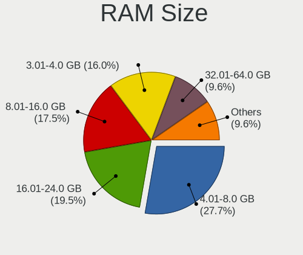
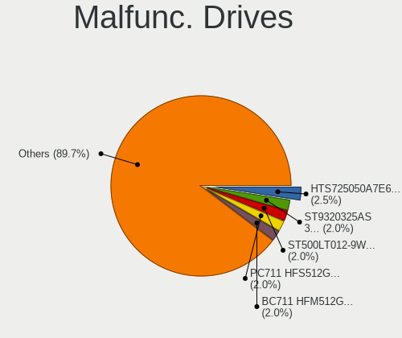
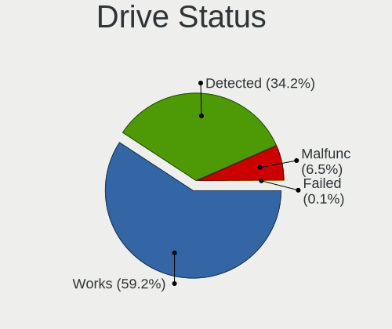
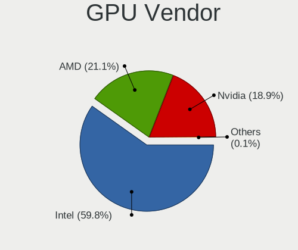
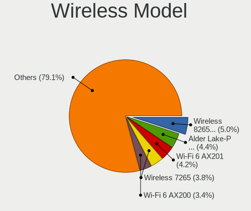
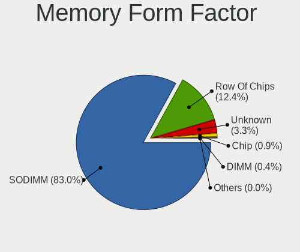
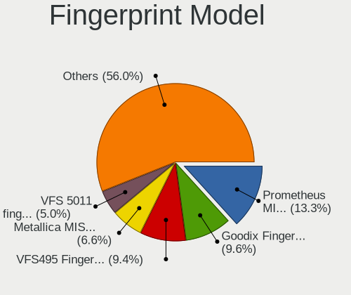

Debian 12 - Tested Hardware & Statistics (Notebooks)
----------------------------------------------------

A project to collect tested hardware configurations for Debian 12.

Anyone can contribute to this report by the [hw-probe](https://github.com/linuxhw/hw-probe) tool:

    sudo -E hw-probe -all -upload

Please contribute! Especially if your hardware is rare.

Contents
--------

* [ Test Cases ](#test-cases)

* [ System ](#system)
  - [ Kernel                   ](#kernel)
  - [ Kernel Family            ](#kernel-family)
  - [ Kernel Major Ver.        ](#kernel-major-ver)
  - [ Arch                     ](#arch)
  - [ DE                       ](#de)
  - [ Display Server           ](#display-server)
  - [ Display Manager          ](#display-manager)
  - [ OS Lang                  ](#os-lang)
  - [ Boot Mode                ](#boot-mode)
  - [ Filesystem               ](#filesystem)
  - [ Part. scheme             ](#part-scheme)
  - [ Dual Boot with Linux/BSD ](#dual-boot-with-linuxbsd)
  - [ Dual Boot (Win)          ](#dual-boot-win)

* [ Board ](#board)
  - [ Vendor                   ](#vendor)
  - [ Model                    ](#model)
  - [ Model Family             ](#model-family)
  - [ MFG Year                 ](#mfg-year)
  - [ Form Factor              ](#form-factor)
  - [ Secure Boot              ](#secure-boot)
  - [ Coreboot                 ](#coreboot)
  - [ RAM Size                 ](#ram-size)
  - [ RAM Used                 ](#ram-used)
  - [ Total Drives             ](#total-drives)
  - [ Has CD-ROM               ](#has-cd-rom)
  - [ Has Ethernet             ](#has-ethernet)
  - [ Has WiFi                 ](#has-wifi)
  - [ Has Bluetooth            ](#has-bluetooth)

* [ Location ](#location)
  - [ Country                  ](#country)
  - [ City                     ](#city)

* [ Drives ](#drives)
  - [ Drive Vendor             ](#drive-vendor)
  - [ Drive Model              ](#drive-model)
  - [ HDD Vendor               ](#hdd-vendor)
  - [ SSD Vendor               ](#ssd-vendor)
  - [ Drive Kind               ](#drive-kind)
  - [ Drive Connector          ](#drive-connector)
  - [ Drive Size               ](#drive-size)
  - [ Space Total              ](#space-total)
  - [ Space Used               ](#space-used)
  - [ Malfunc. Drives          ](#malfunc-drives)
  - [ Malfunc. Drive Vendor    ](#malfunc-drive-vendor)
  - [ Malfunc. HDD Vendor      ](#malfunc-hdd-vendor)
  - [ Malfunc. Drive Kind      ](#malfunc-drive-kind)
  - [ Failed Drives            ](#failed-drives)
  - [ Failed Drive Vendor      ](#failed-drive-vendor)
  - [ Drive Status             ](#drive-status)

* [ Storage controller ](#storage-controller)
  - [ Storage Vendor           ](#storage-vendor)
  - [ Storage Model            ](#storage-model)
  - [ Storage Kind             ](#storage-kind)

* [ Processor ](#processor)
  - [ CPU Vendor               ](#cpu-vendor)
  - [ CPU Model                ](#cpu-model)
  - [ CPU Model Family         ](#cpu-model-family)
  - [ CPU Cores                ](#cpu-cores)
  - [ CPU Sockets              ](#cpu-sockets)
  - [ CPU Threads              ](#cpu-threads)
  - [ CPU Op-Modes             ](#cpu-op-modes)
  - [ CPU Microcode            ](#cpu-microcode)
  - [ CPU Microarch            ](#cpu-microarch)

* [ Graphics ](#graphics)
  - [ GPU Vendor               ](#gpu-vendor)
  - [ GPU Model                ](#gpu-model)
  - [ GPU Combo                ](#gpu-combo)
  - [ GPU Driver               ](#gpu-driver)
  - [ GPU Memory               ](#gpu-memory)

* [ Monitor ](#monitor)
  - [ Monitor Vendor           ](#monitor-vendor)
  - [ Monitor Model            ](#monitor-model)
  - [ Monitor Resolution       ](#monitor-resolution)
  - [ Monitor Diagonal         ](#monitor-diagonal)
  - [ Monitor Width            ](#monitor-width)
  - [ Aspect Ratio             ](#aspect-ratio)
  - [ Monitor Area             ](#monitor-area)
  - [ Pixel Density            ](#pixel-density)
  - [ Multiple Monitors        ](#multiple-monitors)

* [ Network ](#network)
  - [ Net Controller Vendor    ](#net-controller-vendor)
  - [ Net Controller Model     ](#net-controller-model)
  - [ Wireless Vendor          ](#wireless-vendor)
  - [ Wireless Model           ](#wireless-model)
  - [ Ethernet Vendor          ](#ethernet-vendor)
  - [ Ethernet Model           ](#ethernet-model)
  - [ Net Controller Kind      ](#net-controller-kind)
  - [ Used Controller          ](#used-controller)
  - [ NICs                     ](#nics)
  - [ IPv6                     ](#ipv6)

* [ Bluetooth ](#bluetooth)
  - [ Bluetooth Vendor         ](#bluetooth-vendor)
  - [ Bluetooth Model          ](#bluetooth-model)

* [ Sound ](#sound)
  - [ Sound Vendor             ](#sound-vendor)
  - [ Sound Model              ](#sound-model)

* [ Memory ](#memory)
  - [ Memory Vendor            ](#memory-vendor)
  - [ Memory Model             ](#memory-model)
  - [ Memory Kind              ](#memory-kind)
  - [ Memory Form Factor       ](#memory-form-factor)
  - [ Memory Size              ](#memory-size)
  - [ Memory Speed             ](#memory-speed)

* [ Printers & scanners ](#printers--scanners)
  - [ Printer Vendor           ](#printer-vendor)
  - [ Printer Model            ](#printer-model)
  - [ Scanner Vendor           ](#scanner-vendor)
  - [ Scanner Model            ](#scanner-model)

* [ Camera ](#camera)
  - [ Camera Vendor            ](#camera-vendor)
  - [ Camera Model             ](#camera-model)

* [ Security ](#security)
  - [ Fingerprint Vendor       ](#fingerprint-vendor)
  - [ Fingerprint Model        ](#fingerprint-model)
  - [ Chipcard Vendor          ](#chipcard-vendor)
  - [ Chipcard Model           ](#chipcard-model)

* [ Unsupported ](#unsupported)
  - [ Unsupported Devices      ](#unsupported-devices)
  - [ Unsupported Device Types ](#unsupported-device-types)

Test Cases
----------

Total: 269

| Vendor        | Model                       | Probe                                                      | Date         |
|---------------|-----------------------------|------------------------------------------------------------|--------------|
| Dell          | Latitude 5480               | [5b3fb0b4f8](https://linux-hardware.org/?probe=5b3fb0b4f8) | Jun 09, 2023 |
| HP            | Laptop 14-cm0xxx            | [f1100ce875](https://linux-hardware.org/?probe=f1100ce875) | Jun 08, 2023 |
| HP            | G62                         | [fb9522ceac](https://linux-hardware.org/?probe=fb9522ceac) | Jun 08, 2023 |
| Lenovo        | ThinkPad X1 Carbon Gen 9... | [ef71a1641b](https://linux-hardware.org/?probe=ef71a1641b) | Jun 08, 2023 |
| Fujitsu       | FMVNA4NE-                   | [626a677331](https://linux-hardware.org/?probe=626a677331) | Jun 06, 2023 |
| Aquarius      | NS585                       | [b3f11e4a53](https://linux-hardware.org/?probe=b3f11e4a53) | Jun 05, 2023 |
| Fujitsu       | FMVNA4NE-                   | [b1c1176a5b](https://linux-hardware.org/?probe=b1c1176a5b) | Jun 05, 2023 |
| Dell          | Latitude 5420               | [9085f3c8f7](https://linux-hardware.org/?probe=9085f3c8f7) | Jun 04, 2023 |
| Apple         | MacBookPro9,2               | [eb51cb6dcf](https://linux-hardware.org/?probe=eb51cb6dcf) | Jun 03, 2023 |
| Acer          | Aspire A115-31              | [338f025bce](https://linux-hardware.org/?probe=338f025bce) | Jun 03, 2023 |
| HP            | Laptop 14-cm0xxx            | [8933e1b0ad](https://linux-hardware.org/?probe=8933e1b0ad) | Jun 03, 2023 |
| Lenovo        | ThinkPad T470 W10DG 20JN... | [2a67b74a26](https://linux-hardware.org/?probe=2a67b74a26) | Jun 02, 2023 |
| HP            | ZBook 15 G6                 | [2f7bb21988](https://linux-hardware.org/?probe=2f7bb21988) | Jun 02, 2023 |
| Aquarius      | NS585                       | [6f93385917](https://linux-hardware.org/?probe=6f93385917) | Jun 02, 2023 |
| Dell          | Inspiron 5567               | [bd3a6c5bd8](https://linux-hardware.org/?probe=bd3a6c5bd8) | Jun 02, 2023 |
| Aquarius      | NS585                       | [091267ec3a](https://linux-hardware.org/?probe=091267ec3a) | Jun 02, 2023 |
| Aquarius      | NS585                       | [7534819f94](https://linux-hardware.org/?probe=7534819f94) | Jun 02, 2023 |
| Lenovo        | S40-70 80GQ                 | [9a3fbc7388](https://linux-hardware.org/?probe=9a3fbc7388) | Jun 02, 2023 |
| Aquarius      | NS585                       | [ffa7425b95](https://linux-hardware.org/?probe=ffa7425b95) | Jun 01, 2023 |
| Aquarius      | NS585                       | [fafcbbe90e](https://linux-hardware.org/?probe=fafcbbe90e) | Jun 01, 2023 |
| Lenovo        | Legion Y540-15IRH 81SX      | [ffc6b5e345](https://linux-hardware.org/?probe=ffc6b5e345) | Jun 01, 2023 |
| Unknown       | Unknown                     | [412c6d4af8](https://linux-hardware.org/?probe=412c6d4af8) | May 31, 2023 |
| Apple         | MacBookPro16,1              | [717c7884c8](https://linux-hardware.org/?probe=717c7884c8) | May 31, 2023 |
| Chuwi         | HeroBook Air                | [80afc31c99](https://linux-hardware.org/?probe=80afc31c99) | May 30, 2023 |
| Acer          | Aspire A315-58              | [66de62e958](https://linux-hardware.org/?probe=66de62e958) | May 29, 2023 |
| Lenovo        | ThinkPad E15 Gen 4 21E60... | [c8e0efc288](https://linux-hardware.org/?probe=c8e0efc288) | May 29, 2023 |
| Lenovo        | ThinkPad E15 Gen 4 21E60... | [da399dc7cc](https://linux-hardware.org/?probe=da399dc7cc) | May 29, 2023 |
| HP            | EliteBook 735 G6            | [18b33e6fc7](https://linux-hardware.org/?probe=18b33e6fc7) | May 29, 2023 |
| Acer          | Aspire A515-56              | [108833c92b](https://linux-hardware.org/?probe=108833c92b) | May 29, 2023 |
| Dell          | Latitude 7480               | [9eb2396796](https://linux-hardware.org/?probe=9eb2396796) | May 28, 2023 |
| Lenovo        | ThinkPad T400 2768WGB       | [447ea38d26](https://linux-hardware.org/?probe=447ea38d26) | May 27, 2023 |
| Lenovo        | ThinkPad T400 2768WGB       | [57dcd55314](https://linux-hardware.org/?probe=57dcd55314) | May 27, 2023 |
| Aquarius      | NS585                       | [a87c8d46b6](https://linux-hardware.org/?probe=a87c8d46b6) | May 27, 2023 |
| HP            | 250 15.6 inch G9 Noteboo... | [9b93292db9](https://linux-hardware.org/?probe=9b93292db9) | May 26, 2023 |
| Dell          | Latitude 3520               | [bfa8a18cb5](https://linux-hardware.org/?probe=bfa8a18cb5) | May 26, 2023 |
| eMachines     | E725                        | [a4be8012a8](https://linux-hardware.org/?probe=a4be8012a8) | May 26, 2023 |
| Aquarius      | NS585                       | [82a0d45251](https://linux-hardware.org/?probe=82a0d45251) | May 25, 2023 |
| Acer          | Aspire E5-575               | [45ac56e70c](https://linux-hardware.org/?probe=45ac56e70c) | May 25, 2023 |
| Lenovo        | ThinkPad P73 20QRCTO1WW     | [f8ef460648](https://linux-hardware.org/?probe=f8ef460648) | May 23, 2023 |
| Acer          | Nitro AN515-45              | [d784b0822d](https://linux-hardware.org/?probe=d784b0822d) | May 22, 2023 |
| Lenovo        | ThinkPad T410s 2904FAG      | [742f2c09c5](https://linux-hardware.org/?probe=742f2c09c5) | May 21, 2023 |
| Terrans Fo... | AMD                         | [8087d42d0e](https://linux-hardware.org/?probe=8087d42d0e) | May 21, 2023 |
| Lenovo        | ThinkPad S1 Yoga 12 20DK... | [473ea193d5](https://linux-hardware.org/?probe=473ea193d5) | May 21, 2023 |
| Acer          | Aspire 5253                 | [f28727e594](https://linux-hardware.org/?probe=f28727e594) | May 21, 2023 |
| Acer          | Aspire 5739G                | [23a84a79ed](https://linux-hardware.org/?probe=23a84a79ed) | May 20, 2023 |
| Acer          | Aspire 5739G                | [2ae6c83437](https://linux-hardware.org/?probe=2ae6c83437) | May 20, 2023 |
| Dell          | Latitude E5430 non-vPro     | [51827f5ae5](https://linux-hardware.org/?probe=51827f5ae5) | May 19, 2023 |
| Acer          | Aspire 5253                 | [fa328bbd9c](https://linux-hardware.org/?probe=fa328bbd9c) | May 19, 2023 |
| Avell High... | A40 LIV                     | [d1e00e62c4](https://linux-hardware.org/?probe=d1e00e62c4) | May 19, 2023 |
| Toshiba       | Satellite C855-22N          | [f5ccfb46ea](https://linux-hardware.org/?probe=f5ccfb46ea) | May 18, 2023 |
| Aquarius      | NS585                       | [dc2b351b40](https://linux-hardware.org/?probe=dc2b351b40) | May 18, 2023 |
| ASUSTek       | Zenbook UM6702RA_RM6702R... | [66f184855c](https://linux-hardware.org/?probe=66f184855c) | May 17, 2023 |
| Acer          | TravelMate X514-51          | [24465d2184](https://linux-hardware.org/?probe=24465d2184) | May 17, 2023 |
| Lenovo        | ThinkPad L13 Gen 3 21BAA... | [5e4e802b87](https://linux-hardware.org/?probe=5e4e802b87) | May 17, 2023 |
| Lenovo        | ThinkPad L14 Gen 1 20U6S... | [966e89afc3](https://linux-hardware.org/?probe=966e89afc3) | May 17, 2023 |
| Lenovo        | ThinkPad L14 Gen 2 20X10... | [b4bd4b7d23](https://linux-hardware.org/?probe=b4bd4b7d23) | May 17, 2023 |
| Lenovo        | ThinkPad L14 Gen 2 20X10... | [3089c7ab46](https://linux-hardware.org/?probe=3089c7ab46) | May 16, 2023 |
| Lenovo        | ThinkPad L14 Gen 2 20X10... | [a587179a2f](https://linux-hardware.org/?probe=a587179a2f) | May 16, 2023 |
| Lenovo        | ThinkPad T14s Gen 3 21BS... | [0fd753db6d](https://linux-hardware.org/?probe=0fd753db6d) | May 16, 2023 |
| Lenovo        | ThinkPad L14 Gen 2 20X10... | [8ab7fe837d](https://linux-hardware.org/?probe=8ab7fe837d) | May 16, 2023 |
| HP            | EliteBook 840 G5            | [7b8c68cfcf](https://linux-hardware.org/?probe=7b8c68cfcf) | May 13, 2023 |
| ASUSTek       | Zenbook UM6702RA_RM6702R... | [a25f9e8d93](https://linux-hardware.org/?probe=a25f9e8d93) | May 13, 2023 |
| ASUSTek       | Zenbook UM6702RA_RM6702R... | [d2ba323017](https://linux-hardware.org/?probe=d2ba323017) | May 13, 2023 |
| HUAWEI        | BOHB-WAX9                   | [89747b6213](https://linux-hardware.org/?probe=89747b6213) | May 12, 2023 |
| Lenovo        | ThinkPad L13 Gen 2 20VJS... | [17510fcd4f](https://linux-hardware.org/?probe=17510fcd4f) | May 12, 2023 |
| Lenovo        | ThinkPad L13 Gen 2 20VJS... | [6eb320d381](https://linux-hardware.org/?probe=6eb320d381) | May 12, 2023 |
| HP            | ProBook 640 G1              | [4bbb20185b](https://linux-hardware.org/?probe=4bbb20185b) | May 12, 2023 |
| HP            | ProBook 640 G1              | [f89a68e432](https://linux-hardware.org/?probe=f89a68e432) | May 12, 2023 |
| Lenovo        | ThinkPad T480 20L6S29E02    | [d90b0e6626](https://linux-hardware.org/?probe=d90b0e6626) | May 12, 2023 |
| HP            | ProBook 440 14 inch G9 N... | [a07acb448b](https://linux-hardware.org/?probe=a07acb448b) | May 12, 2023 |
| Lenovo        | ThinkPad X260 20F600A7MS    | [67daafed56](https://linux-hardware.org/?probe=67daafed56) | May 12, 2023 |
| HP            | ProBook 6470b               | [7f1a6e0d48](https://linux-hardware.org/?probe=7f1a6e0d48) | May 12, 2023 |
| HP            | ProBook 440 14 inch G9 N... | [f4df381f0e](https://linux-hardware.org/?probe=f4df381f0e) | May 12, 2023 |
| Lenovo        | ThinkPad T440 20B7S2SM00    | [8f6bd394c4](https://linux-hardware.org/?probe=8f6bd394c4) | May 12, 2023 |
| ASUSTek       | Zenbook UM6702RA_RM6702R... | [ba177fa007](https://linux-hardware.org/?probe=ba177fa007) | May 12, 2023 |
| HUAWEI        | MACHD-WXX9                  | [f5d0a04a09](https://linux-hardware.org/?probe=f5d0a04a09) | May 12, 2023 |
| Dell          | XPS 9315                    | [d53e7f5d92](https://linux-hardware.org/?probe=d53e7f5d92) | May 11, 2023 |
| Dell          | Precision 5520              | [5dfdbeff37](https://linux-hardware.org/?probe=5dfdbeff37) | May 10, 2023 |
| Dell          | XPS 15 9560                 | [b904defc14](https://linux-hardware.org/?probe=b904defc14) | May 09, 2023 |
| Lenovo        | ThinkPad E15 Gen 4 21ED0... | [9b21cbbca0](https://linux-hardware.org/?probe=9b21cbbca0) | May 09, 2023 |
| Avell High... | A40 LIV                     | [c4c4a1fe74](https://linux-hardware.org/?probe=c4c4a1fe74) | May 09, 2023 |
| Lenovo        | Legion 5 15ACH6 82JW        | [1f874eaf6d](https://linux-hardware.org/?probe=1f874eaf6d) | May 08, 2023 |
| Lenovo        | ThinkPad T14 Gen 3 21AHC... | [36334e327a](https://linux-hardware.org/?probe=36334e327a) | May 08, 2023 |
| Lenovo        | ThinkPad X260 20F6CTO1WW    | [7998abcdcd](https://linux-hardware.org/?probe=7998abcdcd) | May 07, 2023 |
| HP            | Pavilion Laptop 15-eh1xx... | [e0357a19f3](https://linux-hardware.org/?probe=e0357a19f3) | May 05, 2023 |
| Samsung       | 530U3C/530U4C/532U3C        | [d016282342](https://linux-hardware.org/?probe=d016282342) | May 05, 2023 |
| Avell High... | A40 LIV                     | [5745ae021d](https://linux-hardware.org/?probe=5745ae021d) | May 05, 2023 |
| Aquarius      | NS585                       | [817d9a6b62](https://linux-hardware.org/?probe=817d9a6b62) | May 04, 2023 |
| Aquarius      | NS585                       | [c629501448](https://linux-hardware.org/?probe=c629501448) | May 03, 2023 |
| Lenovo        | ThinkPad T495 20NK000XBR    | [c7ca4b1477](https://linux-hardware.org/?probe=c7ca4b1477) | May 03, 2023 |
| MSI           | Unknown                     | [917d7a7fc9](https://linux-hardware.org/?probe=917d7a7fc9) | May 03, 2023 |
| HP            | OMEN by Laptop              | [a60578cfe2](https://linux-hardware.org/?probe=a60578cfe2) | May 02, 2023 |
| Aquarius      | NS585                       | [e6922e974c](https://linux-hardware.org/?probe=e6922e974c) | May 02, 2023 |
| Toshiba       | Satellite X200              | [e1674b1234](https://linux-hardware.org/?probe=e1674b1234) | May 02, 2023 |
| Sony          | VPCF13WFX                   | [6500c354c7](https://linux-hardware.org/?probe=6500c354c7) | May 01, 2023 |
| Lenovo        | Slim 9 14IAP7 82T1          | [fe1b421c9d](https://linux-hardware.org/?probe=fe1b421c9d) | May 01, 2023 |
| HP            | 255 G8 Notebook PC          | [7262375294](https://linux-hardware.org/?probe=7262375294) | Apr 30, 2023 |
| Lenovo        | ThinkPad T14 Gen 2i 20W1... | [0a9a85f5f0](https://linux-hardware.org/?probe=0a9a85f5f0) | Apr 29, 2023 |
| Lenovo        | ThinkPad T14 Gen 2i 20W1... | [83b10185e8](https://linux-hardware.org/?probe=83b10185e8) | Apr 29, 2023 |
| Aquarius      | NS585                       | [b23696ca41](https://linux-hardware.org/?probe=b23696ca41) | Apr 28, 2023 |
| ASUSTek       | ASUS TUF Gaming A15 FA50... | [2474e8e580](https://linux-hardware.org/?probe=2474e8e580) | Apr 27, 2023 |
| ASUSTek       | Zenbook UX535QE_UM535QE     | [2093399e21](https://linux-hardware.org/?probe=2093399e21) | Apr 27, 2023 |
| ASUSTek       | VivoBook_ASUSLaptop M640... | [0234325d36](https://linux-hardware.org/?probe=0234325d36) | Apr 26, 2023 |
| Aquarius      | NS585                       | [a0983c89d8](https://linux-hardware.org/?probe=a0983c89d8) | Apr 25, 2023 |
| Aquarius      | NS585                       | [5d9edb6ed4](https://linux-hardware.org/?probe=5d9edb6ed4) | Apr 25, 2023 |
| Aquarius      | NS585                       | [972d7f6e4a](https://linux-hardware.org/?probe=972d7f6e4a) | Apr 25, 2023 |
| Aquarius      | NS585                       | [c89bbd8bc0](https://linux-hardware.org/?probe=c89bbd8bc0) | Apr 25, 2023 |
| Aquarius      | NS585                       | [a6e5a5f3d1](https://linux-hardware.org/?probe=a6e5a5f3d1) | Apr 25, 2023 |
| Aquarius      | NS585                       | [b6dac5b058](https://linux-hardware.org/?probe=b6dac5b058) | Apr 25, 2023 |
| Aquarius      | NS585                       | [1563889dac](https://linux-hardware.org/?probe=1563889dac) | Apr 25, 2023 |
| Aquarius      | NS585                       | [9bdbad2ab7](https://linux-hardware.org/?probe=9bdbad2ab7) | Apr 25, 2023 |
| Aquarius      | NS585                       | [e30d7dde7b](https://linux-hardware.org/?probe=e30d7dde7b) | Apr 25, 2023 |
| Aquarius      | NS585                       | [68527a900f](https://linux-hardware.org/?probe=68527a900f) | Apr 25, 2023 |
| Aquarius      | NS585                       | [ce99b27fb4](https://linux-hardware.org/?probe=ce99b27fb4) | Apr 25, 2023 |
| Aquarius      | NS585                       | [fc377acae2](https://linux-hardware.org/?probe=fc377acae2) | Apr 25, 2023 |
| Aquarius      | NS585                       | [ed32f24d6e](https://linux-hardware.org/?probe=ed32f24d6e) | Apr 25, 2023 |
| Aquarius      | NS585                       | [ea60267a5b](https://linux-hardware.org/?probe=ea60267a5b) | Apr 25, 2023 |
| Aquarius      | NS585                       | [f71897bf76](https://linux-hardware.org/?probe=f71897bf76) | Apr 25, 2023 |
| Aquarius      | NS585                       | [7aa4561ca5](https://linux-hardware.org/?probe=7aa4561ca5) | Apr 25, 2023 |
| Aquarius      | NS585                       | [385ce8cd93](https://linux-hardware.org/?probe=385ce8cd93) | Apr 25, 2023 |
| Aquarius      | NS585                       | [3fc8926a1a](https://linux-hardware.org/?probe=3fc8926a1a) | Apr 25, 2023 |
| Lenovo        | V15 G2 ALC 82KD             | [9e6ce2eb71](https://linux-hardware.org/?probe=9e6ce2eb71) | Apr 25, 2023 |
| Aquarius      | NS585                       | [58306d0266](https://linux-hardware.org/?probe=58306d0266) | Apr 25, 2023 |
| HP            | ProBook 4520s               | [b680525b61](https://linux-hardware.org/?probe=b680525b61) | Apr 24, 2023 |
| HP            | ProBook 4520s               | [e4ce7aed55](https://linux-hardware.org/?probe=e4ce7aed55) | Apr 24, 2023 |
| Hampoo        | Cherry Trail CR V200        | [f3d90b0d4a](https://linux-hardware.org/?probe=f3d90b0d4a) | Apr 23, 2023 |
| Acer          | Aspire E1-571G              | [0e2671ee2e](https://linux-hardware.org/?probe=0e2671ee2e) | Apr 23, 2023 |
| Dell          | G15 5520                    | [238c8f53aa](https://linux-hardware.org/?probe=238c8f53aa) | Apr 22, 2023 |
| Dell          | Latitude E6330              | [b532a9756c](https://linux-hardware.org/?probe=b532a9756c) | Apr 22, 2023 |
| Acer          | Nitro AN515-45              | [91f538e2ab](https://linux-hardware.org/?probe=91f538e2ab) | Apr 21, 2023 |
| Lenovo        | IdeaPad S510p 20298         | [8a1e6b7f32](https://linux-hardware.org/?probe=8a1e6b7f32) | Apr 21, 2023 |
| HP            | ZBook Power 15.6 inch G9... | [036616c992](https://linux-hardware.org/?probe=036616c992) | Apr 21, 2023 |
| HP            | ZBook Power 15.6 inch G8... | [cb40e046d8](https://linux-hardware.org/?probe=cb40e046d8) | Apr 21, 2023 |
| Toshiba       | Satellite X200              | [15035835d0](https://linux-hardware.org/?probe=15035835d0) | Apr 20, 2023 |
| HP            | Notebook                    | [7174065ed3](https://linux-hardware.org/?probe=7174065ed3) | Apr 20, 2023 |
| Aquarius      | NS585                       | [753222f54f](https://linux-hardware.org/?probe=753222f54f) | Apr 20, 2023 |
| Aquarius      | NS585                       | [be0bc2be01](https://linux-hardware.org/?probe=be0bc2be01) | Apr 20, 2023 |
| HP            | EliteBook 830 G5            | [6090be709d](https://linux-hardware.org/?probe=6090be709d) | Apr 20, 2023 |
| Aquarius      | NS585                       | [f7f0464c39](https://linux-hardware.org/?probe=f7f0464c39) | Apr 20, 2023 |
| Aquarius      | NS585                       | [8393642230](https://linux-hardware.org/?probe=8393642230) | Apr 20, 2023 |
| Aquarius      | NS585                       | [a5b9a09e63](https://linux-hardware.org/?probe=a5b9a09e63) | Apr 20, 2023 |
| Medion        | P17605                      | [b68359f3d1](https://linux-hardware.org/?probe=b68359f3d1) | Apr 20, 2023 |
| ASUSTek       | VivoBook_ASUSLaptop M350... | [d669bcc680](https://linux-hardware.org/?probe=d669bcc680) | Apr 19, 2023 |
| Tactus        | GeoBook 140                 | [704da241f5](https://linux-hardware.org/?probe=704da241f5) | Apr 18, 2023 |
| Dell          | Vostro 5402                 | [e492c87b46](https://linux-hardware.org/?probe=e492c87b46) | Apr 18, 2023 |
| Dell          | Vostro 5402                 | [b15f47258b](https://linux-hardware.org/?probe=b15f47258b) | Apr 18, 2023 |
| PC Special... | NV4XMB,ME,MZ                | [65c0a28c58](https://linux-hardware.org/?probe=65c0a28c58) | Apr 18, 2023 |
| Lenovo        | IdeaPad S510p 20298         | [7f0be1868e](https://linux-hardware.org/?probe=7f0be1868e) | Apr 18, 2023 |
| MSI           | Prestige 15 A12UC           | [0f4c1e1ac3](https://linux-hardware.org/?probe=0f4c1e1ac3) | Apr 18, 2023 |
| ASUSTek       | G551JW                      | [65f6143e36](https://linux-hardware.org/?probe=65f6143e36) | Apr 18, 2023 |
| Lenovo        | ThinkPad L540 20AUA39QJP    | [180ef53338](https://linux-hardware.org/?probe=180ef53338) | Apr 18, 2023 |
| Lenovo        | ThinkPad L540 20AUA39QJP    | [fd3b20c292](https://linux-hardware.org/?probe=fd3b20c292) | Apr 18, 2023 |
| LG Electro... | 17Z90Q-K.AA78A1             | [594a7fa16b](https://linux-hardware.org/?probe=594a7fa16b) | Apr 18, 2023 |
| IBM           | ThinkPad R51 1836Q4U        | [ebec8b53eb](https://linux-hardware.org/?probe=ebec8b53eb) | Apr 18, 2023 |
| Acer          | Swift SF314-41              | [8c42a0aba8](https://linux-hardware.org/?probe=8c42a0aba8) | Apr 16, 2023 |
| Dell          | XPS 13 9305                 | [838519057f](https://linux-hardware.org/?probe=838519057f) | Apr 16, 2023 |
| HP            | 255 G8 Notebook PC          | [58ec498e8f](https://linux-hardware.org/?probe=58ec498e8f) | Apr 14, 2023 |
| Toshiba       | Satellite L850              | [15de4db91b](https://linux-hardware.org/?probe=15de4db91b) | Apr 14, 2023 |
| Dell          | G15 5510                    | [6b4ef54307](https://linux-hardware.org/?probe=6b4ef54307) | Apr 13, 2023 |
| HP            | Pavilion Laptop 15-eh1xx... | [60f7db51fa](https://linux-hardware.org/?probe=60f7db51fa) | Apr 13, 2023 |
| HP            | Pavilion Laptop 15-eh1xx... | [e9708d65e9](https://linux-hardware.org/?probe=e9708d65e9) | Apr 13, 2023 |
| Dell          | Latitude 5490               | [38ebdedf58](https://linux-hardware.org/?probe=38ebdedf58) | Apr 12, 2023 |
| Acer          | Aspire E1-571G              | [45a3503764](https://linux-hardware.org/?probe=45a3503764) | Apr 11, 2023 |
| Aquarius      | NS585                       | [6f4b987640](https://linux-hardware.org/?probe=6f4b987640) | Apr 11, 2023 |
| Dell          | Latitude 3320               | [b7c2bb88b3](https://linux-hardware.org/?probe=b7c2bb88b3) | Apr 10, 2023 |
| Dell          | Latitude 3320               | [436e7b8903](https://linux-hardware.org/?probe=436e7b8903) | Apr 10, 2023 |
| Lenovo        | Yoga 500-15IBD 80N6         | [885fff9ddb](https://linux-hardware.org/?probe=885fff9ddb) | Apr 10, 2023 |
| Lenovo        | ThinkPad X220 4291LR6       | [ea86227d59](https://linux-hardware.org/?probe=ea86227d59) | Apr 09, 2023 |
| Lenovo        | ThinkPad P15v Gen 3 21D8... | [8d4288ca33](https://linux-hardware.org/?probe=8d4288ca33) | Apr 09, 2023 |
| eMachines     | eME728                      | [aff08e7f2d](https://linux-hardware.org/?probe=aff08e7f2d) | Apr 05, 2023 |
| eMachines     | eMachiens G443              | [58c297218a](https://linux-hardware.org/?probe=58c297218a) | Apr 05, 2023 |
| System76      | Lemur Pro                   | [2232424d5a](https://linux-hardware.org/?probe=2232424d5a) | Apr 05, 2023 |
| HONOR         | NMH-WCX9                    | [9ea45909a2](https://linux-hardware.org/?probe=9ea45909a2) | Apr 05, 2023 |
| Framework     | Laptop                      | [5bb187865d](https://linux-hardware.org/?probe=5bb187865d) | Apr 04, 2023 |
| Packard Be... | EasyNote TJ65               | [cd6a05149d](https://linux-hardware.org/?probe=cd6a05149d) | Apr 02, 2023 |
| Schenker      | XMG CORE (REN/M20)          | [50e9dee7b1](https://linux-hardware.org/?probe=50e9dee7b1) | Apr 01, 2023 |
| HP            | EliteBook 840 G5            | [3c509a7075](https://linux-hardware.org/?probe=3c509a7075) | Apr 01, 2023 |
| Tactus        | GeoBook 140                 | [0ceb5a3b7c](https://linux-hardware.org/?probe=0ceb5a3b7c) | Apr 01, 2023 |
| Lenovo        | ThinkPad T14s Gen 2i 20W... | [a9e7ad7ecd](https://linux-hardware.org/?probe=a9e7ad7ecd) | Mar 29, 2023 |
| MSI           | Prestige 14Evo A11M         | [fc06b01f31](https://linux-hardware.org/?probe=fc06b01f31) | Mar 29, 2023 |
| MSI           | Prestige 14Evo A11M         | [5ac693dbd4](https://linux-hardware.org/?probe=5ac693dbd4) | Mar 29, 2023 |
| Acer          | Nitro AN515-43              | [47c758c261](https://linux-hardware.org/?probe=47c758c261) | Mar 29, 2023 |
| THUNDEROBO... | 911 Plus                    | [6617ad47b7](https://linux-hardware.org/?probe=6617ad47b7) | Mar 28, 2023 |
| Google        | Swanky                      | [0f32e48b38](https://linux-hardware.org/?probe=0f32e48b38) | Mar 28, 2023 |
| Lenovo        | ThinkPad L13 Gen 3 21B9C... | [0744b26f5c](https://linux-hardware.org/?probe=0744b26f5c) | Mar 27, 2023 |
| GPD           | P3 MAX                      | [b3627909f1](https://linux-hardware.org/?probe=b3627909f1) | Mar 27, 2023 |
| Dell          | Latitude E5430 non-vPro     | [17794caffa](https://linux-hardware.org/?probe=17794caffa) | Mar 27, 2023 |
| Lenovo        | ThinkPad P73 20QRCTO1WW     | [7cd7234999](https://linux-hardware.org/?probe=7cd7234999) | Mar 27, 2023 |
| Lenovo        | ThinkPad P73 20QRCTO1WW     | [2d83ebd124](https://linux-hardware.org/?probe=2d83ebd124) | Mar 26, 2023 |
| Dell          | Precision 5570              | [454590a1a8](https://linux-hardware.org/?probe=454590a1a8) | Mar 26, 2023 |
| Dell          | Latitude E6330              | [32833b4683](https://linux-hardware.org/?probe=32833b4683) | Mar 25, 2023 |
| Lenovo        | ThinkPad 13 2nd Gen 20J1... | [9b9a21b7da](https://linux-hardware.org/?probe=9b9a21b7da) | Mar 24, 2023 |
| Lenovo        | ThinkPad 13 2nd Gen 20J1... | [58f8d5849a](https://linux-hardware.org/?probe=58f8d5849a) | Mar 24, 2023 |
| Toshiba       | Satellite C50-B             | [4b563f19dd](https://linux-hardware.org/?probe=4b563f19dd) | Mar 24, 2023 |
| Sony          | SVE1512M6ESI                | [db00c70eb7](https://linux-hardware.org/?probe=db00c70eb7) | Mar 24, 2023 |
| Acer          | Aspire VN7-791              | [054efde4e8](https://linux-hardware.org/?probe=054efde4e8) | Mar 22, 2023 |
| ASUSTek       | Zenbook UX535QE_UM535QE     | [1f5d2a057c](https://linux-hardware.org/?probe=1f5d2a057c) | Mar 22, 2023 |
| Lenovo        | ThinkPad T440 20B7S3N304    | [af39e826be](https://linux-hardware.org/?probe=af39e826be) | Mar 22, 2023 |
| Lenovo        | ThinkPad T14s Gen 1 20UJ... | [de7c628210](https://linux-hardware.org/?probe=de7c628210) | Mar 22, 2023 |
| Toshiba       | Satellite C50-B             | [b9bf22cc53](https://linux-hardware.org/?probe=b9bf22cc53) | Mar 20, 2023 |
| Dell          | G3 3590                     | [cba689e7f5](https://linux-hardware.org/?probe=cba689e7f5) | Mar 20, 2023 |
| ASUSTek       | ZenBook 13 UX331UAL         | [9d44bf5769](https://linux-hardware.org/?probe=9d44bf5769) | Mar 20, 2023 |
| Lenovo        | IdeaPad 5 14ALC05 82LM      | [d58b6cfe61](https://linux-hardware.org/?probe=d58b6cfe61) | Mar 18, 2023 |
| Aquarius      | NS585                       | [cd1e92458f](https://linux-hardware.org/?probe=cd1e92458f) | Mar 17, 2023 |
| Lenovo        | ThinkPad E15 Gen 4 21ED0... | [66f4a76724](https://linux-hardware.org/?probe=66f4a76724) | Mar 17, 2023 |
| Lenovo        | ThinkPad E15 Gen 4 21ED0... | [b50b834744](https://linux-hardware.org/?probe=b50b834744) | Mar 16, 2023 |
| Lenovo        | ThinkPad 13 2nd Gen 20J1... | [f3ee556fb5](https://linux-hardware.org/?probe=f3ee556fb5) | Mar 16, 2023 |
| HP            | EliteBook 830 G5            | [c6aa050dd1](https://linux-hardware.org/?probe=c6aa050dd1) | Mar 16, 2023 |
| HP            | ProBook 430 G8 Notebook ... | [ca6ab3c197](https://linux-hardware.org/?probe=ca6ab3c197) | Mar 16, 2023 |
| TUXEDO        | Aura 15 Gen2                | [15d4cdae49](https://linux-hardware.org/?probe=15d4cdae49) | Mar 14, 2023 |
| Acer          | Aspire E5-551G              | [7a992ff109](https://linux-hardware.org/?probe=7a992ff109) | Mar 14, 2023 |
| Schenker      | VIA 15 Pro                  | [ef02f8156e](https://linux-hardware.org/?probe=ef02f8156e) | Mar 13, 2023 |
| ASUSTek       | VivoBook_ASUSLaptop X515... | [cc878090ee](https://linux-hardware.org/?probe=cc878090ee) | Mar 13, 2023 |
| Lenovo        | Yoga 2 Pro 20266            | [f762c7cc29](https://linux-hardware.org/?probe=f762c7cc29) | Mar 13, 2023 |
| Lenovo        | Legion 5 15IAH7H 82RB       | [9841e70d67](https://linux-hardware.org/?probe=9841e70d67) | Mar 13, 2023 |
| Lenovo        | ThinkPad P14s Gen 2i 20V... | [fd6d58db15](https://linux-hardware.org/?probe=fd6d58db15) | Mar 12, 2023 |
| ASUSTek       | VivoBook_ASUSLaptop M340... | [55a73e2e07](https://linux-hardware.org/?probe=55a73e2e07) | Mar 12, 2023 |
| HP            | Pavilion Notebook           | [158d246d65](https://linux-hardware.org/?probe=158d246d65) | Mar 11, 2023 |
| Dell          | Precision 5570              | [470ba58973](https://linux-hardware.org/?probe=470ba58973) | Mar 11, 2023 |
| Dell          | Latitude 3320               | [2a58a07005](https://linux-hardware.org/?probe=2a58a07005) | Mar 11, 2023 |
| Dell          | Latitude 3320               | [d17364c0ef](https://linux-hardware.org/?probe=d17364c0ef) | Mar 11, 2023 |
| Dell          | XPS 13 9310                 | [c528b16696](https://linux-hardware.org/?probe=c528b16696) | Mar 10, 2023 |
| Lenovo        | ThinkPad X1 Carbon Gen 1... | [276ce8bd7c](https://linux-hardware.org/?probe=276ce8bd7c) | Mar 09, 2023 |
| Lenovo        | ThinkBook 14 G3 ACL 21A2    | [5bc1f5d6d8](https://linux-hardware.org/?probe=5bc1f5d6d8) | Mar 09, 2023 |
| Dell          | Precision 3560              | [0873d45206](https://linux-hardware.org/?probe=0873d45206) | Mar 08, 2023 |
| Dell          | XPS 15 9570                 | [fc0152a6de](https://linux-hardware.org/?probe=fc0152a6de) | Mar 08, 2023 |
| Acer          | Nitro AN515-43              | [32d1af5dee](https://linux-hardware.org/?probe=32d1af5dee) | Mar 07, 2023 |
| ASUSTek       | VivoBook_ASUSLaptop X150... | [ac92e5ce13](https://linux-hardware.org/?probe=ac92e5ce13) | Mar 07, 2023 |
| Lenovo        | ThinkPad X1 Carbon 5th 2... | [92f8093adb](https://linux-hardware.org/?probe=92f8093adb) | Mar 07, 2023 |
| HP            | EliteBook 830 G7 Noteboo... | [cee8496315](https://linux-hardware.org/?probe=cee8496315) | Mar 06, 2023 |
| ASUSTek       | X550JX                      | [a9a82b2395](https://linux-hardware.org/?probe=a9a82b2395) | Mar 06, 2023 |
| Fujitsu       | LIFEBOOK U9312              | [19a72f502b](https://linux-hardware.org/?probe=19a72f502b) | Mar 06, 2023 |
| MSI           | Modern 15 A5M               | [7d708fea96](https://linux-hardware.org/?probe=7d708fea96) | Mar 06, 2023 |
| HUAWEI        | BOHB-WAX9                   | [eb5b9b8cb9](https://linux-hardware.org/?probe=eb5b9b8cb9) | Mar 06, 2023 |
| Lenovo        | ThinkPad T440p 20AWS37F0... | [48677f9f86](https://linux-hardware.org/?probe=48677f9f86) | Mar 05, 2023 |
| Toshiba       | Satellite A200              | [b9677c823b](https://linux-hardware.org/?probe=b9677c823b) | Mar 05, 2023 |
| Toshiba       | Satellite A200              | [47f08e4094](https://linux-hardware.org/?probe=47f08e4094) | Mar 04, 2023 |
| Dell          | Vostro 3700                 | [ea14c47abb](https://linux-hardware.org/?probe=ea14c47abb) | Mar 04, 2023 |
| Lenovo        | IdeaPad 5 15ARE05 81YQ      | [c4def038d9](https://linux-hardware.org/?probe=c4def038d9) | Mar 04, 2023 |
| Dell          | XPS 15 9520                 | [1bef11c91d](https://linux-hardware.org/?probe=1bef11c91d) | Mar 04, 2023 |
| Lenovo        | ThinkPad X220 429035U       | [83266c1006](https://linux-hardware.org/?probe=83266c1006) | Mar 04, 2023 |
| Notebook      | NS5x_NS7xPU                 | [55ca2f6ac5](https://linux-hardware.org/?probe=55ca2f6ac5) | Mar 03, 2023 |
| HP            | Laptop 17-bs0xx             | [e055e73b69](https://linux-hardware.org/?probe=e055e73b69) | Mar 02, 2023 |
| Lenovo        | ThinkPad T16 Gen 1 21BWS... | [e56350a1c1](https://linux-hardware.org/?probe=e56350a1c1) | Feb 28, 2023 |
| ASUSTek       | UX31A                       | [56654a2659](https://linux-hardware.org/?probe=56654a2659) | Feb 27, 2023 |
| Dell          | G3 3590                     | [eb9009fad9](https://linux-hardware.org/?probe=eb9009fad9) | Feb 27, 2023 |
| ASUSTek       | Zenbook UX535QE_UM535QE     | [7d7953a826](https://linux-hardware.org/?probe=7d7953a826) | Feb 26, 2023 |
| Lenovo        | ThinkPad T440s 20AQ009DG... | [27e2d41750](https://linux-hardware.org/?probe=27e2d41750) | Feb 24, 2023 |
| Shanghai Z... | ZXE CRB                     | [478a4b921f](https://linux-hardware.org/?probe=478a4b921f) | Feb 24, 2023 |
| Dell          | Latitude 7530               | [4844568edb](https://linux-hardware.org/?probe=4844568edb) | Feb 21, 2023 |
| Dell          | Inspiron 3468               | [e5977ee094](https://linux-hardware.org/?probe=e5977ee094) | Feb 21, 2023 |
| HP            | EliteBook 830 G5            | [0cb773d407](https://linux-hardware.org/?probe=0cb773d407) | Feb 20, 2023 |
| Dell          | XPS 13 9370                 | [e710561f68](https://linux-hardware.org/?probe=e710561f68) | Feb 19, 2023 |
| ASUSTek       | VivoBook_ASUSLaptop M350... | [5300c136fd](https://linux-hardware.org/?probe=5300c136fd) | Feb 19, 2023 |
| HP            | Laptop 17-bs0xx             | [cc805e31b0](https://linux-hardware.org/?probe=cc805e31b0) | Feb 17, 2023 |
| Lenovo        | ThinkPad T61p 6457UN2       | [02e6818311](https://linux-hardware.org/?probe=02e6818311) | Feb 17, 2023 |
| Dell          | Precision 5570              | [d5f9d13ae3](https://linux-hardware.org/?probe=d5f9d13ae3) | Feb 16, 2023 |
| Dell          | Precision 5570              | [d0f2fa25c3](https://linux-hardware.org/?probe=d0f2fa25c3) | Feb 15, 2023 |
| ASUSTek       | VivoBook_ASUSLaptop X515... | [13866e78a2](https://linux-hardware.org/?probe=13866e78a2) | Feb 15, 2023 |
| ASUSTek       | X505BP                      | [579388a539](https://linux-hardware.org/?probe=579388a539) | Feb 13, 2023 |
| Dell          | Latitude E6330              | [1b5cdf846f](https://linux-hardware.org/?probe=1b5cdf846f) | Feb 11, 2023 |
| Lenovo        | ThinkPad SL510 28477MG      | [8f22e1beaa](https://linux-hardware.org/?probe=8f22e1beaa) | Feb 10, 2023 |
| Samsung       | 550XDA                      | [45d947c9f9](https://linux-hardware.org/?probe=45d947c9f9) | Feb 10, 2023 |
| HP            | Laptop 17-bs0xx             | [84eb5f0ad8](https://linux-hardware.org/?probe=84eb5f0ad8) | Feb 09, 2023 |
| Dell          | Precision 5570              | [6c257e667d](https://linux-hardware.org/?probe=6c257e667d) | Feb 08, 2023 |
| HUAWEI        | NBLK-WAX9X                  | [d37cc19110](https://linux-hardware.org/?probe=d37cc19110) | Feb 08, 2023 |
| Dell          | Precision 5570              | [e81b3de663](https://linux-hardware.org/?probe=e81b3de663) | Feb 08, 2023 |
| ASUSTek       | VivoBook_ASUSLaptop M340... | [eca3a05d41](https://linux-hardware.org/?probe=eca3a05d41) | Feb 07, 2023 |
| Dell          | Latitude E5430 non-vPro     | [7d2d46a579](https://linux-hardware.org/?probe=7d2d46a579) | Feb 06, 2023 |

System
------

Kernel
------

Version of the Linux kernel

| Version                | Notebooks | Percent |
|------------------------|-----------|---------|
| 6.1.0-7-amd64          | 49        | 22.9%   |
| 6.1.0-4-amd64          | 38        | 17.76%  |
| 6.1.0-9-amd64          | 35        | 16.36%  |
| 6.1.0-6-amd64          | 27        | 12.62%  |
| 6.1.0-5-amd64          | 21        | 9.81%   |
| 6.1.0-3-amd64          | 19        | 8.88%   |
| 6.1.0-8-amd64          | 7         | 3.27%   |
| 6.1.0-7-rt-amd64       | 2         | 0.93%   |
| 6.0.0-6-amd64          | 2         | 0.93%   |
| 6.0.0-2-amd64          | 2         | 0.93%   |
| 6.0.0-0.deb11.6-amd64  | 2         | 0.93%   |
| 6.3.0-7-amd64          | 1         | 0.47%   |
| 6.2.8                  | 1         | 0.47%   |
| 6.2.11                 | 1         | 0.47%   |
| 6.1.0-7-686            | 1         | 0.47%   |
| 6.1.0-2-amd64          | 1         | 0.47%   |
| 6.0.0-4-amd64          | 1         | 0.47%   |
| 5.19.0-0.deb11.2-amd64 | 1         | 0.47%   |
| 5.16.0-3-amd64         | 1         | 0.47%   |
| 5.15.95-xanmod1        | 1         | 0.47%   |
| 5.10.0-20-amd64        | 1         | 0.47%   |

Kernel Family
-------------

Linux kernel without a distro release

| Version | Notebooks | Percent |
|---------|-----------|---------|
| 6.1.0   | 191       | 93.17%  |
| 6.0.0   | 7         | 3.41%   |
| 6.3.0   | 1         | 0.49%   |
| 6.2.8   | 1         | 0.49%   |
| 6.2.11  | 1         | 0.49%   |
| 5.19.0  | 1         | 0.49%   |
| 5.16.0  | 1         | 0.49%   |
| 5.15.95 | 1         | 0.49%   |
| 5.10.0  | 1         | 0.49%   |

Kernel Major Ver.
-----------------

Linux kernel major version

| Version | Notebooks | Percent |
|---------|-----------|---------|
| 6.1     | 191       | 93.17%  |
| 6.0     | 7         | 3.41%   |
| 6.2     | 2         | 0.98%   |
| 6.3     | 1         | 0.49%   |
| 5.19    | 1         | 0.49%   |
| 5.16    | 1         | 0.49%   |
| 5.15    | 1         | 0.49%   |
| 5.10    | 1         | 0.49%   |

Arch
----

OS architecture (x86_64, i586, etc.)

| Name   | Notebooks | Percent |
|--------|-----------|---------|
| x86_64 | 203       | 99.51%  |
| i686   | 1         | 0.49%   |

DE
--

Desktop Environment

| Name            | Notebooks | Percent |
|-----------------|-----------|---------|
| GNOME           | 75        | 36.76%  |
| Unknown         | 45        | 22.06%  |
| KDE5            | 38        | 18.63%  |
| XFCE            | 15        | 7.35%   |
| X-Cinnamon      | 8         | 3.92%   |
| MATE            | 6         | 2.94%   |
| i3              | 3         | 1.47%   |
| GNOME Flashback | 3         | 1.47%   |
| LXDE            | 2         | 0.98%   |
| Enlightenment   | 2         | 0.98%   |
| xmonad          | 1         | 0.49%   |
| sway            | 1         | 0.49%   |
| Pantheon        | 1         | 0.49%   |
| LXQt            | 1         | 0.49%   |
| Cinnamon        | 1         | 0.49%   |
| Budgie          | 1         | 0.49%   |
| awesome         | 1         | 0.49%   |

Display Server
--------------

X11 or Wayland

| Name    | Notebooks | Percent |
|---------|-----------|---------|
| X11     | 85        | 41.26%  |
| Wayland | 70        | 33.98%  |
| Unknown | 40        | 19.42%  |
| Tty     | 11        | 5.34%   |

Display Manager
---------------

SDDM, LightDM, etc.

| Name    | Notebooks | Percent |
|---------|-----------|---------|
| GDM3    | 73        | 35.61%  |
| Unknown | 67        | 32.68%  |
| SDDM    | 35        | 17.07%  |
| LightDM | 28        | 13.66%  |
| GREETD  | 2         | 0.98%   |

OS Lang
-------

Language

| Lang    | Notebooks | Percent |
|---------|-----------|---------|
| en_US   | 55        | 26.83%  |
| ru_RU   | 43        | 20.98%  |
| fr_FR   | 22        | 10.73%  |
| de_DE   | 20        | 9.76%   |
| sv_SE   | 12        | 5.85%   |
| en_GB   | 9         | 4.39%   |
| zh_CN   | 4         | 1.95%   |
| C       | 4         | 1.95%   |
| pt_BR   | 3         | 1.46%   |
| pl_PL   | 3         | 1.46%   |
| es_ES   | 3         | 1.46%   |
| it_IT   | 2         | 0.98%   |
| en_IL   | 2         | 0.98%   |
| be_BY   | 2         | 0.98%   |
| uk_UA   | 1         | 0.49%   |
| tr_TR   | 1         | 0.49%   |
| oc_FR   | 1         | 0.49%   |
| nl_NL   | 1         | 0.49%   |
| nl_BE   | 1         | 0.49%   |
| hu_HU   | 1         | 0.49%   |
| hr_HR   | 1         | 0.49%   |
| fr_BE   | 1         | 0.49%   |
| fi_FI   | 1         | 0.49%   |
| es_VE   | 1         | 0.49%   |
| es_PA   | 1         | 0.49%   |
| es_MX   | 1         | 0.49%   |
| es_CL   | 1         | 0.49%   |
| es_AR   | 1         | 0.49%   |
| en_NZ   | 1         | 0.49%   |
| en_IN   | 1         | 0.49%   |
| en_IE   | 1         | 0.49%   |
| en_AU   | 1         | 0.49%   |
| cs_CZ   | 1         | 0.49%   |
| ca_ES   | 1         | 0.49%   |
| Unknown | 1         | 0.49%   |

Boot Mode
---------

EFI or BIOS

| Mode | Notebooks | Percent |
|------|-----------|---------|
| EFI  | 150       | 73.53%  |
| BIOS | 54        | 26.47%  |

Filesystem
----------

Type of filesystem

| Type    | Notebooks | Percent |
|---------|-----------|---------|
| Ext4    | 145       | 71.08%  |
| Overlay | 42        | 20.59%  |
| Btrfs   | 13        | 6.37%   |
| Xfs     | 3         | 1.47%   |
| Tmpfs   | 1         | 0.49%   |

Part. scheme
------------

Scheme of partitioning

| Type    | Notebooks | Percent |
|---------|-----------|---------|
| GPT     | 153       | 75%     |
| MBR     | 29        | 14.22%  |
| Unknown | 22        | 10.78%  |

Dual Boot with Linux/BSD
------------------------

Hosting more than one Linux/BSD

| Dual boot | Notebooks | Percent |
|-----------|-----------|---------|
| No        | 191       | 93.63%  |
| Yes       | 13        | 6.37%   |

Dual Boot (Win)
---------------

Hosting Linux and Windows

| Dual boot | Notebooks | Percent |
|-----------|-----------|---------|
| No        | 128       | 62.75%  |
| Yes       | 76        | 37.25%  |

Board
-----

Vendor
------

Motherboard manufacturer

| Name                           | Notebooks | Percent |
|--------------------------------|-----------|---------|
| Lenovo                         | 53        | 25.98%  |
| Dell                           | 29        | 14.22%  |
| Aquarius                       | 28        | 13.73%  |
| Hewlett-Packard                | 23        | 11.27%  |
| ASUSTek Computer               | 14        | 6.86%   |
| Acer                           | 14        | 6.86%   |
| Toshiba                        | 4         | 1.96%   |
| MSI                            | 4         | 1.96%   |
| HUAWEI                         | 3         | 1.47%   |
| eMachines                      | 3         | 1.47%   |
| Sony                           | 2         | 0.98%   |
| Schenker                       | 2         | 0.98%   |
| Samsung Electronics            | 2         | 0.98%   |
| Apple                          | 2         | 0.98%   |
| TUXEDO                         | 1         | 0.49%   |
| THUNDEROBOT                    | 1         | 0.49%   |
| Terrans Force                  | 1         | 0.49%   |
| Tactus                         | 1         | 0.49%   |
| System76                       | 1         | 0.49%   |
| Shanghai Zhaoxin Semiconductor | 1         | 0.49%   |
| PC Specialist                  | 1         | 0.49%   |
| Packard Bell                   | 1         | 0.49%   |
| Notebook                       | 1         | 0.49%   |
| Medion                         | 1         | 0.49%   |
| LG Electronics                 | 1         | 0.49%   |
| IBM                            | 1         | 0.49%   |
| HONOR                          | 1         | 0.49%   |
| Hampoo                         | 1         | 0.49%   |
| GPD                            | 1         | 0.49%   |
| Google                         | 1         | 0.49%   |
| Fujitsu                        | 1         | 0.49%   |
| Framework                      | 1         | 0.49%   |
| Chuwi                          | 1         | 0.49%   |
| Avell High Performance         | 1         | 0.49%   |
| Unknown                        | 1         | 0.49%   |

Model
-----

Motherboard model

| Name                                     | Notebooks | Percent |
|------------------------------------------|-----------|---------|
| Aquarius NS585                           | 28        | 13.73%  |
| Lenovo ThinkPad L14 Gen 2 20X1004CMX     | 4         | 1.96%   |
| Dell Precision 5570                      | 4         | 1.96%   |
| Lenovo ThinkPad L13 Gen 2 20VJS6RY00     | 2         | 0.98%   |
| HP ProBook 640 G1                        | 2         | 0.98%   |
| HP ProBook 440 14 inch G9 Notebook PC    | 2         | 0.98%   |
| HP EliteBook 840 G5                      | 2         | 0.98%   |
| HP 255 G8 Notebook PC                    | 2         | 0.98%   |
| Dell Latitude 3320                       | 2         | 0.98%   |
| ASUS Zenbook UX535QE_UM535QE             | 2         | 0.98%   |
| ASUS VivoBook_ASUSLaptop M3401QA_M3401QA | 2         | 0.98%   |
| Acer Nitro AN515-45                      | 2         | 0.98%   |
| Acer Nitro AN515-43                      | 2         | 0.98%   |
| Unknown                                  | 2         | 0.98%   |
| TUXEDO Aura 15 Gen2                      | 1         | 0.49%   |
| Toshiba Satellite X200                   | 1         | 0.49%   |
| Toshiba Satellite C855-22N               | 1         | 0.49%   |
| Toshiba Satellite C50-B                  | 1         | 0.49%   |
| Toshiba Satellite A200                   | 1         | 0.49%   |
| THUNDEROBOT 911 Plus                     | 1         | 0.49%   |
| Terrans Force AMD                        | 1         | 0.49%   |
| Tactus GeoBook 140                       | 1         | 0.49%   |
| System76 Lemur Pro                       | 1         | 0.49%   |
| Sony VPCF13WFX                           | 1         | 0.49%   |
| Sony SVE1512M6ESI                        | 1         | 0.49%   |
| Shanghai Zhaoxin ZXE CRB                 | 1         | 0.49%   |
| Schenker XMG CORE (REN/M20)              | 1         | 0.49%   |
| Schenker VIA 15 Pro                      | 1         | 0.49%   |
| Samsung 550XDA                           | 1         | 0.49%   |
| Samsung 530U3C/530U4C/532U3C             | 1         | 0.49%   |
| PC Specialist NV4XMB,ME,MZ               | 1         | 0.49%   |
| Packard Bell EasyNote TJ65               | 1         | 0.49%   |
| Notebook NS5x_NS7xPU                     | 1         | 0.49%   |
| MSI Prestige 15 A12UC                    | 1         | 0.49%   |
| MSI Prestige 14Evo A11M                  | 1         | 0.49%   |
| MSI Modern 15 A5M                        | 1         | 0.49%   |
| Medion P17605                            | 1         | 0.49%   |
| LG 17Z90Q-K.AA78A1                       | 1         | 0.49%   |
| Lenovo Yoga 500-15IBD 80N6               | 1         | 0.49%   |
| Lenovo Yoga 2 Pro 20266                  | 1         | 0.49%   |

Model Family
------------

Motherboard model prefix

| Name                  | Notebooks | Percent |
|-----------------------|-----------|---------|
| Lenovo ThinkPad       | 42        | 20.59%  |
| Aquarius NS585        | 28        | 13.73%  |
| Dell Latitude         | 10        | 4.9%    |
| Acer Aspire           | 8         | 3.92%   |
| HP ProBook            | 7         | 3.43%   |
| Dell XPS              | 6         | 2.94%   |
| Dell Precision        | 6         | 2.94%   |
| ASUS VivoBook         | 6         | 2.94%   |
| HP EliteBook          | 5         | 2.45%   |
| Toshiba Satellite     | 4         | 1.96%   |
| Acer Nitro            | 4         | 1.96%   |
| Lenovo IdeaPad        | 3         | 1.47%   |
| ASUS ZenBook          | 3         | 1.47%   |
| MSI Prestige          | 2         | 0.98%   |
| Lenovo Yoga           | 2         | 0.98%   |
| Lenovo Legion         | 2         | 0.98%   |
| HP ZBook              | 2         | 0.98%   |
| HP Laptop             | 2         | 0.98%   |
| HP 255                | 2         | 0.98%   |
| Dell Vostro           | 2         | 0.98%   |
| Dell Inspiron         | 2         | 0.98%   |
| Dell G15              | 2         | 0.98%   |
| Unknown               | 2         | 0.98%   |
| TUXEDO Aura           | 1         | 0.49%   |
| THUNDEROBOT 911       | 1         | 0.49%   |
| Terrans Force AMD     | 1         | 0.49%   |
| Tactus GeoBook        | 1         | 0.49%   |
| System76 Lemur        | 1         | 0.49%   |
| Sony VPCF13WFX        | 1         | 0.49%   |
| Sony SVE1512M6ESI     | 1         | 0.49%   |
| Shanghai Zhaoxin ZXE  | 1         | 0.49%   |
| Schenker XMG          | 1         | 0.49%   |
| Schenker VIA          | 1         | 0.49%   |
| Samsung 550XDA        | 1         | 0.49%   |
| Samsung 530U3C        | 1         | 0.49%   |
| PC Specialist NV4XMB  | 1         | 0.49%   |
| Packard Bell EasyNote | 1         | 0.49%   |
| Notebook NS5x         | 1         | 0.49%   |
| MSI Modern            | 1         | 0.49%   |
| Medion P17605         | 1         | 0.49%   |

MFG Year
--------

Motherboard manufacture year

| Year | Notebooks | Percent |
|------|-----------|---------|
| 2019 | 39        | 19.12%  |
| 2022 | 36        | 17.65%  |
| 2021 | 31        | 15.2%   |
| 2020 | 26        | 12.75%  |
| 2018 | 10        | 4.9%    |
| 2017 | 10        | 4.9%    |
| 2013 | 9         | 4.41%   |
| 2012 | 8         | 3.92%   |
| 2010 | 7         | 3.43%   |
| 2015 | 6         | 2.94%   |
| 2014 | 6         | 2.94%   |
| 2009 | 4         | 1.96%   |
| 2016 | 3         | 1.47%   |
| 2011 | 3         | 1.47%   |
| 2008 | 2         | 0.98%   |
| 2007 | 2         | 0.98%   |
| 2023 | 1         | 0.49%   |
| 2005 | 1         | 0.49%   |

Form Factor
-----------

Physical design of the computer

| Name     | Notebooks | Percent |
|----------|-----------|---------|
| Notebook | 204       | 100%    |

Secure Boot
-----------

Enabled or disabled

| State    | Notebooks | Percent |
|----------|-----------|---------|
| Disabled | 172       | 84.31%  |
| Enabled  | 32        | 15.69%  |

Coreboot
--------

Have coreboot on board

| Used | Notebooks | Percent |
|------|-----------|---------|
| No   | 202       | 99.02%  |
| Yes  | 2         | 0.98%   |

RAM Size
--------

Total RAM memory

| Size in GB  | Notebooks | Percent |
|-------------|-----------|---------|
| 4.01-8.0    | 74        | 36.27%  |
| 8.01-16.0   | 39        | 19.12%  |
| 16.01-24.0  | 37        | 18.14%  |
| 3.01-4.0    | 23        | 11.27%  |
| 32.01-64.0  | 20        | 9.8%    |
| 64.01-256.0 | 6         | 2.94%   |
| 1.01-2.0    | 4         | 1.96%   |
| 2.01-3.0    | 1         | 0.49%   |

RAM Used
--------

Used RAM memory

| Used GB    | Notebooks | Percent |
|------------|-----------|---------|
| 4.01-8.0   | 50        | 23.81%  |
| 0.51-1.0   | 41        | 19.52%  |
| 1.01-2.0   | 39        | 18.57%  |
| 2.01-3.0   | 38        | 18.1%   |
| 3.01-4.0   | 22        | 10.48%  |
| 8.01-16.0  | 17        | 8.1%    |
| 0.01-0.5   | 2         | 0.95%   |
| 32.01-64.0 | 1         | 0.48%   |

Total Drives
------------

Number of drives on board

| Drives | Notebooks | Percent |
|--------|-----------|---------|
| 1      | 172       | 84.31%  |
| 2      | 26        | 12.75%  |
| 3      | 6         | 2.94%   |

Has CD-ROM
----------

Has CD-ROM on board

| Presented | Notebooks | Percent |
|-----------|-----------|---------|
| No        | 169       | 82.84%  |
| Yes       | 35        | 17.16%  |

Has Ethernet
------------

Has Ethernet on board

| Presented | Notebooks | Percent |
|-----------|-----------|---------|
| Yes       | 160       | 78.43%  |
| No        | 44        | 21.57%  |

Has WiFi
--------

Has WiFi module

| Presented | Notebooks | Percent |
|-----------|-----------|---------|
| Yes       | 202       | 99.02%  |
| No        | 2         | 0.98%   |

Has Bluetooth
-------------

Has Bluetooth module

| Presented | Notebooks | Percent |
|-----------|-----------|---------|
| Yes       | 182       | 89.22%  |
| No        | 22        | 10.78%  |

Location
--------

Country
-------

Geographic location (country)

| Country     | Notebooks | Percent |
|-------------|-----------|---------|
| Russia      | 46        | 22.33%  |
| Germany     | 28        | 13.59%  |
| France      | 25        | 12.14%  |
| Sweden      | 17        | 8.25%   |
| USA         | 11        | 5.34%   |
| Brazil      | 8         | 3.88%   |
| Poland      | 7         | 3.4%    |
| Spain       | 6         | 2.91%   |
| Italy       | 5         | 2.43%   |
| UK          | 4         | 1.94%   |
| Turkey      | 3         | 1.46%   |
| Mexico      | 3         | 1.46%   |
| Israel      | 3         | 1.46%   |
| Czechia     | 3         | 1.46%   |
| Ukraine     | 2         | 0.97%   |
| New Zealand | 2         | 0.97%   |
| Netherlands | 2         | 0.97%   |
| Madagascar  | 2         | 0.97%   |
| Belgium     | 2         | 0.97%   |
| Belarus     | 2         | 0.97%   |
| Austria     | 2         | 0.97%   |
| Venezuela   | 1         | 0.49%   |
| Uzbekistan  | 1         | 0.49%   |
| Uruguay     | 1         | 0.49%   |
| UAE         | 1         | 0.49%   |
| Sudan       | 1         | 0.49%   |
| Slovakia    | 1         | 0.49%   |
| Singapore   | 1         | 0.49%   |
| Romania     | 1         | 0.49%   |
| Panama      | 1         | 0.49%   |
| Moldova     | 1         | 0.49%   |
| India       | 1         | 0.49%   |
| Hungary     | 1         | 0.49%   |
| Georgia     | 1         | 0.49%   |
| Finland     | 1         | 0.49%   |
| Cyprus      | 1         | 0.49%   |
| Croatia     | 1         | 0.49%   |
| China       | 1         | 0.49%   |
| Chile       | 1         | 0.49%   |
| Canada      | 1         | 0.49%   |

City
----

Geographic location (city)

| City                 | Notebooks | Percent |
|----------------------|-----------|---------|
| Voronezh             | 37        | 17.87%  |
| Saltsjoe-Boo         | 13        | 6.28%   |
| Paris                | 6         | 2.9%    |
| Moscow               | 6         | 2.9%    |
| Munich               | 3         | 1.45%   |
| Marseille            | 3         | 1.45%   |
| Frankfurt am Main    | 3         | 1.45%   |
| Tiranges             | 2         | 0.97%   |
| San Francisco        | 2         | 0.97%   |
| Pock               | 2         | 0.97%   |
| Mesa                 | 2         | 0.97%   |
| Istanbul             | 2         | 0.97%   |
| Hrodna               | 2         | 0.97%   |
| Berlin               | 2         | 0.97%   |
| Barcelona            | 2         | 0.97%   |
| Ahrensburg           | 2         | 0.97%   |
| Wroclaw              | 1         | 0.48%   |
| Wetzlar              | 1         | 0.48%   |
| Wendlingen am Neckar | 1         | 0.48%   |
| Warsaw               | 1         | 0.48%   |
| Vouille              | 1         | 0.48%   |
| Vienna               | 1         | 0.48%   |
| Veszprm            | 1         | 0.48%   |
| Venice               | 1         | 0.48%   |
| Vendrennes           | 1         | 0.48%   |
| Vanves               | 1         | 0.48%   |
| Valcanneto           | 1         | 0.48%   |
| Ulm                  | 1         | 0.48%   |
| Thermopolis          | 1         | 0.48%   |
| Tbilisi              | 1         | 0.48%   |
| Tauranga             | 1         | 0.48%   |
| Tashkent             | 1         | 0.48%   |
| Tarragona            | 1         | 0.48%   |
| Sydney               | 1         | 0.48%   |
| Strasbourg           | 1         | 0.48%   |
| Stockholm            | 1         | 0.48%   |
| St Petersburg        | 1         | 0.48%   |
| Split                | 1         | 0.48%   |
| Sofia                | 1         | 0.48%   |
| Singapore            | 1         | 0.48%   |

Drives
------

Drive Vendor
------------

Hard drive vendors

| Vendor                      | Notebooks | Drives | Percent |
|-----------------------------|-----------|--------|---------|
| Samsung Electronics         | 47        | 54     | 19.92%  |
| A-DATA Technology           | 31        | 39     | 13.14%  |
| WDC                         | 26        | 29     | 11.02%  |
| SanDisk                     | 17        | 21     | 7.2%    |
| Toshiba                     | 15        | 17     | 6.36%   |
| Micron Technology           | 12        | 12     | 5.08%   |
| Kingston                    | 11        | 12     | 4.66%   |
| SK hynix                    | 10        | 12     | 4.24%   |
| Seagate                     | 10        | 11     | 4.24%   |
| Unknown                     | 9         | 11     | 3.81%   |
| KIOXIA                      | 5         | 6      | 2.12%   |
| Intel                       | 5         | 5      | 2.12%   |
| Crucial                     | 4         | 5      | 1.69%   |
| SSSTC                       | 3         | 3      | 1.27%   |
| TO Exter                    | 2         | 3      | 0.85%   |
| Silicon Motion              | 2         | 3      | 0.85%   |
| Phison                      | 2         | 2      | 0.85%   |
| OCZ                         | 2         | 2      | 0.85%   |
| JMicron Technology          | 2         | 2      | 0.85%   |
| Intenso                     | 2         | 2      | 0.85%   |
| HGST                        | 2         | 2      | 0.85%   |
| Apple                       | 2         | 2      | 0.85%   |
| ShiJi                       | 1         | 1      | 0.42%   |
| SABRENT                     | 1         | 1      | 0.42%   |
| Realtek                     | 1         | 1      | 0.42%   |
| Netac                       | 1         | 1      | 0.42%   |
| MicroFrom                   | 1         | 1      | 0.42%   |
| LITEON                      | 1         | 1      | 0.42%   |
| Lexar                       | 1         | 1      | 0.42%   |
| Kingston Technology Company | 1         | 1      | 0.42%   |
| INNOVATION IT               | 1         | 1      | 0.42%   |
| Hitachi                     | 1         | 1      | 0.42%   |
| Haizhide                    | 1         | 1      | 0.42%   |
| GOODRAM                     | 1         | 1      | 0.42%   |
| China                       | 1         | 1      | 0.42%   |
| Biwin Storage Technology    | 1         | 1      | 0.42%   |
| AMD                         | 1         | 1      | 0.42%   |

Drive Model
-----------

Hard drive models

| Model                                               | Notebooks | Percent |
|-----------------------------------------------------|-----------|---------|
| A-DATA SU800 512GB SSD                              | 28        | 11.62%  |
| Samsung PM9A1 NVMe 1024GB                           | 5         | 2.07%   |
| Toshiba XG6 NVMe SSD Controller 256GB               | 4         | 1.66%   |
| Toshiba MQ01ABF050 500GB                            | 3         | 1.24%   |
| Samsung SSD 980 PRO 1TB                             | 3         | 1.24%   |
| Samsung SSD 980 1TB                                 | 3         | 1.24%   |
| WDC PC SN730 SDBPNTY-1T00-1102 1TB                  | 2         | 0.83%   |
| WDC PC SN520 SDAPNUW-512G-1014 512GB                | 2         | 0.83%   |
| Unknown SD32G  32GB                                 | 2         | 0.83%   |
| TO Exter nal USB 3.0 1TB                            | 2         | 0.83%   |
| SK hynix BC711 NVMe 256GB                           | 2         | 0.83%   |
| Sandisk WD Black SN750 / PC SN730 NVMe SSD 256GB    | 2         | 0.83%   |
| SanDisk SD8SN8U-256G-1006 256GB SSD                 | 2         | 0.83%   |
| SanDisk NVMe SSD Drive 512GB                        | 2         | 0.83%   |
| Samsung SSD 970 EVO Plus 1TB                        | 2         | 0.83%   |
| Samsung NVMe SSD Controller SM981/PM981/PM983 256GB | 2         | 0.83%   |
| Samsung MZVLQ256HBJD-00BH1 256GB                    | 2         | 0.83%   |
| Samsung MZVL21T0HCLR-00BL7 1TB                      | 2         | 0.83%   |
| Micron MTFDKCD1T0TFK 1024GB                         | 2         | 0.83%   |
| Micron 2300 NVMe 512GB                              | 2         | 0.83%   |
| KIOXIA KBG50ZNS256G NVMe 256GB                      | 2         | 0.83%   |
| Kingston SA400S37480G 480GB SSD                     | 2         | 0.83%   |
| Intel SSDPEKNU512GZ 512GB                           | 2         | 0.83%   |
| Crucial CT500MX500SSD1 500GB                        | 2         | 0.83%   |
| Crucial CT250MX500SSD1 250GB                        | 2         | 0.83%   |
| WDC WDS250G2B0A-00SM50 250GB SSD                    | 1         | 0.41%   |
| WDC WDS240G2G0B-00EPW0 240GB SSD                    | 1         | 0.41%   |
| WDC WDS240G2G0A-00JH30 240GB SSD                    | 1         | 0.41%   |
| WDC WDS240G1G0A-00SS50 240GB SSD                    | 1         | 0.41%   |
| WDC WDS100T2G0A-00JH30 1TB SSD                      | 1         | 0.41%   |
| WDC WD5000LPVX-08V0TT5 500GB                        | 1         | 0.41%   |
| WDC WD5000LPCX-08VHA 500GB                          | 1         | 0.41%   |
| WDC WD3200BEKT-75KA9T0 320GB                        | 1         | 0.41%   |
| WDC WD2500BEVE-00WZT0 250GB                         | 1         | 0.41%   |
| WDC WD10SPZX-35Z10T0 1TB                            | 1         | 0.41%   |
| WDC WD10SPZX-21Z10T0 1TB                            | 1         | 0.41%   |
| WDC WD10SPZX-00Z10T0 1TB                            | 1         | 0.41%   |
| WDC PC SN730 SDBPNTY-512G-1027 512GB                | 1         | 0.41%   |
| WDC PC SN730 SDBPNTY-1T00 1TB                       | 1         | 0.41%   |
| WDC PC SN720 SDAPNTW-512G-1027 512GB                | 1         | 0.41%   |

HDD Vendor
----------

Hard disk drive vendors

| Vendor  | Notebooks | Drives | Percent |
|---------|-----------|--------|---------|
| Seagate | 8         | 8      | 32%     |
| WDC     | 7         | 7      | 28%     |
| Toshiba | 5         | 6      | 20%     |
| HGST    | 2         | 2      | 8%      |
| Unknown | 1         | 1      | 4%      |
| Hitachi | 1         | 1      | 4%      |
| Apple   | 1         | 1      | 4%      |

SSD Vendor
----------

Solid state drive vendors

| Vendor              | Notebooks | Drives | Percent |
|---------------------|-----------|--------|---------|
| A-DATA Technology   | 29        | 37     | 34.12%  |
| SanDisk             | 9         | 13     | 10.59%  |
| Samsung Electronics | 9         | 11     | 10.59%  |
| Kingston            | 6         | 6      | 7.06%   |
| WDC                 | 5         | 5      | 5.88%   |
| Toshiba             | 4         | 5      | 4.71%   |
| Crucial             | 4         | 5      | 4.71%   |
| TO Exter            | 2         | 3      | 2.35%   |
| OCZ                 | 2         | 2      | 2.35%   |
| Intenso             | 2         | 2      | 2.35%   |
| SK hynix            | 1         | 1      | 1.18%   |
| SABRENT             | 1         | 1      | 1.18%   |
| Netac               | 1         | 1      | 1.18%   |
| MicroFrom           | 1         | 1      | 1.18%   |
| LITEON              | 1         | 1      | 1.18%   |
| Lexar               | 1         | 1      | 1.18%   |
| JMicron Technology  | 1         | 1      | 1.18%   |
| Intel               | 1         | 1      | 1.18%   |
| INNOVATION IT       | 1         | 1      | 1.18%   |
| Haizhide            | 1         | 1      | 1.18%   |
| GOODRAM             | 1         | 1      | 1.18%   |
| China               | 1         | 1      | 1.18%   |
| AMD                 | 1         | 1      | 1.18%   |

Drive Kind
----------

HDD or SSD

| Kind    | Notebooks | Drives | Percent |
|---------|-----------|--------|---------|
| NVMe    | 111       | 130    | 48.68%  |
| SSD     | 82        | 102    | 35.96%  |
| HDD     | 25        | 26     | 10.96%  |
| MMC     | 7         | 9      | 3.07%   |
| Unknown | 3         | 3      | 1.32%   |

Drive Connector
---------------

SATA, SAS, NVMe, etc.

| Type | Notebooks | Drives | Percent |
|------|-----------|--------|---------|
| NVMe | 111       | 129    | 48.9%   |
| SATA | 100       | 121    | 44.05%  |
| SAS  | 9         | 11     | 3.96%   |
| MMC  | 7         | 9      | 3.08%   |

Drive Size
----------

Size of hard drive

| Size in TB | Notebooks | Drives | Percent |
|------------|-----------|--------|---------|
| 0.01-0.5   | 58        | 68     | 53.21%  |
| 0.51-1.0   | 48        | 57     | 44.04%  |
| 1.01-2.0   | 2         | 2      | 1.83%   |
| 10.01-20.0 | 1         | 1      | 0.92%   |

Space Total
-----------

Amount of disk space available on the file system

| Size in GB | Notebooks | Percent |
|------------|-----------|---------|
| 251-500    | 52        | 25.49%  |
| 101-250    | 48        | 23.53%  |
| Unknown    | 38        | 18.63%  |
| 501-1000   | 34        | 16.67%  |
| 1001-2000  | 16        | 7.84%   |
| 1-20       | 6         | 2.94%   |
| 51-100     | 5         | 2.45%   |
| 21-50      | 3         | 1.47%   |
| 2001-3000  | 2         | 0.98%   |

Space Used
----------

Amount of used disk space

| Used GB   | Notebooks | Percent |
|-----------|-----------|---------|
| 1-20      | 49        | 23.79%  |
| 101-250   | 40        | 19.42%  |
| Unknown   | 38        | 18.45%  |
| 51-100    | 26        | 12.62%  |
| 21-50     | 23        | 11.17%  |
| 251-500   | 12        | 5.83%   |
| 501-1000  | 11        | 5.34%   |
| 1001-2000 | 7         | 3.4%    |

Malfunc. Drives
---------------

Drive models with a malfunction

| Model                                | Notebooks | Drives | Percent |
|--------------------------------------|-----------|--------|---------|
| Toshiba MQ01ABF050 500GB             | 1         | 1      | 8.33%   |
| Toshiba MK3259GSXP 320GB             | 1         | 1      | 8.33%   |
| SK hynix BC711 HFM512GD3JX013N 512GB | 1         | 1      | 8.33%   |
| ShiJi 1TB                            | 1         | 1      | 8.33%   |
| Seagate ST500LM021-1KJ152 500GB      | 1         | 1      | 8.33%   |
| SanDisk SDSSDXPS960G 960GB           | 1         | 1      | 8.33%   |
| SanDisk SD7SB2Q512G1001 512GB SSD    | 1         | 1      | 8.33%   |
| Micron Technology 2300 NVMe 512GB    | 1         | 1      | 8.33%   |
| Kingston SV300S37A120G 120GB SSD     | 1         | 1      | 8.33%   |
| JMicron Technology Generic 320GB     | 1         | 1      | 8.33%   |
| Hitachi HTS541616J9SA00 160GB        | 1         | 1      | 8.33%   |
| HGST HTS725032A7E630 320GB           | 1         | 1      | 8.33%   |

Malfunc. Drive Vendor
---------------------

Vendors of faulty drives

| Vendor             | Notebooks | Drives | Percent |
|--------------------|-----------|--------|---------|
| Toshiba            | 2         | 2      | 16.67%  |
| SanDisk            | 2         | 2      | 16.67%  |
| SK hynix           | 1         | 1      | 8.33%   |
| ShiJi              | 1         | 1      | 8.33%   |
| Seagate            | 1         | 1      | 8.33%   |
| Micron Technology  | 1         | 1      | 8.33%   |
| Kingston           | 1         | 1      | 8.33%   |
| JMicron Technology | 1         | 1      | 8.33%   |
| Hitachi            | 1         | 1      | 8.33%   |
| HGST               | 1         | 1      | 8.33%   |

Malfunc. HDD Vendor
-------------------

Vendors of faulty HDD drives

| Vendor  | Notebooks | Drives | Percent |
|---------|-----------|--------|---------|
| Toshiba | 2         | 2      | 40%     |
| Seagate | 1         | 1      | 20%     |
| Hitachi | 1         | 1      | 20%     |
| HGST    | 1         | 1      | 20%     |

Malfunc. Drive Kind
-------------------

Kinds of faulty drives

| Kind | Notebooks | Drives | Percent |
|------|-----------|--------|---------|
| HDD  | 5         | 5      | 41.67%  |
| SSD  | 4         | 4      | 33.33%  |
| NVMe | 3         | 3      | 25%     |

Failed Drives
-------------

Failed drive models

Zero info for selected period =(

Failed Drive Vendor
-------------------

Failed drive vendors

Zero info for selected period =(

Drive Status
------------

Number of failed and malfunc. drives

| Status   | Notebooks | Drives | Percent |
|----------|-----------|--------|---------|
| Works    | 165       | 202    | 76.39%  |
| Detected | 39        | 56     | 18.06%  |
| Malfunc  | 12        | 12     | 5.56%   |

Storage controller
------------------

Storage Vendor
--------------

Storage controller vendors

| Vendor                         | Notebooks | Percent |
|--------------------------------|-----------|---------|
| Intel                          | 110       | 44.72%  |
| Samsung Electronics            | 38        | 15.45%  |
| AMD                            | 24        | 9.76%   |
| SanDisk                        | 22        | 8.94%   |
| Micron Technology              | 12        | 4.88%   |
| SK hynix                       | 9         | 3.66%   |
| Toshiba America Info Systems   | 6         | 2.44%   |
| Kingston Technology Company    | 6         | 2.44%   |
| KIOXIA                         | 5         | 2.03%   |
| Solid State Storage Technology | 3         | 1.22%   |
| Silicon Motion                 | 3         | 1.22%   |
| Phison Electronics             | 2         | 0.81%   |
| ADATA Technology               | 2         | 0.81%   |
| Seagate Technology             | 1         | 0.41%   |
| Jiangsu Huacun Elec.           | 1         | 0.41%   |
| Biwin Storage Technology       | 1         | 0.41%   |
| Apple                          | 1         | 0.41%   |

Storage Model
-------------

Storage controller models

| Model                                                                          | Notebooks | Percent |
|--------------------------------------------------------------------------------|-----------|---------|
| Intel Cannon Lake PCH SATA AHCI Controller                                     | 28        | 11.02%  |
| AMD FCH SATA Controller [AHCI mode]                                            | 21        | 8.27%   |
| Samsung NVMe SSD Controller PM9A1/PM9A3/980PRO                                 | 17        | 6.69%   |
| Intel Sunrise Point-LP SATA Controller [AHCI mode]                             | 12        | 4.72%   |
| Samsung NVMe SSD Controller SM981/PM981/PM983                                  | 10        | 3.94%   |
| Micron NVMe Storage Controller                                                 | 10        | 3.94%   |
| Samsung NVMe SSD Controller 980                                                | 9         | 3.54%   |
| Intel 7 Series Chipset Family 6-port SATA Controller [AHCI mode]               | 8         | 3.15%   |
| SanDisk WD Black SN750 / PC SN730 NVMe SSD                                     | 7         | 2.76%   |
| Intel Volume Management Device NVMe RAID Controller                            | 7         | 2.76%   |
| Intel 8 Series/C220 Series Chipset Family 6-port SATA Controller 1 [AHCI mode] | 7         | 2.76%   |
| SK hynix Gold P31/PC711 NVMe Solid State Drive                                 | 6         | 2.36%   |
| Intel 82801IBM/IEM (ICH9M/ICH9M-E) 4 port SATA Controller [AHCI mode]          | 6         | 2.36%   |
| Intel 8 Series SATA Controller 1 [AHCI mode]                                   | 6         | 2.36%   |
| Sandisk Non-Volatile memory controller                                         | 5         | 1.97%   |
| Toshiba America Info Systems XG6 NVMe SSD Controller                           | 4         | 1.57%   |
| SanDisk WD Blue SN550 NVMe SSD                                                 | 4         | 1.57%   |
| Intel Tiger Lake-LP SATA Controller                                            | 4         | 1.57%   |
| Intel Celeron/Pentium Silver Processor SATA Controller                         | 4         | 1.57%   |
| Intel 5 Series/3400 Series Chipset 6 port SATA AHCI Controller                 | 4         | 1.57%   |
| Solid State Storage Non-Volatile memory controller                             | 3         | 1.18%   |
| SanDisk WD Blue SN500 / PC SN520 NVMe SSD                                      | 3         | 1.18%   |
| KIOXIA Non-Volatile memory controller                                          | 3         | 1.18%   |
| Intel Wildcat Point-LP SATA Controller [AHCI Mode]                             | 3         | 1.18%   |
| Intel Non-Volatile memory controller                                           | 3         | 1.18%   |
| Intel Cannon Lake Mobile PCH SATA AHCI Controller                              | 3         | 1.18%   |
| Intel 82801HM/HEM (ICH8M/ICH8M-E) SATA Controller [AHCI mode]                  | 3         | 1.18%   |
| Intel 82801HM/HEM (ICH8M/ICH8M-E) IDE Controller                               | 3         | 1.18%   |
| Intel 82801 Mobile SATA Controller [RAID mode]                                 | 3         | 1.18%   |
| AMD SB7x0/SB8x0/SB9x0 SATA Controller [AHCI mode]                              | 3         | 1.18%   |
| Toshiba America Info Systems XG5 NVMe SSD Controller                           | 2         | 0.79%   |
| Silicon Motion SM2263EN/SM2263XT SSD Controller                                | 2         | 0.79%   |
| Samsung NVMe SSD Controller SM961/PM961/SM963                                  | 2         | 0.79%   |
| KIOXIA NVMe SSD Controller BG4                                                 | 2         | 0.79%   |
| Kingston Company Company Non-Volatile memory controller                        | 2         | 0.79%   |
| Intel Q170/Q150/B150/H170/H110/Z170/CM236 Chipset SATA Controller [AHCI Mode]  | 2         | 0.79%   |
| Intel HM170/QM170 Chipset SATA Controller [AHCI Mode]                          | 2         | 0.79%   |
| Intel Alder Lake-P SATA AHCI Controller                                        | 2         | 0.79%   |
| Intel 6 Series/C200 Series Chipset Family 6 port Mobile SATA AHCI Controller   | 2         | 0.79%   |
| SK hynix PC401 NVMe Solid State Drive 256GB                                    | 1         | 0.39%   |

Storage Kind
------------

Kind of storage controller (IDE, SATA, NVMe, SAS, ...)

| Kind | Notebooks | Percent |
|------|-----------|---------|
| SATA | 122       | 49.59%  |
| NVMe | 110       | 44.72%  |
| RAID | 10        | 4.07%   |
| IDE  | 4         | 1.63%   |

Processor
---------

CPU Vendor
----------

Processor vendors

| Vendor       | Notebooks | Percent |
|--------------|-----------|---------|
| Intel        | 163       | 79.9%   |
| AMD          | 40        | 19.61%  |
| CentaurHauls | 1         | 0.49%   |

CPU Model
---------

Processor models

| Model                                           | Notebooks | Percent |
|-------------------------------------------------|-----------|---------|
| Intel Core i3-9100 CPU @ 3.60GHz                | 28        | 13.66%  |
| Intel 11th Gen Core i5-1135G7 @ 2.40GHz         | 10        | 4.88%   |
| Intel 11th Gen Core i7-1165G7 @ 2.80GHz         | 7         | 3.41%   |
| Intel 12th Gen Core i7-12700H                   | 6         | 2.93%   |
| Intel 11th Gen Core i7-1185G7 @ 3.00GHz         | 5         | 2.44%   |
| AMD Ryzen 5 5500U with Radeon Graphics          | 5         | 2.44%   |
| Intel 12th Gen Core i5-1235U                    | 4         | 1.95%   |
| Intel Core i5-8250U CPU @ 1.60GHz               | 3         | 1.46%   |
| Intel Core i5-10210U CPU @ 1.60GHz              | 3         | 1.46%   |
| Intel Celeron N4020 CPU @ 1.10GHz               | 3         | 1.46%   |
| Intel 12th Gen Core i7-1265U                    | 3         | 1.46%   |
| Intel 11th Gen Core i3-1115G4 @ 3.00GHz         | 3         | 1.46%   |
| AMD Ryzen 9 5900HX with Radeon Graphics         | 3         | 1.46%   |
| AMD Ryzen 5 5600H with Radeon Graphics          | 3         | 1.46%   |
| Intel Core i7-9750H CPU @ 2.60GHz               | 2         | 0.98%   |
| Intel Core i7-7700HQ CPU @ 2.80GHz              | 2         | 0.98%   |
| Intel Core i7-5500U CPU @ 2.40GHz               | 2         | 0.98%   |
| Intel Core i5-8350U CPU @ 1.70GHz               | 2         | 0.98%   |
| Intel Core i5-7200U CPU @ 2.50GHz               | 2         | 0.98%   |
| Intel Core i5-6200U CPU @ 2.30GHz               | 2         | 0.98%   |
| Intel Core i5-4200U CPU @ 1.60GHz               | 2         | 0.98%   |
| Intel Core i5-4200M CPU @ 2.50GHz               | 2         | 0.98%   |
| Intel Core i5-3317U CPU @ 1.70GHz               | 2         | 0.98%   |
| Intel 12th Gen Core i7-1280P                    | 2         | 0.98%   |
| Intel 12th Gen Core i7-1260P                    | 2         | 0.98%   |
| Intel 12th Gen Core i7-1255U                    | 2         | 0.98%   |
| Intel 11th Gen Core i5-1145G7 @ 2.60GHz         | 2         | 0.98%   |
| AMD Ryzen 7 6800H with Radeon Graphics          | 2         | 0.98%   |
| AMD Ryzen 7 5825U with Radeon Graphics          | 2         | 0.98%   |
| AMD Ryzen 7 5800H with Radeon Graphics          | 2         | 0.98%   |
| AMD Ryzen 7 5700U with Radeon Graphics          | 2         | 0.98%   |
| AMD Ryzen 5 PRO 4650U with Radeon Graphics      | 2         | 0.98%   |
| AMD Ryzen 5 PRO 3500U w/ Radeon Vega Mobile Gfx | 2         | 0.98%   |
| AMD Ryzen 5 3500U with Radeon Vega Mobile Gfx   | 2         | 0.98%   |
| AMD E-350 Processor                             | 2         | 0.98%   |
| Intel Xeon CPU E3-1505M v5 @ 2.80GHz            | 1         | 0.49%   |
| Intel Pentium Silver N6000 @ 1.10GHz            | 1         | 0.49%   |
| Intel Pentium Silver N5030 CPU @ 1.10GHz        | 1         | 0.49%   |
| Intel Pentium M processor 1.60GHz               | 1         | 0.49%   |
| Intel Pentium Dual-Core CPU T4500 @ 2.30GHz     | 1         | 0.49%   |

CPU Model Family
----------------

Processor model prefix

| Model                   | Notebooks | Percent |
|-------------------------|-----------|---------|
| Other                   | 57        | 27.8%   |
| Intel Core i5           | 36        | 17.56%  |
| Intel Core i3           | 34        | 16.59%  |
| Intel Core i7           | 19        | 9.27%   |
| AMD Ryzen 5             | 13        | 6.34%   |
| AMD Ryzen 7             | 11        | 5.37%   |
| Intel Core 2 Duo        | 6         | 2.93%   |
| Intel Celeron           | 5         | 2.44%   |
| AMD Ryzen 5 PRO         | 5         | 2.44%   |
| AMD Ryzen 9             | 4         | 1.95%   |
| Intel Pentium Dual-Core | 3         | 1.46%   |
| Intel Pentium Silver    | 2         | 0.98%   |
| Intel Pentium           | 2         | 0.98%   |
| AMD E                   | 2         | 0.98%   |
| Intel Xeon              | 1         | 0.49%   |
| Intel Pentium M         | 1         | 0.49%   |
| Intel Atom              | 1         | 0.49%   |
| AMD Ryzen 7 PRO         | 1         | 0.49%   |
| AMD Athlon II           | 1         | 0.49%   |
| AMD A6                  | 1         | 0.49%   |

CPU Cores
---------

Number of processor cores

| Number | Notebooks | Percent |
|--------|-----------|---------|
| 4      | 87        | 42.65%  |
| 2      | 59        | 28.92%  |
| 6      | 18        | 8.82%   |
| 8      | 15        | 7.35%   |
| 10     | 10        | 4.9%    |
| 14     | 9         | 4.41%   |
| 12     | 5         | 2.45%   |
| 1      | 1         | 0.49%   |

CPU Sockets
-----------

Number of sockets

| Number | Notebooks | Percent |
|--------|-----------|---------|
| 1      | 204       | 100%    |

CPU Threads
-----------

Threads per core (Hyper-Threading)

| Number | Notebooks | Percent |
|--------|-----------|---------|
| 2      | 150       | 72.82%  |
| 1      | 56        | 27.18%  |

CPU Op-Modes
------------

CPU Operation Modes (32-bit, 64-bit)

| Op mode        | Notebooks | Percent |
|----------------|-----------|---------|
| 32-bit, 64-bit | 203       | 99.51%  |
| 32-bit         | 1         | 0.49%   |

CPU Microcode
-------------

Microcode number

| Number     | Notebooks | Percent |
|------------|-----------|---------|
| Unknown    | 36        | 17.48%  |
| 0x906eb    | 28        | 13.59%  |
| 0x806c1    | 24        | 11.65%  |
| 0x906a3    | 13        | 6.31%   |
| 0x906a4    | 10        | 4.85%   |
| 0x0a50000c | 7         | 3.4%    |
| 0x806ea    | 6         | 2.91%   |
| 0x306c3    | 6         | 2.91%   |
| 0x1067a    | 6         | 2.91%   |
| 0x08608103 | 6         | 2.91%   |
| 0x806e9    | 5         | 2.43%   |
| 0x706a8    | 4         | 1.94%   |
| 0x406e3    | 4         | 1.94%   |
| 0x40651    | 4         | 1.94%   |
| 0x306a9    | 4         | 1.94%   |
| 0x806ec    | 3         | 1.46%   |
| 0x306d4    | 3         | 1.46%   |
| 0x206a7    | 3         | 1.46%   |
| 0x0a50000d | 3         | 1.46%   |
| 0x08108109 | 3         | 1.46%   |
| 0x906ea    | 2         | 0.97%   |
| 0x10676    | 2         | 0.97%   |
| 0x08600106 | 2         | 0.97%   |
| 0x08600103 | 2         | 0.97%   |
| 0x08108102 | 2         | 0.97%   |
| 0x06006705 | 2         | 0.97%   |
| 0xa0652    | 1         | 0.49%   |
| 0x906e9    | 1         | 0.49%   |
| 0x806eb    | 1         | 0.49%   |
| 0x806d1    | 1         | 0.49%   |
| 0x806c2    | 1         | 0.49%   |
| 0x6fd      | 1         | 0.49%   |
| 0x6d6      | 1         | 0.49%   |
| 0x506e3    | 1         | 0.49%   |
| 0x30678    | 1         | 0.49%   |
| 0x20655    | 1         | 0.49%   |
| 0x20652    | 1         | 0.49%   |
| 0x106e5    | 1         | 0.49%   |
| 0x0a404102 | 1         | 0.49%   |
| 0x0a404101 | 1         | 0.49%   |

CPU Microarch
-------------

Microarchitecture

| Name             | Notebooks | Percent |
|------------------|-----------|---------|
| KabyLake         | 54        | 26.34%  |
| TigerLake        | 28        | 13.66%  |
| Alderlake Hybrid | 22        | 10.73%  |
| Unknown          | 14        | 6.83%   |
| Haswell          | 13        | 6.34%   |
| Zen 3            | 12        | 5.85%   |
| Penryn           | 8         | 3.9%    |
| IvyBridge        | 8         | 3.9%    |
| Zen+             | 7         | 3.41%   |
| Zen 2            | 6         | 2.93%   |
| Skylake          | 6         | 2.93%   |
| Goldmont plus    | 4         | 1.95%   |
| Westmere         | 3         | 1.46%   |
| Silvermont       | 3         | 1.46%   |
| SandyBridge      | 3         | 1.46%   |
| Broadwell        | 3         | 1.46%   |
| Excavator        | 2         | 0.98%   |
| Bobcat           | 2         | 0.98%   |
| Zen              | 1         | 0.49%   |
| P6               | 1         | 0.49%   |
| Nehalem          | 1         | 0.49%   |
| K10              | 1         | 0.49%   |
| Icelake          | 1         | 0.49%   |
| Core             | 1         | 0.49%   |
| CometLake        | 1         | 0.49%   |

Graphics
--------

GPU Vendor
----------

Vendors of graphics cards

| Vendor  | Notebooks | Percent |
|---------|-----------|---------|
| Intel   | 151       | 60.64%  |
| Nvidia  | 49        | 19.68%  |
| AMD     | 48        | 19.28%  |
| Zhaoxin | 1         | 0.4%    |

GPU Model
---------

Graphics card models

| Model                                                                         | Notebooks | Percent |
|-------------------------------------------------------------------------------|-----------|---------|
| Intel CoffeeLake-S GT2 [UHD Graphics 630]                                     | 28        | 11.02%  |
| Intel TigerLake-LP GT2 [Iris Xe Graphics]                                     | 25        | 9.84%   |
| Intel Alder Lake-P Integrated Graphics Controller                             | 12        | 4.72%   |
| Intel 3rd Gen Core processor Graphics Controller                              | 8         | 3.15%   |
| AMD Picasso/Raven 2 [Radeon Vega Series / Radeon Vega Mobile Series]          | 8         | 3.15%   |
| AMD Cezanne [Radeon Vega Series / Radeon Vega Mobile Series]                  | 8         | 3.15%   |
| Intel UHD Graphics 620                                                        | 7         | 2.76%   |
| Intel Alder Lake-UP3 GT2 [Iris Xe Graphics]                                   | 7         | 2.76%   |
| Intel 4th Gen Core Processor Integrated Graphics Controller                   | 7         | 2.76%   |
| AMD Lucienne                                                                  | 7         | 2.76%   |
| Intel Haswell-ULT Integrated Graphics Controller                              | 6         | 2.36%   |
| Intel Skylake GT2 [HD Graphics 520]                                           | 5         | 1.97%   |
| Intel HD Graphics 620                                                         | 5         | 1.97%   |
| AMD Renoir                                                                    | 5         | 1.97%   |
| Intel CoffeeLake-H GT2 [UHD Graphics 630]                                     | 4         | 1.57%   |
| AMD Barcelo                                                                   | 4         | 1.57%   |
| Nvidia TU117M [GeForce GTX 1650 Mobile / Max-Q]                               | 3         | 1.18%   |
| Nvidia GF117M [GeForce 610M/710M/810M/820M / GT 620M/625M/630M/720M]          | 3         | 1.18%   |
| Nvidia GA107M [GeForce RTX 3050 Ti Mobile]                                    | 3         | 1.18%   |
| Nvidia GA107GLM [RTX A1000 Laptop GPU]                                        | 3         | 1.18%   |
| Intel Tiger Lake-LP GT2 [UHD Graphics G4]                                     | 3         | 1.18%   |
| Intel Mobile 4 Series Chipset Integrated Graphics Controller                  | 3         | 1.18%   |
| Intel HD Graphics 630                                                         | 3         | 1.18%   |
| Intel GeminiLake [UHD Graphics 600]                                           | 3         | 1.18%   |
| Intel CometLake-U GT2 [UHD Graphics]                                          | 3         | 1.18%   |
| Nvidia TU106M [GeForce RTX 2060 Mobile]                                       | 2         | 0.79%   |
| Nvidia GP108M [GeForce MX250]                                                 | 2         | 0.79%   |
| Nvidia GP107M [GeForce GTX 1050 Mobile]                                       | 2         | 0.79%   |
| Nvidia GA107M [GeForce RTX 3050 Mobile]                                       | 2         | 0.79%   |
| Nvidia GA106M [GeForce RTX 3060 Mobile / Max-Q]                               | 2         | 0.79%   |
| Intel WhiskeyLake-U GT2 [UHD Graphics 620]                                    | 2         | 0.79%   |
| Intel HD Graphics 5500                                                        | 2         | 0.79%   |
| Intel Atom Processor Z36xxx/Z37xxx Series Graphics & Display                  | 2         | 0.79%   |
| Intel Alder Lake-UP3 GT2 [UHD Graphics]                                       | 2         | 0.79%   |
| Intel 2nd Generation Core Processor Family Integrated Graphics Controller     | 2         | 0.79%   |
| AMD Wrestler [Radeon HD 6310]                                                 | 2         | 0.79%   |
| AMD Sun XT [Radeon HD 8670A/8670M/8690M / R5 M330 / M430 / Radeon 520 Mobile] | 2         | 0.79%   |
| AMD Stoney [Radeon R2/R3/R4/R5 Graphics]                                      | 2         | 0.79%   |
| AMD Rembrandt [Radeon 680M]                                                   | 2         | 0.79%   |
| Zhaoxin ZX-E C-960 GPU                                                        | 1         | 0.39%   |

GPU Combo
---------

Combinations of graphics cards

| Name           | Notebooks | Percent |
|----------------|-----------|---------|
| 1 x Intel      | 115       | 56.1%   |
| 1 x AMD        | 32        | 15.61%  |
| Intel + Nvidia | 30        | 14.63%  |
| 1 x Nvidia     | 9         | 4.39%   |
| AMD + Nvidia   | 9         | 4.39%   |
| Intel + AMD    | 4         | 1.95%   |
| 2 x AMD        | 3         | 1.46%   |
| 2 x Intel      | 2         | 0.98%   |
| 1 x Zhaoxin    | 1         | 0.49%   |

GPU Driver
----------

Free vs proprietary

| Driver      | Notebooks | Percent |
|-------------|-----------|---------|
| Free        | 146       | 71.22%  |
| Unknown     | 41        | 20%     |
| Proprietary | 18        | 8.78%   |

GPU Memory
----------

Total video memory

| Size in GB | Notebooks | Percent |
|------------|-----------|---------|
| Unknown    | 156       | 76.1%   |
| 0.01-0.5   | 16        | 7.8%    |
| 3.01-4.0   | 9         | 4.39%   |
| 1.01-2.0   | 9         | 4.39%   |
| 0.51-1.0   | 9         | 4.39%   |
| 7.01-8.0   | 4         | 1.95%   |
| 5.01-6.0   | 2         | 0.98%   |

Monitor
-------

Monitor Vendor
--------------

Monitor vendors

| Vendor                  | Notebooks | Percent |
|-------------------------|-----------|---------|
| AU Optronics            | 38        | 19.49%  |
| BOE                     | 28        | 14.36%  |
| Chimei Innolux          | 26        | 13.33%  |
| Samsung Electronics     | 18        | 9.23%   |
| LG Display              | 15        | 7.69%   |
| Sharp                   | 10        | 5.13%   |
| Dell                    | 9         | 4.62%   |
| PANDA                   | 7         | 3.59%   |
| Philips                 | 5         | 2.56%   |
| InfoVision              | 5         | 2.56%   |
| BenQ                    | 5         | 2.56%   |
| Lenovo                  | 3         | 1.54%   |
| Goldstar                | 3         | 1.54%   |
| Sony                    | 2         | 1.03%   |
| Hewlett-Packard         | 2         | 1.03%   |
| CSO                     | 2         | 1.03%   |
| Apple                   | 2         | 1.03%   |
| Ancor Communications    | 2         | 1.03%   |
| ViewSonic               | 1         | 0.51%   |
| Mi                      | 1         | 0.51%   |
| LG Philips              | 1         | 0.51%   |
| InnoLux Display         | 1         | 0.51%   |
| Iiyama                  | 1         | 0.51%   |
| IBM                     | 1         | 0.51%   |
| CPT                     | 1         | 0.51%   |
| Chi Mei Optoelectronics | 1         | 0.51%   |
| BOE Technology Group    | 1         | 0.51%   |
| ASUSTek Computer        | 1         | 0.51%   |
| AOC                     | 1         | 0.51%   |
| Acer                    | 1         | 0.51%   |
| Unknown                 | 1         | 0.51%   |

Monitor Model
-------------

Monitor models

| Model                                                                 | Notebooks | Percent |
|-----------------------------------------------------------------------|-----------|---------|
| Chimei Innolux LCD Monitor CMN14D4 1920x1080 309x173mm 13.9-inch      | 7         | 3.57%   |
| Sharp LCD Monitor SHP1516 3840x2400 336x210mm 15.6-inch               | 3         | 1.53%   |
| Samsung Electronics LCD Monitor SDC4161 1920x1080 344x194mm 15.5-inch | 3         | 1.53%   |
| Chimei Innolux LCD Monitor CMN14D5 1920x1080 309x173mm 13.9-inch      | 3         | 1.53%   |
| Sharp LCD Monitor SHP1453 1920x1080 346x194mm 15.6-inch               | 2         | 1.02%   |
| Samsung Electronics U28E590 SAM0C4D 1680x1050 610x350mm 27.7-inch     | 2         | 1.02%   |
| PANDA LCD Monitor NCP005F 1920x1080 344x194mm 15.5-inch               | 2         | 1.02%   |
| PANDA LCD Monitor NCP004D 1920x1080 344x194mm 15.5-inch               | 2         | 1.02%   |
| LG Display LCD Monitor LGD05FA 1920x1080 309x174mm 14.0-inch          | 2         | 1.02%   |
| LG Display LCD Monitor LGD03F1 1600x900 309x174mm 14.0-inch           | 2         | 1.02%   |
| Lenovo LCD Monitor LEN4036 1440x900 303x190mm 14.1-inch               | 2         | 1.02%   |
| InfoVision LCD Monitor IVO854A 1920x1200 286x179mm 13.3-inch          | 2         | 1.02%   |
| Dell U2412M DELA07A 1920x1200 518x324mm 24.1-inch                     | 2         | 1.02%   |
| BenQ GW2480 BNQ78E7 1920x1080 527x296mm 23.8-inch                     | 2         | 1.02%   |
| AU Optronics LCD Monitor AUOE48D 1920x1080 344x194mm 15.5-inch        | 2         | 1.02%   |
| AU Optronics LCD Monitor AUOD291 1920x1200 301x188mm 14.0-inch        | 2         | 1.02%   |
| AU Optronics LCD Monitor AUO559C 1920x1080 309x174mm 14.0-inch        | 2         | 1.02%   |
| AU Optronics LCD Monitor AUO36ED 1920x1080 344x193mm 15.5-inch        | 2         | 1.02%   |
| AU Optronics LCD Monitor AUO332C 1366x768 293x165mm 13.2-inch         | 2         | 1.02%   |
| AU Optronics LCD Monitor AUO2B99 1920x1080 293x165mm 13.2-inch        | 2         | 1.02%   |
| AU Optronics LCD Monitor AUO26EC 1366x768 344x193mm 15.5-inch         | 2         | 1.02%   |
| ViewSonic VX3276-QHD VSCE635 2560x1440 698x393mm 31.5-inch            | 1         | 0.51%   |
| Sony Nvidia Defaul t Flat Panel SNY06FA 1600x900 360x200mm 16.2-inch  | 1         | 0.51%   |
| Sony JDI_8.9_LCD MS_0003 2560x1600 192x120mm 8.9-inch                 | 1         | 0.51%   |
| Sharp LQ156M1JW01 SHP14C3 1920x1080 344x194mm 15.5-inch               | 1         | 0.51%   |
| Sharp LCD Monitor SHP1548 1920x1200 288x180mm 13.4-inch               | 1         | 0.51%   |
| Sharp LCD Monitor SHP1515 1920x1200 336x210mm 15.6-inch               | 1         | 0.51%   |
| Sharp LCD Monitor SHP149A 1920x1080 344x194mm 15.5-inch               | 1         | 0.51%   |
| Sharp LCD Monitor SHP1484 1920x1080 294x165mm 13.3-inch               | 1         | 0.51%   |
| Samsung Electronics S27H85x SAM0E0E 2560x1440 597x336mm 27.0-inch     | 1         | 0.51%   |
| Samsung Electronics LU28R55 SAM1015 3840x2160 632x360mm 28.6-inch     | 1         | 0.51%   |
| Samsung Electronics LCD Monitor SEC3150 1366x768 344x193mm 15.5-inch  | 1         | 0.51%   |
| Samsung Electronics LCD Monitor SEC3047 1366x768 277x156mm 12.5-inch  | 1         | 0.51%   |
| Samsung Electronics LCD Monitor SDC424A 3200x1800 293x165mm 13.2-inch | 1         | 0.51%   |
| Samsung Electronics LCD Monitor SDC4171 2880x1800 302x189mm 14.0-inch | 1         | 0.51%   |
| Samsung Electronics LCD Monitor SDC415A 3200x1800 293x165mm 13.2-inch | 1         | 0.51%   |
| Samsung Electronics LCD Monitor SDC4154 2880x1800 302x189mm 14.0-inch | 1         | 0.51%   |
| Samsung Electronics LCD Monitor SDC414F 3456x2160 288x180mm 13.4-inch | 1         | 0.51%   |
| Samsung Electronics LCD Monitor SDC4146 1366x768 344x194mm 15.5-inch  | 1         | 0.51%   |
| Samsung Electronics LCD Monitor SDC374C 1366x768 309x174mm 14.0-inch  | 1         | 0.51%   |

Monitor Resolution
------------------

Monitor screen resolution

| Resolution         | Notebooks | Percent |
|--------------------|-----------|---------|
| 1920x1080 (FHD)    | 104       | 56.52%  |
| 1366x768 (WXGA)    | 26        | 14.13%  |
| 1920x1200 (WUXGA)  | 12        | 6.52%   |
| 1600x900 (HD+)     | 8         | 4.35%   |
| 2560x1440 (QHD)    | 7         | 3.8%    |
| 3840x2400          | 5         | 2.72%   |
| 3840x2160 (4K)     | 4         | 2.17%   |
| 3440x1440          | 2         | 1.09%   |
| 2880x1800          | 2         | 1.09%   |
| 2560x1600          | 2         | 1.09%   |
| 1440x900 (WXGA+)   | 2         | 1.09%   |
| 1280x800 (WXGA)    | 2         | 1.09%   |
| 3456x2160          | 1         | 0.54%   |
| 3200x1800 (QHD+)   | 1         | 0.54%   |
| 3072x1920          | 1         | 0.54%   |
| 3000x2000          | 1         | 0.54%   |
| 2966x900           | 1         | 0.54%   |
| 2256x1504          | 1         | 0.54%   |
| 1680x1050 (WSXGA+) | 1         | 0.54%   |
| Unknown            | 1         | 0.54%   |

Monitor Diagonal
----------------

Diagonal size in inches

| Inches  | Notebooks | Percent |
|---------|-----------|---------|
| 15      | 62        | 31.96%  |
| 13      | 51        | 26.29%  |
| 14      | 27        | 13.92%  |
| 24      | 13        | 6.7%    |
| 27      | 8         | 4.12%   |
| 17      | 7         | 3.61%   |
| 12      | 4         | 2.06%   |
| Unknown | 4         | 2.06%   |
| 23      | 3         | 1.55%   |
| 21      | 3         | 1.55%   |
| 34      | 2         | 1.03%   |
| 31      | 2         | 1.03%   |
| 16      | 2         | 1.03%   |
| 72      | 1         | 0.52%   |
| 48      | 1         | 0.52%   |
| 28      | 1         | 0.52%   |
| 22      | 1         | 0.52%   |
| 20      | 1         | 0.52%   |
| 11      | 1         | 0.52%   |

Monitor Width
-------------

Physical width

| Width in mm | Notebooks | Percent |
|-------------|-----------|---------|
| 301-350     | 116       | 60.1%   |
| 201-300     | 31        | 16.06%  |
| 501-600     | 22        | 11.4%   |
| 351-400     | 7         | 3.63%   |
| 401-500     | 5         | 2.59%   |
| 601-700     | 4         | 2.07%   |
| Unknown     | 4         | 2.07%   |
| 701-800     | 2         | 1.04%   |
| 1501-2000   | 1         | 0.52%   |
| 1001-1500   | 1         | 0.52%   |

Aspect Ratio
------------

Proportional relationship between the width and the height

| Ratio   | Notebooks | Percent |
|---------|-----------|---------|
| 16/9    | 134       | 79.29%  |
| 16/10   | 26        | 15.38%  |
| Unknown | 4         | 2.37%   |
| 3/2     | 2         | 1.18%   |
| 21/9    | 2         | 1.18%   |
| 4/3     | 1         | 0.59%   |

Monitor Area
------------

Area in inch

| Area in inch | Notebooks | Percent |
|----------------|-----------|---------|
| 101-110        | 58        | 29.74%  |
| 81-90          | 56        | 28.72%  |
| 71-80          | 22        | 11.28%  |
| 201-250        | 13        | 6.67%   |
| 301-350        | 8         | 4.1%    |
| 121-130        | 7         | 3.59%   |
| 111-120        | 6         | 3.08%   |
| 351-500        | 5         | 2.56%   |
| 251-300        | 5         | 2.56%   |
| 61-70          | 4         | 2.05%   |
| 151-200        | 4         | 2.05%   |
| Unknown        | 4         | 2.05%   |
| More than 1000 | 2         | 1.03%   |
| 51-60          | 1         | 0.51%   |

Pixel Density
-------------

Pixels per inch

| Density       | Notebooks | Percent |
|---------------|-----------|---------|
| 121-160       | 95        | 49.74%  |
| 101-120       | 31        | 16.23%  |
| 51-100        | 25        | 13.09%  |
| 161-240       | 23        | 12.04%  |
| More than 240 | 11        | 5.76%   |
| Unknown       | 4         | 2.09%   |
| 1-50          | 2         | 1.05%   |

Multiple Monitors
-----------------

Total monitors connected

| Total | Notebooks | Percent |
|-------|-----------|---------|
| 1     | 126       | 61.17%  |
| 0     | 41        | 19.9%   |
| 2     | 37        | 17.96%  |
| 3     | 2         | 0.97%   |

Network
-------

Net Controller Vendor
---------------------

Controller vendors

| Vendor                            | Notebooks | Percent |
|-----------------------------------|-----------|---------|
| Intel                             | 143       | 43.6%   |
| Realtek Semiconductor             | 107       | 32.62%  |
| Qualcomm Atheros                  | 26        | 7.93%   |
| Broadcom                          | 13        | 3.96%   |
| ASIX Electronics                  | 10        | 3.05%   |
| MediaTek                          | 9         | 2.74%   |
| Xiaomi                            | 3         | 0.91%   |
| TP-Link                           | 2         | 0.61%   |
| Qualcomm                          | 2         | 0.61%   |
| D-Link                            | 2         | 0.61%   |
| Spreadtrum Communications         | 1         | 0.3%    |
| Sierra Wireless                   | 1         | 0.3%    |
| Ralink                            | 1         | 0.3%    |
| OPPO Electronics                  | 1         | 0.3%    |
| NetGear                           | 1         | 0.3%    |
| Marvell Technology Group          | 1         | 0.3%    |
| Fujitsu                           | 1         | 0.3%    |
| Ericsson Business Mobile Networks | 1         | 0.3%    |
| Dell                              | 1         | 0.3%    |
| ASUSTek Computer                  | 1         | 0.3%    |
| Apple                             | 1         | 0.3%    |

Net Controller Model
--------------------

Controller models

| Model                                                             | Notebooks | Percent |
|-------------------------------------------------------------------|-----------|---------|
| Realtek RTL8111/8168/8411 PCI Express Gigabit Ethernet Controller | 76        | 19.64%  |
| Intel Cannon Lake PCH CNVi WiFi                                   | 29        | 7.49%   |
| Intel Wi-Fi 6 AX201                                               | 21        | 5.43%   |
| Intel Alder Lake-P PCH CNVi WiFi                                  | 21        | 5.43%   |
| Intel Wireless 8265 / 8275                                        | 12        | 3.1%    |
| Intel Wi-Fi 6 AX200                                               | 12        | 3.1%    |
| Realtek RTL8153 Gigabit Ethernet Adapter                          | 10        | 2.58%   |
| ASIX AX88179 Gigabit Ethernet                                     | 10        | 2.58%   |
| Realtek RTL810xE PCI Express Fast Ethernet controller             | 9         | 2.33%   |
| Intel Ethernet Connection (13) I219-V                             | 8         | 2.07%   |
| Qualcomm Atheros QCA6174 802.11ac Wireless Network Adapter        | 7         | 1.81%   |
| Intel Wireless 7260                                               | 7         | 1.81%   |
| Intel Ethernet Connection (4) I219-LM                             | 6         | 1.55%   |
| Realtek RTL8852BE PCIe 802.11ax Wireless Network Controller       | 5         | 1.29%   |
| Realtek RTL8852AE 802.11ax PCIe Wireless Network Adapter          | 5         | 1.29%   |
| MediaTek MT7921 802.11ax PCI Express Wireless Network Adapter     | 5         | 1.29%   |
| Intel Ethernet Connection (16) I219-V                             | 5         | 1.29%   |
| Realtek RTL8822CE 802.11ac PCIe Wireless Network Adapter          | 4         | 1.03%   |
| Qualcomm Atheros QCA9377 802.11ac Wireless Network Adapter        | 4         | 1.03%   |
| Intel Wireless 7265                                               | 4         | 1.03%   |
| Realtek RTL8821CE 802.11ac PCIe Wireless Network Adapter          | 3         | 0.78%   |
| Qualcomm Atheros AR9485 Wireless Network Adapter                  | 3         | 0.78%   |
| Qualcomm Atheros AR9285 Wireless Network Adapter (PCI-Express)    | 3         | 0.78%   |
| MediaTek MT7922 802.11ax PCI Express Wireless Network Adapter     | 3         | 0.78%   |
| Intel Wireless-AC 9260                                            | 3         | 0.78%   |
| Intel Ethernet Connection I217-V                                  | 3         | 0.78%   |
| Intel Ethernet Connection (4) I219-V                              | 3         | 0.78%   |
| Intel Ethernet Connection (13) I219-LM                            | 3         | 0.78%   |
| Intel Comet Lake PCH-LP CNVi WiFi                                 | 3         | 0.78%   |
| Intel 82579LM Gigabit Network Connection (Lewisville)             | 3         | 0.78%   |
| Broadcom BCM43228 802.11a/b/g/n                                   | 3         | 0.78%   |
| Xiaomi Mi/Redmi series (RNDIS)                                    | 2         | 0.52%   |
| Realtek RTL8723DE Wireless Network Adapter                        | 2         | 0.52%   |
| Realtek Killer E2600 Gigabit Ethernet Controller                  | 2         | 0.52%   |
| Qualcomm QCNFA765 Wireless Network Adapter                        | 2         | 0.52%   |
| Qualcomm Atheros QCA9565 / AR9565 Wireless Network Adapter        | 2         | 0.52%   |
| Qualcomm Atheros AR9462 Wireless Network Adapter                  | 2         | 0.52%   |
| Qualcomm Atheros AR9287 Wireless Network Adapter (PCI-Express)    | 2         | 0.52%   |
| Qualcomm Atheros AR8131 Gigabit Ethernet                          | 2         | 0.52%   |
| Intel Wireless 8260                                               | 2         | 0.52%   |

Wireless Vendor
---------------

Wireless vendors

| Vendor                | Notebooks | Percent |
|-----------------------|-----------|---------|
| Intel                 | 133       | 63.64%  |
| Qualcomm Atheros      | 25        | 11.96%  |
| Realtek Semiconductor | 24        | 11.48%  |
| MediaTek              | 9         | 4.31%   |
| Broadcom              | 9         | 4.31%   |
| Qualcomm              | 2         | 0.96%   |
| D-Link                | 2         | 0.96%   |
| TP-Link               | 1         | 0.48%   |
| Sierra Wireless       | 1         | 0.48%   |
| Ralink                | 1         | 0.48%   |
| NetGear               | 1         | 0.48%   |
| ASUSTek Computer      | 1         | 0.48%   |

Wireless Model
--------------

Wireless models

| Model                                                                | Notebooks | Percent |
|----------------------------------------------------------------------|-----------|---------|
| Intel Cannon Lake PCH CNVi WiFi                                      | 29        | 13.88%  |
| Intel Wi-Fi 6 AX201                                                  | 21        | 10.05%  |
| Intel Alder Lake-P PCH CNVi WiFi                                     | 21        | 10.05%  |
| Intel Wireless 8265 / 8275                                           | 12        | 5.74%   |
| Intel Wi-Fi 6 AX200                                                  | 12        | 5.74%   |
| Qualcomm Atheros QCA6174 802.11ac Wireless Network Adapter           | 7         | 3.35%   |
| Intel Wireless 7260                                                  | 7         | 3.35%   |
| Realtek RTL8852BE PCIe 802.11ax Wireless Network Controller          | 5         | 2.39%   |
| Realtek RTL8852AE 802.11ax PCIe Wireless Network Adapter             | 5         | 2.39%   |
| MediaTek MT7921 802.11ax PCI Express Wireless Network Adapter        | 5         | 2.39%   |
| Realtek RTL8822CE 802.11ac PCIe Wireless Network Adapter             | 4         | 1.91%   |
| Qualcomm Atheros QCA9377 802.11ac Wireless Network Adapter           | 4         | 1.91%   |
| Intel Wireless 7265                                                  | 4         | 1.91%   |
| Realtek RTL8821CE 802.11ac PCIe Wireless Network Adapter             | 3         | 1.44%   |
| Qualcomm Atheros AR9485 Wireless Network Adapter                     | 3         | 1.44%   |
| Qualcomm Atheros AR9285 Wireless Network Adapter (PCI-Express)       | 3         | 1.44%   |
| MediaTek MT7922 802.11ax PCI Express Wireless Network Adapter        | 3         | 1.44%   |
| Intel Wireless-AC 9260                                               | 3         | 1.44%   |
| Intel Comet Lake PCH-LP CNVi WiFi                                    | 3         | 1.44%   |
| Broadcom BCM43228 802.11a/b/g/n                                      | 3         | 1.44%   |
| Realtek RTL8723DE Wireless Network Adapter                           | 2         | 0.96%   |
| Qualcomm QCNFA765 Wireless Network Adapter                           | 2         | 0.96%   |
| Qualcomm Atheros QCA9565 / AR9565 Wireless Network Adapter           | 2         | 0.96%   |
| Qualcomm Atheros AR9462 Wireless Network Adapter                     | 2         | 0.96%   |
| Qualcomm Atheros AR9287 Wireless Network Adapter (PCI-Express)       | 2         | 0.96%   |
| Intel Wireless 8260                                                  | 2         | 0.96%   |
| Intel Centrino Wireless-N 1000 [Condor Peak]                         | 2         | 0.96%   |
| Intel Centrino Advanced-N 6235                                       | 2         | 0.96%   |
| Intel Cannon Point-LP CNVi [Wireless-AC]                             | 2         | 0.96%   |
| D-Link DWA-131 Wireless N Nano Adapter (Rev. E1) [Realtek RTL8192EU] | 2         | 0.96%   |
| Broadcom BCM4313 802.11bgn Wireless Network Adapter                  | 2         | 0.96%   |
| TP-Link TL-WN722N v2/v3 [Realtek RTL8188EUS]                         | 1         | 0.48%   |
| Sierra Wireless EM7455                                               | 1         | 0.48%   |
| Realtek RTL8822BE 802.11a/b/g/n/ac WiFi adapter                      | 1         | 0.48%   |
| Realtek RTL8723BU 802.11b/g/n WLAN Adapter                           | 1         | 0.48%   |
| Realtek RTL8723BE PCIe Wireless Network Adapter                      | 1         | 0.48%   |
| Realtek RTL8723AE PCIe Wireless Network Adapter                      | 1         | 0.48%   |
| Realtek RTL8188EE Wireless Network Adapter                           | 1         | 0.48%   |
| Ralink RT3090 Wireless 802.11n 1T/1R PCIe                            | 1         | 0.48%   |
| Qualcomm Atheros AR928X Wireless Network Adapter (PCI-Express)       | 1         | 0.48%   |

Ethernet Vendor
---------------

Ethernet vendors

| Vendor                    | Notebooks | Percent |
|---------------------------|-----------|---------|
| Realtek Semiconductor     | 97        | 56.07%  |
| Intel                     | 47        | 27.17%  |
| ASIX Electronics          | 10        | 5.78%   |
| Qualcomm Atheros          | 6         | 3.47%   |
| Broadcom                  | 5         | 2.89%   |
| Xiaomi                    | 3         | 1.73%   |
| TP-Link                   | 1         | 0.58%   |
| Spreadtrum Communications | 1         | 0.58%   |
| OPPO Electronics          | 1         | 0.58%   |
| Marvell Technology Group  | 1         | 0.58%   |
| Apple                     | 1         | 0.58%   |

Ethernet Model
--------------

Ethernet models

| Model                                                             | Notebooks | Percent |
|-------------------------------------------------------------------|-----------|---------|
| Realtek RTL8111/8168/8411 PCI Express Gigabit Ethernet Controller | 76        | 43.68%  |
| Realtek RTL8153 Gigabit Ethernet Adapter                          | 10        | 5.75%   |
| ASIX AX88179 Gigabit Ethernet                                     | 10        | 5.75%   |
| Realtek RTL810xE PCI Express Fast Ethernet controller             | 9         | 5.17%   |
| Intel Ethernet Connection (13) I219-V                             | 8         | 4.6%    |
| Intel Ethernet Connection (4) I219-LM                             | 6         | 3.45%   |
| Intel Ethernet Connection (16) I219-V                             | 5         | 2.87%   |
| Intel Ethernet Connection I217-V                                  | 3         | 1.72%   |
| Intel Ethernet Connection (4) I219-V                              | 3         | 1.72%   |
| Intel Ethernet Connection (13) I219-LM                            | 3         | 1.72%   |
| Intel 82579LM Gigabit Network Connection (Lewisville)             | 3         | 1.72%   |
| Xiaomi Mi/Redmi series (RNDIS)                                    | 2         | 1.15%   |
| Realtek Killer E2600 Gigabit Ethernet Controller                  | 2         | 1.15%   |
| Qualcomm Atheros AR8131 Gigabit Ethernet                          | 2         | 1.15%   |
| Intel Ethernet Connection I218-V                                  | 2         | 1.15%   |
| Intel Ethernet Connection (16) I219-LM                            | 2         | 1.15%   |
| Xiaomi Mi/Redmi series (RNDIS + ADB)                              | 1         | 0.57%   |
| TP-Link UE300 10/100/1000 LAN (ethernet mode) [Realtek RTL8153]   | 1         | 0.57%   |
| Spreadtrum Spreadtrum Phone                                       | 1         | 0.57%   |
| Realtek RTL8125 2.5GbE Controller                                 | 1         | 0.57%   |
| Qualcomm Atheros AR8162 Fast Ethernet                             | 1         | 0.57%   |
| Qualcomm Atheros AR8152 v2.0 Fast Ethernet                        | 1         | 0.57%   |
| Qualcomm Atheros AR8151 v2.0 Gigabit Ethernet                     | 1         | 0.57%   |
| Qualcomm Atheros AR8132 Fast Ethernet                             | 1         | 0.57%   |
| OPPO SM8350-MTP _SN:1518BD09                                      | 1         | 0.57%   |
| Marvell Group 88E8057 PCI-E Gigabit Ethernet Controller           | 1         | 0.57%   |
| Intel Ethernet Connection I219-V                                  | 1         | 0.57%   |
| Intel Ethernet Connection I219-LM                                 | 1         | 0.57%   |
| Intel Ethernet Connection I218-LM                                 | 1         | 0.57%   |
| Intel Ethernet Connection I217-LM                                 | 1         | 0.57%   |
| Intel Ethernet Connection (7) I219-V                              | 1         | 0.57%   |
| Intel Ethernet Connection (5) I219-LM                             | 1         | 0.57%   |
| Intel Ethernet Connection (14) I219-V                             | 1         | 0.57%   |
| Intel 82801DB PRO/100 VE (MOB) Ethernet Controller                | 1         | 0.57%   |
| Intel 82579V Gigabit Network Connection                           | 1         | 0.57%   |
| Intel 82577LM Gigabit Network Connection                          | 1         | 0.57%   |
| Intel 82567LM Gigabit Network Connection                          | 1         | 0.57%   |
| Intel 82566MM Gigabit Network Connection                          | 1         | 0.57%   |
| Broadcom NetXtreme BCM57765 Gigabit Ethernet PCIe                 | 1         | 0.57%   |
| Broadcom NetXtreme BCM5761 Gigabit Ethernet PCIe                  | 1         | 0.57%   |

Net Controller Kind
-------------------

Ethernet, WiFi or modem

| Kind     | Notebooks | Percent |
|----------|-----------|---------|
| WiFi     | 202       | 55.19%  |
| Ethernet | 160       | 43.72%  |
| Modem    | 4         | 1.09%   |

Used Controller
---------------

Currently used network controller

| Kind     | Notebooks | Percent |
|----------|-----------|---------|
| WiFi     | 131       | 60.37%  |
| Ethernet | 86        | 39.63%  |

NICs
----

Total network controllers on board

| Total | Notebooks | Percent |
|-------|-----------|---------|
| 2     | 145       | 71.08%  |
| 1     | 56        | 27.45%  |
| 0     | 2         | 0.98%   |
| 3     | 1         | 0.49%   |

IPv6
----

IPv6 vs IPv4

| Used | Notebooks | Percent |
|------|-----------|---------|
| No   | 140       | 67.63%  |
| Yes  | 67        | 32.37%  |

Bluetooth
---------

Bluetooth Vendor
----------------

Controller vendors

| Vendor                          | Notebooks | Percent |
|---------------------------------|-----------|---------|
| Intel                           | 122       | 65.59%  |
| Realtek Semiconductor           | 19        | 10.22%  |
| Foxconn / Hon Hai               | 9         | 4.84%   |
| Qualcomm Atheros Communications | 8         | 4.3%    |
| Lite-On Technology              | 7         | 3.76%   |
| IMC Networks                    | 6         | 3.23%   |
| Broadcom                        | 4         | 2.15%   |
| Dell                            | 3         | 1.61%   |
| Toshiba                         | 2         | 1.08%   |
| Realtek                         | 1         | 0.54%   |
| Ralink Technology               | 1         | 0.54%   |
| MediaTek                        | 1         | 0.54%   |
| Cambridge Silicon Radio         | 1         | 0.54%   |
| ASUSTek Computer                | 1         | 0.54%   |
| Apple                           | 1         | 0.54%   |

Bluetooth Model
---------------

Controller models

| Model                                               | Notebooks | Percent |
|-----------------------------------------------------|-----------|---------|
| Intel Bluetooth 9460/9560 Jefferson Peak (JfP)      | 38        | 20.43%  |
| Intel Bluetooth wireless interface                  | 27        | 14.52%  |
| Intel AX201 Bluetooth                               | 24        | 12.9%   |
| Realtek Bluetooth Radio                             | 16        | 8.6%    |
| Intel Bluetooth Device                              | 14        | 7.53%   |
| Intel AX200 Bluetooth                               | 12        | 6.45%   |
| Qualcomm Atheros  Bluetooth Device                  | 4         | 2.15%   |
| Foxconn / Hon Hai Bluetooth Device                  | 4         | 2.15%   |
| Realtek  Bluetooth 4.2 Adapter                      | 3         | 1.61%   |
| Lite-On Bluetooth Device                            | 3         | 1.61%   |
| Intel Wireless-AC 9260 Bluetooth Adapter            | 3         | 1.61%   |
| IMC Networks Wireless_Device                        | 3         | 1.61%   |
| Foxconn / Hon Hai Wireless_Device                   | 3         | 1.61%   |
| Dell BCM20702A0 Bluetooth Module                    | 3         | 1.61%   |
| Qualcomm Atheros QCA61x4 Bluetooth 4.0              | 2         | 1.08%   |
| Qualcomm Atheros AR3012 Bluetooth 4.0               | 2         | 1.08%   |
| Lite-On Wireless_Device                             | 2         | 1.08%   |
| Intel Centrino Bluetooth Wireless Transceiver       | 2         | 1.08%   |
| Broadcom HP Portable Bumble Bee                     | 2         | 1.08%   |
| Broadcom BCM2045B (BDC-2.1)                         | 2         | 1.08%   |
| Toshiba RT Bluetooth Radio                          | 1         | 0.54%   |
| Toshiba Integrated Bluetooth HCI                    | 1         | 0.54%   |
| Realtek Bluetooth Radio                             | 1         | 0.54%   |
| Ralink Motorola BC4 Bluetooth 3.0+HS Adapter        | 1         | 0.54%   |
| MediaTek Wireless_Device                            | 1         | 0.54%   |
| Lite-On Qualcomm Atheros QCA9377 Bluetooth          | 1         | 0.54%   |
| Lite-On Atheros AR3012 Bluetooth                    | 1         | 0.54%   |
| Intel Wireless-AC 3168 Bluetooth                    | 1         | 0.54%   |
| Intel AX210 Bluetooth                               | 1         | 0.54%   |
| IMC Networks Bluetooth USB Host Controller          | 1         | 0.54%   |
| IMC Networks Bluetooth Radio                        | 1         | 0.54%   |
| IMC Networks Bluetooth module                       | 1         | 0.54%   |
| Foxconn / Hon Hai Bluetooth USB Host Controller     | 1         | 0.54%   |
| Foxconn / Hon Hai BCM2045A0                         | 1         | 0.54%   |
| Cambridge Silicon Radio Bluetooth Dongle (HCI mode) | 1         | 0.54%   |
| ASUS ASUS USB-BT500                                 | 1         | 0.54%   |
| Apple Bluetooth Host Controller                     | 1         | 0.54%   |

Sound
-----

Sound Vendor
------------

Sound card vendors

| Vendor                | Notebooks | Percent |
|-----------------------|-----------|---------|
| Intel                 | 161       | 66.26%  |
| AMD                   | 42        | 17.28%  |
| Nvidia                | 20        | 8.23%   |
| Logitech              | 3         | 1.23%   |
| Lenovo                | 2         | 0.82%   |
| C-Media Electronics   | 2         | 0.82%   |
| Zhaoxin               | 1         | 0.41%   |
| SteelSeries ApS       | 1         | 0.41%   |
| Samson Technologies   | 1         | 0.41%   |
| Realtek Semiconductor | 1         | 0.41%   |
| Plantronics           | 1         | 0.41%   |
| Kingston Technology   | 1         | 0.41%   |
| JMTek                 | 1         | 0.41%   |
| Hewlett-Packard       | 1         | 0.41%   |
| GN Netcom             | 1         | 0.41%   |
| Creative Technology   | 1         | 0.41%   |
| Beyerdynamic          | 1         | 0.41%   |
| ASUSTek Computer      | 1         | 0.41%   |
| Apple                 | 1         | 0.41%   |

Sound Model
-----------

Sound card models

| Model                                                                      | Notebooks | Percent |
|----------------------------------------------------------------------------|-----------|---------|
| AMD Family 17h/19h HD Audio Controller                                     | 33        | 11.15%  |
| Intel Cannon Lake PCH cAVS                                                 | 32        | 10.81%  |
| Intel Tiger Lake-LP Smart Sound Technology Audio Controller                | 28        | 9.46%   |
| Intel Alder Lake PCH-P High Definition Audio Controller                    | 24        | 8.11%   |
| AMD Renoir Radeon High Definition Audio Controller                         | 21        | 7.09%   |
| Intel Sunrise Point-LP HD Audio                                            | 18        | 6.08%   |
| Intel 7 Series/C216 Chipset Family High Definition Audio Controller        | 9         | 3.04%   |
| AMD Raven/Raven2/Fenghuang HDMI/DP Audio Controller                        | 8         | 2.7%    |
| Intel Xeon E3-1200 v3/4th Gen Core Processor HD Audio Controller           | 7         | 2.36%   |
| Intel 8 Series/C220 Series Chipset High Definition Audio Controller        | 7         | 2.36%   |
| Intel Haswell-ULT HD Audio Controller                                      | 6         | 2.03%   |
| Intel 82801I (ICH9 Family) HD Audio Controller                             | 6         | 2.03%   |
| Intel 8 Series HD Audio Controller                                         | 6         | 2.03%   |
| Intel CM238 HD Audio Controller                                            | 4         | 1.35%   |
| Intel Celeron/Pentium Silver Processor High Definition Audio               | 4         | 1.35%   |
| Intel 5 Series/3400 Series Chipset High Definition Audio                   | 4         | 1.35%   |
| Nvidia TU106 High Definition Audio Controller                              | 3         | 1.01%   |
| Nvidia GP107GL High Definition Audio Controller                            | 3         | 1.01%   |
| Nvidia Audio device                                                        | 3         | 1.01%   |
| Intel Wildcat Point-LP High Definition Audio Controller                    | 3         | 1.01%   |
| Intel Comet Lake PCH-LP cAVS                                               | 3         | 1.01%   |
| Intel Broadwell-U Audio Controller                                         | 3         | 1.01%   |
| Intel 82801H (ICH8 Family) HD Audio Controller                             | 3         | 1.01%   |
| AMD SBx00 Azalia (Intel HDA)                                               | 3         | 1.01%   |
| Nvidia TU107 GeForce GTX 1650 High Definition Audio Controller             | 2         | 0.68%   |
| Nvidia GT216 HDMI Audio Controller                                         | 2         | 0.68%   |
| Nvidia GA106 High Definition Audio Controller                              | 2         | 0.68%   |
| Nvidia GA104 High Definition Audio Controller                              | 2         | 0.68%   |
| Intel Cannon Point-LP High Definition Audio Controller                     | 2         | 0.68%   |
| Intel Atom Processor Z36xxx/Z37xxx Series High Definition Audio Controller | 2         | 0.68%   |
| Intel 6 Series/C200 Series Chipset Family High Definition Audio Controller | 2         | 0.68%   |
| AMD Wrestler HDMI Audio                                                    | 2         | 0.68%   |
| AMD High Definition Audio Controller                                       | 2         | 0.68%   |
| AMD Family 15h (Models 60h-6fh) Audio Controller                           | 2         | 0.68%   |
| Zhaoxin ZX-E High Definition Audio Controller                              | 1         | 0.34%   |
| Zhaoxin ZX-100/KX-5000/KX-6000/KX-6000G High Definition Audio Controller   | 1         | 0.34%   |
| SteelSeries ApS SteelSeries Arctis 1 Wireless                              | 1         | 0.34%   |
| Samson Technologies GoMic compact condenser mic                            | 1         | 0.34%   |
| Realtek Semiconductor USB Audio                                            | 1         | 0.34%   |
| Plantronics C320-M                                                         | 1         | 0.34%   |

Memory
------

Memory Vendor
-------------

Memory module vendors

| Vendor                                  | Notebooks | Percent |
|-----------------------------------------|-----------|---------|
| Samsung Electronics                     | 51        | 24.64%  |
| SK hynix                                | 44        | 21.26%  |
| Crucial                                 | 32        | 15.46%  |
| Micron Technology                       | 29        | 14.01%  |
| Unknown                                 | 13        | 6.28%   |
| Kingston                                | 11        | 5.31%   |
| A-DATA Technology                       | 5         | 2.42%   |
| Elpida                                  | 4         | 1.93%   |
| Corsair                                 | 4         | 1.93%   |
| Unknown (ABCD)                          | 2         | 0.97%   |
| Ramaxel Technology                      | 2         | 0.97%   |
| Nanya Technology                        | 2         | 0.97%   |
| ASint Technology                        | 2         | 0.97%   |
| Smart                                   | 1         | 0.48%   |
| Silicon Power Computer & Communications | 1         | 0.48%   |
| PKI                                     | 1         | 0.48%   |
| Neo Forza                               | 1         | 0.48%   |
| <Invalid>                               | 1         | 0.48%   |
| Unknown                                 | 1         | 0.48%   |

Memory Model
------------

Memory module models

| Model                                                            | Notebooks | Percent |
|------------------------------------------------------------------|-----------|---------|
| Crucial RAM CT8G4SFRA266.C8FD1 8GB SODIMM DDR4 2667MT/s          | 28        | 12.9%   |
| Samsung RAM M471A1G44AB0-CWE 8GB SODIMM DDR4 3200MT/s            | 6         | 2.76%   |
| SK hynix RAM HMA851S6CJR6N-VK 4GB SODIMM DDR4 2667MT/s           | 4         | 1.84%   |
| SK hynix RAM HMA81GS6AFR8N-UH 8GB SODIMM DDR4 2667MT/s           | 4         | 1.84%   |
| Samsung RAM M471A1G44BB0-CWE 8GB SODIMM DDR4 3200MT/s            | 4         | 1.84%   |
| SK hynix RAM HMCG88MEBSA092N 32GB SODIMM DDR5 4800MT/s           | 3         | 1.38%   |
| Samsung RAM M471A1K43EB1-CWE 8GB SODIMM DDR4 3200MT/s            | 3         | 1.38%   |
| Samsung RAM M471A1K43DB1-CWE 8GB SODIMM DDR4 3200MT/s            | 3         | 1.38%   |
| Micron RAM 4ATF51264HZ-3G2J1 4GB SODIMM DDR4 3200MT/s            | 3         | 1.38%   |
| Micron RAM 4ATF1G64HZ-3G2E2 8GB SODIMM DDR4 3200MT/s             | 3         | 1.38%   |
| Unknown RAM Module 4GB Row Of Chips LPDDR4 4267MT/s              | 2         | 0.92%   |
| Unknown RAM Module 2GB SODIMM DDR3                               | 2         | 0.92%   |
| Unknown RAM Module 2GB SODIMM DDR2 667MT/s                       | 2         | 0.92%   |
| Unknown RAM Module 2GB SODIMM 800MT/s                            | 2         | 0.92%   |
| Unknown RAM Module 1GB SODIMM DDR2 667MT/s                       | 2         | 0.92%   |
| Unknown (ABCD) RAM 123456789012345678 2GB SODIMM LPDDR4 2400MT/s | 2         | 0.92%   |
| SK hynix RAM HMT41GS6BFR8A-PB 8GB SODIMM DDR3 1600MT/s           | 2         | 0.92%   |
| SK hynix RAM HMAA2GS6CJR8N-XN 16GB SODIMM DDR4 3200MT/s          | 2         | 0.92%   |
| SK hynix RAM HMA81GS6DJR8N-XN 8GB SODIMM DDR4 3200MT/s           | 2         | 0.92%   |
| SK hynix RAM HMA451S6AFR8N-TF 4GB SODIMM DDR4 2133MT/s           | 2         | 0.92%   |
| SK hynix RAM HCNNNCPMMLXR-NEE 2GB Row Of Chips LPDDR4 4267MT/s   | 2         | 0.92%   |
| SK hynix RAM H9HCNNNCPMMLXR-NEE 8GB SODIMM LPDDR4 4266MT/s       | 2         | 0.92%   |
| Samsung RAM Module 16GB SODIMM DDR4 2667MT/s                     | 2         | 0.92%   |
| Samsung RAM M471B5173EB0-YK0 4GB SODIMM DDR3 1600MT/s            | 2         | 0.92%   |
| Samsung RAM M471B5173DB0-YK0 4GB SODIMM DDR3 1600MT/s            | 2         | 0.92%   |
| Samsung RAM M471B5173BH0-YK0 4GB SODIMM DDR3 1600MT/s            | 2         | 0.92%   |
| Samsung RAM M471A4G43AB1-CWE 32GB SODIMM DDR4 3200MT/s           | 2         | 0.92%   |
| Samsung RAM M471A1G44AB0-CWE 8GB Row Of Chips DDR4 3200MT/s      | 2         | 0.92%   |
| Micron RAM 8ATF1G64HZ-3G2R1 8GB SODIMM DDR4 3200MT/s             | 2         | 0.92%   |
| Micron RAM 8ATF1G64HZ-2G3H1 8GB SODIMM DDR4 2400MT/s             | 2         | 0.92%   |
| Kingston RAM K821PJ-MID 16GB SODIMM DDR4 2400MT/s                | 2         | 0.92%   |
| Corsair RAM CMSO16GX3M2C1600C1 8GB SODIMM DDR3 1600MT/s          | 2         | 0.92%   |
| A-DATA RAM Module 16GB SODIMM DDR4 3200MT/s                      | 2         | 0.92%   |
| Unknown RAM Module 8GB SODIMM DDR4 2667MT/s                      | 1         | 0.46%   |
| Unknown RAM Module 4GB SODIMM DDR3                               | 1         | 0.46%   |
| Unknown RAM Module 2GB SODIMM DDR3 1066MT/s                      | 1         | 0.46%   |
| Unknown RAM Module 2GB SODIMM                                    | 1         | 0.46%   |
| Unknown RAM Module 2GB Row Of Chips LPDDR4 4267MT/s              | 1         | 0.46%   |
| Unknown RAM Module 256MB SODIMM DDR                              | 1         | 0.46%   |
| Unknown RAM Module 1GB SODIMM DDR                                | 1         | 0.46%   |

Memory Kind
-----------

Memory module kinds

| Kind    | Notebooks | Percent |
|---------|-----------|---------|
| DDR4    | 110       | 60.77%  |
| DDR3    | 30        | 16.57%  |
| LPDDR4  | 14        | 7.73%   |
| DDR5    | 9         | 4.97%   |
| LPDDR5  | 5         | 2.76%   |
| LPDDR3  | 4         | 2.21%   |
| DDR2    | 3         | 1.66%   |
| Unknown | 3         | 1.66%   |
| SDRAM   | 2         | 1.1%    |
| DDR     | 1         | 0.55%   |

Memory Form Factor
------------------

Physical design of the memory module

| Name         | Notebooks | Percent |
|--------------|-----------|---------|
| SODIMM       | 156       | 85.71%  |
| Row Of Chips | 25        | 13.74%  |
| Chip         | 1         | 0.55%   |

Memory Size
-----------

Memory module size

| Size  | Notebooks | Percent |
|-------|-----------|---------|
| 8192  | 103       | 53.37%  |
| 4096  | 34        | 17.62%  |
| 16384 | 24        | 12.44%  |
| 2048  | 19        | 9.84%   |
| 32768 | 8         | 4.15%   |
| 1024  | 4         | 2.07%   |
| 256   | 1         | 0.52%   |

Memory Speed
------------

Memory module speed

| Speed   | Notebooks | Percent |
|---------|-----------|---------|
| 2667    | 49        | 26.49%  |
| 3200    | 48        | 25.95%  |
| 1600    | 24        | 12.97%  |
| 4267    | 10        | 5.41%   |
| 2400    | 10        | 5.41%   |
| 4800    | 9         | 4.86%   |
| 2133    | 6         | 3.24%   |
| 6400    | 5         | 2.7%    |
| Unknown | 4         | 2.16%   |
| 800     | 3         | 1.62%   |
| 4266    | 2         | 1.08%   |
| 1334    | 2         | 1.08%   |
| 1067    | 2         | 1.08%   |
| 1066    | 2         | 1.08%   |
| 667     | 2         | 1.08%   |
| 8400    | 1         | 0.54%   |
| 4199    | 1         | 0.54%   |
| 3266    | 1         | 0.54%   |
| 2666    | 1         | 0.54%   |
| 2048    | 1         | 0.54%   |
| 1867    | 1         | 0.54%   |
| 1333    | 1         | 0.54%   |

Printers & scanners
-------------------

Printer Vendor
--------------

Printer device vendors

Zero info for selected period =(

Printer Model
-------------

Printer device models

Zero info for selected period =(

Scanner Vendor
--------------

Scanner device vendors

Zero info for selected period =(

Scanner Model
-------------

Scanner device models

Zero info for selected period =(

Camera
------

Camera Vendor
-------------

Camera device vendors

| Vendor                                 | Notebooks | Percent |
|----------------------------------------|-----------|---------|
| Chicony Electronics                    | 48        | 24.87%  |
| Acer                                   | 37        | 19.17%  |
| IMC Networks                           | 19        | 9.84%   |
| Microdia                               | 17        | 8.81%   |
| Realtek Semiconductor                  | 10        | 5.18%   |
| Quanta                                 | 10        | 5.18%   |
| Sunplus Innovation Technology          | 7         | 3.63%   |
| Bison Electronics                      | 7         | 3.63%   |
| Cheng Uei Precision Industry (Foxlink) | 6         | 3.11%   |
| Syntek                                 | 5         | 2.59%   |
| Lite-On Technology                     | 5         | 2.59%   |
| Luxvisions Innotech Limited            | 3         | 1.55%   |
| Lenovo                                 | 3         | 1.55%   |
| Apple                                  | 3         | 1.55%   |
| Suyin                                  | 2         | 1.04%   |
| Sonix Technology                       | 2         | 1.04%   |
| Silicon Motion                         | 2         | 1.04%   |
| Logitech                               | 2         | 1.04%   |
| icSpring                               | 2         | 1.04%   |
| SunplusIT                              | 1         | 0.52%   |
| Ricoh                                  | 1         | 0.52%   |
| Generalplus Technology                 | 1         | 0.52%   |

Camera Model
------------

Camera device models

| Model                                               | Notebooks | Percent |
|-----------------------------------------------------|-----------|---------|
| Acer BisonCam, NB Pro                               | 27        | 13.78%  |
| Microdia Integrated_Webcam_HD                       | 13        | 6.63%   |
| Chicony Integrated Camera                           | 13        | 6.63%   |
| Realtek Integrated_Webcam_HD                        | 6         | 3.06%   |
| IMC Networks USB2.0 HD UVC WebCam                   | 6         | 3.06%   |
| IMC Networks Integrated Camera                      | 6         | 3.06%   |
| Chicony HD WebCam                                   | 5         | 2.55%   |
| Syntek Integrated Camera                            | 4         | 2.04%   |
| Chicony USB2.0 Camera                               | 4         | 2.04%   |
| Chicony HP HD Camera                                | 4         | 2.04%   |
| Sunplus Integrated_Webcam_HD                        | 3         | 1.53%   |
| Quanta HP HD Camera                                 | 3         | 1.53%   |
| Quanta HD User Facing                               | 3         | 1.53%   |
| IMC Networks USB2.0 VGA UVC WebCam                  | 3         | 1.53%   |
| Chicony USB 2.0 Camera                              | 3         | 1.53%   |
| Chicony HP Webcam                                   | 3         | 1.53%   |
| Chicony HD User Facing                              | 3         | 1.53%   |
| Bison Integrated Camera                             | 3         | 1.53%   |
| Acer Integrated RGB Camera                          | 3         | 1.53%   |
| Sonix USB2.0 HD UVC WebCam                          | 2         | 1.02%   |
| Lite-On Integrated Camera                           | 2         | 1.02%   |
| icSpring camera                                     | 2         | 1.02%   |
| Chicony Integrated Camera (1280x720@30)             | 2         | 1.02%   |
| Chicony 1.3M Webcam                                 | 2         | 1.02%   |
| Cheng Uei Precision Industry (Foxlink) HP HD Webcam | 2         | 1.02%   |
| Apple iPhone 5/5C/5S/6/SE/7/8/X                     | 2         | 1.02%   |
| Acer Integrated Camera                              | 2         | 1.02%   |
| Acer HD Camera                                      | 2         | 1.02%   |
| Acer BisonCam,NB Pro                                | 2         | 1.02%   |
| Syntek Lenovo EasyCamera                            | 1         | 0.51%   |
| Suyin WebCam                                        | 1         | 0.51%   |
| Suyin Acer/HP Integrated Webcam [CN0314]            | 1         | 0.51%   |
| SunplusIT MTD camera                                | 1         | 0.51%   |
| Sunplus Laptop Integrated WebCam HD                 | 1         | 0.51%   |
| Sunplus Integrated Camera                           | 1         | 0.51%   |
| Sunplus HP Wide Vision HD                           | 1         | 0.51%   |
| Sunplus HD User Facing                              | 1         | 0.51%   |
| Silicon Motion WebCam SC-13HDL12131N                | 1         | 0.51%   |
| Silicon Motion 300k Pixel Camera                    | 1         | 0.51%   |
| Ricoh Sony Visual Communication Camera              | 1         | 0.51%   |

Security
--------

Fingerprint Vendor
------------------

Fingerprint sensor vendors

| Vendor                             | Notebooks | Percent |
|------------------------------------|-----------|---------|
| Synaptics                          | 19        | 42.22%  |
| Validity Sensors                   | 13        | 28.89%  |
| Shenzhen Goodix Technology         | 5         | 11.11%  |
| Upek                               | 2         | 4.44%   |
| STMicroelectronics                 | 2         | 4.44%   |
| LighTuning Technology              | 2         | 4.44%   |
| Realtek USB2.0 Finger Print Bridge | 1         | 2.22%   |
| Elan Microelectronics              | 1         | 2.22%   |

Fingerprint Model
-----------------

Fingerprint sensor models

| Model                                                                      | Notebooks | Percent |
|----------------------------------------------------------------------------|-----------|---------|
| Synaptics Prometheus MIS Touch Fingerprint Reader                          | 9         | 20%     |
| Validity Sensors VFS 5011 fingerprint sensor                               | 4         | 8.89%   |
| Shenzhen Goodix  Fingerprint Device                                        | 4         | 8.89%   |
| Synaptics WBDI Fingerprint Reader USB 086                                  | 3         | 6.67%   |
| Synaptics UWP WBDI Device                                                  | 3         | 6.67%   |
| Validity Sensors VFS5011 Fingerprint Reader                                | 2         | 4.44%   |
| Validity Sensors VFS495 Fingerprint Reader                                 | 2         | 4.44%   |
| Validity Sensors Synaptics WBDI                                            | 2         | 4.44%   |
| Validity Sensors Synaptics VFS7552 Touch Fingerprint Sensor with PurePrint | 2         | 4.44%   |
| Upek Biometric Touchchip/Touchstrip Fingerprint Sensor                     | 2         | 4.44%   |
| Synaptics Metallica MIS Touch Fingerprint Reader                           | 2         | 4.44%   |
| STMicroelectronics Fingerprint Reader                                      | 2         | 4.44%   |
| LighTuning EgisTec Touch Fingerprint Sensor                                | 2         | 4.44%   |
| Validity Sensors VFS451 Fingerprint Reader                                 | 1         | 2.22%   |
| Synaptics FS7604 Touch Fingerprint Sensor with PurePrint                   | 1         | 2.22%   |
| Shenzhen Goodix FingerPrint                                                | 1         | 2.22%   |
| Realtek USB2.0 Finger Print Bridge FocalTech Fingerprint Device            | 1         | 2.22%   |
| Elan ELAN:ARM-M4                                                           | 1         | 2.22%   |
| Unknown                                                                    | 1         | 2.22%   |

Chipcard Vendor
---------------

Chipcard module vendors

| Vendor      | Notebooks | Percent |
|-------------|-----------|---------|
| Alcor Micro | 12        | 60%     |
| Broadcom    | 5         | 25%     |
| Lenovo      | 2         | 10%     |
| Yubico.com  | 1         | 5%      |

Chipcard Model
--------------

Chipcard module models

| Model                                                                        | Notebooks | Percent |
|------------------------------------------------------------------------------|-----------|---------|
| Alcor Micro AU9540 Smartcard Reader                                          | 11        | 55%     |
| Broadcom 58200                                                               | 3         | 15%     |
| Lenovo Integrated Smart Card Reader                                          | 2         | 10%     |
| Yubico.com Yubikey 4/5 U2F+CCID                                              | 1         | 5%      |
| Broadcom BCM5880 Secure Applications Processor with fingerprint swipe sensor | 1         | 5%      |
| Broadcom 5880                                                                | 1         | 5%      |
| Alcor Micro Watchdata W 1981                                                 | 1         | 5%      |

Unsupported
-----------

Unsupported Devices
-------------------

Total unsupported devices on board

| Total | Notebooks | Percent |
|-------|-----------|---------|
| 1     | 93        | 45.15%  |
| 0     | 88        | 42.72%  |
| 2     | 21        | 10.19%  |
| 3     | 4         | 1.94%   |

Unsupported Device Types
------------------------

Types of unsupported devices

| Type                  | Notebooks | Percent |
|-----------------------|-----------|---------|
| Graphics card         | 56        | 40.58%  |
| Fingerprint reader    | 44        | 31.88%  |
| Chipcard              | 16        | 11.59%  |
| Camera                | 8         | 5.8%    |
| Net/wireless          | 6         | 4.35%   |
| Multimedia controller | 5         | 3.62%   |
| Wireless              | 1         | 0.72%   |
| Sound                 | 1         | 0.72%   |
| Bluetooth             | 1         | 0.72%   |

