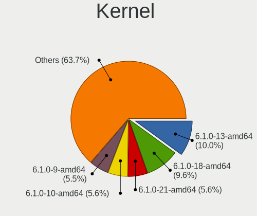
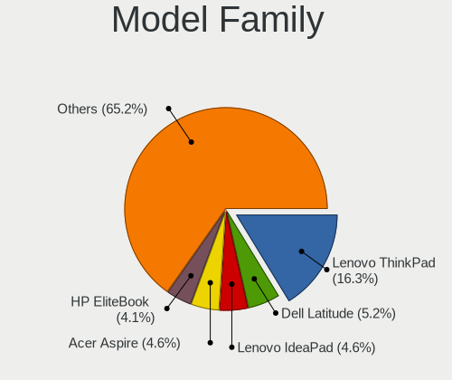
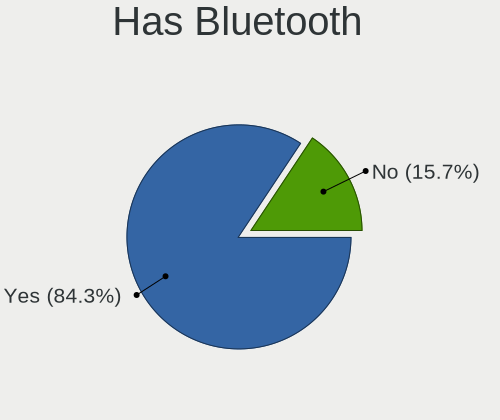
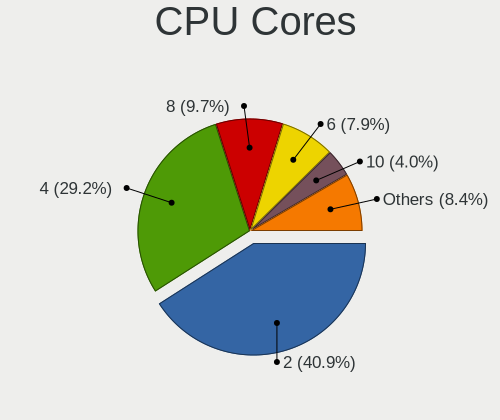
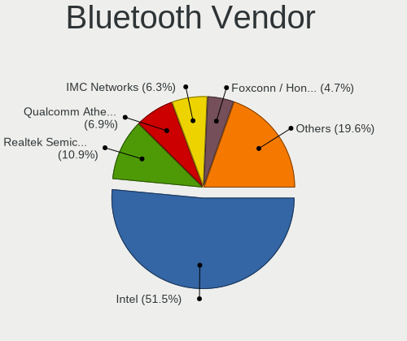

Debian 12 - Tested Hardware & Statistics (Notebooks)
----------------------------------------------------

A project to collect tested hardware configurations for Debian 12.

Anyone can contribute to this report by the [hw-probe](https://github.com/linuxhw/hw-probe) tool:

    sudo -E hw-probe -all -upload

Please contribute! Especially if your hardware is rare.

Contents
--------

* [ Test Cases ](#test-cases)

* [ System ](#system)
  - [ Kernel                   ](#kernel)
  - [ Kernel Family            ](#kernel-family)
  - [ Kernel Major Ver.        ](#kernel-major-ver)
  - [ Arch                     ](#arch)
  - [ DE                       ](#de)
  - [ Display Server           ](#display-server)
  - [ Display Manager          ](#display-manager)
  - [ OS Lang                  ](#os-lang)
  - [ Boot Mode                ](#boot-mode)
  - [ Filesystem               ](#filesystem)
  - [ Part. scheme             ](#part-scheme)
  - [ Dual Boot with Linux/BSD ](#dual-boot-with-linuxbsd)
  - [ Dual Boot (Win)          ](#dual-boot-win)

* [ Board ](#board)
  - [ Vendor                   ](#vendor)
  - [ Model                    ](#model)
  - [ Model Family             ](#model-family)
  - [ MFG Year                 ](#mfg-year)
  - [ Form Factor              ](#form-factor)
  - [ Secure Boot              ](#secure-boot)
  - [ Coreboot                 ](#coreboot)
  - [ RAM Size                 ](#ram-size)
  - [ RAM Used                 ](#ram-used)
  - [ Total Drives             ](#total-drives)
  - [ Has CD-ROM               ](#has-cd-rom)
  - [ Has Ethernet             ](#has-ethernet)
  - [ Has WiFi                 ](#has-wifi)
  - [ Has Bluetooth            ](#has-bluetooth)

* [ Location ](#location)
  - [ Country                  ](#country)
  - [ City                     ](#city)

* [ Drives ](#drives)
  - [ Drive Vendor             ](#drive-vendor)
  - [ Drive Model              ](#drive-model)
  - [ HDD Vendor               ](#hdd-vendor)
  - [ SSD Vendor               ](#ssd-vendor)
  - [ Drive Kind               ](#drive-kind)
  - [ Drive Connector          ](#drive-connector)
  - [ Drive Size               ](#drive-size)
  - [ Space Total              ](#space-total)
  - [ Space Used               ](#space-used)
  - [ Malfunc. Drives          ](#malfunc-drives)
  - [ Malfunc. Drive Vendor    ](#malfunc-drive-vendor)
  - [ Malfunc. HDD Vendor      ](#malfunc-hdd-vendor)
  - [ Malfunc. Drive Kind      ](#malfunc-drive-kind)
  - [ Failed Drives            ](#failed-drives)
  - [ Failed Drive Vendor      ](#failed-drive-vendor)
  - [ Drive Status             ](#drive-status)

* [ Storage controller ](#storage-controller)
  - [ Storage Vendor           ](#storage-vendor)
  - [ Storage Model            ](#storage-model)
  - [ Storage Kind             ](#storage-kind)

* [ Processor ](#processor)
  - [ CPU Vendor               ](#cpu-vendor)
  - [ CPU Model                ](#cpu-model)
  - [ CPU Model Family         ](#cpu-model-family)
  - [ CPU Cores                ](#cpu-cores)
  - [ CPU Sockets              ](#cpu-sockets)
  - [ CPU Threads              ](#cpu-threads)
  - [ CPU Op-Modes             ](#cpu-op-modes)
  - [ CPU Microcode            ](#cpu-microcode)
  - [ CPU Microarch            ](#cpu-microarch)

* [ Graphics ](#graphics)
  - [ GPU Vendor               ](#gpu-vendor)
  - [ GPU Model                ](#gpu-model)
  - [ GPU Combo                ](#gpu-combo)
  - [ GPU Driver               ](#gpu-driver)
  - [ GPU Memory               ](#gpu-memory)

* [ Monitor ](#monitor)
  - [ Monitor Vendor           ](#monitor-vendor)
  - [ Monitor Model            ](#monitor-model)
  - [ Monitor Resolution       ](#monitor-resolution)
  - [ Monitor Diagonal         ](#monitor-diagonal)
  - [ Monitor Width            ](#monitor-width)
  - [ Aspect Ratio             ](#aspect-ratio)
  - [ Monitor Area             ](#monitor-area)
  - [ Pixel Density            ](#pixel-density)
  - [ Multiple Monitors        ](#multiple-monitors)

* [ Network ](#network)
  - [ Net Controller Vendor    ](#net-controller-vendor)
  - [ Net Controller Model     ](#net-controller-model)
  - [ Wireless Vendor          ](#wireless-vendor)
  - [ Wireless Model           ](#wireless-model)
  - [ Ethernet Vendor          ](#ethernet-vendor)
  - [ Ethernet Model           ](#ethernet-model)
  - [ Net Controller Kind      ](#net-controller-kind)
  - [ Used Controller          ](#used-controller)
  - [ NICs                     ](#nics)
  - [ IPv6                     ](#ipv6)

* [ Bluetooth ](#bluetooth)
  - [ Bluetooth Vendor         ](#bluetooth-vendor)
  - [ Bluetooth Model          ](#bluetooth-model)

* [ Sound ](#sound)
  - [ Sound Vendor             ](#sound-vendor)
  - [ Sound Model              ](#sound-model)

* [ Memory ](#memory)
  - [ Memory Vendor            ](#memory-vendor)
  - [ Memory Model             ](#memory-model)
  - [ Memory Kind              ](#memory-kind)
  - [ Memory Form Factor       ](#memory-form-factor)
  - [ Memory Size              ](#memory-size)
  - [ Memory Speed             ](#memory-speed)

* [ Printers & scanners ](#printers--scanners)
  - [ Printer Vendor           ](#printer-vendor)
  - [ Printer Model            ](#printer-model)
  - [ Scanner Vendor           ](#scanner-vendor)
  - [ Scanner Model            ](#scanner-model)

* [ Camera ](#camera)
  - [ Camera Vendor            ](#camera-vendor)
  - [ Camera Model             ](#camera-model)

* [ Security ](#security)
  - [ Fingerprint Vendor       ](#fingerprint-vendor)
  - [ Fingerprint Model        ](#fingerprint-model)
  - [ Chipcard Vendor          ](#chipcard-vendor)
  - [ Chipcard Model           ](#chipcard-model)

* [ Unsupported ](#unsupported)
  - [ Unsupported Devices      ](#unsupported-devices)
  - [ Unsupported Device Types ](#unsupported-device-types)

Test Cases
----------

Total: 2440

| Vendor        | Model                       | Probe                                                      | Date         |
|---------------|-----------------------------|------------------------------------------------------------|--------------|
| HP            | Pavilion dv6500             | [a9906a0a37](https://linux-hardware.org/?probe=a9906a0a37) | May 09, 2024 |
| HP            | EliteBook 840 G1            | [369a002b88](https://linux-hardware.org/?probe=369a002b88) | May 09, 2024 |
| Toshiba       | Satellite C650D             | [9e66892f4b](https://linux-hardware.org/?probe=9e66892f4b) | May 09, 2024 |
| VALE          | Notebook Evolution i5-11... | [55764ee04d](https://linux-hardware.org/?probe=55764ee04d) | May 08, 2024 |
| HP            | EliteBook 735 G5            | [628e01fd2b](https://linux-hardware.org/?probe=628e01fd2b) | May 08, 2024 |
| Sony          | VGN-NS12M_W                 | [e364d75564](https://linux-hardware.org/?probe=e364d75564) | May 08, 2024 |
| ASUSTek       | ASUS TUF Gaming F15 FX50... | [10c139f22b](https://linux-hardware.org/?probe=10c139f22b) | May 08, 2024 |
| Dell          | Inspiron 3542               | [fcc3b9cc19](https://linux-hardware.org/?probe=fcc3b9cc19) | May 08, 2024 |
| Razer         | Blade 14 (2022) - RZ09-0... | [eab2642002](https://linux-hardware.org/?probe=eab2642002) | May 08, 2024 |
| Digma         | Pro Magnus M DN16R9-ADXW... | [beee17622d](https://linux-hardware.org/?probe=beee17622d) | May 08, 2024 |
| Dell          | Latitude D830               | [831a2196a3](https://linux-hardware.org/?probe=831a2196a3) | May 07, 2024 |
| HP            | 250 G3                      | [5f00c46a92](https://linux-hardware.org/?probe=5f00c46a92) | May 07, 2024 |
| Razer         | Blade 14 (2022) - RZ09-0... | [94766b9a5d](https://linux-hardware.org/?probe=94766b9a5d) | May 07, 2024 |
| MSI           | GF63 Thin 8SC               | [59abbac521](https://linux-hardware.org/?probe=59abbac521) | May 07, 2024 |
| HP            | G60                         | [c9e5d3832d](https://linux-hardware.org/?probe=c9e5d3832d) | May 07, 2024 |
| HP            | Pavilion Laptop 15-eh0xx... | [cf6fc980de](https://linux-hardware.org/?probe=cf6fc980de) | May 07, 2024 |
| Lenovo        | ThinkPad X230 2325BK0       | [0c39b2e745](https://linux-hardware.org/?probe=0c39b2e745) | May 05, 2024 |
| Lenovo        | ThinkPad T470 20HES6VG00    | [f87983a9a9](https://linux-hardware.org/?probe=f87983a9a9) | May 05, 2024 |
| Unknown       | Unknown                     | [ce0eb6aa57](https://linux-hardware.org/?probe=ce0eb6aa57) | May 05, 2024 |
| Dell          | Latitude 7480               | [124ec816c7](https://linux-hardware.org/?probe=124ec816c7) | May 05, 2024 |
| Lenovo        | ThinkPad T480 20L6SADD00    | [ad52d07a71](https://linux-hardware.org/?probe=ad52d07a71) | May 04, 2024 |
| HP            | EliteBook 840 G2            | [616bda869b](https://linux-hardware.org/?probe=616bda869b) | May 04, 2024 |
| HP            | G62                         | [3e3af3a851](https://linux-hardware.org/?probe=3e3af3a851) | May 04, 2024 |
| ASUSTek       | X751MA                      | [ab76aeaddb](https://linux-hardware.org/?probe=ab76aeaddb) | May 04, 2024 |
| Chuwi         | MiniBook X                  | [64c7ac113f](https://linux-hardware.org/?probe=64c7ac113f) | May 04, 2024 |
| Apple         | MacBookPro8,1               | [221d8e684d](https://linux-hardware.org/?probe=221d8e684d) | May 04, 2024 |
| Lenovo        | ThinkBook 16 G6 IRL 21KH    | [b8f0474451](https://linux-hardware.org/?probe=b8f0474451) | May 03, 2024 |
| HP            | ProBook 430 G8 Notebook ... | [67f5f847c9](https://linux-hardware.org/?probe=67f5f847c9) | May 03, 2024 |
| Lenovo        | G500s 20245                 | [54adaed795](https://linux-hardware.org/?probe=54adaed795) | May 03, 2024 |
| Itautec       | Infoway w7730               | [65fba1a766](https://linux-hardware.org/?probe=65fba1a766) | May 03, 2024 |
| Intel         | powered classmate PC        | [2f4933a503](https://linux-hardware.org/?probe=2f4933a503) | May 02, 2024 |
| Google        | Phaser                      | [feb45bf2a2](https://linux-hardware.org/?probe=feb45bf2a2) | May 02, 2024 |
| HP            | Pavilion Laptop 15-eh0xx... | [3380a14ae9](https://linux-hardware.org/?probe=3380a14ae9) | May 02, 2024 |
| Lenovo        | ThinkPad T480 20L6SADD00    | [b9fcd48ed1](https://linux-hardware.org/?probe=b9fcd48ed1) | May 02, 2024 |
| Apple         | MacBookPro6,2               | [1307008025](https://linux-hardware.org/?probe=1307008025) | May 01, 2024 |
| Lenovo        | V330-14ARR 81B1             | [edceb0e782](https://linux-hardware.org/?probe=edceb0e782) | May 01, 2024 |
| IGEL Techn... | M350C                       | [c63a48250c](https://linux-hardware.org/?probe=c63a48250c) | May 01, 2024 |
| Acer          | Extensa 4210                | [1b24527bdf](https://linux-hardware.org/?probe=1b24527bdf) | May 01, 2024 |
| Lenovo        | ThinkPad T14s Gen 3 21BS... | [859396f855](https://linux-hardware.org/?probe=859396f855) | Apr 30, 2024 |
| Apple         | MacBookPro11,5              | [c0fa280156](https://linux-hardware.org/?probe=c0fa280156) | Apr 30, 2024 |
| Lenovo        | ThinkPad T460s 20FAS1QU0... | [5429ec2fa3](https://linux-hardware.org/?probe=5429ec2fa3) | Apr 30, 2024 |
| Digma         | CITI E301 ES3008EW          | [91b8be60a0](https://linux-hardware.org/?probe=91b8be60a0) | Apr 30, 2024 |
| Digma         | CITI E301 ES3008EW          | [586069736d](https://linux-hardware.org/?probe=586069736d) | Apr 30, 2024 |
| Lenovo        | ThinkPad T460s 20FAS1QU0... | [60d21b08c6](https://linux-hardware.org/?probe=60d21b08c6) | Apr 30, 2024 |
| Dell          | Inspiron 3442               | [05db1722f8](https://linux-hardware.org/?probe=05db1722f8) | Apr 29, 2024 |
| Lenovo        | ThinkPad S1 Yoga 12 20DK... | [62b6fb2419](https://linux-hardware.org/?probe=62b6fb2419) | Apr 29, 2024 |
| ASUSTek       | E203NA                      | [2caea60de4](https://linux-hardware.org/?probe=2caea60de4) | Apr 29, 2024 |
| ASUSTek       | ASUS TUF Gaming F15 FX50... | [3f5beab74c](https://linux-hardware.org/?probe=3f5beab74c) | Apr 28, 2024 |
| HP            | ProBook 4535s               | [34910d04e7](https://linux-hardware.org/?probe=34910d04e7) | Apr 28, 2024 |
| HP            | Notebook                    | [b45aa2251b](https://linux-hardware.org/?probe=b45aa2251b) | Apr 28, 2024 |
| HP            | Notebook                    | [9f5ae93269](https://linux-hardware.org/?probe=9f5ae93269) | Apr 28, 2024 |
| Lenovo        | Z50-75 80EC                 | [278dad8d5a](https://linux-hardware.org/?probe=278dad8d5a) | Apr 28, 2024 |
| MSI           | GF63 Thin 8SC               | [b375d81404](https://linux-hardware.org/?probe=b375d81404) | Apr 28, 2024 |
| HP            | Laptop 15-da0xxx            | [a0fcbd666f](https://linux-hardware.org/?probe=a0fcbd666f) | Apr 28, 2024 |
| Acer          | Aspire ES1-431              | [ff9ee70831](https://linux-hardware.org/?probe=ff9ee70831) | Apr 28, 2024 |
| HP            | 15                          | [0e0d6ab57a](https://linux-hardware.org/?probe=0e0d6ab57a) | Apr 28, 2024 |
| HP            | 15                          | [d329164137](https://linux-hardware.org/?probe=d329164137) | Apr 28, 2024 |
| Lenovo        | ThinkPad X390 20Q1S62G00    | [e7319a730f](https://linux-hardware.org/?probe=e7319a730f) | Apr 27, 2024 |
| HP            | OMEN Laptop 15-ek0xxx       | [bbd6e87bc4](https://linux-hardware.org/?probe=bbd6e87bc4) | Apr 27, 2024 |
| Dell          | Inspiron 5567               | [caf8879e78](https://linux-hardware.org/?probe=caf8879e78) | Apr 27, 2024 |
| Dixonsxp      | Crestline & ICH8M Chipse... | [a9e235a9db](https://linux-hardware.org/?probe=a9e235a9db) | Apr 27, 2024 |
| HP            | ZBook 14                    | [42c92ec19d](https://linux-hardware.org/?probe=42c92ec19d) | Apr 27, 2024 |
| Acer          | TravelMate P215-53          | [00d58edb3b](https://linux-hardware.org/?probe=00d58edb3b) | Apr 27, 2024 |
| HP            | EliteBook 735 G5            | [9e1b0b4220](https://linux-hardware.org/?probe=9e1b0b4220) | Apr 27, 2024 |
| Samsung       | 550XDA                      | [de2396f0a2](https://linux-hardware.org/?probe=de2396f0a2) | Apr 27, 2024 |
| Lenovo        | ThinkPad E14 Gen 3 20YD0... | [b52a110875](https://linux-hardware.org/?probe=b52a110875) | Apr 27, 2024 |
| Dell          | Latitude E6400              | [fe74dc08cd](https://linux-hardware.org/?probe=fe74dc08cd) | Apr 27, 2024 |
| Lenovo        | ThinkPad T460s 20FAS21A0... | [f8c5a44d3d](https://linux-hardware.org/?probe=f8c5a44d3d) | Apr 27, 2024 |
| Lenovo        | ThinkPad P52 20MAS04M23     | [3cc3f4dcc1](https://linux-hardware.org/?probe=3cc3f4dcc1) | Apr 27, 2024 |
| HP            | ZBook 14                    | [d6e2400956](https://linux-hardware.org/?probe=d6e2400956) | Apr 26, 2024 |
| HP            | EliteBook 850 G8 Noteboo... | [a5cb6f40d5](https://linux-hardware.org/?probe=a5cb6f40d5) | Apr 26, 2024 |
| ASUSTek       | UX32VD                      | [abf6c0658a](https://linux-hardware.org/?probe=abf6c0658a) | Apr 26, 2024 |
| HP            | Pavilion 15                 | [ef9f89946b](https://linux-hardware.org/?probe=ef9f89946b) | Apr 26, 2024 |
| Lenovo        | ThinkPad E14 20RA001HRT     | [714f84cadb](https://linux-hardware.org/?probe=714f84cadb) | Apr 26, 2024 |
| Lenovo        | ThinkPad T570 20HAS03W00    | [6d4f2cc6ca](https://linux-hardware.org/?probe=6d4f2cc6ca) | Apr 26, 2024 |
| Acer          | Aspire A315-510P            | [b5d2df5a85](https://linux-hardware.org/?probe=b5d2df5a85) | Apr 26, 2024 |
| MobileDema... | Cherry Trail CR             | [45127b07b2](https://linux-hardware.org/?probe=45127b07b2) | Apr 26, 2024 |
| HP            | Pavilion Laptop 14-bf1xx    | [3daa76cdd8](https://linux-hardware.org/?probe=3daa76cdd8) | Apr 26, 2024 |
| ASUSTek       | VivoBook_ASUSLaptop X150... | [10a878e186](https://linux-hardware.org/?probe=10a878e186) | Apr 25, 2024 |
| Acer          | Aspire V3-551G              | [86b4773429](https://linux-hardware.org/?probe=86b4773429) | Apr 25, 2024 |
| Lenovo        | ThinkPad L420 7829A71       | [11c76a20a0](https://linux-hardware.org/?probe=11c76a20a0) | Apr 25, 2024 |
| Toshiba       | PORTEGE Z30-A               | [e6fa07d931](https://linux-hardware.org/?probe=e6fa07d931) | Apr 25, 2024 |
| Acer          | Aspire A315-510P            | [353dfb074d](https://linux-hardware.org/?probe=353dfb074d) | Apr 25, 2024 |
| Dell          | Latitude 5420               | [604846386f](https://linux-hardware.org/?probe=604846386f) | Apr 24, 2024 |
| Lenovo        | ThinkPad T470s 20HGS6Y80... | [96569e2ad7](https://linux-hardware.org/?probe=96569e2ad7) | Apr 24, 2024 |
| HP            | OMEN Laptop 15-ek0xxx       | [42a4906c7d](https://linux-hardware.org/?probe=42a4906c7d) | Apr 24, 2024 |
| Lenovo        | ThinkPad T470s W10DG 20J... | [bc030e73d5](https://linux-hardware.org/?probe=bc030e73d5) | Apr 24, 2024 |
| HP            | Pavilion Gaming Laptop 1... | [fefcca9318](https://linux-hardware.org/?probe=fefcca9318) | Apr 24, 2024 |
| Lenovo        | G50-80 80L0                 | [882a343fea](https://linux-hardware.org/?probe=882a343fea) | Apr 23, 2024 |
| Dell          | XPS 13 9370                 | [f5d49e0d32](https://linux-hardware.org/?probe=f5d49e0d32) | Apr 23, 2024 |
| Acer          | Nitro AN16-41               | [4cfb726ac6](https://linux-hardware.org/?probe=4cfb726ac6) | Apr 23, 2024 |
| HP            | EliteBook 840 G3            | [efcac49277](https://linux-hardware.org/?probe=efcac49277) | Apr 23, 2024 |
| HP            | EliteBook 840 G3            | [ae4c858581](https://linux-hardware.org/?probe=ae4c858581) | Apr 23, 2024 |
| Lenovo        | XiaoXinPro 16 AHP9 83D5     | [8ee1de3473](https://linux-hardware.org/?probe=8ee1de3473) | Apr 23, 2024 |
| Dell          | Latitude 7490               | [13f0f49982](https://linux-hardware.org/?probe=13f0f49982) | Apr 23, 2024 |
| Dell          | Latitude 7490               | [1f22d48915](https://linux-hardware.org/?probe=1f22d48915) | Apr 23, 2024 |
| Dell          | Latitude 5420               | [f3182ce0c2](https://linux-hardware.org/?probe=f3182ce0c2) | Apr 23, 2024 |
| ASUSTek       | VivoBook_ASUSLaptop X521... | [044858db54](https://linux-hardware.org/?probe=044858db54) | Apr 23, 2024 |
| Acer          | Swift SF314-42              | [c5ab9f2681](https://linux-hardware.org/?probe=c5ab9f2681) | Apr 22, 2024 |
| MSI           | Prestige 13Evo A13M         | [9103acf647](https://linux-hardware.org/?probe=9103acf647) | Apr 22, 2024 |
| HP            | ZBook Studio G3             | [c78e54109c](https://linux-hardware.org/?probe=c78e54109c) | Apr 22, 2024 |
| ASUSTek       | X441SA                      | [4ebc6f3907](https://linux-hardware.org/?probe=4ebc6f3907) | Apr 22, 2024 |
| Itautec       | Infoway w7730               | [904234ad57](https://linux-hardware.org/?probe=904234ad57) | Apr 22, 2024 |
| Lenovo        | IdeaPadFlex 15 20309        | [a290c311d1](https://linux-hardware.org/?probe=a290c311d1) | Apr 22, 2024 |
| Lenovo        | ThinkPad T470 20HES6VG00    | [b122ffbcd4](https://linux-hardware.org/?probe=b122ffbcd4) | Apr 21, 2024 |
| Lenovo        | ThinkPad T14 Gen 1 20UD0... | [0231457347](https://linux-hardware.org/?probe=0231457347) | Apr 21, 2024 |
| MSI           | Thin GF63 12VE              | [797980dc42](https://linux-hardware.org/?probe=797980dc42) | Apr 21, 2024 |
| Lenovo        | ThinkPad E15 Gen 2 20T80... | [482d5d1221](https://linux-hardware.org/?probe=482d5d1221) | Apr 21, 2024 |
| Lenovo        | Legion Y540-17IRH-PG0 81... | [a206f7f2d5](https://linux-hardware.org/?probe=a206f7f2d5) | Apr 21, 2024 |
| LNV           | M14LC2-256                  | [582ccc43d4](https://linux-hardware.org/?probe=582ccc43d4) | Apr 21, 2024 |
| Lenovo        | G50-45 80E3                 | [61882ea818](https://linux-hardware.org/?probe=61882ea818) | Apr 21, 2024 |
| Lenovo        | G50-45 80E3                 | [2ee14c9eff](https://linux-hardware.org/?probe=2ee14c9eff) | Apr 20, 2024 |
| HP            | Pavilion Gaming Laptop 1... | [82a3685099](https://linux-hardware.org/?probe=82a3685099) | Apr 20, 2024 |
| Apple         | MacBookPro8,1               | [e7c1f32086](https://linux-hardware.org/?probe=e7c1f32086) | Apr 20, 2024 |
| Lenovo        | ThinkPad L570 20J80013US    | [0f79928572](https://linux-hardware.org/?probe=0f79928572) | Apr 20, 2024 |
| Toshiba       | Satellite C870-192          | [563eab96cf](https://linux-hardware.org/?probe=563eab96cf) | Apr 20, 2024 |
| Lenovo        | ThinkPad T480s 20L8S6BW1... | [778bb54578](https://linux-hardware.org/?probe=778bb54578) | Apr 20, 2024 |
| Lenovo        | ThinkPad L420 7829A71       | [06f7d10927](https://linux-hardware.org/?probe=06f7d10927) | Apr 20, 2024 |
| HP            | ZBook 15 G5                 | [e6dc5df04b](https://linux-hardware.org/?probe=e6dc5df04b) | Apr 19, 2024 |
| Dell          | Latitude E6420              | [88731c458f](https://linux-hardware.org/?probe=88731c458f) | Apr 19, 2024 |
| Dell          | Inspiron 910                | [150577a3da](https://linux-hardware.org/?probe=150577a3da) | Apr 19, 2024 |
| Dell          | Precision 3560              | [2f847b171f](https://linux-hardware.org/?probe=2f847b171f) | Apr 18, 2024 |
| Lenovo        | ThinkPad T460s 20FAS5NN0... | [156dedcc62](https://linux-hardware.org/?probe=156dedcc62) | Apr 18, 2024 |
| Samsung       | 300E4A/300E5A/300E7A/343... | [fd71b9d36c](https://linux-hardware.org/?probe=fd71b9d36c) | Apr 17, 2024 |
| Lenovo        | ThinkPad T450s 20BWS00V0... | [c6cafaee9d](https://linux-hardware.org/?probe=c6cafaee9d) | Apr 17, 2024 |
| Acer          | Aspire ES1-731              | [cd5f5f6530](https://linux-hardware.org/?probe=cd5f5f6530) | Apr 17, 2024 |
| MSI           | Modern 15 B12M              | [b1786f8a58](https://linux-hardware.org/?probe=b1786f8a58) | Apr 17, 2024 |
| Dell          | Latitude E6400              | [6a6279d4c0](https://linux-hardware.org/?probe=6a6279d4c0) | Apr 17, 2024 |
| HP            | Laptop 17-bs0xx             | [2de1af4835](https://linux-hardware.org/?probe=2de1af4835) | Apr 16, 2024 |
| HP            | Laptop 15-db0xxx            | [a3eb57bb17](https://linux-hardware.org/?probe=a3eb57bb17) | Apr 16, 2024 |
| HP            | Laptop 14-cm0xxx            | [9dd5160f8f](https://linux-hardware.org/?probe=9dd5160f8f) | Apr 16, 2024 |
| Sony          | SVF15A17CLB                 | [7b947c3636](https://linux-hardware.org/?probe=7b947c3636) | Apr 16, 2024 |
| HP            | EliteBook 840 G1            | [a41037f2e9](https://linux-hardware.org/?probe=a41037f2e9) | Apr 15, 2024 |
| ASUSTek       | X502CA                      | [80390054a8](https://linux-hardware.org/?probe=80390054a8) | Apr 15, 2024 |
| ASUSTek       | Vivobook Go E1504GA_E150... | [2f8ba18ab4](https://linux-hardware.org/?probe=2f8ba18ab4) | Apr 15, 2024 |
| Dell          | Latitude E6440              | [9a85d3d85f](https://linux-hardware.org/?probe=9a85d3d85f) | Apr 15, 2024 |
| ASUSTek       | ROG Zephyrus G14 GA401II... | [00c4bda850](https://linux-hardware.org/?probe=00c4bda850) | Apr 14, 2024 |
| Lenovo        | ThinkPad T470s 20HGS6Y80... | [56bf2bd4d4](https://linux-hardware.org/?probe=56bf2bd4d4) | Apr 14, 2024 |
| Notebook      | NS5x_NS7xAU                 | [fef58e28df](https://linux-hardware.org/?probe=fef58e28df) | Apr 14, 2024 |
| Dell          | Inspiron 5515               | [5847899f83](https://linux-hardware.org/?probe=5847899f83) | Apr 14, 2024 |
| Lenovo        | Legion S7 15ACH6 82K8       | [4e8dddab03](https://linux-hardware.org/?probe=4e8dddab03) | Apr 14, 2024 |
| Unknown       | Unknown                     | [da4225e583](https://linux-hardware.org/?probe=da4225e583) | Apr 14, 2024 |
| Unknown       | Unknown                     | [7dbc8ebb37](https://linux-hardware.org/?probe=7dbc8ebb37) | Apr 13, 2024 |
| Apple         | MacBookAir6,2               | [4b92f0d2d3](https://linux-hardware.org/?probe=4b92f0d2d3) | Apr 13, 2024 |
| Google        | Atlas                       | [9073524bfb](https://linux-hardware.org/?probe=9073524bfb) | Apr 13, 2024 |
| ASUSTek       | VivoBook_ASUSLaptop M150... | [b40a1b3e44](https://linux-hardware.org/?probe=b40a1b3e44) | Apr 12, 2024 |
| ASUSTek       | Vivobook Go E1504GA_E150... | [6fbf514771](https://linux-hardware.org/?probe=6fbf514771) | Apr 12, 2024 |
| MSI           | GE62 2QC                    | [af7a9f75d6](https://linux-hardware.org/?probe=af7a9f75d6) | Apr 12, 2024 |
| MSI           | GE62 2QC                    | [2b18322513](https://linux-hardware.org/?probe=2b18322513) | Apr 12, 2024 |
| ASUSTek       | UX32VD                      | [a063aa7aef](https://linux-hardware.org/?probe=a063aa7aef) | Apr 12, 2024 |
| Notebook      | NS5x_NS7xAU                 | [d2fa3daec7](https://linux-hardware.org/?probe=d2fa3daec7) | Apr 12, 2024 |
| Apple         | MacBookPro11,3              | [57ccbefc29](https://linux-hardware.org/?probe=57ccbefc29) | Apr 11, 2024 |
| Samsung       | RV411/RV511/E3511/S3511/... | [86056cf6ca](https://linux-hardware.org/?probe=86056cf6ca) | Apr 11, 2024 |
| HP            | EliteBook 840 G5            | [045700832b](https://linux-hardware.org/?probe=045700832b) | Apr 11, 2024 |
| Lenovo        | ThinkPad L14 Gen 4 21H1C... | [4d834b6378](https://linux-hardware.org/?probe=4d834b6378) | Apr 11, 2024 |
| Lenovo        | ThinkPad L14 Gen 4 21H1C... | [12ad1e078b](https://linux-hardware.org/?probe=12ad1e078b) | Apr 11, 2024 |
| HP            | Pavilion Laptop 14-bf1xx    | [4c3351faf0](https://linux-hardware.org/?probe=4c3351faf0) | Apr 11, 2024 |
| ASUSTek       | TUF Gaming FA706II_TUF76... | [ee6a729006](https://linux-hardware.org/?probe=ee6a729006) | Apr 11, 2024 |
| ASUSTek       | X450CC                      | [752a03f0de](https://linux-hardware.org/?probe=752a03f0de) | Apr 11, 2024 |
| MSI           | CR70 2M/CX70 2OC/CX70 2O... | [c473133c45](https://linux-hardware.org/?probe=c473133c45) | Apr 11, 2024 |
| Dell          | Latitude 5590               | [dd558c6b50](https://linux-hardware.org/?probe=dd558c6b50) | Apr 10, 2024 |
| Dell          | Latitude E7440              | [d7c3a0d9c9](https://linux-hardware.org/?probe=d7c3a0d9c9) | Apr 10, 2024 |
| Dell          | Latitude E7440              | [2ea80bdebb](https://linux-hardware.org/?probe=2ea80bdebb) | Apr 10, 2024 |
| ASUSTek       | VivoBook_ASUS Laptop X50... | [8d05f71f6b](https://linux-hardware.org/?probe=8d05f71f6b) | Apr 10, 2024 |
| ASUSTek       | VivoBook_ASUS Laptop X50... | [4b2cfbf4b2](https://linux-hardware.org/?probe=4b2cfbf4b2) | Apr 10, 2024 |
| Dell          | Latitude E7440              | [9f0e547b50](https://linux-hardware.org/?probe=9f0e547b50) | Apr 10, 2024 |
| Lenovo        | ThinkPad T420 4180DS7       | [e8ea27e460](https://linux-hardware.org/?probe=e8ea27e460) | Apr 09, 2024 |
| HP            | ProBook 4510s               | [9992995d43](https://linux-hardware.org/?probe=9992995d43) | Apr 09, 2024 |
| Acer          | Aspire ES1-311              | [cd38e8b3bd](https://linux-hardware.org/?probe=cd38e8b3bd) | Apr 09, 2024 |
| Lenovo        | G710 20252                  | [6859d6ad04](https://linux-hardware.org/?probe=6859d6ad04) | Apr 09, 2024 |
| Lenovo        | Legion 5 15ACH6H 82JU       | [67c665fbe5](https://linux-hardware.org/?probe=67c665fbe5) | Apr 09, 2024 |
| HP            | Mini 210-1000               | [0afce35d6b](https://linux-hardware.org/?probe=0afce35d6b) | Apr 09, 2024 |
| HP            | Pavilion dv9500             | [19def7ab9a](https://linux-hardware.org/?probe=19def7ab9a) | Apr 09, 2024 |
| Lenovo        | ThinkPad P15v Gen 1 20TQ... | [fba34eaafb](https://linux-hardware.org/?probe=fba34eaafb) | Apr 09, 2024 |
| Samsung       | 750XED                      | [bfcfd0dab7](https://linux-hardware.org/?probe=bfcfd0dab7) | Apr 08, 2024 |
| ASUSTek       | ROG Strix G513QC_G513QC     | [e54693d43a](https://linux-hardware.org/?probe=e54693d43a) | Apr 08, 2024 |
| Lenovo        | ThinkPad L14 Gen 2a 20X5... | [95b6780794](https://linux-hardware.org/?probe=95b6780794) | Apr 08, 2024 |
| Lenovo        | LOQ 15IRH8 82XV             | [78fa4035a9](https://linux-hardware.org/?probe=78fa4035a9) | Apr 08, 2024 |
| Lenovo        | ThinkPad L430 2465C32       | [788733ca44](https://linux-hardware.org/?probe=788733ca44) | Apr 07, 2024 |
| HP            | 240 G6 Notebook PC          | [00731ce19b](https://linux-hardware.org/?probe=00731ce19b) | Apr 07, 2024 |
| Dell          | Latitude E6410              | [af5738b699](https://linux-hardware.org/?probe=af5738b699) | Apr 07, 2024 |
| Dell          | Inspiron 3443               | [0794f7cac6](https://linux-hardware.org/?probe=0794f7cac6) | Apr 07, 2024 |
| MSI           | Prestige 16 AI Studio B1... | [03e388324a](https://linux-hardware.org/?probe=03e388324a) | Apr 07, 2024 |
| Lenovo        | ThinkPad E14 Gen 5 21JSS... | [327b8112a5](https://linux-hardware.org/?probe=327b8112a5) | Apr 06, 2024 |
| Lenovo        | ThinkPad T420 4180WA8       | [b8975f4296](https://linux-hardware.org/?probe=b8975f4296) | Apr 06, 2024 |
| Dell          | Latitude 7480               | [60c813fedb](https://linux-hardware.org/?probe=60c813fedb) | Apr 06, 2024 |
| Lenovo        | ThinkPad E15 Gen 2 20T80... | [169c6755af](https://linux-hardware.org/?probe=169c6755af) | Apr 05, 2024 |
| ASUSTek       | VivoBook_ASUSLaptop X150... | [45bd209357](https://linux-hardware.org/?probe=45bd209357) | Apr 05, 2024 |
| ASUSTek       | K53E                        | [4cde59e125](https://linux-hardware.org/?probe=4cde59e125) | Apr 05, 2024 |
| Google        | Peppy                       | [18d00034d7](https://linux-hardware.org/?probe=18d00034d7) | Apr 05, 2024 |
| HP            | Pavilion dv7                | [f7ecb14c8e](https://linux-hardware.org/?probe=f7ecb14c8e) | Apr 05, 2024 |
| HUAWEI        | CREM-WXX9                   | [8fb4cdf244](https://linux-hardware.org/?probe=8fb4cdf244) | Apr 04, 2024 |
| Digibras      | CL341                       | [7cc99d85ef](https://linux-hardware.org/?probe=7cc99d85ef) | Apr 04, 2024 |
| Lenovo        | ThinkPad T420 4180W1A       | [274454a883](https://linux-hardware.org/?probe=274454a883) | Apr 04, 2024 |
| Lenovo        | IdeaPad 320-15IKB 81BT      | [b2d57c4c76](https://linux-hardware.org/?probe=b2d57c4c76) | Apr 04, 2024 |
| Lenovo        | IdeaPad 320-15IKB 81BT      | [f4f685c50a](https://linux-hardware.org/?probe=f4f685c50a) | Apr 04, 2024 |
| Digibras      | CL341                       | [da58ad0afb](https://linux-hardware.org/?probe=da58ad0afb) | Apr 04, 2024 |
| Lenovo        | IdeaPad 3 15ALC6 82MF       | [9ae8603096](https://linux-hardware.org/?probe=9ae8603096) | Apr 03, 2024 |
| Lenovo        | ThinkPad P14s Gen 4 21K5... | [4b5619e1d7](https://linux-hardware.org/?probe=4b5619e1d7) | Apr 03, 2024 |
| Lenovo        | ThinkPad E15 20RD001FPB     | [209962ecb2](https://linux-hardware.org/?probe=209962ecb2) | Apr 03, 2024 |
| Lenovo        | ThinkPad E15 Gen 2 20T80... | [c2482a6360](https://linux-hardware.org/?probe=c2482a6360) | Apr 03, 2024 |
| Lenovo        | ThinkPad E15 20RD001FPB     | [ac7a313a3c](https://linux-hardware.org/?probe=ac7a313a3c) | Apr 03, 2024 |
| HUAWEI        | NBLBZ-WAX9N                 | [f0688bc1c1](https://linux-hardware.org/?probe=f0688bc1c1) | Apr 03, 2024 |
| Lenovo        | ThinkPad X1 Extreme 2nd ... | [83e03938be](https://linux-hardware.org/?probe=83e03938be) | Apr 03, 2024 |
| ASUSTek       | X456UQ                      | [e7ae74a0ed](https://linux-hardware.org/?probe=e7ae74a0ed) | Apr 03, 2024 |
| Dell          | Latitude 5440               | [19eee079f1](https://linux-hardware.org/?probe=19eee079f1) | Apr 03, 2024 |
| HP            | Laptop 15-db0xxx            | [86bf1e5346](https://linux-hardware.org/?probe=86bf1e5346) | Apr 03, 2024 |
| Dell          | Vostro 5590                 | [9046f24617](https://linux-hardware.org/?probe=9046f24617) | Apr 03, 2024 |
| ASUSTek       | ASUS EXPERTBOOK B1500CEA... | [2bb5c3d295](https://linux-hardware.org/?probe=2bb5c3d295) | Apr 03, 2024 |
| Apple         | MacBook6,1                  | [224f00ec38](https://linux-hardware.org/?probe=224f00ec38) | Apr 03, 2024 |
| Panasonic     | CF-C1BTCREFF                | [6a749f6baf](https://linux-hardware.org/?probe=6a749f6baf) | Apr 03, 2024 |
| HP            | EliteBook 840 G3            | [992cf5c5a6](https://linux-hardware.org/?probe=992cf5c5a6) | Apr 02, 2024 |
| Lenovo        | IdeaPad Pro 5 16APH8 83A... | [054b7415b5](https://linux-hardware.org/?probe=054b7415b5) | Apr 01, 2024 |
| Acer          | Aspire A315-58              | [42c853e695](https://linux-hardware.org/?probe=42c853e695) | Apr 01, 2024 |
| Apple         | MacBookAir6,2               | [6c8467a122](https://linux-hardware.org/?probe=6c8467a122) | Apr 01, 2024 |
| Dell          | Latitude E6520              | [d359664665](https://linux-hardware.org/?probe=d359664665) | Apr 01, 2024 |
| Dell          | Latitude 7400               | [5de339a7cc](https://linux-hardware.org/?probe=5de339a7cc) | Apr 01, 2024 |
| ASUSTek       | ZenBook UX425UAZ_UM425UA... | [d7142dfd4d](https://linux-hardware.org/?probe=d7142dfd4d) | Apr 01, 2024 |
| Lenovo        | ThinkPad T460 20FMS06V00    | [9bda4cf2a7](https://linux-hardware.org/?probe=9bda4cf2a7) | Apr 01, 2024 |
| Lenovo        | ThinkPad P15v Gen 3 21D8... | [2a236e9fd5](https://linux-hardware.org/?probe=2a236e9fd5) | Apr 01, 2024 |
| Lenovo        | ThinkPad T430s 2355AR2      | [645e34f6c3](https://linux-hardware.org/?probe=645e34f6c3) | Apr 01, 2024 |
| HP            | EliteBook 840 G4            | [b4724cc6b0](https://linux-hardware.org/?probe=b4724cc6b0) | Mar 31, 2024 |
| ASUSTek       | GL553VD                     | [cdb08c255c](https://linux-hardware.org/?probe=cdb08c255c) | Mar 30, 2024 |
| Lenovo        | IdeaPad S340-14API 81NB     | [b6bb7745a9](https://linux-hardware.org/?probe=b6bb7745a9) | Mar 30, 2024 |
| HP            | EliteBook 2740p             | [796c12edc5](https://linux-hardware.org/?probe=796c12edc5) | Mar 30, 2024 |
| Lenovo        | ThinkPad P53 20QQS5WG00     | [15499f30af](https://linux-hardware.org/?probe=15499f30af) | Mar 30, 2024 |
| Dell          | Vostro 1015                 | [f9ca91d526](https://linux-hardware.org/?probe=f9ca91d526) | Mar 29, 2024 |
| Lenovo        | ThinkPad X220 4291W3B       | [c4fdbba9d2](https://linux-hardware.org/?probe=c4fdbba9d2) | Mar 29, 2024 |
| Lenovo        | ThinkPad 13 2nd Gen 20J1... | [176e1c469e](https://linux-hardware.org/?probe=176e1c469e) | Mar 29, 2024 |
| Dell          | Latitude 5414               | [debd534bcb](https://linux-hardware.org/?probe=debd534bcb) | Mar 29, 2024 |
| ASUSTek       | VivoBook_ASUSLaptop X515... | [4b1c2afd39](https://linux-hardware.org/?probe=4b1c2afd39) | Mar 28, 2024 |
| HP            | EliteBook 835 13 inch G9... | [2b2e2a0296](https://linux-hardware.org/?probe=2b2e2a0296) | Mar 28, 2024 |
| ASUSTek       | X553MA                      | [5d1d7ed87a](https://linux-hardware.org/?probe=5d1d7ed87a) | Mar 28, 2024 |
| Dell          | Latitude 5480               | [21dd5f9667](https://linux-hardware.org/?probe=21dd5f9667) | Mar 28, 2024 |
| HP            | EliteBook 835 13 inch G9... | [430635ac56](https://linux-hardware.org/?probe=430635ac56) | Mar 27, 2024 |
| Lenovo        | IdeaPad 100S-14IBR 80R9     | [05bab22d87](https://linux-hardware.org/?probe=05bab22d87) | Mar 27, 2024 |
| Google        | Stout                       | [8b022ae66a](https://linux-hardware.org/?probe=8b022ae66a) | Mar 27, 2024 |
| Google        | Stout                       | [4e9784a9a7](https://linux-hardware.org/?probe=4e9784a9a7) | Mar 27, 2024 |
| Google        | Stout                       | [7646bacc68](https://linux-hardware.org/?probe=7646bacc68) | Mar 27, 2024 |
| Google        | Stout                       | [352f4368da](https://linux-hardware.org/?probe=352f4368da) | Mar 27, 2024 |
| Lenovo        | B50-10 80QR                 | [cf333072f0](https://linux-hardware.org/?probe=cf333072f0) | Mar 27, 2024 |
| Lenovo        | Unknown                     | [3bbef18998](https://linux-hardware.org/?probe=3bbef18998) | Mar 27, 2024 |
| ASUSTek       | Q502LAB                     | [d9dc351db0](https://linux-hardware.org/?probe=d9dc351db0) | Mar 26, 2024 |
| Lenovo        | ThinkPad 13 20J10046US      | [160ac60377](https://linux-hardware.org/?probe=160ac60377) | Mar 26, 2024 |
| Framework     | Laptop (12th Gen Intel C... | [5eb093e5c7](https://linux-hardware.org/?probe=5eb093e5c7) | Mar 26, 2024 |
| Google        | Stout                       | [ff192d759c](https://linux-hardware.org/?probe=ff192d759c) | Mar 26, 2024 |
| Google        | Stout                       | [a8643e01ca](https://linux-hardware.org/?probe=a8643e01ca) | Mar 26, 2024 |
| Samsung       | 550XED                      | [ab624683ca](https://linux-hardware.org/?probe=ab624683ca) | Mar 26, 2024 |
| Google        | Stout                       | [a554b971b4](https://linux-hardware.org/?probe=a554b971b4) | Mar 26, 2024 |
| Google        | Stout                       | [042f9d9837](https://linux-hardware.org/?probe=042f9d9837) | Mar 26, 2024 |
| Lenovo        | ThinkPad 13 2nd Gen 20J1... | [bfe7baf9c6](https://linux-hardware.org/?probe=bfe7baf9c6) | Mar 26, 2024 |
| Dell          | Inspiron 5593               | [1630ab92c1](https://linux-hardware.org/?probe=1630ab92c1) | Mar 26, 2024 |
| ASUSTek       | K53SC                       | [dadf168399](https://linux-hardware.org/?probe=dadf168399) | Mar 26, 2024 |
| Acer          | Aspire 5820TG               | [9e3a75ab14](https://linux-hardware.org/?probe=9e3a75ab14) | Mar 26, 2024 |
| Toshiba       | Satellite A210              | [37734a1409](https://linux-hardware.org/?probe=37734a1409) | Mar 26, 2024 |
| ASUSTek       | X542UQ                      | [75455c4a87](https://linux-hardware.org/?probe=75455c4a87) | Mar 26, 2024 |
| ASUSTek       | X540LA                      | [2c593ff829](https://linux-hardware.org/?probe=2c593ff829) | Mar 26, 2024 |
| Lenovo        | Legion 5 15ACH6H 82JU       | [c2dedfbe62](https://linux-hardware.org/?probe=c2dedfbe62) | Mar 25, 2024 |
| HUAWEI        | KLVL-WXX9                   | [f4276dd02c](https://linux-hardware.org/?probe=f4276dd02c) | Mar 25, 2024 |
| Google        | Stout                       | [8ac4ec7cd8](https://linux-hardware.org/?probe=8ac4ec7cd8) | Mar 25, 2024 |
| Dell          | Vostro 15-3568              | [25184ad945](https://linux-hardware.org/?probe=25184ad945) | Mar 25, 2024 |
| Dell          | Vostro 15-3568              | [b48921d197](https://linux-hardware.org/?probe=b48921d197) | Mar 25, 2024 |
| Dell          | Vostro 15-3568              | [c906c9dc87](https://linux-hardware.org/?probe=c906c9dc87) | Mar 25, 2024 |
| HP            | Pavilion 17                 | [8bf3b9d8bd](https://linux-hardware.org/?probe=8bf3b9d8bd) | Mar 25, 2024 |
| HP            | ProBook 655 G2              | [49a85fae09](https://linux-hardware.org/?probe=49a85fae09) | Mar 25, 2024 |
| Dell          | Vostro 15-3568              | [43d5eddd6e](https://linux-hardware.org/?probe=43d5eddd6e) | Mar 25, 2024 |
| Dell          | Vostro 15-3568              | [756f5d9aca](https://linux-hardware.org/?probe=756f5d9aca) | Mar 25, 2024 |
| LG Electro... | 17Z90R-H.ADC8U1             | [d0bcf896cf](https://linux-hardware.org/?probe=d0bcf896cf) | Mar 25, 2024 |
| ASUSTek       | ROG Strix G513QY_G513QY     | [954efe1d9b](https://linux-hardware.org/?probe=954efe1d9b) | Mar 25, 2024 |
| Acer          | Swift SF514-56T             | [37cec8bd6a](https://linux-hardware.org/?probe=37cec8bd6a) | Mar 24, 2024 |
| Lenovo        | ThinkPad Edge 03014CG       | [2b57d89f5a](https://linux-hardware.org/?probe=2b57d89f5a) | Mar 24, 2024 |
| Unknown       | Home a2 lite                | [88544e3a1c](https://linux-hardware.org/?probe=88544e3a1c) | Mar 24, 2024 |
| HP            | EliteBook 840 G1            | [afa5872c09](https://linux-hardware.org/?probe=afa5872c09) | Mar 24, 2024 |
| HP            | EliteBook 8530w             | [68ee7621ae](https://linux-hardware.org/?probe=68ee7621ae) | Mar 24, 2024 |
| HP            | 15                          | [d44f6d6211](https://linux-hardware.org/?probe=d44f6d6211) | Mar 23, 2024 |
| Lenovo        | ThinkPad X1 Carbon 7th 2... | [a20d8894bd](https://linux-hardware.org/?probe=a20d8894bd) | Mar 23, 2024 |
| HP            | Pavilion 17                 | [80b1ad1d8b](https://linux-hardware.org/?probe=80b1ad1d8b) | Mar 23, 2024 |
| HP            | Drawcia                     | [11b3cbe426](https://linux-hardware.org/?probe=11b3cbe426) | Mar 22, 2024 |
| Dell          | Precision 7560              | [2de886c9c9](https://linux-hardware.org/?probe=2de886c9c9) | Mar 22, 2024 |
| Lenovo        | ThinkPad S1 Yoga 12 20DK... | [df5c12540c](https://linux-hardware.org/?probe=df5c12540c) | Mar 22, 2024 |
| Google        | Laser14                     | [3bbaadcb60](https://linux-hardware.org/?probe=3bbaadcb60) | Mar 22, 2024 |
| Acer          | Aspire 5315                 | [01f4e47340](https://linux-hardware.org/?probe=01f4e47340) | Mar 22, 2024 |
| Dell          | Inspiron 15 3515            | [b6096d2468](https://linux-hardware.org/?probe=b6096d2468) | Mar 22, 2024 |
| Google        | Stout                       | [0b8bfbcc32](https://linux-hardware.org/?probe=0b8bfbcc32) | Mar 21, 2024 |
| Lenovo        | Legion 5 15ACH6H 82JU       | [99ff7d5b73](https://linux-hardware.org/?probe=99ff7d5b73) | Mar 21, 2024 |
| Google        | Stout                       | [f6e58b7398](https://linux-hardware.org/?probe=f6e58b7398) | Mar 21, 2024 |
| Acer          | Aspire A315-59              | [ccbeaff8e3](https://linux-hardware.org/?probe=ccbeaff8e3) | Mar 21, 2024 |
| Google        | Stout                       | [e0156c0090](https://linux-hardware.org/?probe=e0156c0090) | Mar 21, 2024 |
| Google        | Stout                       | [c0b128f965](https://linux-hardware.org/?probe=c0b128f965) | Mar 21, 2024 |
| Google        | Astronaut                   | [b2e117a773](https://linux-hardware.org/?probe=b2e117a773) | Mar 21, 2024 |
| Google        | Reks                        | [5b8248765d](https://linux-hardware.org/?probe=5b8248765d) | Mar 21, 2024 |
| Lenovo        | ThinkPad T440p              | [39d16a18ec](https://linux-hardware.org/?probe=39d16a18ec) | Mar 21, 2024 |
| Dell          | Vostro 5568                 | [bafabe8708](https://linux-hardware.org/?probe=bafabe8708) | Mar 21, 2024 |
| Timi          | Mi NoteBook Ultra           | [c92aa3d747](https://linux-hardware.org/?probe=c92aa3d747) | Mar 21, 2024 |
| Dell          | Vostro 5568                 | [e45d89ada7](https://linux-hardware.org/?probe=e45d89ada7) | Mar 21, 2024 |
| HONOR         | FRI-FXX                     | [52c0d69000](https://linux-hardware.org/?probe=52c0d69000) | Mar 21, 2024 |
| HP            | EliteBook 845 14 inch G9... | [42b75efcf6](https://linux-hardware.org/?probe=42b75efcf6) | Mar 21, 2024 |
| Google        | Stout                       | [51ca299022](https://linux-hardware.org/?probe=51ca299022) | Mar 21, 2024 |
| HP            | ProBook 640 G1              | [83fb273295](https://linux-hardware.org/?probe=83fb273295) | Mar 20, 2024 |
| Google        | Stout                       | [930075bd96](https://linux-hardware.org/?probe=930075bd96) | Mar 20, 2024 |
| ASUSTek       | VivoBook_ASUSLaptop X712... | [00f9ee02d9](https://linux-hardware.org/?probe=00f9ee02d9) | Mar 20, 2024 |
| ASUSTek       | X756UQ                      | [9557771f1d](https://linux-hardware.org/?probe=9557771f1d) | Mar 20, 2024 |
| Google        | Stout                       | [ed81fe0a4b](https://linux-hardware.org/?probe=ed81fe0a4b) | Mar 20, 2024 |
| Google        | Stout                       | [52a0fe0e8f](https://linux-hardware.org/?probe=52a0fe0e8f) | Mar 20, 2024 |
| Google        | Stout                       | [5e43bced95](https://linux-hardware.org/?probe=5e43bced95) | Mar 20, 2024 |
| Acer          | Aspire ES1-111              | [429ee44acd](https://linux-hardware.org/?probe=429ee44acd) | Mar 20, 2024 |
| HP            | Pavilion g6                 | [4d90befad6](https://linux-hardware.org/?probe=4d90befad6) | Mar 20, 2024 |
| HP            | Pavilion Plus Laptop 14z... | [0b0ad40c3d](https://linux-hardware.org/?probe=0b0ad40c3d) | Mar 20, 2024 |
| Apple         | MacBookAir5,1               | [f1e5e55e2c](https://linux-hardware.org/?probe=f1e5e55e2c) | Mar 20, 2024 |
| Alienware     | 17 R4                       | [a89397f827](https://linux-hardware.org/?probe=a89397f827) | Mar 20, 2024 |
| HP            | ProBook 440 G6              | [15167e6cda](https://linux-hardware.org/?probe=15167e6cda) | Mar 19, 2024 |
| Framework     | Laptop 13 (AMD Ryzen 704... | [9f6517d4ce](https://linux-hardware.org/?probe=9f6517d4ce) | Mar 19, 2024 |
| Framework     | Laptop 13 (AMD Ryzen 704... | [2a287a57dd](https://linux-hardware.org/?probe=2a287a57dd) | Mar 19, 2024 |
| Dell          | Latitude E7440              | [c39e459211](https://linux-hardware.org/?probe=c39e459211) | Mar 19, 2024 |
| HP            | EliteBook 840 G3            | [febfdac13f](https://linux-hardware.org/?probe=febfdac13f) | Mar 19, 2024 |
| Dell          | Latitude E7440              | [e6fabe11b0](https://linux-hardware.org/?probe=e6fabe11b0) | Mar 19, 2024 |
| TUXEDO        | Stellaris Intel Gen5        | [d2b4d77618](https://linux-hardware.org/?probe=d2b4d77618) | Mar 19, 2024 |
| Acer          | Nitro AN515-43              | [85aae083ad](https://linux-hardware.org/?probe=85aae083ad) | Mar 19, 2024 |
| HP            | Notebook                    | [5790810149](https://linux-hardware.org/?probe=5790810149) | Mar 19, 2024 |
| Lenovo        | ThinkPad T480s 20L8S9DL0... | [0df7e53a5b](https://linux-hardware.org/?probe=0df7e53a5b) | Mar 19, 2024 |
| Lenovo        | IdeaPad 320-17IKB 80XM      | [64e69c2ba1](https://linux-hardware.org/?probe=64e69c2ba1) | Mar 18, 2024 |
| HP            | EliteBook 745 G3            | [505719d41e](https://linux-hardware.org/?probe=505719d41e) | Mar 18, 2024 |
| HP            | EliteBook 745 G3            | [612e881108](https://linux-hardware.org/?probe=612e881108) | Mar 18, 2024 |
| Dell          | Latitude E7440              | [274a06f022](https://linux-hardware.org/?probe=274a06f022) | Mar 18, 2024 |
| HP            | Laptop 15-dy2xxx            | [79eb548cbc](https://linux-hardware.org/?probe=79eb548cbc) | Mar 18, 2024 |
| ASUSTek       | VivoBook_ASUSLaptop M160... | [d6d2c95a7a](https://linux-hardware.org/?probe=d6d2c95a7a) | Mar 17, 2024 |
| ASUSTek       | ROG Zephyrus G14 GA401IV... | [030fe7cb7a](https://linux-hardware.org/?probe=030fe7cb7a) | Mar 17, 2024 |
| HP            | ZBook 15 G3                 | [d565c68c67](https://linux-hardware.org/?probe=d565c68c67) | Mar 17, 2024 |
| ASUSTek       | ROG GU501GM                 | [6a2786c694](https://linux-hardware.org/?probe=6a2786c694) | Mar 17, 2024 |
| Lenovo        | V15-ADA 82C7                | [3c3545a34f](https://linux-hardware.org/?probe=3c3545a34f) | Mar 17, 2024 |
| Dell          | Latitude 7490               | [2d06821968](https://linux-hardware.org/?probe=2d06821968) | Mar 17, 2024 |
| HP            | EliteBook 745 G3            | [b881a5b337](https://linux-hardware.org/?probe=b881a5b337) | Mar 17, 2024 |
| HP            | EliteBook 745 G3            | [988b3c3ebc](https://linux-hardware.org/?probe=988b3c3ebc) | Mar 17, 2024 |
| HP            | EliteBook 745 G3            | [ff007ff23e](https://linux-hardware.org/?probe=ff007ff23e) | Mar 16, 2024 |
| HP            | EliteBook 745 G3            | [18bed734d1](https://linux-hardware.org/?probe=18bed734d1) | Mar 16, 2024 |
| Lenovo        | ThinkPad T460 20FMS06V00    | [a781e10290](https://linux-hardware.org/?probe=a781e10290) | Mar 16, 2024 |
| Acer          | Aspire A114-31              | [899c6f43f5](https://linux-hardware.org/?probe=899c6f43f5) | Mar 16, 2024 |
| Google        | Lick                        | [38f3dae4fc](https://linux-hardware.org/?probe=38f3dae4fc) | Mar 16, 2024 |
| Dell          | Latitude 5480               | [84cc86e4f5](https://linux-hardware.org/?probe=84cc86e4f5) | Mar 16, 2024 |
| ASUSTek       | VivoBook_ASUSLaptop X515... | [e05236c14d](https://linux-hardware.org/?probe=e05236c14d) | Mar 16, 2024 |
| Dell          | XPS 17 9730                 | [eee424c6c6](https://linux-hardware.org/?probe=eee424c6c6) | Mar 16, 2024 |
| HUAWEI        | BOHK-WAX9X                  | [250f1255fd](https://linux-hardware.org/?probe=250f1255fd) | Mar 16, 2024 |
| HUAWEI        | BOHK-WAX9X                  | [b24d70c129](https://linux-hardware.org/?probe=b24d70c129) | Mar 16, 2024 |
| Samsung       | N145P/N250P/N260P           | [5883806cc2](https://linux-hardware.org/?probe=5883806cc2) | Mar 16, 2024 |
| Dell          | Latitude E6320              | [3dfd6b80a4](https://linux-hardware.org/?probe=3dfd6b80a4) | Mar 15, 2024 |
| Lenovo        | IdeaPad 5 15ITL05 82FG      | [e88369fa4d](https://linux-hardware.org/?probe=e88369fa4d) | Mar 15, 2024 |
| GPD           | P3 MAX                      | [2e933fa77d](https://linux-hardware.org/?probe=2e933fa77d) | Mar 15, 2024 |
| Dell          | Latitude E7440              | [5d4aea2b82](https://linux-hardware.org/?probe=5d4aea2b82) | Mar 15, 2024 |
| Micro Comp... | Venus series                | [ffb53207eb](https://linux-hardware.org/?probe=ffb53207eb) | Mar 15, 2024 |
| Dell          | Latitude E7440              | [c9db9548cf](https://linux-hardware.org/?probe=c9db9548cf) | Mar 15, 2024 |
| Dell          | Latitude E7440              | [79365ef1b3](https://linux-hardware.org/?probe=79365ef1b3) | Mar 15, 2024 |
| Dell          | Latitude E7440              | [373307ea06](https://linux-hardware.org/?probe=373307ea06) | Mar 15, 2024 |
| Dell          | Latitude E7440              | [702daa8fd3](https://linux-hardware.org/?probe=702daa8fd3) | Mar 15, 2024 |
| Dell          | Latitude E7440              | [5e6e833281](https://linux-hardware.org/?probe=5e6e833281) | Mar 15, 2024 |
| Dell          | Latitude E7440              | [db5d402e08](https://linux-hardware.org/?probe=db5d402e08) | Mar 15, 2024 |
| Dell          | Latitude E7440              | [796f48ebbb](https://linux-hardware.org/?probe=796f48ebbb) | Mar 15, 2024 |
| Lenovo        | ThinkPad T495s 20QJCTO1W... | [ba8c04d50e](https://linux-hardware.org/?probe=ba8c04d50e) | Mar 15, 2024 |
| Apple         | MacBookAir5,1               | [ae670d563a](https://linux-hardware.org/?probe=ae670d563a) | Mar 15, 2024 |
| Lenovo        | ThinkPad T460s 20FAS1QU0... | [0aeadde0d2](https://linux-hardware.org/?probe=0aeadde0d2) | Mar 15, 2024 |
| ASUSTek       | VivoBook_ASUSLaptop X150... | [96f5ad9c2b](https://linux-hardware.org/?probe=96f5ad9c2b) | Mar 15, 2024 |
| Dell          | Latitude E7440              | [d294aa428c](https://linux-hardware.org/?probe=d294aa428c) | Mar 14, 2024 |
| Dell          | Latitude E6320              | [b889e2e692](https://linux-hardware.org/?probe=b889e2e692) | Mar 14, 2024 |
| Lenovo        | G50-80 80L0                 | [995f47afbb](https://linux-hardware.org/?probe=995f47afbb) | Mar 14, 2024 |
| Dell          | Latitude E6420              | [bd0e21e6e8](https://linux-hardware.org/?probe=bd0e21e6e8) | Mar 14, 2024 |
| Lenovo        | IdeaPad 5 15ITL05 82FG      | [d9dcb9a8f4](https://linux-hardware.org/?probe=d9dcb9a8f4) | Mar 14, 2024 |
| Dell          | Latitude E6420              | [b8474e8eaa](https://linux-hardware.org/?probe=b8474e8eaa) | Mar 14, 2024 |
| Dell          | Latitude E6420              | [94b6aa0ebf](https://linux-hardware.org/?probe=94b6aa0ebf) | Mar 14, 2024 |
| XIAOMI        | Redmi Book Pro 14 2024      | [91890298e9](https://linux-hardware.org/?probe=91890298e9) | Mar 14, 2024 |
| ASUSTek       | ZenBook UX431DA_UM431DA     | [721d5ddfe6](https://linux-hardware.org/?probe=721d5ddfe6) | Mar 14, 2024 |
| Lenovo        | G565 20071                  | [53c4aa7525](https://linux-hardware.org/?probe=53c4aa7525) | Mar 14, 2024 |
| Lenovo        | Legion Pro 7 16ARX8H 82W... | [ec652b3d4e](https://linux-hardware.org/?probe=ec652b3d4e) | Mar 14, 2024 |
| Lenovo        | IdeaPad Gaming 3 15ACH6 ... | [33164bcce1](https://linux-hardware.org/?probe=33164bcce1) | Mar 14, 2024 |
| HP            | EliteBook 8460p             | [3598522f0a](https://linux-hardware.org/?probe=3598522f0a) | Mar 13, 2024 |
| HP            | EliteBook 8460p             | [4137469fd5](https://linux-hardware.org/?probe=4137469fd5) | Mar 13, 2024 |
| HP            | EliteBook 8460p             | [6cba9dc6dd](https://linux-hardware.org/?probe=6cba9dc6dd) | Mar 13, 2024 |
| HP            | EliteBook 8460p             | [85dd7ddf92](https://linux-hardware.org/?probe=85dd7ddf92) | Mar 13, 2024 |
| HP            | ProBook 6450b               | [71e2ba1acd](https://linux-hardware.org/?probe=71e2ba1acd) | Mar 13, 2024 |
| Google        | Reks                        | [8e0c35418b](https://linux-hardware.org/?probe=8e0c35418b) | Mar 13, 2024 |
| HP            | ProBook 6450b               | [758d6b94cf](https://linux-hardware.org/?probe=758d6b94cf) | Mar 13, 2024 |
| HP            | ProBook 6450b               | [79851a4f52](https://linux-hardware.org/?probe=79851a4f52) | Mar 13, 2024 |
| HP            | Pavilion dm3                | [0f22d77b49](https://linux-hardware.org/?probe=0f22d77b49) | Mar 12, 2024 |
| Lenovo        | IdeaPad 700-15ISK 80RU      | [77f28d5d35](https://linux-hardware.org/?probe=77f28d5d35) | Mar 12, 2024 |
| Lenovo        | B590 62742BG                | [5e3e316020](https://linux-hardware.org/?probe=5e3e316020) | Mar 12, 2024 |
| Lenovo        | ThinkPad Edge E431 62774... | [4055861a67](https://linux-hardware.org/?probe=4055861a67) | Mar 12, 2024 |
| Lenovo        | ThinkPad L540 20AVA05CJP    | [ac69dd4e65](https://linux-hardware.org/?probe=ac69dd4e65) | Mar 12, 2024 |
| Dell          | Latitude 5401               | [b68db5aef2](https://linux-hardware.org/?probe=b68db5aef2) | Mar 12, 2024 |
| Apple         | MacBookAir5,1               | [d928c71a48](https://linux-hardware.org/?probe=d928c71a48) | Mar 12, 2024 |
| Dell          | Latitude 3490               | [ac7317cebc](https://linux-hardware.org/?probe=ac7317cebc) | Mar 11, 2024 |
| Lenovo        | ThinkPad T470 W10DG 20JN... | [d0c902f508](https://linux-hardware.org/?probe=d0c902f508) | Mar 11, 2024 |
| Lenovo        | ThinkPad L540 20AVA05CJP    | [b38dfb0116](https://linux-hardware.org/?probe=b38dfb0116) | Mar 11, 2024 |
| HP            | Pavilion Gaming Laptop 1... | [10c1897017](https://linux-hardware.org/?probe=10c1897017) | Mar 11, 2024 |
| Star Labs     | StarBook                    | [6dfcd28891](https://linux-hardware.org/?probe=6dfcd28891) | Mar 11, 2024 |
| HP            | Laptop 15-dw0xxx            | [2581c54872](https://linux-hardware.org/?probe=2581c54872) | Mar 11, 2024 |
| Acer          | TravelMate 5730             | [06d52ce1c4](https://linux-hardware.org/?probe=06d52ce1c4) | Mar 10, 2024 |
| Lenovo        | XiaoXinPro 14 APH8 83AM     | [c8304d2f20](https://linux-hardware.org/?probe=c8304d2f20) | Mar 09, 2024 |
| Acer          | Aspire A114-31              | [2af6274287](https://linux-hardware.org/?probe=2af6274287) | Mar 09, 2024 |
| Google        | Lillipup                    | [3e55a8fd00](https://linux-hardware.org/?probe=3e55a8fd00) | Mar 09, 2024 |
| MSI           | Stealth GS77 12UH           | [892a9a5e88](https://linux-hardware.org/?probe=892a9a5e88) | Mar 09, 2024 |
| Clevo         | W55xEU                      | [0ee8318d3f](https://linux-hardware.org/?probe=0ee8318d3f) | Mar 09, 2024 |
| Lenovo        | ThinkPad E14 Gen 5 21JSS... | [d2bc937dc1](https://linux-hardware.org/?probe=d2bc937dc1) | Mar 09, 2024 |
| HUAWEI        | BoDE-WXX9                   | [0d827eec25](https://linux-hardware.org/?probe=0d827eec25) | Mar 09, 2024 |
| ASUSTek       | Q502LAB                     | [00512805b9](https://linux-hardware.org/?probe=00512805b9) | Mar 09, 2024 |
| Dell          | Inspiron 11-3168            | [6f4fde28c7](https://linux-hardware.org/?probe=6f4fde28c7) | Mar 08, 2024 |
| Dell          | Inspiron 11-3168            | [fc26237c72](https://linux-hardware.org/?probe=fc26237c72) | Mar 08, 2024 |
| HP            | Notebook                    | [17c617ba03](https://linux-hardware.org/?probe=17c617ba03) | Mar 08, 2024 |
| HP            | Notebook                    | [73813f7d70](https://linux-hardware.org/?probe=73813f7d70) | Mar 08, 2024 |
| Maibenben     | MaiBook M                   | [b7ead3f3ea](https://linux-hardware.org/?probe=b7ead3f3ea) | Mar 08, 2024 |
| Dell          | Inspiron 3593               | [e5931414ce](https://linux-hardware.org/?probe=e5931414ce) | Mar 08, 2024 |
| Apple         | MacBook7,1                  | [942bc3410e](https://linux-hardware.org/?probe=942bc3410e) | Mar 07, 2024 |
| Lenovo        | Legion 5 15IAH7 82RC        | [f25ce70502](https://linux-hardware.org/?probe=f25ce70502) | Mar 07, 2024 |
| Acer          | One 14 Z8-415               | [369734aa1f](https://linux-hardware.org/?probe=369734aa1f) | Mar 07, 2024 |
| Acer          | One 14 Z8-415               | [6fce03c633](https://linux-hardware.org/?probe=6fce03c633) | Mar 07, 2024 |
| Dell          | Latitude 5440               | [555765316a](https://linux-hardware.org/?probe=555765316a) | Mar 07, 2024 |
| Lenovo        | IdeaPad 5 15IIL05 81YK      | [d79cbc134e](https://linux-hardware.org/?probe=d79cbc134e) | Mar 07, 2024 |
| Lenovo        | ThinkPad T14 Gen 3 21AH0... | [644841f4df](https://linux-hardware.org/?probe=644841f4df) | Mar 07, 2024 |
| Alienware     | 17 R4                       | [f3eab6ab63](https://linux-hardware.org/?probe=f3eab6ab63) | Mar 06, 2024 |
| Apple         | MacBook7,1                  | [e6500f99bb](https://linux-hardware.org/?probe=e6500f99bb) | Mar 06, 2024 |
| Lenovo        | ThinkPad X1 Carbon Gen 1... | [dadfd2990c](https://linux-hardware.org/?probe=dadfd2990c) | Mar 06, 2024 |
| ASUSTek       | VivoBook 15_ASUS Laptop ... | [9ac6447d8f](https://linux-hardware.org/?probe=9ac6447d8f) | Mar 06, 2024 |
| HP            | Pavilion dv6000 (GH906EA... | [be0ca4a00c](https://linux-hardware.org/?probe=be0ca4a00c) | Mar 06, 2024 |
| HP            | ENVY 15                     | [6f74377b0a](https://linux-hardware.org/?probe=6f74377b0a) | Mar 05, 2024 |
| Lenovo        | ThinkPad T480s 20L8002UM... | [a8c23be08a](https://linux-hardware.org/?probe=a8c23be08a) | Mar 05, 2024 |
| Lenovo        | ThinkPad P53 20QQS5WG00     | [c9b881db8b](https://linux-hardware.org/?probe=c9b881db8b) | Mar 04, 2024 |
| Lenovo        | ThinkPad L14 Gen 4 21H50... | [6b1f0885d9](https://linux-hardware.org/?probe=6b1f0885d9) | Mar 04, 2024 |
| Dell          | Latitude 5420 Rugged        | [18acc91a94](https://linux-hardware.org/?probe=18acc91a94) | Mar 03, 2024 |
| Lenovo        | ThinkPad X260 20F5A21WJP    | [51eeb3af20](https://linux-hardware.org/?probe=51eeb3af20) | Mar 03, 2024 |
| HP            | EliteBook 8570p             | [f91440705e](https://linux-hardware.org/?probe=f91440705e) | Mar 03, 2024 |
| HP            | EliteBook 850 G6            | [20d430b7b1](https://linux-hardware.org/?probe=20d430b7b1) | Mar 03, 2024 |
| HP            | Pavilion Gaming Laptop 1... | [16e5aeca08](https://linux-hardware.org/?probe=16e5aeca08) | Mar 03, 2024 |
| HUAWEI        | CREM-WXX9                   | [eeb2d3dcd6](https://linux-hardware.org/?probe=eeb2d3dcd6) | Mar 02, 2024 |
| Dell          | Latitude E6330              | [6a84be56da](https://linux-hardware.org/?probe=6a84be56da) | Mar 02, 2024 |
| Infinix       | INBook X1                   | [be2654d4f7](https://linux-hardware.org/?probe=be2654d4f7) | Mar 02, 2024 |
| Dell          | Latitude E5550              | [a518091c09](https://linux-hardware.org/?probe=a518091c09) | Mar 02, 2024 |
| Positivo B... | VJFE52F11X-B0611H           | [e0d963006b](https://linux-hardware.org/?probe=e0d963006b) | Mar 02, 2024 |
| Dell          | Latitude E6330              | [99ff4fda14](https://linux-hardware.org/?probe=99ff4fda14) | Mar 02, 2024 |
| HONOR         | NBR-WAX9                    | [9f871c7f7e](https://linux-hardware.org/?probe=9f871c7f7e) | Mar 02, 2024 |
| Lenovo        | ThinkPad T400 741723U       | [32959f7736](https://linux-hardware.org/?probe=32959f7736) | Mar 02, 2024 |
| Dell          | Latitude E6400              | [1b07f0b83e](https://linux-hardware.org/?probe=1b07f0b83e) | Mar 01, 2024 |
| Toshiba       | Satellite C855-1V3          | [e7dcf2bbb4](https://linux-hardware.org/?probe=e7dcf2bbb4) | Mar 01, 2024 |
| ASUSTek       | ASUS TUF Gaming F17 FX70... | [d4cd3ca805](https://linux-hardware.org/?probe=d4cd3ca805) | Feb 29, 2024 |
| Lenovo        | ThinkPad X1 Carbon Gen 9... | [33230a5a0b](https://linux-hardware.org/?probe=33230a5a0b) | Feb 29, 2024 |
| Lenovo        | ThinkPad S1 Yoga 20CD003... | [e64f4ad280](https://linux-hardware.org/?probe=e64f4ad280) | Feb 29, 2024 |
| Acer          | Predator PT516-51s          | [f3e05a8ef2](https://linux-hardware.org/?probe=f3e05a8ef2) | Feb 29, 2024 |
| HP            | ENVY dv7                    | [20d2fbda35](https://linux-hardware.org/?probe=20d2fbda35) | Feb 29, 2024 |
| Micro Comp... | Venus series                | [48e8bb7676](https://linux-hardware.org/?probe=48e8bb7676) | Feb 29, 2024 |
| ASUSTek       | Zenbook UM3402YAR_UM3402... | [0973b9cfb2](https://linux-hardware.org/?probe=0973b9cfb2) | Feb 29, 2024 |
| Lenovo        | ThinkPad E14 20RA003CCD     | [c8cbfa128f](https://linux-hardware.org/?probe=c8cbfa128f) | Feb 29, 2024 |
| HP            | ProBook 640 G2              | [70cfce9afd](https://linux-hardware.org/?probe=70cfce9afd) | Feb 28, 2024 |
| ASUSTek       | X750LN                      | [7629638be0](https://linux-hardware.org/?probe=7629638be0) | Feb 28, 2024 |
| Dell          | Latitude E7440              | [8c8c2af9b6](https://linux-hardware.org/?probe=8c8c2af9b6) | Feb 28, 2024 |
| HP            | ENVY Laptop 13-ad1xx        | [10fa6234cf](https://linux-hardware.org/?probe=10fa6234cf) | Feb 27, 2024 |
| Lenovo        | ThinkPad 13 2nd Gen 20J1... | [ec64313796](https://linux-hardware.org/?probe=ec64313796) | Feb 27, 2024 |
| MSI           | Unknown                     | [935d5db57b](https://linux-hardware.org/?probe=935d5db57b) | Feb 27, 2024 |
| HP            | ENVY 15                     | [068d2786f7](https://linux-hardware.org/?probe=068d2786f7) | Feb 27, 2024 |
| HP            | Pavilion Laptop 15-cw1xx... | [135aa487e2](https://linux-hardware.org/?probe=135aa487e2) | Feb 27, 2024 |
| Dell          | Latitude E6520              | [ddcde00351](https://linux-hardware.org/?probe=ddcde00351) | Feb 27, 2024 |
| HP            | ZBook Firefly 15 G7 Mobi... | [33a670b14a](https://linux-hardware.org/?probe=33a670b14a) | Feb 27, 2024 |
| Toshiba       | Satellite Pro R50-B         | [977a4b5cc2](https://linux-hardware.org/?probe=977a4b5cc2) | Feb 26, 2024 |
| HP            | ENVY 15                     | [9e0dd7e26e](https://linux-hardware.org/?probe=9e0dd7e26e) | Feb 26, 2024 |
| HP            | ZBook Studio 16 inch G9 ... | [97741aa467](https://linux-hardware.org/?probe=97741aa467) | Feb 26, 2024 |
| HP            | ZBook Studio 16 inch G9 ... | [a07f8097b9](https://linux-hardware.org/?probe=a07f8097b9) | Feb 26, 2024 |
| Lenovo        | ThinkPad P50 20EQS6LJ00     | [9feccf4738](https://linux-hardware.org/?probe=9feccf4738) | Feb 26, 2024 |
| Google        | Eldrid                      | [476937b35b](https://linux-hardware.org/?probe=476937b35b) | Feb 26, 2024 |
| Dell          | Vostro 5468                 | [02f46d2755](https://linux-hardware.org/?probe=02f46d2755) | Feb 26, 2024 |
| HP            | Spectre Notebook            | [3530672860](https://linux-hardware.org/?probe=3530672860) | Feb 26, 2024 |
| Dell          | G5 5587                     | [b3ed40c415](https://linux-hardware.org/?probe=b3ed40c415) | Feb 26, 2024 |
| Lenovo        | V15 G3 IAP 82TT             | [6d9fbfffcd](https://linux-hardware.org/?probe=6d9fbfffcd) | Feb 25, 2024 |
| MicroByte     | ezbook                      | [f498a6892f](https://linux-hardware.org/?probe=f498a6892f) | Feb 24, 2024 |
| Clevo         | M815P                       | [8db215c91c](https://linux-hardware.org/?probe=8db215c91c) | Feb 24, 2024 |
| Lenovo        | ThinkPad T530 2429AL0       | [6040b9b7e2](https://linux-hardware.org/?probe=6040b9b7e2) | Feb 24, 2024 |
| ASUSTek       | ROG GU501GM                 | [7ce7387f87](https://linux-hardware.org/?probe=7ce7387f87) | Feb 24, 2024 |
| Lenovo        | ThinkPad T400 741723U       | [9bcfda7ea6](https://linux-hardware.org/?probe=9bcfda7ea6) | Feb 24, 2024 |
| Lenovo        | Yoga Slim 7 Pro 14IAP7 8... | [9a9aab7762](https://linux-hardware.org/?probe=9a9aab7762) | Feb 24, 2024 |
| ASUSTek       | ZenBook S UX391UA           | [b4912fccbb](https://linux-hardware.org/?probe=b4912fccbb) | Feb 23, 2024 |
| MicroByte     | ezbook                      | [46e3ae346a](https://linux-hardware.org/?probe=46e3ae346a) | Feb 23, 2024 |
| Acer          | Aspire A315-24P             | [7c8a8743da](https://linux-hardware.org/?probe=7c8a8743da) | Feb 23, 2024 |
| HP            | ENVY Laptop 13-ad1xx        | [0c4acba1f5](https://linux-hardware.org/?probe=0c4acba1f5) | Feb 23, 2024 |
| Lenovo        | IdeaPad 700-17ISK 80RV      | [f4a020c2d5](https://linux-hardware.org/?probe=f4a020c2d5) | Feb 23, 2024 |
| MSI           | GS60 2PE                    | [271700ec06](https://linux-hardware.org/?probe=271700ec06) | Feb 22, 2024 |
| Sony          | VPCSB1Z9E                   | [aeb30cde62](https://linux-hardware.org/?probe=aeb30cde62) | Feb 22, 2024 |
| MSI           | GE62 2QC                    | [62ed1b10e2](https://linux-hardware.org/?probe=62ed1b10e2) | Feb 22, 2024 |
| Dell          | Inspiron 7375               | [0a54e4db51](https://linux-hardware.org/?probe=0a54e4db51) | Feb 22, 2024 |
| MSI           | GE62 2QC                    | [335f256e19](https://linux-hardware.org/?probe=335f256e19) | Feb 22, 2024 |
| HP            | Laptop 15-db0xxx            | [8808c41478](https://linux-hardware.org/?probe=8808c41478) | Feb 22, 2024 |
| HP            | Laptop 15z-ef3xxx           | [783bf10165](https://linux-hardware.org/?probe=783bf10165) | Feb 22, 2024 |
| Lenovo        | ThinkPad L530 24793J2       | [43ffa6eb0c](https://linux-hardware.org/?probe=43ffa6eb0c) | Feb 21, 2024 |
| Acer          | Aspire A515-54              | [7a847ee2ac](https://linux-hardware.org/?probe=7a847ee2ac) | Feb 21, 2024 |
| Google        | Blorb                       | [7c14929b13](https://linux-hardware.org/?probe=7c14929b13) | Feb 21, 2024 |
| Positivo B... | VJFE59F11X-B1011H           | [24245b6f59](https://linux-hardware.org/?probe=24245b6f59) | Feb 21, 2024 |
| ASUSTek       | Vivobook Go E1504FA_E150... | [d1df1f4690](https://linux-hardware.org/?probe=d1df1f4690) | Feb 21, 2024 |
| ASUSTek       | Vivobook Go E1504FA_E150... | [6898b49b84](https://linux-hardware.org/?probe=6898b49b84) | Feb 21, 2024 |
| HP            | ProBook 450 G3              | [70b0008a79](https://linux-hardware.org/?probe=70b0008a79) | Feb 20, 2024 |
| HP            | ProBook 450 G3              | [277047b5ca](https://linux-hardware.org/?probe=277047b5ca) | Feb 20, 2024 |
| Lenovo        | ThinkPad T460 20FMS4E900    | [c8b5b2db19](https://linux-hardware.org/?probe=c8b5b2db19) | Feb 20, 2024 |
| Dell          | Precision 7560              | [eb83d325a4](https://linux-hardware.org/?probe=eb83d325a4) | Feb 20, 2024 |
| Lenovo        | IdeaPad 3 15ALC6 82KU       | [500e3a58df](https://linux-hardware.org/?probe=500e3a58df) | Feb 20, 2024 |
| Lenovo        | V14 G3 IAP 82TS             | [91aad182bd](https://linux-hardware.org/?probe=91aad182bd) | Feb 20, 2024 |
| Dell          | Latitude 7300               | [c06f8840a5](https://linux-hardware.org/?probe=c06f8840a5) | Feb 20, 2024 |
| HP            | Laptop 15s-du0xxx           | [74cbc8a10f](https://linux-hardware.org/?probe=74cbc8a10f) | Feb 20, 2024 |
| HP            | ProBook 655 G2              | [35963fed1e](https://linux-hardware.org/?probe=35963fed1e) | Feb 19, 2024 |
| 10ZiG Tech... | 5900q                       | [99b0385f93](https://linux-hardware.org/?probe=99b0385f93) | Feb 19, 2024 |
| Dell          | Vostro 15-3568              | [f8db4dca33](https://linux-hardware.org/?probe=f8db4dca33) | Feb 19, 2024 |
| Lenovo        | ThinkPad P15s Gen 2i 20W... | [c766f7fd38](https://linux-hardware.org/?probe=c766f7fd38) | Feb 19, 2024 |
| Razer         | Blade Stealth               | [3ecba176f6](https://linux-hardware.org/?probe=3ecba176f6) | Feb 19, 2024 |
| Dell          | Latitude E5430 non-vPro     | [9d8878f095](https://linux-hardware.org/?probe=9d8878f095) | Feb 19, 2024 |
| Sony          | VPCSB1Z9E                   | [e80db1062b](https://linux-hardware.org/?probe=e80db1062b) | Feb 19, 2024 |
| Sony          | VPCSB1Z9E                   | [8f990384cb](https://linux-hardware.org/?probe=8f990384cb) | Feb 18, 2024 |
| Acer          | Aspire A515-51G             | [d9cac2b5cc](https://linux-hardware.org/?probe=d9cac2b5cc) | Feb 18, 2024 |
| Lenovo        | ThinkPad P1 Gen 2 20QUS2... | [2de0f8d0a7](https://linux-hardware.org/?probe=2de0f8d0a7) | Feb 18, 2024 |
| Lenovo        | ThinkPad L530 24793J2       | [08cc7e9149](https://linux-hardware.org/?probe=08cc7e9149) | Feb 18, 2024 |
| Lenovo        | ThinkPad L530 24793J2       | [16c653e553](https://linux-hardware.org/?probe=16c653e553) | Feb 18, 2024 |
| HP            | Pavilion dv7                | [8e0789c207](https://linux-hardware.org/?probe=8e0789c207) | Feb 18, 2024 |
| HP            | 250 15.6 inch G9 Noteboo... | [2814bf63c1](https://linux-hardware.org/?probe=2814bf63c1) | Feb 18, 2024 |
| Lenovo        | ThinkPad E14 Gen 5 21JR0... | [81c013369e](https://linux-hardware.org/?probe=81c013369e) | Feb 18, 2024 |
| Dell          | Latitude E5430 non-vPro     | [8e8d51a88a](https://linux-hardware.org/?probe=8e8d51a88a) | Feb 18, 2024 |
| Dell          | Latitude E5430 non-vPro     | [96cdef22a1](https://linux-hardware.org/?probe=96cdef22a1) | Feb 18, 2024 |
| MSI           | GE62 2QC                    | [f8881f445f](https://linux-hardware.org/?probe=f8881f445f) | Feb 18, 2024 |
| Unknown       | Apple MacBook Pro (14-in... | [f4e4925aa3](https://linux-hardware.org/?probe=f4e4925aa3) | Feb 18, 2024 |
| Lenovo        | ThinkPad X130e 0629W3H      | [fd00fda707](https://linux-hardware.org/?probe=fd00fda707) | Feb 17, 2024 |
| HP            | Pavilion Laptop 15-eh1xx... | [46990d3920](https://linux-hardware.org/?probe=46990d3920) | Feb 17, 2024 |
| MSI           | GE62 2QC                    | [2aef4483de](https://linux-hardware.org/?probe=2aef4483de) | Feb 17, 2024 |
| Notebook      | PD5x_7xPNP_PNN_PNT          | [19c33bf4bc](https://linux-hardware.org/?probe=19c33bf4bc) | Feb 17, 2024 |
| HP            | ZBook 17 G3                 | [99c9f62b68](https://linux-hardware.org/?probe=99c9f62b68) | Feb 17, 2024 |
| Lenovo        | ThinkPad L540 20AUS2J000    | [0a4d82764c](https://linux-hardware.org/?probe=0a4d82764c) | Feb 17, 2024 |
| HP            | ZBook 17 G3                 | [83d0f5a817](https://linux-hardware.org/?probe=83d0f5a817) | Feb 17, 2024 |
| Apple         | MacBookPro11,5              | [e342f33cae](https://linux-hardware.org/?probe=e342f33cae) | Feb 17, 2024 |
| Dell          | Latitude E5450              | [1c613864e8](https://linux-hardware.org/?probe=1c613864e8) | Feb 17, 2024 |
| Dell          | Latitude E5450              | [560a8e72d5](https://linux-hardware.org/?probe=560a8e72d5) | Feb 17, 2024 |
| Lenovo        | ThinkPad E14 Gen 5 21JR0... | [d21c0dc712](https://linux-hardware.org/?probe=d21c0dc712) | Feb 17, 2024 |
| ASUSTek       | F5SL                        | [6116ec25d6](https://linux-hardware.org/?probe=6116ec25d6) | Feb 17, 2024 |
| Lenovo        | ThinkPad E14 20RA007TUE     | [84059a6773](https://linux-hardware.org/?probe=84059a6773) | Feb 16, 2024 |
| Acer          | Swift SFG14-42              | [e9afc5f040](https://linux-hardware.org/?probe=e9afc5f040) | Feb 16, 2024 |
| Lenovo        | ThinkPad 13 2nd Gen 20J1... | [bfdaa2090f](https://linux-hardware.org/?probe=bfdaa2090f) | Feb 16, 2024 |
| Apple         | MacBook2,1                  | [9ecd43ad9f](https://linux-hardware.org/?probe=9ecd43ad9f) | Feb 15, 2024 |
| ASUSTek       | GL752VW                     | [1ebb68ea10](https://linux-hardware.org/?probe=1ebb68ea10) | Feb 15, 2024 |
| Dell          | Inspiron 3576               | [740a10ea1f](https://linux-hardware.org/?probe=740a10ea1f) | Feb 15, 2024 |
| Apple         | MacBook2,1                  | [a9e211f593](https://linux-hardware.org/?probe=a9e211f593) | Feb 15, 2024 |
| Lenovo        | ThinkPad T14 Gen 3 21AH0... | [8888984d3d](https://linux-hardware.org/?probe=8888984d3d) | Feb 14, 2024 |
| Acer          | Extensa 5620                | [bf36bc9fc4](https://linux-hardware.org/?probe=bf36bc9fc4) | Feb 14, 2024 |
| HP            | EliteBook 820 G3            | [c9895bde68](https://linux-hardware.org/?probe=c9895bde68) | Feb 14, 2024 |
| HP            | EliteBook 820 G3            | [7fe1594df6](https://linux-hardware.org/?probe=7fe1594df6) | Feb 14, 2024 |
| Dell          | G5 5587                     | [f281daeada](https://linux-hardware.org/?probe=f281daeada) | Feb 14, 2024 |
| ASUSTek       | ASUS TUF Gaming F15 FX50... | [ba049eb9f2](https://linux-hardware.org/?probe=ba049eb9f2) | Feb 14, 2024 |
| Dell          | Latitude E6400              | [6c33cbfd96](https://linux-hardware.org/?probe=6c33cbfd96) | Feb 14, 2024 |
| Sony          | VPCSE25FX                   | [59d9bfad69](https://linux-hardware.org/?probe=59d9bfad69) | Feb 13, 2024 |
| Acer          | Swift SFG14-42              | [53a7087db0](https://linux-hardware.org/?probe=53a7087db0) | Feb 13, 2024 |
| Lenovo        | ThinkPad X280 20KF001JMX    | [d370fcec49](https://linux-hardware.org/?probe=d370fcec49) | Feb 13, 2024 |
| HP            | ProBook 450 G4              | [25a3c438a1](https://linux-hardware.org/?probe=25a3c438a1) | Feb 13, 2024 |
| GPU Compan... | GWNR71517                   | [f1874d2a0d](https://linux-hardware.org/?probe=f1874d2a0d) | Feb 13, 2024 |
| HP            | Notebook                    | [145f1a6992](https://linux-hardware.org/?probe=145f1a6992) | Feb 13, 2024 |
| Lenovo        | ThinkPad L13 Gen 3a 4810... | [b26cbf0a95](https://linux-hardware.org/?probe=b26cbf0a95) | Feb 13, 2024 |
| Dell          | Latitude D630               | [85dcd19b00](https://linux-hardware.org/?probe=85dcd19b00) | Feb 13, 2024 |
| Lenovo        | ThinkPad T400 741723U       | [21e52400be](https://linux-hardware.org/?probe=21e52400be) | Feb 13, 2024 |
| MSI           | GS73 Stealth 8RF            | [b05303ea12](https://linux-hardware.org/?probe=b05303ea12) | Feb 12, 2024 |
| Acer          | Aspire A515-54G             | [dbcfefeabb](https://linux-hardware.org/?probe=dbcfefeabb) | Feb 12, 2024 |
| Acer          | Aspire E5-523               | [767125e215](https://linux-hardware.org/?probe=767125e215) | Feb 12, 2024 |
| ASUSTek       | VivoBook_ASUSLaptop S540... | [74e865625b](https://linux-hardware.org/?probe=74e865625b) | Feb 12, 2024 |
| HP            | 240 G7 Notebook PC          | [de6bdd8e6b](https://linux-hardware.org/?probe=de6bdd8e6b) | Feb 12, 2024 |
| Sony          | SVF1521V1EB                 | [ec01d30645](https://linux-hardware.org/?probe=ec01d30645) | Feb 12, 2024 |
| ASUSTek       | VivoBook_ASUSLaptop X515... | [bd31a096fc](https://linux-hardware.org/?probe=bd31a096fc) | Feb 11, 2024 |
| Lenovo        | ThinkPad T14s Gen 2i 20W... | [4c3d70277f](https://linux-hardware.org/?probe=4c3d70277f) | Feb 11, 2024 |
| Lenovo        | ThinkPad L450 20DS0001GE    | [1924ee1778](https://linux-hardware.org/?probe=1924ee1778) | Feb 11, 2024 |
| Lenovo        | ThinkPad X240 20AMS1E201    | [469bc2a33d](https://linux-hardware.org/?probe=469bc2a33d) | Feb 11, 2024 |
| Lenovo        | ThinkPad T420 4236AQ7       | [28e70842be](https://linux-hardware.org/?probe=28e70842be) | Feb 11, 2024 |
| Lenovo        | ThinkPad T420 4236AQ7       | [0d14425cfd](https://linux-hardware.org/?probe=0d14425cfd) | Feb 10, 2024 |
| Lenovo        | ThinkPad P53 20QQS2J700     | [21ec659510](https://linux-hardware.org/?probe=21ec659510) | Feb 10, 2024 |
| ASUSTek       | GX800VHK                    | [5c51a7b75a](https://linux-hardware.org/?probe=5c51a7b75a) | Feb 10, 2024 |
| MSI           | GS73 Stealth 8RF            | [a5326d4166](https://linux-hardware.org/?probe=a5326d4166) | Feb 10, 2024 |
| Unknown       | Unknown                     | [5b951e583b](https://linux-hardware.org/?probe=5b951e583b) | Feb 10, 2024 |
| Monster       | ABRA A7 V11.5               | [4d2e3f43ac](https://linux-hardware.org/?probe=4d2e3f43ac) | Feb 10, 2024 |
| Lenovo        | ThinkPad P14s Gen 4 21K5... | [f459bb5ede](https://linux-hardware.org/?probe=f459bb5ede) | Feb 10, 2024 |
| Dell          | XPS 15 9530                 | [ad2cb2b559](https://linux-hardware.org/?probe=ad2cb2b559) | Feb 10, 2024 |
| ASUSTek       | ROG Strix G713QM_G713QM     | [cb11452db9](https://linux-hardware.org/?probe=cb11452db9) | Feb 10, 2024 |
| MSI           | GS73 Stealth 8RF            | [4e24507fe8](https://linux-hardware.org/?probe=4e24507fe8) | Feb 09, 2024 |
| Dell          | Studio XPS 1645             | [cb868b4ea2](https://linux-hardware.org/?probe=cb868b4ea2) | Feb 09, 2024 |
| Fujitsu       | LIFEBOOK E780               | [313ffa1b82](https://linux-hardware.org/?probe=313ffa1b82) | Feb 09, 2024 |
| Fujitsu Si... | ESPRIMO Mobile V6555        | [10e4757aa7](https://linux-hardware.org/?probe=10e4757aa7) | Feb 09, 2024 |
| Lenovo        | Z51-70 80K6                 | [255ad6e265](https://linux-hardware.org/?probe=255ad6e265) | Feb 09, 2024 |
| HP            | ZBook Studio G5             | [ac8738f9d5](https://linux-hardware.org/?probe=ac8738f9d5) | Feb 09, 2024 |
| MSI           | Modern 14 B11MOU            | [da8a74088f](https://linux-hardware.org/?probe=da8a74088f) | Feb 09, 2024 |
| Acer          | Swift SF314-511             | [d7bf624b97](https://linux-hardware.org/?probe=d7bf624b97) | Feb 09, 2024 |
| Apple         | MacBookAir7,1               | [7a4fac13ba](https://linux-hardware.org/?probe=7a4fac13ba) | Feb 09, 2024 |
| Apple         | MacBookAir7,1               | [5441e78866](https://linux-hardware.org/?probe=5441e78866) | Feb 09, 2024 |
| ASUSTek       | N56VB                       | [fd2523e121](https://linux-hardware.org/?probe=fd2523e121) | Feb 09, 2024 |
| HP            | EliteBook 840 G6            | [0e5f891819](https://linux-hardware.org/?probe=0e5f891819) | Feb 08, 2024 |
| HP            | Victus by Gaming Laptop ... | [3b920b7ddd](https://linux-hardware.org/?probe=3b920b7ddd) | Feb 08, 2024 |
| HP            | Laptop 15-da1xxx            | [f82dcf7a8c](https://linux-hardware.org/?probe=f82dcf7a8c) | Feb 08, 2024 |
| ASUSTek       | Vivobook Go E1504FA_E150... | [139cdcc6d9](https://linux-hardware.org/?probe=139cdcc6d9) | Feb 08, 2024 |
| Lenovo        | IdeaPad 530S-14IKB 81EU     | [3e2e86741b](https://linux-hardware.org/?probe=3e2e86741b) | Feb 08, 2024 |
| Acer          | Aspire A514-54              | [efbe704c3e](https://linux-hardware.org/?probe=efbe704c3e) | Feb 08, 2024 |
| ASUSTek       | N56VZ                       | [92f01a7d57](https://linux-hardware.org/?probe=92f01a7d57) | Feb 08, 2024 |
| Alienware     | m18 R1 AMD                  | [e51433dd64](https://linux-hardware.org/?probe=e51433dd64) | Feb 07, 2024 |
| ASUSTek       | X541UV                      | [89ba873ea4](https://linux-hardware.org/?probe=89ba873ea4) | Feb 07, 2024 |
| Lenovo        | ThinkPad T14 Gen 2i 20W1... | [9a9eb96b8f](https://linux-hardware.org/?probe=9a9eb96b8f) | Feb 07, 2024 |
| Dell          | Vostro 3520                 | [2769de4998](https://linux-hardware.org/?probe=2769de4998) | Feb 06, 2024 |
| Dell          | Vostro 3520                 | [8c1c97cf43](https://linux-hardware.org/?probe=8c1c97cf43) | Feb 06, 2024 |
| Lenovo        | IdeaPad 1 15IAU7 82QD       | [d5bdc5d0a6](https://linux-hardware.org/?probe=d5bdc5d0a6) | Feb 06, 2024 |
| Lenovo        | ThinkPad T14 Gen 3 21AJS... | [8b57cc0dcf](https://linux-hardware.org/?probe=8b57cc0dcf) | Feb 06, 2024 |
| Avell High... | B.ON                        | [770ca9cf75](https://linux-hardware.org/?probe=770ca9cf75) | Feb 06, 2024 |
| Lenovo        | ThinkPad Yoga 11e 20DAS0... | [244b8daf08](https://linux-hardware.org/?probe=244b8daf08) | Feb 06, 2024 |
| HP            | 215 G1                      | [52df684d4c](https://linux-hardware.org/?probe=52df684d4c) | Feb 05, 2024 |
| HP            | 215 G1                      | [c992749b63](https://linux-hardware.org/?probe=c992749b63) | Feb 05, 2024 |
| Lenovo        | ThinkPad T14 Gen 3 21AH0... | [c1799350c3](https://linux-hardware.org/?probe=c1799350c3) | Feb 05, 2024 |
| Dell          | XPS 9320                    | [c4ec3dbc2b](https://linux-hardware.org/?probe=c4ec3dbc2b) | Feb 05, 2024 |
| Lenovo        | ThinkPad T520 424049U       | [c6f06f1cc5](https://linux-hardware.org/?probe=c6f06f1cc5) | Feb 05, 2024 |
| HONOR         | HYM-WXX                     | [35503217de](https://linux-hardware.org/?probe=35503217de) | Feb 05, 2024 |
| Lenovo        | ThinkPad P15s Gen 2i 20W... | [cc3af3614a](https://linux-hardware.org/?probe=cc3af3614a) | Feb 04, 2024 |
| Lenovo        | Unknown                     | [46ccd12f05](https://linux-hardware.org/?probe=46ccd12f05) | Feb 04, 2024 |
| Fujitsu       | LIFEBOOK E780               | [f9cbd84f16](https://linux-hardware.org/?probe=f9cbd84f16) | Feb 04, 2024 |
| HUAWEI        | MCLF-XX                     | [576dea5a59](https://linux-hardware.org/?probe=576dea5a59) | Feb 04, 2024 |
| GMKtec        | NucBox5                     | [551199a88c](https://linux-hardware.org/?probe=551199a88c) | Feb 04, 2024 |
| Acer          | Aspire A715-42G             | [5d9022e087](https://linux-hardware.org/?probe=5d9022e087) | Feb 03, 2024 |
| Lenovo        | IdeaPad 700-17ISK 80RV      | [8934a46052](https://linux-hardware.org/?probe=8934a46052) | Feb 03, 2024 |
| Acer          | Aspire A715-42G             | [7d73e7c77a](https://linux-hardware.org/?probe=7d73e7c77a) | Feb 03, 2024 |
| Micro Comp... | Venus series                | [d379353977](https://linux-hardware.org/?probe=d379353977) | Feb 03, 2024 |
| MSI           | Modern 15 B7M               | [fd2a8cddd9](https://linux-hardware.org/?probe=fd2a8cddd9) | Feb 03, 2024 |
| Micro Comp... | Venus series                | [657c184103](https://linux-hardware.org/?probe=657c184103) | Feb 03, 2024 |
| Apple         | MacBookAir5,1               | [4851418e61](https://linux-hardware.org/?probe=4851418e61) | Feb 03, 2024 |
| Acer          | Swift SF314-511             | [824d466f68](https://linux-hardware.org/?probe=824d466f68) | Feb 03, 2024 |
| Lenovo        | IdeaPad 320-15ABR 80XS      | [2d5d06f897](https://linux-hardware.org/?probe=2d5d06f897) | Feb 03, 2024 |
| HP            | EliteBook 2570p             | [1d1f140c71](https://linux-hardware.org/?probe=1d1f140c71) | Feb 03, 2024 |
| Lenovo        | ThinkPad E595 20NF0005IX    | [171aaf5d57](https://linux-hardware.org/?probe=171aaf5d57) | Feb 02, 2024 |
| Lenovo        | ThinkPad E595 20NF0005IX    | [c834e4941b](https://linux-hardware.org/?probe=c834e4941b) | Feb 02, 2024 |
| ASUSTek       | N56VZ                       | [2209fe1372](https://linux-hardware.org/?probe=2209fe1372) | Feb 02, 2024 |
| MSI           | Raider GE68HX 13VF          | [72ac680d91](https://linux-hardware.org/?probe=72ac680d91) | Feb 02, 2024 |
| HP            | EliteBook 2570p             | [59778f5513](https://linux-hardware.org/?probe=59778f5513) | Feb 02, 2024 |
| Apple         | MacBookAir7,2               | [632421d681](https://linux-hardware.org/?probe=632421d681) | Feb 01, 2024 |
| ASUSTek       | K54C                        | [59e4e733f0](https://linux-hardware.org/?probe=59e4e733f0) | Feb 01, 2024 |
| Acer          | Aspire 7740                 | [a329ef6c37](https://linux-hardware.org/?probe=a329ef6c37) | Feb 01, 2024 |
| Lenovo        | V17 G4 IRU 83A2             | [f33e772962](https://linux-hardware.org/?probe=f33e772962) | Feb 01, 2024 |
| Acer          | Aspire A515-56              | [5599d65127](https://linux-hardware.org/?probe=5599d65127) | Feb 01, 2024 |
| HP            | Pavilion Notebook           | [397f03250d](https://linux-hardware.org/?probe=397f03250d) | Feb 01, 2024 |
| Panasonic     | CF-54-2                     | [7758f322a6](https://linux-hardware.org/?probe=7758f322a6) | Feb 01, 2024 |
| HP            | Pavilion dv4                | [09400a55bb](https://linux-hardware.org/?probe=09400a55bb) | Feb 01, 2024 |
| Lenovo        | Flex 2-14 20404             | [b2d8a38af3](https://linux-hardware.org/?probe=b2d8a38af3) | Feb 01, 2024 |
| Lenovo        | ThinkPad 13 2nd Gen 20J1... | [7f20bd79c9](https://linux-hardware.org/?probe=7f20bd79c9) | Jan 31, 2024 |
| Unknown       | Unknown                     | [13b20f5383](https://linux-hardware.org/?probe=13b20f5383) | Jan 31, 2024 |
| HP            | EliteBook 2570p             | [7d98ca3c90](https://linux-hardware.org/?probe=7d98ca3c90) | Jan 31, 2024 |
| HP            | ProBook 4510s               | [2982cc0a30](https://linux-hardware.org/?probe=2982cc0a30) | Jan 31, 2024 |
| HP            | Pavilion Laptop 15-eh1xx... | [d743247f69](https://linux-hardware.org/?probe=d743247f69) | Jan 31, 2024 |
| Lenovo        | Yoga 900-13ISK 80MK         | [c5e686c940](https://linux-hardware.org/?probe=c5e686c940) | Jan 30, 2024 |
| Apple         | MacBookPro9,1               | [741671df2c](https://linux-hardware.org/?probe=741671df2c) | Jan 30, 2024 |
| OriginPC      | EVO16-S                     | [6d96755039](https://linux-hardware.org/?probe=6d96755039) | Jan 30, 2024 |
| Medion        | E15423                      | [2d39a42a0a](https://linux-hardware.org/?probe=2d39a42a0a) | Jan 29, 2024 |
| Dell          | XPS 9315                    | [c705e51d0e](https://linux-hardware.org/?probe=c705e51d0e) | Jan 29, 2024 |
| HUAWEI        | KPRC-WX0                    | [dea81917ae](https://linux-hardware.org/?probe=dea81917ae) | Jan 29, 2024 |
| Acer          | Aspire A315-58              | [c1af8d7ca2](https://linux-hardware.org/?probe=c1af8d7ca2) | Jan 29, 2024 |
| Dell          | XPS 9315                    | [9beaeed93b](https://linux-hardware.org/?probe=9beaeed93b) | Jan 29, 2024 |
| Apple         | MacBookPro5,4               | [c16bc8a6c2](https://linux-hardware.org/?probe=c16bc8a6c2) | Jan 29, 2024 |
| Lenovo        | IdeaPad P585 20181          | [d54756c11a](https://linux-hardware.org/?probe=d54756c11a) | Jan 28, 2024 |
| Lenovo        | ThinkPad T480 20L6S4T80H    | [cb5f6705aa](https://linux-hardware.org/?probe=cb5f6705aa) | Jan 28, 2024 |
| Dell          | G3 3590                     | [7fb3fcb32c](https://linux-hardware.org/?probe=7fb3fcb32c) | Jan 28, 2024 |
| HP            | Laptop 15z-ef3xxx           | [bde6b1bdd9](https://linux-hardware.org/?probe=bde6b1bdd9) | Jan 28, 2024 |
| Lenovo        | ThinkPad T490 20N3S5GP12    | [b0cc2bbbed](https://linux-hardware.org/?probe=b0cc2bbbed) | Jan 28, 2024 |
| Medion        | Akoya P7628                 | [77cd29bced](https://linux-hardware.org/?probe=77cd29bced) | Jan 27, 2024 |
| LG Electro... | 17Z90P-K.AA78A1             | [7280098d0c](https://linux-hardware.org/?probe=7280098d0c) | Jan 27, 2024 |
| Lenovo        | ThinkPad P14s Gen 1 20Y1... | [4b4af4b9b4](https://linux-hardware.org/?probe=4b4af4b9b4) | Jan 26, 2024 |
| Lenovo        | ThinkPad T530 2394EN6       | [4110faba77](https://linux-hardware.org/?probe=4110faba77) | Jan 26, 2024 |
| HP            | Pavilion Laptop 15-eh1xx... | [7423289dfa](https://linux-hardware.org/?probe=7423289dfa) | Jan 26, 2024 |
| HP            | 15                          | [4bce029b1f](https://linux-hardware.org/?probe=4bce029b1f) | Jan 26, 2024 |
| HP            | Victus by Gaming Laptop ... | [313cd1cfba](https://linux-hardware.org/?probe=313cd1cfba) | Jan 26, 2024 |
| HP            | EliteBook 850 G7 Noteboo... | [7f749dfabf](https://linux-hardware.org/?probe=7f749dfabf) | Jan 26, 2024 |
| HP            | Victus by Gaming Laptop ... | [9a3ff54cf8](https://linux-hardware.org/?probe=9a3ff54cf8) | Jan 26, 2024 |
| HP            | Spectre Notebook            | [e98f815ca2](https://linux-hardware.org/?probe=e98f815ca2) | Jan 26, 2024 |
| Dell          | Latitude D620               | [d46bb1fc6b](https://linux-hardware.org/?probe=d46bb1fc6b) | Jan 25, 2024 |
| Google        | Bobba360                    | [a4c97c836d](https://linux-hardware.org/?probe=a4c97c836d) | Jan 25, 2024 |
| HP            | ProBook 645 G4              | [af6ac91f2a](https://linux-hardware.org/?probe=af6ac91f2a) | Jan 25, 2024 |
| Google        | Bobba360                    | [0b03c9a8f7](https://linux-hardware.org/?probe=0b03c9a8f7) | Jan 24, 2024 |
| Dell          | Vostro1710                  | [1fc84171b5](https://linux-hardware.org/?probe=1fc84171b5) | Jan 24, 2024 |
| HP            | Pavilion dv9500             | [a2f58c7d83](https://linux-hardware.org/?probe=a2f58c7d83) | Jan 24, 2024 |
| HP            | Pavilion dv9500             | [6311362acc](https://linux-hardware.org/?probe=6311362acc) | Jan 24, 2024 |
| Lenovo        | ThinkPad T14 Gen 4 21HD0... | [ff7b63a668](https://linux-hardware.org/?probe=ff7b63a668) | Jan 23, 2024 |
| Dell          | XPS 13 9360                 | [cf5a6036e8](https://linux-hardware.org/?probe=cf5a6036e8) | Jan 23, 2024 |
| HP            | EliteBook 855 G8 Noteboo... | [c22fff0afb](https://linux-hardware.org/?probe=c22fff0afb) | Jan 23, 2024 |
| Acer          | Aspire E5-575G              | [1523773c75](https://linux-hardware.org/?probe=1523773c75) | Jan 23, 2024 |
| HP            | 15                          | [7728ab654b](https://linux-hardware.org/?probe=7728ab654b) | Jan 23, 2024 |
| Novatech      | C141EK3-CI3TX               | [72b4b6b3ff](https://linux-hardware.org/?probe=72b4b6b3ff) | Jan 23, 2024 |
| Lenovo        | IdeaPad 330-15IKB 81DE      | [7039b3ef95](https://linux-hardware.org/?probe=7039b3ef95) | Jan 23, 2024 |
| Lenovo        | ThinkPad X220 4290W4H       | [067daab9fb](https://linux-hardware.org/?probe=067daab9fb) | Jan 23, 2024 |
| Unknown       | Unknown                     | [b35ba11b64](https://linux-hardware.org/?probe=b35ba11b64) | Jan 22, 2024 |
| Dell          | G3 3579                     | [994425af24](https://linux-hardware.org/?probe=994425af24) | Jan 22, 2024 |
| HP            | Pavilion g4                 | [1edc58a524](https://linux-hardware.org/?probe=1edc58a524) | Jan 22, 2024 |
| Acer          | Swift SF314-511             | [69ce4e086f](https://linux-hardware.org/?probe=69ce4e086f) | Jan 22, 2024 |
| HP            | Pavilion g4                 | [ecddd3e100](https://linux-hardware.org/?probe=ecddd3e100) | Jan 21, 2024 |
| HP            | ProBook 4740s               | [681810a3c1](https://linux-hardware.org/?probe=681810a3c1) | Jan 21, 2024 |
| Lenovo        | ThinkPad T490 20N3SA9100    | [02efe357c0](https://linux-hardware.org/?probe=02efe357c0) | Jan 21, 2024 |
| Lenovo        | IdeaPad 3 15ALC6 82KU       | [53887e0fb9](https://linux-hardware.org/?probe=53887e0fb9) | Jan 21, 2024 |
| Lenovo        | ThinkBook 15 G2 ARE 20VG    | [5df8be927b](https://linux-hardware.org/?probe=5df8be927b) | Jan 20, 2024 |
| Acer          | Aspire 3050                 | [7231400f5d](https://linux-hardware.org/?probe=7231400f5d) | Jan 20, 2024 |
| Dell          | Inspiron 3583               | [e47c76af02](https://linux-hardware.org/?probe=e47c76af02) | Jan 20, 2024 |
| Lenovo        | IdeaPad 3 15IAU7 82RK       | [fa6a332180](https://linux-hardware.org/?probe=fa6a332180) | Jan 20, 2024 |
| Apple         | MacBookAir7,2               | [336ae86aff](https://linux-hardware.org/?probe=336ae86aff) | Jan 20, 2024 |
| Apple         | MacBookAir7,2               | [e0591611fa](https://linux-hardware.org/?probe=e0591611fa) | Jan 20, 2024 |
| Apple         | MacBookPro11,3              | [f129b719a5](https://linux-hardware.org/?probe=f129b719a5) | Jan 20, 2024 |
| Panasonic     | CF-31ATAAX1M                | [f9cc94a1c9](https://linux-hardware.org/?probe=f9cc94a1c9) | Jan 19, 2024 |
| Google        | Reks                        | [03f2d33169](https://linux-hardware.org/?probe=03f2d33169) | Jan 19, 2024 |
| Lenovo        | ThinkPad T14 Gen 2i 20W1... | [c5644b867a](https://linux-hardware.org/?probe=c5644b867a) | Jan 19, 2024 |
| Lenovo        | ThinkPad T14 Gen 2i 20W1... | [20e88d4383](https://linux-hardware.org/?probe=20e88d4383) | Jan 19, 2024 |
| Acer          | Aspire A515-43              | [2c2f4e8e3b](https://linux-hardware.org/?probe=2c2f4e8e3b) | Jan 19, 2024 |
| Medion        | S4216                       | [74fd2044d5](https://linux-hardware.org/?probe=74fd2044d5) | Jan 19, 2024 |
| Lenovo        | ThinkPad T14 Gen 1 20UD0... | [9226bd619b](https://linux-hardware.org/?probe=9226bd619b) | Jan 19, 2024 |
| GTZS          | Unknown                     | [6b926d1595](https://linux-hardware.org/?probe=6b926d1595) | Jan 19, 2024 |
| Lenovo        | ThinkPad X230 23205XG       | [384ae6ddfb](https://linux-hardware.org/?probe=384ae6ddfb) | Jan 19, 2024 |
| Lenovo        | IdeaPad S410p 20296         | [cd1e18703e](https://linux-hardware.org/?probe=cd1e18703e) | Jan 19, 2024 |
| HP            | Laptop 14-dq1xxx            | [048c8842d1](https://linux-hardware.org/?probe=048c8842d1) | Jan 19, 2024 |
| Lenovo        | IdeaPad S410p 20296         | [f07c9d75f0](https://linux-hardware.org/?probe=f07c9d75f0) | Jan 18, 2024 |
| Fujitsu       | LIFEBOOK P771               | [47367bff01](https://linux-hardware.org/?probe=47367bff01) | Jan 18, 2024 |
| Apple         | MacBookPro6,2               | [d39ea787aa](https://linux-hardware.org/?probe=d39ea787aa) | Jan 18, 2024 |
| ASUSTek       | VivoBook_ASUSLaptop M350... | [187a8a84af](https://linux-hardware.org/?probe=187a8a84af) | Jan 18, 2024 |
| Lenovo        | G50-45 80E3                 | [7fa6be7205](https://linux-hardware.org/?probe=7fa6be7205) | Jan 18, 2024 |
| Medion        | Crawler E30e                | [537214d414](https://linux-hardware.org/?probe=537214d414) | Jan 18, 2024 |
| Medion        | Crawler E30e                | [76c56f06b5](https://linux-hardware.org/?probe=76c56f06b5) | Jan 18, 2024 |
| Lenovo        | G500 20236                  | [a0fdd98d15](https://linux-hardware.org/?probe=a0fdd98d15) | Jan 18, 2024 |
| Dell          | Inspiron N5010              | [d19deae8ea](https://linux-hardware.org/?probe=d19deae8ea) | Jan 18, 2024 |
| Dell          | Latitude E6540              | [5f657f15c8](https://linux-hardware.org/?probe=5f657f15c8) | Jan 17, 2024 |
| ASUSTek       | K53U                        | [04cc25d38b](https://linux-hardware.org/?probe=04cc25d38b) | Jan 17, 2024 |
| Aquarius      | NS585                       | [21185900ad](https://linux-hardware.org/?probe=21185900ad) | Jan 17, 2024 |
| Monster       | ABRA A5 V16.6               | [181ed8314a](https://linux-hardware.org/?probe=181ed8314a) | Jan 17, 2024 |
| ASUSTek       | Zenbook UM3402YA_UM3402Y... | [acda9d9537](https://linux-hardware.org/?probe=acda9d9537) | Jan 17, 2024 |
| Dell          | Latitude E6400              | [acde30b0c9](https://linux-hardware.org/?probe=acde30b0c9) | Jan 17, 2024 |
| ASUSTek       | N501VW                      | [958a5f9a29](https://linux-hardware.org/?probe=958a5f9a29) | Jan 16, 2024 |
| Lenovo        | ThinkPad P15v Gen 3 21D8... | [bfbba978c3](https://linux-hardware.org/?probe=bfbba978c3) | Jan 16, 2024 |
| Lenovo        | ThinkPad T490 20N3S5XF01    | [cf4a861856](https://linux-hardware.org/?probe=cf4a861856) | Jan 16, 2024 |
| Toshiba       | Satellite L40               | [f5e9dbe1c8](https://linux-hardware.org/?probe=f5e9dbe1c8) | Jan 16, 2024 |
| HP            | Laptop 15-da1xxx            | [cd726b3a5a](https://linux-hardware.org/?probe=cd726b3a5a) | Jan 15, 2024 |
| Dell          | XPS 15 9530                 | [61ade3f6d3](https://linux-hardware.org/?probe=61ade3f6d3) | Jan 15, 2024 |
| HP            | ProBook 450 15.6 inch G1... | [54ed51acbb](https://linux-hardware.org/?probe=54ed51acbb) | Jan 15, 2024 |
| Clevo         | M815P                       | [3ee9aaa992](https://linux-hardware.org/?probe=3ee9aaa992) | Jan 15, 2024 |
| Clevo         | M815P                       | [398ddcd746](https://linux-hardware.org/?probe=398ddcd746) | Jan 15, 2024 |
| Acer          | Swift SFX14-41G             | [947678b939](https://linux-hardware.org/?probe=947678b939) | Jan 15, 2024 |
| COIN COMPU... | LUM580                      | [e9f6bacb29](https://linux-hardware.org/?probe=e9f6bacb29) | Jan 15, 2024 |
| HP            | Laptop 15s-du0xxx           | [530c5882b9](https://linux-hardware.org/?probe=530c5882b9) | Jan 15, 2024 |
| Lenovo        | ThinkPad X230 Tablet 343... | [b1804aa7bc](https://linux-hardware.org/?probe=b1804aa7bc) | Jan 15, 2024 |
| Lenovo        | ThinkPad 13 2nd Gen 20J1... | [bdbb97ace1](https://linux-hardware.org/?probe=bdbb97ace1) | Jan 14, 2024 |
| Acer          | Aspire A515-43              | [9bec25152a](https://linux-hardware.org/?probe=9bec25152a) | Jan 14, 2024 |
| Apple         | MacBookPro11,1              | [e865dbe75e](https://linux-hardware.org/?probe=e865dbe75e) | Jan 14, 2024 |
| Samsung       | R780                        | [68eae1df45](https://linux-hardware.org/?probe=68eae1df45) | Jan 14, 2024 |
| Lenovo        | ThinkPad X280 20KESAC100    | [888ed5a8d8](https://linux-hardware.org/?probe=888ed5a8d8) | Jan 14, 2024 |
| Lenovo        | ThinkPad T520 42406AG       | [df565d9a02](https://linux-hardware.org/?probe=df565d9a02) | Jan 14, 2024 |
| HUAWEI        | BOD-WXX9                    | [9000ce06e8](https://linux-hardware.org/?probe=9000ce06e8) | Jan 14, 2024 |
| Acer          | TravelMate P259-G2-M        | [24d3ae9a88](https://linux-hardware.org/?probe=24d3ae9a88) | Jan 14, 2024 |
| Positivo      | Mobile                      | [750ee7ae05](https://linux-hardware.org/?probe=750ee7ae05) | Jan 14, 2024 |
| Lenovo        | Yoga Pro 7 14IRH8 82Y7      | [55b05d17b6](https://linux-hardware.org/?probe=55b05d17b6) | Jan 14, 2024 |
| ASUSTek       | X556UQK                     | [151b6ad9fb](https://linux-hardware.org/?probe=151b6ad9fb) | Jan 13, 2024 |
| Lenovo        | IdeaPad 100-15IBY 80MJ      | [6b6751dc04](https://linux-hardware.org/?probe=6b6751dc04) | Jan 13, 2024 |
| Lenovo        | ThinkPad X220 4291QQ1       | [ad00b0ae02](https://linux-hardware.org/?probe=ad00b0ae02) | Jan 13, 2024 |
| TUXEDO        | Pulse 14 Gen3               | [5e82c88e53](https://linux-hardware.org/?probe=5e82c88e53) | Jan 12, 2024 |
| Lenovo        | ThinkPad 13 2nd Gen 20J1... | [91a1cfb426](https://linux-hardware.org/?probe=91a1cfb426) | Jan 12, 2024 |
| HP            | ZBook 15                    | [390b667998](https://linux-hardware.org/?probe=390b667998) | Jan 12, 2024 |
| Apple         | MacBookAir7,2               | [191e908130](https://linux-hardware.org/?probe=191e908130) | Jan 12, 2024 |
| Apple         | MacBookAir7,2               | [3d1d09a8cb](https://linux-hardware.org/?probe=3d1d09a8cb) | Jan 12, 2024 |
| Dell          | Precision 3581              | [07c4e8e9b5](https://linux-hardware.org/?probe=07c4e8e9b5) | Jan 12, 2024 |
| Dell          | Precision 7560              | [c540ef8073](https://linux-hardware.org/?probe=c540ef8073) | Jan 12, 2024 |
| HP            | ZBook 15                    | [5649070333](https://linux-hardware.org/?probe=5649070333) | Jan 12, 2024 |
| MSI           | Alpha 17 C7VG               | [586cfee5f8](https://linux-hardware.org/?probe=586cfee5f8) | Jan 12, 2024 |
| Dell          | Inspiron 3593               | [60b15cb73b](https://linux-hardware.org/?probe=60b15cb73b) | Jan 12, 2024 |
| Acer          | Aspire 3050                 | [ed5a4cc94d](https://linux-hardware.org/?probe=ed5a4cc94d) | Jan 12, 2024 |
| Apple         | MacBookPro8,2               | [1637fa5ff8](https://linux-hardware.org/?probe=1637fa5ff8) | Jan 12, 2024 |
| Apple         | MacBookPro8,2               | [5990a6e929](https://linux-hardware.org/?probe=5990a6e929) | Jan 12, 2024 |
| HP            | Laptop 15s-du0xxx           | [75a6760096](https://linux-hardware.org/?probe=75a6760096) | Jan 12, 2024 |
| Dell          | XPS 13 9310                 | [5c6de2d4a2](https://linux-hardware.org/?probe=5c6de2d4a2) | Jan 11, 2024 |
| Pegatron      | C15B                        | [168aedbfba](https://linux-hardware.org/?probe=168aedbfba) | Jan 11, 2024 |
| Lenovo        | Yoga 900-13ISK 80MK         | [d1201e3b8f](https://linux-hardware.org/?probe=d1201e3b8f) | Jan 11, 2024 |
| Dell          | Latitude 7490               | [51cfb0b7ec](https://linux-hardware.org/?probe=51cfb0b7ec) | Jan 11, 2024 |
| Apple         | MacBookPro5,5               | [38c0ed167d](https://linux-hardware.org/?probe=38c0ed167d) | Jan 11, 2024 |
| Razer         | Blade Stealth               | [a8c542db2c](https://linux-hardware.org/?probe=a8c542db2c) | Jan 11, 2024 |
| HP            | EliteBook 745 G6            | [e7c4951a31](https://linux-hardware.org/?probe=e7c4951a31) | Jan 10, 2024 |
| HUAWEI        | KLVF-XX                     | [133633238b](https://linux-hardware.org/?probe=133633238b) | Jan 10, 2024 |
| Dell          | Latitude 5490               | [aa516822e2](https://linux-hardware.org/?probe=aa516822e2) | Jan 10, 2024 |
| Sony          | VPCSA2CFX                   | [d408905e99](https://linux-hardware.org/?probe=d408905e99) | Jan 10, 2024 |
| Dell          | Latitude E6520              | [08e48552ea](https://linux-hardware.org/?probe=08e48552ea) | Jan 10, 2024 |
| Dell          | Latitude 5440               | [6ab5039217](https://linux-hardware.org/?probe=6ab5039217) | Jan 09, 2024 |
| Aquarius      | NS585                       | [ad17f295fa](https://linux-hardware.org/?probe=ad17f295fa) | Jan 09, 2024 |
| Aquarius      | NS585                       | [c74d9cb486](https://linux-hardware.org/?probe=c74d9cb486) | Jan 09, 2024 |
| Aquarius      | NS585                       | [8710764b3b](https://linux-hardware.org/?probe=8710764b3b) | Jan 09, 2024 |
| Aquarius      | NS585                       | [23ec56d03f](https://linux-hardware.org/?probe=23ec56d03f) | Jan 09, 2024 |
| Aquarius      | NS585                       | [a9250fd152](https://linux-hardware.org/?probe=a9250fd152) | Jan 09, 2024 |
| Aquarius      | NS585                       | [f3090f70d2](https://linux-hardware.org/?probe=f3090f70d2) | Jan 09, 2024 |
| Aquarius      | NS585                       | [a167167f54](https://linux-hardware.org/?probe=a167167f54) | Jan 09, 2024 |
| Aquarius      | NS585                       | [0d67b1f360](https://linux-hardware.org/?probe=0d67b1f360) | Jan 09, 2024 |
| Sony          | VPCSA2CFX                   | [1f326a66b0](https://linux-hardware.org/?probe=1f326a66b0) | Jan 09, 2024 |
| Google        | Blooguard                   | [18f4177827](https://linux-hardware.org/?probe=18f4177827) | Jan 09, 2024 |
| Lenovo        | ThinkPad X260 20F5S6V200    | [421cb02ac3](https://linux-hardware.org/?probe=421cb02ac3) | Jan 08, 2024 |
| ASUSTek       | K42JK                       | [458158ebaf](https://linux-hardware.org/?probe=458158ebaf) | Jan 08, 2024 |
| HP            | Laptop 15-db0xxx            | [5de015033e](https://linux-hardware.org/?probe=5de015033e) | Jan 08, 2024 |
| Google        | Cave                        | [197a15aab2](https://linux-hardware.org/?probe=197a15aab2) | Jan 08, 2024 |
| Toshiba       | Satellite C55-C             | [1c4c7bfa99](https://linux-hardware.org/?probe=1c4c7bfa99) | Jan 08, 2024 |
| Dell          | Precision 5680              | [047734c28f](https://linux-hardware.org/?probe=047734c28f) | Jan 08, 2024 |
| HP            | Laptop 15-db0xxx            | [f9da9135c7](https://linux-hardware.org/?probe=f9da9135c7) | Jan 08, 2024 |
| Lenovo        | ThinkPad T14 Gen 3 21CF0... | [8d2846dc8e](https://linux-hardware.org/?probe=8d2846dc8e) | Jan 08, 2024 |
| Lenovo        | IdeaPad S340-15IWL 81N8     | [45b99e2412](https://linux-hardware.org/?probe=45b99e2412) | Jan 08, 2024 |
| Lenovo        | ThinkPad L15 Gen 3 21C30... | [41c3c041a9](https://linux-hardware.org/?probe=41c3c041a9) | Jan 07, 2024 |
| Sony          | SVF1521H1EW                 | [f73763fd0c](https://linux-hardware.org/?probe=f73763fd0c) | Jan 06, 2024 |
| Gateway       | NV57H                       | [65a76b3627](https://linux-hardware.org/?probe=65a76b3627) | Jan 06, 2024 |
| Lenovo        | Legion 5 15IMH05H 81Y6      | [ddc660cbfb](https://linux-hardware.org/?probe=ddc660cbfb) | Jan 06, 2024 |
| Apple         | MacBookAir4,2               | [0f70d0e831](https://linux-hardware.org/?probe=0f70d0e831) | Jan 06, 2024 |
| HUAWEI        | HKFG-XX                     | [a90398b4f6](https://linux-hardware.org/?probe=a90398b4f6) | Jan 06, 2024 |
| TUXEDO        | Aura 14 Gen3                | [eade03882d](https://linux-hardware.org/?probe=eade03882d) | Jan 06, 2024 |
| Dell          | Precision 5680              | [0d58e93f98](https://linux-hardware.org/?probe=0d58e93f98) | Jan 06, 2024 |
| Dynabook      | Satellite Pro C40-G-109     | [0247395541](https://linux-hardware.org/?probe=0247395541) | Jan 05, 2024 |
| Dell          | XPS 15 9570                 | [090d0eae61](https://linux-hardware.org/?probe=090d0eae61) | Jan 05, 2024 |
| HP            | Pavilion dv7                | [2ecfa94f3b](https://linux-hardware.org/?probe=2ecfa94f3b) | Jan 05, 2024 |
| Thomson       | N17V3C8WH512                | [37fa4a2a98](https://linux-hardware.org/?probe=37fa4a2a98) | Jan 05, 2024 |
| HP            | EliteBook 6930p             | [868c32afaa](https://linux-hardware.org/?probe=868c32afaa) | Jan 05, 2024 |
| Lenovo        | 14w Gen 2 82N9              | [0f5b96cfff](https://linux-hardware.org/?probe=0f5b96cfff) | Jan 05, 2024 |
| ASUSTek       | P553UJ                      | [6e0de808da](https://linux-hardware.org/?probe=6e0de808da) | Jan 05, 2024 |
| HP            | EliteBook 745 G3            | [ac230e7d9a](https://linux-hardware.org/?probe=ac230e7d9a) | Jan 04, 2024 |
| HP            | EliteBook 745 G3            | [c5209d0e41](https://linux-hardware.org/?probe=c5209d0e41) | Jan 04, 2024 |
| HP            | Mini 210-1000               | [ddd4183f45](https://linux-hardware.org/?probe=ddd4183f45) | Jan 04, 2024 |
| HP            | Mini 210-1000               | [65f80ec87f](https://linux-hardware.org/?probe=65f80ec87f) | Jan 04, 2024 |
| Lenovo        | Yoga Pro 7 14APH8 82Y8      | [761431c40c](https://linux-hardware.org/?probe=761431c40c) | Jan 04, 2024 |
| Toshiba       | PORTEGE R30-A               | [8830dd30d3](https://linux-hardware.org/?probe=8830dd30d3) | Jan 04, 2024 |
| Lenovo        | ThinkPad T14s Gen 3 21CQ... | [fbf70c614e](https://linux-hardware.org/?probe=fbf70c614e) | Jan 03, 2024 |
| HP            | Pavilion g6                 | [f1a54c438d](https://linux-hardware.org/?probe=f1a54c438d) | Jan 03, 2024 |
| ASUSTek       | 1015CX                      | [55d418530d](https://linux-hardware.org/?probe=55d418530d) | Jan 03, 2024 |
| HP            | Pavilion g6                 | [254ad76cac](https://linux-hardware.org/?probe=254ad76cac) | Jan 03, 2024 |
| Lenovo        | ThinkBook 14 G4 IAP 21DH    | [f845df595a](https://linux-hardware.org/?probe=f845df595a) | Jan 03, 2024 |
| HP            | EliteBook 645 14 inch G1... | [c828174b3c](https://linux-hardware.org/?probe=c828174b3c) | Jan 03, 2024 |
| Lenovo        | IdeaPad 330S-15IKB 81F5     | [a24e1e9937](https://linux-hardware.org/?probe=a24e1e9937) | Jan 03, 2024 |
| ASUSTek       | VivoBook_ASUSLaptop M140... | [d139ce529e](https://linux-hardware.org/?probe=d139ce529e) | Jan 03, 2024 |
| Lenovo        | ThinkBook 15-IML 20RW       | [9712812ff0](https://linux-hardware.org/?probe=9712812ff0) | Jan 03, 2024 |
| Acer          | Nitro AN515-52              | [b789e33c24](https://linux-hardware.org/?probe=b789e33c24) | Jan 03, 2024 |
| Lenovo        | ThinkPad E14 Gen 4 21E3C... | [f490c2378e](https://linux-hardware.org/?probe=f490c2378e) | Jan 03, 2024 |
| ASUSTek       | VivoBook_ASUSLaptop X515... | [473cff2d66](https://linux-hardware.org/?probe=473cff2d66) | Jan 02, 2024 |
| Lenovo        | Legion 5 Pro 16ARH7H 82R... | [7c849a7e11](https://linux-hardware.org/?probe=7c849a7e11) | Jan 02, 2024 |
| HP            | EliteBook 2570p             | [5299a026ab](https://linux-hardware.org/?probe=5299a026ab) | Jan 02, 2024 |
| Lenovo        | ThinkPad T14 Gen 3 21CF0... | [a333274a33](https://linux-hardware.org/?probe=a333274a33) | Jan 02, 2024 |
| HP            | Laptop 14s-dy5xxx           | [4c531fb260](https://linux-hardware.org/?probe=4c531fb260) | Jan 02, 2024 |
| Lenovo        | G505 20240                  | [ff10a3ab7d](https://linux-hardware.org/?probe=ff10a3ab7d) | Jan 02, 2024 |
| Lenovo        | IdeaPad Slim 5 16IRL8 82... | [5570fbf22f](https://linux-hardware.org/?probe=5570fbf22f) | Jan 02, 2024 |
| HP            | Laptop 15-db0xxx            | [dc302f3b3e](https://linux-hardware.org/?probe=dc302f3b3e) | Jan 02, 2024 |
| Dell          | XPS 13 9380                 | [d290e010eb](https://linux-hardware.org/?probe=d290e010eb) | Jan 02, 2024 |
| Lenovo        | IdeaPad Slim 5 16IRL8 82... | [197c876252](https://linux-hardware.org/?probe=197c876252) | Jan 02, 2024 |
| HP            | Pavilion 15                 | [277c4aa7d6](https://linux-hardware.org/?probe=277c4aa7d6) | Jan 02, 2024 |
| TUXEDO        | N8xxEZ                      | [4eb785f281](https://linux-hardware.org/?probe=4eb785f281) | Jan 01, 2024 |
| Lenovo        | G400s 20244                 | [29ab65f09e](https://linux-hardware.org/?probe=29ab65f09e) | Jan 01, 2024 |
| Lenovo        | G400s 20244                 | [3afdb557c8](https://linux-hardware.org/?probe=3afdb557c8) | Jan 01, 2024 |
| Dell          | Vostro 3405                 | [78db308528](https://linux-hardware.org/?probe=78db308528) | Jan 01, 2024 |
| Lenovo        | ThinkPad T430 23426QU       | [70bbf55180](https://linux-hardware.org/?probe=70bbf55180) | Dec 31, 2023 |
| ASUSTek       | VivoBook_ASUSLaptop K540... | [70c84eadc0](https://linux-hardware.org/?probe=70c84eadc0) | Dec 31, 2023 |
| Lenovo        | ThinkPad T420 4178AFU       | [8fb51545f7](https://linux-hardware.org/?probe=8fb51545f7) | Dec 31, 2023 |
| HP            | Laptop 15s-fq5xxx           | [b5bf7051ef](https://linux-hardware.org/?probe=b5bf7051ef) | Dec 31, 2023 |
| Lenovo        | ThinkPad T14s Gen 4 21F8... | [49a4d9cad0](https://linux-hardware.org/?probe=49a4d9cad0) | Dec 31, 2023 |
| HP            | OMEN by Laptop 15-dc0xxx    | [942c025f11](https://linux-hardware.org/?probe=942c025f11) | Dec 31, 2023 |
| Lenovo        | IdeaPad Slim 3 15ABR8 82... | [4f95b9d510](https://linux-hardware.org/?probe=4f95b9d510) | Dec 30, 2023 |
| Lenovo        | ThinkPad T480 20L6S29E1T    | [f96a0610cb](https://linux-hardware.org/?probe=f96a0610cb) | Dec 30, 2023 |
| ASUSTek       | X751LJ                      | [0ebf64067f](https://linux-hardware.org/?probe=0ebf64067f) | Dec 30, 2023 |
| HP            | Pavilion Plus Laptop 14-... | [c6751f4e51](https://linux-hardware.org/?probe=c6751f4e51) | Dec 30, 2023 |
| HP            | Laptop 15-dy2xxx            | [c10327a38f](https://linux-hardware.org/?probe=c10327a38f) | Dec 29, 2023 |
| Acer          | Aspire A115-31              | [01aeb12545](https://linux-hardware.org/?probe=01aeb12545) | Dec 29, 2023 |
| Lenovo        | ThinkBook 16p Gen 4 21J8    | [afd9883450](https://linux-hardware.org/?probe=afd9883450) | Dec 29, 2023 |
| HP            | ProBook 650 G1              | [c7383a1237](https://linux-hardware.org/?probe=c7383a1237) | Dec 29, 2023 |
| HP            | ProBook 650 G1              | [cc8196ebec](https://linux-hardware.org/?probe=cc8196ebec) | Dec 29, 2023 |
| Toshiba       | Satellite C50D-A-138        | [cfb74314e2](https://linux-hardware.org/?probe=cfb74314e2) | Dec 29, 2023 |
| HP            | ProBook 655 G2              | [50589e94ba](https://linux-hardware.org/?probe=50589e94ba) | Dec 29, 2023 |
| ASUSTek       | K53BE                       | [23efadbf2f](https://linux-hardware.org/?probe=23efadbf2f) | Dec 29, 2023 |
| HP            | ProBook 655 G2              | [71ef8433cc](https://linux-hardware.org/?probe=71ef8433cc) | Dec 29, 2023 |
| Lenovo        | ThinkPad X230 2325V2Y       | [791788fbbc](https://linux-hardware.org/?probe=791788fbbc) | Dec 29, 2023 |
| Lenovo        | ThinkPad X230 2325V2Y       | [4861953728](https://linux-hardware.org/?probe=4861953728) | Dec 29, 2023 |
| Lenovo        | ThinkPad X230 2325V2Y       | [650d02f634](https://linux-hardware.org/?probe=650d02f634) | Dec 29, 2023 |
| Lenovo        | ThinkPad X230 2325V2Y       | [0a2d1d5688](https://linux-hardware.org/?probe=0a2d1d5688) | Dec 29, 2023 |
| Lenovo        | ThinkPad X230 2325V2Y       | [3d0513bb6c](https://linux-hardware.org/?probe=3d0513bb6c) | Dec 29, 2023 |
| HP            | OMEN by Laptop 15-dc0xxx    | [690962312c](https://linux-hardware.org/?probe=690962312c) | Dec 29, 2023 |
| Lenovo        | 3000 N500 42333GS           | [523a81b813](https://linux-hardware.org/?probe=523a81b813) | Dec 29, 2023 |
| COIN COMPU... | LUM580                      | [6a8246b500](https://linux-hardware.org/?probe=6a8246b500) | Dec 28, 2023 |
| MACHENIKE     | T58-V                       | [bbcdf32afc](https://linux-hardware.org/?probe=bbcdf32afc) | Dec 28, 2023 |
| Lenovo        | ThinkPad X230 2325V2Y       | [76b6ceb6cf](https://linux-hardware.org/?probe=76b6ceb6cf) | Dec 28, 2023 |
| Lenovo        | ThinkPad X230 2325V2Y       | [32b6e45042](https://linux-hardware.org/?probe=32b6e45042) | Dec 28, 2023 |
| Lenovo        | ThinkPad L540 20AUS0N200    | [e94a7fb094](https://linux-hardware.org/?probe=e94a7fb094) | Dec 28, 2023 |
| Lenovo        | ThinkPad L540 20AV0031FR    | [96e1e4403d](https://linux-hardware.org/?probe=96e1e4403d) | Dec 28, 2023 |
| Lenovo        | ThinkPad X230 2325V2Y       | [98b0838eb2](https://linux-hardware.org/?probe=98b0838eb2) | Dec 28, 2023 |
| Lenovo        | ThinkPad X230 2325V2Y       | [4eb0a16723](https://linux-hardware.org/?probe=4eb0a16723) | Dec 28, 2023 |
| Lenovo        | ThinkPad T440s 20ARS0J60... | [0f46c7112d](https://linux-hardware.org/?probe=0f46c7112d) | Dec 28, 2023 |
| Google        | Lillipup                    | [e8ac3dc206](https://linux-hardware.org/?probe=e8ac3dc206) | Dec 28, 2023 |
| ASUSTek       | K73SV                       | [2a36715319](https://linux-hardware.org/?probe=2a36715319) | Dec 28, 2023 |
| Lenovo        | ThinkPad T480 20L6S29E1T    | [1948c445d8](https://linux-hardware.org/?probe=1948c445d8) | Dec 27, 2023 |
| Lenovo        | ThinkPad E15 Gen 2 20TD0... | [40c72fd8c2](https://linux-hardware.org/?probe=40c72fd8c2) | Dec 27, 2023 |
| Lenovo        | ThinkBook 15-IML 20RW       | [5ef2e29839](https://linux-hardware.org/?probe=5ef2e29839) | Dec 27, 2023 |
| ASUSTek       | ASUS TUF Gaming F15 FX50... | [6d222bdbcb](https://linux-hardware.org/?probe=6d222bdbcb) | Dec 27, 2023 |
| Lenovo        | ThinkPad L530 2475A61       | [990d8dce86](https://linux-hardware.org/?probe=990d8dce86) | Dec 27, 2023 |
| HP            | ProBook 650 G1              | [e623c937a6](https://linux-hardware.org/?probe=e623c937a6) | Dec 27, 2023 |
| HP            | ProBook 650 G1              | [f6c6dba166](https://linux-hardware.org/?probe=f6c6dba166) | Dec 27, 2023 |
| HP            | ProBook 650 G2              | [705f4fa6fd](https://linux-hardware.org/?probe=705f4fa6fd) | Dec 27, 2023 |
| HP            | ProBook 450 G3              | [9435700f28](https://linux-hardware.org/?probe=9435700f28) | Dec 27, 2023 |
| HP            | ProBook 650 G2              | [06264d7b71](https://linux-hardware.org/?probe=06264d7b71) | Dec 27, 2023 |
| HP            | ProBook 650 G2              | [09c41915d8](https://linux-hardware.org/?probe=09c41915d8) | Dec 27, 2023 |
| HP            | ProBook 650 G2              | [a89881fc3b](https://linux-hardware.org/?probe=a89881fc3b) | Dec 27, 2023 |
| HP            | ProBook 650 G2              | [b18f714a89](https://linux-hardware.org/?probe=b18f714a89) | Dec 27, 2023 |
| HP            | ProBook 450 G3              | [2424999ad8](https://linux-hardware.org/?probe=2424999ad8) | Dec 27, 2023 |
| HP            | ProBook 650 G1              | [1126414dff](https://linux-hardware.org/?probe=1126414dff) | Dec 27, 2023 |
| HP            | ProBook 450 G3              | [2ddc54287d](https://linux-hardware.org/?probe=2ddc54287d) | Dec 27, 2023 |
| Dell          | Latitude E6430              | [a5ce676225](https://linux-hardware.org/?probe=a5ce676225) | Dec 27, 2023 |
| Lenovo        | ThinkPad X220 4290B52       | [f4ec8bd5f1](https://linux-hardware.org/?probe=f4ec8bd5f1) | Dec 27, 2023 |
| Lenovo        | ThinkPad T16 Gen 2 21K7C... | [5a76629311](https://linux-hardware.org/?probe=5a76629311) | Dec 26, 2023 |
| HP            | ProBook 450 G3              | [1e952ed878](https://linux-hardware.org/?probe=1e952ed878) | Dec 26, 2023 |
| HP            | ENVY Notebook               | [6ffaa62d3d](https://linux-hardware.org/?probe=6ffaa62d3d) | Dec 26, 2023 |
| Lenovo        | ThinkPad P51 20HH0016GE     | [27f368f0df](https://linux-hardware.org/?probe=27f368f0df) | Dec 26, 2023 |
| Acer          | Aspire A314-22              | [83c0e37ece](https://linux-hardware.org/?probe=83c0e37ece) | Dec 25, 2023 |
| Lenovo        | ThinkPad T490s 20NYS5HM0... | [b30f25ba57](https://linux-hardware.org/?probe=b30f25ba57) | Dec 25, 2023 |
| Samsung       | NC210/NC110                 | [cba7a81460](https://linux-hardware.org/?probe=cba7a81460) | Dec 25, 2023 |
| Samsung       | NC210/NC110                 | [5820853b65](https://linux-hardware.org/?probe=5820853b65) | Dec 24, 2023 |
| HP            | Pavilion dv6                | [e9120b7c4e](https://linux-hardware.org/?probe=e9120b7c4e) | Dec 24, 2023 |
| HP            | Pavilion dv6                | [b3b2c1f621](https://linux-hardware.org/?probe=b3b2c1f621) | Dec 24, 2023 |
| HP            | OMEN by Laptop 15-dc0xxx    | [8e4881d45c](https://linux-hardware.org/?probe=8e4881d45c) | Dec 24, 2023 |
| HP            | Laptop 14-dk0xxx            | [0762c25f51](https://linux-hardware.org/?probe=0762c25f51) | Dec 24, 2023 |
| Toshiba       | Satellite C55-C             | [abd0319296](https://linux-hardware.org/?probe=abd0319296) | Dec 24, 2023 |
| Toshiba       | Satellite C55-C             | [256b476a15](https://linux-hardware.org/?probe=256b476a15) | Dec 24, 2023 |
| Dell          | Inspiron 15 7000 Gaming     | [9eff3f535e](https://linux-hardware.org/?probe=9eff3f535e) | Dec 24, 2023 |
| HUAWEI        | KLVD-WXX9                   | [ee7b7ce7cc](https://linux-hardware.org/?probe=ee7b7ce7cc) | Dec 24, 2023 |
| Toshiba       | Satellite A205              | [c3680bfd29](https://linux-hardware.org/?probe=c3680bfd29) | Dec 24, 2023 |
| HP            | Pavilion g7                 | [bbe3fb1914](https://linux-hardware.org/?probe=bbe3fb1914) | Dec 24, 2023 |
| IBM           | ThinkPad R50e 1842QDU       | [32a349ab97](https://linux-hardware.org/?probe=32a349ab97) | Dec 23, 2023 |
| Lenovo        | ThinkPad T420 4178AFU       | [c2681f33cc](https://linux-hardware.org/?probe=c2681f33cc) | Dec 23, 2023 |
| HP            | ProBook 655 G2              | [033325e722](https://linux-hardware.org/?probe=033325e722) | Dec 23, 2023 |
| AVITA         | NS14A6                      | [adf732b1b6](https://linux-hardware.org/?probe=adf732b1b6) | Dec 23, 2023 |
| Lenovo        | ThinkPad T480 20L5000BGE    | [8753b04999](https://linux-hardware.org/?probe=8753b04999) | Dec 23, 2023 |
| Google        | Reks                        | [52375a57c5](https://linux-hardware.org/?probe=52375a57c5) | Dec 22, 2023 |
| HP            | EliteBook 850 G3            | [5e8dc79e2c](https://linux-hardware.org/?probe=5e8dc79e2c) | Dec 22, 2023 |
| Samsung       | 300E4C/300E5C/300E7C        | [a11f0a948c](https://linux-hardware.org/?probe=a11f0a948c) | Dec 22, 2023 |
| Irbis         | NB264                       | [8821679765](https://linux-hardware.org/?probe=8821679765) | Dec 22, 2023 |
| HP            | ENVY 15                     | [2997ffe5cf](https://linux-hardware.org/?probe=2997ffe5cf) | Dec 22, 2023 |
| Dell          | Inspiron 15 3515            | [cdff1cf322](https://linux-hardware.org/?probe=cdff1cf322) | Dec 22, 2023 |
| HP            | ENVY Notebook               | [ca2e6f9061](https://linux-hardware.org/?probe=ca2e6f9061) | Dec 22, 2023 |
| HP            | EliteBook 830 G5            | [aa3d919a29](https://linux-hardware.org/?probe=aa3d919a29) | Dec 22, 2023 |
| HONOR         | HYM-WXX                     | [1c225a853e](https://linux-hardware.org/?probe=1c225a853e) | Dec 21, 2023 |
| Lenovo        | ThinkPad T490 20N3S5GP12    | [093906d110](https://linux-hardware.org/?probe=093906d110) | Dec 21, 2023 |
| HP            | EliteBook 650 15.6 inch ... | [2e9f8a97e5](https://linux-hardware.org/?probe=2e9f8a97e5) | Dec 21, 2023 |
| Google        | Reks                        | [9a6f15c5d9](https://linux-hardware.org/?probe=9a6f15c5d9) | Dec 21, 2023 |
| Acer          | Swift SF314-54              | [edc5223b9b](https://linux-hardware.org/?probe=edc5223b9b) | Dec 21, 2023 |
| Lenovo        | Legion 5 Pro 16ARH7H 82R... | [1c3113c9b9](https://linux-hardware.org/?probe=1c3113c9b9) | Dec 20, 2023 |
| Lenovo        | IdeaPad 530S-14ARR 81H1     | [2785a8b9c6](https://linux-hardware.org/?probe=2785a8b9c6) | Dec 20, 2023 |
| Apple         | MacBookAir6,2               | [ef17f12758](https://linux-hardware.org/?probe=ef17f12758) | Dec 20, 2023 |
| HP            | ENVY m6                     | [237331a1ba](https://linux-hardware.org/?probe=237331a1ba) | Dec 20, 2023 |
| Dell          | G7 7790                     | [bcc6b4046b](https://linux-hardware.org/?probe=bcc6b4046b) | Dec 19, 2023 |
| DellInc.      | Venue 8 Pro 5830            | [d6408a26a1](https://linux-hardware.org/?probe=d6408a26a1) | Dec 19, 2023 |
| HP            | ZBook Firefly 15 G7 Mobi... | [020e3af833](https://linux-hardware.org/?probe=020e3af833) | Dec 18, 2023 |
| Gigabyte      | AORUS 17H BXF               | [ad8b646e5c](https://linux-hardware.org/?probe=ad8b646e5c) | Dec 18, 2023 |
| Dell          | Vostro 15 3515              | [baf5b47a47](https://linux-hardware.org/?probe=baf5b47a47) | Dec 18, 2023 |
| Acer          | Swift SF314-71              | [5a5f20e49a](https://linux-hardware.org/?probe=5a5f20e49a) | Dec 18, 2023 |
| Apple         | MacBookPro13,2              | [dd9d263269](https://linux-hardware.org/?probe=dd9d263269) | Dec 18, 2023 |
| HP            | 15 Notebook PC              | [1293ea8b65](https://linux-hardware.org/?probe=1293ea8b65) | Dec 18, 2023 |
| HUAWEI        | BOHB-WAX9                   | [94757e986e](https://linux-hardware.org/?probe=94757e986e) | Dec 18, 2023 |
| Panasonic     | FZ-M1CCA17E3                | [87024c17b5](https://linux-hardware.org/?probe=87024c17b5) | Dec 17, 2023 |
| Panasonic     | FZ-M1CCA17E3                | [8f2a76eb09](https://linux-hardware.org/?probe=8f2a76eb09) | Dec 17, 2023 |
| Medion        | BEAST X30                   | [cec06735ba](https://linux-hardware.org/?probe=cec06735ba) | Dec 17, 2023 |
| Acer          | Swift SF314-43              | [7ff498fc83](https://linux-hardware.org/?probe=7ff498fc83) | Dec 17, 2023 |
| HP            | Compaq 6730s                | [628e8cf362](https://linux-hardware.org/?probe=628e8cf362) | Dec 17, 2023 |
| HP            | Compaq 6730s                | [774f3d4feb](https://linux-hardware.org/?probe=774f3d4feb) | Dec 17, 2023 |
| HP            | Pavilion Laptop 15-eh1xx... | [b212e62ef7](https://linux-hardware.org/?probe=b212e62ef7) | Dec 17, 2023 |
| Samsung       | 760XDA                      | [53ab21d486](https://linux-hardware.org/?probe=53ab21d486) | Dec 17, 2023 |
| Packard Be... | EasyNote TE11HC             | [a155267edc](https://linux-hardware.org/?probe=a155267edc) | Dec 17, 2023 |
| ASUSTek       | VivoBook_ASUSLaptop M160... | [7162b25b98](https://linux-hardware.org/?probe=7162b25b98) | Dec 16, 2023 |
| Lenovo        | ThinkBook 14 G2 ITL 20VD    | [5f19b6ce4f](https://linux-hardware.org/?probe=5f19b6ce4f) | Dec 16, 2023 |
| HP            | Pavilion Laptop 15-eh1xx... | [314b3b98d7](https://linux-hardware.org/?probe=314b3b98d7) | Dec 16, 2023 |
| Dell          | Vostro 5490                 | [ca117be9d4](https://linux-hardware.org/?probe=ca117be9d4) | Dec 16, 2023 |
| Lenovo        | ThinkPad P1 20MDS02BGE      | [65eb962233](https://linux-hardware.org/?probe=65eb962233) | Dec 15, 2023 |
| HP            | EliteBook 745 G3            | [ec4a48125c](https://linux-hardware.org/?probe=ec4a48125c) | Dec 15, 2023 |
| HP            | EliteBook 745 G3            | [d43271b873](https://linux-hardware.org/?probe=d43271b873) | Dec 15, 2023 |
| Medion        | Akoya E7226                 | [a8677e8420](https://linux-hardware.org/?probe=a8677e8420) | Dec 15, 2023 |
| Medion        | Akoya E7226                 | [059918d809](https://linux-hardware.org/?probe=059918d809) | Dec 15, 2023 |
| ASUSTek       | ROG Strix G713QE_G713QE     | [b4bcda5523](https://linux-hardware.org/?probe=b4bcda5523) | Dec 15, 2023 |
| ASUSTek       | ROG Strix G713QE_G713QE     | [de24d459c5](https://linux-hardware.org/?probe=de24d459c5) | Dec 14, 2023 |
| Apple         | MacBookAir7,2               | [09a184f2e4](https://linux-hardware.org/?probe=09a184f2e4) | Dec 14, 2023 |
| Lenovo        | ThinkPad T480s 20L8S7232... | [d9de3edb6b](https://linux-hardware.org/?probe=d9de3edb6b) | Dec 14, 2023 |
| Lenovo        | ThinkPad T480s 20L8S7232... | [84f162f88f](https://linux-hardware.org/?probe=84f162f88f) | Dec 14, 2023 |
| Dell          | XPS 15 9570                 | [67a32f0dd0](https://linux-hardware.org/?probe=67a32f0dd0) | Dec 14, 2023 |
| Dell          | XPS 15 9570                 | [283dc2dab5](https://linux-hardware.org/?probe=283dc2dab5) | Dec 14, 2023 |
| Dell          | Inspiron 7560               | [83034fb404](https://linux-hardware.org/?probe=83034fb404) | Dec 14, 2023 |
| Lenovo        | IdeaPad Gaming 3 15IHU6 ... | [d2b1e67451](https://linux-hardware.org/?probe=d2b1e67451) | Dec 14, 2023 |
| Apple         | MacBookAir7,2               | [05c8fb1ded](https://linux-hardware.org/?probe=05c8fb1ded) | Dec 13, 2023 |
| HP            | Pavilion Aero Laptop 13-... | [c4e3486e91](https://linux-hardware.org/?probe=c4e3486e91) | Dec 13, 2023 |
| ASUSTek       | VivoBook_ASUSLaptop X150... | [68e68f1683](https://linux-hardware.org/?probe=68e68f1683) | Dec 13, 2023 |
| Acer          | Aspire R3-131T              | [5fc8de17bb](https://linux-hardware.org/?probe=5fc8de17bb) | Dec 13, 2023 |
| Lenovo        | G50-45 80E3                 | [cfa115323d](https://linux-hardware.org/?probe=cfa115323d) | Dec 13, 2023 |
| Dell          | Latitude 5424 Rugged        | [ce56e420fc](https://linux-hardware.org/?probe=ce56e420fc) | Dec 13, 2023 |
| ASUSTek       | X556UQK                     | [1ac3287ee1](https://linux-hardware.org/?probe=1ac3287ee1) | Dec 13, 2023 |
| Lenovo        | V15 G3 IAP 82TT             | [e28730f84d](https://linux-hardware.org/?probe=e28730f84d) | Dec 12, 2023 |
| Lenovo        | V15 G3 IAP 82TT             | [f90b33b7d5](https://linux-hardware.org/?probe=f90b33b7d5) | Dec 12, 2023 |
| HP            | EliteBook 830 G7 Noteboo... | [774925ed25](https://linux-hardware.org/?probe=774925ed25) | Dec 12, 2023 |
| Lenovo        | ThinkPad X13 Gen 4 21J3C... | [e99a0bd1db](https://linux-hardware.org/?probe=e99a0bd1db) | Dec 12, 2023 |
| Positivo      | H14BT58                     | [74530bb40a](https://linux-hardware.org/?probe=74530bb40a) | Dec 12, 2023 |
| ASUSTek       | VivoBook_ASUSLaptop X340... | [53ee047174](https://linux-hardware.org/?probe=53ee047174) | Dec 12, 2023 |
| Lenovo        | IdeaPad 3 15ALC6 82KU       | [756283ec58](https://linux-hardware.org/?probe=756283ec58) | Dec 12, 2023 |
| Lenovo        | IdeaPad 3 15ALC6 82KU       | [c258c213e6](https://linux-hardware.org/?probe=c258c213e6) | Dec 12, 2023 |
| HP            | EliteBook 830 G5            | [a4bdf16134](https://linux-hardware.org/?probe=a4bdf16134) | Dec 12, 2023 |
| HP            | ProBook 455 G7              | [1bec383138](https://linux-hardware.org/?probe=1bec383138) | Dec 11, 2023 |
| Unknown       | Unknown                     | [79c6d70468](https://linux-hardware.org/?probe=79c6d70468) | Dec 11, 2023 |
| Lenovo        | ThinkPad E15 Gen 3 20YG0... | [0d7abecf9b](https://linux-hardware.org/?probe=0d7abecf9b) | Dec 11, 2023 |
| Lenovo        | ThinkPad E15 Gen 3 20YG0... | [3dcb225ff4](https://linux-hardware.org/?probe=3dcb225ff4) | Dec 11, 2023 |
| HP            | Laptop 15-fd0xxx            | [f5b7104728](https://linux-hardware.org/?probe=f5b7104728) | Dec 11, 2023 |
| HP            | Laptop 14s-dy5xxx           | [bfe021294b](https://linux-hardware.org/?probe=bfe021294b) | Dec 11, 2023 |
| Google        | Electro                     | [503645df79](https://linux-hardware.org/?probe=503645df79) | Dec 11, 2023 |
| HP            | ProBook 450 G3              | [57a80d9d1b](https://linux-hardware.org/?probe=57a80d9d1b) | Dec 11, 2023 |
| Dell          | XPS 13 9370                 | [201fa157d6](https://linux-hardware.org/?probe=201fa157d6) | Dec 10, 2023 |
| ASUSTek       | TUF Gaming FX504GD_FX80G... | [324e195003](https://linux-hardware.org/?probe=324e195003) | Dec 10, 2023 |
| ASUSTek       | TUF Gaming FX504GD_FX80G... | [f60e90cfd0](https://linux-hardware.org/?probe=f60e90cfd0) | Dec 10, 2023 |
| Fujitsu Si... | LIFEBOOK S7110              | [bb7ea992e6](https://linux-hardware.org/?probe=bb7ea992e6) | Dec 09, 2023 |
| Lenovo        | ThinkPad T530 242922G       | [2b8062d3cc](https://linux-hardware.org/?probe=2b8062d3cc) | Dec 09, 2023 |
| Dell          | Latitude E7240              | [93f24d2411](https://linux-hardware.org/?probe=93f24d2411) | Dec 09, 2023 |
| HP            | EliteBook 830 G5            | [b2743fd826](https://linux-hardware.org/?probe=b2743fd826) | Dec 09, 2023 |
| Apple         | MacBookPro12,1              | [9d633902a0](https://linux-hardware.org/?probe=9d633902a0) | Dec 09, 2023 |

...

See full list of test cases in the file [Test_Cases.md](</Dist/Debian_12/Notebook/Test_Cases.md>).

System
------

Kernel
------

Version of the Linux kernel

| Version                 | Notebooks | Percent |
|-------------------------|-----------|---------|
| 6.1.0-13-amd64          | 313       | 15.93%  |
| 6.1.0-18-amd64          | 275       | 13.99%  |
| 6.1.0-9-amd64           | 175       | 8.91%   |
| 6.1.0-10-amd64          | 175       | 8.91%   |
| 6.1.0-17-amd64          | 162       | 8.24%   |
| 6.1.0-12-amd64          | 123       | 6.26%   |
| 6.1.0-11-amd64          | 109       | 5.55%   |
| 6.1.0-16-amd64          | 89        | 4.53%   |
| 6.1.0-4-amd64           | 72        | 3.66%   |
| 6.1.0-20-amd64          | 63        | 3.21%   |
| 6.1.0-15-amd64          | 54        | 2.75%   |
| 6.1.0-7-amd64           | 51        | 2.6%    |
| 6.1.0-6-amd64           | 27        | 1.37%   |
| 6.5.0-0.deb12.4-amd64   | 23        | 1.17%   |
| 6.1.0-5-amd64           | 21        | 1.07%   |
| 6.1.0-3-amd64           | 20        | 1.02%   |
| 6.4.0-0.deb12.2-amd64   | 14        | 0.71%   |
| 6.6.13+bpo-amd64        | 9         | 0.46%   |
| 6.5.0-0.deb12.1-amd64   | 8         | 0.41%   |
| 6.1.0-8-amd64           | 8         | 0.41%   |
| 6.1.0-14-amd64          | 7         | 0.36%   |
| 6.1.0-10-686-pae        | 6         | 0.31%   |
| 6.2.16-3-pve            | 5         | 0.25%   |
| 6.1.0-21-amd64          | 5         | 0.25%   |
| 6.1.0-12-686-pae        | 4         | 0.2%    |
| 6.6.10-chrultrabook     | 3         | 0.15%   |
| 6.1.0-19-amd64          | 3         | 0.15%   |
| 6.1.0-18-686-pae        | 3         | 0.15%   |
| 6.0.0-6-amd64           | 3         | 0.15%   |
| 6.0.0-2-amd64           | 3         | 0.15%   |
| 6.8.4-zabbly+           | 2         | 0.1%    |
| 6.8.4-2-pve             | 2         | 0.1%    |
| 6.8.4-060804-generic    | 2         | 0.1%    |
| 6.7.9-zabbly+           | 2         | 0.1%    |
| 6.7.9-1-liquorix-amd64  | 2         | 0.1%    |
| 6.6.12-1-liquorix-amd64 | 2         | 0.1%    |
| 6.6.11-amd64            | 2         | 0.1%    |
| 6.6.0-chrultrabook      | 2         | 0.1%    |
| 6.5.3-custom            | 2         | 0.1%    |
| 6.5.11-x64v3-xanmod1    | 2         | 0.1%    |

Kernel Family
-------------

Linux kernel without a distro release

| Version | Notebooks | Percent |
|---------|-----------|---------|
| 6.1.0   | 1682      | 90.33%  |
| 6.5.0   | 38        | 2.04%   |
| 6.4.0   | 20        | 1.07%   |
| 6.6.13  | 10        | 0.54%   |
| 6.2.16  | 10        | 0.54%   |
| 6.0.0   | 9         | 0.48%   |
| 5.10.0  | 9         | 0.48%   |
| 6.8.4   | 7         | 0.38%   |
| 6.3.0   | 5         | 0.27%   |
| 6.7.9   | 4         | 0.21%   |
| 6.5.11  | 4         | 0.21%   |
| 6.7.4   | 3         | 0.16%   |
| 6.6.10  | 3         | 0.16%   |
| 6.6.0   | 3         | 0.16%   |
| 6.5.3   | 3         | 0.16%   |
| 6.7.7   | 2         | 0.11%   |
| 6.6.12  | 2         | 0.11%   |
| 6.6.11  | 2         | 0.11%   |
| 6.4.3   | 2         | 0.11%   |
| 6.4.2   | 2         | 0.11%   |
| 6.1.69  | 2         | 0.11%   |
| 6.1.38  | 2         | 0.11%   |
| 6.1.11  | 2         | 0.11%   |
| 6.8.9   | 1         | 0.05%   |
| 6.8.7   | 1         | 0.05%   |
| 6.8.6   | 1         | 0.05%   |
| 6.8.1   | 1         | 0.05%   |
| 6.8.0   | 1         | 0.05%   |
| 6.7.8   | 1         | 0.05%   |
| 6.7.2   | 1         | 0.05%   |
| 6.7.10  | 1         | 0.05%   |
| 6.7.1   | 1         | 0.05%   |
| 6.7.0   | 1         | 0.05%   |
| 6.7     | 1         | 0.05%   |
| 6.6.9   | 1         | 0.05%   |
| 6.6.28  | 1         | 0.05%   |
| 6.6.25  | 1         | 0.05%   |
| 6.6.18  | 1         | 0.05%   |
| 6.5.5   | 1         | 0.05%   |
| 6.5.4   | 1         | 0.05%   |

Kernel Major Ver.
-----------------

Linux kernel major version

| Version | Notebooks | Percent |
|---------|-----------|---------|
| 6.1     | 1692      | 91.07%  |
| 6.5     | 48        | 2.58%   |
| 6.4     | 26        | 1.4%    |
| 6.6     | 24        | 1.29%   |
| 6.7     | 13        | 0.7%    |
| 6.8     | 12        | 0.65%   |
| 6.2     | 12        | 0.65%   |
| 5.10    | 10        | 0.54%   |
| 6.0     | 9         | 0.48%   |
| 6.3     | 8         | 0.43%   |
| 6       | 1         | 0.05%   |
| 5.19    | 1         | 0.05%   |
| 5.16    | 1         | 0.05%   |
| 5.15    | 1         | 0.05%   |

Arch
----

OS architecture (x86_64, i586, etc.)

| Name    | Notebooks | Percent |
|---------|-----------|---------|
| x86_64  | 1807      | 98.31%  |
| i686    | 26        | 1.41%   |
| aarch64 | 4         | 0.22%   |
| armv7l  | 1         | 0.05%   |

DE
--

Desktop Environment

| Name              | Notebooks | Percent |
|-------------------|-----------|---------|
| GNOME             | 666       | 35.77%  |
| KDE5              | 416       | 22.34%  |
| Unknown           | 276       | 14.82%  |
| XFCE              | 186       | 9.99%   |
| X-Cinnamon        | 106       | 5.69%   |
| MATE              | 71        | 3.81%   |
| LXDE              | 26        | 1.4%    |
| LXQt              | 24        | 1.29%   |
| i3                | 22        | 1.18%   |
| Cinnamon          | 16        | 0.86%   |
| GNOME Flashback   | 11        | 0.59%   |
| KDE               | 6         | 0.32%   |
| Budgie            | 6         | 0.32%   |
| GNOME Classic     | 5         | 0.27%   |
| Trinity           | 3         | 0.16%   |
| lightdm-xsession  | 3         | 0.16%   |
| Enlightenment     | 3         | 0.16%   |
| sway              | 2         | 0.11%   |
| BunsenLabs        | 2         | 0.11%   |
| awesome           | 2         | 0.11%   |
| xmonad            | 1         | 0.05%   |
| x-session-manager | 1         | 0.05%   |
| Unity             | 1         | 0.05%   |
| qtile             | 1         | 0.05%   |
| Pantheon          | 1         | 0.05%   |
| icewm             | 1         | 0.05%   |
| fluxbox           | 1         | 0.05%   |
| dwm               | 1         | 0.05%   |
| Deepin            | 1         | 0.05%   |
| bspwm             | 1         | 0.05%   |

Display Server
--------------

X11 or Wayland

| Name    | Notebooks | Percent |
|---------|-----------|---------|
| X11     | 806       | 43.06%  |
| Wayland | 758       | 40.49%  |
| Unknown | 233       | 12.45%  |
| Tty     | 74        | 3.95%   |
| Web     | 1         | 0.05%   |

Display Manager
---------------

SDDM, LightDM, etc.

| Name          | Notebooks | Percent |
|---------------|-----------|---------|
| Unknown       | 660       | 35.41%  |
| GDM3          | 559       | 29.99%  |
| LightDM       | 319       | 17.11%  |
| SDDM          | 300       | 16.09%  |
| GDM           | 7         | 0.38%   |
| LXDM          | 6         | 0.32%   |
| GREETD        | 4         | 0.21%   |
| TDM           | 2         | 0.11%   |
| Ly            | 2         | 0.11%   |
| XDM           | 1         | 0.05%   |
| WDM           | 1         | 0.05%   |
| SLiM          | 1         | 0.05%   |
| NODM          | 1         | 0.05%   |
| DARKDM_ON_TTY | 1         | 0.05%   |

OS Lang
-------

Language

| Lang    | Notebooks | Percent |
|---------|-----------|---------|
| en_US   | 732       | 39.44%  |
| Unknown | 161       | 8.67%   |
| ru_RU   | 142       | 7.65%   |
| fr_FR   | 137       | 7.38%   |
| de_DE   | 114       | 6.14%   |
| en_GB   | 101       | 5.44%   |
| it_IT   | 46        | 2.48%   |
| es_ES   | 45        | 2.42%   |
| pt_BR   | 44        | 2.37%   |
| en_CA   | 30        | 1.62%   |
| pl_PL   | 26        | 1.4%    |
| en_IN   | 24        | 1.29%   |
| sv_SE   | 20        | 1.08%   |
| en_AU   | 19        | 1.02%   |
| zh_CN   | 15        | 0.81%   |
| C       | 14        | 0.75%   |
| es_MX   | 13        | 0.7%    |
| es_CL   | 12        | 0.65%   |
| nl_NL   | 10        | 0.54%   |
| tr_TR   | 9         | 0.48%   |
| en_IE   | 9         | 0.48%   |
| cs_CZ   | 9         | 0.48%   |
| hu_HU   | 8         | 0.43%   |
| de_CH   | 7         | 0.38%   |
| es_CO   | 6         | 0.32%   |
| es_AR   | 6         | 0.32%   |
| ca_ES   | 6         | 0.32%   |
| zh_TW   | 5         | 0.27%   |
| fi_FI   | 5         | 0.27%   |
| en_NZ   | 5         | 0.27%   |
| de_AT   | 5         | 0.27%   |
| pt_PT   | 4         | 0.22%   |
| en_PH   | 4         | 0.22%   |
| da_DK   | 4         | 0.22%   |
| sk_SK   | 3         | 0.16%   |
| es_VE   | 3         | 0.16%   |
| es_UY   | 3         | 0.16%   |
| en_ZA   | 3         | 0.16%   |
| be_BY   | 3         | 0.16%   |
| zh_SG   | 2         | 0.11%   |

Boot Mode
---------

EFI or BIOS

| Mode | Notebooks | Percent |
|------|-----------|---------|
| EFI  | 1163      | 62.9%   |
| BIOS | 686       | 37.1%   |

Filesystem
----------

Type of filesystem

| Type    | Notebooks | Percent |
|---------|-----------|---------|
| Ext4    | 1409      | 76.16%  |
| Overlay | 301       | 16.27%  |
| Btrfs   | 82        | 4.43%   |
| Tmpfs   | 34        | 1.84%   |
| Xfs     | 14        | 0.76%   |
| Zfs     | 7         | 0.38%   |
| Ext3    | 2         | 0.11%   |
| Jfs     | 1         | 0.05%   |

Part. scheme
------------

Scheme of partitioning

| Type    | Notebooks | Percent |
|---------|-----------|---------|
| GPT     | 1210      | 65.33%  |
| Unknown | 387       | 20.9%   |
| MBR     | 255       | 13.77%  |

Dual Boot with Linux/BSD
------------------------

Hosting more than one Linux/BSD

| Dual boot | Notebooks | Percent |
|-----------|-----------|---------|
| No        | 1685      | 90.98%  |
| Yes       | 167       | 9.02%   |

Dual Boot (Win)
---------------

Hosting Linux and Windows

| Dual boot | Notebooks | Percent |
|-----------|-----------|---------|
| No        | 1364      | 73.77%  |
| Yes       | 485       | 26.23%  |

Board
-----

Vendor
------

Motherboard manufacturer

| Name                   | Notebooks | Percent |
|------------------------|-----------|---------|
| Lenovo                 | 482       | 26.22%  |
| Hewlett-Packard        | 314       | 17.08%  |
| Dell                   | 229       | 12.46%  |
| ASUSTek Computer       | 172       | 9.36%   |
| Acer                   | 127       | 6.91%   |
| Google                 | 98        | 5.33%   |
| Apple                  | 62        | 3.37%   |
| MSI                    | 40        | 2.18%   |
| Aquarius               | 36        | 1.96%   |
| HUAWEI                 | 29        | 1.58%   |
| Toshiba                | 26        | 1.41%   |
| Samsung Electronics    | 26        | 1.41%   |
| Unknown                | 16        | 0.87%   |
| Sony                   | 14        | 0.76%   |
| Framework              | 10        | 0.54%   |
| HONOR                  | 9         | 0.49%   |
| Medion                 | 8         | 0.44%   |
| Fujitsu                | 8         | 0.44%   |
| Notebook               | 7         | 0.38%   |
| Alienware              | 7         | 0.38%   |
| TUXEDO                 | 6         | 0.33%   |
| Timi                   | 6         | 0.33%   |
| Panasonic              | 4         | 0.22%   |
| LG Electronics         | 4         | 0.22%   |
| eMachines              | 4         | 0.22%   |
| VALE                   | 3         | 0.16%   |
| Razer                  | 3         | 0.16%   |
| Positivo               | 3         | 0.16%   |
| IBM                    | 3         | 0.16%   |
| GPU Company            | 3         | 0.16%   |
| Avell High Performance | 3         | 0.16%   |
| THUNDEROBOT            | 2         | 0.11%   |
| Schenker               | 2         | 0.11%   |
| Positivo Bahia - VAIO  | 2         | 0.11%   |
| PC Specialist          | 2         | 0.11%   |
| Packard Bell           | 2         | 0.11%   |
| Monster                | 2         | 0.11%   |
| MACHENIKE              | 2         | 0.11%   |
| GPD                    | 2         | 0.11%   |
| Gigabyte Technology    | 2         | 0.11%   |

Model
-----

Motherboard model

| Name                                   | Notebooks | Percent |
|----------------------------------------|-----------|---------|
| Google Reks                            | 37        | 2.01%   |
| Aquarius NS585                         | 36        | 1.96%   |
| Unknown                                | 25        | 1.36%   |
| Lenovo ThinkPad E475 20H40006US        | 22        | 1.2%    |
| Google Stout                           | 17        | 0.92%   |
| Google Enguarde                        | 16        | 0.87%   |
| Apple MacBookAir7,2                    | 13        | 0.71%   |
| Lenovo ThinkPad 13 2nd Gen 20J10046US  | 12        | 0.65%   |
| Dell Latitude E7440                    | 11        | 0.6%    |
| HP EliteBook 745 G3                    | 9         | 0.49%   |
| Lenovo ThinkPad X230 2325V2Y           | 8         | 0.44%   |
| Dell Latitude E6420                    | 7         | 0.38%   |
| HP ProBook 650 G1                      | 6         | 0.33%   |
| HP ProBook 450 G3                      | 6         | 0.33%   |
| HP Notebook                            | 6         | 0.33%   |
| Dell Vostro 15-3568                    | 6         | 0.33%   |
| Acer Aspire A515-56                    | 6         | 0.33%   |
| HP ProBook 655 G2                      | 5         | 0.27%   |
| HP ProBook 650 G2                      | 5         | 0.27%   |
| HP EliteBook 8460p                     | 5         | 0.27%   |
| HP EliteBook 840 G3                    | 5         | 0.27%   |
| Framework Laptop (13th Gen Intel Core) | 5         | 0.27%   |
| Dell Latitude E6400                    | 5         | 0.27%   |
| Lenovo ThinkPad L14 Gen 2 20X1004CMX   | 4         | 0.22%   |
| HUAWEI BOHK-WAX9X                      | 4         | 0.22%   |
| HP Pavilion Notebook                   | 4         | 0.22%   |
| HP Pavilion dv7                        | 4         | 0.22%   |
| HP Pavilion dv6                        | 4         | 0.22%   |
| HP Laptop 15s-eq2xxx                   | 4         | 0.22%   |
| HP Laptop 15-db0xxx                    | 4         | 0.22%   |
| HP EliteBook 845 G8 Notebook PC        | 4         | 0.22%   |
| HP EliteBook 840 G5                    | 4         | 0.22%   |
| HP EliteBook 840 G1                    | 4         | 0.22%   |
| HP EliteBook 2570p                     | 4         | 0.22%   |
| HP 15                                  | 4         | 0.22%   |
| Dell XPS 9315                          | 4         | 0.22%   |
| Dell XPS 15 9570                       | 4         | 0.22%   |
| Dell XPS 13 9370                       | 4         | 0.22%   |
| Dell Precision 5570                    | 4         | 0.22%   |
| Dell Latitude 7490                     | 4         | 0.22%   |

Model Family
------------

Motherboard model prefix

| Name              | Notebooks | Percent |
|-------------------|-----------|---------|
| Lenovo ThinkPad   | 319       | 17.36%  |
| Dell Latitude     | 98        | 5.33%   |
| Acer Aspire       | 82        | 4.46%   |
| HP EliteBook      | 75        | 4.08%   |
| Lenovo IdeaPad    | 66        | 3.59%   |
| ASUS Vivobook     | 56        | 3.05%   |
| HP ProBook        | 55        | 2.99%   |
| HP Pavilion       | 52        | 2.83%   |
| Dell Inspiron     | 40        | 2.18%   |
| HP Laptop         | 39        | 2.12%   |
| Google Reks       | 37        | 2.01%   |
| Dell XPS          | 37        | 2.01%   |
| Aquarius NS585    | 36        | 1.96%   |
| Unknown           | 25        | 1.36%   |
| Dell Vostro       | 22        | 1.2%    |
| Toshiba Satellite | 21        | 1.14%   |
| HP ZBook          | 18        | 0.98%   |
| Dell Precision    | 18        | 0.98%   |
| Google Stout      | 17        | 0.92%   |
| ASUS ZenBook      | 17        | 0.92%   |
| ASUS ASUS         | 17        | 0.92%   |
| Lenovo Yoga       | 16        | 0.87%   |
| Lenovo Legion     | 16        | 0.87%   |
| Google Enguarde   | 16        | 0.87%   |
| Apple MacBookAir7 | 16        | 0.87%   |
| Acer Swift        | 13        | 0.71%   |
| Lenovo ThinkBook  | 11        | 0.6%    |
| ASUS ROG          | 11        | 0.6%    |
| Acer Nitro        | 11        | 0.6%    |
| Framework Laptop  | 10        | 0.54%   |
| HP Victus         | 9         | 0.49%   |
| HP OMEN           | 9         | 0.49%   |
| HP ENVY           | 9         | 0.49%   |
| Acer TravelMate   | 9         | 0.49%   |
| Fujitsu LIFEBOOK  | 8         | 0.44%   |
| MSI Prestige      | 6         | 0.33%   |
| MSI Modern        | 6         | 0.33%   |
| HP Notebook       | 6         | 0.33%   |
| Acer Extensa      | 6         | 0.33%   |
| Lenovo V15        | 5         | 0.27%   |

MFG Year
--------

Motherboard manufacture year

| Year    | Notebooks | Percent |
|---------|-----------|---------|
| 2021    | 228       | 12.4%   |
| 2019    | 191       | 10.39%  |
| 2022    | 183       | 9.96%   |
| 2023    | 168       | 9.14%   |
| 2020    | 147       | 8%      |
| 2018    | 112       | 6.09%   |
| 2013    | 103       | 5.6%    |
| 2017    | 93        | 5.06%   |
| 2011    | 91        | 4.95%   |
| 2012    | 90        | 4.9%    |
| 2016    | 89        | 4.84%   |
| 2015    | 77        | 4.19%   |
| 2014    | 63        | 3.43%   |
| 2008    | 56        | 3.05%   |
| 2010    | 47        | 2.56%   |
| 2009    | 35        | 1.9%    |
| 2007    | 33        | 1.8%    |
| 2024    | 17        | 0.92%   |
| 2005    | 5         | 0.27%   |
| Unknown | 5         | 0.27%   |
| 2006    | 3         | 0.16%   |
| 2004    | 2         | 0.11%   |

Form Factor
-----------

Physical design of the computer

| Name     | Notebooks | Percent |
|----------|-----------|---------|
| Notebook | 1838      | 100%    |

Secure Boot
-----------

Enabled or disabled

| State    | Notebooks | Percent |
|----------|-----------|---------|
| Disabled | 1624      | 88.02%  |
| Enabled  | 221       | 11.98%  |

Coreboot
--------

Have coreboot on board

| Used | Notebooks | Percent |
|------|-----------|---------|
| No   | 1734      | 94.34%  |
| Yes  | 104       | 5.66%   |

RAM Size
--------

Total RAM memory

| Size in GB  | Notebooks | Percent |
|-------------|-----------|---------|
| 4.01-8.0    | 533       | 28.81%  |
| 16.01-24.0  | 353       | 19.08%  |
| 3.01-4.0    | 328       | 17.73%  |
| 8.01-16.0   | 315       | 17.03%  |
| 32.01-64.0  | 166       | 8.97%   |
| 1.01-2.0    | 45        | 2.43%   |
| 64.01-256.0 | 41        | 2.22%   |
| 24.01-32.0  | 37        | 2%      |
| 2.01-3.0    | 24        | 1.3%    |
| 0.51-1.0    | 6         | 0.32%   |
| 0.01-0.5    | 2         | 0.11%   |

RAM Used
--------

Used RAM memory

| Used GB    | Notebooks | Percent |
|------------|-----------|---------|
| 1.01-2.0   | 539       | 28.03%  |
| 2.01-3.0   | 450       | 23.4%   |
| 4.01-8.0   | 374       | 19.45%  |
| 3.01-4.0   | 300       | 15.6%   |
| 0.51-1.0   | 127       | 6.6%    |
| 8.01-16.0  | 96        | 4.99%   |
| 0.01-0.5   | 21        | 1.09%   |
| 16.01-24.0 | 9         | 0.47%   |
| 24.01-32.0 | 6         | 0.31%   |
| 32.01-64.0 | 1         | 0.05%   |

Total Drives
------------

Number of drives on board

| Drives | Notebooks | Percent |
|--------|-----------|---------|
| 1      | 1429      | 77.08%  |
| 2      | 359       | 19.36%  |
| 3      | 47        | 2.54%   |
| 0      | 10        | 0.54%   |
| 4      | 9         | 0.49%   |

Has CD-ROM
----------

Has CD-ROM on board

| Presented | Notebooks | Percent |
|-----------|-----------|---------|
| No        | 1450      | 78.68%  |
| Yes       | 393       | 21.32%  |

Has Ethernet
------------

Has Ethernet on board

| Presented | Notebooks | Percent |
|-----------|-----------|---------|
| Yes       | 1395      | 75.69%  |
| No        | 448       | 24.31%  |

Has WiFi
--------

Has WiFi module

| Presented | Notebooks | Percent |
|-----------|-----------|---------|
| Yes       | 1805      | 98.2%   |
| No        | 33        | 1.8%    |

Has Bluetooth
-------------

Has Bluetooth module

| Presented | Notebooks | Percent |
|-----------|-----------|---------|
| Yes       | 1564      | 84.86%  |
| No        | 279       | 15.14%  |

Location
--------

Country
-------

Geographic location (country)

| Country     | Notebooks | Percent |
|-------------|-----------|---------|
| USA         | 377       | 20.43%  |
| Russia      | 173       | 9.38%   |
| Germany     | 166       | 9%      |
| France      | 159       | 8.62%   |
| Italy       | 78        | 4.23%   |
| Spain       | 72        | 3.9%    |
| Brazil      | 70        | 3.79%   |
| Poland      | 55        | 2.98%   |
| UK          | 52        | 2.82%   |
| Canada      | 47        | 2.55%   |
| Sweden      | 43        | 2.33%   |
| Netherlands | 35        | 1.9%    |
| India       | 32        | 1.73%   |
| Turkey      | 24        | 1.3%    |
| China       | 24        | 1.3%    |
| Switzerland | 21        | 1.14%   |
| Czechia     | 21        | 1.14%   |
| Australia   | 21        | 1.14%   |
| Mexico      | 20        | 1.08%   |
| Colombia    | 16        | 0.87%   |
| Chile       | 16        | 0.87%   |
| Austria     | 16        | 0.87%   |
| Romania     | 15        | 0.81%   |
| Portugal    | 14        | 0.76%   |
| Indonesia   | 13        | 0.7%    |
| Belgium     | 12        | 0.65%   |
| Norway      | 11        | 0.6%    |
| Hungary     | 11        | 0.6%    |
| Greece      | 9         | 0.49%   |
| Finland     | 9         | 0.49%   |
| Denmark     | 9         | 0.49%   |
| Belarus     | 9         | 0.49%   |
| Philippines | 8         | 0.43%   |
| Costa Rica  | 8         | 0.43%   |
| Argentina   | 8         | 0.43%   |
| Ukraine     | 7         | 0.38%   |
| Venezuela   | 6         | 0.33%   |
| Slovakia    | 6         | 0.33%   |
| New Zealand | 6         | 0.33%   |
| Ireland     | 6         | 0.33%   |

City
----

Geographic location (city)

| City              | Notebooks | Percent |
|-------------------|-----------|---------|
| Bangor            | 157       | 8.25%   |
| Voronezh          | 71        | 3.73%   |
| Moscow            | 40        | 2.1%    |
| Roubaix           | 36        | 1.89%   |
| Paris             | 19        | 1%      |
| Berlin            | 16        | 0.84%   |
| Milan             | 15        | 0.79%   |
| Amsterdam         | 14        | 0.74%   |
| Saltsjoe-Boo      | 13        | 0.68%   |
| Madrid            | 13        | 0.68%   |
| Bogot           | 11        | 0.58%   |
| Toronto           | 10        | 0.53%   |
| Warsaw            | 9         | 0.47%   |
| Vienna            | 9         | 0.47%   |
| Stockholm         | 9         | 0.47%   |
| St Petersburg     | 9         | 0.47%   |
| Prague            | 9         | 0.47%   |
| Dublin            | 9         | 0.47%   |
| Santiago          | 8         | 0.42%   |
| Quimper           | 8         | 0.42%   |
| Perm              | 8         | 0.42%   |
| Mesa              | 8         | 0.42%   |
| Istanbul          | 8         | 0.42%   |
| Hamburg           | 8         | 0.42%   |
| Wroclaw           | 7         | 0.37%   |
| Sydney            | 7         | 0.37%   |
| Shanghai          | 7         | 0.37%   |
| Frankfurt am Main | 7         | 0.37%   |
| Budapest          | 7         | 0.37%   |
| Bucharest         | 7         | 0.37%   |
| Braslia         | 7         | 0.37%   |
| Seville           | 6         | 0.32%   |
| Portland          | 6         | 0.32%   |
| Munich            | 6         | 0.32%   |
| Melbourne         | 6         | 0.32%   |
| Lisbon            | 6         | 0.32%   |
| Fortaleza         | 6         | 0.32%   |
| Dresden           | 6         | 0.32%   |
| Bengaluru         | 6         | 0.32%   |
| Barcelona         | 6         | 0.32%   |

Drives
------

Drive Vendor
------------

Hard drive vendors

| Vendor                      | Notebooks | Drives | Percent |
|-----------------------------|-----------|--------|---------|
| Samsung Electronics         | 403       | 493    | 18.06%  |
| WDC                         | 202       | 222    | 9.05%   |
| Sandisk                     | 166       | 194    | 7.44%   |
| Unknown                     | 137       | 161    | 6.14%   |
| Kingston                    | 129       | 142    | 5.78%   |
| SK hynix                    | 124       | 141    | 5.56%   |
| Seagate                     | 121       | 134    | 5.42%   |
| Toshiba                     | 105       | 116    | 4.7%    |
| Micron Technology           | 97        | 105    | 4.35%   |
| Crucial                     | 80        | 91     | 3.58%   |
| Intel                       | 67        | 80     | 3%      |
| A-DATA Technology           | 64        | 93     | 2.87%   |
| KIOXIA                      | 38        | 43     | 1.7%    |
| HGST                        | 38        | 41     | 1.7%    |
| Hitachi                     | 36        | 39     | 1.61%   |
| Apple                       | 34        | 41     | 1.52%   |
| Unknown                     | 26        | 28     | 1.16%   |
| China                       | 18        | 22     | 0.81%   |
| SSSTC                       | 14        | 16     | 0.63%   |
| SPCC                        | 14        | 19     | 0.63%   |
| Kingston Technology Company | 14        | 16     | 0.63%   |
| Transcend                   | 13        | 13     | 0.58%   |
| Phison                      | 12        | 12     | 0.54%   |
| Intenso                     | 12        | 15     | 0.54%   |
| Silicon Motion              | 11        | 13     | 0.49%   |
| Patriot                     | 11        | 11     | 0.49%   |
| JMicron Technology          | 11        | 11     | 0.49%   |
| Phison Electronics          | 10        | 12     | 0.45%   |
| Netac                       | 10        | 11     | 0.45%   |
| Fujitsu                     | 9         | 9      | 0.4%    |
| LITEON                      | 8         | 10     | 0.36%   |
| UMIS                        | 7         | 7      | 0.31%   |
| Team                        | 7         | 7      | 0.31%   |
| Realtek                     | 6         | 6      | 0.27%   |
| Micron/Crucial Technology   | 6         | 6      | 0.27%   |
| MAXIO Technology (Hangzhou) | 6         | 6      | 0.27%   |
| KIOXIA-EXCERIA              | 6         | 6      | 0.27%   |
| Fanxiang                    | 6         | 8      | 0.27%   |
| ADATA Technology            | 6         | 6      | 0.27%   |
| YMTC                        | 5         | 6      | 0.22%   |

Drive Model
-----------

Hard drive models

| Model                                              | Notebooks | Percent |
|----------------------------------------------------|-----------|---------|
| A-DATA SU800 512GB SSD                             | 36        | 1.57%   |
| Kingston SA400S37120G 120GB SSD                    | 31        | 1.35%   |
| Samsung NVMe SSD Controller SM981/PM981/PM983 1TB  | 27        | 1.17%   |
| Unknown                                            | 26        | 1.13%   |
| Unknown DF4016  16GB                               | 23        | 1%      |
| Kingston SA400S37240G 240GB SSD                    | 19        | 0.83%   |
| Seagate ST1000LM035-1RK172 1TB                     | 18        | 0.78%   |
| SanDisk SSD U100 16GB                              | 17        | 0.74%   |
| SanDisk NVMe SSD Drive 512GB                       | 16        | 0.7%    |
| Kingston SA400S37480G 480GB SSD                    | 16        | 0.7%    |
| Unknown MMC Card  64GB                             | 13        | 0.57%   |
| SanDisk NVMe SSD Drive 1TB                         | 13        | 0.57%   |
| Crucial CT500MX500SSD1 500GB                       | 13        | 0.57%   |
| Micron 2450_MTFDKBA512TFK 512GB                    | 12        | 0.52%   |
| Micron 2400_MTFDKBA512QFM 512GB                    | 12        | 0.52%   |
| Intel SSDPEKNU512GZ 512GB                          | 12        | 0.52%   |
| Toshiba MQ01ABD100 1TB                             | 11        | 0.48%   |
| Sandisk WD Black SN750 / PC SN730 NVMe SSD 512GB   | 11        | 0.48%   |
| Samsung NVMe SSD Controller PM9A1/PM9A3/980PRO 1TB | 11        | 0.48%   |
| HGST HTS721010A9E630 1TB                           | 11        | 0.48%   |
| Apple SSD SM0128G 121GB                            | 11        | 0.48%   |
| Toshiba MQ01ABF050 500GB                           | 10        | 0.43%   |
| Samsung SSD 980 1TB                                | 10        | 0.43%   |
| Unknown AGND3R  16GB                               | 9         | 0.39%   |
| Toshiba XG6 NVMe SSD Controller 1024GB             | 9         | 0.39%   |
| Seagate ST9500325AS 500GB                          | 9         | 0.39%   |
| Seagate ST1000LM024 HN-M101MBB 1TB                 | 9         | 0.39%   |
| SanDisk SD8SN8U128G1001 128GB SSD                  | 9         | 0.39%   |
| Samsung SSD 970 EVO Plus 1TB                       | 9         | 0.39%   |
| Samsung SSD 870 EVO 500GB                          | 9         | 0.39%   |
| WDC WD5000LPLX-60ZNTT1 500GB                       | 8         | 0.35%   |
| Unknown MMC Card  32GB                             | 8         | 0.35%   |
| Toshiba MQ04ABF100 1TB                             | 8         | 0.35%   |
| Samsung SSD 860 EVO 500GB                          | 8         | 0.35%   |
| Samsung SSD 860 EVO 250GB                          | 8         | 0.35%   |
| WDC WDS240G2G0A-00JH30 240GB SSD                   | 7         | 0.3%    |
| Unknown HAG2e  16GB                                | 7         | 0.3%    |
| Sandisk WD Blue SN550 NVMe SSD 2TB                 | 7         | 0.3%    |
| SanDisk NVMe SSD Drive 500GB                       | 7         | 0.3%    |
| Samsung NVMe SSD Controller SM961/PM961/SM963 1TB  | 7         | 0.3%    |

HDD Vendor
----------

Hard disk drive vendors

| Vendor              | Notebooks | Drives | Percent |
|---------------------|-----------|--------|---------|
| Seagate             | 116       | 127    | 30.05%  |
| WDC                 | 103       | 108    | 26.68%  |
| Toshiba             | 56        | 60     | 14.51%  |
| HGST                | 38        | 41     | 9.84%   |
| Hitachi             | 36        | 39     | 9.33%   |
| Fujitsu             | 9         | 9      | 2.33%   |
| Samsung Electronics | 8         | 8      | 2.07%   |
| JMicron Technology  | 5         | 5      | 1.3%    |
| Unknown             | 4         | 7      | 1.04%   |
| TO Exter            | 2         | 3      | 0.52%   |
| SABRENT             | 2         | 2      | 0.52%   |
| WALRAM              | 1         | 1      | 0.26%   |
| SYMTEC              | 1         | 1      | 0.26%   |
| STEC                | 1         | 1      | 0.26%   |
| LaCie               | 1         | 1      | 0.26%   |
| ASMT                | 1         | 1      | 0.26%   |
| Apple               | 1         | 1      | 0.26%   |
| Unknown             | 1         | 1      | 0.26%   |

SSD Vendor
----------

Solid state drive vendors

| Vendor              | Notebooks | Drives | Percent |
|---------------------|-----------|--------|---------|
| Samsung Electronics | 132       | 158    | 17.93%  |
| Kingston            | 97        | 107    | 13.18%  |
| SanDisk             | 80        | 97     | 10.87%  |
| Crucial             | 58        | 65     | 7.88%   |
| A-DATA Technology   | 53        | 80     | 7.2%    |
| WDC                 | 33        | 35     | 4.48%   |
| SK hynix            | 25        | 26     | 3.4%    |
| Apple               | 24        | 24     | 3.26%   |
| Micron Technology   | 22        | 25     | 2.99%   |
| China               | 18        | 22     | 2.45%   |
| Toshiba             | 16        | 19     | 2.17%   |
| Intenso             | 12        | 15     | 1.63%   |
| Intel               | 12        | 13     | 1.63%   |
| Transcend           | 11        | 11     | 1.49%   |
| SPCC                | 9         | 14     | 1.22%   |
| Patriot             | 9         | 9      | 1.22%   |
| Netac               | 9         | 10     | 1.22%   |
| LITEON              | 7         | 9      | 0.95%   |
| GOODRAM             | 5         | 6      | 0.68%   |
| AMD                 | 5         | 5      | 0.68%   |
| Wibtek              | 4         | 4      | 0.54%   |
| Team                | 4         | 4      | 0.54%   |
| PNY                 | 4         | 4      | 0.54%   |
| LITEONIT            | 4         | 5      | 0.54%   |
| KIOXIA-EXCERIA      | 4         | 4      | 0.54%   |
| Hewlett-Packard     | 4         | 5      | 0.54%   |
| Fanxiang            | 3         | 4      | 0.41%   |
| Dogfish             | 3         | 3      | 0.41%   |
| BHT                 | 3         | 3      | 0.41%   |
| Unknown             | 3         | 3      | 0.41%   |
| Zheino              | 2         | 2      | 0.27%   |
| Verbatim            | 2         | 2      | 0.27%   |
| SSSTC               | 2         | 3      | 0.27%   |
| S3+                 | 2         | 2      | 0.27%   |
| Plextor             | 2         | 2      | 0.27%   |
| Pioneer             | 2         | 2      | 0.27%   |
| Origin              | 2         | 2      | 0.27%   |
| OCZ                 | 2         | 2      | 0.27%   |
| Lexar               | 2         | 2      | 0.27%   |
| KingSpec            | 2         | 2      | 0.27%   |

Drive Kind
----------

HDD or SSD

| Kind    | Notebooks | Drives | Percent |
|---------|-----------|--------|---------|
| NVMe    | 864       | 1087   | 40.72%  |
| SSD     | 693       | 858    | 32.66%  |
| HDD     | 381       | 416    | 17.95%  |
| MMC     | 158       | 181    | 7.45%   |
| Unknown | 26        | 28     | 1.23%   |

Drive Connector
---------------

SATA, SAS, NVMe, etc.

| Type | Notebooks | Drives | Percent |
|------|-----------|--------|---------|
| SATA | 968       | 1230   | 47.1%   |
| NVMe | 863       | 1079   | 42%     |
| MMC  | 158       | 181    | 7.69%   |
| SAS  | 66        | 80     | 3.21%   |

Drive Size
----------

Size of hard drive

| Size in TB | Notebooks | Drives | Percent |
|------------|-----------|--------|---------|
| 0.01-0.5   | 728       | 876    | 68.81%  |
| 0.51-1.0   | 277       | 342    | 26.18%  |
| 1.01-2.0   | 43        | 46     | 4.06%   |
| 3.01-4.0   | 8         | 8      | 0.76%   |
| 4.01-10.0  | 2         | 2      | 0.19%   |

Space Total
-----------

Amount of disk space available on the file system

| Size in GB     | Notebooks | Percent |
|----------------|-----------|---------|
| 101-250        | 524       | 27.92%  |
| 251-500        | 501       | 26.69%  |
| 501-1000       | 275       | 14.65%  |
| 1-20           | 148       | 7.88%   |
| Unknown        | 133       | 7.09%   |
| 1001-2000      | 111       | 5.91%   |
| 51-100         | 92        | 4.9%    |
| 21-50          | 50        | 2.66%   |
| More than 3000 | 22        | 1.17%   |
| 2001-3000      | 21        | 1.12%   |

Space Used
----------

Amount of used disk space

| Used GB        | Notebooks | Percent |
|----------------|-----------|---------|
| 1-20           | 815       | 42.58%  |
| 21-50          | 282       | 14.73%  |
| 101-250        | 243       | 12.7%   |
| 51-100         | 206       | 10.76%  |
| Unknown        | 133       | 6.95%   |
| 251-500        | 129       | 6.74%   |
| 501-1000       | 60        | 3.13%   |
| 1001-2000      | 36        | 1.88%   |
| 2001-3000      | 6         | 0.31%   |
| More than 3000 | 4         | 0.21%   |

Malfunc. Drives
---------------

Drive models with a malfunction

| Model                                               | Notebooks | Drives | Percent |
|-----------------------------------------------------|-----------|--------|---------|
| HGST HTS725050A7E630 500GB                          | 5         | 5      | 3.4%    |
| SK hynix BC711 HFM512GD3JX013N 512GB                | 4         | 4      | 2.72%   |
| Toshiba MQ01ABD100 1TB                              | 3         | 3      | 2.04%   |
| SK hynix PC711 HFS512GDE9X073N 512GB                | 3         | 3      | 2.04%   |
| SK hynix HFS128G39TND-N210A 128GB SSD               | 3         | 3      | 2.04%   |
| Seagate ST9500325AS 500GB                           | 3         | 3      | 2.04%   |
| Kingston SV300S37A120G 120GB SSD                    | 3         | 3      | 2.04%   |
| WDC WD5000LPLX-60ZNTT1 500GB                        | 2         | 2      | 1.36%   |
| Toshiba MQ01ABF050 500GB                            | 2         | 2      | 1.36%   |
| SK hynix SH920 mSATA 128GB SSD                      | 2         | 2      | 1.36%   |
| Seagate ST9320325AS 320GB                           | 2         | 2      | 1.36%   |
| Seagate ST500LT012-9WS142 500GB                     | 2         | 2      | 1.36%   |
| Seagate ST500LM021-1KJ152 500GB                     | 2         | 2      | 1.36%   |
| Seagate ST320LM001 HN-M320MBB 320GB                 | 2         | 2      | 1.36%   |
| Seagate ST1000LM035-1RK172 1TB                      | 2         | 2      | 1.36%   |
| Samsung Electronics SSD 870 EVO 500GB               | 2         | 2      | 1.36%   |
| Micron Technology MTFDDAV256TDL-1AW1ZABHA 256GB SSD | 2         | 2      | 1.36%   |
| HGST HTS725032A7E630 320GB                          | 2         | 2      | 1.36%   |
| HGST HTS545050A7E680 500GB                          | 2         | 3      | 1.36%   |
| WDC WDS480G2G0A-00JH30 480GB SSD                    | 1         | 1      | 0.68%   |
| WDC WDS240G2G0A-00JH30 240GB SSD                    | 1         | 1      | 0.68%   |
| WDC WD6400BPVT-22HXZT3 640GB                        | 1         | 1      | 0.68%   |
| WDC WD5000LPVT-08G33T1 500GB                        | 1         | 1      | 0.68%   |
| WDC WD5000LPCX-00VHAT0 500GB                        | 1         | 1      | 0.68%   |
| WDC WD5000BEVT-22A0RT0 500GB                        | 1         | 1      | 0.68%   |
| WDC WD400UE-22HCT0 40GB                             | 1         | 1      | 0.68%   |
| WDC WD3200BPVT-80ZEST0 320GB                        | 1         | 1      | 0.68%   |
| WDC WD3200BPVT-75ZEST0 320GB                        | 1         | 1      | 0.68%   |
| WDC WD3200BEVT-80A0RT0 320GB                        | 1         | 1      | 0.68%   |
| WDC WD3200BEVT-00A0RT0 320GB                        | 1         | 1      | 0.68%   |
| WDC WD3200BEKT-60V5T1 320GB                         | 1         | 1      | 0.68%   |
| WDC WD2500BEVT-22A23T0 250GB                        | 1         | 1      | 0.68%   |
| WDC WD1600BEVT-60A23T0 160GB                        | 1         | 1      | 0.68%   |
| WDC WD10SPZX-60Z10T0 1TB                            | 1         | 1      | 0.68%   |
| WDC WD Blue SA510 2.5 1000GB SSD                    | 1         | 1      | 0.68%   |
| Toshiba MQ01ACF050 500GB                            | 1         | 1      | 0.68%   |
| Toshiba MQ01ACF032 320GB                            | 1         | 1      | 0.68%   |
| Toshiba MK6475GSX 640GB                             | 1         | 1      | 0.68%   |
| Toshiba MK5055GSXF 500GB                            | 1         | 1      | 0.68%   |
| Toshiba MK3259GSXP 320GB                            | 1         | 1      | 0.68%   |

Malfunc. Drive Vendor
---------------------

Vendors of faulty drives

| Vendor              | Notebooks | Drives | Percent |
|---------------------|-----------|--------|---------|
| Seagate             | 23        | 23     | 15.75%  |
| WDC                 | 18        | 18     | 12.33%  |
| SK hynix            | 17        | 18     | 11.64%  |
| HGST                | 15        | 16     | 10.27%  |
| Samsung Electronics | 14        | 18     | 9.59%   |
| Toshiba             | 11        | 11     | 7.53%   |
| Hitachi             | 10        | 12     | 6.85%   |
| Intel               | 8         | 8      | 5.48%   |
| Kingston            | 6         | 6      | 4.11%   |
| SanDisk             | 5         | 5      | 3.42%   |
| Micron Technology   | 5         | 6      | 3.42%   |
| Crucial             | 3         | 3      | 2.05%   |
| Kimtigo             | 2         | 2      | 1.37%   |
| Apple               | 2         | 2      | 1.37%   |
| SSSTC               | 1         | 1      | 0.68%   |
| ShiJi               | 1         | 3      | 0.68%   |
| LITEON              | 1         | 1      | 0.68%   |
| JMicron Technology  | 1         | 1      | 0.68%   |
| HECTRON             | 1         | 1      | 0.68%   |
| Dogfish             | 1         | 1      | 0.68%   |
| Unknown             | 1         | 1      | 0.68%   |

Malfunc. HDD Vendor
-------------------

Vendors of faulty HDD drives

| Vendor              | Notebooks | Drives | Percent |
|---------------------|-----------|--------|---------|
| Seagate             | 23        | 23     | 29.87%  |
| WDC                 | 15        | 15     | 19.48%  |
| HGST                | 15        | 16     | 19.48%  |
| Toshiba             | 11        | 11     | 14.29%  |
| Hitachi             | 10        | 12     | 12.99%  |
| Samsung Electronics | 2         | 2      | 2.6%    |
| JMicron Technology  | 1         | 1      | 1.3%    |

Malfunc. Drive Kind
-------------------

Kinds of faulty drives

| Kind | Notebooks | Drives | Percent |
|------|-----------|--------|---------|
| HDD  | 77        | 80     | 52.74%  |
| SSD  | 50        | 52     | 34.25%  |
| NVMe | 19        | 25     | 13.01%  |

Failed Drives
-------------

Failed drive models

Zero info for selected period =(

Failed Drive Vendor
-------------------

Failed drive vendors

Zero info for selected period =(

Drive Status
------------

Number of failed and malfunc. drives

| Status   | Notebooks | Drives | Percent |
|----------|-----------|--------|---------|
| Works    | 1182      | 1535   | 60.46%  |
| Detected | 629       | 878    | 32.17%  |
| Malfunc  | 144       | 157    | 7.37%   |

Storage controller
------------------

Storage Vendor
--------------

Storage controller vendors

| Vendor                                  | Notebooks | Percent |
|-----------------------------------------|-----------|---------|
| Intel                                   | 1043      | 48.51%  |
| Samsung Electronics                     | 280       | 13.02%  |
| AMD                                     | 201       | 9.35%   |
| Sandisk                                 | 148       | 6.88%   |
| SK hynix                                | 96        | 4.47%   |
| Micron Technology                       | 77        | 3.58%   |
| Kingston Technology Company             | 44        | 2.05%   |
| Toshiba America Info Systems            | 38        | 1.77%   |
| KIOXIA                                  | 35        | 1.63%   |
| Phison Electronics                      | 29        | 1.35%   |
| Micron/Crucial Technology               | 29        | 1.35%   |
| Silicon Motion                          | 17        | 0.79%   |
| ADATA Technology                        | 17        | 0.79%   |
| Nvidia                                  | 16        | 0.74%   |
| Solid State Storage Technology          | 14        | 0.65%   |
| MAXIO Technology (Hangzhou)             | 11        | 0.51%   |
| Union Memory (Shenzhen)                 | 10        | 0.47%   |
| Realtek Semiconductor                   | 8         | 0.37%   |
| Apple                                   | 6         | 0.28%   |
| Yangtze Memory Technologies             | 5         | 0.23%   |
| Biwin Storage Technology                | 4         | 0.19%   |
| Shenzhen Longsys Electronics            | 3         | 0.14%   |
| Seagate Technology                      | 3         | 0.14%   |
| Marvell Technology Group                | 3         | 0.14%   |
| Transcend                               | 2         | 0.09%   |
| Silicon Integrated Systems [SiS]        | 2         | 0.09%   |
| INNOGRIT                                | 2         | 0.09%   |
| Solidigm                                | 1         | 0.05%   |
| Shenzhen Unionmemory Information System | 1         | 0.05%   |
| ShenZhen TIGO Semiconductor             | 1         | 0.05%   |
| Lite-On Technology                      | 1         | 0.05%   |
| Lenovo                                  | 1         | 0.05%   |
| Jiangsu Huacun Elec.                    | 1         | 0.05%   |
| ASMedia Technology                      | 1         | 0.05%   |

Storage Model
-------------

Storage controller models

| Model                                                                          | Notebooks | Percent |
|--------------------------------------------------------------------------------|-----------|---------|
| AMD FCH SATA Controller [AHCI mode]                                            | 180       | 7.94%   |
| Intel Sunrise Point-LP SATA Controller [AHCI mode]                             | 137       | 6.05%   |
| Intel 7 Series Chipset Family 6-port SATA Controller [AHCI mode]               | 109       | 4.81%   |
| Samsung NVMe SSD Controller SM981/PM981/PM983                                  | 87        | 3.84%   |
| Intel Volume Management Device NVMe RAID Controller                            | 82        | 3.62%   |
| Intel 82801 Mobile SATA Controller [RAID mode]                                 | 82        | 3.62%   |
| Samsung NVMe SSD Controller 980 (DRAM-less)                                    | 72        | 3.18%   |
| Intel 6 Series/C200 Series Chipset Family 6 port Mobile SATA AHCI Controller   | 70        | 3.09%   |
| Samsung NVMe SSD Controller PM9A1/PM9A3/980PRO                                 | 61        | 2.69%   |
| SK hynix Gold P31/BC711/PC711 NVMe Solid State Drive                           | 46        | 2.03%   |
| Intel 8 Series/C220 Series Chipset Family 6-port SATA Controller 1 [AHCI mode] | 45        | 1.99%   |
| Intel 8 Series SATA Controller 1 [AHCI mode]                                   | 45        | 1.99%   |
| Intel Tiger Lake-LP SATA Controller                                            | 40        | 1.77%   |
| Intel Cannon Lake PCH SATA AHCI Controller                                     | 36        | 1.59%   |
| Intel 82801IBM/IEM (ICH9M/ICH9M-E) 4 port SATA Controller [AHCI mode]          | 36        | 1.59%   |
| SanDisk Extreme Pro / WD Black SN750 / PC SN730 / Red SN700 NVMe SSD           | 32        | 1.41%   |
| Intel Cannon Lake Mobile PCH SATA AHCI Controller                              | 31        | 1.37%   |
| Intel SSD 670p Series [Keystone Harbor]                                        | 30        | 1.32%   |
| Micron 2450 NVMe SSD [HendrixV] (DRAM-less)                                    | 29        | 1.28%   |
| Intel Alder Lake-P SATA AHCI Controller                                        | 27        | 1.19%   |
| Intel Comet Lake SATA AHCI Controller                                          | 26        | 1.15%   |
| SanDisk Ultra 3D / WD Blue SN550 NVMe SSD                                      | 24        | 1.06%   |
| Intel Wildcat Point-LP SATA Controller [AHCI Mode]                             | 24        | 1.06%   |
| Intel 5 Series/3400 Series Chipset 4 port SATA AHCI Controller                 | 23        | 1.02%   |
| Intel Celeron/Pentium Silver Processor SATA Controller                         | 21        | 0.93%   |
| Toshiba America Info Systems XG6 NVMe SSD Controller                           | 20        | 0.88%   |
| Samsung NVMe SSD Controller PM9B1 (DRAM-less)                                  | 20        | 0.88%   |
| Micron/Crucial P2 [Nick P2] / P3 / P3 Plus NVMe PCIe SSD (DRAM-less)           | 20        | 0.88%   |
| AMD SB7x0/SB8x0/SB9x0 SATA Controller [AHCI mode]                              | 19        | 0.84%   |
| KIOXIA NVMe SSD Controller BG5 (DRAM-less)                                     | 18        | 0.79%   |
| Intel 82801HM/HEM (ICH8M/ICH8M-E) IDE Controller                               | 18        | 0.79%   |
| Intel 5 Series/3400 Series Chipset 6 port SATA AHCI Controller                 | 18        | 0.79%   |
| Intel Volume Management Device NVMe RAID Controller Intel Corporation          | 17        | 0.75%   |
| Intel Q170/Q150/B150/H170/H110/Z170/CM236 Chipset SATA Controller [AHCI Mode]  | 17        | 0.75%   |
| Intel 82801HM/HEM (ICH8M/ICH8M-E) SATA Controller [AHCI mode]                  | 17        | 0.75%   |
| Samsung NVMe SSD Controller SM961/PM961/SM963                                  | 16        | 0.71%   |
| Intel Cannon Point-LP SATA Controller [AHCI Mode]                              | 16        | 0.71%   |
| Intel Atom Processor E3800 Series SATA AHCI Controller                         | 16        | 0.71%   |
| SK hynix BC501 NVMe Solid State Drive                                          | 15        | 0.66%   |
| Samsung S4LN058A01[SSUBX] AHCI SSD Controller (Apple slot)                     | 15        | 0.66%   |

Storage Kind
------------

Kind of storage controller (IDE, SATA, NVMe, SAS, ...)

| Kind | Notebooks | Percent |
|------|-----------|---------|
| SATA | 1070      | 49.15%  |
| NVMe | 857       | 39.37%  |
| RAID | 185       | 8.5%    |
| IDE  | 65        | 2.99%   |

Processor
---------

CPU Vendor
----------

Processor vendors

| Vendor       | Notebooks | Percent |
|--------------|-----------|---------|
| Intel        | 1443      | 78.47%  |
| AMD          | 390       | 21.21%  |
| Unknown      | 3         | 0.16%   |
| ARM          | 2         | 0.11%   |
| CentaurHauls | 1         | 0.05%   |

CPU Model
---------

Processor models

| Model                                         | Notebooks | Percent |
|-----------------------------------------------|-----------|---------|
| Intel 11th Gen Core i5-1135G7 @ 2.40GHz       | 49        | 2.66%   |
| Intel Celeron CPU N3060 @ 1.60GHz             | 43        | 2.33%   |
| Intel Core i3-9100 CPU @ 3.60GHz              | 36        | 1.95%   |
| Intel 12th Gen Core i5-1235U                  | 27        | 1.47%   |
| Intel Core i5-7200U CPU @ 2.50GHz             | 22        | 1.19%   |
| Intel Core i5-2520M CPU @ 2.50GHz             | 22        | 1.19%   |
| Intel Celeron CPU N2840 @ 2.16GHz             | 22        | 1.19%   |
| Intel 11th Gen Core i7-1165G7 @ 2.80GHz       | 22        | 1.19%   |
| AMD PRO A6-9500B R5, 6 COMPUTE CORES 2C+4G    | 22        | 1.19%   |
| Intel Core i5-6300U CPU @ 2.40GHz             | 19        | 1.03%   |
| Intel Core i5-6200U CPU @ 2.30GHz             | 19        | 1.03%   |
| Intel Celeron CPU 1007U @ 1.50GHz             | 19        | 1.03%   |
| AMD Ryzen 7 5700U with Radeon Graphics        | 19        | 1.03%   |
| AMD Ryzen 5 5500U with Radeon Graphics        | 19        | 1.03%   |
| Intel Core i5-8250U CPU @ 1.60GHz             | 18        | 0.98%   |
| Intel Core i5-3230M CPU @ 2.60GHz             | 18        | 0.98%   |
| Intel Core i5-10210U CPU @ 1.60GHz            | 18        | 0.98%   |
| Intel 12th Gen Core i7-12700H                 | 18        | 0.98%   |
| Intel Core i7-8750H CPU @ 2.20GHz             | 17        | 0.92%   |
| Intel Core i5-8350U CPU @ 1.70GHz             | 17        | 0.92%   |
| AMD Ryzen 7 5800H with Radeon Graphics        | 17        | 0.92%   |
| AMD Ryzen 5 3500U with Radeon Vega Mobile Gfx | 17        | 0.92%   |
| Intel Core i5-4300U CPU @ 1.90GHz             | 16        | 0.87%   |
| Intel Celeron N4020 CPU @ 1.10GHz             | 16        | 0.87%   |
| AMD Ryzen 5 5600H with Radeon Graphics        | 16        | 0.87%   |
| Intel Core i5-3320M CPU @ 2.60GHz             | 15        | 0.81%   |
| Intel Core i7-8650U CPU @ 1.90GHz             | 14        | 0.76%   |
| Intel Core i7-7500U CPU @ 2.70GHz             | 14        | 0.76%   |
| Intel Core i5-8265U CPU @ 1.60GHz             | 14        | 0.76%   |
| Intel Core i7-9750H CPU @ 2.60GHz             | 13        | 0.71%   |
| Intel Core i7-8565U CPU @ 1.80GHz             | 13        | 0.71%   |
| Intel Core i5-5250U CPU @ 1.60GHz             | 13        | 0.71%   |
| Intel Core i5-1035G1 CPU @ 1.00GHz            | 13        | 0.71%   |
| Intel Celeron CPU 3865U @ 1.80GHz             | 13        | 0.71%   |
| Intel Core i7-8550U CPU @ 1.80GHz             | 12        | 0.65%   |
| Intel 11th Gen Core i7-11800H @ 2.30GHz       | 12        | 0.65%   |
| Intel 11th Gen Core i3-1115G4 @ 3.00GHz       | 12        | 0.65%   |
| Intel Core i7-10510U CPU @ 1.80GHz            | 11        | 0.6%    |
| Intel 12th Gen Core i7-1255U                  | 11        | 0.6%    |
| Intel 13th Gen Core i7-1360P                  | 10        | 0.54%   |

CPU Model Family
----------------

Processor model prefix

| Model                          | Notebooks | Percent |
|--------------------------------|-----------|---------|
| Intel Core i5                  | 390       | 21.17%  |
| Other                          | 353       | 19.16%  |
| Intel Core i7                  | 278       | 15.09%  |
| Intel Celeron                  | 162       | 8.79%   |
| Intel Core i3                  | 129       | 7%      |
| AMD Ryzen 5                    | 100       | 5.43%   |
| AMD Ryzen 7                    | 96        | 5.21%   |
| Intel Core 2 Duo               | 56        | 3.04%   |
| AMD Ryzen 7 PRO                | 34        | 1.85%   |
| Intel Pentium                  | 31        | 1.68%   |
| Intel Atom                     | 30        | 1.63%   |
| AMD Ryzen 9                    | 17        | 0.92%   |
| AMD Ryzen 3                    | 17        | 0.92%   |
| AMD Ryzen 5 PRO                | 13        | 0.71%   |
| AMD E                          | 11        | 0.6%    |
| AMD PRO A10                    | 10        | 0.54%   |
| Intel Pentium Dual-Core        | 9         | 0.49%   |
| Intel Pentium Silver           | 8         | 0.43%   |
| AMD A6                         | 8         | 0.43%   |
| AMD E2                         | 7         | 0.38%   |
| AMD A8                         | 7         | 0.38%   |
| Intel Xeon                     | 6         | 0.33%   |
| Intel Genuine                  | 6         | 0.33%   |
| Intel Core 2                   | 6         | 0.33%   |
| Intel Pentium M                | 5         | 0.27%   |
| Intel Core i9                  | 5         | 0.27%   |
| AMD E1                         | 5         | 0.27%   |
| AMD Athlon II                  | 5         | 0.27%   |
| AMD A4                         | 5         | 0.27%   |
| Intel Pentium Dual             | 3         | 0.16%   |
| Intel Celeron M                | 3         | 0.16%   |
| AMD Athlon                     | 3         | 0.16%   |
| AMD A10                        | 3         | 0.16%   |
| Intel Core m5                  | 2         | 0.11%   |
| Intel Core                     | 2         | 0.11%   |
| AMD Turion 64 X2 Mobile        | 2         | 0.11%   |
| Intel Pentium Gold             | 1         | 0.05%   |
| Intel Core m3                  | 1         | 0.05%   |
| AMD Turion X2 Dual-Core Mobile | 1         | 0.05%   |
| AMD Turion Dual-Core           | 1         | 0.05%   |

CPU Cores
---------

Number of processor cores

| Number | Notebooks | Percent |
|--------|-----------|---------|
| 2      | 780       | 42.39%  |
| 4      | 536       | 29.13%  |
| 8      | 161       | 8.75%   |
| 6      | 144       | 7.83%   |
| 10     | 67        | 3.64%   |
| 1      | 50        | 2.72%   |
| 14     | 46        | 2.5%    |
| 12     | 44        | 2.39%   |
| 16     | 7         | 0.38%   |
| 24     | 3         | 0.16%   |
| 5      | 2         | 0.11%   |

CPU Sockets
-----------

Number of sockets

| Number | Notebooks | Percent |
|--------|-----------|---------|
| 1      | 1838      | 100%    |

CPU Threads
-----------

Threads per core (Hyper-Threading)

| Number | Notebooks | Percent |
|--------|-----------|---------|
| 2      | 1402      | 76.15%  |
| 1      | 439       | 23.85%  |

CPU Op-Modes
------------

CPU Operation Modes (32-bit, 64-bit)

| Op mode        | Notebooks | Percent |
|----------------|-----------|---------|
| 32-bit, 64-bit | 1819      | 98.97%  |
| 32-bit         | 15        | 0.82%   |
| 64-bit         | 3         | 0.16%   |
| Unknown        | 1         | 0.05%   |

CPU Microcode
-------------

Microcode number

| Number     | Notebooks | Percent |
|------------|-----------|---------|
| Unknown    | 555       | 29.7%   |
| 0x806c1    | 75        | 4.01%   |
| 0x306a9    | 74        | 3.96%   |
| 0x206a7    | 62        | 3.32%   |
| 0x406e3    | 56        | 3%      |
| 0x406c4    | 49        | 2.62%   |
| 0x806ec    | 48        | 2.57%   |
| 0x906a4    | 47        | 2.51%   |
| 0x906a3    | 46        | 2.46%   |
| 0x806e9    | 43        | 2.3%    |
| 0x40651    | 42        | 2.25%   |
| 0x806ea    | 41        | 2.19%   |
| 0x1067a    | 37        | 1.98%   |
| 0x906eb    | 36        | 1.93%   |
| 0x306c3    | 36        | 1.93%   |
| 0x08108109 | 35        | 1.87%   |
| 0x306d4    | 34        | 1.82%   |
| 0x30678    | 33        | 1.77%   |
| 0x0a50000d | 32        | 1.71%   |
| 0x0600611a | 30        | 1.61%   |
| 0x0a50000c | 28        | 1.5%    |
| 0xb06a2    | 23        | 1.23%   |
| 0x08608103 | 23        | 1.23%   |
| 0x906ea    | 22        | 1.18%   |
| 0x706a8    | 19        | 1.02%   |
| 0x20655    | 19        | 1.02%   |
| 0x806d1    | 15        | 0.8%    |
| 0x08600106 | 15        | 0.8%    |
| 0xb06a3    | 14        | 0.75%   |
| 0x0a404102 | 14        | 0.75%   |
| 0xa0652    | 13        | 0.7%    |
| 0x6fd      | 11        | 0.59%   |
| 0x506e3    | 11        | 0.59%   |
| 0x906e9    | 10        | 0.54%   |
| 0x706e5    | 10        | 0.54%   |
| 0x06006705 | 9         | 0.48%   |
| 0x10676    | 8         | 0.43%   |
| 0x0a704103 | 8         | 0.43%   |
| 0x08608104 | 8         | 0.43%   |
| 0x806eb    | 7         | 0.37%   |

CPU Microarch
-------------

Microarchitecture

| Name              | Notebooks | Percent |
|-------------------|-----------|---------|
| KabyLake          | 322       | 17.43%  |
| Unknown           | 148       | 8.01%   |
| Alderlake Hybrid  | 147       | 7.96%   |
| TigerLake         | 113       | 6.12%   |
| Haswell           | 110       | 5.96%   |
| IvyBridge         | 107       | 5.79%   |
| Skylake           | 99        | 5.36%   |
| Silvermont        | 99        | 5.36%   |
| SandyBridge       | 94        | 5.09%   |
| Zen 3             | 92        | 4.98%   |
| Penryn            | 54        | 2.92%   |
| Excavator         | 50        | 2.71%   |
| Zen+              | 49        | 2.65%   |
| Broadwell         | 47        | 2.54%   |
| Zen 2             | 41        | 2.22%   |
| Westmere          | 38        | 2.06%   |
| Icelake           | 37        | 2%      |
| Goldmont plus     | 33        | 1.79%   |
| Core              | 27        | 1.46%   |
| CometLake         | 25        | 1.35%   |
| Bonnell           | 16        | 0.87%   |
| Bobcat            | 16        | 0.87%   |
| Goldmont          | 13        | 0.7%    |
| Zen               | 11        | 0.6%    |
| P6                | 9         | 0.49%   |
| Puma              | 8         | 0.43%   |
| Jaguar            | 8         | 0.43%   |
| Piledriver        | 7         | 0.38%   |
| K10               | 5         | 0.27%   |
| Tremont           | 4         | 0.22%   |
| K8 Hammer         | 4         | 0.22%   |
| Gracemont         | 4         | 0.22%   |
| Nehalem           | 3         | 0.16%   |
| K8 & K10 hybrid   | 3         | 0.16%   |
| K10 Llano         | 2         | 0.11%   |
| Steamroller       | 1         | 0.05%   |
| Meteorlake Hybrid | 1         | 0.05%   |

Graphics
--------

GPU Vendor
----------

Vendors of graphics cards

| Vendor                           | Notebooks | Percent |
|----------------------------------|-----------|---------|
| Intel                            | 1357      | 60.63%  |
| AMD                              | 465       | 20.78%  |
| Nvidia                           | 414       | 18.5%   |
| Zhaoxin                          | 1         | 0.04%   |
| Silicon Integrated Systems [SiS] | 1         | 0.04%   |

GPU Model
---------

Graphics card models

| Model                                                                                    | Notebooks | Percent |
|------------------------------------------------------------------------------------------|-----------|---------|
| Intel 3rd Gen Core processor Graphics Controller                                         | 105       | 4.59%   |
| Intel TigerLake-LP GT2 [Iris Xe Graphics]                                                | 99        | 4.33%   |
| Intel 2nd Generation Core Processor Family Integrated Graphics Controller                | 85        | 3.71%   |
| Intel Skylake GT2 [HD Graphics 520]                                                      | 72        | 3.15%   |
| Intel UHD Graphics 620                                                                   | 64        | 2.8%    |
| AMD Cezanne [Radeon Vega Series / Radeon Vega Mobile Series]                             | 60        | 2.62%   |
| Intel Atom/Celeron/Pentium Processor x5-E8000/J3xxx/N3xxx Integrated Graphics Controller | 58        | 2.53%   |
| Intel Haswell-ULT Integrated Graphics Controller                                         | 56        | 2.45%   |
| AMD Picasso/Raven 2 [Radeon Vega Series / Radeon Vega Mobile Series]                     | 53        | 2.32%   |
| Intel HD Graphics 620                                                                    | 51        | 2.23%   |
| Intel Raptor Lake-P [Iris Xe Graphics]                                                   | 49        | 2.14%   |
| Intel Alder Lake-P GT2 [Iris Xe Graphics]                                                | 46        | 2.01%   |
| Intel CoffeeLake-H GT2 [UHD Graphics 630]                                                | 45        | 1.97%   |
| Intel WhiskeyLake-U GT2 [UHD Graphics 620]                                               | 44        | 1.92%   |
| AMD Lucienne                                                                             | 44        | 1.92%   |
| Intel 4th Gen Core Processor Integrated Graphics Controller                              | 42        | 1.83%   |
| Intel Atom Processor Z36xxx/Z37xxx Series Graphics & Display                             | 41        | 1.79%   |
| AMD Renoir [Radeon RX Vega 6 (Ryzen 4000/5000 Mobile Series)]                            | 39        | 1.7%    |
| AMD Wani [Radeon R5/R6/R7 Graphics]                                                      | 38        | 1.66%   |
| Intel CometLake-U GT2 [UHD Graphics]                                                     | 37        | 1.62%   |
| Intel CoffeeLake-S GT2 [UHD Graphics 630]                                                | 36        | 1.57%   |
| Nvidia TU117M [GeForce GTX 1650 Mobile / Max-Q]                                          | 35        | 1.53%   |
| Intel Alder Lake-UP3 GT2 [Iris Xe Graphics]                                              | 35        | 1.53%   |
| AMD Barcelo                                                                              | 32        | 1.4%    |
| Intel Mobile 4 Series Chipset Integrated Graphics Controller                             | 29        | 1.27%   |
| Intel Core Processor Integrated Graphics Controller                                      | 28        | 1.22%   |
| Intel GeminiLake [UHD Graphics 600]                                                      | 27        | 1.18%   |
| Intel HD Graphics 5500                                                                   | 24        | 1.05%   |
| Intel TigerLake-H GT1 [UHD Graphics]                                                     | 23        | 1%      |
| AMD Rembrandt [Radeon 680M]                                                              | 22        | 0.96%   |
| Intel CometLake-H GT2 [UHD Graphics]                                                     | 21        | 0.92%   |
| Intel Iris Plus Graphics G1 (Ice Lake)                                                   | 17        | 0.74%   |
| AMD Seymour [Radeon HD 6400M/7400M Series]                                               | 17        | 0.74%   |
| Nvidia GA106M [GeForce RTX 3060 Mobile / Max-Q]                                          | 16        | 0.7%    |
| Intel HD Graphics 6000                                                                   | 16        | 0.7%    |
| Nvidia GA107M [GeForce RTX 3050 Mobile]                                                  | 15        | 0.66%   |
| Intel HD Graphics 610                                                                    | 15        | 0.66%   |
| AMD Phoenix1                                                                             | 15        | 0.66%   |
| Intel Tiger Lake-LP GT2 [UHD Graphics G4]                                                | 14        | 0.61%   |
| Intel HD Graphics 630                                                                    | 14        | 0.61%   |

GPU Combo
---------

Combinations of graphics cards

| Name           | Notebooks | Percent |
|----------------|-----------|---------|
| 1 x Intel      | 969       | 52.58%  |
| 1 x AMD        | 339       | 18.39%  |
| Intel + Nvidia | 297       | 16.12%  |
| 1 x Nvidia     | 65        | 3.53%   |
| AMD + Nvidia   | 53        | 2.88%   |
| Intel + AMD    | 51        | 2.77%   |
| 2 x Intel      | 37        | 2.01%   |
| 2 x AMD        | 22        | 1.19%   |
| Other          | 7         | 0.38%   |
| 2 x Nvidia     | 1         | 0.05%   |
| 1 x Zhaoxin    | 1         | 0.05%   |
| 1 x SiS        | 1         | 0.05%   |

GPU Driver
----------

Free vs proprietary

| Driver      | Notebooks | Percent |
|-------------|-----------|---------|
| Free        | 1570      | 85.05%  |
| Proprietary | 147       | 7.96%   |
| Unknown     | 129       | 6.99%   |

GPU Memory
----------

Total video memory

| Size in GB | Notebooks | Percent |
|------------|-----------|---------|
| Unknown    | 1379      | 74.58%  |
| 0.01-0.5   | 203       | 10.98%  |
| 1.01-2.0   | 93        | 5.03%   |
| 3.01-4.0   | 69        | 3.73%   |
| 0.51-1.0   | 66        | 3.57%   |
| 5.01-6.0   | 18        | 0.97%   |
| 7.01-8.0   | 14        | 0.76%   |
| 2.01-3.0   | 3         | 0.16%   |
| 8.01-16.0  | 2         | 0.11%   |
| 16.01-24.0 | 1         | 0.05%   |
| 0          | 1         | 0.05%   |

Monitor
-------

Monitor Vendor
--------------

Monitor vendors

| Vendor                  | Notebooks | Percent |
|-------------------------|-----------|---------|
| AU Optronics            | 397       | 19.92%  |
| BOE                     | 355       | 17.81%  |
| Chimei Innolux          | 282       | 14.15%  |
| LG Display              | 204       | 10.24%  |
| Samsung Electronics     | 173       | 8.68%   |
| Apple                   | 60        | 3.01%   |
| InfoVision              | 57        | 2.86%   |
| Dell                    | 49        | 2.46%   |
| Sharp                   | 48        | 2.41%   |
| PANDA                   | 41        | 2.06%   |
| Lenovo                  | 34        | 1.71%   |
| Goldstar                | 31        | 1.56%   |
| Chi Mei Optoelectronics | 27        | 1.35%   |
| CSO                     | 21        | 1.05%   |
| Philips                 | 19        | 0.95%   |
| Hewlett-Packard         | 18        | 0.9%    |
| BenQ                    | 17        | 0.85%   |
| AOC                     | 16        | 0.8%    |
| LG Philips              | 14        | 0.7%    |
| Acer                    | 14        | 0.7%    |
| ASUSTek Computer        | 12        | 0.6%    |
| Iiyama                  | 8         | 0.4%    |
| Ancor Communications    | 7         | 0.35%   |
| ViewSonic               | 6         | 0.3%    |
| Vizio                   | 4         | 0.2%    |
| Toshiba                 | 4         | 0.2%    |
| Sony                    | 4         | 0.2%    |
| MSI                     | 4         | 0.2%    |
| HannStar                | 4         | 0.2%    |
| TMX                     | 3         | 0.15%   |
| Mi                      | 3         | 0.15%   |
| InnoLux Display         | 3         | 0.15%   |
| HKC                     | 3         | 0.15%   |
| CPT                     | 3         | 0.15%   |
| BOE Technology Group    | 3         | 0.15%   |
| STD                     | 2         | 0.1%    |
| Quanta Display          | 2         | 0.1%    |
| Pixio                   | 2         | 0.1%    |
| NEC Computers           | 2         | 0.1%    |
| Unknown                 | 2         | 0.1%    |

Monitor Model
-------------

Monitor models

| Model                                                                 | Notebooks | Percent |
|-----------------------------------------------------------------------|-----------|---------|
| BOE LCD Monitor BOE0609 1366x768 256x144mm 11.6-inch                  | 30        | 1.49%   |
| Chimei Innolux LCD Monitor CMN14D4 1920x1080 309x173mm 13.9-inch      | 26        | 1.29%   |
| BOE LCD Monitor BOE06B3 1366x768 309x173mm 13.9-inch                  | 22        | 1.09%   |
| InfoVision LCD Monitor IVO0489 1366x768 256x144mm 11.6-inch           | 17        | 0.85%   |
| Chimei Innolux LCD Monitor CMN1132 1366x768 256x144mm 11.6-inch       | 17        | 0.85%   |
| Chimei Innolux LCD Monitor CMN15E7 1920x1080 344x193mm 15.5-inch      | 14        | 0.7%    |
| AU Optronics LCD Monitor AUO106C 1366x768 277x156mm 12.5-inch         | 14        | 0.7%    |
| Chimei Innolux LCD Monitor CMN15F5 1920x1080 344x193mm 15.5-inch      | 13        | 0.65%   |
| BOE LCD Monitor BOE0872 1920x1080 344x194mm 15.5-inch                 | 12        | 0.6%    |
| Chimei Innolux LCD Monitor CMN15DB 1366x768 344x193mm 15.5-inch       | 11        | 0.55%   |
| AU Optronics LCD Monitor AUO403D 1920x1080 309x174mm 14.0-inch        | 10        | 0.5%    |
| AU Optronics LCD Monitor AUO2E3C 1366x768 309x173mm 13.9-inch         | 10        | 0.5%    |
| PANDA LCD Monitor NCP004D 1920x1080 344x194mm 15.5-inch               | 9         | 0.45%   |
| BOE LCD Monitor BOE06CF 1366x768 277x156mm 12.5-inch                  | 8         | 0.4%    |
| AU Optronics LCD Monitor AUO61ED 1920x1080 344x194mm 15.5-inch        | 8         | 0.4%    |
| AU Optronics LCD Monitor AUO38ED 1920x1080 344x193mm 15.5-inch        | 8         | 0.4%    |
| AU Optronics LCD Monitor AUO26EC 1366x768 344x193mm 15.5-inch         | 8         | 0.4%    |
| Chimei Innolux LCD Monitor CMN1521 1920x1080 344x193mm 15.5-inch      | 7         | 0.35%   |
| BOE LCD Monitor BOE0BCA 2256x1504 285x190mm 13.5-inch                 | 7         | 0.35%   |
| AU Optronics LCD Monitor AUO133D 1920x1080 309x173mm 13.9-inch        | 7         | 0.35%   |
| AU Optronics LCD Monitor AUO123D 1920x1080 309x173mm 13.9-inch        | 7         | 0.35%   |
| Samsung Electronics LCD Monitor SEC5441 1366x768 344x194mm 15.5-inch  | 6         | 0.3%    |
| Samsung Electronics LCD Monitor SDC4171 2880x1800 302x189mm 14.0-inch | 6         | 0.3%    |
| Samsung Electronics LCD Monitor SDC4161 1920x1080 344x194mm 15.5-inch | 6         | 0.3%    |
| PANDA LCD Monitor NCP0035 1920x1080 309x174mm 14.0-inch               | 6         | 0.3%    |
| LG Display LCD Monitor LGD0563 1920x1080 344x194mm 15.5-inch          | 6         | 0.3%    |
| InfoVision LCD Monitor IVO057D 1920x1080 309x174mm 14.0-inch          | 6         | 0.3%    |
| InfoVision LCD Monitor IVO0533 1366x768 293x164mm 13.2-inch           | 6         | 0.3%    |
| InfoVision LCD Monitor IVO048E 1366x768 256x144mm 11.6-inch           | 6         | 0.3%    |
| Chimei Innolux LCD Monitor CMN15C9 1366x768 344x193mm 15.5-inch       | 6         | 0.3%    |
| Chimei Innolux LCD Monitor CMN15C3 1920x1080 344x193mm 15.5-inch      | 6         | 0.3%    |
| Chimei Innolux LCD Monitor CMN153B 1920x1080 344x193mm 15.5-inch      | 6         | 0.3%    |
| Chimei Innolux LCD Monitor CMN14C9 1920x1080 309x173mm 13.9-inch      | 6         | 0.3%    |
| BOE LCD Monitor BOE08D5 1920x1080 344x194mm 15.5-inch                 | 6         | 0.3%    |
| BOE LCD Monitor BOE0674 1366x768 344x194mm 15.5-inch                  | 6         | 0.3%    |
| AU Optronics LCD Monitor AUO80ED 1920x1080 344x193mm 15.5-inch        | 6         | 0.3%    |
| AU Optronics LCD Monitor AUO303E 1600x900 309x174mm 14.0-inch         | 6         | 0.3%    |
| AU Optronics LCD Monitor AUO21ED 1920x1080 344x193mm 15.5-inch        | 6         | 0.3%    |
| AU Optronics LCD Monitor AUO103D 1920x1080 309x173mm 13.9-inch        | 6         | 0.3%    |
| Apple Color LCD APP9CF0 1440x900 290x180mm 13.4-inch                  | 6         | 0.3%    |

Monitor Resolution
------------------

Monitor screen resolution

| Resolution         | Notebooks | Percent |
|--------------------|-----------|---------|
| 1920x1080 (FHD)    | 869       | 45.98%  |
| 1366x768 (WXGA)    | 476       | 25.19%  |
| 1920x1200 (WUXGA)  | 84        | 4.44%   |
| 1600x900 (HD+)     | 67        | 3.54%   |
| 2560x1440 (QHD)    | 59        | 3.12%   |
| 3840x2160 (4K)     | 57        | 3.02%   |
| 1280x800 (WXGA)    | 50        | 2.65%   |
| 2560x1600          | 37        | 1.96%   |
| 1440x900 (WXGA+)   | 34        | 1.8%    |
| 2880x1800          | 26        | 1.38%   |
| 3840x2400          | 19        | 1.01%   |
| 1680x1050 (WSXGA+) | 16        | 0.85%   |
| 1024x600           | 11        | 0.58%   |
| 3440x1440          | 10        | 0.53%   |
| 2256x1504          | 10        | 0.53%   |
| 2560x1080          | 8         | 0.42%   |
| 3200x2000          | 6         | 0.32%   |
| 3200x1800 (QHD+)   | 6         | 0.32%   |
| 2160x1440          | 5         | 0.26%   |
| 1280x1024 (SXGA)   | 5         | 0.26%   |
| 3072x1920          | 4         | 0.21%   |
| 1600x1200          | 4         | 0.21%   |
| 2520x1680          | 3         | 0.16%   |
| 1920x540           | 3         | 0.16%   |
| 3456x2160          | 2         | 0.11%   |
| 3000x2000          | 2         | 0.11%   |
| 2880x1620          | 2         | 0.11%   |
| 2240x1400          | 2         | 0.11%   |
| Unknown            | 2         | 0.11%   |
| 800x1280           | 1         | 0.05%   |
| 4480x1600          | 1         | 0.05%   |
| 3840x1600          | 1         | 0.05%   |
| 3840x1100          | 1         | 0.05%   |
| 2966x900           | 1         | 0.05%   |
| 2048x1152          | 1         | 0.05%   |
| 1600x2560          | 1         | 0.05%   |
| 1400x1050          | 1         | 0.05%   |
| 1360x768           | 1         | 0.05%   |
| 1024x768 (XGA)     | 1         | 0.05%   |
| 1024x576           | 1         | 0.05%   |

Monitor Diagonal
----------------

Diagonal size in inches

| Inches  | Notebooks | Percent |
|---------|-----------|---------|
| 15      | 711       | 35.62%  |
| 13      | 339       | 16.98%  |
| 14      | 290       | 14.53%  |
| 17      | 104       | 5.21%   |
| 11      | 96        | 4.81%   |
| 24      | 70        | 3.51%   |
| 12      | 67        | 3.36%   |
| 16      | 62        | 3.11%   |
| 27      | 59        | 2.96%   |
| 23      | 40        | 2%      |
| 21      | 35        | 1.75%   |
| 31      | 16        | 0.8%    |
| 18      | 14        | 0.7%    |
| 34      | 11        | 0.55%   |
| Unknown | 11        | 0.55%   |
| 19      | 10        | 0.5%    |
| 10      | 10        | 0.5%    |
| 22      | 7         | 0.35%   |
| 28      | 6         | 0.3%    |
| 20      | 5         | 0.25%   |
| 8       | 4         | 0.2%    |
| 72      | 3         | 0.15%   |
| 40      | 3         | 0.15%   |
| 29      | 3         | 0.15%   |
| 69      | 2         | 0.1%    |
| 46      | 2         | 0.1%    |
| 41      | 2         | 0.1%    |
| 32      | 2         | 0.1%    |
| 25      | 2         | 0.1%    |
| 86      | 1         | 0.05%   |
| 84      | 1         | 0.05%   |
| 74      | 1         | 0.05%   |
| 65      | 1         | 0.05%   |
| 48      | 1         | 0.05%   |
| 47      | 1         | 0.05%   |
| 37      | 1         | 0.05%   |
| 35      | 1         | 0.05%   |
| 33      | 1         | 0.05%   |
| 7       | 1         | 0.05%   |

Monitor Width
-------------

Physical width

| Width in mm | Notebooks | Percent |
|-------------|-----------|---------|
| 301-350     | 1221      | 61.6%   |
| 201-300     | 325       | 16.4%   |
| 501-600     | 162       | 8.17%   |
| 351-400     | 133       | 6.71%   |
| 401-500     | 64        | 3.23%   |
| 601-700     | 27        | 1.36%   |
| 701-800     | 14        | 0.71%   |
| Unknown     | 11        | 0.55%   |
| 1501-2000   | 7         | 0.35%   |
| 1001-1500   | 6         | 0.3%    |
| 801-900     | 5         | 0.25%   |
| 101-200     | 4         | 0.2%    |
| 901-1000    | 2         | 0.1%    |
| 1-100       | 1         | 0.05%   |

Aspect Ratio
------------

Proportional relationship between the width and the height

| Ratio   | Notebooks | Percent |
|---------|-----------|---------|
| 16/9    | 1452      | 80.76%  |
| 16/10   | 279       | 15.52%  |
| 3/2     | 25        | 1.39%   |
| 21/9    | 16        | 0.89%   |
| Unknown | 9         | 0.5%    |
| 4/3     | 6         | 0.33%   |
| 5/4     | 5         | 0.28%   |
| 2.65    | 2         | 0.11%   |
| 3.40    | 1         | 0.06%   |
| 0.67    | 1         | 0.06%   |
| 0.58    | 1         | 0.06%   |
| 0.56    | 1         | 0.06%   |

Monitor Area
------------

Area in inch

| Area in inch | Notebooks | Percent |
|----------------|-----------|---------|
| 101-110        | 718       | 36.08%  |
| 81-90          | 513       | 25.78%  |
| 201-250        | 113       | 5.68%   |
| 71-80          | 105       | 5.28%   |
| 51-60          | 97        | 4.87%   |
| 121-130        | 91        | 4.57%   |
| 61-70          | 66        | 3.32%   |
| 301-350        | 60        | 3.02%   |
| 111-120        | 55        | 2.76%   |
| 351-500        | 35        | 1.76%   |
| 251-300        | 32        | 1.61%   |
| 151-200        | 23        | 1.16%   |
| 131-140        | 14        | 0.7%    |
| 141-150        | 13        | 0.65%   |
| Unknown        | 11        | 0.55%   |
| More than 1000 | 10        | 0.5%    |
| 41-50          | 10        | 0.5%    |
| 91-100         | 10        | 0.5%    |
| 501-1000       | 9         | 0.45%   |
| 1-40           | 5         | 0.25%   |

Pixel Density
-------------

Pixels per inch

| Density       | Notebooks | Percent |
|---------------|-----------|---------|
| 121-160       | 948       | 48.37%  |
| 101-120       | 464       | 23.67%  |
| 51-100        | 242       | 12.35%  |
| 161-240       | 211       | 10.77%  |
| More than 240 | 70        | 3.57%   |
| 1-50          | 14        | 0.71%   |
| Unknown       | 11        | 0.56%   |

Multiple Monitors
-----------------

Total monitors connected

| Total | Notebooks | Percent |
|-------|-----------|---------|
| 1     | 1474      | 79.46%  |
| 2     | 246       | 13.26%  |
| 0     | 102       | 5.5%    |
| 3     | 31        | 1.67%   |
| 4     | 2         | 0.11%   |

Network
-------

Net Controller Vendor
---------------------

Controller vendors

| Vendor                            | Notebooks | Percent |
|-----------------------------------|-----------|---------|
| Intel                             | 1063      | 37.18%  |
| Realtek Semiconductor             | 892       | 31.2%   |
| Qualcomm Atheros                  | 286       | 10%     |
| Broadcom                          | 153       | 5.35%   |
| MediaTek                          | 116       | 4.06%   |
| Broadcom Limited                  | 41        | 1.43%   |
| ASIX Electronics                  | 35        | 1.22%   |
| Qualcomm                          | 31        | 1.08%   |
| Marvell Technology Group          | 21        | 0.73%   |
| TP-Link                           | 18        | 0.63%   |
| Xiaomi                            | 15        | 0.52%   |
| Nvidia                            | 15        | 0.52%   |
| Hewlett-Packard                   | 15        | 0.52%   |
| Ericsson Business Mobile Networks | 15        | 0.52%   |
| Sierra Wireless                   | 14        | 0.49%   |
| Ralink Technology                 | 13        | 0.45%   |
| Ralink                            | 12        | 0.42%   |
| Lenovo                            | 12        | 0.42%   |
| Samsung Electronics               | 11        | 0.38%   |
| Google                            | 9         | 0.31%   |
| DisplayLink                       | 9         | 0.31%   |
| FIBOCOM                           | 6         | 0.21%   |
| Dell                              | 6         | 0.21%   |
| JMicron Technology                | 4         | 0.14%   |
| D-Link                            | 4         | 0.14%   |
| NetGear                           | 3         | 0.1%    |
| Microsoft                         | 3         | 0.1%    |
| Huawei Technologies               | 3         | 0.1%    |
| U-Blox                            | 2         | 0.07%   |
| Silicon Integrated Systems [SiS]  | 2         | 0.07%   |
| QinHeng Electronics               | 2         | 0.07%   |
| OPPO Electronics                  | 2         | 0.07%   |
| Microchip Technology              | 2         | 0.07%   |
| Linksys                           | 2         | 0.07%   |
| Dresden Elektronik                | 2         | 0.07%   |
| Cypress Semiconductor             | 2         | 0.07%   |
| Attansic Technology               | 2         | 0.07%   |
| ASUSTek Computer                  | 2         | 0.07%   |
| Wacom                             | 1         | 0.03%   |
| TOMTOM                            | 1         | 0.03%   |

Net Controller Model
--------------------

Controller models

| Model                                                                  | Notebooks | Percent |
|------------------------------------------------------------------------|-----------|---------|
| Realtek RTL8111/8168/8211/8411 PCI Express Gigabit Ethernet Controller | 569       | 16.51%  |
| Realtek RTL810xE PCI Express Fast Ethernet controller                  | 97        | 2.81%   |
| Intel Wireless 8265 / 8275                                             | 95        | 2.76%   |
| Intel Alder Lake-P PCH CNVi WiFi                                       | 94        | 2.73%   |
| Intel Wireless 7265                                                    | 89        | 2.58%   |
| Realtek RTL8153 Gigabit Ethernet Adapter                               | 84        | 2.44%   |
| Intel Wi-Fi 6 AX201                                                    | 84        | 2.44%   |
| Intel 82579LM Gigabit Network Connection (Lewisville)                  | 77        | 2.23%   |
| Intel Wireless 7260                                                    | 72        | 2.09%   |
| Qualcomm Atheros QCA9377 802.11ac Wireless Network Adapter             | 70        | 2.03%   |
| Intel Wi-Fi 6 AX200                                                    | 70        | 2.03%   |
| Intel Cannon Lake PCH CNVi WiFi                                        | 64        | 1.86%   |
| MediaTek MT7921 802.11ax PCI Express Wireless Network Adapter          | 55        | 1.6%    |
| Realtek RTL8822CE 802.11ac PCIe Wireless Network Adapter               | 54        | 1.57%   |
| Intel Wireless 8260                                                    | 54        | 1.57%   |
| Realtek RTL8821CE 802.11ac PCIe Wireless Network Adapter               | 51        | 1.48%   |
| Intel Ethernet Connection (4) I219-LM                                  | 46        | 1.33%   |
| Qualcomm Atheros QCA6174 802.11ac Wireless Network Adapter             | 39        | 1.13%   |
| Intel Centrino Advanced-N 6205 [Taylor Peak]                           | 38        | 1.1%    |
| Intel Raptor Lake PCH CNVi WiFi                                        | 36        | 1.04%   |
| Qualcomm Atheros AR9485 Wireless Network Adapter                       | 34        | 0.99%   |
| Intel Comet Lake PCH-LP CNVi WiFi                                      | 34        | 0.99%   |
| Qualcomm Atheros QCA9565 / AR9565 Wireless Network Adapter             | 33        | 0.96%   |
| MediaTek MT7922 802.11ax PCI Express Wireless Network Adapter          | 31        | 0.9%    |
| Intel Ethernet Connection (4) I219-V                                   | 31        | 0.9%    |
| ASIX AX88179 Gigabit Ethernet                                          | 31        | 0.9%    |
| Intel Wi-Fi 6E(802.11ax) AX210/AX1675* 2x2 [Typhoon Peak]              | 28        | 0.81%   |
| Broadcom BCM4313 802.11bgn Wireless Network Adapter                    | 28        | 0.81%   |
| Qualcomm Atheros AR9462 Wireless Network Adapter                       | 27        | 0.78%   |
| Intel Ethernet Connection I218-LM                                      | 27        | 0.78%   |
| Intel Ethernet Connection I219-LM                                      | 26        | 0.75%   |
| Intel Cannon Point-LP CNVi [Wireless-AC]                               | 26        | 0.75%   |
| Qualcomm QCNFA765 Wireless Network Adapter                             | 24        | 0.7%    |
| Realtek RTL8188CE 802.11b/g/n WiFi Adapter                             | 22        | 0.64%   |
| Qualcomm Atheros AR9285 Wireless Network Adapter (PCI-Express)         | 22        | 0.64%   |
| Realtek RTL8852AE 802.11ax PCIe Wireless Network Adapter               | 20        | 0.58%   |
| Realtek RTL8723BE PCIe Wireless Network Adapter                        | 20        | 0.58%   |
| Intel Wireless 3165                                                    | 20        | 0.58%   |
| Intel Ethernet Connection (16) I219-V                                  | 20        | 0.58%   |
| Realtek RTL8852BE PCIe 802.11ax Wireless Network Controller            | 19        | 0.55%   |

Wireless Vendor
---------------

Wireless vendors

| Vendor                          | Notebooks | Percent |
|---------------------------------|-----------|---------|
| Intel                           | 999       | 52.91%  |
| Realtek Semiconductor           | 260       | 13.77%  |
| Qualcomm Atheros                | 247       | 13.08%  |
| Broadcom                        | 123       | 6.51%   |
| MediaTek                        | 113       | 5.99%   |
| Broadcom Limited                | 36        | 1.91%   |
| Qualcomm                        | 25        | 1.32%   |
| TP-Link                         | 15        | 0.79%   |
| Sierra Wireless                 | 14        | 0.74%   |
| Ralink Technology               | 13        | 0.69%   |
| Ralink                          | 12        | 0.64%   |
| FIBOCOM                         | 6         | 0.32%   |
| D-Link                          | 4         | 0.21%   |
| NetGear                         | 3         | 0.16%   |
| Microsoft                       | 3         | 0.16%   |
| Hewlett-Packard                 | 3         | 0.16%   |
| Dell                            | 3         | 0.16%   |
| Linksys                         | 2         | 0.11%   |
| ASUSTek Computer                | 2         | 0.11%   |
| Wacom                           | 1         | 0.05%   |
| Quectel Wireless Solutions      | 1         | 0.05%   |
| Qualcomm Technologies           | 1         | 0.05%   |
| Qualcomm Atheros Communications | 1         | 0.05%   |
| D-Link System                   | 1         | 0.05%   |

Wireless Model
--------------

Wireless models

| Model                                                                | Notebooks | Percent |
|----------------------------------------------------------------------|-----------|---------|
| Intel Wireless 8265 / 8275                                           | 95        | 5.01%   |
| Intel Alder Lake-P PCH CNVi WiFi                                     | 94        | 4.96%   |
| Intel Wireless 7265                                                  | 89        | 4.69%   |
| Intel Wi-Fi 6 AX201                                                  | 84        | 4.43%   |
| Intel Wireless 7260                                                  | 72        | 3.8%    |
| Qualcomm Atheros QCA9377 802.11ac Wireless Network Adapter           | 70        | 3.69%   |
| Intel Wi-Fi 6 AX200                                                  | 70        | 3.69%   |
| Intel Cannon Lake PCH CNVi WiFi                                      | 64        | 3.37%   |
| MediaTek MT7921 802.11ax PCI Express Wireless Network Adapter        | 55        | 2.9%    |
| Realtek RTL8822CE 802.11ac PCIe Wireless Network Adapter             | 54        | 2.85%   |
| Intel Wireless 8260                                                  | 54        | 2.85%   |
| Realtek RTL8821CE 802.11ac PCIe Wireless Network Adapter             | 51        | 2.69%   |
| Qualcomm Atheros QCA6174 802.11ac Wireless Network Adapter           | 39        | 2.06%   |
| Intel Centrino Advanced-N 6205 [Taylor Peak]                         | 38        | 2%      |
| Intel Raptor Lake PCH CNVi WiFi                                      | 36        | 1.9%    |
| Qualcomm Atheros AR9485 Wireless Network Adapter                     | 34        | 1.79%   |
| Intel Comet Lake PCH-LP CNVi WiFi                                    | 34        | 1.79%   |
| Qualcomm Atheros QCA9565 / AR9565 Wireless Network Adapter           | 33        | 1.74%   |
| MediaTek MT7922 802.11ax PCI Express Wireless Network Adapter        | 31        | 1.63%   |
| Intel Wi-Fi 6E(802.11ax) AX210/AX1675* 2x2 [Typhoon Peak]            | 28        | 1.48%   |
| Broadcom BCM4313 802.11bgn Wireless Network Adapter                  | 28        | 1.48%   |
| Qualcomm Atheros AR9462 Wireless Network Adapter                     | 27        | 1.42%   |
| Intel Cannon Point-LP CNVi [Wireless-AC]                             | 26        | 1.37%   |
| Qualcomm QCNFA765 Wireless Network Adapter                           | 24        | 1.27%   |
| Realtek RTL8188CE 802.11b/g/n WiFi Adapter                           | 22        | 1.16%   |
| Qualcomm Atheros AR9285 Wireless Network Adapter (PCI-Express)       | 22        | 1.16%   |
| Realtek RTL8852AE 802.11ax PCIe Wireless Network Adapter             | 20        | 1.05%   |
| Realtek RTL8723BE PCIe Wireless Network Adapter                      | 20        | 1.05%   |
| Intel Wireless 3165                                                  | 20        | 1.05%   |
| Realtek RTL8852BE PCIe 802.11ax Wireless Network Controller          | 19        | 1%      |
| Broadcom Limited BCM4360 802.11ac Dual Band Wireless Network Adapter | 18        | 0.95%   |
| MediaTek Wi-Fi 6E MT7902 Wireless Network Adapter                    | 17        | 0.9%    |
| Broadcom BCM43228 802.11a/b/g/n                                      | 16        | 0.84%   |
| Realtek RTL8188EE Wireless Network Adapter                           | 14        | 0.74%   |
| Intel Wi-Fi 5(802.11ac) Wireless-AC 9x6x [Thunder Peak]              | 14        | 0.74%   |
| Intel Gemini Lake PCH CNVi WiFi                                      | 14        | 0.74%   |
| Intel Comet Lake PCH CNVi WiFi                                       | 14        | 0.74%   |
| Broadcom BCM43224 802.11a/b/g/n                                      | 14        | 0.74%   |
| Broadcom BCM43142 802.11b/g/n                                        | 14        | 0.74%   |
| Intel Tiger Lake PCH CNVi WiFi                                       | 12        | 0.63%   |

Ethernet Vendor
---------------

Ethernet vendors

| Vendor                           | Notebooks | Percent |
|----------------------------------|-----------|---------|
| Realtek Semiconductor            | 777       | 52.43%  |
| Intel                            | 414       | 27.94%  |
| Qualcomm Atheros                 | 65        | 4.39%   |
| Broadcom                         | 51        | 3.44%   |
| ASIX Electronics                 | 35        | 2.36%   |
| Marvell Technology Group         | 21        | 1.42%   |
| Xiaomi                           | 15        | 1.01%   |
| Nvidia                           | 15        | 1.01%   |
| Lenovo                           | 12        | 0.81%   |
| Samsung Electronics              | 11        | 0.74%   |
| Hewlett-Packard                  | 9         | 0.61%   |
| Google                           | 9         | 0.61%   |
| DisplayLink                      | 9         | 0.61%   |
| Qualcomm                         | 6         | 0.4%    |
| Broadcom Limited                 | 5         | 0.34%   |
| JMicron Technology               | 4         | 0.27%   |
| TP-Link                          | 3         | 0.2%    |
| MediaTek                         | 3         | 0.2%    |
| Silicon Integrated Systems [SiS] | 2         | 0.13%   |
| QinHeng Electronics              | 2         | 0.13%   |
| OPPO Electronics                 | 2         | 0.13%   |
| Microchip Technology             | 2         | 0.13%   |
| Huawei Technologies              | 2         | 0.13%   |
| Cypress Semiconductor            | 2         | 0.13%   |
| Attansic Technology              | 2         | 0.13%   |
| TOMTOM                           | 1         | 0.07%   |
| Spreadtrum Communications        | 1         | 0.07%   |
| ICS Advent                       | 1         | 0.07%   |
| Apple                            | 1         | 0.07%   |

Ethernet Model
--------------

Ethernet models

| Model                                                                  | Notebooks | Percent |
|------------------------------------------------------------------------|-----------|---------|
| Realtek RTL8111/8168/8211/8411 PCI Express Gigabit Ethernet Controller | 569       | 37.76%  |
| Realtek RTL810xE PCI Express Fast Ethernet controller                  | 97        | 6.44%   |
| Realtek RTL8153 Gigabit Ethernet Adapter                               | 84        | 5.57%   |
| Intel 82579LM Gigabit Network Connection (Lewisville)                  | 77        | 5.11%   |
| Intel Ethernet Connection (4) I219-LM                                  | 46        | 3.05%   |
| Intel Ethernet Connection (4) I219-V                                   | 31        | 2.06%   |
| ASIX AX88179 Gigabit Ethernet                                          | 31        | 2.06%   |
| Intel Ethernet Connection I218-LM                                      | 27        | 1.79%   |
| Intel Ethernet Connection I219-LM                                      | 26        | 1.73%   |
| Intel Ethernet Connection (16) I219-V                                  | 20        | 1.33%   |
| Intel Ethernet Connection I219-V                                       | 18        | 1.19%   |
| Intel Ethernet Connection I217-V                                       | 14        | 0.93%   |
| Realtek RTL8152 Fast Ethernet Adapter                                  | 13        | 0.86%   |
| Qualcomm Atheros QCA8172 Fast Ethernet                                 | 13        | 0.86%   |
| Intel Ethernet Connection I217-LM                                      | 13        | 0.86%   |
| Intel Ethernet Connection (13) I219-V                                  | 13        | 0.86%   |
| Realtek RTL8125 2.5GbE Controller                                      | 12        | 0.8%    |
| Intel Ethernet Connection (3) I218-LM                                  | 12        | 0.8%    |
| Intel 82567LM Gigabit Network Connection                               | 12        | 0.8%    |
| Xiaomi Mi/Redmi series (RNDIS)                                         | 11        | 0.73%   |
| Qualcomm Atheros AR8151 v2.0 Gigabit Ethernet                          | 11        | 0.73%   |
| Intel Ethernet Connection (6) I219-LM                                  | 11        | 0.73%   |
| Nvidia MCP79 Ethernet                                                  | 10        | 0.66%   |
| Intel 82577LM Gigabit Network Connection                               | 10        | 0.66%   |
| Realtek Killer E2600 GbE Controller                                    | 9         | 0.6%    |
| Intel Ethernet Connection (13) I219-LM                                 | 9         | 0.6%    |
| HP lt4120 Snapdragon X5 LTE                                            | 9         | 0.6%    |
| Broadcom NetXtreme BCM57765 Gigabit Ethernet PCIe                      | 9         | 0.6%    |
| Broadcom NetXtreme BCM5762 Gigabit Ethernet PCIe                       | 9         | 0.6%    |
| Samsung Galaxy series, misc. (tethering mode)                          | 8         | 0.53%   |
| Qualcomm Atheros AR8161 Gigabit Ethernet                               | 8         | 0.53%   |
| Intel Ethernet Connection (16) I219-LM                                 | 8         | 0.53%   |
| Intel Ethernet Connection (7) I219-LM                                  | 7         | 0.46%   |
| Broadcom NetLink BCM57785 Gigabit Ethernet PCIe                        | 7         | 0.46%   |
| Realtek Killer E3000 2.5GbE Controller                                 | 6         | 0.4%    |
| Marvell Group 88E8040 PCI-E Fast Ethernet Controller                   | 6         | 0.4%    |
| Intel Ethernet Connection (6) I219-V                                   | 6         | 0.4%    |
| Intel Ethernet Connection (2) I219-LM                                  | 6         | 0.4%    |
| Qualcomm Atheros Killer E2500 Gigabit Ethernet Controller              | 5         | 0.33%   |
| Intel Ethernet Connection (5) I219-LM                                  | 5         | 0.33%   |

Net Controller Kind
-------------------

Ethernet, WiFi or modem

| Kind     | Notebooks | Percent |
|----------|-----------|---------|
| WiFi     | 1806      | 55.78%  |
| Ethernet | 1390      | 42.93%  |
| Modem    | 38        | 1.17%   |
| Unknown  | 4         | 0.12%   |

Used Controller
---------------

Currently used network controller

| Kind     | Notebooks | Percent |
|----------|-----------|---------|
| WiFi     | 1449      | 73.74%  |
| Ethernet | 515       | 26.21%  |
| Modem    | 1         | 0.05%   |

NICs
----

Total network controllers on board

| Total | Notebooks | Percent |
|-------|-----------|---------|
| 2     | 1235      | 67.16%  |
| 1     | 568       | 30.89%  |
| 0     | 24        | 1.31%   |
| 3     | 12        | 0.65%   |

IPv6
----

IPv6 vs IPv4

| Used | Notebooks | Percent |
|------|-----------|---------|
| No   | 1320      | 71.01%  |
| Yes  | 539       | 28.99%  |

Bluetooth
---------

Bluetooth Vendor
----------------

Controller vendors

| Vendor                          | Notebooks | Percent |
|---------------------------------|-----------|---------|
| Intel                           | 844       | 53.52%  |
| Realtek Semiconductor           | 149       | 9.45%   |
| Qualcomm Atheros Communications | 126       | 7.99%   |
| IMC Networks                    | 91        | 5.77%   |
| Broadcom                        | 67        | 4.25%   |
| Foxconn / Hon Hai               | 65        | 4.12%   |
| Apple                           | 55        | 3.49%   |
| Lite-On Technology              | 49        | 3.11%   |
| Hewlett-Packard                 | 21        | 1.33%   |
| Dell                            | 21        | 1.33%   |
| Realtek                         | 15        | 0.95%   |
| MediaTek                        | 14        | 0.89%   |
| Cambridge Silicon Radio         | 14        | 0.89%   |
| USI                             | 11        | 0.7%    |
| Toshiba                         | 7         | 0.44%   |
| Foxconn International           | 5         | 0.32%   |
| Ralink                          | 3         | 0.19%   |
| ASUSTek Computer                | 3         | 0.19%   |
| Alps Electric                   | 3         | 0.19%   |
| TP-Link                         | 2         | 0.13%   |
| Ralink Technology               | 2         | 0.13%   |
| Micro Star International        | 2         | 0.13%   |
| Chicony Electronics             | 2         | 0.13%   |
| Taiyo Yuden                     | 1         | 0.06%   |
| Opticis                         | 1         | 0.06%   |
| Integrated System Solution      | 1         | 0.06%   |
| Fujitsu                         | 1         | 0.06%   |
| Edimax Technology               | 1         | 0.06%   |
| Askey Computer                  | 1         | 0.06%   |

Bluetooth Model
---------------

Controller models

| Model                                               | Notebooks | Percent |
|-----------------------------------------------------|-----------|---------|
| Intel Bluetooth wireless interface                  | 189       | 11.97%  |
| Intel Bluetooth 9460/9560 Jefferson Peak (JfP)      | 150       | 9.5%    |
| Intel AX201 Bluetooth                               | 143       | 9.06%   |
| Intel Bluetooth Device                              | 134       | 8.49%   |
| Realtek Bluetooth Radio                             | 105       | 6.65%   |
| Intel AX211 Bluetooth                               | 93        | 5.89%   |
| Intel AX200 Bluetooth                               | 68        | 4.31%   |
| Qualcomm Atheros  Bluetooth Device                  | 64        | 4.05%   |
| IMC Networks Wireless_Device                        | 51        | 3.23%   |
| Qualcomm Atheros AR3012 Bluetooth 4.0               | 32        | 2.03%   |
| Intel AX210 Bluetooth                               | 25        | 1.58%   |
| Foxconn / Hon Hai Bluetooth Device                  | 25        | 1.58%   |
| Apple Bluetooth Host Controller                     | 25        | 1.58%   |
| Foxconn / Hon Hai Wireless_Device                   | 23        | 1.46%   |
| Apple Bluetooth USB Host Controller                 | 22        | 1.39%   |
| Realtek 802.11ac WLAN Adapter                       | 19        | 1.2%    |
| IMC Networks Bluetooth Radio                        | 18        | 1.14%   |
| Realtek  Bluetooth 4.2 Adapter                      | 17        | 1.08%   |
| Lite-On Wireless_Device                             | 17        | 1.08%   |
| Broadcom BCM20702 Bluetooth 4.0 [ThinkPad]          | 16        | 1.01%   |
| Broadcom BCM2045B (BDC-2.1)                         | 16        | 1.01%   |
| Realtek Bluetooth Radio                             | 15        | 0.95%   |
| Qualcomm Atheros QCA61x4 Bluetooth 4.0              | 15        | 0.95%   |
| Intel Wireless-AC 9260 Bluetooth Adapter            | 15        | 0.95%   |
| MediaTek Wireless_Device                            | 14        | 0.89%   |
| Intel Centrino Bluetooth Wireless Transceiver       | 14        | 0.89%   |
| Cambridge Silicon Radio Bluetooth Dongle (HCI mode) | 14        | 0.89%   |
| Lite-On Bluetooth Device                            | 13        | 0.82%   |
| IMC Networks Bluetooth Device                       | 13        | 0.82%   |
| HP Broadcom 2070 Bluetooth Combo                    | 13        | 0.82%   |
| USI Bluetooth Device                                | 11        | 0.7%    |
| Lite-On Qualcomm Atheros QCA9377 Bluetooth          | 9         | 0.57%   |
| Intel Wireless-AC 3168 Bluetooth                    | 9         | 0.57%   |
| Broadcom HP Portable Bumble Bee                     | 8         | 0.51%   |
| Foxconn / Hon Hai MediaTek Bluetooth Adapter        | 7         | 0.44%   |
| Qualcomm Atheros AR3011 Bluetooth                   | 6         | 0.38%   |
| Intel Centrino Advanced-N 6230 Bluetooth adapter    | 6         | 0.38%   |
| Dell BCM20702A0 Bluetooth Module                    | 6         | 0.38%   |
| Broadcom HP Portable SoftSailing                    | 6         | 0.38%   |
| HP Bluetooth 2.0 Interface [Broadcom BCM2045]       | 5         | 0.32%   |

Sound
-----

Sound Vendor
------------

Sound card vendors

| Vendor                                       | Notebooks | Percent |
|----------------------------------------------|-----------|---------|
| Intel                                        | 1410      | 63.95%  |
| AMD                                          | 419       | 19%     |
| Nvidia                                       | 238       | 10.79%  |
| Lenovo                                       | 16        | 0.73%   |
| C-Media Electronics                          | 16        | 0.73%   |
| Realtek Semiconductor                        | 12        | 0.54%   |
| Logitech                                     | 11        | 0.5%    |
| JMTek                                        | 8         | 0.36%   |
| GN Netcom                                    | 7         | 0.32%   |
| Hewlett-Packard                              | 6         | 0.27%   |
| Generalplus Technology                       | 6         | 0.27%   |
| SteelSeries ApS                              | 5         | 0.23%   |
| Texas Instruments                            | 3         | 0.14%   |
| Creative Technology                          | 3         | 0.14%   |
| Yamaha                                       | 2         | 0.09%   |
| Silicon Integrated Systems [SiS]             | 2         | 0.09%   |
| Kingston Technology                          | 2         | 0.09%   |
| Focusrite-Novation                           | 2         | 0.09%   |
| CMX Systems                                  | 2         | 0.09%   |
| ASUSTek Computer                             | 2         | 0.09%   |
| Apple                                        | 2         | 0.09%   |
| Zoran Co. Personal Media Division (Nogatech) | 1         | 0.05%   |
| Zhaoxin                                      | 1         | 0.05%   |
| Unknown                                      | 1         | 0.05%   |
| Thomann                                      | 1         | 0.05%   |
| Tenx Technology                              | 1         | 0.05%   |
| Syntek                                       | 1         | 0.05%   |
| Solid State Logic                            | 1         | 0.05%   |
| Samson Technologies                          | 1         | 0.05%   |
| RODE Microphones                             | 1         | 0.05%   |
| Plantronics                                  | 1         | 0.05%   |
| Phoenix Audio Technologies                   | 1         | 0.05%   |
| OPPO Electronics                             | 1         | 0.05%   |
| Microchip Technology                         | 1         | 0.05%   |
| Magic Control Technology                     | 1         | 0.05%   |
| M2Tech                                       | 1         | 0.05%   |
| JBL                                          | 1         | 0.05%   |
| Fujitsu                                      | 1         | 0.05%   |
| FiiO Electronics Technology                  | 1         | 0.05%   |
| Dell                                         | 1         | 0.05%   |

Sound Model
-----------

Sound card models

| Model                                                                                             | Notebooks | Percent |
|---------------------------------------------------------------------------------------------------|-----------|---------|
| AMD Family 17h/19h HD Audio Controller                                                            | 277       | 10.2%   |
| Intel Sunrise Point-LP HD Audio                                                                   | 209       | 7.7%    |
| AMD Renoir Radeon High Definition Audio Controller                                                | 160       | 5.89%   |
| Intel 7 Series/C216 Chipset Family High Definition Audio Controller                               | 119       | 4.38%   |
| Intel Tiger Lake-LP Smart Sound Technology Audio Controller                                       | 112       | 4.12%   |
| Intel Alder Lake PCH-P High Definition Audio Controller                                           | 110       | 4.05%   |
| Intel Cannon Lake PCH cAVS                                                                        | 86        | 3.17%   |
| Intel 6 Series/C200 Series Chipset Family High Definition Audio Controller                        | 82        | 3.02%   |
| AMD Raven/Raven2/Fenghuang HDMI/DP Audio Controller                                               | 59        | 2.17%   |
| Intel Haswell-ULT HD Audio Controller                                                             | 57        | 2.1%    |
| Intel 8 Series HD Audio Controller                                                                | 57        | 2.1%    |
| AMD Kabini HDMI/DP Audio                                                                          | 54        | 1.99%   |
| Intel 8 Series/C220 Series Chipset High Definition Audio Controller                               | 53        | 1.95%   |
| Intel Raptor Lake-P/U/H cAVS                                                                      | 52        | 1.91%   |
| Intel Atom/Celeron/Pentium Processor x5-E8000/J3xxx/N3xxx Series High Definition Audio Controller | 50        | 1.84%   |
| AMD Family 15h (Models 60h-6fh) Audio Controller                                                  | 49        | 1.8%    |
| Intel Wildcat Point-LP High Definition Audio Controller                                           | 47        | 1.73%   |
| Intel Broadwell-U Audio Controller                                                                | 47        | 1.73%   |
| Intel Cannon Point-LP High Definition Audio Controller                                            | 46        | 1.69%   |
| Intel Xeon E3-1200 v3/4th Gen Core Processor HD Audio Controller                                  | 44        | 1.62%   |
| AMD Rembrandt Radeon High Definition Audio Controller                                             | 43        | 1.58%   |
| Nvidia Audio device                                                                               | 42        | 1.55%   |
| Intel Comet Lake PCH-LP cAVS                                                                      | 42        | 1.55%   |
| Intel 82801I (ICH9 Family) HD Audio Controller                                                    | 42        | 1.55%   |
| Intel 5 Series/3400 Series Chipset High Definition Audio                                          | 40        | 1.47%   |
| Intel Atom Processor Z36xxx/Z37xxx Series High Definition Audio Controller                        | 34        | 1.25%   |
| Intel Celeron/Pentium Silver Processor High Definition Audio                                      | 33        | 1.22%   |
| Nvidia TU107 GeForce GTX 1650 High Definition Audio Controller                                    | 31        | 1.14%   |
| AMD FCH Azalia Controller                                                                         | 30        | 1.1%    |
| Intel Tiger Lake-H HD Audio Controller                                                            | 25        | 0.92%   |
| Intel NM10/ICH7 Family High Definition Audio Controller                                           | 24        | 0.88%   |
| Intel Comet Lake PCH cAVS                                                                         | 22        | 0.81%   |
| Intel 100 Series/C230 Series Chipset Family HD Audio Controller                                   | 21        | 0.77%   |
| Intel Ice Lake-LP Smart Sound Technology Audio Controller                                         | 20        | 0.74%   |
| AMD SBx00 Azalia (Intel HDA)                                                                      | 20        | 0.74%   |
| Nvidia GA104 High Definition Audio Controller                                                     | 18        | 0.66%   |
| Intel CM238 HD Audio Controller                                                                   | 18        | 0.66%   |
| Intel 82801H (ICH8 Family) HD Audio Controller                                                    | 18        | 0.66%   |
| Nvidia GA106 High Definition Audio Controller                                                     | 16        | 0.59%   |
| Nvidia GP107GL High Definition Audio Controller                                                   | 14        | 0.52%   |

Memory
------

Memory Vendor
-------------

Memory module vendors

| Vendor                                  | Notebooks | Percent |
|-----------------------------------------|-----------|---------|
| Samsung Electronics                     | 530       | 31.07%  |
| SK hynix                                | 363       | 21.28%  |
| Micron Technology                       | 227       | 13.31%  |
| Crucial                                 | 123       | 7.21%   |
| Kingston                                | 93        | 5.45%   |
| Unknown                                 | 87        | 5.1%    |
| Ramaxel Technology                      | 37        | 2.17%   |
| Elpida                                  | 34        | 1.99%   |
| Unknown                                 | 34        | 1.99%   |
| A-DATA Technology                       | 28        | 1.64%   |
| Corsair                                 | 19        | 1.11%   |
| Nanya Technology                        | 14        | 0.82%   |
| Unknown (ABCD)                          | 11        | 0.64%   |
| Team                                    | 11        | 0.64%   |
| G.Skill                                 | 11        | 0.64%   |
| 4ea5                                    | 11        | 0.64%   |
| Smart                                   | 8         | 0.47%   |
| ff                                      | 8         | 0.47%   |
| Timetec                                 | 5         | 0.29%   |
| Transcend                               | 4         | 0.23%   |
| Teikon                                  | 4         | 0.23%   |
| Patriot                                 | 4         | 0.23%   |
| ASint Technology                        | 4         | 0.23%   |
| GOODRAM                                 | 3         | 0.18%   |
| fef5                                    | 3         | 0.18%   |
| Silicon Power Computer & Communications | 2         | 0.12%   |
| Qimonda                                 | 2         | 0.12%   |
| 48spaces                                | 2         | 0.12%   |
| 2B0B00000000                            | 2         | 0.12%   |
| Veineda                                 | 1         | 0.06%   |
| Vasekey                                 | 1         | 0.06%   |
| Unknown (8AF1)                          | 1         | 0.06%   |
| Unknown (0x0BEC)                        | 1         | 0.06%   |
| Unknown (06CE)                          | 1         | 0.06%   |
| Toshiba                                 | 1         | 0.06%   |
| Smart Modular                           | 1         | 0.06%   |
| Smart Brazil                            | 1         | 0.06%   |
| PKI/Kingston                            | 1         | 0.06%   |
| PKI                                     | 1         | 0.06%   |
| Neo Forza                               | 1         | 0.06%   |

Memory Model
------------

Memory module models

| Model                                                            | Notebooks | Percent |
|------------------------------------------------------------------|-----------|---------|
| Crucial RAM CT8G4SFRA266.C8FD1 8GB SODIMM DDR4 2667MT/s          | 38        | 2.12%   |
| Samsung RAM K4E8E324EB-EGCF 2GB LPDDR3 1867MT/s                  | 37        | 2.06%   |
| Unknown                                                          | 34        | 1.9%    |
| SK hynix RAM HMA81GS6AFR8N-UH 8GB SODIMM DDR4 2667MT/s           | 28        | 1.56%   |
| Samsung RAM M471A1K43EB1-CWE 8GB SODIMM DDR4 3200MT/s            | 27        | 1.51%   |
| Samsung RAM M471A1G44AB0-CWE 8192MB SODIMM DDR4 3200MT/s         | 24        | 1.34%   |
| Samsung RAM M471A1G44BB0-CWE 8GB SODIMM DDR4 3200MT/s            | 22        | 1.23%   |
| Samsung RAM M471B5173DB0-YK0 4GB SODIMM DDR3 1600MT/s            | 18        | 1%      |
| Samsung RAM M471B5674QH0-YK0 2GB SODIMM DDR3 3200MT/s            | 16        | 0.89%   |
| Crucial RAM CT8G4SFS824A.M8FE 8GB SODIMM DDR4 2667MT/s           | 16        | 0.89%   |
| Samsung RAM M471A1K43DB1-CWE 8GB SODIMM DDR4 3200MT/s            | 15        | 0.84%   |
| SK hynix RAM HMT41GS6BFR8A-PB 8GB SODIMM DDR3 1600MT/s           | 14        | 0.78%   |
| Samsung RAM M471B5173EB0-YK0 4GB SODIMM DDR3 1600MT/s            | 14        | 0.78%   |
| Samsung RAM M471A5244CB0-CTD 4GB SODIMM DDR4 3266MT/s            | 14        | 0.78%   |
| Samsung RAM M471A5244CB0-CWE 4GB SODIMM DDR4 3200MT/s            | 13        | 0.73%   |
| Micron RAM 8ATF1G64HZ-3G2R1 8GB SODIMM DDR4 3200MT/s             | 13        | 0.73%   |
| SK hynix RAM HMT351S6CFR8C-PB 4GB SODIMM DDR3 1600MT/s           | 12        | 0.67%   |
| Samsung RAM M471B5273DH0-CH9 4GB SODIMM DDR3 1334MT/s            | 12        | 0.67%   |
| Samsung RAM M471A5143SB1-CRC 4GB SODIMM DDR4 2400MT/s            | 12        | 0.67%   |
| Samsung RAM M471A1G44AB0-CWE 8GB Row Of Chips DDR4 3200MT/s      | 12        | 0.67%   |
| SK hynix RAM Module 4GB SODIMM DDR3 1600MT/s                     | 11        | 0.61%   |
| SK hynix RAM HMT451S6BFR8A-PB 4GB SODIMM DDR3 1600MT/s           | 11        | 0.61%   |
| SK hynix RAM HMT325S6CFR8C-PB 2GB SODIMM DDR3 1600MT/s           | 11        | 0.61%   |
| Samsung RAM M471A5244BB0-CRC 4GB SODIMM DDR4 2667MT/s            | 11        | 0.61%   |
| Micron RAM 4ATF1G64HZ-3G2F1 8GB SODIMM DDR4 3200MT/s             | 11        | 0.61%   |
| Unknown RAM Module 2GB SODIMM DDR3 1600MT/s                      | 9         | 0.5%    |
| Unknown RAM Module 2GB SODIMM DDR2 667MT/s                       | 9         | 0.5%    |
| Unknown (ABCD) RAM 123456789012345678 2GB SODIMM LPDDR4 2400MT/s | 9         | 0.5%    |
| SK hynix RAM HMAA1GS6CJR6N-XN 8GB SODIMM DDR4 3200MT/s           | 9         | 0.5%    |
| SK hynix RAM HMA81GS6JJR8N-VK 8GB SODIMM DDR4 2667MT/s           | 9         | 0.5%    |
| Micron RAM 8KTF51264HZ-1G6E1 4GB SODIMM DDR3 1600MT/s            | 9         | 0.5%    |
| Micron RAM 4ATF51264HZ-2G6E1 4GB SODIMM DDR4 2667MT/s            | 9         | 0.5%    |
| SK hynix RAM HMT451S6AFR8A-PB 4096MB SODIMM DDR3 1600MT/s        | 8         | 0.45%   |
| SK hynix RAM HMAA1GS6CJR6N-XN 8GB Row Of Chips DDR4 3200MT/s     | 8         | 0.45%   |
| SK hynix RAM HMA851S6CJR6N-VK 8GB SODIMM DDR4 2667MT/s           | 8         | 0.45%   |
| SK hynix RAM HMA81GS6CJR8N-VK 8GB SODIMM DDR4 2667MT/s           | 8         | 0.45%   |
| Samsung RAM Module 8GB SODIMM DDR3 1600MT/s                      | 8         | 0.45%   |
| Samsung RAM M471B5273CH0-CH9 4GB SODIMM DDR3 1334MT/s            | 8         | 0.45%   |
| Samsung RAM M471B5173QH0-YK0 4GB SODIMM DDR3 1600MT/s            | 8         | 0.45%   |
| Samsung RAM M471A1K43CB1-CRC 8GB SODIMM DDR4 2667MT/s            | 8         | 0.45%   |

Memory Kind
-----------

Memory module kinds

| Kind    | Notebooks | Percent |
|---------|-----------|---------|
| DDR4    | 684       | 47.17%  |
| DDR3    | 410       | 28.28%  |
| LPDDR4  | 82        | 5.66%   |
| LPDDR3  | 73        | 5.03%   |
| LPDDR5  | 65        | 4.48%   |
| DDR5    | 58        | 4%      |
| DDR2    | 43        | 2.97%   |
| SDRAM   | 19        | 1.31%   |
| Unknown | 9         | 0.62%   |
| DDR     | 6         | 0.41%   |
| DRAM    | 1         | 0.07%   |

Memory Form Factor
------------------

Physical design of the memory module

| Name         | Notebooks | Percent |
|--------------|-----------|---------|
| SODIMM       | 1220      | 83.05%  |
| Row Of Chips | 172       | 11.71%  |
| Unknown      | 60        | 4.08%   |
| Chip         | 11        | 0.75%   |
| DIMM         | 6         | 0.41%   |

Memory Size
-----------

Memory module size

| Size  | Notebooks | Percent |
|-------|-----------|---------|
| 8192  | 621       | 39.16%  |
| 4096  | 406       | 25.6%   |
| 16384 | 224       | 14.12%  |
| 2048  | 219       | 13.81%  |
| 32768 | 60        | 3.78%   |
| 1024  | 50        | 3.15%   |
| 512   | 3         | 0.19%   |
| 256   | 2         | 0.13%   |
| 1536  | 1         | 0.06%   |

Memory Speed
------------

Memory module speed

| Speed   | Notebooks | Percent |
|---------|-----------|---------|
| 3200    | 350       | 22.71%  |
| 2667    | 267       | 17.33%  |
| 1600    | 265       | 17.2%   |
| 2400    | 110       | 7.14%   |
| 2133    | 70        | 4.54%   |
| 1334    | 58        | 3.76%   |
| 6400    | 55        | 3.57%   |
| 1867    | 55        | 3.57%   |
| 4800    | 41        | 2.66%   |
| 1333    | 38        | 2.47%   |
| 4267    | 31        | 2.01%   |
| Unknown | 24        | 1.56%   |
| 1067    | 21        | 1.36%   |
| 800     | 17        | 1.1%    |
| 5600    | 16        | 1.04%   |
| 1596    | 16        | 1.04%   |
| 667     | 15        | 0.97%   |
| 3266    | 14        | 0.91%   |
| 4266    | 11        | 0.71%   |
| 1066    | 10        | 0.65%   |
| 975     | 8         | 0.52%   |
| 7500    | 7         | 0.45%   |
| 4199    | 7         | 0.45%   |
| 2048    | 6         | 0.39%   |
| 533     | 6         | 0.39%   |
| 8400    | 5         | 0.32%   |
| 3733    | 4         | 0.26%   |
| 2933    | 2         | 0.13%   |
| 2666    | 2         | 0.13%   |
| 8533    | 1         | 0.06%   |
| 7400    | 1         | 0.06%   |
| 5500    | 1         | 0.06%   |
| 4000    | 1         | 0.06%   |
| 2800    | 1         | 0.06%   |
| 1866    | 1         | 0.06%   |
| 1639    | 1         | 0.06%   |
| 666     | 1         | 0.06%   |
| 400     | 1         | 0.06%   |
| 333     | 1         | 0.06%   |

Printers & scanners
-------------------

Printer Vendor
--------------

Printer device vendors

| Vendor                | Notebooks | Percent |
|-----------------------|-----------|---------|
| Hewlett-Packard       | 5         | 41.67%  |
| Brother Industries    | 3         | 25%     |
| Canon                 | 2         | 16.67%  |
| Lexmark International | 1         | 8.33%   |
| Dymo-CoStar           | 1         | 8.33%   |

Printer Model
-------------

Printer device models

| Model                            | Notebooks | Percent |
|----------------------------------|-----------|---------|
| Canon LiDE 400                   | 2         | 15.38%  |
| Lexmark International E260dn     | 1         | 7.69%   |
| HP Printing Support              | 1         | 7.69%   |
| HP Officejet 4500 G510g-m        | 1         | 7.69%   |
| HP LaserJet P2055 series         | 1         | 7.69%   |
| HP LaserJet 1018                 | 1         | 7.69%   |
| HP DeskJet 2700 series           | 1         | 7.69%   |
| Dymo-CoStar DYMO XTL             | 1         | 7.69%   |
| Dymo-CoStar DYMO LabelWriter 4XL | 1         | 7.69%   |
| Brother HL-L2340D series         | 1         | 7.69%   |
| Brother HL-2240D series          | 1         | 7.69%   |
| Brother DCP-7010                 | 1         | 7.69%   |

Scanner Vendor
--------------

Scanner device vendors

| Vendor      | Notebooks | Percent |
|-------------|-----------|---------|
| Canon       | 2         | 66.67%  |
| Seiko Epson | 1         | 33.33%  |

Scanner Model
-------------

Scanner device models

| Model                                       | Notebooks | Percent |
|---------------------------------------------|-----------|---------|
| Seiko Epson GT-X800 [Perfection 4990 PHOTO] | 1         | 33.33%  |
| Canon CanoScan LiDE 210                     | 1         | 33.33%  |
| Canon CanoScan LiDE 110                     | 1         | 33.33%  |

Camera
------

Camera Vendor
-------------

Camera device vendors

| Vendor                                 | Notebooks | Percent |
|----------------------------------------|-----------|---------|
| Chicony Electronics                    | 407       | 24.59%  |
| Bison Electronics                      | 159       | 9.61%   |
| Quanta                                 | 154       | 9.31%   |
| IMC Networks                           | 153       | 9.24%   |
| Realtek Semiconductor                  | 112       | 6.77%   |
| Microdia                               | 112       | 6.77%   |
| Sunplus Innovation Technology          | 79        | 4.77%   |
| Luxvisions Innotech Limited            | 62        | 3.75%   |
| Cheng Uei Precision Industry (Foxlink) | 57        | 3.44%   |
| Lite-On Technology                     | 45        | 2.72%   |
| Syntek                                 | 39        | 2.36%   |
| Acer                                   | 39        | 2.36%   |
| Apple                                  | 38        | 2.3%    |
| Sonix Technology                       | 25        | 1.51%   |
| Suyin                                  | 24        | 1.45%   |
| Silicon Motion                         | 16        | 0.97%   |
| Logitech                               | 15        | 0.91%   |
| Alcor Micro                            | 11        | 0.66%   |
| ShineTech                              | 10        | 0.6%    |
| Ricoh                                  | 10        | 0.6%    |
| Lenovo                                 | 10        | 0.6%    |
| SunplusIT                              | 8         | 0.48%   |
| Samsung Electronics                    | 6         | 0.36%   |
| icSpring                               | 6         | 0.36%   |
| Z-Star Microelectronics                | 5         | 0.3%    |
| Microsoft                              | 5         | 0.3%    |
| Primax Electronics                     | 4         | 0.24%   |
| Importek                               | 4         | 0.24%   |
| ShineOptics                            | 2         | 0.12%   |
| OmniVision Technologies                | 2         | 0.12%   |
| kingcome                               | 2         | 0.12%   |
| Jieli Technology                       | 2         | 0.12%   |
| Google                                 | 2         | 0.12%   |
| Generalplus Technology                 | 2         | 0.12%   |
| BKX-210918                             | 2         | 0.12%   |
| ALi                                    | 2         | 0.12%   |
| Unknown                                | 2         | 0.12%   |
| Y Media                                | 1         | 0.06%   |
| WaveRider Communications               | 1         | 0.06%   |
| USB Camera CS                          | 1         | 0.06%   |

Camera Model
------------

Camera device models

| Model                                               | Notebooks | Percent |
|-----------------------------------------------------|-----------|---------|
| Chicony Integrated Camera                           | 132       | 7.91%   |
| IMC Networks Integrated Camera                      | 53        | 3.18%   |
| Microdia Integrated_Webcam_HD                       | 51        | 3.06%   |
| Quanta Chromebook HD Camera                         | 50        | 3%      |
| IMC Networks USB2.0 HD UVC WebCam                   | 50        | 3%      |
| Bison BisonCam, NB Pro                              | 40        | 2.4%    |
| Bison Integrated Camera                             | 34        | 2.04%   |
| Realtek Integrated_Webcam_HD                        | 33        | 1.98%   |
| Chicony HP HD Camera                                | 33        | 1.98%   |
| Syntek Integrated Camera                            | 30        | 1.8%    |
| Quanta HD User Facing                               | 22        | 1.32%   |
| Sunplus Integrated_Webcam_HD                        | 21        | 1.26%   |
| Chicony HD WebCam                                   | 20        | 1.2%    |
| Chicony HD User Facing                              | 18        | 1.08%   |
| Cheng Uei Precision Industry (Foxlink) HP HD Camera | 18        | 1.08%   |
| Sonix USB2.0 HD UVC WebCam                          | 17        | 1.02%   |
| Bison SunplusIT Integrated Camera                   | 17        | 1.02%   |
| Bison Lenovo Integrated Webcam                      | 17        | 1.02%   |
| Luxvisions Innotech Limited HP TrueVision HD Camera | 16        | 0.96%   |
| IMC Networks USB2.0 VGA UVC WebCam                  | 16        | 0.96%   |
| Quanta HP TrueVision HD Camera                      | 15        | 0.9%    |
| Lite-On Integrated Camera                           | 14        | 0.84%   |
| Chicony Integrated Camera (1280x720@30)             | 14        | 0.84%   |
| Chicony HP TrueVision HD                            | 14        | 0.84%   |
| Lite-On HP HD Camera                                | 13        | 0.78%   |
| Acer Integrated Camera                              | 13        | 0.78%   |
| Realtek USB Camera                                  | 12        | 0.72%   |
| Realtek Integrated Webcam                           | 12        | 0.72%   |
| Quanta HP HD Camera                                 | 12        | 0.72%   |
| Microdia Integrated Webcam                          | 12        | 0.72%   |
| Chicony USB2.0 Camera                               | 12        | 0.72%   |
| Bison HD Webcam                                     | 12        | 0.72%   |
| Luxvisions Innotech Limited Integrated RGB Camera   | 11        | 0.66%   |
| Chicony USB2.0 VGA UVC WebCam                       | 11        | 0.66%   |
| Apple Built-in iSight                               | 11        | 0.66%   |
| Sunplus Laptop Integrated Webcam HD                 | 10        | 0.6%    |
| Quanta ACER HD User Facing                          | 10        | 0.6%    |
| Bison Integrated RGB Camera                         | 10        | 0.6%    |
| Apple iPhone 5/5C/5S/6/SE/7/8/X                     | 10        | 0.6%    |
| Quanta HP Wide Vision HD Camera                     | 9         | 0.54%   |

Security
--------

Fingerprint Vendor
------------------

Fingerprint sensor vendors

| Vendor                             | Notebooks | Percent |
|------------------------------------|-----------|---------|
| Validity Sensors                   | 115       | 35.49%  |
| Synaptics                          | 105       | 32.41%  |
| Shenzhen Goodix Technology         | 40        | 12.35%  |
| Elan Microelectronics              | 18        | 5.56%   |
| AuthenTec                          | 16        | 4.94%   |
| Upek                               | 13        | 4.01%   |
| LighTuning Technology              | 6         | 1.85%   |
| STMicroelectronics                 | 4         | 1.23%   |
| Realtek USB2.0 Finger Print Bridge | 3         | 0.93%   |
| DigitalPersona                     | 2         | 0.62%   |
| HOLTEK                             | 1         | 0.31%   |
| Focal-systems.Corp                 | 1         | 0.31%   |

Fingerprint Model
-----------------

Fingerprint sensor models

| Model                                                                      | Notebooks | Percent |
|----------------------------------------------------------------------------|-----------|---------|
| Synaptics Prometheus MIS Touch Fingerprint Reader                          | 41        | 12.65%  |
| Validity Sensors VFS495 Fingerprint Reader                                 | 35        | 10.8%   |
| Shenzhen Goodix  Fingerprint Device                                        | 32        | 9.88%   |
| Synaptics Metallica MIS Touch Fingerprint Reader                           | 23        | 7.1%    |
| Validity Sensors VFS5011 Fingerprint Reader                                | 20        | 6.17%   |
| Upek Biometric Touchchip/Touchstrip Fingerprint Sensor                     | 12        | 3.7%    |
| Synaptics UWP WBDI Device                                                  | 12        | 3.7%    |
| Elan ELAN:ARM-M4                                                           | 12        | 3.7%    |
| Validity Sensors VFS 5011 fingerprint sensor                               | 11        | 3.4%    |
| Validity Sensors Synaptics WBDI                                            | 10        | 3.09%   |
| Synaptics FS7604 Touch Fingerprint Sensor with PurePrint                   | 10        | 3.09%   |
| Validity Sensors Synaptics VFS7552 Touch Fingerprint Sensor with PurePrint | 7         | 2.16%   |
| AuthenTec AES2810                                                          | 7         | 2.16%   |
| Validity Sensors VFS7500 Touch Fingerprint Sensor                          | 6         | 1.85%   |
| Validity Sensors VFS491                                                    | 6         | 1.85%   |
| Validity Sensors VFS471 Fingerprint Reader                                 | 6         | 1.85%   |
| Validity Sensors Fingerprint scanner                                       | 5         | 1.54%   |
| Synaptics WBDI Fingerprint Reader USB 086                                  | 5         | 1.54%   |
| Elan ELAN:Fingerprint                                                      | 5         | 1.54%   |
| Validity Sensors Swipe Fingerprint Sensor                                  | 4         | 1.23%   |
| Synaptics Metallica MOH Touch Fingerprint Reader                           | 4         | 1.23%   |
| Synaptics Fingerprint reader [HP G6]                                       | 4         | 1.23%   |
| STMicroelectronics Fingerprint Reader                                      | 4         | 1.23%   |
| Shenzhen Goodix Fingerprint Reader                                         | 4         | 1.23%   |
| Shenzhen Goodix FingerPrint                                                | 4         | 1.23%   |
| LighTuning EgisTec Touch Fingerprint Sensor                                | 4         | 1.23%   |
| Validity Sensors VFS451 Fingerprint Reader                                 | 3         | 0.93%   |
| Realtek USB2.0 Finger Print Bridge FocalTech Fingerprint Device            | 3         | 0.93%   |
| AuthenTec Fingerprint Sensor                                               | 3         | 0.93%   |
| Synaptics  FS7604 Touch Fingerprint Sensor with PurePrint                  | 2         | 0.62%   |
| DigitalPersona Fingerprint Reader                                          | 2         | 0.62%   |
| AuthenTec AES2550 Fingerprint Sensor                                       | 2         | 0.62%   |
| AuthenTec AES1660 Fingerprint Sensor                                       | 2         | 0.62%   |
| Unknown                                                                    | 2         | 0.62%   |
| Validity Sensors VFS301 Fingerprint Reader                                 | 1         | 0.31%   |
| Validity Sensors VFS Fingerprint sensor                                    | 1         | 0.31%   |
| Upek TCS5B Fingerprint sensor                                              | 1         | 0.31%   |
| Synaptics WBDI Device                                                      | 1         | 0.31%   |
| Synaptics UWP WBDI                                                         | 1         | 0.31%   |
| LighTuning Fingerprint Reader                                              | 1         | 0.31%   |

Chipcard Vendor
---------------

Chipcard module vendors

| Vendor                | Notebooks | Percent |
|-----------------------|-----------|---------|
| Broadcom              | 59        | 42.14%  |
| Alcor Micro           | 58        | 41.43%  |
| Upek                  | 7         | 5%      |
| O2 Micro              | 6         | 4.29%   |
| Lenovo                | 6         | 4.29%   |
| Yubico.com            | 3         | 2.14%   |
| Gemalto (was Gemplus) | 1         | 0.71%   |

Chipcard Model
--------------

Chipcard module models

| Model                                                                        | Notebooks | Percent |
|------------------------------------------------------------------------------|-----------|---------|
| Alcor Micro AU9540 Smartcard Reader                                          | 57        | 40.71%  |
| Broadcom BCM5880 Secure Applications Processor                               | 17        | 12.14%  |
| Broadcom 58200                                                               | 16        | 11.43%  |
| Broadcom 5880                                                                | 14        | 10%     |
| Broadcom BCM5880 Secure Applications Processor with fingerprint swipe sensor | 11        | 7.86%   |
| Upek TouchChip Fingerprint Coprocessor (WBF advanced mode)                   | 7         | 5%      |
| Lenovo Integrated Smart Card Reader                                          | 6         | 4.29%   |
| O2 Micro OZ776 CCID Smartcard Reader                                         | 5         | 3.57%   |
| Yubico.com Yubikey 4/5 U2F+CCID                                              | 2         | 1.43%   |
| Yubico.com Yubikey 4/5 CCID                                                  | 1         | 0.71%   |
| O2 Micro Oz776 SmartCard Reader                                              | 1         | 0.71%   |
| Gemalto (was Gemplus) Compact Smart Card Reader Writer                       | 1         | 0.71%   |
| Broadcom BCM5880 Secure Applications Processor with fingerprint touch sensor | 1         | 0.71%   |
| Alcor Micro Watchdata W 1981                                                 | 1         | 0.71%   |

Unsupported
-----------

Unsupported Devices
-------------------

Total unsupported devices on board

| Total | Notebooks | Percent |
|-------|-----------|---------|
| 0     | 1039      | 55.65%  |
| 1     | 640       | 34.28%  |
| 2     | 164       | 8.78%   |
| 3     | 19        | 1.02%   |
| 4     | 4         | 0.21%   |
| 5     | 1         | 0.05%   |

Unsupported Device Types
------------------------

Types of unsupported devices

| Type                     | Notebooks | Percent |
|--------------------------|-----------|---------|
| Fingerprint reader       | 319       | 32.12%  |
| Graphics card            | 260       | 26.18%  |
| Chipcard                 | 125       | 12.59%  |
| Net/wireless             | 78        | 7.85%   |
| Camera                   | 72        | 7.25%   |
| Multimedia controller    | 68        | 6.85%   |
| Storage                  | 15        | 1.51%   |
| Card reader              | 15        | 1.51%   |
| Bluetooth                | 13        | 1.31%   |
| Modem                    | 9         | 0.91%   |
| Sound                    | 5         | 0.5%    |
| Communication controller | 4         | 0.4%    |
| Wireless                 | 3         | 0.3%    |
| Net/ethernet             | 3         | 0.3%    |
| Network                  | 2         | 0.2%    |
| Unassigned class         | 1         | 0.1%    |
| Flash memory             | 1         | 0.1%    |

