Debian 12 - Tested Hardware & Statistics
----------------------------------------

A project to collect tested hardware configurations for Debian 12.

Anyone can contribute to this report by the [hw-probe](https://github.com/linuxhw/hw-probe) tool:

    sudo -E hw-probe -all -upload

Please contribute! Especially if your hardware is rare.

This is a report for all computer types. See also reports for [desktops](/Dist/Debian_12/Desktop/README.md) and [notebooks](/Dist/Debian_12/Notebook/README.md).

Contents
--------

* [ Test Cases ](#test-cases)

* [ System ](#system)
  - [ Kernel                   ](#kernel)
  - [ Kernel Family            ](#kernel-family)
  - [ Kernel Major Ver.        ](#kernel-major-ver)
  - [ Arch                     ](#arch)
  - [ DE                       ](#de)
  - [ Display Server           ](#display-server)
  - [ Display Manager          ](#display-manager)
  - [ OS Lang                  ](#os-lang)
  - [ Boot Mode                ](#boot-mode)
  - [ Filesystem               ](#filesystem)
  - [ Part. scheme             ](#part-scheme)
  - [ Dual Boot with Linux/BSD ](#dual-boot-with-linuxbsd)
  - [ Dual Boot (Win)          ](#dual-boot-win)

* [ Board ](#board)
  - [ Vendor                   ](#vendor)
  - [ Model                    ](#model)
  - [ Model Family             ](#model-family)
  - [ MFG Year                 ](#mfg-year)
  - [ Form Factor              ](#form-factor)
  - [ Secure Boot              ](#secure-boot)
  - [ Coreboot                 ](#coreboot)
  - [ RAM Size                 ](#ram-size)
  - [ RAM Used                 ](#ram-used)
  - [ Total Drives             ](#total-drives)
  - [ Has CD-ROM               ](#has-cd-rom)
  - [ Has Ethernet             ](#has-ethernet)
  - [ Has WiFi                 ](#has-wifi)
  - [ Has Bluetooth            ](#has-bluetooth)

* [ Location ](#location)
  - [ Country                  ](#country)
  - [ City                     ](#city)

* [ Drives ](#drives)
  - [ Drive Vendor             ](#drive-vendor)
  - [ Drive Model              ](#drive-model)
  - [ HDD Vendor               ](#hdd-vendor)
  - [ SSD Vendor               ](#ssd-vendor)
  - [ Drive Kind               ](#drive-kind)
  - [ Drive Connector          ](#drive-connector)
  - [ Drive Size               ](#drive-size)
  - [ Space Total              ](#space-total)
  - [ Space Used               ](#space-used)
  - [ Malfunc. Drives          ](#malfunc-drives)
  - [ Malfunc. Drive Vendor    ](#malfunc-drive-vendor)
  - [ Malfunc. HDD Vendor      ](#malfunc-hdd-vendor)
  - [ Malfunc. Drive Kind      ](#malfunc-drive-kind)
  - [ Failed Drives            ](#failed-drives)
  - [ Failed Drive Vendor      ](#failed-drive-vendor)
  - [ Drive Status             ](#drive-status)

* [ Storage controller ](#storage-controller)
  - [ Storage Vendor           ](#storage-vendor)
  - [ Storage Model            ](#storage-model)
  - [ Storage Kind             ](#storage-kind)

* [ Processor ](#processor)
  - [ CPU Vendor               ](#cpu-vendor)
  - [ CPU Model                ](#cpu-model)
  - [ CPU Model Family         ](#cpu-model-family)
  - [ CPU Cores                ](#cpu-cores)
  - [ CPU Sockets              ](#cpu-sockets)
  - [ CPU Threads              ](#cpu-threads)
  - [ CPU Op-Modes             ](#cpu-op-modes)
  - [ CPU Microcode            ](#cpu-microcode)
  - [ CPU Microarch            ](#cpu-microarch)

* [ Graphics ](#graphics)
  - [ GPU Vendor               ](#gpu-vendor)
  - [ GPU Model                ](#gpu-model)
  - [ GPU Combo                ](#gpu-combo)
  - [ GPU Driver               ](#gpu-driver)
  - [ GPU Memory               ](#gpu-memory)

* [ Monitor ](#monitor)
  - [ Monitor Vendor           ](#monitor-vendor)
  - [ Monitor Model            ](#monitor-model)
  - [ Monitor Resolution       ](#monitor-resolution)
  - [ Monitor Diagonal         ](#monitor-diagonal)
  - [ Monitor Width            ](#monitor-width)
  - [ Aspect Ratio             ](#aspect-ratio)
  - [ Monitor Area             ](#monitor-area)
  - [ Pixel Density            ](#pixel-density)
  - [ Multiple Monitors        ](#multiple-monitors)

* [ Network ](#network)
  - [ Net Controller Vendor    ](#net-controller-vendor)
  - [ Net Controller Model     ](#net-controller-model)
  - [ Wireless Vendor          ](#wireless-vendor)
  - [ Wireless Model           ](#wireless-model)
  - [ Ethernet Vendor          ](#ethernet-vendor)
  - [ Ethernet Model           ](#ethernet-model)
  - [ Net Controller Kind      ](#net-controller-kind)
  - [ Used Controller          ](#used-controller)
  - [ NICs                     ](#nics)
  - [ IPv6                     ](#ipv6)

* [ Bluetooth ](#bluetooth)
  - [ Bluetooth Vendor         ](#bluetooth-vendor)
  - [ Bluetooth Model          ](#bluetooth-model)

* [ Sound ](#sound)
  - [ Sound Vendor             ](#sound-vendor)
  - [ Sound Model              ](#sound-model)

* [ Memory ](#memory)
  - [ Memory Vendor            ](#memory-vendor)
  - [ Memory Model             ](#memory-model)
  - [ Memory Kind              ](#memory-kind)
  - [ Memory Form Factor       ](#memory-form-factor)
  - [ Memory Size              ](#memory-size)
  - [ Memory Speed             ](#memory-speed)

* [ Printers & scanners ](#printers--scanners)
  - [ Printer Vendor           ](#printer-vendor)
  - [ Printer Model            ](#printer-model)
  - [ Scanner Vendor           ](#scanner-vendor)
  - [ Scanner Model            ](#scanner-model)

* [ Camera ](#camera)
  - [ Camera Vendor            ](#camera-vendor)
  - [ Camera Model             ](#camera-model)

* [ Security ](#security)
  - [ Fingerprint Vendor       ](#fingerprint-vendor)
  - [ Fingerprint Model        ](#fingerprint-model)
  - [ Chipcard Vendor          ](#chipcard-vendor)
  - [ Chipcard Model           ](#chipcard-model)

* [ Unsupported ](#unsupported)
  - [ Unsupported Devices      ](#unsupported-devices)
  - [ Unsupported Device Types ](#unsupported-device-types)

Test Cases
----------

Total: 12764

| Vendor        | Model                       | Form-Factor | Probe                                                      | Date         |
|---------------|-----------------------------|-------------|------------------------------------------------------------|--------------|
| Dell          | 02C2CP A08                  | Server      | [1e87f711d7](https://linux-hardware.org/?probe=1e87f711d7) | Jan 03, 2026 |
| HP            | ProLiant DL360 Gen9         | Server      | [0eeee142e2](https://linux-hardware.org/?probe=0eeee142e2) | Jan 03, 2026 |
| HP            | ProLiant DL380 Gen9         | Server      | [2979ad58e8](https://linux-hardware.org/?probe=2979ad58e8) | Jan 03, 2026 |
| ASUSTek       | H110M-K                     | Desktop     | [8469e35f9e](https://linux-hardware.org/?probe=8469e35f9e) | Jan 03, 2026 |
| Unknown       | Unknown                     | Desktop     | [960aa7cc3b](https://linux-hardware.org/?probe=960aa7cc3b) | Jan 03, 2026 |
| Unknown       | Unknown                     | Desktop     | [1e30355424](https://linux-hardware.org/?probe=1e30355424) | Jan 03, 2026 |
| Gigabyte      | B85M-D3H                    | Desktop     | [26a175c6d5](https://linux-hardware.org/?probe=26a175c6d5) | Jan 03, 2026 |
| Supermicro    | X11SSL-F                    | Desktop     | [f72734eea5](https://linux-hardware.org/?probe=f72734eea5) | Jan 02, 2026 |
| HP            | Laptop                      | Notebook    | [74f04603cd](https://linux-hardware.org/?probe=74f04603cd) | Jan 02, 2026 |
| MSI           | Z77MA-G45                   | Desktop     | [1d364a6571](https://linux-hardware.org/?probe=1d364a6571) | Jan 02, 2026 |
| ASUSTek       | BM6820_BM6620_BP6320-8      | Desktop     | [48b9578d1c](https://linux-hardware.org/?probe=48b9578d1c) | Jan 02, 2026 |
| HP            | ProLiant DL360 Gen9         | Server      | [6976f9849d](https://linux-hardware.org/?probe=6976f9849d) | Jan 02, 2026 |
| Dell          | 02C2CP A04                  | Server      | [711e824c4b](https://linux-hardware.org/?probe=711e824c4b) | Jan 02, 2026 |
| HP            | ProLiant DL380 Gen9         | Server      | [0c289e7d88](https://linux-hardware.org/?probe=0c289e7d88) | Jan 02, 2026 |
| Dell          | 0H21J3 A04                  | Server      | [edcc0fdfb6](https://linux-hardware.org/?probe=edcc0fdfb6) | Jan 02, 2026 |
| Supermicro    | X8DTU                       | Server      | [6afa21e9fd](https://linux-hardware.org/?probe=6afa21e9fd) | Jan 02, 2026 |
| HP            | ProLiant DL360 Gen9         | Server      | [161ebb6336](https://linux-hardware.org/?probe=161ebb6336) | Jan 02, 2026 |
| HP            | ProLiant DL360 Gen9         | Server      | [fbb103570a](https://linux-hardware.org/?probe=fbb103570a) | Jan 01, 2026 |
| Lenovo        | IdeaPad Gaming 3 15ACH6 ... | Notebook    | [5c94ecebcf](https://linux-hardware.org/?probe=5c94ecebcf) | Jan 01, 2026 |
| Chuwi         | LarkBox X                   | Mini pc     | [24ed294ec0](https://linux-hardware.org/?probe=24ed294ec0) | Jan 01, 2026 |
| Gigabyte      | B85M-D3H                    | Desktop     | [f1d9fa32e7](https://linux-hardware.org/?probe=f1d9fa32e7) | Jan 01, 2026 |
| HP            | ProLiant ML310e Gen8 v2     | Desktop     | [e928287a16](https://linux-hardware.org/?probe=e928287a16) | Jan 01, 2026 |
| HP            | ProLiant DL380 Gen9         | Server      | [bb39946164](https://linux-hardware.org/?probe=bb39946164) | Jan 01, 2026 |
| Dell          | 0H21J3 A12                  | Server      | [6c7fd43e45](https://linux-hardware.org/?probe=6c7fd43e45) | Jan 01, 2026 |
| HP            | ProLiant DL360 Gen9         | Server      | [f5790d88d5](https://linux-hardware.org/?probe=f5790d88d5) | Jan 01, 2026 |
| Dell          | 02C2CP A06                  | Server      | [b5d5fb656b](https://linux-hardware.org/?probe=b5d5fb656b) | Jan 01, 2026 |
| HPE           | ProLiant DL360 Gen10        | Server      | [2c036f5486](https://linux-hardware.org/?probe=2c036f5486) | Jan 01, 2026 |
| ASRock        | J3355M                      | Desktop     | [38e0553402](https://linux-hardware.org/?probe=38e0553402) | Jan 01, 2026 |
| Dell          | 0CNCJW A05                  | Server      | [9ba89b7612](https://linux-hardware.org/?probe=9ba89b7612) | Jan 01, 2026 |
| Gigabyte      | B85M-D3H                    | Desktop     | [fc7019227b](https://linux-hardware.org/?probe=fc7019227b) | Jan 01, 2026 |
| ASUSTek       | Z9PR-D12 Series             | Server      | [e89ff7264d](https://linux-hardware.org/?probe=e89ff7264d) | Dec 31, 2025 |
| Supermicro    | X9SCL/X9SCMA                | Desktop     | [cf4cd95cec](https://linux-hardware.org/?probe=cf4cd95cec) | Dec 31, 2025 |
| Gigabyte      | B85M-D3H                    | Desktop     | [e8a048432f](https://linux-hardware.org/?probe=e8a048432f) | Dec 31, 2025 |
| Gigabyte      | B85M-D3H                    | Desktop     | [01f623530e](https://linux-hardware.org/?probe=01f623530e) | Dec 31, 2025 |
| ForeScout ... | 04N3DF A09                  | Server      | [e53bd2c01a](https://linux-hardware.org/?probe=e53bd2c01a) | Dec 31, 2025 |
| Gigabyte      | B85M-D3H                    | Desktop     | [e9a41c29f7](https://linux-hardware.org/?probe=e9a41c29f7) | Dec 31, 2025 |
| Dell          | 02C2CP A06                  | Server      | [da04a56960](https://linux-hardware.org/?probe=da04a56960) | Dec 31, 2025 |
| CYX           | V1.0                        | Mini pc     | [af43bf6c33](https://linux-hardware.org/?probe=af43bf6c33) | Dec 31, 2025 |
| Supermicro    | X10SRi-FB                   | Server      | [6897b791ce](https://linux-hardware.org/?probe=6897b791ce) | Dec 31, 2025 |
| Dell          | 0CNCJW A08                  | Server      | [0afaaa01e3](https://linux-hardware.org/?probe=0afaaa01e3) | Dec 31, 2025 |
| HP            | ProLiant DL380 Gen9         | Server      | [1cfe5b59b6](https://linux-hardware.org/?probe=1cfe5b59b6) | Dec 31, 2025 |
| HP            | ProLiant DL380 Gen9         | Server      | [0603e46e73](https://linux-hardware.org/?probe=0603e46e73) | Dec 30, 2025 |
| Intel         | DH77EB AAG39073-304         | Desktop     | [da93cde201](https://linux-hardware.org/?probe=da93cde201) | Dec 30, 2025 |
| HP            | ProLiant DL360 Gen9         | Server      | [f0d60bde94](https://linux-hardware.org/?probe=f0d60bde94) | Dec 30, 2025 |
| Supermicro    | X8DT3                       | Server      | [017a5588cc](https://linux-hardware.org/?probe=017a5588cc) | Dec 30, 2025 |
| HP            | ProLiant DL360 Gen9         | Server      | [47dd41dff8](https://linux-hardware.org/?probe=47dd41dff8) | Dec 30, 2025 |
| Chuwi         | LarkBox X                   | Mini pc     | [a058a8c54e](https://linux-hardware.org/?probe=a058a8c54e) | Dec 30, 2025 |
| Dell          | 0WRPXK A00                  | Server      | [441aab416d](https://linux-hardware.org/?probe=441aab416d) | Dec 30, 2025 |
| Supermicro    | X9DRD-iF                    | Server      | [3e808f262a](https://linux-hardware.org/?probe=3e808f262a) | Dec 30, 2025 |
| HP            | ProLiant DL380 Gen9         | Server      | [a65e2f9b35](https://linux-hardware.org/?probe=a65e2f9b35) | Dec 30, 2025 |
| Apple         | Mac-F42386C8 PVT            | All in one  | [de62f2e11a](https://linux-hardware.org/?probe=de62f2e11a) | Dec 29, 2025 |
| HP            | ProLiant DL360 Gen9         | Server      | [a48c9c6ea9](https://linux-hardware.org/?probe=a48c9c6ea9) | Dec 29, 2025 |
| ASRock        | Z170 Pro4S                  | Desktop     | [9afe1e4378](https://linux-hardware.org/?probe=9afe1e4378) | Dec 29, 2025 |
| Intel         | NUC7i3BNB J22859-309        | Mini pc     | [1da9050f02](https://linux-hardware.org/?probe=1da9050f02) | Dec 29, 2025 |
| HP            | ProLiant DL380 Gen9         | Server      | [fbce165bbd](https://linux-hardware.org/?probe=fbce165bbd) | Dec 29, 2025 |
| HP            | ProLiant DL360 Gen9         | Server      | [4fa584e75d](https://linux-hardware.org/?probe=4fa584e75d) | Dec 29, 2025 |
| Dell          | Latitude D620               | Notebook    | [4e471fb978](https://linux-hardware.org/?probe=4e471fb978) | Dec 29, 2025 |
| Dell          | Latitude D620               | Notebook    | [c0ee547b3d](https://linux-hardware.org/?probe=c0ee547b3d) | Dec 29, 2025 |
| ICL Techno    | B51i                        | Mini pc     | [a6f679ef36](https://linux-hardware.org/?probe=a6f679ef36) | Dec 29, 2025 |
| Dell          | 072T6D A01                  | Server      | [6e9f46993b](https://linux-hardware.org/?probe=6e9f46993b) | Dec 29, 2025 |
| Dell          | 02C2CP A02                  | Server      | [060678465b](https://linux-hardware.org/?probe=060678465b) | Dec 29, 2025 |
| HP            | 3397                        | Desktop     | [d21a114362](https://linux-hardware.org/?probe=d21a114362) | Dec 28, 2025 |
| Dell          | 02C2CP A08                  | Server      | [6a93e4efaa](https://linux-hardware.org/?probe=6a93e4efaa) | Dec 28, 2025 |
| HP            | ProLiant DL360 Gen9         | Server      | [2df5b21f60](https://linux-hardware.org/?probe=2df5b21f60) | Dec 28, 2025 |
| HP            | ProLiant DL380 Gen9         | Server      | [889a75da2e](https://linux-hardware.org/?probe=889a75da2e) | Dec 28, 2025 |
| Gigabyte      | X870E AORUS ELITE WIFI7     | Desktop     | [8dd29f9fe6](https://linux-hardware.org/?probe=8dd29f9fe6) | Dec 28, 2025 |
| ASUSTek       | H110M-K                     | Desktop     | [c50e050234](https://linux-hardware.org/?probe=c50e050234) | Dec 28, 2025 |
| Supermicro    | X11SSL-F                    | Desktop     | [2b66708a42](https://linux-hardware.org/?probe=2b66708a42) | Dec 27, 2025 |
| HP            | ProLiant DL360 Gen9         | Server      | [d2c8ea8453](https://linux-hardware.org/?probe=d2c8ea8453) | Dec 27, 2025 |
| Dell          | 02C2CP A04                  | Server      | [8d1374913f](https://linux-hardware.org/?probe=8d1374913f) | Dec 27, 2025 |
| HP            | ProLiant DL380 Gen9         | Server      | [aadfa94437](https://linux-hardware.org/?probe=aadfa94437) | Dec 27, 2025 |
| HP            | Pavilion 15                 | Notebook    | [ce11e5d5ed](https://linux-hardware.org/?probe=ce11e5d5ed) | Dec 27, 2025 |
| Dell          | 0H21J3 A04                  | Server      | [ce6c3a5718](https://linux-hardware.org/?probe=ce6c3a5718) | Dec 27, 2025 |
| Supermicro    | X8DTU                       | Server      | [9b2726c010](https://linux-hardware.org/?probe=9b2726c010) | Dec 27, 2025 |
| HP            | ProLiant DL360 Gen9         | Server      | [32d7c4e449](https://linux-hardware.org/?probe=32d7c4e449) | Dec 27, 2025 |
| ASUSTek       | ROG STRIX B550-F GAMING     | Desktop     | [0242008f4f](https://linux-hardware.org/?probe=0242008f4f) | Dec 27, 2025 |
| HP            | ProLiant DL360 Gen9         | Server      | [731b4cd769](https://linux-hardware.org/?probe=731b4cd769) | Dec 26, 2025 |
| Chuwi         | LarkBox X                   | Mini pc     | [1c8954e05e](https://linux-hardware.org/?probe=1c8954e05e) | Dec 26, 2025 |
| HP            | ProLiant ML310e Gen8 v2     | Desktop     | [4330164804](https://linux-hardware.org/?probe=4330164804) | Dec 26, 2025 |
| HP            | ProLiant DL380 Gen9         | Server      | [274d6a964f](https://linux-hardware.org/?probe=274d6a964f) | Dec 26, 2025 |
| Dell          | 0H21J3 A12                  | Server      | [9ea213090a](https://linux-hardware.org/?probe=9ea213090a) | Dec 26, 2025 |
| HP            | ProLiant DL360 Gen9         | Server      | [a8e66dbd0e](https://linux-hardware.org/?probe=a8e66dbd0e) | Dec 26, 2025 |
| Dell          | 02C2CP A06                  | Server      | [178eee07ed](https://linux-hardware.org/?probe=178eee07ed) | Dec 26, 2025 |
| HPE           | ProLiant DL360 Gen10        | Server      | [4f7444e318](https://linux-hardware.org/?probe=4f7444e318) | Dec 26, 2025 |
| Lenovo        | ThinkPad T410 2522W53       | Notebook    | [7a2568e1f3](https://linux-hardware.org/?probe=7a2568e1f3) | Dec 26, 2025 |
| Fujitsu       | D2619 S26361-D2619-N15 W... | Server      | [f7fab72853](https://linux-hardware.org/?probe=f7fab72853) | Dec 26, 2025 |
| Dell          | 0CNCJW A05                  | Server      | [92ef81f8fb](https://linux-hardware.org/?probe=92ef81f8fb) | Dec 26, 2025 |
| ASUSTek       | Z9PR-D12 Series             | Server      | [73a28f55f0](https://linux-hardware.org/?probe=73a28f55f0) | Dec 25, 2025 |
| Supermicro    | X9SCL/X9SCMA                | Desktop     | [b353285ef4](https://linux-hardware.org/?probe=b353285ef4) | Dec 25, 2025 |
| ForeScout ... | 04N3DF A09                  | Server      | [dcab445060](https://linux-hardware.org/?probe=dcab445060) | Dec 25, 2025 |
| Lenovo        | Yoga 730-15IKB 81CU         | Convertible | [3da156842e](https://linux-hardware.org/?probe=3da156842e) | Dec 24, 2025 |
| Unknown       | Unknown                     | Notebook    | [4a4cca86ac](https://linux-hardware.org/?probe=4a4cca86ac) | Dec 23, 2025 |
| Unknown       | Unknown                     | Notebook    | [b39d9c2ede](https://linux-hardware.org/?probe=b39d9c2ede) | Dec 23, 2025 |
| ASUSTek       | ROG STRIX B550-F GAMING     | Desktop     | [107f649f96](https://linux-hardware.org/?probe=107f649f96) | Dec 23, 2025 |
| MSI           | B450M PRO-VDH V2            | Desktop     | [3452944fa4](https://linux-hardware.org/?probe=3452944fa4) | Dec 21, 2025 |
| Lenovo        | G50-70 20351                | Notebook    | [6aa1d5d59c](https://linux-hardware.org/?probe=6aa1d5d59c) | Dec 21, 2025 |
| ASRock        | B450M Steel Legend          | Desktop     | [988eb48329](https://linux-hardware.org/?probe=988eb48329) | Dec 21, 2025 |
| Lenovo        | 3140 NOK                    | Desktop     | [a9d284ef6a](https://linux-hardware.org/?probe=a9d284ef6a) | Dec 19, 2025 |
| Giga Compu... | MZ72-HB2-00 01010101        | Server      | [e42b4e97ab](https://linux-hardware.org/?probe=e42b4e97ab) | Dec 19, 2025 |
| Supermicro    | X8DT3                       | Server      | [4b17d953ee](https://linux-hardware.org/?probe=4b17d953ee) | Dec 18, 2025 |
| HP            | ProLiant DL360 Gen9         | Server      | [aae0e2a719](https://linux-hardware.org/?probe=aae0e2a719) | Dec 18, 2025 |
| ASUSTek       | K55VM                       | Notebook    | [2cb7533a97](https://linux-hardware.org/?probe=2cb7533a97) | Dec 18, 2025 |
| Lenovo        | V15 G4 AMN 82YU             | Notebook    | [0f48018cad](https://linux-hardware.org/?probe=0f48018cad) | Dec 17, 2025 |
| CYX           | V1.0                        | Mini pc     | [ffda1f08eb](https://linux-hardware.org/?probe=ffda1f08eb) | Dec 17, 2025 |
| Unknown       | Unknown                     | Soc         | [47a14d48fc](https://linux-hardware.org/?probe=47a14d48fc) | Dec 16, 2025 |
| OrangePi      | Zero2 W                     | Soc         | [b17ea4a2c2](https://linux-hardware.org/?probe=b17ea4a2c2) | Dec 16, 2025 |
| Raspberry ... | Raspberry Pi 5 Model B R... | Soc         | [b9730ba912](https://linux-hardware.org/?probe=b9730ba912) | Dec 16, 2025 |
| Medion        | MS-7848                     | Desktop     | [d0891bac56](https://linux-hardware.org/?probe=d0891bac56) | Dec 15, 2025 |
| Raspberry ... | Raspberry Pi 5 Model B R... | Soc         | [39e24ac488](https://linux-hardware.org/?probe=39e24ac488) | Dec 14, 2025 |
| LinuxConta... | Incus pc-q35-7.2            | Desktop     | [7a887b8b7f](https://linux-hardware.org/?probe=7a887b8b7f) | Dec 14, 2025 |
| Sony          | VGN-FW41J_H                 | Notebook    | [2115e3ab1a](https://linux-hardware.org/?probe=2115e3ab1a) | Dec 14, 2025 |
| ASUSTek       | Z97-DELUXE                  | Desktop     | [8a3c304b0d](https://linux-hardware.org/?probe=8a3c304b0d) | Dec 14, 2025 |
| Fujitsu       | D2619 S26361-D2619-N15 W... | Server      | [3873e4b38a](https://linux-hardware.org/?probe=3873e4b38a) | Dec 14, 2025 |
| Lenovo        | 0B98401 PRO                 | Desktop     | [f0f9383cdc](https://linux-hardware.org/?probe=f0f9383cdc) | Dec 14, 2025 |
| Kontron       | K3851-R1 K3851-R1           | Desktop     | [15c79939d1](https://linux-hardware.org/?probe=15c79939d1) | Dec 12, 2025 |
| ASUSTek       | X555UJ                      | Notebook    | [da57824006](https://linux-hardware.org/?probe=da57824006) | Dec 12, 2025 |
| Dell          | 0HV8FN A01                  | Desktop     | [d348280020](https://linux-hardware.org/?probe=d348280020) | Dec 12, 2025 |
| HP            | ProLiant DL360 Gen9         | Server      | [06b6fb99c0](https://linux-hardware.org/?probe=06b6fb99c0) | Dec 12, 2025 |
| HP            | EliteBook 840 G4            | Notebook    | [3a34088921](https://linux-hardware.org/?probe=3a34088921) | Dec 12, 2025 |
| HP            | ProLiant DL360p Gen8        | Server      | [08830e9941](https://linux-hardware.org/?probe=08830e9941) | Dec 12, 2025 |
| Dell          | 0YDJK3 A02                  | Server      | [68c3dfd7da](https://linux-hardware.org/?probe=68c3dfd7da) | Dec 12, 2025 |
| Kontron       | K3851-R1 K3851-R1           | Desktop     | [02948f16a7](https://linux-hardware.org/?probe=02948f16a7) | Dec 12, 2025 |
| Dell          | XPS 9315                    | Notebook    | [4465e96249](https://linux-hardware.org/?probe=4465e96249) | Dec 12, 2025 |
| HP            | Compaq Mini CQ10-500        | Notebook    | [e650be230d](https://linux-hardware.org/?probe=e650be230d) | Dec 12, 2025 |
| ASUSTek       | N56VZ                       | Notebook    | [34a4e6d6c7](https://linux-hardware.org/?probe=34a4e6d6c7) | Dec 12, 2025 |
| ASUSTek       | ROG STRIX B360-F GAMING     | Desktop     | [fc8d928afd](https://linux-hardware.org/?probe=fc8d928afd) | Dec 11, 2025 |
| HP            | ProLiant DL360 Gen9         | Server      | [1efc3441bb](https://linux-hardware.org/?probe=1efc3441bb) | Dec 11, 2025 |
| ASUSTek       | VivoBook_ASUSLaptop TN34... | Convertible | [7893526d39](https://linux-hardware.org/?probe=7893526d39) | Dec 11, 2025 |
| Dell          | 02D0WN A00                  | Mini pc     | [0f84c14622](https://linux-hardware.org/?probe=0f84c14622) | Dec 11, 2025 |
| OrangePi      | Zero2 W                     | Soc         | [239a58eeb9](https://linux-hardware.org/?probe=239a58eeb9) | Dec 10, 2025 |
| Positivo      | I38256CI-15                 | Notebook    | [d3d1f978b9](https://linux-hardware.org/?probe=d3d1f978b9) | Dec 10, 2025 |
| Dell          | 02C2CP A08                  | Server      | [234d8fcfca](https://linux-hardware.org/?probe=234d8fcfca) | Dec 10, 2025 |
| HP            | ProBook 640 G1              | Notebook    | [c2d0492cb6](https://linux-hardware.org/?probe=c2d0492cb6) | Dec 09, 2025 |
| Dell          | 07VWPG A01                  | Desktop     | [3565b99abd](https://linux-hardware.org/?probe=3565b99abd) | Dec 09, 2025 |
| MSI           | MEG X570 UNIFY              | Desktop     | [c33da3b6eb](https://linux-hardware.org/?probe=c33da3b6eb) | Dec 09, 2025 |
| ASRock        | B450M Steel Legend          | Desktop     | [1532c65e66](https://linux-hardware.org/?probe=1532c65e66) | Dec 09, 2025 |
| Medion        | P2211T                      | Tablet      | [3fcb9cdc41](https://linux-hardware.org/?probe=3fcb9cdc41) | Dec 09, 2025 |
| Dell          | 04JN2K A02                  | Server      | [04fce8d39a](https://linux-hardware.org/?probe=04fce8d39a) | Dec 08, 2025 |
| Acer          | Aspire A315-24P             | Notebook    | [56c68dee93](https://linux-hardware.org/?probe=56c68dee93) | Dec 08, 2025 |
| Dell          | Vostro 1500                 | Notebook    | [252795720f](https://linux-hardware.org/?probe=252795720f) | Dec 07, 2025 |
| HP            | 83E1                        | Desktop     | [6c92b5ba5b](https://linux-hardware.org/?probe=6c92b5ba5b) | Dec 07, 2025 |
| Dell          | Latitude E5540              | Notebook    | [fd12b61341](https://linux-hardware.org/?probe=fd12b61341) | Dec 07, 2025 |
| Dell          | Latitude E5540              | Notebook    | [bbb4b51060](https://linux-hardware.org/?probe=bbb4b51060) | Dec 07, 2025 |
| MSI           | MEG Z390 ACE                | Desktop     | [6df4ffd05c](https://linux-hardware.org/?probe=6df4ffd05c) | Dec 07, 2025 |
| Intel         | CedarTrail                  | Notebook    | [6367a570d1](https://linux-hardware.org/?probe=6367a570d1) | Dec 07, 2025 |
| Gigabyte      | H97N-WIFI                   | Desktop     | [5e097fd1aa](https://linux-hardware.org/?probe=5e097fd1aa) | Dec 07, 2025 |
| Intel         | DH67CL AAG10212-210         | Desktop     | [ce52ce5d77](https://linux-hardware.org/?probe=ce52ce5d77) | Dec 06, 2025 |
| HP            | 250 G8 Notebook PC          | Notebook    | [4f80d7e143](https://linux-hardware.org/?probe=4f80d7e143) | Dec 06, 2025 |
| Gigabyte      | B85M-D3H                    | Desktop     | [39b644fb27](https://linux-hardware.org/?probe=39b644fb27) | Dec 05, 2025 |
| ASUSTek       | ROG Flow X13 GV301QH_GV3... | Notebook    | [acf20b4f53](https://linux-hardware.org/?probe=acf20b4f53) | Dec 05, 2025 |
| Supermicro    | X10DRU-i+                   | Desktop     | [3f87897f7b](https://linux-hardware.org/?probe=3f87897f7b) | Dec 05, 2025 |
| Supermicro    | X10DRU-i+                   | Desktop     | [e5e8363c87](https://linux-hardware.org/?probe=e5e8363c87) | Dec 05, 2025 |
| Intel         | NUC10i7FNB M38062-307       | Mini pc     | [cc31726ee8](https://linux-hardware.org/?probe=cc31726ee8) | Dec 05, 2025 |
| Fujitsu Si... | ESPRIMO Mobile V6535        | Notebook    | [140e0c359a](https://linux-hardware.org/?probe=140e0c359a) | Dec 05, 2025 |
| Intel         | NUC7i3BNB J22859-309        | Mini pc     | [0ef5c23980](https://linux-hardware.org/?probe=0ef5c23980) | Dec 05, 2025 |
| HP            | ProLiant DL380 Gen9         | Server      | [c843d4b37c](https://linux-hardware.org/?probe=c843d4b37c) | Dec 05, 2025 |
| HP            | ProLiant DL360 Gen9         | Server      | [126e321dd5](https://linux-hardware.org/?probe=126e321dd5) | Dec 05, 2025 |
| ICL Techno    | B51i                        | Mini pc     | [2c0dca92b8](https://linux-hardware.org/?probe=2c0dca92b8) | Dec 05, 2025 |
| ASUSTek       | Pro WS WRX90E-SAGE SE       | Desktop     | [24a4caf098](https://linux-hardware.org/?probe=24a4caf098) | Dec 05, 2025 |
| Dell          | 072T6D A01                  | Server      | [d23277e62c](https://linux-hardware.org/?probe=d23277e62c) | Dec 05, 2025 |
| Lenovo        | IdeaPad Slim 3 15IAH8 83... | Notebook    | [a11c88481c](https://linux-hardware.org/?probe=a11c88481c) | Dec 05, 2025 |
| Dell          | 02C2CP A02                  | Server      | [7e8957c156](https://linux-hardware.org/?probe=7e8957c156) | Dec 05, 2025 |
| Unknown       | Unknown                     | Desktop     | [b5090f8c5a](https://linux-hardware.org/?probe=b5090f8c5a) | Dec 05, 2025 |
| ASUSTek       | P6T                         | Desktop     | [900e47edf4](https://linux-hardware.org/?probe=900e47edf4) | Dec 04, 2025 |
| ASRock        | H77 Pro4/MVP                | Desktop     | [e8b717a2e4](https://linux-hardware.org/?probe=e8b717a2e4) | Dec 04, 2025 |
| HP            | ProLiant DL360 Gen9         | Server      | [1edc3ea13d](https://linux-hardware.org/?probe=1edc3ea13d) | Dec 04, 2025 |
| HP            | ProLiant DL360 Gen9         | Server      | [746892a1ab](https://linux-hardware.org/?probe=746892a1ab) | Dec 04, 2025 |
| HP            | ProLiant DL380 Gen9         | Server      | [9272b8fa13](https://linux-hardware.org/?probe=9272b8fa13) | Dec 04, 2025 |
| HP            | ProLiant DL360p Gen8        | Server      | [4a1b28cbcd](https://linux-hardware.org/?probe=4a1b28cbcd) | Dec 04, 2025 |
| HP            | ProLiant ML310e Gen8 v2     | Desktop     | [7586cfc487](https://linux-hardware.org/?probe=7586cfc487) | Dec 04, 2025 |
| Dell          | 0RGP26 A03                  | Server      | [5d53990088](https://linux-hardware.org/?probe=5d53990088) | Dec 04, 2025 |
| ASRock        | 990FX Extreme4              | Desktop     | [644673ff57](https://linux-hardware.org/?probe=644673ff57) | Dec 04, 2025 |
| ASRock        | 990FX Extreme4              | Desktop     | [8f7db6a1c9](https://linux-hardware.org/?probe=8f7db6a1c9) | Dec 04, 2025 |
| Raspberry ... | Raspberry Pi                | Soc         | [b63835cd79](https://linux-hardware.org/?probe=b63835cd79) | Dec 04, 2025 |
| HP            | ProLiant DL380 Gen9         | Server      | [df43bf0b2b](https://linux-hardware.org/?probe=df43bf0b2b) | Dec 04, 2025 |
| ASUSTek       | H110M-K                     | Desktop     | [5987744aac](https://linux-hardware.org/?probe=5987744aac) | Dec 04, 2025 |
| Gigabyte      | X670E AORUS XTREME          | Desktop     | [0c77a696ce](https://linux-hardware.org/?probe=0c77a696ce) | Dec 03, 2025 |
| BANGHO        | GM-15Z11 RTX3050 i5         | Notebook    | [7f5eff99e9](https://linux-hardware.org/?probe=7f5eff99e9) | Dec 03, 2025 |
| Gigabyte      | X670E AORUS XTREME          | Desktop     | [6c1b86081b](https://linux-hardware.org/?probe=6c1b86081b) | Dec 03, 2025 |
| Dell          | 0GWHMW A00                  | Desktop     | [4be3a7729b](https://linux-hardware.org/?probe=4be3a7729b) | Dec 03, 2025 |
| HP            | ProLiant DL360 Gen9         | Server      | [6e5b141e28](https://linux-hardware.org/?probe=6e5b141e28) | Dec 03, 2025 |
| Dell          | 02C2CP A04                  | Server      | [f7ae1375f6](https://linux-hardware.org/?probe=f7ae1375f6) | Dec 03, 2025 |
| HP            | ProLiant DL380 Gen9         | Server      | [f946a85e2a](https://linux-hardware.org/?probe=f946a85e2a) | Dec 03, 2025 |
| Dell          | 0H21J3 A04                  | Server      | [61539b1f3a](https://linux-hardware.org/?probe=61539b1f3a) | Dec 03, 2025 |
| HP            | 8AB6 SMVB                   | Desktop     | [ea97c66bb6](https://linux-hardware.org/?probe=ea97c66bb6) | Dec 03, 2025 |
| HP            | ProLiant DL360 Gen9         | Server      | [bd7422dd81](https://linux-hardware.org/?probe=bd7422dd81) | Dec 02, 2025 |
| Chuwi         | LarkBox X                   | Mini pc     | [1f685c0064](https://linux-hardware.org/?probe=1f685c0064) | Dec 02, 2025 |
| HP            | ProLiant DL380 Gen9         | Server      | [7357a41501](https://linux-hardware.org/?probe=7357a41501) | Dec 02, 2025 |
| Dell          | 0H21J3 A12                  | Server      | [bdd0b2e9a6](https://linux-hardware.org/?probe=bdd0b2e9a6) | Dec 02, 2025 |
| HP            | ProLiant DL360 Gen9         | Server      | [0af0b91233](https://linux-hardware.org/?probe=0af0b91233) | Dec 02, 2025 |
| Dell          | 02C2CP A06                  | Server      | [03129b64a7](https://linux-hardware.org/?probe=03129b64a7) | Dec 02, 2025 |
| HPE           | ProLiant DL360 Gen10        | Server      | [2349d88315](https://linux-hardware.org/?probe=2349d88315) | Dec 02, 2025 |
| Unknown       | Seagate Personal Cloud 2... | Other       | [c63f2f4256](https://linux-hardware.org/?probe=c63f2f4256) | Dec 02, 2025 |
| Dell          | 0CNCJW A05                  | Server      | [2fa1a811e9](https://linux-hardware.org/?probe=2fa1a811e9) | Dec 02, 2025 |
| Dell          | 0W6TWP A01                  | Server      | [3448609ed5](https://linux-hardware.org/?probe=3448609ed5) | Dec 02, 2025 |
| Lenovo        | ThinkPad L13 Yoga Gen 2a... | Convertible | [a13cfea5a7](https://linux-hardware.org/?probe=a13cfea5a7) | Dec 02, 2025 |
| Dell          | 0W6TWP A01                  | Server      | [1e472b0cf5](https://linux-hardware.org/?probe=1e472b0cf5) | Dec 02, 2025 |
| HP            | ProLiant DL360 Gen9         | Server      | [c95d1a7b73](https://linux-hardware.org/?probe=c95d1a7b73) | Dec 01, 2025 |
| ASUSTek       | Z9PR-D12 Series             | Server      | [216d10772d](https://linux-hardware.org/?probe=216d10772d) | Dec 01, 2025 |
| Supermicro    | X9SCL/X9SCMA                | Desktop     | [efd2d3dc35](https://linux-hardware.org/?probe=efd2d3dc35) | Dec 01, 2025 |
| Supermicro    | X8DTU                       | Server      | [7d7325afb2](https://linux-hardware.org/?probe=7d7325afb2) | Dec 01, 2025 |
| HP            | ProLiant DL360 Gen9         | Server      | [78213af98b](https://linux-hardware.org/?probe=78213af98b) | Dec 01, 2025 |
| ForeScout ... | 04N3DF A09                  | Server      | [fe3c4980fa](https://linux-hardware.org/?probe=fe3c4980fa) | Dec 01, 2025 |
| Dell          | 02C2CP A06                  | Server      | [edced6be21](https://linux-hardware.org/?probe=edced6be21) | Dec 01, 2025 |
| Supermicro    | X11SSL-F                    | Desktop     | [d964f145fd](https://linux-hardware.org/?probe=d964f145fd) | Dec 01, 2025 |
| HP            | ProLiant DL360 Gen9         | Server      | [b6445c2b66](https://linux-hardware.org/?probe=b6445c2b66) | Dec 01, 2025 |
| Supermicro    | X10SRi-FB                   | Server      | [364352aa5b](https://linux-hardware.org/?probe=364352aa5b) | Dec 01, 2025 |
| Dell          | 0CNCJW A08                  | Server      | [344d1c46f2](https://linux-hardware.org/?probe=344d1c46f2) | Dec 01, 2025 |
| HP            | ProLiant DL380 Gen9         | Server      | [dc5e3760a1](https://linux-hardware.org/?probe=dc5e3760a1) | Dec 01, 2025 |
| Unknown       | Unknown                     | Soc         | [2fb47d8524](https://linux-hardware.org/?probe=2fb47d8524) | Nov 30, 2025 |
| ASRock        | B365M-HDV                   | Desktop     | [5e56d1e238](https://linux-hardware.org/?probe=5e56d1e238) | Nov 30, 2025 |
| HP            | ProLiant DL380 Gen9         | Server      | [77c3a8f853](https://linux-hardware.org/?probe=77c3a8f853) | Nov 30, 2025 |
| MSI           | Z97 GAMING 9 AC             | Desktop     | [aa2695777a](https://linux-hardware.org/?probe=aa2695777a) | Nov 30, 2025 |
| Intel         | DH77EB AAG39073-304         | Desktop     | [ec19aafe06](https://linux-hardware.org/?probe=ec19aafe06) | Nov 30, 2025 |
| HP            | ProLiant DL360 Gen9         | Server      | [777b59565b](https://linux-hardware.org/?probe=777b59565b) | Nov 30, 2025 |
| Chuwi         | LarkBox X                   | Mini pc     | [d535daf8cf](https://linux-hardware.org/?probe=d535daf8cf) | Nov 30, 2025 |
| HP            | ProLiant DL360 Gen9         | Server      | [638136e97b](https://linux-hardware.org/?probe=638136e97b) | Nov 30, 2025 |
| Dell          | 0WRPXK A00                  | Server      | [14a82fedd3](https://linux-hardware.org/?probe=14a82fedd3) | Nov 30, 2025 |
| Supermicro    | X9DRD-iF                    | Server      | [7e974c2173](https://linux-hardware.org/?probe=7e974c2173) | Nov 30, 2025 |
| HP            | ProLiant DL380 Gen9         | Server      | [3ab364a32a](https://linux-hardware.org/?probe=3ab364a32a) | Nov 30, 2025 |
| HP            | Laptop 17-ca1xxx            | Notebook    | [3d419fcada](https://linux-hardware.org/?probe=3d419fcada) | Nov 30, 2025 |
| HP            | Laptop 17-ca1xxx            | Notebook    | [06ebe83264](https://linux-hardware.org/?probe=06ebe83264) | Nov 29, 2025 |
| HP            | ProLiant DL360 Gen9         | Server      | [9a40995cf7](https://linux-hardware.org/?probe=9a40995cf7) | Nov 29, 2025 |
| Intel         | NUC7i3BNB J22859-309        | Mini pc     | [3989bd739e](https://linux-hardware.org/?probe=3989bd739e) | Nov 29, 2025 |
| HP            | ProLiant DL380 Gen9         | Server      | [19d1c338df](https://linux-hardware.org/?probe=19d1c338df) | Nov 29, 2025 |
| Dell          | 02C2CP A08                  | Server      | [8f69afee3b](https://linux-hardware.org/?probe=8f69afee3b) | Nov 29, 2025 |
| HP            | ProLiant DL360 Gen9         | Server      | [fc79d03bd0](https://linux-hardware.org/?probe=fc79d03bd0) | Nov 29, 2025 |
| ASUSTek       | K14PA-U12 Series 60SB0CI... | Desktop     | [f397c3ec74](https://linux-hardware.org/?probe=f397c3ec74) | Nov 29, 2025 |
| ICL Techno    | B51i                        | Mini pc     | [8cff4e5a94](https://linux-hardware.org/?probe=8cff4e5a94) | Nov 29, 2025 |
| Dell          | 072T6D A01                  | Server      | [dfc3fa81b1](https://linux-hardware.org/?probe=dfc3fa81b1) | Nov 29, 2025 |
| Dell          | 02C2CP A02                  | Server      | [e5a76716d5](https://linux-hardware.org/?probe=e5a76716d5) | Nov 29, 2025 |
| Radxa Comp... | Orion O6                    | Soc         | [173753c410](https://linux-hardware.org/?probe=173753c410) | Nov 28, 2025 |
| Radxa Comp... | Orion O6                    | Soc         | [94dc94c113](https://linux-hardware.org/?probe=94dc94c113) | Nov 28, 2025 |
| Radxa Comp... | Orion O6                    | Soc         | [d4f5e8518d](https://linux-hardware.org/?probe=d4f5e8518d) | Nov 28, 2025 |
| Lenovo        | ThinkPad T530 239242U       | Notebook    | [ad193a3ec8](https://linux-hardware.org/?probe=ad193a3ec8) | Nov 28, 2025 |
| Dell          | 072T6D A01                  | Server      | [1c1be0ff95](https://linux-hardware.org/?probe=1c1be0ff95) | Nov 28, 2025 |
| HP            | ProLiant DL360 Gen9         | Server      | [b0939961b2](https://linux-hardware.org/?probe=b0939961b2) | Nov 28, 2025 |
| HP            | ProLiant DL360 Gen9         | Server      | [fccfb270de](https://linux-hardware.org/?probe=fccfb270de) | Nov 28, 2025 |
| HP            | ProLiant DL380 Gen9         | Server      | [8575a5e130](https://linux-hardware.org/?probe=8575a5e130) | Nov 28, 2025 |
| HP            | ProLiant DL360p Gen8        | Server      | [dec945fbd4](https://linux-hardware.org/?probe=dec945fbd4) | Nov 28, 2025 |
| HP            | ProLiant DL360p Gen8        | Server      | [532feca954](https://linux-hardware.org/?probe=532feca954) | Nov 28, 2025 |
| HP            | ProLiant ML310e Gen8 v2     | Desktop     | [4c5dc9d36b](https://linux-hardware.org/?probe=4c5dc9d36b) | Nov 28, 2025 |
| Dell          | 0RGP26 A03                  | Server      | [3142b1e897](https://linux-hardware.org/?probe=3142b1e897) | Nov 28, 2025 |
| ASRock        | B450M Steel Legend          | Desktop     | [e5aa4bcd7b](https://linux-hardware.org/?probe=e5aa4bcd7b) | Nov 28, 2025 |
| ASUSTek       | P9D-M Series                | Server      | [d13a1f511d](https://linux-hardware.org/?probe=d13a1f511d) | Nov 28, 2025 |
| Gigabyte      | H87-D3H-CF                  | Desktop     | [0fb700fa69](https://linux-hardware.org/?probe=0fb700fa69) | Nov 27, 2025 |
| Raspberry ... | Raspberry Pi 5 Model B R... | Soc         | [907c5e32bf](https://linux-hardware.org/?probe=907c5e32bf) | Nov 27, 2025 |
| Raspberry ... | Raspberry Pi 5 Model B R... | Soc         | [78094d314b](https://linux-hardware.org/?probe=78094d314b) | Nov 27, 2025 |
| ASUSTek       | H81M-C                      | Desktop     | [1add95ac6d](https://linux-hardware.org/?probe=1add95ac6d) | Nov 27, 2025 |
| Supermicro    | X10DRU-i+                   | Desktop     | [bf87bf5077](https://linux-hardware.org/?probe=bf87bf5077) | Nov 27, 2025 |
| HP            | ProLiant DL360 Gen9         | Server      | [23f1c9b793](https://linux-hardware.org/?probe=23f1c9b793) | Nov 27, 2025 |
| Dell          | 02C2CP A04                  | Server      | [d5aada540b](https://linux-hardware.org/?probe=d5aada540b) | Nov 27, 2025 |
| HP            | ProLiant DL380 Gen9         | Server      | [f27ef9df92](https://linux-hardware.org/?probe=f27ef9df92) | Nov 27, 2025 |
| Gigabyte      | B85M-D3H                    | Desktop     | [3bb774b0cc](https://linux-hardware.org/?probe=3bb774b0cc) | Nov 27, 2025 |
| Dell          | 0H21J3 A04                  | Server      | [aa8221b2ee](https://linux-hardware.org/?probe=aa8221b2ee) | Nov 27, 2025 |
| HP            | ProLiant DL360 Gen9         | Server      | [d6a66176c6](https://linux-hardware.org/?probe=d6a66176c6) | Nov 26, 2025 |
| ASUSTek       | P8H61-M LX3 PLUS R2.0       | Desktop     | [69c79d5749](https://linux-hardware.org/?probe=69c79d5749) | Nov 26, 2025 |
| ASUSTek       | P8H61-M LX3 PLUS R2.0       | Desktop     | [b313ea6b41](https://linux-hardware.org/?probe=b313ea6b41) | Nov 26, 2025 |
| Dell          | 0KM697 A00                  | Server      | [fc5ed403d0](https://linux-hardware.org/?probe=fc5ed403d0) | Nov 26, 2025 |
| Chuwi         | LarkBox X                   | Mini pc     | [51faba3ec0](https://linux-hardware.org/?probe=51faba3ec0) | Nov 26, 2025 |
| TrekStor      | SurfTab twin 11.6           | Convertible | [494ed63c2e](https://linux-hardware.org/?probe=494ed63c2e) | Nov 26, 2025 |
| HP            | ProLiant DL360 Gen9         | Server      | [55f6c45008](https://linux-hardware.org/?probe=55f6c45008) | Nov 26, 2025 |
| HP            | ProLiant DL380 Gen9         | Server      | [14cdffed53](https://linux-hardware.org/?probe=14cdffed53) | Nov 26, 2025 |
| HP            | ProLiant DL360 Gen9         | Server      | [d3fe81eb50](https://linux-hardware.org/?probe=d3fe81eb50) | Nov 26, 2025 |
| Dell          | 0H21J3 A12                  | Server      | [61a912eb1d](https://linux-hardware.org/?probe=61a912eb1d) | Nov 26, 2025 |
| Dell          | 02C2CP A06                  | Server      | [4cbfc86291](https://linux-hardware.org/?probe=4cbfc86291) | Nov 26, 2025 |
| TUXEDO        | Book XP14 Gen12             | Notebook    | [c8e3e8cd95](https://linux-hardware.org/?probe=c8e3e8cd95) | Nov 26, 2025 |
| HPE           | ProLiant DL360 Gen10        | Server      | [09f419ca44](https://linux-hardware.org/?probe=09f419ca44) | Nov 26, 2025 |
| HP            | 1589                        | Desktop     | [1c7465f7df](https://linux-hardware.org/?probe=1c7465f7df) | Nov 26, 2025 |
| Dell          | 0CNCJW A05                  | Server      | [cd34035f83](https://linux-hardware.org/?probe=cd34035f83) | Nov 26, 2025 |
| HP            | ProLiant DL360 Gen9         | Server      | [bc3fbe2e1e](https://linux-hardware.org/?probe=bc3fbe2e1e) | Nov 25, 2025 |
| ASUSTek       | Z9PR-D12 Series             | Server      | [f8e64abf33](https://linux-hardware.org/?probe=f8e64abf33) | Nov 25, 2025 |
| Supermicro    | X9SCL/X9SCMA                | Desktop     | [63d8a38142](https://linux-hardware.org/?probe=63d8a38142) | Nov 25, 2025 |
| Dell          | 0WCJNT A08                  | Server      | [e9c6a553f1](https://linux-hardware.org/?probe=e9c6a553f1) | Nov 25, 2025 |
| Dell          | 072T6D A07                  | Server      | [24c3fa77d3](https://linux-hardware.org/?probe=24c3fa77d3) | Nov 25, 2025 |
| Dell          | 072T6D A01                  | Server      | [430fba94c2](https://linux-hardware.org/?probe=430fba94c2) | Nov 25, 2025 |
| ForeScout ... | 04N3DF A09                  | Server      | [6ff30c399b](https://linux-hardware.org/?probe=6ff30c399b) | Nov 25, 2025 |
| Dell          | 02C2CP A06                  | Server      | [45e68d1ed9](https://linux-hardware.org/?probe=45e68d1ed9) | Nov 25, 2025 |
| Supermicro    | X11SSL-F                    | Desktop     | [0ad3265e88](https://linux-hardware.org/?probe=0ad3265e88) | Nov 25, 2025 |
| HP            | ProLiant DL360 Gen9         | Server      | [11020cccb6](https://linux-hardware.org/?probe=11020cccb6) | Nov 25, 2025 |
| Supermicro    | X10SRi-FB                   | Server      | [d5374d2f51](https://linux-hardware.org/?probe=d5374d2f51) | Nov 25, 2025 |
| Dell          | 0CNCJW A08                  | Server      | [80b3b1e513](https://linux-hardware.org/?probe=80b3b1e513) | Nov 25, 2025 |
| HP            | ProLiant DL380 Gen9         | Server      | [a439193ef7](https://linux-hardware.org/?probe=a439193ef7) | Nov 25, 2025 |
| HP            | ProLiant DL380 Gen9         | Server      | [4d5c0c8d23](https://linux-hardware.org/?probe=4d5c0c8d23) | Nov 24, 2025 |
| Gigabyte      | Z590 UD AC                  | Desktop     | [b2c7c9a40b](https://linux-hardware.org/?probe=b2c7c9a40b) | Nov 24, 2025 |
| Intel         | DH77EB AAG39073-304         | Desktop     | [f0b523d5b2](https://linux-hardware.org/?probe=f0b523d5b2) | Nov 24, 2025 |
| Gigabyte      | Z590 UD AC                  | Desktop     | [378adb3dd1](https://linux-hardware.org/?probe=378adb3dd1) | Nov 24, 2025 |
| HP            | ProLiant DL360 Gen9         | Server      | [59cafd89b4](https://linux-hardware.org/?probe=59cafd89b4) | Nov 24, 2025 |
| AZW           | ME mini                     | Desktop     | [cf9dd59e9a](https://linux-hardware.org/?probe=cf9dd59e9a) | Nov 24, 2025 |
| Chuwi         | LarkBox X                   | Mini pc     | [ef018e4192](https://linux-hardware.org/?probe=ef018e4192) | Nov 24, 2025 |
| HP            | ProLiant DL360 Gen9         | Server      | [f0763712c5](https://linux-hardware.org/?probe=f0763712c5) | Nov 24, 2025 |
| HP            | ProLiant DL380 Gen9         | Server      | [417d08d4c3](https://linux-hardware.org/?probe=417d08d4c3) | Nov 24, 2025 |
| Dell          | 0WRPXK A00                  | Server      | [90c5dc3b8f](https://linux-hardware.org/?probe=90c5dc3b8f) | Nov 24, 2025 |
| Supermicro    | X9DRD-iF                    | Server      | [9a4f8d6fd4](https://linux-hardware.org/?probe=9a4f8d6fd4) | Nov 24, 2025 |
| ASUSTek       | B85M-G                      | Desktop     | [eabd187d46](https://linux-hardware.org/?probe=eabd187d46) | Nov 24, 2025 |
| HP            | ProLiant DL380 Gen9         | Server      | [b06c576f93](https://linux-hardware.org/?probe=b06c576f93) | Nov 24, 2025 |
| HP            | ProLiant DL360 Gen9         | Server      | [fbed6863cd](https://linux-hardware.org/?probe=fbed6863cd) | Nov 23, 2025 |
| Dell          | Latitude E7470              | Notebook    | [5fce78d658](https://linux-hardware.org/?probe=5fce78d658) | Nov 23, 2025 |
| HP            | ProLiant DL360 Gen9         | Server      | [0b69a6146c](https://linux-hardware.org/?probe=0b69a6146c) | Nov 23, 2025 |
| Acer          | Aspire 5736Z                | Notebook    | [a1f8c828e4](https://linux-hardware.org/?probe=a1f8c828e4) | Nov 23, 2025 |
| Supermicro    | X8DTU                       | Server      | [c524cb7870](https://linux-hardware.org/?probe=c524cb7870) | Nov 22, 2025 |
| HP            | ProLiant DL360 Gen9         | Server      | [4ecf7a50bb](https://linux-hardware.org/?probe=4ecf7a50bb) | Nov 22, 2025 |
| HP            | Spectre x360 Convertible... | Convertible | [406d632c56](https://linux-hardware.org/?probe=406d632c56) | Nov 22, 2025 |
| ASUSTek       | M2N-VM DH                   | Desktop     | [33b2c7edf5](https://linux-hardware.org/?probe=33b2c7edf5) | Nov 22, 2025 |
| ASUSTek       | Z97-K                       | Desktop     | [d8c30c78f9](https://linux-hardware.org/?probe=d8c30c78f9) | Nov 21, 2025 |
| AZW           | ME mini                     | Desktop     | [e7c0a77ccc](https://linux-hardware.org/?probe=e7c0a77ccc) | Nov 21, 2025 |
| Raspberry ... | Raspberry Pi 5 Model B R... | Soc         | [5b0baf8a85](https://linux-hardware.org/?probe=5b0baf8a85) | Nov 21, 2025 |
| ASUSTek       | KRPA-U16 Series             | Desktop     | [f190b57629](https://linux-hardware.org/?probe=f190b57629) | Nov 21, 2025 |
| Dell          | 0CNCJW A05                  | Server      | [fee0716789](https://linux-hardware.org/?probe=fee0716789) | Nov 21, 2025 |
| Rockchip      | RK3588 OPi 5 Plus           | Soc         | [9de96927b0](https://linux-hardware.org/?probe=9de96927b0) | Nov 21, 2025 |
| ASUSTek       | K55VM                       | Notebook    | [f97e627195](https://linux-hardware.org/?probe=f97e627195) | Nov 21, 2025 |
| Lenovo        | Z50-75 80EC                 | Notebook    | [6ba3d4a548](https://linux-hardware.org/?probe=6ba3d4a548) | Nov 20, 2025 |
| Unknown       | Unknown                     | Desktop     | [5053f26753](https://linux-hardware.org/?probe=5053f26753) | Nov 20, 2025 |
| Unknown       | 065TRV A00                  | Server      | [0b57470ef3](https://linux-hardware.org/?probe=0b57470ef3) | Nov 20, 2025 |
| Dell          | 0R5MYN A01                  | Desktop     | [3bbcc72d74](https://linux-hardware.org/?probe=3bbcc72d74) | Nov 20, 2025 |
| ASUSTek       | X556UQK                     | Notebook    | [f99f2a0d51](https://linux-hardware.org/?probe=f99f2a0d51) | Nov 20, 2025 |
| Raspberry ... | Raspberry Pi                | Soc         | [bc2c2f64f0](https://linux-hardware.org/?probe=bc2c2f64f0) | Nov 19, 2025 |
| Supermicro    | X11SSL-F                    | Desktop     | [2633168bb7](https://linux-hardware.org/?probe=2633168bb7) | Nov 19, 2025 |
| Supermicro    | X7SBL                       | Desktop     | [aba30640d1](https://linux-hardware.org/?probe=aba30640d1) | Nov 19, 2025 |
| HP            | ProLiant DL360 Gen9         | Server      | [3d45debd1a](https://linux-hardware.org/?probe=3d45debd1a) | Nov 18, 2025 |
| MSI           | B85M ECO                    | Desktop     | [d7efca8fdf](https://linux-hardware.org/?probe=d7efca8fdf) | Nov 18, 2025 |
| MSI           | B85M ECO                    | Desktop     | [3e99154d03](https://linux-hardware.org/?probe=3e99154d03) | Nov 17, 2025 |
| ASUSTek       | H110M-K                     | Desktop     | [024f03adb4](https://linux-hardware.org/?probe=024f03adb4) | Nov 17, 2025 |
| Dell          | 06C1R0 A01                  | Desktop     | [d25dc5c8c6](https://linux-hardware.org/?probe=d25dc5c8c6) | Nov 17, 2025 |
| Lenovo        | Z710 20250                  | Notebook    | [6b18a65e1d](https://linux-hardware.org/?probe=6b18a65e1d) | Nov 17, 2025 |
| Mini PC       | Rev ADLN62-315              | Mini pc     | [8c9a010994](https://linux-hardware.org/?probe=8c9a010994) | Nov 16, 2025 |
| OrangePi      | Zero2 W                     | Soc         | [bc4cc3f103](https://linux-hardware.org/?probe=bc4cc3f103) | Nov 16, 2025 |
| Apple         | MacBook4,1                  | Notebook    | [12a40768ff](https://linux-hardware.org/?probe=12a40768ff) | Nov 16, 2025 |
| Raspberry ... | Raspberry Pi 5 Model B R... | Soc         | [b53ddea09f](https://linux-hardware.org/?probe=b53ddea09f) | Nov 16, 2025 |
| Supermicro    | X7DB8                       | Desktop     | [c04dde9b35](https://linux-hardware.org/?probe=c04dde9b35) | Nov 16, 2025 |
| Lenovo        | ThinkPad T470 20HES1RB06    | Notebook    | [f67fb09d4e](https://linux-hardware.org/?probe=f67fb09d4e) | Nov 15, 2025 |
| Itautec       | Infoway w7430               | Notebook    | [327a070968](https://linux-hardware.org/?probe=327a070968) | Nov 15, 2025 |
| Itautec       | Infoway w7430               | Notebook    | [157049ec05](https://linux-hardware.org/?probe=157049ec05) | Nov 15, 2025 |
| Lenovo        | Myrtle CRB SDK0J40700 WI... | Desktop     | [2e8d62bac5](https://linux-hardware.org/?probe=2e8d62bac5) | Nov 15, 2025 |
| Acer          | TravelMate Spin B311R-31    | Convertible | [62dec8ea9f](https://linux-hardware.org/?probe=62dec8ea9f) | Nov 14, 2025 |
| Lenovo        | Myrtle CRB SDK0J40700 WI... | Desktop     | [526e7f5235](https://linux-hardware.org/?probe=526e7f5235) | Nov 14, 2025 |
| OrangePi      | Zero2 W                     | Soc         | [622a5f1003](https://linux-hardware.org/?probe=622a5f1003) | Nov 13, 2025 |
| HP            | EliteBook 840 G4            | Notebook    | [99d02d4e84](https://linux-hardware.org/?probe=99d02d4e84) | Nov 13, 2025 |
| LTD Delovo... | H610M-HVS/M.2 R2.0          | Desktop     | [923576b2b8](https://linux-hardware.org/?probe=923576b2b8) | Nov 13, 2025 |
| Chuwi         | LarkBox X                   | Mini pc     | [c6a171f08f](https://linux-hardware.org/?probe=c6a171f08f) | Nov 12, 2025 |
| Raspberry ... | Raspberry Pi 4 Model B R... | Soc         | [092c6e5e0d](https://linux-hardware.org/?probe=092c6e5e0d) | Nov 12, 2025 |
| Packard Be... | EasyNote TE11HC             | Notebook    | [47c19b2c85](https://linux-hardware.org/?probe=47c19b2c85) | Nov 11, 2025 |
| ASUSTek       | TUF B450-PLUS GAMING        | Desktop     | [3d5fe888b2](https://linux-hardware.org/?probe=3d5fe888b2) | Nov 11, 2025 |
| ASUSTek       | P5K SE                      | Desktop     | [7f30af0bdd](https://linux-hardware.org/?probe=7f30af0bdd) | Nov 11, 2025 |
| HP            | ProBook 450 G5              | Notebook    | [375ea69724](https://linux-hardware.org/?probe=375ea69724) | Nov 11, 2025 |
| Dell          | 02C2CP A08                  | Server      | [81f35f8450](https://linux-hardware.org/?probe=81f35f8450) | Nov 11, 2025 |
| HP            | ProLiant DL360 Gen9         | Server      | [c2bec48032](https://linux-hardware.org/?probe=c2bec48032) | Nov 11, 2025 |
| Dell          | 0GWHMW A00                  | Desktop     | [1955446b26](https://linux-hardware.org/?probe=1955446b26) | Nov 10, 2025 |
| Raspberry ... | Raspberry Pi 5 Model B R... | Soc         | [a503f05125](https://linux-hardware.org/?probe=a503f05125) | Nov 10, 2025 |
| Supermicro    | X10DRU-i+                   | Desktop     | [f62beb5086](https://linux-hardware.org/?probe=f62beb5086) | Nov 10, 2025 |
| Supermicro    | X10DRU-i+                   | Desktop     | [7a3170de5b](https://linux-hardware.org/?probe=7a3170de5b) | Nov 10, 2025 |
| HP            | ProLiant DL360 Gen9         | Server      | [5e4e2698ae](https://linux-hardware.org/?probe=5e4e2698ae) | Nov 09, 2025 |
| Dell          | 02C2CP A04                  | Server      | [c1a8982467](https://linux-hardware.org/?probe=c1a8982467) | Nov 09, 2025 |
| AWOW          | AL34                        | Notebook    | [03bafe6bfc](https://linux-hardware.org/?probe=03bafe6bfc) | Nov 09, 2025 |
| Dell          | 0M638F A04                  | Server      | [3266036755](https://linux-hardware.org/?probe=3266036755) | Nov 09, 2025 |
| AWOW          | AL34                        | Notebook    | [83acc5d357](https://linux-hardware.org/?probe=83acc5d357) | Nov 09, 2025 |
| HP            | ProLiant DL380 Gen9         | Server      | [60c88d80c9](https://linux-hardware.org/?probe=60c88d80c9) | Nov 09, 2025 |
| Raspberry ... | Raspberry Pi 4 Model B R... | Soc         | [7ef826f928](https://linux-hardware.org/?probe=7ef826f928) | Nov 09, 2025 |
| Raspberry ... | Raspberry Pi 4 Model B R... | Soc         | [99834cdd22](https://linux-hardware.org/?probe=99834cdd22) | Nov 09, 2025 |
| HP            | ProLiant ML310e Gen8 v2     | Desktop     | [433017f700](https://linux-hardware.org/?probe=433017f700) | Nov 09, 2025 |
| Intel         | NUC7i3BNB J22859-309        | Mini pc     | [200a8bd5f7](https://linux-hardware.org/?probe=200a8bd5f7) | Nov 09, 2025 |
| Dell          | 0H21J3 A04                  | Server      | [72a6118eda](https://linux-hardware.org/?probe=72a6118eda) | Nov 09, 2025 |
| Packard Be... | EasyNote LM86               | Notebook    | [213f0604b2](https://linux-hardware.org/?probe=213f0604b2) | Nov 09, 2025 |
| Dell          | 0CNCJW A05                  | Server      | [de8e54f835](https://linux-hardware.org/?probe=de8e54f835) | Nov 09, 2025 |
| HP            | ProLiant DL360 Gen9         | Server      | [718ce919c4](https://linux-hardware.org/?probe=718ce919c4) | Nov 08, 2025 |
| ASUSTek       | UX303LN                     | Notebook    | [7cc1a66d94](https://linux-hardware.org/?probe=7cc1a66d94) | Nov 08, 2025 |
| MSI           | B450M PRO-VDH MAX           | Desktop     | [ac225928fc](https://linux-hardware.org/?probe=ac225928fc) | Nov 08, 2025 |
| ASUSTek       | ZenBook UX425EA_UX425EA     | Notebook    | [c050c80aac](https://linux-hardware.org/?probe=c050c80aac) | Nov 08, 2025 |
| HP            | ProLiant DL360 Gen9         | Server      | [72ca6e88b6](https://linux-hardware.org/?probe=72ca6e88b6) | Nov 08, 2025 |
| HP            | ProLiant DL380 Gen9         | Server      | [5f36b3dc3d](https://linux-hardware.org/?probe=5f36b3dc3d) | Nov 08, 2025 |
| Dell          | 02C2CP A06                  | Server      | [1f70224322](https://linux-hardware.org/?probe=1f70224322) | Nov 08, 2025 |
| Dell          | 0H21J3 A12                  | Server      | [3fd9b3e60f](https://linux-hardware.org/?probe=3fd9b3e60f) | Nov 08, 2025 |
| HPE           | ProLiant DL360 Gen10        | Server      | [45bf85b099](https://linux-hardware.org/?probe=45bf85b099) | Nov 08, 2025 |
| Dell          | 0CNCJW A05                  | Server      | [6855c592ba](https://linux-hardware.org/?probe=6855c592ba) | Nov 08, 2025 |
| HP            | ProLiant DL360 Gen9         | Server      | [ccec38cc85](https://linux-hardware.org/?probe=ccec38cc85) | Nov 07, 2025 |
| ASUSTek       | Z9PR-D12 Series             | Server      | [e21ec48bbe](https://linux-hardware.org/?probe=e21ec48bbe) | Nov 07, 2025 |
| Supermicro    | X9SCL/X9SCMA                | Desktop     | [b996224b6d](https://linux-hardware.org/?probe=b996224b6d) | Nov 07, 2025 |
| HP            | ProLiant DL360p Gen8        | Server      | [40f1676b4b](https://linux-hardware.org/?probe=40f1676b4b) | Nov 07, 2025 |
| ASUSTek       | ROG Flow X13 GV301QH_GV3... | Notebook    | [307139b8d5](https://linux-hardware.org/?probe=307139b8d5) | Nov 07, 2025 |
| HP            | ProLiant DL360 Gen9         | Server      | [1037ae0db3](https://linux-hardware.org/?probe=1037ae0db3) | Nov 07, 2025 |
| HP            | ProLiant DL360p Gen8        | Server      | [d1e3e07f45](https://linux-hardware.org/?probe=d1e3e07f45) | Nov 07, 2025 |
| HP            | ProLiant DL380 Gen9         | Server      | [0901d1b408](https://linux-hardware.org/?probe=0901d1b408) | Nov 07, 2025 |
| Dell          | 0RGP26 A03                  | Server      | [29b29ca070](https://linux-hardware.org/?probe=29b29ca070) | Nov 07, 2025 |
| ForeScout ... | 04N3DF A09                  | Server      | [ed1770e5c6](https://linux-hardware.org/?probe=ed1770e5c6) | Nov 07, 2025 |
| Dell          | 02C2CP A06                  | Server      | [eefd269e27](https://linux-hardware.org/?probe=eefd269e27) | Nov 07, 2025 |
| ASUSTek       | X456URK                     | Notebook    | [91b2017dcd](https://linux-hardware.org/?probe=91b2017dcd) | Nov 07, 2025 |
| HP            | ProLiant DL360 Gen9         | Server      | [a79ec65971](https://linux-hardware.org/?probe=a79ec65971) | Nov 07, 2025 |
| Supermicro    | X10SRi-FB                   | Server      | [3bb9f4a033](https://linux-hardware.org/?probe=3bb9f4a033) | Nov 07, 2025 |
| Dell          | 0CNCJW A08                  | Server      | [5af62c3ea9](https://linux-hardware.org/?probe=5af62c3ea9) | Nov 07, 2025 |
| HP            | ProLiant DL380 Gen9         | Server      | [626fbcac9f](https://linux-hardware.org/?probe=626fbcac9f) | Nov 07, 2025 |
| HP            | ProLiant DL380 Gen9         | Server      | [7818536cce](https://linux-hardware.org/?probe=7818536cce) | Nov 06, 2025 |
| Chuwi         | LarkBox X                   | Mini pc     | [e9a4f13efb](https://linux-hardware.org/?probe=e9a4f13efb) | Nov 06, 2025 |
| HP            | 829E                        | Mini pc     | [183ba9da59](https://linux-hardware.org/?probe=183ba9da59) | Nov 06, 2025 |
| Dell          | 0WRPXK A00                  | Server      | [5058973fe2](https://linux-hardware.org/?probe=5058973fe2) | Nov 06, 2025 |
| Supermicro    | X9DRD-iF                    | Server      | [20daa09114](https://linux-hardware.org/?probe=20daa09114) | Nov 06, 2025 |
| HP            | ProLiant DL380 Gen9         | Server      | [e1ff0cf736](https://linux-hardware.org/?probe=e1ff0cf736) | Nov 06, 2025 |
| ICL Techno    | B51i                        | Mini pc     | [5d414a6c18](https://linux-hardware.org/?probe=5d414a6c18) | Nov 05, 2025 |
| HP            | ProLiant DL360 Gen9         | Server      | [9977398338](https://linux-hardware.org/?probe=9977398338) | Nov 05, 2025 |
| Gigabyte      | Z270-HD3-CF                 | Desktop     | [022057d099](https://linux-hardware.org/?probe=022057d099) | Nov 05, 2025 |
| Unknown       | Xunlei OneCloud             | Desktop     | [a4340bde74](https://linux-hardware.org/?probe=a4340bde74) | Nov 05, 2025 |
| BESSTAR Te... | HM90                        | Desktop     | [ac74517252](https://linux-hardware.org/?probe=ac74517252) | Nov 05, 2025 |
| HP            | ProLiant DL380 Gen9         | Server      | [4cbb9e8a46](https://linux-hardware.org/?probe=4cbb9e8a46) | Nov 05, 2025 |
| HP            | ProLiant DL360 Gen9         | Server      | [8bef50fc7a](https://linux-hardware.org/?probe=8bef50fc7a) | Nov 05, 2025 |
| HP            | ProLiant DL360 Gen9         | Server      | [d574e53b36](https://linux-hardware.org/?probe=d574e53b36) | Nov 05, 2025 |
| HP            | ProLiant DL380 Gen9         | Server      | [5c3db863e3](https://linux-hardware.org/?probe=5c3db863e3) | Nov 05, 2025 |
| ASRock        | B450M Steel Legend          | Desktop     | [2c4fd038e9](https://linux-hardware.org/?probe=2c4fd038e9) | Nov 05, 2025 |
| Dell          | 072T6D A01                  | Server      | [5baeeb929c](https://linux-hardware.org/?probe=5baeeb929c) | Nov 05, 2025 |
| HP            | ProLiant DL360 Gen9         | Server      | [ff5348a95e](https://linux-hardware.org/?probe=ff5348a95e) | Nov 05, 2025 |
| Dell          | 02C2CP A02                  | Server      | [5f835938ce](https://linux-hardware.org/?probe=5f835938ce) | Nov 05, 2025 |
| Fujitsu Si... | ESPRIMO Mobile V6505        | Notebook    | [99e9ec1753](https://linux-hardware.org/?probe=99e9ec1753) | Nov 05, 2025 |
| MSI           | PRO Z790-S WIFI             | Desktop     | [151ee79fc4](https://linux-hardware.org/?probe=151ee79fc4) | Nov 04, 2025 |
| MSI           | B450M-A PRO MAX II          | Desktop     | [9fe26e7565](https://linux-hardware.org/?probe=9fe26e7565) | Nov 04, 2025 |
| Supermicro    | X8DTU                       | Server      | [5f4d614346](https://linux-hardware.org/?probe=5f4d614346) | Nov 04, 2025 |
| HP            | ProLiant DL360 Gen9         | Server      | [26817b2f96](https://linux-hardware.org/?probe=26817b2f96) | Nov 04, 2025 |
| Intel         | NUC12WSBi7 M46422-304       | Mini pc     | [68d7c1b5a9](https://linux-hardware.org/?probe=68d7c1b5a9) | Nov 04, 2025 |
| Lenovo        | ThinkPad X230 232577G       | Notebook    | [168be53f7d](https://linux-hardware.org/?probe=168be53f7d) | Nov 04, 2025 |
| HP            | Pavilion dv4                | Notebook    | [d69eb63b67](https://linux-hardware.org/?probe=d69eb63b67) | Nov 04, 2025 |
| Fujitsu       | D2619 S26361-D2619-N15 W... | Server      | [851b3cfd65](https://linux-hardware.org/?probe=851b3cfd65) | Nov 04, 2025 |
| HP            | ProLiant DL360 Gen9         | Server      | [9b4bc2508b](https://linux-hardware.org/?probe=9b4bc2508b) | Nov 04, 2025 |
| HP            | ProLiant DL360 Gen9         | Server      | [9f127ff272](https://linux-hardware.org/?probe=9f127ff272) | Nov 04, 2025 |
| HP            | 8076                        | Desktop     | [c21cf45b8b](https://linux-hardware.org/?probe=c21cf45b8b) | Nov 04, 2025 |
| Intel         | DH77EB AAG39073-304         | Desktop     | [509570617e](https://linux-hardware.org/?probe=509570617e) | Nov 04, 2025 |
| Gigabyte      | B85M-D3H                    | Desktop     | [556e84a9e5](https://linux-hardware.org/?probe=556e84a9e5) | Nov 04, 2025 |
| ASUSTek       | TUF Gaming B550M-PLUS       | Desktop     | [7e5c725b55](https://linux-hardware.org/?probe=7e5c725b55) | Nov 04, 2025 |
| Notebook      | NL4x_NL5xLU                 | Notebook    | [e869cad1ba](https://linux-hardware.org/?probe=e869cad1ba) | Nov 03, 2025 |
| ASRock        | B450M-HDV R4.0              | Desktop     | [e02e78de28](https://linux-hardware.org/?probe=e02e78de28) | Nov 03, 2025 |
| HP            | ProLiant DL360 Gen9         | Server      | [d1f3370b8e](https://linux-hardware.org/?probe=d1f3370b8e) | Nov 03, 2025 |
| Dell          | 02C2CP A04                  | Server      | [f034c63818](https://linux-hardware.org/?probe=f034c63818) | Nov 03, 2025 |
| Toshiba       | Satellite E105              | Notebook    | [034c60fabc](https://linux-hardware.org/?probe=034c60fabc) | Nov 03, 2025 |
| HP            | ProLiant DL380 Gen9         | Server      | [2e6c921ce0](https://linux-hardware.org/?probe=2e6c921ce0) | Nov 03, 2025 |
| HP            | ProLiant ML310e Gen8 v2     | Desktop     | [09cfc337e0](https://linux-hardware.org/?probe=09cfc337e0) | Nov 03, 2025 |
| Intel         | NUC7i3BNB J22859-309        | Mini pc     | [0015e90799](https://linux-hardware.org/?probe=0015e90799) | Nov 03, 2025 |
| Dell          | 0H21J3 A04                  | Server      | [f612a8dda0](https://linux-hardware.org/?probe=f612a8dda0) | Nov 03, 2025 |
| Dell          | 0CNCJW A05                  | Server      | [23942d7732](https://linux-hardware.org/?probe=23942d7732) | Nov 03, 2025 |
| ASRock        | X570 PG Velocita            | Desktop     | [c40c8e6bb6](https://linux-hardware.org/?probe=c40c8e6bb6) | Nov 03, 2025 |
| HP            | ProLiant DL360 Gen9         | Server      | [89cf11d6a1](https://linux-hardware.org/?probe=89cf11d6a1) | Nov 02, 2025 |
| Gigabyte      | B85M-D3H                    | Desktop     | [700625f628](https://linux-hardware.org/?probe=700625f628) | Nov 02, 2025 |
| HP            | ProLiant DL360 Gen9         | Server      | [48d3fc37f9](https://linux-hardware.org/?probe=48d3fc37f9) | Nov 02, 2025 |
| HP            | ProLiant DL380 Gen9         | Server      | [e075feb9d2](https://linux-hardware.org/?probe=e075feb9d2) | Nov 02, 2025 |
| HP            | ProLiant DL360 Gen9         | Server      | [0fab3dee5e](https://linux-hardware.org/?probe=0fab3dee5e) | Nov 02, 2025 |
| Dell          | 02C2CP A06                  | Server      | [219a59a1e0](https://linux-hardware.org/?probe=219a59a1e0) | Nov 02, 2025 |
| Dell          | 0H21J3 A12                  | Server      | [47ed200280](https://linux-hardware.org/?probe=47ed200280) | Nov 02, 2025 |
| HPE           | ProLiant DL360 Gen10        | Server      | [4668cab6f3](https://linux-hardware.org/?probe=4668cab6f3) | Nov 02, 2025 |
| ASUSTek       | VivoBook_ASUSLaptop X150... | Notebook    | [5480309cbd](https://linux-hardware.org/?probe=5480309cbd) | Nov 02, 2025 |
| HP            | ProLiant DL360 Gen9         | Server      | [179ba84b36](https://linux-hardware.org/?probe=179ba84b36) | Nov 02, 2025 |
| Dell          | Latitude E7440              | Notebook    | [996f46544d](https://linux-hardware.org/?probe=996f46544d) | Nov 02, 2025 |
| Dell          | 0CNCJW A05                  | Server      | [e6f6448add](https://linux-hardware.org/?probe=e6f6448add) | Nov 02, 2025 |
| HP            | ProLiant DL360 Gen9         | Server      | [819d501a1c](https://linux-hardware.org/?probe=819d501a1c) | Nov 01, 2025 |
| ASUSTek       | Z9PR-D12 Series             | Server      | [b8ae01505d](https://linux-hardware.org/?probe=b8ae01505d) | Nov 01, 2025 |
| Supermicro    | X9SCL/X9SCMA                | Desktop     | [cd353c67ab](https://linux-hardware.org/?probe=cd353c67ab) | Nov 01, 2025 |
| Packard Be... | EasyNote LM86               | Notebook    | [2abc87b2f6](https://linux-hardware.org/?probe=2abc87b2f6) | Nov 01, 2025 |
| HP            | ProLiant DL360p Gen8        | Server      | [495cdc07e6](https://linux-hardware.org/?probe=495cdc07e6) | Nov 01, 2025 |
| HP            | ProLiant DL360 Gen9         | Server      | [b79a639876](https://linux-hardware.org/?probe=b79a639876) | Nov 01, 2025 |
| HP            | ProLiant DL360p Gen8        | Server      | [941f89a194](https://linux-hardware.org/?probe=941f89a194) | Nov 01, 2025 |
| HP            | ProLiant DL380 Gen9         | Server      | [6d28788677](https://linux-hardware.org/?probe=6d28788677) | Nov 01, 2025 |
| Dell          | 0RGP26 A03                  | Server      | [6f3b1995f6](https://linux-hardware.org/?probe=6f3b1995f6) | Nov 01, 2025 |
| ASRock        | B760 Pro RS/D4              | Desktop     | [28b96b0713](https://linux-hardware.org/?probe=28b96b0713) | Nov 01, 2025 |
| HP            | ProLiant DL360 Gen9         | Server      | [3a20076297](https://linux-hardware.org/?probe=3a20076297) | Nov 01, 2025 |
| Samsung       | 340XAA/350XAA/550XAA        | Notebook    | [01a9ac72b2](https://linux-hardware.org/?probe=01a9ac72b2) | Nov 01, 2025 |
| ForeScout ... | 04N3DF A09                  | Server      | [6da0f15363](https://linux-hardware.org/?probe=6da0f15363) | Nov 01, 2025 |
| Dell          | 02C2CP A06                  | Server      | [6348106513](https://linux-hardware.org/?probe=6348106513) | Nov 01, 2025 |
| Dell          | 0GM819                      | Desktop     | [68627be32e](https://linux-hardware.org/?probe=68627be32e) | Nov 01, 2025 |
| Raspberry ... | Raspberry Pi 4 Model B R... | Soc         | [f6e279452b](https://linux-hardware.org/?probe=f6e279452b) | Nov 01, 2025 |
| HP            | ProLiant DL360 Gen9         | Server      | [653ef301f2](https://linux-hardware.org/?probe=653ef301f2) | Nov 01, 2025 |
| Supermicro    | X10SRi-FB                   | Server      | [e21e91bc2b](https://linux-hardware.org/?probe=e21e91bc2b) | Nov 01, 2025 |
| Dell          | 0CNCJW A08                  | Server      | [30bf81ca42](https://linux-hardware.org/?probe=30bf81ca42) | Nov 01, 2025 |
| HP            | ProLiant DL380 Gen9         | Server      | [b3adf4d29c](https://linux-hardware.org/?probe=b3adf4d29c) | Nov 01, 2025 |
| Apple         | Mac-F221BEC8                | Desktop     | [d3123e71d6](https://linux-hardware.org/?probe=d3123e71d6) | Nov 01, 2025 |
| HP            | ProLiant DL380 Gen9         | Server      | [a762ec53a8](https://linux-hardware.org/?probe=a762ec53a8) | Oct 31, 2025 |
| Chuwi         | LarkBox X                   | Mini pc     | [21654791ae](https://linux-hardware.org/?probe=21654791ae) | Oct 31, 2025 |
| Chuwi         | LarkBox X                   | Mini pc     | [2012b0b7d5](https://linux-hardware.org/?probe=2012b0b7d5) | Oct 31, 2025 |
| Dell          | 02C2CP A08                  | Server      | [108cf04d17](https://linux-hardware.org/?probe=108cf04d17) | Oct 31, 2025 |
| Dell          | 0WRPXK A00                  | Server      | [fae3857705](https://linux-hardware.org/?probe=fae3857705) | Oct 31, 2025 |
| Supermicro    | X9DRD-iF                    | Server      | [be1283622a](https://linux-hardware.org/?probe=be1283622a) | Oct 31, 2025 |
| HP            | ProLiant DL380 Gen9         | Server      | [9533a6ef39](https://linux-hardware.org/?probe=9533a6ef39) | Oct 31, 2025 |
| ICL Techno    | B51i                        | Mini pc     | [86b6e19909](https://linux-hardware.org/?probe=86b6e19909) | Oct 30, 2025 |
| HP            | ProLiant DL380 Gen9         | Server      | [10689bfbe3](https://linux-hardware.org/?probe=10689bfbe3) | Oct 30, 2025 |
| HP            | ProLiant DL360 Gen9         | Server      | [f2074959ba](https://linux-hardware.org/?probe=f2074959ba) | Oct 30, 2025 |
| HP            | ProLiant DL380 Gen9         | Server      | [12dcc0068d](https://linux-hardware.org/?probe=12dcc0068d) | Oct 30, 2025 |
| Dell          | 072T6D A01                  | Server      | [89105e6833](https://linux-hardware.org/?probe=89105e6833) | Oct 30, 2025 |
| HP            | ProLiant DL360 Gen9         | Server      | [dc0364593f](https://linux-hardware.org/?probe=dc0364593f) | Oct 30, 2025 |
| Dell          | 02C2CP A02                  | Server      | [1feb0fec5a](https://linux-hardware.org/?probe=1feb0fec5a) | Oct 30, 2025 |
| ASUSTek       | ROG STRIX B360-F GAMING     | Desktop     | [b3f44bca4d](https://linux-hardware.org/?probe=b3f44bca4d) | Oct 29, 2025 |
| HP            | ProLiant DL360 Gen9         | Server      | [1ca1956a2a](https://linux-hardware.org/?probe=1ca1956a2a) | Oct 29, 2025 |
| HP            | ProLiant DL360 Gen9         | Server      | [ba9f289e85](https://linux-hardware.org/?probe=ba9f289e85) | Oct 29, 2025 |
| HP            | ProLiant DL360 Gen9         | Server      | [21cf8f5f19](https://linux-hardware.org/?probe=21cf8f5f19) | Oct 29, 2025 |
| HP            | InsydeH2O EFI BIOS          | Notebook    | [271c62ba4b](https://linux-hardware.org/?probe=271c62ba4b) | Oct 28, 2025 |
| ASUSTek       | G53SW                       | Notebook    | [d2e9336e88](https://linux-hardware.org/?probe=d2e9336e88) | Oct 28, 2025 |
| ASUSTek       | H110M-K                     | Desktop     | [6cc87e7af9](https://linux-hardware.org/?probe=6cc87e7af9) | Oct 28, 2025 |
| HP            | ProLiant DL360 Gen9         | Server      | [e8b3b14c97](https://linux-hardware.org/?probe=e8b3b14c97) | Oct 27, 2025 |
| MSI           | B75A-G43                    | Desktop     | [ab5b07eec5](https://linux-hardware.org/?probe=ab5b07eec5) | Oct 27, 2025 |
| Lenovo        | ThinkPad X1 Carbon 7th 2... | Notebook    | [c5812ddecd](https://linux-hardware.org/?probe=c5812ddecd) | Oct 26, 2025 |
| HP            | ProLiant DL360 Gen9         | Server      | [8176a5e4db](https://linux-hardware.org/?probe=8176a5e4db) | Oct 26, 2025 |
| Supermicro    | X8DTU                       | Server      | [510a6517e3](https://linux-hardware.org/?probe=510a6517e3) | Oct 26, 2025 |
| HP            | ProLiant DL380 Gen9         | Server      | [7856f14450](https://linux-hardware.org/?probe=7856f14450) | Oct 26, 2025 |
| Dell          | 0RGP26 A03                  | Server      | [7eed5c664c](https://linux-hardware.org/?probe=7eed5c664c) | Oct 26, 2025 |
| Intel         | Unknown                     | Notebook    | [a62cc746f0](https://linux-hardware.org/?probe=a62cc746f0) | Oct 25, 2025 |
| Dell          | Latitude 5490               | Notebook    | [7d2ab907e2](https://linux-hardware.org/?probe=7d2ab907e2) | Oct 24, 2025 |
| ASRock        | B450M Steel Legend          | Desktop     | [7f5b670618](https://linux-hardware.org/?probe=7f5b670618) | Oct 24, 2025 |
| ASUSTek       | TUF Gaming A520M-PLUS WI... | Desktop     | [e0f85ea74f](https://linux-hardware.org/?probe=e0f85ea74f) | Oct 24, 2025 |
| HP            | Stream Notebook PC 11       | Notebook    | [4231b753ef](https://linux-hardware.org/?probe=4231b753ef) | Oct 24, 2025 |
| ASUSTek       | TUF Gaming A520M-PLUS WI... | Desktop     | [a6d884a2bc](https://linux-hardware.org/?probe=a6d884a2bc) | Oct 23, 2025 |
| HP            | EliteBook 2570p             | Notebook    | [c8313ebd02](https://linux-hardware.org/?probe=c8313ebd02) | Oct 22, 2025 |
| Intel         | DH77EB AAG39073-304         | Desktop     | [4697a48082](https://linux-hardware.org/?probe=4697a48082) | Oct 22, 2025 |
| HP            | ProLiant DL360 Gen9         | Server      | [8e4e428ee1](https://linux-hardware.org/?probe=8e4e428ee1) | Oct 22, 2025 |
| Dell          | 0GWHMW A00                  | Desktop     | [4755cdf4d3](https://linux-hardware.org/?probe=4755cdf4d3) | Oct 22, 2025 |
| Dell          | OptiPlex 5070               | Desktop     | [379db5165d](https://linux-hardware.org/?probe=379db5165d) | Oct 21, 2025 |
| Dell          | OptiPlex 5070               | Desktop     | [80cc25d055](https://linux-hardware.org/?probe=80cc25d055) | Oct 21, 2025 |
| Lenovo        | Inagua CRB                  | All in one  | [1e71462811](https://linux-hardware.org/?probe=1e71462811) | Oct 21, 2025 |
| Dell          | Inspiron N4020              | Notebook    | [400774de7d](https://linux-hardware.org/?probe=400774de7d) | Oct 21, 2025 |
| HP            | ProLiant ML310e Gen8 v2     | Desktop     | [d9879937c2](https://linux-hardware.org/?probe=d9879937c2) | Oct 20, 2025 |
| Foxconn       | PANGU-B 1A32N3500-600-G     | Desktop     | [8a02d517ee](https://linux-hardware.org/?probe=8a02d517ee) | Oct 20, 2025 |
| HP            | ProLiant DL360p Gen8        | Server      | [822e28976f](https://linux-hardware.org/?probe=822e28976f) | Oct 20, 2025 |
| HP            | ProLiant DL360p Gen8        | Server      | [d2ffd905c8](https://linux-hardware.org/?probe=d2ffd905c8) | Oct 20, 2025 |
| GEEKOM        | Mini IT12                   | Server      | [3205e1dda2](https://linux-hardware.org/?probe=3205e1dda2) | Oct 20, 2025 |
| Lenovo        | IdeaPad 3 17IRU7 82X9       | Notebook    | [3c73310969](https://linux-hardware.org/?probe=3c73310969) | Oct 19, 2025 |
| HP            | ProLiant DL380 Gen9         | Server      | [e8c5dc6c38](https://linux-hardware.org/?probe=e8c5dc6c38) | Oct 19, 2025 |
| Chuwi         | LarkBox X                   | Mini pc     | [916419759d](https://linux-hardware.org/?probe=916419759d) | Oct 19, 2025 |
| Dell          | 00V62H A01                  | Desktop     | [607abe9ff0](https://linux-hardware.org/?probe=607abe9ff0) | Oct 19, 2025 |
| Dell          | 02C2CP A08                  | Server      | [4cb170ff54](https://linux-hardware.org/?probe=4cb170ff54) | Oct 19, 2025 |
| HPE           | ProLiant DL560 Gen10        | Server      | [1fea5b0b27](https://linux-hardware.org/?probe=1fea5b0b27) | Oct 19, 2025 |
| HP            | Pavilion Gaming Laptop 1... | Notebook    | [e2511d31fe](https://linux-hardware.org/?probe=e2511d31fe) | Oct 19, 2025 |
| Fujitsu       | D3313-E1 S26361-D3313-E1    | Desktop     | [99022dd359](https://linux-hardware.org/?probe=99022dd359) | Oct 19, 2025 |
| Fujitsu       | D3313-E1 S26361-D3313-E1    | Desktop     | [7f84701328](https://linux-hardware.org/?probe=7f84701328) | Oct 19, 2025 |
| Lenovo        | ThinkPad L480 20LTS81B00    | Notebook    | [2f48bb6faa](https://linux-hardware.org/?probe=2f48bb6faa) | Oct 18, 2025 |
| Lenovo        | 317C NO DPK                 | Desktop     | [043f0aa1da](https://linux-hardware.org/?probe=043f0aa1da) | Oct 18, 2025 |
| HP            | ProLiant DL380 Gen9         | Server      | [2feacbbf09](https://linux-hardware.org/?probe=2feacbbf09) | Oct 18, 2025 |
| HP            | Victus by Laptop 16-e0xx... | Notebook    | [4c256e220f](https://linux-hardware.org/?probe=4c256e220f) | Oct 18, 2025 |
| Dell          | 072T6D A01                  | Server      | [328519178a](https://linux-hardware.org/?probe=328519178a) | Oct 18, 2025 |
| HP            | ProLiant DL360 Gen9         | Server      | [3711a38b18](https://linux-hardware.org/?probe=3711a38b18) | Oct 18, 2025 |
| Dell          | 02C2CP A02                  | Server      | [f1abd78fe0](https://linux-hardware.org/?probe=f1abd78fe0) | Oct 18, 2025 |
| Dell          | 02P9X9 A05                  | Server      | [4975d2f0ee](https://linux-hardware.org/?probe=4975d2f0ee) | Oct 16, 2025 |
| Dell          | 0FGCC7 A01                  | Server      | [cd2093077e](https://linux-hardware.org/?probe=cd2093077e) | Oct 16, 2025 |
| HP            | Pavilion g6                 | Notebook    | [2c0b45ae2b](https://linux-hardware.org/?probe=2c0b45ae2b) | Oct 16, 2025 |
| HP            | ProLiant DL360 Gen9         | Server      | [541c78f7ad](https://linux-hardware.org/?probe=541c78f7ad) | Oct 16, 2025 |
| Dell          | 02C2CP A04                  | Server      | [99a2f6ba91](https://linux-hardware.org/?probe=99a2f6ba91) | Oct 16, 2025 |
| Dell          | Latitude 5500               | Notebook    | [1b8982e78b](https://linux-hardware.org/?probe=1b8982e78b) | Oct 16, 2025 |
| Intel         | DH77EB AAG39073-304         | Desktop     | [6cc58dffd0](https://linux-hardware.org/?probe=6cc58dffd0) | Oct 16, 2025 |
| HP            | ProLiant DL360 Gen9         | Server      | [f61f126aa2](https://linux-hardware.org/?probe=f61f126aa2) | Oct 16, 2025 |
| HP            | ProLiant DL380 Gen9         | Server      | [4f524b6c6a](https://linux-hardware.org/?probe=4f524b6c6a) | Oct 16, 2025 |
| ASUSTek       | ROG GU501GM                 | Notebook    | [697ad64875](https://linux-hardware.org/?probe=697ad64875) | Oct 16, 2025 |
| AMI           | Aptio CRB TobefilledbyO.... | Mini pc     | [0067713df8](https://linux-hardware.org/?probe=0067713df8) | Oct 16, 2025 |
| AMI           | Aptio CRB TobefilledbyO.... | Mini pc     | [fbfc0bf15f](https://linux-hardware.org/?probe=fbfc0bf15f) | Oct 16, 2025 |
| Intel         | NUC7i3BNB J22859-309        | Mini pc     | [8f69f80fae](https://linux-hardware.org/?probe=8f69f80fae) | Oct 16, 2025 |
| ASUSTek       | H110M-K                     | Desktop     | [05fb86c6d9](https://linux-hardware.org/?probe=05fb86c6d9) | Oct 16, 2025 |
| Dell          | 0H21J3 A04                  | Server      | [c3f01cb3ba](https://linux-hardware.org/?probe=c3f01cb3ba) | Oct 16, 2025 |
| Dell          | 0CNCJW A05                  | Server      | [3bcb79c6e3](https://linux-hardware.org/?probe=3bcb79c6e3) | Oct 16, 2025 |
| HP            | ProLiant DL360 Gen9         | Server      | [afdb2ded55](https://linux-hardware.org/?probe=afdb2ded55) | Oct 16, 2025 |
| ICL Techno    | B51i                        | Mini pc     | [3578f93987](https://linux-hardware.org/?probe=3578f93987) | Oct 16, 2025 |
| HP            | ProLiant DL360 Gen9         | Server      | [8cb1a0c1b4](https://linux-hardware.org/?probe=8cb1a0c1b4) | Oct 15, 2025 |
| HP            | ProLiant DL360 Gen9         | Server      | [52a2a4733c](https://linux-hardware.org/?probe=52a2a4733c) | Oct 15, 2025 |
| Dell          | Latitude E5410              | Notebook    | [1991ed30d0](https://linux-hardware.org/?probe=1991ed30d0) | Oct 15, 2025 |
| HP            | ProLiant DL380 Gen9         | Server      | [0d3884e5b7](https://linux-hardware.org/?probe=0d3884e5b7) | Oct 15, 2025 |
| Dell          | 02C2CP A06                  | Server      | [5c4b8cfb5a](https://linux-hardware.org/?probe=5c4b8cfb5a) | Oct 15, 2025 |
| HP            | ProLiant DL360 Gen9         | Server      | [e4764547c1](https://linux-hardware.org/?probe=e4764547c1) | Oct 15, 2025 |
| Dell          | 0H21J3 A12                  | Server      | [7ae72fa4d9](https://linux-hardware.org/?probe=7ae72fa4d9) | Oct 15, 2025 |
| HP            | ProLiant DL360 Gen9         | Server      | [65295a8328](https://linux-hardware.org/?probe=65295a8328) | Oct 15, 2025 |
| HPE           | ProLiant DL360 Gen10        | Server      | [9eb29d5ebb](https://linux-hardware.org/?probe=9eb29d5ebb) | Oct 15, 2025 |
| HP            | ProLiant DL360 Gen9         | Server      | [b6ab01d912](https://linux-hardware.org/?probe=b6ab01d912) | Oct 15, 2025 |
| Apple         | MacBookPro11,4              | Notebook    | [e44bb65a7b](https://linux-hardware.org/?probe=e44bb65a7b) | Oct 15, 2025 |
| MSI           | B75A-G43                    | Desktop     | [132b305a08](https://linux-hardware.org/?probe=132b305a08) | Oct 15, 2025 |
| Intel         | S2600GZ G11481-352          | Server      | [ee6f2af35c](https://linux-hardware.org/?probe=ee6f2af35c) | Oct 15, 2025 |
| ASUSTek       | TUF Gaming Z590-PLUS        | Desktop     | [c896dca502](https://linux-hardware.org/?probe=c896dca502) | Oct 15, 2025 |
| Dell          | 0CNCJW A05                  | Server      | [c1ca9d8e28](https://linux-hardware.org/?probe=c1ca9d8e28) | Oct 15, 2025 |
| Panasonic     | FZQ2-1                      | Notebook    | [42e815c658](https://linux-hardware.org/?probe=42e815c658) | Oct 15, 2025 |
| Raspberry ... | Raspberry Pi                | Soc         | [ea44698a9a](https://linux-hardware.org/?probe=ea44698a9a) | Oct 15, 2025 |
| HP            | ProLiant DL360 Gen9         | Server      | [29280d31ca](https://linux-hardware.org/?probe=29280d31ca) | Oct 14, 2025 |
| ASUSTek       | Z9PR-D12 Series             | Server      | [f61ab9806f](https://linux-hardware.org/?probe=f61ab9806f) | Oct 14, 2025 |
| Supermicro    | X9SCL/X9SCMA                | Desktop     | [6fc4ca6872](https://linux-hardware.org/?probe=6fc4ca6872) | Oct 14, 2025 |
| HP            | ProLiant DL360 Gen9         | Server      | [9e8ed1cef8](https://linux-hardware.org/?probe=9e8ed1cef8) | Oct 14, 2025 |
| HP            | ProLiant DL360 Gen9         | Server      | [b273fb330a](https://linux-hardware.org/?probe=b273fb330a) | Oct 14, 2025 |
| ForeScout ... | 04N3DF A09                  | Server      | [a045dc66c6](https://linux-hardware.org/?probe=a045dc66c6) | Oct 14, 2025 |
| Dell          | 02C2CP A06                  | Server      | [16c60893e5](https://linux-hardware.org/?probe=16c60893e5) | Oct 14, 2025 |
| HP            | ProLiant DL360 Gen9         | Server      | [59fca5149a](https://linux-hardware.org/?probe=59fca5149a) | Oct 14, 2025 |
| Supermicro    | X10SRi-FB                   | Server      | [69a60af2e7](https://linux-hardware.org/?probe=69a60af2e7) | Oct 14, 2025 |
| Dell          | 0CNCJW A08                  | Server      | [cd5cd1157c](https://linux-hardware.org/?probe=cd5cd1157c) | Oct 14, 2025 |
| HP            | ProLiant DL380 Gen9         | Server      | [b6a98a210d](https://linux-hardware.org/?probe=b6a98a210d) | Oct 14, 2025 |
| Supermicro    | X8DTU                       | Server      | [0d0b30d17f](https://linux-hardware.org/?probe=0d0b30d17f) | Oct 14, 2025 |
| HP            | ProLiant DL360 Gen9         | Server      | [63c825d341](https://linux-hardware.org/?probe=63c825d341) | Oct 13, 2025 |
| Intel         | S2600GZ G11481-352          | Server      | [3ab3ce68aa](https://linux-hardware.org/?probe=3ab3ce68aa) | Oct 13, 2025 |
| Chuwi         | LarkBox X                   | Mini pc     | [7ac0d882b6](https://linux-hardware.org/?probe=7ac0d882b6) | Oct 13, 2025 |
| HONOR         | NMH-WDX9                    | Notebook    | [163a68862b](https://linux-hardware.org/?probe=163a68862b) | Oct 13, 2025 |
| Lenovo        | IdeaPad 110-15IBR 80T7      | Notebook    | [dc67040791](https://linux-hardware.org/?probe=dc67040791) | Oct 13, 2025 |
| Framework     | Laptop (12th Gen Intel C... | Notebook    | [1e2097438c](https://linux-hardware.org/?probe=1e2097438c) | Oct 13, 2025 |
| Dell          | 0V8WGR A00                  | Desktop     | [336e9e3c34](https://linux-hardware.org/?probe=336e9e3c34) | Oct 13, 2025 |
| Dell          | 0WRPXK A00                  | Server      | [87649fe009](https://linux-hardware.org/?probe=87649fe009) | Oct 13, 2025 |
| Supermicro    | X9DRD-iF                    | Server      | [81502b8b2d](https://linux-hardware.org/?probe=81502b8b2d) | Oct 13, 2025 |
| HP            | ProLiant DL380 Gen9         | Server      | [000512ebf3](https://linux-hardware.org/?probe=000512ebf3) | Oct 13, 2025 |
| ICL Techno    | B51i                        | Mini pc     | [95a74d5e1f](https://linux-hardware.org/?probe=95a74d5e1f) | Oct 12, 2025 |
| HP            | InsydeH2O EFI BIOS          | Notebook    | [448c8685af](https://linux-hardware.org/?probe=448c8685af) | Oct 12, 2025 |
| ASRock        | B450M Steel Legend          | Desktop     | [3fb91731a3](https://linux-hardware.org/?probe=3fb91731a3) | Oct 12, 2025 |
| Gigabyte      | B85M-D3H                    | Desktop     | [ec63c58c09](https://linux-hardware.org/?probe=ec63c58c09) | Oct 12, 2025 |
| HP            | ProLiant DL380 Gen9         | Server      | [3c1cb3216f](https://linux-hardware.org/?probe=3c1cb3216f) | Oct 12, 2025 |
| HP            | ProLiant DL360 Gen9         | Server      | [b17fc4fd73](https://linux-hardware.org/?probe=b17fc4fd73) | Oct 12, 2025 |
| HP            | ProLiant ML310e Gen8 v2     | Desktop     | [02673e2859](https://linux-hardware.org/?probe=02673e2859) | Oct 12, 2025 |
| Lenovo        | IdeaPad 110-15IBR 80T7      | Notebook    | [1574ac52c7](https://linux-hardware.org/?probe=1574ac52c7) | Oct 12, 2025 |
| HP            | ProLiant DL380 Gen9         | Server      | [3171138931](https://linux-hardware.org/?probe=3171138931) | Oct 12, 2025 |
| Dell          | 072T6D A01                  | Server      | [27256d3833](https://linux-hardware.org/?probe=27256d3833) | Oct 12, 2025 |
| HP            | ProLiant DL360 Gen9         | Server      | [e9ad52859b](https://linux-hardware.org/?probe=e9ad52859b) | Oct 12, 2025 |
| Gigabyte      | B85M-D3H                    | Desktop     | [8e743d8f90](https://linux-hardware.org/?probe=8e743d8f90) | Oct 12, 2025 |
| Dell          | 02C2CP A02                  | Server      | [91449bffce](https://linux-hardware.org/?probe=91449bffce) | Oct 12, 2025 |
| Lenovo        | Yoga 900-13ISK 80MK         | Notebook    | [a9db3890bc](https://linux-hardware.org/?probe=a9db3890bc) | Oct 12, 2025 |
| ASUSTek       | M3N                         | Notebook    | [5eb58cc9bd](https://linux-hardware.org/?probe=5eb58cc9bd) | Oct 11, 2025 |
| Gigabyte      | H87-D3H-CF                  | Desktop     | [4c6620e1bc](https://linux-hardware.org/?probe=4c6620e1bc) | Oct 11, 2025 |
| Raspberry ... | Raspberry Pi 4 Model B R... | Soc         | [a0dbd1e729](https://linux-hardware.org/?probe=a0dbd1e729) | Oct 11, 2025 |
| HP            | ProLiant DL360 Gen9         | Server      | [0185ec2f91](https://linux-hardware.org/?probe=0185ec2f91) | Oct 10, 2025 |
| Dell          | 02C2CP A04                  | Server      | [026e5ea47a](https://linux-hardware.org/?probe=026e5ea47a) | Oct 10, 2025 |
| Intel         | DH77EB AAG39073-304         | Desktop     | [25e6cd4d6a](https://linux-hardware.org/?probe=25e6cd4d6a) | Oct 10, 2025 |
| HP            | ProLiant DL360 Gen9         | Server      | [670342cc13](https://linux-hardware.org/?probe=670342cc13) | Oct 10, 2025 |
| HP            | ProLiant DL380 Gen9         | Server      | [2473d66375](https://linux-hardware.org/?probe=2473d66375) | Oct 10, 2025 |
| Intel         | NUC7i3BNB J22859-309        | Mini pc     | [d85d73aed6](https://linux-hardware.org/?probe=d85d73aed6) | Oct 10, 2025 |
| Dell          | 06X1TJ A00                  | Desktop     | [dccbf603e9](https://linux-hardware.org/?probe=dccbf603e9) | Oct 10, 2025 |
| ASUSTek       | H110M-K                     | Desktop     | [4ba9618896](https://linux-hardware.org/?probe=4ba9618896) | Oct 10, 2025 |
| Dell          | 0H21J3 A04                  | Server      | [96f9446b51](https://linux-hardware.org/?probe=96f9446b51) | Oct 10, 2025 |
| Dell          | 0CNCJW A05                  | Server      | [4278c17662](https://linux-hardware.org/?probe=4278c17662) | Oct 10, 2025 |
| HP            | ProLiant DL360 Gen9         | Server      | [6fda597fa4](https://linux-hardware.org/?probe=6fda597fa4) | Oct 10, 2025 |
| Dell          | 0599V5 A12                  | Server      | [cbbc917e3e](https://linux-hardware.org/?probe=cbbc917e3e) | Oct 10, 2025 |
| ICL Techno    | B51i                        | Mini pc     | [38e3f8d70f](https://linux-hardware.org/?probe=38e3f8d70f) | Oct 10, 2025 |
| HP            | InsydeH2O EFI BIOS          | Notebook    | [72664beac4](https://linux-hardware.org/?probe=72664beac4) | Oct 10, 2025 |
| Google        | Setzer                      | Notebook    | [59d6153e0f](https://linux-hardware.org/?probe=59d6153e0f) | Oct 10, 2025 |
| Acer          | Aspire 5732Z                | Notebook    | [3027f01e76](https://linux-hardware.org/?probe=3027f01e76) | Oct 10, 2025 |
| MSI           | MPG X670E CARBON WIFI       | Desktop     | [bedd676774](https://linux-hardware.org/?probe=bedd676774) | Oct 10, 2025 |
| HP            | ProLiant DL360 Gen9         | Server      | [f6d322823e](https://linux-hardware.org/?probe=f6d322823e) | Oct 09, 2025 |
| HP            | ProLiant DL360 Gen9         | Server      | [ab326ac3f8](https://linux-hardware.org/?probe=ab326ac3f8) | Oct 09, 2025 |
| HP            | ProLiant DL380 Gen9         | Server      | [b176715476](https://linux-hardware.org/?probe=b176715476) | Oct 09, 2025 |
| Dell          | 02C2CP A06                  | Server      | [b3f1029756](https://linux-hardware.org/?probe=b3f1029756) | Oct 09, 2025 |
| HP            | ProLiant DL360 Gen9         | Server      | [587c17efd6](https://linux-hardware.org/?probe=587c17efd6) | Oct 09, 2025 |
| Dell          | 0H21J3 A12                  | Server      | [9f68b3bf11](https://linux-hardware.org/?probe=9f68b3bf11) | Oct 09, 2025 |
| HP            | ProLiant DL360 Gen9         | Server      | [35b22465ff](https://linux-hardware.org/?probe=35b22465ff) | Oct 09, 2025 |
| HPE           | ProLiant DL360 Gen10        | Server      | [c3b078724a](https://linux-hardware.org/?probe=c3b078724a) | Oct 09, 2025 |
| HP            | ProLiant DL360 Gen9         | Server      | [ac59093bd1](https://linux-hardware.org/?probe=ac59093bd1) | Oct 09, 2025 |
| MSI           | B75A-G43                    | Desktop     | [38afe117c3](https://linux-hardware.org/?probe=38afe117c3) | Oct 09, 2025 |
| ASUSTek       | ROG Maximus X FORMULA       | Desktop     | [ac98d3ebf1](https://linux-hardware.org/?probe=ac98d3ebf1) | Oct 09, 2025 |
| Dell          | 0CNCJW A05                  | Server      | [e723471d27](https://linux-hardware.org/?probe=e723471d27) | Oct 09, 2025 |
| HP            | ProLiant DL360 Gen9         | Server      | [08c18b2fd7](https://linux-hardware.org/?probe=08c18b2fd7) | Oct 08, 2025 |
| ASUSTek       | Z9PR-D12 Series             | Server      | [839483e970](https://linux-hardware.org/?probe=839483e970) | Oct 08, 2025 |
| Supermicro    | X9SCL/X9SCMA                | Desktop     | [6eaab37311](https://linux-hardware.org/?probe=6eaab37311) | Oct 08, 2025 |
| HP            | ProLiant DL360 Gen9         | Server      | [1e83e4ea10](https://linux-hardware.org/?probe=1e83e4ea10) | Oct 08, 2025 |
| ForeScout ... | 04N3DF A09                  | Server      | [b355e9275a](https://linux-hardware.org/?probe=b355e9275a) | Oct 08, 2025 |
| Dell          | 02C2CP A06                  | Server      | [2d75a33641](https://linux-hardware.org/?probe=2d75a33641) | Oct 08, 2025 |
| MSI           | X399 SLI PLUS               | Desktop     | [2967bb728e](https://linux-hardware.org/?probe=2967bb728e) | Oct 08, 2025 |
| Fujitsu       | LIFEBOOK LH531              | Notebook    | [a5b4eaf8ef](https://linux-hardware.org/?probe=a5b4eaf8ef) | Oct 08, 2025 |
| HP            | ProLiant DL360 Gen9         | Server      | [4751cb8efa](https://linux-hardware.org/?probe=4751cb8efa) | Oct 08, 2025 |
| Supermicro    | X10SRi-FB                   | Server      | [40c478f513](https://linux-hardware.org/?probe=40c478f513) | Oct 08, 2025 |
| Dell          | 0CNCJW A08                  | Server      | [cede6c6766](https://linux-hardware.org/?probe=cede6c6766) | Oct 08, 2025 |
| HP            | ProLiant DL380 Gen9         | Server      | [824514b48f](https://linux-hardware.org/?probe=824514b48f) | Oct 08, 2025 |
| Supermicro    | X8DTU                       | Server      | [984e3a0032](https://linux-hardware.org/?probe=984e3a0032) | Oct 08, 2025 |
| MSI           | WS76 11UK                   | Notebook    | [140311d297](https://linux-hardware.org/?probe=140311d297) | Oct 07, 2025 |
| HP            | ProLiant DL360 Gen9         | Server      | [1f7a08c83d](https://linux-hardware.org/?probe=1f7a08c83d) | Oct 07, 2025 |
| Lenovo        | 1064 NOK                    | Desktop     | [58842d436e](https://linux-hardware.org/?probe=58842d436e) | Oct 07, 2025 |
| Chuwi         | LarkBox X                   | Mini pc     | [76f933f141](https://linux-hardware.org/?probe=76f933f141) | Oct 07, 2025 |
| Dell          | Latitude 3550               | Notebook    | [be8cad8c94](https://linux-hardware.org/?probe=be8cad8c94) | Oct 07, 2025 |
| Raspberry ... | Raspberry Pi 500 Rev 1.0    | Soc         | [e2c3f31f86](https://linux-hardware.org/?probe=e2c3f31f86) | Oct 07, 2025 |
| Dell          | 0WRPXK A00                  | Server      | [04f48c679a](https://linux-hardware.org/?probe=04f48c679a) | Oct 07, 2025 |
| Supermicro    | X9DRD-iF                    | Server      | [623626f945](https://linux-hardware.org/?probe=623626f945) | Oct 07, 2025 |
| HP            | ProLiant DL380 Gen9         | Server      | [bab26fa102](https://linux-hardware.org/?probe=bab26fa102) | Oct 07, 2025 |
| ICL Techno    | B51i                        | Mini pc     | [578f2612ce](https://linux-hardware.org/?probe=578f2612ce) | Oct 06, 2025 |
| ASUSTek       | ROG STRIX Z590-F GAMING ... | Desktop     | [f586da447b](https://linux-hardware.org/?probe=f586da447b) | Oct 06, 2025 |
| HP            | ProLiant DL380 Gen9         | Server      | [6f906be60d](https://linux-hardware.org/?probe=6f906be60d) | Oct 06, 2025 |
| HP            | ProLiant DL360 Gen9         | Server      | [34910ccdb6](https://linux-hardware.org/?probe=34910ccdb6) | Oct 06, 2025 |
| Fujitsu       | D2912-A1 S26361-D2912-A1    | Desktop     | [5e86432c2c](https://linux-hardware.org/?probe=5e86432c2c) | Oct 06, 2025 |
| HP            | ProLiant ML310e Gen8 v2     | Desktop     | [10eca84712](https://linux-hardware.org/?probe=10eca84712) | Oct 06, 2025 |
| Dell          | 06X1TJ A00                  | Desktop     | [0d4e633b74](https://linux-hardware.org/?probe=0d4e633b74) | Oct 05, 2025 |
| Gigabyte      | Z790 AORUS MASTER           | Desktop     | [eb27ae7817](https://linux-hardware.org/?probe=eb27ae7817) | Oct 05, 2025 |
| ASUSTek       | P50IJ                       | Notebook    | [434acb997f](https://linux-hardware.org/?probe=434acb997f) | Oct 05, 2025 |
| Dell          | 0D6H9T A00                  | Desktop     | [65167fefd5](https://linux-hardware.org/?probe=65167fefd5) | Oct 05, 2025 |
| Dell          | 072T6D A05                  | Server      | [77069065e4](https://linux-hardware.org/?probe=77069065e4) | Oct 05, 2025 |
| Intel         | DH67CL AAG10212-210         | Desktop     | [0313883b99](https://linux-hardware.org/?probe=0313883b99) | Oct 05, 2025 |
| Dell          | 02C2CP A08                  | Server      | [8f3124d97a](https://linux-hardware.org/?probe=8f3124d97a) | Oct 05, 2025 |
| HP            | 1495                        | Desktop     | [e5e289e8aa](https://linux-hardware.org/?probe=e5e289e8aa) | Oct 05, 2025 |
| ASUSTek       | SABERTOOTH 990FX R2.0       | Desktop     | [d9616af67b](https://linux-hardware.org/?probe=d9616af67b) | Oct 05, 2025 |
| ASUSTek       | P50IJ                       | Notebook    | [2b20c9a86a](https://linux-hardware.org/?probe=2b20c9a86a) | Oct 04, 2025 |
| HP            | Laptop 17-ca1xxx            | Notebook    | [77bb292fd1](https://linux-hardware.org/?probe=77bb292fd1) | Oct 04, 2025 |
| HP            | Pavilion dv6                | Notebook    | [f6423812ee](https://linux-hardware.org/?probe=f6423812ee) | Oct 03, 2025 |
| Dell          | 0WRPXK A00                  | Server      | [bdd20bfdc5](https://linux-hardware.org/?probe=bdd20bfdc5) | Oct 01, 2025 |
| Supermicro    | X9DRD-iF                    | Server      | [f5286b17e9](https://linux-hardware.org/?probe=f5286b17e9) | Oct 01, 2025 |
| ASUSTek       | ROG STRIX B550-F GAMING ... | Desktop     | [1dc538925a](https://linux-hardware.org/?probe=1dc538925a) | Oct 01, 2025 |
| HP            | ProLiant DL380 Gen9         | Server      | [4a300c3256](https://linux-hardware.org/?probe=4a300c3256) | Oct 01, 2025 |
| HP            | 1495                        | Desktop     | [59998217de](https://linux-hardware.org/?probe=59998217de) | Oct 01, 2025 |
| ICL Techno    | B51i                        | Mini pc     | [b9a784300a](https://linux-hardware.org/?probe=b9a784300a) | Sep 30, 2025 |
| POSIFLEX      | RT-2015G2 B0                | Desktop     | [f7e7ad1726](https://linux-hardware.org/?probe=f7e7ad1726) | Sep 30, 2025 |
| Apple         | MacBookPro8,1               | Notebook    | [ce0a3fc6ec](https://linux-hardware.org/?probe=ce0a3fc6ec) | Sep 30, 2025 |
| Apple         | MacBookPro8,1               | Notebook    | [b1818ad095](https://linux-hardware.org/?probe=b1818ad095) | Sep 30, 2025 |
| ASUSTek       | NUC15CRBC3 60AS00K0-MBPA... | Mini pc     | [22786fbca6](https://linux-hardware.org/?probe=22786fbca6) | Sep 30, 2025 |
| HP            | ProLiant DL380 Gen9         | Server      | [16380d0fbf](https://linux-hardware.org/?probe=16380d0fbf) | Sep 30, 2025 |
| HP            | ProLiant DL360 Gen9         | Server      | [b2d31545db](https://linux-hardware.org/?probe=b2d31545db) | Sep 30, 2025 |
| Apple         | MacBookAir7,2               | Notebook    | [be3a0a7b5f](https://linux-hardware.org/?probe=be3a0a7b5f) | Sep 30, 2025 |
| ASUSTek       | H110M-K                     | Desktop     | [6b8506bc8d](https://linux-hardware.org/?probe=6b8506bc8d) | Sep 30, 2025 |
| HP            | ProLiant DL380 Gen9         | Server      | [b314811570](https://linux-hardware.org/?probe=b314811570) | Sep 30, 2025 |
| Dell          | 072T6D A01                  | Server      | [aa15307a27](https://linux-hardware.org/?probe=aa15307a27) | Sep 30, 2025 |
| HP            | ProLiant DL360 Gen9         | Server      | [de8ab1305b](https://linux-hardware.org/?probe=de8ab1305b) | Sep 30, 2025 |
| Dell          | 02C2CP A02                  | Server      | [e25bd388d9](https://linux-hardware.org/?probe=e25bd388d9) | Sep 30, 2025 |
| Alienware     | 0RF96M A02                  | Desktop     | [da6d2ee77f](https://linux-hardware.org/?probe=da6d2ee77f) | Sep 29, 2025 |
| Raspberry ... | Raspberry Pi 3 Model B P... | Soc         | [2d72919367](https://linux-hardware.org/?probe=2d72919367) | Sep 29, 2025 |
| Raspberry ... | Raspberry Pi 4 Model B R... | Soc         | [22bce11bb0](https://linux-hardware.org/?probe=22bce11bb0) | Sep 29, 2025 |
| Dell          | 072T6D A05                  | Server      | [db89ff27a8](https://linux-hardware.org/?probe=db89ff27a8) | Sep 29, 2025 |
| Dell          | 02C2CP A08                  | Server      | [fb830667c1](https://linux-hardware.org/?probe=fb830667c1) | Sep 29, 2025 |
| Chuwi         | UBook X                     | Tablet      | [516ebc0001](https://linux-hardware.org/?probe=516ebc0001) | Sep 29, 2025 |
| GEEKOM        | MiniAir 11                  | Server      | [67e3e5ec87](https://linux-hardware.org/?probe=67e3e5ec87) | Sep 28, 2025 |
| HP            | ProLiant DL360 Gen9         | Server      | [50bd774013](https://linux-hardware.org/?probe=50bd774013) | Sep 28, 2025 |
| Dell          | 02C2CP A04                  | Server      | [4e7bc58bd4](https://linux-hardware.org/?probe=4e7bc58bd4) | Sep 28, 2025 |
| HP            | ProLiant DL360 Gen9         | Server      | [fac45226c1](https://linux-hardware.org/?probe=fac45226c1) | Sep 28, 2025 |
| HP            | ProLiant DL380 Gen9         | Server      | [5d5d6c9c9e](https://linux-hardware.org/?probe=5d5d6c9c9e) | Sep 28, 2025 |
| HP            | ProLiant DL360 Gen9         | Server      | [9eacdb0dbe](https://linux-hardware.org/?probe=9eacdb0dbe) | Sep 28, 2025 |
| MSI           | Z590 PRO WIFI               | Desktop     | [b348f48912](https://linux-hardware.org/?probe=b348f48912) | Sep 28, 2025 |
| Intel         | NUC7i3BNB J22859-309        | Mini pc     | [66954228ef](https://linux-hardware.org/?probe=66954228ef) | Sep 28, 2025 |
| Dell          | 0H21J3 A04                  | Server      | [6ec402c8b8](https://linux-hardware.org/?probe=6ec402c8b8) | Sep 28, 2025 |
| Dell          | 0CNCJW A05                  | Server      | [72485cf9e9](https://linux-hardware.org/?probe=72485cf9e9) | Sep 28, 2025 |
| HP            | ProLiant DL360 Gen9         | Server      | [354f4f3582](https://linux-hardware.org/?probe=354f4f3582) | Sep 28, 2025 |
| Dell          | 0599V5 A12                  | Server      | [6df8e61a84](https://linux-hardware.org/?probe=6df8e61a84) | Sep 28, 2025 |
| ICL Techno    | B51i                        | Mini pc     | [5caa73cc49](https://linux-hardware.org/?probe=5caa73cc49) | Sep 28, 2025 |
| Supermicro    | X10DRiB                     | Server      | [a616faee63](https://linux-hardware.org/?probe=a616faee63) | Sep 28, 2025 |
| HP            | ProLiant DL360 Gen9         | Server      | [b2a8489e9b](https://linux-hardware.org/?probe=b2a8489e9b) | Sep 27, 2025 |
| Insyde        | Braswell                    | Notebook    | [0b68a92efc](https://linux-hardware.org/?probe=0b68a92efc) | Sep 27, 2025 |
| Raspberry ... | Raspberry Pi 4 Model B R... | Soc         | [5b17a8f578](https://linux-hardware.org/?probe=5b17a8f578) | Sep 27, 2025 |
| Dell          | Latitude 7212 Rugged Ext... | Notebook    | [d2f673770c](https://linux-hardware.org/?probe=d2f673770c) | Sep 27, 2025 |
| HP            | ProLiant DL380 Gen9         | Server      | [0d862388e2](https://linux-hardware.org/?probe=0d862388e2) | Sep 27, 2025 |
| Dell          | 02C2CP A06                  | Server      | [4b4dbf3e60](https://linux-hardware.org/?probe=4b4dbf3e60) | Sep 27, 2025 |
| HP            | ProLiant DL360 Gen9         | Server      | [52d5eac6ac](https://linux-hardware.org/?probe=52d5eac6ac) | Sep 27, 2025 |
| Dell          | 0H21J3 A12                  | Server      | [027f4d47b8](https://linux-hardware.org/?probe=027f4d47b8) | Sep 27, 2025 |
| HP            | ProLiant DL360 Gen9         | Server      | [b294ca6270](https://linux-hardware.org/?probe=b294ca6270) | Sep 27, 2025 |
| HPE           | ProLiant DL360 Gen10        | Server      | [db62b29599](https://linux-hardware.org/?probe=db62b29599) | Sep 27, 2025 |
| HP            | ProLiant DL360 Gen9         | Server      | [f9ce152e02](https://linux-hardware.org/?probe=f9ce152e02) | Sep 27, 2025 |
| MSI           | B75A-G43                    | Desktop     | [f1831a49b8](https://linux-hardware.org/?probe=f1831a49b8) | Sep 27, 2025 |
| HP            | ProLiant DL380 Gen9         | Server      | [9d0434f5c8](https://linux-hardware.org/?probe=9d0434f5c8) | Sep 27, 2025 |
| MSI           | MPG X870E CARBON WIFI       | Desktop     | [edc17ca0ca](https://linux-hardware.org/?probe=edc17ca0ca) | Sep 27, 2025 |
| ASRockRack    | C3758D4I-4L                 | Desktop     | [92450fa828](https://linux-hardware.org/?probe=92450fa828) | Sep 27, 2025 |
| Dell          | 0CNCJW A05                  | Server      | [4bd29f2aa6](https://linux-hardware.org/?probe=4bd29f2aa6) | Sep 27, 2025 |
| HP            | ProLiant DL360 Gen9         | Server      | [36d94027b4](https://linux-hardware.org/?probe=36d94027b4) | Sep 26, 2025 |
| ASUSTek       | Z9PR-D12 Series             | Server      | [742722b07d](https://linux-hardware.org/?probe=742722b07d) | Sep 26, 2025 |
| Supermicro    | X9SCL/X9SCMA                | Desktop     | [44cce08194](https://linux-hardware.org/?probe=44cce08194) | Sep 26, 2025 |
| HP            | ProLiant DL360 Gen9         | Server      | [0cf888b9eb](https://linux-hardware.org/?probe=0cf888b9eb) | Sep 26, 2025 |
| Gigabyte      | B85M-D3H                    | Desktop     | [f87c841ce6](https://linux-hardware.org/?probe=f87c841ce6) | Sep 26, 2025 |
| Acer          | Aspire 8940G                | Notebook    | [707bdf1dea](https://linux-hardware.org/?probe=707bdf1dea) | Sep 26, 2025 |
| ForeScout ... | 04N3DF A09                  | Server      | [136ed90b30](https://linux-hardware.org/?probe=136ed90b30) | Sep 26, 2025 |
| Medion        | E14412                      | Notebook    | [fa988b9f9a](https://linux-hardware.org/?probe=fa988b9f9a) | Sep 26, 2025 |
| Dell          | 02C2CP A06                  | Server      | [7ce55732cd](https://linux-hardware.org/?probe=7ce55732cd) | Sep 26, 2025 |
| HP            | ProLiant DL360 Gen9         | Server      | [63e03968e2](https://linux-hardware.org/?probe=63e03968e2) | Sep 26, 2025 |
| Supermicro    | X10SRi-FB                   | Server      | [e0a3b12031](https://linux-hardware.org/?probe=e0a3b12031) | Sep 26, 2025 |
| Intel         | DH77EB AAG39073-304         | Desktop     | [6bce2ec485](https://linux-hardware.org/?probe=6bce2ec485) | Sep 26, 2025 |
| Dell          | 0CNCJW A08                  | Server      | [9af018b709](https://linux-hardware.org/?probe=9af018b709) | Sep 26, 2025 |
| HP            | ProLiant DL380 Gen9         | Server      | [e032e8004e](https://linux-hardware.org/?probe=e032e8004e) | Sep 26, 2025 |
| Supermicro    | X8DTU                       | Server      | [472cef2d13](https://linux-hardware.org/?probe=472cef2d13) | Sep 26, 2025 |
| HP            | EliteBook 840 G5            | Notebook    | [b03fd2ae3a](https://linux-hardware.org/?probe=b03fd2ae3a) | Sep 25, 2025 |
| MSI           | MPG B550 GAMING PLUS        | Desktop     | [7af7140aa5](https://linux-hardware.org/?probe=7af7140aa5) | Sep 25, 2025 |
| ASUSTek       | ROG Flow X13 GV301QH_GV3... | Notebook    | [9a4f27c570](https://linux-hardware.org/?probe=9a4f27c570) | Sep 25, 2025 |
| MSI           | MPG B550 GAMING PLUS        | Desktop     | [4b79870d6a](https://linux-hardware.org/?probe=4b79870d6a) | Sep 25, 2025 |
| HP            | ProLiant DL360 Gen9         | Server      | [70c64e6e07](https://linux-hardware.org/?probe=70c64e6e07) | Sep 25, 2025 |
| Dell          | 0FGCC7 A02                  | Server      | [8cbc42c4cd](https://linux-hardware.org/?probe=8cbc42c4cd) | Sep 25, 2025 |
| Gigabyte      | H610M S2H V3 DDR4           | Desktop     | [6d41a26104](https://linux-hardware.org/?probe=6d41a26104) | Sep 25, 2025 |
| Chuwi         | LarkBox X                   | Mini pc     | [179bf4443e](https://linux-hardware.org/?probe=179bf4443e) | Sep 25, 2025 |
| AZW           | SER V1.0                    | Mini pc     | [d6d1574167](https://linux-hardware.org/?probe=d6d1574167) | Sep 25, 2025 |
| Dell          | 0KV62T A02                  | Desktop     | [a0fafb3bfc](https://linux-hardware.org/?probe=a0fafb3bfc) | Sep 25, 2025 |
| Unknown       | Unknown                     | Soc         | [16faa101ee](https://linux-hardware.org/?probe=16faa101ee) | Sep 25, 2025 |
| HP            | ProLiant DL360 Gen9         | Server      | [833c629e68](https://linux-hardware.org/?probe=833c629e68) | Sep 25, 2025 |
| Supermicro    | X8DTU                       | Server      | [cb09dab078](https://linux-hardware.org/?probe=cb09dab078) | Sep 25, 2025 |
| Dell          | 0WRPXK A00                  | Server      | [0da93a0311](https://linux-hardware.org/?probe=0da93a0311) | Sep 25, 2025 |
| Supermicro    | X9DRD-iF                    | Server      | [c2f81588ee](https://linux-hardware.org/?probe=c2f81588ee) | Sep 25, 2025 |
| Raspberry ... | Raspberry Pi 5 Model B R... | Soc         | [ff05823200](https://linux-hardware.org/?probe=ff05823200) | Sep 25, 2025 |
| HP            | ProLiant DL380 Gen9         | Server      | [ea93ca1e5e](https://linux-hardware.org/?probe=ea93ca1e5e) | Sep 25, 2025 |
| Google        | Cyan                        | Notebook    | [3ce9ba06e3](https://linux-hardware.org/?probe=3ce9ba06e3) | Sep 25, 2025 |
| ICL Techno    | B51i                        | Mini pc     | [2343c0b67d](https://linux-hardware.org/?probe=2343c0b67d) | Sep 24, 2025 |
| ASUSTek       | Z97-DELUXE                  | Desktop     | [5406d1e429](https://linux-hardware.org/?probe=5406d1e429) | Sep 24, 2025 |
| ASUSTek       | P5G41C-M LX                 | Desktop     | [a248f7e85c](https://linux-hardware.org/?probe=a248f7e85c) | Sep 24, 2025 |
| HP            | ProLiant ML310e Gen8 v2     | Desktop     | [986e6128ac](https://linux-hardware.org/?probe=986e6128ac) | Sep 24, 2025 |
| Dell          | 02C2CP A04                  | Server      | [08512a9690](https://linux-hardware.org/?probe=08512a9690) | Sep 24, 2025 |
| HP            | ProLiant DL380 Gen9         | Server      | [d570632219](https://linux-hardware.org/?probe=d570632219) | Sep 24, 2025 |
| HP            | ProLiant DL360 Gen9         | Server      | [db4c78aff2](https://linux-hardware.org/?probe=db4c78aff2) | Sep 24, 2025 |
| ASUSTek       | H110M-K                     | Desktop     | [1943218fb5](https://linux-hardware.org/?probe=1943218fb5) | Sep 24, 2025 |
| HP            | ProLiant DL380 Gen9         | Server      | [ce2356d0c2](https://linux-hardware.org/?probe=ce2356d0c2) | Sep 24, 2025 |
| HP            | ProLiant DL360 Gen9         | Server      | [29c61497f5](https://linux-hardware.org/?probe=29c61497f5) | Sep 24, 2025 |
| Dell          | 02C2CP A02                  | Server      | [2447606322](https://linux-hardware.org/?probe=2447606322) | Sep 24, 2025 |
| ASRock        | Z390 Pro4                   | Desktop     | [4b206984d6](https://linux-hardware.org/?probe=4b206984d6) | Sep 23, 2025 |
| Dell          | 072T6D A05                  | Server      | [045a5594c4](https://linux-hardware.org/?probe=045a5594c4) | Sep 23, 2025 |
| Shuttle       | NC03U                       | Notebook    | [9b97ef9ac0](https://linux-hardware.org/?probe=9b97ef9ac0) | Sep 23, 2025 |
| HP            | ProBook 640 G2              | Notebook    | [da321eb533](https://linux-hardware.org/?probe=da321eb533) | Sep 23, 2025 |
| HP            | 1791                        | Desktop     | [15d3a8e0a7](https://linux-hardware.org/?probe=15d3a8e0a7) | Sep 23, 2025 |
| Chuwi         | HeroBook Pro                | Notebook    | [f239de25ca](https://linux-hardware.org/?probe=f239de25ca) | Sep 23, 2025 |
| HP            | Unknown                     | Notebook    | [f038c8022e](https://linux-hardware.org/?probe=f038c8022e) | Sep 22, 2025 |
| HP            | ProLiant DL360 Gen9         | Server      | [cc5243c8df](https://linux-hardware.org/?probe=cc5243c8df) | Sep 22, 2025 |
| Dell          | 02C2CP A04                  | Server      | [9b08b397ec](https://linux-hardware.org/?probe=9b08b397ec) | Sep 22, 2025 |
| HP            | ProLiant DL380 Gen9         | Server      | [4dee71786b](https://linux-hardware.org/?probe=4dee71786b) | Sep 22, 2025 |
| HP            | ProLiant DL360 Gen9         | Server      | [da00bffd40](https://linux-hardware.org/?probe=da00bffd40) | Sep 22, 2025 |
| Dell          | 0H21J3 A04                  | Server      | [8665d2c1d6](https://linux-hardware.org/?probe=8665d2c1d6) | Sep 22, 2025 |
| Dell          | 0CNCJW A05                  | Server      | [aee27d4c1a](https://linux-hardware.org/?probe=aee27d4c1a) | Sep 22, 2025 |
| HP            | ProLiant DL360 Gen9         | Server      | [4bb91b0b89](https://linux-hardware.org/?probe=4bb91b0b89) | Sep 22, 2025 |
| Dell          | 0599V5 A12                  | Server      | [aecdd6bb44](https://linux-hardware.org/?probe=aecdd6bb44) | Sep 22, 2025 |
| ICL Techno    | B51i                        | Mini pc     | [ed4e06a299](https://linux-hardware.org/?probe=ed4e06a299) | Sep 22, 2025 |
| Intel         | NUC7i3BNB J22859-309        | Mini pc     | [aaa1005dd7](https://linux-hardware.org/?probe=aaa1005dd7) | Sep 22, 2025 |
| HP            | 8055                        | Desktop     | [b236a35ba5](https://linux-hardware.org/?probe=b236a35ba5) | Sep 22, 2025 |
| HP            | 8055                        | Desktop     | [bb856e29f7](https://linux-hardware.org/?probe=bb856e29f7) | Sep 22, 2025 |
| ASUSTek       | PRIME Z590-P                | Desktop     | [2fed1aaaee](https://linux-hardware.org/?probe=2fed1aaaee) | Sep 22, 2025 |
| Intel         | NUC7i3BNB J22859-309        | Mini pc     | [87600a62ac](https://linux-hardware.org/?probe=87600a62ac) | Sep 21, 2025 |
| HP            | ProLiant DL360 Gen9         | Server      | [94fa25dadc](https://linux-hardware.org/?probe=94fa25dadc) | Sep 21, 2025 |
| Lenovo        | ThinkPad X240 20AMS06D00    | Notebook    | [4d295c406d](https://linux-hardware.org/?probe=4d295c406d) | Sep 21, 2025 |
| HP            | ProLiant DL380 Gen9         | Server      | [677a0aa966](https://linux-hardware.org/?probe=677a0aa966) | Sep 21, 2025 |
| Dell          | 02C2CP A06                  | Server      | [37a5d3545e](https://linux-hardware.org/?probe=37a5d3545e) | Sep 21, 2025 |
| HP            | ProLiant DL360 Gen9         | Server      | [cf23c2251a](https://linux-hardware.org/?probe=cf23c2251a) | Sep 21, 2025 |
| Dell          | 0H21J3 A12                  | Server      | [5a901210ff](https://linux-hardware.org/?probe=5a901210ff) | Sep 21, 2025 |
| HP            | ProLiant DL360 Gen9         | Server      | [9527090704](https://linux-hardware.org/?probe=9527090704) | Sep 21, 2025 |
| HPE           | ProLiant DL360 Gen10        | Server      | [848fc8ab81](https://linux-hardware.org/?probe=848fc8ab81) | Sep 21, 2025 |
| Acer          | Aspire 1810TZ               | Notebook    | [e70a98b268](https://linux-hardware.org/?probe=e70a98b268) | Sep 21, 2025 |
| HP            | ProLiant DL360 Gen9         | Server      | [7e2d591e8a](https://linux-hardware.org/?probe=7e2d591e8a) | Sep 21, 2025 |
| Lenovo        | ThinkPad T470 20HD0001MB    | Notebook    | [8752dab17b](https://linux-hardware.org/?probe=8752dab17b) | Sep 21, 2025 |
| MSI           | B75A-G43                    | Desktop     | [ad9ed7c2de](https://linux-hardware.org/?probe=ad9ed7c2de) | Sep 21, 2025 |
| ASRock        | B450M Steel Legend          | Desktop     | [7623096757](https://linux-hardware.org/?probe=7623096757) | Sep 21, 2025 |
| HP            | ProLiant DL380 Gen9         | Server      | [8b4a5e2d5f](https://linux-hardware.org/?probe=8b4a5e2d5f) | Sep 21, 2025 |
| Dell          | 02C2CP A08                  | Server      | [f7696f9e95](https://linux-hardware.org/?probe=f7696f9e95) | Sep 21, 2025 |
| HP            | ProLiant DL360 Gen9         | Server      | [2c91f64a61](https://linux-hardware.org/?probe=2c91f64a61) | Sep 21, 2025 |
| Gigabyte      | EP45-UD3LR                  | Desktop     | [48abfdb813](https://linux-hardware.org/?probe=48abfdb813) | Sep 21, 2025 |
| Dell          | 0CNCJW A05                  | Server      | [337df38024](https://linux-hardware.org/?probe=337df38024) | Sep 21, 2025 |
| HP            | Pavilion dv6500             | Notebook    | [a80821d684](https://linux-hardware.org/?probe=a80821d684) | Sep 20, 2025 |
| Supermicro    | X10SLL-HF-CKD               | Server      | [61dc24ff5e](https://linux-hardware.org/?probe=61dc24ff5e) | Sep 20, 2025 |
| Radxa         | ROCK 5B                     | Soc         | [7f1a7dfa1c](https://linux-hardware.org/?probe=7f1a7dfa1c) | Sep 20, 2025 |
| ASUSTek       | VivoBook E14 E402YA_L402... | Notebook    | [a446bd881b](https://linux-hardware.org/?probe=a446bd881b) | Sep 20, 2025 |
| Dell          | 060K5C A00                  | Server      | [8458a8c1d1](https://linux-hardware.org/?probe=8458a8c1d1) | Sep 20, 2025 |
| Dell          | 0RN4PJ A01                  | Server      | [c4cd6df06f](https://linux-hardware.org/?probe=c4cd6df06f) | Sep 20, 2025 |
| Supermicro    | X10DAI                      | Desktop     | [b027c9d298](https://linux-hardware.org/?probe=b027c9d298) | Sep 20, 2025 |
| Supermicro    | X10DAI                      | Desktop     | [c3584ce59c](https://linux-hardware.org/?probe=c3584ce59c) | Sep 20, 2025 |
| ASUSTek       | ROG STRIX B550-F GAMING ... | Desktop     | [9ad2d7f969](https://linux-hardware.org/?probe=9ad2d7f969) | Sep 20, 2025 |
| Radxa         | ROCK 5B                     | Soc         | [6964a58709](https://linux-hardware.org/?probe=6964a58709) | Sep 20, 2025 |
| HP            | 1495                        | Desktop     | [cfd264e285](https://linux-hardware.org/?probe=cfd264e285) | Sep 20, 2025 |
| HP            | 1495                        | Desktop     | [43bc154a8c](https://linux-hardware.org/?probe=43bc154a8c) | Sep 20, 2025 |
| GEEKOM        | Mini IT12                   | Server      | [eb5240e456](https://linux-hardware.org/?probe=eb5240e456) | Sep 20, 2025 |
| Unknown       | Unknown                     | Desktop     | [900f673409](https://linux-hardware.org/?probe=900f673409) | Sep 19, 2025 |
| HP            | 18E5                        | Desktop     | [4e6a2973fa](https://linux-hardware.org/?probe=4e6a2973fa) | Sep 19, 2025 |
| Dell          | 0599V5 A12                  | Server      | [660f9f8b1f](https://linux-hardware.org/?probe=660f9f8b1f) | Sep 19, 2025 |
| ASUSTek       | TUF Gaming B550M-PLUS       | Desktop     | [485948baf6](https://linux-hardware.org/?probe=485948baf6) | Sep 19, 2025 |
| Lenovo        | IdeaPad Slim 3 15AMN8 82... | Notebook    | [452b3403ac](https://linux-hardware.org/?probe=452b3403ac) | Sep 19, 2025 |
| LXY           | MN                          | Desktop     | [c7f9fe4864](https://linux-hardware.org/?probe=c7f9fe4864) | Sep 19, 2025 |
| Raspberry ... | Raspberry Pi 5 Model B R... | Soc         | [259cf52b85](https://linux-hardware.org/?probe=259cf52b85) | Sep 18, 2025 |
| HP            | 3397                        | Desktop     | [17f32f223d](https://linux-hardware.org/?probe=17f32f223d) | Sep 18, 2025 |
| HP            | ProLiant ML310e Gen8 v2     | Desktop     | [57f1a46dd6](https://linux-hardware.org/?probe=57f1a46dd6) | Sep 18, 2025 |
| ASUSTek       | P5W DH Deluxe               | Desktop     | [c76ce15417](https://linux-hardware.org/?probe=c76ce15417) | Sep 18, 2025 |
| ASUSTek       | P5W DH Deluxe               | Desktop     | [be46ab977d](https://linux-hardware.org/?probe=be46ab977d) | Sep 18, 2025 |
| ASRock        | 990FX Extreme4              | Desktop     | [700f7de82e](https://linux-hardware.org/?probe=700f7de82e) | Sep 18, 2025 |
| Dell          | 072T6D A01                  | Server      | [d98f7ff650](https://linux-hardware.org/?probe=d98f7ff650) | Sep 18, 2025 |
| Dell          | Latitude D610               | Notebook    | [30464394d0](https://linux-hardware.org/?probe=30464394d0) | Sep 18, 2025 |
| Radxa         | ZERO 3                      | Soc         | [6a1e83776e](https://linux-hardware.org/?probe=6a1e83776e) | Sep 17, 2025 |
| Apple         | Mac-77EB7D7DAF985301 iMa... | All in one  | [211868d455](https://linux-hardware.org/?probe=211868d455) | Sep 17, 2025 |
| Dell          | Latitude 3140               | Convertible | [1a8e5960f5](https://linux-hardware.org/?probe=1a8e5960f5) | Sep 17, 2025 |
| Lenovo        | ThinkPad X1 Carbon Gen 1... | Notebook    | [4ed33bf19e](https://linux-hardware.org/?probe=4ed33bf19e) | Sep 16, 2025 |
| HP            | ProLiant DL360 Gen9         | Server      | [fa6e776e1e](https://linux-hardware.org/?probe=fa6e776e1e) | Sep 16, 2025 |
| Raspberry ... | Raspberry Pi 3 Model B R... | Soc         | [b3e13214b7](https://linux-hardware.org/?probe=b3e13214b7) | Sep 16, 2025 |
| Gigabyte      | B450M K-CF                  | Desktop     | [f666050cc2](https://linux-hardware.org/?probe=f666050cc2) | Sep 16, 2025 |
| Lenovo        | Yoga 920-13IKB 80Y7         | Convertible | [3073b77631](https://linux-hardware.org/?probe=3073b77631) | Sep 16, 2025 |
| Raspberry ... | Raspberry Pi                | Soc         | [61e8ad6363](https://linux-hardware.org/?probe=61e8ad6363) | Sep 15, 2025 |
| ASUSTek       | N56VZ                       | Notebook    | [1e12b4eed0](https://linux-hardware.org/?probe=1e12b4eed0) | Sep 15, 2025 |
| Dell          | Latitude E6420              | Notebook    | [03dbcd0e9c](https://linux-hardware.org/?probe=03dbcd0e9c) | Sep 15, 2025 |
| HP            | ProLiant DL380 Gen9         | Server      | [52db597f37](https://linux-hardware.org/?probe=52db597f37) | Sep 15, 2025 |
| ASRock        | 990FX Extreme4              | Desktop     | [158c872faa](https://linux-hardware.org/?probe=158c872faa) | Sep 15, 2025 |
| Gigabyte      | EP45-UD3LR                  | Desktop     | [9118ab199b](https://linux-hardware.org/?probe=9118ab199b) | Sep 14, 2025 |
| Dell          | Latitude E7440              | Notebook    | [cebf4d4204](https://linux-hardware.org/?probe=cebf4d4204) | Sep 14, 2025 |
| HP            | ProLiant DL380p Gen8        | Server      | [f6b19b3260](https://linux-hardware.org/?probe=f6b19b3260) | Sep 14, 2025 |
| Gigabyte      | B85M-D3H                    | Desktop     | [f698d6d2df](https://linux-hardware.org/?probe=f698d6d2df) | Sep 14, 2025 |
| Raspberry ... | Raspberry Pi 5 Model B R... | Soc         | [eca6905e9d](https://linux-hardware.org/?probe=eca6905e9d) | Sep 13, 2025 |
| ZMY           | D1500 Ver.A                 | Server      | [f92cfcf271](https://linux-hardware.org/?probe=f92cfcf271) | Sep 13, 2025 |
| Lenovo        | ThinkPad T14 Gen 4          | Notebook    | [689e59587a](https://linux-hardware.org/?probe=689e59587a) | Sep 13, 2025 |
| Gigabyte      | Z790 AORUS ELITE X WIFI7    | Desktop     | [506a4f18ae](https://linux-hardware.org/?probe=506a4f18ae) | Sep 13, 2025 |
| Dell          | 0PV3YR A05                  | Server      | [f37df062df](https://linux-hardware.org/?probe=f37df062df) | Sep 13, 2025 |
| ASUSTek       | ROG Flow X13 GV301QH_GV3... | Notebook    | [aa49dc3c86](https://linux-hardware.org/?probe=aa49dc3c86) | Sep 13, 2025 |
| HP            | 8054                        | Desktop     | [a4a3588046](https://linux-hardware.org/?probe=a4a3588046) | Sep 13, 2025 |
| Dell          | 02C2CP A01                  | Server      | [74964ec335](https://linux-hardware.org/?probe=74964ec335) | Sep 12, 2025 |
| Gigabyte      | H110M-H DDR3-CF             | Desktop     | [5e4f63ab74](https://linux-hardware.org/?probe=5e4f63ab74) | Sep 12, 2025 |
| HP            | ProLiant DL380 Gen9         | Server      | [1e7b73eeae](https://linux-hardware.org/?probe=1e7b73eeae) | Sep 12, 2025 |
| HP            | ProLiant DL360 Gen9         | Server      | [50123518b9](https://linux-hardware.org/?probe=50123518b9) | Sep 12, 2025 |
| ASUSTek       | H110M-K                     | Desktop     | [02b6cb3b5b](https://linux-hardware.org/?probe=02b6cb3b5b) | Sep 12, 2025 |
| HP            | ProLiant DL360 Gen9         | Server      | [2b9546fe1d](https://linux-hardware.org/?probe=2b9546fe1d) | Sep 12, 2025 |
| Dell          | 072T6D A01                  | Server      | [dbf84e9e60](https://linux-hardware.org/?probe=dbf84e9e60) | Sep 12, 2025 |
| HP            | ProLiant DL360 Gen9         | Server      | [b349ceaa98](https://linux-hardware.org/?probe=b349ceaa98) | Sep 12, 2025 |
| Dell          | 02C2CP A02                  | Server      | [293e33f366](https://linux-hardware.org/?probe=293e33f366) | Sep 12, 2025 |
| Lenovo        | 0B98401 WIN                 | Desktop     | [36b08eab6b](https://linux-hardware.org/?probe=36b08eab6b) | Sep 12, 2025 |
| Lenovo        | G50-45 80E3                 | Notebook    | [622f9e771a](https://linux-hardware.org/?probe=622f9e771a) | Sep 12, 2025 |
| Lenovo        | G50-45 80E3                 | Notebook    | [a24d92bb4c](https://linux-hardware.org/?probe=a24d92bb4c) | Sep 11, 2025 |
| Acer          | Aspire AG15-42P             | Notebook    | [6106b0816e](https://linux-hardware.org/?probe=6106b0816e) | Sep 11, 2025 |
| ASRock        | B450 Gaming K4              | Desktop     | [9c356872d2](https://linux-hardware.org/?probe=9c356872d2) | Sep 11, 2025 |
| Dell          | 072T6D A05                  | Server      | [b6720d636b](https://linux-hardware.org/?probe=b6720d636b) | Sep 11, 2025 |
| ASUSTek       | ROG Flow X13 GV301QH_GV3... | Notebook    | [41fce85f04](https://linux-hardware.org/?probe=41fce85f04) | Sep 11, 2025 |
| Dell          | 02C2CP A04                  | Server      | [05c94c10fb](https://linux-hardware.org/?probe=05c94c10fb) | Sep 10, 2025 |
| SZ Reachin... | DreamQuest Pro Plus         | Notebook    | [0a4bd7d93c](https://linux-hardware.org/?probe=0a4bd7d93c) | Sep 10, 2025 |
| Lenovo        | Yoga 920-13IKB 80Y7         | Convertible | [cedadabba4](https://linux-hardware.org/?probe=cedadabba4) | Sep 10, 2025 |
| ASUSTek       | P5G41T-M LE                 | Desktop     | [d0eae92524](https://linux-hardware.org/?probe=d0eae92524) | Sep 10, 2025 |
| Supermicro    | X8DTU                       | Server      | [98ecb5361d](https://linux-hardware.org/?probe=98ecb5361d) | Sep 10, 2025 |
| HP            | ProLiant DL360 Gen9         | Server      | [b1c2710f8b](https://linux-hardware.org/?probe=b1c2710f8b) | Sep 10, 2025 |
| Dell          | 0H21J3 A04                  | Server      | [a1df36776b](https://linux-hardware.org/?probe=a1df36776b) | Sep 10, 2025 |
| Dell          | 0CNCJW A05                  | Server      | [74e3ba7ab8](https://linux-hardware.org/?probe=74e3ba7ab8) | Sep 10, 2025 |
| Lenovo        | ThinkPad T14 Gen 3 21AHC... | Notebook    | [0bcb1b2fde](https://linux-hardware.org/?probe=0bcb1b2fde) | Sep 10, 2025 |
| HPE           | ProLiant DL560 Gen10        | Server      | [27d29cfb0c](https://linux-hardware.org/?probe=27d29cfb0c) | Sep 10, 2025 |
| Dell          | 0599V5 A12                  | Server      | [f5ab7ded94](https://linux-hardware.org/?probe=f5ab7ded94) | Sep 10, 2025 |
| ICL Techno    | B51i                        | Mini pc     | [69eac319ef](https://linux-hardware.org/?probe=69eac319ef) | Sep 10, 2025 |
| Intel         | DH77EB AAG39073-304         | Desktop     | [ededb6e46c](https://linux-hardware.org/?probe=ededb6e46c) | Sep 10, 2025 |
| Microsoft     | Surface Pro 4               | Tablet      | [7f4d13c588](https://linux-hardware.org/?probe=7f4d13c588) | Sep 10, 2025 |
| ASRock        | H97 Pro4                    | Desktop     | [7b4b543cb2](https://linux-hardware.org/?probe=7b4b543cb2) | Sep 09, 2025 |
| HP            | ProLiant DL360 Gen9         | Server      | [23c148b50e](https://linux-hardware.org/?probe=23c148b50e) | Sep 09, 2025 |
| HP            | ProLiant DL380 Gen9         | Server      | [373b2c18f0](https://linux-hardware.org/?probe=373b2c18f0) | Sep 09, 2025 |
| Dell          | 02C2CP A06                  | Server      | [f40824b650](https://linux-hardware.org/?probe=f40824b650) | Sep 09, 2025 |
| HP            | ProLiant DL360 Gen9         | Server      | [608252e86d](https://linux-hardware.org/?probe=608252e86d) | Sep 09, 2025 |
| Dell          | 0H21J3 A12                  | Server      | [a4f9019b4d](https://linux-hardware.org/?probe=a4f9019b4d) | Sep 09, 2025 |
| ASUSTek       | K54HR                       | Notebook    | [c8ab999ad0](https://linux-hardware.org/?probe=c8ab999ad0) | Sep 09, 2025 |
| HP            | ProLiant DL360 Gen9         | Server      | [86bf63ada4](https://linux-hardware.org/?probe=86bf63ada4) | Sep 09, 2025 |
| HPE           | ProLiant DL360 Gen10        | Server      | [b26ff7e117](https://linux-hardware.org/?probe=b26ff7e117) | Sep 09, 2025 |
| HP            | ProLiant DL360 Gen9         | Server      | [761ff2396f](https://linux-hardware.org/?probe=761ff2396f) | Sep 09, 2025 |
| Gigabyte      | Z790 AORUS ELITE X WIFI7    | Desktop     | [afb0c342b5](https://linux-hardware.org/?probe=afb0c342b5) | Sep 09, 2025 |
| MSI           | B75A-G43                    | Desktop     | [9810b2676b](https://linux-hardware.org/?probe=9810b2676b) | Sep 09, 2025 |
| ASRock        | B450M Steel Legend          | Desktop     | [3ac5f11781](https://linux-hardware.org/?probe=3ac5f11781) | Sep 09, 2025 |
| Raspberry ... | Raspberry Pi 5 Model B R... | Soc         | [e45c25062b](https://linux-hardware.org/?probe=e45c25062b) | Sep 09, 2025 |
| Dell          | 0CNCJW A05                  | Server      | [3514c318ce](https://linux-hardware.org/?probe=3514c318ce) | Sep 09, 2025 |
| Raspberry ... | Raspberry Pi 4 Model B R... | Soc         | [4ea34b0325](https://linux-hardware.org/?probe=4ea34b0325) | Sep 08, 2025 |
| HP            | ProLiant DL360 Gen9         | Server      | [4452a80102](https://linux-hardware.org/?probe=4452a80102) | Sep 08, 2025 |
| ASUSTek       | Z9PR-D12 Series             | Server      | [671078af08](https://linux-hardware.org/?probe=671078af08) | Sep 08, 2025 |
| Supermicro    | X9SCL/X9SCMA                | Desktop     | [44c380813d](https://linux-hardware.org/?probe=44c380813d) | Sep 08, 2025 |
| HP            | Laptop 15-ra0xx             | Notebook    | [a7f6c2d584](https://linux-hardware.org/?probe=a7f6c2d584) | Sep 08, 2025 |
| HP            | ProLiant DL360 Gen9         | Server      | [c6316b1d4f](https://linux-hardware.org/?probe=c6316b1d4f) | Sep 08, 2025 |
| Gigabyte      | GA-78LMT-USB3 SEx           | Desktop     | [17f4a00b10](https://linux-hardware.org/?probe=17f4a00b10) | Sep 08, 2025 |
| Supermicro    | X10DRU-i+                   | Desktop     | [610e497cdc](https://linux-hardware.org/?probe=610e497cdc) | Sep 08, 2025 |
| Supermicro    | X10DRU-i+                   | Desktop     | [64ec028927](https://linux-hardware.org/?probe=64ec028927) | Sep 08, 2025 |
| Supermicro    | X10DRU-i+                   | Desktop     | [5febda5926](https://linux-hardware.org/?probe=5febda5926) | Sep 08, 2025 |
| Gigabyte      | H81M-D2V                    | Desktop     | [2b50c86425](https://linux-hardware.org/?probe=2b50c86425) | Sep 08, 2025 |
| ForeScout ... | 04N3DF A09                  | Server      | [89989f28c7](https://linux-hardware.org/?probe=89989f28c7) | Sep 08, 2025 |
| Dell          | 02C2CP A06                  | Server      | [1c6d96a738](https://linux-hardware.org/?probe=1c6d96a738) | Sep 08, 2025 |
| ASUSTek       | G13CH                       | Desktop     | [a26370797b](https://linux-hardware.org/?probe=a26370797b) | Sep 08, 2025 |
| HP            | ProLiant DL360 Gen9         | Server      | [3a421c3de5](https://linux-hardware.org/?probe=3a421c3de5) | Sep 08, 2025 |
| HP            | ProLiant DL360 Gen9         | Server      | [0136162670](https://linux-hardware.org/?probe=0136162670) | Sep 08, 2025 |
| Supermicro    | X10SRi-FB                   | Server      | [56ba4a85ed](https://linux-hardware.org/?probe=56ba4a85ed) | Sep 08, 2025 |
| Gigabyte      | B550 GAMING X V2            | Desktop     | [809aeebb59](https://linux-hardware.org/?probe=809aeebb59) | Sep 08, 2025 |
| HP            | ProLiant DL380 Gen9         | Server      | [b862662458](https://linux-hardware.org/?probe=b862662458) | Sep 08, 2025 |
| Dell          | 0Y2K8N A01                  | Desktop     | [c57f807335](https://linux-hardware.org/?probe=c57f807335) | Sep 08, 2025 |
| Dell          | 0CNCJW A08                  | Server      | [8835d1f434](https://linux-hardware.org/?probe=8835d1f434) | Sep 08, 2025 |
| HP            | ProLiant DL380 Gen9         | Server      | [eea4f45a94](https://linux-hardware.org/?probe=eea4f45a94) | Sep 08, 2025 |
| Dell          | 02C2CP A08                  | Server      | [d63566d1d6](https://linux-hardware.org/?probe=d63566d1d6) | Sep 07, 2025 |
| Dell          | 0599V5 A12                  | Server      | [936a9bf17a](https://linux-hardware.org/?probe=936a9bf17a) | Sep 07, 2025 |
| Chuwi         | LarkBox X                   | Mini pc     | [5fd8c23aa3](https://linux-hardware.org/?probe=5fd8c23aa3) | Sep 07, 2025 |
| Toshiba       | Satellite L735              | Notebook    | [5bf98fa9dc](https://linux-hardware.org/?probe=5bf98fa9dc) | Sep 07, 2025 |
| Dell          | 0PV3YR A05                  | Server      | [c3f49df591](https://linux-hardware.org/?probe=c3f49df591) | Sep 07, 2025 |
| Dell          | 0WRPXK A00                  | Server      | [819aabd10a](https://linux-hardware.org/?probe=819aabd10a) | Sep 07, 2025 |
| Supermicro    | X9DRD-iF                    | Server      | [f554dcff91](https://linux-hardware.org/?probe=f554dcff91) | Sep 07, 2025 |
| HP            | ProLiant DL380 Gen9         | Server      | [6e67a50c8e](https://linux-hardware.org/?probe=6e67a50c8e) | Sep 07, 2025 |
| Acer          | Aspire A515-52              | Notebook    | [6dee8ac82c](https://linux-hardware.org/?probe=6dee8ac82c) | Sep 07, 2025 |
| Dell          | 02C2CP A01                  | Server      | [6c250e432d](https://linux-hardware.org/?probe=6c250e432d) | Sep 06, 2025 |
| ICL Techno    | B51i                        | Mini pc     | [2b92b308d1](https://linux-hardware.org/?probe=2b92b308d1) | Sep 06, 2025 |
| Raspberry ... | Raspberry Pi 5 Model B R... | Soc         | [23df7b8b1a](https://linux-hardware.org/?probe=23df7b8b1a) | Sep 06, 2025 |
| Supermicro    | X8DTU                       | Server      | [9af1905325](https://linux-hardware.org/?probe=9af1905325) | Sep 06, 2025 |
| HP            | ProLiant DL360 Gen9         | Server      | [4fa4210ab1](https://linux-hardware.org/?probe=4fa4210ab1) | Sep 06, 2025 |
| ASUSTek       | PRIME B650-PLUS             | Desktop     | [2ef9eb95be](https://linux-hardware.org/?probe=2ef9eb95be) | Sep 06, 2025 |
| Dell          | 02C2CP A04                  | Server      | [bc11061896](https://linux-hardware.org/?probe=bc11061896) | Sep 06, 2025 |
| HP            | ProLiant DL360 Gen9         | Server      | [0ec47dcf79](https://linux-hardware.org/?probe=0ec47dcf79) | Sep 06, 2025 |
| HP            | ProLiant DL380 Gen9         | Server      | [5d312ec2e5](https://linux-hardware.org/?probe=5d312ec2e5) | Sep 06, 2025 |
| HP            | ProLiant DL360 Gen9         | Server      | [a60578fa43](https://linux-hardware.org/?probe=a60578fa43) | Sep 06, 2025 |
| ASUSTek       | H110M-K                     | Desktop     | [ede1286eba](https://linux-hardware.org/?probe=ede1286eba) | Sep 06, 2025 |
| ASRock        | B460 Phantom Gaming 4       | Desktop     | [065a416b77](https://linux-hardware.org/?probe=065a416b77) | Sep 06, 2025 |
| ASUSTek       | ROG Flow X13 GV301QH_GV3... | Notebook    | [fbab0a328d](https://linux-hardware.org/?probe=fbab0a328d) | Sep 06, 2025 |
| HP            | ProLiant DL360 Gen9         | Server      | [d1ec7a9e42](https://linux-hardware.org/?probe=d1ec7a9e42) | Sep 06, 2025 |
| Dell          | 0PV3YR A05                  | Server      | [0744ec6d7f](https://linux-hardware.org/?probe=0744ec6d7f) | Sep 06, 2025 |
| Dell          | 072T6D A01                  | Server      | [f42bb4a4be](https://linux-hardware.org/?probe=f42bb4a4be) | Sep 06, 2025 |
| HP            | ProLiant DL360 Gen9         | Server      | [8e781d2c9c](https://linux-hardware.org/?probe=8e781d2c9c) | Sep 06, 2025 |
| Dell          | 02C2CP A02                  | Server      | [7a09b32974](https://linux-hardware.org/?probe=7a09b32974) | Sep 06, 2025 |
| Gigabyte      | B85M-D3H                    | Desktop     | [862b9bdec7](https://linux-hardware.org/?probe=862b9bdec7) | Sep 05, 2025 |
| Dell          | Latitude 5400               | Notebook    | [a2378fd371](https://linux-hardware.org/?probe=a2378fd371) | Sep 05, 2025 |
| Raspberry ... | Raspberry Pi 5 Model B R... | Soc         | [633b99eb02](https://linux-hardware.org/?probe=633b99eb02) | Sep 05, 2025 |
| HP            | ProLiant DL360 Gen9         | Server      | [82050d8a40](https://linux-hardware.org/?probe=82050d8a40) | Sep 05, 2025 |
| Apple         | MacBookPro14,1              | Notebook    | [893d196d22](https://linux-hardware.org/?probe=893d196d22) | Sep 05, 2025 |
| HP            | ProLiant DL360 Gen9         | Server      | [6a30f1b898](https://linux-hardware.org/?probe=6a30f1b898) | Sep 05, 2025 |
| Gigabyte      | Z370 AORUS Gaming WIFI-C... | Desktop     | [939ffe4b6b](https://linux-hardware.org/?probe=939ffe4b6b) | Sep 05, 2025 |
| Gigabyte      | 970A-DS3P                   | Desktop     | [d9df10f356](https://linux-hardware.org/?probe=d9df10f356) | Sep 05, 2025 |
| Dell          | 0XCR8D A03                  | Desktop     | [0e12da5184](https://linux-hardware.org/?probe=0e12da5184) | Sep 05, 2025 |
| Dell          | OptiPlex 5050               | Desktop     | [310d414d59](https://linux-hardware.org/?probe=310d414d59) | Sep 05, 2025 |
| Raspberry ... | Raspberry Pi 5 Model B R... | Soc         | [356946cd8c](https://linux-hardware.org/?probe=356946cd8c) | Sep 05, 2025 |
| Toshiba       | Satellite L735              | Notebook    | [413a15b1b9](https://linux-hardware.org/?probe=413a15b1b9) | Sep 05, 2025 |
| HP            | 2820h                       | Desktop     | [d0530532d1](https://linux-hardware.org/?probe=d0530532d1) | Sep 04, 2025 |
| Raspberry ... | Raspberry Pi 5 Model B R... | Soc         | [85d0a43c1c](https://linux-hardware.org/?probe=85d0a43c1c) | Sep 04, 2025 |
| Techvision    | TVI7309X B0                 | Desktop     | [cc7fd1e631](https://linux-hardware.org/?probe=cc7fd1e631) | Sep 04, 2025 |
| Supermicro    | X10DRW-iT                   | Server      | [9999ae3445](https://linux-hardware.org/?probe=9999ae3445) | Sep 04, 2025 |
| Dell          | 02C2CP A04                  | Server      | [57e6018917](https://linux-hardware.org/?probe=57e6018917) | Sep 04, 2025 |
| Dell          | 0XYT3R A00                  | All in one  | [9d98080e5a](https://linux-hardware.org/?probe=9d98080e5a) | Sep 04, 2025 |
| Intel         | NUC8v7PNB K59971-403        | Mini pc     | [c46fdaaa53](https://linux-hardware.org/?probe=c46fdaaa53) | Sep 04, 2025 |
| Dell          | 0H21J3 A04                  | Server      | [57e78f0d4e](https://linux-hardware.org/?probe=57e78f0d4e) | Sep 04, 2025 |
| Dell          | 0CNCJW A05                  | Server      | [69b5469f4c](https://linux-hardware.org/?probe=69b5469f4c) | Sep 04, 2025 |
| Raspberry ... | Raspberry Pi 5 Model B R... | Soc         | [fc23e054b3](https://linux-hardware.org/?probe=fc23e054b3) | Sep 04, 2025 |
| Chuwi         | UBook X                     | Tablet      | [85de9c1b50](https://linux-hardware.org/?probe=85de9c1b50) | Sep 04, 2025 |
| Dell          | 0599V5 A12                  | Server      | [bdf65243df](https://linux-hardware.org/?probe=bdf65243df) | Sep 04, 2025 |
| HP            | Pavilion dv6500             | Notebook    | [68d5674d09](https://linux-hardware.org/?probe=68d5674d09) | Sep 04, 2025 |
| ICL Techno    | B51i                        | Mini pc     | [229eab6907](https://linux-hardware.org/?probe=229eab6907) | Sep 04, 2025 |
| Samsung       | Galaxy TabPro S             | Tablet      | [73b39b37f6](https://linux-hardware.org/?probe=73b39b37f6) | Sep 04, 2025 |
| Toshiba       | Satellite L735              | Notebook    | [b5acac2639](https://linux-hardware.org/?probe=b5acac2639) | Sep 04, 2025 |
| HP            | ProLiant DL360 Gen9         | Server      | [bfab9d970e](https://linux-hardware.org/?probe=bfab9d970e) | Sep 03, 2025 |
| ASUSTek       | X540LJ                      | Notebook    | [43ba35f7a4](https://linux-hardware.org/?probe=43ba35f7a4) | Sep 03, 2025 |
| ASUSTek       | X540LJ                      | Notebook    | [ee52434ee2](https://linux-hardware.org/?probe=ee52434ee2) | Sep 03, 2025 |
| HP            | ProLiant DL380p Gen8        | Server      | [950cdf3ce3](https://linux-hardware.org/?probe=950cdf3ce3) | Sep 03, 2025 |
| HP            | ProLiant DL380 Gen9         | Server      | [1cf7505a59](https://linux-hardware.org/?probe=1cf7505a59) | Sep 03, 2025 |
| Dell          | 02C2CP A06                  | Server      | [67eff2d96b](https://linux-hardware.org/?probe=67eff2d96b) | Sep 03, 2025 |
| HP            | ProLiant DL360 Gen9         | Server      | [adbbd9d969](https://linux-hardware.org/?probe=adbbd9d969) | Sep 03, 2025 |
| Dell          | 0H21J3 A12                  | Server      | [94e4570431](https://linux-hardware.org/?probe=94e4570431) | Sep 03, 2025 |
| HP            | ProLiant DL380 Gen9         | Server      | [ae5a097711](https://linux-hardware.org/?probe=ae5a097711) | Sep 03, 2025 |
| HP            | ProLiant DL360 Gen9         | Server      | [b13a1a3439](https://linux-hardware.org/?probe=b13a1a3439) | Sep 03, 2025 |
| HPE           | ProLiant DL360 Gen10        | Server      | [443685a93a](https://linux-hardware.org/?probe=443685a93a) | Sep 03, 2025 |
| HP            | ProLiant DL360 Gen9         | Server      | [70f24c0872](https://linux-hardware.org/?probe=70f24c0872) | Sep 03, 2025 |
| MSI           | B75A-G43                    | Desktop     | [c904877b81](https://linux-hardware.org/?probe=c904877b81) | Sep 03, 2025 |
| ASRock        | B450M Steel Legend          | Desktop     | [8c9e8d76a2](https://linux-hardware.org/?probe=8c9e8d76a2) | Sep 03, 2025 |
| Dell          | 0CNCJW A05                  | Server      | [8b133e5499](https://linux-hardware.org/?probe=8b133e5499) | Sep 03, 2025 |
| Lenovo        | ThinkPad Yoga 260 20FES0... | Convertible | [f9750842bf](https://linux-hardware.org/?probe=f9750842bf) | Sep 03, 2025 |
| ASUSTek       | GL753VE                     | Notebook    | [f6426cc186](https://linux-hardware.org/?probe=f6426cc186) | Sep 03, 2025 |

...

See full list of test cases in the file [Test_Cases.md](</Dist/Debian_12/All/Test_Cases.md>).

System
------

Kernel
------

Version of the Linux kernel

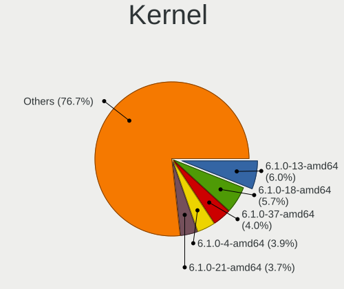

| Version           | Computers | Percent |
|-------------------|-----------|---------|
| 6.1.0-13-amd64    | 569       | 6.04%   |
| 6.1.0-18-amd64    | 540       | 5.73%   |
| 6.1.0-37-amd64    | 372       | 3.95%   |
| 6.1.0-4-amd64     | 366       | 3.89%   |
| 6.1.0-21-amd64    | 344       | 3.65%   |
| 6.1.0-10-amd64    | 320       | 3.4%    |
| 6.1.0-23-amd64    | 314       | 3.33%   |
| 6.1.0-17-amd64    | 311       | 3.3%    |
| 6.1.0-9-amd64     | 303       | 3.22%   |
| 6.1.0-11-amd64    | 294       | 3.12%   |
| 6.1.0-28-amd64    | 279       | 2.96%   |
| 6.1.0-25-amd64    | 277       | 2.94%   |
| 6.1.0-26-amd64    | 249       | 2.64%   |
| 6.1.0-12-amd64    | 214       | 2.27%   |
| 6.1.0-32-amd64    | 208       | 2.21%   |
| 6.1.0-31-amd64    | 207       | 2.2%    |
| 6.1.0-27-amd64    | 201       | 2.13%   |
| 6.1.0-22-amd64    | 195       | 2.07%   |
| 6.1.0-16-amd64    | 191       | 2.03%   |
| 6.1.0-30-amd64    | 186       | 1.98%   |
| 6.1.0-20-amd64    | 144       | 1.53%   |
| 6.1.0-34-amd64    | 115       | 1.22%   |
| 6.1.0-15-amd64    | 94        | 1%      |
| 6.1.0-7-amd64     | 92        | 0.98%   |
| 6.1.0-33-amd64    | 90        | 0.96%   |
| 6.1.0-35-amd64    | 85        | 0.9%    |
| 6.8.12-9-pve      | 80        | 0.85%   |
| 6.8.12-11-pve     | 79        | 0.84%   |
| 6.1.0-29-amd64    | 79        | 0.84%   |
| 6.1.0-40-amd64    | 76        | 0.81%   |
| 6.1.0-38-amd64    | 57        | 0.61%   |
| 6.8.4-2-pve       | 50        | 0.53%   |
| 6.8.12-4-pve      | 50        | 0.53%   |
| 6.8.12-8-pve      | 47        | 0.5%    |
| 6.8.12-1-pve      | 46        | 0.49%   |
| 6.1.0-6-amd64     | 44        | 0.47%   |
| 6.8.12-2-pve      | 43        | 0.46%   |
| 6.1.0-41-amd64    | 43        | 0.46%   |
| 6.1.0-39-amd64    | 43        | 0.46%   |
| 6.10.11+bpo-amd64 | 42        | 0.45%   |

Kernel Family
-------------

Linux kernel without a distro release

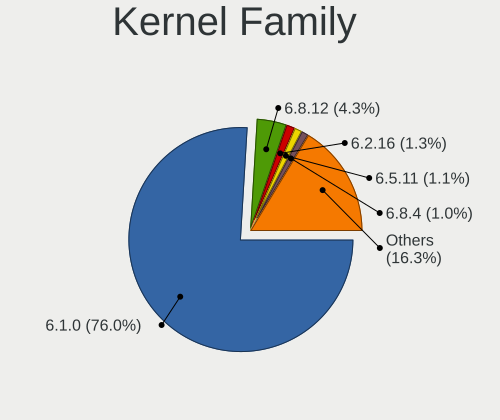

| Version | Computers | Percent |
|---------|-----------|---------|
| 6.1.0   | 6562      | 75.96%  |
| 6.8.12  | 374       | 4.33%   |
| 6.2.16  | 108       | 1.25%   |
| 6.5.11  | 96        | 1.11%   |
| 6.8.4   | 89        | 1.03%   |
| 6.5.0   | 81        | 0.94%   |
| 6.8.8   | 52        | 0.6%    |
| 6.5.13  | 52        | 0.6%    |
| 6.10.11 | 49        | 0.57%   |
| 6.12.12 | 47        | 0.54%   |
| 6.7.12  | 43        | 0.5%    |
| 6.9.7   | 39        | 0.45%   |
| 6.6.13  | 38        | 0.44%   |
| 6.4.0   | 37        | 0.43%   |
| 6.6.31  | 35        | 0.41%   |
| 6.12.22 | 32        | 0.37%   |
| 6.10.6  | 32        | 0.37%   |
| 6.12.9  | 30        | 0.35%   |
| 6.6.51  | 26        | 0.3%    |
| 6.11.10 | 26        | 0.3%    |
| 6.11.5  | 25        | 0.29%   |
| 5.10.0  | 23        | 0.27%   |
| 6.6.62  | 22        | 0.25%   |
| 6.12.25 | 22        | 0.25%   |
| 6.12.34 | 20        | 0.23%   |
| 6.0.0   | 18        | 0.21%   |
| 6.6.20  | 17        | 0.2%    |
| 6.6.28  | 16        | 0.19%   |
| 6.6.74  | 14        | 0.16%   |
| 6.12.47 | 14        | 0.16%   |
| 6.12.20 | 14        | 0.16%   |
| 6.12.38 | 12        | 0.14%   |
| 6.12.32 | 12        | 0.14%   |
| 6.12.30 | 11        | 0.13%   |
| 6.12.27 | 9         | 0.1%    |
| 5.15.0  | 9         | 0.1%    |
| 6.6.47  | 8         | 0.09%   |
| 6.1.63  | 8         | 0.09%   |
| 6.1.31  | 8         | 0.09%   |
| 6.1.21  | 8         | 0.09%   |

Kernel Major Ver.
-----------------

Linux kernel major version

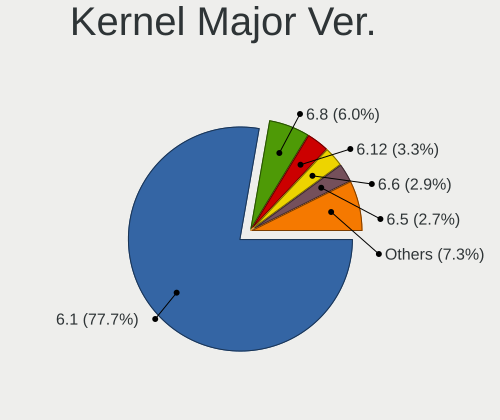

| Version | Computers | Percent |
|---------|-----------|---------|
| 6.1     | 6658      | 77.74%  |
| 6.8     | 511       | 5.97%   |
| 6.12    | 283       | 3.3%    |
| 6.6     | 251       | 2.93%   |
| 6.5     | 234       | 2.73%   |
| 6.2     | 113       | 1.32%   |
| 6.10    | 100       | 1.17%   |
| 6.7     | 71        | 0.83%   |
| 6.11    | 68        | 0.79%   |
| 6.9     | 67        | 0.78%   |
| 6.4     | 48        | 0.56%   |
| 5.10    | 46        | 0.54%   |
| 6.14    | 19        | 0.22%   |
| 6.0     | 18        | 0.21%   |
| 6.3     | 17        | 0.2%    |
| 5.15    | 15        | 0.18%   |
| 6.15    | 12        | 0.14%   |
| 6.13    | 9         | 0.11%   |
| 6       | 6         | 0.07%   |
| 4.19    | 4         | 0.05%   |
| 6.16    | 3         | 0.04%   |
| 5.19    | 3         | 0.04%   |
| 6.17    | 2         | 0.02%   |
| 4.1     | 2         | 0.02%   |
| 96.5    | 1         | 0.01%   |
| 5.4     | 1         | 0.01%   |
| 5.16    | 1         | 0.01%   |
| 4.14    | 1         | 0.01%   |

Arch
----

OS architecture (x86_64, i586, etc.)

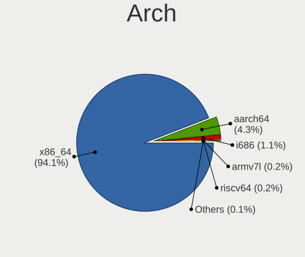

| Name        | Computers | Percent |
|-------------|-----------|---------|
| x86_64      | 7873      | 94.14%  |
| aarch64     | 359       | 4.29%   |
| i686        | 91        | 1.09%   |
| armv7l      | 19        | 0.23%   |
| riscv64     | 16        | 0.19%   |
| ppc64le     | 1         | 0.01%   |
| ppc64       | 1         | 0.01%   |
| mips64      | 1         | 0.01%   |
| mips        | 1         | 0.01%   |
| loongarch64 | 1         | 0.01%   |

DE
--

Desktop Environment

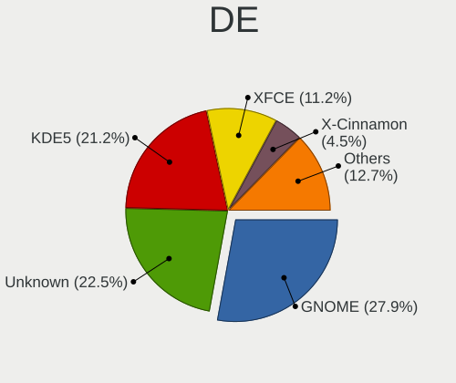

| Name              | Computers | Percent |
|-------------------|-----------|---------|
| GNOME             | 2368      | 27.87%  |
| Unknown           | 1916      | 22.55%  |
| KDE5              | 1804      | 21.23%  |
| XFCE              | 952       | 11.2%   |
| X-Cinnamon        | 382       | 4.5%    |
| MATE              | 286       | 3.37%   |
| LXDE              | 135       | 1.59%   |
| LXQt              | 112       | 1.32%   |
| Cinnamon          | 75        | 0.88%   |
| i3                | 73        | 0.86%   |
| Openbox           | 65        | 0.76%   |
| labwc:wlroots     | 39        | 0.46%   |
| GNOME Flashback   | 37        | 0.44%   |
| GNOME Classic     | 30        | 0.35%   |
| LXDE-pi-wayfire   | 29        | 0.34%   |
| Trinity           | 28        | 0.33%   |
| KDE               | 28        | 0.33%   |
| Budgie            | 18        | 0.21%   |
| lightdm-xsession  | 11        | 0.13%   |
| BunsenLabs        | 11        | 0.13%   |
| KDE6              | 10        | 0.12%   |
| wlroots           | 9         | 0.11%   |
| sway              | 8         | 0.09%   |
| default           | 8         | 0.09%   |
| icewm             | 6         | 0.07%   |
| Enlightenment     | 6         | 0.07%   |
| Cutefish          | 6         | 0.07%   |
| bspwm             | 6         | 0.07%   |
| fluxbox           | 5         | 0.06%   |
| DWM               | 5         | 0.06%   |
| awesome           | 4         | 0.05%   |
| x-session-manager | 3         | 0.04%   |
| WindowMaker       | 3         | 0.04%   |
| Phosh:GNOME       | 3         | 0.04%   |
| GNUstep           | 3         | 0.04%   |
| Deepin            | 3         | 0.04%   |
| xmonad            | 2         | 0.02%   |
| X-Generic         | 1         | 0.01%   |
| Unity             | 1         | 0.01%   |
| sway:GNOME        | 1         | 0.01%   |

Display Server
--------------

X11 or Wayland

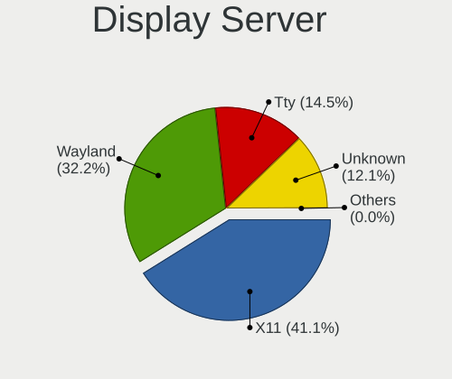

| Name        | Computers | Percent |
|-------------|-----------|---------|
| X11         | 3534      | 41.12%  |
| Wayland     | 2767      | 32.19%  |
| Tty         | 1245      | 14.49%  |
| Unknown     | 1044      | 12.15%  |
| Web         | 4         | 0.05%   |
| Unspecified | 1         | 0.01%   |

Display Manager
---------------

SDDM, LightDM, etc.

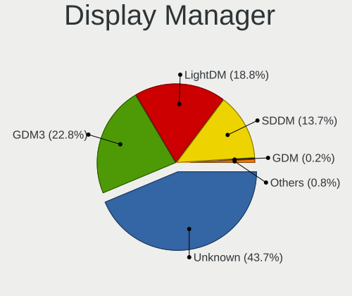

| Name          | Computers | Percent |
|---------------|-----------|---------|
| Unknown       | 3702      | 43.72%  |
| GDM3          | 1928      | 22.77%  |
| LightDM       | 1590      | 18.78%  |
| SDDM          | 1163      | 13.73%  |
| GDM           | 20        | 0.24%   |
| LXDM          | 15        | 0.18%   |
| SLiM          | 11        | 0.13%   |
| XDM           | 10        | 0.12%   |
| TDM           | 10        | 0.12%   |
| GREETD        | 6         | 0.07%   |
| WDM           | 4         | 0.05%   |
| NODM          | 4         | 0.05%   |
| Ly            | 3         | 0.04%   |
| SU            | 1         | 0.01%   |
| DARKDM_ON_TTY | 1         | 0.01%   |

OS Lang
-------

Language

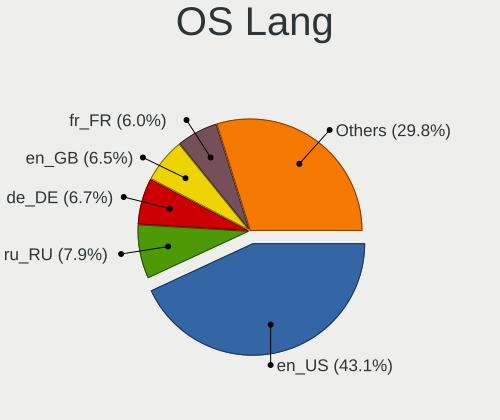

| Lang    | Computers | Percent |
|---------|-----------|---------|
| en_US   | 3632      | 43.09%  |
| ru_RU   | 662       | 7.85%   |
| de_DE   | 568       | 6.74%   |
| en_GB   | 547       | 6.49%   |
| fr_FR   | 505       | 5.99%   |
| Unknown | 384       | 4.56%   |
| it_IT   | 239       | 2.84%   |
| pt_BR   | 216       | 2.56%   |
| es_ES   | 198       | 2.35%   |
| en_CA   | 137       | 1.63%   |
| pl_PL   | 115       | 1.36%   |
| en_AU   | 96        | 1.14%   |
| C       | 84        | 1%      |
| es_MX   | 80        | 0.95%   |
| en_IN   | 75        | 0.89%   |
| es_AR   | 58        | 0.69%   |
| zh_CN   | 57        | 0.68%   |
| nl_NL   | 45        | 0.53%   |
| hu_HU   | 43        | 0.51%   |
| en_IE   | 40        | 0.47%   |
| sv_SE   | 37        | 0.44%   |
| de_AT   | 34        | 0.4%    |
| tr_TR   | 32        | 0.38%   |
| de_CH   | 32        | 0.38%   |
| es_CL   | 29        | 0.34%   |
| en_NZ   | 26        | 0.31%   |
| fr_BE   | 24        | 0.28%   |
| en_ZA   | 23        | 0.27%   |
| cs_CZ   | 22        | 0.26%   |
| es_VE   | 21        | 0.25%   |
| es_CO   | 21        | 0.25%   |
| pt_PT   | 19        | 0.23%   |
| ca_ES   | 18        | 0.21%   |
| da_DK   | 17        | 0.2%    |
| fr_CA   | 16        | 0.19%   |
| ja_JP   | 15        | 0.18%   |
| fi_FI   | 15        | 0.18%   |
| en_PH   | 14        | 0.17%   |
| nb_NO   | 12        | 0.14%   |
| fr_CH   | 11        | 0.13%   |

Boot Mode
---------

EFI or BIOS

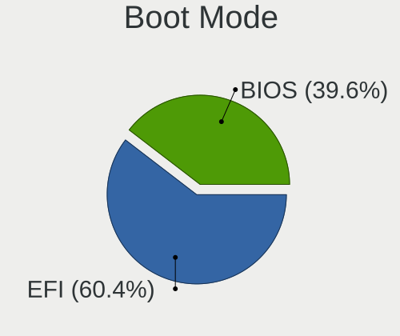

| Mode | Computers | Percent |
|------|-----------|---------|
| EFI  | 5088      | 60.42%  |
| BIOS | 3333      | 39.58%  |

Filesystem
----------

Type of filesystem

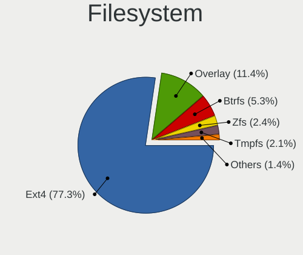

| Type     | Computers | Percent |
|----------|-----------|---------|
| Ext4     | 6524      | 77.33%  |
| Overlay  | 963       | 11.41%  |
| Btrfs    | 451       | 5.35%   |
| Zfs      | 200       | 2.37%   |
| Tmpfs    | 179       | 2.12%   |
| Xfs      | 85        | 1.01%   |
| Ext3     | 11        | 0.13%   |
| Unknown  | 8         | 0.09%   |
| Ext2     | 6         | 0.07%   |
| Aufs     | 5         | 0.06%   |
| F2fs     | 2         | 0.02%   |
| XXXXX    | 1         | 0.01%   |
| Reiserfs | 1         | 0.01%   |
| Jfs      | 1         | 0.01%   |

Part. scheme
------------

Scheme of partitioning

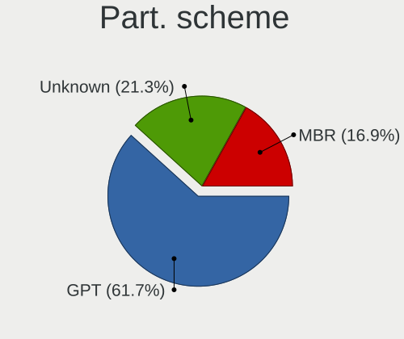

| Type    | Computers | Percent |
|---------|-----------|---------|
| GPT     | 5205      | 61.74%  |
| Unknown | 1798      | 21.33%  |
| MBR     | 1428      | 16.94%  |

Dual Boot with Linux/BSD
------------------------

Hosting more than one Linux/BSD

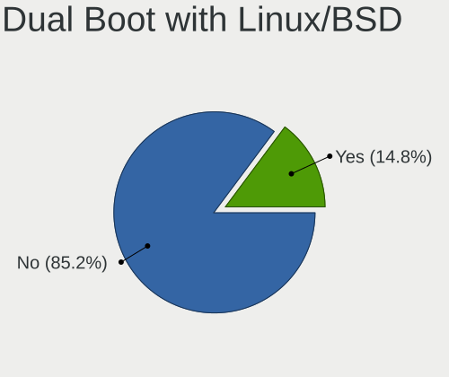

| Dual boot | Computers | Percent |
|-----------|-----------|---------|
| No        | 7221      | 85.18%  |
| Yes       | 1256      | 14.82%  |

Dual Boot (Win)
---------------

Hosting Linux and Windows

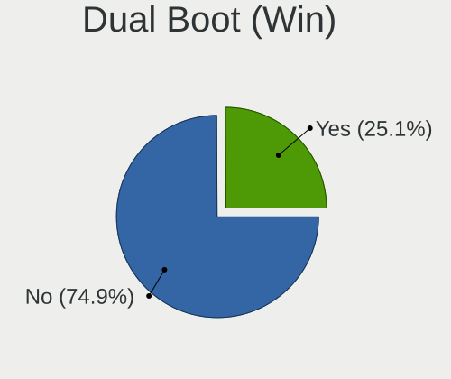

| Dual boot | Computers | Percent |
|-----------|-----------|---------|
| No        | 6343      | 74.93%  |
| Yes       | 2122      | 25.07%  |

Board
-----

Vendor
------

Motherboard manufacturer

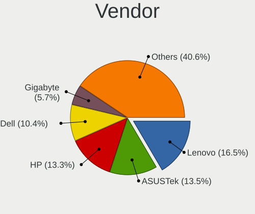

| Name                                 | Computers | Percent |
|--------------------------------------|-----------|---------|
| Lenovo                               | 1383      | 16.54%  |
| ASUSTek Computer                     | 1130      | 13.51%  |
| Hewlett-Packard                      | 1113      | 13.31%  |
| Dell                                 | 866       | 10.36%  |
| Gigabyte Technology                  | 474       | 5.67%   |
| MSI                                  | 382       | 4.57%   |
| Acer                                 | 323       | 3.86%   |
| ASRock                               | 268       | 3.2%    |
| Raspberry Pi Foundation              | 253       | 3.03%   |
| Apple                                | 217       | 2.6%    |
| Unknown                              | 212       | 2.54%   |
| Intel                                | 199       | 2.38%   |
| Google                               | 150       | 1.79%   |
| Supermicro                           | 92        | 1.1%    |
| Fujitsu                              | 74        | 0.88%   |
| Samsung Electronics                  | 61        | 0.73%   |
| HUAWEI                               | 54        | 0.65%   |
| Toshiba                              | 53        | 0.63%   |
| AZW                                  | 51        | 0.61%   |
| Shenzhen Meigao Electronic Equipment | 38        | 0.45%   |
| Aquarius                             | 38        | 0.45%   |
| Sony                                 | 35        | 0.42%   |
| Microsoft                            | 25        | 0.3%    |
| AMI                                  | 23        | 0.28%   |
| ECS                                  | 22        | 0.26%   |
| ASRockRack                           | 22        | 0.26%   |
| Medion                               | 21        | 0.25%   |
| Foxconn                              | 21        | 0.25%   |
| Biostar                              | 21        | 0.25%   |
| HONOR                                | 19        | 0.23%   |
| Framework                            | 19        | 0.23%   |
| Alienware                            | 19        | 0.23%   |
| Chuwi                                | 17        | 0.2%    |
| sunxi                                | 14        | 0.17%   |
| Rockchip                             | 14        | 0.17%   |
| Positivo                             | 14        | 0.17%   |
| OEM                                  | 13        | 0.16%   |
| Notebook                             | 13        | 0.16%   |
| Packard Bell                         | 12        | 0.14%   |
| LG Electronics                       | 12        | 0.14%   |

Model
-----

Motherboard model

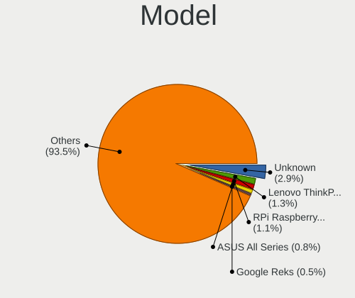

| Name                                              | Computers | Percent |
|---------------------------------------------------|-----------|---------|
| Unknown                                           | 240       | 2.87%   |
| Lenovo ThinkPad L13 Yoga Gen 2 20VK0019US         | 108       | 1.29%   |
| RPi Raspberry Pi 5 Model B Rev 1.0                | 91        | 1.09%   |
| ASUS All Series                                   | 69        | 0.83%   |
| Google Reks                                       | 39        | 0.47%   |
| HP ProLiant DL360 Gen9                            | 37        | 0.44%   |
| Aquarius NS585                                    | 37        | 0.44%   |
| RPi Raspberry Pi 4 Model B Rev 1.5                | 33        | 0.39%   |
| Supermicro Super Server                           | 25        | 0.3%    |
| Shenzhen Meigao Electronic Equipment Venus series | 23        | 0.28%   |
| Lenovo ThinkPad E475 20H40006US                   | 23        | 0.28%   |
| HP ProDesk 400 G2.5 SFF                           | 20        | 0.24%   |
| ASRock H470M-HVS                                  | 20        | 0.24%   |
| RPi Raspberry Pi 4 Model B Rev 1.2                | 19        | 0.23%   |
| AZW SER                                           | 19        | 0.23%   |
| Apple MacBookAir7,2                               | 19        | 0.23%   |
| RPi Raspberry Pi 4 Model B Rev 1.4                | 18        | 0.22%   |
| RPi Raspberry Pi 4 Model B Rev 1.1                | 18        | 0.22%   |
| HP Notebook                                       | 18        | 0.22%   |
| Google Stout                                      | 18        | 0.22%   |
| Dell PowerEdge R630                               | 17        | 0.2%    |
| HP ProLiant DL380 Gen9                            | 16        | 0.19%   |
| Google Enguarde                                   | 16        | 0.19%   |
| MSI MS-7996                                       | 15        | 0.18%   |
| ASUS P5QL-CM                                      | 15        | 0.18%   |
| RPi Raspberry Pi                                  | 14        | 0.17%   |
| Lenovo ThinkCentre M55p 8808D8U                   | 14        | 0.17%   |
| Dell OptiPlex 9020                                | 13        | 0.16%   |
| Dell Latitude E7440                               | 13        | 0.16%   |
| Apple Macmini7,1                                  | 13        | 0.16%   |
| RPi Raspberry Pi 3 Model B Rev 1.2                | 12        | 0.14%   |
| Lenovo ThinkPad 13 2nd Gen 20J10046US             | 12        | 0.14%   |
| HP Z440 Workstation                               | 12        | 0.14%   |
| Dell OptiPlex 7010                                | 12        | 0.14%   |
| ASUS PRIME B450M-K                                | 12        | 0.14%   |
| RPi Raspberry Pi 5 Model B Rev 1.1                | 11        | 0.13%   |
| Lenovo ThinkCentre M73 10AXS11800                 | 11        | 0.13%   |
| Intel X99                                         | 11        | 0.13%   |
| HP Pavilion dv6                                   | 11        | 0.13%   |
| HP EliteBook 840 G6                               | 11        | 0.13%   |

Model Family
------------

Motherboard model prefix

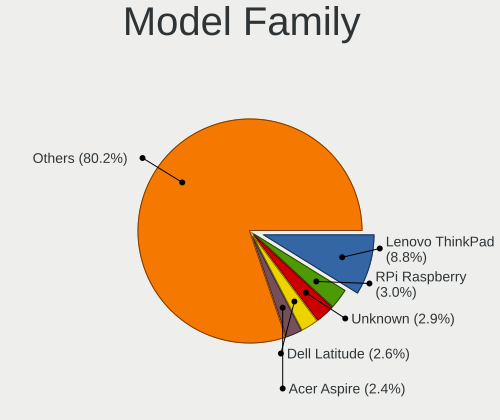

| Name               | Computers | Percent |
|--------------------|-----------|---------|
| Lenovo ThinkPad    | 739       | 8.84%   |
| RPi Raspberry      | 253       | 3.03%   |
| Unknown            | 240       | 2.87%   |
| Dell Latitude      | 221       | 2.64%   |
| Acer Aspire        | 202       | 2.42%   |
| Lenovo ThinkCentre | 173       | 2.07%   |
| Lenovo IdeaPad     | 172       | 2.06%   |
| ASUS PRIME         | 170       | 2.03%   |
| HP EliteBook       | 159       | 1.9%    |
| Dell OptiPlex      | 149       | 1.78%   |
| Dell Inspiron      | 129       | 1.54%   |
| HP Pavilion        | 125       | 1.49%   |
| ASUS VivoBook      | 124       | 1.48%   |
| ASUS ROG           | 117       | 1.4%    |
| Dell PowerEdge     | 104       | 1.24%   |
| HP ProLiant        | 95        | 1.14%   |
| Dell Precision     | 92        | 1.1%    |
| HP ProBook         | 91        | 1.09%   |
| HP Laptop          | 91        | 1.09%   |
| HP ProDesk         | 80        | 0.96%   |
| ASUS TUF           | 74        | 0.88%   |
| Dell XPS           | 71        | 0.85%   |
| HP EliteDesk       | 69        | 0.83%   |
| ASUS All           | 69        | 0.83%   |
| HP Compaq          | 58        | 0.69%   |
| Lenovo Yoga        | 56        | 0.67%   |
| ASUS ASUS          | 50        | 0.6%    |
| Dell Vostro        | 46        | 0.55%   |
| Toshiba Satellite  | 41        | 0.49%   |
| ASUS ZenBook       | 40        | 0.48%   |
| Google Reks        | 39        | 0.47%   |
| Aquarius NS585     | 37        | 0.44%   |
| Lenovo Legion      | 33        | 0.39%   |
| HP ZBook           | 33        | 0.39%   |
| HP ENVY            | 33        | 0.39%   |
| Acer Nitro         | 29        | 0.35%   |
| Lenovo ThinkBook   | 26        | 0.31%   |
| Supermicro Super   | 25        | 0.3%    |
| Microsoft Surface  | 25        | 0.3%    |
| Gigabyte X570      | 25        | 0.3%    |

MFG Year
--------

Motherboard manufacture year

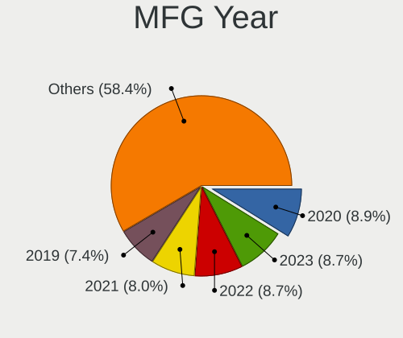

| Year    | Computers | Percent |
|---------|-----------|---------|
| 2020    | 741       | 8.86%   |
| 2023    | 728       | 8.71%   |
| 2022    | 724       | 8.66%   |
| 2021    | 665       | 7.95%   |
| 2019    | 619       | 7.4%    |
| 2018    | 574       | 6.86%   |
| 2012    | 433       | 5.18%   |
| 2014    | 421       | 5.03%   |
| 2017    | 418       | 5%      |
| 2013    | 393       | 4.7%    |
| 2015    | 372       | 4.45%   |
| Unknown | 367       | 4.39%   |
| 2024    | 353       | 4.22%   |
| 2011    | 351       | 4.2%    |
| 2016    | 341       | 4.08%   |
| 2010    | 233       | 2.79%   |
| 2009    | 204       | 2.44%   |
| 2008    | 189       | 2.26%   |
| 2007    | 124       | 1.48%   |
| 2006    | 49        | 0.59%   |
| 2025    | 34        | 0.41%   |
| 2005    | 14        | 0.17%   |
| 2004    | 9         | 0.11%   |
| 2002    | 2         | 0.02%   |
| 2001    | 2         | 0.02%   |
| 2003    | 1         | 0.01%   |
| 2000    | 1         | 0.01%   |

Form Factor
-----------

Physical design of the computer

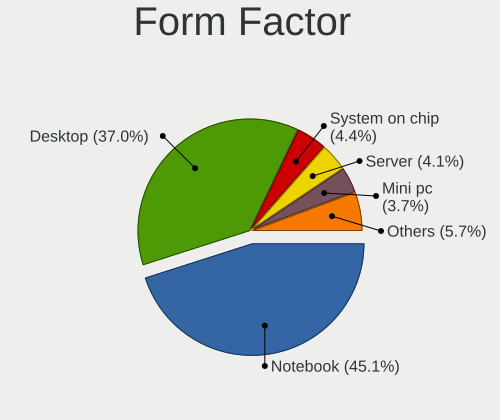

| Name           | Computers | Percent |
|----------------|-----------|---------|
| Notebook       | 3768      | 45.06%  |
| Desktop        | 3095      | 37.01%  |
| System on chip | 370       | 4.42%   |
| Server         | 343       | 4.1%    |
| Mini pc        | 311       | 3.72%   |
| Convertible    | 292       | 3.49%   |
| All in one     | 100       | 1.2%    |
| Tablet         | 72        | 0.86%   |
| Other          | 5         | 0.06%   |
| Stick pc       | 3         | 0.04%   |
| Firewall       | 2         | 0.02%   |
| Phone          | 1         | 0.01%   |

Secure Boot
-----------

Enabled or disabled

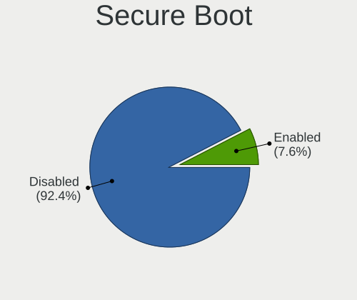

| State    | Computers | Percent |
|----------|-----------|---------|
| Disabled | 7759      | 92.45%  |
| Enabled  | 634       | 7.55%   |

Coreboot
--------

Have coreboot on board

| Used | Computers | Percent |
|------|-----------|---------|
| No   | 8199      | 98.05%  |
| Yes  | 163       | 1.95%   |

RAM Size
--------

Total RAM memory

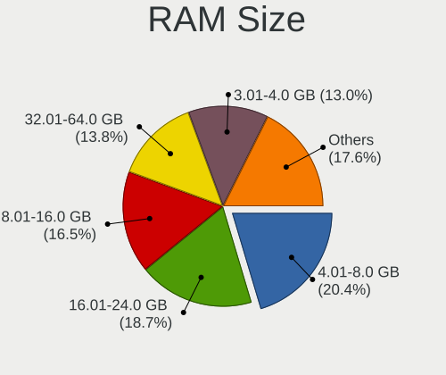

| Size in GB      | Computers | Percent |
|-----------------|-----------|---------|
| 4.01-8.0        | 1722      | 20.38%  |
| 16.01-24.0      | 1583      | 18.74%  |
| 8.01-16.0       | 1392      | 16.48%  |
| 32.01-64.0      | 1165      | 13.79%  |
| 3.01-4.0        | 1096      | 12.97%  |
| 64.01-256.0     | 649       | 7.68%   |
| 1.01-2.0        | 276       | 3.27%   |
| 24.01-32.0      | 259       | 3.07%   |
| More than 256.0 | 119       | 1.41%   |
| 2.01-3.0        | 93        | 1.1%    |
| 0.51-1.0        | 72        | 0.85%   |
| 0.01-0.5        | 21        | 0.25%   |
| Unknown         | 2         | 0.02%   |

RAM Used
--------

Used RAM memory

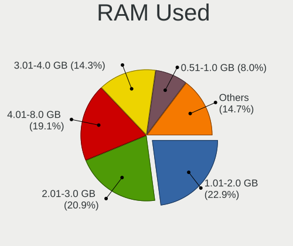

| Used GB         | Computers | Percent |
|-----------------|-----------|---------|
| 1.01-2.0        | 2068      | 22.91%  |
| 2.01-3.0        | 1884      | 20.87%  |
| 4.01-8.0        | 1727      | 19.13%  |
| 3.01-4.0        | 1293      | 14.32%  |
| 0.51-1.0        | 726       | 8.04%   |
| 8.01-16.0       | 551       | 6.1%    |
| 0.01-0.5        | 306       | 3.39%   |
| 16.01-24.0      | 156       | 1.73%   |
| 64.01-256.0     | 113       | 1.25%   |
| 32.01-64.0      | 98        | 1.09%   |
| 24.01-32.0      | 92        | 1.02%   |
| More than 256.0 | 10        | 0.11%   |
| Unknown         | 2         | 0.02%   |
| 0               | 1         | 0.01%   |

Total Drives
------------

Number of drives on board

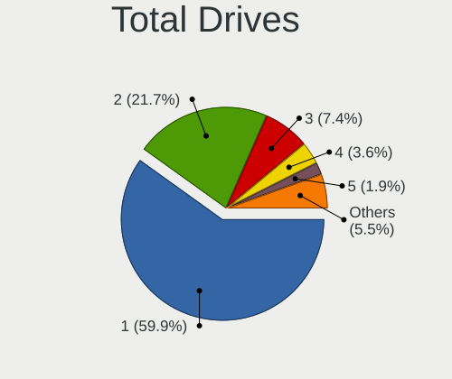

| Drives | Computers | Percent |
|--------|-----------|---------|
| 1      | 5131      | 59.92%  |
| 2      | 1854      | 21.65%  |
| 3      | 635       | 7.42%   |
| 4      | 306       | 3.57%   |
| 5      | 166       | 1.94%   |
| 6      | 90        | 1.05%   |
| 7      | 69        | 0.81%   |
| 0      | 69        | 0.81%   |
| 10     | 41        | 0.48%   |
| 8      | 41        | 0.48%   |
| 9      | 27        | 0.32%   |
| 11     | 21        | 0.25%   |
| 14     | 18        | 0.21%   |
| 18     | 12        | 0.14%   |
| 13     | 10        | 0.12%   |
| 12     | 10        | 0.12%   |
| 17     | 6         | 0.07%   |
| 16     | 6         | 0.07%   |
| 36     | 4         | 0.05%   |
| 33     | 4         | 0.05%   |
| 15     | 4         | 0.05%   |
| 21     | 3         | 0.04%   |
| 19     | 3         | 0.04%   |
| 55     | 2         | 0.02%   |
| 44     | 2         | 0.02%   |
| 41     | 2         | 0.02%   |
| 30     | 2         | 0.02%   |
| 29     | 2         | 0.02%   |
| 27     | 2         | 0.02%   |
| 26     | 2         | 0.02%   |
| 111    | 1         | 0.01%   |
| 70     | 1         | 0.01%   |
| 61     | 1         | 0.01%   |
| 56     | 1         | 0.01%   |
| 51     | 1         | 0.01%   |
| 48     | 1         | 0.01%   |
| 46     | 1         | 0.01%   |
| 42     | 1         | 0.01%   |
| 40     | 1         | 0.01%   |
| 39     | 1         | 0.01%   |

Has CD-ROM
----------

Has CD-ROM on board

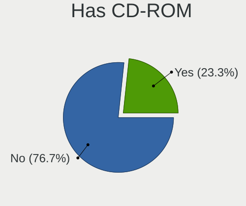

| Presented | Computers | Percent |
|-----------|-----------|---------|
| No        | 6447      | 76.68%  |
| Yes       | 1961      | 23.32%  |

Has Ethernet
------------

Has Ethernet on board

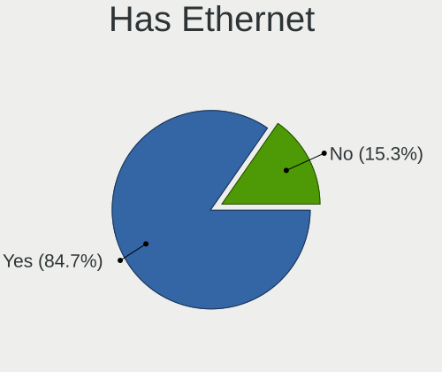

| Presented | Computers | Percent |
|-----------|-----------|---------|
| Yes       | 7103      | 84.68%  |
| No        | 1285      | 15.32%  |

Has WiFi
--------

Has WiFi module

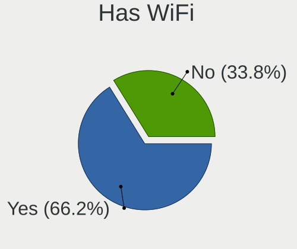

| Presented | Computers | Percent |
|-----------|-----------|---------|
| Yes       | 5557      | 66.16%  |
| No        | 2842      | 33.84%  |

Has Bluetooth
-------------

Has Bluetooth module

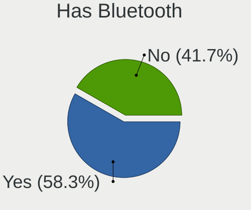

| Presented | Computers | Percent |
|-----------|-----------|---------|
| Yes       | 4907      | 58.31%  |
| No        | 3509      | 41.69%  |

Location
--------

Country
-------

Geographic location (country)

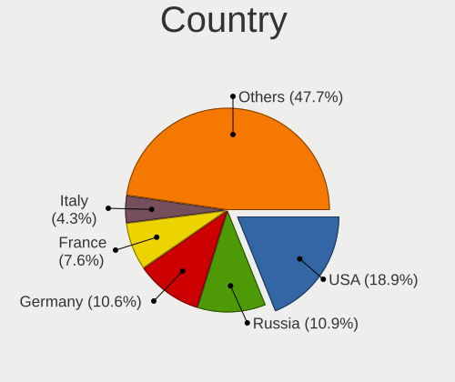

| Country      | Computers | Percent |
|--------------|-----------|---------|
| USA          | 1588      | 18.91%  |
| Russia       | 915       | 10.9%   |
| Germany      | 888       | 10.57%  |
| France       | 638       | 7.6%    |
| Italy        | 364       | 4.33%   |
| Brazil       | 313       | 3.73%   |
| Spain        | 292       | 3.48%   |
| UK           | 289       | 3.44%   |
| Canada       | 257       | 3.06%   |
| Poland       | 199       | 2.37%   |
| Netherlands  | 145       | 1.73%   |
| Australia    | 130       | 1.55%   |
| Mexico       | 121       | 1.44%   |
| Sweden       | 108       | 1.29%   |
| China        | 108       | 1.29%   |
| Switzerland  | 105       | 1.25%   |
| India        | 105       | 1.25%   |
| Belgium      | 99        | 1.18%   |
| Finland      | 95        | 1.13%   |
| Austria      | 85        | 1.01%   |
| Argentina    | 85        | 1.01%   |
| Hungary      | 73        | 0.87%   |
| Turkey       | 65        | 0.77%   |
| Romania      | 63        | 0.75%   |
| Czechia      | 60        | 0.71%   |
| Indonesia    | 59        | 0.7%    |
| Norway       | 57        | 0.68%   |
| Portugal     | 53        | 0.63%   |
| Denmark      | 46        | 0.55%   |
| Japan        | 42        | 0.5%    |
| Greece       | 40        | 0.48%   |
| Colombia     | 40        | 0.48%   |
| Chile        | 39        | 0.46%   |
| Bulgaria     | 36        | 0.43%   |
| New Zealand  | 34        | 0.4%    |
| Vietnam      | 32        | 0.38%   |
| Philippines  | 29        | 0.35%   |
| Venezuela    | 28        | 0.33%   |
| Slovakia     | 27        | 0.32%   |
| South Africa | 26        | 0.31%   |

City
----

Geographic location (city)

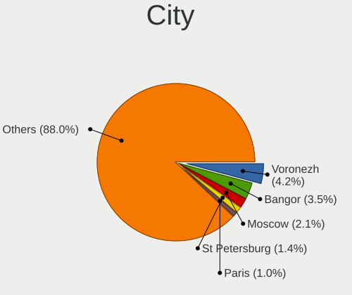

| City              | Computers | Percent |
|-------------------|-----------|---------|
| Voronezh          | 365       | 4.19%   |
| Bangor            | 302       | 3.47%   |
| Moscow            | 179       | 2.06%   |
| St Petersburg     | 118       | 1.36%   |
| Paris             | 84        | 0.96%   |
| Berlin            | 82        | 0.94%   |
| Roubaix           | 70        | 0.8%    |
| Milan             | 65        | 0.75%   |
| Helsinki          | 61        | 0.7%    |
| Bagneux           | 55        | 0.63%   |
| Toronto           | 53        | 0.61%   |
| Amsterdam         | 52        | 0.6%    |
| Madrid            | 48        | 0.55%   |
| Frankfurt am Main | 47        | 0.54%   |
| Vienna            | 45        | 0.52%   |
| Sydney            | 42        | 0.48%   |
| Sao Paulo         | 38        | 0.44%   |
| Hamburg           | 36        | 0.41%   |
| Warsaw            | 35        | 0.4%    |
| Budapest          | 33        | 0.38%   |
| Melbourne         | 30        | 0.34%   |
| Barcelona         | 30        | 0.34%   |
| Prague            | 29        | 0.33%   |
| Munich            | 29        | 0.33%   |
| Bucharest         | 28        | 0.32%   |
| Zurich            | 27        | 0.31%   |
| Montreal          | 27        | 0.31%   |
| Stockholm         | 25        | 0.29%   |
| Rio de Janeiro    | 24        | 0.28%   |
| Cologne           | 24        | 0.28%   |
| Mexico City       | 23        | 0.26%   |
| Antwerp           | 23        | 0.26%   |
| Los Angeles       | 22        | 0.25%   |
| Bogotá           | 22        | 0.25%   |
| Seattle           | 21        | 0.24%   |
| Rome              | 21        | 0.24%   |
| New York          | 21        | 0.24%   |
| London            | 21        | 0.24%   |
| Dresden           | 21        | 0.24%   |
| Bengaluru         | 21        | 0.24%   |

Drives
------

Drive Vendor
------------

Hard drive vendors

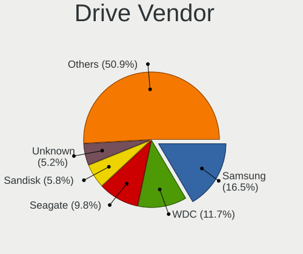

| Vendor                      | Computers | Drives | Percent |
|-----------------------------|-----------|--------|---------|
| Samsung Electronics         | 2049      | 5720   | 16.53%  |
| WDC                         | 1455      | 3681   | 11.74%  |
| Seagate                     | 1212      | 3027   | 9.78%   |
| Sandisk                     | 724       | 930    | 5.84%   |
| Unknown                     | 649       | 793    | 5.24%   |
| Kingston                    | 637       | 958    | 5.14%   |
| Toshiba                     | 609       | 1301   | 4.91%   |
| Crucial                     | 557       | 970    | 4.49%   |
| SK hynix                    | 350       | 473    | 2.82%   |
| Micron Technology           | 292       | 359    | 2.36%   |
| Intel                       | 272       | 423    | 2.19%   |
| Hitachi                     | 226       | 377    | 1.82%   |
| A-DATA Technology           | 193       | 285    | 1.56%   |
| Unknown                     | 192       | 223    | 1.55%   |
| HGST                        | 172       | 1531   | 1.39%   |
| China                       | 161       | 192    | 1.3%    |
| KIOXIA                      | 134       | 225    | 1.08%   |
| Kingston Technology Company | 115       | 149    | 0.93%   |
| Apple                       | 106       | 132    | 0.86%   |
| SPCC                        | 98        | 114    | 0.79%   |
| Netac                       | 83        | 131    | 0.67%   |
| PNY                         | 75        | 100    | 0.61%   |
| Hewlett-Packard             | 72        | 551    | 0.58%   |
| Transcend                   | 69        | 113    | 0.56%   |
| Patriot                     | 66        | 90     | 0.53%   |
| Intenso                     | 65        | 78     | 0.52%   |
| Silicon Motion              | 64        | 73     | 0.52%   |
| MAXIO Technology (Hangzhou) | 60        | 75     | 0.48%   |
| Phison Electronics          | 53        | 74     | 0.43%   |
| Phison                      | 52        | 61     | 0.42%   |
| Lexar                       | 51        | 59     | 0.41%   |
| Team                        | 48        | 80     | 0.39%   |
| JMicron Technology          | 47        | 49     | 0.38%   |
| Micron/Crucial Technology   | 46        | 56     | 0.37%   |
| GOODRAM                     | 43        | 67     | 0.35%   |
| Fanxiang                    | 39        | 53     | 0.31%   |
| LITEON                      | 37        | 49     | 0.3%    |
| SSSTC                       | 33        | 35     | 0.27%   |
| Fujitsu                     | 33        | 55     | 0.27%   |
| Corsair                     | 31        | 40     | 0.25%   |

Drive Model
-----------

Hard drive models

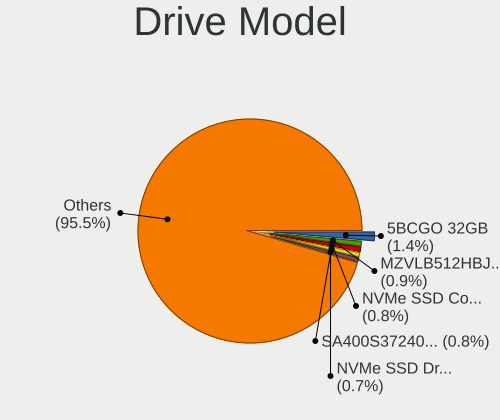

| Model                                                | Computers | Percent |
|------------------------------------------------------|-----------|---------|
| Unknown                                              | 192       | 1.39%   |
| Samsung MZVLB512HBJQ-000L7 512GB                     | 118       | 0.85%   |
| Samsung NVMe SSD Controller SM981/PM981/PM983 1TB    | 109       | 0.79%   |
| Kingston SA400S37240G 240GB SSD                      | 105       | 0.76%   |
| SanDisk NVMe SSD Drive 1TB                           | 97        | 0.7%    |
| Kingston SA400S37480G 480GB SSD                      | 92        | 0.66%   |
| Samsung SSD 870 EVO 1TB                              | 79        | 0.57%   |
| Seagate ST500DM002-1BD142 500GB                      | 75        | 0.54%   |
| Seagate ST1000DM010-2EP102 1TB                       | 74        | 0.53%   |
| Kingston SA400S37120G 120GB SSD                      | 70        | 0.51%   |
| Samsung SSD 870 EVO 500GB                            | 64        | 0.46%   |
| SanDisk NVMe SSD Drive 512GB                         | 61        | 0.44%   |
| Crucial CT1000MX500SSD1 1TB                          | 61        | 0.44%   |
| Crucial CT500MX500SSD1 500GB                         | 59        | 0.43%   |
| Samsung SSD 860 EVO 500GB                            | 58        | 0.42%   |
| Samsung NVMe SSD Controller PM9A1/PM9A3/980PRO 1TB   | 58        | 0.42%   |
| SanDisk NVMe SSD Drive 2TB                           | 54        | 0.39%   |
| Samsung SSD 970 EVO Plus 1TB                         | 54        | 0.39%   |
| Samsung SSD 850 EVO 250GB                            | 54        | 0.39%   |
| Crucial CT240BX500SSD1 240GB                         | 52        | 0.38%   |
| Samsung SSD 850 EVO 500GB                            | 51        | 0.37%   |
| Samsung SSD 980 1TB                                  | 50        | 0.36%   |
| Crucial CT480BX500SSD1 480GB                         | 50        | 0.36%   |
| Unknown MMC Card  64GB                               | 49        | 0.35%   |
| Kingston Company SNV2S1000G 1TB                      | 49        | 0.35%   |
| Unknown MMC Card  32GB                               | 48        | 0.35%   |
| Toshiba DT01ACA100 1TB                               | 43        | 0.31%   |
| Seagate ST1000LM035-1RK172 1TB                       | 43        | 0.31%   |
| Samsung SSD 860 EVO 1TB                              | 43        | 0.31%   |
| Unknown MMC Card  128GB                              | 42        | 0.3%    |
| Seagate ST1000LM024 HN-M101MBB 1TB                   | 42        | 0.3%    |
| Samsung SSD 990 PRO 2TB                              | 42        | 0.3%    |
| Samsung SSD 980 PRO 1TB                              | 41        | 0.3%    |
| A-DATA SU800 512GB SSD                               | 41        | 0.3%    |
| Samsung SSD 860 EVO 250GB                            | 40        | 0.29%   |
| Kingston SA400S37960G 960GB SSD                      | 39        | 0.28%   |
| WDC WD10EZEX-08WN4A0 1TB                             | 38        | 0.27%   |
| Samsung NVMe SSD Controller SM961/PM961/SM963 1024GB | 37        | 0.27%   |
| Seagate ST2000DM008-2FR102 2TB                       | 36        | 0.26%   |
| Toshiba HDWD110 1TB                                  | 35        | 0.25%   |

HDD Vendor
----------

Hard disk drive vendors

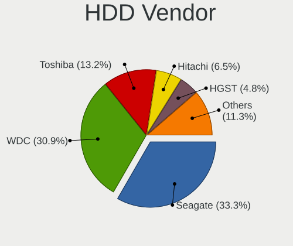

| Vendor              | Computers | Drives | Percent |
|---------------------|-----------|--------|---------|
| Seagate             | 1166      | 2953   | 33.33%  |
| WDC                 | 1081      | 2854   | 30.9%   |
| Toshiba             | 460       | 1103   | 13.15%  |
| Hitachi             | 226       | 377    | 6.46%   |
| HGST                | 168       | 1338   | 4.8%    |
| Samsung Electronics | 92        | 119    | 2.63%   |
| Hewlett-Packard     | 40        | 480    | 1.14%   |
| Unknown             | 33        | 38     | 0.94%   |
| Fujitsu             | 32        | 54     | 0.91%   |
| Apple               | 30        | 32     | 0.86%   |
| Maxtor              | 20        | 22     | 0.57%   |
| JMicron Technology  | 19        | 20     | 0.54%   |
| ASMT                | 14        | 33     | 0.4%    |
| TO Exter            | 12        | 22     | 0.34%   |
| External            | 10        | 10     | 0.29%   |
| HPE                 | 7         | 19     | 0.2%    |
| USB3.0              | 5         | 5      | 0.14%   |
| WD MediaMax         | 4         | 6      | 0.11%   |
| QNAP                | 4         | 9      | 0.11%   |
| NETAPP              | 4         | 62     | 0.11%   |
| Intenso             | 4         | 4      | 0.11%   |
| HGST HTS            | 4         | 4      | 0.11%   |
| Unknown             | 4         | 13     | 0.11%   |
| USB                 | 3         | 5      | 0.09%   |
| SABRENT             | 3         | 4      | 0.09%   |
| LaCie               | 3         | 3      | 0.09%   |
| IBM/Hitachi         | 3         | 4      | 0.09%   |
| IBM-ESXS            | 3         | 10     | 0.09%   |
| ASMedia             | 3         | 3      | 0.09%   |
| USB 3.1             | 2         | 2      | 0.06%   |
| TDAS                | 2         | 8      | 0.06%   |
| SSK                 | 2         | 2      | 0.06%   |
| QEMU                | 2         | 2      | 0.06%   |
| MARSHAL             | 2         | 2      | 0.06%   |
| JetFlash            | 2         | 2      | 0.06%   |
| IB-AC703            | 2         | 2      | 0.06%   |
| ATLAS               | 2         | 64     | 0.06%   |
| XrayDisk            | 1         | 1      | 0.03%   |
| WUH72181            | 1         | 2      | 0.03%   |
| WALRAM              | 1         | 1      | 0.03%   |

SSD Vendor
----------

Solid state drive vendors

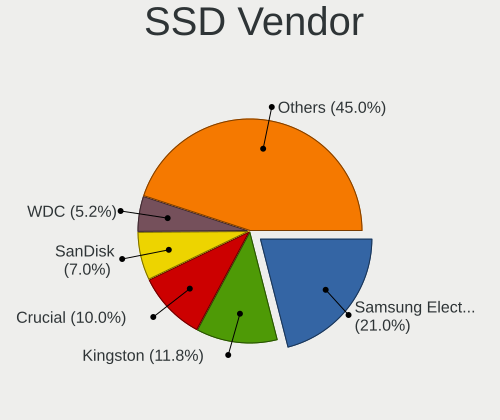

| Vendor              | Computers | Drives | Percent |
|---------------------|-----------|--------|---------|
| Samsung Electronics | 827       | 3851   | 21.03%  |
| Kingston            | 464       | 721    | 11.8%   |
| Crucial             | 395       | 732    | 10.04%  |
| SanDisk             | 276       | 339    | 7.02%   |
| WDC                 | 203       | 546    | 5.16%   |
| China               | 151       | 181    | 3.84%   |
| A-DATA Technology   | 136       | 217    | 3.46%   |
| Intel               | 99        | 192    | 2.52%   |
| SPCC                | 74        | 86     | 1.88%   |
| Micron Technology   | 72        | 101    | 1.83%   |
| PNY                 | 64        | 83     | 1.63%   |
| Netac               | 63        | 87     | 1.6%    |
| SK hynix            | 59        | 109    | 1.5%    |
| Intenso             | 57        | 68     | 1.45%   |
| Apple               | 56        | 57     | 1.42%   |
| Transcend           | 54        | 89     | 1.37%   |
| Toshiba             | 52        | 87     | 1.32%   |
| Patriot             | 52        | 74     | 1.32%   |
| Unknown             | 35        | 39     | 0.89%   |
| LITEON              | 32        | 44     | 0.81%   |
| GOODRAM             | 32        | 43     | 0.81%   |
| Team                | 28        | 56     | 0.71%   |
| Lexar               | 23        | 28     | 0.58%   |
| Apacer              | 23        | 35     | 0.58%   |
| Fanxiang            | 22        | 28     | 0.56%   |
| OCZ                 | 20        | 22     | 0.51%   |
| KingSpec            | 20        | 21     | 0.51%   |
| Hewlett-Packard     | 20        | 53     | 0.51%   |
| SABRENT             | 18        | 22     | 0.46%   |
| Emtec               | 17        | 18     | 0.43%   |
| LITEONIT            | 15        | 28     | 0.38%   |
| Gigabyte Technology | 15        | 19     | 0.38%   |
| XrayDisk            | 14        | 16     | 0.36%   |
| Seagate             | 13        | 17     | 0.33%   |
| KIOXIA-EXCERIA      | 13        | 13     | 0.33%   |
| Verbatim            | 12        | 13     | 0.31%   |
| Corsair             | 12        | 13     | 0.31%   |
| FORESEE             | 11        | 12     | 0.28%   |
| ASMT                | 11        | 11     | 0.28%   |
| Plextor             | 10        | 12     | 0.25%   |

Drive Kind
----------

HDD or SSD

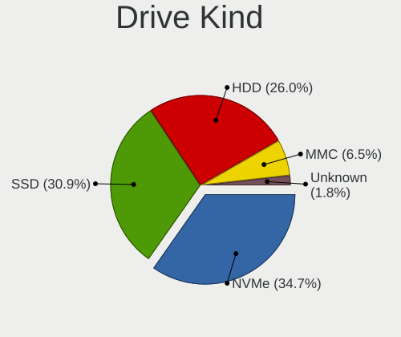

| Kind    | Computers | Drives | Percent |
|---------|-----------|--------|---------|
| NVMe    | 3813      | 5588   | 34.75%  |
| SSD     | 3393      | 8878   | 30.92%  |
| HDD     | 2857      | 9761   | 26.04%  |
| MMC     | 715       | 865    | 6.52%   |
| Unknown | 195       | 283    | 1.78%   |

Drive Connector
---------------

SATA, SAS, NVMe, etc.

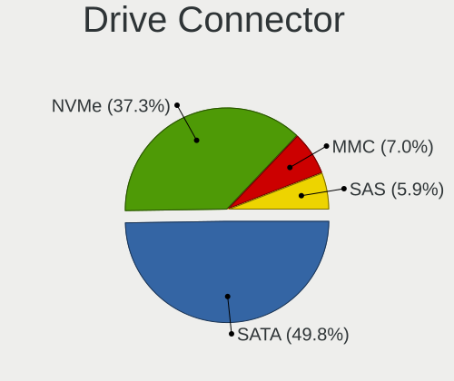

| Type | Computers | Drives | Percent |
|------|-----------|--------|---------|
| SATA | 5058      | 17575  | 49.76%  |
| NVMe | 3794      | 5513   | 37.33%  |
| MMC  | 715       | 865    | 7.03%   |
| SAS  | 597       | 1422   | 5.87%   |

Drive Size
----------

Size of hard drive

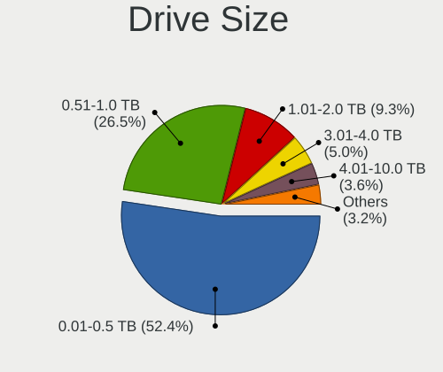

| Size in TB | Computers | Drives | Percent |
|------------|-----------|--------|---------|
| 0.01-0.5   | 3551      | 6312   | 52.35%  |
| 0.51-1.0   | 1800      | 5277   | 26.54%  |
| 1.01-2.0   | 632       | 2183   | 9.32%   |
| 3.01-4.0   | 336       | 1843   | 4.95%   |
| 4.01-10.0  | 244       | 2253   | 3.6%    |
| 2.01-3.0   | 124       | 277    | 1.83%   |
| 10.01-20.0 | 92        | 485    | 1.36%   |
| 20.01-50.0 | 3         | 8      | 0.04%   |
| 0          | 1         | 1      | 0.01%   |

Space Total
-----------

Amount of disk space available on the file system

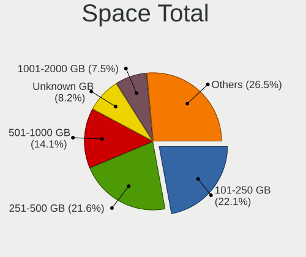

| Size in GB     | Computers | Percent |
|----------------|-----------|---------|
| 101-250        | 1914      | 22.12%  |
| 251-500        | 1866      | 21.57%  |
| 501-1000       | 1222      | 14.12%  |
| Unknown        | 711       | 8.22%   |
| 1001-2000      | 648       | 7.49%   |
| 51-100         | 618       | 7.14%   |
| More than 3000 | 546       | 6.31%   |
| 1-20           | 481       | 5.56%   |
| 21-50          | 412       | 4.76%   |
| 2001-3000      | 234       | 2.7%    |

Space Used
----------

Amount of used disk space

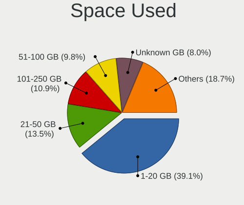

| Used GB        | Computers | Percent |
|----------------|-----------|---------|
| 1-20           | 3463      | 39.07%  |
| 21-50          | 1199      | 13.53%  |
| 101-250        | 966       | 10.9%   |
| 51-100         | 866       | 9.77%   |
| Unknown        | 711       | 8.02%   |
| 251-500        | 621       | 7.01%   |
| 501-1000       | 439       | 4.95%   |
| 1001-2000      | 285       | 3.22%   |
| More than 3000 | 220       | 2.48%   |
| 2001-3000      | 88        | 0.99%   |
| 0              | 6         | 0.07%   |

Malfunc. Drives
---------------

Drive models with a malfunction

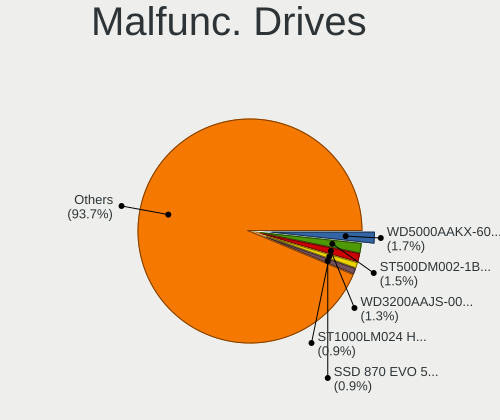

| Model                                 | Computers | Drives | Percent |
|---------------------------------------|-----------|--------|---------|
| WDC WD5000AAKX-60U6AA0 500GB          | 17        | 17     | 1.7%    |
| Seagate ST500DM002-1BD142 500GB       | 15        | 16     | 1.5%    |
| WDC WD3200AAJS-00L7A0 320GB           | 13        | 13     | 1.3%    |
| Seagate ST1000LM024 HN-M101MBB 1TB    | 9         | 9      | 0.9%    |
| Samsung Electronics SSD 870 EVO 500GB | 9         | 10     | 0.9%    |
| Seagate ST3500418AS 500GB             | 8         | 8      | 0.8%    |
| HGST HTS725050A7E630 500GB            | 8         | 10     | 0.8%    |
| Seagate ST1000LM035-1RK172 1TB        | 7         | 7      | 0.7%    |
| Kingston SV300S37A120G 120GB SSD      | 7         | 7      | 0.7%    |
| SK hynix BC711 HFM512GD3JX013N 512GB  | 6         | 7      | 0.6%    |
| Seagate ST9500325AS 500GB             | 6         | 6      | 0.6%    |
| Seagate ST500LM021-1KJ152 500GB       | 6         | 6      | 0.6%    |
| Seagate ST3250410AS 250GB             | 6         | 6      | 0.6%    |
| Seagate ST1000DM003-9YN162 1TB        | 6         | 10     | 0.6%    |
| Samsung Electronics SSD 870 EVO 1TB   | 6         | 25     | 0.6%    |
| WDC WDS240G2G0A-00JH30 240GB SSD      | 5         | 5      | 0.5%    |
| WDC WD60EFRX-68L0BN1 6TB              | 5         | 5      | 0.5%    |
| WDC WD30EFRX-68EUZN0 3TB              | 5         | 6      | 0.5%    |
| WDC WD20EFRX-68EUZN0 2TB              | 5         | 20     | 0.5%    |
| WDC WD10EZEX-00BN5A0 1TB              | 5         | 5      | 0.5%    |
| SK hynix PC711 HFS512GDE9X073N 512GB  | 5         | 6      | 0.5%    |
| Seagate ST500LT012-1DG142 500GB       | 5         | 5      | 0.5%    |
| Seagate ST3160811AS 160GB             | 5         | 5      | 0.5%    |
| Seagate ST2000DL003-9VT166 2TB        | 5         | 5      | 0.5%    |
| Samsung Electronics SSD 970 EVO 500GB | 5         | 8      | 0.5%    |
| Kingston SA400S37240G 240GB SSD       | 5         | 6      | 0.5%    |
| Hitachi HDS721050CLA362 500GB         | 5         | 7      | 0.5%    |
| Hitachi HDS721010CLA332 1TB           | 5         | 5      | 0.5%    |
| HGST HTS721010A9E630 1TB              | 5         | 5      | 0.5%    |
| HGST HTS545050A7E680 500GB            | 5         | 7      | 0.5%    |
| WDC WD40EFRX-68WT0N0 4TB              | 4         | 9      | 0.4%    |
| WDC WD2500AAJS-00L7A0 250GB           | 4         | 4      | 0.4%    |
| WDC WD10EZEX-00WN4A0 1TB              | 4         | 4      | 0.4%    |
| Toshiba MQ01ABF050 500GB              | 4         | 4      | 0.4%    |
| Toshiba DT01ACA200 2TB                | 4         | 11     | 0.4%    |
| SK hynix HFS128G39TND-N210A 128GB SSD | 4         | 4      | 0.4%    |
| Seagate ST9320325AS 320GB             | 4         | 5      | 0.4%    |
| Seagate ST500LT012-9WS142 500GB       | 4         | 4      | 0.4%    |
| Seagate ST2000DM001-1CH164 2TB        | 4         | 6      | 0.4%    |
| SanDisk SSD PLUS 1000GB               | 4         | 4      | 0.4%    |

Malfunc. Drive Vendor
---------------------

Vendors of faulty drives

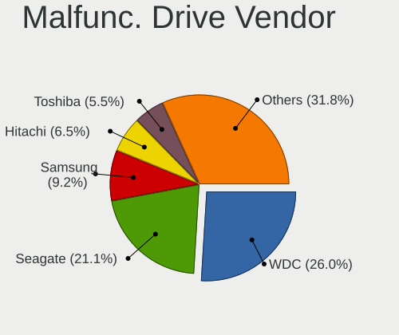

| Vendor              | Computers | Drives | Percent |
|---------------------|-----------|--------|---------|
| WDC                 | 249       | 626    | 25.96%  |
| Seagate             | 202       | 268    | 21.06%  |
| Samsung Electronics | 88        | 226    | 9.18%   |
| Hitachi             | 62        | 81     | 6.47%   |
| Toshiba             | 53        | 79     | 5.53%   |
| Intel               | 33        | 51     | 3.44%   |
| HGST                | 32        | 42     | 3.34%   |
| SK hynix            | 31        | 35     | 3.23%   |
| Kingston            | 27        | 36     | 2.82%   |
| Crucial             | 22        | 35     | 2.29%   |
| SanDisk             | 19        | 19     | 1.98%   |
| Micron Technology   | 14        | 15     | 1.46%   |
| Maxtor              | 11        | 12     | 1.15%   |
| A-DATA Technology   | 11        | 16     | 1.15%   |
| Apple               | 8         | 8      | 0.83%   |
| LITEON              | 6         | 6      | 0.63%   |
| China               | 6         | 6      | 0.63%   |
| Transcend           | 5         | 6      | 0.52%   |
| Hewlett-Packard     | 5         | 8      | 0.52%   |
| SSSTC               | 4         | 4      | 0.42%   |
| OCZ                 | 4         | 4      | 0.42%   |
| Netac               | 4         | 6      | 0.42%   |
| PNY                 | 3         | 4      | 0.31%   |
| Corsair             | 3         | 3      | 0.31%   |
| ASMT                | 3         | 3      | 0.31%   |
| Unknown             | 3         | 3      | 0.31%   |
| XPG                 | 2         | 2      | 0.21%   |
| Team                | 2         | 2      | 0.21%   |
| SPCC                | 2         | 2      | 0.21%   |
| Realtek             | 2         | 2      | 0.21%   |
| Mushkin             | 2         | 2      | 0.21%   |
| KingSpec            | 2         | 2      | 0.21%   |
| KingDian            | 2         | 2      | 0.21%   |
| Kimtigo             | 2         | 2      | 0.21%   |
| Intenso             | 2         | 3      | 0.21%   |
| HP Phison           | 2         | 2      | 0.21%   |
| Fujitsu             | 2         | 2      | 0.21%   |
| ZHITAI              | 1         | 1      | 0.1%    |
| TerraMas            | 1         | 4      | 0.1%    |
| TDAS                | 1         | 4      | 0.1%    |

Malfunc. HDD Vendor
-------------------

Vendors of faulty HDD drives

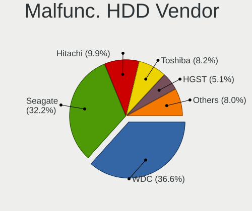

| Vendor              | Computers | Drives | Percent |
|---------------------|-----------|--------|---------|
| WDC                 | 229       | 585    | 36.64%  |
| Seagate             | 201       | 264    | 32.16%  |
| Hitachi             | 62        | 81     | 9.92%   |
| Toshiba             | 51        | 77     | 8.16%   |
| HGST                | 32        | 42     | 5.12%   |
| Samsung Electronics | 22        | 24     | 3.52%   |
| Maxtor              | 11        | 12     | 1.76%   |
| Hewlett-Packard     | 5         | 8      | 0.8%    |
| Apple               | 4         | 4      | 0.64%   |
| TerraMas            | 1         | 4      | 0.16%   |
| TDAS                | 1         | 4      | 0.16%   |
| JMicron Technology  | 1         | 1      | 0.16%   |
| IBM/Hitachi         | 1         | 1      | 0.16%   |
| HPE                 | 1         | 1      | 0.16%   |
| Fujitsu             | 1         | 1      | 0.16%   |
| ExcelStor           | 1         | 1      | 0.16%   |
| ASMT                | 1         | 1      | 0.16%   |

Malfunc. Drive Kind
-------------------

Kinds of faulty drives

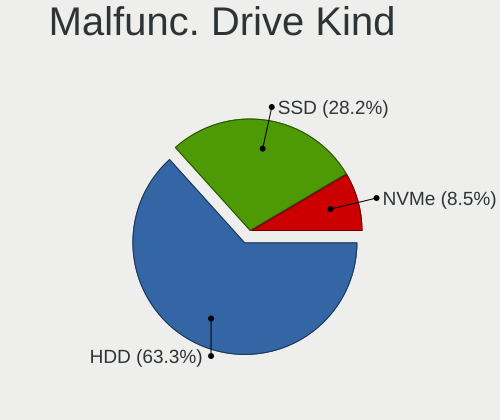

| Kind | Computers | Drives | Percent |
|------|-----------|--------|---------|
| HDD  | 568       | 1111   | 63.32%  |
| SSD  | 253       | 452    | 28.21%  |
| NVMe | 76        | 104    | 8.47%   |

Failed Drives
-------------

Failed drive models

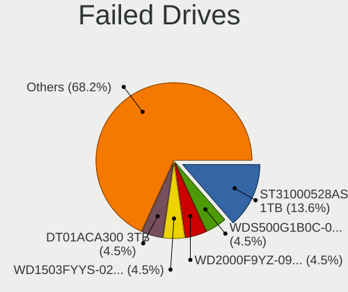

| Model                                       | Computers | Drives | Percent |
|---------------------------------------------|-----------|--------|---------|
| Seagate ST31000528AS 1TB                    | 3         | 7      | 13.64%  |
| WDC WDS500G1B0C-00S6U0 500GB                | 1         | 1      | 4.55%   |
| WDC WD2000F9YZ-09N20L0 2TB                  | 1         | 16     | 4.55%   |
| WDC WD1503FYYS-02W0B0 1TB                   | 1         | 2      | 4.55%   |
| Toshiba DT01ACA300 3TB                      | 1         | 1      | 4.55%   |
| Toshiba DT01ACA200 2TB                      | 1         | 1      | 4.55%   |
| SOLIDIGM SSDSC2KB076TZ 8TB                  | 1         | 1      | 4.55%   |
| SK hynix SC308 SATA 512GB SSD               | 1         | 1      | 4.55%   |
| SK hynix BC501 HFM128GDJTNG-8310A 128GB     | 1         | 1      | 4.55%   |
| Seagate ST6000NM0034 6TB                    | 1         | 42     | 4.55%   |
| Seagate ST3600057SS 600GB                   | 1         | 8      | 4.55%   |
| Seagate ST3500418ASQ 500GB                  | 1         | 1      | 4.55%   |
| Seagate ST3500418AS 500GB                   | 1         | 1      | 4.55%   |
| Samsung Electronics HM321HI 320GB           | 1         | 8      | 4.55%   |
| Samsung Electronics HD204UI 2TB             | 1         | 1      | 4.55%   |
| HGST HTS721010A9E630 1TB                    | 1         | 1      | 4.55%   |
| HGST HTS541010A9E680 1TB                    | 1         | 1      | 4.55%   |
| Gigabyte Technology GP-GSM2NE3256GNTD 256GB | 1         | 1      | 4.55%   |
| Emtec X300 128GB                            | 1         | 1      | 4.55%   |
| Crucial CT500P2SSD8 500GB                   | 1         | 1      | 4.55%   |

Failed Drive Vendor
-------------------

Failed drive vendors

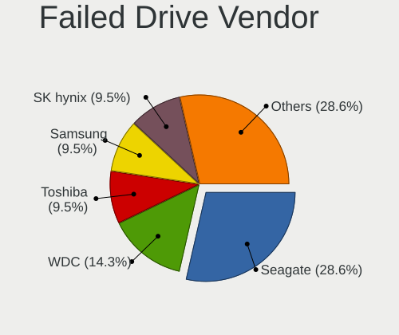

| Vendor              | Computers | Drives | Percent |
|---------------------|-----------|--------|---------|
| Seagate             | 6         | 59     | 28.57%  |
| WDC                 | 3         | 19     | 14.29%  |
| Toshiba             | 2         | 2      | 9.52%   |
| SK hynix            | 2         | 2      | 9.52%   |
| Samsung Electronics | 2         | 9      | 9.52%   |
| HGST                | 2         | 2      | 9.52%   |
| SOLIDIGM            | 1         | 1      | 4.76%   |
| Gigabyte Technology | 1         | 1      | 4.76%   |
| Emtec               | 1         | 1      | 4.76%   |
| Crucial             | 1         | 1      | 4.76%   |

Drive Status
------------

Number of failed and malfunc. drives

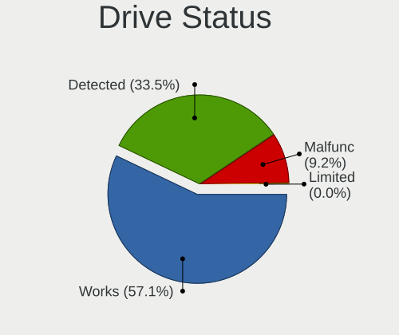

| Status   | Computers | Drives | Percent |
|----------|-----------|--------|---------|
| Works    | 5372      | 17299  | 57.08%  |
| Detected | 3156      | 6311   | 33.53%  |
| Malfunc  | 863       | 1667   | 9.17%   |
| Failed   | 20        | 97     | 0.21%   |
| Limited  | 1         | 1      | 0.01%   |

Storage controller
------------------

Storage Vendor
--------------

Storage controller vendors

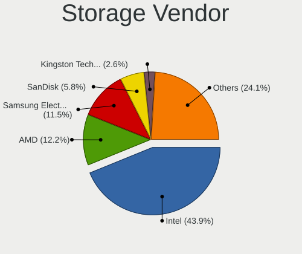

| Vendor                           | Computers | Percent |
|----------------------------------|-----------|---------|
| Intel                            | 4839      | 43.86%  |
| AMD                              | 1346      | 12.2%   |
| Samsung Electronics              | 1269      | 11.5%   |
| SanDisk                          | 639       | 5.79%   |
| Kingston Technology Company      | 286       | 2.59%   |
| SK hynix                         | 284       | 2.57%   |
| Micron Technology                | 252       | 2.28%   |
| Micron/Crucial Technology        | 190       | 1.72%   |
| Phison Electronics               | 185       | 1.68%   |
| ASMedia Technology               | 174       | 1.58%   |
| KIOXIA                           | 142       | 1.29%   |
| Silicon Motion                   | 119       | 1.08%   |
| MAXIO Technology (Hangzhou)      | 114       | 1.03%   |
| Toshiba America Info Systems     | 111       | 1.01%   |
| Broadcom / LSI                   | 111       | 1.01%   |
| ADATA Technology                 | 98        | 0.89%   |
| Nvidia                           | 91        | 0.82%   |
| LSI Logic / Symbios Logic        | 91        | 0.82%   |
| JMicron Technology               | 85        | 0.77%   |
| Marvell Technology Group         | 83        | 0.75%   |
| Hewlett-Packard                  | 76        | 0.69%   |
| Realtek Semiconductor            | 57        | 0.52%   |
| Shenzhen Longsys Electronics     | 41        | 0.37%   |
| Adaptec                          | 38        | 0.34%   |
| Solid State Storage Technology   | 36        | 0.33%   |
| Union Memory (Shenzhen)          | 29        | 0.26%   |
| Solidigm                         | 26        | 0.24%   |
| INNOGRIT                         | 25        | 0.23%   |
| Apple                            | 20        | 0.18%   |
| Yangtze Memory Technologies      | 18        | 0.16%   |
| Seagate Technology               | 17        | 0.15%   |
| VIA Technologies                 | 15        | 0.14%   |
| Biwin Storage Technology         | 13        | 0.12%   |
| Transcend                        | 12        | 0.11%   |
| Silicon Image                    | 12        | 0.11%   |
| Netac Technology                 | 11        | 0.1%    |
| Lite-On Technology               | 10        | 0.09%   |
| Unknown                          | 10        | 0.09%   |
| Hosin Global Electronics         | 8         | 0.07%   |
| Silicon Integrated Systems [SiS] | 7         | 0.06%   |

Storage Model
-------------

Storage controller models

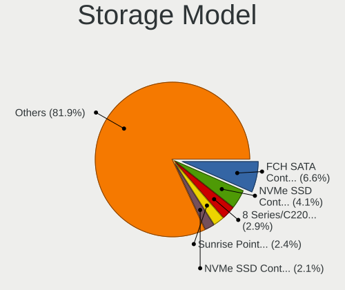

| Model                                                                          | Computers | Percent |
|--------------------------------------------------------------------------------|-----------|---------|
| AMD FCH SATA Controller [AHCI mode]                                            | 809       | 6.56%   |
| Samsung NVMe SSD Controller SM981/PM981/PM983                                  | 505       | 4.09%   |
| Intel 8 Series/C220 Series Chipset Family 6-port SATA Controller 1 [AHCI mode] | 363       | 2.94%   |
| Intel Sunrise Point-LP SATA Controller [AHCI mode]                             | 293       | 2.37%   |
| Samsung NVMe SSD Controller PM9A1/PM9A3/980PRO                                 | 259       | 2.1%    |
| Intel Volume Management Device NVMe RAID Controller                            | 245       | 1.99%   |
| Intel 7 Series Chipset Family 6-port SATA Controller [AHCI mode]               | 214       | 1.73%   |
| Intel Q170/Q150/B150/H170/H110/Z170/CM236 Chipset SATA Controller [AHCI Mode]  | 212       | 1.72%   |
| Samsung NVMe SSD Controller 980 (DRAM-less)                                    | 209       | 1.69%   |
| AMD 400 Series Chipset SATA Controller                                         | 181       | 1.47%   |
| Intel 200 Series PCH SATA controller [AHCI mode]                               | 178       | 1.44%   |
| Intel 82801 Mobile SATA Controller [RAID mode]                                 | 166       | 1.35%   |
| AMD 500 Series Chipset SATA Controller                                         | 166       | 1.35%   |
| Intel Cannon Lake PCH SATA AHCI Controller                                     | 159       | 1.29%   |
| Intel 6 Series/C200 Series Chipset Family 6 port Mobile SATA AHCI Controller   | 151       | 1.22%   |
| ASMedia ASM1061/ASM1062 Serial ATA Controller                                  | 139       | 1.13%   |
| AMD 600 Series Chipset SATA Controller                                         | 139       | 1.13%   |
| Intel Comet Lake SATA AHCI Controller                                          | 127       | 1.03%   |
| Intel Alder Lake-P SATA AHCI Controller                                        | 127       | 1.03%   |
| Intel 8 Series SATA Controller 1 [AHCI mode]                                   | 124       | 1%      |
| Micron/Crucial P2 [Nick P2] / P3 / P3 Plus NVMe PCIe SSD (DRAM-less)           | 123       | 1%      |
| Intel 6 Series/C200 Series Chipset Family 6 port Desktop SATA AHCI Controller  | 121       | 0.98%   |
| AMD SB7x0/SB8x0/SB9x0 SATA Controller [AHCI mode]                              | 118       | 0.96%   |
| Intel C610/X99 series chipset 6-Port SATA Controller [AHCI mode]               | 117       | 0.95%   |
| SanDisk WD SN560/SN740/SN770/SN5000 NVMe SSD                                   | 116       | 0.94%   |
| Intel SATA Controller [RAID Mode]                                              | 111       | 0.9%    |
| Intel Celeron/Pentium Silver Processor SATA Controller                         | 109       | 0.88%   |
| Intel Alder Lake-S PCH SATA Controller [AHCI Mode]                             | 105       | 0.85%   |
| SK hynix Gold P31/BC711/PC711 NVMe Solid State Drive                           | 102       | 0.83%   |
| Intel Raptor Lake SATA AHCI Controller                                         | 102       | 0.83%   |
| Samsung NVMe SSD Controller S4LV008[Pascal]                                    | 100       | 0.81%   |
| SanDisk Extreme Pro / WD Black SN750 / PC SN730 / Red SN700 NVMe SSD           | 94        | 0.76%   |
| Silicon Motion SM2263EN/SM2263XT (DRAM-less) NVMe SSD Controllers              | 92        | 0.75%   |
| MAXIO (Hangzhou) NVMe SSD Controller MAP1202 (DRAM-less)                       | 92        | 0.75%   |
| Samsung NVMe SSD Controller SM961/PM961/SM963                                  | 90        | 0.73%   |
| Intel Alder Lake-N SATA AHCI Controller                                        | 90        | 0.73%   |
| Intel 7 Series/C210 Series Chipset Family 6-port SATA Controller [AHCI mode]   | 90        | 0.73%   |
| Intel RST Volume Management Device Controller                                  | 88        | 0.71%   |
| Intel 82801IBM/IEM (ICH9M/ICH9M-E) 4 port SATA Controller [AHCI mode]          | 86        | 0.7%    |
| Intel C610/X99 series chipset sSATA Controller [AHCI mode]                     | 85        | 0.69%   |

Storage Kind
------------

Kind of storage controller (IDE, SATA, NVMe, SAS, ...)

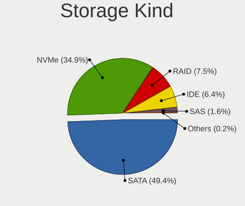

| Kind | Computers | Percent |
|------|-----------|---------|
| SATA | 5359      | 49.4%   |
| NVMe | 3784      | 34.88%  |
| RAID | 819       | 7.55%   |
| IDE  | 690       | 6.36%   |
| SAS  | 175       | 1.61%   |
| SCSI | 21        | 0.19%   |

Processor
---------

CPU Vendor
----------

Processor vendors

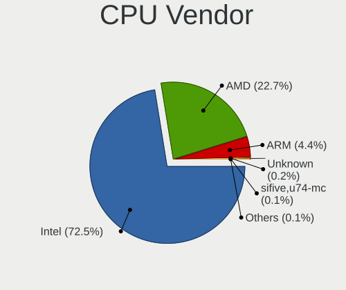

| Vendor                   | Computers | Percent |
|--------------------------|-----------|---------|
| Intel                    | 6060      | 72.45%  |
| AMD                      | 1901      | 22.73%  |
| ARM                      | 367       | 4.39%   |
| Unknown                  | 14        | 0.17%   |
| sifive,u74-mc            | 10        | 0.12%   |
| Qualcomm                 | 4         | 0.05%   |
| CentaurHauls             | 3         | 0.04%   |
| PowerNV C1P9S01 REV 1.02 | 1         | 0.01%   |
| MIPS                     | 1         | 0.01%   |
| Marvell Semiconductor    | 1         | 0.01%   |
| Loongson                 | 1         | 0.01%   |
| CHRP IBM,8233-E8B        | 1         | 0.01%   |

CPU Model
---------

Processor models

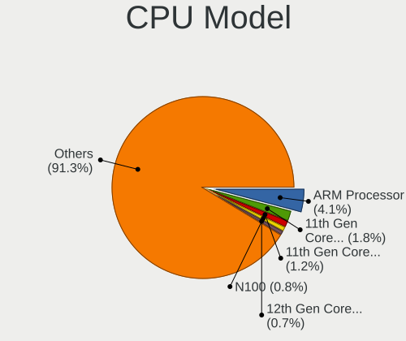

| Model                                         | Computers | Percent |
|-----------------------------------------------|-----------|---------|
| ARM Processor                                 | 347       | 4.13%   |
| Intel 11th Gen Core i7-1165G7 @ 2.80GHz       | 153       | 1.82%   |
| Intel 11th Gen Core i5-1135G7 @ 2.40GHz       | 98        | 1.17%   |
| Intel N100                                    | 69        | 0.82%   |
| Intel 12th Gen Core i5-1235U                  | 61        | 0.73%   |
| AMD Ryzen 7 5700U with Radeon Graphics        | 53        | 0.63%   |
| Intel Core i5-7200U CPU @ 2.50GHz             | 52        | 0.62%   |
| Intel Celeron CPU N3060 @ 1.60GHz             | 51        | 0.61%   |
| AMD Ryzen 5 5500U with Radeon Graphics        | 49        | 0.58%   |
| Intel Core i5-8265U CPU @ 1.60GHz             | 46        | 0.55%   |
| AMD Ryzen 5 3600 6-Core Processor             | 45        | 0.54%   |
| Intel Core i7-8550U CPU @ 1.80GHz             | 42        | 0.5%    |
| Intel Core i5-8250U CPU @ 1.60GHz             | 42        | 0.5%    |
| Intel Core i5-2520M CPU @ 2.50GHz             | 42        | 0.5%    |
| Intel Core i3-9100 CPU @ 3.60GHz              | 42        | 0.5%    |
| Intel Core i7-3770 CPU @ 3.40GHz              | 41        | 0.49%   |
| Intel Core i5-10210U CPU @ 1.60GHz            | 40        | 0.48%   |
| Intel Core i5-8350U CPU @ 1.70GHz             | 39        | 0.46%   |
| Intel Core i5-6300U CPU @ 2.40GHz             | 39        | 0.46%   |
| Intel 12th Gen Core i7-12700H                 | 38        | 0.45%   |
| Intel Core i5-6500 CPU @ 3.20GHz              | 37        | 0.44%   |
| Intel Core i5-6200U CPU @ 2.30GHz             | 37        | 0.44%   |
| Intel Celeron N4020 CPU @ 1.10GHz             | 36        | 0.43%   |
| Intel 11th Gen Core i3-1115G4 @ 3.00GHz       | 36        | 0.43%   |
| AMD Ryzen 7 5800H with Radeon Graphics        | 36        | 0.43%   |
| Intel Core i7-10700 CPU @ 2.90GHz             | 35        | 0.42%   |
| AMD Ryzen 7 5800X 8-Core Processor            | 34        | 0.41%   |
| AMD Ryzen 5 5600G with Radeon Graphics        | 34        | 0.41%   |
| AMD Ryzen 7 5700G with Radeon Graphics        | 33        | 0.39%   |
| Intel Core i7-8650U CPU @ 1.90GHz             | 32        | 0.38%   |
| Intel Core i7-4790 CPU @ 3.60GHz              | 32        | 0.38%   |
| Intel Core i5-3320M CPU @ 2.60GHz             | 32        | 0.38%   |
| Intel Atom x5-Z8350 CPU @ 1.44GHz             | 32        | 0.38%   |
| Intel 12th Gen Core i7-1255U                  | 32        | 0.38%   |
| AMD Ryzen 5 3500U with Radeon Vega Mobile Gfx | 32        | 0.38%   |
| Intel Core i5-3470 CPU @ 3.20GHz              | 31        | 0.37%   |
| Intel 13th Gen Core i7-1355U                  | 31        | 0.37%   |
| AMD Ryzen 7 3700X 8-Core Processor            | 31        | 0.37%   |
| AMD Ryzen 5 5600H with Radeon Graphics        | 31        | 0.37%   |
| Intel Celeron CPU N2840 @ 2.16GHz             | 30        | 0.36%   |

CPU Model Family
----------------

Processor model prefix

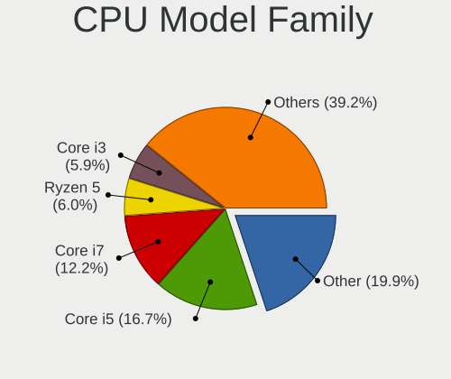

| Model                   | Computers | Percent |
|-------------------------|-----------|---------|
| Other                   | 1668      | 19.91%  |
| Intel Core i5           | 1396      | 16.67%  |
| Intel Core i7           | 1026      | 12.25%  |
| AMD Ryzen 5             | 504       | 6.02%   |
| Intel Core i3           | 497       | 5.93%   |
| Intel Xeon              | 484       | 5.78%   |
| Intel Celeron           | 483       | 5.77%   |
| AMD Ryzen 7             | 476       | 5.68%   |
| Intel Core 2 Duo        | 222       | 2.65%   |
| Intel Pentium           | 193       | 2.3%    |
| AMD Ryzen 9             | 191       | 2.28%   |
| Intel Atom              | 130       | 1.55%   |
| AMD Ryzen 3             | 81        | 0.97%   |
| AMD Ryzen 7 PRO         | 69        | 0.82%   |
| AMD Ryzen 5 PRO         | 68        | 0.81%   |
| AMD FX                  | 67        | 0.8%    |
| Intel Pentium Dual-Core | 62        | 0.74%   |
| Intel Core              | 55        | 0.66%   |
| Intel Core i9           | 40        | 0.48%   |
| Intel Core 2 Quad       | 40        | 0.48%   |
| Intel Core 2            | 37        | 0.44%   |
| Intel Pentium Silver    | 35        | 0.42%   |
| AMD A10                 | 27        | 0.32%   |
| Intel Xeon Gold         | 26        | 0.31%   |
| AMD A8                  | 25        | 0.3%    |
| AMD E                   | 24        | 0.29%   |
| AMD A4                  | 22        | 0.26%   |
| AMD EPYC                | 21        | 0.25%   |
| AMD A6                  | 21        | 0.25%   |
| AMD PRO A10             | 20        | 0.24%   |
| AMD Athlon 64 X2        | 20        | 0.24%   |
| AMD Athlon              | 19        | 0.23%   |
| Intel Pentium Gold      | 18        | 0.21%   |
| Intel Genuine           | 18        | 0.21%   |
| Intel Xeon Silver       | 17        | 0.2%    |
| AMD E1                  | 16        | 0.19%   |
| AMD GX                  | 15        | 0.18%   |
| Intel Pentium Dual      | 13        | 0.16%   |
| Intel Pentium 4         | 13        | 0.16%   |
| AMD E2                  | 13        | 0.16%   |

CPU Cores
---------

Number of processor cores

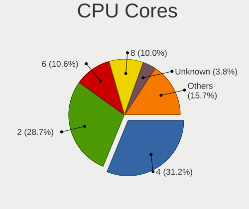

| Number  | Computers | Percent |
|---------|-----------|---------|
| 4       | 2619      | 31.22%  |
| 2       | 2407      | 28.69%  |
| 6       | 890       | 10.61%  |
| 8       | 836       | 9.96%   |
| Unknown | 318       | 3.79%   |
| 12      | 284       | 3.38%   |
| 10      | 261       | 3.11%   |
| 16      | 186       | 2.22%   |
| 14      | 169       | 2.01%   |
| 1       | 142       | 1.69%   |
| 24      | 73        | 0.87%   |
| 20      | 73        | 0.87%   |
| 3       | 33        | 0.39%   |
| 28      | 23        | 0.27%   |
| 32      | 18        | 0.21%   |
| 40      | 10        | 0.12%   |
| 36      | 9         | 0.11%   |
| 5       | 8         | 0.1%    |
| 48      | 7         | 0.08%   |
| 18      | 6         | 0.07%   |
| 44      | 3         | 0.04%   |
| 22      | 3         | 0.04%   |
| 256     | 2         | 0.02%   |
| 128     | 2         | 0.02%   |
| 64      | 2         | 0.02%   |
| 7       | 2         | 0.02%   |
| 112     | 1         | 0.01%   |
| 96      | 1         | 0.01%   |
| 56      | 1         | 0.01%   |
| 52      | 1         | 0.01%   |

CPU Sockets
-----------

Number of sockets

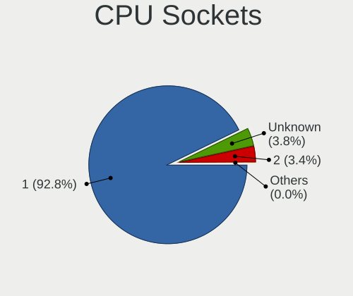

| Number  | Computers | Percent |
|---------|-----------|---------|
| 1       | 7766      | 92.77%  |
| Unknown | 317       | 3.79%   |
| 2       | 281       | 3.36%   |
| 4       | 4         | 0.05%   |
| 8       | 2         | 0.02%   |
| 14      | 1         | 0.01%   |

CPU Threads
-----------

Threads per core (Hyper-Threading)

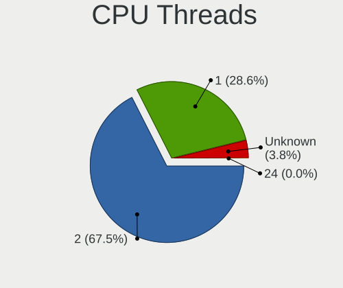

| Number  | Computers | Percent |
|---------|-----------|---------|
| 2       | 5657      | 67.51%  |
| 1       | 2400      | 28.64%  |
| Unknown | 318       | 3.8%    |
| 4       | 3         | 0.04%   |
| 24      | 1         | 0.01%   |

CPU Op-Modes
------------

CPU Operation Modes (32-bit, 64-bit)

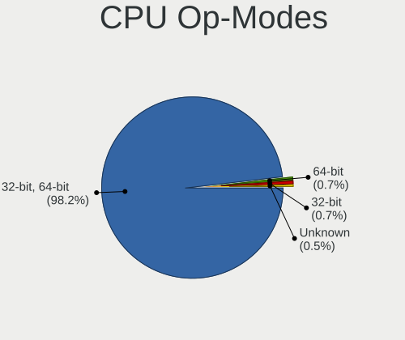

| Op mode        | Computers | Percent |
|----------------|-----------|---------|
| 32-bit, 64-bit | 8208      | 98.16%  |
| 64-bit         | 57        | 0.68%   |
| 32-bit         | 57        | 0.68%   |
| Unknown        | 40        | 0.48%   |

CPU Microcode
-------------

Microcode number

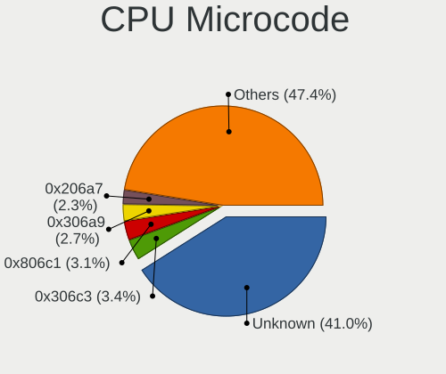

| Number     | Computers | Percent |
|------------|-----------|---------|
| Unknown    | 3497      | 41.01%  |
| 0x306c3    | 292       | 3.42%   |
| 0x806c1    | 264       | 3.1%    |
| 0x306a9    | 232       | 2.72%   |
| 0x206a7    | 197       | 2.31%   |
| 0x1067a    | 165       | 1.93%   |
| 0x506e3    | 143       | 1.68%   |
| 0x806ec    | 119       | 1.4%    |
| 0x806e9    | 108       | 1.27%   |
| 0x906ea    | 105       | 1.23%   |
| 0x906a4    | 103       | 1.21%   |
| 0x906a3    | 102       | 1.2%    |
| 0x806ea    | 102       | 1.2%    |
| 0x40651    | 102       | 1.2%    |
| 0x0a50000d | 99        | 1.16%   |
| 0x406e3    | 98        | 1.15%   |
| 0x906e9    | 86        | 1.01%   |
| 0x08108109 | 82        | 0.96%   |
| 0x406c4    | 80        | 0.94%   |
| 0x30678    | 73        | 0.86%   |
| 0xb06a2    | 67        | 0.79%   |
| 0x306d4    | 63        | 0.74%   |
| 0xb06a3    | 62        | 0.73%   |
| 0x906eb    | 61        | 0.72%   |
| 0x706a8    | 60        | 0.7%    |
| 0xb0671    | 56        | 0.66%   |
| 0x20655    | 52        | 0.61%   |
| 0x0a50000c | 52        | 0.61%   |
| 0xb06e0    | 50        | 0.59%   |
| 0xa0655    | 46        | 0.54%   |
| 0x0600611a | 46        | 0.54%   |
| 0x08608103 | 44        | 0.52%   |
| 0x08600106 | 43        | 0.5%    |
| 0x90672    | 42        | 0.49%   |
| 0x6fd      | 39        | 0.46%   |
| 0xa0653    | 37        | 0.43%   |
| 0x506c9    | 36        | 0.42%   |
| 0x0a50000f | 36        | 0.42%   |
| 0x0a601203 | 35        | 0.41%   |
| 0x906c0    | 34        | 0.4%    |

CPU Microarch
-------------

Microarchitecture

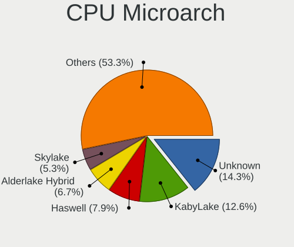

| Name              | Computers | Percent |
|-------------------|-----------|---------|
| Unknown           | 1202      | 14.29%  |
| KabyLake          | 1056      | 12.56%  |
| Haswell           | 665       | 7.91%   |
| Alderlake Hybrid  | 562       | 6.68%   |
| Skylake           | 445       | 5.29%   |
| IvyBridge         | 445       | 5.29%   |
| Zen 3             | 437       | 5.2%    |
| SandyBridge       | 359       | 4.27%   |
| TigerLake         | 355       | 4.22%   |
| Penryn            | 290       | 3.45%   |
| Silvermont        | 256       | 3.04%   |
| Zen 2             | 248       | 2.95%   |
| Broadwell         | 237       | 2.82%   |
| CometLake         | 191       | 2.27%   |
| Zen+              | 180       | 2.14%   |
| Westmere          | 149       | 1.77%   |
| Goldmont plus     | 141       | 1.68%   |
| Core              | 134       | 1.59%   |
| IceLake           | 125       | 1.49%   |
| Excavator         | 108       | 1.28%   |
| Zen               | 98        | 1.17%   |
| Gracemont         | 88        | 1.05%   |
| Piledriver        | 87        | 1.03%   |
| K10               | 69        | 0.82%   |
| Nehalem           | 67        | 0.8%    |
| Goldmont          | 57        | 0.68%   |
| Tremont           | 55        | 0.65%   |
| Bonnell           | 51        | 0.61%   |
| Bobcat            | 34        | 0.4%    |
| Jaguar            | 33        | 0.39%   |
| Puma              | 31        | 0.37%   |
| K8 Hammer         | 30        | 0.36%   |
| P6                | 29        | 0.34%   |
| Steamroller       | 22        | 0.26%   |
| NetBurst          | 20        | 0.24%   |
| Meteorlake Hybrid | 17        | 0.2%    |
| K10 Llano         | 11        | 0.13%   |
| Bulldozer         | 9         | 0.11%   |
| Sapphire Rapids   | 7         | 0.08%   |
| K8 & K10 hybrid   | 7         | 0.08%   |

Graphics
--------

GPU Vendor
----------

Vendors of graphics cards

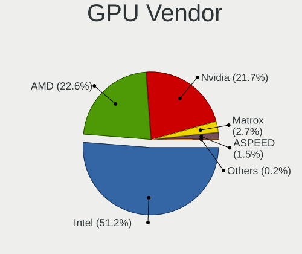

| Vendor                                       | Computers | Percent |
|----------------------------------------------|-----------|---------|
| Intel                                        | 4662      | 51.23%  |
| AMD                                          | 2060      | 22.64%  |
| Nvidia                                       | 1978      | 21.74%  |
| Matrox Electronics Systems                   | 246       | 2.7%    |
| ASPEED Technology                            | 133       | 1.46%   |
| VIA Technologies                             | 5         | 0.05%   |
| Red Hat                                      | 4         | 0.04%   |
| Silicon Integrated Systems [SiS]             | 3         | 0.03%   |
| Huawei Technologies                          | 3         | 0.03%   |
| XGI Technology (eXtreme Graphics Innovation) | 2         | 0.02%   |
| Zhaoxin                                      | 1         | 0.01%   |
| Silicon Motion                               | 1         | 0.01%   |
| S3 Graphics                                  | 1         | 0.01%   |
| Loongson Technology                          | 1         | 0.01%   |

GPU Model
---------

Graphics card models

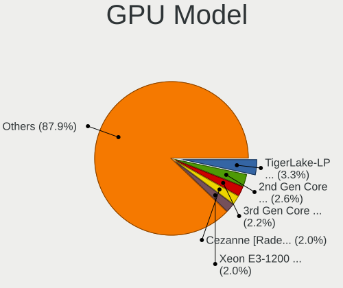

| Model                                                                                    | Computers | Percent |
|------------------------------------------------------------------------------------------|-----------|---------|
| Intel TigerLake-LP GT2 [Iris Xe Graphics]                                                | 309       | 3.31%   |
| Intel 2nd Generation Core Processor Family Integrated Graphics Controller                | 247       | 2.65%   |
| Intel 3rd Gen Core processor Graphics Controller                                         | 203       | 2.18%   |
| AMD Cezanne [Radeon Vega Series / Radeon Vega Mobile Series]                             | 188       | 2.02%   |
| Intel Xeon E3-1200 v3/4th Gen Core Processor Integrated Graphics Controller              | 185       | 1.98%   |
| Intel Kaby Lake-R GT2 [UHD Graphics 620]                                                 | 163       | 1.75%   |
| Intel CoffeeLake-S GT2 [UHD Graphics 630]                                                | 151       | 1.62%   |
| Intel Haswell-ULT Integrated Graphics Controller                                         | 150       | 1.61%   |
| Intel Raptor Lake-P [Iris Xe Graphics]                                                   | 139       | 1.49%   |
| Intel Kaby Lake-U GT2 [HD Graphics 620]                                                  | 138       | 1.48%   |
| Intel Skylake-U GT2 [HD Graphics 520]                                                    | 137       | 1.47%   |
| AMD Picasso/Raven 2 [Radeon Vega Series / Radeon Vega Mobile Series]                     | 134       | 1.44%   |
| ASPEED Technology ASPEED Graphics Family                                                 | 133       | 1.43%   |
| Intel Atom/Celeron/Pentium Processor x5-E8000/J3xxx/N3xxx Integrated Graphics Controller | 130       | 1.39%   |
| Intel Atom Processor Z36xxx/Z37xxx Series Graphics & Display                             | 124       | 1.33%   |
| Intel WhiskeyLake-U GT2 [UHD Graphics 620]                                               | 117       | 1.25%   |
| Intel Skylake-S GT2 [HD Graphics 530]                                                    | 116       | 1.24%   |
| Intel GeminiLake [UHD Graphics 600]                                                      | 116       | 1.24%   |
| AMD Lucienne                                                                             | 116       | 1.24%   |
| Intel Alder Lake-P GT2 [Iris Xe Graphics]                                                | 111       | 1.19%   |
| AMD Renoir [Radeon Vega Series / Radeon Vega Mobile Series]                              | 109       | 1.17%   |
| Intel Alder Lake-N [UHD Graphics]                                                        | 100       | 1.07%   |
| AMD Rembrandt [Radeon 680M]                                                              | 95        | 1.02%   |
| AMD Raphael                                                                              | 93        | 1%      |
| AMD Barcelo                                                                              | 93        | 1%      |
| Intel CometLake-U GT2 [UHD Graphics]                                                     | 89        | 0.95%   |
| Intel Alder Lake-UP3 GT2 [Iris Xe Graphics]                                              | 84        | 0.9%    |
| Intel CoffeeLake-H GT2 [UHD Graphics 630]                                                | 83        | 0.89%   |
| Intel 4th Gen Core Processor Integrated Graphics Controller                              | 80        | 0.86%   |
| AMD Ellesmere [Radeon RX 470/480/570/570X/580/580X/590]                                  | 75        | 0.8%    |
| Matrox Electronics Systems MGA G200EH                                                    | 74        | 0.79%   |
| Intel Core Processor Integrated Graphics Controller                                      | 73        | 0.78%   |
| AMD Wani [Radeon R5/R6/R7 Graphics]                                                      | 70        | 0.75%   |
| Matrox Electronics Systems G200eR2                                                       | 69        | 0.74%   |
| Intel Xeon E3-1200 v2/3rd Gen Core processor Graphics Controller                         | 68        | 0.73%   |
| AMD Phoenix1                                                                             | 65        | 0.7%    |
| Intel Mobile 4 Series Chipset Integrated Graphics Controller                             | 64        | 0.69%   |
| Intel JasperLake [UHD Graphics]                                                          | 63        | 0.68%   |
| Intel Kaby Lake-S GT2 [HD Graphics 630]                                                  | 62        | 0.66%   |
| Intel CometLake-S GT2 [UHD Graphics 630]                                                 | 61        | 0.65%   |

GPU Combo
---------

Combinations of graphics cards

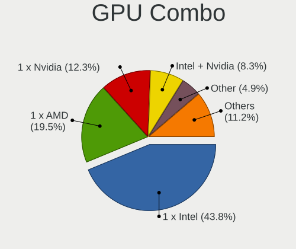

| Name                      | Computers | Percent |
|---------------------------|-----------|---------|
| 1 x Intel                 | 3675      | 43.76%  |
| 1 x AMD                   | 1641      | 19.54%  |
| 1 x Nvidia                | 1030      | 12.26%  |
| Intel + Nvidia            | 696       | 8.29%   |
| Other                     | 414       | 4.93%   |
| 1 x Matrox                | 203       | 2.42%   |
| AMD + Nvidia              | 170       | 2.02%   |
| Intel + AMD               | 129       | 1.54%   |
| 2 x Intel                 | 116       | 1.38%   |
| 2 x AMD                   | 105       | 1.25%   |
| 1 x ASPEED                | 95        | 1.13%   |
| Nvidia + Matrox           | 40        | 0.48%   |
| Nvidia + ASPEED           | 24        | 0.29%   |
| 2 x Nvidia                | 11        | 0.13%   |
| AMD + ASPEED              | 10        | 0.12%   |
| 1 x VIA                   | 5         | 0.06%   |
| 1 x Red Hat               | 4         | 0.05%   |
| 1 x SiS                   | 3         | 0.04%   |
| Intel + ASPEED            | 3         | 0.04%   |
| 1 x Huawei Technologies   | 3         | 0.04%   |
| 3 x AMD                   | 2         | 0.02%   |
| 2 x Nvidia + 1 x Matrox   | 2         | 0.02%   |
| 2 x Nvidia + 1 x ASPEED   | 2         | 0.02%   |
| 1 x XGI                   | 2         | 0.02%   |
| AMD + Matrox              | 2         | 0.02%   |
| 3 x Nvidia                | 1         | 0.01%   |
| 2 x Intel + 1 x Nvidia    | 1         | 0.01%   |
| 2 x AMD + 1 x Nvidia      | 1         | 0.01%   |
| 1 x Zhaoxin               | 1         | 0.01%   |
| 1 x Silicon Motion        | 1         | 0.01%   |
| 1 x S3 Graphics           | 1         | 0.01%   |
| 1 x Loongson Technology   | 1         | 0.01%   |
| 1 x Intel + 3 x Nvidia    | 1         | 0.01%   |
| Intel + Matrox            | 1         | 0.01%   |
| AMD + 2 x Nvidia          | 1         | 0.01%   |
| AMD + Nvidia + 1 x ASPEED | 1         | 0.01%   |

GPU Driver
----------

Free vs proprietary

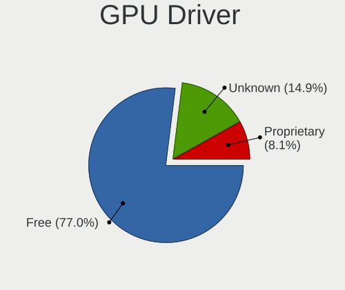

| Driver      | Computers | Percent |
|-------------|-----------|---------|
| Free        | 6491      | 76.96%  |
| Unknown     | 1259      | 14.93%  |
| Proprietary | 684       | 8.11%   |

GPU Memory
----------

Total video memory

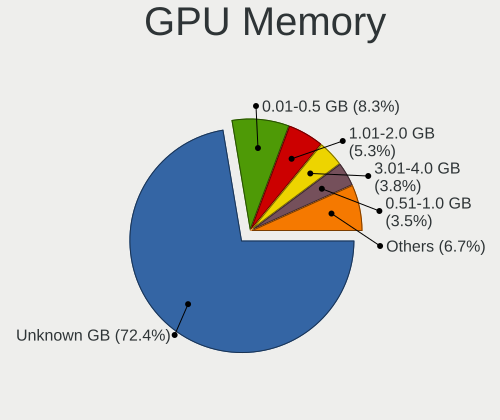

| Size in GB | Computers | Percent |
|------------|-----------|---------|
| Unknown    | 6118      | 72.36%  |
| 0.01-0.5   | 704       | 8.33%   |
| 1.01-2.0   | 445       | 5.26%   |
| 3.01-4.0   | 325       | 3.84%   |
| 0.51-1.0   | 295       | 3.49%   |
| 7.01-8.0   | 260       | 3.08%   |
| 5.01-6.0   | 114       | 1.35%   |
| 8.01-16.0  | 112       | 1.32%   |
| 2.01-3.0   | 37        | 0.44%   |
| 16.01-24.0 | 36        | 0.43%   |
| 4.01-5.0   | 5         | 0.06%   |
| 24.01-32.0 | 2         | 0.02%   |
| 32.01-64.0 | 1         | 0.01%   |
| 0          | 1         | 0.01%   |

Monitor
-------

Monitor Vendor
--------------

Monitor vendors

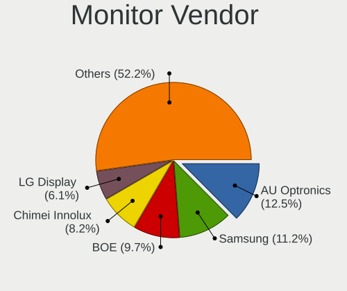

| Vendor                  | Computers | Percent |
|-------------------------|-----------|---------|
| AU Optronics            | 990       | 12.55%  |
| Samsung Electronics     | 883       | 11.19%  |
| BOE                     | 762       | 9.66%   |
| Chimei Innolux          | 649       | 8.23%   |
| LG Display              | 483       | 6.12%   |
| Dell                    | 471       | 5.97%   |
| Goldstar                | 387       | 4.91%   |
| Hewlett-Packard         | 278       | 3.52%   |
| Acer                    | 228       | 2.89%   |
| Philips                 | 219       | 2.78%   |
| AOC                     | 206       | 2.61%   |
| Apple                   | 182       | 2.31%   |
| BenQ                    | 171       | 2.17%   |
| Lenovo                  | 160       | 2.03%   |
| Ancor Communications    | 151       | 1.91%   |
| InfoVision              | 108       | 1.37%   |
| ASUSTek Computer        | 108       | 1.37%   |
| Sharp                   | 97        | 1.23%   |
| Iiyama                  | 82        | 1.04%   |
| ViewSonic               | 75        | 0.95%   |
| Chi Mei Optoelectronics | 72        | 0.91%   |
| PANDA                   | 69        | 0.87%   |
| MSI                     | 48        | 0.61%   |
| Sony                    | 45        | 0.57%   |
| Unknown                 | 41        | 0.52%   |
| CSO                     | 34        | 0.43%   |
| Unknown                 | 34        | 0.43%   |
| LG Philips              | 32        | 0.41%   |
| LG Electronics          | 32        | 0.41%   |
| Sceptre Tech            | 29        | 0.37%   |
| RTK                     | 29        | 0.37%   |
| NEC Computers           | 29        | 0.37%   |
| Eizo                    | 29        | 0.37%   |
| Toshiba                 | 27        | 0.34%   |
| Fujitsu Siemens         | 27        | 0.34%   |
| Gigabyte Technology     | 22        | 0.28%   |
| Mi                      | 21        | 0.27%   |
| Panasonic               | 20        | 0.25%   |
| HannStar                | 20        | 0.25%   |
| Vizio                   | 18        | 0.23%   |

Monitor Model
-------------

Monitor models

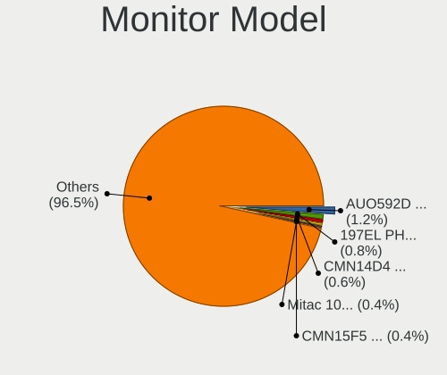

| Model                                                                 | Computers | Percent |
|-----------------------------------------------------------------------|-----------|---------|
| AU Optronics LCD Monitor AUO592D 1920x1080 293x165mm 13.2-inch        | 101       | 1.24%   |
| Philips 197EL PHLC08B 1366x768 410x230mm 18.5-inch                    | 69        | 0.85%   |
| Chimei Innolux LCD Monitor CMN14D4 1920x1080 309x173mm 13.9-inch      | 49        | 0.6%    |
| Unknown                                                               | 34        | 0.42%   |
| Chimei Innolux LCD Monitor CMN15F5 1920x1080 344x193mm 15.5-inch      | 30        | 0.37%   |
| Chimei Innolux LCD Monitor CMN15E7 1920x1080 344x193mm 15.5-inch      | 30        | 0.37%   |
| BOE LCD Monitor BOE0609 1366x768 256x144mm 11.6-inch                  | 30        | 0.37%   |
| Unknown LCD Monitor FFFF 2288x1287 2550x2550mm 142.0-inch             | 28        | 0.34%   |
| Goldstar FULL HD GSM5B55 1920x1080 480x270mm 21.7-inch                | 27        | 0.33%   |
| AU Optronics LCD Monitor AUO61ED 1920x1080 344x194mm 15.5-inch        | 26        | 0.32%   |
| AU Optronics LCD Monitor AUO106C 1366x768 276x155mm 12.5-inch         | 25        | 0.31%   |
| BOE LCD Monitor BOE06B3 1366x768 309x173mm 13.9-inch                  | 23        | 0.28%   |
| AU Optronics LCD Monitor AUO403D 1920x1080 309x174mm 14.0-inch        | 23        | 0.28%   |
| Ancor Communications ASUS VS229 ACI22D3 1920x1080 475x267mm 21.5-inch | 23        | 0.28%   |
| BOE LCD Monitor BOE0872 1920x1080 344x194mm 15.5-inch                 | 22        | 0.27%   |
| Chimei Innolux LCD Monitor CMN15DB 1366x768 344x193mm 15.5-inch       | 21        | 0.26%   |
| Chimei Innolux LCD Monitor CMN1132 1366x768 256x144mm 11.6-inch       | 21        | 0.26%   |
| InfoVision LCD Monitor IVO0489 1366x768 256x144mm 11.6-inch           | 19        | 0.23%   |
| Goldstar LG ULTRAWIDE GSM59F1 2560x1080 670x280mm 28.6-inch           | 19        | 0.23%   |
| Chimei Innolux LCD Monitor CMN1521 1920x1080 344x193mm 15.5-inch      | 18        | 0.22%   |
| AU Optronics LCD Monitor AUO26EC 1366x768 344x193mm 15.5-inch         | 18        | 0.22%   |
| Samsung Electronics C24F390 SAM0D2C 1920x1080 521x293mm 23.5-inch     | 17        | 0.21%   |
| Chimei Innolux LCD Monitor CMN14C9 1920x1080 309x173mm 13.9-inch      | 17        | 0.21%   |
| AOC 27G2G4 AOC2702 1920x1080 598x336mm 27.0-inch                      | 17        | 0.21%   |
| AU Optronics LCD Monitor AUO243D 1920x1080 309x173mm 13.9-inch        | 16        | 0.2%    |
| Chimei Innolux LCD Monitor CMN153B 1920x1080 344x193mm 15.5-inch      | 15        | 0.18%   |
| AU Optronics LCD Monitor AUO22EC 1366x768 344x193mm 15.5-inch         | 15        | 0.18%   |
| Samsung Electronics LCD Monitor SDC4171 2880x1800 302x189mm 14.0-inch | 14        | 0.17%   |
| BOE LCD Monitor BOE08D5 1920x1080 344x194mm 15.5-inch                 | 14        | 0.17%   |
| AU Optronics LCD Monitor AUO573D 1920x1080 309x174mm 14.0-inch        | 14        | 0.17%   |
| Samsung Electronics S24F350 SAM0D20 1920x1080 521x293mm 23.5-inch     | 13        | 0.16%   |
| PANDA LCD Monitor NCP004D 1920x1080 344x194mm 15.5-inch               | 13        | 0.16%   |
| BOE LCD Monitor BOE0BCA 2256x1504 285x190mm 13.5-inch                 | 13        | 0.16%   |
| AU Optronics LCD Monitor AUO38ED 1920x1080 344x193mm 15.5-inch        | 13        | 0.16%   |
| AU Optronics LCD Monitor AUO369F 1920x1080 344x194mm 15.5-inch        | 13        | 0.16%   |
| AU Optronics LCD Monitor AUO2E3C 1366x768 309x173mm 13.9-inch         | 13        | 0.16%   |
| AU Optronics LCD Monitor AUO21ED 1920x1080 344x193mm 15.5-inch        | 13        | 0.16%   |
| Samsung Electronics C27F390 SAM0D32 1920x1080 598x336mm 27.0-inch     | 12        | 0.15%   |
| Goldstar HDR 4K GSM7706 3840x2160 600x340mm 27.2-inch                 | 12        | 0.15%   |
| Chimei Innolux LCD Monitor CMN14D5 1920x1080 309x173mm 13.9-inch      | 12        | 0.15%   |

Monitor Resolution
------------------

Monitor screen resolution

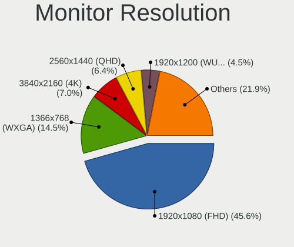

| Resolution         | Computers | Percent |
|--------------------|-----------|---------|
| 1920x1080 (FHD)    | 3454      | 45.64%  |
| 1366x768 (WXGA)    | 1101      | 14.55%  |
| 3840x2160 (4K)     | 532       | 7.03%   |
| 2560x1440 (QHD)    | 484       | 6.4%    |
| 1920x1200 (WUXGA)  | 342       | 4.52%   |
| 1600x900 (HD+)     | 205       | 2.71%   |
| 1280x1024 (SXGA)   | 175       | 2.31%   |
| 1440x900 (WXGA+)   | 148       | 1.96%   |
| 1680x1050 (WSXGA+) | 127       | 1.68%   |
| 1280x800 (WXGA)    | 121       | 1.6%    |
| 2560x1600          | 104       | 1.37%   |
| 3440x1440          | 88        | 1.16%   |
| 2880x1800          | 72        | 0.95%   |
| 2560x1080          | 71        | 0.94%   |
| Unknown            | 65        | 0.86%   |
| 1360x768           | 44        | 0.58%   |
| 3840x1080          | 34        | 0.45%   |
| 3840x2400          | 31        | 0.41%   |
| 2288x1287          | 31        | 0.41%   |
| 1024x768 (XGA)     | 31        | 0.41%   |
| 1024x600           | 28        | 0.37%   |
| 2256x1504          | 20        | 0.26%   |
| 2160x1440          | 18        | 0.24%   |
| 1600x1200          | 18        | 0.24%   |
| 1920x540           | 17        | 0.22%   |
| 2880x1920          | 14        | 0.18%   |
| 3200x1800 (QHD+)   | 12        | 0.16%   |
| 1400x1050          | 11        | 0.15%   |
| 3840x1600          | 10        | 0.13%   |
| 3200x2000          | 10        | 0.13%   |
| 1920x1280          | 10        | 0.13%   |
| 3000x2000          | 8         | 0.11%   |
| 2240x1400          | 8         | 0.11%   |
| 1280x720 (HD)      | 8         | 0.11%   |
| 3072x1920          | 7         | 0.09%   |
| 7680x2160          | 6         | 0.08%   |
| 2880x1620          | 6         | 0.08%   |
| 2736x1824          | 6         | 0.08%   |
| 2520x1680          | 6         | 0.08%   |
| 4480x1440          | 5         | 0.07%   |

Monitor Diagonal
----------------

Diagonal size in inches

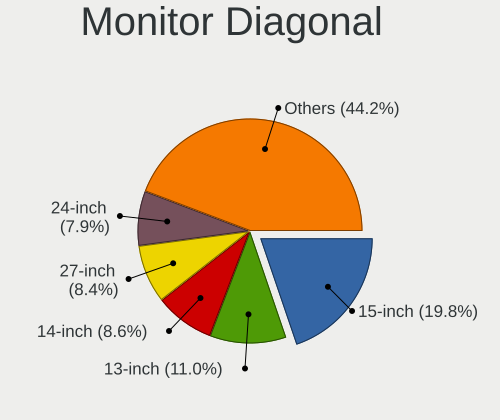

| Inches  | Computers | Percent |
|---------|-----------|---------|
| 15      | 1555      | 19.77%  |
| 13      | 868       | 11.04%  |
| 14      | 680       | 8.65%   |
| 27      | 663       | 8.43%   |
| 24      | 620       | 7.88%   |
| 23      | 475       | 6.04%   |
| 21      | 436       | 5.54%   |
| 17      | 331       | 4.21%   |
| Unknown | 235       | 2.99%   |
| 31      | 227       | 2.89%   |
| 18      | 194       | 2.47%   |
| 16      | 185       | 2.35%   |
| 19      | 178       | 2.26%   |
| 11      | 176       | 2.24%   |
| 12      | 147       | 1.87%   |
| 34      | 118       | 1.5%    |
| 20      | 85        | 1.08%   |
| 22      | 82        | 1.04%   |
| 84      | 64        | 0.81%   |
| 32      | 62        | 0.79%   |
| 25      | 40        | 0.51%   |
| 10      | 34        | 0.43%   |
| 40      | 32        | 0.41%   |
| 72      | 30        | 0.38%   |
| 54      | 29        | 0.37%   |
| 142     | 28        | 0.36%   |
| 26      | 24        | 0.31%   |
| 48      | 23        | 0.29%   |
| 28      | 23        | 0.29%   |
| 43      | 22        | 0.28%   |
| 46      | 16        | 0.2%    |
| 52      | 15        | 0.19%   |
| 29      | 15        | 0.19%   |
| 49      | 12        | 0.15%   |
| 65      | 11        | 0.14%   |
| 63      | 11        | 0.14%   |
| 42      | 11        | 0.14%   |
| 37      | 11        | 0.14%   |
| 33      | 10        | 0.13%   |
| 74      | 8         | 0.1%    |

Monitor Width
-------------

Physical width

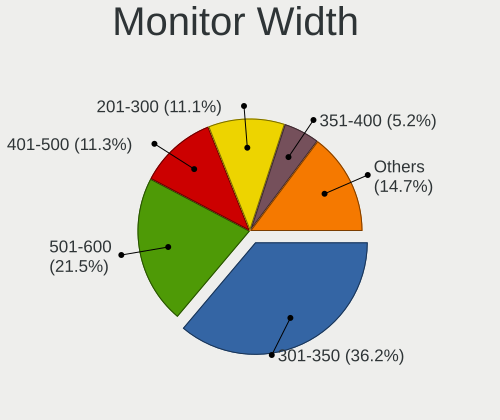

| Width in mm    | Computers | Percent |
|----------------|-----------|---------|
| 301-350        | 2798      | 36.15%  |
| 501-600        | 1667      | 21.54%  |
| 401-500        | 871       | 11.25%  |
| 201-300        | 857       | 11.07%  |
| 351-400        | 405       | 5.23%   |
| 601-700        | 318       | 4.11%   |
| Unknown        | 235       | 3.04%   |
| 701-800        | 191       | 2.47%   |
| 1001-1500      | 140       | 1.81%   |
| 1501-2000      | 115       | 1.49%   |
| 801-900        | 61        | 0.79%   |
| 901-1000       | 39        | 0.5%    |
| More than 2000 | 28        | 0.36%   |
| 101-200        | 13        | 0.17%   |
| 1-100          | 1         | 0.01%   |

Aspect Ratio
------------

Proportional relationship between the width and the height

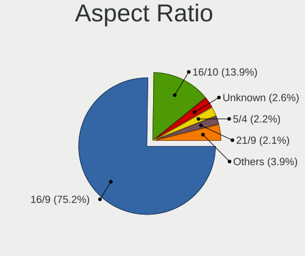

| Ratio   | Computers | Percent |
|---------|-----------|---------|
| 16/9    | 5396      | 75.25%  |
| 16/10   | 998       | 13.92%  |
| Unknown | 190       | 2.65%   |
| 5/4     | 160       | 2.23%   |
| 21/9    | 149       | 2.08%   |
| 3/2     | 102       | 1.42%   |
| 4/3     | 77        | 1.07%   |
| 1.00    | 30        | 0.42%   |
| 32/9    | 24        | 0.33%   |
| 6/5     | 13        | 0.18%   |
| 0.56    | 8         | 0.11%   |
| 2.65    | 3         | 0.04%   |
| 2.64    | 3         | 0.04%   |
| 1.96    | 3         | 0.04%   |
| 3.40    | 2         | 0.03%   |
| 3.20    | 2         | 0.03%   |
| 2.00    | 2         | 0.03%   |
| 0.89    | 2         | 0.03%   |
| 2.70    | 1         | 0.01%   |
| 2.07    | 1         | 0.01%   |
| 0.67    | 1         | 0.01%   |
| 0.63    | 1         | 0.01%   |
| 0.58    | 1         | 0.01%   |
| 0.45    | 1         | 0.01%   |
| 0.25    | 1         | 0.01%   |

Monitor Area
------------

Area in inch²

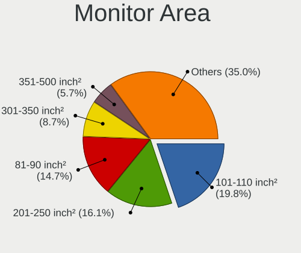

| Area in inch² | Computers | Percent |
|----------------|-----------|---------|
| 101-110        | 1545      | 19.82%  |
| 201-250        | 1254      | 16.09%  |
| 81-90          | 1147      | 14.71%  |
| 301-350        | 676       | 8.67%   |
| 351-500        | 443       | 5.68%   |
| 71-80          | 384       | 4.93%   |
| 151-200        | 380       | 4.87%   |
| 251-300        | 265       | 3.4%    |
| 141-150        | 253       | 3.25%   |
| More than 1000 | 239       | 3.07%   |
| Unknown        | 235       | 3.01%   |
| 121-130        | 214       | 2.75%   |
| 51-60          | 179       | 2.3%    |
| 111-120        | 178       | 2.28%   |
| 61-70          | 139       | 1.78%   |
| 501-1000       | 139       | 1.78%   |
| 131-140        | 46        | 0.59%   |
| 41-50          | 33        | 0.42%   |
| 91-100         | 32        | 0.41%   |
| 1-40           | 14        | 0.18%   |

Pixel Density
-------------

Pixels per inch

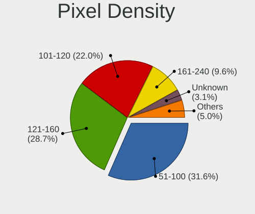

| Density       | Computers | Percent |
|---------------|-----------|---------|
| 51-100        | 2412      | 31.57%  |
| 121-160       | 2194      | 28.72%  |
| 101-120       | 1680      | 21.99%  |
| 161-240       | 735       | 9.62%   |
| Unknown       | 235       | 3.08%   |
| 1-50          | 204       | 2.67%   |
| More than 240 | 179       | 2.34%   |

Multiple Monitors
-----------------

Total monitors connected

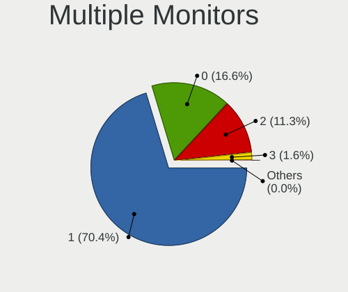

| Total | Computers | Percent |
|-------|-----------|---------|
| 1     | 5996      | 70.36%  |
| 0     | 1412      | 16.57%  |
| 2     | 966       | 11.34%  |
| 3     | 136       | 1.6%    |
| 4     | 11        | 0.13%   |
| 5     | 1         | 0.01%   |

Network
-------

Net Controller Vendor
---------------------

Controller vendors

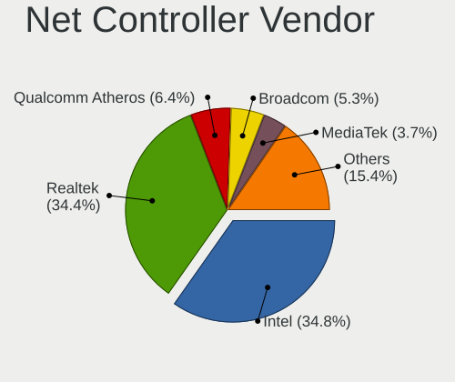

| Vendor                            | Computers | Percent |
|-----------------------------------|-----------|---------|
| Intel                             | 4210      | 34.76%  |
| Realtek Semiconductor             | 4165      | 34.39%  |
| Qualcomm Atheros                  | 772       | 6.37%   |
| Broadcom                          | 646       | 5.33%   |
| MediaTek                          | 451       | 3.72%   |
| TP-Link                           | 142       | 1.17%   |
| Broadcom Limited                  | 141       | 1.16%   |
| Raspberry Pi                      | 117       | 0.97%   |
| Ralink Technology                 | 110       | 0.91%   |
| Marvell Technology Group          | 109       | 0.9%    |
| ASIX Electronics                  | 109       | 0.9%    |
| Nvidia                            | 83        | 0.69%   |
| Qualcomm                          | 69        | 0.57%   |
| Samsung Electronics               | 63        | 0.52%   |
| Ralink                            | 48        | 0.4%    |
| Mellanox Technologies             | 48        | 0.4%    |
| Aquantia                          | 47        | 0.39%   |
| Xiaomi                            | 43        | 0.36%   |
| Dell                              | 37        | 0.31%   |
| Microchip Technology              | 34        | 0.28%   |
| QinHeng Electronics               | 33        | 0.27%   |
| Sierra Wireless                   | 31        | 0.26%   |
| Lenovo                            | 29        | 0.24%   |
| NetGear                           | 25        | 0.21%   |
| ASUSTek Computer                  | 25        | 0.21%   |
| Hewlett-Packard                   | 23        | 0.19%   |
| DisplayLink                       | 23        | 0.19%   |
| D-Link                            | 23        | 0.19%   |
| Ericsson Business Mobile Networks | 22        | 0.18%   |
| American Megatrends               | 22        | 0.18%   |
| Google                            | 21        | 0.17%   |
| Shenzhen Goodix Technology        | 20        | 0.17%   |
| Microsoft                         | 20        | 0.17%   |
| Motorola PCS                      | 16        | 0.13%   |
| JMicron Technology                | 16        | 0.13%   |
| Qualcomm Technologies             | 15        | 0.12%   |
| Linksys                           | 14        | 0.12%   |
| Insyde Software                   | 14        | 0.12%   |
| Fibocom                           | 14        | 0.12%   |
| Qualcomm Atheros Communications   | 13        | 0.11%   |

Net Controller Model
--------------------

Controller models

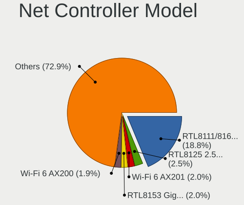

| Model                                                                  | Computers | Percent |
|------------------------------------------------------------------------|-----------|---------|
| Realtek RTL8111/8168/8211/8411 PCI Express Gigabit Ethernet Controller | 2709      | 18.75%  |
| Realtek RTL8125 2.5GbE Controller                                      | 361       | 2.5%    |
| Intel Wi-Fi 6 AX201                                                    | 293       | 2.03%   |
| Realtek RTL8153 Gigabit Ethernet Adapter                               | 287       | 1.99%   |
| Intel Wi-Fi 6 AX200                                                    | 270       | 1.87%   |
| Realtek RTL810xE PCI Express Fast Ethernet controller                  | 267       | 1.85%   |
| Intel Wireless 8265 / 8275                                             | 250       | 1.73%   |
| Intel 82579LM Gigabit Network Connection (Lewisville)                  | 230       | 1.59%   |
| Intel Alder Lake-P PCH CNVi WiFi                                       | 201       | 1.39%   |
| Realtek RTL8821CE 802.11ac PCIe Wireless Network Adapter               | 193       | 1.34%   |
| Intel Wireless 7265                                                    | 182       | 1.26%   |
| Intel Ethernet Controller I225-V                                       | 174       | 1.2%    |
| MediaTek MT7922 802.11ax PCI Express Wireless Network Adapter          | 159       | 1.1%    |
| Intel Wi-Fi 6E(802.11ax) AX210/AX1675* 2x2 [Typhoon Peak]              | 155       | 1.07%   |
| Realtek RTL8852BE PCIe 802.11ax Wireless Network Controller            | 148       | 1.02%   |
| MediaTek MT7921 802.11ax PCIe Wireless Network Adapter [Filogic 330]   | 140       | 0.97%   |
| Intel Wireless 7260                                                    | 139       | 0.96%   |
| Intel Ethernet Connection (13) I219-V                                  | 131       | 0.91%   |
| Qualcomm Atheros QCA9377 802.11ac Wireless Network Adapter             | 128       | 0.89%   |
| Intel Raptor Lake PCH CNVi WiFi                                        | 123       | 0.85%   |
| Realtek RTL8822CE 802.11ac PCIe Wireless Network Adapter               | 122       | 0.84%   |
| Intel I211 Gigabit Network Connection                                  | 121       | 0.84%   |
| Intel Ethernet Connection I217-LM                                      | 121       | 0.84%   |
| Intel Ethernet Controller I226-V                                       | 118       | 0.82%   |
| Raspberry Pi RP1 PCIe 2.0 South Bridge                                 | 116       | 0.8%    |
| Intel Wireless 8260                                                    | 113       | 0.78%   |
| Intel I210 Gigabit Network Connection                                  | 104       | 0.72%   |
| Intel Cannon Lake PCH CNVi WiFi                                        | 101       | 0.7%    |
| ASIX AX88179 Gigabit Ethernet                                          | 101       | 0.7%    |
| Intel Ethernet Connection (4) I219-LM                                  | 100       | 0.69%   |
| Intel I350 Gigabit Network Connection                                  | 98        | 0.68%   |
| Intel Ethernet Connection (2) I219-V                                   | 98        | 0.68%   |
| Qualcomm Atheros QCA6174 802.11ac Wireless Network Adapter             | 89        | 0.62%   |
| Intel Comet Lake PCH-LP CNVi WiFi                                      | 89        | 0.62%   |
| Realtek 802.11ac NIC                                                   | 88        | 0.61%   |
| Qualcomm Atheros AR9485 Wireless Network Adapter                       | 88        | 0.61%   |
| Intel Cannon Point-LP CNVi [Wireless-AC]                               | 82        | 0.57%   |
| Qualcomm Atheros QCA9565 / AR9565 Wireless Network Adapter             | 77        | 0.53%   |
| Intel Ethernet Connection (4) I219-V                                   | 74        | 0.51%   |
| Intel Ethernet Connection (2) I219-LM                                  | 74        | 0.51%   |

Wireless Vendor
---------------

Wireless vendors

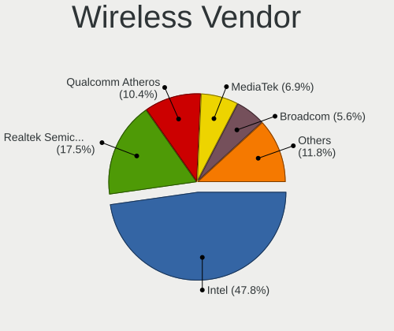

| Vendor                            | Computers | Percent |
|-----------------------------------|-----------|---------|
| Intel                             | 2811      | 47.76%  |
| Realtek Semiconductor             | 1030      | 17.5%   |
| Qualcomm Atheros                  | 615       | 10.45%  |
| MediaTek                          | 406       | 6.9%    |
| Broadcom                          | 329       | 5.59%   |
| TP-Link                           | 125       | 2.12%   |
| Ralink Technology                 | 110       | 1.87%   |
| Broadcom Limited                  | 102       | 1.73%   |
| Qualcomm                          | 52        | 0.88%   |
| Ralink                            | 48        | 0.82%   |
| Sierra Wireless                   | 31        | 0.53%   |
| NetGear                           | 25        | 0.42%   |
| ASUSTek Computer                  | 25        | 0.42%   |
| D-Link                            | 22        | 0.37%   |
| Marvell Technology Group          | 19        | 0.32%   |
| Microsoft                         | 15        | 0.25%   |
| Fibocom                           | 14        | 0.24%   |
| Qualcomm Atheros Communications   | 13        | 0.22%   |
| Dell                              | 13        | 0.22%   |
| Linksys                           | 12        | 0.2%    |
| Edimax Technology                 | 12        | 0.2%    |
| Qualcomm Technologies             | 7         | 0.12%   |
| AVM                               | 7         | 0.12%   |
| Hewlett-Packard                   | 5         | 0.08%   |
| Sitecom Europe                    | 4         | 0.07%   |
| D-Link System                     | 4         | 0.07%   |
| ZyDAS                             | 3         | 0.05%   |
| Realtek                           | 3         | 0.05%   |
| Quectel Wireless Solutions        | 3         | 0.05%   |
| Mercucys                          | 3         | 0.05%   |
| Belkin Components                 | 3         | 0.05%   |
| ZTopInc                           | 2         | 0.03%   |
| Wacom                             | 2         | 0.03%   |
| IMC Networks                      | 2         | 0.03%   |
| Ericsson Business Mobile Networks | 2         | 0.03%   |
| ZyXEL Communications              | 1         | 0.02%   |
| Zinwell                           | 1         | 0.02%   |
| Samsung Electronics               | 1         | 0.02%   |
| Elecom                            | 1         | 0.02%   |
| CyberTAN Technology               | 1         | 0.02%   |

Wireless Model
--------------

Wireless models

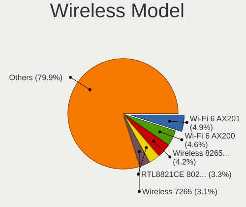

| Model                                                                | Computers | Percent |
|----------------------------------------------------------------------|-----------|---------|
| Intel Wi-Fi 6 AX201                                                  | 293       | 4.95%   |
| Intel Wi-Fi 6 AX200                                                  | 270       | 4.56%   |
| Intel Wireless 8265 / 8275                                           | 250       | 4.22%   |
| Realtek RTL8821CE 802.11ac PCIe Wireless Network Adapter             | 193       | 3.26%   |
| Intel Wireless 7265                                                  | 182       | 3.07%   |
| Intel Wi-Fi 6E(802.11ax) AX210/AX1675* 2x2 [Typhoon Peak]            | 155       | 2.62%   |
| MediaTek MT7921 802.11ax PCIe Wireless Network Adapter [Filogic 330] | 140       | 2.36%   |
| Intel Wireless 7260                                                  | 139       | 2.35%   |
| MediaTek MT7922 802.11ax PCI Express Wireless Network Adapter        | 135       | 2.28%   |
| Qualcomm Atheros QCA9377 802.11ac Wireless Network Adapter           | 128       | 2.16%   |
| Intel Alder Lake-P PCH CNVi WiFi                                     | 125       | 2.11%   |
| Realtek RTL8822CE 802.11ac PCIe Wireless Network Adapter             | 122       | 2.06%   |
| Intel Raptor Lake PCH CNVi WiFi                                      | 120       | 2.03%   |
| Intel Wireless 8260                                                  | 113       | 1.91%   |
| Realtek RTL8852BE PCIe 802.11ax Wireless Network Controller          | 105       | 1.77%   |
| Intel Cannon Lake PCH CNVi WiFi                                      | 101       | 1.71%   |
| Qualcomm Atheros QCA6174 802.11ac Wireless Network Adapter           | 89        | 1.5%    |
| Intel Comet Lake PCH-LP CNVi WiFi                                    | 89        | 1.5%    |
| Realtek 802.11ac NIC                                                 | 88        | 1.49%   |
| Qualcomm Atheros AR9485 Wireless Network Adapter                     | 88        | 1.49%   |
| Intel Cannon Point-LP CNVi [Wireless-AC]                             | 82        | 1.38%   |
| Qualcomm Atheros QCA9565 / AR9565 Wireless Network Adapter           | 77        | 1.3%    |
| Intel Centrino Advanced-N 6205 [Taylor Peak]                         | 74        | 1.25%   |
| Intel Dual Band Wireless-AC 3168NGW [Stone Peak]                     | 70        | 1.18%   |
| Intel 700 Series Chipset CNVi WiFi                                   | 63        | 1.06%   |
| Qualcomm Atheros AR9285 Wireless Network Adapter (PCI-Express)       | 61        | 1.03%   |
| MediaTek MT7902 802.11ax PCIe Wireless Network Adapter [Filogic 310] | 57        | 0.96%   |
| Intel Wireless 3165                                                  | 54        | 0.91%   |
| Broadcom BCM4313 802.11bgn Wireless Network Adapter                  | 53        | 0.89%   |
| Qualcomm Atheros AR9462 Wireless Network Adapter                     | 52        | 0.88%   |
| Intel Wi-Fi 5(802.11ac) Wireless-AC 9x6x [Thunder Peak]              | 52        | 0.88%   |
| Qualcomm QCNFA765 Wireless Network Adapter                           | 51        | 0.86%   |
| MediaTek MT7921K (RZ608) Wi-Fi 6E 80MHz                              | 51        | 0.86%   |
| Intel Comet Lake PCH CNVi WiFi                                       | 51        | 0.86%   |
| Broadcom Limited BCM4360 802.11ac Dual Band Wireless Network Adapter | 48        | 0.81%   |
| Ralink MT7601U Wireless Adapter                                      | 46        | 0.78%   |
| Intel Gemini Lake PCH CNVi WiFi                                      | 45        | 0.76%   |
| Realtek RTL88x2bu [AC1200 Techkey]                                   | 41        | 0.69%   |
| Realtek RTL8723BE PCIe Wireless Network Adapter                      | 41        | 0.69%   |
| Realtek RTL8852AE 802.11ax PCIe Wireless Network Adapter             | 40        | 0.68%   |

Ethernet Vendor
---------------

Ethernet vendors

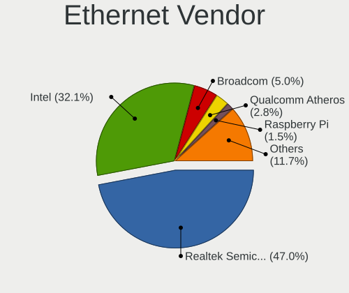

| Vendor                                 | Computers | Percent |
|----------------------------------------|-----------|---------|
| Realtek Semiconductor                  | 3707      | 47%     |
| Intel                                  | 2533      | 32.12%  |
| Broadcom                               | 391       | 4.96%   |
| Qualcomm Atheros                       | 221       | 2.8%    |
| Raspberry Pi                           | 116       | 1.47%   |
| ASIX Electronics                       | 109       | 1.38%   |
| Marvell Technology Group               | 90        | 1.14%   |
| Nvidia                                 | 83        | 1.05%   |
| Samsung Electronics                    | 61        | 0.77%   |
| Aquantia                               | 47        | 0.6%    |
| Mellanox Technologies                  | 45        | 0.57%   |
| Xiaomi                                 | 43        | 0.55%   |
| MediaTek                               | 42        | 0.53%   |
| Broadcom Limited                       | 39        | 0.49%   |
| Microchip Technology                   | 30        | 0.38%   |
| Lenovo                                 | 29        | 0.37%   |
| DisplayLink                            | 23        | 0.29%   |
| American Megatrends                    | 22        | 0.28%   |
| Google                                 | 20        | 0.25%   |
| Dell                                   | 18        | 0.23%   |
| TP-Link                                | 17        | 0.22%   |
| Motorola PCS                           | 16        | 0.2%    |
| JMicron Technology                     | 16        | 0.2%    |
| Qualcomm                               | 15        | 0.19%   |
| Insyde Software                        | 14        | 0.18%   |
| Hewlett-Packard                        | 14        | 0.18%   |
| VIA Technologies                       | 9         | 0.11%   |
| OPPO Electronics                       | 9         | 0.11%   |
| Suzhou Motorcomm Electronic Technology | 8         | 0.1%    |
| Qualcomm Technologies                  | 8         | 0.1%    |
| Silicon Integrated Systems [SiS]       | 7         | 0.09%   |
| Huawei Technologies                    | 7         | 0.09%   |
| Attansic Technology                    | 7         | 0.09%   |
| ICS Advent                             | 6         | 0.08%   |
| Emulex                                 | 6         | 0.08%   |
| 3Com                                   | 6         | 0.08%   |
| QinHeng Electronics                    | 5         | 0.06%   |
| Microsoft                              | 5         | 0.06%   |
| D-Link System                          | 5         | 0.06%   |
| ADMtek                                 | 5         | 0.06%   |

Ethernet Model
--------------

Ethernet models

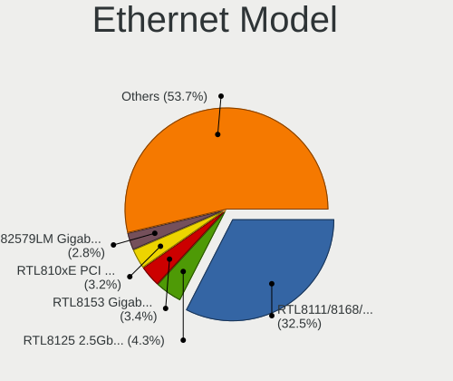

| Model                                                                  | Computers | Percent |
|------------------------------------------------------------------------|-----------|---------|
| Realtek RTL8111/8168/8211/8411 PCI Express Gigabit Ethernet Controller | 2709      | 32.54%  |
| Realtek RTL8125 2.5GbE Controller                                      | 361       | 4.34%   |
| Realtek RTL8153 Gigabit Ethernet Adapter                               | 287       | 3.45%   |
| Realtek RTL810xE PCI Express Fast Ethernet controller                  | 267       | 3.21%   |
| Intel 82579LM Gigabit Network Connection (Lewisville)                  | 230       | 2.76%   |
| Intel Ethernet Controller I225-V                                       | 174       | 2.09%   |
| Intel Ethernet Connection (13) I219-V                                  | 131       | 1.57%   |
| Intel I211 Gigabit Network Connection                                  | 121       | 1.45%   |
| Intel Ethernet Connection I217-LM                                      | 121       | 1.45%   |
| Intel Ethernet Controller I226-V                                       | 118       | 1.42%   |
| Raspberry Pi RP1 PCIe 2.0 South Bridge                                 | 116       | 1.39%   |
| Intel I210 Gigabit Network Connection                                  | 104       | 1.25%   |
| ASIX AX88179 Gigabit Ethernet                                          | 101       | 1.21%   |
| Intel Ethernet Connection (4) I219-LM                                  | 100       | 1.2%    |
| Intel I350 Gigabit Network Connection                                  | 98        | 1.18%   |
| Intel Ethernet Connection (2) I219-V                                   | 98        | 1.18%   |
| Intel Alder Lake-P PCH CNVi WiFi                                       | 76        | 0.91%   |
| Intel Ethernet Connection (4) I219-V                                   | 74        | 0.89%   |
| Intel Ethernet Connection (2) I219-LM                                  | 74        | 0.89%   |
| Broadcom NetXtreme BCM5719 Gigabit Ethernet PCIe                       | 72        | 0.86%   |
| Realtek RTL8152 Fast Ethernet Adapter                                  | 57        | 0.68%   |
| Intel Ethernet Connection I217-V                                       | 57        | 0.68%   |
| Intel Ethernet Connection (7) I219-LM                                  | 57        | 0.68%   |
| Intel Ethernet Connection I219-LM                                      | 56        | 0.67%   |
| Broadcom NetXtreme BCM5720 Gigabit Ethernet PCIe                       | 53        | 0.64%   |
| Intel 82574L Gigabit Network Connection                                | 46        | 0.55%   |
| Intel Ethernet Connection I218-LM                                      | 45        | 0.54%   |
| Intel Ethernet Connection (5) I219-LM                                  | 45        | 0.54%   |
| Broadcom NetXtreme BCM57766 Gigabit Ethernet PCIe                      | 45        | 0.54%   |
| Intel Ethernet Connection (7) I219-V                                   | 44        | 0.53%   |
| Realtek RTL8852BE PCIe 802.11ax Wireless Network Controller            | 43        | 0.52%   |
| Intel 82599ES 10-Gigabit SFI/SFP+ Network Connection                   | 42        | 0.5%    |
| Intel 82579V Gigabit Network Connection                                | 42        | 0.5%    |
| Samsung Galaxy series, misc. (tethering mode)                          | 40        | 0.48%   |
| Qualcomm Atheros AR8151 v2.0 Gigabit Ethernet                          | 38        | 0.46%   |
| Intel Ethernet Connection (6) I219-V                                   | 35        | 0.42%   |
| Intel Ethernet Connection (16) I219-V                                  | 34        | 0.41%   |
| Xiaomi Mi/Redmi series (RNDIS)                                         | 33        | 0.4%    |
| Nvidia MCP79 Ethernet                                                  | 33        | 0.4%    |
| Intel Ethernet Connection (6) I219-LM                                  | 33        | 0.4%    |

Net Controller Kind
-------------------

Ethernet, WiFi or modem

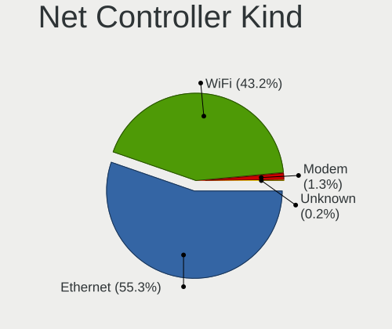

| Kind     | Computers | Percent |
|----------|-----------|---------|
| Ethernet | 7100      | 55.3%   |
| WiFi     | 5548      | 43.22%  |
| Modem    | 166       | 1.29%   |
| Unknown  | 24        | 0.19%   |

Used Controller
---------------

Currently used network controller

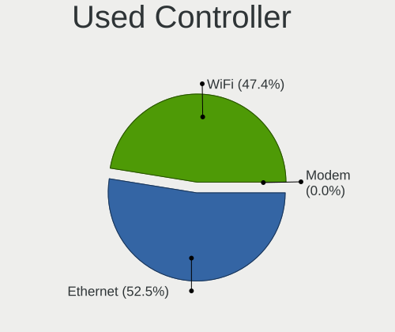

| Kind     | Computers | Percent |
|----------|-----------|---------|
| Ethernet | 4275      | 52.54%  |
| WiFi     | 3860      | 47.44%  |
| Modem    | 1         | 0.01%   |

NICs
----

Total network controllers on board

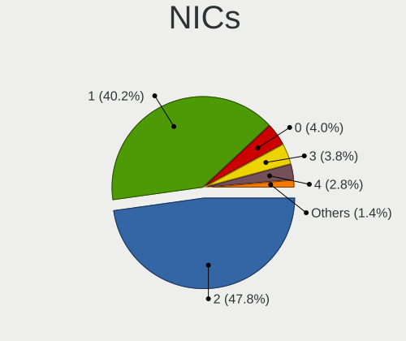

| Total | Computers | Percent |
|-------|-----------|---------|
| 2     | 4014      | 47.79%  |
| 1     | 3380      | 40.24%  |
| 0     | 340       | 4.05%   |
| 3     | 315       | 3.75%   |
| 4     | 235       | 2.8%    |
| 6     | 52        | 0.62%   |
| 5     | 27        | 0.32%   |
| 8     | 17        | 0.2%    |
| 7     | 10        | 0.12%   |
| 9     | 4         | 0.05%   |
| 12    | 2         | 0.02%   |
| 10    | 2         | 0.02%   |
| 22    | 1         | 0.01%   |

IPv6
----

IPv6 vs IPv4

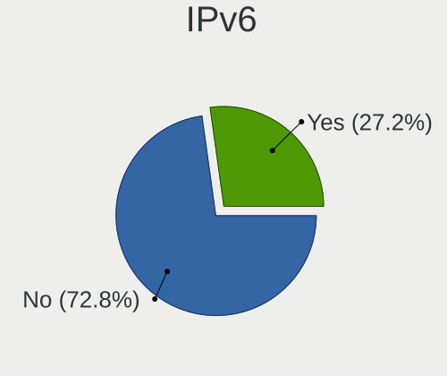

| Used | Computers | Percent |
|------|-----------|---------|
| No   | 6163      | 72.8%   |
| Yes  | 2303      | 27.2%   |

Bluetooth
---------

Bluetooth Vendor
----------------

Controller vendors

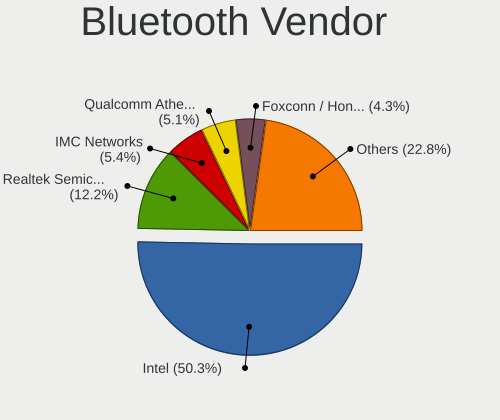

| Vendor                          | Computers | Percent |
|---------------------------------|-----------|---------|
| Intel                           | 2515      | 50.3%   |
| Realtek Semiconductor           | 608       | 12.16%  |
| IMC Networks                    | 272       | 5.44%   |
| Qualcomm Atheros Communications | 253       | 5.06%   |
| Foxconn / Hon Hai               | 214       | 4.28%   |
| Apple                           | 202       | 4.04%   |
| Cambridge Silicon Radio         | 171       | 3.42%   |
| Broadcom                        | 155       | 3.1%    |
| MediaTek                        | 129       | 2.58%   |
| Lite-On Technology              | 103       | 2.06%   |
| ASUSTek Computer                | 69        | 1.38%   |
| Hewlett-Packard                 | 42        | 0.84%   |
| TP-Link                         | 41        | 0.82%   |
| Dell                            | 39        | 0.78%   |
| Realtek                         | 33        | 0.66%   |
| USI                             | 29        | 0.58%   |
| Toshiba                         | 15        | 0.3%    |
| Ralink                          | 12        | 0.24%   |
| Marvell Semiconductor           | 12        | 0.24%   |
| Edimax Technology               | 11        | 0.22%   |
| Unknown                         | 9         | 0.18%   |
| Integrated System Solution      | 8         | 0.16%   |
| Alps Electric                   | 8         | 0.16%   |
| Actions                         | 8         | 0.16%   |
| Foxconn International           | 7         | 0.14%   |
| Ralink Technology               | 4         | 0.08%   |
| Qcom                            | 3         | 0.06%   |
| Fujitsu                         | 3         | 0.06%   |
| Dynex                           | 3         | 0.06%   |
| Opticis                         | 2         | 0.04%   |
| Micro Star International        | 2         | 0.04%   |
| HTC (High Tech Computer)        | 2         | 0.04%   |
| Conwise Technology              | 2         | 0.04%   |
| Chicony Electronics             | 2         | 0.04%   |
| Belkin Components               | 2         | 0.04%   |
| Askey Computer                  | 2         | 0.04%   |
| Taiyo Yuden                     | 1         | 0.02%   |
| SINO WEALTH                     | 1         | 0.02%   |
| Roper                           | 1         | 0.02%   |
| Mobile Action Technology        | 1         | 0.02%   |

Bluetooth Model
---------------

Controller models

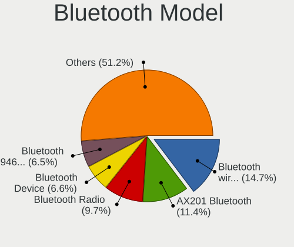

| Model                                               | Computers | Percent |
|-----------------------------------------------------|-----------|---------|
| Intel Bluetooth wireless interface                  | 734       | 14.67%  |
| Intel AX201 Bluetooth                               | 569       | 11.37%  |
| Realtek Bluetooth Radio                             | 484       | 9.67%   |
| Intel Bluetooth Device                              | 330       | 6.59%   |
| Intel Bluetooth 9460/9560 Jefferson Peak (JfP)      | 323       | 6.45%   |
| Intel AX200 Bluetooth                               | 253       | 5.06%   |
| Cambridge Silicon Radio Bluetooth Dongle (HCI mode) | 171       | 3.42%   |
| Intel AX210 Bluetooth                               | 140       | 2.8%    |
| IMC Networks Wireless_Device                        | 132       | 2.64%   |
| MediaTek Wireless_Device                            | 129       | 2.58%   |
| Qualcomm Atheros  Bluetooth Device                  | 128       | 2.56%   |
| Apple Bluetooth Host Controller                     | 94        | 1.88%   |
| IMC Networks Bluetooth Radio                        | 86        | 1.72%   |
| Foxconn / Hon Hai Wireless_Device                   | 81        | 1.62%   |
| Realtek  Bluetooth 4.2 Adapter                      | 68        | 1.36%   |
| Intel Wireless-AC 3168 Bluetooth                    | 65        | 1.3%    |
| Foxconn / Hon Hai Bluetooth Device                  | 56        | 1.12%   |
| Apple Bluetooth USB Host Controller                 | 55        | 1.1%    |
| Intel Wireless-AC 9260 Bluetooth Adapter            | 52        | 1.04%   |
| Qualcomm Atheros AR3012 Bluetooth 4.0               | 47        | 0.94%   |
| TP-Link TP-T@- UB500 Adapter                        | 41        | 0.82%   |
| Foxconn / Hon Hai MediaTek Bluetooth Adapter        | 38        | 0.76%   |
| Qualcomm Atheros QCA61x4 Bluetooth 4.0              | 36        | 0.72%   |
| Lite-On Wireless_Device                             | 36        | 0.72%   |
| Apple Built-in Bluetooth 2.0+EDR HCI                | 36        | 0.72%   |
| Intel Centrino Bluetooth Wireless Transceiver       | 34        | 0.68%   |
| Realtek Bluetooth Radio                             | 33        | 0.66%   |
| IMC Networks Bluetooth Device                       | 31        | 0.62%   |
| ASUS ASUS USB-BT500                                 | 31        | 0.62%   |
| USI Bluetooth Device                                | 29        | 0.58%   |
| Broadcom BCM2045B (BDC-2.1)                         | 29        | 0.58%   |
| Lite-On Qualcomm Atheros QCA9377 Bluetooth          | 26        | 0.52%   |
| HP Broadcom 2070 Bluetooth Combo                    | 25        | 0.5%    |
| Broadcom BCM20702 Bluetooth 4.0 [ThinkPad]          | 23        | 0.46%   |
| Lite-On Bluetooth Device                            | 22        | 0.44%   |
| ASUS Broadcom BCM20702A0 Bluetooth                  | 19        | 0.38%   |
| Realtek Bluetooth 5.3 Radio                         | 17        | 0.34%   |
| Qualcomm Atheros AR3011 Bluetooth                   | 17        | 0.34%   |
| Broadcom BCM20702A0 Bluetooth 4.0                   | 17        | 0.34%   |
| Qualcomm Atheros AR9462 Bluetooth                   | 16        | 0.32%   |

Sound
-----

Sound Vendor
------------

Sound card vendors

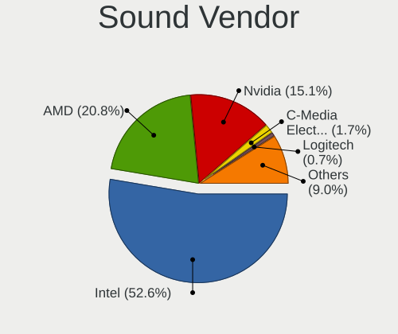

| Vendor                                       | Computers | Percent |
|----------------------------------------------|-----------|---------|
| Intel                                        | 5487      | 52.65%  |
| AMD                                          | 2169      | 20.81%  |
| Nvidia                                       | 1575      | 15.11%  |
| C-Media Electronics                          | 177       | 1.7%    |
| Logitech                                     | 77        | 0.74%   |
| Zoran Co. Personal Media Division (Nogatech) | 48        | 0.46%   |
| ASUSTek Computer                             | 48        | 0.46%   |
| Texas Instruments                            | 46        | 0.44%   |
| Lenovo                                       | 44        | 0.42%   |
| GN Netcom                                    | 41        | 0.39%   |
| Generalplus Technology                       | 38        | 0.36%   |
| Micro Star International                     | 35        | 0.34%   |
| Creative Labs                                | 34        | 0.33%   |
| Realtek Semiconductor                        | 33        | 0.32%   |
| Hewlett-Packard                              | 31        | 0.3%    |
| JMTek                                        | 29        | 0.28%   |
| Focusrite-Novation                           | 28        | 0.27%   |
| Creative Technology                          | 24        | 0.23%   |
| SteelSeries ApS                              | 23        | 0.22%   |
| Jieli Technology                             | 21        | 0.2%    |
| Razer USA                                    | 19        | 0.18%   |
| Tenx Technology                              | 16        | 0.15%   |
| Corsair                                      | 16        | 0.15%   |
| VIA Technologies                             | 15        | 0.14%   |
| Plantronics                                  | 15        | 0.14%   |
| Kingston Technology                          | 15        | 0.14%   |
| Apple                                        | 13        | 0.12%   |
| KTMicro                                      | 10        | 0.1%    |
| Blue Microphones                             | 10        | 0.1%    |
| Dell                                         | 9         | 0.09%   |
| Sony                                         | 8         | 0.08%   |
| RODE Microphones                             | 8         | 0.08%   |
| Cambridge Silicon Radio                      | 8         | 0.08%   |
| BEHRINGER International                      | 8         | 0.08%   |
| Unknown                                      | 8         | 0.08%   |
| Thesycon Systemsoftware & Consulting         | 7         | 0.07%   |
| Silicon Integrated Systems [SiS]             | 7         | 0.07%   |
| PreSonus Audio Electronics                   | 7         | 0.07%   |
| DSEA A/S                                     | 7         | 0.07%   |
| Conexant Systems                             | 7         | 0.07%   |

Sound Model
-----------

Sound card models

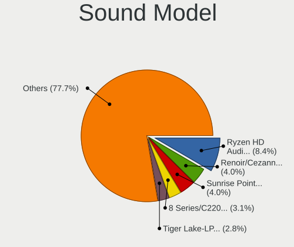

| Model                                                                      | Computers | Percent |
|----------------------------------------------------------------------------|-----------|---------|
| AMD Ryzen HD Audio Controller                                              | 1054      | 8.41%   |
| AMD Renoir/Cezanne HDMI/DP Audio Controller                                | 504       | 4.02%   |
| Intel Sunrise Point-LP HD Audio                                            | 498       | 3.97%   |
| Intel 8 Series/C220 Series Chipset High Definition Audio Controller        | 389       | 3.1%    |
| Intel Tiger Lake-LP Smart Sound Technology Audio Controller                | 353       | 2.82%   |
| Intel 6 Series/C200 Series Chipset Family High Definition Audio Controller | 342       | 2.73%   |
| Intel 7 Series/C216 Chipset Family High Definition Audio Controller        | 340       | 2.71%   |
| AMD Radeon High Definition Audio Controller                                | 336       | 2.68%   |
| Intel Xeon E3-1200 v3/4th Gen Core Processor HD Audio Controller           | 295       | 2.35%   |
| Intel Alder Lake PCH-P High Definition Audio Controller                    | 282       | 2.25%   |
| Intel Cannon Lake PCH cAVS                                                 | 250       | 1.99%   |
| AMD Starship/Matisse HD Audio Controller                                   | 241       | 1.92%   |
| Intel 100 Series/C230 Series Chipset Family HD Audio Controller            | 199       | 1.59%   |
| Intel Raptor Lake-P/U/H cAVS                                               | 194       | 1.55%   |
| Intel 200 Series PCH HD Audio                                              | 190       | 1.52%   |
| AMD Raven/Raven2/Fenghuang HDMI/DP Audio Controller                        | 169       | 1.35%   |
| Intel Haswell-ULT HD Audio Controller                                      | 151       | 1.2%    |
| Intel 8 Series HD Audio Controller                                         | 151       | 1.2%    |
| AMD SBx00 Azalia (Intel HDA)                                               | 147       | 1.17%   |
| Intel NM10/ICH7 Family High Definition Audio Controller                    | 143       | 1.14%   |
| Intel 5 Series/3400 Series Chipset High Definition Audio                   | 141       | 1.12%   |
| Intel Celeron/Pentium Silver Processor High Definition Audio               | 139       | 1.11%   |
| Intel 82801I (ICH9 Family) HD Audio Controller                             | 133       | 1.06%   |
| Intel Cannon Point-LP High Definition Audio Controller                     | 131       | 1.05%   |
| AMD Kabini HDMI/DP Audio                                                   | 128       | 1.02%   |
| AMD FCH Azalia Controller                                                  | 128       | 1.02%   |
| AMD Navi 21/23 HDMI/DP Audio Controller                                    | 120       | 0.96%   |
| Intel Raptor Lake High Definition Audio Controller                         | 115       | 0.92%   |
| Intel Comet Lake PCH cAVS                                                  | 115       | 0.92%   |
| Intel Alder Lake-N PCH High Definition Audio Controller                    | 113       | 0.9%    |
| Nvidia GP107GL High Definition Audio Controller                            | 111       | 0.89%   |
| Intel Alder Lake-S HD Audio Controller                                     | 106       | 0.85%   |
| Intel Comet Lake PCH-LP cAVS                                               | 105       | 0.84%   |
| AMD Family 15h (Models 60h-6fh) Audio Controller                           | 102       | 0.81%   |
| Intel Broadwell-U Audio Controller                                         | 101       | 0.81%   |
| Intel Atom Processor Z36xxx/Z37xxx Series High Definition Audio Controller | 99        | 0.79%   |
| AMD Ellesmere HDMI Audio [Radeon RX 470/480 / 570/580/590]                 | 97        | 0.77%   |
| Intel Wildcat Point-LP High Definition Audio Controller                    | 94        | 0.75%   |
| Nvidia TU107 GeForce GTX 1650 High Definition Audio Controller             | 91        | 0.73%   |
| Nvidia TU106 High Definition Audio Controller                              | 88        | 0.7%    |

Memory
------

Memory Vendor
-------------

Memory module vendors

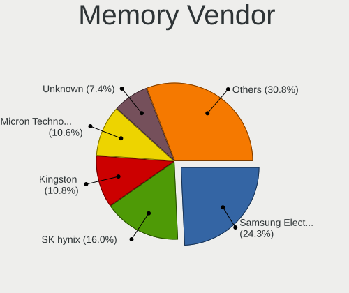

| Vendor                                  | Computers | Percent |
|-----------------------------------------|-----------|---------|
| Samsung Electronics                     | 1731      | 24.28%  |
| SK hynix                                | 1144      | 16.05%  |
| Kingston                                | 770       | 10.8%   |
| Micron Technology                       | 756       | 10.6%   |
| Unknown                                 | 531       | 7.45%   |
| Crucial                                 | 496       | 6.96%   |
| Corsair                                 | 298       | 4.18%   |
| G.Skill                                 | 214       | 3%      |
| Unknown                                 | 192       | 2.69%   |
| A-DATA Technology                       | 136       | 1.91%   |
| Ramaxel Technology                      | 93        | 1.3%    |
| Elpida                                  | 86        | 1.21%   |
| Hewlett-Packard                         | 56        | 0.79%   |
| Nanya Technology                        | 54        | 0.76%   |
| Team                                    | 52        | 0.73%   |
| Unknown (ABCD)                          | 50        | 0.7%    |
| Patriot                                 | 42        | 0.59%   |
| Hikvision                               | 22        | 0.31%   |
| Transcend                               | 20        | 0.28%   |
| Timetec                                 | 19        | 0.27%   |
| Smart                                   | 18        | 0.25%   |
| 4ea5                                    | 17        | 0.24%   |
| AMD                                     | 13        | 0.18%   |
| Apacer                                  | 12        | 0.17%   |
| ff                                      | 11        | 0.15%   |
| Unknown (0x0E9D)                        | 10        | 0.14%   |
| fef5                                    | 10        | 0.14%   |
| ASint Technology                        | 10        | 0.14%   |
| PNY                                     | 9         | 0.13%   |
| Micro Memory Bank                       | 9         | 0.13%   |
| GOODRAM                                 | 9         | 0.13%   |
| Teikon                                  | 8         | 0.11%   |
| Patriot Memory (PDP Systems)            | 8         | 0.11%   |
| Lexar Co Limited                        | 8         | 0.11%   |
| Neo Forza                               | 7         | 0.1%    |
| Toshiba                                 | 6         | 0.08%   |
| Silicon Power Computer & Communications | 6         | 0.08%   |
| Kimtigo Semiconductor (HK) Limited      | 6         | 0.08%   |
| GeIL                                    | 6         | 0.08%   |
| Unknown (0x0B45)                        | 5         | 0.07%   |

Memory Model
------------

Memory module models

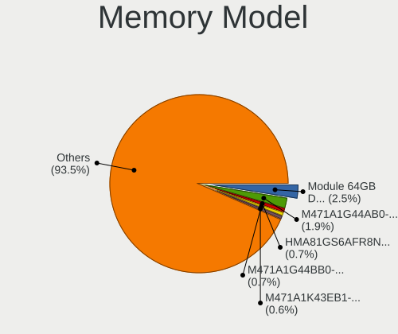

| Model                                                            | Computers | Percent |
|------------------------------------------------------------------|-----------|---------|
| Unknown                                                          | 192       | 2.53%   |
| Samsung RAM M471A1G44AB0-CWE 8GiB SODIMM DDR4 3200MT/s           | 147       | 1.94%   |
| SK hynix RAM HMA81GS6AFR8N-UH 8GB SODIMM DDR4 2667MT/s           | 56        | 0.74%   |
| Samsung RAM M471A1G44BB0-CWE 8GB SODIMM DDR4 3200MT/s            | 51        | 0.67%   |
| Samsung RAM M471A1K43EB1-CWE 8GB SODIMM DDR4 3200MT/s            | 49        | 0.65%   |
| Samsung RAM M471B5173DB0-YK0 4GB SODIMM DDR3 1600MT/s            | 41        | 0.54%   |
| Samsung RAM K4E8E324EB-EGCF 2GB LPDDR3 1867MT/s                  | 40        | 0.53%   |
| Crucial RAM CT8G4SFRA266.C8FD1 8GB SODIMM DDR4 2667MT/s          | 40        | 0.53%   |
| Samsung RAM M471A5244CB0-CTD 4GB SODIMM DDR4 3266MT/s            | 38        | 0.5%    |
| Samsung RAM M471A5244CB0-CWE 4GB SODIMM DDR4 3200MT/s            | 36        | 0.47%   |
| Micron RAM 8ATF1G64HZ-3G2R1 8GB SODIMM DDR4 3200MT/s             | 35        | 0.46%   |
| Micron RAM 4ATF1G64HZ-3G2F1 8GB SODIMM DDR4 3200MT/s             | 35        | 0.46%   |
| SK hynix RAM HMT451S6BFR8A-PB 4GB SODIMM DDR3 1600MT/s           | 32        | 0.42%   |
| Unknown (ABCD) RAM 123456789012345678 2GB SODIMM LPDDR4 2400MT/s | 31        | 0.41%   |
| SK hynix RAM HMT41GS6BFR8A-PB 8GB SODIMM DDR3 2667MT/s           | 31        | 0.41%   |
| SK hynix RAM HMAA1GS6CJR6N-XN 8GB SODIMM DDR4 3200MT/s           | 31        | 0.41%   |
| Unknown RAM Module 2GB DIMM SDRAM                                | 27        | 0.36%   |
| Samsung RAM M471A1K43DB1-CWE 8GB SODIMM DDR4 3200MT/s            | 27        | 0.36%   |
| Unknown RAM Module 2GB DIMM DDR2 800MT/s                         | 25        | 0.33%   |
| Samsung RAM M471B5173EB0-YK0 4GB SODIMM DDR3 1600MT/s            | 25        | 0.33%   |
| Samsung RAM M471A1K43BB1-CRC 8GB SODIMM DDR4 2667MT/s            | 23        | 0.3%    |
| Unknown RAM Module 1GB DIMM SDRAM                                | 22        | 0.29%   |
| Samsung RAM M471B1G73QH0-YK0 8GB SODIMM DDR3 1600MT/s            | 22        | 0.29%   |
| Samsung RAM M471A1K43CB1-CRC 8GB SODIMM DDR4 8400MT/s            | 22        | 0.29%   |
| Corsair RAM CMK16GX4M2B3200C16 8GB DIMM DDR4 3600MT/s            | 22        | 0.29%   |
| SK hynix RAM Module 4GB SODIMM DDR3 1600MT/s                     | 21        | 0.28%   |
| SK hynix RAM HMA81GS6CJR8N-VK 8GB SODIMM DDR4 2667MT/s           | 21        | 0.28%   |
| Samsung RAM M471B5273DH0-CH9 4GB SODIMM DDR3 1600MT/s            | 21        | 0.28%   |
| Samsung RAM M471A1G44AB0-CWE 8GB Row Of Chips DDR4 3200MT/s      | 21        | 0.28%   |
| Unknown RAM Module 4GB DIMM 1333MT/s                             | 19        | 0.25%   |
| Unknown RAM Module 2GB SODIMM DDR2 667MT/s                       | 19        | 0.25%   |
| Unknown (ABCD) RAM 123456789012345678 2GB DIMM LPDDR4 2133MT/s   | 19        | 0.25%   |
| Samsung RAM M471B5173QH0-YK0 4GB SODIMM DDR3 1600MT/s            | 19        | 0.25%   |
| Kingston RAM 99U5584-010.A00LF 4GB DIMM DDR3 1866MT/s            | 19        | 0.25%   |
| HP RAM 809083-091 32GB DIMM DDR4 2400MT/s                        | 19        | 0.25%   |
| Crucial RAM CT32G4SFD832A.M16FF 32GB SODIMM DDR4 3200MT/s        | 19        | 0.25%   |
| Corsair RAM CMK32GX4M2E3200C16 16GB DIMM DDR4 3600MT/s           | 19        | 0.25%   |
| Unknown RAM Module 32GB DIMM DDR4 2400MT/s                       | 18        | 0.24%   |
| SK hynix RAM HMT451S6AFR8A-PB 4GB SODIMM DDR3 1600MT/s           | 18        | 0.24%   |
| Samsung RAM M471B5674QH0-YK0 2GB SODIMM DDR3 3200MT/s            | 18        | 0.24%   |

Memory Kind
-----------

Memory module kinds

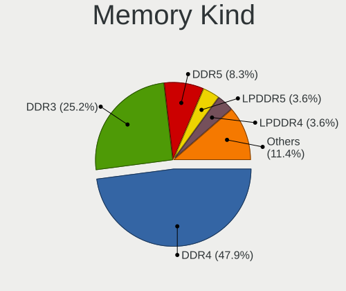

| Kind    | Computers | Percent |
|---------|-----------|---------|
| DDR4    | 2997      | 47.94%  |
| DDR3    | 1577      | 25.22%  |
| DDR5    | 517       | 8.27%   |
| LPDDR5  | 225       | 3.6%    |
| LPDDR4  | 225       | 3.6%    |
| DDR2    | 223       | 3.57%   |
| LPDDR3  | 162       | 2.59%   |
| SDRAM   | 132       | 2.11%   |
| Unknown | 114       | 1.82%   |
| DRAM    | 38        | 0.61%   |
| DDR     | 35        | 0.56%   |
| RAM     | 3         | 0.05%   |
| EPROM   | 2         | 0.03%   |
| LPDDR2  | 1         | 0.02%   |
| EEPROM  | 1         | 0.02%   |

Memory Form Factor
------------------

Physical design of the memory module

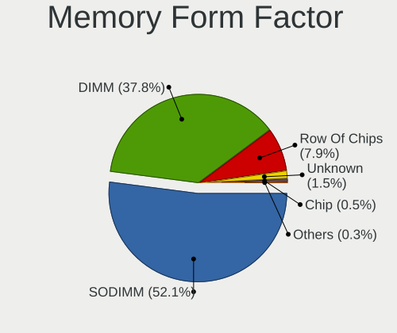

| Name            | Computers | Percent |
|-----------------|-----------|---------|
| SODIMM          | 3249      | 52.05%  |
| DIMM            | 2357      | 37.76%  |
| Row Of Chips    | 494       | 7.91%   |
| Unknown         | 91        | 1.46%   |
| Chip            | 34        | 0.54%   |
| RIMM            | 8         | 0.13%   |
| FB-DIMM         | 8         | 0.13%   |
| Proprietary Car | 1         | 0.02%   |

Memory Size
-----------

Memory module size

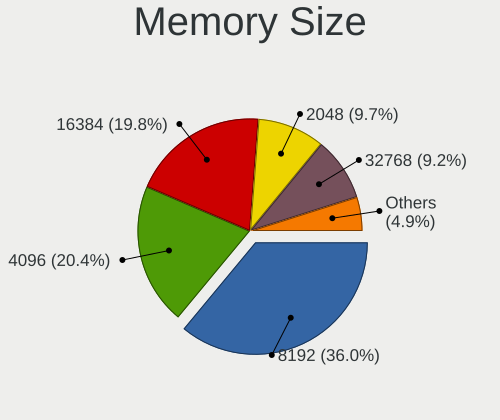

| Size    | Computers | Percent |
|---------|-----------|---------|
| 8192    | 2425      | 36.03%  |
| 4096    | 1375      | 20.43%  |
| 16384   | 1330      | 19.76%  |
| 2048    | 654       | 9.72%   |
| 32768   | 617       | 9.17%   |
| 1024    | 204       | 3.03%   |
| 65536   | 39        | 0.58%   |
| 512     | 32        | 0.48%   |
| 49152   | 21        | 0.31%   |
| 3072    | 13        | 0.19%   |
| 256     | 6         | 0.09%   |
| 24576   | 4         | 0.06%   |
| 6144    | 2         | 0.03%   |
| 12288   | 1         | 0.01%   |
| 8000    | 1         | 0.01%   |
| 5120    | 1         | 0.01%   |
| 1536    | 1         | 0.01%   |
| 128     | 1         | 0.01%   |
| 64      | 1         | 0.01%   |
| 16      | 1         | 0.01%   |
| 1       | 1         | 0.01%   |
| Unknown | 1         | 0.01%   |

Memory Speed
------------

Memory module speed

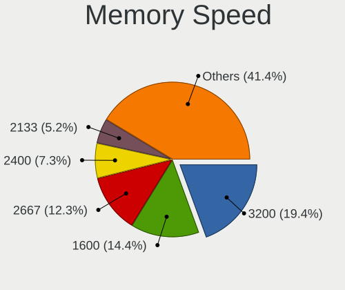

| Speed   | Computers | Percent |
|---------|-----------|---------|
| 3200    | 1300      | 19.45%  |
| 1600    | 960       | 14.36%  |
| 2667    | 822       | 12.3%   |
| 2400    | 489       | 7.31%   |
| 2133    | 348       | 5.21%   |
| 1333    | 321       | 4.8%    |
| 5600    | 205       | 3.07%   |
| 4800    | 191       | 2.86%   |
| 3600    | 186       | 2.78%   |
| 6400    | 166       | 2.48%   |
| 1867    | 155       | 2.32%   |
| Unknown | 126       | 1.88%   |
| 667     | 124       | 1.85%   |
| 800     | 97        | 1.45%   |
| 4267    | 82        | 1.23%   |
| 1334    | 74        | 1.11%   |
| 1866    | 72        | 1.08%   |
| 1066    | 64        | 0.96%   |
| 2666    | 55        | 0.82%   |
| 3733    | 54        | 0.81%   |
| 6000    | 52        | 0.78%   |
| 1067    | 51        | 0.76%   |
| 3266    | 47        | 0.7%    |
| 7500    | 40        | 0.6%    |
| 8400    | 33        | 0.49%   |
| 3800    | 32        | 0.48%   |
| 2933    | 31        | 0.46%   |
| 3466    | 29        | 0.43%   |
| 533     | 29        | 0.43%   |
| 4000    | 28        | 0.42%   |
| 3000    | 22        | 0.33%   |
| 3400    | 21        | 0.31%   |
| 5200    | 20        | 0.3%    |
| 4266    | 18        | 0.27%   |
| 1800    | 18        | 0.27%   |
| 2048    | 17        | 0.25%   |
| 1596    | 17        | 0.25%   |
| 4199    | 16        | 0.24%   |
| 3933    | 16        | 0.24%   |
| 6200    | 13        | 0.19%   |

Printers & scanners
-------------------

Printer Vendor
--------------

Printer device vendors

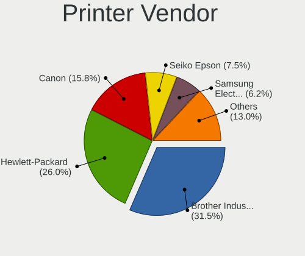

| Vendor                | Computers | Percent |
|-----------------------|-----------|---------|
| Brother Industries    | 46        | 31.51%  |
| Hewlett-Packard       | 38        | 26.03%  |
| Canon                 | 23        | 15.75%  |
| Seiko Epson           | 11        | 7.53%   |
| Samsung Electronics   | 9         | 6.16%   |
| Dymo-CoStar           | 6         | 4.11%   |
| QinHeng Electronics   | 3         | 2.05%   |
| Ricoh                 | 2         | 1.37%   |
| Pantum                | 2         | 1.37%   |
| Lexmark International | 2         | 1.37%   |
| Zebra                 | 1         | 0.68%   |
| STMicroelectronics    | 1         | 0.68%   |
| Prolific Technology   | 1         | 0.68%   |
| nemonic               | 1         | 0.68%   |

Printer Model
-------------

Printer device models

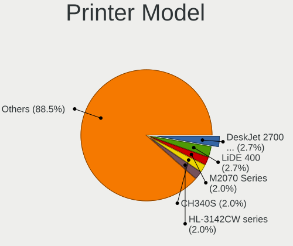

| Model                                                     | Computers | Percent |
|-----------------------------------------------------------|-----------|---------|
| HP DeskJet 2700 series                                    | 4         | 2.7%    |
| Canon LiDE 400                                            | 4         | 2.7%    |
| Samsung M2070 Series                                      | 3         | 2.03%   |
| QinHeng CH340S                                            | 3         | 2.03%   |
| Brother HL-3142CW series                                  | 3         | 2.03%   |
| Seiko Epson L3050 Series                                  | 2         | 1.35%   |
| Samsung M2020 Series                                      | 2         | 1.35%   |
| HP OfficeJet 5200 series                                  | 2         | 1.35%   |
| HP OfficeJet 4650 series                                  | 2         | 1.35%   |
| HP Officejet 4500 G510a-f                                 | 2         | 1.35%   |
| HP LaserJet 1022                                          | 2         | 1.35%   |
| HP LaserJet 1020                                          | 2         | 1.35%   |
| HP LaserJet 1018                                          | 2         | 1.35%   |
| HP ENVY 5540 series                                       | 2         | 1.35%   |
| HP Deskjet 1510                                           | 2         | 1.35%   |
| Canon MF4010 series                                       | 2         | 1.35%   |
| Canon MF3010                                              | 2         | 1.35%   |
| Canon LiDE 300                                            | 2         | 1.35%   |
| Brother MFC-J6940DW                                       | 2         | 1.35%   |
| Brother MFC-7360N                                         | 2         | 1.35%   |
| Brother MFC Composite Device                              | 2         | 1.35%   |
| Brother HL-L2340D series                                  | 2         | 1.35%   |
| Brother HL-2030 Laser Printer                             | 2         | 1.35%   |
| Zebra Thrmal 2844                                         | 1         | 0.68%   |
| STMicroelectronics LED badge -- mini LED display -- 11x44 | 1         | 0.68%   |
| Seiko Epson XP-211 214 216 Series                         | 1         | 0.68%   |
| Seiko Epson XP-102 103 Series                             | 1         | 0.68%   |
| Seiko Epson WF-2930 Series                                | 1         | 0.68%   |
| Seiko Epson Printer                                       | 1         | 0.68%   |
| Seiko Epson M3140 Series                                  | 1         | 0.68%   |
| Seiko Epson ET-4850 Series                                | 1         | 0.68%   |
| Seiko Epson ET-2850 Series                                | 1         | 0.68%   |
| Seiko Epson ET-2810 Series                                | 1         | 0.68%   |
| Seiko Epson ET-2710 Series                                | 1         | 0.68%   |
| Samsung SCX-4623 Series                                   | 1         | 0.68%   |
| Samsung ML-216x Series Laser Printer                      | 1         | 0.68%   |
| Samsung ML-1660 Series                                    | 1         | 0.68%   |
| Samsung M288x Series                                      | 1         | 0.68%   |
| Ricoh SP 150                                              | 1         | 0.68%   |
| Ricoh Printing Support                                    | 1         | 0.68%   |

Scanner Vendor
--------------

Scanner device vendors

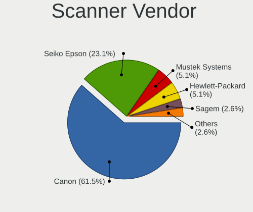

| Vendor          | Computers | Percent |
|-----------------|-----------|---------|
| Canon           | 24        | 61.54%  |
| Seiko Epson     | 9         | 23.08%  |
| Mustek Systems  | 2         | 5.13%   |
| Hewlett-Packard | 2         | 5.13%   |
| Sagem           | 1         | 2.56%   |
| Plustek         | 1         | 2.56%   |

Scanner Model
-------------

Scanner device models

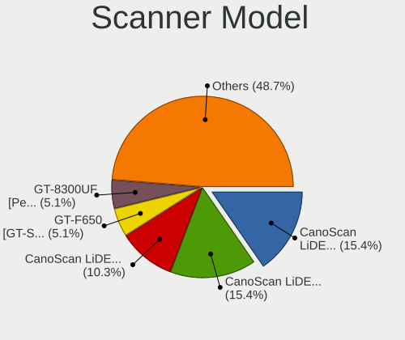

| Model                                                    | Computers | Percent |
|----------------------------------------------------------|-----------|---------|
| Canon CanoScan LiDE 220                                  | 6         | 15.38%  |
| Canon CanoScan LiDE 210                                  | 6         | 15.38%  |
| Canon CanoScan LiDE 110                                  | 4         | 10.26%  |
| Seiko Epson GT-F650 [GT-S600/Perfection V10/V100]        | 2         | 5.13%   |
| Seiko Epson GT-8300UF [Perfection 1660 PHOTO]            | 2         | 5.13%   |
| Canon CanoScan N1240U/LiDE 30                            | 2         | 5.13%   |
| Seiko Epson GT-X900 [Perfection V700/V750 Photo]         | 1         | 2.56%   |
| Seiko Epson GT-X800 [Perfection 4990 PHOTO]              | 1         | 2.56%   |
| Seiko Epson GT-X770 [Perfection V500]                    | 1         | 2.56%   |
| Seiko Epson GT-F500/GT-F550 [Perfection 2480/2580 PHOTO] | 1         | 2.56%   |
| Seiko Epson GT-7700U [Perfection 1240U]                  | 1         | 2.56%   |
| Sagem 600dpi USB Scanner                                 | 1         | 2.56%   |
| Plustek 1200dpi USB Scanner                              | 1         | 2.56%   |
| Mustek Systems ScanExpress 1200 UB                       | 1         | 2.56%   |
| Mustek Systems BearPaw 1200 CU Plus                      | 1         | 2.56%   |
| HP ScanJet 82x0C                                         | 1         | 2.56%   |
| HP ScanJet 5300c/5370c                                   | 1         | 2.56%   |
| Canon CanoScan N670U/N676U/LiDE 20                       | 1         | 2.56%   |
| Canon CanoScan N650U/N656U                               | 1         | 2.56%   |
| Canon CanoScan LiDE 50/LiDE 35/LiDE 40                   | 1         | 2.56%   |
| Canon CanoScan LIDE 25                                   | 1         | 2.56%   |
| Canon CanoScan LiDE 120                                  | 1         | 2.56%   |
| Canon CanoScan 1220U                                     | 1         | 2.56%   |

Camera
------

Camera Vendor
-------------

Camera device vendors

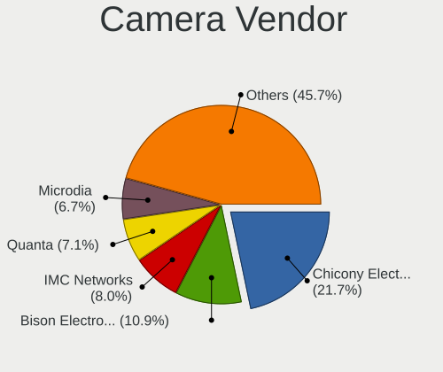

| Vendor                                 | Computers | Percent |
|----------------------------------------|-----------|---------|
| Chicony Electronics                    | 946       | 21.73%  |
| Bison Electronics                      | 473       | 10.86%  |
| IMC Networks                           | 347       | 7.97%   |
| Quanta                                 | 308       | 7.07%   |
| Microdia                               | 290       | 6.66%   |
| Realtek Semiconductor                  | 263       | 6.04%   |
| Logitech                               | 224       | 5.14%   |
| Sunplus Innovation Technology          | 193       | 4.43%   |
| Luxvisions Innotech Limited            | 166       | 3.81%   |
| Apple                                  | 127       | 2.92%   |
| Cheng Uei Precision Industry (Foxlink) | 122       | 2.8%    |
| Syntek                                 | 107       | 2.46%   |
| Lite-On Technology                     | 97        | 2.23%   |
| Suyin                                  | 57        | 1.31%   |
| Sonix Technology                       | 52        | 1.19%   |
| Microsoft                              | 43        | 0.99%   |
| Alcor Micro                            | 34        | 0.78%   |
| Samsung Electronics                    | 33        | 0.76%   |
| Shinetech                              | 30        | 0.69%   |
| Silicon Motion                         | 27        | 0.62%   |
| SunplusIT                              | 25        | 0.57%   |
| Ricoh                                  | 25        | 0.57%   |
| Z-Star Microelectronics                | 24        | 0.55%   |
| Generalplus Technology                 | 23        | 0.53%   |
| Lenovo                                 | 21        | 0.48%   |
| icSpring                               | 19        | 0.44%   |
| MacroSilicon                           | 15        | 0.34%   |
| Acer                                   | 14        | 0.32%   |
| Unknown                                | 12        | 0.28%   |
| Primax Electronics                     | 10        | 0.23%   |
| Importek                               | 10        | 0.23%   |
| Trust                                  | 9         | 0.21%   |
| Jieli Technology                       | 9         | 0.21%   |
| Shine-optics                           | 8         | 0.18%   |
| KYE Systems (Mouse Systems)            | 8         | 0.18%   |
| kingcome                               | 8         | 0.18%   |
| Creative Technology                    | 8         | 0.18%   |
| eMeet                                  | 6         | 0.14%   |
| AVerMedia Technologies                 | 6         | 0.14%   |
| ARC International                      | 6         | 0.14%   |

Camera Model
------------

Camera device models

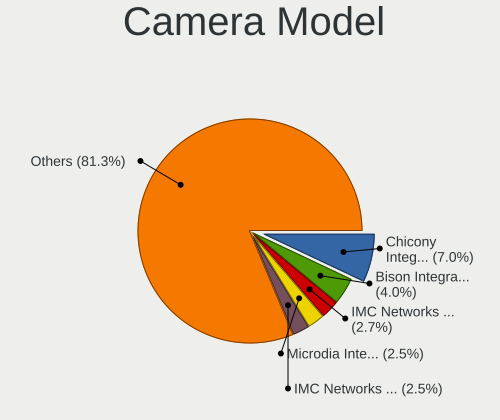

| Model                                               | Computers | Percent |
|-----------------------------------------------------|-----------|---------|
| Chicony Integrated Camera                           | 311       | 7.03%   |
| Bison Integrated Camera                             | 175       | 3.96%   |
| IMC Networks Integrated Camera                      | 120       | 2.71%   |
| Microdia Integrated_Webcam_HD                       | 112       | 2.53%   |
| IMC Networks USB2.0 HD UVC WebCam                   | 109       | 2.46%   |
| Syntek Integrated Camera                            | 85        | 1.92%   |
| Realtek Integrated_Webcam_HD                        | 82        | 1.85%   |
| Bison Integrated 5M Camera                          | 67        | 1.51%   |
| Chicony HP HD Camera                                | 63        | 1.42%   |
| Logitech Webcam C270                                | 51        | 1.15%   |
| Sunplus Integrated_Webcam_HD                        | 50        | 1.13%   |
| Quanta Chromebook HD Camera                         | 50        | 1.13%   |
| Bison BisonCam, NB Pro                              | 48        | 1.08%   |
| Chicony HD WebCam                                   | 47        | 1.06%   |
| Quanta HD User Facing                               | 43        | 0.97%   |
| Chicony Integrated 5M Camera                        | 42        | 0.95%   |
| Luxvisions Innotech Limited Integrated Camera       | 40        | 0.9%    |
| Lite-On Integrated Camera                           | 39        | 0.88%   |
| Apple FaceTime HD Camera (Built-in)                 | 39        | 0.88%   |
| Apple Built-in iSight                               | 36        | 0.81%   |
| Logitech HD Pro Webcam C920                         | 32        | 0.72%   |
| IMC Networks USB2.0 VGA UVC WebCam                  | 32        | 0.72%   |
| Samsung Galaxy series, misc. (MTP mode)             | 31        | 0.7%    |
| Luxvisions Innotech Limited HP TrueVision HD Camera | 30        | 0.68%   |
| Chicony Integrated Camera (1280x720@30)             | 30        | 0.68%   |
| Sonix USB2.0 HD UVC WebCam                          | 29        | 0.66%   |
| Bison Lenovo Integrated Webcam                      | 29        | 0.66%   |
| Bison Integrated RGB Camera                         | 29        | 0.66%   |
| Cheng Uei Precision Industry (Foxlink) HP HD Camera | 28        | 0.63%   |
| Quanta HP TrueVision HD Camera                      | 27        | 0.61%   |
| Bison HD Webcam                                     | 27        | 0.61%   |
| Lite-On HP HD Camera                                | 26        | 0.59%   |
| Chicony HP Wide Vision HD Camera                    | 26        | 0.59%   |
| Chicony HD User Facing                              | 26        | 0.59%   |
| Chicony USB 2.0 Camera                              | 25        | 0.57%   |
| Chicony HP Truevision HD                            | 25        | 0.57%   |
| Bison SunplusIT Integrated Camera                   | 25        | 0.57%   |
| Quanta HD Webcam                                    | 24        | 0.54%   |
| Luxvisions Innotech Limited Integrated RGB Camera   | 24        | 0.54%   |
| Quanta HP HD Camera                                 | 23        | 0.52%   |

Security
--------

Fingerprint Vendor
------------------

Fingerprint sensor vendors

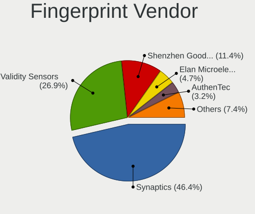

| Vendor                             | Computers | Percent |
|------------------------------------|-----------|---------|
| Synaptics                          | 377       | 46.37%  |
| Validity Sensors                   | 219       | 26.94%  |
| Shenzhen Goodix Technology         | 93        | 11.44%  |
| Elan Microelectronics              | 38        | 4.67%   |
| AuthenTec                          | 26        | 3.2%    |
| Upek                               | 22        | 2.71%   |
| LighTuning Technology              | 13        | 1.6%    |
| STMicroelectronics                 | 9         | 1.11%   |
| Realtek USB2.0 Finger Print Bridge | 6         | 0.74%   |
| HOLTEK                             | 3         | 0.37%   |
| Focal-systems.Corp                 | 2         | 0.25%   |
| DigitalPersona                     | 2         | 0.25%   |
| Samsung Electronics                | 1         | 0.12%   |
| Microsoft                          | 1         | 0.12%   |
| GDMicroelectronics                 | 1         | 0.12%   |

Fingerprint Model
-----------------

Fingerprint sensor models

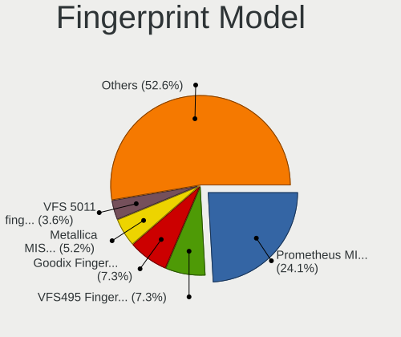

| Model                                                                      | Computers | Percent |
|----------------------------------------------------------------------------|-----------|---------|
| Synaptics Prometheus MIS Touch Fingerprint Reader                          | 196       | 24.11%  |
| Validity Sensors VFS495 Fingerprint Reader                                 | 59        | 7.26%   |
| Shenzhen Goodix  Fingerprint Device                                        | 59        | 7.26%   |
| Synaptics Metallica MIS Touch Fingerprint Reader                           | 42        | 5.17%   |
| Validity Sensors VFS 5011 fingerprint sensor                               | 29        | 3.57%   |
| Validity Sensors VFS5011 Fingerprint Reader                                | 27        | 3.32%   |
| Validity Sensors Synaptics WBDI                                            | 26        | 3.2%    |
| Synaptics UWP WBDI Device                                                  | 26        | 3.2%    |
| Synaptics FS7604 Touch Fingerprint Sensor with PurePrint                   | 26        | 3.2%    |
| Shenzhen Goodix Fingerprint Reader                                         | 25        | 3.08%   |
| Elan ELAN:ARM-M4                                                           | 24        | 2.95%   |
| Upek Biometric Touchchip/Touchstrip Fingerprint Sensor                     | 20        | 2.46%   |
| Synaptics Prometheus Fingerprint Reader                                    | 17        | 2.09%   |
| Synaptics Fingerprint reader [HP G6]                                       | 16        | 1.97%   |
| Validity Sensors Synaptics VFS7552 Touch Fingerprint Sensor with PurePrint | 14        | 1.72%   |
| Validity Sensors VFS7500 Touch Fingerprint Sensor                          | 13        | 1.6%    |
| Synaptics  WBDI                                                            | 13        | 1.6%    |
| Elan ELAN:Fingerprint                                                      | 13        | 1.6%    |
| Validity Sensors VFS471 Fingerprint Reader                                 | 12        | 1.48%   |
| Synaptics WBDI                                                             | 9         | 1.11%   |
| STMicroelectronics Fingerprint Reader                                      | 9         | 1.11%   |
| Shenzhen Goodix FingerPrint                                                | 9         | 1.11%   |
| Validity Sensors VFS491                                                    | 8         | 0.98%   |
| Validity Sensors Fingerprint scanner                                       | 8         | 0.98%   |
| Synaptics WBDI Fingerprint Reader USB 086                                  | 8         | 0.98%   |
| AuthenTec AES2810                                                          | 8         | 0.98%   |
| Synaptics Metallica MOH Touch Fingerprint Reader                           | 7         | 0.86%   |
| LighTuning EgisTec Touch Fingerprint Sensor                                | 7         | 0.86%   |
| Validity Sensors VFS451 Fingerprint Reader                                 | 6         | 0.74%   |
| Synaptics UWP WBDI                                                         | 6         | 0.74%   |
| Synaptics  FS7604 Touch Fingerprint Sensor with PurePrint                  | 6         | 0.74%   |
| Realtek USB2.0 Finger Print Bridge FocalTech Fingerprint Device            | 6         | 0.74%   |
| Validity Sensors VFS Fingerprint sensor                                    | 5         | 0.62%   |
| Validity Sensors Synaptics VFS7552 Touch Fingerprint Sensor                | 5         | 0.62%   |
| AuthenTec AES2501 Fingerprint Sensor                                       | 5         | 0.62%   |
| Validity Sensors Swipe Fingerprint Sensor                                  | 4         | 0.49%   |
| AuthenTec Fingerprint Sensor                                               | 4         | 0.49%   |
| AuthenTec AES1600                                                          | 4         | 0.49%   |
| LighTuning Fingerprint Reader                                              | 3         | 0.37%   |
| HOLTEK FocalTech Fingerprint Device                                        | 3         | 0.37%   |

Chipcard Vendor
---------------

Chipcard module vendors

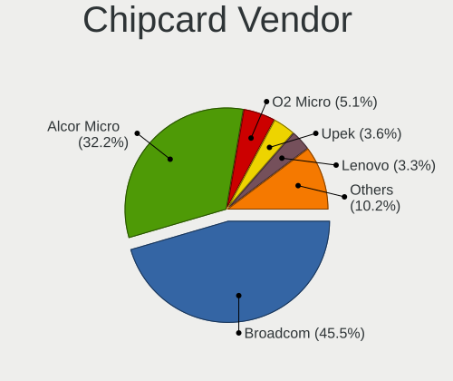

| Vendor                    | Computers | Percent |
|---------------------------|-----------|---------|
| Broadcom                  | 151       | 45.48%  |
| Alcor Micro               | 107       | 32.23%  |
| O2 Micro                  | 17        | 5.12%   |
| Upek                      | 12        | 3.61%   |
| Lenovo                    | 11        | 3.31%   |
| Gemalto (was Gemplus)     | 5         | 1.51%   |
| Yubico.com                | 4         | 1.2%    |
| Realtek Semiconductor     | 4         | 1.2%    |
| Aktiv                     | 4         | 1.2%    |
| Reiner SCT Kartensysteme  | 3         | 0.9%    |
| Aladdin Knowledge Systems | 3         | 0.9%    |
| Advanced Card Systems     | 3         | 0.9%    |
| SCM Microsystems          | 2         | 0.6%    |
| OmniKey                   | 2         | 0.6%    |
| Giesecke & Devrient       | 1         | 0.3%    |
| Chicony Electronics       | 1         | 0.3%    |
| Cherry                    | 1         | 0.3%    |
| Bit4id                    | 1         | 0.3%    |

Chipcard Model
--------------

Chipcard module models

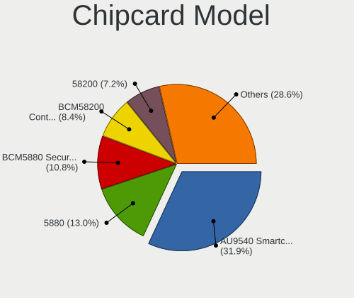

| Model                                                                        | Computers | Percent |
|------------------------------------------------------------------------------|-----------|---------|
| Alcor Micro AU9540 Smartcard Reader                                          | 106       | 31.93%  |
| Broadcom 5880                                                                | 43        | 12.95%  |
| Broadcom BCM5880 Secure Applications Processor                               | 36        | 10.84%  |
| Broadcom BCM58200 ControlVault 3 (FingerPrint sensor + Contacted SmartCard)  | 28        | 8.43%   |
| Broadcom 58200                                                               | 24        | 7.23%   |
| Broadcom BCM5880 Secure Applications Processor with fingerprint swipe sensor | 19        | 5.72%   |
| O2 Micro OZ776 CCID Smartcard Reader                                         | 13        | 3.92%   |
| Upek TouchChip Fingerprint Coprocessor (WBF advanced mode)                   | 12        | 3.61%   |
| Lenovo Integrated Smart Card Reader                                          | 10        | 3.01%   |
| Realtek Semiconductor Smart Card Reader Interface                            | 4         | 1.2%    |
| O2 Micro Oz776 SmartCard Reader                                              | 4         | 1.2%    |
| Aktiv Rutoken lite                                                           | 4         | 1.2%    |
| Yubico.com Yubikey 4/5 U2F+CCID                                              | 3         | 0.9%    |
| Reiner SCT Kartensysteme cyberJack RFID basis contactless smartcard reader   | 3         | 0.9%    |
| Aladdin Knowledge Systems Token JC                                           | 3         | 0.9%    |
| Gemalto (was Gemplus) GemPC Twin SmartCard Reader                            | 2         | 0.6%    |
| Gemalto (was Gemplus) Compact Smart Card Reader Writer                       | 2         | 0.6%    |
| Advanced Card Systems ACR122U                                                | 2         | 0.6%    |
| Yubico.com Yubikey 4/5 CCID                                                  | 1         | 0.3%    |
| SCM Microsystems SCR35xx Smart Card Reader                                   | 1         | 0.3%    |
| SCM Microsystems SCR331 SmartCard Reader                                     | 1         | 0.3%    |
| OmniKey CardMan 3021 / 3121                                                  | 1         | 0.3%    |
| OmniKey 3x21 Smart Card Reader                                               | 1         | 0.3%    |
| Lenovo Smartcard Keyboard                                                    | 1         | 0.3%    |
| Giesecke & Devrient StarSign CUT S                                           | 1         | 0.3%    |
| Gemalto (was Gemplus) GemPC Key SmartCard Reader                             | 1         | 0.3%    |
| Chicony Electronics HP Skylab USB Smartcard Keyboard                         | 1         | 0.3%    |
| Cherry SmartCard Reader Keyboard KC 1000 SC                                  | 1         | 0.3%    |
| Broadcom BCM5880 Secure Applications Processor with fingerprint touch sensor | 1         | 0.3%    |
| Bit4id miniLector EVO                                                        | 1         | 0.3%    |
| Alcor Micro Watchdata W 1981                                                 | 1         | 0.3%    |
| Advanced Card Systems ACR39U                                                 | 1         | 0.3%    |

Unsupported
-----------

Unsupported Devices
-------------------

Total unsupported devices on board

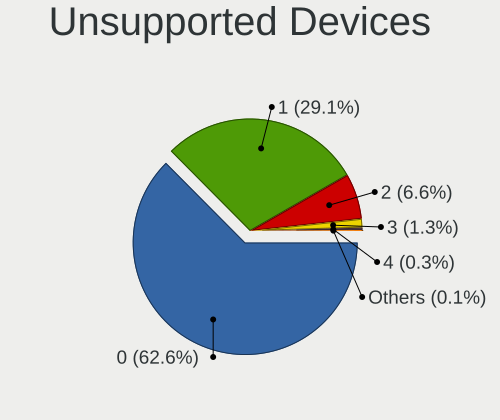

| Total | Computers | Percent |
|-------|-----------|---------|
| 0     | 5323      | 62.56%  |
| 1     | 2480      | 29.15%  |
| 2     | 558       | 6.56%   |
| 3     | 107       | 1.26%   |
| 4     | 29        | 0.34%   |
| 5     | 10        | 0.12%   |
| 7     | 1         | 0.01%   |
| 6     | 1         | 0.01%   |

Unsupported Device Types
------------------------

Types of unsupported devices

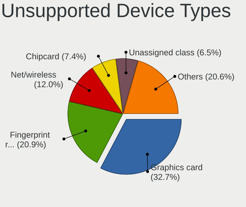

| Type                     | Computers | Percent |
|--------------------------|-----------|---------|
| Graphics card            | 1254      | 32.73%  |
| Fingerprint reader       | 800       | 20.88%  |
| Net/wireless             | 458       | 11.96%  |
| Chipcard                 | 282       | 7.36%   |
| Unassigned class         | 248       | 6.47%   |
| Communication controller | 210       | 5.48%   |
| Multimedia controller    | 207       | 5.4%    |
| Camera                   | 107       | 2.79%   |
| Bluetooth                | 58        | 1.51%   |
| Card reader              | 42        | 1.1%    |
| Sound                    | 36        | 0.94%   |
| Net/ethernet             | 33        | 0.86%   |
| Storage                  | 29        | 0.76%   |
| Modem                    | 20        | 0.52%   |
| Network                  | 16        | 0.42%   |
| Storage/raid             | 6         | 0.16%   |
| Dvb card                 | 6         | 0.16%   |
| Wireless                 | 5         | 0.13%   |
| Storage/nvme             | 4         | 0.1%    |
| Storage/ide              | 3         | 0.08%   |
| Flash memory             | 2         | 0.05%   |
| Firewire controller      | 2         | 0.05%   |
| Video                    | 1         | 0.03%   |
| Unclassified device      | 1         | 0.03%   |
| Tv card                  | 1         | 0.03%   |

