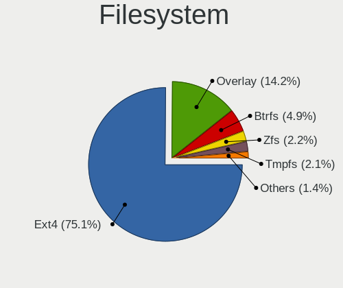
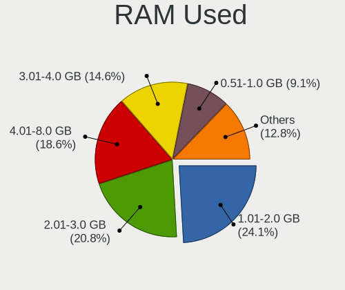
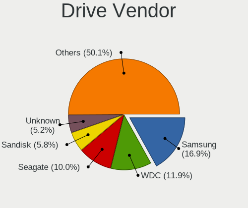
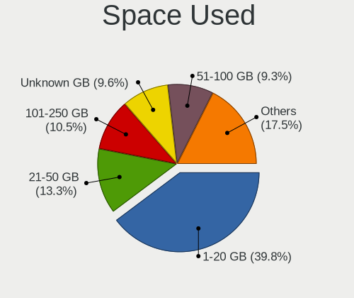
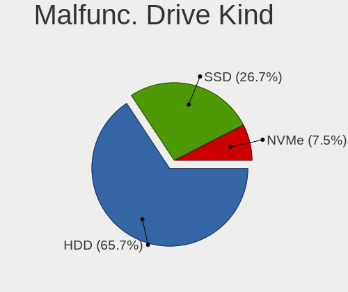
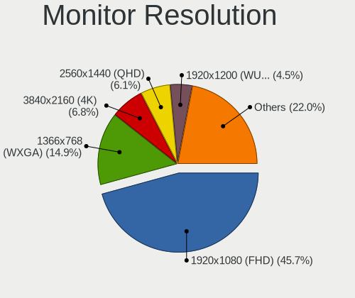
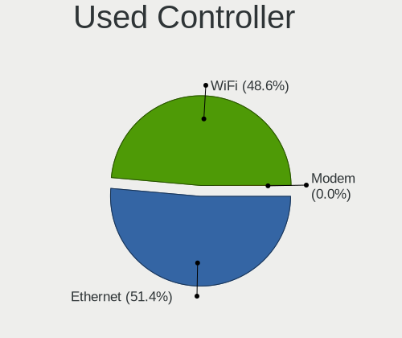
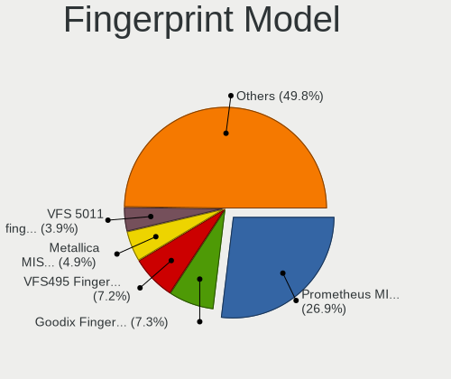

Debian 12 - Tested Hardware & Statistics
----------------------------------------

A project to collect tested hardware configurations for Debian 12.

Anyone can contribute to this report by the [hw-probe](https://github.com/linuxhw/hw-probe) tool:

    sudo -E hw-probe -all -upload

Please contribute! Especially if your hardware is rare.

This is a report for all computer types. See also reports for [desktops](/Dist/Debian_12/Desktop/README.md) and [notebooks](/Dist/Debian_12/Notebook/README.md).

Contents
--------

* [ Test Cases ](#test-cases)

* [ System ](#system)
  - [ Kernel                   ](#kernel)
  - [ Kernel Family            ](#kernel-family)
  - [ Kernel Major Ver.        ](#kernel-major-ver)
  - [ Arch                     ](#arch)
  - [ DE                       ](#de)
  - [ Display Server           ](#display-server)
  - [ Display Manager          ](#display-manager)
  - [ OS Lang                  ](#os-lang)
  - [ Boot Mode                ](#boot-mode)
  - [ Filesystem               ](#filesystem)
  - [ Part. scheme             ](#part-scheme)
  - [ Dual Boot with Linux/BSD ](#dual-boot-with-linuxbsd)
  - [ Dual Boot (Win)          ](#dual-boot-win)

* [ Board ](#board)
  - [ Vendor                   ](#vendor)
  - [ Model                    ](#model)
  - [ Model Family             ](#model-family)
  - [ MFG Year                 ](#mfg-year)
  - [ Form Factor              ](#form-factor)
  - [ Secure Boot              ](#secure-boot)
  - [ Coreboot                 ](#coreboot)
  - [ RAM Size                 ](#ram-size)
  - [ RAM Used                 ](#ram-used)
  - [ Total Drives             ](#total-drives)
  - [ Has CD-ROM               ](#has-cd-rom)
  - [ Has Ethernet             ](#has-ethernet)
  - [ Has WiFi                 ](#has-wifi)
  - [ Has Bluetooth            ](#has-bluetooth)

* [ Location ](#location)
  - [ Country                  ](#country)
  - [ City                     ](#city)

* [ Drives ](#drives)
  - [ Drive Vendor             ](#drive-vendor)
  - [ Drive Model              ](#drive-model)
  - [ HDD Vendor               ](#hdd-vendor)
  - [ SSD Vendor               ](#ssd-vendor)
  - [ Drive Kind               ](#drive-kind)
  - [ Drive Connector          ](#drive-connector)
  - [ Drive Size               ](#drive-size)
  - [ Space Total              ](#space-total)
  - [ Space Used               ](#space-used)
  - [ Malfunc. Drives          ](#malfunc-drives)
  - [ Malfunc. Drive Vendor    ](#malfunc-drive-vendor)
  - [ Malfunc. HDD Vendor      ](#malfunc-hdd-vendor)
  - [ Malfunc. Drive Kind      ](#malfunc-drive-kind)
  - [ Failed Drives            ](#failed-drives)
  - [ Failed Drive Vendor      ](#failed-drive-vendor)
  - [ Drive Status             ](#drive-status)

* [ Storage controller ](#storage-controller)
  - [ Storage Vendor           ](#storage-vendor)
  - [ Storage Model            ](#storage-model)
  - [ Storage Kind             ](#storage-kind)

* [ Processor ](#processor)
  - [ CPU Vendor               ](#cpu-vendor)
  - [ CPU Model                ](#cpu-model)
  - [ CPU Model Family         ](#cpu-model-family)
  - [ CPU Cores                ](#cpu-cores)
  - [ CPU Sockets              ](#cpu-sockets)
  - [ CPU Threads              ](#cpu-threads)
  - [ CPU Op-Modes             ](#cpu-op-modes)
  - [ CPU Microcode            ](#cpu-microcode)
  - [ CPU Microarch            ](#cpu-microarch)

* [ Graphics ](#graphics)
  - [ GPU Vendor               ](#gpu-vendor)
  - [ GPU Model                ](#gpu-model)
  - [ GPU Combo                ](#gpu-combo)
  - [ GPU Driver               ](#gpu-driver)
  - [ GPU Memory               ](#gpu-memory)

* [ Monitor ](#monitor)
  - [ Monitor Vendor           ](#monitor-vendor)
  - [ Monitor Model            ](#monitor-model)
  - [ Monitor Resolution       ](#monitor-resolution)
  - [ Monitor Diagonal         ](#monitor-diagonal)
  - [ Monitor Width            ](#monitor-width)
  - [ Aspect Ratio             ](#aspect-ratio)
  - [ Monitor Area             ](#monitor-area)
  - [ Pixel Density            ](#pixel-density)
  - [ Multiple Monitors        ](#multiple-monitors)

* [ Network ](#network)
  - [ Net Controller Vendor    ](#net-controller-vendor)
  - [ Net Controller Model     ](#net-controller-model)
  - [ Wireless Vendor          ](#wireless-vendor)
  - [ Wireless Model           ](#wireless-model)
  - [ Ethernet Vendor          ](#ethernet-vendor)
  - [ Ethernet Model           ](#ethernet-model)
  - [ Net Controller Kind      ](#net-controller-kind)
  - [ Used Controller          ](#used-controller)
  - [ NICs                     ](#nics)
  - [ IPv6                     ](#ipv6)

* [ Bluetooth ](#bluetooth)
  - [ Bluetooth Vendor         ](#bluetooth-vendor)
  - [ Bluetooth Model          ](#bluetooth-model)

* [ Sound ](#sound)
  - [ Sound Vendor             ](#sound-vendor)
  - [ Sound Model              ](#sound-model)

* [ Memory ](#memory)
  - [ Memory Vendor            ](#memory-vendor)
  - [ Memory Model             ](#memory-model)
  - [ Memory Kind              ](#memory-kind)
  - [ Memory Form Factor       ](#memory-form-factor)
  - [ Memory Size              ](#memory-size)
  - [ Memory Speed             ](#memory-speed)

* [ Printers & scanners ](#printers--scanners)
  - [ Printer Vendor           ](#printer-vendor)
  - [ Printer Model            ](#printer-model)
  - [ Scanner Vendor           ](#scanner-vendor)
  - [ Scanner Model            ](#scanner-model)

* [ Camera ](#camera)
  - [ Camera Vendor            ](#camera-vendor)
  - [ Camera Model             ](#camera-model)

* [ Security ](#security)
  - [ Fingerprint Vendor       ](#fingerprint-vendor)
  - [ Fingerprint Model        ](#fingerprint-model)
  - [ Chipcard Vendor          ](#chipcard-vendor)
  - [ Chipcard Model           ](#chipcard-model)

* [ Unsupported ](#unsupported)
  - [ Unsupported Devices      ](#unsupported-devices)
  - [ Unsupported Device Types ](#unsupported-device-types)

Test Cases
----------

Total: 3324

| Vendor        | Model                       | Form-Factor | Probe                                                      | Date         |
|---------------|-----------------------------|-------------|------------------------------------------------------------|--------------|
| Lenovo        | G505 20240                  | Notebook    | [ff10a3ab7d](https://linux-hardware.org/?probe=ff10a3ab7d) | Jan 02, 2024 |
| Dell          | 0PV3YR A05                  | Server      | [d87da5bee4](https://linux-hardware.org/?probe=d87da5bee4) | Jan 02, 2024 |
| Lenovo        | IdeaPad Slim 5 16IRL8 82... | Notebook    | [5570fbf22f](https://linux-hardware.org/?probe=5570fbf22f) | Jan 02, 2024 |
| HP            | Laptop 15-db0xxx            | Notebook    | [dc302f3b3e](https://linux-hardware.org/?probe=dc302f3b3e) | Jan 02, 2024 |
| Dell          | XPS 13 9380                 | Notebook    | [d290e010eb](https://linux-hardware.org/?probe=d290e010eb) | Jan 02, 2024 |
| Lenovo        | IdeaPad Slim 5 16IRL8 82... | Notebook    | [197c876252](https://linux-hardware.org/?probe=197c876252) | Jan 02, 2024 |
| HP            | Pavilion 15                 | Notebook    | [277c4aa7d6](https://linux-hardware.org/?probe=277c4aa7d6) | Jan 02, 2024 |
| BESSTAR Te... | GB7                         | Mini pc     | [48afb483d6](https://linux-hardware.org/?probe=48afb483d6) | Jan 02, 2024 |
| TUXEDO        | N8xxEZ                      | Notebook    | [4eb785f281](https://linux-hardware.org/?probe=4eb785f281) | Jan 01, 2024 |
| Intel         | NUC11TNBi5 M11904-404       | Mini pc     | [769eb69c0e](https://linux-hardware.org/?probe=769eb69c0e) | Jan 01, 2024 |
| Sapphire      | PI-AM3RS760G2               | Desktop     | [5f34a26ab3](https://linux-hardware.org/?probe=5f34a26ab3) | Jan 01, 2024 |
| Supermicro    | X10SRi-FB                   | Server      | [f4d124acc9](https://linux-hardware.org/?probe=f4d124acc9) | Jan 01, 2024 |
| HP            | ProLiant ML310e Gen8 v2     | Desktop     | [7271f244c2](https://linux-hardware.org/?probe=7271f244c2) | Jan 01, 2024 |
| ASUSTek       | PRIME Z270-A                | Desktop     | [dea2dc38e4](https://linux-hardware.org/?probe=dea2dc38e4) | Jan 01, 2024 |
| Lenovo        | G400s 20244                 | Notebook    | [29ab65f09e](https://linux-hardware.org/?probe=29ab65f09e) | Jan 01, 2024 |
| Lenovo        | G400s 20244                 | Notebook    | [3afdb557c8](https://linux-hardware.org/?probe=3afdb557c8) | Jan 01, 2024 |
| Dell          | 0PV3YR A05                  | Server      | [0bf596656b](https://linux-hardware.org/?probe=0bf596656b) | Jan 01, 2024 |
| Dell          | Vostro 3405                 | Notebook    | [78db308528](https://linux-hardware.org/?probe=78db308528) | Jan 01, 2024 |
| Intel         | NUC13ANBi7 M89645-203       | Mini pc     | [23f3ddf830](https://linux-hardware.org/?probe=23f3ddf830) | Dec 31, 2023 |
| ASUSTek       | TUF Gaming X570-PRO         | Desktop     | [ca2b52b64f](https://linux-hardware.org/?probe=ca2b52b64f) | Dec 31, 2023 |
| ASRock        | 990FX Extreme4              | Desktop     | [edf3eae913](https://linux-hardware.org/?probe=edf3eae913) | Dec 31, 2023 |
| Lenovo        | ThinkPad T430 23426QU       | Notebook    | [70bbf55180](https://linux-hardware.org/?probe=70bbf55180) | Dec 31, 2023 |
| Dell          | 0PV3YR A05                  | Server      | [b67462ae25](https://linux-hardware.org/?probe=b67462ae25) | Dec 31, 2023 |
| ASUSTek       | ROG STRIX B550-E GAMING     | Desktop     | [eb264efa92](https://linux-hardware.org/?probe=eb264efa92) | Dec 31, 2023 |
| ASUSTek       | VivoBook_ASUSLaptop K540... | Notebook    | [70c84eadc0](https://linux-hardware.org/?probe=70c84eadc0) | Dec 31, 2023 |
| Gigabyte      | B650 AORUS ELITE AX         | Desktop     | [5f1c662ba4](https://linux-hardware.org/?probe=5f1c662ba4) | Dec 31, 2023 |
| Gigabyte      | B650 AORUS ELITE AX         | Desktop     | [fde784b0b5](https://linux-hardware.org/?probe=fde784b0b5) | Dec 31, 2023 |
| Lenovo        | ThinkPad T420 4178AFU       | Notebook    | [8fb51545f7](https://linux-hardware.org/?probe=8fb51545f7) | Dec 31, 2023 |
| HP            | Laptop 15s-fq5xxx           | Notebook    | [b5bf7051ef](https://linux-hardware.org/?probe=b5bf7051ef) | Dec 31, 2023 |
| Lenovo        | ThinkPad T14s Gen 4 21F8... | Notebook    | [49a4d9cad0](https://linux-hardware.org/?probe=49a4d9cad0) | Dec 31, 2023 |
| HP            | OMEN by Laptop 15-dc0xxx    | Notebook    | [942c025f11](https://linux-hardware.org/?probe=942c025f11) | Dec 31, 2023 |
| ASUSTek       | P11C-I Series               | Desktop     | [b38bcf215d](https://linux-hardware.org/?probe=b38bcf215d) | Dec 30, 2023 |
| Lenovo        | IdeaPad Slim 3 15ABR8 82... | Notebook    | [4f95b9d510](https://linux-hardware.org/?probe=4f95b9d510) | Dec 30, 2023 |
| Lenovo        | ThinkPad T480 20L6S29E1T    | Notebook    | [f96a0610cb](https://linux-hardware.org/?probe=f96a0610cb) | Dec 30, 2023 |
| ASRockRack    | E3C256D4U-2L2T              | Server      | [b599abfcfe](https://linux-hardware.org/?probe=b599abfcfe) | Dec 30, 2023 |
| Seeed Stud... | ODYSSEY-X86J41X5 SD-BS-C... | Desktop     | [90b5ba3d1e](https://linux-hardware.org/?probe=90b5ba3d1e) | Dec 30, 2023 |
| ASRock        | X300M-STX                   | Desktop     | [7cd1d9d16c](https://linux-hardware.org/?probe=7cd1d9d16c) | Dec 30, 2023 |
| ASRock        | X300M-STX                   | Desktop     | [5fa6e9f755](https://linux-hardware.org/?probe=5fa6e9f755) | Dec 30, 2023 |
| Dell          | 0C4Y3R A00                  | Server      | [c49d0c3239](https://linux-hardware.org/?probe=c49d0c3239) | Dec 30, 2023 |
| MSI           | H270 GAMING M3              | Desktop     | [92615e0827](https://linux-hardware.org/?probe=92615e0827) | Dec 30, 2023 |
| ASUSTek       | X751LJ                      | Notebook    | [0ebf64067f](https://linux-hardware.org/?probe=0ebf64067f) | Dec 30, 2023 |
| HP            | Pavilion Plus Laptop 14-... | Notebook    | [c6751f4e51](https://linux-hardware.org/?probe=c6751f4e51) | Dec 30, 2023 |
| Gigabyte      | B550M K                     | Desktop     | [8340ced087](https://linux-hardware.org/?probe=8340ced087) | Dec 30, 2023 |
| Radxa         | ROCK 5B                     | Soc         | [b95cb4b883](https://linux-hardware.org/?probe=b95cb4b883) | Dec 30, 2023 |
| Apple         | Mac-F4208AC8 PVT            | Desktop     | [11a7c2b836](https://linux-hardware.org/?probe=11a7c2b836) | Dec 30, 2023 |
| HP            | Laptop 15-dy2xxx            | Notebook    | [c10327a38f](https://linux-hardware.org/?probe=c10327a38f) | Dec 29, 2023 |
| HC Technol... | HCAR5000-MI2                | Desktop     | [44a9ba60e7](https://linux-hardware.org/?probe=44a9ba60e7) | Dec 29, 2023 |
| Acer          | Aspire A115-31              | Notebook    | [01aeb12545](https://linux-hardware.org/?probe=01aeb12545) | Dec 29, 2023 |
| Lenovo        | ThinkBook 16p Gen 4 21J8    | Notebook    | [afd9883450](https://linux-hardware.org/?probe=afd9883450) | Dec 29, 2023 |
| HP            | x2 Detachable 10-p0XX       | Tablet      | [604c05059a](https://linux-hardware.org/?probe=604c05059a) | Dec 29, 2023 |
| BESSTAR Te... | GB7                         | Mini pc     | [80ed6c8614](https://linux-hardware.org/?probe=80ed6c8614) | Dec 29, 2023 |
| HP            | ProBook 650 G1              | Notebook    | [c7383a1237](https://linux-hardware.org/?probe=c7383a1237) | Dec 29, 2023 |
| HP            | ProBook 650 G1              | Notebook    | [cc8196ebec](https://linux-hardware.org/?probe=cc8196ebec) | Dec 29, 2023 |
| Toshiba       | Satellite C50D-A-138        | Notebook    | [cfb74314e2](https://linux-hardware.org/?probe=cfb74314e2) | Dec 29, 2023 |
| Lenovo        | 1038                        | Server      | [99f96df8da](https://linux-hardware.org/?probe=99f96df8da) | Dec 29, 2023 |
| HP            | ProBook 655 G2              | Notebook    | [50589e94ba](https://linux-hardware.org/?probe=50589e94ba) | Dec 29, 2023 |
| ASUSTek       | K53BE                       | Notebook    | [23efadbf2f](https://linux-hardware.org/?probe=23efadbf2f) | Dec 29, 2023 |
| HP            | ProBook 655 G2              | Notebook    | [71ef8433cc](https://linux-hardware.org/?probe=71ef8433cc) | Dec 29, 2023 |
| Lenovo        | ThinkPad X230 2325V2Y       | Notebook    | [791788fbbc](https://linux-hardware.org/?probe=791788fbbc) | Dec 29, 2023 |
| Lenovo        | ThinkPad X230 2325V2Y       | Notebook    | [4861953728](https://linux-hardware.org/?probe=4861953728) | Dec 29, 2023 |
| Lenovo        | ThinkPad X230 2325V2Y       | Notebook    | [650d02f634](https://linux-hardware.org/?probe=650d02f634) | Dec 29, 2023 |
| Lenovo        | ThinkPad X230 2325V2Y       | Notebook    | [0a2d1d5688](https://linux-hardware.org/?probe=0a2d1d5688) | Dec 29, 2023 |
| Lenovo        | ThinkPad X230 2325V2Y       | Notebook    | [3d0513bb6c](https://linux-hardware.org/?probe=3d0513bb6c) | Dec 29, 2023 |
| HP            | OMEN by Laptop 15-dc0xxx    | Notebook    | [690962312c](https://linux-hardware.org/?probe=690962312c) | Dec 29, 2023 |
| ASRock        | X570S PG Riptide            | Desktop     | [aa3f2ed203](https://linux-hardware.org/?probe=aa3f2ed203) | Dec 29, 2023 |
| ASUSTek       | M5A97 R2.0                  | Desktop     | [c5bc64bc85](https://linux-hardware.org/?probe=c5bc64bc85) | Dec 29, 2023 |
| Lenovo        | 3000 N500 42333GS           | Notebook    | [523a81b813](https://linux-hardware.org/?probe=523a81b813) | Dec 29, 2023 |
| ASUSTek       | PN53                        | Mini pc     | [e648f1abef](https://linux-hardware.org/?probe=e648f1abef) | Dec 29, 2023 |
| COIN COMPU... | LUM580                      | Notebook    | [6a8246b500](https://linux-hardware.org/?probe=6a8246b500) | Dec 28, 2023 |
| MACHENIKE     | T58-V                       | Notebook    | [bbcdf32afc](https://linux-hardware.org/?probe=bbcdf32afc) | Dec 28, 2023 |
| Dell          | 054KM3 A01                  | Desktop     | [1d078128fe](https://linux-hardware.org/?probe=1d078128fe) | Dec 28, 2023 |
| Raspberry ... | Raspberry Pi 4 Model B R... | Soc         | [e91f6abee5](https://linux-hardware.org/?probe=e91f6abee5) | Dec 28, 2023 |
| Lenovo        | ThinkPad X230 2325V2Y       | Notebook    | [76b6ceb6cf](https://linux-hardware.org/?probe=76b6ceb6cf) | Dec 28, 2023 |
| Lenovo        | ThinkPad X230 2325V2Y       | Notebook    | [32b6e45042](https://linux-hardware.org/?probe=32b6e45042) | Dec 28, 2023 |
| MACHINIST     | X99 RS9                     | Desktop     | [1e431dc2fc](https://linux-hardware.org/?probe=1e431dc2fc) | Dec 28, 2023 |
| Sapphire      | PI-AM3RS760G2               | Desktop     | [cb13028da5](https://linux-hardware.org/?probe=cb13028da5) | Dec 28, 2023 |
| AZW           | SER V1                      | Desktop     | [9491b3dfb6](https://linux-hardware.org/?probe=9491b3dfb6) | Dec 28, 2023 |
| Lenovo        | ThinkPad L540 20AUS0N200    | Notebook    | [e94a7fb094](https://linux-hardware.org/?probe=e94a7fb094) | Dec 28, 2023 |
| Lenovo        | ThinkPad L540 20AV0031FR    | Notebook    | [96e1e4403d](https://linux-hardware.org/?probe=96e1e4403d) | Dec 28, 2023 |
| Lenovo        | ThinkPad X230 2325V2Y       | Notebook    | [98b0838eb2](https://linux-hardware.org/?probe=98b0838eb2) | Dec 28, 2023 |
| Lenovo        | ThinkPad X230 2325V2Y       | Notebook    | [4eb0a16723](https://linux-hardware.org/?probe=4eb0a16723) | Dec 28, 2023 |
| Lenovo        | ThinkPad T440s 20ARS0J60... | Notebook    | [0f46c7112d](https://linux-hardware.org/?probe=0f46c7112d) | Dec 28, 2023 |
| MSI           | PRO A620M-E                 | Desktop     | [b2e410ff06](https://linux-hardware.org/?probe=b2e410ff06) | Dec 28, 2023 |
| Google        | Lillipup                    | Notebook    | [e8ac3dc206](https://linux-hardware.org/?probe=e8ac3dc206) | Dec 28, 2023 |
| ASRock        | 990FX Extreme4              | Desktop     | [7345f4357e](https://linux-hardware.org/?probe=7345f4357e) | Dec 28, 2023 |
| ASRock        | 990FX Extreme4              | Desktop     | [de1329753d](https://linux-hardware.org/?probe=de1329753d) | Dec 28, 2023 |
| ASUSTek       | ROG STRIX B550-F GAMING     | Desktop     | [37fe922c9d](https://linux-hardware.org/?probe=37fe922c9d) | Dec 28, 2023 |
| ASUSTek       | K73SV                       | Notebook    | [2a36715319](https://linux-hardware.org/?probe=2a36715319) | Dec 28, 2023 |
| Lenovo        | ThinkPad T480 20L6S29E1T    | Notebook    | [1948c445d8](https://linux-hardware.org/?probe=1948c445d8) | Dec 27, 2023 |
| Lenovo        | ThinkPad E15 Gen 2 20TD0... | Notebook    | [40c72fd8c2](https://linux-hardware.org/?probe=40c72fd8c2) | Dec 27, 2023 |
| MSI           | X470 GAMING PLUS MAX        | Desktop     | [758aa4d9a1](https://linux-hardware.org/?probe=758aa4d9a1) | Dec 27, 2023 |
| Apple         | Mac-27ADBB7B4CEE8E61 iMa... | All in one  | [175d9f4391](https://linux-hardware.org/?probe=175d9f4391) | Dec 27, 2023 |
| Biostar       | A68N-5000                   | Desktop     | [19f4961efd](https://linux-hardware.org/?probe=19f4961efd) | Dec 27, 2023 |
| Lenovo        | ThinkBook 15-IML 20RW       | Notebook    | [5ef2e29839](https://linux-hardware.org/?probe=5ef2e29839) | Dec 27, 2023 |
| ASUSTek       | ASUS TUF Gaming F15 FX50... | Notebook    | [6d222bdbcb](https://linux-hardware.org/?probe=6d222bdbcb) | Dec 27, 2023 |
| ASRock        | X670E Steel Legend          | Desktop     | [fde01139b9](https://linux-hardware.org/?probe=fde01139b9) | Dec 27, 2023 |
| Lenovo        | ThinkPad L530 2475A61       | Notebook    | [990d8dce86](https://linux-hardware.org/?probe=990d8dce86) | Dec 27, 2023 |
| HP            | ProBook 650 G1              | Notebook    | [e623c937a6](https://linux-hardware.org/?probe=e623c937a6) | Dec 27, 2023 |
| HP            | ProBook 650 G1              | Notebook    | [f6c6dba166](https://linux-hardware.org/?probe=f6c6dba166) | Dec 27, 2023 |
| HP            | ProBook 650 G2              | Notebook    | [705f4fa6fd](https://linux-hardware.org/?probe=705f4fa6fd) | Dec 27, 2023 |
| HP            | ProBook 450 G3              | Notebook    | [9435700f28](https://linux-hardware.org/?probe=9435700f28) | Dec 27, 2023 |
| HP            | ProBook 650 G2              | Notebook    | [06264d7b71](https://linux-hardware.org/?probe=06264d7b71) | Dec 27, 2023 |
| HP            | ProBook 650 G2              | Notebook    | [09c41915d8](https://linux-hardware.org/?probe=09c41915d8) | Dec 27, 2023 |
| HP            | ProBook 650 G2              | Notebook    | [a89881fc3b](https://linux-hardware.org/?probe=a89881fc3b) | Dec 27, 2023 |
| HP            | ProBook 650 G2              | Notebook    | [b18f714a89](https://linux-hardware.org/?probe=b18f714a89) | Dec 27, 2023 |
| HP            | ProBook 450 G3              | Notebook    | [2424999ad8](https://linux-hardware.org/?probe=2424999ad8) | Dec 27, 2023 |
| HP            | ProBook 650 G1              | Notebook    | [1126414dff](https://linux-hardware.org/?probe=1126414dff) | Dec 27, 2023 |
| HP            | ProBook 450 G3              | Notebook    | [2ddc54287d](https://linux-hardware.org/?probe=2ddc54287d) | Dec 27, 2023 |
| Dell          | Latitude E6430              | Notebook    | [a5ce676225](https://linux-hardware.org/?probe=a5ce676225) | Dec 27, 2023 |
| AZW           | SER V1.0                    | Mini pc     | [69dbcf46c7](https://linux-hardware.org/?probe=69dbcf46c7) | Dec 27, 2023 |
| Lenovo        | ThinkPad X220 4290B52       | Notebook    | [f4ec8bd5f1](https://linux-hardware.org/?probe=f4ec8bd5f1) | Dec 27, 2023 |
| Gigabyte      | Z370M D3H-CF                | Desktop     | [d73ec66a3a](https://linux-hardware.org/?probe=d73ec66a3a) | Dec 26, 2023 |
| Lenovo        | ThinkPad T16 Gen 2 21K7C... | Notebook    | [5a76629311](https://linux-hardware.org/?probe=5a76629311) | Dec 26, 2023 |
| Biostar       | A68N-5000                   | Desktop     | [39703ac1bc](https://linux-hardware.org/?probe=39703ac1bc) | Dec 26, 2023 |
| HP            | ProBook 450 G3              | Notebook    | [1e952ed878](https://linux-hardware.org/?probe=1e952ed878) | Dec 26, 2023 |
| Rockchip      | RK3318 BOX                  | Soc         | [9dc03fd3b7](https://linux-hardware.org/?probe=9dc03fd3b7) | Dec 26, 2023 |
| Lenovo        | 102F SDK0E50510 WIN 2625... | Desktop     | [9227fed37d](https://linux-hardware.org/?probe=9227fed37d) | Dec 26, 2023 |
| Gigabyte      | B75M-D3V                    | Desktop     | [a58934ade1](https://linux-hardware.org/?probe=a58934ade1) | Dec 26, 2023 |
| Gigabyte      | B75M-D3V                    | Desktop     | [8616b021c1](https://linux-hardware.org/?probe=8616b021c1) | Dec 26, 2023 |
| ASRock        | B660M Steel Legend          | Desktop     | [81860bf790](https://linux-hardware.org/?probe=81860bf790) | Dec 26, 2023 |
| HP            | ENVY Notebook               | Notebook    | [6ffaa62d3d](https://linux-hardware.org/?probe=6ffaa62d3d) | Dec 26, 2023 |
| HP            | ProLiant DL60 Gen9          | Server      | [6f39c976b7](https://linux-hardware.org/?probe=6f39c976b7) | Dec 26, 2023 |
| Lenovo        | ThinkPad P51 20HH0016GE     | Notebook    | [27f368f0df](https://linux-hardware.org/?probe=27f368f0df) | Dec 26, 2023 |
| Acer          | Aspire A314-22              | Notebook    | [83c0e37ece](https://linux-hardware.org/?probe=83c0e37ece) | Dec 25, 2023 |
| Sapphire      | PI-AM3RS760G2               | Desktop     | [7a4d238793](https://linux-hardware.org/?probe=7a4d238793) | Dec 25, 2023 |
| Intel         | S1200BTL E98681-352         | Server      | [14157f8630](https://linux-hardware.org/?probe=14157f8630) | Dec 25, 2023 |
| ASUSTek       | Z9PR-D12 Series             | Server      | [59a7d0cee6](https://linux-hardware.org/?probe=59a7d0cee6) | Dec 25, 2023 |
| AMI           | Aptio CRB                   | Mini pc     | [edc0cbda53](https://linux-hardware.org/?probe=edc0cbda53) | Dec 25, 2023 |
| AMI           | Aptio CRB                   | Mini pc     | [a0c82919c0](https://linux-hardware.org/?probe=a0c82919c0) | Dec 25, 2023 |
| Gigabyte      | B550 AORUS ELITE V2         | Desktop     | [9a82f5d4ae](https://linux-hardware.org/?probe=9a82f5d4ae) | Dec 25, 2023 |
| Acer          | Aspire A5SP14-51MTN         | Convertible | [873ace2728](https://linux-hardware.org/?probe=873ace2728) | Dec 25, 2023 |
| sunxi         | Unknown                     | Soc         | [fb46535d30](https://linux-hardware.org/?probe=fb46535d30) | Dec 25, 2023 |
| HP            | Pavilion x360 Convertibl... | Convertible | [a9fdc9aee5](https://linux-hardware.org/?probe=a9fdc9aee5) | Dec 25, 2023 |
| Dell          | 0PV3YR A05                  | Server      | [75a45b1c88](https://linux-hardware.org/?probe=75a45b1c88) | Dec 25, 2023 |
| Lenovo        | ThinkPad T490s 20NYS5HM0... | Notebook    | [b30f25ba57](https://linux-hardware.org/?probe=b30f25ba57) | Dec 25, 2023 |
| Samsung       | NC210/NC110                 | Notebook    | [cba7a81460](https://linux-hardware.org/?probe=cba7a81460) | Dec 25, 2023 |
| Samsung       | NC210/NC110                 | Notebook    | [5820853b65](https://linux-hardware.org/?probe=5820853b65) | Dec 24, 2023 |
| HP            | Pavilion dv6                | Notebook    | [e9120b7c4e](https://linux-hardware.org/?probe=e9120b7c4e) | Dec 24, 2023 |
| HP            | Pavilion dv6                | Notebook    | [b3b2c1f621](https://linux-hardware.org/?probe=b3b2c1f621) | Dec 24, 2023 |
| ASUSTek       | PN53                        | Mini pc     | [e94cee527d](https://linux-hardware.org/?probe=e94cee527d) | Dec 24, 2023 |
| HP            | OMEN by Laptop 15-dc0xxx    | Notebook    | [8e4881d45c](https://linux-hardware.org/?probe=8e4881d45c) | Dec 24, 2023 |
| ASUSTek       | Z97-A-USB31                 | Desktop     | [7789aa889f](https://linux-hardware.org/?probe=7789aa889f) | Dec 24, 2023 |
| HP            | Laptop 14-dk0xxx            | Notebook    | [0762c25f51](https://linux-hardware.org/?probe=0762c25f51) | Dec 24, 2023 |
| Intel         | D34010WYK H14771-304        | Desktop     | [95ab790a9c](https://linux-hardware.org/?probe=95ab790a9c) | Dec 24, 2023 |
| MSI           | H110M PRO-VH PLUS           | Desktop     | [3c112941d6](https://linux-hardware.org/?probe=3c112941d6) | Dec 24, 2023 |
| iRU           | LPGR.469559.012             | Desktop     | [0f955d2b87](https://linux-hardware.org/?probe=0f955d2b87) | Dec 24, 2023 |
| Toshiba       | Satellite C55-C             | Notebook    | [abd0319296](https://linux-hardware.org/?probe=abd0319296) | Dec 24, 2023 |
| Toshiba       | Satellite C55-C             | Notebook    | [256b476a15](https://linux-hardware.org/?probe=256b476a15) | Dec 24, 2023 |
| Dell          | Inspiron 15 7000 Gaming     | Notebook    | [9eff3f535e](https://linux-hardware.org/?probe=9eff3f535e) | Dec 24, 2023 |
| ASRock        | 990FX Extreme4              | Desktop     | [d698ea94f5](https://linux-hardware.org/?probe=d698ea94f5) | Dec 24, 2023 |
| ASRock        | 990FX Extreme4              | Desktop     | [bfe0870fab](https://linux-hardware.org/?probe=bfe0870fab) | Dec 24, 2023 |
| ASRock        | 990FX Extreme4              | Desktop     | [d6c1f0d202](https://linux-hardware.org/?probe=d6c1f0d202) | Dec 24, 2023 |
| HUAWEI        | KLVD-WXX9                   | Notebook    | [ee7b7ce7cc](https://linux-hardware.org/?probe=ee7b7ce7cc) | Dec 24, 2023 |
| Dell          | 0PV3YR A05                  | Server      | [43718a5746](https://linux-hardware.org/?probe=43718a5746) | Dec 24, 2023 |
| BESSTAR Te... | GB7                         | Mini pc     | [f76e4b41dc](https://linux-hardware.org/?probe=f76e4b41dc) | Dec 24, 2023 |
| Toshiba       | Satellite A205              | Notebook    | [c3680bfd29](https://linux-hardware.org/?probe=c3680bfd29) | Dec 24, 2023 |
| Intel         | NUC13ANBi7 M89645-203       | Mini pc     | [27124f064a](https://linux-hardware.org/?probe=27124f064a) | Dec 24, 2023 |
| Intel         | NUC13ANBi7 M89645-203       | Mini pc     | [e12710e5bd](https://linux-hardware.org/?probe=e12710e5bd) | Dec 24, 2023 |
| Intel         | NUC13ANBi7 M89645-203       | Mini pc     | [1fe8e8f18d](https://linux-hardware.org/?probe=1fe8e8f18d) | Dec 24, 2023 |
| Intel         | NUC13ANBi7 M89645-203       | Mini pc     | [381955efac](https://linux-hardware.org/?probe=381955efac) | Dec 24, 2023 |
| HP            | Pavilion g7                 | Notebook    | [bbe3fb1914](https://linux-hardware.org/?probe=bbe3fb1914) | Dec 24, 2023 |
| IBM           | ThinkPad R50e 1842QDU       | Notebook    | [32a349ab97](https://linux-hardware.org/?probe=32a349ab97) | Dec 23, 2023 |
| Lenovo        | ThinkPad T420 4178AFU       | Notebook    | [c2681f33cc](https://linux-hardware.org/?probe=c2681f33cc) | Dec 23, 2023 |
| Gigabyte      | M68MT-S2                    | Desktop     | [ba4e48312e](https://linux-hardware.org/?probe=ba4e48312e) | Dec 23, 2023 |
| ASUSTek       | M4A785-M                    | Desktop     | [fe6c638acc](https://linux-hardware.org/?probe=fe6c638acc) | Dec 23, 2023 |
| Intel         | S5000PSL                    | Server      | [4abb5e39fc](https://linux-hardware.org/?probe=4abb5e39fc) | Dec 23, 2023 |
| Gigabyte      | M68MT-S2                    | Desktop     | [e91530e41d](https://linux-hardware.org/?probe=e91530e41d) | Dec 23, 2023 |
| HP            | ProBook 655 G2              | Notebook    | [033325e722](https://linux-hardware.org/?probe=033325e722) | Dec 23, 2023 |
| MSI           | MPG B760I EDGE WIFI DDR4    | Desktop     | [58bbd67a73](https://linux-hardware.org/?probe=58bbd67a73) | Dec 23, 2023 |
| AVITA         | NS14A6                      | Notebook    | [adf732b1b6](https://linux-hardware.org/?probe=adf732b1b6) | Dec 23, 2023 |
| T-bao Tian... | GOD78                       | Desktop     | [cd28753d06](https://linux-hardware.org/?probe=cd28753d06) | Dec 23, 2023 |
| Lenovo        | ThinkPad T480 20L5000BGE    | Notebook    | [8753b04999](https://linux-hardware.org/?probe=8753b04999) | Dec 23, 2023 |
| Gigabyte      | X570 AORUS ELITE WIFI       | Desktop     | [6c9e82db47](https://linux-hardware.org/?probe=6c9e82db47) | Dec 23, 2023 |
| HPE           | ProLiant MicroServer Gen... | Desktop     | [4d38d67af1](https://linux-hardware.org/?probe=4d38d67af1) | Dec 23, 2023 |
| Gigabyte      | X570 AORUS PRO WIFI         | Desktop     | [bbd50ba27b](https://linux-hardware.org/?probe=bbd50ba27b) | Dec 23, 2023 |
| Intel         | NUC10i3FNB M38070-308       | Mini pc     | [006c2edbad](https://linux-hardware.org/?probe=006c2edbad) | Dec 22, 2023 |
| Google        | Reks                        | Notebook    | [52375a57c5](https://linux-hardware.org/?probe=52375a57c5) | Dec 22, 2023 |
| HP            | EliteBook 850 G3            | Notebook    | [5e8dc79e2c](https://linux-hardware.org/?probe=5e8dc79e2c) | Dec 22, 2023 |
| Samsung       | 300E4C/300E5C/300E7C        | Notebook    | [a11f0a948c](https://linux-hardware.org/?probe=a11f0a948c) | Dec 22, 2023 |
| Gigabyte      | B550 AORUS ELITE V2         | Desktop     | [f71924e3e4](https://linux-hardware.org/?probe=f71924e3e4) | Dec 22, 2023 |
| ASUSTek       | PN53                        | Mini pc     | [1310ad15a9](https://linux-hardware.org/?probe=1310ad15a9) | Dec 22, 2023 |
| Irbis         | NB264                       | Notebook    | [8821679765](https://linux-hardware.org/?probe=8821679765) | Dec 22, 2023 |
| HP            | ENVY 15                     | Notebook    | [2997ffe5cf](https://linux-hardware.org/?probe=2997ffe5cf) | Dec 22, 2023 |
| Dell          | Inspiron 15 3515            | Notebook    | [cdff1cf322](https://linux-hardware.org/?probe=cdff1cf322) | Dec 22, 2023 |
| ASUSTek       | B150-PRO D3                 | Desktop     | [a686071950](https://linux-hardware.org/?probe=a686071950) | Dec 22, 2023 |
| HP            | ENVY Notebook               | Notebook    | [ca2e6f9061](https://linux-hardware.org/?probe=ca2e6f9061) | Dec 22, 2023 |
| Supermicro    | M11SDV-8C-LN4F              | Server      | [3256f09051](https://linux-hardware.org/?probe=3256f09051) | Dec 22, 2023 |
| HP            | EliteBook 830 G5            | Notebook    | [aa3d919a29](https://linux-hardware.org/?probe=aa3d919a29) | Dec 22, 2023 |
| HONOR         | HYM-WXX                     | Notebook    | [1c225a853e](https://linux-hardware.org/?probe=1c225a853e) | Dec 21, 2023 |
| Lenovo        | ThinkPad T490 20N3S5GP12    | Notebook    | [093906d110](https://linux-hardware.org/?probe=093906d110) | Dec 21, 2023 |
| Gigabyte      | B560M AORUS ELITE           | Desktop     | [82304c2a5f](https://linux-hardware.org/?probe=82304c2a5f) | Dec 21, 2023 |
| HP            | EliteBook 650 15.6 inch ... | Notebook    | [2e9f8a97e5](https://linux-hardware.org/?probe=2e9f8a97e5) | Dec 21, 2023 |
| Google        | Reks                        | Notebook    | [9a6f15c5d9](https://linux-hardware.org/?probe=9a6f15c5d9) | Dec 21, 2023 |
| ASUSTek       | Maximus VIII RANGER         | Desktop     | [b87a575222](https://linux-hardware.org/?probe=b87a575222) | Dec 21, 2023 |
| sunxi         | Unknown                     | Soc         | [07307d0820](https://linux-hardware.org/?probe=07307d0820) | Dec 21, 2023 |
| ASRock        | B760 Pro RS/D4              | Desktop     | [4b020f53e1](https://linux-hardware.org/?probe=4b020f53e1) | Dec 21, 2023 |
| Dell          | 0NKW6Y A02                  | Desktop     | [d41c926291](https://linux-hardware.org/?probe=d41c926291) | Dec 21, 2023 |
| Acer          | Spin SP314-54N              | Convertible | [3a065e8d32](https://linux-hardware.org/?probe=3a065e8d32) | Dec 21, 2023 |
| Acer          | Swift SF314-54              | Notebook    | [edc5223b9b](https://linux-hardware.org/?probe=edc5223b9b) | Dec 21, 2023 |
| AZW           | EQ                          | Desktop     | [11b8a012c0](https://linux-hardware.org/?probe=11b8a012c0) | Dec 21, 2023 |
| ASUSTek       | ROG STRIX Z690-E GAMING ... | Desktop     | [47d1d26375](https://linux-hardware.org/?probe=47d1d26375) | Dec 21, 2023 |
| Lenovo        | Legion 5 Pro 16ARH7H 82R... | Notebook    | [1c3113c9b9](https://linux-hardware.org/?probe=1c3113c9b9) | Dec 20, 2023 |
| ASUSTek       | TUF Gaming B550M-PLUS       | Desktop     | [d5f60126bb](https://linux-hardware.org/?probe=d5f60126bb) | Dec 20, 2023 |
| Cisco Syst... | UCSC-C220-M4S 74-12419-0... | Server      | [80f235148b](https://linux-hardware.org/?probe=80f235148b) | Dec 20, 2023 |
| ASUSTek       | TUF Gaming B650M-E WIFI     | Desktop     | [2464a532b8](https://linux-hardware.org/?probe=2464a532b8) | Dec 20, 2023 |
| Dell          | 0D6H9T A00                  | Desktop     | [2c968508ee](https://linux-hardware.org/?probe=2c968508ee) | Dec 20, 2023 |
| Lenovo        | IdeaPad 530S-14ARR 81H1     | Notebook    | [2785a8b9c6](https://linux-hardware.org/?probe=2785a8b9c6) | Dec 20, 2023 |
| Apple         | MacBookAir6,2               | Notebook    | [ef17f12758](https://linux-hardware.org/?probe=ef17f12758) | Dec 20, 2023 |
| HP            | ENVY m6                     | Notebook    | [237331a1ba](https://linux-hardware.org/?probe=237331a1ba) | Dec 20, 2023 |
| Unknown       | Unknown                     | Desktop     | [2ff77e3571](https://linux-hardware.org/?probe=2ff77e3571) | Dec 20, 2023 |
| Gigabyte      | B85M-D3H                    | Desktop     | [a641f9b41d](https://linux-hardware.org/?probe=a641f9b41d) | Dec 20, 2023 |
| BESSTAR Te... | GB7                         | Mini pc     | [8e678ffb8c](https://linux-hardware.org/?probe=8e678ffb8c) | Dec 20, 2023 |
| Cisco Syst... | UCSC-C220-M4S 74-12419-0... | Server      | [ccb072d03a](https://linux-hardware.org/?probe=ccb072d03a) | Dec 20, 2023 |
| Raspberry ... | Raspberry Pi 4 Model B R... | Soc         | [fecbe03785](https://linux-hardware.org/?probe=fecbe03785) | Dec 20, 2023 |
| ASUSTek       | PRIME A320M-K               | Desktop     | [3eead324a8](https://linux-hardware.org/?probe=3eead324a8) | Dec 19, 2023 |
| ASUSTek       | H110M-R                     | Desktop     | [ca0eab5d48](https://linux-hardware.org/?probe=ca0eab5d48) | Dec 19, 2023 |
| Unknown       | Unknown                     | Other       | [92d87c0e52](https://linux-hardware.org/?probe=92d87c0e52) | Dec 19, 2023 |
| Lenovo        | 30BE SDK0J40697 WIN 3305... | Desktop     | [9b8d8ec134](https://linux-hardware.org/?probe=9b8d8ec134) | Dec 19, 2023 |
| Lenovo        | MAHOBAY NOK                 | Desktop     | [7fe77a3476](https://linux-hardware.org/?probe=7fe77a3476) | Dec 19, 2023 |
| Lenovo        | 30BE SDK0J40705 WIN 3425... | Desktop     | [65b6d3dcc0](https://linux-hardware.org/?probe=65b6d3dcc0) | Dec 19, 2023 |
| Lenovo        | 30BE SDK0J40705 WIN 3425... | Desktop     | [ab5bffcf0a](https://linux-hardware.org/?probe=ab5bffcf0a) | Dec 19, 2023 |
| Lenovo        | SHARKBAY 0B98401 PRO        | Desktop     | [9f3471e435](https://linux-hardware.org/?probe=9f3471e435) | Dec 19, 2023 |
| Lenovo        | SKYBAY SDK0J40705 WIN 34... | Desktop     | [752a59a0cc](https://linux-hardware.org/?probe=752a59a0cc) | Dec 19, 2023 |
| Lenovo        | SHARKBAY SDK0E50510 WIN     | Desktop     | [bff7dced45](https://linux-hardware.org/?probe=bff7dced45) | Dec 19, 2023 |
| Dell          | G7 7790                     | Notebook    | [bcc6b4046b](https://linux-hardware.org/?probe=bcc6b4046b) | Dec 19, 2023 |
| Lenovo        | IdeaPadFlex 4-1570 80SB     | Convertible | [c55227422a](https://linux-hardware.org/?probe=c55227422a) | Dec 19, 2023 |
| ASUSTek       | H110M-R                     | Desktop     | [61211b72bb](https://linux-hardware.org/?probe=61211b72bb) | Dec 19, 2023 |
| DellInc.      | Venue 8 Pro 5830            | Notebook    | [d6408a26a1](https://linux-hardware.org/?probe=d6408a26a1) | Dec 19, 2023 |
| Lenovo        | SHARKBAY 0B98401 PRO        | Desktop     | [993b9536cf](https://linux-hardware.org/?probe=993b9536cf) | Dec 19, 2023 |
| Lenovo        | 30BE SDK0J40705 WIN 3425... | Desktop     | [782dad2128](https://linux-hardware.org/?probe=782dad2128) | Dec 19, 2023 |
| MSI           | MAG Z790 TOMAHAWK WIFI      | Desktop     | [619bbec719](https://linux-hardware.org/?probe=619bbec719) | Dec 19, 2023 |
| ASUSTek       | ROG STRIX Z690-E GAMING ... | Desktop     | [6a962e40ec](https://linux-hardware.org/?probe=6a962e40ec) | Dec 19, 2023 |
| Biostar       | A55MH                       | Desktop     | [f1106ef8c7](https://linux-hardware.org/?probe=f1106ef8c7) | Dec 19, 2023 |
| HP            | ZBook Firefly 15 G7 Mobi... | Notebook    | [020e3af833](https://linux-hardware.org/?probe=020e3af833) | Dec 18, 2023 |
| Gigabyte      | AORUS 17H BXF               | Notebook    | [ad8b646e5c](https://linux-hardware.org/?probe=ad8b646e5c) | Dec 18, 2023 |
| Dell          | Vostro 15 3515              | Notebook    | [baf5b47a47](https://linux-hardware.org/?probe=baf5b47a47) | Dec 18, 2023 |
| Gigabyte      | B85M-D3H                    | Desktop     | [95d29a0474](https://linux-hardware.org/?probe=95d29a0474) | Dec 18, 2023 |
| Acer          | Swift SF314-71              | Notebook    | [5a5f20e49a](https://linux-hardware.org/?probe=5a5f20e49a) | Dec 18, 2023 |
| Dell          | 072T6D A05                  | Server      | [70a0b85bf3](https://linux-hardware.org/?probe=70a0b85bf3) | Dec 18, 2023 |
| Apple         | MacBookPro13,2              | Notebook    | [dd9d263269](https://linux-hardware.org/?probe=dd9d263269) | Dec 18, 2023 |
| Dell          | 072T6D A05                  | Server      | [b9942f8526](https://linux-hardware.org/?probe=b9942f8526) | Dec 18, 2023 |
| Unknown       | Unknown                     | Soc         | [86edce9654](https://linux-hardware.org/?probe=86edce9654) | Dec 18, 2023 |
| Gigabyte      | H510M H V2                  | Desktop     | [3228539880](https://linux-hardware.org/?probe=3228539880) | Dec 18, 2023 |
| Dell          | 0PV3YR A05                  | Server      | [ec4da8d1a3](https://linux-hardware.org/?probe=ec4da8d1a3) | Dec 18, 2023 |
| HP            | 15 Notebook PC              | Notebook    | [1293ea8b65](https://linux-hardware.org/?probe=1293ea8b65) | Dec 18, 2023 |
| MSI           | A75MA-G55                   | Desktop     | [6af3c61744](https://linux-hardware.org/?probe=6af3c61744) | Dec 18, 2023 |
| HUAWEI        | BOHB-WAX9                   | Notebook    | [94757e986e](https://linux-hardware.org/?probe=94757e986e) | Dec 18, 2023 |
| ASUSTek       | PRIME B660M-A WIFI D4       | Desktop     | [2eb95b1a7c](https://linux-hardware.org/?probe=2eb95b1a7c) | Dec 18, 2023 |
| Unknown       | Unknown                     | Soc         | [86e857365e](https://linux-hardware.org/?probe=86e857365e) | Dec 18, 2023 |
| Panasonic     | FZ-M1CCA17E3                | Notebook    | [87024c17b5](https://linux-hardware.org/?probe=87024c17b5) | Dec 17, 2023 |
| Dell          | 0782GW A00                  | Desktop     | [bb37946b48](https://linux-hardware.org/?probe=bb37946b48) | Dec 17, 2023 |
| Dell          | 0782GW A00                  | Desktop     | [a4753bb26d](https://linux-hardware.org/?probe=a4753bb26d) | Dec 17, 2023 |
| Panasonic     | FZ-M1CCA17E3                | Notebook    | [8f2a76eb09](https://linux-hardware.org/?probe=8f2a76eb09) | Dec 17, 2023 |
| Medion        | BEAST X30                   | Notebook    | [cec06735ba](https://linux-hardware.org/?probe=cec06735ba) | Dec 17, 2023 |
| Lenovo        | 3136 SDK0J40697 WIN 3305... | Mini pc     | [b61d950623](https://linux-hardware.org/?probe=b61d950623) | Dec 17, 2023 |
| Raspberry ... | Raspberry Pi 5 Model B R... | Soc         | [d38e1077ae](https://linux-hardware.org/?probe=d38e1077ae) | Dec 17, 2023 |
| Raspberry ... | Raspberry Pi 4 Model B R... | Soc         | [0134ee9104](https://linux-hardware.org/?probe=0134ee9104) | Dec 17, 2023 |
| Acer          | Swift SF314-43              | Notebook    | [7ff498fc83](https://linux-hardware.org/?probe=7ff498fc83) | Dec 17, 2023 |
| ASUSTek       | TUF H310M-PLUS GAMING/BR    | Desktop     | [b6b44f1b80](https://linux-hardware.org/?probe=b6b44f1b80) | Dec 17, 2023 |
| HP            | Compaq 6730s                | Notebook    | [628e8cf362](https://linux-hardware.org/?probe=628e8cf362) | Dec 17, 2023 |
| ASUSTek       | P4P800-VM                   | Desktop     | [8fb6faae11](https://linux-hardware.org/?probe=8fb6faae11) | Dec 17, 2023 |
| HP            | Compaq 6730s                | Notebook    | [774f3d4feb](https://linux-hardware.org/?probe=774f3d4feb) | Dec 17, 2023 |
| Dell          | 06X1TJ A00                  | Desktop     | [b9738c48b0](https://linux-hardware.org/?probe=b9738c48b0) | Dec 17, 2023 |
| ASUSTek       | PRIME A520M-E               | Desktop     | [02e1fcae39](https://linux-hardware.org/?probe=02e1fcae39) | Dec 17, 2023 |
| ASUSTek       | PRIME A520M-E               | Desktop     | [c878de7adb](https://linux-hardware.org/?probe=c878de7adb) | Dec 17, 2023 |
| ASRock        | 990FX Extreme4              | Desktop     | [ad7f762f22](https://linux-hardware.org/?probe=ad7f762f22) | Dec 17, 2023 |
| HP            | Pavilion Laptop 15-eh1xx... | Notebook    | [b212e62ef7](https://linux-hardware.org/?probe=b212e62ef7) | Dec 17, 2023 |
| Dell          | 0PV3YR A05                  | Server      | [720421dab6](https://linux-hardware.org/?probe=720421dab6) | Dec 17, 2023 |
| Gigabyte      | F2A88XN-WIFI                | Desktop     | [90024d365b](https://linux-hardware.org/?probe=90024d365b) | Dec 17, 2023 |
| Samsung       | 760XDA                      | Notebook    | [53ab21d486](https://linux-hardware.org/?probe=53ab21d486) | Dec 17, 2023 |
| Packard Be... | EasyNote TE11HC             | Notebook    | [a155267edc](https://linux-hardware.org/?probe=a155267edc) | Dec 17, 2023 |
| Gigabyte      | B85M-D3H                    | Desktop     | [4d81e6300c](https://linux-hardware.org/?probe=4d81e6300c) | Dec 17, 2023 |
| Raspberry ... | Raspberry Pi 4 Model B R... | Soc         | [5059d80ef9](https://linux-hardware.org/?probe=5059d80ef9) | Dec 16, 2023 |
| HP            | 829A                        | Mini pc     | [e0b2d004a0](https://linux-hardware.org/?probe=e0b2d004a0) | Dec 16, 2023 |
| ASUSTek       | VivoBook_ASUSLaptop M160... | Notebook    | [7162b25b98](https://linux-hardware.org/?probe=7162b25b98) | Dec 16, 2023 |
| ASUSTek       | Pro WS W680M-ACE SE         | Desktop     | [f1b9ec56ea](https://linux-hardware.org/?probe=f1b9ec56ea) | Dec 16, 2023 |
| Lenovo        | ThinkBook 14 G2 ITL 20VD    | Notebook    | [5f19b6ce4f](https://linux-hardware.org/?probe=5f19b6ce4f) | Dec 16, 2023 |
| HP            | Pavilion Laptop 15-eh1xx... | Notebook    | [314b3b98d7](https://linux-hardware.org/?probe=314b3b98d7) | Dec 16, 2023 |
| Dell          | Vostro 5490                 | Notebook    | [ca117be9d4](https://linux-hardware.org/?probe=ca117be9d4) | Dec 16, 2023 |
| Fujitsu       | D3513-A1 S26361-D3513-A1    | Desktop     | [6f4f0f65bb](https://linux-hardware.org/?probe=6f4f0f65bb) | Dec 15, 2023 |
| Lenovo        | ThinkPad P1 20MDS02BGE      | Notebook    | [65eb962233](https://linux-hardware.org/?probe=65eb962233) | Dec 15, 2023 |
| HP            | EliteBook 745 G3            | Notebook    | [ec4a48125c](https://linux-hardware.org/?probe=ec4a48125c) | Dec 15, 2023 |
| HP            | EliteBook 745 G3            | Notebook    | [d43271b873](https://linux-hardware.org/?probe=d43271b873) | Dec 15, 2023 |
| Fujitsu       | D3233-A1 S26361-D3233-A1    | Desktop     | [a785d6574b](https://linux-hardware.org/?probe=a785d6574b) | Dec 15, 2023 |
| Inventec      | DQ Class A02                | Desktop     | [98e30b12f1](https://linux-hardware.org/?probe=98e30b12f1) | Dec 15, 2023 |
| Medion        | Akoya E7226                 | Notebook    | [a8677e8420](https://linux-hardware.org/?probe=a8677e8420) | Dec 15, 2023 |
| Medion        | Akoya E7226                 | Notebook    | [059918d809](https://linux-hardware.org/?probe=059918d809) | Dec 15, 2023 |
| ASUSTek       | M5A99FX PRO R2.0            | Desktop     | [969d4fd521](https://linux-hardware.org/?probe=969d4fd521) | Dec 15, 2023 |
| ASUSTek       | TUF Gaming Z490-PLUS        | Desktop     | [a80537094f](https://linux-hardware.org/?probe=a80537094f) | Dec 15, 2023 |
| MSI           | PRO B650-P WIFI             | Desktop     | [06ed7608bf](https://linux-hardware.org/?probe=06ed7608bf) | Dec 15, 2023 |
| Biostar       | A32M2                       | Desktop     | [f3fb9d0673](https://linux-hardware.org/?probe=f3fb9d0673) | Dec 15, 2023 |
| ASUSTek       | ROG Strix G713QE_G713QE     | Notebook    | [b4bcda5523](https://linux-hardware.org/?probe=b4bcda5523) | Dec 15, 2023 |
| Gigabyte      | B250M-D2V-CF                | Desktop     | [e0e94706d7](https://linux-hardware.org/?probe=e0e94706d7) | Dec 15, 2023 |
| ASRock        | 990FX Extreme4              | Desktop     | [46178ea298](https://linux-hardware.org/?probe=46178ea298) | Dec 14, 2023 |
| Gigabyte      | P35-DS4                     | Desktop     | [23e146afdc](https://linux-hardware.org/?probe=23e146afdc) | Dec 14, 2023 |
| ASUSTek       | ROG Strix G713QE_G713QE     | Notebook    | [de24d459c5](https://linux-hardware.org/?probe=de24d459c5) | Dec 14, 2023 |
| Apple         | MacBookAir7,2               | Notebook    | [09a184f2e4](https://linux-hardware.org/?probe=09a184f2e4) | Dec 14, 2023 |
| Lenovo        | ThinkPad T480s 20L8S7232... | Notebook    | [d9de3edb6b](https://linux-hardware.org/?probe=d9de3edb6b) | Dec 14, 2023 |
| Lenovo        | ThinkPad T480s 20L8S7232... | Notebook    | [84f162f88f](https://linux-hardware.org/?probe=84f162f88f) | Dec 14, 2023 |
| Dell          | XPS 15 9570                 | Notebook    | [67a32f0dd0](https://linux-hardware.org/?probe=67a32f0dd0) | Dec 14, 2023 |
| Dell          | XPS 15 9570                 | Notebook    | [283dc2dab5](https://linux-hardware.org/?probe=283dc2dab5) | Dec 14, 2023 |
| HP            | 8463                        | Desktop     | [0d01616e1c](https://linux-hardware.org/?probe=0d01616e1c) | Dec 14, 2023 |
| ASUSTek       | SABERTOOTH 990FX R2.0       | Desktop     | [545a3cecbc](https://linux-hardware.org/?probe=545a3cecbc) | Dec 14, 2023 |
| ASRock        | 990FX Extreme4              | Desktop     | [f1860954b3](https://linux-hardware.org/?probe=f1860954b3) | Dec 14, 2023 |
| ASRock        | 990FX Extreme4              | Desktop     | [1ed13ea8f2](https://linux-hardware.org/?probe=1ed13ea8f2) | Dec 14, 2023 |
| ASRock        | 990FX Extreme4              | Desktop     | [eafb9ad287](https://linux-hardware.org/?probe=eafb9ad287) | Dec 14, 2023 |
| ASRock        | 990FX Extreme4              | Desktop     | [3504153caa](https://linux-hardware.org/?probe=3504153caa) | Dec 14, 2023 |
| Lenovo        | IdeaPadFlex 5-1470 81C9     | Convertible | [8e1afeddd0](https://linux-hardware.org/?probe=8e1afeddd0) | Dec 14, 2023 |
| Dell          | Inspiron 7560               | Notebook    | [83034fb404](https://linux-hardware.org/?probe=83034fb404) | Dec 14, 2023 |
| Lenovo        | IdeaPad Gaming 3 15IHU6 ... | Notebook    | [d2b1e67451](https://linux-hardware.org/?probe=d2b1e67451) | Dec 14, 2023 |
| Apple         | MacBookAir7,2               | Notebook    | [05c8fb1ded](https://linux-hardware.org/?probe=05c8fb1ded) | Dec 13, 2023 |
| Gigabyte      | F2A88XM-HD3                 | Desktop     | [f2efee9279](https://linux-hardware.org/?probe=f2efee9279) | Dec 13, 2023 |
| Gigabyte      | F2A88XM-HD3                 | Desktop     | [0e23ff0a06](https://linux-hardware.org/?probe=0e23ff0a06) | Dec 13, 2023 |
| HP            | Pavilion Aero Laptop 13-... | Notebook    | [c4e3486e91](https://linux-hardware.org/?probe=c4e3486e91) | Dec 13, 2023 |
| Raspberry ... | Raspberry Pi 4 Model B R... | Soc         | [5200cedaa0](https://linux-hardware.org/?probe=5200cedaa0) | Dec 13, 2023 |
| Sapphire      | PI-AM3RS760G2               | Desktop     | [1668553525](https://linux-hardware.org/?probe=1668553525) | Dec 13, 2023 |
| Sapphire      | PI-AM3RS760G2               | Desktop     | [89bef2fed5](https://linux-hardware.org/?probe=89bef2fed5) | Dec 13, 2023 |
| Sapphire      | PI-AM3RS760G2               | Desktop     | [0ed1d85207](https://linux-hardware.org/?probe=0ed1d85207) | Dec 13, 2023 |
| ASUSTek       | VivoBook_ASUSLaptop X150... | Notebook    | [68e68f1683](https://linux-hardware.org/?probe=68e68f1683) | Dec 13, 2023 |
| Acer          | Aspire R3-131T              | Notebook    | [5fc8de17bb](https://linux-hardware.org/?probe=5fc8de17bb) | Dec 13, 2023 |
| ASUSTek       | PRIME B450M-A               | Desktop     | [5a65590bed](https://linux-hardware.org/?probe=5a65590bed) | Dec 13, 2023 |
| ASUSTek       | P5G41T-M LE                 | Desktop     | [e6205fb709](https://linux-hardware.org/?probe=e6205fb709) | Dec 13, 2023 |
| Unknown       | Unknown                     | Soc         | [50c635dba3](https://linux-hardware.org/?probe=50c635dba3) | Dec 13, 2023 |
| ASUSTek       | P8H61                       | Desktop     | [6f5272ea27](https://linux-hardware.org/?probe=6f5272ea27) | Dec 13, 2023 |
| Lenovo        | G50-45 80E3                 | Notebook    | [cfa115323d](https://linux-hardware.org/?probe=cfa115323d) | Dec 13, 2023 |
| Dell          | Latitude 5424 Rugged        | Notebook    | [ce56e420fc](https://linux-hardware.org/?probe=ce56e420fc) | Dec 13, 2023 |
| ASUSTek       | X556UQK                     | Notebook    | [1ac3287ee1](https://linux-hardware.org/?probe=1ac3287ee1) | Dec 13, 2023 |
| Raspberry ... | Raspberry Pi 4 Model B R... | Soc         | [75bcf5966c](https://linux-hardware.org/?probe=75bcf5966c) | Dec 12, 2023 |
| Lenovo        | IdeaPadFlex 6-14ARR 81HA    | Convertible | [676e339cc5](https://linux-hardware.org/?probe=676e339cc5) | Dec 12, 2023 |
| Lenovo        | V15 G3 IAP 82TT             | Notebook    | [e28730f84d](https://linux-hardware.org/?probe=e28730f84d) | Dec 12, 2023 |
| Lenovo        | V15 G3 IAP 82TT             | Notebook    | [f90b33b7d5](https://linux-hardware.org/?probe=f90b33b7d5) | Dec 12, 2023 |
| HP            | EliteBook 830 G7 Noteboo... | Notebook    | [774925ed25](https://linux-hardware.org/?probe=774925ed25) | Dec 12, 2023 |
| Lenovo        | ThinkPad X13 Gen 4 21J3C... | Notebook    | [e99a0bd1db](https://linux-hardware.org/?probe=e99a0bd1db) | Dec 12, 2023 |
| ASUSTek       | P8H77-V                     | Desktop     | [6b62180e3e](https://linux-hardware.org/?probe=6b62180e3e) | Dec 12, 2023 |
| Intel         | JSL MRD                     | Desktop     | [c811c8be03](https://linux-hardware.org/?probe=c811c8be03) | Dec 12, 2023 |
| Dell          | 0MGK50 A01                  | Desktop     | [7471a7b26e](https://linux-hardware.org/?probe=7471a7b26e) | Dec 12, 2023 |
| Positivo      | H14BT58                     | Notebook    | [74530bb40a](https://linux-hardware.org/?probe=74530bb40a) | Dec 12, 2023 |
| Dell          | 0VD5HY A10                  | Desktop     | [366f1ac830](https://linux-hardware.org/?probe=366f1ac830) | Dec 12, 2023 |
| ASUSTek       | VivoBook_ASUSLaptop X340... | Notebook    | [53ee047174](https://linux-hardware.org/?probe=53ee047174) | Dec 12, 2023 |
| Fujitsu       | JIH61Y3                     | Desktop     | [cb566e2fd0](https://linux-hardware.org/?probe=cb566e2fd0) | Dec 12, 2023 |
| Lenovo        | IdeaPad 3 15ALC6 82KU       | Notebook    | [756283ec58](https://linux-hardware.org/?probe=756283ec58) | Dec 12, 2023 |
| Lenovo        | ThinkPad X1 Yoga Gen 5 2... | Convertible | [4053f6be95](https://linux-hardware.org/?probe=4053f6be95) | Dec 12, 2023 |
| Lenovo        | IdeaPad 3 15ALC6 82KU       | Notebook    | [c258c213e6](https://linux-hardware.org/?probe=c258c213e6) | Dec 12, 2023 |
| HP            | EliteBook 830 G5            | Notebook    | [a4bdf16134](https://linux-hardware.org/?probe=a4bdf16134) | Dec 12, 2023 |
| HP            | ProBook 455 G7              | Notebook    | [1bec383138](https://linux-hardware.org/?probe=1bec383138) | Dec 11, 2023 |
| Unknown       | Unknown                     | Notebook    | [79c6d70468](https://linux-hardware.org/?probe=79c6d70468) | Dec 11, 2023 |
| Lenovo        | ThinkPad E15 Gen 3 20YG0... | Notebook    | [0d7abecf9b](https://linux-hardware.org/?probe=0d7abecf9b) | Dec 11, 2023 |
| Lenovo        | ThinkPad E15 Gen 3 20YG0... | Notebook    | [3dcb225ff4](https://linux-hardware.org/?probe=3dcb225ff4) | Dec 11, 2023 |
| HP            | Laptop 15-fd0xxx            | Notebook    | [f5b7104728](https://linux-hardware.org/?probe=f5b7104728) | Dec 11, 2023 |
| HP            | Laptop 14s-dy5xxx           | Notebook    | [bfe021294b](https://linux-hardware.org/?probe=bfe021294b) | Dec 11, 2023 |
| Lenovo        | 3140 SDK0J40697 WIN 3305... | Desktop     | [d5500a3830](https://linux-hardware.org/?probe=d5500a3830) | Dec 11, 2023 |
| Google        | Electro                     | Notebook    | [503645df79](https://linux-hardware.org/?probe=503645df79) | Dec 11, 2023 |
| Gigabyte      | H610M H DDR4                | Desktop     | [88b93b571e](https://linux-hardware.org/?probe=88b93b571e) | Dec 11, 2023 |
| HP            | ProBook 450 G3              | Notebook    | [57a80d9d1b](https://linux-hardware.org/?probe=57a80d9d1b) | Dec 11, 2023 |
| Intel         | DZ77SL-50K AAG55115-300     | Desktop     | [29590179a8](https://linux-hardware.org/?probe=29590179a8) | Dec 11, 2023 |
| Lenovo        | IdeaPadFlex 5 14ARE05 81... | Convertible | [9d7ed9efae](https://linux-hardware.org/?probe=9d7ed9efae) | Dec 10, 2023 |
| Unknown       | Unknown                     | Desktop     | [2c6a120dd2](https://linux-hardware.org/?probe=2c6a120dd2) | Dec 10, 2023 |
| MSI           | B560M PRO-VDH               | Desktop     | [4a2deac69b](https://linux-hardware.org/?probe=4a2deac69b) | Dec 10, 2023 |
| HP            | 0968h                       | Desktop     | [b1fb94198e](https://linux-hardware.org/?probe=b1fb94198e) | Dec 10, 2023 |
| Dell          | XPS 13 9370                 | Notebook    | [201fa157d6](https://linux-hardware.org/?probe=201fa157d6) | Dec 10, 2023 |
| MSI           | B350 TOMAHAWK               | Desktop     | [18f6c41058](https://linux-hardware.org/?probe=18f6c41058) | Dec 10, 2023 |
| Acer          | Aspire Z24-890              | All in one  | [2853098aad](https://linux-hardware.org/?probe=2853098aad) | Dec 10, 2023 |
| ASUSTek       | TUF Gaming FX504GD_FX80G... | Notebook    | [324e195003](https://linux-hardware.org/?probe=324e195003) | Dec 10, 2023 |
| ASUSTek       | TUF Gaming FX504GD_FX80G... | Notebook    | [f60e90cfd0](https://linux-hardware.org/?probe=f60e90cfd0) | Dec 10, 2023 |
| Dell          | 0HY9JP A02                  | Desktop     | [25d8aaca3c](https://linux-hardware.org/?probe=25d8aaca3c) | Dec 10, 2023 |
| Fujitsu Si... | LIFEBOOK S7110              | Notebook    | [bb7ea992e6](https://linux-hardware.org/?probe=bb7ea992e6) | Dec 09, 2023 |
| Intel         | DZ77SL-50K AAG55115-300     | Desktop     | [c1d93cb6b2](https://linux-hardware.org/?probe=c1d93cb6b2) | Dec 09, 2023 |
| Lenovo        | ThinkPad T530 242922G       | Notebook    | [2b8062d3cc](https://linux-hardware.org/?probe=2b8062d3cc) | Dec 09, 2023 |
| Dell          | Latitude E7240              | Notebook    | [93f24d2411](https://linux-hardware.org/?probe=93f24d2411) | Dec 09, 2023 |
| HP            | EliteBook 830 G5            | Notebook    | [b2743fd826](https://linux-hardware.org/?probe=b2743fd826) | Dec 09, 2023 |
| ASUSTek       | PRIME B450M-K               | Desktop     | [c02997fc15](https://linux-hardware.org/?probe=c02997fc15) | Dec 09, 2023 |
| Apple         | MacBookPro12,1              | Notebook    | [9d633902a0](https://linux-hardware.org/?probe=9d633902a0) | Dec 09, 2023 |
| HP            | Laptop 15-da0xxx            | Notebook    | [4106c6dbcf](https://linux-hardware.org/?probe=4106c6dbcf) | Dec 09, 2023 |
| ASUSTek       | X507UB                      | Notebook    | [f1a1ea60e6](https://linux-hardware.org/?probe=f1a1ea60e6) | Dec 09, 2023 |
| Dell          | Precision 3550              | Notebook    | [a3be7ab761](https://linux-hardware.org/?probe=a3be7ab761) | Dec 09, 2023 |
| Lenovo        | ThinkPad L13 Yoga Gen 2 ... | Convertible | [af22ca1731](https://linux-hardware.org/?probe=af22ca1731) | Dec 08, 2023 |
| ASUSTek       | TUF Gaming B550-PLUS        | Desktop     | [cc6cd166f2](https://linux-hardware.org/?probe=cc6cd166f2) | Dec 08, 2023 |
| Dell          | Vostro 15 3515              | Notebook    | [0257ed619f](https://linux-hardware.org/?probe=0257ed619f) | Dec 08, 2023 |
| Intel         | NUC13SBBi9 M58736-303       | Mini pc     | [0ce9d18c51](https://linux-hardware.org/?probe=0ce9d18c51) | Dec 08, 2023 |
| Toshiba       | Satellite L50-A-19P         | Notebook    | [cd3314169e](https://linux-hardware.org/?probe=cd3314169e) | Dec 08, 2023 |
| HP            | EliteBook 840 G6            | Notebook    | [b53080f09f](https://linux-hardware.org/?probe=b53080f09f) | Dec 08, 2023 |
| Shenzhen M... | F6BFC                       | Desktop     | [67371c6af4](https://linux-hardware.org/?probe=67371c6af4) | Dec 08, 2023 |
| HONOR         | HYM-WXX                     | Notebook    | [b008f53987](https://linux-hardware.org/?probe=b008f53987) | Dec 08, 2023 |
| MSI           | G31TM-P35                   | Desktop     | [e241cfaeca](https://linux-hardware.org/?probe=e241cfaeca) | Dec 08, 2023 |
| ASUSTek       | ASUS EXPERTBOOK B1502CBA    | Notebook    | [b46d0490b6](https://linux-hardware.org/?probe=b46d0490b6) | Dec 08, 2023 |
| Lenovo        | ThinkBook 16p Gen 2 20YM    | Notebook    | [ba71538aed](https://linux-hardware.org/?probe=ba71538aed) | Dec 08, 2023 |
| Dell          | 0X45NX A01                  | Server      | [b89424543d](https://linux-hardware.org/?probe=b89424543d) | Dec 08, 2023 |
| ASUSTek       | Zenbook UX5401EA_UX5401E... | Notebook    | [0e2900b443](https://linux-hardware.org/?probe=0e2900b443) | Dec 08, 2023 |
| Lenovo        | ThinkPad X250 20CLS8C000    | Notebook    | [bff5eac6db](https://linux-hardware.org/?probe=bff5eac6db) | Dec 08, 2023 |
| Dell          | 04YP6J A01                  | Desktop     | [186bb25f07](https://linux-hardware.org/?probe=186bb25f07) | Dec 08, 2023 |
| Lenovo        | ThinkPad Mini10 3507A31     | Notebook    | [1229fd52f5](https://linux-hardware.org/?probe=1229fd52f5) | Dec 08, 2023 |
| Raspberry ... | Raspberry Pi 4 Model B R... | Soc         | [031fd2298b](https://linux-hardware.org/?probe=031fd2298b) | Dec 07, 2023 |
| HP            | G62                         | Notebook    | [c2f10412aa](https://linux-hardware.org/?probe=c2f10412aa) | Dec 07, 2023 |
| HP            | EliteBook 8470p             | Notebook    | [c723bcc62a](https://linux-hardware.org/?probe=c723bcc62a) | Dec 07, 2023 |
| Intel         | JSL MRD                     | Desktop     | [fb3b75c8cc](https://linux-hardware.org/?probe=fb3b75c8cc) | Dec 07, 2023 |
| Lenovo        | IdeaPad 3 15ALC6 82KU       | Notebook    | [e7fabdedad](https://linux-hardware.org/?probe=e7fabdedad) | Dec 07, 2023 |
| HP            | 339A                        | Desktop     | [a114886e67](https://linux-hardware.org/?probe=a114886e67) | Dec 07, 2023 |
| Dell          | 0GVPNP A03                  | Server      | [c618310d44](https://linux-hardware.org/?probe=c618310d44) | Dec 07, 2023 |
| Acer          | Extensa 4210                | Notebook    | [4f8a82394a](https://linux-hardware.org/?probe=4f8a82394a) | Dec 07, 2023 |
| Aquarius      | NS585                       | Notebook    | [b6b0a78cfa](https://linux-hardware.org/?probe=b6b0a78cfa) | Dec 07, 2023 |
| MSI           | Prestige 15 A10SC           | Notebook    | [b1c3e47458](https://linux-hardware.org/?probe=b1c3e47458) | Dec 07, 2023 |
| ASUSTek       | Pro B560M-C                 | Desktop     | [116dce4b93](https://linux-hardware.org/?probe=116dce4b93) | Dec 07, 2023 |
| ASUSTek       | TUF Gaming X570-PLUS        | Desktop     | [39a966c6da](https://linux-hardware.org/?probe=39a966c6da) | Dec 07, 2023 |
| Dell          | Precision 7550              | Notebook    | [11f63c8ba3](https://linux-hardware.org/?probe=11f63c8ba3) | Dec 07, 2023 |
| Lenovo        | IdeaPad 110-15ISK 80UD      | Notebook    | [256fbd42a6](https://linux-hardware.org/?probe=256fbd42a6) | Dec 06, 2023 |
| Raspberry ... | Raspberry Pi 4 Model B R... | Soc         | [dcb3b62f73](https://linux-hardware.org/?probe=dcb3b62f73) | Dec 06, 2023 |
| Raspberry ... | Raspberry Pi 4 Model B R... | Soc         | [600935b467](https://linux-hardware.org/?probe=600935b467) | Dec 06, 2023 |
| Gigabyte      | X570 GAMING X               | Desktop     | [b7070058fb](https://linux-hardware.org/?probe=b7070058fb) | Dec 06, 2023 |
| Lenovo        | Yoga Pro 7 14ARP8 83AU      | Notebook    | [280a9a93e6](https://linux-hardware.org/?probe=280a9a93e6) | Dec 06, 2023 |
| Dell          | Inspiron 1545               | Notebook    | [d54ba07f49](https://linux-hardware.org/?probe=d54ba07f49) | Dec 06, 2023 |
| Apple         | Mac-942B5BF58194151B        | All in one  | [b5430476af](https://linux-hardware.org/?probe=b5430476af) | Dec 06, 2023 |
| Apple         | Mac-942B5BF58194151B        | All in one  | [6e61bec2ab](https://linux-hardware.org/?probe=6e61bec2ab) | Dec 06, 2023 |
| HP            | ENVY Notebook               | Notebook    | [26a4295a68](https://linux-hardware.org/?probe=26a4295a68) | Dec 06, 2023 |
| Acer          | Aspire A314-22              | Notebook    | [ce624b95df](https://linux-hardware.org/?probe=ce624b95df) | Dec 05, 2023 |
| ASUSTek       | P8H61-M LX3 R2.0            | Desktop     | [7bd10d1922](https://linux-hardware.org/?probe=7bd10d1922) | Dec 05, 2023 |
| AMI           | Aptio CRB                   | Mini pc     | [6e7c9a6ebc](https://linux-hardware.org/?probe=6e7c9a6ebc) | Dec 05, 2023 |
| AMI           | Aptio CRB                   | Mini pc     | [71c469e9dd](https://linux-hardware.org/?probe=71c469e9dd) | Dec 05, 2023 |
| ASUSTek       | P553UJ                      | Notebook    | [e5ed994bf9](https://linux-hardware.org/?probe=e5ed994bf9) | Dec 05, 2023 |
| Lenovo        | IdeaPad 300-14ISK 80Q6      | Notebook    | [68784031ca](https://linux-hardware.org/?probe=68784031ca) | Dec 05, 2023 |
| HP            | EliteBook 840 G1            | Notebook    | [1b39d673f8](https://linux-hardware.org/?probe=1b39d673f8) | Dec 05, 2023 |
| Apple         | Mac-F2268DC8                | All in one  | [8132e0caf0](https://linux-hardware.org/?probe=8132e0caf0) | Dec 04, 2023 |
| Unknown       | Unknown                     | Desktop     | [56dab5d412](https://linux-hardware.org/?probe=56dab5d412) | Dec 04, 2023 |
| HUAWEI        | BOD-WXX9                    | Notebook    | [da8437565a](https://linux-hardware.org/?probe=da8437565a) | Dec 04, 2023 |
| Dell          | Inspiron 5567               | Notebook    | [03fe12170c](https://linux-hardware.org/?probe=03fe12170c) | Dec 04, 2023 |
| Dell          | Inspiron 16 Plus 7620       | Notebook    | [969efab4b8](https://linux-hardware.org/?probe=969efab4b8) | Dec 04, 2023 |
| Acer          | Extensa 215-55              | Notebook    | [87616f0d71](https://linux-hardware.org/?probe=87616f0d71) | Dec 04, 2023 |
| ASUSTek       | SABERTOOTH 990FX R2.0       | Desktop     | [76fdeed52e](https://linux-hardware.org/?probe=76fdeed52e) | Dec 04, 2023 |
| Dell          | 0RN474                      | Desktop     | [17392605bb](https://linux-hardware.org/?probe=17392605bb) | Dec 04, 2023 |
| ASUSTek       | P8Z68-V PRO                 | Desktop     | [fde3c9253f](https://linux-hardware.org/?probe=fde3c9253f) | Dec 04, 2023 |
| Supermicro    | X8DTU                       | Server      | [d2bc04d563](https://linux-hardware.org/?probe=d2bc04d563) | Dec 04, 2023 |
| Supermicro    | X8DTU                       | Server      | [436a64c8fb](https://linux-hardware.org/?probe=436a64c8fb) | Dec 04, 2023 |
| ASUSTek       | ASUS TUF Gaming F17 FX70... | Notebook    | [3f26c37883](https://linux-hardware.org/?probe=3f26c37883) | Dec 04, 2023 |
| Lenovo        | ThinkPad T450 20BUS3L502    | Notebook    | [592eb925fd](https://linux-hardware.org/?probe=592eb925fd) | Dec 04, 2023 |
| HP            | 8619                        | Desktop     | [a33e273f33](https://linux-hardware.org/?probe=a33e273f33) | Dec 04, 2023 |
| Lenovo        | ThinkPad T480 20L5S2J200    | Notebook    | [75603d3c20](https://linux-hardware.org/?probe=75603d3c20) | Dec 04, 2023 |
| Lenovo        | ThinkPad T14 Gen 3 21AHC... | Notebook    | [7afcab06a4](https://linux-hardware.org/?probe=7afcab06a4) | Dec 04, 2023 |
| HUAWEI        | BOD-WXX9                    | Notebook    | [961b00cfbe](https://linux-hardware.org/?probe=961b00cfbe) | Dec 04, 2023 |
| Samsung       | R530/R730/R540              | Notebook    | [7c16c8b9ac](https://linux-hardware.org/?probe=7c16c8b9ac) | Dec 03, 2023 |
| ASUSTek       | Maximus VIII RANGER         | Desktop     | [830b83bf5c](https://linux-hardware.org/?probe=830b83bf5c) | Dec 03, 2023 |
| Lenovo        | ThinkPad T14 Gen 3 21AHC... | Notebook    | [bbd413d34b](https://linux-hardware.org/?probe=bbd413d34b) | Dec 03, 2023 |
| ASUSTek       | Maximus VIII RANGER         | Desktop     | [83b954a1cd](https://linux-hardware.org/?probe=83b954a1cd) | Dec 03, 2023 |
| Lenovo        | V14-IIL 82C4                | Notebook    | [848e0dbd37](https://linux-hardware.org/?probe=848e0dbd37) | Dec 03, 2023 |
| Acer          | Aspire A315-24P             | Notebook    | [b8af3ee6d5](https://linux-hardware.org/?probe=b8af3ee6d5) | Dec 03, 2023 |
| ASUSTek       | Z97-P                       | Desktop     | [c4e675a705](https://linux-hardware.org/?probe=c4e675a705) | Dec 03, 2023 |
| Acer          | Unknown                     | Notebook    | [6555dd06ac](https://linux-hardware.org/?probe=6555dd06ac) | Dec 03, 2023 |
| Acer          | Aspire A315-24P             | Notebook    | [67efae847f](https://linux-hardware.org/?probe=67efae847f) | Dec 03, 2023 |
| HP            | ProLiant MicroServer Gen... | Desktop     | [47222bf19c](https://linux-hardware.org/?probe=47222bf19c) | Dec 03, 2023 |
| HP            | ProLiant MicroServer Gen... | Desktop     | [5a5296e72f](https://linux-hardware.org/?probe=5a5296e72f) | Dec 03, 2023 |
| Timi          | Mi Laptop Pro 15            | Notebook    | [41ef064705](https://linux-hardware.org/?probe=41ef064705) | Dec 03, 2023 |
| Timi          | Mi Laptop Pro 15            | Notebook    | [b14a847625](https://linux-hardware.org/?probe=b14a847625) | Dec 03, 2023 |
| Dell          | 0KWVT8 A02                  | Desktop     | [3c6a13271b](https://linux-hardware.org/?probe=3c6a13271b) | Dec 03, 2023 |
| Dell          | Precision M4800             | Notebook    | [ff01ff15f9](https://linux-hardware.org/?probe=ff01ff15f9) | Dec 03, 2023 |
| MSI           | MAG Z790 TOMAHAWK WIFI      | Desktop     | [a28372598e](https://linux-hardware.org/?probe=a28372598e) | Dec 03, 2023 |
| ASUSTek       | ROG STRIX X670E-E GAMING... | Desktop     | [bb1b02ee0c](https://linux-hardware.org/?probe=bb1b02ee0c) | Dec 03, 2023 |
| ASUSTek       | TUF Gaming X570-PLUS_BR     | Desktop     | [5aeec2e399](https://linux-hardware.org/?probe=5aeec2e399) | Dec 03, 2023 |
| AMI           | Aptio CRB                   | Mini pc     | [89effd522f](https://linux-hardware.org/?probe=89effd522f) | Dec 02, 2023 |
| Apple         | Mac-35C5E08120C7EEAF Mac... | Mini pc     | [2492e6ae2e](https://linux-hardware.org/?probe=2492e6ae2e) | Dec 02, 2023 |
| Lenovo        | ThinkPad P16s Gen 2 21K9... | Notebook    | [744c430aa7](https://linux-hardware.org/?probe=744c430aa7) | Dec 02, 2023 |
| Lenovo        | ThinkPad L470 W10DG 20JV... | Notebook    | [1462381824](https://linux-hardware.org/?probe=1462381824) | Dec 02, 2023 |
| HP            | ProLiant DL380 Gen9         | Server      | [c0f6772db1](https://linux-hardware.org/?probe=c0f6772db1) | Dec 02, 2023 |
| Lenovo        | MAHOBAY No DPK              | All in one  | [d97ecb484d](https://linux-hardware.org/?probe=d97ecb484d) | Dec 02, 2023 |
| Intel         | DQ67SW AAG12527-309         | Desktop     | [99293a328c](https://linux-hardware.org/?probe=99293a328c) | Dec 02, 2023 |
| Intel         | DQ67SW AAG12527-309         | Desktop     | [b8e3a992b3](https://linux-hardware.org/?probe=b8e3a992b3) | Dec 02, 2023 |
| Apple         | MacBookPro12,1              | Notebook    | [138a63b91b](https://linux-hardware.org/?probe=138a63b91b) | Dec 02, 2023 |
| Lenovo        | Flex 2-14 20404             | Notebook    | [f366381075](https://linux-hardware.org/?probe=f366381075) | Dec 02, 2023 |
| Lenovo        | ThinkPad X220 4291OL3       | Notebook    | [d07f89fdd6](https://linux-hardware.org/?probe=d07f89fdd6) | Dec 02, 2023 |
| Unknown       | Unknown                     | Desktop     | [d0bbc73e29](https://linux-hardware.org/?probe=d0bbc73e29) | Dec 02, 2023 |
| Gigabyte      | H470 HD3                    | Desktop     | [0b9cf3a0a5](https://linux-hardware.org/?probe=0b9cf3a0a5) | Dec 02, 2023 |
| ASUSTek       | Z97-P                       | Desktop     | [109cecbcba](https://linux-hardware.org/?probe=109cecbcba) | Dec 01, 2023 |
| Raspberry ... | Raspberry Pi 4 Model B R... | Soc         | [3cbadbe556](https://linux-hardware.org/?probe=3cbadbe556) | Dec 01, 2023 |
| Dell          | 0VRWRC A00                  | Desktop     | [13e072ec20](https://linux-hardware.org/?probe=13e072ec20) | Dec 01, 2023 |
| Dell          | Latitude 7440               | Notebook    | [b4179d70c3](https://linux-hardware.org/?probe=b4179d70c3) | Dec 01, 2023 |
| Lenovo        | IdeaPad 3 15ALC6 82KU       | Notebook    | [d4a1f56f8d](https://linux-hardware.org/?probe=d4a1f56f8d) | Dec 01, 2023 |
| Gigabyte      | B760M DS3H AX DDR4          | Desktop     | [8a625099b1](https://linux-hardware.org/?probe=8a625099b1) | Dec 01, 2023 |
| HP            | ProBook 450 15.6 inch G9... | Notebook    | [fc30a356f0](https://linux-hardware.org/?probe=fc30a356f0) | Dec 01, 2023 |
| HP            | 212B                        | Desktop     | [dc1382e549](https://linux-hardware.org/?probe=dc1382e549) | Dec 01, 2023 |
| Toshiba       | Satellite L775              | Notebook    | [da7cc192f7](https://linux-hardware.org/?probe=da7cc192f7) | Dec 01, 2023 |
| Lenovo        | V15 G4 AMN 82YU             | Notebook    | [f17a1eb208](https://linux-hardware.org/?probe=f17a1eb208) | Dec 01, 2023 |
| Lenovo        | ThinkPad L14 Gen 4 21H1C... | Notebook    | [7590036270](https://linux-hardware.org/?probe=7590036270) | Dec 01, 2023 |
| ASRock        | 970 Extreme4                | Desktop     | [4ab4cd31f3](https://linux-hardware.org/?probe=4ab4cd31f3) | Nov 30, 2023 |
| Supermicro    | X11SSL-F                    | Server      | [0ad16d30ae](https://linux-hardware.org/?probe=0ad16d30ae) | Nov 30, 2023 |
| HP            | 8053                        | Desktop     | [a2b9b5d498](https://linux-hardware.org/?probe=a2b9b5d498) | Nov 30, 2023 |
| Supermicro    | X8DTU                       | Server      | [35b42f6bdb](https://linux-hardware.org/?probe=35b42f6bdb) | Nov 30, 2023 |
| ASUSTek       | TUF H310M-PLUS GAMING/BR    | Desktop     | [cf7d8fdbf1](https://linux-hardware.org/?probe=cf7d8fdbf1) | Nov 30, 2023 |
| Gigabyte      | B450 AORUS M                | Desktop     | [4bac6b7cd5](https://linux-hardware.org/?probe=4bac6b7cd5) | Nov 30, 2023 |
| Gigabyte      | B450 AORUS M                | Desktop     | [ede8970ea9](https://linux-hardware.org/?probe=ede8970ea9) | Nov 30, 2023 |
| HP            | OMEN Laptop 15-en1xxx       | Notebook    | [a828388299](https://linux-hardware.org/?probe=a828388299) | Nov 30, 2023 |
| Dell          | Inspiron 5570               | Notebook    | [6642e4462f](https://linux-hardware.org/?probe=6642e4462f) | Nov 30, 2023 |
| ASUSTek       | ROG STRIX B650E-F GAMING... | Desktop     | [c7b394b498](https://linux-hardware.org/?probe=c7b394b498) | Nov 30, 2023 |
| Lenovo        | ThinkPad T590 20N5S56P00    | Notebook    | [352fffb7a9](https://linux-hardware.org/?probe=352fffb7a9) | Nov 30, 2023 |
| Dell          | 0427JK A00                  | Desktop     | [38e526321f](https://linux-hardware.org/?probe=38e526321f) | Nov 29, 2023 |
| Dell          | 0PU052                      | Desktop     | [9035e39786](https://linux-hardware.org/?probe=9035e39786) | Nov 29, 2023 |
| Toshiba       | Satellite L455D             | Notebook    | [d08710e3d3](https://linux-hardware.org/?probe=d08710e3d3) | Nov 29, 2023 |
| MACHINIST     | X99 RS9                     | Desktop     | [722f516451](https://linux-hardware.org/?probe=722f516451) | Nov 29, 2023 |
| HP            | 304Ah                       | Desktop     | [03437e0238](https://linux-hardware.org/?probe=03437e0238) | Nov 29, 2023 |
| Samsung       | RC530/RC730                 | Notebook    | [01aee620f1](https://linux-hardware.org/?probe=01aee620f1) | Nov 29, 2023 |
| Raspberry ... | Raspberry Pi 4 Model B R... | Soc         | [384fc3c571](https://linux-hardware.org/?probe=384fc3c571) | Nov 29, 2023 |
| HP            | 8643 SMVB                   | Desktop     | [dae10e70d0](https://linux-hardware.org/?probe=dae10e70d0) | Nov 29, 2023 |
| Supermicro    | X13SAE-F                    | Server      | [6fa7511431](https://linux-hardware.org/?probe=6fa7511431) | Nov 29, 2023 |
| Raspberry ... | Raspberry Pi                | Soc         | [d2284172c7](https://linux-hardware.org/?probe=d2284172c7) | Nov 29, 2023 |
| Raspberry ... | Raspberry Pi                | Soc         | [4521051e77](https://linux-hardware.org/?probe=4521051e77) | Nov 29, 2023 |
| Gigabyte      | G41MT-S2P                   | Desktop     | [6a2c279391](https://linux-hardware.org/?probe=6a2c279391) | Nov 29, 2023 |
| HP            | Laptop 15s-du0xxx           | Notebook    | [bf583ba008](https://linux-hardware.org/?probe=bf583ba008) | Nov 29, 2023 |
| Apple         | Mac-27ADBB7B4CEE8E61 iMa... | All in one  | [5894ef78ae](https://linux-hardware.org/?probe=5894ef78ae) | Nov 29, 2023 |
| Lenovo        | IdeaPad Slim 5 16IRL8 82... | Notebook    | [ef2a2ab2a9](https://linux-hardware.org/?probe=ef2a2ab2a9) | Nov 29, 2023 |
| ASUSTek       | M50Vc                       | Notebook    | [0eba431c7a](https://linux-hardware.org/?probe=0eba431c7a) | Nov 29, 2023 |
| Acer          | Nitro AN515-55              | Notebook    | [6865be0fd7](https://linux-hardware.org/?probe=6865be0fd7) | Nov 29, 2023 |
| Lenovo        | IdeaPad Slim 5 16IRL8 82... | Notebook    | [414132dc07](https://linux-hardware.org/?probe=414132dc07) | Nov 29, 2023 |
| Lenovo        | ThinkPad T520 4243VU3       | Notebook    | [6cbaf1893d](https://linux-hardware.org/?probe=6cbaf1893d) | Nov 29, 2023 |
| Dell          | Precision 7560              | Notebook    | [035f0d6f41](https://linux-hardware.org/?probe=035f0d6f41) | Nov 29, 2023 |
| HP            | ENVY x360 Convertible 15... | Convertible | [bb3faeeed7](https://linux-hardware.org/?probe=bb3faeeed7) | Nov 28, 2023 |
| ASUSTek       | PRIME B450-PLUS             | Desktop     | [cf46975c18](https://linux-hardware.org/?probe=cf46975c18) | Nov 28, 2023 |
| HP            | ProBook 450 G3              | Notebook    | [0d6a4cd900](https://linux-hardware.org/?probe=0d6a4cd900) | Nov 28, 2023 |
| HP            | Victus by Gaming Laptop ... | Notebook    | [b01d99f799](https://linux-hardware.org/?probe=b01d99f799) | Nov 28, 2023 |
| ASRock        | B365 Phantom Gaming 4       | Desktop     | [b3de42156e](https://linux-hardware.org/?probe=b3de42156e) | Nov 28, 2023 |
| ASRock        | H61DE/S3                    | Desktop     | [50d5c63e0f](https://linux-hardware.org/?probe=50d5c63e0f) | Nov 28, 2023 |
| Raspberry ... | Raspberry Pi 4 Model B      | Soc         | [416a759973](https://linux-hardware.org/?probe=416a759973) | Nov 28, 2023 |
| Dell          | 0WCJNT A04                  | Server      | [3adc9b76ee](https://linux-hardware.org/?probe=3adc9b76ee) | Nov 28, 2023 |
| Samsung       | 530U3C/530U4C/532U3C        | Notebook    | [6b10244910](https://linux-hardware.org/?probe=6b10244910) | Nov 28, 2023 |
| Dell          | XPS 13 7390 2-in-1          | Convertible | [d24b2b8298](https://linux-hardware.org/?probe=d24b2b8298) | Nov 28, 2023 |
| ASUSTek       | Zenbook UX3402ZA_UX3402Z... | Notebook    | [413049d0f4](https://linux-hardware.org/?probe=413049d0f4) | Nov 28, 2023 |
| HP            | ENVY x360 Convertible 15... | Convertible | [66554ab5d7](https://linux-hardware.org/?probe=66554ab5d7) | Nov 28, 2023 |
| Gigabyte      | H470 HD3                    | Desktop     | [0ecb969c2c](https://linux-hardware.org/?probe=0ecb969c2c) | Nov 28, 2023 |
| HP            | ZBook 15 G6                 | Notebook    | [1f87fc5fca](https://linux-hardware.org/?probe=1f87fc5fca) | Nov 28, 2023 |
| ASUSTek       | F52Q                        | Notebook    | [705aa34dce](https://linux-hardware.org/?probe=705aa34dce) | Nov 27, 2023 |
| ASUSTek       | F52Q                        | Notebook    | [569db41ca1](https://linux-hardware.org/?probe=569db41ca1) | Nov 27, 2023 |
| HP            | 895F                        | All in one  | [9322fd4f07](https://linux-hardware.org/?probe=9322fd4f07) | Nov 27, 2023 |
| Apple         | Mac-F22C86C8                | Mini pc     | [d185d53d8a](https://linux-hardware.org/?probe=d185d53d8a) | Nov 27, 2023 |
| Lenovo        | ThinkPad T490 20N3S2YS00    | Notebook    | [635d73bd44](https://linux-hardware.org/?probe=635d73bd44) | Nov 27, 2023 |
| Gigabyte      | B450M DS3H-CF               | Desktop     | [5d7a20cf12](https://linux-hardware.org/?probe=5d7a20cf12) | Nov 27, 2023 |
| HP            | ProBook 440 G8 Notebook ... | Notebook    | [2715c8329f](https://linux-hardware.org/?probe=2715c8329f) | Nov 27, 2023 |
| Gigabyte      | X570 GAMING X               | Desktop     | [4609a7f037](https://linux-hardware.org/?probe=4609a7f037) | Nov 27, 2023 |
| Google        | Terra                       | Notebook    | [b21072bf0e](https://linux-hardware.org/?probe=b21072bf0e) | Nov 27, 2023 |
| HP            | ProLiant DL160 Gen9         | Server      | [1660aa24b1](https://linux-hardware.org/?probe=1660aa24b1) | Nov 27, 2023 |
| HP            | Pavilion Gaming Laptop 1... | Notebook    | [97e207d679](https://linux-hardware.org/?probe=97e207d679) | Nov 27, 2023 |
| ECS           | G31T-M9                     | Desktop     | [fa44ca9239](https://linux-hardware.org/?probe=fa44ca9239) | Nov 27, 2023 |
| Acer          | Aspire A515-56              | Notebook    | [419daf1e57](https://linux-hardware.org/?probe=419daf1e57) | Nov 27, 2023 |
| Lenovo        | ThinkPad X200 7458PN6       | Notebook    | [e37f4ef1d4](https://linux-hardware.org/?probe=e37f4ef1d4) | Nov 27, 2023 |
| Gigabyte      | 970A-DS3P                   | Desktop     | [182a3875c4](https://linux-hardware.org/?probe=182a3875c4) | Nov 27, 2023 |
| Gigabyte      | 970A-DS3P                   | Desktop     | [196be5def7](https://linux-hardware.org/?probe=196be5def7) | Nov 27, 2023 |
| ASUSTek       | P8Z77-M                     | Desktop     | [02ece75e31](https://linux-hardware.org/?probe=02ece75e31) | Nov 27, 2023 |
| HUAWEI        | BOM-WXX9                    | Notebook    | [13c14b2399](https://linux-hardware.org/?probe=13c14b2399) | Nov 27, 2023 |
| Lenovo        | Legion 7 15IMH05 81YT       | Notebook    | [f18c7cb67b](https://linux-hardware.org/?probe=f18c7cb67b) | Nov 26, 2023 |
| Gigabyte      | B550I AORUS PRO AX          | Desktop     | [007cf510b3](https://linux-hardware.org/?probe=007cf510b3) | Nov 26, 2023 |
| ASUSTek       | VivoBook_ASUSLaptop M340... | Notebook    | [332eec50ca](https://linux-hardware.org/?probe=332eec50ca) | Nov 26, 2023 |
| ASRock        | B365 Phantom Gaming 4       | Desktop     | [97dfb05d56](https://linux-hardware.org/?probe=97dfb05d56) | Nov 26, 2023 |
| ASUSTek       | ROG STRIX Z370-H GAMING     | Desktop     | [6005ac3fdd](https://linux-hardware.org/?probe=6005ac3fdd) | Nov 26, 2023 |
| Apple         | MacBook5,1                  | Notebook    | [9e05915f77](https://linux-hardware.org/?probe=9e05915f77) | Nov 26, 2023 |
| Apple         | MacBook5,1                  | Notebook    | [ff1af2d7d2](https://linux-hardware.org/?probe=ff1af2d7d2) | Nov 26, 2023 |
| ASUSTek       | H97-PLUS                    | Desktop     | [e4c365b554](https://linux-hardware.org/?probe=e4c365b554) | Nov 26, 2023 |
| HP            | Laptop 15-dy2xxx            | Notebook    | [484699c792](https://linux-hardware.org/?probe=484699c792) | Nov 26, 2023 |
| Chuwi         | Hi10 plus tablet            | Tablet      | [d5306a60da](https://linux-hardware.org/?probe=d5306a60da) | Nov 25, 2023 |
| ASUSTek       | TUF Gaming B650-PLUS WIF... | Desktop     | [aaf90bfd52](https://linux-hardware.org/?probe=aaf90bfd52) | Nov 25, 2023 |
| Acer          | Swift SF314-42              | Notebook    | [bebbc2f6c4](https://linux-hardware.org/?probe=bebbc2f6c4) | Nov 25, 2023 |
| ASRock        | H61M-GS                     | Desktop     | [b1448b5814](https://linux-hardware.org/?probe=b1448b5814) | Nov 25, 2023 |
| Lenovo        | IdeaPad Gaming 3 15IMH05... | Notebook    | [0f05f2568e](https://linux-hardware.org/?probe=0f05f2568e) | Nov 25, 2023 |
| ASUSTek       | P8H77-V                     | Desktop     | [73eebdebc2](https://linux-hardware.org/?probe=73eebdebc2) | Nov 25, 2023 |
| ASUSTek       | Zenbook UX3402ZA_UX3402Z... | Notebook    | [8cba28d4a5](https://linux-hardware.org/?probe=8cba28d4a5) | Nov 25, 2023 |
| HP            | OMEN by Laptop 15-dc1xxx    | Notebook    | [1e4a3ed089](https://linux-hardware.org/?probe=1e4a3ed089) | Nov 25, 2023 |
| ASUSTek       | PRIME A320M-K               | Desktop     | [e2bbfbaca9](https://linux-hardware.org/?probe=e2bbfbaca9) | Nov 25, 2023 |
| ASUSTek       | PRIME B660M-K D4            | Desktop     | [a6ab0954e0](https://linux-hardware.org/?probe=a6ab0954e0) | Nov 25, 2023 |
| Unknown       | HX90                        | Desktop     | [b4eef50430](https://linux-hardware.org/?probe=b4eef50430) | Nov 25, 2023 |
| HP            | EliteBook 735 G6            | Notebook    | [a0480513dd](https://linux-hardware.org/?probe=a0480513dd) | Nov 25, 2023 |
| HP            | EliteBook 2570p             | Notebook    | [e01ac99a92](https://linux-hardware.org/?probe=e01ac99a92) | Nov 25, 2023 |
| ASUSTek       | ROG STRIX B650E-F GAMING... | Desktop     | [84fefe8e38](https://linux-hardware.org/?probe=84fefe8e38) | Nov 25, 2023 |
| HP            | Laptop 15s-du0xxx           | Notebook    | [7e541895b2](https://linux-hardware.org/?probe=7e541895b2) | Nov 25, 2023 |
| HP            | Compaq 6730b (NB027EA#AK... | Notebook    | [3b3bf03eee](https://linux-hardware.org/?probe=3b3bf03eee) | Nov 25, 2023 |
| HP            | EliteBook 865 16 inch G9... | Notebook    | [9620d48b2f](https://linux-hardware.org/?probe=9620d48b2f) | Nov 25, 2023 |
| Dell          | Latitude 3510               | Notebook    | [0ebe37e56d](https://linux-hardware.org/?probe=0ebe37e56d) | Nov 25, 2023 |
| Lenovo        | V14-IIL 82C4                | Notebook    | [eb4379efae](https://linux-hardware.org/?probe=eb4379efae) | Nov 24, 2023 |
| Acer          | Spin SP314-54N              | Convertible | [6a4204f060](https://linux-hardware.org/?probe=6a4204f060) | Nov 24, 2023 |
| Lenovo        | ThinkPad X1 Yoga Gen 8 2... | Convertible | [52e54c41e4](https://linux-hardware.org/?probe=52e54c41e4) | Nov 24, 2023 |
| Fujitsu       | D3233-A1 S26361-D3233-A1    | Desktop     | [dc456b5cc5](https://linux-hardware.org/?probe=dc456b5cc5) | Nov 24, 2023 |
| HP            | EliteBook 845 G7 Noteboo... | Notebook    | [4b725b7022](https://linux-hardware.org/?probe=4b725b7022) | Nov 24, 2023 |
| ASUSTek       | B85M-G                      | Desktop     | [6497745451](https://linux-hardware.org/?probe=6497745451) | Nov 24, 2023 |
| Lenovo        | IdeaPad Y500 20193          | Notebook    | [9a8395f2ac](https://linux-hardware.org/?probe=9a8395f2ac) | Nov 24, 2023 |
| HUAWEI        | NBD-WXX9                    | Notebook    | [59a3d34f64](https://linux-hardware.org/?probe=59a3d34f64) | Nov 24, 2023 |
| Gigabyte      | G41MT-S2P                   | Desktop     | [00ef59a95d](https://linux-hardware.org/?probe=00ef59a95d) | Nov 24, 2023 |
| Unknown       | Orange Pi 5 Plus            | Soc         | [f99cb416db](https://linux-hardware.org/?probe=f99cb416db) | Nov 24, 2023 |
| Inventec      | D CLASS A02                 | Desktop     | [d8e9de7c1d](https://linux-hardware.org/?probe=d8e9de7c1d) | Nov 23, 2023 |
| ASUSTek       | VivoBook_ASUSLaptop M160... | Notebook    | [499c7927dd](https://linux-hardware.org/?probe=499c7927dd) | Nov 23, 2023 |
| HP            | Pavilion Gaming Laptop 1... | Notebook    | [9102327ebf](https://linux-hardware.org/?probe=9102327ebf) | Nov 23, 2023 |
| AMI           | Cherry Trail CR             | Mini pc     | [a293e791bf](https://linux-hardware.org/?probe=a293e791bf) | Nov 23, 2023 |
| Lenovo        | IdeaPad Gaming 3 15ACH6 ... | Notebook    | [1e5ad7dda0](https://linux-hardware.org/?probe=1e5ad7dda0) | Nov 23, 2023 |
| Samsung       | 270E5J/2570EJ               | Notebook    | [d6ab9c6df5](https://linux-hardware.org/?probe=d6ab9c6df5) | Nov 23, 2023 |
| ASUSTek       | PRIME X670-P WIFI           | Desktop     | [9d776a8aa8](https://linux-hardware.org/?probe=9d776a8aa8) | Nov 23, 2023 |
| ASRock        | 4Core1600-GLAN              | Desktop     | [d850b7a222](https://linux-hardware.org/?probe=d850b7a222) | Nov 23, 2023 |
| Supermicro    | X8DTH                       | Server      | [585c41a46b](https://linux-hardware.org/?probe=585c41a46b) | Nov 23, 2023 |
| Lenovo        | ThinkPad T460 20FMS57C00    | Notebook    | [adabeb3e91](https://linux-hardware.org/?probe=adabeb3e91) | Nov 23, 2023 |
| Acer          | Veriton K8-680G V:1.0       | Desktop     | [415b88184f](https://linux-hardware.org/?probe=415b88184f) | Nov 23, 2023 |
| Lenovo        | IdeaPad 130-15AST 81H5      | Notebook    | [b6496b25f7](https://linux-hardware.org/?probe=b6496b25f7) | Nov 23, 2023 |
| Unknown       | Libre Computer AML-S905X... | Soc         | [32e27eeecd](https://linux-hardware.org/?probe=32e27eeecd) | Nov 23, 2023 |
| ASUSTek       | VivoBook_ASUSLaptop K660... | Notebook    | [be47adc197](https://linux-hardware.org/?probe=be47adc197) | Nov 23, 2023 |
| Gigabyte      | MZBAYAP-00                  | Desktop     | [101c96a0c0](https://linux-hardware.org/?probe=101c96a0c0) | Nov 22, 2023 |
| Gigabyte      | MZBAYAP-00                  | Desktop     | [f990b64367](https://linux-hardware.org/?probe=f990b64367) | Nov 22, 2023 |
| Google        | Edgar                       | Notebook    | [12d8e1b6af](https://linux-hardware.org/?probe=12d8e1b6af) | Nov 22, 2023 |
| Lenovo        | ThinkPad E15 Gen 2 20TD0... | Notebook    | [0337023dbe](https://linux-hardware.org/?probe=0337023dbe) | Nov 22, 2023 |
| HP            | Laptop 15-dw1xxx            | Notebook    | [d05f324edf](https://linux-hardware.org/?probe=d05f324edf) | Nov 22, 2023 |
| Dell          | Precision M4600             | Notebook    | [864f0c5cfe](https://linux-hardware.org/?probe=864f0c5cfe) | Nov 22, 2023 |
| Gigabyte      | X299 AORUS Gaming 7         | Desktop     | [04e88a7e08](https://linux-hardware.org/?probe=04e88a7e08) | Nov 22, 2023 |
| Lenovo        | ThinkPad P52 20MAS21905     | Notebook    | [ada7aab2dd](https://linux-hardware.org/?probe=ada7aab2dd) | Nov 22, 2023 |
| Lenovo        | MAHOBAY NO DPK              | Desktop     | [e0781004e0](https://linux-hardware.org/?probe=e0781004e0) | Nov 22, 2023 |
| Huanan        | X99-F8D PLUS V1.2           | Desktop     | [2edde2bb35](https://linux-hardware.org/?probe=2edde2bb35) | Nov 22, 2023 |
| Lenovo        | G500 20236                  | Notebook    | [43a399828f](https://linux-hardware.org/?probe=43a399828f) | Nov 22, 2023 |
| Lenovo        | ThinkPad L13 Yoga Gen 2 ... | Convertible | [c95cbb7ba7](https://linux-hardware.org/?probe=c95cbb7ba7) | Nov 22, 2023 |
| Lenovo        | G500 20236                  | Notebook    | [b72fbdf43a](https://linux-hardware.org/?probe=b72fbdf43a) | Nov 22, 2023 |
| Gigabyte      | B450 AORUS M                | Desktop     | [942a2e278a](https://linux-hardware.org/?probe=942a2e278a) | Nov 22, 2023 |
| Gigabyte      | B450 AORUS M                | Desktop     | [11bf0b075f](https://linux-hardware.org/?probe=11bf0b075f) | Nov 22, 2023 |
| Gigabyte      | B85M-D3H                    | Desktop     | [f6c29a55ad](https://linux-hardware.org/?probe=f6c29a55ad) | Nov 22, 2023 |
| Dell          | Latitude E6400              | Notebook    | [adb43d89ab](https://linux-hardware.org/?probe=adb43d89ab) | Nov 22, 2023 |
| Dell          | Latitude 7440               | Notebook    | [fa13937043](https://linux-hardware.org/?probe=fa13937043) | Nov 22, 2023 |
| Dell          | Latitude E6400              | Notebook    | [96e98f8c80](https://linux-hardware.org/?probe=96e98f8c80) | Nov 22, 2023 |
| MSI           | PRO B760M-P DDR4            | Desktop     | [f892ee3011](https://linux-hardware.org/?probe=f892ee3011) | Nov 21, 2023 |
| Lenovo        | SHARKBAY 0B98401 PRO        | Desktop     | [a38fd35585](https://linux-hardware.org/?probe=a38fd35585) | Nov 21, 2023 |
| Dell          | 0PV3YR A05                  | Server      | [618916ad03](https://linux-hardware.org/?probe=618916ad03) | Nov 21, 2023 |
| ASRock        | B450M-HDV R4.0              | Desktop     | [a51c296185](https://linux-hardware.org/?probe=a51c296185) | Nov 21, 2023 |
| Raspberry ... | Raspberry Pi 4 Model B R... | Soc         | [dd61ef221a](https://linux-hardware.org/?probe=dd61ef221a) | Nov 21, 2023 |
| HP            | G62                         | Notebook    | [de2f290631](https://linux-hardware.org/?probe=de2f290631) | Nov 20, 2023 |
| Panasonic     | CF-33-1                     | Tablet      | [a2bfa66a7e](https://linux-hardware.org/?probe=a2bfa66a7e) | Nov 20, 2023 |
| Lenovo        | ThinkPad P15v Gen 3 21D8... | Notebook    | [7c6999858f](https://linux-hardware.org/?probe=7c6999858f) | Nov 20, 2023 |
| Dell          | 0DPRKF A04                  | Server      | [99d59495ed](https://linux-hardware.org/?probe=99d59495ed) | Nov 20, 2023 |
| MSI           | H110M PRO-VD                | Desktop     | [9fab1b4add](https://linux-hardware.org/?probe=9fab1b4add) | Nov 20, 2023 |
| ASUSTek       | P8H61-M LX3 R2.0            | Desktop     | [7d8f15f875](https://linux-hardware.org/?probe=7d8f15f875) | Nov 20, 2023 |
| Gigabyte      | B75M-D3V                    | Desktop     | [48a562a1b6](https://linux-hardware.org/?probe=48a562a1b6) | Nov 20, 2023 |
| ADLINK Tec... | MXE5400                     | Desktop     | [ae09533003](https://linux-hardware.org/?probe=ae09533003) | Nov 20, 2023 |
| Dell          | 072T6D A05                  | Server      | [146f803f7a](https://linux-hardware.org/?probe=146f803f7a) | Nov 20, 2023 |
| Dell          | 072T6D A05                  | Server      | [3837a0359c](https://linux-hardware.org/?probe=3837a0359c) | Nov 20, 2023 |
| Raspberry ... | Raspberry Pi 4 Model B R... | Soc         | [e394aadce0](https://linux-hardware.org/?probe=e394aadce0) | Nov 20, 2023 |
| HP            | ProLiant ML310e Gen8 v2     | Desktop     | [eccc68d336](https://linux-hardware.org/?probe=eccc68d336) | Nov 20, 2023 |
| Dell          | 0PV3YR A05                  | Server      | [66b4ff8f76](https://linux-hardware.org/?probe=66b4ff8f76) | Nov 20, 2023 |
| Dell          | Latitude 5401               | Notebook    | [b3698296b0](https://linux-hardware.org/?probe=b3698296b0) | Nov 20, 2023 |
| Lenovo        | IdeaPad Y700-15ISK 80NV     | Notebook    | [a090e73dbf](https://linux-hardware.org/?probe=a090e73dbf) | Nov 20, 2023 |
| Lenovo        | Yoga Pro 7 14ARP8 83AU      | Notebook    | [e0d3e7cba3](https://linux-hardware.org/?probe=e0d3e7cba3) | Nov 19, 2023 |
| Lenovo        | G510 20238                  | Notebook    | [2567713f24](https://linux-hardware.org/?probe=2567713f24) | Nov 19, 2023 |
| Dell          | XPS 15 7590                 | Notebook    | [a40bc78bcf](https://linux-hardware.org/?probe=a40bc78bcf) | Nov 19, 2023 |
| Gigabyte      | B450M DS3H V2               | Desktop     | [ac68da4f7c](https://linux-hardware.org/?probe=ac68da4f7c) | Nov 19, 2023 |
| Toshiba       | QOSMIO X70-A                | Notebook    | [4173fd74a2](https://linux-hardware.org/?probe=4173fd74a2) | Nov 19, 2023 |
| ASRock        | B550M-ITX/ac                | Desktop     | [c9b5f09ea5](https://linux-hardware.org/?probe=c9b5f09ea5) | Nov 19, 2023 |
| ASRock        | B550M-ITX/ac                | Desktop     | [c76562a6ce](https://linux-hardware.org/?probe=c76562a6ce) | Nov 19, 2023 |
| IBM           | ThinkPad T42 2374GB1        | Notebook    | [455a2c937b](https://linux-hardware.org/?probe=455a2c937b) | Nov 19, 2023 |
| HUAWEI        | BOHK-WAX9X                  | Notebook    | [ebfe063207](https://linux-hardware.org/?probe=ebfe063207) | Nov 19, 2023 |
| HP            | ProBook 650 G1              | Notebook    | [80d502e7c1](https://linux-hardware.org/?probe=80d502e7c1) | Nov 19, 2023 |
| Lenovo        | Yoga 2 Pro 20266            | Notebook    | [65f7027c84](https://linux-hardware.org/?probe=65f7027c84) | Nov 19, 2023 |
| ASUSTek       | VivoBook_ASUSLaptop M340... | Notebook    | [08f1313c20](https://linux-hardware.org/?probe=08f1313c20) | Nov 19, 2023 |
| Acer          | Predator G3620              | Desktop     | [16a30abb8e](https://linux-hardware.org/?probe=16a30abb8e) | Nov 19, 2023 |
| Framework     | Laptop (12th Gen Intel C... | Notebook    | [8ebb2df251](https://linux-hardware.org/?probe=8ebb2df251) | Nov 18, 2023 |
| HP            | 8754                        | Mini pc     | [869f3e6995](https://linux-hardware.org/?probe=869f3e6995) | Nov 18, 2023 |
| MSI           | N6105                       | Notebook    | [647e6d71a4](https://linux-hardware.org/?probe=647e6d71a4) | Nov 18, 2023 |
| HP            | Laptop 15-da0xxx            | Notebook    | [666f76f4e9](https://linux-hardware.org/?probe=666f76f4e9) | Nov 18, 2023 |
| Shuttle       | SW580                       | Desktop     | [31e6c1c2bf](https://linux-hardware.org/?probe=31e6c1c2bf) | Nov 18, 2023 |
| Foxconn       | 2ABF                        | Desktop     | [10abd64eac](https://linux-hardware.org/?probe=10abd64eac) | Nov 18, 2023 |
| Intel         | JSL MRD                     | Desktop     | [fe873e258e](https://linux-hardware.org/?probe=fe873e258e) | Nov 18, 2023 |
| Intel         | JSL MRD                     | Desktop     | [f25d22654a](https://linux-hardware.org/?probe=f25d22654a) | Nov 18, 2023 |
| HP            | Stream Notebook             | Notebook    | [5d318f7956](https://linux-hardware.org/?probe=5d318f7956) | Nov 18, 2023 |
| Lenovo        | ThinkPad 13 2nd Gen 20J1... | Notebook    | [0fcb08b949](https://linux-hardware.org/?probe=0fcb08b949) | Nov 18, 2023 |
| MSI           | PRO Z790-A MAX WIFI         | Desktop     | [34b83fef89](https://linux-hardware.org/?probe=34b83fef89) | Nov 17, 2023 |
| Toshiba       | Satellite L300              | Notebook    | [416018ed84](https://linux-hardware.org/?probe=416018ed84) | Nov 17, 2023 |
| Irbis         | NB120                       | Notebook    | [a90949861b](https://linux-hardware.org/?probe=a90949861b) | Nov 17, 2023 |
| Supermicro    | X10SRi-FB                   | Server      | [6237baa616](https://linux-hardware.org/?probe=6237baa616) | Nov 17, 2023 |
| Lenovo        | Yoga Slim 7 14ARE05 82A2    | Notebook    | [c8af1c096b](https://linux-hardware.org/?probe=c8af1c096b) | Nov 17, 2023 |
| Samsung       | N102SP/N100SP/N101SP        | Notebook    | [be914025c2](https://linux-hardware.org/?probe=be914025c2) | Nov 17, 2023 |
| HPE           | ProLiant MicroServer Gen... | Desktop     | [11a05c0944](https://linux-hardware.org/?probe=11a05c0944) | Nov 17, 2023 |
| HPE           | ProLiant MicroServer Gen... | Desktop     | [3486cc9544](https://linux-hardware.org/?probe=3486cc9544) | Nov 17, 2023 |
| HPE           | ProLiant MicroServer Gen... | Desktop     | [24ea543d99](https://linux-hardware.org/?probe=24ea543d99) | Nov 17, 2023 |
| Supermicro    | X8DTH                       | Server      | [ac2b5e4a3d](https://linux-hardware.org/?probe=ac2b5e4a3d) | Nov 17, 2023 |
| Gigabyte      | B360M H                     | Desktop     | [05634e2369](https://linux-hardware.org/?probe=05634e2369) | Nov 17, 2023 |
| Gigabyte      | B360M H                     | Desktop     | [bea2b1a0b7](https://linux-hardware.org/?probe=bea2b1a0b7) | Nov 17, 2023 |
| ASUSTek       | TUF B450M-PLUS GAMING       | Desktop     | [04206b8a50](https://linux-hardware.org/?probe=04206b8a50) | Nov 17, 2023 |
| Raspberry ... | Raspberry Pi 5 Model B R... | Soc         | [8031c90846](https://linux-hardware.org/?probe=8031c90846) | Nov 17, 2023 |
| MSI           | PRO B650M-A WIFI            | Desktop     | [2a9ba6fc77](https://linux-hardware.org/?probe=2a9ba6fc77) | Nov 17, 2023 |
| MSI           | GS65 Stealth 9SD            | Notebook    | [b0eba2e921](https://linux-hardware.org/?probe=b0eba2e921) | Nov 16, 2023 |
| Schenker      | VIA 15 Pro                  | Notebook    | [604f785353](https://linux-hardware.org/?probe=604f785353) | Nov 16, 2023 |
| Acer          | Aspire V3-771               | Notebook    | [5b38f976c4](https://linux-hardware.org/?probe=5b38f976c4) | Nov 16, 2023 |
| Intel         | NUC7i5DNB J57626-507        | Mini pc     | [110973f4a4](https://linux-hardware.org/?probe=110973f4a4) | Nov 16, 2023 |
| LG Electro... | 22V30R FAB1                 | All in one  | [868b385080](https://linux-hardware.org/?probe=868b385080) | Nov 16, 2023 |
| Aquarius      | Catfish AQC624CF            | Server      | [2f79afe06c](https://linux-hardware.org/?probe=2f79afe06c) | Nov 16, 2023 |
| MSI           | GS65 Stealth 9SD            | Notebook    | [0331447937](https://linux-hardware.org/?probe=0331447937) | Nov 16, 2023 |
| Intel         | DH77KC AAG39641-400         | Desktop     | [9ac3245bda](https://linux-hardware.org/?probe=9ac3245bda) | Nov 16, 2023 |
| Intel         | DH77KC AAG39641-400         | Desktop     | [e66475e9e4](https://linux-hardware.org/?probe=e66475e9e4) | Nov 16, 2023 |
| Intel         | NUC10i7FNB K61360-303       | Mini pc     | [54383b8394](https://linux-hardware.org/?probe=54383b8394) | Nov 16, 2023 |
| ASRock        | X570M Pro4                  | Desktop     | [b166167703](https://linux-hardware.org/?probe=b166167703) | Nov 16, 2023 |
| Dell          | Latitude 5530               | Notebook    | [4490ae8afe](https://linux-hardware.org/?probe=4490ae8afe) | Nov 16, 2023 |
| Lenovo        | G50-70 20351                | Notebook    | [7f136c3e39](https://linux-hardware.org/?probe=7f136c3e39) | Nov 16, 2023 |
| Apple         | Mac-F221BEC8                | Desktop     | [23bd3ec971](https://linux-hardware.org/?probe=23bd3ec971) | Nov 16, 2023 |
| CWWK          | CW-AD4L-N V1                | Desktop     | [494b815098](https://linux-hardware.org/?probe=494b815098) | Nov 16, 2023 |
| ASUSTek       | PRIME B650M-A AX            | Desktop     | [496e69e1e4](https://linux-hardware.org/?probe=496e69e1e4) | Nov 16, 2023 |
| ASUSTek       | PN51-E1                     | Mini pc     | [3c8c80409b](https://linux-hardware.org/?probe=3c8c80409b) | Nov 15, 2023 |
| Acer          | Aspire A315-42              | Notebook    | [a21066a759](https://linux-hardware.org/?probe=a21066a759) | Nov 15, 2023 |
| Acer          | Aspire E1-572               | Notebook    | [c7c8df77be](https://linux-hardware.org/?probe=c7c8df77be) | Nov 15, 2023 |
| Fujitsu       | D3221-A1 S26361-D3221-A1    | Desktop     | [182484eef8](https://linux-hardware.org/?probe=182484eef8) | Nov 15, 2023 |
| Gigabyte      | X570 AORUS ULTRA            | Desktop     | [1c21a56b5c](https://linux-hardware.org/?probe=1c21a56b5c) | Nov 15, 2023 |
| HP            | Laptop 15-da0xxx            | Notebook    | [3f0b4a0bfe](https://linux-hardware.org/?probe=3f0b4a0bfe) | Nov 15, 2023 |
| MSI           | MEG X570 UNIFY              | Desktop     | [d2cafb1814](https://linux-hardware.org/?probe=d2cafb1814) | Nov 15, 2023 |
| Acer          | Aspire E5-576G              | Notebook    | [694833562c](https://linux-hardware.org/?probe=694833562c) | Nov 15, 2023 |
| HP            | Pavilion dv6                | Notebook    | [a7404738ed](https://linux-hardware.org/?probe=a7404738ed) | Nov 15, 2023 |
| Lenovo        | XiaoXinPro 16 IRH8 83AQ     | Notebook    | [1eb15d0477](https://linux-hardware.org/?probe=1eb15d0477) | Nov 15, 2023 |
| ASUSTek       | VivoBook_ASUSLaptop K660... | Notebook    | [98dd1a4a4f](https://linux-hardware.org/?probe=98dd1a4a4f) | Nov 15, 2023 |
| Supermicro    | X11SPM-F                    | Server      | [fa3fb34e95](https://linux-hardware.org/?probe=fa3fb34e95) | Nov 15, 2023 |
| Dell          | Inspiron 1545               | Notebook    | [fd459af24b](https://linux-hardware.org/?probe=fd459af24b) | Nov 15, 2023 |
| Shenzhen M... | F7BAA                       | Desktop     | [e91aa41101](https://linux-hardware.org/?probe=e91aa41101) | Nov 15, 2023 |
| AZW           | SER V1.0                    | Mini pc     | [7bfb7a76bb](https://linux-hardware.org/?probe=7bfb7a76bb) | Nov 15, 2023 |
| Apple         | Mac-031AEE4D24BFF0B1 Mac... | Mini pc     | [b259a4a4bd](https://linux-hardware.org/?probe=b259a4a4bd) | Nov 15, 2023 |
| Lenovo        | ThinkPad X1 Carbon 7th 2... | Notebook    | [049356e4bc](https://linux-hardware.org/?probe=049356e4bc) | Nov 15, 2023 |
| MSI           | PRO H610M-G DDR4            | Desktop     | [1d0338a823](https://linux-hardware.org/?probe=1d0338a823) | Nov 14, 2023 |
| ASUSTek       | ASUS BR1100FKA BR1100FKA... | Convertible | [6dbb14b567](https://linux-hardware.org/?probe=6dbb14b567) | Nov 14, 2023 |
| MSI           | Thin GF63 12HW              | Notebook    | [bdac7a70aa](https://linux-hardware.org/?probe=bdac7a70aa) | Nov 14, 2023 |
| ASUSTek       | P8B75-M LE                  | Desktop     | [4470b846a0](https://linux-hardware.org/?probe=4470b846a0) | Nov 14, 2023 |
| Acer          | Extensa 2540                | Notebook    | [22e65d0a5b](https://linux-hardware.org/?probe=22e65d0a5b) | Nov 14, 2023 |
| Gigabyte      | B550M AORUS ELITE           | Desktop     | [c5f890cb08](https://linux-hardware.org/?probe=c5f890cb08) | Nov 14, 2023 |
| Dell          | 0FJM8V A03                  | Server      | [358c84ceae](https://linux-hardware.org/?probe=358c84ceae) | Nov 14, 2023 |
| Dell          | 0T10XW A00                  | Desktop     | [c505d16c82](https://linux-hardware.org/?probe=c505d16c82) | Nov 14, 2023 |
| Dell          | 0T10XW A00                  | Desktop     | [e0349fcb14](https://linux-hardware.org/?probe=e0349fcb14) | Nov 14, 2023 |
| Dell          | 0T10XW A01                  | Desktop     | [f7a8d7d27e](https://linux-hardware.org/?probe=f7a8d7d27e) | Nov 14, 2023 |
| Dell          | 0T10XW A01                  | Desktop     | [149bf90d88](https://linux-hardware.org/?probe=149bf90d88) | Nov 14, 2023 |
| Dell          | 02YRK5 A02                  | Desktop     | [1b4972f4e1](https://linux-hardware.org/?probe=1b4972f4e1) | Nov 14, 2023 |
| Dell          | 02YRK5 A02                  | Desktop     | [7d0e39fe9f](https://linux-hardware.org/?probe=7d0e39fe9f) | Nov 14, 2023 |
| Gigabyte      | B450 AORUS PRO-CF           | Desktop     | [edc5aa4d33](https://linux-hardware.org/?probe=edc5aa4d33) | Nov 13, 2023 |
| Intel         | NUC7i5DNB J57626-509        | Mini pc     | [d44803c611](https://linux-hardware.org/?probe=d44803c611) | Nov 13, 2023 |
| Acer          | Aspire A315-42              | Notebook    | [42d05f19a2](https://linux-hardware.org/?probe=42d05f19a2) | Nov 13, 2023 |
| ASUSTek       | Z170 PRO GAMING             | Desktop     | [63e36c8c1e](https://linux-hardware.org/?probe=63e36c8c1e) | Nov 13, 2023 |
| Lenovo        | ThinkPad L15 Gen 3 21C30... | Notebook    | [137d579104](https://linux-hardware.org/?probe=137d579104) | Nov 13, 2023 |
| Lenovo        | ThinkPad L15 Gen 3 21C30... | Notebook    | [aacc7d1f61](https://linux-hardware.org/?probe=aacc7d1f61) | Nov 13, 2023 |
| Acer          | Aspire ES1-521              | Notebook    | [429add2d41](https://linux-hardware.org/?probe=429add2d41) | Nov 13, 2023 |
| HP            | Presario CQ57               | Notebook    | [0d4999d483](https://linux-hardware.org/?probe=0d4999d483) | Nov 13, 2023 |
| ASRock        | 970M Pro3                   | Desktop     | [fe2966d899](https://linux-hardware.org/?probe=fe2966d899) | Nov 13, 2023 |
| ASRock        | QC5000-ITX/PH               | Desktop     | [983df9a44c](https://linux-hardware.org/?probe=983df9a44c) | Nov 13, 2023 |
| Gigabyte      | GA-880GMA-USB3              | Desktop     | [3c0f8e3cdd](https://linux-hardware.org/?probe=3c0f8e3cdd) | Nov 13, 2023 |
| HP            | Laptop 15-dy2xxx            | Notebook    | [189c917237](https://linux-hardware.org/?probe=189c917237) | Nov 13, 2023 |
| HP            | ZBook 15 G2                 | Notebook    | [960b3732b0](https://linux-hardware.org/?probe=960b3732b0) | Nov 13, 2023 |
| Toshiba       | Satellite L40               | Notebook    | [0d2accfed1](https://linux-hardware.org/?probe=0d2accfed1) | Nov 13, 2023 |
| Supermicro    | X13SAE-F                    | Server      | [aa50e2cf9c](https://linux-hardware.org/?probe=aa50e2cf9c) | Nov 13, 2023 |
| Raspberry ... | Raspberry Pi 4 Model B R... | Soc         | [fa552b9901](https://linux-hardware.org/?probe=fa552b9901) | Nov 13, 2023 |
| Lenovo        | 3744 WIN SDK0T76466 3424... | All in one  | [765a9d56c1](https://linux-hardware.org/?probe=765a9d56c1) | Nov 12, 2023 |
| Apple         | MacBookPro16,2              | Notebook    | [bbc6a54b40](https://linux-hardware.org/?probe=bbc6a54b40) | Nov 12, 2023 |
| Gigabyte      | Z790 AORUS ELITE AX DDR4    | Desktop     | [27f69cd90a](https://linux-hardware.org/?probe=27f69cd90a) | Nov 12, 2023 |
| Gigabyte      | A320M-S2H V2-CF             | Desktop     | [02a5498c27](https://linux-hardware.org/?probe=02a5498c27) | Nov 12, 2023 |
| Lenovo        | ThinkPad Edge E535 32607... | Notebook    | [f5bea4eb8b](https://linux-hardware.org/?probe=f5bea4eb8b) | Nov 12, 2023 |
| Lenovo        | ThinkPad T14 Gen 3 21AH0... | Notebook    | [929afc7ae1](https://linux-hardware.org/?probe=929afc7ae1) | Nov 12, 2023 |
| Raspberry ... | Raspberry Pi 4 Model B R... | Soc         | [dfd502b2af](https://linux-hardware.org/?probe=dfd502b2af) | Nov 12, 2023 |
| Dell          | 0HY9JP A02                  | Desktop     | [d3d9b9a9ba](https://linux-hardware.org/?probe=d3d9b9a9ba) | Nov 12, 2023 |
| Gigabyte      | B85M-D3H                    | Desktop     | [3b86ff657d](https://linux-hardware.org/?probe=3b86ff657d) | Nov 12, 2023 |
| HP            | Pavilion x360 Convertibl... | Convertible | [2fa8b97688](https://linux-hardware.org/?probe=2fa8b97688) | Nov 12, 2023 |
| HUAWEI        | BOM-WXX9                    | Notebook    | [d3fd2f491d](https://linux-hardware.org/?probe=d3fd2f491d) | Nov 12, 2023 |
| Apple         | Mac-F221BEC8                | Desktop     | [e89b871c81](https://linux-hardware.org/?probe=e89b871c81) | Nov 12, 2023 |
| Gigabyte      | Z97X-Gaming 5               | Desktop     | [b310ceb608](https://linux-hardware.org/?probe=b310ceb608) | Nov 12, 2023 |
| ASUSTek       | ROG STRIX B450-F GAMING     | Desktop     | [e086a0153d](https://linux-hardware.org/?probe=e086a0153d) | Nov 12, 2023 |
| Dell          | 06X1TJ A00                  | Desktop     | [15601ebf87](https://linux-hardware.org/?probe=15601ebf87) | Nov 12, 2023 |
| Gigabyte      | Z68AP-D3                    | Desktop     | [d15a200351](https://linux-hardware.org/?probe=d15a200351) | Nov 11, 2023 |
| Gigabyte      | Z68AP-D3                    | Desktop     | [a0230d58fd](https://linux-hardware.org/?probe=a0230d58fd) | Nov 11, 2023 |
| ASUSTek       | ROG STRIX B450-F GAMING     | Desktop     | [d49ee32dd4](https://linux-hardware.org/?probe=d49ee32dd4) | Nov 11, 2023 |
| HP            | 15                          | Notebook    | [dbd704fdbb](https://linux-hardware.org/?probe=dbd704fdbb) | Nov 11, 2023 |
| ASUSTek       | VivoBook_ASUSLaptop X160... | Notebook    | [daab2f9dc6](https://linux-hardware.org/?probe=daab2f9dc6) | Nov 11, 2023 |
| Lenovo        | ThinkBook 13s G4 IAP 21A... | Notebook    | [e713ed7256](https://linux-hardware.org/?probe=e713ed7256) | Nov 11, 2023 |
| Lenovo        | ThinkPad L15 Gen 2a 20X8... | Notebook    | [4bf49cfb42](https://linux-hardware.org/?probe=4bf49cfb42) | Nov 11, 2023 |
| Dell          | 0J4NFV A01                  | Desktop     | [d77b36d8b7](https://linux-hardware.org/?probe=d77b36d8b7) | Nov 11, 2023 |
| Timi          | Mi NoteBook Pro             | Notebook    | [f08c831e30](https://linux-hardware.org/?probe=f08c831e30) | Nov 11, 2023 |
| ASUSTek       | TS10                        | Desktop     | [c35ca1dadb](https://linux-hardware.org/?probe=c35ca1dadb) | Nov 11, 2023 |
| Apple         | MacBookPro8,1               | Notebook    | [3da6dfb4b3](https://linux-hardware.org/?probe=3da6dfb4b3) | Nov 11, 2023 |
| Wistron       | X3xx A                      | Desktop     | [30dbd2bb2b](https://linux-hardware.org/?probe=30dbd2bb2b) | Nov 11, 2023 |
| Lenovo        | IdeaPad Y500 20193          | Notebook    | [de5f1aa77e](https://linux-hardware.org/?probe=de5f1aa77e) | Nov 11, 2023 |
| Lenovo        | ThinkPad X1 Carbon 7th 2... | Notebook    | [f4dc3b24c4](https://linux-hardware.org/?probe=f4dc3b24c4) | Nov 11, 2023 |
| Gigabyte      | H61M-DS2                    | Desktop     | [26a111bc63](https://linux-hardware.org/?probe=26a111bc63) | Nov 11, 2023 |
| ASRock        | AM2NF6G-VSTA                | Desktop     | [6ea7323880](https://linux-hardware.org/?probe=6ea7323880) | Nov 11, 2023 |
| ASRock        | AM2NF6G-VSTA                | Desktop     | [71a3f3197c](https://linux-hardware.org/?probe=71a3f3197c) | Nov 11, 2023 |
| HP            | Stream Notebook             | Notebook    | [f93159b053](https://linux-hardware.org/?probe=f93159b053) | Nov 11, 2023 |
| Gigabyte      | B85M-D3H                    | Desktop     | [70792a111c](https://linux-hardware.org/?probe=70792a111c) | Nov 10, 2023 |
| Lenovo        | ThinkPad X270 W10DG 20K5... | Notebook    | [b88ecdebac](https://linux-hardware.org/?probe=b88ecdebac) | Nov 10, 2023 |
| Dell          | Latitude E5430 non-vPro     | Notebook    | [518492850b](https://linux-hardware.org/?probe=518492850b) | Nov 10, 2023 |
| HP            | ProBook 4510s               | Notebook    | [9b83dea197](https://linux-hardware.org/?probe=9b83dea197) | Nov 10, 2023 |
| Gigabyte      | B450M S2H V2                | Desktop     | [3a7e86a61d](https://linux-hardware.org/?probe=3a7e86a61d) | Nov 10, 2023 |
| Aquarius      | NS585                       | Notebook    | [0f0c55bda1](https://linux-hardware.org/?probe=0f0c55bda1) | Nov 10, 2023 |
| ASUSTek       | PRIME B760M-A D4            | Desktop     | [715a6e7831](https://linux-hardware.org/?probe=715a6e7831) | Nov 10, 2023 |
| MSI           | B75A-G43                    | Desktop     | [8dcfda3039](https://linux-hardware.org/?probe=8dcfda3039) | Nov 10, 2023 |
| Acer          | Aspire A315-23              | Notebook    | [95ea718240](https://linux-hardware.org/?probe=95ea718240) | Nov 10, 2023 |
| AMI           | Aptio CRB                   | Mini pc     | [e8ad5598b6](https://linux-hardware.org/?probe=e8ad5598b6) | Nov 10, 2023 |
| Lenovo        | ThinkPad T420 4180AZ8       | Notebook    | [089405c957](https://linux-hardware.org/?probe=089405c957) | Nov 09, 2023 |
| ASUSTek       | PRIME B550-PLUS             | Desktop     | [4023c4bc2d](https://linux-hardware.org/?probe=4023c4bc2d) | Nov 09, 2023 |
| Apple         | MacBook2,1                  | Notebook    | [448165ceca](https://linux-hardware.org/?probe=448165ceca) | Nov 09, 2023 |
| ASUSTek       | S400CA                      | Notebook    | [0e5628865a](https://linux-hardware.org/?probe=0e5628865a) | Nov 09, 2023 |
| Unknown       | 0JP31P A13                  | Server      | [3f7d95a947](https://linux-hardware.org/?probe=3f7d95a947) | Nov 09, 2023 |
| ASUSTek       | Vivobook Go E1504GA_E150... | Notebook    | [50b3f888e9](https://linux-hardware.org/?probe=50b3f888e9) | Nov 09, 2023 |
| Dell          | 0C27VV A01                  | Desktop     | [cc977cc459](https://linux-hardware.org/?probe=cc977cc459) | Nov 09, 2023 |
| HP            | ProLiant ML310e Gen8 v2     | Desktop     | [280a15fb6e](https://linux-hardware.org/?probe=280a15fb6e) | Nov 09, 2023 |
| ASUSTek       | Vivobook Go E1504GA_E150... | Notebook    | [a2c63a08f3](https://linux-hardware.org/?probe=a2c63a08f3) | Nov 09, 2023 |
| Gigabyte      | B450M S2H V2                | Desktop     | [983877d365](https://linux-hardware.org/?probe=983877d365) | Nov 09, 2023 |
| HP            | 83E2                        | Mini pc     | [565701f119](https://linux-hardware.org/?probe=565701f119) | Nov 09, 2023 |
| Unknown       | Unknown                     | Desktop     | [ca05ff684b](https://linux-hardware.org/?probe=ca05ff684b) | Nov 09, 2023 |
| ASUSTek       | H110M-R                     | Desktop     | [0cfb1d6280](https://linux-hardware.org/?probe=0cfb1d6280) | Nov 09, 2023 |
| Gigabyte      | B450M S2H                   | Desktop     | [542759f111](https://linux-hardware.org/?probe=542759f111) | Nov 09, 2023 |
| Gigabyte      | B450M DS3H-CF               | Desktop     | [babe4865df](https://linux-hardware.org/?probe=babe4865df) | Nov 09, 2023 |
| Gigabyte      | B450 AORUS ELITE            | Desktop     | [406de45098](https://linux-hardware.org/?probe=406de45098) | Nov 09, 2023 |
| Gigabyte      | B450M S2H V2                | Desktop     | [41bf6a7181](https://linux-hardware.org/?probe=41bf6a7181) | Nov 09, 2023 |
| Gigabyte      | B450M S2H V2                | Desktop     | [606524d77e](https://linux-hardware.org/?probe=606524d77e) | Nov 09, 2023 |
| Gigabyte      | B450M H                     | Desktop     | [d52ce3ac0c](https://linux-hardware.org/?probe=d52ce3ac0c) | Nov 09, 2023 |
| MSI           | 970A-G43                    | Desktop     | [c4aecb23af](https://linux-hardware.org/?probe=c4aecb23af) | Nov 09, 2023 |
| MSI           | 970A-G43                    | Desktop     | [7c748629cb](https://linux-hardware.org/?probe=7c748629cb) | Nov 09, 2023 |
| Acer          | Aspire A515-47              | Notebook    | [50a18dd494](https://linux-hardware.org/?probe=50a18dd494) | Nov 09, 2023 |
| Dell          | Latitude 5420               | Notebook    | [efa8caa859](https://linux-hardware.org/?probe=efa8caa859) | Nov 09, 2023 |
| Intel         | NUC7i5DNB J57626-507        | Mini pc     | [42845cfd6f](https://linux-hardware.org/?probe=42845cfd6f) | Nov 09, 2023 |
| Dell          | Latitude E5430 non-vPro     | Notebook    | [39e2c7584e](https://linux-hardware.org/?probe=39e2c7584e) | Nov 08, 2023 |
| ASUSTek       | VivoBook_ASUSLaptop K660... | Notebook    | [46458a043d](https://linux-hardware.org/?probe=46458a043d) | Nov 08, 2023 |
| ASUSTek       | ROG Zephyrus G15 GA503QS... | Notebook    | [52b0129f48](https://linux-hardware.org/?probe=52b0129f48) | Nov 08, 2023 |
| ASUSTek       | ROG Zephyrus G15 GA503QS... | Notebook    | [b05a5bff97](https://linux-hardware.org/?probe=b05a5bff97) | Nov 08, 2023 |
| MACHENIKE     | L16P                        | Notebook    | [c8e67672f3](https://linux-hardware.org/?probe=c8e67672f3) | Nov 08, 2023 |
| Samsung       | 767XCL                      | Notebook    | [beba8edd4f](https://linux-hardware.org/?probe=beba8edd4f) | Nov 08, 2023 |
| Apple         | MacBook5,1                  | Notebook    | [ed339d2cbb](https://linux-hardware.org/?probe=ed339d2cbb) | Nov 08, 2023 |
| Lenovo        | ThinkPad E14 Gen 4 21EBC... | Notebook    | [0fceea6321](https://linux-hardware.org/?probe=0fceea6321) | Nov 08, 2023 |
| Lenovo        | ThinkPad T470s W10DG 20J... | Notebook    | [b111aacb49](https://linux-hardware.org/?probe=b111aacb49) | Nov 08, 2023 |
| Acer          | Aspire A515-43              | Notebook    | [6e215a4ade](https://linux-hardware.org/?probe=6e215a4ade) | Nov 08, 2023 |
| MSI           | MEG Z690 UNIFY              | Desktop     | [7cf2301cb1](https://linux-hardware.org/?probe=7cf2301cb1) | Nov 08, 2023 |
| Lenovo        | ThinkPad X1 Carbon Gen 1... | Notebook    | [54b91fa265](https://linux-hardware.org/?probe=54b91fa265) | Nov 08, 2023 |
| Dell          | Latitude 5414               | Notebook    | [ad924833a5](https://linux-hardware.org/?probe=ad924833a5) | Nov 08, 2023 |
| ASUSTek       | VivoBook_ASUSLaptop M760... | Notebook    | [696f32a866](https://linux-hardware.org/?probe=696f32a866) | Nov 08, 2023 |
| Apple         | MacBook5,2                  | Notebook    | [24a63b1a77](https://linux-hardware.org/?probe=24a63b1a77) | Nov 07, 2023 |
| ASRock        | Z77 Extreme4                | Desktop     | [18013e6256](https://linux-hardware.org/?probe=18013e6256) | Nov 07, 2023 |
| Lenovo        | ThinkPad L13 Yoga Gen 2 ... | Convertible | [c44e7d92c2](https://linux-hardware.org/?probe=c44e7d92c2) | Nov 07, 2023 |
| Apple         | MacBookAir7,1               | Notebook    | [dcbc2d171e](https://linux-hardware.org/?probe=dcbc2d171e) | Nov 07, 2023 |
| Aquarius      | NS585                       | Notebook    | [a5b5734657](https://linux-hardware.org/?probe=a5b5734657) | Nov 07, 2023 |
| Aquarius      | NS585                       | Notebook    | [d9d5e97f89](https://linux-hardware.org/?probe=d9d5e97f89) | Nov 07, 2023 |
| Unknown       | Unknown                     | Notebook    | [988072756b](https://linux-hardware.org/?probe=988072756b) | Nov 07, 2023 |
| Aquarius      | NS585                       | Notebook    | [83a4894072](https://linux-hardware.org/?probe=83a4894072) | Nov 07, 2023 |
| Lenovo        | ThinkPad P15v Gen 3 21D8... | Notebook    | [1d557ddec8](https://linux-hardware.org/?probe=1d557ddec8) | Nov 07, 2023 |
| Dell          | 0CRH6C A02                  | Desktop     | [a1650d3328](https://linux-hardware.org/?probe=a1650d3328) | Nov 07, 2023 |
| Dell          | 0773VG A00                  | Desktop     | [2ff1e288bf](https://linux-hardware.org/?probe=2ff1e288bf) | Nov 07, 2023 |
| Lenovo        | ThinkPad P15v Gen 3 21D8... | Notebook    | [beca8ba507](https://linux-hardware.org/?probe=beca8ba507) | Nov 07, 2023 |
| MSI           | X299 RAIDER                 | Desktop     | [a30007c9f1](https://linux-hardware.org/?probe=a30007c9f1) | Nov 07, 2023 |
| ASUSTek       | X200CA                      | Notebook    | [a982252e30](https://linux-hardware.org/?probe=a982252e30) | Nov 07, 2023 |
| Dell          | 0PV3YR A05                  | Server      | [eda7dcde73](https://linux-hardware.org/?probe=eda7dcde73) | Nov 07, 2023 |
| Shuttle       | FA76 V10                    | Desktop     | [7007593ff3](https://linux-hardware.org/?probe=7007593ff3) | Nov 07, 2023 |
| Lenovo        | ThinkPad T430 23475H2       | Notebook    | [3dcdf3830e](https://linux-hardware.org/?probe=3dcdf3830e) | Nov 07, 2023 |
| HP            | Pavilion Notebook           | Notebook    | [8cf5696a9e](https://linux-hardware.org/?probe=8cf5696a9e) | Nov 07, 2023 |
| Dell          | 0T2HR0 A02                  | Desktop     | [359d864b50](https://linux-hardware.org/?probe=359d864b50) | Nov 07, 2023 |
| MSI           | MS-6657                     | All in one  | [7d3b32e1cd](https://linux-hardware.org/?probe=7d3b32e1cd) | Nov 07, 2023 |
| MSI           | Modern 15 A10M              | Notebook    | [e1120cd270](https://linux-hardware.org/?probe=e1120cd270) | Nov 06, 2023 |
| ASUSTek       | P4SD-VL                     | Desktop     | [3f224de54f](https://linux-hardware.org/?probe=3f224de54f) | Nov 06, 2023 |
| Lenovo        | ThinkPad L13 Yoga Gen 2 ... | Convertible | [d4f7fedd00](https://linux-hardware.org/?probe=d4f7fedd00) | Nov 06, 2023 |
| ASUSTek       | Z170 PRO GAMING             | Desktop     | [240fd7c644](https://linux-hardware.org/?probe=240fd7c644) | Nov 06, 2023 |
| Unknown       | Unknown                     | Soc         | [cd38000c82](https://linux-hardware.org/?probe=cd38000c82) | Nov 06, 2023 |
| Gigabyte      | B450 GAMING X               | Desktop     | [83e5c381b2](https://linux-hardware.org/?probe=83e5c381b2) | Nov 06, 2023 |
| Lenovo        | 312D SDK0J40697 WIN 3305... | Mini pc     | [ef03031eaa](https://linux-hardware.org/?probe=ef03031eaa) | Nov 06, 2023 |
| HP            | EliteBook 8460p             | Notebook    | [cc6b66c576](https://linux-hardware.org/?probe=cc6b66c576) | Nov 06, 2023 |
| Medion        | MS-7708                     | Desktop     | [9170f4dd42](https://linux-hardware.org/?probe=9170f4dd42) | Nov 06, 2023 |
| Aquarius      | NS585                       | Notebook    | [ddc8256647](https://linux-hardware.org/?probe=ddc8256647) | Nov 06, 2023 |
| Aquarius      | NS585                       | Notebook    | [2f4e49837d](https://linux-hardware.org/?probe=2f4e49837d) | Nov 06, 2023 |
| Aquarius      | NS585                       | Notebook    | [4fea63336a](https://linux-hardware.org/?probe=4fea63336a) | Nov 06, 2023 |
| Dell          | 0PV3YR A05                  | Server      | [bb021ca517](https://linux-hardware.org/?probe=bb021ca517) | Nov 06, 2023 |
| ASUSTek       | PRIME B450M-A II            | Desktop     | [c8c8d15e25](https://linux-hardware.org/?probe=c8c8d15e25) | Nov 06, 2023 |
| HP            | 250 G7 Notebook PC          | Notebook    | [a2ad36d26c](https://linux-hardware.org/?probe=a2ad36d26c) | Nov 06, 2023 |
| Raspberry ... | Raspberry Pi 4 Model B R... | Soc         | [eef004b620](https://linux-hardware.org/?probe=eef004b620) | Nov 05, 2023 |
| Apple         | Mac-F2218EA9                | All in one  | [67a67e246c](https://linux-hardware.org/?probe=67a67e246c) | Nov 05, 2023 |
| Toshiba       | TECRA R950                  | Notebook    | [864877692e](https://linux-hardware.org/?probe=864877692e) | Nov 05, 2023 |
| sunxi         | Banana Pi BPI-M2-Zero       | Soc         | [fc24faaa0c](https://linux-hardware.org/?probe=fc24faaa0c) | Nov 05, 2023 |
| Gigabyte      | B85M-D3H                    | Desktop     | [42cbdffa93](https://linux-hardware.org/?probe=42cbdffa93) | Nov 05, 2023 |
| ASUSTek       | X541NA                      | Notebook    | [f0399efc08](https://linux-hardware.org/?probe=f0399efc08) | Nov 05, 2023 |
| Shuttle       | FH87                        | Desktop     | [1488ef29c3](https://linux-hardware.org/?probe=1488ef29c3) | Nov 05, 2023 |
| Gigabyte      | B550 GAMING X V2            | Desktop     | [9213826ac6](https://linux-hardware.org/?probe=9213826ac6) | Nov 05, 2023 |
| HP            | 8643 SMVB                   | Desktop     | [22b09dfb91](https://linux-hardware.org/?probe=22b09dfb91) | Nov 05, 2023 |
| ASUSTek       | VivoBook_ASUSLaptop X140... | Notebook    | [92ed6d25c3](https://linux-hardware.org/?probe=92ed6d25c3) | Nov 05, 2023 |
| MSI           | PRO B760M-P DDR4            | Desktop     | [5b5425c6d8](https://linux-hardware.org/?probe=5b5425c6d8) | Nov 05, 2023 |
| HP            | Mini 210-3000               | Notebook    | [8b55a876a9](https://linux-hardware.org/?probe=8b55a876a9) | Nov 05, 2023 |
| Google        | Nami                        | Notebook    | [19c94b9484](https://linux-hardware.org/?probe=19c94b9484) | Nov 05, 2023 |
| Apple         | Mac-F2218EA9                | All in one  | [5c50c142b3](https://linux-hardware.org/?probe=5c50c142b3) | Nov 05, 2023 |
| HP            | Laptop 15-bw0xx             | Notebook    | [7d9395e4a7](https://linux-hardware.org/?probe=7d9395e4a7) | Nov 05, 2023 |
| HP            | EliteBook 840 G3            | Notebook    | [1bb894cf19](https://linux-hardware.org/?probe=1bb894cf19) | Nov 04, 2023 |
| Supermicro    | X10SRA                      | Server      | [87045c1939](https://linux-hardware.org/?probe=87045c1939) | Nov 04, 2023 |
| Lenovo        | 3102 SDK0J40697 WIN 3305... | Desktop     | [dade20f823](https://linux-hardware.org/?probe=dade20f823) | Nov 04, 2023 |
| HP            | Pavilion dv7                | Notebook    | [6a44cc2c3c](https://linux-hardware.org/?probe=6a44cc2c3c) | Nov 04, 2023 |
| Apple         | Mac-F221BEC8                | Desktop     | [03f4055831](https://linux-hardware.org/?probe=03f4055831) | Nov 04, 2023 |
| Google        | Bluebird                    | Notebook    | [55dbc11653](https://linux-hardware.org/?probe=55dbc11653) | Nov 04, 2023 |
| MSI           | MAG B660M MORTAR WIFI DD... | Desktop     | [3521a1f918](https://linux-hardware.org/?probe=3521a1f918) | Nov 04, 2023 |
| Google        | Bluebird                    | Notebook    | [9e12130a28](https://linux-hardware.org/?probe=9e12130a28) | Nov 04, 2023 |
| HP            | OMEN by Laptop 17-ck1xxx    | Notebook    | [bea6a6babf](https://linux-hardware.org/?probe=bea6a6babf) | Nov 04, 2023 |
| Lenovo        | ThinkPad T530 2429F27       | Notebook    | [0767db36fe](https://linux-hardware.org/?probe=0767db36fe) | Nov 04, 2023 |
| Dell          | Precision 7560              | Notebook    | [54a8deb305](https://linux-hardware.org/?probe=54a8deb305) | Nov 04, 2023 |
| Lenovo        | ThinkPad L13 Yoga Gen 2 ... | Convertible | [7d06f443c7](https://linux-hardware.org/?probe=7d06f443c7) | Nov 03, 2023 |
| ASUSTek       | X551CA                      | Notebook    | [20bee22e0a](https://linux-hardware.org/?probe=20bee22e0a) | Nov 03, 2023 |
| ASRock        | H61M-HVS                    | Desktop     | [fbbb34a0cb](https://linux-hardware.org/?probe=fbbb34a0cb) | Nov 03, 2023 |
| Dell          | Latitude E6420              | Notebook    | [43ccf36bf0](https://linux-hardware.org/?probe=43ccf36bf0) | Nov 03, 2023 |
| Google        | Enguarde                    | Notebook    | [bc6a541eb9](https://linux-hardware.org/?probe=bc6a541eb9) | Nov 03, 2023 |
| ZOTAC         | ZBOXNANO-AD10               | Mini pc     | [2b0fbc5661](https://linux-hardware.org/?probe=2b0fbc5661) | Nov 03, 2023 |
| Lenovo        | ThinkBook 14 G3 ACL 21A2    | Notebook    | [8b855ce4f4](https://linux-hardware.org/?probe=8b855ce4f4) | Nov 03, 2023 |
| Lenovo        | G500s 20245                 | Notebook    | [c4aa915297](https://linux-hardware.org/?probe=c4aa915297) | Nov 03, 2023 |
| ASUSTek       | VivoBook_ASUSLaptop X515... | Notebook    | [1bdfa38b3e](https://linux-hardware.org/?probe=1bdfa38b3e) | Nov 03, 2023 |
| Lenovo        | IdeaPad Y500 20193          | Notebook    | [f96f6e6127](https://linux-hardware.org/?probe=f96f6e6127) | Nov 03, 2023 |
| ASUSTek       | X205TA                      | Notebook    | [b29e9ebfbe](https://linux-hardware.org/?probe=b29e9ebfbe) | Nov 03, 2023 |
| Acer          | Predator PO3-600 V:1.1      | Desktop     | [9495d53da4](https://linux-hardware.org/?probe=9495d53da4) | Nov 03, 2023 |
| Gigabyte      | B550 AORUS PRO V2           | Desktop     | [18f018a8ae](https://linux-hardware.org/?probe=18f018a8ae) | Nov 03, 2023 |
| Dell          | 0CN7X8 A05                  | Server      | [afe0c7dfbe](https://linux-hardware.org/?probe=afe0c7dfbe) | Nov 03, 2023 |
| HP            | 250 G7 Notebook PC          | Notebook    | [1889111d8a](https://linux-hardware.org/?probe=1889111d8a) | Nov 03, 2023 |
| HP            | 18E7                        | Desktop     | [212d6dba47](https://linux-hardware.org/?probe=212d6dba47) | Nov 02, 2023 |
| HP            | 18E7                        | Desktop     | [7064df5d87](https://linux-hardware.org/?probe=7064df5d87) | Nov 02, 2023 |
| Unknown       | X99-GT                      | Desktop     | [751ea1add9](https://linux-hardware.org/?probe=751ea1add9) | Nov 02, 2023 |
| ASUSTek       | G750JX                      | Notebook    | [9493bec7e6](https://linux-hardware.org/?probe=9493bec7e6) | Nov 02, 2023 |
| Framework     | Laptop (12th Gen Intel C... | Notebook    | [7c06ac2664](https://linux-hardware.org/?probe=7c06ac2664) | Nov 02, 2023 |
| MSI           | B450M-A PRO MAX             | Desktop     | [d48f7514df](https://linux-hardware.org/?probe=d48f7514df) | Nov 02, 2023 |
| Raspberry ... | Raspberry Pi 5 Model B R... | Soc         | [de79fbf182](https://linux-hardware.org/?probe=de79fbf182) | Nov 02, 2023 |
| Lenovo        | ThinkPad L13 Yoga Gen 2 ... | Convertible | [db23a9b8d4](https://linux-hardware.org/?probe=db23a9b8d4) | Nov 02, 2023 |
| Lenovo        | ThinkPad L13 Yoga Gen 2 ... | Convertible | [425bafc788](https://linux-hardware.org/?probe=425bafc788) | Nov 02, 2023 |
| ASRock        | X570 Taichi                 | Desktop     | [5ce5b321b0](https://linux-hardware.org/?probe=5ce5b321b0) | Nov 02, 2023 |
| Gigabyte      | A520I AC                    | Desktop     | [2b76c45313](https://linux-hardware.org/?probe=2b76c45313) | Nov 02, 2023 |
| Google        | Nasher360                   | Notebook    | [0d1cc1b584](https://linux-hardware.org/?probe=0d1cc1b584) | Nov 02, 2023 |
| ASRockRack    | X470D4U                     | Desktop     | [553af2a3c2](https://linux-hardware.org/?probe=553af2a3c2) | Nov 02, 2023 |
| Gigabyte      | Z97X-Gaming 5               | Desktop     | [1ca6496a6c](https://linux-hardware.org/?probe=1ca6496a6c) | Nov 01, 2023 |
| Framework     | Laptop (13th Gen Intel C... | Notebook    | [df4f43ca44](https://linux-hardware.org/?probe=df4f43ca44) | Nov 01, 2023 |
| Lenovo        | ThinkPad 13 2nd Gen 20J1... | Notebook    | [bb5bbc3e51](https://linux-hardware.org/?probe=bb5bbc3e51) | Nov 01, 2023 |
| ASUSTek       | CM6870                      | Desktop     | [ae34108b69](https://linux-hardware.org/?probe=ae34108b69) | Nov 01, 2023 |
| Lenovo        | ThinkPad L15 Gen 2 20X4S... | Notebook    | [ac563e5542](https://linux-hardware.org/?probe=ac563e5542) | Nov 01, 2023 |
| HP            | Laptop 15s-eq1xxx           | Notebook    | [075049b538](https://linux-hardware.org/?probe=075049b538) | Nov 01, 2023 |
| Dell          | Precision M4700             | Notebook    | [1d7e76c1d9](https://linux-hardware.org/?probe=1d7e76c1d9) | Nov 01, 2023 |
| HP            | 83EE                        | Desktop     | [c32478cd8d](https://linux-hardware.org/?probe=c32478cd8d) | Nov 01, 2023 |
| HP            | 83EE                        | Desktop     | [37c7c72156](https://linux-hardware.org/?probe=37c7c72156) | Nov 01, 2023 |
| Lenovo        | ThinkPad P16s Gen 2 21K9... | Notebook    | [317aadad91](https://linux-hardware.org/?probe=317aadad91) | Nov 01, 2023 |
| Fujitsu       | D3233-A1 S26361-D3233-A1    | Desktop     | [0026b681e2](https://linux-hardware.org/?probe=0026b681e2) | Nov 01, 2023 |
| Unknown       | Unknown                     | Desktop     | [c7ce75613c](https://linux-hardware.org/?probe=c7ce75613c) | Nov 01, 2023 |
| Gigabyte      | X570 GAMING X               | Desktop     | [fee5d3eded](https://linux-hardware.org/?probe=fee5d3eded) | Nov 01, 2023 |
| Dell          | Vostro 5590                 | Notebook    | [300630cf8c](https://linux-hardware.org/?probe=300630cf8c) | Nov 01, 2023 |
| ASUSTek       | ROG STRIX B550-A GAMING     | Desktop     | [34fe4c8733](https://linux-hardware.org/?probe=34fe4c8733) | Nov 01, 2023 |
| Raspberry ... | Raspberry Pi 5 Model B R... | Soc         | [58f7b11e98](https://linux-hardware.org/?probe=58f7b11e98) | Nov 01, 2023 |
| Dell          | Latitude 5480               | Notebook    | [1bf5aeba87](https://linux-hardware.org/?probe=1bf5aeba87) | Nov 01, 2023 |
| Unknown       | Unknown                     | Desktop     | [3c4e0eb4fc](https://linux-hardware.org/?probe=3c4e0eb4fc) | Nov 01, 2023 |
| Lenovo        | ThinkPad P14s Gen 4 21K5... | Notebook    | [2bdd27dc18](https://linux-hardware.org/?probe=2bdd27dc18) | Oct 31, 2023 |
| Lenovo        | ThinkPad P14s Gen 4 21K5... | Notebook    | [cb35a8d8f6](https://linux-hardware.org/?probe=cb35a8d8f6) | Oct 31, 2023 |
| Lenovo        | ThinkPad 13 2nd Gen 20J1... | Notebook    | [4ebd30711e](https://linux-hardware.org/?probe=4ebd30711e) | Oct 31, 2023 |
| Lenovo        | ThinkPad 13 2nd Gen 20J1... | Notebook    | [a664733aaf](https://linux-hardware.org/?probe=a664733aaf) | Oct 31, 2023 |
| Lenovo        | ThinkPad 13 2nd Gen 20J2... | Notebook    | [72131fb5de](https://linux-hardware.org/?probe=72131fb5de) | Oct 31, 2023 |
| VANT          | MOOVE3-15                   | Notebook    | [5fc04a6d0a](https://linux-hardware.org/?probe=5fc04a6d0a) | Oct 31, 2023 |
| Apple         | MacBookPro9,1               | Notebook    | [8f7c5b801b](https://linux-hardware.org/?probe=8f7c5b801b) | Oct 31, 2023 |
| Apple         | MacBookPro9,1               | Notebook    | [4e15275faa](https://linux-hardware.org/?probe=4e15275faa) | Oct 31, 2023 |
| Gigabyte      | H610M H DDR4                | Desktop     | [6e876b597c](https://linux-hardware.org/?probe=6e876b597c) | Oct 31, 2023 |
| Gigabyte      | H610M H DDR4                | Desktop     | [01f9a9c872](https://linux-hardware.org/?probe=01f9a9c872) | Oct 31, 2023 |
| Dell          | Inspiron 5406 2n1           | Convertible | [f504fe606f](https://linux-hardware.org/?probe=f504fe606f) | Oct 31, 2023 |
| ASUSTek       | P8Z77-M                     | Desktop     | [69cd55a4dc](https://linux-hardware.org/?probe=69cd55a4dc) | Oct 31, 2023 |
| HP            | Victus by Gaming Laptop ... | Notebook    | [0f4fa9169b](https://linux-hardware.org/?probe=0f4fa9169b) | Oct 31, 2023 |
| Dell          | 0NW6H5 A00                  | Desktop     | [3f76d752df](https://linux-hardware.org/?probe=3f76d752df) | Oct 31, 2023 |
| ASRock        | H61M-HVS                    | Desktop     | [eccf9444b3](https://linux-hardware.org/?probe=eccf9444b3) | Oct 31, 2023 |
| Lenovo        | ThinkPad L14 Gen 3 21C10... | Notebook    | [2f63bfb399](https://linux-hardware.org/?probe=2f63bfb399) | Oct 31, 2023 |
| VANT          | MOOVE3-15                   | Notebook    | [7e12621e6d](https://linux-hardware.org/?probe=7e12621e6d) | Oct 31, 2023 |
| Timi          | RedmiBook Pro 14S           | Notebook    | [780e721e24](https://linux-hardware.org/?probe=780e721e24) | Oct 30, 2023 |
| Lenovo        | ThinkPad X260 VB6R77903H    | Notebook    | [c4baf8a67b](https://linux-hardware.org/?probe=c4baf8a67b) | Oct 30, 2023 |
| Intel         | X99                         | Desktop     | [426c412f62](https://linux-hardware.org/?probe=426c412f62) | Oct 30, 2023 |
| THUNDEROBO... | 911AirD                     | Notebook    | [698adeeba7](https://linux-hardware.org/?probe=698adeeba7) | Oct 30, 2023 |
| Dell          | XPS 15 9520                 | Notebook    | [0fb7ced892](https://linux-hardware.org/?probe=0fb7ced892) | Oct 30, 2023 |
| Dell          | 0NW6H5 A00                  | Desktop     | [51694ddd7c](https://linux-hardware.org/?probe=51694ddd7c) | Oct 30, 2023 |
| Google        | Blooguard                   | Notebook    | [cd817fb666](https://linux-hardware.org/?probe=cd817fb666) | Oct 30, 2023 |
| Lenovo        | ThinkPad 13 2nd Gen 20J1... | Notebook    | [995b159589](https://linux-hardware.org/?probe=995b159589) | Oct 30, 2023 |
| ASUSTek       | PN53-G                      | Mini pc     | [e64336b3cd](https://linux-hardware.org/?probe=e64336b3cd) | Oct 30, 2023 |
| MSI           | B550-A PRO                  | Desktop     | [fca3ef2e73](https://linux-hardware.org/?probe=fca3ef2e73) | Oct 30, 2023 |
| Pine Micro... | Pine64 RockPro64 v2.1       | Soc         | [4e11be8872](https://linux-hardware.org/?probe=4e11be8872) | Oct 30, 2023 |
| Gigabyte      | A5 X1                       | Notebook    | [981be88a61](https://linux-hardware.org/?probe=981be88a61) | Oct 30, 2023 |
| ASUSTek       | M5A97 R2.0                  | Desktop     | [7f2d93dc09](https://linux-hardware.org/?probe=7f2d93dc09) | Oct 29, 2023 |
| Acer          | Predator PO3-600 V:1.1      | Desktop     | [a7a54fb14a](https://linux-hardware.org/?probe=a7a54fb14a) | Oct 29, 2023 |
| ASUSTek       | M4A89GTD-PRO/USB3           | Desktop     | [9ca810aaa6](https://linux-hardware.org/?probe=9ca810aaa6) | Oct 29, 2023 |
| Fujitsu       | D2912-A1 S26361-D2912-A1    | Desktop     | [e0b8432cdc](https://linux-hardware.org/?probe=e0b8432cdc) | Oct 29, 2023 |
| ASRock        | AM1B-M                      | Desktop     | [098a155bab](https://linux-hardware.org/?probe=098a155bab) | Oct 29, 2023 |
| Apple         | Mac-F221BEC8                | Desktop     | [4db0be5324](https://linux-hardware.org/?probe=4db0be5324) | Oct 29, 2023 |
| ASRock        | B450 Steel Legend           | Desktop     | [967ed7a2b9](https://linux-hardware.org/?probe=967ed7a2b9) | Oct 28, 2023 |
| ASRock        | B550M-ITX/ac                | Desktop     | [1643900d75](https://linux-hardware.org/?probe=1643900d75) | Oct 28, 2023 |
| Intel         | JSL MRD                     | Desktop     | [689d88c57b](https://linux-hardware.org/?probe=689d88c57b) | Oct 28, 2023 |
| ECS           | H61H2-M12                   | Desktop     | [885cbf522c](https://linux-hardware.org/?probe=885cbf522c) | Oct 28, 2023 |
| Lenovo        | ThinkPad T14s Gen 3 21CQ... | Notebook    | [4aceca5660](https://linux-hardware.org/?probe=4aceca5660) | Oct 28, 2023 |
| Raspberry ... | Raspberry Pi 4 Model B R... | Soc         | [b094266385](https://linux-hardware.org/?probe=b094266385) | Oct 28, 2023 |
| Acer          | Aspire 4752                 | Notebook    | [ce321700bc](https://linux-hardware.org/?probe=ce321700bc) | Oct 28, 2023 |
| Lenovo        | ThinkPad T15g Gen 2i 20Y... | Notebook    | [dcd6988b7a](https://linux-hardware.org/?probe=dcd6988b7a) | Oct 28, 2023 |
| TELECOMITA... | M7x0S                       | Notebook    | [feabc7e111](https://linux-hardware.org/?probe=feabc7e111) | Oct 28, 2023 |
| MSI           | WS63 7RK                    | Notebook    | [dcfa2c2f75](https://linux-hardware.org/?probe=dcfa2c2f75) | Oct 27, 2023 |
| Fujitsu       | D2912-A1 S26361-D2912-A1    | Desktop     | [eb1a1b2e44](https://linux-hardware.org/?probe=eb1a1b2e44) | Oct 27, 2023 |
| Gigabyte      | B550M AORUS ELITE           | Desktop     | [5dac9d85f1](https://linux-hardware.org/?probe=5dac9d85f1) | Oct 27, 2023 |
| Lenovo        | ThinkPad X230 2325SDE       | Notebook    | [cbdbd4a156](https://linux-hardware.org/?probe=cbdbd4a156) | Oct 27, 2023 |
| Lenovo        | IdeaPad Gaming 3 15IAH7 ... | Notebook    | [d8bfe77d00](https://linux-hardware.org/?probe=d8bfe77d00) | Oct 27, 2023 |
| Lenovo        | ThinkPad T470 20HES0FW00    | Notebook    | [198bee98eb](https://linux-hardware.org/?probe=198bee98eb) | Oct 27, 2023 |
| ASUSTek       | P6TD DELUXE                 | Desktop     | [46049da51f](https://linux-hardware.org/?probe=46049da51f) | Oct 27, 2023 |
| Lenovo        | G50-70 20351                | Notebook    | [39e2fb6be6](https://linux-hardware.org/?probe=39e2fb6be6) | Oct 27, 2023 |
| ASUSTek       | ROG Strix G513QC_G513QC     | Notebook    | [bdf8012e05](https://linux-hardware.org/?probe=bdf8012e05) | Oct 27, 2023 |
| Dell          | 0TY177 A05                  | Server      | [f59dfc5d01](https://linux-hardware.org/?probe=f59dfc5d01) | Oct 27, 2023 |
| Lenovo        | ThinkPad P15v Gen 3 21D8... | Notebook    | [67b966e75c](https://linux-hardware.org/?probe=67b966e75c) | Oct 27, 2023 |
| Dell          | 0VD5HY A07                  | Desktop     | [3db7e99c4a](https://linux-hardware.org/?probe=3db7e99c4a) | Oct 27, 2023 |
| Dell          | 0GTK4K A02                  | Desktop     | [df85a996c9](https://linux-hardware.org/?probe=df85a996c9) | Oct 27, 2023 |
| Raspberry ... | Raspberry Pi 4 Model B R... | Soc         | [2eb76547a3](https://linux-hardware.org/?probe=2eb76547a3) | Oct 27, 2023 |
| Supermicro    | X10DAI                      | Desktop     | [11b1e48497](https://linux-hardware.org/?probe=11b1e48497) | Oct 27, 2023 |
| Gigabyte      | F2A68HM-H                   | Desktop     | [607a31a8ef](https://linux-hardware.org/?probe=607a31a8ef) | Oct 27, 2023 |
| Foxconn       | P35A01                      | Desktop     | [e63e8acdaa](https://linux-hardware.org/?probe=e63e8acdaa) | Oct 27, 2023 |
| Google        | Enguarde                    | Notebook    | [074b44ce16](https://linux-hardware.org/?probe=074b44ce16) | Oct 26, 2023 |
| Acer          | Aspire 5750G                | Notebook    | [afe742ceca](https://linux-hardware.org/?probe=afe742ceca) | Oct 26, 2023 |
| Dell          | Latitude 5414               | Notebook    | [78fb4f9907](https://linux-hardware.org/?probe=78fb4f9907) | Oct 26, 2023 |
| Medion        | Unknown                     | Notebook    | [ffcdfb3003](https://linux-hardware.org/?probe=ffcdfb3003) | Oct 26, 2023 |
| OrangePi      | Zero3                       | Soc         | [0a9fbc0ea2](https://linux-hardware.org/?probe=0a9fbc0ea2) | Oct 26, 2023 |
| Lenovo        | ThinkPad L13 Yoga Gen 2 ... | Convertible | [71a887bb94](https://linux-hardware.org/?probe=71a887bb94) | Oct 26, 2023 |
| Dell          | 0K240Y A04                  | Desktop     | [5bf155abe0](https://linux-hardware.org/?probe=5bf155abe0) | Oct 26, 2023 |
| ASUSTek       | P8P67 PRO                   | Desktop     | [a1916cc782](https://linux-hardware.org/?probe=a1916cc782) | Oct 26, 2023 |
| HP            | ProBook 4530s               | Notebook    | [b86df6ad72](https://linux-hardware.org/?probe=b86df6ad72) | Oct 26, 2023 |
| ASUSTek       | P5G41T-M LE                 | Desktop     | [ca332e91ff](https://linux-hardware.org/?probe=ca332e91ff) | Oct 26, 2023 |
| MSI           | B450M PRO-VDH MAX           | Desktop     | [df61e58a34](https://linux-hardware.org/?probe=df61e58a34) | Oct 26, 2023 |
| Lenovo        | IdeaPad S145-15IIL 81W8     | Notebook    | [cc3370083d](https://linux-hardware.org/?probe=cc3370083d) | Oct 26, 2023 |
| Irbis         | NB131                       | Convertible | [6b5d733237](https://linux-hardware.org/?probe=6b5d733237) | Oct 26, 2023 |
| Exo           | Smart Serie R               | Notebook    | [d68b300ca7](https://linux-hardware.org/?probe=d68b300ca7) | Oct 26, 2023 |
| Toshiba       | Satellite L455D             | Notebook    | [29337c2310](https://linux-hardware.org/?probe=29337c2310) | Oct 26, 2023 |
| HUAWEI        | KLVL-WXXW                   | Notebook    | [303c4197c7](https://linux-hardware.org/?probe=303c4197c7) | Oct 26, 2023 |
| HP            | Compaq 15                   | Notebook    | [83fab35dec](https://linux-hardware.org/?probe=83fab35dec) | Oct 26, 2023 |
| Dell          | Latitude 5414               | Notebook    | [692b53f9d9](https://linux-hardware.org/?probe=692b53f9d9) | Oct 26, 2023 |
| HP            | Compaq 15                   | Notebook    | [41ada9e77d](https://linux-hardware.org/?probe=41ada9e77d) | Oct 26, 2023 |
| ASUSTek       | ROG CROSSHAIR X670E HERO    | Desktop     | [f38d8a7556](https://linux-hardware.org/?probe=f38d8a7556) | Oct 26, 2023 |

...

See full list of test cases in the file [Test_Cases.md](</Dist/Debian_12/All/Test_Cases.md>).

System
------

Kernel
------

Version of the Linux kernel

| Version                | Computers | Percent |
|------------------------|-----------|---------|
| 6.1.0-13-amd64         | 531       | 20.03%  |
| 6.1.0-10-amd64         | 302       | 11.39%  |
| 6.1.0-9-amd64          | 295       | 11.13%  |
| 6.1.0-11-amd64         | 290       | 10.94%  |
| 6.1.0-4-amd64          | 226       | 8.53%   |
| 6.1.0-12-amd64         | 206       | 7.77%   |
| 6.1.0-16-amd64         | 129       | 4.87%   |
| 6.1.0-7-amd64          | 91        | 3.43%   |
| 6.1.0-15-amd64         | 49        | 1.85%   |
| 6.1.0-6-amd64          | 45        | 1.7%    |
| 6.1.0-3-amd64          | 36        | 1.36%   |
| 6.1.0-5-amd64          | 32        | 1.21%   |
| 6.2.16-3-pve           | 24        | 0.91%   |
| 6.4.0-0.deb12.2-amd64  | 22        | 0.83%   |
| 6.2.16-19-pve          | 16        | 0.6%    |
| 6.1.0-8-amd64          | 16        | 0.6%    |
| 6.1.0-14-amd64         | 13        | 0.49%   |
| 6.5.11-7-pve           | 11        | 0.41%   |
| 6.5.11-4-pve           | 10        | 0.38%   |
| 6.5.0-0.deb12.1-amd64  | 10        | 0.38%   |
| 6.2.16-6-pve           | 10        | 0.38%   |
| 6.2.16-15-pve          | 10        | 0.38%   |
| 6.5.0-0.deb12.4-amd64  | 8         | 0.3%    |
| 6.2.16-12-pve          | 8         | 0.3%    |
| 6.2.16-14-pve          | 7         | 0.26%   |
| 6.1.0-10-686-pae       | 7         | 0.26%   |
| 6.0.0-6-amd64          | 6         | 0.23%   |
| 6.2.16-4-pve           | 5         | 0.19%   |
| 6.0.0-2-amd64          | 5         | 0.19%   |
| 5.15.0-starfive        | 5         | 0.19%   |
| 6.6.0-custom           | 4         | 0.15%   |
| 6.5.11-6-pve           | 4         | 0.15%   |
| 6.4.0-1mx-ahs-amd64    | 4         | 0.15%   |
| 6.2.16-8-pve           | 4         | 0.15%   |
| 6.2.16-18-pve          | 4         | 0.15%   |
| 6.1.0-rpi4-rpi-v8      | 4         | 0.15%   |
| 6.1.0-12-686-pae       | 4         | 0.15%   |
| 5.10.0-21-amd64        | 4         | 0.15%   |
| 6.4.3-1-liquorix-amd64 | 3         | 0.11%   |
| 6.2.16-5-pve           | 3         | 0.11%   |

Kernel Family
-------------

Linux kernel without a distro release

| Version  | Computers | Percent |
|----------|-----------|---------|
| 6.1.0    | 2232      | 87.5%   |
| 6.2.16   | 91        | 3.57%   |
| 6.4.0    | 31        | 1.22%   |
| 6.5.0    | 28        | 1.1%    |
| 6.5.11   | 27        | 1.06%   |
| 6.0.0    | 17        | 0.67%   |
| 5.10.0   | 12        | 0.47%   |
| 6.3.0    | 7         | 0.27%   |
| 5.15.0   | 7         | 0.27%   |
| 6.6.0    | 5         | 0.2%    |
| 6.1.11   | 5         | 0.2%    |
| 6.5.3    | 4         | 0.16%   |
| 6.1.38   | 4         | 0.16%   |
| 5.10.113 | 4         | 0.16%   |
| 6.4.3    | 3         | 0.12%   |
| 6.4.2    | 3         | 0.12%   |
| 6.1.63   | 3         | 0.12%   |
| 6.1.52   | 3         | 0.12%   |
| 6.1.21   | 3         | 0.12%   |
| 6.6.7    | 2         | 0.08%   |
| 6.5.5    | 2         | 0.08%   |
| 6.5.10   | 2         | 0.08%   |
| 6.3.9    | 2         | 0.08%   |
| 6.2.8    | 2         | 0.08%   |
| 6.2.11   | 2         | 0.08%   |
| 6.1.55   | 2         | 0.08%   |
| 6.1      | 2         | 0.08%   |
| 5.15.94  | 2         | 0.08%   |
| 5.10.160 | 2         | 0.08%   |
| 4.19.0   | 2         | 0.08%   |
| 96.5.7   | 1         | 0.04%   |
| 6.6.5    | 1         | 0.04%   |
| 6.6.4    | 1         | 0.04%   |
| 6.6.2    | 1         | 0.04%   |
| 6.5.7    | 1         | 0.04%   |
| 6.5.4    | 1         | 0.04%   |
| 6.4.9    | 1         | 0.04%   |
| 6.4.7    | 1         | 0.04%   |
| 6.4.6    | 1         | 0.04%   |
| 6.4.12   | 1         | 0.04%   |

Kernel Major Ver.
-----------------

Linux kernel major version

| Version | Computers | Percent |
|---------|-----------|---------|
| 6.1     | 2263      | 88.85%  |
| 6.2     | 96        | 3.77%   |
| 6.5     | 65        | 2.55%   |
| 6.4     | 42        | 1.65%   |
| 5.10    | 20        | 0.79%   |
| 6.0     | 17        | 0.67%   |
| 6.3     | 14        | 0.55%   |
| 5.15    | 11        | 0.43%   |
| 6.6     | 10        | 0.39%   |
| 6       | 2         | 0.08%   |
| 4.19    | 2         | 0.08%   |
| 96.5    | 1         | 0.04%   |
| 5.19    | 1         | 0.04%   |
| 5.16    | 1         | 0.04%   |
| 4.14    | 1         | 0.04%   |
| 4.1     | 1         | 0.04%   |

Arch
----

OS architecture (x86_64, i586, etc.)

| Name        | Computers | Percent |
|-------------|-----------|---------|
| x86_64      | 2439      | 96.52%  |
| aarch64     | 39        | 1.54%   |
| i686        | 26        | 1.03%   |
| riscv64     | 11        | 0.44%   |
| armv7l      | 9         | 0.36%   |
| ppc64       | 1         | 0.04%   |
| mips64      | 1         | 0.04%   |
| loongarch64 | 1         | 0.04%   |

DE
--

Desktop Environment

| Name              | Computers | Percent |
|-------------------|-----------|---------|
| GNOME             | 753       | 29.51%  |
| Unknown           | 701       | 27.47%  |
| KDE5              | 478       | 18.73%  |
| XFCE              | 222       | 8.7%    |
| X-Cinnamon        | 121       | 4.74%   |
| MATE              | 89        | 3.49%   |
| LXDE              | 35        | 1.37%   |
| LXQt              | 33        | 1.29%   |
| i3                | 26        | 1.02%   |
| Cinnamon          | 25        | 0.98%   |
| GNOME Flashback   | 13        | 0.51%   |
| openbox           | 7         | 0.27%   |
| GNOME Classic     | 7         | 0.27%   |
| Budgie            | 7         | 0.27%   |
| LXDE-pi-wayfire   | 6         | 0.24%   |
| KDE               | 4         | 0.16%   |
| GNUstep           | 3         | 0.12%   |
| x-session-manager | 2         | 0.08%   |
| Trinity           | 2         | 0.08%   |
| sway              | 2         | 0.08%   |
| lightdm-xsession  | 2         | 0.08%   |
| Enlightenment     | 2         | 0.08%   |
| dwm               | 2         | 0.08%   |
| awesome           | 2         | 0.08%   |
| xmonad            | 1         | 0.04%   |
| Unity             | 1         | 0.04%   |
| qtile             | 1         | 0.04%   |
| Phosh:GNOME       | 1         | 0.04%   |
| Pantheon          | 1         | 0.04%   |
| Deepin            | 1         | 0.04%   |
| Cutefish          | 1         | 0.04%   |
| bspwm             | 1         | 0.04%   |

Display Server
--------------

X11 or Wayland

| Name    | Computers | Percent |
|---------|-----------|---------|
| X11     | 962       | 37.55%  |
| Wayland | 835       | 32.59%  |
| Unknown | 517       | 20.18%  |
| Tty     | 245       | 9.56%   |
| Web     | 3         | 0.12%   |

Display Manager
---------------

SDDM, LightDM, etc.

| Name    | Computers | Percent |
|---------|-----------|---------|
| Unknown | 1172      | 45.98%  |
| GDM3    | 602       | 23.62%  |
| LightDM | 405       | 15.89%  |
| SDDM    | 340       | 13.34%  |
| LXDM    | 8         | 0.31%   |
| GDM     | 6         | 0.24%   |
| SLiM    | 4         | 0.16%   |
| GREETD  | 4         | 0.16%   |
| Ly      | 3         | 0.12%   |
| XDM     | 2         | 0.08%   |
| NODM    | 2         | 0.08%   |
| TDM     | 1         | 0.04%   |

OS Lang
-------

Language

| Lang    | Computers | Percent |
|---------|-----------|---------|
| en_US   | 961       | 37.79%  |
| ru_RU   | 317       | 12.47%  |
| Unknown | 247       | 9.71%   |
| de_DE   | 158       | 6.21%   |
| en_GB   | 137       | 5.39%   |
| fr_FR   | 133       | 5.23%   |
| pt_BR   | 62        | 2.44%   |
| es_ES   | 57        | 2.24%   |
| it_IT   | 49        | 1.93%   |
| en_CA   | 36        | 1.42%   |
| pl_PL   | 34        | 1.34%   |
| en_AU   | 30        | 1.18%   |
| en_IN   | 27        | 1.06%   |
| C       | 26        | 1.02%   |
| sv_SE   | 23        | 0.9%    |
| zh_CN   | 20        | 0.79%   |
| hu_HU   | 13        | 0.51%   |
| en_ZA   | 13        | 0.51%   |
| es_MX   | 12        | 0.47%   |
| en_IE   | 11        | 0.43%   |
| nl_NL   | 10        | 0.39%   |
| es_CL   | 10        | 0.39%   |
| de_CH   | 9         | 0.35%   |
| de_AT   | 9         | 0.35%   |
| fr_BE   | 8         | 0.31%   |
| es_AR   | 8         | 0.31%   |
| pt_PT   | 7         | 0.28%   |
| fi_FI   | 7         | 0.28%   |
| ca_ES   | 7         | 0.28%   |
| zh_TW   | 6         | 0.24%   |
| es_VE   | 6         | 0.24%   |
| en_NZ   | 6         | 0.24%   |
| tr_TR   | 5         | 0.2%    |
| nl_BE   | 5         | 0.2%    |
| en_DK   | 5         | 0.2%    |
| cs_CZ   | 5         | 0.2%    |
| ko_KR   | 3         | 0.12%   |
| ja_JP   | 3         | 0.12%   |
| es_PE   | 3         | 0.12%   |
| en_IL   | 3         | 0.12%   |

Boot Mode
---------

EFI or BIOS

| Mode | Computers | Percent |
|------|-----------|---------|
| EFI  | 1506      | 59.36%  |
| BIOS | 1031      | 40.64%  |

Filesystem
----------

Type of filesystem

| Type    | Computers | Percent |
|---------|-----------|---------|
| Ext4    | 1750      | 68.9%   |
| Overlay | 533       | 20.98%  |
| Btrfs   | 118       | 4.65%   |
| Tmpfs   | 53        | 2.09%   |
| Zfs     | 49        | 1.93%   |
| Xfs     | 25        | 0.98%   |
| Ext3    | 5         | 0.2%    |
| Ext2    | 2         | 0.08%   |
| Unknown | 2         | 0.08%   |
| XXXXX   | 1         | 0.04%   |
| Jfs     | 1         | 0.04%   |
| F2fs    | 1         | 0.04%   |

Part. scheme
------------

Scheme of partitioning

| Type    | Computers | Percent |
|---------|-----------|---------|
| GPT     | 1589      | 62.61%  |
| Unknown | 479       | 18.87%  |
| MBR     | 470       | 18.52%  |

Dual Boot with Linux/BSD
------------------------

Hosting more than one Linux/BSD

| Dual boot | Computers | Percent |
|-----------|-----------|---------|
| No        | 2238      | 87.8%   |
| Yes       | 311       | 12.2%   |

Dual Boot (Win)
---------------

Hosting Linux and Windows

| Dual boot | Computers | Percent |
|-----------|-----------|---------|
| No        | 1809      | 71.25%  |
| Yes       | 730       | 28.75%  |

Board
-----

Vendor
------

Motherboard manufacturer

| Name                                 | Computers | Percent |
|--------------------------------------|-----------|---------|
| Lenovo                               | 528       | 20.89%  |
| ASUSTek Computer                     | 373       | 14.76%  |
| Hewlett-Packard                      | 285       | 11.28%  |
| Dell                                 | 236       | 9.34%   |
| Gigabyte Technology                  | 163       | 6.45%   |
| MSI                                  | 117       | 4.63%   |
| Acer                                 | 106       | 4.19%   |
| ASRock                               | 81        | 3.21%   |
| Google                               | 75        | 2.97%   |
| Apple                                | 62        | 2.45%   |
| Unknown                              | 53        | 2.1%    |
| Intel                                | 48        | 1.9%    |
| Aquarius                             | 33        | 1.31%   |
| Supermicro                           | 24        | 0.95%   |
| Fujitsu                              | 22        | 0.87%   |
| Raspberry Pi Foundation              | 21        | 0.83%   |
| Toshiba                              | 19        | 0.75%   |
| Samsung Electronics                  | 19        | 0.75%   |
| HUAWEI                               | 19        | 0.75%   |
| AZW                                  | 14        | 0.55%   |
| Sony                                 | 8         | 0.32%   |
| Framework                            | 8         | 0.32%   |
| HONOR                                | 7         | 0.28%   |
| Foxconn                              | 7         | 0.28%   |
| Biostar                              | 7         | 0.28%   |
| AMI                                  | 7         | 0.28%   |
| Shuttle                              | 6         | 0.24%   |
| Shenzhen Meigao Electronic Equipment | 6         | 0.24%   |
| Microsoft                            | 6         | 0.24%   |
| ECS                                  | 6         | 0.24%   |
| Timi                                 | 5         | 0.2%    |
| Notebook                             | 5         | 0.2%    |
| Medion                               | 5         | 0.2%    |
| BESSTAR Tech                         | 5         | 0.2%    |
| sunxi                                | 4         | 0.16%   |
| Huanan                               | 4         | 0.16%   |
| eMachines                            | 4         | 0.16%   |
| ASRockRack                           | 4         | 0.16%   |
| Alienware                            | 4         | 0.16%   |
| TUXEDO                               | 3         | 0.12%   |

Model
-----

Motherboard model

| Name                                      | Computers | Percent |
|-------------------------------------------|-----------|---------|
| Lenovo ThinkPad L13 Yoga Gen 2 20VK0019US | 107       | 4.23%   |
| Unknown                                   | 63        | 2.49%   |
| Google Reks                               | 35        | 1.39%   |
| ASUS All Series                           | 35        | 1.39%   |
| Aquarius NS585                            | 32        | 1.27%   |
| Lenovo ThinkPad E475 20H40006US           | 22        | 0.87%   |
| ASRock H470M-HVS                          | 20        | 0.79%   |
| Google Enguarde                           | 16        | 0.63%   |
| Lenovo ThinkCentre M55p 8808D8U           | 12        | 0.47%   |
| ASUS PRIME B450M-K                        | 12        | 0.47%   |
| Lenovo ThinkPad 13 2nd Gen 20J10046US     | 9         | 0.36%   |
| Apple MacBookAir7,2                       | 9         | 0.36%   |
| MSI MS-7996                               | 8         | 0.32%   |
| Lenovo ThinkPad X230 2325V2Y              | 8         | 0.32%   |
| Gigabyte H81M-S2V                         | 8         | 0.32%   |
| Gigabyte A320M-S2H V2                     | 8         | 0.32%   |
| Supermicro Super Server                   | 6         | 0.24%   |
| HP ProBook 650 G1                         | 6         | 0.24%   |
| AZW SER                                   | 6         | 0.24%   |
| ASUS S20 K29                              | 6         | 0.24%   |
| ASUS ProArt X670E-CREATOR WIFI            | 6         | 0.24%   |
| ASUS H110M-R                              | 6         | 0.24%   |
| RPi Raspberry Pi 4 Model B Rev 1.5        | 5         | 0.2%    |
| Intel NUC13ANHi7                          | 5         | 0.2%    |
| HP ProBook 650 G2                         | 5         | 0.2%    |
| HP ProBook 450 G3                         | 5         | 0.2%    |
| Framework Laptop (13th Gen Intel Core)    | 5         | 0.2%    |
| AMI Aptio CRB                             | 5         | 0.2%    |
| Acer Aspire A515-56                       | 5         | 0.2%    |
| Supermicro SYS-5019S-ML                   | 4         | 0.16%   |
| RPi Raspberry Pi 4 Model B Rev 1.4        | 4         | 0.16%   |
| RPi Raspberry Pi 4 Model B Rev 1.1        | 4         | 0.16%   |
| Lenovo ThinkPad L14 Gen 2 20X1004CMX      | 4         | 0.16%   |
| Lenovo ThinkCentre M800 10FXS0PS00        | 4         | 0.16%   |
| Intel Jasper Lake Client Platform         | 4         | 0.16%   |
| HP Pavilion dv6                           | 4         | 0.16%   |
| HP Laptop 15s-eq2xxx                      | 4         | 0.16%   |
| HP EliteBook 845 G8 Notebook PC           | 4         | 0.16%   |
| HP EliteBook 840 G3                       | 4         | 0.16%   |
| Gigabyte X570 GAMING X                    | 4         | 0.16%   |

Model Family
------------

Motherboard model prefix

| Name                | Computers | Percent |
|---------------------|-----------|---------|
| Lenovo ThinkPad     | 345       | 13.65%  |
| Acer Aspire         | 66        | 2.61%   |
| Unknown             | 63        | 2.49%   |
| Dell Latitude       | 60        | 2.37%   |
| ASUS PRIME          | 58        | 2.3%    |
| Lenovo IdeaPad      | 46        | 1.82%   |
| Lenovo ThinkCentre  | 40        | 1.58%   |
| HP ProBook          | 40        | 1.58%   |
| HP EliteBook        | 40        | 1.58%   |
| ASUS VivoBook       | 40        | 1.58%   |
| ASUS ROG            | 40        | 1.58%   |
| Dell Inspiron       | 36        | 1.42%   |
| Google Reks         | 35        | 1.39%   |
| ASUS All            | 35        | 1.39%   |
| Dell XPS            | 34        | 1.35%   |
| Dell OptiPlex       | 33        | 1.31%   |
| HP Pavilion         | 32        | 1.27%   |
| Aquarius NS585      | 32        | 1.27%   |
| HP Laptop           | 30        | 1.19%   |
| Dell PowerEdge      | 26        | 1.03%   |
| ASUS TUF            | 25        | 0.99%   |
| RPi Raspberry       | 21        | 0.83%   |
| Dell Precision      | 21        | 0.83%   |
| ASRock H470M-HVS    | 20        | 0.79%   |
| Lenovo Yoga         | 18        | 0.71%   |
| Toshiba Satellite   | 16        | 0.63%   |
| Google Enguarde     | 16        | 0.63%   |
| HP EliteDesk        | 15        | 0.59%   |
| Dell Vostro         | 15        | 0.59%   |
| HP ENVY             | 14        | 0.55%   |
| ASUS ZenBook        | 13        | 0.51%   |
| ASUS ASUS           | 13        | 0.51%   |
| HP ProDesk          | 12        | 0.47%   |
| HP Compaq           | 12        | 0.47%   |
| Gigabyte B450M      | 12        | 0.47%   |
| Gigabyte B450       | 11        | 0.44%   |
| Apple MacBookAir7   | 11        | 0.44%   |
| Lenovo ThinkStation | 10        | 0.4%    |
| Lenovo Legion       | 10        | 0.4%    |
| Gigabyte X570       | 10        | 0.4%    |

MFG Year
--------

Motherboard manufacture year

| Year    | Computers | Percent |
|---------|-----------|---------|
| 2020    | 321       | 12.7%   |
| 2022    | 267       | 10.57%  |
| 2021    | 264       | 10.45%  |
| 2019    | 226       | 8.94%   |
| 2018    | 184       | 7.28%   |
| 2023    | 183       | 7.24%   |
| 2012    | 142       | 5.62%   |
| 2017    | 118       | 4.67%   |
| 2013    | 113       | 4.47%   |
| 2014    | 104       | 4.12%   |
| 2016    | 103       | 4.08%   |
| 2015    | 95        | 3.76%   |
| 2011    | 92        | 3.64%   |
| 2009    | 71        | 2.81%   |
| 2010    | 63        | 2.49%   |
| Unknown | 59        | 2.33%   |
| 2007    | 54        | 2.14%   |
| 2008    | 52        | 2.06%   |
| 2005    | 5         | 0.2%    |
| 2004    | 5         | 0.2%    |
| 2006    | 3         | 0.12%   |
| 2024    | 2         | 0.08%   |
| 2002    | 1         | 0.04%   |

Form Factor
-----------

Physical design of the computer

| Name           | Computers | Percent |
|----------------|-----------|---------|
| Notebook       | 1230      | 48.67%  |
| Desktop        | 901       | 35.65%  |
| Convertible    | 162       | 6.41%   |
| Mini pc        | 76        | 3.01%   |
| Server         | 58        | 2.3%    |
| System on chip | 49        | 1.94%   |
| All in one     | 27        | 1.07%   |
| Tablet         | 19        | 0.75%   |
| Other          | 2         | 0.08%   |
| Phone          | 1         | 0.04%   |
| Stick pc       | 1         | 0.04%   |
| Firewall       | 1         | 0.04%   |

Secure Boot
-----------

Enabled or disabled

| State    | Computers | Percent |
|----------|-----------|---------|
| Disabled | 2336      | 92.19%  |
| Enabled  | 198       | 7.81%   |

Coreboot
--------

Have coreboot on board

| Used | Computers | Percent |
|------|-----------|---------|
| No   | 2450      | 96.95%  |
| Yes  | 77        | 3.05%   |

RAM Size
--------

Total RAM memory

| Size in GB      | Computers | Percent |
|-----------------|-----------|---------|
| 4.01-8.0        | 552       | 21.71%  |
| 8.01-16.0       | 503       | 19.78%  |
| 16.01-24.0      | 454       | 17.85%  |
| 3.01-4.0        | 358       | 14.08%  |
| 32.01-64.0      | 331       | 13.02%  |
| 64.01-256.0     | 156       | 6.13%   |
| 1.01-2.0        | 69        | 2.71%   |
| 24.01-32.0      | 56        | 2.2%    |
| 2.01-3.0        | 28        | 1.1%    |
| 0.51-1.0        | 17        | 0.67%   |
| More than 256.0 | 13        | 0.51%   |
| 0.01-0.5        | 4         | 0.16%   |
| Unknown         | 2         | 0.08%   |

RAM Used
--------

Used RAM memory

| Used GB     | Computers | Percent |
|-------------|-----------|---------|
| 1.01-2.0    | 694       | 26.43%  |
| 2.01-3.0    | 516       | 19.65%  |
| 4.01-8.0    | 498       | 18.96%  |
| 3.01-4.0    | 340       | 12.95%  |
| 0.51-1.0    | 292       | 11.12%  |
| 8.01-16.0   | 129       | 4.91%   |
| 0.01-0.5    | 80        | 3.05%   |
| 16.01-24.0  | 33        | 1.26%   |
| 24.01-32.0  | 19        | 0.72%   |
| 64.01-256.0 | 13        | 0.5%    |
| 32.01-64.0  | 10        | 0.38%   |
| Unknown     | 2         | 0.08%   |

Total Drives
------------

Number of drives on board

| Drives | Computers | Percent |
|--------|-----------|---------|
| 1      | 1635      | 64.02%  |
| 2      | 527       | 20.63%  |
| 3      | 176       | 6.89%   |
| 4      | 94        | 3.68%   |
| 5      | 36        | 1.41%   |
| 6      | 26        | 1.02%   |
| 0      | 21        | 0.82%   |
| 7      | 7         | 0.27%   |
| 8      | 6         | 0.23%   |
| 9      | 4         | 0.16%   |
| 10     | 3         | 0.12%   |
| 21     | 2         | 0.08%   |
| 19     | 2         | 0.08%   |
| 17     | 2         | 0.08%   |
| 70     | 1         | 0.04%   |
| 32     | 1         | 0.04%   |
| 29     | 1         | 0.04%   |
| 27     | 1         | 0.04%   |
| 26     | 1         | 0.04%   |
| 23     | 1         | 0.04%   |
| 18     | 1         | 0.04%   |
| 16     | 1         | 0.04%   |
| 15     | 1         | 0.04%   |
| 14     | 1         | 0.04%   |
| 13     | 1         | 0.04%   |
| 12     | 1         | 0.04%   |
| 11     | 1         | 0.04%   |

Has CD-ROM
----------

Has CD-ROM on board

| Presented | Computers | Percent |
|-----------|-----------|---------|
| No        | 1987      | 78.48%  |
| Yes       | 545       | 21.52%  |

Has Ethernet
------------

Has Ethernet on board

| Presented | Computers | Percent |
|-----------|-----------|---------|
| Yes       | 2109      | 83.33%  |
| No        | 422       | 16.67%  |

Has WiFi
--------

Has WiFi module

| Presented | Computers | Percent |
|-----------|-----------|---------|
| Yes       | 1815      | 71.65%  |
| No        | 718       | 28.35%  |

Has Bluetooth
-------------

Has Bluetooth module

| Presented | Computers | Percent |
|-----------|-----------|---------|
| Yes       | 1592      | 62.75%  |
| No        | 945       | 37.25%  |

Location
--------

Country
-------

Geographic location (country)

| Country      | Computers | Percent |
|--------------|-----------|---------|
| USA          | 554       | 21.85%  |
| Russia       | 381       | 15.03%  |
| Germany      | 245       | 9.66%   |
| France       | 152       | 6%      |
| Italy        | 92        | 3.63%   |
| Brazil       | 91        | 3.59%   |
| Spain        | 83        | 3.27%   |
| UK           | 79        | 3.12%   |
| Canada       | 64        | 2.52%   |
| Poland       | 62        | 2.45%   |
| Sweden       | 44        | 1.74%   |
| Netherlands  | 37        | 1.46%   |
| Australia    | 37        | 1.46%   |
| India        | 34        | 1.34%   |
| Mexico       | 32        | 1.26%   |
| China        | 31        | 1.22%   |
| Austria      | 31        | 1.22%   |
| Switzerland  | 28        | 1.1%    |
| Belgium      | 23        | 0.91%   |
| Hungary      | 21        | 0.83%   |
| Czechia      | 21        | 0.83%   |
| Turkey       | 18        | 0.71%   |
| Portugal     | 18        | 0.71%   |
| Finland      | 18        | 0.71%   |
| Romania      | 15        | 0.59%   |
| Greece       | 15        | 0.59%   |
| South Africa | 14        | 0.55%   |
| Norway       | 14        | 0.55%   |
| Indonesia    | 14        | 0.55%   |
| Argentina    | 14        | 0.55%   |
| Slovakia     | 12        | 0.47%   |
| Chile        | 11        | 0.43%   |
| Denmark      | 9         | 0.36%   |
| Ukraine      | 8         | 0.32%   |
| New Zealand  | 8         | 0.32%   |
| Malaysia     | 8         | 0.32%   |
| Japan        | 8         | 0.32%   |
| Hong Kong    | 8         | 0.32%   |
| Vietnam      | 7         | 0.28%   |
| Venezuela    | 7         | 0.28%   |

City
----

Geographic location (city)

| City              | Computers | Percent |
|-------------------|-----------|---------|
| Bangor            | 233       | 9.03%   |
| Voronezh          | 224       | 8.68%   |
| Moscow            | 53        | 2.05%   |
| Roubaix           | 37        | 1.43%   |
| St Petersburg     | 29        | 1.12%   |
| Paris             | 22        | 0.85%   |
| Berlin            | 20        | 0.77%   |
| Vienna            | 18        | 0.7%    |
| Toronto           | 18        | 0.7%    |
| Sydney            | 17        | 0.66%   |
| Saltsjoe-Boo      | 16        | 0.62%   |
| Milan             | 16        | 0.62%   |
| Frankfurt am Main | 15        | 0.58%   |
| Madrid            | 12        | 0.46%   |
| Budapest          | 11        | 0.43%   |
| Rio de Janeiro    | 10        | 0.39%   |
| Perm              | 10        | 0.39%   |
| Stockholm         | 9         | 0.35%   |
| Mesa              | 9         | 0.35%   |
| Amsterdam         | 9         | 0.35%   |
| Zurich            | 8         | 0.31%   |
| Prague            | 8         | 0.31%   |
| Bengaluru         | 8         | 0.31%   |
| Athens            | 8         | 0.31%   |
| Warsaw            | 7         | 0.27%   |
| Tijuana           | 7         | 0.27%   |
| Seville           | 7         | 0.27%   |
| Sao Paulo         | 7         | 0.27%   |
| Milano            | 7         | 0.27%   |
| Melbourne         | 7         | 0.27%   |
| Helsinki          | 7         | 0.27%   |
| Hamburg           | 7         | 0.27%   |
| Dublin            | 7         | 0.27%   |
| Cologne           | 7         | 0.27%   |
| Braslia         | 7         | 0.27%   |
| Bonn              | 7         | 0.27%   |
| Beijing           | 7         | 0.27%   |
| Barcelona         | 7         | 0.27%   |
| Wroclaw           | 6         | 0.23%   |
| Singapore         | 6         | 0.23%   |

Drives
------

Drive Vendor
------------

Hard drive vendors

| Vendor                      | Computers | Drives | Percent |
|-----------------------------|-----------|--------|---------|
| Samsung Electronics         | 673       | 905    | 18.9%   |
| WDC                         | 441       | 712    | 12.38%  |
| Seagate                     | 326       | 540    | 9.15%   |
| Kingston                    | 211       | 234    | 5.93%   |
| Sandisk                     | 189       | 226    | 5.31%   |
| Unknown                     | 185       | 226    | 5.2%    |
| Toshiba                     | 183       | 240    | 5.14%   |
| Crucial                     | 174       | 244    | 4.89%   |
| SK hynix                    | 98        | 106    | 2.75%   |
| Intel                       | 85        | 113    | 2.39%   |
| Micron Technology           | 79        | 88     | 2.22%   |
| Hitachi                     | 77        | 112    | 2.16%   |
| A-DATA Technology           | 76        | 105    | 2.13%   |
| HGST                        | 55        | 177    | 1.54%   |
| China                       | 40        | 48     | 1.12%   |
| Unknown                     | 40        | 47     | 1.12%   |
| Netac                       | 35        | 37     | 0.98%   |
| Apple                       | 35        | 42     | 0.98%   |
| KIOXIA                      | 29        | 32     | 0.81%   |
| Kingston Technology Company | 29        | 37     | 0.81%   |
| SPCC                        | 24        | 30     | 0.67%   |
| Silicon Motion              | 21        | 23     | 0.59%   |
| Transcend                   | 19        | 26     | 0.53%   |
| Patriot                     | 18        | 20     | 0.51%   |
| JMicron Technology          | 17        | 18     | 0.48%   |
| Phison Electronics          | 16        | 25     | 0.45%   |
| Phison                      | 15        | 16     | 0.42%   |
| Micron/Crucial Technology   | 15        | 18     | 0.42%   |
| Hewlett-Packard             | 15        | 19     | 0.42%   |
| Intenso                     | 13        | 14     | 0.37%   |
| GOODRAM                     | 13        | 27     | 0.37%   |
| SSSTC                       | 12        | 13     | 0.34%   |
| LITEON                      | 12        | 13     | 0.34%   |
| Apacer                      | 12        | 21     | 0.34%   |
| PNY                         | 11        | 16     | 0.31%   |
| MAXIO Technology (Hangzhou) | 11        | 12     | 0.31%   |
| Team                        | 10        | 12     | 0.28%   |
| KIOXIA-EXCERIA              | 10        | 12     | 0.28%   |
| OCZ                         | 9         | 9      | 0.25%   |
| Fujitsu                     | 9         | 11     | 0.25%   |

Drive Model
-----------

Hard drive models

| Model                                               | Computers | Percent |
|-----------------------------------------------------|-----------|---------|
| Samsung MZVLB512HBJQ-000L7 512GB                    | 110       | 2.79%   |
| Kingston SA400S37120G 120GB SSD                     | 41        | 1.04%   |
| Unknown                                             | 40        | 1.01%   |
| Samsung NVMe SSD Controller SM981/PM981/PM983 512GB | 36        | 0.91%   |
| Kingston SA400S37240G 240GB SSD                     | 33        | 0.84%   |
| A-DATA SU800 512GB SSD                              | 32        | 0.81%   |
| Unknown DF4016  16GB                                | 26        | 0.66%   |
| Kingston SA400S37480G 480GB SSD                     | 25        | 0.63%   |
| Crucial CT480BX500SSD1 480GB                        | 25        | 0.63%   |
| Seagate ST1000DM010-2EP102 1TB                      | 24        | 0.61%   |
| Samsung NVMe SSD Controller PM9A1/PM9A3/980PRO 2TB  | 24        | 0.61%   |
| Crucial CT500MX500SSD1 500GB                        | 23        | 0.58%   |
| Seagate ST500DM002-1BD142 500GB                     | 22        | 0.56%   |
| SanDisk NVMe SSD Drive 1TB                          | 22        | 0.56%   |
| Crucial CT240BX500SSD1 240GB                        | 22        | 0.56%   |
| Crucial CT1000MX500SSD1 1TB                         | 21        | 0.53%   |
| Samsung SSD 980 PRO 1TB                             | 20        | 0.51%   |
| Samsung SSD 970 EVO Plus 1TB                        | 20        | 0.51%   |
| Samsung SSD 860 EVO 500GB                           | 19        | 0.48%   |
| Netac SSD 240GB                                     | 19        | 0.48%   |
| Toshiba DT01ACA100 1TB                              | 18        | 0.46%   |
| Samsung SSD 980 1TB                                 | 18        | 0.46%   |
| Samsung SSD 860 EVO 250GB                           | 18        | 0.46%   |
| WDC WD5000AAKX-60U6AA0 500GB                        | 16        | 0.41%   |
| Toshiba HDWD110 1TB                                 | 15        | 0.38%   |
| Seagate ST1000DM003-1ER162 1TB                      | 15        | 0.38%   |
| Samsung SSD 870 EVO 500GB                           | 15        | 0.38%   |
| WDC WD10EZEX-08WN4A0 1TB                            | 14        | 0.35%   |
| Samsung SSD 850 EVO 250GB                           | 14        | 0.35%   |
| Micron/Crucial P2 NVMe PCIe SSD 4TB                 | 14        | 0.35%   |
| Unknown MMC Card  64GB                              | 13        | 0.33%   |
| Toshiba DT01ACA050 500GB                            | 13        | 0.33%   |
| Sandisk WD Black SN750 / PC SN730 NVMe SSD 2TB      | 13        | 0.33%   |
| Samsung SSD 990 PRO 2TB                             | 13        | 0.33%   |
| Samsung SSD 980 500GB                               | 13        | 0.33%   |
| SanDisk NVMe SSD Drive 512GB                        | 12        | 0.3%    |
| Samsung SSD 850 EVO 500GB                           | 12        | 0.3%    |
| Unknown SD/MMC/MS PRO 512GB                         | 11        | 0.28%   |
| Seagate ST2000DM008-2FR102 2TB                      | 11        | 0.28%   |
| SanDisk NVMe SSD Drive 500GB                        | 11        | 0.28%   |

HDD Vendor
----------

Hard disk drive vendors

| Vendor              | Computers | Drives | Percent |
|---------------------|-----------|--------|---------|
| WDC                 | 321       | 554    | 32.62%  |
| Seagate             | 314       | 525    | 31.91%  |
| Toshiba             | 134       | 186    | 13.62%  |
| Hitachi             | 77        | 112    | 7.83%   |
| HGST                | 55        | 176    | 5.59%   |
| Samsung Electronics | 23        | 27     | 2.34%   |
| Unknown             | 12        | 12     | 1.22%   |
| Apple               | 12        | 13     | 1.22%   |
| Fujitsu             | 9         | 11     | 0.91%   |
| Maxtor              | 6         | 6      | 0.61%   |
| SABRENT             | 5         | 5      | 0.51%   |
| TO Exter            | 3         | 4      | 0.3%    |
| Hewlett-Packard     | 3         | 5      | 0.3%    |
| ASMT                | 2         | 11     | 0.2%    |
| WALRAM              | 1         | 1      | 0.1%    |
| USB                 | 1         | 1      | 0.1%    |
| SYMTEC              | 1         | 1      | 0.1%    |
| H/W                 | 1         | 7      | 0.1%    |
| External            | 1         | 1      | 0.1%    |
| Elite               | 1         | 1      | 0.1%    |
| DELLBOSS            | 1         | 2      | 0.1%    |
| Unknown             | 1         | 1      | 0.1%    |

SSD Vendor
----------

Solid state drive vendors

| Vendor              | Computers | Drives | Percent |
|---------------------|-----------|--------|---------|
| Samsung Electronics | 212       | 295    | 19.03%  |
| Kingston            | 157       | 174    | 14.09%  |
| Crucial             | 131       | 180    | 11.76%  |
| SanDisk             | 78        | 93     | 7%      |
| WDC                 | 60        | 73     | 5.39%   |
| A-DATA Technology   | 57        | 82     | 5.12%   |
| China               | 39        | 47     | 3.5%    |
| Netac               | 32        | 34     | 2.87%   |
| Intel               | 28        | 41     | 2.51%   |
| Micron Technology   | 19        | 24     | 1.71%   |
| Apple               | 19        | 19     | 1.71%   |
| SPCC                | 18        | 22     | 1.62%   |
| SK hynix            | 16        | 17     | 1.44%   |
| Patriot             | 15        | 17     | 1.35%   |
| Transcend           | 14        | 21     | 1.26%   |
| Toshiba             | 13        | 14     | 1.17%   |
| Intenso             | 13        | 14     | 1.17%   |
| GOODRAM             | 13        | 21     | 1.17%   |
| PNY                 | 10        | 15     | 0.9%    |
| LITEON              | 10        | 11     | 0.9%    |
| OCZ                 | 9         | 9      | 0.81%   |
| Apacer              | 9         | 13     | 0.81%   |
| Hewlett-Packard     | 8         | 9      | 0.72%   |
| JMicron Technology  | 7         | 7      | 0.63%   |
| Team                | 6         | 8      | 0.54%   |
| Plextor             | 6         | 6      | 0.54%   |
| Fanxiang            | 6         | 9      | 0.54%   |
| Lexar               | 5         | 5      | 0.45%   |
| KIOXIA-EXCERIA      | 5         | 5      | 0.45%   |
| Unknown             | 5         | 8      | 0.45%   |
| Seagate             | 4         | 5      | 0.36%   |
| FORESEE             | 4         | 4      | 0.36%   |
| AMD                 | 4         | 4      | 0.36%   |
| Wibtek              | 3         | 3      | 0.27%   |
| LITEONIT            | 3         | 4      | 0.27%   |
| KingSpec            | 3         | 3      | 0.27%   |
| KingFast            | 3         | 3      | 0.27%   |
| Gigabyte Technology | 3         | 3      | 0.27%   |
| Dogfish             | 3         | 3      | 0.27%   |
| Zheino              | 2         | 2      | 0.18%   |

Drive Kind
----------

HDD or SSD

| Kind    | Computers | Drives | Percent |
|---------|-----------|--------|---------|
| NVMe    | 1171      | 1545   | 36.34%  |
| SSD     | 984       | 1400   | 30.54%  |
| HDD     | 830       | 1662   | 25.76%  |
| MMC     | 199       | 242    | 6.18%   |
| Unknown | 38        | 50     | 1.18%   |

Drive Connector
---------------

SATA, SAS, NVMe, etc.

| Type | Computers | Drives | Percent |
|------|-----------|--------|---------|
| SATA | 1496      | 2858   | 50%     |
| NVMe | 1170      | 1535   | 39.1%   |
| MMC  | 199       | 242    | 6.65%   |
| SAS  | 127       | 264    | 4.24%   |

Drive Size
----------

Size of hard drive

| Size in TB | Computers | Drives | Percent |
|------------|-----------|--------|---------|
| 0.01-0.5   | 1058      | 1375   | 54.42%  |
| 0.51-1.0   | 537       | 839    | 27.62%  |
| 1.01-2.0   | 172       | 339    | 8.85%   |
| 3.01-4.0   | 69        | 165    | 3.55%   |
| 4.01-10.0  | 53        | 255    | 2.73%   |
| 2.01-3.0   | 42        | 65     | 2.16%   |
| 10.01-20.0 | 13        | 24     | 0.67%   |

Space Total
-----------

Amount of disk space available on the file system

| Size in GB     | Computers | Percent |
|----------------|-----------|---------|
| 251-500        | 620       | 24.05%  |
| 101-250        | 503       | 19.51%  |
| Unknown        | 347       | 13.46%  |
| 501-1000       | 338       | 13.11%  |
| 1001-2000      | 191       | 7.41%   |
| 1-20           | 163       | 6.32%   |
| More than 3000 | 139       | 5.39%   |
| 51-100         | 135       | 5.24%   |
| 21-50          | 80        | 3.1%    |
| 2001-3000      | 62        | 2.4%    |

Space Used
----------

Amount of used disk space

| Used GB        | Computers | Percent |
|----------------|-----------|---------|
| 1-20           | 1006      | 38.57%  |
| Unknown        | 347       | 13.31%  |
| 21-50          | 326       | 12.5%   |
| 101-250        | 281       | 10.77%  |
| 51-100         | 228       | 8.74%   |
| 251-500        | 167       | 6.4%    |
| 501-1000       | 112       | 4.29%   |
| 1001-2000      | 71        | 2.72%   |
| More than 3000 | 52        | 1.99%   |
| 2001-3000      | 17        | 0.65%   |
| 0              | 1         | 0.04%   |

Malfunc. Drives
---------------

Drive models with a malfunction

| Model                                               | Computers | Drives | Percent |
|-----------------------------------------------------|-----------|--------|---------|
| WDC WD5000AAKX-60U6AA0 500GB                        | 13        | 13     | 4.38%   |
| Seagate ST3250410AS 250GB                           | 5         | 5      | 1.68%   |
| SK hynix BC711 HFM512GD3JX013N 512GB                | 4         | 4      | 1.35%   |
| Seagate ST9500325AS 500GB                           | 4         | 4      | 1.35%   |
| Seagate ST500DM002-1BD142 500GB                     | 4         | 4      | 1.35%   |
| Seagate ST3500418AS 500GB                           | 4         | 4      | 1.35%   |
| Samsung Electronics SSD 870 EVO 1TB                 | 4         | 4      | 1.35%   |
| Kingston SV300S37A120G 120GB SSD                    | 4         | 4      | 1.35%   |
| HGST HTS725050A7E630 500GB                          | 4         | 4      | 1.35%   |
| WDC WD5000LPLX-60ZNTT1 500GB                        | 3         | 3      | 1.01%   |
| WDC WD3200AAJS-00L7A0 320GB                         | 3         | 3      | 1.01%   |
| WDC WD20EARS-00MVWB0 2TB                            | 3         | 3      | 1.01%   |
| Toshiba MQ01ABD100 1TB                              | 3         | 3      | 1.01%   |
| SK hynix PC711 HFS512GDE9X073N 512GB                | 3         | 3      | 1.01%   |
| Seagate ST1000DM003-9YN162 1TB                      | 3         | 3      | 1.01%   |
| Maxtor STM3160815AS 160GB                           | 3         | 3      | 1.01%   |
| WDC WDS240G2G0A-00JH30 240GB SSD                    | 2         | 2      | 0.67%   |
| WDC WD30EFRX-68EUZN0 3TB                            | 2         | 2      | 0.67%   |
| WDC WD20EARX-00PASB0 2TB                            | 2         | 3      | 0.67%   |
| WDC WD10EZEX-00BN5A0 1TB                            | 2         | 2      | 0.67%   |
| WDC WD10EARS-00MVWB0 1TB                            | 2         | 2      | 0.67%   |
| WDC WD Blue SA510 2.5 1000GB SSD                    | 2         | 2      | 0.67%   |
| Toshiba DT01ACA200 2TB                              | 2         | 2      | 0.67%   |
| SK hynix HFS128G39TND-N210A 128GB SSD               | 2         | 2      | 0.67%   |
| Seagate ST9250315AS 250GB                           | 2         | 2      | 0.67%   |
| Seagate ST2000DX001-1CM164 2TB                      | 2         | 3      | 0.67%   |
| Seagate ST2000DM006-2DM164 2TB                      | 2         | 2      | 0.67%   |
| Seagate ST2000DM001-1CH164 2TB                      | 2         | 3      | 0.67%   |
| Samsung Electronics SSD 980 PRO 500GB               | 2         | 2      | 0.67%   |
| Samsung Electronics SSD 970 EVO 500GB               | 2         | 3      | 0.67%   |
| Samsung Electronics SSD 970 EVO 1TB                 | 2         | 2      | 0.67%   |
| Samsung Electronics SSD 870 EVO 500GB               | 2         | 2      | 0.67%   |
| Samsung Electronics SP2004C 200GB                   | 2         | 2      | 0.67%   |
| Micron Technology MTFDDAV256TDL-1AW1ZABHA 256GB SSD | 2         | 2      | 0.67%   |
| LITEON CV8-8E128-HP 128GB SSD                       | 2         | 2      | 0.67%   |
| Kingston SA400S37240G 240GB SSD                     | 2         | 2      | 0.67%   |
| Intel SSDSCKKF256G8H 256GB                          | 2         | 2      | 0.67%   |
| Hitachi HTS545050B9A300 500GB                       | 2         | 2      | 0.67%   |
| Hitachi HDS721050CLA362 500GB                       | 2         | 4      | 0.67%   |
| Hitachi HDS721050CLA360 500GB                       | 2         | 2      | 0.67%   |

Malfunc. Drive Vendor
---------------------

Vendors of faulty drives

| Vendor              | Computers | Drives | Percent |
|---------------------|-----------|--------|---------|
| WDC                 | 80        | 112    | 27.87%  |
| Seagate             | 53        | 65     | 18.47%  |
| Samsung Electronics | 29        | 31     | 10.1%   |
| Hitachi             | 21        | 25     | 7.32%   |
| Toshiba             | 14        | 14     | 4.88%   |
| HGST                | 14        | 14     | 4.88%   |
| Intel               | 12        | 14     | 4.18%   |
| SK hynix            | 11        | 11     | 3.83%   |
| Kingston            | 8         | 8      | 2.79%   |
| Crucial             | 7         | 7      | 2.44%   |
| SanDisk             | 5         | 5      | 1.74%   |
| Micron Technology   | 5         | 5      | 1.74%   |
| Maxtor              | 4         | 4      | 1.39%   |
| LITEON              | 3         | 3      | 1.05%   |
| OCZ                 | 2         | 2      | 0.7%    |
| Kimtigo             | 2         | 2      | 0.7%    |
| Apple               | 2         | 2      | 0.7%    |
| A-DATA Technology   | 2         | 2      | 0.7%    |
| ZHITAI              | 1         | 1      | 0.35%   |
| SSSTC               | 1         | 1      | 0.35%   |
| ShiJi               | 1         | 3      | 0.35%   |
| Netac               | 1         | 2      | 0.35%   |
| Mushkin             | 1         | 1      | 0.35%   |
| KingSpec            | 1         | 1      | 0.35%   |
| JMicron Technology  | 1         | 1      | 0.35%   |
| HS-SSD-C100         | 1         | 1      | 0.35%   |
| HECTRON             | 1         | 1      | 0.35%   |
| Dogfish             | 1         | 1      | 0.35%   |
| Corsair             | 1         | 1      | 0.35%   |
| China               | 1         | 1      | 0.35%   |
| ADATA Technology    | 1         | 1      | 0.35%   |

Malfunc. HDD Vendor
-------------------

Vendors of faulty HDD drives

| Vendor              | Computers | Drives | Percent |
|---------------------|-----------|--------|---------|
| WDC                 | 75        | 106    | 39.68%  |
| Seagate             | 53        | 65     | 28.04%  |
| Hitachi             | 21        | 25     | 11.11%  |
| Toshiba             | 14        | 14     | 7.41%   |
| HGST                | 14        | 14     | 7.41%   |
| Samsung Electronics | 6         | 7      | 3.17%   |
| Maxtor              | 4         | 4      | 2.12%   |
| Apple               | 2         | 2      | 1.06%   |

Malfunc. Drive Kind
-------------------

Kinds of faulty drives

| Kind | Computers | Drives | Percent |
|------|-----------|--------|---------|
| HDD  | 173       | 237    | 63.84%  |
| SSD  | 69        | 73     | 25.46%  |
| NVMe | 29        | 32     | 10.7%   |

Failed Drives
-------------

Failed drive models

| Model                      | Computers | Drives | Percent |
|----------------------------|-----------|--------|---------|
| Seagate ST3500418ASQ 500GB | 1         | 1      | 50%     |
| Seagate ST31000528AS 1TB   | 1         | 1      | 50%     |

Failed Drive Vendor
-------------------

Failed drive vendors

| Vendor  | Computers | Drives | Percent |
|---------|-----------|--------|---------|
| Seagate | 2         | 2      | 100%    |

Drive Status
------------

Number of failed and malfunc. drives

| Status   | Computers | Drives | Percent |
|----------|-----------|--------|---------|
| Works    | 1680      | 3037   | 60.52%  |
| Detected | 826       | 1517   | 29.76%  |
| Malfunc  | 267       | 342    | 9.62%   |
| Failed   | 2         | 2      | 0.07%   |
| Limited  | 1         | 1      | 0.04%   |

Storage controller
------------------

Storage Vendor
--------------

Storage controller vendors

| Vendor                                  | Computers | Percent |
|-----------------------------------------|-----------|---------|
| Intel                                   | 1379      | 42.24%  |
| Samsung Electronics                     | 478       | 14.64%  |
| AMD                                     | 459       | 14.06%  |
| SanDisk                                 | 178       | 5.45%   |
| Kingston Technology Company             | 82        | 2.51%   |
| SK hynix                                | 80        | 2.45%   |
| Micron/Crucial Technology               | 63        | 1.93%   |
| Micron Technology                       | 61        | 1.87%   |
| ASMedia Technology                      | 58        | 1.78%   |
| Phison Electronics                      | 50        | 1.53%   |
| Toshiba America Info Systems            | 41        | 1.26%   |
| Silicon Motion                          | 32        | 0.98%   |
| ADATA Technology                        | 32        | 0.98%   |
| Marvell Technology Group                | 29        | 0.89%   |
| KIOXIA                                  | 29        | 0.89%   |
| Nvidia                                  | 28        | 0.86%   |
| Broadcom / LSI                          | 25        | 0.77%   |
| JMicron Technology                      | 22        | 0.67%   |
| MAXIO Technology (Hangzhou)             | 18        | 0.55%   |
| LSI Logic / Symbios Logic               | 13        | 0.4%    |
| Adaptec                                 | 12        | 0.37%   |
| Solid State Storage Technology          | 11        | 0.34%   |
| Union Memory (Shenzhen)                 | 10        | 0.31%   |
| Realtek Semiconductor                   | 8         | 0.25%   |
| INNOGRIT                                | 7         | 0.21%   |
| Yangtze Memory Technologies             | 6         | 0.18%   |
| Seagate Technology                      | 6         | 0.18%   |
| Transcend                               | 5         | 0.15%   |
| Apple                                   | 5         | 0.15%   |
| Silicon Image                           | 4         | 0.12%   |
| Shenzhen Longsys Electronics            | 4         | 0.12%   |
| Hewlett-Packard                         | 4         | 0.12%   |
| Biwin Storage Technology                | 4         | 0.12%   |
| VIA Technologies                        | 3         | 0.09%   |
| Solidigm                                | 2         | 0.06%   |
| Loongson Technology                     | 2         | 0.06%   |
| Lite-On Technology                      | 2         | 0.06%   |
| HighPoint Technologies                  | 2         | 0.06%   |
| Silicon Integrated Systems [SiS]        | 1         | 0.03%   |
| Shenzhen Unionmemory Information System | 1         | 0.03%   |

Storage Model
-------------

Storage controller models

| Model                                                                          | Computers | Percent |
|--------------------------------------------------------------------------------|-----------|---------|
| AMD FCH SATA Controller [AHCI mode]                                            | 327       | 8.96%   |
| Samsung NVMe SSD Controller SM981/PM981/PM983                                  | 239       | 6.55%   |
| Intel 8 Series/C220 Series Chipset Family 6-port SATA Controller 1 [AHCI mode] | 114       | 3.12%   |
| Samsung NVMe SSD Controller PM9A1/PM9A3/980PRO                                 | 99        | 2.71%   |
| Intel Sunrise Point-LP SATA Controller [AHCI mode]                             | 99        | 2.71%   |
| Samsung NVMe SSD Controller 980 (DRAM-less)                                    | 84        | 2.3%    |
| Intel Volume Management Device NVMe RAID Controller                            | 80        | 2.19%   |
| AMD 400 Series Chipset SATA Controller                                         | 80        | 2.19%   |
| Intel Q170/Q150/B150/H170/H110/Z170/CM236 Chipset SATA Controller [AHCI Mode]  | 67        | 1.84%   |
| Intel 7 Series Chipset Family 6-port SATA Controller [AHCI mode]               | 67        | 1.84%   |
| Intel Comet Lake SATA AHCI Controller                                          | 59        | 1.62%   |
| Intel Cannon Lake PCH SATA AHCI Controller                                     | 56        | 1.53%   |
| Intel 200 Series PCH SATA controller [AHCI mode]                               | 54        | 1.48%   |
| ASMedia ASM1062 Serial ATA Controller                                          | 52        | 1.43%   |
| Micron/Crucial P2 [Nick P2] / P3 / P3 Plus NVMe PCIe SSD (DRAM-less)           | 49        | 1.34%   |
| SK hynix Gold P31/BC711/PC711 NVMe Solid State Drive                           | 45        | 1.23%   |
| AMD 500 Series Chipset SATA Controller                                         | 43        | 1.18%   |
| Intel 82801 Mobile SATA Controller [RAID mode]                                 | 42        | 1.15%   |
| AMD SB7x0/SB8x0/SB9x0 SATA Controller [AHCI mode]                              | 41        | 1.12%   |
| Intel 6 Series/C200 Series Chipset Family 6 port Mobile SATA AHCI Controller   | 39        | 1.07%   |
| Intel 8 Series SATA Controller 1 [AHCI mode]                                   | 34        | 0.93%   |
| Intel Tiger Lake-LP SATA Controller                                            | 33        | 0.9%    |
| SanDisk Extreme Pro / WD Black SN750 / PC SN730 / Red SN700 NVMe SSD           | 32        | 0.88%   |
| Intel Celeron/Pentium Silver Processor SATA Controller                         | 32        | 0.88%   |
| Intel Alder Lake-P SATA AHCI Controller                                        | 32        | 0.88%   |
| Intel 6 Series/C200 Series Chipset Family 6 port Desktop SATA AHCI Controller  | 32        | 0.88%   |
| Intel Alder Lake-S PCH SATA Controller [AHCI Mode]                             | 30        | 0.82%   |
| SanDisk Ultra 3D / WD Blue SN550 NVMe SSD                                      | 29        | 0.79%   |
| Intel NM10/ICH7 Family SATA Controller [IDE mode]                              | 29        | 0.79%   |
| AMD SB7x0/SB8x0/SB9x0 IDE Controller                                           | 29        | 0.79%   |
| Intel 82801IBM/IEM (ICH9M/ICH9M-E) 4 port SATA Controller [AHCI mode]          | 28        | 0.77%   |
| Silicon Motion SM2263EN/SM2263XT (DRAM-less) NVMe SSD Controllers              | 26        | 0.71%   |
| Intel SSD 670p Series [Keystone Harbor]                                        | 26        | 0.71%   |
| Intel 82801G (ICH7 Family) IDE Controller                                      | 23        | 0.63%   |
| Intel 7 Series/C210 Series Chipset Family 6-port SATA Controller [AHCI mode]   | 23        | 0.63%   |
| Intel SATA Controller [RAID mode]                                              | 22        | 0.6%    |
| SanDisk WD Black SN770 / PC SN740 256GB / PC SN560 (DRAM-less) NVMe SSD        | 21        | 0.58%   |
| Samsung NVMe SSD Controller SM961/PM961/SM963                                  | 21        | 0.58%   |
| Samsung NVMe SSD Controller S4LV008[Pascal]                                    | 21        | 0.58%   |
| Intel C610/X99 series chipset 6-Port SATA Controller [AHCI mode]               | 21        | 0.58%   |

Storage Kind
------------

Kind of storage controller (IDE, SATA, NVMe, SAS, ...)

| Kind | Computers | Percent |
|------|-----------|---------|
| SATA | 1618      | 50.12%  |
| NVMe | 1163      | 36.03%  |
| IDE  | 209       | 6.47%   |
| RAID | 201       | 6.23%   |
| SAS  | 28        | 0.87%   |
| SCSI | 9         | 0.28%   |

Processor
---------

CPU Vendor
----------

Processor vendors

| Vendor            | Computers | Percent |
|-------------------|-----------|---------|
| Intel             | 1842      | 72.89%  |
| AMD               | 621       | 24.57%  |
| ARM               | 44        | 1.74%   |
| sifive,u74-mc     | 7         | 0.28%   |
| Unknown           | 7         | 0.28%   |
| Qualcomm          | 3         | 0.12%   |
| Loongson          | 1         | 0.04%   |
| CHRP IBM,8233-E8B | 1         | 0.04%   |
| CentaurHauls      | 1         | 0.04%   |

CPU Model
---------

Processor models

| Model                                         | Computers | Percent |
|-----------------------------------------------|-----------|---------|
| Intel 11th Gen Core i7-1165G7 @ 2.80GHz       | 126       | 4.98%   |
| Intel 11th Gen Core i5-1135G7 @ 2.40GHz       | 38        | 1.5%    |
| Intel Celeron CPU N3060 @ 1.60GHz             | 37        | 1.46%   |
| ARM Processor                                 | 35        | 1.38%   |
| Intel Core i3-9100 CPU @ 3.60GHz              | 32        | 1.26%   |
| Intel 12th Gen Core i5-1235U                  | 25        | 0.99%   |
| Intel Core i7-10700 CPU @ 2.90GHz             | 23        | 0.91%   |
| AMD PRO A6-9500B R5, 6 COMPUTE CORES 2C+4G    | 22        | 0.87%   |
| AMD Ryzen 5 5500U with Radeon Graphics        | 20        | 0.79%   |
| Intel Celeron CPU N2840 @ 2.16GHz             | 19        | 0.75%   |
| Intel Pentium CPU G3420 @ 3.20GHz             | 18        | 0.71%   |
| Intel 12th Gen Core i7-12700H                 | 18        | 0.71%   |
| AMD Ryzen 7 5800H with Radeon Graphics        | 16        | 0.63%   |
| Intel Core i5-10210U CPU @ 1.60GHz            | 15        | 0.59%   |
| Intel Celeron N4020 CPU @ 1.10GHz             | 15        | 0.59%   |
| AMD Ryzen 7 5700U with Radeon Graphics        | 15        | 0.59%   |
| Intel Core i7-8650U CPU @ 1.90GHz             | 14        | 0.55%   |
| Intel Core i5-8250U CPU @ 1.60GHz             | 14        | 0.55%   |
| Intel Core i5-7200U CPU @ 2.50GHz             | 14        | 0.55%   |
| Intel Core i5-6200U CPU @ 2.30GHz             | 14        | 0.55%   |
| AMD Ryzen 5 5600H with Radeon Graphics        | 14        | 0.55%   |
| Intel Core i5-3230M CPU @ 2.60GHz             | 13        | 0.51%   |
| AMD Ryzen 7 5700G with Radeon Graphics        | 13        | 0.51%   |
| AMD Ryzen 5 5600G with Radeon Graphics        | 13        | 0.51%   |
| AMD Ryzen 5 3500U with Radeon Vega Mobile Gfx | 13        | 0.51%   |
| Intel Core i7-10510U CPU @ 1.80GHz            | 12        | 0.47%   |
| Intel Core i5-3320M CPU @ 2.60GHz             | 12        | 0.47%   |
| Intel Core i3-4130 CPU @ 3.40GHz              | 12        | 0.47%   |
| Intel Core 2 CPU 6400 @ 2.13GHz               | 12        | 0.47%   |
| Intel 11th Gen Core i3-1115G4 @ 3.00GHz       | 12        | 0.47%   |
| AMD Ryzen 7 5800X 8-Core Processor            | 12        | 0.47%   |
| Intel Core i7-9750H CPU @ 2.60GHz             | 11        | 0.43%   |
| Intel Core i7-8750H CPU @ 2.20GHz             | 11        | 0.43%   |
| Intel Core i7-7500U CPU @ 2.70GHz             | 11        | 0.43%   |
| Intel Core i7-4790 CPU @ 3.60GHz              | 11        | 0.43%   |
| Intel Core i5-6300U CPU @ 2.40GHz             | 11        | 0.43%   |
| Intel 13th Gen Core i7-1360P                  | 11        | 0.43%   |
| AMD Ryzen 5 3600 6-Core Processor             | 11        | 0.43%   |
| Intel Core i7-8565U CPU @ 1.80GHz             | 10        | 0.4%    |
| Intel Core i5-8350U CPU @ 1.70GHz             | 10        | 0.4%    |

CPU Model Family
----------------

Processor model prefix

| Model                   | Computers | Percent |
|-------------------------|-----------|---------|
| Other                   | 528       | 20.88%  |
| Intel Core i5           | 391       | 15.46%  |
| Intel Core i7           | 309       | 12.22%  |
| Intel Celeron           | 168       | 6.64%   |
| AMD Ryzen 5             | 159       | 6.29%   |
| Intel Core i3           | 154       | 6.09%   |
| AMD Ryzen 7             | 154       | 6.09%   |
| Intel Xeon              | 109       | 4.31%   |
| Intel Pentium           | 75        | 2.97%   |
| AMD Ryzen 9             | 64        | 2.53%   |
| Intel Core 2 Duo        | 63        | 2.49%   |
| AMD Ryzen 3             | 34        | 1.34%   |
| Intel Atom              | 28        | 1.11%   |
| AMD Ryzen 7 PRO         | 24        | 0.95%   |
| Intel Pentium Dual-Core | 22        | 0.87%   |
| AMD Ryzen 5 PRO         | 21        | 0.83%   |
| AMD FX                  | 21        | 0.83%   |
| Intel Core 2            | 19        | 0.75%   |
| Intel Core i9           | 11        | 0.43%   |
| Intel Core 2 Quad       | 10        | 0.4%    |
| AMD A6                  | 10        | 0.4%    |
| Intel Pentium Silver    | 9         | 0.36%   |
| AMD E                   | 9         | 0.36%   |
| AMD A8                  | 9         | 0.36%   |
| AMD Athlon              | 8         | 0.32%   |
| AMD A4                  | 7         | 0.28%   |
| AMD PRO A10             | 6         | 0.24%   |
| AMD Athlon 64 X2        | 6         | 0.24%   |
| Intel Pentium M         | 5         | 0.2%    |
| Intel Pentium 4         | 5         | 0.2%    |
| Intel Genuine           | 5         | 0.2%    |
| AMD EPYC                | 5         | 0.2%    |
| Intel Pentium Gold      | 4         | 0.16%   |
| ARM Allwinner           | 4         | 0.16%   |
| AMD Ryzen 3 PRO         | 4         | 0.16%   |
| AMD Phenom II X6        | 4         | 0.16%   |
| AMD Phenom II X4        | 4         | 0.16%   |
| AMD E1                  | 4         | 0.16%   |
| AMD Athlon II X2        | 4         | 0.16%   |
| AMD A10                 | 4         | 0.16%   |

CPU Cores
---------

Number of processor cores

| Number  | Computers | Percent |
|---------|-----------|---------|
| 4       | 861       | 34.06%  |
| 2       | 753       | 29.79%  |
| 8       | 264       | 10.44%  |
| 6       | 258       | 10.21%  |
| 12      | 92        | 3.64%   |
| 10      | 75        | 2.97%   |
| 1       | 56        | 2.22%   |
| 14      | 42        | 1.66%   |
| Unknown | 39        | 1.54%   |
| 16      | 37        | 1.46%   |
| 24      | 20        | 0.79%   |
| 3       | 13        | 0.51%   |
| 40      | 3         | 0.12%   |
| 28      | 3         | 0.12%   |
| 5       | 3         | 0.12%   |
| 22      | 2         | 0.08%   |
| 20      | 2         | 0.08%   |
| 48      | 1         | 0.04%   |
| 44      | 1         | 0.04%   |
| 36      | 1         | 0.04%   |
| 32      | 1         | 0.04%   |
| 18      | 1         | 0.04%   |

CPU Sockets
-----------

Number of sockets

| Number  | Computers | Percent |
|---------|-----------|---------|
| 1       | 2447      | 96.8%   |
| 2       | 42        | 1.66%   |
| Unknown | 38        | 1.5%    |
| 4       | 1         | 0.04%   |

CPU Threads
-----------

Threads per core (Hyper-Threading)

| Number  | Computers | Percent |
|---------|-----------|---------|
| 2       | 1750      | 69.17%  |
| 1       | 740       | 29.25%  |
| Unknown | 39        | 1.54%   |
| 4       | 1         | 0.04%   |

CPU Op-Modes
------------

CPU Operation Modes (32-bit, 64-bit)

| Op mode        | Computers | Percent |
|----------------|-----------|---------|
| 32-bit, 64-bit | 2483      | 98.26%  |
| Unknown        | 23        | 0.91%   |
| 32-bit         | 15        | 0.59%   |
| 64-bit         | 6         | 0.24%   |

CPU Microcode
-------------

Microcode number

| Number     | Computers | Percent |
|------------|-----------|---------|
| Unknown    | 759       | 29.72%  |
| 0x806c1    | 173       | 6.77%   |
| 0x306c3    | 102       | 3.99%   |
| 0x306a9    | 75        | 2.94%   |
| 0x1067a    | 62        | 2.43%   |
| 0x206a7    | 53        | 2.08%   |
| 0x08108109 | 48        | 1.88%   |
| 0x0a50000d | 47        | 1.84%   |
| 0x906a3    | 45        | 1.76%   |
| 0x406c4    | 44        | 1.72%   |
| 0x906a4    | 42        | 1.64%   |
| 0x906e9    | 40        | 1.57%   |
| 0x806ec    | 40        | 1.57%   |
| 0x506e3    | 40        | 1.57%   |
| 0x806e9    | 39        | 1.53%   |
| 0x906ea    | 37        | 1.45%   |
| 0x406e3    | 37        | 1.45%   |
| 0x906eb    | 35        | 1.37%   |
| 0x806ea    | 32        | 1.25%   |
| 0x30678    | 30        | 1.17%   |
| 0x0a50000c | 29        | 1.14%   |
| 0x0600611a | 29        | 1.14%   |
| 0x40651    | 27        | 1.06%   |
| 0xa0655    | 25        | 0.98%   |
| 0x306d4    | 24        | 0.94%   |
| 0x0a601203 | 24        | 0.94%   |
| 0x706a8    | 21        | 0.82%   |
| 0x08608103 | 21        | 0.82%   |
| 0x08600106 | 21        | 0.82%   |
| 0x0a404102 | 18        | 0.7%    |
| 0xb06a2    | 16        | 0.63%   |
| 0xb0671    | 16        | 0.63%   |
| 0x90672    | 15        | 0.59%   |
| 0x906c0    | 14        | 0.55%   |
| 0x20655    | 14        | 0.55%   |
| 0x6fd      | 13        | 0.51%   |
| 0x6f2      | 13        | 0.51%   |
| 0x08701021 | 13        | 0.51%   |
| 0xb06a3    | 12        | 0.47%   |
| 0x806d1    | 12        | 0.47%   |

CPU Microarch
-------------

Microarchitecture

| Name             | Computers | Percent |
|------------------|-----------|---------|
| KabyLake         | 344       | 13.58%  |
| Unknown          | 238       | 9.39%   |
| TigerLake        | 201       | 7.93%   |
| Haswell          | 194       | 7.66%   |
| Alderlake Hybrid | 163       | 6.43%   |
| Zen 3            | 158       | 6.24%   |
| Skylake          | 127       | 5.01%   |
| IvyBridge        | 117       | 4.62%   |
| Silvermont       | 98        | 3.87%   |
| SandyBridge      | 92        | 3.63%   |
| Penryn           | 90        | 3.55%   |
| Zen+             | 84        | 3.31%   |
| Zen 2            | 83        | 3.28%   |
| CometLake        | 72        | 2.84%   |
| Broadwell        | 48        | 1.89%   |
| Excavator        | 45        | 1.78%   |
| Core             | 45        | 1.78%   |
| Icelake          | 40        | 1.58%   |
| Goldmont plus    | 40        | 1.58%   |
| Westmere         | 39        | 1.54%   |
| Zen              | 34        | 1.34%   |
| K10              | 26        | 1.03%   |
| Piledriver       | 23        | 0.91%   |
| Tremont          | 20        | 0.79%   |
| Nehalem          | 20        | 0.79%   |
| Bobcat           | 16        | 0.63%   |
| Jaguar           | 13        | 0.51%   |
| Bonnell          | 10        | 0.39%   |
| Goldmont         | 9         | 0.36%   |
| P6               | 8         | 0.32%   |
| K8 Hammer        | 7         | 0.28%   |
| Gracemont        | 7         | 0.28%   |
| NetBurst         | 6         | 0.24%   |
| Puma             | 4         | 0.16%   |
| K10 Llano        | 4         | 0.16%   |
| Bulldozer        | 4         | 0.16%   |
| Steamroller      | 3         | 0.12%   |
| K8 & K10 hybrid  | 2         | 0.08%   |

Graphics
--------

GPU Vendor
----------

Vendors of graphics cards

| Vendor                                       | Computers | Percent |
|----------------------------------------------|-----------|---------|
| Intel                                        | 1484      | 52.59%  |
| AMD                                          | 661       | 23.42%  |
| Nvidia                                       | 601       | 21.3%   |
| Matrox Electronics Systems                   | 42        | 1.49%   |
| ASPEED Technology                            | 29        | 1.03%   |
| Zhaoxin                                      | 1         | 0.04%   |
| XGI Technology (eXtreme Graphics Innovation) | 1         | 0.04%   |
| Silicon Integrated Systems [SiS]             | 1         | 0.04%   |
| Loongson Technology                          | 1         | 0.04%   |
| Huawei Technologies                          | 1         | 0.04%   |

GPU Model
---------

Graphics card models

| Model                                                                                    | Computers | Percent |
|------------------------------------------------------------------------------------------|-----------|---------|
| Intel TigerLake-LP GT2 [Iris Xe Graphics]                                                | 189       | 6.56%   |
| AMD Cezanne [Radeon Vega Series / Radeon Vega Mobile Series]                             | 79        | 2.74%   |
| AMD Picasso/Raven 2 [Radeon Vega Series / Radeon Vega Mobile Series]                     | 65        | 2.26%   |
| Intel 3rd Gen Core processor Graphics Controller                                         | 64        | 2.22%   |
| Intel 2nd Generation Core Processor Family Integrated Graphics Controller                | 62        | 2.15%   |
| Intel CoffeeLake-S GT2 [UHD Graphics 630]                                                | 59        | 2.05%   |
| Intel Atom/Celeron/Pentium Processor x5-E8000/J3xxx/N3xxx Integrated Graphics Controller | 58        | 2.01%   |
| Intel Xeon E3-1200 v3/4th Gen Core Processor Integrated Graphics Controller              | 49        | 1.7%    |
| Intel UHD Graphics 620                                                                   | 49        | 1.7%    |
| Intel Skylake GT2 [HD Graphics 520]                                                      | 47        | 1.63%   |
| Intel Alder Lake-P GT2 [Iris Xe Graphics]                                                | 43        | 1.49%   |
| AMD Renoir [Radeon RX Vega 6 (Ryzen 4000/5000 Mobile Series)]                            | 43        | 1.49%   |
| Intel HD Graphics 620                                                                    | 42        | 1.46%   |
| Intel Atom Processor Z36xxx/Z37xxx Series Graphics & Display                             | 40        | 1.39%   |
| AMD Lucienne                                                                             | 40        | 1.39%   |
| Intel Raptor Lake-P [Iris Xe Graphics]                                                   | 37        | 1.28%   |
| Intel Haswell-ULT Integrated Graphics Controller                                         | 37        | 1.28%   |
| Intel HD Graphics 530                                                                    | 35        | 1.21%   |
| AMD Wani [Radeon R5/R6/R7 Graphics]                                                      | 35        | 1.21%   |
| Intel HD Graphics 630                                                                    | 33        | 1.15%   |
| Intel GeminiLake [UHD Graphics 600]                                                      | 33        | 1.15%   |
| Intel CometLake-U GT2 [UHD Graphics]                                                     | 33        | 1.15%   |
| AMD Raphael                                                                              | 32        | 1.11%   |
| Intel WhiskeyLake-U GT2 [UHD Graphics 620]                                               | 31        | 1.08%   |
| Intel Alder Lake-UP3 GT2 [Iris Xe Graphics]                                              | 31        | 1.08%   |
| AMD Barcelo                                                                              | 30        | 1.04%   |
| Intel 4th Gen Core Processor Integrated Graphics Controller                              | 29        | 1.01%   |
| ASPEED Technology ASPEED Graphics Family                                                 | 29        | 1.01%   |
| Intel CoffeeLake-H GT2 [UHD Graphics 630]                                                | 28        | 0.97%   |
| Nvidia TU117M [GeForce GTX 1650 Mobile / Max-Q]                                          | 27        | 0.94%   |
| AMD Rembrandt [Radeon 680M]                                                              | 26        | 0.9%    |
| AMD Navi 23 [Radeon RX 6600/6600 XT/6600M]                                               | 25        | 0.87%   |
| AMD Ellesmere [Radeon RX 470/480/570/570X/580/580X/590]                                  | 24        | 0.83%   |
| Nvidia TU106 [GeForce RTX 2060 Rev. A]                                                   | 23        | 0.8%    |
| Intel Mobile 4 Series Chipset Integrated Graphics Controller                             | 22        | 0.76%   |
| Intel Core Processor Integrated Graphics Controller                                      | 22        | 0.76%   |
| Intel Xeon E3-1200 v2/3rd Gen Core processor Graphics Controller                         | 21        | 0.73%   |
| Intel TigerLake-H GT1 [UHD Graphics]                                                     | 20        | 0.69%   |
| Nvidia GF108 [GeForce GT 730]                                                            | 19        | 0.66%   |
| Intel CometLake-S GT2 [UHD Graphics 630]                                                 | 19        | 0.66%   |

GPU Combo
---------

Combinations of graphics cards

| Name                    | Computers | Percent |
|-------------------------|-----------|---------|
| 1 x Intel               | 1153      | 45.54%  |
| 1 x AMD                 | 530       | 20.93%  |
| 1 x Nvidia              | 303       | 11.97%  |
| Intel + Nvidia          | 237       | 9.36%   |
| Other                   | 66        | 2.61%   |
| AMD + Nvidia            | 53        | 2.09%   |
| Intel + AMD             | 41        | 1.62%   |
| 1 x Matrox              | 39        | 1.54%   |
| 2 x Intel               | 35        | 1.38%   |
| 2 x AMD                 | 32        | 1.26%   |
| 1 x ASPEED              | 24        | 0.95%   |
| 2 x Nvidia              | 4         | 0.16%   |
| Nvidia + Matrox         | 2         | 0.08%   |
| AMD + ASPEED            | 2         | 0.08%   |
| 3 x AMD                 | 1         | 0.04%   |
| 2 x Nvidia + 1 x Matrox | 1         | 0.04%   |
| 2 x Nvidia + 1 x ASPEED | 1         | 0.04%   |
| 1 x Zhaoxin             | 1         | 0.04%   |
| 1 x XGI                 | 1         | 0.04%   |
| 1 x SiS                 | 1         | 0.04%   |
| Nvidia + ASPEED         | 1         | 0.04%   |
| 1 x Loongson Technology | 1         | 0.04%   |
| Intel + ASPEED          | 1         | 0.04%   |
| 1 x Huawei Technologies | 1         | 0.04%   |
| AMD + Matrox            | 1         | 0.04%   |

GPU Driver
----------

Free vs proprietary

| Driver      | Computers | Percent |
|-------------|-----------|---------|
| Free        | 1926      | 76.07%  |
| Unknown     | 378       | 14.93%  |
| Proprietary | 228       | 9%      |

GPU Memory
----------

Total video memory

| Size in GB | Computers | Percent |
|------------|-----------|---------|
| Unknown    | 1852      | 72.97%  |
| 0.01-0.5   | 208       | 8.2%    |
| 1.01-2.0   | 134       | 5.28%   |
| 3.01-4.0   | 109       | 4.29%   |
| 0.51-1.0   | 78        | 3.07%   |
| 7.01-8.0   | 75        | 2.96%   |
| 5.01-6.0   | 35        | 1.38%   |
| 8.01-16.0  | 22        | 0.87%   |
| 2.01-3.0   | 13        | 0.51%   |
| 16.01-24.0 | 10        | 0.39%   |
| 4.01-5.0   | 1         | 0.04%   |
| 0          | 1         | 0.04%   |

Monitor
-------

Monitor Vendor
--------------

Monitor vendors

| Vendor                  | Computers | Percent |
|-------------------------|-----------|---------|
| AU Optronics            | 396       | 16.62%  |
| BOE                     | 258       | 10.83%  |
| Samsung Electronics     | 244       | 10.24%  |
| Chimei Innolux          | 201       | 8.44%   |
| Dell                    | 153       | 6.42%   |
| LG Display              | 146       | 6.13%   |
| Goldstar                | 97        | 4.07%   |
| Hewlett-Packard         | 69        | 2.9%    |
| Acer                    | 57        | 2.39%   |
| Ancor Communications    | 55        | 2.31%   |
| Philips                 | 53        | 2.23%   |
| Lenovo                  | 51        | 2.14%   |
| BenQ                    | 50        | 2.1%    |
| Apple                   | 50        | 2.1%    |
| AOC                     | 50        | 2.1%    |
| Sharp                   | 42        | 1.76%   |
| ASUSTek Computer        | 34        | 1.43%   |
| PANDA                   | 32        | 1.34%   |
| InfoVision              | 32        | 1.34%   |
| Iiyama                  | 25        | 1.05%   |
| ViewSonic               | 22        | 0.92%   |
| CSO                     | 18        | 0.76%   |
| Chi Mei Optoelectronics | 17        | 0.71%   |
| Sceptre Tech            | 13        | 0.55%   |
| Sony                    | 12        | 0.5%    |
| LG Electronics          | 12        | 0.5%    |
| Unknown                 | 12        | 0.5%    |
| LG Philips              | 11        | 0.46%   |
| NEC Computers           | 9         | 0.38%   |
| RTK                     | 8         | 0.34%   |
| Mi                      | 7         | 0.29%   |
| Vizio                   | 6         | 0.25%   |
| Unknown                 | 6         | 0.25%   |
| HKC                     | 6         | 0.25%   |
| MSI                     | 5         | 0.21%   |
| Fujitsu Siemens         | 5         | 0.21%   |
| Eizo                    | 5         | 0.21%   |
| HannStar                | 4         | 0.17%   |
| Gigabyte Technology     | 4         | 0.17%   |
| Toshiba                 | 3         | 0.13%   |

Monitor Model
-------------

Monitor models

| Model                                                                 | Computers | Percent |
|-----------------------------------------------------------------------|-----------|---------|
| AU Optronics LCD Monitor AUO592D 1920x1080 293x165mm 13.2-inch        | 98        | 4.02%   |
| BOE LCD Monitor BOE0609 1366x768 256x144mm 11.6-inch                  | 28        | 1.15%   |
| BOE LCD Monitor BOE06B3 1366x768 309x173mm 13.9-inch                  | 22        | 0.9%    |
| Chimei Innolux LCD Monitor CMN14D4 1920x1080 309x173mm 13.9-inch      | 19        | 0.78%   |
| Ancor Communications ASUS VS229 ACI22D3 1920x1080 475x267mm 21.5-inch | 19        | 0.78%   |
| Chimei Innolux LCD Monitor CMN1132 1366x768 256x144mm 11.6-inch       | 14        | 0.57%   |
| Unknown                                                               | 12        | 0.49%   |
| AU Optronics LCD Monitor AUO106C 1366x768 277x156mm 12.5-inch         | 11        | 0.45%   |
| BOE LCD Monitor BOE0872 1920x1080 344x194mm 15.5-inch                 | 10        | 0.41%   |
| Chimei Innolux LCD Monitor CMN15E7 1920x1080 344x193mm 15.5-inch      | 9         | 0.37%   |
| PANDA LCD Monitor NCP004D 1920x1080 344x194mm 15.5-inch               | 8         | 0.33%   |
| Chimei Innolux LCD Monitor CMN15DB 1366x768 344x193mm 15.5-inch       | 8         | 0.33%   |
| Chimei Innolux LCD Monitor CMN1387 1920x1080 293x165mm 13.2-inch      | 8         | 0.33%   |
| Philips 197EL PHLC08B 1366x768 410x230mm 18.5-inch                    | 7         | 0.29%   |
| AU Optronics LCD Monitor AUO403D 1920x1080 309x173mm 13.9-inch        | 7         | 0.29%   |
| AU Optronics LCD Monitor AUO2E3C 1366x768 309x173mm 13.9-inch         | 7         | 0.29%   |
| Samsung Electronics C24F390 SAM0D2C 1920x1080 521x293mm 23.5-inch     | 6         | 0.25%   |
| InfoVision LCD Monitor IVO057D 1920x1080 309x174mm 14.0-inch          | 6         | 0.25%   |
| InfoVision LCD Monitor IVO048E 1366x768 256x144mm 11.6-inch           | 6         | 0.25%   |
| Goldstar ULTRAWIDE GSM59F1 2560x1080 673x284mm 28.8-inch              | 6         | 0.25%   |
| Dell U2412M DELA07A 1920x1200 520x320mm 24.0-inch                     | 6         | 0.25%   |
| Chimei Innolux LCD Monitor CMN15F5 1920x1080 344x193mm 15.5-inch      | 6         | 0.25%   |
| Chimei Innolux LCD Monitor CMN15C9 1366x768 344x193mm 15.5-inch       | 6         | 0.25%   |
| Chimei Innolux LCD Monitor CMN1521 1920x1080 344x193mm 15.5-inch      | 6         | 0.25%   |
| AU Optronics LCD Monitor AUO80ED 1920x1080 344x193mm 15.5-inch        | 6         | 0.25%   |
| AU Optronics LCD Monitor AUO38ED 1920x1080 344x193mm 15.5-inch        | 6         | 0.25%   |
| AU Optronics LCD Monitor AUO26EC 1366x768 344x193mm 15.5-inch         | 6         | 0.25%   |
| Samsung Electronics LCD Monitor SDC4171 2880x1800 302x189mm 14.0-inch | 5         | 0.21%   |
| Samsung Electronics LCD Monitor SDC4161 1920x1080 344x194mm 15.5-inch | 5         | 0.21%   |
| Philips PHL 221V8 PHLC211 1920x1080 477x268mm 21.5-inch               | 5         | 0.21%   |
| PANDA LCD Monitor NCP0035 1920x1080 309x174mm 14.0-inch               | 5         | 0.21%   |
| Mi Redmi Monitor XMI23C3 1920x1080 527x293mm 23.7-inch                | 5         | 0.21%   |
| Chimei Innolux LCD Monitor CMN153B 1920x1080 344x193mm 15.5-inch      | 5         | 0.21%   |
| BOE LCD Monitor BOE0BCA 2256x1504 285x190mm 13.5-inch                 | 5         | 0.21%   |
| BOE LCD Monitor BOE08D5 1920x1080 344x194mm 15.5-inch                 | 5         | 0.21%   |
| BOE LCD Monitor BOE06CF 1366x768 277x156mm 12.5-inch                  | 5         | 0.21%   |
| AU Optronics LCD Monitor AUO499F 1920x1080 344x194mm 15.5-inch        | 5         | 0.21%   |
| AU Optronics LCD Monitor AUO303E 1600x900 309x174mm 14.0-inch         | 5         | 0.21%   |
| AU Optronics LCD Monitor AUO235C 1366x768 256x144mm 11.6-inch         | 5         | 0.21%   |
| Sharp LCD Monitor SHP1453 1920x1080 346x194mm 15.6-inch               | 4         | 0.16%   |

Monitor Resolution
------------------

Monitor screen resolution

| Resolution         | Computers | Percent |
|--------------------|-----------|---------|
| 1920x1080 (FHD)    | 1118      | 48.91%  |
| 1366x768 (WXGA)    | 332       | 14.52%  |
| 2560x1440 (QHD)    | 139       | 6.08%   |
| 3840x2160 (4K)     | 138       | 6.04%   |
| 1920x1200 (WUXGA)  | 91        | 3.98%   |
| 1600x900 (HD+)     | 62        | 2.71%   |
| 1280x1024 (SXGA)   | 45        | 1.97%   |
| 1680x1050 (WSXGA+) | 43        | 1.88%   |
| 1440x900 (WXGA+)   | 37        | 1.62%   |
| 1280x800 (WXGA)    | 32        | 1.4%    |
| 2560x1600          | 26        | 1.14%   |
| 3440x1440          | 25        | 1.09%   |
| Unknown            | 23        | 1.01%   |
| 2560x1080          | 18        | 0.79%   |
| 3840x2400          | 17        | 0.74%   |
| 2880x1800          | 17        | 0.74%   |
| 1360x768           | 11        | 0.48%   |
| 2256x1504          | 8         | 0.35%   |
| 1920x540           | 7         | 0.31%   |
| 1024x768 (XGA)     | 7         | 0.31%   |
| 3840x1080          | 6         | 0.26%   |
| 1600x1200          | 6         | 0.26%   |
| 1024x600           | 6         | 0.26%   |
| 3200x2000          | 5         | 0.22%   |
| 3072x1920          | 5         | 0.22%   |
| 3000x2000          | 5         | 0.22%   |
| 2160x1440          | 5         | 0.22%   |
| 4480x1440          | 4         | 0.17%   |
| 3840x1600          | 4         | 0.17%   |
| 2736x1824          | 4         | 0.17%   |
| 1920x1280          | 4         | 0.17%   |
| 5760x2160          | 3         | 0.13%   |
| 2288x1287          | 3         | 0.13%   |
| 7680x2160          | 2         | 0.09%   |
| 3840x1200          | 2         | 0.09%   |
| 3456x2160          | 2         | 0.09%   |
| 3200x1800 (QHD+)   | 2         | 0.09%   |
| 2880x1620          | 2         | 0.09%   |
| 2240x1400          | 2         | 0.09%   |
| 1800x1200          | 2         | 0.09%   |

Monitor Diagonal
----------------

Diagonal size in inches

| Inches  | Computers | Percent |
|---------|-----------|---------|
| 15      | 489       | 20.67%  |
| 13      | 371       | 15.68%  |
| 14      | 214       | 9.04%   |
| 24      | 178       | 7.52%   |
| 27      | 173       | 7.31%   |
| 21      | 136       | 5.75%   |
| 23      | 123       | 5.2%    |
| 17      | 86        | 3.63%   |
| 11      | 81        | 3.42%   |
| Unknown | 72        | 3.04%   |
| 31      | 53        | 2.24%   |
| 12      | 51        | 2.16%   |
| 16      | 46        | 1.94%   |
| 19      | 39        | 1.65%   |
| 18      | 33        | 1.39%   |
| 34      | 31        | 1.31%   |
| 20      | 30        | 1.27%   |
| 22      | 22        | 0.93%   |
| 32      | 19        | 0.8%    |
| 84      | 12        | 0.51%   |
| 72      | 9         | 0.38%   |
| 40      | 9         | 0.38%   |
| 26      | 9         | 0.38%   |
| 10      | 9         | 0.38%   |
| 28      | 7         | 0.3%    |
| 54      | 6         | 0.25%   |
| 48      | 6         | 0.25%   |
| 52      | 5         | 0.21%   |
| 43      | 4         | 0.17%   |
| 33      | 4         | 0.17%   |
| 25      | 4         | 0.17%   |
| 142     | 3         | 0.13%   |
| 46      | 3         | 0.13%   |
| 39      | 3         | 0.13%   |
| 29      | 3         | 0.13%   |
| 8       | 3         | 0.13%   |
| 86      | 2         | 0.08%   |
| 49      | 2         | 0.08%   |
| 42      | 2         | 0.08%   |
| 41      | 2         | 0.08%   |

Monitor Width
-------------

Physical width

| Width in mm    | Computers | Percent |
|----------------|-----------|---------|
| 301-350        | 881       | 37.71%  |
| 501-600        | 448       | 19.18%  |
| 201-300        | 385       | 16.48%  |
| 401-500        | 239       | 10.23%  |
| 351-400        | 98        | 4.2%    |
| 601-700        | 76        | 3.25%   |
| Unknown        | 72        | 3.08%   |
| 701-800        | 56        | 2.4%    |
| 1001-1500      | 25        | 1.07%   |
| 1501-2000      | 24        | 1.03%   |
| 801-900        | 15        | 0.64%   |
| 901-1000       | 10        | 0.43%   |
| More than 2000 | 3         | 0.13%   |
| 101-200        | 3         | 0.13%   |
| 1-100          | 1         | 0.04%   |

Aspect Ratio
------------

Proportional relationship between the width and the height

| Ratio   | Computers | Percent |
|---------|-----------|---------|
| 16/9    | 1680      | 77.42%  |
| 16/10   | 283       | 13.04%  |
| Unknown | 59        | 2.72%   |
| 5/4     | 41        | 1.89%   |
| 21/9    | 41        | 1.89%   |
| 3/2     | 31        | 1.43%   |
| 4/3     | 17        | 0.78%   |
| 1.00    | 5         | 0.23%   |
| 32/9    | 4         | 0.18%   |
| 6/5     | 2         | 0.09%   |
| 0.56    | 2         | 0.09%   |
| 3.40    | 1         | 0.05%   |
| 2.65    | 1         | 0.05%   |
| 0.67    | 1         | 0.05%   |
| 0.58    | 1         | 0.05%   |
| 0.45    | 1         | 0.05%   |

Monitor Area
------------

Area in inch

| Area in inch | Computers | Percent |
|----------------|-----------|---------|
| 101-110        | 492       | 20.87%  |
| 81-90          | 373       | 15.82%  |
| 201-250        | 354       | 15.01%  |
| 71-80          | 205       | 8.69%   |
| 301-350        | 180       | 7.63%   |
| 351-500        | 116       | 4.92%   |
| 151-200        | 106       | 4.5%    |
| 51-60          | 82        | 3.48%   |
| Unknown        | 72        | 3.05%   |
| 251-300        | 71        | 3.01%   |
| 121-130        | 56        | 2.37%   |
| 141-150        | 52        | 2.21%   |
| 61-70          | 49        | 2.08%   |
| More than 1000 | 48        | 2.04%   |
| 111-120        | 43        | 1.82%   |
| 501-1000       | 29        | 1.23%   |
| 131-140        | 10        | 0.42%   |
| 41-50          | 9         | 0.38%   |
| 91-100         | 7         | 0.3%    |
| 1-40           | 4         | 0.17%   |

Pixel Density
-------------

Pixels per inch

| Density       | Computers | Percent |
|---------------|-----------|---------|
| 121-160       | 745       | 32.35%  |
| 51-100        | 607       | 26.36%  |
| 101-120       | 474       | 20.58%  |
| 161-240       | 301       | 13.07%  |
| Unknown       | 72        | 3.13%   |
| More than 240 | 64        | 2.78%   |
| 1-50          | 40        | 1.74%   |

Multiple Monitors
-----------------

Total monitors connected

| Total | Computers | Percent |
|-------|-----------|---------|
| 1     | 1810      | 71.09%  |
| 0     | 409       | 16.06%  |
| 2     | 289       | 11.35%  |
| 3     | 37        | 1.45%   |
| 4     | 1         | 0.04%   |

Network
-------

Net Controller Vendor
---------------------

Controller vendors

| Vendor                            | Computers | Percent |
|-----------------------------------|-----------|---------|
| Intel                             | 1342      | 37.35%  |
| Realtek Semiconductor             | 1258      | 35.01%  |
| Qualcomm Atheros                  | 260       | 7.24%   |
| Broadcom                          | 154       | 4.29%   |
| MediaTek                          | 126       | 3.51%   |
| Broadcom Limited                  | 36        | 1%      |
| TP-Link                           | 33        | 0.92%   |
| ASIX Electronics                  | 33        | 0.92%   |
| Ralink Technology                 | 30        | 0.83%   |
| Marvell Technology Group          | 30        | 0.83%   |
| Qualcomm                          | 29        | 0.81%   |
| Nvidia                            | 26        | 0.72%   |
| Samsung Electronics               | 13        | 0.36%   |
| Xiaomi                            | 12        | 0.33%   |
| Aquantia                          | 12        | 0.33%   |
| Sierra Wireless                   | 11        | 0.31%   |
| Ericsson Business Mobile Networks | 11        | 0.31%   |
| Ralink                            | 10        | 0.28%   |
| Dell                              | 10        | 0.28%   |
| QinHeng Electronics               | 9         | 0.25%   |
| Lenovo                            | 9         | 0.25%   |
| ASUSTek Computer                  | 9         | 0.25%   |
| Microsoft                         | 8         | 0.22%   |
| Mellanox Technologies             | 8         | 0.22%   |
| Google                            | 8         | 0.22%   |
| DisplayLink                       | 8         | 0.22%   |
| D-Link                            | 7         | 0.19%   |
| NetGear                           | 5         | 0.14%   |
| Microchip Technology              | 5         | 0.14%   |
| Hewlett-Packard                   | 5         | 0.14%   |
| Unknown                           | 5         | 0.14%   |
| American Megatrends               | 4         | 0.11%   |
| U-Blox                            | 3         | 0.08%   |
| Qualcomm Atheros Communications   | 3         | 0.08%   |
| Linksys                           | 3         | 0.08%   |
| Insyde Software                   | 3         | 0.08%   |
| Huawei Technologies               | 3         | 0.08%   |
| Fibocom                           | 3         | 0.08%   |
| Edimax Technology                 | 3         | 0.08%   |
| D-Link System                     | 3         | 0.08%   |

Net Controller Model
--------------------

Controller models

| Model                                                             | Computers | Percent |
|-------------------------------------------------------------------|-----------|---------|
| Realtek RTL8111/8168/8411 PCI Express Gigabit Ethernet Controller | 869       | 20.02%  |
| Intel Wi-Fi 6 AX201                                               | 174       | 4.01%   |
| Intel Ethernet Connection (13) I219-V                             | 117       | 2.7%    |
| Intel Wi-Fi 6 AX200                                               | 93        | 2.14%   |
| Realtek RTL8153 Gigabit Ethernet Adapter                          | 90        | 2.07%   |
| Realtek RTL8125 2.5GbE Controller                                 | 89        | 2.05%   |
| Intel Alder Lake-P PCH CNVi WiFi                                  | 83        | 1.91%   |
| Intel Wireless 8265 / 8275                                        | 81        | 1.87%   |
| Realtek RTL810xE PCI Express Fast Ethernet controller             | 73        | 1.68%   |
| Intel Wireless 7265                                               | 72        | 1.66%   |
| Intel 82579LM Gigabit Network Connection (Lewisville)             | 66        | 1.52%   |
| Intel Ethernet Controller I225-V                                  | 62        | 1.43%   |
| Realtek RTL8821CE 802.11ac PCIe Wireless Network Adapter          | 56        | 1.29%   |
| Qualcomm Atheros QCA9377 802.11ac Wireless Network Adapter        | 56        | 1.29%   |
| Intel Wireless 7260                                               | 54        | 1.24%   |
| Intel Cannon Lake PCH CNVi WiFi                                   | 50        | 1.15%   |
| MediaTek MT7921 802.11ax PCI Express Wireless Network Adapter     | 46        | 1.06%   |
| Realtek RTL8822CE 802.11ac PCIe Wireless Network Adapter          | 45        | 1.04%   |
| Intel Wi-Fi 6 AX210/AX211/AX411 160MHz                            | 45        | 1.04%   |
| MediaTek MT7922 802.11ax PCI Express Wireless Network Adapter     | 40        | 0.92%   |
| Intel I211 Gigabit Network Connection                             | 37        | 0.85%   |
| Intel Wireless 8260                                               | 35        | 0.81%   |
| Intel Ethernet Connection I217-LM                                 | 35        | 0.81%   |
| Intel Comet Lake PCH-LP CNVi WiFi                                 | 34        | 0.78%   |
| Qualcomm Atheros QCA6174 802.11ac Wireless Network Adapter        | 33        | 0.76%   |
| Intel Ethernet Connection (4) I219-LM                             | 33        | 0.76%   |
| Realtek RTL8852BE PCIe 802.11ax Wireless Network Controller       | 31        | 0.71%   |
| Qualcomm Atheros AR9485 Wireless Network Adapter                  | 28        | 0.65%   |
| ASIX AX88179 Gigabit Ethernet                                     | 28        | 0.65%   |
| Intel Ethernet Connection (2) I219-V                              | 27        | 0.62%   |
| Realtek RTL8152 Fast Ethernet Adapter                             | 24        | 0.55%   |
| Intel I210 Gigabit Network Connection                             | 24        | 0.55%   |
| Intel Centrino Advanced-N 6205 [Taylor Peak]                      | 24        | 0.55%   |
| Qualcomm QCNFA765 Wireless Network Adapter                        | 23        | 0.53%   |
| Qualcomm Atheros QCA9565 / AR9565 Wireless Network Adapter        | 23        | 0.53%   |
| MediaTek MT7921K (RZ608) Wi-Fi 6E 80MHz                           | 23        | 0.53%   |
| Intel Raptor Lake PCH CNVi WiFi                                   | 23        | 0.53%   |
| Intel Ethernet Connection (4) I219-V                              | 23        | 0.53%   |
| Intel Dual Band Wireless-AC 3168NGW [Stone Peak]                  | 22        | 0.51%   |
| Intel Ethernet Controller I226-V                                  | 20        | 0.46%   |

Wireless Vendor
---------------

Wireless vendors

| Vendor                            | Computers | Percent |
|-----------------------------------|-----------|---------|
| Intel                             | 1001      | 52.68%  |
| Realtek Semiconductor             | 286       | 15.05%  |
| Qualcomm Atheros                  | 209       | 11%     |
| MediaTek                          | 119       | 6.26%   |
| Broadcom                          | 98        | 5.16%   |
| TP-Link                           | 31        | 1.63%   |
| Ralink Technology                 | 30        | 1.58%   |
| Broadcom Limited                  | 29        | 1.53%   |
| Qualcomm                          | 24        | 1.26%   |
| Sierra Wireless                   | 11        | 0.58%   |
| Ralink                            | 10        | 0.53%   |
| ASUSTek Computer                  | 9         | 0.47%   |
| D-Link                            | 7         | 0.37%   |
| Marvell Technology Group          | 6         | 0.32%   |
| NetGear                           | 5         | 0.26%   |
| Microsoft                         | 4         | 0.21%   |
| Qualcomm Atheros Communications   | 3         | 0.16%   |
| Linksys                           | 3         | 0.16%   |
| Fibocom                           | 3         | 0.16%   |
| Edimax Technology                 | 3         | 0.16%   |
| Dell                              | 2         | 0.11%   |
| Wacom                             | 1         | 0.05%   |
| Quectel Wireless Solutions        | 1         | 0.05%   |
| Hewlett-Packard                   | 1         | 0.05%   |
| Ericsson Business Mobile Networks | 1         | 0.05%   |
| D-Link System                     | 1         | 0.05%   |
| Belkin Components                 | 1         | 0.05%   |
| AVM                               | 1         | 0.05%   |

Wireless Model
--------------

Wireless models

| Model                                                                | Computers | Percent |
|----------------------------------------------------------------------|-----------|---------|
| Intel Wi-Fi 6 AX201                                                  | 174       | 9.12%   |
| Intel Wi-Fi 6 AX200                                                  | 93        | 4.87%   |
| Intel Alder Lake-P PCH CNVi WiFi                                     | 83        | 4.35%   |
| Intel Wireless 8265 / 8275                                           | 81        | 4.25%   |
| Intel Wireless 7265                                                  | 72        | 3.77%   |
| Realtek RTL8821CE 802.11ac PCIe Wireless Network Adapter             | 56        | 2.94%   |
| Qualcomm Atheros QCA9377 802.11ac Wireless Network Adapter           | 56        | 2.94%   |
| Intel Wireless 7260                                                  | 54        | 2.83%   |
| Intel Cannon Lake PCH CNVi WiFi                                      | 50        | 2.62%   |
| MediaTek MT7921 802.11ax PCI Express Wireless Network Adapter        | 46        | 2.41%   |
| Realtek RTL8822CE 802.11ac PCIe Wireless Network Adapter             | 45        | 2.36%   |
| Intel Wi-Fi 6 AX210/AX211/AX411 160MHz                               | 45        | 2.36%   |
| MediaTek MT7922 802.11ax PCI Express Wireless Network Adapter        | 37        | 1.94%   |
| Intel Wireless 8260                                                  | 35        | 1.83%   |
| Intel Comet Lake PCH-LP CNVi WiFi                                    | 34        | 1.78%   |
| Qualcomm Atheros QCA6174 802.11ac Wireless Network Adapter           | 33        | 1.73%   |
| Realtek RTL8852BE PCIe 802.11ax Wireless Network Controller          | 31        | 1.62%   |
| Qualcomm Atheros AR9485 Wireless Network Adapter                     | 28        | 1.47%   |
| Intel Centrino Advanced-N 6205 [Taylor Peak]                         | 24        | 1.26%   |
| Qualcomm QCNFA765 Wireless Network Adapter                           | 23        | 1.21%   |
| Qualcomm Atheros QCA9565 / AR9565 Wireless Network Adapter           | 23        | 1.21%   |
| MediaTek MT7921K (RZ608) Wi-Fi 6E 80MHz                              | 23        | 1.21%   |
| Intel Raptor Lake PCH CNVi WiFi                                      | 23        | 1.21%   |
| Intel Dual Band Wireless-AC 3168NGW [Stone Peak]                     | 22        | 1.15%   |
| Intel Cannon Point-LP CNVi [Wireless-AC]                             | 20        | 1.05%   |
| Broadcom BCM4313 802.11bgn Wireless Network Adapter                  | 20        | 1.05%   |
| Intel Wireless-AC 9260                                               | 19        | 1%      |
| Realtek RTL8852AE 802.11ax PCIe Wireless Network Adapter             | 18        | 0.94%   |
| Qualcomm Atheros AR9285 Wireless Network Adapter (PCI-Express)       | 18        | 0.94%   |
| Intel Wireless 3165                                                  | 17        | 0.89%   |
| Realtek RTL8188CE 802.11b/g/n WiFi Adapter                           | 16        | 0.84%   |
| Intel Comet Lake PCH CNVi WiFi                                       | 16        | 0.84%   |
| Intel 700 Series Chipset Family Wi-Fi                                | 16        | 0.84%   |
| Broadcom Limited BCM4360 802.11ac Dual Band Wireless Network Adapter | 16        | 0.84%   |
| Intel Tiger Lake PCH CNVi WiFi                                       | 14        | 0.73%   |
| Intel Gemini Lake PCH CNVi WiFi                                      | 14        | 0.73%   |
| Realtek 802.11ac NIC                                                 | 13        | 0.68%   |
| Intel Alder Lake-S PCH CNVi WiFi                                     | 13        | 0.68%   |
| Realtek RTL8723BE PCIe Wireless Network Adapter                      | 12        | 0.63%   |
| Realtek RTL8188EE Wireless Network Adapter                           | 12        | 0.63%   |

Ethernet Vendor
---------------

Ethernet vendors

| Vendor                           | Computers | Percent |
|----------------------------------|-----------|---------|
| Realtek Semiconductor            | 1142      | 49.8%   |
| Intel                            | 771       | 33.62%  |
| Broadcom                         | 79        | 3.45%   |
| Qualcomm Atheros                 | 74        | 3.23%   |
| ASIX Electronics                 | 33        | 1.44%   |
| Nvidia                           | 26        | 1.13%   |
| Marvell Technology Group         | 24        | 1.05%   |
| Xiaomi                           | 12        | 0.52%   |
| Aquantia                         | 12        | 0.52%   |
| Samsung Electronics              | 11        | 0.48%   |
| Lenovo                           | 9         | 0.39%   |
| Mellanox Technologies            | 8         | 0.35%   |
| Google                           | 8         | 0.35%   |
| DisplayLink                      | 8         | 0.35%   |
| MediaTek                         | 7         | 0.31%   |
| Broadcom Limited                 | 7         | 0.31%   |
| Qualcomm                         | 5         | 0.22%   |
| Dell                             | 5         | 0.22%   |
| Microsoft                        | 4         | 0.17%   |
| Microchip Technology             | 4         | 0.17%   |
| American Megatrends              | 4         | 0.17%   |
| Unknown                          | 4         | 0.17%   |
| Insyde Software                  | 3         | 0.13%   |
| Hewlett-Packard                  | 3         | 0.13%   |
| 3Com                             | 3         | 0.13%   |
| TP-Link                          | 2         | 0.09%   |
| JMicron Technology               | 2         | 0.09%   |
| IBM                              | 2         | 0.09%   |
| Huawei Technologies              | 2         | 0.09%   |
| Emulex                           | 2         | 0.09%   |
| D-Link System                    | 2         | 0.09%   |
| VIA Technologies                 | 1         | 0.04%   |
| SysKonnect                       | 1         | 0.04%   |
| Spreadtrum Communications        | 1         | 0.04%   |
| Solarflare Communications        | 1         | 0.04%   |
| Silicon Integrated Systems [SiS] | 1         | 0.04%   |
| QinHeng Electronics              | 1         | 0.04%   |
| OPPO Electronics                 | 1         | 0.04%   |
| Motorola PCS                     | 1         | 0.04%   |
| Loongson Technology              | 1         | 0.04%   |

Ethernet Model
--------------

Ethernet models

| Model                                                             | Computers | Percent |
|-------------------------------------------------------------------|-----------|---------|
| Realtek RTL8111/8168/8411 PCI Express Gigabit Ethernet Controller | 869       | 36.53%  |
| Intel Ethernet Connection (13) I219-V                             | 117       | 4.92%   |
| Realtek RTL8153 Gigabit Ethernet Adapter                          | 90        | 3.78%   |
| Realtek RTL8125 2.5GbE Controller                                 | 89        | 3.74%   |
| Realtek RTL810xE PCI Express Fast Ethernet controller             | 73        | 3.07%   |
| Intel 82579LM Gigabit Network Connection (Lewisville)             | 66        | 2.77%   |
| Intel Ethernet Controller I225-V                                  | 62        | 2.61%   |
| Intel I211 Gigabit Network Connection                             | 37        | 1.56%   |
| Intel Ethernet Connection I217-LM                                 | 35        | 1.47%   |
| Intel Ethernet Connection (4) I219-LM                             | 33        | 1.39%   |
| ASIX AX88179 Gigabit Ethernet                                     | 28        | 1.18%   |
| Intel Ethernet Connection (2) I219-V                              | 27        | 1.13%   |
| Realtek RTL8152 Fast Ethernet Adapter                             | 24        | 1.01%   |
| Intel I210 Gigabit Network Connection                             | 24        | 1.01%   |
| Intel Ethernet Connection (4) I219-V                              | 23        | 0.97%   |
| Intel Ethernet Controller I226-V                                  | 20        | 0.84%   |
| Intel I350 Gigabit Network Connection                             | 19        | 0.8%    |
| Intel Ethernet Connection I219-LM                                 | 19        | 0.8%    |
| Intel Ethernet Connection I217-V                                  | 18        | 0.76%   |
| Intel Ethernet Connection (2) I219-LM                             | 18        | 0.76%   |
| Intel Ethernet Connection (16) I219-V                             | 15        | 0.63%   |
| Intel Ethernet Connection I219-V                                  | 13        | 0.55%   |
| Intel Ethernet Connection (5) I219-LM                             | 13        | 0.55%   |
| Intel 82579V Gigabit Network Connection                           | 12        | 0.5%    |
| Intel 82574L Gigabit Network Connection                           | 12        | 0.5%    |
| Intel 82566DM Gigabit Network Connection                          | 12        | 0.5%    |
| Broadcom NetXtreme BCM57766 Gigabit Ethernet PCIe                 | 12        | 0.5%    |
| Nvidia MCP79 Ethernet                                             | 11        | 0.46%   |
| Intel Ethernet Connection I218-LM                                 | 11        | 0.46%   |
| Intel Ethernet Connection (10) I219-V                             | 11        | 0.46%   |
| Broadcom NetXtreme BCM5720 Gigabit Ethernet PCIe                  | 11        | 0.46%   |
| Samsung Galaxy series, misc. (tethering mode)                     | 10        | 0.42%   |
| Qualcomm Atheros QCA8172 Fast Ethernet                            | 10        | 0.42%   |
| Qualcomm Atheros AR8151 v2.0 Gigabit Ethernet                     | 10        | 0.42%   |
| Xiaomi Mi/Redmi series (RNDIS)                                    | 9         | 0.38%   |
| Realtek Killer E2600 Gigabit Ethernet Controller                  | 9         | 0.38%   |
| Intel Ethernet Connection (11) I219-LM                            | 9         | 0.38%   |
| Broadcom NetXtreme BCM5761 Gigabit Ethernet PCIe                  | 9         | 0.38%   |
| Intel Ethernet Connection (7) I219-V                              | 8         | 0.34%   |
| Intel Ethernet Connection (7) I219-LM                             | 8         | 0.34%   |

Net Controller Kind
-------------------

Ethernet, WiFi or modem

| Kind     | Computers | Percent |
|----------|-----------|---------|
| Ethernet | 2107      | 53.03%  |
| WiFi     | 1813      | 45.63%  |
| Modem    | 47        | 1.18%   |
| Unknown  | 6         | 0.15%   |

Used Controller
---------------

Currently used network controller

| Kind     | Computers | Percent |
|----------|-----------|---------|
| WiFi     | 1309      | 50.66%  |
| Ethernet | 1274      | 49.3%   |
| Modem    | 1         | 0.04%   |

NICs
----

Total network controllers on board

| Total | Computers | Percent |
|-------|-----------|---------|
| 2     | 1298      | 51.26%  |
| 1     | 1032      | 40.76%  |
| 0     | 74        | 2.92%   |
| 3     | 65        | 2.57%   |
| 4     | 40        | 1.58%   |
| 6     | 14        | 0.55%   |
| 5     | 3         | 0.12%   |
| 8     | 2         | 0.08%   |
| 7     | 2         | 0.08%   |
| 12    | 1         | 0.04%   |
| 9     | 1         | 0.04%   |

IPv6
----

IPv6 vs IPv4

| Used | Computers | Percent |
|------|-----------|---------|
| No   | 1918      | 75.42%  |
| Yes  | 625       | 24.58%  |

Bluetooth
---------

Bluetooth Vendor
----------------

Controller vendors

| Vendor                          | Computers | Percent |
|---------------------------------|-----------|---------|
| Intel                           | 896       | 55.72%  |
| Realtek Semiconductor           | 166       | 10.32%  |
| Qualcomm Atheros Communications | 88        | 5.47%   |
| IMC Networks                    | 73        | 4.54%   |
| Foxconn / Hon Hai               | 59        | 3.67%   |
| Apple                           | 55        | 3.42%   |
| Broadcom                        | 54        | 3.36%   |
| Cambridge Silicon Radio         | 47        | 2.92%   |
| Lite-On Technology              | 37        | 2.3%    |
| MediaTek                        | 34        | 2.11%   |
| Realtek                         | 15        | 0.93%   |
| ASUSTek Computer                | 15        | 0.93%   |
| Dell                            | 11        | 0.68%   |
| USI                             | 10        | 0.62%   |
| Hewlett-Packard                 | 10        | 0.62%   |
| TP-Link                         | 9         | 0.56%   |
| Toshiba                         | 7         | 0.44%   |
| Marvell Semiconductor           | 3         | 0.19%   |
| Foxconn International           | 3         | 0.19%   |
| Ralink Technology               | 2         | 0.12%   |
| Micro Star International        | 2         | 0.12%   |
| Dynex                           | 2         | 0.12%   |
| Actions                         | 2         | 0.12%   |
| Taiyo Yuden                     | 1         | 0.06%   |
| Ralink                          | 1         | 0.06%   |
| Opticis                         | 1         | 0.06%   |
| Integrated System Solution      | 1         | 0.06%   |
| HTC (High Tech Computer)        | 1         | 0.06%   |
| Fujitsu                         | 1         | 0.06%   |
| Edimax Technology               | 1         | 0.06%   |
| Alps Electric                   | 1         | 0.06%   |

Bluetooth Model
---------------

Controller models

| Model                                               | Computers | Percent |
|-----------------------------------------------------|-----------|---------|
| Intel Bluetooth Device                              | 343       | 21.33%  |
| Intel Bluetooth wireless interface                  | 253       | 15.73%  |
| Realtek Bluetooth Radio                             | 139       | 8.64%   |
| Intel Bluetooth 9460/9560 Jefferson Peak (JfP)      | 121       | 7.52%   |
| Intel AX200 Bluetooth                               | 86        | 5.35%   |
| Qualcomm Atheros  Bluetooth Device                  | 49        | 3.05%   |
| Cambridge Silicon Radio Bluetooth Dongle (HCI mode) | 47        | 2.92%   |
| Intel AX210 Bluetooth                               | 40        | 2.49%   |
| IMC Networks Wireless_Device                        | 35        | 2.18%   |
| MediaTek Wireless_Device                            | 34        | 2.11%   |
| Apple Bluetooth USB Host Controller                 | 28        | 1.74%   |
| IMC Networks Bluetooth Radio                        | 21        | 1.31%   |
| Foxconn / Hon Hai Bluetooth Device                  | 21        | 1.31%   |
| Realtek  Bluetooth 4.2 Adapter                      | 20        | 1.24%   |
| Intel Wireless-AC 9260 Bluetooth Adapter            | 20        | 1.24%   |
| Intel Wireless-AC 3168 Bluetooth                    | 19        | 1.18%   |
| Foxconn / Hon Hai Wireless_Device                   | 18        | 1.12%   |
| Apple Bluetooth Host Controller                     | 16        | 1%      |
| Realtek Bluetooth Radio                             | 15        | 0.93%   |
| Qualcomm Atheros QCA61x4 Bluetooth 4.0              | 15        | 0.93%   |
| Lite-On Wireless_Device                             | 14        | 0.87%   |
| Qualcomm Atheros AR3012 Bluetooth 4.0               | 13        | 0.81%   |
| Broadcom BCM20702 Bluetooth 4.0 [ThinkPad]          | 13        | 0.81%   |
| Lite-On Bluetooth Device                            | 11        | 0.68%   |
| Intel Centrino Bluetooth Wireless Transceiver       | 11        | 0.68%   |
| IMC Networks Bluetooth Device                       | 11        | 0.68%   |
| USI Bluetooth Device                                | 10        | 0.62%   |
| TP-Link UB500 Adapter                               | 9         | 0.56%   |
| Foxconn / Hon Hai Bluetooth Adapter                 | 9         | 0.56%   |
| Lite-On Qualcomm Atheros QCA9377 Bluetooth          | 8         | 0.5%    |
| Broadcom BCM2045B (BDC-2.1)                         | 8         | 0.5%    |
| Apple Built-in Bluetooth 2.0+EDR HCI                | 8         | 0.5%    |
| ASUS Broadcom BCM20702A0 Bluetooth                  | 7         | 0.44%   |
| Qualcomm Atheros AR3011 Bluetooth                   | 6         | 0.37%   |
| HP Broadcom 2070 Bluetooth Combo                    | 6         | 0.37%   |
| Dell BCM20702A0 Bluetooth Module                    | 6         | 0.37%   |
| Broadcom BCM20702A0 Bluetooth 4.0                   | 6         | 0.37%   |
| Foxconn / Hon Hai MediaTek Bluetooth Adapter        | 5         | 0.31%   |
| Broadcom HP Portable Bumble Bee                     | 5         | 0.31%   |
| ASUS Bluetooth Device                               | 5         | 0.31%   |

Sound
-----

Sound Vendor
------------

Sound card vendors

| Vendor                                       | Computers | Percent |
|----------------------------------------------|-----------|---------|
| Intel                                        | 1720      | 53.27%  |
| AMD                                          | 697       | 21.59%  |
| Nvidia                                       | 461       | 14.28%  |
| C-Media Electronics                          | 52        | 1.61%   |
| Logitech                                     | 24        | 0.74%   |
| ASUSTek Computer                             | 18        | 0.56%   |
| Lenovo                                       | 17        | 0.53%   |
| Realtek Semiconductor                        | 16        | 0.5%    |
| JMTek                                        | 13        | 0.4%    |
| Creative Labs                                | 12        | 0.37%   |
| Texas Instruments                            | 11        | 0.34%   |
| Generalplus Technology                       | 11        | 0.34%   |
| Zoran Co. Personal Media Division (Nogatech) | 10        | 0.31%   |
| SteelSeries ApS                              | 10        | 0.31%   |
| Micro Star International                     | 10        | 0.31%   |
| Focusrite-Novation                           | 10        | 0.31%   |
| Hewlett-Packard                              | 8         | 0.25%   |
| GN Netcom                                    | 8         | 0.25%   |
| Creative Technology                          | 8         | 0.25%   |
| BR23                                         | 8         | 0.25%   |
| Kingston Technology                          | 6         | 0.19%   |
| Blue Microphones                             | 6         | 0.19%   |
| Corsair                                      | 5         | 0.15%   |
| Razer USA                                    | 4         | 0.12%   |
| Plantronics                                  | 4         | 0.12%   |
| Cambridge Silicon Radio                      | 4         | 0.12%   |
| Yamaha                                       | 3         | 0.09%   |
| Tenx Technology                              | 3         | 0.09%   |
| Microsoft                                    | 3         | 0.09%   |
| Dell                                         | 3         | 0.09%   |
| DCMT Technology                              | 3         | 0.09%   |
| VIA Technologies                             | 2         | 0.06%   |
| Sony                                         | 2         | 0.06%   |
| Samson Technologies                          | 2         | 0.06%   |
| OPPO Electronics                             | 2         | 0.06%   |
| Native Instruments                           | 2         | 0.06%   |
| Medeli Electronics                           | 2         | 0.06%   |
| M-Audio                                      | 2         | 0.06%   |
| Loongson Technology                          | 2         | 0.06%   |
| DSEA A/S                                     | 2         | 0.06%   |

Sound Model
-----------

Sound card models

| Model                                                                                             | Computers | Percent |
|---------------------------------------------------------------------------------------------------|-----------|---------|
| AMD Family 17h/19h HD Audio Controller                                                            | 338       | 8.68%   |
| Intel Tiger Lake-LP Smart Sound Technology Audio Controller                                       | 201       | 5.16%   |
| AMD Renoir Radeon High Definition Audio Controller                                                | 185       | 4.75%   |
| Intel Sunrise Point-LP HD Audio                                                                   | 161       | 4.13%   |
| Intel 8 Series/C220 Series Chipset High Definition Audio Controller                               | 124       | 3.18%   |
| Intel 7 Series/C216 Chipset Family High Definition Audio Controller                               | 100       | 2.57%   |
| Intel Alder Lake PCH-P High Definition Audio Controller                                           | 99        | 2.54%   |
| Intel Xeon E3-1200 v3/4th Gen Core Processor HD Audio Controller                                  | 92        | 2.36%   |
| Intel 6 Series/C200 Series Chipset Family High Definition Audio Controller                        | 88        | 2.26%   |
| Intel Cannon Lake PCH cAVS                                                                        | 86        | 2.21%   |
| AMD Starship/Matisse HD Audio Controller                                                          | 76        | 1.95%   |
| AMD Raven/Raven2/Fenghuang HDMI/DP Audio Controller                                               | 71        | 1.82%   |
| AMD Rembrandt Radeon High Definition Audio Controller                                             | 66        | 1.69%   |
| Intel 200 Series PCH HD Audio                                                                     | 59        | 1.52%   |
| Intel 100 Series/C230 Series Chipset Family HD Audio Controller                                   | 57        | 1.46%   |
| AMD SBx00 Azalia (Intel HDA)                                                                      | 53        | 1.36%   |
| AMD Kabini HDMI/DP Audio                                                                          | 50        | 1.28%   |
| Intel Comet Lake PCH cAVS                                                                         | 49        | 1.26%   |
| Intel 82801I (ICH9 Family) HD Audio Controller                                                    | 48        | 1.23%   |
| Intel Atom/Celeron/Pentium Processor x5-E8000/J3xxx/N3xxx Series High Definition Audio Controller | 47        | 1.21%   |
| AMD Navi 21/23 HDMI/DP Audio Controller                                                           | 43        | 1.1%    |
| AMD Family 15h (Models 60h-6fh) Audio Controller                                                  | 43        | 1.1%    |
| Intel Comet Lake PCH-LP cAVS                                                                      | 41        | 1.05%   |
| Intel NM10/ICH7 Family High Definition Audio Controller                                           | 40        | 1.03%   |
| Intel Celeron/Pentium Silver Processor High Definition Audio                                      | 40        | 1.03%   |
| Nvidia TU107 GeForce GTX 1650 High Definition Audio Controller                                    | 38        | 0.98%   |
| Nvidia GF108 High Definition Audio Controller                                                     | 38        | 0.98%   |
| Intel Haswell-ULT HD Audio Controller                                                             | 38        | 0.98%   |
| Intel 8 Series HD Audio Controller                                                                | 38        | 0.98%   |
| Intel Raptor Lake-P/U/H cAVS                                                                      | 36        | 0.92%   |
| AMD FCH Azalia Controller                                                                         | 36        | 0.92%   |
| Intel 5 Series/3400 Series Chipset High Definition Audio                                          | 35        | 0.9%    |
| Nvidia TU106 High Definition Audio Controller                                                     | 34        | 0.87%   |
| Intel Cannon Point-LP High Definition Audio Controller                                            | 34        | 0.87%   |
| Nvidia Audio device                                                                               | 33        | 0.85%   |
| Intel Atom Processor Z36xxx/Z37xxx Series High Definition Audio Controller                        | 33        | 0.85%   |
| Intel Wildcat Point-LP High Definition Audio Controller                                           | 32        | 0.82%   |
| Intel Broadwell-U Audio Controller                                                                | 32        | 0.82%   |
| AMD Family 17h (Models 00h-0fh) HD Audio Controller                                               | 32        | 0.82%   |
| Nvidia GA104 High Definition Audio Controller                                                     | 31        | 0.8%    |

Memory
------

Memory Vendor
-------------

Memory module vendors

| Vendor                                  | Computers | Percent |
|-----------------------------------------|-----------|---------|
| Samsung Electronics                     | 619       | 27.41%  |
| SK hynix                                | 343       | 15.19%  |
| Kingston                                | 252       | 11.16%  |
| Micron Technology                       | 214       | 9.48%   |
| Crucial                                 | 183       | 8.1%    |
| Unknown                                 | 164       | 7.26%   |
| Corsair                                 | 75        | 3.32%   |
| G.Skill                                 | 68        | 3.01%   |
| A-DATA Technology                       | 40        | 1.77%   |
| Unknown                                 | 37        | 1.64%   |
| Ramaxel Technology                      | 33        | 1.46%   |
| Elpida                                  | 27        | 1.2%    |
| Team                                    | 19        | 0.84%   |
| Hikvision                               | 18        | 0.8%    |
| Unknown (ABCD)                          | 16        | 0.71%   |
| Patriot                                 | 16        | 0.71%   |
| Nanya Technology                        | 14        | 0.62%   |
| Smart                                   | 10        | 0.44%   |
| Transcend                               | 8         | 0.35%   |
| Micro Memory Bank                       | 8         | 0.35%   |
| 4ea5                                    | 7         | 0.31%   |
| ff                                      | 6         | 0.27%   |
| ASint Technology                        | 6         | 0.27%   |
| Hewlett-Packard                         | 5         | 0.22%   |
| AMD                                     | 5         | 0.22%   |
| Teikon                                  | 4         | 0.18%   |
| Silicon Power Computer & Communications | 4         | 0.18%   |
| Unknown (0x0E9D)                        | 3         | 0.13%   |
| Toshiba                                 | 3         | 0.13%   |
| Unknown (0x0B85)                        | 2         | 0.09%   |
| Timetec                                 | 2         | 0.09%   |
| Qimonda                                 | 2         | 0.09%   |
| Patriot Memory (PDP Systems)            | 2         | 0.09%   |
| Gigabyte Technology                     | 2         | 0.09%   |
| GeIL                                    | 2         | 0.09%   |
| fef5                                    | 2         | 0.09%   |
| Avant                                   | 2         | 0.09%   |
| 48spaces                                | 2         | 0.09%   |
| 2B0B00000000                            | 2         | 0.09%   |
| Wodposit                                | 1         | 0.04%   |

Memory Model
------------

Memory module models

| Model                                                                            | Computers | Percent |
|----------------------------------------------------------------------------------|-----------|---------|
| Samsung RAM M471A1G44AB0-CWE 8GB SODIMM DDR4 3200MT/s                            | 125       | 5.26%   |
| Unknown                                                                          | 37        | 1.56%   |
| Samsung RAM K4E8E324EB-EGCF 2GB LPDDR3 1867MT/s                                  | 35        | 1.47%   |
| Crucial RAM CT8G4SFRA266.C8FD1 8GB SODIMM DDR4 2667MT/s                          | 34        | 1.43%   |
| Samsung RAM M471A1K43EB1-CWE 8GB SODIMM DDR4 3200MT/s                            | 25        | 1.05%   |
| SK hynix RAM HMA81GS6AFR8N-UH 8GB SODIMM DDR4 2667MT/s                           | 18        | 0.76%   |
| Hikvision RAM HKED4161DAA1D0MA1 16GB DIMM DDR4 2667MT/s                          | 18        | 0.76%   |
| Kingston RAM 99U5584-010.A00LF 4096MB DIMM DDR3 1866MT/s                         | 17        | 0.72%   |
| Samsung RAM M471B5674QH0-YK0 2GB SODIMM DDR3 3200MT/s                            | 16        | 0.67%   |
| Samsung RAM M471A1G44BB0-CWE 8GB SODIMM DDR4 3200MT/s                            | 15        | 0.63%   |
| Samsung RAM M471A1K43DB1-CWE 8GB SODIMM DDR4 3200MT/s                            | 13        | 0.55%   |
| Micron RAM 8ATF1G64HZ-3G2R1 8GB SODIMM DDR4 3200MT/s                             | 13        | 0.55%   |
| Crucial RAM CT8G4SFS824A.M8FE 8GB SODIMM DDR4 2667MT/s                           | 13        | 0.55%   |
| Samsung RAM M471A5244CB0-CWE 4GB SODIMM DDR4 3200MT/s                            | 12        | 0.5%    |
| Samsung RAM M471A5244BB0-CRC 4GB SODIMM DDR4 2667MT/s                            | 12        | 0.5%    |
| Samsung RAM M471A5143SB1-CRC 4GB SODIMM DDR4 2400MT/s                            | 12        | 0.5%    |
| Unknown RAM Module 2GB SODIMM DDR3 1600MT/s                                      | 11        | 0.46%   |
| Kingston RAM KF3200C16D4/16GX 16GB DIMM DDR4 3200MT/s                            | 11        | 0.46%   |
| Unknown (ABCD) RAM 123456789012345678 2GB SODIMM LPDDR4 2400MT/s                 | 10        | 0.42%   |
| SK hynix RAM Module 4GB SODIMM DDR3 1600MT/s                                     | 10        | 0.42%   |
| SK hynix RAM HMT325S6CFR8C-PB 2GB SODIMM DDR3 1600MT/s                           | 10        | 0.42%   |
| SK hynix RAM HMAA1GS6CJR6N-XN 8GB SODIMM DDR4 3200MT/s                           | 10        | 0.42%   |
| Samsung RAM M471B5173EB0-YK0 4GB SODIMM DDR3 1600MT/s                            | 10        | 0.42%   |
| Samsung RAM M471A5244CB0-CTD 4GB SODIMM DDR4 3266MT/s                            | 10        | 0.42%   |
| Samsung RAM M471A1G44AB0-CWE 8GB Row Of Chips DDR4 3200MT/s                      | 10        | 0.42%   |
| Samsung RAM M378A1K43DB2-CTD 8GB DIMM DDR4 4333MT/s                              | 10        | 0.42%   |
| Unknown RAM Module 2GB DIMM SDRAM                                                | 9         | 0.38%   |
| SK hynix RAM HMT41GS6BFR8A-PB 8GB SODIMM DDR3 1600MT/s                           | 9         | 0.38%   |
| SK hynix RAM HMT351S6CFR8C-PB 4GB SODIMM DDR3 1600MT/s                           | 9         | 0.38%   |
| Samsung RAM M471A1K43CB1-CTD 8192MB SODIMM DDR4 2667MT/s                         | 9         | 0.38%   |
| SK hynix RAM HMA851S6CJR6N-VK 4GB SODIMM DDR4 2667MT/s                           | 8         | 0.34%   |
| SK hynix RAM HMA81GS6JJR8N-VK 8GB SODIMM DDR4 2667MT/s                           | 8         | 0.34%   |
| Samsung RAM M471B5273DH0-CH9 4096MB SODIMM DDR3 1334MT/s                         | 8         | 0.34%   |
| Samsung RAM M471A1K43CB1-CRC 8GB SODIMM DDR4 2667MT/s                            | 8         | 0.34%   |
| Micron RAM 4ATF1G64HZ-3G2F1 8GB SODIMM DDR4 3200MT/s                             | 8         | 0.34%   |
| Micro Memory Bank RAM FFFFFFFFFFFFFFFFFFFFFFFFFFFFFFFFFFFF 2GB DIMM DDR2 667MT/s | 8         | 0.34%   |
| Crucial RAM CT4G4DFS8213.C8FAR2 4096MB DIMM DDR4 2133MT/s                        | 8         | 0.34%   |
| Corsair RAM CMK16GX4M2B3200C16 8GB DIMM DDR4 3600MT/s                            | 8         | 0.34%   |
| Unknown RAM Module 4GB DIMM 1333MT/s                                             | 7         | 0.29%   |
| SK hynix RAM HMT451S6AFR8A-PB 4096MB SODIMM DDR3 1600MT/s                        | 7         | 0.29%   |

Memory Kind
-----------

Memory module kinds

| Kind    | Computers | Percent |
|---------|-----------|---------|
| DDR4    | 1056      | 52.75%  |
| DDR3    | 463       | 23.13%  |
| DDR5    | 102       | 5.09%   |
| LPDDR4  | 78        | 3.9%    |
| LPDDR3  | 73        | 3.65%   |
| DDR2    | 71        | 3.55%   |
| Unknown | 49        | 2.45%   |
| LPDDR5  | 48        | 2.4%    |
| SDRAM   | 47        | 2.35%   |
| DDR     | 13        | 0.65%   |
| DRAM    | 2         | 0.1%    |

Memory Form Factor
------------------

Physical design of the memory module

| Name         | Computers | Percent |
|--------------|-----------|---------|
| SODIMM       | 1089      | 54.29%  |
| DIMM         | 698       | 34.8%   |
| Row Of Chips | 157       | 7.83%   |
| Unknown      | 50        | 2.49%   |
| Chip         | 7         | 0.35%   |
| FB-DIMM      | 3         | 0.15%   |
| RIMM         | 2         | 0.1%    |

Memory Size
-----------

Memory module size

| Size  | Computers | Percent |
|-------|-----------|---------|
| 8192  | 869       | 40.65%  |
| 4096  | 445       | 20.81%  |
| 16384 | 339       | 15.86%  |
| 2048  | 250       | 11.69%  |
| 32768 | 142       | 6.64%   |
| 1024  | 71        | 3.32%   |
| 512   | 14        | 0.65%   |
| 65536 | 2         | 0.09%   |
| 256   | 2         | 0.09%   |
| 6144  | 1         | 0.05%   |
| 1536  | 1         | 0.05%   |
| 64    | 1         | 0.05%   |
| 16    | 1         | 0.05%   |

Memory Speed
------------

Memory module speed

| Speed   | Computers | Percent |
|---------|-----------|---------|
| 3200    | 499       | 23.62%  |
| 2667    | 295       | 13.96%  |
| 1600    | 279       | 13.2%   |
| 2400    | 143       | 6.77%   |
| 2133    | 109       | 5.16%   |
| 1333    | 90        | 4.26%   |
| 1867    | 67        | 3.17%   |
| 4800    | 57        | 2.7%    |
| 3600    | 52        | 2.46%   |
| 6400    | 49        | 2.32%   |
| 667     | 41        | 1.94%   |
| Unknown | 40        | 1.89%   |
| 1334    | 37        | 1.75%   |
| 800     | 37        | 1.75%   |
| 4267    | 32        | 1.51%   |
| 1866    | 28        | 1.33%   |
| 1067    | 20        | 0.95%   |
| 1066    | 19        | 0.9%    |
| 6000    | 15        | 0.71%   |
| 5600    | 15        | 0.71%   |
| 3266    | 15        | 0.71%   |
| 3733    | 12        | 0.57%   |
| 2666    | 12        | 0.57%   |
| 4333    | 10        | 0.47%   |
| 3400    | 10        | 0.47%   |
| 3000    | 9         | 0.43%   |
| 4199    | 8         | 0.38%   |
| 2933    | 7         | 0.33%   |
| 1800    | 7         | 0.33%   |
| 5200    | 6         | 0.28%   |
| 4266    | 6         | 0.28%   |
| 3800    | 5         | 0.24%   |
| 533     | 5         | 0.24%   |
| 8400    | 4         | 0.19%   |
| 3933    | 4         | 0.19%   |
| 3534    | 4         | 0.19%   |
| 2048    | 4         | 0.19%   |
| 975     | 4         | 0.19%   |
| 400     | 4         | 0.19%   |
| 3100    | 3         | 0.14%   |

Printers & scanners
-------------------

Printer Vendor
--------------

Printer device vendors

| Vendor                | Computers | Percent |
|-----------------------|-----------|---------|
| Brother Industries    | 11        | 26.83%  |
| Hewlett-Packard       | 10        | 24.39%  |
| Canon                 | 9         | 21.95%  |
| Dymo-CoStar           | 4         | 9.76%   |
| Samsung Electronics   | 2         | 4.88%   |
| Zebra                 | 1         | 2.44%   |
| Seiko Epson           | 1         | 2.44%   |
| Pantum                | 1         | 2.44%   |
| nemonic               | 1         | 2.44%   |
| Lexmark International | 1         | 2.44%   |

Printer Model
-------------

Printer device models

| Model                                       | Computers | Percent |
|---------------------------------------------|-----------|---------|
| Canon LiDE 400                              | 3         | 7.14%   |
| HP LaserJet 1018                            | 2         | 4.76%   |
| Canon MF3010                                | 2         | 4.76%   |
| Zebra Thrmal 2844                           | 1         | 2.38%   |
| Seiko Epson ET-4850 Series                  | 1         | 2.38%   |
| Samsung M2070 Series                        | 1         | 2.38%   |
| Samsung M2020 Series                        | 1         | 2.38%   |
| Pantum P2500W series                        | 1         | 2.38%   |
| nemonic MIP-001                             | 1         | 2.38%   |
| Lexmark International E260dn                | 1         | 2.38%   |
| HP Printing Support                         | 1         | 2.38%   |
| HP OfficeJet 5200 series                    | 1         | 2.38%   |
| HP Officejet 4500 G510a-f                   | 1         | 2.38%   |
| HP LaserJet P2035                           | 1         | 2.38%   |
| HP LaserJet 1022                            | 1         | 2.38%   |
| HP Laser 107a                               | 1         | 2.38%   |
| HP ENVY 5540 series                         | 1         | 2.38%   |
| HP DeskJet 2700 series                      | 1         | 2.38%   |
| Dymo-CoStar DYMO XTL                        | 1         | 2.38%   |
| Dymo-CoStar DYMO LabelWriter DUO            | 1         | 2.38%   |
| Dymo-CoStar DYMO LabelWriter 4XL            | 1         | 2.38%   |
| Dymo-CoStar DYMO LabelWriter 450 Twin Turbo | 1         | 2.38%   |
| Dymo-CoStar DYMO LabelWriter 450 Turbo      | 1         | 2.38%   |
| Canon TS3100 series                         | 1         | 2.38%   |
| Canon PIXMA iP4300 Printer                  | 1         | 2.38%   |
| Canon MF4010 series                         | 1         | 2.38%   |
| Canon G3010 series                          | 1         | 2.38%   |
| Brother MFC-L2710DW series                  | 1         | 2.38%   |
| Brother MFC-8510DN                          | 1         | 2.38%   |
| Brother HL-L2390DW                          | 1         | 2.38%   |
| Brother HL-L2340D series                    | 1         | 2.38%   |
| Brother HL-3040CN series                    | 1         | 2.38%   |
| Brother HL-2240D series                     | 1         | 2.38%   |
| Brother HL-1110 series                      | 1         | 2.38%   |
| Brother DCP-T420W                           | 1         | 2.38%   |
| Brother DCP-L8450CDW                        | 1         | 2.38%   |
| Brother DCP-7030                            | 1         | 2.38%   |
| Brother DCP-7010                            | 1         | 2.38%   |

Scanner Vendor
--------------

Scanner device vendors

| Vendor          | Computers | Percent |
|-----------------|-----------|---------|
| Canon           | 8         | 61.54%  |
| Seiko Epson     | 3         | 23.08%  |
| Plustek         | 1         | 7.69%   |
| Hewlett-Packard | 1         | 7.69%   |

Scanner Model
-------------

Scanner device models

| Model                                             | Computers | Percent |
|---------------------------------------------------|-----------|---------|
| Canon CanoScan LiDE 210                           | 4         | 30.77%  |
| Seiko Epson GT-X800 [Perfection 4990 PHOTO]       | 1         | 7.69%   |
| Seiko Epson GT-F650 [GT-S600/Perfection V10/V100] | 1         | 7.69%   |
| Seiko Epson GT-8300UF [Perfection 1660 PHOTO]     | 1         | 7.69%   |
| Plustek 1200dpi USB Scanner                       | 1         | 7.69%   |
| HP ScanJet 82x0C                                  | 1         | 7.69%   |
| Canon CanoScan N670U/N676U/LiDE 20                | 1         | 7.69%   |
| Canon CanoScan LIDE 25                            | 1         | 7.69%   |
| Canon CanoScan LiDE 220                           | 1         | 7.69%   |
| Canon CanoScan LiDE 110                           | 1         | 7.69%   |

Camera
------

Camera Vendor
-------------

Camera device vendors

| Vendor                                 | Computers | Percent |
|----------------------------------------|-----------|---------|
| Chicony Electronics                    | 366       | 23.52%  |
| Bison Electronics                      | 183       | 11.76%  |
| Quanta                                 | 127       | 8.16%   |
| IMC Networks                           | 116       | 7.46%   |
| Microdia                               | 90        | 5.78%   |
| Acer                                   | 89        | 5.72%   |
| Realtek Semiconductor                  | 73        | 4.69%   |
| Logitech                               | 67        | 4.31%   |
| Sunplus Innovation Technology          | 56        | 3.6%    |
| Luxvisions Innotech Limited            | 49        | 3.15%   |
| Cheng Uei Precision Industry (Foxlink) | 41        | 2.63%   |
| Apple                                  | 38        | 2.44%   |
| Syntek                                 | 36        | 2.31%   |
| Lite-On Technology                     | 36        | 2.31%   |
| Microsoft                              | 22        | 1.41%   |
| Sonix Technology                       | 20        | 1.29%   |
| Suyin                                  | 19        | 1.22%   |
| Silicon Motion                         | 11        | 0.71%   |
| Samsung Electronics                    | 10        | 0.64%   |
| Lenovo                                 | 8         | 0.51%   |
| Z-Star Microelectronics                | 7         | 0.45%   |
| Generalplus Technology                 | 7         | 0.45%   |
| Alcor Micro                            | 7         | 0.45%   |
| SunplusIT                              | 5         | 0.32%   |
| Ricoh                                  | 5         | 0.32%   |
| Jieli Technology                       | 5         | 0.32%   |
| KYE Systems (Mouse Systems)            | 4         | 0.26%   |
| icSpring                               | 4         | 0.26%   |
| ShineTech                              | 3         | 0.19%   |
| MacroSilicon                           | 3         | 0.19%   |
| 8SSC21D67422V1SR28902JL                | 3         | 0.19%   |
| Ruision                                | 2         | 0.13%   |
| Primax Electronics                     | 2         | 0.13%   |
| OmniVision Technologies                | 2         | 0.13%   |
| Importek                               | 2         | 0.13%   |
| Hewlett-Packard                        | 2         | 0.13%   |
| GEMBIRD                                | 2         | 0.13%   |
| BKX-210918                             | 2         | 0.13%   |
| ALi                                    | 2         | 0.13%   |
| Y Media                                | 1         | 0.06%   |

Camera Model
------------

Camera device models

| Model                                               | Computers | Percent |
|-----------------------------------------------------|-----------|---------|
| Chicony Integrated Camera                           | 142       | 9.02%   |
| Bison Integrated Camera                             | 97        | 6.16%   |
| Acer Integrated 5M Camera                           | 66        | 4.19%   |
| Quanta Chromebook HD Camera                         | 48        | 3.05%   |
| Microdia Integrated_Webcam_HD                       | 41        | 2.6%    |
| Chicony Integrated 5M Camera                        | 41        | 2.6%    |
| IMC Networks Integrated Camera                      | 40        | 2.54%   |
| IMC Networks USB2.0 HD UVC WebCam                   | 37        | 2.35%   |
| Bison BisonCam, NB Pro                              | 35        | 2.22%   |
| Syntek Integrated Camera                            | 28        | 1.78%   |
| Realtek Integrated_Webcam_HD                        | 26        | 1.65%   |
| Sunplus Integrated_Webcam_HD                        | 19        | 1.21%   |
| Chicony HP HD Camera                                | 19        | 1.21%   |
| Chicony HD WebCam                                   | 17        | 1.08%   |
| Logitech Webcam C270                                | 16        | 1.02%   |
| Lite-On Integrated Camera                           | 15        | 0.95%   |
| Quanta HD User Facing                               | 14        | 0.89%   |
| Luxvisions Innotech Limited HP TrueVision HD Camera | 14        | 0.89%   |
| Chicony HD User Facing                              | 14        | 0.89%   |
| IMC Networks USB2.0 VGA UVC WebCam                  | 13        | 0.83%   |
| Logitech HD Pro Webcam C920                         | 12        | 0.76%   |
| Cheng Uei Precision Industry (Foxlink) HP HD Camera | 12        | 0.76%   |
| Sonix USB2.0 HD UVC WebCam                          | 11        | 0.7%    |
| Lite-On HP HD Camera                                | 11        | 0.7%    |
| Chicony HP Wide Vision HD Camera                    | 11        | 0.7%    |
| Samsung Galaxy series, misc. (MTP mode)             | 10        | 0.64%   |
| Quanta HP TrueVision HD Camera                      | 10        | 0.64%   |
| Bison SunplusIT Integrated Camera                   | 10        | 0.64%   |
| Quanta HP Wide Vision HD Camera                     | 9         | 0.57%   |
| Quanta ACER HD User Facing                          | 9         | 0.57%   |
| Microsoft LifeCam HD-3000                           | 9         | 0.57%   |
| Luxvisions Innotech Limited Integrated Camera       | 9         | 0.57%   |
| Apple iPhone 5/5C/5S/6/SE                           | 9         | 0.57%   |
| Apple FaceTime HD Camera (Built-in)                 | 9         | 0.57%   |
| Apple Built-in iSight                               | 9         | 0.57%   |
| Acer Integrated Camera                              | 9         | 0.57%   |
| Realtek USB Camera                                  | 8         | 0.51%   |
| Quanta ov9734_techfront_camera                      | 8         | 0.51%   |
| Chicony USB2.0 Camera                               | 8         | 0.51%   |
| Chicony USB 2.0 Camera                              | 8         | 0.51%   |

Security
--------

Fingerprint Vendor
------------------

Fingerprint sensor vendors

| Vendor                             | Computers | Percent |
|------------------------------------|-----------|---------|
| Synaptics                          | 196       | 55.52%  |
| Validity Sensors                   | 71        | 20.11%  |
| Shenzhen Goodix Technology         | 33        | 9.35%   |
| Elan Microelectronics              | 14        | 3.97%   |
| Upek                               | 11        | 3.12%   |
| AuthenTec                          | 8         | 2.27%   |
| LighTuning Technology              | 7         | 1.98%   |
| STMicroelectronics                 | 4         | 1.13%   |
| Realtek USB2.0 Finger Print Bridge | 4         | 1.13%   |
| Focal-systems.Corp                 | 2         | 0.57%   |
| DigitalPersona                     | 2         | 0.57%   |
| HOLTEK                             | 1         | 0.28%   |

Fingerprint Model
-----------------

Fingerprint sensor models

| Model                                                                      | Computers | Percent |
|----------------------------------------------------------------------------|-----------|---------|
| Synaptics Prometheus MIS Touch Fingerprint Reader                          | 139       | 39.38%  |
| Shenzhen Goodix  Fingerprint Device                                        | 24        | 6.8%    |
| Validity Sensors VFS495 Fingerprint Reader                                 | 19        | 5.38%   |
| Synaptics Metallica MIS Touch Fingerprint Reader                           | 17        | 4.82%   |
| Validity Sensors VFS5011 Fingerprint Reader                                | 12        | 3.4%    |
| Validity Sensors Synaptics WBDI                                            | 10        | 2.83%   |
| Upek Biometric Touchchip/Touchstrip Fingerprint Sensor                     | 10        | 2.83%   |
| Validity Sensors VFS 5011 fingerprint sensor                               | 9         | 2.55%   |
| Synaptics UWP WBDI Device                                                  | 9         | 2.55%   |
| Elan ELAN:ARM-M4                                                           | 8         | 2.27%   |
| Synaptics FS7604 Touch Fingerprint Sensor with PurePrint                   | 6         | 1.7%    |
| Shenzhen Goodix Fingerprint Reader                                         | 6         | 1.7%    |
| Elan ELAN:Fingerprint                                                      | 6         | 1.7%    |
| Synaptics WBDI Fingerprint Reader USB 086                                  | 5         | 1.42%   |
| Validity Sensors Synaptics VFS7552 Touch Fingerprint Sensor with PurePrint | 4         | 1.13%   |
| Synaptics WBDI                                                             | 4         | 1.13%   |
| Synaptics Metallica MOH Touch Fingerprint Reader                           | 4         | 1.13%   |
| STMicroelectronics Fingerprint Reader                                      | 4         | 1.13%   |
| Realtek USB2.0 Finger Print Bridge FocalTech Fingerprint Device            | 4         | 1.13%   |
| LighTuning EgisTec Touch Fingerprint Sensor                                | 4         | 1.13%   |
| AuthenTec AES2810                                                          | 4         | 1.13%   |
| Validity Sensors VFS7500 Touch Fingerprint Sensor                          | 3         | 0.85%   |
| Validity Sensors VFS491                                                    | 3         | 0.85%   |
| Validity Sensors VFS471 Fingerprint Reader                                 | 3         | 0.85%   |
| Synaptics UWP WBDI                                                         | 3         | 0.85%   |
| Synaptics  WBDI                                                            | 3         | 0.85%   |
| Shenzhen Goodix FingerPrint                                                | 3         | 0.85%   |
| Validity Sensors VFS451 Fingerprint Reader                                 | 2         | 0.57%   |
| Validity Sensors Synaptics VFS7552 Touch Fingerprint Sensor                | 2         | 0.57%   |
| Validity Sensors Fingerprint scanner                                       | 2         | 0.57%   |
| Synaptics Fingerprint reader [HP G6]                                       | 2         | 0.57%   |
| Focal-systems.Corp FT9201Fingerprint.                                      | 2         | 0.57%   |
| DigitalPersona Fingerprint Reader                                          | 2         | 0.57%   |
| AuthenTec Fingerprint Sensor                                               | 2         | 0.57%   |
| Unknown                                                                    | 2         | 0.57%   |
| Validity Sensors VFS301 Fingerprint Reader                                 | 1         | 0.28%   |
| Validity Sensors Swipe Fingerprint Sensor                                  | 1         | 0.28%   |
| Upek TCS5B Fingerprint sensor                                              | 1         | 0.28%   |
| Synaptics WBDI Device                                                      | 1         | 0.28%   |
| Synaptics  FS7604 Touch Fingerprint Sensor with PurePrint                  | 1         | 0.28%   |

Chipcard Vendor
---------------

Chipcard module vendors

| Vendor                | Computers | Percent |
|-----------------------|-----------|---------|
| Alcor Micro           | 42        | 40.78%  |
| Broadcom              | 38        | 36.89%  |
| Lenovo                | 5         | 4.85%   |
| Upek                  | 4         | 3.88%   |
| Yubico.com            | 3         | 2.91%   |
| Realtek Semiconductor | 2         | 1.94%   |
| Gemalto (was Gemplus) | 2         | 1.94%   |
| Advanced Card Systems | 2         | 1.94%   |
| SCM Microsystems      | 1         | 0.97%   |
| OmniKey               | 1         | 0.97%   |
| O2 Micro              | 1         | 0.97%   |
| Chicony Electronics   | 1         | 0.97%   |
| Cherry                | 1         | 0.97%   |

Chipcard Model
--------------

Chipcard module models

| Model                                                                        | Computers | Percent |
|------------------------------------------------------------------------------|-----------|---------|
| Alcor Micro AU9540 Smartcard Reader                                          | 41        | 39.81%  |
| Broadcom 58200                                                               | 15        | 14.56%  |
| Broadcom 5880                                                                | 11        | 10.68%  |
| Broadcom BCM5880 Secure Applications Processor with fingerprint swipe sensor | 6         | 5.83%   |
| Broadcom BCM5880 Secure Applications Processor                               | 6         | 5.83%   |
| Lenovo Integrated Smart Card Reader                                          | 5         | 4.85%   |
| Upek TouchChip Fingerprint Coprocessor (WBF advanced mode)                   | 4         | 3.88%   |
| Yubico.com Yubikey 4/5 U2F+CCID                                              | 2         | 1.94%   |
| Realtek Semiconductor Smart Card Reader Interface                            | 2         | 1.94%   |
| Advanced Card Systems ACR122U                                                | 2         | 1.94%   |
| Yubico.com Yubikey 4/5 CCID                                                  | 1         | 0.97%   |
| SCM Microsystems SCR331 SmartCard Reader                                     | 1         | 0.97%   |
| OmniKey CardMan 3021 / 3121                                                  | 1         | 0.97%   |
| O2 Micro OZ776 CCID Smartcard Reader                                         | 1         | 0.97%   |
| Gemalto (was Gemplus) GemPC Twin SmartCard Reader                            | 1         | 0.97%   |
| Gemalto (was Gemplus) Compact Smart Card Reader Writer                       | 1         | 0.97%   |
| Chicony Electronics HP Skylab USB Smartcard Keyboard                         | 1         | 0.97%   |
| Cherry SmartCard Reader Keyboard KC 1000 SC                                  | 1         | 0.97%   |
| Alcor Micro Watchdata W 1981                                                 | 1         | 0.97%   |

Unsupported
-----------

Unsupported Devices
-------------------

Total unsupported devices on board

| Total | Computers | Percent |
|-------|-----------|---------|
| 0     | 1448      | 56.87%  |
| 1     | 906       | 35.59%  |
| 2     | 148       | 5.81%   |
| 3     | 31        | 1.22%   |
| 4     | 8         | 0.31%   |
| 5     | 4         | 0.16%   |
| 6     | 1         | 0.04%   |

Unsupported Device Types
------------------------

Types of unsupported devices

| Type                     | Computers | Percent |
|--------------------------|-----------|---------|
| Graphics card            | 436       | 34.63%  |
| Fingerprint reader       | 351       | 27.88%  |
| Net/wireless             | 96        | 7.63%   |
| Chipcard                 | 87        | 6.91%   |
| Multimedia controller    | 73        | 5.8%    |
| Camera                   | 64        | 5.08%   |
| Unassigned class         | 40        | 3.18%   |
| Communication controller | 38        | 3.02%   |
| Bluetooth                | 21        | 1.67%   |
| Sound                    | 12        | 0.95%   |
| Card reader              | 9         | 0.71%   |
| Modem                    | 8         | 0.64%   |
| Storage                  | 7         | 0.56%   |
| Wireless                 | 4         | 0.32%   |
| Net/ethernet             | 4         | 0.32%   |
| Storage/raid             | 3         | 0.24%   |
| Network                  | 3         | 0.24%   |
| Storage/nvme             | 1         | 0.08%   |
| Storage/ide              | 1         | 0.08%   |
| Dvb card                 | 1         | 0.08%   |

