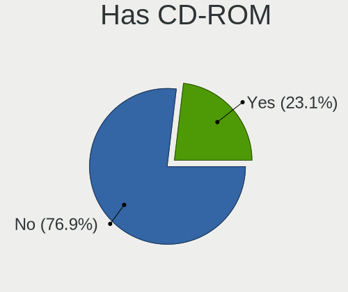
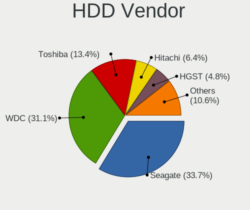
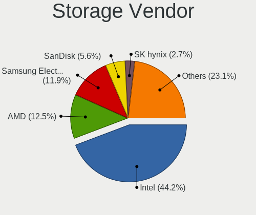
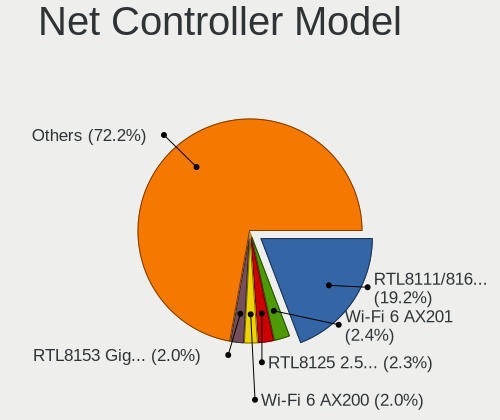
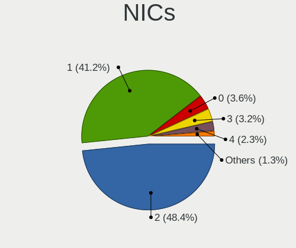
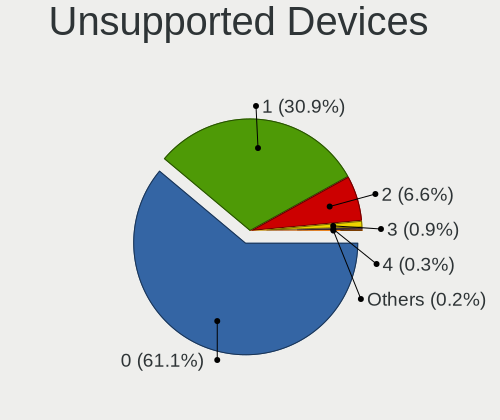

Debian 12 - Tested Hardware & Statistics
----------------------------------------

A project to collect tested hardware configurations for Debian 12.

Anyone can contribute to this report by the [hw-probe](https://github.com/linuxhw/hw-probe) tool:

    sudo -E hw-probe -all -upload

Please contribute! Especially if your hardware is rare.

This is a report for all computer types. See also reports for [desktops](/Dist/Debian_12/Desktop/README.md) and [notebooks](/Dist/Debian_12/Notebook/README.md).

Contents
--------

* [ Test Cases ](#test-cases)

* [ System ](#system)
  - [ Kernel                   ](#kernel)
  - [ Kernel Family            ](#kernel-family)
  - [ Kernel Major Ver.        ](#kernel-major-ver)
  - [ Arch                     ](#arch)
  - [ DE                       ](#de)
  - [ Display Server           ](#display-server)
  - [ Display Manager          ](#display-manager)
  - [ OS Lang                  ](#os-lang)
  - [ Boot Mode                ](#boot-mode)
  - [ Filesystem               ](#filesystem)
  - [ Part. scheme             ](#part-scheme)
  - [ Dual Boot with Linux/BSD ](#dual-boot-with-linuxbsd)
  - [ Dual Boot (Win)          ](#dual-boot-win)

* [ Board ](#board)
  - [ Vendor                   ](#vendor)
  - [ Model                    ](#model)
  - [ Model Family             ](#model-family)
  - [ MFG Year                 ](#mfg-year)
  - [ Form Factor              ](#form-factor)
  - [ Secure Boot              ](#secure-boot)
  - [ Coreboot                 ](#coreboot)
  - [ RAM Size                 ](#ram-size)
  - [ RAM Used                 ](#ram-used)
  - [ Total Drives             ](#total-drives)
  - [ Has CD-ROM               ](#has-cd-rom)
  - [ Has Ethernet             ](#has-ethernet)
  - [ Has WiFi                 ](#has-wifi)
  - [ Has Bluetooth            ](#has-bluetooth)

* [ Location ](#location)
  - [ Country                  ](#country)
  - [ City                     ](#city)

* [ Drives ](#drives)
  - [ Drive Vendor             ](#drive-vendor)
  - [ Drive Model              ](#drive-model)
  - [ HDD Vendor               ](#hdd-vendor)
  - [ SSD Vendor               ](#ssd-vendor)
  - [ Drive Kind               ](#drive-kind)
  - [ Drive Connector          ](#drive-connector)
  - [ Drive Size               ](#drive-size)
  - [ Space Total              ](#space-total)
  - [ Space Used               ](#space-used)
  - [ Malfunc. Drives          ](#malfunc-drives)
  - [ Malfunc. Drive Vendor    ](#malfunc-drive-vendor)
  - [ Malfunc. HDD Vendor      ](#malfunc-hdd-vendor)
  - [ Malfunc. Drive Kind      ](#malfunc-drive-kind)
  - [ Failed Drives            ](#failed-drives)
  - [ Failed Drive Vendor      ](#failed-drive-vendor)
  - [ Drive Status             ](#drive-status)

* [ Storage controller ](#storage-controller)
  - [ Storage Vendor           ](#storage-vendor)
  - [ Storage Model            ](#storage-model)
  - [ Storage Kind             ](#storage-kind)

* [ Processor ](#processor)
  - [ CPU Vendor               ](#cpu-vendor)
  - [ CPU Model                ](#cpu-model)
  - [ CPU Model Family         ](#cpu-model-family)
  - [ CPU Cores                ](#cpu-cores)
  - [ CPU Sockets              ](#cpu-sockets)
  - [ CPU Threads              ](#cpu-threads)
  - [ CPU Op-Modes             ](#cpu-op-modes)
  - [ CPU Microcode            ](#cpu-microcode)
  - [ CPU Microarch            ](#cpu-microarch)

* [ Graphics ](#graphics)
  - [ GPU Vendor               ](#gpu-vendor)
  - [ GPU Model                ](#gpu-model)
  - [ GPU Combo                ](#gpu-combo)
  - [ GPU Driver               ](#gpu-driver)
  - [ GPU Memory               ](#gpu-memory)

* [ Monitor ](#monitor)
  - [ Monitor Vendor           ](#monitor-vendor)
  - [ Monitor Model            ](#monitor-model)
  - [ Monitor Resolution       ](#monitor-resolution)
  - [ Monitor Diagonal         ](#monitor-diagonal)
  - [ Monitor Width            ](#monitor-width)
  - [ Aspect Ratio             ](#aspect-ratio)
  - [ Monitor Area             ](#monitor-area)
  - [ Pixel Density            ](#pixel-density)
  - [ Multiple Monitors        ](#multiple-monitors)

* [ Network ](#network)
  - [ Net Controller Vendor    ](#net-controller-vendor)
  - [ Net Controller Model     ](#net-controller-model)
  - [ Wireless Vendor          ](#wireless-vendor)
  - [ Wireless Model           ](#wireless-model)
  - [ Ethernet Vendor          ](#ethernet-vendor)
  - [ Ethernet Model           ](#ethernet-model)
  - [ Net Controller Kind      ](#net-controller-kind)
  - [ Used Controller          ](#used-controller)
  - [ NICs                     ](#nics)
  - [ IPv6                     ](#ipv6)

* [ Bluetooth ](#bluetooth)
  - [ Bluetooth Vendor         ](#bluetooth-vendor)
  - [ Bluetooth Model          ](#bluetooth-model)

* [ Sound ](#sound)
  - [ Sound Vendor             ](#sound-vendor)
  - [ Sound Model              ](#sound-model)

* [ Memory ](#memory)
  - [ Memory Vendor            ](#memory-vendor)
  - [ Memory Model             ](#memory-model)
  - [ Memory Kind              ](#memory-kind)
  - [ Memory Form Factor       ](#memory-form-factor)
  - [ Memory Size              ](#memory-size)
  - [ Memory Speed             ](#memory-speed)

* [ Printers & scanners ](#printers--scanners)
  - [ Printer Vendor           ](#printer-vendor)
  - [ Printer Model            ](#printer-model)
  - [ Scanner Vendor           ](#scanner-vendor)
  - [ Scanner Model            ](#scanner-model)

* [ Camera ](#camera)
  - [ Camera Vendor            ](#camera-vendor)
  - [ Camera Model             ](#camera-model)

* [ Security ](#security)
  - [ Fingerprint Vendor       ](#fingerprint-vendor)
  - [ Fingerprint Model        ](#fingerprint-model)
  - [ Chipcard Vendor          ](#chipcard-vendor)
  - [ Chipcard Model           ](#chipcard-model)

* [ Unsupported ](#unsupported)
  - [ Unsupported Devices      ](#unsupported-devices)
  - [ Unsupported Device Types ](#unsupported-device-types)

Test Cases
----------

Total: 1958

| Vendor        | Model                       | Form-Factor | Probe                                                      | Date         |
|---------------|-----------------------------|-------------|------------------------------------------------------------|--------------|
| HP            | ProLiant MicroServer Gen... | Desktop     | [aeb0b469c8](https://linux-hardware.org/?probe=aeb0b469c8) | Oct 01, 2023 |
| Acer          | AOA150                      | Notebook    | [969a729098](https://linux-hardware.org/?probe=969a729098) | Oct 01, 2023 |
| Apple         | MacBook4,1                  | Notebook    | [d17d6d2b70](https://linux-hardware.org/?probe=d17d6d2b70) | Oct 01, 2023 |
| Apple         | Mac-942B5BF58194151B        | All in one  | [7eebcdc80b](https://linux-hardware.org/?probe=7eebcdc80b) | Oct 01, 2023 |
| HP            | Pavilion Laptop 15t-eg30... | Notebook    | [ed7bf5aee1](https://linux-hardware.org/?probe=ed7bf5aee1) | Oct 01, 2023 |
| Lenovo        | Legion Pro 5 16ARX8 82WM    | Notebook    | [83d91ea2fe](https://linux-hardware.org/?probe=83d91ea2fe) | Sep 30, 2023 |
| Unknown       | Unknown                     | Soc         | [8024d770d9](https://linux-hardware.org/?probe=8024d770d9) | Sep 30, 2023 |
| Lenovo        | ThinkPad X260 VB6R77903H    | Notebook    | [e7dad368d2](https://linux-hardware.org/?probe=e7dad368d2) | Sep 30, 2023 |
| Lenovo        | ThinkPad X260 VB6R77903H    | Notebook    | [de3079ae33](https://linux-hardware.org/?probe=de3079ae33) | Sep 30, 2023 |
| IX1401        | Unknown                     | Notebook    | [c77c1d010e](https://linux-hardware.org/?probe=c77c1d010e) | Sep 30, 2023 |
| HP            | Spectre x360 2-in-1 Lapt... | Convertible | [eab41d0848](https://linux-hardware.org/?probe=eab41d0848) | Sep 30, 2023 |
| HP            | Pavilion dv5                | Notebook    | [0b1da8643f](https://linux-hardware.org/?probe=0b1da8643f) | Sep 30, 2023 |
| Alienware     | m15 R4                      | Notebook    | [a67899ed06](https://linux-hardware.org/?probe=a67899ed06) | Sep 30, 2023 |
| Google        | Jerry                       | Desktop     | [467be71aaf](https://linux-hardware.org/?probe=467be71aaf) | Sep 30, 2023 |
| Fujitsu Si... | ESPRIMO Mobile V6555        | Notebook    | [703170e428](https://linux-hardware.org/?probe=703170e428) | Sep 30, 2023 |
| HP            | Notebook                    | Notebook    | [193ec8deb3](https://linux-hardware.org/?probe=193ec8deb3) | Sep 30, 2023 |
| Lenovo        | 0B98401 PRO                 | Desktop     | [17bb772d78](https://linux-hardware.org/?probe=17bb772d78) | Sep 29, 2023 |
| Gigabyte      | B450M DS3H-CF               | Desktop     | [3473652871](https://linux-hardware.org/?probe=3473652871) | Sep 29, 2023 |
| Acer          | Veriton Z4820G              | All in one  | [5db8dac17e](https://linux-hardware.org/?probe=5db8dac17e) | Sep 29, 2023 |
| HP            | Pavilion dv9000 (GA359UA... | Notebook    | [cea70d5f75](https://linux-hardware.org/?probe=cea70d5f75) | Sep 29, 2023 |
| Dell          | Inspiron 5570               | Notebook    | [0e12b69b96](https://linux-hardware.org/?probe=0e12b69b96) | Sep 29, 2023 |
| Lenovo        | ThinkPad T500 22439AG       | Notebook    | [e5a2cd9816](https://linux-hardware.org/?probe=e5a2cd9816) | Sep 29, 2023 |
| ASUSTek       | ROG STRIX X670E-F GAMING... | Desktop     | [5c38fe5e79](https://linux-hardware.org/?probe=5c38fe5e79) | Sep 28, 2023 |
| Pegatron      | JESSE                       | Desktop     | [3f6cf71237](https://linux-hardware.org/?probe=3f6cf71237) | Sep 28, 2023 |
| Lenovo        | ThinkPad E490 20N8000SRT    | Notebook    | [274b3b5210](https://linux-hardware.org/?probe=274b3b5210) | Sep 28, 2023 |
| Lenovo        | IdeaPad Slim 5 14ABR8 82... | Notebook    | [c61d70bcfa](https://linux-hardware.org/?probe=c61d70bcfa) | Sep 28, 2023 |
| Lenovo        | IdeaPad Slim 5 16ABR8 82... | Notebook    | [1fcc841148](https://linux-hardware.org/?probe=1fcc841148) | Sep 28, 2023 |
| Lenovo        | IdeaPad Slim 5 14ABR8 82... | Notebook    | [be49c167d0](https://linux-hardware.org/?probe=be49c167d0) | Sep 28, 2023 |
| Huanan        | X99-F8 GAMING V5.0          | Desktop     | [62ba806672](https://linux-hardware.org/?probe=62ba806672) | Sep 28, 2023 |
| Apple         | MacBookAir7,2               | Notebook    | [c25eeffab1](https://linux-hardware.org/?probe=c25eeffab1) | Sep 28, 2023 |
| ASRock        | B450 Pro4 R2.0              | Desktop     | [82562e75c3](https://linux-hardware.org/?probe=82562e75c3) | Sep 28, 2023 |
| Shenzhen M... | F7BAA                       | Desktop     | [a59f2cf9f2](https://linux-hardware.org/?probe=a59f2cf9f2) | Sep 28, 2023 |
| Acer          | Acadia V1.35                | Notebook    | [c2074b2535](https://linux-hardware.org/?probe=c2074b2535) | Sep 28, 2023 |
| Lenovo        | ThinkPad 13 2nd Gen 20J1... | Notebook    | [3cb2bdba37](https://linux-hardware.org/?probe=3cb2bdba37) | Sep 27, 2023 |
| EUROCOM       | RACER 2.0                   | Notebook    | [4351733d37](https://linux-hardware.org/?probe=4351733d37) | Sep 27, 2023 |
| HP            | ElitePad 1000 G2            | Notebook    | [2668770971](https://linux-hardware.org/?probe=2668770971) | Sep 27, 2023 |
| Fujitsu       | LIFEBOOK E4512              | Notebook    | [08b39b38bd](https://linux-hardware.org/?probe=08b39b38bd) | Sep 27, 2023 |
| ASUSTek       | K50IJ                       | Notebook    | [8556633dad](https://linux-hardware.org/?probe=8556633dad) | Sep 27, 2023 |
| Lenovo        | IdeaPad Gaming 3 15IMH05... | Notebook    | [1317c1f1a9](https://linux-hardware.org/?probe=1317c1f1a9) | Sep 27, 2023 |
| Lenovo        | ThinkPad E475 20H40006US    | Notebook    | [1a472d3072](https://linux-hardware.org/?probe=1a472d3072) | Sep 27, 2023 |
| MSI           | Z97 PC Mate                 | Desktop     | [15a7321226](https://linux-hardware.org/?probe=15a7321226) | Sep 27, 2023 |
| MSI           | Z97 PC Mate                 | Desktop     | [18bf7cff74](https://linux-hardware.org/?probe=18bf7cff74) | Sep 27, 2023 |
| Dell          | Latitude E6530              | Notebook    | [40cdcd2545](https://linux-hardware.org/?probe=40cdcd2545) | Sep 27, 2023 |
| Unknown       | Unknown                     | Desktop     | [2bf5f64c14](https://linux-hardware.org/?probe=2bf5f64c14) | Sep 27, 2023 |
| Gigabyte      | GA-970A-D3                  | Desktop     | [a4d1820df5](https://linux-hardware.org/?probe=a4d1820df5) | Sep 27, 2023 |
| Gigabyte      | GA-880GM-USB3L              | Desktop     | [f160911c14](https://linux-hardware.org/?probe=f160911c14) | Sep 27, 2023 |
| Lenovo        | 0B98401 PRO                 | Desktop     | [2cdf3dac45](https://linux-hardware.org/?probe=2cdf3dac45) | Sep 27, 2023 |
| YANYU         | H17SL                       | Desktop     | [5966ae64d0](https://linux-hardware.org/?probe=5966ae64d0) | Sep 26, 2023 |
| Acer          | Aspire 5951G                | Notebook    | [cae145acab](https://linux-hardware.org/?probe=cae145acab) | Sep 26, 2023 |
| Lenovo        | ThinkPad E475 20H40006US    | Notebook    | [d406193722](https://linux-hardware.org/?probe=d406193722) | Sep 26, 2023 |
| Dell          | XPS 9315                    | Notebook    | [6fa1beb451](https://linux-hardware.org/?probe=6fa1beb451) | Sep 26, 2023 |
| Lenovo        | ThinkPad T420 4236EV9       | Notebook    | [d621ecd81f](https://linux-hardware.org/?probe=d621ecd81f) | Sep 26, 2023 |
| Aquarius      | NS585                       | Notebook    | [ce1c1d6e56](https://linux-hardware.org/?probe=ce1c1d6e56) | Sep 26, 2023 |
| Lenovo        | ThinkServer TS440           | Desktop     | [11efb68800](https://linux-hardware.org/?probe=11efb68800) | Sep 26, 2023 |
| Lenovo        | ThinkPad L13 Yoga Gen 2 ... | Convertible | [d2ac451979](https://linux-hardware.org/?probe=d2ac451979) | Sep 26, 2023 |
| ASUSTek       | PN41                        | Mini pc     | [40d7200bd5](https://linux-hardware.org/?probe=40d7200bd5) | Sep 26, 2023 |
| Lenovo        | 102F SDK0E50510 WIN 2625... | Desktop     | [4a36dbb8ff](https://linux-hardware.org/?probe=4a36dbb8ff) | Sep 26, 2023 |
| Acer          | Aspire A515-47              | Notebook    | [3c1e418bf0](https://linux-hardware.org/?probe=3c1e418bf0) | Sep 26, 2023 |
| ASUSTek       | Zenbook UM3402YAR_UM3402... | Notebook    | [9e9ff26362](https://linux-hardware.org/?probe=9e9ff26362) | Sep 26, 2023 |
| ASUSTek       | M5A78L-M LE/USB3            | Desktop     | [19858af3cd](https://linux-hardware.org/?probe=19858af3cd) | Sep 26, 2023 |
| Acer          | Aspire A515-56              | Notebook    | [b047457fd1](https://linux-hardware.org/?probe=b047457fd1) | Sep 25, 2023 |
| Dell          | XPS 15 9560                 | Notebook    | [a524453c71](https://linux-hardware.org/?probe=a524453c71) | Sep 25, 2023 |
| Apple         | Mac-F2268CC8                | All in one  | [4805d7055d](https://linux-hardware.org/?probe=4805d7055d) | Sep 25, 2023 |
| Lenovo        | G710 20252                  | Notebook    | [d7926809d7](https://linux-hardware.org/?probe=d7926809d7) | Sep 25, 2023 |
| Apple         | Mac-F2268CC8                | All in one  | [af6b7acf6e](https://linux-hardware.org/?probe=af6b7acf6e) | Sep 25, 2023 |
| HP            | Presario CQ43               | Notebook    | [c206dc84ad](https://linux-hardware.org/?probe=c206dc84ad) | Sep 25, 2023 |
| Lenovo        | ThinkPad L13 Yoga Gen 2 ... | Convertible | [884cb2236d](https://linux-hardware.org/?probe=884cb2236d) | Sep 25, 2023 |
| AMI           | Aptio CRB                   | Mini pc     | [ca65327602](https://linux-hardware.org/?probe=ca65327602) | Sep 25, 2023 |
| Aquarius      | NS585                       | Notebook    | [e901467e39](https://linux-hardware.org/?probe=e901467e39) | Sep 25, 2023 |
| Lenovo        | ThinkPad X270 W10DG 20K5... | Notebook    | [ab332c2dcb](https://linux-hardware.org/?probe=ab332c2dcb) | Sep 25, 2023 |
| Lenovo        | ThinkPad L13 Yoga Gen 2 ... | Convertible | [fb576eef77](https://linux-hardware.org/?probe=fb576eef77) | Sep 25, 2023 |
| Acer          | Aspire 5951G                | Notebook    | [4c50b8e9b0](https://linux-hardware.org/?probe=4c50b8e9b0) | Sep 25, 2023 |
| Lenovo        | ThinkPad T440s 20ARS0CN0... | Notebook    | [9c0b702e21](https://linux-hardware.org/?probe=9c0b702e21) | Sep 24, 2023 |
| Dell          | 0WXF9V A02                  | Server      | [842186b04e](https://linux-hardware.org/?probe=842186b04e) | Sep 24, 2023 |
| Fujitsu       | D3067-A1 S26361-D3067-A1    | Desktop     | [14c3077129](https://linux-hardware.org/?probe=14c3077129) | Sep 24, 2023 |
| MSI           | Z370-A PRO                  | Desktop     | [77c3039fdc](https://linux-hardware.org/?probe=77c3039fdc) | Sep 24, 2023 |
| Dell          | 0D4MD1 A04                  | Desktop     | [5e6e35397a](https://linux-hardware.org/?probe=5e6e35397a) | Sep 24, 2023 |
| Dell          | 0D4MD1 A04                  | Desktop     | [4d7943532f](https://linux-hardware.org/?probe=4d7943532f) | Sep 24, 2023 |
| Dell          | Latitude 5420               | Notebook    | [0e22f551b9](https://linux-hardware.org/?probe=0e22f551b9) | Sep 24, 2023 |
| Gigabyte      | B85M-D3H                    | Desktop     | [e568bc8439](https://linux-hardware.org/?probe=e568bc8439) | Sep 23, 2023 |
| HP            | 250 G8 Notebook PC          | Notebook    | [6b3c3ce703](https://linux-hardware.org/?probe=6b3c3ce703) | Sep 23, 2023 |
| Lenovo        | ThinkPad X1 Carbon 6th 2... | Notebook    | [42309ddc8c](https://linux-hardware.org/?probe=42309ddc8c) | Sep 23, 2023 |
| ASUSTek       | ROG STRIX B550-F GAMING     | Desktop     | [e96b971928](https://linux-hardware.org/?probe=e96b971928) | Sep 23, 2023 |
| HP            | 250 G8 Notebook PC          | Notebook    | [e2dd7767f0](https://linux-hardware.org/?probe=e2dd7767f0) | Sep 23, 2023 |
| Dell          | 0NW6H5 A00                  | Desktop     | [c3221c93ca](https://linux-hardware.org/?probe=c3221c93ca) | Sep 23, 2023 |
| Dell          | 0PC5F7 A01                  | Desktop     | [887558c8f3](https://linux-hardware.org/?probe=887558c8f3) | Sep 23, 2023 |
| Dell          | 03KWTV A02                  | Desktop     | [991ec32c75](https://linux-hardware.org/?probe=991ec32c75) | Sep 23, 2023 |
| Dell          | Latitude 5290 2-in-1        | Tablet      | [39781eeb86](https://linux-hardware.org/?probe=39781eeb86) | Sep 23, 2023 |
| HP            | EliteBook 845 G8 Noteboo... | Notebook    | [574c2193bb](https://linux-hardware.org/?probe=574c2193bb) | Sep 23, 2023 |
| Gigabyte      | B250M-Gaming5-CF            | Desktop     | [f18f8ef020](https://linux-hardware.org/?probe=f18f8ef020) | Sep 23, 2023 |
| Lenovo        | ThinkPad L13 Gen 3 21B90... | Notebook    | [e273beb83a](https://linux-hardware.org/?probe=e273beb83a) | Sep 22, 2023 |
| Lenovo        | ThinkPad T470s W10DG 20J... | Notebook    | [ad1b8126d2](https://linux-hardware.org/?probe=ad1b8126d2) | Sep 22, 2023 |
| Lenovo        | ThinkPad L13 Yoga Gen 2 ... | Convertible | [657170674d](https://linux-hardware.org/?probe=657170674d) | Sep 22, 2023 |
| Lenovo        | ThinkPad L13 Gen 3 21B90... | Notebook    | [0d786ffd74](https://linux-hardware.org/?probe=0d786ffd74) | Sep 22, 2023 |
| Lenovo        | ThinkPad L13 Yoga Gen 2 ... | Convertible | [5080d645a6](https://linux-hardware.org/?probe=5080d645a6) | Sep 22, 2023 |
| Lenovo        | ThinkPad L13 Yoga Gen 2 ... | Convertible | [5e2e6b4e33](https://linux-hardware.org/?probe=5e2e6b4e33) | Sep 22, 2023 |
| Shenzhen M... | F6BFC                       | Desktop     | [9a906f1b75](https://linux-hardware.org/?probe=9a906f1b75) | Sep 22, 2023 |
| Dell          | 0NW6H5 A00                  | Desktop     | [7df92bb8f5](https://linux-hardware.org/?probe=7df92bb8f5) | Sep 22, 2023 |
| MSI           | X470 GAMING PLUS            | Desktop     | [d22a656bef](https://linux-hardware.org/?probe=d22a656bef) | Sep 22, 2023 |
| Lenovo        | IdeaPad S340-15IWL 81N8     | Notebook    | [c14178c7fa](https://linux-hardware.org/?probe=c14178c7fa) | Sep 22, 2023 |
| Samsung       | R505                        | Notebook    | [8aef37cda9](https://linux-hardware.org/?probe=8aef37cda9) | Sep 22, 2023 |
| Olimex        | A20-OLinuXino-LIME2         | Soc         | [b2c0e79757](https://linux-hardware.org/?probe=b2c0e79757) | Sep 22, 2023 |
| Getac         | T800G2                      | Tablet      | [fe815f3c1f](https://linux-hardware.org/?probe=fe815f3c1f) | Sep 22, 2023 |
| HP            | Pavilion Aero Laptop 13-... | Notebook    | [4bf358cd4f](https://linux-hardware.org/?probe=4bf358cd4f) | Sep 22, 2023 |
| ASUSTek       | ROG Maximus XII EXTREME     | Desktop     | [2137a7a54b](https://linux-hardware.org/?probe=2137a7a54b) | Sep 22, 2023 |
| HP            | EliteBook 840 G3            | Notebook    | [b6379ef77c](https://linux-hardware.org/?probe=b6379ef77c) | Sep 22, 2023 |
| Apple         | Mac-81E3E92DD6088272 iMa... | All in one  | [e04cb1a779](https://linux-hardware.org/?probe=e04cb1a779) | Sep 21, 2023 |
| Lenovo        | ThinkPad E475 20H40006US    | Notebook    | [ea491d194f](https://linux-hardware.org/?probe=ea491d194f) | Sep 21, 2023 |
| Lenovo        | ThinkPad 13 2nd Gen 20J1... | Notebook    | [e33bb92eb6](https://linux-hardware.org/?probe=e33bb92eb6) | Sep 21, 2023 |
| Intel         | NUC13ANBi5 M89647-202       | Mini pc     | [8283dda5ff](https://linux-hardware.org/?probe=8283dda5ff) | Sep 21, 2023 |
| ASUSTek       | P7P55D                      | Desktop     | [ff8d00073e](https://linux-hardware.org/?probe=ff8d00073e) | Sep 21, 2023 |
| Lenovo        | V14 G3 IAP 82TS             | Notebook    | [2528381c0e](https://linux-hardware.org/?probe=2528381c0e) | Sep 21, 2023 |
| Gigabyte      | Z77X-UD3H                   | Desktop     | [f870f9e3ac](https://linux-hardware.org/?probe=f870f9e3ac) | Sep 21, 2023 |
| Lenovo        | ThinkPad L13 Yoga Gen 2 ... | Convertible | [68b870221c](https://linux-hardware.org/?probe=68b870221c) | Sep 21, 2023 |
| Lenovo        | Legion 5 15ACH6H 82JU       | Notebook    | [f9430fd075](https://linux-hardware.org/?probe=f9430fd075) | Sep 21, 2023 |
| Lenovo        | IdeaPadFlex 5 14ITL05 82... | Convertible | [c78cdff385](https://linux-hardware.org/?probe=c78cdff385) | Sep 21, 2023 |
| Lenovo        | ThinkPad L13 Yoga Gen 2 ... | Convertible | [7528d162d0](https://linux-hardware.org/?probe=7528d162d0) | Sep 20, 2023 |
| Lenovo        | ThinkPad 13 2nd Gen 20J1... | Notebook    | [e337cc85e5](https://linux-hardware.org/?probe=e337cc85e5) | Sep 20, 2023 |
| Gigabyte      | Z790 AERO G                 | Desktop     | [0c99fa225e](https://linux-hardware.org/?probe=0c99fa225e) | Sep 20, 2023 |
| Acer          | Aspire E1-531               | Notebook    | [f0173f0458](https://linux-hardware.org/?probe=f0173f0458) | Sep 20, 2023 |
| Lenovo        | ThinkPad L390 20NRCTO1WW    | Notebook    | [228d31bf59](https://linux-hardware.org/?probe=228d31bf59) | Sep 20, 2023 |
| iEi           | SAT3 V1.03                  | Desktop     | [d303736416](https://linux-hardware.org/?probe=d303736416) | Sep 20, 2023 |
| Gigabyte      | Z270-Gaming K3              | Desktop     | [63bebc9690](https://linux-hardware.org/?probe=63bebc9690) | Sep 20, 2023 |
| Dell          | XPS 13 9300                 | Notebook    | [49bb68e979](https://linux-hardware.org/?probe=49bb68e979) | Sep 20, 2023 |
| HP            | ProBook 450 G1              | Notebook    | [4e5ae95013](https://linux-hardware.org/?probe=4e5ae95013) | Sep 20, 2023 |
| ASUSTek       | X556UQ                      | Notebook    | [c34d9b9514](https://linux-hardware.org/?probe=c34d9b9514) | Sep 20, 2023 |
| CWWK          | MINIPC-G12                  | Desktop     | [003a19cc19](https://linux-hardware.org/?probe=003a19cc19) | Sep 20, 2023 |
| ASUSTek       | X556UQ                      | Notebook    | [7ec3567855](https://linux-hardware.org/?probe=7ec3567855) | Sep 20, 2023 |
| ASUSTek       | X556UQ                      | Notebook    | [676dd13401](https://linux-hardware.org/?probe=676dd13401) | Sep 20, 2023 |
| Lenovo        | IdeaPad Y700-15ISK 80NV     | Notebook    | [5662d8f95c](https://linux-hardware.org/?probe=5662d8f95c) | Sep 20, 2023 |
| Gigabyte      | Z790 AERO G                 | Desktop     | [6ded2501bf](https://linux-hardware.org/?probe=6ded2501bf) | Sep 20, 2023 |
| BESSTAR Te... | HM90                        | Desktop     | [bbb35ce98b](https://linux-hardware.org/?probe=bbb35ce98b) | Sep 20, 2023 |
| ASUSTek       | Z9PA-D8 Series              | Server      | [e4686e182a](https://linux-hardware.org/?probe=e4686e182a) | Sep 19, 2023 |
| ASUSTek       | Z9PA-D8 Series              | Server      | [2bc60f54d0](https://linux-hardware.org/?probe=2bc60f54d0) | Sep 19, 2023 |
| ASUSTek       | PRIME B450M-GAMING/BR       | Desktop     | [6d9002e7e3](https://linux-hardware.org/?probe=6d9002e7e3) | Sep 19, 2023 |
| ASUSTek       | PRIME B450M-GAMING/BR       | Desktop     | [c53d44303e](https://linux-hardware.org/?probe=c53d44303e) | Sep 19, 2023 |
| MSI           | MPG B760I EDGE WIFI DDR4    | Desktop     | [5a6ff779bd](https://linux-hardware.org/?probe=5a6ff779bd) | Sep 19, 2023 |
| HP            | Laptop 15-bs0xx             | Notebook    | [963330511d](https://linux-hardware.org/?probe=963330511d) | Sep 19, 2023 |
| Gigabyte      | H81M-DS2                    | Desktop     | [85d35b008d](https://linux-hardware.org/?probe=85d35b008d) | Sep 19, 2023 |
| MSI           | A320M-A PRO                 | Desktop     | [03da63d741](https://linux-hardware.org/?probe=03da63d741) | Sep 19, 2023 |
| Notebook      | P7xxDM3(-G)                 | Notebook    | [b302c7b008](https://linux-hardware.org/?probe=b302c7b008) | Sep 19, 2023 |
| Lenovo        | ThinkPad X61s 7666Y2X       | Notebook    | [177e40808d](https://linux-hardware.org/?probe=177e40808d) | Sep 19, 2023 |
| Notebook      | P7xxDM3(-G)                 | Notebook    | [ec386099b2](https://linux-hardware.org/?probe=ec386099b2) | Sep 19, 2023 |
| Lenovo        | 3190 SDK0T76530 WIN 3556... | Mini pc     | [2179b0b458](https://linux-hardware.org/?probe=2179b0b458) | Sep 19, 2023 |
| Lenovo        | 312D SDK0J40697 WIN 3305... | Mini pc     | [8d1653a141](https://linux-hardware.org/?probe=8d1653a141) | Sep 19, 2023 |
| HP            | Laptop 17-cp0xxx            | Notebook    | [05e3350e1f](https://linux-hardware.org/?probe=05e3350e1f) | Sep 19, 2023 |
| Dell          | XPS 13 9360                 | Notebook    | [149f246bd7](https://linux-hardware.org/?probe=149f246bd7) | Sep 19, 2023 |
| ASUSTek       | ROG STRIX B650E-I GAMING... | Desktop     | [b06b302844](https://linux-hardware.org/?probe=b06b302844) | Sep 19, 2023 |
| Acer          | Aspire A515-56              | Notebook    | [db16273e72](https://linux-hardware.org/?probe=db16273e72) | Sep 19, 2023 |
| Gigabyte      | 970A-DS3P                   | Desktop     | [0ddcc2944f](https://linux-hardware.org/?probe=0ddcc2944f) | Sep 19, 2023 |
| Intel Clie... | LAPBC710                    | Notebook    | [af446fcb4d](https://linux-hardware.org/?probe=af446fcb4d) | Sep 19, 2023 |
| Intel Clie... | LAPBC710                    | Notebook    | [eae124fa61](https://linux-hardware.org/?probe=eae124fa61) | Sep 19, 2023 |
| HP            | Laptop 15-bs0xx             | Notebook    | [5f8df7dfcb](https://linux-hardware.org/?probe=5f8df7dfcb) | Sep 19, 2023 |
| Dell          | Latitude E6430              | Notebook    | [d83d7bbfa8](https://linux-hardware.org/?probe=d83d7bbfa8) | Sep 18, 2023 |
| HP            | 15                          | Notebook    | [b016d5ee79](https://linux-hardware.org/?probe=b016d5ee79) | Sep 18, 2023 |
| HP            | 82A2                        | Desktop     | [cc179a17a8](https://linux-hardware.org/?probe=cc179a17a8) | Sep 18, 2023 |
| ASUSTek       | TUF B450-PLUS GAMING        | Desktop     | [a64dc1766a](https://linux-hardware.org/?probe=a64dc1766a) | Sep 18, 2023 |
| Acer          | Veriton Z4630G              | All in one  | [c492dcbc41](https://linux-hardware.org/?probe=c492dcbc41) | Sep 18, 2023 |
| MSI           | MS-7366                     | Desktop     | [96731b6fc6](https://linux-hardware.org/?probe=96731b6fc6) | Sep 18, 2023 |
| Aquarius      | NS585                       | Notebook    | [6ac8bd5909](https://linux-hardware.org/?probe=6ac8bd5909) | Sep 18, 2023 |
| Acer          | Veriton Z4630G              | All in one  | [1515603de8](https://linux-hardware.org/?probe=1515603de8) | Sep 18, 2023 |
| ASUSTek       | J1800I-C                    | Desktop     | [970e148d8d](https://linux-hardware.org/?probe=970e148d8d) | Sep 18, 2023 |
| HP            | Mini 110-1000               | Notebook    | [dda4d7a910](https://linux-hardware.org/?probe=dda4d7a910) | Sep 18, 2023 |
| MSI           | H81M-P33                    | Desktop     | [d0287bbd0f](https://linux-hardware.org/?probe=d0287bbd0f) | Sep 18, 2023 |
| HP            | Mini 110-1000               | Notebook    | [ee2d142228](https://linux-hardware.org/?probe=ee2d142228) | Sep 18, 2023 |
| ASUSTek       | TUF B450-PLUS GAMING        | Desktop     | [3faff3c0aa](https://linux-hardware.org/?probe=3faff3c0aa) | Sep 18, 2023 |
| Lenovo        | 7X16CTO1WW                  | Server      | [b6d0938617](https://linux-hardware.org/?probe=b6d0938617) | Sep 18, 2023 |
| Dell          | 084XW4 A06                  | Server      | [ea77b31f41](https://linux-hardware.org/?probe=ea77b31f41) | Sep 18, 2023 |
| Lenovo        | SB27B23563 03               | Server      | [b6b52e11fe](https://linux-hardware.org/?probe=b6b52e11fe) | Sep 18, 2023 |
| Gigabyte      | GA-78LMT-USB3               | Desktop     | [cfa7fbd3fe](https://linux-hardware.org/?probe=cfa7fbd3fe) | Sep 18, 2023 |
| AZW           | U59                         | Desktop     | [2bc9b4b184](https://linux-hardware.org/?probe=2bc9b4b184) | Sep 17, 2023 |
| Gigabyte      | H97-HD3                     | Desktop     | [ac1361d323](https://linux-hardware.org/?probe=ac1361d323) | Sep 17, 2023 |
| HP            | 1905                        | Desktop     | [688c5ddf16](https://linux-hardware.org/?probe=688c5ddf16) | Sep 17, 2023 |
| HP            | 1905                        | Desktop     | [562179ca0e](https://linux-hardware.org/?probe=562179ca0e) | Sep 17, 2023 |
| HP            | Compaq Mini 311-1100        | Notebook    | [8bdfb6307c](https://linux-hardware.org/?probe=8bdfb6307c) | Sep 17, 2023 |
| HP            | Laptop 15-dw3xxx            | Notebook    | [f84a480b09](https://linux-hardware.org/?probe=f84a480b09) | Sep 17, 2023 |
| Gigabyte      | X570 GAMING X               | Desktop     | [8af23c2e56](https://linux-hardware.org/?probe=8af23c2e56) | Sep 17, 2023 |
| MSI           | X470 GAMING PLUS            | Desktop     | [35d0dc4629](https://linux-hardware.org/?probe=35d0dc4629) | Sep 17, 2023 |
| Gigabyte      | X570 GAMING X               | Desktop     | [50bfb485e5](https://linux-hardware.org/?probe=50bfb485e5) | Sep 17, 2023 |
| Gigabyte      | X570 GAMING X               | Desktop     | [d795a474b2](https://linux-hardware.org/?probe=d795a474b2) | Sep 16, 2023 |
| MSI           | B460M-A PRO                 | Desktop     | [b2d52a5d1c](https://linux-hardware.org/?probe=b2d52a5d1c) | Sep 16, 2023 |
| ASUSTek       | ROG STRIX B550-I GAMING     | Desktop     | [6a908941cd](https://linux-hardware.org/?probe=6a908941cd) | Sep 16, 2023 |
| Lenovo        | ThinkPad P14s Gen 2a 21A... | Notebook    | [cda370cdc3](https://linux-hardware.org/?probe=cda370cdc3) | Sep 16, 2023 |
| ASRock        | B450M Pro4                  | Desktop     | [3974827c3e](https://linux-hardware.org/?probe=3974827c3e) | Sep 16, 2023 |
| AZW           | S5 V2.0                     | Mini pc     | [c10acf583a](https://linux-hardware.org/?probe=c10acf583a) | Sep 16, 2023 |
| Fujitsu       | D3220-A1 S26361-D3220-A1    | Desktop     | [effa0104c0](https://linux-hardware.org/?probe=effa0104c0) | Sep 16, 2023 |
| ASUSTek       | ASUSPRO P5440FA_P5440FA     | Notebook    | [b7c1a0a0a0](https://linux-hardware.org/?probe=b7c1a0a0a0) | Sep 16, 2023 |
| Fujitsu       | D3220-A1 S26361-D3220-A1    | Desktop     | [72ec01815f](https://linux-hardware.org/?probe=72ec01815f) | Sep 16, 2023 |
| Apple         | MacBookPro8,1               | Notebook    | [c3791ba730](https://linux-hardware.org/?probe=c3791ba730) | Sep 16, 2023 |
| Lenovo        | ThinkPad X201 3249CTO       | Notebook    | [f5884967d0](https://linux-hardware.org/?probe=f5884967d0) | Sep 16, 2023 |
| Dell          | Latitude E5570              | Notebook    | [fd5ba4aa5a](https://linux-hardware.org/?probe=fd5ba4aa5a) | Sep 15, 2023 |
| ASUSTek       | M5A78L-M LE/USB3            | Desktop     | [923d176004](https://linux-hardware.org/?probe=923d176004) | Sep 15, 2023 |
| MSI           | B450 GAMING PRO CARBON M... | Desktop     | [caba916cf4](https://linux-hardware.org/?probe=caba916cf4) | Sep 15, 2023 |
| Dell          | Precision 5570              | Notebook    | [8b3c21b110](https://linux-hardware.org/?probe=8b3c21b110) | Sep 15, 2023 |
| Supermicro    | X11SSH-F                    | Desktop     | [2f12035902](https://linux-hardware.org/?probe=2f12035902) | Sep 15, 2023 |
| Supermicro    | X11SSH-F                    | Desktop     | [c46a08bb48](https://linux-hardware.org/?probe=c46a08bb48) | Sep 15, 2023 |
| Supermicro    | X11SSH-F                    | Desktop     | [aa351597ea](https://linux-hardware.org/?probe=aa351597ea) | Sep 15, 2023 |
| Lenovo        | ThinkPad P15 Gen 1 20STC... | Notebook    | [66b29aeb1d](https://linux-hardware.org/?probe=66b29aeb1d) | Sep 15, 2023 |
| Lenovo        | Yoga Pro 9 16IRP8 83BY      | Notebook    | [eaa723190d](https://linux-hardware.org/?probe=eaa723190d) | Sep 15, 2023 |
| Gigabyte      | B250M-D3H-CF                | Desktop     | [e9d6d94486](https://linux-hardware.org/?probe=e9d6d94486) | Sep 15, 2023 |
| ASUSTek       | X507UB                      | Notebook    | [ca19710375](https://linux-hardware.org/?probe=ca19710375) | Sep 15, 2023 |
| JINGSHA       | X99-D8I                     | Desktop     | [2865a9b1e6](https://linux-hardware.org/?probe=2865a9b1e6) | Sep 15, 2023 |
| ZOTAC         | ZBOX-BI323                  | Mini pc     | [1ef2a06e65](https://linux-hardware.org/?probe=1ef2a06e65) | Sep 15, 2023 |
| ASUSTek       | X751LN                      | Notebook    | [77ecc965aa](https://linux-hardware.org/?probe=77ecc965aa) | Sep 14, 2023 |
| AZW           | GTR V01                     | Mini pc     | [e78f0ae1db](https://linux-hardware.org/?probe=e78f0ae1db) | Sep 14, 2023 |
| ASUSTek       | VivoBook 15_ASUS Laptop ... | Notebook    | [0ffb2a765f](https://linux-hardware.org/?probe=0ffb2a765f) | Sep 14, 2023 |
| ASUSTek       | PRIME H510M-A               | Desktop     | [b66654e80e](https://linux-hardware.org/?probe=b66654e80e) | Sep 14, 2023 |
| ASUSTek       | P8H61/USB3                  | Desktop     | [cf48b0b959](https://linux-hardware.org/?probe=cf48b0b959) | Sep 14, 2023 |
| Toshiba       | PORTEGE Z830                | Notebook    | [a3e1ac295c](https://linux-hardware.org/?probe=a3e1ac295c) | Sep 14, 2023 |
| ASUSTek       | P553UJ                      | Notebook    | [3463413300](https://linux-hardware.org/?probe=3463413300) | Sep 14, 2023 |
| Toshiba       | PORTEGE Z830                | Notebook    | [6f4c4a4120](https://linux-hardware.org/?probe=6f4c4a4120) | Sep 14, 2023 |
| ASUSTek       | TUF Gaming FX505DT_FX505... | Notebook    | [d27fa5404b](https://linux-hardware.org/?probe=d27fa5404b) | Sep 14, 2023 |
| Dell          | Latitude 5440               | Notebook    | [93a296a628](https://linux-hardware.org/?probe=93a296a628) | Sep 14, 2023 |
| Lenovo        | ThinkPad T14s Gen 3 21CQ... | Notebook    | [033eca4030](https://linux-hardware.org/?probe=033eca4030) | Sep 14, 2023 |
| HP            | 245 G7 Notebook PC          | Notebook    | [ab68dea087](https://linux-hardware.org/?probe=ab68dea087) | Sep 14, 2023 |
| Lenovo        | ThinkServer TS440           | Desktop     | [8ffd465a75](https://linux-hardware.org/?probe=8ffd465a75) | Sep 14, 2023 |
| HP            | ProBook 6570b               | Notebook    | [fc5c01d215](https://linux-hardware.org/?probe=fc5c01d215) | Sep 14, 2023 |
| Lenovo        | ThinkPad P14s Gen 3 21AK... | Notebook    | [0cdeaab8be](https://linux-hardware.org/?probe=0cdeaab8be) | Sep 13, 2023 |
| MSI           | GS66 Stealth 11UG           | Notebook    | [304abac74b](https://linux-hardware.org/?probe=304abac74b) | Sep 13, 2023 |
| SolidRun      | CEX7 Platform               | Desktop     | [2a695cf7f9](https://linux-hardware.org/?probe=2a695cf7f9) | Sep 13, 2023 |
| AZW           | MINI S 10                   | Desktop     | [f6bc099f62](https://linux-hardware.org/?probe=f6bc099f62) | Sep 13, 2023 |
| HP            | Stream Notebook PC 11       | Notebook    | [f4c5ae4297](https://linux-hardware.org/?probe=f4c5ae4297) | Sep 13, 2023 |
| SolidRun      | CEX7 Platform               | Desktop     | [06b4774756](https://linux-hardware.org/?probe=06b4774756) | Sep 13, 2023 |
| Acer          | AOA150                      | Notebook    | [bc32c4814d](https://linux-hardware.org/?probe=bc32c4814d) | Sep 13, 2023 |
| Raspberry ... | Raspberry Pi 4 Model B R... | Soc         | [7790ba0149](https://linux-hardware.org/?probe=7790ba0149) | Sep 13, 2023 |
| ASUSTek       | H110M-R                     | Desktop     | [3530c6e606](https://linux-hardware.org/?probe=3530c6e606) | Sep 13, 2023 |
| Lenovo        | IdeaPadFlex 5 14ITL05 82... | Convertible | [0be4e6cba4](https://linux-hardware.org/?probe=0be4e6cba4) | Sep 13, 2023 |
| Supermicro    | X11SSH-F                    | Desktop     | [3a9630bdc5](https://linux-hardware.org/?probe=3a9630bdc5) | Sep 13, 2023 |
| Microsoft     | Surface Pro 4               | Tablet      | [a209a26a65](https://linux-hardware.org/?probe=a209a26a65) | Sep 13, 2023 |
| Lenovo        | ThinkPad X230 232036U       | Notebook    | [58ec12094c](https://linux-hardware.org/?probe=58ec12094c) | Sep 13, 2023 |
| Google        | Cave                        | Notebook    | [74c8e00b23](https://linux-hardware.org/?probe=74c8e00b23) | Sep 13, 2023 |
| Intel         | NUC12WSBi5 M46425-304       | Mini pc     | [d809b1e20f](https://linux-hardware.org/?probe=d809b1e20f) | Sep 13, 2023 |
| Gigabyte      | H110M-H-CF                  | Desktop     | [31cc220aae](https://linux-hardware.org/?probe=31cc220aae) | Sep 12, 2023 |
| Dell          | 02N3WF A01                  | Desktop     | [9bd19e6fbf](https://linux-hardware.org/?probe=9bd19e6fbf) | Sep 12, 2023 |
| Dell          | Latitude E6430              | Notebook    | [79cf77c6ba](https://linux-hardware.org/?probe=79cf77c6ba) | Sep 12, 2023 |
| Dell          | Latitude E7470              | Notebook    | [4f2094dfef](https://linux-hardware.org/?probe=4f2094dfef) | Sep 12, 2023 |
| ASUSTek       | H110M-K                     | Desktop     | [ba05e7b3a7](https://linux-hardware.org/?probe=ba05e7b3a7) | Sep 12, 2023 |
| MSI           | H510M-A PRO                 | Desktop     | [f1a2a6d936](https://linux-hardware.org/?probe=f1a2a6d936) | Sep 12, 2023 |
| Gigabyte      | GA-870A-UD3                 | Desktop     | [b3acd03fb0](https://linux-hardware.org/?probe=b3acd03fb0) | Sep 12, 2023 |
| Toshiba       | Satellite L640              | Notebook    | [ac5a264fea](https://linux-hardware.org/?probe=ac5a264fea) | Sep 12, 2023 |
| ASUSTek       | ASUS TUF Gaming F15 FX50... | Notebook    | [be2af85bb7](https://linux-hardware.org/?probe=be2af85bb7) | Sep 12, 2023 |
| Dell          | 0GM819                      | Desktop     | [9917a9587a](https://linux-hardware.org/?probe=9917a9587a) | Sep 12, 2023 |
| HUAWEI        | BOM-WXX9                    | Notebook    | [0224dfd46f](https://linux-hardware.org/?probe=0224dfd46f) | Sep 11, 2023 |
| Framework     | Laptop (13th Gen Intel C... | Notebook    | [52b50b0d68](https://linux-hardware.org/?probe=52b50b0d68) | Sep 11, 2023 |
| HP            | ProLiant DL380p Gen8        | Server      | [016a705fea](https://linux-hardware.org/?probe=016a705fea) | Sep 11, 2023 |
| HP            | ProLiant DL380p Gen8        | Server      | [1f61e7bc5d](https://linux-hardware.org/?probe=1f61e7bc5d) | Sep 11, 2023 |
| ASRock        | B560M-HDV                   | Desktop     | [4df04c540a](https://linux-hardware.org/?probe=4df04c540a) | Sep 11, 2023 |
| Lenovo        | ThinkPad L13 Yoga Gen 2 ... | Convertible | [24837404ba](https://linux-hardware.org/?probe=24837404ba) | Sep 11, 2023 |
| Google        | Enguarde                    | Notebook    | [4fd827adc5](https://linux-hardware.org/?probe=4fd827adc5) | Sep 11, 2023 |
| Google        | Enguarde                    | Notebook    | [b2b5b5f73b](https://linux-hardware.org/?probe=b2b5b5f73b) | Sep 11, 2023 |
| Gigabyte      | M68MT-S2                    | Desktop     | [cb129260e1](https://linux-hardware.org/?probe=cb129260e1) | Sep 11, 2023 |
| Lenovo        | ThinkPad L380 20M50013GE    | Notebook    | [e7778dd80d](https://linux-hardware.org/?probe=e7778dd80d) | Sep 11, 2023 |
| ECS           | G31T-M9                     | Desktop     | [9d2ba7fe88](https://linux-hardware.org/?probe=9d2ba7fe88) | Sep 11, 2023 |
| HP            | 250 G3                      | Notebook    | [162574954f](https://linux-hardware.org/?probe=162574954f) | Sep 11, 2023 |
| Gigabyte      | GA-M56S-S3                  | Desktop     | [df2602c134](https://linux-hardware.org/?probe=df2602c134) | Sep 11, 2023 |
| ASUSTek       | ZenBook UX325EA_UX325EA     | Notebook    | [24e256ad9e](https://linux-hardware.org/?probe=24e256ad9e) | Sep 11, 2023 |
| ASUSTek       | ASUS EXPERTBOOK L1500CDA... | Notebook    | [57e8f1b556](https://linux-hardware.org/?probe=57e8f1b556) | Sep 11, 2023 |
| MSI           | MS-B9091                    | Desktop     | [5b1250945b](https://linux-hardware.org/?probe=5b1250945b) | Sep 11, 2023 |
| HP            | 8446                        | All in one  | [0305fb029e](https://linux-hardware.org/?probe=0305fb029e) | Sep 11, 2023 |
| ASUSTek       | P8H61/USB3                  | Desktop     | [d93600fc7c](https://linux-hardware.org/?probe=d93600fc7c) | Sep 11, 2023 |
| HP            | 8643 SMVB                   | Desktop     | [867d0c64be](https://linux-hardware.org/?probe=867d0c64be) | Sep 11, 2023 |
| Samsung       | 550XED                      | Notebook    | [69d754d35b](https://linux-hardware.org/?probe=69d754d35b) | Sep 11, 2023 |
| Samsung       | 550XED                      | Notebook    | [8187eca3e3](https://linux-hardware.org/?probe=8187eca3e3) | Sep 11, 2023 |
| ASUSTek       | G751JT                      | Notebook    | [4395b1ccb2](https://linux-hardware.org/?probe=4395b1ccb2) | Sep 10, 2023 |
| MSI           | MPG Z590 GAMING PLUS        | Desktop     | [6db516900f](https://linux-hardware.org/?probe=6db516900f) | Sep 10, 2023 |
| Radxa         | ROCK 5B                     | Soc         | [e2deb43e13](https://linux-hardware.org/?probe=e2deb43e13) | Sep 10, 2023 |
| ASUSTek       | X550VX                      | Notebook    | [b1b59ca70c](https://linux-hardware.org/?probe=b1b59ca70c) | Sep 10, 2023 |
| Intel         | NUC10i7FNB M38062-307       | Mini pc     | [1b79da7f45](https://linux-hardware.org/?probe=1b79da7f45) | Sep 10, 2023 |
| MSI           | Z370-A PRO                  | Desktop     | [b23d13eddc](https://linux-hardware.org/?probe=b23d13eddc) | Sep 10, 2023 |
| Lenovo        | 310B SDK0L22696 WIN 3306... | Mini pc     | [df1d9a217d](https://linux-hardware.org/?probe=df1d9a217d) | Sep 10, 2023 |
| HP            | Unknown                     | Notebook    | [cb5704a65f](https://linux-hardware.org/?probe=cb5704a65f) | Sep 10, 2023 |
| Shenzhen M... | HX90G                       | Desktop     | [fda84a9c7c](https://linux-hardware.org/?probe=fda84a9c7c) | Sep 10, 2023 |
| ASUSTek       | TS10                        | Desktop     | [ad867c5e25](https://linux-hardware.org/?probe=ad867c5e25) | Sep 10, 2023 |
| Google        | Lillipup                    | Notebook    | [c3a892cdca](https://linux-hardware.org/?probe=c3a892cdca) | Sep 10, 2023 |
| HP            | ProBook 6570b               | Notebook    | [3ed768081c](https://linux-hardware.org/?probe=3ed768081c) | Sep 09, 2023 |
| MSI           | B350 TOMAHAWK               | Desktop     | [2a7d4dfb14](https://linux-hardware.org/?probe=2a7d4dfb14) | Sep 09, 2023 |
| Gigabyte      | B85M-D3H                    | Desktop     | [9e26f5a8d3](https://linux-hardware.org/?probe=9e26f5a8d3) | Sep 09, 2023 |
| AZW           | U59                         | Desktop     | [e199a9df01](https://linux-hardware.org/?probe=e199a9df01) | Sep 09, 2023 |
| HP            | Pavilion Plus Laptop 14-... | Notebook    | [780a68ac11](https://linux-hardware.org/?probe=780a68ac11) | Sep 09, 2023 |
| Dell          | Inspiron 7580               | Notebook    | [9705f02462](https://linux-hardware.org/?probe=9705f02462) | Sep 09, 2023 |
| MSI           | MS-B9091                    | Desktop     | [226300a88d](https://linux-hardware.org/?probe=226300a88d) | Sep 09, 2023 |
| ASUSTek       | ZenBook UX431FLC_UX431FL    | Notebook    | [3865278574](https://linux-hardware.org/?probe=3865278574) | Sep 09, 2023 |
| MSI           | S3361                       | Server      | [81a9c30bc0](https://linux-hardware.org/?probe=81a9c30bc0) | Sep 09, 2023 |
| MSI           | S3361                       | Server      | [cf381a6178](https://linux-hardware.org/?probe=cf381a6178) | Sep 09, 2023 |
| Gigabyte      | GA-78LMT-USB3 SEx           | Desktop     | [5e9fc2a82f](https://linux-hardware.org/?probe=5e9fc2a82f) | Sep 09, 2023 |
| Acer          | Nitro AN515-55              | Notebook    | [3f247b15c6](https://linux-hardware.org/?probe=3f247b15c6) | Sep 09, 2023 |
| Lenovo        | ThinkPad T440s 20AQ005QU... | Notebook    | [0a57a98442](https://linux-hardware.org/?probe=0a57a98442) | Sep 09, 2023 |
| ASRock        | AB350 Gaming-ITX/ac         | Desktop     | [a4e0bc39ba](https://linux-hardware.org/?probe=a4e0bc39ba) | Sep 09, 2023 |
| ASUSTek       | ROG Maximus XI EXTREME      | Desktop     | [9b24a3d874](https://linux-hardware.org/?probe=9b24a3d874) | Sep 09, 2023 |
| Lenovo        | ThinkPad X395 20NMS0YG00    | Notebook    | [b3697e5a7e](https://linux-hardware.org/?probe=b3697e5a7e) | Sep 09, 2023 |
| Lenovo        | Yoga 530-14ARR 81H9         | Convertible | [6cc590244c](https://linux-hardware.org/?probe=6cc590244c) | Sep 09, 2023 |
| Google        | Enguarde                    | Notebook    | [3ec3cf816b](https://linux-hardware.org/?probe=3ec3cf816b) | Sep 08, 2023 |
| Google        | Enguarde                    | Notebook    | [fa7b318083](https://linux-hardware.org/?probe=fa7b318083) | Sep 08, 2023 |
| Google        | Enguarde                    | Notebook    | [1621463a03](https://linux-hardware.org/?probe=1621463a03) | Sep 08, 2023 |
| Google        | Enguarde                    | Notebook    | [b54a785396](https://linux-hardware.org/?probe=b54a785396) | Sep 08, 2023 |
| Google        | Enguarde                    | Notebook    | [b35f66260b](https://linux-hardware.org/?probe=b35f66260b) | Sep 08, 2023 |
| Google        | Enguarde                    | Notebook    | [e754c23dd9](https://linux-hardware.org/?probe=e754c23dd9) | Sep 08, 2023 |
| Google        | Enguarde                    | Notebook    | [71e3d1a632](https://linux-hardware.org/?probe=71e3d1a632) | Sep 08, 2023 |
| Google        | Enguarde                    | Notebook    | [352198bb3c](https://linux-hardware.org/?probe=352198bb3c) | Sep 08, 2023 |
| Google        | Enguarde                    | Notebook    | [15edd97e90](https://linux-hardware.org/?probe=15edd97e90) | Sep 08, 2023 |
| Google        | Enguarde                    | Notebook    | [265336497a](https://linux-hardware.org/?probe=265336497a) | Sep 08, 2023 |
| Google        | Enguarde                    | Notebook    | [af54a959e3](https://linux-hardware.org/?probe=af54a959e3) | Sep 08, 2023 |
| Google        | Enguarde                    | Notebook    | [d102cf6258](https://linux-hardware.org/?probe=d102cf6258) | Sep 08, 2023 |
| Google        | Enguarde                    | Notebook    | [d6fd89750c](https://linux-hardware.org/?probe=d6fd89750c) | Sep 08, 2023 |
| Lenovo        | V15 G3 IAP 82TT             | Notebook    | [4e756a7c7d](https://linux-hardware.org/?probe=4e756a7c7d) | Sep 08, 2023 |
| HP            | Pavilion Gaming Laptop 1... | Notebook    | [e0899f8743](https://linux-hardware.org/?probe=e0899f8743) | Sep 08, 2023 |
| MSI           | MS-B1711                    | Desktop     | [4c68221aae](https://linux-hardware.org/?probe=4c68221aae) | Sep 08, 2023 |
| HP            | 83E0                        | Desktop     | [44faaa5738](https://linux-hardware.org/?probe=44faaa5738) | Sep 08, 2023 |
| Dell          | Latitude 5530               | Notebook    | [ae835c8d8b](https://linux-hardware.org/?probe=ae835c8d8b) | Sep 08, 2023 |
| Acer          | Veriton M2632G V:1.0        | Desktop     | [a0363f72e3](https://linux-hardware.org/?probe=a0363f72e3) | Sep 08, 2023 |
| HP            | 250 G3                      | Notebook    | [51ef1d34d0](https://linux-hardware.org/?probe=51ef1d34d0) | Sep 08, 2023 |
| Lenovo        | ThinkPad T495s 20QJCTO1W... | Notebook    | [c9d6171716](https://linux-hardware.org/?probe=c9d6171716) | Sep 08, 2023 |
| ASUSTek       | CROSSHAIR V FORMULA-Z       | Desktop     | [e30ef028b9](https://linux-hardware.org/?probe=e30ef028b9) | Sep 08, 2023 |
| ASUSTek       | CROSSHAIR V FORMULA-Z       | Desktop     | [69c2d2f0d0](https://linux-hardware.org/?probe=69c2d2f0d0) | Sep 08, 2023 |
| Lenovo        | 1048 SDK0J40697 WIN 3305... | Desktop     | [8a5a4accb2](https://linux-hardware.org/?probe=8a5a4accb2) | Sep 08, 2023 |
| ASUSTek       | X507UB                      | Notebook    | [4604e73045](https://linux-hardware.org/?probe=4604e73045) | Sep 08, 2023 |
| Lenovo        | V15 G3 IAP 82TT             | Notebook    | [db6d9f2293](https://linux-hardware.org/?probe=db6d9f2293) | Sep 08, 2023 |
| Gigabyte      | H610M H DDR4                | Desktop     | [72516e7752](https://linux-hardware.org/?probe=72516e7752) | Sep 07, 2023 |
| Intel         | HM570                       | Desktop     | [ea25bde02e](https://linux-hardware.org/?probe=ea25bde02e) | Sep 07, 2023 |
| Lenovo        | ThinkPad P43s 20RH001UMX    | Notebook    | [0fdff74089](https://linux-hardware.org/?probe=0fdff74089) | Sep 07, 2023 |
| Google        | Enguarde                    | Notebook    | [7718db84e9](https://linux-hardware.org/?probe=7718db84e9) | Sep 07, 2023 |
| Lenovo        | ThinkPad E475 20H40006US    | Notebook    | [9117a08473](https://linux-hardware.org/?probe=9117a08473) | Sep 07, 2023 |
| ASUSTek       | Z170 PRO GAMING             | Desktop     | [7684d60e85](https://linux-hardware.org/?probe=7684d60e85) | Sep 07, 2023 |
| Google        | Enguarde                    | Notebook    | [8a82984679](https://linux-hardware.org/?probe=8a82984679) | Sep 07, 2023 |
| HP            | Pavilion Gaming Laptop 1... | Notebook    | [e2f9ce90d3](https://linux-hardware.org/?probe=e2f9ce90d3) | Sep 07, 2023 |
| Gigabyte      | Z790 UD                     | Desktop     | [3f67617c93](https://linux-hardware.org/?probe=3f67617c93) | Sep 07, 2023 |
| Dell          | 0R96K1 A00                  | Mini pc     | [3498c7ff1c](https://linux-hardware.org/?probe=3498c7ff1c) | Sep 07, 2023 |
| ASRock        | Z97 Killer                  | Desktop     | [a1537a06ee](https://linux-hardware.org/?probe=a1537a06ee) | Sep 07, 2023 |
| JGINYUE       | X79M-PLUS V2.2              | Desktop     | [602bfb550f](https://linux-hardware.org/?probe=602bfb550f) | Sep 06, 2023 |
| Lenovo        | ThinkPad E14 Gen 2 20TA0... | Notebook    | [0468bc91fc](https://linux-hardware.org/?probe=0468bc91fc) | Sep 06, 2023 |
| ASRock        | Z97M OC Formula             | Desktop     | [1f2c20e8cf](https://linux-hardware.org/?probe=1f2c20e8cf) | Sep 06, 2023 |
| Lenovo        | 3144                        | Mini pc     | [8dbb3d65e7](https://linux-hardware.org/?probe=8dbb3d65e7) | Sep 06, 2023 |
| MSI           | Z370-A PRO                  | Desktop     | [19dc657d04](https://linux-hardware.org/?probe=19dc657d04) | Sep 06, 2023 |
| MSI           | X470 GAMING PLUS            | Desktop     | [f20b630cf8](https://linux-hardware.org/?probe=f20b630cf8) | Sep 06, 2023 |
| ASUSTek       | X542UQ                      | Notebook    | [50ecc5159c](https://linux-hardware.org/?probe=50ecc5159c) | Sep 06, 2023 |
| MSI           | X470 GAMING PLUS            | Desktop     | [2b9d42ccc9](https://linux-hardware.org/?probe=2b9d42ccc9) | Sep 06, 2023 |
| ASUSTek       | X542UQ                      | Notebook    | [b34e0e7866](https://linux-hardware.org/?probe=b34e0e7866) | Sep 06, 2023 |
| Acer          | Aspire E1-531               | Notebook    | [9d5880bc6c](https://linux-hardware.org/?probe=9d5880bc6c) | Sep 06, 2023 |
| Acer          | Aspire E1-531               | Notebook    | [6ffc334cf9](https://linux-hardware.org/?probe=6ffc334cf9) | Sep 06, 2023 |
| Microsoft     | Surface Pro 6               | Tablet      | [4ae2ea34c2](https://linux-hardware.org/?probe=4ae2ea34c2) | Sep 06, 2023 |
| HP            | ZBook 15 G3                 | Notebook    | [faac131992](https://linux-hardware.org/?probe=faac131992) | Sep 05, 2023 |
| Framework     | Laptop (13th Gen Intel C... | Notebook    | [1bcf7b95c6](https://linux-hardware.org/?probe=1bcf7b95c6) | Sep 05, 2023 |
| Lenovo        | ThinkPad T490 20N2001YUS    | Notebook    | [75c15ac2e8](https://linux-hardware.org/?probe=75c15ac2e8) | Sep 05, 2023 |
| MSI           | Z370-A PRO                  | Desktop     | [8415f054e5](https://linux-hardware.org/?probe=8415f054e5) | Sep 05, 2023 |
| ASUSTek       | K53SD                       | Notebook    | [051fefc7ca](https://linux-hardware.org/?probe=051fefc7ca) | Sep 05, 2023 |
| Techvision    | TVI7309X B0                 | Desktop     | [846d8027c3](https://linux-hardware.org/?probe=846d8027c3) | Sep 05, 2023 |
| ASUSTek       | TUF Gaming B660-PLUS WIF... | Desktop     | [0874ee1444](https://linux-hardware.org/?probe=0874ee1444) | Sep 05, 2023 |
| Sony          | VGN-CS108D                  | Notebook    | [24bf5bb06c](https://linux-hardware.org/?probe=24bf5bb06c) | Sep 05, 2023 |
| Unknown       | Unknown                     | Soc         | [ac8b7f6a77](https://linux-hardware.org/?probe=ac8b7f6a77) | Sep 05, 2023 |
| HUAWEI        | NBD-WXX9                    | Notebook    | [005ebd39ce](https://linux-hardware.org/?probe=005ebd39ce) | Sep 05, 2023 |
| ASUSTek       | X541NC                      | Notebook    | [927ba04557](https://linux-hardware.org/?probe=927ba04557) | Sep 05, 2023 |
| Fujitsu       | D3183-A1 S26361-D3183-A1    | Desktop     | [85e1b123db](https://linux-hardware.org/?probe=85e1b123db) | Sep 04, 2023 |
| MSI           | Z370-A PRO                  | Desktop     | [b670e69634](https://linux-hardware.org/?probe=b670e69634) | Sep 04, 2023 |
| Dell          | 06FW8M A00                  | Server      | [afde437d5d](https://linux-hardware.org/?probe=afde437d5d) | Sep 04, 2023 |
| Acer          | Aspire E1-531               | Notebook    | [7f9460a97c](https://linux-hardware.org/?probe=7f9460a97c) | Sep 04, 2023 |
| eMachines     | Rhine V1.42                 | Notebook    | [c18c4d64bd](https://linux-hardware.org/?probe=c18c4d64bd) | Sep 04, 2023 |
| ASUSTek       | ROG Strix G531GT_G531GT     | Notebook    | [f7a6b9d479](https://linux-hardware.org/?probe=f7a6b9d479) | Sep 04, 2023 |
| HUAWEI        | BC11HGSC0 V100R003          | Server      | [6ce4aa2350](https://linux-hardware.org/?probe=6ce4aa2350) | Sep 04, 2023 |
| MSI           | PRO X670-P WIFI             | Desktop     | [326596a962](https://linux-hardware.org/?probe=326596a962) | Sep 04, 2023 |
| Dell          | 0CU409                      | Desktop     | [ca461ddc28](https://linux-hardware.org/?probe=ca461ddc28) | Sep 04, 2023 |
| Gigabyte      | B450 AORUS ELITE V2         | Desktop     | [2292824064](https://linux-hardware.org/?probe=2292824064) | Sep 04, 2023 |
| Gigabyte      | B85M-D3H                    | Desktop     | [9d4d9e6ffa](https://linux-hardware.org/?probe=9d4d9e6ffa) | Sep 03, 2023 |
| ASUSTek       | X507UB                      | Notebook    | [e74c3ad568](https://linux-hardware.org/?probe=e74c3ad568) | Sep 03, 2023 |
| Dell          | Latitude 5414               | Notebook    | [704d861366](https://linux-hardware.org/?probe=704d861366) | Sep 03, 2023 |
| HP            | 1825                        | Desktop     | [38d038d2ad](https://linux-hardware.org/?probe=38d038d2ad) | Sep 03, 2023 |
| Lenovo        | ThinkPad X1 Carbon 6th 2... | Notebook    | [526a6826ab](https://linux-hardware.org/?probe=526a6826ab) | Sep 03, 2023 |
| Google        | Droid                       | Notebook    | [da26431a82](https://linux-hardware.org/?probe=da26431a82) | Sep 03, 2023 |
| Google        | Droid                       | Notebook    | [278861e9e8](https://linux-hardware.org/?probe=278861e9e8) | Sep 03, 2023 |
| Acer          | Aspire A515-56              | Notebook    | [435cb2d610](https://linux-hardware.org/?probe=435cb2d610) | Sep 03, 2023 |
| HP            | 255 15.6 inch G9 Noteboo... | Notebook    | [7ba8b58ea7](https://linux-hardware.org/?probe=7ba8b58ea7) | Sep 03, 2023 |
| Toshiba       | Satellite L10W-B-101        | Notebook    | [1865cdf1ad](https://linux-hardware.org/?probe=1865cdf1ad) | Sep 02, 2023 |
| HP            | ZBook 15 G2                 | Notebook    | [d20f8f324d](https://linux-hardware.org/?probe=d20f8f324d) | Sep 02, 2023 |
| Lenovo        | IdeaPad 3 15IML05 81WB      | Notebook    | [d00f64dfcf](https://linux-hardware.org/?probe=d00f64dfcf) | Sep 02, 2023 |
| ASUSTek       | Pro WS X570-ACE             | Desktop     | [c3dc3fd84b](https://linux-hardware.org/?probe=c3dc3fd84b) | Sep 02, 2023 |
| Samsung       | RF511/RF411/RF711           | Notebook    | [ab39767c20](https://linux-hardware.org/?probe=ab39767c20) | Sep 02, 2023 |
| Gigabyte      | Z87X-UD4H-CF                | Desktop     | [213b7c59de](https://linux-hardware.org/?probe=213b7c59de) | Sep 02, 2023 |
| Dell          | 02C2CP A01                  | Server      | [8928318f7a](https://linux-hardware.org/?probe=8928318f7a) | Sep 02, 2023 |
| Lenovo        | G505 20240                  | Notebook    | [ea15ab596a](https://linux-hardware.org/?probe=ea15ab596a) | Sep 02, 2023 |
| MSI           | MPG B650I EDGE WIFI         | Desktop     | [3ea725d275](https://linux-hardware.org/?probe=3ea725d275) | Sep 02, 2023 |
| ASRock        | B650M PG Riptide            | Desktop     | [0f1a250c7f](https://linux-hardware.org/?probe=0f1a250c7f) | Sep 02, 2023 |
| Lenovo        | IdeaPad 5 14ARE05 81YM      | Notebook    | [155023d91f](https://linux-hardware.org/?probe=155023d91f) | Sep 02, 2023 |
| Lenovo        | Legion 5 15ACH6 82QJ        | Notebook    | [5897684d9e](https://linux-hardware.org/?probe=5897684d9e) | Sep 02, 2023 |
| ASUSTek       | Vivobook ASUSLaptop TP34... | Convertible | [8194030163](https://linux-hardware.org/?probe=8194030163) | Sep 02, 2023 |
| Dell          | Latitude 5430               | Notebook    | [7a9eb9995d](https://linux-hardware.org/?probe=7a9eb9995d) | Sep 02, 2023 |
| Lenovo        | ThinkPad Z13 Gen 1 21D20... | Notebook    | [52e8a720ba](https://linux-hardware.org/?probe=52e8a720ba) | Sep 01, 2023 |
| Lenovo        | 36EE SDK0J40700 WIN 3258... | Desktop     | [0075af1992](https://linux-hardware.org/?probe=0075af1992) | Sep 01, 2023 |
| Lenovo        | ThinkPad X1 Carbon 6th 2... | Notebook    | [062f19958d](https://linux-hardware.org/?probe=062f19958d) | Sep 01, 2023 |
| Gigabyte      | H110M-H-CF                  | Desktop     | [ec5d9509f6](https://linux-hardware.org/?probe=ec5d9509f6) | Sep 01, 2023 |
| ASUSTek       | VivoBook_ASUSLaptop M160... | Notebook    | [af78cafb1a](https://linux-hardware.org/?probe=af78cafb1a) | Sep 01, 2023 |
| ASUSTek       | P8Q77-M                     | Desktop     | [0192700365](https://linux-hardware.org/?probe=0192700365) | Sep 01, 2023 |
| ASUSTek       | ASUS BR1100FKA BR1100FKA... | Convertible | [25b3fed672](https://linux-hardware.org/?probe=25b3fed672) | Aug 31, 2023 |
| Lenovo        | ThinkPad 13 2nd Gen 20J1... | Notebook    | [f98a2afc33](https://linux-hardware.org/?probe=f98a2afc33) | Aug 31, 2023 |
| Dell          | 0GM819                      | Desktop     | [8144006f85](https://linux-hardware.org/?probe=8144006f85) | Aug 31, 2023 |
| Dell          | 0GM819                      | Desktop     | [f7c99aa51b](https://linux-hardware.org/?probe=f7c99aa51b) | Aug 31, 2023 |
| Acer          | Swift SF314-42              | Notebook    | [80bebab849](https://linux-hardware.org/?probe=80bebab849) | Aug 31, 2023 |
| Google        | Enguarde                    | Notebook    | [d67a18c110](https://linux-hardware.org/?probe=d67a18c110) | Aug 30, 2023 |
| HP            | 8158 A01                    | Mini pc     | [9be38fb21f](https://linux-hardware.org/?probe=9be38fb21f) | Aug 30, 2023 |
| GPU Compan... | GWTN156-9                   | Notebook    | [4c8ea16ab2](https://linux-hardware.org/?probe=4c8ea16ab2) | Aug 30, 2023 |
| ASUSTek       | PRIME Z790-P D4             | Desktop     | [1cea30e36a](https://linux-hardware.org/?probe=1cea30e36a) | Aug 30, 2023 |
| ASUSTek       | PRIME Z790-P D4             | Desktop     | [20b35a5d4f](https://linux-hardware.org/?probe=20b35a5d4f) | Aug 30, 2023 |
| HP            | Laptop 15s-fq2xxx           | Notebook    | [6d85c1d397](https://linux-hardware.org/?probe=6d85c1d397) | Aug 30, 2023 |
| Acer          | Aspire A515-57              | Notebook    | [c9a61f810d](https://linux-hardware.org/?probe=c9a61f810d) | Aug 30, 2023 |
| Lenovo        | ThinkPad L13 Yoga 20R6S0... | Convertible | [52582bbad0](https://linux-hardware.org/?probe=52582bbad0) | Aug 30, 2023 |
| Google        | Enguarde                    | Notebook    | [08ff2764b2](https://linux-hardware.org/?probe=08ff2764b2) | Aug 30, 2023 |
| Unknown       | Unknown                     | Notebook    | [3718299cea](https://linux-hardware.org/?probe=3718299cea) | Aug 29, 2023 |
| Google        | Enguarde                    | Notebook    | [e2e5a3dadc](https://linux-hardware.org/?probe=e2e5a3dadc) | Aug 29, 2023 |
| Google        | Enguarde                    | Notebook    | [e7a59ac286](https://linux-hardware.org/?probe=e7a59ac286) | Aug 29, 2023 |
| Lenovo        | ThinkPad T495s 20QJCTO1W... | Notebook    | [4bdfa8b9ea](https://linux-hardware.org/?probe=4bdfa8b9ea) | Aug 29, 2023 |
| HP            | EliteBook 845 14 inch G9... | Notebook    | [41ce572b6d](https://linux-hardware.org/?probe=41ce572b6d) | Aug 29, 2023 |
| Acer          | Swift SF314-512             | Notebook    | [a41a08d4ae](https://linux-hardware.org/?probe=a41a08d4ae) | Aug 29, 2023 |
| ASUSTek       | TUF Gaming FX504GD_FX80G... | Notebook    | [62ff88eaf7](https://linux-hardware.org/?probe=62ff88eaf7) | Aug 29, 2023 |
| Lenovo        | 102F SDK0Q40081 WIN 3305... | Desktop     | [b6478eb429](https://linux-hardware.org/?probe=b6478eb429) | Aug 29, 2023 |
| HP            | 82A2                        | Desktop     | [44e0a72dad](https://linux-hardware.org/?probe=44e0a72dad) | Aug 28, 2023 |
| BESSTAR Te... | TH50                        | Desktop     | [816347743d](https://linux-hardware.org/?probe=816347743d) | Aug 28, 2023 |
| Lenovo        | ThinkPad L13 Yoga Gen 2 ... | Convertible | [2a473fdb4a](https://linux-hardware.org/?probe=2a473fdb4a) | Aug 28, 2023 |
| Lenovo        | ThinkPad L13 Yoga Gen 2 ... | Convertible | [95128ee415](https://linux-hardware.org/?probe=95128ee415) | Aug 28, 2023 |
| Lenovo        | ThinkPad L13 Yoga Gen 2 ... | Convertible | [b54f472d37](https://linux-hardware.org/?probe=b54f472d37) | Aug 28, 2023 |
| Lenovo        | ThinkPad L13 Yoga Gen 2 ... | Convertible | [9d10db6fe6](https://linux-hardware.org/?probe=9d10db6fe6) | Aug 28, 2023 |
| Lenovo        | ThinkPad L13 Yoga Gen 2 ... | Convertible | [03402979d2](https://linux-hardware.org/?probe=03402979d2) | Aug 28, 2023 |
| Lenovo        | ThinkPad L13 Yoga Gen 2 ... | Convertible | [2b71412aa1](https://linux-hardware.org/?probe=2b71412aa1) | Aug 28, 2023 |
| Lenovo        | ThinkPad L13 Yoga Gen 2 ... | Convertible | [d816edb954](https://linux-hardware.org/?probe=d816edb954) | Aug 28, 2023 |
| Dell          | 0JP3NX A01                  | Desktop     | [f52ee2433e](https://linux-hardware.org/?probe=f52ee2433e) | Aug 28, 2023 |
| Lenovo        | ThinkPad E470 20H2S00700    | Notebook    | [cea73826dc](https://linux-hardware.org/?probe=cea73826dc) | Aug 28, 2023 |
| win elemen... | MoreFine S500+              | Notebook    | [9675488adc](https://linux-hardware.org/?probe=9675488adc) | Aug 28, 2023 |
| Gigabyte      | H410M S2H V3                | Desktop     | [c772f3df30](https://linux-hardware.org/?probe=c772f3df30) | Aug 28, 2023 |
| Intel         | NUC13SBBi9 M58736-303       | Mini pc     | [513140b0b6](https://linux-hardware.org/?probe=513140b0b6) | Aug 28, 2023 |
| ASUSTek       | PRIME X470-PRO              | Desktop     | [eef69bf730](https://linux-hardware.org/?probe=eef69bf730) | Aug 28, 2023 |
| langchao      | IPM41-D3                    | Desktop     | [a6b482f110](https://linux-hardware.org/?probe=a6b482f110) | Aug 27, 2023 |
| Dell          | Latitude 7400 2-in-1        | Convertible | [b21ba1741e](https://linux-hardware.org/?probe=b21ba1741e) | Aug 27, 2023 |
| win elemen... | MoreFine S500+              | Notebook    | [29e062fb36](https://linux-hardware.org/?probe=29e062fb36) | Aug 27, 2023 |
| Gigabyte      | GA-MA78GM-S2H               | Desktop     | [8ee437beac](https://linux-hardware.org/?probe=8ee437beac) | Aug 27, 2023 |
| Apple         | MacBookPro6,2               | Notebook    | [e25e18e9b1](https://linux-hardware.org/?probe=e25e18e9b1) | Aug 27, 2023 |
| Lenovo        | B590 20208                  | Notebook    | [65bf0970da](https://linux-hardware.org/?probe=65bf0970da) | Aug 27, 2023 |
| ASUSTek       | VivoBook_ASUSLaptop X760... | Notebook    | [5ef3048a11](https://linux-hardware.org/?probe=5ef3048a11) | Aug 26, 2023 |
| Dell          | Latitude E6420              | Notebook    | [ae48a8c618](https://linux-hardware.org/?probe=ae48a8c618) | Aug 26, 2023 |
| MSI           | GP76 Leopard 11UG           | Notebook    | [5de726089b](https://linux-hardware.org/?probe=5de726089b) | Aug 26, 2023 |
| Unknown       | MediaTek kodama sku288      | Soc         | [7c4afe8e55](https://linux-hardware.org/?probe=7c4afe8e55) | Aug 26, 2023 |
| Alienware     | m16 R1                      | Notebook    | [75f20a1519](https://linux-hardware.org/?probe=75f20a1519) | Aug 26, 2023 |
| Essentiel ... | MS-7848                     | Desktop     | [228bdfda30](https://linux-hardware.org/?probe=228bdfda30) | Aug 26, 2023 |
| Essentiel ... | MS-7848                     | Desktop     | [9ce89a0c87](https://linux-hardware.org/?probe=9ce89a0c87) | Aug 26, 2023 |
| Unknown       | MediaTek kodama sku288      | Soc         | [1b7e6141b6](https://linux-hardware.org/?probe=1b7e6141b6) | Aug 26, 2023 |
| Alienware     | m16 R1                      | Notebook    | [89cffc75ea](https://linux-hardware.org/?probe=89cffc75ea) | Aug 26, 2023 |
| Lenovo        | ThinkPad L13 Yoga Gen 2 ... | Convertible | [2e662cc73a](https://linux-hardware.org/?probe=2e662cc73a) | Aug 25, 2023 |
| Lenovo        | ThinkPad L13 Yoga Gen 2 ... | Convertible | [1ec5f419d8](https://linux-hardware.org/?probe=1ec5f419d8) | Aug 25, 2023 |
| Lenovo        | ThinkPad 13 2nd Gen 20J1... | Notebook    | [4ca70b63ef](https://linux-hardware.org/?probe=4ca70b63ef) | Aug 25, 2023 |
| ASUSTek       | ProArt X670E-CREATOR WIF... | Desktop     | [3067310cf8](https://linux-hardware.org/?probe=3067310cf8) | Aug 25, 2023 |
| HP            | EliteBook 845 G8 Noteboo... | Notebook    | [c288ff6b78](https://linux-hardware.org/?probe=c288ff6b78) | Aug 25, 2023 |
| ASUSTek       | PRIME H310M-R R2.0          | Desktop     | [0cc7a0f138](https://linux-hardware.org/?probe=0cc7a0f138) | Aug 25, 2023 |
| Shenzhen M... | F7BAA                       | Desktop     | [3ac1398c61](https://linux-hardware.org/?probe=3ac1398c61) | Aug 25, 2023 |
| Unknown       | Unknown                     | Desktop     | [7e6d5fa7bc](https://linux-hardware.org/?probe=7e6d5fa7bc) | Aug 25, 2023 |
| ASUSTek       | PRIME H310M-R R2.0          | Desktop     | [241fead3e6](https://linux-hardware.org/?probe=241fead3e6) | Aug 25, 2023 |
| ASUSTek       | ROG Maximus XII EXTREME     | Desktop     | [815a77392c](https://linux-hardware.org/?probe=815a77392c) | Aug 25, 2023 |
| HP            | 18E4                        | Desktop     | [e209d700ef](https://linux-hardware.org/?probe=e209d700ef) | Aug 25, 2023 |
| MSI           | GS65 Stealth Thin 8RE       | Notebook    | [b53212efce](https://linux-hardware.org/?probe=b53212efce) | Aug 24, 2023 |
| Lenovo        | ThinkPad L13 Yoga Gen 2 ... | Convertible | [172876d77a](https://linux-hardware.org/?probe=172876d77a) | Aug 24, 2023 |
| Acer          | Aspire 7741                 | Notebook    | [648f667e11](https://linux-hardware.org/?probe=648f667e11) | Aug 24, 2023 |
| Lenovo        | ThinkServer RD450 70DC00... | Server      | [71859969f5](https://linux-hardware.org/?probe=71859969f5) | Aug 24, 2023 |
| Unknown       | Unknown                     | Desktop     | [0e86c5864d](https://linux-hardware.org/?probe=0e86c5864d) | Aug 24, 2023 |
| Raspberry ... | Raspberry Pi 4 Model B R... | Soc         | [d648900305](https://linux-hardware.org/?probe=d648900305) | Aug 24, 2023 |
| Dell          | 06D7TR A02                  | Desktop     | [d0b04a9056](https://linux-hardware.org/?probe=d0b04a9056) | Aug 24, 2023 |
| Intel         | DN2820FYK H24582-201        | Desktop     | [bb1402894c](https://linux-hardware.org/?probe=bb1402894c) | Aug 24, 2023 |
| Lenovo        | ThinkPad L13 Yoga Gen 2 ... | Convertible | [9c25696a2d](https://linux-hardware.org/?probe=9c25696a2d) | Aug 24, 2023 |
| Raspberry ... | Raspberry Pi 4 Model B R... | Soc         | [0ec42f4555](https://linux-hardware.org/?probe=0ec42f4555) | Aug 24, 2023 |
| ASUSTek       | STRIX H270F GAMING          | Desktop     | [eeff109a12](https://linux-hardware.org/?probe=eeff109a12) | Aug 24, 2023 |
| HC Technol... | HCAR357-NR                  | Desktop     | [3cd017db11](https://linux-hardware.org/?probe=3cd017db11) | Aug 24, 2023 |
| Lenovo        | ThinkPad Z13 Gen 1 21D20... | Notebook    | [4d1d53f6d8](https://linux-hardware.org/?probe=4d1d53f6d8) | Aug 24, 2023 |
| ASUSTek       | VivoBook_ASUSLaptop X150... | Notebook    | [5a6247f9b2](https://linux-hardware.org/?probe=5a6247f9b2) | Aug 24, 2023 |
| Lenovo        | ThinkServer RD450 70DC00... | Server      | [cfeb45f5a1](https://linux-hardware.org/?probe=cfeb45f5a1) | Aug 24, 2023 |
| HP            | Laptop 17-by4xxx            | Notebook    | [9fd582b91e](https://linux-hardware.org/?probe=9fd582b91e) | Aug 24, 2023 |
| HP            | ZBook 14 G2                 | Notebook    | [fcbebfc95a](https://linux-hardware.org/?probe=fcbebfc95a) | Aug 23, 2023 |
| Acer          | Aspire ES1-311              | Notebook    | [93f204808e](https://linux-hardware.org/?probe=93f204808e) | Aug 23, 2023 |
| MSI           | MAG B560 TORPEDO            | Desktop     | [a3ec958f0c](https://linux-hardware.org/?probe=a3ec958f0c) | Aug 23, 2023 |
| Panasonic     | CFMX4-1                     | Notebook    | [fd352acae8](https://linux-hardware.org/?probe=fd352acae8) | Aug 23, 2023 |
| MSI           | MAG B560 TORPEDO            | Desktop     | [79db65495a](https://linux-hardware.org/?probe=79db65495a) | Aug 23, 2023 |
| Acer          | TravelMate P214-52          | Notebook    | [6d7eeef62a](https://linux-hardware.org/?probe=6d7eeef62a) | Aug 23, 2023 |
| HP            | 8835                        | Desktop     | [6d48f6a632](https://linux-hardware.org/?probe=6d48f6a632) | Aug 23, 2023 |
| HP            | 8835                        | Desktop     | [01d495ff7c](https://linux-hardware.org/?probe=01d495ff7c) | Aug 23, 2023 |
| MSI           | Stealth 17Studio A13VF      | Notebook    | [ca952946e9](https://linux-hardware.org/?probe=ca952946e9) | Aug 23, 2023 |
| ASUSTek       | X507UB                      | Notebook    | [6c8e9739d4](https://linux-hardware.org/?probe=6c8e9739d4) | Aug 23, 2023 |
| MSI           | Z270 GAMING PRO CARBON      | Desktop     | [78bfc9060d](https://linux-hardware.org/?probe=78bfc9060d) | Aug 23, 2023 |
| Lenovo        | ThinkPad L13 Yoga Gen 2 ... | Convertible | [94440c6201](https://linux-hardware.org/?probe=94440c6201) | Aug 22, 2023 |
| Positivo      | Mobile                      | Notebook    | [e39dbd02a9](https://linux-hardware.org/?probe=e39dbd02a9) | Aug 22, 2023 |
| Lenovo        | ThinkPad L13 Yoga Gen 2 ... | Convertible | [9df41d9b29](https://linux-hardware.org/?probe=9df41d9b29) | Aug 22, 2023 |
| ASUSTek       | ZenBook UX425UG_Q408UG      | Notebook    | [8b219ffa3b](https://linux-hardware.org/?probe=8b219ffa3b) | Aug 22, 2023 |
| Supermicro    | H12SSL-i                    | Desktop     | [0981b40b5c](https://linux-hardware.org/?probe=0981b40b5c) | Aug 22, 2023 |
| Lenovo        | ThinkPad T14 Gen 2a 20XL... | Notebook    | [b460d0aa2d](https://linux-hardware.org/?probe=b460d0aa2d) | Aug 22, 2023 |
| ASUSTek       | E35M1-M                     | Desktop     | [5b3a30e3bc](https://linux-hardware.org/?probe=5b3a30e3bc) | Aug 22, 2023 |
| Samsung       | 905S3G/906S3G/915S3G        | Notebook    | [ae599c9d4b](https://linux-hardware.org/?probe=ae599c9d4b) | Aug 22, 2023 |
| ASUSTek       | ROG Strix G531GU_G531GU     | Notebook    | [627606b933](https://linux-hardware.org/?probe=627606b933) | Aug 22, 2023 |
| HP            | Laptop 15z-ef3xxx           | Notebook    | [cf603a20c0](https://linux-hardware.org/?probe=cf603a20c0) | Aug 22, 2023 |
| Sony          | SVE14123CBW                 | Notebook    | [b7891b51b2](https://linux-hardware.org/?probe=b7891b51b2) | Aug 21, 2023 |
| Sony          | SVE14123CBW                 | Notebook    | [9730d7f8f5](https://linux-hardware.org/?probe=9730d7f8f5) | Aug 21, 2023 |
| Lenovo        | ThinkPad L13 Yoga Gen 2 ... | Convertible | [f144b0be1c](https://linux-hardware.org/?probe=f144b0be1c) | Aug 21, 2023 |
| Lenovo        | ThinkPad L13 Yoga Gen 2 ... | Convertible | [6a7f21ab63](https://linux-hardware.org/?probe=6a7f21ab63) | Aug 21, 2023 |
| Inspur        | H110H4-EM                   | Desktop     | [75ce94f0f9](https://linux-hardware.org/?probe=75ce94f0f9) | Aug 21, 2023 |
| Lenovo        | ThinkPad L13 Yoga Gen 2 ... | Convertible | [31be3dd9f9](https://linux-hardware.org/?probe=31be3dd9f9) | Aug 21, 2023 |
| Lenovo        | ThinkPad L13 Yoga Gen 2 ... | Convertible | [003f15dcd3](https://linux-hardware.org/?probe=003f15dcd3) | Aug 21, 2023 |
| Lenovo        | ThinkPad T14 Gen 2i 20W0... | Notebook    | [0baece8878](https://linux-hardware.org/?probe=0baece8878) | Aug 21, 2023 |
| ASUSTek       | E35M1-M                     | Desktop     | [c3207e25fd](https://linux-hardware.org/?probe=c3207e25fd) | Aug 21, 2023 |
| Lenovo        | ThinkPad L13 Yoga Gen 2 ... | Convertible | [dbf7a1d1a0](https://linux-hardware.org/?probe=dbf7a1d1a0) | Aug 21, 2023 |
| Lenovo        | ThinkPad L13 Yoga Gen 2 ... | Convertible | [f6d0755d11](https://linux-hardware.org/?probe=f6d0755d11) | Aug 21, 2023 |
| Lenovo        | ThinkPad L13 Yoga Gen 2 ... | Convertible | [9159447894](https://linux-hardware.org/?probe=9159447894) | Aug 21, 2023 |
| Lenovo        | ThinkPad L13 Yoga Gen 2 ... | Convertible | [470aee52f3](https://linux-hardware.org/?probe=470aee52f3) | Aug 21, 2023 |
| Lenovo        | ThinkPad L13 Yoga Gen 2 ... | Convertible | [69bd11ee78](https://linux-hardware.org/?probe=69bd11ee78) | Aug 21, 2023 |
| Lenovo        | ThinkPad L13 Yoga Gen 2 ... | Convertible | [c9ea975568](https://linux-hardware.org/?probe=c9ea975568) | Aug 21, 2023 |
| Dell          | Inspiron 15 3515            | Notebook    | [534e1dc3e5](https://linux-hardware.org/?probe=534e1dc3e5) | Aug 21, 2023 |
| Unknown       | Unknown                     | Desktop     | [4d4fcc02f3](https://linux-hardware.org/?probe=4d4fcc02f3) | Aug 21, 2023 |
| Sony          | VPCEH2J9R                   | Notebook    | [a919beee79](https://linux-hardware.org/?probe=a919beee79) | Aug 21, 2023 |
| Dell          | 06X1TJ A00                  | Desktop     | [85ba56b138](https://linux-hardware.org/?probe=85ba56b138) | Aug 20, 2023 |
| Acer          | Aspire A517-53G             | Notebook    | [692bd3fa37](https://linux-hardware.org/?probe=692bd3fa37) | Aug 20, 2023 |
| Acer          | Aspire A517-53G             | Notebook    | [6313b3f69e](https://linux-hardware.org/?probe=6313b3f69e) | Aug 20, 2023 |
| Dell          | Latitude E5550              | Notebook    | [0f3afef2ac](https://linux-hardware.org/?probe=0f3afef2ac) | Aug 20, 2023 |
| MSI           | PRO B760M-A WIFI DDR4       | Desktop     | [109c0dbb17](https://linux-hardware.org/?probe=109c0dbb17) | Aug 20, 2023 |
| EUROCOM       | RACER 2.0                   | Notebook    | [b27f687c16](https://linux-hardware.org/?probe=b27f687c16) | Aug 20, 2023 |
| Acer          | Aspire A515-56              | Notebook    | [501ee4caf7](https://linux-hardware.org/?probe=501ee4caf7) | Aug 20, 2023 |
| MSI           | B450M BAZOOKA               | Desktop     | [569655b0f2](https://linux-hardware.org/?probe=569655b0f2) | Aug 20, 2023 |
| ASRockRack    | EP2C612D16C-4L              | Desktop     | [61802adf5b](https://linux-hardware.org/?probe=61802adf5b) | Aug 19, 2023 |
| MSI           | B350 TOMAHAWK               | Desktop     | [8b6ec2d9e2](https://linux-hardware.org/?probe=8b6ec2d9e2) | Aug 19, 2023 |
| ASRockRack    | EP2C612D16C-4L              | Desktop     | [52d818cdbd](https://linux-hardware.org/?probe=52d818cdbd) | Aug 19, 2023 |
| MSI           | KA790GX-M                   | Desktop     | [050157c33b](https://linux-hardware.org/?probe=050157c33b) | Aug 19, 2023 |
| MSI           | B350 TOMAHAWK               | Desktop     | [cf83ce90b0](https://linux-hardware.org/?probe=cf83ce90b0) | Aug 19, 2023 |
| Lenovo        | ThinkPad X1 Carbon Gen 9... | Notebook    | [ab5bc08964](https://linux-hardware.org/?probe=ab5bc08964) | Aug 19, 2023 |
| Dell          | 06X1TJ A00                  | Desktop     | [9580f6451c](https://linux-hardware.org/?probe=9580f6451c) | Aug 19, 2023 |
| HP            | 8266                        | Desktop     | [22a06599a1](https://linux-hardware.org/?probe=22a06599a1) | Aug 19, 2023 |
| Dell          | 0PU052                      | Desktop     | [2b5816a194](https://linux-hardware.org/?probe=2b5816a194) | Aug 19, 2023 |
| ASUSTek       | TUF Gaming X570-PRO         | Desktop     | [c3d45a0b50](https://linux-hardware.org/?probe=c3d45a0b50) | Aug 18, 2023 |
| Dell          | Vostro 3501                 | Notebook    | [5369c283ad](https://linux-hardware.org/?probe=5369c283ad) | Aug 18, 2023 |
| Intel         | NUC10i7FNB M38062-307       | Mini pc     | [9c749716e8](https://linux-hardware.org/?probe=9c749716e8) | Aug 18, 2023 |
| Acer          | Extensa 5235                | Notebook    | [1dc9843f33](https://linux-hardware.org/?probe=1dc9843f33) | Aug 18, 2023 |
| HP            | 3047h                       | Desktop     | [a6a9afac2a](https://linux-hardware.org/?probe=a6a9afac2a) | Aug 18, 2023 |
| HP            | 3047h                       | Desktop     | [762697d775](https://linux-hardware.org/?probe=762697d775) | Aug 18, 2023 |
| ASUSTek       | ROG STRIX Z690-A GAMING ... | Desktop     | [5f5f5280d8](https://linux-hardware.org/?probe=5f5f5280d8) | Aug 18, 2023 |
| Lenovo        | ThinkPad L13 Yoga Gen 2 ... | Convertible | [1888a07128](https://linux-hardware.org/?probe=1888a07128) | Aug 18, 2023 |
| Lenovo        | ThinkPad L13 Yoga Gen 2 ... | Convertible | [a732f9384c](https://linux-hardware.org/?probe=a732f9384c) | Aug 18, 2023 |
| Lenovo        | ThinkPad 13 2nd Gen 20J1... | Notebook    | [95c536cff4](https://linux-hardware.org/?probe=95c536cff4) | Aug 18, 2023 |
| Gigabyte      | B450 AORUS ELITE            | Desktop     | [097825338b](https://linux-hardware.org/?probe=097825338b) | Aug 18, 2023 |
| ASUSTek       | ROG STRIX Z690-F GAMING ... | Desktop     | [7911ff1df6](https://linux-hardware.org/?probe=7911ff1df6) | Aug 18, 2023 |
| ASUSTek       | M3N                         | Notebook    | [7c4b9386db](https://linux-hardware.org/?probe=7c4b9386db) | Aug 18, 2023 |
| Lenovo        | ThinkPad T430s 2355C33      | Notebook    | [4c589a0320](https://linux-hardware.org/?probe=4c589a0320) | Aug 18, 2023 |
| HUAWEI        | NBLK-WAX9X                  | Notebook    | [e66c463188](https://linux-hardware.org/?probe=e66c463188) | Aug 18, 2023 |
| ASUSTek       | CM1630                      | Desktop     | [c1fd29e307](https://linux-hardware.org/?probe=c1fd29e307) | Aug 18, 2023 |
| Lenovo        | IdeaPad S145-15IIL 82DJ     | Notebook    | [55b9d87888](https://linux-hardware.org/?probe=55b9d87888) | Aug 18, 2023 |
| HP            | Laptop 15-dy0xxx            | Notebook    | [f938725821](https://linux-hardware.org/?probe=f938725821) | Aug 18, 2023 |
| Lenovo        | ThinkPad T14 Gen 2i 20W1... | Notebook    | [748298f0c8](https://linux-hardware.org/?probe=748298f0c8) | Aug 18, 2023 |
| Lenovo        | ThinkPad L13 Yoga Gen 2 ... | Convertible | [5c79b899f3](https://linux-hardware.org/?probe=5c79b899f3) | Aug 17, 2023 |
| HP            | ProBook 445 G8 Notebook ... | Notebook    | [24a295f95b](https://linux-hardware.org/?probe=24a295f95b) | Aug 17, 2023 |
| Intel         | X99H                        | Desktop     | [ee1fff7602](https://linux-hardware.org/?probe=ee1fff7602) | Aug 17, 2023 |
| Lenovo        | ThinkPad L13 Yoga Gen 2 ... | Convertible | [d78bb8f579](https://linux-hardware.org/?probe=d78bb8f579) | Aug 17, 2023 |
| Lenovo        | ThinkPad L13 Yoga Gen 2 ... | Convertible | [b54e97094d](https://linux-hardware.org/?probe=b54e97094d) | Aug 17, 2023 |
| Lenovo        | ThinkPad L13 Yoga Gen 2 ... | Convertible | [e12c89f151](https://linux-hardware.org/?probe=e12c89f151) | Aug 17, 2023 |
| Lenovo        | ThinkPad L13 Yoga Gen 2 ... | Convertible | [e299c08bce](https://linux-hardware.org/?probe=e299c08bce) | Aug 17, 2023 |
| Lenovo        | ThinkPad L13 Yoga Gen 2 ... | Convertible | [e2de45e4e9](https://linux-hardware.org/?probe=e2de45e4e9) | Aug 17, 2023 |
| Lenovo        | ThinkPad L13 Yoga Gen 2 ... | Convertible | [bc68909e3a](https://linux-hardware.org/?probe=bc68909e3a) | Aug 17, 2023 |
| Lenovo        | ThinkPad L13 Yoga Gen 2 ... | Convertible | [14cab7625e](https://linux-hardware.org/?probe=14cab7625e) | Aug 17, 2023 |
| Lenovo        | ThinkPad X220 4291MW5       | Notebook    | [adf4aceec8](https://linux-hardware.org/?probe=adf4aceec8) | Aug 17, 2023 |
| AZW           | SER V1.0                    | Mini pc     | [8c850ed196](https://linux-hardware.org/?probe=8c850ed196) | Aug 17, 2023 |
| AZW           | SER V1.0                    | Mini pc     | [4337d3d1e2](https://linux-hardware.org/?probe=4337d3d1e2) | Aug 17, 2023 |
| ASUSTek       | ROG Maximus XII EXTREME     | Desktop     | [1742c682fc](https://linux-hardware.org/?probe=1742c682fc) | Aug 16, 2023 |
| HP            | Laptop 15s-eq2xxx           | Notebook    | [c647987aaf](https://linux-hardware.org/?probe=c647987aaf) | Aug 16, 2023 |
| Lenovo        | ThinkPad L13 Yoga Gen 2 ... | Convertible | [d727b73287](https://linux-hardware.org/?probe=d727b73287) | Aug 16, 2023 |
| Lenovo        | ThinkPad L13 Yoga Gen 2 ... | Convertible | [6db1970bd6](https://linux-hardware.org/?probe=6db1970bd6) | Aug 16, 2023 |
| Lenovo        | ThinkPad L13 Yoga Gen 2 ... | Convertible | [5d6f8fade6](https://linux-hardware.org/?probe=5d6f8fade6) | Aug 16, 2023 |
| Lenovo        | ThinkPad L13 Yoga Gen 2 ... | Convertible | [ee260f72ef](https://linux-hardware.org/?probe=ee260f72ef) | Aug 16, 2023 |
| Lenovo        | ThinkPad L13 Yoga Gen 2 ... | Convertible | [280336fd4f](https://linux-hardware.org/?probe=280336fd4f) | Aug 16, 2023 |
| Lenovo        | ThinkPad L13 Yoga Gen 2 ... | Convertible | [f4e527bf3c](https://linux-hardware.org/?probe=f4e527bf3c) | Aug 16, 2023 |
| Lenovo        | ThinkPad L13 Yoga Gen 2 ... | Convertible | [e36ddd7ea0](https://linux-hardware.org/?probe=e36ddd7ea0) | Aug 16, 2023 |
| Acer          | Aspire A515-52G             | Notebook    | [2d38a6554a](https://linux-hardware.org/?probe=2d38a6554a) | Aug 16, 2023 |
| Lenovo        | ThinkPad L13 Yoga Gen 2 ... | Convertible | [2f24332f97](https://linux-hardware.org/?probe=2f24332f97) | Aug 16, 2023 |
| Lenovo        | ThinkPad L13 Yoga Gen 2 ... | Convertible | [8acff47e76](https://linux-hardware.org/?probe=8acff47e76) | Aug 16, 2023 |
| Lenovo        | ThinkPad L13 Yoga Gen 2 ... | Convertible | [b237d71268](https://linux-hardware.org/?probe=b237d71268) | Aug 16, 2023 |
| Lenovo        | ThinkPad L13 Yoga Gen 2 ... | Convertible | [5b96fd204a](https://linux-hardware.org/?probe=5b96fd204a) | Aug 16, 2023 |
| Lenovo        | ThinkPad L13 Yoga Gen 2 ... | Convertible | [57e50d645f](https://linux-hardware.org/?probe=57e50d645f) | Aug 16, 2023 |
| Lenovo        | ThinkPad L13 Yoga Gen 2 ... | Convertible | [7574c3c944](https://linux-hardware.org/?probe=7574c3c944) | Aug 16, 2023 |
| Lenovo        | ThinkPad L13 Yoga Gen 2 ... | Convertible | [b41d66568b](https://linux-hardware.org/?probe=b41d66568b) | Aug 16, 2023 |
| Lenovo        | ThinkPad L13 Yoga Gen 2 ... | Convertible | [dda2263ded](https://linux-hardware.org/?probe=dda2263ded) | Aug 16, 2023 |
| Lenovo        | ThinkPad L13 Yoga Gen 2 ... | Convertible | [97311bdbdc](https://linux-hardware.org/?probe=97311bdbdc) | Aug 16, 2023 |
| Lenovo        | ThinkPad L13 Yoga Gen 2 ... | Convertible | [1cc8cf3629](https://linux-hardware.org/?probe=1cc8cf3629) | Aug 16, 2023 |
| Lenovo        | ThinkPad L13 Yoga Gen 2 ... | Convertible | [10afc68b3b](https://linux-hardware.org/?probe=10afc68b3b) | Aug 16, 2023 |
| Lenovo        | ThinkPad L13 Yoga Gen 2 ... | Convertible | [3b14ad433f](https://linux-hardware.org/?probe=3b14ad433f) | Aug 16, 2023 |
| Lenovo        | ThinkPad L13 Yoga Gen 2 ... | Convertible | [ed03ef6d95](https://linux-hardware.org/?probe=ed03ef6d95) | Aug 16, 2023 |
| Lenovo        | ThinkPad L13 Yoga Gen 2 ... | Convertible | [6b1d961798](https://linux-hardware.org/?probe=6b1d961798) | Aug 16, 2023 |
| Lenovo        | G505s 20255                 | Notebook    | [2486dc323f](https://linux-hardware.org/?probe=2486dc323f) | Aug 16, 2023 |
| Lenovo        | ThinkPad L13 Yoga Gen 2 ... | Convertible | [b18cc3f558](https://linux-hardware.org/?probe=b18cc3f558) | Aug 16, 2023 |
| Lenovo        | ThinkPad L13 Yoga Gen 2 ... | Convertible | [ea12c6311a](https://linux-hardware.org/?probe=ea12c6311a) | Aug 16, 2023 |
| Lenovo        | ThinkPad L13 Yoga Gen 2 ... | Convertible | [fe7f0f85d6](https://linux-hardware.org/?probe=fe7f0f85d6) | Aug 16, 2023 |
| Lenovo        | ThinkPad L13 Yoga Gen 2 ... | Convertible | [4b65151537](https://linux-hardware.org/?probe=4b65151537) | Aug 16, 2023 |
| Lenovo        | ThinkPad L13 Yoga Gen 2 ... | Convertible | [8812148df1](https://linux-hardware.org/?probe=8812148df1) | Aug 16, 2023 |
| Lenovo        | ThinkPad L13 Yoga Gen 2 ... | Convertible | [86233e56c3](https://linux-hardware.org/?probe=86233e56c3) | Aug 16, 2023 |
| Lenovo        | ThinkPad L13 Yoga Gen 2 ... | Convertible | [9da4d1f499](https://linux-hardware.org/?probe=9da4d1f499) | Aug 16, 2023 |
| Apple         | Mac-F221BEC8                | Desktop     | [2db998a2ca](https://linux-hardware.org/?probe=2db998a2ca) | Aug 16, 2023 |
| Dell          | Latitude 7210 2-in-1        | Tablet      | [59b0f15b1d](https://linux-hardware.org/?probe=59b0f15b1d) | Aug 16, 2023 |
| Lenovo        | ThinkPad L580 20LW000WGE    | Notebook    | [69e443b8a8](https://linux-hardware.org/?probe=69e443b8a8) | Aug 16, 2023 |
| Google        | Phaser360                   | Notebook    | [3c248cc2c8](https://linux-hardware.org/?probe=3c248cc2c8) | Aug 16, 2023 |
| Lenovo        | 1036 NO DPK                 | Desktop     | [61eb0b10f6](https://linux-hardware.org/?probe=61eb0b10f6) | Aug 16, 2023 |
| ASUSTek       | PRIME A320M-R               | Desktop     | [0e1d37c108](https://linux-hardware.org/?probe=0e1d37c108) | Aug 16, 2023 |
| PCWare        | IPMH110G                    | Desktop     | [c07caba6a9](https://linux-hardware.org/?probe=c07caba6a9) | Aug 16, 2023 |
| ASUSTek       | Pro WS X570-ACE             | Desktop     | [a247bcbeb2](https://linux-hardware.org/?probe=a247bcbeb2) | Aug 16, 2023 |
| Dell          | Vostro 3501                 | Notebook    | [c36d4d9de0](https://linux-hardware.org/?probe=c36d4d9de0) | Aug 15, 2023 |
| Lenovo        | ThinkPad L13 Yoga Gen 2 ... | Convertible | [38af025960](https://linux-hardware.org/?probe=38af025960) | Aug 15, 2023 |
| Lenovo        | ThinkPad L13 Yoga Gen 2 ... | Convertible | [1892ff601a](https://linux-hardware.org/?probe=1892ff601a) | Aug 15, 2023 |
| Lenovo        | ThinkPad L13 Yoga Gen 2 ... | Convertible | [51bd33992e](https://linux-hardware.org/?probe=51bd33992e) | Aug 15, 2023 |
| Lenovo        | ThinkPad L13 Yoga Gen 2 ... | Convertible | [fb27772f10](https://linux-hardware.org/?probe=fb27772f10) | Aug 15, 2023 |
| Lenovo        | ThinkPad L13 Yoga Gen 2 ... | Convertible | [f5d288873e](https://linux-hardware.org/?probe=f5d288873e) | Aug 15, 2023 |
| Intel         | NUC7i3BNB J22859-313        | Mini pc     | [a720060bf6](https://linux-hardware.org/?probe=a720060bf6) | Aug 15, 2023 |
| Lenovo        | ThinkPad L13 Yoga Gen 2 ... | Convertible | [b591f4e424](https://linux-hardware.org/?probe=b591f4e424) | Aug 15, 2023 |
| Lenovo        | ThinkPad L13 Yoga Gen 2 ... | Convertible | [da662c67ac](https://linux-hardware.org/?probe=da662c67ac) | Aug 15, 2023 |
| Lenovo        | ThinkPad L13 Yoga Gen 2 ... | Convertible | [38226abcf6](https://linux-hardware.org/?probe=38226abcf6) | Aug 15, 2023 |
| Lenovo        | ThinkPad L13 Yoga Gen 2 ... | Convertible | [1dfbda34b5](https://linux-hardware.org/?probe=1dfbda34b5) | Aug 15, 2023 |
| Lenovo        | ThinkPad L13 Yoga Gen 2 ... | Convertible | [9ec7c6fd58](https://linux-hardware.org/?probe=9ec7c6fd58) | Aug 15, 2023 |
| Lenovo        | ThinkPad L13 Yoga Gen 2 ... | Convertible | [327533783c](https://linux-hardware.org/?probe=327533783c) | Aug 15, 2023 |
| Lenovo        | ThinkPad L13 Yoga Gen 2 ... | Convertible | [f8a040871d](https://linux-hardware.org/?probe=f8a040871d) | Aug 15, 2023 |
| Acer          | Aspire A315-59              | Notebook    | [901f34e440](https://linux-hardware.org/?probe=901f34e440) | Aug 15, 2023 |
| Lenovo        | ThinkPad L13 Yoga Gen 2 ... | Convertible | [c771b09d1c](https://linux-hardware.org/?probe=c771b09d1c) | Aug 15, 2023 |
| Lenovo        | ThinkPad L13 Yoga Gen 2 ... | Convertible | [dd87624b5c](https://linux-hardware.org/?probe=dd87624b5c) | Aug 15, 2023 |
| Lenovo        | ThinkPad L13 Yoga Gen 2 ... | Convertible | [376348ff55](https://linux-hardware.org/?probe=376348ff55) | Aug 15, 2023 |
| Lenovo        | ThinkPad L13 Yoga Gen 2 ... | Convertible | [d790ad0818](https://linux-hardware.org/?probe=d790ad0818) | Aug 15, 2023 |
| Lenovo        | ThinkPad L13 Yoga Gen 2 ... | Convertible | [28d434fbf0](https://linux-hardware.org/?probe=28d434fbf0) | Aug 15, 2023 |
| Lenovo        | ThinkPad L13 Yoga Gen 2 ... | Convertible | [65d7bccabe](https://linux-hardware.org/?probe=65d7bccabe) | Aug 15, 2023 |
| Lenovo        | ThinkPad L13 Yoga Gen 2 ... | Convertible | [b891f51d4a](https://linux-hardware.org/?probe=b891f51d4a) | Aug 15, 2023 |
| Lenovo        | ThinkPad L13 Yoga Gen 2 ... | Convertible | [efc25af8ef](https://linux-hardware.org/?probe=efc25af8ef) | Aug 15, 2023 |
| Lenovo        | ThinkPad L13 Yoga Gen 2 ... | Convertible | [dde26ee96a](https://linux-hardware.org/?probe=dde26ee96a) | Aug 15, 2023 |
| Lenovo        | ThinkPad L13 Yoga Gen 2 ... | Convertible | [0cd500df40](https://linux-hardware.org/?probe=0cd500df40) | Aug 15, 2023 |
| Lenovo        | ThinkPad L13 Yoga Gen 2 ... | Convertible | [f5f3782d6d](https://linux-hardware.org/?probe=f5f3782d6d) | Aug 15, 2023 |
| Lenovo        | ThinkPad L13 Yoga Gen 2 ... | Convertible | [285e864287](https://linux-hardware.org/?probe=285e864287) | Aug 15, 2023 |
| Lenovo        | ThinkPad L13 Yoga Gen 2 ... | Convertible | [b86696f203](https://linux-hardware.org/?probe=b86696f203) | Aug 15, 2023 |
| Lenovo        | ThinkPad L13 Yoga Gen 2 ... | Convertible | [6f734e32db](https://linux-hardware.org/?probe=6f734e32db) | Aug 15, 2023 |
| Lenovo        | ThinkPad L13 Yoga Gen 2 ... | Convertible | [8fb06d8886](https://linux-hardware.org/?probe=8fb06d8886) | Aug 15, 2023 |
| Framework     | Laptop (13th Gen Intel C... | Notebook    | [268eeb2657](https://linux-hardware.org/?probe=268eeb2657) | Aug 15, 2023 |
| Lenovo        | ThinkPad L13 Yoga Gen 2 ... | Convertible | [b0106d0388](https://linux-hardware.org/?probe=b0106d0388) | Aug 15, 2023 |
| Lenovo        | ThinkPad L13 Yoga Gen 2 ... | Convertible | [4b47dc68a7](https://linux-hardware.org/?probe=4b47dc68a7) | Aug 15, 2023 |
| Lenovo        | ThinkPad L13 Yoga Gen 2 ... | Convertible | [a345b2f1a8](https://linux-hardware.org/?probe=a345b2f1a8) | Aug 15, 2023 |
| Lenovo        | ThinkPad L13 Yoga Gen 2 ... | Convertible | [083c967c61](https://linux-hardware.org/?probe=083c967c61) | Aug 15, 2023 |
| Lenovo        | ThinkPad L13 Yoga Gen 2 ... | Convertible | [79096a1042](https://linux-hardware.org/?probe=79096a1042) | Aug 15, 2023 |
| Lenovo        | ThinkPad L13 Yoga Gen 2 ... | Convertible | [703775b071](https://linux-hardware.org/?probe=703775b071) | Aug 15, 2023 |
| Lenovo        | ThinkPad L13 Yoga Gen 2 ... | Convertible | [8a9369f769](https://linux-hardware.org/?probe=8a9369f769) | Aug 15, 2023 |
| Lenovo        | ThinkPad L13 Yoga Gen 2 ... | Convertible | [6c6ed40614](https://linux-hardware.org/?probe=6c6ed40614) | Aug 15, 2023 |
| Supermicro    | X10DRH-i                    | Server      | [fe5b74afef](https://linux-hardware.org/?probe=fe5b74afef) | Aug 15, 2023 |
| Lenovo        | Yoga Pro 9 16IRP8 83BY      | Notebook    | [6242833326](https://linux-hardware.org/?probe=6242833326) | Aug 15, 2023 |
| Lenovo        | Yoga Pro 9 16IRP8 83BY      | Notebook    | [22252eb1d9](https://linux-hardware.org/?probe=22252eb1d9) | Aug 15, 2023 |
| Gigabyte      | B450M DS3H-CF               | Desktop     | [ec0576c5aa](https://linux-hardware.org/?probe=ec0576c5aa) | Aug 15, 2023 |
| Dell          | XPS 13 7390 2-in-1          | Convertible | [ae71874b8a](https://linux-hardware.org/?probe=ae71874b8a) | Aug 15, 2023 |
| Alienware     | m15 R4                      | Notebook    | [40d4ad1e4f](https://linux-hardware.org/?probe=40d4ad1e4f) | Aug 14, 2023 |
| Framework     | Laptop (13th Gen Intel C... | Notebook    | [72e71d1afc](https://linux-hardware.org/?probe=72e71d1afc) | Aug 14, 2023 |
| Lenovo        | ThinkPad L13 Yoga Gen 2 ... | Convertible | [948fd89d33](https://linux-hardware.org/?probe=948fd89d33) | Aug 14, 2023 |
| Lenovo        | ThinkPad L13 Yoga Gen 2 ... | Convertible | [829ed67cb4](https://linux-hardware.org/?probe=829ed67cb4) | Aug 14, 2023 |
| Lenovo        | ThinkPad L13 Yoga Gen 2 ... | Convertible | [3329b2a55b](https://linux-hardware.org/?probe=3329b2a55b) | Aug 14, 2023 |
| MSI           | Z790 GAMING WIFI            | Notebook    | [95e340d91b](https://linux-hardware.org/?probe=95e340d91b) | Aug 14, 2023 |
| ASUSTek       | TUF Gaming B550-PLUS        | Desktop     | [c5ad691377](https://linux-hardware.org/?probe=c5ad691377) | Aug 14, 2023 |
| Lenovo        | ThinkCentre M58p 7220AR1    | Desktop     | [2bc1532fb7](https://linux-hardware.org/?probe=2bc1532fb7) | Aug 14, 2023 |
| Beelink       | Gemini X                    | Notebook    | [1610652627](https://linux-hardware.org/?probe=1610652627) | Aug 14, 2023 |
| Google        | Blooglet                    | Notebook    | [b9967e65c2](https://linux-hardware.org/?probe=b9967e65c2) | Aug 14, 2023 |
| Lenovo        | ThinkPad P50 20EQS1WW00     | Notebook    | [57af1d89d6](https://linux-hardware.org/?probe=57af1d89d6) | Aug 14, 2023 |
| MSI           | B450 TOMAHAWK MAX II        | Desktop     | [493f1773eb](https://linux-hardware.org/?probe=493f1773eb) | Aug 13, 2023 |
| HP            | 829A                        | Mini pc     | [e404e2bd31](https://linux-hardware.org/?probe=e404e2bd31) | Aug 13, 2023 |
| HP            | 829A                        | Mini pc     | [80e284bcb5](https://linux-hardware.org/?probe=80e284bcb5) | Aug 13, 2023 |
| ASUSTek       | VivoBook_ASUSLaptop M760... | Notebook    | [ab5728ee52](https://linux-hardware.org/?probe=ab5728ee52) | Aug 13, 2023 |
| ASUSTek       | GL552VW                     | Notebook    | [1d77ac2450](https://linux-hardware.org/?probe=1d77ac2450) | Aug 13, 2023 |
| Gigabyte      | B85M-D3H                    | Desktop     | [448534f935](https://linux-hardware.org/?probe=448534f935) | Aug 13, 2023 |
| ASRock        | B550M PG Riptide            | Desktop     | [642c45af5d](https://linux-hardware.org/?probe=642c45af5d) | Aug 13, 2023 |
| HP            | Pavilion dv5                | Notebook    | [78530d4418](https://linux-hardware.org/?probe=78530d4418) | Aug 13, 2023 |
| HP            | 82A5                        | Mini pc     | [de3ae5a3fd](https://linux-hardware.org/?probe=de3ae5a3fd) | Aug 13, 2023 |
| Lenovo        | ThinkPad E15 Gen 4 21ED0... | Notebook    | [b0524c4203](https://linux-hardware.org/?probe=b0524c4203) | Aug 13, 2023 |
| Dell          | 0K2MN4 A01                  | All in one  | [b70bf5282e](https://linux-hardware.org/?probe=b70bf5282e) | Aug 12, 2023 |
| ASUSTek       | GL552VW                     | Notebook    | [6986ca63da](https://linux-hardware.org/?probe=6986ca63da) | Aug 12, 2023 |
| ASRock        | B85M Pro4                   | Desktop     | [108dae1eae](https://linux-hardware.org/?probe=108dae1eae) | Aug 12, 2023 |
| Dell          | Latitude E6430              | Notebook    | [8037585070](https://linux-hardware.org/?probe=8037585070) | Aug 12, 2023 |
| HP            | ZBook 17 G3                 | Notebook    | [475b07d2dc](https://linux-hardware.org/?probe=475b07d2dc) | Aug 12, 2023 |
| CWWK          | CW-J6-6L                    | Desktop     | [8321dcc5ea](https://linux-hardware.org/?probe=8321dcc5ea) | Aug 12, 2023 |
| Dell          | 0FDT3J A01                  | Server      | [fce762afa4](https://linux-hardware.org/?probe=fce762afa4) | Aug 12, 2023 |
| HP            | ENVY x360 Convertible 13... | Convertible | [618857a4ae](https://linux-hardware.org/?probe=618857a4ae) | Aug 12, 2023 |
| ASUSTek       | PRIME B660M-K D4            | Desktop     | [dad31fab00](https://linux-hardware.org/?probe=dad31fab00) | Aug 12, 2023 |
| ASUSTek       | ProArt X670E-CREATOR WIF... | Desktop     | [4f6d84a4dd](https://linux-hardware.org/?probe=4f6d84a4dd) | Aug 12, 2023 |
| Unknown       | Unknown                     | Notebook    | [8d7674c3b3](https://linux-hardware.org/?probe=8d7674c3b3) | Aug 11, 2023 |
| HP            | Pavilion dv5                | Notebook    | [41c7682f98](https://linux-hardware.org/?probe=41c7682f98) | Aug 11, 2023 |
| HP            | Pavilion dv5                | Notebook    | [a8f62e42dc](https://linux-hardware.org/?probe=a8f62e42dc) | Aug 11, 2023 |
| Unknown       | Unknown                     | Notebook    | [a064a2d5fd](https://linux-hardware.org/?probe=a064a2d5fd) | Aug 11, 2023 |
| MSI           | G33M                        | Desktop     | [65de454e8b](https://linux-hardware.org/?probe=65de454e8b) | Aug 11, 2023 |
| Dell          | 06X1TJ A00                  | Desktop     | [91ecb8253e](https://linux-hardware.org/?probe=91ecb8253e) | Aug 11, 2023 |
| Dell          | Inspiron 3531               | Notebook    | [0384e8a950](https://linux-hardware.org/?probe=0384e8a950) | Aug 11, 2023 |
| Avell High... | A40 LIV                     | Notebook    | [9bc62c7eec](https://linux-hardware.org/?probe=9bc62c7eec) | Aug 11, 2023 |
| HP            | Laptop 15s-eq2xxx           | Notebook    | [e45562b838](https://linux-hardware.org/?probe=e45562b838) | Aug 10, 2023 |
| ASUSTek       | ROG Maximus XII EXTREME     | Desktop     | [a0350a164c](https://linux-hardware.org/?probe=a0350a164c) | Aug 10, 2023 |
| PC Special... | NH5xAx                      | Notebook    | [891b5ec398](https://linux-hardware.org/?probe=891b5ec398) | Aug 10, 2023 |
| Lenovo        | ThinkPad T410 25372E6       | Notebook    | [69c4723b51](https://linux-hardware.org/?probe=69c4723b51) | Aug 10, 2023 |
| Dell          | 0VXN67 A01                  | Desktop     | [4fbd39d860](https://linux-hardware.org/?probe=4fbd39d860) | Aug 10, 2023 |
| Lenovo        | ThinkPad T480 20L6S29D00    | Notebook    | [a728658683](https://linux-hardware.org/?probe=a728658683) | Aug 10, 2023 |
| HP            | Laptop 15s-eq2xxx           | Notebook    | [c87b299407](https://linux-hardware.org/?probe=c87b299407) | Aug 10, 2023 |
| ASRock        | Z68 Pro3                    | Desktop     | [f949a6e2a5](https://linux-hardware.org/?probe=f949a6e2a5) | Aug 09, 2023 |
| ASUSTek       | Pro WS 565-ACE              | Desktop     | [3d9112e038](https://linux-hardware.org/?probe=3d9112e038) | Aug 09, 2023 |
| Acer          | Aspire A515-57              | Notebook    | [b95e28ab5d](https://linux-hardware.org/?probe=b95e28ab5d) | Aug 09, 2023 |
| Lenovo        | G460 20041                  | Notebook    | [709445c691](https://linux-hardware.org/?probe=709445c691) | Aug 09, 2023 |
| Unknown       | AB07H                       | Desktop     | [d0b6bc1fce](https://linux-hardware.org/?probe=d0b6bc1fce) | Aug 09, 2023 |
| ASUSTek       | B85M-G                      | Desktop     | [9fcf84ff7c](https://linux-hardware.org/?probe=9fcf84ff7c) | Aug 09, 2023 |
| Supermicro    | X8ST3                       | Desktop     | [13099babf6](https://linux-hardware.org/?probe=13099babf6) | Aug 09, 2023 |
| Lenovo        | ThinkPad X1 Carbon 4th 2... | Notebook    | [72655a5d65](https://linux-hardware.org/?probe=72655a5d65) | Aug 08, 2023 |
| Dell          | Inspiron 7537               | Notebook    | [61093a9af1](https://linux-hardware.org/?probe=61093a9af1) | Aug 08, 2023 |
| Lenovo        | IdeaPad 330-15IKB 81FE      | Notebook    | [965f96493c](https://linux-hardware.org/?probe=965f96493c) | Aug 08, 2023 |
| HONOR         | HYM-WXX                     | Notebook    | [6f5e2be121](https://linux-hardware.org/?probe=6f5e2be121) | Aug 08, 2023 |
| Lenovo        | IdeaPad Gaming 3 15IHU6 ... | Notebook    | [c06b23398a](https://linux-hardware.org/?probe=c06b23398a) | Aug 08, 2023 |
| ASUSTek       | STRIX H270F GAMING          | Desktop     | [ab74b5c684](https://linux-hardware.org/?probe=ab74b5c684) | Aug 08, 2023 |
| ASUSTek       | STRIX H270F GAMING          | Desktop     | [85ffbedac4](https://linux-hardware.org/?probe=85ffbedac4) | Aug 08, 2023 |
| Avell High... | A40 LIV                     | Notebook    | [4022d66d9a](https://linux-hardware.org/?probe=4022d66d9a) | Aug 08, 2023 |
| Lenovo        | ThinkPad T530 2394EN6       | Notebook    | [d348a65379](https://linux-hardware.org/?probe=d348a65379) | Aug 07, 2023 |
| Echips Imp... | NQ15E                       | Notebook    | [7d5e97a545](https://linux-hardware.org/?probe=7d5e97a545) | Aug 07, 2023 |
| ASUSTek       | ZenBook UX431DA_UM431DA     | Notebook    | [36c52dfe36](https://linux-hardware.org/?probe=36c52dfe36) | Aug 07, 2023 |
| Lenovo        | IdeaPad Gaming 3 15IHU6 ... | Notebook    | [543719cf07](https://linux-hardware.org/?probe=543719cf07) | Aug 07, 2023 |
| ASUSTek       | ZenBook UX431DA_UM431DA     | Notebook    | [be823adc05](https://linux-hardware.org/?probe=be823adc05) | Aug 07, 2023 |
| Gigabyte      | H81M-S2H                    | Desktop     | [f895d0afe3](https://linux-hardware.org/?probe=f895d0afe3) | Aug 07, 2023 |
| Acer          | Aspire TC-605               | Desktop     | [f3bac278d5](https://linux-hardware.org/?probe=f3bac278d5) | Aug 07, 2023 |
| Acer          | Aspire V5-121               | Notebook    | [4b8b0f132d](https://linux-hardware.org/?probe=4b8b0f132d) | Aug 07, 2023 |
| Lenovo        | ThinkPad T480 20L6S29E02    | Notebook    | [a3e3489451](https://linux-hardware.org/?probe=a3e3489451) | Aug 07, 2023 |
| Supermicro    | X8DTU-LN4+                  | Server      | [4e56bb1720](https://linux-hardware.org/?probe=4e56bb1720) | Aug 07, 2023 |
| Lenovo        | IdeaPad 330-15IKB 81FE      | Notebook    | [7e185ae211](https://linux-hardware.org/?probe=7e185ae211) | Aug 07, 2023 |
| ASRock        | B460M Pro4                  | Desktop     | [66f1fd8cc5](https://linux-hardware.org/?probe=66f1fd8cc5) | Aug 07, 2023 |
| Lenovo        | IdeaPad 120S-14IAP 81A5     | Notebook    | [053d461635](https://linux-hardware.org/?probe=053d461635) | Aug 06, 2023 |
| Apple         | MacBook7,1                  | Notebook    | [38d285144e](https://linux-hardware.org/?probe=38d285144e) | Aug 06, 2023 |
| Lenovo        | ThinkPad T440s 20AQ005TU... | Notebook    | [55e9e43f37](https://linux-hardware.org/?probe=55e9e43f37) | Aug 06, 2023 |
| Foxconn       | 2ADA                        | Desktop     | [17d44b6d2c](https://linux-hardware.org/?probe=17d44b6d2c) | Aug 06, 2023 |
| ASRock        | Q1900M                      | Desktop     | [51f69dffd5](https://linux-hardware.org/?probe=51f69dffd5) | Aug 06, 2023 |
| HP            | Presario CQ57               | Notebook    | [cd84f6fa01](https://linux-hardware.org/?probe=cd84f6fa01) | Aug 06, 2023 |
| GPU Compan... | GWNR71517                   | Notebook    | [d754d51977](https://linux-hardware.org/?probe=d754d51977) | Aug 06, 2023 |
| Dell          | Latitude E5440              | Notebook    | [326ba9627a](https://linux-hardware.org/?probe=326ba9627a) | Aug 06, 2023 |
| BESSTAR Te... | GB1                         | Mini pc     | [2058978754](https://linux-hardware.org/?probe=2058978754) | Aug 06, 2023 |
| Lenovo        | 1036 NO DPK                 | Desktop     | [d039bb9d5c](https://linux-hardware.org/?probe=d039bb9d5c) | Aug 06, 2023 |
| HP            | EliteBook 840 G3            | Notebook    | [9c2b1b1da7](https://linux-hardware.org/?probe=9c2b1b1da7) | Aug 06, 2023 |
| Gigabyte      | B85M-D3H                    | Desktop     | [ed642341d8](https://linux-hardware.org/?probe=ed642341d8) | Aug 06, 2023 |
| MSI           | B450M MORTAR MAX            | Desktop     | [456ac6507d](https://linux-hardware.org/?probe=456ac6507d) | Aug 05, 2023 |
| Gigabyte      | GA-880GM-UD2H               | Desktop     | [6622cd2887](https://linux-hardware.org/?probe=6622cd2887) | Aug 05, 2023 |
| Acer          | Aspire E5-553G              | Notebook    | [39140ff7de](https://linux-hardware.org/?probe=39140ff7de) | Aug 05, 2023 |
| Acer          | Aspire A315-59              | Notebook    | [fc1d6007aa](https://linux-hardware.org/?probe=fc1d6007aa) | Aug 05, 2023 |
| Acer          | Aspire A315-59              | Notebook    | [deff4c99b6](https://linux-hardware.org/?probe=deff4c99b6) | Aug 05, 2023 |
| HUAWEI        | MACHD-WXX9                  | Notebook    | [8511f4c245](https://linux-hardware.org/?probe=8511f4c245) | Aug 05, 2023 |
| HP            | ENVY x360 Convertible 13... | Convertible | [5a0ec66589](https://linux-hardware.org/?probe=5a0ec66589) | Aug 05, 2023 |
| Sony          | VGN-NS11S_S                 | Notebook    | [8ad31bd20c](https://linux-hardware.org/?probe=8ad31bd20c) | Aug 05, 2023 |
| Shuttle       | DS47D                       | Notebook    | [7d1ceb9b3a](https://linux-hardware.org/?probe=7d1ceb9b3a) | Aug 05, 2023 |
| Shenzhen M... | HX90G                       | Desktop     | [04a083671d](https://linux-hardware.org/?probe=04a083671d) | Aug 05, 2023 |
| Lenovo        | IdeaPad 5 14ALC05 82LM      | Notebook    | [76662ba2c9](https://linux-hardware.org/?probe=76662ba2c9) | Aug 05, 2023 |
| ASRockRack    | X470D4U                     | Desktop     | [3c7626751d](https://linux-hardware.org/?probe=3c7626751d) | Aug 04, 2023 |
| Acer          | Veriton M2632G V:1.0        | Desktop     | [b66051af86](https://linux-hardware.org/?probe=b66051af86) | Aug 04, 2023 |
| Gigabyte      | B85M-D3H                    | Desktop     | [5157c58f81](https://linux-hardware.org/?probe=5157c58f81) | Aug 04, 2023 |
| ASUSTek       | H81M-C                      | Desktop     | [cd16d74fc1](https://linux-hardware.org/?probe=cd16d74fc1) | Aug 04, 2023 |
| Dell          | 06X1TJ A00                  | Desktop     | [ac23fbd687](https://linux-hardware.org/?probe=ac23fbd687) | Aug 04, 2023 |
| Dell          | Latitude E6400              | Notebook    | [ca61145546](https://linux-hardware.org/?probe=ca61145546) | Aug 04, 2023 |
| Lenovo        | Legion Pro 5 16IRX8 82WK    | Notebook    | [12948b89f6](https://linux-hardware.org/?probe=12948b89f6) | Aug 04, 2023 |
| ASUSTek       | P5K SE/EPU                  | Desktop     | [c125911c18](https://linux-hardware.org/?probe=c125911c18) | Aug 04, 2023 |
| ASUSTek       | M4A785T-M                   | Desktop     | [f297c8efa8](https://linux-hardware.org/?probe=f297c8efa8) | Aug 04, 2023 |
| HP            | 8620                        | Mini pc     | [3203f90412](https://linux-hardware.org/?probe=3203f90412) | Aug 04, 2023 |
| HP            | ProBook 640 G2              | Notebook    | [7cacb46425](https://linux-hardware.org/?probe=7cacb46425) | Aug 04, 2023 |
| Dell          | XPS 9320                    | Notebook    | [140f8f8b2e](https://linux-hardware.org/?probe=140f8f8b2e) | Aug 04, 2023 |
| Gigabyte      | B250M-DS3H-CF               | Desktop     | [701c63b20d](https://linux-hardware.org/?probe=701c63b20d) | Aug 04, 2023 |
| Dell          | 0WXD1Y A00                  | Server      | [fab223d590](https://linux-hardware.org/?probe=fab223d590) | Aug 04, 2023 |
| Sony          | VGN-FW373D                  | Notebook    | [535f0edf33](https://linux-hardware.org/?probe=535f0edf33) | Aug 04, 2023 |
| Lenovo        | ThinkPad E15 Gen 4 21ED0... | Notebook    | [51ad22a795](https://linux-hardware.org/?probe=51ad22a795) | Aug 03, 2023 |
| Dell          | Vostro 3405                 | Notebook    | [db4954c21d](https://linux-hardware.org/?probe=db4954c21d) | Aug 03, 2023 |
| Lenovo        | 1036 NO DPK                 | Desktop     | [a3f6a98176](https://linux-hardware.org/?probe=a3f6a98176) | Aug 03, 2023 |
| Lenovo        | ThinkPad T480 20L6S5LF00    | Notebook    | [6bc628f4e6](https://linux-hardware.org/?probe=6bc628f4e6) | Aug 03, 2023 |
| Google        | Enguarde                    | Notebook    | [663e44ce58](https://linux-hardware.org/?probe=663e44ce58) | Aug 03, 2023 |
| Intel         | NUC5i3RYB H41000-502        | Mini pc     | [de2d8bc0e8](https://linux-hardware.org/?probe=de2d8bc0e8) | Aug 03, 2023 |
| Intel         | NUC10i3FNB K61362-302       | Mini pc     | [341ea8b96e](https://linux-hardware.org/?probe=341ea8b96e) | Aug 03, 2023 |
| Lenovo        | 1036 NO DPK                 | Desktop     | [3aa878541c](https://linux-hardware.org/?probe=3aa878541c) | Aug 03, 2023 |
| Acer          | Nitro AN515-57              | Notebook    | [cef74aa3cb](https://linux-hardware.org/?probe=cef74aa3cb) | Aug 03, 2023 |
| Lenovo        | Yoga Pro 7 14ARP8 83AU      | Notebook    | [1317097350](https://linux-hardware.org/?probe=1317097350) | Aug 03, 2023 |
| ASUSTek       | TUF Gaming FX505DV_FX505... | Notebook    | [8036065591](https://linux-hardware.org/?probe=8036065591) | Aug 03, 2023 |
| ASUSTek       | P8B75-M LX                  | Desktop     | [6d7ac5bfd2](https://linux-hardware.org/?probe=6d7ac5bfd2) | Aug 03, 2023 |
| Intel         | NUC7i3BNB J22859-303        | Mini pc     | [53976b8021](https://linux-hardware.org/?probe=53976b8021) | Aug 03, 2023 |
| Samsung       | 305U1A                      | Notebook    | [f65d34a8fb](https://linux-hardware.org/?probe=f65d34a8fb) | Aug 03, 2023 |
| Gigabyte      | B450M DS3H V2               | Desktop     | [909896213c](https://linux-hardware.org/?probe=909896213c) | Aug 02, 2023 |
| ASUSTek       | 1015BX                      | Notebook    | [4770dbfc22](https://linux-hardware.org/?probe=4770dbfc22) | Aug 02, 2023 |
| MSI           | MAG B650M MORTAR WIFI       | Desktop     | [fd259f2acd](https://linux-hardware.org/?probe=fd259f2acd) | Aug 02, 2023 |
| ASUSTek       | ZenBook UX431DA_UM431DA     | Notebook    | [a1f99c3e4d](https://linux-hardware.org/?probe=a1f99c3e4d) | Aug 02, 2023 |
| Gigabyte      | B85M-D3H                    | Desktop     | [4e092275e4](https://linux-hardware.org/?probe=4e092275e4) | Aug 02, 2023 |
| HP            | EliteBook 840 G3            | Notebook    | [0ae0b35097](https://linux-hardware.org/?probe=0ae0b35097) | Aug 02, 2023 |
| Dell          | Vostro 5515                 | Notebook    | [0e031a4729](https://linux-hardware.org/?probe=0e031a4729) | Aug 02, 2023 |
| HP            | EliteBook x360 1030 G2      | Convertible | [89f3f7544e](https://linux-hardware.org/?probe=89f3f7544e) | Aug 02, 2023 |
| HP            | EliteBook x360 1030 G2      | Convertible | [9ce9b8ab52](https://linux-hardware.org/?probe=9ce9b8ab52) | Aug 02, 2023 |
| HP            | Laptop 15s-eq2xxx           | Notebook    | [2d046d70cc](https://linux-hardware.org/?probe=2d046d70cc) | Aug 02, 2023 |
| Dell          | 06X1TJ A00                  | Desktop     | [5f9df619f5](https://linux-hardware.org/?probe=5f9df619f5) | Aug 02, 2023 |
| Samsung       | 300E5M/300E5L               | Notebook    | [d4c5149060](https://linux-hardware.org/?probe=d4c5149060) | Aug 02, 2023 |
| Lenovo        | ThinkPad X1 Carbon Gen 8... | Notebook    | [291bf82303](https://linux-hardware.org/?probe=291bf82303) | Aug 02, 2023 |
| Lenovo        | ThinkPad X1 Carbon Gen 8... | Notebook    | [7a9c57ad84](https://linux-hardware.org/?probe=7a9c57ad84) | Aug 02, 2023 |
| Lenovo        | ThinkPad E475 20H40006US    | Notebook    | [dfb33be517](https://linux-hardware.org/?probe=dfb33be517) | Aug 01, 2023 |
| Apple         | Mac-35C5E08120C7EEAF Mac... | Mini pc     | [1abb46d019](https://linux-hardware.org/?probe=1abb46d019) | Aug 01, 2023 |
| Lenovo        | ThinkPad L13 Yoga Gen 2 ... | Convertible | [7203f5ba4d](https://linux-hardware.org/?probe=7203f5ba4d) | Aug 01, 2023 |
| Intel         | NUC10i3FNB K61362-302       | Mini pc     | [ed16f197f0](https://linux-hardware.org/?probe=ed16f197f0) | Aug 01, 2023 |
| HP            | EliteBook 840 G3            | Notebook    | [b53d4c2fad](https://linux-hardware.org/?probe=b53d4c2fad) | Aug 01, 2023 |
| Lenovo        | ThinkPad 13 2nd Gen 20J1... | Notebook    | [d3250ef8d7](https://linux-hardware.org/?probe=d3250ef8d7) | Aug 01, 2023 |
| Timi          | Xiaomi Book Pro 16 2022     | Notebook    | [1e963cc76b](https://linux-hardware.org/?probe=1e963cc76b) | Aug 01, 2023 |
| ASUSTek       | Z170-A                      | Desktop     | [3367a6e149](https://linux-hardware.org/?probe=3367a6e149) | Aug 01, 2023 |
| ASUSTek       | G750JX                      | Notebook    | [06279baf34](https://linux-hardware.org/?probe=06279baf34) | Aug 01, 2023 |
| Fujitsu       | D3543-A1 S26361-D3543-A1... | Desktop     | [30389578ca](https://linux-hardware.org/?probe=30389578ca) | Aug 01, 2023 |
| Samsung       | 305E4Z/305E5Z/305E7Z        | Notebook    | [a9232da3e4](https://linux-hardware.org/?probe=a9232da3e4) | Jul 31, 2023 |
| Lenovo        | Flex 2-14 20404             | Notebook    | [dd24507513](https://linux-hardware.org/?probe=dd24507513) | Jul 31, 2023 |
| Google        | Hanawl                      | Soc         | [08995c0e52](https://linux-hardware.org/?probe=08995c0e52) | Jul 31, 2023 |
| HP            | ProBook 640 G2              | Notebook    | [9e297e7c8e](https://linux-hardware.org/?probe=9e297e7c8e) | Jul 31, 2023 |
| HP            | Elite x2 1012 G2            | Tablet      | [de727e7124](https://linux-hardware.org/?probe=de727e7124) | Jul 31, 2023 |
| Dell          | Inspiron 15 3511            | Notebook    | [3ea3ff2535](https://linux-hardware.org/?probe=3ea3ff2535) | Jul 31, 2023 |
| Apple         | Mac-27ADBB7B4CEE8E61 iMa... | All in one  | [7a8510c7fd](https://linux-hardware.org/?probe=7a8510c7fd) | Jul 31, 2023 |
| Apple         | MacBookAir3,1               | Notebook    | [1859204a6f](https://linux-hardware.org/?probe=1859204a6f) | Jul 31, 2023 |
| Apple         | MacBookPro6,2               | Notebook    | [c5205f5512](https://linux-hardware.org/?probe=c5205f5512) | Jul 30, 2023 |
| Dell          | Latitude E5270              | Notebook    | [ae07c57989](https://linux-hardware.org/?probe=ae07c57989) | Jul 30, 2023 |
| Unknown       | Unknown                     | Desktop     | [a15a3cfa70](https://linux-hardware.org/?probe=a15a3cfa70) | Jul 30, 2023 |
| Dell          | 0Y5DDC A00                  | Desktop     | [43624df7d4](https://linux-hardware.org/?probe=43624df7d4) | Jul 30, 2023 |
| HP            | ProBook 640 G2              | Notebook    | [87a4b835cf](https://linux-hardware.org/?probe=87a4b835cf) | Jul 30, 2023 |
| MSI           | B250 PC MATE                | Desktop     | [9163341ff4](https://linux-hardware.org/?probe=9163341ff4) | Jul 30, 2023 |
| Lenovo        | ThinkPad Edge E430 32543... | Notebook    | [b30651e46f](https://linux-hardware.org/?probe=b30651e46f) | Jul 30, 2023 |
| Lenovo        | ThinkPad T480s 20L8S0YW0... | Notebook    | [3ff995e8b7](https://linux-hardware.org/?probe=3ff995e8b7) | Jul 30, 2023 |
| ASUSTek       | Zephyrus S GX701GX_GX701... | Notebook    | [69da742061](https://linux-hardware.org/?probe=69da742061) | Jul 30, 2023 |
| Lenovo        | ThinkPad X201 3680BF5       | Notebook    | [dd11ccaaad](https://linux-hardware.org/?probe=dd11ccaaad) | Jul 29, 2023 |
| ASUSTek       | VivoBook_ASUSLaptop M350... | Notebook    | [d1a4b2769a](https://linux-hardware.org/?probe=d1a4b2769a) | Jul 29, 2023 |
| Unknown       | Generic RK322x Tv Box       | Other       | [db0911c516](https://linux-hardware.org/?probe=db0911c516) | Jul 29, 2023 |
| ASUSTek       | ASUS TUF Gaming F17 FX70... | Notebook    | [d1bf55b135](https://linux-hardware.org/?probe=d1bf55b135) | Jul 29, 2023 |
| ASUSTek       | ASUS TUF Gaming F17 FX70... | Notebook    | [ea8a893b11](https://linux-hardware.org/?probe=ea8a893b11) | Jul 29, 2023 |
| Acer          | Swift SF315-52G             | Notebook    | [aca997f2b5](https://linux-hardware.org/?probe=aca997f2b5) | Jul 29, 2023 |
| ASUSTek       | VivoBook_ASUS Laptop E41... | Notebook    | [ce140941bc](https://linux-hardware.org/?probe=ce140941bc) | Jul 29, 2023 |
| ASUSTek       | VivoBook_ASUS Laptop E41... | Notebook    | [19850c3ad1](https://linux-hardware.org/?probe=19850c3ad1) | Jul 29, 2023 |
| Lenovo        | IdeaPad 1 15ADA7 82R1       | Notebook    | [7207a12cd1](https://linux-hardware.org/?probe=7207a12cd1) | Jul 29, 2023 |
| ASRock        | A620M-HDV/M.2+              | Desktop     | [ea91ff9db6](https://linux-hardware.org/?probe=ea91ff9db6) | Jul 28, 2023 |
| Lenovo        | MAHOBAY NO DPK              | Desktop     | [f591b4a83a](https://linux-hardware.org/?probe=f591b4a83a) | Jul 28, 2023 |
| VALE          | Notebook Classic C140       | Notebook    | [ec65662265](https://linux-hardware.org/?probe=ec65662265) | Jul 28, 2023 |
| Dell          | 05GD68 A00                  | Desktop     | [47759e14b4](https://linux-hardware.org/?probe=47759e14b4) | Jul 28, 2023 |
| HP            | Pavilion Gaming Laptop      | Notebook    | [b277fcda26](https://linux-hardware.org/?probe=b277fcda26) | Jul 28, 2023 |
| HP            | Victus by Gaming Laptop ... | Notebook    | [7595472fb4](https://linux-hardware.org/?probe=7595472fb4) | Jul 28, 2023 |
| Dell          | Latitude 7480               | Notebook    | [4287f8186f](https://linux-hardware.org/?probe=4287f8186f) | Jul 28, 2023 |
| Chitech Sh... | Tibuta_MasterPad-W100       | Notebook    | [202a9be7b7](https://linux-hardware.org/?probe=202a9be7b7) | Jul 28, 2023 |
| Lenovo        | ThinkPad L13 Yoga Gen 2 ... | Convertible | [3a3d1b8e9e](https://linux-hardware.org/?probe=3a3d1b8e9e) | Jul 28, 2023 |
| Lenovo        | Yoga 6 13ABR8 83B2          | Convertible | [7adc21dcee](https://linux-hardware.org/?probe=7adc21dcee) | Jul 28, 2023 |
| Gigabyte      | B550M AORUS PRO AX          | Desktop     | [f53eed4658](https://linux-hardware.org/?probe=f53eed4658) | Jul 28, 2023 |
| Gigabyte      | A320M-H-CF                  | Desktop     | [2e2b9a12a6](https://linux-hardware.org/?probe=2e2b9a12a6) | Jul 28, 2023 |
| Gigabyte      | P55-UD3L                    | Desktop     | [82a3947c74](https://linux-hardware.org/?probe=82a3947c74) | Jul 28, 2023 |
| AZW           | MINI S 10                   | Desktop     | [3501ec2e9a](https://linux-hardware.org/?probe=3501ec2e9a) | Jul 28, 2023 |
| Casper        | EXCALIBUR G770              | Notebook    | [1b416b9f01](https://linux-hardware.org/?probe=1b416b9f01) | Jul 28, 2023 |
| Dell          | Precision 3520              | Notebook    | [bc2e0ff018](https://linux-hardware.org/?probe=bc2e0ff018) | Jul 28, 2023 |
| ASUSTek       | PRIME B350M-A               | Desktop     | [d52776a0a8](https://linux-hardware.org/?probe=d52776a0a8) | Jul 28, 2023 |
| ASUSTek       | VivoBook_ASUSLaptop M350... | Notebook    | [9cbedced8b](https://linux-hardware.org/?probe=9cbedced8b) | Jul 28, 2023 |
| Gigabyte      | H610M H DDR4                | Desktop     | [1950bcc818](https://linux-hardware.org/?probe=1950bcc818) | Jul 28, 2023 |
| Dell          | System XPS L702X            | Notebook    | [5e9f83aa10](https://linux-hardware.org/?probe=5e9f83aa10) | Jul 28, 2023 |
| Acer          | Aspire A315-21G             | Notebook    | [0a4e1c4510](https://linux-hardware.org/?probe=0a4e1c4510) | Jul 28, 2023 |
| Dell          | Latitude 5290 2-in-1        | Tablet      | [83a69f246c](https://linux-hardware.org/?probe=83a69f246c) | Jul 28, 2023 |
| Apple         | MacBookPro5,2               | Notebook    | [2c6617e2f9](https://linux-hardware.org/?probe=2c6617e2f9) | Jul 27, 2023 |
| ASRock        | H470M-HVS                   | Desktop     | [23183da982](https://linux-hardware.org/?probe=23183da982) | Jul 27, 2023 |
| ASRock        | H470M-HVS                   | Desktop     | [77d42f4b5c](https://linux-hardware.org/?probe=77d42f4b5c) | Jul 27, 2023 |
| ASRock        | H470M-HVS                   | Desktop     | [e8abbb213e](https://linux-hardware.org/?probe=e8abbb213e) | Jul 27, 2023 |
| ASRock        | H470M-HVS                   | Desktop     | [bb4812527c](https://linux-hardware.org/?probe=bb4812527c) | Jul 27, 2023 |
| ASRock        | H470M-HVS                   | Desktop     | [2b7085bd2b](https://linux-hardware.org/?probe=2b7085bd2b) | Jul 27, 2023 |
| MSI           | Z97A GAMING 7               | Desktop     | [cf2d32f045](https://linux-hardware.org/?probe=cf2d32f045) | Jul 27, 2023 |
| Dell          | Inspiron 5720               | Notebook    | [8674c464bd](https://linux-hardware.org/?probe=8674c464bd) | Jul 27, 2023 |
| Google        | Vortininja                  | Notebook    | [70f9ee30d3](https://linux-hardware.org/?probe=70f9ee30d3) | Jul 27, 2023 |
| Intel         | X99H                        | Desktop     | [1e85498a86](https://linux-hardware.org/?probe=1e85498a86) | Jul 27, 2023 |
| Acer          | Aspire A315-23G             | Notebook    | [4d7b874be2](https://linux-hardware.org/?probe=4d7b874be2) | Jul 27, 2023 |
| Fujitsu       | LIFEBOOK U748               | Notebook    | [23d71a87d0](https://linux-hardware.org/?probe=23d71a87d0) | Jul 26, 2023 |
| ASRock        | H470M-HVS                   | Desktop     | [a375e21964](https://linux-hardware.org/?probe=a375e21964) | Jul 26, 2023 |
| ASRock        | H470M-HVS                   | Desktop     | [d0e6321772](https://linux-hardware.org/?probe=d0e6321772) | Jul 26, 2023 |
| ASRock        | H470M-HVS                   | Desktop     | [28ea1c85d1](https://linux-hardware.org/?probe=28ea1c85d1) | Jul 26, 2023 |
| ASRock        | H470M-HVS                   | Desktop     | [3fd18c9a77](https://linux-hardware.org/?probe=3fd18c9a77) | Jul 26, 2023 |
| ASRock        | H470M-HVS                   | Desktop     | [d974298840](https://linux-hardware.org/?probe=d974298840) | Jul 26, 2023 |
| ASRock        | H470M-HVS                   | Desktop     | [b06f493001](https://linux-hardware.org/?probe=b06f493001) | Jul 26, 2023 |
| ASRock        | H470M-HVS                   | Desktop     | [894bb319dc](https://linux-hardware.org/?probe=894bb319dc) | Jul 26, 2023 |
| ASRock        | H470M-HVS                   | Desktop     | [7ec6d64d2f](https://linux-hardware.org/?probe=7ec6d64d2f) | Jul 26, 2023 |
| ASRock        | H470M-HVS                   | Desktop     | [09662b0f5d](https://linux-hardware.org/?probe=09662b0f5d) | Jul 26, 2023 |
| ASRock        | H470M-HVS                   | Desktop     | [3c8721254c](https://linux-hardware.org/?probe=3c8721254c) | Jul 26, 2023 |
| ASRock        | H470M-HVS                   | Desktop     | [7dfa96789f](https://linux-hardware.org/?probe=7dfa96789f) | Jul 26, 2023 |
| ASRock        | H470M-HVS                   | Desktop     | [c538742db7](https://linux-hardware.org/?probe=c538742db7) | Jul 26, 2023 |
| ASRock        | H470M-HVS                   | Desktop     | [9da53986f9](https://linux-hardware.org/?probe=9da53986f9) | Jul 26, 2023 |
| ASRock        | H470M-HVS                   | Desktop     | [c950f7dbc1](https://linux-hardware.org/?probe=c950f7dbc1) | Jul 26, 2023 |
| ASRock        | H470M-HVS                   | Desktop     | [dcf4ead958](https://linux-hardware.org/?probe=dcf4ead958) | Jul 26, 2023 |
| Unknown       | Apple MacBook Pro (14-in... | Notebook    | [0552cb3e44](https://linux-hardware.org/?probe=0552cb3e44) | Jul 26, 2023 |
| Gigabyte      | A320M-S2H V2-CF             | Desktop     | [759b0f997f](https://linux-hardware.org/?probe=759b0f997f) | Jul 26, 2023 |
| Gigabyte      | A320M-S2H V2-CF             | Desktop     | [a1ef57fb8e](https://linux-hardware.org/?probe=a1ef57fb8e) | Jul 26, 2023 |
| ASRock        | A320M Pro4                  | Desktop     | [9ecdd1e4d3](https://linux-hardware.org/?probe=9ecdd1e4d3) | Jul 26, 2023 |
| Gigabyte      | A320M-S2H V2-CF             | Desktop     | [f45c4baaa3](https://linux-hardware.org/?probe=f45c4baaa3) | Jul 26, 2023 |
| Gigabyte      | A320M-S2H V2-CF             | Desktop     | [7abbda5ed3](https://linux-hardware.org/?probe=7abbda5ed3) | Jul 26, 2023 |
| Gigabyte      | A320M-S2H V2-CF             | Desktop     | [67036356d3](https://linux-hardware.org/?probe=67036356d3) | Jul 26, 2023 |
| Gigabyte      | A320M-S2H V2-CF             | Desktop     | [5a134aede2](https://linux-hardware.org/?probe=5a134aede2) | Jul 26, 2023 |
| Gigabyte      | A320M-S2H V2-CF             | Desktop     | [28c92b6f8d](https://linux-hardware.org/?probe=28c92b6f8d) | Jul 26, 2023 |
| Dell          | XPS 13 7390                 | Notebook    | [0217675942](https://linux-hardware.org/?probe=0217675942) | Jul 26, 2023 |
| MSI           | H110M PRO-VD                | Desktop     | [808dae186a](https://linux-hardware.org/?probe=808dae186a) | Jul 26, 2023 |
| Lenovo        | ThinkPad L13 Yoga Gen 2 ... | Convertible | [68ec8c0bdf](https://linux-hardware.org/?probe=68ec8c0bdf) | Jul 26, 2023 |
| MSI           | H110M PRO-VD                | Desktop     | [b45586c5cf](https://linux-hardware.org/?probe=b45586c5cf) | Jul 26, 2023 |
| Gigabyte      | GA-A55M-S2HP                | Other       | [5b1e00b374](https://linux-hardware.org/?probe=5b1e00b374) | Jul 26, 2023 |
| Dell          | Precision 3520              | Notebook    | [2502fbaef2](https://linux-hardware.org/?probe=2502fbaef2) | Jul 26, 2023 |
| Lenovo        | 1036 NO DPK                 | Desktop     | [725aae77c4](https://linux-hardware.org/?probe=725aae77c4) | Jul 26, 2023 |
| Gigabyte      | X570 GAMING X               | Desktop     | [f67be57cba](https://linux-hardware.org/?probe=f67be57cba) | Jul 26, 2023 |
| Dell          | Vostro 3405                 | Notebook    | [82a990b785](https://linux-hardware.org/?probe=82a990b785) | Jul 26, 2023 |
| Dell          | Vostro 3405                 | Notebook    | [dc97ca175a](https://linux-hardware.org/?probe=dc97ca175a) | Jul 25, 2023 |
| HP            | ProBook 640 G2              | Notebook    | [ae244aab21](https://linux-hardware.org/?probe=ae244aab21) | Jul 25, 2023 |
| Google        | Droid                       | Notebook    | [ae803483c2](https://linux-hardware.org/?probe=ae803483c2) | Jul 25, 2023 |
| Dell          | XPS 13 9370                 | Notebook    | [835ca23b88](https://linux-hardware.org/?probe=835ca23b88) | Jul 25, 2023 |
| HP            | Laptop 15-db0xxx            | Notebook    | [f01ec95642](https://linux-hardware.org/?probe=f01ec95642) | Jul 25, 2023 |
| Dell          | XPS 13 9370                 | Notebook    | [321bdf6295](https://linux-hardware.org/?probe=321bdf6295) | Jul 25, 2023 |
| Acer          | Aspire 3610                 | Notebook    | [b40dd6ad17](https://linux-hardware.org/?probe=b40dd6ad17) | Jul 25, 2023 |
| Intel         | NUC10i7FNB K61360-302       | Mini pc     | [9fbb932f79](https://linux-hardware.org/?probe=9fbb932f79) | Jul 25, 2023 |
| Gigabyte      | Z77X-UD3H                   | Desktop     | [b75ed54995](https://linux-hardware.org/?probe=b75ed54995) | Jul 25, 2023 |
| ASUSTek       | Pro WS X570-ACE             | Desktop     | [d60f3de4c7](https://linux-hardware.org/?probe=d60f3de4c7) | Jul 25, 2023 |
| MSI           | PRO B660M-A WIFI DDR4       | Desktop     | [bf88e1114e](https://linux-hardware.org/?probe=bf88e1114e) | Jul 25, 2023 |
| MSI           | PRO B660M-A WIFI DDR4       | Desktop     | [69b707119e](https://linux-hardware.org/?probe=69b707119e) | Jul 25, 2023 |
| Lenovo        | ThinkServer TS140           | Desktop     | [24b688cbfd](https://linux-hardware.org/?probe=24b688cbfd) | Jul 25, 2023 |
| Intel         | D34010WYK H14771-304        | Desktop     | [c5960175bc](https://linux-hardware.org/?probe=c5960175bc) | Jul 25, 2023 |
| Dell          | Latitude 3420               | Notebook    | [18d920dab2](https://linux-hardware.org/?probe=18d920dab2) | Jul 24, 2023 |
| Lenovo        | ThinkPad 13 2nd Gen 20J1... | Notebook    | [fd441fa52f](https://linux-hardware.org/?probe=fd441fa52f) | Jul 24, 2023 |
| ASUSTek       | X541UV                      | Notebook    | [eb0aac9c32](https://linux-hardware.org/?probe=eb0aac9c32) | Jul 24, 2023 |
| MSI           | H110M PRO-VD                | Desktop     | [7076b096fd](https://linux-hardware.org/?probe=7076b096fd) | Jul 24, 2023 |
| Acer          | Nitro AN515-57              | Notebook    | [ae6caf81d7](https://linux-hardware.org/?probe=ae6caf81d7) | Jul 24, 2023 |
| Acer          | Aspire A515-45              | Notebook    | [e1de4fabc7](https://linux-hardware.org/?probe=e1de4fabc7) | Jul 24, 2023 |
| Timi          | A7S                         | Notebook    | [d0bcd36416](https://linux-hardware.org/?probe=d0bcd36416) | Jul 24, 2023 |
| Lenovo        | 1036 NO DPK                 | Desktop     | [15c9141aa3](https://linux-hardware.org/?probe=15c9141aa3) | Jul 24, 2023 |
| MSI           | B450-A PRO MAX              | Desktop     | [b54465e0da](https://linux-hardware.org/?probe=b54465e0da) | Jul 23, 2023 |
| MSI           | Alpha 15 B5EEK              | Notebook    | [ea2f3666ba](https://linux-hardware.org/?probe=ea2f3666ba) | Jul 23, 2023 |
| ASUSTek       | PRIME B650M-A WIFI II       | Desktop     | [f2e2436cf1](https://linux-hardware.org/?probe=f2e2436cf1) | Jul 23, 2023 |
| Radxa         | ROCK 5B                     | Soc         | [9f1e03d74d](https://linux-hardware.org/?probe=9f1e03d74d) | Jul 23, 2023 |
| HP            | EliteBook 835 G8 Noteboo... | Notebook    | [a3350e1d80](https://linux-hardware.org/?probe=a3350e1d80) | Jul 23, 2023 |
| Acer          | Aspire A315-21              | Notebook    | [17f482e878](https://linux-hardware.org/?probe=17f482e878) | Jul 23, 2023 |
| Lenovo        | ThinkServer TS140           | Desktop     | [8c41263814](https://linux-hardware.org/?probe=8c41263814) | Jul 23, 2023 |
| Lenovo        | ThinkPad X1 Carbon 7th 2... | Notebook    | [d957d5efe0](https://linux-hardware.org/?probe=d957d5efe0) | Jul 22, 2023 |
| AZW           | SER V1.0                    | Mini pc     | [9d0eeb96a8](https://linux-hardware.org/?probe=9d0eeb96a8) | Jul 22, 2023 |
| Lenovo        | IdeaPad L340-15IRH Gamin... | Notebook    | [467cc30f89](https://linux-hardware.org/?probe=467cc30f89) | Jul 22, 2023 |
| ASUSTek       | ProArt X670E-CREATOR WIF... | Desktop     | [8dbf2477d3](https://linux-hardware.org/?probe=8dbf2477d3) | Jul 22, 2023 |
| HP            | EliteBook 840 G1            | Notebook    | [cafa1082f8](https://linux-hardware.org/?probe=cafa1082f8) | Jul 22, 2023 |
| ASUSTek       | ProArt X670E-CREATOR WIF... | Desktop     | [4bd62a58b8](https://linux-hardware.org/?probe=4bd62a58b8) | Jul 22, 2023 |
| Unknown       | Generic RK322x Tv Box       | Other       | [18c7d0154b](https://linux-hardware.org/?probe=18c7d0154b) | Jul 22, 2023 |
| HP            | Presario CQ57               | Notebook    | [2c1bcfe898](https://linux-hardware.org/?probe=2c1bcfe898) | Jul 22, 2023 |
| Dell          | Inspiron 3558               | Notebook    | [2cad6d3cb7](https://linux-hardware.org/?probe=2cad6d3cb7) | Jul 22, 2023 |
| Dell          | Latitude 5580               | Notebook    | [06c9677557](https://linux-hardware.org/?probe=06c9677557) | Jul 22, 2023 |
| HP            | ENVY Laptop 17-ch2xxx       | Notebook    | [7d88a01e49](https://linux-hardware.org/?probe=7d88a01e49) | Jul 22, 2023 |
| HP            | 635                         | Notebook    | [bb148a8b2b](https://linux-hardware.org/?probe=bb148a8b2b) | Jul 21, 2023 |
| Lenovo        | ThinkPad L13 Yoga Gen 2 ... | Convertible | [08f1fe3568](https://linux-hardware.org/?probe=08f1fe3568) | Jul 20, 2023 |
| ASUSTek       | P5Q-PRO                     | Desktop     | [cc299998bb](https://linux-hardware.org/?probe=cc299998bb) | Jul 20, 2023 |
| Lenovo        | ThinkPad P73 20QRCTO1WW     | Notebook    | [7527ca0197](https://linux-hardware.org/?probe=7527ca0197) | Jul 20, 2023 |
| HP            | Pavilion Notebook           | Notebook    | [d366e7101c](https://linux-hardware.org/?probe=d366e7101c) | Jul 20, 2023 |
| ASUSTek       | T100TAM                     | Notebook    | [43cb18f0ee](https://linux-hardware.org/?probe=43cb18f0ee) | Jul 20, 2023 |
| ASUSTek       | ROG CROSSHAIR VIII DARK ... | Desktop     | [cb0ad6375e](https://linux-hardware.org/?probe=cb0ad6375e) | Jul 20, 2023 |
| ASUSTek       | VivoBook E14 E402YA_L402... | Notebook    | [311144e138](https://linux-hardware.org/?probe=311144e138) | Jul 20, 2023 |
| Shanghai Z... | ZXE CRB                     | Notebook    | [da6bb4265c](https://linux-hardware.org/?probe=da6bb4265c) | Jul 20, 2023 |
| Notebook      | N650DU                      | Notebook    | [c04f4faa06](https://linux-hardware.org/?probe=c04f4faa06) | Jul 19, 2023 |
| HP            | Pavilion 15                 | Notebook    | [e1bfe97e63](https://linux-hardware.org/?probe=e1bfe97e63) | Jul 19, 2023 |
| Lenovo        | ThinkPad X1 Carbon 5th 2... | Notebook    | [524d69b498](https://linux-hardware.org/?probe=524d69b498) | Jul 19, 2023 |
| Acer          | Aspire 7739Z                | Notebook    | [3e75dec5e0](https://linux-hardware.org/?probe=3e75dec5e0) | Jul 19, 2023 |
| ASUSTek       | ZenBook Pro Duo UX581GV_... | Notebook    | [9672a393c9](https://linux-hardware.org/?probe=9672a393c9) | Jul 19, 2023 |
| Dell          | 05XKKK A05                  | Server      | [3e627de1a2](https://linux-hardware.org/?probe=3e627de1a2) | Jul 19, 2023 |
| Acer          | Extensa 215-22              | Notebook    | [fc3dadd5bc](https://linux-hardware.org/?probe=fc3dadd5bc) | Jul 19, 2023 |
| Acer          | Nitro AN515-57              | Notebook    | [cdad3aa931](https://linux-hardware.org/?probe=cdad3aa931) | Jul 19, 2023 |
| Lenovo        | IdeaPad 3 15ALC6 82MF       | Notebook    | [bddb3e26c1](https://linux-hardware.org/?probe=bddb3e26c1) | Jul 19, 2023 |
| ASUSTek       | VivoBook_ASUSLaptop X421... | Notebook    | [a4584a139f](https://linux-hardware.org/?probe=a4584a139f) | Jul 19, 2023 |
| Unknown       | Unknown                     | Desktop     | [ce80e4d17f](https://linux-hardware.org/?probe=ce80e4d17f) | Jul 18, 2023 |
| MSI           | GF63 Thin 11UC              | Notebook    | [3ef8cdcacb](https://linux-hardware.org/?probe=3ef8cdcacb) | Jul 18, 2023 |
| Dell          | Vostro 3500                 | Notebook    | [69cc1eb6f6](https://linux-hardware.org/?probe=69cc1eb6f6) | Jul 18, 2023 |
| ASUSTek       | H81M-K                      | Desktop     | [5facab887b](https://linux-hardware.org/?probe=5facab887b) | Jul 18, 2023 |
| ASUSTek       | P8H61-MX                    | Desktop     | [c68138ca5c](https://linux-hardware.org/?probe=c68138ca5c) | Jul 18, 2023 |
| HP            | Pavilion 15                 | Notebook    | [a5485bb7e0](https://linux-hardware.org/?probe=a5485bb7e0) | Jul 18, 2023 |
| Lenovo        | ThinkPad P16s Gen 1 21CK... | Notebook    | [c6da4f3b1e](https://linux-hardware.org/?probe=c6da4f3b1e) | Jul 18, 2023 |
| ASUSTek       | B85M-E/BR                   | Desktop     | [c2ac257f6e](https://linux-hardware.org/?probe=c2ac257f6e) | Jul 18, 2023 |
| ASUSTek       | TUF Gaming Z590-PLUS WIF... | Desktop     | [a6c81d2b9e](https://linux-hardware.org/?probe=a6c81d2b9e) | Jul 18, 2023 |
| Lenovo        | ThinkPad L580 20LW000WGE    | Notebook    | [1b210ca778](https://linux-hardware.org/?probe=1b210ca778) | Jul 18, 2023 |
| Lenovo        | ThinkPad E15 Gen 2 20T80... | Notebook    | [35d510901b](https://linux-hardware.org/?probe=35d510901b) | Jul 18, 2023 |
| ASRockRack    | X470D4U                     | Desktop     | [9bd188ee9b](https://linux-hardware.org/?probe=9bd188ee9b) | Jul 18, 2023 |
| HP            | Laptop 17-cp0xxx            | Notebook    | [9d9ff78d29](https://linux-hardware.org/?probe=9d9ff78d29) | Jul 18, 2023 |
| Gigabyte      | A520M S2H                   | Desktop     | [801b25d335](https://linux-hardware.org/?probe=801b25d335) | Jul 18, 2023 |
| Foxconn       | 2A8C                        | Desktop     | [539fb9855b](https://linux-hardware.org/?probe=539fb9855b) | Jul 18, 2023 |
| Lenovo        | ThinkPad L13 Yoga Gen 2 ... | Convertible | [58e48b61c2](https://linux-hardware.org/?probe=58e48b61c2) | Jul 17, 2023 |
| ASUSTek       | H81M-C                      | Desktop     | [d75cfffdca](https://linux-hardware.org/?probe=d75cfffdca) | Jul 17, 2023 |
| MSI           | 2A9C                        | Desktop     | [676f61f0c9](https://linux-hardware.org/?probe=676f61f0c9) | Jul 17, 2023 |
| ASUSTek       | B85M-G                      | Desktop     | [fc5b33ac00](https://linux-hardware.org/?probe=fc5b33ac00) | Jul 17, 2023 |
| Unknown       | TU-142                      | Notebook    | [d62ade82c2](https://linux-hardware.org/?probe=d62ade82c2) | Jul 17, 2023 |
| MSI           | 2A9C                        | Desktop     | [87dd24dabe](https://linux-hardware.org/?probe=87dd24dabe) | Jul 17, 2023 |
| HP            | Pavilion dm1                | Notebook    | [135bb20fbd](https://linux-hardware.org/?probe=135bb20fbd) | Jul 17, 2023 |
| Acer          | Aspire A515-57T             | Notebook    | [dd4a3bf595](https://linux-hardware.org/?probe=dd4a3bf595) | Jul 17, 2023 |
| Lenovo        | Yoga 7 14ARB7 82QF          | Convertible | [65a6e11166](https://linux-hardware.org/?probe=65a6e11166) | Jul 17, 2023 |
| Acer          | Aspire A315-23G             | Notebook    | [df26ae3dab](https://linux-hardware.org/?probe=df26ae3dab) | Jul 17, 2023 |
| Lenovo        | IdeaPad 3 15IML05 81WB      | Notebook    | [ab43e6b8ef](https://linux-hardware.org/?probe=ab43e6b8ef) | Jul 16, 2023 |
| Lenovo        | IdeaPad 3 15IML05 81WB      | Notebook    | [6b52cef555](https://linux-hardware.org/?probe=6b52cef555) | Jul 16, 2023 |
| Unknown       | Unknown                     | Desktop     | [29ed3e238d](https://linux-hardware.org/?probe=29ed3e238d) | Jul 16, 2023 |
| Lenovo        | Yoga 14sITL 2021 82G2       | Notebook    | [899c1452e4](https://linux-hardware.org/?probe=899c1452e4) | Jul 16, 2023 |
| Lenovo        | ThinkPad X120e 0611AN2      | Notebook    | [497e6c5432](https://linux-hardware.org/?probe=497e6c5432) | Jul 16, 2023 |
| Dell          | Dimension 4500S             | Desktop     | [f10ee5f25d](https://linux-hardware.org/?probe=f10ee5f25d) | Jul 16, 2023 |
| HP            | Laptop 14s-dq2xxx           | Notebook    | [cd9bfc68b6](https://linux-hardware.org/?probe=cd9bfc68b6) | Jul 16, 2023 |
| SIRAGON       | LM-C100                     | Notebook    | [daef084233](https://linux-hardware.org/?probe=daef084233) | Jul 16, 2023 |
| Lenovo        | ThinkPad X1 Carbon 5th 2... | Notebook    | [1625385cef](https://linux-hardware.org/?probe=1625385cef) | Jul 16, 2023 |
| Dell          | Latitude D610               | Notebook    | [791cabd713](https://linux-hardware.org/?probe=791cabd713) | Jul 16, 2023 |
| MSI           | MPG B550 GAMING EDGE WIF... | Desktop     | [151797320d](https://linux-hardware.org/?probe=151797320d) | Jul 16, 2023 |
| MSI           | MPG B550 GAMING EDGE WIF... | Desktop     | [e760f4570f](https://linux-hardware.org/?probe=e760f4570f) | Jul 16, 2023 |
| Google        | Guado                       | Desktop     | [4216aa46a6](https://linux-hardware.org/?probe=4216aa46a6) | Jul 16, 2023 |
| Lenovo        | ThinkPad T440p 20AN0069U... | Notebook    | [02af27da78](https://linux-hardware.org/?probe=02af27da78) | Jul 16, 2023 |
| ASUSTek       | VivoBook_ASUSLaptop X515... | Notebook    | [d43ad7594c](https://linux-hardware.org/?probe=d43ad7594c) | Jul 16, 2023 |
| Dell          | Latitude E6330              | Notebook    | [6adb67344f](https://linux-hardware.org/?probe=6adb67344f) | Jul 15, 2023 |
| Google        | Guado                       | Desktop     | [9a3e217e78](https://linux-hardware.org/?probe=9a3e217e78) | Jul 15, 2023 |
| SLIMBOOK      | PROX15-AMD                  | Notebook    | [7e088e838b](https://linux-hardware.org/?probe=7e088e838b) | Jul 15, 2023 |
| Lenovo        | ThinkPad T470s 20HGS1VD0... | Notebook    | [b62ed55325](https://linux-hardware.org/?probe=b62ed55325) | Jul 15, 2023 |
| Dell          | Latitude 7490               | Notebook    | [6811ebe45a](https://linux-hardware.org/?probe=6811ebe45a) | Jul 15, 2023 |
| Apple         | MacBookPro14,3              | Notebook    | [bd2e85e3ce](https://linux-hardware.org/?probe=bd2e85e3ce) | Jul 15, 2023 |
| Gigabyte      | X79-UD3                     | Desktop     | [ce378ce93b](https://linux-hardware.org/?probe=ce378ce93b) | Jul 15, 2023 |
| Lenovo        | Yoga C740-14IML 81TC        | Convertible | [b048c3ee50](https://linux-hardware.org/?probe=b048c3ee50) | Jul 15, 2023 |
| Gigabyte      | Z490M GAMING X              | Desktop     | [fc51c8fd14](https://linux-hardware.org/?probe=fc51c8fd14) | Jul 15, 2023 |
| Gigabyte      | Z490M GAMING X              | Desktop     | [1222689443](https://linux-hardware.org/?probe=1222689443) | Jul 15, 2023 |
| Biostar       | FX9830M                     | Desktop     | [db3c95d18d](https://linux-hardware.org/?probe=db3c95d18d) | Jul 15, 2023 |
| HUAWEI        | KLVL-WXXW                   | Notebook    | [c76e3df311](https://linux-hardware.org/?probe=c76e3df311) | Jul 14, 2023 |
| Lenovo        | ThinkPad T530 2429HD6       | Notebook    | [1c48702f3c](https://linux-hardware.org/?probe=1c48702f3c) | Jul 14, 2023 |
| Huanan        | X99-F8 GAMING V2.0          | Desktop     | [de6db92e0a](https://linux-hardware.org/?probe=de6db92e0a) | Jul 14, 2023 |
| Apple         | Mac-BE088AF8C5EB4FA2 iMa... | All in one  | [236c9f5565](https://linux-hardware.org/?probe=236c9f5565) | Jul 14, 2023 |
| Dell          | 0NDYHG A01                  | Desktop     | [f3723937e1](https://linux-hardware.org/?probe=f3723937e1) | Jul 14, 2023 |
| Lenovo        | ThinkPad X220 4290FC1       | Notebook    | [d6c0ccb8f1](https://linux-hardware.org/?probe=d6c0ccb8f1) | Jul 14, 2023 |
| HP            | ProBook 640 G2              | Notebook    | [e5efd1b971](https://linux-hardware.org/?probe=e5efd1b971) | Jul 14, 2023 |
| MSI           | MAG B650 TOMAHAWK WIFI      | Desktop     | [9404c94281](https://linux-hardware.org/?probe=9404c94281) | Jul 14, 2023 |

...

See full list of test cases in the file [Test_Cases.md](</Dist/Debian_12/All/Test_Cases.md>).

System
------

Kernel
------

Version of the Linux kernel

| Version                | Computers | Percent |
|------------------------|-----------|---------|
| 6.1.0-9-amd64          | 287       | 18.33%  |
| 6.1.0-11-amd64         | 283       | 18.07%  |
| 6.1.0-10-amd64         | 276       | 17.62%  |
| 6.1.0-4-amd64          | 190       | 12.13%  |
| 6.1.0-12-amd64         | 112       | 7.15%   |
| 6.1.0-7-amd64          | 91        | 5.81%   |
| 6.1.0-6-amd64          | 45        | 2.87%   |
| 6.1.0-3-amd64          | 36        | 2.3%    |
| 6.1.0-5-amd64          | 32        | 2.04%   |
| 6.2.16-3-pve           | 17        | 1.09%   |
| 6.1.0-8-amd64          | 16        | 1.02%   |
| 6.4.0-0.deb12.2-amd64  | 11        | 0.7%    |
| 6.2.16-6-pve           | 9         | 0.57%   |
| 6.1.0-10-686-pae       | 7         | 0.45%   |
| 6.2.16-12-pve          | 6         | 0.38%   |
| 6.0.0-6-amd64          | 6         | 0.38%   |
| 6.0.0-2-amd64          | 5         | 0.32%   |
| 6.2.16-8-pve           | 4         | 0.26%   |
| 6.2.16-4-pve           | 4         | 0.26%   |
| 6.4.3-1-liquorix-amd64 | 3         | 0.19%   |
| 6.2.16-14-pve          | 3         | 0.19%   |
| 6.2.16-10-pve          | 3         | 0.19%   |
| 6.1.0-7-rt-amd64       | 3         | 0.19%   |
| 6.1.0-12-686-pae       | 3         | 0.19%   |
| 6.0.0-4-amd64          | 3         | 0.19%   |
| 5.15.0-starfive        | 3         | 0.19%   |
| 5.10.0-21-amd64        | 3         | 0.19%   |
| 6.4.0-1mx-ahs-amd64    | 2         | 0.13%   |
| 6.4.0-1-amd64          | 2         | 0.13%   |
| 6.3.0-1-amd64          | 2         | 0.13%   |
| 6.2.16-2-pve           | 2         | 0.13%   |
| 6.1.0-9-rt-amd64       | 2         | 0.13%   |
| 6.1.0-9-686-pae        | 2         | 0.13%   |
| 6.1.0-2-amd64          | 2         | 0.13%   |
| 6.0.0-0.deb11.6-amd64  | 2         | 0.13%   |
| 5.15.94-starfive2      | 2         | 0.13%   |
| 5.10.0-23-amd64        | 2         | 0.13%   |
| 6.5.3-amd64            | 1         | 0.06%   |
| 6.5.3                  | 1         | 0.06%   |
| 6.5.0-rc5              | 1         | 0.06%   |

Kernel Family
-------------

Linux kernel without a distro release

| Version  | Computers | Percent |
|----------|-----------|---------|
| 6.1.0    | 1352      | 89.06%  |
| 6.2.16   | 49        | 3.23%   |
| 6.4.0    | 17        | 1.12%   |
| 6.0.0    | 17        | 1.12%   |
| 5.10.0   | 11        | 0.72%   |
| 6.3.0    | 6         | 0.4%    |
| 6.1.11   | 5         | 0.33%   |
| 5.15.0   | 5         | 0.33%   |
| 6.1.38   | 4         | 0.26%   |
| 6.4.3    | 3         | 0.2%    |
| 6.4.2    | 3         | 0.2%    |
| 6.5.3    | 2         | 0.13%   |
| 6.5.0    | 2         | 0.13%   |
| 6.3.9    | 2         | 0.13%   |
| 6.2.8    | 2         | 0.13%   |
| 6.2.11   | 2         | 0.13%   |
| 6.1      | 2         | 0.13%   |
| 5.15.94  | 2         | 0.13%   |
| 5.10.113 | 2         | 0.13%   |
| 6.4.9    | 1         | 0.07%   |
| 6.4.7    | 1         | 0.07%   |
| 6.4.6    | 1         | 0.07%   |
| 6.4.11   | 1         | 0.07%   |
| 6.4.10   | 1         | 0.07%   |
| 6.3.8    | 1         | 0.07%   |
| 6.3.7    | 1         | 0.07%   |
| 6.3.5    | 1         | 0.07%   |
| 6.3.3    | 1         | 0.07%   |
| 6.3.10   | 1         | 0.07%   |
| 6.1.9    | 1         | 0.07%   |
| 6.1.48   | 1         | 0.07%   |
| 6.1.27   | 1         | 0.07%   |
| 6.1.26   | 1         | 0.07%   |
| 6.1.25   | 1         | 0.07%   |
| 6.1.21   | 1         | 0.07%   |
| 6.1.13   | 1         | 0.07%   |
| 6.1.12   | 1         | 0.07%   |
| 5.19.0   | 1         | 0.07%   |
| 5.16.0   | 1         | 0.07%   |
| 5.15.95  | 1         | 0.07%   |

Kernel Major Ver.
-----------------

Linux kernel major version

| Version | Computers | Percent |
|---------|-----------|---------|
| 6.1     | 1369      | 90.3%   |
| 6.2     | 53        | 3.5%    |
| 6.4     | 28        | 1.85%   |
| 6.0     | 17        | 1.12%   |
| 5.10    | 16        | 1.06%   |
| 6.3     | 13        | 0.86%   |
| 5.15    | 9         | 0.59%   |
| 6.5     | 4         | 0.26%   |
| 6       | 2         | 0.13%   |
| 5.19    | 1         | 0.07%   |
| 5.16    | 1         | 0.07%   |
| 4.19    | 1         | 0.07%   |
| 4.14    | 1         | 0.07%   |
| 4.1     | 1         | 0.07%   |

Arch
----

OS architecture (x86_64, i586, etc.)

| Name        | Computers | Percent |
|-------------|-----------|---------|
| x86_64      | 1466      | 97.09%  |
| i686        | 16        | 1.06%   |
| aarch64     | 12        | 0.79%   |
| riscv64     | 7         | 0.46%   |
| armv7l      | 7         | 0.46%   |
| ppc64       | 1         | 0.07%   |
| loongarch64 | 1         | 0.07%   |

DE
--

Desktop Environment

| Name             | Computers | Percent |
|------------------|-----------|---------|
| Unknown          | 478       | 31.47%  |
| GNOME            | 435       | 28.64%  |
| KDE5             | 268       | 17.64%  |
| XFCE             | 123       | 8.1%    |
| X-Cinnamon       | 69        | 4.54%   |
| MATE             | 50        | 3.29%   |
| LXQt             | 22        | 1.45%   |
| LXDE             | 20        | 1.32%   |
| i3               | 14        | 0.92%   |
| GNOME Flashback  | 7         | 0.46%   |
| Cinnamon         | 7         | 0.46%   |
| GNOME Classic    | 3         | 0.2%    |
| Budgie           | 3         | 0.2%    |
| openbox          | 2         | 0.13%   |
| lightdm-xsession | 2         | 0.13%   |
| KDE              | 2         | 0.13%   |
| GNUstep          | 2         | 0.13%   |
| Enlightenment    | 2         | 0.13%   |
| dwm              | 2         | 0.13%   |
| xmonad           | 1         | 0.07%   |
| Trinity          | 1         | 0.07%   |
| sway             | 1         | 0.07%   |
| Phosh:GNOME      | 1         | 0.07%   |
| Pantheon         | 1         | 0.07%   |
| Cutefish         | 1         | 0.07%   |
| bspwm            | 1         | 0.07%   |
| awesome          | 1         | 0.07%   |

Display Server
--------------

X11 or Wayland

| Name    | Computers | Percent |
|---------|-----------|---------|
| X11     | 561       | 36.79%  |
| Wayland | 459       | 30.1%   |
| Unknown | 388       | 25.44%  |
| Tty     | 116       | 7.61%   |
| Web     | 1         | 0.07%   |

Display Manager
---------------

SDDM, LightDM, etc.

| Name    | Computers | Percent |
|---------|-----------|---------|
| Unknown | 749       | 49.24%  |
| GDM3    | 331       | 21.76%  |
| LightDM | 227       | 14.92%  |
| SDDM    | 198       | 13.02%  |
| SLiM    | 3         | 0.2%    |
| Ly      | 3         | 0.2%    |
| LXDM    | 3         | 0.2%    |
| GREETD  | 3         | 0.2%    |
| XDM     | 2         | 0.13%   |
| GDM     | 2         | 0.13%   |

OS Lang
-------

Language

| Lang    | Computers | Percent |
|---------|-----------|---------|
| en_US   | 515       | 33.97%  |
| ru_RU   | 250       | 16.49%  |
| Unknown | 177       | 11.68%  |
| de_DE   | 98        | 6.46%   |
| en_GB   | 80        | 5.28%   |
| fr_FR   | 57        | 3.76%   |
| pt_BR   | 39        | 2.57%   |
| es_ES   | 26        | 1.72%   |
| en_CA   | 23        | 1.52%   |
| sv_SE   | 20        | 1.32%   |
| en_IN   | 18        | 1.19%   |
| pl_PL   | 17        | 1.12%   |
| it_IT   | 16        | 1.06%   |
| zh_CN   | 15        | 0.99%   |
| en_AU   | 14        | 0.92%   |
| C       | 14        | 0.92%   |
| es_AR   | 7         | 0.46%   |
| en_IE   | 7         | 0.46%   |
| de_AT   | 7         | 0.46%   |
| nl_NL   | 6         | 0.4%    |
| hu_HU   | 6         | 0.4%    |
| fr_BE   | 6         | 0.4%    |
| es_CL   | 6         | 0.4%    |
| en_ZA   | 6         | 0.4%    |
| fi_FI   | 5         | 0.33%   |
| es_VE   | 5         | 0.33%   |
| en_NZ   | 5         | 0.33%   |
| ca_ES   | 5         | 0.33%   |
| tr_TR   | 4         | 0.26%   |
| de_CH   | 4         | 0.26%   |
| zh_TW   | 3         | 0.2%    |
| es_MX   | 3         | 0.2%    |
| en_IL   | 3         | 0.2%    |
| en_DK   | 3         | 0.2%    |
| cs_CZ   | 3         | 0.2%    |
| be_BY   | 3         | 0.2%    |
| sk_SK   | 2         | 0.13%   |
| pt_PT   | 2         | 0.13%   |
| nn_NO   | 2         | 0.13%   |
| nl_BE   | 2         | 0.13%   |

Boot Mode
---------

EFI or BIOS

| Mode | Computers | Percent |
|------|-----------|---------|
| EFI  | 878       | 57.99%  |
| BIOS | 636       | 42.01%  |

Filesystem
----------

Type of filesystem

| Type    | Computers | Percent |
|---------|-----------|---------|
| Ext4    | 976       | 64.46%  |
| Overlay | 394       | 26.02%  |
| Btrfs   | 80        | 5.28%   |
| Tmpfs   | 28        | 1.85%   |
| Xfs     | 16        | 1.06%   |
| Zfs     | 15        | 0.99%   |
| Ext3    | 2         | 0.13%   |
| Ext2    | 2         | 0.13%   |
| F2fs    | 1         | 0.07%   |

Part. scheme
------------

Scheme of partitioning

| Type    | Computers | Percent |
|---------|-----------|---------|
| GPT     | 946       | 62.4%   |
| MBR     | 295       | 19.46%  |
| Unknown | 275       | 18.14%  |

Dual Boot with Linux/BSD
------------------------

Hosting more than one Linux/BSD

| Dual boot | Computers | Percent |
|-----------|-----------|---------|
| No        | 1337      | 88.02%  |
| Yes       | 182       | 11.98%  |

Dual Boot (Win)
---------------

Hosting Linux and Windows

| Dual boot | Computers | Percent |
|-----------|-----------|---------|
| No        | 1058      | 69.83%  |
| Yes       | 457       | 30.17%  |

Board
-----

Vendor
------

Motherboard manufacturer

| Name                                 | Computers | Percent |
|--------------------------------------|-----------|---------|
| Lenovo                               | 337       | 22.32%  |
| ASUSTek Computer                     | 232       | 15.36%  |
| Hewlett-Packard                      | 156       | 10.33%  |
| Dell                                 | 140       | 9.27%   |
| Gigabyte Technology                  | 96        | 6.36%   |
| MSI                                  | 75        | 4.97%   |
| Acer                                 | 66        | 4.37%   |
| ASRock                               | 55        | 3.64%   |
| Apple                                | 33        | 2.19%   |
| Aquarius                             | 31        | 2.05%   |
| Google                               | 30        | 1.99%   |
| Unknown                              | 28        | 1.85%   |
| Intel                                | 27        | 1.79%   |
| Supermicro                           | 12        | 0.79%   |
| HUAWEI                               | 12        | 0.79%   |
| Fujitsu                              | 12        | 0.79%   |
| Samsung Electronics                  | 11        | 0.73%   |
| Toshiba                              | 8         | 0.53%   |
| Sony                                 | 8         | 0.53%   |
| AZW                                  | 7         | 0.46%   |
| Microsoft                            | 6         | 0.4%    |
| HONOR                                | 6         | 0.4%    |
| Shenzhen Meigao Electronic Equipment | 5         | 0.33%   |
| Framework                            | 5         | 0.33%   |
| Foxconn                              | 5         | 0.33%   |
| eMachines                            | 4         | 0.26%   |
| ECS                                  | 4         | 0.26%   |
| BESSTAR Tech                         | 4         | 0.26%   |
| Raspberry Pi Foundation              | 3         | 0.2%    |
| Notebook                             | 3         | 0.2%    |
| Biostar                              | 3         | 0.2%    |
| ASRockRack                           | 3         | 0.2%    |
| AMI                                  | 3         | 0.2%    |
| Alienware                            | 3         | 0.2%    |
| Timi                                 | 2         | 0.13%   |
| Techvision                           | 2         | 0.13%   |
| Shuttle                              | 2         | 0.13%   |
| Schenker                             | 2         | 0.13%   |
| PC Specialist                        | 2         | 0.13%   |
| LG Electronics                       | 2         | 0.13%   |

Model
-----

Motherboard model

| Name                                            | Computers | Percent |
|-------------------------------------------------|-----------|---------|
| Lenovo ThinkPad L13 Yoga Gen 2 20VK0019US       | 107       | 7.09%   |
| Unknown                                         | 34        | 2.25%   |
| Aquarius NS585                                  | 31        | 2.05%   |
| ASUS All Series                                 | 29        | 1.92%   |
| ASRock H470M-HVS                                | 20        | 1.32%   |
| Google Enguarde                                 | 15        | 0.99%   |
| Lenovo ThinkCentre M55p 8808D8U                 | 12        | 0.79%   |
| ASUS PRIME B450M-K                              | 10        | 0.66%   |
| Gigabyte H81M-S2V                               | 8         | 0.53%   |
| Gigabyte A320M-S2H V2                           | 7         | 0.46%   |
| Apple MacBookAir7,2                             | 7         | 0.46%   |
| MSI MS-7996                                     | 6         | 0.4%    |
| ASUS S20 K29                                    | 6         | 0.4%    |
| Lenovo ThinkPad 13 2nd Gen 20J10046US           | 5         | 0.33%   |
| ASUS ProArt X670E-CREATOR WIFI                  | 5         | 0.33%   |
| Acer Aspire A515-56                             | 5         | 0.33%   |
| Supermicro SYS-5019S-ML                         | 4         | 0.26%   |
| Lenovo ThinkPad L14 Gen 2 20X1004CMX            | 4         | 0.26%   |
| HP EliteBook 845 G8 Notebook PC                 | 4         | 0.26%   |
| HP EliteBook 840 G3                             | 4         | 0.26%   |
| Gigabyte X570 GAMING X                          | 4         | 0.26%   |
| Framework Laptop (13th Gen Intel Core)          | 4         | 0.26%   |
| ECS G31T-M9                                     | 4         | 0.26%   |
| Dell Precision 5570                             | 4         | 0.26%   |
| Lenovo ThinkStation P520 30BFS44D00             | 3         | 0.2%    |
| HUAWEI BOHK-WAX9X                               | 3         | 0.2%    |
| HONOR NMH-WCX9                                  | 3         | 0.2%    |
| HP Laptop 15s-eq2xxx                            | 3         | 0.2%    |
| HP EliteBook 840 G5                             | 3         | 0.2%    |
| HP Elite x360 830 13 inch G9 2-in-1 Notebook PC | 3         | 0.2%    |
| Gigabyte M56S-S3                                | 3         | 0.2%    |
| Gigabyte B450 AORUS ELITE                       | 3         | 0.2%    |
| Dell OptiPlex 9020                              | 3         | 0.2%    |
| Dell OptiPlex 755                               | 3         | 0.2%    |
| Dell Latitude 7480                              | 3         | 0.2%    |
| ASUS ROG STRIX X570-E GAMING                    | 3         | 0.2%    |
| ASUS PRIME B450M-A                              | 3         | 0.2%    |
| Techvision TVI7309X                             | 2         | 0.13%   |
| Supermicro X8ST3                                | 2         | 0.13%   |
| RPi Raspberry Pi 4 Model B Rev 1.1              | 2         | 0.13%   |

Model Family
------------

Motherboard model prefix

| Name                | Computers | Percent |
|---------------------|-----------|---------|
| Lenovo ThinkPad     | 230       | 15.23%  |
| Dell Latitude       | 43        | 2.85%   |
| Acer Aspire         | 41        | 2.72%   |
| ASUS PRIME          | 39        | 2.58%   |
| Unknown             | 34        | 2.25%   |
| Aquarius NS585      | 31        | 2.05%   |
| ASUS All            | 29        | 1.92%   |
| Lenovo IdeaPad      | 28        | 1.85%   |
| Lenovo ThinkCentre  | 26        | 1.72%   |
| HP EliteBook        | 24        | 1.59%   |
| Dell Inspiron       | 23        | 1.52%   |
| ASUS VivoBook       | 22        | 1.46%   |
| Dell XPS            | 21        | 1.39%   |
| ASUS ROG            | 20        | 1.32%   |
| ASRock H470M-HVS    | 20        | 1.32%   |
| HP Pavilion         | 18        | 1.19%   |
| HP Laptop           | 16        | 1.06%   |
| HP ProBook          | 15        | 0.99%   |
| Google Enguarde     | 15        | 0.99%   |
| Dell OptiPlex       | 15        | 0.99%   |
| ASUS TUF            | 14        | 0.93%   |
| Lenovo Yoga         | 13        | 0.86%   |
| Dell Precision      | 11        | 0.73%   |
| Dell PowerEdge      | 10        | 0.66%   |
| ASUS ZenBook        | 10        | 0.66%   |
| Dell Vostro         | 9         | 0.6%    |
| Lenovo ThinkStation | 8         | 0.53%   |
| HP ProDesk          | 8         | 0.53%   |
| Gigabyte H81M-S2V   | 8         | 0.53%   |
| Apple MacBookAir7   | 8         | 0.53%   |
| Toshiba Satellite   | 7         | 0.46%   |
| HP ENVY             | 7         | 0.46%   |
| Gigabyte A320M-S2H  | 7         | 0.46%   |
| Acer Nitro          | 7         | 0.46%   |
| MSI MS-7996         | 6         | 0.4%    |
| Microsoft Surface   | 6         | 0.4%    |
| Lenovo Legion       | 6         | 0.4%    |
| HP ZBook            | 6         | 0.4%    |
| HP EliteDesk        | 6         | 0.4%    |
| Gigabyte X570       | 6         | 0.4%    |

MFG Year
--------

Motherboard manufacture year

| Year    | Computers | Percent |
|---------|-----------|---------|
| 2020    | 237       | 15.7%   |
| 2021    | 177       | 11.72%  |
| 2022    | 168       | 11.13%  |
| 2019    | 128       | 8.48%   |
| 2018    | 116       | 7.68%   |
| 2017    | 74        | 4.9%    |
| 2012    | 72        | 4.77%   |
| 2023    | 64        | 4.24%   |
| 2016    | 63        | 4.17%   |
| 2014    | 62        | 4.11%   |
| 2013    | 59        | 3.91%   |
| 2015    | 51        | 3.38%   |
| 2009    | 49        | 3.25%   |
| 2011    | 47        | 3.11%   |
| 2010    | 41        | 2.72%   |
| 2008    | 37        | 2.45%   |
| 2007    | 31        | 2.05%   |
| Unknown | 28        | 1.85%   |
| 2005    | 3         | 0.2%    |
| 2006    | 1         | 0.07%   |
| 2004    | 1         | 0.07%   |
| 2002    | 1         | 0.07%   |

Form Factor
-----------

Physical design of the computer

| Name           | Computers | Percent |
|----------------|-----------|---------|
| Notebook       | 707       | 46.82%  |
| Desktop        | 543       | 35.96%  |
| Convertible    | 143       | 9.47%   |
| Mini pc        | 43        | 2.85%   |
| Server         | 21        | 1.39%   |
| System on chip | 20        | 1.32%   |
| All in one     | 16        | 1.06%   |
| Tablet         | 13        | 0.86%   |
| Other          | 2         | 0.13%   |
| Phone          | 1         | 0.07%   |
| Stick pc       | 1         | 0.07%   |

Secure Boot
-----------

Enabled or disabled

| State    | Computers | Percent |
|----------|-----------|---------|
| Disabled | 1398      | 92.4%   |
| Enabled  | 115       | 7.6%    |

Coreboot
--------

Have coreboot on board

| Used | Computers | Percent |
|------|-----------|---------|
| No   | 1480      | 98.01%  |
| Yes  | 30        | 1.99%   |

RAM Size
--------

Total RAM memory

| Size in GB      | Computers | Percent |
|-----------------|-----------|---------|
| 8.01-16.0       | 342       | 22.53%  |
| 4.01-8.0        | 329       | 21.67%  |
| 16.01-24.0      | 272       | 17.92%  |
| 32.01-64.0      | 205       | 13.5%   |
| 3.01-4.0        | 183       | 12.06%  |
| 64.01-256.0     | 79        | 5.2%    |
| 1.01-2.0        | 37        | 2.44%   |
| 24.01-32.0      | 32        | 2.11%   |
| 2.01-3.0        | 17        | 1.12%   |
| 0.51-1.0        | 12        | 0.79%   |
| More than 256.0 | 8         | 0.53%   |
| 0.01-0.5        | 1         | 0.07%   |
| Unknown         | 1         | 0.07%   |

RAM Used
--------

Used RAM memory

| Used GB     | Computers | Percent |
|-------------|-----------|---------|
| 1.01-2.0    | 423       | 27.29%  |
| 2.01-3.0    | 293       | 18.9%   |
| 4.01-8.0    | 291       | 18.77%  |
| 0.51-1.0    | 211       | 13.61%  |
| 3.01-4.0    | 183       | 11.81%  |
| 8.01-16.0   | 70        | 4.52%   |
| 0.01-0.5    | 45        | 2.9%    |
| 16.01-24.0  | 16        | 1.03%   |
| 24.01-32.0  | 8         | 0.52%   |
| 32.01-64.0  | 5         | 0.32%   |
| 64.01-256.0 | 4         | 0.26%   |
| Unknown     | 1         | 0.06%   |

Total Drives
------------

Number of drives on board

| Drives | Computers | Percent |
|--------|-----------|---------|
| 1      | 1014      | 66.71%  |
| 2      | 308       | 20.26%  |
| 3      | 98        | 6.45%   |
| 4      | 46        | 3.03%   |
| 5      | 20        | 1.32%   |
| 6      | 12        | 0.79%   |
| 0      | 8         | 0.53%   |
| 8      | 3         | 0.2%    |
| 7      | 3         | 0.2%    |
| 10     | 2         | 0.13%   |
| 32     | 1         | 0.07%   |
| 29     | 1         | 0.07%   |
| 27     | 1         | 0.07%   |
| 23     | 1         | 0.07%   |
| 19     | 1         | 0.07%   |
| 9      | 1         | 0.07%   |

Has CD-ROM
----------

Has CD-ROM on board

| Presented | Computers | Percent |
|-----------|-----------|---------|
| No        | 1217      | 80.44%  |
| Yes       | 296       | 19.56%  |

Has Ethernet
------------

Has Ethernet on board

| Presented | Computers | Percent |
|-----------|-----------|---------|
| Yes       | 1271      | 84.12%  |
| No        | 240       | 15.88%  |

Has WiFi
--------

Has WiFi module

| Presented | Computers | Percent |
|-----------|-----------|---------|
| Yes       | 1102      | 72.84%  |
| No        | 411       | 27.16%  |

Has Bluetooth
-------------

Has Bluetooth module

| Presented | Computers | Percent |
|-----------|-----------|---------|
| Yes       | 980       | 64.64%  |
| No        | 536       | 35.36%  |

Location
--------

Country
-------

Geographic location (country)

| Country      | Computers | Percent |
|--------------|-----------|---------|
| USA          | 335       | 22.08%  |
| Russia       | 278       | 18.33%  |
| Germany      | 148       | 9.76%   |
| France       | 62        | 4.09%   |
| Brazil       | 55        | 3.63%   |
| UK           | 45        | 2.97%   |
| Spain        | 42        | 2.77%   |
| Canada       | 40        | 2.64%   |
| Sweden       | 36        | 2.37%   |
| Poland       | 35        | 2.31%   |
| Italy        | 35        | 2.31%   |
| Netherlands  | 22        | 1.45%   |
| India        | 22        | 1.45%   |
| China        | 20        | 1.32%   |
| Australia    | 19        | 1.25%   |
| Austria      | 18        | 1.19%   |
| Switzerland  | 16        | 1.05%   |
| Turkey       | 14        | 0.92%   |
| Hungary      | 13        | 0.86%   |
| Romania      | 12        | 0.79%   |
| Czechia      | 12        | 0.79%   |
| Belgium      | 12        | 0.79%   |
| Indonesia    | 11        | 0.73%   |
| Finland      | 11        | 0.73%   |
| Argentina    | 11        | 0.73%   |
| Norway       | 9         | 0.59%   |
| Greece       | 9         | 0.59%   |
| Slovakia     | 8         | 0.53%   |
| Portugal     | 8         | 0.53%   |
| Mexico       | 8         | 0.53%   |
| New Zealand  | 7         | 0.46%   |
| Chile        | 7         | 0.46%   |
| Belarus      | 7         | 0.46%   |
| Venezuela    | 6         | 0.4%    |
| South Africa | 6         | 0.4%    |
| Hong Kong    | 6         | 0.4%    |
| Ukraine      | 5         | 0.33%   |
| Singapore    | 5         | 0.33%   |
| Israel       | 5         | 0.33%   |
| Ireland      | 5         | 0.33%   |

City
----

Geographic location (city)

| City              | Computers | Percent |
|-------------------|-----------|---------|
| Voronezh          | 187       | 12.17%  |
| Bangor            | 167       | 10.87%  |
| Moscow            | 34        | 2.21%   |
| Saltsjoe-Boo      | 16        | 1.04%   |
| Berlin            | 13        | 0.85%   |
| Vienna            | 12        | 0.78%   |
| St Petersburg     | 12        | 0.78%   |
| Paris             | 12        | 0.78%   |
| Toronto           | 11        | 0.72%   |
| Frankfurt am Main | 11        | 0.72%   |
| Stockholm         | 8         | 0.52%   |
| Sydney            | 7         | 0.46%   |
| Madrid            | 7         | 0.46%   |
| Budapest          | 7         | 0.46%   |
| Prague            | 6         | 0.39%   |
| Manchester        | 6         | 0.39%   |
| London            | 6         | 0.39%   |
| Helsinki          | 6         | 0.39%   |
| Braslia         | 6         | 0.39%   |
| Bonn              | 6         | 0.39%   |
| Beijing           | 6         | 0.39%   |
| Zurich            | 5         | 0.33%   |
| Wroclaw           | 5         | 0.33%   |
| Vancouver         | 5         | 0.33%   |
| Ufa               | 5         | 0.33%   |
| Singapore         | 5         | 0.33%   |
| Montreal          | 5         | 0.33%   |
| Mesa              | 5         | 0.33%   |
| Melbourne         | 5         | 0.33%   |
| Istanbul          | 5         | 0.33%   |
| Hamburg           | 5         | 0.33%   |
| Gladbeck          | 5         | 0.33%   |
| Dublin            | 5         | 0.33%   |
| Bucharest         | 5         | 0.33%   |
| Barcelona         | 5         | 0.33%   |
| Amsterdam         | 5         | 0.33%   |
| Warsaw            | 4         | 0.26%   |
| Seattle           | 4         | 0.26%   |
| Samara            | 4         | 0.26%   |
| Rozhanovce        | 4         | 0.26%   |

Drives
------

Drive Vendor
------------

Hard drive vendors

| Vendor                      | Computers | Drives | Percent |
|-----------------------------|-----------|--------|---------|
| Samsung Electronics         | 424       | 529    | 20.25%  |
| WDC                         | 282       | 429    | 13.47%  |
| Seagate                     | 177       | 250    | 8.45%   |
| Sandisk                     | 114       | 134    | 5.44%   |
| Toshiba                     | 111       | 133    | 5.3%    |
| Crucial                     | 111       | 147    | 5.3%    |
| Kingston                    | 95        | 106    | 4.54%   |
| Unknown                     | 92        | 117    | 4.39%   |
| SK hynix                    | 65        | 71     | 3.1%    |
| A-DATA Technology           | 55        | 71     | 2.63%   |
| Intel                       | 49        | 55     | 2.34%   |
| Micron Technology           | 48        | 52     | 2.29%   |
| Hitachi                     | 43        | 50     | 2.05%   |
| Netac                       | 29        | 30     | 1.38%   |
| HGST                        | 25        | 59     | 1.19%   |
| Kingston Technology Company | 20        | 25     | 0.96%   |
| China                       | 20        | 23     | 0.96%   |
| KIOXIA                      | 19        | 21     | 0.91%   |
| SPCC                        | 18        | 20     | 0.86%   |
| Apple                       | 18        | 22     | 0.86%   |
| Unknown                     | 14        | 16     | 0.67%   |
| Silicon Motion              | 13        | 15     | 0.62%   |
| Transcend                   | 10        | 13     | 0.48%   |
| JMicron Technology          | 10        | 10     | 0.48%   |
| Hewlett-Packard             | 10        | 13     | 0.48%   |
| SSSTC                       | 9         | 9      | 0.43%   |
| Phison                      | 9         | 10     | 0.43%   |
| LITEON                      | 9         | 9      | 0.43%   |
| Intenso                     | 9         | 9      | 0.43%   |
| Phison Electronics          | 8         | 15     | 0.38%   |
| GOODRAM                     | 8         | 16     | 0.38%   |
| Patriot                     | 7         | 7      | 0.33%   |
| Micron/Crucial Technology   | 7         | 8      | 0.33%   |
| KIOXIA-EXCERIA              | 7         | 7      | 0.33%   |
| Apacer                      | 7         | 10     | 0.33%   |
| PNY                         | 6         | 8      | 0.29%   |
| Plextor                     | 6         | 6      | 0.29%   |
| Fujitsu                     | 6         | 6      | 0.29%   |
| OCZ                         | 5         | 5      | 0.24%   |
| Gigabyte Technology         | 5         | 5      | 0.24%   |

Drive Model
-----------

Hard drive models

| Model                                                 | Computers | Percent |
|-------------------------------------------------------|-----------|---------|
| Samsung MZVLB512HBJQ-000L7 512GB                      | 108       | 4.71%   |
| A-DATA SU800 512GB SSD                                | 31        | 1.35%   |
| Samsung NVMe SSD Controller SM981/PM981/PM983 256GB   | 25        | 1.09%   |
| Netac SSD 240GB                                       | 19        | 0.83%   |
| Crucial CT480BX500SSD1 480GB                          | 19        | 0.83%   |
| Kingston SA400S37480G 480GB SSD                       | 18        | 0.79%   |
| Crucial CT240BX500SSD1 240GB                          | 17        | 0.74%   |
| Samsung SSD 980 PRO 1TB                               | 16        | 0.7%    |
| Crucial CT500MX500SSD1 500GB                          | 16        | 0.7%    |
| Crucial CT1000MX500SSD1 1TB                           | 16        | 0.7%    |
| WDC WD5000AAKX-60U6AA0 500GB                          | 15        | 0.65%   |
| Toshiba HDWD110 1TB                                   | 14        | 0.61%   |
| Samsung NVMe SSD Controller PM9A1/PM9A3/980PRO 1TB    | 14        | 0.61%   |
| Kingston SA400S37240G 240GB SSD                       | 14        | 0.61%   |
| Unknown                                               | 14        | 0.61%   |
| Samsung SSD 860 EVO 500GB                             | 13        | 0.57%   |
| Samsung SSD 980 1TB                                   | 12        | 0.52%   |
| Samsung SSD 970 EVO Plus 1TB                          | 12        | 0.52%   |
| Samsung SSD 870 EVO 500GB                             | 11        | 0.48%   |
| Kingston SA400S37120G 120GB SSD                       | 11        | 0.48%   |
| SanDisk NVMe SSD Drive 1TB                            | 10        | 0.44%   |
| Unknown AGND3R  16GB                                  | 9         | 0.39%   |
| Seagate ST1000DM003-1ER162 1TB                        | 9         | 0.39%   |
| Samsung SSD 980 500GB                                 | 9         | 0.39%   |
| WDC WD10EZEX-08WN4A0 1TB                              | 8         | 0.35%   |
| Unknown SD/MMC/MS PRO 128GB                           | 8         | 0.35%   |
| Toshiba XG6 NVMe SSD Controller 512GB                 | 8         | 0.35%   |
| Toshiba DT01ACA100 1TB                                | 8         | 0.35%   |
| Toshiba DT01ACA050 500GB                              | 8         | 0.35%   |
| Seagate ST500DM002-1BD142 500GB                       | 8         | 0.35%   |
| Seagate ST1000LM035-1RK172 1TB                        | 8         | 0.35%   |
| Seagate ST1000DM010-2EP102 1TB                        | 8         | 0.35%   |
| Sandisk WD Black SN750 / PC SN730 NVMe SSD 512GB      | 8         | 0.35%   |
| Samsung SSD 860 EVO 250GB                             | 8         | 0.35%   |
| WDC WDS240G2G0A-00JH30 240GB SSD                      | 7         | 0.31%   |
| Unknown MMC Card  64GB                                | 7         | 0.31%   |
| Silicon Motion SM2263EN/SM2263XT SSD Controller 512GB | 7         | 0.31%   |
| Seagate ST1000LM024 HN-M101MBB 1TB                    | 7         | 0.31%   |
| Sandisk WD Blue SN550 NVMe SSD 512GB                  | 7         | 0.31%   |
| SanDisk NVMe SSD Drive 512GB                          | 7         | 0.31%   |

HDD Vendor
----------

Hard disk drive vendors

| Vendor              | Computers | Drives | Percent |
|---------------------|-----------|--------|---------|
| WDC                 | 194       | 316    | 35.53%  |
| Seagate             | 172       | 244    | 31.5%   |
| Toshiba             | 74        | 94     | 13.55%  |
| Hitachi             | 43        | 50     | 7.88%   |
| HGST                | 25        | 59     | 4.58%   |
| Unknown             | 8         | 8      | 1.47%   |
| Fujitsu             | 6         | 6      | 1.1%    |
| Samsung Electronics | 5         | 6      | 0.92%   |
| Apple               | 5         | 5      | 0.92%   |
| SABRENT             | 3         | 3      | 0.55%   |
| Maxtor              | 3         | 3      | 0.55%   |
| Hewlett-Packard     | 2         | 3      | 0.37%   |
| WALRAM              | 1         | 1      | 0.18%   |
| USB                 | 1         | 1      | 0.18%   |
| SYMTEC              | 1         | 1      | 0.18%   |
| External            | 1         | 1      | 0.18%   |
| DELLBOSS            | 1         | 1      | 0.18%   |
| Unknown             | 1         | 1      | 0.18%   |

SSD Vendor
----------

Solid state drive vendors

| Vendor              | Computers | Drives | Percent |
|---------------------|-----------|--------|---------|
| Samsung Electronics | 118       | 147    | 17.88%  |
| Crucial             | 90        | 116    | 13.64%  |
| Kingston            | 67        | 75     | 10.15%  |
| SanDisk             | 49        | 59     | 7.42%   |
| WDC                 | 43        | 53     | 6.52%   |
| A-DATA Technology   | 43        | 56     | 6.52%   |
| Netac               | 27        | 28     | 4.09%   |
| China               | 20        | 23     | 3.03%   |
| Intel               | 17        | 19     | 2.58%   |
| SPCC                | 14        | 15     | 2.12%   |
| Micron Technology   | 14        | 17     | 2.12%   |
| Apple               | 11        | 11     | 1.67%   |
| SK hynix            | 10        | 11     | 1.52%   |
| Toshiba             | 9         | 10     | 1.36%   |
| Intenso             | 9         | 9      | 1.36%   |
| Transcend           | 8         | 11     | 1.21%   |
| GOODRAM             | 8         | 12     | 1.21%   |
| LITEON              | 7         | 7      | 1.06%   |
| Hewlett-Packard     | 6         | 7      | 0.91%   |
| PNY                 | 5         | 7      | 0.76%   |
| Plextor             | 5         | 5      | 0.76%   |
| Patriot             | 5         | 5      | 0.76%   |
| OCZ                 | 5         | 5      | 0.76%   |
| Apacer              | 5         | 5      | 0.76%   |
| JMicron Technology  | 4         | 4      | 0.61%   |
| TO Exter            | 3         | 4      | 0.45%   |
| Gigabyte Technology | 3         | 3      | 0.45%   |
| Wibtek              | 2         | 2      | 0.3%    |
| Team                | 2         | 2      | 0.3%    |
| Seagate             | 2         | 2      | 0.3%    |
| LITEONIT            | 2         | 2      | 0.3%    |
| Lexar               | 2         | 2      | 0.3%    |
| KIOXIA-EXCERIA      | 2         | 2      | 0.3%    |
| KingSpec            | 2         | 2      | 0.3%    |
| Dogfish             | 2         | 2      | 0.3%    |
| AMD                 | 2         | 2      | 0.3%    |
| Unknown             | 2         | 4      | 0.3%    |
| Wellcomm            | 1         | 1      | 0.15%   |
| V-GeN               | 1         | 1      | 0.15%   |
| TrekStor            | 1         | 1      | 0.15%   |

Drive Kind
----------

HDD or SSD

| Kind    | Computers | Drives | Percent |
|---------|-----------|--------|---------|
| NVMe    | 742       | 942    | 38.61%  |
| SSD     | 585       | 785    | 30.44%  |
| HDD     | 481       | 803    | 25.03%  |
| MMC     | 93        | 114    | 4.84%   |
| Unknown | 21        | 26     | 1.09%   |

Drive Connector
---------------

SATA, SAS, NVMe, etc.

| Type | Computers | Drives | Percent |
|------|-----------|--------|---------|
| SATA | 877       | 1479   | 49.13%  |
| NVMe | 742       | 935    | 41.57%  |
| MMC  | 93        | 114    | 5.21%   |
| SAS  | 73        | 142    | 4.09%   |

Drive Size
----------

Size of hard drive

| Size in TB | Computers | Drives | Percent |
|------------|-----------|--------|---------|
| 0.01-0.5   | 626       | 801    | 55.69%  |
| 0.51-1.0   | 317       | 428    | 28.2%   |
| 1.01-2.0   | 84        | 137    | 7.47%   |
| 3.01-4.0   | 39        | 77     | 3.47%   |
| 4.01-10.0  | 30        | 104    | 2.67%   |
| 2.01-3.0   | 21        | 29     | 1.87%   |
| 10.01-20.0 | 7         | 12     | 0.62%   |

Space Total
-----------

Amount of disk space available on the file system

| Size in GB     | Computers | Percent |
|----------------|-----------|---------|
| 251-500        | 389       | 25.41%  |
| 101-250        | 294       | 19.2%   |
| Unknown        | 237       | 15.48%  |
| 501-1000       | 187       | 12.21%  |
| 1001-2000      | 116       | 7.58%   |
| More than 3000 | 77        | 5.03%   |
| 51-100         | 77        | 5.03%   |
| 1-20           | 76        | 4.96%   |
| 21-50          | 44        | 2.87%   |
| 2001-3000      | 34        | 2.22%   |

Space Used
----------

Amount of used disk space

| Used GB        | Computers | Percent |
|----------------|-----------|---------|
| 1-20           | 598       | 38.76%  |
| Unknown        | 237       | 15.36%  |
| 21-50          | 183       | 11.86%  |
| 101-250        | 167       | 10.82%  |
| 51-100         | 119       | 7.71%   |
| 251-500        | 93        | 6.03%   |
| 501-1000       | 61        | 3.95%   |
| 1001-2000      | 49        | 3.18%   |
| More than 3000 | 25        | 1.62%   |
| 2001-3000      | 11        | 0.71%   |

Malfunc. Drives
---------------

Drive models with a malfunction

| Model                                               | Computers | Drives | Percent |
|-----------------------------------------------------|-----------|--------|---------|
| WDC WD5000AAKX-60U6AA0 500GB                        | 12        | 12     | 6.74%   |
| SK hynix BC711 HFM512GD3JX013N 512GB                | 4         | 4      | 2.25%   |
| WDC WD3200AAJS-00L7A0 320GB                         | 3         | 3      | 1.69%   |
| SK hynix PC711 HFS512GDE9X073N 512GB                | 3         | 3      | 1.69%   |
| Seagate ST9500325AS 500GB                           | 3         | 3      | 1.69%   |
| Seagate ST3250410AS 250GB                           | 3         | 3      | 1.69%   |
| WDC WD30EFRX-68EUZN0 3TB                            | 2         | 2      | 1.12%   |
| WDC WD10EARS-00MVWB0 1TB                            | 2         | 2      | 1.12%   |
| Toshiba MQ01ABD100 1TB                              | 2         | 2      | 1.12%   |
| SK hynix HFS128G39TND-N210A 128GB SSD               | 2         | 2      | 1.12%   |
| Seagate ST2000DX001-1CM164 2TB                      | 2         | 3      | 1.12%   |
| Seagate ST2000DM006-2DM164 2TB                      | 2         | 2      | 1.12%   |
| Samsung Electronics SSD 970 EVO 1TB                 | 2         | 2      | 1.12%   |
| Samsung Electronics SSD 870 EVO 500GB               | 2         | 2      | 1.12%   |
| Micron Technology MTFDDAV256TDL-1AW1ZABHA 256GB SSD | 2         | 2      | 1.12%   |
| Maxtor STM3160815AS 160GB                           | 2         | 2      | 1.12%   |
| LITEON CV8-8E128-HP 128GB SSD                       | 2         | 2      | 1.12%   |
| Kingston SV300S37A120G 120GB SSD                    | 2         | 2      | 1.12%   |
| Kingston SA400S37240G 240GB SSD                     | 2         | 2      | 1.12%   |
| Hitachi HDS721050CLA362 500GB                       | 2         | 4      | 1.12%   |
| Hitachi HDS721010CLA332 1TB                         | 2         | 2      | 1.12%   |
| HGST HTS545050A7E680 500GB                          | 2         | 2      | 1.12%   |
| Crucial CT256M550SSD1 256GB                         | 2         | 2      | 1.12%   |
| ZHITAI TiPlus5000 512GB                             | 1         | 1      | 0.56%   |
| WDC WDS480G2G0A-00JH30 480GB SSD                    | 1         | 2      | 0.56%   |
| WDC WDS240G2G0A-00JH30 240GB SSD                    | 1         | 1      | 0.56%   |
| WDC WD80EMAZ-00WJTA0 8TB                            | 1         | 11     | 0.56%   |
| WDC WD800AAJS-60WAA0 80GB                           | 1         | 1      | 0.56%   |
| WDC WD7500BPKX-80HPJT0 752GB                        | 1         | 1      | 0.56%   |
| WDC WD60EFRX-68L0BN1 6TB                            | 1         | 1      | 0.56%   |
| WDC WD5000LPVT-08G33T1 500GB                        | 1         | 1      | 0.56%   |
| WDC WD5000AZLX-22JKKA0 500GB                        | 1         | 2      | 0.56%   |
| WDC WD5000AAKX-08U6AA0 500GB                        | 1         | 1      | 0.56%   |
| WDC WD5000AAKS-00A7B0 500GB                         | 1         | 1      | 0.56%   |
| WDC WD40EFRX-68WT0N0 4TB                            | 1         | 1      | 0.56%   |
| WDC WD40EFRX-68N32N0 4TB                            | 1         | 3      | 0.56%   |
| WDC WD400UE-22HCT0 40GB                             | 1         | 1      | 0.56%   |
| WDC WD400BD-60LRA0 40GB                             | 1         | 1      | 0.56%   |
| WDC WD400BB-75CAA0 40GB                             | 1         | 1      | 0.56%   |
| WDC WD3200BPVT-80ZEST0 320GB                        | 1         | 1      | 0.56%   |

Malfunc. Drive Vendor
---------------------

Vendors of faulty drives

| Vendor              | Computers | Drives | Percent |
|---------------------|-----------|--------|---------|
| WDC                 | 55        | 71     | 31.25%  |
| Seagate             | 30        | 34     | 17.05%  |
| Hitachi             | 13        | 15     | 7.39%   |
| Samsung Electronics | 11        | 12     | 6.25%   |
| SK hynix            | 10        | 10     | 5.68%   |
| Intel               | 9         | 9      | 5.11%   |
| HGST                | 8         | 8      | 4.55%   |
| Toshiba             | 7         | 7      | 3.98%   |
| Kingston            | 6         | 6      | 3.41%   |
| Crucial             | 5         | 5      | 2.84%   |
| SanDisk             | 4         | 4      | 2.27%   |
| Micron Technology   | 4         | 4      | 2.27%   |
| Maxtor              | 2         | 2      | 1.14%   |
| LITEON              | 2         | 2      | 1.14%   |
| A-DATA Technology   | 2         | 2      | 1.14%   |
| ZHITAI              | 1         | 1      | 0.57%   |
| SSSTC               | 1         | 1      | 0.57%   |
| ShiJi               | 1         | 3      | 0.57%   |
| OCZ                 | 1         | 1      | 0.57%   |
| Mushkin             | 1         | 1      | 0.57%   |
| KingSpec            | 1         | 1      | 0.57%   |
| JMicron Technology  | 1         | 1      | 0.57%   |
| Apple               | 1         | 1      | 0.57%   |

Malfunc. HDD Vendor
-------------------

Vendors of faulty HDD drives

| Vendor              | Computers | Drives | Percent |
|---------------------|-----------|--------|---------|
| WDC                 | 52        | 67     | 45.22%  |
| Seagate             | 30        | 34     | 26.09%  |
| Hitachi             | 13        | 15     | 11.3%   |
| HGST                | 8         | 8      | 6.96%   |
| Toshiba             | 7         | 7      | 6.09%   |
| Samsung Electronics | 2         | 3      | 1.74%   |
| Maxtor              | 2         | 2      | 1.74%   |
| Apple               | 1         | 1      | 0.87%   |

Malfunc. Drive Kind
-------------------

Kinds of faulty drives

| Kind | Computers | Drives | Percent |
|------|-----------|--------|---------|
| HDD  | 106       | 137    | 63.47%  |
| SSD  | 43        | 44     | 25.75%  |
| NVMe | 18        | 20     | 10.78%  |

Failed Drives
-------------

Failed drive models

| Model                      | Computers | Drives | Percent |
|----------------------------|-----------|--------|---------|
| Seagate ST3500418ASQ 500GB | 1         | 1      | 50%     |
| Seagate ST31000528AS 1TB   | 1         | 1      | 50%     |

Failed Drive Vendor
-------------------

Failed drive vendors

| Vendor  | Computers | Drives | Percent |
|---------|-----------|--------|---------|
| Seagate | 2         | 2      | 100%    |

Drive Status
------------

Number of failed and malfunc. drives

| Status   | Computers | Drives | Percent |
|----------|-----------|--------|---------|
| Works    | 1039      | 1661   | 62.97%  |
| Detected | 444       | 805    | 26.91%  |
| Malfunc  | 164       | 201    | 9.94%   |
| Failed   | 2         | 2      | 0.12%   |
| Limited  | 1         | 1      | 0.06%   |

Storage controller
------------------

Storage Vendor
--------------

Storage controller vendors

| Vendor                         | Computers | Percent |
|--------------------------------|-----------|---------|
| Intel                          | 811       | 41.48%  |
| Samsung Electronics            | 321       | 16.42%  |
| AMD                            | 265       | 13.55%  |
| SanDisk                        | 115       | 5.88%   |
| SK hynix                       | 53        | 2.71%   |
| Kingston Technology Company    | 48        | 2.46%   |
| Micron Technology              | 34        | 1.74%   |
| Toshiba America Info Systems   | 32        | 1.64%   |
| Micron/Crucial Technology      | 31        | 1.59%   |
| ASMedia Technology             | 31        | 1.59%   |
| Phison Electronics             | 29        | 1.48%   |
| Nvidia                         | 20        | 1.02%   |
| ADATA Technology               | 20        | 1.02%   |
| KIOXIA                         | 19        | 0.97%   |
| Silicon Motion                 | 17        | 0.87%   |
| JMicron Technology             | 14        | 0.72%   |
| Marvell Technology Group       | 13        | 0.66%   |
| Broadcom / LSI                 | 10        | 0.51%   |
| Solid State Storage Technology | 9         | 0.46%   |
| MAXIO Technology (Hangzhou)    | 7         | 0.36%   |
| LSI Logic / Symbios Logic      | 7         | 0.36%   |
| Yangtze Memory Technologies    | 5         | 0.26%   |
| Union Memory (Shenzhen)        | 4         | 0.2%    |
| INNOGRIT                       | 4         | 0.2%    |
| Biwin Storage Technology       | 4         | 0.2%    |
| Adaptec                        | 4         | 0.2%    |
| Silicon Image                  | 3         | 0.15%   |
| Realtek Semiconductor          | 3         | 0.15%   |
| VIA Technologies               | 2         | 0.1%    |
| Transcend                      | 2         | 0.1%    |
| Seagate Technology             | 2         | 0.1%    |
| Lite-On Technology             | 2         | 0.1%    |
| Hewlett-Packard                | 2         | 0.1%    |
| Apple                          | 2         | 0.1%    |
| Shenzhen Longsys Electronics   | 1         | 0.05%   |
| Radian Memory Systems          | 1         | 0.05%   |
| Nextorage                      | 1         | 0.05%   |
| Netac Technology               | 1         | 0.05%   |
| Loongson Technology            | 1         | 0.05%   |
| Jiangsu Huacun Elec.           | 1         | 0.05%   |

Storage Model
-------------

Storage controller models

| Model                                                                          | Computers | Percent |
|--------------------------------------------------------------------------------|-----------|---------|
| AMD FCH SATA Controller [AHCI mode]                                            | 183       | 8.33%   |
| Samsung NVMe SSD Controller SM981/PM981/PM983                                  | 181       | 8.24%   |
| Intel 8 Series/C220 Series Chipset Family 6-port SATA Controller 1 [AHCI mode] | 74        | 3.37%   |
| Samsung NVMe SSD Controller PM9A1/PM9A3/980PRO                                 | 62        | 2.82%   |
| Intel Sunrise Point-LP SATA Controller [AHCI mode]                             | 58        | 2.64%   |
| AMD 400 Series Chipset SATA Controller                                         | 52        | 2.37%   |
| Samsung NVMe SSD Controller 980                                                | 50        | 2.28%   |
| Intel Volume Management Device NVMe RAID Controller                            | 48        | 2.19%   |
| Intel Comet Lake SATA AHCI Controller                                          | 43        | 1.96%   |
| Intel Cannon Lake PCH SATA AHCI Controller                                     | 41        | 1.87%   |
| Intel Q170/Q150/B150/H170/H110/Z170/CM236 Chipset SATA Controller [AHCI Mode]  | 40        | 1.82%   |
| Intel 200 Series PCH SATA controller [AHCI mode]                               | 39        | 1.78%   |
| Intel 7 Series Chipset Family 6-port SATA Controller [AHCI mode]               | 33        | 1.5%    |
| SK hynix Gold P31/BC711/PC711 NVMe Solid State Drive                           | 31        | 1.41%   |
| ASMedia ASM1062 Serial ATA Controller                                          | 31        | 1.41%   |
| Intel Tiger Lake-LP SATA Controller                                            | 26        | 1.18%   |
| AMD SB7x0/SB8x0/SB9x0 SATA Controller [AHCI mode]                              | 26        | 1.18%   |
| SanDisk WD Blue SN550 NVMe SSD                                                 | 25        | 1.14%   |
| SanDisk WD Black SN750 / PC SN730 NVMe SSD                                     | 25        | 1.14%   |
| Micron/Crucial P2 [Nick P2] / P3 / P3 Plus NVMe PCIe SSD (DRAM-less)           | 23        | 1.05%   |
| AMD 500 Series Chipset SATA Controller                                         | 23        | 1.05%   |
| Intel 8 Series SATA Controller 1 [AHCI mode]                                   | 22        | 1%      |
| Intel Alder Lake-P SATA AHCI Controller                                        | 20        | 0.91%   |
| Intel 82801 Mobile SATA Controller [RAID mode]                                 | 20        | 0.91%   |
| Intel NM10/ICH7 Family SATA Controller [IDE mode]                              | 19        | 0.87%   |
| Intel 82801IBM/IEM (ICH9M/ICH9M-E) 4 port SATA Controller [AHCI mode]          | 19        | 0.87%   |
| Intel 6 Series/C200 Series Chipset Family 6 port Mobile SATA AHCI Controller   | 19        | 0.87%   |
| AMD SB7x0/SB8x0/SB9x0 IDE Controller                                           | 19        | 0.87%   |
| Toshiba America Info Systems XG6 NVMe SSD Controller                           | 16        | 0.73%   |
| Intel Celeron/Pentium Silver Processor SATA Controller                         | 16        | 0.73%   |
| Intel Alder Lake-S PCH SATA Controller [AHCI Mode]                             | 16        | 0.73%   |
| Intel 82801G (ICH7 Family) IDE Controller                                      | 16        | 0.73%   |
| Silicon Motion SM2263EN/SM2263XT (DRAM-less) NVMe SSD Controllers              | 15        | 0.68%   |
| Kingston Company Company Non-Volatile memory controller                        | 15        | 0.68%   |
| Samsung NVMe SSD Controller SM961/PM961/SM963                                  | 13        | 0.59%   |
| Micron 2450 NVMe SSD [HendrixV] (DRAM-less)                                    | 13        | 0.59%   |
| Intel SSD 670p Series [Keystone Harbor]                                        | 13        | 0.59%   |
| Intel 700 Series Chipset Family SATA AHCI Controller                           | 13        | 0.59%   |
| Intel 5 Series/3400 Series Chipset 6 port SATA AHCI Controller                 | 13        | 0.59%   |
| Intel 5 Series/3400 Series Chipset 4 port SATA AHCI Controller                 | 12        | 0.55%   |

Storage Kind
------------

Kind of storage controller (IDE, SATA, NVMe, SAS, ...)

| Kind | Computers | Percent |
|------|-----------|---------|
| SATA | 957       | 49.15%  |
| NVMe | 736       | 37.8%   |
| IDE  | 132       | 6.78%   |
| RAID | 109       | 5.6%    |
| SAS  | 11        | 0.56%   |
| SCSI | 2         | 0.1%    |

Processor
---------

CPU Vendor
----------

Processor vendors

| Vendor            | Computers | Percent |
|-------------------|-----------|---------|
| Intel             | 1115      | 73.84%  |
| AMD               | 366       | 24.24%  |
| ARM               | 16        | 1.06%   |
| sifive,u74-mc     | 5         | 0.33%   |
| Unknown           | 3         | 0.2%    |
| Qualcomm          | 2         | 0.13%   |
| Loongson          | 1         | 0.07%   |
| CHRP IBM,8233-E8B | 1         | 0.07%   |
| CentaurHauls      | 1         | 0.07%   |

CPU Model
---------

Processor models

| Model                                         | Computers | Percent |
|-----------------------------------------------|-----------|---------|
| Intel 11th Gen Core i7-1165G7 @ 2.80GHz       | 118       | 7.8%    |
| Intel Core i3-9100 CPU @ 3.60GHz              | 31        | 2.05%   |
| Intel 11th Gen Core i5-1135G7 @ 2.40GHz       | 31        | 2.05%   |
| Intel Core i7-10700 CPU @ 2.90GHz             | 22        | 1.46%   |
| Intel Celeron CPU N2840 @ 2.16GHz             | 18        | 1.19%   |
| Intel Pentium CPU G3420 @ 3.20GHz             | 17        | 1.12%   |
| AMD Ryzen 5 5500U with Radeon Graphics        | 16        | 1.06%   |
| Intel 12th Gen Core i5-1235U                  | 15        | 0.99%   |
| Intel Core 2 CPU 6400 @ 2.13GHz               | 12        | 0.79%   |
| Intel Core i7-8650U CPU @ 1.90GHz             | 11        | 0.73%   |
| Intel Core i3-4130 CPU @ 3.40GHz              | 11        | 0.73%   |
| Intel Celeron N4020 CPU @ 1.10GHz             | 11        | 0.73%   |
| Intel 12th Gen Core i7-12700H                 | 11        | 0.73%   |
| Intel Core i5-8250U CPU @ 1.60GHz             | 10        | 0.66%   |
| AMD Ryzen 5 3500U with Radeon Vega Mobile Gfx | 10        | 0.66%   |
| AMD Ryzen 5 3350G with Radeon Vega Graphics   | 10        | 0.66%   |
| AMD Ryzen 3 2200G with Radeon Vega Graphics   | 10        | 0.66%   |
| Intel Core i5-6200U CPU @ 2.30GHz             | 9         | 0.6%    |
| Intel 11th Gen Core i3-1115G4 @ 3.00GHz       | 9         | 0.6%    |
| ARM Processor                                 | 9         | 0.6%    |
| AMD Ryzen 7 5800H with Radeon Graphics        | 9         | 0.6%    |
| Intel Core i7-7500U CPU @ 2.70GHz             | 8         | 0.53%   |
| Intel Core i7-4790 CPU @ 3.60GHz              | 8         | 0.53%   |
| Intel Core i5-7200U CPU @ 2.50GHz             | 8         | 0.53%   |
| Intel Core i5-6300U CPU @ 2.40GHz             | 8         | 0.53%   |
| Intel Core i5-3320M CPU @ 2.60GHz             | 8         | 0.53%   |
| Intel Core i5-10210U CPU @ 1.60GHz            | 8         | 0.53%   |
| Intel 11th Gen Core i7-1185G7 @ 3.00GHz       | 8         | 0.53%   |
| AMD Ryzen 7 5800X 8-Core Processor            | 8         | 0.53%   |
| AMD Ryzen 7 3700X 8-Core Processor            | 8         | 0.53%   |
| AMD Ryzen 5 5600H with Radeon Graphics        | 8         | 0.53%   |
| Intel Pentium Dual-Core CPU E6500 @ 2.93GHz   | 7         | 0.46%   |
| Intel Core i7-9750H CPU @ 2.60GHz             | 7         | 0.46%   |
| Intel Core i5-9400 CPU @ 2.90GHz              | 7         | 0.46%   |
| Intel Core i5-8265U CPU @ 1.60GHz             | 7         | 0.46%   |
| Intel Core i5-5250U CPU @ 1.60GHz             | 7         | 0.46%   |
| Intel 13th Gen Core i7-1360P                  | 7         | 0.46%   |
| Intel 12th Gen Core i7-1260P                  | 7         | 0.46%   |
| AMD Ryzen 5 5600X 6-Core Processor            | 7         | 0.46%   |
| Intel Pentium CPU G4400 @ 3.30GHz             | 6         | 0.4%    |

CPU Model Family
----------------

Processor model prefix

| Model                   | Computers | Percent |
|-------------------------|-----------|---------|
| Other                   | 333       | 22.04%  |
| Intel Core i5           | 219       | 14.49%  |
| Intel Core i7           | 196       | 12.97%  |
| AMD Ryzen 5             | 104       | 6.88%   |
| Intel Core i3           | 92        | 6.09%   |
| AMD Ryzen 7             | 92        | 6.09%   |
| Intel Celeron           | 78        | 5.16%   |
| Intel Pentium           | 58        | 3.84%   |
| Intel Xeon              | 52        | 3.44%   |
| Intel Core 2 Duo        | 40        | 2.65%   |
| AMD Ryzen 9             | 38        | 2.51%   |
| AMD Ryzen 3             | 18        | 1.19%   |
| Intel Pentium Dual-Core | 16        | 1.06%   |
| AMD Ryzen 5 PRO         | 16        | 1.06%   |
| Intel Core 2            | 15        | 0.99%   |
| AMD Ryzen 7 PRO         | 13        | 0.86%   |
| Intel Atom              | 12        | 0.79%   |
| AMD FX                  | 12        | 0.79%   |
| AMD E                   | 8         | 0.53%   |
| Intel Core 2 Quad       | 7         | 0.46%   |
| Intel Pentium Silver    | 6         | 0.4%    |
| AMD Athlon              | 5         | 0.33%   |
| AMD A6                  | 5         | 0.33%   |
| Intel Core i9           | 4         | 0.26%   |
| AMD Phenom II X4        | 4         | 0.26%   |
| AMD EPYC                | 4         | 0.26%   |
| AMD Athlon 64 X2        | 4         | 0.26%   |
| Intel Pentium M         | 3         | 0.2%    |
| Intel Pentium Gold      | 3         | 0.2%    |
| Intel Genuine           | 3         | 0.2%    |
| ARM Allwinner           | 3         | 0.2%    |
| AMD Phenom II X3        | 3         | 0.2%    |
| AMD Athlon II X3        | 3         | 0.2%    |
| AMD Athlon II X2        | 3         | 0.2%    |
| Intel Xeon Silver       | 2         | 0.13%   |
| Intel Pentium 4         | 2         | 0.13%   |
| Intel Core m5           | 2         | 0.13%   |
| AMD Ryzen 3 PRO         | 2         | 0.13%   |
| AMD Phenom II X6        | 2         | 0.13%   |
| AMD GX                  | 2         | 0.13%   |

CPU Cores
---------

Number of processor cores

| Number  | Computers | Percent |
|---------|-----------|---------|
| 4       | 557       | 36.89%  |
| 2       | 446       | 29.54%  |
| 8       | 158       | 10.46%  |
| 6       | 154       | 10.2%   |
| 12      | 50        | 3.31%   |
| 10      | 39        | 2.58%   |
| 16      | 25        | 1.66%   |
| 14      | 22        | 1.46%   |
| 1       | 21        | 1.39%   |
| 24      | 11        | 0.73%   |
| Unknown | 11        | 0.73%   |
| 3       | 10        | 0.66%   |
| 22      | 2         | 0.13%   |
| 44      | 1         | 0.07%   |
| 28      | 1         | 0.07%   |
| 20      | 1         | 0.07%   |
| 5       | 1         | 0.07%   |

CPU Sockets
-----------

Number of sockets

| Number  | Computers | Percent |
|---------|-----------|---------|
| 1       | 1482      | 98.15%  |
| 2       | 17        | 1.13%   |
| Unknown | 11        | 0.73%   |

CPU Threads
-----------

Threads per core (Hyper-Threading)

| Number  | Computers | Percent |
|---------|-----------|---------|
| 2       | 1067      | 70.57%  |
| 1       | 433       | 28.64%  |
| Unknown | 11        | 0.73%   |
| 4       | 1         | 0.07%   |

CPU Op-Modes
------------

CPU Operation Modes (32-bit, 64-bit)

| Op mode        | Computers | Percent |
|----------------|-----------|---------|
| 32-bit, 64-bit | 1484      | 98.28%  |
| Unknown        | 15        | 0.99%   |
| 32-bit         | 9         | 0.6%    |
| 64-bit         | 2         | 0.13%   |

CPU Microcode
-------------

Microcode number

| Number     | Computers | Percent |
|------------|-----------|---------|
| Unknown    | 414       | 27.2%   |
| 0x806c1    | 158       | 10.38%  |
| 0x306c3    | 70        | 4.6%    |
| 0x1067a    | 39        | 2.56%   |
| 0x08108109 | 35        | 2.3%    |
| 0x906eb    | 32        | 2.1%    |
| 0x0a50000d | 32        | 2.1%    |
| 0x306a9    | 30        | 1.97%   |
| 0x906a3    | 29        | 1.91%   |
| 0x906a4    | 28        | 1.84%   |
| 0x806e9    | 26        | 1.71%   |
| 0x206a7    | 26        | 1.71%   |
| 0x906e9    | 25        | 1.64%   |
| 0x506e3    | 25        | 1.64%   |
| 0xa0655    | 23        | 1.51%   |
| 0x30678    | 22        | 1.45%   |
| 0x806ec    | 21        | 1.38%   |
| 0x906ea    | 19        | 1.25%   |
| 0x806ea    | 19        | 1.25%   |
| 0x0a50000c | 19        | 1.25%   |
| 0x406e3    | 18        | 1.18%   |
| 0x40651    | 18        | 1.18%   |
| 0x0a601203 | 17        | 1.12%   |
| 0x306d4    | 14        | 0.92%   |
| 0x08608103 | 14        | 0.92%   |
| 0x706a8    | 13        | 0.85%   |
| 0x20655    | 13        | 0.85%   |
| 0x6f2      | 12        | 0.79%   |
| 0x08600106 | 12        | 0.79%   |
| 0xb06a2    | 10        | 0.66%   |
| 0x90672    | 10        | 0.66%   |
| 0xb0671    | 9         | 0.59%   |
| 0x0a404102 | 9         | 0.59%   |
| 0x0a20120a | 9         | 0.59%   |
| 0x08701021 | 9         | 0.59%   |
| 0x906c0    | 8         | 0.53%   |
| 0x10676    | 8         | 0.53%   |
| 0x0810100b | 8         | 0.53%   |
| 0x0800820d | 7         | 0.46%   |
| 0x6fd      | 6         | 0.39%   |

CPU Microarch
-------------

Microarchitecture

| Name             | Computers | Percent |
|------------------|-----------|---------|
| KabyLake         | 217       | 14.34%  |
| TigerLake        | 176       | 11.63%  |
| Unknown          | 122       | 8.06%   |
| Haswell          | 120       | 7.93%   |
| Zen 3            | 97        | 6.41%   |
| Alderlake Hybrid | 93        | 6.15%   |
| Skylake          | 75        | 4.96%   |
| Penryn           | 59        | 3.9%    |
| Zen+             | 58        | 3.83%   |
| Zen 2            | 53        | 3.5%    |
| IvyBridge        | 53        | 3.5%    |
| CometLake        | 52        | 3.44%   |
| SandyBridge      | 45        | 2.97%   |
| Silvermont       | 38        | 2.51%   |
| Core             | 30        | 1.98%   |
| Westmere         | 28        | 1.85%   |
| Broadwell        | 27        | 1.78%   |
| Zen              | 23        | 1.52%   |
| Goldmont plus    | 22        | 1.45%   |
| K10              | 20        | 1.32%   |
| Icelake          | 14        | 0.93%   |
| Piledriver       | 12        | 0.79%   |
| Excavator        | 12        | 0.79%   |
| Bobcat           | 12        | 0.79%   |
| Tremont          | 10        | 0.66%   |
| Nehalem          | 9         | 0.59%   |
| Goldmont         | 6         | 0.4%    |
| K8 Hammer        | 5         | 0.33%   |
| Jaguar           | 5         | 0.33%   |
| Bonnell          | 5         | 0.33%   |
| P6               | 4         | 0.26%   |
| NetBurst         | 3         | 0.2%    |
| K10 Llano        | 2         | 0.13%   |
| Gracemont        | 2         | 0.13%   |
| Steamroller      | 1         | 0.07%   |
| Puma             | 1         | 0.07%   |
| K8 & K10 hybrid  | 1         | 0.07%   |
| Bulldozer        | 1         | 0.07%   |

Graphics
--------

GPU Vendor
----------

Vendors of graphics cards

| Vendor                     | Computers | Percent |
|----------------------------|-----------|---------|
| Intel                      | 894       | 53.02%  |
| AMD                        | 394       | 23.37%  |
| Nvidia                     | 361       | 21.41%  |
| Matrox Electronics Systems | 19        | 1.13%   |
| ASPEED Technology          | 15        | 0.89%   |
| Zhaoxin                    | 1         | 0.06%   |
| Loongson Technology        | 1         | 0.06%   |
| Huawei Technologies        | 1         | 0.06%   |

GPU Model
---------

Graphics card models

| Model                                                                       | Computers | Percent |
|-----------------------------------------------------------------------------|-----------|---------|
| Intel TigerLake-LP GT2 [Iris Xe Graphics]                                   | 167       | 9.69%   |
| Intel CoffeeLake-S GT2 [UHD Graphics 630]                                   | 49        | 2.84%   |
| AMD Picasso/Raven 2 [Radeon Vega Series / Radeon Vega Mobile Series]        | 47        | 2.73%   |
| AMD Cezanne [Radeon Vega Series / Radeon Vega Mobile Series]                | 46        | 2.67%   |
| Intel Xeon E3-1200 v3/4th Gen Core Processor Integrated Graphics Controller | 35        | 2.03%   |
| Intel 3rd Gen Core processor Graphics Controller                            | 33        | 1.91%   |
| Intel UHD Graphics 620                                                      | 31        | 1.8%    |
| Intel Atom Processor Z36xxx/Z37xxx Series Graphics & Display                | 30        | 1.74%   |
| Intel Alder Lake-P Integrated Graphics Controller                           | 29        | 1.68%   |
| Intel Skylake GT2 [HD Graphics 520]                                         | 27        | 1.57%   |
| Intel HD Graphics 620                                                       | 27        | 1.57%   |
| Intel 2nd Generation Core Processor Family Integrated Graphics Controller   | 27        | 1.57%   |
| AMD Renoir                                                                  | 26        | 1.51%   |
| AMD Lucienne                                                                | 25        | 1.45%   |
| Intel Haswell-ULT Integrated Graphics Controller                            | 24        | 1.39%   |
| Nvidia TU106 [GeForce RTX 2060 Rev. A]                                      | 22        | 1.28%   |
| AMD Barcelo                                                                 | 22        | 1.28%   |
| Intel Alder Lake-UP3 GT2 [Iris Xe Graphics]                                 | 21        | 1.22%   |
| AMD Ellesmere [Radeon RX 470/480/570/570X/580/580X/590]                     | 21        | 1.22%   |
| Nvidia GF108 [GeForce GT 730]                                               | 19        | 1.1%    |
| Intel HD Graphics 530                                                       | 19        | 1.1%    |
| Intel WhiskeyLake-U GT2 [UHD Graphics 620]                                  | 18        | 1.04%   |
| Intel HD Graphics 630                                                       | 18        | 1.04%   |
| Intel GeminiLake [UHD Graphics 600]                                         | 18        | 1.04%   |
| AMD Navi 23 [Radeon RX 6600/6600 XT/6600M]                                  | 18        | 1.04%   |
| Intel Core Processor Integrated Graphics Controller                         | 17        | 0.99%   |
| Intel CometLake-U GT2 [UHD Graphics]                                        | 17        | 0.99%   |
| AMD Raphael                                                                 | 17        | 0.99%   |
| Intel CoffeeLake-H GT2 [UHD Graphics 630]                                   | 16        | 0.93%   |
| ASPEED Technology ASPEED Graphics Family                                    | 15        | 0.87%   |
| AMD Rembrandt [Radeon 680M]                                                 | 15        | 0.87%   |
| AMD Raven Ridge [Radeon Vega Series / Radeon Vega Mobile Series]            | 15        | 0.87%   |
| Intel Raptor Lake-P [Iris Xe Graphics]                                      | 14        | 0.81%   |
| Intel 4th Generation Core Processor Family Integrated Graphics Controller   | 14        | 0.81%   |
| Intel Mobile 4 Series Chipset Integrated Graphics Controller                | 13        | 0.75%   |
| Intel 82Q963/Q965 Integrated Graphics Controller                            | 13        | 0.75%   |
| Intel 4th Gen Core Processor Integrated Graphics Controller                 | 13        | 0.75%   |
| Intel CometLake-S GT2 [UHD Graphics 630]                                    | 11        | 0.64%   |
| Nvidia GP108 [GeForce GT 1030]                                              | 10        | 0.58%   |
| Intel TigerLake-H GT1 [UHD Graphics]                                        | 10        | 0.58%   |

GPU Combo
---------

Combinations of graphics cards

| Name                    | Computers | Percent |
|-------------------------|-----------|---------|
| 1 x Intel               | 705       | 46.6%   |
| 1 x AMD                 | 314       | 20.75%  |
| 1 x Nvidia              | 192       | 12.69%  |
| Intel + Nvidia          | 138       | 9.12%   |
| Other                   | 30        | 1.98%   |
| AMD + Nvidia            | 27        | 1.78%   |
| Intel + AMD             | 26        | 1.72%   |
| 2 x AMD                 | 23        | 1.52%   |
| 1 x Matrox              | 19        | 1.26%   |
| 2 x Intel               | 17        | 1.12%   |
| 1 x ASPEED              | 13        | 0.86%   |
| 2 x Nvidia              | 3         | 0.2%    |
| AMD + ASPEED            | 2         | 0.13%   |
| 1 x Zhaoxin             | 1         | 0.07%   |
| 1 x Loongson Technology | 1         | 0.07%   |
| 1 x Huawei Technologies | 1         | 0.07%   |
| AMD + Matrox            | 1         | 0.07%   |

GPU Driver
----------

Free vs proprietary

| Driver      | Computers | Percent |
|-------------|-----------|---------|
| Free        | 1137      | 75.15%  |
| Unknown     | 247       | 16.33%  |
| Proprietary | 129       | 8.53%   |

GPU Memory
----------

Total video memory

| Size in GB | Computers | Percent |
|------------|-----------|---------|
| Unknown    | 1116      | 73.57%  |
| 0.01-0.5   | 113       | 7.45%   |
| 1.01-2.0   | 76        | 5.01%   |
| 3.01-4.0   | 61        | 4.02%   |
| 7.01-8.0   | 53        | 3.49%   |
| 0.51-1.0   | 46        | 3.03%   |
| 5.01-6.0   | 17        | 1.12%   |
| 8.01-16.0  | 15        | 0.99%   |
| 2.01-3.0   | 10        | 0.66%   |
| 16.01-24.0 | 8         | 0.53%   |
| 4.01-5.0   | 1         | 0.07%   |
| 0          | 1         | 0.07%   |

Monitor
-------

Monitor Vendor
--------------

Monitor vendors

| Vendor                  | Computers | Percent |
|-------------------------|-----------|---------|
| AU Optronics            | 261       | 18.67%  |
| Samsung Electronics     | 137       | 9.8%    |
| BOE                     | 132       | 9.44%   |
| Chimei Innolux          | 116       | 8.3%    |
| LG Display              | 87        | 6.22%   |
| Dell                    | 76        | 5.44%   |
| Goldstar                | 53        | 3.79%   |
| Hewlett-Packard         | 47        | 3.36%   |
| Ancor Communications    | 40        | 2.86%   |
| Lenovo                  | 38        | 2.72%   |
| BenQ                    | 32        | 2.29%   |
| Acer                    | 32        | 2.29%   |
| Sharp                   | 31        | 2.22%   |
| AOC                     | 30        | 2.15%   |
| Apple                   | 28        | 2%      |
| Philips                 | 24        | 1.72%   |
| PANDA                   | 24        | 1.72%   |
| InfoVision              | 19        | 1.36%   |
| ASUSTek Computer        | 17        | 1.22%   |
| Iiyama                  | 13        | 0.93%   |
| ViewSonic               | 10        | 0.72%   |
| CSO                     | 10        | 0.72%   |
| Sceptre Tech            | 8         | 0.57%   |
| LG Electronics          | 8         | 0.57%   |
| Chi Mei Optoelectronics | 8         | 0.57%   |
| Sony                    | 7         | 0.5%    |
| Unknown                 | 6         | 0.43%   |
| LG Philips              | 5         | 0.36%   |
| Vizio                   | 4         | 0.29%   |
| Unknown                 | 4         | 0.29%   |
| Mi                      | 4         | 0.29%   |
| HKC                     | 4         | 0.29%   |
| Fujitsu Siemens         | 4         | 0.29%   |
| Toshiba                 | 3         | 0.21%   |
| RTK                     | 3         | 0.21%   |
| NEC Computers           | 3         | 0.21%   |
| MSI                     | 3         | 0.21%   |
| SAC                     | 2         | 0.14%   |
| Pixio                   | 2         | 0.14%   |
| Panasonic               | 2         | 0.14%   |

Monitor Model
-------------

Monitor models

| Model                                                                 | Computers | Percent |
|-----------------------------------------------------------------------|-----------|---------|
| AU Optronics LCD Monitor AUO592D 1920x1080 293x165mm 13.2-inch        | 98        | 6.84%   |
| Ancor Communications ASUS VS229 ACI22D3 1920x1080 475x267mm 21.5-inch | 17        | 1.19%   |
| Chimei Innolux LCD Monitor CMN14D4 1920x1080 309x173mm 13.9-inch      | 13        | 0.91%   |
| BOE LCD Monitor BOE0609 1366x768 256x144mm 11.6-inch                  | 11        | 0.77%   |
| Chimei Innolux LCD Monitor CMN1387 1920x1080 293x165mm 13.2-inch      | 7         | 0.49%   |
| PANDA LCD Monitor NCP004D 1920x1080 344x194mm 15.5-inch               | 6         | 0.42%   |
| Chimei Innolux LCD Monitor CMN15E7 1920x1080 344x193mm 15.5-inch      | 6         | 0.42%   |
| BOE LCD Monitor BOE0872 1920x1080 344x194mm 15.5-inch                 | 6         | 0.42%   |
| Unknown                                                               | 6         | 0.42%   |
| Samsung Electronics LCD Monitor SDC4161 1920x1080 344x194mm 15.5-inch | 5         | 0.35%   |
| AU Optronics LCD Monitor AUO2E3C 1366x768 309x173mm 13.9-inch         | 5         | 0.35%   |
| Samsung Electronics C24F390 SAM0D2C 1920x1080 521x293mm 23.5-inch     | 4         | 0.28%   |
| PANDA LCD Monitor NCP0035 1920x1080 344x194mm 15.5-inch               | 4         | 0.28%   |
| InfoVision LCD Monitor IVO057D 1920x1080 309x174mm 14.0-inch          | 4         | 0.28%   |
| Goldstar ULTRAWIDE GSM59F1 2560x1080 673x284mm 28.8-inch              | 4         | 0.28%   |
| Dell U2412M DELA07A 1920x1200 518x324mm 24.1-inch                     | 4         | 0.28%   |
| Chimei Innolux LCD Monitor CMN1132 1366x768 256x144mm 11.6-inch       | 4         | 0.28%   |
| BOE LCD Monitor BOE0BCA 2256x1504 285x190mm 13.5-inch                 | 4         | 0.28%   |
| BOE LCD Monitor BOE06CF 1366x768 277x156mm 12.5-inch                  | 4         | 0.28%   |
| AU Optronics LCD Monitor AUOE48D 1920x1080 344x194mm 15.5-inch        | 4         | 0.28%   |
| AU Optronics LCD Monitor AUO80ED 1920x1080 344x193mm 15.5-inch        | 4         | 0.28%   |
| AU Optronics LCD Monitor AUO38ED 1920x1080 344x193mm 15.5-inch        | 4         | 0.28%   |
| AU Optronics LCD Monitor AUO303E 1600x900 309x174mm 14.0-inch         | 4         | 0.28%   |
| AU Optronics LCD Monitor AUO26EC 1366x768 344x193mm 15.5-inch         | 4         | 0.28%   |
| Apple Color LCD APP9CDF 1440x900 286x179mm 13.3-inch                  | 4         | 0.28%   |
| Ancor Communications ASUS VB178 ACI1714 1280x1024 338x270mm 17.0-inch | 4         | 0.28%   |
| Unknown LCD Monitor FFFF 2288x1287 2550x2550mm 142.0-inch             | 3         | 0.21%   |
| Sharp LCD Monitor SHP1516 3840x2400 336x210mm 15.6-inch               | 3         | 0.21%   |
| Sharp LCD Monitor SHP1453 1920x1080 346x194mm 15.6-inch               | 3         | 0.21%   |
| Samsung Electronics U28E590 SAM0C4D 3840x2160 610x350mm 27.7-inch     | 3         | 0.21%   |
| Samsung Electronics S22D300 SAM0B3E 1920x1080 477x268mm 21.5-inch     | 3         | 0.21%   |
| Samsung Electronics LCD Monitor SEC3047 1366x768 277x156mm 12.5-inch  | 3         | 0.21%   |
| PANDA LCD Monitor NCP0046 1920x1080 344x194mm 15.5-inch               | 3         | 0.21%   |
| Mi Monitor XMI23C3 1920x1080 527x293mm 23.7-inch                      | 3         | 0.21%   |
| LG Display LCD Monitor LGD0590 1920x1080 344x194mm 15.5-inch          | 3         | 0.21%   |
| Lenovo T22i-20 LEN61FE 1920x1080 476x268mm 21.5-inch                  | 3         | 0.21%   |
| Lenovo LEN LT2252pwA LEN0A0C 1680x1050 474x296mm 22.0-inch            | 3         | 0.21%   |
| InfoVision LCD Monitor IVO854A 1920x1200 286x179mm 13.3-inch          | 3         | 0.21%   |
| Hewlett-Packard 23xi HWP3032 1920x1080 509x286mm 23.0-inch            | 3         | 0.21%   |
| Goldstar HDR 4K GSM7707 3840x2160 600x340mm 27.2-inch                 | 3         | 0.21%   |

Monitor Resolution
------------------

Monitor screen resolution

| Resolution         | Computers | Percent |
|--------------------|-----------|---------|
| 1920x1080 (FHD)    | 695       | 51.83%  |
| 1366x768 (WXGA)    | 164       | 12.23%  |
| 2560x1440 (QHD)    | 82        | 6.11%   |
| 3840x2160 (4K)     | 76        | 5.67%   |
| 1920x1200 (WUXGA)  | 55        | 4.1%    |
| 1600x900 (HD+)     | 38        | 2.83%   |
| 1440x900 (WXGA+)   | 23        | 1.72%   |
| 1280x1024 (SXGA)   | 22        | 1.64%   |
| 1280x800 (WXGA)    | 18        | 1.34%   |
| 1680x1050 (WSXGA+) | 17        | 1.27%   |
| Unknown            | 17        | 1.27%   |
| 3440x1440          | 13        | 0.97%   |
| 2560x1600          | 13        | 0.97%   |
| 2560x1080          | 12        | 0.89%   |
| 3840x2400          | 11        | 0.82%   |
| 2880x1800          | 9         | 0.67%   |
| 1360x768           | 6         | 0.45%   |
| 2256x1504          | 5         | 0.37%   |
| 1920x540           | 5         | 0.37%   |
| 4480x1440          | 4         | 0.3%    |
| 3000x2000          | 4         | 0.3%    |
| 2736x1824          | 4         | 0.3%    |
| 1920x1280          | 4         | 0.3%    |
| 3840x1600          | 3         | 0.22%   |
| 3072x1920          | 3         | 0.22%   |
| 2288x1287          | 3         | 0.22%   |
| 1024x600           | 3         | 0.22%   |
| 7680x2160          | 2         | 0.15%   |
| 3840x1200          | 2         | 0.15%   |
| 3840x1080          | 2         | 0.15%   |
| 3456x2160          | 2         | 0.15%   |
| 3200x2000          | 2         | 0.15%   |
| 2160x1440          | 2         | 0.15%   |
| 1800x1200          | 2         | 0.15%   |
| 1400x1050          | 2         | 0.15%   |
| 800x1280           | 1         | 0.07%   |
| 7280x2160          | 1         | 0.07%   |
| 6400x2160          | 1         | 0.07%   |
| 6400x1440          | 1         | 0.07%   |
| 5760x2160          | 1         | 0.07%   |

Monitor Diagonal
----------------

Diagonal size in inches

| Inches  | Computers | Percent |
|---------|-----------|---------|
| 15      | 273       | 19.63%  |
| 13      | 268       | 19.27%  |
| 14      | 123       | 8.84%   |
| 27      | 106       | 7.62%   |
| 24      | 104       | 7.48%   |
| 21      | 80        | 5.75%   |
| 23      | 72        | 5.18%   |
| 17      | 49        | 3.52%   |
| Unknown | 44        | 3.16%   |
| 11      | 34        | 2.44%   |
| 12      | 31        | 2.23%   |
| 31      | 27        | 1.94%   |
| 16      | 23        | 1.65%   |
| 34      | 20        | 1.44%   |
| 19      | 20        | 1.44%   |
| 18      | 18        | 1.29%   |
| 20      | 13        | 0.93%   |
| 22      | 11        | 0.79%   |
| 32      | 9         | 0.65%   |
| 84      | 7         | 0.5%    |
| 10      | 5         | 0.36%   |
| 72      | 4         | 0.29%   |
| 40      | 4         | 0.29%   |
| 28      | 4         | 0.29%   |
| 142     | 3         | 0.22%   |
| 52      | 3         | 0.22%   |
| 48      | 3         | 0.22%   |
| 33      | 3         | 0.22%   |
| 26      | 3         | 0.22%   |
| 8       | 3         | 0.22%   |
| 86      | 2         | 0.14%   |
| 54      | 2         | 0.14%   |
| 46      | 2         | 0.14%   |
| 43      | 2         | 0.14%   |
| 39      | 2         | 0.14%   |
| 37      | 2         | 0.14%   |
| 29      | 2         | 0.14%   |
| 85      | 1         | 0.07%   |
| 75      | 1         | 0.07%   |
| 67      | 1         | 0.07%   |

Monitor Width
-------------

Physical width

| Width in mm    | Computers | Percent |
|----------------|-----------|---------|
| 301-350        | 488       | 35.65%  |
| 201-300        | 270       | 19.72%  |
| 501-600        | 263       | 19.21%  |
| 401-500        | 131       | 9.57%   |
| 351-400        | 54        | 3.94%   |
| Unknown        | 44        | 3.21%   |
| 601-700        | 39        | 2.85%   |
| 701-800        | 33        | 2.41%   |
| 1501-2000      | 13        | 0.95%   |
| 1001-1500      | 13        | 0.95%   |
| 801-900        | 9         | 0.66%   |
| 901-1000       | 5         | 0.37%   |
| More than 2000 | 3         | 0.22%   |
| 101-200        | 3         | 0.22%   |
| 1-100          | 1         | 0.07%   |

Aspect Ratio
------------

Proportional relationship between the width and the height

| Ratio   | Computers | Percent |
|---------|-----------|---------|
| 16/9    | 982       | 77.69%  |
| 16/10   | 156       | 12.34%  |
| Unknown | 36        | 2.85%   |
| 21/9    | 27        | 2.14%   |
| 3/2     | 23        | 1.82%   |
| 5/4     | 20        | 1.58%   |
| 4/3     | 6         | 0.47%   |
| 1.00    | 3         | 0.24%   |
| 6/5     | 2         | 0.16%   |
| 32/9    | 2         | 0.16%   |
| 0.56    | 2         | 0.16%   |
| 3.40    | 1         | 0.08%   |
| 2.65    | 1         | 0.08%   |
| 0.67    | 1         | 0.08%   |
| 0.58    | 1         | 0.08%   |
| 0.45    | 1         | 0.08%   |

Monitor Area
------------

Area in inch

| Area in inch | Computers | Percent |
|----------------|-----------|---------|
| 101-110        | 272       | 19.61%  |
| 81-90          | 210       | 15.14%  |
| 201-250        | 207       | 14.92%  |
| 71-80          | 179       | 12.91%  |
| 301-350        | 109       | 7.86%   |
| 351-500        | 64        | 4.61%   |
| 151-200        | 52        | 3.75%   |
| Unknown        | 44        | 3.17%   |
| 251-300        | 42        | 3.03%   |
| 51-60          | 35        | 2.52%   |
| 121-130        | 32        | 2.31%   |
| 61-70          | 29        | 2.09%   |
| More than 1000 | 28        | 2.02%   |
| 141-150        | 27        | 1.95%   |
| 111-120        | 24        | 1.73%   |
| 501-1000       | 15        | 1.08%   |
| 131-140        | 7         | 0.5%    |
| 41-50          | 5         | 0.36%   |
| 1-40           | 4         | 0.29%   |
| 91-100         | 2         | 0.14%   |

Pixel Density
-------------

Pixels per inch

| Density       | Computers | Percent |
|---------------|-----------|---------|
| 121-160       | 427       | 31.54%  |
| 51-100        | 331       | 24.45%  |
| 101-120       | 261       | 19.28%  |
| 161-240       | 236       | 17.43%  |
| Unknown       | 44        | 3.25%   |
| More than 240 | 34        | 2.51%   |
| 1-50          | 21        | 1.55%   |

Multiple Monitors
-----------------

Total monitors connected

| Total | Computers | Percent |
|-------|-----------|---------|
| 1     | 1046      | 68.73%  |
| 0     | 275       | 18.07%  |
| 2     | 179       | 11.76%  |
| 3     | 21        | 1.38%   |
| 4     | 1         | 0.07%   |

Network
-------

Net Controller Vendor
---------------------

Controller vendors

| Vendor                            | Computers | Percent |
|-----------------------------------|-----------|---------|
| Intel                             | 823       | 38.37%  |
| Realtek Semiconductor             | 755       | 35.2%   |
| Qualcomm Atheros                  | 144       | 6.71%   |
| Broadcom                          | 85        | 3.96%   |
| MediaTek                          | 69        | 3.22%   |
| Ralink Technology                 | 23        | 1.07%   |
| ASIX Electronics                  | 23        | 1.07%   |
| Broadcom Limited                  | 21        | 0.98%   |
| Qualcomm                          | 20        | 0.93%   |
| Nvidia                            | 19        | 0.89%   |
| TP-Link                           | 17        | 0.79%   |
| Marvell Technology Group          | 17        | 0.79%   |
| Aquantia                          | 9         | 0.42%   |
| Sierra Wireless                   | 8         | 0.37%   |
| Ralink                            | 6         | 0.28%   |
| Microsoft                         | 6         | 0.28%   |
| ASUSTek Computer                  | 6         | 0.28%   |
| Xiaomi                            | 5         | 0.23%   |
| Mellanox Technologies             | 5         | 0.23%   |
| Google                            | 5         | 0.23%   |
| DisplayLink                       | 5         | 0.23%   |
| Dell                              | 5         | 0.23%   |
| Samsung Electronics               | 4         | 0.19%   |
| Microchip Technology              | 4         | 0.19%   |
| Lenovo                            | 4         | 0.19%   |
| D-Link                            | 4         | 0.19%   |
| QinHeng Electronics               | 3         | 0.14%   |
| NetGear                           | 3         | 0.14%   |
| D-Link System                     | 3         | 0.14%   |
| Texas Instruments                 | 2         | 0.09%   |
| Qualcomm Atheros Communications   | 2         | 0.09%   |
| JMicron Technology                | 2         | 0.09%   |
| IBM                               | 2         | 0.09%   |
| Hewlett-Packard                   | 2         | 0.09%   |
| Ericsson Business Mobile Networks | 2         | 0.09%   |
| Emulex                            | 2         | 0.09%   |
| American Megatrends               | 2         | 0.09%   |
| 3Com                              | 2         | 0.09%   |
| Wacom                             | 1         | 0.05%   |
| U-Blox                            | 1         | 0.05%   |

Net Controller Model
--------------------

Controller models

| Model                                                             | Computers | Percent |
|-------------------------------------------------------------------|-----------|---------|
| Realtek RTL8111/8168/8411 PCI Express Gigabit Ethernet Controller | 525       | 20.09%  |
| Intel Wi-Fi 6 AX201                                               | 153       | 5.86%   |
| Intel Ethernet Connection (13) I219-V                             | 115       | 4.4%    |
| Intel Wi-Fi 6 AX200                                               | 61        | 2.33%   |
| Realtek RTL8153 Gigabit Ethernet Adapter                          | 56        | 2.14%   |
| Intel Wireless 8265 / 8275                                        | 55        | 2.1%    |
| Intel Alder Lake-P PCH CNVi WiFi                                  | 53        | 2.03%   |
| Realtek RTL8125 2.5GbE Controller                                 | 51        | 1.95%   |
| Realtek RTL810xE PCI Express Fast Ethernet controller             | 44        | 1.68%   |
| Intel Wireless 7260                                               | 40        | 1.53%   |
| Intel Cannon Lake PCH CNVi WiFi                                   | 39        | 1.49%   |
| Intel Ethernet Controller I225-V                                  | 36        | 1.38%   |
| Realtek RTL8821CE 802.11ac PCIe Wireless Network Adapter          | 31        | 1.19%   |
| Intel 82579LM Gigabit Network Connection (Lewisville)             | 31        | 1.19%   |
| Realtek RTL8822CE 802.11ac PCIe Wireless Network Adapter          | 27        | 1.03%   |
| MediaTek MT7922 802.11ax PCI Express Wireless Network Adapter     | 27        | 1.03%   |
| Intel Wireless 8260                                               | 25        | 0.96%   |
| Intel Wi-Fi 6 AX210/AX211/AX411 160MHz                            | 25        | 0.96%   |
| Qualcomm Atheros QCA9377 802.11ac Wireless Network Adapter        | 23        | 0.88%   |
| MediaTek MT7921 802.11ax PCI Express Wireless Network Adapter     | 23        | 0.88%   |
| Intel I211 Gigabit Network Connection                             | 23        | 0.88%   |
| Realtek RTL8852BE PCIe 802.11ax Wireless Network Controller       | 22        | 0.84%   |
| Qualcomm Atheros QCA6174 802.11ac Wireless Network Adapter        | 22        | 0.84%   |
| Intel Ethernet Connection (4) I219-LM                             | 22        | 0.84%   |
| Realtek RTL8152 Fast Ethernet Adapter                             | 20        | 0.77%   |
| Intel Ethernet Connection I217-LM                                 | 20        | 0.77%   |
| Intel Comet Lake PCH-LP CNVi WiFi                                 | 20        | 0.77%   |
| ASIX AX88179 Gigabit Ethernet                                     | 20        | 0.77%   |
| Intel Wireless 7265                                               | 18        | 0.69%   |
| Intel Ethernet Connection (2) I219-V                              | 15        | 0.57%   |
| Qualcomm QCNFA765 Wireless Network Adapter                        | 14        | 0.54%   |
| Intel Wireless-AC 9260                                            | 14        | 0.54%   |
| Intel Centrino Advanced-N 6205 [Taylor Peak]                      | 14        | 0.54%   |
| Realtek RTL8852AE 802.11ax PCIe Wireless Network Adapter          | 13        | 0.5%    |
| Qualcomm Atheros AR9285 Wireless Network Adapter (PCI-Express)    | 13        | 0.5%    |
| Intel I210 Gigabit Network Connection                             | 13        | 0.5%    |
| Intel Ethernet Connection I219-LM                                 | 13        | 0.5%    |
| Intel Ethernet Connection (4) I219-V                              | 13        | 0.5%    |
| Qualcomm Atheros QCA9565 / AR9565 Wireless Network Adapter        | 12        | 0.46%   |
| MediaTek MT7921K (RZ608) Wi-Fi 6E 80MHz                           | 12        | 0.46%   |

Wireless Vendor
---------------

Wireless vendors

| Vendor                          | Computers | Percent |
|---------------------------------|-----------|---------|
| Intel                           | 646       | 55.64%  |
| Realtek Semiconductor           | 163       | 14.04%  |
| Qualcomm Atheros                | 116       | 9.99%   |
| MediaTek                        | 66        | 5.68%   |
| Broadcom                        | 56        | 4.82%   |
| Ralink Technology               | 23        | 1.98%   |
| Broadcom Limited                | 18        | 1.55%   |
| TP-Link                         | 15        | 1.29%   |
| Qualcomm                        | 14        | 1.21%   |
| Sierra Wireless                 | 8         | 0.69%   |
| Ralink                          | 6         | 0.52%   |
| ASUSTek Computer                | 6         | 0.52%   |
| Marvell Technology Group        | 5         | 0.43%   |
| D-Link                          | 4         | 0.34%   |
| NetGear                         | 3         | 0.26%   |
| Microsoft                       | 3         | 0.26%   |
| Qualcomm Atheros Communications | 2         | 0.17%   |
| Wacom                           | 1         | 0.09%   |
| Linksys                         | 1         | 0.09%   |
| Fibocom                         | 1         | 0.09%   |
| Edimax Technology               | 1         | 0.09%   |
| Dell                            | 1         | 0.09%   |
| D-Link System                   | 1         | 0.09%   |
| Belkin Components               | 1         | 0.09%   |

Wireless Model
--------------

Wireless models

| Model                                                          | Computers | Percent |
|----------------------------------------------------------------|-----------|---------|
| Intel Wi-Fi 6 AX201                                            | 153       | 13.1%   |
| Intel Wi-Fi 6 AX200                                            | 61        | 5.22%   |
| Intel Wireless 8265 / 8275                                     | 55        | 4.71%   |
| Intel Alder Lake-P PCH CNVi WiFi                               | 53        | 4.54%   |
| Intel Wireless 7260                                            | 40        | 3.42%   |
| Intel Cannon Lake PCH CNVi WiFi                                | 39        | 3.34%   |
| Realtek RTL8821CE 802.11ac PCIe Wireless Network Adapter       | 31        | 2.65%   |
| Realtek RTL8822CE 802.11ac PCIe Wireless Network Adapter       | 27        | 2.31%   |
| MediaTek MT7922 802.11ax PCI Express Wireless Network Adapter  | 27        | 2.31%   |
| Intel Wireless 8260                                            | 25        | 2.14%   |
| Intel Wi-Fi 6 AX210/AX211/AX411 160MHz                         | 25        | 2.14%   |
| Qualcomm Atheros QCA9377 802.11ac Wireless Network Adapter     | 23        | 1.97%   |
| MediaTek MT7921 802.11ax PCI Express Wireless Network Adapter  | 23        | 1.97%   |
| Realtek RTL8852BE PCIe 802.11ax Wireless Network Controller    | 22        | 1.88%   |
| Qualcomm Atheros QCA6174 802.11ac Wireless Network Adapter     | 22        | 1.88%   |
| Intel Comet Lake PCH-LP CNVi WiFi                              | 20        | 1.71%   |
| Intel Wireless 7265                                            | 18        | 1.54%   |
| Intel Wireless-AC 9260                                         | 14        | 1.2%    |
| Intel Centrino Advanced-N 6205 [Taylor Peak]                   | 14        | 1.2%    |
| Realtek RTL8852AE 802.11ax PCIe Wireless Network Adapter       | 13        | 1.11%   |
| Qualcomm QCNFA765 Wireless Network Adapter                     | 13        | 1.11%   |
| Qualcomm Atheros AR9285 Wireless Network Adapter (PCI-Express) | 13        | 1.11%   |
| Qualcomm Atheros QCA9565 / AR9565 Wireless Network Adapter     | 12        | 1.03%   |
| MediaTek MT7921K (RZ608) Wi-Fi 6E 80MHz                        | 12        | 1.03%   |
| Intel Dual Band Wireless-AC 3168NGW [Stone Peak]               | 12        | 1.03%   |
| Realtek 802.11ac NIC                                           | 11        | 0.94%   |
| Intel 700 Series Chipset Family Wi-Fi                          | 11        | 0.94%   |
| Qualcomm Atheros AR9485 Wireless Network Adapter               | 10        | 0.86%   |
| Intel Gemini Lake PCH CNVi WiFi                                | 10        | 0.86%   |
| Intel Cannon Point-LP CNVi [Wireless-AC]                       | 10        | 0.86%   |
| Broadcom Limited BCM4360 802.11ac Wireless Network Adapter     | 10        | 0.86%   |
| Broadcom BCM4313 802.11bgn Wireless Network Adapter            | 10        | 0.86%   |
| Intel Comet Lake PCH CNVi WiFi                                 | 8         | 0.68%   |
| Intel Alder Lake-S PCH CNVi WiFi                               | 8         | 0.68%   |
| Realtek RTL88x2bu [AC1200 Techkey]                             | 7         | 0.6%    |
| Realtek RTL8723BE PCIe Wireless Network Adapter                | 7         | 0.6%    |
| Realtek RTL8188EUS 802.11n Wireless Network Adapter            | 7         | 0.6%    |
| Qualcomm Atheros AR9462 Wireless Network Adapter               | 7         | 0.6%    |
| Qualcomm Atheros AR9287 Wireless Network Adapter (PCI-Express) | 7         | 0.6%    |
| Intel Tiger Lake PCH CNVi WiFi                                 | 7         | 0.6%    |

Ethernet Vendor
---------------

Ethernet vendors

| Vendor                    | Computers | Percent |
|---------------------------|-----------|---------|
| Realtek Semiconductor     | 693       | 50.07%  |
| Intel                     | 472       | 34.1%   |
| Qualcomm Atheros          | 41        | 2.96%   |
| Broadcom                  | 38        | 2.75%   |
| ASIX Electronics          | 23        | 1.66%   |
| Nvidia                    | 19        | 1.37%   |
| Marvell Technology Group  | 12        | 0.87%   |
| Aquantia                  | 9         | 0.65%   |
| Qualcomm                  | 6         | 0.43%   |
| Xiaomi                    | 5         | 0.36%   |
| Mellanox Technologies     | 5         | 0.36%   |
| Google                    | 5         | 0.36%   |
| DisplayLink               | 5         | 0.36%   |
| Samsung Electronics       | 4         | 0.29%   |
| Microchip Technology      | 4         | 0.29%   |
| Lenovo                    | 4         | 0.29%   |
| Microsoft                 | 3         | 0.22%   |
| MediaTek                  | 3         | 0.22%   |
| Broadcom Limited          | 3         | 0.22%   |
| TP-Link                   | 2         | 0.14%   |
| JMicron Technology        | 2         | 0.14%   |
| IBM                       | 2         | 0.14%   |
| Hewlett-Packard           | 2         | 0.14%   |
| Emulex                    | 2         | 0.14%   |
| Dell                      | 2         | 0.14%   |
| D-Link System             | 2         | 0.14%   |
| American Megatrends       | 2         | 0.14%   |
| 3Com                      | 2         | 0.14%   |
| SysKonnect                | 1         | 0.07%   |
| Spreadtrum Communications | 1         | 0.07%   |
| Solarflare Communications | 1         | 0.07%   |
| OPPO Electronics          | 1         | 0.07%   |
| Motorola PCS              | 1         | 0.07%   |
| Loongson Technology       | 1         | 0.07%   |
| Insyde Software           | 1         | 0.07%   |
| Huawei Technologies       | 1         | 0.07%   |
| Cypress Semiconductor     | 1         | 0.07%   |
| Attansic Technology       | 1         | 0.07%   |
| Apple                     | 1         | 0.07%   |
| Accton Technology         | 1         | 0.07%   |

Ethernet Model
--------------

Ethernet models

| Model                                                               | Computers | Percent |
|---------------------------------------------------------------------|-----------|---------|
| Realtek RTL8111/8168/8411 PCI Express Gigabit Ethernet Controller   | 525       | 36.92%  |
| Intel Ethernet Connection (13) I219-V                               | 115       | 8.09%   |
| Realtek RTL8153 Gigabit Ethernet Adapter                            | 56        | 3.94%   |
| Realtek RTL8125 2.5GbE Controller                                   | 51        | 3.59%   |
| Realtek RTL810xE PCI Express Fast Ethernet controller               | 44        | 3.09%   |
| Intel Ethernet Controller I225-V                                    | 36        | 2.53%   |
| Intel 82579LM Gigabit Network Connection (Lewisville)               | 31        | 2.18%   |
| Intel I211 Gigabit Network Connection                               | 23        | 1.62%   |
| Intel Ethernet Connection (4) I219-LM                               | 22        | 1.55%   |
| Realtek RTL8152 Fast Ethernet Adapter                               | 20        | 1.41%   |
| Intel Ethernet Connection I217-LM                                   | 20        | 1.41%   |
| ASIX AX88179 Gigabit Ethernet                                       | 20        | 1.41%   |
| Intel Ethernet Connection (2) I219-V                                | 15        | 1.05%   |
| Intel I210 Gigabit Network Connection                               | 13        | 0.91%   |
| Intel Ethernet Connection I219-LM                                   | 13        | 0.91%   |
| Intel Ethernet Connection (4) I219-V                                | 13        | 0.91%   |
| Intel 82566DM Gigabit Network Connection                            | 12        | 0.84%   |
| Intel Ethernet Controller I226-V                                    | 9         | 0.63%   |
| Intel Ethernet Connection I217-V                                    | 9         | 0.63%   |
| Intel Ethernet Connection (2) I219-LM                               | 9         | 0.63%   |
| Intel Ethernet Connection I218-LM                                   | 8         | 0.56%   |
| Intel Ethernet Connection (5) I219-LM                               | 8         | 0.56%   |
| Intel Ethernet Connection (16) I219-V                               | 7         | 0.49%   |
| Intel Ethernet Connection (10) I219-V                               | 7         | 0.49%   |
| Intel 82579V Gigabit Network Connection                             | 7         | 0.49%   |
| Realtek Killer E2600 Gigabit Ethernet Controller                    | 6         | 0.42%   |
| Qualcomm Atheros AR8121/AR8113/AR8114 Gigabit or Fast Ethernet      | 6         | 0.42%   |
| Nvidia MCP79 Ethernet                                               | 6         | 0.42%   |
| Intel I350 Gigabit Network Connection                               | 6         | 0.42%   |
| Intel Ethernet Connection I219-V                                    | 6         | 0.42%   |
| Intel 82574L Gigabit Network Connection                             | 6         | 0.42%   |
| Broadcom NetXtreme BCM57766 Gigabit Ethernet PCIe                   | 6         | 0.42%   |
| Broadcom NetXtreme BCM5720 Gigabit Ethernet PCIe                    | 6         | 0.42%   |
| Aquantia AQC113CS NBase-T/IEEE 802.3bz Ethernet Controller [AQtion] | 6         | 0.42%   |
| Qualcomm Atheros AR8131 Gigabit Ethernet                            | 5         | 0.35%   |
| Intel Ethernet Connection (7) I219-V                                | 5         | 0.35%   |
| Intel Ethernet Connection (13) I219-LM                              | 5         | 0.35%   |
| Intel Ethernet Connection (11) I219-LM                              | 5         | 0.35%   |
| Intel 82599ES 10-Gigabit SFI/SFP+ Network Connection                | 5         | 0.35%   |
| Intel 82577LM Gigabit Network Connection                            | 5         | 0.35%   |

Net Controller Kind
-------------------

Ethernet, WiFi or modem

| Kind     | Computers | Percent |
|----------|-----------|---------|
| Ethernet | 1271      | 53.07%  |
| WiFi     | 1101      | 45.97%  |
| Modem    | 19        | 0.79%   |
| Unknown  | 4         | 0.17%   |

Used Controller
---------------

Currently used network controller

| Kind     | Computers | Percent |
|----------|-----------|---------|
| WiFi     | 793       | 51.13%  |
| Ethernet | 758       | 48.87%  |

NICs
----

Total network controllers on board

| Total | Computers | Percent |
|-------|-----------|---------|
| 2     | 783       | 51.75%  |
| 1     | 630       | 41.64%  |
| 3     | 37        | 2.45%   |
| 0     | 33        | 2.18%   |
| 4     | 22        | 1.45%   |
| 6     | 5         | 0.33%   |
| 12    | 1         | 0.07%   |
| 9     | 1         | 0.07%   |
| 7     | 1         | 0.07%   |

IPv6
----

IPv6 vs IPv4

| Used | Computers | Percent |
|------|-----------|---------|
| No   | 1163      | 76.56%  |
| Yes  | 356       | 23.44%  |

Bluetooth
---------

Bluetooth Vendor
----------------

Controller vendors

| Vendor                          | Computers | Percent |
|---------------------------------|-----------|---------|
| Intel                           | 584       | 58.99%  |
| Realtek Semiconductor           | 105       | 10.61%  |
| Qualcomm Atheros Communications | 45        | 4.55%   |
| Foxconn / Hon Hai               | 41        | 4.14%   |
| Apple                           | 31        | 3.13%   |
| IMC Networks                    | 30        | 3.03%   |
| Broadcom                        | 28        | 2.83%   |
| Cambridge Silicon Radio         | 26        | 2.63%   |
| Lite-On Technology              | 24        | 2.42%   |
| MediaTek                        | 17        | 1.72%   |
| ASUSTek Computer                | 10        | 1.01%   |
| Realtek                         | 9         | 0.91%   |
| TP-Link                         | 6         | 0.61%   |
| Dell                            | 6         | 0.61%   |
| Hewlett-Packard                 | 5         | 0.51%   |
| Toshiba                         | 4         | 0.4%    |
| USI                             | 3         | 0.3%    |
| Marvell Semiconductor           | 3         | 0.3%    |
| Micro Star International        | 2         | 0.2%    |
| Actions                         | 2         | 0.2%    |
| Ralink Technology               | 1         | 0.1%    |
| Ralink                          | 1         | 0.1%    |
| Integrated System Solution      | 1         | 0.1%    |
| HTC (High Tech Computer)        | 1         | 0.1%    |
| Fujitsu                         | 1         | 0.1%    |
| Foxconn International           | 1         | 0.1%    |
| Edimax Technology               | 1         | 0.1%    |
| Dynex                           | 1         | 0.1%    |
| Alps Electric                   | 1         | 0.1%    |

Bluetooth Model
---------------

Controller models

| Model                                               | Computers | Percent |
|-----------------------------------------------------|-----------|---------|
| Intel AX201 Bluetooth                               | 188       | 18.99%  |
| Intel Bluetooth wireless interface                  | 145       | 14.65%  |
| Realtek Bluetooth Radio                             | 90        | 9.09%   |
| Intel Bluetooth 9460/9560 Jefferson Peak (JfP)      | 84        | 8.48%   |
| Intel Bluetooth Device                              | 58        | 5.86%   |
| Intel AX200 Bluetooth                               | 57        | 5.76%   |
| Cambridge Silicon Radio Bluetooth Dongle (HCI mode) | 26        | 2.63%   |
| Qualcomm Atheros  Bluetooth Device                  | 22        | 2.22%   |
| Intel AX210 Bluetooth                               | 21        | 2.12%   |
| Foxconn / Hon Hai Wireless_Device                   | 20        | 2.02%   |
| MediaTek Wireless_Device                            | 17        | 1.72%   |
| Intel Wireless-AC 9260 Bluetooth Adapter            | 15        | 1.52%   |
| Foxconn / Hon Hai Bluetooth Device                  | 15        | 1.52%   |
| Apple Bluetooth Host Controller                     | 14        | 1.41%   |
| Realtek  Bluetooth 4.2 Adapter                      | 12        | 1.21%   |
| IMC Networks Wireless_Device                        | 12        | 1.21%   |
| IMC Networks Bluetooth Radio                        | 11        | 1.11%   |
| Apple Bluetooth USB Host Controller                 | 11        | 1.11%   |
| Realtek Bluetooth Radio                             | 9         | 0.91%   |
| Qualcomm Atheros QCA61x4 Bluetooth 4.0              | 9         | 0.91%   |
| Lite-On Wireless_Device                             | 9         | 0.91%   |
| Lite-On Bluetooth Device                            | 9         | 0.91%   |
| Intel Wireless-AC 3168 Bluetooth                    | 9         | 0.91%   |
| Qualcomm Atheros AR3012 Bluetooth 4.0               | 7         | 0.71%   |
| TP-Link UB5A Adapter                                | 6         | 0.61%   |
| Intel Centrino Bluetooth Wireless Transceiver       | 6         | 0.61%   |
| Broadcom BCM2045B (BDC-2.1)                         | 6         | 0.61%   |
| Dell BCM20702A0 Bluetooth Module                    | 5         | 0.51%   |
| Broadcom BCM20702A0 Bluetooth 4.0                   | 5         | 0.51%   |
| Qualcomm Atheros AR3011 Bluetooth                   | 4         | 0.4%    |
| Lite-On Qualcomm Atheros QCA9377 Bluetooth          | 4         | 0.4%    |
| IMC Networks Bluetooth Device                       | 4         | 0.4%    |
| ASUS Broadcom BCM20702A0 Bluetooth                  | 4         | 0.4%    |
| Apple Built-in Bluetooth 2.0+EDR HCI                | 4         | 0.4%    |
| USI Bluetooth Device                                | 3         | 0.3%    |
| ASUS ASUS USB-BT500                                 | 3         | 0.3%    |
| Qualcomm Atheros AR3012 Bluetooth                   | 2         | 0.2%    |
| Marvell Bluetooth and Wireless LAN Composite        | 2         | 0.2%    |
| Lite-On Atheros AR3012 Bluetooth                    | 2         | 0.2%    |
| HP Broadcom 2070 Bluetooth Combo                    | 2         | 0.2%    |

Sound
-----

Sound Vendor
------------

Sound card vendors

| Vendor                                       | Computers | Percent |
|----------------------------------------------|-----------|---------|
| Intel                                        | 1055      | 54.44%  |
| AMD                                          | 409       | 21.1%   |
| Nvidia                                       | 276       | 14.24%  |
| C-Media Electronics                          | 32        | 1.65%   |
| Logitech                                     | 17        | 0.88%   |
| Realtek Semiconductor                        | 11        | 0.57%   |
| Lenovo                                       | 10        | 0.52%   |
| ASUSTek Computer                             | 9         | 0.46%   |
| Creative Labs                                | 8         | 0.41%   |
| Texas Instruments                            | 6         | 0.31%   |
| Micro Star International                     | 6         | 0.31%   |
| JMTek                                        | 6         | 0.31%   |
| Hewlett-Packard                              | 6         | 0.31%   |
| Generalplus Technology                       | 6         | 0.31%   |
| Focusrite-Novation                           | 6         | 0.31%   |
| Zoran Co. Personal Media Division (Nogatech) | 5         | 0.26%   |
| GN Netcom                                    | 5         | 0.26%   |
| SteelSeries ApS                              | 4         | 0.21%   |
| Kingston Technology                          | 4         | 0.21%   |
| Corsair                                      | 4         | 0.21%   |
| Yamaha                                       | 3         | 0.15%   |
| Plantronics                                  | 3         | 0.15%   |
| Microsoft                                    | 3         | 0.15%   |
| Creative Technology                          | 3         | 0.15%   |
| BR23                                         | 3         | 0.15%   |
| Blue Microphones                             | 3         | 0.15%   |
| Samson Technologies                          | 2         | 0.1%    |
| Razer USA                                    | 2         | 0.1%    |
| OPPO Electronics                             | 2         | 0.1%    |
| CMX Systems                                  | 2         | 0.1%    |
| Cambridge Silicon Radio                      | 2         | 0.1%    |
| Audient                                      | 2         | 0.1%    |
| Zhaoxin                                      | 1         | 0.05%   |
| VIA Technologies                             | 1         | 0.05%   |
| USB MICROPHONE                               | 1         | 0.05%   |
| Tdlasunnic                                   | 1         | 0.05%   |
| Schiit Audio                                 | 1         | 0.05%   |
| Phoenix Audio Technologies                   | 1         | 0.05%   |
| Loongson Technology                          | 1         | 0.05%   |
| Global Sun Technology                        | 1         | 0.05%   |

Sound Model
-----------

Sound card models

| Model                                                                      | Computers | Percent |
|----------------------------------------------------------------------------|-----------|---------|
| AMD Family 17h/19h HD Audio Controller                                     | 212       | 9.06%   |
| Intel Tiger Lake-LP Smart Sound Technology Audio Controller                | 176       | 7.52%   |
| AMD Renoir Radeon High Definition Audio Controller                         | 113       | 4.83%   |
| Intel Sunrise Point-LP HD Audio                                            | 98        | 4.19%   |
| Intel 8 Series/C220 Series Chipset High Definition Audio Controller        | 80        | 3.42%   |
| Intel Alder Lake PCH-P High Definition Audio Controller                    | 61        | 2.61%   |
| Intel Xeon E3-1200 v3/4th Gen Core Processor HD Audio Controller           | 60        | 2.56%   |
| Intel Cannon Lake PCH cAVS                                                 | 59        | 2.52%   |
| AMD Raven/Raven2/Fenghuang HDMI/DP Audio Controller                        | 50        | 2.14%   |
| AMD Starship/Matisse HD Audio Controller                                   | 49        | 2.09%   |
| Intel 7 Series/C216 Chipset Family High Definition Audio Controller        | 46        | 1.96%   |
| Intel 200 Series PCH HD Audio                                              | 40        | 1.71%   |
| Intel Comet Lake PCH cAVS                                                  | 39        | 1.67%   |
| Intel 6 Series/C200 Series Chipset Family High Definition Audio Controller | 39        | 1.67%   |
| AMD SBx00 Azalia (Intel HDA)                                               | 35        | 1.5%    |
| Intel 100 Series/C230 Series Chipset Family HD Audio Controller            | 33        | 1.41%   |
| Nvidia GF108 High Definition Audio Controller                              | 32        | 1.37%   |
| AMD Rembrandt Radeon High Definition Audio Controller                      | 32        | 1.37%   |
| AMD Navi 21/23 HDMI/DP Audio Controller                                    | 32        | 1.37%   |
| Intel 82801I (ICH9 Family) HD Audio Controller                             | 31        | 1.32%   |
| Nvidia TU106 High Definition Audio Controller                              | 29        | 1.24%   |
| Intel Atom Processor Z36xxx/Z37xxx Series High Definition Audio Controller | 27        | 1.15%   |
| Intel 5 Series/3400 Series Chipset High Definition Audio                   | 26        | 1.11%   |
| Intel Haswell-ULT HD Audio Controller                                      | 25        | 1.07%   |
| Intel 8 Series HD Audio Controller                                         | 25        | 1.07%   |
| Intel NM10/ICH7 Family High Definition Audio Controller                    | 24        | 1.03%   |
| Intel Comet Lake PCH-LP cAVS                                               | 23        | 0.98%   |
| AMD Ellesmere HDMI Audio [Radeon RX 470/480 / 570/580/590]                 | 23        | 0.98%   |
| Nvidia TU107 GeForce GTX 1650 High Definition Audio Controller             | 22        | 0.94%   |
| Intel Celeron/Pentium Silver Processor High Definition Audio               | 22        | 0.94%   |
| Intel 82801H (ICH8 Family) HD Audio Controller                             | 22        | 0.94%   |
| Intel Cannon Point-LP High Definition Audio Controller                     | 20        | 0.85%   |
| Intel Wildcat Point-LP High Definition Audio Controller                    | 19        | 0.81%   |
| Intel Broadwell-U Audio Controller                                         | 19        | 0.81%   |
| AMD Family 17h (Models 00h-0fh) HD Audio Controller                        | 18        | 0.77%   |
| Nvidia GP107GL High Definition Audio Controller                            | 16        | 0.68%   |
| Nvidia GA104 High Definition Audio Controller                              | 16        | 0.68%   |
| C-Media Electronics Audio Adapter (Unitek Y-247A)                          | 16        | 0.68%   |
| Intel Tiger Lake-H HD Audio Controller                                     | 15        | 0.64%   |
| Intel Alder Lake-S HD Audio Controller                                     | 15        | 0.64%   |

Memory
------

Memory Vendor
-------------

Memory module vendors

| Vendor                                  | Computers | Percent |
|-----------------------------------------|-----------|---------|
| Samsung Electronics                     | 368       | 27.1%   |
| SK hynix                                | 207       | 15.24%  |
| Kingston                                | 156       | 11.49%  |
| Crucial                                 | 125       | 9.2%    |
| Micron Technology                       | 116       | 8.54%   |
| Unknown                                 | 106       | 7.81%   |
| Corsair                                 | 41        | 3.02%   |
| G.Skill                                 | 39        | 2.87%   |
| A-DATA Technology                       | 27        | 1.99%   |
| Elpida                                  | 20        | 1.47%   |
| Hikvision                               | 18        | 1.33%   |
| Unknown                                 | 18        | 1.33%   |
| Patriot                                 | 13        | 0.96%   |
| Ramaxel Technology                      | 11        | 0.81%   |
| Unknown (ABCD)                          | 10        | 0.74%   |
| Team                                    | 9         | 0.66%   |
| Micro Memory Bank                       | 8         | 0.59%   |
| Nanya Technology                        | 7         | 0.52%   |
| Smart                                   | 6         | 0.44%   |
| ff                                      | 5         | 0.37%   |
| 4ea5                                    | 5         | 0.37%   |
| Transcend                               | 4         | 0.29%   |
| ASint Technology                        | 3         | 0.22%   |
| AMD                                     | 3         | 0.22%   |
| Toshiba                                 | 2         | 0.15%   |
| Silicon Power Computer & Communications | 2         | 0.15%   |
| Patriot Memory (PDP Systems)            | 2         | 0.15%   |
| Hewlett-Packard                         | 2         | 0.15%   |
| V-Color                                 | 1         | 0.07%   |
| Unknown (768A)                          | 1         | 0.07%   |
| Unknown (0x8945)                        | 1         | 0.07%   |
| Unknown (0x7FFF)                        | 1         | 0.07%   |
| Unknown (0x198)                         | 1         | 0.07%   |
| Unknown (0x0E9D)                        | 1         | 0.07%   |
| Unknown (06CE)                          | 1         | 0.07%   |
| Shenzhen Mic                            | 1         | 0.07%   |
| PUSKILL                                 | 1         | 0.07%   |
| PKI                                     | 1         | 0.07%   |
| Neo Forza                               | 1         | 0.07%   |
| KLEVV                                   | 1         | 0.07%   |

Memory Model
------------

Memory module models

| Model                                                                            | Computers | Percent |
|----------------------------------------------------------------------------------|-----------|---------|
| Samsung RAM M471A1G44AB0-CWE 8GB SODIMM DDR4 3200MT/s                            | 116       | 8.07%   |
| Crucial RAM CT8G4SFRA266.C8FD1 8GB SODIMM DDR4 2667MT/s                          | 31        | 2.16%   |
| Hikvision RAM HKED4161DAA1D0MA1 16GB DIMM DDR4 2667MT/s                          | 18        | 1.25%   |
| Unknown                                                                          | 18        | 1.25%   |
| Samsung RAM M471B5674QH0-YK0 2GB SODIMM DDR3 1600MT/s                            | 15        | 1.04%   |
| Samsung RAM M471A1K43EB1-CWE 8GB SODIMM DDR4 3200MT/s                            | 15        | 1.04%   |
| Kingston RAM 99U5584-010.A00LF 4GB DIMM DDR3 1866MT/s                            | 15        | 1.04%   |
| SK hynix RAM HMA81GS6AFR8N-UH 8GB SODIMM DDR4 2667MT/s                           | 13        | 0.9%    |
| Samsung RAM M378A1K43DB2-CTD 8GB DIMM DDR4 4333MT/s                              | 10        | 0.7%    |
| Samsung RAM M471A1K43DB1-CWE 8GB SODIMM DDR4 3200MT/s                            | 9         | 0.63%   |
| Samsung RAM M471A1G44BB0-CWE 8GB SODIMM DDR4 3200MT/s                            | 9         | 0.63%   |
| Micron RAM 8ATF1G64HZ-3G2R1 8GB SODIMM DDR4 3200MT/s                             | 9         | 0.63%   |
| Unknown RAM Module 2GB DIMM SDRAM                                                | 8         | 0.56%   |
| Samsung RAM M471B5173EB0-YK0 4GB SODIMM DDR3 1600MT/s                            | 8         | 0.56%   |
| Micro Memory Bank RAM FFFFFFFFFFFFFFFFFFFFFFFFFFFFFFFFFFFF 2GB DIMM DDR2 667MT/s | 8         | 0.56%   |
| Unknown (ABCD) RAM 123456789012345678 1GB SODIMM LPDDR4 2400MT/s                 | 7         | 0.49%   |
| SK hynix RAM HMT451S6AFR8A-PB 4GB SODIMM DDR3 1600MT/s                           | 7         | 0.49%   |
| Samsung RAM M471A5244CB0-CTD 4GB SODIMM DDR4 3266MT/s                            | 7         | 0.49%   |
| Kingston RAM KF3200C16D4/16GX 16GB DIMM DDR4 3200MT/s                            | 7         | 0.49%   |
| Unknown RAM Module 4GB DIMM 1333MT/s                                             | 6         | 0.42%   |
| Unknown RAM Module 2GB DIMM 1333MT/s                                             | 6         | 0.42%   |
| SK hynix RAM HMA81GS6JJR8N-VK 8GB SODIMM DDR4 2667MT/s                           | 6         | 0.42%   |
| Samsung RAM M471B5173DB0-YK0 4GB SODIMM DDR3 1600MT/s                            | 6         | 0.42%   |
| Samsung RAM M471A5244CB0-CWE 4GB SODIMM DDR4 3200MT/s                            | 6         | 0.42%   |
| Samsung RAM M471A1K43CB1-CTD 8GB SODIMM DDR4 2667MT/s                            | 6         | 0.42%   |
| Samsung RAM M471A1K43CB1-CRC 8GB SODIMM DDR4 2667MT/s                            | 6         | 0.42%   |
| Patriot RAM PSD38G13332 8GB DIMM DDR3 1333MT/s                                   | 6         | 0.42%   |
| Crucial RAM CT4G4DFS8213.C8FAR2 4GB DIMM DDR4 2133MT/s                           | 6         | 0.42%   |
| Corsair RAM CMK16GX4M2B3200C16 8GB DIMM DDR4 3600MT/s                            | 6         | 0.42%   |
| SK hynix RAM HMT41GS6BFR8A-PB 8GB SODIMM DDR3 1600MT/s                           | 5         | 0.35%   |
| SK hynix RAM HMAA1GS6CJR6N-XN 8GB SODIMM DDR4 3200MT/s                           | 5         | 0.35%   |
| SK hynix RAM HMAA1GS6CJR6N-XN 8GB Row Of Chips DDR4 3200MT/s                     | 5         | 0.35%   |
| Samsung RAM M471A1G44AB0-CWE 8GB Row Of Chips DDR4 3200MT/s                      | 5         | 0.35%   |
| Samsung RAM M378A1K43CB2-CTD 8GB DIMM DDR4 3266MT/s                              | 5         | 0.35%   |
| G.Skill RAM F4-3200C16-16GVK 16GB DIMM DDR4 3600MT/s                             | 5         | 0.35%   |
| Elpida RAM Module 4GB SODIMM DDR3 1600MT/s                                       | 5         | 0.35%   |
| Crucial RAM CT8G4SFS824A.M8FE 8GB SODIMM DDR4 2667MT/s                           | 5         | 0.35%   |
| Unknown RAM Module 4GB SODIMM DDR3                                               | 4         | 0.28%   |
| Unknown RAM Module 4GB DIMM 1066MT/s                                             | 4         | 0.28%   |
| Unknown RAM Module 2GB SODIMM DDR2 667MT/s                                       | 4         | 0.28%   |

Memory Kind
-----------

Memory module kinds

| Kind    | Computers | Percent |
|---------|-----------|---------|
| DDR4    | 681       | 56.47%  |
| DDR3    | 257       | 21.31%  |
| DDR5    | 53        | 4.39%   |
| LPDDR4  | 51        | 4.23%   |
| DDR2    | 46        | 3.81%   |
| Unknown | 33        | 2.74%   |
| SDRAM   | 28        | 2.32%   |
| LPDDR3  | 28        | 2.32%   |
| LPDDR5  | 19        | 1.58%   |
| DDR     | 9         | 0.75%   |
| DRAM    | 1         | 0.08%   |

Memory Form Factor
------------------

Physical design of the memory module

| Name         | Computers | Percent |
|--------------|-----------|---------|
| SODIMM       | 682       | 56.18%  |
| DIMM         | 418       | 34.43%  |
| Row Of Chips | 97        | 7.99%   |
| Unknown      | 9         | 0.74%   |
| Chip         | 5         | 0.41%   |
| RIMM         | 2         | 0.16%   |
| FB-DIMM      | 1         | 0.08%   |

Memory Size
-----------

Memory module size

| Size  | Computers | Percent |
|-------|-----------|---------|
| 8192  | 574       | 44.32%  |
| 4096  | 253       | 19.54%  |
| 16384 | 191       | 14.75%  |
| 2048  | 138       | 10.66%  |
| 32768 | 78        | 6.02%   |
| 1024  | 47        | 3.63%   |
| 512   | 10        | 0.77%   |
| 65536 | 1         | 0.08%   |
| 1536  | 1         | 0.08%   |
| 256   | 1         | 0.08%   |
| 64    | 1         | 0.08%   |

Memory Speed
------------

Memory module speed

| Speed   | Computers | Percent |
|---------|-----------|---------|
| 3200    | 333       | 26.08%  |
| 2667    | 186       | 14.57%  |
| 1600    | 160       | 12.53%  |
| 2400    | 78        | 6.11%   |
| 2133    | 63        | 4.93%   |
| 1333    | 53        | 4.15%   |
| 3600    | 37        | 2.9%    |
| 667     | 30        | 2.35%   |
| 4800    | 29        | 2.27%   |
| Unknown | 29        | 2.27%   |
| 4267    | 25        | 1.96%   |
| 1334    | 24        | 1.88%   |
| 800     | 23        | 1.8%    |
| 6400    | 21        | 1.64%   |
| 1866    | 19        | 1.49%   |
| 1867    | 18        | 1.41%   |
| 1067    | 15        | 1.17%   |
| 1066    | 13        | 1.02%   |
| 3266    | 12        | 0.94%   |
| 4333    | 10        | 0.78%   |
| 6000    | 9         | 0.7%    |
| 2666    | 8         | 0.63%   |
| 3000    | 6         | 0.47%   |
| 5600    | 5         | 0.39%   |
| 5200    | 5         | 0.39%   |
| 3400    | 5         | 0.39%   |
| 4266    | 3         | 0.23%   |
| 4199    | 3         | 0.23%   |
| 3933    | 3         | 0.23%   |
| 3800    | 3         | 0.23%   |
| 3733    | 3         | 0.23%   |
| 2933    | 3         | 0.23%   |
| 2866    | 3         | 0.23%   |
| 533     | 3         | 0.23%   |
| 8400    | 2         | 0.16%   |
| 3534    | 2         | 0.16%   |
| 3334    | 2         | 0.16%   |
| 2800    | 2         | 0.16%   |
| 2048    | 2         | 0.16%   |
| 1800    | 2         | 0.16%   |

Printers & scanners
-------------------

Printer Vendor
--------------

Printer device vendors

| Vendor                | Computers | Percent |
|-----------------------|-----------|---------|
| Brother Industries    | 7         | 26.92%  |
| Canon                 | 6         | 23.08%  |
| Hewlett-Packard       | 4         | 15.38%  |
| Dymo-CoStar           | 3         | 11.54%  |
| Samsung Electronics   | 2         | 7.69%   |
| Zebra                 | 1         | 3.85%   |
| Seiko Epson           | 1         | 3.85%   |
| Pantum                | 1         | 3.85%   |
| Lexmark International | 1         | 3.85%   |

Printer Model
-------------

Printer device models

| Model                                  | Computers | Percent |
|----------------------------------------|-----------|---------|
| Canon MF3010                           | 2         | 7.41%   |
| Zebra Printer                          | 1         | 3.7%    |
| Seiko Epson ET-4850 Series             | 1         | 3.7%    |
| Samsung M2070 Series                   | 1         | 3.7%    |
| Samsung M2020 Series                   | 1         | 3.7%    |
| Pantum P2500W series                   | 1         | 3.7%    |
| Lexmark International E260dn           | 1         | 3.7%    |
| HP Officejet 4500 G510a-f              | 1         | 3.7%    |
| HP LaserJet P2035                      | 1         | 3.7%    |
| HP LaserJet 1022                       | 1         | 3.7%    |
| HP ENVY 5540 series                    | 1         | 3.7%    |
| Dymo-CoStar DYMO XTL                   | 1         | 3.7%    |
| Dymo-CoStar DYMO LabelWriter DUO       | 1         | 3.7%    |
| Dymo-CoStar DYMO LabelWriter 4XL       | 1         | 3.7%    |
| Dymo-CoStar DYMO LabelWriter 450 Turbo | 1         | 3.7%    |
| Canon TS3100 series                    | 1         | 3.7%    |
| Canon PIXMA iP4300 Printer             | 1         | 3.7%    |
| Canon MF4010 series                    | 1         | 3.7%    |
| Canon LiDE 400                         | 1         | 3.7%    |
| Brother MFC-L2710DW series             | 1         | 3.7%    |
| Brother HL-L2390DW                     | 1         | 3.7%    |
| Brother HL-3040CN series               | 1         | 3.7%    |
| Brother HL-1110 series                 | 1         | 3.7%    |
| Brother DCP-L8450CDW                   | 1         | 3.7%    |
| Brother DCP-7030                       | 1         | 3.7%    |
| Brother DCP-7010                       | 1         | 3.7%    |

Scanner Vendor
--------------

Scanner device vendors

| Vendor          | Computers | Percent |
|-----------------|-----------|---------|
| Seiko Epson     | 3         | 37.5%   |
| Canon           | 3         | 37.5%   |
| Plustek         | 1         | 12.5%   |
| Hewlett-Packard | 1         | 12.5%   |

Scanner Model
-------------

Scanner device models

| Model                                             | Computers | Percent |
|---------------------------------------------------|-----------|---------|
| Seiko Epson GT-X800 [Perfection 4990 PHOTO]       | 1         | 12.5%   |
| Seiko Epson GT-F650 [GT-S600/Perfection V10/V100] | 1         | 12.5%   |
| Seiko Epson GT-8300UF [Perfection 1660 PHOTO]     | 1         | 12.5%   |
| Plustek 1200dpi USB Scanner                       | 1         | 12.5%   |
| HP ScanJet 82x0C                                  | 1         | 12.5%   |
| Canon CanoScan N670U/N676U/LiDE 20                | 1         | 12.5%   |
| Canon CanoScan LiDE 210                           | 1         | 12.5%   |
| Canon CanoScan LiDE 110                           | 1         | 12.5%   |

Camera
------

Camera Vendor
-------------

Camera device vendors

| Vendor                                 | Computers | Percent |
|----------------------------------------|-----------|---------|
| Chicony Electronics                    | 246       | 25.41%  |
| Bison Electronics                      | 146       | 15.08%  |
| IMC Networks                           | 82        | 8.47%   |
| Quanta                                 | 59        | 6.1%    |
| Microdia                               | 53        | 5.48%   |
| Logitech                               | 46        | 4.75%   |
| Realtek Semiconductor                  | 44        | 4.55%   |
| Acer                                   | 44        | 4.55%   |
| Sunplus Innovation Technology          | 33        | 3.41%   |
| Luxvisions Innotech Limited            | 29        | 3%      |
| Apple                                  | 22        | 2.27%   |
| Syntek                                 | 19        | 1.96%   |
| Lite-On Technology                     | 19        | 1.96%   |
| Microsoft                              | 17        | 1.76%   |
| Cheng Uei Precision Industry (Foxlink) | 17        | 1.76%   |
| Suyin                                  | 13        | 1.34%   |
| Sonix Technology                       | 7         | 0.72%   |
| Silicon Motion                         | 7         | 0.72%   |
| Generalplus Technology                 | 7         | 0.72%   |
| Lenovo                                 | 6         | 0.62%   |
| Z-Star Microelectronics                | 4         | 0.41%   |
| SunplusIT                              | 4         | 0.41%   |
| Ricoh                                  | 4         | 0.41%   |
| Jieli Technology                       | 4         | 0.41%   |
| Samsung Electronics                    | 3         | 0.31%   |
| KYE Systems (Mouse Systems)            | 3         | 0.31%   |
| icSpring                               | 3         | 0.31%   |
| Alcor Micro                            | 3         | 0.31%   |
| Primax Electronics                     | 2         | 0.21%   |
| Importek                               | 2         | 0.21%   |
| ALi                                    | 2         | 0.21%   |
| ValueHD                                | 1         | 0.1%    |
| Tobii Technology AB                    | 1         | 0.1%    |
| Sony Electronics                       | 1         | 0.1%    |
| SN0002                                 | 1         | 0.1%    |
| Ruision                                | 1         | 0.1%    |
| OmniVision Technologies                | 1         | 0.1%    |
| Magic Control Technology               | 1         | 0.1%    |
| MacroSilicon                           | 1         | 0.1%    |
| Image Processor                        | 1         | 0.1%    |

Camera Model
------------

Camera device models

| Model                                               | Computers | Percent |
|-----------------------------------------------------|-----------|---------|
| Chicony Integrated Camera                           | 88        | 8.71%   |
| Bison Integrated Camera                             | 82        | 8.12%   |
| Bison Integrated 5M Camera                          | 66        | 6.53%   |
| Chicony Integrated 5M Camera                        | 41        | 4.06%   |
| Acer BisonCam, NB Pro                               | 30        | 2.97%   |
| Microdia Integrated_Webcam_HD                       | 27        | 2.67%   |
| IMC Networks Integrated Camera                      | 26        | 2.57%   |
| IMC Networks USB2.0 HD UVC WebCam                   | 25        | 2.48%   |
| Sunplus Integrated_Webcam_HD                        | 17        | 1.68%   |
| Realtek Integrated_Webcam_HD                        | 16        | 1.58%   |
| Syntek Integrated Camera                            | 14        | 1.39%   |
| Quanta Chromebook HD Camera                         | 14        | 1.39%   |
| Chicony HP HD Camera                                | 14        | 1.39%   |
| Logitech Webcam C270                                | 12        | 1.19%   |
| Logitech HD Pro Webcam C920                         | 12        | 1.19%   |
| Chicony HD User Facing                              | 12        | 1.19%   |
| Lite-On Integrated Camera                           | 11        | 1.09%   |
| IMC Networks USB2.0 VGA UVC WebCam                  | 11        | 1.09%   |
| Quanta HD User Facing                               | 10        | 0.99%   |
| Luxvisions Innotech Limited HP TrueVision HD Camera | 10        | 0.99%   |
| Chicony HD Webcam                                   | 10        | 0.99%   |
| Chicony USB 2.0 Camera                              | 7         | 0.69%   |
| Bison Integrated RGB Camera                         | 7         | 0.69%   |
| Sonix USB2.0 HD UVC WebCam                          | 6         | 0.59%   |
| Microsoft LifeCam HD-3000                           | 6         | 0.59%   |
| IMC Networks ov9734_azurewave_camera                | 6         | 0.59%   |
| Generalplus CAMERA - UVC                            | 6         | 0.59%   |
| Chicony Integrated Camera (1280x720@30)             | 6         | 0.59%   |
| Chicony HP Wide Vision HD Camera                    | 6         | 0.59%   |
| Apple FaceTime HD Camera (Built-in)                 | 6         | 0.59%   |
| Apple Built-in iSight                               | 6         | 0.59%   |
| Quanta HP TrueVision HD Camera                      | 5         | 0.5%    |
| Quanta HP HD Camera                                 | 5         | 0.5%    |
| Quanta ACER HD User Facing                          | 5         | 0.5%    |
| Luxvisions Innotech Limited Integrated Camera       | 5         | 0.5%    |
| Chicony USB2.0 Camera                               | 5         | 0.5%    |
| Apple iPhone 5/5C/5S/6/SE/7/8/X/XR                  | 5         | 0.5%    |
| Acer Integrated Camera                              | 5         | 0.5%    |
| Realtek USB Camera                                  | 4         | 0.4%    |
| Realtek Integrated Webcam                           | 4         | 0.4%    |

Security
--------

Fingerprint Vendor
------------------

Fingerprint sensor vendors

| Vendor                             | Computers | Percent |
|------------------------------------|-----------|---------|
| Synaptics                          | 165       | 61.8%   |
| Validity Sensors                   | 46        | 17.23%  |
| Shenzhen Goodix Technology         | 23        | 8.61%   |
| Elan Microelectronics              | 9         | 3.37%   |
| Upek                               | 7         | 2.62%   |
| STMicroelectronics                 | 4         | 1.5%    |
| LighTuning Technology              | 4         | 1.5%    |
| Realtek USB2.0 Finger Print Bridge | 3         | 1.12%   |
| AuthenTec                          | 3         | 1.12%   |
| Focal-systems.Corp                 | 2         | 0.75%   |
| DigitalPersona                     | 1         | 0.37%   |

Fingerprint Model
-----------------

Fingerprint sensor models

| Model                                                                      | Computers | Percent |
|----------------------------------------------------------------------------|-----------|---------|
| Synaptics Prometheus MIS Touch Fingerprint Reader                          | 129       | 48.31%  |
| Shenzhen Goodix  FingerPrint Device                                        | 17        | 6.37%   |
| Validity Sensors VFS495 Fingerprint Reader                                 | 13        | 4.87%   |
| Synaptics Metallica MIS Touch Fingerprint Reader                           | 9         | 3.37%   |
| Validity Sensors VFS5011 Fingerprint Reader                                | 7         | 2.62%   |
| Validity Sensors Synaptics WBDI                                            | 7         | 2.62%   |
| Validity Sensors VFS 5011 fingerprint sensor                               | 6         | 2.25%   |
| Upek Biometric Touchchip/Touchstrip Fingerprint Sensor                     | 6         | 2.25%   |
| Synaptics UWP WBDI Device                                                  | 6         | 2.25%   |
| Elan ELAN:ARM-M4                                                           | 6         | 2.25%   |
| Synaptics FS7604 Touch Fingerprint Sensor with PurePrint                   | 5         | 1.87%   |
| Synaptics WBDI Fingerprint Reader USB 086                                  | 4         | 1.5%    |
| STMicroelectronics Fingerprint Reader                                      | 4         | 1.5%    |
| Shenzhen Goodix Fingerprint Reader                                         | 4         | 1.5%    |
| Validity Sensors VFS7500 Touch Fingerprint Sensor                          | 3         | 1.12%   |
| Validity Sensors Synaptics VFS7552 Touch Fingerprint Sensor with PurePrint | 3         | 1.12%   |
| Synaptics WBDI                                                             | 3         | 1.12%   |
| Synaptics Metallica MOH Touch Fingerprint Reader                           | 3         | 1.12%   |
| Realtek USB2.0 Finger Print Bridge FocalTech Fingerprint Device            | 3         | 1.12%   |
| Elan ELAN:Fingerprint                                                      | 3         | 1.12%   |
| Validity Sensors Synaptics VFS7552 Touch Fingerprint Sensor                | 2         | 0.75%   |
| Validity Sensors Fingerprint scanner                                       | 2         | 0.75%   |
| Synaptics UWP WBDI                                                         | 2         | 0.75%   |
| Shenzhen Goodix FingerPrint                                                | 2         | 0.75%   |
| LighTuning EgisTec Touch Fingerprint Sensor                                | 2         | 0.75%   |
| Focal-systems.Corp FT9201Fingerprint.                                      | 2         | 0.75%   |
| Unknown                                                                    | 2         | 0.75%   |
| Validity Sensors VFS491                                                    | 1         | 0.37%   |
| Validity Sensors VFS471 Fingerprint Reader                                 | 1         | 0.37%   |
| Validity Sensors VFS451 Fingerprint Reader                                 | 1         | 0.37%   |
| Upek TCS5B Fingerprint sensor                                              | 1         | 0.37%   |
| Synaptics WBDI Device                                                      | 1         | 0.37%   |
| Synaptics  WBDI                                                            | 1         | 0.37%   |
| LighTuning Fingerprint Sensor                                              | 1         | 0.37%   |
| LighTuning Fingerprint Reader                                              | 1         | 0.37%   |
| DigitalPersona Fingerprint Reader                                          | 1         | 0.37%   |
| AuthenTec Fingerprint Sensor                                               | 1         | 0.37%   |
| AuthenTec AES2810                                                          | 1         | 0.37%   |
| AuthenTec AES1600                                                          | 1         | 0.37%   |

Chipcard Vendor
---------------

Chipcard module vendors

| Vendor                | Computers | Percent |
|-----------------------|-----------|---------|
| Alcor Micro           | 25        | 40.32%  |
| Broadcom              | 24        | 38.71%  |
| Lenovo                | 4         | 6.45%   |
| Upek                  | 3         | 4.84%   |
| Realtek Semiconductor | 2         | 3.23%   |
| Yubico.com            | 1         | 1.61%   |
| SCM Microsystems      | 1         | 1.61%   |
| O2 Micro              | 1         | 1.61%   |
| Cherry                | 1         | 1.61%   |

Chipcard Model
--------------

Chipcard module models

| Model                                                                        | Computers | Percent |
|------------------------------------------------------------------------------|-----------|---------|
| Alcor Micro AU9540 Smartcard Reader                                          | 24        | 38.71%  |
| Broadcom 5880                                                                | 9         | 14.52%  |
| Broadcom 58200                                                               | 9         | 14.52%  |
| Lenovo Integrated Smart Card Reader                                          | 4         | 6.45%   |
| Broadcom BCM5880 Secure Applications Processor with fingerprint swipe sensor | 4         | 6.45%   |
| Upek TouchChip Fingerprint Coprocessor (WBF advanced mode)                   | 3         | 4.84%   |
| Realtek Semiconductor Smart Card Reader Interface                            | 2         | 3.23%   |
| Broadcom BCM5880 Secure Applications Processor                               | 2         | 3.23%   |
| Yubico.com Yubikey 4/5 U2F+CCID                                              | 1         | 1.61%   |
| SCM Microsystems SCR331 SmartCard Reader                                     | 1         | 1.61%   |
| O2 Micro OZ776 CCID Smartcard Reader                                         | 1         | 1.61%   |
| Cherry SmartCard Reader Keyboard KC 1000 SC                                  | 1         | 1.61%   |
| Alcor Micro Watchdata W 1981                                                 | 1         | 1.61%   |

Unsupported
-----------

Unsupported Devices
-------------------

Total unsupported devices on board

| Total | Computers | Percent |
|-------|-----------|---------|
| 0     | 800       | 52.53%  |
| 1     | 604       | 39.66%  |
| 2     | 96        | 6.3%    |
| 3     | 17        | 1.12%   |
| 5     | 3         | 0.2%    |
| 4     | 2         | 0.13%   |
| 6     | 1         | 0.07%   |

Unsupported Device Types
------------------------

Types of unsupported devices

| Type                     | Computers | Percent |
|--------------------------|-----------|---------|
| Graphics card            | 287       | 35.52%  |
| Fingerprint reader       | 265       | 32.8%   |
| Net/wireless             | 54        | 6.68%   |
| Chipcard                 | 54        | 6.68%   |
| Multimedia controller    | 49        | 6.06%   |
| Camera                   | 35        | 4.33%   |
| Unassigned class         | 16        | 1.98%   |
| Communication controller | 15        | 1.86%   |
| Bluetooth                | 10        | 1.24%   |
| Sound                    | 7         | 0.87%   |
| Card reader              | 4         | 0.5%    |
| Network                  | 3         | 0.37%   |
| Wireless                 | 2         | 0.25%   |
| Storage/raid             | 2         | 0.25%   |
| Storage                  | 2         | 0.25%   |
| Storage/nvme             | 1         | 0.12%   |
| Net/ethernet             | 1         | 0.12%   |
| Modem                    | 1         | 0.12%   |

