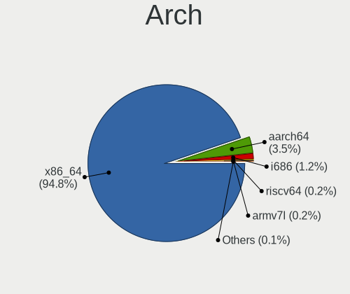
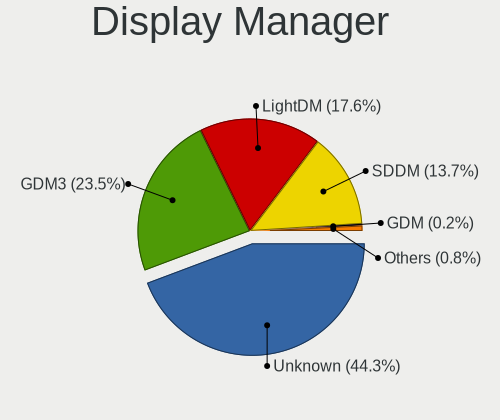
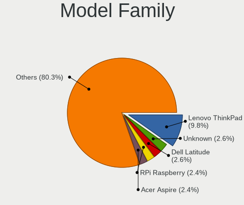
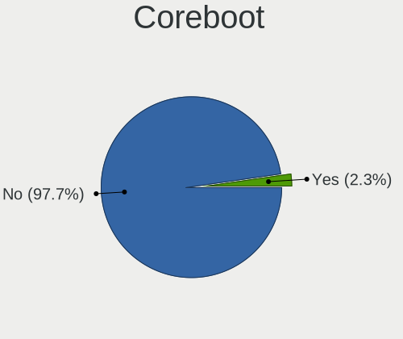
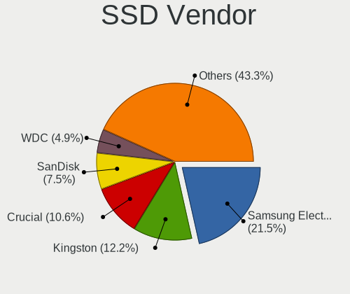
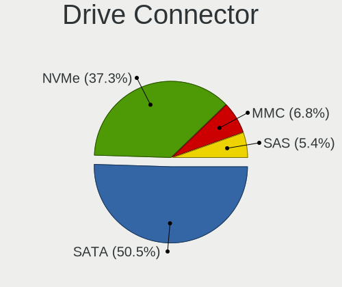
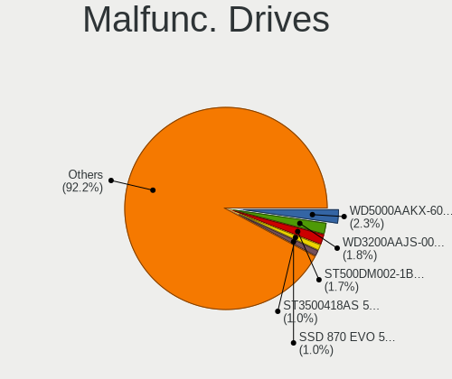
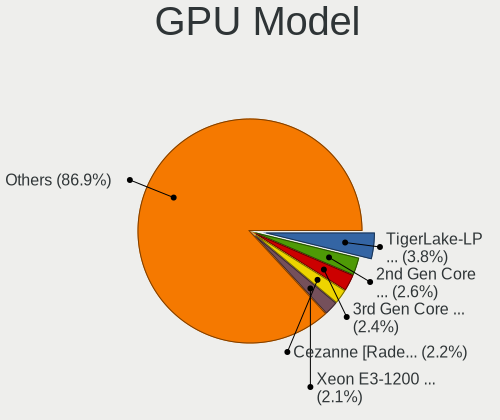
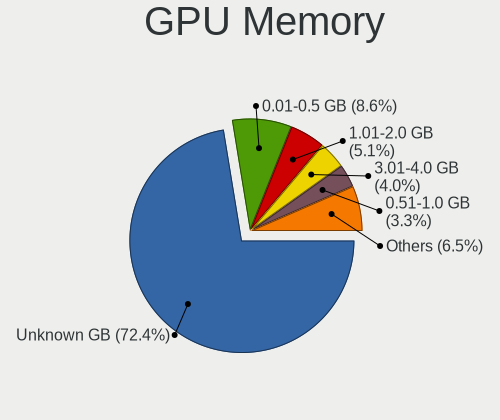
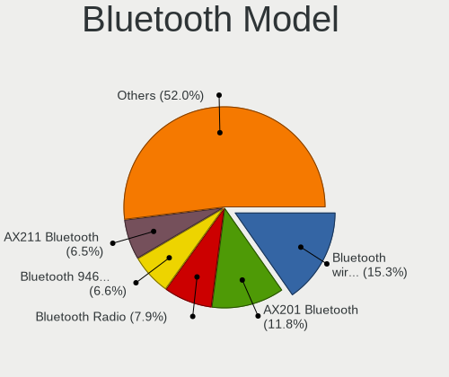

Debian 12 - Tested Hardware & Statistics
----------------------------------------

A project to collect tested hardware configurations for Debian 12.

Anyone can contribute to this report by the [hw-probe](https://github.com/linuxhw/hw-probe) tool:

    sudo -E hw-probe -all -upload

Please contribute! Especially if your hardware is rare.

This is a report for all computer types. See also reports for [desktops](/Dist/Debian_12/Desktop/README.md) and [notebooks](/Dist/Debian_12/Notebook/README.md).

Contents
--------

* [ Test Cases ](#test-cases)

* [ System ](#system)
  - [ Kernel                   ](#kernel)
  - [ Kernel Family            ](#kernel-family)
  - [ Kernel Major Ver.        ](#kernel-major-ver)
  - [ Arch                     ](#arch)
  - [ DE                       ](#de)
  - [ Display Server           ](#display-server)
  - [ Display Manager          ](#display-manager)
  - [ OS Lang                  ](#os-lang)
  - [ Boot Mode                ](#boot-mode)
  - [ Filesystem               ](#filesystem)
  - [ Part. scheme             ](#part-scheme)
  - [ Dual Boot with Linux/BSD ](#dual-boot-with-linuxbsd)
  - [ Dual Boot (Win)          ](#dual-boot-win)

* [ Board ](#board)
  - [ Vendor                   ](#vendor)
  - [ Model                    ](#model)
  - [ Model Family             ](#model-family)
  - [ MFG Year                 ](#mfg-year)
  - [ Form Factor              ](#form-factor)
  - [ Secure Boot              ](#secure-boot)
  - [ Coreboot                 ](#coreboot)
  - [ RAM Size                 ](#ram-size)
  - [ RAM Used                 ](#ram-used)
  - [ Total Drives             ](#total-drives)
  - [ Has CD-ROM               ](#has-cd-rom)
  - [ Has Ethernet             ](#has-ethernet)
  - [ Has WiFi                 ](#has-wifi)
  - [ Has Bluetooth            ](#has-bluetooth)

* [ Location ](#location)
  - [ Country                  ](#country)
  - [ City                     ](#city)

* [ Drives ](#drives)
  - [ Drive Vendor             ](#drive-vendor)
  - [ Drive Model              ](#drive-model)
  - [ HDD Vendor               ](#hdd-vendor)
  - [ SSD Vendor               ](#ssd-vendor)
  - [ Drive Kind               ](#drive-kind)
  - [ Drive Connector          ](#drive-connector)
  - [ Drive Size               ](#drive-size)
  - [ Space Total              ](#space-total)
  - [ Space Used               ](#space-used)
  - [ Malfunc. Drives          ](#malfunc-drives)
  - [ Malfunc. Drive Vendor    ](#malfunc-drive-vendor)
  - [ Malfunc. HDD Vendor      ](#malfunc-hdd-vendor)
  - [ Malfunc. Drive Kind      ](#malfunc-drive-kind)
  - [ Failed Drives            ](#failed-drives)
  - [ Failed Drive Vendor      ](#failed-drive-vendor)
  - [ Drive Status             ](#drive-status)

* [ Storage controller ](#storage-controller)
  - [ Storage Vendor           ](#storage-vendor)
  - [ Storage Model            ](#storage-model)
  - [ Storage Kind             ](#storage-kind)

* [ Processor ](#processor)
  - [ CPU Vendor               ](#cpu-vendor)
  - [ CPU Model                ](#cpu-model)
  - [ CPU Model Family         ](#cpu-model-family)
  - [ CPU Cores                ](#cpu-cores)
  - [ CPU Sockets              ](#cpu-sockets)
  - [ CPU Threads              ](#cpu-threads)
  - [ CPU Op-Modes             ](#cpu-op-modes)
  - [ CPU Microcode            ](#cpu-microcode)
  - [ CPU Microarch            ](#cpu-microarch)

* [ Graphics ](#graphics)
  - [ GPU Vendor               ](#gpu-vendor)
  - [ GPU Model                ](#gpu-model)
  - [ GPU Combo                ](#gpu-combo)
  - [ GPU Driver               ](#gpu-driver)
  - [ GPU Memory               ](#gpu-memory)

* [ Monitor ](#monitor)
  - [ Monitor Vendor           ](#monitor-vendor)
  - [ Monitor Model            ](#monitor-model)
  - [ Monitor Resolution       ](#monitor-resolution)
  - [ Monitor Diagonal         ](#monitor-diagonal)
  - [ Monitor Width            ](#monitor-width)
  - [ Aspect Ratio             ](#aspect-ratio)
  - [ Monitor Area             ](#monitor-area)
  - [ Pixel Density            ](#pixel-density)
  - [ Multiple Monitors        ](#multiple-monitors)

* [ Network ](#network)
  - [ Net Controller Vendor    ](#net-controller-vendor)
  - [ Net Controller Model     ](#net-controller-model)
  - [ Wireless Vendor          ](#wireless-vendor)
  - [ Wireless Model           ](#wireless-model)
  - [ Ethernet Vendor          ](#ethernet-vendor)
  - [ Ethernet Model           ](#ethernet-model)
  - [ Net Controller Kind      ](#net-controller-kind)
  - [ Used Controller          ](#used-controller)
  - [ NICs                     ](#nics)
  - [ IPv6                     ](#ipv6)

* [ Bluetooth ](#bluetooth)
  - [ Bluetooth Vendor         ](#bluetooth-vendor)
  - [ Bluetooth Model          ](#bluetooth-model)

* [ Sound ](#sound)
  - [ Sound Vendor             ](#sound-vendor)
  - [ Sound Model              ](#sound-model)

* [ Memory ](#memory)
  - [ Memory Vendor            ](#memory-vendor)
  - [ Memory Model             ](#memory-model)
  - [ Memory Kind              ](#memory-kind)
  - [ Memory Form Factor       ](#memory-form-factor)
  - [ Memory Size              ](#memory-size)
  - [ Memory Speed             ](#memory-speed)

* [ Printers & scanners ](#printers--scanners)
  - [ Printer Vendor           ](#printer-vendor)
  - [ Printer Model            ](#printer-model)
  - [ Scanner Vendor           ](#scanner-vendor)
  - [ Scanner Model            ](#scanner-model)

* [ Camera ](#camera)
  - [ Camera Vendor            ](#camera-vendor)
  - [ Camera Model             ](#camera-model)

* [ Security ](#security)
  - [ Fingerprint Vendor       ](#fingerprint-vendor)
  - [ Fingerprint Model        ](#fingerprint-model)
  - [ Chipcard Vendor          ](#chipcard-vendor)
  - [ Chipcard Model           ](#chipcard-model)

* [ Unsupported ](#unsupported)
  - [ Unsupported Devices      ](#unsupported-devices)
  - [ Unsupported Device Types ](#unsupported-device-types)

Test Cases
----------

Total: 2485

| Vendor        | Model                       | Form-Factor | Probe                                                      | Date         |
|---------------|-----------------------------|-------------|------------------------------------------------------------|--------------|
| Lenovo        | 312D SDK0J40697 WIN 3305... | Mini pc     | [ef03031eaa](https://linux-hardware.org/?probe=ef03031eaa) | Nov 06, 2023 |
| HP            | EliteBook 8460p             | Notebook    | [cc6b66c576](https://linux-hardware.org/?probe=cc6b66c576) | Nov 06, 2023 |
| Medion        | MS-7708                     | Desktop     | [9170f4dd42](https://linux-hardware.org/?probe=9170f4dd42) | Nov 06, 2023 |
| Aquarius      | NS585                       | Notebook    | [ddc8256647](https://linux-hardware.org/?probe=ddc8256647) | Nov 06, 2023 |
| Aquarius      | NS585                       | Notebook    | [2f4e49837d](https://linux-hardware.org/?probe=2f4e49837d) | Nov 06, 2023 |
| Aquarius      | NS585                       | Notebook    | [4fea63336a](https://linux-hardware.org/?probe=4fea63336a) | Nov 06, 2023 |
| Dell          | 0PV3YR A05                  | Server      | [bb021ca517](https://linux-hardware.org/?probe=bb021ca517) | Nov 06, 2023 |
| ASUSTek       | PRIME B450M-A II            | Desktop     | [c8c8d15e25](https://linux-hardware.org/?probe=c8c8d15e25) | Nov 06, 2023 |
| HP            | 250 G7 Notebook PC          | Notebook    | [a2ad36d26c](https://linux-hardware.org/?probe=a2ad36d26c) | Nov 06, 2023 |
| Raspberry ... | Raspberry Pi 4 Model B R... | Soc         | [eef004b620](https://linux-hardware.org/?probe=eef004b620) | Nov 05, 2023 |
| Apple         | Mac-F2218EA9                | All in one  | [67a67e246c](https://linux-hardware.org/?probe=67a67e246c) | Nov 05, 2023 |
| Toshiba       | TECRA R950                  | Notebook    | [864877692e](https://linux-hardware.org/?probe=864877692e) | Nov 05, 2023 |
| sunxi         | Banana Pi BPI-M2-Zero       | Soc         | [fc24faaa0c](https://linux-hardware.org/?probe=fc24faaa0c) | Nov 05, 2023 |
| Gigabyte      | B85M-D3H                    | Desktop     | [42cbdffa93](https://linux-hardware.org/?probe=42cbdffa93) | Nov 05, 2023 |
| ASUSTek       | X541NA                      | Notebook    | [f0399efc08](https://linux-hardware.org/?probe=f0399efc08) | Nov 05, 2023 |
| Shuttle       | FH87                        | Desktop     | [1488ef29c3](https://linux-hardware.org/?probe=1488ef29c3) | Nov 05, 2023 |
| Gigabyte      | B550 GAMING X V2            | Desktop     | [9213826ac6](https://linux-hardware.org/?probe=9213826ac6) | Nov 05, 2023 |
| HP            | 8643 SMVB                   | Desktop     | [22b09dfb91](https://linux-hardware.org/?probe=22b09dfb91) | Nov 05, 2023 |
| ASUSTek       | VivoBook_ASUSLaptop X140... | Notebook    | [92ed6d25c3](https://linux-hardware.org/?probe=92ed6d25c3) | Nov 05, 2023 |
| MSI           | PRO B760M-P DDR4            | Desktop     | [5b5425c6d8](https://linux-hardware.org/?probe=5b5425c6d8) | Nov 05, 2023 |
| HP            | Mini 210-3000               | Notebook    | [8b55a876a9](https://linux-hardware.org/?probe=8b55a876a9) | Nov 05, 2023 |
| Google        | Nami                        | Notebook    | [19c94b9484](https://linux-hardware.org/?probe=19c94b9484) | Nov 05, 2023 |
| Apple         | Mac-F2218EA9                | All in one  | [5c50c142b3](https://linux-hardware.org/?probe=5c50c142b3) | Nov 05, 2023 |
| HP            | Laptop 15-bw0xx             | Notebook    | [7d9395e4a7](https://linux-hardware.org/?probe=7d9395e4a7) | Nov 05, 2023 |
| HP            | EliteBook 840 G3            | Notebook    | [1bb894cf19](https://linux-hardware.org/?probe=1bb894cf19) | Nov 04, 2023 |
| Supermicro    | X10SRA                      | Server      | [87045c1939](https://linux-hardware.org/?probe=87045c1939) | Nov 04, 2023 |
| Lenovo        | 3102 SDK0J40697 WIN 3305... | Desktop     | [dade20f823](https://linux-hardware.org/?probe=dade20f823) | Nov 04, 2023 |
| HP            | Pavilion dv7                | Notebook    | [6a44cc2c3c](https://linux-hardware.org/?probe=6a44cc2c3c) | Nov 04, 2023 |
| Apple         | Mac-F221BEC8                | Desktop     | [03f4055831](https://linux-hardware.org/?probe=03f4055831) | Nov 04, 2023 |
| Google        | Bluebird                    | Notebook    | [55dbc11653](https://linux-hardware.org/?probe=55dbc11653) | Nov 04, 2023 |
| MSI           | MAG B660M MORTAR WIFI DD... | Desktop     | [3521a1f918](https://linux-hardware.org/?probe=3521a1f918) | Nov 04, 2023 |
| Google        | Bluebird                    | Notebook    | [9e12130a28](https://linux-hardware.org/?probe=9e12130a28) | Nov 04, 2023 |
| HP            | OMEN by Laptop 17-ck1xxx    | Notebook    | [bea6a6babf](https://linux-hardware.org/?probe=bea6a6babf) | Nov 04, 2023 |
| Lenovo        | ThinkPad T530 2429F27       | Notebook    | [0767db36fe](https://linux-hardware.org/?probe=0767db36fe) | Nov 04, 2023 |
| Dell          | Precision 7560              | Notebook    | [54a8deb305](https://linux-hardware.org/?probe=54a8deb305) | Nov 04, 2023 |
| Lenovo        | ThinkPad L13 Yoga Gen 2 ... | Convertible | [7d06f443c7](https://linux-hardware.org/?probe=7d06f443c7) | Nov 03, 2023 |
| ASUSTek       | X551CA                      | Notebook    | [20bee22e0a](https://linux-hardware.org/?probe=20bee22e0a) | Nov 03, 2023 |
| ASRock        | H61M-HVS                    | Desktop     | [fbbb34a0cb](https://linux-hardware.org/?probe=fbbb34a0cb) | Nov 03, 2023 |
| Dell          | Latitude E6420              | Notebook    | [43ccf36bf0](https://linux-hardware.org/?probe=43ccf36bf0) | Nov 03, 2023 |
| Google        | Enguarde                    | Notebook    | [bc6a541eb9](https://linux-hardware.org/?probe=bc6a541eb9) | Nov 03, 2023 |
| ZOTAC         | ZBOXNANO-AD10               | Mini pc     | [2b0fbc5661](https://linux-hardware.org/?probe=2b0fbc5661) | Nov 03, 2023 |
| Lenovo        | ThinkBook 14 G3 ACL 21A2    | Notebook    | [8b855ce4f4](https://linux-hardware.org/?probe=8b855ce4f4) | Nov 03, 2023 |
| Lenovo        | G500s 20245                 | Notebook    | [c4aa915297](https://linux-hardware.org/?probe=c4aa915297) | Nov 03, 2023 |
| ASUSTek       | VivoBook_ASUSLaptop X515... | Notebook    | [1bdfa38b3e](https://linux-hardware.org/?probe=1bdfa38b3e) | Nov 03, 2023 |
| Lenovo        | IdeaPad Y500 20193          | Notebook    | [f96f6e6127](https://linux-hardware.org/?probe=f96f6e6127) | Nov 03, 2023 |
| ASUSTek       | X205TA                      | Notebook    | [b29e9ebfbe](https://linux-hardware.org/?probe=b29e9ebfbe) | Nov 03, 2023 |
| Acer          | Predator PO3-600 V:1.1      | Desktop     | [9495d53da4](https://linux-hardware.org/?probe=9495d53da4) | Nov 03, 2023 |
| Gigabyte      | B550 AORUS PRO V2           | Desktop     | [18f018a8ae](https://linux-hardware.org/?probe=18f018a8ae) | Nov 03, 2023 |
| Dell          | 0CN7X8 A05                  | Server      | [afe0c7dfbe](https://linux-hardware.org/?probe=afe0c7dfbe) | Nov 03, 2023 |
| HP            | 250 G7 Notebook PC          | Notebook    | [1889111d8a](https://linux-hardware.org/?probe=1889111d8a) | Nov 03, 2023 |
| HP            | 18E7                        | Desktop     | [212d6dba47](https://linux-hardware.org/?probe=212d6dba47) | Nov 02, 2023 |
| HP            | 18E7                        | Desktop     | [7064df5d87](https://linux-hardware.org/?probe=7064df5d87) | Nov 02, 2023 |
| Unknown       | X99-GT                      | Desktop     | [751ea1add9](https://linux-hardware.org/?probe=751ea1add9) | Nov 02, 2023 |
| ASUSTek       | G750JX                      | Notebook    | [9493bec7e6](https://linux-hardware.org/?probe=9493bec7e6) | Nov 02, 2023 |
| Framework     | Laptop (12th Gen Intel C... | Notebook    | [7c06ac2664](https://linux-hardware.org/?probe=7c06ac2664) | Nov 02, 2023 |
| MSI           | B450M-A PRO MAX             | Desktop     | [d48f7514df](https://linux-hardware.org/?probe=d48f7514df) | Nov 02, 2023 |
| Raspberry ... | Raspberry Pi 5 Model B R... | Soc         | [de79fbf182](https://linux-hardware.org/?probe=de79fbf182) | Nov 02, 2023 |
| Lenovo        | ThinkPad L13 Yoga Gen 2 ... | Convertible | [db23a9b8d4](https://linux-hardware.org/?probe=db23a9b8d4) | Nov 02, 2023 |
| Lenovo        | ThinkPad L13 Yoga Gen 2 ... | Convertible | [425bafc788](https://linux-hardware.org/?probe=425bafc788) | Nov 02, 2023 |
| ASRock        | X570 Taichi                 | Desktop     | [5ce5b321b0](https://linux-hardware.org/?probe=5ce5b321b0) | Nov 02, 2023 |
| Gigabyte      | A520I AC                    | Desktop     | [2b76c45313](https://linux-hardware.org/?probe=2b76c45313) | Nov 02, 2023 |
| Google        | Nasher360                   | Notebook    | [0d1cc1b584](https://linux-hardware.org/?probe=0d1cc1b584) | Nov 02, 2023 |
| ASRockRack    | X470D4U                     | Desktop     | [553af2a3c2](https://linux-hardware.org/?probe=553af2a3c2) | Nov 02, 2023 |
| Gigabyte      | Z97X-Gaming 5               | Desktop     | [1ca6496a6c](https://linux-hardware.org/?probe=1ca6496a6c) | Nov 01, 2023 |
| Framework     | Laptop (13th Gen Intel C... | Notebook    | [df4f43ca44](https://linux-hardware.org/?probe=df4f43ca44) | Nov 01, 2023 |
| Lenovo        | ThinkPad 13 2nd Gen 20J1... | Notebook    | [bb5bbc3e51](https://linux-hardware.org/?probe=bb5bbc3e51) | Nov 01, 2023 |
| ASUSTek       | CM6870                      | Desktop     | [ae34108b69](https://linux-hardware.org/?probe=ae34108b69) | Nov 01, 2023 |
| Lenovo        | ThinkPad L15 Gen 2 20X4S... | Notebook    | [ac563e5542](https://linux-hardware.org/?probe=ac563e5542) | Nov 01, 2023 |
| HP            | Laptop 15s-eq1xxx           | Notebook    | [075049b538](https://linux-hardware.org/?probe=075049b538) | Nov 01, 2023 |
| Dell          | Precision M4700             | Notebook    | [1d7e76c1d9](https://linux-hardware.org/?probe=1d7e76c1d9) | Nov 01, 2023 |
| HP            | 83EE                        | Desktop     | [c32478cd8d](https://linux-hardware.org/?probe=c32478cd8d) | Nov 01, 2023 |
| HP            | 83EE                        | Desktop     | [37c7c72156](https://linux-hardware.org/?probe=37c7c72156) | Nov 01, 2023 |
| Lenovo        | ThinkPad P16s Gen 2 21K9... | Notebook    | [317aadad91](https://linux-hardware.org/?probe=317aadad91) | Nov 01, 2023 |
| Fujitsu       | D3233-A1 S26361-D3233-A1    | Desktop     | [0026b681e2](https://linux-hardware.org/?probe=0026b681e2) | Nov 01, 2023 |
| Unknown       | Unknown                     | Desktop     | [c7ce75613c](https://linux-hardware.org/?probe=c7ce75613c) | Nov 01, 2023 |
| Gigabyte      | X570 GAMING X               | Desktop     | [fee5d3eded](https://linux-hardware.org/?probe=fee5d3eded) | Nov 01, 2023 |
| Dell          | Vostro 5590                 | Notebook    | [300630cf8c](https://linux-hardware.org/?probe=300630cf8c) | Nov 01, 2023 |
| ASUSTek       | ROG STRIX B550-A GAMING     | Desktop     | [34fe4c8733](https://linux-hardware.org/?probe=34fe4c8733) | Nov 01, 2023 |
| Raspberry ... | Raspberry Pi 5 Model B R... | Soc         | [58f7b11e98](https://linux-hardware.org/?probe=58f7b11e98) | Nov 01, 2023 |
| Dell          | Latitude 5480               | Notebook    | [1bf5aeba87](https://linux-hardware.org/?probe=1bf5aeba87) | Nov 01, 2023 |
| Unknown       | Unknown                     | Desktop     | [3c4e0eb4fc](https://linux-hardware.org/?probe=3c4e0eb4fc) | Nov 01, 2023 |
| Lenovo        | ThinkPad P14s Gen 4 21K5... | Notebook    | [2bdd27dc18](https://linux-hardware.org/?probe=2bdd27dc18) | Oct 31, 2023 |
| Lenovo        | ThinkPad P14s Gen 4 21K5... | Notebook    | [cb35a8d8f6](https://linux-hardware.org/?probe=cb35a8d8f6) | Oct 31, 2023 |
| Lenovo        | ThinkPad 13 2nd Gen 20J1... | Notebook    | [4ebd30711e](https://linux-hardware.org/?probe=4ebd30711e) | Oct 31, 2023 |
| Lenovo        | ThinkPad 13 2nd Gen 20J1... | Notebook    | [a664733aaf](https://linux-hardware.org/?probe=a664733aaf) | Oct 31, 2023 |
| Lenovo        | ThinkPad 13 2nd Gen 20J2... | Notebook    | [72131fb5de](https://linux-hardware.org/?probe=72131fb5de) | Oct 31, 2023 |
| VANT          | MOOVE3-15                   | Notebook    | [5fc04a6d0a](https://linux-hardware.org/?probe=5fc04a6d0a) | Oct 31, 2023 |
| Apple         | MacBookPro9,1               | Notebook    | [8f7c5b801b](https://linux-hardware.org/?probe=8f7c5b801b) | Oct 31, 2023 |
| Apple         | MacBookPro9,1               | Notebook    | [4e15275faa](https://linux-hardware.org/?probe=4e15275faa) | Oct 31, 2023 |
| Gigabyte      | H610M H DDR4                | Desktop     | [6e876b597c](https://linux-hardware.org/?probe=6e876b597c) | Oct 31, 2023 |
| Gigabyte      | H610M H DDR4                | Desktop     | [01f9a9c872](https://linux-hardware.org/?probe=01f9a9c872) | Oct 31, 2023 |
| Dell          | Inspiron 5406 2n1           | Convertible | [f504fe606f](https://linux-hardware.org/?probe=f504fe606f) | Oct 31, 2023 |
| ASUSTek       | P8Z77-M                     | Desktop     | [69cd55a4dc](https://linux-hardware.org/?probe=69cd55a4dc) | Oct 31, 2023 |
| HP            | Victus by Gaming Laptop ... | Notebook    | [0f4fa9169b](https://linux-hardware.org/?probe=0f4fa9169b) | Oct 31, 2023 |
| Dell          | 0NW6H5 A00                  | Desktop     | [3f76d752df](https://linux-hardware.org/?probe=3f76d752df) | Oct 31, 2023 |
| ASRock        | H61M-HVS                    | Desktop     | [eccf9444b3](https://linux-hardware.org/?probe=eccf9444b3) | Oct 31, 2023 |
| Lenovo        | ThinkPad L14 Gen 3 21C10... | Notebook    | [2f63bfb399](https://linux-hardware.org/?probe=2f63bfb399) | Oct 31, 2023 |
| VANT          | MOOVE3-15                   | Notebook    | [7e12621e6d](https://linux-hardware.org/?probe=7e12621e6d) | Oct 31, 2023 |
| Timi          | RedmiBook Pro 14S           | Notebook    | [780e721e24](https://linux-hardware.org/?probe=780e721e24) | Oct 30, 2023 |
| Lenovo        | ThinkPad X260 VB6R77903H    | Notebook    | [c4baf8a67b](https://linux-hardware.org/?probe=c4baf8a67b) | Oct 30, 2023 |
| Intel         | X99                         | Desktop     | [426c412f62](https://linux-hardware.org/?probe=426c412f62) | Oct 30, 2023 |
| THUNDEROBO... | 911AirD                     | Notebook    | [698adeeba7](https://linux-hardware.org/?probe=698adeeba7) | Oct 30, 2023 |
| Dell          | XPS 15 9520                 | Notebook    | [0fb7ced892](https://linux-hardware.org/?probe=0fb7ced892) | Oct 30, 2023 |
| Dell          | 0NW6H5 A00                  | Desktop     | [51694ddd7c](https://linux-hardware.org/?probe=51694ddd7c) | Oct 30, 2023 |
| Google        | Blooguard                   | Notebook    | [cd817fb666](https://linux-hardware.org/?probe=cd817fb666) | Oct 30, 2023 |
| Lenovo        | ThinkPad 13 2nd Gen 20J1... | Notebook    | [995b159589](https://linux-hardware.org/?probe=995b159589) | Oct 30, 2023 |
| ASUSTek       | PN53-G                      | Mini pc     | [e64336b3cd](https://linux-hardware.org/?probe=e64336b3cd) | Oct 30, 2023 |
| MSI           | B550-A PRO                  | Desktop     | [fca3ef2e73](https://linux-hardware.org/?probe=fca3ef2e73) | Oct 30, 2023 |
| Pine Micro... | Pine64 RockPro64 v2.1       | Soc         | [4e11be8872](https://linux-hardware.org/?probe=4e11be8872) | Oct 30, 2023 |
| Gigabyte      | A5 X1                       | Notebook    | [981be88a61](https://linux-hardware.org/?probe=981be88a61) | Oct 30, 2023 |
| ASUSTek       | M5A97 R2.0                  | Desktop     | [7f2d93dc09](https://linux-hardware.org/?probe=7f2d93dc09) | Oct 29, 2023 |
| Acer          | Predator PO3-600 V:1.1      | Desktop     | [a7a54fb14a](https://linux-hardware.org/?probe=a7a54fb14a) | Oct 29, 2023 |
| ASUSTek       | M4A89GTD-PRO/USB3           | Desktop     | [9ca810aaa6](https://linux-hardware.org/?probe=9ca810aaa6) | Oct 29, 2023 |
| Fujitsu       | D2912-A1 S26361-D2912-A1    | Desktop     | [e0b8432cdc](https://linux-hardware.org/?probe=e0b8432cdc) | Oct 29, 2023 |
| ASRock        | AM1B-M                      | Desktop     | [098a155bab](https://linux-hardware.org/?probe=098a155bab) | Oct 29, 2023 |
| Apple         | Mac-F221BEC8                | Desktop     | [4db0be5324](https://linux-hardware.org/?probe=4db0be5324) | Oct 29, 2023 |
| ASRock        | B450 Steel Legend           | Desktop     | [967ed7a2b9](https://linux-hardware.org/?probe=967ed7a2b9) | Oct 28, 2023 |
| ASRock        | B550M-ITX/ac                | Desktop     | [1643900d75](https://linux-hardware.org/?probe=1643900d75) | Oct 28, 2023 |
| Intel         | JSL MRD                     | Desktop     | [689d88c57b](https://linux-hardware.org/?probe=689d88c57b) | Oct 28, 2023 |
| ECS           | H61H2-M12                   | Desktop     | [885cbf522c](https://linux-hardware.org/?probe=885cbf522c) | Oct 28, 2023 |
| Lenovo        | ThinkPad T14s Gen 3 21CQ... | Notebook    | [4aceca5660](https://linux-hardware.org/?probe=4aceca5660) | Oct 28, 2023 |
| Raspberry ... | Raspberry Pi 4 Model B R... | Soc         | [b094266385](https://linux-hardware.org/?probe=b094266385) | Oct 28, 2023 |
| Acer          | Aspire 4752                 | Notebook    | [ce321700bc](https://linux-hardware.org/?probe=ce321700bc) | Oct 28, 2023 |
| Lenovo        | ThinkPad T15g Gen 2i 20Y... | Notebook    | [dcd6988b7a](https://linux-hardware.org/?probe=dcd6988b7a) | Oct 28, 2023 |
| TELECOMITA... | M7x0S                       | Notebook    | [feabc7e111](https://linux-hardware.org/?probe=feabc7e111) | Oct 28, 2023 |
| MSI           | WS63 7RK                    | Notebook    | [dcfa2c2f75](https://linux-hardware.org/?probe=dcfa2c2f75) | Oct 27, 2023 |
| Fujitsu       | D2912-A1 S26361-D2912-A1    | Desktop     | [eb1a1b2e44](https://linux-hardware.org/?probe=eb1a1b2e44) | Oct 27, 2023 |
| Gigabyte      | B550M AORUS ELITE           | Desktop     | [5dac9d85f1](https://linux-hardware.org/?probe=5dac9d85f1) | Oct 27, 2023 |
| Lenovo        | ThinkPad X230 2325SDE       | Notebook    | [cbdbd4a156](https://linux-hardware.org/?probe=cbdbd4a156) | Oct 27, 2023 |
| Lenovo        | IdeaPad Gaming 3 15IAH7 ... | Notebook    | [d8bfe77d00](https://linux-hardware.org/?probe=d8bfe77d00) | Oct 27, 2023 |
| Lenovo        | ThinkPad T470 20HES0FW00    | Notebook    | [198bee98eb](https://linux-hardware.org/?probe=198bee98eb) | Oct 27, 2023 |
| ASUSTek       | P6TD DELUXE                 | Desktop     | [46049da51f](https://linux-hardware.org/?probe=46049da51f) | Oct 27, 2023 |
| Lenovo        | G50-70 20351                | Notebook    | [39e2fb6be6](https://linux-hardware.org/?probe=39e2fb6be6) | Oct 27, 2023 |
| ASUSTek       | ROG Strix G513QC_G513QC     | Notebook    | [bdf8012e05](https://linux-hardware.org/?probe=bdf8012e05) | Oct 27, 2023 |
| Dell          | 0TY177 A05                  | Server      | [f59dfc5d01](https://linux-hardware.org/?probe=f59dfc5d01) | Oct 27, 2023 |
| Lenovo        | ThinkPad P15v Gen 3 21D8... | Notebook    | [67b966e75c](https://linux-hardware.org/?probe=67b966e75c) | Oct 27, 2023 |
| Dell          | 0VD5HY A07                  | Desktop     | [3db7e99c4a](https://linux-hardware.org/?probe=3db7e99c4a) | Oct 27, 2023 |
| Dell          | 0GTK4K A02                  | Desktop     | [df85a996c9](https://linux-hardware.org/?probe=df85a996c9) | Oct 27, 2023 |
| Raspberry ... | Raspberry Pi 4 Model B R... | Soc         | [2eb76547a3](https://linux-hardware.org/?probe=2eb76547a3) | Oct 27, 2023 |
| Supermicro    | X10DAI                      | Desktop     | [11b1e48497](https://linux-hardware.org/?probe=11b1e48497) | Oct 27, 2023 |
| Gigabyte      | F2A68HM-H                   | Desktop     | [607a31a8ef](https://linux-hardware.org/?probe=607a31a8ef) | Oct 27, 2023 |
| Foxconn       | P35A01                      | Desktop     | [e63e8acdaa](https://linux-hardware.org/?probe=e63e8acdaa) | Oct 27, 2023 |
| Google        | Enguarde                    | Notebook    | [074b44ce16](https://linux-hardware.org/?probe=074b44ce16) | Oct 26, 2023 |
| Acer          | Aspire 5750G                | Notebook    | [afe742ceca](https://linux-hardware.org/?probe=afe742ceca) | Oct 26, 2023 |
| Dell          | Latitude 5414               | Notebook    | [78fb4f9907](https://linux-hardware.org/?probe=78fb4f9907) | Oct 26, 2023 |
| Medion        | Unknown                     | Notebook    | [ffcdfb3003](https://linux-hardware.org/?probe=ffcdfb3003) | Oct 26, 2023 |
| OrangePi      | Zero3                       | Soc         | [0a9fbc0ea2](https://linux-hardware.org/?probe=0a9fbc0ea2) | Oct 26, 2023 |
| Lenovo        | ThinkPad L13 Yoga Gen 2 ... | Convertible | [71a887bb94](https://linux-hardware.org/?probe=71a887bb94) | Oct 26, 2023 |
| Dell          | 0K240Y A04                  | Desktop     | [5bf155abe0](https://linux-hardware.org/?probe=5bf155abe0) | Oct 26, 2023 |
| ASUSTek       | P8P67 PRO                   | Desktop     | [a1916cc782](https://linux-hardware.org/?probe=a1916cc782) | Oct 26, 2023 |
| HP            | ProBook 4530s               | Notebook    | [b86df6ad72](https://linux-hardware.org/?probe=b86df6ad72) | Oct 26, 2023 |
| ASUSTek       | P5G41T-M LE                 | Desktop     | [ca332e91ff](https://linux-hardware.org/?probe=ca332e91ff) | Oct 26, 2023 |
| MSI           | B450M PRO-VDH MAX           | Desktop     | [df61e58a34](https://linux-hardware.org/?probe=df61e58a34) | Oct 26, 2023 |
| Lenovo        | IdeaPad S145-15IIL 81W8     | Notebook    | [cc3370083d](https://linux-hardware.org/?probe=cc3370083d) | Oct 26, 2023 |
| Irbis         | NB131                       | Convertible | [6b5d733237](https://linux-hardware.org/?probe=6b5d733237) | Oct 26, 2023 |
| Exo           | Smart Serie R               | Notebook    | [d68b300ca7](https://linux-hardware.org/?probe=d68b300ca7) | Oct 26, 2023 |
| Toshiba       | Satellite L455D             | Notebook    | [29337c2310](https://linux-hardware.org/?probe=29337c2310) | Oct 26, 2023 |
| HUAWEI        | KLVL-WXXW                   | Notebook    | [303c4197c7](https://linux-hardware.org/?probe=303c4197c7) | Oct 26, 2023 |
| HP            | Compaq 15                   | Notebook    | [83fab35dec](https://linux-hardware.org/?probe=83fab35dec) | Oct 26, 2023 |
| Dell          | Latitude 5414               | Notebook    | [692b53f9d9](https://linux-hardware.org/?probe=692b53f9d9) | Oct 26, 2023 |
| HP            | Compaq 15                   | Notebook    | [41ada9e77d](https://linux-hardware.org/?probe=41ada9e77d) | Oct 26, 2023 |
| ASUSTek       | ROG CROSSHAIR X670E HERO    | Desktop     | [f38d8a7556](https://linux-hardware.org/?probe=f38d8a7556) | Oct 26, 2023 |
| MSI           | MEG X570 UNIFY              | Desktop     | [f1bcad7519](https://linux-hardware.org/?probe=f1bcad7519) | Oct 26, 2023 |
| ASUSTek       | VivoBook_ASUSLaptop X512... | Notebook    | [bfe12f37dc](https://linux-hardware.org/?probe=bfe12f37dc) | Oct 25, 2023 |
| Apple         | Mac-42FD25EABCABB274 iMa... | All in one  | [3273bde56c](https://linux-hardware.org/?probe=3273bde56c) | Oct 25, 2023 |
| Intel         | NUC7i7BNB J31145-303        | Mini pc     | [8b6a0fb21d](https://linux-hardware.org/?probe=8b6a0fb21d) | Oct 25, 2023 |
| Pegatron      | Benicia                     | Desktop     | [62373f17e0](https://linux-hardware.org/?probe=62373f17e0) | Oct 25, 2023 |
| ASRock        | J4125-ITX                   | Desktop     | [b124e800d6](https://linux-hardware.org/?probe=b124e800d6) | Oct 25, 2023 |
| Acer          | Aspire 5750G                | Notebook    | [b726b22da1](https://linux-hardware.org/?probe=b726b22da1) | Oct 25, 2023 |
| Lenovo        | ThinkPad X1C 5th W10DG 2... | Notebook    | [c66ebc8e70](https://linux-hardware.org/?probe=c66ebc8e70) | Oct 25, 2023 |
| Lemote        | LS3B4000-7A1000-2w-V01-s... | Server      | [bb997db6d6](https://linux-hardware.org/?probe=bb997db6d6) | Oct 25, 2023 |
| Lemote        | LS3B4000-7A1000-2w-V01-s... | Server      | [52a1551f31](https://linux-hardware.org/?probe=52a1551f31) | Oct 25, 2023 |
| Google        | Reks                        | Notebook    | [d397eae4e5](https://linux-hardware.org/?probe=d397eae4e5) | Oct 25, 2023 |
| Acer          | Aspire ES1-521              | Notebook    | [2df6fb3e2a](https://linux-hardware.org/?probe=2df6fb3e2a) | Oct 25, 2023 |
| Gigabyte      | B450M H                     | Desktop     | [102b9b2a5b](https://linux-hardware.org/?probe=102b9b2a5b) | Oct 25, 2023 |
| MSI           | Katana GF76 11SC            | Notebook    | [b1a5449e72](https://linux-hardware.org/?probe=b1a5449e72) | Oct 25, 2023 |
| HP            | Victus by Gaming Laptop ... | Notebook    | [71a22f4706](https://linux-hardware.org/?probe=71a22f4706) | Oct 25, 2023 |
| HP            | Laptop 15-dw3xxx            | Notebook    | [8994962017](https://linux-hardware.org/?probe=8994962017) | Oct 25, 2023 |
| Unknown       | Unknown                     | Soc         | [4fd3fab446](https://linux-hardware.org/?probe=4fd3fab446) | Oct 25, 2023 |
| Unknown       | Unknown                     | Soc         | [a3e344eef0](https://linux-hardware.org/?probe=a3e344eef0) | Oct 25, 2023 |
| Lenovo        | ThinkPad T480 20L6S29D00    | Notebook    | [b270ca3670](https://linux-hardware.org/?probe=b270ca3670) | Oct 24, 2023 |
| Unknown       | 1.1                         | Desktop     | [4a673ae7d0](https://linux-hardware.org/?probe=4a673ae7d0) | Oct 24, 2023 |
| Lenovo        | ThinkPad T440p 20AWS18U0... | Notebook    | [1406d2f4d5](https://linux-hardware.org/?probe=1406d2f4d5) | Oct 24, 2023 |
| Medion        | Unknown                     | Notebook    | [fa168b5e75](https://linux-hardware.org/?probe=fa168b5e75) | Oct 24, 2023 |
| Lenovo        | ThinkPad T440p 20AWS18U0... | Notebook    | [56fa067caa](https://linux-hardware.org/?probe=56fa067caa) | Oct 24, 2023 |
| MSI           | Z87-G43 GAMING              | Desktop     | [31129675c0](https://linux-hardware.org/?probe=31129675c0) | Oct 24, 2023 |
| Gigabyte      | X570 GAMING X               | Desktop     | [78716080bb](https://linux-hardware.org/?probe=78716080bb) | Oct 24, 2023 |
| MSI           | A320M-A PRO                 | Desktop     | [851db330be](https://linux-hardware.org/?probe=851db330be) | Oct 24, 2023 |
| HP            | EliteBook 8740w             | Notebook    | [3669a01d21](https://linux-hardware.org/?probe=3669a01d21) | Oct 24, 2023 |
| Notebook      | P7xxDM(-G)                  | Notebook    | [bb211b2fb4](https://linux-hardware.org/?probe=bb211b2fb4) | Oct 24, 2023 |
| Gigabyte      | H170-D3HP-CF                | Desktop     | [0135013a3b](https://linux-hardware.org/?probe=0135013a3b) | Oct 24, 2023 |
| Alienware     | m15 Ryzen Ed. R5            | Notebook    | [dd704a643f](https://linux-hardware.org/?probe=dd704a643f) | Oct 24, 2023 |
| Acer          | Aspire 7750G                | Notebook    | [91006bdfa7](https://linux-hardware.org/?probe=91006bdfa7) | Oct 24, 2023 |
| Alienware     | m15 R6                      | Notebook    | [c6711f7b02](https://linux-hardware.org/?probe=c6711f7b02) | Oct 24, 2023 |
| ASUSTek       | G551JX                      | Notebook    | [db16c87fe8](https://linux-hardware.org/?probe=db16c87fe8) | Oct 24, 2023 |
| Lenovo        | IdeaPad 3 15ALC6 82KU       | Notebook    | [8754714bce](https://linux-hardware.org/?probe=8754714bce) | Oct 23, 2023 |
| Lenovo        | Yoga Slim 7 ProX 14IAH7 ... | Notebook    | [f4375f7115](https://linux-hardware.org/?probe=f4375f7115) | Oct 23, 2023 |
| AZW           | Gemini M                    | Desktop     | [31ec911dd7](https://linux-hardware.org/?probe=31ec911dd7) | Oct 23, 2023 |
| Supermicro    | X10SLM-F                    | Server      | [31f2315ddf](https://linux-hardware.org/?probe=31f2315ddf) | Oct 23, 2023 |
| Supermicro    | X10SLM-F                    | Server      | [9b3d3f5bdd](https://linux-hardware.org/?probe=9b3d3f5bdd) | Oct 23, 2023 |
| Lenovo        | ThinkPad L13 Yoga Gen 2 ... | Convertible | [09703b2f19](https://linux-hardware.org/?probe=09703b2f19) | Oct 23, 2023 |
| Aquarius      | NS585                       | Notebook    | [3c793ad14b](https://linux-hardware.org/?probe=3c793ad14b) | Oct 23, 2023 |
| Aquarius      | NS585                       | Notebook    | [9e7366fb3a](https://linux-hardware.org/?probe=9e7366fb3a) | Oct 23, 2023 |
| Dell          | XPS 9315                    | Notebook    | [c03a4ad29d](https://linux-hardware.org/?probe=c03a4ad29d) | Oct 23, 2023 |
| Gigabyte      | MZBSWAP-00                  | Desktop     | [1d274146ba](https://linux-hardware.org/?probe=1d274146ba) | Oct 23, 2023 |
| Timi          | Mi NoteBook Pro             | Notebook    | [470eb40837](https://linux-hardware.org/?probe=470eb40837) | Oct 23, 2023 |
| Acer          | Aspire E5-573               | Notebook    | [d83f4bf9ad](https://linux-hardware.org/?probe=d83f4bf9ad) | Oct 23, 2023 |
| HP            | 8055                        | Desktop     | [aeee934c45](https://linux-hardware.org/?probe=aeee934c45) | Oct 23, 2023 |
| Lenovo        | ThinkPad T480s 20L8S1WH0... | Notebook    | [4d383aebdc](https://linux-hardware.org/?probe=4d383aebdc) | Oct 23, 2023 |
| Lenovo        | ThinkPad T480s 20L8S1WH0... | Notebook    | [4cb151fdfe](https://linux-hardware.org/?probe=4cb151fdfe) | Oct 23, 2023 |
| Dell          | XPS 13 9300                 | Notebook    | [9d7ecc567c](https://linux-hardware.org/?probe=9d7ecc567c) | Oct 23, 2023 |
| Biostar       | B450MH                      | Desktop     | [d082b0cf9d](https://linux-hardware.org/?probe=d082b0cf9d) | Oct 23, 2023 |
| Google        | Panther                     | Desktop     | [85ecb9a52b](https://linux-hardware.org/?probe=85ecb9a52b) | Oct 22, 2023 |
| AZW           | SER V1.0                    | Mini pc     | [61cec415c6](https://linux-hardware.org/?probe=61cec415c6) | Oct 22, 2023 |
| Gigabyte      | B85M-D3H                    | Desktop     | [93e9d3b857](https://linux-hardware.org/?probe=93e9d3b857) | Oct 22, 2023 |
| ASUSTek       | PRIME X670-P WIFI           | Desktop     | [8bc4a56151](https://linux-hardware.org/?probe=8bc4a56151) | Oct 22, 2023 |
| MSI           | B760 GAMING PLUS WIFI       | Desktop     | [817e15f7e6](https://linux-hardware.org/?probe=817e15f7e6) | Oct 22, 2023 |
| Dell          | Precision 3571              | Notebook    | [a2ba806246](https://linux-hardware.org/?probe=a2ba806246) | Oct 22, 2023 |
| Dell          | Precision 3571              | Notebook    | [efedaee27d](https://linux-hardware.org/?probe=efedaee27d) | Oct 22, 2023 |
| Dell          | 0HC3G4 A00                  | Mini pc     | [f77f7c8a16](https://linux-hardware.org/?probe=f77f7c8a16) | Oct 22, 2023 |
| ASUSTek       | PRIME X670-P WIFI           | Desktop     | [9908be161f](https://linux-hardware.org/?probe=9908be161f) | Oct 22, 2023 |
| Dell          | Inspiron 6000               | Notebook    | [be4108e195](https://linux-hardware.org/?probe=be4108e195) | Oct 22, 2023 |
| Dell          | XPS 15 9560                 | Notebook    | [c2c4d81d07](https://linux-hardware.org/?probe=c2c4d81d07) | Oct 22, 2023 |
| Gigabyte      | Z690 UD AX DDR4             | Desktop     | [6e6e6c3ecf](https://linux-hardware.org/?probe=6e6e6c3ecf) | Oct 22, 2023 |
| Apple         | Mac-FA842E06C61E91C5 iMa... | All in one  | [8711389e77](https://linux-hardware.org/?probe=8711389e77) | Oct 22, 2023 |
| Raspberry ... | Raspberry Pi 4 Model B R... | Soc         | [165a6113af](https://linux-hardware.org/?probe=165a6113af) | Oct 22, 2023 |
| GPU Compan... | GWTC51427                   | Notebook    | [69b6cd7a6f](https://linux-hardware.org/?probe=69b6cd7a6f) | Oct 22, 2023 |
| ASUSTek       | TUF Gaming B550M-E          | Desktop     | [3eafc2c647](https://linux-hardware.org/?probe=3eafc2c647) | Oct 21, 2023 |
| Lenovo        | ThinkPad X1 Tablet Gen 3... | Tablet      | [5b4864a9c6](https://linux-hardware.org/?probe=5b4864a9c6) | Oct 21, 2023 |
| ASUSTek       | ProArt X670E-CREATOR WIF... | Desktop     | [ec48996f11](https://linux-hardware.org/?probe=ec48996f11) | Oct 21, 2023 |
| Acer          | Swift SF314-42              | Notebook    | [e19b58f8be](https://linux-hardware.org/?probe=e19b58f8be) | Oct 21, 2023 |
| Gigabyte      | 990FXA-UD5                  | Desktop     | [98a242f151](https://linux-hardware.org/?probe=98a242f151) | Oct 21, 2023 |
| Lenovo        | V130-15IGM 81HL             | Notebook    | [fc8d54a39c](https://linux-hardware.org/?probe=fc8d54a39c) | Oct 21, 2023 |
| Lenovo        | ThinkPad P15v Gen 3 21D8... | Notebook    | [5e57624ceb](https://linux-hardware.org/?probe=5e57624ceb) | Oct 21, 2023 |
| ASUSTek       | ASUS TUF Gaming A17 FA70... | Notebook    | [f30ccc13f5](https://linux-hardware.org/?probe=f30ccc13f5) | Oct 21, 2023 |
| Gigabyte      | B650 GAMING X AX            | Desktop     | [eb853298f9](https://linux-hardware.org/?probe=eb853298f9) | Oct 21, 2023 |
| Fujitsu       | FARQ1801LZ                  | Tablet      | [e03dce2361](https://linux-hardware.org/?probe=e03dce2361) | Oct 21, 2023 |
| ASRock        | H77 Pro4/MVP                | Desktop     | [102735d7e5](https://linux-hardware.org/?probe=102735d7e5) | Oct 21, 2023 |
| Intel         | DH61HO AAG62445-102         | Desktop     | [b2814c5578](https://linux-hardware.org/?probe=b2814c5578) | Oct 21, 2023 |
| Gigabyte      | 970A-DS3P                   | Desktop     | [10fab00c5f](https://linux-hardware.org/?probe=10fab00c5f) | Oct 21, 2023 |
| ASUSTek       | ASUS TUF Dash F15 FX517Z... | Notebook    | [d9a8c7946e](https://linux-hardware.org/?probe=d9a8c7946e) | Oct 20, 2023 |
| ASUSTek       | ASUS TUF Dash F15 FX517Z... | Notebook    | [5cac857cd9](https://linux-hardware.org/?probe=5cac857cd9) | Oct 20, 2023 |
| Gigabyte      | B85M-D3H                    | Desktop     | [5a47896ccd](https://linux-hardware.org/?probe=5a47896ccd) | Oct 20, 2023 |
| Shuttle       | FH67                        | Desktop     | [8c36120faa](https://linux-hardware.org/?probe=8c36120faa) | Oct 20, 2023 |
| MSI           | B450-A PRO MAX              | Desktop     | [e02418f8c1](https://linux-hardware.org/?probe=e02418f8c1) | Oct 20, 2023 |
| Lenovo        | V15-IIL 82C5                | Notebook    | [50f6d4cb01](https://linux-hardware.org/?probe=50f6d4cb01) | Oct 20, 2023 |
| MSI           | Alpha 17 B5EEK              | Notebook    | [125e76df80](https://linux-hardware.org/?probe=125e76df80) | Oct 20, 2023 |
| MSI           | Alpha 17 B5EEK              | Notebook    | [3a5c553fcb](https://linux-hardware.org/?probe=3a5c553fcb) | Oct 20, 2023 |
| AZW           | SER V01                     | Mini pc     | [805dab1461](https://linux-hardware.org/?probe=805dab1461) | Oct 20, 2023 |
| ASUSTek       | ROG Zephyrus G14 GA401QM... | Notebook    | [2147efec4e](https://linux-hardware.org/?probe=2147efec4e) | Oct 20, 2023 |
| Lenovo        | ThinkPad E14 Gen 5 21JK0... | Notebook    | [f35c9d006e](https://linux-hardware.org/?probe=f35c9d006e) | Oct 20, 2023 |
| Lenovo        | ThinkPad T470 20HES4VB00    | Notebook    | [423a16c64a](https://linux-hardware.org/?probe=423a16c64a) | Oct 20, 2023 |
| Razer         | Blade 14 (2022) - RZ09-0... | Notebook    | [64929e25f7](https://linux-hardware.org/?probe=64929e25f7) | Oct 20, 2023 |
| Razer         | Blade 14 (2022) - RZ09-0... | Notebook    | [da8f06a8e0](https://linux-hardware.org/?probe=da8f06a8e0) | Oct 19, 2023 |
| ASUSTek       | ROG Maximus X HERO          | Desktop     | [d7d89d2b1b](https://linux-hardware.org/?probe=d7d89d2b1b) | Oct 19, 2023 |
| HP            | Laptop 15s-eq2xxx           | Notebook    | [9c9781a7ee](https://linux-hardware.org/?probe=9c9781a7ee) | Oct 19, 2023 |
| MSI           | H110M PRO-VD                | Desktop     | [d0664cf154](https://linux-hardware.org/?probe=d0664cf154) | Oct 19, 2023 |
| Dell          | XPS 13 9380                 | Notebook    | [a108313537](https://linux-hardware.org/?probe=a108313537) | Oct 19, 2023 |
| Lenovo        | 3708 NOK                    | Desktop     | [398302b1e5](https://linux-hardware.org/?probe=398302b1e5) | Oct 19, 2023 |
| ASUSTek       | ASUS TUF Gaming F15 FX50... | Notebook    | [a8e2b482f4](https://linux-hardware.org/?probe=a8e2b482f4) | Oct 19, 2023 |
| Lenovo        | ThinkPad P15v Gen 3 21D8... | Notebook    | [81bfadb2d9](https://linux-hardware.org/?probe=81bfadb2d9) | Oct 18, 2023 |
| Dell          | Precision 7560              | Notebook    | [847d5dfd06](https://linux-hardware.org/?probe=847d5dfd06) | Oct 18, 2023 |
| Lenovo        | YB1-X91L                    | Convertible | [235eadfef8](https://linux-hardware.org/?probe=235eadfef8) | Oct 18, 2023 |
| Lenovo        | YB1-X91L                    | Convertible | [42b86ea4ec](https://linux-hardware.org/?probe=42b86ea4ec) | Oct 18, 2023 |
| ASUSTek       | A68HM-K                     | Desktop     | [d8abffeee6](https://linux-hardware.org/?probe=d8abffeee6) | Oct 18, 2023 |
| Gigabyte      | H510M H                     | Desktop     | [a0282a457d](https://linux-hardware.org/?probe=a0282a457d) | Oct 18, 2023 |
| Gigabyte      | G31M-S2L                    | Desktop     | [4d40f6adef](https://linux-hardware.org/?probe=4d40f6adef) | Oct 18, 2023 |
| ASUSTek       | PRIME Z270-P                | Desktop     | [07d65e0ac6](https://linux-hardware.org/?probe=07d65e0ac6) | Oct 18, 2023 |
| ASUSTek       | ROG STRIX X570-I GAMING     | Desktop     | [fb949d7410](https://linux-hardware.org/?probe=fb949d7410) | Oct 18, 2023 |
| Acer          | Aspire 5920G                | Notebook    | [5921ebc3f7](https://linux-hardware.org/?probe=5921ebc3f7) | Oct 18, 2023 |
| Acer          | Aspire 5920G                | Notebook    | [b6619c64fd](https://linux-hardware.org/?probe=b6619c64fd) | Oct 18, 2023 |
| ASUSTek       | ROG STRIX B550-F GAMING     | Desktop     | [8f79e82a3a](https://linux-hardware.org/?probe=8f79e82a3a) | Oct 17, 2023 |
| Dell          | Latitude E6420              | Notebook    | [f703c6bd74](https://linux-hardware.org/?probe=f703c6bd74) | Oct 17, 2023 |
| Dell          | Latitude E6430              | Notebook    | [54d411b12d](https://linux-hardware.org/?probe=54d411b12d) | Oct 17, 2023 |
| Google        | Reks                        | Notebook    | [1053eb8fee](https://linux-hardware.org/?probe=1053eb8fee) | Oct 17, 2023 |
| Google        | Reks                        | Notebook    | [84b42b74a0](https://linux-hardware.org/?probe=84b42b74a0) | Oct 17, 2023 |
| Dell          | 0WWR83 A04                  | Server      | [e0d564d8c4](https://linux-hardware.org/?probe=e0d564d8c4) | Oct 17, 2023 |
| HP            | ProBook 645 G1              | Notebook    | [d1eeca057f](https://linux-hardware.org/?probe=d1eeca057f) | Oct 17, 2023 |
| Lenovo        | ThinkPad P15 Gen 2i 20YQ... | Notebook    | [f9a0ba2cba](https://linux-hardware.org/?probe=f9a0ba2cba) | Oct 17, 2023 |
| Acer          | Aspire TC-886 V:2.0         | Desktop     | [808704ebf0](https://linux-hardware.org/?probe=808704ebf0) | Oct 17, 2023 |
| Gigabyte      | Z270-Gaming K3              | Desktop     | [6827d26220](https://linux-hardware.org/?probe=6827d26220) | Oct 17, 2023 |
| Unknown       | Unknown                     | Notebook    | [f776cdb186](https://linux-hardware.org/?probe=f776cdb186) | Oct 17, 2023 |
| Lenovo        | ThinkPad P15 Gen 2i 20YQ... | Notebook    | [902d95cec2](https://linux-hardware.org/?probe=902d95cec2) | Oct 17, 2023 |
| HP            | EliteBook 820 G2            | Notebook    | [14f5dbdc5a](https://linux-hardware.org/?probe=14f5dbdc5a) | Oct 17, 2023 |
| Acer          | Aspire V3-771               | Notebook    | [e56b3d3602](https://linux-hardware.org/?probe=e56b3d3602) | Oct 17, 2023 |
| Acer          | Aspire 7750G                | Notebook    | [6c7f890049](https://linux-hardware.org/?probe=6c7f890049) | Oct 17, 2023 |
| ASUSTek       | PRIME H410M-R               | Desktop     | [aa10d84f78](https://linux-hardware.org/?probe=aa10d84f78) | Oct 17, 2023 |
| Acer          | Aspire A515-54              | Notebook    | [a89d6c8f24](https://linux-hardware.org/?probe=a89d6c8f24) | Oct 17, 2023 |
| ASUSTek       | PRIME H310M-E/BR            | Desktop     | [da5796de02](https://linux-hardware.org/?probe=da5796de02) | Oct 17, 2023 |
| Dell          | Precision 7560              | Notebook    | [5d9dd29a22](https://linux-hardware.org/?probe=5d9dd29a22) | Oct 17, 2023 |
| Google        | Reks                        | Notebook    | [7610580a91](https://linux-hardware.org/?probe=7610580a91) | Oct 16, 2023 |
| HP            | Laptop 15-fd0xxx            | Notebook    | [0e6cc9fc48](https://linux-hardware.org/?probe=0e6cc9fc48) | Oct 16, 2023 |
| Gigabyte      | H81M-DS2                    | Desktop     | [9240952796](https://linux-hardware.org/?probe=9240952796) | Oct 16, 2023 |
| MSI           | PRO B660-A DDR4             | Desktop     | [506accae39](https://linux-hardware.org/?probe=506accae39) | Oct 16, 2023 |
| Acer          | Aspire 7750G                | Notebook    | [2a2d5e2425](https://linux-hardware.org/?probe=2a2d5e2425) | Oct 16, 2023 |
| ASUSTek       | 1015PN                      | Notebook    | [b6cbd56a75](https://linux-hardware.org/?probe=b6cbd56a75) | Oct 16, 2023 |
| Apple         | MacBookPro8,1               | Notebook    | [abfce57204](https://linux-hardware.org/?probe=abfce57204) | Oct 16, 2023 |
| Lenovo        | ThinkPad E565 20EY000XUK    | Notebook    | [b7cf6113c4](https://linux-hardware.org/?probe=b7cf6113c4) | Oct 16, 2023 |
| HUAWEI        | HVY-WXX9                    | Notebook    | [57e0cf4149](https://linux-hardware.org/?probe=57e0cf4149) | Oct 16, 2023 |
| ASUSTek       | Vivobook Go E1504FA_E150... | Notebook    | [2408be3605](https://linux-hardware.org/?probe=2408be3605) | Oct 16, 2023 |
| ASUSTek       | PRIME H510M-A               | Desktop     | [bad56db313](https://linux-hardware.org/?probe=bad56db313) | Oct 16, 2023 |
| ASUSTek       | TP410UA                     | Convertible | [412e2d70cf](https://linux-hardware.org/?probe=412e2d70cf) | Oct 16, 2023 |
| MSI           | GF63 Thin 11SC              | Notebook    | [1072e8d802](https://linux-hardware.org/?probe=1072e8d802) | Oct 16, 2023 |
| Dell          | 09KPNV A00                  | Desktop     | [13db34ae64](https://linux-hardware.org/?probe=13db34ae64) | Oct 16, 2023 |
| HP            | 250 G8 Notebook PC          | Notebook    | [38c84587d8](https://linux-hardware.org/?probe=38c84587d8) | Oct 16, 2023 |
| Apple         | MacBookAir4,1               | Notebook    | [f63091b76b](https://linux-hardware.org/?probe=f63091b76b) | Oct 16, 2023 |
| Lenovo        | MAHOBAY Win8 Pro DPK TPG    | Desktop     | [6b4ccf6ef7](https://linux-hardware.org/?probe=6b4ccf6ef7) | Oct 15, 2023 |
| Intel         | NUC10i7FNB M38062-307       | Mini pc     | [51e04c2a8a](https://linux-hardware.org/?probe=51e04c2a8a) | Oct 15, 2023 |
| Lenovo        | ThinkPad P16v Gen 1 21FC... | Notebook    | [33ce923fc9](https://linux-hardware.org/?probe=33ce923fc9) | Oct 15, 2023 |
| Apple         | MacBookPro6,2               | Notebook    | [1df7e29365](https://linux-hardware.org/?probe=1df7e29365) | Oct 15, 2023 |
| Shenzhen D... | MP80                        | Mini pc     | [c6c5b8dc5c](https://linux-hardware.org/?probe=c6c5b8dc5c) | Oct 15, 2023 |
| Dell          | 0KCKR5 A00                  | Server      | [4c8e94fac0](https://linux-hardware.org/?probe=4c8e94fac0) | Oct 15, 2023 |
| Gigabyte      | B450 AORUS M                | Desktop     | [68075a7e8f](https://linux-hardware.org/?probe=68075a7e8f) | Oct 15, 2023 |
| HP            | 2820h                       | Desktop     | [6b9bbe3a64](https://linux-hardware.org/?probe=6b9bbe3a64) | Oct 15, 2023 |
| Shenzhen D... | MP80                        | Mini pc     | [02141519f7](https://linux-hardware.org/?probe=02141519f7) | Oct 15, 2023 |
| Lenovo        | G50-70 20351                | Notebook    | [bdd8aeaf43](https://linux-hardware.org/?probe=bdd8aeaf43) | Oct 14, 2023 |
| ASUSTek       | PRIME Z370-P                | Desktop     | [c8c0c21213](https://linux-hardware.org/?probe=c8c0c21213) | Oct 14, 2023 |
| HP            | Victus by Laptop 16-d1xx... | Notebook    | [50ebc1407b](https://linux-hardware.org/?probe=50ebc1407b) | Oct 14, 2023 |
| Dell          | Inspiron 3501               | Notebook    | [a1ada382fa](https://linux-hardware.org/?probe=a1ada382fa) | Oct 14, 2023 |
| Dell          | Latitude 5400               | Notebook    | [26c8a94f7f](https://linux-hardware.org/?probe=26c8a94f7f) | Oct 14, 2023 |
| Acer          | Aspire XC-1660G V:1.1       | Desktop     | [3954c51f20](https://linux-hardware.org/?probe=3954c51f20) | Oct 14, 2023 |
| HP            | 2B38                        | Desktop     | [24fb745c2e](https://linux-hardware.org/?probe=24fb745c2e) | Oct 14, 2023 |
| Fujitsu       | LIFEBOOK T5010              | Notebook    | [f35263745a](https://linux-hardware.org/?probe=f35263745a) | Oct 14, 2023 |
| Lenovo        | 30FD SDK0J40697 WIN 3305... | Desktop     | [0e5e9d0e0f](https://linux-hardware.org/?probe=0e5e9d0e0f) | Oct 14, 2023 |
| Dell          | Latitude 5414               | Notebook    | [2984ae5140](https://linux-hardware.org/?probe=2984ae5140) | Oct 14, 2023 |
| ASUSTek       | B75M-PLUS                   | Desktop     | [c1baca90e6](https://linux-hardware.org/?probe=c1baca90e6) | Oct 13, 2023 |
| Google        | Reks                        | Notebook    | [066e8305fe](https://linux-hardware.org/?probe=066e8305fe) | Oct 13, 2023 |
| HP            | 8714                        | Desktop     | [1379aae868](https://linux-hardware.org/?probe=1379aae868) | Oct 13, 2023 |
| Google        | Reks                        | Notebook    | [acb8eb7f44](https://linux-hardware.org/?probe=acb8eb7f44) | Oct 13, 2023 |
| Google        | Reks                        | Notebook    | [707eb71f31](https://linux-hardware.org/?probe=707eb71f31) | Oct 13, 2023 |
| Lenovo        | IdeaPad 110-14IBR 80T6      | Notebook    | [94e6d9d3cb](https://linux-hardware.org/?probe=94e6d9d3cb) | Oct 13, 2023 |
| Inventec      | D CLASS A02                 | Desktop     | [e978ca79f0](https://linux-hardware.org/?probe=e978ca79f0) | Oct 13, 2023 |
| Google        | Reks                        | Notebook    | [4bc10c8b6b](https://linux-hardware.org/?probe=4bc10c8b6b) | Oct 13, 2023 |
| Lenovo        | V17 G4 IRU 83A2             | Notebook    | [5298e96c35](https://linux-hardware.org/?probe=5298e96c35) | Oct 13, 2023 |
| Gigabyte      | H510M H                     | Desktop     | [f5edac9c7d](https://linux-hardware.org/?probe=f5edac9c7d) | Oct 13, 2023 |
| ASUSTek       | H110M-R                     | Desktop     | [6b5ff499ec](https://linux-hardware.org/?probe=6b5ff499ec) | Oct 13, 2023 |
| Lenovo        | ThinkPad X1 Carbon Gen 1... | Notebook    | [7ee4351584](https://linux-hardware.org/?probe=7ee4351584) | Oct 13, 2023 |
| Apple         | MacBookPro9,2               | Notebook    | [27b7cf72ac](https://linux-hardware.org/?probe=27b7cf72ac) | Oct 13, 2023 |
| Lenovo        | ThinkPad 13 2nd Gen 20J1... | Notebook    | [02c3723dae](https://linux-hardware.org/?probe=02c3723dae) | Oct 12, 2023 |
| Lenovo        | ThinkPad E475 20H40006US    | Notebook    | [d874291459](https://linux-hardware.org/?probe=d874291459) | Oct 12, 2023 |
| Intel         | NUC7i3BNB J22859-303        | Mini pc     | [5afa008a5f](https://linux-hardware.org/?probe=5afa008a5f) | Oct 12, 2023 |
| Dell          | 0200DY A01                  | Desktop     | [4e207b6ab6](https://linux-hardware.org/?probe=4e207b6ab6) | Oct 12, 2023 |
| Lenovo        | IdeaPad 3 15ADA05 81W1      | Notebook    | [b53da36041](https://linux-hardware.org/?probe=b53da36041) | Oct 12, 2023 |
| Google        | Reks                        | Notebook    | [20f8a11067](https://linux-hardware.org/?probe=20f8a11067) | Oct 12, 2023 |
| Google        | Reks                        | Notebook    | [4e35f7ebe4](https://linux-hardware.org/?probe=4e35f7ebe4) | Oct 12, 2023 |
| Google        | Reks                        | Notebook    | [41c6c948bb](https://linux-hardware.org/?probe=41c6c948bb) | Oct 12, 2023 |
| ASRock        | Z790M-ITX WiFi              | Desktop     | [7f65a85252](https://linux-hardware.org/?probe=7f65a85252) | Oct 12, 2023 |
| ASUSTek       | X541UJ                      | Notebook    | [c061e67481](https://linux-hardware.org/?probe=c061e67481) | Oct 12, 2023 |
| Dell          | 0CRH6C A02                  | Desktop     | [865292ecae](https://linux-hardware.org/?probe=865292ecae) | Oct 12, 2023 |
| Lenovo        | ThinkPad E475 20H40006US    | Notebook    | [24adbfd09a](https://linux-hardware.org/?probe=24adbfd09a) | Oct 11, 2023 |
| Google        | Reks                        | Notebook    | [1854f5e2fb](https://linux-hardware.org/?probe=1854f5e2fb) | Oct 11, 2023 |
| Lenovo        | ThinkPad P14s Gen 1 20Y1... | Notebook    | [9de2f282f8](https://linux-hardware.org/?probe=9de2f282f8) | Oct 11, 2023 |
| Lenovo        | ThinkPad E475 20H40006US    | Notebook    | [dc4ce65d14](https://linux-hardware.org/?probe=dc4ce65d14) | Oct 11, 2023 |
| Lenovo        | ThinkPad E475 20H40006US    | Notebook    | [c26fe51dd5](https://linux-hardware.org/?probe=c26fe51dd5) | Oct 11, 2023 |
| Google        | Reks                        | Notebook    | [f9857342ec](https://linux-hardware.org/?probe=f9857342ec) | Oct 11, 2023 |
| Lenovo        | ThinkPad E475 20H40006US    | Notebook    | [4a0728b60c](https://linux-hardware.org/?probe=4a0728b60c) | Oct 11, 2023 |
| Lenovo        | ThinkPad E475 20H40006US    | Notebook    | [63c9bedd9d](https://linux-hardware.org/?probe=63c9bedd9d) | Oct 11, 2023 |
| Lenovo        | ThinkPad E475 20H40006US    | Notebook    | [77fe4b27cf](https://linux-hardware.org/?probe=77fe4b27cf) | Oct 11, 2023 |
| Google        | Reks                        | Notebook    | [9b2d9c0f7c](https://linux-hardware.org/?probe=9b2d9c0f7c) | Oct 11, 2023 |
| Lenovo        | ThinkPad E475 20H40006US    | Notebook    | [a735df7685](https://linux-hardware.org/?probe=a735df7685) | Oct 11, 2023 |
| Google        | Reks                        | Notebook    | [e78d454248](https://linux-hardware.org/?probe=e78d454248) | Oct 11, 2023 |
| Raspberry ... | Raspberry Pi 4 Model B R... | Soc         | [a6a4fd842c](https://linux-hardware.org/?probe=a6a4fd842c) | Oct 11, 2023 |
| Google        | Reks                        | Notebook    | [e7c6590991](https://linux-hardware.org/?probe=e7c6590991) | Oct 11, 2023 |
| Lenovo        | ThinkPad E475 20H40006US    | Notebook    | [627ce99f24](https://linux-hardware.org/?probe=627ce99f24) | Oct 11, 2023 |
| Google        | Reks                        | Notebook    | [cc53305ade](https://linux-hardware.org/?probe=cc53305ade) | Oct 11, 2023 |
| Lenovo        | ThinkPad E475 20H40006US    | Notebook    | [d957b0375b](https://linux-hardware.org/?probe=d957b0375b) | Oct 11, 2023 |
| Google        | Reks                        | Notebook    | [286fdb3692](https://linux-hardware.org/?probe=286fdb3692) | Oct 11, 2023 |
| ASUSTek       | X541UJ                      | Notebook    | [0cb7dbb73b](https://linux-hardware.org/?probe=0cb7dbb73b) | Oct 11, 2023 |
| HP            | Laptop 15-fc0xxx            | Notebook    | [670b2194c0](https://linux-hardware.org/?probe=670b2194c0) | Oct 11, 2023 |
| ASUSTek       | B85-PLUS                    | Desktop     | [62e3b0f03f](https://linux-hardware.org/?probe=62e3b0f03f) | Oct 11, 2023 |
| HP            | 8714                        | Desktop     | [ab691c5017](https://linux-hardware.org/?probe=ab691c5017) | Oct 11, 2023 |
| Prestigio     | Visconte Quad 3GK           | Notebook    | [5ffdb7e479](https://linux-hardware.org/?probe=5ffdb7e479) | Oct 11, 2023 |
| ASUSTek       | Z170 PRO GAMING             | Desktop     | [f4bae74275](https://linux-hardware.org/?probe=f4bae74275) | Oct 11, 2023 |
| Google        | Reks                        | Notebook    | [4bd21164ba](https://linux-hardware.org/?probe=4bd21164ba) | Oct 10, 2023 |
| Google        | Reks                        | Notebook    | [e574b981ae](https://linux-hardware.org/?probe=e574b981ae) | Oct 10, 2023 |
| Google        | Reks                        | Notebook    | [5d44d0021b](https://linux-hardware.org/?probe=5d44d0021b) | Oct 10, 2023 |
| Google        | Reks                        | Notebook    | [a4300f1369](https://linux-hardware.org/?probe=a4300f1369) | Oct 10, 2023 |
| Google        | Reks                        | Notebook    | [9b338e1cfb](https://linux-hardware.org/?probe=9b338e1cfb) | Oct 10, 2023 |
| Google        | Reks                        | Notebook    | [8c2146eff1](https://linux-hardware.org/?probe=8c2146eff1) | Oct 10, 2023 |
| Google        | Reks                        | Notebook    | [2d878f9b40](https://linux-hardware.org/?probe=2d878f9b40) | Oct 10, 2023 |
| Lenovo        | ThinkPad E475 20H40006US    | Notebook    | [8ca2bf7fc9](https://linux-hardware.org/?probe=8ca2bf7fc9) | Oct 10, 2023 |
| Google        | Reks                        | Notebook    | [b206e1538b](https://linux-hardware.org/?probe=b206e1538b) | Oct 10, 2023 |
| Google        | Reks                        | Notebook    | [3cf1a391be](https://linux-hardware.org/?probe=3cf1a391be) | Oct 10, 2023 |
| Google        | Reks                        | Notebook    | [d694213be1](https://linux-hardware.org/?probe=d694213be1) | Oct 10, 2023 |
| Fujitsu       | D3401-A1 S26361-D3401-A1    | Desktop     | [21bc932110](https://linux-hardware.org/?probe=21bc932110) | Oct 10, 2023 |
| Lenovo        | ThinkPad T14s Gen 2i 20W... | Notebook    | [f91905858e](https://linux-hardware.org/?probe=f91905858e) | Oct 10, 2023 |
| Gigabyte      | X570 AORUS PRO WIFI         | Desktop     | [3e2e0d58df](https://linux-hardware.org/?probe=3e2e0d58df) | Oct 10, 2023 |
| Unknown       | Unknown                     | Desktop     | [5e866a9155](https://linux-hardware.org/?probe=5e866a9155) | Oct 10, 2023 |
| Intel         | JSL MRD                     | Desktop     | [52918e7bbc](https://linux-hardware.org/?probe=52918e7bbc) | Oct 10, 2023 |
| Intel         | WHITLEY                     | Server      | [a7f2cc8495](https://linux-hardware.org/?probe=a7f2cc8495) | Oct 10, 2023 |
| Unknown       | Unknown                     | Desktop     | [73219cd20b](https://linux-hardware.org/?probe=73219cd20b) | Oct 10, 2023 |
| Unknown       | Unknown                     | Soc         | [35b752ce47](https://linux-hardware.org/?probe=35b752ce47) | Oct 10, 2023 |
| Lenovo        | ThinkPad X1 Carbon 7th 2... | Notebook    | [c1c56db09e](https://linux-hardware.org/?probe=c1c56db09e) | Oct 10, 2023 |
| HP            | Pavilion Gaming Laptop 1... | Notebook    | [f95efe1e80](https://linux-hardware.org/?probe=f95efe1e80) | Oct 09, 2023 |
| ASUSTek       | Z170M-PLUS                  | Desktop     | [dc37b22fc2](https://linux-hardware.org/?probe=dc37b22fc2) | Oct 09, 2023 |
| ASUSTek       | VivoBook_ASUSLaptop K660... | Notebook    | [b3635689de](https://linux-hardware.org/?probe=b3635689de) | Oct 09, 2023 |
| Lenovo        | IdeaPad 3 15ADA05 81W1      | Notebook    | [6d2a6c2a6f](https://linux-hardware.org/?probe=6d2a6c2a6f) | Oct 09, 2023 |
| Centerm       | C32A                        | Desktop     | [8943d70e57](https://linux-hardware.org/?probe=8943d70e57) | Oct 09, 2023 |
| ASUSTek       | P5KPL-AM IN/GB              | Desktop     | [a1db2cd9a7](https://linux-hardware.org/?probe=a1db2cd9a7) | Oct 09, 2023 |
| ASUSTek       | PRIME B450M-K               | Desktop     | [c21d708813](https://linux-hardware.org/?probe=c21d708813) | Oct 09, 2023 |
| Gigabyte      | G41MT-S2P                   | Desktop     | [3988bb6847](https://linux-hardware.org/?probe=3988bb6847) | Oct 09, 2023 |
| ASRock        | H410M-HVS                   | Desktop     | [bf5a178b35](https://linux-hardware.org/?probe=bf5a178b35) | Oct 09, 2023 |
| ASUSTek       | ROG Zephyrus G14 GA401QM... | Notebook    | [3c54fe835e](https://linux-hardware.org/?probe=3c54fe835e) | Oct 09, 2023 |
| MSI           | Katana GF66 11UG            | Notebook    | [0816e0912b](https://linux-hardware.org/?probe=0816e0912b) | Oct 09, 2023 |
| Lenovo        | ThinkPad T14 Gen 3 21AH0... | Notebook    | [a41b75e081](https://linux-hardware.org/?probe=a41b75e081) | Oct 09, 2023 |
| Lenovo        | ThinkPad T14 Gen 3 21AH0... | Notebook    | [ac6149e371](https://linux-hardware.org/?probe=ac6149e371) | Oct 08, 2023 |
| ASUSTek       | ASUS BR1100FKA BR1100FKA... | Convertible | [7eb13e7645](https://linux-hardware.org/?probe=7eb13e7645) | Oct 08, 2023 |
| TUXEDO        | InfinityBook S 14 v5        | Notebook    | [7ad7f14fea](https://linux-hardware.org/?probe=7ad7f14fea) | Oct 08, 2023 |
| Lenovo        | ThinkPad P50 20EQS1WW00     | Notebook    | [91f26dd2c7](https://linux-hardware.org/?probe=91f26dd2c7) | Oct 08, 2023 |
| Acer          | Swift SF314-56G             | Notebook    | [2696a8d9c0](https://linux-hardware.org/?probe=2696a8d9c0) | Oct 08, 2023 |
| ASUSTek       | ROG STRIX X570-E GAMING     | Desktop     | [94f6dd97ae](https://linux-hardware.org/?probe=94f6dd97ae) | Oct 08, 2023 |
| Gigabyte      | B150M-HD3-CF                | Desktop     | [6f431b83bd](https://linux-hardware.org/?probe=6f431b83bd) | Oct 08, 2023 |
| Huanan        | X99-F8 GAMING V2.0          | Desktop     | [1756f5ba93](https://linux-hardware.org/?probe=1756f5ba93) | Oct 08, 2023 |
| HP            | 2B29                        | Desktop     | [ce7319c9ca](https://linux-hardware.org/?probe=ce7319c9ca) | Oct 08, 2023 |
| ASUSTek       | VivoBook_ASUSLaptop X140... | Notebook    | [8678e7aace](https://linux-hardware.org/?probe=8678e7aace) | Oct 08, 2023 |
| AXDIA Inte... | MYBOOK PRO 14 SE            | Notebook    | [344ed10ccd](https://linux-hardware.org/?probe=344ed10ccd) | Oct 07, 2023 |
| HP            | 0B4Ch D                     | Desktop     | [dfc53e2c91](https://linux-hardware.org/?probe=dfc53e2c91) | Oct 07, 2023 |
| Lenovo        | IdeaPadFlex 5 14ARE05 81... | Convertible | [3f311dc891](https://linux-hardware.org/?probe=3f311dc891) | Oct 07, 2023 |
| Lenovo        | ThinkPad P50 20EQS1WW00     | Notebook    | [a830045a2a](https://linux-hardware.org/?probe=a830045a2a) | Oct 07, 2023 |
| HP            | 2B29                        | Desktop     | [63a83750e6](https://linux-hardware.org/?probe=63a83750e6) | Oct 07, 2023 |
| Apple         | Mac-F60DEB81FF30ACF6 Mac... | Desktop     | [a5904a1aeb](https://linux-hardware.org/?probe=a5904a1aeb) | Oct 07, 2023 |
| Raspberry ... | Raspberry Pi 4 Model B R... | Soc         | [af435b34a3](https://linux-hardware.org/?probe=af435b34a3) | Oct 07, 2023 |
| ASUSTek       | T100TAS                     | Notebook    | [f6a5a046b6](https://linux-hardware.org/?probe=f6a5a046b6) | Oct 07, 2023 |
| ASUSTek       | T100TAS                     | Notebook    | [c7e6160070](https://linux-hardware.org/?probe=c7e6160070) | Oct 07, 2023 |
| Gigabyte      | B150M-HD3-CF                | Desktop     | [e524ccbf1b](https://linux-hardware.org/?probe=e524ccbf1b) | Oct 07, 2023 |
| ASUSTek       | M5A78L-M LE/USB3            | Desktop     | [765a6eb640](https://linux-hardware.org/?probe=765a6eb640) | Oct 07, 2023 |
| AWOW          | AL34                        | Desktop     | [8933a81f53](https://linux-hardware.org/?probe=8933a81f53) | Oct 07, 2023 |
| ASUSTek       | ROG STRIX B450-F GAMING     | Desktop     | [e7cd82de49](https://linux-hardware.org/?probe=e7cd82de49) | Oct 07, 2023 |
| HP            | ENVY Laptop 13-aq0xxx       | Notebook    | [45be4f4f29](https://linux-hardware.org/?probe=45be4f4f29) | Oct 07, 2023 |
| ASUSTek       | PRIME B760M-A D4            | Desktop     | [b838717a3d](https://linux-hardware.org/?probe=b838717a3d) | Oct 07, 2023 |
| HP            | 2B38                        | Desktop     | [da8ed40a89](https://linux-hardware.org/?probe=da8ed40a89) | Oct 07, 2023 |
| Lenovo        | ThinkPad 13 2nd Gen 20J1... | Notebook    | [37eeaf5771](https://linux-hardware.org/?probe=37eeaf5771) | Oct 06, 2023 |
| Lenovo        | ThinkPad E475 20H40006US    | Notebook    | [275c59d0de](https://linux-hardware.org/?probe=275c59d0de) | Oct 06, 2023 |
| ASUSTek       | P8Z77-V LX                  | Desktop     | [096a49de1b](https://linux-hardware.org/?probe=096a49de1b) | Oct 06, 2023 |
| Lenovo        | ThinkPad E475 20H40006US    | Notebook    | [212dd29010](https://linux-hardware.org/?probe=212dd29010) | Oct 06, 2023 |
| Lenovo        | ThinkPad E475 20H40006US    | Notebook    | [5928c10f4a](https://linux-hardware.org/?probe=5928c10f4a) | Oct 06, 2023 |
| Lenovo        | ThinkPad E475 20H40006US    | Notebook    | [3bc146338b](https://linux-hardware.org/?probe=3bc146338b) | Oct 06, 2023 |
| Lenovo        | ThinkPad E475 20H40006US    | Notebook    | [82b7f17c90](https://linux-hardware.org/?probe=82b7f17c90) | Oct 06, 2023 |
| Lenovo        | ThinkPad E475 20H40006US    | Notebook    | [5f740996ed](https://linux-hardware.org/?probe=5f740996ed) | Oct 06, 2023 |
| Lenovo        | ThinkPad E475 20H40006US    | Notebook    | [64ffddf53c](https://linux-hardware.org/?probe=64ffddf53c) | Oct 06, 2023 |
| Lenovo        | ThinkPad E475 20H40006US    | Notebook    | [26bb748122](https://linux-hardware.org/?probe=26bb748122) | Oct 06, 2023 |
| HP            | 255 15.6 inch G9 Noteboo... | Notebook    | [a9fb0ad7d5](https://linux-hardware.org/?probe=a9fb0ad7d5) | Oct 06, 2023 |
| Lenovo        | ThinkPad E475 20H40006US    | Notebook    | [5f9cd4dfbe](https://linux-hardware.org/?probe=5f9cd4dfbe) | Oct 06, 2023 |
| Lenovo        | ThinkPad E475 20H40006US    | Notebook    | [7f948138a8](https://linux-hardware.org/?probe=7f948138a8) | Oct 06, 2023 |
| Lenovo        | ThinkPad E475 20H40006US    | Notebook    | [9b11272e7a](https://linux-hardware.org/?probe=9b11272e7a) | Oct 06, 2023 |
| Direkt-Tek    | DTLAPY116-1                 | Notebook    | [aaa295fa26](https://linux-hardware.org/?probe=aaa295fa26) | Oct 06, 2023 |
| Dell          | Latitude 7275               | Notebook    | [f1892c721d](https://linux-hardware.org/?probe=f1892c721d) | Oct 06, 2023 |
| Lenovo        | ThinkBook 15 G2 ARE 20VG    | Notebook    | [1c741fc115](https://linux-hardware.org/?probe=1c741fc115) | Oct 06, 2023 |
| Apple         | MacBookPro12,1              | Notebook    | [50fc69b25f](https://linux-hardware.org/?probe=50fc69b25f) | Oct 06, 2023 |
| ASUSTek       | TUF Gaming X570-PLUS        | Desktop     | [16098f839a](https://linux-hardware.org/?probe=16098f839a) | Oct 06, 2023 |
| ASUSTek       | ROG STRIX X670E-E GAMING... | Desktop     | [5295ac09d9](https://linux-hardware.org/?probe=5295ac09d9) | Oct 06, 2023 |
| HP            | ZBook 14 G2                 | Notebook    | [e1b3f48f3c](https://linux-hardware.org/?probe=e1b3f48f3c) | Oct 05, 2023 |
| ASUSTek       | ASUS TUF Gaming F17 FX70... | Notebook    | [fc37084670](https://linux-hardware.org/?probe=fc37084670) | Oct 05, 2023 |
| ECS           | H61H2-M13                   | Desktop     | [7a5404c2d6](https://linux-hardware.org/?probe=7a5404c2d6) | Oct 05, 2023 |
| Gigabyte      | X570 GAMING X               | Desktop     | [3f46a7499f](https://linux-hardware.org/?probe=3f46a7499f) | Oct 05, 2023 |
| HP            | Pavilion Laptop 15-cs3xx... | Notebook    | [763ef47e79](https://linux-hardware.org/?probe=763ef47e79) | Oct 05, 2023 |
| Apple         | Mac-35C5E08120C7EEAF Mac... | Mini pc     | [6b934b580d](https://linux-hardware.org/?probe=6b934b580d) | Oct 05, 2023 |
| Lenovo        | ThinkPad P15 Gen 2i 20YQ... | Notebook    | [1edb630be1](https://linux-hardware.org/?probe=1edb630be1) | Oct 05, 2023 |
| Dell          | Vostro 3490                 | Notebook    | [83f825d43e](https://linux-hardware.org/?probe=83f825d43e) | Oct 05, 2023 |
| Dell          | Latitude 7290               | Notebook    | [8822662fb7](https://linux-hardware.org/?probe=8822662fb7) | Oct 05, 2023 |
| Acer          | Aspire V5-531               | Notebook    | [555d578f86](https://linux-hardware.org/?probe=555d578f86) | Oct 05, 2023 |
| Lenovo        | Legion 5 15ARH05H 82B1      | Notebook    | [8ba8fa3184](https://linux-hardware.org/?probe=8ba8fa3184) | Oct 05, 2023 |
| Acer          | Aspire A317-54              | Notebook    | [12732988d1](https://linux-hardware.org/?probe=12732988d1) | Oct 05, 2023 |
| HP            | EliteBook 735 G6            | Notebook    | [94ac6e4439](https://linux-hardware.org/?probe=94ac6e4439) | Oct 04, 2023 |
| ASUSTek       | ROG STRIX B550-F GAMING     | Desktop     | [b8a1928378](https://linux-hardware.org/?probe=b8a1928378) | Oct 04, 2023 |
| ASRock        | X370 Pro4                   | Desktop     | [feb4dbcc8a](https://linux-hardware.org/?probe=feb4dbcc8a) | Oct 04, 2023 |
| ASUSTek       | VivoBook_ASUSLaptop K650... | Notebook    | [258d726766](https://linux-hardware.org/?probe=258d726766) | Oct 04, 2023 |
| Acer          | Veriton Z4820G              | All in one  | [910da2b318](https://linux-hardware.org/?probe=910da2b318) | Oct 04, 2023 |
| ASUSTek       | T102HA                      | Tablet      | [845aa3b48f](https://linux-hardware.org/?probe=845aa3b48f) | Oct 04, 2023 |
| Gigabyte      | X570S AERO G                | Desktop     | [5ddc45085a](https://linux-hardware.org/?probe=5ddc45085a) | Oct 04, 2023 |
| AZW           | SEi                         | Desktop     | [84632f00e7](https://linux-hardware.org/?probe=84632f00e7) | Oct 04, 2023 |
| HP            | 8594                        | Desktop     | [320d02db05](https://linux-hardware.org/?probe=320d02db05) | Oct 04, 2023 |
| Unknown       | Unknown                     | Desktop     | [bceb27e642](https://linux-hardware.org/?probe=bceb27e642) | Oct 04, 2023 |
| Lenovo        | ThinkPad P51 20HJS0RE02     | Notebook    | [892c35359f](https://linux-hardware.org/?probe=892c35359f) | Oct 04, 2023 |
| ASUSTek       | VivoBook_ASUSLaptop E210... | Notebook    | [03949619e9](https://linux-hardware.org/?probe=03949619e9) | Oct 04, 2023 |
| ASUSTek       | VivoBook_ASUSLaptop E410... | Notebook    | [627e882ad2](https://linux-hardware.org/?probe=627e882ad2) | Oct 04, 2023 |
| HP            | ZBook 17 G4                 | Notebook    | [ead2e4611e](https://linux-hardware.org/?probe=ead2e4611e) | Oct 04, 2023 |
| ASUSTek       | ROG STRIX Z790-F GAMING ... | Desktop     | [30b0594383](https://linux-hardware.org/?probe=30b0594383) | Oct 04, 2023 |
| Acer          | Swift SF314-43              | Notebook    | [36d6c2e275](https://linux-hardware.org/?probe=36d6c2e275) | Oct 04, 2023 |
| Gigabyte      | B550M DS3H                  | Desktop     | [6c95b1e3b2](https://linux-hardware.org/?probe=6c95b1e3b2) | Oct 04, 2023 |
| Lenovo        | ThinkPad X1 Carbon Gen 1... | Notebook    | [82820de211](https://linux-hardware.org/?probe=82820de211) | Oct 03, 2023 |
| Lenovo        | ThinkPad E475 20H40006US    | Notebook    | [e80a668fc3](https://linux-hardware.org/?probe=e80a668fc3) | Oct 03, 2023 |
| Acer          | Aspire V5-531               | Notebook    | [b6a9eaaec5](https://linux-hardware.org/?probe=b6a9eaaec5) | Oct 03, 2023 |
| Notebook      | W65_67SJ                    | Notebook    | [4de813ee21](https://linux-hardware.org/?probe=4de813ee21) | Oct 03, 2023 |
| Unknown       | Unknown                     | Desktop     | [3493650868](https://linux-hardware.org/?probe=3493650868) | Oct 03, 2023 |
| Gigabyte      | 5MMSV-RHD                   | Desktop     | [ec5e1c9b31](https://linux-hardware.org/?probe=ec5e1c9b31) | Oct 03, 2023 |
| Lenovo        | Legion 5 15IAH7H 82RB       | Notebook    | [48ee75db0b](https://linux-hardware.org/?probe=48ee75db0b) | Oct 03, 2023 |
| Lenovo        | ThinkPad E475 20H40006US    | Notebook    | [9c6c3cf92b](https://linux-hardware.org/?probe=9c6c3cf92b) | Oct 03, 2023 |
| HP            | ENVY x360 2-in-1 Laptop ... | Convertible | [de811bce37](https://linux-hardware.org/?probe=de811bce37) | Oct 03, 2023 |
| Toshiba       | Satellite P75-A             | Notebook    | [10da36f2b7](https://linux-hardware.org/?probe=10da36f2b7) | Oct 03, 2023 |
| Lenovo        | ThinkPad E580 20KS003WUS    | Notebook    | [5aed5aaa9b](https://linux-hardware.org/?probe=5aed5aaa9b) | Oct 03, 2023 |
| ECS           | H61H2-M13                   | Desktop     | [df2309fcb0](https://linux-hardware.org/?probe=df2309fcb0) | Oct 03, 2023 |
| Lenovo        | ThinkPad E16 Gen 1 21JNC... | Notebook    | [fc95f3feef](https://linux-hardware.org/?probe=fc95f3feef) | Oct 03, 2023 |
| Lenovo        | ThinkPad T450 20BUA007SG    | Notebook    | [85af04a1cc](https://linux-hardware.org/?probe=85af04a1cc) | Oct 03, 2023 |
| Acer          | TravelMate P414-51          | Notebook    | [520fe0b494](https://linux-hardware.org/?probe=520fe0b494) | Oct 03, 2023 |
| Gigabyte      | B85M-D3H                    | Desktop     | [a6aa43cf26](https://linux-hardware.org/?probe=a6aa43cf26) | Oct 03, 2023 |
| Acer          | Swift SF314-56G             | Notebook    | [15b613a264](https://linux-hardware.org/?probe=15b613a264) | Oct 03, 2023 |
| ASUSTek       | VivoBook_ASUSLaptop X740... | Notebook    | [3a8b2b229a](https://linux-hardware.org/?probe=3a8b2b229a) | Oct 03, 2023 |
| Dell          | Wyse 5470                   | Notebook    | [301b504179](https://linux-hardware.org/?probe=301b504179) | Oct 03, 2023 |
| Gigabyte      | B450 AORUS PRO WIFI-CF      | Desktop     | [04f08384ff](https://linux-hardware.org/?probe=04f08384ff) | Oct 03, 2023 |
| Google        | Reks                        | Notebook    | [00fe240f8b](https://linux-hardware.org/?probe=00fe240f8b) | Oct 02, 2023 |
| Google        | Reks                        | Notebook    | [c4dc39039e](https://linux-hardware.org/?probe=c4dc39039e) | Oct 02, 2023 |
| Google        | Reks                        | Notebook    | [0d9a805f5a](https://linux-hardware.org/?probe=0d9a805f5a) | Oct 02, 2023 |
| Google        | Reks                        | Notebook    | [22c6ac7ba8](https://linux-hardware.org/?probe=22c6ac7ba8) | Oct 02, 2023 |
| Google        | Reks                        | Notebook    | [0db25d0a2f](https://linux-hardware.org/?probe=0db25d0a2f) | Oct 02, 2023 |
| Lenovo        | ThinkPad T480 20L6S5LF00    | Notebook    | [9637400928](https://linux-hardware.org/?probe=9637400928) | Oct 02, 2023 |
| Compaq        | 420                         | Notebook    | [b327579e60](https://linux-hardware.org/?probe=b327579e60) | Oct 02, 2023 |
| Gigabyte      | A320M-H-CF                  | Desktop     | [10ebab5a3f](https://linux-hardware.org/?probe=10ebab5a3f) | Oct 02, 2023 |
| VALE          | Notebook Classic C140       | Notebook    | [0516711124](https://linux-hardware.org/?probe=0516711124) | Oct 02, 2023 |
| Dell          | 0WXD1Y A00                  | Server      | [d25a282d16](https://linux-hardware.org/?probe=d25a282d16) | Oct 02, 2023 |
| Google        | Treeya                      | Notebook    | [b2251358a1](https://linux-hardware.org/?probe=b2251358a1) | Oct 02, 2023 |
| Lenovo        | B570e HuronRiver Platfor... | Notebook    | [cc181da4e1](https://linux-hardware.org/?probe=cc181da4e1) | Oct 02, 2023 |
| HP            | 212B                        | Desktop     | [079a0c34d3](https://linux-hardware.org/?probe=079a0c34d3) | Oct 02, 2023 |
| MSI           | GF63 Thin 9SC               | Notebook    | [3670f5ea70](https://linux-hardware.org/?probe=3670f5ea70) | Oct 02, 2023 |
| Dell          | 0NDYHG A01                  | Desktop     | [c84e2b4e06](https://linux-hardware.org/?probe=c84e2b4e06) | Oct 02, 2023 |
| Lenovo        | B570e HuronRiver Platfor... | Notebook    | [f35e389d78](https://linux-hardware.org/?probe=f35e389d78) | Oct 02, 2023 |
| IX1401        | Unknown                     | Notebook    | [8014a1028b](https://linux-hardware.org/?probe=8014a1028b) | Oct 02, 2023 |
| Sophos        | UTM                         | Firewall    | [a1c39d146e](https://linux-hardware.org/?probe=a1c39d146e) | Oct 02, 2023 |
| HP            | 829A                        | Mini pc     | [a08858eeee](https://linux-hardware.org/?probe=a08858eeee) | Oct 02, 2023 |
| Dell          | Inspiron 5570               | Notebook    | [93e66c7d47](https://linux-hardware.org/?probe=93e66c7d47) | Oct 02, 2023 |
| MSI           | MEG Z690I UNIFY             | Desktop     | [660b0653a3](https://linux-hardware.org/?probe=660b0653a3) | Oct 02, 2023 |
| Gigabyte      | 970A-DS3P FX                | Desktop     | [8f0d72cf69](https://linux-hardware.org/?probe=8f0d72cf69) | Oct 01, 2023 |
| HP            | Presario CQ57               | Notebook    | [e83f052dc8](https://linux-hardware.org/?probe=e83f052dc8) | Oct 01, 2023 |
| Lenovo        | ThinkPad T480 20L6SA5Q2V    | Notebook    | [d9262b2225](https://linux-hardware.org/?probe=d9262b2225) | Oct 01, 2023 |
| ASRock        | J4105-ITX                   | Desktop     | [ee4a3e4056](https://linux-hardware.org/?probe=ee4a3e4056) | Oct 01, 2023 |
| Acer          | Aspire E1-571               | Notebook    | [2e7aba6432](https://linux-hardware.org/?probe=2e7aba6432) | Oct 01, 2023 |
| HP            | 8055                        | Desktop     | [260bebafcd](https://linux-hardware.org/?probe=260bebafcd) | Oct 01, 2023 |
| HP            | ProLiant MicroServer Gen... | Desktop     | [aeb0b469c8](https://linux-hardware.org/?probe=aeb0b469c8) | Oct 01, 2023 |
| Acer          | AOA150                      | Notebook    | [969a729098](https://linux-hardware.org/?probe=969a729098) | Oct 01, 2023 |
| Apple         | MacBook4,1                  | Notebook    | [d17d6d2b70](https://linux-hardware.org/?probe=d17d6d2b70) | Oct 01, 2023 |
| Apple         | Mac-942B5BF58194151B        | All in one  | [7eebcdc80b](https://linux-hardware.org/?probe=7eebcdc80b) | Oct 01, 2023 |
| HP            | Pavilion Laptop 15t-eg30... | Notebook    | [ed7bf5aee1](https://linux-hardware.org/?probe=ed7bf5aee1) | Oct 01, 2023 |
| Lenovo        | Legion Pro 5 16ARX8 82WM    | Notebook    | [83d91ea2fe](https://linux-hardware.org/?probe=83d91ea2fe) | Sep 30, 2023 |
| Unknown       | Unknown                     | Soc         | [8024d770d9](https://linux-hardware.org/?probe=8024d770d9) | Sep 30, 2023 |
| Lenovo        | ThinkPad X260 VB6R77903H    | Notebook    | [e7dad368d2](https://linux-hardware.org/?probe=e7dad368d2) | Sep 30, 2023 |
| Lenovo        | ThinkPad X260 VB6R77903H    | Notebook    | [de3079ae33](https://linux-hardware.org/?probe=de3079ae33) | Sep 30, 2023 |
| IX1401        | Unknown                     | Notebook    | [c77c1d010e](https://linux-hardware.org/?probe=c77c1d010e) | Sep 30, 2023 |
| HP            | Spectre x360 2-in-1 Lapt... | Convertible | [eab41d0848](https://linux-hardware.org/?probe=eab41d0848) | Sep 30, 2023 |
| HP            | Pavilion dv5                | Notebook    | [0b1da8643f](https://linux-hardware.org/?probe=0b1da8643f) | Sep 30, 2023 |
| Alienware     | m15 R4                      | Notebook    | [a67899ed06](https://linux-hardware.org/?probe=a67899ed06) | Sep 30, 2023 |
| Google        | Jerry                       | Desktop     | [467be71aaf](https://linux-hardware.org/?probe=467be71aaf) | Sep 30, 2023 |
| Fujitsu Si... | ESPRIMO Mobile V6555        | Notebook    | [703170e428](https://linux-hardware.org/?probe=703170e428) | Sep 30, 2023 |
| HP            | Notebook                    | Notebook    | [193ec8deb3](https://linux-hardware.org/?probe=193ec8deb3) | Sep 30, 2023 |
| Lenovo        | 0B98401 PRO                 | Desktop     | [17bb772d78](https://linux-hardware.org/?probe=17bb772d78) | Sep 29, 2023 |
| Gigabyte      | B450M DS3H-CF               | Desktop     | [3473652871](https://linux-hardware.org/?probe=3473652871) | Sep 29, 2023 |
| Acer          | Veriton Z4820G              | All in one  | [5db8dac17e](https://linux-hardware.org/?probe=5db8dac17e) | Sep 29, 2023 |
| HP            | Pavilion dv9000 (GA359UA... | Notebook    | [cea70d5f75](https://linux-hardware.org/?probe=cea70d5f75) | Sep 29, 2023 |
| Dell          | Inspiron 5570               | Notebook    | [0e12b69b96](https://linux-hardware.org/?probe=0e12b69b96) | Sep 29, 2023 |
| Lenovo        | ThinkPad T500 22439AG       | Notebook    | [e5a2cd9816](https://linux-hardware.org/?probe=e5a2cd9816) | Sep 29, 2023 |
| ASUSTek       | ROG STRIX X670E-F GAMING... | Desktop     | [5c38fe5e79](https://linux-hardware.org/?probe=5c38fe5e79) | Sep 28, 2023 |
| Pegatron      | JESSE                       | Desktop     | [3f6cf71237](https://linux-hardware.org/?probe=3f6cf71237) | Sep 28, 2023 |
| Lenovo        | ThinkPad E490 20N8000SRT    | Notebook    | [274b3b5210](https://linux-hardware.org/?probe=274b3b5210) | Sep 28, 2023 |
| Lenovo        | IdeaPad Slim 5 14ABR8 82... | Notebook    | [c61d70bcfa](https://linux-hardware.org/?probe=c61d70bcfa) | Sep 28, 2023 |
| Lenovo        | IdeaPad Slim 5 16ABR8 82... | Notebook    | [1fcc841148](https://linux-hardware.org/?probe=1fcc841148) | Sep 28, 2023 |
| Lenovo        | IdeaPad Slim 5 14ABR8 82... | Notebook    | [be49c167d0](https://linux-hardware.org/?probe=be49c167d0) | Sep 28, 2023 |
| Huanan        | X99-F8 GAMING V5.0          | Desktop     | [62ba806672](https://linux-hardware.org/?probe=62ba806672) | Sep 28, 2023 |
| Apple         | MacBookAir7,2               | Notebook    | [c25eeffab1](https://linux-hardware.org/?probe=c25eeffab1) | Sep 28, 2023 |
| ASRock        | B450 Pro4 R2.0              | Desktop     | [82562e75c3](https://linux-hardware.org/?probe=82562e75c3) | Sep 28, 2023 |
| Shenzhen M... | F7BAA                       | Desktop     | [a59f2cf9f2](https://linux-hardware.org/?probe=a59f2cf9f2) | Sep 28, 2023 |
| Acer          | Acadia V1.35                | Notebook    | [c2074b2535](https://linux-hardware.org/?probe=c2074b2535) | Sep 28, 2023 |
| Lenovo        | ThinkPad 13 2nd Gen 20J1... | Notebook    | [3cb2bdba37](https://linux-hardware.org/?probe=3cb2bdba37) | Sep 27, 2023 |
| EUROCOM       | RACER 2.0                   | Notebook    | [4351733d37](https://linux-hardware.org/?probe=4351733d37) | Sep 27, 2023 |
| HP            | ElitePad 1000 G2            | Notebook    | [2668770971](https://linux-hardware.org/?probe=2668770971) | Sep 27, 2023 |
| Fujitsu       | LIFEBOOK E4512              | Notebook    | [08b39b38bd](https://linux-hardware.org/?probe=08b39b38bd) | Sep 27, 2023 |
| ASUSTek       | K50IJ                       | Notebook    | [8556633dad](https://linux-hardware.org/?probe=8556633dad) | Sep 27, 2023 |
| Lenovo        | IdeaPad Gaming 3 15IMH05... | Notebook    | [1317c1f1a9](https://linux-hardware.org/?probe=1317c1f1a9) | Sep 27, 2023 |
| Lenovo        | ThinkPad E475 20H40006US    | Notebook    | [1a472d3072](https://linux-hardware.org/?probe=1a472d3072) | Sep 27, 2023 |
| MSI           | Z97 PC Mate                 | Desktop     | [15a7321226](https://linux-hardware.org/?probe=15a7321226) | Sep 27, 2023 |
| MSI           | Z97 PC Mate                 | Desktop     | [18bf7cff74](https://linux-hardware.org/?probe=18bf7cff74) | Sep 27, 2023 |
| Dell          | Latitude E6530              | Notebook    | [40cdcd2545](https://linux-hardware.org/?probe=40cdcd2545) | Sep 27, 2023 |
| Unknown       | Unknown                     | Desktop     | [2bf5f64c14](https://linux-hardware.org/?probe=2bf5f64c14) | Sep 27, 2023 |
| Gigabyte      | GA-970A-D3                  | Desktop     | [a4d1820df5](https://linux-hardware.org/?probe=a4d1820df5) | Sep 27, 2023 |
| Gigabyte      | GA-880GM-USB3L              | Desktop     | [f160911c14](https://linux-hardware.org/?probe=f160911c14) | Sep 27, 2023 |
| Lenovo        | 0B98401 PRO                 | Desktop     | [2cdf3dac45](https://linux-hardware.org/?probe=2cdf3dac45) | Sep 27, 2023 |
| YANYU         | H17SL                       | Desktop     | [5966ae64d0](https://linux-hardware.org/?probe=5966ae64d0) | Sep 26, 2023 |
| Acer          | Aspire 5951G                | Notebook    | [cae145acab](https://linux-hardware.org/?probe=cae145acab) | Sep 26, 2023 |
| Lenovo        | ThinkPad E475 20H40006US    | Notebook    | [d406193722](https://linux-hardware.org/?probe=d406193722) | Sep 26, 2023 |
| Dell          | XPS 9315                    | Notebook    | [6fa1beb451](https://linux-hardware.org/?probe=6fa1beb451) | Sep 26, 2023 |
| Lenovo        | ThinkPad T420 4236EV9       | Notebook    | [d621ecd81f](https://linux-hardware.org/?probe=d621ecd81f) | Sep 26, 2023 |
| Aquarius      | NS585                       | Notebook    | [ce1c1d6e56](https://linux-hardware.org/?probe=ce1c1d6e56) | Sep 26, 2023 |
| Lenovo        | ThinkServer TS440           | Desktop     | [11efb68800](https://linux-hardware.org/?probe=11efb68800) | Sep 26, 2023 |
| Lenovo        | ThinkPad L13 Yoga Gen 2 ... | Convertible | [d2ac451979](https://linux-hardware.org/?probe=d2ac451979) | Sep 26, 2023 |
| ASUSTek       | PN41                        | Mini pc     | [40d7200bd5](https://linux-hardware.org/?probe=40d7200bd5) | Sep 26, 2023 |
| Lenovo        | 102F SDK0E50510 WIN 2625... | Desktop     | [4a36dbb8ff](https://linux-hardware.org/?probe=4a36dbb8ff) | Sep 26, 2023 |
| Acer          | Aspire A515-47              | Notebook    | [3c1e418bf0](https://linux-hardware.org/?probe=3c1e418bf0) | Sep 26, 2023 |
| ASUSTek       | Zenbook UM3402YAR_UM3402... | Notebook    | [9e9ff26362](https://linux-hardware.org/?probe=9e9ff26362) | Sep 26, 2023 |
| ASUSTek       | M5A78L-M LE/USB3            | Desktop     | [19858af3cd](https://linux-hardware.org/?probe=19858af3cd) | Sep 26, 2023 |
| Acer          | Aspire A515-56              | Notebook    | [b047457fd1](https://linux-hardware.org/?probe=b047457fd1) | Sep 25, 2023 |
| Dell          | XPS 15 9560                 | Notebook    | [a524453c71](https://linux-hardware.org/?probe=a524453c71) | Sep 25, 2023 |
| Apple         | Mac-F2268CC8                | All in one  | [4805d7055d](https://linux-hardware.org/?probe=4805d7055d) | Sep 25, 2023 |
| Lenovo        | G710 20252                  | Notebook    | [d7926809d7](https://linux-hardware.org/?probe=d7926809d7) | Sep 25, 2023 |
| Apple         | Mac-F2268CC8                | All in one  | [af6b7acf6e](https://linux-hardware.org/?probe=af6b7acf6e) | Sep 25, 2023 |
| HP            | Presario CQ43               | Notebook    | [c206dc84ad](https://linux-hardware.org/?probe=c206dc84ad) | Sep 25, 2023 |
| Lenovo        | ThinkPad L13 Yoga Gen 2 ... | Convertible | [884cb2236d](https://linux-hardware.org/?probe=884cb2236d) | Sep 25, 2023 |
| AMI           | Aptio CRB                   | Mini pc     | [ca65327602](https://linux-hardware.org/?probe=ca65327602) | Sep 25, 2023 |
| Aquarius      | NS585                       | Notebook    | [e901467e39](https://linux-hardware.org/?probe=e901467e39) | Sep 25, 2023 |
| Lenovo        | ThinkPad X270 W10DG 20K5... | Notebook    | [ab332c2dcb](https://linux-hardware.org/?probe=ab332c2dcb) | Sep 25, 2023 |
| Lenovo        | ThinkPad L13 Yoga Gen 2 ... | Convertible | [fb576eef77](https://linux-hardware.org/?probe=fb576eef77) | Sep 25, 2023 |
| Acer          | Aspire 5951G                | Notebook    | [4c50b8e9b0](https://linux-hardware.org/?probe=4c50b8e9b0) | Sep 25, 2023 |
| Lenovo        | ThinkPad T440s 20ARS0CN0... | Notebook    | [9c0b702e21](https://linux-hardware.org/?probe=9c0b702e21) | Sep 24, 2023 |
| Dell          | 0WXF9V A02                  | Server      | [842186b04e](https://linux-hardware.org/?probe=842186b04e) | Sep 24, 2023 |
| Fujitsu       | D3067-A1 S26361-D3067-A1    | Desktop     | [14c3077129](https://linux-hardware.org/?probe=14c3077129) | Sep 24, 2023 |
| MSI           | Z370-A PRO                  | Desktop     | [77c3039fdc](https://linux-hardware.org/?probe=77c3039fdc) | Sep 24, 2023 |
| Dell          | 0D4MD1 A04                  | Desktop     | [5e6e35397a](https://linux-hardware.org/?probe=5e6e35397a) | Sep 24, 2023 |
| Dell          | 0D4MD1 A04                  | Desktop     | [4d7943532f](https://linux-hardware.org/?probe=4d7943532f) | Sep 24, 2023 |
| Dell          | Latitude 5420               | Notebook    | [0e22f551b9](https://linux-hardware.org/?probe=0e22f551b9) | Sep 24, 2023 |
| Gigabyte      | B85M-D3H                    | Desktop     | [e568bc8439](https://linux-hardware.org/?probe=e568bc8439) | Sep 23, 2023 |
| HP            | 250 G8 Notebook PC          | Notebook    | [6b3c3ce703](https://linux-hardware.org/?probe=6b3c3ce703) | Sep 23, 2023 |
| Lenovo        | ThinkPad X1 Carbon 6th 2... | Notebook    | [42309ddc8c](https://linux-hardware.org/?probe=42309ddc8c) | Sep 23, 2023 |
| ASUSTek       | ROG STRIX B550-F GAMING     | Desktop     | [e96b971928](https://linux-hardware.org/?probe=e96b971928) | Sep 23, 2023 |
| HP            | 250 G8 Notebook PC          | Notebook    | [e2dd7767f0](https://linux-hardware.org/?probe=e2dd7767f0) | Sep 23, 2023 |
| Dell          | 0NW6H5 A00                  | Desktop     | [c3221c93ca](https://linux-hardware.org/?probe=c3221c93ca) | Sep 23, 2023 |
| Dell          | 0PC5F7 A01                  | Desktop     | [887558c8f3](https://linux-hardware.org/?probe=887558c8f3) | Sep 23, 2023 |
| Dell          | 03KWTV A02                  | Desktop     | [991ec32c75](https://linux-hardware.org/?probe=991ec32c75) | Sep 23, 2023 |
| Dell          | Latitude 5290 2-in-1        | Tablet      | [39781eeb86](https://linux-hardware.org/?probe=39781eeb86) | Sep 23, 2023 |
| HP            | EliteBook 845 G8 Noteboo... | Notebook    | [574c2193bb](https://linux-hardware.org/?probe=574c2193bb) | Sep 23, 2023 |
| Gigabyte      | B250M-Gaming5-CF            | Desktop     | [f18f8ef020](https://linux-hardware.org/?probe=f18f8ef020) | Sep 23, 2023 |
| Lenovo        | ThinkPad L13 Gen 3 21B90... | Notebook    | [e273beb83a](https://linux-hardware.org/?probe=e273beb83a) | Sep 22, 2023 |
| Lenovo        | ThinkPad T470s W10DG 20J... | Notebook    | [ad1b8126d2](https://linux-hardware.org/?probe=ad1b8126d2) | Sep 22, 2023 |
| Lenovo        | ThinkPad L13 Yoga Gen 2 ... | Convertible | [657170674d](https://linux-hardware.org/?probe=657170674d) | Sep 22, 2023 |
| Lenovo        | ThinkPad L13 Gen 3 21B90... | Notebook    | [0d786ffd74](https://linux-hardware.org/?probe=0d786ffd74) | Sep 22, 2023 |
| Lenovo        | ThinkPad L13 Yoga Gen 2 ... | Convertible | [5080d645a6](https://linux-hardware.org/?probe=5080d645a6) | Sep 22, 2023 |
| Lenovo        | ThinkPad L13 Yoga Gen 2 ... | Convertible | [5e2e6b4e33](https://linux-hardware.org/?probe=5e2e6b4e33) | Sep 22, 2023 |
| Shenzhen M... | F6BFC                       | Desktop     | [9a906f1b75](https://linux-hardware.org/?probe=9a906f1b75) | Sep 22, 2023 |
| Dell          | 0NW6H5 A00                  | Desktop     | [7df92bb8f5](https://linux-hardware.org/?probe=7df92bb8f5) | Sep 22, 2023 |
| MSI           | X470 GAMING PLUS            | Desktop     | [d22a656bef](https://linux-hardware.org/?probe=d22a656bef) | Sep 22, 2023 |
| Lenovo        | IdeaPad S340-15IWL 81N8     | Notebook    | [c14178c7fa](https://linux-hardware.org/?probe=c14178c7fa) | Sep 22, 2023 |
| Samsung       | R505                        | Notebook    | [8aef37cda9](https://linux-hardware.org/?probe=8aef37cda9) | Sep 22, 2023 |
| Olimex        | A20-OLinuXino-LIME2         | Soc         | [b2c0e79757](https://linux-hardware.org/?probe=b2c0e79757) | Sep 22, 2023 |
| Getac         | T800G2                      | Tablet      | [fe815f3c1f](https://linux-hardware.org/?probe=fe815f3c1f) | Sep 22, 2023 |
| HP            | Pavilion Aero Laptop 13-... | Notebook    | [4bf358cd4f](https://linux-hardware.org/?probe=4bf358cd4f) | Sep 22, 2023 |
| ASUSTek       | ROG Maximus XII EXTREME     | Desktop     | [2137a7a54b](https://linux-hardware.org/?probe=2137a7a54b) | Sep 22, 2023 |
| HP            | EliteBook 840 G3            | Notebook    | [b6379ef77c](https://linux-hardware.org/?probe=b6379ef77c) | Sep 22, 2023 |
| Apple         | Mac-81E3E92DD6088272 iMa... | All in one  | [e04cb1a779](https://linux-hardware.org/?probe=e04cb1a779) | Sep 21, 2023 |
| Lenovo        | ThinkPad E475 20H40006US    | Notebook    | [ea491d194f](https://linux-hardware.org/?probe=ea491d194f) | Sep 21, 2023 |
| Lenovo        | ThinkPad 13 2nd Gen 20J1... | Notebook    | [e33bb92eb6](https://linux-hardware.org/?probe=e33bb92eb6) | Sep 21, 2023 |
| Intel         | NUC13ANBi5 M89647-202       | Mini pc     | [8283dda5ff](https://linux-hardware.org/?probe=8283dda5ff) | Sep 21, 2023 |
| ASUSTek       | P7P55D                      | Desktop     | [ff8d00073e](https://linux-hardware.org/?probe=ff8d00073e) | Sep 21, 2023 |
| Lenovo        | V14 G3 IAP 82TS             | Notebook    | [2528381c0e](https://linux-hardware.org/?probe=2528381c0e) | Sep 21, 2023 |
| Gigabyte      | Z77X-UD3H                   | Desktop     | [f870f9e3ac](https://linux-hardware.org/?probe=f870f9e3ac) | Sep 21, 2023 |
| Lenovo        | ThinkPad L13 Yoga Gen 2 ... | Convertible | [68b870221c](https://linux-hardware.org/?probe=68b870221c) | Sep 21, 2023 |
| Lenovo        | Legion 5 15ACH6H 82JU       | Notebook    | [f9430fd075](https://linux-hardware.org/?probe=f9430fd075) | Sep 21, 2023 |
| Lenovo        | IdeaPadFlex 5 14ITL05 82... | Convertible | [c78cdff385](https://linux-hardware.org/?probe=c78cdff385) | Sep 21, 2023 |
| Lenovo        | ThinkPad L13 Yoga Gen 2 ... | Convertible | [7528d162d0](https://linux-hardware.org/?probe=7528d162d0) | Sep 20, 2023 |
| Lenovo        | ThinkPad 13 2nd Gen 20J1... | Notebook    | [e337cc85e5](https://linux-hardware.org/?probe=e337cc85e5) | Sep 20, 2023 |
| Gigabyte      | Z790 AERO G                 | Desktop     | [0c99fa225e](https://linux-hardware.org/?probe=0c99fa225e) | Sep 20, 2023 |
| Acer          | Aspire E1-531               | Notebook    | [f0173f0458](https://linux-hardware.org/?probe=f0173f0458) | Sep 20, 2023 |
| Lenovo        | ThinkPad L390 20NRCTO1WW    | Notebook    | [228d31bf59](https://linux-hardware.org/?probe=228d31bf59) | Sep 20, 2023 |
| iEi           | SAT3 V1.03                  | Desktop     | [d303736416](https://linux-hardware.org/?probe=d303736416) | Sep 20, 2023 |
| Gigabyte      | Z270-Gaming K3              | Desktop     | [63bebc9690](https://linux-hardware.org/?probe=63bebc9690) | Sep 20, 2023 |
| Dell          | XPS 13 9300                 | Notebook    | [49bb68e979](https://linux-hardware.org/?probe=49bb68e979) | Sep 20, 2023 |
| HP            | ProBook 450 G1              | Notebook    | [4e5ae95013](https://linux-hardware.org/?probe=4e5ae95013) | Sep 20, 2023 |
| ASUSTek       | X556UQ                      | Notebook    | [c34d9b9514](https://linux-hardware.org/?probe=c34d9b9514) | Sep 20, 2023 |
| CWWK          | MINIPC-G12                  | Desktop     | [003a19cc19](https://linux-hardware.org/?probe=003a19cc19) | Sep 20, 2023 |
| ASUSTek       | X556UQ                      | Notebook    | [7ec3567855](https://linux-hardware.org/?probe=7ec3567855) | Sep 20, 2023 |
| ASUSTek       | X556UQ                      | Notebook    | [676dd13401](https://linux-hardware.org/?probe=676dd13401) | Sep 20, 2023 |
| Lenovo        | IdeaPad Y700-15ISK 80NV     | Notebook    | [5662d8f95c](https://linux-hardware.org/?probe=5662d8f95c) | Sep 20, 2023 |
| Gigabyte      | Z790 AERO G                 | Desktop     | [6ded2501bf](https://linux-hardware.org/?probe=6ded2501bf) | Sep 20, 2023 |
| BESSTAR Te... | HM90                        | Desktop     | [bbb35ce98b](https://linux-hardware.org/?probe=bbb35ce98b) | Sep 20, 2023 |
| ASUSTek       | Z9PA-D8 Series              | Server      | [e4686e182a](https://linux-hardware.org/?probe=e4686e182a) | Sep 19, 2023 |
| ASUSTek       | Z9PA-D8 Series              | Server      | [2bc60f54d0](https://linux-hardware.org/?probe=2bc60f54d0) | Sep 19, 2023 |
| ASUSTek       | PRIME B450M-GAMING/BR       | Desktop     | [6d9002e7e3](https://linux-hardware.org/?probe=6d9002e7e3) | Sep 19, 2023 |
| ASUSTek       | PRIME B450M-GAMING/BR       | Desktop     | [c53d44303e](https://linux-hardware.org/?probe=c53d44303e) | Sep 19, 2023 |
| MSI           | MPG B760I EDGE WIFI DDR4    | Desktop     | [5a6ff779bd](https://linux-hardware.org/?probe=5a6ff779bd) | Sep 19, 2023 |
| HP            | Laptop 15-bs0xx             | Notebook    | [963330511d](https://linux-hardware.org/?probe=963330511d) | Sep 19, 2023 |
| Gigabyte      | H81M-DS2                    | Desktop     | [85d35b008d](https://linux-hardware.org/?probe=85d35b008d) | Sep 19, 2023 |
| MSI           | A320M-A PRO                 | Desktop     | [03da63d741](https://linux-hardware.org/?probe=03da63d741) | Sep 19, 2023 |
| Notebook      | P7xxDM3(-G)                 | Notebook    | [b302c7b008](https://linux-hardware.org/?probe=b302c7b008) | Sep 19, 2023 |
| Lenovo        | ThinkPad X61s 7666Y2X       | Notebook    | [177e40808d](https://linux-hardware.org/?probe=177e40808d) | Sep 19, 2023 |
| Notebook      | P7xxDM3(-G)                 | Notebook    | [ec386099b2](https://linux-hardware.org/?probe=ec386099b2) | Sep 19, 2023 |
| Lenovo        | 3190 SDK0T76530 WIN 3556... | Mini pc     | [2179b0b458](https://linux-hardware.org/?probe=2179b0b458) | Sep 19, 2023 |
| Lenovo        | 312D SDK0J40697 WIN 3305... | Mini pc     | [8d1653a141](https://linux-hardware.org/?probe=8d1653a141) | Sep 19, 2023 |
| HP            | Laptop 17-cp0xxx            | Notebook    | [05e3350e1f](https://linux-hardware.org/?probe=05e3350e1f) | Sep 19, 2023 |
| Dell          | XPS 13 9360                 | Notebook    | [149f246bd7](https://linux-hardware.org/?probe=149f246bd7) | Sep 19, 2023 |
| ASUSTek       | ROG STRIX B650E-I GAMING... | Desktop     | [b06b302844](https://linux-hardware.org/?probe=b06b302844) | Sep 19, 2023 |
| Acer          | Aspire A515-56              | Notebook    | [db16273e72](https://linux-hardware.org/?probe=db16273e72) | Sep 19, 2023 |
| Gigabyte      | 970A-DS3P                   | Desktop     | [0ddcc2944f](https://linux-hardware.org/?probe=0ddcc2944f) | Sep 19, 2023 |
| Intel Clie... | LAPBC710                    | Notebook    | [af446fcb4d](https://linux-hardware.org/?probe=af446fcb4d) | Sep 19, 2023 |
| Intel Clie... | LAPBC710                    | Notebook    | [eae124fa61](https://linux-hardware.org/?probe=eae124fa61) | Sep 19, 2023 |
| HP            | Laptop 15-bs0xx             | Notebook    | [5f8df7dfcb](https://linux-hardware.org/?probe=5f8df7dfcb) | Sep 19, 2023 |
| Dell          | Latitude E6430              | Notebook    | [d83d7bbfa8](https://linux-hardware.org/?probe=d83d7bbfa8) | Sep 18, 2023 |
| HP            | 15                          | Notebook    | [b016d5ee79](https://linux-hardware.org/?probe=b016d5ee79) | Sep 18, 2023 |
| HP            | 82A2                        | Desktop     | [cc179a17a8](https://linux-hardware.org/?probe=cc179a17a8) | Sep 18, 2023 |
| ASUSTek       | TUF B450-PLUS GAMING        | Desktop     | [a64dc1766a](https://linux-hardware.org/?probe=a64dc1766a) | Sep 18, 2023 |
| Acer          | Veriton Z4630G              | All in one  | [c492dcbc41](https://linux-hardware.org/?probe=c492dcbc41) | Sep 18, 2023 |
| MSI           | MS-7366                     | Desktop     | [96731b6fc6](https://linux-hardware.org/?probe=96731b6fc6) | Sep 18, 2023 |
| Aquarius      | NS585                       | Notebook    | [6ac8bd5909](https://linux-hardware.org/?probe=6ac8bd5909) | Sep 18, 2023 |
| Acer          | Veriton Z4630G              | All in one  | [1515603de8](https://linux-hardware.org/?probe=1515603de8) | Sep 18, 2023 |
| ASUSTek       | J1800I-C                    | Desktop     | [970e148d8d](https://linux-hardware.org/?probe=970e148d8d) | Sep 18, 2023 |
| HP            | Mini 110-1000               | Notebook    | [dda4d7a910](https://linux-hardware.org/?probe=dda4d7a910) | Sep 18, 2023 |
| MSI           | H81M-P33                    | Desktop     | [d0287bbd0f](https://linux-hardware.org/?probe=d0287bbd0f) | Sep 18, 2023 |
| HP            | Mini 110-1000               | Notebook    | [ee2d142228](https://linux-hardware.org/?probe=ee2d142228) | Sep 18, 2023 |
| ASUSTek       | TUF B450-PLUS GAMING        | Desktop     | [3faff3c0aa](https://linux-hardware.org/?probe=3faff3c0aa) | Sep 18, 2023 |
| Lenovo        | 7X16CTO1WW                  | Server      | [b6d0938617](https://linux-hardware.org/?probe=b6d0938617) | Sep 18, 2023 |
| Dell          | 084XW4 A06                  | Server      | [ea77b31f41](https://linux-hardware.org/?probe=ea77b31f41) | Sep 18, 2023 |
| Lenovo        | SB27B23563 03               | Server      | [b6b52e11fe](https://linux-hardware.org/?probe=b6b52e11fe) | Sep 18, 2023 |
| Gigabyte      | GA-78LMT-USB3               | Desktop     | [cfa7fbd3fe](https://linux-hardware.org/?probe=cfa7fbd3fe) | Sep 18, 2023 |
| AZW           | U59                         | Desktop     | [2bc9b4b184](https://linux-hardware.org/?probe=2bc9b4b184) | Sep 17, 2023 |
| Gigabyte      | H97-HD3                     | Desktop     | [ac1361d323](https://linux-hardware.org/?probe=ac1361d323) | Sep 17, 2023 |
| HP            | 1905                        | Desktop     | [688c5ddf16](https://linux-hardware.org/?probe=688c5ddf16) | Sep 17, 2023 |
| HP            | 1905                        | Desktop     | [562179ca0e](https://linux-hardware.org/?probe=562179ca0e) | Sep 17, 2023 |
| HP            | Compaq Mini 311-1100        | Notebook    | [8bdfb6307c](https://linux-hardware.org/?probe=8bdfb6307c) | Sep 17, 2023 |
| HP            | Laptop 15-dw3xxx            | Notebook    | [f84a480b09](https://linux-hardware.org/?probe=f84a480b09) | Sep 17, 2023 |
| Gigabyte      | X570 GAMING X               | Desktop     | [8af23c2e56](https://linux-hardware.org/?probe=8af23c2e56) | Sep 17, 2023 |
| MSI           | X470 GAMING PLUS            | Desktop     | [35d0dc4629](https://linux-hardware.org/?probe=35d0dc4629) | Sep 17, 2023 |
| Gigabyte      | X570 GAMING X               | Desktop     | [50bfb485e5](https://linux-hardware.org/?probe=50bfb485e5) | Sep 17, 2023 |
| Gigabyte      | X570 GAMING X               | Desktop     | [d795a474b2](https://linux-hardware.org/?probe=d795a474b2) | Sep 16, 2023 |
| MSI           | B460M-A PRO                 | Desktop     | [b2d52a5d1c](https://linux-hardware.org/?probe=b2d52a5d1c) | Sep 16, 2023 |
| ASUSTek       | ROG STRIX B550-I GAMING     | Desktop     | [6a908941cd](https://linux-hardware.org/?probe=6a908941cd) | Sep 16, 2023 |
| Lenovo        | ThinkPad P14s Gen 2a 21A... | Notebook    | [cda370cdc3](https://linux-hardware.org/?probe=cda370cdc3) | Sep 16, 2023 |
| ASRock        | B450M Pro4                  | Desktop     | [3974827c3e](https://linux-hardware.org/?probe=3974827c3e) | Sep 16, 2023 |
| AZW           | S5 V2.0                     | Mini pc     | [c10acf583a](https://linux-hardware.org/?probe=c10acf583a) | Sep 16, 2023 |
| Fujitsu       | D3220-A1 S26361-D3220-A1    | Desktop     | [effa0104c0](https://linux-hardware.org/?probe=effa0104c0) | Sep 16, 2023 |
| ASUSTek       | ASUSPRO P5440FA_P5440FA     | Notebook    | [b7c1a0a0a0](https://linux-hardware.org/?probe=b7c1a0a0a0) | Sep 16, 2023 |
| Fujitsu       | D3220-A1 S26361-D3220-A1    | Desktop     | [72ec01815f](https://linux-hardware.org/?probe=72ec01815f) | Sep 16, 2023 |
| Apple         | MacBookPro8,1               | Notebook    | [c3791ba730](https://linux-hardware.org/?probe=c3791ba730) | Sep 16, 2023 |
| Lenovo        | ThinkPad X201 3249CTO       | Notebook    | [f5884967d0](https://linux-hardware.org/?probe=f5884967d0) | Sep 16, 2023 |
| Dell          | Latitude E5570              | Notebook    | [fd5ba4aa5a](https://linux-hardware.org/?probe=fd5ba4aa5a) | Sep 15, 2023 |
| ASUSTek       | M5A78L-M LE/USB3            | Desktop     | [923d176004](https://linux-hardware.org/?probe=923d176004) | Sep 15, 2023 |
| MSI           | B450 GAMING PRO CARBON M... | Desktop     | [caba916cf4](https://linux-hardware.org/?probe=caba916cf4) | Sep 15, 2023 |
| Dell          | Precision 5570              | Notebook    | [8b3c21b110](https://linux-hardware.org/?probe=8b3c21b110) | Sep 15, 2023 |
| Supermicro    | X11SSH-F                    | Desktop     | [2f12035902](https://linux-hardware.org/?probe=2f12035902) | Sep 15, 2023 |
| Supermicro    | X11SSH-F                    | Desktop     | [c46a08bb48](https://linux-hardware.org/?probe=c46a08bb48) | Sep 15, 2023 |
| Supermicro    | X11SSH-F                    | Desktop     | [aa351597ea](https://linux-hardware.org/?probe=aa351597ea) | Sep 15, 2023 |
| Lenovo        | ThinkPad P15 Gen 1 20STC... | Notebook    | [66b29aeb1d](https://linux-hardware.org/?probe=66b29aeb1d) | Sep 15, 2023 |
| Lenovo        | Yoga Pro 9 16IRP8 83BY      | Notebook    | [eaa723190d](https://linux-hardware.org/?probe=eaa723190d) | Sep 15, 2023 |
| Gigabyte      | B250M-D3H-CF                | Desktop     | [e9d6d94486](https://linux-hardware.org/?probe=e9d6d94486) | Sep 15, 2023 |
| ASUSTek       | X507UB                      | Notebook    | [ca19710375](https://linux-hardware.org/?probe=ca19710375) | Sep 15, 2023 |
| JINGSHA       | X99-D8I                     | Desktop     | [2865a9b1e6](https://linux-hardware.org/?probe=2865a9b1e6) | Sep 15, 2023 |
| ZOTAC         | ZBOX-BI323                  | Mini pc     | [1ef2a06e65](https://linux-hardware.org/?probe=1ef2a06e65) | Sep 15, 2023 |
| ASUSTek       | X751LN                      | Notebook    | [77ecc965aa](https://linux-hardware.org/?probe=77ecc965aa) | Sep 14, 2023 |
| AZW           | GTR V01                     | Mini pc     | [e78f0ae1db](https://linux-hardware.org/?probe=e78f0ae1db) | Sep 14, 2023 |
| ASUSTek       | VivoBook 15_ASUS Laptop ... | Notebook    | [0ffb2a765f](https://linux-hardware.org/?probe=0ffb2a765f) | Sep 14, 2023 |
| ASUSTek       | PRIME H510M-A               | Desktop     | [b66654e80e](https://linux-hardware.org/?probe=b66654e80e) | Sep 14, 2023 |
| ASUSTek       | P8H61/USB3                  | Desktop     | [cf48b0b959](https://linux-hardware.org/?probe=cf48b0b959) | Sep 14, 2023 |
| Toshiba       | PORTEGE Z830                | Notebook    | [a3e1ac295c](https://linux-hardware.org/?probe=a3e1ac295c) | Sep 14, 2023 |
| ASUSTek       | P553UJ                      | Notebook    | [3463413300](https://linux-hardware.org/?probe=3463413300) | Sep 14, 2023 |
| Toshiba       | PORTEGE Z830                | Notebook    | [6f4c4a4120](https://linux-hardware.org/?probe=6f4c4a4120) | Sep 14, 2023 |
| ASUSTek       | TUF Gaming FX505DT_FX505... | Notebook    | [d27fa5404b](https://linux-hardware.org/?probe=d27fa5404b) | Sep 14, 2023 |
| Dell          | Latitude 5440               | Notebook    | [93a296a628](https://linux-hardware.org/?probe=93a296a628) | Sep 14, 2023 |
| Lenovo        | ThinkPad T14s Gen 3 21CQ... | Notebook    | [033eca4030](https://linux-hardware.org/?probe=033eca4030) | Sep 14, 2023 |
| HP            | 245 G7 Notebook PC          | Notebook    | [ab68dea087](https://linux-hardware.org/?probe=ab68dea087) | Sep 14, 2023 |
| Lenovo        | ThinkServer TS440           | Desktop     | [8ffd465a75](https://linux-hardware.org/?probe=8ffd465a75) | Sep 14, 2023 |
| HP            | ProBook 6570b               | Notebook    | [fc5c01d215](https://linux-hardware.org/?probe=fc5c01d215) | Sep 14, 2023 |
| Lenovo        | ThinkPad P14s Gen 3 21AK... | Notebook    | [0cdeaab8be](https://linux-hardware.org/?probe=0cdeaab8be) | Sep 13, 2023 |
| MSI           | GS66 Stealth 11UG           | Notebook    | [304abac74b](https://linux-hardware.org/?probe=304abac74b) | Sep 13, 2023 |
| SolidRun      | CEX7 Platform               | Desktop     | [2a695cf7f9](https://linux-hardware.org/?probe=2a695cf7f9) | Sep 13, 2023 |
| AZW           | MINI S 10                   | Desktop     | [f6bc099f62](https://linux-hardware.org/?probe=f6bc099f62) | Sep 13, 2023 |
| HP            | Stream Notebook PC 11       | Notebook    | [f4c5ae4297](https://linux-hardware.org/?probe=f4c5ae4297) | Sep 13, 2023 |
| SolidRun      | CEX7 Platform               | Desktop     | [06b4774756](https://linux-hardware.org/?probe=06b4774756) | Sep 13, 2023 |
| Acer          | AOA150                      | Notebook    | [bc32c4814d](https://linux-hardware.org/?probe=bc32c4814d) | Sep 13, 2023 |
| Raspberry ... | Raspberry Pi 4 Model B R... | Soc         | [7790ba0149](https://linux-hardware.org/?probe=7790ba0149) | Sep 13, 2023 |
| ASUSTek       | H110M-R                     | Desktop     | [3530c6e606](https://linux-hardware.org/?probe=3530c6e606) | Sep 13, 2023 |
| Lenovo        | IdeaPadFlex 5 14ITL05 82... | Convertible | [0be4e6cba4](https://linux-hardware.org/?probe=0be4e6cba4) | Sep 13, 2023 |
| Supermicro    | X11SSH-F                    | Desktop     | [3a9630bdc5](https://linux-hardware.org/?probe=3a9630bdc5) | Sep 13, 2023 |
| Microsoft     | Surface Pro 4               | Tablet      | [a209a26a65](https://linux-hardware.org/?probe=a209a26a65) | Sep 13, 2023 |
| Lenovo        | ThinkPad X230 232036U       | Notebook    | [58ec12094c](https://linux-hardware.org/?probe=58ec12094c) | Sep 13, 2023 |
| Google        | Cave                        | Notebook    | [74c8e00b23](https://linux-hardware.org/?probe=74c8e00b23) | Sep 13, 2023 |
| Intel         | NUC12WSBi5 M46425-304       | Mini pc     | [d809b1e20f](https://linux-hardware.org/?probe=d809b1e20f) | Sep 13, 2023 |
| Gigabyte      | H110M-H-CF                  | Desktop     | [31cc220aae](https://linux-hardware.org/?probe=31cc220aae) | Sep 12, 2023 |
| Dell          | 02N3WF A01                  | Desktop     | [9bd19e6fbf](https://linux-hardware.org/?probe=9bd19e6fbf) | Sep 12, 2023 |
| Dell          | Latitude E6430              | Notebook    | [79cf77c6ba](https://linux-hardware.org/?probe=79cf77c6ba) | Sep 12, 2023 |
| Dell          | Latitude E7470              | Notebook    | [4f2094dfef](https://linux-hardware.org/?probe=4f2094dfef) | Sep 12, 2023 |
| ASUSTek       | H110M-K                     | Desktop     | [ba05e7b3a7](https://linux-hardware.org/?probe=ba05e7b3a7) | Sep 12, 2023 |
| MSI           | H510M-A PRO                 | Desktop     | [f1a2a6d936](https://linux-hardware.org/?probe=f1a2a6d936) | Sep 12, 2023 |
| Gigabyte      | GA-870A-UD3                 | Desktop     | [b3acd03fb0](https://linux-hardware.org/?probe=b3acd03fb0) | Sep 12, 2023 |
| Toshiba       | Satellite L640              | Notebook    | [ac5a264fea](https://linux-hardware.org/?probe=ac5a264fea) | Sep 12, 2023 |
| ASUSTek       | ASUS TUF Gaming F15 FX50... | Notebook    | [be2af85bb7](https://linux-hardware.org/?probe=be2af85bb7) | Sep 12, 2023 |
| Dell          | 0GM819                      | Desktop     | [9917a9587a](https://linux-hardware.org/?probe=9917a9587a) | Sep 12, 2023 |
| HUAWEI        | BOM-WXX9                    | Notebook    | [0224dfd46f](https://linux-hardware.org/?probe=0224dfd46f) | Sep 11, 2023 |
| Framework     | Laptop (13th Gen Intel C... | Notebook    | [52b50b0d68](https://linux-hardware.org/?probe=52b50b0d68) | Sep 11, 2023 |
| HP            | ProLiant DL380p Gen8        | Server      | [016a705fea](https://linux-hardware.org/?probe=016a705fea) | Sep 11, 2023 |
| HP            | ProLiant DL380p Gen8        | Server      | [1f61e7bc5d](https://linux-hardware.org/?probe=1f61e7bc5d) | Sep 11, 2023 |
| ASRock        | B560M-HDV                   | Desktop     | [4df04c540a](https://linux-hardware.org/?probe=4df04c540a) | Sep 11, 2023 |
| Lenovo        | ThinkPad L13 Yoga Gen 2 ... | Convertible | [24837404ba](https://linux-hardware.org/?probe=24837404ba) | Sep 11, 2023 |
| Google        | Enguarde                    | Notebook    | [4fd827adc5](https://linux-hardware.org/?probe=4fd827adc5) | Sep 11, 2023 |
| Google        | Enguarde                    | Notebook    | [b2b5b5f73b](https://linux-hardware.org/?probe=b2b5b5f73b) | Sep 11, 2023 |
| Gigabyte      | M68MT-S2                    | Desktop     | [cb129260e1](https://linux-hardware.org/?probe=cb129260e1) | Sep 11, 2023 |
| Lenovo        | ThinkPad L380 20M50013GE    | Notebook    | [e7778dd80d](https://linux-hardware.org/?probe=e7778dd80d) | Sep 11, 2023 |
| ECS           | G31T-M9                     | Desktop     | [9d2ba7fe88](https://linux-hardware.org/?probe=9d2ba7fe88) | Sep 11, 2023 |
| HP            | 250 G3                      | Notebook    | [162574954f](https://linux-hardware.org/?probe=162574954f) | Sep 11, 2023 |
| Gigabyte      | GA-M56S-S3                  | Desktop     | [df2602c134](https://linux-hardware.org/?probe=df2602c134) | Sep 11, 2023 |
| ASUSTek       | ZenBook UX325EA_UX325EA     | Notebook    | [24e256ad9e](https://linux-hardware.org/?probe=24e256ad9e) | Sep 11, 2023 |
| ASUSTek       | ASUS EXPERTBOOK L1500CDA... | Notebook    | [57e8f1b556](https://linux-hardware.org/?probe=57e8f1b556) | Sep 11, 2023 |
| MSI           | MS-B9091                    | Desktop     | [5b1250945b](https://linux-hardware.org/?probe=5b1250945b) | Sep 11, 2023 |
| HP            | 8446                        | All in one  | [0305fb029e](https://linux-hardware.org/?probe=0305fb029e) | Sep 11, 2023 |
| ASUSTek       | P8H61/USB3                  | Desktop     | [d93600fc7c](https://linux-hardware.org/?probe=d93600fc7c) | Sep 11, 2023 |
| HP            | 8643 SMVB                   | Desktop     | [867d0c64be](https://linux-hardware.org/?probe=867d0c64be) | Sep 11, 2023 |
| Samsung       | 550XED                      | Notebook    | [69d754d35b](https://linux-hardware.org/?probe=69d754d35b) | Sep 11, 2023 |
| Samsung       | 550XED                      | Notebook    | [8187eca3e3](https://linux-hardware.org/?probe=8187eca3e3) | Sep 11, 2023 |
| ASUSTek       | G751JT                      | Notebook    | [4395b1ccb2](https://linux-hardware.org/?probe=4395b1ccb2) | Sep 10, 2023 |
| MSI           | MPG Z590 GAMING PLUS        | Desktop     | [6db516900f](https://linux-hardware.org/?probe=6db516900f) | Sep 10, 2023 |
| Radxa         | ROCK 5B                     | Soc         | [e2deb43e13](https://linux-hardware.org/?probe=e2deb43e13) | Sep 10, 2023 |
| ASUSTek       | X550VX                      | Notebook    | [b1b59ca70c](https://linux-hardware.org/?probe=b1b59ca70c) | Sep 10, 2023 |
| Intel         | NUC10i7FNB M38062-307       | Mini pc     | [1b79da7f45](https://linux-hardware.org/?probe=1b79da7f45) | Sep 10, 2023 |
| MSI           | Z370-A PRO                  | Desktop     | [b23d13eddc](https://linux-hardware.org/?probe=b23d13eddc) | Sep 10, 2023 |
| Lenovo        | 310B SDK0L22696 WIN 3306... | Mini pc     | [df1d9a217d](https://linux-hardware.org/?probe=df1d9a217d) | Sep 10, 2023 |
| HP            | Unknown                     | Notebook    | [cb5704a65f](https://linux-hardware.org/?probe=cb5704a65f) | Sep 10, 2023 |
| Shenzhen M... | HX90G                       | Desktop     | [fda84a9c7c](https://linux-hardware.org/?probe=fda84a9c7c) | Sep 10, 2023 |
| ASUSTek       | TS10                        | Desktop     | [ad867c5e25](https://linux-hardware.org/?probe=ad867c5e25) | Sep 10, 2023 |
| Google        | Lillipup                    | Notebook    | [c3a892cdca](https://linux-hardware.org/?probe=c3a892cdca) | Sep 10, 2023 |
| HP            | ProBook 6570b               | Notebook    | [3ed768081c](https://linux-hardware.org/?probe=3ed768081c) | Sep 09, 2023 |
| MSI           | B350 TOMAHAWK               | Desktop     | [2a7d4dfb14](https://linux-hardware.org/?probe=2a7d4dfb14) | Sep 09, 2023 |
| Gigabyte      | B85M-D3H                    | Desktop     | [9e26f5a8d3](https://linux-hardware.org/?probe=9e26f5a8d3) | Sep 09, 2023 |
| AZW           | U59                         | Desktop     | [e199a9df01](https://linux-hardware.org/?probe=e199a9df01) | Sep 09, 2023 |
| HP            | Pavilion Plus Laptop 14-... | Notebook    | [780a68ac11](https://linux-hardware.org/?probe=780a68ac11) | Sep 09, 2023 |
| Dell          | Inspiron 7580               | Notebook    | [9705f02462](https://linux-hardware.org/?probe=9705f02462) | Sep 09, 2023 |
| MSI           | MS-B9091                    | Desktop     | [226300a88d](https://linux-hardware.org/?probe=226300a88d) | Sep 09, 2023 |
| ASUSTek       | ZenBook UX431FLC_UX431FL    | Notebook    | [3865278574](https://linux-hardware.org/?probe=3865278574) | Sep 09, 2023 |
| MSI           | S3361                       | Server      | [81a9c30bc0](https://linux-hardware.org/?probe=81a9c30bc0) | Sep 09, 2023 |
| MSI           | S3361                       | Server      | [cf381a6178](https://linux-hardware.org/?probe=cf381a6178) | Sep 09, 2023 |
| Gigabyte      | GA-78LMT-USB3 SEx           | Desktop     | [5e9fc2a82f](https://linux-hardware.org/?probe=5e9fc2a82f) | Sep 09, 2023 |
| Acer          | Nitro AN515-55              | Notebook    | [3f247b15c6](https://linux-hardware.org/?probe=3f247b15c6) | Sep 09, 2023 |
| Lenovo        | ThinkPad T440s 20AQ005QU... | Notebook    | [0a57a98442](https://linux-hardware.org/?probe=0a57a98442) | Sep 09, 2023 |
| ASRock        | AB350 Gaming-ITX/ac         | Desktop     | [a4e0bc39ba](https://linux-hardware.org/?probe=a4e0bc39ba) | Sep 09, 2023 |
| ASUSTek       | ROG Maximus XI EXTREME      | Desktop     | [9b24a3d874](https://linux-hardware.org/?probe=9b24a3d874) | Sep 09, 2023 |
| Lenovo        | ThinkPad X395 20NMS0YG00    | Notebook    | [b3697e5a7e](https://linux-hardware.org/?probe=b3697e5a7e) | Sep 09, 2023 |
| Lenovo        | Yoga 530-14ARR 81H9         | Convertible | [6cc590244c](https://linux-hardware.org/?probe=6cc590244c) | Sep 09, 2023 |
| Google        | Enguarde                    | Notebook    | [3ec3cf816b](https://linux-hardware.org/?probe=3ec3cf816b) | Sep 08, 2023 |
| Google        | Enguarde                    | Notebook    | [fa7b318083](https://linux-hardware.org/?probe=fa7b318083) | Sep 08, 2023 |
| Google        | Enguarde                    | Notebook    | [1621463a03](https://linux-hardware.org/?probe=1621463a03) | Sep 08, 2023 |
| Google        | Enguarde                    | Notebook    | [b54a785396](https://linux-hardware.org/?probe=b54a785396) | Sep 08, 2023 |
| Google        | Enguarde                    | Notebook    | [b35f66260b](https://linux-hardware.org/?probe=b35f66260b) | Sep 08, 2023 |
| Google        | Enguarde                    | Notebook    | [e754c23dd9](https://linux-hardware.org/?probe=e754c23dd9) | Sep 08, 2023 |
| Google        | Enguarde                    | Notebook    | [71e3d1a632](https://linux-hardware.org/?probe=71e3d1a632) | Sep 08, 2023 |
| Google        | Enguarde                    | Notebook    | [352198bb3c](https://linux-hardware.org/?probe=352198bb3c) | Sep 08, 2023 |
| Google        | Enguarde                    | Notebook    | [15edd97e90](https://linux-hardware.org/?probe=15edd97e90) | Sep 08, 2023 |
| Google        | Enguarde                    | Notebook    | [265336497a](https://linux-hardware.org/?probe=265336497a) | Sep 08, 2023 |
| Google        | Enguarde                    | Notebook    | [af54a959e3](https://linux-hardware.org/?probe=af54a959e3) | Sep 08, 2023 |
| Google        | Enguarde                    | Notebook    | [d102cf6258](https://linux-hardware.org/?probe=d102cf6258) | Sep 08, 2023 |
| Google        | Enguarde                    | Notebook    | [d6fd89750c](https://linux-hardware.org/?probe=d6fd89750c) | Sep 08, 2023 |
| Lenovo        | V15 G3 IAP 82TT             | Notebook    | [4e756a7c7d](https://linux-hardware.org/?probe=4e756a7c7d) | Sep 08, 2023 |
| HP            | Pavilion Gaming Laptop 1... | Notebook    | [e0899f8743](https://linux-hardware.org/?probe=e0899f8743) | Sep 08, 2023 |
| MSI           | MS-B1711                    | Desktop     | [4c68221aae](https://linux-hardware.org/?probe=4c68221aae) | Sep 08, 2023 |
| HP            | 83E0                        | Desktop     | [44faaa5738](https://linux-hardware.org/?probe=44faaa5738) | Sep 08, 2023 |
| Dell          | Latitude 5530               | Notebook    | [ae835c8d8b](https://linux-hardware.org/?probe=ae835c8d8b) | Sep 08, 2023 |
| Acer          | Veriton M2632G V:1.0        | Desktop     | [a0363f72e3](https://linux-hardware.org/?probe=a0363f72e3) | Sep 08, 2023 |
| HP            | 250 G3                      | Notebook    | [51ef1d34d0](https://linux-hardware.org/?probe=51ef1d34d0) | Sep 08, 2023 |
| Lenovo        | ThinkPad T495s 20QJCTO1W... | Notebook    | [c9d6171716](https://linux-hardware.org/?probe=c9d6171716) | Sep 08, 2023 |
| ASUSTek       | CROSSHAIR V FORMULA-Z       | Desktop     | [e30ef028b9](https://linux-hardware.org/?probe=e30ef028b9) | Sep 08, 2023 |
| ASUSTek       | CROSSHAIR V FORMULA-Z       | Desktop     | [69c2d2f0d0](https://linux-hardware.org/?probe=69c2d2f0d0) | Sep 08, 2023 |
| Lenovo        | 1048 SDK0J40697 WIN 3305... | Desktop     | [8a5a4accb2](https://linux-hardware.org/?probe=8a5a4accb2) | Sep 08, 2023 |
| ASUSTek       | X507UB                      | Notebook    | [4604e73045](https://linux-hardware.org/?probe=4604e73045) | Sep 08, 2023 |
| Lenovo        | V15 G3 IAP 82TT             | Notebook    | [db6d9f2293](https://linux-hardware.org/?probe=db6d9f2293) | Sep 08, 2023 |
| Gigabyte      | H610M H DDR4                | Desktop     | [72516e7752](https://linux-hardware.org/?probe=72516e7752) | Sep 07, 2023 |
| Intel         | HM570                       | Desktop     | [ea25bde02e](https://linux-hardware.org/?probe=ea25bde02e) | Sep 07, 2023 |
| Lenovo        | ThinkPad P43s 20RH001UMX    | Notebook    | [0fdff74089](https://linux-hardware.org/?probe=0fdff74089) | Sep 07, 2023 |
| Google        | Enguarde                    | Notebook    | [7718db84e9](https://linux-hardware.org/?probe=7718db84e9) | Sep 07, 2023 |
| Lenovo        | ThinkPad E475 20H40006US    | Notebook    | [9117a08473](https://linux-hardware.org/?probe=9117a08473) | Sep 07, 2023 |
| ASUSTek       | Z170 PRO GAMING             | Desktop     | [7684d60e85](https://linux-hardware.org/?probe=7684d60e85) | Sep 07, 2023 |
| Google        | Enguarde                    | Notebook    | [8a82984679](https://linux-hardware.org/?probe=8a82984679) | Sep 07, 2023 |
| HP            | Pavilion Gaming Laptop 1... | Notebook    | [e2f9ce90d3](https://linux-hardware.org/?probe=e2f9ce90d3) | Sep 07, 2023 |
| Gigabyte      | Z790 UD                     | Desktop     | [3f67617c93](https://linux-hardware.org/?probe=3f67617c93) | Sep 07, 2023 |
| Dell          | 0R96K1 A00                  | Mini pc     | [3498c7ff1c](https://linux-hardware.org/?probe=3498c7ff1c) | Sep 07, 2023 |
| ASRock        | Z97 Killer                  | Desktop     | [a1537a06ee](https://linux-hardware.org/?probe=a1537a06ee) | Sep 07, 2023 |
| JGINYUE       | X79M-PLUS V2.2              | Desktop     | [602bfb550f](https://linux-hardware.org/?probe=602bfb550f) | Sep 06, 2023 |
| Lenovo        | ThinkPad E14 Gen 2 20TA0... | Notebook    | [0468bc91fc](https://linux-hardware.org/?probe=0468bc91fc) | Sep 06, 2023 |
| ASRock        | Z97M OC Formula             | Desktop     | [1f2c20e8cf](https://linux-hardware.org/?probe=1f2c20e8cf) | Sep 06, 2023 |
| Lenovo        | 3144                        | Mini pc     | [8dbb3d65e7](https://linux-hardware.org/?probe=8dbb3d65e7) | Sep 06, 2023 |
| MSI           | Z370-A PRO                  | Desktop     | [19dc657d04](https://linux-hardware.org/?probe=19dc657d04) | Sep 06, 2023 |
| MSI           | X470 GAMING PLUS            | Desktop     | [f20b630cf8](https://linux-hardware.org/?probe=f20b630cf8) | Sep 06, 2023 |
| ASUSTek       | X542UQ                      | Notebook    | [50ecc5159c](https://linux-hardware.org/?probe=50ecc5159c) | Sep 06, 2023 |
| MSI           | X470 GAMING PLUS            | Desktop     | [2b9d42ccc9](https://linux-hardware.org/?probe=2b9d42ccc9) | Sep 06, 2023 |
| ASUSTek       | X542UQ                      | Notebook    | [b34e0e7866](https://linux-hardware.org/?probe=b34e0e7866) | Sep 06, 2023 |
| Acer          | Aspire E1-531               | Notebook    | [9d5880bc6c](https://linux-hardware.org/?probe=9d5880bc6c) | Sep 06, 2023 |
| Acer          | Aspire E1-531               | Notebook    | [6ffc334cf9](https://linux-hardware.org/?probe=6ffc334cf9) | Sep 06, 2023 |
| Microsoft     | Surface Pro 6               | Tablet      | [4ae2ea34c2](https://linux-hardware.org/?probe=4ae2ea34c2) | Sep 06, 2023 |
| HP            | ZBook 15 G3                 | Notebook    | [faac131992](https://linux-hardware.org/?probe=faac131992) | Sep 05, 2023 |
| Framework     | Laptop (13th Gen Intel C... | Notebook    | [1bcf7b95c6](https://linux-hardware.org/?probe=1bcf7b95c6) | Sep 05, 2023 |
| Lenovo        | ThinkPad T490 20N2001YUS    | Notebook    | [75c15ac2e8](https://linux-hardware.org/?probe=75c15ac2e8) | Sep 05, 2023 |
| MSI           | Z370-A PRO                  | Desktop     | [8415f054e5](https://linux-hardware.org/?probe=8415f054e5) | Sep 05, 2023 |
| ASUSTek       | K53SD                       | Notebook    | [051fefc7ca](https://linux-hardware.org/?probe=051fefc7ca) | Sep 05, 2023 |
| Techvision    | TVI7309X B0                 | Desktop     | [846d8027c3](https://linux-hardware.org/?probe=846d8027c3) | Sep 05, 2023 |
| ASUSTek       | TUF Gaming B660-PLUS WIF... | Desktop     | [0874ee1444](https://linux-hardware.org/?probe=0874ee1444) | Sep 05, 2023 |
| Sony          | VGN-CS108D                  | Notebook    | [24bf5bb06c](https://linux-hardware.org/?probe=24bf5bb06c) | Sep 05, 2023 |
| Unknown       | Unknown                     | Soc         | [ac8b7f6a77](https://linux-hardware.org/?probe=ac8b7f6a77) | Sep 05, 2023 |
| HUAWEI        | NBD-WXX9                    | Notebook    | [005ebd39ce](https://linux-hardware.org/?probe=005ebd39ce) | Sep 05, 2023 |
| ASUSTek       | X541NC                      | Notebook    | [927ba04557](https://linux-hardware.org/?probe=927ba04557) | Sep 05, 2023 |
| Fujitsu       | D3183-A1 S26361-D3183-A1    | Desktop     | [85e1b123db](https://linux-hardware.org/?probe=85e1b123db) | Sep 04, 2023 |
| MSI           | Z370-A PRO                  | Desktop     | [b670e69634](https://linux-hardware.org/?probe=b670e69634) | Sep 04, 2023 |
| Dell          | 06FW8M A00                  | Server      | [afde437d5d](https://linux-hardware.org/?probe=afde437d5d) | Sep 04, 2023 |
| Acer          | Aspire E1-531               | Notebook    | [7f9460a97c](https://linux-hardware.org/?probe=7f9460a97c) | Sep 04, 2023 |
| eMachines     | Rhine V1.42                 | Notebook    | [c18c4d64bd](https://linux-hardware.org/?probe=c18c4d64bd) | Sep 04, 2023 |
| ASUSTek       | ROG Strix G531GT_G531GT     | Notebook    | [f7a6b9d479](https://linux-hardware.org/?probe=f7a6b9d479) | Sep 04, 2023 |
| HUAWEI        | BC11HGSC0 V100R003          | Server      | [6ce4aa2350](https://linux-hardware.org/?probe=6ce4aa2350) | Sep 04, 2023 |
| MSI           | PRO X670-P WIFI             | Desktop     | [326596a962](https://linux-hardware.org/?probe=326596a962) | Sep 04, 2023 |
| Dell          | 0CU409                      | Desktop     | [ca461ddc28](https://linux-hardware.org/?probe=ca461ddc28) | Sep 04, 2023 |
| Gigabyte      | B450 AORUS ELITE V2         | Desktop     | [2292824064](https://linux-hardware.org/?probe=2292824064) | Sep 04, 2023 |
| Gigabyte      | B85M-D3H                    | Desktop     | [9d4d9e6ffa](https://linux-hardware.org/?probe=9d4d9e6ffa) | Sep 03, 2023 |
| ASUSTek       | X507UB                      | Notebook    | [e74c3ad568](https://linux-hardware.org/?probe=e74c3ad568) | Sep 03, 2023 |
| Dell          | Latitude 5414               | Notebook    | [704d861366](https://linux-hardware.org/?probe=704d861366) | Sep 03, 2023 |
| HP            | 1825                        | Desktop     | [38d038d2ad](https://linux-hardware.org/?probe=38d038d2ad) | Sep 03, 2023 |
| Lenovo        | ThinkPad X1 Carbon 6th 2... | Notebook    | [526a6826ab](https://linux-hardware.org/?probe=526a6826ab) | Sep 03, 2023 |
| Google        | Droid                       | Notebook    | [da26431a82](https://linux-hardware.org/?probe=da26431a82) | Sep 03, 2023 |
| Google        | Droid                       | Notebook    | [278861e9e8](https://linux-hardware.org/?probe=278861e9e8) | Sep 03, 2023 |
| Acer          | Aspire A515-56              | Notebook    | [435cb2d610](https://linux-hardware.org/?probe=435cb2d610) | Sep 03, 2023 |
| HP            | 255 15.6 inch G9 Noteboo... | Notebook    | [7ba8b58ea7](https://linux-hardware.org/?probe=7ba8b58ea7) | Sep 03, 2023 |
| Toshiba       | Satellite L10W-B-101        | Notebook    | [1865cdf1ad](https://linux-hardware.org/?probe=1865cdf1ad) | Sep 02, 2023 |
| HP            | ZBook 15 G2                 | Notebook    | [d20f8f324d](https://linux-hardware.org/?probe=d20f8f324d) | Sep 02, 2023 |
| Lenovo        | IdeaPad 3 15IML05 81WB      | Notebook    | [d00f64dfcf](https://linux-hardware.org/?probe=d00f64dfcf) | Sep 02, 2023 |
| ASUSTek       | Pro WS X570-ACE             | Desktop     | [c3dc3fd84b](https://linux-hardware.org/?probe=c3dc3fd84b) | Sep 02, 2023 |
| Samsung       | RF511/RF411/RF711           | Notebook    | [ab39767c20](https://linux-hardware.org/?probe=ab39767c20) | Sep 02, 2023 |
| Gigabyte      | Z87X-UD4H-CF                | Desktop     | [213b7c59de](https://linux-hardware.org/?probe=213b7c59de) | Sep 02, 2023 |
| Dell          | 02C2CP A01                  | Server      | [8928318f7a](https://linux-hardware.org/?probe=8928318f7a) | Sep 02, 2023 |
| Lenovo        | G505 20240                  | Notebook    | [ea15ab596a](https://linux-hardware.org/?probe=ea15ab596a) | Sep 02, 2023 |
| MSI           | MPG B650I EDGE WIFI         | Desktop     | [3ea725d275](https://linux-hardware.org/?probe=3ea725d275) | Sep 02, 2023 |
| ASRock        | B650M PG Riptide            | Desktop     | [0f1a250c7f](https://linux-hardware.org/?probe=0f1a250c7f) | Sep 02, 2023 |
| Lenovo        | IdeaPad 5 14ARE05 81YM      | Notebook    | [155023d91f](https://linux-hardware.org/?probe=155023d91f) | Sep 02, 2023 |
| Lenovo        | Legion 5 15ACH6 82QJ        | Notebook    | [5897684d9e](https://linux-hardware.org/?probe=5897684d9e) | Sep 02, 2023 |
| ASUSTek       | Vivobook ASUSLaptop TP34... | Convertible | [8194030163](https://linux-hardware.org/?probe=8194030163) | Sep 02, 2023 |
| Dell          | Latitude 5430               | Notebook    | [7a9eb9995d](https://linux-hardware.org/?probe=7a9eb9995d) | Sep 02, 2023 |
| Lenovo        | ThinkPad Z13 Gen 1 21D20... | Notebook    | [52e8a720ba](https://linux-hardware.org/?probe=52e8a720ba) | Sep 01, 2023 |
| Lenovo        | 36EE SDK0J40700 WIN 3258... | Desktop     | [0075af1992](https://linux-hardware.org/?probe=0075af1992) | Sep 01, 2023 |
| Lenovo        | ThinkPad X1 Carbon 6th 2... | Notebook    | [062f19958d](https://linux-hardware.org/?probe=062f19958d) | Sep 01, 2023 |
| Gigabyte      | H110M-H-CF                  | Desktop     | [ec5d9509f6](https://linux-hardware.org/?probe=ec5d9509f6) | Sep 01, 2023 |
| ASUSTek       | VivoBook_ASUSLaptop M160... | Notebook    | [af78cafb1a](https://linux-hardware.org/?probe=af78cafb1a) | Sep 01, 2023 |
| ASUSTek       | P8Q77-M                     | Desktop     | [0192700365](https://linux-hardware.org/?probe=0192700365) | Sep 01, 2023 |
| ASUSTek       | ASUS BR1100FKA BR1100FKA... | Convertible | [25b3fed672](https://linux-hardware.org/?probe=25b3fed672) | Aug 31, 2023 |
| Lenovo        | ThinkPad 13 2nd Gen 20J1... | Notebook    | [f98a2afc33](https://linux-hardware.org/?probe=f98a2afc33) | Aug 31, 2023 |
| Dell          | 0GM819                      | Desktop     | [8144006f85](https://linux-hardware.org/?probe=8144006f85) | Aug 31, 2023 |
| Dell          | 0GM819                      | Desktop     | [f7c99aa51b](https://linux-hardware.org/?probe=f7c99aa51b) | Aug 31, 2023 |
| Acer          | Swift SF314-42              | Notebook    | [80bebab849](https://linux-hardware.org/?probe=80bebab849) | Aug 31, 2023 |
| Google        | Enguarde                    | Notebook    | [d67a18c110](https://linux-hardware.org/?probe=d67a18c110) | Aug 30, 2023 |
| HP            | 8158 A01                    | Mini pc     | [9be38fb21f](https://linux-hardware.org/?probe=9be38fb21f) | Aug 30, 2023 |
| GPU Compan... | GWTN156-9                   | Notebook    | [4c8ea16ab2](https://linux-hardware.org/?probe=4c8ea16ab2) | Aug 30, 2023 |
| ASUSTek       | PRIME Z790-P D4             | Desktop     | [1cea30e36a](https://linux-hardware.org/?probe=1cea30e36a) | Aug 30, 2023 |
| ASUSTek       | PRIME Z790-P D4             | Desktop     | [20b35a5d4f](https://linux-hardware.org/?probe=20b35a5d4f) | Aug 30, 2023 |
| HP            | Laptop 15s-fq2xxx           | Notebook    | [6d85c1d397](https://linux-hardware.org/?probe=6d85c1d397) | Aug 30, 2023 |
| Acer          | Aspire A515-57              | Notebook    | [c9a61f810d](https://linux-hardware.org/?probe=c9a61f810d) | Aug 30, 2023 |
| Lenovo        | ThinkPad L13 Yoga 20R6S0... | Convertible | [52582bbad0](https://linux-hardware.org/?probe=52582bbad0) | Aug 30, 2023 |
| Google        | Enguarde                    | Notebook    | [08ff2764b2](https://linux-hardware.org/?probe=08ff2764b2) | Aug 30, 2023 |
| Unknown       | Unknown                     | Notebook    | [3718299cea](https://linux-hardware.org/?probe=3718299cea) | Aug 29, 2023 |
| Google        | Enguarde                    | Notebook    | [e2e5a3dadc](https://linux-hardware.org/?probe=e2e5a3dadc) | Aug 29, 2023 |
| Google        | Enguarde                    | Notebook    | [e7a59ac286](https://linux-hardware.org/?probe=e7a59ac286) | Aug 29, 2023 |
| Lenovo        | ThinkPad T495s 20QJCTO1W... | Notebook    | [4bdfa8b9ea](https://linux-hardware.org/?probe=4bdfa8b9ea) | Aug 29, 2023 |
| HP            | EliteBook 845 14 inch G9... | Notebook    | [41ce572b6d](https://linux-hardware.org/?probe=41ce572b6d) | Aug 29, 2023 |
| Acer          | Swift SF314-512             | Notebook    | [a41a08d4ae](https://linux-hardware.org/?probe=a41a08d4ae) | Aug 29, 2023 |
| ASUSTek       | TUF Gaming FX504GD_FX80G... | Notebook    | [62ff88eaf7](https://linux-hardware.org/?probe=62ff88eaf7) | Aug 29, 2023 |
| Lenovo        | 102F SDK0Q40081 WIN 3305... | Desktop     | [b6478eb429](https://linux-hardware.org/?probe=b6478eb429) | Aug 29, 2023 |
| HP            | 82A2                        | Desktop     | [44e0a72dad](https://linux-hardware.org/?probe=44e0a72dad) | Aug 28, 2023 |
| BESSTAR Te... | TH50                        | Desktop     | [816347743d](https://linux-hardware.org/?probe=816347743d) | Aug 28, 2023 |
| Lenovo        | ThinkPad L13 Yoga Gen 2 ... | Convertible | [2a473fdb4a](https://linux-hardware.org/?probe=2a473fdb4a) | Aug 28, 2023 |
| Lenovo        | ThinkPad L13 Yoga Gen 2 ... | Convertible | [95128ee415](https://linux-hardware.org/?probe=95128ee415) | Aug 28, 2023 |
| Lenovo        | ThinkPad L13 Yoga Gen 2 ... | Convertible | [b54f472d37](https://linux-hardware.org/?probe=b54f472d37) | Aug 28, 2023 |
| Lenovo        | ThinkPad L13 Yoga Gen 2 ... | Convertible | [9d10db6fe6](https://linux-hardware.org/?probe=9d10db6fe6) | Aug 28, 2023 |
| Lenovo        | ThinkPad L13 Yoga Gen 2 ... | Convertible | [03402979d2](https://linux-hardware.org/?probe=03402979d2) | Aug 28, 2023 |
| Lenovo        | ThinkPad L13 Yoga Gen 2 ... | Convertible | [2b71412aa1](https://linux-hardware.org/?probe=2b71412aa1) | Aug 28, 2023 |
| Lenovo        | ThinkPad L13 Yoga Gen 2 ... | Convertible | [d816edb954](https://linux-hardware.org/?probe=d816edb954) | Aug 28, 2023 |
| Dell          | 0JP3NX A01                  | Desktop     | [f52ee2433e](https://linux-hardware.org/?probe=f52ee2433e) | Aug 28, 2023 |
| Lenovo        | ThinkPad E470 20H2S00700    | Notebook    | [cea73826dc](https://linux-hardware.org/?probe=cea73826dc) | Aug 28, 2023 |
| win elemen... | MoreFine S500+              | Notebook    | [9675488adc](https://linux-hardware.org/?probe=9675488adc) | Aug 28, 2023 |
| Gigabyte      | H410M S2H V3                | Desktop     | [c772f3df30](https://linux-hardware.org/?probe=c772f3df30) | Aug 28, 2023 |
| Intel         | NUC13SBBi9 M58736-303       | Mini pc     | [513140b0b6](https://linux-hardware.org/?probe=513140b0b6) | Aug 28, 2023 |
| ASUSTek       | PRIME X470-PRO              | Desktop     | [eef69bf730](https://linux-hardware.org/?probe=eef69bf730) | Aug 28, 2023 |
| langchao      | IPM41-D3                    | Desktop     | [a6b482f110](https://linux-hardware.org/?probe=a6b482f110) | Aug 27, 2023 |
| Dell          | Latitude 7400 2-in-1        | Convertible | [b21ba1741e](https://linux-hardware.org/?probe=b21ba1741e) | Aug 27, 2023 |
| win elemen... | MoreFine S500+              | Notebook    | [29e062fb36](https://linux-hardware.org/?probe=29e062fb36) | Aug 27, 2023 |
| Gigabyte      | GA-MA78GM-S2H               | Desktop     | [8ee437beac](https://linux-hardware.org/?probe=8ee437beac) | Aug 27, 2023 |
| Apple         | MacBookPro6,2               | Notebook    | [e25e18e9b1](https://linux-hardware.org/?probe=e25e18e9b1) | Aug 27, 2023 |
| Lenovo        | B590 20208                  | Notebook    | [65bf0970da](https://linux-hardware.org/?probe=65bf0970da) | Aug 27, 2023 |
| ASUSTek       | VivoBook_ASUSLaptop X760... | Notebook    | [5ef3048a11](https://linux-hardware.org/?probe=5ef3048a11) | Aug 26, 2023 |
| Dell          | Latitude E6420              | Notebook    | [ae48a8c618](https://linux-hardware.org/?probe=ae48a8c618) | Aug 26, 2023 |
| MSI           | GP76 Leopard 11UG           | Notebook    | [5de726089b](https://linux-hardware.org/?probe=5de726089b) | Aug 26, 2023 |
| Unknown       | MediaTek kodama sku288      | Soc         | [7c4afe8e55](https://linux-hardware.org/?probe=7c4afe8e55) | Aug 26, 2023 |
| Alienware     | m16 R1                      | Notebook    | [75f20a1519](https://linux-hardware.org/?probe=75f20a1519) | Aug 26, 2023 |
| Essentiel ... | MS-7848                     | Desktop     | [228bdfda30](https://linux-hardware.org/?probe=228bdfda30) | Aug 26, 2023 |
| Essentiel ... | MS-7848                     | Desktop     | [9ce89a0c87](https://linux-hardware.org/?probe=9ce89a0c87) | Aug 26, 2023 |
| Unknown       | MediaTek kodama sku288      | Soc         | [1b7e6141b6](https://linux-hardware.org/?probe=1b7e6141b6) | Aug 26, 2023 |
| Alienware     | m16 R1                      | Notebook    | [89cffc75ea](https://linux-hardware.org/?probe=89cffc75ea) | Aug 26, 2023 |
| Lenovo        | ThinkPad L13 Yoga Gen 2 ... | Convertible | [2e662cc73a](https://linux-hardware.org/?probe=2e662cc73a) | Aug 25, 2023 |
| Lenovo        | ThinkPad L13 Yoga Gen 2 ... | Convertible | [1ec5f419d8](https://linux-hardware.org/?probe=1ec5f419d8) | Aug 25, 2023 |
| Lenovo        | ThinkPad 13 2nd Gen 20J1... | Notebook    | [4ca70b63ef](https://linux-hardware.org/?probe=4ca70b63ef) | Aug 25, 2023 |
| ASUSTek       | ProArt X670E-CREATOR WIF... | Desktop     | [3067310cf8](https://linux-hardware.org/?probe=3067310cf8) | Aug 25, 2023 |
| HP            | EliteBook 845 G8 Noteboo... | Notebook    | [c288ff6b78](https://linux-hardware.org/?probe=c288ff6b78) | Aug 25, 2023 |
| ASUSTek       | PRIME H310M-R R2.0          | Desktop     | [0cc7a0f138](https://linux-hardware.org/?probe=0cc7a0f138) | Aug 25, 2023 |
| Shenzhen M... | F7BAA                       | Desktop     | [3ac1398c61](https://linux-hardware.org/?probe=3ac1398c61) | Aug 25, 2023 |
| Unknown       | Unknown                     | Desktop     | [7e6d5fa7bc](https://linux-hardware.org/?probe=7e6d5fa7bc) | Aug 25, 2023 |
| ASUSTek       | PRIME H310M-R R2.0          | Desktop     | [241fead3e6](https://linux-hardware.org/?probe=241fead3e6) | Aug 25, 2023 |
| ASUSTek       | ROG Maximus XII EXTREME     | Desktop     | [815a77392c](https://linux-hardware.org/?probe=815a77392c) | Aug 25, 2023 |
| HP            | 18E4                        | Desktop     | [e209d700ef](https://linux-hardware.org/?probe=e209d700ef) | Aug 25, 2023 |
| MSI           | GS65 Stealth Thin 8RE       | Notebook    | [b53212efce](https://linux-hardware.org/?probe=b53212efce) | Aug 24, 2023 |
| Lenovo        | ThinkPad L13 Yoga Gen 2 ... | Convertible | [172876d77a](https://linux-hardware.org/?probe=172876d77a) | Aug 24, 2023 |
| Acer          | Aspire 7741                 | Notebook    | [648f667e11](https://linux-hardware.org/?probe=648f667e11) | Aug 24, 2023 |
| Lenovo        | ThinkServer RD450 70DC00... | Server      | [71859969f5](https://linux-hardware.org/?probe=71859969f5) | Aug 24, 2023 |
| Unknown       | Unknown                     | Desktop     | [0e86c5864d](https://linux-hardware.org/?probe=0e86c5864d) | Aug 24, 2023 |
| Raspberry ... | Raspberry Pi 4 Model B R... | Soc         | [d648900305](https://linux-hardware.org/?probe=d648900305) | Aug 24, 2023 |
| Dell          | 06D7TR A02                  | Desktop     | [d0b04a9056](https://linux-hardware.org/?probe=d0b04a9056) | Aug 24, 2023 |
| Intel         | DN2820FYK H24582-201        | Desktop     | [bb1402894c](https://linux-hardware.org/?probe=bb1402894c) | Aug 24, 2023 |
| Lenovo        | ThinkPad L13 Yoga Gen 2 ... | Convertible | [9c25696a2d](https://linux-hardware.org/?probe=9c25696a2d) | Aug 24, 2023 |
| Raspberry ... | Raspberry Pi 4 Model B R... | Soc         | [0ec42f4555](https://linux-hardware.org/?probe=0ec42f4555) | Aug 24, 2023 |
| ASUSTek       | STRIX H270F GAMING          | Desktop     | [eeff109a12](https://linux-hardware.org/?probe=eeff109a12) | Aug 24, 2023 |
| HC Technol... | HCAR357-NR                  | Desktop     | [3cd017db11](https://linux-hardware.org/?probe=3cd017db11) | Aug 24, 2023 |
| Lenovo        | ThinkPad Z13 Gen 1 21D20... | Notebook    | [4d1d53f6d8](https://linux-hardware.org/?probe=4d1d53f6d8) | Aug 24, 2023 |
| ASUSTek       | VivoBook_ASUSLaptop X150... | Notebook    | [5a6247f9b2](https://linux-hardware.org/?probe=5a6247f9b2) | Aug 24, 2023 |
| Lenovo        | ThinkServer RD450 70DC00... | Server      | [cfeb45f5a1](https://linux-hardware.org/?probe=cfeb45f5a1) | Aug 24, 2023 |
| HP            | Laptop 17-by4xxx            | Notebook    | [9fd582b91e](https://linux-hardware.org/?probe=9fd582b91e) | Aug 24, 2023 |
| HP            | ZBook 14 G2                 | Notebook    | [fcbebfc95a](https://linux-hardware.org/?probe=fcbebfc95a) | Aug 23, 2023 |
| Acer          | Aspire ES1-311              | Notebook    | [93f204808e](https://linux-hardware.org/?probe=93f204808e) | Aug 23, 2023 |
| MSI           | MAG B560 TORPEDO            | Desktop     | [a3ec958f0c](https://linux-hardware.org/?probe=a3ec958f0c) | Aug 23, 2023 |
| Panasonic     | CFMX4-1                     | Notebook    | [fd352acae8](https://linux-hardware.org/?probe=fd352acae8) | Aug 23, 2023 |
| MSI           | MAG B560 TORPEDO            | Desktop     | [79db65495a](https://linux-hardware.org/?probe=79db65495a) | Aug 23, 2023 |

...

See full list of test cases in the file [Test_Cases.md](</Dist/Debian_12/All/Test_Cases.md>).

System
------

Kernel
------

Version of the Linux kernel

| Version                | Computers | Percent |
|------------------------|-----------|---------|
| 6.1.0-10-amd64         | 293       | 14.57%  |
| 6.1.0-9-amd64          | 292       | 14.52%  |
| 6.1.0-11-amd64         | 286       | 14.22%  |
| 6.1.0-13-amd64         | 263       | 13.08%  |
| 6.1.0-4-amd64          | 202       | 10.04%  |
| 6.1.0-12-amd64         | 199       | 9.9%    |
| 6.1.0-7-amd64          | 91        | 4.53%   |
| 6.1.0-6-amd64          | 45        | 2.24%   |
| 6.1.0-3-amd64          | 36        | 1.79%   |
| 6.1.0-5-amd64          | 32        | 1.59%   |
| 6.4.0-0.deb12.2-amd64  | 20        | 0.99%   |
| 6.2.16-3-pve           | 19        | 0.94%   |
| 6.1.0-8-amd64          | 16        | 0.8%    |
| 6.2.16-6-pve           | 10        | 0.5%    |
| 6.2.16-15-pve          | 8         | 0.4%    |
| 6.2.16-14-pve          | 7         | 0.35%   |
| 6.2.16-12-pve          | 7         | 0.35%   |
| 6.1.0-10-686-pae       | 7         | 0.35%   |
| 6.0.0-6-amd64          | 6         | 0.3%    |
| 6.0.0-2-amd64          | 5         | 0.25%   |
| 6.4.0-1mx-ahs-amd64    | 4         | 0.2%    |
| 6.2.16-8-pve           | 4         | 0.2%    |
| 6.2.16-4-pve           | 4         | 0.2%    |
| 6.1.0-rpi4-rpi-v8      | 4         | 0.2%    |
| 6.1.0-12-686-pae       | 4         | 0.2%    |
| 5.15.0-starfive        | 4         | 0.2%    |
| 6.4.3-1-liquorix-amd64 | 3         | 0.15%   |
| 6.2.16-10-pve          | 3         | 0.15%   |
| 6.1.21-v8+             | 3         | 0.15%   |
| 6.1.0-7-rt-amd64       | 3         | 0.15%   |
| 6.0.0-4-amd64          | 3         | 0.15%   |
| 5.10.0-21-amd64        | 3         | 0.15%   |
| 6.4.0-1-amd64          | 2         | 0.1%    |
| 6.3.0-1-amd64          | 2         | 0.1%    |
| 6.2.16-2-pve           | 2         | 0.1%    |
| 6.2.16-18-pve          | 2         | 0.1%    |
| 6.1.0-9-rt-amd64       | 2         | 0.1%    |
| 6.1.0-9-686-pae        | 2         | 0.1%    |
| 6.1.0-2-amd64          | 2         | 0.1%    |
| 6.0.0-0.deb11.6-amd64  | 2         | 0.1%    |

Kernel Family
-------------

Linux kernel without a distro release

| Version  | Computers | Percent |
|----------|-----------|---------|
| 6.1.0    | 1727      | 89.02%  |
| 6.2.16   | 67        | 3.45%   |
| 6.4.0    | 28        | 1.44%   |
| 6.0.0    | 17        | 0.88%   |
| 5.10.0   | 11        | 0.57%   |
| 6.3.0    | 6         | 0.31%   |
| 5.15.0   | 6         | 0.31%   |
| 6.1.11   | 5         | 0.26%   |
| 6.5.0    | 4         | 0.21%   |
| 6.1.38   | 4         | 0.21%   |
| 6.4.3    | 3         | 0.15%   |
| 6.4.2    | 3         | 0.15%   |
| 6.1.21   | 3         | 0.15%   |
| 5.10.113 | 3         | 0.15%   |
| 6.5.5    | 2         | 0.1%    |
| 6.5.3    | 2         | 0.1%    |
| 6.3.9    | 2         | 0.1%    |
| 6.2.8    | 2         | 0.1%    |
| 6.2.11   | 2         | 0.1%    |
| 6.1.55   | 2         | 0.1%    |
| 6.1      | 2         | 0.1%    |
| 5.15.94  | 2         | 0.1%    |
| 4.19.0   | 2         | 0.1%    |
| 96.5.7   | 1         | 0.05%   |
| 6.5.7    | 1         | 0.05%   |
| 6.5.4    | 1         | 0.05%   |
| 6.5.10   | 1         | 0.05%   |
| 6.4.9    | 1         | 0.05%   |
| 6.4.7    | 1         | 0.05%   |
| 6.4.6    | 1         | 0.05%   |
| 6.4.12   | 1         | 0.05%   |
| 6.4.11   | 1         | 0.05%   |
| 6.4.10   | 1         | 0.05%   |
| 6.3.8    | 1         | 0.05%   |
| 6.3.7    | 1         | 0.05%   |
| 6.3.5    | 1         | 0.05%   |
| 6.3.3    | 1         | 0.05%   |
| 6.3.10   | 1         | 0.05%   |
| 6.1.9    | 1         | 0.05%   |
| 6.1.52   | 1         | 0.05%   |

Kernel Major Ver.
-----------------

Linux kernel major version

| Version | Computers | Percent |
|---------|-----------|---------|
| 6.1     | 1750      | 90.35%  |
| 6.2     | 71        | 3.67%   |
| 6.4     | 39        | 2.01%   |
| 6.0     | 17        | 0.88%   |
| 5.10    | 17        | 0.88%   |
| 6.3     | 13        | 0.67%   |
| 6.5     | 11        | 0.57%   |
| 5.15    | 10        | 0.52%   |
| 6       | 2         | 0.1%    |
| 4.19    | 2         | 0.1%    |
| 96.5    | 1         | 0.05%   |
| 5.19    | 1         | 0.05%   |
| 5.16    | 1         | 0.05%   |
| 4.14    | 1         | 0.05%   |
| 4.1     | 1         | 0.05%   |

Arch
----

OS architecture (x86_64, i586, etc.)

| Name        | Computers | Percent |
|-------------|-----------|---------|
| x86_64      | 1868      | 96.89%  |
| aarch64     | 21        | 1.09%   |
| i686        | 18        | 0.93%   |
| riscv64     | 9         | 0.47%   |
| armv7l      | 9         | 0.47%   |
| ppc64       | 1         | 0.05%   |
| mips64      | 1         | 0.05%   |
| loongarch64 | 1         | 0.05%   |

DE
--

Desktop Environment

| Name              | Computers | Percent |
|-------------------|-----------|---------|
| Unknown           | 582       | 29.98%  |
| GNOME             | 553       | 28.49%  |
| KDE5              | 352       | 18.13%  |
| XFCE              | 164       | 8.45%   |
| X-Cinnamon        | 88        | 4.53%   |
| MATE              | 72        | 3.71%   |
| LXDE              | 26        | 1.34%   |
| LXQt              | 25        | 1.29%   |
| i3                | 17        | 0.88%   |
| Cinnamon          | 13        | 0.67%   |
| GNOME Flashback   | 10        | 0.52%   |
| Budgie            | 5         | 0.26%   |
| openbox           | 4         | 0.21%   |
| LXDE-pi-wayfire   | 3         | 0.15%   |
| GNUstep           | 3         | 0.15%   |
| GNOME Classic     | 3         | 0.15%   |
| x-session-manager | 2         | 0.1%    |
| Trinity           | 2         | 0.1%    |
| lightdm-xsession  | 2         | 0.1%    |
| KDE               | 2         | 0.1%    |
| Enlightenment     | 2         | 0.1%    |
| dwm               | 2         | 0.1%    |
| awesome           | 2         | 0.1%    |
| xmonad            | 1         | 0.05%   |
| sway              | 1         | 0.05%   |
| qtile             | 1         | 0.05%   |
| Phosh:GNOME       | 1         | 0.05%   |
| Pantheon          | 1         | 0.05%   |
| Cutefish          | 1         | 0.05%   |
| bspwm             | 1         | 0.05%   |

Display Server
--------------

X11 or Wayland

| Name    | Computers | Percent |
|---------|-----------|---------|
| X11     | 724       | 37.15%  |
| Wayland | 601       | 30.84%  |
| Unknown | 469       | 24.06%  |
| Tty     | 154       | 7.9%    |
| Web     | 1         | 0.05%   |

Display Manager
---------------

SDDM, LightDM, etc.

| Name    | Computers | Percent |
|---------|-----------|---------|
| Unknown | 939       | 48.38%  |
| GDM3    | 427       | 22%     |
| LightDM | 296       | 15.25%  |
| SDDM    | 257       | 13.24%  |
| LXDM    | 7         | 0.36%   |
| SLiM    | 3         | 0.15%   |
| Ly      | 3         | 0.15%   |
| GREETD  | 3         | 0.15%   |
| GDM     | 3         | 0.15%   |
| XDM     | 2         | 0.1%    |
| TDM     | 1         | 0.05%   |

OS Lang
-------

Language

| Lang    | Computers | Percent |
|---------|-----------|---------|
| en_US   | 692       | 35.71%  |
| ru_RU   | 272       | 14.04%  |
| Unknown | 237       | 12.23%  |
| de_DE   | 125       | 6.45%   |
| en_GB   | 102       | 5.26%   |
| fr_FR   | 69        | 3.56%   |
| pt_BR   | 48        | 2.48%   |
| es_ES   | 40        | 2.06%   |
| it_IT   | 30        | 1.55%   |
| en_CA   | 29        | 1.5%    |
| sv_SE   | 22        | 1.14%   |
| pl_PL   | 22        | 1.14%   |
| en_IN   | 22        | 1.14%   |
| zh_CN   | 18        | 0.93%   |
| C       | 18        | 0.93%   |
| en_AU   | 17        | 0.88%   |
| hu_HU   | 10        | 0.52%   |
| nl_NL   | 9         | 0.46%   |
| en_IE   | 9         | 0.46%   |
| es_MX   | 8         | 0.41%   |
| es_CL   | 8         | 0.41%   |
| es_AR   | 8         | 0.41%   |
| en_ZA   | 8         | 0.41%   |
| de_AT   | 8         | 0.41%   |
| fr_BE   | 7         | 0.36%   |
| ca_ES   | 7         | 0.36%   |
| fi_FI   | 6         | 0.31%   |
| es_VE   | 5         | 0.26%   |
| en_NZ   | 5         | 0.26%   |
| de_CH   | 5         | 0.26%   |
| tr_TR   | 4         | 0.21%   |
| nl_BE   | 4         | 0.21%   |
| zh_TW   | 3         | 0.15%   |
| pt_PT   | 3         | 0.15%   |
| ja_JP   | 3         | 0.15%   |
| es_PE   | 3         | 0.15%   |
| en_IL   | 3         | 0.15%   |
| en_DK   | 3         | 0.15%   |
| cs_CZ   | 3         | 0.15%   |
| be_BY   | 3         | 0.15%   |

Boot Mode
---------

EFI or BIOS

| Mode | Computers | Percent |
|------|-----------|---------|
| EFI  | 1142      | 59.05%  |
| BIOS | 792       | 40.95%  |

Filesystem
----------

Type of filesystem

| Type    | Computers | Percent |
|---------|-----------|---------|
| Ext4    | 1266      | 65.39%  |
| Overlay | 476       | 24.59%  |
| Btrfs   | 98        | 5.06%   |
| Tmpfs   | 40        | 2.07%   |
| Zfs     | 27        | 1.39%   |
| Xfs     | 21        | 1.08%   |
| Ext3    | 2         | 0.1%    |
| Ext2    | 2         | 0.1%    |
| XXXXX   | 1         | 0.05%   |
| Jfs     | 1         | 0.05%   |
| F2fs    | 1         | 0.05%   |
| Unknown | 1         | 0.05%   |

Part. scheme
------------

Scheme of partitioning

| Type    | Computers | Percent |
|---------|-----------|---------|
| GPT     | 1214      | 62.74%  |
| Unknown | 361       | 18.66%  |
| MBR     | 360       | 18.6%   |

Dual Boot with Linux/BSD
------------------------

Hosting more than one Linux/BSD

| Dual boot | Computers | Percent |
|-----------|-----------|---------|
| No        | 1717      | 88.41%  |
| Yes       | 225       | 11.59%  |

Dual Boot (Win)
---------------

Hosting Linux and Windows

| Dual boot | Computers | Percent |
|-----------|-----------|---------|
| No        | 1358      | 70.22%  |
| Yes       | 576       | 29.78%  |

Board
-----

Vendor
------

Motherboard manufacturer

| Name                                 | Computers | Percent |
|--------------------------------------|-----------|---------|
| Lenovo                               | 418       | 21.68%  |
| ASUSTek Computer                     | 292       | 15.15%  |
| Hewlett-Packard                      | 197       | 10.22%  |
| Dell                                 | 173       | 8.97%   |
| Gigabyte Technology                  | 123       | 6.38%   |
| MSI                                  | 94        | 4.88%   |
| Acer                                 | 83        | 4.3%    |
| Google                               | 69        | 3.58%   |
| ASRock                               | 65        | 3.37%   |
| Apple                                | 44        | 2.28%   |
| Unknown                              | 39        | 2.02%   |
| Intel                                | 33        | 1.71%   |
| Aquarius                             | 31        | 1.61%   |
| Fujitsu                              | 17        | 0.88%   |
| Supermicro                           | 15        | 0.78%   |
| HUAWEI                               | 14        | 0.73%   |
| Toshiba                              | 11        | 0.57%   |
| Samsung Electronics                  | 11        | 0.57%   |
| AZW                                  | 11        | 0.57%   |
| Raspberry Pi Foundation              | 10        | 0.52%   |
| Sony                                 | 8         | 0.41%   |
| Framework                            | 7         | 0.36%   |
| Microsoft                            | 6         | 0.31%   |
| HONOR                                | 6         | 0.31%   |
| Foxconn                              | 6         | 0.31%   |
| ECS                                  | 6         | 0.31%   |
| Shenzhen Meigao Electronic Equipment | 5         | 0.26%   |
| Notebook                             | 5         | 0.26%   |
| Timi                                 | 4         | 0.21%   |
| Shuttle                              | 4         | 0.21%   |
| eMachines                            | 4         | 0.21%   |
| Biostar                              | 4         | 0.21%   |
| BESSTAR Tech                         | 4         | 0.21%   |
| Alienware                            | 4         | 0.21%   |
| Medion                               | 3         | 0.16%   |
| Huanan                               | 3         | 0.16%   |
| GPU Company                          | 3         | 0.16%   |
| ASRockRack                           | 3         | 0.16%   |
| AMI                                  | 3         | 0.16%   |
| ZOTAC                                | 2         | 0.1%    |

Model
-----

Motherboard model

| Name                                            | Computers | Percent |
|-------------------------------------------------|-----------|---------|
| Lenovo ThinkPad L13 Yoga Gen 2 20VK0019US       | 107       | 5.55%   |
| Unknown                                         | 46        | 2.39%   |
| Google Reks                                     | 33        | 1.71%   |
| Aquarius NS585                                  | 31        | 1.61%   |
| ASUS All Series                                 | 30        | 1.56%   |
| Lenovo ThinkPad E475 20H40006US                 | 22        | 1.14%   |
| ASRock H470M-HVS                                | 20        | 1.04%   |
| Google Enguarde                                 | 16        | 0.83%   |
| Lenovo ThinkCentre M55p 8808D8U                 | 12        | 0.62%   |
| ASUS PRIME B450M-K                              | 11        | 0.57%   |
| Lenovo ThinkPad 13 2nd Gen 20J10046US           | 8         | 0.41%   |
| Gigabyte H81M-S2V                               | 8         | 0.41%   |
| MSI MS-7996                                     | 7         | 0.36%   |
| Gigabyte A320M-S2H V2                           | 7         | 0.36%   |
| Apple MacBookAir7,2                             | 7         | 0.36%   |
| ASUS S20 K29                                    | 6         | 0.31%   |
| ASUS ProArt X670E-CREATOR WIFI                  | 6         | 0.31%   |
| Gigabyte X570 GAMING X                          | 5         | 0.26%   |
| Framework Laptop (13th Gen Intel Core)          | 5         | 0.26%   |
| Acer Aspire A515-56                             | 5         | 0.26%   |
| Supermicro SYS-5019S-ML                         | 4         | 0.21%   |
| Lenovo ThinkPad L14 Gen 2 20X1004CMX            | 4         | 0.21%   |
| HP Laptop 15s-eq2xxx                            | 4         | 0.21%   |
| HP EliteBook 845 G8 Notebook PC                 | 4         | 0.21%   |
| HP EliteBook 840 G3                             | 4         | 0.21%   |
| ECS G31T-M9                                     | 4         | 0.21%   |
| Dell Precision 5570                             | 4         | 0.21%   |
| AZW SER                                         | 4         | 0.21%   |
| ASUS ROG STRIX X570-E GAMING                    | 4         | 0.21%   |
| RPi Raspberry Pi 4 Model B Rev 1.1              | 3         | 0.16%   |
| Lenovo ThinkStation P520 30BFS44D00             | 3         | 0.16%   |
| Intel X99                                       | 3         | 0.16%   |
| Intel Jasper Lake Client Platform               | 3         | 0.16%   |
| HUAWEI BOHK-WAX9X                               | 3         | 0.16%   |
| HONOR NMH-WCX9                                  | 3         | 0.16%   |
| HP Victus by Gaming Laptop 15-fb0xxx            | 3         | 0.16%   |
| HP Presario CQ57                                | 3         | 0.16%   |
| HP EliteBook 840 G5                             | 3         | 0.16%   |
| HP Elite x360 830 13 inch G9 2-in-1 Notebook PC | 3         | 0.16%   |
| Gigabyte M56S-S3                                | 3         | 0.16%   |

Model Family
------------

Motherboard model prefix

| Name                | Computers | Percent |
|---------------------|-----------|---------|
| Lenovo ThinkPad     | 287       | 14.89%  |
| Acer Aspire         | 54        | 2.8%    |
| Dell Latitude       | 49        | 2.54%   |
| ASUS PRIME          | 47        | 2.44%   |
| Unknown             | 46        | 2.39%   |
| Lenovo IdeaPad      | 34        | 1.76%   |
| Google Reks         | 33        | 1.71%   |
| ASUS VivoBook       | 31        | 1.61%   |
| ASUS ROG            | 31        | 1.61%   |
| Aquarius NS585      | 31        | 1.61%   |
| Lenovo ThinkCentre  | 30        | 1.56%   |
| ASUS All            | 30        | 1.56%   |
| HP EliteBook        | 28        | 1.45%   |
| Dell XPS            | 26        | 1.35%   |
| Dell Inspiron       | 26        | 1.35%   |
| HP Pavilion         | 21        | 1.09%   |
| HP Laptop           | 21        | 1.09%   |
| ASRock H470M-HVS    | 20        | 1.04%   |
| HP ProBook          | 17        | 0.88%   |
| Dell Precision      | 17        | 0.88%   |
| Dell PowerEdge      | 17        | 0.88%   |
| Dell OptiPlex       | 17        | 0.88%   |
| Google Enguarde     | 16        | 0.83%   |
| ASUS TUF            | 16        | 0.83%   |
| Lenovo Yoga         | 14        | 0.73%   |
| HP ProDesk          | 12        | 0.62%   |
| Dell Vostro         | 11        | 0.57%   |
| RPi Raspberry       | 10        | 0.52%   |
| HP EliteDesk        | 10        | 0.52%   |
| ASUS ZenBook        | 10        | 0.52%   |
| ASUS ASUS           | 10        | 0.52%   |
| Toshiba Satellite   | 9         | 0.47%   |
| HP ENVY             | 9         | 0.47%   |
| Lenovo ThinkStation | 8         | 0.41%   |
| Lenovo Legion       | 8         | 0.41%   |
| HP ZBook            | 8         | 0.41%   |
| Gigabyte X570       | 8         | 0.41%   |
| Gigabyte H81M-S2V   | 8         | 0.41%   |
| Apple MacBookAir7   | 8         | 0.41%   |
| MSI MS-7996         | 7         | 0.36%   |

MFG Year
--------

Motherboard manufacture year

| Year    | Computers | Percent |
|---------|-----------|---------|
| 2020    | 270       | 14%     |
| 2021    | 223       | 11.57%  |
| 2022    | 211       | 10.94%  |
| 2019    | 179       | 9.28%   |
| 2018    | 144       | 7.47%   |
| 2023    | 122       | 6.33%   |
| 2017    | 97        | 5.03%   |
| 2012    | 92        | 4.77%   |
| 2014    | 81        | 4.2%    |
| 2015    | 73        | 3.79%   |
| 2013    | 71        | 3.68%   |
| 2016    | 68        | 3.53%   |
| 2011    | 63        | 3.27%   |
| 2009    | 57        | 2.96%   |
| 2010    | 52        | 2.7%    |
| Unknown | 42        | 2.18%   |
| 2008    | 40        | 2.07%   |
| 2007    | 36        | 1.87%   |
| 2005    | 4         | 0.21%   |
| 2006    | 1         | 0.05%   |
| 2004    | 1         | 0.05%   |
| 2002    | 1         | 0.05%   |

Form Factor
-----------

Physical design of the computer

| Name           | Computers | Percent |
|----------------|-----------|---------|
| Notebook       | 939       | 48.7%   |
| Desktop        | 686       | 35.58%  |
| Convertible    | 148       | 7.68%   |
| Mini pc        | 53        | 2.75%   |
| System on chip | 32        | 1.66%   |
| Server         | 30        | 1.56%   |
| All in one     | 19        | 0.99%   |
| Tablet         | 16        | 0.83%   |
| Other          | 2         | 0.1%    |
| Phone          | 1         | 0.05%   |
| Stick pc       | 1         | 0.05%   |
| Firewall       | 1         | 0.05%   |

Secure Boot
-----------

Enabled or disabled

| State    | Computers | Percent |
|----------|-----------|---------|
| Disabled | 1773      | 91.82%  |
| Enabled  | 158       | 8.18%   |

Coreboot
--------

Have coreboot on board

| Used | Computers | Percent |
|------|-----------|---------|
| No   | 1859      | 96.42%  |
| Yes  | 69        | 3.58%   |

RAM Size
--------

Total RAM memory

| Size in GB      | Computers | Percent |
|-----------------|-----------|---------|
| 4.01-8.0        | 418       | 21.55%  |
| 8.01-16.0       | 402       | 20.72%  |
| 16.01-24.0      | 351       | 18.09%  |
| 3.01-4.0        | 265       | 13.66%  |
| 32.01-64.0      | 261       | 13.45%  |
| 64.01-256.0     | 109       | 5.62%   |
| 1.01-2.0        | 50        | 2.58%   |
| 24.01-32.0      | 39        | 2.01%   |
| 2.01-3.0        | 18        | 0.93%   |
| 0.51-1.0        | 14        | 0.72%   |
| More than 256.0 | 9         | 0.46%   |
| 0.01-0.5        | 3         | 0.15%   |
| Unknown         | 1         | 0.05%   |

RAM Used
--------

Used RAM memory

| Used GB     | Computers | Percent |
|-------------|-----------|---------|
| 1.01-2.0    | 549       | 27.64%  |
| 4.01-8.0    | 378       | 19.03%  |
| 2.01-3.0    | 371       | 18.68%  |
| 3.01-4.0    | 243       | 12.24%  |
| 0.51-1.0    | 242       | 12.19%  |
| 8.01-16.0   | 98        | 4.93%   |
| 0.01-0.5    | 58        | 2.92%   |
| 16.01-24.0  | 22        | 1.11%   |
| 24.01-32.0  | 10        | 0.5%    |
| 32.01-64.0  | 7         | 0.35%   |
| 64.01-256.0 | 7         | 0.35%   |
| Unknown     | 1         | 0.05%   |

Total Drives
------------

Number of drives on board

| Drives | Computers | Percent |
|--------|-----------|---------|
| 1      | 1273      | 65.52%  |
| 2      | 414       | 21.31%  |
| 3      | 121       | 6.23%   |
| 4      | 61        | 3.14%   |
| 5      | 26        | 1.34%   |
| 6      | 17        | 0.87%   |
| 0      | 10        | 0.51%   |
| 8      | 5         | 0.26%   |
| 7      | 4         | 0.21%   |
| 9      | 3         | 0.15%   |
| 10     | 2         | 0.1%    |
| 32     | 1         | 0.05%   |
| 29     | 1         | 0.05%   |
| 27     | 1         | 0.05%   |
| 23     | 1         | 0.05%   |
| 19     | 1         | 0.05%   |
| 17     | 1         | 0.05%   |
| 11     | 1         | 0.05%   |

Has CD-ROM
----------

Has CD-ROM on board

| Presented | Computers | Percent |
|-----------|-----------|---------|
| No        | 1558      | 80.64%  |
| Yes       | 374       | 19.36%  |

Has Ethernet
------------

Has Ethernet on board

| Presented | Computers | Percent |
|-----------|-----------|---------|
| Yes       | 1593      | 82.5%   |
| No        | 338       | 17.5%   |

Has WiFi
--------

Has WiFi module

| Presented | Computers | Percent |
|-----------|-----------|---------|
| Yes       | 1409      | 72.93%  |
| No        | 523       | 27.07%  |

Has Bluetooth
-------------

Has Bluetooth module

| Presented | Computers | Percent |
|-----------|-----------|---------|
| Yes       | 1251      | 64.68%  |
| No        | 683       | 35.32%  |

Location
--------

Country
-------

Geographic location (country)

| Country      | Computers | Percent |
|--------------|-----------|---------|
| USA          | 454       | 23.45%  |
| Russia       | 316       | 16.32%  |
| Germany      | 187       | 9.66%   |
| France       | 83        | 4.29%   |
| Brazil       | 70        | 3.62%   |
| Spain        | 61        | 3.15%   |
| UK           | 59        | 3.05%   |
| Italy        | 56        | 2.89%   |
| Canada       | 47        | 2.43%   |
| Poland       | 43        | 2.22%   |
| Sweden       | 39        | 2.01%   |
| Netherlands  | 32        | 1.65%   |
| India        | 28        | 1.45%   |
| Austria      | 26        | 1.34%   |
| China        | 24        | 1.24%   |
| Australia    | 22        | 1.14%   |
| Switzerland  | 18        | 0.93%   |
| Belgium      | 18        | 0.93%   |
| Hungary      | 17        | 0.88%   |
| Mexico       | 16        | 0.83%   |
| Czechia      | 16        | 0.83%   |
| Turkey       | 15        | 0.77%   |
| Romania      | 14        | 0.72%   |
| Finland      | 14        | 0.72%   |
| Portugal     | 13        | 0.67%   |
| Indonesia    | 13        | 0.67%   |
| Argentina    | 13        | 0.67%   |
| Norway       | 11        | 0.57%   |
| Greece       | 10        | 0.52%   |
| South Africa | 9         | 0.46%   |
| Slovakia     | 9         | 0.46%   |
| Chile        | 8         | 0.41%   |
| New Zealand  | 7         | 0.36%   |
| Japan        | 7         | 0.36%   |
| Hong Kong    | 7         | 0.36%   |
| Belarus      | 7         | 0.36%   |
| Vietnam      | 6         | 0.31%   |
| Venezuela    | 6         | 0.31%   |
| Ukraine      | 6         | 0.31%   |
| Philippines  | 6         | 0.31%   |

City
----

Geographic location (city)

| City              | Computers | Percent |
|-------------------|-----------|---------|
| Bangor            | 225       | 11.44%  |
| Voronezh          | 200       | 10.17%  |
| Moscow            | 41        | 2.09%   |
| Paris             | 18        | 0.92%   |
| Berlin            | 17        | 0.86%   |
| Saltsjoe-Boo      | 16        | 0.81%   |
| Vienna            | 15        | 0.76%   |
| St Petersburg     | 15        | 0.76%   |
| Toronto           | 13        | 0.66%   |
| Frankfurt am Main | 12        | 0.61%   |
| Milan             | 9         | 0.46%   |
| Mesa              | 9         | 0.46%   |
| Madrid            | 9         | 0.46%   |
| Budapest          | 9         | 0.46%   |
| Sydney            | 8         | 0.41%   |
| Stockholm         | 8         | 0.41%   |
| Perm              | 8         | 0.41%   |
| Amsterdam         | 8         | 0.41%   |
| Warsaw            | 7         | 0.36%   |
| Helsinki          | 7         | 0.36%   |
| Beijing           | 7         | 0.36%   |
| Rio de Janeiro    | 6         | 0.31%   |
| Prague            | 6         | 0.31%   |
| Montreal          | 6         | 0.31%   |
| Melbourne         | 6         | 0.31%   |
| Manchester        | 6         | 0.31%   |
| London            | 6         | 0.31%   |
| Hamburg           | 6         | 0.31%   |
| Bucharest         | 6         | 0.31%   |
| Braslia         | 6         | 0.31%   |
| Bonn              | 6         | 0.31%   |
| Barcelona         | 6         | 0.31%   |
| Zurich            | 5         | 0.25%   |
| Wroclaw           | 5         | 0.25%   |
| Vancouver         | 5         | 0.25%   |
| Utrecht           | 5         | 0.25%   |
| Ufa               | 5         | 0.25%   |
| Singapore         | 5         | 0.25%   |
| Samara            | 5         | 0.25%   |
| Portland          | 5         | 0.25%   |

Drives
------

Drive Vendor
------------

Hard drive vendors

| Vendor                      | Computers | Drives | Percent |
|-----------------------------|-----------|--------|---------|
| Samsung Electronics         | 516       | 663    | 19.19%  |
| WDC                         | 338       | 533    | 12.57%  |
| Seagate                     | 226       | 331    | 8.4%    |
| Unknown                     | 154       | 186    | 5.73%   |
| Kingston                    | 153       | 166    | 5.69%   |
| Toshiba                     | 143       | 181    | 5.32%   |
| SanDisk                     | 137       | 162    | 5.09%   |
| Crucial                     | 131       | 169    | 4.87%   |
| SK hynix                    | 75        | 82     | 2.79%   |
| A-DATA Technology           | 67        | 90     | 2.49%   |
| Intel                       | 63        | 76     | 2.34%   |
| Micron Technology           | 59        | 64     | 2.19%   |
| Hitachi                     | 57        | 74     | 2.12%   |
| HGST                        | 37        | 85     | 1.38%   |
| Netac                       | 32        | 33     | 1.19%   |
| Unknown                     | 32        | 37     | 1.19%   |
| China                       | 30        | 35     | 1.12%   |
| KIOXIA                      | 25        | 27     | 0.93%   |
| Apple                       | 23        | 28     | 0.86%   |
| Kingston Technology Company | 22        | 28     | 0.82%   |
| SPCC                        | 21        | 24     | 0.78%   |
| Silicon Motion              | 15        | 17     | 0.56%   |
| Transcend                   | 13        | 19     | 0.48%   |
| Phison Electronics          | 12        | 19     | 0.45%   |
| Phison                      | 12        | 13     | 0.45%   |
| JMicron Technology          | 12        | 12     | 0.45%   |
| Hewlett-Packard             | 12        | 15     | 0.45%   |
| Patriot                     | 11        | 12     | 0.41%   |
| Intenso                     | 11        | 11     | 0.41%   |
| LITEON                      | 10        | 10     | 0.37%   |
| SSSTC                       | 9         | 9      | 0.33%   |
| Micron/Crucial Technology   | 9         | 10     | 0.33%   |
| GOODRAM                     | 9         | 17     | 0.33%   |
| Corsair                     | 8         | 12     | 0.3%    |
| Apacer                      | 8         | 14     | 0.3%    |
| PNY                         | 7         | 9      | 0.26%   |
| OCZ                         | 7         | 7      | 0.26%   |
| MAXIO Technology (Hangzhou) | 7         | 8      | 0.26%   |
| KIOXIA-EXCERIA              | 7         | 7      | 0.26%   |
| Gigabyte Technology         | 7         | 7      | 0.26%   |

Drive Model
-----------

Hard drive models

| Model                                              | Computers | Percent |
|----------------------------------------------------|-----------|---------|
| Samsung MZVLB512HBJQ-000L7 512GB                   | 109       | 3.7%    |
| Kingston SA400S37120G 120GB SSD                    | 35        | 1.19%   |
| Unknown                                            | 32        | 1.09%   |
| A-DATA SU800 512GB SSD                             | 31        | 1.05%   |
| Samsung NVMe SSD Controller SM981/PM981/PM983 1TB  | 30        | 1.02%   |
| Unknown DF4016  16GB                               | 25        | 0.85%   |
| Crucial CT480BX500SSD1 480GB                       | 23        | 0.78%   |
| Kingston SA400S37240G 240GB SSD                    | 20        | 0.68%   |
| Samsung NVMe SSD Controller PM9A1/PM9A3/980PRO 1TB | 19        | 0.65%   |
| Netac SSD 240GB                                    | 19        | 0.65%   |
| Kingston SA400S37480G 480GB SSD                    | 19        | 0.65%   |
| Crucial CT240BX500SSD1 240GB                       | 19        | 0.65%   |
| Samsung SSD 980 PRO 1TB                            | 17        | 0.58%   |
| Samsung SSD 860 EVO 500GB                          | 17        | 0.58%   |
| Crucial CT1000MX500SSD1 1TB                        | 17        | 0.58%   |
| WDC WD5000AAKX-60U6AA0 500GB                       | 16        | 0.54%   |
| Crucial CT500MX500SSD1 500GB                       | 16        | 0.54%   |
| Samsung SSD 980 1TB                                | 15        | 0.51%   |
| Toshiba HDWD110 1TB                                | 14        | 0.48%   |
| Seagate ST1000DM003-1ER162 1TB                     | 14        | 0.48%   |
| SanDisk NVMe SSD Drive 1TB                         | 14        | 0.48%   |
| Samsung SSD 970 EVO Plus 1TB                       | 14        | 0.48%   |
| Seagate ST1000DM010-2EP102 1TB                     | 13        | 0.44%   |
| Toshiba DT01ACA100 1TB                             | 12        | 0.41%   |
| Samsung SSD 860 EVO 250GB                          | 12        | 0.41%   |
| Toshiba DT01ACA050 500GB                           | 11        | 0.37%   |
| Samsung SSD 870 EVO 500GB                          | 11        | 0.37%   |
| Unknown SD/MMC/MS PRO 16GB                         | 10        | 0.34%   |
| Unknown MMC Card  64GB                             | 10        | 0.34%   |
| Toshiba XG6 NVMe SSD Controller 256GB              | 10        | 0.34%   |
| Seagate ST500DM002-1BD142 500GB                    | 10        | 0.34%   |
| Sandisk WD Black SN750 / PC SN730 NVMe SSD 1024GB  | 10        | 0.34%   |
| SanDisk NVMe SSD Drive 500GB                       | 10        | 0.34%   |
| Samsung SSD 980 500GB                              | 10        | 0.34%   |
| WDC WD10EZEX-08WN4A0 1TB                           | 9         | 0.31%   |
| Unknown SD32G  32GB                                | 9         | 0.31%   |
| Unknown AGND3R  16GB                               | 9         | 0.31%   |
| Seagate ST1000LM035-1RK172 1TB                     | 9         | 0.31%   |
| Samsung SSD 990 PRO 2TB                            | 9         | 0.31%   |
| Samsung SSD 870 EVO 1TB                            | 9         | 0.31%   |

HDD Vendor
----------

Hard disk drive vendors

| Vendor              | Computers | Drives | Percent |
|---------------------|-----------|--------|---------|
| WDC                 | 236       | 401    | 33.96%  |
| Seagate             | 216       | 320    | 31.08%  |
| Toshiba             | 100       | 134    | 14.39%  |
| Hitachi             | 57        | 74     | 8.2%    |
| HGST                | 37        | 85     | 5.32%   |
| Samsung Electronics | 12        | 15     | 1.73%   |
| Unknown             | 11        | 11     | 1.58%   |
| Apple               | 7         | 7      | 1.01%   |
| Fujitsu             | 6         | 6      | 0.86%   |
| Maxtor              | 5         | 5      | 0.72%   |
| Hewlett-Packard     | 2         | 3      | 0.29%   |
| WALRAM              | 1         | 1      | 0.14%   |
| USB                 | 1         | 1      | 0.14%   |
| SYMTEC              | 1         | 1      | 0.14%   |
| External            | 1         | 1      | 0.14%   |
| DELLBOSS            | 1         | 2      | 0.14%   |
| Unknown             | 1         | 1      | 0.14%   |

SSD Vendor
----------

Solid state drive vendors

| Vendor              | Computers | Drives | Percent |
|---------------------|-----------|--------|---------|
| Samsung Electronics | 148       | 189    | 17.64%  |
| Kingston            | 112       | 122    | 13.35%  |
| Crucial             | 104       | 131    | 12.4%   |
| SanDisk             | 57        | 70     | 6.79%   |
| A-DATA Technology   | 53        | 72     | 6.32%   |
| WDC                 | 48        | 59     | 5.72%   |
| China               | 30        | 35     | 3.58%   |
| Netac               | 29        | 30     | 3.46%   |
| Intel               | 21        | 27     | 2.5%    |
| SPCC                | 17        | 19     | 2.03%   |
| Micron Technology   | 16        | 20     | 1.91%   |
| Apple               | 15        | 15     | 1.79%   |
| Transcend           | 11        | 17     | 1.31%   |
| SK hynix            | 11        | 12     | 1.31%   |
| Intenso             | 11        | 11     | 1.31%   |
| Toshiba             | 9         | 10     | 1.07%   |
| GOODRAM             | 9         | 13     | 1.07%   |
| Patriot             | 8         | 9      | 0.95%   |
| LITEON              | 8         | 8      | 0.95%   |
| Hewlett-Packard     | 8         | 9      | 0.95%   |
| OCZ                 | 7         | 7      | 0.83%   |
| PNY                 | 6         | 8      | 0.72%   |
| Plextor             | 5         | 5      | 0.6%    |
| Apacer              | 5         | 7      | 0.6%    |
| Team                | 4         | 4      | 0.48%   |
| AMD                 | 4         | 4      | 0.48%   |
| Wibtek              | 3         | 3      | 0.36%   |
| TO Exter            | 3         | 4      | 0.36%   |
| SABRENT             | 3         | 3      | 0.36%   |
| Lexar               | 3         | 3      | 0.36%   |
| KingSpec            | 3         | 3      | 0.36%   |
| Gigabyte Technology | 3         | 3      | 0.36%   |
| Dogfish             | 3         | 3      | 0.36%   |
| Unknown             | 3         | 5      | 0.36%   |
| Seagate             | 2         | 2      | 0.24%   |
| Pioneer             | 2         | 2      | 0.24%   |
| NT-512              | 2         | 2      | 0.24%   |
| LITEONIT            | 2         | 3      | 0.24%   |
| KIOXIA-EXCERIA      | 2         | 2      | 0.24%   |
| KingFast            | 2         | 2      | 0.24%   |

Drive Kind
----------

HDD or SSD

| Kind    | Computers | Drives | Percent |
|---------|-----------|--------|---------|
| NVMe    | 912       | 1177   | 37.21%  |
| SSD     | 746       | 1008   | 30.44%  |
| HDD     | 599       | 1068   | 24.44%  |
| MMC     | 165       | 198    | 6.73%   |
| Unknown | 29        | 37     | 1.18%   |

Drive Connector
---------------

SATA, SAS, NVMe, etc.

| Type | Computers | Drives | Percent |
|------|-----------|--------|---------|
| SATA | 1117      | 1949   | 48.99%  |
| NVMe | 907       | 1162   | 39.78%  |
| MMC  | 165       | 198    | 7.24%   |
| SAS  | 91        | 179    | 3.99%   |

Drive Size
----------

Size of hard drive

| Size in TB | Computers | Drives | Percent |
|------------|-----------|--------|---------|
| 0.01-0.5   | 785       | 1014   | 55.05%  |
| 0.51-1.0   | 398       | 551    | 27.91%  |
| 1.01-2.0   | 118       | 188    | 8.27%   |
| 3.01-4.0   | 49        | 109    | 3.44%   |
| 4.01-10.0  | 35        | 147    | 2.45%   |
| 2.01-3.0   | 33        | 51     | 2.31%   |
| 10.01-20.0 | 8         | 16     | 0.56%   |

Space Total
-----------

Amount of disk space available on the file system

| Size in GB     | Computers | Percent |
|----------------|-----------|---------|
| 251-500        | 467       | 23.85%  |
| 101-250        | 374       | 19.1%   |
| Unknown        | 292       | 14.91%  |
| 501-1000       | 245       | 12.51%  |
| 1001-2000      | 148       | 7.56%   |
| 1-20           | 127       | 6.49%   |
| More than 3000 | 101       | 5.16%   |
| 51-100         | 97        | 4.95%   |
| 21-50          | 59        | 3.01%   |
| 2001-3000      | 48        | 2.45%   |

Space Used
----------

Amount of used disk space

| Used GB        | Computers | Percent |
|----------------|-----------|---------|
| 1-20           | 764       | 38.62%  |
| Unknown        | 292       | 14.76%  |
| 21-50          | 247       | 12.49%  |
| 101-250        | 204       | 10.31%  |
| 51-100         | 163       | 8.24%   |
| 251-500        | 120       | 6.07%   |
| 501-1000       | 83        | 4.2%    |
| 1001-2000      | 60        | 3.03%   |
| More than 3000 | 31        | 1.57%   |
| 2001-3000      | 14        | 0.71%   |

Malfunc. Drives
---------------

Drive models with a malfunction

| Model                                               | Computers | Drives | Percent |
|-----------------------------------------------------|-----------|--------|---------|
| WDC WD5000AAKX-60U6AA0 500GB                        | 13        | 13     | 5.73%   |
| SK hynix BC711 HFM512GD3JX013N 512GB                | 4         | 4      | 1.76%   |
| Seagate ST3250410AS 250GB                           | 4         | 4      | 1.76%   |
| Samsung Electronics SSD 870 EVO 1TB                 | 4         | 4      | 1.76%   |
| WDC WD3200AAJS-00L7A0 320GB                         | 3         | 3      | 1.32%   |
| Toshiba MQ01ABD100 1TB                              | 3         | 3      | 1.32%   |
| SK hynix PC711 HFS512GDE9X073N 512GB                | 3         | 3      | 1.32%   |
| Seagate ST9500325AS 500GB                           | 3         | 3      | 1.32%   |
| Seagate ST500DM002-1BD142 500GB                     | 3         | 3      | 1.32%   |
| Maxtor STM3160815AS 160GB                           | 3         | 3      | 1.32%   |
| Kingston SV300S37A120G 120GB SSD                    | 3         | 3      | 1.32%   |
| WDC WD30EFRX-68EUZN0 3TB                            | 2         | 2      | 0.88%   |
| WDC WD10EARS-00MVWB0 1TB                            | 2         | 2      | 0.88%   |
| SK hynix HFS128G39TND-N210A 128GB SSD               | 2         | 2      | 0.88%   |
| Seagate ST2000DX001-1CM164 2TB                      | 2         | 3      | 0.88%   |
| Seagate ST2000DM006-2DM164 2TB                      | 2         | 2      | 0.88%   |
| Seagate ST1000DM003-9YN162 1TB                      | 2         | 2      | 0.88%   |
| Samsung Electronics SSD 970 EVO 500GB               | 2         | 3      | 0.88%   |
| Samsung Electronics SSD 970 EVO 1TB                 | 2         | 2      | 0.88%   |
| Samsung Electronics SSD 870 EVO 500GB               | 2         | 2      | 0.88%   |
| Micron Technology MTFDDAV256TDL-1AW1ZABHA 256GB SSD | 2         | 2      | 0.88%   |
| LITEON CV8-8E128-HP 128GB SSD                       | 2         | 2      | 0.88%   |
| Kingston SA400S37240G 240GB SSD                     | 2         | 2      | 0.88%   |
| Hitachi HDS721050CLA362 500GB                       | 2         | 4      | 0.88%   |
| Hitachi HDS721010CLA332 1TB                         | 2         | 2      | 0.88%   |
| HGST HTS725032A7E630 320GB                          | 2         | 2      | 0.88%   |
| HGST HTS545050A7E680 500GB                          | 2         | 2      | 0.88%   |
| Crucial CT256M550SSD1 256GB                         | 2         | 2      | 0.88%   |
| ZHITAI TiPlus5000 512GB                             | 1         | 1      | 0.44%   |
| WDC WDS480G2G0A-00JH30 480GB SSD                    | 1         | 2      | 0.44%   |
| WDC WDS240G2G0A-00JH30 240GB SSD                    | 1         | 1      | 0.44%   |
| WDC WD80EMAZ-00WJTA0 8TB                            | 1         | 22     | 0.44%   |
| WDC WD800AAJS-60WAA0 80GB                           | 1         | 1      | 0.44%   |
| WDC WD7500BPKX-80HPJT0 752GB                        | 1         | 1      | 0.44%   |
| WDC WD6400BPVT-22HXZT3 640GB                        | 1         | 1      | 0.44%   |
| WDC WD60EFRX-68L0BN1 6TB                            | 1         | 1      | 0.44%   |
| WDC WD5000LPVT-08G33T1 500GB                        | 1         | 1      | 0.44%   |
| WDC WD5000AZLX-22JKKA0 500GB                        | 1         | 2      | 0.44%   |
| WDC WD5000AAKX-08U6AA0 500GB                        | 1         | 1      | 0.44%   |
| WDC WD5000AAKS-00A7B0 500GB                         | 1         | 1      | 0.44%   |

Malfunc. Drive Vendor
---------------------

Vendors of faulty drives

| Vendor              | Computers | Drives | Percent |
|---------------------|-----------|--------|---------|
| WDC                 | 60        | 88     | 27.15%  |
| Seagate             | 35        | 41     | 15.84%  |
| Samsung Electronics | 23        | 25     | 10.41%  |
| Hitachi             | 15        | 19     | 6.79%   |
| Toshiba             | 12        | 12     | 5.43%   |
| Intel               | 11        | 13     | 4.98%   |
| SK hynix            | 10        | 10     | 4.52%   |
| HGST                | 10        | 10     | 4.52%   |
| Kingston            | 7         | 7      | 3.17%   |
| Micron Technology   | 5         | 5      | 2.26%   |
| Crucial             | 5         | 5      | 2.26%   |
| SanDisk             | 4         | 4      | 1.81%   |
| Maxtor              | 4         | 4      | 1.81%   |
| OCZ                 | 2         | 2      | 0.9%    |
| LITEON              | 2         | 2      | 0.9%    |
| A-DATA Technology   | 2         | 2      | 0.9%    |
| ZHITAI              | 1         | 1      | 0.45%   |
| SSSTC               | 1         | 1      | 0.45%   |
| ShiJi               | 1         | 3      | 0.45%   |
| Netac               | 1         | 1      | 0.45%   |
| Mushkin             | 1         | 1      | 0.45%   |
| KingSpec            | 1         | 1      | 0.45%   |
| Kimtigo             | 1         | 1      | 0.45%   |
| JMicron Technology  | 1         | 1      | 0.45%   |
| HS-SSD-C100         | 1         | 1      | 0.45%   |
| HECTRON             | 1         | 1      | 0.45%   |
| Dogfish             | 1         | 1      | 0.45%   |
| Corsair             | 1         | 1      | 0.45%   |
| China               | 1         | 1      | 0.45%   |
| Apple               | 1         | 1      | 0.45%   |

Malfunc. HDD Vendor
-------------------

Vendors of faulty HDD drives

| Vendor              | Computers | Drives | Percent |
|---------------------|-----------|--------|---------|
| WDC                 | 57        | 84     | 41.01%  |
| Seagate             | 35        | 41     | 25.18%  |
| Hitachi             | 15        | 19     | 10.79%  |
| Toshiba             | 12        | 12     | 8.63%   |
| HGST                | 10        | 10     | 7.19%   |
| Samsung Electronics | 5         | 6      | 3.6%    |
| Maxtor              | 4         | 4      | 2.88%   |
| Apple               | 1         | 1      | 0.72%   |

Malfunc. Drive Kind
-------------------

Kinds of faulty drives

| Kind | Computers | Drives | Percent |
|------|-----------|--------|---------|
| HDD  | 128       | 177    | 60.95%  |
| SSD  | 57        | 60     | 27.14%  |
| NVMe | 25        | 28     | 11.9%   |

Failed Drives
-------------

Failed drive models

| Model                      | Computers | Drives | Percent |
|----------------------------|-----------|--------|---------|
| Seagate ST3500418ASQ 500GB | 1         | 1      | 50%     |
| Seagate ST31000528AS 1TB   | 1         | 1      | 50%     |

Failed Drive Vendor
-------------------

Failed drive vendors

| Vendor  | Computers | Drives | Percent |
|---------|-----------|--------|---------|
| Seagate | 2         | 2      | 100%    |

Drive Status
------------

Number of failed and malfunc. drives

| Status   | Computers | Drives | Percent |
|----------|-----------|--------|---------|
| Works    | 1275      | 2119   | 60.43%  |
| Detected | 626       | 1101   | 29.67%  |
| Malfunc  | 206       | 265    | 9.76%   |
| Failed   | 2         | 2      | 0.09%   |
| Limited  | 1         | 1      | 0.05%   |

Storage controller
------------------

Storage Vendor
--------------

Storage controller vendors

| Vendor                           | Computers | Percent |
|----------------------------------|-----------|---------|
| Intel                            | 1025      | 41.41%  |
| Samsung Electronics              | 382       | 15.43%  |
| AMD                              | 353       | 14.26%  |
| SanDisk                          | 141       | 5.7%    |
| Kingston Technology Company      | 63        | 2.55%   |
| SK hynix                         | 62        | 2.51%   |
| Micron Technology                | 43        | 1.74%   |
| ASMedia Technology               | 42        | 1.7%    |
| Phison Electronics               | 41        | 1.66%   |
| Micron/Crucial Technology        | 40        | 1.62%   |
| Toshiba America Info Systems     | 38        | 1.54%   |
| KIOXIA                           | 25        | 1.01%   |
| ADATA Technology                 | 24        | 0.97%   |
| Marvell Technology Group         | 22        | 0.89%   |
| Silicon Motion                   | 21        | 0.85%   |
| Nvidia                           | 21        | 0.85%   |
| JMicron Technology               | 18        | 0.73%   |
| Broadcom / LSI                   | 13        | 0.53%   |
| MAXIO Technology (Hangzhou)      | 12        | 0.48%   |
| LSI Logic / Symbios Logic        | 11        | 0.44%   |
| Solid State Storage Technology   | 9         | 0.36%   |
| Union Memory (Shenzhen)          | 8         | 0.32%   |
| Yangtze Memory Technologies      | 6         | 0.24%   |
| Adaptec                          | 6         | 0.24%   |
| Seagate Technology               | 5         | 0.2%    |
| INNOGRIT                         | 5         | 0.2%    |
| Shenzhen Longsys Electronics     | 4         | 0.16%   |
| Realtek Semiconductor            | 4         | 0.16%   |
| Biwin Storage Technology         | 4         | 0.16%   |
| Silicon Image                    | 3         | 0.12%   |
| VIA Technologies                 | 2         | 0.08%   |
| Transcend                        | 2         | 0.08%   |
| Loongson Technology              | 2         | 0.08%   |
| Lite-On Technology               | 2         | 0.08%   |
| HighPoint Technologies           | 2         | 0.08%   |
| Hewlett-Packard                  | 2         | 0.08%   |
| Apple                            | 2         | 0.08%   |
| Solidigm                         | 1         | 0.04%   |
| Silicon Integrated Systems [SiS] | 1         | 0.04%   |
| ShenZhen TIGO Semiconductor      | 1         | 0.04%   |

Storage Model
-------------

Storage controller models

| Model                                                                          | Computers | Percent |
|--------------------------------------------------------------------------------|-----------|---------|
| AMD FCH SATA Controller [AHCI mode]                                            | 251       | 9.05%   |
| Samsung NVMe SSD Controller SM981/PM981/PM983                                  | 201       | 7.25%   |
| Intel 8 Series/C220 Series Chipset Family 6-port SATA Controller 1 [AHCI mode] | 86        | 3.1%    |
| Samsung NVMe SSD Controller PM9A1/PM9A3/980PRO                                 | 80        | 2.89%   |
| Intel Sunrise Point-LP SATA Controller [AHCI mode]                             | 67        | 2.42%   |
| Samsung NVMe SSD Controller 980 (DRAM-less)                                    | 64        | 2.31%   |
| AMD 400 Series Chipset SATA Controller                                         | 64        | 2.31%   |
| Intel Volume Management Device NVMe RAID Controller                            | 62        | 2.24%   |
| Intel Q170/Q150/B150/H170/H110/Z170/CM236 Chipset SATA Controller [AHCI Mode]  | 51        | 1.84%   |
| Intel Comet Lake SATA AHCI Controller                                          | 49        | 1.77%   |
| Intel Cannon Lake PCH SATA AHCI Controller                                     | 47        | 1.7%    |
| Intel 7 Series Chipset Family 6-port SATA Controller [AHCI mode]               | 46        | 1.66%   |
| Intel 200 Series PCH SATA controller [AHCI mode]                               | 44        | 1.59%   |
| ASMedia ASM1062 Serial ATA Controller                                          | 39        | 1.41%   |
| SK hynix Gold P31/BC711/PC711 NVMe Solid State Drive                           | 35        | 1.26%   |
| AMD 500 Series Chipset SATA Controller                                         | 33        | 1.19%   |
| AMD SB7x0/SB8x0/SB9x0 SATA Controller [AHCI mode]                              | 31        | 1.12%   |
| Micron/Crucial P2 [Nick P2] / P3 / P3 Plus NVMe PCIe SSD (DRAM-less)           | 30        | 1.08%   |
| Intel Tiger Lake-LP SATA Controller                                            | 30        | 1.08%   |
| SanDisk Extreme Pro / WD Black SN750 / PC SN730 / Red SN700 NVMe SSD           | 28        | 1.01%   |
| Intel Celeron/Pentium Silver Processor SATA Controller                         | 28        | 1.01%   |
| SanDisk Ultra 3D / WD Blue SN550 NVMe SSD                                      | 27        | 0.97%   |
| Intel 82801 Mobile SATA Controller [RAID mode]                                 | 27        | 0.97%   |
| Intel 6 Series/C200 Series Chipset Family 6 port Mobile SATA AHCI Controller   | 27        | 0.97%   |
| Intel NM10/ICH7 Family SATA Controller [IDE mode]                              | 25        | 0.9%    |
| Intel Alder Lake-P SATA AHCI Controller                                        | 25        | 0.9%    |
| Intel 8 Series SATA Controller 1 [AHCI mode]                                   | 25        | 0.9%    |
| Intel Alder Lake-S PCH SATA Controller [AHCI Mode]                             | 21        | 0.76%   |
| AMD SB7x0/SB8x0/SB9x0 IDE Controller                                           | 21        | 0.76%   |
| Intel 82801IBM/IEM (ICH9M/ICH9M-E) 4 port SATA Controller [AHCI mode]          | 20        | 0.72%   |
| Silicon Motion SM2263EN/SM2263XT (DRAM-less) NVMe SSD Controllers              | 19        | 0.69%   |
| Intel 82801G (ICH7 Family) IDE Controller                                      | 19        | 0.69%   |
| Toshiba America Info Systems XG6 NVMe SSD Controller                           | 18        | 0.65%   |
| Intel SSD 670p Series [Keystone Harbor]                                        | 18        | 0.65%   |
| Intel 700 Series Chipset Family SATA AHCI Controller                           | 18        | 0.65%   |
| Intel SATA Controller [RAID mode]                                              | 17        | 0.61%   |
| SanDisk WD Black SN770 / PC SN740 256GB / PC SN560 (DRAM-less) NVMe SSD        | 16        | 0.58%   |
| Samsung NVMe SSD Controller SM961/PM961/SM963                                  | 16        | 0.58%   |
| Intel 5 Series/3400 Series Chipset 6 port SATA AHCI Controller                 | 16        | 0.58%   |
| Phison E12 NVMe Controller                                                     | 15        | 0.54%   |

Storage Kind
------------

Kind of storage controller (IDE, SATA, NVMe, SAS, ...)

| Kind | Computers | Percent |
|------|-----------|---------|
| SATA | 1219      | 49.86%  |
| NVMe | 902       | 36.89%  |
| IDE  | 159       | 6.5%    |
| RAID | 144       | 5.89%   |
| SAS  | 16        | 0.65%   |
| SCSI | 5         | 0.2%    |

Processor
---------

CPU Vendor
----------

Processor vendors

| Vendor            | Computers | Percent |
|-------------------|-----------|---------|
| Intel             | 1409      | 73.08%  |
| AMD               | 475       | 24.64%  |
| ARM               | 27        | 1.4%    |
| sifive,u74-mc     | 6         | 0.31%   |
| Unknown           | 6         | 0.31%   |
| Qualcomm          | 2         | 0.1%    |
| Loongson          | 1         | 0.05%   |
| CHRP IBM,8233-E8B | 1         | 0.05%   |
| CentaurHauls      | 1         | 0.05%   |

CPU Model
---------

Processor models

| Model                                         | Computers | Percent |
|-----------------------------------------------|-----------|---------|
| Intel 11th Gen Core i7-1165G7 @ 2.80GHz       | 121       | 6.27%   |
| Intel Celeron CPU N3060 @ 1.60GHz             | 34        | 1.76%   |
| Intel 11th Gen Core i5-1135G7 @ 2.40GHz       | 32        | 1.66%   |
| Intel Core i3-9100 CPU @ 3.60GHz              | 31        | 1.61%   |
| Intel Core i7-10700 CPU @ 2.90GHz             | 23        | 1.19%   |
| AMD PRO A6-9500B R5, 6 COMPUTE CORES 2C+4G    | 22        | 1.14%   |
| Intel 12th Gen Core i5-1235U                  | 20        | 1.04%   |
| Intel Celeron CPU N2840 @ 2.16GHz             | 19        | 0.98%   |
| ARM Processor                                 | 18        | 0.93%   |
| Intel Pentium CPU G3420 @ 3.20GHz             | 17        | 0.88%   |
| Intel 12th Gen Core i7-12700H                 | 17        | 0.88%   |
| AMD Ryzen 5 5500U with Radeon Graphics        | 17        | 0.88%   |
| Intel Core i7-8650U CPU @ 1.90GHz             | 14        | 0.73%   |
| Intel Celeron N4020 CPU @ 1.10GHz             | 14        | 0.73%   |
| Intel Core 2 CPU 6400 @ 2.13GHz               | 12        | 0.62%   |
| AMD Ryzen 7 5800X 8-Core Processor            | 12        | 0.62%   |
| AMD Ryzen 7 5800H with Radeon Graphics        | 12        | 0.62%   |
| Intel Core i5-7200U CPU @ 2.50GHz             | 11        | 0.57%   |
| Intel Core i3-4130 CPU @ 3.40GHz              | 11        | 0.57%   |
| Intel 11th Gen Core i3-1115G4 @ 3.00GHz       | 11        | 0.57%   |
| AMD Ryzen 5 5600H with Radeon Graphics        | 11        | 0.57%   |
| AMD Ryzen 5 5600G with Radeon Graphics        | 11        | 0.57%   |
| AMD Ryzen 5 3500U with Radeon Vega Mobile Gfx | 11        | 0.57%   |
| Intel Core i7-4790 CPU @ 3.60GHz              | 10        | 0.52%   |
| Intel Core i5-8250U CPU @ 1.60GHz             | 10        | 0.52%   |
| Intel Core i5-10210U CPU @ 1.60GHz            | 10        | 0.52%   |
| Intel 11th Gen Core i7-11800H @ 2.30GHz       | 10        | 0.52%   |
| AMD Ryzen 7 5700U with Radeon Graphics        | 10        | 0.52%   |
| AMD Ryzen 5 3350G with Radeon Vega Graphics   | 10        | 0.52%   |
| AMD Ryzen 3 2200G with Radeon Vega Graphics   | 10        | 0.52%   |
| Intel Core i7-9750H CPU @ 2.60GHz             | 9         | 0.47%   |
| Intel Core i7-7500U CPU @ 2.70GHz             | 9         | 0.47%   |
| Intel Core i7-10510U CPU @ 1.80GHz            | 9         | 0.47%   |
| Intel Core i5-6300U CPU @ 2.40GHz             | 9         | 0.47%   |
| Intel Core i5-6200U CPU @ 2.30GHz             | 9         | 0.47%   |
| Intel Core i5-3320M CPU @ 2.60GHz             | 9         | 0.47%   |
| Intel Celeron CPU 3865U @ 1.80GHz             | 9         | 0.47%   |
| AMD Ryzen 7 3700X 8-Core Processor            | 9         | 0.47%   |
| Intel Pentium Dual-Core CPU E6500 @ 2.93GHz   | 8         | 0.41%   |
| Intel Pentium CPU G4400 @ 3.30GHz             | 8         | 0.41%   |

CPU Model Family
----------------

Processor model prefix

| Model                   | Computers | Percent |
|-------------------------|-----------|---------|
| Other                   | 428       | 22.19%  |
| Intel Core i5           | 274       | 14.2%   |
| Intel Core i7           | 246       | 12.75%  |
| Intel Celeron           | 139       | 7.21%   |
| AMD Ryzen 5             | 126       | 6.53%   |
| AMD Ryzen 7             | 114       | 5.91%   |
| Intel Core i3           | 103       | 5.34%   |
| Intel Xeon              | 73        | 3.78%   |
| Intel Pentium           | 67        | 3.47%   |
| AMD Ryzen 9             | 51        | 2.64%   |
| Intel Core 2 Duo        | 48        | 2.49%   |
| AMD Ryzen 3             | 25        | 1.3%    |
| Intel Atom              | 21        | 1.09%   |
| Intel Pentium Dual-Core | 19        | 0.98%   |
| AMD Ryzen 7 PRO         | 17        | 0.88%   |
| Intel Core 2            | 16        | 0.83%   |
| AMD Ryzen 5 PRO         | 16        | 0.83%   |
| AMD FX                  | 14        | 0.73%   |
| Intel Pentium Silver    | 9         | 0.47%   |
| AMD E                   | 9         | 0.47%   |
| AMD Athlon              | 8         | 0.41%   |
| Intel Core 2 Quad       | 7         | 0.36%   |
| AMD A6                  | 7         | 0.36%   |
| Intel Core i9           | 6         | 0.31%   |
| AMD A8                  | 6         | 0.31%   |
| AMD A4                  | 5         | 0.26%   |
| ARM Allwinner           | 4         | 0.21%   |
| AMD Phenom II X4        | 4         | 0.21%   |
| AMD EPYC                | 4         | 0.21%   |
| AMD Athlon 64 X2        | 4         | 0.21%   |
| Intel Xeon Silver       | 3         | 0.16%   |
| Intel Pentium M         | 3         | 0.16%   |
| Intel Pentium Gold      | 3         | 0.16%   |
| Intel Genuine           | 3         | 0.16%   |
| AMD Ryzen 3 PRO         | 3         | 0.16%   |
| AMD Phenom II X6        | 3         | 0.16%   |
| AMD Phenom II X3        | 3         | 0.16%   |
| AMD Athlon II X3        | 3         | 0.16%   |
| AMD Athlon II X2        | 3         | 0.16%   |
| Intel Pentium 4         | 2         | 0.1%    |

CPU Cores
---------

Number of processor cores

| Number  | Computers | Percent |
|---------|-----------|---------|
| 4       | 686       | 35.56%  |
| 2       | 568       | 29.45%  |
| 8       | 202       | 10.47%  |
| 6       | 190       | 9.85%   |
| 12      | 65        | 3.37%   |
| 10      | 54        | 2.8%    |
| 1       | 46        | 2.38%   |
| 14      | 34        | 1.76%   |
| 16      | 29        | 1.5%    |
| Unknown | 21        | 1.09%   |
| 24      | 14        | 0.73%   |
| 3       | 11        | 0.57%   |
| 22      | 2         | 0.1%    |
| 20      | 2         | 0.1%    |
| 5       | 2         | 0.1%    |
| 44      | 1         | 0.05%   |
| 36      | 1         | 0.05%   |
| 28      | 1         | 0.05%   |

CPU Sockets
-----------

Number of sockets

| Number  | Computers | Percent |
|---------|-----------|---------|
| 1       | 1884      | 97.67%  |
| 2       | 24        | 1.24%   |
| Unknown | 21        | 1.09%   |

CPU Threads
-----------

Threads per core (Hyper-Threading)

| Number  | Computers | Percent |
|---------|-----------|---------|
| 2       | 1329      | 68.82%  |
| 1       | 580       | 30.04%  |
| Unknown | 21        | 1.09%   |
| 4       | 1         | 0.05%   |

CPU Op-Modes
------------

CPU Operation Modes (32-bit, 64-bit)

| Op mode        | Computers | Percent |
|----------------|-----------|---------|
| 32-bit, 64-bit | 1894      | 98.24%  |
| Unknown        | 20        | 1.04%   |
| 32-bit         | 10        | 0.52%   |
| 64-bit         | 4         | 0.21%   |

CPU Microcode
-------------

Microcode number

| Number     | Computers | Percent |
|------------|-----------|---------|
| Unknown    | 559       | 28.76%  |
| 0x806c1    | 162       | 8.33%   |
| 0x306c3    | 76        | 3.91%   |
| 0x1067a    | 48        | 2.47%   |
| 0x306a9    | 44        | 2.26%   |
| 0x08108109 | 40        | 2.06%   |
| 0x906a3    | 39        | 2.01%   |
| 0x406c4    | 38        | 1.95%   |
| 0x206a7    | 38        | 1.95%   |
| 0x0a50000d | 38        | 1.95%   |
| 0x906a4    | 35        | 1.8%    |
| 0x806e9    | 35        | 1.8%    |
| 0x906eb    | 32        | 1.65%   |
| 0x506e3    | 32        | 1.65%   |
| 0x906e9    | 29        | 1.49%   |
| 0x30678    | 26        | 1.34%   |
| 0x0600611a | 26        | 1.34%   |
| 0x906ea    | 25        | 1.29%   |
| 0x806ec    | 24        | 1.23%   |
| 0xa0655    | 23        | 1.18%   |
| 0x806ea    | 22        | 1.13%   |
| 0x0a50000c | 20        | 1.03%   |
| 0x406e3    | 19        | 0.98%   |
| 0x0a601203 | 19        | 0.98%   |
| 0x706a8    | 18        | 0.93%   |
| 0x40651    | 18        | 0.93%   |
| 0x306d4    | 17        | 0.87%   |
| 0x08608103 | 15        | 0.77%   |
| 0x20655    | 13        | 0.67%   |
| 0x08701021 | 13        | 0.67%   |
| 0x08600106 | 13        | 0.67%   |
| 0xb06a2    | 12        | 0.62%   |
| 0x90672    | 12        | 0.62%   |
| 0x6f2      | 12        | 0.62%   |
| 0x0a404102 | 12        | 0.62%   |
| 0xb0671    | 11        | 0.57%   |
| 0x906c0    | 11        | 0.57%   |
| 0x806d1    | 11        | 0.57%   |
| 0xa0653    | 9         | 0.46%   |
| 0x6fd      | 9         | 0.46%   |

CPU Microarch
-------------

Microarchitecture

| Name             | Computers | Percent |
|------------------|-----------|---------|
| KabyLake         | 262       | 13.55%  |
| TigerLake        | 186       | 9.62%   |
| Unknown          | 162       | 8.38%   |
| Haswell          | 143       | 7.4%    |
| Alderlake Hybrid | 126       | 6.52%   |
| Zen 3            | 124       | 6.41%   |
| Skylake          | 88        | 4.55%   |
| Silvermont       | 81        | 4.19%   |
| IvyBridge        | 73        | 3.78%   |
| Penryn           | 70        | 3.62%   |
| Zen+             | 68        | 3.52%   |
| Zen 2            | 68        | 3.52%   |
| SandyBridge      | 62        | 3.21%   |
| CometLake        | 60        | 3.1%    |
| Excavator        | 37        | 1.91%   |
| Goldmont plus    | 36        | 1.86%   |
| Broadwell        | 35        | 1.81%   |
| Core             | 34        | 1.76%   |
| Westmere         | 32        | 1.66%   |
| Icelake          | 27        | 1.4%    |
| Zen              | 26        | 1.35%   |
| K10              | 21        | 1.09%   |
| Tremont          | 17        | 0.88%   |
| Piledriver       | 17        | 0.88%   |
| Nehalem          | 17        | 0.88%   |
| Bobcat           | 14        | 0.72%   |
| Goldmont         | 8         | 0.41%   |
| Jaguar           | 7         | 0.36%   |
| Bonnell          | 7         | 0.36%   |
| P6               | 5         | 0.26%   |
| K8 Hammer        | 5         | 0.26%   |
| Puma             | 3         | 0.16%   |
| NetBurst         | 3         | 0.16%   |
| Gracemont        | 3         | 0.16%   |
| K8 & K10 hybrid  | 2         | 0.1%    |
| K10 Llano        | 2         | 0.1%    |
| Steamroller      | 1         | 0.05%   |
| Bulldozer        | 1         | 0.05%   |

Graphics
--------

GPU Vendor
----------

Vendors of graphics cards

| Vendor                                       | Computers | Percent |
|----------------------------------------------|-----------|---------|
| Intel                                        | 1135      | 52.59%  |
| AMD                                          | 508       | 23.54%  |
| Nvidia                                       | 469       | 21.73%  |
| Matrox Electronics Systems                   | 23        | 1.07%   |
| ASPEED Technology                            | 18        | 0.83%   |
| Zhaoxin                                      | 1         | 0.05%   |
| XGI Technology (eXtreme Graphics Innovation) | 1         | 0.05%   |
| Silicon Integrated Systems [SiS]             | 1         | 0.05%   |
| Loongson Technology                          | 1         | 0.05%   |
| Huawei Technologies                          | 1         | 0.05%   |

GPU Model
---------

Graphics card models

| Model                                                                                    | Computers | Percent |
|------------------------------------------------------------------------------------------|-----------|---------|
| Intel TigerLake-LP GT2 [Iris Xe Graphics]                                                | 175       | 7.95%   |
| AMD Cezanne [Radeon Vega Series / Radeon Vega Mobile Series]                             | 60        | 2.73%   |
| AMD Picasso/Raven 2 [Radeon Vega Series / Radeon Vega Mobile Series]                     | 53        | 2.41%   |
| Intel CoffeeLake-S GT2 [UHD Graphics 630]                                                | 52        | 2.36%   |
| Intel Atom/Celeron/Pentium Processor x5-E8000/J3xxx/N3xxx Integrated Graphics Controller | 47        | 2.14%   |
| Intel 3rd Gen Core processor Graphics Controller                                         | 43        | 1.95%   |
| Intel 2nd Generation Core Processor Family Integrated Graphics Controller                | 41        | 1.86%   |
| Intel Xeon E3-1200 v3/4th Gen Core Processor Integrated Graphics Controller              | 40        | 1.82%   |
| Intel UHD Graphics 620                                                                   | 37        | 1.68%   |
| Intel Alder Lake-P GT2 [Iris Xe Graphics]                                                | 35        | 1.59%   |
| Intel HD Graphics 620                                                                    | 34        | 1.55%   |
| Intel Atom Processor Z36xxx/Z37xxx Series Graphics & Display                             | 34        | 1.55%   |
| AMD Renoir [Radeon RX Vega 6 (Ryzen 4000/5000 Mobile Series)]                            | 33        | 1.5%    |
| AMD Lucienne                                                                             | 31        | 1.41%   |
| Intel Skylake GT2 [HD Graphics 520]                                                      | 29        | 1.32%   |
| Intel GeminiLake [UHD Graphics 600]                                                      | 29        | 1.32%   |
| AMD Wani [Radeon R5/R6/R7 Graphics]                                                      | 29        | 1.32%   |
| Intel HD Graphics 530                                                                    | 27        | 1.23%   |
| Intel Haswell-ULT Integrated Graphics Controller                                         | 27        | 1.23%   |
| Intel Alder Lake-UP3 GT2 [Iris Xe Graphics]                                              | 25        | 1.14%   |
| AMD Barcelo                                                                              | 25        | 1.14%   |
| Intel HD Graphics 630                                                                    | 24        | 1.09%   |
| Nvidia TU106 [GeForce RTX 2060 Rev. A]                                                   | 23        | 1.05%   |
| Intel WhiskeyLake-U GT2 [UHD Graphics 620]                                               | 23        | 1.05%   |
| AMD Ellesmere [Radeon RX 470/480/570/570X/580/580X/590]                                  | 23        | 1.05%   |
| Intel CometLake-U GT2 [UHD Graphics]                                                     | 22        | 1%      |
| AMD Raphael                                                                              | 22        | 1%      |
| Intel Raptor Lake-P [Iris Xe Graphics]                                                   | 20        | 0.91%   |
| AMD Navi 23 [Radeon RX 6600/6600 XT/6600M]                                               | 20        | 0.91%   |
| Nvidia GF108 [GeForce GT 730]                                                            | 19        | 0.86%   |
| Intel Core Processor Integrated Graphics Controller                                      | 19        | 0.86%   |
| Nvidia TU117M [GeForce GTX 1650 Mobile / Max-Q]                                          | 18        | 0.82%   |
| Intel TigerLake-H GT1 [UHD Graphics]                                                     | 18        | 0.82%   |
| Intel CoffeeLake-H GT2 [UHD Graphics 630]                                                | 18        | 0.82%   |
| ASPEED Technology ASPEED Graphics Family                                                 | 18        | 0.82%   |
| AMD Rembrandt [Radeon 680M]                                                              | 18        | 0.82%   |
| Intel CometLake-S GT2 [UHD Graphics 630]                                                 | 17        | 0.77%   |
| Intel 4th Gen Core Processor Integrated Graphics Controller                              | 16        | 0.73%   |
| Intel 4th Generation Core Processor Family Integrated Graphics Controller                | 15        | 0.68%   |
| AMD Raven Ridge [Radeon Vega Series / Radeon Vega Mobile Series]                         | 15        | 0.68%   |

GPU Combo
---------

Combinations of graphics cards

| Name                    | Computers | Percent |
|-------------------------|-----------|---------|
| 1 x Intel               | 885       | 45.78%  |
| 1 x AMD                 | 406       | 21%     |
| 1 x Nvidia              | 243       | 12.57%  |
| Intel + Nvidia          | 185       | 9.57%   |
| Other                   | 45        | 2.33%   |
| AMD + Nvidia            | 38        | 1.97%   |
| Intel + AMD             | 32        | 1.66%   |
| 2 x AMD                 | 28        | 1.45%   |
| 1 x Matrox              | 22        | 1.14%   |
| 2 x Intel               | 21        | 1.09%   |
| 1 x ASPEED              | 16        | 0.83%   |
| 2 x Nvidia              | 3         | 0.16%   |
| AMD + ASPEED            | 2         | 0.1%    |
| 1 x Zhaoxin             | 1         | 0.05%   |
| 1 x XGI                 | 1         | 0.05%   |
| 1 x SiS                 | 1         | 0.05%   |
| Nvidia + Matrox         | 1         | 0.05%   |
| 1 x Loongson Technology | 1         | 0.05%   |
| 1 x Huawei Technologies | 1         | 0.05%   |
| AMD + Matrox            | 1         | 0.05%   |

GPU Driver
----------

Free vs proprietary

| Driver      | Computers | Percent |
|-------------|-----------|---------|
| Free        | 1448      | 74.95%  |
| Unknown     | 312       | 16.15%  |
| Proprietary | 172       | 8.9%    |

GPU Memory
----------

Total video memory

| Size in GB | Computers | Percent |
|------------|-----------|---------|
| Unknown    | 1409      | 72.82%  |
| 0.01-0.5   | 158       | 8.17%   |
| 1.01-2.0   | 98        | 5.06%   |
| 3.01-4.0   | 88        | 4.55%   |
| 7.01-8.0   | 60        | 3.1%    |
| 0.51-1.0   | 55        | 2.84%   |
| 5.01-6.0   | 25        | 1.29%   |
| 8.01-16.0  | 19        | 0.98%   |
| 2.01-3.0   | 11        | 0.57%   |
| 16.01-24.0 | 10        | 0.52%   |
| 4.01-5.0   | 1         | 0.05%   |
| 0          | 1         | 0.05%   |

Monitor
-------

Monitor Vendor
--------------

Monitor vendors

| Vendor                  | Computers | Percent |
|-------------------------|-----------|---------|
| AU Optronics            | 306       | 16.87%  |
| BOE                     | 211       | 11.63%  |
| Samsung Electronics     | 179       | 9.87%   |
| Chimei Innolux          | 155       | 8.54%   |
| LG Display              | 108       | 5.95%   |
| Dell                    | 104       | 5.73%   |
| Goldstar                | 71        | 3.91%   |
| Hewlett-Packard         | 58        | 3.2%    |
| Ancor Communications    | 47        | 2.59%   |
| Lenovo                  | 40        | 2.21%   |
| BenQ                    | 40        | 2.21%   |
| Acer                    | 40        | 2.21%   |
| AOC                     | 37        | 2.04%   |
| Apple                   | 36        | 1.98%   |
| Sharp                   | 35        | 1.93%   |
| Philips                 | 31        | 1.71%   |
| InfoVision              | 28        | 1.54%   |
| PANDA                   | 27        | 1.49%   |
| ASUSTek Computer        | 22        | 1.21%   |
| ViewSonic               | 17        | 0.94%   |
| Iiyama                  | 16        | 0.88%   |
| CSO                     | 15        | 0.83%   |
| Chi Mei Optoelectronics | 13        | 0.72%   |
| Sceptre Tech            | 11        | 0.61%   |
| Sony                    | 10        | 0.55%   |
| LG Electronics          | 10        | 0.55%   |
| Unknown                 | 9         | 0.5%    |
| Vizio                   | 5         | 0.28%   |
| Unknown                 | 5         | 0.28%   |
| NEC Computers           | 5         | 0.28%   |
| Mi                      | 5         | 0.28%   |
| LG Philips              | 5         | 0.28%   |
| HKC                     | 5         | 0.28%   |
| Eizo                    | 5         | 0.28%   |
| RTK                     | 4         | 0.22%   |
| MSI                     | 4         | 0.22%   |
| HannStar                | 4         | 0.22%   |
| Fujitsu Siemens         | 4         | 0.22%   |
| Toshiba                 | 3         | 0.17%   |
| MiTAC                   | 3         | 0.17%   |

Monitor Model
-------------

Monitor models

| Model                                                                     | Computers | Percent |
|---------------------------------------------------------------------------|-----------|---------|
| AU Optronics LCD Monitor AUO592D 1920x1080 293x165mm 13.2-inch            | 98        | 5.28%   |
| BOE LCD Monitor BOE0609 1366x768 256x144mm 11.6-inch                      | 28        | 1.51%   |
| BOE LCD Monitor BOE06B3 1920x1080                                         | 22        | 1.19%   |
| Ancor Communications ASUS VS229 ACI22D3 1920x1080 475x267mm 21.5-inch     | 18        | 0.97%   |
| Chimei Innolux LCD Monitor CMN14D4 1920x1080 309x173mm 13.9-inch          | 16        | 0.86%   |
| Chimei Innolux LCD Monitor CMN1132 1366x768 256x144mm 11.6-inch           | 13        | 0.7%    |
| Unknown                                                                   | 9         | 0.49%   |
| PANDA LCD Monitor NCP004D 1920x1080 344x194mm 15.5-inch                   | 7         | 0.38%   |
| Chimei Innolux LCD Monitor CMN15E7 1920x1080 344x193mm 15.5-inch          | 7         | 0.38%   |
| Chimei Innolux LCD Monitor CMN1387 1920x1080 293x165mm 13.2-inch          | 7         | 0.38%   |
| BOE LCD Monitor BOE0872 1920x1080 344x194mm 15.5-inch                     | 6         | 0.32%   |
| Samsung Electronics LCD Monitor SDC4161 1920x1080 344x194mm 15.5-inch     | 5         | 0.27%   |
| Samsung Electronics C24F390 SAM0D2C 1920x1080 521x293mm 23.5-inch         | 5         | 0.27%   |
| InfoVision LCD Monitor IVO057D 1920x1080 309x174mm 14.0-inch              | 5         | 0.27%   |
| InfoVision LCD Monitor IVO048E 1366x768 256x144mm 11.6-inch               | 5         | 0.27%   |
| Dell U2412M DELA07A 1920x1200 518x324mm 24.1-inch                         | 5         | 0.27%   |
| Chimei Innolux LCD Monitor CMN153B 1920x1080 344x193mm 15.5-inch          | 5         | 0.27%   |
| Chimei Innolux LCD Monitor CMN1521 1920x1080 344x193mm 15.5-inch          | 5         | 0.27%   |
| BOE LCD Monitor BOE0BCA 2256x1504 285x190mm 13.5-inch                     | 5         | 0.27%   |
| BOE LCD Monitor BOE06CF 1366x768 277x156mm 12.5-inch                      | 5         | 0.27%   |
| AU Optronics LCD Monitor AUO80ED 1920x1080 344x194mm 15.5-inch            | 5         | 0.27%   |
| AU Optronics LCD Monitor AUO38ED 1920x1080 344x193mm 15.5-inch            | 5         | 0.27%   |
| AU Optronics LCD Monitor AUO2E3C 1366x768 309x173mm 13.9-inch             | 5         | 0.27%   |
| Sharp LCD Monitor SHP1453 1920x1080 346x194mm 15.6-inch                   | 4         | 0.22%   |
| Samsung Electronics LCD Monitor SEC3047 1366x768 277x156mm 12.5-inch      | 4         | 0.22%   |
| PANDA LCD Monitor NCP0035 1920x1080 309x174mm 14.0-inch                   | 4         | 0.22%   |
| Mi Monitor XMI23C3 1920x1080 527x293mm 23.7-inch                          | 4         | 0.22%   |
| Lenovo LT2252p Wide LEN0A0C 1680x1050 474x296mm 22.0-inch                 | 4         | 0.22%   |
| Hewlett-Packard 23xi HWP3032 1920x1080 509x286mm 23.0-inch                | 4         | 0.22%   |
| Goldstar LG ULTRAWIDE GSM59F1 2560x1080 800x340mm 34.2-inch               | 4         | 0.22%   |
| Dell P2419H DELD0DA 1920x1080 527x296mm 23.8-inch                         | 4         | 0.22%   |
| Chimei Innolux LCD Monitor CMN15F5 1920x1080 344x193mm 15.5-inch          | 4         | 0.22%   |
| Chimei Innolux LCD Monitor CMN15DB 1366x768 344x193mm 15.5-inch           | 4         | 0.22%   |
| Chimei Innolux LCD Monitor CMN1538 1920x1080 344x193mm 15.5-inch          | 4         | 0.22%   |
| Chimei Innolux LCD Monitor CMN14D5 1920x1080 309x173mm 13.9-inch          | 4         | 0.22%   |
| Chimei Innolux LCD Monitor CMN14C9 1920x1080 309x173mm 13.9-inch          | 4         | 0.22%   |
| Chi Mei Optoelectronics LCD Monitor CMO1720 1920x1080 382x215mm 17.3-inch | 4         | 0.22%   |
| BOE LCD Monitor BOE0A81 1920x1080 344x194mm 15.5-inch                     | 4         | 0.22%   |
| AU Optronics LCD Monitor AUOE48D 1920x1080 344x194mm 15.5-inch            | 4         | 0.22%   |
| AU Optronics LCD Monitor AUOD291 1920x1200 301x188mm 14.0-inch            | 4         | 0.22%   |

Monitor Resolution
------------------

Monitor screen resolution

| Resolution         | Computers | Percent |
|--------------------|-----------|---------|
| 1920x1080 (FHD)    | 878       | 50.43%  |
| 1366x768 (WXGA)    | 238       | 13.67%  |
| 2560x1440 (QHD)    | 110       | 6.32%   |
| 3840x2160 (4K)     | 100       | 5.74%   |
| 1920x1200 (WUXGA)  | 69        | 3.96%   |
| 1600x900 (HD+)     | 46        | 2.64%   |
| 1280x1024 (SXGA)   | 32        | 1.84%   |
| 1680x1050 (WSXGA+) | 29        | 1.67%   |
| 1440x900 (WXGA+)   | 29        | 1.67%   |
| 3440x1440          | 21        | 1.21%   |
| 1280x800 (WXGA)    | 21        | 1.21%   |
| Unknown            | 20        | 1.15%   |
| 2560x1600          | 16        | 0.92%   |
| 2560x1080          | 13        | 0.75%   |
| 3840x2400          | 12        | 0.69%   |
| 2880x1800          | 11        | 0.63%   |
| 1360x768           | 8         | 0.46%   |
| 2256x1504          | 7         | 0.4%    |
| 1920x540           | 7         | 0.4%    |
| 3840x1080          | 6         | 0.34%   |
| 3000x2000          | 5         | 0.29%   |
| 1024x600           | 5         | 0.29%   |
| 4480x1440          | 4         | 0.23%   |
| 3072x1920          | 4         | 0.23%   |
| 2736x1824          | 4         | 0.23%   |
| 1920x1280          | 4         | 0.23%   |
| 3840x1600          | 3         | 0.17%   |
| 3200x2000          | 3         | 0.17%   |
| 2288x1287          | 3         | 0.17%   |
| 2160x1440          | 3         | 0.17%   |
| 7680x2160          | 2         | 0.11%   |
| 3840x1200          | 2         | 0.11%   |
| 3456x2160          | 2         | 0.11%   |
| 2880x1620          | 2         | 0.11%   |
| 1800x1200          | 2         | 0.11%   |
| 1600x1200          | 2         | 0.11%   |
| 1400x1050          | 2         | 0.11%   |
| 1024x768 (XGA)     | 2         | 0.11%   |
| 800x1280           | 1         | 0.06%   |
| 7280x2160          | 1         | 0.06%   |

Monitor Diagonal
----------------

Diagonal size in inches

| Inches  | Computers | Percent |
|---------|-----------|---------|
| 15      | 347       | 19.28%  |
| 13      | 327       | 18.17%  |
| 14      | 154       | 8.56%   |
| 24      | 136       | 7.56%   |
| 27      | 135       | 7.5%    |
| 21      | 99        | 5.5%    |
| 23      | 93        | 5.17%   |
| 11      | 73        | 4.06%   |
| 17      | 69        | 3.83%   |
| Unknown | 59        | 3.28%   |
| 31      | 37        | 2.06%   |
| 12      | 35        | 1.94%   |
| 16      | 31        | 1.72%   |
| 19      | 27        | 1.5%    |
| 34      | 26        | 1.44%   |
| 18      | 19        | 1.06%   |
| 20      | 17        | 0.94%   |
| 32      | 15        | 0.83%   |
| 22      | 15        | 0.83%   |
| 84      | 8         | 0.44%   |
| 40      | 7         | 0.39%   |
| 10      | 7         | 0.39%   |
| 28      | 6         | 0.33%   |
| 72      | 5         | 0.28%   |
| 52      | 4         | 0.22%   |
| 48      | 4         | 0.22%   |
| 26      | 4         | 0.22%   |
| 142     | 3         | 0.17%   |
| 54      | 3         | 0.17%   |
| 46      | 3         | 0.17%   |
| 39      | 3         | 0.17%   |
| 33      | 3         | 0.17%   |
| 8       | 3         | 0.17%   |
| 86      | 2         | 0.11%   |
| 49      | 2         | 0.11%   |
| 43      | 2         | 0.11%   |
| 42      | 2         | 0.11%   |
| 37      | 2         | 0.11%   |
| 35      | 2         | 0.11%   |
| 29      | 2         | 0.11%   |

Monitor Width
-------------

Physical width

| Width in mm    | Computers | Percent |
|----------------|-----------|---------|
| 301-350        | 646       | 36.44%  |
| 501-600        | 338       | 19.06%  |
| 201-300        | 330       | 18.61%  |
| 401-500        | 163       | 9.19%   |
| 351-400        | 76        | 4.29%   |
| Unknown        | 59        | 3.33%   |
| 601-700        | 54        | 3.05%   |
| 701-800        | 45        | 2.54%   |
| 1001-1500      | 19        | 1.07%   |
| 1501-2000      | 16        | 0.9%    |
| 801-900        | 13        | 0.73%   |
| 901-1000       | 7         | 0.39%   |
| More than 2000 | 3         | 0.17%   |
| 101-200        | 3         | 0.17%   |
| 1-100          | 1         | 0.06%   |

Aspect Ratio
------------

Proportional relationship between the width and the height

| Ratio   | Computers | Percent |
|---------|-----------|---------|
| 16/9    | 1285      | 78.02%  |
| 16/10   | 199       | 12.08%  |
| Unknown | 47        | 2.85%   |
| 21/9    | 35        | 2.13%   |
| 5/4     | 28        | 1.7%    |
| 3/2     | 27        | 1.64%   |
| 4/3     | 9         | 0.55%   |
| 32/9    | 4         | 0.24%   |
| 1.00    | 4         | 0.24%   |
| 6/5     | 2         | 0.12%   |
| 0.56    | 2         | 0.12%   |
| 3.40    | 1         | 0.06%   |
| 2.65    | 1         | 0.06%   |
| 0.67    | 1         | 0.06%   |
| 0.58    | 1         | 0.06%   |
| 0.45    | 1         | 0.06%   |

Monitor Area
------------

Area in inch

| Area in inch | Computers | Percent |
|----------------|-----------|---------|
| 101-110        | 349       | 19.46%  |
| 81-90          | 290       | 16.17%  |
| 201-250        | 270       | 15.06%  |
| 71-80          | 188       | 10.49%  |
| 301-350        | 138       | 7.7%    |
| 351-500        | 90        | 5.02%   |
| 51-60          | 74        | 4.13%   |
| 151-200        | 65        | 3.63%   |
| Unknown        | 59        | 3.29%   |
| 251-300        | 50        | 2.79%   |
| 121-130        | 44        | 2.45%   |
| More than 1000 | 34        | 1.9%    |
| 61-70          | 33        | 1.84%   |
| 141-150        | 33        | 1.84%   |
| 111-120        | 29        | 1.62%   |
| 501-1000       | 23        | 1.28%   |
| 131-140        | 10        | 0.56%   |
| 41-50          | 7         | 0.39%   |
| 1-40           | 4         | 0.22%   |
| 91-100         | 3         | 0.17%   |

Pixel Density
-------------

Pixels per inch

| Density       | Computers | Percent |
|---------------|-----------|---------|
| 121-160       | 572       | 32.67%  |
| 51-100        | 437       | 24.96%  |
| 101-120       | 351       | 20.05%  |
| 161-240       | 259       | 14.79%  |
| Unknown       | 59        | 3.37%   |
| More than 240 | 45        | 2.57%   |
| 1-50          | 28        | 1.6%    |

Multiple Monitors
-----------------

Total monitors connected

| Total | Computers | Percent |
|-------|-----------|---------|
| 1     | 1375      | 70.73%  |
| 0     | 319       | 16.41%  |
| 2     | 222       | 11.42%  |
| 3     | 27        | 1.39%   |
| 4     | 1         | 0.05%   |

Network
-------

Net Controller Vendor
---------------------

Controller vendors

| Vendor                            | Computers | Percent |
|-----------------------------------|-----------|---------|
| Intel                             | 1031      | 37.85%  |
| Realtek Semiconductor             | 960       | 35.24%  |
| Qualcomm Atheros                  | 198       | 7.27%   |
| Broadcom                          | 113       | 4.15%   |
| MediaTek                          | 90        | 3.3%    |
| ASIX Electronics                  | 29        | 1.06%   |
| Ralink Technology                 | 26        | 0.95%   |
| Broadcom Limited                  | 25        | 0.92%   |
| TP-Link                           | 23        | 0.84%   |
| Qualcomm                          | 23        | 0.84%   |
| Nvidia                            | 20        | 0.73%   |
| Marvell Technology Group          | 18        | 0.66%   |
| Aquantia                          | 11        | 0.4%    |
| Xiaomi                            | 9         | 0.33%   |
| Sierra Wireless                   | 8         | 0.29%   |
| Dell                              | 8         | 0.29%   |
| Samsung Electronics               | 7         | 0.26%   |
| Ralink                            | 7         | 0.26%   |
| Google                            | 7         | 0.26%   |
| DisplayLink                       | 7         | 0.26%   |
| ASUSTek Computer                  | 7         | 0.26%   |
| QinHeng Electronics               | 6         | 0.22%   |
| Microsoft                         | 6         | 0.22%   |
| Mellanox Technologies             | 6         | 0.22%   |
| Lenovo                            | 6         | 0.22%   |
| Microchip Technology              | 5         | 0.18%   |
| D-Link                            | 5         | 0.18%   |
| NetGear                           | 4         | 0.15%   |
| Hewlett-Packard                   | 4         | 0.15%   |
| Qualcomm Atheros Communications   | 3         | 0.11%   |
| D-Link System                     | 3         | 0.11%   |
| Texas Instruments                 | 2         | 0.07%   |
| Motorola PCS                      | 2         | 0.07%   |
| Linksys                           | 2         | 0.07%   |
| JMicron Technology                | 2         | 0.07%   |
| IBM                               | 2         | 0.07%   |
| Huawei Technologies               | 2         | 0.07%   |
| Fibocom                           | 2         | 0.07%   |
| Ericsson Business Mobile Networks | 2         | 0.07%   |
| Emulex                            | 2         | 0.07%   |

Net Controller Model
--------------------

Controller models

| Model                                                             | Computers | Percent |
|-------------------------------------------------------------------|-----------|---------|
| Realtek RTL8111/8168/8411 PCI Express Gigabit Ethernet Controller | 675       | 20.45%  |
| Intel Wi-Fi 6 AX201                                               | 161       | 4.88%   |
| Intel Ethernet Connection (13) I219-V                             | 116       | 3.51%   |
| Intel Wi-Fi 6 AX200                                               | 73        | 2.21%   |
| Intel Wireless 8265 / 8275                                        | 71        | 2.15%   |
| Realtek RTL8153 Gigabit Ethernet Adapter                          | 69        | 2.09%   |
| Intel Alder Lake-P PCH CNVi WiFi                                  | 68        | 2.06%   |
| Realtek RTL8125 2.5GbE Controller                                 | 64        | 1.94%   |
| Intel Wireless 7265                                               | 58        | 1.76%   |
| Realtek RTL810xE PCI Express Fast Ethernet controller             | 57        | 1.73%   |
| Qualcomm Atheros QCA9377 802.11ac Wireless Network Adapter        | 48        | 1.45%   |
| Intel Ethernet Controller I225-V                                  | 46        | 1.39%   |
| Intel Wireless 7260                                               | 45        | 1.36%   |
| Realtek RTL8821CE 802.11ac PCIe Wireless Network Adapter          | 41        | 1.24%   |
| Intel Cannon Lake PCH CNVi WiFi                                   | 41        | 1.24%   |
| Realtek RTL8822CE 802.11ac PCIe Wireless Network Adapter          | 37        | 1.12%   |
| Intel 82579LM Gigabit Network Connection (Lewisville)             | 37        | 1.12%   |
| Intel Wi-Fi 6 AX210/AX211/AX411 160MHz                            | 36        | 1.09%   |
| MediaTek MT7921 802.11ax PCI Express Wireless Network Adapter     | 33        | 1%      |
| MediaTek MT7922 802.11ax PCI Express Wireless Network Adapter     | 31        | 0.94%   |
| Intel I211 Gigabit Network Connection                             | 29        | 0.88%   |
| Intel Ethernet Connection (4) I219-LM                             | 29        | 0.88%   |
| Qualcomm Atheros QCA6174 802.11ac Wireless Network Adapter        | 27        | 0.82%   |
| Intel Wireless 8260                                               | 27        | 0.82%   |
| Intel Ethernet Connection I217-LM                                 | 26        | 0.79%   |
| ASIX AX88179 Gigabit Ethernet                                     | 25        | 0.76%   |
| Realtek RTL8852BE PCIe 802.11ax Wireless Network Controller       | 24        | 0.73%   |
| Intel Comet Lake PCH-LP CNVi WiFi                                 | 23        | 0.7%    |
| Realtek RTL8152 Fast Ethernet Adapter                             | 21        | 0.64%   |
| Intel Ethernet Connection (2) I219-V                              | 20        | 0.61%   |
| Intel Ethernet Connection (4) I219-V                              | 18        | 0.55%   |
| Qualcomm QCNFA765 Wireless Network Adapter                        | 17        | 0.51%   |
| Intel Wireless-AC 9260                                            | 17        | 0.51%   |
| Intel I210 Gigabit Network Connection                             | 17        | 0.51%   |
| Intel Centrino Advanced-N 6205 [Taylor Peak]                      | 17        | 0.51%   |
| Intel Dual Band Wireless-AC 3168NGW [Stone Peak]                  | 16        | 0.48%   |
| Qualcomm Atheros AR9485 Wireless Network Adapter                  | 15        | 0.45%   |
| Qualcomm Atheros AR9285 Wireless Network Adapter (PCI-Express)    | 15        | 0.45%   |
| MediaTek MT7921K (RZ608) Wi-Fi 6E 80MHz                           | 15        | 0.45%   |
| Intel Ethernet Connection I219-LM                                 | 15        | 0.45%   |

Wireless Vendor
---------------

Wireless vendors

| Vendor                            | Computers | Percent |
|-----------------------------------|-----------|---------|
| Intel                             | 807       | 54.6%   |
| Realtek Semiconductor             | 211       | 14.28%  |
| Qualcomm Atheros                  | 161       | 10.89%  |
| MediaTek                          | 87        | 5.89%   |
| Broadcom                          | 74        | 5.01%   |
| Ralink Technology                 | 26        | 1.76%   |
| TP-Link                           | 21        | 1.42%   |
| Broadcom Limited                  | 20        | 1.35%   |
| Qualcomm                          | 17        | 1.15%   |
| Sierra Wireless                   | 8         | 0.54%   |
| Ralink                            | 7         | 0.47%   |
| ASUSTek Computer                  | 7         | 0.47%   |
| Marvell Technology Group          | 5         | 0.34%   |
| D-Link                            | 5         | 0.34%   |
| NetGear                           | 4         | 0.27%   |
| Qualcomm Atheros Communications   | 3         | 0.2%    |
| Microsoft                         | 3         | 0.2%    |
| Linksys                           | 2         | 0.14%   |
| Fibocom                           | 2         | 0.14%   |
| Dell                              | 2         | 0.14%   |
| Wacom                             | 1         | 0.07%   |
| Hewlett-Packard                   | 1         | 0.07%   |
| Ericsson Business Mobile Networks | 1         | 0.07%   |
| Edimax Technology                 | 1         | 0.07%   |
| D-Link System                     | 1         | 0.07%   |
| Belkin Components                 | 1         | 0.07%   |

Wireless Model
--------------

Wireless models

| Model                                                                | Computers | Percent |
|----------------------------------------------------------------------|-----------|---------|
| Intel Wi-Fi 6 AX201                                                  | 161       | 10.84%  |
| Intel Wi-Fi 6 AX200                                                  | 73        | 4.92%   |
| Intel Wireless 8265 / 8275                                           | 71        | 4.78%   |
| Intel Alder Lake-P PCH CNVi WiFi                                     | 68        | 4.58%   |
| Intel Wireless 7265                                                  | 58        | 3.91%   |
| Qualcomm Atheros QCA9377 802.11ac Wireless Network Adapter           | 48        | 3.23%   |
| Intel Wireless 7260                                                  | 45        | 3.03%   |
| Realtek RTL8821CE 802.11ac PCIe Wireless Network Adapter             | 41        | 2.76%   |
| Intel Cannon Lake PCH CNVi WiFi                                      | 41        | 2.76%   |
| Realtek RTL8822CE 802.11ac PCIe Wireless Network Adapter             | 37        | 2.49%   |
| Intel Wi-Fi 6 AX210/AX211/AX411 160MHz                               | 36        | 2.42%   |
| MediaTek MT7921 802.11ax PCI Express Wireless Network Adapter        | 33        | 2.22%   |
| MediaTek MT7922 802.11ax PCI Express Wireless Network Adapter        | 31        | 2.09%   |
| Qualcomm Atheros QCA6174 802.11ac Wireless Network Adapter           | 27        | 1.82%   |
| Intel Wireless 8260                                                  | 27        | 1.82%   |
| Realtek RTL8852BE PCIe 802.11ax Wireless Network Controller          | 24        | 1.62%   |
| Intel Comet Lake PCH-LP CNVi WiFi                                    | 23        | 1.55%   |
| Intel Wireless-AC 9260                                               | 17        | 1.14%   |
| Intel Centrino Advanced-N 6205 [Taylor Peak]                         | 17        | 1.14%   |
| Qualcomm QCNFA765 Wireless Network Adapter                           | 16        | 1.08%   |
| Intel Dual Band Wireless-AC 3168NGW [Stone Peak]                     | 16        | 1.08%   |
| Qualcomm Atheros AR9485 Wireless Network Adapter                     | 15        | 1.01%   |
| Qualcomm Atheros AR9285 Wireless Network Adapter (PCI-Express)       | 15        | 1.01%   |
| MediaTek MT7921K (RZ608) Wi-Fi 6E 80MHz                              | 15        | 1.01%   |
| Realtek RTL8852AE 802.11ax PCIe Wireless Network Adapter             | 14        | 0.94%   |
| Qualcomm Atheros QCA9565 / AR9565 Wireless Network Adapter           | 14        | 0.94%   |
| Intel Cannon Point-LP CNVi [Wireless-AC]                             | 14        | 0.94%   |
| Intel 700 Series Chipset Family Wi-Fi                                | 14        | 0.94%   |
| Broadcom BCM4313 802.11bgn Wireless Network Adapter                  | 14        | 0.94%   |
| Intel Gemini Lake PCH CNVi WiFi                                      | 13        | 0.88%   |
| Realtek 802.11ac NIC                                                 | 12        | 0.81%   |
| Intel Tiger Lake PCH CNVi WiFi                                       | 12        | 0.81%   |
| Intel Raptor Lake PCH CNVi WiFi                                      | 12        | 0.81%   |
| Qualcomm Atheros AR9462 Wireless Network Adapter                     | 11        | 0.74%   |
| Intel Alder Lake-S PCH CNVi WiFi                                     | 11        | 0.74%   |
| Broadcom Limited BCM4360 802.11ac Dual Band Wireless Network Adapter | 11        | 0.74%   |
| Realtek RTL8188EUS 802.11n Wireless Network Adapter                  | 9         | 0.61%   |
| Realtek RTL8822BE 802.11a/b/g/n/ac WiFi adapter                      | 8         | 0.54%   |
| Realtek RTL8723BE PCIe Wireless Network Adapter                      | 8         | 0.54%   |
| Ralink MT7601U Wireless Adapter                                      | 8         | 0.54%   |

Ethernet Vendor
---------------

Ethernet vendors

| Vendor                           | Computers | Percent |
|----------------------------------|-----------|---------|
| Realtek Semiconductor            | 879       | 50.72%  |
| Intel                            | 572       | 33.01%  |
| Broadcom                         | 56        | 3.23%   |
| Qualcomm Atheros                 | 53        | 3.06%   |
| ASIX Electronics                 | 29        | 1.67%   |
| Nvidia                           | 20        | 1.15%   |
| Marvell Technology Group         | 13        | 0.75%   |
| Aquantia                         | 11        | 0.63%   |
| Xiaomi                           | 9         | 0.52%   |
| Samsung Electronics              | 7         | 0.4%    |
| Google                           | 7         | 0.4%    |
| DisplayLink                      | 7         | 0.4%    |
| Qualcomm                         | 6         | 0.35%   |
| Mellanox Technologies            | 6         | 0.35%   |
| Lenovo                           | 6         | 0.35%   |
| Broadcom Limited                 | 5         | 0.29%   |
| Microchip Technology             | 4         | 0.23%   |
| Dell                             | 4         | 0.23%   |
| Microsoft                        | 3         | 0.17%   |
| MediaTek                         | 3         | 0.17%   |
| Hewlett-Packard                  | 3         | 0.17%   |
| TP-Link                          | 2         | 0.12%   |
| JMicron Technology               | 2         | 0.12%   |
| IBM                              | 2         | 0.12%   |
| Emulex                           | 2         | 0.12%   |
| D-Link System                    | 2         | 0.12%   |
| American Megatrends              | 2         | 0.12%   |
| 3Com                             | 2         | 0.12%   |
| SysKonnect                       | 1         | 0.06%   |
| Spreadtrum Communications        | 1         | 0.06%   |
| Solarflare Communications        | 1         | 0.06%   |
| Silicon Integrated Systems [SiS] | 1         | 0.06%   |
| OPPO Electronics                 | 1         | 0.06%   |
| Motorola PCS                     | 1         | 0.06%   |
| Loongson Technology              | 1         | 0.06%   |
| Insyde Software                  | 1         | 0.06%   |
| ICS Advent                       | 1         | 0.06%   |
| Huawei Technologies              | 1         | 0.06%   |
| Cypress Semiconductor            | 1         | 0.06%   |
| Attansic Technology              | 1         | 0.06%   |

Ethernet Model
--------------

Ethernet models

| Model                                                               | Computers | Percent |
|---------------------------------------------------------------------|-----------|---------|
| Realtek RTL8111/8168/8411 PCI Express Gigabit Ethernet Controller   | 675       | 37.79%  |
| Intel Ethernet Connection (13) I219-V                               | 116       | 6.49%   |
| Realtek RTL8153 Gigabit Ethernet Adapter                            | 69        | 3.86%   |
| Realtek RTL8125 2.5GbE Controller                                   | 64        | 3.58%   |
| Realtek RTL810xE PCI Express Fast Ethernet controller               | 57        | 3.19%   |
| Intel Ethernet Controller I225-V                                    | 46        | 2.58%   |
| Intel 82579LM Gigabit Network Connection (Lewisville)               | 37        | 2.07%   |
| Intel I211 Gigabit Network Connection                               | 29        | 1.62%   |
| Intel Ethernet Connection (4) I219-LM                               | 29        | 1.62%   |
| Intel Ethernet Connection I217-LM                                   | 26        | 1.46%   |
| ASIX AX88179 Gigabit Ethernet                                       | 25        | 1.4%    |
| Realtek RTL8152 Fast Ethernet Adapter                               | 21        | 1.18%   |
| Intel Ethernet Connection (2) I219-V                                | 20        | 1.12%   |
| Intel Ethernet Connection (4) I219-V                                | 18        | 1.01%   |
| Intel I210 Gigabit Network Connection                               | 17        | 0.95%   |
| Intel Ethernet Connection I219-LM                                   | 15        | 0.84%   |
| Intel Ethernet Controller I226-V                                    | 13        | 0.73%   |
| Intel Ethernet Connection (2) I219-LM                               | 12        | 0.67%   |
| Intel 82566DM Gigabit Network Connection                            | 12        | 0.67%   |
| Intel Ethernet Connection (5) I219-LM                               | 11        | 0.62%   |
| Intel Ethernet Connection (16) I219-V                               | 10        | 0.56%   |
| Intel Ethernet Connection I217-V                                    | 9         | 0.5%    |
| Intel 82579V Gigabit Network Connection                             | 9         | 0.5%    |
| Intel 82574L Gigabit Network Connection                             | 9         | 0.5%    |
| Broadcom NetXtreme BCM57766 Gigabit Ethernet PCIe                   | 9         | 0.5%    |
| Intel I350 Gigabit Network Connection                               | 8         | 0.45%   |
| Intel Ethernet Connection I218-LM                                   | 8         | 0.45%   |
| Intel Ethernet Connection (10) I219-V                               | 8         | 0.45%   |
| Realtek Killer E2600 Gigabit Ethernet Controller                    | 7         | 0.39%   |
| Nvidia MCP79 Ethernet                                               | 7         | 0.39%   |
| Intel Ethernet Connection (13) I219-LM                              | 7         | 0.39%   |
| Intel Ethernet Connection (11) I219-LM                              | 7         | 0.39%   |
| Broadcom NetXtreme BCM5761 Gigabit Ethernet PCIe                    | 7         | 0.39%   |
| Aquantia AQC113CS NBase-T/IEEE 802.3bz Ethernet Controller [AQtion] | 7         | 0.39%   |
| Xiaomi Mi/Redmi series (RNDIS)                                      | 6         | 0.34%   |
| Qualcomm Atheros Killer E220x Gigabit Ethernet Controller           | 6         | 0.34%   |
| Qualcomm Atheros AR8151 v2.0 Gigabit Ethernet                       | 6         | 0.34%   |
| Qualcomm Atheros AR8131 Gigabit Ethernet                            | 6         | 0.34%   |
| Qualcomm Atheros AR8121/AR8113/AR8114 Gigabit or Fast Ethernet      | 6         | 0.34%   |
| Intel Ethernet Connection I219-V                                    | 6         | 0.34%   |

Net Controller Kind
-------------------

Ethernet, WiFi or modem

| Kind     | Computers | Percent |
|----------|-----------|---------|
| Ethernet | 1592      | 52.56%  |
| WiFi     | 1407      | 46.45%  |
| Modem    | 25        | 0.83%   |
| Unknown  | 5         | 0.17%   |

Used Controller
---------------

Currently used network controller

| Kind     | Computers | Percent |
|----------|-----------|---------|
| WiFi     | 1019      | 51.36%  |
| Ethernet | 965       | 48.64%  |

NICs
----

Total network controllers on board

| Total | Computers | Percent |
|-------|-----------|---------|
| 2     | 984       | 50.91%  |
| 1     | 810       | 41.9%   |
| 0     | 53        | 2.74%   |
| 3     | 47        | 2.43%   |
| 4     | 26        | 1.35%   |
| 6     | 8         | 0.41%   |
| 7     | 2         | 0.1%    |
| 12    | 1         | 0.05%   |
| 9     | 1         | 0.05%   |
| 8     | 1         | 0.05%   |

IPv6
----

IPv6 vs IPv4

| Used | Computers | Percent |
|------|-----------|---------|
| No   | 1485      | 76.59%  |
| Yes  | 454       | 23.41%  |

Bluetooth
---------

Bluetooth Vendor
----------------

Controller vendors

| Vendor                          | Computers | Percent |
|---------------------------------|-----------|---------|
| Intel                           | 731       | 57.79%  |
| Realtek Semiconductor           | 127       | 10.04%  |
| Qualcomm Atheros Communications | 76        | 6.01%   |
| IMC Networks                    | 51        | 4.03%   |
| Foxconn / Hon Hai               | 48        | 3.79%   |
| Apple                           | 40        | 3.16%   |
| Cambridge Silicon Radio         | 34        | 2.69%   |
| Broadcom                        | 31        | 2.45%   |
| Lite-On Technology              | 29        | 2.29%   |
| MediaTek                        | 21        | 1.66%   |
| ASUSTek Computer                | 13        | 1.03%   |
| Realtek                         | 10        | 0.79%   |
| TP-Link                         | 9         | 0.71%   |
| Hewlett-Packard                 | 8         | 0.63%   |
| Dell                            | 7         | 0.55%   |
| USI                             | 6         | 0.47%   |
| Toshiba                         | 5         | 0.4%    |
| Marvell Semiconductor           | 3         | 0.24%   |
| Ralink Technology               | 2         | 0.16%   |
| Micro Star International        | 2         | 0.16%   |
| Dynex                           | 2         | 0.16%   |
| Actions                         | 2         | 0.16%   |
| Ralink                          | 1         | 0.08%   |
| Opticis                         | 1         | 0.08%   |
| Integrated System Solution      | 1         | 0.08%   |
| HTC (High Tech Computer)        | 1         | 0.08%   |
| Fujitsu                         | 1         | 0.08%   |
| Foxconn International           | 1         | 0.08%   |
| Edimax Technology               | 1         | 0.08%   |
| Alps Electric                   | 1         | 0.08%   |

Bluetooth Model
---------------

Controller models

| Model                                               | Computers | Percent |
|-----------------------------------------------------|-----------|---------|
| Intel AX201 Bluetooth                               | 209       | 16.52%  |
| Intel Bluetooth wireless interface                  | 208       | 16.44%  |
| Realtek Bluetooth Radio                             | 107       | 8.46%   |
| Intel Bluetooth 9460/9560 Jefferson Peak (JfP)      | 99        | 7.83%   |
| Intel Bluetooth Device                              | 75        | 5.93%   |
| Intel AX200 Bluetooth                               | 69        | 5.45%   |
| Qualcomm Atheros  Bluetooth Device                  | 45        | 3.56%   |
| Cambridge Silicon Radio Bluetooth Dongle (HCI mode) | 34        | 2.69%   |
| Intel AX210 Bluetooth                               | 31        | 2.45%   |
| Foxconn / Hon Hai Wireless_Device                   | 25        | 1.98%   |
| IMC Networks Wireless_Device                        | 24        | 1.9%    |
| MediaTek Wireless_Device                            | 21        | 1.66%   |
| Apple Bluetooth Host Controller                     | 19        | 1.5%    |
| Intel Wireless-AC 9260 Bluetooth Adapter            | 18        | 1.42%   |
| Foxconn / Hon Hai Bluetooth Device                  | 17        | 1.34%   |
| Realtek  Bluetooth 4.2 Adapter                      | 16        | 1.26%   |
| IMC Networks Bluetooth Radio                        | 16        | 1.26%   |
| Qualcomm Atheros QCA61x4 Bluetooth 4.0              | 13        | 1.03%   |
| Intel Wireless-AC 3168 Bluetooth                    | 13        | 1.03%   |
| Apple Bluetooth USB Host Controller                 | 13        | 1.03%   |
| Lite-On Wireless_Device                             | 11        | 0.87%   |
| Realtek Bluetooth Radio                             | 10        | 0.79%   |
| Lite-On Bluetooth Device                            | 10        | 0.79%   |
| TP-Link UB500 Adapter                               | 9         | 0.71%   |
| Qualcomm Atheros AR3012 Bluetooth 4.0               | 9         | 0.71%   |
| Intel Centrino Bluetooth Wireless Transceiver       | 9         | 0.71%   |
| IMC Networks Bluetooth Device                       | 7         | 0.55%   |
| USI Bluetooth Device                                | 6         | 0.47%   |
| Qualcomm Atheros AR3011 Bluetooth                   | 6         | 0.47%   |
| Broadcom BCM20702A0 Bluetooth 4.0                   | 6         | 0.47%   |
| Broadcom BCM2045B (BDC-2.1)                         | 6         | 0.47%   |
| Apple Built-in Bluetooth 2.0+EDR HCI                | 6         | 0.47%   |
| HP Broadcom 2070 Bluetooth Combo                    | 5         | 0.4%    |
| Dell BCM20702A0 Bluetooth Module                    | 5         | 0.4%    |
| ASUS Broadcom BCM20702A0 Bluetooth                  | 5         | 0.4%    |
| Lite-On Qualcomm Atheros QCA9377 Bluetooth          | 4         | 0.32%   |
| ASUS ASUS USB-BT500                                 | 4         | 0.32%   |
| Foxconn / Hon Hai Bluetooth USB Host Controller     | 3         | 0.24%   |
| Broadcom HP Portable Bumble Bee                     | 3         | 0.24%   |
| Broadcom BCM20702 Bluetooth 4.0 [ThinkPad]          | 3         | 0.24%   |

Sound
-----

Sound Vendor
------------

Sound card vendors

| Vendor                                       | Computers | Percent |
|----------------------------------------------|-----------|---------|
| Intel                                        | 1329      | 53.39%  |
| AMD                                          | 535       | 21.49%  |
| Nvidia                                       | 359       | 14.42%  |
| C-Media Electronics                          | 39        | 1.57%   |
| Logitech                                     | 20        | 0.8%    |
| ASUSTek Computer                             | 13        | 0.52%   |
| Realtek Semiconductor                        | 12        | 0.48%   |
| Lenovo                                       | 12        | 0.48%   |
| Creative Labs                                | 11        | 0.44%   |
| JMTek                                        | 10        | 0.4%    |
| Texas Instruments                            | 8         | 0.32%   |
| Generalplus Technology                       | 8         | 0.32%   |
| Focusrite-Novation                           | 8         | 0.32%   |
| Zoran Co. Personal Media Division (Nogatech) | 7         | 0.28%   |
| SteelSeries ApS                              | 7         | 0.28%   |
| Micro Star International                     | 7         | 0.28%   |
| Jieli Technology                             | 7         | 0.28%   |
| Hewlett-Packard                              | 6         | 0.24%   |
| GN Netcom                                    | 6         | 0.24%   |
| Blue Microphones                             | 6         | 0.24%   |
| Corsair                                      | 5         | 0.2%    |
| Razer USA                                    | 4         | 0.16%   |
| Plantronics                                  | 4         | 0.16%   |
| Kingston Technology                          | 4         | 0.16%   |
| Creative Technology                          | 4         | 0.16%   |
| Yamaha                                       | 3         | 0.12%   |
| Microsoft                                    | 3         | 0.12%   |
| DCMT Technology                              | 3         | 0.12%   |
| Cambridge Silicon Radio                      | 3         | 0.12%   |
| VIA Technologies                             | 2         | 0.08%   |
| Tenx Technology                              | 2         | 0.08%   |
| Sony                                         | 2         | 0.08%   |
| Samson Technologies                          | 2         | 0.08%   |
| OPPO Electronics                             | 2         | 0.08%   |
| Medeli Electronics                           | 2         | 0.08%   |
| Loongson Technology                          | 2         | 0.08%   |
| Dell                                         | 2         | 0.08%   |
| CMX Systems                                  | 2         | 0.08%   |
| Audient                                      | 2         | 0.08%   |
| Zhaoxin                                      | 1         | 0.04%   |

Sound Model
-----------

Sound card models

| Model                                                                                             | Computers | Percent |
|---------------------------------------------------------------------------------------------------|-----------|---------|
| AMD Family 17h/19h HD Audio Controller                                                            | 256       | 8.54%   |
| Intel Tiger Lake-LP Smart Sound Technology Audio Controller                                       | 186       | 6.21%   |
| AMD Renoir Radeon High Definition Audio Controller                                                | 143       | 4.77%   |
| Intel Sunrise Point-LP HD Audio                                                                   | 117       | 3.9%    |
| Intel 8 Series/C220 Series Chipset High Definition Audio Controller                               | 94        | 3.14%   |
| Intel Alder Lake PCH-P High Definition Audio Controller                                           | 79        | 2.64%   |
| Intel Xeon E3-1200 v3/4th Gen Core Processor HD Audio Controller                                  | 68        | 2.27%   |
| Intel Cannon Lake PCH cAVS                                                                        | 67        | 2.24%   |
| Intel 7 Series/C216 Chipset Family High Definition Audio Controller                               | 65        | 2.17%   |
| AMD Starship/Matisse HD Audio Controller                                                          | 63        | 2.1%    |
| AMD Raven/Raven2/Fenghuang HDMI/DP Audio Controller                                               | 56        | 1.87%   |
| Intel 6 Series/C200 Series Chipset Family High Definition Audio Controller                        | 55        | 1.84%   |
| Intel 200 Series PCH HD Audio                                                                     | 47        | 1.57%   |
| AMD Rembrandt Radeon High Definition Audio Controller                                             | 43        | 1.43%   |
| Intel Comet Lake PCH cAVS                                                                         | 42        | 1.4%    |
| Intel 100 Series/C230 Series Chipset Family HD Audio Controller                                   | 42        | 1.4%    |
| AMD SBx00 Azalia (Intel HDA)                                                                      | 41        | 1.37%   |
| Intel Atom/Celeron/Pentium Processor x5-E8000/J3xxx/N3xxx Series High Definition Audio Controller | 39        | 1.3%    |
| AMD Navi 21/23 HDMI/DP Audio Controller                                                           | 38        | 1.27%   |
| AMD Kabini HDMI/DP Audio                                                                          | 38        | 1.27%   |
| Intel Celeron/Pentium Silver Processor High Definition Audio                                      | 36        | 1.2%    |
| AMD Family 15h (Models 60h-6fh) Audio Controller                                                  | 36        | 1.2%    |
| Intel 82801I (ICH9 Family) HD Audio Controller                                                    | 35        | 1.17%   |
| Nvidia GF108 High Definition Audio Controller                                                     | 34        | 1.13%   |
| Nvidia TU106 High Definition Audio Controller                                                     | 32        | 1.07%   |
| Intel 5 Series/3400 Series Chipset High Definition Audio                                          | 31        | 1.03%   |
| Intel NM10/ICH7 Family High Definition Audio Controller                                           | 30        | 1%      |
| Nvidia TU107 GeForce GTX 1650 High Definition Audio Controller                                    | 29        | 0.97%   |
| Intel Haswell-ULT HD Audio Controller                                                             | 28        | 0.93%   |
| Intel Comet Lake PCH-LP cAVS                                                                      | 28        | 0.93%   |
| Intel Atom Processor Z36xxx/Z37xxx Series High Definition Audio Controller                        | 28        | 0.93%   |
| Intel 8 Series HD Audio Controller                                                                | 28        | 0.93%   |
| AMD Ellesmere HDMI Audio [Radeon RX 470/480 / 570/580/590]                                        | 26        | 0.87%   |
| Intel Tiger Lake-H HD Audio Controller                                                            | 25        | 0.83%   |
| Intel Cannon Point-LP High Definition Audio Controller                                            | 25        | 0.83%   |
| Nvidia GA104 High Definition Audio Controller                                                     | 24        | 0.8%    |
| Intel Wildcat Point-LP High Definition Audio Controller                                           | 24        | 0.8%    |
| Intel Broadwell-U Audio Controller                                                                | 24        | 0.8%    |
| AMD Family 17h (Models 00h-0fh) HD Audio Controller                                               | 24        | 0.8%    |
| Nvidia Audio device                                                                               | 23        | 0.77%   |

Memory
------

Memory Vendor
-------------

Memory module vendors

| Vendor                                  | Computers | Percent |
|-----------------------------------------|-----------|---------|
| Samsung Electronics                     | 483       | 28.23%  |
| SK hynix                                | 246       | 14.38%  |
| Kingston                                | 189       | 11.05%  |
| Micron Technology                       | 155       | 9.06%   |
| Crucial                                 | 152       | 8.88%   |
| Unknown                                 | 123       | 7.19%   |
| Corsair                                 | 53        | 3.1%    |
| G.Skill                                 | 51        | 2.98%   |
| A-DATA Technology                       | 32        | 1.87%   |
| Unknown                                 | 26        | 1.52%   |
| Elpida                                  | 23        | 1.34%   |
| Ramaxel Technology                      | 18        | 1.05%   |
| Hikvision                               | 18        | 1.05%   |
| Patriot                                 | 14        | 0.82%   |
| Unknown (ABCD)                          | 13        | 0.76%   |
| Team                                    | 12        | 0.7%    |
| Nanya Technology                        | 12        | 0.7%    |
| Micro Memory Bank                       | 8         | 0.47%   |
| Smart                                   | 7         | 0.41%   |
| 4ea5                                    | 7         | 0.41%   |
| Transcend                               | 6         | 0.35%   |
| ff                                      | 6         | 0.35%   |
| ASint Technology                        | 4         | 0.23%   |
| AMD                                     | 4         | 0.23%   |
| Unknown (0x0E9D)                        | 3         | 0.18%   |
| Toshiba                                 | 3         | 0.18%   |
| Silicon Power Computer & Communications | 3         | 0.18%   |
| Timetec                                 | 2         | 0.12%   |
| Patriot Memory (PDP Systems)            | 2         | 0.12%   |
| Hewlett-Packard                         | 2         | 0.12%   |
| Gigabyte Technology                     | 2         | 0.12%   |
| 2B0B00000000                            | 2         | 0.12%   |
| Wodposit                                | 1         | 0.06%   |
| V-Color                                 | 1         | 0.06%   |
| Unknown (7A89)                          | 1         | 0.06%   |
| Unknown (768A)                          | 1         | 0.06%   |
| Unknown (0x8945)                        | 1         | 0.06%   |
| Unknown (0x7FFF)                        | 1         | 0.06%   |
| Unknown (0x198)                         | 1         | 0.06%   |
| Unknown (0x0B85)                        | 1         | 0.06%   |

Memory Model
------------

Memory module models

| Model                                                                            | Computers | Percent |
|----------------------------------------------------------------------------------|-----------|---------|
| Samsung RAM M471A1G44AB0-CWE 8GB SODIMM DDR4 3200MT/s                            | 119       | 6.59%   |
| Samsung RAM K4E8E324EB-EGCF 2GB LPDDR3 1867MT/s                                  | 33        | 1.83%   |
| Crucial RAM CT8G4SFRA266.C8FD1 8GB SODIMM DDR4 2667MT/s                          | 33        | 1.83%   |
| Unknown                                                                          | 26        | 1.44%   |
| Samsung RAM M471A1K43EB1-CWE 8GB SODIMM DDR4 3200MT/s                            | 20        | 1.11%   |
| Hikvision RAM HKED4161DAA1D0MA1 16GB DIMM DDR4 2667MT/s                          | 18        | 1%      |
| Samsung RAM M471B5674QH0-YK0 2GB SODIMM DDR3 3200MT/s                            | 16        | 0.89%   |
| Kingston RAM 99U5584-010.A00LF 4GB DIMM DDR3 1866MT/s                            | 16        | 0.89%   |
| SK hynix RAM HMA81GS6AFR8N-UH 8GB SODIMM DDR4 2667MT/s                           | 14        | 0.78%   |
| Samsung RAM M471A5143SB1-CRC 4GB SODIMM DDR4 2400MT/s                            | 12        | 0.66%   |
| Micron RAM 8ATF1G64HZ-3G2R1 8GB SODIMM DDR4 3200MT/s                             | 12        | 0.66%   |
| Crucial RAM CT8G4SFS824A.M8FE 8GB SODIMM DDR4 2667MT/s                           | 12        | 0.66%   |
| Samsung RAM M471A5244CB0-CWE 4GB SODIMM DDR4 3200MT/s                            | 11        | 0.61%   |
| Samsung RAM M471A1K43DB1-CWE 8GB SODIMM DDR4 3200MT/s                            | 11        | 0.61%   |
| Samsung RAM M471A1G44BB0-CWE 8GB SODIMM DDR4 3200MT/s                            | 11        | 0.61%   |
| Samsung RAM M471A5244BB0-CRC 4GB SODIMM DDR4 2667MT/s                            | 10        | 0.55%   |
| Samsung RAM M378A1K43DB2-CTD 8GB DIMM DDR4 4333MT/s                              | 10        | 0.55%   |
| Kingston RAM KF3200C16D4/16GX 16GB DIMM DDR4 3200MT/s                            | 10        | 0.55%   |
| Unknown RAM Module 2GB DIMM SDRAM                                                | 8         | 0.44%   |
| Unknown (ABCD) RAM 123456789012345678 2GB SODIMM LPDDR4 2400MT/s                 | 8         | 0.44%   |
| SK hynix RAM HMAA1GS6CJR6N-XN 8GB SODIMM DDR4 3200MT/s                           | 8         | 0.44%   |
| Samsung RAM M471B5173EB0-YK0 4GB SODIMM DDR3 1600MT/s                            | 8         | 0.44%   |
| Samsung RAM M471A5244CB0-CTD 4GB SODIMM DDR4 3266MT/s                            | 8         | 0.44%   |
| Micro Memory Bank RAM FFFFFFFFFFFFFFFFFFFFFFFFFFFFFFFFFFFF 2GB DIMM DDR2 667MT/s | 8         | 0.44%   |
| SK hynix RAM HMT451S6AFR8A-PB 4GB SODIMM DDR3 1600MT/s                           | 7         | 0.39%   |
| SK hynix RAM HMA81GS6JJR8N-VK 8GB SODIMM DDR4 2667MT/s                           | 7         | 0.39%   |
| Samsung RAM M471B5173DB0-YK0 4GB SODIMM DDR3 1600MT/s                            | 7         | 0.39%   |
| Samsung RAM M471A1K43CB1-CTD 8GB SODIMM DDR4 2667MT/s                            | 7         | 0.39%   |
| Samsung RAM M471A1G44AB0-CWE 8GB Row Of Chips DDR4 3200MT/s                      | 7         | 0.39%   |
| Crucial RAM CT4G4DFS8213.C8FAR2 4GB DIMM DDR4 2133MT/s                           | 7         | 0.39%   |
| Corsair RAM CMK16GX4M2B3200C16 8GB DIMM DDR4 3600MT/s                            | 7         | 0.39%   |
| Unknown RAM Module 4GB DIMM 1333MT/s                                             | 6         | 0.33%   |
| Unknown RAM Module 2GB SODIMM DDR2 667MT/s                                       | 6         | 0.33%   |
| Unknown RAM Module 2GB DIMM 1333MT/s                                             | 6         | 0.33%   |
| SK hynix RAM HMT41GS6BFR8A-PB 8192MB SODIMM DDR3 1600MT/s                        | 6         | 0.33%   |
| SK hynix RAM HMT351S6CFR8C-PB 4GB SODIMM DDR3 1600MT/s                           | 6         | 0.33%   |
| Samsung RAM M471A1K43CB1-CRC 8GB SODIMM DDR4 2667MT/s                            | 6         | 0.33%   |
| Patriot RAM PSD38G13332 8GB DIMM DDR3 1333MT/s                                   | 6         | 0.33%   |
| Micron RAM 4ATF1G64HZ-3G2F1 8GB SODIMM DDR4 3200MT/s                             | 6         | 0.33%   |
| G.Skill RAM F4-3200C16-16GVK 16GB DIMM DDR4 3600MT/s                             | 6         | 0.33%   |

Memory Kind
-----------

Memory module kinds

| Kind    | Computers | Percent |
|---------|-----------|---------|
| DDR4    | 842       | 55.25%  |
| DDR3    | 322       | 21.13%  |
| DDR5    | 73        | 4.79%   |
| LPDDR3  | 64        | 4.2%    |
| LPDDR4  | 63        | 4.13%   |
| DDR2    | 54        | 3.54%   |
| Unknown | 38        | 2.49%   |
| SDRAM   | 29        | 1.9%    |
| LPDDR5  | 27        | 1.77%   |
| DDR     | 10        | 0.66%   |
| DRAM    | 2         | 0.13%   |

Memory Form Factor
------------------

Physical design of the memory module

| Name         | Computers | Percent |
|--------------|-----------|---------|
| SODIMM       | 847       | 55.22%  |
| DIMM         | 516       | 33.64%  |
| Row Of Chips | 118       | 7.69%   |
| Unknown      | 45        | 2.93%   |
| Chip         | 5         | 0.33%   |
| RIMM         | 2         | 0.13%   |
| FB-DIMM      | 1         | 0.07%   |

Memory Size
-----------

Memory module size

| Size  | Computers | Percent |
|-------|-----------|---------|
| 8192  | 699       | 42.83%  |
| 4096  | 314       | 19.24%  |
| 16384 | 250       | 15.32%  |
| 2048  | 195       | 11.95%  |
| 32768 | 101       | 6.19%   |
| 1024  | 56        | 3.43%   |
| 512   | 11        | 0.67%   |
| 256   | 2         | 0.12%   |
| 65536 | 1         | 0.06%   |
| 6144  | 1         | 0.06%   |
| 1536  | 1         | 0.06%   |
| 64    | 1         | 0.06%   |

Memory Speed
------------

Memory module speed

| Speed   | Computers | Percent |
|---------|-----------|---------|
| 3200    | 415       | 25.78%  |
| 2667    | 236       | 14.66%  |
| 1600    | 183       | 11.37%  |
| 2400    | 113       | 7.02%   |
| 2133    | 80        | 4.97%   |
| 1333    | 66        | 4.1%    |
| 1867    | 54        | 3.35%   |
| 4800    | 42        | 2.61%   |
| 3600    | 42        | 2.61%   |
| 667     | 34        | 2.11%   |
| Unknown | 31        | 1.93%   |
| 1334    | 29        | 1.8%    |
| 6400    | 28        | 1.74%   |
| 4267    | 26        | 1.61%   |
| 800     | 25        | 1.55%   |
| 1866    | 21        | 1.3%    |
| 1066    | 17        | 1.06%   |
| 1067    | 16        | 0.99%   |
| 3266    | 13        | 0.81%   |
| 6000    | 11        | 0.68%   |
| 4333    | 10        | 0.62%   |
| 2666    | 9         | 0.56%   |
| 5600    | 8         | 0.5%    |
| 3733    | 8         | 0.5%    |
| 3400    | 8         | 0.5%    |
| 3000    | 8         | 0.5%    |
| 5200    | 6         | 0.37%   |
| 4266    | 4         | 0.25%   |
| 4199    | 4         | 0.25%   |
| 533     | 4         | 0.25%   |
| 3933    | 3         | 0.19%   |
| 3800    | 3         | 0.19%   |
| 2933    | 3         | 0.19%   |
| 2866    | 3         | 0.19%   |
| 8400    | 2         | 0.12%   |
| 7000    | 2         | 0.12%   |
| 3534    | 2         | 0.12%   |
| 3334    | 2         | 0.12%   |
| 2800    | 2         | 0.12%   |
| 2733    | 2         | 0.12%   |

Printers & scanners
-------------------

Printer Vendor
--------------

Printer device vendors

| Vendor                | Computers | Percent |
|-----------------------|-----------|---------|
| Brother Industries    | 8         | 25.81%  |
| Canon                 | 7         | 22.58%  |
| Hewlett-Packard       | 6         | 19.35%  |
| Dymo-CoStar           | 3         | 9.68%   |
| Samsung Electronics   | 2         | 6.45%   |
| Zebra                 | 1         | 3.23%   |
| Seiko Epson           | 1         | 3.23%   |
| Pantum                | 1         | 3.23%   |
| nemonic               | 1         | 3.23%   |
| Lexmark International | 1         | 3.23%   |

Printer Model
-------------

Printer device models

| Model                                  | Computers | Percent |
|----------------------------------------|-----------|---------|
| Canon MF3010                           | 2         | 6.25%   |
| Zebra Printer                          | 1         | 3.13%   |
| Seiko Epson ET-4850 Series             | 1         | 3.13%   |
| Samsung M2070 Series                   | 1         | 3.13%   |
| Samsung M2020 Series                   | 1         | 3.13%   |
| Pantum P2500W series                   | 1         | 3.13%   |
| nemonic MIP-001                        | 1         | 3.13%   |
| Lexmark International E260dn           | 1         | 3.13%   |
| HP Printing Support                    | 1         | 3.13%   |
| HP Officejet 4500 G510a-f              | 1         | 3.13%   |
| HP LaserJet P2035                      | 1         | 3.13%   |
| HP LaserJet 1022                       | 1         | 3.13%   |
| HP Laser 107a                          | 1         | 3.13%   |
| HP ENVY 5540 series                    | 1         | 3.13%   |
| Dymo-CoStar DYMO XTL                   | 1         | 3.13%   |
| Dymo-CoStar DYMO LabelWriter DUO       | 1         | 3.13%   |
| Dymo-CoStar DYMO LabelWriter 4XL       | 1         | 3.13%   |
| Dymo-CoStar DYMO LabelWriter 450 Turbo | 1         | 3.13%   |
| Canon TS3100 series                    | 1         | 3.13%   |
| Canon PIXMA iP4300 Printer             | 1         | 3.13%   |
| Canon MF4010 series                    | 1         | 3.13%   |
| Canon LiDE 400                         | 1         | 3.13%   |
| Canon G3010 series                     | 1         | 3.13%   |
| Brother MFC-L2710DW series             | 1         | 3.13%   |
| Brother HL-L2390DW                     | 1         | 3.13%   |
| Brother HL-L2340D series               | 1         | 3.13%   |
| Brother HL-3040CN series               | 1         | 3.13%   |
| Brother HL-1110 series                 | 1         | 3.13%   |
| Brother DCP-L8450CDW                   | 1         | 3.13%   |
| Brother DCP-7030                       | 1         | 3.13%   |
| Brother DCP-7010                       | 1         | 3.13%   |

Scanner Vendor
--------------

Scanner device vendors

| Vendor          | Computers | Percent |
|-----------------|-----------|---------|
| Canon           | 6         | 54.55%  |
| Seiko Epson     | 3         | 27.27%  |
| Plustek         | 1         | 9.09%   |
| Hewlett-Packard | 1         | 9.09%   |

Scanner Model
-------------

Scanner device models

| Model                                             | Computers | Percent |
|---------------------------------------------------|-----------|---------|
| Canon CanoScan LiDE 210                           | 2         | 18.18%  |
| Seiko Epson GT-X800 [Perfection 4990 PHOTO]       | 1         | 9.09%   |
| Seiko Epson GT-F650 [GT-S600/Perfection V10/V100] | 1         | 9.09%   |
| Seiko Epson GT-8300UF [Perfection 1660 PHOTO]     | 1         | 9.09%   |
| Plustek 1200dpi USB Scanner                       | 1         | 9.09%   |
| HP ScanJet 82x0C                                  | 1         | 9.09%   |
| Canon CanoScan N670U/N676U/LiDE 20                | 1         | 9.09%   |
| Canon CanoScan LIDE 25                            | 1         | 9.09%   |
| Canon CanoScan LiDE 220                           | 1         | 9.09%   |
| Canon CanoScan LiDE 110                           | 1         | 9.09%   |

Camera
------

Camera Vendor
-------------

Camera device vendors

| Vendor                                 | Computers | Percent |
|----------------------------------------|-----------|---------|
| Chicony Electronics                    | 299       | 24.51%  |
| Acer                                   | 155       | 12.7%   |
| IMC Networks                           | 100       | 8.2%    |
| Quanta                                 | 99        | 8.11%   |
| Microdia                               | 64        | 5.25%   |
| Bison Electronics                      | 61        | 5%      |
| Realtek Semiconductor                  | 56        | 4.59%   |
| Logitech                               | 56        | 4.59%   |
| Sunplus Innovation Technology          | 47        | 3.85%   |
| Luxvisions Innotech Limited            | 34        | 2.79%   |
| Apple                                  | 30        | 2.46%   |
| Syntek                                 | 25        | 2.05%   |
| Cheng Uei Precision Industry (Foxlink) | 24        | 1.97%   |
| Lite-On Technology                     | 23        | 1.89%   |
| Microsoft                              | 20        | 1.64%   |
| Suyin                                  | 16        | 1.31%   |
| Sonix Technology                       | 15        | 1.23%   |
| Silicon Motion                         | 7         | 0.57%   |
| Lenovo                                 | 7         | 0.57%   |
| Generalplus Technology                 | 7         | 0.57%   |
| Samsung Electronics                    | 6         | 0.49%   |
| Z-Star Microelectronics                | 5         | 0.41%   |
| Alcor Micro                            | 5         | 0.41%   |
| SunplusIT                              | 4         | 0.33%   |
| Ricoh                                  | 4         | 0.33%   |
| KYE Systems (Mouse Systems)            | 4         | 0.33%   |
| Jieli Technology                       | 4         | 0.33%   |
| icSpring                               | 4         | 0.33%   |
| Ruision                                | 2         | 0.16%   |
| Primax Electronics                     | 2         | 0.16%   |
| MacroSilicon                           | 2         | 0.16%   |
| Importek                               | 2         | 0.16%   |
| Hewlett-Packard                        | 2         | 0.16%   |
| DLTDC0A9II090N                         | 2         | 0.16%   |
| BKX-210918                             | 2         | 0.16%   |
| ALi                                    | 2         | 0.16%   |
| ValueHD                                | 1         | 0.08%   |
| Tobii Technology AB                    | 1         | 0.08%   |
| Sony Electronics                       | 1         | 0.08%   |
| SN0002                                 | 1         | 0.08%   |

Camera Model
------------

Camera device models

| Model                                               | Computers | Percent |
|-----------------------------------------------------|-----------|---------|
| Chicony Integrated Camera                           | 121       | 9.58%   |
| Acer Integrated Camera                              | 79        | 6.25%   |
| Acer Integrated 5M Camera                           | 66        | 5.23%   |
| Quanta Chromebook HD Camera                         | 46        | 3.64%   |
| Chicony Integrated 5M Camera                        | 41        | 3.25%   |
| Microdia Integrated_Webcam_HD                       | 33        | 2.61%   |
| IMC Networks Integrated Camera                      | 33        | 2.61%   |
| Acer BisonCam, NB Pro                               | 31        | 2.45%   |
| IMC Networks USB2.0 HD UVC WebCam                   | 29        | 2.3%    |
| Realtek Integrated_Webcam_HD                        | 22        | 1.74%   |
| Syntek Integrated Camera                            | 19        | 1.5%    |
| Sunplus Integrated_Webcam_HD                        | 15        | 1.19%   |
| Bison Integrated Camera                             | 15        | 1.19%   |
| Chicony HP HD Camera                                | 14        | 1.11%   |
| Lite-On Integrated Camera                           | 13        | 1.03%   |
| IMC Networks USB2.0 VGA UVC WebCam                  | 13        | 1.03%   |
| Chicony HD User Facing                              | 13        | 1.03%   |
| Logitech Webcam C270                                | 12        | 0.95%   |
| Quanta HD User Facing                               | 11        | 0.87%   |
| Luxvisions Innotech Limited HP TrueVision HD Camera | 11        | 0.87%   |
| Logitech HD Pro Webcam C920                         | 11        | 0.87%   |
| Chicony HD WebCam                                   | 11        | 0.87%   |
| Sonix USB2.0 HD UVC WebCam                          | 10        | 0.79%   |
| Microsoft LifeCam HD-3000                           | 8         | 0.63%   |
| Chicony HP Wide Vision HD Camera                    | 8         | 0.63%   |
| Apple FaceTime HD Camera (Built-in)                 | 8         | 0.63%   |
| Chicony USB2.0 Camera                               | 7         | 0.55%   |
| Chicony Integrated Camera (1280x720@30)             | 7         | 0.55%   |
| Bison SunplusIT Integrated Camera                   | 7         | 0.55%   |
| Bison Integrated RGB Camera                         | 7         | 0.55%   |
| Apple Built-in iSight                               | 7         | 0.55%   |
| Samsung Galaxy series, misc. (MTP mode)             | 6         | 0.48%   |
| Quanta HP Wide Vision HD Camera                     | 6         | 0.48%   |
| Quanta HP TrueVision HD Camera                      | 6         | 0.48%   |
| Quanta ACER HD User Facing                          | 6         | 0.48%   |
| Luxvisions Innotech Limited Integrated Camera       | 6         | 0.48%   |
| Logitech C922 Pro Stream Webcam                     | 6         | 0.48%   |
| IMC Networks ov9734_azurewave_camera                | 6         | 0.48%   |
| Generalplus GENERAL WEBCAM                          | 6         | 0.48%   |
| Chicony USB2.0 VGA UVC WebCam                       | 6         | 0.48%   |

Security
--------

Fingerprint Vendor
------------------

Fingerprint sensor vendors

| Vendor                             | Computers | Percent |
|------------------------------------|-----------|---------|
| Synaptics                          | 178       | 58.55%  |
| Validity Sensors                   | 59        | 19.41%  |
| Shenzhen Goodix Technology         | 26        | 8.55%   |
| Elan Microelectronics              | 11        | 3.62%   |
| Upek                               | 7         | 2.3%    |
| LighTuning Technology              | 6         | 1.97%   |
| AuthenTec                          | 5         | 1.64%   |
| STMicroelectronics                 | 4         | 1.32%   |
| Realtek USB2.0 Finger Print Bridge | 4         | 1.32%   |
| Focal-systems.Corp                 | 2         | 0.66%   |
| DigitalPersona                     | 2         | 0.66%   |

Fingerprint Model
-----------------

Fingerprint sensor models

| Model                                                                      | Computers | Percent |
|----------------------------------------------------------------------------|-----------|---------|
| Synaptics Prometheus MIS Touch Fingerprint Reader                          | 133       | 43.75%  |
| Shenzhen Goodix  Fingerprint Device                                        | 19        | 6.25%   |
| Validity Sensors VFS495 Fingerprint Reader                                 | 15        | 4.93%   |
| Synaptics Metallica MIS Touch Fingerprint Reader                           | 12        | 3.95%   |
| Validity Sensors VFS5011 Fingerprint Reader                                | 10        | 3.29%   |
| Validity Sensors Synaptics WBDI                                            | 9         | 2.96%   |
| Validity Sensors VFS 5011 fingerprint sensor                               | 8         | 2.63%   |
| Synaptics UWP WBDI Device                                                  | 8         | 2.63%   |
| Upek Biometric Touchchip/Touchstrip Fingerprint Sensor                     | 6         | 1.97%   |
| Elan ELAN:ARM-M4                                                           | 6         | 1.97%   |
| Synaptics FS7604 Touch Fingerprint Sensor with PurePrint                   | 5         | 1.64%   |
| Elan ELAN:Fingerprint                                                      | 5         | 1.64%   |
| Synaptics WBDI Fingerprint Reader USB 086                                  | 4         | 1.32%   |
| Synaptics WBDI                                                             | 4         | 1.32%   |
| Synaptics Metallica MOH Touch Fingerprint Reader                           | 4         | 1.32%   |
| STMicroelectronics Fingerprint Reader                                      | 4         | 1.32%   |
| Shenzhen Goodix Fingerprint Reader                                         | 4         | 1.32%   |
| Realtek USB2.0 Finger Print Bridge FocalTech Fingerprint Device            | 4         | 1.32%   |
| Validity Sensors VFS7500 Touch Fingerprint Sensor                          | 3         | 0.99%   |
| Validity Sensors VFS471 Fingerprint Reader                                 | 3         | 0.99%   |
| Validity Sensors Synaptics VFS7552 Touch Fingerprint Sensor with PurePrint | 3         | 0.99%   |
| Synaptics UWP WBDI                                                         | 3         | 0.99%   |
| Shenzhen Goodix FingerPrint                                                | 3         | 0.99%   |
| LighTuning EgisTec Touch Fingerprint Sensor                                | 3         | 0.99%   |
| Validity Sensors VFS451 Fingerprint Reader                                 | 2         | 0.66%   |
| Validity Sensors Synaptics VFS7552 Touch Fingerprint Sensor                | 2         | 0.66%   |
| Validity Sensors Fingerprint scanner                                       | 2         | 0.66%   |
| Focal-systems.Corp FT9201Fingerprint.                                      | 2         | 0.66%   |
| DigitalPersona Fingerprint Reader                                          | 2         | 0.66%   |
| AuthenTec Fingerprint Sensor                                               | 2         | 0.66%   |
| Unknown                                                                    | 2         | 0.66%   |
| Validity Sensors VFS491                                                    | 1         | 0.33%   |
| Validity Sensors VFS301 Fingerprint Reader                                 | 1         | 0.33%   |
| Upek TCS5B Fingerprint sensor                                              | 1         | 0.33%   |
| Synaptics WBDI Device                                                      | 1         | 0.33%   |
| Synaptics  WBDI                                                            | 1         | 0.33%   |
| Synaptics Fingerprint reader [HP G6]                                       | 1         | 0.33%   |
| LighTuning Fingerprint Sensor                                              | 1         | 0.33%   |
| LighTuning Fingerprint Reader                                              | 1         | 0.33%   |
| LighTuning ES603 Swipe Fingerprint Sensor                                  | 1         | 0.33%   |

Chipcard Vendor
---------------

Chipcard module vendors

| Vendor                | Computers | Percent |
|-----------------------|-----------|---------|
| Alcor Micro           | 37        | 45.12%  |
| Broadcom              | 30        | 36.59%  |
| Lenovo                | 4         | 4.88%   |
| Upek                  | 3         | 3.66%   |
| Yubico.com            | 2         | 2.44%   |
| Realtek Semiconductor | 2         | 2.44%   |
| SCM Microsystems      | 1         | 1.22%   |
| OmniKey               | 1         | 1.22%   |
| O2 Micro              | 1         | 1.22%   |
| Cherry                | 1         | 1.22%   |

Chipcard Model
--------------

Chipcard module models

| Model                                                                        | Computers | Percent |
|------------------------------------------------------------------------------|-----------|---------|
| Alcor Micro AU9540 Smartcard Reader                                          | 36        | 43.9%   |
| Broadcom 5880                                                                | 11        | 13.41%  |
| Broadcom 58200                                                               | 11        | 13.41%  |
| Lenovo Integrated Smart Card Reader                                          | 4         | 4.88%   |
| Broadcom BCM5880 Secure Applications Processor with fingerprint swipe sensor | 4         | 4.88%   |
| Broadcom BCM5880 Secure Applications Processor                               | 4         | 4.88%   |
| Upek TouchChip Fingerprint Coprocessor (WBF advanced mode)                   | 3         | 3.66%   |
| Yubico.com Yubikey 4/5 U2F+CCID                                              | 2         | 2.44%   |
| Realtek Semiconductor Smart Card Reader Interface                            | 2         | 2.44%   |
| SCM Microsystems SCR331 SmartCard Reader                                     | 1         | 1.22%   |
| OmniKey CardMan 3021 / 3121                                                  | 1         | 1.22%   |
| O2 Micro OZ776 CCID Smartcard Reader                                         | 1         | 1.22%   |
| Cherry SmartCard Reader Keyboard KC 1000 SC                                  | 1         | 1.22%   |
| Alcor Micro Watchdata W 1981                                                 | 1         | 1.22%   |

Unsupported
-----------

Unsupported Devices
-------------------

Total unsupported devices on board

| Total | Computers | Percent |
|-------|-----------|---------|
| 0     | 1062      | 54.69%  |
| 1     | 730       | 37.59%  |
| 2     | 120       | 6.18%   |
| 3     | 23        | 1.18%   |
| 5     | 3         | 0.15%   |
| 4     | 3         | 0.15%   |
| 6     | 1         | 0.05%   |

Unsupported Device Types
------------------------

Types of unsupported devices

| Type                     | Computers | Percent |
|--------------------------|-----------|---------|
| Graphics card            | 356       | 35.92%  |
| Fingerprint reader       | 302       | 30.47%  |
| Chipcard                 | 70        | 7.06%   |
| Net/wireless             | 69        | 6.96%   |
| Multimedia controller    | 58        | 5.85%   |
| Camera                   | 44        | 4.44%   |
| Unassigned class         | 24        | 2.42%   |
| Communication controller | 23        | 2.32%   |
| Bluetooth                | 13        | 1.31%   |
| Sound                    | 8         | 0.81%   |
| Card reader              | 6         | 0.61%   |
| Storage                  | 5         | 0.5%    |
| Wireless                 | 4         | 0.4%    |
| Storage/raid             | 3         | 0.3%    |
| Network                  | 3         | 0.3%    |
| Storage/nvme             | 1         | 0.1%    |
| Net/ethernet             | 1         | 0.1%    |
| Modem                    | 1         | 0.1%    |

