Debian 12 - Tested Hardware & Statistics
----------------------------------------

A project to collect tested hardware configurations for Debian 12.

Anyone can contribute to this report by the [hw-probe](https://github.com/linuxhw/hw-probe) tool:

    sudo -E hw-probe -all -upload

Please contribute! Especially if your hardware is rare.

This is a report for all computer types. See also reports for [desktops](/Dist/Debian_12/Desktop/README.md) and [notebooks](/Dist/Debian_12/Notebook/README.md).

Contents
--------

* [ Test Cases ](#test-cases)

* [ System ](#system)
  - [ Kernel                   ](#kernel)
  - [ Kernel Family            ](#kernel-family)
  - [ Kernel Major Ver.        ](#kernel-major-ver)
  - [ Arch                     ](#arch)
  - [ DE                       ](#de)
  - [ Display Server           ](#display-server)
  - [ Display Manager          ](#display-manager)
  - [ OS Lang                  ](#os-lang)
  - [ Boot Mode                ](#boot-mode)
  - [ Filesystem               ](#filesystem)
  - [ Part. scheme             ](#part-scheme)
  - [ Dual Boot with Linux/BSD ](#dual-boot-with-linuxbsd)
  - [ Dual Boot (Win)          ](#dual-boot-win)

* [ Board ](#board)
  - [ Vendor                   ](#vendor)
  - [ Model                    ](#model)
  - [ Model Family             ](#model-family)
  - [ MFG Year                 ](#mfg-year)
  - [ Form Factor              ](#form-factor)
  - [ Secure Boot              ](#secure-boot)
  - [ Coreboot                 ](#coreboot)
  - [ RAM Size                 ](#ram-size)
  - [ RAM Used                 ](#ram-used)
  - [ Total Drives             ](#total-drives)
  - [ Has CD-ROM               ](#has-cd-rom)
  - [ Has Ethernet             ](#has-ethernet)
  - [ Has WiFi                 ](#has-wifi)
  - [ Has Bluetooth            ](#has-bluetooth)

* [ Location ](#location)
  - [ Country                  ](#country)
  - [ City                     ](#city)

* [ Drives ](#drives)
  - [ Drive Vendor             ](#drive-vendor)
  - [ Drive Model              ](#drive-model)
  - [ HDD Vendor               ](#hdd-vendor)
  - [ SSD Vendor               ](#ssd-vendor)
  - [ Drive Kind               ](#drive-kind)
  - [ Drive Connector          ](#drive-connector)
  - [ Drive Size               ](#drive-size)
  - [ Space Total              ](#space-total)
  - [ Space Used               ](#space-used)
  - [ Malfunc. Drives          ](#malfunc-drives)
  - [ Malfunc. Drive Vendor    ](#malfunc-drive-vendor)
  - [ Malfunc. HDD Vendor      ](#malfunc-hdd-vendor)
  - [ Malfunc. Drive Kind      ](#malfunc-drive-kind)
  - [ Failed Drives            ](#failed-drives)
  - [ Failed Drive Vendor      ](#failed-drive-vendor)
  - [ Drive Status             ](#drive-status)

* [ Storage controller ](#storage-controller)
  - [ Storage Vendor           ](#storage-vendor)
  - [ Storage Model            ](#storage-model)
  - [ Storage Kind             ](#storage-kind)

* [ Processor ](#processor)
  - [ CPU Vendor               ](#cpu-vendor)
  - [ CPU Model                ](#cpu-model)
  - [ CPU Model Family         ](#cpu-model-family)
  - [ CPU Cores                ](#cpu-cores)
  - [ CPU Sockets              ](#cpu-sockets)
  - [ CPU Threads              ](#cpu-threads)
  - [ CPU Op-Modes             ](#cpu-op-modes)
  - [ CPU Microcode            ](#cpu-microcode)
  - [ CPU Microarch            ](#cpu-microarch)

* [ Graphics ](#graphics)
  - [ GPU Vendor               ](#gpu-vendor)
  - [ GPU Model                ](#gpu-model)
  - [ GPU Combo                ](#gpu-combo)
  - [ GPU Driver               ](#gpu-driver)
  - [ GPU Memory               ](#gpu-memory)

* [ Monitor ](#monitor)
  - [ Monitor Vendor           ](#monitor-vendor)
  - [ Monitor Model            ](#monitor-model)
  - [ Monitor Resolution       ](#monitor-resolution)
  - [ Monitor Diagonal         ](#monitor-diagonal)
  - [ Monitor Width            ](#monitor-width)
  - [ Aspect Ratio             ](#aspect-ratio)
  - [ Monitor Area             ](#monitor-area)
  - [ Pixel Density            ](#pixel-density)
  - [ Multiple Monitors        ](#multiple-monitors)

* [ Network ](#network)
  - [ Net Controller Vendor    ](#net-controller-vendor)
  - [ Net Controller Model     ](#net-controller-model)
  - [ Wireless Vendor          ](#wireless-vendor)
  - [ Wireless Model           ](#wireless-model)
  - [ Ethernet Vendor          ](#ethernet-vendor)
  - [ Ethernet Model           ](#ethernet-model)
  - [ Net Controller Kind      ](#net-controller-kind)
  - [ Used Controller          ](#used-controller)
  - [ NICs                     ](#nics)
  - [ IPv6                     ](#ipv6)

* [ Bluetooth ](#bluetooth)
  - [ Bluetooth Vendor         ](#bluetooth-vendor)
  - [ Bluetooth Model          ](#bluetooth-model)

* [ Sound ](#sound)
  - [ Sound Vendor             ](#sound-vendor)
  - [ Sound Model              ](#sound-model)

* [ Memory ](#memory)
  - [ Memory Vendor            ](#memory-vendor)
  - [ Memory Model             ](#memory-model)
  - [ Memory Kind              ](#memory-kind)
  - [ Memory Form Factor       ](#memory-form-factor)
  - [ Memory Size              ](#memory-size)
  - [ Memory Speed             ](#memory-speed)

* [ Printers & scanners ](#printers--scanners)
  - [ Printer Vendor           ](#printer-vendor)
  - [ Printer Model            ](#printer-model)
  - [ Scanner Vendor           ](#scanner-vendor)
  - [ Scanner Model            ](#scanner-model)

* [ Camera ](#camera)
  - [ Camera Vendor            ](#camera-vendor)
  - [ Camera Model             ](#camera-model)

* [ Security ](#security)
  - [ Fingerprint Vendor       ](#fingerprint-vendor)
  - [ Fingerprint Model        ](#fingerprint-model)
  - [ Chipcard Vendor          ](#chipcard-vendor)
  - [ Chipcard Model           ](#chipcard-model)

* [ Unsupported ](#unsupported)
  - [ Unsupported Devices      ](#unsupported-devices)
  - [ Unsupported Device Types ](#unsupported-device-types)

Test Cases
----------

Total: 579

| Vendor        | Model                       | Form-Factor | Probe                                                      | Date         |
|---------------|-----------------------------|-------------|------------------------------------------------------------|--------------|
| ASUSTek       | P7H55D-M PRO                | Desktop     | [6049b3d69d](https://linux-hardware.org/?probe=6049b3d69d) | Jun 10, 2023 |
| MSI           | MAG B760 TOMAHAWK WIFI      | Desktop     | [88955e82f2](https://linux-hardware.org/?probe=88955e82f2) | Jun 10, 2023 |
| Dell          | Inspiron 7506 2n1           | Convertible | [b3e01203b0](https://linux-hardware.org/?probe=b3e01203b0) | Jun 10, 2023 |
| Dell          | Latitude 5480               | Notebook    | [5b3fb0b4f8](https://linux-hardware.org/?probe=5b3fb0b4f8) | Jun 09, 2023 |
| ECS           | G31T-M9                     | Desktop     | [d8ca98b733](https://linux-hardware.org/?probe=d8ca98b733) | Jun 09, 2023 |
| Gigabyte      | B450M S2H V2                | Desktop     | [fb883c82bc](https://linux-hardware.org/?probe=fb883c82bc) | Jun 09, 2023 |
| Gigabyte      | B450 AORUS ELITE            | Desktop     | [b2c39972c2](https://linux-hardware.org/?probe=b2c39972c2) | Jun 09, 2023 |
| Gigabyte      | B450M H                     | Desktop     | [e54b5ce7da](https://linux-hardware.org/?probe=e54b5ce7da) | Jun 09, 2023 |
| Gigabyte      | X570 GAMING X               | Desktop     | [576a624a1b](https://linux-hardware.org/?probe=576a624a1b) | Jun 09, 2023 |
| HP            | Laptop 14-cm0xxx            | Notebook    | [f1100ce875](https://linux-hardware.org/?probe=f1100ce875) | Jun 08, 2023 |
| ASUSTek       | M4A78T-E                    | Desktop     | [fa22309a62](https://linux-hardware.org/?probe=fa22309a62) | Jun 08, 2023 |
| HP            | G62                         | Notebook    | [fb9522ceac](https://linux-hardware.org/?probe=fb9522ceac) | Jun 08, 2023 |
| Lenovo        | ThinkPad X1 Tablet Gen 3... | Tablet      | [4797a4c2f9](https://linux-hardware.org/?probe=4797a4c2f9) | Jun 08, 2023 |
| Lenovo        | ThinkPad X1 Tablet Gen 3... | Tablet      | [53833409d1](https://linux-hardware.org/?probe=53833409d1) | Jun 08, 2023 |
| Lenovo        | ThinkPad X1 Carbon Gen 9... | Notebook    | [ef71a1641b](https://linux-hardware.org/?probe=ef71a1641b) | Jun 08, 2023 |
| Unknown       | Unknown                     | Desktop     | [b2c6247a0e](https://linux-hardware.org/?probe=b2c6247a0e) | Jun 07, 2023 |
| Gigabyte      | M68MT-S2                    | Desktop     | [2ff7b71aed](https://linux-hardware.org/?probe=2ff7b71aed) | Jun 06, 2023 |
| Gigabyte      | H61M-DS2                    | Desktop     | [10ecbb2117](https://linux-hardware.org/?probe=10ecbb2117) | Jun 06, 2023 |
| Fujitsu       | FMVNA4NE-                   | Notebook    | [626a677331](https://linux-hardware.org/?probe=626a677331) | Jun 06, 2023 |
| ECS           | G31T-M9                     | Desktop     | [8bb444bdd6](https://linux-hardware.org/?probe=8bb444bdd6) | Jun 05, 2023 |
| Gigabyte      | M68MT-S2                    | Desktop     | [2ec944c5d0](https://linux-hardware.org/?probe=2ec944c5d0) | Jun 05, 2023 |
| Aquarius      | NS585                       | Notebook    | [b3f11e4a53](https://linux-hardware.org/?probe=b3f11e4a53) | Jun 05, 2023 |
| Fujitsu       | FMVNA4NE-                   | Notebook    | [b1c1176a5b](https://linux-hardware.org/?probe=b1c1176a5b) | Jun 05, 2023 |
| Unknown       | Unknown                     | Desktop     | [8896a460d4](https://linux-hardware.org/?probe=8896a460d4) | Jun 05, 2023 |
| Gigabyte      | M68MT-S2                    | Desktop     | [d392dff6bb](https://linux-hardware.org/?probe=d392dff6bb) | Jun 05, 2023 |
| ECS           | G31T-M9                     | Desktop     | [630360ab38](https://linux-hardware.org/?probe=630360ab38) | Jun 05, 2023 |
| Gigabyte      | M68MT-S2                    | Desktop     | [991c5472ac](https://linux-hardware.org/?probe=991c5472ac) | Jun 05, 2023 |
| Unknown       | Unknown                     | Soc         | [9cb76f0184](https://linux-hardware.org/?probe=9cb76f0184) | Jun 04, 2023 |
| Unknown       | Unknown                     | Soc         | [7e2052896c](https://linux-hardware.org/?probe=7e2052896c) | Jun 04, 2023 |
| Dell          | Latitude 5420               | Notebook    | [9085f3c8f7](https://linux-hardware.org/?probe=9085f3c8f7) | Jun 04, 2023 |
| Apple         | MacBookPro9,2               | Notebook    | [eb51cb6dcf](https://linux-hardware.org/?probe=eb51cb6dcf) | Jun 03, 2023 |
| Acer          | Aspire A115-31              | Notebook    | [338f025bce](https://linux-hardware.org/?probe=338f025bce) | Jun 03, 2023 |
| ASUSTek       | PRIME H310M-R R2.0          | Desktop     | [5387bcbf7d](https://linux-hardware.org/?probe=5387bcbf7d) | Jun 03, 2023 |
| ASUSTek       | PRIME H310M-R R2.0          | Desktop     | [881df8f45c](https://linux-hardware.org/?probe=881df8f45c) | Jun 03, 2023 |
| ASUSTek       | PRIME H310M-R R2.0          | Desktop     | [0dd3be3300](https://linux-hardware.org/?probe=0dd3be3300) | Jun 03, 2023 |
| HP            | Laptop 14-cm0xxx            | Notebook    | [8933e1b0ad](https://linux-hardware.org/?probe=8933e1b0ad) | Jun 03, 2023 |
| Lenovo        | ThinkPad T470 W10DG 20JN... | Notebook    | [2a67b74a26](https://linux-hardware.org/?probe=2a67b74a26) | Jun 02, 2023 |
| HP            | ZBook 15 G6                 | Notebook    | [2f7bb21988](https://linux-hardware.org/?probe=2f7bb21988) | Jun 02, 2023 |
| HC Technol... | HCAR357-NR                  | Desktop     | [58f698b10a](https://linux-hardware.org/?probe=58f698b10a) | Jun 02, 2023 |
| MSI           | G31TM-P21                   | Desktop     | [964377db0b](https://linux-hardware.org/?probe=964377db0b) | Jun 02, 2023 |
| ASUSTek       | PRIME B450M-K               | Desktop     | [853bd25ca5](https://linux-hardware.org/?probe=853bd25ca5) | Jun 02, 2023 |
| ASUSTek       | PRIME B450M-K               | Desktop     | [3a9fb692f1](https://linux-hardware.org/?probe=3a9fb692f1) | Jun 02, 2023 |
| ASUSTek       | PRIME B450M-K               | Desktop     | [9b549fe65a](https://linux-hardware.org/?probe=9b549fe65a) | Jun 02, 2023 |
| ASUSTek       | PRIME B450M-K               | Desktop     | [db685837d0](https://linux-hardware.org/?probe=db685837d0) | Jun 02, 2023 |
| ASUSTek       | PRIME B450M-K               | Desktop     | [968b38e0b9](https://linux-hardware.org/?probe=968b38e0b9) | Jun 02, 2023 |
| ASUSTek       | PRIME B450M-K               | Desktop     | [c9a04d8da0](https://linux-hardware.org/?probe=c9a04d8da0) | Jun 02, 2023 |
| ASUSTek       | PRIME B450M-K               | Desktop     | [238931757a](https://linux-hardware.org/?probe=238931757a) | Jun 02, 2023 |
| ASUSTek       | PRIME B450M-K               | Desktop     | [e190e991a6](https://linux-hardware.org/?probe=e190e991a6) | Jun 02, 2023 |
| ASUSTek       | PRIME B450M-K               | Desktop     | [0816e77499](https://linux-hardware.org/?probe=0816e77499) | Jun 02, 2023 |
| ASUSTek       | PRIME B450M-K               | Desktop     | [ff143ac918](https://linux-hardware.org/?probe=ff143ac918) | Jun 02, 2023 |
| Aquarius      | NS585                       | Notebook    | [6f93385917](https://linux-hardware.org/?probe=6f93385917) | Jun 02, 2023 |
| Dell          | Inspiron 5567               | Notebook    | [bd3a6c5bd8](https://linux-hardware.org/?probe=bd3a6c5bd8) | Jun 02, 2023 |
| Aquarius      | NS585                       | Notebook    | [091267ec3a](https://linux-hardware.org/?probe=091267ec3a) | Jun 02, 2023 |
| Aquarius      | NS585                       | Notebook    | [7534819f94](https://linux-hardware.org/?probe=7534819f94) | Jun 02, 2023 |
| Lenovo        | S40-70 80GQ                 | Notebook    | [9a3fbc7388](https://linux-hardware.org/?probe=9a3fbc7388) | Jun 02, 2023 |
| Lenovo        | SHARKBAY SDK0E50510 WIN     | Desktop     | [07e5342fb8](https://linux-hardware.org/?probe=07e5342fb8) | Jun 02, 2023 |
| Gigabyte      | H61M-DS2                    | Desktop     | [f3b666f725](https://linux-hardware.org/?probe=f3b666f725) | Jun 01, 2023 |
| Gigabyte      | H61M-DS2                    | Desktop     | [1cf7ec0aa5](https://linux-hardware.org/?probe=1cf7ec0aa5) | Jun 01, 2023 |
| Gigabyte      | H61M-DS2                    | Desktop     | [7f9d81bd57](https://linux-hardware.org/?probe=7f9d81bd57) | Jun 01, 2023 |
| Aquarius      | NS585                       | Notebook    | [ffa7425b95](https://linux-hardware.org/?probe=ffa7425b95) | Jun 01, 2023 |
| Aquarius      | NS585                       | Notebook    | [fafcbbe90e](https://linux-hardware.org/?probe=fafcbbe90e) | Jun 01, 2023 |
| Lenovo        | Legion Y540-15IRH 81SX      | Notebook    | [ffc6b5e345](https://linux-hardware.org/?probe=ffc6b5e345) | Jun 01, 2023 |
| Unknown       | Unknown                     | Notebook    | [412c6d4af8](https://linux-hardware.org/?probe=412c6d4af8) | May 31, 2023 |
| ASRock        | H110M-HDV R3.0              | Desktop     | [670044aef5](https://linux-hardware.org/?probe=670044aef5) | May 31, 2023 |
| Apple         | MacBookPro16,1              | Notebook    | [717c7884c8](https://linux-hardware.org/?probe=717c7884c8) | May 31, 2023 |
| ECS           | G31T-M9                     | Desktop     | [f227323587](https://linux-hardware.org/?probe=f227323587) | May 31, 2023 |
| ASUSTek       | PN53-G                      | Mini pc     | [f2c67ed13d](https://linux-hardware.org/?probe=f2c67ed13d) | May 31, 2023 |
| Chuwi         | HeroBook Air                | Notebook    | [80afc31c99](https://linux-hardware.org/?probe=80afc31c99) | May 30, 2023 |
| Gigabyte      | M68MT-S2                    | Desktop     | [c56271ea6a](https://linux-hardware.org/?probe=c56271ea6a) | May 30, 2023 |
| Gigabyte      | M68MT-S2                    | Desktop     | [a0ffb7fd40](https://linux-hardware.org/?probe=a0ffb7fd40) | May 30, 2023 |
| Gigabyte      | H61M-S2PV                   | Desktop     | [446d026ac1](https://linux-hardware.org/?probe=446d026ac1) | May 30, 2023 |
| Acer          | Aspire A315-58              | Notebook    | [66de62e958](https://linux-hardware.org/?probe=66de62e958) | May 29, 2023 |
| Lenovo        | ThinkPad E15 Gen 4 21E60... | Notebook    | [c8e0efc288](https://linux-hardware.org/?probe=c8e0efc288) | May 29, 2023 |
| Lenovo        | ThinkPad E15 Gen 4 21E60... | Notebook    | [da399dc7cc](https://linux-hardware.org/?probe=da399dc7cc) | May 29, 2023 |
| Gigabyte      | M68MT-S2                    | Desktop     | [80c2e03e4e](https://linux-hardware.org/?probe=80c2e03e4e) | May 29, 2023 |
| ECS           | G31T-M9                     | Desktop     | [8f4cd5b132](https://linux-hardware.org/?probe=8f4cd5b132) | May 29, 2023 |
| Gigabyte      | M68MT-S2                    | Desktop     | [ffe8469edc](https://linux-hardware.org/?probe=ffe8469edc) | May 29, 2023 |
| Gigabyte      | GA-M56S-S3                  | Desktop     | [e9f274ad89](https://linux-hardware.org/?probe=e9f274ad89) | May 29, 2023 |
| Gigabyte      | M68MT-S2                    | Desktop     | [62a5559050](https://linux-hardware.org/?probe=62a5559050) | May 29, 2023 |
| Gigabyte      | GA-M56S-S3                  | Desktop     | [a9c147d701](https://linux-hardware.org/?probe=a9c147d701) | May 29, 2023 |
| ASRock        | J4105-ITX                   | Desktop     | [570bc894da](https://linux-hardware.org/?probe=570bc894da) | May 29, 2023 |
| HP            | EliteBook 735 G6            | Notebook    | [18b33e6fc7](https://linux-hardware.org/?probe=18b33e6fc7) | May 29, 2023 |
| ASUSTek       | TUF Gaming B550-PLUS        | Desktop     | [9e0fc265de](https://linux-hardware.org/?probe=9e0fc265de) | May 29, 2023 |
| Acer          | Aspire A515-56              | Notebook    | [108833c92b](https://linux-hardware.org/?probe=108833c92b) | May 29, 2023 |
| Dell          | Latitude 7480               | Notebook    | [9eb2396796](https://linux-hardware.org/?probe=9eb2396796) | May 28, 2023 |
| Unknown       | Unknown                     | Soc         | [0f85a652ad](https://linux-hardware.org/?probe=0f85a652ad) | May 28, 2023 |
| Gigabyte      | Z690 AERO G                 | Desktop     | [5d4d7c7ef4](https://linux-hardware.org/?probe=5d4d7c7ef4) | May 27, 2023 |
| Lenovo        | ThinkPad T400 2768WGB       | Notebook    | [447ea38d26](https://linux-hardware.org/?probe=447ea38d26) | May 27, 2023 |
| Lenovo        | ThinkPad T400 2768WGB       | Notebook    | [57dcd55314](https://linux-hardware.org/?probe=57dcd55314) | May 27, 2023 |
| Gigabyte      | H81M-S2V                    | Desktop     | [bcdfc5a2bf](https://linux-hardware.org/?probe=bcdfc5a2bf) | May 27, 2023 |
| Gigabyte      | H81M-S2V                    | Desktop     | [68cb8bdf49](https://linux-hardware.org/?probe=68cb8bdf49) | May 27, 2023 |
| Aquarius      | NS585                       | Notebook    | [a87c8d46b6](https://linux-hardware.org/?probe=a87c8d46b6) | May 27, 2023 |
| Biostar       | A10N-8800E                  | Desktop     | [6b8c135c5d](https://linux-hardware.org/?probe=6b8c135c5d) | May 27, 2023 |
| ASRock        | B450 Gaming-ITX/ac          | Desktop     | [4862d28e3f](https://linux-hardware.org/?probe=4862d28e3f) | May 26, 2023 |
| ASUSTek       | B85M-G                      | Desktop     | [92836191e9](https://linux-hardware.org/?probe=92836191e9) | May 26, 2023 |
| ASUSTek       | B85M-G                      | Desktop     | [0d449702e3](https://linux-hardware.org/?probe=0d449702e3) | May 26, 2023 |
| ASUSTek       | B85M-G                      | Desktop     | [a5fbe0c1ba](https://linux-hardware.org/?probe=a5fbe0c1ba) | May 26, 2023 |
| ASUSTek       | B85M-G                      | Desktop     | [f9fd99a8b7](https://linux-hardware.org/?probe=f9fd99a8b7) | May 26, 2023 |
| ASUSTek       | B85M-G                      | Desktop     | [6c87853f8c](https://linux-hardware.org/?probe=6c87853f8c) | May 26, 2023 |
| HP            | 250 15.6 inch G9 Noteboo... | Notebook    | [9b93292db9](https://linux-hardware.org/?probe=9b93292db9) | May 26, 2023 |
| ASUSTek       | H81M-C                      | Desktop     | [138348e6eb](https://linux-hardware.org/?probe=138348e6eb) | May 26, 2023 |
| ASUSTek       | B85M-G                      | Desktop     | [388eed2f8e](https://linux-hardware.org/?probe=388eed2f8e) | May 26, 2023 |
| ASUSTek       | B85M-G                      | Desktop     | [1bc02afebc](https://linux-hardware.org/?probe=1bc02afebc) | May 26, 2023 |
| ASUSTek       | B85M-G                      | Desktop     | [485617123a](https://linux-hardware.org/?probe=485617123a) | May 26, 2023 |
| ASUSTek       | B85M-G                      | Desktop     | [d1933e40f4](https://linux-hardware.org/?probe=d1933e40f4) | May 26, 2023 |
| ASUSTek       | B85M-G                      | Desktop     | [db84f366d0](https://linux-hardware.org/?probe=db84f366d0) | May 26, 2023 |
| ASUSTek       | B85M-G                      | Desktop     | [4d7f19ec5b](https://linux-hardware.org/?probe=4d7f19ec5b) | May 26, 2023 |
| ASUSTek       | B85M-G                      | Desktop     | [adb7acad13](https://linux-hardware.org/?probe=adb7acad13) | May 26, 2023 |
| ASUSTek       | B85M-G                      | Desktop     | [897503110a](https://linux-hardware.org/?probe=897503110a) | May 26, 2023 |
| ASUSTek       | B85M-G                      | Desktop     | [7ddbfedd32](https://linux-hardware.org/?probe=7ddbfedd32) | May 26, 2023 |
| Gigabyte      | H81M-S2V                    | Desktop     | [96202d100a](https://linux-hardware.org/?probe=96202d100a) | May 26, 2023 |
| Gigabyte      | H81M-S2V                    | Desktop     | [faa830a26c](https://linux-hardware.org/?probe=faa830a26c) | May 26, 2023 |
| Gigabyte      | H81M-S2V                    | Desktop     | [03d0e0d8d7](https://linux-hardware.org/?probe=03d0e0d8d7) | May 26, 2023 |
| Gigabyte      | H81M-S2V                    | Desktop     | [f76e433d68](https://linux-hardware.org/?probe=f76e433d68) | May 26, 2023 |
| Gigabyte      | H81M-S2V                    | Desktop     | [610a5f2bb3](https://linux-hardware.org/?probe=610a5f2bb3) | May 26, 2023 |
| Gigabyte      | H81M-S2V                    | Desktop     | [f10a5bd0f9](https://linux-hardware.org/?probe=f10a5bd0f9) | May 26, 2023 |
| Dell          | Latitude 3520               | Notebook    | [bfa8a18cb5](https://linux-hardware.org/?probe=bfa8a18cb5) | May 26, 2023 |
| eMachines     | E725                        | Notebook    | [a4be8012a8](https://linux-hardware.org/?probe=a4be8012a8) | May 26, 2023 |
| Gigabyte      | GA-M56S-S3                  | Desktop     | [7a40f97a17](https://linux-hardware.org/?probe=7a40f97a17) | May 26, 2023 |
| Intel         | NUC12WSBi7 M46422-302       | Mini pc     | [66ff968642](https://linux-hardware.org/?probe=66ff968642) | May 25, 2023 |
| MSI           | H110M PRO-VD                | Desktop     | [387793dfb2](https://linux-hardware.org/?probe=387793dfb2) | May 25, 2023 |
| ASUSTek       | P9X79                       | Desktop     | [142c9c4384](https://linux-hardware.org/?probe=142c9c4384) | May 25, 2023 |
| ASUSTek       | P8H67-M                     | Desktop     | [7b4b86c1ea](https://linux-hardware.org/?probe=7b4b86c1ea) | May 25, 2023 |
| ASUSTek       | P8H67-M                     | Desktop     | [15c2f741bf](https://linux-hardware.org/?probe=15c2f741bf) | May 25, 2023 |
| Aquarius      | NS585                       | Notebook    | [82a0d45251](https://linux-hardware.org/?probe=82a0d45251) | May 25, 2023 |
| Acer          | Aspire E5-575               | Notebook    | [45ac56e70c](https://linux-hardware.org/?probe=45ac56e70c) | May 25, 2023 |
| ASRock        | B450 Gaming-ITX/ac          | Desktop     | [ac28804681](https://linux-hardware.org/?probe=ac28804681) | May 25, 2023 |
| ASUSTek       | E35M1-M                     | Desktop     | [c62d813dd9](https://linux-hardware.org/?probe=c62d813dd9) | May 24, 2023 |
| Gigabyte      | GA-M56S-S3                  | Desktop     | [3898315bde](https://linux-hardware.org/?probe=3898315bde) | May 24, 2023 |
| Lenovo        | ThinkPad P73 20QRCTO1WW     | Notebook    | [f8ef460648](https://linux-hardware.org/?probe=f8ef460648) | May 23, 2023 |
| Gigabyte      | M61PME-S2                   | Desktop     | [e147bb9d5e](https://linux-hardware.org/?probe=e147bb9d5e) | May 23, 2023 |
| ASUSTek       | H81M-K                      | Desktop     | [17f5577d63](https://linux-hardware.org/?probe=17f5577d63) | May 23, 2023 |
| ASUSTek       | H81M-K                      | Desktop     | [d06b734926](https://linux-hardware.org/?probe=d06b734926) | May 23, 2023 |
| Gigabyte      | B250M-DS3H-CF               | Desktop     | [3ee24557f7](https://linux-hardware.org/?probe=3ee24557f7) | May 23, 2023 |
| ASUSTek       | P5KPL-AM IN/ROEM/SI         | Desktop     | [266235dc3b](https://linux-hardware.org/?probe=266235dc3b) | May 23, 2023 |
| ASRock        | H270 Performance            | Desktop     | [b3f7fdc329](https://linux-hardware.org/?probe=b3f7fdc329) | May 23, 2023 |
| Acer          | Nitro AN515-45              | Notebook    | [d784b0822d](https://linux-hardware.org/?probe=d784b0822d) | May 22, 2023 |
| ASUSTek       | PRIME B760M-A D4            | Desktop     | [6ba02717d9](https://linux-hardware.org/?probe=6ba02717d9) | May 22, 2023 |
| ASUSTek       | H81M-K                      | Desktop     | [91aa0c376a](https://linux-hardware.org/?probe=91aa0c376a) | May 22, 2023 |
| ASUSTek       | H81M-K                      | Desktop     | [98f94bccb6](https://linux-hardware.org/?probe=98f94bccb6) | May 22, 2023 |
| Gigabyte      | B250M-D2V-CF                | Desktop     | [71fc64d684](https://linux-hardware.org/?probe=71fc64d684) | May 22, 2023 |
| Intel         | NUC12WSBi5 M46425-304       | Mini pc     | [b2ed9436de](https://linux-hardware.org/?probe=b2ed9436de) | May 22, 2023 |
| ASUSTek       | PRIME B450-PLUS             | Desktop     | [d4460792c6](https://linux-hardware.org/?probe=d4460792c6) | May 21, 2023 |
| Lenovo        | ThinkPad T410s 2904FAG      | Notebook    | [742f2c09c5](https://linux-hardware.org/?probe=742f2c09c5) | May 21, 2023 |
| Terrans Fo... | AMD                         | Notebook    | [8087d42d0e](https://linux-hardware.org/?probe=8087d42d0e) | May 21, 2023 |
| Lenovo        | ThinkPad S1 Yoga 12 20DK... | Notebook    | [473ea193d5](https://linux-hardware.org/?probe=473ea193d5) | May 21, 2023 |
| Unknown       | Unknown                     | Soc         | [d40c7d6729](https://linux-hardware.org/?probe=d40c7d6729) | May 21, 2023 |
| Microsoft     | Surface Pro 3               | Tablet      | [979f49012c](https://linux-hardware.org/?probe=979f49012c) | May 21, 2023 |
| Acer          | Aspire 5253                 | Notebook    | [f28727e594](https://linux-hardware.org/?probe=f28727e594) | May 21, 2023 |
| Gigabyte      | B450 AORUS ELITE            | Desktop     | [a4528c4521](https://linux-hardware.org/?probe=a4528c4521) | May 20, 2023 |
| Acer          | Aspire 5739G                | Notebook    | [23a84a79ed](https://linux-hardware.org/?probe=23a84a79ed) | May 20, 2023 |
| Acer          | Aspire 5739G                | Notebook    | [2ae6c83437](https://linux-hardware.org/?probe=2ae6c83437) | May 20, 2023 |
| ASRock        | H470M-HVS                   | Desktop     | [919ed7f9e1](https://linux-hardware.org/?probe=919ed7f9e1) | May 20, 2023 |
| HP            | 1905                        | Desktop     | [1ce2caa771](https://linux-hardware.org/?probe=1ce2caa771) | May 19, 2023 |
| HP            | 1905                        | Desktop     | [de8cea1b10](https://linux-hardware.org/?probe=de8cea1b10) | May 19, 2023 |
| Dell          | Latitude E5430 non-vPro     | Notebook    | [51827f5ae5](https://linux-hardware.org/?probe=51827f5ae5) | May 19, 2023 |
| HP            | Elite x2 1013 G3            | Tablet      | [0da06960ac](https://linux-hardware.org/?probe=0da06960ac) | May 19, 2023 |
| Gigabyte      | B550M AORUS PRO             | Desktop     | [0f034f50a0](https://linux-hardware.org/?probe=0f034f50a0) | May 19, 2023 |
| Gigabyte      | B550M AORUS PRO             | Desktop     | [cdb86f0326](https://linux-hardware.org/?probe=cdb86f0326) | May 19, 2023 |
| Acer          | Aspire 5253                 | Notebook    | [fa328bbd9c](https://linux-hardware.org/?probe=fa328bbd9c) | May 19, 2023 |
| ASRock        | X299 Taichi XE              | Desktop     | [deae8ee190](https://linux-hardware.org/?probe=deae8ee190) | May 19, 2023 |
| ASUSTek       | P5G41T-M LE                 | Desktop     | [8c80042f1e](https://linux-hardware.org/?probe=8c80042f1e) | May 19, 2023 |
| Avell High... | A40 LIV                     | Notebook    | [d1e00e62c4](https://linux-hardware.org/?probe=d1e00e62c4) | May 19, 2023 |
| Lenovo        | 312D SDK0J40697 WIN 3305... | Mini pc     | [d4c89434ae](https://linux-hardware.org/?probe=d4c89434ae) | May 18, 2023 |
| Toshiba       | Satellite C855-22N          | Notebook    | [f5ccfb46ea](https://linux-hardware.org/?probe=f5ccfb46ea) | May 18, 2023 |
| ASRock        | X370 Taichi                 | Desktop     | [94bf603662](https://linux-hardware.org/?probe=94bf603662) | May 18, 2023 |
| Aquarius      | NS585                       | Notebook    | [dc2b351b40](https://linux-hardware.org/?probe=dc2b351b40) | May 18, 2023 |
| ASUSTek       | ROG STRIX X570-E GAMING     | Desktop     | [5e003a073d](https://linux-hardware.org/?probe=5e003a073d) | May 18, 2023 |
| Gigabyte      | Z270-Gaming K3              | Desktop     | [058907d9d3](https://linux-hardware.org/?probe=058907d9d3) | May 18, 2023 |
| ASUSTek       | Zenbook UM6702RA_RM6702R... | Notebook    | [66f184855c](https://linux-hardware.org/?probe=66f184855c) | May 17, 2023 |
| ASUSTek       | P5B-VM SE                   | Desktop     | [dce4e8be7c](https://linux-hardware.org/?probe=dce4e8be7c) | May 17, 2023 |
| Acer          | TravelMate X514-51          | Notebook    | [24465d2184](https://linux-hardware.org/?probe=24465d2184) | May 17, 2023 |
| Pine Micro... | Pine64 PinePhone (1.2)      | Phone       | [a65ace49b0](https://linux-hardware.org/?probe=a65ace49b0) | May 17, 2023 |
| Microsoft     | Surface Pro 3               | Tablet      | [bd8552e2d6](https://linux-hardware.org/?probe=bd8552e2d6) | May 17, 2023 |
| ASUSTek       | P5G41T-M LX                 | Desktop     | [b9410e67b1](https://linux-hardware.org/?probe=b9410e67b1) | May 17, 2023 |
| Lenovo        | ThinkPad L13 Gen 3 21BAA... | Notebook    | [5e4e802b87](https://linux-hardware.org/?probe=5e4e802b87) | May 17, 2023 |
| Lenovo        | ThinkPad L14 Gen 1 20U6S... | Notebook    | [966e89afc3](https://linux-hardware.org/?probe=966e89afc3) | May 17, 2023 |
| Lenovo        | ThinkPad L14 Gen 2 20X10... | Notebook    | [b4bd4b7d23](https://linux-hardware.org/?probe=b4bd4b7d23) | May 17, 2023 |
| Lenovo        | ThinkPad L14 Gen 2 20X10... | Notebook    | [3089c7ab46](https://linux-hardware.org/?probe=3089c7ab46) | May 16, 2023 |
| Lenovo        | ThinkPad L14 Gen 2 20X10... | Notebook    | [a587179a2f](https://linux-hardware.org/?probe=a587179a2f) | May 16, 2023 |
| Lenovo        | ThinkPad T14s Gen 3 21BS... | Notebook    | [0fd753db6d](https://linux-hardware.org/?probe=0fd753db6d) | May 16, 2023 |
| Lenovo        | ThinkPad L14 Gen 2 20X10... | Notebook    | [8ab7fe837d](https://linux-hardware.org/?probe=8ab7fe837d) | May 16, 2023 |
| Gigabyte      | H61M-DS2                    | Desktop     | [9505c6130c](https://linux-hardware.org/?probe=9505c6130c) | May 16, 2023 |
| Apple         | Mac-031AEE4D24BFF0B1 Mac... | Mini pc     | [4ea868b4d1](https://linux-hardware.org/?probe=4ea868b4d1) | May 15, 2023 |
| Gigabyte      | B760 AORUS ELITE AX         | Desktop     | [b1ab3ebdd4](https://linux-hardware.org/?probe=b1ab3ebdd4) | May 15, 2023 |
| HP            | ENVY x360 Convertible 13... | Convertible | [c12ae2e393](https://linux-hardware.org/?probe=c12ae2e393) | May 15, 2023 |
| ASRock        | H470M-HVS                   | Desktop     | [36cb64f82a](https://linux-hardware.org/?probe=36cb64f82a) | May 15, 2023 |
| Unknown       | Unknown                     | Soc         | [8fa49f6af8](https://linux-hardware.org/?probe=8fa49f6af8) | May 14, 2023 |
| HP            | EliteBook 840 G5            | Notebook    | [7b8c68cfcf](https://linux-hardware.org/?probe=7b8c68cfcf) | May 13, 2023 |
| Gigabyte      | X570 AORUS ELITE            | Desktop     | [878a94a7c7](https://linux-hardware.org/?probe=878a94a7c7) | May 13, 2023 |
| Gigabyte      | Z690 AERO G                 | Desktop     | [a199ff9b72](https://linux-hardware.org/?probe=a199ff9b72) | May 13, 2023 |
| ASUSTek       | Zenbook UM6702RA_RM6702R... | Notebook    | [a25f9e8d93](https://linux-hardware.org/?probe=a25f9e8d93) | May 13, 2023 |
| ASUSTek       | Zenbook UM6702RA_RM6702R... | Notebook    | [d2ba323017](https://linux-hardware.org/?probe=d2ba323017) | May 13, 2023 |
| HUAWEI        | BOHB-WAX9                   | Notebook    | [89747b6213](https://linux-hardware.org/?probe=89747b6213) | May 12, 2023 |
| ASUSTek       | ROG STRIX B450-I GAMING     | Desktop     | [a2a47b4c35](https://linux-hardware.org/?probe=a2a47b4c35) | May 12, 2023 |
| Gigabyte      | H61M-DS2                    | Desktop     | [de18c72638](https://linux-hardware.org/?probe=de18c72638) | May 12, 2023 |
| ASUSTek       | ROG CROSSHAIR VIII HERO     | Desktop     | [2a1dfd0d0c](https://linux-hardware.org/?probe=2a1dfd0d0c) | May 12, 2023 |
| Lenovo        | ThinkPad L13 Gen 2 20VJS... | Notebook    | [17510fcd4f](https://linux-hardware.org/?probe=17510fcd4f) | May 12, 2023 |
| HP            | Elite x360 830 13 inch G... | Convertible | [5ab21854e6](https://linux-hardware.org/?probe=5ab21854e6) | May 12, 2023 |
| HP            | Elite x360 830 13 inch G... | Convertible | [c5c05f7e4c](https://linux-hardware.org/?probe=c5c05f7e4c) | May 12, 2023 |
| Lenovo        | ThinkPad L13 Gen 2 20VJS... | Notebook    | [6eb320d381](https://linux-hardware.org/?probe=6eb320d381) | May 12, 2023 |
| HP            | ProBook 640 G1              | Notebook    | [4bbb20185b](https://linux-hardware.org/?probe=4bbb20185b) | May 12, 2023 |
| HP            | ProBook 640 G1              | Notebook    | [f89a68e432](https://linux-hardware.org/?probe=f89a68e432) | May 12, 2023 |
| Lenovo        | ThinkPad T480 20L6S29E02    | Notebook    | [d90b0e6626](https://linux-hardware.org/?probe=d90b0e6626) | May 12, 2023 |
| HP            | ProBook 440 14 inch G9 N... | Notebook    | [a07acb448b](https://linux-hardware.org/?probe=a07acb448b) | May 12, 2023 |
| Lenovo        | ThinkPad X260 20F600A7MS    | Notebook    | [67daafed56](https://linux-hardware.org/?probe=67daafed56) | May 12, 2023 |
| HP            | Elite x360 830 13 inch G... | Convertible | [d835755922](https://linux-hardware.org/?probe=d835755922) | May 12, 2023 |
| HP            | ProBook 6470b               | Notebook    | [7f1a6e0d48](https://linux-hardware.org/?probe=7f1a6e0d48) | May 12, 2023 |
| HP            | ProBook 440 14 inch G9 N... | Notebook    | [f4df381f0e](https://linux-hardware.org/?probe=f4df381f0e) | May 12, 2023 |
| Lenovo        | ThinkPad T440 20B7S2SM00    | Notebook    | [8f6bd394c4](https://linux-hardware.org/?probe=8f6bd394c4) | May 12, 2023 |
| ASUSTek       | Zenbook UM6702RA_RM6702R... | Notebook    | [ba177fa007](https://linux-hardware.org/?probe=ba177fa007) | May 12, 2023 |
| HUAWEI        | MACHD-WXX9                  | Notebook    | [f5d0a04a09](https://linux-hardware.org/?probe=f5d0a04a09) | May 12, 2023 |
| Microsoft     | Surface Pro 3               | Tablet      | [bdcd2a3f9c](https://linux-hardware.org/?probe=bdcd2a3f9c) | May 12, 2023 |
| HP            | 829A                        | Mini pc     | [e51b2da826](https://linux-hardware.org/?probe=e51b2da826) | May 12, 2023 |
| Fujitsu       | D3313-A1 S26361-D3313-A1    | Desktop     | [92a39a22a2](https://linux-hardware.org/?probe=92a39a22a2) | May 12, 2023 |
| Dell          | XPS 9315                    | Notebook    | [d53e7f5d92](https://linux-hardware.org/?probe=d53e7f5d92) | May 11, 2023 |
| ASRock        | H470M-HVS                   | Desktop     | [72aed73d34](https://linux-hardware.org/?probe=72aed73d34) | May 11, 2023 |
| Microsoft     | Surface Pro 3               | Tablet      | [8ed39df8c1](https://linux-hardware.org/?probe=8ed39df8c1) | May 10, 2023 |
| Dell          | Precision 5520              | Notebook    | [5dfdbeff37](https://linux-hardware.org/?probe=5dfdbeff37) | May 10, 2023 |
| ASUSTek       | ROG STRIX B650E-F GAMING... | Desktop     | [0625860f59](https://linux-hardware.org/?probe=0625860f59) | May 10, 2023 |
| Acer          | Spin SP313-51N              | Convertible | [0f4b4bd536](https://linux-hardware.org/?probe=0f4b4bd536) | May 10, 2023 |
| ECS           | G31T-M9                     | Desktop     | [25fd5432f0](https://linux-hardware.org/?probe=25fd5432f0) | May 10, 2023 |
| MSI           | H81M-P33                    | Desktop     | [c3902a3649](https://linux-hardware.org/?probe=c3902a3649) | May 10, 2023 |
| Supermicro    | X9DRW                       | Server      | [a36aa5e1ee](https://linux-hardware.org/?probe=a36aa5e1ee) | May 10, 2023 |
| Supermicro    | X8DTU                       | Server      | [c3f047a095](https://linux-hardware.org/?probe=c3f047a095) | May 10, 2023 |
| Supermicro    | X8DTU                       | Server      | [5898cc1b65](https://linux-hardware.org/?probe=5898cc1b65) | May 10, 2023 |
| ASRock        | H470M-HVS                   | Desktop     | [e61f99e96e](https://linux-hardware.org/?probe=e61f99e96e) | May 10, 2023 |
| Dell          | XPS 15 9560                 | Notebook    | [b904defc14](https://linux-hardware.org/?probe=b904defc14) | May 09, 2023 |
| Lenovo        | ThinkPad E15 Gen 4 21ED0... | Notebook    | [9b21cbbca0](https://linux-hardware.org/?probe=9b21cbbca0) | May 09, 2023 |
| Avell High... | A40 LIV                     | Notebook    | [c4c4a1fe74](https://linux-hardware.org/?probe=c4c4a1fe74) | May 09, 2023 |
| Lenovo        | Legion 5 15ACH6 82JW        | Notebook    | [1f874eaf6d](https://linux-hardware.org/?probe=1f874eaf6d) | May 08, 2023 |
| ASUSTek       | ROG STRIX Z690-A GAMING ... | Desktop     | [401db07b93](https://linux-hardware.org/?probe=401db07b93) | May 08, 2023 |
| ASRock        | B760 Pro RS/D4              | Desktop     | [cf7cf903c0](https://linux-hardware.org/?probe=cf7cf903c0) | May 08, 2023 |
| Lenovo        | ThinkPad T14 Gen 3 21AHC... | Notebook    | [36334e327a](https://linux-hardware.org/?probe=36334e327a) | May 08, 2023 |
| HP            | 1589                        | Desktop     | [be15d33d32](https://linux-hardware.org/?probe=be15d33d32) | May 07, 2023 |
| Lenovo        | ThinkPad X260 20F6CTO1WW    | Notebook    | [7998abcdcd](https://linux-hardware.org/?probe=7998abcdcd) | May 07, 2023 |
| HP            | 829A                        | Mini pc     | [eba2b6ce4e](https://linux-hardware.org/?probe=eba2b6ce4e) | May 06, 2023 |
| GPD           | G1618-04                    | All in one  | [1ac75759ce](https://linux-hardware.org/?probe=1ac75759ce) | May 06, 2023 |
| HP            | Pavilion Laptop 15-eh1xx... | Notebook    | [e0357a19f3](https://linux-hardware.org/?probe=e0357a19f3) | May 05, 2023 |
| Samsung       | 530U3C/530U4C/532U3C        | Notebook    | [d016282342](https://linux-hardware.org/?probe=d016282342) | May 05, 2023 |
| Microsoft     | Surface Pro 3               | Tablet      | [27a1a2533b](https://linux-hardware.org/?probe=27a1a2533b) | May 05, 2023 |
| ASUSTek       | PRIME B550M-A               | Desktop     | [be7c8943ce](https://linux-hardware.org/?probe=be7c8943ce) | May 05, 2023 |
| Unknown       | Unknown                     | Soc         | [043c078caf](https://linux-hardware.org/?probe=043c078caf) | May 05, 2023 |
| MSI           | MAG Z690 TOMAHAWK WIFI D... | Desktop     | [4cc44f819d](https://linux-hardware.org/?probe=4cc44f819d) | May 05, 2023 |
| Avell High... | A40 LIV                     | Notebook    | [5745ae021d](https://linux-hardware.org/?probe=5745ae021d) | May 05, 2023 |
| MSI           | MPG X570 GAMING PLUS        | Desktop     | [4ecbee26b1](https://linux-hardware.org/?probe=4ecbee26b1) | May 04, 2023 |
| Aquarius      | NS585                       | Notebook    | [817d9a6b62](https://linux-hardware.org/?probe=817d9a6b62) | May 04, 2023 |
| Aquarius      | NS585                       | Notebook    | [c629501448](https://linux-hardware.org/?probe=c629501448) | May 03, 2023 |
| Lenovo        | ThinkPad T495 20NK000XBR    | Notebook    | [c7ca4b1477](https://linux-hardware.org/?probe=c7ca4b1477) | May 03, 2023 |
| Lenovo        | SDK0J40705 WIN 342504154... | Desktop     | [0d7dd6a0c1](https://linux-hardware.org/?probe=0d7dd6a0c1) | May 03, 2023 |
| MSI           | Unknown                     | Notebook    | [917d7a7fc9](https://linux-hardware.org/?probe=917d7a7fc9) | May 03, 2023 |
| HP            | OMEN by Laptop              | Notebook    | [a60578cfe2](https://linux-hardware.org/?probe=a60578cfe2) | May 02, 2023 |
| Aquarius      | NS585                       | Notebook    | [e6922e974c](https://linux-hardware.org/?probe=e6922e974c) | May 02, 2023 |
| Lenovo        | SDK0J40705 WIN 342504154... | Desktop     | [60d40b601b](https://linux-hardware.org/?probe=60d40b601b) | May 02, 2023 |
| MSI           | B450 TOMAHAWK               | Desktop     | [5195c623c0](https://linux-hardware.org/?probe=5195c623c0) | May 02, 2023 |
| Toshiba       | Satellite X200              | Notebook    | [e1674b1234](https://linux-hardware.org/?probe=e1674b1234) | May 02, 2023 |
| Google        | Homestar (rev4+)            | Soc         | [9184b7f306](https://linux-hardware.org/?probe=9184b7f306) | May 02, 2023 |
| Sony          | VPCF13WFX                   | Notebook    | [6500c354c7](https://linux-hardware.org/?probe=6500c354c7) | May 01, 2023 |
| Lenovo        | Slim 9 14IAP7 82T1          | Notebook    | [fe1b421c9d](https://linux-hardware.org/?probe=fe1b421c9d) | May 01, 2023 |
| HP            | Pavilion x360 Convertibl... | Convertible | [1b2adc0ae5](https://linux-hardware.org/?probe=1b2adc0ae5) | May 01, 2023 |
| ASUSTek       | ProArt X670E-CREATOR WIF... | Desktop     | [d85b7a2592](https://linux-hardware.org/?probe=d85b7a2592) | Apr 30, 2023 |
| HP            | 255 G8 Notebook PC          | Notebook    | [7262375294](https://linux-hardware.org/?probe=7262375294) | Apr 30, 2023 |
| Lenovo        | ThinkPad T14 Gen 2i 20W1... | Notebook    | [0a9a85f5f0](https://linux-hardware.org/?probe=0a9a85f5f0) | Apr 29, 2023 |
| Lenovo        | ThinkPad T14 Gen 2i 20W1... | Notebook    | [83b10185e8](https://linux-hardware.org/?probe=83b10185e8) | Apr 29, 2023 |
| Acidanther... | Mac-CFF7D910A743CAAF iMa... | All in one  | [88d774df0d](https://linux-hardware.org/?probe=88d774df0d) | Apr 29, 2023 |
| Aquarius      | NS585                       | Notebook    | [b23696ca41](https://linux-hardware.org/?probe=b23696ca41) | Apr 28, 2023 |
| sunxi         | FriendlyArm NanoPi M1       | Soc         | [dcfa7042da](https://linux-hardware.org/?probe=dcfa7042da) | Apr 28, 2023 |
| Unknown       | Unknown                     | Desktop     | [5f5809c40f](https://linux-hardware.org/?probe=5f5809c40f) | Apr 27, 2023 |
| ASUSTek       | ASUS TUF Gaming A15 FA50... | Notebook    | [2474e8e580](https://linux-hardware.org/?probe=2474e8e580) | Apr 27, 2023 |
| ASUSTek       | Z97M-PLUS/BR                | Desktop     | [3255acf414](https://linux-hardware.org/?probe=3255acf414) | Apr 27, 2023 |
| ASRock        | A320M-HDV R3.0              | Desktop     | [d395c6168d](https://linux-hardware.org/?probe=d395c6168d) | Apr 27, 2023 |
| ASUSTek       | Zenbook UX535QE_UM535QE     | Notebook    | [2093399e21](https://linux-hardware.org/?probe=2093399e21) | Apr 27, 2023 |
| Gigabyte      | B450 I AORUS PRO WIFI-CF    | Desktop     | [2dcf65cf8e](https://linux-hardware.org/?probe=2dcf65cf8e) | Apr 26, 2023 |
| HP            | 8309                        | Desktop     | [cde28bd710](https://linux-hardware.org/?probe=cde28bd710) | Apr 26, 2023 |
| ASUSTek       | VivoBook_ASUSLaptop M640... | Notebook    | [0234325d36](https://linux-hardware.org/?probe=0234325d36) | Apr 26, 2023 |
| ASUSTek       | PRIME B660-PLUS D4          | Desktop     | [a343d9158a](https://linux-hardware.org/?probe=a343d9158a) | Apr 26, 2023 |
| ASUSTek       | Z170-A                      | Desktop     | [fa21ed6900](https://linux-hardware.org/?probe=fa21ed6900) | Apr 25, 2023 |
| Aquarius      | NS585                       | Notebook    | [a0983c89d8](https://linux-hardware.org/?probe=a0983c89d8) | Apr 25, 2023 |
| Aquarius      | NS585                       | Notebook    | [5d9edb6ed4](https://linux-hardware.org/?probe=5d9edb6ed4) | Apr 25, 2023 |
| Aquarius      | NS585                       | Notebook    | [972d7f6e4a](https://linux-hardware.org/?probe=972d7f6e4a) | Apr 25, 2023 |
| Aquarius      | NS585                       | Notebook    | [c89bbd8bc0](https://linux-hardware.org/?probe=c89bbd8bc0) | Apr 25, 2023 |
| Aquarius      | NS585                       | Notebook    | [a6e5a5f3d1](https://linux-hardware.org/?probe=a6e5a5f3d1) | Apr 25, 2023 |
| Aquarius      | NS585                       | Notebook    | [b6dac5b058](https://linux-hardware.org/?probe=b6dac5b058) | Apr 25, 2023 |
| Aquarius      | NS585                       | Notebook    | [1563889dac](https://linux-hardware.org/?probe=1563889dac) | Apr 25, 2023 |
| Aquarius      | NS585                       | Notebook    | [9bdbad2ab7](https://linux-hardware.org/?probe=9bdbad2ab7) | Apr 25, 2023 |
| Aquarius      | NS585                       | Notebook    | [e30d7dde7b](https://linux-hardware.org/?probe=e30d7dde7b) | Apr 25, 2023 |
| Aquarius      | NS585                       | Notebook    | [68527a900f](https://linux-hardware.org/?probe=68527a900f) | Apr 25, 2023 |
| Aquarius      | NS585                       | Notebook    | [ce99b27fb4](https://linux-hardware.org/?probe=ce99b27fb4) | Apr 25, 2023 |
| Aquarius      | NS585                       | Notebook    | [fc377acae2](https://linux-hardware.org/?probe=fc377acae2) | Apr 25, 2023 |
| Aquarius      | NS585                       | Notebook    | [ed32f24d6e](https://linux-hardware.org/?probe=ed32f24d6e) | Apr 25, 2023 |
| Aquarius      | NS585                       | Notebook    | [ea60267a5b](https://linux-hardware.org/?probe=ea60267a5b) | Apr 25, 2023 |
| Aquarius      | NS585                       | Notebook    | [f71897bf76](https://linux-hardware.org/?probe=f71897bf76) | Apr 25, 2023 |
| Aquarius      | NS585                       | Notebook    | [7aa4561ca5](https://linux-hardware.org/?probe=7aa4561ca5) | Apr 25, 2023 |
| Aquarius      | NS585                       | Notebook    | [385ce8cd93](https://linux-hardware.org/?probe=385ce8cd93) | Apr 25, 2023 |
| Aquarius      | NS585                       | Notebook    | [3fc8926a1a](https://linux-hardware.org/?probe=3fc8926a1a) | Apr 25, 2023 |
| Lenovo        | V15 G2 ALC 82KD             | Notebook    | [9e6ce2eb71](https://linux-hardware.org/?probe=9e6ce2eb71) | Apr 25, 2023 |
| Aquarius      | NS585                       | Notebook    | [58306d0266](https://linux-hardware.org/?probe=58306d0266) | Apr 25, 2023 |
| ASRock        | 960GC-GS FX                 | Desktop     | [1cd850e8af](https://linux-hardware.org/?probe=1cd850e8af) | Apr 25, 2023 |
| ASUSTek       | ProArt X670E-CREATOR WIF... | Desktop     | [c5f2fa1c5a](https://linux-hardware.org/?probe=c5f2fa1c5a) | Apr 25, 2023 |
| HP            | ProBook 4520s               | Notebook    | [b680525b61](https://linux-hardware.org/?probe=b680525b61) | Apr 24, 2023 |
| HP            | ProBook 4520s               | Notebook    | [e4ce7aed55](https://linux-hardware.org/?probe=e4ce7aed55) | Apr 24, 2023 |
| Hampoo        | Cherry Trail CR V200        | Notebook    | [f3d90b0d4a](https://linux-hardware.org/?probe=f3d90b0d4a) | Apr 23, 2023 |
| Microsoft     | Surface Pro 3               | Tablet      | [67dc214198](https://linux-hardware.org/?probe=67dc214198) | Apr 23, 2023 |
| sunxi         | FriendlyArm NanoPi M1       | Soc         | [90f041e2a1](https://linux-hardware.org/?probe=90f041e2a1) | Apr 23, 2023 |
| sunxi         | FriendlyArm NanoPi M1       | Soc         | [6d06ef4fa1](https://linux-hardware.org/?probe=6d06ef4fa1) | Apr 23, 2023 |
| Acer          | Aspire E1-571G              | Notebook    | [0e2671ee2e](https://linux-hardware.org/?probe=0e2671ee2e) | Apr 23, 2023 |
| MSI           | X370 GAMING PLUS            | Desktop     | [5d61deb4d4](https://linux-hardware.org/?probe=5d61deb4d4) | Apr 23, 2023 |
| Dell          | G15 5520                    | Notebook    | [238c8f53aa](https://linux-hardware.org/?probe=238c8f53aa) | Apr 22, 2023 |
| sunxi         | FriendlyArm NanoPi M1       | Soc         | [3e4c8bce3b](https://linux-hardware.org/?probe=3e4c8bce3b) | Apr 22, 2023 |
| Gigabyte      | X570S AORUS ELITE AX        | Desktop     | [9c3e15de68](https://linux-hardware.org/?probe=9c3e15de68) | Apr 22, 2023 |
| Dell          | Inspiron 7591 2n1           | Convertible | [9896e8b804](https://linux-hardware.org/?probe=9896e8b804) | Apr 22, 2023 |
| Dell          | Latitude E6330              | Notebook    | [b532a9756c](https://linux-hardware.org/?probe=b532a9756c) | Apr 22, 2023 |
| ASUSTek       | P5N-D                       | Desktop     | [c1af2b9a2c](https://linux-hardware.org/?probe=c1af2b9a2c) | Apr 22, 2023 |
| Acer          | Nitro AN515-45              | Notebook    | [91f538e2ab](https://linux-hardware.org/?probe=91f538e2ab) | Apr 21, 2023 |
| Lenovo        | IdeaPad S510p 20298         | Notebook    | [8a1e6b7f32](https://linux-hardware.org/?probe=8a1e6b7f32) | Apr 21, 2023 |
| HP            | ZBook Power 15.6 inch G9... | Notebook    | [036616c992](https://linux-hardware.org/?probe=036616c992) | Apr 21, 2023 |
| HP            | ZBook Power 15.6 inch G8... | Notebook    | [cb40e046d8](https://linux-hardware.org/?probe=cb40e046d8) | Apr 21, 2023 |
| Toshiba       | Satellite X200              | Notebook    | [15035835d0](https://linux-hardware.org/?probe=15035835d0) | Apr 20, 2023 |
| HP            | Notebook                    | Notebook    | [7174065ed3](https://linux-hardware.org/?probe=7174065ed3) | Apr 20, 2023 |
| Aquarius      | NS585                       | Notebook    | [753222f54f](https://linux-hardware.org/?probe=753222f54f) | Apr 20, 2023 |
| Aquarius      | NS585                       | Notebook    | [be0bc2be01](https://linux-hardware.org/?probe=be0bc2be01) | Apr 20, 2023 |
| HP            | EliteBook 830 G5            | Notebook    | [6090be709d](https://linux-hardware.org/?probe=6090be709d) | Apr 20, 2023 |
| HP            | ProLiant ML150 G6           | Desktop     | [76dc3db16a](https://linux-hardware.org/?probe=76dc3db16a) | Apr 20, 2023 |
| Aquarius      | NS585                       | Notebook    | [f7f0464c39](https://linux-hardware.org/?probe=f7f0464c39) | Apr 20, 2023 |
| Aquarius      | NS585                       | Notebook    | [8393642230](https://linux-hardware.org/?probe=8393642230) | Apr 20, 2023 |
| Aquarius      | NS585                       | Notebook    | [a5b9a09e63](https://linux-hardware.org/?probe=a5b9a09e63) | Apr 20, 2023 |
| Unknown       | Unknown                     | Soc         | [909f002719](https://linux-hardware.org/?probe=909f002719) | Apr 20, 2023 |
| Medion        | P17605                      | Notebook    | [b68359f3d1](https://linux-hardware.org/?probe=b68359f3d1) | Apr 20, 2023 |
| Unknown       | Unknown                     | Soc         | [f07d0fd264](https://linux-hardware.org/?probe=f07d0fd264) | Apr 19, 2023 |
| MSI           | B450 GAMING PRO CARBON A... | Desktop     | [e1da556a0b](https://linux-hardware.org/?probe=e1da556a0b) | Apr 19, 2023 |
| ASUSTek       | VivoBook_ASUSLaptop M350... | Notebook    | [d669bcc680](https://linux-hardware.org/?probe=d669bcc680) | Apr 19, 2023 |
| MSI           | H110M PRO-VD                | Desktop     | [d04a1b7f36](https://linux-hardware.org/?probe=d04a1b7f36) | Apr 19, 2023 |
| Microsoft     | Surface Pro 3               | Tablet      | [8538987e5c](https://linux-hardware.org/?probe=8538987e5c) | Apr 19, 2023 |
| Tactus        | GeoBook 140                 | Notebook    | [704da241f5](https://linux-hardware.org/?probe=704da241f5) | Apr 18, 2023 |
| Dell          | Vostro 5402                 | Notebook    | [e492c87b46](https://linux-hardware.org/?probe=e492c87b46) | Apr 18, 2023 |
| Dell          | Vostro 5402                 | Notebook    | [b15f47258b](https://linux-hardware.org/?probe=b15f47258b) | Apr 18, 2023 |
| HP            | ENVY x360 Convertible 13... | Convertible | [52272d52d3](https://linux-hardware.org/?probe=52272d52d3) | Apr 18, 2023 |
| PC Special... | NV4XMB,ME,MZ                | Notebook    | [65c0a28c58](https://linux-hardware.org/?probe=65c0a28c58) | Apr 18, 2023 |
| Lenovo        | IdeaPad S510p 20298         | Notebook    | [7f0be1868e](https://linux-hardware.org/?probe=7f0be1868e) | Apr 18, 2023 |
| Dell          | 0D4VY1 A00                  | All in one  | [ddbd926522](https://linux-hardware.org/?probe=ddbd926522) | Apr 18, 2023 |
| Dell          | 0R4CNN A02                  | Server      | [237a3cd682](https://linux-hardware.org/?probe=237a3cd682) | Apr 18, 2023 |
| MSI           | Prestige 15 A12UC           | Notebook    | [0f4c1e1ac3](https://linux-hardware.org/?probe=0f4c1e1ac3) | Apr 18, 2023 |
| ASUSTek       | G551JW                      | Notebook    | [65f6143e36](https://linux-hardware.org/?probe=65f6143e36) | Apr 18, 2023 |
| Lenovo        | ThinkPad L540 20AUA39QJP    | Notebook    | [180ef53338](https://linux-hardware.org/?probe=180ef53338) | Apr 18, 2023 |
| Lenovo        | ThinkPad L540 20AUA39QJP    | Notebook    | [fd3b20c292](https://linux-hardware.org/?probe=fd3b20c292) | Apr 18, 2023 |
| LG Electro... | 17Z90Q-K.AA78A1             | Notebook    | [594a7fa16b](https://linux-hardware.org/?probe=594a7fa16b) | Apr 18, 2023 |
| IBM           | ThinkPad R51 1836Q4U        | Notebook    | [ebec8b53eb](https://linux-hardware.org/?probe=ebec8b53eb) | Apr 18, 2023 |
| MSI           | MPG X570 GAMING PLUS        | Desktop     | [c4d3eabb55](https://linux-hardware.org/?probe=c4d3eabb55) | Apr 17, 2023 |
| Acer          | Swift SF314-41              | Notebook    | [8c42a0aba8](https://linux-hardware.org/?probe=8c42a0aba8) | Apr 16, 2023 |
| Dell          | XPS 13 9305                 | Notebook    | [838519057f](https://linux-hardware.org/?probe=838519057f) | Apr 16, 2023 |
| Biostar       | A10N-8800E                  | Desktop     | [31557d5e8c](https://linux-hardware.org/?probe=31557d5e8c) | Apr 15, 2023 |
| Unknown       | Unknown                     | Soc         | [018daf402b](https://linux-hardware.org/?probe=018daf402b) | Apr 15, 2023 |
| ASUSTek       | Z87-A                       | Desktop     | [3e96076874](https://linux-hardware.org/?probe=3e96076874) | Apr 15, 2023 |
| Acer          | WG43M                       | Desktop     | [a3a49836f9](https://linux-hardware.org/?probe=a3a49836f9) | Apr 15, 2023 |
| Intel         | Alder Lake-H PCH E1.0G      | Desktop     | [0ec41c7bd8](https://linux-hardware.org/?probe=0ec41c7bd8) | Apr 14, 2023 |
| HP            | 255 G8 Notebook PC          | Notebook    | [58ec498e8f](https://linux-hardware.org/?probe=58ec498e8f) | Apr 14, 2023 |
| Toshiba       | Satellite L850              | Notebook    | [15de4db91b](https://linux-hardware.org/?probe=15de4db91b) | Apr 14, 2023 |
| Dell          | G15 5510                    | Notebook    | [6b4ef54307](https://linux-hardware.org/?probe=6b4ef54307) | Apr 13, 2023 |
| Intel         | Alder Lake-H PCH E1.0G      | Desktop     | [9cf22928fb](https://linux-hardware.org/?probe=9cf22928fb) | Apr 13, 2023 |
| HP            | Pavilion Laptop 15-eh1xx... | Notebook    | [60f7db51fa](https://linux-hardware.org/?probe=60f7db51fa) | Apr 13, 2023 |
| HP            | Pavilion Laptop 15-eh1xx... | Notebook    | [e9708d65e9](https://linux-hardware.org/?probe=e9708d65e9) | Apr 13, 2023 |
| Dell          | Latitude 5490               | Notebook    | [38ebdedf58](https://linux-hardware.org/?probe=38ebdedf58) | Apr 12, 2023 |
| Gigabyte      | H61M-DS2                    | Desktop     | [e0b6eda111](https://linux-hardware.org/?probe=e0b6eda111) | Apr 11, 2023 |
| Acer          | Aspire E1-571G              | Notebook    | [45a3503764](https://linux-hardware.org/?probe=45a3503764) | Apr 11, 2023 |
| Aquarius      | NS585                       | Notebook    | [6f4b987640](https://linux-hardware.org/?probe=6f4b987640) | Apr 11, 2023 |
| ASUSTek       | P7H55                       | Desktop     | [8ee190d352](https://linux-hardware.org/?probe=8ee190d352) | Apr 11, 2023 |
| Dell          | Latitude 3320               | Notebook    | [b7c2bb88b3](https://linux-hardware.org/?probe=b7c2bb88b3) | Apr 10, 2023 |
| Dell          | Latitude 3320               | Notebook    | [436e7b8903](https://linux-hardware.org/?probe=436e7b8903) | Apr 10, 2023 |
| Lenovo        | Yoga 500-15IBD 80N6         | Notebook    | [885fff9ddb](https://linux-hardware.org/?probe=885fff9ddb) | Apr 10, 2023 |
| Techvision    | TVI7309X B0                 | Desktop     | [d24ce5fa44](https://linux-hardware.org/?probe=d24ce5fa44) | Apr 09, 2023 |
| Lenovo        | ThinkPad X220 4291LR6       | Notebook    | [ea86227d59](https://linux-hardware.org/?probe=ea86227d59) | Apr 09, 2023 |
| Lenovo        | ThinkPad P15v Gen 3 21D8... | Notebook    | [8d4288ca33](https://linux-hardware.org/?probe=8d4288ca33) | Apr 09, 2023 |
| Lenovo        | 500w Gen 3 82J3             | Convertible | [63945c445c](https://linux-hardware.org/?probe=63945c445c) | Apr 08, 2023 |
| ASUSTek       | P7H55                       | Desktop     | [89966b216e](https://linux-hardware.org/?probe=89966b216e) | Apr 07, 2023 |
| QTQD          | Unknown                     | Desktop     | [5cb163c75a](https://linux-hardware.org/?probe=5cb163c75a) | Apr 06, 2023 |
| MSI           | Z68A-GD65                   | Desktop     | [a8939164e7](https://linux-hardware.org/?probe=a8939164e7) | Apr 06, 2023 |
| Gigabyte      | B550 UD AC                  | Desktop     | [a639dfd228](https://linux-hardware.org/?probe=a639dfd228) | Apr 06, 2023 |
| MSI           | MPG X570S CARBON MAX WIF... | Desktop     | [55ea8a957b](https://linux-hardware.org/?probe=55ea8a957b) | Apr 06, 2023 |
| eMachines     | eME728                      | Notebook    | [aff08e7f2d](https://linux-hardware.org/?probe=aff08e7f2d) | Apr 05, 2023 |
| MSI           | MPG X570 GAMING PLUS        | Desktop     | [eadee78860](https://linux-hardware.org/?probe=eadee78860) | Apr 05, 2023 |
| eMachines     | eMachiens G443              | Notebook    | [58c297218a](https://linux-hardware.org/?probe=58c297218a) | Apr 05, 2023 |
| System76      | Lemur Pro                   | Notebook    | [2232424d5a](https://linux-hardware.org/?probe=2232424d5a) | Apr 05, 2023 |
| ASUSTek       | VM42                        | Desktop     | [84f848ea21](https://linux-hardware.org/?probe=84f848ea21) | Apr 05, 2023 |
| ASUSTek       | PRIME B250M-PLUS            | Desktop     | [6f4013d94e](https://linux-hardware.org/?probe=6f4013d94e) | Apr 05, 2023 |
| ASUSTek       | TUF Gaming B460M-PLUS       | Desktop     | [5f9965b18e](https://linux-hardware.org/?probe=5f9965b18e) | Apr 05, 2023 |
| HONOR         | NMH-WCX9                    | Notebook    | [9ea45909a2](https://linux-hardware.org/?probe=9ea45909a2) | Apr 05, 2023 |
| Gigabyte      | Z68A-D3-B3                  | Desktop     | [6fb463806f](https://linux-hardware.org/?probe=6fb463806f) | Apr 04, 2023 |
| ASUSTek       | PRIME B250M-PLUS            | Desktop     | [0401a50bac](https://linux-hardware.org/?probe=0401a50bac) | Apr 04, 2023 |
| Gigabyte      | H61M-DS2                    | Desktop     | [5a83d4ef1e](https://linux-hardware.org/?probe=5a83d4ef1e) | Apr 04, 2023 |
| MSI           | MPG X570 GAMING PLUS        | Desktop     | [739f49ff7e](https://linux-hardware.org/?probe=739f49ff7e) | Apr 04, 2023 |
| Framework     | Laptop                      | Notebook    | [5bb187865d](https://linux-hardware.org/?probe=5bb187865d) | Apr 04, 2023 |
| Techvision    | TVI7309X B0                 | Desktop     | [dbbe4bbbc5](https://linux-hardware.org/?probe=dbbe4bbbc5) | Apr 03, 2023 |
| ASUSTek       | PRIME B450M-A               | Desktop     | [1b35a0e9f7](https://linux-hardware.org/?probe=1b35a0e9f7) | Apr 03, 2023 |
| HP            | ENVY x360 Convertible 13... | Convertible | [70ed012fb4](https://linux-hardware.org/?probe=70ed012fb4) | Apr 03, 2023 |
| ASUSTek       | PRIME B450M-A               | Desktop     | [734efd13d3](https://linux-hardware.org/?probe=734efd13d3) | Apr 03, 2023 |
| ASRock        | X470 Gaming-ITX/ac          | Desktop     | [48f07855d1](https://linux-hardware.org/?probe=48f07855d1) | Apr 02, 2023 |
| Packard Be... | EasyNote TJ65               | Notebook    | [cd6a05149d](https://linux-hardware.org/?probe=cd6a05149d) | Apr 02, 2023 |
| Schenker      | XMG CORE (REN/M20)          | Notebook    | [50e9dee7b1](https://linux-hardware.org/?probe=50e9dee7b1) | Apr 01, 2023 |
| HP            | EliteBook 840 G5            | Notebook    | [3c509a7075](https://linux-hardware.org/?probe=3c509a7075) | Apr 01, 2023 |
| Tactus        | GeoBook 140                 | Notebook    | [0ceb5a3b7c](https://linux-hardware.org/?probe=0ceb5a3b7c) | Apr 01, 2023 |
| ASUSTek       | ROG STRIX X570-E GAMING     | Desktop     | [6fd833b58c](https://linux-hardware.org/?probe=6fd833b58c) | Apr 01, 2023 |
| Gigabyte      | H61M-DS2                    | Desktop     | [35e4f876ca](https://linux-hardware.org/?probe=35e4f876ca) | Mar 31, 2023 |
| Gigabyte      | H61M-DS2                    | Desktop     | [fca09d31a2](https://linux-hardware.org/?probe=fca09d31a2) | Mar 31, 2023 |
| ASRock        | B760M Pro RS/D4             | Desktop     | [6a63402e9c](https://linux-hardware.org/?probe=6a63402e9c) | Mar 31, 2023 |
| ASUSTek       | P8H67-M                     | Desktop     | [3806b33cae](https://linux-hardware.org/?probe=3806b33cae) | Mar 31, 2023 |
| ASUSTek       | ROG STRIX B660-F GAMING ... | Desktop     | [de5bf4239c](https://linux-hardware.org/?probe=de5bf4239c) | Mar 30, 2023 |
| ASUSTek       | P5G41T-M LX2/GB             | Desktop     | [f310910b0e](https://linux-hardware.org/?probe=f310910b0e) | Mar 30, 2023 |
| Fujitsu Si... | D2764-A1 S26361-D2764-A1    | Desktop     | [08af010307](https://linux-hardware.org/?probe=08af010307) | Mar 30, 2023 |
| ASUSTek       | ROG STRIX B550-F GAMING     | Desktop     | [244ffc8736](https://linux-hardware.org/?probe=244ffc8736) | Mar 30, 2023 |
| ASUSTek       | TUF Gaming B550M-PLUS       | Desktop     | [82118905ba](https://linux-hardware.org/?probe=82118905ba) | Mar 30, 2023 |
| ASUSTek       | Pro WS X570-ACE             | Desktop     | [6cc34607d1](https://linux-hardware.org/?probe=6cc34607d1) | Mar 30, 2023 |
| Lenovo        | ThinkPad T14s Gen 2i 20W... | Notebook    | [a9e7ad7ecd](https://linux-hardware.org/?probe=a9e7ad7ecd) | Mar 29, 2023 |
| MSI           | Prestige 14Evo A11M         | Notebook    | [fc06b01f31](https://linux-hardware.org/?probe=fc06b01f31) | Mar 29, 2023 |
| MSI           | Prestige 14Evo A11M         | Notebook    | [5ac693dbd4](https://linux-hardware.org/?probe=5ac693dbd4) | Mar 29, 2023 |
| Acer          | Nitro AN515-43              | Notebook    | [47c758c261](https://linux-hardware.org/?probe=47c758c261) | Mar 29, 2023 |
| ASUSTek       | ROG STRIX B660-F GAMING ... | Desktop     | [dadeec8815](https://linux-hardware.org/?probe=dadeec8815) | Mar 29, 2023 |
| THUNDEROBO... | 911 Plus                    | Notebook    | [6617ad47b7](https://linux-hardware.org/?probe=6617ad47b7) | Mar 28, 2023 |
| ASUSTek       | PRIME B450M-A II            | Desktop     | [4fe0ddab4b](https://linux-hardware.org/?probe=4fe0ddab4b) | Mar 28, 2023 |
| Google        | Swanky                      | Notebook    | [0f32e48b38](https://linux-hardware.org/?probe=0f32e48b38) | Mar 28, 2023 |
| ASUSTek       | TUF Gaming B550M-PLUS       | Desktop     | [5969fea8f0](https://linux-hardware.org/?probe=5969fea8f0) | Mar 28, 2023 |
| Gigabyte      | H97M-HD3                    | Desktop     | [1b531d5ada](https://linux-hardware.org/?probe=1b531d5ada) | Mar 27, 2023 |
| Lenovo        | ThinkPad L13 Gen 3 21B9C... | Notebook    | [0744b26f5c](https://linux-hardware.org/?probe=0744b26f5c) | Mar 27, 2023 |
| GPD           | P3 MAX                      | Notebook    | [b3627909f1](https://linux-hardware.org/?probe=b3627909f1) | Mar 27, 2023 |
| Dell          | Latitude E5430 non-vPro     | Notebook    | [17794caffa](https://linux-hardware.org/?probe=17794caffa) | Mar 27, 2023 |
| Lenovo        | ThinkPad L13 Yoga Gen 2 ... | Convertible | [c1e74d51ee](https://linux-hardware.org/?probe=c1e74d51ee) | Mar 27, 2023 |
| Lenovo        | SHARKBAY SDK0E50510 WIN     | Desktop     | [ebed945eae](https://linux-hardware.org/?probe=ebed945eae) | Mar 27, 2023 |
| Lenovo        | ThinkPad P73 20QRCTO1WW     | Notebook    | [7cd7234999](https://linux-hardware.org/?probe=7cd7234999) | Mar 27, 2023 |
| Lenovo        | SHARKBAY SDK0E50510 WIN     | Desktop     | [fd16b858df](https://linux-hardware.org/?probe=fd16b858df) | Mar 27, 2023 |
| HP            | 895D                        | Desktop     | [1cba23395d](https://linux-hardware.org/?probe=1cba23395d) | Mar 27, 2023 |
| Lenovo        | ThinkPad P73 20QRCTO1WW     | Notebook    | [2d83ebd124](https://linux-hardware.org/?probe=2d83ebd124) | Mar 26, 2023 |
| Dell          | Precision 5570              | Notebook    | [454590a1a8](https://linux-hardware.org/?probe=454590a1a8) | Mar 26, 2023 |
| Dell          | Latitude E6330              | Notebook    | [32833b4683](https://linux-hardware.org/?probe=32833b4683) | Mar 25, 2023 |
| ASUSTek       | PRIME X470-PRO              | Desktop     | [a05e768cca](https://linux-hardware.org/?probe=a05e768cca) | Mar 25, 2023 |
| Lenovo        | ThinkPad 13 2nd Gen 20J1... | Notebook    | [9b9a21b7da](https://linux-hardware.org/?probe=9b9a21b7da) | Mar 24, 2023 |
| Gigabyte      | H61M-DS2                    | Desktop     | [cea1787057](https://linux-hardware.org/?probe=cea1787057) | Mar 24, 2023 |
| HP            | ENVY x360 2-in-1 Laptop ... | Convertible | [728f83932f](https://linux-hardware.org/?probe=728f83932f) | Mar 24, 2023 |
| Lenovo        | ThinkPad 13 2nd Gen 20J1... | Notebook    | [58f8d5849a](https://linux-hardware.org/?probe=58f8d5849a) | Mar 24, 2023 |
| Microsoft     | Surface Go                  | Tablet      | [e6ecf47eda](https://linux-hardware.org/?probe=e6ecf47eda) | Mar 24, 2023 |
| Toshiba       | Satellite C50-B             | Notebook    | [4b563f19dd](https://linux-hardware.org/?probe=4b563f19dd) | Mar 24, 2023 |
| HP            | ENVY x360 2-in-1 Laptop ... | Convertible | [5a94081c24](https://linux-hardware.org/?probe=5a94081c24) | Mar 24, 2023 |
| Sony          | SVE1512M6ESI                | Notebook    | [db00c70eb7](https://linux-hardware.org/?probe=db00c70eb7) | Mar 24, 2023 |
| ASUSTek       | PRIME Z690-P                | Desktop     | [6b3cdb2b1a](https://linux-hardware.org/?probe=6b3cdb2b1a) | Mar 23, 2023 |
| ECS           | G31T-M9                     | Desktop     | [e314bf5403](https://linux-hardware.org/?probe=e314bf5403) | Mar 23, 2023 |
| Lenovo        | 500w Gen 3 82J3             | Convertible | [26ca87e272](https://linux-hardware.org/?probe=26ca87e272) | Mar 23, 2023 |
| Acer          | Aspire VN7-791              | Notebook    | [054efde4e8](https://linux-hardware.org/?probe=054efde4e8) | Mar 22, 2023 |
| ASUSTek       | Zenbook UX535QE_UM535QE     | Notebook    | [1f5d2a057c](https://linux-hardware.org/?probe=1f5d2a057c) | Mar 22, 2023 |
| Lenovo        | ThinkPad T440 20B7S3N304    | Notebook    | [af39e826be](https://linux-hardware.org/?probe=af39e826be) | Mar 22, 2023 |
| Lenovo        | ThinkPad T14s Gen 1 20UJ... | Notebook    | [de7c628210](https://linux-hardware.org/?probe=de7c628210) | Mar 22, 2023 |
| Techvision    | TVI7309X B0                 | Desktop     | [468588ab96](https://linux-hardware.org/?probe=468588ab96) | Mar 21, 2023 |
| ASUSTek       | PRIME H310M-R R2.0          | Desktop     | [6b25c70b9f](https://linux-hardware.org/?probe=6b25c70b9f) | Mar 21, 2023 |
| HP            | Spectre x360 2-in-1 Lapt... | Convertible | [c5c907b643](https://linux-hardware.org/?probe=c5c907b643) | Mar 21, 2023 |
| Toshiba       | Satellite C50-B             | Notebook    | [b9bf22cc53](https://linux-hardware.org/?probe=b9bf22cc53) | Mar 20, 2023 |
| Dell          | G3 3590                     | Notebook    | [cba689e7f5](https://linux-hardware.org/?probe=cba689e7f5) | Mar 20, 2023 |
| ASUSTek       | ZenBook 13 UX331UAL         | Notebook    | [9d44bf5769](https://linux-hardware.org/?probe=9d44bf5769) | Mar 20, 2023 |
| Intel         | STK2M3W64CC H89289-506      | Desktop     | [5386cc221b](https://linux-hardware.org/?probe=5386cc221b) | Mar 19, 2023 |
| Techvision    | TVI7309X B0                 | Desktop     | [d1a16fdb17](https://linux-hardware.org/?probe=d1a16fdb17) | Mar 18, 2023 |
| Techvision    | TVI7309X B0                 | Desktop     | [08572d5e7c](https://linux-hardware.org/?probe=08572d5e7c) | Mar 18, 2023 |
| Techvision    | TVI7309X B0                 | Desktop     | [82914cf856](https://linux-hardware.org/?probe=82914cf856) | Mar 18, 2023 |
| Lenovo        | IdeaPad 5 14ALC05 82LM      | Notebook    | [d58b6cfe61](https://linux-hardware.org/?probe=d58b6cfe61) | Mar 18, 2023 |
| ASUSTek       | ASUS BR1100FKA BR1100FKA... | Convertible | [262faf6d70](https://linux-hardware.org/?probe=262faf6d70) | Mar 18, 2023 |
| Aquarius      | NS585                       | Notebook    | [cd1e92458f](https://linux-hardware.org/?probe=cd1e92458f) | Mar 17, 2023 |
| Gigabyte      | M52L-S3P                    | Desktop     | [89660a09c2](https://linux-hardware.org/?probe=89660a09c2) | Mar 17, 2023 |
| Lenovo        | ThinkPad E15 Gen 4 21ED0... | Notebook    | [66f4a76724](https://linux-hardware.org/?probe=66f4a76724) | Mar 17, 2023 |
| Lenovo        | ThinkPad E15 Gen 4 21ED0... | Notebook    | [b50b834744](https://linux-hardware.org/?probe=b50b834744) | Mar 16, 2023 |
| Lenovo        | ThinkPad 13 2nd Gen 20J1... | Notebook    | [f3ee556fb5](https://linux-hardware.org/?probe=f3ee556fb5) | Mar 16, 2023 |
| HP            | EliteBook 830 G5            | Notebook    | [c6aa050dd1](https://linux-hardware.org/?probe=c6aa050dd1) | Mar 16, 2023 |
| ASUSTek       | M4A88T-M                    | Desktop     | [372deb4bed](https://linux-hardware.org/?probe=372deb4bed) | Mar 16, 2023 |
| ASUSTek       | M4A88T-M                    | Desktop     | [d8e1601e65](https://linux-hardware.org/?probe=d8e1601e65) | Mar 16, 2023 |
| HP            | ProBook 430 G8 Notebook ... | Notebook    | [ca6ab3c197](https://linux-hardware.org/?probe=ca6ab3c197) | Mar 16, 2023 |
| Gigabyte      | B450 I AORUS PRO WIFI-CF    | Desktop     | [b843a727ce](https://linux-hardware.org/?probe=b843a727ce) | Mar 15, 2023 |
| HP            | 8715                        | Mini pc     | [7f9acb1f3e](https://linux-hardware.org/?probe=7f9acb1f3e) | Mar 15, 2023 |
| Unknown       | Unknown                     | Desktop     | [0eb13c3117](https://linux-hardware.org/?probe=0eb13c3117) | Mar 15, 2023 |
| Unknown       | Unknown                     | Desktop     | [6e24f7a3c1](https://linux-hardware.org/?probe=6e24f7a3c1) | Mar 15, 2023 |
| TUXEDO        | Aura 15 Gen2                | Notebook    | [15d4cdae49](https://linux-hardware.org/?probe=15d4cdae49) | Mar 14, 2023 |
| Acer          | Aspire E5-551G              | Notebook    | [7a992ff109](https://linux-hardware.org/?probe=7a992ff109) | Mar 14, 2023 |
| Schenker      | VIA 15 Pro                  | Notebook    | [ef02f8156e](https://linux-hardware.org/?probe=ef02f8156e) | Mar 13, 2023 |
| ASUSTek       | VivoBook_ASUSLaptop X515... | Notebook    | [cc878090ee](https://linux-hardware.org/?probe=cc878090ee) | Mar 13, 2023 |
| Lenovo        | Yoga 2 Pro 20266            | Notebook    | [f762c7cc29](https://linux-hardware.org/?probe=f762c7cc29) | Mar 13, 2023 |
| Lenovo        | Legion 5 15IAH7H 82RB       | Notebook    | [9841e70d67](https://linux-hardware.org/?probe=9841e70d67) | Mar 13, 2023 |
| MSI           | H110M PRO-VH PLUS           | Desktop     | [088b681bdd](https://linux-hardware.org/?probe=088b681bdd) | Mar 13, 2023 |
| Lenovo        | ThinkPad P14s Gen 2i 20V... | Notebook    | [fd6d58db15](https://linux-hardware.org/?probe=fd6d58db15) | Mar 12, 2023 |
| ASUSTek       | VivoBook_ASUSLaptop M340... | Notebook    | [55a73e2e07](https://linux-hardware.org/?probe=55a73e2e07) | Mar 12, 2023 |
| Gigabyte      | B760M AORUS ELITE AX        | Desktop     | [daf687f0a1](https://linux-hardware.org/?probe=daf687f0a1) | Mar 12, 2023 |
| HP            | Pavilion Notebook           | Notebook    | [158d246d65](https://linux-hardware.org/?probe=158d246d65) | Mar 11, 2023 |
| Dell          | Precision 5570              | Notebook    | [470ba58973](https://linux-hardware.org/?probe=470ba58973) | Mar 11, 2023 |
| HP            | 8076 MVB,A                  | Desktop     | [20150077f5](https://linux-hardware.org/?probe=20150077f5) | Mar 11, 2023 |
| Dell          | Latitude 3320               | Notebook    | [2a58a07005](https://linux-hardware.org/?probe=2a58a07005) | Mar 11, 2023 |
| Dell          | Latitude 3320               | Notebook    | [d17364c0ef](https://linux-hardware.org/?probe=d17364c0ef) | Mar 11, 2023 |
| Dell          | XPS 13 9310                 | Notebook    | [c528b16696](https://linux-hardware.org/?probe=c528b16696) | Mar 10, 2023 |
| Gigabyte      | B360M D2V                   | Desktop     | [dd67a26e98](https://linux-hardware.org/?probe=dd67a26e98) | Mar 10, 2023 |
| Lenovo        | ThinkPad X1 Carbon Gen 1... | Notebook    | [276ce8bd7c](https://linux-hardware.org/?probe=276ce8bd7c) | Mar 09, 2023 |
| MSI           | MPG X570 GAMING PLUS        | Desktop     | [cfacdb386a](https://linux-hardware.org/?probe=cfacdb386a) | Mar 09, 2023 |
| Lenovo        | ThinkBook 14 G3 ACL 21A2    | Notebook    | [5bc1f5d6d8](https://linux-hardware.org/?probe=5bc1f5d6d8) | Mar 09, 2023 |
| ASUSTek       | PRIME X570-P                | Desktop     | [588a008ee1](https://linux-hardware.org/?probe=588a008ee1) | Mar 08, 2023 |
| Dell          | Precision 3560              | Notebook    | [0873d45206](https://linux-hardware.org/?probe=0873d45206) | Mar 08, 2023 |
| Dell          | XPS 15 9570                 | Notebook    | [fc0152a6de](https://linux-hardware.org/?probe=fc0152a6de) | Mar 08, 2023 |
| Acer          | Nitro AN515-43              | Notebook    | [32d1af5dee](https://linux-hardware.org/?probe=32d1af5dee) | Mar 07, 2023 |
| ASUSTek       | VivoBook_ASUSLaptop X150... | Notebook    | [ac92e5ce13](https://linux-hardware.org/?probe=ac92e5ce13) | Mar 07, 2023 |
| Lenovo        | ThinkPad X1 Carbon 5th 2... | Notebook    | [92f8093adb](https://linux-hardware.org/?probe=92f8093adb) | Mar 07, 2023 |
| HP            | EliteBook 830 G7 Noteboo... | Notebook    | [cee8496315](https://linux-hardware.org/?probe=cee8496315) | Mar 06, 2023 |
| ASUSTek       | X550JX                      | Notebook    | [a9a82b2395](https://linux-hardware.org/?probe=a9a82b2395) | Mar 06, 2023 |
| Fujitsu       | LIFEBOOK U9312              | Notebook    | [19a72f502b](https://linux-hardware.org/?probe=19a72f502b) | Mar 06, 2023 |
| MSI           | Modern 15 A5M               | Notebook    | [7d708fea96](https://linux-hardware.org/?probe=7d708fea96) | Mar 06, 2023 |
| HUAWEI        | BOHB-WAX9                   | Notebook    | [eb5b9b8cb9](https://linux-hardware.org/?probe=eb5b9b8cb9) | Mar 06, 2023 |
| Lenovo        | ThinkPad T440p 20AWS37F0... | Notebook    | [48677f9f86](https://linux-hardware.org/?probe=48677f9f86) | Mar 05, 2023 |
| Toshiba       | Satellite A200              | Notebook    | [b9677c823b](https://linux-hardware.org/?probe=b9677c823b) | Mar 05, 2023 |
| Toshiba       | Satellite A200              | Notebook    | [47f08e4094](https://linux-hardware.org/?probe=47f08e4094) | Mar 04, 2023 |
| Dell          | Vostro 3700                 | Notebook    | [ea14c47abb](https://linux-hardware.org/?probe=ea14c47abb) | Mar 04, 2023 |
| Lenovo        | IdeaPad 5 15ARE05 81YQ      | Notebook    | [c4def038d9](https://linux-hardware.org/?probe=c4def038d9) | Mar 04, 2023 |
| Dell          | XPS 15 9520                 | Notebook    | [1bef11c91d](https://linux-hardware.org/?probe=1bef11c91d) | Mar 04, 2023 |
| HP            | 82B4                        | Desktop     | [47d445cfa6](https://linux-hardware.org/?probe=47d445cfa6) | Mar 04, 2023 |
| Lenovo        | ThinkPad X220 429035U       | Notebook    | [83266c1006](https://linux-hardware.org/?probe=83266c1006) | Mar 04, 2023 |
| ASUSTek       | ROG STRIX X570-E GAMING     | Desktop     | [ae03ade800](https://linux-hardware.org/?probe=ae03ade800) | Mar 04, 2023 |
| Notebook      | NS5x_NS7xPU                 | Notebook    | [55ca2f6ac5](https://linux-hardware.org/?probe=55ca2f6ac5) | Mar 03, 2023 |
| ASUSTek       | PRIME H510M-K               | Desktop     | [1a83a85925](https://linux-hardware.org/?probe=1a83a85925) | Mar 03, 2023 |
| Unknown       | Unknown                     | Soc         | [59b899bee2](https://linux-hardware.org/?probe=59b899bee2) | Mar 02, 2023 |
| Unknown       | Unknown                     | Soc         | [71faa2a8b1](https://linux-hardware.org/?probe=71faa2a8b1) | Mar 02, 2023 |
| HP            | Laptop 17-bs0xx             | Notebook    | [e055e73b69](https://linux-hardware.org/?probe=e055e73b69) | Mar 02, 2023 |
| Lenovo        | ThinkPad T16 Gen 1 21BWS... | Notebook    | [e56350a1c1](https://linux-hardware.org/?probe=e56350a1c1) | Feb 28, 2023 |
| Intel         | D945GCPE AAD97209-201       | Desktop     | [672684e416](https://linux-hardware.org/?probe=672684e416) | Feb 28, 2023 |
| Intel         | D945GCPE AAD97209-201       | Desktop     | [edf2240a74](https://linux-hardware.org/?probe=edf2240a74) | Feb 28, 2023 |
| ASRock        | X370 Professional Gaming    | Desktop     | [3a670fbd63](https://linux-hardware.org/?probe=3a670fbd63) | Feb 27, 2023 |
| ASUSTek       | UX31A                       | Notebook    | [56654a2659](https://linux-hardware.org/?probe=56654a2659) | Feb 27, 2023 |
| Dell          | G3 3590                     | Notebook    | [eb9009fad9](https://linux-hardware.org/?probe=eb9009fad9) | Feb 27, 2023 |
| ASUSTek       | Zenbook UX535QE_UM535QE     | Notebook    | [7d7953a826](https://linux-hardware.org/?probe=7d7953a826) | Feb 26, 2023 |
| Lenovo        | ThinkPad T440s 20AQ009DG... | Notebook    | [27e2d41750](https://linux-hardware.org/?probe=27e2d41750) | Feb 24, 2023 |
| Shanghai Z... | ZXE CRB                     | Notebook    | [478a4b921f](https://linux-hardware.org/?probe=478a4b921f) | Feb 24, 2023 |
| Unknown       | Unknown                     | Soc         | [23a808c1e1](https://linux-hardware.org/?probe=23a808c1e1) | Feb 24, 2023 |
| Unknown       | Unknown                     | Soc         | [44fdfeedf2](https://linux-hardware.org/?probe=44fdfeedf2) | Feb 24, 2023 |
| ASUSTek       | PRIME X399-A                | Desktop     | [4009d82fc8](https://linux-hardware.org/?probe=4009d82fc8) | Feb 22, 2023 |
| Dell          | Latitude 7530               | Notebook    | [4844568edb](https://linux-hardware.org/?probe=4844568edb) | Feb 21, 2023 |
| Dell          | Inspiron 3468               | Notebook    | [e5977ee094](https://linux-hardware.org/?probe=e5977ee094) | Feb 21, 2023 |
| Lenovo        | ThinkPad Yoga 370 20JJA0... | Convertible | [aba497a637](https://linux-hardware.org/?probe=aba497a637) | Feb 21, 2023 |
| HP            | EliteBook 830 G5            | Notebook    | [0cb773d407](https://linux-hardware.org/?probe=0cb773d407) | Feb 20, 2023 |
| Dell          | XPS 13 9370                 | Notebook    | [e710561f68](https://linux-hardware.org/?probe=e710561f68) | Feb 19, 2023 |
| ASUSTek       | VivoBook_ASUSLaptop M350... | Notebook    | [5300c136fd](https://linux-hardware.org/?probe=5300c136fd) | Feb 19, 2023 |
| Dell          | 0T065F A01                  | Desktop     | [c8b1f8651a](https://linux-hardware.org/?probe=c8b1f8651a) | Feb 19, 2023 |
| Gigabyte      | X299 UD4 Pro-CF             | Desktop     | [d442995b00](https://linux-hardware.org/?probe=d442995b00) | Feb 19, 2023 |
| Intel         | NUC12WSBi5 M46425-303       | Mini pc     | [22fdba9212](https://linux-hardware.org/?probe=22fdba9212) | Feb 19, 2023 |
| Lenovo        | Yoga 7 14ARB7 82QF          | Convertible | [22b75dc114](https://linux-hardware.org/?probe=22b75dc114) | Feb 18, 2023 |
| HP            | Laptop 17-bs0xx             | Notebook    | [cc805e31b0](https://linux-hardware.org/?probe=cc805e31b0) | Feb 17, 2023 |
| Lenovo        | ThinkPad T61p 6457UN2       | Notebook    | [02e6818311](https://linux-hardware.org/?probe=02e6818311) | Feb 17, 2023 |
| HP            | Spectre x360 Convertible... | Convertible | [288e753767](https://linux-hardware.org/?probe=288e753767) | Feb 17, 2023 |
| Lenovo        | 3164 NOK                    | Desktop     | [f69ff4a8c8](https://linux-hardware.org/?probe=f69ff4a8c8) | Feb 16, 2023 |
| MSI           | Z270 TOMAHAWK ARCTIC        | Desktop     | [cfdcc68921](https://linux-hardware.org/?probe=cfdcc68921) | Feb 16, 2023 |
| MSI           | Z270 TOMAHAWK ARCTIC        | Desktop     | [7bb3c6268f](https://linux-hardware.org/?probe=7bb3c6268f) | Feb 16, 2023 |
| Dell          | Precision 5570              | Notebook    | [d5f9d13ae3](https://linux-hardware.org/?probe=d5f9d13ae3) | Feb 16, 2023 |
| Intel         | NUC8BEB J72692-309          | Mini pc     | [940563622b](https://linux-hardware.org/?probe=940563622b) | Feb 16, 2023 |
| Dell          | Precision 5570              | Notebook    | [d0f2fa25c3](https://linux-hardware.org/?probe=d0f2fa25c3) | Feb 15, 2023 |
| ASUSTek       | VivoBook_ASUSLaptop X515... | Notebook    | [13866e78a2](https://linux-hardware.org/?probe=13866e78a2) | Feb 15, 2023 |
| Gigabyte      | B450M H                     | Desktop     | [5ebd73227b](https://linux-hardware.org/?probe=5ebd73227b) | Feb 14, 2023 |
| HP            | 3648h                       | Desktop     | [18eb122bc9](https://linux-hardware.org/?probe=18eb122bc9) | Feb 14, 2023 |
| ASUSTek       | X505BP                      | Notebook    | [579388a539](https://linux-hardware.org/?probe=579388a539) | Feb 13, 2023 |
| Lenovo        | 36F7 SDK0J40700 WIN 3258... | Desktop     | [34ad4bac16](https://linux-hardware.org/?probe=34ad4bac16) | Feb 13, 2023 |
| Unknown       | Unknown                     | Desktop     | [c49317ce12](https://linux-hardware.org/?probe=c49317ce12) | Feb 13, 2023 |
| Unknown       | Unknown                     | Desktop     | [b1d1f36f51](https://linux-hardware.org/?probe=b1d1f36f51) | Feb 13, 2023 |
| ASUSTek       | CROSSHAIR V FORMULA-Z       | Desktop     | [517a5a9e81](https://linux-hardware.org/?probe=517a5a9e81) | Feb 13, 2023 |
| Gigabyte      | B450M H                     | Desktop     | [124d65cd04](https://linux-hardware.org/?probe=124d65cd04) | Feb 12, 2023 |
| Lenovo        | ThinkPad X1 Yoga Gen 7 2... | Convertible | [c0d18ab501](https://linux-hardware.org/?probe=c0d18ab501) | Feb 12, 2023 |
| Dell          | Latitude E6330              | Notebook    | [1b5cdf846f](https://linux-hardware.org/?probe=1b5cdf846f) | Feb 11, 2023 |
| Lenovo        | SHARKBAY 0B98401 WIN        | Desktop     | [7b6a31ec69](https://linux-hardware.org/?probe=7b6a31ec69) | Feb 11, 2023 |
| ASUSTek       | TUF Gaming B550M-PLUS       | Desktop     | [65e66dbf71](https://linux-hardware.org/?probe=65e66dbf71) | Feb 10, 2023 |
| ASUSTek       | M4N78                       | Desktop     | [34ddf02a41](https://linux-hardware.org/?probe=34ddf02a41) | Feb 10, 2023 |
| Lenovo        | ThinkPad SL510 28477MG      | Notebook    | [8f22e1beaa](https://linux-hardware.org/?probe=8f22e1beaa) | Feb 10, 2023 |
| Samsung       | 550XDA                      | Notebook    | [45d947c9f9](https://linux-hardware.org/?probe=45d947c9f9) | Feb 10, 2023 |
| HP            | Laptop 17-bs0xx             | Notebook    | [84eb5f0ad8](https://linux-hardware.org/?probe=84eb5f0ad8) | Feb 09, 2023 |
| ASUSTek       | SABERTOOTH 990FX R2.0       | Desktop     | [82173d3b08](https://linux-hardware.org/?probe=82173d3b08) | Feb 09, 2023 |
| Gigabyte      | GA-MA78GM-S2H               | Desktop     | [bbaa8165e4](https://linux-hardware.org/?probe=bbaa8165e4) | Feb 08, 2023 |
| Lenovo        | 3164 NOK                    | Desktop     | [750d30cb48](https://linux-hardware.org/?probe=750d30cb48) | Feb 08, 2023 |
| Dell          | Precision 5570              | Notebook    | [6c257e667d](https://linux-hardware.org/?probe=6c257e667d) | Feb 08, 2023 |
| HUAWEI        | NBLK-WAX9X                  | Notebook    | [d37cc19110](https://linux-hardware.org/?probe=d37cc19110) | Feb 08, 2023 |
| Dell          | Precision 5570              | Notebook    | [e81b3de663](https://linux-hardware.org/?probe=e81b3de663) | Feb 08, 2023 |
| ASUSTek       | VivoBook_ASUSLaptop M340... | Notebook    | [eca3a05d41](https://linux-hardware.org/?probe=eca3a05d41) | Feb 07, 2023 |
| ASUSTek       | Pro WS X570-ACE             | Desktop     | [4b19274da1](https://linux-hardware.org/?probe=4b19274da1) | Feb 06, 2023 |
| ASUSTek       | ROG Maximus Z690 FORMULA    | Desktop     | [bc5b9a2c5d](https://linux-hardware.org/?probe=bc5b9a2c5d) | Feb 06, 2023 |
| Dell          | Latitude E5430 non-vPro     | Notebook    | [7d2d46a579](https://linux-hardware.org/?probe=7d2d46a579) | Feb 06, 2023 |
| ASUSTek       | ROG Maximus Z690 FORMULA    | Desktop     | [55402fea35](https://linux-hardware.org/?probe=55402fea35) | Feb 05, 2023 |
| HP            | Pavilion x360 Convertibl... | Convertible | [7b81bb188c](https://linux-hardware.org/?probe=7b81bb188c) | Feb 05, 2023 |
| HP            | 2B36                        | Desktop     | [dde1352d90](https://linux-hardware.org/?probe=dde1352d90) | Feb 05, 2023 |

...

See full list of test cases in the file [Test_Cases.md](</Dist/Debian_12/All/Test_Cases.md>).

System
------

Kernel
------

Version of the Linux kernel

| Version                 | Computers | Percent |
|-------------------------|-----------|---------|
| 6.1.0-4-amd64           | 118       | 26.58%  |
| 6.1.0-7-amd64           | 90        | 20.27%  |
| 6.1.0-9-amd64           | 59        | 13.29%  |
| 6.1.0-6-amd64           | 44        | 9.91%   |
| 6.1.0-3-amd64           | 35        | 7.88%   |
| 6.1.0-5-amd64           | 32        | 7.21%   |
| 6.1.0-8-amd64           | 15        | 3.38%   |
| 6.0.0-6-amd64           | 5         | 1.13%   |
| 6.0.0-2-amd64           | 4         | 0.9%    |
| 6.1.0-7-rt-amd64        | 3         | 0.68%   |
| 5.15.0-starfive         | 3         | 0.68%   |
| 6.1.0-2-amd64           | 2         | 0.45%   |
| 6.0.0-4-amd64           | 2         | 0.45%   |
| 6.0.0-0.deb11.6-amd64   | 2         | 0.45%   |
| 5.15.94-starfive2       | 2         | 0.45%   |
| 6.3.5-x64v3-xanmod1     | 1         | 0.23%   |
| 6.3.0-7-amd64           | 1         | 0.23%   |
| 6.3.0-0-amd64           | 1         | 0.23%   |
| 6.2.8-x64v3-xanmod1     | 1         | 0.23%   |
| 6.2.8                   | 1         | 0.23%   |
| 6.2.11-3-liquorix-amd64 | 1         | 0.23%   |
| 6.2.11                  | 1         | 0.23%   |
| 6.1.9-x64v3-xanmod1     | 1         | 0.23%   |
| 6.1.25-sunxi            | 1         | 0.23%   |
| 6.1.13-x64v1-xanmod1    | 1         | 0.23%   |
| 6.1.11-stb-cbq          | 1         | 0.23%   |
| 6.1.0-7-686             | 1         | 0.23%   |
| 6.1.0-6-rt-amd64        | 1         | 0.23%   |
| 6.1.0-6-powerpc64       | 1         | 0.23%   |
| 6.1.0-0-amd64           | 1         | 0.23%   |
| 6.1-sunxi64             | 1         | 0.23%   |
| 6.0.0-6mx-amd64         | 1         | 0.23%   |
| 5.19.0-0.deb11.2-amd64  | 1         | 0.23%   |
| 5.16.0-3-amd64          | 1         | 0.23%   |
| 5.15.95-xanmod1         | 1         | 0.23%   |
| 5.15.90.lat             | 1         | 0.23%   |
| 5.15.0-2-amd64          | 1         | 0.23%   |
| 5.10.113-g7b352f5ac2ba  | 1         | 0.23%   |
| 5.10.0-8-amd64          | 1         | 0.23%   |
| 5.10.0-20-amd64         | 1         | 0.23%   |

Kernel Family
-------------

Linux kernel without a distro release

| Version  | Computers | Percent |
|----------|-----------|---------|
| 6.1.0    | 390       | 90.28%  |
| 6.0.0    | 14        | 3.24%   |
| 5.15.0   | 4         | 0.93%   |
| 5.10.0   | 3         | 0.69%   |
| 6.3.0    | 2         | 0.46%   |
| 6.2.8    | 2         | 0.46%   |
| 6.2.11   | 2         | 0.46%   |
| 5.15.94  | 2         | 0.46%   |
| 6.3.5    | 1         | 0.23%   |
| 6.1.9    | 1         | 0.23%   |
| 6.1.25   | 1         | 0.23%   |
| 6.1.13   | 1         | 0.23%   |
| 6.1.11   | 1         | 0.23%   |
| 6.1      | 1         | 0.23%   |
| 5.19.0   | 1         | 0.23%   |
| 5.16.0   | 1         | 0.23%   |
| 5.15.95  | 1         | 0.23%   |
| 5.15.90  | 1         | 0.23%   |
| 5.10.113 | 1         | 0.23%   |
| 4.14.180 | 1         | 0.23%   |
| 4.1.42   | 1         | 0.23%   |

Kernel Major Ver.
-----------------

Linux kernel major version

| Version | Computers | Percent |
|---------|-----------|---------|
| 6.1     | 394       | 91.42%  |
| 6.0     | 14        | 3.25%   |
| 5.15    | 7         | 1.62%   |
| 6.2     | 4         | 0.93%   |
| 5.10    | 4         | 0.93%   |
| 6.3     | 3         | 0.7%    |
| 6       | 1         | 0.23%   |
| 5.19    | 1         | 0.23%   |
| 5.16    | 1         | 0.23%   |
| 4.14    | 1         | 0.23%   |
| 4.1     | 1         | 0.23%   |

Arch
----

OS architecture (x86_64, i586, etc.)

| Name    | Computers | Percent |
|---------|-----------|---------|
| x86_64  | 416       | 97.2%   |
| riscv64 | 5         | 1.17%   |
| aarch64 | 3         | 0.7%    |
| i686    | 2         | 0.47%   |
| ppc64   | 1         | 0.23%   |
| armv7l  | 1         | 0.23%   |

DE
--

Desktop Environment

| Name            | Computers | Percent |
|-----------------|-----------|---------|
| Unknown         | 137       | 31.79%  |
| GNOME           | 118       | 27.38%  |
| KDE5            | 80        | 18.56%  |
| XFCE            | 33        | 7.66%   |
| X-Cinnamon      | 16        | 3.71%   |
| MATE            | 15        | 3.48%   |
| i3              | 7         | 1.62%   |
| LXDE            | 5         | 1.16%   |
| LXQt            | 4         | 0.93%   |
| GNOME Flashback | 4         | 0.93%   |
| GNUstep         | 2         | 0.46%   |
| Enlightenment   | 2         | 0.46%   |
| xmonad          | 1         | 0.23%   |
| sway            | 1         | 0.23%   |
| Pantheon        | 1         | 0.23%   |
| openbox         | 1         | 0.23%   |
| GNOME Classic   | 1         | 0.23%   |
| Cinnamon        | 1         | 0.23%   |
| Budgie          | 1         | 0.23%   |
| awesome         | 1         | 0.23%   |

Display Server
--------------

X11 or Wayland

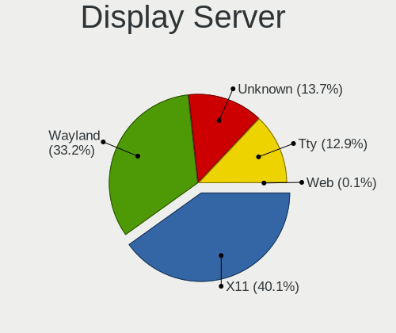

| Name    | Computers | Percent |
|---------|-----------|---------|
| X11     | 165       | 38.28%  |
| Unknown | 122       | 28.31%  |
| Wayland | 116       | 26.91%  |
| Tty     | 28        | 6.5%    |

Display Manager
---------------

SDDM, LightDM, etc.

| Name    | Computers | Percent |
|---------|-----------|---------|
| Unknown | 184       | 42.69%  |
| GDM3    | 112       | 25.99%  |
| SDDM    | 67        | 15.55%  |
| LightDM | 61        | 14.15%  |
| XDM     | 2         | 0.46%   |
| SLiM    | 2         | 0.46%   |
| GREETD  | 2         | 0.46%   |
| Ly      | 1         | 0.23%   |

OS Lang
-------

Language

| Lang    | Computers | Percent |
|---------|-----------|---------|
| ru_RU   | 129       | 30.07%  |
| en_US   | 115       | 26.81%  |
| de_DE   | 43        | 10.02%  |
| fr_FR   | 29        | 6.76%   |
| en_GB   | 18        | 4.2%    |
| sv_SE   | 14        | 3.26%   |
| es_ES   | 10        | 2.33%   |
| zh_CN   | 6         | 1.4%    |
| pt_BR   | 5         | 1.17%   |
| it_IT   | 5         | 1.17%   |
| C       | 5         | 1.17%   |
| pl_PL   | 4         | 0.93%   |
| fr_BE   | 3         | 0.7%    |
| en_NZ   | 3         | 0.7%    |
| en_IN   | 3         | 0.7%    |
| de_AT   | 3         | 0.7%    |
| Unknown | 3         | 0.7%    |
| es_CL   | 2         | 0.47%   |
| en_IL   | 2         | 0.47%   |
| en_IE   | 2         | 0.47%   |
| en_CA   | 2         | 0.47%   |
| en_AU   | 2         | 0.47%   |
| be_BY   | 2         | 0.47%   |
| zh_TW   | 1         | 0.23%   |
| uk_UA   | 1         | 0.23%   |
| tr_TR   | 1         | 0.23%   |
| oc_FR   | 1         | 0.23%   |
| nl_NL   | 1         | 0.23%   |
| nl_BE   | 1         | 0.23%   |
| ko_KR   | 1         | 0.23%   |
| ja_JP   | 1         | 0.23%   |
| hu_HU   | 1         | 0.23%   |
| hr_HR   | 1         | 0.23%   |
| fi_FI   | 1         | 0.23%   |
| es_VE   | 1         | 0.23%   |
| es_PE   | 1         | 0.23%   |
| es_PA   | 1         | 0.23%   |
| es_MX   | 1         | 0.23%   |
| es_AR   | 1         | 0.23%   |
| en_DK   | 1         | 0.23%   |

Boot Mode
---------

EFI or BIOS

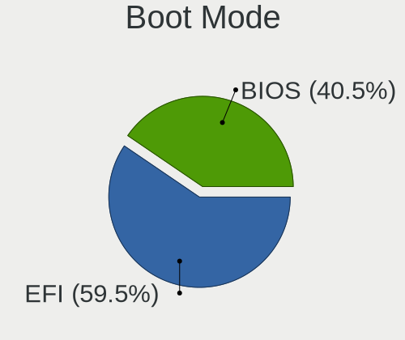

| Mode | Computers | Percent |
|------|-----------|---------|
| EFI  | 250       | 58.41%  |
| BIOS | 178       | 41.59%  |

Filesystem
----------

Type of filesystem

| Type    | Computers | Percent |
|---------|-----------|---------|
| Ext4    | 267       | 62.38%  |
| Overlay | 122       | 28.5%   |
| Btrfs   | 26        | 6.07%   |
| Xfs     | 7         | 1.64%   |
| Tmpfs   | 2         | 0.47%   |
| Ext2    | 2         | 0.47%   |
| Zfs     | 1         | 0.23%   |
| Ext3    | 1         | 0.23%   |

Part. scheme
------------

Scheme of partitioning

| Type    | Computers | Percent |
|---------|-----------|---------|
| GPT     | 265       | 61.92%  |
| MBR     | 117       | 27.34%  |
| Unknown | 46        | 10.75%  |

Dual Boot with Linux/BSD
------------------------

Hosting more than one Linux/BSD

| Dual boot | Computers | Percent |
|-----------|-----------|---------|
| No        | 390       | 90.49%  |
| Yes       | 41        | 9.51%   |

Dual Boot (Win)
---------------

Hosting Linux and Windows

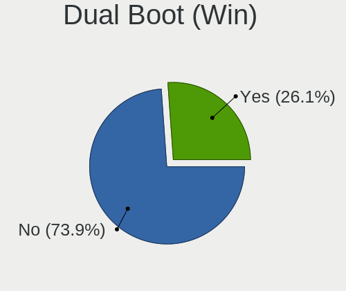

| Dual boot | Computers | Percent |
|-----------|-----------|---------|
| No        | 231       | 53.97%  |
| Yes       | 197       | 46.03%  |

Board
-----

Vendor
------

Motherboard manufacturer

| Name                           | Computers | Percent |
|--------------------------------|-----------|---------|
| ASUSTek Computer               | 96        | 22.43%  |
| Lenovo                         | 65        | 15.19%  |
| Hewlett-Packard                | 44        | 10.28%  |
| Gigabyte Technology            | 39        | 9.11%   |
| Dell                           | 33        | 7.71%   |
| Aquarius                       | 28        | 6.54%   |
| MSI                            | 19        | 4.44%   |
| Acer                           | 16        | 3.74%   |
| ASRock                         | 13        | 3.04%   |
| Unknown                        | 10        | 2.34%   |
| Intel                          | 7         | 1.64%   |
| Toshiba                        | 4         | 0.93%   |
| HUAWEI                         | 3         | 0.7%    |
| eMachines                      | 3         | 0.7%    |
| ECS                            | 3         | 0.7%    |
| Apple                          | 3         | 0.7%    |
| Techvision                     | 2         | 0.47%   |
| Supermicro                     | 2         | 0.47%   |
| Sony                           | 2         | 0.47%   |
| Schenker                       | 2         | 0.47%   |
| Samsung Electronics            | 2         | 0.47%   |
| Microsoft                      | 2         | 0.47%   |
| GPD                            | 2         | 0.47%   |
| Google                         | 2         | 0.47%   |
| Fujitsu                        | 2         | 0.47%   |
| TUXEDO                         | 1         | 0.23%   |
| THUNDEROBOT                    | 1         | 0.23%   |
| Terrans Force                  | 1         | 0.23%   |
| Tactus                         | 1         | 0.23%   |
| System76                       | 1         | 0.23%   |
| sunxi                          | 1         | 0.23%   |
| Shanghai Zhaoxin Semiconductor | 1         | 0.23%   |
| QTQD                           | 1         | 0.23%   |
| Pine Microsystems              | 1         | 0.23%   |
| PC Specialist                  | 1         | 0.23%   |
| Packard Bell                   | 1         | 0.23%   |
| Notebook                       | 1         | 0.23%   |
| Medion                         | 1         | 0.23%   |
| LG Electronics                 | 1         | 0.23%   |
| IBM                            | 1         | 0.23%   |

Model
-----

Motherboard model

| Name                                            | Computers | Percent |
|-------------------------------------------------|-----------|---------|
| Aquarius NS585                                  | 28        | 6.54%   |
| ASUS All Series                                 | 19        | 4.44%   |
| Unknown                                         | 12        | 2.8%    |
| ASUS PRIME B450M-K                              | 10        | 2.34%   |
| Gigabyte H81M-S2V                               | 8         | 1.87%   |
| Lenovo ThinkPad L14 Gen 2 20X1004CMX            | 4         | 0.93%   |
| Dell Precision 5570                             | 4         | 0.93%   |
| ASUS S20 K29                                    | 4         | 0.93%   |
| HP Elite x360 830 13 inch G9 2-in-1 Notebook PC | 3         | 0.7%    |
| ECS G31T-M9                                     | 3         | 0.7%    |
| ASUS ROG STRIX X570-E GAMING                    | 3         | 0.7%    |
| Techvision TVI7309X                             | 2         | 0.47%   |
| MSI MS-7C37                                     | 2         | 0.47%   |
| MSI MS-7996                                     | 2         | 0.47%   |
| Lenovo ThinkPad L13 Gen 2 20VJS6RY00            | 2         | 0.47%   |
| HP ProBook 640 G1                               | 2         | 0.47%   |
| HP ProBook 440 14 inch G9 Notebook PC           | 2         | 0.47%   |
| HP EliteBook 840 G5                             | 2         | 0.47%   |
| HP 255 G8 Notebook PC                           | 2         | 0.47%   |
| Gigabyte M68MT-S2                               | 2         | 0.47%   |
| Gigabyte M56S-S3                                | 2         | 0.47%   |
| Gigabyte H61M-DS2 REV 1.2                       | 2         | 0.47%   |
| Gigabyte B450M H                                | 2         | 0.47%   |
| Gigabyte B450 AORUS ELITE                       | 2         | 0.47%   |
| Dell Latitude 3320                              | 2         | 0.47%   |
| ASUS Zenbook UX535QE_UM535QE                    | 2         | 0.47%   |
| ASUS VivoBook_ASUSLaptop M3401QA_M3401QA        | 2         | 0.47%   |
| ASUS TUF Gaming B550M-PLUS                      | 2         | 0.47%   |
| ASUS ProArt X670E-CREATOR WIFI                  | 2         | 0.47%   |
| ASUS PRIME B450M-A                              | 2         | 0.47%   |
| ASUS P8H67-M                                    | 2         | 0.47%   |
| Acer Nitro AN515-45                             | 2         | 0.47%   |
| Acer Nitro AN515-43                             | 2         | 0.47%   |
| TUXEDO Aura 15 Gen2                             | 1         | 0.23%   |
| Toshiba Satellite X200                          | 1         | 0.23%   |
| Toshiba Satellite C855-22N                      | 1         | 0.23%   |
| Toshiba Satellite C50-B                         | 1         | 0.23%   |
| Toshiba Satellite A200                          | 1         | 0.23%   |
| THUNDEROBOT 911 Plus                            | 1         | 0.23%   |
| Terrans Force AMD                               | 1         | 0.23%   |

Model Family
------------

Motherboard model prefix

| Name                | Computers | Percent |
|---------------------|-----------|---------|
| Lenovo ThinkPad     | 46        | 10.75%  |
| Aquarius NS585      | 28        | 6.54%   |
| ASUS PRIME          | 23        | 5.37%   |
| ASUS All            | 19        | 4.44%   |
| Unknown             | 12        | 2.8%    |
| Dell Latitude       | 10        | 2.34%   |
| ASUS ROG            | 9         | 2.1%    |
| Acer Aspire         | 9         | 2.1%    |
| Gigabyte H81M-S2V   | 8         | 1.87%   |
| HP ProBook          | 7         | 1.64%   |
| Dell XPS            | 7         | 1.64%   |
| Lenovo ThinkCentre  | 6         | 1.4%    |
| Dell Precision      | 6         | 1.4%    |
| ASUS VivoBook       | 6         | 1.4%    |
| HP EliteBook        | 5         | 1.17%   |
| Toshiba Satellite   | 4         | 0.93%   |
| HP Elite            | 4         | 0.93%   |
| ASUS TUF            | 4         | 0.93%   |
| ASUS S20            | 4         | 0.93%   |
| Acer Nitro          | 4         | 0.93%   |
| Lenovo Yoga         | 3         | 0.7%    |
| Lenovo IdeaPad      | 3         | 0.7%    |
| HP ProDesk          | 3         | 0.7%    |
| HP ENVY             | 3         | 0.7%    |
| Gigabyte B450M      | 3         | 0.7%    |
| Gigabyte B450       | 3         | 0.7%    |
| ECS G31T-M9         | 3         | 0.7%    |
| Dell Inspiron       | 3         | 0.7%    |
| ASUS Zenbook        | 3         | 0.7%    |
| ASUS P5G41T-M       | 3         | 0.7%    |
| Techvision TVI7309X | 2         | 0.47%   |
| MSI Prestige        | 2         | 0.47%   |
| MSI MS-7C37         | 2         | 0.47%   |
| MSI MS-7996         | 2         | 0.47%   |
| Microsoft Surface   | 2         | 0.47%   |
| Lenovo Legion       | 2         | 0.47%   |
| HP ZBook            | 2         | 0.47%   |
| HP Spectre          | 2         | 0.47%   |
| HP Pavilion         | 2         | 0.47%   |
| HP OMEN             | 2         | 0.47%   |

MFG Year
--------

Motherboard manufacture year

| Year    | Computers | Percent |
|---------|-----------|---------|
| 2022    | 60        | 14.02%  |
| 2019    | 54        | 12.62%  |
| 2021    | 46        | 10.75%  |
| 2020    | 43        | 10.05%  |
| 2018    | 39        | 9.11%   |
| 2012    | 27        | 6.31%   |
| 2014    | 21        | 4.91%   |
| 2017    | 19        | 4.44%   |
| 2013    | 17        | 3.97%   |
| 2009    | 16        | 3.74%   |
| 2010    | 14        | 3.27%   |
| 2016    | 12        | 2.8%    |
| 2015    | 12        | 2.8%    |
| 2011    | 12        | 2.8%    |
| Unknown | 11        | 2.57%   |
| 2023    | 10        | 2.34%   |
| 2008    | 7         | 1.64%   |
| 2007    | 7         | 1.64%   |
| 2005    | 1         | 0.23%   |

Form Factor
-----------

Physical design of the computer

| Name           | Computers | Percent |
|----------------|-----------|---------|
| Notebook       | 204       | 47.66%  |
| Desktop        | 180       | 42.06%  |
| Convertible    | 16        | 3.74%   |
| Mini pc        | 9         | 2.1%    |
| System on chip | 8         | 1.87%   |
| Tablet         | 4         | 0.93%   |
| All in one     | 3         | 0.7%    |
| Server         | 3         | 0.7%    |
| Phone          | 1         | 0.23%   |

Secure Boot
-----------

Enabled or disabled

| State    | Computers | Percent |
|----------|-----------|---------|
| Disabled | 382       | 88.84%  |
| Enabled  | 48        | 11.16%  |

Coreboot
--------

Have coreboot on board

| Used | Computers | Percent |
|------|-----------|---------|
| No   | 426       | 99.53%  |
| Yes  | 2         | 0.47%   |

RAM Size
--------

Total RAM memory

| Size in GB      | Computers | Percent |
|-----------------|-----------|---------|
| 4.01-8.0        | 110       | 25.58%  |
| 8.01-16.0       | 80        | 18.6%   |
| 16.01-24.0      | 71        | 16.51%  |
| 32.01-64.0      | 64        | 14.88%  |
| 3.01-4.0        | 60        | 13.95%  |
| 64.01-256.0     | 19        | 4.42%   |
| 1.01-2.0        | 12        | 2.79%   |
| 24.01-32.0      | 6         | 1.4%    |
| 2.01-3.0        | 3         | 0.7%    |
| 0.51-1.0        | 3         | 0.7%    |
| More than 256.0 | 1         | 0.23%   |
| Unknown         | 1         | 0.23%   |

RAM Used
--------

Used RAM memory

| Used GB    | Computers | Percent |
|------------|-----------|---------|
| 0.51-1.0   | 121       | 27.56%  |
| 4.01-8.0   | 97        | 22.1%   |
| 1.01-2.0   | 67        | 15.26%  |
| 2.01-3.0   | 63        | 14.35%  |
| 3.01-4.0   | 39        | 8.88%   |
| 8.01-16.0  | 30        | 6.83%   |
| 0.01-0.5   | 14        | 3.19%   |
| 16.01-24.0 | 4         | 0.91%   |
| 32.01-64.0 | 2         | 0.46%   |
| 24.01-32.0 | 1         | 0.23%   |
| Unknown    | 1         | 0.23%   |

Total Drives
------------

Number of drives on board

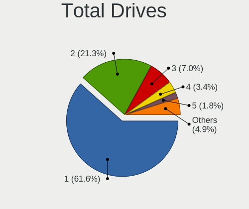

| Drives | Computers | Percent |
|--------|-----------|---------|
| 1      | 302       | 70.23%  |
| 2      | 76        | 17.67%  |
| 3      | 23        | 5.35%   |
| 4      | 13        | 3.02%   |
| 5      | 7         | 1.63%   |
| 6      | 5         | 1.16%   |
| 10     | 1         | 0.23%   |
| 8      | 1         | 0.23%   |
| 7      | 1         | 0.23%   |
| 0      | 1         | 0.23%   |

Has CD-ROM
----------

Has CD-ROM on board

| Presented | Computers | Percent |
|-----------|-----------|---------|
| No        | 337       | 78.55%  |
| Yes       | 92        | 21.45%  |

Has Ethernet
------------

Has Ethernet on board

| Presented | Computers | Percent |
|-----------|-----------|---------|
| Yes       | 361       | 84.15%  |
| No        | 68        | 15.85%  |

Has WiFi
--------

Has WiFi module

| Presented | Computers | Percent |
|-----------|-----------|---------|
| Yes       | 292       | 67.75%  |
| No        | 139       | 32.25%  |

Has Bluetooth
-------------

Has Bluetooth module

| Presented | Computers | Percent |
|-----------|-----------|---------|
| Yes       | 262       | 61.21%  |
| No        | 166       | 38.79%  |

Location
--------

Country
-------

Geographic location (country)

| Country     | Computers | Percent |
|-------------|-----------|---------|
| Russia      | 132       | 30.7%   |
| Germany     | 57        | 13.26%  |
| USA         | 32        | 7.44%   |
| France      | 32        | 7.44%   |
| Sweden      | 21        | 4.88%   |
| Spain       | 14        | 3.26%   |
| Brazil      | 12        | 2.79%   |
| Poland      | 10        | 2.33%   |
| UK          | 9         | 2.09%   |
| Italy       | 9         | 2.09%   |
| Netherlands | 6         | 1.4%    |
| China       | 6         | 1.4%    |
| Switzerland | 5         | 1.16%   |
| Belgium     | 5         | 1.16%   |
| Austria     | 5         | 1.16%   |
| New Zealand | 4         | 0.93%   |
| Mexico      | 4         | 0.93%   |
| Czechia     | 4         | 0.93%   |
| Canada      | 4         | 0.93%   |
| Turkey      | 3         | 0.7%    |
| Slovakia    | 3         | 0.7%    |
| Japan       | 3         | 0.7%    |
| Israel      | 3         | 0.7%    |
| India       | 3         | 0.7%    |
| Finland     | 3         | 0.7%    |
| Belarus     | 3         | 0.7%    |
| Ukraine     | 2         | 0.47%   |
| Singapore   | 2         | 0.47%   |
| Norway      | 2         | 0.47%   |
| Madagascar  | 2         | 0.47%   |
| Ireland     | 2         | 0.47%   |
| Hungary     | 2         | 0.47%   |
| Chile       | 2         | 0.47%   |
| Australia   | 2         | 0.47%   |
| Argentina   | 2         | 0.47%   |
| Vietnam     | 1         | 0.23%   |
| Venezuela   | 1         | 0.23%   |
| Uzbekistan  | 1         | 0.23%   |
| Uruguay     | 1         | 0.23%   |
| UAE         | 1         | 0.23%   |

City
----

Geographic location (city)

| City                 | Computers | Percent |
|----------------------|-----------|---------|
| Voronezh             | 114       | 26.27%  |
| Saltsjoe-Boo         | 16        | 3.69%   |
| Moscow               | 9         | 2.07%   |
| Paris                | 7         | 1.61%   |
| Berlin               | 5         | 1.15%   |
| Vienna               | 4         | 0.92%   |
| Frankfurt am Main    | 4         | 0.92%   |
| Zurich               | 3         | 0.69%   |
| Nuremberg            | 3         | 0.69%   |
| Munich               | 3         | 0.69%   |
| Marseille            | 3         | 0.69%   |
| Madrid               | 3         | 0.69%   |
| Hamburg              | 3         | 0.69%   |
| Gladbeck             | 3         | 0.69%   |
| Barcelona            | 3         | 0.69%   |
| Wroclaw              | 2         | 0.46%   |
| Wellington           | 2         | 0.46%   |
| Toronto              | 2         | 0.46%   |
| Tiranges             | 2         | 0.46%   |
| Stockholm            | 2         | 0.46%   |
| St Petersburg        | 2         | 0.46%   |
| Singapore            | 2         | 0.46%   |
| Seattle              | 2         | 0.46%   |
| San Francisco        | 2         | 0.46%   |
| Rozhanovce           | 2         | 0.46%   |
| Richmond             | 2         | 0.46%   |
| Pock               | 2         | 0.46%   |
| Prague               | 2         | 0.46%   |
| Poza Rica de Hidalgo | 2         | 0.46%   |
| Oslo                 | 2         | 0.46%   |
| Onalaska             | 2         | 0.46%   |
| Mesa                 | 2         | 0.46%   |
| Matar              | 2         | 0.46%   |
| London               | 2         | 0.46%   |
| La Paz               | 2         | 0.46%   |
| Kunming              | 2         | 0.46%   |
| Kirishi              | 2         | 0.46%   |
| Jianshui             | 2         | 0.46%   |
| Istanbul             | 2         | 0.46%   |
| Hrodna               | 2         | 0.46%   |

Drives
------

Drive Vendor
------------

Hard drive vendors

| Vendor                | Computers | Drives | Percent |
|-----------------------|-----------|--------|---------|
| Samsung Electronics   | 110       | 146    | 18.84%  |
| WDC                   | 98        | 125    | 16.78%  |
| Seagate               | 63        | 79     | 10.79%  |
| Toshiba               | 37        | 45     | 6.34%   |
| Crucial               | 35        | 43     | 5.99%   |
| A-DATA Technology     | 34        | 42     | 5.82%   |
| SanDisk               | 28        | 35     | 4.79%   |
| Unknown               | 24        | 33     | 4.11%   |
| Kingston              | 24        | 27     | 4.11%   |
| SK hynix              | 13        | 15     | 2.23%   |
| Micron Technology     | 12        | 12     | 2.05%   |
| Intel                 | 9         | 9      | 1.54%   |
| KIOXIA                | 7         | 8      | 1.2%    |
| Hitachi               | 5         | 9      | 0.86%   |
| Transcend             | 4         | 4      | 0.68%   |
| SSSTC                 | 4         | 4      | 0.68%   |
| Netac                 | 4         | 4      | 0.68%   |
| TO Exter              | 3         | 4      | 0.51%   |
| SPCC                  | 3         | 3      | 0.51%   |
| Silicon Motion        | 3         | 5      | 0.51%   |
| Phison                | 3         | 3      | 0.51%   |
| JMicron Technology    | 3         | 3      | 0.51%   |
| HGST                  | 3         | 4      | 0.51%   |
| Hewlett-Packard       | 3         | 5      | 0.51%   |
| GOODRAM               | 3         | 3      | 0.51%   |
| China                 | 3         | 3      | 0.51%   |
| XPG                   | 2         | 4      | 0.34%   |
| SABRENT               | 2         | 2      | 0.34%   |
| OCZ                   | 2         | 2      | 0.34%   |
| LITEON                | 2         | 2      | 0.34%   |
| Lexar                 | 2         | 2      | 0.34%   |
| KIOXIA-EXCERIA        | 2         | 2      | 0.34%   |
| Intenso               | 2         | 2      | 0.34%   |
| Apple                 | 2         | 2      | 0.34%   |
| Apacer                | 2         | 4      | 0.34%   |
| Unknown               | 2         | 2      | 0.34%   |
| USB                   | 1         | 1      | 0.17%   |
| TrekStor              | 1         | 1      | 0.17%   |
| ShiJi                 | 1         | 1      | 0.17%   |
| Realtek Semiconductor | 1         | 1      | 0.17%   |

Drive Model
-----------

Hard drive models

| Model                                               | Computers | Percent |
|-----------------------------------------------------|-----------|---------|
| A-DATA SU800 512GB SSD                              | 28        | 4.38%   |
| Crucial CT480BX500SSD1 480GB                        | 17        | 2.66%   |
| WDC WD5000AAKX-60U6AA0 500GB                        | 15        | 2.35%   |
| Seagate ST1000DM003-1ER162 1TB                      | 9         | 1.41%   |
| Samsung SSD 980 PRO 1TB                             | 9         | 1.41%   |
| Samsung NVMe SSD Controller SM981/PM981/PM983 256GB | 7         | 1.1%    |
| Samsung NVMe SSD Controller PM9A1/PM9A3/980PRO 1TB  | 6         | 0.94%   |
| Kingston SA400S37480G 480GB SSD                     | 6         | 0.94%   |
| Toshiba XG6 NVMe SSD Controller 256GB               | 5         | 0.78%   |
| Samsung SSD 980 1TB                                 | 5         | 0.78%   |
| Samsung SSD 970 EVO Plus 1TB                        | 5         | 0.78%   |
| Samsung PM9A1 NVMe 1024GB                           | 5         | 0.78%   |
| Crucial CT500MX500SSD1 500GB                        | 5         | 0.78%   |
| WDC WD10EZEX-08WN4A0 1TB                            | 4         | 0.63%   |
| Samsung SSD 850 EVO 500GB                           | 4         | 0.63%   |
| Samsung MZVLB512HBJQ-000L7 512GB                    | 4         | 0.63%   |
| WDC WDS100T2B0A-00SM50 1TB SSD                      | 3         | 0.47%   |
| WDC WD2500AAKS-00VSA0 250GB                         | 3         | 0.47%   |
| WDC WD20EZRZ-00Z5HB0 2TB                            | 3         | 0.47%   |
| Unknown SD32G  32GB                                 | 3         | 0.47%   |
| Unknown SD/MMC/MS PRO 64GB                          | 3         | 0.47%   |
| Toshiba MQ01ABF050 500GB                            | 3         | 0.47%   |
| Toshiba DT01ACA050 500GB                            | 3         | 0.47%   |
| TO Exter nal USB 3.0 1TB                            | 3         | 0.47%   |
| Seagate ST3250410AS 250GB                           | 3         | 0.47%   |
| Seagate ST1000DM010-2EP102 1TB                      | 3         | 0.47%   |
| Sandisk WD Black SN750 / PC SN730 NVMe SSD 256GB    | 3         | 0.47%   |
| SanDisk NVMe SSD Drive 512GB                        | 3         | 0.47%   |
| Samsung SSD 970 EVO Plus 500GB                      | 3         | 0.47%   |
| Samsung SSD 860 EVO 500GB                           | 3         | 0.47%   |
| Samsung MZVLQ256HBJD-00BH1 256GB                    | 3         | 0.47%   |
| Kingston SA400S37240G 240GB SSD                     | 3         | 0.47%   |
| Kingston SA400S37120G 120GB SSD                     | 3         | 0.47%   |
| Crucial CT250MX500SSD1 250GB                        | 3         | 0.47%   |
| XPG GAMMIX S11 Pro 512GB                            | 2         | 0.31%   |
| WDC WDS500G1X0E-00AFY0 500GB                        | 2         | 0.31%   |
| WDC WDS240G1G0A-00SS50 240GB SSD                    | 2         | 0.31%   |
| WDC WD5000AAKX-08ANVA0 500GB                        | 2         | 0.31%   |
| WDC WD40EFRX-68WT0N0 4TB                            | 2         | 0.31%   |
| WDC WD20EARX-00PASB0 2TB                            | 2         | 0.31%   |

HDD Vendor
----------

Hard disk drive vendors

| Vendor              | Computers | Drives | Percent |
|---------------------|-----------|--------|---------|
| WDC                 | 66        | 84     | 40.24%  |
| Seagate             | 58        | 73     | 35.37%  |
| Toshiba             | 24        | 31     | 14.63%  |
| Hitachi             | 5         | 9      | 3.05%   |
| Unknown             | 3         | 3      | 1.83%   |
| HGST                | 3         | 4      | 1.83%   |
| USB                 | 1         | 1      | 0.61%   |
| Samsung Electronics | 1         | 1      | 0.61%   |
| Hewlett-Packard     | 1         | 2      | 0.61%   |
| External            | 1         | 1      | 0.61%   |
| Apple               | 1         | 1      | 0.61%   |

SSD Vendor
----------

Solid state drive vendors

| Vendor              | Computers | Drives | Percent |
|---------------------|-----------|--------|---------|
| Samsung Electronics | 35        | 46     | 18.42%  |
| A-DATA Technology   | 30        | 38     | 15.79%  |
| Crucial             | 29        | 33     | 15.26%  |
| Kingston            | 15        | 17     | 7.89%   |
| SanDisk             | 14        | 19     | 7.37%   |
| WDC                 | 13        | 16     | 6.84%   |
| Toshiba             | 4         | 5      | 2.11%   |
| Intel               | 4         | 4      | 2.11%   |
| TO Exter            | 3         | 4      | 1.58%   |
| SPCC                | 3         | 3      | 1.58%   |
| Netac               | 3         | 3      | 1.58%   |
| GOODRAM             | 3         | 3      | 1.58%   |
| China               | 3         | 3      | 1.58%   |
| Transcend           | 2         | 2      | 1.05%   |
| SK hynix            | 2         | 2      | 1.05%   |
| Seagate             | 2         | 2      | 1.05%   |
| SABRENT             | 2         | 2      | 1.05%   |
| OCZ                 | 2         | 2      | 1.05%   |
| JMicron Technology  | 2         | 2      | 1.05%   |
| Intenso             | 2         | 2      | 1.05%   |
| TrekStor            | 1         | 1      | 0.53%   |
| PNY                 | 1         | 2      | 0.53%   |
| Plextor             | 1         | 1      | 0.53%   |
| OCZ-VERTEX3         | 1         | 1      | 0.53%   |
| NT-1TB              | 1         | 1      | 0.53%   |
| MSI                 | 1         | 1      | 0.53%   |
| MicroFrom           | 1         | 1      | 0.53%   |
| LITEON              | 1         | 1      | 0.53%   |
| Lexar               | 1         | 1      | 0.53%   |
| INNOVATION IT       | 1         | 1      | 0.53%   |
| Innodisk            | 1         | 1      | 0.53%   |
| Haizhide            | 1         | 1      | 0.53%   |
| Gigabyte Technology | 1         | 1      | 0.53%   |
| Colorful            | 1         | 1      | 0.53%   |
| Apacer              | 1         | 1      | 0.53%   |
| AMD                 | 1         | 1      | 0.53%   |
| 240G                | 1         | 1      | 0.53%   |

Drive Kind
----------

HDD or SSD

| Kind    | Computers | Drives | Percent |
|---------|-----------|--------|---------|
| NVMe    | 199       | 255    | 37.06%  |
| SSD     | 169       | 226    | 31.47%  |
| HDD     | 144       | 210    | 26.82%  |
| MMC     | 22        | 31     | 4.1%    |
| Unknown | 3         | 3      | 0.56%   |

Drive Connector
---------------

SATA, SAS, NVMe, etc.

| Type | Computers | Drives | Percent |
|------|-----------|--------|---------|
| SATA | 263       | 403    | 51.87%  |
| NVMe | 199       | 253    | 39.25%  |
| SAS  | 23        | 38     | 4.54%   |
| MMC  | 22        | 31     | 4.34%   |

Drive Size
----------

Size of hard drive

| Size in TB | Computers | Drives | Percent |
|------------|-----------|--------|---------|
| 0.01-0.5   | 182       | 237    | 54.01%  |
| 0.51-1.0   | 98        | 118    | 29.08%  |
| 1.01-2.0   | 27        | 39     | 8.01%   |
| 3.01-4.0   | 12        | 19     | 3.56%   |
| 4.01-10.0  | 8         | 13     | 2.37%   |
| 2.01-3.0   | 7         | 7      | 2.08%   |
| 10.01-20.0 | 3         | 3      | 0.89%   |

Space Total
-----------

Amount of disk space available on the file system

| Size in GB     | Computers | Percent |
|----------------|-----------|---------|
| Unknown        | 116       | 26.91%  |
| 251-500        | 83        | 19.26%  |
| 101-250        | 72        | 16.71%  |
| 501-1000       | 52        | 12.06%  |
| 1001-2000      | 33        | 7.66%   |
| More than 3000 | 29        | 6.73%   |
| 21-50          | 15        | 3.48%   |
| 1-20           | 14        | 3.25%   |
| 51-100         | 9         | 2.09%   |
| 2001-3000      | 8         | 1.86%   |

Space Used
----------

Amount of used disk space

| Used GB        | Computers | Percent |
|----------------|-----------|---------|
| Unknown        | 116       | 26.79%  |
| 1-20           | 96        | 22.17%  |
| 101-250        | 58        | 13.39%  |
| 51-100         | 41        | 9.47%   |
| 21-50          | 39        | 9.01%   |
| 501-1000       | 32        | 7.39%   |
| 251-500        | 22        | 5.08%   |
| 1001-2000      | 16        | 3.7%    |
| More than 3000 | 10        | 2.31%   |
| 2001-3000      | 3         | 0.69%   |

Malfunc. Drives
---------------

Drive models with a malfunction

| Model                                 | Computers | Drives | Percent |
|---------------------------------------|-----------|--------|---------|
| WDC WD5000AAKX-60U6AA0 500GB          | 12        | 12     | 20%     |
| Seagate ST3250410AS 250GB             | 3         | 3      | 5%      |
| SK hynix BC711 HFM512GD3JX013N 512GB  | 2         | 2      | 3.33%   |
| Hitachi HDS721050CLA362 500GB         | 2         | 3      | 3.33%   |
| WDC WDS480G2G0A-00JH30 480GB SSD      | 1         | 2      | 1.67%   |
| WDC WD800AAJS-60WAA0 80GB             | 1         | 1      | 1.67%   |
| WDC WD40EFRX-68N32N0 4TB              | 1         | 3      | 1.67%   |
| WDC WD3200AAJS-00L7A0 320GB           | 1         | 1      | 1.67%   |
| WDC WD30EFRX-68EUZN0 3TB              | 1         | 1      | 1.67%   |
| WDC WD2500AAKS-00VSA0 250GB           | 1         | 2      | 1.67%   |
| WDC WD2500AAJS-00B4A0 250GB           | 1         | 1      | 1.67%   |
| WDC WD20EARX-00PASB0 2TB              | 1         | 1      | 1.67%   |
| WDC WD1600AAJS-00B4A0 160GB           | 1         | 1      | 1.67%   |
| WDC WD10JPVX-08JC3T5 1TB              | 1         | 1      | 1.67%   |
| WDC WD10EARS-00MVWB0 1TB              | 1         | 1      | 1.67%   |
| WDC WD10EALX-009BA0 1TB               | 1         | 1      | 1.67%   |
| WDC WD1000DHTZ-04N21V0 1TB            | 1         | 1      | 1.67%   |
| Toshiba MQ01ABF050 500GB              | 1         | 1      | 1.67%   |
| Toshiba MK3259GSXP 320GB              | 1         | 1      | 1.67%   |
| Toshiba DT01ACA200 2TB                | 1         | 1      | 1.67%   |
| ShiJi 1TB                             | 1         | 1      | 1.67%   |
| Seagate ST9500325AS 500GB             | 1         | 1      | 1.67%   |
| Seagate ST500LM021-1KJ152 500GB       | 1         | 1      | 1.67%   |
| Seagate ST5000LM000-2AN170 5TB        | 1         | 2      | 1.67%   |
| Seagate ST3250824AS 250GB             | 1         | 1      | 1.67%   |
| Seagate ST3160815AS 160GB             | 1         | 1      | 1.67%   |
| Seagate ST3160215AS 160GB             | 1         | 1      | 1.67%   |
| Seagate ST3000DM001-1ER166 3TB        | 1         | 1      | 1.67%   |
| Seagate ST2000DX001-1CM164 2TB        | 1         | 1      | 1.67%   |
| Seagate ST2000DM006-2DM164 2TB        | 1         | 1      | 1.67%   |
| Seagate ST2000DM001-9YN164 2TB        | 1         | 1      | 1.67%   |
| SanDisk SDSSDXPS960G 960GB            | 1         | 1      | 1.67%   |
| SanDisk SD7SB2Q512G1001 512GB SSD     | 1         | 1      | 1.67%   |
| Samsung Electronics SSD 840 EVO 500GB | 1         | 1      | 1.67%   |
| Samsung Electronics SP2004C 200GB     | 1         | 1      | 1.67%   |
| Micron Technology 2300 NVMe 512GB     | 1         | 1      | 1.67%   |
| Kingston SV300S37A120G 120GB SSD      | 1         | 1      | 1.67%   |
| Kingston SA400S37240G 240GB SSD       | 1         | 1      | 1.67%   |
| JMicron Technology Generic 320GB      | 1         | 1      | 1.67%   |
| Intel SSDSC2BW180A4 180GB             | 1         | 1      | 1.67%   |

Malfunc. Drive Vendor
---------------------

Vendors of faulty drives

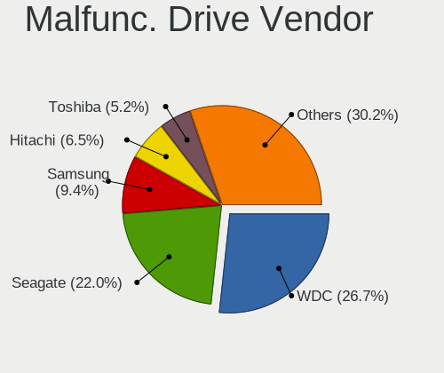

| Vendor              | Computers | Drives | Percent |
|---------------------|-----------|--------|---------|
| WDC                 | 24        | 29     | 41.38%  |
| Seagate             | 12        | 14     | 20.69%  |
| Hitachi             | 4         | 5      | 6.9%    |
| Toshiba             | 3         | 3      | 5.17%   |
| SK hynix            | 2         | 2      | 3.45%   |
| SanDisk             | 2         | 2      | 3.45%   |
| Samsung Electronics | 2         | 2      | 3.45%   |
| Kingston            | 2         | 2      | 3.45%   |
| ShiJi               | 1         | 1      | 1.72%   |
| Micron Technology   | 1         | 1      | 1.72%   |
| JMicron Technology  | 1         | 1      | 1.72%   |
| Intel               | 1         | 1      | 1.72%   |
| HGST                | 1         | 1      | 1.72%   |
| China               | 1         | 1      | 1.72%   |
| A-DATA Technology   | 1         | 1      | 1.72%   |

Malfunc. HDD Vendor
-------------------

Vendors of faulty HDD drives

| Vendor              | Computers | Drives | Percent |
|---------------------|-----------|--------|---------|
| WDC                 | 23        | 27     | 52.27%  |
| Seagate             | 12        | 14     | 27.27%  |
| Hitachi             | 4         | 5      | 9.09%   |
| Toshiba             | 3         | 3      | 6.82%   |
| Samsung Electronics | 1         | 1      | 2.27%   |
| HGST                | 1         | 1      | 2.27%   |

Malfunc. Drive Kind
-------------------

Kinds of faulty drives

| Kind | Computers | Drives | Percent |
|------|-----------|--------|---------|
| HDD  | 41        | 51     | 74.55%  |
| SSD  | 9         | 10     | 16.36%  |
| NVMe | 5         | 5      | 9.09%   |

Failed Drives
-------------

Failed drive models

Zero info for selected period =(

Failed Drive Vendor
-------------------

Failed drive vendors

Zero info for selected period =(

Drive Status
------------

Number of failed and malfunc. drives

| Status   | Computers | Drives | Percent |
|----------|-----------|--------|---------|
| Works    | 328       | 489    | 69.49%  |
| Detected | 90        | 170    | 19.07%  |
| Malfunc  | 54        | 66     | 11.44%  |

Storage controller
------------------

Storage Vendor
--------------

Storage controller vendors

| Vendor                         | Computers | Percent |
|--------------------------------|-----------|---------|
| Intel                          | 233       | 41.39%  |
| AMD                            | 90        | 15.99%  |
| Samsung Electronics            | 79        | 14.03%  |
| SanDisk                        | 34        | 6.04%   |
| ASMedia Technology             | 13        | 2.31%   |
| Micron Technology              | 12        | 2.13%   |
| SK hynix                       | 11        | 1.95%   |
| Toshiba America Info Systems   | 10        | 1.78%   |
| Kingston Technology Company    | 10        | 1.78%   |
| Nvidia                         | 9         | 1.6%    |
| Micron/Crucial Technology      | 8         | 1.42%   |
| KIOXIA                         | 7         | 1.24%   |
| Phison Electronics             | 6         | 1.07%   |
| ADATA Technology               | 6         | 1.07%   |
| Silicon Motion                 | 5         | 0.89%   |
| Solid State Storage Technology | 4         | 0.71%   |
| JMicron Technology             | 3         | 0.53%   |
| VIA Technologies               | 2         | 0.36%   |
| Transcend                      | 2         | 0.36%   |
| Seagate Technology             | 2         | 0.36%   |
| Biwin Storage Technology       | 2         | 0.36%   |
| Adaptec                        | 2         | 0.36%   |
| Silicon Image                  | 1         | 0.18%   |
| Shenzhen Longsys Electronics   | 1         | 0.18%   |
| Realtek Semiconductor          | 1         | 0.18%   |
| Netac Technology               | 1         | 0.18%   |
| Marvell Technology Group       | 1         | 0.18%   |
| LSI Logic / Symbios Logic      | 1         | 0.18%   |
| Lite-On Technology             | 1         | 0.18%   |
| Jiangsu Huacun Elec.           | 1         | 0.18%   |
| INNOGRIT                       | 1         | 0.18%   |
| IBM                            | 1         | 0.18%   |
| Hewlett-Packard                | 1         | 0.18%   |
| Artop Electronic               | 1         | 0.18%   |
| Apple                          | 1         | 0.18%   |

Storage Model
-------------

Storage controller models

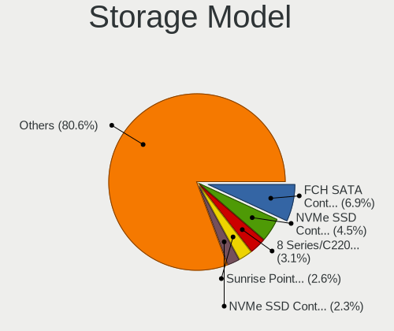

| Model                                                                                   | Computers | Percent |
|-----------------------------------------------------------------------------------------|-----------|---------|
| AMD FCH SATA Controller [AHCI mode]                                                     | 67        | 10.44%  |
| Intel 8 Series/C220 Series Chipset Family 6-port SATA Controller 1 [AHCI mode]          | 36        | 5.61%   |
| Samsung NVMe SSD Controller PM9A1/PM9A3/980PRO                                          | 34        | 5.3%    |
| Intel Cannon Lake PCH SATA AHCI Controller                                              | 30        | 4.67%   |
| Samsung NVMe SSD Controller SM981/PM981/PM983                                           | 28        | 4.36%   |
| AMD 400 Series Chipset SATA Controller                                                  | 27        | 4.21%   |
| Samsung NVMe SSD Controller 980                                                         | 15        | 2.34%   |
| Intel Sunrise Point-LP SATA Controller [AHCI mode]                                      | 14        | 2.18%   |
| Intel 200 Series PCH SATA controller [AHCI mode]                                        | 14        | 2.18%   |
| Intel Volume Management Device NVMe RAID Controller                                     | 13        | 2.02%   |
| ASMedia ASM1062 Serial ATA Controller                                                   | 13        | 2.02%   |
| Micron NVMe Storage Controller                                                          | 10        | 1.56%   |
| Intel 7 Series Chipset Family 6-port SATA Controller [AHCI mode]                        | 10        | 1.56%   |
| SanDisk WD Black SN750 / PC SN730 NVMe SSD                                              | 9         | 1.4%    |
| Intel NM10/ICH7 Family SATA Controller [IDE mode]                                       | 9         | 1.4%    |
| Intel Q170/Q150/B150/H170/H110/Z170/CM236 Chipset SATA Controller [AHCI Mode]           | 8         | 1.25%   |
| Intel Alder Lake-S PCH SATA Controller [AHCI Mode]                                      | 8         | 1.25%   |
| Intel 82801G (ICH7 Family) IDE Controller                                               | 8         | 1.25%   |
| Intel 8 Series SATA Controller 1 [AHCI mode]                                            | 8         | 1.25%   |
| AMD SB7x0/SB8x0/SB9x0 SATA Controller [AHCI mode]                                       | 8         | 1.25%   |
| SK hynix Gold P31/PC711 NVMe Solid State Drive                                          | 7         | 1.09%   |
| Sandisk Non-Volatile memory controller                                                  | 7         | 1.09%   |
| Micron/Crucial P2 NVMe PCIe SSD                                                         | 7         | 1.09%   |
| AMD 500 Series Chipset SATA Controller                                                  | 7         | 1.09%   |
| Toshiba America Info Systems XG6 NVMe SSD Controller                                    | 6         | 0.93%   |
| SanDisk WD Blue SN550 NVMe SSD                                                          | 6         | 0.93%   |
| Intel Comet Lake SATA AHCI Controller                                                   | 6         | 0.93%   |
| Intel Alder Lake-P SATA AHCI Controller                                                 | 6         | 0.93%   |
| Intel 82801IBM/IEM (ICH9M/ICH9M-E) 4 port SATA Controller [AHCI mode]                   | 6         | 0.93%   |
| Intel 700 Series Chipset Family SATA AHCI Controller                                    | 6         | 0.93%   |
| Samsung NVMe SSD Controller SM961/PM961/SM963                                           | 5         | 0.78%   |
| Kingston Company Company Non-Volatile memory controller                                 | 5         | 0.78%   |
| Intel Tiger Lake-LP SATA Controller                                                     | 5         | 0.78%   |
| Intel Celeron/Pentium Silver Processor SATA Controller                                  | 5         | 0.78%   |
| Intel 6 Series/C200 Series Chipset Family Desktop SATA Controller (IDE mode, ports 4-5) | 5         | 0.78%   |
| Intel 6 Series/C200 Series Chipset Family Desktop SATA Controller (IDE mode, ports 0-3) | 5         | 0.78%   |
| Intel 5 Series/3400 Series Chipset 6 port SATA AHCI Controller                          | 5         | 0.78%   |
| AMD SB7x0/SB8x0/SB9x0 IDE Controller                                                    | 5         | 0.78%   |
| Solid State Storage Non-Volatile memory controller                                      | 4         | 0.62%   |
| Silicon Motion SM2263EN/SM2263XT SSD Controller                                         | 4         | 0.62%   |

Storage Kind
------------

Kind of storage controller (IDE, SATA, NVMe, SAS, ...)

| Kind | Computers | Percent |
|------|-----------|---------|
| SATA | 288       | 51.8%   |
| NVMe | 196       | 35.25%  |
| IDE  | 44        | 7.91%   |
| RAID | 25        | 4.5%    |
| SAS  | 2         | 0.36%   |
| SCSI | 1         | 0.18%   |

Processor
---------

CPU Vendor
----------

Processor vendors

| Vendor            | Computers | Percent |
|-------------------|-----------|---------|
| Intel             | 300       | 70.09%  |
| AMD               | 117       | 27.34%  |
| sifive,u74-mc     | 4         | 0.93%   |
| ARM               | 3         | 0.7%    |
| Qualcomm          | 1         | 0.23%   |
| CHRP IBM,8233-E8B | 1         | 0.23%   |
| CentaurHauls      | 1         | 0.23%   |
| Unknown           | 1         | 0.23%   |

CPU Model
---------

Processor models

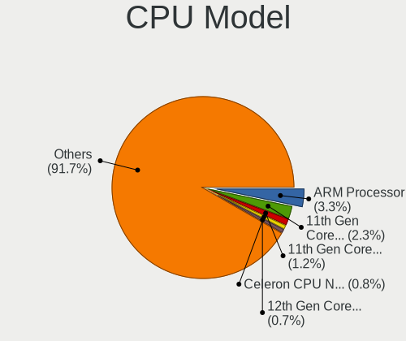

| Model                                       | Computers | Percent |
|---------------------------------------------|-----------|---------|
| Intel Core i3-9100 CPU @ 3.60GHz            | 28        | 6.53%   |
| Intel Pentium CPU G3420 @ 3.20GHz           | 15        | 3.5%    |
| Intel 11th Gen Core i5-1135G7 @ 2.40GHz     | 11        | 2.56%   |
| AMD Ryzen 5 3350G with Radeon Vega Graphics | 10        | 2.33%   |
| Intel Core i3-4130 CPU @ 3.40GHz            | 8         | 1.86%   |
| Intel 11th Gen Core i7-1165G7 @ 2.80GHz     | 8         | 1.86%   |
| Intel 12th Gen Core i5-1235U                | 7         | 1.63%   |
| Intel 12th Gen Core i7-12700H               | 6         | 1.4%    |
| Intel 11th Gen Core i7-1185G7 @ 3.00GHz     | 5         | 1.17%   |
| AMD Ryzen 7 5800X 8-Core Processor          | 5         | 1.17%   |
| AMD Ryzen 5 5500U with Radeon Graphics      | 5         | 1.17%   |
| sifive,u74-mc rv64imafdc                    | 4         | 0.93%   |
| Intel Core i5-9400 CPU @ 2.90GHz            | 4         | 0.93%   |
| Intel Core i5-8250U CPU @ 1.60GHz           | 4         | 0.93%   |
| Intel 12th Gen Core i7-1260P                | 4         | 0.93%   |
| AMD Ryzen 7 3700X 8-Core Processor          | 4         | 0.93%   |
| AMD Ryzen 5 5600X 6-Core Processor          | 4         | 0.93%   |
| Intel Pentium Dual-Core CPU E6500 @ 2.93GHz | 3         | 0.7%    |
| Intel Core i5-10210U CPU @ 1.60GHz          | 3         | 0.7%    |
| Intel Celeron N4020 CPU @ 1.10GHz           | 3         | 0.7%    |
| Intel 12th Gen Core i7-1265U                | 3         | 0.7%    |
| Intel 12th Gen Core i7-1255U                | 3         | 0.7%    |
| Intel 12th Gen Core i5-12400F               | 3         | 0.7%    |
| Intel 11th Gen Core i3-1115G4 @ 3.00GHz     | 3         | 0.7%    |
| AMD Ryzen 9 5900X 12-Core Processor         | 3         | 0.7%    |
| AMD Ryzen 9 5900HX with Radeon Graphics     | 3         | 0.7%    |
| AMD Ryzen 5 PRO 4650G with Radeon Graphics  | 3         | 0.7%    |
| AMD Ryzen 5 5600H with Radeon Graphics      | 3         | 0.7%    |
| AMD E-350 Processor                         | 3         | 0.7%    |
| Intel Pentium CPU G620 @ 2.60GHz            | 2         | 0.47%   |
| Intel Pentium CPU G4400 @ 3.30GHz           | 2         | 0.47%   |
| Intel Core i7-9750H CPU @ 2.60GHz           | 2         | 0.47%   |
| Intel Core i7-8650U CPU @ 1.90GHz           | 2         | 0.47%   |
| Intel Core i7-7700K CPU @ 4.20GHz           | 2         | 0.47%   |
| Intel Core i7-7700HQ CPU @ 2.80GHz          | 2         | 0.47%   |
| Intel Core i7-7700 CPU @ 3.60GHz            | 2         | 0.47%   |
| Intel Core i7-7600U CPU @ 2.80GHz           | 2         | 0.47%   |
| Intel Core i7-7500U CPU @ 2.70GHz           | 2         | 0.47%   |
| Intel Core i7-5500U CPU @ 2.40GHz           | 2         | 0.47%   |
| Intel Core i7-4790 CPU @ 3.60GHz            | 2         | 0.47%   |

CPU Model Family
----------------

Processor model prefix

| Model                   | Computers | Percent |
|-------------------------|-----------|---------|
| Other                   | 93        | 21.68%  |
| Intel Core i5           | 62        | 14.45%  |
| Intel Core i3           | 45        | 10.49%  |
| Intel Core i7           | 39        | 9.09%   |
| AMD Ryzen 5             | 37        | 8.62%   |
| AMD Ryzen 7             | 30        | 6.99%   |
| Intel Pentium           | 28        | 6.53%   |
| Intel Celeron           | 13        | 3.03%   |
| AMD Ryzen 9             | 12        | 2.8%    |
| Intel Core 2 Duo        | 10        | 2.33%   |
| Intel Pentium Dual-Core | 8         | 1.86%   |
| AMD Ryzen 5 PRO         | 8         | 1.86%   |
| Intel Xeon              | 7         | 1.63%   |
| AMD FX                  | 4         | 0.93%   |
| AMD Athlon 64 X2        | 4         | 0.93%   |
| AMD Ryzen 3             | 3         | 0.7%    |
| AMD E                   | 3         | 0.7%    |
| Intel Pentium Silver    | 2         | 0.47%   |
| AMD Athlon II X3        | 2         | 0.47%   |
| Intel Pentium M         | 1         | 0.23%   |
| Intel Pentium Gold      | 1         | 0.23%   |
| Intel Core m3           | 1         | 0.23%   |
| Intel Core 2 Quad       | 1         | 0.23%   |
| Intel Core 2            | 1         | 0.23%   |
| Intel Atom              | 1         | 0.23%   |
| ARM Allwinner           | 1         | 0.23%   |
| AMD Ryzen Threadripper  | 1         | 0.23%   |
| AMD Ryzen 7 PRO         | 1         | 0.23%   |
| AMD Phenom II X6        | 1         | 0.23%   |
| AMD Phenom II X4        | 1         | 0.23%   |
| AMD Phenom              | 1         | 0.23%   |
| AMD GX                  | 1         | 0.23%   |
| AMD EPYC                | 1         | 0.23%   |
| AMD Athlon II X4        | 1         | 0.23%   |
| AMD Athlon II X2        | 1         | 0.23%   |
| AMD Athlon II           | 1         | 0.23%   |
| AMD Athlon              | 1         | 0.23%   |
| AMD A6                  | 1         | 0.23%   |

CPU Cores
---------

Number of processor cores

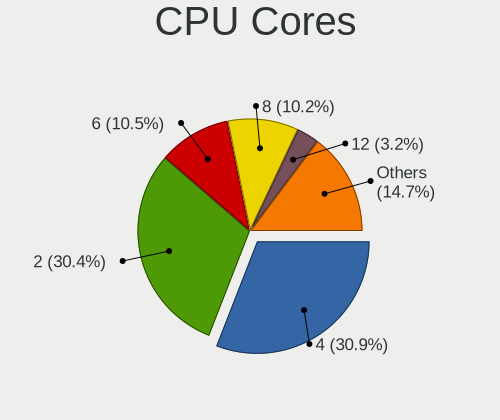

| Number  | Computers | Percent |
|---------|-----------|---------|
| 4       | 149       | 34.81%  |
| 2       | 127       | 29.67%  |
| 6       | 44        | 10.28%  |
| 8       | 40        | 9.35%   |
| 12      | 17        | 3.97%   |
| 10      | 16        | 3.74%   |
| 14      | 11        | 2.57%   |
| 16      | 9         | 2.1%    |
| Unknown | 7         | 1.64%   |
| 3       | 3         | 0.7%    |
| 1       | 3         | 0.7%    |
| 24      | 2         | 0.47%   |

CPU Sockets
-----------

Number of sockets

| Number  | Computers | Percent |
|---------|-----------|---------|
| 1       | 418       | 97.66%  |
| Unknown | 7         | 1.64%   |
| 2       | 3         | 0.7%    |

CPU Threads
-----------

Threads per core (Hyper-Threading)

| Number  | Computers | Percent |
|---------|-----------|---------|
| 2       | 288       | 66.98%  |
| 1       | 134       | 31.16%  |
| Unknown | 7         | 1.63%   |
| 4       | 1         | 0.23%   |

CPU Op-Modes
------------

CPU Operation Modes (32-bit, 64-bit)

| Op mode        | Computers | Percent |
|----------------|-----------|---------|
| 32-bit, 64-bit | 421       | 98.36%  |
| Unknown        | 6         | 1.4%    |
| 32-bit         | 1         | 0.23%   |

CPU Microcode
-------------

Microcode number

| Number     | Computers | Percent |
|------------|-----------|---------|
| Unknown    | 78        | 18.1%   |
| 0x306c3    | 39        | 9.05%   |
| 0x906eb    | 28        | 6.5%    |
| 0x806c1    | 25        | 5.8%    |
| 0x906a3    | 17        | 3.94%   |
| 0x1067a    | 15        | 3.48%   |
| 0x08108109 | 15        | 3.48%   |
| 0x906a4    | 14        | 3.25%   |
| 0x206a7    | 10        | 2.32%   |
| 0x806e9    | 9         | 2.09%   |
| 0x906e9    | 8         | 1.86%   |
| 0x806ea    | 8         | 1.86%   |
| 0x0a50000c | 8         | 1.86%   |
| 0x906ea    | 7         | 1.62%   |
| 0x90672    | 7         | 1.62%   |
| 0x506e3    | 6         | 1.39%   |
| 0x40651    | 6         | 1.39%   |
| 0x306a9    | 6         | 1.39%   |
| 0x0a20120a | 6         | 1.39%   |
| 0x08608103 | 6         | 1.39%   |
| 0x08600106 | 6         | 1.39%   |
| 0x406e3    | 5         | 1.16%   |
| 0x0a50000d | 5         | 1.16%   |
| 0x806ec    | 4         | 0.93%   |
| 0x706a8    | 4         | 0.93%   |
| 0x0a404102 | 4         | 0.93%   |
| 0x08701021 | 4         | 0.93%   |
| 0x0800820d | 4         | 0.93%   |
| 0xb0671    | 3         | 0.7%    |
| 0xa0653    | 3         | 0.7%    |
| 0x906c0    | 3         | 0.7%    |
| 0x306d4    | 3         | 0.7%    |
| 0x10676    | 3         | 0.7%    |
| 0x0a201016 | 3         | 0.7%    |
| 0x08701013 | 3         | 0.7%    |
| 0x08001138 | 3         | 0.7%    |
| 0xa0655    | 2         | 0.46%   |
| 0x90675    | 2         | 0.46%   |
| 0x806c2    | 2         | 0.46%   |
| 0x50654    | 2         | 0.46%   |

CPU Microarch
-------------

Microarchitecture

| Name             | Computers | Percent |
|------------------|-----------|---------|
| KabyLake         | 77        | 17.95%  |
| Haswell          | 51        | 11.89%  |
| Alderlake Hybrid | 41        | 9.56%   |
| Unknown          | 34        | 7.93%   |
| Zen 3            | 31        | 7.23%   |
| TigerLake        | 31        | 7.23%   |
| Zen+             | 25        | 5.83%   |
| Penryn           | 21        | 4.9%    |
| Zen 2            | 18        | 4.2%    |
| Skylake          | 14        | 3.26%   |
| SandyBridge      | 12        | 2.8%    |
| IvyBridge        | 11        | 2.56%   |
| K10              | 8         | 1.86%   |
| Zen              | 7         | 1.63%   |
| CometLake        | 7         | 1.63%   |
| Westmere         | 6         | 1.4%    |
| Goldmont plus    | 5         | 1.17%   |
| K8 Hammer        | 4         | 0.93%   |
| Tremont          | 3         | 0.7%    |
| Silvermont       | 3         | 0.7%    |
| Piledriver       | 3         | 0.7%    |
| Excavator        | 3         | 0.7%    |
| Core             | 3         | 0.7%    |
| Broadwell        | 3         | 0.7%    |
| Bobcat           | 3         | 0.7%    |
| Nehalem          | 2         | 0.47%   |
| P6               | 1         | 0.23%   |
| Jaguar           | 1         | 0.23%   |
| Icelake          | 1         | 0.23%   |

Graphics
--------

GPU Vendor
----------

Vendors of graphics cards

| Vendor                     | Computers | Percent |
|----------------------------|-----------|---------|
| Intel                      | 247       | 51.24%  |
| Nvidia                     | 115       | 23.86%  |
| AMD                        | 114       | 23.65%  |
| Matrox Electronics Systems | 5         | 1.04%   |
| Zhaoxin                    | 1         | 0.21%   |

GPU Model
---------

Graphics card models

| Model                                                                       | Computers | Percent |
|-----------------------------------------------------------------------------|-----------|---------|
| Intel CoffeeLake-S GT2 [UHD Graphics 630]                                   | 33        | 6.75%   |
| Intel TigerLake-LP GT2 [Iris Xe Graphics]                                   | 28        | 5.73%   |
| AMD Picasso/Raven 2 [Radeon Vega Series / Radeon Vega Mobile Series]        | 21        | 4.29%   |
| Intel Xeon E3-1200 v3/4th Gen Core Processor Integrated Graphics Controller | 20        | 4.09%   |
| Intel Alder Lake-P Integrated Graphics Controller                           | 17        | 3.48%   |
| Nvidia GF108 [GeForce GT 730]                                               | 15        | 3.07%   |
| Intel Alder Lake-UP3 GT2 [Iris Xe Graphics]                                 | 11        | 2.25%   |
| Intel 3rd Gen Core processor Graphics Controller                            | 10        | 2.04%   |
| AMD Cezanne [Radeon Vega Series / Radeon Vega Mobile Series]                | 10        | 2.04%   |
| Intel UHD Graphics 620                                                      | 9         | 1.84%   |
| Intel HD Graphics 630                                                       | 9         | 1.84%   |
| Intel Haswell-ULT Integrated Graphics Controller                            | 8         | 1.64%   |
| Intel 4th Generation Core Processor Family Integrated Graphics Controller   | 8         | 1.64%   |
| AMD Renoir                                                                  | 8         | 1.64%   |
| Intel HD Graphics 620                                                       | 7         | 1.43%   |
| Intel 4th Gen Core Processor Integrated Graphics Controller                 | 7         | 1.43%   |
| AMD Lucienne                                                                | 7         | 1.43%   |
| Intel 2nd Generation Core Processor Family Integrated Graphics Controller   | 6         | 1.23%   |
| Intel Skylake GT2 [HD Graphics 520]                                         | 5         | 1.02%   |
| AMD Rembrandt [Radeon 680M]                                                 | 5         | 1.02%   |
| AMD Lexa PRO [Radeon 540/540X/550/550X / RX 540X/550/550X]                  | 5         | 1.02%   |
| Intel JasperLake [UHD Graphics]                                             | 4         | 0.82%   |
| Intel GeminiLake [UHD Graphics 600]                                         | 4         | 0.82%   |
| Intel CometLake-U GT2 [UHD Graphics]                                        | 4         | 0.82%   |
| Intel CoffeeLake-H GT2 [UHD Graphics 630]                                   | 4         | 0.82%   |
| Intel 4 Series Chipset Integrated Graphics Controller                       | 4         | 0.82%   |
| AMD Navi 23 [Radeon RX 6600/6600 XT/6600M]                                  | 4         | 0.82%   |
| AMD Navi 10 [Radeon RX 5600 OEM/5600 XT / 5700/5700 XT]                     | 4         | 0.82%   |
| AMD Ellesmere [Radeon RX 470/480/570/570X/580/580X/590]                     | 4         | 0.82%   |
| AMD Barcelo                                                                 | 4         | 0.82%   |
| Nvidia TU117M [GeForce GTX 1650 Mobile / Max-Q]                             | 3         | 0.61%   |
| Nvidia TU117 [GeForce GTX 1650]                                             | 3         | 0.61%   |
| Nvidia GP108M [GeForce MX250]                                               | 3         | 0.61%   |
| Nvidia GP107 [GeForce GTX 1050 Ti]                                          | 3         | 0.61%   |
| Nvidia GK208B [GeForce GT 730]                                              | 3         | 0.61%   |
| Nvidia GF117M [GeForce 610M/710M/810M/820M / GT 620M/625M/630M/720M]        | 3         | 0.61%   |
| Nvidia GA107M [GeForce RTX 3050 Ti Mobile]                                  | 3         | 0.61%   |
| Nvidia GA107GLM [RTX A1000 Laptop GPU]                                      | 3         | 0.61%   |
| Intel Tiger Lake-LP GT2 [UHD Graphics G4]                                   | 3         | 0.61%   |
| Intel Mobile 4 Series Chipset Integrated Graphics Controller                | 3         | 0.61%   |

GPU Combo
---------

Combinations of graphics cards

| Name           | Computers | Percent |
|----------------|-----------|---------|
| 1 x Intel      | 195       | 45.35%  |
| 1 x AMD        | 91        | 21.16%  |
| 1 x Nvidia     | 63        | 14.65%  |
| Intel + Nvidia | 41        | 9.53%   |
| AMD + Nvidia   | 10        | 2.33%   |
| Other          | 9         | 2.09%   |
| Intel + AMD    | 7         | 1.63%   |
| 2 x AMD        | 5         | 1.16%   |
| 1 x Matrox     | 5         | 1.16%   |
| 2 x Intel      | 2         | 0.47%   |
| 1 x Zhaoxin    | 1         | 0.23%   |
| AMD + Matrox   | 1         | 0.23%   |

GPU Driver
----------

Free vs proprietary

| Driver      | Computers | Percent |
|-------------|-----------|---------|
| Free        | 253       | 58.97%  |
| Unknown     | 131       | 30.54%  |
| Proprietary | 45        | 10.49%  |

GPU Memory
----------

Total video memory

| Size in GB | Computers | Percent |
|------------|-----------|---------|
| Unknown    | 316       | 73.66%  |
| 0.01-0.5   | 22        | 5.13%   |
| 7.01-8.0   | 21        | 4.9%    |
| 3.01-4.0   | 21        | 4.9%    |
| 1.01-2.0   | 20        | 4.66%   |
| 0.51-1.0   | 15        | 3.5%    |
| 5.01-6.0   | 5         | 1.17%   |
| 8.01-16.0  | 4         | 0.93%   |
| 2.01-3.0   | 3         | 0.7%    |
| 16.01-24.0 | 2         | 0.47%   |

Monitor
-------

Monitor Vendor
--------------

Monitor vendors

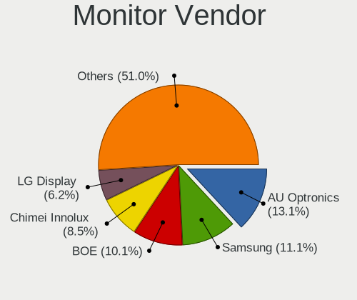

| Vendor               | Computers | Percent |
|----------------------|-----------|---------|
| AU Optronics         | 44        | 12.5%   |
| Samsung Electronics  | 37        | 10.51%  |
| Chimei Innolux       | 31        | 8.81%   |
| BOE                  | 29        | 8.24%   |
| Dell                 | 28        | 7.95%   |
| LG Display           | 20        | 5.68%   |
| Goldstar             | 17        | 4.83%   |
| BenQ                 | 17        | 4.83%   |
| Hewlett-Packard      | 12        | 3.41%   |
| Sharp                | 11        | 3.13%   |
| Acer                 | 11        | 3.13%   |
| AOC                  | 9         | 2.56%   |
| Philips              | 8         | 2.27%   |
| PANDA                | 7         | 1.99%   |
| Lenovo               | 6         | 1.7%    |
| InfoVision           | 5         | 1.42%   |
| Iiyama               | 4         | 1.14%   |
| Ancor Communications | 4         | 1.14%   |
| Unknown              | 4         | 1.14%   |
| Sony                 | 3         | 0.85%   |
| LG Electronics       | 3         | 0.85%   |
| CSO                  | 3         | 0.85%   |
| ASUSTek Computer     | 3         | 0.85%   |
| ViewSonic            | 2         | 0.57%   |
| Sceptre Tech         | 2         | 0.57%   |
| Mi                   | 2         | 0.57%   |
| Eizo                 | 2         | 0.57%   |
| Compal               | 2         | 0.57%   |
| Apple                | 2         | 0.57%   |
| YSD                  | 1         | 0.28%   |
| TCL                  | 1         | 0.28%   |
| RTK                  | 1         | 0.28%   |
| Plain Tree Systems   | 1         | 0.28%   |
| PCT                  | 1         | 0.28%   |
| Panasonic            | 1         | 0.28%   |
| NEC Computers        | 1         | 0.28%   |
| MSI                  | 1         | 0.28%   |
| Mitsubishi           | 1         | 0.28%   |
| MiTAC                | 1         | 0.28%   |
| Medion               | 1         | 0.28%   |

Monitor Model
-------------

Monitor models

| Model                                                                 | Computers | Percent |
|-----------------------------------------------------------------------|-----------|---------|
| Chimei Innolux LCD Monitor CMN14D4 1920x1080 309x173mm 13.9-inch      | 7         | 1.94%   |
| Unknown                                                               | 4         | 1.11%   |
| Sharp LCD Monitor SHP1516 3840x2400 336x210mm 15.6-inch               | 3         | 0.83%   |
| Samsung Electronics LCD Monitor SDC4161 1920x1080 344x194mm 15.5-inch | 3         | 0.83%   |
| Chimei Innolux LCD Monitor CMN14D5 1920x1080 309x173mm 13.9-inch      | 3         | 0.83%   |
| Chimei Innolux LCD Monitor CMN13C6 1920x1200 286x178mm 13.3-inch      | 3         | 0.83%   |
| BenQ PD2700U BNQ802E 3840x2160 597x336mm 27.0-inch                    | 3         | 0.83%   |
| Sharp LCD Monitor SHP1453 1920x1080 346x194mm 15.6-inch               | 2         | 0.55%   |
| Samsung Electronics U28E590 SAM0C4D 1680x1050 610x350mm 27.7-inch     | 2         | 0.55%   |
| Samsung Electronics S22D300 SAM0B3E 1920x1080 477x268mm 21.5-inch     | 2         | 0.55%   |
| Samsung Electronics LCD Monitor SyncMaster                            | 2         | 0.55%   |
| Samsung Electronics LCD Monitor SDC415A 3200x1800 293x165mm 13.2-inch | 2         | 0.55%   |
| PANDA LCD Monitor NCP005F 1920x1080 344x194mm 15.5-inch               | 2         | 0.55%   |
| PANDA LCD Monitor NCP004D 1920x1080 344x194mm 15.5-inch               | 2         | 0.55%   |
| LG Electronics LCD Monitor LG FULL HD                                 | 2         | 0.55%   |
| LG Display LCD Monitor LGD05FA 1920x1080 309x174mm 14.0-inch          | 2         | 0.55%   |
| LG Display LCD Monitor LGD03F1 1600x900 309x174mm 14.0-inch           | 2         | 0.55%   |
| Lenovo LCD Monitor LEN4036 1440x900 303x190mm 14.1-inch               | 2         | 0.55%   |
| InfoVision LCD Monitor IVO854A 1920x1200 286x179mm 13.3-inch          | 2         | 0.55%   |
| Hewlett-Packard E232 HWP3279 1920x1080 509x286mm 23.0-inch            | 2         | 0.55%   |
| Goldstar FULL HD GSM5ABB 1920x1080 480x270mm 21.7-inch                | 2         | 0.55%   |
| Dell U2412M DELA07B 1920x1200 518x324mm 24.1-inch                     | 2         | 0.55%   |
| Dell U2412M DELA07A 1920x1200 518x324mm 24.1-inch                     | 2         | 0.55%   |
| Dell G3223Q DEL428C 3840x2160 708x399mm 32.0-inch                     | 2         | 0.55%   |
| BenQ GW2480 BNQ78E7 1920x1080 527x296mm 23.8-inch                     | 2         | 0.55%   |
| BenQ GW2270 BNQ78DB 1920x1080 480x270mm 21.7-inch                     | 2         | 0.55%   |
| BenQ BenQG2222HDL BNQ785A 1920x1080 478x269mm 21.6-inch               | 2         | 0.55%   |
| AU Optronics LCD Monitor AUOE48D 1920x1080 344x194mm 15.5-inch        | 2         | 0.55%   |
| AU Optronics LCD Monitor AUOD291 1920x1200 301x188mm 14.0-inch        | 2         | 0.55%   |
| AU Optronics LCD Monitor AUO559C 1920x1080 309x174mm 14.0-inch        | 2         | 0.55%   |
| AU Optronics LCD Monitor AUO36ED 1920x1080 344x193mm 15.5-inch        | 2         | 0.55%   |
| AU Optronics LCD Monitor AUO332C 1366x768 293x165mm 13.2-inch         | 2         | 0.55%   |
| AU Optronics LCD Monitor AUO2E3C 1366x768 309x173mm 13.9-inch         | 2         | 0.55%   |
| AU Optronics LCD Monitor AUO2B99 1920x1080 293x165mm 13.2-inch        | 2         | 0.55%   |
| AU Optronics LCD Monitor AUO26EC 1366x768 344x193mm 15.5-inch         | 2         | 0.55%   |
| YSD HDMI YSD0190 1440x900 368x207mm 16.6-inch                         | 1         | 0.28%   |
| ViewSonic VX3276-QHD VSCE635 2560x1440 698x393mm 31.5-inch            | 1         | 0.28%   |
| ViewSonic VG175 VSCDD00 1280x1024 345x276mm 17.4-inch                 | 1         | 0.28%   |
| TCL SMART TV TCL6586 3840x2160 1209x680mm 54.6-inch                   | 1         | 0.28%   |
| Sony SDM-HS75 SNY2400 1280x1024 338x270mm 17.0-inch                   | 1         | 0.28%   |

Monitor Resolution
------------------

Monitor screen resolution

| Resolution         | Computers | Percent |
|--------------------|-----------|---------|
| 1920x1080 (FHD)    | 156       | 46.43%  |
| 1366x768 (WXGA)    | 30        | 8.93%   |
| 3840x2160 (4K)     | 25        | 7.44%   |
| 2560x1440 (QHD)    | 21        | 6.25%   |
| 1920x1200 (WUXGA)  | 20        | 5.95%   |
| 1600x900 (HD+)     | 12        | 3.57%   |
| Unknown            | 10        | 2.98%   |
| 1280x1024 (SXGA)   | 7         | 2.08%   |
| 3840x2400          | 6         | 1.79%   |
| 3440x1440          | 6         | 1.79%   |
| 1680x1050 (WSXGA+) | 5         | 1.49%   |
| 2560x1600          | 4         | 1.19%   |
| 1440x900 (WXGA+)   | 4         | 1.19%   |
| 3000x2000          | 3         | 0.89%   |
| 2560x1080          | 3         | 0.89%   |
| 3840x1600          | 2         | 0.6%    |
| 2880x1800          | 2         | 0.6%    |
| 1280x800 (WXGA)    | 2         | 0.6%    |
| 7680x2160          | 1         | 0.3%    |
| 7280x2160          | 1         | 0.3%    |
| 6400x2160          | 1         | 0.3%    |
| 6400x1440          | 1         | 0.3%    |
| 5760x2160          | 1         | 0.3%    |
| 4480x1440          | 1         | 0.3%    |
| 3840x1200          | 1         | 0.3%    |
| 3840x1080          | 1         | 0.3%    |
| 3456x2160          | 1         | 0.3%    |
| 3286x1080          | 1         | 0.3%    |
| 3200x1800 (QHD+)   | 1         | 0.3%    |
| 3072x1920          | 1         | 0.3%    |
| 2966x900           | 1         | 0.3%    |
| 2256x1504          | 1         | 0.3%    |
| 2240x1400          | 1         | 0.3%    |
| 2160x1440          | 1         | 0.3%    |
| 1920x1280          | 1         | 0.3%    |
| 1800x1200          | 1         | 0.3%    |

Monitor Diagonal
----------------

Diagonal size in inches

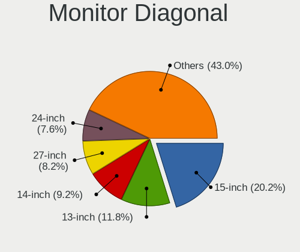

| Inches  | Computers | Percent |
|---------|-----------|---------|
| 13      | 67        | 19.53%  |
| 15      | 66        | 19.24%  |
| 24      | 34        | 9.91%   |
| 27      | 30        | 8.75%   |
| 14      | 28        | 8.16%   |
| Unknown | 22        | 6.41%   |
| 21      | 19        | 5.54%   |
| 23      | 13        | 3.79%   |
| 17      | 12        | 3.5%    |
| 34      | 9         | 2.62%   |
| 31      | 9         | 2.62%   |
| 20      | 5         | 1.46%   |
| 22      | 4         | 1.17%   |
| 12      | 4         | 1.17%   |
| 32      | 3         | 0.87%   |
| 16      | 3         | 0.87%   |
| 37      | 2         | 0.58%   |
| 26      | 2         | 0.58%   |
| 19      | 2         | 0.58%   |
| 18      | 2         | 0.58%   |
| 11      | 2         | 0.58%   |
| 72      | 1         | 0.29%   |
| 54      | 1         | 0.29%   |
| 48      | 1         | 0.29%   |
| 28      | 1         | 0.29%   |
| 10      | 1         | 0.29%   |

Monitor Width
-------------

Physical width

| Width in mm | Computers | Percent |
|-------------|-----------|---------|
| 301-350     | 127       | 37.57%  |
| 501-600     | 71        | 21.01%  |
| 201-300     | 48        | 14.2%   |
| 401-500     | 30        | 8.88%   |
| Unknown     | 22        | 6.51%   |
| 601-700     | 13        | 3.85%   |
| 701-800     | 12        | 3.55%   |
| 351-400     | 10        | 2.96%   |
| 801-900     | 2         | 0.59%   |
| 1001-1500   | 2         | 0.59%   |
| 1501-2000   | 1         | 0.3%    |

Aspect Ratio
------------

Proportional relationship between the width and the height

| Ratio   | Computers | Percent |
|---------|-----------|---------|
| 16/9    | 211       | 68.95%  |
| 16/10   | 49        | 16.01%  |
| Unknown | 21        | 6.86%   |
| 21/9    | 11        | 3.59%   |
| 5/4     | 7         | 2.29%   |
| 3/2     | 6         | 1.96%   |
| 4/3     | 1         | 0.33%   |

Monitor Area
------------

Area in inch

| Area in inch | Computers | Percent |
|----------------|-----------|---------|
| 101-110        | 62        | 18.08%  |
| 81-90          | 60        | 17.49%  |
| 201-250        | 46        | 13.41%  |
| 71-80          | 35        | 10.2%   |
| 301-350        | 31        | 9.04%   |
| 351-500        | 22        | 6.41%   |
| Unknown        | 22        | 6.41%   |
| 251-300        | 19        | 5.54%   |
| 151-200        | 14        | 4.08%   |
| 121-130        | 7         | 2.04%   |
| 111-120        | 7         | 2.04%   |
| 141-150        | 6         | 1.75%   |
| 61-70          | 4         | 1.17%   |
| More than 1000 | 3         | 0.87%   |
| 51-60          | 2         | 0.58%   |
| 501-1000       | 2         | 0.58%   |
| 41-50          | 1         | 0.29%   |

Pixel Density
-------------

Pixels per inch

| Density       | Computers | Percent |
|---------------|-----------|---------|
| 121-160       | 107       | 31.94%  |
| 51-100        | 82        | 24.48%  |
| 101-120       | 62        | 18.51%  |
| 161-240       | 44        | 13.13%  |
| Unknown       | 22        | 6.57%   |
| More than 240 | 16        | 4.78%   |
| 1-50          | 2         | 0.6%    |

Multiple Monitors
-----------------

Total monitors connected

| Total | Computers | Percent |
|-------|-----------|---------|
| 1     | 226       | 52.31%  |
| 0     | 133       | 30.79%  |
| 2     | 64        | 14.81%  |
| 3     | 9         | 2.08%   |

Network
-------

Net Controller Vendor
---------------------

Controller vendors

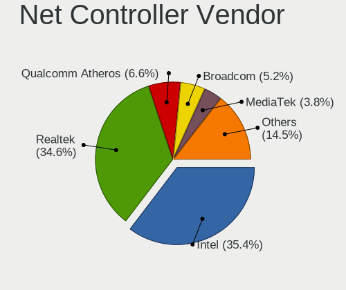

| Vendor                            | Computers | Percent |
|-----------------------------------|-----------|---------|
| Realtek Semiconductor             | 240       | 39.74%  |
| Intel                             | 228       | 37.75%  |
| Qualcomm Atheros                  | 37        | 6.13%   |
| Broadcom                          | 19        | 3.15%   |
| MediaTek                          | 15        | 2.48%   |
| ASIX Electronics                  | 10        | 1.66%   |
| Nvidia                            | 9         | 1.49%   |
| TP-Link                           | 5         | 0.83%   |
| Aquantia                          | 4         | 0.66%   |
| Xiaomi                            | 3         | 0.5%    |
| Ralink Technology                 | 3         | 0.5%    |
| D-Link                            | 3         | 0.5%    |
| ASUSTek Computer                  | 3         | 0.5%    |
| Qualcomm                          | 2         | 0.33%   |
| NetGear                           | 2         | 0.33%   |
| Marvell Technology Group          | 2         | 0.33%   |
| SysKonnect                        | 1         | 0.17%   |
| Spreadtrum Communications         | 1         | 0.17%   |
| Sierra Wireless                   | 1         | 0.17%   |
| Raspberry Pi                      | 1         | 0.17%   |
| Ralink                            | 1         | 0.17%   |
| Qualcomm Atheros Communications   | 1         | 0.17%   |
| OPPO Electronics                  | 1         | 0.17%   |
| OnePlus Technology (Shenzhen)     | 1         | 0.17%   |
| Microsoft                         | 1         | 0.17%   |
| MCS                               | 1         | 0.17%   |
| IBM                               | 1         | 0.17%   |
| Fujitsu                           | 1         | 0.17%   |
| Ericsson Business Mobile Networks | 1         | 0.17%   |
| Emulex                            | 1         | 0.17%   |
| DisplayLink                       | 1         | 0.17%   |
| Dell                              | 1         | 0.17%   |
| D-Link System                     | 1         | 0.17%   |
| Apple                             | 1         | 0.17%   |
| Unknown                           | 1         | 0.17%   |

Net Controller Model
--------------------

Controller models

| Model                                                             | Computers | Percent |
|-------------------------------------------------------------------|-----------|---------|
| Realtek RTL8111/8168/8411 PCI Express Gigabit Ethernet Controller | 172       | 24.36%  |
| Intel Alder Lake-P PCH CNVi WiFi                                  | 30        | 4.25%   |
| Intel Cannon Lake PCH CNVi WiFi                                   | 29        | 4.11%   |
| Intel Wi-Fi 6 AX201                                               | 23        | 3.26%   |
| Intel Wi-Fi 6 AX200                                               | 22        | 3.12%   |
| Realtek RTL8125 2.5GbE Controller                                 | 21        | 2.97%   |
| Intel Wireless 8265 / 8275                                        | 17        | 2.41%   |
| Intel I211 Gigabit Network Connection                             | 16        | 2.27%   |
| Realtek RTL8153 Gigabit Ethernet Adapter                          | 15        | 2.12%   |
| Realtek RTL810xE PCI Express Fast Ethernet controller             | 15        | 2.12%   |
| Intel Ethernet Controller I225-V                                  | 12        | 1.7%    |
| ASIX AX88179 Gigabit Ethernet                                     | 10        | 1.42%   |
| Qualcomm Atheros QCA6174 802.11ac Wireless Network Adapter        | 9         | 1.27%   |
| Intel Ethernet Connection (13) I219-V                             | 9         | 1.27%   |
| Intel Wireless 7260                                               | 8         | 1.13%   |
| MediaTek MT7922 802.11ax PCI Express Wireless Network Adapter     | 7         | 0.99%   |
| Intel Wi-Fi 6 AX210/AX211/AX411 160MHz                            | 7         | 0.99%   |
| Intel Ethernet Connection (4) I219-LM                             | 7         | 0.99%   |
| Realtek RTL8852BE PCIe 802.11ax Wireless Network Controller       | 6         | 0.85%   |
| Realtek RTL8852AE 802.11ax PCIe Wireless Network Adapter          | 6         | 0.85%   |
| Intel Wireless-AC 9260                                            | 6         | 0.85%   |
| Intel Ethernet Connection (2) I219-V                              | 6         | 0.85%   |
| MediaTek MT7921 802.11ax PCI Express Wireless Network Adapter     | 5         | 0.71%   |
| Intel Ethernet Connection I217-LM                                 | 5         | 0.71%   |
| Intel Ethernet Connection (16) I219-V                             | 5         | 0.71%   |
| Realtek RTL8822CE 802.11ac PCIe Wireless Network Adapter          | 4         | 0.57%   |
| Realtek RTL8821CE 802.11ac PCIe Wireless Network Adapter          | 4         | 0.57%   |
| Qualcomm Atheros QCA9377 802.11ac Wireless Network Adapter        | 4         | 0.57%   |
| Qualcomm Atheros AR8131 Gigabit Ethernet                          | 4         | 0.57%   |
| Nvidia MCP61 Ethernet                                             | 4         | 0.57%   |
| Intel Wireless 7265                                               | 4         | 0.57%   |
| Intel Ethernet Connection I217-V                                  | 4         | 0.57%   |
| Intel Dual Band Wireless-AC 3168NGW [Stone Peak]                  | 4         | 0.57%   |
| Intel Comet Lake PCH-LP CNVi WiFi                                 | 4         | 0.57%   |
| Intel Alder Lake-S PCH CNVi WiFi                                  | 4         | 0.57%   |
| Intel 82579LM Gigabit Network Connection (Lewisville)             | 4         | 0.57%   |
| Realtek RTL88x2bu [AC1200 Techkey]                                | 3         | 0.42%   |
| Realtek RTL8822BE 802.11a/b/g/n/ac WiFi adapter                   | 3         | 0.42%   |
| Realtek RTL8188EUS 802.11n Wireless Network Adapter               | 3         | 0.42%   |
| Qualcomm Atheros AR9485 Wireless Network Adapter                  | 3         | 0.42%   |

Wireless Vendor
---------------

Wireless vendors

| Vendor                          | Computers | Percent |
|---------------------------------|-----------|---------|
| Intel                           | 184       | 60.53%  |
| Realtek Semiconductor           | 42        | 13.82%  |
| Qualcomm Atheros                | 31        | 10.2%   |
| MediaTek                        | 15        | 4.93%   |
| Broadcom                        | 11        | 3.62%   |
| TP-Link                         | 4         | 1.32%   |
| Ralink Technology               | 3         | 0.99%   |
| D-Link                          | 3         | 0.99%   |
| ASUSTek Computer                | 3         | 0.99%   |
| Qualcomm                        | 2         | 0.66%   |
| NetGear                         | 2         | 0.66%   |
| Sierra Wireless                 | 1         | 0.33%   |
| Ralink                          | 1         | 0.33%   |
| Qualcomm Atheros Communications | 1         | 0.33%   |
| Marvell Technology Group        | 1         | 0.33%   |

Wireless Model
--------------

Wireless models

| Model                                                          | Computers | Percent |
|----------------------------------------------------------------|-----------|---------|
| Intel Alder Lake-P PCH CNVi WiFi                               | 30        | 9.84%   |
| Intel Cannon Lake PCH CNVi WiFi                                | 29        | 9.51%   |
| Intel Wi-Fi 6 AX201                                            | 23        | 7.54%   |
| Intel Wi-Fi 6 AX200                                            | 22        | 7.21%   |
| Intel Wireless 8265 / 8275                                     | 17        | 5.57%   |
| Qualcomm Atheros QCA6174 802.11ac Wireless Network Adapter     | 9         | 2.95%   |
| Intel Wireless 7260                                            | 8         | 2.62%   |
| MediaTek MT7922 802.11ax PCI Express Wireless Network Adapter  | 7         | 2.3%    |
| Intel Wi-Fi 6 AX210/AX211/AX411 160MHz                         | 7         | 2.3%    |
| Realtek RTL8852BE PCIe 802.11ax Wireless Network Controller    | 6         | 1.97%   |
| Realtek RTL8852AE 802.11ax PCIe Wireless Network Adapter       | 6         | 1.97%   |
| Intel Wireless-AC 9260                                         | 6         | 1.97%   |
| MediaTek MT7921 802.11ax PCI Express Wireless Network Adapter  | 5         | 1.64%   |
| Realtek RTL8822CE 802.11ac PCIe Wireless Network Adapter       | 4         | 1.31%   |
| Realtek RTL8821CE 802.11ac PCIe Wireless Network Adapter       | 4         | 1.31%   |
| Qualcomm Atheros QCA9377 802.11ac Wireless Network Adapter     | 4         | 1.31%   |
| Intel Wireless 7265                                            | 4         | 1.31%   |
| Intel Dual Band Wireless-AC 3168NGW [Stone Peak]               | 4         | 1.31%   |
| Intel Comet Lake PCH-LP CNVi WiFi                              | 4         | 1.31%   |
| Intel Alder Lake-S PCH CNVi WiFi                               | 4         | 1.31%   |
| Realtek RTL88x2bu [AC1200 Techkey]                             | 3         | 0.98%   |
| Realtek RTL8822BE 802.11a/b/g/n/ac WiFi adapter                | 3         | 0.98%   |
| Realtek RTL8188EUS 802.11n Wireless Network Adapter            | 3         | 0.98%   |
| Qualcomm Atheros AR9485 Wireless Network Adapter               | 3         | 0.98%   |
| Qualcomm Atheros AR9287 Wireless Network Adapter (PCI-Express) | 3         | 0.98%   |
| Qualcomm Atheros AR9285 Wireless Network Adapter (PCI-Express) | 3         | 0.98%   |
| Intel Wireless 8260                                            | 3         | 0.98%   |
| Intel Cannon Point-LP CNVi [Wireless-AC]                       | 3         | 0.98%   |
| Intel 700 Series Chipset Family Wi-Fi                          | 3         | 0.98%   |
| Broadcom BCM43228 802.11a/b/g/n                                | 3         | 0.98%   |
| TP-Link TL-WN722N v2/v3 [Realtek RTL8188EUS]                   | 2         | 0.66%   |
| TP-Link 802.11ac WLAN Adapter                                  | 2         | 0.66%   |
| Realtek RTL8723DE Wireless Network Adapter                     | 2         | 0.66%   |
| Realtek RTL8191SU 802.11n WLAN Adapter                         | 2         | 0.66%   |
| Ralink RT5370 Wireless Adapter                                 | 2         | 0.66%   |
| Qualcomm QCNFA765 Wireless Network Adapter                     | 2         | 0.66%   |
| Qualcomm Atheros QCA9565 / AR9565 Wireless Network Adapter     | 2         | 0.66%   |
| Qualcomm Atheros AR9462 Wireless Network Adapter               | 2         | 0.66%   |
| MediaTek MT7921K (RZ608) Wi-Fi 6E 80MHz                        | 2         | 0.66%   |
| Intel Wi-Fi 6 AX201 160MHz                                     | 2         | 0.66%   |

Ethernet Vendor
---------------

Ethernet vendors

| Vendor                    | Computers | Percent |
|---------------------------|-----------|---------|
| Realtek Semiconductor     | 224       | 57.58%  |
| Intel                     | 107       | 27.51%  |
| Qualcomm Atheros          | 11        | 2.83%   |
| Broadcom                  | 10        | 2.57%   |
| ASIX Electronics          | 10        | 2.57%   |
| Nvidia                    | 9         | 2.31%   |
| Aquantia                  | 4         | 1.03%   |
| Xiaomi                    | 3         | 0.77%   |
| TP-Link                   | 1         | 0.26%   |
| SysKonnect                | 1         | 0.26%   |
| Spreadtrum Communications | 1         | 0.26%   |
| OPPO Electronics          | 1         | 0.26%   |
| Microsoft                 | 1         | 0.26%   |
| Marvell Technology Group  | 1         | 0.26%   |
| IBM                       | 1         | 0.26%   |
| Emulex                    | 1         | 0.26%   |
| DisplayLink               | 1         | 0.26%   |
| D-Link System             | 1         | 0.26%   |
| Apple                     | 1         | 0.26%   |

Ethernet Model
--------------

Ethernet models

| Model                                                               | Computers | Percent |
|---------------------------------------------------------------------|-----------|---------|
| Realtek RTL8111/8168/8411 PCI Express Gigabit Ethernet Controller   | 172       | 43.77%  |
| Realtek RTL8125 2.5GbE Controller                                   | 21        | 5.34%   |
| Intel I211 Gigabit Network Connection                               | 16        | 4.07%   |
| Realtek RTL8153 Gigabit Ethernet Adapter                            | 15        | 3.82%   |
| Realtek RTL810xE PCI Express Fast Ethernet controller               | 15        | 3.82%   |
| Intel Ethernet Controller I225-V                                    | 12        | 3.05%   |
| ASIX AX88179 Gigabit Ethernet                                       | 10        | 2.54%   |
| Intel Ethernet Connection (13) I219-V                               | 9         | 2.29%   |
| Intel Ethernet Connection (4) I219-LM                               | 7         | 1.78%   |
| Intel Ethernet Connection (2) I219-V                                | 6         | 1.53%   |
| Intel Ethernet Connection I217-LM                                   | 5         | 1.27%   |
| Intel Ethernet Connection (16) I219-V                               | 5         | 1.27%   |
| Qualcomm Atheros AR8131 Gigabit Ethernet                            | 4         | 1.02%   |
| Nvidia MCP61 Ethernet                                               | 4         | 1.02%   |
| Intel Ethernet Connection I217-V                                    | 4         | 1.02%   |
| Intel 82579LM Gigabit Network Connection (Lewisville)               | 4         | 1.02%   |
| Nvidia MCP65 Ethernet                                               | 3         | 0.76%   |
| Intel Ethernet Connection (5) I219-LM                               | 3         | 0.76%   |
| Intel Ethernet Connection (4) I219-V                                | 3         | 0.76%   |
| Intel Ethernet Connection (13) I219-LM                              | 3         | 0.76%   |
| Aquantia AQC113CS NBase-T/IEEE 802.3bz Ethernet Controller [AQtion] | 3         | 0.76%   |
| Xiaomi Mi/Redmi series (RNDIS)                                      | 2         | 0.51%   |
| Realtek Killer E2600 Gigabit Ethernet Controller                    | 2         | 0.51%   |
| Intel I350 Gigabit Network Connection                               | 2         | 0.51%   |
| Intel Ethernet Connection I218-V                                    | 2         | 0.51%   |
| Intel Ethernet Connection (7) I219-V                                | 2         | 0.51%   |
| Intel Ethernet Connection (16) I219-LM                              | 2         | 0.51%   |
| Intel Ethernet Connection (14) I219-V                               | 2         | 0.51%   |
| Intel Ethernet Connection (11) I219-LM                              | 2         | 0.51%   |
| Intel 82579V Gigabit Network Connection                             | 2         | 0.51%   |
| Xiaomi Mi/Redmi series (RNDIS + ADB)                                | 1         | 0.25%   |
| TP-Link UE300 10/100/1000 LAN (ethernet mode) [Realtek RTL8153]     | 1         | 0.25%   |
| SysKonnect SK-98xx V2.0 Gigabit Ethernet Adapter [Marvell 88E8001]  | 1         | 0.25%   |
| Spreadtrum Spreadtrum Phone                                         | 1         | 0.25%   |
| Realtek RTL-8100/8101L/8139 PCI Fast Ethernet Adapter               | 1         | 0.25%   |
| Qualcomm Atheros Killer E2500 Gigabit Ethernet Controller           | 1         | 0.25%   |
| Qualcomm Atheros Attansic L1 Gigabit Ethernet                       | 1         | 0.25%   |
| Qualcomm Atheros AR8162 Fast Ethernet                               | 1         | 0.25%   |
| Qualcomm Atheros AR8152 v2.0 Fast Ethernet                          | 1         | 0.25%   |
| Qualcomm Atheros AR8151 v2.0 Gigabit Ethernet                       | 1         | 0.25%   |

Net Controller Kind
-------------------

Ethernet, WiFi or modem

| Kind     | Computers | Percent |
|----------|-----------|---------|
| Ethernet | 360       | 54.71%  |
| WiFi     | 291       | 44.22%  |
| Modem    | 5         | 0.76%   |
| Unknown  | 2         | 0.3%    |

Used Controller
---------------

Currently used network controller

| Kind     | Computers | Percent |
|----------|-----------|---------|
| Ethernet | 260       | 59.36%  |
| WiFi     | 178       | 40.64%  |

NICs
----

Total network controllers on board

| Total | Computers | Percent |
|-------|-----------|---------|
| 1     | 206       | 48.13%  |
| 2     | 195       | 45.56%  |
| 0     | 11        | 2.57%   |
| 3     | 10        | 2.34%   |
| 4     | 4         | 0.93%   |
| 9     | 1         | 0.23%   |
| 6     | 1         | 0.23%   |

IPv6
----

IPv6 vs IPv4

| Used | Computers | Percent |
|------|-----------|---------|
| No   | 319       | 74.01%  |
| Yes  | 112       | 25.99%  |

Bluetooth
---------

Bluetooth Vendor
----------------

Controller vendors

| Vendor                          | Computers | Percent |
|---------------------------------|-----------|---------|
| Intel                           | 171       | 64.04%  |
| Realtek Semiconductor           | 28        | 10.49%  |
| Foxconn / Hon Hai               | 12        | 4.49%   |
| Qualcomm Atheros Communications | 10        | 3.75%   |
| Cambridge Silicon Radio         | 8         | 3%      |
| Lite-On Technology              | 7         | 2.62%   |
| IMC Networks                    | 7         | 2.62%   |
| Broadcom                        | 5         | 1.87%   |
| ASUSTek Computer                | 4         | 1.5%    |
| Dell                            | 3         | 1.12%   |
| Apple                           | 3         | 1.12%   |
| Toshiba                         | 2         | 0.75%   |
| MediaTek                        | 2         | 0.75%   |
| TP-Link                         | 1         | 0.37%   |
| Realtek                         | 1         | 0.37%   |
| Ralink Technology               | 1         | 0.37%   |
| Marvell Semiconductor           | 1         | 0.37%   |
| Integrated System Solution      | 1         | 0.37%   |

Bluetooth Model
---------------

Controller models

| Model                                               | Computers | Percent |
|-----------------------------------------------------|-----------|---------|
| Intel Bluetooth 9460/9560 Jefferson Peak (JfP)      | 40        | 14.98%  |
| Intel Bluetooth wireless interface                  | 34        | 12.73%  |
| Intel AX201 Bluetooth                               | 31        | 11.61%  |
| Intel Bluetooth Device                              | 27        | 10.11%  |
| Realtek Bluetooth Radio                             | 23        | 8.61%   |
| Intel AX200 Bluetooth                               | 21        | 7.87%   |
| Cambridge Silicon Radio Bluetooth Dongle (HCI mode) | 8         | 3%      |
| Intel AX210 Bluetooth                               | 7         | 2.62%   |
| Intel Wireless-AC 9260 Bluetooth Adapter            | 6         | 2.25%   |
| Foxconn / Hon Hai Wireless_Device                   | 6         | 2.25%   |
| Realtek  Bluetooth 4.2 Adapter                      | 5         | 1.87%   |
| Qualcomm Atheros  Bluetooth Device                  | 5         | 1.87%   |
| Foxconn / Hon Hai Bluetooth Device                  | 4         | 1.5%    |
| Qualcomm Atheros QCA61x4 Bluetooth 4.0              | 3         | 1.12%   |
| Lite-On Bluetooth Device                            | 3         | 1.12%   |
| Intel Wireless-AC 3168 Bluetooth                    | 3         | 1.12%   |
| IMC Networks Wireless_Device                        | 3         | 1.12%   |
| Dell BCM20702A0 Bluetooth Module                    | 3         | 1.12%   |
| Qualcomm Atheros AR3012 Bluetooth 4.0               | 2         | 0.75%   |
| MediaTek Wireless_Device                            | 2         | 0.75%   |
| Lite-On Wireless_Device                             | 2         | 0.75%   |
| Intel Centrino Bluetooth Wireless Transceiver       | 2         | 0.75%   |
| IMC Networks Bluetooth Radio                        | 2         | 0.75%   |
| Broadcom HP Portable Bumble Bee                     | 2         | 0.75%   |
| Broadcom BCM2045B (BDC-2.1)                         | 2         | 0.75%   |
| ASUS Broadcom BCM20702A0 Bluetooth                  | 2         | 0.75%   |
| Apple Bluetooth Host Controller                     | 2         | 0.75%   |
| TP-Link UB500 Adapter                               | 1         | 0.37%   |
| Toshiba RT Bluetooth Radio                          | 1         | 0.37%   |
| Toshiba Integrated Bluetooth HCI                    | 1         | 0.37%   |
| Realtek Bluetooth Radio                             | 1         | 0.37%   |
| Ralink Motorola BC4 Bluetooth 3.0+HS Adapter        | 1         | 0.37%   |
| Marvell Bluetooth and Wireless LAN Composite Device | 1         | 0.37%   |
| Lite-On Qualcomm Atheros QCA9377 Bluetooth          | 1         | 0.37%   |
| Lite-On Atheros AR3012 Bluetooth                    | 1         | 0.37%   |
| Integrated System Solution Bluetooth Device         | 1         | 0.37%   |
| IMC Networks Bluetooth USB Host Controller          | 1         | 0.37%   |
| IMC Networks Bluetooth module                       | 1         | 0.37%   |
| Foxconn / Hon Hai Bluetooth USB Host Controller     | 1         | 0.37%   |
| Foxconn / Hon Hai BCM2045A0                         | 1         | 0.37%   |

Sound
-----

Sound Vendor
------------

Sound card vendors

| Vendor                       | Computers | Percent |
|------------------------------|-----------|---------|
| Intel                        | 291       | 51.32%  |
| AMD                          | 121       | 21.34%  |
| Nvidia                       | 86        | 15.17%  |
| C-Media Electronics          | 9         | 1.59%   |
| Logitech                     | 7         | 1.23%   |
| Creative Labs                | 5         | 0.88%   |
| ASUSTek Computer             | 5         | 0.88%   |
| Realtek Semiconductor        | 4         | 0.71%   |
| Kingston Technology          | 4         | 0.71%   |
| SteelSeries ApS              | 3         | 0.53%   |
| Hewlett-Packard              | 3         | 0.53%   |
| GN Netcom                    | 3         | 0.53%   |
| Plantronics                  | 2         | 0.35%   |
| Micro Star International     | 2         | 0.35%   |
| Lenovo                       | 2         | 0.35%   |
| Generalplus Technology       | 2         | 0.35%   |
| Blue Microphones             | 2         | 0.35%   |
| Zhaoxin                      | 1         | 0.18%   |
| USB MICROPHONE               | 1         | 0.18%   |
| Texas Instruments            | 1         | 0.18%   |
| Samson Technologies          | 1         | 0.18%   |
| OPPO Electronics             | 1         | 0.18%   |
| Microsoft                    | 1         | 0.18%   |
| JMTek                        | 1         | 0.18%   |
| Giga-Byte Technology         | 1         | 0.18%   |
| Focusrite-Novation           | 1         | 0.18%   |
| Dell                         | 1         | 0.18%   |
| D&M Holdings (Denon/Marantz) | 1         | 0.18%   |
| Creative Technology          | 1         | 0.18%   |
| Corsair                      | 1         | 0.18%   |
| Beyerdynamic                 | 1         | 0.18%   |
| Audient                      | 1         | 0.18%   |
| Apple                        | 1         | 0.18%   |

Sound Model
-----------

Sound card models

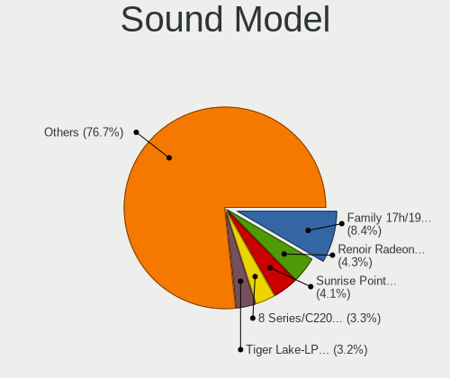

| Model                                                                      | Computers | Percent |
|----------------------------------------------------------------------------|-----------|---------|
| AMD Family 17h/19h HD Audio Controller                                     | 59        | 8.5%    |
| Intel 8 Series/C220 Series Chipset High Definition Audio Controller        | 39        | 5.62%   |
| Intel Xeon E3-1200 v3/4th Gen Core Processor HD Audio Controller           | 34        | 4.9%    |
| Intel Cannon Lake PCH cAVS                                                 | 34        | 4.9%    |
| Intel Alder Lake PCH-P High Definition Audio Controller                    | 32        | 4.61%   |
| Intel Tiger Lake-LP Smart Sound Technology Audio Controller                | 31        | 4.47%   |
| AMD Renoir Radeon High Definition Audio Controller                         | 27        | 3.89%   |
| Intel Sunrise Point-LP HD Audio                                            | 25        | 3.6%    |
| AMD Starship/Matisse HD Audio Controller                                   | 24        | 3.46%   |
| Nvidia GF108 High Definition Audio Controller                              | 18        | 2.59%   |
| Intel 200 Series PCH HD Audio                                              | 13        | 1.87%   |
| AMD Raven/Raven2/Fenghuang HDMI/DP Audio Controller                        | 13        | 1.87%   |
| Intel 7 Series/C216 Chipset Family High Definition Audio Controller        | 11        | 1.59%   |
| AMD SBx00 Azalia (Intel HDA)                                               | 10        | 1.44%   |
| Intel NM10/ICH7 Family High Definition Audio Controller                    | 9         | 1.3%    |
| Intel 6 Series/C200 Series Chipset Family High Definition Audio Controller | 9         | 1.3%    |
| Intel Haswell-ULT HD Audio Controller                                      | 8         | 1.15%   |
| Intel Alder Lake-S HD Audio Controller                                     | 8         | 1.15%   |
| Intel 8 Series HD Audio Controller                                         | 8         | 1.15%   |
| AMD Navi 21/23 HDMI/DP Audio Controller                                    | 8         | 1.15%   |
| AMD Family 17h (Models 00h-0fh) HD Audio Controller                        | 8         | 1.15%   |
| Intel 82801I (ICH9 Family) HD Audio Controller                             | 7         | 1.01%   |
| AMD Baffin HDMI/DP Audio [Radeon RX 550 640SP / RX 560/560X]               | 7         | 1.01%   |
| Nvidia TU107 GeForce GTX 1650 High Definition Audio Controller             | 6         | 0.86%   |
| Nvidia GP107GL High Definition Audio Controller                            | 6         | 0.86%   |
| Nvidia GA104 High Definition Audio Controller                              | 6         | 0.86%   |
| Intel 700 Series Chipset Family Precise Touch and Stylus Port #1           | 6         | 0.86%   |
| Intel 5 Series/3400 Series Chipset High Definition Audio                   | 6         | 0.86%   |
| AMD Navi 10 HDMI Audio                                                     | 6         | 0.86%   |
| Nvidia GK208 HDMI/DP Audio Controller                                      | 5         | 0.72%   |
| Intel Comet Lake PCH cAVS                                                  | 5         | 0.72%   |
| Intel Celeron/Pentium Silver Processor High Definition Audio               | 5         | 0.72%   |
| Intel 100 Series/C230 Series Chipset Family HD Audio Controller            | 5         | 0.72%   |
| AMD Rembrandt Radeon High Definition Audio Controller                      | 5         | 0.72%   |
| Nvidia TU106 High Definition Audio Controller                              | 4         | 0.58%   |
| Nvidia MCP61 High Definition Audio                                         | 4         | 0.58%   |
| Nvidia GT216 HDMI Audio Controller                                         | 4         | 0.58%   |
| Intel Jasper Lake HD Audio                                                 | 4         | 0.58%   |
| Intel Comet Lake PCH-LP cAVS                                               | 4         | 0.58%   |
| Intel CM238 HD Audio Controller                                            | 4         | 0.58%   |

Memory
------

Memory Vendor
-------------

Memory module vendors

| Vendor                                  | Computers | Percent |
|-----------------------------------------|-----------|---------|
| Samsung Electronics                     | 82        | 20.05%  |
| Kingston                                | 64        | 15.65%  |
| Crucial                                 | 60        | 14.67%  |
| SK hynix                                | 58        | 14.18%  |
| Unknown                                 | 41        | 10.02%  |
| Micron Technology                       | 36        | 8.8%    |
| Corsair                                 | 13        | 3.18%   |
| G.Skill                                 | 12        | 2.93%   |
| A-DATA Technology                       | 8         | 1.96%   |
| Patriot                                 | 6         | 1.47%   |
| Elpida                                  | 4         | 0.98%   |
| Unknown                                 | 4         | 0.98%   |
| Ramaxel Technology                      | 3         | 0.73%   |
| Unknown (ABCD)                          | 2         | 0.49%   |
| Nanya Technology                        | 2         | 0.49%   |
| ASint Technology                        | 2         | 0.49%   |
| Unknown (768A)                          | 1         | 0.24%   |
| Unknown (0x7FFF)                        | 1         | 0.24%   |
| Toshiba                                 | 1         | 0.24%   |
| Team                                    | 1         | 0.24%   |
| Smart                                   | 1         | 0.24%   |
| Silicon Power Computer & Communications | 1         | 0.24%   |
| PKI                                     | 1         | 0.24%   |
| Patriot Memory (PDP Systems)            | 1         | 0.24%   |
| Neo Forza                               | 1         | 0.24%   |
| Hikvision                               | 1         | 0.24%   |
| <Invalid>                               | 1         | 0.24%   |
| 48spaces                                | 1         | 0.24%   |

Memory Model
------------

Memory module models

| Model                                                            | Computers | Percent |
|------------------------------------------------------------------|-----------|---------|
| Crucial RAM CT8G4SFRA266.C8FD1 8GB SODIMM DDR4 2667MT/s          | 28        | 6.5%    |
| Kingston RAM 99U5584-010.A00LF 4GB DIMM DDR3 1866MT/s            | 15        | 3.48%   |
| Samsung RAM M378A1K43DB2-CTD 8GB DIMM DDR4 4333MT/s              | 10        | 2.32%   |
| Samsung RAM M471A1G44AB0-CWE 8GB SODIMM DDR4 3200MT/s            | 7         | 1.62%   |
| SK hynix RAM HMA81GS6AFR8N-UH 8GB SODIMM DDR4 2667MT/s           | 6         | 1.39%   |
| Patriot RAM PSD38G13332 8GB DIMM DDR3 1333MT/s                   | 6         | 1.39%   |
| SK hynix RAM HMA851S6CJR6N-VK 4GB SODIMM DDR4 2667MT/s           | 4         | 0.93%   |
| Samsung RAM M471A1G44BB0-CWE 8GB SODIMM DDR4 3200MT/s            | 4         | 0.93%   |
| G.Skill RAM F4-3200C16-16GVK 16384MB DIMM DDR4 3600MT/s          | 4         | 0.93%   |
| Unknown                                                          | 4         | 0.93%   |
| Unknown RAM Module 4GB DIMM 1066MT/s                             | 3         | 0.7%    |
| Unknown RAM Module 2GB DIMM SDRAM                                | 3         | 0.7%    |
| Unknown RAM Module 2GB DIMM 1333MT/s                             | 3         | 0.7%    |
| SK hynix RAM HMCG88MEBSA092N 32GB SODIMM DDR5 4800MT/s           | 3         | 0.7%    |
| Samsung RAM Module 8GB SODIMM DDR5 4800MT/s                      | 3         | 0.7%    |
| Samsung RAM M471B5173DB0-YK0 4GB SODIMM DDR3 1600MT/s            | 3         | 0.7%    |
| Samsung RAM M471A1K43EB1-CWE 8GB SODIMM DDR4 3200MT/s            | 3         | 0.7%    |
| Samsung RAM M471A1K43DB1-CWE 8GB SODIMM DDR4 3200MT/s            | 3         | 0.7%    |
| Micron RAM 4ATF51264HZ-3G2J1 4GB SODIMM DDR4 3200MT/s            | 3         | 0.7%    |
| Micron RAM 4ATF1G64HZ-3G2E2 8GB SODIMM DDR4 3200MT/s             | 3         | 0.7%    |
| Corsair RAM CMK16GX4M2B3200C16 8GB DIMM DDR4 3600MT/s            | 3         | 0.7%    |
| Unknown RAM Module 4GB Row Of Chips LPDDR4 4267MT/s              | 2         | 0.46%   |
| Unknown RAM Module 2GB SODIMM DDR3                               | 2         | 0.46%   |
| Unknown RAM Module 2GB SODIMM DDR2 667MT/s                       | 2         | 0.46%   |
| Unknown RAM Module 2GB SODIMM 800MT/s                            | 2         | 0.46%   |
| Unknown RAM Module 2GB DIMM 800MT/s                              | 2         | 0.46%   |
| Unknown RAM Module 1GB SODIMM DDR2 667MT/s                       | 2         | 0.46%   |
| Unknown RAM Module 1GB DIMM SDRAM                                | 2         | 0.46%   |
| Unknown RAM Module 1GB DIMM DDR2 667MT/s                         | 2         | 0.46%   |
| Unknown RAM Module 1GB DIMM 800MT/s                              | 2         | 0.46%   |
| Unknown (ABCD) RAM 123456789012345678 2GB SODIMM LPDDR4 2400MT/s | 2         | 0.46%   |
| SK hynix RAM Module 8GB SODIMM DDR4 2400MT/s                     | 2         | 0.46%   |
| SK hynix RAM HMT41GS6BFR8A-PB 8GB SODIMM DDR3 1600MT/s           | 2         | 0.46%   |
| SK hynix RAM HMAA2GS6CJR8N-XN 16GB SODIMM DDR4 3200MT/s          | 2         | 0.46%   |
| SK hynix RAM HMA81GS6DJR8N-XN 8GB SODIMM DDR4 3200MT/s           | 2         | 0.46%   |
| SK hynix RAM HMA451S6AFR8N-TF 4GB SODIMM DDR4 2133MT/s           | 2         | 0.46%   |
| SK hynix RAM HCNNNCPMMLXR-NEE 2GB Row Of Chips LPDDR4 4267MT/s   | 2         | 0.46%   |
| SK hynix RAM H9HCNNNCPMMLXR-NEE 8GB SODIMM LPDDR4 4266MT/s       | 2         | 0.46%   |
| Samsung RAM UBE3D4AA-MGCR 2GB Row Of Chips LPDDR4 4267MT/s       | 2         | 0.46%   |
| Samsung RAM Module 16GB SODIMM DDR4 2667MT/s                     | 2         | 0.46%   |

Memory Kind
-----------

Memory module kinds

| Kind    | Computers | Percent |
|---------|-----------|---------|
| DDR4    | 195       | 52.28%  |
| DDR3    | 79        | 21.18%  |
| DDR5    | 23        | 6.17%   |
| LPDDR4  | 20        | 5.36%   |
| Unknown | 17        | 4.56%   |
| DDR2    | 10        | 2.68%   |
| LPDDR3  | 9         | 2.41%   |
| SDRAM   | 8         | 2.14%   |
| LPDDR5  | 8         | 2.14%   |
| DDR     | 4         | 1.07%   |

Memory Form Factor
------------------

Physical design of the memory module

| Name         | Computers | Percent |
|--------------|-----------|---------|
| SODIMM       | 184       | 49.46%  |
| DIMM         | 151       | 40.59%  |
| Row Of Chips | 36        | 9.68%   |
| Chip         | 1         | 0.27%   |

Memory Size
-----------

Memory module size

| Size  | Computers | Percent |
|-------|-----------|---------|
| 8192  | 182       | 46.31%  |
| 4096  | 76        | 19.34%  |
| 16384 | 53        | 13.49%  |
| 2048  | 45        | 11.45%  |
| 32768 | 20        | 5.09%   |
| 1024  | 13        | 3.31%   |
| 512   | 2         | 0.51%   |
| 256   | 1         | 0.25%   |
| 64    | 1         | 0.25%   |

Memory Speed
------------

Memory module speed

| Speed   | Computers | Percent |
|---------|-----------|---------|
| 3200    | 67        | 17.59%  |
| 2667    | 61        | 16.01%  |
| 1600    | 45        | 11.81%  |
| 2400    | 20        | 5.25%   |
| 4800    | 17        | 4.46%   |
| 1333    | 17        | 4.46%   |
| 2133    | 16        | 4.2%    |
| 1866    | 16        | 4.2%    |
| 3600    | 15        | 3.94%   |
| 4267    | 14        | 3.67%   |
| 4333    | 10        | 2.62%   |
| Unknown | 10        | 2.62%   |
| 6400    | 9         | 2.36%   |
| 800     | 9         | 2.36%   |
| 1066    | 7         | 1.84%   |
| 667     | 7         | 1.84%   |
| 1867    | 5         | 1.31%   |
| 2666    | 4         | 1.05%   |
| 6000    | 3         | 0.79%   |
| 5200    | 2         | 0.52%   |
| 4266    | 2         | 0.52%   |
| 3733    | 2         | 0.52%   |
| 3534    | 2         | 0.52%   |
| 3400    | 2         | 0.52%   |
| 3266    | 2         | 0.52%   |
| 2866    | 2         | 0.52%   |
| 1334    | 2         | 0.52%   |
| 1067    | 2         | 0.52%   |
| 8400    | 1         | 0.26%   |
| 4199    | 1         | 0.26%   |
| 3933    | 1         | 0.26%   |
| 3800    | 1         | 0.26%   |
| 3500    | 1         | 0.26%   |
| 3100    | 1         | 0.26%   |
| 3000    | 1         | 0.26%   |
| 2733    | 1         | 0.26%   |
| 2473    | 1         | 0.26%   |
| 2048    | 1         | 0.26%   |
| 1400    | 1         | 0.26%   |

Printers & scanners
-------------------

Printer Vendor
--------------

Printer device vendors

| Vendor             | Computers | Percent |
|--------------------|-----------|---------|
| Brother Industries | 4         | 33.33%  |
| Canon              | 3         | 25%     |
| Hewlett-Packard    | 2         | 16.67%  |
| Zebra              | 1         | 8.33%   |
| Seiko Epson        | 1         | 8.33%   |
| Dymo-CoStar        | 1         | 8.33%   |

Printer Model
-------------

Printer device models

| Model                            | Computers | Percent |
|----------------------------------|-----------|---------|
| Zebra Printer                    | 1         | 8.33%   |
| Seiko Epson L6290 Series         | 1         | 8.33%   |
| HP LaserJet P2035                | 1         | 8.33%   |
| HP ENVY 5540 series              | 1         | 8.33%   |
| Dymo-CoStar DYMO LabelWriter DUO | 1         | 8.33%   |
| Canon PIXMA iP4300 Printer       | 1         | 8.33%   |
| Canon MF4010 series              | 1         | 8.33%   |
| Canon MF3010                     | 1         | 8.33%   |
| Brother MFC-L2710DW series       | 1         | 8.33%   |
| Brother HL-3040CN series         | 1         | 8.33%   |
| Brother HL-1110 series           | 1         | 8.33%   |
| Brother DCP-7030                 | 1         | 8.33%   |

Scanner Vendor
--------------

Scanner device vendors

| Vendor          | Computers | Percent |
|-----------------|-----------|---------|
| Hewlett-Packard | 1         | 50%     |
| Canon           | 1         | 50%     |

Scanner Model
-------------

Scanner device models

| Model                              | Computers | Percent |
|------------------------------------|-----------|---------|
| HP ScanJet 82x0C                   | 1         | 50%     |
| Canon CanoScan N670U/N676U/LiDE 20 | 1         | 50%     |

Camera
------

Camera Vendor
-------------

Camera device vendors

| Vendor                                 | Computers | Percent |
|----------------------------------------|-----------|---------|
| Chicony Electronics                    | 51        | 21.16%  |
| Acer                                   | 38        | 15.77%  |
| IMC Networks                           | 20        | 8.3%    |
| Microdia                               | 18        | 7.47%   |
| Realtek Semiconductor                  | 14        | 5.81%   |
| Logitech                               | 14        | 5.81%   |
| Quanta                                 | 11        | 4.56%   |
| Bison Electronics                      | 8         | 3.32%   |
| Sunplus Innovation Technology          | 7         | 2.9%    |
| Microsoft                              | 7         | 2.9%    |
| Lite-On Technology                     | 7         | 2.9%    |
| Syntek                                 | 6         | 2.49%   |
| Luxvisions Innotech Limited            | 6         | 2.49%   |
| Cheng Uei Precision Industry (Foxlink) | 6         | 2.49%   |
| Generalplus Technology                 | 4         | 1.66%   |
| Apple                                  | 4         | 1.66%   |
| Suyin                                  | 3         | 1.24%   |
| Lenovo                                 | 3         | 1.24%   |
| Sonix Technology                       | 2         | 0.83%   |
| Silicon Motion                         | 2         | 0.83%   |
| icSpring                               | 2         | 0.83%   |
| ValueHD                                | 1         | 0.41%   |
| SunplusIT                              | 1         | 0.41%   |
| Samsung Electronics                    | 1         | 0.41%   |
| Ricoh                                  | 1         | 0.41%   |
| Magic Control Technology               | 1         | 0.41%   |
| Jieli Technology                       | 1         | 0.41%   |
| GEMBIRD                                | 1         | 0.41%   |
| EVGA                                   | 1         | 0.41%   |

Camera Model
------------

Camera device models

| Model                                               | Computers | Percent |
|-----------------------------------------------------|-----------|---------|
| Acer BisonCam, NB Pro                               | 27        | 10.98%  |
| Chicony Integrated Camera                           | 14        | 5.69%   |
| Microdia Integrated_Webcam_HD                       | 13        | 5.28%   |
| Realtek Integrated_Webcam_HD                        | 8         | 3.25%   |
| Logitech HD Pro Webcam C920                         | 6         | 2.44%   |
| IMC Networks USB2.0 HD UVC WebCam                   | 6         | 2.44%   |
| IMC Networks Integrated Camera                      | 6         | 2.44%   |
| Chicony HD WebCam                                   | 6         | 2.44%   |
| Syntek Integrated Camera                            | 5         | 2.03%   |
| Chicony USB2.0 Camera                               | 4         | 1.63%   |
| Chicony HP HD Camera                                | 4         | 1.63%   |
| Bison Integrated Camera                             | 4         | 1.63%   |
| Sunplus Integrated_Webcam_HD                        | 3         | 1.22%   |
| Quanta HP HD Camera                                 | 3         | 1.22%   |
| Quanta HD User Facing                               | 3         | 1.22%   |
| Lite-On Integrated Camera                           | 3         | 1.22%   |
| IMC Networks USB2.0 VGA UVC WebCam                  | 3         | 1.22%   |
| Generalplus GENERAL WEBCAM                          | 3         | 1.22%   |
| Chicony USB 2.0 Camera                              | 3         | 1.22%   |
| Chicony HP Webcam                                   | 3         | 1.22%   |
| Chicony HD User Facing                              | 3         | 1.22%   |
| Apple iPhone 5/5C/5S/6/SE/7/8/X                     | 3         | 1.22%   |
| Acer Integrated RGB Camera                          | 3         | 1.22%   |
| Sonix USB2.0 HD UVC WebCam                          | 2         | 0.81%   |
| Microsoft LifeCam HD-3000                           | 2         | 0.81%   |
| Luxvisions Innotech Limited HP 5MP Camera           | 2         | 0.81%   |
| Logitech Webcam C270                                | 2         | 0.81%   |
| icSpring camera                                     | 2         | 0.81%   |
| Chicony Integrated Camera (1280x720@30)             | 2         | 0.81%   |
| Chicony 1.3M Webcam                                 | 2         | 0.81%   |
| Cheng Uei Precision Industry (Foxlink) HP HD Webcam | 2         | 0.81%   |
| Acer Integrated Camera                              | 2         | 0.81%   |
| Acer HD Camera                                      | 2         | 0.81%   |
| Acer BisonCam,NB Pro                                | 2         | 0.81%   |
| ValueHD PTZOptics                                   | 1         | 0.41%   |
| Syntek Lenovo EasyCamera                            | 1         | 0.41%   |
| Suyin WebCam                                        | 1         | 0.41%   |
| Suyin HP TrueVision FHD RGB-IR                      | 1         | 0.41%   |
| Suyin Acer/HP Integrated Webcam [CN0314]            | 1         | 0.41%   |
| SunplusIT MTD camera                                | 1         | 0.41%   |

Security
--------

Fingerprint Vendor
------------------

Fingerprint sensor vendors

| Vendor                             | Computers | Percent |
|------------------------------------|-----------|---------|
| Synaptics                          | 21        | 42.86%  |
| Validity Sensors                   | 14        | 28.57%  |
| Shenzhen Goodix Technology         | 5         | 10.2%   |
| Upek                               | 2         | 4.08%   |
| STMicroelectronics                 | 2         | 4.08%   |
| LighTuning Technology              | 2         | 4.08%   |
| Realtek USB2.0 Finger Print Bridge | 1         | 2.04%   |
| Focal-systems.Corp                 | 1         | 2.04%   |
| Elan Microelectronics              | 1         | 2.04%   |

Fingerprint Model
-----------------

Fingerprint sensor models

| Model                                                                      | Computers | Percent |
|----------------------------------------------------------------------------|-----------|---------|
| Synaptics Prometheus MIS Touch Fingerprint Reader                          | 10        | 20.41%  |
| Validity Sensors VFS 5011 fingerprint sensor                               | 4         | 8.16%   |
| Shenzhen Goodix  Fingerprint Device                                        | 4         | 8.16%   |
| Validity Sensors Synaptics WBDI                                            | 3         | 6.12%   |
| Synaptics WBDI Fingerprint Reader USB 086                                  | 3         | 6.12%   |
| Synaptics UWP WBDI Device                                                  | 3         | 6.12%   |
| Validity Sensors VFS5011 Fingerprint Reader                                | 2         | 4.08%   |
| Validity Sensors VFS495 Fingerprint Reader                                 | 2         | 4.08%   |
| Validity Sensors Synaptics VFS7552 Touch Fingerprint Sensor with PurePrint | 2         | 4.08%   |
| Upek Biometric Touchchip/Touchstrip Fingerprint Sensor                     | 2         | 4.08%   |
| Synaptics Metallica MIS Touch Fingerprint Reader                           | 2         | 4.08%   |
| STMicroelectronics Fingerprint Reader                                      | 2         | 4.08%   |
| LighTuning EgisTec Touch Fingerprint Sensor                                | 2         | 4.08%   |
| Validity Sensors VFS451 Fingerprint Reader                                 | 1         | 2.04%   |
| Synaptics UWP WBDI                                                         | 1         | 2.04%   |
| Synaptics FS7604 Touch Fingerprint Sensor with PurePrint                   | 1         | 2.04%   |
| Shenzhen Goodix FingerPrint                                                | 1         | 2.04%   |
| Realtek USB2.0 Finger Print Bridge FocalTech Fingerprint Device            | 1         | 2.04%   |
| Focal-systems.Corp FT9201Fingerprint.                                      | 1         | 2.04%   |
| Elan ELAN:ARM-M4                                                           | 1         | 2.04%   |
| Unknown                                                                    | 1         | 2.04%   |

Chipcard Vendor
---------------

Chipcard module vendors

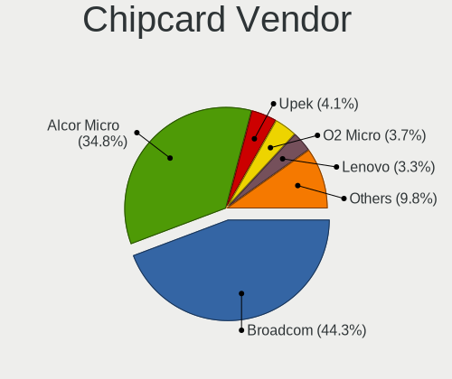

| Vendor                | Computers | Percent |
|-----------------------|-----------|---------|
| Alcor Micro           | 12        | 52.17%  |
| Broadcom              | 5         | 21.74%  |
| Realtek Semiconductor | 2         | 8.7%    |
| Lenovo                | 2         | 8.7%    |
| Yubico.com            | 1         | 4.35%   |
| SCM Microsystems      | 1         | 4.35%   |

Chipcard Model
--------------

Chipcard module models

| Model                                                                        | Computers | Percent |
|------------------------------------------------------------------------------|-----------|---------|
| Alcor Micro AU9540 Smartcard Reader                                          | 11        | 47.83%  |
| Broadcom 58200                                                               | 3         | 13.04%  |
| Realtek Semiconductor Smart Card Reader Interface                            | 2         | 8.7%    |
| Lenovo Integrated Smart Card Reader                                          | 2         | 8.7%    |
| Yubico.com Yubikey 4/5 U2F+CCID                                              | 1         | 4.35%   |
| SCM Microsystems SCR331 SmartCard Reader                                     | 1         | 4.35%   |
| Broadcom BCM5880 Secure Applications Processor with fingerprint swipe sensor | 1         | 4.35%   |
| Broadcom 5880                                                                | 1         | 4.35%   |
| Alcor Micro Watchdata W 1981                                                 | 1         | 4.35%   |

Unsupported
-----------

Unsupported Devices
-------------------

Total unsupported devices on board

| Total | Computers | Percent |
|-------|-----------|---------|
| 0     | 207       | 47.92%  |
| 1     | 185       | 42.82%  |
| 2     | 36        | 8.33%   |
| 3     | 4         | 0.93%   |

Unsupported Device Types
------------------------

Types of unsupported devices

| Type                     | Computers | Percent |
|--------------------------|-----------|---------|
| Graphics card            | 140       | 57.61%  |
| Fingerprint reader       | 48        | 19.75%  |
| Chipcard                 | 17        | 7%      |
| Multimedia controller    | 11        | 4.53%   |
| Camera                   | 10        | 4.12%   |
| Net/wireless             | 8         | 3.29%   |
| Bluetooth                | 3         | 1.23%   |
| Wireless                 | 2         | 0.82%   |
| Communication controller | 2         | 0.82%   |
| Unassigned class         | 1         | 0.41%   |
| Sound                    | 1         | 0.41%   |

