Deepin - Tested Hardware & Statistics
-------------------------------------

A project to collect tested hardware configurations for Deepin.

Anyone can contribute to this report by the [hw-probe](https://github.com/linuxhw/hw-probe) tool:

    sudo -E hw-probe -all -upload

Please contribute! Especially if your hardware is rare.

This is a report for all computer types. See also reports for [desktops](/Dist/Deepin/Desktop/README.md) and [notebooks](/Dist/Deepin/Notebook/README.md).

Contents
--------

* [ Test Cases ](#test-cases)

* [ System ](#system)
  - [ OS                       ](#os)
  - [ OS Family                ](#os-family)
  - [ Kernel                   ](#kernel)
  - [ Kernel Family            ](#kernel-family)
  - [ Kernel Major Ver.        ](#kernel-major-ver)
  - [ Arch                     ](#arch)
  - [ DE                       ](#de)
  - [ Display Server           ](#display-server)
  - [ Display Manager          ](#display-manager)
  - [ OS Lang                  ](#os-lang)
  - [ Boot Mode                ](#boot-mode)
  - [ Filesystem               ](#filesystem)
  - [ Part. scheme             ](#part-scheme)
  - [ Dual Boot with Linux/BSD ](#dual-boot-with-linuxbsd)
  - [ Dual Boot (Win)          ](#dual-boot-win)

* [ Board ](#board)
  - [ Vendor                   ](#vendor)
  - [ Model                    ](#model)
  - [ Model Family             ](#model-family)
  - [ MFG Year                 ](#mfg-year)
  - [ Form Factor              ](#form-factor)
  - [ Secure Boot              ](#secure-boot)
  - [ Coreboot                 ](#coreboot)
  - [ RAM Size                 ](#ram-size)
  - [ RAM Used                 ](#ram-used)
  - [ Total Drives             ](#total-drives)
  - [ Has CD-ROM               ](#has-cd-rom)
  - [ Has Ethernet             ](#has-ethernet)
  - [ Has WiFi                 ](#has-wifi)
  - [ Has Bluetooth            ](#has-bluetooth)

* [ Location ](#location)
  - [ Country                  ](#country)
  - [ City                     ](#city)

* [ Drives ](#drives)
  - [ Drive Vendor             ](#drive-vendor)
  - [ Drive Model              ](#drive-model)
  - [ HDD Vendor               ](#hdd-vendor)
  - [ SSD Vendor               ](#ssd-vendor)
  - [ Drive Kind               ](#drive-kind)
  - [ Drive Connector          ](#drive-connector)
  - [ Drive Size               ](#drive-size)
  - [ Space Total              ](#space-total)
  - [ Space Used               ](#space-used)
  - [ Malfunc. Drives          ](#malfunc-drives)
  - [ Malfunc. Drive Vendor    ](#malfunc-drive-vendor)
  - [ Malfunc. HDD Vendor      ](#malfunc-hdd-vendor)
  - [ Malfunc. Drive Kind      ](#malfunc-drive-kind)
  - [ Failed Drives            ](#failed-drives)
  - [ Failed Drive Vendor      ](#failed-drive-vendor)
  - [ Drive Status             ](#drive-status)

* [ Storage controller ](#storage-controller)
  - [ Storage Vendor           ](#storage-vendor)
  - [ Storage Model            ](#storage-model)
  - [ Storage Kind             ](#storage-kind)

* [ Processor ](#processor)
  - [ CPU Vendor               ](#cpu-vendor)
  - [ CPU Model                ](#cpu-model)
  - [ CPU Model Family         ](#cpu-model-family)
  - [ CPU Cores                ](#cpu-cores)
  - [ CPU Sockets              ](#cpu-sockets)
  - [ CPU Threads              ](#cpu-threads)
  - [ CPU Op-Modes             ](#cpu-op-modes)
  - [ CPU Microcode            ](#cpu-microcode)
  - [ CPU Microarch            ](#cpu-microarch)

* [ Graphics ](#graphics)
  - [ GPU Vendor               ](#gpu-vendor)
  - [ GPU Model                ](#gpu-model)
  - [ GPU Combo                ](#gpu-combo)
  - [ GPU Driver               ](#gpu-driver)
  - [ GPU Memory               ](#gpu-memory)

* [ Monitor ](#monitor)
  - [ Monitor Vendor           ](#monitor-vendor)
  - [ Monitor Model            ](#monitor-model)
  - [ Monitor Resolution       ](#monitor-resolution)
  - [ Monitor Diagonal         ](#monitor-diagonal)
  - [ Monitor Width            ](#monitor-width)
  - [ Aspect Ratio             ](#aspect-ratio)
  - [ Monitor Area             ](#monitor-area)
  - [ Pixel Density            ](#pixel-density)
  - [ Multiple Monitors        ](#multiple-monitors)

* [ Network ](#network)
  - [ Net Controller Vendor    ](#net-controller-vendor)
  - [ Net Controller Model     ](#net-controller-model)
  - [ Wireless Vendor          ](#wireless-vendor)
  - [ Wireless Model           ](#wireless-model)
  - [ Ethernet Vendor          ](#ethernet-vendor)
  - [ Ethernet Model           ](#ethernet-model)
  - [ Net Controller Kind      ](#net-controller-kind)
  - [ Used Controller          ](#used-controller)
  - [ NICs                     ](#nics)
  - [ IPv6                     ](#ipv6)

* [ Bluetooth ](#bluetooth)
  - [ Bluetooth Vendor         ](#bluetooth-vendor)
  - [ Bluetooth Model          ](#bluetooth-model)

* [ Sound ](#sound)
  - [ Sound Vendor             ](#sound-vendor)
  - [ Sound Model              ](#sound-model)

* [ Memory ](#memory)
  - [ Memory Vendor            ](#memory-vendor)
  - [ Memory Model             ](#memory-model)
  - [ Memory Kind              ](#memory-kind)
  - [ Memory Form Factor       ](#memory-form-factor)
  - [ Memory Size              ](#memory-size)
  - [ Memory Speed             ](#memory-speed)

* [ Printers & scanners ](#printers--scanners)
  - [ Printer Vendor           ](#printer-vendor)
  - [ Printer Model            ](#printer-model)
  - [ Scanner Vendor           ](#scanner-vendor)
  - [ Scanner Model            ](#scanner-model)

* [ Camera ](#camera)
  - [ Camera Vendor            ](#camera-vendor)
  - [ Camera Model             ](#camera-model)

* [ Security ](#security)
  - [ Fingerprint Vendor       ](#fingerprint-vendor)
  - [ Fingerprint Model        ](#fingerprint-model)
  - [ Chipcard Vendor          ](#chipcard-vendor)
  - [ Chipcard Model           ](#chipcard-model)

* [ Unsupported ](#unsupported)
  - [ Unsupported Devices      ](#unsupported-devices)
  - [ Unsupported Device Types ](#unsupported-device-types)

Test Cases
----------

Total: 387

| Vendor        | Model                       | Form-Factor | Probe                                                      | Date         |
|---------------|-----------------------------|-------------|------------------------------------------------------------|--------------|
| Acer          | Aspire E5-552G              | Notebook    | [97430826f3](https://linux-hardware.org/?probe=97430826f3) | Jan 03, 2025 |
| Acer          | Aspire E5-552G              | Notebook    | [9b3e1c7a27](https://linux-hardware.org/?probe=9b3e1c7a27) | Jan 02, 2025 |
| Acer          | Aspire E5-552G              | Notebook    | [2cd3af691f](https://linux-hardware.org/?probe=2cd3af691f) | Jan 02, 2025 |
| ASUSTek       | ROG STRIX Z590-E GAMING ... | Desktop     | [91cdbe5df9](https://linux-hardware.org/?probe=91cdbe5df9) | Dec 25, 2024 |
| ASUSTek       | ROG STRIX Z590-E GAMING ... | Desktop     | [32e2211a4c](https://linux-hardware.org/?probe=32e2211a4c) | Dec 25, 2024 |
| Dell          | Inspiron 13-7359            | Notebook    | [03a9e4f5c0](https://linux-hardware.org/?probe=03a9e4f5c0) | Dec 22, 2024 |
| Lenovo        | Legion Y9000P IRX9 83DF     | Notebook    | [35b1e770a7](https://linux-hardware.org/?probe=35b1e770a7) | Dec 11, 2024 |
| Intel         | NUC11DBBi9 M17026-402       | Mini pc     | [82b4880445](https://linux-hardware.org/?probe=82b4880445) | Dec 09, 2024 |
| Lenovo        | IdeaPad 100-15IBY 80MJ      | Notebook    | [3119155502](https://linux-hardware.org/?probe=3119155502) | Dec 07, 2024 |
| Lenovo        | IdeaPad 100-15IBY 80MJ      | Notebook    | [4a921c31f8](https://linux-hardware.org/?probe=4a921c31f8) | Dec 07, 2024 |
| Intel         | B75A                        | Desktop     | [974983efed](https://linux-hardware.org/?probe=974983efed) | Dec 05, 2024 |
| Intel         | B75A                        | Desktop     | [bb9185a4b6](https://linux-hardware.org/?probe=bb9185a4b6) | Dec 04, 2024 |
| Dell          | 0XFWHV A00                  | Desktop     | [c60047b59a](https://linux-hardware.org/?probe=c60047b59a) | Dec 02, 2024 |
| HP            | Victus by Laptop 16-d1xx... | Notebook    | [8589373272](https://linux-hardware.org/?probe=8589373272) | Nov 11, 2024 |
| Lenovo        | 3102 SDK0L77767 WIN 3423... | Desktop     | [3a3945760d](https://linux-hardware.org/?probe=3a3945760d) | Nov 09, 2024 |
| HP            | Victus by Laptop 16-d1xx... | Notebook    | [d37b1e618c](https://linux-hardware.org/?probe=d37b1e618c) | Nov 08, 2024 |
| ASUSTek       | X441UV                      | Notebook    | [ef419e7dda](https://linux-hardware.org/?probe=ef419e7dda) | Oct 26, 2024 |
| ASUSTek       | X441UV                      | Notebook    | [d5527bcd69](https://linux-hardware.org/?probe=d5527bcd69) | Oct 23, 2024 |
| ZOTAC         | ZBOXNANO-ID63/ID64/ID65     | Mini pc     | [9c6a7b391d](https://linux-hardware.org/?probe=9c6a7b391d) | Oct 17, 2024 |
| ZOTAC         | ZBOXNANO-ID63/ID64/ID65     | Mini pc     | [ae6b9ed2d2](https://linux-hardware.org/?probe=ae6b9ed2d2) | Oct 16, 2024 |
| Lenovo        | MAHOBAY NOK                 | Desktop     | [87eb4b588b](https://linux-hardware.org/?probe=87eb4b588b) | Oct 10, 2024 |
| Gigabyte      | F2A55M-S1                   | Desktop     | [1d3cf1476f](https://linux-hardware.org/?probe=1d3cf1476f) | Sep 30, 2024 |
| Lenovo        | K4450 20229                 | Notebook    | [1a2a5fe2de](https://linux-hardware.org/?probe=1a2a5fe2de) | Sep 20, 2024 |
| ASRock        | B550M Pro4                  | Desktop     | [9ef268f88f](https://linux-hardware.org/?probe=9ef268f88f) | Sep 20, 2024 |
| Google        | Lindar rev2                 | Notebook    | [5ece0457a9](https://linux-hardware.org/?probe=5ece0457a9) | Sep 20, 2024 |
| ASUSTek       | TUF Gaming B550M-PLUS WI... | Desktop     | [74442529cd](https://linux-hardware.org/?probe=74442529cd) | Sep 20, 2024 |
| HUAWEI        | WRTD-WXX9                   | Notebook    | [ffef25ebe6](https://linux-hardware.org/?probe=ffef25ebe6) | Sep 20, 2024 |
| Colorful T... | B460M-K PRO V21             | Desktop     | [6d090db07d](https://linux-hardware.org/?probe=6d090db07d) | Sep 19, 2024 |
| Loongson      | LS3C5000L-7A1000-16w-LS4... | Server      | [030db5bbf1](https://linux-hardware.org/?probe=030db5bbf1) | Sep 19, 2024 |
| HP            | EliteBook 845 14 inch G1... | Notebook    | [3135d9039d](https://linux-hardware.org/?probe=3135d9039d) | Sep 19, 2024 |
| HUAWEI        | WRTD-WXX9                   | Notebook    | [0e0a845726](https://linux-hardware.org/?probe=0e0a845726) | Sep 19, 2024 |
| ASUSTek       | PRIME B760M-A WIFI          | Desktop     | [ef787d7934](https://linux-hardware.org/?probe=ef787d7934) | Sep 13, 2024 |
| ASUSTek       | ROG STRIX B550-F GAMING     | Desktop     | [8fe595fe5f](https://linux-hardware.org/?probe=8fe595fe5f) | Sep 05, 2024 |
| Apple         | Mac-031AEE4D24BFF0B1 Mac... | Mini pc     | [4ec36c4d7d](https://linux-hardware.org/?probe=4ec36c4d7d) | Sep 04, 2024 |
| Gigabyte      | F2A55M-S1                   | Desktop     | [0ff77db375](https://linux-hardware.org/?probe=0ff77db375) | Sep 03, 2024 |
| Sony          | SVE14118FXW                 | Notebook    | [04f43f6a24](https://linux-hardware.org/?probe=04f43f6a24) | Sep 02, 2024 |
| Sony          | SVE14118FXW                 | Notebook    | [9405ca1f56](https://linux-hardware.org/?probe=9405ca1f56) | Sep 01, 2024 |
| HP            | Pavilion Laptop 15-eh1xx... | Notebook    | [9a670dddb0](https://linux-hardware.org/?probe=9a670dddb0) | Aug 15, 2024 |
| Dell          | 0XR1GT A00                  | Desktop     | [a2aa1e0463](https://linux-hardware.org/?probe=a2aa1e0463) | Jul 08, 2024 |
| GreatWall     | GW-001M1A-FTF               | Soc         | [42e529e8ee](https://linux-hardware.org/?probe=42e529e8ee) | Jun 25, 2024 |
| GreatWall     | GW-001M1A-FTF               | Soc         | [ce4e1f1c6b](https://linux-hardware.org/?probe=ce4e1f1c6b) | Jun 25, 2024 |
| MACHINIST     | E5-RS9 V1.1                 | Desktop     | [c637868885](https://linux-hardware.org/?probe=c637868885) | Jun 20, 2024 |
| Lenovo        | ThinkBook 16 G4+ IAP 21C... | Notebook    | [30840e7e74](https://linux-hardware.org/?probe=30840e7e74) | Jun 11, 2024 |
| MECHREVO      | Jiaolong Series GM5ZG0O     | Notebook    | [83173e6eff](https://linux-hardware.org/?probe=83173e6eff) | Jun 05, 2024 |
| Timi          | TM1613                      | Notebook    | [9366c9ccc7](https://linux-hardware.org/?probe=9366c9ccc7) | May 31, 2024 |
| MECHREVO      | Jiaolong Series MRID6       | Notebook    | [4f1a07100e](https://linux-hardware.org/?probe=4f1a07100e) | May 26, 2024 |
| Intel         | DX58SO AAE29331-504         | Desktop     | [f4b6b040b5](https://linux-hardware.org/?probe=f4b6b040b5) | May 13, 2024 |
| HP            | 8245 001                    | All in one  | [ce7de2b377](https://linux-hardware.org/?probe=ce7de2b377) | May 03, 2024 |
| Apple         | MacBookPro11,1              | Notebook    | [0b8f54ed65](https://linux-hardware.org/?probe=0b8f54ed65) | Apr 08, 2024 |
| Insyde        | BayTrail                    | Notebook    | [89d859d241](https://linux-hardware.org/?probe=89d859d241) | Mar 14, 2024 |
| Gigabyte      | B450 I AORUS PRO WIFI-CF    | Desktop     | [ac24b8ae8b](https://linux-hardware.org/?probe=ac24b8ae8b) | Mar 06, 2024 |
| MECHREVO      | WUJIE14 PRO                 | Notebook    | [5b2bd502f2](https://linux-hardware.org/?probe=5b2bd502f2) | Mar 05, 2024 |
| HP            | Pavilion g6                 | Notebook    | [b12a505c7c](https://linux-hardware.org/?probe=b12a505c7c) | Feb 25, 2024 |
| Lenovo        | ThinkPad E550 20DFA06NCD    | Notebook    | [7858b1e150](https://linux-hardware.org/?probe=7858b1e150) | Feb 12, 2024 |
| Unknown       | Unknown                     | Notebook    | [7f23752859](https://linux-hardware.org/?probe=7f23752859) | Feb 06, 2024 |
| ASUSTek       | B85M-K                      | Desktop     | [dc3ec9e412](https://linux-hardware.org/?probe=dc3ec9e412) | Feb 03, 2024 |
| MSI           | MAG X570 TOMAHAWK WIFI      | Desktop     | [8b1e8e6fe4](https://linux-hardware.org/?probe=8b1e8e6fe4) | Jan 08, 2024 |
| KUU           | Andes II                    | Notebook    | [512394ef85](https://linux-hardware.org/?probe=512394ef85) | Jan 04, 2024 |
| Timi          | TM1709                      | Notebook    | [79d0628d57](https://linux-hardware.org/?probe=79d0628d57) | Jan 03, 2024 |
| Timi          | TM1709                      | Notebook    | [b934e033e4](https://linux-hardware.org/?probe=b934e033e4) | Jan 03, 2024 |
| KUU           | Andes II                    | Notebook    | [bda39c51cd](https://linux-hardware.org/?probe=bda39c51cd) | Jan 03, 2024 |
| Dell          | 0XPDFK A01                  | Desktop     | [6990382d8a](https://linux-hardware.org/?probe=6990382d8a) | Dec 14, 2023 |
| Dell          | 0XPDFK A01                  | Desktop     | [da80cd5bbd](https://linux-hardware.org/?probe=da80cd5bbd) | Dec 14, 2023 |
| Unknown       | Unknown                     | Soc         | [9c60527586](https://linux-hardware.org/?probe=9c60527586) | Dec 13, 2023 |
| Lenovo        | ThinkPad T490s 20NX003AU... | Notebook    | [e0dc55809f](https://linux-hardware.org/?probe=e0dc55809f) | Dec 09, 2023 |
| Lenovo        | ThinkPad T490s 20NX003AU... | Notebook    | [649f5e559d](https://linux-hardware.org/?probe=649f5e559d) | Dec 02, 2023 |
| HUAWEI        | KLVC-WXX9                   | Notebook    | [dd49d338b4](https://linux-hardware.org/?probe=dd49d338b4) | Nov 29, 2023 |
| Lenovo        | ThinkBook 16p Gen 4 21J8    | Notebook    | [4ce52b15f5](https://linux-hardware.org/?probe=4ce52b15f5) | Nov 24, 2023 |
| Dell          | 0XR1GT A00                  | Desktop     | [17b5d35090](https://linux-hardware.org/?probe=17b5d35090) | Nov 19, 2023 |
| ASUSTek       | ROG STRIX X570-E GAMING     | Desktop     | [12d30e16b4](https://linux-hardware.org/?probe=12d30e16b4) | Nov 07, 2023 |
| Dell          | 0XR1GT A00                  | Desktop     | [f01a35c9a7](https://linux-hardware.org/?probe=f01a35c9a7) | Nov 06, 2023 |
| HP            | Compaq Presario CQ40        | Notebook    | [ede0c05f18](https://linux-hardware.org/?probe=ede0c05f18) | Nov 04, 2023 |
| Acer          | Nitro AN515-57              | Notebook    | [3b669afc38](https://linux-hardware.org/?probe=3b669afc38) | Oct 26, 2023 |
| UNOWHY        | Y13G012S4EI                 | Notebook    | [eb2ef3f8d5](https://linux-hardware.org/?probe=eb2ef3f8d5) | Oct 24, 2023 |
| Intel         | DX58SO AAE29331-504         | Desktop     | [33d7713b52](https://linux-hardware.org/?probe=33d7713b52) | Oct 21, 2023 |
| HP            | Laptop 15s-eq2xxx           | Notebook    | [50698ed07c](https://linux-hardware.org/?probe=50698ed07c) | Oct 14, 2023 |
| Intel         | DX58SO AAE29331-504         | Desktop     | [afe13c52df](https://linux-hardware.org/?probe=afe13c52df) | Oct 11, 2023 |
| Dell          | 0NW6H5 A00                  | Desktop     | [e337e05dff](https://linux-hardware.org/?probe=e337e05dff) | Oct 08, 2023 |
| Timi          | RedmiBook Air 13            | Notebook    | [63ea7be36f](https://linux-hardware.org/?probe=63ea7be36f) | Oct 07, 2023 |
| Dell          | 0NW6H5 A00                  | Desktop     | [dc4ec4e72a](https://linux-hardware.org/?probe=dc4ec4e72a) | Oct 02, 2023 |
| HP            | EliteBook 845 14 inch G1... | Notebook    | [b409947c26](https://linux-hardware.org/?probe=b409947c26) | Sep 11, 2023 |
| HP            | EliteBook 845 14 inch G1... | Notebook    | [f7f7964c03](https://linux-hardware.org/?probe=f7f7964c03) | Sep 09, 2023 |
| HP            | EliteBook 845 14 inch G1... | Notebook    | [6459a498c5](https://linux-hardware.org/?probe=6459a498c5) | Sep 07, 2023 |
| HP            | EliteBook 845 14 inch G1... | Notebook    | [c57f9232a2](https://linux-hardware.org/?probe=c57f9232a2) | Sep 05, 2023 |
| HP            | EliteBook 845 14 inch G1... | Notebook    | [8b11ecfd36](https://linux-hardware.org/?probe=8b11ecfd36) | Sep 04, 2023 |
| TSINGHUA T... | B460M-HDV                   | Desktop     | [f82a030bce](https://linux-hardware.org/?probe=f82a030bce) | Aug 30, 2023 |
| Chuwi         | UBook X                     | Tablet      | [e2281326e3](https://linux-hardware.org/?probe=e2281326e3) | Aug 27, 2023 |
| HP            | EliteBook 845 14 inch G1... | Notebook    | [ac607e5597](https://linux-hardware.org/?probe=ac607e5597) | Aug 25, 2023 |
| TSINGHUA T... | B460M-HDV                   | Desktop     | [815cb59889](https://linux-hardware.org/?probe=815cb59889) | Aug 16, 2023 |
| TSINGHUA T... | B460-N2                     | Desktop     | [f7f87f7a07](https://linux-hardware.org/?probe=f7f87f7a07) | Aug 16, 2023 |
| Lenovo        | ThinkPad X1 Carbon Gen 1... | Notebook    | [4d875892d6](https://linux-hardware.org/?probe=4d875892d6) | Jul 30, 2023 |
| GreatWall     | GW-XXXXXX-XXX               | Soc         | [8709162441](https://linux-hardware.org/?probe=8709162441) | Jul 27, 2023 |
| HONOR         | NBLK-WAX9X                  | Notebook    | [1081b2e480](https://linux-hardware.org/?probe=1081b2e480) | Jul 26, 2023 |
| HONOR         | NBLK-WAX9X                  | Notebook    | [9919413d6e](https://linux-hardware.org/?probe=9919413d6e) | Jul 25, 2023 |
| HUAWEI        | MACHC-WAX9                  | Notebook    | [bddace9995](https://linux-hardware.org/?probe=bddace9995) | Jul 25, 2023 |
| THTF          | ChaoXiangQ620-T1            | Soc         | [45e36895f0](https://linux-hardware.org/?probe=45e36895f0) | Jul 23, 2023 |
| itel Mobil... | SPIRIT 1                    | Notebook    | [36c3d3f6a8](https://linux-hardware.org/?probe=36c3d3f6a8) | Jul 16, 2023 |
| MSI           | GL72M 7REX                  | Notebook    | [6d50ff945d](https://linux-hardware.org/?probe=6d50ff945d) | Jun 19, 2023 |
| MSI           | GL72M 7REX                  | Notebook    | [1f1699301f](https://linux-hardware.org/?probe=1f1699301f) | Jun 15, 2023 |
| HP            | 18EA                        | Desktop     | [d6e48a99e7](https://linux-hardware.org/?probe=d6e48a99e7) | Jun 08, 2023 |
| MSI           | A55M-E35                    | Desktop     | [fa4eba3787](https://linux-hardware.org/?probe=fa4eba3787) | Jun 08, 2023 |
| HP            | Pavilion Laptop 15-eh1xx... | Notebook    | [320e5bee32](https://linux-hardware.org/?probe=320e5bee32) | Jun 04, 2023 |
| Hometech      | Alfa 470C                   | Notebook    | [ee3bd9eb81](https://linux-hardware.org/?probe=ee3bd9eb81) | Jun 02, 2023 |
| Apple         | MacBookPro14,1              | Notebook    | [a5785cf3c3](https://linux-hardware.org/?probe=a5785cf3c3) | May 29, 2023 |
| Intel         | DH77EB AAG39073-304         | Desktop     | [8310aaaa78](https://linux-hardware.org/?probe=8310aaaa78) | May 27, 2023 |
| Intel         | DH77EB AAG39073-304         | Desktop     | [86545c89c0](https://linux-hardware.org/?probe=86545c89c0) | May 27, 2023 |
| Dell          | Inspiron 13-7359            | Notebook    | [35c9cf7244](https://linux-hardware.org/?probe=35c9cf7244) | May 12, 2023 |
| Koloe         | X58                         | Desktop     | [7c1acc3b84](https://linux-hardware.org/?probe=7c1acc3b84) | May 08, 2023 |
| ASUSTek       | ROG Maximus Z790 HERO       | Desktop     | [a22f7f4309](https://linux-hardware.org/?probe=a22f7f4309) | Mar 13, 2023 |
| ASUSTek       | ROG Maximus Z790 HERO       | Desktop     | [d4f6b075c4](https://linux-hardware.org/?probe=d4f6b075c4) | Mar 13, 2023 |
| Dell          | G15 5520                    | Notebook    | [0322e7d38c](https://linux-hardware.org/?probe=0322e7d38c) | Mar 06, 2023 |
| Lenovo        | ThinkPad T14 Gen 1 20UD0... | Notebook    | [42a0b7428f](https://linux-hardware.org/?probe=42a0b7428f) | Mar 05, 2023 |
| Dell          | G15 5520                    | Notebook    | [1e3dcc41d3](https://linux-hardware.org/?probe=1e3dcc41d3) | Mar 04, 2023 |
| Lenovo        | Legion Y530-15ICH 81FV      | Notebook    | [f492107b66](https://linux-hardware.org/?probe=f492107b66) | Feb 19, 2023 |
| Intel         | NUC8BEB J72692-304          | Mini pc     | [16b8333671](https://linux-hardware.org/?probe=16b8333671) | Feb 17, 2023 |
| Intel         | NUC8BEB J72692-304          | Mini pc     | [546d700cde](https://linux-hardware.org/?probe=546d700cde) | Feb 17, 2023 |
| ASUSTek       | K30AD_M31AD_M51AD_M32AD     | Desktop     | [44a3952ccf](https://linux-hardware.org/?probe=44a3952ccf) | Feb 15, 2023 |
| HP            | Pavilion Laptop 15-eh1xx... | Notebook    | [1746b40d04](https://linux-hardware.org/?probe=1746b40d04) | Feb 09, 2023 |
| Acer          | Aspire A515-54G             | Notebook    | [a57a68e42f](https://linux-hardware.org/?probe=a57a68e42f) | Jan 31, 2023 |
| OEM           | KX-01 V1.0                  | Desktop     | [75d9dc396c](https://linux-hardware.org/?probe=75d9dc396c) | Jan 28, 2023 |
| ASUSTek       | TUF Gaming B550M-PLUS       | Desktop     | [510b879339](https://linux-hardware.org/?probe=510b879339) | Jan 26, 2023 |
| Rockchip E... | RK3588                      | Soc         | [87b2165adf](https://linux-hardware.org/?probe=87b2165adf) | Jan 23, 2023 |
| HP            | ENVY x360 Convertible 13... | Convertible | [9cdfb3119e](https://linux-hardware.org/?probe=9cdfb3119e) | Jan 15, 2023 |
| Infinix       | INBOOK X2 GEN11             | Notebook    | [a899026279](https://linux-hardware.org/?probe=a899026279) | Jan 08, 2023 |
| Lenovo        | ThinkBook 14 G4+ ARA 21D... | Notebook    | [c4170b9ea3](https://linux-hardware.org/?probe=c4170b9ea3) | Dec 20, 2022 |
| Dell          | Inspiron 5488               | Notebook    | [32b350c3f6](https://linux-hardware.org/?probe=32b350c3f6) | Nov 25, 2022 |
| Lenovo        | ThinkPad 10 20C1CTO1WW      | Tablet      | [f5e2cc92e2](https://linux-hardware.org/?probe=f5e2cc92e2) | Nov 19, 2022 |
| Timi          | Redmi G 2022                | Notebook    | [86f8128511](https://linux-hardware.org/?probe=86f8128511) | Nov 12, 2022 |
| HP            | Laptop                      | Notebook    | [e1cd3de91a](https://linux-hardware.org/?probe=e1cd3de91a) | Nov 02, 2022 |
| HUAWEI        | MACHD-WXX9                  | Notebook    | [ba1f911067](https://linux-hardware.org/?probe=ba1f911067) | Sep 10, 2022 |
| Phytium       | D2000                       | Server      | [7e0be651b1](https://linux-hardware.org/?probe=7e0be651b1) | Jul 27, 2022 |
| Unknown       | Unknown                     | Desktop     | [98e2d17193](https://linux-hardware.org/?probe=98e2d17193) | Jul 21, 2022 |
| HP            | 620                         | Notebook    | [4476f5f677](https://linux-hardware.org/?probe=4476f5f677) | Jun 23, 2022 |
| ASUSTek       | ROG Maximus XII HERO        | Desktop     | [843d2132ad](https://linux-hardware.org/?probe=843d2132ad) | Jun 09, 2022 |
| Lenovo        | ZHAOYANG K4e-ITL 82F8       | Notebook    | [6103e540b9](https://linux-hardware.org/?probe=6103e540b9) | May 04, 2022 |
| HP            | EliteBook 8570w             | Notebook    | [7795fe989b](https://linux-hardware.org/?probe=7795fe989b) | Apr 29, 2022 |
| HUAWEI        | BOM-WXX9                    | Notebook    | [a771d771b2](https://linux-hardware.org/?probe=a771d771b2) | Apr 24, 2022 |
| HUAWEI        | BOM-WXX9                    | Notebook    | [1a195527a4](https://linux-hardware.org/?probe=1a195527a4) | Apr 24, 2022 |
| Lenovo        | Legion Y7000 81FW           | Notebook    | [c56c469d4f](https://linux-hardware.org/?probe=c56c469d4f) | Apr 21, 2022 |
| Acer          | Swift SF314-512             | Notebook    | [d7e77fd856](https://linux-hardware.org/?probe=d7e77fd856) | Apr 21, 2022 |
| HP            | Laptop 14s-fq0xxx           | Notebook    | [8794debb03](https://linux-hardware.org/?probe=8794debb03) | Apr 20, 2022 |
| Gigabyte      | B550 AORUS ELITE AX V2      | Desktop     | [486b6a5d64](https://linux-hardware.org/?probe=486b6a5d64) | Apr 10, 2022 |
| Gigabyte      | B550 AORUS ELITE AX V2      | Desktop     | [ec3689ffdc](https://linux-hardware.org/?probe=ec3689ffdc) | Apr 10, 2022 |
| ASUSTek       | P552LA                      | Notebook    | [94ef2678d5](https://linux-hardware.org/?probe=94ef2678d5) | Apr 03, 2022 |
| ASUSTek       | P552LA                      | Notebook    | [9166f15878](https://linux-hardware.org/?probe=9166f15878) | Apr 03, 2022 |
| Phytium       | FT-2000/4 V0001             | Server      | [6385010257](https://linux-hardware.org/?probe=6385010257) | Mar 28, 2022 |
| Cube          | SurfTab twin 11.6           | Convertible | [d8659d7018](https://linux-hardware.org/?probe=d8659d7018) | Mar 03, 2022 |
| Cube          | SurfTab twin 11.6           | Convertible | [fde2a4b713](https://linux-hardware.org/?probe=fde2a4b713) | Mar 03, 2022 |
| HANWEI        | FT-208-COME-B               | Soc         | [93aca5cd19](https://linux-hardware.org/?probe=93aca5cd19) | Feb 25, 2022 |
| HANWEI        | FT-208-COME-B               | Soc         | [e578c5f173](https://linux-hardware.org/?probe=e578c5f173) | Jan 28, 2022 |
| HP            | EliteBook 8570w             | Notebook    | [131c9a7dc2](https://linux-hardware.org/?probe=131c9a7dc2) | Jan 27, 2022 |
| Lenovo        | Yoga 3 Pro-1370 80HE        | Notebook    | [f891c69576](https://linux-hardware.org/?probe=f891c69576) | Jan 08, 2022 |
| ASUSTek       | Z97-PRO GAMER               | Desktop     | [3e37ded7e2](https://linux-hardware.org/?probe=3e37ded7e2) | Jan 04, 2022 |
| Google        | Akemi                       | Notebook    | [295fd594af](https://linux-hardware.org/?probe=295fd594af) | Dec 27, 2021 |
| TSINGHUA T... | B460M-HDV                   | Desktop     | [8447bd4156](https://linux-hardware.org/?probe=8447bd4156) | Dec 22, 2021 |
| Acer          | Aspire VN7-572G             | Notebook    | [895dca26b0](https://linux-hardware.org/?probe=895dca26b0) | Dec 21, 2021 |
| TSINGHUA T... | B460M-HDV                   | Desktop     | [1146dc777c](https://linux-hardware.org/?probe=1146dc777c) | Dec 15, 2021 |
| HUAWEI        | HN-WX9X                     | Notebook    | [f228b60d0c](https://linux-hardware.org/?probe=f228b60d0c) | Dec 07, 2021 |
| Dell          | 07N90W A02                  | Desktop     | [43a5aec999](https://linux-hardware.org/?probe=43a5aec999) | Dec 07, 2021 |
| ECS           | H81H3-M4                    | Desktop     | [cdaf4b1031](https://linux-hardware.org/?probe=cdaf4b1031) | Dec 07, 2021 |
| HP            | EliteBook 8570w             | Notebook    | [7752a79879](https://linux-hardware.org/?probe=7752a79879) | Dec 06, 2021 |
| HP            | Laptop 14-ck0xxx            | Notebook    | [4b03ed047c](https://linux-hardware.org/?probe=4b03ed047c) | Dec 06, 2021 |
| Samsung       | 550P5C/550P7C               | Notebook    | [31bc59dcb9](https://linux-hardware.org/?probe=31bc59dcb9) | Nov 12, 2021 |
| Lenovo        | ThinkBook 13s-IWL 20R9      | Notebook    | [88d791ff87](https://linux-hardware.org/?probe=88d791ff87) | Nov 09, 2021 |
| Dell          | Latitude 3400               | Notebook    | [7f519c2721](https://linux-hardware.org/?probe=7f519c2721) | Oct 23, 2021 |
| Samsung       | 550P5C/550P7C               | Notebook    | [2713972f14](https://linux-hardware.org/?probe=2713972f14) | Oct 22, 2021 |
| HP            | ZHAN 66 Pro G1              | Notebook    | [a1a1c41c6a](https://linux-hardware.org/?probe=a1a1c41c6a) | Oct 09, 2021 |
| HP            | ZHAN 66 Pro G1              | Notebook    | [fcc291e2f1](https://linux-hardware.org/?probe=fcc291e2f1) | Oct 08, 2021 |
| Lenovo        | Legion Y7000 2020 82AV      | Notebook    | [64d71e1177](https://linux-hardware.org/?probe=64d71e1177) | Sep 29, 2021 |
| Soyo          | SY-Thin Mini H110           | Mini pc     | [ca900f89d0](https://linux-hardware.org/?probe=ca900f89d0) | Sep 28, 2021 |
| TSINGHUA T... | B460M-HDV                   | Desktop     | [bc175433f9](https://linux-hardware.org/?probe=bc175433f9) | Sep 18, 2021 |
| TSINGHUA T... | B460M-HDV                   | Desktop     | [80017bc79b](https://linux-hardware.org/?probe=80017bc79b) | Sep 18, 2021 |
| ASUSTek       | Z97-PRO GAMER               | Desktop     | [a428f57f6a](https://linux-hardware.org/?probe=a428f57f6a) | Sep 17, 2021 |
| HP            | Laptop 15-bs0xx             | Notebook    | [fc0f8f406b](https://linux-hardware.org/?probe=fc0f8f406b) | Aug 31, 2021 |
| Lenovo        | ThinkPad L412 0585AC3       | Notebook    | [f31b3187c3](https://linux-hardware.org/?probe=f31b3187c3) | Aug 23, 2021 |
| Lenovo        | Legion R9000K2021H 82N6     | Notebook    | [048b8332cc](https://linux-hardware.org/?probe=048b8332cc) | Aug 13, 2021 |
| ASUSTek       | ASUS TUF Gaming A15 FA50... | Notebook    | [5e1cc5b229](https://linux-hardware.org/?probe=5e1cc5b229) | Aug 11, 2021 |
| TSINGHUA T... | B460-N2                     | Desktop     | [59d9384348](https://linux-hardware.org/?probe=59d9384348) | Aug 09, 2021 |
| Gigabyte      | B550M DS3H                  | Desktop     | [418d6ee68f](https://linux-hardware.org/?probe=418d6ee68f) | Jul 23, 2021 |
| Toshiba       | STI 005492G                 | Desktop     | [d7fe511a9e](https://linux-hardware.org/?probe=d7fe511a9e) | Jul 19, 2021 |
| Lenovo        | XiaoXinAir-14ARE 2020 81... | Notebook    | [d563d62b5f](https://linux-hardware.org/?probe=d563d62b5f) | Jul 14, 2021 |
| AMD           | BL2 V2.3                    | Desktop     | [1053adf355](https://linux-hardware.org/?probe=1053adf355) | Jul 12, 2021 |
| Acer          | Aspire 5750G                | Notebook    | [61b9408d9e](https://linux-hardware.org/?probe=61b9408d9e) | Jul 11, 2021 |
| Acer          | Aspire 5750G                | Notebook    | [59728d9bef](https://linux-hardware.org/?probe=59728d9bef) | Jul 11, 2021 |
| HP            | Spectre x2 Detachable 12... | Tablet      | [efc4c63ac7](https://linux-hardware.org/?probe=efc4c63ac7) | Jul 09, 2021 |
| HP            | Spectre x2 Detachable 12... | Tablet      | [9f7d75d241](https://linux-hardware.org/?probe=9f7d75d241) | Jul 09, 2021 |
| HUAWEI        | HLYL-WXX9                   | Notebook    | [26b5b9e3d3](https://linux-hardware.org/?probe=26b5b9e3d3) | Jul 06, 2021 |
| Lenovo        | ZHAOYANG CF4620Z-A123 59... | Notebook    | [6f716961de](https://linux-hardware.org/?probe=6f716961de) | Jun 29, 2021 |
| Lenovo        | XiaoXin-15ARE 2020 81YR     | Notebook    | [279dea011e](https://linux-hardware.org/?probe=279dea011e) | Jun 28, 2021 |
| ECS           | H81H3-M4                    | Desktop     | [838f10c576](https://linux-hardware.org/?probe=838f10c576) | Jun 25, 2021 |
| ECS           | H81H3-M4                    | Desktop     | [bfc9a4d537](https://linux-hardware.org/?probe=bfc9a4d537) | Jun 25, 2021 |
| Lenovo        | Yoga DuetITL 2021 82MA      | Tablet      | [48335e0b08](https://linux-hardware.org/?probe=48335e0b08) | Jun 24, 2021 |
| TSINGHUA T... | B460-N2 V1.1                | Desktop     | [70d8ede642](https://linux-hardware.org/?probe=70d8ede642) | Jun 23, 2021 |
| TSINGHUA T... | B460-N2 V1.1                | Desktop     | [8431bcbed8](https://linux-hardware.org/?probe=8431bcbed8) | Jun 22, 2021 |
| Loongson      | LS3A3000-7A1000-1w-V1.2-... | Desktop     | [014bdabb68](https://linux-hardware.org/?probe=014bdabb68) | Jun 16, 2021 |
| Lenovo        | ThinkBook 14 G2 ARE R7 8... | Notebook    | [b2c24061a6](https://linux-hardware.org/?probe=b2c24061a6) | Jun 13, 2021 |
| Toshiba       | STI 005492G                 | Desktop     | [e28291b9ed](https://linux-hardware.org/?probe=e28291b9ed) | Jun 13, 2021 |
| Lenovo        | IdeaPad 320-15IKB 80XL      | Notebook    | [0540d35606](https://linux-hardware.org/?probe=0540d35606) | May 31, 2021 |
| Samsung       | 300E4A/300E5A/300E7A/343... | Notebook    | [30ffaaaad4](https://linux-hardware.org/?probe=30ffaaaad4) | May 22, 2021 |
| Samsung       | 300E4A/300E5A/300E7A/343... | Notebook    | [91b9340ed6](https://linux-hardware.org/?probe=91b9340ed6) | May 20, 2021 |
| ASUSTek       | VivoBook 15_ASUS Laptop ... | Notebook    | [68740fff81](https://linux-hardware.org/?probe=68740fff81) | May 16, 2021 |
| MSI           | H81I                        | Desktop     | [a0f0f9e7e8](https://linux-hardware.org/?probe=a0f0f9e7e8) | May 06, 2021 |
| Unknown       | Unknown                     | Notebook    | [4d3ffa307c](https://linux-hardware.org/?probe=4d3ffa307c) | Apr 26, 2021 |
| Unknown       | Unknown                     | Notebook    | [8d019adbf9](https://linux-hardware.org/?probe=8d019adbf9) | Apr 26, 2021 |
| Lenovo        | ThinkPad T420 4180M8P       | Notebook    | [1fe655cf93](https://linux-hardware.org/?probe=1fe655cf93) | Apr 25, 2021 |
| Huanan        | X99-8M-F V1.1               | Desktop     | [13daa2d4a6](https://linux-hardware.org/?probe=13daa2d4a6) | Apr 23, 2021 |
| ASUSTek       | P8H61-MX                    | Desktop     | [9212747e6a](https://linux-hardware.org/?probe=9212747e6a) | Apr 08, 2021 |
| Toshiba       | Satellite E55t-A            | Notebook    | [e1a3602d7b](https://linux-hardware.org/?probe=e1a3602d7b) | Mar 28, 2021 |
| Unknown       | Unknown                     | Notebook    | [94f00d3697](https://linux-hardware.org/?probe=94f00d3697) | Mar 27, 2021 |
| Gigabyte      | Z170X-Gaming 7              | Desktop     | [e6db1c79cc](https://linux-hardware.org/?probe=e6db1c79cc) | Mar 25, 2021 |
| Gigabyte      | Z170X-Gaming 7              | Desktop     | [edb786e43a](https://linux-hardware.org/?probe=edb786e43a) | Mar 25, 2021 |
| ASUSTek       | PRIME A320M-K               | Desktop     | [1db414e1cd](https://linux-hardware.org/?probe=1db414e1cd) | Mar 21, 2021 |
| Gigabyte      | H81M-D2V                    | Desktop     | [d62d3a2dad](https://linux-hardware.org/?probe=d62d3a2dad) | Mar 19, 2021 |
| MSI           | B460M PRO-VDH WIFI          | Desktop     | [b165cd04ce](https://linux-hardware.org/?probe=b165cd04ce) | Feb 25, 2021 |
| Sony          | VGN-AW11Z_B                 | Notebook    | [9ddedfd3c9](https://linux-hardware.org/?probe=9ddedfd3c9) | Feb 13, 2021 |
| HP            | Pavilion Laptop 14-bf0xx    | Notebook    | [309266e981](https://linux-hardware.org/?probe=309266e981) | Feb 13, 2021 |
| Dell          | Inspiron 7720               | Notebook    | [8c8689a8ba](https://linux-hardware.org/?probe=8c8689a8ba) | Feb 08, 2021 |
| Acer          | Aspire V5-571P              | Notebook    | [e03d4bc850](https://linux-hardware.org/?probe=e03d4bc850) | Feb 07, 2021 |
| Dell          | Inspiron 5547               | Notebook    | [e2cee5283f](https://linux-hardware.org/?probe=e2cee5283f) | Feb 04, 2021 |
| Dell          | 0KWVT8 A00                  | Desktop     | [56f1d17280](https://linux-hardware.org/?probe=56f1d17280) | Feb 04, 2021 |
| HUAWEI        | HN-WX9X                     | Notebook    | [b0ca634dee](https://linux-hardware.org/?probe=b0ca634dee) | Jan 28, 2021 |
| Dell          | 00V62H A00                  | Desktop     | [863c1d64fe](https://linux-hardware.org/?probe=863c1d64fe) | Jan 23, 2021 |
| Lenovo        | MAHOBAY NO DPK              | Desktop     | [842703dc6b](https://linux-hardware.org/?probe=842703dc6b) | Jan 20, 2021 |
| Lenovo        | MAHOBAY NO DPK              | Desktop     | [5b9e365258](https://linux-hardware.org/?probe=5b9e365258) | Jan 19, 2021 |
| Gigabyte      | B365M D3H-CF                | Desktop     | [0bfbe639fc](https://linux-hardware.org/?probe=0bfbe639fc) | Jan 18, 2021 |
| Lenovo        | ThinkPad E14 20RA0058VA     | Notebook    | [3c08ce49f5](https://linux-hardware.org/?probe=3c08ce49f5) | Jan 08, 2021 |
| Acer          | Aspire 4736Z                | Notebook    | [dd3b50729f](https://linux-hardware.org/?probe=dd3b50729f) | Jan 07, 2021 |
| ASUSTek       | X406UAR                     | Notebook    | [42e509209a](https://linux-hardware.org/?probe=42e509209a) | Dec 20, 2020 |
| ASUSTek       | X406UAR                     | Notebook    | [23b1fae05b](https://linux-hardware.org/?probe=23b1fae05b) | Dec 20, 2020 |
| Lenovo        | IdeaPad 3 14ARE05 81W3      | Notebook    | [667577cb5f](https://linux-hardware.org/?probe=667577cb5f) | Dec 15, 2020 |
| Lenovo        | G50-80 80L0                 | Notebook    | [951a5a280f](https://linux-hardware.org/?probe=951a5a280f) | Dec 11, 2020 |
| Gigabyte      | H81M-D2V                    | Desktop     | [49bd67196b](https://linux-hardware.org/?probe=49bd67196b) | Nov 20, 2020 |
| Acer          | Nitro AN515-54              | Notebook    | [d46eb4b9c9](https://linux-hardware.org/?probe=d46eb4b9c9) | Nov 19, 2020 |
| Acer          | Nitro AN515-54              | Notebook    | [877187c708](https://linux-hardware.org/?probe=877187c708) | Nov 19, 2020 |
| Lenovo        | ThinkPad E585 20KV0010US    | Notebook    | [033f6f0920](https://linux-hardware.org/?probe=033f6f0920) | Nov 18, 2020 |
| Lenovo        | ThinkPad E585 20KV0010US    | Notebook    | [d2bedcab13](https://linux-hardware.org/?probe=d2bedcab13) | Nov 18, 2020 |
| Foxconn       | 2ADA                        | Desktop     | [2c76ab07eb](https://linux-hardware.org/?probe=2c76ab07eb) | Nov 12, 2020 |
| ASUSTek       | PRIME B450M-GAMING/BR       | Desktop     | [0b46341e31](https://linux-hardware.org/?probe=0b46341e31) | Nov 07, 2020 |
| Lenovo        | IdeaPad S145-15API 81UT     | Notebook    | [b687de4d3c](https://linux-hardware.org/?probe=b687de4d3c) | Nov 05, 2020 |
| Toshiba       | Satellite C850D-11K         | Notebook    | [53f5d002c9](https://linux-hardware.org/?probe=53f5d002c9) | Oct 31, 2020 |
| HP            | ENVY 15                     | Notebook    | [c23287b06d](https://linux-hardware.org/?probe=c23287b06d) | Oct 31, 2020 |
| Gigabyte      | B360M AORUS Gaming 3-CF     | Desktop     | [a4fa363ca9](https://linux-hardware.org/?probe=a4fa363ca9) | Oct 29, 2020 |
| Acer          | Swift SF314-42              | Notebook    | [628265bca0](https://linux-hardware.org/?probe=628265bca0) | Oct 25, 2020 |
| Acer          | Swift SF314-42              | Notebook    | [01143e194b](https://linux-hardware.org/?probe=01143e194b) | Oct 20, 2020 |
| Lenovo        | IdeaPad 110-14IBR 80UJ      | Notebook    | [8d149c1a39](https://linux-hardware.org/?probe=8d149c1a39) | Oct 17, 2020 |
| Acer          | Nitro AN515-52              | Notebook    | [ca3d5b9444](https://linux-hardware.org/?probe=ca3d5b9444) | Oct 13, 2020 |
| Microtech     | ebookPro                    | Notebook    | [2f1ff6265a](https://linux-hardware.org/?probe=2f1ff6265a) | Oct 10, 2020 |
| ASRock        | Z68 Extreme7 Gen3           | Desktop     | [181ccd5686](https://linux-hardware.org/?probe=181ccd5686) | Oct 10, 2020 |
| HUAWEI        | NBLK-WAX9X                  | Notebook    | [88e5775f0f](https://linux-hardware.org/?probe=88e5775f0f) | Oct 02, 2020 |
| HUAWEI        | NBLK-WAX9X                  | Notebook    | [2972557e3e](https://linux-hardware.org/?probe=2972557e3e) | Oct 02, 2020 |
| Toshiba       | STI 013442                  | Desktop     | [25aa1737df](https://linux-hardware.org/?probe=25aa1737df) | Oct 02, 2020 |
| Toshiba       | STI 013442                  | Desktop     | [325dccb021](https://linux-hardware.org/?probe=325dccb021) | Oct 01, 2020 |
| Toshiba       | STI 013442                  | Desktop     | [d878c17ac5](https://linux-hardware.org/?probe=d878c17ac5) | Oct 01, 2020 |
| Lenovo        | G50-70 20351                | Notebook    | [c5ea28ed29](https://linux-hardware.org/?probe=c5ea28ed29) | Sep 28, 2020 |
| ASRock        | Z68 Extreme7 Gen3           | Desktop     | [d5c18b2ad2](https://linux-hardware.org/?probe=d5c18b2ad2) | Sep 27, 2020 |
| ASRock        | Z68 Extreme7 Gen3           | Desktop     | [27f0cbcbfa](https://linux-hardware.org/?probe=27f0cbcbfa) | Sep 27, 2020 |
| HP            | ENVY 15                     | Notebook    | [e7bfa62e4c](https://linux-hardware.org/?probe=e7bfa62e4c) | Sep 23, 2020 |
| ASUSTek       | P8H77-M PRO                 | Desktop     | [7318b0893d](https://linux-hardware.org/?probe=7318b0893d) | Sep 22, 2020 |
| Samsung       | 270E5J/2570EJ               | Notebook    | [d00667e263](https://linux-hardware.org/?probe=d00667e263) | Sep 21, 2020 |
| HP            | Pavilion 15                 | Notebook    | [f824ed9d26](https://linux-hardware.org/?probe=f824ed9d26) | Sep 18, 2020 |
| Gigabyte      | H81M-D2V                    | Desktop     | [c46dd29f7a](https://linux-hardware.org/?probe=c46dd29f7a) | Sep 17, 2020 |
| HP            | Pavilion 15                 | Notebook    | [d95e413136](https://linux-hardware.org/?probe=d95e413136) | Sep 16, 2020 |
| Dell          | Inspiron 3583               | Notebook    | [860b906339](https://linux-hardware.org/?probe=860b906339) | Sep 14, 2020 |
| Gigabyte      | Z77-DS3H                    | Desktop     | [d7f43611eb](https://linux-hardware.org/?probe=d7f43611eb) | Sep 13, 2020 |
| Lenovo        | V310-15ISK 80SY             | Notebook    | [043d555fa5](https://linux-hardware.org/?probe=043d555fa5) | Sep 05, 2020 |
| Acer          | Aspire E5-571               | Notebook    | [84a6667f77](https://linux-hardware.org/?probe=84a6667f77) | Sep 05, 2020 |
| Acer          | Aspire 5735                 | Notebook    | [0e4c64618a](https://linux-hardware.org/?probe=0e4c64618a) | Sep 03, 2020 |
| Dell          | Inspiron 3583               | Notebook    | [885667a4cd](https://linux-hardware.org/?probe=885667a4cd) | Sep 02, 2020 |
| Samsung       | 340XAA/350XAA/550XAA        | Notebook    | [e4b74d9442](https://linux-hardware.org/?probe=e4b74d9442) | Sep 02, 2020 |
| Dell          | Inspiron 5447               | Notebook    | [bc69598c5f](https://linux-hardware.org/?probe=bc69598c5f) | Aug 28, 2020 |
| HP            | 81B4                        | Desktop     | [9e3aa00a36](https://linux-hardware.org/?probe=9e3aa00a36) | Aug 21, 2020 |
| Samsung       | DP500A2D-A01UB SEC_SW_RE... | All in one  | [0a65089c68](https://linux-hardware.org/?probe=0a65089c68) | Aug 18, 2020 |
| Samsung       | DP500A2D-A01UB SEC_SW_RE... | All in one  | [922ccd2bc5](https://linux-hardware.org/?probe=922ccd2bc5) | Aug 18, 2020 |
| HP            | 81B4                        | Desktop     | [03c849fcd2](https://linux-hardware.org/?probe=03c849fcd2) | Jul 26, 2020 |
| Dell          | Inspiron 5447               | Notebook    | [b9bf539788](https://linux-hardware.org/?probe=b9bf539788) | Jul 26, 2020 |
| Foxconn       | 2ADA                        | Desktop     | [035b1fd159](https://linux-hardware.org/?probe=035b1fd159) | Jul 24, 2020 |
| Samsung       | 500R4K/500R5H/5400RK/501... | Notebook    | [b73122dcbf](https://linux-hardware.org/?probe=b73122dcbf) | Jul 24, 2020 |
| ASUSTek       | AM1M-A/BR                   | Desktop     | [dafd042867](https://linux-hardware.org/?probe=dafd042867) | Jul 22, 2020 |
| ASUSTek       | H110M-A/M.2                 | Desktop     | [a3dc30f185](https://linux-hardware.org/?probe=a3dc30f185) | Jul 21, 2020 |
| Dell          | Inspiron 7520               | Notebook    | [0e4bbcdaca](https://linux-hardware.org/?probe=0e4bbcdaca) | Jul 19, 2020 |
| Positivo      | POS-PQ45AU                  | Desktop     | [056dd1ec51](https://linux-hardware.org/?probe=056dd1ec51) | Jul 15, 2020 |
| ASUSTek       | H110I-PLUS                  | Desktop     | [116754d157](https://linux-hardware.org/?probe=116754d157) | Jul 11, 2020 |
| Lenovo        | ThinkPad L512 44444NG       | Notebook    | [bfda7d01d5](https://linux-hardware.org/?probe=bfda7d01d5) | Jun 30, 2020 |
| ASUSTek       | H110I-PLUS                  | Desktop     | [4a0dcf77f1](https://linux-hardware.org/?probe=4a0dcf77f1) | Jun 24, 2020 |
| MSI           | P67A-GD65                   | Desktop     | [c0df14bdee](https://linux-hardware.org/?probe=c0df14bdee) | Jun 22, 2020 |
| HP            | EliteBook 820 G3            | Notebook    | [1ad623b060](https://linux-hardware.org/?probe=1ad623b060) | Jun 20, 2020 |
| HP            | EliteBook 820 G3            | Notebook    | [5517a703d4](https://linux-hardware.org/?probe=5517a703d4) | Jun 15, 2020 |
| Apple         | Mac-F2268CC8                | All in one  | [2212090ff2](https://linux-hardware.org/?probe=2212090ff2) | Jun 10, 2020 |
| Chuwi         | AeroBook                    | Notebook    | [12312a6c5b](https://linux-hardware.org/?probe=12312a6c5b) | Jun 03, 2020 |
| Chuwi         | AeroBook                    | Notebook    | [fdcf37b34d](https://linux-hardware.org/?probe=fdcf37b34d) | Jun 01, 2020 |
| Chuwi         | AeroBook                    | Notebook    | [6a57e4427b](https://linux-hardware.org/?probe=6a57e4427b) | Jun 01, 2020 |
| ASRock        | Z77 Extreme4                | Desktop     | [2e074b7913](https://linux-hardware.org/?probe=2e074b7913) | May 30, 2020 |
| Google        | Edgar                       | Notebook    | [ed3bf69957](https://linux-hardware.org/?probe=ed3bf69957) | May 28, 2020 |
| ASUSTek       | T100TAF                     | Notebook    | [6d2999ebb1](https://linux-hardware.org/?probe=6d2999ebb1) | May 26, 2020 |
| Gigabyte      | 990XA-UD3                   | Desktop     | [cc7c6da435](https://linux-hardware.org/?probe=cc7c6da435) | May 19, 2020 |
| ASUSTek       | T101HA                      | Tablet      | [eedf2f3d04](https://linux-hardware.org/?probe=eedf2f3d04) | May 16, 2020 |
| ASUSTek       | T101HA                      | Tablet      | [cc59b3f980](https://linux-hardware.org/?probe=cc59b3f980) | May 16, 2020 |
| HP            | Pavilion Notebook           | Notebook    | [825d07d907](https://linux-hardware.org/?probe=825d07d907) | May 14, 2020 |
| Lenovo        | IdeaPad 120S-11IAP 81A4     | Notebook    | [49661d90bd](https://linux-hardware.org/?probe=49661d90bd) | Apr 19, 2020 |
| Microsoft     | Surface Pro 4               | Tablet      | [13b3bd980f](https://linux-hardware.org/?probe=13b3bd980f) | Apr 08, 2020 |
| HP            | EliteBook 8570p             | Notebook    | [6928abb72d](https://linux-hardware.org/?probe=6928abb72d) | Apr 07, 2020 |
| HP            | EliteBook 8570p             | Notebook    | [020c71d11e](https://linux-hardware.org/?probe=020c71d11e) | Apr 07, 2020 |
| HP            | EliteBook 8570p             | Notebook    | [163b885549](https://linux-hardware.org/?probe=163b885549) | Apr 07, 2020 |
| Sony          | VGN-NS140D                  | Notebook    | [dbae86d335](https://linux-hardware.org/?probe=dbae86d335) | Apr 06, 2020 |
| ASUSTek       | M5A78L-M/USB3               | Desktop     | [b8f32a998c](https://linux-hardware.org/?probe=b8f32a998c) | Mar 31, 2020 |
| Dell          | 0M863N A00                  | Desktop     | [39201e0067](https://linux-hardware.org/?probe=39201e0067) | Mar 30, 2020 |
| HP            | Pavilion Laptop 14-ce0xx... | Notebook    | [76c9608867](https://linux-hardware.org/?probe=76c9608867) | Mar 24, 2020 |
| HP            | Pavilion Laptop 14-ce0xx... | Notebook    | [81e20268cd](https://linux-hardware.org/?probe=81e20268cd) | Mar 24, 2020 |
| Fujitsu       | FARQ06012Z                  | Notebook    | [6d19311f7e](https://linux-hardware.org/?probe=6d19311f7e) | Mar 23, 2020 |
| Dell          | 07C0H8 A00                  | Desktop     | [6863933279](https://linux-hardware.org/?probe=6863933279) | Mar 18, 2020 |
| ASRock        | J5005-ITX                   | Desktop     | [94c7463689](https://linux-hardware.org/?probe=94c7463689) | Mar 16, 2020 |
| ASRock        | J5005-ITX                   | Desktop     | [12e2c41514](https://linux-hardware.org/?probe=12e2c41514) | Mar 08, 2020 |
| ASRock        | J5005-ITX                   | Desktop     | [77ca797332](https://linux-hardware.org/?probe=77ca797332) | Mar 04, 2020 |
| ASRock        | J5005-ITX                   | Desktop     | [455989807e](https://linux-hardware.org/?probe=455989807e) | Mar 04, 2020 |
| HP            | EliteBook 820 G4            | Notebook    | [b525dfeb66](https://linux-hardware.org/?probe=b525dfeb66) | Mar 01, 2020 |
| HP            | EliteBook 820 G4            | Notebook    | [e28f1711fd](https://linux-hardware.org/?probe=e28f1711fd) | Mar 01, 2020 |
| CCE           | Capella & IbexPeak-M Chi... | Notebook    | [b6b6b3d6d5](https://linux-hardware.org/?probe=b6b6b3d6d5) | Mar 01, 2020 |
| Gigabyte      | GA-78LMT-USB3               | Desktop     | [c8e114bee8](https://linux-hardware.org/?probe=c8e114bee8) | Feb 14, 2020 |
| Medion        | MS-7728                     | Desktop     | [645a7667ce](https://linux-hardware.org/?probe=645a7667ce) | Feb 07, 2020 |
| Medion        | MS-7728                     | Desktop     | [c55f5705f3](https://linux-hardware.org/?probe=c55f5705f3) | Feb 07, 2020 |
| ASUSTek       | Z170-AR                     | Desktop     | [cd4ef749f3](https://linux-hardware.org/?probe=cd4ef749f3) | Feb 03, 2020 |
| ASUSTek       | Z170-AR                     | Desktop     | [74934afe78](https://linux-hardware.org/?probe=74934afe78) | Feb 03, 2020 |
| HP            | ENVY 15                     | Notebook    | [a8fb8c36bf](https://linux-hardware.org/?probe=a8fb8c36bf) | Jan 22, 2020 |
| Acer          | P5WE0                       | Notebook    | [a3377994d6](https://linux-hardware.org/?probe=a3377994d6) | Jan 18, 2020 |
| HP            | 250 G5 Notebook PC          | Notebook    | [6882e04fe6](https://linux-hardware.org/?probe=6882e04fe6) | Jan 16, 2020 |
| Acer          | Nitro AN515-54              | Notebook    | [af36fc8a7c](https://linux-hardware.org/?probe=af36fc8a7c) | Jan 15, 2020 |
| Acer          | Nitro AN515-54              | Notebook    | [d96a34fd91](https://linux-hardware.org/?probe=d96a34fd91) | Jan 15, 2020 |
| Acer          | Nitro AN515-54              | Notebook    | [dbd7e76364](https://linux-hardware.org/?probe=dbd7e76364) | Jan 15, 2020 |
| HUAWEI        | HLY-WX9XX                   | Notebook    | [9f6e79326e](https://linux-hardware.org/?probe=9f6e79326e) | Jan 14, 2020 |
| Dell          | XPS 13 9360                 | Notebook    | [60888ae202](https://linux-hardware.org/?probe=60888ae202) | Jan 14, 2020 |
| Lenovo        | ThinkPad T420 4236CU8       | Notebook    | [0222255c98](https://linux-hardware.org/?probe=0222255c98) | Jan 12, 2020 |
| Toshiba       | Satellite L75-C             | Notebook    | [649fb9a60a](https://linux-hardware.org/?probe=649fb9a60a) | Jan 03, 2020 |
| Toshiba       | Satellite L75-C             | Notebook    | [2b66fb3c5e](https://linux-hardware.org/?probe=2b66fb3c5e) | Jan 03, 2020 |
| ASRock        | N68-S3 FX                   | Desktop     | [ddf39244d2](https://linux-hardware.org/?probe=ddf39244d2) | Dec 24, 2019 |
| ASRock        | N68-S3 FX                   | Desktop     | [5f2a15fa54](https://linux-hardware.org/?probe=5f2a15fa54) | Dec 24, 2019 |
| Toshiba       | Satellite C850-1H6          | Notebook    | [a0ffb29c6c](https://linux-hardware.org/?probe=a0ffb29c6c) | Dec 18, 2019 |
| Lenovo        | Unknown                     | Notebook    | [10ab399874](https://linux-hardware.org/?probe=10ab399874) | Dec 14, 2019 |
| Lenovo        | IdeaPad 2in1 14 81CW        | Convertible | [33d7d63c6d](https://linux-hardware.org/?probe=33d7d63c6d) | Dec 13, 2019 |
| Lenovo        | IdeaPad S145-15IWL 81S9     | Notebook    | [d1b18250b9](https://linux-hardware.org/?probe=d1b18250b9) | Dec 04, 2019 |
| BQ            | Tesla2 W10                  | Notebook    | [27f3692e24](https://linux-hardware.org/?probe=27f3692e24) | Dec 04, 2019 |
| BQ            | Tesla2 W10                  | Notebook    | [4c37070709](https://linux-hardware.org/?probe=4c37070709) | Dec 04, 2019 |
| HP            | Pavilion 15                 | Notebook    | [03188ddfb3](https://linux-hardware.org/?probe=03188ddfb3) | Dec 03, 2019 |
| HP            | Pavilion 15                 | Notebook    | [ae59f09d06](https://linux-hardware.org/?probe=ae59f09d06) | Nov 19, 2019 |
| Acer          | Aspire E5-571G              | Notebook    | [afc9fdb4b3](https://linux-hardware.org/?probe=afc9fdb4b3) | Nov 14, 2019 |
| Acer          | Aspire E5-571G              | Notebook    | [7914862967](https://linux-hardware.org/?probe=7914862967) | Nov 14, 2019 |
| ASUSTek       | K501LX                      | Notebook    | [e90c15e3c9](https://linux-hardware.org/?probe=e90c15e3c9) | Nov 10, 2019 |
| Dell          | 0Y4DXR A00                  | All in one  | [8740133e10](https://linux-hardware.org/?probe=8740133e10) | Nov 02, 2019 |
| Lenovo        | 3107 NOK                    | Desktop     | [8545691fd8](https://linux-hardware.org/?probe=8545691fd8) | Oct 24, 2019 |
| Samsung       | 340XAA/350XAA/550XAA        | Notebook    | [997462e90b](https://linux-hardware.org/?probe=997462e90b) | Oct 19, 2019 |
| Sony          | SVF14A190X                  | Notebook    | [0b9bdec363](https://linux-hardware.org/?probe=0b9bdec363) | Oct 08, 2019 |
| Lenovo        | IdeaPad 120S-11IAP 81A4     | Notebook    | [c4f25ea846](https://linux-hardware.org/?probe=c4f25ea846) | Oct 07, 2019 |
| Gateway       | NE56R                       | Notebook    | [d0978555c2](https://linux-hardware.org/?probe=d0978555c2) | Sep 11, 2019 |
| Sony          | SVE14135CXP                 | Notebook    | [1b1819d6c0](https://linux-hardware.org/?probe=1b1819d6c0) | Aug 13, 2019 |
| ASUSTek       | Z97-A                       | Desktop     | [1c2f2dd0b9](https://linux-hardware.org/?probe=1c2f2dd0b9) | Aug 06, 2019 |
| Dell          | Inspiron 1428               | Notebook    | [d12daa7b97](https://linux-hardware.org/?probe=d12daa7b97) | Aug 01, 2019 |
| Dell          | Inspiron 1428               | Notebook    | [44b9085f50](https://linux-hardware.org/?probe=44b9085f50) | Aug 01, 2019 |
| Dell          | Inspiron 17 7000 Series ... | Notebook    | [37b056e670](https://linux-hardware.org/?probe=37b056e670) | Jul 23, 2019 |
| ASUSTek       | P5G41T-M LX2/BR             | Desktop     | [834659c2b7](https://linux-hardware.org/?probe=834659c2b7) | Jun 18, 2019 |
| ASUSTek       | P8H61-M LX2 R2.0            | Desktop     | [883fb20fad](https://linux-hardware.org/?probe=883fb20fad) | Jun 18, 2019 |
| Timi          | TM1701                      | Notebook    | [cde89e0f6e](https://linux-hardware.org/?probe=cde89e0f6e) | Jun 13, 2019 |
| Dell          | Latitude E6420              | Notebook    | [c5063bb936](https://linux-hardware.org/?probe=c5063bb936) | May 12, 2019 |
| Dell          | Latitude E6420              | Notebook    | [9563d07d0a](https://linux-hardware.org/?probe=9563d07d0a) | May 12, 2019 |
| Acer          | Aspire 7741                 | Notebook    | [38acfde0bd](https://linux-hardware.org/?probe=38acfde0bd) | Apr 25, 2019 |
| ASUSTek       | N46VM                       | Notebook    | [c22250e143](https://linux-hardware.org/?probe=c22250e143) | Apr 25, 2019 |
| ASUSTek       | N46VM                       | Notebook    | [def5c1c07c](https://linux-hardware.org/?probe=def5c1c07c) | Apr 25, 2019 |
| Positivo      | C14CU51                     | Notebook    | [87fe4181bd](https://linux-hardware.org/?probe=87fe4181bd) | Apr 08, 2019 |
| HP            | Unknown                     | Notebook    | [53f0f72dd6](https://linux-hardware.org/?probe=53f0f72dd6) | Apr 02, 2019 |
| Sony          | VPCYB25AB                   | Notebook    | [035925b406](https://linux-hardware.org/?probe=035925b406) | Apr 01, 2019 |
| ASUSTek       | P5Q-E                       | Desktop     | [f16456d590](https://linux-hardware.org/?probe=f16456d590) | Mar 28, 2019 |
| ASUSTek       | P5G41T-M LX2/BR             | Desktop     | [dacef5f8e5](https://linux-hardware.org/?probe=dacef5f8e5) | Mar 28, 2019 |
| HP            | G42                         | Notebook    | [c0b7643d96](https://linux-hardware.org/?probe=c0b7643d96) | Mar 28, 2019 |
| HP            | Pavilion Notebook           | Notebook    | [53fb4de336](https://linux-hardware.org/?probe=53fb4de336) | Mar 27, 2019 |
| HP            | Pavilion Notebook           | Notebook    | [9a4cbb7444](https://linux-hardware.org/?probe=9a4cbb7444) | Mar 27, 2019 |
| Samsung       | 800G5M/800G5W               | Notebook    | [efdc2e3d09](https://linux-hardware.org/?probe=efdc2e3d09) | Mar 27, 2019 |
| HP            | EliteBook 840 G2            | Notebook    | [86742db945](https://linux-hardware.org/?probe=86742db945) | Mar 27, 2019 |
| Standard      | MB45II/MB45IN               | Notebook    | [5a6f9cc354](https://linux-hardware.org/?probe=5a6f9cc354) | Mar 27, 2019 |
| Positivo      | POS-EINM70CS POSITIVO       | Desktop     | [296a0cde2c](https://linux-hardware.org/?probe=296a0cde2c) | Mar 27, 2019 |
| Lenovo        | IdeaPad 320-15IKB 80YH      | Notebook    | [619a0d9d90](https://linux-hardware.org/?probe=619a0d9d90) | Mar 27, 2019 |
| Lenovo        | G400s VILG1                 | Notebook    | [a18da046c8](https://linux-hardware.org/?probe=a18da046c8) | Mar 27, 2019 |
| ASUSTek       | PRIME B350-PLUS             | Desktop     | [175525d48c](https://linux-hardware.org/?probe=175525d48c) | Mar 25, 2019 |
| ASUSTek       | PRIME B350-PLUS             | Desktop     | [dccca67c2e](https://linux-hardware.org/?probe=dccca67c2e) | Mar 25, 2019 |
| ASUSTek       | PRIME B350-PLUS             | Desktop     | [d0787d5045](https://linux-hardware.org/?probe=d0787d5045) | Mar 25, 2019 |
| Lenovo        | ThinkPad E450c 20EHA00NC... | Notebook    | [deac2364d1](https://linux-hardware.org/?probe=deac2364d1) | Jan 30, 2019 |
| Lenovo        | ThinkPad E450c 20EHA00NC... | Notebook    | [1629601591](https://linux-hardware.org/?probe=1629601591) | Jan 30, 2019 |
| Lenovo        | ThinkPad E450c 20EHA00NC... | Notebook    | [b314214e24](https://linux-hardware.org/?probe=b314214e24) | Dec 25, 2018 |
| Gigabyte      | H110M-H-CF                  | Desktop     | [730a46747b](https://linux-hardware.org/?probe=730a46747b) | Nov 07, 2018 |
| Gigabyte      | H110M-H-CF                  | Desktop     | [0e7a915eb4](https://linux-hardware.org/?probe=0e7a915eb4) | Oct 30, 2018 |

System
------

OS
--

Installed operating systems

| Name           | Computers | Percent |
|----------------|-----------|---------|
| Deepin 23      | 54        | 19.42%  |
| Deepin         | 47        | 16.91%  |
| UOS 20         | 33        | 11.87%  |
| Deepin 20      | 31        | 11.15%  |
| Deepin 15.11   | 27        | 9.71%   |
| Deepin 20.9    | 14        | 5.04%   |
| Deepin 15.9.2  | 12        | 4.32%   |
| Deepin 20.8    | 8         | 2.88%   |
| Deepin 20.3    | 7         | 2.52%   |
| Deepin 20.1    | 7         | 2.52%   |
| Deepin 20 beta | 7         | 2.52%   |
| Deepin 20.5    | 4         | 1.44%   |
| Deepin 20.2.4  | 3         | 1.08%   |
| Deepin 20.2.3  | 3         | 1.08%   |
| Deepin 20.2.2  | 3         | 1.08%   |
| Deepin 15.10.1 | 3         | 1.08%   |
| Deepin 20.7.1  | 2         | 0.72%   |
| Deepin 20.6    | 2         | 0.72%   |
| Deepin 15.9.3  | 2         | 0.72%   |
| Deepin 2014.3  | 1         | 0.36%   |
| Deepin 20.7    | 1         | 0.36%   |
| Deepin 20.4    | 1         | 0.36%   |
| Deepin 20.2.1  | 1         | 0.36%   |
| Deepin 20.2    | 1         | 0.36%   |
| Deepin 15.9    | 1         | 0.36%   |
| Deepin 15.8    | 1         | 0.36%   |
| Deepin 15.7    | 1         | 0.36%   |
| Deepin 15.10   | 1         | 0.36%   |

OS Family
---------

OS without a version

| Name   | Computers | Percent |
|--------|-----------|---------|
| Deepin | 268       | 100%    |

Kernel
------

Version of the Linux kernel

| Version                             | Computers | Percent |
|-------------------------------------|-----------|---------|
| 4.15.0-30deepin-generic             | 41        | 14.64%  |
| 5.4.50-amd64-desktop                | 22        | 7.86%   |
| 4.15.0-29deepin-generic             | 19        | 6.79%   |
| 5.4.70-amd64-desktop                | 16        | 5.71%   |
| 5.10.60-amd64-desktop               | 12        | 4.29%   |
| 6.1.32-amd64-desktop-hwe            | 11        | 3.93%   |
| 5.3.0-3-amd64                       | 10        | 3.57%   |
| 6.9.6-amd64-desktop-rolling         | 9         | 3.21%   |
| 5.15.77-amd64-desktop               | 9         | 3.21%   |
| 5.10.0-amd64-desktop                | 9         | 3.21%   |
| 5.18.17-amd64-desktop-hwe           | 7         | 2.5%    |
| 5.18.17-amd64-desktop-community-hwe | 7         | 2.5%    |
| 6.6.47-amd64-desktop-hwe            | 6         | 2.14%   |
| 5.7.7-amd64-desktop                 | 6         | 2.14%   |
| 5.10.29-amd64-desktop               | 6         | 2.14%   |
| 6.6.40-amd64-desktop-hwe            | 5         | 1.79%   |
| 5.15.45-amd64-desktop               | 5         | 1.79%   |
| 5.10.41-amd64-desktop               | 5         | 1.79%   |
| 5.10.36-amd64-desktop               | 5         | 1.79%   |
| 4.19.0-amd64-desktop                | 5         | 1.79%   |
| 6.1.11-amd64-desktop-hwe            | 4         | 1.43%   |
| 5.10.18-amd64-desktop               | 4         | 1.43%   |
| 5.15.24-amd64-desktop               | 3         | 1.07%   |
| 5.15.1-amd64-desktop                | 3         | 1.07%   |
| 5.10.50-amd64-desktop               | 3         | 1.07%   |
| 5.10.5-amd64-desktop+               | 3         | 1.07%   |
| 5.10.101-amd64-desktop              | 3         | 1.07%   |
| 4.19.0-arm64-desktop                | 3         | 1.07%   |
| 6.3.0-rc4-amd64-exton               | 2         | 0.71%   |
| 5.8.14-amd64-desktop                | 2         | 0.71%   |
| 5.5.4-xanmod3                       | 2         | 0.71%   |
| 5.15.34-amd64-desktop               | 2         | 0.71%   |
| 5.10.83-amd64-desktop               | 2         | 0.71%   |
| 6.9.3-x64v3-xanmod1                 | 1         | 0.36%   |
| 6.9.3-loong64-desktop               | 1         | 0.36%   |
| 6.7.4-amd64-extix                   | 1         | 0.36%   |
| 6.6.59-amd64-desktop-hwe            | 1         | 0.36%   |
| 6.6.52-amd64-desktop-hwe            | 1         | 0.36%   |
| 6.6.36-amd64-desktop-hwe            | 1         | 0.36%   |
| 6.6.25-amd64-desktop-hwe            | 1         | 0.36%   |

Kernel Family
-------------

Linux kernel without a distro release

| Version  | Computers | Percent |
|----------|-----------|---------|
| 4.15.0   | 61        | 21.79%  |
| 5.4.50   | 22        | 7.86%   |
| 5.4.70   | 16        | 5.71%   |
| 5.18.17  | 14        | 5%      |
| 5.10.60  | 12        | 4.29%   |
| 6.1.32   | 11        | 3.93%   |
| 5.10.0   | 11        | 3.93%   |
| 5.3.0    | 10        | 3.57%   |
| 6.9.6    | 9         | 3.21%   |
| 5.15.77  | 9         | 3.21%   |
| 4.19.0   | 9         | 3.21%   |
| 6.6.47   | 6         | 2.14%   |
| 5.7.7    | 6         | 2.14%   |
| 5.10.29  | 6         | 2.14%   |
| 6.6.40   | 5         | 1.79%   |
| 5.15.45  | 5         | 1.79%   |
| 5.10.41  | 5         | 1.79%   |
| 5.10.36  | 5         | 1.79%   |
| 6.1.11   | 4         | 1.43%   |
| 5.10.18  | 4         | 1.43%   |
| 5.15.24  | 3         | 1.07%   |
| 5.15.1   | 3         | 1.07%   |
| 5.10.50  | 3         | 1.07%   |
| 5.10.5   | 3         | 1.07%   |
| 5.10.101 | 3         | 1.07%   |
| 6.9.3    | 2         | 0.71%   |
| 6.3.0    | 2         | 0.71%   |
| 5.8.14   | 2         | 0.71%   |
| 5.5.4    | 2         | 0.71%   |
| 5.15.34  | 2         | 0.71%   |
| 5.10.83  | 2         | 0.71%   |
| 6.7.4    | 1         | 0.36%   |
| 6.6.59   | 1         | 0.36%   |
| 6.6.52   | 1         | 0.36%   |
| 6.6.36   | 1         | 0.36%   |
| 6.6.25   | 1         | 0.36%   |
| 6.5.0    | 1         | 0.36%   |
| 6.2.1    | 1         | 0.36%   |
| 6.12.1   | 1         | 0.36%   |
| 6.10.8   | 1         | 0.36%   |

Kernel Major Ver.
-----------------

Linux kernel major version

| Version | Computers | Percent |
|---------|-----------|---------|
| 4.15    | 61        | 22.1%   |
| 5.10    | 52        | 18.84%  |
| 5.4     | 38        | 13.77%  |
| 5.15    | 21        | 7.61%   |
| 6.1     | 16        | 5.8%    |
| 6.6     | 15        | 5.43%   |
| 5.18    | 15        | 5.43%   |
| 4.19    | 12        | 4.35%   |
| 6.9     | 11        | 3.99%   |
| 5.3     | 11        | 3.99%   |
| 5.7     | 6         | 2.17%   |
| 6.3     | 2         | 0.72%   |
| 5.8     | 2         | 0.72%   |
| 5.6     | 2         | 0.72%   |
| 5.5     | 2         | 0.72%   |
| 5.1     | 2         | 0.72%   |
| 6.7     | 1         | 0.36%   |
| 6.5     | 1         | 0.36%   |
| 6.2     | 1         | 0.36%   |
| 6.12    | 1         | 0.36%   |
| 6.10    | 1         | 0.36%   |
| 5.2     | 1         | 0.36%   |
| 5.14    | 1         | 0.36%   |
| 5.12    | 1         | 0.36%   |

Arch
----

OS architecture (x86_64, i586, etc.)

| Name        | Computers | Percent |
|-------------|-----------|---------|
| x86_64      | 259       | 96.64%  |
| aarch64     | 7         | 2.61%   |
| mips64      | 1         | 0.37%   |
| loongarch64 | 1         | 0.37%   |

DE
--

Desktop Environment

| Name    | Computers | Percent |
|---------|-----------|---------|
| Deepin  | 198       | 73.33%  |
| DDE     | 36        | 13.33%  |
| Unknown | 31        | 11.48%  |
| KDE5    | 2         | 0.74%   |
| MATE    | 1         | 0.37%   |
| KDE     | 1         | 0.37%   |
| GNOME   | 1         | 0.37%   |

Display Server
--------------

X11 or Wayland

| Name    | Computers | Percent |
|---------|-----------|---------|
| X11     | 256       | 95.17%  |
| Wayland | 7         | 2.6%    |
| Tty     | 6         | 2.23%   |

Display Manager
---------------

SDDM, LightDM, etc.

| Name    | Computers | Percent |
|---------|-----------|---------|
| Unknown | 112       | 41.33%  |
| LightDM | 105       | 38.75%  |
| TDM     | 53        | 19.56%  |
| SDDM    | 1         | 0.37%   |

OS Lang
-------

Language

| Lang    | Computers | Percent |
|---------|-----------|---------|
| zh_CN   | 61        | 22.59%  |
| en_US   | 59        | 21.85%  |
| Unknown | 40        | 14.81%  |
| pt_BR   | 29        | 10.74%  |
| es_ES   | 27        | 10%     |
| de_DE   | 17        | 6.3%    |
| ru_RU   | 11        | 4.07%   |
| tr_TR   | 4         | 1.48%   |
| it_IT   | 4         | 1.48%   |
| pl_PL   | 3         | 1.11%   |
| fr_FR   | 3         | 1.11%   |
| en_GB   | 3         | 1.11%   |
| sv_SE   | 2         | 0.74%   |
| id_ID   | 2         | 0.74%   |
| pt_PT   | 1         | 0.37%   |
| nl_NL   | 1         | 0.37%   |
| lt_LT   | 1         | 0.37%   |
| ja_JP   | 1         | 0.37%   |
| C       | 1         | 0.37%   |

Boot Mode
---------

EFI or BIOS

| Mode | Computers | Percent |
|------|-----------|---------|
| EFI  | 174       | 64.44%  |
| BIOS | 96        | 35.56%  |

Filesystem
----------

Type of filesystem

| Type    | Computers | Percent |
|---------|-----------|---------|
| Ext4    | 237       | 88.43%  |
| Unknown | 18        | 6.72%   |
| Btrfs   | 6         | 2.24%   |
| Overlay | 3         | 1.12%   |
| Tmpfs   | 2         | 0.75%   |
| Xfs     | 1         | 0.37%   |
| Ext3    | 1         | 0.37%   |

Part. scheme
------------

Scheme of partitioning

| Type    | Computers | Percent |
|---------|-----------|---------|
| GPT     | 139       | 51.1%   |
| Unknown | 106       | 38.97%  |
| MBR     | 27        | 9.93%   |

Dual Boot with Linux/BSD
------------------------

Hosting more than one Linux/BSD

| Dual boot | Computers | Percent |
|-----------|-----------|---------|
| No        | 204       | 75.28%  |
| Yes       | 67        | 24.72%  |

Dual Boot (Win)
---------------

Hosting Linux and Windows

| Dual boot | Computers | Percent |
|-----------|-----------|---------|
| No        | 196       | 72.32%  |
| Yes       | 75        | 27.68%  |

Board
-----

Vendor
------

Motherboard manufacturer

| Name                       | Computers | Percent |
|----------------------------|-----------|---------|
| Lenovo                     | 48        | 17.91%  |
| Hewlett-Packard            | 33        | 12.31%  |
| ASUSTek Computer           | 31        | 11.57%  |
| Dell                       | 22        | 8.21%   |
| Acer                       | 16        | 5.97%   |
| Gigabyte Technology        | 11        | 4.1%    |
| Samsung Electronics        | 8         | 2.99%   |
| HUAWEI                     | 8         | 2.99%   |
| TSINGHUA TONGFANG COMPUTER | 7         | 2.61%   |
| Sony                       | 6         | 2.24%   |
| Timi                       | 5         | 1.87%   |
| MSI                        | 5         | 1.87%   |
| Intel                      | 5         | 1.87%   |
| ASRock                     | 5         | 1.87%   |
| Unknown                    | 5         | 1.87%   |
| Toshiba                    | 4         | 1.49%   |
| Positivo                   | 3         | 1.12%   |
| Google                     | 3         | 1.12%   |
| Apple                      | 3         | 1.12%   |
| Semp Toshiba               | 2         | 0.75%   |
| Loongson                   | 2         | 0.75%   |
| GreatWall                  | 2         | 0.75%   |
| ECS                        | 2         | 0.75%   |
| Chuwi                      | 2         | 0.75%   |
| ZOTAC                      | 1         | 0.37%   |
| UNOWHY                     | 1         | 0.37%   |
| THTF                       | 1         | 0.37%   |
| Standard                   | 1         | 0.37%   |
| Soyo                       | 1         | 0.37%   |
| Rockchip Electronics       | 1         | 0.37%   |
| Phytium                    | 1         | 0.37%   |
| OEM                        | 1         | 0.37%   |
| Microtech                  | 1         | 0.37%   |
| Microsoft                  | 1         | 0.37%   |
| Medion                     | 1         | 0.37%   |
| MECHREVO                   | 1         | 0.37%   |
| MACHINIST                  | 1         | 0.37%   |
| KUU                        | 1         | 0.37%   |
| Koloe                      | 1         | 0.37%   |
| itel Mobile Limited        | 1         | 0.37%   |

Model
-----

Motherboard model

| Name                                              | Computers | Percent |
|---------------------------------------------------|-----------|---------|
| TSINGHUA TONGFANG COMPUTER E500                   | 7         | 2.61%   |
| Unknown                                           | 7         | 2.61%   |
| ASUS All Series                                   | 3         | 1.12%   |
| Semp Toshiba STI                                  | 2         | 0.75%   |
| Samsung 340XAA/350XAA/550XAA                      | 2         | 0.75%   |
| Lenovo IdeaPad 120S-11IAP 81A4                    | 2         | 0.75%   |
| HP Pavilion Notebook                              | 2         | 0.75%   |
| HP Pavilion 15                                    | 2         | 0.75%   |
| HP ENVY 15                                        | 2         | 0.75%   |
| HP EliteBook 845 14 inch G10 Notebook PC          | 2         | 0.75%   |
| ECS H81H3-M4                                      | 2         | 0.75%   |
| Acer Nitro AN515-54                               | 2         | 0.75%   |
| ZOTAC ZBOXNANO-ID63/ID64/ID65                     | 1         | 0.37%   |
| UNOWHY Y13G012S4EI                                | 1         | 0.37%   |
| Toshiba Satellite L75-C                           | 1         | 0.37%   |
| Toshiba Satellite E55t-A                          | 1         | 0.37%   |
| Toshiba Satellite C850D-11K                       | 1         | 0.37%   |
| Toshiba Satellite C850-1H6                        | 1         | 0.37%   |
| Timi TM1709                                       | 1         | 0.37%   |
| Timi TM1701                                       | 1         | 0.37%   |
| Timi TM1613                                       | 1         | 0.37%   |
| Timi RedmiBook Air 13                             | 1         | 0.37%   |
| Timi Redmi G 2022                                 | 1         | 0.37%   |
| THTF ChaoXiangQ620-T1                             | 1         | 0.37%   |
| Standard MB45II/MB45IN                            | 1         | 0.37%   |
| Soyo SY-Thin Mini H110                            | 1         | 0.37%   |
| Sony VPCYB25AB                                    | 1         | 0.37%   |
| Sony VGN-NS140D                                   | 1         | 0.37%   |
| Sony VGN-AW11Z_B                                  | 1         | 0.37%   |
| Sony SVF14A190X                                   | 1         | 0.37%   |
| Sony SVE14135CXP                                  | 1         | 0.37%   |
| Sony SVE14118FXW                                  | 1         | 0.37%   |
| Samsung P500A2D                                   | 1         | 0.37%   |
| Samsung 800G5M/800G5W                             | 1         | 0.37%   |
| Samsung 550P5C/550P7C                             | 1         | 0.37%   |
| Samsung 500R4K/500R5H/5400RK/501R5H/5500RH/500R5S | 1         | 0.37%   |
| Samsung 300E4A/300E5A/300E7A/3430EA/3530EA        | 1         | 0.37%   |
| Samsung 270E5J/2570EJ                             | 1         | 0.37%   |
| Rockchip RK3588                                   | 1         | 0.37%   |
| Positivo POS-PQ45AU                               | 1         | 0.37%   |

Model Family
------------

Motherboard model prefix

| Name                            | Computers | Percent |
|---------------------------------|-----------|---------|
| Lenovo ThinkPad                 | 12        | 4.48%   |
| Dell Inspiron                   | 12        | 4.48%   |
| Lenovo IdeaPad                  | 10        | 3.73%   |
| Acer Aspire                     | 9         | 3.36%   |
| TSINGHUA TONGFANG COMPUTER E500 | 7         | 2.61%   |
| HP Pavilion                     | 7         | 2.61%   |
| HP EliteBook                    | 7         | 2.61%   |
| Unknown                         | 7         | 2.61%   |
| Lenovo ThinkBook                | 5         | 1.87%   |
| Lenovo Legion                   | 5         | 1.87%   |
| HP Laptop                       | 5         | 1.87%   |
| ASUS ROG                        | 5         | 1.87%   |
| Toshiba Satellite               | 4         | 1.49%   |
| ASUS PRIME                      | 4         | 1.49%   |
| Acer Nitro                      | 4         | 1.49%   |
| Lenovo ThinkCentre              | 3         | 1.12%   |
| HP ENVY                         | 3         | 1.12%   |
| Dell OptiPlex                   | 3         | 1.12%   |
| ASUS All                        | 3         | 1.12%   |
| Semp Toshiba STI                | 2         | 0.75%   |
| Samsung 340XAA                  | 2         | 0.75%   |
| Lenovo ZHAOYANG                 | 2         | 0.75%   |
| Lenovo Yoga                     | 2         | 0.75%   |
| ECS H81H3-M4                    | 2         | 0.75%   |
| Dell Vostro                     | 2         | 0.75%   |
| Dell Latitude                   | 2         | 0.75%   |
| ASUS TUF                        | 2         | 0.75%   |
| Acer Swift                      | 2         | 0.75%   |
| ZOTAC ZBOXNANO-ID63             | 1         | 0.37%   |
| UNOWHY Y13G012S4EI              | 1         | 0.37%   |
| Timi TM1709                     | 1         | 0.37%   |
| Timi TM1701                     | 1         | 0.37%   |
| Timi TM1613                     | 1         | 0.37%   |
| Timi RedmiBook                  | 1         | 0.37%   |
| Timi Redmi                      | 1         | 0.37%   |
| THTF ChaoXiangQ620-T1           | 1         | 0.37%   |
| Standard MB45II                 | 1         | 0.37%   |
| Soyo SY-Thin                    | 1         | 0.37%   |
| Sony VPCYB25AB                  | 1         | 0.37%   |
| Sony VGN-NS140D                 | 1         | 0.37%   |

MFG Year
--------

Motherboard manufacture year

| Year    | Computers | Percent |
|---------|-----------|---------|
| 2021    | 33        | 12.31%  |
| 2020    | 23        | 8.58%   |
| 2013    | 23        | 8.58%   |
| 2018    | 22        | 8.21%   |
| 2017    | 22        | 8.21%   |
| 2019    | 20        | 7.46%   |
| 2012    | 20        | 7.46%   |
| 2014    | 16        | 5.97%   |
| 2022    | 14        | 5.22%   |
| 2011    | 14        | 5.22%   |
| 2016    | 13        | 4.85%   |
| 2015    | 13        | 4.85%   |
| 2010    | 11        | 4.1%    |
| 2009    | 9         | 3.36%   |
| 2023    | 7         | 2.61%   |
| 2008    | 3         | 1.12%   |
| Unknown | 3         | 1.12%   |
| 2024    | 2         | 0.75%   |

Form Factor
-----------

Physical design of the computer

| Name           | Computers | Percent |
|----------------|-----------|---------|
| Notebook       | 160       | 59.7%   |
| Desktop        | 82        | 30.6%   |
| System on chip | 6         | 2.24%   |
| Tablet         | 6         | 2.24%   |
| Mini pc        | 5         | 1.87%   |
| All in one     | 4         | 1.49%   |
| Convertible    | 3         | 1.12%   |
| Server         | 2         | 0.75%   |

Secure Boot
-----------

Enabled or disabled

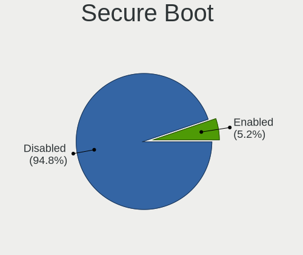

| State    | Computers | Percent |
|----------|-----------|---------|
| Disabled | 254       | 94.78%  |
| Enabled  | 14        | 5.22%   |

Coreboot
--------

Have coreboot on board

| Used | Computers | Percent |
|------|-----------|---------|
| No   | 265       | 98.88%  |
| Yes  | 3         | 1.12%   |

RAM Size
--------

Total RAM memory

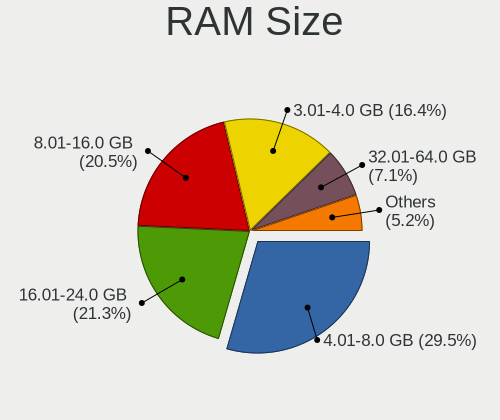

| Size in GB  | Computers | Percent |
|-------------|-----------|---------|
| 4.01-8.0    | 79        | 29.48%  |
| 16.01-24.0  | 57        | 21.27%  |
| 8.01-16.0   | 55        | 20.52%  |
| 3.01-4.0    | 44        | 16.42%  |
| 32.01-64.0  | 19        | 7.09%   |
| 1.01-2.0    | 6         | 2.24%   |
| 64.01-256.0 | 4         | 1.49%   |
| 24.01-32.0  | 3         | 1.12%   |
| 2.01-3.0    | 1         | 0.37%   |

RAM Used
--------

Used RAM memory

| Used GB    | Computers | Percent |
|------------|-----------|---------|
| 1.01-2.0   | 81        | 28.83%  |
| 2.01-3.0   | 77        | 27.4%   |
| 4.01-8.0   | 50        | 17.79%  |
| 3.01-4.0   | 45        | 16.01%  |
| 0.51-1.0   | 15        | 5.34%   |
| 8.01-16.0  | 10        | 3.56%   |
| 24.01-32.0 | 1         | 0.36%   |
| 16.01-24.0 | 1         | 0.36%   |
| 0.01-0.5   | 1         | 0.36%   |

Total Drives
------------

Number of drives on board

| Drives | Computers | Percent |
|--------|-----------|---------|
| 1      | 166       | 61.25%  |
| 2      | 77        | 28.41%  |
| 3      | 13        | 4.8%    |
| 4      | 12        | 4.43%   |
| 5      | 2         | 0.74%   |
| 8      | 1         | 0.37%   |

Has CD-ROM
----------

Has CD-ROM on board

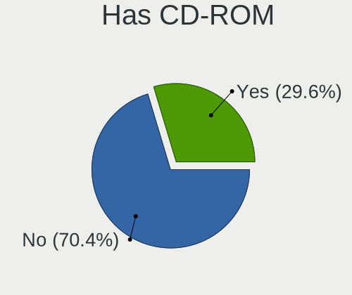

| Presented | Computers | Percent |
|-----------|-----------|---------|
| No        | 190       | 70.37%  |
| Yes       | 80        | 29.63%  |

Has Ethernet
------------

Has Ethernet on board

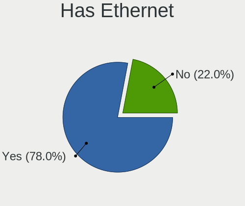

| Presented | Computers | Percent |
|-----------|-----------|---------|
| Yes       | 209       | 77.99%  |
| No        | 59        | 22.01%  |

Has WiFi
--------

Has WiFi module

| Presented | Computers | Percent |
|-----------|-----------|---------|
| Yes       | 208       | 77.61%  |
| No        | 60        | 22.39%  |

Has Bluetooth
-------------

Has Bluetooth module

| Presented | Computers | Percent |
|-----------|-----------|---------|
| Yes       | 177       | 66.04%  |
| No        | 91        | 33.96%  |

Location
--------

Country
-------

Geographic location (country)

| Country               | Computers | Percent |
|-----------------------|-----------|---------|
| China                 | 64        | 23.79%  |
| Brazil                | 50        | 18.59%  |
| Germany               | 17        | 6.32%   |
| USA                   | 16        | 5.95%   |
| Russia                | 10        | 3.72%   |
| Spain                 | 9         | 3.35%   |
| Indonesia             | 7         | 2.6%    |
| Turkey                | 6         | 2.23%   |
| Colombia              | 5         | 1.86%   |
| Poland                | 4         | 1.49%   |
| Panama                | 4         | 1.49%   |
| Japan                 | 4         | 1.49%   |
| Italy                 | 4         | 1.49%   |
| India                 | 4         | 1.49%   |
| Chile                 | 4         | 1.49%   |
| Argentina             | 4         | 1.49%   |
| Mexico                | 3         | 1.12%   |
| Canada                | 3         | 1.12%   |
| Austria               | 3         | 1.12%   |
| UK                    | 2         | 0.74%   |
| Sweden                | 2         | 0.74%   |
| Singapore             | 2         | 0.74%   |
| Portugal              | 2         | 0.74%   |
| Pakistan              | 2         | 0.74%   |
| Kenya                 | 2         | 0.74%   |
| Hong Kong             | 2         | 0.74%   |
| Bulgaria              | 2         | 0.74%   |
| Belarus               | 2         | 0.74%   |
| Bangladesh            | 2         | 0.74%   |
| Australia             | 2         | 0.74%   |
| Vietnam               | 1         | 0.37%   |
| Venezuela             | 1         | 0.37%   |
| Ukraine               | 1         | 0.37%   |
| Tunisia               | 1         | 0.37%   |
| Sri Lanka             | 1         | 0.37%   |
| South Africa          | 1         | 0.37%   |
| Serbia                | 1         | 0.37%   |
| Sao Tome and Principe | 1         | 0.37%   |
| Romania               | 1         | 0.37%   |
| Peru                  | 1         | 0.37%   |

City
----

Geographic location (city)

| City          | Computers | Percent |
|---------------|-----------|---------|
| Wuhan         | 14        | 5.13%   |
| Beijing       | 9         | 3.3%    |
| Shanghai      | 6         | 2.2%    |
| Sao Paulo     | 5         | 1.83%   |
| Guangzhou     | 5         | 1.83%   |
| Nanjing       | 4         | 1.47%   |
| David         | 4         | 1.47%   |
| Uberlndia   | 3         | 1.1%    |
| Shenzhen      | 3         | 1.1%    |
| Moscow        | 3         | 1.1%    |
| Curitiba      | 3         | 1.1%    |
| Bogot       | 3         | 1.1%    |
| Xiamen        | 2         | 0.73%   |
| Tokyo         | 2         | 0.73%   |
| Taiyuan       | 2         | 0.73%   |
| Surabaya      | 2         | 0.73%   |
| Singapore     | 2         | 0.73%   |
| San Francisco | 2         | 0.73%   |
| Petrpolis   | 2         | 0.73%   |
| Londrina      | 2         | 0.73%   |
| Konya         | 2         | 0.73%   |
| Innsbruck     | 2         | 0.73%   |
| Getxo         | 2         | 0.73%   |
| Dhaka         | 2         | 0.73%   |
| Contagem      | 2         | 0.73%   |
| Braslia     | 2         | 0.73%   |
| Atlanta       | 2         | 0.73%   |
| Zhongshan     | 1         | 0.37%   |
| Zhengzhou     | 1         | 0.37%   |
| Zaragoza      | 1         | 0.37%   |
| Yozgat        | 1         | 0.37%   |
| Yogyakarta    | 1         | 0.37%   |
| Yichun        | 1         | 0.37%   |
| Yekaterinburg | 1         | 0.37%   |
| Xuhui         | 1         | 0.37%   |
| Windhoek      | 1         | 0.37%   |
| West Jordan   | 1         | 0.37%   |
| Waynesville   | 1         | 0.37%   |
| Wanchai       | 1         | 0.37%   |
| Voronezh      | 1         | 0.37%   |

Drives
------

Drive Vendor
------------

Hard drive vendors

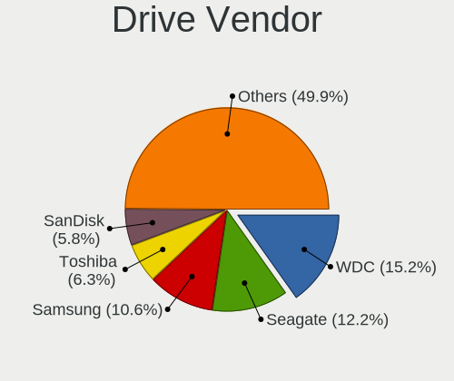

| Vendor                         | Computers | Drives | Percent |
|--------------------------------|-----------|--------|---------|
| WDC                            | 60        | 76     | 15.19%  |
| Seagate                        | 48        | 58     | 12.15%  |
| Samsung Electronics            | 42        | 47     | 10.63%  |
| Toshiba                        | 25        | 27     | 6.33%   |
| SanDisk                        | 23        | 27     | 5.82%   |
| Kingston                       | 23        | 30     | 5.82%   |
| Unknown                        | 20        | 22     | 5.06%   |
| SK hynix                       | 13        | 14     | 3.29%   |
| Crucial                        | 12        | 13     | 3.04%   |
| Hitachi                        | 11        | 12     | 2.78%   |
| HGST                           | 8         | 8      | 2.03%   |
| Silicon Motion                 | 7         | 7      | 1.77%   |
| Micron Technology              | 7         | 10     | 1.77%   |
| Intel                          | 7         | 10     | 1.77%   |
| China                          | 7         | 7      | 1.77%   |
| A-DATA Technology              | 6         | 7      | 1.52%   |
| SPCC                           | 4         | 5      | 1.01%   |
| Phison                         | 4         | 4      | 1.01%   |
| MAXIO Technology (Hangzhou)    | 4         | 5      | 1.01%   |
| FORESEE                        | 4         | 4      | 1.01%   |
| Phison Electronics             | 3         | 4      | 0.76%   |
| LITEON                         | 3         | 3      | 0.76%   |
| Intenso                        | 3         | 4      | 0.76%   |
| Yangtze Memory Technologies    | 2         | 2      | 0.51%   |
| Vaseky                         | 2         | 2      | 0.51%   |
| V-GeN                          | 2         | 2      | 0.51%   |
| Maxtor                         | 2         | 4      | 0.51%   |
| KIOXIA                         | 2         | 2      | 0.51%   |
| JMicron Technology             | 2         | 2      | 0.51%   |
| Hewlett-Packard                | 2         | 3      | 0.51%   |
| Gigabyte Technology            | 2         | 2      | 0.51%   |
| ADATA Technology               | 2         | 2      | 0.51%   |
| Transcend                      | 1         | 1      | 0.25%   |
| Solid State Storage Technology | 1         | 1      | 0.25%   |
| Shenzhen Longsys Electronics   | 1         | 1      | 0.25%   |
| RZX                            | 1         | 1      | 0.25%   |
| RX7                            | 1         | 1      | 0.25%   |
| Realtek Semiconductor          | 1         | 1      | 0.25%   |
| Phytium                        | 1         | 1      | 0.25%   |
| Patriot                        | 1         | 1      | 0.25%   |

Drive Model
-----------

Hard drive models

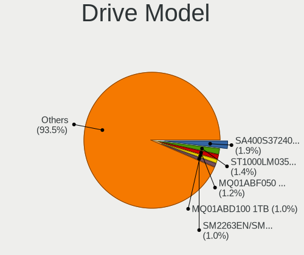

| Model                                                 | Computers | Percent |
|-------------------------------------------------------|-----------|---------|
| Kingston SA400S37240G 240GB SSD                       | 8         | 1.91%   |
| Seagate ST1000LM035-1RK172 1TB                        | 6         | 1.44%   |
| Toshiba MQ01ABF050 500GB                              | 5         | 1.2%    |
| Toshiba MQ01ABD100 1TB                                | 4         | 0.96%   |
| Silicon Motion SM2263EN/SM2263XT SSD Controller 256GB | 4         | 0.96%   |
| Seagate ST1000DM010-2EP102 1TB                        | 4         | 0.96%   |
| Samsung NVMe SSD Controller PM9A1/PM9A3/980PRO 512GB  | 4         | 0.96%   |
| Crucial CT240BX500SSD1 240GB                          | 4         | 0.96%   |
| WDC WD5000LPCX-24VHAT0 500GB                          | 3         | 0.72%   |
| Unknown MMC Card                                      | 3         | 0.72%   |
| Seagate ST500LM012 HN-M500MBB 500GB                   | 3         | 0.72%   |
| Samsung SSD 850 EVO 500GB                             | 3         | 0.72%   |
| Samsung MZVLW256HEHP-000H1 256GB                      | 3         | 0.72%   |
| Phison ESO256GMFCH-E3C-2 256GB                        | 3         | 0.72%   |
| Kingston SA400S37480G 480GB SSD                       | 3         | 0.72%   |
| HGST HTS721010A9E630 1TB                              | 3         | 0.72%   |
| WDC WDS120G1G0A-00SS50 120GB SSD                      | 2         | 0.48%   |
| WDC WD5000AAKX-003CA0 500GB                           | 2         | 0.48%   |
| WDC WD10EZEX-22MFCA0 1TB                              | 2         | 0.48%   |
| WDC PC SN530 SDBPMPZ-512G-1101 512GB                  | 2         | 0.48%   |
| Unknown SD/MMC/MS PRO 128GB                           | 2         | 0.48%   |
| Unknown MMC Card  32GB                                | 2         | 0.48%   |
| Toshiba DT01ACA200 2TB                                | 2         | 0.48%   |
| Toshiba DT01ACA100 1TB                                | 2         | 0.48%   |
| SPCC Solid State Disk 512GB                           | 2         | 0.48%   |
| SK hynix Platinum P41 NVMe Solid State Drive 2TB      | 2         | 0.48%   |
| Seagate ST9320325AS 320GB                             | 2         | 0.48%   |
| Seagate ST500DM002-1BD142 500GB                       | 2         | 0.48%   |
| Seagate ST3500418AS 500GB                             | 2         | 0.48%   |
| Seagate ST2000LM007-1R8174 2TB                        | 2         | 0.48%   |
| Seagate ST1000LM024 HN-M101MBB 1TB                    | 2         | 0.48%   |
| Seagate ST1000DM003-1SB102 1TB                        | 2         | 0.48%   |
| SanDisk SSD PLUS 240GB                                | 2         | 0.48%   |
| SanDisk SDSSDH3512G 512GB                             | 2         | 0.48%   |
| SanDisk SDSSDA240G 240GB                              | 2         | 0.48%   |
| SanDisk SDSSDA120G 120GB                              | 2         | 0.48%   |
| SanDisk DF4064  64GB                                  | 2         | 0.48%   |
| Samsung SSD 850 PRO 256GB                             | 2         | 0.48%   |
| Samsung MZVLB256HBHQ-00000 256GB                      | 2         | 0.48%   |
| Phison E12 NVMe Controller 480GB                      | 2         | 0.48%   |

HDD Vendor
----------

Hard disk drive vendors

| Vendor              | Computers | Drives | Percent |
|---------------------|-----------|--------|---------|
| WDC                 | 48        | 57     | 32.43%  |
| Seagate             | 46        | 56     | 31.08%  |
| Toshiba             | 21        | 23     | 14.19%  |
| Hitachi             | 11        | 12     | 7.43%   |
| HGST                | 8         | 8      | 5.41%   |
| Samsung Electronics | 4         | 4      | 2.7%    |
| Unknown             | 2         | 3      | 1.35%   |
| Maxtor              | 2         | 4      | 1.35%   |
| JMicron Technology  | 2         | 2      | 1.35%   |
| OEM                 | 1         | 1      | 0.68%   |
| Maxtor 6            | 1         | 1      | 0.68%   |
| Hewlett-Packard     | 1         | 2      | 0.68%   |
| Fujitsu             | 1         | 2      | 0.68%   |

SSD Vendor
----------

Solid state drive vendors

| Vendor              | Computers | Drives | Percent |
|---------------------|-----------|--------|---------|
| Kingston            | 19        | 26     | 16.1%   |
| SanDisk             | 17        | 21     | 14.41%  |
| Samsung Electronics | 16        | 19     | 13.56%  |
| Crucial             | 10        | 11     | 8.47%   |
| WDC                 | 8         | 11     | 6.78%   |
| China               | 7         | 7      | 5.93%   |
| SPCC                | 4         | 5      | 3.39%   |
| SK hynix            | 3         | 3      | 2.54%   |
| Micron Technology   | 3         | 5      | 2.54%   |
| Intenso             | 3         | 4      | 2.54%   |
| A-DATA Technology   | 3         | 4      | 2.54%   |
| Vaseky              | 2         | 2      | 1.69%   |
| LITEON              | 2         | 2      | 1.69%   |
| Intel               | 2         | 4      | 1.69%   |
| V-GeN               | 1         | 1      | 0.85%   |
| Unknown             | 1         | 1      | 0.85%   |
| Transcend           | 1         | 1      | 0.85%   |
| Toshiba             | 1         | 1      | 0.85%   |
| RZX                 | 1         | 1      | 0.85%   |
| OCZ                 | 1         | 1      | 0.85%   |
| Netac               | 1         | 1      | 0.85%   |
| Microtech           | 1         | 1      | 0.85%   |
| MaiChai             | 1         | 1      | 0.85%   |
| LITEONIT            | 1         | 1      | 0.85%   |
| KingSpec            | 1         | 1      | 0.85%   |
| KingDian            | 1         | 1      | 0.85%   |
| KINGBANK            | 1         | 1      | 0.85%   |
| Hewlett-Packard     | 1         | 1      | 0.85%   |
| GLOWAY              | 1         | 1      | 0.85%   |
| Gigabyte Technology | 1         | 1      | 0.85%   |
| G521N               | 1         | 1      | 0.85%   |
| Colorful            | 1         | 2      | 0.85%   |
| Apacer              | 1         | 3      | 0.85%   |

Drive Kind
----------

HDD or SSD

| Kind    | Computers | Drives | Percent |
|---------|-----------|--------|---------|
| HDD     | 131       | 175    | 36.69%  |
| SSD     | 106       | 146    | 29.69%  |
| NVMe    | 96        | 116    | 26.89%  |
| MMC     | 18        | 20     | 5.04%   |
| Unknown | 6         | 7      | 1.68%   |

Drive Connector
---------------

SATA, SAS, NVMe, etc.

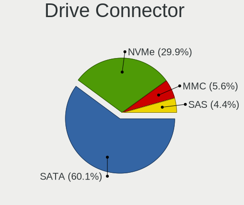

| Type | Computers | Drives | Percent |
|------|-----------|--------|---------|
| SATA | 193       | 306    | 60.12%  |
| NVMe | 96        | 114    | 29.91%  |
| MMC  | 18        | 20     | 5.61%   |
| SAS  | 14        | 24     | 4.36%   |

Drive Size
----------

Size of hard drive

| Size in TB | Computers | Drives | Percent |
|------------|-----------|--------|---------|
| 0.01-0.5   | 138       | 199    | 57.74%  |
| 0.51-1.0   | 81        | 96     | 33.89%  |
| 1.01-2.0   | 15        | 19     | 6.28%   |
| 3.01-4.0   | 3         | 4      | 1.26%   |
| 2.01-3.0   | 1         | 1      | 0.42%   |
| 10.01-20.0 | 1         | 2      | 0.42%   |

Space Total
-----------

Amount of disk space available on the file system

| Size in GB     | Computers | Percent |
|----------------|-----------|---------|
| 251-500        | 71        | 25.82%  |
| 101-250        | 67        | 24.36%  |
| 501-1000       | 49        | 17.82%  |
| 1001-2000      | 41        | 14.91%  |
| More than 3000 | 13        | 4.73%   |
| 51-100         | 13        | 4.73%   |
| 2001-3000      | 9         | 3.27%   |
| 21-50          | 5         | 1.82%   |
| Unknown        | 5         | 1.82%   |
| 1-20           | 2         | 0.73%   |

Space Used
----------

Amount of used disk space

| Used GB        | Computers | Percent |
|----------------|-----------|---------|
| 1-20           | 56        | 20.22%  |
| 21-50          | 55        | 19.86%  |
| 101-250        | 51        | 18.41%  |
| 251-500        | 37        | 13.36%  |
| 51-100         | 31        | 11.19%  |
| 501-1000       | 24        | 8.66%   |
| 1001-2000      | 9         | 3.25%   |
| 2001-3000      | 5         | 1.81%   |
| Unknown        | 5         | 1.81%   |
| More than 3000 | 4         | 1.44%   |

Malfunc. Drives
---------------

Drive models with a malfunction

| Model                                         | Computers | Drives | Percent |
|-----------------------------------------------|-----------|--------|---------|
| Seagate ST9320325AS 320GB                     | 2         | 2      | 7.41%   |
| WDC WD7500BPKX-80HPJT0 752GB                  | 1         | 1      | 3.7%    |
| WDC WD5000LPLX-66ZNTT1 500GB                  | 1         | 1      | 3.7%    |
| WDC WD3200AAKS-61L9A0 320GB                   | 1         | 1      | 3.7%    |
| WDC WD10JPVX-22JC3T0 1TB                      | 1         | 1      | 3.7%    |
| WDC WD10EARS-00Y5B1 1TB                       | 1         | 1      | 3.7%    |
| Toshiba MQ01ABD100 1TB                        | 1         | 1      | 3.7%    |
| Toshiba MQ01ABD032 320GB                      | 1         | 1      | 3.7%    |
| Toshiba MK8052GSX 80GB                        | 1         | 1      | 3.7%    |
| SK hynix PC711 HFS001TDE9X073N 1TB            | 1         | 1      | 3.7%    |
| SK hynix BC511 HFM256GDJTNI-82A0A 256GB       | 1         | 1      | 3.7%    |
| Seagate ST3750528AS 752GB                     | 1         | 1      | 3.7%    |
| Seagate ST2000LM003 HN-M201RAD 2TB            | 1         | 1      | 3.7%    |
| Seagate ST1000LM049-2GH172 1TB                | 1         | 1      | 3.7%    |
| Seagate ST1000DL002-9TT153 1TB                | 1         | 1      | 3.7%    |
| Samsung Electronics HM250HI 250GB             | 1         | 1      | 3.7%    |
| Samsung Electronics HD502HJ 500GB             | 1         | 1      | 3.7%    |
| Samsung Electronics HD250HJ 250GB             | 1         | 1      | 3.7%    |
| OCZ VERTEX4 256GB SSD                         | 1         | 1      | 3.7%    |
| Micron Technology MTFDDAT128MAM-1J2 128GB SSD | 1         | 2      | 3.7%    |
| Intenso lntenso SSD Sata III 480GB            | 1         | 1      | 3.7%    |
| Hitachi HTS543225L9A300 250GB                 | 1         | 1      | 3.7%    |
| Hitachi HDP725050GLA360 500GB                 | 1         | 1      | 3.7%    |
| HIKSEMI MS201 1TB                             | 1         | 1      | 3.7%    |
| HGST HTS721010A9E630 1TB                      | 1         | 1      | 3.7%    |
| G521N SSD 256GB                               | 1         | 1      | 3.7%    |

Malfunc. Drive Vendor
---------------------

Vendors of faulty drives

| Vendor              | Computers | Drives | Percent |
|---------------------|-----------|--------|---------|
| WDC                 | 5         | 5      | 19.23%  |
| Seagate             | 5         | 6      | 19.23%  |
| Toshiba             | 3         | 3      | 11.54%  |
| Samsung Electronics | 3         | 3      | 11.54%  |
| SK hynix            | 2         | 2      | 7.69%   |
| Hitachi             | 2         | 2      | 7.69%   |
| OCZ                 | 1         | 1      | 3.85%   |
| Micron Technology   | 1         | 2      | 3.85%   |
| Intenso             | 1         | 1      | 3.85%   |
| HIKSEMI             | 1         | 1      | 3.85%   |
| HGST                | 1         | 1      | 3.85%   |
| G521N               | 1         | 1      | 3.85%   |

Malfunc. HDD Vendor
-------------------

Vendors of faulty HDD drives

| Vendor              | Computers | Drives | Percent |
|---------------------|-----------|--------|---------|
| WDC                 | 5         | 5      | 26.32%  |
| Seagate             | 5         | 6      | 26.32%  |
| Toshiba             | 3         | 3      | 15.79%  |
| Samsung Electronics | 3         | 3      | 15.79%  |
| Hitachi             | 2         | 2      | 10.53%  |
| HGST                | 1         | 1      | 5.26%   |

Malfunc. Drive Kind
-------------------

Kinds of faulty drives

| Kind | Computers | Drives | Percent |
|------|-----------|--------|---------|
| HDD  | 19        | 20     | 73.08%  |
| SSD  | 4         | 5      | 15.38%  |
| NVMe | 3         | 3      | 11.54%  |

Failed Drives
-------------

Failed drive models

| Model                       | Computers | Drives | Percent |
|-----------------------------|-----------|--------|---------|
| Toshiba MK5065GSXN 500GB    | 1         | 1      | 50%     |
| Hitachi HUA722010CLA330 1TB | 1         | 1      | 50%     |

Failed Drive Vendor
-------------------

Failed drive vendors

| Vendor  | Computers | Drives | Percent |
|---------|-----------|--------|---------|
| Toshiba | 1         | 1      | 50%     |
| Hitachi | 1         | 1      | 50%     |

Drive Status
------------

Number of failed and malfunc. drives

| Status   | Computers | Drives | Percent |
|----------|-----------|--------|---------|
| Works    | 137       | 201    | 45.82%  |
| Detected | 134       | 233    | 44.82%  |
| Malfunc  | 26        | 28     | 8.7%    |
| Failed   | 2         | 2      | 0.67%   |

Storage controller
------------------

Storage Vendor
--------------

Storage controller vendors

| Vendor                         | Computers | Percent |
|--------------------------------|-----------|---------|
| Intel                          | 176       | 52.69%  |
| AMD                            | 33        | 9.88%   |
| Samsung Electronics            | 23        | 6.89%   |
| SanDisk                        | 12        | 3.59%   |
| SK hynix                       | 10        | 2.99%   |
| Silicon Motion                 | 9         | 2.69%   |
| Phison Electronics             | 8         | 2.4%    |
| MAXIO Technology (Hangzhou)    | 7         | 2.1%    |
| Marvell Technology Group       | 7         | 2.1%    |
| ASMedia Technology             | 7         | 2.1%    |
| Kingston Technology Company    | 5         | 1.5%    |
| Shenzhen Longsys Electronics   | 4         | 1.2%    |
| Micron Technology              | 4         | 1.2%    |
| KIOXIA                         | 3         | 0.9%    |
| Zhaoxin                        | 2         | 0.6%    |
| Yangtze Memory Technologies    | 2         | 0.6%    |
| Toshiba America Info Systems   | 2         | 0.6%    |
| Realtek Semiconductor          | 2         | 0.6%    |
| Nvidia                         | 2         | 0.6%    |
| Micron/Crucial Technology      | 2         | 0.6%    |
| Loongson Technology            | 2         | 0.6%    |
| JMicron Technology             | 2         | 0.6%    |
| Beijing Starblaze Technology   | 2         | 0.6%    |
| ADATA Technology               | 2         | 0.6%    |
| Solid State Storage Technology | 1         | 0.3%    |
| LSI Logic / Symbios Logic      | 1         | 0.3%    |
| Lite-On Technology             | 1         | 0.3%    |
| Huawei Technologies            | 1         | 0.3%    |
| Apple                          | 1         | 0.3%    |
| Unknown                        | 1         | 0.3%    |

Storage Model
-------------

Storage controller models

| Model                                                                          | Computers | Percent |
|--------------------------------------------------------------------------------|-----------|---------|
| AMD FCH SATA Controller [AHCI mode]                                            | 22        | 6.08%   |
| Intel Sunrise Point-LP SATA Controller [AHCI mode]                             | 19        | 5.25%   |
| Intel 7 Series Chipset Family 6-port SATA Controller [AHCI mode]               | 16        | 4.42%   |
| Intel 8 Series SATA Controller 1 [AHCI mode]                                   | 12        | 3.31%   |
| Intel Wildcat Point-LP SATA Controller [AHCI Mode]                             | 11        | 3.04%   |
| Intel 400 Series Chipset Family SATA AHCI Controller                           | 10        | 2.76%   |
| Samsung NVMe SSD Controller SM981/PM981/PM983                                  | 9         | 2.49%   |
| Intel 8 Series/C220 Series Chipset Family 6-port SATA Controller 1 [AHCI mode] | 9         | 2.49%   |
| Silicon Motion SM2263EN/SM2263XT (DRAM-less) NVMe SSD Controllers              | 8         | 2.21%   |
| Intel Celeron/Pentium Silver Processor SATA Controller                         | 8         | 2.21%   |
| Intel 7 Series/C210 Series Chipset Family 6-port SATA Controller [AHCI mode]   | 8         | 2.21%   |
| Intel 82801IBM/IEM (ICH9M/ICH9M-E) 4 port SATA Controller [AHCI mode]          | 7         | 1.93%   |
| Intel Cannon Point-LP SATA Controller [AHCI Mode]                              | 6         | 1.66%   |
| Intel 82801 Mobile SATA Controller [RAID mode]                                 | 6         | 1.66%   |
| Intel 6 Series/C200 Series Chipset Family 6 port Desktop SATA AHCI Controller  | 6         | 1.66%   |
| ASMedia ASM1061/ASM1062 Serial ATA Controller                                  | 6         | 1.66%   |
| Intel Q170/Q150/B150/H170/H110/Z170/CM236 Chipset SATA Controller [AHCI Mode]  | 5         | 1.38%   |
| Intel Comet Lake SATA AHCI Controller                                          | 5         | 1.38%   |
| AMD 500 Series Chipset SATA Controller                                         | 5         | 1.38%   |
| Samsung NVMe SSD Controller SM961/PM961/SM963                                  | 4         | 1.1%    |
| Samsung NVMe SSD Controller PM9A1/PM9A3/980PRO                                 | 4         | 1.1%    |
| MAXIO (Hangzhou) NVMe SSD Controller MAP1202 (DRAM-less)                       | 4         | 1.1%    |
| Marvell Group 88SE9215 PCIe 2.0 x1 4-port SATA 6 Gb/s Controller               | 4         | 1.1%    |
| Intel Cannon Lake Mobile PCH SATA AHCI Controller                              | 4         | 1.1%    |
| Intel 6 Series/C200 Series Chipset Family 6 port Mobile SATA AHCI Controller   | 4         | 1.1%    |
| AMD SB7x0/SB8x0/SB9x0 SATA Controller [AHCI mode]                              | 4         | 1.1%    |
| SK hynix Platinum P41/PC801 NVMe Solid State Drive                             | 3         | 0.83%   |
| SK hynix BC511 NVMe SSD                                                        | 3         | 0.83%   |
| SanDisk Extreme Pro / WD Black SN750 / PC SN730 / Red SN700 NVMe SSD           | 3         | 0.83%   |
| Phison PS5013-E13 PCIe3 NVMe Controller (DRAM-less)                            | 3         | 0.83%   |
| MAXIO (Hangzhou) NVMe SSD Controller MAP1602 (DRAM-less)                       | 3         | 0.83%   |
| Intel NM10/ICH7 Family SATA Controller [IDE mode]                              | 3         | 0.83%   |
| Intel 82801JI (ICH10 Family) 4 port SATA IDE Controller #1                     | 3         | 0.83%   |
| Intel 82801JI (ICH10 Family) 2 port SATA IDE Controller #2                     | 3         | 0.83%   |
| Intel 5 Series/3400 Series Chipset 4 port SATA AHCI Controller                 | 3         | 0.83%   |
| Intel 200 Series PCH SATA controller [AHCI mode]                               | 3         | 0.83%   |
| AMD SB7x0/SB8x0/SB9x0 IDE Controller                                           | 3         | 0.83%   |
| Zhaoxin ZX-100/ZX-200/KX-6000/KX-6000G/KH-40000/KX-7000 StorX AHCI Controller  | 2         | 0.55%   |
| SK hynix Gold P31/BC711/PC711 NVMe Solid State Drive                           | 2         | 0.55%   |
| SK hynix BC501 NVMe Solid State Drive                                          | 2         | 0.55%   |

Storage Kind
------------

Kind of storage controller (IDE, SATA, NVMe, SAS, ...)

| Kind | Computers | Percent |
|------|-----------|---------|
| SATA | 197       | 60.06%  |
| NVMe | 96        | 29.27%  |
| IDE  | 21        | 6.4%    |
| RAID | 13        | 3.96%   |
| SAS  | 1         | 0.3%    |

Processor
---------

CPU Vendor
----------

Processor vendors

| Vendor       | Computers | Percent |
|--------------|-----------|---------|
| Intel        | 207       | 77.24%  |
| AMD          | 50        | 18.66%  |
| Phytium      | 4         | 1.49%   |
| CentaurHauls | 2         | 0.75%   |
| ARM          | 2         | 0.75%   |
| Loongson     | 1         | 0.37%   |
| HUAWEI       | 1         | 0.37%   |
| Unknown      | 1         | 0.37%   |

CPU Model
---------

Processor models

| Model                                       | Computers | Percent |
|---------------------------------------------|-----------|---------|
| Intel Core i7-10700 CPU @ 2.90GHz           | 7         | 2.61%   |
| Intel Core i5-7200U CPU @ 2.50GHz           | 5         | 1.87%   |
| Intel Core i5-5200U CPU @ 2.20GHz           | 5         | 1.87%   |
| Intel Core i7-5500U CPU @ 2.40GHz           | 4         | 1.49%   |
| Intel Core i7-3770 CPU @ 3.40GHz            | 4         | 1.49%   |
| Intel Core i7-10510U CPU @ 1.80GHz          | 4         | 1.49%   |
| Intel Core i5-8250U CPU @ 1.60GHz           | 4         | 1.49%   |
| Intel Core 2 Duo CPU E8400 @ 3.00GHz        | 4         | 1.49%   |
| Intel Core i7-7500U CPU @ 2.70GHz           | 3         | 1.12%   |
| Intel Core i7-4510U CPU @ 2.00GHz           | 3         | 1.12%   |
| Intel Core i5-8300H CPU @ 2.30GHz           | 3         | 1.12%   |
| Intel Core i5-6200U CPU @ 2.30GHz           | 3         | 1.12%   |
| Intel Core i5-4210U CPU @ 1.70GHz           | 3         | 1.12%   |
| Intel 11th Gen Core i5-1135G7 @ 2.40GHz     | 3         | 1.12%   |
| Intel Pentium Dual-Core CPU T4500 @ 2.30GHz | 2         | 0.75%   |
| Intel Core i7-8565U CPU @ 1.80GHz           | 2         | 0.75%   |
| Intel Core i7-8550U CPU @ 1.80GHz           | 2         | 0.75%   |
| Intel Core i7-7700HQ CPU @ 2.80GHz          | 2         | 0.75%   |
| Intel Core i7-7700 CPU @ 3.60GHz            | 2         | 0.75%   |
| Intel Core i7-6500U CPU @ 2.50GHz           | 2         | 0.75%   |
| Intel Core i7-4790 CPU @ 3.60GHz            | 2         | 0.75%   |
| Intel Core i7-3630QM CPU @ 2.40GHz          | 2         | 0.75%   |
| Intel Core i7-2630QM CPU @ 2.00GHz          | 2         | 0.75%   |
| Intel Core i5-8265U CPU @ 1.60GHz           | 2         | 0.75%   |
| Intel Core i5-8259U CPU @ 2.30GHz           | 2         | 0.75%   |
| Intel Core i5-4200U CPU @ 1.60GHz           | 2         | 0.75%   |
| Intel Core i5-3550 CPU @ 3.30GHz            | 2         | 0.75%   |
| Intel Core i5-3470 CPU @ 3.20GHz            | 2         | 0.75%   |
| Intel Core i5-3337U CPU @ 1.80GHz           | 2         | 0.75%   |
| Intel Core i5-3230M CPU @ 2.60GHz           | 2         | 0.75%   |
| Intel Core i5-2450M CPU @ 2.50GHz           | 2         | 0.75%   |
| Intel Core i3-6100 CPU @ 3.70GHz            | 2         | 0.75%   |
| Intel Core i3-4030U CPU @ 1.90GHz           | 2         | 0.75%   |
| Intel Core i3-4005U CPU @ 1.70GHz           | 2         | 0.75%   |
| Intel Core i3-3220 CPU @ 3.30GHz            | 2         | 0.75%   |
| Intel Core i3-10100 CPU @ 3.60GHz           | 2         | 0.75%   |
| Intel Celeron N4120 CPU @ 1.10GHz           | 2         | 0.75%   |
| Intel Celeron CPU N3350 @ 1.10GHz           | 2         | 0.75%   |
| Intel Celeron CPU 1007U @ 1.50GHz           | 2         | 0.75%   |
| Intel Atom x5-Z8350 CPU @ 1.44GHz           | 2         | 0.75%   |

CPU Model Family
----------------

Processor model prefix

| Model                   | Computers | Percent |
|-------------------------|-----------|---------|
| Intel Core i7           | 57        | 21.27%  |
| Intel Core i5           | 57        | 21.27%  |
| Other                   | 31        | 11.57%  |
| Intel Core i3           | 22        | 8.21%   |
| Intel Celeron           | 17        | 6.34%   |
| AMD Ryzen 5             | 13        | 4.85%   |
| AMD Ryzen 7             | 10        | 3.73%   |
| Intel Core 2 Duo        | 9         | 3.36%   |
| Intel Atom              | 7         | 2.61%   |
| Intel Xeon              | 5         | 1.87%   |
| AMD Ryzen 3             | 5         | 1.87%   |
| AMD FX                  | 5         | 1.87%   |
| Intel Pentium Dual-Core | 4         | 1.49%   |
| Intel Core i9           | 4         | 1.49%   |
| Intel Pentium           | 3         | 1.12%   |
| AMD A10                 | 3         | 1.12%   |
| Intel Pentium Silver    | 2         | 0.75%   |
| AMD Ryzen 9             | 2         | 0.75%   |
| AMD Ryzen 7 PRO         | 2         | 0.75%   |
| Intel Core m3           | 1         | 0.37%   |
| Intel Core M            | 1         | 0.37%   |
| Intel Celeron Dual-Core | 1         | 0.37%   |
| AMD Ryzen 5 PRO         | 1         | 0.37%   |
| AMD E2                  | 1         | 0.37%   |
| AMD E1                  | 1         | 0.37%   |
| AMD E                   | 1         | 0.37%   |
| AMD C-60                | 1         | 0.37%   |
| AMD Athlon              | 1         | 0.37%   |
| AMD A8                  | 1         | 0.37%   |

CPU Cores
---------

Number of processor cores

| Number | Computers | Percent |
|--------|-----------|---------|
| 2      | 105       | 39.18%  |
| 4      | 103       | 38.43%  |
| 8      | 24        | 8.96%   |
| 6      | 18        | 6.72%   |
| 12     | 4         | 1.49%   |
| 24     | 3         | 1.12%   |
| 14     | 3         | 1.12%   |
| 10     | 3         | 1.12%   |
| 1      | 2         | 0.75%   |
| 64     | 1         | 0.37%   |
| 16     | 1         | 0.37%   |
| 3      | 1         | 0.37%   |

CPU Sockets
-----------

Number of sockets

| Number | Computers | Percent |
|--------|-----------|---------|
| 1      | 265       | 98.88%  |
| 3      | 2         | 0.75%   |
| 4      | 1         | 0.37%   |

CPU Threads
-----------

Threads per core (Hyper-Threading)

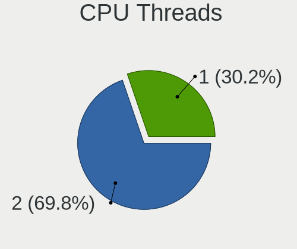

| Number | Computers | Percent |
|--------|-----------|---------|
| 2      | 187       | 69.78%  |
| 1      | 81        | 30.22%  |

CPU Op-Modes
------------

CPU Operation Modes (32-bit, 64-bit)

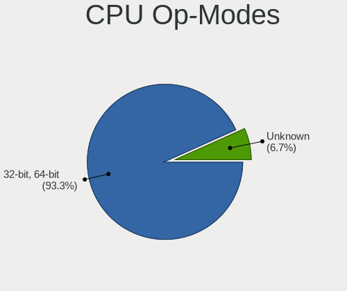

| Op mode        | Computers | Percent |
|----------------|-----------|---------|
| 32-bit, 64-bit | 250       | 93.28%  |
| Unknown        | 18        | 6.72%   |

CPU Microcode
-------------

Microcode number

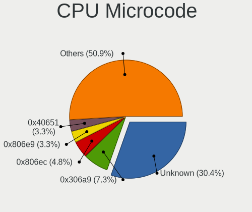

| Number     | Computers | Percent |
|------------|-----------|---------|
| Unknown    | 83        | 30.4%   |
| 0x306a9    | 20        | 7.33%   |
| 0x806ec    | 13        | 4.76%   |
| 0x806e9    | 9         | 3.3%    |
| 0x40651    | 9         | 3.3%    |
| 0x306c3    | 9         | 3.3%    |
| 0x306d4    | 8         | 2.93%   |
| 0x206a7    | 8         | 2.93%   |
| 0x1067a    | 8         | 2.93%   |
| 0x406e3    | 7         | 2.56%   |
| 0x906e9    | 6         | 2.2%    |
| 0xa0655    | 5         | 1.83%   |
| 0x906ea    | 5         | 1.83%   |
| 0x806ea    | 5         | 1.83%   |
| 0x706a8    | 4         | 1.47%   |
| 0x906a3    | 3         | 1.1%    |
| 0x806c1    | 3         | 1.1%    |
| 0x406c4    | 3         | 1.1%    |
| 0x30678    | 3         | 1.1%    |
| 0x08600106 | 3         | 1.1%    |
| 0x08108109 | 3         | 1.1%    |
| 0x706a1    | 2         | 0.73%   |
| 0x506e3    | 2         | 0.73%   |
| 0x20655    | 2         | 0.73%   |
| 0x0a50000d | 2         | 0.73%   |
| 0x0a50000c | 2         | 0.73%   |
| 0x0a20120e | 2         | 0.73%   |
| 0x08600104 | 2         | 0.73%   |
| 0x08200103 | 2         | 0.73%   |
| 0x08108102 | 2         | 0.73%   |
| 0x0500010d | 2         | 0.73%   |
| 0xb06a3    | 1         | 0.37%   |
| 0xb06a2    | 1         | 0.37%   |
| 0xb0671    | 1         | 0.37%   |
| 0xa0653    | 1         | 0.37%   |
| 0xa0652    | 1         | 0.37%   |
| 0x906eb    | 1         | 0.37%   |
| 0x806d1    | 1         | 0.37%   |
| 0x806c2    | 1         | 0.37%   |
| 0x6fd      | 1         | 0.37%   |

CPU Microarch
-------------

Microarchitecture

| Name             | Computers | Percent |
|------------------|-----------|---------|
| KabyLake         | 46        | 17.16%  |
| IvyBridge        | 29        | 10.82%  |
| Haswell          | 23        | 8.58%   |
| Unknown          | 19        | 7.09%   |
| Penryn           | 14        | 5.22%   |
| Skylake          | 13        | 4.85%   |
| SandyBridge      | 12        | 4.48%   |
| CometLake        | 12        | 4.48%   |
| Zen 2            | 11        | 4.1%    |
| Silvermont       | 11        | 4.1%    |
| Broadwell        | 11        | 4.1%    |
| Alderlake Hybrid | 9         | 3.36%   |
| Zen 3            | 8         | 2.99%   |
| Goldmont plus    | 8         | 2.99%   |
| TigerLake        | 7         | 2.61%   |
| Zen              | 6         | 2.24%   |
| Zen+             | 5         | 1.87%   |
| Westmere         | 4         | 1.49%   |
| Excavator        | 3         | 1.12%   |
| Bobcat           | 3         | 1.12%   |
| Piledriver       | 2         | 0.75%   |
| Nehalem          | 2         | 0.75%   |
| Goldmont         | 2         | 0.75%   |
| Bulldozer        | 2         | 0.75%   |
| Steamroller      | 1         | 0.37%   |
| Puma             | 1         | 0.37%   |
| K10 Llano        | 1         | 0.37%   |
| Jaguar           | 1         | 0.37%   |
| Icelake          | 1         | 0.37%   |
| Core             | 1         | 0.37%   |

Graphics
--------

GPU Vendor
----------

Vendors of graphics cards

| Vendor              | Computers | Percent |
|---------------------|-----------|---------|
| Intel               | 171       | 51.04%  |
| Nvidia              | 89        | 26.57%  |
| AMD                 | 69        | 20.6%   |
| Zhaoxin             | 2         | 0.6%    |
| Loongson Technology | 2         | 0.6%    |
| Phytium Technology  | 1         | 0.3%    |
| ASPEED Technology   | 1         | 0.3%    |

GPU Model
---------

Graphics card models

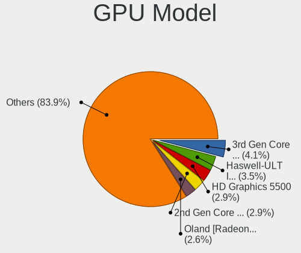

| Model                                                                                    | Computers | Percent |
|------------------------------------------------------------------------------------------|-----------|---------|
| Intel 3rd Gen Core processor Graphics Controller                                         | 14        | 4.09%   |
| Intel Haswell-ULT Integrated Graphics Controller                                         | 12        | 3.51%   |
| Intel HD Graphics 5500                                                                   | 10        | 2.92%   |
| Intel 2nd Generation Core Processor Family Integrated Graphics Controller                | 10        | 2.92%   |
| AMD Oland [Radeon HD 8570 / R5 430 OEM / R7 240/340 / Radeon 520 OEM]                    | 9         | 2.63%   |
| Intel Xeon E3-1200 v2/3rd Gen Core processor Graphics Controller                         | 8         | 2.34%   |
| Intel Skylake GT2 [HD Graphics 520]                                                      | 8         | 2.34%   |
| Intel HD Graphics 620                                                                    | 8         | 2.34%   |
| Intel Mobile 4 Series Chipset Integrated Graphics Controller                             | 7         | 2.05%   |
| AMD Topaz XT [Radeon R7 M260/M265 / M340/M360 / M440/M445 / 530/535 / 620/625 Mobile]    | 7         | 2.05%   |
| AMD Renoir [Radeon Vega Series / Radeon Vega Mobile Series]                              | 7         | 2.05%   |
| AMD Picasso/Raven 2 [Radeon Vega Series / Radeon Vega Mobile Series]                     | 7         | 2.05%   |
| Intel UHD Graphics 620                                                                   | 6         | 1.75%   |
| Intel TigerLake-LP GT2 [Iris Xe Graphics]                                                | 6         | 1.75%   |
| Intel HD Graphics 630                                                                    | 6         | 1.75%   |
| Intel GeminiLake [UHD Graphics 600]                                                      | 6         | 1.75%   |
| Intel CometLake-U GT2 [UHD Graphics]                                                     | 6         | 1.75%   |
| Intel CoffeeLake-H GT2 [UHD Graphics 630]                                                | 6         | 1.75%   |
| Intel Atom/Celeron/Pentium Processor x5-E8000/J3xxx/N3xxx Integrated Graphics Controller | 6         | 1.75%   |
| Intel WhiskeyLake-U GT2 [UHD Graphics 620]                                               | 5         | 1.46%   |
| Intel Atom Processor Z36xxx/Z37xxx Series Graphics & Display                             | 5         | 1.46%   |
| Nvidia TU117M [GeForce GTX 1650 Mobile / Max-Q]                                          | 4         | 1.17%   |
| Intel Xeon E3-1200 v3/4th Gen Core Processor Integrated Graphics Controller              | 4         | 1.17%   |
| Intel Alder Lake-P GT2 [Iris Xe Graphics]                                                | 4         | 1.17%   |
| Nvidia GP107M [GeForce GTX 1050 Ti Mobile]                                               | 3         | 0.88%   |
| Nvidia GP106 [GeForce GTX 1060 6GB]                                                      | 3         | 0.88%   |
| Nvidia GM204 [GeForce GTX 970]                                                           | 3         | 0.88%   |
| Nvidia GM108M [GeForce MX110]                                                            | 3         | 0.88%   |
| Nvidia GM108M [GeForce 940MX]                                                            | 3         | 0.88%   |
| Nvidia GA106M [GeForce RTX 3060 Mobile / Max-Q]                                          | 3         | 0.88%   |
| Intel Core Processor Integrated Graphics Controller                                      | 3         | 0.88%   |
| Intel CometLake-S GT2 [UHD Graphics 630]                                                 | 3         | 0.88%   |
| AMD Wani [Radeon R5/R6/R7 Graphics]                                                      | 3         | 0.88%   |
| AMD Ellesmere [Radeon RX 470/480/570/570X/580/580X/590]                                  | 3         | 0.88%   |
| AMD Cezanne [Radeon Vega Series / Radeon Vega Mobile Series]                             | 3         | 0.88%   |
| AMD Caicos [Radeon HD 6450/7450/8450 / R5 230 OEM]                                       | 3         | 0.88%   |
| Zhaoxin KX-6000 C-960 GPU                                                                | 2         | 0.58%   |
| Nvidia GT218 [GeForce 210]                                                               | 2         | 0.58%   |
| Nvidia GP108M [GeForce MX250]                                                            | 2         | 0.58%   |
| Nvidia GP108BM [GeForce MX250]                                                           | 2         | 0.58%   |

GPU Combo
---------

Combinations of graphics cards

| Name                         | Computers | Percent |
|------------------------------|-----------|---------|
| 1 x Intel                    | 106       | 39.55%  |
| 1 x AMD                      | 54        | 20.15%  |
| Intel + Nvidia               | 51        | 19.03%  |
| 1 x Nvidia                   | 35        | 13.06%  |
| Intel + AMD                  | 9         | 3.36%   |
| 2 x AMD                      | 3         | 1.12%   |
| AMD + Nvidia                 | 3         | 1.12%   |
| Other                        | 2         | 0.75%   |
| 1 x Zhaoxin                  | 2         | 0.75%   |
| 1 x Phytium Technology       | 1         | 0.37%   |
| 1 x Loongson Technology      | 1         | 0.37%   |
| ASPEED + Loongson Technology | 1         | 0.37%   |

GPU Driver
----------

Free vs proprietary

| Driver      | Computers | Percent |
|-------------|-----------|---------|
| Free        | 199       | 73.98%  |
| Proprietary | 48        | 17.84%  |
| Unknown     | 22        | 8.18%   |

GPU Memory
----------

Total video memory

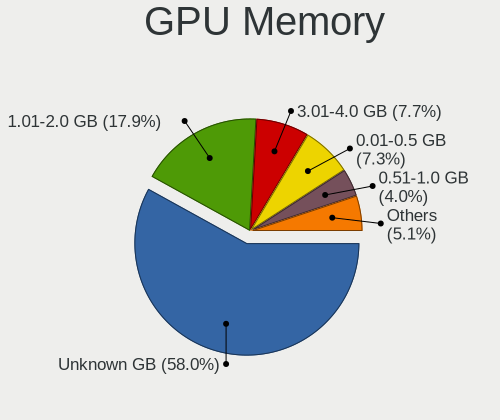

| Size in GB | Computers | Percent |
|------------|-----------|---------|
| Unknown    | 159       | 58.03%  |
| 1.01-2.0   | 49        | 17.88%  |
| 3.01-4.0   | 21        | 7.66%   |
| 0.01-0.5   | 20        | 7.3%    |
| 0.51-1.0   | 11        | 4.01%   |
| 7.01-8.0   | 8         | 2.92%   |
| 5.01-6.0   | 4         | 1.46%   |
| 16.01-24.0 | 1         | 0.36%   |
| 8.01-16.0  | 1         | 0.36%   |

Monitor
-------

Monitor Vendor
--------------

Monitor vendors

| Vendor                  | Computers | Percent |
|-------------------------|-----------|---------|
| Samsung Electronics     | 38        | 13.82%  |
| BOE                     | 34        | 12.36%  |
| AU Optronics            | 33        | 12%     |
| Chimei Innolux          | 24        | 8.73%   |
| LG Display              | 23        | 8.36%   |
| Goldstar                | 15        | 5.45%   |
| Hewlett-Packard         | 10        | 3.64%   |
| Dell                    | 8         | 2.91%   |
| ViewSonic               | 7         | 2.55%   |
| CSO                     | 7         | 2.55%   |
| AOC                     | 7         | 2.55%   |
| Philips                 | 5         | 1.82%   |
| Lenovo                  | 5         | 1.82%   |
| HKC                     | 4         | 1.45%   |
| BenQ                    | 4         | 1.45%   |
| Acer                    | 4         | 1.45%   |
| Iiyama                  | 3         | 1.09%   |
| HannStar                | 3         | 1.09%   |
| ASUSTek Computer        | 3         | 1.09%   |
| Ancor Communications    | 3         | 1.09%   |
| TMX                     | 2         | 0.73%   |
| Sharp                   | 2         | 0.73%   |
| SAC                     | 2         | 0.73%   |
| RTK                     | 2         | 0.73%   |
| InnoLux Display         | 2         | 0.73%   |
| InfoVision              | 2         | 0.73%   |
| Chi Mei Optoelectronics | 2         | 0.73%   |
| Apple                   | 2         | 0.73%   |
| Xiaomi                  | 1         | 0.36%   |
| Unknown                 | 1         | 0.36%   |
| Toshiba                 | 1         | 0.36%   |
| TFC                     | 1         | 0.36%   |
| SKY                     | 1         | 0.36%   |
| Positivo                | 1         | 0.36%   |
| PANDA                   | 1         | 0.36%   |
| Packard Bell            | 1         | 0.36%   |
| MSI                     | 1         | 0.36%   |
| LG Philips              | 1         | 0.36%   |
| JDI                     | 1         | 0.36%   |
| Hisense                 | 1         | 0.36%   |

Monitor Model
-------------

Monitor models

| Model                                                                   | Computers | Percent |
|-------------------------------------------------------------------------|-----------|---------|
| ViewSonic VA2478-H-2 VSC8335 1920x1080 527x296mm 23.8-inch              | 3         | 1.05%   |
| LG Display LCD Monitor LGD0468 1366x768 344x194mm 15.5-inch             | 3         | 1.05%   |
| AU Optronics LCD Monitor AUO26EC 1366x768 344x193mm 15.5-inch           | 3         | 1.05%   |
| AU Optronics LCD Monitor AUO21ED 1920x1080 344x193mm 15.5-inch          | 3         | 1.05%   |
| ViewSonic VA2430-H-3 VSC3A3E 1920x1080 527x296mm 23.8-inch              | 2         | 0.7%    |
| Samsung Electronics LCD Monitor SAM0FF0 3840x2160 1872x1053mm 84.6-inch | 2         | 0.7%    |
| LG Display LCD Monitor LGD0456 1366x768 344x194mm 15.5-inch             | 2         | 0.7%    |
| InnoLux Display P120ZDG-BF4 INX7801 2160x1440 254x169mm 12.0-inch       | 2         | 0.7%    |
| HKC LCD Monitor HKC3CFB 1920x1080 344x194mm 15.5-inch                   | 2         | 0.7%    |
| Goldstar 20EN33 GSM4EE1 1600x900 443x249mm 20.0-inch                    | 2         | 0.7%    |
| Chimei Innolux LCD Monitor CMN14D4 1920x1080 309x173mm 13.9-inch        | 2         | 0.7%    |
| Chimei Innolux LCD Monitor CMN14C4 1366x768 309x173mm 13.9-inch         | 2         | 0.7%    |
| BOE LCD Monitor BOE0877 1920x1080 309x173mm 13.9-inch                   | 2         | 0.7%    |
| BOE LCD Monitor BOE06A4 1366x768 344x194mm 15.5-inch                    | 2         | 0.7%    |
| AU Optronics LCD Monitor AUO71EC 1366x768 344x193mm 15.5-inch           | 2         | 0.7%    |
| AU Optronics LCD Monitor AUO6DA8 2560x1600 301x188mm 14.0-inch          | 2         | 0.7%    |
| AU Optronics LCD Monitor AUO226D 1920x1080 276x155mm 12.5-inch          | 2         | 0.7%    |
| AOC Q27G2WG4 AOC2702 2560x1440 597x336mm 27.0-inch                      | 2         | 0.7%    |
| Xiaomi Mi TV XMD0076 3840x2160 800x450mm 36.1-inch                      | 1         | 0.35%   |
| ViewSonic VX2481-mh VSC3933 1920x1080 527x296mm 23.8-inch               | 1         | 0.35%   |
| ViewSonic VA2431-H-2 VSC3A22 1920x1080 527x296mm 23.8-inch              | 1         | 0.35%   |
| ViewSonic VA2430-FHD VSC4038 1920x1080 527x296mm 23.8-inch              | 1         | 0.35%   |
| Unknown LCD Monitor FFFF 2288x1287 2550x2550mm 142.0-inch               | 1         | 0.35%   |
| Toshiba TV TSB0108 1920x540                                             | 1         | 0.35%   |
| TMX TL160ADMP11-0 TMX1601 2560x1600 350x220mm 16.3-inch                 | 1         | 0.35%   |
| TMX TL140VDXP04-0 TMX1398 1920x1080 309x174mm 14.0-inch                 | 1         | 0.35%   |
| TFC TF2411 TFC0238 1920x1080 527x296mm 23.8-inch                        | 1         | 0.35%   |
| SKY 24X1Q SKY2380 2560x1440 520x290mm 23.4-inch                         | 1         | 0.35%   |
| Sharp LCD Monitor SHP1449 1920x1080 294x165mm 13.3-inch                 | 1         | 0.35%   |
| Sharp LCD Monitor SHP1447 1920x1080 294x165mm 13.3-inch                 | 1         | 0.35%   |
| Samsung Electronics SyncMaster SAM060B 1920x1080 510x290mm 23.1-inch    | 1         | 0.35%   |
| Samsung Electronics SyncMaster SAM0601 1600x900                         | 1         | 0.35%   |
| Samsung Electronics SyncMaster SAM05FF 1600x900 443x249mm 20.0-inch     | 1         | 0.35%   |
| Samsung Electronics SyncMaster SAM0497 1600x900 443x249mm 20.0-inch     | 1         | 0.35%   |
| Samsung Electronics SyncMaster SAM044C 1680x1050 474x296mm 22.0-inch    | 1         | 0.35%   |
| Samsung Electronics SyncMaster SAM02B6 1920x1200 518x324mm 24.1-inch    | 1         | 0.35%   |
| Samsung Electronics SyncMaster SAM0167 1280x1024 338x270mm 17.0-inch    | 1         | 0.35%   |
| Samsung Electronics SMT24A550 SAM07B5 1920x1080 531x299mm 24.0-inch     | 1         | 0.35%   |
| Samsung Electronics S32B80P SAM71F1 3840x2160 700x400mm 31.7-inch       | 1         | 0.35%   |
| Samsung Electronics S24E360 SAM0C10 1920x1080 521x293mm 23.5-inch       | 1         | 0.35%   |

Monitor Resolution
------------------

Monitor screen resolution

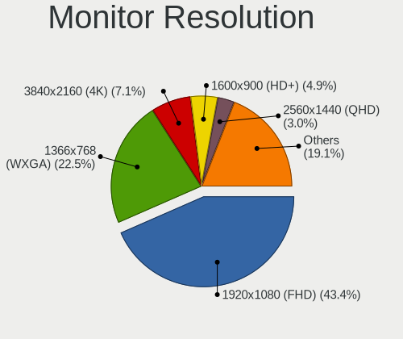

| Resolution         | Computers | Percent |
|--------------------|-----------|---------|
| 1920x1080 (FHD)    | 116       | 43.45%  |
| 1366x768 (WXGA)    | 60        | 22.47%  |
| 3840x2160 (4K)     | 19        | 7.12%   |
| 1600x900 (HD+)     | 13        | 4.87%   |
| 2560x1440 (QHD)    | 8         | 3%      |
| 2560x1600          | 7         | 2.62%   |
| 2160x1440          | 6         | 2.25%   |
| 1680x1050 (WSXGA+) | 4         | 1.5%    |
| 3840x1080          | 3         | 1.12%   |
| 3000x2000          | 3         | 1.12%   |
| 2880x1800          | 3         | 1.12%   |
| 1920x1200 (WUXGA)  | 3         | 1.12%   |
| 1440x900 (WXGA+)   | 3         | 1.12%   |
| 3440x1440          | 2         | 0.75%   |
| 2288x1287          | 2         | 0.75%   |
| 1920x540           | 2         | 0.75%   |
| 1360x768           | 2         | 0.75%   |
| 1280x1024 (SXGA)   | 2         | 0.75%   |
| Unknown            | 2         | 0.75%   |
| 3200x2000          | 1         | 0.37%   |
| 3200x1800 (QHD+)   | 1         | 0.37%   |
| 2880x1920          | 1         | 0.37%   |
| 2736x1824          | 1         | 0.37%   |
| 2160x1350          | 1         | 0.37%   |
| 1680x945           | 1         | 0.37%   |
| 1280x800 (WXGA)    | 1         | 0.37%   |

Monitor Diagonal
----------------

Diagonal size in inches

| Inches  | Computers | Percent |
|---------|-----------|---------|
| 15      | 66        | 23.74%  |
| 13      | 37        | 13.31%  |
| 23      | 30        | 10.79%  |
| 14      | 29        | 10.43%  |
| 27      | 15        | 5.4%    |
| 24      | 13        | 4.68%   |
| 21      | 12        | 4.32%   |
| Unknown | 12        | 4.32%   |
| 12      | 7         | 2.52%   |
| 31      | 6         | 2.16%   |
| 18      | 6         | 2.16%   |
| 16      | 6         | 2.16%   |
| 20      | 5         | 1.8%    |
| 17      | 5         | 1.8%    |
| 84      | 4         | 1.44%   |
| 22      | 4         | 1.44%   |
| 19      | 4         | 1.44%   |
| 11      | 4         | 1.44%   |
| 32      | 3         | 1.08%   |
| 25      | 2         | 0.72%   |
| 142     | 1         | 0.36%   |
| 72      | 1         | 0.36%   |
| 65      | 1         | 0.36%   |
| 54      | 1         | 0.36%   |
| 40      | 1         | 0.36%   |
| 34      | 1         | 0.36%   |
| 28      | 1         | 0.36%   |
| 10      | 1         | 0.36%   |

Monitor Width
-------------

Physical width

| Width in mm    | Computers | Percent |
|----------------|-----------|---------|
| 301-350        | 118       | 43.22%  |
| 501-600        | 58        | 21.25%  |
| 401-500        | 29        | 10.62%  |
| 201-300        | 29        | 10.62%  |
| Unknown        | 12        | 4.4%    |
| 601-700        | 7         | 2.56%   |
| 351-400        | 7         | 2.56%   |
| 1501-2000      | 5         | 1.83%   |
| 701-800        | 4         | 1.47%   |
| 1001-1500      | 2         | 0.73%   |
| More than 2000 | 1         | 0.37%   |
| 801-900        | 1         | 0.37%   |

Aspect Ratio
------------

Proportional relationship between the width and the height

| Ratio   | Computers | Percent |
|---------|-----------|---------|
| 16/9    | 207       | 81.18%  |
| 16/10   | 24        | 9.41%   |
| 3/2     | 11        | 4.31%   |
| Unknown | 10        | 3.92%   |
| 5/4     | 1         | 0.39%   |
| 21/9    | 1         | 0.39%   |
| 1.00    | 1         | 0.39%   |

Monitor Area
------------

Area in inch

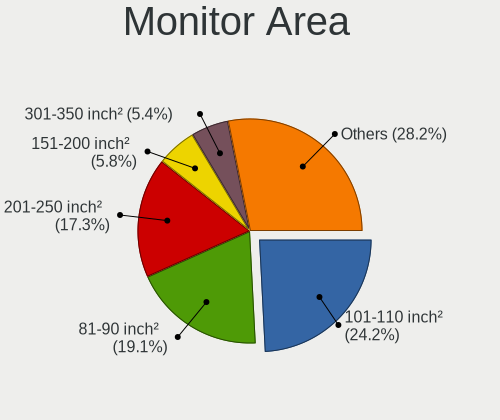

| Area in inch | Computers | Percent |
|----------------|-----------|---------|
| 101-110        | 67        | 24.19%  |
| 81-90          | 53        | 19.13%  |
| 201-250        | 48        | 17.33%  |
| 151-200        | 16        | 5.78%   |
| 301-350        | 15        | 5.42%   |
| 71-80          | 13        | 4.69%   |
| Unknown        | 12        | 4.33%   |
| 351-500        | 11        | 3.97%   |
| More than 1000 | 8         | 2.89%   |
| 61-70          | 8         | 2.89%   |
| 251-300        | 6         | 2.17%   |
| 141-150        | 6         | 2.17%   |
| 111-120        | 5         | 1.81%   |
| 51-60          | 3         | 1.08%   |
| 121-130        | 3         | 1.08%   |
| 41-50          | 1         | 0.36%   |
| 131-140        | 1         | 0.36%   |
| 501-1000       | 1         | 0.36%   |

Pixel Density
-------------

Pixels per inch

| Density       | Computers | Percent |
|---------------|-----------|---------|
| 101-120       | 80        | 29.63%  |
| 51-100        | 77        | 28.52%  |
| 121-160       | 62        | 22.96%  |
| 161-240       | 27        | 10%     |
| Unknown       | 12        | 4.44%   |
| More than 240 | 8         | 2.96%   |
| 1-50          | 4         | 1.48%   |

Multiple Monitors
-----------------

Total monitors connected

| Total | Computers | Percent |
|-------|-----------|---------|
| 1     | 216       | 79.7%   |
| 2     | 41        | 15.13%  |
| 0     | 12        | 4.43%   |
| 3     | 2         | 0.74%   |

Network
-------

Net Controller Vendor
---------------------

Controller vendors

| Vendor                          | Computers | Percent |
|---------------------------------|-----------|---------|
| Realtek Semiconductor           | 166       | 42.89%  |
| Intel                           | 107       | 27.65%  |
| Qualcomm Atheros                | 46        | 11.89%  |
| Broadcom                        | 13        | 3.36%   |
| MediaTek                        | 9         | 2.33%   |
| Xiaomi                          | 5         | 1.29%   |
| TP-Link                         | 5         | 1.29%   |
| Marvell Technology Group        | 5         | 1.29%   |
| Broadcom Limited                | 5         | 1.29%   |
| Ralink Technology               | 3         | 0.78%   |
| Huawei Technologies             | 3         | 0.78%   |
| Ralink                          | 2         | 0.52%   |
| Nvidia                          | 2         | 0.52%   |
| Loongson Technology             | 2         | 0.52%   |
| ICS Advent                      | 2         | 0.52%   |
| ASIX Electronics                | 2         | 0.52%   |
| Unknown                         | 1         | 0.26%   |
| Shenzhen Goodix Technology      | 1         | 0.26%   |
| Samsung Electronics             | 1         | 0.26%   |
| Qualcomm Atheros Communications | 1         | 0.26%   |
| OPPO Electronics                | 1         | 0.26%   |
| NXP Semiconductors              | 1         | 0.26%   |
| NetGear                         | 1         | 0.26%   |
| IMC Networks                    | 1         | 0.26%   |
| Hewlett-Packard                 | 1         | 0.26%   |
| Aquantia                        | 1         | 0.26%   |

Net Controller Model
--------------------

Controller models

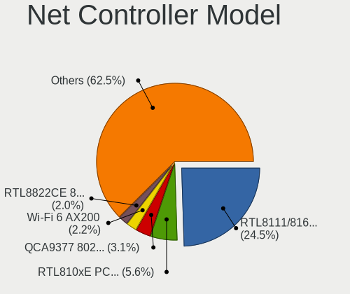

| Model                                                                  | Computers | Percent |
|------------------------------------------------------------------------|-----------|---------|
| Realtek RTL8111/8168/8211/8411 PCI Express Gigabit Ethernet Controller | 109       | 24.49%  |
| Realtek RTL810xE PCI Express Fast Ethernet controller                  | 25        | 5.62%   |
| Qualcomm Atheros QCA9377 802.11ac Wireless Network Adapter             | 14        | 3.15%   |
| Intel Wi-Fi 6 AX200                                                    | 10        | 2.25%   |
| Realtek RTL8822CE 802.11ac PCIe Wireless Network Adapter               | 9         | 2.02%   |
| Qualcomm Atheros AR9485 Wireless Network Adapter                       | 9         | 2.02%   |
| Qualcomm Atheros QCA9565 / AR9565 Wireless Network Adapter             | 8         | 1.8%    |
| Intel Wireless 3165                                                    | 8         | 1.8%    |
| Intel 82579LM Gigabit Network Connection (Lewisville)                  | 7         | 1.57%   |
| Realtek RTL8723BE PCIe Wireless Network Adapter                        | 6         | 1.35%   |
| Realtek RTL8125 2.5GbE Controller                                      | 6         | 1.35%   |
| Intel Wi-Fi 6 AX201                                                    | 6         | 1.35%   |
| Intel Comet Lake PCH-LP CNVi WiFi                                      | 6         | 1.35%   |
| Realtek RTL8821CE 802.11ac PCIe Wireless Network Adapter               | 5         | 1.12%   |
| Realtek RTL8153 Gigabit Ethernet Adapter                               | 5         | 1.12%   |
| Intel Cannon Point-LP CNVi [Wireless-AC]                               | 5         | 1.12%   |
| Intel Alder Lake-P PCH CNVi WiFi                                       | 5         | 1.12%   |
| Realtek RTL8188EE Wireless Network Adapter                             | 4         | 0.9%    |
| Qualcomm Atheros QCA6174 802.11ac Wireless Network Adapter             | 4         | 0.9%    |
| Intel Wireless 8265 / 8275                                             | 4         | 0.9%    |
| Intel Wireless 7260                                                    | 4         | 0.9%    |
| Intel Ethernet Connection (12) I219-V                                  | 4         | 0.9%    |
| Intel Centrino Advanced-N 6205 [Taylor Peak]                           | 4         | 0.9%    |
| Xiaomi Mi/Redmi series (RNDIS)                                         | 3         | 0.67%   |
| Realtek RTL8723DE Wireless Network Adapter                             | 3         | 0.67%   |
| Qualcomm Atheros AR9462 Wireless Network Adapter                       | 3         | 0.67%   |
| MediaTek MT7921 802.11ax PCI Express Wireless Network Adapter          | 3         | 0.67%   |
| Intel Wireless 7265                                                    | 3         | 0.67%   |
| Intel Wireless 3160                                                    | 3         | 0.67%   |
| Intel WiFi Link 5100                                                   | 3         | 0.67%   |
| Intel Raptor Lake-S PCH CNVi WiFi                                      | 3         | 0.67%   |
| Intel Dual Band Wireless-AC 3165 Plus Bluetooth                        | 3         | 0.67%   |
| Realtek RTL88x2bu [AC1200 Techkey]                                     | 2         | 0.45%   |
| Realtek RTL8852BE PCIe 802.11ax Wireless Network Controller            | 2         | 0.45%   |
| Realtek RTL8822BE 802.11a/b/g/n/ac WiFi adapter                        | 2         | 0.45%   |
| Realtek RTL8821AE 802.11ac PCIe Wireless Network Adapter               | 2         | 0.45%   |
| Realtek RTL8191SEvA Wireless LAN Controller                            | 2         | 0.45%   |
| Realtek RTL8188GU 802.11n WLAN Adapter (After Modeswitch)              | 2         | 0.45%   |
| Realtek RTL8188EUS 802.11n Wireless Network Adapter                    | 2         | 0.45%   |
| Realtek RTL8188CE 802.11b/g/n WiFi Adapter                             | 2         | 0.45%   |

Wireless Vendor
---------------

Wireless vendors

| Vendor                          | Computers | Percent |
|---------------------------------|-----------|---------|
| Intel                           | 86        | 40.19%  |
| Realtek Semiconductor           | 50        | 23.36%  |
| Qualcomm Atheros                | 43        | 20.09%  |
| MediaTek                        | 8         | 3.74%   |
| Broadcom                        | 7         | 3.27%   |
| TP-Link                         | 5         | 2.34%   |
| Broadcom Limited                | 5         | 2.34%   |
| Ralink Technology               | 3         | 1.4%    |
| Ralink                          | 2         | 0.93%   |
| Xiaomi                          | 1         | 0.47%   |
| Qualcomm Atheros Communications | 1         | 0.47%   |
| NetGear                         | 1         | 0.47%   |
| Marvell Technology Group        | 1         | 0.47%   |
| IMC Networks                    | 1         | 0.47%   |

Wireless Model
--------------

Wireless models

| Model                                                          | Computers | Percent |
|----------------------------------------------------------------|-----------|---------|
| Qualcomm Atheros QCA9377 802.11ac Wireless Network Adapter     | 14        | 6.51%   |
| Intel Wi-Fi 6 AX200                                            | 10        | 4.65%   |
| Realtek RTL8822CE 802.11ac PCIe Wireless Network Adapter       | 9         | 4.19%   |
| Qualcomm Atheros AR9485 Wireless Network Adapter               | 9         | 4.19%   |
| Qualcomm Atheros QCA9565 / AR9565 Wireless Network Adapter     | 8         | 3.72%   |
| Intel Wireless 3165                                            | 8         | 3.72%   |
| Realtek RTL8723BE PCIe Wireless Network Adapter                | 6         | 2.79%   |
| Intel Wi-Fi 6 AX201                                            | 6         | 2.79%   |
| Intel Comet Lake PCH-LP CNVi WiFi                              | 6         | 2.79%   |
| Realtek RTL8821CE 802.11ac PCIe Wireless Network Adapter       | 5         | 2.33%   |
| Intel Cannon Point-LP CNVi [Wireless-AC]                       | 5         | 2.33%   |
| Intel Alder Lake-P PCH CNVi WiFi                               | 5         | 2.33%   |
| Realtek RTL8188EE Wireless Network Adapter                     | 4         | 1.86%   |
| Qualcomm Atheros QCA6174 802.11ac Wireless Network Adapter     | 4         | 1.86%   |
| Intel Wireless 8265 / 8275                                     | 4         | 1.86%   |
| Intel Wireless 7260                                            | 4         | 1.86%   |
| Intel Centrino Advanced-N 6205 [Taylor Peak]                   | 4         | 1.86%   |
| Realtek RTL8723DE Wireless Network Adapter                     | 3         | 1.4%    |
| Qualcomm Atheros AR9462 Wireless Network Adapter               | 3         | 1.4%    |
| MediaTek MT7921 802.11ax PCI Express Wireless Network Adapter  | 3         | 1.4%    |
| Intel Wireless 7265                                            | 3         | 1.4%    |
| Intel Wireless 3160                                            | 3         | 1.4%    |
| Intel WiFi Link 5100                                           | 3         | 1.4%    |
| Intel Raptor Lake-S PCH CNVi WiFi                              | 3         | 1.4%    |
| Intel Dual Band Wireless-AC 3165 Plus Bluetooth                | 3         | 1.4%    |
| Realtek RTL88x2bu [AC1200 Techkey]                             | 2         | 0.93%   |
| Realtek RTL8852BE PCIe 802.11ax Wireless Network Controller    | 2         | 0.93%   |
| Realtek RTL8822BE 802.11a/b/g/n/ac WiFi adapter                | 2         | 0.93%   |
| Realtek RTL8821AE 802.11ac PCIe Wireless Network Adapter       | 2         | 0.93%   |
| Realtek RTL8191SEvA Wireless LAN Controller                    | 2         | 0.93%   |
| Realtek RTL8188GU 802.11n WLAN Adapter (After Modeswitch)      | 2         | 0.93%   |
| Realtek RTL8188EUS 802.11n Wireless Network Adapter            | 2         | 0.93%   |
| Realtek RTL8188CE 802.11b/g/n WiFi Adapter                     | 2         | 0.93%   |
| Ralink MT7601U Wireless Adapter                                | 2         | 0.93%   |
| Qualcomm Atheros AR928X Wireless Network Adapter (PCI-Express) | 2         | 0.93%   |
| Qualcomm Atheros AR9287 Wireless Network Adapter (PCI-Express) | 2         | 0.93%   |
| MediaTek MT7922 802.11ax PCI Express Wireless Network Adapter  | 2         | 0.93%   |
| Intel Wireless 8260                                            | 2         | 0.93%   |
| Intel Wi-Fi 6E(802.11ax) AX210/AX1675* 2x2 [Typhoon Peak]      | 2         | 0.93%   |
| Intel Raptor Lake PCH CNVi WiFi                                | 2         | 0.93%   |

Ethernet Vendor
---------------

Ethernet vendors

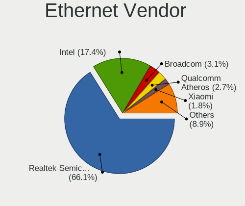

| Vendor                   | Computers | Percent |
|--------------------------|-----------|---------|
| Realtek Semiconductor    | 148       | 66.07%  |
| Intel                    | 39        | 17.41%  |
| Broadcom                 | 7         | 3.13%   |
| Qualcomm Atheros         | 6         | 2.68%   |
| Xiaomi                   | 4         | 1.79%   |
| Marvell Technology Group | 4         | 1.79%   |
| Huawei Technologies      | 3         | 1.34%   |
| Nvidia                   | 2         | 0.89%   |
| Loongson Technology      | 2         | 0.89%   |
| ICS Advent               | 2         | 0.89%   |
| ASIX Electronics         | 2         | 0.89%   |
| Samsung Electronics      | 1         | 0.45%   |
| OPPO Electronics         | 1         | 0.45%   |
| MediaTek                 | 1         | 0.45%   |
| Hewlett-Packard          | 1         | 0.45%   |
| Aquantia                 | 1         | 0.45%   |

Ethernet Model
--------------

Ethernet models

| Model                                                                  | Computers | Percent |
|------------------------------------------------------------------------|-----------|---------|
| Realtek RTL8111/8168/8211/8411 PCI Express Gigabit Ethernet Controller | 109       | 48.02%  |
| Realtek RTL810xE PCI Express Fast Ethernet controller                  | 25        | 11.01%  |
| Intel 82579LM Gigabit Network Connection (Lewisville)                  | 7         | 3.08%   |
| Realtek RTL8125 2.5GbE Controller                                      | 6         | 2.64%   |
| Realtek RTL8153 Gigabit Ethernet Adapter                               | 5         | 2.2%    |
| Intel Ethernet Connection (12) I219-V                                  | 4         | 1.76%   |
| Xiaomi Mi/Redmi series (RNDIS)                                         | 3         | 1.32%   |
| Realtek RTL-8100/8101L/8139 PCI Fast Ethernet Adapter                  | 2         | 0.88%   |
| Qualcomm Atheros AR8131 Gigabit Ethernet                               | 2         | 0.88%   |
| Marvell Group 88E8055 PCI-E Gigabit Ethernet Controller                | 2         | 0.88%   |
| Loongson Gigabit Ethernet Controller                                   | 2         | 0.88%   |
| Intel I211 Gigabit Network Connection                                  | 2         | 0.88%   |
| Intel Ethernet Controller I225-V                                       | 2         | 0.88%   |
| Intel Ethernet Connection (6) I219-V                                   | 2         | 0.88%   |
| Intel Ethernet Connection (2) I219-V                                   | 2         | 0.88%   |
| Intel 82575EB Gigabit Network Connection                               | 2         | 0.88%   |
| Intel 82567LM-3 Gigabit Network Connection                             | 2         | 0.88%   |
| Huawei FOA-LX9                                                         | 2         | 0.88%   |
| Broadcom NetLink BCM57785 Gigabit Ethernet PCIe                        | 2         | 0.88%   |
| Broadcom NetLink BCM57781 Gigabit Ethernet PCIe                        | 2         | 0.88%   |
| Xiaomi Mi/Redmi series (RNDIS + ADB)                                   | 1         | 0.44%   |
| Samsung Galaxy series, misc. (tethering mode)                          | 1         | 0.44%   |
| Realtek Killer E2600 GbE Controller                                    | 1         | 0.44%   |
| Qualcomm Atheros QCA8172 Fast Ethernet                                 | 1         | 0.44%   |
| Qualcomm Atheros QCA8171 Gigabit Ethernet                              | 1         | 0.44%   |
| Qualcomm Atheros Killer E2400 Gigabit Ethernet Controller              | 1         | 0.44%   |
| Qualcomm Atheros AR8161 Gigabit Ethernet                               | 1         | 0.44%   |
| OPPO OnePlus Nord 4                                                    | 1         | 0.44%   |
| Nvidia MCP79 Ethernet                                                  | 1         | 0.44%   |
| Nvidia MCP61 Ethernet                                                  | 1         | 0.44%   |
| MediaTek Infinix SMART 5                                               | 1         | 0.44%   |
| Marvell Group 88E8071 PCI-E Gigabit Ethernet Controller                | 1         | 0.44%   |
| Marvell Group 88E8056 PCI-E Gigabit Ethernet Controller                | 1         | 0.44%   |
| Marvell Group 88E8001 Gigabit Ethernet Controller                      | 1         | 0.44%   |
| Intel Ethernet Controller I226-V                                       | 1         | 0.44%   |
| Intel Ethernet Controller I225-LM                                      | 1         | 0.44%   |
| Intel Ethernet Connection I219-LM                                      | 1         | 0.44%   |
| Intel Ethernet Connection I218-V                                       | 1         | 0.44%   |
| Intel Ethernet Connection I217-V                                       | 1         | 0.44%   |
| Intel Ethernet Connection I217-LM                                      | 1         | 0.44%   |

Net Controller Kind
-------------------

Ethernet, WiFi or modem

| Kind     | Computers | Percent |
|----------|-----------|---------|
| Ethernet | 209       | 49.76%  |
| WiFi     | 208       | 49.52%  |
| Unknown  | 2         | 0.48%   |
| Modem    | 1         | 0.24%   |

Used Controller
---------------

Currently used network controller

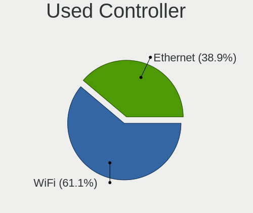

| Kind     | Computers | Percent |
|----------|-----------|---------|
| WiFi     | 162       | 61.13%  |
| Ethernet | 103       | 38.87%  |

NICs
----

Total network controllers on board

| Total | Computers | Percent |
|-------|-----------|---------|
| 2     | 136       | 50.56%  |
| 1     | 114       | 42.38%  |
| 0     | 12        | 4.46%   |
| 3     | 5         | 1.86%   |
| 4     | 2         | 0.74%   |

IPv6
----

IPv6 vs IPv4

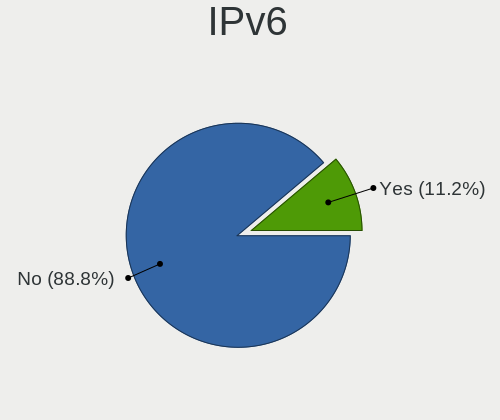

| Used | Computers | Percent |
|------|-----------|---------|
| No   | 239       | 88.85%  |
| Yes  | 30        | 11.15%  |

Bluetooth
---------

Bluetooth Vendor
----------------

Controller vendors

| Vendor                          | Computers | Percent |
|---------------------------------|-----------|---------|
| Intel                           | 76        | 42.7%   |
| Qualcomm Atheros Communications | 23        | 12.92%  |
| Realtek Semiconductor           | 20        | 11.24%  |
| Cambridge Silicon Radio         | 13        | 7.3%    |
| Foxconn / Hon Hai               | 11        | 6.18%   |
| Broadcom                        | 8         | 4.49%   |
| IMC Networks                    | 6         | 3.37%   |
| Realtek                         | 5         | 2.81%   |
| Lite-On Technology              | 5         | 2.81%   |
| Apple                           | 3         | 1.69%   |
| MediaTek                        | 2         | 1.12%   |
| Toshiba                         | 1         | 0.56%   |
| Ralink Technology               | 1         | 0.56%   |
| Marvell Semiconductor           | 1         | 0.56%   |
| Dynex                           | 1         | 0.56%   |
| Dell                            | 1         | 0.56%   |
| ASUSTek Computer                | 1         | 0.56%   |

Bluetooth Model
---------------

Controller models

| Model                                                                               | Computers | Percent |
|-------------------------------------------------------------------------------------|-----------|---------|
| Intel Bluetooth wireless interface                                                  | 27        | 15.17%  |
| Qualcomm Atheros  Bluetooth Device                                                  | 16        | 8.99%   |
| Intel AX201 Bluetooth                                                               | 15        | 8.43%   |
| Cambridge Silicon Radio Bluetooth Dongle (HCI mode)                                 | 13        | 7.3%    |
| Intel Bluetooth 9460/9560 Jefferson Peak (JfP)                                      | 12        | 6.74%   |
| Intel AX200 Bluetooth                                                               | 10        | 5.62%   |
| Realtek Bluetooth Radio                                                             | 9         | 5.06%   |
| Realtek  Bluetooth 4.2 Adapter                                                      | 5         | 2.81%   |
| Realtek Bluetooth Radio                                                             | 5         | 2.81%   |
| Intel AX211 Bluetooth                                                               | 5         | 2.81%   |
| Broadcom BCM2045B (BDC-2.1)                                                         | 4         | 2.25%   |
| Realtek 802.11ac WLAN Adapter                                                       | 3         | 1.69%   |
| Qualcomm Atheros AR3012 Bluetooth 4.0                                               | 3         | 1.69%   |
| Lite-On Bluetooth Device                                                            | 3         | 1.69%   |
| Intel Centrino Bluetooth Wireless Transceiver                                       | 3         | 1.69%   |
| Qualcomm Atheros QCA61x4 Bluetooth 4.0                                              | 2         | 1.12%   |
| Qualcomm Atheros Bluetooth USB Host Controller                                      | 2         | 1.12%   |
| Lite-On Atheros AR3012 Bluetooth                                                    | 2         | 1.12%   |
| Intel Wireless-AC 3168 Bluetooth                                                    | 2         | 1.12%   |
| IMC Networks Wireless_Device                                                        | 2         | 1.12%   |
| IMC Networks Bluetooth Device                                                       | 2         | 1.12%   |
| Foxconn / Hon Hai Wireless_Device                                                   | 2         | 1.12%   |
| Foxconn / Hon Hai Bluetooth USB Host Controller                                     | 2         | 1.12%   |
| Foxconn / Hon Hai Bluetooth Device                                                  | 2         | 1.12%   |
| Foxconn / Hon Hai BCM43142A0                                                        | 2         | 1.12%   |
| Broadcom HP Portable SoftSailing                                                    | 2         | 1.12%   |
| Toshiba Bluetooth Radio                                                             | 1         | 0.56%   |
| Realtek RTL8822BE Bluetooth 4.2 Adapter                                             | 1         | 0.56%   |
| Realtek RTL8821A Bluetooth                                                          | 1         | 0.56%   |
| Realtek RTL8723B Bluetooth                                                          | 1         | 0.56%   |
| Ralink Motorola BC4 Bluetooth 3.0+HS Adapter                                        | 1         | 0.56%   |
| MediaTek Wireless_Device                                                            | 1         | 0.56%   |
| MediaTek BT                                                                         | 1         | 0.56%   |
| Marvell Bluetooth and Wireless LAN Composite                                        | 1         | 0.56%   |
| Intel Wireless-AC 9260 Bluetooth Adapter                                            | 1         | 0.56%   |
| Intel AX210 Bluetooth                                                               | 1         | 0.56%   |
| IMC Networks Bluetooth Radio                                                        | 1         | 0.56%   |
| IMC Networks Atheros AR3012 Bluetooth 4.0 Adapter                                   | 1         | 0.56%   |
| Foxconn / Hon Hai MediaTek Bluetooth Adapter                                        | 1         | 0.56%   |
| Foxconn / Hon Hai Foxconn T77H114 BCM2070 [Single-Chip Bluetooth 2.1 + EDR Adapter] | 1         | 0.56%   |

Sound
-----

Sound Vendor
------------

Sound card vendors

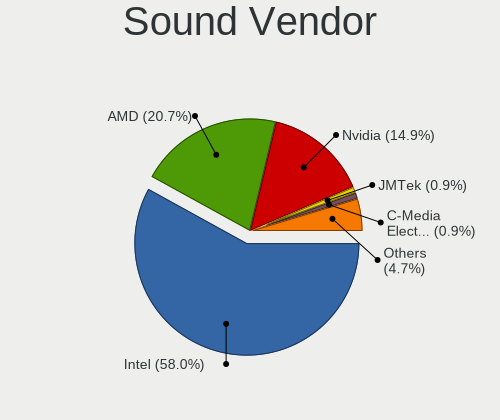

| Vendor                                       | Computers | Percent |
|----------------------------------------------|-----------|---------|
| Intel                                        | 199       | 58.02%  |
| AMD                                          | 71        | 20.7%   |
| Nvidia                                       | 51        | 14.87%  |
| JMTek                                        | 3         | 0.87%   |
| C-Media Electronics                          | 3         | 0.87%   |
| Zoran Co. Personal Media Division (Nogatech) | 2         | 0.58%   |
| Zhaoxin                                      | 2         | 0.58%   |
| Realtek Semiconductor                        | 2         | 0.58%   |
| Loongson Technology                          | 2         | 0.58%   |
| ASUSTek Computer                             | 2         | 0.58%   |
| XMOS                                         | 1         | 0.29%   |
| Phytium Technology                           | 1         | 0.29%   |
| Microdia                                     | 1         | 0.29%   |
| Generalplus Technology                       | 1         | 0.29%   |
| Creative Technology                          | 1         | 0.29%   |
| BEHRINGER International                      | 1         | 0.29%   |

Sound Model
-----------

Sound card models

| Model                                                                             | Computers | Percent |
|-----------------------------------------------------------------------------------|-----------|---------|
| Intel Sunrise Point-LP HD Audio                                                   | 27        | 6.52%   |
| Intel 7 Series/C216 Chipset Family High Definition Audio Controller               | 27        | 6.52%   |
| AMD Family 17h/19h/1ah HD Audio Controller                                        | 26        | 6.28%   |
| Intel 6 Series/C200 Series Chipset Family High Definition Audio Controller        | 14        | 3.38%   |
| Intel Haswell-ULT HD Audio Controller                                             | 12        | 2.9%    |
| Intel 8 Series HD Audio Controller                                                | 12        | 2.9%    |
| AMD Renoir Radeon High Definition Audio Controller                                | 12        | 2.9%    |
| Intel Wildcat Point-LP High Definition Audio Controller                           | 11        | 2.66%   |
| Intel Broadwell-U Audio Controller                                                | 11        | 2.66%   |
| AMD Oland/Hainan/Cape Verde/Pitcairn HDMI Audio [Radeon HD 7000 Series]           | 11        | 2.66%   |
| Intel 8 Series/C220 Series Chipset High Definition Audio Controller               | 10        | 2.42%   |
| Intel Comet Lake PCH-V cAVS                                                       | 9         | 2.17%   |
| AMD Raven/Raven2/Fenghuang HDMI/DP Audio Controller                               | 9         | 2.17%   |
| Intel Celeron/Pentium Silver Processor High Definition Audio                      | 8         | 1.93%   |
| Intel Cannon Point-LP High Definition Audio Controller                            | 8         | 1.93%   |
| Intel 82801I (ICH9 Family) HD Audio Controller                                    | 8         | 1.93%   |
| Intel Tiger Lake-LP Smart Sound Technology Audio Controller                       | 7         | 1.69%   |
| Intel Cannon Lake PCH cAVS                                                        | 7         | 1.69%   |
| AMD Starship/Matisse HD Audio Controller                                          | 7         | 1.69%   |
| Intel Comet Lake PCH-LP cAVS                                                      | 6         | 1.45%   |
| AMD FCH Azalia Controller                                                         | 6         | 1.45%   |
| Nvidia TU107 GeForce GTX 1650 High Definition Audio Controller                    | 5         | 1.21%   |
| Intel Alder Lake PCH-P High Definition Audio Controller                           | 5         | 1.21%   |
| Intel 100 Series/C230 Series Chipset Family HD Audio Controller                   | 5         | 1.21%   |
| AMD Kabini HDMI/DP Audio                                                          | 5         | 1.21%   |
| Nvidia GP107GL High Definition Audio Controller                                   | 4         | 0.97%   |
| Nvidia GF119 HDMI Audio Controller                                                | 4         | 0.97%   |
| Intel Xeon E3-1200 v3/4th Gen Core Processor HD Audio Controller                  | 4         | 0.97%   |
| Intel 82801JI (ICH10 Family) HD Audio Controller                                  | 4         | 0.97%   |
| Intel 200 Series PCH HD Audio                                                     | 4         | 0.97%   |
| AMD SBx00 Azalia (Intel HDA)                                                      | 4         | 0.97%   |
| AMD Caicos HDMI Audio [Radeon HD 6450 / 7450/8450/8490 OEM / R5 230/235/235X OEM] | 4         | 0.97%   |
| Nvidia GP106 High Definition Audio Controller                                     | 3         | 0.72%   |
| Nvidia GM204 High Definition Audio Controller                                     | 3         | 0.72%   |
| Nvidia GK208 HDMI/DP Audio Controller                                             | 3         | 0.72%   |
| Nvidia GK107 HDMI Audio Controller                                                | 3         | 0.72%   |
| Nvidia GF116 High Definition Audio Controller                                     | 3         | 0.72%   |
| Nvidia GA107 High Definition Audio Controller                                     | 3         | 0.72%   |
| Nvidia GA106 High Definition Audio Controller                                     | 3         | 0.72%   |
| Nvidia GA104 High Definition Audio Controller                                     | 3         | 0.72%   |

Memory
------

Memory Vendor
-------------

Memory module vendors

| Vendor                             | Computers | Percent |
|------------------------------------|-----------|---------|
| Samsung Electronics                | 38        | 21.35%  |
| SK hynix                           | 35        | 19.66%  |
| Kingston                           | 19        | 10.67%  |
| Unknown                            | 17        | 9.55%   |
| Micron Technology                  | 14        | 7.87%   |
| Ramaxel Technology                 | 6         | 3.37%   |
| Crucial                            | 6         | 3.37%   |
| Unknown                            | 5         | 2.81%   |
| Unknown (ABCD)                     | 4         | 2.25%   |
| Smart                              | 4         | 2.25%   |
| Nanya Technology                   | 4         | 2.25%   |
| A-DATA Technology                  | 4         | 2.25%   |
| G.Skill                            | 3         | 1.69%   |
| Corsair                            | 3         | 1.69%   |
| UniIC                              | 2         | 1.12%   |
| Team                               | 2         | 1.12%   |
| Unknown (07FB)                     | 1         | 0.56%   |
| Smart Brazil                       | 1         | 0.56%   |
| MTASE                              | 1         | 0.56%   |
| Lenovo                             | 1         | 0.56%   |
| Kingmax                            | 1         | 0.56%   |
| KINGBANK                           | 1         | 0.56%   |
| Kimtigo Semiconductor (HK) Limited | 1         | 0.56%   |
| JEDEC ID: 0000h                    | 1         | 0.56%   |
| Elpida                             | 1         | 0.56%   |
| CSX                                | 1         | 0.56%   |
| ChangXin Memory                    | 1         | 0.56%   |
| Apacer                             | 1         | 0.56%   |

Memory Model
------------

Memory module models

| Model                                                            | Computers | Percent |
|------------------------------------------------------------------|-----------|---------|
| Unknown                                                          | 5         | 2.63%   |
| Unknown (ABCD) RAM 123456789012345678 2GB SODIMM LPDDR3 2400MT/s | 4         | 2.11%   |
| SK hynix RAM HMAA1GS6CMR6N-VK 8GB Row Of Chips DDR4 2667MT/s     | 3         | 1.58%   |
| Kingston RAM TF32D4U2S1MEH-8 8192MB DIMM DDR4 3200MT/s           | 3         | 1.58%   |
| Unknown RAM Module 2048MB SODIMM DDR3 1333MT/s                   | 2         | 1.05%   |
| UniIC RAM SCC08GU03H1F1C-26V 8GB DIMM DDR4 2666MT/s              | 2         | 1.05%   |
| Smart RAM SH564128FJ8NWRNSQG 4GB SODIMM DDR3 1600MT/s            | 2         | 1.05%   |
| SK hynix RAM Module 8192MB SODIMM DDR4 2133MT/s                  | 2         | 1.05%   |
| SK hynix RAM HMT451S6BFR8A-PB 4096MB SODIMM DDR3 1600MT/s        | 2         | 1.05%   |
| SK hynix RAM HMT351S6CFR8C-PB 4GB SODIMM DDR3 1600MT/s           | 2         | 1.05%   |
| SK hynix RAM HMA81GS6AFR8N-UH 8GB SODIMM DDR4 2400MT/s           | 2         | 1.05%   |
| Samsung RAM M471B5173QH0-YK0 4GB SODIMM DDR3 1600MT/s            | 2         | 1.05%   |
| Samsung RAM M471B5173DB0-YK0 4GB SODIMM DDR3 1600MT/s            | 2         | 1.05%   |
| Samsung RAM M471B1G73DB0-YK0 8GB SODIMM DDR3 1600MT/s            | 2         | 1.05%   |
| Samsung RAM M471A5244CB0-CTD 4GB SODIMM DDR4 3266MT/s            | 2         | 1.05%   |
| Samsung RAM M471A1K43CB1-CRC 8GB SODIMM DDR4 2667MT/s            | 2         | 1.05%   |
| Samsung RAM K4EBE304ED-EGCG 8GB Row Of Chips LPDDR3 2133MT/s     | 2         | 1.05%   |
| Micron RAM 4ATF51264HZ-2G6E1 4GB SODIMM DDR4 2667MT/s            | 2         | 1.05%   |
| Micron RAM 4ATF1G64HZ-3G2E2 8GB SODIMM DDR4 3200MT/s             | 2         | 1.05%   |
| Micron RAM 4ATF1G64HZ-3G2E1 8GB SODIMM DDR4 3200MT/s             | 2         | 1.05%   |
| Kingston RAM KHX3200C16D4/16GX 16GB DIMM DDR4 3600MT/s           | 2         | 1.05%   |
| Unknown RAM Module 8GB SODIMM DDR3 1600MT/s                      | 1         | 0.53%   |
| Unknown RAM Module 8GB DIMM DDR4 2667MT/s                        | 1         | 0.53%   |
| Unknown RAM Module 8192MB SODIMM DDR3 1600MT/s                   | 1         | 0.53%   |
| Unknown RAM Module 4GB SODIMM LPDDR3 1600MT/s                    | 1         | 0.53%   |
| Unknown RAM Module 4096MB SODIMM DDR4 2667MT/s                   | 1         | 0.53%   |
| Unknown RAM Module 4096MB SODIMM DDR3 1333MT/s                   | 1         | 0.53%   |
| Unknown RAM Module 4096MB SODIMM DDR3                            | 1         | 0.53%   |
| Unknown RAM Module 4096MB DIMM DDR3 1067MT/s                     | 1         | 0.53%   |
| Unknown RAM Module 4096MB DIMM 667MT/s                           | 1         | 0.53%   |
| Unknown RAM Module 2GB SODIMM DDR3 1333MT/s                      | 1         | 0.53%   |
| Unknown RAM Module 2GB DIMM SDRAM                                | 1         | 0.53%   |
| Unknown RAM Module 2048MB SODIMM LPDDR3 1600MT/s                 | 1         | 0.53%   |
| Unknown RAM Module 2048MB SODIMM DDR3                            | 1         | 0.53%   |
| Unknown RAM Module 2048MB SODIMM DDR2                            | 1         | 0.53%   |
| Unknown RAM Module 2048MB Chip DDR3 1066MT/s                     | 1         | 0.53%   |
| Unknown RAM Module 1024MB SODIMM LPDDR4 2400MT/s                 | 1         | 0.53%   |
| Unknown RAM Module 1024MB SODIMM DDR2                            | 1         | 0.53%   |
| Unknown RAM 1866 CL10 Ser 8192MB DIMM DDR3 800MT/s               | 1         | 0.53%   |
| Unknown (07FB) RAM GST32G08SCL196P-26 32GB SODIMM DDR4 2667MT/s  | 1         | 0.53%   |

Memory Kind
-----------

Memory module kinds

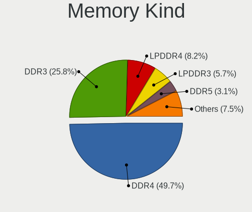

| Kind    | Computers | Percent |
|---------|-----------|---------|
| DDR4    | 79        | 49.69%  |
| DDR3    | 41        | 25.79%  |
| LPDDR4  | 13        | 8.18%   |
| LPDDR3  | 9         | 5.66%   |
| DDR5    | 5         | 3.14%   |
| SDRAM   | 3         | 1.89%   |
| LPDDR5  | 3         | 1.89%   |
| DDR2    | 3         | 1.89%   |
| Unknown | 3         | 1.89%   |

Memory Form Factor
------------------

Physical design of the memory module

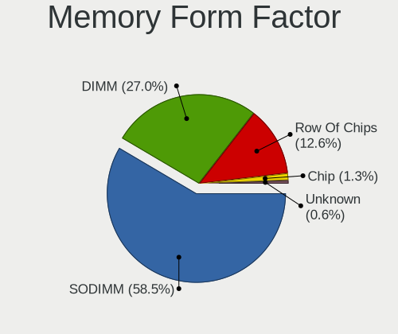

| Name         | Computers | Percent |
|--------------|-----------|---------|
| SODIMM       | 93        | 58.49%  |
| DIMM         | 43        | 27.04%  |
| Row Of Chips | 20        | 12.58%  |
| Chip         | 2         | 1.26%   |
| Unknown      | 1         | 0.63%   |

Memory Size
-----------

Memory module size

| Size  | Computers | Percent |
|-------|-----------|---------|
| 8192  | 75        | 44.64%  |
| 4096  | 47        | 27.98%  |
| 16384 | 20        | 11.9%   |
| 2048  | 17        | 10.12%  |
| 1024  | 5         | 2.98%   |
| 32768 | 4         | 2.38%   |

Memory Speed
------------

Memory module speed

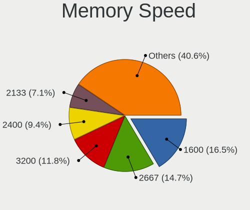

| Speed   | Computers | Percent |
|---------|-----------|---------|
| 1600    | 28        | 16.47%  |
| 2667    | 25        | 14.71%  |
| 3200    | 20        | 11.76%  |
| 2400    | 16        | 9.41%   |
| 2133    | 12        | 7.06%   |
| 2666    | 7         | 4.12%   |
| 1333    | 6         | 3.53%   |
| 1867    | 5         | 2.94%   |
| 3600    | 4         | 2.35%   |
| 1066    | 4         | 2.35%   |
| 5600    | 3         | 1.76%   |
| 4800    | 3         | 1.76%   |
| 4267    | 3         | 1.76%   |
| 4266    | 3         | 1.76%   |
| 1334    | 3         | 1.76%   |
| Unknown | 3         | 1.76%   |
| 6400    | 2         | 1.18%   |
| 3800    | 2         | 1.18%   |
| 3400    | 2         | 1.18%   |
| 3266    | 2         | 1.18%   |
| 3000    | 2         | 1.18%   |
| 1067    | 2         | 1.18%   |
| 800     | 2         | 1.18%   |
| 7500    | 1         | 0.59%   |
| 4199    | 1         | 0.59%   |
| 3733    | 1         | 0.59%   |
| 3500    | 1         | 0.59%   |
| 3466    | 1         | 0.59%   |
| 3066    | 1         | 0.59%   |
| 2933    | 1         | 0.59%   |
| 2048    | 1         | 0.59%   |
| 1866    | 1         | 0.59%   |
| 1648    | 1         | 0.59%   |
| 667     | 1         | 0.59%   |

Printers & scanners
-------------------

Printer Vendor
--------------

Printer device vendors

| Vendor          | Computers | Percent |
|-----------------|-----------|---------|
| Hewlett-Packard | 2         | 66.67%  |
| Seiko Epson     | 1         | 33.33%  |

Printer Model
-------------

Printer device models

| Model                                         | Computers | Percent |
|-----------------------------------------------|-----------|---------|
| Seiko Epson ME 340 Series/Stylus NX130 Series | 1         | 33.33%  |
| HP ENVY 5000 series                           | 1         | 33.33%  |
| HP Deskjet 3520 series                        | 1         | 33.33%  |

Scanner Vendor
--------------

Scanner device vendors

Zero info for selected period =(

Scanner Model
-------------

Scanner device models

Zero info for selected period =(

Camera
------

Camera Vendor
-------------

Camera device vendors

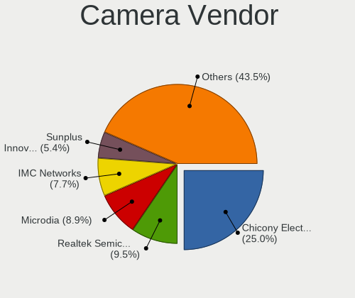

| Vendor                                 | Computers | Percent |
|----------------------------------------|-----------|---------|
| Chicony Electronics                    | 42        | 25%     |
| Realtek Semiconductor                  | 16        | 9.52%   |
| Microdia                               | 15        | 8.93%   |
| IMC Networks                           | 13        | 7.74%   |
| Sunplus Innovation Technology          | 9         | 5.36%   |
| Quanta                                 | 9         | 5.36%   |
| Syntek                                 | 7         | 4.17%   |
| Silicon Motion                         | 7         | 4.17%   |
| Logitech                               | 7         | 4.17%   |
| Suyin                                  | 6         | 3.57%   |
| Cheng Uei Precision Industry (Foxlink) | 6         | 3.57%   |
| Lite-On Technology                     | 5         | 2.98%   |
| Luxvisions Innotech Limited            | 3         | 1.79%   |
| Bison Electronics                      | 3         | 1.79%   |
| Acer                                   | 3         | 1.79%   |
| Ricoh                                  | 2         | 1.19%   |
| Primax Electronics                     | 2         | 1.19%   |
| icSpring                               | 2         | 1.19%   |
| Alcor Micro                            | 2         | 1.19%   |
| Trust                                  | 1         | 0.6%    |
| LG Electronics                         | 1         | 0.6%    |
| Lenovo                                 | 1         | 0.6%    |
| kingcome                               | 1         | 0.6%    |
| Goodong Industry                       | 1         | 0.6%    |
| Generalplus Technology                 | 1         | 0.6%    |
| Arkmicro Technologies                  | 1         | 0.6%    |
| Apple                                  | 1         | 0.6%    |
| 2M UVC CAMERA                          | 1         | 0.6%    |

Camera Model
------------

Camera device models

| Model                                                        | Computers | Percent |
|--------------------------------------------------------------|-----------|---------|
| Chicony Integrated Camera                                    | 10        | 5.88%   |
| IMC Networks HD Camera                                       | 6         | 3.53%   |
| IMC Networks Integrated Camera                               | 5         | 2.94%   |
| Quanta HD User Facing                                        | 4         | 2.35%   |
| Logitech Webcam C270                                         | 4         | 2.35%   |
| Chicony HD WebCam                                            | 4         | 2.35%   |
| Chicony EasyCamera                                           | 4         | 2.35%   |
| Syntek EasyCamera                                            | 3         | 1.76%   |
| Sunplus HD WebCam                                            | 3         | 1.76%   |
| Silicon Motion Web Camera                                    | 3         | 1.76%   |
| Quanta HP TrueVision HD Camera                               | 3         | 1.76%   |
| Microdia Integrated_Webcam_HD                                | 3         | 1.76%   |
| Chicony TOSHIBA Web Camera - HD                              | 3         | 1.76%   |
| Cheng Uei Precision Industry (Foxlink) XiaoMi USB 2.0 Webcam | 3         | 1.76%   |
| Syntek Lenovo EasyCamera                                     | 2         | 1.18%   |
| Syntek Integrated Camera                                     | 2         | 1.18%   |
| Sunplus Integrated_Webcam_HD                                 | 2         | 1.18%   |
| Realtek NexiGo N660P FHD Webcam                              | 2         | 1.18%   |
| Realtek Integrated_Webcam_HD                                 | 2         | 1.18%   |
| Realtek HP "Truevision HD" laptop camera                     | 2         | 1.18%   |
| Realtek Front Camera                                         | 2         | 1.18%   |
| Primax HP HD Webcam [Fixed]                                  | 2         | 1.18%   |
| Microdia Webcam Vitade AF                                    | 2         | 1.18%   |
| Microdia USB 2.0 Camera                                      | 2         | 1.18%   |
| Microdia HP Integrated Webcam                                | 2         | 1.18%   |
| Lite-On Integrated Camera                                    | 2         | 1.18%   |
| icSpring camera                                              | 2         | 1.18%   |
| Chicony USB2.0 VGA UVC WebCam                                | 2         | 1.18%   |
| Chicony USB2.0 Camera                                        | 2         | 1.18%   |
| Chicony HP Wide Vision HD Camera                             | 2         | 1.18%   |
| Chicony HP Webcam                                            | 2         | 1.18%   |
| Chicony HP HD Webcam                                         | 2         | 1.18%   |
| Chicony HP 5MP Camera                                        | 2         | 1.18%   |
| Acer Integrated RGB Camera                                   | 2         | 1.18%   |
| Trust Trust Full HD Webcam                                   | 1         | 0.59%   |
| Suyin Integrated_Webcam_HD                                   | 1         | 0.59%   |
| Suyin HP Webcam 101                                          | 1         | 0.59%   |
| Suyin HP Truevision HD                                       | 1         | 0.59%   |
| Suyin HD WebCam                                              | 1         | 0.59%   |
| Suyin Acer/HP Integrated Webcam [CN0314]                     | 1         | 0.59%   |

Security
--------

Fingerprint Vendor
------------------

Fingerprint sensor vendors

| Vendor                     | Computers | Percent |
|----------------------------|-----------|---------|
| Validity Sensors           | 10        | 31.25%  |
| Shenzhen Goodix Technology | 10        | 31.25%  |
| Upek                       | 6         | 18.75%  |
| Synaptics                  | 5         | 15.63%  |
| Elan Microelectronics      | 1         | 3.13%   |

Fingerprint Model
-----------------

Fingerprint sensor models

| Model                                                    | Computers | Percent |
|----------------------------------------------------------|-----------|---------|
| Shenzhen Goodix  Fingerprint Device                      | 7         | 21.88%  |
| Validity Sensors VFS495 Fingerprint Reader               | 5         | 15.63%  |
| Upek Biometric Touchchip/Touchstrip Fingerprint Sensor   | 4         | 12.5%   |
| Shenzhen Goodix Fingerprint Reader                       | 3         | 9.38%   |
| Validity Sensors VFS491                                  | 2         | 6.25%   |
| Validity Sensors Swipe Fingerprint Sensor                | 2         | 6.25%   |
| Upek TCS5B Fingerprint sensor                            | 2         | 6.25%   |
| Synaptics Prometheus MIS Touch Fingerprint Reader        | 2         | 6.25%   |
| Validity Sensors VFS5011 Fingerprint Reader              | 1         | 3.13%   |
| Synaptics UWP WBDI                                       | 1         | 3.13%   |
| Synaptics Prometheus Fingerprint Reader                  | 1         | 3.13%   |
| Synaptics FS7604 Touch Fingerprint Sensor with PurePrint | 1         | 3.13%   |
| Elan ELAN:Fingerprint                                    | 1         | 3.13%   |

Chipcard Vendor
---------------

Chipcard module vendors

| Vendor              | Computers | Percent |
|---------------------|-----------|---------|
| Alcor Micro         | 3         | 50%     |
| Lenovo              | 1         | 16.67%  |
| Giesecke & Devrient | 1         | 16.67%  |
| Broadcom            | 1         | 16.67%  |

Chipcard Model
--------------

Chipcard module models

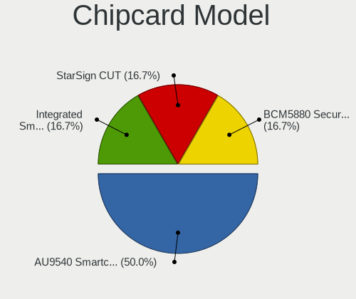

| Model                                          | Computers | Percent |
|------------------------------------------------|-----------|---------|
| Alcor Micro AU9540 Smartcard Reader            | 3         | 50%     |
| Lenovo Integrated Smart Card Reader            | 1         | 16.67%  |
| Giesecke & Devrient StarSign CUT               | 1         | 16.67%  |
| Broadcom BCM5880 Secure Applications Processor | 1         | 16.67%  |

Unsupported
-----------

Unsupported Devices
-------------------

Total unsupported devices on board

| Total | Computers | Percent |
|-------|-----------|---------|
| 0     | 196       | 72.32%  |
| 1     | 58        | 21.4%   |
| 2     | 16        | 5.9%    |
| 3     | 1         | 0.37%   |

Unsupported Device Types
------------------------

Types of unsupported devices

| Type                     | Computers | Percent |
|--------------------------|-----------|---------|
| Graphics card            | 32        | 34.78%  |
| Fingerprint reader       | 31        | 33.7%   |
| Multimedia controller    | 9         | 9.78%   |
| Net/wireless             | 5         | 5.43%   |
| Chipcard                 | 5         | 5.43%   |
| Sound                    | 3         | 3.26%   |
| Camera                   | 2         | 2.17%   |
| Unassigned class         | 1         | 1.09%   |
| Storage/raid             | 1         | 1.09%   |
| Storage                  | 1         | 1.09%   |
| Network                  | 1         | 1.09%   |
| Communication controller | 1         | 1.09%   |

