Deepin - Tested Hardware & Statistics
-------------------------------------

A project to collect tested hardware configurations for Deepin.

Anyone can contribute to this report by the [hw-probe](https://github.com/linuxhw/hw-probe) tool:

    sudo -E hw-probe -all -upload

Please submit a probe of your configuration if it's not presented on the page or is rare.

This is a report for all computer types. See also reports for [desktops](/Dist/Deepin/Desktop/README.md) and [notebooks](/Dist/Deepin/Notebook/README.md).

Full-feature report is available here: https://linux-hardware.org/?view=trends

Contents
--------

* [ Test Cases ](#test-cases)

* [ System ](#system)
  - [ OS                       ](#os)
  - [ OS Family                ](#os-family)
  - [ Kernel                   ](#kernel)
  - [ Kernel Family            ](#kernel-family)
  - [ Kernel Major Ver.        ](#kernel-major-ver)
  - [ Arch                     ](#arch)
  - [ DE                       ](#de)
  - [ Display Server           ](#display-server)
  - [ Display Manager          ](#display-manager)
  - [ OS Lang                  ](#os-lang)
  - [ Boot Mode                ](#boot-mode)
  - [ Filesystem               ](#filesystem)
  - [ Part. scheme             ](#part-scheme)
  - [ Dual Boot with Linux/BSD ](#dual-boot-with-linuxbsd)
  - [ Dual Boot (Win)          ](#dual-boot-win)

* [ Board ](#board)
  - [ Vendor                   ](#vendor)
  - [ Model                    ](#model)
  - [ Model Family             ](#model-family)
  - [ MFG Year                 ](#mfg-year)
  - [ Form Factor              ](#form-factor)
  - [ Secure Boot              ](#secure-boot)
  - [ Coreboot                 ](#coreboot)
  - [ RAM Size                 ](#ram-size)
  - [ RAM Used                 ](#ram-used)
  - [ Total Drives             ](#total-drives)
  - [ Has CD-ROM               ](#has-cd-rom)
  - [ Has Ethernet             ](#has-ethernet)
  - [ Has WiFi                 ](#has-wifi)
  - [ Has Bluetooth            ](#has-bluetooth)

* [ Location ](#location)
  - [ Country                  ](#country)
  - [ City                     ](#city)

* [ Drives ](#drives)
  - [ Drive Vendor             ](#drive-vendor)
  - [ Drive Model              ](#drive-model)
  - [ HDD Vendor               ](#hdd-vendor)
  - [ SSD Vendor               ](#ssd-vendor)
  - [ Drive Kind               ](#drive-kind)
  - [ Drive Connector          ](#drive-connector)
  - [ Drive Size               ](#drive-size)
  - [ Space Total              ](#space-total)
  - [ Space Used               ](#space-used)
  - [ Malfunc. Drives          ](#malfunc-drives)
  - [ Malfunc. Drive Vendor    ](#malfunc-drive-vendor)
  - [ Malfunc. HDD Vendor      ](#malfunc-hdd-vendor)
  - [ Malfunc. Drive Kind      ](#malfunc-drive-kind)
  - [ Failed Drives            ](#failed-drives)
  - [ Failed Drive Vendor      ](#failed-drive-vendor)
  - [ Drive Status             ](#drive-status)

* [ Storage controller ](#storage-controller)
  - [ Storage Vendor           ](#storage-vendor)
  - [ Storage Model            ](#storage-model)
  - [ Storage Kind             ](#storage-kind)

* [ Processor ](#processor)
  - [ CPU Vendor               ](#cpu-vendor)
  - [ CPU Model                ](#cpu-model)
  - [ CPU Model Family         ](#cpu-model-family)
  - [ CPU Cores                ](#cpu-cores)
  - [ CPU Sockets              ](#cpu-sockets)
  - [ CPU Threads              ](#cpu-threads)
  - [ CPU Op-Modes             ](#cpu-op-modes)
  - [ CPU Microcode            ](#cpu-microcode)
  - [ CPU Microarch            ](#cpu-microarch)

* [ Graphics ](#graphics)
  - [ GPU Vendor               ](#gpu-vendor)
  - [ GPU Model                ](#gpu-model)
  - [ GPU Combo                ](#gpu-combo)
  - [ GPU Driver               ](#gpu-driver)
  - [ GPU Memory               ](#gpu-memory)

* [ Monitor ](#monitor)
  - [ Monitor Vendor           ](#monitor-vendor)
  - [ Monitor Model            ](#monitor-model)
  - [ Monitor Resolution       ](#monitor-resolution)
  - [ Monitor Diagonal         ](#monitor-diagonal)
  - [ Monitor Width            ](#monitor-width)
  - [ Aspect Ratio             ](#aspect-ratio)
  - [ Monitor Area             ](#monitor-area)
  - [ Pixel Density            ](#pixel-density)
  - [ Multiple Monitors        ](#multiple-monitors)

* [ Network ](#network)
  - [ Net Controller Vendor    ](#net-controller-vendor)
  - [ Net Controller Model     ](#net-controller-model)
  - [ Wireless Vendor          ](#wireless-vendor)
  - [ Wireless Model           ](#wireless-model)
  - [ Ethernet Vendor          ](#ethernet-vendor)
  - [ Ethernet Model           ](#ethernet-model)
  - [ Net Controller Kind      ](#net-controller-kind)
  - [ Used Controller          ](#used-controller)
  - [ NICs                     ](#nics)
  - [ IPv6                     ](#ipv6)

* [ Bluetooth ](#bluetooth)
  - [ Bluetooth Vendor         ](#bluetooth-vendor)
  - [ Bluetooth Model          ](#bluetooth-model)

* [ Sound ](#sound)
  - [ Sound Vendor             ](#sound-vendor)
  - [ Sound Model              ](#sound-model)

* [ Memory ](#memory)
  - [ Memory Vendor            ](#memory-vendor)
  - [ Memory Model             ](#memory-model)
  - [ Memory Kind              ](#memory-kind)
  - [ Memory Form Factor       ](#memory-form-factor)
  - [ Memory Size              ](#memory-size)
  - [ Memory Speed             ](#memory-speed)

* [ Printers & scanners ](#printers--scanners)
  - [ Printer Vendor           ](#printer-vendor)
  - [ Printer Model            ](#printer-model)
  - [ Scanner Vendor           ](#scanner-vendor)
  - [ Scanner Model            ](#scanner-model)

* [ Camera ](#camera)
  - [ Camera Vendor            ](#camera-vendor)
  - [ Camera Model             ](#camera-model)

* [ Security ](#security)
  - [ Fingerprint Vendor       ](#fingerprint-vendor)
  - [ Fingerprint Model        ](#fingerprint-model)
  - [ Chipcard Vendor          ](#chipcard-vendor)
  - [ Chipcard Model           ](#chipcard-model)

* [ Unsupported ](#unsupported)
  - [ Unsupported Devices      ](#unsupported-devices)
  - [ Unsupported Device Types ](#unsupported-device-types)

Test Cases
----------

Total: 251

| Vendor        | Model                       | Form-Factor | Probe                                                      | Date         |
|---------------|-----------------------------|-------------|------------------------------------------------------------|--------------|
| Phytium       | FT-2000/4 V0001             | Server      | [6385010257](https://linux-hardware.org/?probe=6385010257) | Mar 28, 2022 |
| Cube          | SurfTab twin 11.6           | Convertible | [d8659d7018](https://linux-hardware.org/?probe=d8659d7018) | Mar 03, 2022 |
| Cube          | SurfTab twin 11.6           | Convertible | [fde2a4b713](https://linux-hardware.org/?probe=fde2a4b713) | Mar 03, 2022 |
| HANWEI        | FT-208-COME-B               | Soc         | [93aca5cd19](https://linux-hardware.org/?probe=93aca5cd19) | Feb 25, 2022 |
| HANWEI        | FT-208-COME-B               | Soc         | [e578c5f173](https://linux-hardware.org/?probe=e578c5f173) | Jan 28, 2022 |
| HP            | EliteBook 8570w             | Notebook    | [131c9a7dc2](https://linux-hardware.org/?probe=131c9a7dc2) | Jan 27, 2022 |
| Lenovo        | Yoga 3 Pro-1370 80HE        | Notebook    | [f891c69576](https://linux-hardware.org/?probe=f891c69576) | Jan 08, 2022 |
| ASUSTek       | Z97-PRO GAMER               | Desktop     | [3e37ded7e2](https://linux-hardware.org/?probe=3e37ded7e2) | Jan 04, 2022 |
| Google        | Akemi                       | Notebook    | [295fd594af](https://linux-hardware.org/?probe=295fd594af) | Dec 27, 2021 |
| TSINGHUA T... | B460M-HDV                   | Desktop     | [8447bd4156](https://linux-hardware.org/?probe=8447bd4156) | Dec 22, 2021 |
| Acer          | Aspire VN7-572G             | Notebook    | [895dca26b0](https://linux-hardware.org/?probe=895dca26b0) | Dec 21, 2021 |
| TSINGHUA T... | B460M-HDV                   | Desktop     | [1146dc777c](https://linux-hardware.org/?probe=1146dc777c) | Dec 15, 2021 |
| HUAWEI        | HN-WX9X                     | Notebook    | [f228b60d0c](https://linux-hardware.org/?probe=f228b60d0c) | Dec 07, 2021 |
| Dell          | 07N90W A02                  | Desktop     | [43a5aec999](https://linux-hardware.org/?probe=43a5aec999) | Dec 07, 2021 |
| ECS           | H81H3-M4                    | Desktop     | [cdaf4b1031](https://linux-hardware.org/?probe=cdaf4b1031) | Dec 07, 2021 |
| HP            | EliteBook 8570w             | Notebook    | [7752a79879](https://linux-hardware.org/?probe=7752a79879) | Dec 06, 2021 |
| HP            | Laptop 14-ck0xxx            | Notebook    | [4b03ed047c](https://linux-hardware.org/?probe=4b03ed047c) | Dec 06, 2021 |
| Samsung       | 550P5C/550P7C               | Notebook    | [31bc59dcb9](https://linux-hardware.org/?probe=31bc59dcb9) | Nov 12, 2021 |
| Lenovo        | ThinkBook 13s-IWL 20R9      | Notebook    | [88d791ff87](https://linux-hardware.org/?probe=88d791ff87) | Nov 09, 2021 |
| Dell          | Latitude 3400               | Notebook    | [7f519c2721](https://linux-hardware.org/?probe=7f519c2721) | Oct 23, 2021 |
| Samsung       | 550P5C/550P7C               | Notebook    | [2713972f14](https://linux-hardware.org/?probe=2713972f14) | Oct 22, 2021 |
| HP            | ZHAN 66 Pro G1              | Notebook    | [a1a1c41c6a](https://linux-hardware.org/?probe=a1a1c41c6a) | Oct 09, 2021 |
| HP            | ZHAN 66 Pro G1              | Notebook    | [fcc291e2f1](https://linux-hardware.org/?probe=fcc291e2f1) | Oct 08, 2021 |
| Lenovo        | Legion Y7000 2020 82AV      | Notebook    | [64d71e1177](https://linux-hardware.org/?probe=64d71e1177) | Sep 29, 2021 |
| Soyo          | SY-Thin Mini H110           | Mini pc     | [ca900f89d0](https://linux-hardware.org/?probe=ca900f89d0) | Sep 28, 2021 |
| TSINGHUA T... | B460M-HDV                   | Desktop     | [bc175433f9](https://linux-hardware.org/?probe=bc175433f9) | Sep 18, 2021 |
| TSINGHUA T... | B460M-HDV                   | Desktop     | [80017bc79b](https://linux-hardware.org/?probe=80017bc79b) | Sep 18, 2021 |
| ASUSTek       | Z97-PRO GAMER               | Desktop     | [a428f57f6a](https://linux-hardware.org/?probe=a428f57f6a) | Sep 17, 2021 |
| HP            | Laptop 15-bs0xx             | Notebook    | [fc0f8f406b](https://linux-hardware.org/?probe=fc0f8f406b) | Aug 31, 2021 |
| Lenovo        | ThinkPad L412 0585AC3       | Notebook    | [f31b3187c3](https://linux-hardware.org/?probe=f31b3187c3) | Aug 23, 2021 |
| Lenovo        | Legion R9000K2021H 82N6     | Notebook    | [048b8332cc](https://linux-hardware.org/?probe=048b8332cc) | Aug 13, 2021 |
| ASUSTek       | ASUS TUF Gaming A15 FA50... | Notebook    | [5e1cc5b229](https://linux-hardware.org/?probe=5e1cc5b229) | Aug 11, 2021 |
| TSINGHUA T... | B460-N2                     | Desktop     | [59d9384348](https://linux-hardware.org/?probe=59d9384348) | Aug 09, 2021 |
| Gigabyte      | B550M DS3H                  | Desktop     | [418d6ee68f](https://linux-hardware.org/?probe=418d6ee68f) | Jul 23, 2021 |
| Toshiba       | STI 005492G                 | Desktop     | [d7fe511a9e](https://linux-hardware.org/?probe=d7fe511a9e) | Jul 19, 2021 |
| Lenovo        | XiaoXinAir-14ARE 2020 81... | Notebook    | [d563d62b5f](https://linux-hardware.org/?probe=d563d62b5f) | Jul 14, 2021 |
| AMD           | BL2 V2.3                    | Desktop     | [1053adf355](https://linux-hardware.org/?probe=1053adf355) | Jul 12, 2021 |
| Acer          | Aspire 5750G                | Notebook    | [61b9408d9e](https://linux-hardware.org/?probe=61b9408d9e) | Jul 11, 2021 |
| Acer          | Aspire 5750G                | Notebook    | [59728d9bef](https://linux-hardware.org/?probe=59728d9bef) | Jul 11, 2021 |
| HP            | Spectre x2 Detachable 12... | Tablet      | [efc4c63ac7](https://linux-hardware.org/?probe=efc4c63ac7) | Jul 09, 2021 |
| HP            | Spectre x2 Detachable 12... | Tablet      | [9f7d75d241](https://linux-hardware.org/?probe=9f7d75d241) | Jul 09, 2021 |
| HUAWEI        | HLYL-WXX9                   | Notebook    | [26b5b9e3d3](https://linux-hardware.org/?probe=26b5b9e3d3) | Jul 06, 2021 |
| Lenovo        | ZhaoYangCF4620Z-A123 590... | Notebook    | [6f716961de](https://linux-hardware.org/?probe=6f716961de) | Jun 29, 2021 |
| Lenovo        | XiaoXin-15ARE 2020 81YR     | Notebook    | [279dea011e](https://linux-hardware.org/?probe=279dea011e) | Jun 28, 2021 |
| ECS           | H81H3-M4                    | Desktop     | [838f10c576](https://linux-hardware.org/?probe=838f10c576) | Jun 25, 2021 |
| ECS           | H81H3-M4                    | Desktop     | [bfc9a4d537](https://linux-hardware.org/?probe=bfc9a4d537) | Jun 25, 2021 |
| Lenovo        | Yoga DuetITL 2021 82MA      | Tablet      | [48335e0b08](https://linux-hardware.org/?probe=48335e0b08) | Jun 24, 2021 |
| TSINGHUA T... | B460-N2 V1.1                | Desktop     | [70d8ede642](https://linux-hardware.org/?probe=70d8ede642) | Jun 23, 2021 |
| TSINGHUA T... | B460-N2 V1.1                | Desktop     | [8431bcbed8](https://linux-hardware.org/?probe=8431bcbed8) | Jun 22, 2021 |
| Loongson      | LS3A3000-7A1000-1w-V1.2-... | Desktop     | [014bdabb68](https://linux-hardware.org/?probe=014bdabb68) | Jun 16, 2021 |
| Lenovo        | ThinkBook 14 G2 ARE R7 8... | Notebook    | [b2c24061a6](https://linux-hardware.org/?probe=b2c24061a6) | Jun 13, 2021 |
| Toshiba       | STI 005492G                 | Desktop     | [e28291b9ed](https://linux-hardware.org/?probe=e28291b9ed) | Jun 13, 2021 |
| Lenovo        | IdeaPad 320-15IKB 80XL      | Notebook    | [0540d35606](https://linux-hardware.org/?probe=0540d35606) | May 31, 2021 |
| Samsung       | 300E4A/300E5A/300E7A/343... | Notebook    | [30ffaaaad4](https://linux-hardware.org/?probe=30ffaaaad4) | May 22, 2021 |
| Samsung       | 300E4A/300E5A/300E7A/343... | Notebook    | [91b9340ed6](https://linux-hardware.org/?probe=91b9340ed6) | May 20, 2021 |
| ASUSTek       | VivoBook 15_ASUS Laptop ... | Notebook    | [68740fff81](https://linux-hardware.org/?probe=68740fff81) | May 16, 2021 |
| MSI           | H81I                        | Desktop     | [a0f0f9e7e8](https://linux-hardware.org/?probe=a0f0f9e7e8) | May 06, 2021 |
| Unknown       | Unknown                     | Notebook    | [4d3ffa307c](https://linux-hardware.org/?probe=4d3ffa307c) | Apr 26, 2021 |
| Unknown       | Unknown                     | Notebook    | [8d019adbf9](https://linux-hardware.org/?probe=8d019adbf9) | Apr 26, 2021 |
| Lenovo        | ThinkPad T420 4180M8P       | Notebook    | [1fe655cf93](https://linux-hardware.org/?probe=1fe655cf93) | Apr 25, 2021 |
| Huanan        | X99-8M-F V1.1               | Desktop     | [13daa2d4a6](https://linux-hardware.org/?probe=13daa2d4a6) | Apr 23, 2021 |
| ASUSTek       | P8H61-MX                    | Desktop     | [9212747e6a](https://linux-hardware.org/?probe=9212747e6a) | Apr 08, 2021 |
| Toshiba       | Satellite E55t-A            | Notebook    | [e1a3602d7b](https://linux-hardware.org/?probe=e1a3602d7b) | Mar 28, 2021 |
| Unknown       | Unknown                     | Notebook    | [94f00d3697](https://linux-hardware.org/?probe=94f00d3697) | Mar 27, 2021 |
| Gigabyte      | Z170X-Gaming 7              | Desktop     | [e6db1c79cc](https://linux-hardware.org/?probe=e6db1c79cc) | Mar 25, 2021 |
| Gigabyte      | Z170X-Gaming 7              | Desktop     | [edb786e43a](https://linux-hardware.org/?probe=edb786e43a) | Mar 25, 2021 |
| ASUSTek       | PRIME A320M-K               | Desktop     | [1db414e1cd](https://linux-hardware.org/?probe=1db414e1cd) | Mar 21, 2021 |
| Gigabyte      | H81M-D2V                    | Desktop     | [d62d3a2dad](https://linux-hardware.org/?probe=d62d3a2dad) | Mar 19, 2021 |
| Gigabyte      | H81M-D2V                    | Desktop     | [3fbfb29382](https://linux-hardware.org/?probe=3fbfb29382) | Mar 14, 2021 |
| MSI           | B460M PRO-VDH WIFI          | Desktop     | [b165cd04ce](https://linux-hardware.org/?probe=b165cd04ce) | Feb 25, 2021 |
| Unknown       | Unknown                     | Notebook    | [9ddedfd3c9](https://linux-hardware.org/?probe=9ddedfd3c9) | Feb 13, 2021 |
| HP            | Pavilion Laptop 14-bf0xx    | Notebook    | [309266e981](https://linux-hardware.org/?probe=309266e981) | Feb 13, 2021 |
| Dell          | Inspiron 7720               | Notebook    | [8c8689a8ba](https://linux-hardware.org/?probe=8c8689a8ba) | Feb 08, 2021 |
| Acer          | Aspire V5-571P              | Notebook    | [e03d4bc850](https://linux-hardware.org/?probe=e03d4bc850) | Feb 07, 2021 |
| Dell          | Inspiron 5547               | Notebook    | [e2cee5283f](https://linux-hardware.org/?probe=e2cee5283f) | Feb 04, 2021 |
| Dell          | 0KWVT8 A00                  | Desktop     | [56f1d17280](https://linux-hardware.org/?probe=56f1d17280) | Feb 04, 2021 |
| HUAWEI        | HN-WX9X                     | Notebook    | [b0ca634dee](https://linux-hardware.org/?probe=b0ca634dee) | Jan 28, 2021 |
| Dell          | 00V62H A00                  | Desktop     | [863c1d64fe](https://linux-hardware.org/?probe=863c1d64fe) | Jan 23, 2021 |
| Lenovo        | MAHOBAY NO DPK              | Desktop     | [842703dc6b](https://linux-hardware.org/?probe=842703dc6b) | Jan 20, 2021 |
| Lenovo        | MAHOBAY NO DPK              | Desktop     | [5b9e365258](https://linux-hardware.org/?probe=5b9e365258) | Jan 19, 2021 |
| Gigabyte      | B365M D3H-CF                | Desktop     | [0bfbe639fc](https://linux-hardware.org/?probe=0bfbe639fc) | Jan 18, 2021 |
| Lenovo        | ThinkPad E14 20RA0058VA     | Notebook    | [3c08ce49f5](https://linux-hardware.org/?probe=3c08ce49f5) | Jan 08, 2021 |
| Acer          | Aspire 4736Z                | Notebook    | [dd3b50729f](https://linux-hardware.org/?probe=dd3b50729f) | Jan 07, 2021 |
| ASUSTek       | X406UAR                     | Notebook    | [42e509209a](https://linux-hardware.org/?probe=42e509209a) | Dec 20, 2020 |
| ASUSTek       | X406UAR                     | Notebook    | [23b1fae05b](https://linux-hardware.org/?probe=23b1fae05b) | Dec 20, 2020 |
| Lenovo        | IdeaPad 3 14ARE05 81W3      | Notebook    | [667577cb5f](https://linux-hardware.org/?probe=667577cb5f) | Dec 15, 2020 |
| Lenovo        | G50-80 80L0                 | Notebook    | [951a5a280f](https://linux-hardware.org/?probe=951a5a280f) | Dec 11, 2020 |
| Gigabyte      | H81M-D2V                    | Desktop     | [49bd67196b](https://linux-hardware.org/?probe=49bd67196b) | Nov 20, 2020 |
| Acer          | Nitro AN515-54              | Notebook    | [d46eb4b9c9](https://linux-hardware.org/?probe=d46eb4b9c9) | Nov 19, 2020 |
| Acer          | Nitro AN515-54              | Notebook    | [877187c708](https://linux-hardware.org/?probe=877187c708) | Nov 19, 2020 |
| Lenovo        | ThinkPad E585 20KV0010US    | Notebook    | [033f6f0920](https://linux-hardware.org/?probe=033f6f0920) | Nov 18, 2020 |
| Lenovo        | ThinkPad E585 20KV0010US    | Notebook    | [d2bedcab13](https://linux-hardware.org/?probe=d2bedcab13) | Nov 18, 2020 |
| Foxconn       | 2ADA                        | Desktop     | [2c76ab07eb](https://linux-hardware.org/?probe=2c76ab07eb) | Nov 12, 2020 |
| ASUSTek       | PRIME B450M-GAMING/BR       | Desktop     | [0b46341e31](https://linux-hardware.org/?probe=0b46341e31) | Nov 07, 2020 |
| Lenovo        | IdeaPad S145-15API 81UT     | Notebook    | [b687de4d3c](https://linux-hardware.org/?probe=b687de4d3c) | Nov 05, 2020 |
| Toshiba       | Satellite C850D-11K         | Notebook    | [53f5d002c9](https://linux-hardware.org/?probe=53f5d002c9) | Oct 31, 2020 |
| HP            | ENVY 15                     | Notebook    | [c23287b06d](https://linux-hardware.org/?probe=c23287b06d) | Oct 31, 2020 |
| Gigabyte      | B360M AORUS Gaming 3-CF     | Desktop     | [a4fa363ca9](https://linux-hardware.org/?probe=a4fa363ca9) | Oct 29, 2020 |
| Acer          | Swift SF314-42              | Notebook    | [628265bca0](https://linux-hardware.org/?probe=628265bca0) | Oct 25, 2020 |
| Acer          | Swift SF314-42              | Notebook    | [01143e194b](https://linux-hardware.org/?probe=01143e194b) | Oct 20, 2020 |
| Lenovo        | IdeaPad 110-14IBR 80UJ      | Notebook    | [8d149c1a39](https://linux-hardware.org/?probe=8d149c1a39) | Oct 17, 2020 |
| Acer          | Nitro AN515-52              | Notebook    | [ca3d5b9444](https://linux-hardware.org/?probe=ca3d5b9444) | Oct 13, 2020 |
| Microtech     | ebookPro                    | Notebook    | [2f1ff6265a](https://linux-hardware.org/?probe=2f1ff6265a) | Oct 10, 2020 |
| ASRock        | Z68 Extreme7 Gen3           | Desktop     | [181ccd5686](https://linux-hardware.org/?probe=181ccd5686) | Oct 10, 2020 |
| HUAWEI        | NBLK-WAX9X                  | Notebook    | [88e5775f0f](https://linux-hardware.org/?probe=88e5775f0f) | Oct 02, 2020 |
| HUAWEI        | NBLK-WAX9X                  | Notebook    | [2972557e3e](https://linux-hardware.org/?probe=2972557e3e) | Oct 02, 2020 |
| Toshiba       | STI 013442                  | Desktop     | [25aa1737df](https://linux-hardware.org/?probe=25aa1737df) | Oct 02, 2020 |
| Toshiba       | STI 013442                  | Desktop     | [325dccb021](https://linux-hardware.org/?probe=325dccb021) | Oct 01, 2020 |
| Toshiba       | STI 013442                  | Desktop     | [d878c17ac5](https://linux-hardware.org/?probe=d878c17ac5) | Oct 01, 2020 |
| Lenovo        | G50-70 20351                | Notebook    | [c5ea28ed29](https://linux-hardware.org/?probe=c5ea28ed29) | Sep 28, 2020 |
| ASRock        | Z68 Extreme7 Gen3           | Desktop     | [d5c18b2ad2](https://linux-hardware.org/?probe=d5c18b2ad2) | Sep 27, 2020 |
| ASRock        | Z68 Extreme7 Gen3           | Desktop     | [27f0cbcbfa](https://linux-hardware.org/?probe=27f0cbcbfa) | Sep 27, 2020 |
| HP            | ENVY 15                     | Notebook    | [e7bfa62e4c](https://linux-hardware.org/?probe=e7bfa62e4c) | Sep 23, 2020 |
| ASUSTek       | P8H77-M PRO                 | Desktop     | [7318b0893d](https://linux-hardware.org/?probe=7318b0893d) | Sep 22, 2020 |
| Samsung       | 270E5J/2570EJ               | Notebook    | [d00667e263](https://linux-hardware.org/?probe=d00667e263) | Sep 21, 2020 |
| HP            | Pavilion 15                 | Notebook    | [f824ed9d26](https://linux-hardware.org/?probe=f824ed9d26) | Sep 18, 2020 |
| Gigabyte      | H81M-D2V                    | Desktop     | [c46dd29f7a](https://linux-hardware.org/?probe=c46dd29f7a) | Sep 17, 2020 |
| HP            | Pavilion 15                 | Notebook    | [d95e413136](https://linux-hardware.org/?probe=d95e413136) | Sep 16, 2020 |
| Dell          | Inspiron 3583               | Notebook    | [860b906339](https://linux-hardware.org/?probe=860b906339) | Sep 14, 2020 |
| Gigabyte      | Z77-DS3H                    | Desktop     | [d7f43611eb](https://linux-hardware.org/?probe=d7f43611eb) | Sep 13, 2020 |
| Lenovo        | V310-15ISK 80SY             | Notebook    | [043d555fa5](https://linux-hardware.org/?probe=043d555fa5) | Sep 05, 2020 |
| Acer          | Aspire E5-571               | Notebook    | [84a6667f77](https://linux-hardware.org/?probe=84a6667f77) | Sep 05, 2020 |
| Foxconn       | 2ADA                        | Desktop     | [f1eb818ac5](https://linux-hardware.org/?probe=f1eb818ac5) | Sep 04, 2020 |
| Acer          | Aspire 5735                 | Notebook    | [0e4c64618a](https://linux-hardware.org/?probe=0e4c64618a) | Sep 03, 2020 |
| Dell          | Inspiron 3583               | Notebook    | [885667a4cd](https://linux-hardware.org/?probe=885667a4cd) | Sep 02, 2020 |
| Samsung       | 340XAA/350XAA/550XAA        | Notebook    | [e4b74d9442](https://linux-hardware.org/?probe=e4b74d9442) | Sep 02, 2020 |
| Dell          | Inspiron 5447               | Notebook    | [bc69598c5f](https://linux-hardware.org/?probe=bc69598c5f) | Aug 28, 2020 |
| HP            | 81B4                        | Desktop     | [9e3aa00a36](https://linux-hardware.org/?probe=9e3aa00a36) | Aug 21, 2020 |
| Samsung       | DP500A2D-A01UB SEC_SW_RE... | All in one  | [0a65089c68](https://linux-hardware.org/?probe=0a65089c68) | Aug 18, 2020 |
| Samsung       | DP500A2D-A01UB SEC_SW_RE... | All in one  | [922ccd2bc5](https://linux-hardware.org/?probe=922ccd2bc5) | Aug 18, 2020 |
| Foxconn       | 2ADA                        | Desktop     | [f93d4fa401](https://linux-hardware.org/?probe=f93d4fa401) | Jul 30, 2020 |
| HP            | 81B4                        | Desktop     | [03c849fcd2](https://linux-hardware.org/?probe=03c849fcd2) | Jul 26, 2020 |
| Dell          | Inspiron 5447               | Notebook    | [b9bf539788](https://linux-hardware.org/?probe=b9bf539788) | Jul 26, 2020 |
| Foxconn       | 2ADA                        | Desktop     | [035b1fd159](https://linux-hardware.org/?probe=035b1fd159) | Jul 24, 2020 |
| Samsung       | 500R4K/500R5H/5400RK/501... | Notebook    | [b73122dcbf](https://linux-hardware.org/?probe=b73122dcbf) | Jul 24, 2020 |
| ASUSTek       | AM1M-A/BR                   | Desktop     | [dafd042867](https://linux-hardware.org/?probe=dafd042867) | Jul 22, 2020 |
| ASUSTek       | H110M-A/M.2                 | Desktop     | [a3dc30f185](https://linux-hardware.org/?probe=a3dc30f185) | Jul 21, 2020 |
| Dell          | Inspiron 7520               | Notebook    | [0e4bbcdaca](https://linux-hardware.org/?probe=0e4bbcdaca) | Jul 19, 2020 |
| Positivo      | POS-PQ45AU                  | Desktop     | [056dd1ec51](https://linux-hardware.org/?probe=056dd1ec51) | Jul 15, 2020 |
| ASUSTek       | H110I-PLUS                  | Desktop     | [116754d157](https://linux-hardware.org/?probe=116754d157) | Jul 11, 2020 |
| Lenovo        | ThinkPad L512 44444NG       | Notebook    | [bfda7d01d5](https://linux-hardware.org/?probe=bfda7d01d5) | Jun 30, 2020 |
| ASUSTek       | H110I-PLUS                  | Desktop     | [4a0dcf77f1](https://linux-hardware.org/?probe=4a0dcf77f1) | Jun 24, 2020 |
| MSI           | P67A-GD65                   | Desktop     | [c0df14bdee](https://linux-hardware.org/?probe=c0df14bdee) | Jun 22, 2020 |
| HP            | EliteBook 820 G3            | Notebook    | [1ad623b060](https://linux-hardware.org/?probe=1ad623b060) | Jun 20, 2020 |
| HP            | EliteBook 820 G3            | Notebook    | [5517a703d4](https://linux-hardware.org/?probe=5517a703d4) | Jun 15, 2020 |
| Apple         | Mac-F2268CC8                | All in one  | [2212090ff2](https://linux-hardware.org/?probe=2212090ff2) | Jun 10, 2020 |
| Chuwi         | AeroBook                    | Notebook    | [12312a6c5b](https://linux-hardware.org/?probe=12312a6c5b) | Jun 03, 2020 |
| Chuwi         | AeroBook                    | Notebook    | [fdcf37b34d](https://linux-hardware.org/?probe=fdcf37b34d) | Jun 01, 2020 |
| Chuwi         | AeroBook                    | Notebook    | [5889780485](https://linux-hardware.org/?probe=5889780485) | Jun 01, 2020 |
| Chuwi         | AeroBook                    | Notebook    | [6a57e4427b](https://linux-hardware.org/?probe=6a57e4427b) | Jun 01, 2020 |
| ASRock        | Z77 Extreme4                | Desktop     | [2e074b7913](https://linux-hardware.org/?probe=2e074b7913) | May 30, 2020 |
| Google        | Edgar                       | Notebook    | [ed3bf69957](https://linux-hardware.org/?probe=ed3bf69957) | May 28, 2020 |
| ASUSTek       | T100TAF                     | Notebook    | [6d2999ebb1](https://linux-hardware.org/?probe=6d2999ebb1) | May 26, 2020 |
| Gigabyte      | 990XA-UD3                   | Desktop     | [cc7c6da435](https://linux-hardware.org/?probe=cc7c6da435) | May 19, 2020 |
| ASUSTek       | T101HA                      | Tablet      | [eedf2f3d04](https://linux-hardware.org/?probe=eedf2f3d04) | May 16, 2020 |
| ASUSTek       | T101HA                      | Tablet      | [cc59b3f980](https://linux-hardware.org/?probe=cc59b3f980) | May 16, 2020 |
| HP            | Pavilion Notebook           | Notebook    | [825d07d907](https://linux-hardware.org/?probe=825d07d907) | May 14, 2020 |
| Lenovo        | IdeaPad 120S-11IAP 81A4     | Notebook    | [49661d90bd](https://linux-hardware.org/?probe=49661d90bd) | Apr 19, 2020 |
| Microsoft     | Surface Pro 4               | Tablet      | [13b3bd980f](https://linux-hardware.org/?probe=13b3bd980f) | Apr 08, 2020 |
| HP            | EliteBook 8570p             | Notebook    | [6928abb72d](https://linux-hardware.org/?probe=6928abb72d) | Apr 07, 2020 |
| HP            | EliteBook 8570p             | Notebook    | [020c71d11e](https://linux-hardware.org/?probe=020c71d11e) | Apr 07, 2020 |
| HP            | EliteBook 8570p             | Notebook    | [163b885549](https://linux-hardware.org/?probe=163b885549) | Apr 07, 2020 |
| Sony          | VGN-NS140D                  | Notebook    | [dbae86d335](https://linux-hardware.org/?probe=dbae86d335) | Apr 06, 2020 |
| ASUSTek       | M5A78L-M/USB3               | Desktop     | [b8f32a998c](https://linux-hardware.org/?probe=b8f32a998c) | Mar 31, 2020 |
| Dell          | 0M863N A00                  | Desktop     | [39201e0067](https://linux-hardware.org/?probe=39201e0067) | Mar 30, 2020 |
| HP            | Pavilion Laptop 14-ce0xx... | Notebook    | [76c9608867](https://linux-hardware.org/?probe=76c9608867) | Mar 24, 2020 |
| HP            | Pavilion Laptop 14-ce0xx... | Notebook    | [81e20268cd](https://linux-hardware.org/?probe=81e20268cd) | Mar 24, 2020 |
| Fujitsu       | FARQ06012Z                  | Notebook    | [6d19311f7e](https://linux-hardware.org/?probe=6d19311f7e) | Mar 23, 2020 |
| Dell          | 07C0H8 A00                  | Desktop     | [6863933279](https://linux-hardware.org/?probe=6863933279) | Mar 18, 2020 |
| ASRock        | J5005-ITX                   | Desktop     | [94c7463689](https://linux-hardware.org/?probe=94c7463689) | Mar 16, 2020 |
| ASRock        | J5005-ITX                   | Desktop     | [12e2c41514](https://linux-hardware.org/?probe=12e2c41514) | Mar 08, 2020 |
| ASRock        | J5005-ITX                   | Desktop     | [77ca797332](https://linux-hardware.org/?probe=77ca797332) | Mar 04, 2020 |
| ASRock        | J5005-ITX                   | Desktop     | [624ee7e0ec](https://linux-hardware.org/?probe=624ee7e0ec) | Mar 04, 2020 |
| ASRock        | J5005-ITX                   | Desktop     | [be5d91522e](https://linux-hardware.org/?probe=be5d91522e) | Mar 04, 2020 |
| ASRock        | J5005-ITX                   | Desktop     | [455989807e](https://linux-hardware.org/?probe=455989807e) | Mar 04, 2020 |
| HP            | EliteBook 820 G4            | Notebook    | [b525dfeb66](https://linux-hardware.org/?probe=b525dfeb66) | Mar 01, 2020 |
| HP            | EliteBook 820 G4            | Notebook    | [e28f1711fd](https://linux-hardware.org/?probe=e28f1711fd) | Mar 01, 2020 |
| CCE           | Capella & IbexPeak-M Chi... | Notebook    | [b6b6b3d6d5](https://linux-hardware.org/?probe=b6b6b3d6d5) | Mar 01, 2020 |
| Gigabyte      | GA-78LMT-USB3               | Desktop     | [c8e114bee8](https://linux-hardware.org/?probe=c8e114bee8) | Feb 14, 2020 |
| Medion        | MS-7728                     | Desktop     | [645a7667ce](https://linux-hardware.org/?probe=645a7667ce) | Feb 07, 2020 |
| Medion        | MS-7728                     | Desktop     | [c55f5705f3](https://linux-hardware.org/?probe=c55f5705f3) | Feb 07, 2020 |
| ASUSTek       | Z170-AR                     | Desktop     | [cd4ef749f3](https://linux-hardware.org/?probe=cd4ef749f3) | Feb 03, 2020 |
| ASUSTek       | Z170-AR                     | Desktop     | [3c9887587e](https://linux-hardware.org/?probe=3c9887587e) | Feb 03, 2020 |
| ASUSTek       | Z170-AR                     | Desktop     | [74934afe78](https://linux-hardware.org/?probe=74934afe78) | Feb 03, 2020 |
| HP            | ENVY 15                     | Notebook    | [a8fb8c36bf](https://linux-hardware.org/?probe=a8fb8c36bf) | Jan 22, 2020 |
| Acer          | P5WE0                       | Notebook    | [a3377994d6](https://linux-hardware.org/?probe=a3377994d6) | Jan 18, 2020 |
| HP            | 250 G5 Notebook PC          | Notebook    | [6882e04fe6](https://linux-hardware.org/?probe=6882e04fe6) | Jan 16, 2020 |
| Acer          | Nitro AN515-54              | Notebook    | [af36fc8a7c](https://linux-hardware.org/?probe=af36fc8a7c) | Jan 15, 2020 |
| Acer          | Nitro AN515-54              | Notebook    | [d96a34fd91](https://linux-hardware.org/?probe=d96a34fd91) | Jan 15, 2020 |
| Acer          | Nitro AN515-54              | Notebook    | [dbd7e76364](https://linux-hardware.org/?probe=dbd7e76364) | Jan 15, 2020 |
| HUAWEI        | HLY-WX9XX                   | Notebook    | [9f6e79326e](https://linux-hardware.org/?probe=9f6e79326e) | Jan 14, 2020 |
| Dell          | XPS 13 9360                 | Notebook    | [60888ae202](https://linux-hardware.org/?probe=60888ae202) | Jan 14, 2020 |
| Lenovo        | ThinkPad T420 4236CU8       | Notebook    | [0222255c98](https://linux-hardware.org/?probe=0222255c98) | Jan 12, 2020 |
| Toshiba       | Satellite L75-C             | Notebook    | [649fb9a60a](https://linux-hardware.org/?probe=649fb9a60a) | Jan 03, 2020 |
| Toshiba       | Satellite L75-C             | Notebook    | [ac2b91127b](https://linux-hardware.org/?probe=ac2b91127b) | Jan 03, 2020 |
| Toshiba       | Satellite L75-C             | Notebook    | [2b66fb3c5e](https://linux-hardware.org/?probe=2b66fb3c5e) | Jan 03, 2020 |
| ASRock        | N68-S3 FX                   | Desktop     | [ddf39244d2](https://linux-hardware.org/?probe=ddf39244d2) | Dec 24, 2019 |
| ASRock        | N68-S3 FX                   | Desktop     | [5f2a15fa54](https://linux-hardware.org/?probe=5f2a15fa54) | Dec 24, 2019 |
| Toshiba       | Satellite C850-1H6          | Notebook    | [a0ffb29c6c](https://linux-hardware.org/?probe=a0ffb29c6c) | Dec 18, 2019 |
| Lenovo        | Unknown                     | Notebook    | [10ab399874](https://linux-hardware.org/?probe=10ab399874) | Dec 14, 2019 |
| Lenovo        | IdeaPad 2in1 14 81CW        | Convertible | [33d7d63c6d](https://linux-hardware.org/?probe=33d7d63c6d) | Dec 13, 2019 |
| Lenovo        | IdeaPad S145-15IWL 81S9     | Notebook    | [d1b18250b9](https://linux-hardware.org/?probe=d1b18250b9) | Dec 04, 2019 |
| bq            | Tesla2 W10                  | Notebook    | [27f3692e24](https://linux-hardware.org/?probe=27f3692e24) | Dec 04, 2019 |
| bq            | Tesla2 W10                  | Notebook    | [4c37070709](https://linux-hardware.org/?probe=4c37070709) | Dec 04, 2019 |
| HP            | Pavilion 15                 | Notebook    | [03188ddfb3](https://linux-hardware.org/?probe=03188ddfb3) | Dec 03, 2019 |
| HP            | Pavilion 15                 | Notebook    | [ae59f09d06](https://linux-hardware.org/?probe=ae59f09d06) | Nov 19, 2019 |
| Acer          | Aspire E5-571G              | Notebook    | [afc9fdb4b3](https://linux-hardware.org/?probe=afc9fdb4b3) | Nov 14, 2019 |
| Acer          | Aspire E5-571G              | Notebook    | [7914862967](https://linux-hardware.org/?probe=7914862967) | Nov 14, 2019 |
| ASUSTek       | K501LX                      | Notebook    | [e90c15e3c9](https://linux-hardware.org/?probe=e90c15e3c9) | Nov 10, 2019 |
| Dell          | 0Y4DXR A00                  | All in one  | [8740133e10](https://linux-hardware.org/?probe=8740133e10) | Nov 02, 2019 |
| Lenovo        | 3107 NOK                    | Desktop     | [8545691fd8](https://linux-hardware.org/?probe=8545691fd8) | Oct 24, 2019 |
| Samsung       | 340XAA/350XAA/550XAA        | Notebook    | [997462e90b](https://linux-hardware.org/?probe=997462e90b) | Oct 19, 2019 |
| Sony          | SVF14A190X                  | Notebook    | [0b9bdec363](https://linux-hardware.org/?probe=0b9bdec363) | Oct 08, 2019 |
| Lenovo        | IdeaPad 120S-11IAP 81A4     | Notebook    | [c4f25ea846](https://linux-hardware.org/?probe=c4f25ea846) | Oct 07, 2019 |
| Gateway       | NE56R                       | Notebook    | [d0978555c2](https://linux-hardware.org/?probe=d0978555c2) | Sep 11, 2019 |
| Sony          | SVE14135CXP                 | Notebook    | [1b1819d6c0](https://linux-hardware.org/?probe=1b1819d6c0) | Aug 13, 2019 |
| ASUSTek       | Z97-A                       | Desktop     | [1c2f2dd0b9](https://linux-hardware.org/?probe=1c2f2dd0b9) | Aug 06, 2019 |
| Dell          | Inspiron 1428               | Notebook    | [d12daa7b97](https://linux-hardware.org/?probe=d12daa7b97) | Aug 01, 2019 |
| Dell          | Inspiron 1428               | Notebook    | [44b9085f50](https://linux-hardware.org/?probe=44b9085f50) | Aug 01, 2019 |
| Dell          | Inspiron 17 7000 Series ... | Notebook    | [37b056e670](https://linux-hardware.org/?probe=37b056e670) | Jul 23, 2019 |
| ASUSTek       | P5G41T-M LX2/BR             | Desktop     | [834659c2b7](https://linux-hardware.org/?probe=834659c2b7) | Jun 18, 2019 |
| ASUSTek       | P8H61-M LX2 R2.0            | Desktop     | [883fb20fad](https://linux-hardware.org/?probe=883fb20fad) | Jun 18, 2019 |
| Timi          | TM1701                      | Notebook    | [cde89e0f6e](https://linux-hardware.org/?probe=cde89e0f6e) | Jun 13, 2019 |
| Dell          | Latitude E6420              | Notebook    | [c5063bb936](https://linux-hardware.org/?probe=c5063bb936) | May 12, 2019 |
| Dell          | Latitude E6420              | Notebook    | [9563d07d0a](https://linux-hardware.org/?probe=9563d07d0a) | May 12, 2019 |
| Acer          | Aspire 7741                 | Notebook    | [38acfde0bd](https://linux-hardware.org/?probe=38acfde0bd) | Apr 25, 2019 |
| ASUSTek       | N46VM                       | Notebook    | [c22250e143](https://linux-hardware.org/?probe=c22250e143) | Apr 25, 2019 |
| ASUSTek       | N46VM                       | Notebook    | [def5c1c07c](https://linux-hardware.org/?probe=def5c1c07c) | Apr 25, 2019 |
| Positivo      | C14CU51                     | Notebook    | [87fe4181bd](https://linux-hardware.org/?probe=87fe4181bd) | Apr 08, 2019 |
| HP            | Unknown                     | Notebook    | [53f0f72dd6](https://linux-hardware.org/?probe=53f0f72dd6) | Apr 02, 2019 |
| Sony          | VPCYB25AB                   | Notebook    | [035925b406](https://linux-hardware.org/?probe=035925b406) | Apr 01, 2019 |
| ASUSTek       | P5Q-E                       | Desktop     | [f16456d590](https://linux-hardware.org/?probe=f16456d590) | Mar 28, 2019 |
| ASUSTek       | P5G41T-M LX2/BR             | Desktop     | [dacef5f8e5](https://linux-hardware.org/?probe=dacef5f8e5) | Mar 28, 2019 |
| HP            | G42                         | Notebook    | [c0b7643d96](https://linux-hardware.org/?probe=c0b7643d96) | Mar 28, 2019 |
| HP            | Pavilion Notebook           | Notebook    | [53fb4de336](https://linux-hardware.org/?probe=53fb4de336) | Mar 27, 2019 |
| HP            | Pavilion Notebook           | Notebook    | [9a4cbb7444](https://linux-hardware.org/?probe=9a4cbb7444) | Mar 27, 2019 |
| Samsung       | 800G5M/800G5W               | Notebook    | [efdc2e3d09](https://linux-hardware.org/?probe=efdc2e3d09) | Mar 27, 2019 |
| HP            | EliteBook 840 G2            | Notebook    | [86742db945](https://linux-hardware.org/?probe=86742db945) | Mar 27, 2019 |
| Standard      | MB45II/MB45IN               | Notebook    | [5a6f9cc354](https://linux-hardware.org/?probe=5a6f9cc354) | Mar 27, 2019 |
| Positivo      | POS-EINM70CS POSITIVO       | Desktop     | [296a0cde2c](https://linux-hardware.org/?probe=296a0cde2c) | Mar 27, 2019 |
| Lenovo        | IdeaPad 320-15IKB 80YH      | Notebook    | [619a0d9d90](https://linux-hardware.org/?probe=619a0d9d90) | Mar 27, 2019 |
| Lenovo        | G400s VILG1                 | Notebook    | [a18da046c8](https://linux-hardware.org/?probe=a18da046c8) | Mar 27, 2019 |
| ASUSTek       | PRIME B350-PLUS             | Desktop     | [175525d48c](https://linux-hardware.org/?probe=175525d48c) | Mar 25, 2019 |
| ASUSTek       | PRIME B350-PLUS             | Desktop     | [dccca67c2e](https://linux-hardware.org/?probe=dccca67c2e) | Mar 25, 2019 |
| ASUSTek       | PRIME B350-PLUS             | Desktop     | [d0787d5045](https://linux-hardware.org/?probe=d0787d5045) | Mar 25, 2019 |
| Lenovo        | ThinkPad E450c 20EHA00NC... | Notebook    | [deac2364d1](https://linux-hardware.org/?probe=deac2364d1) | Jan 30, 2019 |
| Lenovo        | ThinkPad E450c 20EHA00NC... | Notebook    | [1629601591](https://linux-hardware.org/?probe=1629601591) | Jan 30, 2019 |
| Lenovo        | ThinkPad E450c 20EHA00NC... | Notebook    | [b314214e24](https://linux-hardware.org/?probe=b314214e24) | Dec 25, 2018 |
| Gigabyte      | H110M-H-CF                  | Desktop     | [730a46747b](https://linux-hardware.org/?probe=730a46747b) | Nov 07, 2018 |
| Gigabyte      | H110M-H-CF                  | Desktop     | [96835c9cef](https://linux-hardware.org/?probe=96835c9cef) | Oct 30, 2018 |
| Gigabyte      | H110M-H-CF                  | Desktop     | [0e7a915eb4](https://linux-hardware.org/?probe=0e7a915eb4) | Oct 30, 2018 |

System
------

OS
--

Installed operating systems

| Name           | Computers | Percent |
|----------------|-----------|---------|
| Deepin         | 47        | 26.7%   |
| Deepin 20      | 31        | 17.61%  |
| Deepin 15.11   | 27        | 15.34%  |
| UOS 20         | 14        | 7.95%   |
| Deepin 15.9.2  | 12        | 6.82%   |
| Deepin 20.3    | 7         | 3.98%   |
| Deepin 20.1    | 7         | 3.98%   |
| Deepin 20 beta | 7         | 3.98%   |
| Deepin 20.2.4  | 3         | 1.7%    |
| Deepin 20.2.3  | 3         | 1.7%    |
| Deepin 20.2.2  | 3         | 1.7%    |
| Deepin 15.10.1 | 3         | 1.7%    |
| Deepin 23      | 2         | 1.14%   |
| Deepin 15.9.3  | 2         | 1.14%   |
| Deepin 2014.3  | 1         | 0.57%   |
| Deepin 20.4    | 1         | 0.57%   |
| Deepin 20.2.1  | 1         | 0.57%   |
| Deepin 20.2    | 1         | 0.57%   |
| Deepin 15.9    | 1         | 0.57%   |
| Deepin 15.8    | 1         | 0.57%   |
| Deepin 15.7    | 1         | 0.57%   |
| Deepin 15.10   | 1         | 0.57%   |

OS Family
---------

OS without a version

| Name   | Computers | Percent |
|--------|-----------|---------|
| Deepin | 168       | 100%    |

Kernel
------

Version of the Linux kernel

| Version                      | Computers | Percent |
|------------------------------|-----------|---------|
| 4.15.0-30deepin-generic      | 41        | 23.43%  |
| 5.4.50-amd64-desktop         | 22        | 12.57%  |
| 4.15.0-29deepin-generic      | 19        | 10.86%  |
| 5.4.70-amd64-desktop         | 16        | 9.14%   |
| 5.10.60-amd64-desktop        | 11        | 6.29%   |
| 5.3.0-3-amd64                | 10        | 5.71%   |
| 5.7.7-amd64-desktop          | 6         | 3.43%   |
| 5.10.29-amd64-desktop        | 6         | 3.43%   |
| 5.10.41-amd64-desktop        | 5         | 2.86%   |
| 5.10.36-amd64-desktop        | 5         | 2.86%   |
| 5.10.18-amd64-desktop        | 4         | 2.29%   |
| 5.15.1-amd64-desktop         | 3         | 1.71%   |
| 5.10.50-amd64-desktop        | 3         | 1.71%   |
| 5.10.5-amd64-desktop+        | 3         | 1.71%   |
| 5.8.14-amd64-desktop         | 2         | 1.14%   |
| 5.5.4-xanmod3                | 2         | 1.14%   |
| 5.10.83-amd64-desktop        | 2         | 1.14%   |
| 4.19.0-amd64-desktop         | 2         | 1.14%   |
| 5.6.14-050614-generic        | 1         | 0.57%   |
| 5.6.12-xanmod1               | 1         | 0.57%   |
| 5.4.2-xanmod2                | 1         | 0.57%   |
| 5.3.8-xanmod6                | 1         | 0.57%   |
| 5.2.14-050214-lowlatency     | 1         | 0.57%   |
| 5.14.0-rc3-amd64-desktop     | 1         | 0.57%   |
| 5.12.18-amd64-desktop        | 1         | 0.57%   |
| 5.10.0-11-arm64              | 1         | 0.57%   |
| 5.1.15-surface-linux-surface | 1         | 0.57%   |
| 5.1.0-050100rc2-generic      | 1         | 0.57%   |
| 4.19.90-1.lns7.2.mips64el    | 1         | 0.57%   |
| 4.19.0-5-amd64               | 1         | 0.57%   |
| 4.15.0-135-generic           | 1         | 0.57%   |

Kernel Family
-------------

Linux kernel without a distro release

| Version | Computers | Percent |
|---------|-----------|---------|
| 4.15.0  | 61        | 34.86%  |
| 5.4.50  | 22        | 12.57%  |
| 5.4.70  | 16        | 9.14%   |
| 5.10.60 | 11        | 6.29%   |
| 5.3.0   | 10        | 5.71%   |
| 5.7.7   | 6         | 3.43%   |
| 5.10.29 | 6         | 3.43%   |
| 5.10.41 | 5         | 2.86%   |
| 5.10.36 | 5         | 2.86%   |
| 5.10.18 | 4         | 2.29%   |
| 5.15.1  | 3         | 1.71%   |
| 5.10.50 | 3         | 1.71%   |
| 5.10.5  | 3         | 1.71%   |
| 4.19.0  | 3         | 1.71%   |
| 5.8.14  | 2         | 1.14%   |
| 5.5.4   | 2         | 1.14%   |
| 5.10.83 | 2         | 1.14%   |
| 5.6.14  | 1         | 0.57%   |
| 5.6.12  | 1         | 0.57%   |
| 5.4.2   | 1         | 0.57%   |
| 5.3.8   | 1         | 0.57%   |
| 5.2.14  | 1         | 0.57%   |
| 5.14.0  | 1         | 0.57%   |
| 5.12.18 | 1         | 0.57%   |
| 5.10.0  | 1         | 0.57%   |
| 5.1.15  | 1         | 0.57%   |
| 5.1.0   | 1         | 0.57%   |
| 4.19.90 | 1         | 0.57%   |

Kernel Major Ver.
-----------------

Linux kernel major version

| Version | Computers | Percent |
|---------|-----------|---------|
| 4.15    | 61        | 35.47%  |
| 5.4     | 38        | 22.09%  |
| 5.10    | 38        | 22.09%  |
| 5.3     | 11        | 6.4%    |
| 5.7     | 6         | 3.49%   |
| 4.19    | 4         | 2.33%   |
| 5.15    | 3         | 1.74%   |
| 5.8     | 2         | 1.16%   |
| 5.6     | 2         | 1.16%   |
| 5.5     | 2         | 1.16%   |
| 5.1     | 2         | 1.16%   |
| 5.2     | 1         | 0.58%   |
| 5.14    | 1         | 0.58%   |
| 5.12    | 1         | 0.58%   |

Arch
----

OS architecture (x86_64, i586, etc.)

| Name    | Computers | Percent |
|---------|-----------|---------|
| x86_64  | 166       | 98.81%  |
| mips64  | 1         | 0.6%    |
| aarch64 | 1         | 0.6%    |

DE
--

Desktop Environment

| Name    | Computers | Percent |
|---------|-----------|---------|
| Deepin  | 139       | 82.25%  |
| Unknown | 27        | 15.98%  |
| MATE    | 1         | 0.59%   |
| KDE5    | 1         | 0.59%   |
| KDE     | 1         | 0.59%   |

Display Server
--------------

X11 or Wayland

| Name | Computers | Percent |
|------|-----------|---------|
| X11  | 166       | 98.81%  |
| Tty  | 2         | 1.19%   |

Display Manager
---------------

SDDM, LightDM, etc.

| Name    | Computers | Percent |
|---------|-----------|---------|
| Unknown | 87        | 51.18%  |
| TDM     | 53        | 31.18%  |
| LightDM | 30        | 17.65%  |

OS Lang
-------

Language

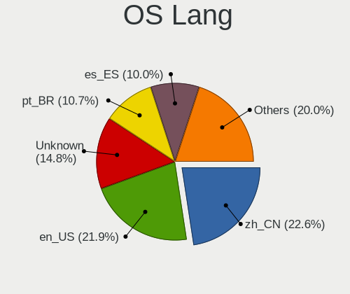

| Lang    | Computers | Percent |
|---------|-----------|---------|
| Unknown | 38        | 22.35%  |
| en_US   | 34        | 20%     |
| pt_BR   | 24        | 14.12%  |
| zh_CN   | 21        | 12.35%  |
| es_ES   | 20        | 11.76%  |
| de_DE   | 12        | 7.06%   |
| ru_RU   | 5         | 2.94%   |
| pl_PL   | 3         | 1.76%   |
| it_IT   | 3         | 1.76%   |
| tr_TR   | 2         | 1.18%   |
| fr_FR   | 2         | 1.18%   |
| en_GB   | 2         | 1.18%   |
| sv_SE   | 1         | 0.59%   |
| lt_LT   | 1         | 0.59%   |
| ja_JP   | 1         | 0.59%   |
| id_ID   | 1         | 0.59%   |

Boot Mode
---------

EFI or BIOS

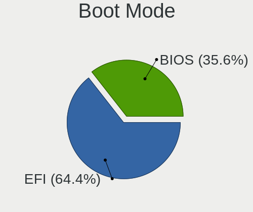

| Mode | Computers | Percent |
|------|-----------|---------|
| EFI  | 90        | 53.25%  |
| BIOS | 79        | 46.75%  |

Filesystem
----------

Type of filesystem

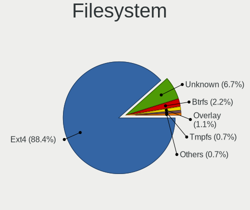

| Type    | Computers | Percent |
|---------|-----------|---------|
| Ext4    | 150       | 89.29%  |
| Unknown | 18        | 10.71%  |

Part. scheme
------------

Scheme of partitioning

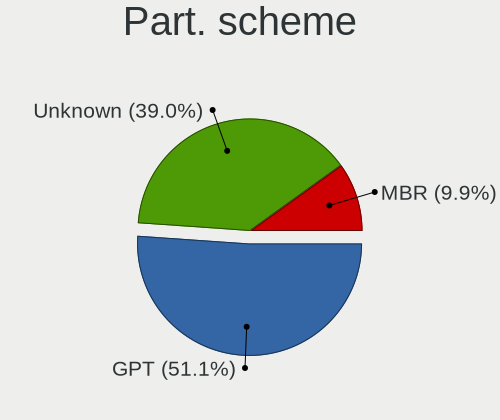

| Type    | Computers | Percent |
|---------|-----------|---------|
| Unknown | 83        | 48.54%  |
| GPT     | 68        | 39.77%  |
| MBR     | 20        | 11.7%   |

Dual Boot with Linux/BSD
------------------------

Hosting more than one Linux/BSD

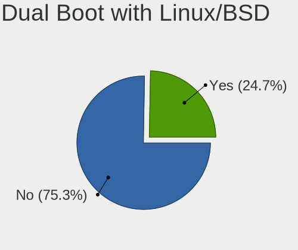

| Dual boot | Computers | Percent |
|-----------|-----------|---------|
| No        | 142       | 83.53%  |
| Yes       | 28        | 16.47%  |

Dual Boot (Win)
---------------

Hosting Linux and Windows

| Dual boot | Computers | Percent |
|-----------|-----------|---------|
| No        | 125       | 73.96%  |
| Yes       | 44        | 26.04%  |

Board
-----

Vendor
------

Motherboard manufacturer

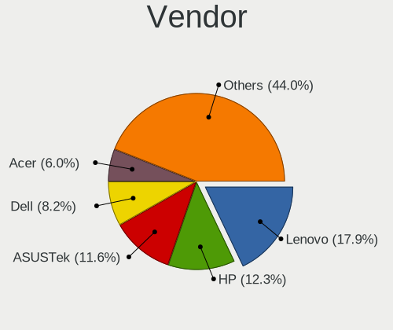

| Name                       | Computers | Percent |
|----------------------------|-----------|---------|
| Lenovo                     | 32        | 19.05%  |
| Hewlett-Packard            | 20        | 11.9%   |
| ASUSTek Computer           | 19        | 11.31%  |
| Dell                       | 15        | 8.93%   |
| Acer                       | 12        | 7.14%   |
| Gigabyte Technology        | 9         | 5.36%   |
| Samsung Electronics        | 8         | 4.76%   |
| TSINGHUA TONGFANG COMPUTER | 4         | 2.38%   |
| Toshiba                    | 4         | 2.38%   |
| Sony                       | 4         | 2.38%   |
| HUAWEI                     | 4         | 2.38%   |
| ASRock                     | 4         | 2.38%   |
| Positivo                   | 3         | 1.79%   |
| MSI                        | 3         | 1.79%   |
| Unknown                    | 3         | 1.79%   |
| Semp Toshiba               | 2         | 1.19%   |
| Google                     | 2         | 1.19%   |
| ECS                        | 2         | 1.19%   |
| Timi                       | 1         | 0.6%    |
| Standard                   | 1         | 0.6%    |
| Soyo                       | 1         | 0.6%    |
| Microtech                  | 1         | 0.6%    |
| Microsoft                  | 1         | 0.6%    |
| Medion                     | 1         | 0.6%    |
| Loongson                   | 1         | 0.6%    |
| Huanan                     | 1         | 0.6%    |
| HANWEI                     | 1         | 0.6%    |
| Gateway                    | 1         | 0.6%    |
| Fujitsu                    | 1         | 0.6%    |
| Foxconn                    | 1         | 0.6%    |
| Cube                       | 1         | 0.6%    |
| Chuwi                      | 1         | 0.6%    |
| CCE                        | 1         | 0.6%    |
| bq                         | 1         | 0.6%    |
| Apple                      | 1         | 0.6%    |
| AMD                        | 1         | 0.6%    |

Model
-----

Motherboard model

| Name                                              | Computers | Percent |
|---------------------------------------------------|-----------|---------|
| Unknown                                           | 5         | 2.98%   |
| TSINGHUA TONGFANG COMPUTER E500                   | 4         | 2.38%   |
| Semp Toshiba STI                                  | 2         | 1.19%   |
| Samsung 340XAA/350XAA/550XAA                      | 2         | 1.19%   |
| Lenovo IdeaPad 120S-11IAP 81A4                    | 2         | 1.19%   |
| HP Pavilion Notebook                              | 2         | 1.19%   |
| HP Pavilion 15                                    | 2         | 1.19%   |
| HP ENVY 15                                        | 2         | 1.19%   |
| ECS H81H3-M4                                      | 2         | 1.19%   |
| ASUS All Series                                   | 2         | 1.19%   |
| Acer Nitro AN515-54                               | 2         | 1.19%   |
| Toshiba Satellite L75-C                           | 1         | 0.6%    |
| Toshiba Satellite E55t-A                          | 1         | 0.6%    |
| Toshiba Satellite C850D-11K                       | 1         | 0.6%    |
| Toshiba Satellite C850-1H6                        | 1         | 0.6%    |
| Timi TM1701                                       | 1         | 0.6%    |
| Standard MB45II/MB45IN                            | 1         | 0.6%    |
| Soyo SY-Thin Mini H110                            | 1         | 0.6%    |
| Sony VPCYB25AB                                    | 1         | 0.6%    |
| Sony VGN-NS140D                                   | 1         | 0.6%    |
| Sony SVF14A190X                                   | 1         | 0.6%    |
| Sony SVE14135CXP                                  | 1         | 0.6%    |
| Samsung P500A2D                                   | 1         | 0.6%    |
| Samsung 800G5M/800G5W                             | 1         | 0.6%    |
| Samsung 550P5C/550P7C                             | 1         | 0.6%    |
| Samsung 500R4K/500R5H/5400RK/501R5H/5500RH/500R5S | 1         | 0.6%    |
| Samsung 300E4A/300E5A/300E7A/3430EA/3530EA        | 1         | 0.6%    |
| Samsung 270E5J/2570EJ                             | 1         | 0.6%    |
| Positivo POS-PQ45AU                               | 1         | 0.6%    |
| Positivo POS-EINM70CS                             | 1         | 0.6%    |
| Positivo C14CU51                                  | 1         | 0.6%    |
| MSI MS-7C83                                       | 1         | 0.6%    |
| MSI MS-7851                                       | 1         | 0.6%    |
| MSI MS-7681                                       | 1         | 0.6%    |
| Microtech ebookPro                                | 1         | 0.6%    |
| Microsoft Surface Pro 4                           | 1         | 0.6%    |
| Medion MS-7728                                    | 1         | 0.6%    |
| Loongson Loongson-LS3A3000-7A1000-1w-V1.2-Dev     | 1         | 0.6%    |
| Lenovo ZhaoYangCF4620Z-A123 59082537              | 1         | 0.6%    |
| Lenovo Yoga DuetITL 2021 82MA                     | 1         | 0.6%    |
| Lenovo Yoga 3 Pro-1370 80HE                       | 1         | 0.6%    |
| Lenovo XiaoXinAir-14ARE 2020 81YN                 | 1         | 0.6%    |
| Lenovo XiaoXin-15ARE 2020 81YR                    | 1         | 0.6%    |
| Lenovo V310-15ISK 80SY                            | 1         | 0.6%    |
| Lenovo ThinkPad T420 4236CU8                      | 1         | 0.6%    |
| Lenovo ThinkPad T420 4180M8P                      | 1         | 0.6%    |
| Lenovo ThinkPad L512 44444NG                      | 1         | 0.6%    |
| Lenovo ThinkPad L412 0585AC3                      | 1         | 0.6%    |
| Lenovo ThinkPad E585 20KV0010US                   | 1         | 0.6%    |
| Lenovo ThinkPad E450c 20EHA00NCD                  | 1         | 0.6%    |
| Lenovo ThinkPad E14 20RA0058VA                    | 1         | 0.6%    |
| Lenovo ThinkCentre M910t-N000 10N9CTO1WW          | 1         | 0.6%    |
| Lenovo ThinkCentre M82 2929AJ2                    | 1         | 0.6%    |
| Lenovo ThinkBook 14 G2 ARE R7 8 20VF              | 1         | 0.6%    |
| Lenovo ThinkBook 13s-IWL 20R9                     | 1         | 0.6%    |
| Lenovo Legion Y7000 2020 82AV                     | 1         | 0.6%    |
| Lenovo Legion R9000K2021H 82N6                    | 1         | 0.6%    |
| Lenovo IdeaPad S145-15IWL 81S9                    | 1         | 0.6%    |
| Lenovo IdeaPad S145-15API 81UT                    | 1         | 0.6%    |
| Lenovo IdeaPad 320-15IKB 80YH                     | 1         | 0.6%    |

Model Family
------------

Motherboard model prefix

| Name                                          | Computers | Percent |
|-----------------------------------------------|-----------|---------|
| Lenovo IdeaPad                                | 9         | 5.36%   |
| Dell Inspiron                                 | 9         | 5.36%   |
| Lenovo ThinkPad                               | 7         | 4.17%   |
| Acer Aspire                                   | 7         | 4.17%   |
| HP Pavilion                                   | 5         | 2.98%   |
| HP EliteBook                                  | 5         | 2.98%   |
| Unknown                                       | 5         | 2.98%   |
| TSINGHUA TONGFANG COMPUTER E500               | 4         | 2.38%   |
| Toshiba Satellite                             | 4         | 2.38%   |
| ASUS PRIME                                    | 3         | 1.79%   |
| Acer Nitro                                    | 3         | 1.79%   |
| Semp Toshiba STI                              | 2         | 1.19%   |
| Samsung 340XAA                                | 2         | 1.19%   |
| Lenovo Yoga                                   | 2         | 1.19%   |
| Lenovo ThinkCentre                            | 2         | 1.19%   |
| Lenovo ThinkBook                              | 2         | 1.19%   |
| Lenovo Legion                                 | 2         | 1.19%   |
| HP Laptop                                     | 2         | 1.19%   |
| HP ENVY                                       | 2         | 1.19%   |
| ECS H81H3-M4                                  | 2         | 1.19%   |
| Dell OptiPlex                                 | 2         | 1.19%   |
| Dell Latitude                                 | 2         | 1.19%   |
| ASUS All                                      | 2         | 1.19%   |
| Timi TM1701                                   | 1         | 0.6%    |
| Standard MB45II                               | 1         | 0.6%    |
| Soyo SY-Thin                                  | 1         | 0.6%    |
| Sony VPCYB25AB                                | 1         | 0.6%    |
| Sony VGN-NS140D                               | 1         | 0.6%    |
| Sony SVF14A190X                               | 1         | 0.6%    |
| Sony SVE14135CXP                              | 1         | 0.6%    |
| Samsung P500A2D                               | 1         | 0.6%    |
| Samsung 800G5M                                | 1         | 0.6%    |
| Samsung 550P5C                                | 1         | 0.6%    |
| Samsung 500R4K                                | 1         | 0.6%    |
| Samsung 300E4A                                | 1         | 0.6%    |
| Samsung 270E5J                                | 1         | 0.6%    |
| Positivo POS-PQ45AU                           | 1         | 0.6%    |
| Positivo POS-EINM70CS                         | 1         | 0.6%    |
| Positivo C14CU51                              | 1         | 0.6%    |
| MSI MS-7C83                                   | 1         | 0.6%    |
| MSI MS-7851                                   | 1         | 0.6%    |
| MSI MS-7681                                   | 1         | 0.6%    |
| Microtech ebookPro                            | 1         | 0.6%    |
| Microsoft Surface                             | 1         | 0.6%    |
| Medion MS-7728                                | 1         | 0.6%    |
| Loongson Loongson-LS3A3000-7A1000-1w-V1.2-Dev | 1         | 0.6%    |
| Lenovo ZhaoYangCF4620Z-A123                   | 1         | 0.6%    |
| Lenovo XiaoXinAir-14ARE                       | 1         | 0.6%    |
| Lenovo XiaoXin-15ARE                          | 1         | 0.6%    |
| Lenovo V310-15ISK                             | 1         | 0.6%    |
| Lenovo G50-80                                 | 1         | 0.6%    |
| Lenovo G50-70                                 | 1         | 0.6%    |
| Lenovo G400s                                  | 1         | 0.6%    |
| HUAWEI NBLK-WAX9X                             | 1         | 0.6%    |
| HUAWEI HN-WX9X                                | 1         | 0.6%    |
| HUAWEI HLYL-WXX9                              | 1         | 0.6%    |
| HUAWEI HLY-WX9XX                              | 1         | 0.6%    |
| Huanan X99-8M-F                               | 1         | 0.6%    |
| HP ZHAN                                       | 1         | 0.6%    |
| HP Spectre                                    | 1         | 0.6%    |

MFG Year
--------

Motherboard manufacture year

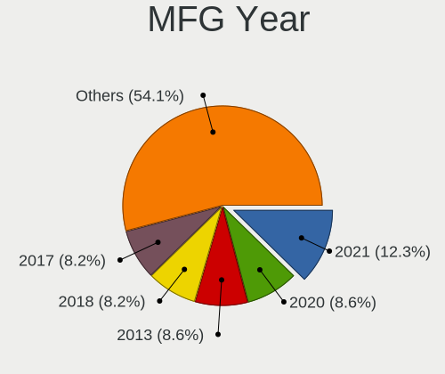

| Year    | Computers | Percent |
|---------|-----------|---------|
| 2017    | 19        | 11.31%  |
| 2018    | 17        | 10.12%  |
| 2013    | 17        | 10.12%  |
| 2012    | 17        | 10.12%  |
| 2019    | 16        | 9.52%   |
| 2016    | 12        | 7.14%   |
| 2011    | 12        | 7.14%   |
| 2020    | 11        | 6.55%   |
| 2014    | 11        | 6.55%   |
| 2021    | 9         | 5.36%   |
| 2010    | 8         | 4.76%   |
| 2009    | 8         | 4.76%   |
| 2015    | 7         | 4.17%   |
| 2008    | 2         | 1.19%   |
| Unknown | 2         | 1.19%   |

Form Factor
-----------

Physical design of the computer

| Name           | Computers | Percent |
|----------------|-----------|---------|
| Notebook       | 107       | 63.69%  |
| Desktop        | 50        | 29.76%  |
| Tablet         | 4         | 2.38%   |
| All in one     | 3         | 1.79%   |
| Convertible    | 2         | 1.19%   |
| System on chip | 1         | 0.6%    |
| Mini pc        | 1         | 0.6%    |

Secure Boot
-----------

Enabled or disabled

| State    | Computers | Percent |
|----------|-----------|---------|
| Disabled | 165       | 98.21%  |
| Enabled  | 3         | 1.79%   |

Coreboot
--------

Have coreboot on board

| Used | Computers | Percent |
|------|-----------|---------|
| No   | 166       | 98.81%  |
| Yes  | 2         | 1.19%   |

RAM Size
--------

Total RAM memory

| Size in GB  | Computers | Percent |
|-------------|-----------|---------|
| 4.01-8.0    | 50        | 29.76%  |
| 8.01-16.0   | 43        | 25.6%   |
| 3.01-4.0    | 33        | 19.64%  |
| 16.01-24.0  | 31        | 18.45%  |
| 1.01-2.0    | 5         | 2.98%   |
| 32.01-64.0  | 3         | 1.79%   |
| 64.01-256.0 | 2         | 1.19%   |
| 2.01-3.0    | 1         | 0.6%    |

RAM Used
--------

Used RAM memory

| Used GB   | Computers | Percent |
|-----------|-----------|---------|
| 1.01-2.0  | 58        | 32.58%  |
| 2.01-3.0  | 50        | 28.09%  |
| 3.01-4.0  | 28        | 15.73%  |
| 4.01-8.0  | 25        | 14.04%  |
| 0.51-1.0  | 13        | 7.3%    |
| 8.01-16.0 | 3         | 1.69%   |
| 0.01-0.5  | 1         | 0.56%   |

Total Drives
------------

Number of drives on board

| Drives | Computers | Percent |
|--------|-----------|---------|
| 1      | 108       | 63.16%  |
| 2      | 51        | 29.82%  |
| 4      | 6         | 3.51%   |
| 3      | 5         | 2.92%   |
| 5      | 1         | 0.58%   |

Has CD-ROM
----------

Has CD-ROM on board

| Presented | Computers | Percent |
|-----------|-----------|---------|
| No        | 106       | 62.35%  |
| Yes       | 64        | 37.65%  |

Has Ethernet
------------

Has Ethernet on board

| Presented | Computers | Percent |
|-----------|-----------|---------|
| Yes       | 138       | 82.14%  |
| No        | 30        | 17.86%  |

Has WiFi
--------

Has WiFi module

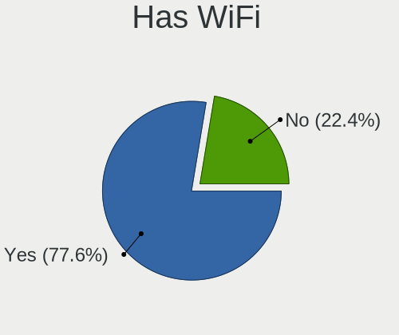

| Presented | Computers | Percent |
|-----------|-----------|---------|
| Yes       | 128       | 76.19%  |
| No        | 40        | 23.81%  |

Has Bluetooth
-------------

Has Bluetooth module

| Presented | Computers | Percent |
|-----------|-----------|---------|
| Yes       | 108       | 64.29%  |
| No        | 60        | 35.71%  |

Location
--------

Country
-------

Geographic location (country)

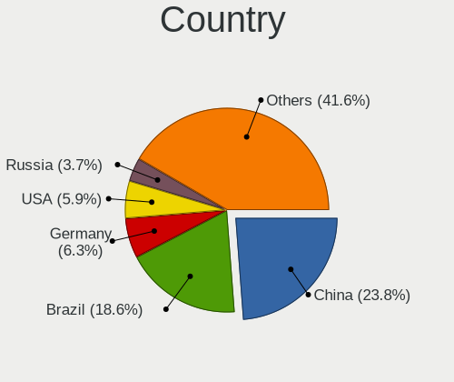

| Country               | Computers | Percent |
|-----------------------|-----------|---------|
| Brazil                | 45        | 26.63%  |
| China                 | 24        | 14.2%   |
| Germany               | 12        | 7.1%    |
| USA                   | 11        | 6.51%   |
| Spain                 | 6         | 3.55%   |
| Indonesia             | 5         | 2.96%   |
| Turkey                | 4         | 2.37%   |
| Russia                | 4         | 2.37%   |
| Poland                | 4         | 2.37%   |
| Panama                | 4         | 2.37%   |
| Chile                 | 4         | 2.37%   |
| Mexico                | 3         | 1.78%   |
| Italy                 | 3         | 1.78%   |
| Colombia              | 3         | 1.78%   |
| Argentina             | 3         | 1.78%   |
| Japan                 | 2         | 1.18%   |
| India                 | 2         | 1.18%   |
| Canada                | 2         | 1.18%   |
| Bangladesh            | 2         | 1.18%   |
| Austria               | 2         | 1.18%   |
| Venezuela             | 1         | 0.59%   |
| Ukraine               | 1         | 0.59%   |
| UK                    | 1         | 0.59%   |
| Tunisia               | 1         | 0.59%   |
| Sweden                | 1         | 0.59%   |
| South Africa          | 1         | 0.59%   |
| Singapore             | 1         | 0.59%   |
| Serbia                | 1         | 0.59%   |
| Sao Tome and Principe | 1         | 0.59%   |
| Romania               | 1         | 0.59%   |
| Portugal              | 1         | 0.59%   |
| Pakistan              | 1         | 0.59%   |
| New Zealand           | 1         | 0.59%   |
| Namibia               | 1         | 0.59%   |
| Lithuania             | 1         | 0.59%   |
| Iran                  | 1         | 0.59%   |
| Greece                | 1         | 0.59%   |
| France                | 1         | 0.59%   |
| Ecuador               | 1         | 0.59%   |
| Czechia               | 1         | 0.59%   |
| Cuba                  | 1         | 0.59%   |
| Bulgaria              | 1         | 0.59%   |
| Belgium               | 1         | 0.59%   |
| Belarus               | 1         | 0.59%   |

City
----

Geographic location (city)

| City                     | Computers | Percent |
|--------------------------|-----------|---------|
| Beijing                  | 6         | 3.49%   |
| Sao Paulo                | 5         | 2.91%   |
| David                    | 4         | 2.33%   |
| Rio de Janeiro           | 3         | 1.74%   |
| Surabaya                 | 2         | 1.16%   |
| Shanghai                 | 2         | 1.16%   |
| Londrina                 | 2         | 1.16%   |
| Istanbul                 | 2         | 1.16%   |
| Guangzhou                | 2         | 1.16%   |
| Getxo                    | 2         | 1.16%   |
| Curitiba                 | 2         | 1.16%   |
| Contagem                 | 2         | 1.16%   |
| Braslia              | 2         | 1.16%   |
| Bogot                | 2         | 1.16%   |
| Zieleniewo               | 1         | 0.58%   |
| Xuhui                    | 1         | 0.58%   |
| Wuhan                    | 1         | 0.58%   |
| Windhoek                 | 1         | 0.58%   |
| Waynesville              | 1         | 0.58%   |
| Vilnius                  | 1         | 0.58%   |
| Villa Ballester          | 1         | 0.58%   |
| Vienna                   | 1         | 0.58%   |
| Vieiras                  | 1         | 0.58%   |
| Valdenoches              | 1         | 0.58%   |
| Uberlndia            | 1         | 0.58%   |
| Uberlndia            | 1         | 0.58%   |
| Tunis                    | 1         | 0.58%   |
| Tres Rios                | 1         | 0.58%   |
| Tomsk                    | 1         | 0.58%   |
| Tianjin                  | 1         | 0.58%   |
| Teknaf                   | 1         | 0.58%   |
| Tehrn                | 1         | 0.58%   |
| Taiyuan                  | 1         | 0.58%   |
| So Tom           | 1         | 0.58%   |
| So Carlos            | 1         | 0.58%   |
| So Bernardo do Campo | 1         | 0.58%   |
| So Bento do Sul      | 1         | 0.58%   |
| Suzano                   | 1         | 0.58%   |
| Surakarta                | 1         | 0.58%   |
| Sumar                | 1         | 0.58%   |
| St Petersburg            | 1         | 0.58%   |
| Srednyaya Akhtuba        | 1         | 0.58%   |
| Socorro                  | 1         | 0.58%   |
| Sobreda                  | 1         | 0.58%   |
| Sleman                   | 1         | 0.58%   |
| Singapore                | 1         | 0.58%   |
| Shenzhen                 | 1         | 0.58%   |
| Shahekou                 | 1         | 0.58%   |
| Sehnde                   | 1         | 0.58%   |
| Seesen                   | 1         | 0.58%   |
| Santiago                 | 1         | 0.58%   |
| San Juan de Coln     | 1         | 0.58%   |
| San Francisco            | 1         | 0.58%   |
| Salt Lake City           | 1         | 0.58%   |
| Saitama                  | 1         | 0.58%   |
| Rzeszw               | 1         | 0.58%   |
| Rzeszotary               | 1         | 0.58%   |
| Rotherham                | 1         | 0.58%   |
| Rotenburg                | 1         | 0.58%   |
| Rome                     | 1         | 0.58%   |

Drives
------

Drive Vendor
------------

Hard drive vendors

| Vendor                         | Computers | Drives | Percent |
|--------------------------------|-----------|--------|---------|
| WDC                            | 37        | 45     | 15.42%  |
| Seagate                        | 36        | 42     | 15%     |
| Samsung Electronics            | 23        | 26     | 9.58%   |
| SanDisk                        | 18        | 23     | 7.5%    |
| Toshiba                        | 17        | 19     | 7.08%   |
| Unknown                        | 13        | 14     | 5.42%   |
| Kingston                       | 13        | 18     | 5.42%   |
| Hitachi                        | 8         | 8      | 3.33%   |
| SK Hynix                       | 6         | 6      | 2.5%    |
| Crucial                        | 6         | 7      | 2.5%    |
| Micron Technology              | 5         | 6      | 2.08%   |
| HGST                           | 5         | 5      | 2.08%   |
| China                          | 5         | 5      | 2.08%   |
| A-DATA Technology              | 5         | 6      | 2.08%   |
| SPCC                           | 4         | 4      | 1.67%   |
| LITEON                         | 3         | 3      | 1.25%   |
| Intel                          | 3         | 4      | 1.25%   |
| Vaseky                         | 2         | 2      | 0.83%   |
| Silicon Motion                 | 2         | 2      | 0.83%   |
| MAXTOR                         | 2         | 4      | 0.83%   |
| JMicron                        | 2         | 2      | 0.83%   |
| Intenso                        | 2         | 3      | 0.83%   |
| Hewlett-Packard                | 2         | 3      | 0.83%   |
| FORESEE                        | 2         | 2      | 0.83%   |
| V-GeN                          | 1         | 1      | 0.42%   |
| Transcend                      | 1         | 1      | 0.42%   |
| Solid State Storage Technology | 1         | 1      | 0.42%   |
| Realtek Semiconductor          | 1         | 1      | 0.42%   |
| Phison                         | 1         | 1      | 0.42%   |
| OEM                            | 1         | 1      | 0.42%   |
| OCZ                            | 1         | 1      | 0.42%   |
| Netac                          | 1         | 1      | 0.42%   |
| Mushkin                        | 1         | 1      | 0.42%   |
| Microtech                      | 1         | 1      | 0.42%   |
| Maxtor 6                       | 1         | 1      | 0.42%   |
| LaCie                          | 1         | 2      | 0.42%   |
| KingSpec                       | 1         | 1      | 0.42%   |
| KingDian                       | 1         | 1      | 0.42%   |
| KINGBANK                       | 1         | 1      | 0.42%   |
| Gigabyte Technology            | 1         | 1      | 0.42%   |
| Fujitsu                        | 1         | 2      | 0.42%   |
| Beijing Starblaze              | 1         | 1      | 0.42%   |
| Apacer                         | 1         | 3      | 0.42%   |

Drive Model
-----------

Hard drive models

| Model                                | Computers | Percent |
|--------------------------------------|-----------|---------|
| Seagate ST1000LM035-1RK172 1TB       | 6         | 2.39%   |
| Toshiba MQ01ABF050 500GB             | 5         | 1.99%   |
| Kingston SA400S37240G 240GB SSD      | 5         | 1.99%   |
| WDC WD5000LPCX-24VHAT0 500GB         | 3         | 1.2%    |
| Unknown MMC Card                     | 3         | 1.2%    |
| Toshiba MQ01ABD100 1TB               | 3         | 1.2%    |
| Seagate ST500LM012 HN-M500MBB 500GB  | 3         | 1.2%    |
| Seagate ST1000DM010-2EP102 1TB       | 3         | 1.2%    |
| Samsung SSD 850 EVO 500GB            | 3         | 1.2%    |
| Crucial CT240BX500SSD1 240GB         | 3         | 1.2%    |
| WDC WD5000AAKX-003CA0 500GB          | 2         | 0.8%    |
| SPCC Solid State Disk 512GB          | 2         | 0.8%    |
| Seagate ST9320325AS 320GB            | 2         | 0.8%    |
| Seagate ST1000LM024 HN-M101MBB 1TB   | 2         | 0.8%    |
| Seagate ST1000DM003-1SB102 1TB       | 2         | 0.8%    |
| SanDisk SSD PLUS 240GB               | 2         | 0.8%    |
| SanDisk SDSSDH3512G 512GB            | 2         | 0.8%    |
| SanDisk SDSSDA240G 240GB             | 2         | 0.8%    |
| SanDisk SDSSDA120G 120GB             | 2         | 0.8%    |
| SanDisk DF4064  64GB                 | 2         | 0.8%    |
| Samsung MZVLW256HEHP-000H1 256GB     | 2         | 0.8%    |
| Kingston SV300S37A120G 120GB SSD     | 2         | 0.8%    |
| JMicron Generic 2TB                  | 2         | 0.8%    |
| HGST HTS545050A7E680 500GB           | 2         | 0.8%    |
| FORESEE P900F256GBH                  | 2         | 0.8%    |
| WDC WDS500G2B0B-00YS70 500GB SSD     | 1         | 0.4%    |
| WDC WDS480G2G0B-00EPW0 480GB SSD     | 1         | 0.4%    |
| WDC WDS120G2G0A-00JH30 120GB SSD     | 1         | 0.4%    |
| WDC WDS120G1G0A-00SS50 120GB SSD     | 1         | 0.4%    |
| WDC WDS100T2G0A-00JH30 1TB SSD       | 1         | 0.4%    |
| WDC WD80 0BEVE-11UYT0 80GB           | 1         | 0.4%    |
| WDC WD7500BPVT-24HXZT3 752GB         | 1         | 0.4%    |
| WDC WD7500BPKX-22HPJT0 752GB         | 1         | 0.4%    |
| WDC WD6400AAKS-75A7B0 640GB          | 1         | 0.4%    |
| WDC WD5000LPZX-75Z10T0 500GB         | 1         | 0.4%    |
| WDC WD5000LPVX-80V0TT0 500GB         | 1         | 0.4%    |
| WDC WD5000LPVX-08V0TT6 500GB         | 1         | 0.4%    |
| WDC WD5000LPCX-24C6HT0 500GB         | 1         | 0.4%    |
| WDC WD5000AAKX-00ERMA0 500GB         | 1         | 0.4%    |
| WDC WD5000AAKS-00A7B2 500GB          | 1         | 0.4%    |
| WDC WD5000AAJS-57TKA0 500GB          | 1         | 0.4%    |
| WDC WD3200BEVT-22ZCT0 320GB          | 1         | 0.4%    |
| WDC WD3200BEVT-08A23T1 320GB         | 1         | 0.4%    |
| WDC WD3200AAKS-00VYA0 320GB          | 1         | 0.4%    |
| WDC WD20PURX-64P6ZY0 2TB             | 1         | 0.4%    |
| WDC WD20EARX-00PASB0 2TB             | 1         | 0.4%    |
| WDC WD1600AAJS-00L7A0 160GB          | 1         | 0.4%    |
| WDC WD10SPZX-35Z10T0 1TB             | 1         | 0.4%    |
| WDC WD10SPZX-24Z10 1TB               | 1         | 0.4%    |
| WDC WD10SPZX-08Z10 1TB               | 1         | 0.4%    |
| WDC WD10JPVX-60JC3T1 1TB             | 1         | 0.4%    |
| WDC WD10JPVX-60JC3T0 1TB             | 1         | 0.4%    |
| WDC WD10JPVX-22JC3T0 1TB             | 1         | 0.4%    |
| WDC WD10JPCX-24UE4T0 1TB             | 1         | 0.4%    |
| WDC WD10EZEX-22MFCA0 1TB             | 1         | 0.4%    |
| WDC WD10EZEX-08M2NA0 1TB             | 1         | 0.4%    |
| WDC WD10EFRX-68FYTN0 1TB             | 1         | 0.4%    |
| WDC WD10EARS-00Y5B1 1TB              | 1         | 0.4%    |
| WDC PC SN730 SDBPNTY-512G-1101 512GB | 1         | 0.4%    |
| WDC PC SN720 SDAPNTW-512G-1127 512GB | 1         | 0.4%    |

HDD Vendor
----------

Hard disk drive vendors

| Vendor              | Computers | Drives | Percent |
|---------------------|-----------|--------|---------|
| Seagate             | 35        | 41     | 33.33%  |
| WDC                 | 31        | 37     | 29.52%  |
| Toshiba             | 16        | 18     | 15.24%  |
| Hitachi             | 8         | 8      | 7.62%   |
| HGST                | 5         | 5      | 4.76%   |
| Samsung Electronics | 3         | 3      | 2.86%   |
| MAXTOR              | 2         | 4      | 1.9%    |
| Unknown             | 1         | 2      | 0.95%   |
| OEM                 | 1         | 1      | 0.95%   |
| Maxtor 6            | 1         | 1      | 0.95%   |
| Hewlett-Packard     | 1         | 2      | 0.95%   |
| Fujitsu             | 1         | 2      | 0.95%   |

SSD Vendor
----------

Solid state drive vendors

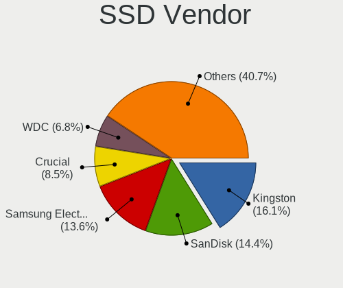

| Vendor              | Computers | Drives | Percent |
|---------------------|-----------|--------|---------|
| SanDisk             | 16        | 21     | 18.6%   |
| Kingston            | 13        | 18     | 15.12%  |
| Samsung Electronics | 11        | 13     | 12.79%  |
| WDC                 | 5         | 5      | 5.81%   |
| Crucial             | 5         | 6      | 5.81%   |
| China               | 5         | 5      | 5.81%   |
| SPCC                | 4         | 4      | 4.65%   |
| A-DATA Technology   | 3         | 4      | 3.49%   |
| Vaseky              | 2         | 2      | 2.33%   |
| SK Hynix            | 2         | 2      | 2.33%   |
| Micron Technology   | 2         | 2      | 2.33%   |
| LITEON              | 2         | 2      | 2.33%   |
| JMicron             | 2         | 2      | 2.33%   |
| Intenso             | 2         | 3      | 2.33%   |
| V-GeN               | 1         | 1      | 1.16%   |
| Unknown             | 1         | 1      | 1.16%   |
| Transcend           | 1         | 1      | 1.16%   |
| OCZ                 | 1         | 1      | 1.16%   |
| Netac               | 1         | 1      | 1.16%   |
| Microtech           | 1         | 1      | 1.16%   |
| KingSpec            | 1         | 1      | 1.16%   |
| KingDian            | 1         | 1      | 1.16%   |
| KINGBANK            | 1         | 1      | 1.16%   |
| Intel               | 1         | 2      | 1.16%   |
| Hewlett-Packard     | 1         | 1      | 1.16%   |
| Apacer              | 1         | 3      | 1.16%   |

Drive Kind
----------

HDD or SSD

| Kind    | Computers | Drives | Percent |
|---------|-----------|--------|---------|
| HDD     | 94        | 124    | 43.32%  |
| SSD     | 74        | 104    | 34.1%   |
| NVMe    | 35        | 38     | 16.13%  |
| MMC     | 12        | 13     | 5.53%   |
| Unknown | 2         | 3      | 0.92%   |

Drive Connector
---------------

SATA, SAS, NVMe, etc.

| Type | Computers | Drives | Percent |
|------|-----------|--------|---------|
| SATA | 138       | 218    | 71.13%  |
| NVMe | 35        | 38     | 18.04%  |
| MMC  | 12        | 13     | 6.19%   |
| SAS  | 9         | 13     | 4.64%   |

Drive Size
----------

Size of hard drive

| Size in TB | Computers | Drives | Percent |
|------------|-----------|--------|---------|
| 0.01-0.5   | 101       | 149    | 59.76%  |
| 0.51-1.0   | 58        | 67     | 34.32%  |
| 1.01-2.0   | 9         | 11     | 5.33%   |
| 4.01-10.0  | 1         | 1      | 0.59%   |

Space Total
-----------

Amount of disk space available on the file system

| Size in GB     | Computers | Percent |
|----------------|-----------|---------|
| 251-500        | 45        | 26.01%  |
| 101-250        | 41        | 23.7%   |
| 501-1000       | 37        | 21.39%  |
| 1001-2000      | 24        | 13.87%  |
| 51-100         | 8         | 4.62%   |
| More than 3000 | 7         | 4.05%   |
| 21-50          | 5         | 2.89%   |
| Unknown        | 3         | 1.73%   |
| 2001-3000      | 2         | 1.16%   |
| 1-20           | 1         | 0.58%   |

Space Used
----------

Amount of used disk space

| Used GB   | Computers | Percent |
|-----------|-----------|---------|
| 21-50     | 36        | 20.34%  |
| 101-250   | 35        | 19.77%  |
| 1-20      | 33        | 18.64%  |
| 51-100    | 25        | 14.12%  |
| 251-500   | 19        | 10.73%  |
| 501-1000  | 18        | 10.17%  |
| 1001-2000 | 5         | 2.82%   |
| 2001-3000 | 3         | 1.69%   |
| Unknown   | 3         | 1.69%   |

Malfunc. Drives
---------------

Drive models with a malfunction

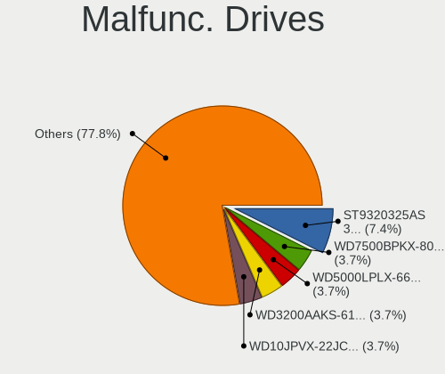

| Model                                         | Computers | Drives | Percent |
|-----------------------------------------------|-----------|--------|---------|
| Seagate ST9320325AS 320GB                     | 2         | 2      | 12.5%   |
| WDC WD10JPVX-22JC3T0 1TB                      | 1         | 1      | 6.25%   |
| WDC WD10EARS-00Y5B1 1TB                       | 1         | 1      | 6.25%   |
| Toshiba MQ01ABD100 1TB                        | 1         | 1      | 6.25%   |
| Toshiba MQ01ABD032 320GB                      | 1         | 1      | 6.25%   |
| Seagate ST3750528AS 752GB                     | 1         | 1      | 6.25%   |
| Seagate ST2000LM003 HN-M201RAD 2TB            | 1         | 1      | 6.25%   |
| Seagate ST1000DL002-9TT153 1TB                | 1         | 1      | 6.25%   |
| Samsung Electronics HM250HI 250GB             | 1         | 1      | 6.25%   |
| Samsung Electronics HD502HJ 500GB             | 1         | 1      | 6.25%   |
| Samsung Electronics HD250HJ 250GB             | 1         | 1      | 6.25%   |
| OCZ VERTEX4 256GB SSD                         | 1         | 1      | 6.25%   |
| Micron Technology MTFDDAT128MAM-1J2 128GB SSD | 1         | 1      | 6.25%   |
| Intenso lntenso SSD Sata III 240GB            | 1         | 1      | 6.25%   |
| Hitachi HTS543225L9A300 250GB                 | 1         | 1      | 6.25%   |

Malfunc. Drive Vendor
---------------------

Vendors of faulty drives

| Vendor              | Computers | Drives | Percent |
|---------------------|-----------|--------|---------|
| Seagate             | 4         | 5      | 26.67%  |
| Samsung Electronics | 3         | 3      | 20%     |
| WDC                 | 2         | 2      | 13.33%  |
| Toshiba             | 2         | 2      | 13.33%  |
| OCZ                 | 1         | 1      | 6.67%   |
| Micron Technology   | 1         | 1      | 6.67%   |
| Intenso             | 1         | 1      | 6.67%   |
| Hitachi             | 1         | 1      | 6.67%   |

Malfunc. HDD Vendor
-------------------

Vendors of faulty HDD drives

| Vendor              | Computers | Drives | Percent |
|---------------------|-----------|--------|---------|
| Seagate             | 4         | 5      | 33.33%  |
| Samsung Electronics | 3         | 3      | 25%     |
| WDC                 | 2         | 2      | 16.67%  |
| Toshiba             | 2         | 2      | 16.67%  |
| Hitachi             | 1         | 1      | 8.33%   |

Malfunc. Drive Kind
-------------------

Kinds of faulty drives

| Kind | Computers | Drives | Percent |
|------|-----------|--------|---------|
| HDD  | 12        | 13     | 80%     |
| SSD  | 3         | 3      | 20%     |

Failed Drives
-------------

Failed drive models

| Model                       | Computers | Drives | Percent |
|-----------------------------|-----------|--------|---------|
| Toshiba MK5065GSXN 500GB    | 1         | 1      | 50%     |
| Hitachi HUA722010CLA330 1TB | 1         | 1      | 50%     |

Failed Drive Vendor
-------------------

Failed drive vendors

| Vendor  | Computers | Drives | Percent |
|---------|-----------|--------|---------|
| Toshiba | 1         | 1      | 50%     |
| Hitachi | 1         | 1      | 50%     |

Drive Status
------------

Number of failed and malfunc. drives

| Status   | Computers | Drives | Percent |
|----------|-----------|--------|---------|
| Detected | 97        | 162    | 52.15%  |
| Works    | 72        | 102    | 38.71%  |
| Malfunc  | 15        | 16     | 8.06%   |
| Failed   | 2         | 2      | 1.08%   |

Storage controller
------------------

Storage Vendor
--------------

Storage controller vendors

| Vendor                         | Computers | Percent |
|--------------------------------|-----------|---------|
| Intel                          | 124       | 64.58%  |
| AMD                            | 20        | 10.42%  |
| Samsung Electronics            | 10        | 5.21%   |
| SK Hynix                       | 4         | 2.08%   |
| Marvell Technology Group       | 4         | 2.08%   |
| ASMedia Technology             | 4         | 2.08%   |
| Silicon Motion                 | 3         | 1.56%   |
| Sandisk                        | 3         | 1.56%   |
| Micron Technology              | 3         | 1.56%   |
| Shenzhen Longsys Electronics   | 2         | 1.04%   |
| Realtek Semiconductor          | 2         | 1.04%   |
| Phison Electronics             | 2         | 1.04%   |
| Nvidia                         | 2         | 1.04%   |
| JMicron Technology             | 2         | 1.04%   |
| Zhaoxin                        | 1         | 0.52%   |
| Solid State Storage Technology | 1         | 0.52%   |
| Micron/Crucial Technology      | 1         | 0.52%   |
| Loongson Technology            | 1         | 0.52%   |
| Lite-On Technology             | 1         | 0.52%   |
| KIOXIA                         | 1         | 0.52%   |
| Beijing Starblaze Technology   | 1         | 0.52%   |

Storage Model
-------------

Storage controller models

| Model                                                                                   | Computers | Percent |
|-----------------------------------------------------------------------------------------|-----------|---------|
| Intel Sunrise Point-LP SATA Controller [AHCI mode]                                      | 15        | 7.18%   |
| AMD FCH SATA Controller [AHCI mode]                                                     | 14        | 6.7%    |
| Intel 7 Series Chipset Family 6-port SATA Controller [AHCI mode]                        | 13        | 6.22%   |
| Intel 8 Series SATA Controller 1 [AHCI mode]                                            | 11        | 5.26%   |
| Intel Wildcat Point-LP SATA Controller [AHCI Mode]                                      | 9         | 4.31%   |
| Intel 82801 Mobile SATA Controller [RAID mode]                                          | 6         | 2.87%   |
| Intel 6 Series/C200 Series Chipset Family 6 port Desktop SATA AHCI Controller           | 6         | 2.87%   |
| Intel 400 Series Chipset Family SATA AHCI Controller                                    | 6         | 2.87%   |
| Samsung NVMe SSD Controller SM981/PM981/PM983                                           | 5         | 2.39%   |
| Intel Q170/Q150/B150/H170/H110/Z170/CM236 Chipset SATA Controller [AHCI Mode]           | 5         | 2.39%   |
| Intel 82801IBM/IEM (ICH9M/ICH9M-E) 4 port SATA Controller [AHCI mode]                   | 5         | 2.39%   |
| Intel 8 Series/C220 Series Chipset Family 6-port SATA Controller 1 [AHCI mode]          | 5         | 2.39%   |
| Intel 7 Series/C210 Series Chipset Family 6-port SATA Controller [AHCI mode]            | 4         | 1.91%   |
| Intel 6 Series/C200 Series Chipset Family 6 port Mobile SATA AHCI Controller            | 4         | 1.91%   |
| ASMedia ASM1062 Serial ATA Controller                                                   | 4         | 1.91%   |
| AMD SB7x0/SB8x0/SB9x0 SATA Controller [AHCI mode]                                       | 4         | 1.91%   |
| Samsung NVMe SSD Controller SM961/PM961/SM963                                           | 3         | 1.44%   |
| Micron Non-Volatile memory controller                                                   | 3         | 1.44%   |
| Intel NM10/ICH7 Family SATA Controller [IDE mode]                                       | 3         | 1.44%   |
| Intel Celeron/Pentium Silver Processor SATA Controller                                  | 3         | 1.44%   |
| Intel Cannon Point-LP SATA Controller [AHCI Mode]                                       | 3         | 1.44%   |
| Intel 5 Series/3400 Series Chipset 4 port SATA AHCI Controller                          | 3         | 1.44%   |
| AMD SB7x0/SB8x0/SB9x0 IDE Controller                                                    | 3         | 1.44%   |
| SK Hynix BC511                                                                          | 2         | 0.96%   |
| Silicon Motion SM2263EN/SM2263XT SSD Controller                                         | 2         | 0.96%   |
| Shenzhen Longsys Non-Volatile memory controller                                         | 2         | 0.96%   |
| Marvell Group 88SE9215 PCIe 2.0 x1 4-port SATA 6 Gb/s Controller                        | 2         | 0.96%   |
| Intel SATA Controller [RAID mode]                                                       | 2         | 0.96%   |
| Intel Comet Lake SATA AHCI Controller                                                   | 2         | 0.96%   |
| Intel Celeron N3350/Pentium N4200/Atom E3900 Series SATA AHCI Controller                | 2         | 0.96%   |
| Intel Cannon Lake PCH SATA AHCI Controller                                              | 2         | 0.96%   |
| Intel Cannon Lake Mobile PCH SATA AHCI Controller                                       | 2         | 0.96%   |
| Intel Atom/Celeron/Pentium Processor x5-E8000/J3xxx/N3xxx Series SATA Controller        | 2         | 0.96%   |
| Intel 82801JD/DO (ICH10 Family) SATA AHCI Controller                                    | 2         | 0.96%   |
| Intel 6 Series/C200 Series Chipset Family Desktop SATA Controller (IDE mode, ports 4-5) | 2         | 0.96%   |
| Intel 6 Series/C200 Series Chipset Family Desktop SATA Controller (IDE mode, ports 0-3) | 2         | 0.96%   |
| Zhaoxin ZX-100/ZX-200/ZX-E StorX AHCI Controller                                        | 1         | 0.48%   |
| Solid State Storage Non-Volatile memory controller                                      | 1         | 0.48%   |
| SK Hynix Gold P31 SSD                                                                   | 1         | 0.48%   |
| SK Hynix BC501 NVMe Solid State Drive                                                   | 1         | 0.48%   |
| Silicon Motion SM2262/SM2262EN SSD Controller                                           | 1         | 0.48%   |
| Sandisk WD Black SN750 / PC SN730 NVMe SSD                                              | 1         | 0.48%   |
| Sandisk WD Black 2018/SN750 / PC SN720 NVMe SSD                                         | 1         | 0.48%   |
| Sandisk Non-Volatile memory controller                                                  | 1         | 0.48%   |
| Samsung NVMe SSD Controller SM951/PM951                                                 | 1         | 0.48%   |
| Samsung NVMe SSD Controller 980                                                         | 1         | 0.48%   |
| Realtek RTS5763DL NVMe SSD Controller                                                   | 1         | 0.48%   |
| Realtek Realtek Non-Volatile memory controller                                          | 1         | 0.48%   |
| Phison PS5013 E13 NVMe Controller                                                       | 1         | 0.48%   |
| Phison E16 PCIe4 NVMe Controller                                                        | 1         | 0.48%   |
| Nvidia MCP79 SATA Controller                                                            | 1         | 0.48%   |
| Nvidia MCP61 SATA Controller                                                            | 1         | 0.48%   |
| Nvidia MCP61 IDE                                                                        | 1         | 0.48%   |
| Micron/Crucial Non-Volatile memory controller                                           | 1         | 0.48%   |
| Marvell Group 88SE9123 PCIe SATA 6.0 Gb/s controller                                    | 1         | 0.48%   |
| Marvell Group 88SE6111/6121 SATA II / PATA Controller                                   | 1         | 0.48%   |
| Loongson SATA AHCI Controller                                                           | 1         | 0.48%   |
| Lite-On Non-Volatile memory controller                                                  | 1         | 0.48%   |
| KIOXIA Non-Volatile memory controller                                                   | 1         | 0.48%   |
| JMicron JMB368 IDE controller                                                           | 1         | 0.48%   |

Storage Kind
------------

Kind of storage controller (IDE, SATA, NVMe, SAS, ...)

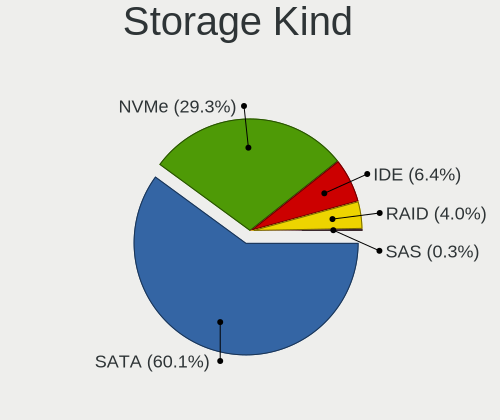

| Kind | Computers | Percent |
|------|-----------|---------|
| SATA | 130       | 68.42%  |
| NVMe | 35        | 18.42%  |
| IDE  | 17        | 8.95%   |
| RAID | 8         | 4.21%   |

Processor
---------

CPU Vendor
----------

Processor vendors

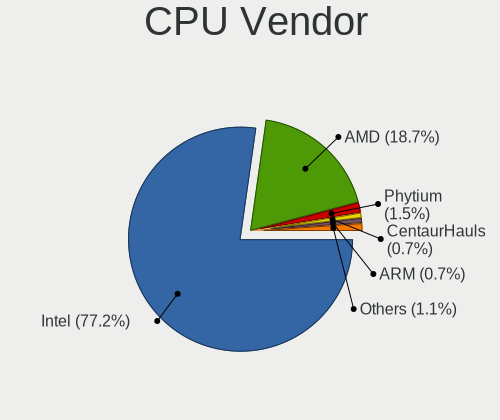

| Vendor       | Computers | Percent |
|--------------|-----------|---------|
| Intel        | 137       | 81.55%  |
| AMD          | 28        | 16.67%  |
| PHYTIUM      | 1         | 0.6%    |
| CentaurHauls | 1         | 0.6%    |
| Unknown      | 1         | 0.6%    |

CPU Model
---------

Processor models

| Model                                         | Computers | Percent |
|-----------------------------------------------|-----------|---------|
| Intel Core i5-7200U CPU @ 2.50GHz             | 5         | 2.98%   |
| Intel Core i7-5500U CPU @ 2.40GHz             | 4         | 2.38%   |
| Intel Core i7-3770 CPU @ 3.40GHz              | 4         | 2.38%   |
| Intel Core i5-5200U CPU @ 2.20GHz             | 4         | 2.38%   |
| Intel Core 2 Duo CPU E8400 @ 3.00GHz          | 4         | 2.38%   |
| Intel Core i7-7500U CPU @ 2.70GHz             | 3         | 1.79%   |
| Intel Core i7-10700 CPU @ 2.90GHz             | 3         | 1.79%   |
| Intel Core i5-8250U CPU @ 1.60GHz             | 3         | 1.79%   |
| Intel Core i5-4210U CPU @ 1.70GHz             | 3         | 1.79%   |
| Intel Pentium Dual-Core CPU T4500 @ 2.30GHz   | 2         | 1.19%   |
| Intel Core i7-8550U CPU @ 1.80GHz             | 2         | 1.19%   |
| Intel Core i7-4790 CPU @ 3.60GHz              | 2         | 1.19%   |
| Intel Core i7-4510U CPU @ 2.00GHz             | 2         | 1.19%   |
| Intel Core i7-3630QM CPU @ 2.40GHz            | 2         | 1.19%   |
| Intel Core i7-2630QM CPU @ 2.00GHz            | 2         | 1.19%   |
| Intel Core i5-8300H CPU @ 2.30GHz             | 2         | 1.19%   |
| Intel Core i5-8265U CPU @ 1.60GHz             | 2         | 1.19%   |
| Intel Core i5-6200U CPU @ 2.30GHz             | 2         | 1.19%   |
| Intel Core i5-4200U CPU @ 1.60GHz             | 2         | 1.19%   |
| Intel Core i5-3230M CPU @ 2.60GHz             | 2         | 1.19%   |
| Intel Core i3-6100 CPU @ 3.70GHz              | 2         | 1.19%   |
| Intel Core i3-4030U CPU @ 1.90GHz             | 2         | 1.19%   |
| Intel Core i3-4005U CPU @ 1.70GHz             | 2         | 1.19%   |
| Intel Core i3-10100 CPU @ 3.60GHz             | 2         | 1.19%   |
| Intel Celeron CPU N3350 @ 1.10GHz             | 2         | 1.19%   |
| Intel Celeron CPU 1007U @ 1.50GHz             | 2         | 1.19%   |
| Intel Atom x5-Z8350 CPU @ 1.44GHz             | 2         | 1.19%   |
| Intel Atom CPU Z3735F @ 1.33GHz               | 2         | 1.19%   |
| AMD Ryzen 7 5800H with Radeon Graphics        | 2         | 1.19%   |
| AMD Ryzen 5 4600U with Radeon Graphics        | 2         | 1.19%   |
| AMD Ryzen 5 3600 6-Core Processor             | 2         | 1.19%   |
| AMD Ryzen 5 3500U with Radeon Vega Mobile Gfx | 2         | 1.19%   |
| AMD FX-8320 Eight-Core Processor              | 2         | 1.19%   |
| PHYTIUM D2000 Series CPU                      | 1         | 0.6%    |
| Intel Xeon CPU E5450 @ 3.00GHz                | 1         | 0.6%    |
| Intel Xeon CPU E5-2620 v3 @ 2.40GHz           | 1         | 0.6%    |
| Intel Pentium Silver N5000 CPU @ 1.10GHz      | 1         | 0.6%    |
| Intel Pentium Silver J5005 CPU @ 1.50GHz      | 1         | 0.6%    |
| Intel Pentium Dual-Core CPU T4400 @ 2.20GHz   | 1         | 0.6%    |
| Intel Pentium Dual-Core CPU E5300 @ 2.60GHz   | 1         | 0.6%    |
| Intel Pentium CPU N3710 @ 1.60GHz             | 1         | 0.6%    |
| Intel Pentium CPU 5405U @ 2.30GHz             | 1         | 0.6%    |
| Intel Pentium CPU 4415U @ 2.30GHz             | 1         | 0.6%    |
| Intel Core m3-6Y30 CPU @ 0.90GHz              | 1         | 0.6%    |
| Intel Core M-5Y71 CPU @ 1.20GHz               | 1         | 0.6%    |
| Intel Core i9-8950HK CPU @ 2.90GHz            | 1         | 0.6%    |
| Intel Core i7-8565U CPU @ 1.80GHz             | 1         | 0.6%    |
| Intel Core i7-7700K CPU @ 4.20GHz             | 1         | 0.6%    |
| Intel Core i7-7700HQ CPU @ 2.80GHz            | 1         | 0.6%    |
| Intel Core i7-7700 CPU @ 3.60GHz              | 1         | 0.6%    |
| Intel Core i7-7560U CPU @ 2.40GHz             | 1         | 0.6%    |
| Intel Core i7-6700 CPU @ 3.40GHz              | 1         | 0.6%    |
| Intel Core i7-6600U CPU @ 2.60GHz             | 1         | 0.6%    |
| Intel Core i7-6500U CPU @ 2.50GHz             | 1         | 0.6%    |
| Intel Core i7-4790K CPU @ 4.00GHz             | 1         | 0.6%    |
| Intel Core i7-3720QM CPU @ 2.60GHz            | 1         | 0.6%    |
| Intel Core i7-3632QM CPU @ 2.20GHz            | 1         | 0.6%    |
| Intel Core i7-3610QM CPU @ 2.30GHz            | 1         | 0.6%    |
| Intel Core i7-3537U CPU @ 2.00GHz             | 1         | 0.6%    |
| Intel Core i7-2620M CPU @ 2.70GHz             | 1         | 0.6%    |

CPU Model Family
----------------

Processor model prefix

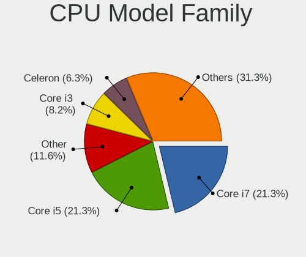

| Model                   | Computers | Percent |
|-------------------------|-----------|---------|
| Intel Core i5           | 41        | 24.4%   |
| Intel Core i7           | 40        | 23.81%  |
| Intel Core i3           | 18        | 10.71%  |
| Intel Celeron           | 10        | 5.95%   |
| AMD Ryzen 5             | 9         | 5.36%   |
| Intel Core 2 Duo        | 8         | 4.76%   |
| Other                   | 5         | 2.98%   |
| Intel Atom              | 5         | 2.98%   |
| AMD Ryzen 7             | 5         | 2.98%   |
| Intel Pentium Dual-Core | 4         | 2.38%   |
| AMD FX                  | 4         | 2.38%   |
| Intel Pentium           | 3         | 1.79%   |
| AMD Ryzen 3             | 3         | 1.79%   |
| Intel Xeon              | 2         | 1.19%   |
| Intel Pentium Silver    | 2         | 1.19%   |
| AMD A10                 | 2         | 1.19%   |
| Intel Core m3           | 1         | 0.6%    |
| Intel Core M            | 1         | 0.6%    |
| Intel Core i9           | 1         | 0.6%    |
| AMD E1                  | 1         | 0.6%    |
| AMD E                   | 1         | 0.6%    |
| AMD C-60                | 1         | 0.6%    |
| AMD Athlon              | 1         | 0.6%    |

CPU Cores
---------

Number of processor cores

| Number | Computers | Percent |
|--------|-----------|---------|
| 2      | 85        | 50.6%   |
| 4      | 63        | 37.5%   |
| 8      | 9         | 5.36%   |
| 6      | 9         | 5.36%   |
| 3      | 1         | 0.6%    |
| 1      | 1         | 0.6%    |

CPU Sockets
-----------

Number of sockets

| Number | Computers | Percent |
|--------|-----------|---------|
| 1      | 168       | 100%    |

CPU Threads
-----------

Threads per core (Hyper-Threading)

| Number | Computers | Percent |
|--------|-----------|---------|
| 2      | 118       | 70.24%  |
| 1      | 50        | 29.76%  |

CPU Op-Modes
------------

CPU Operation Modes (32-bit, 64-bit)

| Op mode        | Computers | Percent |
|----------------|-----------|---------|
| 32-bit, 64-bit | 152       | 90.48%  |
| Unknown        | 16        | 9.52%   |

CPU Microcode
-------------

Microcode number

| Number     | Computers | Percent |
|------------|-----------|---------|
| Unknown    | 44        | 25.88%  |
| 0x306a9    | 18        | 10.59%  |
| 0x40651    | 9         | 5.29%   |
| 0x806e9    | 8         | 4.71%   |
| 0x206a7    | 8         | 4.71%   |
| 0x806ec    | 7         | 4.12%   |
| 0x1067a    | 7         | 4.12%   |
| 0x306d4    | 6         | 3.53%   |
| 0x306c3    | 6         | 3.53%   |
| 0x406e3    | 5         | 2.94%   |
| 0x906ea    | 3         | 1.76%   |
| 0x906e9    | 3         | 1.76%   |
| 0x806ea    | 3         | 1.76%   |
| 0x406c4    | 3         | 1.76%   |
| 0xa0655    | 2         | 1.18%   |
| 0x506e3    | 2         | 1.18%   |
| 0x20655    | 2         | 1.18%   |
| 0x08600106 | 2         | 1.18%   |
| 0x08600104 | 2         | 1.18%   |
| 0x08108109 | 2         | 1.18%   |
| 0x08108102 | 2         | 1.18%   |
| 0x0500010d | 2         | 1.18%   |
| 0xa0653    | 1         | 0.59%   |
| 0xa0652    | 1         | 0.59%   |
| 0x906eb    | 1         | 0.59%   |
| 0x806c1    | 1         | 0.59%   |
| 0x706a1    | 1         | 0.59%   |
| 0x6fd      | 1         | 0.59%   |
| 0x406c3    | 1         | 0.59%   |
| 0x306f2    | 1         | 0.59%   |
| 0x30678    | 1         | 0.59%   |
| 0x10676    | 1         | 0.59%   |
| 0x0a50000c | 1         | 0.59%   |
| 0x0a50000b | 1         | 0.59%   |
| 0x08701013 | 1         | 0.59%   |
| 0x08600103 | 1         | 0.59%   |
| 0x08600102 | 1         | 0.59%   |
| 0x0810100b | 1         | 0.59%   |
| 0x08001138 | 1         | 0.59%   |
| 0x08001137 | 1         | 0.59%   |
| 0x07026101 | 1         | 0.59%   |
| 0x06006115 | 1         | 0.59%   |
| 0x06000822 | 1         | 0.59%   |
| 0x06000629 | 1         | 0.59%   |
| 0x06000626 | 1         | 0.59%   |
| 0x05000029 | 1         | 0.59%   |

CPU Microarch
-------------

Microarchitecture

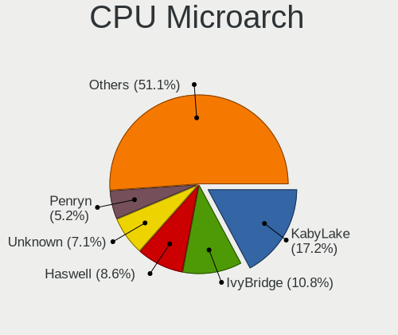

| Name          | Computers | Percent |
|---------------|-----------|---------|
| KabyLake      | 31        | 18.45%  |
| IvyBridge     | 23        | 13.69%  |
| Haswell       | 18        | 10.71%  |
| Penryn        | 12        | 7.14%   |
| Skylake       | 10        | 5.95%   |
| SandyBridge   | 10        | 5.95%   |
| Broadwell     | 9         | 5.36%   |
| Zen 2         | 8         | 4.76%   |
| Silvermont    | 8         | 4.76%   |
| CometLake     | 6         | 3.57%   |
| Zen+          | 4         | 2.38%   |
| Unknown       | 4         | 2.38%   |
| Zen           | 3         | 1.79%   |
| Westmere      | 3         | 1.79%   |
| Goldmont plus | 3         | 1.79%   |
| Bobcat        | 3         | 1.79%   |
| Zen 3         | 2         | 1.19%   |
| Piledriver    | 2         | 1.19%   |
| Goldmont      | 2         | 1.19%   |
| Excavator     | 2         | 1.19%   |
| Bulldozer     | 2         | 1.19%   |
| TigerLake     | 1         | 0.6%    |
| Jaguar        | 1         | 0.6%    |
| Core          | 1         | 0.6%    |

Graphics
--------

GPU Vendor
----------

Vendors of graphics cards

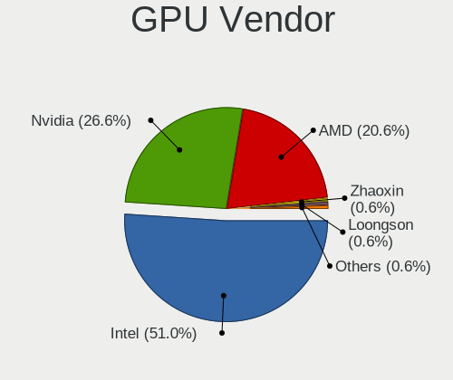

| Vendor              | Computers | Percent |
|---------------------|-----------|---------|
| Intel               | 111       | 53.11%  |
| Nvidia              | 56        | 26.79%  |
| AMD                 | 40        | 19.14%  |
| Zhaoxin             | 1         | 0.48%   |
| Loongson Technology | 1         | 0.48%   |

GPU Model
---------

Graphics card models

| Model                                                                                    | Computers | Percent |
|------------------------------------------------------------------------------------------|-----------|---------|
| Intel 3rd Gen Core processor Graphics Controller                                         | 12        | 5.66%   |
| Intel Haswell-ULT Integrated Graphics Controller                                         | 11        | 5.19%   |
| Intel HD Graphics 620                                                                    | 8         | 3.77%   |
| Intel HD Graphics 5500                                                                   | 8         | 3.77%   |
| Intel 2nd Generation Core Processor Family Integrated Graphics Controller                | 8         | 3.77%   |
| Intel Atom/Celeron/Pentium Processor x5-E8000/J3xxx/N3xxx Integrated Graphics Controller | 6         | 2.83%   |
| AMD Topaz XT [Radeon R7 M260/M265 / M340/M360 / M440/M445 / 530/535 / 620/625 Mobile]    | 6         | 2.83%   |
| AMD Renoir                                                                               | 6         | 2.83%   |
| Intel UHD Graphics 620                                                                   | 5         | 2.36%   |
| Intel Skylake GT2 [HD Graphics 520]                                                      | 5         | 2.36%   |
| Intel Mobile 4 Series Chipset Integrated Graphics Controller                             | 5         | 2.36%   |
| Intel Xeon E3-1200 v2/3rd Gen Core processor Graphics Controller                         | 4         | 1.89%   |
| Intel CoffeeLake-H GT2 [UHD Graphics 630]                                                | 4         | 1.89%   |
| AMD Picasso/Raven 2 [Radeon Vega Series / Radeon Vega Mobile Series]                     | 4         | 1.89%   |
| Nvidia GM204 [GeForce GTX 970]                                                           | 3         | 1.42%   |
| Intel WhiskeyLake-U GT2 [UHD Graphics 620]                                               | 3         | 1.42%   |
| Intel HD Graphics 630                                                                    | 3         | 1.42%   |
| Intel Core Processor Integrated Graphics Controller                                      | 3         | 1.42%   |
| Intel CometLake-U GT2 [UHD Graphics]                                                     | 3         | 1.42%   |
| Nvidia TU117M [GeForce GTX 1650 Mobile / Max-Q]                                          | 2         | 0.94%   |
| Nvidia GT218 [GeForce 210]                                                               | 2         | 0.94%   |
| Nvidia GP107M [GeForce GTX 1050 Mobile]                                                  | 2         | 0.94%   |
| Nvidia GP106 [GeForce GTX 1060 6GB]                                                      | 2         | 0.94%   |
| Nvidia GM108M [GeForce MX110]                                                            | 2         | 0.94%   |
| Nvidia GM108M [GeForce 940MX]                                                            | 2         | 0.94%   |
| Nvidia GM108M [GeForce 840M]                                                             | 2         | 0.94%   |
| Nvidia GM107M [GeForce GTX 950M]                                                         | 2         | 0.94%   |
| Nvidia GK107M [GeForce GT 650M]                                                          | 2         | 0.94%   |
| Nvidia GF117M [GeForce 610M/710M/810M/820M / GT 620M/625M/630M/720M]                     | 2         | 0.94%   |
| Nvidia GF108M [GeForce GT 540M]                                                          | 2         | 0.94%   |
| Intel Xeon E3-1200 v3/4th Gen Core Processor Integrated Graphics Controller              | 2         | 0.94%   |
| Intel IvyBridge GT2 [HD Graphics 4000]                                                   | 2         | 0.94%   |
| Intel HD Graphics 500                                                                    | 2         | 0.94%   |
| Intel GeminiLake [UHD Graphics 605]                                                      | 2         | 0.94%   |
| Intel Atom Processor Z36xxx/Z37xxx Series Graphics & Display                             | 2         | 0.94%   |
| Intel 4 Series Chipset Integrated Graphics Controller                                    | 2         | 0.94%   |
| AMD Wani [Radeon R5/R6/R7 Graphics]                                                      | 2         | 0.94%   |
| AMD Oland [Radeon HD 8570 / R5 430 OEM / R7 240/340 / Radeon 520 OEM]                    | 2         | 0.94%   |
| AMD Ellesmere [Radeon RX 470/480/570/570X/580/580X/590]                                  | 2         | 0.94%   |
| AMD Caicos [Radeon HD 6450/7450/8450 / R5 230 OEM]                                       | 2         | 0.94%   |
| Zhaoxin ZX-E C-960 GPU                                                                   | 1         | 0.47%   |
| Nvidia TU117M                                                                            | 1         | 0.47%   |
| Nvidia TU117 [GeForce GTX 1650]                                                          | 1         | 0.47%   |
| Nvidia TU116 [GeForce GTX 1650 SUPER]                                                    | 1         | 0.47%   |
| Nvidia GP108M [GeForce MX150]                                                            | 1         | 0.47%   |
| Nvidia GP108BM [GeForce MX250]                                                           | 1         | 0.47%   |
| Nvidia GP108 [GeForce GT 1030]                                                           | 1         | 0.47%   |
| Nvidia GP107M [GeForce GTX 1050 3 GB Max-Q]                                              | 1         | 0.47%   |
| Nvidia GP107 [GeForce GTX 1050 Ti]                                                       | 1         | 0.47%   |
| Nvidia GM206 [GeForce GTX 960]                                                           | 1         | 0.47%   |
| Nvidia GM206 [GeForce GTX 950]                                                           | 1         | 0.47%   |
| Nvidia GM108M [GeForce 940M]                                                             | 1         | 0.47%   |
| Nvidia GM108M [GeForce 920MX]                                                            | 1         | 0.47%   |
| Nvidia GM108M [GeForce 845M]                                                             | 1         | 0.47%   |
| Nvidia GK208M [GeForce GT 740M]                                                          | 1         | 0.47%   |
| Nvidia GK208M [GeForce GT 735M]                                                          | 1         | 0.47%   |
| Nvidia GK208B [GeForce GT 710]                                                           | 1         | 0.47%   |
| Nvidia GK107GLM [Quadro K1000M]                                                          | 1         | 0.47%   |
| Nvidia GK107 [GeForce GTX 650]                                                           | 1         | 0.47%   |
| Nvidia GK107 [GeForce GT 640]                                                            | 1         | 0.47%   |

GPU Combo
---------

Combinations of graphics cards

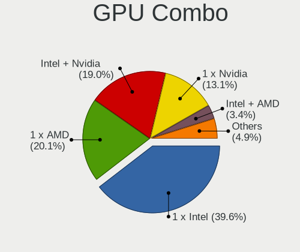

| Name                    | Computers | Percent |
|-------------------------|-----------|---------|
| 1 x Intel               | 71        | 42.26%  |
| Intel + Nvidia          | 31        | 18.45%  |
| 1 x AMD                 | 30        | 17.86%  |
| 1 x Nvidia              | 24        | 14.29%  |
| Intel + AMD             | 7         | 4.17%   |
| 2 x AMD                 | 2         | 1.19%   |
| 1 x Zhaoxin             | 1         | 0.6%    |
| 1 x Loongson Technology | 1         | 0.6%    |
| AMD + Nvidia            | 1         | 0.6%    |

GPU Driver
----------

Free vs proprietary

| Driver      | Computers | Percent |
|-------------|-----------|---------|
| Free        | 136       | 80.95%  |
| Proprietary | 24        | 14.29%  |
| Unknown     | 8         | 4.76%   |

GPU Memory
----------

Total video memory

| Size in GB | Computers | Percent |
|------------|-----------|---------|
| Unknown    | 91        | 52.91%  |
| 1.01-2.0   | 39        | 22.67%  |
| 3.01-4.0   | 18        | 10.47%  |
| 0.01-0.5   | 11        | 6.4%    |
| 0.51-1.0   | 7         | 4.07%   |
| 7.01-8.0   | 3         | 1.74%   |
| 5.01-6.0   | 3         | 1.74%   |

Monitor
-------

Monitor Vendor
--------------

Monitor vendors

| Vendor                  | Computers | Percent |
|-------------------------|-----------|---------|
| Samsung Electronics     | 26        | 15.57%  |
| BOE                     | 25        | 14.97%  |
| AU Optronics            | 25        | 14.97%  |
| LG Display              | 15        | 8.98%   |
| Chimei Innolux          | 14        | 8.38%   |
| Hewlett-Packard         | 8         | 4.79%   |
| Goldstar                | 8         | 4.79%   |
| Lenovo                  | 4         | 2.4%    |
| Dell                    | 4         | 2.4%    |
| ViewSonic               | 3         | 1.8%    |
| Iiyama                  | 3         | 1.8%    |
| AOC                     | 3         | 1.8%    |
| Philips                 | 2         | 1.2%    |
| InfoVision              | 2         | 1.2%    |
| CSO                     | 2         | 1.2%    |
| Chi Mei Optoelectronics | 2         | 1.2%    |
| Ancor Communications    | 2         | 1.2%    |
| Acer                    | 2         | 1.2%    |
| Unknown                 | 1         | 0.6%    |
| Toshiba                 | 1         | 0.6%    |
| TFC                     | 1         | 0.6%    |
| Sharp                   | 1         | 0.6%    |
| SAC                     | 1         | 0.6%    |
| RTK                     | 1         | 0.6%    |
| Positivo                | 1         | 0.6%    |
| PANDA                   | 1         | 0.6%    |
| MSI                     | 1         | 0.6%    |
| Hisense                 | 1         | 0.6%    |
| HB@                     | 1         | 0.6%    |
| HannStar                | 1         | 0.6%    |
| Gateway                 | 1         | 0.6%    |
| DTV                     | 1         | 0.6%    |
| BenQ                    | 1         | 0.6%    |
| ASUSTek Computer        | 1         | 0.6%    |
| Apple                   | 1         | 0.6%    |

Monitor Model
-------------

Monitor models

| Model                                                                   | Computers | Percent |
|-------------------------------------------------------------------------|-----------|---------|
| AU Optronics LCD Monitor AUO26EC 1366x768 344x193mm 15.5-inch           | 3         | 1.72%   |
| LG Display LCD Monitor LGD0468 1366x768 344x194mm 15.5-inch             | 2         | 1.15%   |
| Goldstar 20EN33 GSM4EE1 1600x900 443x249mm 20.0-inch                    | 2         | 1.15%   |
| Chimei Innolux LCD Monitor CMN14C4 1366x768 309x173mm 13.9-inch         | 2         | 1.15%   |
| BOE LCD Monitor BOE06A4 1366x768 344x194mm 15.5-inch                    | 2         | 1.15%   |
| AU Optronics LCD Monitor AUO71EC 1366x768 344x193mm 15.5-inch           | 2         | 1.15%   |
| AU Optronics LCD Monitor AUO226D 1920x1080 276x155mm 12.5-inch          | 2         | 1.15%   |
| AU Optronics LCD Monitor AUO21ED 1920x1080 344x194mm 15.5-inch          | 2         | 1.15%   |
| ViewSonic VX2481-mh VSC3933 1920x1080 527x296mm 23.8-inch               | 1         | 0.57%   |
| ViewSonic VA2478-H-2 VSC8335 1920x1080 527x296mm 23.8-inch              | 1         | 0.57%   |
| ViewSonic VA2430-H-3 VSC3A3E 1920x1080 527x296mm 23.8-inch              | 1         | 0.57%   |
| Unknown LCD Monitor FFFF 2288x1287 2550x2550mm 142.0-inch               | 1         | 0.57%   |
| Toshiba TV TSB0108 1360x768 698x393mm 31.5-inch                         | 1         | 0.57%   |
| TFC TF2411 TFC0238 1920x1080 527x296mm 23.8-inch                        | 1         | 0.57%   |
| Sharp LCD Monitor SHP1449 1920x1080 294x165mm 13.3-inch                 | 1         | 0.57%   |
| Samsung Electronics SyncMaster SAM060B 1920x1080 510x290mm 23.1-inch    | 1         | 0.57%   |
| Samsung Electronics SyncMaster SAM0601 1600x900                         | 1         | 0.57%   |
| Samsung Electronics SyncMaster SAM05FF 1600x900 443x249mm 20.0-inch     | 1         | 0.57%   |
| Samsung Electronics SyncMaster SAM02B6 1920x1200 518x324mm 24.1-inch    | 1         | 0.57%   |
| Samsung Electronics SMT24A550 SAM07B5 1920x1080 531x299mm 24.0-inch     | 1         | 0.57%   |
| Samsung Electronics S24E360 SAM0C10 1920x1080 520x290mm 23.4-inch       | 1         | 0.57%   |
| Samsung Electronics LCD Monitor SMS23A350H 1920x1080                    | 1         | 0.57%   |
| Samsung Electronics LCD Monitor SEC5448 1920x1080 344x194mm 15.5-inch   | 1         | 0.57%   |
| Samsung Electronics LCD Monitor SEC5441 1366x768 256x144mm 11.6-inch    | 1         | 0.57%   |
| Samsung Electronics LCD Monitor SEC384A 1366x768 344x194mm 15.5-inch    | 1         | 0.57%   |
| Samsung Electronics LCD Monitor SEC324A 1366x768 344x194mm 15.5-inch    | 1         | 0.57%   |
| Samsung Electronics LCD Monitor SEC3150 1366x768 344x193mm 15.5-inch    | 1         | 0.57%   |
| Samsung Electronics LCD Monitor SEC314B 1680x945 409x230mm 18.5-inch    | 1         | 0.57%   |
| Samsung Electronics LCD Monitor SDC534B 1600x900 382x215mm 17.3-inch    | 1         | 0.57%   |
| Samsung Electronics LCD Monitor SDC4E51 1366x768 344x194mm 15.5-inch    | 1         | 0.57%   |
| Samsung Electronics LCD Monitor SDC4A42 1366x768 309x174mm 14.0-inch    | 1         | 0.57%   |
| Samsung Electronics LCD Monitor SDC4951 1366x768 344x194mm 15.5-inch    | 1         | 0.57%   |
| Samsung Electronics LCD Monitor SDC434A 3200x1800 293x165mm 13.2-inch   | 1         | 0.57%   |
| Samsung Electronics LCD Monitor SDC4147 1366x768 344x194mm 15.5-inch    | 1         | 0.57%   |
| Samsung Electronics LCD Monitor SDC3853 2736x1824 260x173mm 12.3-inch   | 1         | 0.57%   |
| Samsung Electronics LCD Monitor SAM0F13 3840x2160 1872x1053mm 84.6-inch | 1         | 0.57%   |
| Samsung Electronics LCD Monitor SAM0E90 1366x768 609x347mm 27.6-inch    | 1         | 0.57%   |
| Samsung Electronics LCD Monitor SAM0DF6 3840x2160 1872x1053mm 84.6-inch | 1         | 0.57%   |
| Samsung Electronics LCD Monitor SAM03BC 1920x1080                       | 1         | 0.57%   |
| Samsung Electronics LCD Monitor S24E390 1920x1080                       | 1         | 0.57%   |
| Samsung Electronics LCD Monitor S24E360 1920x1080                       | 1         | 0.57%   |
| Samsung Electronics LCD Monitor S24E310 3840x1080                       | 1         | 0.57%   |
| Samsung Electronics LCD Monitor S24E310                                 | 1         | 0.57%   |
| Samsung Electronics AIO DP500-A SEM0222 1920x1080 480x270mm 21.7-inch   | 1         | 0.57%   |
| SAC LED MONITOR SAC952D 1920x1080 443x249mm 20.0-inch                   | 1         | 0.57%   |
| RTK FHD HDR RTKBC32 1920x1080 597x336mm 27.0-inch                       | 1         | 0.57%   |
| Positivo FIT85X NON1801 1360x768 344x194mm 15.5-inch                    | 1         | 0.57%   |
| Philips LCD Monitor PHLC0BF 1600x900 430x240mm 19.4-inch                | 1         | 0.57%   |
| Philips FTV PHL04C2 1920x1080 1440x810mm 65.0-inch                      | 1         | 0.57%   |
| PANDA LCD Monitor NCP004D 1920x1080 344x194mm 15.5-inch                 | 1         | 0.57%   |
| MSI MAG271C MSI3FA6 1920x1080 598x336mm 27.0-inch                       | 1         | 0.57%   |
| LG Display LP156WH1-TLA1 LGD6301 1366x768 344x194mm 15.5-inch           | 1         | 0.57%   |
| LG Display LCD Monitor LGD05EC 1920x1080 309x174mm 14.0-inch            | 1         | 0.57%   |
| LG Display LCD Monitor LGD0590 1920x1080 344x194mm 15.5-inch            | 1         | 0.57%   |
| LG Display LCD Monitor LGD055D 3000x2000 260x173mm 12.3-inch            | 1         | 0.57%   |
| LG Display LCD Monitor LGD0503 1366x768 344x194mm 15.5-inch             | 1         | 0.57%   |
| LG Display LCD Monitor LGD04B2 1920x1080 309x175mm 14.0-inch            | 1         | 0.57%   |
| LG Display LCD Monitor LGD045E 1366x768 309x174mm 14.0-inch             | 1         | 0.57%   |
| LG Display LCD Monitor LGD0456 1366x768 340x190mm 15.3-inch             | 1         | 0.57%   |
| LG Display LCD Monitor LGD0354 1366x768 293x165mm 13.2-inch             | 1         | 0.57%   |

Monitor Resolution
------------------

Monitor screen resolution

| Resolution         | Computers | Percent |
|--------------------|-----------|---------|
| 1920x1080 (FHD)    | 73        | 44.79%  |
| 1366x768 (WXGA)    | 51        | 31.29%  |
| 1600x900 (HD+)     | 10        | 6.13%   |
| 2560x1440 (QHD)    | 4         | 2.45%   |
| 3840x2160 (4K)     | 3         | 1.84%   |
| 3840x1080          | 2         | 1.23%   |
| 1920x540           | 2         | 1.23%   |
| 1440x900 (WXGA+)   | 2         | 1.23%   |
| 1360x768           | 2         | 1.23%   |
| Unknown            | 2         | 1.23%   |
| 3200x1800 (QHD+)   | 1         | 0.61%   |
| 3000x2000          | 1         | 0.61%   |
| 2736x1824          | 1         | 0.61%   |
| 2560x1600          | 1         | 0.61%   |
| 2288x1287          | 1         | 0.61%   |
| 2160x1440          | 1         | 0.61%   |
| 2160x1350          | 1         | 0.61%   |
| 1920x1200 (WUXGA)  | 1         | 0.61%   |
| 1680x945           | 1         | 0.61%   |
| 1680x1050 (WSXGA+) | 1         | 0.61%   |
| 1280x800 (WXGA)    | 1         | 0.61%   |
| 1280x1024 (SXGA)   | 1         | 0.61%   |

Monitor Diagonal
----------------

Diagonal size in inches

| Inches  | Computers | Percent |
|---------|-----------|---------|
| 15      | 50        | 29.24%  |
| 13      | 24        | 14.04%  |
| 23      | 17        | 9.94%   |
| 14      | 16        | 9.36%   |
| 24      | 8         | 4.68%   |
| 21      | 8         | 4.68%   |
| Unknown | 8         | 4.68%   |
| 27      | 6         | 3.51%   |
| 18      | 6         | 3.51%   |
| 12      | 5         | 2.92%   |
| 20      | 3         | 1.75%   |
| 17      | 3         | 1.75%   |
| 11      | 3         | 1.75%   |
| 84      | 2         | 1.17%   |
| 32      | 2         | 1.17%   |
| 25      | 2         | 1.17%   |
| 19      | 2         | 1.17%   |
| 142     | 1         | 0.58%   |
| 72      | 1         | 0.58%   |
| 65      | 1         | 0.58%   |
| 31      | 1         | 0.58%   |
| 22      | 1         | 0.58%   |
| 16      | 1         | 0.58%   |

Monitor Width
-------------

Physical width

| Width in mm    | Computers | Percent |
|----------------|-----------|---------|
| 301-350        | 81        | 48.5%   |
| 501-600        | 30        | 17.96%  |
| 401-500        | 19        | 11.38%  |
| 201-300        | 16        | 9.58%   |
| Unknown        | 8         | 4.79%   |
| 351-400        | 5         | 2.99%   |
| 1501-2000      | 3         | 1.8%    |
| 701-800        | 2         | 1.2%    |
| More than 2000 | 1         | 0.6%    |
| 601-700        | 1         | 0.6%    |
| 1001-1500      | 1         | 0.6%    |

Aspect Ratio
------------

Proportional relationship between the width and the height

| Ratio   | Computers | Percent |
|---------|-----------|---------|
| 16/9    | 139       | 87.97%  |
| 16/10   | 8         | 5.06%   |
| Unknown | 6         | 3.8%    |
| 3/2     | 4         | 2.53%   |
| 1.00    | 1         | 0.63%   |

Monitor Area
------------

Area in inch

| Area in inch | Computers | Percent |
|----------------|-----------|---------|
| 101-110        | 50        | 29.24%  |
| 81-90          | 32        | 18.71%  |
| 201-250        | 28        | 16.37%  |
| 151-200        | 9         | 5.26%   |
| 71-80          | 8         | 4.68%   |
| Unknown        | 8         | 4.68%   |
| 301-350        | 6         | 3.51%   |
| More than 1000 | 5         | 2.92%   |
| 61-70          | 5         | 2.92%   |
| 251-300        | 5         | 2.92%   |
| 141-150        | 5         | 2.92%   |
| 51-60          | 3         | 1.75%   |
| 351-500        | 3         | 1.75%   |
| 121-130        | 2         | 1.17%   |
| 131-140        | 1         | 0.58%   |
| 111-120        | 1         | 0.58%   |

Pixel Density
-------------

Pixels per inch

| Density       | Computers | Percent |
|---------------|-----------|---------|
| 101-120       | 61        | 36.75%  |
| 51-100        | 42        | 25.3%   |
| 121-160       | 38        | 22.89%  |
| 161-240       | 10        | 6.02%   |
| Unknown       | 8         | 4.82%   |
| 1-50          | 4         | 2.41%   |
| More than 240 | 3         | 1.81%   |

Multiple Monitors
-----------------

Total monitors connected

| Total | Computers | Percent |
|-------|-----------|---------|
| 1     | 143       | 84.62%  |
| 2     | 20        | 11.83%  |
| 0     | 5         | 2.96%   |
| 3     | 1         | 0.59%   |

Network
-------

Net Controller Vendor
---------------------

Controller vendors

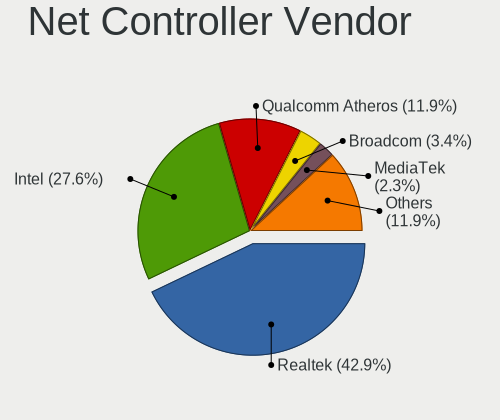

| Vendor                          | Computers | Percent |
|---------------------------------|-----------|---------|
| Realtek Semiconductor           | 111       | 44.94%  |
| Intel                           | 57        | 23.08%  |
| Qualcomm Atheros                | 41        | 16.6%   |
| Broadcom                        | 7         | 2.83%   |
| Marvell Technology Group        | 5         | 2.02%   |
| Xiaomi                          | 3         | 1.21%   |
| TP-Link                         | 3         | 1.21%   |
| Broadcom Limited                | 3         | 1.21%   |
| Nvidia                          | 2         | 0.81%   |
| MediaTek                        | 2         | 0.81%   |
| Unknown                         | 1         | 0.4%    |
| Samsung Electronics             | 1         | 0.4%    |
| Ralink Technology               | 1         | 0.4%    |
| Ralink                          | 1         | 0.4%    |
| Qualcomm Atheros Communications | 1         | 0.4%    |
| OPPO Electronics                | 1         | 0.4%    |
| NXP Semiconductors              | 1         | 0.4%    |
| NetGear                         | 1         | 0.4%    |
| Loongson Technology             | 1         | 0.4%    |
| IMC Networks                    | 1         | 0.4%    |
| Huawei Technologies             | 1         | 0.4%    |
| Hewlett-Packard                 | 1         | 0.4%    |
| ASIX Electronics                | 1         | 0.4%    |

Net Controller Model
--------------------

Controller models

| Model                                                             | Computers | Percent |
|-------------------------------------------------------------------|-----------|---------|
| Realtek RTL8111/8168/8411 PCI Express Gigabit Ethernet Controller | 79        | 27.82%  |
| Realtek RTL810xE PCI Express Fast Ethernet controller             | 18        | 6.34%   |
| Qualcomm Atheros QCA9377 802.11ac Wireless Network Adapter        | 14        | 4.93%   |
| Realtek RTL8822CE 802.11ac PCIe Wireless Network Adapter          | 7         | 2.46%   |
| Qualcomm Atheros QCA9565 / AR9565 Wireless Network Adapter        | 7         | 2.46%   |
| Qualcomm Atheros AR9485 Wireless Network Adapter                  | 7         | 2.46%   |
| Intel 82579LM Gigabit Network Connection (Lewisville)             | 6         | 2.11%   |
| Realtek RTL8723BE PCIe Wireless Network Adapter                   | 5         | 1.76%   |
| Intel Wireless 3165                                               | 5         | 1.76%   |
| Intel Wi-Fi 6 AX200                                               | 5         | 1.76%   |
| Realtek RTL8153 Gigabit Ethernet Adapter                          | 4         | 1.41%   |
| Qualcomm Atheros QCA6174 802.11ac Wireless Network Adapter        | 4         | 1.41%   |
| Intel Wireless 8265 / 8275                                        | 4         | 1.41%   |
| Intel Centrino Advanced-N 6205 [Taylor Peak]                      | 4         | 1.41%   |
| Realtek RTL8723DE Wireless Network Adapter                        | 3         | 1.06%   |
| Realtek RTL8188EE Wireless Network Adapter                        | 3         | 1.06%   |
| Intel Wireless 7260                                               | 3         | 1.06%   |
| Intel Wireless 3160                                               | 3         | 1.06%   |
| Intel WiFi Link 5100                                              | 3         | 1.06%   |
| Intel Comet Lake PCH-LP CNVi WiFi                                 | 3         | 1.06%   |
| Xiaomi Mi/Redmi series (RNDIS)                                    | 2         | 0.7%    |
| Realtek RTL8191SEvA Wireless LAN Controller                       | 2         | 0.7%    |
| Realtek RTL8188CE 802.11b/g/n WiFi Adapter                        | 2         | 0.7%    |
| Realtek RTL-8100/8101L/8139 PCI Fast Ethernet Adapter             | 2         | 0.7%    |
| Qualcomm Atheros AR9462 Wireless Network Adapter                  | 2         | 0.7%    |
| Qualcomm Atheros AR928X Wireless Network Adapter (PCI-Express)    | 2         | 0.7%    |
| Qualcomm Atheros AR9287 Wireless Network Adapter (PCI-Express)    | 2         | 0.7%    |
| Qualcomm Atheros AR8131 Gigabit Ethernet                          | 2         | 0.7%    |
| Marvell Group 88E8055 PCI-E Gigabit Ethernet Controller           | 2         | 0.7%    |
| Intel Wireless 7265                                               | 2         | 0.7%    |
| Intel Ethernet Connection (2) I219-V                              | 2         | 0.7%    |
| Intel Ethernet Connection (12) I219-V                             | 2         | 0.7%    |
| Intel Cannon Point-LP CNVi [Wireless-AC]                          | 2         | 0.7%    |
| Intel 82567LM-3 Gigabit Network Connection                        | 2         | 0.7%    |
| Broadcom NetLink BCM57785 Gigabit Ethernet PCIe                   | 2         | 0.7%    |
| Broadcom NetLink BCM57781 Gigabit Ethernet PCIe                   | 2         | 0.7%    |
| Broadcom BCM43142 802.11b/g/n                                     | 2         | 0.7%    |
| Xiaomi MediaTek MT7601U [MI WiFi]                                 | 1         | 0.35%   |
| Unknown Network controller                                        | 1         | 0.35%   |
| TP-Link TL-WN823N v2/v3 [Realtek RTL8192EU]                       | 1         | 0.35%   |
| TP-Link TL-WN821N v5/v6 [RTL8192EU]                               | 1         | 0.35%   |
| TP-Link AC600 wireless Realtek RTL8811AU [Archer T2U Nano]        | 1         | 0.35%   |
| Samsung Galaxy series, misc. (tethering mode)                     | 1         | 0.35%   |
| Realtek RTL88x2bu [AC1200 Techkey]                                | 1         | 0.35%   |
| Realtek RTL8822BE 802.11a/b/g/n/ac WiFi adapter                   | 1         | 0.35%   |
| Realtek RTL8821AE 802.11ac PCIe Wireless Network Adapter          | 1         | 0.35%   |
| Realtek RTL8812AU 802.11a/b/g/n/ac 2T2R DB WLAN Adapter           | 1         | 0.35%   |
| Realtek RTL8192CU 802.11n WLAN Adapter                            | 1         | 0.35%   |
| Realtek RTL8191SEvB Wireless LAN Controller                       | 1         | 0.35%   |
| Realtek RTL8188GU 802.11n WLAN Adapter (After Modeswitch)         | 1         | 0.35%   |
| Realtek RTL8188EUS 802.11n Wireless Network Adapter               | 1         | 0.35%   |
| Realtek 802.11n                                                   | 1         | 0.35%   |
| Realtek 802.11ac NIC                                              | 1         | 0.35%   |
| Ralink RT2870/RT3070 Wireless Adapter                             | 1         | 0.35%   |
| Ralink RT5390R 802.11bgn PCIe Wireless Network Adapter            | 1         | 0.35%   |
| Qualcomm Atheros QCA8172 Fast Ethernet                            | 1         | 0.35%   |
| Qualcomm Atheros Killer E2400 Gigabit Ethernet Controller         | 1         | 0.35%   |
| Qualcomm Atheros AR9271 802.11n                                   | 1         | 0.35%   |
| Qualcomm Atheros AR9285 Wireless Network Adapter (PCI-Express)    | 1         | 0.35%   |
| Qualcomm Atheros AR8161 Gigabit Ethernet                          | 1         | 0.35%   |

Wireless Vendor
---------------

Wireless vendors

| Vendor                          | Computers | Percent |
|---------------------------------|-----------|---------|
| Intel                           | 45        | 34.09%  |
| Qualcomm Atheros                | 39        | 29.55%  |
| Realtek Semiconductor           | 32        | 24.24%  |
| TP-Link                         | 3         | 2.27%   |
| Broadcom Limited                | 3         | 2.27%   |
| Broadcom                        | 2         | 1.52%   |
| Xiaomi                          | 1         | 0.76%   |
| Ralink Technology               | 1         | 0.76%   |
| Ralink                          | 1         | 0.76%   |
| Qualcomm Atheros Communications | 1         | 0.76%   |
| NetGear                         | 1         | 0.76%   |
| MEDIATEK                        | 1         | 0.76%   |
| Marvell Technology Group        | 1         | 0.76%   |
| IMC Networks                    | 1         | 0.76%   |

Wireless Model
--------------

Wireless models

| Model                                                          | Computers | Percent |
|----------------------------------------------------------------|-----------|---------|
| Qualcomm Atheros QCA9377 802.11ac Wireless Network Adapter     | 14        | 10.53%  |
| Realtek RTL8822CE 802.11ac PCIe Wireless Network Adapter       | 7         | 5.26%   |
| Qualcomm Atheros QCA9565 / AR9565 Wireless Network Adapter     | 7         | 5.26%   |
| Qualcomm Atheros AR9485 Wireless Network Adapter               | 7         | 5.26%   |
| Realtek RTL8723BE PCIe Wireless Network Adapter                | 5         | 3.76%   |
| Intel Wireless 3165                                            | 5         | 3.76%   |
| Intel Wi-Fi 6 AX200                                            | 5         | 3.76%   |
| Qualcomm Atheros QCA6174 802.11ac Wireless Network Adapter     | 4         | 3.01%   |
| Intel Wireless 8265 / 8275                                     | 4         | 3.01%   |
| Intel Centrino Advanced-N 6205 [Taylor Peak]                   | 4         | 3.01%   |
| Realtek RTL8723DE Wireless Network Adapter                     | 3         | 2.26%   |
| Realtek RTL8188EE Wireless Network Adapter                     | 3         | 2.26%   |
| Intel Wireless 7260                                            | 3         | 2.26%   |
| Intel Wireless 3160                                            | 3         | 2.26%   |
| Intel WiFi Link 5100                                           | 3         | 2.26%   |
| Intel Comet Lake PCH-LP CNVi WiFi                              | 3         | 2.26%   |
| Realtek RTL8191SEvA Wireless LAN Controller                    | 2         | 1.5%    |
| Realtek RTL8188CE 802.11b/g/n WiFi Adapter                     | 2         | 1.5%    |
| Qualcomm Atheros AR9462 Wireless Network Adapter               | 2         | 1.5%    |
| Qualcomm Atheros AR928X Wireless Network Adapter (PCI-Express) | 2         | 1.5%    |
| Qualcomm Atheros AR9287 Wireless Network Adapter (PCI-Express) | 2         | 1.5%    |
| Intel Wireless 7265                                            | 2         | 1.5%    |
| Intel Cannon Point-LP CNVi [Wireless-AC]                       | 2         | 1.5%    |
| Broadcom BCM43142 802.11b/g/n                                  | 2         | 1.5%    |
| Xiaomi MediaTek MT7601U [MI WiFi]                              | 1         | 0.75%   |
| TP-Link TL-WN823N v2/v3 [Realtek RTL8192EU]                    | 1         | 0.75%   |
| TP-Link TL-WN821N v5/v6 [RTL8192EU]                            | 1         | 0.75%   |
| TP-Link AC600 wireless Realtek RTL8811AU [Archer T2U Nano]     | 1         | 0.75%   |
| Realtek RTL88x2bu [AC1200 Techkey]                             | 1         | 0.75%   |
| Realtek RTL8822BE 802.11a/b/g/n/ac WiFi adapter                | 1         | 0.75%   |
| Realtek RTL8821AE 802.11ac PCIe Wireless Network Adapter       | 1         | 0.75%   |
| Realtek RTL8812AU 802.11a/b/g/n/ac 2T2R DB WLAN Adapter        | 1         | 0.75%   |
| Realtek RTL8192CU 802.11n WLAN Adapter                         | 1         | 0.75%   |
| Realtek RTL8191SEvB Wireless LAN Controller                    | 1         | 0.75%   |
| Realtek RTL8188GU 802.11n WLAN Adapter (After Modeswitch)      | 1         | 0.75%   |
| Realtek RTL8188EUS 802.11n Wireless Network Adapter            | 1         | 0.75%   |
| Realtek 802.11n                                                | 1         | 0.75%   |
| Realtek 802.11ac NIC                                           | 1         | 0.75%   |
| Ralink RT2870/RT3070 Wireless Adapter                          | 1         | 0.75%   |
| Ralink RT5390R 802.11bgn PCIe Wireless Network Adapter         | 1         | 0.75%   |
| Qualcomm Atheros AR9271 802.11n                                | 1         | 0.75%   |
| Qualcomm Atheros AR9285 Wireless Network Adapter (PCI-Express) | 1         | 0.75%   |
| NetGear A6210                                                  | 1         | 0.75%   |
| MEDIATEK MT7921 802.11ax PCI Express Wireless Network Adapter  | 1         | 0.75%   |
| Marvell Group 88W8897 [AVASTAR] 802.11ac Wireless              | 1         | 0.75%   |
| Intel Wireless 8260                                            | 1         | 0.75%   |
| Intel Wi-Fi 6 AX210/AX211/AX411 160MHz                         | 1         | 0.75%   |
| Intel Wi-Fi 6 AX201                                            | 1         | 0.75%   |
| Intel Dual Band Wireless-AC 3168NGW [Stone Peak]               | 1         | 0.75%   |
| Intel Dual Band Wireless-AC 3165 Plus Bluetooth                | 1         | 0.75%   |
| Intel Comet Lake PCH CNVi WiFi                                 | 1         | 0.75%   |
| Intel Centrino Wireless-N 2230                                 | 1         | 0.75%   |
| Intel Centrino Wireless-N 100                                  | 1         | 0.75%   |
| Intel Centrino Ultimate-N 6300                                 | 1         | 0.75%   |
| Intel Centrino Advanced-N 6235                                 | 1         | 0.75%   |
| Intel Centrino Advanced-N 6200                                 | 1         | 0.75%   |
| Intel Cannon Lake PCH CNVi WiFi                                | 1         | 0.75%   |
| IMC Networks Mediao 802.11n WLAN [Realtek RTL8191SU]           | 1         | 0.75%   |
| Broadcom Limited BCM4352 802.11ac Wireless Network Adapter     | 1         | 0.75%   |
| Broadcom Limited BCM43224 802.11a/b/g/n                        | 1         | 0.75%   |

Ethernet Vendor
---------------

Ethernet vendors

| Vendor                   | Computers | Percent |
|--------------------------|-----------|---------|
| Realtek Semiconductor    | 103       | 69.59%  |
| Intel                    | 20        | 13.51%  |
| Qualcomm Atheros         | 5         | 3.38%   |
| Broadcom                 | 5         | 3.38%   |
| Marvell Technology Group | 4         | 2.7%    |
| Xiaomi                   | 2         | 1.35%   |
| Nvidia                   | 2         | 1.35%   |
| Samsung Electronics      | 1         | 0.68%   |
| OPPO Electronics         | 1         | 0.68%   |
| MediaTek                 | 1         | 0.68%   |
| Loongson Technology      | 1         | 0.68%   |
| Huawei Technologies      | 1         | 0.68%   |
| Hewlett-Packard          | 1         | 0.68%   |
| ASIX Electronics         | 1         | 0.68%   |

Ethernet Model
--------------

Ethernet models

| Model                                                             | Computers | Percent |
|-------------------------------------------------------------------|-----------|---------|
| Realtek RTL8111/8168/8411 PCI Express Gigabit Ethernet Controller | 79        | 53.02%  |
| Realtek RTL810xE PCI Express Fast Ethernet controller             | 18        | 12.08%  |
| Intel 82579LM Gigabit Network Connection (Lewisville)             | 6         | 4.03%   |
| Realtek RTL8153 Gigabit Ethernet Adapter                          | 4         | 2.68%   |
| Xiaomi Mi/Redmi series (RNDIS)                                    | 2         | 1.34%   |
| Realtek RTL-8100/8101L/8139 PCI Fast Ethernet Adapter             | 2         | 1.34%   |
| Qualcomm Atheros AR8131 Gigabit Ethernet                          | 2         | 1.34%   |
| Marvell Group 88E8055 PCI-E Gigabit Ethernet Controller           | 2         | 1.34%   |
| Intel Ethernet Connection (2) I219-V                              | 2         | 1.34%   |
| Intel Ethernet Connection (12) I219-V                             | 2         | 1.34%   |
| Intel 82567LM-3 Gigabit Network Connection                        | 2         | 1.34%   |
| Broadcom NetLink BCM57785 Gigabit Ethernet PCIe                   | 2         | 1.34%   |
| Broadcom NetLink BCM57781 Gigabit Ethernet PCIe                   | 2         | 1.34%   |
| Samsung Galaxy series, misc. (tethering mode)                     | 1         | 0.67%   |
| Qualcomm Atheros QCA8172 Fast Ethernet                            | 1         | 0.67%   |
| Qualcomm Atheros Killer E2400 Gigabit Ethernet Controller         | 1         | 0.67%   |
| Qualcomm Atheros AR8161 Gigabit Ethernet                          | 1         | 0.67%   |
| OPPO RMX2001                                                      | 1         | 0.67%   |
| Nvidia MCP79 Ethernet                                             | 1         | 0.67%   |
| Nvidia MCP61 Ethernet                                             | 1         | 0.67%   |
| MediaTek U FEEL                                                   | 1         | 0.67%   |
| Marvell Group 88E8071 PCI-E Gigabit Ethernet Controller           | 1         | 0.67%   |
| Marvell Group 88E8056 PCI-E Gigabit Ethernet Controller           | 1         | 0.67%   |
| Marvell Group 88E8001 Gigabit Ethernet Controller                 | 1         | 0.67%   |
| Loongson Gigabit Ethernet Controller                              | 1         | 0.67%   |
| Intel Ethernet Connection I219-LM                                 | 1         | 0.67%   |
| Intel Ethernet Connection I218-V                                  | 1         | 0.67%   |
| Intel Ethernet Connection I217-LM                                 | 1         | 0.67%   |
| Intel Ethernet Connection (7) I219-V                              | 1         | 0.67%   |
| Intel Ethernet Connection (4) I219-LM                             | 1         | 0.67%   |
| Intel Ethernet Connection (3) I218-LM                             | 1         | 0.67%   |
| Intel Ethernet Connection (2) I219-LM                             | 1         | 0.67%   |
| Intel Ethernet Connection (2) I218-V                              | 1         | 0.67%   |
| Huawei SNE-LX3                                                    | 1         | 0.67%   |
| HP lt4120 Snapdragon X5 LTE                                       | 1         | 0.67%   |
| Broadcom NetLink BCM57788 Gigabit Ethernet PCIe                   | 1         | 0.67%   |
| ASIX AX88772A Fast Ethernet                                       | 1         | 0.67%   |

Net Controller Kind
-------------------

Ethernet, WiFi or modem

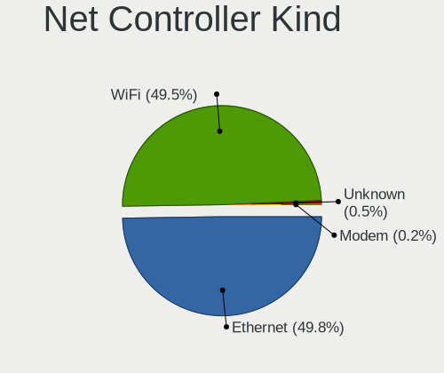

| Kind     | Computers | Percent |
|----------|-----------|---------|
| Ethernet | 139       | 51.67%  |
| WiFi     | 128       | 47.58%  |
| Modem    | 1         | 0.37%   |
| Unknown  | 1         | 0.37%   |

Used Controller
---------------

Currently used network controller

| Kind     | Computers | Percent |
|----------|-----------|---------|
| WiFi     | 110       | 52.13%  |
| Ethernet | 100       | 47.39%  |
| Unknown  | 1         | 0.47%   |

NICs
----

Total network controllers on board

| Total | Computers | Percent |
|-------|-----------|---------|
| 2     | 94        | 55.62%  |
| 1     | 71        | 42.01%  |
| 0     | 4         | 2.37%   |

IPv6
----

IPv6 vs IPv4

| Used | Computers | Percent |
|------|-----------|---------|
| No   | 161       | 95.27%  |
| Yes  | 8         | 4.73%   |

Bluetooth
---------

Bluetooth Vendor
----------------

Controller vendors

| Vendor                          | Computers | Percent |
|---------------------------------|-----------|---------|
| Intel                           | 35        | 32.11%  |
| Qualcomm Atheros Communications | 23        | 21.1%   |
| Realtek Semiconductor           | 11        | 10.09%  |
| Cambridge Silicon Radio         | 11        | 10.09%  |
| Foxconn / Hon Hai               | 6         | 5.5%    |
| Broadcom                        | 6         | 5.5%    |
| Realtek                         | 4         | 3.67%   |
| IMC Networks                    | 4         | 3.67%   |
| Lite-On Technology              | 3         | 2.75%   |
| Toshiba                         | 1         | 0.92%   |
| Marvell Semiconductor           | 1         | 0.92%   |
| Dynex                           | 1         | 0.92%   |
| Dell                            | 1         | 0.92%   |
| ASUSTek Computer                | 1         | 0.92%   |
| Apple                           | 1         | 0.92%   |

Bluetooth Model
---------------

Controller models

| Model                                                                               | Computers | Percent |
|-------------------------------------------------------------------------------------|-----------|---------|
| Intel Bluetooth wireless interface                                                  | 19        | 17.43%  |
| Qualcomm Atheros  Bluetooth Device                                                  | 16        | 14.68%  |
| Cambridge Silicon Radio Bluetooth Dongle (HCI mode)                                 | 11        | 10.09%  |
| Realtek Bluetooth Radio                                                             | 6         | 5.5%    |
| Intel AX200 Bluetooth                                                               | 5         | 4.59%   |
| Realtek Bluetooth Radio                                                             | 4         | 3.67%   |
| Intel Bluetooth 9460/9560 Jefferson Peak (JfP)                                      | 4         | 3.67%   |
| Intel AX201 Bluetooth                                                               | 4         | 3.67%   |
| Broadcom BCM2045B (BDC-2.1)                                                         | 4         | 3.67%   |
| Realtek  Bluetooth 4.2 Adapter                                                      | 3         | 2.75%   |
| Qualcomm Atheros AR3012 Bluetooth 4.0                                               | 3         | 2.75%   |
| Qualcomm Atheros QCA61x4 Bluetooth 4.0                                              | 2         | 1.83%   |
| Qualcomm Atheros Bluetooth USB Host Controller                                      | 2         | 1.83%   |
| Lite-On Atheros AR3012 Bluetooth                                                    | 2         | 1.83%   |
| Intel Centrino Bluetooth Wireless Transceiver                                       | 2         | 1.83%   |
| IMC Networks Bluetooth Device                                                       | 2         | 1.83%   |
| Foxconn / Hon Hai Bluetooth Device                                                  | 2         | 1.83%   |
| Broadcom HP Portable SoftSailing                                                    | 2         | 1.83%   |
| Toshiba Bluetooth Radio                                                             | 1         | 0.92%   |
| Realtek RTL8821A Bluetooth                                                          | 1         | 0.92%   |
| Realtek RTL8723B Bluetooth                                                          | 1         | 0.92%   |
| Marvell Bluetooth and Wireless LAN Composite                                        | 1         | 0.92%   |
| Lite-On Bluetooth Device                                                            | 1         | 0.92%   |
| Intel Wireless-AC 3168 Bluetooth                                                    | 1         | 0.92%   |
| IMC Networks Wireless_Device                                                        | 1         | 0.92%   |
| IMC Networks Atheros AR3012 Bluetooth 4.0 Adapter                                   | 1         | 0.92%   |
| Foxconn / Hon Hai Foxconn T77H114 BCM2070 [Single-Chip Bluetooth 2.1 + EDR Adapter] | 1         | 0.92%   |
| Foxconn / Hon Hai Bluetooth USB Host Controller                                     | 1         | 0.92%   |
| Foxconn / Hon Hai BCM43142A0                                                        | 1         | 0.92%   |
| Foxconn / Hon Hai BCM20702A0                                                        | 1         | 0.92%   |
| Dynex BCM20702A0                                                                    | 1         | 0.92%   |
| Dell DW375 Bluetooth Module                                                         | 1         | 0.92%   |
| ASUS Broadcom BCM20702A0 Bluetooth                                                  | 1         | 0.92%   |
| Apple Built-in Bluetooth 2.0+EDR HCI                                                | 1         | 0.92%   |

Sound
-----

Sound Vendor
------------

Sound card vendors

| Vendor                  | Computers | Percent |
|-------------------------|-----------|---------|
| Intel                   | 131       | 62.38%  |
| AMD                     | 40        | 19.05%  |
| Nvidia                  | 30        | 14.29%  |
| C-Media Electronics     | 2         | 0.95%   |
| Zhaoxin                 | 1         | 0.48%   |
| XMOS                    | 1         | 0.48%   |
| Microdia                | 1         | 0.48%   |
| Loongson Technology     | 1         | 0.48%   |
| JMTek                   | 1         | 0.48%   |
| Creative Technology     | 1         | 0.48%   |
| BEHRINGER International | 1         | 0.48%   |

Sound Model
-----------

Sound card models

| Model                                                                                             | Computers | Percent |
|---------------------------------------------------------------------------------------------------|-----------|---------|
| Intel Sunrise Point-LP HD Audio                                                                   | 21        | 8.27%   |
| Intel 7 Series/C216 Chipset Family High Definition Audio Controller                               | 19        | 7.48%   |
| Intel 6 Series/C200 Series Chipset Family High Definition Audio Controller                        | 14        | 5.51%   |
| AMD Family 17h/19h HD Audio Controller                                                            | 13        | 5.12%   |
| Intel Haswell-ULT HD Audio Controller                                                             | 11        | 4.33%   |
| Intel 8 Series HD Audio Controller                                                                | 11        | 4.33%   |
| Intel Wildcat Point-LP High Definition Audio Controller                                           | 9         | 3.54%   |
| Intel Broadwell-U Audio Controller                                                                | 9         | 3.54%   |
| AMD Renoir Radeon High Definition Audio Controller                                                | 7         | 2.76%   |
| Intel 82801I (ICH9 Family) HD Audio Controller                                                    | 6         | 2.36%   |
| Intel 8 Series/C220 Series Chipset High Definition Audio Controller                               | 6         | 2.36%   |
| Intel Comet Lake PCH-V cAVS                                                                       | 5         | 1.97%   |
| Intel Cannon Lake PCH cAVS                                                                        | 5         | 1.97%   |
| Intel 100 Series/C230 Series Chipset Family HD Audio Controller                                   | 5         | 1.97%   |
| AMD Raven/Raven2/Fenghuang HDMI/DP Audio Controller                                               | 5         | 1.97%   |
| Nvidia TU107 GeForce GTX 1650 High Definition Audio Controller                                    | 4         | 1.57%   |
| Intel Cannon Point-LP High Definition Audio Controller                                            | 4         | 1.57%   |
| AMD SBx00 Azalia (Intel HDA)                                                                      | 4         | 1.57%   |
| AMD Oland/Hainan/Cape Verde/Pitcairn HDMI Audio [Radeon HD 7000 Series]                           | 4         | 1.57%   |
| Nvidia GM204 High Definition Audio Controller                                                     | 3         | 1.18%   |
| Nvidia GK107 HDMI Audio Controller                                                                | 3         | 1.18%   |
| Nvidia GF116 High Definition Audio Controller                                                     | 3         | 1.18%   |
| Intel NM10/ICH7 Family High Definition Audio Controller                                           | 3         | 1.18%   |
| Intel Comet Lake PCH-LP cAVS                                                                      | 3         | 1.18%   |
| Intel Celeron/Pentium Silver Processor High Definition Audio                                      | 3         | 1.18%   |
| Intel Atom/Celeron/Pentium Processor x5-E8000/J3xxx/N3xxx Series High Definition Audio Controller | 3         | 1.18%   |
| Intel 5 Series/3400 Series Chipset High Definition Audio                                          | 3         | 1.18%   |
| AMD Wrestler HDMI Audio                                                                           | 3         | 1.18%   |
| AMD Kabini HDMI/DP Audio                                                                          | 3         | 1.18%   |
| AMD FCH Azalia Controller                                                                         | 3         | 1.18%   |
| AMD Caicos HDMI Audio [Radeon HD 6450 / 7450/8450/8490 OEM / R5 230/235/235X OEM]                 | 3         | 1.18%   |
| Nvidia High Definition Audio Controller                                                           | 2         | 0.79%   |
| Nvidia GP107GL High Definition Audio Controller                                                   | 2         | 0.79%   |
| Nvidia GP106 High Definition Audio Controller                                                     | 2         | 0.79%   |
| Nvidia GF119 HDMI Audio Controller                                                                | 2         | 0.79%   |
| Nvidia Audio device                                                                               | 2         | 0.79%   |
| Intel Xeon E3-1200 v3/4th Gen Core Processor HD Audio Controller                                  | 2         | 0.79%   |
| Intel Celeron N3350/Pentium N4200/Atom E3900 Series Audio Cluster                                 | 2         | 0.79%   |
| Intel 82801JD/DO (ICH10 Family) HD Audio Controller                                               | 2         | 0.79%   |
| Intel 200 Series PCH HD Audio                                                                     | 2         | 0.79%   |
| AMD Starship/Matisse HD Audio Controller                                                          | 2         | 0.79%   |
| AMD Family 17h (Models 00h-0fh) HD Audio Controller                                               | 2         | 0.79%   |
| AMD Family 15h (Models 60h-6fh) Audio Controller                                                  | 2         | 0.79%   |
| AMD Ellesmere HDMI Audio [Radeon RX 470/480 / 570/580/590]                                        | 2         | 0.79%   |
| Zhaoxin ZX-E High Definition Audio Controller                                                     | 1         | 0.39%   |
| Zhaoxin ZX-100/ZX-D/ZX-E High Definition Audio Controller                                         | 1         | 0.39%   |
| XMOS iFi (by AMR) HD USB Audio                                                                    | 1         | 0.39%   |
| Nvidia TU116 High Definition Audio Controller                                                     | 1         | 0.39%   |
| Nvidia MCP79 High Definition Audio                                                                | 1         | 0.39%   |
| Nvidia MCP61 High Definition Audio                                                                | 1         | 0.39%   |
| Nvidia GP108 High Definition Audio Controller                                                     | 1         | 0.39%   |
| Nvidia GM206 High Definition Audio Controller                                                     | 1         | 0.39%   |
| Nvidia GK208 HDMI/DP Audio Controller                                                             | 1         | 0.39%   |
| Nvidia GK106 HDMI Audio Controller                                                                | 1         | 0.39%   |
| Nvidia GF108 High Definition Audio Controller                                                     | 1         | 0.39%   |
| Microdia USB Audio                                                                                | 1         | 0.39%   |
| Loongson Technology HDA (High Definition Audio) Controller                                        | 1         | 0.39%   |
| JMTek USB PnP Audio Device                                                                        | 1         | 0.39%   |
| Intel Tiger Lake-LP Smart Sound Technology Audio Controller                                       | 1         | 0.39%   |
| Intel Comet Lake PCH cAVS                                                                         | 1         | 0.39%   |

Memory
------

Memory Vendor
-------------

Memory module vendors

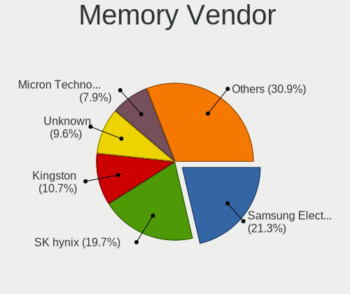

| Vendor              | Computers | Percent |
|---------------------|-----------|---------|
| Samsung Electronics | 21        | 21.43%  |
| SK Hynix            | 17        | 17.35%  |
| Unknown             | 15        | 15.31%  |
| Kingston            | 13        | 13.27%  |
| Micron Technology   | 6         | 6.12%   |
| Smart               | 4         | 4.08%   |
| Nanya Technology    | 4         | 4.08%   |
| A-DATA Technology   | 3         | 3.06%   |
| Ramaxel Technology  | 2         | 2.04%   |
| G.Skill             | 2         | 2.04%   |
| Crucial             | 2         | 2.04%   |
| Corsair             | 2         | 2.04%   |
| Unknown (07FB)      | 1         | 1.02%   |
| Team                | 1         | 1.02%   |
| SMART Brazil        | 1         | 1.02%   |
| MTASE               | 1         | 1.02%   |
| JEDEC ID: 0000h     | 1         | 1.02%   |
| CSX                 | 1         | 1.02%   |
| Apacer              | 1         | 1.02%   |

Memory Model
------------

Memory module models

| Model                                                            | Computers | Percent |
|------------------------------------------------------------------|-----------|---------|
| Unknown RAM Module 2048MB SODIMM DDR3 1333MT/s                   | 2         | 1.9%    |
| Smart RAM SH564128FJ8NWRNSQG 4GB SODIMM DDR3 1600MT/s            | 2         | 1.9%    |
| SK Hynix RAM Module 8192MB SODIMM DDR4 2133MT/s                  | 2         | 1.9%    |
| SK Hynix RAM HMAA1GS6CMR6N-VK 8192MB Row Of Chips DDR4 2667MT/s  | 2         | 1.9%    |
| Samsung RAM M471A5244CB0-CTD 4096MB SODIMM DDR4 3266MT/s         | 2         | 1.9%    |
| Samsung RAM M471A1K43CB1-CRC 8GB SODIMM DDR4 2667MT/s            | 2         | 1.9%    |
| Kingston RAM TF32D4U2S1MEH-8 8192MB DIMM DDR4 3200MT/s           | 2         | 1.9%    |
| Unknown RAM Module 8GB DIMM DDR4 2667MT/s                        | 1         | 0.95%   |
| Unknown RAM Module 8192MB SODIMM DDR3 1600MT/s                   | 1         | 0.95%   |
| Unknown RAM Module 4GB SODIMM LPDDR3 1600MT/s                    | 1         | 0.95%   |
| Unknown RAM Module 4096MB SODIMM DDR4 2667MT/s                   | 1         | 0.95%   |
| Unknown RAM Module 4096MB SODIMM DDR3 1333MT/s                   | 1         | 0.95%   |
| Unknown RAM Module 4096MB SODIMM DDR3                            | 1         | 0.95%   |
| Unknown RAM Module 4096MB DIMM DDR3 1067MT/s                     | 1         | 0.95%   |
| Unknown RAM Module 4096MB DIMM 667MT/s                           | 1         | 0.95%   |
| Unknown RAM Module 2GB DIMM SDRAM                                | 1         | 0.95%   |
| Unknown RAM Module 2048MB SODIMM LPDDR3 1600MT/s                 | 1         | 0.95%   |
| Unknown RAM Module 2048MB SODIMM DDR3                            | 1         | 0.95%   |
| Unknown RAM Module 2048MB SODIMM DDR2                            | 1         | 0.95%   |
| Unknown RAM Module 1024MB SODIMM LPDDR4 2400MT/s                 | 1         | 0.95%   |
| Unknown RAM Module 1024MB SODIMM DDR2                            | 1         | 0.95%   |
| Unknown RAM 1866 CL10 Ser 8192MB DIMM DDR3 800MT/s               | 1         | 0.95%   |
| Unknown (07FB) RAM GST32G08SCL196P-26 32GB SODIMM DDR4 2667MT/s  | 1         | 0.95%   |
| Team RAM TEAMGROUP-UD4-3200 8GB DIMM DDR4 3200MT/s               | 1         | 0.95%   |
| Smart RAM SH564568FJ8NZRNSDR 2GB SODIMM DDR3 1600MT/s            | 1         | 0.95%   |
| Smart RAM SH564128FJ8NWRNSQR 4096MB SODIMM DDR3 1600MT/s         | 1         | 0.95%   |
| Smart RAM SG564568FG8NWKF-Z1 2GB SODIMM DDR2 800MT/s             | 1         | 0.95%   |
| SMART Brazil RAM SMS4TDC3C0K0446SCG 4096MB SODIMM DDR4 2667MT/s  | 1         | 0.95%   |
| SK Hynix RAM MPPS4GBPC1600 1.35 4096MB SODIMM DDR3 1600MT/s      | 1         | 0.95%   |
| SK Hynix RAM Module 4GB SODIMM DDR3 1066MT/s                     | 1         | 0.95%   |
| SK Hynix RAM HMT451S6MFR8C-PB 4GB SODIMM DDR3 1600MT/s           | 1         | 0.95%   |
| SK Hynix RAM HMT451S6BFR8A-PB 4GB SODIMM DDR3 1600MT/s           | 1         | 0.95%   |
| SK Hynix RAM HMT425S6AFR6A-PB 2048MB SODIMM DDR3 1600MT/s        | 1         | 0.95%   |
| SK Hynix RAM HMT351S6CFR8C-PB 4GB SODIMM DDR3 1600MT/s           | 1         | 0.95%   |
| SK Hynix RAM HMT351S6CFR8C-PB 4096MB SODIMM DDR3 1600MT/s        | 1         | 0.95%   |
| SK Hynix RAM HMA851S6DJR6N-XN 4GB Row Of Chips DDR4 3200MT/s     | 1         | 0.95%   |
| SK Hynix RAM HMA82GS6MFR8N-TF 16GB SODIMM DDR4 2133MT/s          | 1         | 0.95%   |
| SK Hynix RAM HMA81GS6AFR8N-UH 8192MB SODIMM DDR4 2400MT/s        | 1         | 0.95%   |
| SK Hynix RAM H9CCNNNBJTMLAR-NUD 4GB Row Of Chips LPDDR3 1867MT/s | 1         | 0.95%   |
| SK Hynix RAM H9CCNNNBJTMLAR-NUD 4096MB SODIMM LPDDR3 1867MT/s    | 1         | 0.95%   |
| SK Hynix RAM H9CCNNN8JTBLAR-NUD 2048MB LPDDR3 1600MT/s           | 1         | 0.95%   |
| Samsung RAM Module 8192MB SODIMM DDR4 2133MT/s                   | 1         | 0.95%   |
| Samsung RAM Module 4096MB SODIMM LPDDR3 1600MT/s                 | 1         | 0.95%   |
| Samsung RAM Module 4096MB SODIMM DDR4 2666MT/s                   | 1         | 0.95%   |
| Samsung RAM M471B5273EB0-CK0 4096MB SODIMM DDR3 4199MT/s         | 1         | 0.95%   |
| Samsung RAM M471B5273CH0-CK0 4GB SODIMM DDR3 1600MT/s            | 1         | 0.95%   |
| Samsung RAM M471B5173QH0-YK0 4096MB SODIMM DDR3 1600MT/s         | 1         | 0.95%   |
| Samsung RAM M471B5173EB0-YK0 4GB SODIMM DDR3 1600MT/s            | 1         | 0.95%   |
| Samsung RAM M471B5173DB0-YK0 4GB SODIMM DDR3 1600MT/s            | 1         | 0.95%   |
| Samsung RAM M471B1G73DB0-YK0 8GB SODIMM DDR3 1600MT/s            | 1         | 0.95%   |
| Samsung RAM M471A5244CB0-CWE 4GB SODIMM DDR4 3200MT/s            | 1         | 0.95%   |
| Samsung RAM M471A5244CB0-CTD 4GB Row Of Chips DDR4 2667MT/s      | 1         | 0.95%   |
| Samsung RAM M471A5244CB0-CRC 4GB SODIMM DDR4 2667MT/s            | 1         | 0.95%   |
| Samsung RAM M471A5143EB0-CPB 4096MB SODIMM DDR4 2133MT/s         | 1         | 0.95%   |
| Samsung RAM M471A1K43EB1-CWE 8GB SODIMM DDR4 3200MT/s            | 1         | 0.95%   |
| Samsung RAM M471A1K43BB1-CRC 8GB SODIMM DDR4 2667MT/s            | 1         | 0.95%   |
| Samsung RAM M378A1K43CB2-CRC 8GB DIMM DDR4 3500MT/s              | 1         | 0.95%   |
| Samsung RAM K4UBE3D4AA-MGCL 8GB SODIMM LPDDR4 4266MT/s           | 1         | 0.95%   |
| Ramaxel RAM RMSA3300ME78HBF-2666 16GB SODIMM DDR4 2667MT/s       | 1         | 0.95%   |
| Ramaxel RAM RMSA3260ME78HAF-2666 8GB SODIMM DDR4 2667MT/s        | 1         | 0.95%   |

Memory Kind
-----------

Memory module kinds

| Kind    | Computers | Percent |
|---------|-----------|---------|
| DDR4    | 43        | 50%     |
| DDR3    | 30        | 34.88%  |
| LPDDR3  | 6         | 6.98%   |
| SDRAM   | 2         | 2.33%   |
| LPDDR4  | 2         | 2.33%   |
| DDR2    | 2         | 2.33%   |
| Unknown | 1         | 1.16%   |

Memory Form Factor
------------------

Physical design of the memory module

| Name         | Computers | Percent |
|--------------|-----------|---------|
| SODIMM       | 57        | 65.52%  |
| DIMM         | 22        | 25.29%  |
| Row Of Chips | 7         | 8.05%   |
| Unknown      | 1         | 1.15%   |

Memory Size
-----------

Memory module size

| Size  | Computers | Percent |
|-------|-----------|---------|
| 8192  | 38        | 41.3%   |
| 4096  | 33        | 35.87%  |
| 2048  | 12        | 13.04%  |
| 16384 | 4         | 4.35%   |
| 1024  | 3         | 3.26%   |
| 32768 | 2         | 2.17%   |

Memory Speed
------------

Memory module speed

| Speed   | Computers | Percent |
|---------|-----------|---------|
| 1600    | 20        | 21.98%  |
| 2667    | 17        | 18.68%  |
| 3200    | 11        | 12.09%  |
| 2133    | 6         | 6.59%   |
| 2400    | 5         | 5.49%   |
| 1867    | 5         | 5.49%   |
| 1333    | 5         | 5.49%   |
| 1334    | 3         | 3.3%    |
| Unknown | 3         | 3.3%    |
| 3266    | 2         | 2.2%    |
| 2933    | 2         | 2.2%    |
| 2666    | 2         | 2.2%    |
| 1066    | 2         | 2.2%    |
| 4266    | 1         | 1.1%    |
| 4199    | 1         | 1.1%    |
| 3500    | 1         | 1.1%    |
| 3466    | 1         | 1.1%    |
| 2800    | 1         | 1.1%    |
| 1067    | 1         | 1.1%    |
| 800     | 1         | 1.1%    |
| 667     | 1         | 1.1%    |

Printers & scanners
-------------------

Printer Vendor
--------------

Printer device vendors

| Vendor      | Computers | Percent |
|-------------|-----------|---------|
| Seiko Epson | 1         | 100%    |

Printer Model
-------------

Printer device models

| Model                                         | Computers | Percent |
|-----------------------------------------------|-----------|---------|
| Seiko Epson ME 340 Series/Stylus NX130 Series | 1         | 100%    |

Scanner Vendor
--------------

Scanner device vendors

Zero info for selected period =(

Scanner Model
-------------

Scanner device models

Zero info for selected period =(

Camera
------

Camera Vendor
-------------

Camera device vendors

| Vendor                                 | Computers | Percent |
|----------------------------------------|-----------|---------|
| Chicony Electronics                    | 28        | 25.69%  |
| IMC Networks                           | 10        | 9.17%   |
| Realtek Semiconductor                  | 9         | 8.26%   |
| Microdia                               | 9         | 8.26%   |
| Silicon Motion                         | 7         | 6.42%   |
| Syntek                                 | 6         | 5.5%    |
| Suyin                                  | 5         | 4.59%   |
| Sunplus Innovation Technology          | 5         | 4.59%   |
| Logitech                               | 5         | 4.59%   |
| Acer                                   | 4         | 3.67%   |
| Quanta                                 | 3         | 2.75%   |
| Lite-On Technology                     | 3         | 2.75%   |
| Ricoh                                  | 2         | 1.83%   |
| Primax Electronics                     | 2         | 1.83%   |
| Cheng Uei Precision Industry (Foxlink) | 2         | 1.83%   |
| Alcor Micro                            | 2         | 1.83%   |
| LG Electronics                         | 1         | 0.92%   |
| Lenovo                                 | 1         | 0.92%   |
| HD 2MP WEBCAM                          | 1         | 0.92%   |
| Goodong Industry                       | 1         | 0.92%   |
| Generalplus Technology                 | 1         | 0.92%   |
| Arkmicro Technologies                  | 1         | 0.92%   |
| Apple                                  | 1         | 0.92%   |

Camera Model
------------

Camera device models

| Model                                                 | Computers | Percent |
|-------------------------------------------------------|-----------|---------|
| Chicony Integrated Camera                             | 6         | 5.5%    |
| IMC Networks Integrated Camera                        | 4         | 3.67%   |
| IMC Networks HD Camera                                | 4         | 3.67%   |
| Chicony EasyCamera                                    | 4         | 3.67%   |
| Syntek EasyCamera                                     | 3         | 2.75%   |
| Silicon Motion Web Camera                             | 3         | 2.75%   |
| Logitech Webcam C270                                  | 3         | 2.75%   |
| Chicony TOSHIBA Web Camera - HD                       | 3         | 2.75%   |
| Syntek Integrated Camera                              | 2         | 1.83%   |
| Sunplus HD WebCam                                     | 2         | 1.83%   |
| Realtek HP "Truevision HD" laptop camera              | 2         | 1.83%   |
| Quanta HD User Facing                                 | 2         | 1.83%   |
| Primax HP HD Webcam [Fixed]                           | 2         | 1.83%   |
| Microdia Integrated_Webcam_HD                         | 2         | 1.83%   |
| Chicony HP Webcam                                     | 2         | 1.83%   |
| Chicony HP HD Webcam                                  | 2         | 1.83%   |
| Chicony HD WebCam                                     | 2         | 1.83%   |
| Acer Integrated Camera                                | 2         | 1.83%   |
| Syntek Lenovo EasyCamera                              | 1         | 0.92%   |
| Suyin Integrated_Webcam_HD                            | 1         | 0.92%   |
| Suyin HP Truevision HD                                | 1         | 0.92%   |
| Suyin HD WebCam                                       | 1         | 0.92%   |
| Suyin Acer/HP Integrated Webcam [CN0314]              | 1         | 0.92%   |
| Suyin 1.3M HD WebCam                                  | 1         | 0.92%   |
| Sunplus Integrated_Webcam_HD                          | 1         | 0.92%   |
| Sunplus HP Wide Vision HD                             | 1         | 0.92%   |
| Sunplus Asus Webcam                                   | 1         | 0.92%   |
| Silicon Motion WebCam SC-13HDL11939N                  | 1         | 0.92%   |
| Silicon Motion WebCam SC-10IRQ12340N                  | 1         | 0.92%   |
| Silicon Motion WebCam SC-0311139N                     | 1         | 0.92%   |
| Silicon Motion ATIV VGA Camera                        | 1         | 0.92%   |
| Ricoh Sony Vaio Integrated Webcam                     | 1         | 0.92%   |
| Ricoh Laptop_Integrated_Webcam_FHD                    | 1         | 0.92%   |
| Realtek Laptop_Integrated_Webcam_HD                   | 1         | 0.92%   |
| Realtek Integrated_Webcam_HD                          | 1         | 0.92%   |
| Realtek Integrated_Webcam_FHD                         | 1         | 0.92%   |
| Realtek HP Wide Vision HD Camera                      | 1         | 0.92%   |
| Realtek HP Truevision HD                              | 1         | 0.92%   |
| Realtek HD WebCam                                     | 1         | 0.92%   |
| Realtek EasyCamera                                    | 1         | 0.92%   |
| Quanta HD Webcam                                      | 1         | 0.92%   |
| Microdia Webcam SC-10HDD12636P                        | 1         | 0.92%   |
| Microdia USB 2.0 Camera                               | 1         | 0.92%   |
| Microdia Sony Visual Communication Camera             | 1         | 0.92%   |
| Microdia Sonix USB 2.0 Camera                         | 1         | 0.92%   |
| Microdia Laptop_Integrated_Webcam_HD                  | 1         | 0.92%   |
| Microdia Integrated Webcam HD                         | 1         | 0.92%   |
| Microdia Integrated HD Webcam                         | 1         | 0.92%   |
| Logitech Webcam C200                                  | 1         | 0.92%   |
| Logitech HD Pro Webcam C920                           | 1         | 0.92%   |
| Lite-On TOSHIBA Web Camera - HD                       | 1         | 0.92%   |
| Lite-On HP Webcam                                     | 1         | 0.92%   |
| Lite-On HP HD Camera                                  | 1         | 0.92%   |
| LG LM-X420xxx/G2/G3 Android Phone (MTP/download mode) | 1         | 0.92%   |
| Lenovo Integrated Webcam [R5U877]                     | 1         | 0.92%   |
| IMC Networks USB2.0 VGA UVC WebCam                    | 1         | 0.92%   |
| IMC Networks USB2.0 HD UVC WebCam                     | 1         | 0.92%   |
| HD 2MP WEBCAM HD 2MP WEBCAM                           | 1         | 0.92%   |
| Goodong Industry USB2.0 HD UVC WebCam                 | 1         | 0.92%   |
| Generalplus GENERAL WEBCAM                            | 1         | 0.92%   |

Security
--------

Fingerprint Vendor
------------------

Fingerprint sensor vendors

| Vendor                     | Computers | Percent |
|----------------------------|-----------|---------|
| Validity Sensors           | 10        | 45.45%  |
| Shenzhen Goodix Technology | 6         | 27.27%  |
| Upek                       | 5         | 22.73%  |
| Elan Microelectronics      | 1         | 4.55%   |

Fingerprint Model
-----------------

Fingerprint sensor models

| Model                                                  | Computers | Percent |
|--------------------------------------------------------|-----------|---------|
| Validity Sensors VFS495 Fingerprint Reader             | 5         | 22.73%  |
| Shenzhen Goodix  FingerPrint Device                    | 4         | 18.18%  |
| Upek Biometric Touchchip/Touchstrip Fingerprint Sensor | 3         | 13.64%  |
| Validity Sensors VFS491                                | 2         | 9.09%   |
| Validity Sensors Swipe Fingerprint Sensor              | 2         | 9.09%   |
| Upek TCS5B Fingerprint sensor                          | 2         | 9.09%   |
| Shenzhen Goodix Fingerprint Reader                     | 2         | 9.09%   |
| Validity Sensors VFS5011 Fingerprint Reader            | 1         | 4.55%   |
| Elan ELAN:Fingerprint                                  | 1         | 4.55%   |

Chipcard Vendor
---------------

Chipcard module vendors

| Vendor              | Computers | Percent |
|---------------------|-----------|---------|
| Alcor Micro         | 2         | 40%     |
| Lenovo              | 1         | 20%     |
| Giesecke & Devrient | 1         | 20%     |
| Broadcom            | 1         | 20%     |

Chipcard Model
--------------

Chipcard module models

| Model                                          | Computers | Percent |
|------------------------------------------------|-----------|---------|
| Alcor Micro AU9540 Smartcard Reader            | 2         | 40%     |
| Lenovo Integrated Smart Card Reader            | 1         | 20%     |
| Giesecke & Devrient StarSign CUT               | 1         | 20%     |
| Broadcom BCM5880 Secure Applications Processor | 1         | 20%     |

Unsupported
-----------

Unsupported Devices
-------------------

Total unsupported devices on board

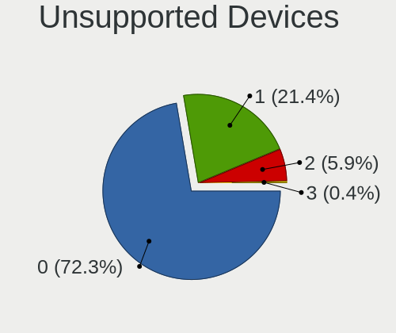

| Total | Computers | Percent |
|-------|-----------|---------|
| 0     | 122       | 71.76%  |
| 1     | 40        | 23.53%  |
| 2     | 7         | 4.12%   |
| 3     | 1         | 0.59%   |

Unsupported Device Types
------------------------

Types of unsupported devices

| Type                     | Computers | Percent |
|--------------------------|-----------|---------|
| Fingerprint reader       | 22        | 39.29%  |
| Graphics card            | 17        | 30.36%  |
| Chipcard                 | 5         | 8.93%   |
| Multimedia controller    | 4         | 7.14%   |
| Net/wireless             | 3         | 5.36%   |
| Sound                    | 2         | 3.57%   |
| Storage                  | 1         | 1.79%   |
| Communication controller | 1         | 1.79%   |
| Camera                   | 1         | 1.79%   |

