Deepin - Tested Hardware & Statistics (Desktops)
------------------------------------------------

A project to collect tested hardware configurations for Deepin.

Anyone can contribute to this report by the [hw-probe](https://github.com/linuxhw/hw-probe) tool:

    sudo -E hw-probe -all -upload

Please contribute! Especially if your hardware is rare.

Contents
--------

* [ Test Cases ](#test-cases)

* [ System ](#system)
  - [ OS                       ](#os)
  - [ OS Family                ](#os-family)
  - [ Kernel                   ](#kernel)
  - [ Kernel Family            ](#kernel-family)
  - [ Kernel Major Ver.        ](#kernel-major-ver)
  - [ Arch                     ](#arch)
  - [ DE                       ](#de)
  - [ Display Server           ](#display-server)
  - [ Display Manager          ](#display-manager)
  - [ OS Lang                  ](#os-lang)
  - [ Boot Mode                ](#boot-mode)
  - [ Filesystem               ](#filesystem)
  - [ Part. scheme             ](#part-scheme)
  - [ Dual Boot with Linux/BSD ](#dual-boot-with-linuxbsd)
  - [ Dual Boot (Win)          ](#dual-boot-win)

* [ Board ](#board)
  - [ Vendor                   ](#vendor)
  - [ Model                    ](#model)
  - [ Model Family             ](#model-family)
  - [ MFG Year                 ](#mfg-year)
  - [ Form Factor              ](#form-factor)
  - [ Secure Boot              ](#secure-boot)
  - [ Coreboot                 ](#coreboot)
  - [ RAM Size                 ](#ram-size)
  - [ RAM Used                 ](#ram-used)
  - [ Total Drives             ](#total-drives)
  - [ Has CD-ROM               ](#has-cd-rom)
  - [ Has Ethernet             ](#has-ethernet)
  - [ Has WiFi                 ](#has-wifi)
  - [ Has Bluetooth            ](#has-bluetooth)

* [ Location ](#location)
  - [ Country                  ](#country)
  - [ City                     ](#city)

* [ Drives ](#drives)
  - [ Drive Vendor             ](#drive-vendor)
  - [ Drive Model              ](#drive-model)
  - [ HDD Vendor               ](#hdd-vendor)
  - [ SSD Vendor               ](#ssd-vendor)
  - [ Drive Kind               ](#drive-kind)
  - [ Drive Connector          ](#drive-connector)
  - [ Drive Size               ](#drive-size)
  - [ Space Total              ](#space-total)
  - [ Space Used               ](#space-used)
  - [ Malfunc. Drives          ](#malfunc-drives)
  - [ Malfunc. Drive Vendor    ](#malfunc-drive-vendor)
  - [ Malfunc. HDD Vendor      ](#malfunc-hdd-vendor)
  - [ Malfunc. Drive Kind      ](#malfunc-drive-kind)
  - [ Failed Drives            ](#failed-drives)
  - [ Failed Drive Vendor      ](#failed-drive-vendor)
  - [ Drive Status             ](#drive-status)

* [ Storage controller ](#storage-controller)
  - [ Storage Vendor           ](#storage-vendor)
  - [ Storage Model            ](#storage-model)
  - [ Storage Kind             ](#storage-kind)

* [ Processor ](#processor)
  - [ CPU Vendor               ](#cpu-vendor)
  - [ CPU Model                ](#cpu-model)
  - [ CPU Model Family         ](#cpu-model-family)
  - [ CPU Cores                ](#cpu-cores)
  - [ CPU Sockets              ](#cpu-sockets)
  - [ CPU Threads              ](#cpu-threads)
  - [ CPU Op-Modes             ](#cpu-op-modes)
  - [ CPU Microcode            ](#cpu-microcode)
  - [ CPU Microarch            ](#cpu-microarch)

* [ Graphics ](#graphics)
  - [ GPU Vendor               ](#gpu-vendor)
  - [ GPU Model                ](#gpu-model)
  - [ GPU Combo                ](#gpu-combo)
  - [ GPU Driver               ](#gpu-driver)
  - [ GPU Memory               ](#gpu-memory)

* [ Monitor ](#monitor)
  - [ Monitor Vendor           ](#monitor-vendor)
  - [ Monitor Model            ](#monitor-model)
  - [ Monitor Resolution       ](#monitor-resolution)
  - [ Monitor Diagonal         ](#monitor-diagonal)
  - [ Monitor Width            ](#monitor-width)
  - [ Aspect Ratio             ](#aspect-ratio)
  - [ Monitor Area             ](#monitor-area)
  - [ Pixel Density            ](#pixel-density)
  - [ Multiple Monitors        ](#multiple-monitors)

* [ Network ](#network)
  - [ Net Controller Vendor    ](#net-controller-vendor)
  - [ Net Controller Model     ](#net-controller-model)
  - [ Wireless Vendor          ](#wireless-vendor)
  - [ Wireless Model           ](#wireless-model)
  - [ Ethernet Vendor          ](#ethernet-vendor)
  - [ Ethernet Model           ](#ethernet-model)
  - [ Net Controller Kind      ](#net-controller-kind)
  - [ Used Controller          ](#used-controller)
  - [ NICs                     ](#nics)
  - [ IPv6                     ](#ipv6)

* [ Bluetooth ](#bluetooth)
  - [ Bluetooth Vendor         ](#bluetooth-vendor)
  - [ Bluetooth Model          ](#bluetooth-model)

* [ Sound ](#sound)
  - [ Sound Vendor             ](#sound-vendor)
  - [ Sound Model              ](#sound-model)

* [ Memory ](#memory)
  - [ Memory Vendor            ](#memory-vendor)
  - [ Memory Model             ](#memory-model)
  - [ Memory Kind              ](#memory-kind)
  - [ Memory Form Factor       ](#memory-form-factor)
  - [ Memory Size              ](#memory-size)
  - [ Memory Speed             ](#memory-speed)

* [ Printers & scanners ](#printers--scanners)
  - [ Printer Vendor           ](#printer-vendor)
  - [ Printer Model            ](#printer-model)
  - [ Scanner Vendor           ](#scanner-vendor)
  - [ Scanner Model            ](#scanner-model)

* [ Camera ](#camera)
  - [ Camera Vendor            ](#camera-vendor)
  - [ Camera Model             ](#camera-model)

* [ Security ](#security)
  - [ Fingerprint Vendor       ](#fingerprint-vendor)
  - [ Fingerprint Model        ](#fingerprint-model)
  - [ Chipcard Vendor          ](#chipcard-vendor)
  - [ Chipcard Model           ](#chipcard-model)

* [ Unsupported ](#unsupported)
  - [ Unsupported Devices      ](#unsupported-devices)
  - [ Unsupported Device Types ](#unsupported-device-types)

Test Cases
----------

Total: 103

| Vendor        | Model                       | Probe                                                      | Date         |
|---------------|-----------------------------|------------------------------------------------------------|--------------|
| Dell          | 0XR1GT A00                  | [f01a35c9a7](https://linux-hardware.org/?probe=f01a35c9a7) | Nov 06, 2023 |
| Intel         | DX58SO AAE29331-504         | [33d7713b52](https://linux-hardware.org/?probe=33d7713b52) | Oct 21, 2023 |
| Intel         | DX58SO AAE29331-504         | [afe13c52df](https://linux-hardware.org/?probe=afe13c52df) | Oct 11, 2023 |
| Dell          | 0NW6H5 A00                  | [e337e05dff](https://linux-hardware.org/?probe=e337e05dff) | Oct 08, 2023 |
| Dell          | 0NW6H5 A00                  | [dc4ec4e72a](https://linux-hardware.org/?probe=dc4ec4e72a) | Oct 02, 2023 |
| TSINGHUA T... | B460M-HDV                   | [f82a030bce](https://linux-hardware.org/?probe=f82a030bce) | Aug 30, 2023 |
| TSINGHUA T... | B460M-HDV                   | [815cb59889](https://linux-hardware.org/?probe=815cb59889) | Aug 16, 2023 |
| TSINGHUA T... | B460-N2                     | [f7f87f7a07](https://linux-hardware.org/?probe=f7f87f7a07) | Aug 16, 2023 |
| HP            | 18EA                        | [d6e48a99e7](https://linux-hardware.org/?probe=d6e48a99e7) | Jun 08, 2023 |
| MSI           | A55M-E35                    | [fa4eba3787](https://linux-hardware.org/?probe=fa4eba3787) | Jun 08, 2023 |
| Intel         | DH77EB AAG39073-304         | [8310aaaa78](https://linux-hardware.org/?probe=8310aaaa78) | May 27, 2023 |
| Intel         | DH77EB AAG39073-304         | [86545c89c0](https://linux-hardware.org/?probe=86545c89c0) | May 27, 2023 |
| Koloe         | X58                         | [7c1acc3b84](https://linux-hardware.org/?probe=7c1acc3b84) | May 08, 2023 |
| ASUSTek       | ROG Maximus Z790 HERO       | [a22f7f4309](https://linux-hardware.org/?probe=a22f7f4309) | Mar 13, 2023 |
| ASUSTek       | ROG Maximus Z790 HERO       | [d4f6b075c4](https://linux-hardware.org/?probe=d4f6b075c4) | Mar 13, 2023 |
| ASUSTek       | K30AD_M31AD_M51AD_M32AD     | [44a3952ccf](https://linux-hardware.org/?probe=44a3952ccf) | Feb 15, 2023 |
| OEM           | KX-01 V1.0                  | [75d9dc396c](https://linux-hardware.org/?probe=75d9dc396c) | Jan 28, 2023 |
| ASUSTek       | TUF Gaming B550M-PLUS       | [510b879339](https://linux-hardware.org/?probe=510b879339) | Jan 26, 2023 |
| Unknown       | Unknown                     | [98e2d17193](https://linux-hardware.org/?probe=98e2d17193) | Jul 21, 2022 |
| ASUSTek       | ROG Maximus XII HERO        | [843d2132ad](https://linux-hardware.org/?probe=843d2132ad) | Jun 09, 2022 |
| Gigabyte      | B550 AORUS ELITE AX V2      | [486b6a5d64](https://linux-hardware.org/?probe=486b6a5d64) | Apr 10, 2022 |
| Gigabyte      | B550 AORUS ELITE AX V2      | [ec3689ffdc](https://linux-hardware.org/?probe=ec3689ffdc) | Apr 10, 2022 |
| ASUSTek       | Z97-PRO GAMER               | [3e37ded7e2](https://linux-hardware.org/?probe=3e37ded7e2) | Jan 04, 2022 |
| TSINGHUA T... | B460M-HDV                   | [8447bd4156](https://linux-hardware.org/?probe=8447bd4156) | Dec 22, 2021 |
| TSINGHUA T... | B460M-HDV                   | [1146dc777c](https://linux-hardware.org/?probe=1146dc777c) | Dec 15, 2021 |
| Dell          | 07N90W A02                  | [43a5aec999](https://linux-hardware.org/?probe=43a5aec999) | Dec 07, 2021 |
| ECS           | H81H3-M4                    | [cdaf4b1031](https://linux-hardware.org/?probe=cdaf4b1031) | Dec 07, 2021 |
| TSINGHUA T... | B460M-HDV                   | [bc175433f9](https://linux-hardware.org/?probe=bc175433f9) | Sep 18, 2021 |
| TSINGHUA T... | B460M-HDV                   | [80017bc79b](https://linux-hardware.org/?probe=80017bc79b) | Sep 18, 2021 |
| ASUSTek       | Z97-PRO GAMER               | [a428f57f6a](https://linux-hardware.org/?probe=a428f57f6a) | Sep 17, 2021 |
| TSINGHUA T... | B460-N2                     | [59d9384348](https://linux-hardware.org/?probe=59d9384348) | Aug 09, 2021 |
| Gigabyte      | B550M DS3H                  | [418d6ee68f](https://linux-hardware.org/?probe=418d6ee68f) | Jul 23, 2021 |
| Toshiba       | STI 005492G                 | [d7fe511a9e](https://linux-hardware.org/?probe=d7fe511a9e) | Jul 19, 2021 |
| AMD           | BL2 V2.3                    | [1053adf355](https://linux-hardware.org/?probe=1053adf355) | Jul 12, 2021 |
| ECS           | H81H3-M4                    | [838f10c576](https://linux-hardware.org/?probe=838f10c576) | Jun 25, 2021 |
| ECS           | H81H3-M4                    | [bfc9a4d537](https://linux-hardware.org/?probe=bfc9a4d537) | Jun 25, 2021 |
| TSINGHUA T... | B460-N2 V1.1                | [70d8ede642](https://linux-hardware.org/?probe=70d8ede642) | Jun 23, 2021 |
| TSINGHUA T... | B460-N2 V1.1                | [8431bcbed8](https://linux-hardware.org/?probe=8431bcbed8) | Jun 22, 2021 |
| Loongson      | LS3A3000-7A1000-1w-V1.2-... | [014bdabb68](https://linux-hardware.org/?probe=014bdabb68) | Jun 16, 2021 |
| Toshiba       | STI 005492G                 | [e28291b9ed](https://linux-hardware.org/?probe=e28291b9ed) | Jun 13, 2021 |
| MSI           | H81I                        | [a0f0f9e7e8](https://linux-hardware.org/?probe=a0f0f9e7e8) | May 06, 2021 |
| Huanan        | X99-8M-F V1.1               | [13daa2d4a6](https://linux-hardware.org/?probe=13daa2d4a6) | Apr 23, 2021 |
| ASUSTek       | P8H61-MX                    | [9212747e6a](https://linux-hardware.org/?probe=9212747e6a) | Apr 08, 2021 |
| Gigabyte      | Z170X-Gaming 7              | [e6db1c79cc](https://linux-hardware.org/?probe=e6db1c79cc) | Mar 25, 2021 |
| Gigabyte      | Z170X-Gaming 7              | [edb786e43a](https://linux-hardware.org/?probe=edb786e43a) | Mar 25, 2021 |
| ASUSTek       | PRIME A320M-K               | [1db414e1cd](https://linux-hardware.org/?probe=1db414e1cd) | Mar 21, 2021 |
| Gigabyte      | H81M-D2V                    | [d62d3a2dad](https://linux-hardware.org/?probe=d62d3a2dad) | Mar 19, 2021 |
| MSI           | B460M PRO-VDH WIFI          | [b165cd04ce](https://linux-hardware.org/?probe=b165cd04ce) | Feb 25, 2021 |
| Dell          | 0KWVT8 A00                  | [56f1d17280](https://linux-hardware.org/?probe=56f1d17280) | Feb 04, 2021 |
| Dell          | 00V62H A00                  | [863c1d64fe](https://linux-hardware.org/?probe=863c1d64fe) | Jan 23, 2021 |
| Lenovo        | MAHOBAY NO DPK              | [842703dc6b](https://linux-hardware.org/?probe=842703dc6b) | Jan 20, 2021 |
| Lenovo        | MAHOBAY NO DPK              | [5b9e365258](https://linux-hardware.org/?probe=5b9e365258) | Jan 19, 2021 |
| Gigabyte      | B365M D3H-CF                | [0bfbe639fc](https://linux-hardware.org/?probe=0bfbe639fc) | Jan 18, 2021 |
| Gigabyte      | H81M-D2V                    | [49bd67196b](https://linux-hardware.org/?probe=49bd67196b) | Nov 20, 2020 |
| Foxconn       | 2ADA                        | [2c76ab07eb](https://linux-hardware.org/?probe=2c76ab07eb) | Nov 12, 2020 |
| ASUSTek       | PRIME B450M-GAMING/BR       | [0b46341e31](https://linux-hardware.org/?probe=0b46341e31) | Nov 07, 2020 |
| Gigabyte      | B360M AORUS Gaming 3-CF     | [a4fa363ca9](https://linux-hardware.org/?probe=a4fa363ca9) | Oct 29, 2020 |
| ASRock        | Z68 Extreme7 Gen3           | [181ccd5686](https://linux-hardware.org/?probe=181ccd5686) | Oct 10, 2020 |
| Toshiba       | STI 013442                  | [25aa1737df](https://linux-hardware.org/?probe=25aa1737df) | Oct 02, 2020 |
| Toshiba       | STI 013442                  | [325dccb021](https://linux-hardware.org/?probe=325dccb021) | Oct 01, 2020 |
| Toshiba       | STI 013442                  | [d878c17ac5](https://linux-hardware.org/?probe=d878c17ac5) | Oct 01, 2020 |
| ASRock        | Z68 Extreme7 Gen3           | [d5c18b2ad2](https://linux-hardware.org/?probe=d5c18b2ad2) | Sep 27, 2020 |
| ASRock        | Z68 Extreme7 Gen3           | [27f0cbcbfa](https://linux-hardware.org/?probe=27f0cbcbfa) | Sep 27, 2020 |
| ASUSTek       | P8H77-M PRO                 | [7318b0893d](https://linux-hardware.org/?probe=7318b0893d) | Sep 22, 2020 |
| Gigabyte      | H81M-D2V                    | [c46dd29f7a](https://linux-hardware.org/?probe=c46dd29f7a) | Sep 17, 2020 |
| Gigabyte      | Z77-DS3H                    | [d7f43611eb](https://linux-hardware.org/?probe=d7f43611eb) | Sep 13, 2020 |
| HP            | 81B4                        | [9e3aa00a36](https://linux-hardware.org/?probe=9e3aa00a36) | Aug 21, 2020 |
| HP            | 81B4                        | [03c849fcd2](https://linux-hardware.org/?probe=03c849fcd2) | Jul 26, 2020 |
| Foxconn       | 2ADA                        | [035b1fd159](https://linux-hardware.org/?probe=035b1fd159) | Jul 24, 2020 |
| ASUSTek       | AM1M-A/BR                   | [dafd042867](https://linux-hardware.org/?probe=dafd042867) | Jul 22, 2020 |
| ASUSTek       | H110M-A/M.2                 | [a3dc30f185](https://linux-hardware.org/?probe=a3dc30f185) | Jul 21, 2020 |
| Positivo      | POS-PQ45AU                  | [056dd1ec51](https://linux-hardware.org/?probe=056dd1ec51) | Jul 15, 2020 |
| ASUSTek       | H110I-PLUS                  | [116754d157](https://linux-hardware.org/?probe=116754d157) | Jul 11, 2020 |
| ASUSTek       | H110I-PLUS                  | [4a0dcf77f1](https://linux-hardware.org/?probe=4a0dcf77f1) | Jun 24, 2020 |
| MSI           | P67A-GD65                   | [c0df14bdee](https://linux-hardware.org/?probe=c0df14bdee) | Jun 22, 2020 |
| ASRock        | Z77 Extreme4                | [2e074b7913](https://linux-hardware.org/?probe=2e074b7913) | May 30, 2020 |
| Gigabyte      | 990XA-UD3                   | [cc7c6da435](https://linux-hardware.org/?probe=cc7c6da435) | May 19, 2020 |
| ASUSTek       | M5A78L-M/USB3               | [b8f32a998c](https://linux-hardware.org/?probe=b8f32a998c) | Mar 31, 2020 |
| Dell          | 0M863N A00                  | [39201e0067](https://linux-hardware.org/?probe=39201e0067) | Mar 30, 2020 |
| Dell          | 07C0H8 A00                  | [6863933279](https://linux-hardware.org/?probe=6863933279) | Mar 18, 2020 |
| ASRock        | J5005-ITX                   | [94c7463689](https://linux-hardware.org/?probe=94c7463689) | Mar 16, 2020 |
| ASRock        | J5005-ITX                   | [12e2c41514](https://linux-hardware.org/?probe=12e2c41514) | Mar 08, 2020 |
| ASRock        | J5005-ITX                   | [77ca797332](https://linux-hardware.org/?probe=77ca797332) | Mar 04, 2020 |
| ASRock        | J5005-ITX                   | [455989807e](https://linux-hardware.org/?probe=455989807e) | Mar 04, 2020 |
| Gigabyte      | GA-78LMT-USB3               | [c8e114bee8](https://linux-hardware.org/?probe=c8e114bee8) | Feb 14, 2020 |
| Medion        | MS-7728                     | [645a7667ce](https://linux-hardware.org/?probe=645a7667ce) | Feb 07, 2020 |
| Medion        | MS-7728                     | [c55f5705f3](https://linux-hardware.org/?probe=c55f5705f3) | Feb 07, 2020 |
| ASUSTek       | Z170-AR                     | [cd4ef749f3](https://linux-hardware.org/?probe=cd4ef749f3) | Feb 03, 2020 |
| ASUSTek       | Z170-AR                     | [74934afe78](https://linux-hardware.org/?probe=74934afe78) | Feb 03, 2020 |
| ASRock        | N68-S3 FX                   | [ddf39244d2](https://linux-hardware.org/?probe=ddf39244d2) | Dec 24, 2019 |
| ASRock        | N68-S3 FX                   | [5f2a15fa54](https://linux-hardware.org/?probe=5f2a15fa54) | Dec 24, 2019 |
| Lenovo        | 3107 NOK                    | [8545691fd8](https://linux-hardware.org/?probe=8545691fd8) | Oct 24, 2019 |
| ASUSTek       | Z97-A                       | [1c2f2dd0b9](https://linux-hardware.org/?probe=1c2f2dd0b9) | Aug 06, 2019 |
| ASUSTek       | P5G41T-M LX2/BR             | [834659c2b7](https://linux-hardware.org/?probe=834659c2b7) | Jun 18, 2019 |
| ASUSTek       | P8H61-M LX2 R2.0            | [883fb20fad](https://linux-hardware.org/?probe=883fb20fad) | Jun 18, 2019 |
| ASUSTek       | P5Q-E                       | [f16456d590](https://linux-hardware.org/?probe=f16456d590) | Mar 28, 2019 |
| ASUSTek       | P5G41T-M LX2/BR             | [dacef5f8e5](https://linux-hardware.org/?probe=dacef5f8e5) | Mar 28, 2019 |
| Positivo      | POS-EINM70CS POSITIVO       | [296a0cde2c](https://linux-hardware.org/?probe=296a0cde2c) | Mar 27, 2019 |
| ASUSTek       | PRIME B350-PLUS             | [175525d48c](https://linux-hardware.org/?probe=175525d48c) | Mar 25, 2019 |
| ASUSTek       | PRIME B350-PLUS             | [dccca67c2e](https://linux-hardware.org/?probe=dccca67c2e) | Mar 25, 2019 |
| ASUSTek       | PRIME B350-PLUS             | [d0787d5045](https://linux-hardware.org/?probe=d0787d5045) | Mar 25, 2019 |
| Gigabyte      | H110M-H-CF                  | [730a46747b](https://linux-hardware.org/?probe=730a46747b) | Nov 07, 2018 |
| Gigabyte      | H110M-H-CF                  | [0e7a915eb4](https://linux-hardware.org/?probe=0e7a915eb4) | Oct 30, 2018 |

System
------

OS
--

Installed operating systems

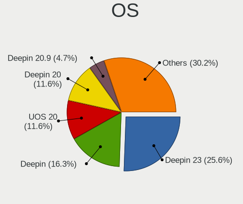

| Name           | Desktops | Percent |
|----------------|----------|---------|
| Deepin         | 14       | 20.29%  |
| UOS 20         | 10       | 14.49%  |
| Deepin 20      | 10       | 14.49%  |
| Deepin 23      | 7        | 10.14%  |
| Deepin 20 beta | 4        | 5.8%    |
| Deepin 15.9.2  | 4        | 5.8%    |
| Deepin 20.1    | 3        | 4.35%   |
| Deepin 15.11   | 3        | 4.35%   |
| Deepin 20.9    | 2        | 2.9%    |
| Deepin 20.6    | 2        | 2.9%    |
| Deepin 20.3    | 2        | 2.9%    |
| Deepin 20.2.2  | 2        | 2.9%    |
| Deepin 15.10.1 | 2        | 2.9%    |
| Deepin 20.2.4  | 1        | 1.45%   |
| Deepin 20.2.3  | 1        | 1.45%   |
| Deepin 20.2    | 1        | 1.45%   |
| Deepin 15.7    | 1        | 1.45%   |

OS Family
---------

OS without a version

| Name   | Desktops | Percent |
|--------|----------|---------|
| Deepin | 65       | 100%    |

Kernel
------

Version of the Linux kernel

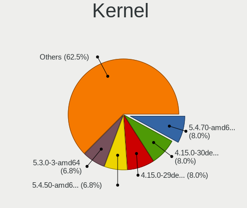

| Version                   | Desktops | Percent |
|---------------------------|----------|---------|
| 5.4.70-amd64-desktop      | 7        | 10.14%  |
| 4.15.0-30deepin-generic   | 7        | 10.14%  |
| 4.15.0-29deepin-generic   | 7        | 10.14%  |
| 5.4.50-amd64-desktop      | 6        | 8.7%    |
| 5.3.0-3-amd64             | 6        | 8.7%    |
| 5.10.60-amd64-desktop     | 3        | 4.35%   |
| 5.10.36-amd64-desktop     | 3        | 4.35%   |
| 5.10.0-amd64-desktop      | 3        | 4.35%   |
| 4.19.0-amd64-desktop      | 3        | 4.35%   |
| 5.7.7-amd64-desktop       | 2        | 2.9%    |
| 5.15.77-amd64-desktop     | 2        | 2.9%    |
| 5.15.45-amd64-desktop     | 2        | 2.9%    |
| 5.10.29-amd64-desktop     | 2        | 2.9%    |
| 5.10.18-amd64-desktop     | 2        | 2.9%    |
| 6.3.0-rc4-amd64-exton     | 1        | 1.45%   |
| 6.1.32-amd64-desktop-hwe  | 1        | 1.45%   |
| 6.1.12-1-liquorix-amd64   | 1        | 1.45%   |
| 6.1.11-amd64-desktop-hwe  | 1        | 1.45%   |
| 5.8.14-amd64-desktop      | 1        | 1.45%   |
| 5.5.4-xanmod3             | 1        | 1.45%   |
| 5.18.17-amd64-desktop-hwe | 1        | 1.45%   |
| 5.15.24-amd64-desktop     | 1        | 1.45%   |
| 5.14.0-rc3-amd64-desktop  | 1        | 1.45%   |
| 5.10.50-amd64-desktop     | 1        | 1.45%   |
| 5.10.5-amd64-desktop+     | 1        | 1.45%   |
| 5.10.101-amd64-desktop    | 1        | 1.45%   |
| 4.19.90-1.lns7.2.mips64el | 1        | 1.45%   |
| 4.19.0-5-amd64            | 1        | 1.45%   |

Kernel Family
-------------

Linux kernel without a distro release

| Version  | Desktops | Percent |
|----------|----------|---------|
| 4.15.0   | 14       | 20.29%  |
| 5.4.70   | 7        | 10.14%  |
| 5.4.50   | 6        | 8.7%    |
| 5.3.0    | 6        | 8.7%    |
| 4.19.0   | 4        | 5.8%    |
| 5.10.60  | 3        | 4.35%   |
| 5.10.36  | 3        | 4.35%   |
| 5.10.0   | 3        | 4.35%   |
| 5.7.7    | 2        | 2.9%    |
| 5.15.77  | 2        | 2.9%    |
| 5.15.45  | 2        | 2.9%    |
| 5.10.29  | 2        | 2.9%    |
| 5.10.18  | 2        | 2.9%    |
| 6.3.0    | 1        | 1.45%   |
| 6.1.32   | 1        | 1.45%   |
| 6.1.12   | 1        | 1.45%   |
| 6.1.11   | 1        | 1.45%   |
| 5.8.14   | 1        | 1.45%   |
| 5.5.4    | 1        | 1.45%   |
| 5.18.17  | 1        | 1.45%   |
| 5.15.24  | 1        | 1.45%   |
| 5.14.0   | 1        | 1.45%   |
| 5.10.50  | 1        | 1.45%   |
| 5.10.5   | 1        | 1.45%   |
| 5.10.101 | 1        | 1.45%   |
| 4.19.90  | 1        | 1.45%   |

Kernel Major Ver.
-----------------

Linux kernel major version

| Version | Desktops | Percent |
|---------|----------|---------|
| 5.10    | 14       | 21.21%  |
| 4.15    | 14       | 21.21%  |
| 5.4     | 12       | 18.18%  |
| 5.3     | 6        | 9.09%   |
| 5.15    | 5        | 7.58%   |
| 4.19    | 5        | 7.58%   |
| 6.1     | 3        | 4.55%   |
| 5.7     | 2        | 3.03%   |
| 6.3     | 1        | 1.52%   |
| 5.8     | 1        | 1.52%   |
| 5.5     | 1        | 1.52%   |
| 5.18    | 1        | 1.52%   |
| 5.14    | 1        | 1.52%   |

Arch
----

OS architecture (x86_64, i586, etc.)

| Name   | Desktops | Percent |
|--------|----------|---------|
| x86_64 | 64       | 98.46%  |
| mips64 | 1        | 1.54%   |

DE
--

Desktop Environment

| Name    | Desktops | Percent |
|---------|----------|---------|
| Deepin  | 53       | 80.3%   |
| Unknown | 9        | 13.64%  |
| DDE     | 3        | 4.55%   |
| MATE    | 1        | 1.52%   |

Display Server
--------------

X11 or Wayland

| Name    | Desktops | Percent |
|---------|----------|---------|
| X11     | 59       | 90.77%  |
| Wayland | 4        | 6.15%   |
| Tty     | 2        | 3.08%   |

Display Manager
---------------

SDDM, LightDM, etc.

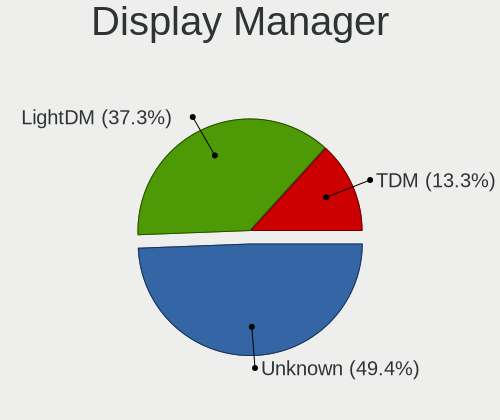

| Name    | Desktops | Percent |
|---------|----------|---------|
| Unknown | 33       | 50.77%  |
| LightDM | 21       | 32.31%  |
| TDM     | 11       | 16.92%  |

OS Lang
-------

Language

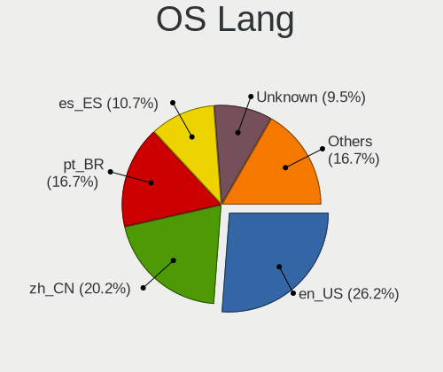

| Lang    | Desktops | Percent |
|---------|----------|---------|
| en_US   | 16       | 23.88%  |
| zh_CN   | 13       | 19.4%   |
| pt_BR   | 11       | 16.42%  |
| es_ES   | 8        | 11.94%  |
| Unknown | 8        | 11.94%  |
| de_DE   | 4        | 5.97%   |
| ru_RU   | 1        | 1.49%   |
| pl_PL   | 1        | 1.49%   |
| lt_LT   | 1        | 1.49%   |
| it_IT   | 1        | 1.49%   |
| id_ID   | 1        | 1.49%   |
| fr_FR   | 1        | 1.49%   |
| en_GB   | 1        | 1.49%   |

Boot Mode
---------

EFI or BIOS

| Mode | Desktops | Percent |
|------|----------|---------|
| BIOS | 34       | 52.31%  |
| EFI  | 31       | 47.69%  |

Filesystem
----------

Type of filesystem

| Type    | Desktops | Percent |
|---------|----------|---------|
| Ext4    | 61       | 93.85%  |
| Unknown | 4        | 6.15%   |

Part. scheme
------------

Scheme of partitioning

| Type    | Desktops | Percent |
|---------|----------|---------|
| Unknown | 30       | 44.78%  |
| GPT     | 28       | 41.79%  |
| MBR     | 9        | 13.43%  |

Dual Boot with Linux/BSD
------------------------

Hosting more than one Linux/BSD

| Dual boot | Desktops | Percent |
|-----------|----------|---------|
| No        | 46       | 69.7%   |
| Yes       | 20       | 30.3%   |

Dual Boot (Win)
---------------

Hosting Linux and Windows

| Dual boot | Desktops | Percent |
|-----------|----------|---------|
| No        | 52       | 78.79%  |
| Yes       | 14       | 21.21%  |

Board
-----

Vendor
------

Motherboard manufacturer

| Name                       | Desktops | Percent |
|----------------------------|----------|---------|
| ASUSTek Computer           | 16       | 24.62%  |
| Gigabyte Technology        | 9        | 13.85%  |
| TSINGHUA TONGFANG COMPUTER | 7        | 10.77%  |
| Dell                       | 6        | 9.23%   |
| ASRock                     | 4        | 6.15%   |
| MSI                        | 3        | 4.62%   |
| Semp Toshiba               | 2        | 3.08%   |
| Positivo                   | 2        | 3.08%   |
| Lenovo                     | 2        | 3.08%   |
| Intel                      | 2        | 3.08%   |
| Hewlett-Packard            | 2        | 3.08%   |
| ECS                        | 2        | 3.08%   |
| OEM                        | 1        | 1.54%   |
| Medion                     | 1        | 1.54%   |
| Loongson                   | 1        | 1.54%   |
| Koloe                      | 1        | 1.54%   |
| Huanan                     | 1        | 1.54%   |
| Foxconn                    | 1        | 1.54%   |
| AMD                        | 1        | 1.54%   |
| Unknown                    | 1        | 1.54%   |

Model
-----

Motherboard model

| Name                                     | Desktops | Percent |
|------------------------------------------|----------|---------|
| TSINGHUA TONGFANG COMPUTER E500          | 7        | 10.77%  |
| Semp Toshiba STI                         | 2        | 3.08%   |
| ECS H81H3-M4                             | 2        | 3.08%   |
| ASUS All Series                          | 2        | 3.08%   |
| Positivo POS-PQ45AU                      | 1        | 1.54%   |
| Positivo POS-EINM70CS                    | 1        | 1.54%   |
| OEM ZXE CRB                              | 1        | 1.54%   |
| MSI MS-7C83                              | 1        | 1.54%   |
| MSI MS-7851                              | 1        | 1.54%   |
| MSI MS-7681                              | 1        | 1.54%   |
| Medion MS-7728                           | 1        | 1.54%   |
| Loongson LS3A3000-7A1000-1w-V1.2-Dev     | 1        | 1.54%   |
| Lenovo ThinkCentre M910t-N000 10N9CTO1WW | 1        | 1.54%   |
| Lenovo ThinkCentre M82 2929AJ2           | 1        | 1.54%   |
| Koloe Thurley                            | 1        | 1.54%   |
| Intel DX58SO AAE29331-504                | 1        | 1.54%   |
| Intel DH77EB AAG39073-304                | 1        | 1.54%   |
| Huanan X99-8M-F V1.1                     | 1        | 1.54%   |
| HP ProOne 400 G1 AiO                     | 1        | 1.54%   |
| HP 260-P020il                            | 1        | 1.54%   |
| Gigabyte Z77-DS3H                        | 1        | 1.54%   |
| Gigabyte Z170X-Gaming 7                  | 1        | 1.54%   |
| Gigabyte H81M-D2V                        | 1        | 1.54%   |
| Gigabyte H110M-H                         | 1        | 1.54%   |
| Gigabyte GA-78LMT-USB3                   | 1        | 1.54%   |
| Gigabyte B550M DS3H                      | 1        | 1.54%   |
| Gigabyte B365M D3H                       | 1        | 1.54%   |
| Gigabyte B360M AORUS Gaming 3            | 1        | 1.54%   |
| Gigabyte 990XA-UD3                       | 1        | 1.54%   |
| Foxconn p7-1430br                        | 1        | 1.54%   |
| Dell Vostro 270                          | 1        | 1.54%   |
| Dell Vostro 230                          | 1        | 1.54%   |
| Dell OptiPlex 9020                       | 1        | 1.54%   |
| Dell OptiPlex 760                        | 1        | 1.54%   |
| Dell OptiPlex 7050                       | 1        | 1.54%   |
| Dell Inspiron One 2020                   | 1        | 1.54%   |
| ASUS TUF Gaming B550M-PLUS               | 1        | 1.54%   |
| ASUS ROG Maximus Z790 HERO               | 1        | 1.54%   |
| ASUS ROG Maximus XII HERO                | 1        | 1.54%   |
| ASUS PRIME B450M-GAMING/BR               | 1        | 1.54%   |

Model Family
------------

Motherboard model prefix

| Name                                 | Desktops | Percent |
|--------------------------------------|----------|---------|
| TSINGHUA TONGFANG COMPUTER E500      | 7        | 10.77%  |
| Dell OptiPlex                        | 3        | 4.62%   |
| ASUS PRIME                           | 3        | 4.62%   |
| Semp Toshiba STI                     | 2        | 3.08%   |
| Lenovo ThinkCentre                   | 2        | 3.08%   |
| ECS H81H3-M4                         | 2        | 3.08%   |
| Dell Vostro                          | 2        | 3.08%   |
| ASUS ROG                             | 2        | 3.08%   |
| ASUS All                             | 2        | 3.08%   |
| Positivo POS-PQ45AU                  | 1        | 1.54%   |
| Positivo POS-EINM70CS                | 1        | 1.54%   |
| OEM ZXE                              | 1        | 1.54%   |
| MSI MS-7C83                          | 1        | 1.54%   |
| MSI MS-7851                          | 1        | 1.54%   |
| MSI MS-7681                          | 1        | 1.54%   |
| Medion MS-7728                       | 1        | 1.54%   |
| Loongson LS3A3000-7A1000-1w-V1.2-Dev | 1        | 1.54%   |
| Koloe Thurley                        | 1        | 1.54%   |
| Intel DX58SO                         | 1        | 1.54%   |
| Intel DH77EB                         | 1        | 1.54%   |
| Huanan X99-8M-F                      | 1        | 1.54%   |
| HP ProOne                            | 1        | 1.54%   |
| HP 260-P020il                        | 1        | 1.54%   |
| Gigabyte Z77-DS3H                    | 1        | 1.54%   |
| Gigabyte Z170X-Gaming                | 1        | 1.54%   |
| Gigabyte H81M-D2V                    | 1        | 1.54%   |
| Gigabyte H110M-H                     | 1        | 1.54%   |
| Gigabyte GA-78LMT-USB3               | 1        | 1.54%   |
| Gigabyte B550M                       | 1        | 1.54%   |
| Gigabyte B365M                       | 1        | 1.54%   |
| Gigabyte B360M                       | 1        | 1.54%   |
| Gigabyte 990XA-UD3                   | 1        | 1.54%   |
| Foxconn p7-1430br                    | 1        | 1.54%   |
| Dell Inspiron                        | 1        | 1.54%   |
| ASUS TUF                             | 1        | 1.54%   |
| ASUS P8H77-M                         | 1        | 1.54%   |
| ASUS P8H61-MX                        | 1        | 1.54%   |
| ASUS P8H61-M                         | 1        | 1.54%   |
| ASUS P5Q-E                           | 1        | 1.54%   |
| ASUS P5G41T-M                        | 1        | 1.54%   |

MFG Year
--------

Motherboard manufacture year

| Year | Desktops | Percent |
|------|----------|---------|
| 2013 | 9        | 13.85%  |
| 2020 | 8        | 12.31%  |
| 2012 | 8        | 12.31%  |
| 2021 | 7        | 10.77%  |
| 2011 | 6        | 9.23%   |
| 2018 | 5        | 7.69%   |
| 2014 | 5        | 7.69%   |
| 2017 | 4        | 6.15%   |
| 2016 | 3        | 4.62%   |
| 2010 | 3        | 4.62%   |
| 2009 | 3        | 4.62%   |
| 2022 | 1        | 1.54%   |
| 2019 | 1        | 1.54%   |
| 2015 | 1        | 1.54%   |
| 2008 | 1        | 1.54%   |

Form Factor
-----------

Physical design of the computer

| Name    | Desktops | Percent |
|---------|----------|---------|
| Desktop | 65       | 100%    |

Secure Boot
-----------

Enabled or disabled

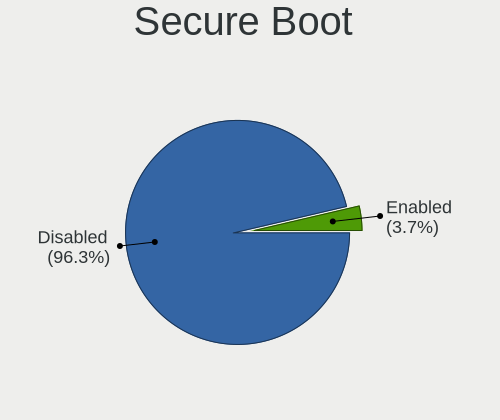

| State    | Desktops | Percent |
|----------|----------|---------|
| Disabled | 63       | 96.92%  |
| Enabled  | 2        | 3.08%   |

Coreboot
--------

Have coreboot on board

| Used | Desktops | Percent |
|------|----------|---------|
| No   | 65       | 100%    |

RAM Size
--------

Total RAM memory

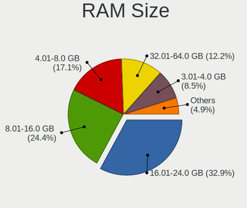

| Size in GB  | Desktops | Percent |
|-------------|----------|---------|
| 16.01-24.0  | 23       | 35.38%  |
| 8.01-16.0   | 18       | 27.69%  |
| 4.01-8.0    | 11       | 16.92%  |
| 3.01-4.0    | 7        | 10.77%  |
| 32.01-64.0  | 3        | 4.62%   |
| 24.01-32.0  | 1        | 1.54%   |
| 64.01-256.0 | 1        | 1.54%   |
| 1.01-2.0    | 1        | 1.54%   |

RAM Used
--------

Used RAM memory

| Used GB   | Desktops | Percent |
|-----------|----------|---------|
| 4.01-8.0  | 19       | 26.76%  |
| 1.01-2.0  | 18       | 25.35%  |
| 2.01-3.0  | 15       | 21.13%  |
| 3.01-4.0  | 10       | 14.08%  |
| 0.51-1.0  | 6        | 8.45%   |
| 8.01-16.0 | 3        | 4.23%   |

Total Drives
------------

Number of drives on board

| Drives | Desktops | Percent |
|--------|----------|---------|
| 1      | 28       | 42.42%  |
| 2      | 24       | 36.36%  |
| 4      | 7        | 10.61%  |
| 3      | 6        | 9.09%   |
| 5      | 1        | 1.52%   |

Has CD-ROM
----------

Has CD-ROM on board

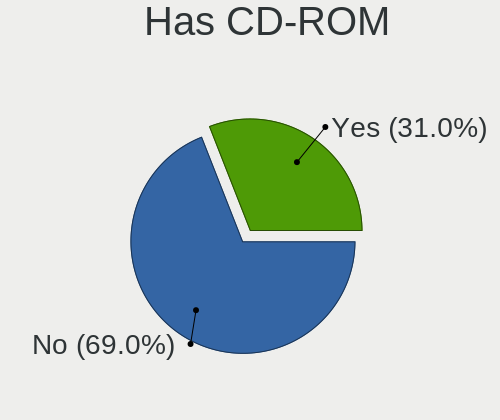

| Presented | Desktops | Percent |
|-----------|----------|---------|
| No        | 45       | 67.16%  |
| Yes       | 22       | 32.84%  |

Has Ethernet
------------

Has Ethernet on board

| Presented | Desktops | Percent |
|-----------|----------|---------|
| Yes       | 65       | 100%    |

Has WiFi
--------

Has WiFi module

| Presented | Desktops | Percent |
|-----------|----------|---------|
| No        | 42       | 64.62%  |
| Yes       | 23       | 35.38%  |

Has Bluetooth
-------------

Has Bluetooth module

| Presented | Desktops | Percent |
|-----------|----------|---------|
| No        | 44       | 67.69%  |
| Yes       | 21       | 32.31%  |

Location
--------

Country
-------

Geographic location (country)

| Country     | Desktops | Percent |
|-------------|----------|---------|
| Brazil      | 16       | 24.62%  |
| China       | 14       | 21.54%  |
| USA         | 7        | 10.77%  |
| Germany     | 3        | 4.62%   |
| Panama      | 2        | 3.08%   |
| Mexico      | 2        | 3.08%   |
| Colombia    | 2        | 3.08%   |
| Argentina   | 2        | 3.08%   |
| Ukraine     | 1        | 1.54%   |
| UK          | 1        | 1.54%   |
| Spain       | 1        | 1.54%   |
| Russia      | 1        | 1.54%   |
| Romania     | 1        | 1.54%   |
| Poland      | 1        | 1.54%   |
| New Zealand | 1        | 1.54%   |
| Namibia     | 1        | 1.54%   |
| Lithuania   | 1        | 1.54%   |
| Kenya       | 1        | 1.54%   |
| Italy       | 1        | 1.54%   |
| Indonesia   | 1        | 1.54%   |
| India       | 1        | 1.54%   |
| Iceland     | 1        | 1.54%   |
| Belgium     | 1        | 1.54%   |
| Bangladesh  | 1        | 1.54%   |
| Austria     | 1        | 1.54%   |

City
----

Geographic location (city)

| City                    | Desktops | Percent |
|-------------------------|----------|---------|
| Wuhan                   | 4        | 5.97%   |
| Sao Paulo               | 3        | 4.48%   |
| Nanjing                 | 3        | 4.48%   |
| Beijing                 | 3        | 4.48%   |
| San Francisco           | 2        | 2.99%   |
| David                   | 2        | 2.99%   |
| Windhoek                | 1        | 1.49%   |
| Voluntari               | 1        | 1.49%   |
| Tychy                   | 1        | 1.49%   |
| Toluca                  | 1        | 1.49%   |
| Taua                    | 1        | 1.49%   |
| Surakarta               | 1        | 1.49%   |
| St Petersburg           | 1        | 1.49%   |
| Socorro                 | 1        | 1.49%   |
| Shanghai                | 1        | 1.49%   |
| Seesen                  | 1        | 1.49%   |
| Sao Caetano do Sul      | 1        | 1.49%   |
| Santo André            | 1        | 1.49%   |
| Santa Clarita           | 1        | 1.49%   |
| Rome                    | 1        | 1.49%   |
| Rio de Janeiro          | 1        | 1.49%   |
| Reykjavik               | 1        | 1.49%   |
| Ransart                 | 1        | 1.49%   |
| Qingdao                 | 1        | 1.49%   |
| Para de Minas           | 1        | 1.49%   |
| Olinda                  | 1        | 1.49%   |
| Oerlinghausen           | 1        | 1.49%   |
| Niterói                | 1        | 1.49%   |
| Naucalpan               | 1        | 1.49%   |
| Mesa                    | 1        | 1.49%   |
| Medellín               | 1        | 1.49%   |
| Marília                | 1        | 1.49%   |
| Lviv                    | 1        | 1.49%   |
| Leipzig                 | 1        | 1.49%   |
| Krakow                  | 1        | 1.49%   |
| Klagenfurt              | 1        | 1.49%   |
| Kericho                 | 1        | 1.49%   |
| Jaboatao dos Guararapes | 1        | 1.49%   |
| Itapevi                 | 1        | 1.49%   |
| Guangzhou               | 1        | 1.49%   |

Drives
------

Drive Vendor
------------

Hard drive vendors

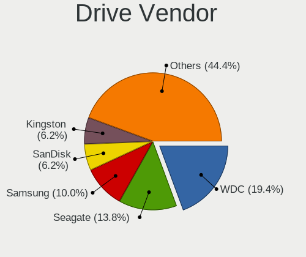

| Vendor                | Desktops | Drives | Percent |
|-----------------------|----------|--------|---------|
| WDC                   | 23       | 29     | 19.49%  |
| Seagate               | 18       | 21     | 15.25%  |
| Toshiba               | 8        | 9      | 6.78%   |
| SanDisk               | 8        | 12     | 6.78%   |
| Samsung Electronics   | 8        | 9      | 6.78%   |
| Kingston              | 8        | 13     | 6.78%   |
| Hitachi               | 4        | 4      | 3.39%   |
| Crucial               | 4        | 5      | 3.39%   |
| China                 | 4        | 4      | 3.39%   |
| A-DATA Technology     | 4        | 5      | 3.39%   |
| Phison                | 3        | 3      | 2.54%   |
| FORESEE               | 3        | 3      | 2.54%   |
| SPCC                  | 2        | 2      | 1.69%   |
| Silicon Motion        | 2        | 2      | 1.69%   |
| Maxtor                | 2        | 4      | 1.69%   |
| Hewlett-Packard       | 2        | 3      | 1.69%   |
| Vaseky                | 1        | 1      | 0.85%   |
| Unknown               | 1        | 2      | 0.85%   |
| Realtek Semiconductor | 1        | 1      | 0.85%   |
| Phytium               | 1        | 1      | 0.85%   |
| Mushkin               | 1        | 1      | 0.85%   |
| Maxtor 6              | 1        | 1      | 0.85%   |
| LaCie                 | 1        | 2      | 0.85%   |
| KingDian              | 1        | 1      | 0.85%   |
| KINGBANK              | 1        | 1      | 0.85%   |
| JMicron Technology    | 1        | 1      | 0.85%   |
| Intenso               | 1        | 2      | 0.85%   |
| Intel                 | 1        | 1      | 0.85%   |
| Gigabyte Technology   | 1        | 1      | 0.85%   |
| Beijing Starblaze     | 1        | 1      | 0.85%   |
| Apacer                | 1        | 3      | 0.85%   |

Drive Model
-----------

Hard drive models

| Model                            | Desktops | Percent |
|----------------------------------|----------|---------|
| Seagate ST1000DM010-2EP102 1TB   | 4        | 3.15%   |
| Phison ESO256GMFCH-E3C-2 256GB   | 3        | 2.36%   |
| WDC WD5000AAKX-003CA0 500GB      | 2        | 1.57%   |
| WDC WD10EZEX-22MFCA0 1TB         | 2        | 1.57%   |
| Toshiba DT01ACA200 2TB           | 2        | 1.57%   |
| Seagate ST1000DM003-1SB102 1TB   | 2        | 1.57%   |
| SanDisk SDSSDH3512G 512GB        | 2        | 1.57%   |
| Kingston SV300S37A120G 120GB SSD | 2        | 1.57%   |
| Kingston SA400S37480G 480GB SSD  | 2        | 1.57%   |
| Kingston SA400S37240G 240GB SSD  | 2        | 1.57%   |
| FORESEE P900F256GBH              | 2        | 1.57%   |
| WDC WDS500G2B0C-00PXH0 500GB     | 1        | 0.79%   |
| WDC WDS500G2B0B-00YS70 500GB SSD | 1        | 0.79%   |
| WDC WDS120G1G0A-00SS50 120GB SSD | 1        | 0.79%   |
| WDC WDS100T2G0A-00JH30 1TB SSD   | 1        | 0.79%   |
| WDC WD80 0BEVE-11UYT0 80GB       | 1        | 0.79%   |
| WDC WD7500BPKX-22HPJT0 752GB     | 1        | 0.79%   |
| WDC WD6400AAKS-75A7B0 640GB      | 1        | 0.79%   |
| WDC WD5000LPLX-66ZNTT1 500GB     | 1        | 0.79%   |
| WDC WD5000AAKX-60U6AA0 500GB     | 1        | 0.79%   |
| WDC WD5000AAKX-00U6AA0 500GB     | 1        | 0.79%   |
| WDC WD5000AAKX-00ERMA0 500GB     | 1        | 0.79%   |
| WDC WD5000AAKS-00A7B2 500GB      | 1        | 0.79%   |
| WDC WD5000AAJS-57TKA0 500GB      | 1        | 0.79%   |
| WDC WD3200AAKS-00VYA0 320GB      | 1        | 0.79%   |
| WDC WD20PURX-64P6ZY0 2TB         | 1        | 0.79%   |
| WDC WD20EARX-00PASB0 2TB         | 1        | 0.79%   |
| WDC WD1600AAJS-00L7A0 160GB      | 1        | 0.79%   |
| WDC WD10EZEX-08WN4A0 1TB         | 1        | 0.79%   |
| WDC WD10EZEX-08M2NA0 1TB         | 1        | 0.79%   |
| WDC WD10EZEX-00WN4A0 1TB         | 1        | 0.79%   |
| WDC WD10EFRX-68FYTN0 1TB         | 1        | 0.79%   |
| WDC WD10EARS-00Y5B1 1TB          | 1        | 0.79%   |
| Vaseky V800/256G 256GB SSD       | 1        | 0.79%   |
| Unknown SD/MMC/MS PRO 16GB       | 1        | 0.79%   |
| Toshiba MQ01ABF050 500GB         | 1        | 0.79%   |
| Toshiba MQ01ABD075 752GB         | 1        | 0.79%   |
| Toshiba MK8052GSX 80GB           | 1        | 0.79%   |
| Toshiba DT01ACA100 LENOVO 1TB    | 1        | 0.79%   |
| Toshiba DT01ACA100 1TB           | 1        | 0.79%   |

HDD Vendor
----------

Hard disk drive vendors

| Vendor              | Desktops | Drives | Percent |
|---------------------|----------|--------|---------|
| WDC                 | 20       | 25     | 35.09%  |
| Seagate             | 18       | 21     | 31.58%  |
| Toshiba             | 8        | 9      | 14.04%  |
| Hitachi             | 4        | 4      | 7.02%   |
| Samsung Electronics | 2        | 2      | 3.51%   |
| Maxtor              | 2        | 4      | 3.51%   |
| Unknown             | 1        | 2      | 1.75%   |
| Maxtor 6            | 1        | 1      | 1.75%   |
| Hewlett-Packard     | 1        | 2      | 1.75%   |

SSD Vendor
----------

Solid state drive vendors

| Vendor              | Desktops | Drives | Percent |
|---------------------|----------|--------|---------|
| SanDisk             | 8        | 12     | 19.51%  |
| Kingston            | 7        | 12     | 17.07%  |
| Samsung Electronics | 4        | 5      | 9.76%   |
| China               | 4        | 4      | 9.76%   |
| WDC                 | 3        | 3      | 7.32%   |
| Crucial             | 3        | 4      | 7.32%   |
| A-DATA Technology   | 3        | 4      | 7.32%   |
| SPCC                | 2        | 2      | 4.88%   |
| Vaseky              | 1        | 1      | 2.44%   |
| KingDian            | 1        | 1      | 2.44%   |
| KINGBANK            | 1        | 1      | 2.44%   |
| Intenso             | 1        | 2      | 2.44%   |
| Intel               | 1        | 1      | 2.44%   |
| Hewlett-Packard     | 1        | 1      | 2.44%   |
| Apacer              | 1        | 3      | 2.44%   |

Drive Kind
----------

HDD or SSD

| Kind    | Desktops | Drives | Percent |
|---------|----------|--------|---------|
| HDD     | 44       | 70     | 45.36%  |
| SSD     | 34       | 56     | 35.05%  |
| NVMe    | 18       | 20     | 18.56%  |
| Unknown | 1        | 2      | 1.03%   |

Drive Connector
---------------

SATA, SAS, NVMe, etc.

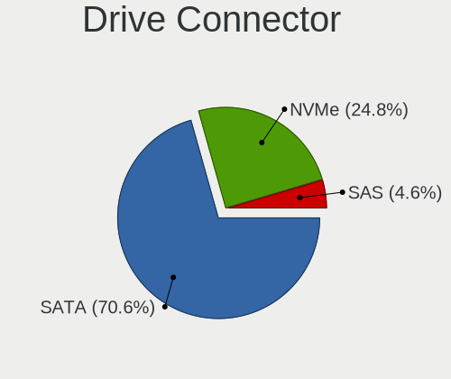

| Type | Desktops | Drives | Percent |
|------|----------|--------|---------|
| SATA | 61       | 122    | 74.39%  |
| NVMe | 17       | 19     | 20.73%  |
| SAS  | 4        | 7      | 4.88%   |

Drive Size
----------

Size of hard drive

| Size in TB | Desktops | Drives | Percent |
|------------|----------|--------|---------|
| 0.01-0.5   | 45       | 79     | 54.88%  |
| 0.51-1.0   | 31       | 38     | 37.8%   |
| 1.01-2.0   | 6        | 9      | 7.32%   |

Space Total
-----------

Amount of disk space available on the file system

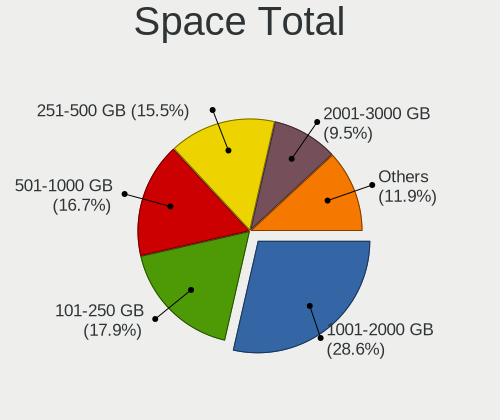

| Size in GB     | Desktops | Percent |
|----------------|----------|---------|
| 1001-2000      | 17       | 25.76%  |
| 501-1000       | 14       | 21.21%  |
| 251-500        | 12       | 18.18%  |
| 101-250        | 12       | 18.18%  |
| 2001-3000      | 4        | 6.06%   |
| 51-100         | 4        | 6.06%   |
| More than 3000 | 2        | 3.03%   |
| Unknown        | 1        | 1.52%   |

Space Used
----------

Amount of used disk space

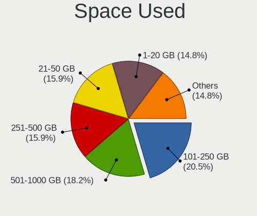

| Used GB   | Desktops | Percent |
|-----------|----------|---------|
| 101-250   | 16       | 22.86%  |
| 501-1000  | 14       | 20%     |
| 21-50     | 13       | 18.57%  |
| 1-20      | 10       | 14.29%  |
| 251-500   | 8        | 11.43%  |
| 51-100    | 4        | 5.71%   |
| 1001-2000 | 3        | 4.29%   |
| 2001-3000 | 1        | 1.43%   |
| Unknown   | 1        | 1.43%   |

Malfunc. Drives
---------------

Drive models with a malfunction

| Model                              | Desktops | Drives | Percent |
|------------------------------------|----------|--------|---------|
| WDC WD5000LPLX-66ZNTT1 500GB       | 1        | 1      | 11.11%  |
| WDC WD10EARS-00Y5B1 1TB            | 1        | 1      | 11.11%  |
| Toshiba MK8052GSX 80GB             | 1        | 1      | 11.11%  |
| Seagate ST3750528AS 752GB          | 1        | 1      | 11.11%  |
| Seagate ST2000LM003 HN-M201RAD 2TB | 1        | 1      | 11.11%  |
| Seagate ST1000DL002-9TT153 1TB     | 1        | 1      | 11.11%  |
| Samsung Electronics HD502HJ 500GB  | 1        | 1      | 11.11%  |
| Samsung Electronics HD250HJ 250GB  | 1        | 1      | 11.11%  |
| Hitachi HDP725050GLA360 500GB      | 1        | 1      | 11.11%  |

Malfunc. Drive Vendor
---------------------

Vendors of faulty drives

| Vendor              | Desktops | Drives | Percent |
|---------------------|----------|--------|---------|
| WDC                 | 2        | 2      | 25%     |
| Seagate             | 2        | 3      | 25%     |
| Samsung Electronics | 2        | 2      | 25%     |
| Toshiba             | 1        | 1      | 12.5%   |
| Hitachi             | 1        | 1      | 12.5%   |

Malfunc. HDD Vendor
-------------------

Vendors of faulty HDD drives

| Vendor              | Desktops | Drives | Percent |
|---------------------|----------|--------|---------|
| WDC                 | 2        | 2      | 25%     |
| Seagate             | 2        | 3      | 25%     |
| Samsung Electronics | 2        | 2      | 25%     |
| Toshiba             | 1        | 1      | 12.5%   |
| Hitachi             | 1        | 1      | 12.5%   |

Malfunc. Drive Kind
-------------------

Kinds of faulty drives

| Kind | Desktops | Drives | Percent |
|------|----------|--------|---------|
| HDD  | 8        | 9      | 100%    |

Failed Drives
-------------

Failed drive models

| Model                       | Desktops | Drives | Percent |
|-----------------------------|----------|--------|---------|
| Hitachi HUA722010CLA330 1TB | 1        | 1      | 100%    |

Failed Drive Vendor
-------------------

Failed drive vendors

| Vendor  | Desktops | Drives | Percent |
|---------|----------|--------|---------|
| Hitachi | 1        | 1      | 100%    |

Drive Status
------------

Number of failed and malfunc. drives

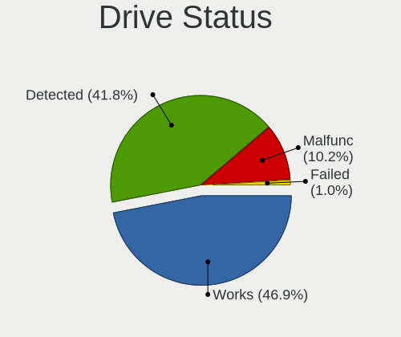

| Status   | Desktops | Drives | Percent |
|----------|----------|--------|---------|
| Works    | 37       | 65     | 47.44%  |
| Detected | 32       | 73     | 41.03%  |
| Malfunc  | 8        | 9      | 10.26%  |
| Failed   | 1        | 1      | 1.28%   |

Storage controller
------------------

Storage Vendor
--------------

Storage controller vendors

| Vendor                       | Desktops | Percent |
|------------------------------|----------|---------|
| Intel                        | 50       | 53.76%  |
| AMD                          | 11       | 11.83%  |
| ASMedia Technology           | 6        | 6.45%   |
| Silicon Motion               | 4        | 4.3%    |
| Phison Electronics           | 4        | 4.3%    |
| Marvell Technology Group     | 4        | 4.3%    |
| Shenzhen Longsys Electronics | 2        | 2.15%   |
| Samsung Electronics          | 2        | 2.15%   |
| Beijing Starblaze Technology | 2        | 2.15%   |
| Zhaoxin                      | 1        | 1.08%   |
| SanDisk                      | 1        | 1.08%   |
| Realtek Semiconductor        | 1        | 1.08%   |
| Nvidia                       | 1        | 1.08%   |
| Micron/Crucial Technology    | 1        | 1.08%   |
| Loongson Technology          | 1        | 1.08%   |
| Kingston Technology Company  | 1        | 1.08%   |
| JMicron Technology           | 1        | 1.08%   |

Storage Model
-------------

Storage controller models

| Model                                                                                   | Desktops | Percent |
|-----------------------------------------------------------------------------------------|----------|---------|
| Intel 400 Series Chipset Family SATA AHCI Controller                                    | 8        | 7.48%   |
| Intel 8 Series/C220 Series Chipset Family 6-port SATA Controller 1 [AHCI mode]          | 7        | 6.54%   |
| Intel 7 Series/C210 Series Chipset Family 6-port SATA Controller [AHCI mode]            | 6        | 5.61%   |
| ASMedia ASM1062 Serial ATA Controller                                                   | 6        | 5.61%   |
| Intel 6 Series/C200 Series Chipset Family 6 port Desktop SATA AHCI Controller           | 5        | 4.67%   |
| AMD FCH SATA Controller [AHCI mode]                                                     | 5        | 4.67%   |
| Intel Q170/Q150/B150/H170/H110/Z170/CM236 Chipset SATA Controller [AHCI Mode]           | 4        | 3.74%   |
| Silicon Motion SM2263EN/SM2263XT (DRAM-less) NVMe SSD Controllers                       | 3        | 2.8%    |
| Phison PS5013-E13 PCIe3 NVMe Controller (DRAM-less)                                     | 3        | 2.8%    |
| Intel NM10/ICH7 Family SATA Controller [IDE mode]                                       | 3        | 2.8%    |
| AMD SB7x0/SB8x0/SB9x0 SATA Controller [AHCI mode]                                       | 3        | 2.8%    |
| AMD SB7x0/SB8x0/SB9x0 IDE Controller                                                    | 3        | 2.8%    |
| Shenzhen Longsys FORESEE P900 BGA NVMe SSD (DRAM-less)                                  | 2        | 1.87%   |
| Marvell Group 88SE6111/6121 SATA II / PATA Controller                                   | 2        | 1.87%   |
| Intel SATA Controller [RAID mode]                                                       | 2        | 1.87%   |
| Intel Celeron/Pentium Silver Processor SATA Controller                                  | 2        | 1.87%   |
| Intel 82801JI (ICH10 Family) 4 port SATA IDE Controller #1                              | 2        | 1.87%   |
| Intel 82801JI (ICH10 Family) 2 port SATA IDE Controller #2                              | 2        | 1.87%   |
| Intel 82801JD/DO (ICH10 Family) SATA AHCI Controller                                    | 2        | 1.87%   |
| Intel 6 Series/C200 Series Chipset Family Desktop SATA Controller (IDE mode, ports 4-5) | 2        | 1.87%   |
| Intel 6 Series/C200 Series Chipset Family Desktop SATA Controller (IDE mode, ports 0-3) | 2        | 1.87%   |
| Intel 200 Series PCH SATA controller [AHCI mode]                                        | 2        | 1.87%   |
| Beijing Starblaze STAR1200C NVMe SSD                                                    | 2        | 1.87%   |
| AMD 500 Series Chipset SATA Controller                                                  | 2        | 1.87%   |
| Zhaoxin ZX-100/ZX-200/KX-6000/KX-6000G/KH-40000 StorX AHCI Controller                   | 1        | 0.93%   |
| Silicon Motion SM2262/SM2262EN SSD Controller                                           | 1        | 0.93%   |
| SanDisk Ultra 3D / WD Blue SN550 NVMe SSD                                               | 1        | 0.93%   |
| Samsung NVMe SSD Controller SM981/PM981/PM983                                           | 1        | 0.93%   |
| Samsung NVMe SSD Controller S4LV008[Pascal]                                             | 1        | 0.93%   |
| Realtek RTS5762 NVMe SSD Controller                                                     | 1        | 0.93%   |
| Phison E16 PCIe4 NVMe Controller                                                        | 1        | 0.93%   |
| Nvidia MCP61 SATA Controller                                                            | 1        | 0.93%   |
| Nvidia MCP61 IDE                                                                        | 1        | 0.93%   |
| Micron/Crucial P2 [Nick P2] / P3 / P3 Plus NVMe PCIe SSD (DRAM-less)                    | 1        | 0.93%   |
| Marvell Group 88SE9215 PCIe 2.0 x1 4-port SATA 6 Gb/s Controller                        | 1        | 0.93%   |
| Marvell Group 88SE9123 PCIe SATA 6.0 Gb/s controller                                    | 1        | 0.93%   |
| Loongson SATA AHCI Controller                                                           | 1        | 0.93%   |
| Kingston Company A1000/U-SNS8154P3 x2 NVMe SSD                                          | 1        | 0.93%   |
| JMicron JMB362 SATA Controller                                                          | 1        | 0.93%   |
| Intel Comet Lake SATA AHCI Controller                                                   | 1        | 0.93%   |

Storage Kind
------------

Kind of storage controller (IDE, SATA, NVMe, SAS, ...)

| Kind | Desktops | Percent |
|------|----------|---------|
| SATA | 55       | 63.95%  |
| NVMe | 16       | 18.6%   |
| IDE  | 13       | 15.12%  |
| RAID | 2        | 2.33%   |

Processor
---------

CPU Vendor
----------

Processor vendors

| Vendor       | Desktops | Percent |
|--------------|----------|---------|
| Intel        | 51       | 78.46%  |
| AMD          | 12       | 18.46%  |
| CentaurHauls | 1        | 1.54%   |
| Unknown      | 1        | 1.54%   |

CPU Model
---------

Processor models

| Model                                        | Desktops | Percent |
|----------------------------------------------|----------|---------|
| Intel Core i7-10700 CPU @ 2.90GHz            | 6        | 9.23%   |
| Intel Core i7-3770 CPU @ 3.40GHz             | 4        | 6.15%   |
| Intel Core 2 Duo CPU E8400 @ 3.00GHz         | 4        | 6.15%   |
| Intel Core i7-4790 CPU @ 3.60GHz             | 2        | 3.08%   |
| Intel Core i3-3220 CPU @ 3.30GHz             | 2        | 3.08%   |
| Intel Core i3-10100 CPU @ 3.60GHz            | 2        | 3.08%   |
| AMD Ryzen 5 3600 6-Core Processor            | 2        | 3.08%   |
| AMD FX-8320 Eight-Core Processor             | 2        | 3.08%   |
| Intel Xeon CPU L5640 @ 2.27GHz               | 1        | 1.54%   |
| Intel Xeon CPU E5450 @ 3.00GHz               | 1        | 1.54%   |
| Intel Xeon CPU E5-2620 v3 @ 2.40GHz          | 1        | 1.54%   |
| Intel Pentium Silver J5005 CPU @ 1.50GHz     | 1        | 1.54%   |
| Intel Pentium Dual-Core CPU E5300 @ 2.60GHz  | 1        | 1.54%   |
| Intel Core i9-10900K CPU @ 3.70GHz           | 1        | 1.54%   |
| Intel Core i7-7700K CPU @ 4.20GHz            | 1        | 1.54%   |
| Intel Core i7-7700 CPU @ 3.60GHz             | 1        | 1.54%   |
| Intel Core i7-6700 CPU @ 3.40GHz             | 1        | 1.54%   |
| Intel Core i7-4790K CPU @ 4.00GHz            | 1        | 1.54%   |
| Intel Core i7-4770S CPU @ 3.10GHz            | 1        | 1.54%   |
| Intel Core i7-2600K CPU @ 3.40GHz            | 1        | 1.54%   |
| Intel Core i7 CPU 975 @ 3.33GHz              | 1        | 1.54%   |
| Intel Core i5-9400F CPU @ 2.90GHz            | 1        | 1.54%   |
| Intel Core i5-7500 CPU @ 3.40GHz             | 1        | 1.54%   |
| Intel Core i5-4690 CPU @ 3.50GHz             | 1        | 1.54%   |
| Intel Core i5-4460 CPU @ 3.20GHz             | 1        | 1.54%   |
| Intel Core i5-3570 CPU @ 3.40GHz             | 1        | 1.54%   |
| Intel Core i5-3550 CPU @ 3.30GHz             | 1        | 1.54%   |
| Intel Core i5-3470 CPU @ 3.20GHz             | 1        | 1.54%   |
| Intel Core i5-2300 CPU @ 2.80GHz             | 1        | 1.54%   |
| Intel Core i3-9100 CPU @ 3.60GHz             | 1        | 1.54%   |
| Intel Core i3-6100T CPU @ 3.20GHz            | 1        | 1.54%   |
| Intel Core i3-6100 CPU @ 3.70GHz             | 1        | 1.54%   |
| Intel Core i3-4160T CPU @ 3.10GHz            | 1        | 1.54%   |
| Intel Core i3-3240T CPU @ 2.90GHz            | 1        | 1.54%   |
| Intel Celeron J4125 CPU @ 2.00GHz            | 1        | 1.54%   |
| Intel Celeron CPU G530 @ 2.40GHz             | 1        | 1.54%   |
| Intel Celeron CPU G1840 @ 2.80GHz            | 1        | 1.54%   |
| Intel Celeron CPU 1007U @ 1.50GHz            | 1        | 1.54%   |
| Intel 13th Gen Core i9-13900K                | 1        | 1.54%   |
| CentaurHauls ZHAOXIN KaiXian KX-6640A@2.6GHz | 1        | 1.54%   |

CPU Model Family
----------------

Processor model prefix

| Model                   | Desktops | Percent |
|-------------------------|----------|---------|
| Intel Core i7           | 19       | 29.23%  |
| Intel Core i3           | 9        | 13.85%  |
| Intel Core i5           | 8        | 12.31%  |
| Other                   | 4        | 6.15%   |
| Intel Core 2 Duo        | 4        | 6.15%   |
| Intel Celeron           | 4        | 6.15%   |
| AMD Ryzen 5             | 4        | 6.15%   |
| AMD FX                  | 4        | 6.15%   |
| Intel Xeon              | 3        | 4.62%   |
| Intel Pentium Silver    | 1        | 1.54%   |
| Intel Pentium Dual-Core | 1        | 1.54%   |
| Intel Core i9           | 1        | 1.54%   |
| AMD Ryzen 3             | 1        | 1.54%   |
| AMD C-60                | 1        | 1.54%   |
| AMD Athlon              | 1        | 1.54%   |

CPU Cores
---------

Number of processor cores

| Number | Desktops | Percent |
|--------|----------|---------|
| 4      | 32       | 49.23%  |
| 2      | 16       | 24.62%  |
| 8      | 7        | 10.77%  |
| 6      | 7        | 10.77%  |
| 24     | 1        | 1.54%   |
| 10     | 1        | 1.54%   |
| 3      | 1        | 1.54%   |

CPU Sockets
-----------

Number of sockets

| Number | Desktops | Percent |
|--------|----------|---------|
| 1      | 65       | 100%    |

CPU Threads
-----------

Threads per core (Hyper-Threading)

| Number | Desktops | Percent |
|--------|----------|---------|
| 2      | 39       | 60%     |
| 1      | 26       | 40%     |

CPU Op-Modes
------------

CPU Operation Modes (32-bit, 64-bit)

| Op mode        | Desktops | Percent |
|----------------|----------|---------|
| 32-bit, 64-bit | 60       | 92.31%  |
| Unknown        | 5        | 7.69%   |

CPU Microcode
-------------

Microcode number

| Number     | Desktops | Percent |
|------------|----------|---------|
| Unknown    | 19       | 28.79%  |
| 0x306a9    | 9        | 13.64%  |
| 0x306c3    | 8        | 12.12%  |
| 0xa0655    | 5        | 7.58%   |
| 0x1067a    | 4        | 6.06%   |
| 0x906e9    | 3        | 4.55%   |
| 0x206a7    | 2        | 3.03%   |
| 0xb0671    | 1        | 1.52%   |
| 0xa0653    | 1        | 1.52%   |
| 0x906eb    | 1        | 1.52%   |
| 0x706a8    | 1        | 1.52%   |
| 0x506e3    | 1        | 1.52%   |
| 0x306f2    | 1        | 1.52%   |
| 0x206c2    | 1        | 1.52%   |
| 0x0a50000d | 1        | 1.52%   |
| 0x08701013 | 1        | 1.52%   |
| 0x08001138 | 1        | 1.52%   |
| 0x08001137 | 1        | 1.52%   |
| 0x07026101 | 1        | 1.52%   |
| 0x06000822 | 1        | 1.52%   |
| 0x06000629 | 1        | 1.52%   |
| 0x06000626 | 1        | 1.52%   |
| 0x0500010d | 1        | 1.52%   |

CPU Microarch
-------------

Microarchitecture

| Name             | Desktops | Percent |
|------------------|----------|---------|
| IvyBridge        | 11       | 16.92%  |
| Haswell          | 9        | 13.85%  |
| CometLake        | 9        | 13.85%  |
| Penryn           | 6        | 9.23%   |
| KabyLake         | 5        | 7.69%   |
| Skylake          | 3        | 4.62%   |
| SandyBridge      | 3        | 4.62%   |
| Unknown          | 3        | 4.62%   |
| Zen 2            | 2        | 3.08%   |
| Zen              | 2        | 3.08%   |
| Piledriver       | 2        | 3.08%   |
| Goldmont plus    | 2        | 3.08%   |
| Bulldozer        | 2        | 3.08%   |
| Zen 3            | 1        | 1.54%   |
| Westmere         | 1        | 1.54%   |
| Nehalem          | 1        | 1.54%   |
| Jaguar           | 1        | 1.54%   |
| Bobcat           | 1        | 1.54%   |
| Alderlake Hybrid | 1        | 1.54%   |

Graphics
--------

GPU Vendor
----------

Vendors of graphics cards

| Vendor              | Desktops | Percent |
|---------------------|----------|---------|
| Nvidia              | 27       | 37.5%   |
| Intel               | 22       | 30.56%  |
| AMD                 | 21       | 29.17%  |
| Zhaoxin             | 1        | 1.39%   |
| Loongson Technology | 1        | 1.39%   |

GPU Model
---------

Graphics card models

| Model                                                                       | Desktops | Percent |
|-----------------------------------------------------------------------------|----------|---------|
| Intel Xeon E3-1200 v2/3rd Gen Core processor Graphics Controller            | 5        | 6.85%   |
| AMD Oland [Radeon HD 8570 / R5 430 OEM / R7 240/340 / Radeon 520 OEM]       | 4        | 5.48%   |
| Nvidia GM204 [GeForce GTX 970]                                              | 3        | 4.11%   |
| Intel Xeon E3-1200 v3/4th Gen Core Processor Integrated Graphics Controller | 3        | 4.11%   |
| Intel HD Graphics 630                                                       | 3        | 4.11%   |
| Nvidia GT218 [GeForce 210]                                                  | 2        | 2.74%   |
| Nvidia GP106 [GeForce GTX 1060 6GB]                                         | 2        | 2.74%   |
| Intel IvyBridge GT2 [HD Graphics 4000]                                      | 2        | 2.74%   |
| Intel CometLake-S GT2 [UHD Graphics 630]                                    | 2        | 2.74%   |
| Intel 4 Series Chipset Integrated Graphics Controller                       | 2        | 2.74%   |
| AMD Ellesmere [Radeon RX 470/480/570/570X/580/580X/590]                     | 2        | 2.74%   |
| AMD Caicos [Radeon HD 6450/7450/8450 / R5 230 OEM]                          | 2        | 2.74%   |
| Zhaoxin ZX-E C-960 GPU                                                      | 1        | 1.37%   |
| Nvidia TU117 [GeForce GTX 1650]                                             | 1        | 1.37%   |
| Nvidia TU116 [GeForce GTX 1650 SUPER]                                       | 1        | 1.37%   |
| Nvidia GP108 [GeForce GT 1030]                                              | 1        | 1.37%   |
| Nvidia GP107 [GeForce GTX 1050 Ti]                                          | 1        | 1.37%   |
| Nvidia GP104 [GeForce GTX 1070]                                             | 1        | 1.37%   |
| Nvidia GM206 [GeForce GTX 960]                                              | 1        | 1.37%   |
| Nvidia GM206 [GeForce GTX 950]                                              | 1        | 1.37%   |
| Nvidia GK208B [GeForce GT 730]                                              | 1        | 1.37%   |
| Nvidia GK208B [GeForce GT 710]                                              | 1        | 1.37%   |
| Nvidia GK107 [GeForce GTX 650]                                              | 1        | 1.37%   |
| Nvidia GK107 [GeForce GT 640]                                               | 1        | 1.37%   |
| Nvidia GK106 [GeForce GTX 650 Ti]                                           | 1        | 1.37%   |
| Nvidia GK104 [GeForce GTX 760 OEM]                                          | 1        | 1.37%   |
| Nvidia GF119 [GeForce GT 520]                                               | 1        | 1.37%   |
| Nvidia GF119 [GeForce 605]                                                  | 1        | 1.37%   |
| Nvidia GF116 [GeForce GTX 550 Ti]                                           | 1        | 1.37%   |
| Nvidia GF116 [GeForce GT 545]                                               | 1        | 1.37%   |
| Nvidia GA104 [GeForce RTX 3070 Ti]                                          | 1        | 1.37%   |
| Nvidia G94GL [Quadro FX 1800]                                               | 1        | 1.37%   |
| Nvidia G94 [GeForce 9600 GT]                                                | 1        | 1.37%   |
| Loongson Technology Vivante GPU (Graphics Processing Unit)                  | 1        | 1.37%   |
| Loongson Technology DC (Display Controller)                                 | 1        | 1.37%   |
| Intel GeminiLake [UHD Graphics 605]                                         | 1        | 1.37%   |
| Intel GeminiLake [UHD Graphics 600]                                         | 1        | 1.37%   |
| Intel CoffeeLake-S GT2 [UHD Graphics 630]                                   | 1        | 1.37%   |
| Intel 4th Generation Core Processor Family Integrated Graphics Controller   | 1        | 1.37%   |
| Intel 2nd Generation Core Processor Family Integrated Graphics Controller   | 1        | 1.37%   |

GPU Combo
---------

Combinations of graphics cards

| Name                    | Desktops | Percent |
|-------------------------|----------|---------|
| 1 x Nvidia              | 25       | 38.46%  |
| 1 x AMD                 | 18       | 27.69%  |
| 1 x Intel               | 16       | 24.62%  |
| Intel + AMD             | 2        | 3.08%   |
| 1 x Zhaoxin             | 1        | 1.54%   |
| 1 x Loongson Technology | 1        | 1.54%   |
| Intel + Nvidia          | 1        | 1.54%   |
| AMD + Nvidia            | 1        | 1.54%   |

GPU Driver
----------

Free vs proprietary

| Driver      | Desktops | Percent |
|-------------|----------|---------|
| Free        | 45       | 69.23%  |
| Proprietary | 15       | 23.08%  |
| Unknown     | 5        | 7.69%   |

GPU Memory
----------

Total video memory

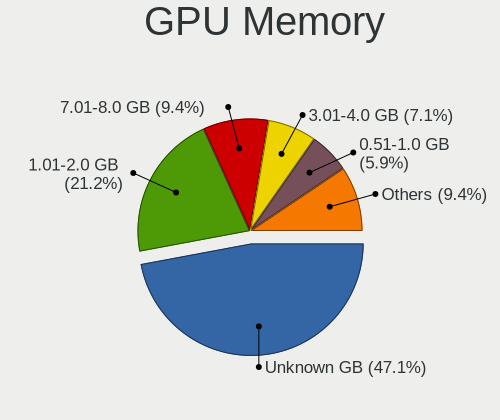

| Size in GB | Desktops | Percent |
|------------|----------|---------|
| Unknown    | 33       | 49.25%  |
| 1.01-2.0   | 16       | 23.88%  |
| 3.01-4.0   | 6        | 8.96%   |
| 7.01-8.0   | 4        | 5.97%   |
| 0.51-1.0   | 3        | 4.48%   |
| 0.01-0.5   | 3        | 4.48%   |
| 5.01-6.0   | 2        | 2.99%   |

Monitor
-------

Monitor Vendor
--------------

Monitor vendors

| Vendor               | Desktops | Percent |
|----------------------|----------|---------|
| Samsung Electronics  | 12       | 18.46%  |
| Goldstar             | 8        | 12.31%  |
| Hewlett-Packard      | 5        | 7.69%   |
| ViewSonic            | 4        | 6.15%   |
| Dell                 | 4        | 6.15%   |
| Philips              | 3        | 4.62%   |
| Lenovo               | 2        | 3.08%   |
| Iiyama               | 2        | 3.08%   |
| HKC                  | 2        | 3.08%   |
| BenQ                 | 2        | 3.08%   |
| AOC                  | 2        | 3.08%   |
| Ancor Communications | 2        | 3.08%   |
| Acer                 | 2        | 3.08%   |
| Xiaomi               | 1        | 1.54%   |
| Unknown              | 1        | 1.54%   |
| Toshiba              | 1        | 1.54%   |
| TFC                  | 1        | 1.54%   |
| SKY                  | 1        | 1.54%   |
| RTK                  | 1        | 1.54%   |
| Positivo             | 1        | 1.54%   |
| Packard Bell         | 1        | 1.54%   |
| MSI                  | 1        | 1.54%   |
| Hisense              | 1        | 1.54%   |
| HannStar             | 1        | 1.54%   |
| Gateway              | 1        | 1.54%   |
| DTV                  | 1        | 1.54%   |
| BOE                  | 1        | 1.54%   |
| ASUSTek Computer     | 1        | 1.54%   |

Monitor Model
-------------

Monitor models

| Model                                                                 | Desktops | Percent |
|-----------------------------------------------------------------------|----------|---------|
| ViewSonic VA2478-H-2 VSC8335 1920x1080 527x296mm 23.8-inch            | 3        | 4.23%   |
| Goldstar 20EN33 GSM4EE1 1600x900 443x249mm 20.0-inch                  | 2        | 2.82%   |
| Xiaomi Mi TV XMD0076 3840x2160 800x450mm 36.1-inch                    | 1        | 1.41%   |
| ViewSonic VA2430-H-3 VSC3A3E 1920x1080 527x296mm 23.8-inch            | 1        | 1.41%   |
| Unknown LCD Monitor FFFF 2288x1287 2550x2550mm 142.0-inch             | 1        | 1.41%   |
| Toshiba TV TSB0108 1360x768 698x393mm 31.5-inch                       | 1        | 1.41%   |
| TFC TF2411 TFC0238 1920x1080 527x296mm 23.8-inch                      | 1        | 1.41%   |
| SKY 24X1Q SKY2380 2560x1440 520x290mm 23.4-inch                       | 1        | 1.41%   |
| Samsung Electronics SyncMaster SAM060B 1920x1080 510x290mm 23.1-inch  | 1        | 1.41%   |
| Samsung Electronics SyncMaster SAM0601 1600x900                       | 1        | 1.41%   |
| Samsung Electronics SyncMaster SAM05FF 1600x900 443x249mm 20.0-inch   | 1        | 1.41%   |
| Samsung Electronics SyncMaster SAM02B6 1920x1200 518x324mm 24.1-inch  | 1        | 1.41%   |
| Samsung Electronics SMT24A550 SAM07B5 1920x1080 531x299mm 24.0-inch   | 1        | 1.41%   |
| Samsung Electronics S24E360 SAM0C10 1920x1080 520x290mm 23.4-inch     | 1        | 1.41%   |
| Samsung Electronics LCD Monitor SMS23A350H 1920x1080                  | 1        | 1.41%   |
| Samsung Electronics LCD Monitor SAM0FF0 3840x2160 950x540mm 43.0-inch | 1        | 1.41%   |
| Samsung Electronics LCD Monitor SAM0F13 3840x2160 890x500mm 40.2-inch | 1        | 1.41%   |
| Samsung Electronics LCD Monitor SAM0E90 1366x768 609x347mm 27.6-inch  | 1        | 1.41%   |
| Samsung Electronics LCD Monitor SAM0DF6 3840x2160 890x500mm 40.2-inch | 1        | 1.41%   |
| Samsung Electronics LCD Monitor S24E390 1920x1080                     | 1        | 1.41%   |
| Samsung Electronics LCD Monitor S24E360 1920x1080                     | 1        | 1.41%   |
| Samsung Electronics LCD Monitor S24E310 3840x1080                     | 1        | 1.41%   |
| Samsung Electronics LCD Monitor S24E310                               | 1        | 1.41%   |
| RTK TYPE C RTKBC32 2560x1600 347x215mm 16.1-inch                      | 1        | 1.41%   |
| Positivo FIT85X NON1801 1360x768 344x194mm 15.5-inch                  | 1        | 1.41%   |
| Philips FTV PHL04C2 1920x1080 1440x810mm 65.0-inch                    | 1        | 1.41%   |
| Philips 247EL PHLC084 1920x1080 520x290mm 23.4-inch                   | 1        | 1.41%   |
| Philips 200V4 PHLC0BF 1600x900 432x240mm 19.5-inch                    | 1        | 1.41%   |
| Packard Bell Viseo223DX PKB0385 1920x1080 480x270mm 21.7-inch         | 1        | 1.41%   |
| MSI MAG271C MSI3FA6 1920x1080 598x336mm 27.0-inch                     | 1        | 1.41%   |
| Lenovo T24s-28 LEN62C7 1920x1080 527x296mm 23.8-inch                  | 1        | 1.41%   |
| Lenovo LEN T2324C LEN60F2 1920x1080 510x287mm 23.0-inch               | 1        | 1.41%   |
| Iiyama PL2792Q IVM6630 2560x1440 597x336mm 27.0-inch                  | 1        | 1.41%   |
| Iiyama PL2792Q IVM662F 2560x1440 597x336mm 27.0-inch                  | 1        | 1.41%   |
| HKC PL24V2 HKC0238 1920x1080 527x296mm 23.8-inch                      | 1        | 1.41%   |
| HKC 27E6QC HKC274F 2560x1440 597x336mm 27.0-inch                      | 1        | 1.41%   |
| Hisense LCD Monitor HDMI 1360x768                                     | 1        | 1.41%   |
| Hewlett-Packard VH240a HPN3499 1920x1080 527x296mm 23.8-inch          | 1        | 1.41%   |
| Hewlett-Packard Compaq F191 HWP3177 1366x768 410x230mm 18.5-inch      | 1        | 1.41%   |
| Hewlett-Packard 2511 HWP293E 1920x1080 550x310mm 24.9-inch            | 1        | 1.41%   |

Monitor Resolution
------------------

Monitor screen resolution

| Resolution         | Desktops | Percent |
|--------------------|----------|---------|
| 1920x1080 (FHD)    | 33       | 50%     |
| 2560x1440 (QHD)    | 6        | 9.09%   |
| 3840x2160 (4K)     | 5        | 7.58%   |
| 1600x900 (HD+)     | 4        | 6.06%   |
| 1440x900 (WXGA+)   | 3        | 4.55%   |
| 3840x1080          | 2        | 3.03%   |
| 1680x1050 (WSXGA+) | 2        | 3.03%   |
| 1366x768 (WXGA)    | 2        | 3.03%   |
| 1360x768           | 2        | 3.03%   |
| Unknown            | 2        | 3.03%   |
| 2560x1600          | 1        | 1.52%   |
| 2288x1287          | 1        | 1.52%   |
| 1920x540           | 1        | 1.52%   |
| 1920x1200 (WUXGA)  | 1        | 1.52%   |
| 1280x1024 (SXGA)   | 1        | 1.52%   |

Monitor Diagonal
----------------

Diagonal size in inches

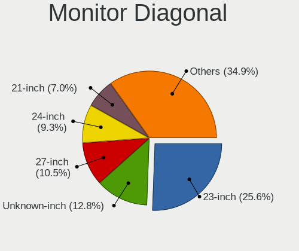

| Inches  | Desktops | Percent |
|---------|----------|---------|
| 23      | 18       | 26.87%  |
| 24      | 8        | 11.94%  |
| Unknown | 8        | 11.94%  |
| 27      | 6        | 8.96%   |
| 21      | 5        | 7.46%   |
| 84      | 3        | 4.48%   |
| 20      | 3        | 4.48%   |
| 19      | 3        | 4.48%   |
| 18      | 3        | 4.48%   |
| 22      | 2        | 2.99%   |
| 142     | 1        | 1.49%   |
| 72      | 1        | 1.49%   |
| 65      | 1        | 1.49%   |
| 54      | 1        | 1.49%   |
| 32      | 1        | 1.49%   |
| 31      | 1        | 1.49%   |
| 25      | 1        | 1.49%   |
| 12      | 1        | 1.49%   |

Monitor Width
-------------

Physical width

| Width in mm    | Desktops | Percent |
|----------------|----------|---------|
| 501-600        | 32       | 49.23%  |
| 401-500        | 15       | 23.08%  |
| Unknown        | 8        | 12.31%  |
| 1501-2000      | 4        | 6.15%   |
| 1001-1500      | 2        | 3.08%   |
| More than 2000 | 1        | 1.54%   |
| 701-800        | 1        | 1.54%   |
| 601-700        | 1        | 1.54%   |
| 201-300        | 1        | 1.54%   |

Aspect Ratio
------------

Proportional relationship between the width and the height

| Ratio   | Desktops | Percent |
|---------|----------|---------|
| 16/9    | 49       | 79.03%  |
| Unknown | 7        | 11.29%  |
| 16/10   | 5        | 8.06%   |
| 1.00    | 1        | 1.61%   |

Monitor Area
------------

Area in inch²

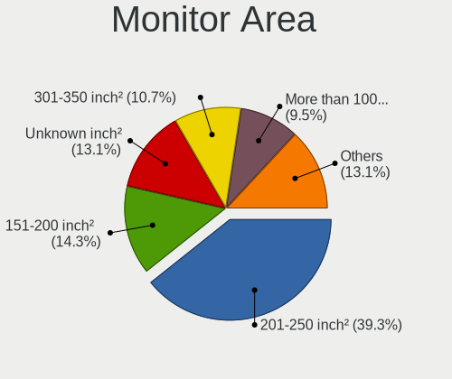

| Area in inch² | Desktops | Percent |
|----------------|----------|---------|
| 201-250        | 27       | 41.54%  |
| 151-200        | 9        | 13.85%  |
| Unknown        | 8        | 12.31%  |
| More than 1000 | 7        | 10.77%  |
| 301-350        | 6        | 9.23%   |
| 251-300        | 3        | 4.62%   |
| 351-500        | 2        | 3.08%   |
| 141-150        | 2        | 3.08%   |
| 61-70          | 1        | 1.54%   |

Pixel Density
-------------

Pixels per inch

| Density | Desktops | Percent |
|---------|----------|---------|
| 51-100  | 41       | 64.06%  |
| 101-120 | 9        | 14.06%  |
| Unknown | 8        | 12.5%   |
| 1-50    | 4        | 6.25%   |
| 161-240 | 1        | 1.56%   |
| 121-160 | 1        | 1.56%   |

Multiple Monitors
-----------------

Total monitors connected

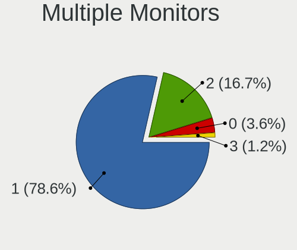

| Total | Desktops | Percent |
|-------|----------|---------|
| 1     | 53       | 80.3%   |
| 2     | 11       | 16.67%  |
| 0     | 2        | 3.03%   |

Network
-------

Net Controller Vendor
---------------------

Controller vendors

| Vendor                   | Desktops | Percent |
|--------------------------|----------|---------|
| Realtek Semiconductor    | 42       | 48.28%  |
| Intel                    | 21       | 24.14%  |
| Qualcomm Atheros         | 4        | 4.6%    |
| Broadcom                 | 4        | 4.6%    |
| TP-Link                  | 3        | 3.45%   |
| MediaTek                 | 2        | 2.3%    |
| Xiaomi                   | 1        | 1.15%   |
| Unknown                  | 1        | 1.15%   |
| Ralink Technology        | 1        | 1.15%   |
| Ralink                   | 1        | 1.15%   |
| NXP Semiconductors       | 1        | 1.15%   |
| Nvidia                   | 1        | 1.15%   |
| NetGear                  | 1        | 1.15%   |
| Marvell Technology Group | 1        | 1.15%   |
| Loongson Technology      | 1        | 1.15%   |
| IMC Networks             | 1        | 1.15%   |
| Aquantia                 | 1        | 1.15%   |

Net Controller Model
--------------------

Controller models

| Model                                                             | Desktops | Percent |
|-------------------------------------------------------------------|----------|---------|
| Realtek RTL8111/8168/8411 PCI Express Gigabit Ethernet Controller | 36       | 36.73%  |
| Intel Ethernet Connection (12) I219-V                             | 4        | 4.08%   |
| Realtek RTL8188GU 802.11n WLAN Adapter (After Modeswitch)         | 2        | 2.04%   |
| Realtek RTL810xE PCI Express Fast Ethernet controller             | 2        | 2.04%   |
| Realtek RTL-8100/8101L/8139 PCI Fast Ethernet Adapter             | 2        | 2.04%   |
| Intel Ethernet Connection (2) I219-V                              | 2        | 2.04%   |
| Intel 82567LM-3 Gigabit Network Connection                        | 2        | 2.04%   |
| Broadcom NetLink BCM57781 Gigabit Ethernet PCIe                   | 2        | 2.04%   |
| Xiaomi Mi/Redmi series (RNDIS)                                    | 1        | 1.02%   |
| Unknown Network controller                                        | 1        | 1.02%   |
| TP-Link TL-WN823N v2/v3 [Realtek RTL8192EU]                       | 1        | 1.02%   |
| TP-Link TL-WN821N v5/v6 [RTL8192EU]                               | 1        | 1.02%   |
| TP-Link AC600 wireless Realtek RTL8811AU [Archer T2U Nano]        | 1        | 1.02%   |
| Realtek RTL88x2bu [AC1200 Techkey]                                | 1        | 1.02%   |
| Realtek RTL8812AU 802.11a/b/g/n/ac 2T2R DB WLAN Adapter           | 1        | 1.02%   |
| Realtek RTL8723BE PCIe Wireless Network Adapter                   | 1        | 1.02%   |
| Realtek RTL8192CU 802.11n WLAN Adapter                            | 1        | 1.02%   |
| Realtek RTL8188FTV 802.11b/g/n 1T1R 2.4G WLAN Adapter             | 1        | 1.02%   |
| Realtek RTL8188EE Wireless Network Adapter                        | 1        | 1.02%   |
| Realtek RTL8125 2.5GbE Controller                                 | 1        | 1.02%   |
| Ralink MT7601U Wireless Adapter                                   | 1        | 1.02%   |
| Ralink RT5390R 802.11bgn PCIe Wireless Network Adapter            | 1        | 1.02%   |
| Qualcomm Atheros Killer E2400 Gigabit Ethernet Controller         | 1        | 1.02%   |
| Qualcomm Atheros AR9485 Wireless Network Adapter                  | 1        | 1.02%   |
| Qualcomm Atheros AR9462 Wireless Network Adapter                  | 1        | 1.02%   |
| Qualcomm Atheros AR8161 Gigabit Ethernet                          | 1        | 1.02%   |
| Nvidia MCP61 Ethernet                                             | 1        | 1.02%   |
| NetGear A6210                                                     | 1        | 1.02%   |
| MediaTek Wiko U316AT                                              | 1        | 1.02%   |
| MediaTek MT7630e 802.11bgn Wireless Network Adapter               | 1        | 1.02%   |
| Marvell Group 88E8056 PCI-E Gigabit Ethernet Controller           | 1        | 1.02%   |
| Marvell Group 88E8001 Gigabit Ethernet Controller                 | 1        | 1.02%   |
| Loongson Gigabit Ethernet Controller                              | 1        | 1.02%   |
| Intel Ethernet Controller I226-V                                  | 1        | 1.02%   |
| Intel Ethernet Connection I217-V                                  | 1        | 1.02%   |
| Intel Ethernet Connection I217-LM                                 | 1        | 1.02%   |
| Intel Ethernet Connection (7) I219-V                              | 1        | 1.02%   |
| Intel Ethernet Connection (5) I219-LM                             | 1        | 1.02%   |
| Intel Ethernet Connection (2) I219-LM                             | 1        | 1.02%   |
| Intel Ethernet Connection (2) I218-V                              | 1        | 1.02%   |

Wireless Vendor
---------------

Wireless vendors

| Vendor                | Desktops | Percent |
|-----------------------|----------|---------|
| Realtek Semiconductor | 8        | 34.78%  |
| Intel                 | 4        | 17.39%  |
| TP-Link               | 3        | 13.04%  |
| Qualcomm Atheros      | 2        | 8.7%    |
| Ralink Technology     | 1        | 4.35%   |
| Ralink                | 1        | 4.35%   |
| NetGear               | 1        | 4.35%   |
| MediaTek              | 1        | 4.35%   |
| IMC Networks          | 1        | 4.35%   |
| Broadcom              | 1        | 4.35%   |

Wireless Model
--------------

Wireless models

| Model                                                      | Desktops | Percent |
|------------------------------------------------------------|----------|---------|
| Realtek RTL8188GU 802.11n WLAN Adapter (After Modeswitch)  | 2        | 8.7%    |
| TP-Link TL-WN823N v2/v3 [Realtek RTL8192EU]                | 1        | 4.35%   |
| TP-Link TL-WN821N v5/v6 [RTL8192EU]                        | 1        | 4.35%   |
| TP-Link AC600 wireless Realtek RTL8811AU [Archer T2U Nano] | 1        | 4.35%   |
| Realtek RTL88x2bu [AC1200 Techkey]                         | 1        | 4.35%   |
| Realtek RTL8812AU 802.11a/b/g/n/ac 2T2R DB WLAN Adapter    | 1        | 4.35%   |
| Realtek RTL8723BE PCIe Wireless Network Adapter            | 1        | 4.35%   |
| Realtek RTL8192CU 802.11n WLAN Adapter                     | 1        | 4.35%   |
| Realtek RTL8188FTV 802.11b/g/n 1T1R 2.4G WLAN Adapter      | 1        | 4.35%   |
| Realtek RTL8188EE Wireless Network Adapter                 | 1        | 4.35%   |
| Ralink MT7601U Wireless Adapter                            | 1        | 4.35%   |
| Ralink RT5390R 802.11bgn PCIe Wireless Network Adapter     | 1        | 4.35%   |
| Qualcomm Atheros AR9485 Wireless Network Adapter           | 1        | 4.35%   |
| Qualcomm Atheros AR9462 Wireless Network Adapter           | 1        | 4.35%   |
| NetGear A6210                                              | 1        | 4.35%   |
| MediaTek MT7630e 802.11bgn Wireless Network Adapter        | 1        | 4.35%   |
| Intel Dual Band Wireless-AC 3168NGW [Stone Peak]           | 1        | 4.35%   |
| Intel Dual Band Wireless-AC 3165 Plus Bluetooth            | 1        | 4.35%   |
| Intel Comet Lake PCH CNVi WiFi                             | 1        | 4.35%   |
| Intel 700 Series Chipset Family Wi-Fi                      | 1        | 4.35%   |
| IMC Networks Mediao 802.11n WLAN [Realtek RTL8191SU]       | 1        | 4.35%   |
| Broadcom BCM43228 802.11a/b/g/n                            | 1        | 4.35%   |

Ethernet Vendor
---------------

Ethernet vendors

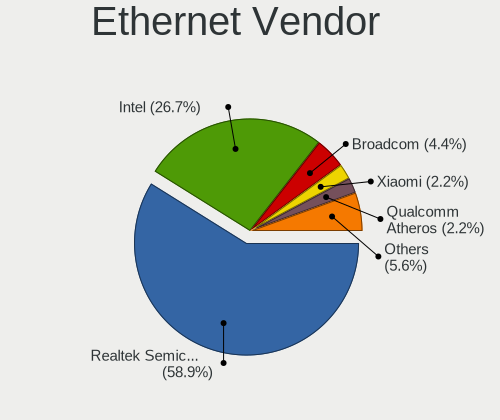

| Vendor                   | Desktops | Percent |
|--------------------------|----------|---------|
| Realtek Semiconductor    | 41       | 57.75%  |
| Intel                    | 19       | 26.76%  |
| Broadcom                 | 3        | 4.23%   |
| Qualcomm Atheros         | 2        | 2.82%   |
| Xiaomi                   | 1        | 1.41%   |
| Nvidia                   | 1        | 1.41%   |
| MediaTek                 | 1        | 1.41%   |
| Marvell Technology Group | 1        | 1.41%   |
| Loongson Technology      | 1        | 1.41%   |
| Aquantia                 | 1        | 1.41%   |

Ethernet Model
--------------

Ethernet models

| Model                                                             | Desktops | Percent |
|-------------------------------------------------------------------|----------|---------|
| Realtek RTL8111/8168/8411 PCI Express Gigabit Ethernet Controller | 36       | 49.32%  |
| Intel Ethernet Connection (12) I219-V                             | 4        | 5.48%   |
| Realtek RTL810xE PCI Express Fast Ethernet controller             | 2        | 2.74%   |
| Realtek RTL-8100/8101L/8139 PCI Fast Ethernet Adapter             | 2        | 2.74%   |
| Intel Ethernet Connection (2) I219-V                              | 2        | 2.74%   |
| Intel 82567LM-3 Gigabit Network Connection                        | 2        | 2.74%   |
| Broadcom NetLink BCM57781 Gigabit Ethernet PCIe                   | 2        | 2.74%   |
| Xiaomi Mi/Redmi series (RNDIS)                                    | 1        | 1.37%   |
| Realtek RTL8125 2.5GbE Controller                                 | 1        | 1.37%   |
| Qualcomm Atheros Killer E2400 Gigabit Ethernet Controller         | 1        | 1.37%   |
| Qualcomm Atheros AR8161 Gigabit Ethernet                          | 1        | 1.37%   |
| Nvidia MCP61 Ethernet                                             | 1        | 1.37%   |
| MediaTek Wiko U316AT                                              | 1        | 1.37%   |
| Marvell Group 88E8056 PCI-E Gigabit Ethernet Controller           | 1        | 1.37%   |
| Marvell Group 88E8001 Gigabit Ethernet Controller                 | 1        | 1.37%   |
| Loongson Gigabit Ethernet Controller                              | 1        | 1.37%   |
| Intel Ethernet Controller I226-V                                  | 1        | 1.37%   |
| Intel Ethernet Connection I217-V                                  | 1        | 1.37%   |
| Intel Ethernet Connection I217-LM                                 | 1        | 1.37%   |
| Intel Ethernet Connection (7) I219-V                              | 1        | 1.37%   |
| Intel Ethernet Connection (5) I219-LM                             | 1        | 1.37%   |
| Intel Ethernet Connection (2) I219-LM                             | 1        | 1.37%   |
| Intel Ethernet Connection (2) I218-V                              | 1        | 1.37%   |
| Intel Ethernet Connection (11) I219-V                             | 1        | 1.37%   |
| Intel 82579V Gigabit Network Connection                           | 1        | 1.37%   |
| Intel 82579LM Gigabit Network Connection (Lewisville)             | 1        | 1.37%   |
| Intel 82575EB Gigabit Network Connection                          | 1        | 1.37%   |
| Intel 82567LM-2 Gigabit Network Connection                        | 1        | 1.37%   |
| Broadcom NetLink BCM57788 Gigabit Ethernet PCIe                   | 1        | 1.37%   |
| Aquantia AQC111 NBase-T/IEEE 802.3bz Ethernet Controller [AQtion] | 1        | 1.37%   |

Net Controller Kind
-------------------

Ethernet, WiFi or modem

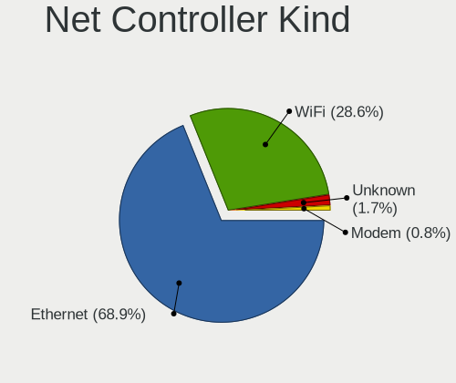

| Kind     | Desktops | Percent |
|----------|----------|---------|
| Ethernet | 65       | 72.22%  |
| WiFi     | 23       | 25.56%  |
| Modem    | 1        | 1.11%   |
| Unknown  | 1        | 1.11%   |

Used Controller
---------------

Currently used network controller

| Kind     | Desktops | Percent |
|----------|----------|---------|
| Ethernet | 54       | 83.08%  |
| WiFi     | 11       | 16.92%  |

NICs
----

Total network controllers on board

| Total | Desktops | Percent |
|-------|----------|---------|
| 1     | 48       | 72.73%  |
| 2     | 14       | 21.21%  |
| 3     | 3        | 4.55%   |
| 4     | 1        | 1.52%   |

IPv6
----

IPv6 vs IPv4

| Used | Desktops | Percent |
|------|----------|---------|
| No   | 60       | 92.31%  |
| Yes  | 5        | 7.69%   |

Bluetooth
---------

Bluetooth Vendor
----------------

Controller vendors

| Vendor                          | Desktops | Percent |
|---------------------------------|----------|---------|
| Cambridge Silicon Radio         | 11       | 50%     |
| Intel                           | 4        | 18.18%  |
| Realtek Semiconductor           | 1        | 4.55%   |
| Qualcomm Atheros Communications | 1        | 4.55%   |
| MediaTek                        | 1        | 4.55%   |
| Lite-On Technology              | 1        | 4.55%   |
| Dynex                           | 1        | 4.55%   |
| Broadcom                        | 1        | 4.55%   |
| ASUSTek Computer                | 1        | 4.55%   |

Bluetooth Model
---------------

Controller models

| Model                                                    | Desktops | Percent |
|----------------------------------------------------------|----------|---------|
| Cambridge Silicon Radio Bluetooth Dongle (HCI mode)      | 11       | 50%     |
| Realtek Bluetooth Radio                                  | 1        | 4.55%   |
| Qualcomm Atheros Bluetooth USB Host Controller           | 1        | 4.55%   |
| MediaTek BT                                              | 1        | 4.55%   |
| Lite-On Bluetooth Device                                 | 1        | 4.55%   |
| Intel Wireless-AC 3168 Bluetooth                         | 1        | 4.55%   |
| Intel Bluetooth wireless interface                       | 1        | 4.55%   |
| Intel Bluetooth Device                                   | 1        | 4.55%   |
| Intel AX201 Bluetooth                                    | 1        | 4.55%   |
| Dynex Bluetooth 4.0 Adapter [Broadcom, 1.12, BCM20702A0] | 1        | 4.55%   |
| Broadcom HP Portable Bumble Bee                          | 1        | 4.55%   |
| ASUS Broadcom BCM20702A0 Bluetooth                       | 1        | 4.55%   |

Sound
-----

Sound Vendor
------------

Sound card vendors

| Vendor                                       | Desktops | Percent |
|----------------------------------------------|----------|---------|
| Intel                                        | 51       | 45.95%  |
| AMD                                          | 26       | 23.42%  |
| Nvidia                                       | 25       | 22.52%  |
| C-Media Electronics                          | 2        | 1.8%    |
| Zoran Co. Personal Media Division (Nogatech) | 1        | 0.9%    |
| Zhaoxin                                      | 1        | 0.9%    |
| XMOS                                         | 1        | 0.9%    |
| Microdia                                     | 1        | 0.9%    |
| Loongson Technology                          | 1        | 0.9%    |
| BEHRINGER International                      | 1        | 0.9%    |
| ASUSTek Computer                             | 1        | 0.9%    |

Sound Model
-----------

Sound card models

| Model                                                                             | Desktops | Percent |
|-----------------------------------------------------------------------------------|----------|---------|
| Intel Comet Lake PCH-V cAVS                                                       | 8        | 6.56%   |
| Intel 8 Series/C220 Series Chipset High Definition Audio Controller               | 8        | 6.56%   |
| Intel 7 Series/C216 Chipset Family High Definition Audio Controller               | 7        | 5.74%   |
| Intel 6 Series/C200 Series Chipset Family High Definition Audio Controller        | 7        | 5.74%   |
| AMD Oland/Hainan/Cape Verde/Pitcairn HDMI Audio [Radeon HD 7000 Series]           | 6        | 4.92%   |
| Intel Xeon E3-1200 v3/4th Gen Core Processor HD Audio Controller                  | 4        | 3.28%   |
| Intel 100 Series/C230 Series Chipset Family HD Audio Controller                   | 4        | 3.28%   |
| Nvidia GM204 High Definition Audio Controller                                     | 3        | 2.46%   |
| Nvidia GF116 High Definition Audio Controller                                     | 3        | 2.46%   |
| Intel NM10/ICH7 Family High Definition Audio Controller                           | 3        | 2.46%   |
| Intel 82801JI (ICH10 Family) HD Audio Controller                                  | 3        | 2.46%   |
| Intel 200 Series PCH HD Audio                                                     | 3        | 2.46%   |
| AMD SBx00 Azalia (Intel HDA)                                                      | 3        | 2.46%   |
| AMD Caicos HDMI Audio [Radeon HD 6450 / 7450/8450/8490 OEM / R5 230/235/235X OEM] | 3        | 2.46%   |
| Nvidia High Definition Audio Controller                                           | 2        | 1.64%   |
| Nvidia GP106 High Definition Audio Controller                                     | 2        | 1.64%   |
| Nvidia GK208 HDMI/DP Audio Controller                                             | 2        | 1.64%   |
| Nvidia GK107 HDMI Audio Controller                                                | 2        | 1.64%   |
| Nvidia GF119 HDMI Audio Controller                                                | 2        | 1.64%   |
| Intel Celeron/Pentium Silver Processor High Definition Audio                      | 2        | 1.64%   |
| Intel 82801JD/DO (ICH10 Family) HD Audio Controller                               | 2        | 1.64%   |
| AMD Starship/Matisse HD Audio Controller                                          | 2        | 1.64%   |
| AMD FCH Azalia Controller                                                         | 2        | 1.64%   |
| AMD Family 17h (Models 00h-0fh) HD Audio Controller                               | 2        | 1.64%   |
| AMD Ellesmere HDMI Audio [Radeon RX 470/480 / 570/580/590]                        | 2        | 1.64%   |
| Zoran Co. Personal Media Division (Nogatech) USB Audio and HID                    | 1        | 0.82%   |
| Zhaoxin ZX-E High Definition Audio Controller                                     | 1        | 0.82%   |
| Zhaoxin ZX-100/KX-5000/KX-6000/KX-6000G/KH-40000 High Definition Audio Controller | 1        | 0.82%   |
| XMOS iFi (by AMR) HD USB Audio                                                    | 1        | 0.82%   |
| Nvidia TU116 High Definition Audio Controller                                     | 1        | 0.82%   |
| Nvidia TU107 GeForce GTX 1650 High Definition Audio Controller                    | 1        | 0.82%   |
| Nvidia MCP61 High Definition Audio                                                | 1        | 0.82%   |
| Nvidia GP108 High Definition Audio Controller                                     | 1        | 0.82%   |
| Nvidia GP107GL High Definition Audio Controller                                   | 1        | 0.82%   |
| Nvidia GP104 High Definition Audio Controller                                     | 1        | 0.82%   |
| Nvidia GM206 High Definition Audio Controller                                     | 1        | 0.82%   |
| Nvidia GK106 HDMI Audio Controller                                                | 1        | 0.82%   |
| Nvidia GK104 HDMI Audio Controller                                                | 1        | 0.82%   |
| Nvidia GA104 High Definition Audio Controller                                     | 1        | 0.82%   |
| Microdia USB Audio                                                                | 1        | 0.82%   |

Memory
------

Memory Vendor
-------------

Memory module vendors

| Vendor                             | Desktops | Percent |
|------------------------------------|----------|---------|
| Kingston                           | 12       | 32.43%  |
| Unknown                            | 5        | 13.51%  |
| Samsung Electronics                | 3        | 8.11%   |
| G.Skill                            | 3        | 8.11%   |
| Corsair                            | 3        | 8.11%   |
| SK hynix                           | 2        | 5.41%   |
| Team                               | 1        | 2.7%    |
| Ramaxel Technology                 | 1        | 2.7%    |
| Nanya Technology                   | 1        | 2.7%    |
| KINGBANK                           | 1        | 2.7%    |
| Kimtigo Semiconductor (HK) Limited | 1        | 2.7%    |
| CSX                                | 1        | 2.7%    |
| Apacer                             | 1        | 2.7%    |
| A-DATA Technology                  | 1        | 2.7%    |
| Unknown                            | 1        | 2.7%    |

Memory Model
------------

Memory module models

| Model                                                      | Desktops | Percent |
|------------------------------------------------------------|----------|---------|
| Kingston RAM TF32D4U2S1MEH-8 8192MB DIMM DDR4 3200MT/s     | 3        | 7.5%    |
| Unknown RAM Module 8GB DIMM DDR4 2667MT/s                  | 1        | 2.5%    |
| Unknown RAM Module 4096MB DIMM DDR3 1067MT/s               | 1        | 2.5%    |
| Unknown RAM Module 4096MB DIMM 667MT/s                     | 1        | 2.5%    |
| Unknown RAM Module 2GB DIMM SDRAM                          | 1        | 2.5%    |
| Unknown RAM 1866 CL10 Ser 8192MB DIMM DDR3 800MT/s         | 1        | 2.5%    |
| Team RAM TEAMGROUP-UD4-3200 16GB DIMM DDR4 3800MT/s        | 1        | 2.5%    |
| SK hynix RAM HMT451S6BFR8A-PB 4GB SODIMM DDR3 1600MT/s     | 1        | 2.5%    |
| SK hynix RAM HMA851U6AFR6N-UH 4GB DIMM DDR4 2400MT/s       | 1        | 2.5%    |
| Samsung RAM M471B5173QH0-YK0 4GB SODIMM DDR3 1600MT/s      | 1        | 2.5%    |
| Samsung RAM M378B5173DB0-CK0 4GB DIMM DDR3 1600MT/s        | 1        | 2.5%    |
| Samsung RAM M378B1G73DB0-CK0 8GB DIMM DDR3 2133MT/s        | 1        | 2.5%    |
| Samsung RAM M378A1K43CB2-CRC 8GB DIMM DDR4 3500MT/s        | 1        | 2.5%    |
| Ramaxel RAM RMSA3230KE68H9F213 4096MB SODIMM DDR4 2133MT/s | 1        | 2.5%    |
| Nanya RAM M2X4G64CB8HG5N-DG 4GB DIMM DDR3 1867MT/s         | 1        | 2.5%    |
| Kingston RAM Module 4GB DIMM DDR3 1067MT/s                 | 1        | 2.5%    |
| Kingston RAM KTW149-ELF 1GB DIMM DDR3 1333MT/s             | 1        | 2.5%    |
| Kingston RAM KHX3200C16D4/16GX 16GB DIMM DDR4 3600MT/s     | 1        | 2.5%    |
| Kingston RAM KHX2666C16/8G 8GB DIMM DDR4 3466MT/s          | 1        | 2.5%    |
| Kingston RAM KHX2400C15/8G 8GB DIMM DDR4 3400MT/s          | 1        | 2.5%    |
| Kingston RAM KHX2133C14D4/8G 8GB DIMM DDR4 2667MT/s        | 1        | 2.5%    |
| Kingston RAM KHX1866C10D3/8G 8GB DIMM DDR3 2133MT/s        | 1        | 2.5%    |
| Kingston RAM KHX1600C10D3/8G 8GB DIMM DDR3 1648MT/s        | 1        | 2.5%    |
| Kingston RAM BRAP1G48GB16C1600 8192MB DIMM DDR3 1600MT/s   | 1        | 2.5%    |
| Kingston RAM 99U5474-038.A00LF 4GB DIMM DDR3 1333MT/s      | 1        | 2.5%    |
| Kingston RAM 99U5403-034.A00LF 4096MB DIMM DDR3 1333MT/s   | 1        | 2.5%    |
| KINGBANK RAM Module 8192MB DIMM DDR4 2666MT/s              | 1        | 2.5%    |
| Kimtigo (HK) Limited RAM Module 8192MB DIMM DDR4 2666MT/s  | 1        | 2.5%    |
| G.Skill RAM F4-3200C16-16GIS 16GB DIMM DDR4 3600MT/s       | 1        | 2.5%    |
| G.Skill RAM F3-2400C10-8GTX 8GB DIMM DDR3 2400MT/s         | 1        | 2.5%    |
| G.Skill RAM F3-14900CL10-8GBXL 8GB DIMM DDR3 1867MT/s      | 1        | 2.5%    |
| CSX RAM V01D3LF4GB26826813 4GB DIMM DDR3 1333MT/s          | 1        | 2.5%    |
| Corsair RAM CMK8GX4M1A2400C16 8GB DIMM DDR4 2800MT/s       | 1        | 2.5%    |
| Corsair RAM CMK16GX4M2B3000C15 8GB DIMM DDR4 3533MT/s      | 1        | 2.5%    |
| Corsair RAM CMK16GX4M1B3000C15 16GB DIMM DDR4 3400MT/s     | 1        | 2.5%    |
| Apacer RAM 76.C346G.C850C 8192MB SODIMM DDR3 1600MT/s      | 1        | 2.5%    |
| A-DATA RAM DDR4 2400 2OZ 8GB DIMM DDR4 3000MT/s            | 1        | 2.5%    |
| Unknown                                                    | 1        | 2.5%    |

Memory Kind
-----------

Memory module kinds

| Kind    | Desktops | Percent |
|---------|----------|---------|
| DDR4    | 18       | 54.55%  |
| DDR3    | 12       | 36.36%  |
| Unknown | 2        | 6.06%   |
| SDRAM   | 1        | 3.03%   |

Memory Form Factor
------------------

Physical design of the memory module

| Name   | Desktops | Percent |
|--------|----------|---------|
| DIMM   | 30       | 90.91%  |
| SODIMM | 3        | 9.09%   |

Memory Size
-----------

Memory module size

| Size  | Desktops | Percent |
|-------|----------|---------|
| 8192  | 21       | 60%     |
| 4096  | 8        | 22.86%  |
| 16384 | 3        | 8.57%   |
| 32768 | 1        | 2.86%   |
| 2048  | 1        | 2.86%   |
| 1024  | 1        | 2.86%   |

Memory Speed
------------

Memory module speed

| Speed   | Desktops | Percent |
|---------|----------|---------|
| 1600    | 5        | 13.51%  |
| 3200    | 3        | 8.11%   |
| 2133    | 3        | 8.11%   |
| 1867    | 3        | 8.11%   |
| 3600    | 2        | 5.41%   |
| 3400    | 2        | 5.41%   |
| 2667    | 2        | 5.41%   |
| 2666    | 2        | 5.41%   |
| 2400    | 2        | 5.41%   |
| 1333    | 2        | 5.41%   |
| 1067    | 2        | 5.41%   |
| 4266    | 1        | 2.7%    |
| 3800    | 1        | 2.7%    |
| 3533    | 1        | 2.7%    |
| 3500    | 1        | 2.7%    |
| 3466    | 1        | 2.7%    |
| 3000    | 1        | 2.7%    |
| 2800    | 1        | 2.7%    |
| 667     | 1        | 2.7%    |
| Unknown | 1        | 2.7%    |

Printers & scanners
-------------------

Printer Vendor
--------------

Printer device vendors

| Vendor          | Desktops | Percent |
|-----------------|----------|---------|
| Seiko Epson     | 1        | 50%     |
| Hewlett-Packard | 1        | 50%     |

Printer Model
-------------

Printer device models

| Model                                         | Desktops | Percent |
|-----------------------------------------------|----------|---------|
| Seiko Epson ME 340 Series/Stylus NX130 Series | 1        | 50%     |
| HP Deskjet 3520 series                        | 1        | 50%     |

Scanner Vendor
--------------

Scanner device vendors

Zero info for selected period =(

Scanner Model
-------------

Scanner device models

Zero info for selected period =(

Camera
------

Camera Vendor
-------------

Camera device vendors

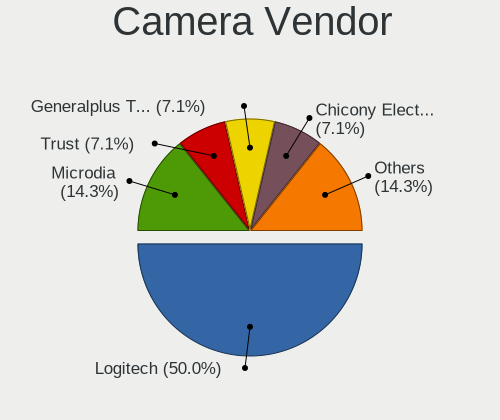

| Vendor                 | Desktops | Percent |
|------------------------|----------|---------|
| Logitech               | 6        | 54.55%  |
| Microdia               | 1        | 9.09%   |
| HD 2MP WEBCAM          | 1        | 9.09%   |
| Generalplus Technology | 1        | 9.09%   |
| Chicony Electronics    | 1        | 9.09%   |
| Arkmicro Technologies  | 1        | 9.09%   |

Camera Model
------------

Camera device models

| Model                                 | Desktops | Percent |
|---------------------------------------|----------|---------|
| Logitech Webcam C270                  | 4        | 36.36%  |
| Microdia Integrated_Webcam_HD         | 1        | 9.09%   |
| Logitech Webcam C200                  | 1        | 9.09%   |
| Logitech HD Pro Webcam C920           | 1        | 9.09%   |
| HD 2MP WEBCAM HD 2MP WEBCAM           | 1        | 9.09%   |
| Generalplus GENERAL WEBCAM            | 1        | 9.09%   |
| Chicony HP High Definition 1MP Webcam | 1        | 9.09%   |
| Arkmicro USB2.0 PC CAMERA             | 1        | 9.09%   |

Security
--------

Fingerprint Vendor
------------------

Fingerprint sensor vendors

Zero info for selected period =(

Fingerprint Model
-----------------

Fingerprint sensor models

Zero info for selected period =(

Chipcard Vendor
---------------

Chipcard module vendors

Zero info for selected period =(

Chipcard Model
--------------

Chipcard module models

Zero info for selected period =(

Unsupported
-----------

Unsupported Devices
-------------------

Total unsupported devices on board

| Total | Desktops | Percent |
|-------|----------|---------|
| 0     | 57       | 87.69%  |
| 1     | 6        | 9.23%   |
| 2     | 2        | 3.08%   |

Unsupported Device Types
------------------------

Types of unsupported devices

| Type          | Desktops | Percent |
|---------------|----------|---------|
| Graphics card | 5        | 55.56%  |
| Net/wireless  | 4        | 44.44%  |

