Deepin - Tested Hardware & Statistics (Notebooks)
-------------------------------------------------

A project to collect tested hardware configurations for Deepin.

Anyone can contribute to this report by the [hw-probe](https://github.com/linuxhw/hw-probe) tool:

    sudo -E hw-probe -all -upload

Please contribute! Especially if your hardware is rare.

Contents
--------

* [ Test Cases ](#test-cases)

* [ System ](#system)
  - [ OS                       ](#os)
  - [ OS Family                ](#os-family)
  - [ Kernel                   ](#kernel)
  - [ Kernel Family            ](#kernel-family)
  - [ Kernel Major Ver.        ](#kernel-major-ver)
  - [ Arch                     ](#arch)
  - [ DE                       ](#de)
  - [ Display Server           ](#display-server)
  - [ Display Manager          ](#display-manager)
  - [ OS Lang                  ](#os-lang)
  - [ Boot Mode                ](#boot-mode)
  - [ Filesystem               ](#filesystem)
  - [ Part. scheme             ](#part-scheme)
  - [ Dual Boot with Linux/BSD ](#dual-boot-with-linuxbsd)
  - [ Dual Boot (Win)          ](#dual-boot-win)

* [ Board ](#board)
  - [ Vendor                   ](#vendor)
  - [ Model                    ](#model)
  - [ Model Family             ](#model-family)
  - [ MFG Year                 ](#mfg-year)
  - [ Form Factor              ](#form-factor)
  - [ Secure Boot              ](#secure-boot)
  - [ Coreboot                 ](#coreboot)
  - [ RAM Size                 ](#ram-size)
  - [ RAM Used                 ](#ram-used)
  - [ Total Drives             ](#total-drives)
  - [ Has CD-ROM               ](#has-cd-rom)
  - [ Has Ethernet             ](#has-ethernet)
  - [ Has WiFi                 ](#has-wifi)
  - [ Has Bluetooth            ](#has-bluetooth)

* [ Location ](#location)
  - [ Country                  ](#country)
  - [ City                     ](#city)

* [ Drives ](#drives)
  - [ Drive Vendor             ](#drive-vendor)
  - [ Drive Model              ](#drive-model)
  - [ HDD Vendor               ](#hdd-vendor)
  - [ SSD Vendor               ](#ssd-vendor)
  - [ Drive Kind               ](#drive-kind)
  - [ Drive Connector          ](#drive-connector)
  - [ Drive Size               ](#drive-size)
  - [ Space Total              ](#space-total)
  - [ Space Used               ](#space-used)
  - [ Malfunc. Drives          ](#malfunc-drives)
  - [ Malfunc. Drive Vendor    ](#malfunc-drive-vendor)
  - [ Malfunc. HDD Vendor      ](#malfunc-hdd-vendor)
  - [ Malfunc. Drive Kind      ](#malfunc-drive-kind)
  - [ Failed Drives            ](#failed-drives)
  - [ Failed Drive Vendor      ](#failed-drive-vendor)
  - [ Drive Status             ](#drive-status)

* [ Storage controller ](#storage-controller)
  - [ Storage Vendor           ](#storage-vendor)
  - [ Storage Model            ](#storage-model)
  - [ Storage Kind             ](#storage-kind)

* [ Processor ](#processor)
  - [ CPU Vendor               ](#cpu-vendor)
  - [ CPU Model                ](#cpu-model)
  - [ CPU Model Family         ](#cpu-model-family)
  - [ CPU Cores                ](#cpu-cores)
  - [ CPU Sockets              ](#cpu-sockets)
  - [ CPU Threads              ](#cpu-threads)
  - [ CPU Op-Modes             ](#cpu-op-modes)
  - [ CPU Microcode            ](#cpu-microcode)
  - [ CPU Microarch            ](#cpu-microarch)

* [ Graphics ](#graphics)
  - [ GPU Vendor               ](#gpu-vendor)
  - [ GPU Model                ](#gpu-model)
  - [ GPU Combo                ](#gpu-combo)
  - [ GPU Driver               ](#gpu-driver)
  - [ GPU Memory               ](#gpu-memory)

* [ Monitor ](#monitor)
  - [ Monitor Vendor           ](#monitor-vendor)
  - [ Monitor Model            ](#monitor-model)
  - [ Monitor Resolution       ](#monitor-resolution)
  - [ Monitor Diagonal         ](#monitor-diagonal)
  - [ Monitor Width            ](#monitor-width)
  - [ Aspect Ratio             ](#aspect-ratio)
  - [ Monitor Area             ](#monitor-area)
  - [ Pixel Density            ](#pixel-density)
  - [ Multiple Monitors        ](#multiple-monitors)

* [ Network ](#network)
  - [ Net Controller Vendor    ](#net-controller-vendor)
  - [ Net Controller Model     ](#net-controller-model)
  - [ Wireless Vendor          ](#wireless-vendor)
  - [ Wireless Model           ](#wireless-model)
  - [ Ethernet Vendor          ](#ethernet-vendor)
  - [ Ethernet Model           ](#ethernet-model)
  - [ Net Controller Kind      ](#net-controller-kind)
  - [ Used Controller          ](#used-controller)
  - [ NICs                     ](#nics)
  - [ IPv6                     ](#ipv6)

* [ Bluetooth ](#bluetooth)
  - [ Bluetooth Vendor         ](#bluetooth-vendor)
  - [ Bluetooth Model          ](#bluetooth-model)

* [ Sound ](#sound)
  - [ Sound Vendor             ](#sound-vendor)
  - [ Sound Model              ](#sound-model)

* [ Memory ](#memory)
  - [ Memory Vendor            ](#memory-vendor)
  - [ Memory Model             ](#memory-model)
  - [ Memory Kind              ](#memory-kind)
  - [ Memory Form Factor       ](#memory-form-factor)
  - [ Memory Size              ](#memory-size)
  - [ Memory Speed             ](#memory-speed)

* [ Printers & scanners ](#printers--scanners)
  - [ Printer Vendor           ](#printer-vendor)
  - [ Printer Model            ](#printer-model)
  - [ Scanner Vendor           ](#scanner-vendor)
  - [ Scanner Model            ](#scanner-model)

* [ Camera ](#camera)
  - [ Camera Vendor            ](#camera-vendor)
  - [ Camera Model             ](#camera-model)

* [ Security ](#security)
  - [ Fingerprint Vendor       ](#fingerprint-vendor)
  - [ Fingerprint Model        ](#fingerprint-model)
  - [ Chipcard Vendor          ](#chipcard-vendor)
  - [ Chipcard Model           ](#chipcard-model)

* [ Unsupported ](#unsupported)
  - [ Unsupported Devices      ](#unsupported-devices)
  - [ Unsupported Device Types ](#unsupported-device-types)

Test Cases
----------

Total: 251

| Vendor        | Model                       | Probe                                                      | Date         |
|---------------|-----------------------------|------------------------------------------------------------|--------------|
| HUAWEI        | VGHH-XX                     | [7313bd0a72](https://linux-hardware.org/?probe=7313bd0a72) | Dec 14, 2025 |
| Lenovo        | Legion Pro 5 16IAX10H 83... | [578a437a17](https://linux-hardware.org/?probe=578a437a17) | Dec 02, 2025 |
| HP            | Pavilion Laptop 15-eg0xx... | [7d3695c683](https://linux-hardware.org/?probe=7d3695c683) | Nov 21, 2025 |
| Inspur        | CP300H2                     | [f9d0897749](https://linux-hardware.org/?probe=f9d0897749) | Nov 13, 2025 |
| Dell          | Inspiron 3443               | [6ec2cd0bc8](https://linux-hardware.org/?probe=6ec2cd0bc8) | Nov 10, 2025 |
| Dell          | Latitude E6320              | [5c42f5c28e](https://linux-hardware.org/?probe=5c42f5c28e) | Nov 01, 2025 |
| Dell          | Latitude E6320              | [a4138be5cc](https://linux-hardware.org/?probe=a4138be5cc) | Nov 01, 2025 |
| Toshiba       | Satellite L755              | [e131d69d93](https://linux-hardware.org/?probe=e131d69d93) | Oct 03, 2025 |
| Lenovo        | Legion Pro 5 16ARX8 82WM    | [8c2ff2410e](https://linux-hardware.org/?probe=8c2ff2410e) | Oct 01, 2025 |
| Toshiba       | Satellite L745              | [6483d48ae3](https://linux-hardware.org/?probe=6483d48ae3) | Sep 10, 2025 |
| Toshiba       | Satellite L745              | [7734659711](https://linux-hardware.org/?probe=7734659711) | Sep 10, 2025 |
| HP            | Laptop 14-fq1xxx            | [09845557aa](https://linux-hardware.org/?probe=09845557aa) | Aug 20, 2025 |
| Apple         | MacBookPro8,1               | [8551ce0b30](https://linux-hardware.org/?probe=8551ce0b30) | Jul 23, 2025 |
| Apple         | MacBookPro8,1               | [7b834bb702](https://linux-hardware.org/?probe=7b834bb702) | Jul 23, 2025 |
| ASUSTek       | VivoBook_ASUSLaptop K360... | [9e3f889ce7](https://linux-hardware.org/?probe=9e3f889ce7) | Jul 14, 2025 |
| Apple         | MacBookAir7,2               | [c681b0193e](https://linux-hardware.org/?probe=c681b0193e) | Jul 05, 2025 |
| Dell          | Inspiron 5558               | [3294904e18](https://linux-hardware.org/?probe=3294904e18) | Jun 14, 2025 |
| Samsung       | 270E5G/270E5U               | [0f3078141e](https://linux-hardware.org/?probe=0f3078141e) | Jun 14, 2025 |
| Samsung       | 270E5G/270E5U               | [96d9e569fb](https://linux-hardware.org/?probe=96d9e569fb) | Jun 14, 2025 |
| Lenovo        | ThinkBook 14 G4+ ARA 21D... | [097ded093a](https://linux-hardware.org/?probe=097ded093a) | Jun 09, 2025 |
| MECHREVO      | Jiaolong Series GK5NR0O     | [c3d5acb171](https://linux-hardware.org/?probe=c3d5acb171) | Jun 08, 2025 |
| HONOR         | NBLK-WAX9X                  | [882933497a](https://linux-hardware.org/?probe=882933497a) | May 07, 2025 |
| Lenovo        | IdeaPad 1 15AMN7 82X5       | [fc723a65ee](https://linux-hardware.org/?probe=fc723a65ee) | Apr 23, 2025 |
| Dell          | Inspiron 13-7359            | [7fd4c55c90](https://linux-hardware.org/?probe=7fd4c55c90) | Mar 31, 2025 |
| MECHREVO      | WUJIE14XA                   | [9b35215e37](https://linux-hardware.org/?probe=9b35215e37) | Feb 16, 2025 |
| Dell          | Inspiron 13-7359            | [e6d83bdda9](https://linux-hardware.org/?probe=e6d83bdda9) | Jan 19, 2025 |
| Acer          | Aspire E5-552G              | [97430826f3](https://linux-hardware.org/?probe=97430826f3) | Jan 03, 2025 |
| Acer          | Aspire E5-552G              | [9b3e1c7a27](https://linux-hardware.org/?probe=9b3e1c7a27) | Jan 02, 2025 |
| Acer          | Aspire E5-552G              | [2cd3af691f](https://linux-hardware.org/?probe=2cd3af691f) | Jan 02, 2025 |
| Dell          | Inspiron 13-7359            | [03a9e4f5c0](https://linux-hardware.org/?probe=03a9e4f5c0) | Dec 22, 2024 |
| Lenovo        | Legion Y9000P IRX9 83DF     | [35b1e770a7](https://linux-hardware.org/?probe=35b1e770a7) | Dec 11, 2024 |
| Lenovo        | IdeaPad 100-15IBY 80MJ      | [3119155502](https://linux-hardware.org/?probe=3119155502) | Dec 07, 2024 |
| Lenovo        | IdeaPad 100-15IBY 80MJ      | [4a921c31f8](https://linux-hardware.org/?probe=4a921c31f8) | Dec 07, 2024 |
| HP            | Victus by Laptop 16-d1xx... | [8589373272](https://linux-hardware.org/?probe=8589373272) | Nov 11, 2024 |
| HP            | Victus by Laptop 16-d1xx... | [d37b1e618c](https://linux-hardware.org/?probe=d37b1e618c) | Nov 08, 2024 |
| ASUSTek       | X441UV                      | [ef419e7dda](https://linux-hardware.org/?probe=ef419e7dda) | Oct 26, 2024 |
| ASUSTek       | X441UV                      | [d5527bcd69](https://linux-hardware.org/?probe=d5527bcd69) | Oct 23, 2024 |
| Lenovo        | K4450 20229                 | [1a2a5fe2de](https://linux-hardware.org/?probe=1a2a5fe2de) | Sep 20, 2024 |
| Google        | Lindar rev2                 | [5ece0457a9](https://linux-hardware.org/?probe=5ece0457a9) | Sep 20, 2024 |
| HUAWEI        | WRTD-WXX9                   | [ffef25ebe6](https://linux-hardware.org/?probe=ffef25ebe6) | Sep 20, 2024 |
| HP            | EliteBook 845 14 inch G1... | [3135d9039d](https://linux-hardware.org/?probe=3135d9039d) | Sep 19, 2024 |
| HUAWEI        | WRTD-WXX9                   | [0e0a845726](https://linux-hardware.org/?probe=0e0a845726) | Sep 19, 2024 |
| Sony          | SVE14118FXW                 | [04f43f6a24](https://linux-hardware.org/?probe=04f43f6a24) | Sep 02, 2024 |
| Sony          | SVE14118FXW                 | [9405ca1f56](https://linux-hardware.org/?probe=9405ca1f56) | Sep 01, 2024 |
| HP            | Pavilion Laptop 15-eh1xx... | [9a670dddb0](https://linux-hardware.org/?probe=9a670dddb0) | Aug 15, 2024 |
| Lenovo        | ThinkBook 16 G4+ IAP 21C... | [30840e7e74](https://linux-hardware.org/?probe=30840e7e74) | Jun 11, 2024 |
| MECHREVO      | Jiaolong Series GM5ZG0O     | [83173e6eff](https://linux-hardware.org/?probe=83173e6eff) | Jun 05, 2024 |
| Timi          | TM1613                      | [9366c9ccc7](https://linux-hardware.org/?probe=9366c9ccc7) | May 31, 2024 |
| MECHREVO      | Jiaolong Series MRID6       | [4f1a07100e](https://linux-hardware.org/?probe=4f1a07100e) | May 26, 2024 |
| Apple         | MacBookPro11,1              | [0b8f54ed65](https://linux-hardware.org/?probe=0b8f54ed65) | Apr 08, 2024 |
| Insyde        | BayTrail                    | [89d859d241](https://linux-hardware.org/?probe=89d859d241) | Mar 14, 2024 |
| MECHREVO      | WUJIE14 PRO                 | [5b2bd502f2](https://linux-hardware.org/?probe=5b2bd502f2) | Mar 05, 2024 |
| HP            | Pavilion g6                 | [b12a505c7c](https://linux-hardware.org/?probe=b12a505c7c) | Feb 25, 2024 |
| Lenovo        | ThinkPad E550 20DFA06NCD    | [7858b1e150](https://linux-hardware.org/?probe=7858b1e150) | Feb 12, 2024 |
| Unknown       | Unknown                     | [7f23752859](https://linux-hardware.org/?probe=7f23752859) | Feb 06, 2024 |
| KUU           | Andes II                    | [512394ef85](https://linux-hardware.org/?probe=512394ef85) | Jan 04, 2024 |
| Timi          | TM1709                      | [79d0628d57](https://linux-hardware.org/?probe=79d0628d57) | Jan 03, 2024 |
| Timi          | TM1709                      | [b934e033e4](https://linux-hardware.org/?probe=b934e033e4) | Jan 03, 2024 |
| KUU           | Andes II                    | [bda39c51cd](https://linux-hardware.org/?probe=bda39c51cd) | Jan 03, 2024 |
| Lenovo        | ThinkPad T490s 20NX003AU... | [e0dc55809f](https://linux-hardware.org/?probe=e0dc55809f) | Dec 09, 2023 |
| Lenovo        | ThinkPad T490s 20NX003AU... | [649f5e559d](https://linux-hardware.org/?probe=649f5e559d) | Dec 02, 2023 |
| HUAWEI        | KLVC-WXX9                   | [dd49d338b4](https://linux-hardware.org/?probe=dd49d338b4) | Nov 29, 2023 |
| Lenovo        | ThinkBook 16p Gen 4 21J8    | [4ce52b15f5](https://linux-hardware.org/?probe=4ce52b15f5) | Nov 24, 2023 |
| HP            | Compaq Presario CQ40        | [ede0c05f18](https://linux-hardware.org/?probe=ede0c05f18) | Nov 04, 2023 |
| Acer          | Nitro AN515-57              | [3b669afc38](https://linux-hardware.org/?probe=3b669afc38) | Oct 26, 2023 |
| UNOWHY        | Y13G012S4EI                 | [eb2ef3f8d5](https://linux-hardware.org/?probe=eb2ef3f8d5) | Oct 24, 2023 |
| HP            | Laptop 15s-eq2xxx           | [50698ed07c](https://linux-hardware.org/?probe=50698ed07c) | Oct 14, 2023 |
| Timi          | RedmiBook Air 13            | [63ea7be36f](https://linux-hardware.org/?probe=63ea7be36f) | Oct 07, 2023 |
| HP            | EliteBook 845 14 inch G1... | [b409947c26](https://linux-hardware.org/?probe=b409947c26) | Sep 11, 2023 |
| HP            | EliteBook 845 14 inch G1... | [f7f7964c03](https://linux-hardware.org/?probe=f7f7964c03) | Sep 09, 2023 |
| HP            | EliteBook 845 14 inch G1... | [6459a498c5](https://linux-hardware.org/?probe=6459a498c5) | Sep 07, 2023 |
| HP            | EliteBook 845 14 inch G1... | [c57f9232a2](https://linux-hardware.org/?probe=c57f9232a2) | Sep 05, 2023 |
| HP            | EliteBook 845 14 inch G1... | [8b11ecfd36](https://linux-hardware.org/?probe=8b11ecfd36) | Sep 04, 2023 |
| HP            | EliteBook 845 14 inch G1... | [ac607e5597](https://linux-hardware.org/?probe=ac607e5597) | Aug 25, 2023 |
| Lenovo        | ThinkPad X1 Carbon Gen 1... | [4d875892d6](https://linux-hardware.org/?probe=4d875892d6) | Jul 30, 2023 |
| HONOR         | NBLK-WAX9X                  | [1081b2e480](https://linux-hardware.org/?probe=1081b2e480) | Jul 26, 2023 |
| HONOR         | NBLK-WAX9X                  | [9919413d6e](https://linux-hardware.org/?probe=9919413d6e) | Jul 25, 2023 |
| HUAWEI        | MACHC-WAX9                  | [bddace9995](https://linux-hardware.org/?probe=bddace9995) | Jul 25, 2023 |
| itel Mobil... | SPIRIT 1                    | [36c3d3f6a8](https://linux-hardware.org/?probe=36c3d3f6a8) | Jul 16, 2023 |
| MSI           | GL72M 7REX                  | [6d50ff945d](https://linux-hardware.org/?probe=6d50ff945d) | Jun 19, 2023 |
| MSI           | GL72M 7REX                  | [1f1699301f](https://linux-hardware.org/?probe=1f1699301f) | Jun 15, 2023 |
| HP            | Pavilion Laptop 15-eh1xx... | [320e5bee32](https://linux-hardware.org/?probe=320e5bee32) | Jun 04, 2023 |
| Hometech      | Alfa 470C                   | [ee3bd9eb81](https://linux-hardware.org/?probe=ee3bd9eb81) | Jun 02, 2023 |
| Apple         | MacBookPro14,1              | [a5785cf3c3](https://linux-hardware.org/?probe=a5785cf3c3) | May 29, 2023 |
| Dell          | Inspiron 13-7359            | [35c9cf7244](https://linux-hardware.org/?probe=35c9cf7244) | May 12, 2023 |
| Dell          | G15 5520                    | [0322e7d38c](https://linux-hardware.org/?probe=0322e7d38c) | Mar 06, 2023 |
| Lenovo        | ThinkPad T14 Gen 1 20UD0... | [42a0b7428f](https://linux-hardware.org/?probe=42a0b7428f) | Mar 05, 2023 |
| Dell          | G15 5520                    | [1e3dcc41d3](https://linux-hardware.org/?probe=1e3dcc41d3) | Mar 04, 2023 |
| Lenovo        | Legion Y530-15ICH 81FV      | [f492107b66](https://linux-hardware.org/?probe=f492107b66) | Feb 19, 2023 |
| HP            | Pavilion Laptop 15-eh1xx... | [1746b40d04](https://linux-hardware.org/?probe=1746b40d04) | Feb 09, 2023 |
| Acer          | Aspire A515-54G             | [a57a68e42f](https://linux-hardware.org/?probe=a57a68e42f) | Jan 31, 2023 |
| Infinix       | INBOOK X2 GEN11             | [a899026279](https://linux-hardware.org/?probe=a899026279) | Jan 08, 2023 |
| Lenovo        | ThinkBook 14 G4+ ARA 21D... | [c4170b9ea3](https://linux-hardware.org/?probe=c4170b9ea3) | Dec 20, 2022 |
| Dell          | Inspiron 5488               | [32b350c3f6](https://linux-hardware.org/?probe=32b350c3f6) | Nov 25, 2022 |
| Timi          | Redmi G 2022                | [86f8128511](https://linux-hardware.org/?probe=86f8128511) | Nov 12, 2022 |
| HP            | Laptop                      | [e1cd3de91a](https://linux-hardware.org/?probe=e1cd3de91a) | Nov 02, 2022 |
| HUAWEI        | MACHD-WXX9                  | [ba1f911067](https://linux-hardware.org/?probe=ba1f911067) | Sep 10, 2022 |
| HP            | 620                         | [4476f5f677](https://linux-hardware.org/?probe=4476f5f677) | Jun 23, 2022 |
| Lenovo        | ZHAOYANG K4e-ITL 82F8       | [6103e540b9](https://linux-hardware.org/?probe=6103e540b9) | May 04, 2022 |
| HP            | EliteBook 8570w             | [7795fe989b](https://linux-hardware.org/?probe=7795fe989b) | Apr 29, 2022 |
| HUAWEI        | BOM-WXX9                    | [a771d771b2](https://linux-hardware.org/?probe=a771d771b2) | Apr 24, 2022 |
| HUAWEI        | BOM-WXX9                    | [1a195527a4](https://linux-hardware.org/?probe=1a195527a4) | Apr 24, 2022 |
| Lenovo        | Legion Y7000 81FW           | [c56c469d4f](https://linux-hardware.org/?probe=c56c469d4f) | Apr 21, 2022 |
| Acer          | Swift SF314-512             | [d7e77fd856](https://linux-hardware.org/?probe=d7e77fd856) | Apr 21, 2022 |
| HP            | Laptop 14s-fq0xxx           | [8794debb03](https://linux-hardware.org/?probe=8794debb03) | Apr 20, 2022 |
| ASUSTek       | P552LA                      | [94ef2678d5](https://linux-hardware.org/?probe=94ef2678d5) | Apr 03, 2022 |
| ASUSTek       | P552LA                      | [9166f15878](https://linux-hardware.org/?probe=9166f15878) | Apr 03, 2022 |
| HP            | EliteBook 8570w             | [131c9a7dc2](https://linux-hardware.org/?probe=131c9a7dc2) | Jan 27, 2022 |
| Lenovo        | Yoga 3 Pro-1370 80HE        | [f891c69576](https://linux-hardware.org/?probe=f891c69576) | Jan 08, 2022 |
| Google        | Akemi                       | [295fd594af](https://linux-hardware.org/?probe=295fd594af) | Dec 27, 2021 |
| Acer          | Aspire VN7-572G             | [895dca26b0](https://linux-hardware.org/?probe=895dca26b0) | Dec 21, 2021 |
| HUAWEI        | HN-WX9X                     | [f228b60d0c](https://linux-hardware.org/?probe=f228b60d0c) | Dec 07, 2021 |
| HP            | EliteBook 8570w             | [7752a79879](https://linux-hardware.org/?probe=7752a79879) | Dec 06, 2021 |
| HP            | Laptop 14-ck0xxx            | [4b03ed047c](https://linux-hardware.org/?probe=4b03ed047c) | Dec 06, 2021 |
| Samsung       | 550P5C/550P7C               | [31bc59dcb9](https://linux-hardware.org/?probe=31bc59dcb9) | Nov 12, 2021 |
| Lenovo        | ThinkBook 13s-IWL 20R9      | [88d791ff87](https://linux-hardware.org/?probe=88d791ff87) | Nov 09, 2021 |
| Dell          | Latitude 3400               | [7f519c2721](https://linux-hardware.org/?probe=7f519c2721) | Oct 23, 2021 |
| Samsung       | 550P5C/550P7C               | [2713972f14](https://linux-hardware.org/?probe=2713972f14) | Oct 22, 2021 |
| HP            | ZHAN 66 Pro G1              | [a1a1c41c6a](https://linux-hardware.org/?probe=a1a1c41c6a) | Oct 09, 2021 |
| HP            | ZHAN 66 Pro G1              | [fcc291e2f1](https://linux-hardware.org/?probe=fcc291e2f1) | Oct 08, 2021 |
| Lenovo        | Legion Y7000 2020 82AV      | [64d71e1177](https://linux-hardware.org/?probe=64d71e1177) | Sep 29, 2021 |
| HP            | Laptop 15-bs0xx             | [fc0f8f406b](https://linux-hardware.org/?probe=fc0f8f406b) | Aug 31, 2021 |
| Lenovo        | ThinkPad L412 0585AC3       | [f31b3187c3](https://linux-hardware.org/?probe=f31b3187c3) | Aug 23, 2021 |
| Lenovo        | Legion R9000K2021H 82N6     | [048b8332cc](https://linux-hardware.org/?probe=048b8332cc) | Aug 13, 2021 |
| ASUSTek       | ASUS TUF Gaming A15 FA50... | [5e1cc5b229](https://linux-hardware.org/?probe=5e1cc5b229) | Aug 11, 2021 |
| Lenovo        | XiaoXinAir-14ARE 2020 81... | [d563d62b5f](https://linux-hardware.org/?probe=d563d62b5f) | Jul 14, 2021 |
| Acer          | Aspire 5750G                | [61b9408d9e](https://linux-hardware.org/?probe=61b9408d9e) | Jul 11, 2021 |
| Acer          | Aspire 5750G                | [59728d9bef](https://linux-hardware.org/?probe=59728d9bef) | Jul 11, 2021 |
| HUAWEI        | HLYL-WXX9                   | [26b5b9e3d3](https://linux-hardware.org/?probe=26b5b9e3d3) | Jul 06, 2021 |
| Lenovo        | ZHAOYANG CF4620Z-A123 59... | [6f716961de](https://linux-hardware.org/?probe=6f716961de) | Jun 29, 2021 |
| Lenovo        | XiaoXin-15ARE 2020 81YR     | [279dea011e](https://linux-hardware.org/?probe=279dea011e) | Jun 28, 2021 |
| Lenovo        | ThinkBook 14 G2 ARE R7 8... | [b2c24061a6](https://linux-hardware.org/?probe=b2c24061a6) | Jun 13, 2021 |
| Lenovo        | IdeaPad 320-15IKB 80XL      | [0540d35606](https://linux-hardware.org/?probe=0540d35606) | May 31, 2021 |
| Samsung       | 300E4A/300E5A/300E7A/343... | [30ffaaaad4](https://linux-hardware.org/?probe=30ffaaaad4) | May 22, 2021 |
| Samsung       | 300E4A/300E5A/300E7A/343... | [91b9340ed6](https://linux-hardware.org/?probe=91b9340ed6) | May 20, 2021 |
| ASUSTek       | VivoBook 15_ASUS Laptop ... | [68740fff81](https://linux-hardware.org/?probe=68740fff81) | May 16, 2021 |
| Unknown       | Unknown                     | [4d3ffa307c](https://linux-hardware.org/?probe=4d3ffa307c) | Apr 26, 2021 |
| Unknown       | Unknown                     | [8d019adbf9](https://linux-hardware.org/?probe=8d019adbf9) | Apr 26, 2021 |
| Lenovo        | ThinkPad T420 4180M8P       | [1fe655cf93](https://linux-hardware.org/?probe=1fe655cf93) | Apr 25, 2021 |
| Toshiba       | Satellite E55t-A            | [e1a3602d7b](https://linux-hardware.org/?probe=e1a3602d7b) | Mar 28, 2021 |
| Unknown       | Unknown                     | [94f00d3697](https://linux-hardware.org/?probe=94f00d3697) | Mar 27, 2021 |
| Sony          | VGN-AW11Z_B                 | [9ddedfd3c9](https://linux-hardware.org/?probe=9ddedfd3c9) | Feb 13, 2021 |
| HP            | Pavilion Laptop 14-bf0xx    | [309266e981](https://linux-hardware.org/?probe=309266e981) | Feb 13, 2021 |
| Dell          | Inspiron 7720               | [8c8689a8ba](https://linux-hardware.org/?probe=8c8689a8ba) | Feb 08, 2021 |
| Acer          | Aspire V5-571P              | [e03d4bc850](https://linux-hardware.org/?probe=e03d4bc850) | Feb 07, 2021 |
| Dell          | Inspiron 5547               | [e2cee5283f](https://linux-hardware.org/?probe=e2cee5283f) | Feb 04, 2021 |
| HUAWEI        | HN-WX9X                     | [b0ca634dee](https://linux-hardware.org/?probe=b0ca634dee) | Jan 28, 2021 |
| Lenovo        | ThinkPad E14 20RA0058VA     | [3c08ce49f5](https://linux-hardware.org/?probe=3c08ce49f5) | Jan 08, 2021 |
| Acer          | Aspire 4736Z                | [dd3b50729f](https://linux-hardware.org/?probe=dd3b50729f) | Jan 07, 2021 |
| ASUSTek       | X406UAR                     | [42e509209a](https://linux-hardware.org/?probe=42e509209a) | Dec 20, 2020 |
| ASUSTek       | X406UAR                     | [23b1fae05b](https://linux-hardware.org/?probe=23b1fae05b) | Dec 20, 2020 |
| Lenovo        | IdeaPad 3 14ARE05 81W3      | [667577cb5f](https://linux-hardware.org/?probe=667577cb5f) | Dec 15, 2020 |
| Lenovo        | G50-80 80L0                 | [951a5a280f](https://linux-hardware.org/?probe=951a5a280f) | Dec 11, 2020 |
| Acer          | Nitro AN515-54              | [d46eb4b9c9](https://linux-hardware.org/?probe=d46eb4b9c9) | Nov 19, 2020 |
| Acer          | Nitro AN515-54              | [877187c708](https://linux-hardware.org/?probe=877187c708) | Nov 19, 2020 |
| Lenovo        | ThinkPad E585 20KV0010US    | [033f6f0920](https://linux-hardware.org/?probe=033f6f0920) | Nov 18, 2020 |
| Lenovo        | ThinkPad E585 20KV0010US    | [d2bedcab13](https://linux-hardware.org/?probe=d2bedcab13) | Nov 18, 2020 |
| Lenovo        | IdeaPad S145-15API 81UT     | [b687de4d3c](https://linux-hardware.org/?probe=b687de4d3c) | Nov 05, 2020 |
| Toshiba       | Satellite C850D-11K         | [53f5d002c9](https://linux-hardware.org/?probe=53f5d002c9) | Oct 31, 2020 |
| HP            | ENVY 15                     | [c23287b06d](https://linux-hardware.org/?probe=c23287b06d) | Oct 31, 2020 |
| Acer          | Swift SF314-42              | [628265bca0](https://linux-hardware.org/?probe=628265bca0) | Oct 25, 2020 |
| Acer          | Swift SF314-42              | [01143e194b](https://linux-hardware.org/?probe=01143e194b) | Oct 20, 2020 |
| Lenovo        | IdeaPad 110-14IBR 80UJ      | [8d149c1a39](https://linux-hardware.org/?probe=8d149c1a39) | Oct 17, 2020 |
| Acer          | Nitro AN515-52              | [ca3d5b9444](https://linux-hardware.org/?probe=ca3d5b9444) | Oct 13, 2020 |
| Microtech     | ebookPro                    | [2f1ff6265a](https://linux-hardware.org/?probe=2f1ff6265a) | Oct 10, 2020 |
| HUAWEI        | NBLK-WAX9X                  | [88e5775f0f](https://linux-hardware.org/?probe=88e5775f0f) | Oct 02, 2020 |
| HUAWEI        | NBLK-WAX9X                  | [2972557e3e](https://linux-hardware.org/?probe=2972557e3e) | Oct 02, 2020 |
| Lenovo        | G50-70 20351                | [c5ea28ed29](https://linux-hardware.org/?probe=c5ea28ed29) | Sep 28, 2020 |
| HP            | ENVY 15                     | [e7bfa62e4c](https://linux-hardware.org/?probe=e7bfa62e4c) | Sep 23, 2020 |
| Samsung       | 270E5J/2570EJ               | [d00667e263](https://linux-hardware.org/?probe=d00667e263) | Sep 21, 2020 |
| HP            | Pavilion 15                 | [f824ed9d26](https://linux-hardware.org/?probe=f824ed9d26) | Sep 18, 2020 |
| HP            | Pavilion 15                 | [d95e413136](https://linux-hardware.org/?probe=d95e413136) | Sep 16, 2020 |
| Dell          | Inspiron 3583               | [860b906339](https://linux-hardware.org/?probe=860b906339) | Sep 14, 2020 |
| Lenovo        | V310-15ISK 80SY             | [043d555fa5](https://linux-hardware.org/?probe=043d555fa5) | Sep 05, 2020 |
| Acer          | Aspire E5-571               | [84a6667f77](https://linux-hardware.org/?probe=84a6667f77) | Sep 05, 2020 |
| Acer          | Aspire 5735                 | [0e4c64618a](https://linux-hardware.org/?probe=0e4c64618a) | Sep 03, 2020 |
| Dell          | Inspiron 3583               | [885667a4cd](https://linux-hardware.org/?probe=885667a4cd) | Sep 02, 2020 |
| Samsung       | 340XAA/350XAA/550XAA        | [e4b74d9442](https://linux-hardware.org/?probe=e4b74d9442) | Sep 02, 2020 |
| Dell          | Inspiron 5447               | [bc69598c5f](https://linux-hardware.org/?probe=bc69598c5f) | Aug 28, 2020 |
| Dell          | Inspiron 5447               | [b9bf539788](https://linux-hardware.org/?probe=b9bf539788) | Jul 26, 2020 |
| Samsung       | 500R4K/500R5H/5400RK/501... | [b73122dcbf](https://linux-hardware.org/?probe=b73122dcbf) | Jul 24, 2020 |
| Dell          | Inspiron 7520               | [0e4bbcdaca](https://linux-hardware.org/?probe=0e4bbcdaca) | Jul 19, 2020 |
| Lenovo        | ThinkPad L512 44444NG       | [bfda7d01d5](https://linux-hardware.org/?probe=bfda7d01d5) | Jun 30, 2020 |
| HP            | EliteBook 820 G3            | [1ad623b060](https://linux-hardware.org/?probe=1ad623b060) | Jun 20, 2020 |
| HP            | EliteBook 820 G3            | [5517a703d4](https://linux-hardware.org/?probe=5517a703d4) | Jun 15, 2020 |
| Chuwi         | AeroBook                    | [12312a6c5b](https://linux-hardware.org/?probe=12312a6c5b) | Jun 03, 2020 |
| Chuwi         | AeroBook                    | [fdcf37b34d](https://linux-hardware.org/?probe=fdcf37b34d) | Jun 01, 2020 |
| Chuwi         | AeroBook                    | [6a57e4427b](https://linux-hardware.org/?probe=6a57e4427b) | Jun 01, 2020 |
| Google        | Edgar                       | [ed3bf69957](https://linux-hardware.org/?probe=ed3bf69957) | May 28, 2020 |
| ASUSTek       | T100TAF                     | [6d2999ebb1](https://linux-hardware.org/?probe=6d2999ebb1) | May 26, 2020 |
| HP            | Pavilion Notebook           | [825d07d907](https://linux-hardware.org/?probe=825d07d907) | May 14, 2020 |
| Lenovo        | IdeaPad 120S-11IAP 81A4     | [49661d90bd](https://linux-hardware.org/?probe=49661d90bd) | Apr 19, 2020 |
| HP            | EliteBook 8570p             | [6928abb72d](https://linux-hardware.org/?probe=6928abb72d) | Apr 07, 2020 |
| HP            | EliteBook 8570p             | [020c71d11e](https://linux-hardware.org/?probe=020c71d11e) | Apr 07, 2020 |
| HP            | EliteBook 8570p             | [163b885549](https://linux-hardware.org/?probe=163b885549) | Apr 07, 2020 |
| Sony          | VGN-NS140D                  | [dbae86d335](https://linux-hardware.org/?probe=dbae86d335) | Apr 06, 2020 |
| HP            | Pavilion Laptop 14-ce0xx... | [76c9608867](https://linux-hardware.org/?probe=76c9608867) | Mar 24, 2020 |
| HP            | Pavilion Laptop 14-ce0xx... | [81e20268cd](https://linux-hardware.org/?probe=81e20268cd) | Mar 24, 2020 |
| Fujitsu       | FARQ06012Z                  | [6d19311f7e](https://linux-hardware.org/?probe=6d19311f7e) | Mar 23, 2020 |
| HP            | EliteBook 820 G4            | [b525dfeb66](https://linux-hardware.org/?probe=b525dfeb66) | Mar 01, 2020 |
| HP            | EliteBook 820 G4            | [e28f1711fd](https://linux-hardware.org/?probe=e28f1711fd) | Mar 01, 2020 |
| CCE           | Capella & IbexPeak-M Chi... | [b6b6b3d6d5](https://linux-hardware.org/?probe=b6b6b3d6d5) | Mar 01, 2020 |
| HP            | ENVY 15                     | [a8fb8c36bf](https://linux-hardware.org/?probe=a8fb8c36bf) | Jan 22, 2020 |
| Acer          | P5WE0                       | [a3377994d6](https://linux-hardware.org/?probe=a3377994d6) | Jan 18, 2020 |
| HP            | 250 G5 Notebook PC          | [6882e04fe6](https://linux-hardware.org/?probe=6882e04fe6) | Jan 16, 2020 |
| Acer          | Nitro AN515-54              | [af36fc8a7c](https://linux-hardware.org/?probe=af36fc8a7c) | Jan 15, 2020 |
| Acer          | Nitro AN515-54              | [d96a34fd91](https://linux-hardware.org/?probe=d96a34fd91) | Jan 15, 2020 |
| Acer          | Nitro AN515-54              | [dbd7e76364](https://linux-hardware.org/?probe=dbd7e76364) | Jan 15, 2020 |
| HUAWEI        | HLY-WX9XX                   | [9f6e79326e](https://linux-hardware.org/?probe=9f6e79326e) | Jan 14, 2020 |
| Dell          | XPS 13 9360                 | [60888ae202](https://linux-hardware.org/?probe=60888ae202) | Jan 14, 2020 |
| Lenovo        | ThinkPad T420 4236CU8       | [0222255c98](https://linux-hardware.org/?probe=0222255c98) | Jan 12, 2020 |
| Toshiba       | Satellite L75-C             | [649fb9a60a](https://linux-hardware.org/?probe=649fb9a60a) | Jan 03, 2020 |
| Toshiba       | Satellite L75-C             | [2b66fb3c5e](https://linux-hardware.org/?probe=2b66fb3c5e) | Jan 03, 2020 |
| Toshiba       | Satellite C850-1H6          | [a0ffb29c6c](https://linux-hardware.org/?probe=a0ffb29c6c) | Dec 18, 2019 |
| Lenovo        | Unknown                     | [10ab399874](https://linux-hardware.org/?probe=10ab399874) | Dec 14, 2019 |
| Lenovo        | IdeaPad S145-15IWL 81S9     | [d1b18250b9](https://linux-hardware.org/?probe=d1b18250b9) | Dec 04, 2019 |
| BQ            | Tesla2 W10                  | [27f3692e24](https://linux-hardware.org/?probe=27f3692e24) | Dec 04, 2019 |
| BQ            | Tesla2 W10                  | [4c37070709](https://linux-hardware.org/?probe=4c37070709) | Dec 04, 2019 |
| HP            | Pavilion 15                 | [03188ddfb3](https://linux-hardware.org/?probe=03188ddfb3) | Dec 03, 2019 |
| HP            | Pavilion 15                 | [ae59f09d06](https://linux-hardware.org/?probe=ae59f09d06) | Nov 19, 2019 |
| Acer          | Aspire E5-571G              | [afc9fdb4b3](https://linux-hardware.org/?probe=afc9fdb4b3) | Nov 14, 2019 |
| Acer          | Aspire E5-571G              | [7914862967](https://linux-hardware.org/?probe=7914862967) | Nov 14, 2019 |
| ASUSTek       | K501LX                      | [e90c15e3c9](https://linux-hardware.org/?probe=e90c15e3c9) | Nov 10, 2019 |
| Samsung       | 340XAA/350XAA/550XAA        | [997462e90b](https://linux-hardware.org/?probe=997462e90b) | Oct 19, 2019 |
| Sony          | SVF14A190X                  | [0b9bdec363](https://linux-hardware.org/?probe=0b9bdec363) | Oct 08, 2019 |
| Lenovo        | IdeaPad 120S-11IAP 81A4     | [c4f25ea846](https://linux-hardware.org/?probe=c4f25ea846) | Oct 07, 2019 |
| Gateway       | NE56R                       | [d0978555c2](https://linux-hardware.org/?probe=d0978555c2) | Sep 11, 2019 |
| Sony          | SVE14135CXP                 | [1b1819d6c0](https://linux-hardware.org/?probe=1b1819d6c0) | Aug 13, 2019 |
| Dell          | Inspiron 1428               | [d12daa7b97](https://linux-hardware.org/?probe=d12daa7b97) | Aug 01, 2019 |
| Dell          | Inspiron 1428               | [44b9085f50](https://linux-hardware.org/?probe=44b9085f50) | Aug 01, 2019 |
| Dell          | Inspiron 17 7000 Series ... | [37b056e670](https://linux-hardware.org/?probe=37b056e670) | Jul 23, 2019 |
| Timi          | TM1701                      | [cde89e0f6e](https://linux-hardware.org/?probe=cde89e0f6e) | Jun 13, 2019 |
| Dell          | Latitude E6420              | [c5063bb936](https://linux-hardware.org/?probe=c5063bb936) | May 12, 2019 |
| Dell          | Latitude E6420              | [9563d07d0a](https://linux-hardware.org/?probe=9563d07d0a) | May 12, 2019 |
| Acer          | Aspire 7741                 | [38acfde0bd](https://linux-hardware.org/?probe=38acfde0bd) | Apr 25, 2019 |
| ASUSTek       | N46VM                       | [c22250e143](https://linux-hardware.org/?probe=c22250e143) | Apr 25, 2019 |
| ASUSTek       | N46VM                       | [def5c1c07c](https://linux-hardware.org/?probe=def5c1c07c) | Apr 25, 2019 |
| Positivo      | C14CU51                     | [87fe4181bd](https://linux-hardware.org/?probe=87fe4181bd) | Apr 08, 2019 |
| HP            | Unknown                     | [53f0f72dd6](https://linux-hardware.org/?probe=53f0f72dd6) | Apr 02, 2019 |
| Sony          | VPCYB25AB                   | [035925b406](https://linux-hardware.org/?probe=035925b406) | Apr 01, 2019 |
| HP            | G42                         | [c0b7643d96](https://linux-hardware.org/?probe=c0b7643d96) | Mar 28, 2019 |
| HP            | Pavilion Notebook           | [53fb4de336](https://linux-hardware.org/?probe=53fb4de336) | Mar 27, 2019 |
| HP            | Pavilion Notebook           | [9a4cbb7444](https://linux-hardware.org/?probe=9a4cbb7444) | Mar 27, 2019 |
| Samsung       | 800G5M/800G5W               | [efdc2e3d09](https://linux-hardware.org/?probe=efdc2e3d09) | Mar 27, 2019 |
| HP            | EliteBook 840 G2            | [86742db945](https://linux-hardware.org/?probe=86742db945) | Mar 27, 2019 |
| Standard      | MB45II/MB45IN               | [5a6f9cc354](https://linux-hardware.org/?probe=5a6f9cc354) | Mar 27, 2019 |
| Lenovo        | IdeaPad 320-15IKB 80YH      | [619a0d9d90](https://linux-hardware.org/?probe=619a0d9d90) | Mar 27, 2019 |
| Lenovo        | G400s VILG1                 | [a18da046c8](https://linux-hardware.org/?probe=a18da046c8) | Mar 27, 2019 |
| Lenovo        | ThinkPad E450c 20EHA00NC... | [deac2364d1](https://linux-hardware.org/?probe=deac2364d1) | Jan 30, 2019 |
| Lenovo        | ThinkPad E450c 20EHA00NC... | [1629601591](https://linux-hardware.org/?probe=1629601591) | Jan 30, 2019 |
| Lenovo        | ThinkPad E450c 20EHA00NC... | [b314214e24](https://linux-hardware.org/?probe=b314214e24) | Dec 25, 2018 |

System
------

OS
--

Installed operating systems

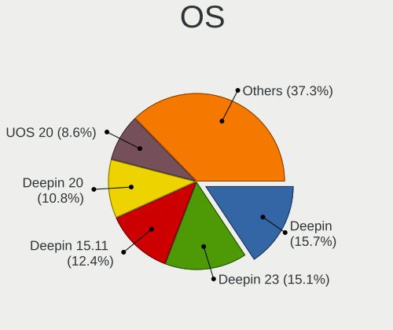

| Name           | Notebooks | Percent |
|----------------|-----------|---------|
| Deepin         | 29        | 15.68%  |
| Deepin 23      | 28        | 15.14%  |
| Deepin 15.11   | 23        | 12.43%  |
| Deepin 20      | 20        | 10.81%  |
| UOS 20         | 16        | 8.65%   |
| Deepin 25      | 12        | 6.49%   |
| Deepin 20.9    | 8         | 4.32%   |
| Deepin 15.9.2  | 8         | 4.32%   |
| Deepin 20.8    | 6         | 3.24%   |
| Deepin 20.3    | 5         | 2.7%    |
| Deepin 23.1    | 4         | 2.16%   |
| Deepin 20.5    | 4         | 2.16%   |
| Deepin 20.1    | 4         | 2.16%   |
| Deepin 20 beta | 3         | 1.62%   |
| Deepin 20.2.4  | 2         | 1.08%   |
| Deepin 15.9.3  | 2         | 1.08%   |
| UOS 25         | 1         | 0.54%   |
| Deepin 2014.3  | 1         | 0.54%   |
| Deepin 20.7.1  | 1         | 0.54%   |
| Deepin 20.7    | 1         | 0.54%   |
| Deepin 20.4    | 1         | 0.54%   |
| Deepin 20.2.3  | 1         | 0.54%   |
| Deepin 20.2.1  | 1         | 0.54%   |
| Deepin 15.9    | 1         | 0.54%   |
| Deepin 15.8    | 1         | 0.54%   |
| Deepin 15.10.1 | 1         | 0.54%   |
| Deepin 15.10   | 1         | 0.54%   |

OS Family
---------

OS without a version

| Name   | Notebooks | Percent |
|--------|-----------|---------|
| Deepin | 178       | 100%    |

Kernel
------

Version of the Linux kernel

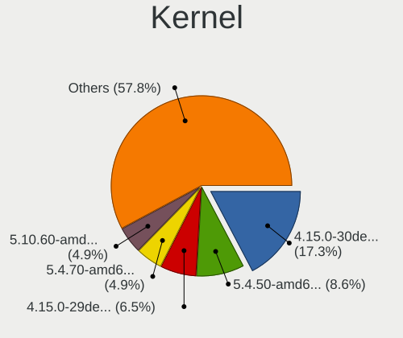

| Version                             | Notebooks | Percent |
|-------------------------------------|-----------|---------|
| 4.15.0-30deepin-generic             | 32        | 17.3%   |
| 5.4.50-amd64-desktop                | 16        | 8.65%   |
| 4.15.0-29deepin-generic             | 12        | 6.49%   |
| 5.4.70-amd64-desktop                | 9         | 4.86%   |
| 5.10.60-amd64-desktop               | 9         | 4.86%   |
| 6.1.32-amd64-desktop-hwe            | 8         | 4.32%   |
| 5.18.17-amd64-desktop-community-hwe | 6         | 3.24%   |
| 5.10.0-amd64-desktop                | 6         | 3.24%   |
| 6.6.40-amd64-desktop-hwe            | 5         | 2.7%    |
| 5.7.7-amd64-desktop                 | 4         | 2.16%   |
| 5.18.17-amd64-desktop-hwe           | 4         | 2.16%   |
| 5.15.77-amd64-desktop               | 4         | 2.16%   |
| 5.10.41-amd64-desktop               | 4         | 2.16%   |
| 5.10.29-amd64-desktop               | 4         | 2.16%   |
| 6.9.6-amd64-desktop-rolling         | 3         | 1.62%   |
| 6.6.84-amd64-desktop-hwe            | 3         | 1.62%   |
| 5.3.0-3-amd64                       | 3         | 1.62%   |
| 5.15.1-amd64-desktop                | 3         | 1.62%   |
| 4.19.0-amd64-desktop                | 3         | 1.62%   |
| 6.6.47-amd64-desktop-hwe            | 2         | 1.08%   |
| 6.12.43-amd64-desktop-rolling       | 2         | 1.08%   |
| 6.12.33-amd64-desktop-rolling       | 2         | 1.08%   |
| 6.12.1-amd64-desktop-rolling        | 2         | 1.08%   |
| 6.1.11-amd64-desktop-hwe            | 2         | 1.08%   |
| 5.15.45-amd64-desktop               | 2         | 1.08%   |
| 5.15.24-amd64-desktop               | 2         | 1.08%   |
| 5.10.50-amd64-desktop               | 2         | 1.08%   |
| 5.10.5-amd64-desktop+               | 2         | 1.08%   |
| 5.10.18-amd64-desktop               | 2         | 1.08%   |
| 5.10.101-amd64-desktop              | 2         | 1.08%   |
| 6.9.3-x64v3-xanmod1                 | 1         | 0.54%   |
| 6.6.93-amd64-desktop-hwe            | 1         | 0.54%   |
| 6.6.52-amd64-desktop-hwe            | 1         | 0.54%   |
| 6.6.104-amd64-desktop-hwe           | 1         | 0.54%   |
| 6.6.0-amd64-desktop                 | 1         | 0.54%   |
| 6.5.0                               | 1         | 0.54%   |
| 6.2.1                               | 1         | 0.54%   |
| 6.17.9-amd64-desktop-rolling        | 1         | 0.54%   |
| 6.14.10-x64v3-xanmod1               | 1         | 0.54%   |
| 6.12.9-amd64-desktop-rolling        | 1         | 0.54%   |

Kernel Family
-------------

Linux kernel without a distro release

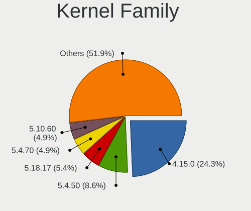

| Version  | Notebooks | Percent |
|----------|-----------|---------|
| 4.15.0   | 45        | 24.32%  |
| 5.4.50   | 16        | 8.65%   |
| 5.18.17  | 10        | 5.41%   |
| 5.4.70   | 9         | 4.86%   |
| 5.10.60  | 9         | 4.86%   |
| 6.1.32   | 8         | 4.32%   |
| 5.10.0   | 6         | 3.24%   |
| 6.6.40   | 5         | 2.7%    |
| 5.7.7    | 4         | 2.16%   |
| 5.15.77  | 4         | 2.16%   |
| 5.10.41  | 4         | 2.16%   |
| 5.10.29  | 4         | 2.16%   |
| 6.9.6    | 3         | 1.62%   |
| 6.6.84   | 3         | 1.62%   |
| 5.3.0    | 3         | 1.62%   |
| 5.15.1   | 3         | 1.62%   |
| 4.19.0   | 3         | 1.62%   |
| 6.6.47   | 2         | 1.08%   |
| 6.12.43  | 2         | 1.08%   |
| 6.12.33  | 2         | 1.08%   |
| 6.12.1   | 2         | 1.08%   |
| 6.1.11   | 2         | 1.08%   |
| 5.15.45  | 2         | 1.08%   |
| 5.15.24  | 2         | 1.08%   |
| 5.10.50  | 2         | 1.08%   |
| 5.10.5   | 2         | 1.08%   |
| 5.10.18  | 2         | 1.08%   |
| 5.10.101 | 2         | 1.08%   |
| 6.9.3    | 1         | 0.54%   |
| 6.6.93   | 1         | 0.54%   |
| 6.6.52   | 1         | 0.54%   |
| 6.6.104  | 1         | 0.54%   |
| 6.6.0    | 1         | 0.54%   |
| 6.5.0    | 1         | 0.54%   |
| 6.2.1    | 1         | 0.54%   |
| 6.17.9   | 1         | 0.54%   |
| 6.14.10  | 1         | 0.54%   |
| 6.12.9   | 1         | 0.54%   |
| 6.12.41  | 1         | 0.54%   |
| 6.12.36  | 1         | 0.54%   |

Kernel Major Ver.
-----------------

Linux kernel major version

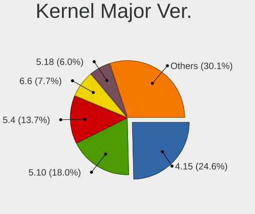

| Version | Notebooks | Percent |
|---------|-----------|---------|
| 4.15    | 45        | 24.59%  |
| 5.10    | 33        | 18.03%  |
| 5.4     | 25        | 13.66%  |
| 6.6     | 14        | 7.65%   |
| 5.18    | 11        | 6.01%   |
| 5.15    | 11        | 6.01%   |
| 6.12    | 10        | 5.46%   |
| 6.1     | 10        | 5.46%   |
| 6.9     | 4         | 2.19%   |
| 5.7     | 4         | 2.19%   |
| 5.3     | 4         | 2.19%   |
| 4.19    | 3         | 1.64%   |
| 5.6     | 2         | 1.09%   |
| 6.5     | 1         | 0.55%   |
| 6.2     | 1         | 0.55%   |
| 6.17    | 1         | 0.55%   |
| 6.14    | 1         | 0.55%   |
| 5.8     | 1         | 0.55%   |
| 5.5     | 1         | 0.55%   |
| 5.1     | 1         | 0.55%   |

Arch
----

OS architecture (x86_64, i586, etc.)

| Name   | Notebooks | Percent |
|--------|-----------|---------|
| x86_64 | 178       | 100%    |

DE
--

Desktop Environment

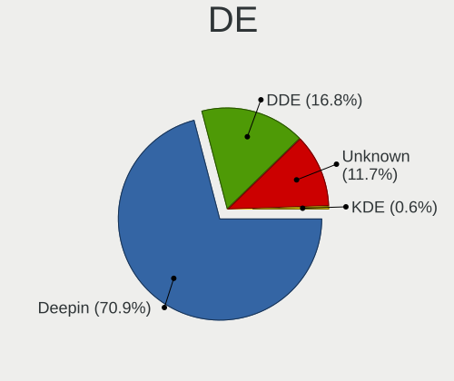

| Name    | Notebooks | Percent |
|---------|-----------|---------|
| Deepin  | 127       | 70.95%  |
| DDE     | 30        | 16.76%  |
| Unknown | 21        | 11.73%  |
| KDE     | 1         | 0.56%   |

Display Server
--------------

X11 or Wayland

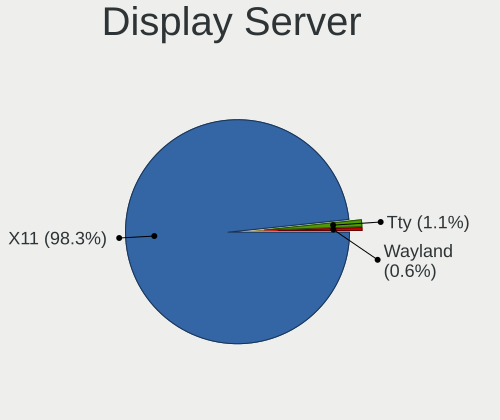

| Name    | Notebooks | Percent |
|---------|-----------|---------|
| X11     | 176       | 98.32%  |
| Tty     | 2         | 1.12%   |
| Wayland | 1         | 0.56%   |

Display Manager
---------------

SDDM, LightDM, etc.

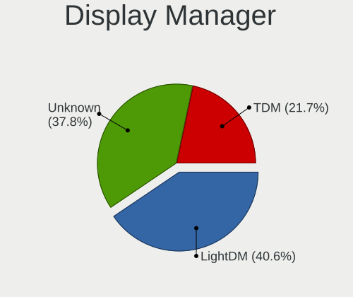

| Name    | Notebooks | Percent |
|---------|-----------|---------|
| LightDM | 73        | 40.56%  |
| Unknown | 68        | 37.78%  |
| TDM     | 39        | 21.67%  |

OS Lang
-------

Language

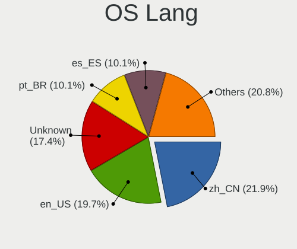

| Lang    | Notebooks | Percent |
|---------|-----------|---------|
| zh_CN   | 39        | 21.91%  |
| en_US   | 35        | 19.66%  |
| Unknown | 31        | 17.42%  |
| pt_BR   | 18        | 10.11%  |
| es_ES   | 18        | 10.11%  |
| de_DE   | 11        | 6.18%   |
| ru_RU   | 8         | 4.49%   |
| tr_TR   | 3         | 1.69%   |
| it_IT   | 3         | 1.69%   |
| sv_SE   | 2         | 1.12%   |
| pl_PL   | 2         | 1.12%   |
| fr_FR   | 2         | 1.12%   |
| pt_PT   | 1         | 0.56%   |
| nl_NL   | 1         | 0.56%   |
| ja_JP   | 1         | 0.56%   |
| id_ID   | 1         | 0.56%   |
| hu_HU   | 1         | 0.56%   |
| en_GB   | 1         | 0.56%   |

Boot Mode
---------

EFI or BIOS

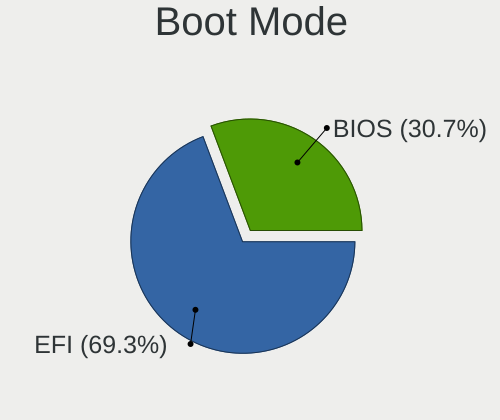

| Mode | Notebooks | Percent |
|------|-----------|---------|
| EFI  | 124       | 69.27%  |
| BIOS | 55        | 30.73%  |

Filesystem
----------

Type of filesystem

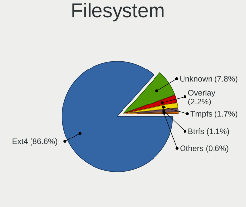

| Type    | Notebooks | Percent |
|---------|-----------|---------|
| Ext4    | 155       | 86.59%  |
| Unknown | 14        | 7.82%   |
| Overlay | 4         | 2.23%   |
| Tmpfs   | 3         | 1.68%   |
| Btrfs   | 2         | 1.12%   |
| Xfs     | 1         | 0.56%   |

Part. scheme
------------

Scheme of partitioning

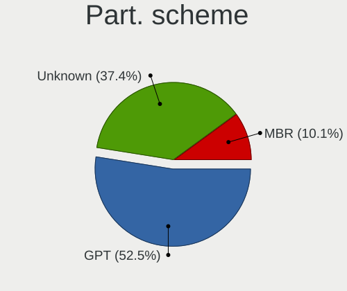

| Type    | Notebooks | Percent |
|---------|-----------|---------|
| GPT     | 94        | 52.51%  |
| Unknown | 67        | 37.43%  |
| MBR     | 18        | 10.06%  |

Dual Boot with Linux/BSD
------------------------

Hosting more than one Linux/BSD

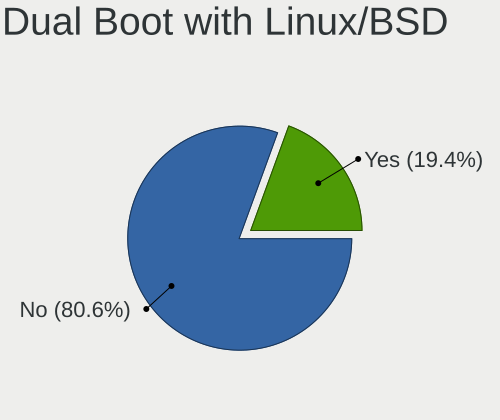

| Dual boot | Notebooks | Percent |
|-----------|-----------|---------|
| No        | 145       | 80.56%  |
| Yes       | 35        | 19.44%  |

Dual Boot (Win)
---------------

Hosting Linux and Windows

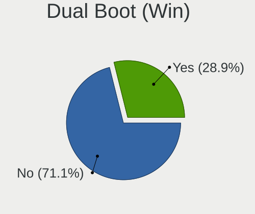

| Dual boot | Notebooks | Percent |
|-----------|-----------|---------|
| No        | 128       | 71.11%  |
| Yes       | 52        | 28.89%  |

Board
-----

Vendor
------

Motherboard manufacturer

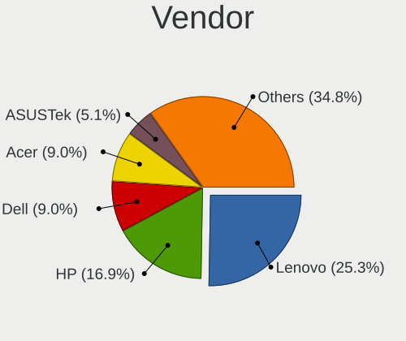

| Name                | Notebooks | Percent |
|---------------------|-----------|---------|
| Lenovo              | 45        | 25.28%  |
| Hewlett-Packard     | 30        | 16.85%  |
| Dell                | 16        | 8.99%   |
| Acer                | 16        | 8.99%   |
| ASUSTek Computer    | 9         | 5.06%   |
| Samsung Electronics | 8         | 4.49%   |
| HUAWEI              | 8         | 4.49%   |
| Sony                | 6         | 3.37%   |
| Toshiba             | 5         | 2.81%   |
| Timi                | 5         | 2.81%   |
| MECHREVO            | 3         | 1.69%   |
| Google              | 3         | 1.69%   |
| Apple               | 3         | 1.69%   |
| Unknown             | 3         | 1.69%   |
| HONOR               | 2         | 1.12%   |
| UNOWHY              | 1         | 0.56%   |
| Standard            | 1         | 0.56%   |
| Positivo            | 1         | 0.56%   |
| MSI                 | 1         | 0.56%   |
| Microtech           | 1         | 0.56%   |
| KUU                 | 1         | 0.56%   |
| itel Mobile Limited | 1         | 0.56%   |
| Insyde              | 1         | 0.56%   |
| Inspur              | 1         | 0.56%   |
| Infinix             | 1         | 0.56%   |
| Hometech            | 1         | 0.56%   |
| Gateway             | 1         | 0.56%   |
| Fujitsu             | 1         | 0.56%   |
| Chuwi               | 1         | 0.56%   |
| CCE                 | 1         | 0.56%   |
| BQ                  | 1         | 0.56%   |

Model
-----

Motherboard model

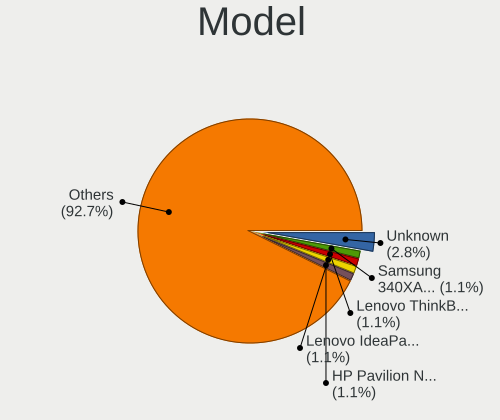

| Name                                              | Notebooks | Percent |
|---------------------------------------------------|-----------|---------|
| Unknown                                           | 5         | 2.81%   |
| Samsung 340XAA/350XAA/550XAA                      | 2         | 1.12%   |
| Lenovo ThinkBook 14 G4+ ARA 21D0                  | 2         | 1.12%   |
| Lenovo IdeaPad 120S-11IAP 81A4                    | 2         | 1.12%   |
| HONOR NBLK-WAX9X                                  | 2         | 1.12%   |
| HP Pavilion Notebook                              | 2         | 1.12%   |
| HP Pavilion 15                                    | 2         | 1.12%   |
| HP ENVY 15                                        | 2         | 1.12%   |
| HP EliteBook 845 14 inch G10 Notebook PC          | 2         | 1.12%   |
| Acer Nitro AN515-54                               | 2         | 1.12%   |
| UNOWHY Y13G012S4EI                                | 1         | 0.56%   |
| Toshiba Satellite L75-C                           | 1         | 0.56%   |
| Toshiba Satellite L745                            | 1         | 0.56%   |
| Toshiba Satellite E55t-A                          | 1         | 0.56%   |
| Toshiba Satellite C850D-11K                       | 1         | 0.56%   |
| Toshiba Satellite C850-1H6                        | 1         | 0.56%   |
| Timi TM1709                                       | 1         | 0.56%   |
| Timi TM1701                                       | 1         | 0.56%   |
| Timi TM1613                                       | 1         | 0.56%   |
| Timi RedmiBook Air 13                             | 1         | 0.56%   |
| Timi Redmi G 2022                                 | 1         | 0.56%   |
| Standard MB45II/MB45IN                            | 1         | 0.56%   |
| Sony VPCYB25AB                                    | 1         | 0.56%   |
| Sony VGN-NS140D                                   | 1         | 0.56%   |
| Sony VGN-AW11Z_B                                  | 1         | 0.56%   |
| Sony SVF14A190X                                   | 1         | 0.56%   |
| Sony SVE14135CXP                                  | 1         | 0.56%   |
| Sony SVE14118FXW                                  | 1         | 0.56%   |
| Samsung 800G5M/800G5W                             | 1         | 0.56%   |
| Samsung 550P5C/550P7C                             | 1         | 0.56%   |
| Samsung 500R4K/500R5H/5400RK/501R5H/5500RH/500R5S | 1         | 0.56%   |
| Samsung 300E4A/300E5A/300E7A/3430EA/3530EA        | 1         | 0.56%   |
| Samsung 270E5J/2570EJ                             | 1         | 0.56%   |
| Samsung 270E5G/270E5U                             | 1         | 0.56%   |
| Positivo C14CU51                                  | 1         | 0.56%   |
| MSI GL72M 7REX                                    | 1         | 0.56%   |
| Microtech ebookPro                                | 1         | 0.56%   |
| MECHREVO WUJIE14XA                                | 1         | 0.56%   |
| MECHREVO Jiaolong Series GM5ZG0O                  | 1         | 0.56%   |
| MECHREVO Jiaolong Series GK5NR0O                  | 1         | 0.56%   |

Model Family
------------

Motherboard model prefix

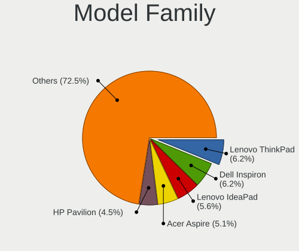

| Name               | Notebooks | Percent |
|--------------------|-----------|---------|
| Lenovo ThinkPad    | 11        | 6.18%   |
| Dell Inspiron      | 11        | 6.18%   |
| Lenovo IdeaPad     | 10        | 5.62%   |
| Acer Aspire        | 9         | 5.06%   |
| HP Pavilion        | 8         | 4.49%   |
| Lenovo Legion      | 7         | 3.93%   |
| HP EliteBook       | 7         | 3.93%   |
| Lenovo ThinkBook   | 6         | 3.37%   |
| HP Laptop          | 6         | 3.37%   |
| Toshiba Satellite  | 5         | 2.81%   |
| Unknown            | 5         | 2.81%   |
| Acer Nitro         | 4         | 2.25%   |
| Dell Latitude      | 3         | 1.69%   |
| Samsung 340XAA     | 2         | 1.12%   |
| MECHREVO Jiaolong  | 2         | 1.12%   |
| Lenovo ZHAOYANG    | 2         | 1.12%   |
| HONOR NBLK-WAX9X   | 2         | 1.12%   |
| HP ENVY            | 2         | 1.12%   |
| ASUS VivoBook      | 2         | 1.12%   |
| Acer Swift         | 2         | 1.12%   |
| UNOWHY Y13G012S4EI | 1         | 0.56%   |
| Timi TM1709        | 1         | 0.56%   |
| Timi TM1701        | 1         | 0.56%   |
| Timi TM1613        | 1         | 0.56%   |
| Timi RedmiBook     | 1         | 0.56%   |
| Timi Redmi         | 1         | 0.56%   |
| Standard MB45II    | 1         | 0.56%   |
| Sony VPCYB25AB     | 1         | 0.56%   |
| Sony VGN-NS140D    | 1         | 0.56%   |
| Sony VGN-AW11Z     | 1         | 0.56%   |
| Sony SVF14A190X    | 1         | 0.56%   |
| Sony SVE14135CXP   | 1         | 0.56%   |
| Sony SVE14118FXW   | 1         | 0.56%   |
| Samsung 800G5M     | 1         | 0.56%   |
| Samsung 550P5C     | 1         | 0.56%   |
| Samsung 500R4K     | 1         | 0.56%   |
| Samsung 300E4A     | 1         | 0.56%   |
| Samsung 270E5J     | 1         | 0.56%   |
| Samsung 270E5G     | 1         | 0.56%   |
| Positivo C14CU51   | 1         | 0.56%   |

MFG Year
--------

Motherboard manufacture year

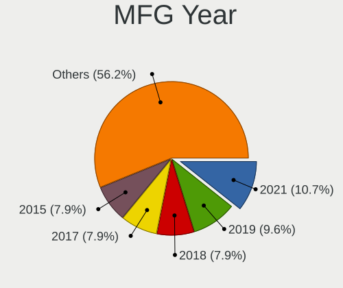

| Year    | Notebooks | Percent |
|---------|-----------|---------|
| 2021    | 19        | 10.67%  |
| 2019    | 17        | 9.55%   |
| 2018    | 14        | 7.87%   |
| 2017    | 14        | 7.87%   |
| 2015    | 14        | 7.87%   |
| 2020    | 12        | 6.74%   |
| 2014    | 12        | 6.74%   |
| 2012    | 11        | 6.18%   |
| 2011    | 11        | 6.18%   |
| 2022    | 10        | 5.62%   |
| 2013    | 9         | 5.06%   |
| 2023    | 8         | 4.49%   |
| 2016    | 7         | 3.93%   |
| 2010    | 7         | 3.93%   |
| 2009    | 4         | 2.25%   |
| 2024    | 3         | 1.69%   |
| 2025    | 2         | 1.12%   |
| 2008    | 2         | 1.12%   |
| 2006    | 1         | 0.56%   |
| Unknown | 1         | 0.56%   |

Form Factor
-----------

Physical design of the computer

| Name     | Notebooks | Percent |
|----------|-----------|---------|
| Notebook | 178       | 100%    |

Secure Boot
-----------

Enabled or disabled

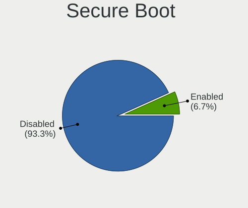

| State    | Notebooks | Percent |
|----------|-----------|---------|
| Disabled | 166       | 93.26%  |
| Enabled  | 12        | 6.74%   |

Coreboot
--------

Have coreboot on board

| Used | Notebooks | Percent |
|------|-----------|---------|
| No   | 175       | 98.31%  |
| Yes  | 3         | 1.69%   |

RAM Size
--------

Total RAM memory

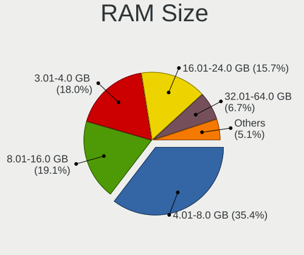

| Size in GB  | Notebooks | Percent |
|-------------|-----------|---------|
| 4.01-8.0    | 63        | 35.39%  |
| 8.01-16.0   | 34        | 19.1%   |
| 3.01-4.0    | 32        | 17.98%  |
| 16.01-24.0  | 28        | 15.73%  |
| 32.01-64.0  | 12        | 6.74%   |
| 1.01-2.0    | 5         | 2.81%   |
| 24.01-32.0  | 2         | 1.12%   |
| 2.01-3.0    | 1         | 0.56%   |
| 64.01-256.0 | 1         | 0.56%   |

RAM Used
--------

Used RAM memory

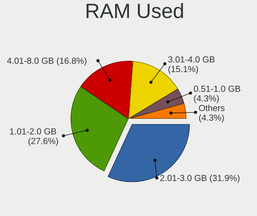

| Used GB    | Notebooks | Percent |
|------------|-----------|---------|
| 2.01-3.0   | 59        | 31.89%  |
| 1.01-2.0   | 51        | 27.57%  |
| 4.01-8.0   | 31        | 16.76%  |
| 3.01-4.0   | 28        | 15.14%  |
| 0.51-1.0   | 8         | 4.32%   |
| 8.01-16.0  | 7         | 3.78%   |
| 16.01-24.0 | 1         | 0.54%   |

Total Drives
------------

Number of drives on board

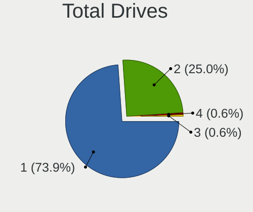

| Drives | Notebooks | Percent |
|--------|-----------|---------|
| 1      | 133       | 73.89%  |
| 2      | 45        | 25%     |
| 4      | 1         | 0.56%   |
| 3      | 1         | 0.56%   |

Has CD-ROM
----------

Has CD-ROM on board

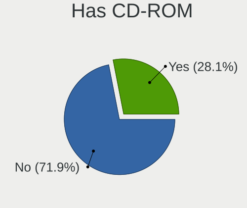

| Presented | Notebooks | Percent |
|-----------|-----------|---------|
| No        | 128       | 71.91%  |
| Yes       | 50        | 28.09%  |

Has Ethernet
------------

Has Ethernet on board

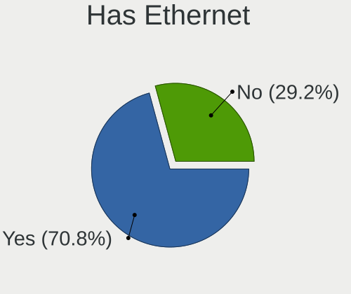

| Presented | Notebooks | Percent |
|-----------|-----------|---------|
| Yes       | 126       | 70.79%  |
| No        | 52        | 29.21%  |

Has WiFi
--------

Has WiFi module

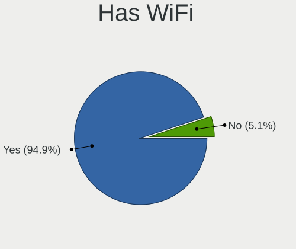

| Presented | Notebooks | Percent |
|-----------|-----------|---------|
| Yes       | 169       | 94.94%  |
| No        | 9         | 5.06%   |

Has Bluetooth
-------------

Has Bluetooth module

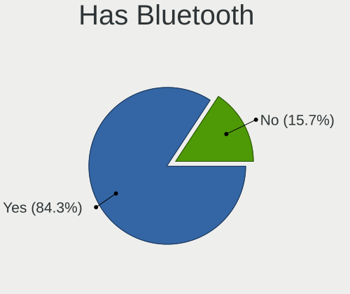

| Presented | Notebooks | Percent |
|-----------|-----------|---------|
| Yes       | 150       | 84.27%  |
| No        | 28        | 15.73%  |

Location
--------

Country
-------

Geographic location (country)

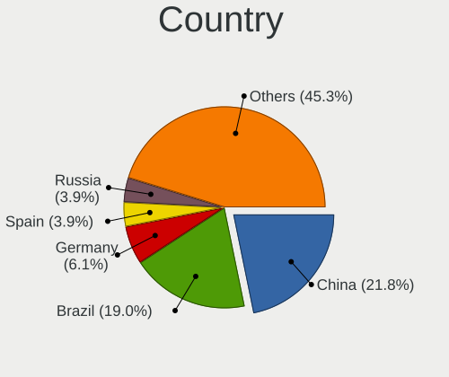

| Country               | Notebooks | Percent |
|-----------------------|-----------|---------|
| China                 | 39        | 21.79%  |
| Brazil                | 34        | 18.99%  |
| Germany               | 11        | 6.15%   |
| Spain                 | 7         | 3.91%   |
| Russia                | 7         | 3.91%   |
| Indonesia             | 6         | 3.35%   |
| USA                   | 5         | 2.79%   |
| Turkey                | 5         | 2.79%   |
| Poland                | 3         | 1.68%   |
| Japan                 | 3         | 1.68%   |
| Italy                 | 3         | 1.68%   |
| Chile                 | 3         | 1.68%   |
| Canada                | 3         | 1.68%   |
| Austria               | 3         | 1.68%   |
| Venezuela             | 2         | 1.12%   |
| Sweden                | 2         | 1.12%   |
| Singapore             | 2         | 1.12%   |
| Portugal              | 2         | 1.12%   |
| Panama                | 2         | 1.12%   |
| Pakistan              | 2         | 1.12%   |
| Mexico                | 2         | 1.12%   |
| Iran                  | 2         | 1.12%   |
| India                 | 2         | 1.12%   |
| Hong Kong             | 2         | 1.12%   |
| Colombia              | 2         | 1.12%   |
| Bulgaria              | 2         | 1.12%   |
| Belarus               | 2         | 1.12%   |
| Argentina             | 2         | 1.12%   |
| Vietnam               | 1         | 0.56%   |
| Tunisia               | 1         | 0.56%   |
| Sri Lanka             | 1         | 0.56%   |
| South Africa          | 1         | 0.56%   |
| Serbia                | 1         | 0.56%   |
| Sao Tome and Principe | 1         | 0.56%   |
| Netherlands           | 1         | 0.56%   |
| Lebanon               | 1         | 0.56%   |
| Kenya                 | 1         | 0.56%   |
| Hungary               | 1         | 0.56%   |
| Greece                | 1         | 0.56%   |
| France                | 1         | 0.56%   |

City
----

Geographic location (city)

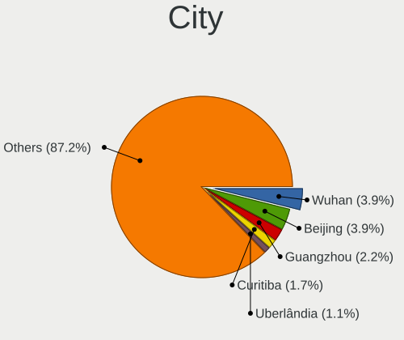

| City            | Notebooks | Percent |
|-----------------|-----------|---------|
| Wuhan           | 7         | 3.89%   |
| Beijing         | 7         | 3.89%   |
| Guangzhou       | 4         | 2.22%   |
| Curitiba        | 3         | 1.67%   |
| Uberlândia     | 2         | 1.11%   |
| Taiyuan         | 2         | 1.11%   |
| Surabaya        | 2         | 1.11%   |
| Singapore       | 2         | 1.11%   |
| Shanghai        | 2         | 1.11%   |
| Sao Paulo       | 2         | 1.11%   |
| Petrópolis     | 2         | 1.11%   |
| Londrina        | 2         | 1.11%   |
| Innsbruck       | 2         | 1.11%   |
| David           | 2         | 1.11%   |
| Atlanta         | 2         | 1.11%   |
| Zibo            | 1         | 0.56%   |
| Zhengzhou       | 1         | 0.56%   |
| Yozgat          | 1         | 0.56%   |
| Yogyakarta      | 1         | 0.56%   |
| Yekaterinburg   | 1         | 0.56%   |
| Xuhui           | 1         | 0.56%   |
| Xiamen          | 1         | 0.56%   |
| Wanchai         | 1         | 0.56%   |
| Voronezh        | 1         | 0.56%   |
| Villa Ballester | 1         | 0.56%   |
| Vigo            | 1         | 0.56%   |
| Vigia           | 1         | 0.56%   |
| Valencia        | 1         | 0.56%   |
| Ufa             | 1         | 0.56%   |
| Tomsk           | 1         | 0.56%   |
| Tokyo           | 1         | 0.56%   |
| Tianjin         | 1         | 0.56%   |
| Tiangua         | 1         | 0.56%   |
| TehrДЃn       | 1         | 0.56%   |
| Tehran          | 1         | 0.56%   |
| Tangerang       | 1         | 0.56%   |
| Tai'an          | 1         | 0.56%   |
| SГЈo TomГ©  | 1         | 0.56%   |
| Suzano          | 1         | 0.56%   |
| Sofia           | 1         | 0.56%   |

Drives
------

Drive Vendor
------------

Hard drive vendors

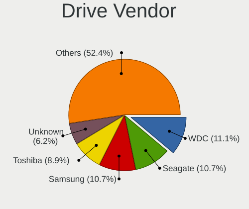

| Vendor                                  | Notebooks | Drives | Percent |
|-----------------------------------------|-----------|--------|---------|
| WDC                                     | 25        | 28     | 11.11%  |
| Seagate                                 | 24        | 27     | 10.67%  |
| Samsung Electronics                     | 24        | 30     | 10.67%  |
| Toshiba                                 | 20        | 21     | 8.89%   |
| Unknown                                 | 14        | 15     | 6.22%   |
| SanDisk                                 | 13        | 13     | 5.78%   |
| SK hynix                                | 12        | 13     | 5.33%   |
| Kingston                                | 11        | 12     | 4.89%   |
| Micron Technology                       | 8         | 10     | 3.56%   |
| HGST                                    | 7         | 7      | 3.11%   |
| Intel                                   | 6         | 8      | 2.67%   |
| KIOXIA                                  | 5         | 5      | 2.22%   |
| Hitachi                                 | 5         | 5      | 2.22%   |
| Crucial                                 | 5         | 5      | 2.22%   |
| LITEON                                  | 3         | 3      | 1.33%   |
| China                                   | 3         | 3      | 1.33%   |
| A-DATA Technology                       | 3         | 3      | 1.33%   |
| V-GeN                                   | 2         | 2      | 0.89%   |
| SPCC                                    | 2         | 3      | 0.89%   |
| Silicon Motion                          | 2         | 2      | 0.89%   |
| MAXIO Technology (Hangzhou)             | 2         | 2      | 0.89%   |
| Apple                                   | 2         | 3      | 0.89%   |
| Yangtze Memory Technologies             | 1         | 1      | 0.44%   |
| WALRAM                                  | 1         | 1      | 0.44%   |
| Transcend                               | 1         | 1      | 0.44%   |
| Solid State Storage Technology          | 1         | 1      | 0.44%   |
| Shenzhen Unionmemory Information System | 1         | 1      | 0.44%   |
| RX7                                     | 1         | 1      | 0.44%   |
| Phison Electronics                      | 1         | 1      | 0.44%   |
| Phison                                  | 1         | 1      | 0.44%   |
| Patriot                                 | 1         | 1      | 0.44%   |
| OEM                                     | 1         | 1      | 0.44%   |
| OCZ                                     | 1         | 1      | 0.44%   |
| Netac                                   | 1         | 1      | 0.44%   |
| Microtech                               | 1         | 1      | 0.44%   |
| MaiChai                                 | 1         | 1      | 0.44%   |
| LITEONIT                                | 1         | 1      | 0.44%   |
| Kingston Technology Company             | 1         | 1      | 0.44%   |
| KingSpec                                | 1         | 1      | 0.44%   |
| JMicron Technology                      | 1         | 1      | 0.44%   |

Drive Model
-----------

Hard drive models

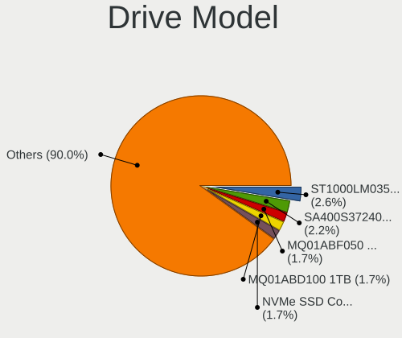

| Model                                              | Notebooks | Percent |
|----------------------------------------------------|-----------|---------|
| Seagate ST1000LM035-1RK172 1TB                     | 6         | 2.6%    |
| Kingston SA400S37240G 240GB SSD                    | 5         | 2.16%   |
| Toshiba MQ01ABF050 500GB                           | 4         | 1.73%   |
| Toshiba MQ01ABD100 1TB                             | 4         | 1.73%   |
| Samsung NVMe SSD Controller PM9A1/PM9A3/980PRO 1TB | 4         | 1.73%   |
| Crucial CT240BX500SSD1 240GB                       | 4         | 1.73%   |
| WDC WD5000LPCX-24VHAT0 500GB                       | 2         | 0.87%   |
| Unknown MMC Card  32GB                             | 2         | 0.87%   |
| Unknown MMC Card                                   | 2         | 0.87%   |
| Toshiba MQ01ABD050 500GB                           | 2         | 0.87%   |
| Toshiba KXG60ZNV512G 512GB                         | 2         | 0.87%   |
| SK hynix Platinum P41 NVMe Solid State Drive 2TB   | 2         | 0.87%   |
| Seagate ST9320325AS 320GB                          | 2         | 0.87%   |
| Seagate ST500LM012 HN-M500MBB 500GB                | 2         | 0.87%   |
| Seagate ST2000LM007-1R8174 2TB                     | 2         | 0.87%   |
| Seagate ST1000LM024 HN-M101MBB 1TB                 | 2         | 0.87%   |
| Samsung SSD 850 EVO 500GB                          | 2         | 0.87%   |
| Samsung MZVLW256HEHP-000H1 256GB                   | 2         | 0.87%   |
| Hitachi HTS547575A9E384 752GB                      | 2         | 0.87%   |
| HGST HTS721010A9E630 1TB                           | 2         | 0.87%   |
| HGST HTS545050A7E680 500GB                         | 2         | 0.87%   |
| Yangtze Memory YMTC YMSS2ED08D25MC 1024GB          | 1         | 0.43%   |
| WDC WDS480G2G0B-00EPW0 480GB SSD                   | 1         | 0.43%   |
| WDC WDS240G2G0A-00JH30 240GB SSD                   | 1         | 0.43%   |
| WDC WDS120G2G0A-00JH30 120GB SSD                   | 1         | 0.43%   |
| WDC WD7500BPVT-24HXZT3 752GB                       | 1         | 0.43%   |
| WDC WD5000LPZX-75Z10T0 500GB                       | 1         | 0.43%   |
| WDC WD5000LPVX-80V0TT0 500GB                       | 1         | 0.43%   |
| WDC WD5000LPVX-75V0TT0 500GB                       | 1         | 0.43%   |
| WDC WD5000LPVX-08V0TT6 500GB                       | 1         | 0.43%   |
| WDC WD5000LPCX-24C6HT0 500GB                       | 1         | 0.43%   |
| WDC WD3200BEVT-60A23T0 320GB                       | 1         | 0.43%   |
| WDC WD3200BEVT-22ZCT0 320GB                        | 1         | 0.43%   |
| WDC WD3200BEVT-08A23T1 320GB                       | 1         | 0.43%   |
| WDC WD10SPZX-35Z10T0 1TB                           | 1         | 0.43%   |
| WDC WD10SPZX-24Z10 1TB                             | 1         | 0.43%   |
| WDC WD10SPZX-22Z10T1 1TB                           | 1         | 0.43%   |
| WDC WD10SPZX-08Z10 1TB                             | 1         | 0.43%   |
| WDC WD10JPVX-60JC3T1 1TB                           | 1         | 0.43%   |
| WDC WD10JPVX-60JC3T0 1TB                           | 1         | 0.43%   |

HDD Vendor
----------

Hard disk drive vendors

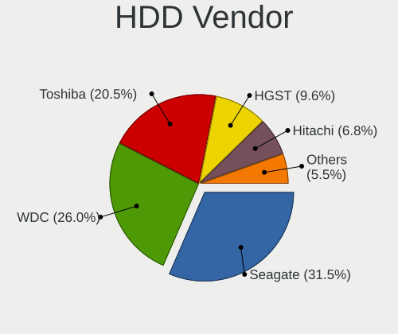

| Vendor              | Notebooks | Drives | Percent |
|---------------------|-----------|--------|---------|
| Seagate             | 23        | 26     | 31.51%  |
| WDC                 | 19        | 20     | 26.03%  |
| Toshiba             | 15        | 16     | 20.55%  |
| HGST                | 7         | 7      | 9.59%   |
| Hitachi             | 5         | 5      | 6.85%   |
| Samsung Electronics | 1         | 1      | 1.37%   |
| OEM                 | 1         | 1      | 1.37%   |
| JMicron Technology  | 1         | 1      | 1.37%   |
| Fujitsu             | 1         | 2      | 1.37%   |

SSD Vendor
----------

Solid state drive vendors

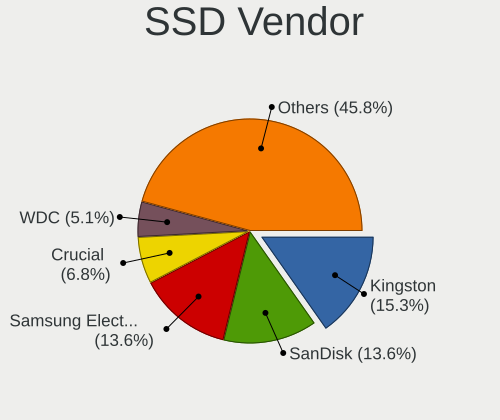

| Vendor              | Notebooks | Drives | Percent |
|---------------------|-----------|--------|---------|
| Kingston            | 9         | 10     | 15.25%  |
| SanDisk             | 8         | 8      | 13.56%  |
| Samsung Electronics | 8         | 12     | 13.56%  |
| Crucial             | 4         | 4      | 6.78%   |
| WDC                 | 3         | 3      | 5.08%   |
| SK hynix            | 3         | 3      | 5.08%   |
| China               | 3         | 3      | 5.08%   |
| SPCC                | 2         | 3      | 3.39%   |
| Micron Technology   | 2         | 3      | 3.39%   |
| LITEON              | 2         | 2      | 3.39%   |
| V-GeN               | 1         | 1      | 1.69%   |
| Unknown             | 1         | 1      | 1.69%   |
| Transcend           | 1         | 1      | 1.69%   |
| Toshiba             | 1         | 1      | 1.69%   |
| OCZ                 | 1         | 1      | 1.69%   |
| Netac               | 1         | 1      | 1.69%   |
| Microtech           | 1         | 1      | 1.69%   |
| MaiChai             | 1         | 1      | 1.69%   |
| LITEONIT            | 1         | 1      | 1.69%   |
| KingSpec            | 1         | 1      | 1.69%   |
| Intenso             | 1         | 1      | 1.69%   |
| Intel               | 1         | 2      | 1.69%   |
| Great               | 1         | 1      | 1.69%   |
| Apple               | 1         | 1      | 1.69%   |
| addlink             | 1         | 1      | 1.69%   |

Drive Kind
----------

HDD or SSD

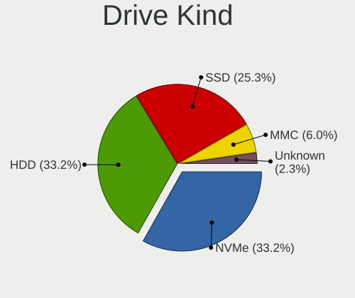

| Kind    | Notebooks | Drives | Percent |
|---------|-----------|--------|---------|
| NVMe    | 72        | 82     | 33.18%  |
| HDD     | 72        | 79     | 33.18%  |
| SSD     | 55        | 67     | 25.35%  |
| MMC     | 13        | 15     | 5.99%   |
| Unknown | 5         | 5      | 2.3%    |

Drive Connector
---------------

SATA, SAS, NVMe, etc.

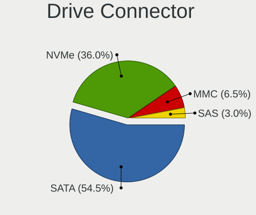

| Type | Notebooks | Drives | Percent |
|------|-----------|--------|---------|
| SATA | 109       | 144    | 54.5%   |
| NVMe | 72        | 81     | 36%     |
| MMC  | 13        | 15     | 6.5%    |
| SAS  | 6         | 8      | 3%      |

Drive Size
----------

Size of hard drive

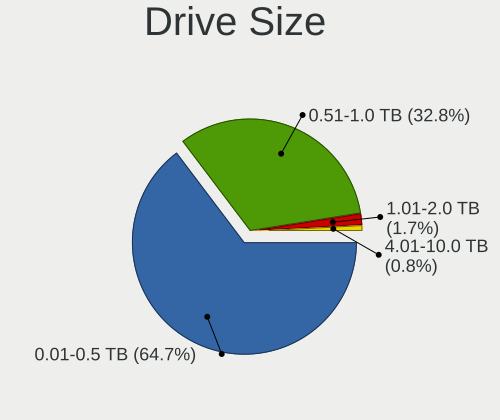

| Size in TB | Notebooks | Drives | Percent |
|------------|-----------|--------|---------|
| 0.01-0.5   | 77        | 99     | 64.71%  |
| 0.51-1.0   | 39        | 42     | 32.77%  |
| 1.01-2.0   | 2         | 4      | 1.68%   |
| 4.01-10.0  | 1         | 1      | 0.84%   |

Space Total
-----------

Amount of disk space available on the file system

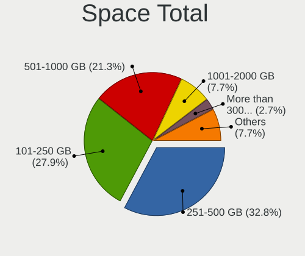

| Size in GB     | Notebooks | Percent |
|----------------|-----------|---------|
| 251-500        | 60        | 32.79%  |
| 101-250        | 51        | 27.87%  |
| 501-1000       | 39        | 21.31%  |
| 1001-2000      | 14        | 7.65%   |
| More than 3000 | 5         | 2.73%   |
| 51-100         | 5         | 2.73%   |
| 21-50          | 4         | 2.19%   |
| Unknown        | 3         | 1.64%   |
| 2001-3000      | 1         | 0.55%   |
| 1-20           | 1         | 0.55%   |

Space Used
----------

Amount of used disk space

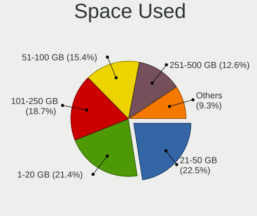

| Used GB   | Notebooks | Percent |
|-----------|-----------|---------|
| 21-50     | 41        | 22.53%  |
| 1-20      | 39        | 21.43%  |
| 101-250   | 34        | 18.68%  |
| 51-100    | 28        | 15.38%  |
| 251-500   | 23        | 12.64%  |
| 501-1000  | 7         | 3.85%   |
| 1001-2000 | 5         | 2.75%   |
| Unknown   | 3         | 1.65%   |
| 2001-3000 | 2         | 1.1%    |

Malfunc. Drives
---------------

Drive models with a malfunction

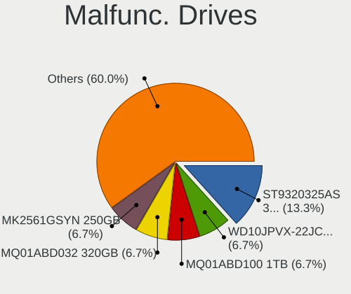

| Model                                         | Notebooks | Drives | Percent |
|-----------------------------------------------|-----------|--------|---------|
| Seagate ST9320325AS 320GB                     | 2         | 2      | 13.33%  |
| WDC WD10JPVX-22JC3T0 1TB                      | 1         | 1      | 6.67%   |
| Toshiba MQ01ABD100 1TB                        | 1         | 1      | 6.67%   |
| Toshiba MQ01ABD032 320GB                      | 1         | 1      | 6.67%   |
| Toshiba MK2561GSYN 250GB                      | 1         | 1      | 6.67%   |
| SK hynix BC511 HFM256GDJTNI-82A0A 256GB       | 1         | 1      | 6.67%   |
| Seagate ST1000LM049-2GH172 1TB                | 1         | 1      | 6.67%   |
| Samsung Electronics HM250HI 250GB             | 1         | 1      | 6.67%   |
| OCZ VERTEX4 256GB SSD                         | 1         | 1      | 6.67%   |
| Micron Technology MTFDDAT128MAM-1J2 128GB SSD | 1         | 2      | 6.67%   |
| Intenso lntenso SSD Sata III 480GB            | 1         | 1      | 6.67%   |
| Hitachi HTS543225L9A300 250GB                 | 1         | 1      | 6.67%   |
| HIKSEMI MS201 1TB                             | 1         | 1      | 6.67%   |
| HGST HTS721010A9E630 1TB                      | 1         | 1      | 6.67%   |

Malfunc. Drive Vendor
---------------------

Vendors of faulty drives

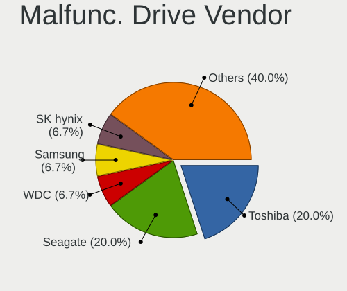

| Vendor              | Notebooks | Drives | Percent |
|---------------------|-----------|--------|---------|
| Toshiba             | 3         | 3      | 20%     |
| Seagate             | 3         | 3      | 20%     |
| WDC                 | 1         | 1      | 6.67%   |
| SK hynix            | 1         | 1      | 6.67%   |
| Samsung Electronics | 1         | 1      | 6.67%   |
| OCZ                 | 1         | 1      | 6.67%   |
| Micron Technology   | 1         | 2      | 6.67%   |
| Intenso             | 1         | 1      | 6.67%   |
| Hitachi             | 1         | 1      | 6.67%   |
| HIKSEMI             | 1         | 1      | 6.67%   |
| HGST                | 1         | 1      | 6.67%   |

Malfunc. HDD Vendor
-------------------

Vendors of faulty HDD drives

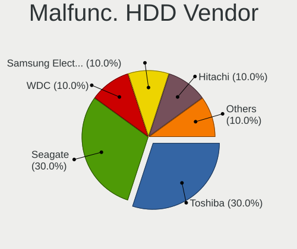

| Vendor              | Notebooks | Drives | Percent |
|---------------------|-----------|--------|---------|
| Toshiba             | 3         | 3      | 30%     |
| Seagate             | 3         | 3      | 30%     |
| WDC                 | 1         | 1      | 10%     |
| Samsung Electronics | 1         | 1      | 10%     |
| Hitachi             | 1         | 1      | 10%     |
| HGST                | 1         | 1      | 10%     |

Malfunc. Drive Kind
-------------------

Kinds of faulty drives

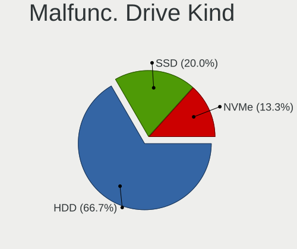

| Kind | Notebooks | Drives | Percent |
|------|-----------|--------|---------|
| HDD  | 10        | 10     | 66.67%  |
| SSD  | 3         | 4      | 20%     |
| NVMe | 2         | 2      | 13.33%  |

Failed Drives
-------------

Failed drive models

| Model                    | Notebooks | Drives | Percent |
|--------------------------|-----------|--------|---------|
| Toshiba MK5065GSXN 500GB | 1         | 1      | 100%    |

Failed Drive Vendor
-------------------

Failed drive vendors

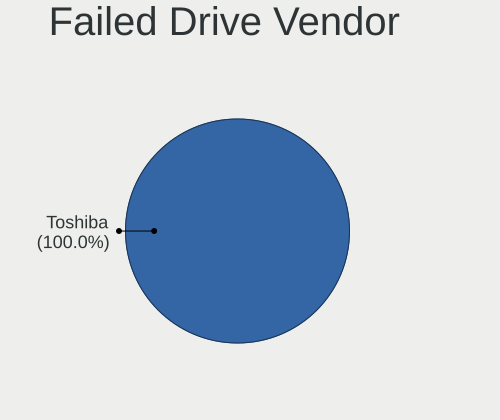

| Vendor  | Notebooks | Drives | Percent |
|---------|-----------|--------|---------|
| Toshiba | 1         | 1      | 100%    |

Drive Status
------------

Number of failed and malfunc. drives

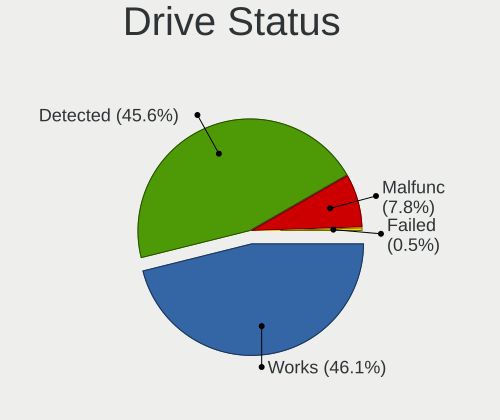

| Status   | Notebooks | Drives | Percent |
|----------|-----------|--------|---------|
| Works    | 89        | 114    | 46.11%  |
| Detected | 88        | 117    | 45.6%   |
| Malfunc  | 15        | 16     | 7.77%   |
| Failed   | 1         | 1      | 0.52%   |

Storage controller
------------------

Storage Vendor
--------------

Storage controller vendors

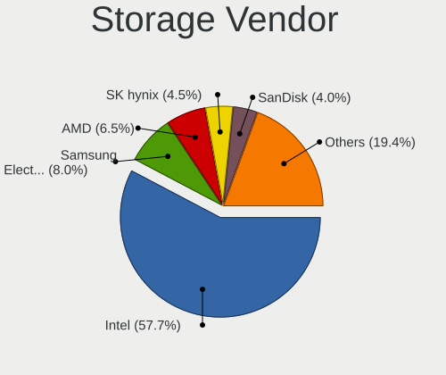

| Vendor                                  | Notebooks | Percent |
|-----------------------------------------|-----------|---------|
| Intel                                   | 116       | 57.71%  |
| Samsung Electronics                     | 16        | 7.96%   |
| AMD                                     | 13        | 6.47%   |
| SK hynix                                | 9         | 4.48%   |
| SanDisk                                 | 8         | 3.98%   |
| Micron Technology                       | 6         | 2.99%   |
| KIOXIA                                  | 6         | 2.99%   |
| MAXIO Technology (Hangzhou)             | 4         | 1.99%   |
| Toshiba America Info Systems            | 3         | 1.49%   |
| Kingston Technology Company             | 3         | 1.49%   |
| Silicon Motion                          | 2         | 1%      |
| Phison Electronics                      | 2         | 1%      |
| ADATA Technology                        | 2         | 1%      |
| Zhaoxin                                 | 1         | 0.5%    |
| Yangtze Memory Technologies             | 1         | 0.5%    |
| Solid State Storage Technology          | 1         | 0.5%    |
| Shenzhen Unionmemory Information System | 1         | 0.5%    |
| Shenzhen Longsys Electronics            | 1         | 0.5%    |
| Realtek Semiconductor                   | 1         | 0.5%    |
| Micron/Crucial Technology               | 1         | 0.5%    |
| Lite-On Technology                      | 1         | 0.5%    |
| JMicron Technology                      | 1         | 0.5%    |
| Apple                                   | 1         | 0.5%    |
| Unknown                                 | 1         | 0.5%    |

Storage Model
-------------

Storage controller models

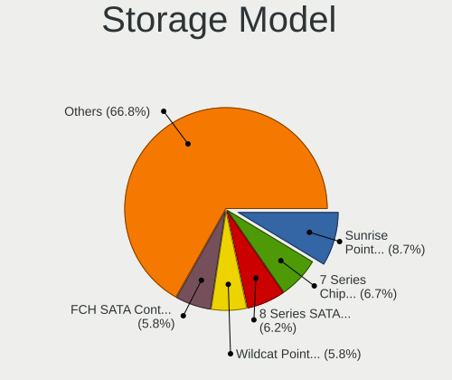

| Model                                                                                                              | Notebooks | Percent |
|--------------------------------------------------------------------------------------------------------------------|-----------|---------|
| Intel Sunrise Point-LP SATA Controller [AHCI mode]                                                                 | 18        | 8.65%   |
| Intel 7 Series Chipset Family 6-port SATA Controller [AHCI mode]                                                   | 14        | 6.73%   |
| Intel 8 Series SATA Controller 1 [AHCI mode]                                                                       | 13        | 6.25%   |
| Intel Wildcat Point-LP SATA Controller [AHCI Mode]                                                                 | 12        | 5.77%   |
| AMD FCH SATA Controller [AHCI mode]                                                                                | 12        | 5.77%   |
| Intel 82801IBM/IEM (ICH9M/ICH9M-E) 4 port SATA Controller [AHCI mode]                                              | 7         | 3.37%   |
| Intel 6 Series/C200 Series Chipset Family 6 port Mobile SATA AHCI Controller                                       | 7         | 3.37%   |
| Samsung NVMe SSD Controller SM981/PM981/PM983                                                                      | 5         | 2.4%    |
| Intel Celeron/Pentium Silver Processor SATA Controller                                                             | 5         | 2.4%    |
| Intel Cannon Point-LP SATA Controller [AHCI Mode]                                                                  | 5         | 2.4%    |
| Intel 82801 Mobile SATA Controller [RAID mode]                                                                     | 5         | 2.4%    |
| Samsung NVMe SSD Controller PM9A1/PM9A3/980PRO                                                                     | 4         | 1.92%   |
| Intel Comet Lake SATA AHCI Controller                                                                              | 4         | 1.92%   |
| Intel Cannon Lake Mobile PCH SATA AHCI Controller                                                                  | 4         | 1.92%   |
| SK hynix Platinum P41/PC801 NVMe Solid State Drive                                                                 | 3         | 1.44%   |
| SK hynix BC511 NVMe SSD                                                                                            | 3         | 1.44%   |
| SanDisk Extreme Pro / WD Black SN750 / PC SN730 / Red SN700 NVMe SSD                                               | 3         | 1.44%   |
| Samsung NVMe SSD Controller SM961/PM961/SM963                                                                      | 3         | 1.44%   |
| MAXIO (Hangzhou) NVMe SSD Controller MAP1202 (DRAM-less)                                                           | 3         | 1.44%   |
| Intel Volume Management Device NVMe RAID Controller                                                                | 3         | 1.44%   |
| Intel 5 Series/3400 Series Chipset 4 port SATA AHCI Controller                                                     | 3         | 1.44%   |
| Toshiba America Info Systems XG6 NVMe SSD Controller                                                               | 2         | 0.96%   |
| SK hynix BC501 NVMe Solid State Drive                                                                              | 2         | 0.96%   |
| Silicon Motion SM2263EN/SM2263XT (DRAM-less) NVMe SSD Controllers                                                  | 2         | 0.96%   |
| Samsung NVMe SSD Controller 980 (DRAM-less)                                                                        | 2         | 0.96%   |
| Micron 2200S NVMe SSD [Cassandra]                                                                                  | 2         | 0.96%   |
| KIOXIA NVMe SSD Controller XG8                                                                                     | 2         | 0.96%   |
| KIOXIA NVMe SSD Controller BG5 (DRAM-less)                                                                         | 2         | 0.96%   |
| KIOXIA NVMe SSD Controller BG4 (DRAM-less)                                                                         | 2         | 0.96%   |
| Intel Tiger Lake-LP SATA Controller                                                                                | 2         | 0.96%   |
| Intel HM170/QM170 Chipset SATA Controller [AHCI Mode]                                                              | 2         | 0.96%   |
| Intel Celeron N3350/Pentium N4200/Atom E3900 Series SATA AHCI Controller                                           | 2         | 0.96%   |
| Intel Atom/Celeron/Pentium Processor x5-E8000/J3xxx/N3xxx Series SATA Controller                                   | 2         | 0.96%   |
| Zhaoxin ZX-100/ZX-200/KX-6000/KX-6000G/KH-40000/KX-7000 StorX AHCI Controller                                      | 1         | 0.48%   |
| Yangtze Memory PC411 M.2 2242 NVMe SSD (DRAM-less)                                                                 | 1         | 0.48%   |
| Toshiba America Info Systems BG3 x2 NVMe SSD Controller (DRAM-less)                                                | 1         | 0.48%   |
| Solid State Storage CL1-3D256-Q11 NVMe SSD M.2                                                                     | 1         | 0.48%   |
| SK hynix Gold P31/BC711/PC711 NVMe Solid State Drive                                                               | 1         | 0.48%   |
| Shenzhen Unionmemory Information System AM541 PCIe 4.0 NVMe SSD 1024GB                                             | 1         | 0.48%   |
| Shenzhen Longsys FORESEE XP1000 / Lexar Professional CFexpress Type B Gold series, NM620 PCIe NVME SSD (DRAM-less) | 1         | 0.48%   |

Storage Kind
------------

Kind of storage controller (IDE, SATA, NVMe, SAS, ...)

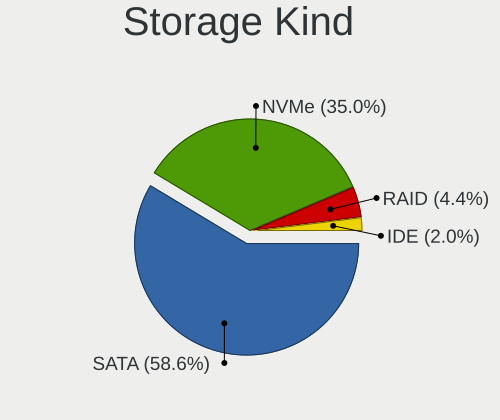

| Kind | Notebooks | Percent |
|------|-----------|---------|
| SATA | 119       | 58.62%  |
| NVMe | 71        | 34.98%  |
| RAID | 9         | 4.43%   |
| IDE  | 4         | 1.97%   |

Processor
---------

CPU Vendor
----------

Processor vendors

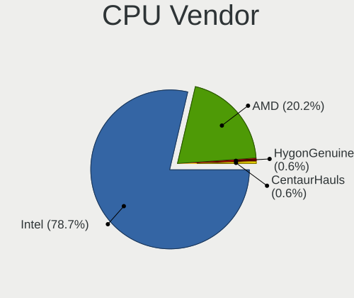

| Vendor       | Notebooks | Percent |
|--------------|-----------|---------|
| Intel        | 140       | 78.65%  |
| AMD          | 36        | 20.22%  |
| HygonGenuine | 1         | 0.56%   |
| CentaurHauls | 1         | 0.56%   |

CPU Model
---------

Processor models

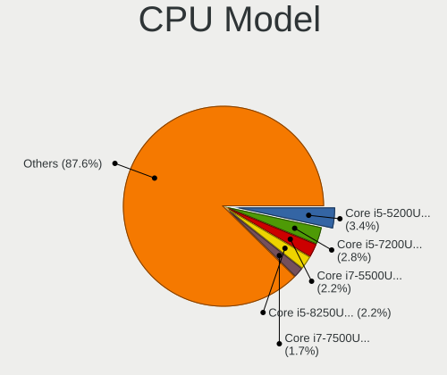

| Model                                          | Notebooks | Percent |
|------------------------------------------------|-----------|---------|
| Intel Core i5-5200U CPU @ 2.20GHz              | 6         | 3.37%   |
| Intel Core i5-7200U CPU @ 2.50GHz              | 5         | 2.81%   |
| Intel Core i7-5500U CPU @ 2.40GHz              | 4         | 2.25%   |
| Intel Core i5-8250U CPU @ 1.60GHz              | 4         | 2.25%   |
| Intel Core i7-7500U CPU @ 2.70GHz              | 3         | 1.69%   |
| Intel Core i7-4510U CPU @ 2.00GHz              | 3         | 1.69%   |
| Intel Core i7-10510U CPU @ 1.80GHz             | 3         | 1.69%   |
| Intel Core i5-8300H CPU @ 2.30GHz              | 3         | 1.69%   |
| Intel Core i5-6200U CPU @ 2.30GHz              | 3         | 1.69%   |
| Intel Core i5-4210U CPU @ 1.70GHz              | 3         | 1.69%   |
| Intel Core i3-4005U CPU @ 1.70GHz              | 3         | 1.69%   |
| Intel 11th Gen Core i7-1165G7 @ 2.80GHz        | 3         | 1.69%   |
| AMD Ryzen 5 3500U with Radeon Vega Mobile Gfx  | 3         | 1.69%   |
| Intel Pentium Dual-Core CPU T4500 @ 2.30GHz    | 2         | 1.12%   |
| Intel Core i7-8565U CPU @ 1.80GHz              | 2         | 1.12%   |
| Intel Core i7-8550U CPU @ 1.80GHz              | 2         | 1.12%   |
| Intel Core i7-7700HQ CPU @ 2.80GHz             | 2         | 1.12%   |
| Intel Core i7-6500U CPU @ 2.50GHz              | 2         | 1.12%   |
| Intel Core i7-3630QM CPU @ 2.40GHz             | 2         | 1.12%   |
| Intel Core i7-2630QM CPU @ 2.00GHz             | 2         | 1.12%   |
| Intel Core i5-8265U CPU @ 1.60GHz              | 2         | 1.12%   |
| Intel Core i5-4200U CPU @ 1.60GHz              | 2         | 1.12%   |
| Intel Core i5-3230M CPU @ 2.60GHz              | 2         | 1.12%   |
| Intel Core i5-2520M CPU @ 2.50GHz              | 2         | 1.12%   |
| Intel Core i5-2450M CPU @ 2.50GHz              | 2         | 1.12%   |
| Intel Core i3-4030U CPU @ 1.90GHz              | 2         | 1.12%   |
| Intel Core i3-3110M CPU @ 2.40GHz              | 2         | 1.12%   |
| Intel Celeron CPU N3350 @ 1.10GHz              | 2         | 1.12%   |
| Intel Atom CPU Z3735F @ 1.33GHz                | 2         | 1.12%   |
| Intel 13th Gen Core i9-13900H                  | 2         | 1.12%   |
| Intel 12th Gen Core i7-12700H                  | 2         | 1.12%   |
| Intel 11th Gen Core i5-1135G7 @ 2.40GHz        | 2         | 1.12%   |
| AMD Ryzen 7 PRO 7840HS w/ Radeon 780M Graphics | 2         | 1.12%   |
| AMD Ryzen 7 6800H with Radeon Graphics         | 2         | 1.12%   |
| AMD Ryzen 7 5800H with Radeon Graphics         | 2         | 1.12%   |
| AMD Ryzen 7 4800H with Radeon Graphics         | 2         | 1.12%   |
| AMD Ryzen 7 3700U with Radeon Vega Mobile Gfx  | 2         | 1.12%   |
| AMD Ryzen 5 4600U with Radeon Graphics         | 2         | 1.12%   |
| AMD Ryzen 3 5300U with Radeon Graphics         | 2         | 1.12%   |
| AMD 3020e with Radeon Graphics                 | 2         | 1.12%   |

CPU Model Family
----------------

Processor model prefix

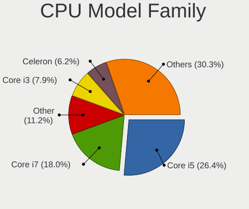

| Model                   | Notebooks | Percent |
|-------------------------|-----------|---------|
| Intel Core i5           | 47        | 26.4%   |
| Intel Core i7           | 32        | 17.98%  |
| Other                   | 20        | 11.24%  |
| Intel Core i3           | 14        | 7.87%   |
| Intel Celeron           | 11        | 6.18%   |
| AMD Ryzen 7             | 10        | 5.62%   |
| AMD Ryzen 5             | 10        | 5.62%   |
| Intel Core 2 Duo        | 4         | 2.25%   |
| Intel Atom              | 4         | 2.25%   |
| AMD Ryzen 3             | 4         | 2.25%   |
| Intel Pentium Dual-Core | 3         | 1.69%   |
| Intel Pentium           | 2         | 1.12%   |
| Intel Core i9           | 2         | 1.12%   |
| AMD Ryzen 7 PRO         | 2         | 1.12%   |
| AMD A10                 | 2         | 1.12%   |
| Intel Pentium Silver    | 1         | 0.56%   |
| Intel Core m3           | 1         | 0.56%   |
| Intel Core M            | 1         | 0.56%   |
| Intel Core              | 1         | 0.56%   |
| Intel Celeron Dual-Core | 1         | 0.56%   |
| AMD Ryzen 9             | 1         | 0.56%   |
| AMD Ryzen 5 PRO         | 1         | 0.56%   |
| AMD FX                  | 1         | 0.56%   |
| AMD E1                  | 1         | 0.56%   |
| AMD E                   | 1         | 0.56%   |
| AMD A8                  | 1         | 0.56%   |

CPU Cores
---------

Number of processor cores

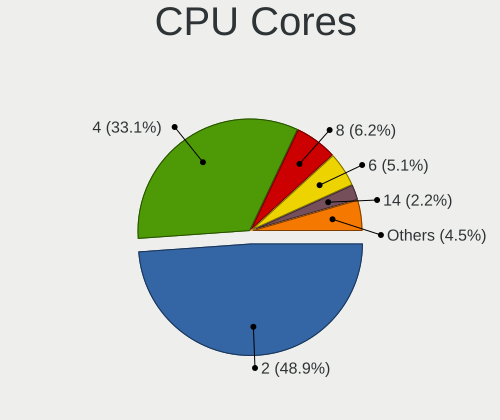

| Number | Notebooks | Percent |
|--------|-----------|---------|
| 2      | 87        | 48.88%  |
| 4      | 59        | 33.15%  |
| 8      | 11        | 6.18%   |
| 6      | 9         | 5.06%   |
| 14     | 4         | 2.25%   |
| 24     | 2         | 1.12%   |
| 12     | 2         | 1.12%   |
| 10     | 2         | 1.12%   |
| 16     | 1         | 0.56%   |
| 1      | 1         | 0.56%   |

CPU Sockets
-----------

Number of sockets

| Number | Notebooks | Percent |
|--------|-----------|---------|
| 1      | 178       | 100%    |

CPU Threads
-----------

Threads per core (Hyper-Threading)

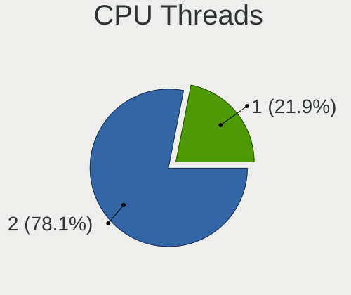

| Number | Notebooks | Percent |
|--------|-----------|---------|
| 2      | 139       | 78.09%  |
| 1      | 39        | 21.91%  |

CPU Op-Modes
------------

CPU Operation Modes (32-bit, 64-bit)

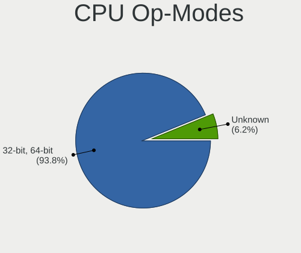

| Op mode        | Notebooks | Percent |
|----------------|-----------|---------|
| 32-bit, 64-bit | 167       | 93.82%  |
| Unknown        | 11        | 6.18%   |

CPU Microcode
-------------

Microcode number

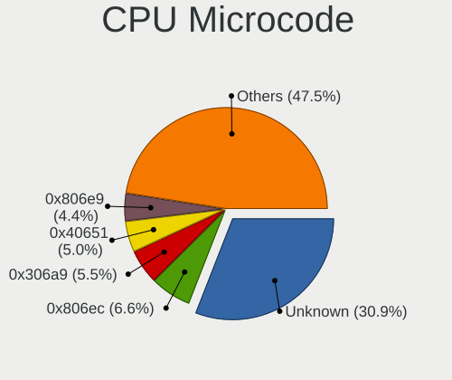

| Number     | Notebooks | Percent |
|------------|-----------|---------|
| Unknown    | 56        | 30.94%  |
| 0x806ec    | 12        | 6.63%   |
| 0x306a9    | 10        | 5.52%   |
| 0x40651    | 9         | 4.97%   |
| 0x806e9    | 8         | 4.42%   |
| 0x306d4    | 8         | 4.42%   |
| 0x406e3    | 7         | 3.87%   |
| 0x206a7    | 6         | 3.31%   |
| 0x906ea    | 5         | 2.76%   |
| 0x806ea    | 4         | 2.21%   |
| 0x1067a    | 4         | 2.21%   |
| 0x906a3    | 3         | 1.66%   |
| 0x08600106 | 3         | 1.66%   |
| 0x08108109 | 3         | 1.66%   |
| 0x906e9    | 2         | 1.1%    |
| 0x806c1    | 2         | 1.1%    |
| 0x706a8    | 2         | 1.1%    |
| 0x706a1    | 2         | 1.1%    |
| 0x406c4    | 2         | 1.1%    |
| 0x30678    | 2         | 1.1%    |
| 0x20655    | 2         | 1.1%    |
| 0x0a50000c | 2         | 1.1%    |
| 0x08600104 | 2         | 1.1%    |
| 0x08200103 | 2         | 1.1%    |
| 0x08108102 | 2         | 1.1%    |
| 0xb06a3    | 1         | 0.55%   |
| 0xb06a2    | 1         | 0.55%   |
| 0xa0652    | 1         | 0.55%   |
| 0x806d1    | 1         | 0.55%   |
| 0x806c2    | 1         | 0.55%   |
| 0x6fd      | 1         | 0.55%   |
| 0x406c3    | 1         | 0.55%   |
| 0x10676    | 1         | 0.55%   |
| 0x0a704104 | 1         | 0.55%   |
| 0x0a704103 | 1         | 0.55%   |
| 0x0a50000b | 1         | 0.55%   |
| 0x0a404101 | 1         | 0.55%   |
| 0x08608107 | 1         | 0.55%   |
| 0x08608102 | 1         | 0.55%   |
| 0x08600103 | 1         | 0.55%   |

CPU Microarch
-------------

Microarchitecture

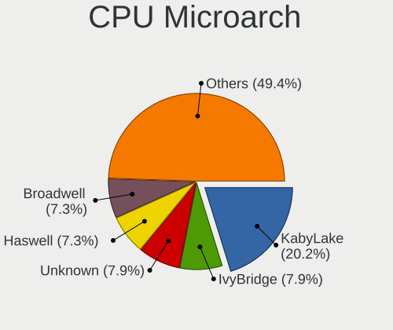

| Name             | Notebooks | Percent |
|------------------|-----------|---------|
| KabyLake         | 36        | 20.22%  |
| IvyBridge        | 14        | 7.87%   |
| Unknown          | 14        | 7.87%   |
| Haswell          | 13        | 7.3%    |
| Broadwell        | 13        | 7.3%    |
| SandyBridge      | 11        | 6.18%   |
| Zen 2            | 8         | 4.49%   |
| Skylake          | 8         | 4.49%   |
| Silvermont       | 8         | 4.49%   |
| TigerLake        | 7         | 3.93%   |
| Penryn           | 7         | 3.93%   |
| Alderlake Hybrid | 7         | 3.93%   |
| Zen+             | 6         | 3.37%   |
| Goldmont plus    | 5         | 2.81%   |
| Zen 3            | 3         | 1.69%   |
| Zen              | 3         | 1.69%   |
| Westmere         | 3         | 1.69%   |
| Excavator        | 3         | 1.69%   |
| Goldmont         | 2         | 1.12%   |
| Bobcat           | 2         | 1.12%   |
| Lunarlake Hybrid | 1         | 0.56%   |
| K10 Llano        | 1         | 0.56%   |
| Icelake          | 1         | 0.56%   |
| Core             | 1         | 0.56%   |
| CometLake        | 1         | 0.56%   |

Graphics
--------

GPU Vendor
----------

Vendors of graphics cards

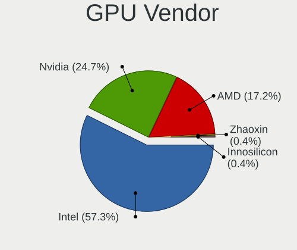

| Vendor      | Notebooks | Percent |
|-------------|-----------|---------|
| Intel       | 137       | 57.32%  |
| Nvidia      | 59        | 24.69%  |
| AMD         | 41        | 17.15%  |
| Zhaoxin     | 1         | 0.42%   |
| Innosilicon | 1         | 0.42%   |

GPU Model
---------

Graphics card models

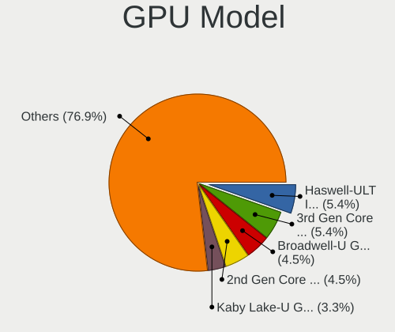

| Model                                                                                    | Notebooks | Percent |
|------------------------------------------------------------------------------------------|-----------|---------|
| Intel Haswell-ULT Integrated Graphics Controller                                         | 13        | 5.37%   |
| Intel 3rd Gen Core processor Graphics Controller                                         | 13        | 5.37%   |
| Intel Broadwell-U GT2 [HD Graphics 5500]                                                 | 11        | 4.55%   |
| Intel 2nd Generation Core Processor Family Integrated Graphics Controller                | 11        | 4.55%   |
| Intel Kaby Lake-U GT2 [HD Graphics 620]                                                  | 8         | 3.31%   |
| AMD Renoir [Radeon Vega Series / Radeon Vega Mobile Series]                              | 8         | 3.31%   |
| AMD Picasso/Raven 2 [Radeon Vega Series / Radeon Vega Mobile Series]                     | 8         | 3.31%   |
| Intel Skylake-U GT2 [HD Graphics 520]                                                    | 7         | 2.89%   |
| Intel Mobile 4 Series Chipset Integrated Graphics Controller                             | 7         | 2.89%   |
| AMD Topaz XT [Radeon R7 M260/M265 / M340/M360 / M440/M445 / 530/535 / 620/625 Mobile]    | 7         | 2.89%   |
| Intel TigerLake-LP GT2 [Iris Xe Graphics]                                                | 6         | 2.48%   |
| Intel Kaby Lake-R GT2 [UHD Graphics 620]                                                 | 6         | 2.48%   |
| Intel CoffeeLake-H GT2 [UHD Graphics 630]                                                | 6         | 2.48%   |
| Intel WhiskeyLake-U GT2 [UHD Graphics 620]                                               | 5         | 2.07%   |
| Intel CometLake-U GT2 [UHD Graphics]                                                     | 5         | 2.07%   |
| Nvidia TU117M [GeForce GTX 1650 Mobile / Max-Q]                                          | 4         | 1.65%   |
| Intel GeminiLake [UHD Graphics 600]                                                      | 4         | 1.65%   |
| Intel Atom/Celeron/Pentium Processor x5-E8000/J3xxx/N3xxx Integrated Graphics Controller | 4         | 1.65%   |
| Intel Atom Processor Z36xxx/Z37xxx Series Graphics & Display                             | 4         | 1.65%   |
| Intel Alder Lake-P GT2 [Iris Xe Graphics]                                                | 4         | 1.65%   |
| Nvidia GP107M [GeForce GTX 1050 Ti Mobile]                                               | 3         | 1.24%   |
| Nvidia GM108M [GeForce MX110]                                                            | 3         | 1.24%   |
| Nvidia GM108M [GeForce 940MX]                                                            | 3         | 1.24%   |
| Nvidia GA106M [GeForce RTX 3060 Mobile / Max-Q]                                          | 3         | 1.24%   |
| Intel Core Processor Integrated Graphics Controller                                      | 3         | 1.24%   |
| AMD Wani [Radeon R5/R6/R7 Graphics]                                                      | 3         | 1.24%   |
| AMD Lucienne                                                                             | 3         | 1.24%   |
| Nvidia GP108M [GeForce MX250]                                                            | 2         | 0.83%   |
| Nvidia GP108BM [GeForce MX250]                                                           | 2         | 0.83%   |
| Nvidia GP107M [GeForce GTX 1050 Mobile]                                                  | 2         | 0.83%   |
| Nvidia GM108M [GeForce 920MX]                                                            | 2         | 0.83%   |
| Nvidia GM108M [GeForce 840M]                                                             | 2         | 0.83%   |
| Nvidia GM107M [GeForce GTX 950M]                                                         | 2         | 0.83%   |
| Nvidia GK107M [GeForce GT 650M]                                                          | 2         | 0.83%   |
| Nvidia GF117M [GeForce 610M/710M/810M/820M / GT 620M/625M/630M/720M]                     | 2         | 0.83%   |
| Nvidia GF108M [GeForce GT 540M]                                                          | 2         | 0.83%   |
| Nvidia GA107BM [GeForce RTX 3050 Mobile]                                                 | 2         | 0.83%   |
| Nvidia AD106M [GeForce RTX 4070 Max-Q / Mobile]                                          | 2         | 0.83%   |
| Intel Raptor Lake-P [Iris Xe Graphics]                                                   | 2         | 0.83%   |
| Intel Kaby Lake-H GT2 [HD Graphics 630]                                                  | 2         | 0.83%   |

GPU Combo
---------

Combinations of graphics cards

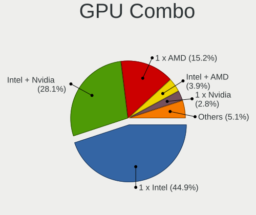

| Name            | Notebooks | Percent |
|-----------------|-----------|---------|
| 1 x Intel       | 80        | 44.94%  |
| Intel + Nvidia  | 50        | 28.09%  |
| 1 x AMD         | 27        | 15.17%  |
| Intel + AMD     | 7         | 3.93%   |
| 1 x Nvidia      | 5         | 2.81%   |
| AMD + Nvidia    | 4         | 2.25%   |
| 2 x AMD         | 3         | 1.69%   |
| 1 x Zhaoxin     | 1         | 0.56%   |
| 1 x Innosilicon | 1         | 0.56%   |

GPU Driver
----------

Free vs proprietary

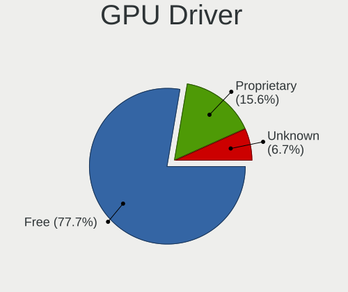

| Driver      | Notebooks | Percent |
|-------------|-----------|---------|
| Free        | 139       | 77.65%  |
| Proprietary | 28        | 15.64%  |
| Unknown     | 12        | 6.7%    |

GPU Memory
----------

Total video memory

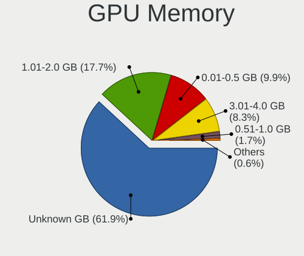

| Size in GB | Notebooks | Percent |
|------------|-----------|---------|
| Unknown    | 112       | 61.88%  |
| 1.01-2.0   | 32        | 17.68%  |
| 0.01-0.5   | 18        | 9.94%   |
| 3.01-4.0   | 15        | 8.29%   |
| 0.51-1.0   | 3         | 1.66%   |
| 5.01-6.0   | 1         | 0.55%   |

Monitor
-------

Monitor Vendor
--------------

Monitor vendors

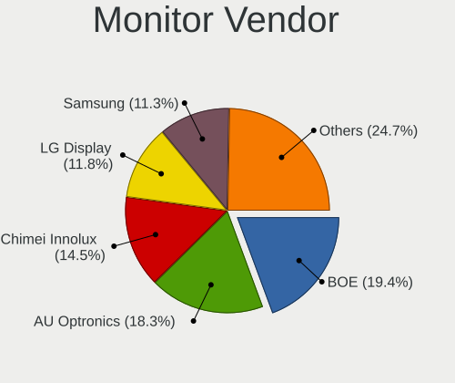

| Vendor                  | Notebooks | Percent |
|-------------------------|-----------|---------|
| BOE                     | 36        | 19.35%  |
| AU Optronics            | 34        | 18.28%  |
| Chimei Innolux          | 27        | 14.52%  |
| LG Display              | 22        | 11.83%  |
| Samsung Electronics     | 21        | 11.29%  |
| CSO                     | 6         | 3.23%   |
| Goldstar                | 4         | 2.15%   |
| Hewlett-Packard         | 3         | 1.61%   |
| AOC                     | 3         | 1.61%   |
| TMX                     | 2         | 1.08%   |
| Sharp                   | 2         | 1.08%   |
| Lenovo                  | 2         | 1.08%   |
| InfoVision              | 2         | 1.08%   |
| HKC                     | 2         | 1.08%   |
| Chi Mei Optoelectronics | 2         | 1.08%   |
| Apple                   | 2         | 1.08%   |
| ViewSonic               | 1         | 0.54%   |
| TMA                     | 1         | 0.54%   |
| SAC                     | 1         | 0.54%   |
| Philips                 | 1         | 0.54%   |
| PANDA                   | 1         | 0.54%   |
| LG Philips              | 1         | 0.54%   |
| JDI                     | 1         | 0.54%   |
| Iiyama                  | 1         | 0.54%   |
| HB@                     | 1         | 0.54%   |
| HannStar                | 1         | 0.54%   |
| Dell                    | 1         | 0.54%   |
| CS_                     | 1         | 0.54%   |
| CSOT                    | 1         | 0.54%   |
| BenQ                    | 1         | 0.54%   |
| ASUSTek Computer        | 1         | 0.54%   |
| Acer                    | 1         | 0.54%   |

Monitor Model
-------------

Monitor models

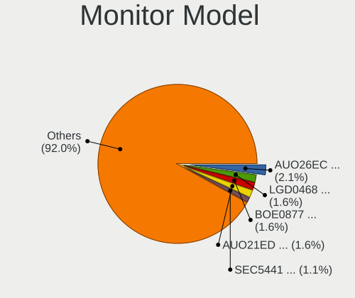

| Model                                                                 | Notebooks | Percent |
|-----------------------------------------------------------------------|-----------|---------|
| AU Optronics LCD Monitor AUO26EC 1366x768 344x193mm 15.5-inch         | 4         | 2.14%   |
| LG Display LCD Monitor LGD0468 1366x768 344x194mm 15.5-inch           | 3         | 1.6%    |
| BOE LCD Monitor BOE0877 1920x1080 309x173mm 13.9-inch                 | 3         | 1.6%    |
| AU Optronics LCD Monitor AUO21ED 1920x1080 344x193mm 15.5-inch        | 3         | 1.6%    |
| Samsung Electronics LCD Monitor SEC5441 1280x800 331x207mm 15.4-inch  | 2         | 1.07%   |
| LG Display LCD Monitor LGD0456 1366x768 344x194mm 15.5-inch           | 2         | 1.07%   |
| HKC LCD Monitor HKC3CFB 1920x1080 344x194mm 15.5-inch                 | 2         | 1.07%   |
| Chimei Innolux LCD Monitor CMN14D4 1920x1080 309x173mm 13.9-inch      | 2         | 1.07%   |
| Chimei Innolux LCD Monitor CMN14C4 1366x768 309x173mm 13.9-inch       | 2         | 1.07%   |
| BOE LCD Monitor BOE06A4 1366x768 344x194mm 15.5-inch                  | 2         | 1.07%   |
| AU Optronics LCD Monitor AUO71EC 1366x768 344x193mm 15.5-inch         | 2         | 1.07%   |
| AU Optronics LCD Monitor AUO6DA8 2560x1600 301x188mm 14.0-inch        | 2         | 1.07%   |
| AU Optronics LCD Monitor AUO40EC 1366x768 344x193mm 15.5-inch         | 2         | 1.07%   |
| AU Optronics LCD Monitor AUO226D 1920x1080 276x155mm 12.5-inch        | 2         | 1.07%   |
| ViewSonic VX2481-mh VSC3933 1920x1080 527x296mm 23.8-inch             | 1         | 0.53%   |
| TMX TL160ADMP11-0 TMX1601 2560x1600 350x220mm 16.3-inch               | 1         | 0.53%   |
| TMX TL140VDXP04-0 TMX1398 1920x1080 309x174mm 14.0-inch               | 1         | 0.53%   |
| TMA TL140ADXP24-0 TMA2004 2880x1800 300x190mm 14.0-inch               | 1         | 0.53%   |
| Sharp LCD Monitor SHP1449 1920x1080 294x165mm 13.3-inch               | 1         | 0.53%   |
| Sharp LCD Monitor SHP1447 1920x1080 294x165mm 13.3-inch               | 1         | 0.53%   |
| Samsung Electronics SyncMaster SAM0167 1280x1024 338x270mm 17.0-inch  | 1         | 0.53%   |
| Samsung Electronics S32B80P SAM71F1 3840x2160 700x400mm 31.7-inch     | 1         | 0.53%   |
| Samsung Electronics LCD Monitor SEC5448 1920x1080 344x194mm 15.5-inch | 1         | 0.53%   |
| Samsung Electronics LCD Monitor SEC384A 1366x768 344x194mm 15.5-inch  | 1         | 0.53%   |
| Samsung Electronics LCD Monitor SEC3741 1280x800 331x207mm 15.4-inch  | 1         | 0.53%   |
| Samsung Electronics LCD Monitor SEC324A 1366x768 344x194mm 15.5-inch  | 1         | 0.53%   |
| Samsung Electronics LCD Monitor SEC3150 1366x768 344x193mm 15.5-inch  | 1         | 0.53%   |
| Samsung Electronics LCD Monitor SEC314B 1600x900 344x194mm 15.5-inch  | 1         | 0.53%   |
| Samsung Electronics LCD Monitor SEC3141 1366x768 309x174mm 14.0-inch  | 1         | 0.53%   |
| Samsung Electronics LCD Monitor SDC864D 1920x1080 293x165mm 13.2-inch | 1         | 0.53%   |
| Samsung Electronics LCD Monitor SDC534B 1600x900 382x215mm 17.3-inch  | 1         | 0.53%   |
| Samsung Electronics LCD Monitor SDC4E51 1366x768 344x194mm 15.5-inch  | 1         | 0.53%   |
| Samsung Electronics LCD Monitor SDC4A42 1366x768 309x174mm 14.0-inch  | 1         | 0.53%   |
| Samsung Electronics LCD Monitor SDC4951 1366x768 344x194mm 15.5-inch  | 1         | 0.53%   |
| Samsung Electronics LCD Monitor SDC434A 3200x1800 293x165mm 13.2-inch | 1         | 0.53%   |
| Samsung Electronics LCD Monitor SDC4193 2880x1800 302x189mm 14.0-inch | 1         | 0.53%   |
| Samsung Electronics LCD Monitor SDC4147 1366x768 344x194mm 15.5-inch  | 1         | 0.53%   |
| Samsung Electronics LCD Monitor SAM03BC 1920x1080                     | 1         | 0.53%   |
| Samsung Electronics ATNA60HU01-0  SDC420B                             | 1         | 0.53%   |
| SAC LED MONITOR SAC952D 1920x1080 480x270mm 21.7-inch                 | 1         | 0.53%   |

Monitor Resolution
------------------

Monitor screen resolution

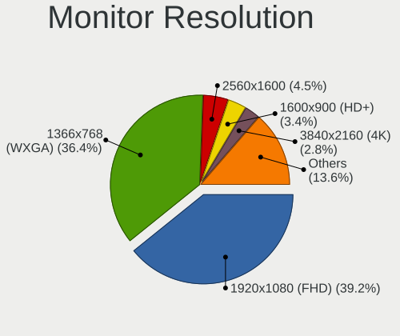

| Resolution        | Notebooks | Percent |
|-------------------|-----------|---------|
| 1920x1080 (FHD)   | 69        | 39.2%   |
| 1366x768 (WXGA)   | 64        | 36.36%  |
| 2560x1600         | 8         | 4.55%   |
| 1600x900 (HD+)    | 6         | 3.41%   |
| 3840x2160 (4K)    | 5         | 2.84%   |
| 2880x1800         | 5         | 2.84%   |
| 2160x1440         | 3         | 1.7%    |
| 3000x2000         | 2         | 1.14%   |
| 1920x1200 (WUXGA) | 2         | 1.14%   |
| 3440x1440         | 1         | 0.57%   |
| 3200x2000         | 1         | 0.57%   |
| 3200x1800 (QHD+)  | 1         | 0.57%   |
| 2880x1920         | 1         | 0.57%   |
| 2560x1440 (QHD)   | 1         | 0.57%   |
| 2288x1287         | 1         | 0.57%   |
| 1920x540          | 1         | 0.57%   |
| 1680x945          | 1         | 0.57%   |
| 1440x900 (WXGA+)  | 1         | 0.57%   |
| 1280x800 (WXGA)   | 1         | 0.57%   |
| 1280x1024 (SXGA)  | 1         | 0.57%   |
| Unknown           | 1         | 0.57%   |

Monitor Diagonal
----------------

Diagonal size in inches

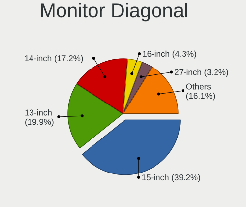

| Inches  | Notebooks | Percent |
|---------|-----------|---------|
| 15      | 73        | 39.25%  |
| 13      | 37        | 19.89%  |
| 14      | 32        | 17.2%   |
| 16      | 8         | 4.3%    |
| 27      | 6         | 3.23%   |
| 17      | 5         | 2.69%   |
| 24      | 4         | 2.15%   |
| 23      | 3         | 1.61%   |
| 18      | 3         | 1.61%   |
| 11      | 3         | 1.61%   |
| 32      | 2         | 1.08%   |
| 31      | 2         | 1.08%   |
| 21      | 2         | 1.08%   |
| 12      | 2         | 1.08%   |
| Unknown | 2         | 1.08%   |
| 40      | 1         | 0.54%   |
| 25      | 1         | 0.54%   |

Monitor Width
-------------

Physical width

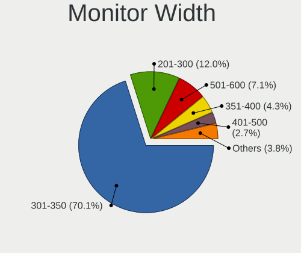

| Width in mm | Notebooks | Percent |
|-------------|-----------|---------|
| 301-350     | 129       | 70.11%  |
| 201-300     | 22        | 11.96%  |
| 501-600     | 13        | 7.07%   |
| 351-400     | 8         | 4.35%   |
| 401-500     | 5         | 2.72%   |
| 701-800     | 2         | 1.09%   |
| 601-700     | 2         | 1.09%   |
| Unknown     | 2         | 1.09%   |
| 801-900     | 1         | 0.54%   |

Aspect Ratio
------------

Proportional relationship between the width and the height

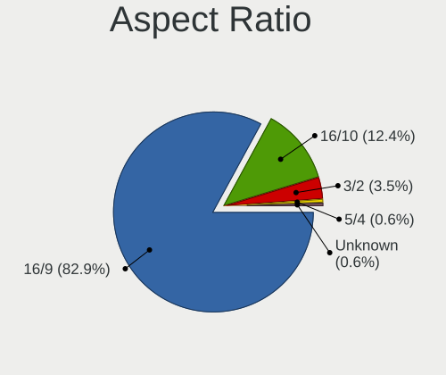

| Ratio   | Notebooks | Percent |
|---------|-----------|---------|
| 16/9    | 141       | 82.94%  |
| 16/10   | 21        | 12.35%  |
| 3/2     | 6         | 3.53%   |
| 5/4     | 1         | 0.59%   |
| Unknown | 1         | 0.59%   |

Monitor Area
------------

Area in inch²

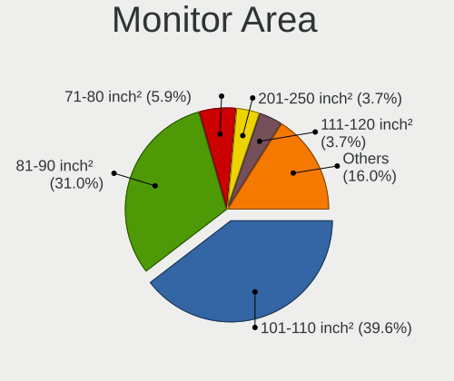

| Area in inch² | Notebooks | Percent |
|----------------|-----------|---------|
| 101-110        | 74        | 39.57%  |
| 81-90          | 58        | 31.02%  |
| 71-80          | 11        | 5.88%   |
| 201-250        | 7         | 3.74%   |
| 111-120        | 7         | 3.74%   |
| 301-350        | 6         | 3.21%   |
| 351-500        | 4         | 2.14%   |
| 141-150        | 4         | 2.14%   |
| 51-60          | 3         | 1.6%    |
| 251-300        | 3         | 1.6%    |
| 121-130        | 3         | 1.6%    |
| 61-70          | 2         | 1.07%   |
| Unknown        | 2         | 1.07%   |
| 151-200        | 1         | 0.53%   |
| 131-140        | 1         | 0.53%   |
| 501-1000       | 1         | 0.53%   |

Pixel Density
-------------

Pixels per inch

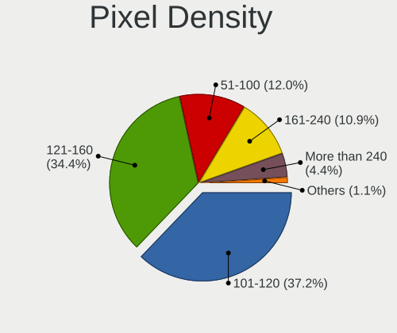

| Density       | Notebooks | Percent |
|---------------|-----------|---------|
| 101-120       | 68        | 37.16%  |
| 121-160       | 63        | 34.43%  |
| 51-100        | 22        | 12.02%  |
| 161-240       | 20        | 10.93%  |
| More than 240 | 8         | 4.37%   |
| Unknown       | 2         | 1.09%   |

Multiple Monitors
-----------------

Total monitors connected

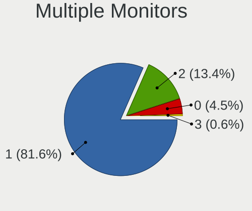

| Total | Notebooks | Percent |
|-------|-----------|---------|
| 1     | 146       | 81.56%  |
| 2     | 24        | 13.41%  |
| 0     | 8         | 4.47%   |
| 3     | 1         | 0.56%   |

Network
-------

Net Controller Vendor
---------------------

Controller vendors

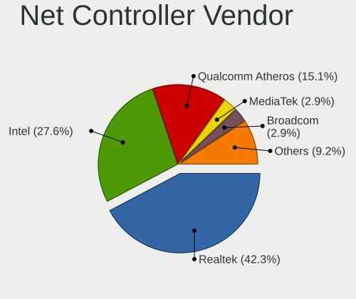

| Vendor                                 | Notebooks | Percent |
|----------------------------------------|-----------|---------|
| Realtek Semiconductor                  | 115       | 42.28%  |
| Intel                                  | 75        | 27.57%  |
| Qualcomm Atheros                       | 41        | 15.07%  |
| MediaTek                               | 8         | 2.94%   |
| Broadcom                               | 8         | 2.94%   |
| Broadcom Limited                       | 5         | 1.84%   |
| TP-Link                                | 3         | 1.1%    |
| Marvell Technology Group               | 3         | 1.1%    |
| Xiaomi                                 | 2         | 0.74%   |
| Suzhou Motorcomm Electronic Technology | 2         | 0.74%   |
| Ralink Technology                      | 2         | 0.74%   |
| Huawei Technologies                    | 2         | 0.74%   |
| Ralink                                 | 1         | 0.37%   |
| Qualcomm Atheros Communications        | 1         | 0.37%   |
| OPPO Electronics                       | 1         | 0.37%   |
| ICS Advent                             | 1         | 0.37%   |
| Hewlett-Packard                        | 1         | 0.37%   |
| ASIX Electronics                       | 1         | 0.37%   |

Net Controller Model
--------------------

Controller models

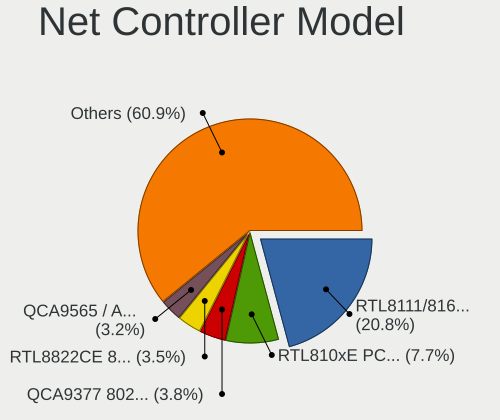

| Model                                                                  | Notebooks | Percent |
|------------------------------------------------------------------------|-----------|---------|
| Realtek RTL8111/8168/8211/8411 PCI Express Gigabit Ethernet Controller | 65        | 20.83%  |
| Realtek RTL810xE PCI Express Fast Ethernet controller                  | 24        | 7.69%   |
| Qualcomm Atheros QCA9377 802.11ac Wireless Network Adapter             | 12        | 3.85%   |
| Realtek RTL8822CE 802.11ac PCIe Wireless Network Adapter               | 11        | 3.53%   |
| Qualcomm Atheros QCA9565 / AR9565 Wireless Network Adapter             | 10        | 3.21%   |
| Intel Wireless 3165                                                    | 7         | 2.24%   |
| Intel Wi-Fi 6 AX200                                                    | 7         | 2.24%   |
| Realtek RTL8821CE 802.11ac PCIe Wireless Network Adapter               | 6         | 1.92%   |
| Qualcomm Atheros AR9485 Wireless Network Adapter                       | 6         | 1.92%   |
| Intel Wi-Fi 6 AX201                                                    | 6         | 1.92%   |
| Intel 82579LM Gigabit Network Connection (Lewisville)                  | 6         | 1.92%   |
| Intel Comet Lake PCH-LP CNVi WiFi                                      | 5         | 1.6%    |
| Intel Alder Lake-P PCH CNVi WiFi                                       | 5         | 1.6%    |
| Realtek RTL8723BE PCIe Wireless Network Adapter                        | 4         | 1.28%   |
| Realtek RTL8153 Gigabit Ethernet Adapter                               | 4         | 1.28%   |
| Qualcomm Atheros QCA6174 802.11ac Wireless Network Adapter             | 4         | 1.28%   |
| MediaTek MT7922 802.11ax PCI Express Wireless Network Adapter          | 4         | 1.28%   |
| Intel Wireless 7260                                                    | 4         | 1.28%   |
| Intel Wireless 3160                                                    | 4         | 1.28%   |
| Intel Centrino Advanced-N 6205 [Taylor Peak]                           | 4         | 1.28%   |
| Intel Cannon Point-LP CNVi [Wireless-AC]                               | 4         | 1.28%   |
| Realtek RTL8852BE PCIe 802.11ax Wireless Network Controller            | 3         | 0.96%   |
| Realtek RTL8723DE Wireless Network Adapter                             | 3         | 0.96%   |
| Realtek RTL8188EE Wireless Network Adapter                             | 3         | 0.96%   |
| Realtek RTL8188CE 802.11b/g/n WiFi Adapter                             | 3         | 0.96%   |
| Qualcomm Atheros AR9462 Wireless Network Adapter                       | 3         | 0.96%   |
| Intel Wireless 8265 / 8275                                             | 3         | 0.96%   |
| Intel Wireless 7265                                                    | 3         | 0.96%   |
| Intel WiFi Link 5100                                                   | 3         | 0.96%   |
| Suzhou Motorcomm Electronic YT6801 Gigabit Ethernet Controller         | 2         | 0.64%   |
| Realtek RTL8822BE 802.11a/b/g/n/ac WiFi adapter                        | 2         | 0.64%   |
| Realtek RTL8821AE 802.11ac PCIe Wireless Network Adapter               | 2         | 0.64%   |
| Realtek RTL8191SEvA Wireless LAN Controller                            | 2         | 0.64%   |
| Qualcomm Atheros AR9287 Wireless Network Adapter (PCI-Express)         | 2         | 0.64%   |
| Qualcomm Atheros AR8131 Gigabit Ethernet                               | 2         | 0.64%   |
| MediaTek MT7921 802.11ax PCIe Wireless Network Adapter [Filogic 330]   | 2         | 0.64%   |
| Marvell Group 88E8055 PCI-E Gigabit Ethernet Controller                | 2         | 0.64%   |
| Intel Wireless 8260                                                    | 2         | 0.64%   |
| Intel Raptor Lake PCH CNVi WiFi                                        | 2         | 0.64%   |
| Intel Dual Band Wireless-AC 3165 Plus Bluetooth                        | 2         | 0.64%   |

Wireless Vendor
---------------

Wireless vendors

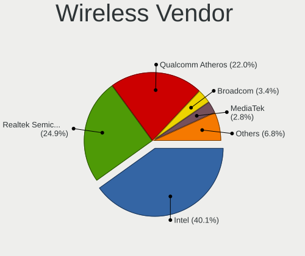

| Vendor                          | Notebooks | Percent |
|---------------------------------|-----------|---------|
| Intel                           | 71        | 40.11%  |
| Realtek Semiconductor           | 44        | 24.86%  |
| Qualcomm Atheros                | 39        | 22.03%  |
| Broadcom                        | 6         | 3.39%   |
| MediaTek                        | 5         | 2.82%   |
| Broadcom Limited                | 5         | 2.82%   |
| TP-Link                         | 3         | 1.69%   |
| Ralink Technology               | 2         | 1.13%   |
| Ralink                          | 1         | 0.56%   |
| Qualcomm Atheros Communications | 1         | 0.56%   |

Wireless Model
--------------

Wireless models

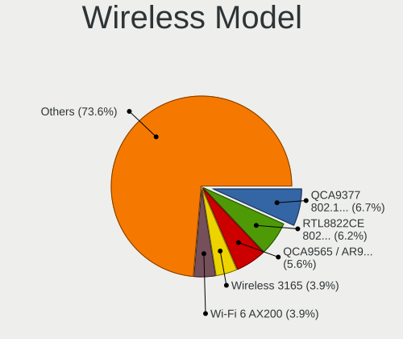

| Model                                                                | Notebooks | Percent |
|----------------------------------------------------------------------|-----------|---------|
| Qualcomm Atheros QCA9377 802.11ac Wireless Network Adapter           | 12        | 6.74%   |
| Realtek RTL8822CE 802.11ac PCIe Wireless Network Adapter             | 11        | 6.18%   |
| Qualcomm Atheros QCA9565 / AR9565 Wireless Network Adapter           | 10        | 5.62%   |
| Intel Wireless 3165                                                  | 7         | 3.93%   |
| Intel Wi-Fi 6 AX200                                                  | 7         | 3.93%   |
| Realtek RTL8821CE 802.11ac PCIe Wireless Network Adapter             | 6         | 3.37%   |
| Qualcomm Atheros AR9485 Wireless Network Adapter                     | 6         | 3.37%   |
| Intel Wi-Fi 6 AX201                                                  | 6         | 3.37%   |
| Intel Comet Lake PCH-LP CNVi WiFi                                    | 5         | 2.81%   |
| Realtek RTL8723BE PCIe Wireless Network Adapter                      | 4         | 2.25%   |
| Qualcomm Atheros QCA6174 802.11ac Wireless Network Adapter           | 4         | 2.25%   |
| Intel Wireless 7260                                                  | 4         | 2.25%   |
| Intel Wireless 3160                                                  | 4         | 2.25%   |
| Intel Centrino Advanced-N 6205 [Taylor Peak]                         | 4         | 2.25%   |
| Intel Cannon Point-LP CNVi [Wireless-AC]                             | 4         | 2.25%   |
| Realtek RTL8852BE PCIe 802.11ax Wireless Network Controller          | 3         | 1.69%   |
| Realtek RTL8723DE Wireless Network Adapter                           | 3         | 1.69%   |
| Realtek RTL8188EE Wireless Network Adapter                           | 3         | 1.69%   |
| Realtek RTL8188CE 802.11b/g/n WiFi Adapter                           | 3         | 1.69%   |
| Qualcomm Atheros AR9462 Wireless Network Adapter                     | 3         | 1.69%   |
| Intel Wireless 8265 / 8275                                           | 3         | 1.69%   |
| Intel Wireless 7265                                                  | 3         | 1.69%   |
| Intel WiFi Link 5100                                                 | 3         | 1.69%   |
| Intel Alder Lake-P PCH CNVi WiFi                                     | 3         | 1.69%   |
| Realtek RTL8822BE 802.11a/b/g/n/ac WiFi adapter                      | 2         | 1.12%   |
| Realtek RTL8821AE 802.11ac PCIe Wireless Network Adapter             | 2         | 1.12%   |
| Realtek RTL8191SEvA Wireless LAN Controller                          | 2         | 1.12%   |
| Qualcomm Atheros AR9287 Wireless Network Adapter (PCI-Express)       | 2         | 1.12%   |
| MediaTek MT7921 802.11ax PCIe Wireless Network Adapter [Filogic 330] | 2         | 1.12%   |
| Intel Wireless 8260                                                  | 2         | 1.12%   |
| Intel Raptor Lake PCH CNVi WiFi                                      | 2         | 1.12%   |
| Intel Dual Band Wireless-AC 3165 Plus Bluetooth                      | 2         | 1.12%   |
| Broadcom BCM43142 802.11b/g/n                                        | 2         | 1.12%   |
| TP-Link TL-WN722N v2/v3 [Realtek RTL8188EUS]                         | 1         | 0.56%   |
| TP-Link Archer T3U [Realtek RTL8812BU]                               | 1         | 0.56%   |
| TP-Link Archer T2U PLUS [RTL8821AU]                                  | 1         | 0.56%   |
| Realtek RTL88x2bu [AC1200 Techkey]                                   | 1         | 0.56%   |
| Realtek RTL8723BU 802.11b/g/n WLAN Adapter                           | 1         | 0.56%   |
| Realtek RTL8191SEvB Wireless LAN Controller                          | 1         | 0.56%   |
| Realtek RTL8188EUS 802.11n Wireless Network Adapter                  | 1         | 0.56%   |

Ethernet Vendor
---------------

Ethernet vendors

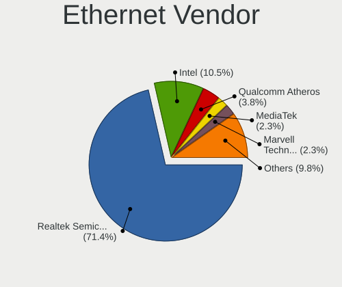

| Vendor                                 | Notebooks | Percent |
|----------------------------------------|-----------|---------|
| Realtek Semiconductor                  | 95        | 71.43%  |
| Intel                                  | 14        | 10.53%  |
| Qualcomm Atheros                       | 5         | 3.76%   |
| MediaTek                               | 3         | 2.26%   |
| Marvell Technology Group               | 3         | 2.26%   |
| Broadcom                               | 3         | 2.26%   |
| Xiaomi                                 | 2         | 1.5%    |
| Suzhou Motorcomm Electronic Technology | 2         | 1.5%    |
| Huawei Technologies                    | 2         | 1.5%    |
| OPPO Electronics                       | 1         | 0.75%   |
| ICS Advent                             | 1         | 0.75%   |
| Hewlett-Packard                        | 1         | 0.75%   |
| ASIX Electronics                       | 1         | 0.75%   |

Ethernet Model
--------------

Ethernet models

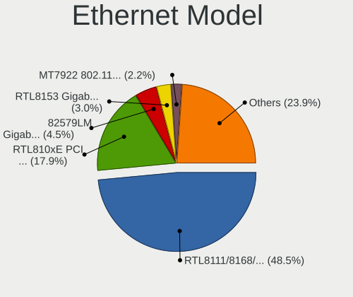

| Model                                                                  | Notebooks | Percent |
|------------------------------------------------------------------------|-----------|---------|
| Realtek RTL8111/8168/8211/8411 PCI Express Gigabit Ethernet Controller | 65        | 48.51%  |
| Realtek RTL810xE PCI Express Fast Ethernet controller                  | 24        | 17.91%  |
| Intel 82579LM Gigabit Network Connection (Lewisville)                  | 6         | 4.48%   |
| Realtek RTL8153 Gigabit Ethernet Adapter                               | 4         | 2.99%   |
| MediaTek MT7922 802.11ax PCI Express Wireless Network Adapter          | 3         | 2.24%   |
| Suzhou Motorcomm Electronic YT6801 Gigabit Ethernet Controller         | 2         | 1.49%   |
| Qualcomm Atheros AR8131 Gigabit Ethernet                               | 2         | 1.49%   |
| Marvell Group 88E8055 PCI-E Gigabit Ethernet Controller                | 2         | 1.49%   |
| Intel Alder Lake-P PCH CNVi WiFi                                       | 2         | 1.49%   |
| Huawei FOA-LX9                                                         | 2         | 1.49%   |
| Broadcom NetLink BCM57785 Gigabit Ethernet PCIe                        | 2         | 1.49%   |
| Xiaomi Mi/Redmi series (RNDIS)                                         | 1         | 0.75%   |
| Xiaomi Mi/Redmi series (RNDIS + ADB)                                   | 1         | 0.75%   |
| Realtek RTL8125 2.5GbE Controller                                      | 1         | 0.75%   |
| Realtek Killer E2600 GbE Controller                                    | 1         | 0.75%   |
| Qualcomm Atheros QCA8172 Fast Ethernet                                 | 1         | 0.75%   |
| Qualcomm Atheros QCA8171 Gigabit Ethernet                              | 1         | 0.75%   |
| Qualcomm Atheros AR8152 v2.0 Fast Ethernet                             | 1         | 0.75%   |
| OPPO Ace 3V                                                            | 1         | 0.75%   |
| Marvell Group 88E8071 PCI-E Gigabit Ethernet Controller                | 1         | 0.75%   |
| Intel Ethernet Connection I219-LM                                      | 1         | 0.75%   |
| Intel Ethernet Connection I218-V                                       | 1         | 0.75%   |
| Intel Ethernet Connection (6) I219-V                                   | 1         | 0.75%   |
| Intel Ethernet Connection (4) I219-LM                                  | 1         | 0.75%   |
| Intel Ethernet Connection (3) I218-V                                   | 1         | 0.75%   |
| Intel Ethernet Connection (3) I218-LM                                  | 1         | 0.75%   |
| Intel Ethernet Connection (16) I219-V                                  | 1         | 0.75%   |
| ICS Advent 10/100M LAN                                                 | 1         | 0.75%   |
| HP HP lt4120 Snapdragon X5 LTE                                         | 1         | 0.75%   |
| Broadcom NetXtreme BCM57765 Gigabit Ethernet PCIe                      | 1         | 0.75%   |
| ASIX AX88179 Gigabit Ethernet                                          | 1         | 0.75%   |

Net Controller Kind
-------------------

Ethernet, WiFi or modem

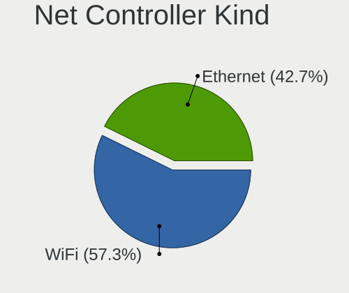

| Kind     | Notebooks | Percent |
|----------|-----------|---------|
| WiFi     | 169       | 57.29%  |
| Ethernet | 126       | 42.71%  |

Used Controller
---------------

Currently used network controller

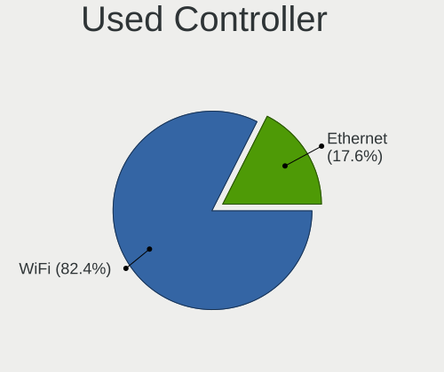

| Kind     | Notebooks | Percent |
|----------|-----------|---------|
| WiFi     | 142       | 80.68%  |
| Ethernet | 34        | 19.32%  |

NICs
----

Total network controllers on board

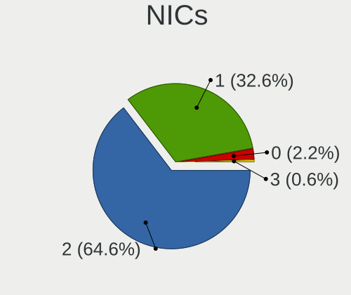

| Total | Notebooks | Percent |
|-------|-----------|---------|
| 2     | 115       | 64.61%  |
| 1     | 58        | 32.58%  |
| 0     | 4         | 2.25%   |
| 3     | 1         | 0.56%   |

IPv6
----

IPv6 vs IPv4

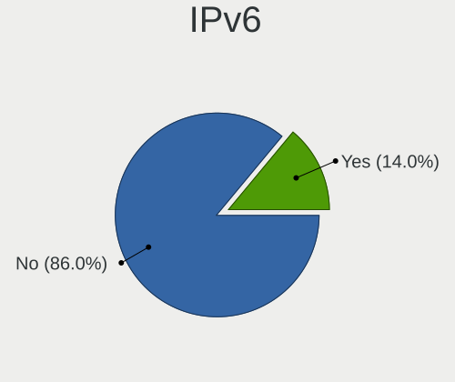

| Used | Notebooks | Percent |
|------|-----------|---------|
| No   | 154       | 86.03%  |
| Yes  | 25        | 13.97%  |

Bluetooth
---------

Bluetooth Vendor
----------------

Controller vendors

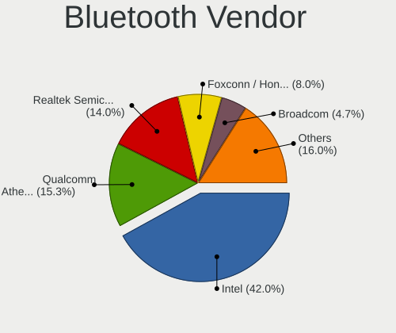

| Vendor                          | Notebooks | Percent |
|---------------------------------|-----------|---------|
| Intel                           | 63        | 42%     |
| Qualcomm Atheros Communications | 23        | 15.33%  |
| Realtek Semiconductor           | 21        | 14%     |
| Foxconn / Hon Hai               | 12        | 8%      |
| Broadcom                        | 7         | 4.67%   |
| Realtek                         | 6         | 4%      |
| IMC Networks                    | 6         | 4%      |
| Lite-On Technology              | 4         | 2.67%   |
| Cambridge Silicon Radio         | 2         | 1.33%   |
| Apple                           | 2         | 1.33%   |
| Toshiba                         | 1         | 0.67%   |
| Ralink Technology               | 1         | 0.67%   |
| MediaTek                        | 1         | 0.67%   |
| Dell                            | 1         | 0.67%   |

Bluetooth Model
---------------

Controller models

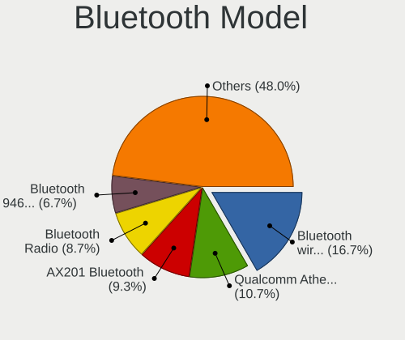

| Model                                                                               | Notebooks | Percent |
|-------------------------------------------------------------------------------------|-----------|---------|
| Intel Bluetooth wireless interface                                                  | 25        | 16.67%  |
| Qualcomm Atheros  Bluetooth Device                                                  | 16        | 10.67%  |
| Intel AX201 Bluetooth                                                               | 14        | 9.33%   |
| Realtek Bluetooth Radio                                                             | 13        | 8.67%   |
| Intel Bluetooth 9460/9560 Jefferson Peak (JfP)                                      | 10        | 6.67%   |
| Intel AX200 Bluetooth                                                               | 7         | 4.67%   |
| Realtek Bluetooth Radio                                                             | 6         | 4%      |
| Realtek  Bluetooth 4.2 Adapter                                                      | 5         | 3.33%   |
| Intel Bluetooth Device                                                              | 4         | 2.67%   |
| Broadcom BCM2045B (BDC-2.1)                                                         | 4         | 2.67%   |
| Qualcomm Atheros AR3012 Bluetooth 4.0                                               | 3         | 2%      |
| IMC Networks Wireless_Device                                                        | 3         | 2%      |
| Foxconn / Hon Hai Wireless_Device                                                   | 3         | 2%      |
| Qualcomm Atheros QCA61x4 Bluetooth 4.0                                              | 2         | 1.33%   |
| Lite-On Bluetooth Device                                                            | 2         | 1.33%   |
| Lite-On Atheros AR3012 Bluetooth                                                    | 2         | 1.33%   |
| Intel Centrino Bluetooth Wireless Transceiver                                       | 2         | 1.33%   |
| Foxconn / Hon Hai Bluetooth USB Host Controller                                     | 2         | 1.33%   |
| Foxconn / Hon Hai Bluetooth Device                                                  | 2         | 1.33%   |
| Foxconn / Hon Hai BCM43142A0                                                        | 2         | 1.33%   |
| Cambridge Silicon Radio Bluetooth Dongle (HCI mode)                                 | 2         | 1.33%   |
| Broadcom HP Portable SoftSailing                                                    | 2         | 1.33%   |
| Apple Bluetooth USB Host Controller                                                 | 2         | 1.33%   |
| Toshiba Bluetooth Radio                                                             | 1         | 0.67%   |
| Realtek RTL8822BE Bluetooth 4.2 Adapter                                             | 1         | 0.67%   |
| Realtek RTL8821A Bluetooth                                                          | 1         | 0.67%   |
| Realtek RTL8723B Bluetooth                                                          | 1         | 0.67%   |
| Ralink Motorola BC4 Bluetooth 3.0+HS Adapter                                        | 1         | 0.67%   |
| Qualcomm Atheros Bluetooth USB Host Controller                                      | 1         | 0.67%   |
| Qualcomm Atheros AR9462 Bluetooth                                                   | 1         | 0.67%   |
| MediaTek Wireless_Device                                                            | 1         | 0.67%   |
| Intel Wireless-AC 3168 Bluetooth                                                    | 1         | 0.67%   |
| IMC Networks Bluetooth Radio                                                        | 1         | 0.67%   |
| IMC Networks Bluetooth Device                                                       | 1         | 0.67%   |
| IMC Networks Atheros AR3012 Bluetooth 4.0 Adapter                                   | 1         | 0.67%   |
| Foxconn / Hon Hai MediaTek Bluetooth Adapter                                        | 1         | 0.67%   |
| Foxconn / Hon Hai Foxconn T77H114 BCM2070 [Single-Chip Bluetooth 2.1 + EDR Adapter] | 1         | 0.67%   |
| Foxconn / Hon Hai Broadcom BCM20702A1 Bluetooth                                     | 1         | 0.67%   |
| Dell DW375 Bluetooth Module                                                         | 1         | 0.67%   |
| Broadcom HP Portable Valentine                                                      | 1         | 0.67%   |

Sound
-----

Sound Vendor
------------

Sound card vendors

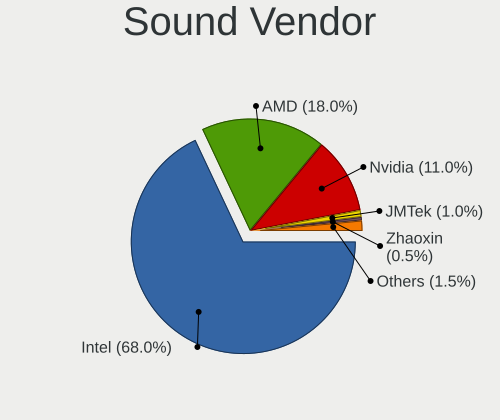

| Vendor                     | Notebooks | Percent |
|----------------------------|-----------|---------|
| Intel                      | 136       | 68%     |
| AMD                        | 36        | 18%     |
| Nvidia                     | 22        | 11%     |
| JMTek                      | 2         | 1%      |
| Zhaoxin                    | 1         | 0.5%    |
| Realtek Semiconductor      | 1         | 0.5%    |
| Creative Technology        | 1         | 0.5%    |
| Chengdu Haiguang IC Design | 1         | 0.5%    |

Sound Model
-----------

Sound card models

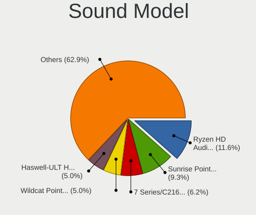

| Model                                                                                             | Notebooks | Percent |
|---------------------------------------------------------------------------------------------------|-----------|---------|
| AMD Ryzen HD Audio Controller                                                                     | 30        | 11.58%  |
| Intel Sunrise Point-LP HD Audio                                                                   | 24        | 9.27%   |
| Intel 7 Series/C216 Chipset Family High Definition Audio Controller                               | 16        | 6.18%   |
| Intel Wildcat Point-LP High Definition Audio Controller                                           | 13        | 5.02%   |
| Intel Haswell-ULT HD Audio Controller                                                             | 13        | 5.02%   |
| Intel Broadwell-U Audio Controller                                                                | 13        | 5.02%   |
| Intel 8 Series HD Audio Controller                                                                | 13        | 5.02%   |
| AMD Renoir/Cezanne HDMI/DP Audio Controller                                                       | 11        | 4.25%   |
| Intel 6 Series/C200 Series Chipset Family High Definition Audio Controller                        | 9         | 3.47%   |
| AMD Raven/Raven2/Fenghuang HDMI/DP Audio Controller                                               | 9         | 3.47%   |
| Intel 82801I (ICH9 Family) HD Audio Controller                                                    | 8         | 3.09%   |
| Intel Tiger Lake-LP Smart Sound Technology Audio Controller                                       | 7         | 2.7%    |
| Intel Cannon Point-LP High Definition Audio Controller                                            | 7         | 2.7%    |
| Intel Cannon Lake PCH cAVS                                                                        | 6         | 2.32%   |
| AMD Radeon High Definition Audio Controller                                                       | 6         | 2.32%   |
| Intel Comet Lake PCH-LP cAVS                                                                      | 5         | 1.93%   |
| Intel Celeron/Pentium Silver Processor High Definition Audio                                      | 5         | 1.93%   |
| Intel Alder Lake PCH-P High Definition Audio Controller                                           | 5         | 1.93%   |
| Nvidia TU107 GeForce GTX 1650 High Definition Audio Controller                                    | 4         | 1.54%   |
| Nvidia GP107GL High Definition Audio Controller                                                   | 3         | 1.16%   |
| Nvidia GA107 High Definition Audio Controller                                                     | 3         | 1.16%   |
| Nvidia GA106 High Definition Audio Controller                                                     | 3         | 1.16%   |
| Intel Raptor Lake-P/U/H cAVS                                                                      | 3         | 1.16%   |
| Intel Atom/Celeron/Pentium Processor x5-E8000/J3xxx/N3xxx Series High Definition Audio Controller | 3         | 1.16%   |
| Intel 5 Series/3400 Series Chipset High Definition Audio                                          | 3         | 1.16%   |
| AMD Kabini HDMI/DP Audio                                                                          | 3         | 1.16%   |
| AMD Family 15h (Models 60h-6fh) Audio Controller                                                  | 3         | 1.16%   |
| Nvidia AD106M High Definition Audio Controller                                                    | 2         | 0.77%   |
| JMTek USB PnP Audio Device                                                                        | 2         | 0.77%   |
| Intel CM238 HD Audio Controller                                                                   | 2         | 0.77%   |
| Intel Celeron N3350/Pentium N4200/Atom E3900 Series Audio Cluster                                 | 2         | 0.77%   |
| AMD Wrestler HDMI Audio                                                                           | 2         | 0.77%   |
| AMD FCH Azalia Controller                                                                         | 2         | 0.77%   |
| Zhaoxin ZX-E High Definition Audio Controller                                                     | 1         | 0.39%   |
| Zhaoxin ZX-100/KX-5000/KX-6000/KX-6000G/KH-40000/KX-7000 High Definition Audio Controller         | 1         | 0.39%   |
| Realtek Semiconductor Realtek USB2.0 Audio                                                        | 1         | 0.39%   |
| Nvidia TU106 High Definition Audio Controller                                                     | 1         | 0.39%   |
| Nvidia GK208 HDMI/DP Audio Controller                                                             | 1         | 0.39%   |
| Nvidia GK107 HDMI Audio Controller                                                                | 1         | 0.39%   |
| Nvidia GF119 HDMI Audio Controller                                                                | 1         | 0.39%   |

Memory
------

Memory Vendor
-------------

Memory module vendors

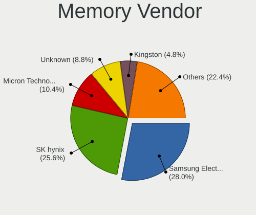

| Vendor              | Notebooks | Percent |
|---------------------|-----------|---------|
| Samsung Electronics | 35        | 28%     |
| SK hynix            | 32        | 25.6%   |
| Micron Technology   | 13        | 10.4%   |
| Unknown             | 11        | 8.8%    |
| Kingston            | 6         | 4.8%    |
| Ramaxel Technology  | 5         | 4%      |
| Smart               | 4         | 3.2%    |
| Nanya Technology    | 4         | 3.2%    |
| Unknown (ABCD)      | 3         | 2.4%    |
| Crucial             | 3         | 2.4%    |
| A-DATA Technology   | 2         | 1.6%    |
| Unknown (07FB)      | 1         | 0.8%    |
| UniIC               | 1         | 0.8%    |
| Smart Brazil        | 1         | 0.8%    |
| MTASE               | 1         | 0.8%    |
| Kingmax             | 1         | 0.8%    |
| ChangXin Memory     | 1         | 0.8%    |
| Unknown             | 1         | 0.8%    |

Memory Model
------------

Memory module models

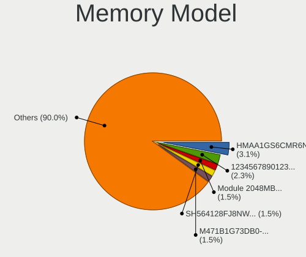

| Model                                                            | Notebooks | Percent |
|------------------------------------------------------------------|-----------|---------|
| SK hynix RAM HMAA1GS6CMR6N-VK 8GB Row Of Chips DDR4 2667MT/s     | 4         | 3.08%   |
| Unknown (ABCD) RAM 123456789012345678 2GB SODIMM LPDDR4 2400MT/s | 3         | 2.31%   |
| Unknown RAM Module 2048MB SODIMM DDR3 1333MT/s                   | 2         | 1.54%   |
| Smart RAM SH564128FJ8NWRNSQG 4GB SODIMM DDR3 1600MT/s            | 2         | 1.54%   |
| SK hynix RAM Module 8192MB SODIMM DDR4 2133MT/s                  | 2         | 1.54%   |
| Samsung RAM M471B1G73DB0-YK0 8GB SODIMM DDR3 1600MT/s            | 2         | 1.54%   |
| Samsung RAM M471A5244CB0-CTD 4GB SODIMM DDR4 3266MT/s            | 2         | 1.54%   |
| Samsung RAM M471A1K43CB1-CRC 8GB SODIMM DDR4 8400MT/s            | 2         | 1.54%   |
| Samsung RAM K4EBE304ED-EGCG 8GB Row Of Chips LPDDR3 2133MT/s     | 2         | 1.54%   |
| Micron RAM MT62F1G32D4DR-031 WT 4GB Row Of Chips LPDDR5 6400MT/s | 2         | 1.54%   |
| Micron RAM 4ATF1G64HZ-3G2E2 8GB SODIMM DDR4 3200MT/s             | 2         | 1.54%   |
| Micron RAM 4ATF1G64HZ-3G2E1 8GB SODIMM DDR4 3200MT/s             | 2         | 1.54%   |
| Unknown RAM Module 8GB SODIMM DDR3 1600MT/s                      | 1         | 0.77%   |
| Unknown RAM Module 8192MB SODIMM DDR3 1600MT/s                   | 1         | 0.77%   |
| Unknown RAM Module 4GB SODIMM LPDDR3 1600MT/s                    | 1         | 0.77%   |
| Unknown RAM Module 4096MB SODIMM DDR4 2667MT/s                   | 1         | 0.77%   |
| Unknown RAM Module 4096MB SODIMM DDR3 1333MT/s                   | 1         | 0.77%   |
| Unknown RAM Module 4096MB SODIMM DDR3                            | 1         | 0.77%   |
| Unknown RAM Module 2GB SODIMM DDR3 1333MT/s                      | 1         | 0.77%   |
| Unknown RAM Module 2048MB SODIMM LPDDR3 1600MT/s                 | 1         | 0.77%   |
| Unknown RAM Module 2048MB SODIMM DDR3                            | 1         | 0.77%   |
| Unknown RAM Module 2048MB SODIMM DDR2                            | 1         | 0.77%   |
| Unknown RAM Module 1024MB SODIMM LPDDR4 2400MT/s                 | 1         | 0.77%   |
| Unknown RAM Module 1024MB SODIMM DDR2                            | 1         | 0.77%   |
| Unknown (07FB) RAM GST32G08SCL196P-26 32GB SODIMM DDR4 2667MT/s  | 1         | 0.77%   |
| UniIC RAM SCA16GS03H1F1C-56B 16GB SODIMM DDR5 5600MT/s           | 1         | 0.77%   |
| Smart RAM SH564568FJ8NZRNSDR 2GB SODIMM DDR3 1600MT/s            | 1         | 0.77%   |
| Smart RAM SH564128FJ8NWRNSQR 4GB SODIMM DDR3 1600MT/s            | 1         | 0.77%   |
| Smart RAM SG564568FG8NWKF-Z1 2GB SODIMM DDR 800MT/s              | 1         | 0.77%   |
| Smart Brazil RAM SMS4TDC3C0K0446SCG 4GB SODIMM DDR4 2667MT/s     | 1         | 0.77%   |
| SK hynix RAM MPPS4GBPC1600 1.35 4096MB SODIMM DDR3 1600MT/s      | 1         | 0.77%   |
| SK hynix RAM Module 2048MB Row Of Chips LPDDR4 4267MT/s          | 1         | 0.77%   |
| SK hynix RAM Module 16GB SODIMM 5600MT/s                         | 1         | 0.77%   |
| SK hynix RAM Module 16384MB SODIMM DDR5 5600MT/s                 | 1         | 0.77%   |
| SK hynix RAM HMT451S6MFR8C-PB 4GB SODIMM DDR3 1600MT/s           | 1         | 0.77%   |
| SK hynix RAM HMT451S6BFR8A-PB 4GB SODIMM DDR3 1600MT/s           | 1         | 0.77%   |
| SK hynix RAM HMT425S6AFR6A-PB 2GB SODIMM DDR3 1600MT/s           | 1         | 0.77%   |
| SK hynix RAM HMT41GS6AFR8A-PB 8GB SODIMM DDR3 1600MT/s           | 1         | 0.77%   |
| SK hynix RAM HMT351S6CFR8C-PB 4GB SODIMM DDR3 1600MT/s           | 1         | 0.77%   |
| SK hynix RAM HMT351S6CFR8C-PB 4096MB SODIMM DDR3 1600MT/s        | 1         | 0.77%   |

Memory Kind
-----------

Memory module kinds

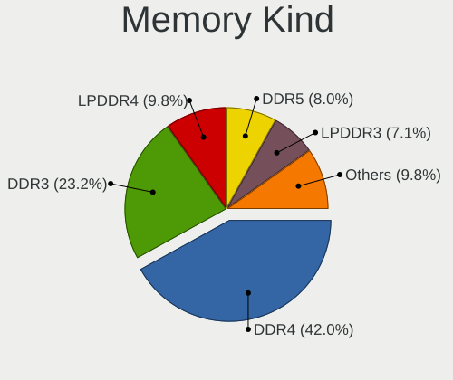

| Kind    | Notebooks | Percent |
|---------|-----------|---------|
| DDR4    | 47        | 41.96%  |
| DDR3    | 26        | 23.21%  |
| LPDDR4  | 11        | 9.82%   |
| DDR5    | 9         | 8.04%   |
| LPDDR3  | 8         | 7.14%   |
| LPDDR5  | 6         | 5.36%   |
| DDR2    | 3         | 2.68%   |
| SDRAM   | 1         | 0.89%   |
| Unknown | 1         | 0.89%   |

Memory Form Factor
------------------

Physical design of the memory module

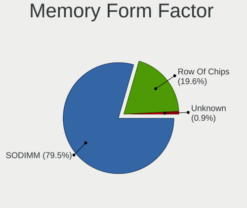

| Name         | Notebooks | Percent |
|--------------|-----------|---------|
| SODIMM       | 89        | 79.46%  |
| Row Of Chips | 22        | 19.64%  |
| Unknown      | 1         | 0.89%   |

Memory Size
-----------

Memory module size

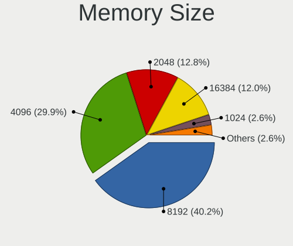

| Size  | Notebooks | Percent |
|-------|-----------|---------|
| 8192  | 47        | 40.17%  |
| 4096  | 35        | 29.91%  |
| 2048  | 15        | 12.82%  |
| 16384 | 14        | 11.97%  |
| 1024  | 3         | 2.56%   |
| 32768 | 2         | 1.71%   |
| 12288 | 1         | 0.85%   |

Memory Speed
------------

Memory module speed

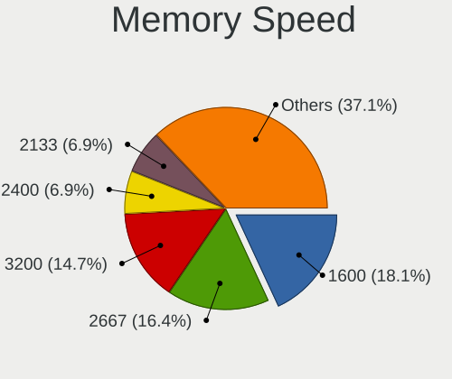

| Speed   | Notebooks | Percent |
|---------|-----------|---------|
| 1600    | 21        | 18.1%   |
| 2667    | 19        | 16.38%  |
| 3200    | 17        | 14.66%  |
| 2400    | 8         | 6.9%    |
| 2133    | 8         | 6.9%    |
| 5600    | 7         | 6.03%   |
| 1333    | 6         | 5.17%   |
| 6400    | 4         | 3.45%   |
| 4800    | 3         | 2.59%   |
| 4267    | 3         | 2.59%   |
| 1334    | 3         | 2.59%   |
| 8400    | 2         | 1.72%   |
| 3266    | 2         | 1.72%   |
| 800     | 2         | 1.72%   |
| Unknown | 2         | 1.72%   |
| 7500    | 1         | 0.86%   |
| 7467    | 1         | 0.86%   |
| 4266    | 1         | 0.86%   |
| 3733    | 1         | 0.86%   |
| 2933    | 1         | 0.86%   |
| 2666    | 1         | 0.86%   |
| 2048    | 1         | 0.86%   |
| 1867    | 1         | 0.86%   |
| 1066    | 1         | 0.86%   |

Printers & scanners
-------------------

Printer Vendor
--------------

Printer device vendors

Zero info for selected period =(

Printer Model
-------------

Printer device models

Zero info for selected period =(

Scanner Vendor
--------------

Scanner device vendors

Zero info for selected period =(

Scanner Model
-------------

Scanner device models

Zero info for selected period =(

Camera
------

Camera Vendor
-------------

Camera device vendors

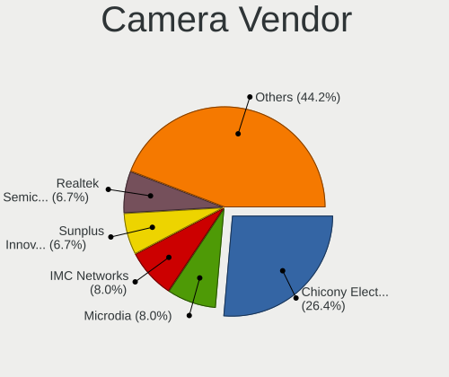

| Vendor                                 | Notebooks | Percent |
|----------------------------------------|-----------|---------|
| Chicony Electronics                    | 43        | 26.38%  |
| Microdia                               | 13        | 7.98%   |
| IMC Networks                           | 13        | 7.98%   |
| Sunplus Innovation Technology          | 11        | 6.75%   |
| Realtek Semiconductor                  | 11        | 6.75%   |
| Quanta                                 | 10        | 6.13%   |
| Syntek                                 | 7         | 4.29%   |
| Suyin                                  | 7         | 4.29%   |
| Silicon Motion                         | 7         | 4.29%   |
| Bison Electronics                      | 7         | 4.29%   |
| Cheng Uei Precision Industry (Foxlink) | 6         | 3.68%   |
| Luxvisions Innotech Limited            | 5         | 3.07%   |
| Lite-On Technology                     | 5         | 3.07%   |
| Alcor Micro                            | 3         | 1.84%   |
| Ricoh                                  | 2         | 1.23%   |
| Primax Electronics                     | 2         | 1.23%   |
| icSpring                               | 2         | 1.23%   |
| Web Camera                             | 1         | 0.61%   |
| SunplusIT                              | 1         | 0.61%   |
| LG Electronics                         | 1         | 0.61%   |
| Lenovo                                 | 1         | 0.61%   |
| kingcome                               | 1         | 0.61%   |
| Goodong Industry                       | 1         | 0.61%   |
| Genesys Logic                          | 1         | 0.61%   |
| BillionPixels                          | 1         | 0.61%   |
| Apple                                  | 1         | 0.61%   |

Camera Model
------------

Camera device models

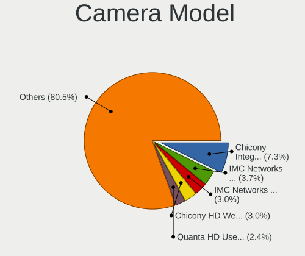

| Model                                                        | Notebooks | Percent |
|--------------------------------------------------------------|-----------|---------|
| Chicony Integrated Camera                                    | 12        | 7.32%   |
| IMC Networks HD Camera                                       | 6         | 3.66%   |
| IMC Networks Integrated Camera                               | 5         | 3.05%   |
| Chicony HD Webcam                                            | 5         | 3.05%   |
| Quanta HD User Facing                                        | 4         | 2.44%   |
| Chicony EasyCamera                                           | 4         | 2.44%   |
| Syntek EasyCamera                                            | 3         | 1.83%   |
| Sunplus Integrated_Webcam_HD                                 | 3         | 1.83%   |
| Silicon Motion Web Camera                                    | 3         | 1.83%   |
| Quanta HP TrueVision HD Camera                               | 3         | 1.83%   |
| Chicony TOSHIBA Web Camera - HD                              | 3         | 1.83%   |
| Cheng Uei Precision Industry (Foxlink) XiaoMi USB 2.0 Webcam | 3         | 1.83%   |
| Bison Integrated Camera                                      | 3         | 1.83%   |
| Syntek Lenovo EasyCamera                                     | 2         | 1.22%   |
| Syntek Integrated Camera                                     | 2         | 1.22%   |
| Suyin Integrated_Webcam_HD                                   | 2         | 1.22%   |
| Sunplus Integrated Camera                                    | 2         | 1.22%   |
| Sunplus HD WebCam                                            | 2         | 1.22%   |
| Realtek Integrated_Webcam_HD                                 | 2         | 1.22%   |
| Realtek HP "Truevision HD" laptop camera                     | 2         | 1.22%   |
| Primax HP HD Webcam [Fixed]                                  | 2         | 1.22%   |
| Microdia Integrated_Webcam_HD                                | 2         | 1.22%   |
| Microdia HP Integrated Webcam                                | 2         | 1.22%   |
| Luxvisions Innotech Limited Integrated Camera                | 2         | 1.22%   |
| Lite-On Integrated Camera                                    | 2         | 1.22%   |
| icSpring camera                                              | 2         | 1.22%   |
| Chicony USB2.0 VGA UVC WebCam                                | 2         | 1.22%   |
| Chicony USB2.0 Camera                                        | 2         | 1.22%   |
| Chicony HP Webcam                                            | 2         | 1.22%   |
| Chicony HP HD Webcam                                         | 2         | 1.22%   |
| Chicony HP 5MP Camera                                        | 2         | 1.22%   |
| Bison Integrated RGB Camera                                  | 2         | 1.22%   |
| Web Camera Web Camera                                        | 1         | 0.61%   |
| Suyin HP Webcam 101                                          | 1         | 0.61%   |
| Suyin HP Truevision HD                                       | 1         | 0.61%   |
| Suyin HD WebCam                                              | 1         | 0.61%   |
| Suyin Acer/HP Integrated Webcam [CN0314]                     | 1         | 0.61%   |
| Suyin 1.3M HD WebCam                                         | 1         | 0.61%   |
| SunplusIT HD Webcam                                          | 1         | 0.61%   |
| Sunplus XiaoMi USB 2.0 Webcam                                | 1         | 0.61%   |

Security
--------

Fingerprint Vendor
------------------

Fingerprint sensor vendors

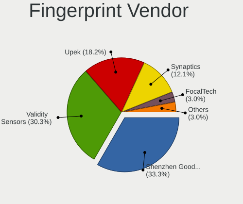

| Vendor                     | Notebooks | Percent |
|----------------------------|-----------|---------|
| Shenzhen Goodix Technology | 11        | 33.33%  |
| Validity Sensors           | 10        | 30.3%   |
| Upek                       | 6         | 18.18%  |
| Synaptics                  | 4         | 12.12%  |
| FocalTech                  | 1         | 3.03%   |
| Elan Microelectronics      | 1         | 3.03%   |

Fingerprint Model
-----------------

Fingerprint sensor models

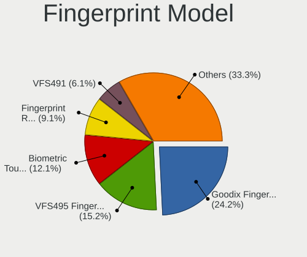

| Model                                                    | Notebooks | Percent |
|----------------------------------------------------------|-----------|---------|
| Shenzhen Goodix  Fingerprint Device                      | 8         | 24.24%  |
| Validity Sensors VFS495 Fingerprint Reader               | 5         | 15.15%  |
| Upek Biometric Touchchip/Touchstrip Fingerprint Sensor   | 4         | 12.12%  |
| Shenzhen Goodix Fingerprint Reader                       | 3         | 9.09%   |
| Validity Sensors VFS491                                  | 2         | 6.06%   |
| Validity Sensors Swipe Fingerprint Sensor                | 2         | 6.06%   |
| Upek TCS5B Fingerprint sensor                            | 2         | 6.06%   |
| Synaptics Prometheus MIS Touch Fingerprint Reader        | 2         | 6.06%   |
| Validity Sensors VFS5011 Fingerprint Reader              | 1         | 3.03%   |
| Synaptics Prometheus Fingerprint Reader                  | 1         | 3.03%   |
| Synaptics FS7604 Touch Fingerprint Sensor with PurePrint | 1         | 3.03%   |
| FocalTech FocalTech Fingerprint Device                   | 1         | 3.03%   |
| Elan ELAN:Fingerprint                                    | 1         | 3.03%   |

Chipcard Vendor
---------------

Chipcard module vendors

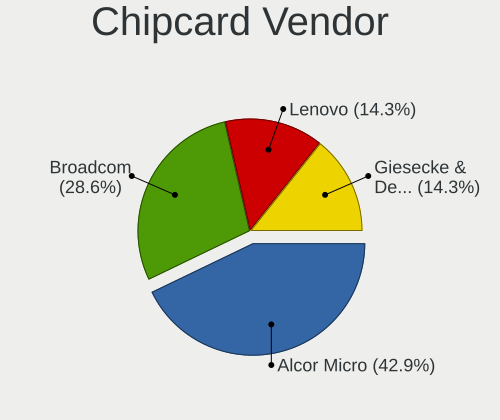

| Vendor              | Notebooks | Percent |
|---------------------|-----------|---------|
| Alcor Micro         | 3         | 42.86%  |
| Broadcom            | 2         | 28.57%  |
| Lenovo              | 1         | 14.29%  |
| Giesecke & Devrient | 1         | 14.29%  |

Chipcard Model
--------------

Chipcard module models

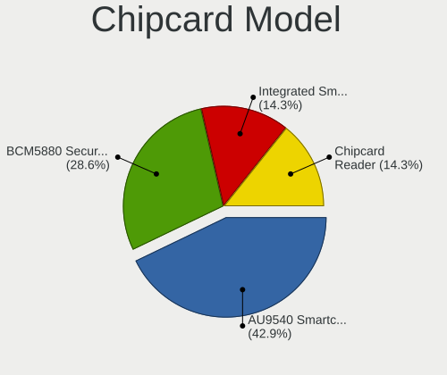

| Model                                          | Notebooks | Percent |
|------------------------------------------------|-----------|---------|
| Alcor Micro AU9540 Smartcard Reader            | 3         | 42.86%  |
| Broadcom BCM5880 Secure Applications Processor | 2         | 28.57%  |
| Lenovo Integrated Smart Card Reader            | 1         | 14.29%  |
| Giesecke & Devrient Chipcard Reader            | 1         | 14.29%  |

Unsupported
-----------

Unsupported Devices
-------------------

Total unsupported devices on board

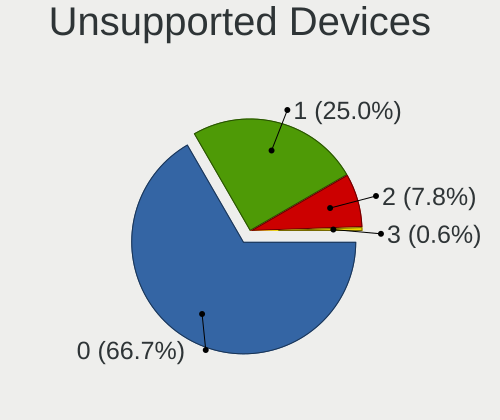

| Total | Notebooks | Percent |
|-------|-----------|---------|
| 0     | 120       | 66.67%  |
| 1     | 45        | 25%     |
| 2     | 14        | 7.78%   |
| 3     | 1         | 0.56%   |

Unsupported Device Types
------------------------

Types of unsupported devices

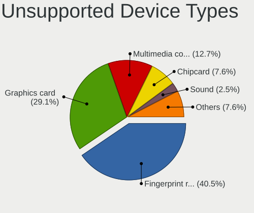

| Type                     | Notebooks | Percent |
|--------------------------|-----------|---------|
| Fingerprint reader       | 32        | 40.51%  |
| Graphics card            | 23        | 29.11%  |
| Multimedia controller    | 10        | 12.66%  |
| Chipcard                 | 6         | 7.59%   |
| Sound                    | 2         | 2.53%   |
| Net/wireless             | 2         | 2.53%   |
| Camera                   | 2         | 2.53%   |
| Storage                  | 1         | 1.27%   |
| Communication controller | 1         | 1.27%   |

