Deepin - Tested Hardware & Statistics (Notebooks)
-------------------------------------------------

A project to collect tested hardware configurations for Deepin.

Anyone can contribute to this report by the [hw-probe](https://github.com/linuxhw/hw-probe) tool:

    sudo -E hw-probe -all -upload

Please submit a probe of your configuration if it's not presented on the page or is rare.

Full-feature report is available here: https://linux-hardware.org/?view=trends

Contents
--------

* [ Test Cases ](#test-cases)

* [ System ](#system)
  - [ OS                       ](#os)
  - [ OS Family                ](#os-family)
  - [ Kernel                   ](#kernel)
  - [ Kernel Family            ](#kernel-family)
  - [ Kernel Major Ver.        ](#kernel-major-ver)
  - [ Arch                     ](#arch)
  - [ DE                       ](#de)
  - [ Display Server           ](#display-server)
  - [ Display Manager          ](#display-manager)
  - [ OS Lang                  ](#os-lang)
  - [ Boot Mode                ](#boot-mode)
  - [ Filesystem               ](#filesystem)
  - [ Part. scheme             ](#part-scheme)
  - [ Dual Boot with Linux/BSD ](#dual-boot-with-linuxbsd)
  - [ Dual Boot (Win)          ](#dual-boot-win)

* [ Board ](#board)
  - [ Vendor                   ](#vendor)
  - [ Model                    ](#model)
  - [ Model Family             ](#model-family)
  - [ MFG Year                 ](#mfg-year)
  - [ Form Factor              ](#form-factor)
  - [ Secure Boot              ](#secure-boot)
  - [ Coreboot                 ](#coreboot)
  - [ RAM Size                 ](#ram-size)
  - [ RAM Used                 ](#ram-used)
  - [ Total Drives             ](#total-drives)
  - [ Has CD-ROM               ](#has-cd-rom)
  - [ Has Ethernet             ](#has-ethernet)
  - [ Has WiFi                 ](#has-wifi)
  - [ Has Bluetooth            ](#has-bluetooth)

* [ Location ](#location)
  - [ Country                  ](#country)
  - [ City                     ](#city)

* [ Drives ](#drives)
  - [ Drive Vendor             ](#drive-vendor)
  - [ Drive Model              ](#drive-model)
  - [ HDD Vendor               ](#hdd-vendor)
  - [ SSD Vendor               ](#ssd-vendor)
  - [ Drive Kind               ](#drive-kind)
  - [ Drive Connector          ](#drive-connector)
  - [ Drive Size               ](#drive-size)
  - [ Space Total              ](#space-total)
  - [ Space Used               ](#space-used)
  - [ Malfunc. Drives          ](#malfunc-drives)
  - [ Malfunc. Drive Vendor    ](#malfunc-drive-vendor)
  - [ Malfunc. HDD Vendor      ](#malfunc-hdd-vendor)
  - [ Malfunc. Drive Kind      ](#malfunc-drive-kind)
  - [ Failed Drives            ](#failed-drives)
  - [ Failed Drive Vendor      ](#failed-drive-vendor)
  - [ Drive Status             ](#drive-status)

* [ Storage controller ](#storage-controller)
  - [ Storage Vendor           ](#storage-vendor)
  - [ Storage Model            ](#storage-model)
  - [ Storage Kind             ](#storage-kind)

* [ Processor ](#processor)
  - [ CPU Vendor               ](#cpu-vendor)
  - [ CPU Model                ](#cpu-model)
  - [ CPU Model Family         ](#cpu-model-family)
  - [ CPU Cores                ](#cpu-cores)
  - [ CPU Sockets              ](#cpu-sockets)
  - [ CPU Threads              ](#cpu-threads)
  - [ CPU Op-Modes             ](#cpu-op-modes)
  - [ CPU Microcode            ](#cpu-microcode)
  - [ CPU Microarch            ](#cpu-microarch)

* [ Graphics ](#graphics)
  - [ GPU Vendor               ](#gpu-vendor)
  - [ GPU Model                ](#gpu-model)
  - [ GPU Combo                ](#gpu-combo)
  - [ GPU Driver               ](#gpu-driver)
  - [ GPU Memory               ](#gpu-memory)

* [ Monitor ](#monitor)
  - [ Monitor Vendor           ](#monitor-vendor)
  - [ Monitor Model            ](#monitor-model)
  - [ Monitor Resolution       ](#monitor-resolution)
  - [ Monitor Diagonal         ](#monitor-diagonal)
  - [ Monitor Width            ](#monitor-width)
  - [ Aspect Ratio             ](#aspect-ratio)
  - [ Monitor Area             ](#monitor-area)
  - [ Pixel Density            ](#pixel-density)
  - [ Multiple Monitors        ](#multiple-monitors)

* [ Network ](#network)
  - [ Net Controller Vendor    ](#net-controller-vendor)
  - [ Net Controller Model     ](#net-controller-model)
  - [ Wireless Vendor          ](#wireless-vendor)
  - [ Wireless Model           ](#wireless-model)
  - [ Ethernet Vendor          ](#ethernet-vendor)
  - [ Ethernet Model           ](#ethernet-model)
  - [ Net Controller Kind      ](#net-controller-kind)
  - [ Used Controller          ](#used-controller)
  - [ NICs                     ](#nics)
  - [ IPv6                     ](#ipv6)

* [ Bluetooth ](#bluetooth)
  - [ Bluetooth Vendor         ](#bluetooth-vendor)
  - [ Bluetooth Model          ](#bluetooth-model)

* [ Sound ](#sound)
  - [ Sound Vendor             ](#sound-vendor)
  - [ Sound Model              ](#sound-model)

* [ Memory ](#memory)
  - [ Memory Vendor            ](#memory-vendor)
  - [ Memory Model             ](#memory-model)
  - [ Memory Kind              ](#memory-kind)
  - [ Memory Form Factor       ](#memory-form-factor)
  - [ Memory Size              ](#memory-size)
  - [ Memory Speed             ](#memory-speed)

* [ Printers & scanners ](#printers--scanners)
  - [ Printer Vendor           ](#printer-vendor)
  - [ Printer Model            ](#printer-model)
  - [ Scanner Vendor           ](#scanner-vendor)
  - [ Scanner Model            ](#scanner-model)

* [ Camera ](#camera)
  - [ Camera Vendor            ](#camera-vendor)
  - [ Camera Model             ](#camera-model)

* [ Security ](#security)
  - [ Fingerprint Vendor       ](#fingerprint-vendor)
  - [ Fingerprint Model        ](#fingerprint-model)
  - [ Chipcard Vendor          ](#chipcard-vendor)
  - [ Chipcard Model           ](#chipcard-model)

* [ Unsupported ](#unsupported)
  - [ Unsupported Devices      ](#unsupported-devices)
  - [ Unsupported Device Types ](#unsupported-device-types)

Test Cases
----------

Total: 146

| Vendor    | Model                       | Probe                                                      | Date         |
|-----------|-----------------------------|------------------------------------------------------------|--------------|
| HP        | EliteBook 8570w             | [131c9a7dc2](https://linux-hardware.org/?probe=131c9a7dc2) | Jan 27, 2022 |
| Lenovo    | Yoga 3 Pro-1370 80HE        | [f891c69576](https://linux-hardware.org/?probe=f891c69576) | Jan 08, 2022 |
| Google    | Akemi                       | [295fd594af](https://linux-hardware.org/?probe=295fd594af) | Dec 27, 2021 |
| Acer      | Aspire VN7-572G             | [895dca26b0](https://linux-hardware.org/?probe=895dca26b0) | Dec 21, 2021 |
| HUAWEI    | HN-WX9X                     | [f228b60d0c](https://linux-hardware.org/?probe=f228b60d0c) | Dec 07, 2021 |
| HP        | EliteBook 8570w             | [7752a79879](https://linux-hardware.org/?probe=7752a79879) | Dec 06, 2021 |
| HP        | Laptop 14-ck0xxx            | [4b03ed047c](https://linux-hardware.org/?probe=4b03ed047c) | Dec 06, 2021 |
| Samsung   | 550P5C/550P7C               | [31bc59dcb9](https://linux-hardware.org/?probe=31bc59dcb9) | Nov 12, 2021 |
| Lenovo    | ThinkBook 13s-IWL 20R9      | [88d791ff87](https://linux-hardware.org/?probe=88d791ff87) | Nov 09, 2021 |
| Dell      | Latitude 3400               | [7f519c2721](https://linux-hardware.org/?probe=7f519c2721) | Oct 23, 2021 |
| Samsung   | 550P5C/550P7C               | [2713972f14](https://linux-hardware.org/?probe=2713972f14) | Oct 22, 2021 |
| HP        | ZHAN 66 Pro G1              | [a1a1c41c6a](https://linux-hardware.org/?probe=a1a1c41c6a) | Oct 09, 2021 |
| HP        | ZHAN 66 Pro G1              | [fcc291e2f1](https://linux-hardware.org/?probe=fcc291e2f1) | Oct 08, 2021 |
| Lenovo    | Legion Y7000 2020 82AV      | [64d71e1177](https://linux-hardware.org/?probe=64d71e1177) | Sep 29, 2021 |
| HP        | Laptop 15-bs0xx             | [fc0f8f406b](https://linux-hardware.org/?probe=fc0f8f406b) | Aug 31, 2021 |
| Lenovo    | ThinkPad L412 0585AC3       | [f31b3187c3](https://linux-hardware.org/?probe=f31b3187c3) | Aug 23, 2021 |
| Lenovo    | Legion R9000K2021H 82N6     | [048b8332cc](https://linux-hardware.org/?probe=048b8332cc) | Aug 13, 2021 |
| ASUSTek   | ASUS TUF Gaming A15 FA50... | [5e1cc5b229](https://linux-hardware.org/?probe=5e1cc5b229) | Aug 11, 2021 |
| Lenovo    | XiaoXinAir-14ARE 2020 81... | [d563d62b5f](https://linux-hardware.org/?probe=d563d62b5f) | Jul 14, 2021 |
| Acer      | Aspire 5750G                | [61b9408d9e](https://linux-hardware.org/?probe=61b9408d9e) | Jul 11, 2021 |
| Acer      | Aspire 5750G                | [59728d9bef](https://linux-hardware.org/?probe=59728d9bef) | Jul 11, 2021 |
| HUAWEI    | HLYL-WXX9                   | [26b5b9e3d3](https://linux-hardware.org/?probe=26b5b9e3d3) | Jul 06, 2021 |
| Lenovo    | ZhaoYangCF4620Z-A123 590... | [6f716961de](https://linux-hardware.org/?probe=6f716961de) | Jun 29, 2021 |
| Lenovo    | XiaoXin-15ARE 2020 81YR     | [279dea011e](https://linux-hardware.org/?probe=279dea011e) | Jun 28, 2021 |
| Lenovo    | ThinkBook 14 G2 ARE R7 8... | [b2c24061a6](https://linux-hardware.org/?probe=b2c24061a6) | Jun 13, 2021 |
| Lenovo    | IdeaPad 320-15IKB 80XL      | [0540d35606](https://linux-hardware.org/?probe=0540d35606) | May 31, 2021 |
| Samsung   | 300E4A/300E5A/300E7A/343... | [30ffaaaad4](https://linux-hardware.org/?probe=30ffaaaad4) | May 22, 2021 |
| Samsung   | 300E4A/300E5A/300E7A/343... | [91b9340ed6](https://linux-hardware.org/?probe=91b9340ed6) | May 20, 2021 |
| ASUSTek   | VivoBook 15_ASUS Laptop ... | [68740fff81](https://linux-hardware.org/?probe=68740fff81) | May 16, 2021 |
| Unknown   | Unknown                     | [4d3ffa307c](https://linux-hardware.org/?probe=4d3ffa307c) | Apr 26, 2021 |
| Unknown   | Unknown                     | [8d019adbf9](https://linux-hardware.org/?probe=8d019adbf9) | Apr 26, 2021 |
| Lenovo    | ThinkPad T420 4180M8P       | [1fe655cf93](https://linux-hardware.org/?probe=1fe655cf93) | Apr 25, 2021 |
| Toshiba   | Satellite E55t-A            | [e1a3602d7b](https://linux-hardware.org/?probe=e1a3602d7b) | Mar 28, 2021 |
| Unknown   | Unknown                     | [94f00d3697](https://linux-hardware.org/?probe=94f00d3697) | Mar 27, 2021 |
| Unknown   | Unknown                     | [9ddedfd3c9](https://linux-hardware.org/?probe=9ddedfd3c9) | Feb 13, 2021 |
| HP        | Pavilion Laptop 14-bf0xx    | [309266e981](https://linux-hardware.org/?probe=309266e981) | Feb 13, 2021 |
| Dell      | Inspiron 7720               | [8c8689a8ba](https://linux-hardware.org/?probe=8c8689a8ba) | Feb 08, 2021 |
| Acer      | Aspire V5-571P              | [e03d4bc850](https://linux-hardware.org/?probe=e03d4bc850) | Feb 07, 2021 |
| Dell      | Inspiron 5547               | [e2cee5283f](https://linux-hardware.org/?probe=e2cee5283f) | Feb 04, 2021 |
| HUAWEI    | HN-WX9X                     | [b0ca634dee](https://linux-hardware.org/?probe=b0ca634dee) | Jan 28, 2021 |
| Lenovo    | ThinkPad E14 20RA0058VA     | [3c08ce49f5](https://linux-hardware.org/?probe=3c08ce49f5) | Jan 08, 2021 |
| Acer      | Aspire 4736Z                | [dd3b50729f](https://linux-hardware.org/?probe=dd3b50729f) | Jan 07, 2021 |
| ASUSTek   | X406UAR                     | [42e509209a](https://linux-hardware.org/?probe=42e509209a) | Dec 20, 2020 |
| ASUSTek   | X406UAR                     | [23b1fae05b](https://linux-hardware.org/?probe=23b1fae05b) | Dec 20, 2020 |
| Lenovo    | IdeaPad 3 14ARE05 81W3      | [667577cb5f](https://linux-hardware.org/?probe=667577cb5f) | Dec 15, 2020 |
| Lenovo    | G50-80 80L0                 | [951a5a280f](https://linux-hardware.org/?probe=951a5a280f) | Dec 11, 2020 |
| Acer      | Nitro AN515-54              | [d46eb4b9c9](https://linux-hardware.org/?probe=d46eb4b9c9) | Nov 19, 2020 |
| Acer      | Nitro AN515-54              | [877187c708](https://linux-hardware.org/?probe=877187c708) | Nov 19, 2020 |
| Lenovo    | ThinkPad E585 20KV0010US    | [033f6f0920](https://linux-hardware.org/?probe=033f6f0920) | Nov 18, 2020 |
| Lenovo    | ThinkPad E585 20KV0010US    | [d2bedcab13](https://linux-hardware.org/?probe=d2bedcab13) | Nov 18, 2020 |
| Lenovo    | IdeaPad S145-15API 81UT     | [b687de4d3c](https://linux-hardware.org/?probe=b687de4d3c) | Nov 05, 2020 |
| Toshiba   | Satellite C850D-11K         | [53f5d002c9](https://linux-hardware.org/?probe=53f5d002c9) | Oct 31, 2020 |
| HP        | ENVY 15                     | [c23287b06d](https://linux-hardware.org/?probe=c23287b06d) | Oct 31, 2020 |
| Acer      | Swift SF314-42              | [628265bca0](https://linux-hardware.org/?probe=628265bca0) | Oct 25, 2020 |
| Acer      | Swift SF314-42              | [01143e194b](https://linux-hardware.org/?probe=01143e194b) | Oct 20, 2020 |
| Lenovo    | IdeaPad 110-14IBR 80UJ      | [8d149c1a39](https://linux-hardware.org/?probe=8d149c1a39) | Oct 17, 2020 |
| Acer      | Nitro AN515-52              | [ca3d5b9444](https://linux-hardware.org/?probe=ca3d5b9444) | Oct 13, 2020 |
| Microtech | ebookPro                    | [2f1ff6265a](https://linux-hardware.org/?probe=2f1ff6265a) | Oct 10, 2020 |
| HUAWEI    | NBLK-WAX9X                  | [88e5775f0f](https://linux-hardware.org/?probe=88e5775f0f) | Oct 02, 2020 |
| HUAWEI    | NBLK-WAX9X                  | [2972557e3e](https://linux-hardware.org/?probe=2972557e3e) | Oct 02, 2020 |
| Lenovo    | G50-70 20351                | [c5ea28ed29](https://linux-hardware.org/?probe=c5ea28ed29) | Sep 28, 2020 |
| HP        | ENVY 15                     | [e7bfa62e4c](https://linux-hardware.org/?probe=e7bfa62e4c) | Sep 23, 2020 |
| Samsung   | 270E5J/2570EJ               | [d00667e263](https://linux-hardware.org/?probe=d00667e263) | Sep 21, 2020 |
| HP        | Pavilion 15                 | [f824ed9d26](https://linux-hardware.org/?probe=f824ed9d26) | Sep 18, 2020 |
| HP        | Pavilion 15                 | [d95e413136](https://linux-hardware.org/?probe=d95e413136) | Sep 16, 2020 |
| Dell      | Inspiron 3583               | [860b906339](https://linux-hardware.org/?probe=860b906339) | Sep 14, 2020 |
| Lenovo    | V310-15ISK 80SY             | [043d555fa5](https://linux-hardware.org/?probe=043d555fa5) | Sep 05, 2020 |
| Acer      | Aspire E5-571               | [84a6667f77](https://linux-hardware.org/?probe=84a6667f77) | Sep 05, 2020 |
| Acer      | Aspire 5735                 | [0e4c64618a](https://linux-hardware.org/?probe=0e4c64618a) | Sep 03, 2020 |
| Dell      | Inspiron 3583               | [885667a4cd](https://linux-hardware.org/?probe=885667a4cd) | Sep 02, 2020 |
| Samsung   | 340XAA/350XAA/550XAA        | [e4b74d9442](https://linux-hardware.org/?probe=e4b74d9442) | Sep 02, 2020 |
| Dell      | Inspiron 5447               | [bc69598c5f](https://linux-hardware.org/?probe=bc69598c5f) | Aug 28, 2020 |
| Dell      | Inspiron 5447               | [b9bf539788](https://linux-hardware.org/?probe=b9bf539788) | Jul 26, 2020 |
| Samsung   | 500R4K/500R5H/5400RK/501... | [b73122dcbf](https://linux-hardware.org/?probe=b73122dcbf) | Jul 24, 2020 |
| Dell      | Inspiron 7520               | [0e4bbcdaca](https://linux-hardware.org/?probe=0e4bbcdaca) | Jul 19, 2020 |
| Lenovo    | ThinkPad L512 44444NG       | [bfda7d01d5](https://linux-hardware.org/?probe=bfda7d01d5) | Jun 30, 2020 |
| HP        | EliteBook 820 G3            | [1ad623b060](https://linux-hardware.org/?probe=1ad623b060) | Jun 20, 2020 |
| HP        | EliteBook 820 G3            | [5517a703d4](https://linux-hardware.org/?probe=5517a703d4) | Jun 15, 2020 |
| Chuwi     | AeroBook                    | [12312a6c5b](https://linux-hardware.org/?probe=12312a6c5b) | Jun 03, 2020 |
| Chuwi     | AeroBook                    | [fdcf37b34d](https://linux-hardware.org/?probe=fdcf37b34d) | Jun 01, 2020 |
| Chuwi     | AeroBook                    | [5889780485](https://linux-hardware.org/?probe=5889780485) | Jun 01, 2020 |
| Chuwi     | AeroBook                    | [6a57e4427b](https://linux-hardware.org/?probe=6a57e4427b) | Jun 01, 2020 |
| Google    | Edgar                       | [ed3bf69957](https://linux-hardware.org/?probe=ed3bf69957) | May 28, 2020 |
| ASUSTek   | T100TAF                     | [6d2999ebb1](https://linux-hardware.org/?probe=6d2999ebb1) | May 26, 2020 |
| HP        | Pavilion Notebook           | [825d07d907](https://linux-hardware.org/?probe=825d07d907) | May 14, 2020 |
| Lenovo    | IdeaPad 120S-11IAP 81A4     | [49661d90bd](https://linux-hardware.org/?probe=49661d90bd) | Apr 19, 2020 |
| HP        | EliteBook 8570p             | [6928abb72d](https://linux-hardware.org/?probe=6928abb72d) | Apr 07, 2020 |
| HP        | EliteBook 8570p             | [020c71d11e](https://linux-hardware.org/?probe=020c71d11e) | Apr 07, 2020 |
| HP        | EliteBook 8570p             | [163b885549](https://linux-hardware.org/?probe=163b885549) | Apr 07, 2020 |
| Sony      | VGN-NS140D                  | [dbae86d335](https://linux-hardware.org/?probe=dbae86d335) | Apr 06, 2020 |
| HP        | Pavilion Laptop 14-ce0xx... | [76c9608867](https://linux-hardware.org/?probe=76c9608867) | Mar 24, 2020 |
| HP        | Pavilion Laptop 14-ce0xx... | [81e20268cd](https://linux-hardware.org/?probe=81e20268cd) | Mar 24, 2020 |
| Fujitsu   | FARQ06012Z                  | [6d19311f7e](https://linux-hardware.org/?probe=6d19311f7e) | Mar 23, 2020 |
| HP        | EliteBook 820 G4            | [b525dfeb66](https://linux-hardware.org/?probe=b525dfeb66) | Mar 01, 2020 |
| HP        | EliteBook 820 G4            | [e28f1711fd](https://linux-hardware.org/?probe=e28f1711fd) | Mar 01, 2020 |
| CCE       | Capella & IbexPeak-M Chi... | [b6b6b3d6d5](https://linux-hardware.org/?probe=b6b6b3d6d5) | Mar 01, 2020 |
| HP        | ENVY 15                     | [a8fb8c36bf](https://linux-hardware.org/?probe=a8fb8c36bf) | Jan 22, 2020 |
| Acer      | P5WE0                       | [a3377994d6](https://linux-hardware.org/?probe=a3377994d6) | Jan 18, 2020 |
| HP        | 250 G5 Notebook PC          | [6882e04fe6](https://linux-hardware.org/?probe=6882e04fe6) | Jan 16, 2020 |
| Acer      | Nitro AN515-54              | [af36fc8a7c](https://linux-hardware.org/?probe=af36fc8a7c) | Jan 15, 2020 |
| Acer      | Nitro AN515-54              | [d96a34fd91](https://linux-hardware.org/?probe=d96a34fd91) | Jan 15, 2020 |
| Acer      | Nitro AN515-54              | [dbd7e76364](https://linux-hardware.org/?probe=dbd7e76364) | Jan 15, 2020 |
| HUAWEI    | HLY-WX9XX                   | [9f6e79326e](https://linux-hardware.org/?probe=9f6e79326e) | Jan 14, 2020 |
| Dell      | XPS 13 9360                 | [60888ae202](https://linux-hardware.org/?probe=60888ae202) | Jan 14, 2020 |
| Lenovo    | ThinkPad T420 4236CU8       | [0222255c98](https://linux-hardware.org/?probe=0222255c98) | Jan 12, 2020 |
| Toshiba   | Satellite L75-C             | [649fb9a60a](https://linux-hardware.org/?probe=649fb9a60a) | Jan 03, 2020 |
| Toshiba   | Satellite L75-C             | [ac2b91127b](https://linux-hardware.org/?probe=ac2b91127b) | Jan 03, 2020 |
| Toshiba   | Satellite L75-C             | [2b66fb3c5e](https://linux-hardware.org/?probe=2b66fb3c5e) | Jan 03, 2020 |
| Toshiba   | Satellite C850-1H6          | [a0ffb29c6c](https://linux-hardware.org/?probe=a0ffb29c6c) | Dec 18, 2019 |
| Lenovo    | Unknown                     | [10ab399874](https://linux-hardware.org/?probe=10ab399874) | Dec 14, 2019 |
| Lenovo    | IdeaPad S145-15IWL 81S9     | [d1b18250b9](https://linux-hardware.org/?probe=d1b18250b9) | Dec 04, 2019 |
| bq        | Tesla2 W10                  | [27f3692e24](https://linux-hardware.org/?probe=27f3692e24) | Dec 04, 2019 |
| bq        | Tesla2 W10                  | [4c37070709](https://linux-hardware.org/?probe=4c37070709) | Dec 04, 2019 |
| HP        | Pavilion 15                 | [03188ddfb3](https://linux-hardware.org/?probe=03188ddfb3) | Dec 03, 2019 |
| HP        | Pavilion 15                 | [ae59f09d06](https://linux-hardware.org/?probe=ae59f09d06) | Nov 19, 2019 |
| Acer      | Aspire E5-571G              | [afc9fdb4b3](https://linux-hardware.org/?probe=afc9fdb4b3) | Nov 14, 2019 |
| Acer      | Aspire E5-571G              | [7914862967](https://linux-hardware.org/?probe=7914862967) | Nov 14, 2019 |
| ASUSTek   | K501LX                      | [e90c15e3c9](https://linux-hardware.org/?probe=e90c15e3c9) | Nov 10, 2019 |
| Samsung   | 340XAA/350XAA/550XAA        | [997462e90b](https://linux-hardware.org/?probe=997462e90b) | Oct 19, 2019 |
| Sony      | SVF14A190X                  | [0b9bdec363](https://linux-hardware.org/?probe=0b9bdec363) | Oct 08, 2019 |
| Lenovo    | IdeaPad 120S-11IAP 81A4     | [c4f25ea846](https://linux-hardware.org/?probe=c4f25ea846) | Oct 07, 2019 |
| Gateway   | NE56R                       | [d0978555c2](https://linux-hardware.org/?probe=d0978555c2) | Sep 11, 2019 |
| Sony      | SVE14135CXP                 | [1b1819d6c0](https://linux-hardware.org/?probe=1b1819d6c0) | Aug 13, 2019 |
| Dell      | Inspiron 1428               | [d12daa7b97](https://linux-hardware.org/?probe=d12daa7b97) | Aug 01, 2019 |
| Dell      | Inspiron 1428               | [44b9085f50](https://linux-hardware.org/?probe=44b9085f50) | Aug 01, 2019 |
| Dell      | Inspiron 17 7000 Series ... | [37b056e670](https://linux-hardware.org/?probe=37b056e670) | Jul 23, 2019 |
| Timi      | TM1701                      | [cde89e0f6e](https://linux-hardware.org/?probe=cde89e0f6e) | Jun 13, 2019 |
| Dell      | Latitude E6420              | [c5063bb936](https://linux-hardware.org/?probe=c5063bb936) | May 12, 2019 |
| Dell      | Latitude E6420              | [9563d07d0a](https://linux-hardware.org/?probe=9563d07d0a) | May 12, 2019 |
| Acer      | Aspire 7741                 | [38acfde0bd](https://linux-hardware.org/?probe=38acfde0bd) | Apr 25, 2019 |
| ASUSTek   | N46VM                       | [c22250e143](https://linux-hardware.org/?probe=c22250e143) | Apr 25, 2019 |
| ASUSTek   | N46VM                       | [def5c1c07c](https://linux-hardware.org/?probe=def5c1c07c) | Apr 25, 2019 |
| Positivo  | C14CU51                     | [87fe4181bd](https://linux-hardware.org/?probe=87fe4181bd) | Apr 08, 2019 |
| HP        | Unknown                     | [53f0f72dd6](https://linux-hardware.org/?probe=53f0f72dd6) | Apr 02, 2019 |
| Sony      | VPCYB25AB                   | [035925b406](https://linux-hardware.org/?probe=035925b406) | Apr 01, 2019 |
| HP        | G42                         | [c0b7643d96](https://linux-hardware.org/?probe=c0b7643d96) | Mar 28, 2019 |
| HP        | Pavilion Notebook           | [53fb4de336](https://linux-hardware.org/?probe=53fb4de336) | Mar 27, 2019 |
| HP        | Pavilion Notebook           | [9a4cbb7444](https://linux-hardware.org/?probe=9a4cbb7444) | Mar 27, 2019 |
| Samsung   | 800G5M/800G5W               | [efdc2e3d09](https://linux-hardware.org/?probe=efdc2e3d09) | Mar 27, 2019 |
| HP        | EliteBook 840 G2            | [86742db945](https://linux-hardware.org/?probe=86742db945) | Mar 27, 2019 |
| Standard  | MB45II/MB45IN               | [5a6f9cc354](https://linux-hardware.org/?probe=5a6f9cc354) | Mar 27, 2019 |
| Lenovo    | IdeaPad 320-15IKB 80YH      | [619a0d9d90](https://linux-hardware.org/?probe=619a0d9d90) | Mar 27, 2019 |
| Lenovo    | G400s VILG1                 | [a18da046c8](https://linux-hardware.org/?probe=a18da046c8) | Mar 27, 2019 |
| Lenovo    | ThinkPad E450c 20EHA00NC... | [deac2364d1](https://linux-hardware.org/?probe=deac2364d1) | Jan 30, 2019 |
| Lenovo    | ThinkPad E450c 20EHA00NC... | [1629601591](https://linux-hardware.org/?probe=1629601591) | Jan 30, 2019 |
| Lenovo    | ThinkPad E450c 20EHA00NC... | [b314214e24](https://linux-hardware.org/?probe=b314214e24) | Dec 25, 2018 |

System
------

OS
--

Installed operating systems

| Name           | Notebooks | Percent |
|----------------|-----------|---------|
| Deepin         | 29        | 26.13%  |
| Deepin 15.11   | 23        | 20.72%  |
| Deepin 20      | 20        | 18.02%  |
| Deepin 15.9.2  | 8         | 7.21%   |
| UOS 20         | 6         | 5.41%   |
| Deepin 20.3    | 5         | 4.5%    |
| Deepin 20.1    | 4         | 3.6%    |
| Deepin 20 beta | 3         | 2.7%    |
| Deepin 20.2.4  | 2         | 1.8%    |
| Deepin 15.9.3  | 2         | 1.8%    |
| Deepin 23      | 1         | 0.9%    |
| Deepin 2014.3  | 1         | 0.9%    |
| Deepin 20.4    | 1         | 0.9%    |
| Deepin 20.2.3  | 1         | 0.9%    |
| Deepin 20.2.1  | 1         | 0.9%    |
| Deepin 15.9    | 1         | 0.9%    |
| Deepin 15.8    | 1         | 0.9%    |
| Deepin 15.10.1 | 1         | 0.9%    |
| Deepin 15.10   | 1         | 0.9%    |

OS Family
---------

OS without a version

| Name   | Notebooks | Percent |
|--------|-----------|---------|
| Deepin | 107       | 100%    |

Kernel
------

Version of the Linux kernel

| Version                 | Notebooks | Percent |
|-------------------------|-----------|---------|
| 4.15.0-30deepin-generic | 32        | 29.09%  |
| 5.4.50-amd64-desktop    | 16        | 14.55%  |
| 4.15.0-29deepin-generic | 12        | 10.91%  |
| 5.4.70-amd64-desktop    | 9         | 8.18%   |
| 5.10.60-amd64-desktop   | 8         | 7.27%   |
| 5.7.7-amd64-desktop     | 4         | 3.64%   |
| 5.10.41-amd64-desktop   | 4         | 3.64%   |
| 5.10.29-amd64-desktop   | 4         | 3.64%   |
| 5.3.0-3-amd64           | 3         | 2.73%   |
| 5.15.1-amd64-desktop    | 3         | 2.73%   |
| 5.10.50-amd64-desktop   | 2         | 1.82%   |
| 5.10.5-amd64-desktop+   | 2         | 1.82%   |
| 5.10.18-amd64-desktop   | 2         | 1.82%   |
| 5.8.14-amd64-desktop    | 1         | 0.91%   |
| 5.6.14-050614-generic   | 1         | 0.91%   |
| 5.6.12-xanmod1          | 1         | 0.91%   |
| 5.5.4-xanmod3           | 1         | 0.91%   |
| 5.3.8-xanmod6           | 1         | 0.91%   |
| 5.10.83-amd64-desktop   | 1         | 0.91%   |
| 5.10.36-amd64-desktop   | 1         | 0.91%   |
| 5.1.0-050100rc2-generic | 1         | 0.91%   |
| 4.15.0-135-generic      | 1         | 0.91%   |

Kernel Family
-------------

Linux kernel without a distro release

| Version | Notebooks | Percent |
|---------|-----------|---------|
| 4.15.0  | 45        | 40.91%  |
| 5.4.50  | 16        | 14.55%  |
| 5.4.70  | 9         | 8.18%   |
| 5.10.60 | 8         | 7.27%   |
| 5.7.7   | 4         | 3.64%   |
| 5.10.41 | 4         | 3.64%   |
| 5.10.29 | 4         | 3.64%   |
| 5.3.0   | 3         | 2.73%   |
| 5.15.1  | 3         | 2.73%   |
| 5.10.50 | 2         | 1.82%   |
| 5.10.5  | 2         | 1.82%   |
| 5.10.18 | 2         | 1.82%   |
| 5.8.14  | 1         | 0.91%   |
| 5.6.14  | 1         | 0.91%   |
| 5.6.12  | 1         | 0.91%   |
| 5.5.4   | 1         | 0.91%   |
| 5.3.8   | 1         | 0.91%   |
| 5.10.83 | 1         | 0.91%   |
| 5.10.36 | 1         | 0.91%   |
| 5.1.0   | 1         | 0.91%   |

Kernel Major Ver.
-----------------

Linux kernel major version

| Version | Notebooks | Percent |
|---------|-----------|---------|
| 4.15    | 45        | 40.91%  |
| 5.4     | 25        | 22.73%  |
| 5.10    | 24        | 21.82%  |
| 5.7     | 4         | 3.64%   |
| 5.3     | 4         | 3.64%   |
| 5.15    | 3         | 2.73%   |
| 5.6     | 2         | 1.82%   |
| 5.8     | 1         | 0.91%   |
| 5.5     | 1         | 0.91%   |
| 5.1     | 1         | 0.91%   |

Arch
----

OS architecture (x86_64, i586, etc.)

| Name   | Notebooks | Percent |
|--------|-----------|---------|
| x86_64 | 107       | 100%    |

DE
--

Desktop Environment

| Name    | Notebooks | Percent |
|---------|-----------|---------|
| Deepin  | 87        | 81.31%  |
| Unknown | 19        | 17.76%  |
| KDE     | 1         | 0.93%   |

Display Server
--------------

X11 or Wayland

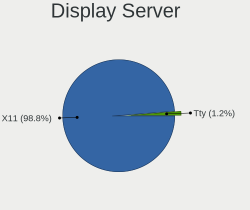

| Name | Notebooks | Percent |
|------|-----------|---------|
| X11  | 107       | 100%    |

Display Manager
---------------

SDDM, LightDM, etc.

| Name    | Notebooks | Percent |
|---------|-----------|---------|
| Unknown | 53        | 48.62%  |
| TDM     | 39        | 35.78%  |
| LightDM | 17        | 15.6%   |

OS Lang
-------

Language

| Lang    | Notebooks | Percent |
|---------|-----------|---------|
| Unknown | 29        | 27.1%   |
| en_US   | 21        | 19.63%  |
| pt_BR   | 14        | 13.08%  |
| zh_CN   | 11        | 10.28%  |
| es_ES   | 11        | 10.28%  |
| de_DE   | 8         | 7.48%   |
| ru_RU   | 3         | 2.8%    |
| tr_TR   | 2         | 1.87%   |
| pl_PL   | 2         | 1.87%   |
| it_IT   | 2         | 1.87%   |
| sv_SE   | 1         | 0.93%   |
| ja_JP   | 1         | 0.93%   |
| fr_FR   | 1         | 0.93%   |
| en_GB   | 1         | 0.93%   |

Boot Mode
---------

EFI or BIOS

| Mode | Notebooks | Percent |
|------|-----------|---------|
| EFI  | 64        | 59.26%  |
| BIOS | 44        | 40.74%  |

Filesystem
----------

Type of filesystem

| Type    | Notebooks | Percent |
|---------|-----------|---------|
| Ext4    | 93        | 86.92%  |
| Unknown | 14        | 13.08%  |

Part. scheme
------------

Scheme of partitioning

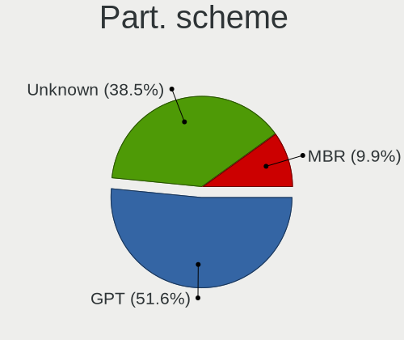

| Type    | Notebooks | Percent |
|---------|-----------|---------|
| Unknown | 52        | 48.15%  |
| GPT     | 43        | 39.81%  |
| MBR     | 13        | 12.04%  |

Dual Boot with Linux/BSD
------------------------

Hosting more than one Linux/BSD

| Dual boot | Notebooks | Percent |
|-----------|-----------|---------|
| No        | 95        | 87.96%  |
| Yes       | 13        | 12.04%  |

Dual Boot (Win)
---------------

Hosting Linux and Windows

| Dual boot | Notebooks | Percent |
|-----------|-----------|---------|
| No        | 75        | 70.09%  |
| Yes       | 32        | 29.91%  |

Board
-----

Vendor
------

Motherboard manufacturer

| Name                | Notebooks | Percent |
|---------------------|-----------|---------|
| Lenovo              | 28        | 26.17%  |
| Hewlett-Packard     | 18        | 16.82%  |
| Acer                | 12        | 11.21%  |
| Dell                | 10        | 9.35%   |
| Samsung Electronics | 7         | 6.54%   |
| ASUSTek Computer    | 6         | 5.61%   |
| Toshiba             | 4         | 3.74%   |
| Sony                | 4         | 3.74%   |
| HUAWEI              | 4         | 3.74%   |
| Unknown             | 3         | 2.8%    |
| Google              | 2         | 1.87%   |
| Timi                | 1         | 0.93%   |
| Standard            | 1         | 0.93%   |
| Positivo            | 1         | 0.93%   |
| Microtech           | 1         | 0.93%   |
| Gateway             | 1         | 0.93%   |
| Fujitsu             | 1         | 0.93%   |
| Chuwi               | 1         | 0.93%   |
| CCE                 | 1         | 0.93%   |
| bq                  | 1         | 0.93%   |

Model
-----

Motherboard model

| Name                                              | Notebooks | Percent |
|---------------------------------------------------|-----------|---------|
| Unknown                                           | 5         | 4.67%   |
| Samsung 340XAA/350XAA/550XAA                      | 2         | 1.87%   |
| Lenovo IdeaPad 120S-11IAP 81A4                    | 2         | 1.87%   |
| HP Pavilion Notebook                              | 2         | 1.87%   |
| HP Pavilion 15                                    | 2         | 1.87%   |
| HP ENVY 15                                        | 2         | 1.87%   |
| Acer Nitro AN515-54                               | 2         | 1.87%   |
| Toshiba Satellite L75-C                           | 1         | 0.93%   |
| Toshiba Satellite E55t-A                          | 1         | 0.93%   |
| Toshiba Satellite C850D-11K                       | 1         | 0.93%   |
| Toshiba Satellite C850-1H6                        | 1         | 0.93%   |
| Timi TM1701                                       | 1         | 0.93%   |
| Standard MB45II/MB45IN                            | 1         | 0.93%   |
| Sony VPCYB25AB                                    | 1         | 0.93%   |
| Sony VGN-NS140D                                   | 1         | 0.93%   |
| Sony SVF14A190X                                   | 1         | 0.93%   |
| Sony SVE14135CXP                                  | 1         | 0.93%   |
| Samsung 800G5M/800G5W                             | 1         | 0.93%   |
| Samsung 550P5C/550P7C                             | 1         | 0.93%   |
| Samsung 500R4K/500R5H/5400RK/501R5H/5500RH/500R5S | 1         | 0.93%   |
| Samsung 300E4A/300E5A/300E7A/3430EA/3530EA        | 1         | 0.93%   |
| Samsung 270E5J/2570EJ                             | 1         | 0.93%   |
| Positivo C14CU51                                  | 1         | 0.93%   |
| Microtech ebookPro                                | 1         | 0.93%   |
| Lenovo ZhaoYangCF4620Z-A123 59082537              | 1         | 0.93%   |
| Lenovo Yoga 3 Pro-1370 80HE                       | 1         | 0.93%   |
| Lenovo XiaoXinAir-14ARE 2020 81YN                 | 1         | 0.93%   |
| Lenovo XiaoXin-15ARE 2020 81YR                    | 1         | 0.93%   |
| Lenovo V310-15ISK 80SY                            | 1         | 0.93%   |
| Lenovo ThinkPad T420 4236CU8                      | 1         | 0.93%   |
| Lenovo ThinkPad T420 4180M8P                      | 1         | 0.93%   |
| Lenovo ThinkPad L512 44444NG                      | 1         | 0.93%   |
| Lenovo ThinkPad L412 0585AC3                      | 1         | 0.93%   |
| Lenovo ThinkPad E585 20KV0010US                   | 1         | 0.93%   |
| Lenovo ThinkPad E450c 20EHA00NCD                  | 1         | 0.93%   |
| Lenovo ThinkPad E14 20RA0058VA                    | 1         | 0.93%   |
| Lenovo ThinkBook 14 G2 ARE R7 8 20VF              | 1         | 0.93%   |
| Lenovo ThinkBook 13s-IWL 20R9                     | 1         | 0.93%   |
| Lenovo Legion Y7000 2020 82AV                     | 1         | 0.93%   |
| Lenovo Legion R9000K2021H 82N6                    | 1         | 0.93%   |
| Lenovo IdeaPad S145-15IWL 81S9                    | 1         | 0.93%   |
| Lenovo IdeaPad S145-15API 81UT                    | 1         | 0.93%   |
| Lenovo IdeaPad 320-15IKB 80YH                     | 1         | 0.93%   |
| Lenovo IdeaPad 320-15IKB 80XL                     | 1         | 0.93%   |
| Lenovo IdeaPad 3 14ARE05 81W3                     | 1         | 0.93%   |
| Lenovo IdeaPad 110-14IBR 80UJ                     | 1         | 0.93%   |
| Lenovo G50-80 80L0                                | 1         | 0.93%   |
| Lenovo G50-70 20351                               | 1         | 0.93%   |
| Lenovo G400s VILG1                                | 1         | 0.93%   |
| HUAWEI NBLK-WAX9X                                 | 1         | 0.93%   |
| HUAWEI HN-WX9X                                    | 1         | 0.93%   |
| HUAWEI HLYL-WXX9                                  | 1         | 0.93%   |
| HUAWEI HLY-WX9XX                                  | 1         | 0.93%   |
| HP ZHAN 66 Pro G1                                 | 1         | 0.93%   |
| HP Pavilion Laptop 14-bf0xx                       | 1         | 0.93%   |
| HP Laptop 15-bs0xx                                | 1         | 0.93%   |
| HP Laptop 14-ck0xxx                               | 1         | 0.93%   |
| HP G42                                            | 1         | 0.93%   |
| HP EliteBook 8570w                                | 1         | 0.93%   |
| HP EliteBook 8570p                                | 1         | 0.93%   |

Model Family
------------

Motherboard model prefix

| Name                        | Notebooks | Percent |
|-----------------------------|-----------|---------|
| Lenovo IdeaPad              | 8         | 7.48%   |
| Lenovo ThinkPad             | 7         | 6.54%   |
| Dell Inspiron               | 7         | 6.54%   |
| Acer Aspire                 | 7         | 6.54%   |
| HP Pavilion                 | 5         | 4.67%   |
| HP EliteBook                | 5         | 4.67%   |
| Unknown                     | 5         | 4.67%   |
| Toshiba Satellite           | 4         | 3.74%   |
| Acer Nitro                  | 3         | 2.8%    |
| Samsung 340XAA              | 2         | 1.87%   |
| Lenovo ThinkBook            | 2         | 1.87%   |
| Lenovo Legion               | 2         | 1.87%   |
| HP Laptop                   | 2         | 1.87%   |
| HP ENVY                     | 2         | 1.87%   |
| Dell Latitude               | 2         | 1.87%   |
| Timi TM1701                 | 1         | 0.93%   |
| Standard MB45II             | 1         | 0.93%   |
| Sony VPCYB25AB              | 1         | 0.93%   |
| Sony VGN-NS140D             | 1         | 0.93%   |
| Sony SVF14A190X             | 1         | 0.93%   |
| Sony SVE14135CXP            | 1         | 0.93%   |
| Samsung 800G5M              | 1         | 0.93%   |
| Samsung 550P5C              | 1         | 0.93%   |
| Samsung 500R4K              | 1         | 0.93%   |
| Samsung 300E4A              | 1         | 0.93%   |
| Samsung 270E5J              | 1         | 0.93%   |
| Positivo C14CU51            | 1         | 0.93%   |
| Microtech ebookPro          | 1         | 0.93%   |
| Lenovo ZhaoYangCF4620Z-A123 | 1         | 0.93%   |
| Lenovo Yoga                 | 1         | 0.93%   |
| Lenovo XiaoXinAir-14ARE     | 1         | 0.93%   |
| Lenovo XiaoXin-15ARE        | 1         | 0.93%   |
| Lenovo V310-15ISK           | 1         | 0.93%   |
| Lenovo G50-80               | 1         | 0.93%   |
| Lenovo G50-70               | 1         | 0.93%   |
| Lenovo G400s                | 1         | 0.93%   |
| HUAWEI NBLK-WAX9X           | 1         | 0.93%   |
| HUAWEI HN-WX9X              | 1         | 0.93%   |
| HUAWEI HLYL-WXX9            | 1         | 0.93%   |
| HUAWEI HLY-WX9XX            | 1         | 0.93%   |
| HP ZHAN                     | 1         | 0.93%   |
| HP G42                      | 1         | 0.93%   |
| HP 250                      | 1         | 0.93%   |
| Google Edgar                | 1         | 0.93%   |
| Google Akemi                | 1         | 0.93%   |
| Gateway NE56R               | 1         | 0.93%   |
| Fujitsu FARQ06012Z          | 1         | 0.93%   |
| Dell XPS                    | 1         | 0.93%   |
| Chuwi AeroBook              | 1         | 0.93%   |
| CCE Capella                 | 1         | 0.93%   |
| bq Tesla2                   | 1         | 0.93%   |
| ASUS X406UAR                | 1         | 0.93%   |
| ASUS VivoBook               | 1         | 0.93%   |
| ASUS T100TAF                | 1         | 0.93%   |
| ASUS N46VM                  | 1         | 0.93%   |
| ASUS K501LX                 | 1         | 0.93%   |
| ASUS ASUS                   | 1         | 0.93%   |
| Acer Swift                  | 1         | 0.93%   |
| Acer P5WE0                  | 1         | 0.93%   |

MFG Year
--------

Motherboard manufacture year

| Year    | Notebooks | Percent |
|---------|-----------|---------|
| 2019    | 14        | 13.08%  |
| 2017    | 13        | 12.15%  |
| 2018    | 11        | 10.28%  |
| 2012    | 10        | 9.35%   |
| 2013    | 8         | 7.48%   |
| 2016    | 7         | 6.54%   |
| 2015    | 7         | 6.54%   |
| 2014    | 7         | 6.54%   |
| 2011    | 7         | 6.54%   |
| 2020    | 6         | 5.61%   |
| 2010    | 6         | 5.61%   |
| 2021    | 5         | 4.67%   |
| 2009    | 4         | 3.74%   |
| 2008    | 1         | 0.93%   |
| Unknown | 1         | 0.93%   |

Form Factor
-----------

Physical design of the computer

| Name     | Notebooks | Percent |
|----------|-----------|---------|
| Notebook | 107       | 100%    |

Secure Boot
-----------

Enabled or disabled

| State    | Notebooks | Percent |
|----------|-----------|---------|
| Disabled | 104       | 97.2%   |
| Enabled  | 3         | 2.8%    |

Coreboot
--------

Have coreboot on board

| Used | Notebooks | Percent |
|------|-----------|---------|
| No   | 105       | 98.13%  |
| Yes  | 2         | 1.87%   |

RAM Size
--------

Total RAM memory

| Size in GB  | Notebooks | Percent |
|-------------|-----------|---------|
| 4.01-8.0    | 39        | 36.45%  |
| 8.01-16.0   | 27        | 25.23%  |
| 3.01-4.0    | 23        | 21.5%   |
| 16.01-24.0  | 9         | 8.41%   |
| 1.01-2.0    | 4         | 3.74%   |
| 32.01-64.0  | 3         | 2.8%    |
| 2.01-3.0    | 1         | 0.93%   |
| 64.01-256.0 | 1         | 0.93%   |

RAM Used
--------

Used RAM memory

| Used GB   | Notebooks | Percent |
|-----------|-----------|---------|
| 2.01-3.0  | 37        | 33.64%  |
| 1.01-2.0  | 37        | 33.64%  |
| 3.01-4.0  | 16        | 14.55%  |
| 4.01-8.0  | 10        | 9.09%   |
| 0.51-1.0  | 8         | 7.27%   |
| 8.01-16.0 | 2         | 1.82%   |

Total Drives
------------

Number of drives on board

| Drives | Notebooks | Percent |
|--------|-----------|---------|
| 1      | 79        | 72.48%  |
| 2      | 29        | 26.61%  |
| 3      | 1         | 0.92%   |

Has CD-ROM
----------

Has CD-ROM on board

| Presented | Notebooks | Percent |
|-----------|-----------|---------|
| No        | 64        | 59.81%  |
| Yes       | 43        | 40.19%  |

Has Ethernet
------------

Has Ethernet on board

| Presented | Notebooks | Percent |
|-----------|-----------|---------|
| Yes       | 82        | 76.64%  |
| No        | 25        | 23.36%  |

Has WiFi
--------

Has WiFi module

| Presented | Notebooks | Percent |
|-----------|-----------|---------|
| Yes       | 105       | 98.13%  |
| No        | 2         | 1.87%   |

Has Bluetooth
-------------

Has Bluetooth module

| Presented | Notebooks | Percent |
|-----------|-----------|---------|
| Yes       | 86        | 80.37%  |
| No        | 21        | 19.63%  |

Location
--------

Country
-------

Geographic location (country)

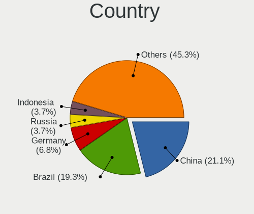

| Country               | Notebooks | Percent |
|-----------------------|-----------|---------|
| Brazil                | 30        | 27.78%  |
| China                 | 13        | 12.04%  |
| Germany               | 9         | 8.33%   |
| Spain                 | 5         | 4.63%   |
| USA                   | 4         | 3.7%    |
| Turkey                | 4         | 3.7%    |
| Indonesia             | 4         | 3.7%    |
| Poland                | 3         | 2.78%   |
| Chile                 | 3         | 2.78%   |
| Russia                | 2         | 1.85%   |
| Panama                | 2         | 1.85%   |
| Japan                 | 2         | 1.85%   |
| Italy                 | 2         | 1.85%   |
| Canada                | 2         | 1.85%   |
| Venezuela             | 1         | 0.93%   |
| Tunisia               | 1         | 0.93%   |
| Sweden                | 1         | 0.93%   |
| South Africa          | 1         | 0.93%   |
| Singapore             | 1         | 0.93%   |
| Serbia                | 1         | 0.93%   |
| Sao Tome and Principe | 1         | 0.93%   |
| Portugal              | 1         | 0.93%   |
| Pakistan              | 1         | 0.93%   |
| Mexico                | 1         | 0.93%   |
| Iran                  | 1         | 0.93%   |
| India                 | 1         | 0.93%   |
| Greece                | 1         | 0.93%   |
| France                | 1         | 0.93%   |
| Ecuador               | 1         | 0.93%   |
| Czechia               | 1         | 0.93%   |
| Cuba                  | 1         | 0.93%   |
| Colombia              | 1         | 0.93%   |
| Bulgaria              | 1         | 0.93%   |
| Belarus               | 1         | 0.93%   |
| Bangladesh            | 1         | 0.93%   |
| Austria               | 1         | 0.93%   |
| Argentina             | 1         | 0.93%   |

City
----

Geographic location (city)

| City                  | Notebooks | Percent |
|-----------------------|-----------|---------|
| Surabaya              | 2         | 1.83%   |
| Shanghai              | 2         | 1.83%   |
| Sao Paulo             | 2         | 1.83%   |
| Londrina              | 2         | 1.83%   |
| Istanbul              | 2         | 1.83%   |
| David                 | 2         | 1.83%   |
| Curitiba              | 2         | 1.83%   |
| Zieleniewo            | 1         | 0.92%   |
| Villa Ballester       | 1         | 0.92%   |
| Vieiras               | 1         | 0.92%   |
| Valdenoches           | 1         | 0.92%   |
| UberlГўndia         | 1         | 0.92%   |
| Uberlândia         | 1         | 0.92%   |
| Tunis                 | 1         | 0.92%   |
| Tres Rios             | 1         | 0.92%   |
| Tomsk                 | 1         | 0.92%   |
| Tianjin               | 1         | 0.92%   |
| Teknaf                | 1         | 0.92%   |
| TehrДЃn             | 1         | 0.92%   |
| Taiyuan               | 1         | 0.92%   |
| SГЈo TomГ©        | 1         | 0.92%   |
| SГЈo Carlos         | 1         | 0.92%   |
| SГЈo Bento do Sul   | 1         | 0.92%   |
| Suzano                | 1         | 0.92%   |
| SumarГ©             | 1         | 0.92%   |
| Srednyaya Akhtuba     | 1         | 0.92%   |
| Sobreda               | 1         | 0.92%   |
| Sleman                | 1         | 0.92%   |
| Singapore             | 1         | 0.92%   |
| Shahekou              | 1         | 0.92%   |
| Sehnde                | 1         | 0.92%   |
| Santiago              | 1         | 0.92%   |
| San Juan de Colón  | 1         | 0.92%   |
| Saitama               | 1         | 0.92%   |
| RzeszГіw            | 1         | 0.92%   |
| Rotenburg             | 1         | 0.92%   |
| Rio de Janeiro        | 1         | 0.92%   |
| Ravensburg            | 1         | 0.92%   |
| Portoviejo            | 1         | 0.92%   |
| Porto Velho           | 1         | 0.92%   |
| Pomigliano d'Arco     | 1         | 0.92%   |
| Plovdiv               | 1         | 0.92%   |
| Pittsburgh            | 1         | 0.92%   |
| Pilsen                | 1         | 0.92%   |
| Petrópolis         | 1         | 0.92%   |
| Oxford                | 1         | 0.92%   |
| Osasco                | 1         | 0.92%   |
| Niagara Falls         | 1         | 0.92%   |
| Nanyang               | 1         | 0.92%   |
| Nanning               | 1         | 0.92%   |
| MГЎlaga             | 1         | 0.92%   |
| Modena                | 1         | 0.92%   |
| Minsk                 | 1         | 0.92%   |
| Miesbach              | 1         | 0.92%   |
| Malmo                 | 1         | 0.92%   |
| Maipu                 | 1         | 0.92%   |
| Madrid                | 1         | 0.92%   |
| Ludwigshafen am Rhein | 1         | 0.92%   |
| Loudi                 | 1         | 0.92%   |
| Los Angeles           | 1         | 0.92%   |

Drives
------

Drive Vendor
------------

Hard drive vendors

| Vendor                         | Notebooks | Drives | Percent |
|--------------------------------|-----------|--------|---------|
| Seagate                        | 20        | 23     | 14.81%  |
| WDC                            | 18        | 21     | 13.33%  |
| Samsung Electronics            | 15        | 17     | 11.11%  |
| Toshiba                        | 11        | 12     | 8.15%   |
| Unknown                        | 10        | 10     | 7.41%   |
| SanDisk                        | 9         | 9      | 6.67%   |
| Kingston                       | 7         | 8      | 5.19%   |
| SK Hynix                       | 6         | 6      | 4.44%   |
| Micron Technology              | 5         | 6      | 3.7%    |
| HGST                           | 5         | 5      | 3.7%    |
| Hitachi                        | 4         | 4      | 2.96%   |
| LITEON                         | 3         | 3      | 2.22%   |
| Intel                          | 3         | 4      | 2.22%   |
| Crucial                        | 3         | 3      | 2.22%   |
| SPCC                           | 2         | 2      | 1.48%   |
| V-GeN                          | 1         | 1      | 0.74%   |
| Transcend                      | 1         | 1      | 0.74%   |
| Solid State Storage Technology | 1         | 1      | 0.74%   |
| Silicon Motion                 | 1         | 1      | 0.74%   |
| OEM                            | 1         | 1      | 0.74%   |
| OCZ                            | 1         | 1      | 0.74%   |
| Netac                          | 1         | 1      | 0.74%   |
| Microtech                      | 1         | 1      | 0.74%   |
| KingSpec                       | 1         | 1      | 0.74%   |
| JMicron                        | 1         | 1      | 0.74%   |
| Intenso                        | 1         | 1      | 0.74%   |
| Fujitsu                        | 1         | 2      | 0.74%   |
| China                          | 1         | 1      | 0.74%   |
| A-DATA Technology              | 1         | 1      | 0.74%   |

Drive Model
-----------

Hard drive models

| Model                                     | Notebooks | Percent |
|-------------------------------------------|-----------|---------|
| Seagate ST1000LM035-1RK172 1TB            | 6         | 4.32%   |
| Toshiba MQ01ABF050 500GB                  | 4         | 2.88%   |
| Kingston SA400S37240G 240GB SSD           | 4         | 2.88%   |
| Toshiba MQ01ABD100 1TB                    | 3         | 2.16%   |
| WDC WD5000LPCX-24VHAT0 500GB              | 2         | 1.44%   |
| Unknown MMC Card                          | 2         | 1.44%   |
| Seagate ST9320325AS 320GB                 | 2         | 1.44%   |
| Seagate ST500LM012 HN-M500MBB 500GB       | 2         | 1.44%   |
| Seagate ST1000LM024 HN-M101MBB 1TB        | 2         | 1.44%   |
| Samsung SSD 850 EVO 500GB                 | 2         | 1.44%   |
| HGST HTS545050A7E680 500GB                | 2         | 1.44%   |
| Crucial CT240BX500SSD1 240GB              | 2         | 1.44%   |
| WDC WDS480G2G0B-00EPW0 480GB SSD          | 1         | 0.72%   |
| WDC WDS120G2G0A-00JH30 120GB SSD          | 1         | 0.72%   |
| WDC WD7500BPVT-24HXZT3 752GB              | 1         | 0.72%   |
| WDC WD5000LPZX-75Z10T0 500GB              | 1         | 0.72%   |
| WDC WD5000LPVX-80V0TT0 500GB              | 1         | 0.72%   |
| WDC WD5000LPVX-08V0TT6 500GB              | 1         | 0.72%   |
| WDC WD5000LPCX-24C6HT0 500GB              | 1         | 0.72%   |
| WDC WD3200BEVT-22ZCT0 320GB               | 1         | 0.72%   |
| WDC WD3200BEVT-08A23T1 320GB              | 1         | 0.72%   |
| WDC WD10SPZX-35Z10T0 1TB                  | 1         | 0.72%   |
| WDC WD10SPZX-24Z10 1TB                    | 1         | 0.72%   |
| WDC WD10SPZX-08Z10 1TB                    | 1         | 0.72%   |
| WDC WD10JPVX-60JC3T1 1TB                  | 1         | 0.72%   |
| WDC WD10JPVX-60JC3T0 1TB                  | 1         | 0.72%   |
| WDC WD10JPVX-22JC3T0 1TB                  | 1         | 0.72%   |
| WDC WD10JPCX-24UE4T0 1TB                  | 1         | 0.72%   |
| WDC PC SN730 SDBPNTY-512G-1101 512GB      | 1         | 0.72%   |
| WDC PC SN720 SDAPNTW-512G-1127 512GB      | 1         | 0.72%   |
| V-GeN V-GEN10SM19AR120SDK 120GB SSD       | 1         | 0.72%   |
| Unknown SSO256GTLC9-SB3-4L 256GB SSD      | 1         | 0.72%   |
| Unknown MMC Card  32GB                    | 1         | 0.72%   |
| Unknown MMC Card  16GB                    | 1         | 0.72%   |
| Unknown MMC Card  128GB                   | 1         | 0.72%   |
| Unknown MBG4GC  32GB                      | 1         | 0.72%   |
| Unknown HBG4a2  32GB                      | 1         | 0.72%   |
| Unknown APPSD  272GB                      | 1         | 0.72%   |
| Unknown 032GE4  32GB                      | 1         | 0.72%   |
| Transcend TS120GSSD220S 120GB             | 1         | 0.72%   |
| Toshiba MQ01ABD032 320GB                  | 1         | 0.72%   |
| Toshiba MK5065GSXN 500GB                  | 1         | 0.72%   |
| Toshiba MK5065GSX 500GB                   | 1         | 0.72%   |
| Toshiba KBG40ZMT128G MEMORY 128GB         | 1         | 0.72%   |
| SPCC Solid State Disk 512GB               | 1         | 0.72%   |
| SPCC M.2 SSD 256GB                        | 1         | 0.72%   |
| Solid State Storage NVMe SSD Drive 256GB  | 1         | 0.72%   |
| SK Hynix SKHynix_HFM512GDHTNI-87A0B 512GB | 1         | 0.72%   |
| SK Hynix NVMe SSD Drive 512GB             | 1         | 0.72%   |
| SK Hynix HFS256G39TND-N210A 256GB SSD     | 1         | 0.72%   |
| SK Hynix HFS128G39MNC-2300A 128GB SSD     | 1         | 0.72%   |
| SK Hynix HFM512GDJTNI-82A0A 512GB         | 1         | 0.72%   |
| SK Hynix HFM512GD3JX013N 512GB            | 1         | 0.72%   |
| Silicon Motion S2000 2TB                  | 1         | 0.72%   |
| Seagate ST750LM022 HN-M750MBB 752GB       | 1         | 0.72%   |
| Seagate ST500LT012-1DG142 500GB           | 1         | 0.72%   |
| Seagate ST500LM034-2GH17A 500GB           | 1         | 0.72%   |
| Seagate ST2000LM007-1R8174 2TB            | 1         | 0.72%   |
| Seagate ST1000LM014-SSHD-8GB              | 1         | 0.72%   |
| Seagate ST1000LM014-1EJ164-SSHD 1TB       | 1         | 0.72%   |

HDD Vendor
----------

Hard disk drive vendors

| Vendor              | Notebooks | Drives | Percent |
|---------------------|-----------|--------|---------|
| Seagate             | 20        | 23     | 34.48%  |
| WDC                 | 16        | 17     | 27.59%  |
| Toshiba             | 10        | 11     | 17.24%  |
| HGST                | 5         | 5      | 8.62%   |
| Hitachi             | 4         | 4      | 6.9%    |
| Samsung Electronics | 1         | 1      | 1.72%   |
| OEM                 | 1         | 1      | 1.72%   |
| Fujitsu             | 1         | 2      | 1.72%   |

SSD Vendor
----------

Solid state drive vendors

| Vendor              | Notebooks | Drives | Percent |
|---------------------|-----------|--------|---------|
| SanDisk             | 8         | 8      | 18.18%  |
| Kingston            | 7         | 8      | 15.91%  |
| Samsung Electronics | 6         | 7      | 13.64%  |
| WDC                 | 2         | 2      | 4.55%   |
| SPCC                | 2         | 2      | 4.55%   |
| SK Hynix            | 2         | 2      | 4.55%   |
| Micron Technology   | 2         | 2      | 4.55%   |
| LITEON              | 2         | 2      | 4.55%   |
| Crucial             | 2         | 2      | 4.55%   |
| V-GeN               | 1         | 1      | 2.27%   |
| Unknown             | 1         | 1      | 2.27%   |
| Transcend           | 1         | 1      | 2.27%   |
| OCZ                 | 1         | 1      | 2.27%   |
| Netac               | 1         | 1      | 2.27%   |
| Microtech           | 1         | 1      | 2.27%   |
| KingSpec            | 1         | 1      | 2.27%   |
| JMicron             | 1         | 1      | 2.27%   |
| Intenso             | 1         | 1      | 2.27%   |
| Intel               | 1         | 2      | 2.27%   |
| China               | 1         | 1      | 2.27%   |

Drive Kind
----------

HDD or SSD

| Kind | Notebooks | Drives | Percent |
|------|-----------|--------|---------|
| HDD  | 57        | 64     | 43.85%  |
| SSD  | 40        | 47     | 30.77%  |
| NVMe | 24        | 27     | 18.46%  |
| MMC  | 9         | 10     | 6.92%   |

Drive Connector
---------------

SATA, SAS, NVMe, etc.

| Type | Notebooks | Drives | Percent |
|------|-----------|--------|---------|
| SATA | 83        | 106    | 69.17%  |
| NVMe | 24        | 27     | 20%     |
| MMC  | 9         | 10     | 7.5%    |
| SAS  | 4         | 5      | 3.33%   |

Drive Size
----------

Size of hard drive

| Size in TB | Notebooks | Drives | Percent |
|------------|-----------|--------|---------|
| 0.01-0.5   | 59        | 74     | 62.77%  |
| 0.51-1.0   | 32        | 34     | 34.04%  |
| 1.01-2.0   | 2         | 2      | 2.13%   |
| 4.01-10.0  | 1         | 1      | 1.06%   |

Space Total
-----------

Amount of disk space available on the file system

| Size in GB     | Notebooks | Percent |
|----------------|-----------|---------|
| 251-500        | 34        | 30.63%  |
| 101-250        | 32        | 28.83%  |
| 501-1000       | 25        | 22.52%  |
| 1001-2000      | 8         | 7.21%   |
| More than 3000 | 4         | 3.6%    |
| 21-50          | 4         | 3.6%    |
| 51-100         | 2         | 1.8%    |
| Unknown        | 2         | 1.8%    |

Space Used
----------

Amount of used disk space

| Used GB   | Notebooks | Percent |
|-----------|-----------|---------|
| 21-50     | 27        | 24.55%  |
| 1-20      | 22        | 20%     |
| 51-100    | 18        | 16.36%  |
| 101-250   | 17        | 15.45%  |
| 251-500   | 14        | 12.73%  |
| 501-1000  | 6         | 5.45%   |
| 2001-3000 | 2         | 1.82%   |
| 1001-2000 | 2         | 1.82%   |
| Unknown   | 2         | 1.82%   |

Malfunc. Drives
---------------

Drive models with a malfunction

| Model                                         | Notebooks | Drives | Percent |
|-----------------------------------------------|-----------|--------|---------|
| Seagate ST9320325AS 320GB                     | 2         | 2      | 20%     |
| WDC WD10JPVX-22JC3T0 1TB                      | 1         | 1      | 10%     |
| Toshiba MQ01ABD100 1TB                        | 1         | 1      | 10%     |
| Toshiba MQ01ABD032 320GB                      | 1         | 1      | 10%     |
| Samsung Electronics HM250HI 250GB             | 1         | 1      | 10%     |
| OCZ VERTEX4 256GB SSD                         | 1         | 1      | 10%     |
| Micron Technology MTFDDAT128MAM-1J2 128GB SSD | 1         | 1      | 10%     |
| Intenso lntenso SSD Sata III 240GB            | 1         | 1      | 10%     |
| Hitachi HTS543225L9A300 250GB                 | 1         | 1      | 10%     |

Malfunc. Drive Vendor
---------------------

Vendors of faulty drives

| Vendor              | Notebooks | Drives | Percent |
|---------------------|-----------|--------|---------|
| Toshiba             | 2         | 2      | 20%     |
| Seagate             | 2         | 2      | 20%     |
| WDC                 | 1         | 1      | 10%     |
| Samsung Electronics | 1         | 1      | 10%     |
| OCZ                 | 1         | 1      | 10%     |
| Micron Technology   | 1         | 1      | 10%     |
| Intenso             | 1         | 1      | 10%     |
| Hitachi             | 1         | 1      | 10%     |

Malfunc. HDD Vendor
-------------------

Vendors of faulty HDD drives

| Vendor              | Notebooks | Drives | Percent |
|---------------------|-----------|--------|---------|
| Toshiba             | 2         | 2      | 28.57%  |
| Seagate             | 2         | 2      | 28.57%  |
| WDC                 | 1         | 1      | 14.29%  |
| Samsung Electronics | 1         | 1      | 14.29%  |
| Hitachi             | 1         | 1      | 14.29%  |

Malfunc. Drive Kind
-------------------

Kinds of faulty drives

| Kind | Notebooks | Drives | Percent |
|------|-----------|--------|---------|
| HDD  | 7         | 7      | 70%     |
| SSD  | 3         | 3      | 30%     |

Failed Drives
-------------

Failed drive models

| Model                    | Notebooks | Drives | Percent |
|--------------------------|-----------|--------|---------|
| Toshiba MK5065GSXN 500GB | 1         | 1      | 100%    |

Failed Drive Vendor
-------------------

Failed drive vendors

| Vendor  | Notebooks | Drives | Percent |
|---------|-----------|--------|---------|
| Toshiba | 1         | 1      | 100%    |

Drive Status
------------

Number of failed and malfunc. drives

| Status   | Notebooks | Drives | Percent |
|----------|-----------|--------|---------|
| Detected | 62        | 86     | 54.39%  |
| Works    | 41        | 51     | 35.96%  |
| Malfunc  | 10        | 10     | 8.77%   |
| Failed   | 1         | 1      | 0.88%   |

Storage controller
------------------

Storage Vendor
--------------

Storage controller vendors

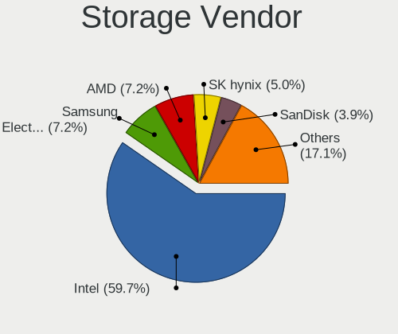

| Vendor                         | Notebooks | Percent |
|--------------------------------|-----------|---------|
| Intel                          | 82        | 70.09%  |
| AMD                            | 10        | 8.55%   |
| Samsung Electronics            | 8         | 6.84%   |
| SK Hynix                       | 4         | 3.42%   |
| Micron Technology              | 3         | 2.56%   |
| Sandisk                        | 2         | 1.71%   |
| Zhaoxin                        | 1         | 0.85%   |
| Solid State Storage Technology | 1         | 0.85%   |
| Silicon Motion                 | 1         | 0.85%   |
| Realtek Semiconductor          | 1         | 0.85%   |
| Micron/Crucial Technology      | 1         | 0.85%   |
| Lite-On Technology             | 1         | 0.85%   |
| KIOXIA                         | 1         | 0.85%   |
| JMicron Technology             | 1         | 0.85%   |

Storage Model
-------------

Storage controller models

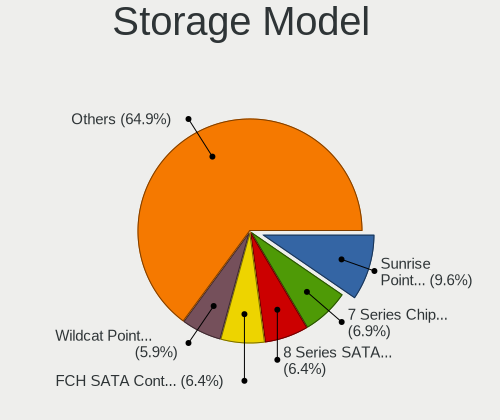

| Model                                                                                  | Notebooks | Percent |
|----------------------------------------------------------------------------------------|-----------|---------|
| Intel Sunrise Point-LP SATA Controller [AHCI mode]                                     | 14        | 11.57%  |
| Intel 7 Series Chipset Family 6-port SATA Controller [AHCI mode]                       | 12        | 9.92%   |
| Intel 8 Series SATA Controller 1 [AHCI mode]                                           | 11        | 9.09%   |
| Intel Wildcat Point-LP SATA Controller [AHCI Mode]                                     | 9         | 7.44%   |
| AMD FCH SATA Controller [AHCI mode]                                                    | 9         | 7.44%   |
| Samsung NVMe SSD Controller SM981/PM981/PM983                                          | 5         | 4.13%   |
| Intel 82801IBM/IEM (ICH9M/ICH9M-E) 4 port SATA Controller [AHCI mode]                  | 5         | 4.13%   |
| Intel 82801 Mobile SATA Controller [RAID mode]                                         | 5         | 4.13%   |
| Intel 6 Series/C200 Series Chipset Family 6 port Mobile SATA AHCI Controller           | 4         | 3.31%   |
| Micron Non-Volatile memory controller                                                  | 3         | 2.48%   |
| Intel Cannon Point-LP SATA Controller [AHCI Mode]                                      | 3         | 2.48%   |
| Intel 5 Series/3400 Series Chipset 4 port SATA AHCI Controller                         | 3         | 2.48%   |
| SK Hynix BC511                                                                         | 2         | 1.65%   |
| Samsung NVMe SSD Controller SM961/PM961/SM963                                          | 2         | 1.65%   |
| Intel Comet Lake SATA AHCI Controller                                                  | 2         | 1.65%   |
| Intel Celeron/Pentium Silver Processor SATA Controller                                 | 2         | 1.65%   |
| Intel Celeron N3350/Pentium N4200/Atom E3900 Series SATA AHCI Controller               | 2         | 1.65%   |
| Intel Cannon Lake Mobile PCH SATA AHCI Controller                                      | 2         | 1.65%   |
| Intel Atom/Celeron/Pentium Processor x5-E8000/J3xxx/N3xxx Series SATA Controller       | 2         | 1.65%   |
| Zhaoxin ZX-100/ZX-200/ZX-E StorX AHCI Controller                                       | 1         | 0.83%   |
| Solid State Storage Non-Volatile memory controller                                     | 1         | 0.83%   |
| SK Hynix Gold P31 SSD                                                                  | 1         | 0.83%   |
| SK Hynix BC501 NVMe Solid State Drive                                                  | 1         | 0.83%   |
| Silicon Motion SM2263EN/SM2263XT SSD Controller                                        | 1         | 0.83%   |
| Sandisk WD Black SN750 / PC SN730 NVMe SSD                                             | 1         | 0.83%   |
| Sandisk WD Black 2018/SN750 / PC SN720 NVMe SSD                                        | 1         | 0.83%   |
| Samsung NVMe SSD Controller 980                                                        | 1         | 0.83%   |
| Realtek Realtek Non-Volatile memory controller                                         | 1         | 0.83%   |
| Micron/Crucial Non-Volatile memory controller                                          | 1         | 0.83%   |
| Lite-On Non-Volatile memory controller                                                 | 1         | 0.83%   |
| KIOXIA Non-Volatile memory controller                                                  | 1         | 0.83%   |
| JMicron JMB368 IDE controller                                                          | 1         | 0.83%   |
| Intel SSD 600P Series                                                                  | 1         | 0.83%   |
| Intel NVMe Optane Memory Series                                                        | 1         | 0.83%   |
| Intel HM170/QM170 Chipset SATA Controller [AHCI Mode]                                  | 1         | 0.83%   |
| Intel Cannon Lake PCH SATA AHCI Controller                                             | 1         | 0.83%   |
| Intel 82801IBM/IEM (ICH9M/ICH9M-E) 2 port SATA Controller [IDE mode]                   | 1         | 0.83%   |
| Intel 7 Series Chipset Family 4-port SATA Controller [IDE mode]                        | 1         | 0.83%   |
| Intel 7 Series Chipset Family 2-port SATA Controller [IDE mode]                        | 1         | 0.83%   |
| Intel 6 Series/C200 Series Chipset Family Mobile SATA Controller (IDE mode, ports 4-5) | 1         | 0.83%   |
| Intel 6 Series/C200 Series Chipset Family Mobile SATA Controller (IDE mode, ports 0-3) | 1         | 0.83%   |
| Intel 400 Series Chipset Family SATA AHCI Controller                                   | 1         | 0.83%   |
| AMD SB7x0/SB8x0/SB9x0 SATA Controller [AHCI mode]                                      | 1         | 0.83%   |

Storage Kind
------------

Kind of storage controller (IDE, SATA, NVMe, SAS, ...)

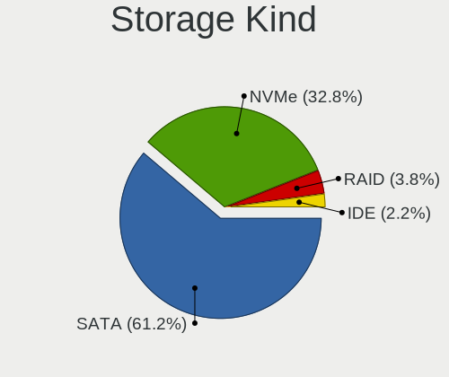

| Kind | Notebooks | Percent |
|------|-----------|---------|
| SATA | 85        | 72.03%  |
| NVMe | 24        | 20.34%  |
| RAID | 5         | 4.24%   |
| IDE  | 4         | 3.39%   |

Processor
---------

CPU Vendor
----------

Processor vendors

| Vendor       | Notebooks | Percent |
|--------------|-----------|---------|
| Intel        | 89        | 83.18%  |
| AMD          | 17        | 15.89%  |
| CentaurHauls | 1         | 0.93%   |

CPU Model
---------

Processor models

| Model                                         | Notebooks | Percent |
|-----------------------------------------------|-----------|---------|
| Intel Core i5-7200U CPU @ 2.50GHz             | 5         | 4.67%   |
| Intel Core i7-5500U CPU @ 2.40GHz             | 4         | 3.74%   |
| Intel Core i5-5200U CPU @ 2.20GHz             | 4         | 3.74%   |
| Intel Core i7-7500U CPU @ 2.70GHz             | 3         | 2.8%    |
| Intel Core i5-8250U CPU @ 1.60GHz             | 3         | 2.8%    |
| Intel Core i5-4210U CPU @ 1.70GHz             | 3         | 2.8%    |
| Intel Pentium Dual-Core CPU T4500 @ 2.30GHz   | 2         | 1.87%   |
| Intel Core i7-8550U CPU @ 1.80GHz             | 2         | 1.87%   |
| Intel Core i7-4510U CPU @ 2.00GHz             | 2         | 1.87%   |
| Intel Core i7-3630QM CPU @ 2.40GHz            | 2         | 1.87%   |
| Intel Core i7-2630QM CPU @ 2.00GHz            | 2         | 1.87%   |
| Intel Core i5-8300H CPU @ 2.30GHz             | 2         | 1.87%   |
| Intel Core i5-8265U CPU @ 1.60GHz             | 2         | 1.87%   |
| Intel Core i5-6200U CPU @ 2.30GHz             | 2         | 1.87%   |
| Intel Core i5-4200U CPU @ 1.60GHz             | 2         | 1.87%   |
| Intel Core i5-3230M CPU @ 2.60GHz             | 2         | 1.87%   |
| Intel Core i3-4030U CPU @ 1.90GHz             | 2         | 1.87%   |
| Intel Core i3-4005U CPU @ 1.70GHz             | 2         | 1.87%   |
| Intel Celeron CPU N3350 @ 1.10GHz             | 2         | 1.87%   |
| Intel Atom CPU Z3735F @ 1.33GHz               | 2         | 1.87%   |
| AMD Ryzen 7 5800H with Radeon Graphics        | 2         | 1.87%   |
| AMD Ryzen 5 4600U with Radeon Graphics        | 2         | 1.87%   |
| AMD Ryzen 5 3500U with Radeon Vega Mobile Gfx | 2         | 1.87%   |
| Intel Pentium Silver N5000 CPU @ 1.10GHz      | 1         | 0.93%   |
| Intel Pentium Dual-Core CPU T4400 @ 2.20GHz   | 1         | 0.93%   |
| Intel Pentium CPU N3710 @ 1.60GHz             | 1         | 0.93%   |
| Intel Pentium CPU 5405U @ 2.30GHz             | 1         | 0.93%   |
| Intel Core m3-6Y30 CPU @ 0.90GHz              | 1         | 0.93%   |
| Intel Core M-5Y71 CPU @ 1.20GHz               | 1         | 0.93%   |
| Intel Core i9-8950HK CPU @ 2.90GHz            | 1         | 0.93%   |
| Intel Core i7-8565U CPU @ 1.80GHz             | 1         | 0.93%   |
| Intel Core i7-7700HQ CPU @ 2.80GHz            | 1         | 0.93%   |
| Intel Core i7-6600U CPU @ 2.60GHz             | 1         | 0.93%   |
| Intel Core i7-6500U CPU @ 2.50GHz             | 1         | 0.93%   |
| Intel Core i7-3720QM CPU @ 2.60GHz            | 1         | 0.93%   |
| Intel Core i7-3632QM CPU @ 2.20GHz            | 1         | 0.93%   |
| Intel Core i7-3610QM CPU @ 2.30GHz            | 1         | 0.93%   |
| Intel Core i7-3537U CPU @ 2.00GHz             | 1         | 0.93%   |
| Intel Core i7-2620M CPU @ 2.70GHz             | 1         | 0.93%   |
| Intel Core i5-9300H CPU @ 2.40GHz             | 1         | 0.93%   |
| Intel Core i5-3360M CPU @ 2.80GHz             | 1         | 0.93%   |
| Intel Core i5-3337U CPU @ 1.80GHz             | 1         | 0.93%   |
| Intel Core i5-2520M CPU @ 2.50GHz             | 1         | 0.93%   |
| Intel Core i5-2450M CPU @ 2.50GHz             | 1         | 0.93%   |
| Intel Core i5-2410M CPU @ 2.30GHz             | 1         | 0.93%   |
| Intel Core i5-10210U CPU @ 1.60GHz            | 1         | 0.93%   |
| Intel Core i5-10200H CPU @ 2.40GHz            | 1         | 0.93%   |
| Intel Core i5 CPU M 460 @ 2.53GHz             | 1         | 0.93%   |
| Intel Core i3-3110M CPU @ 2.40GHz             | 1         | 0.93%   |
| Intel Core i3-2310M CPU @ 2.10GHz             | 1         | 0.93%   |
| Intel Core i3-10110U CPU @ 2.10GHz            | 1         | 0.93%   |
| Intel Core i3 CPU M 380 @ 2.53GHz             | 1         | 0.93%   |
| Intel Core i3 CPU M 350 @ 2.27GHz             | 1         | 0.93%   |
| Intel Core 2 Duo CPU T9400 @ 2.53GHz          | 1         | 0.93%   |
| Intel Core 2 Duo CPU T6400 @ 2.00GHz          | 1         | 0.93%   |
| Intel Core 2 Duo CPU T5800 @ 2.00GHz          | 1         | 0.93%   |
| Intel Celeron N4000 CPU @ 1.10GHz             | 1         | 0.93%   |
| Intel Celeron CPU N3160 @ 1.60GHz             | 1         | 0.93%   |
| Intel Celeron CPU N3060 @ 1.60GHz             | 1         | 0.93%   |
| Intel Celeron CPU 1007U @ 1.50GHz             | 1         | 0.93%   |

CPU Model Family
----------------

Processor model prefix

| Model                   | Notebooks | Percent |
|-------------------------|-----------|---------|
| Intel Core i5           | 34        | 31.78%  |
| Intel Core i7           | 24        | 22.43%  |
| Intel Core i3           | 9         | 8.41%   |
| Intel Celeron           | 7         | 6.54%   |
| AMD Ryzen 5             | 6         | 5.61%   |
| AMD Ryzen 7             | 5         | 4.67%   |
| Intel Pentium Dual-Core | 3         | 2.8%    |
| Intel Core 2 Duo        | 3         | 2.8%    |
| Intel Atom              | 3         | 2.8%    |
| Intel Pentium           | 2         | 1.87%   |
| AMD Ryzen 3             | 2         | 1.87%   |
| AMD A10                 | 2         | 1.87%   |
| Other                   | 1         | 0.93%   |
| Intel Pentium Silver    | 1         | 0.93%   |
| Intel Core m3           | 1         | 0.93%   |
| Intel Core M            | 1         | 0.93%   |
| Intel Core i9           | 1         | 0.93%   |
| AMD E1                  | 1         | 0.93%   |
| AMD E                   | 1         | 0.93%   |

CPU Cores
---------

Number of processor cores

| Number | Notebooks | Percent |
|--------|-----------|---------|
| 2      | 65        | 60.75%  |
| 4      | 33        | 30.84%  |
| 8      | 4         | 3.74%   |
| 6      | 4         | 3.74%   |
| 1      | 1         | 0.93%   |

CPU Sockets
-----------

Number of sockets

| Number | Notebooks | Percent |
|--------|-----------|---------|
| 1      | 107       | 100%    |

CPU Threads
-----------

Threads per core (Hyper-Threading)

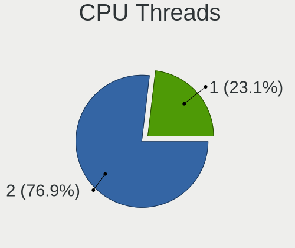

| Number | Notebooks | Percent |
|--------|-----------|---------|
| 2      | 83        | 77.57%  |
| 1      | 24        | 22.43%  |

CPU Op-Modes
------------

CPU Operation Modes (32-bit, 64-bit)

| Op mode        | Notebooks | Percent |
|----------------|-----------|---------|
| 32-bit, 64-bit | 96        | 89.72%  |
| Unknown        | 11        | 10.28%  |

CPU Microcode
-------------

Microcode number

| Number     | Notebooks | Percent |
|------------|-----------|---------|
| Unknown    | 23        | 21.3%   |
| 0x306a9    | 10        | 9.26%   |
| 0x40651    | 9         | 8.33%   |
| 0x806e9    | 7         | 6.48%   |
| 0x806ec    | 6         | 5.56%   |
| 0x306d4    | 6         | 5.56%   |
| 0x206a7    | 6         | 5.56%   |
| 0x406e3    | 5         | 4.63%   |
| 0x906ea    | 3         | 2.78%   |
| 0x806ea    | 3         | 2.78%   |
| 0x1067a    | 3         | 2.78%   |
| 0x406c4    | 2         | 1.85%   |
| 0x20655    | 2         | 1.85%   |
| 0x08600106 | 2         | 1.85%   |
| 0x08600104 | 2         | 1.85%   |
| 0x08108109 | 2         | 1.85%   |
| 0x08108102 | 2         | 1.85%   |
| 0xa0652    | 1         | 0.93%   |
| 0x906e9    | 1         | 0.93%   |
| 0x706a1    | 1         | 0.93%   |
| 0x6fd      | 1         | 0.93%   |
| 0x406c3    | 1         | 0.93%   |
| 0x30678    | 1         | 0.93%   |
| 0x10676    | 1         | 0.93%   |
| 0x0a50000c | 1         | 0.93%   |
| 0x0a50000b | 1         | 0.93%   |
| 0x08600103 | 1         | 0.93%   |
| 0x08600102 | 1         | 0.93%   |
| 0x0810100b | 1         | 0.93%   |
| 0x06006115 | 1         | 0.93%   |
| 0x0500010d | 1         | 0.93%   |
| 0x05000029 | 1         | 0.93%   |

CPU Microarch
-------------

Microarchitecture

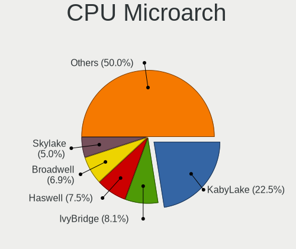

| Name          | Notebooks | Percent |
|---------------|-----------|---------|
| KabyLake      | 24        | 22.43%  |
| IvyBridge     | 13        | 12.15%  |
| Haswell       | 11        | 10.28%  |
| Broadwell     | 9         | 8.41%   |
| SandyBridge   | 7         | 6.54%   |
| Zen 2         | 6         | 5.61%   |
| Silvermont    | 6         | 5.61%   |
| Skylake       | 5         | 4.67%   |
| Penryn        | 5         | 4.67%   |
| Zen+          | 4         | 3.74%   |
| Westmere      | 3         | 2.8%    |
| Zen 3         | 2         | 1.87%   |
| Goldmont plus | 2         | 1.87%   |
| Goldmont      | 2         | 1.87%   |
| Excavator     | 2         | 1.87%   |
| Bobcat        | 2         | 1.87%   |
| Zen           | 1         | 0.93%   |
| Core          | 1         | 0.93%   |
| CometLake     | 1         | 0.93%   |
| Unknown       | 1         | 0.93%   |

Graphics
--------

GPU Vendor
----------

Vendors of graphics cards

| Vendor  | Notebooks | Percent |
|---------|-----------|---------|
| Intel   | 87        | 60%     |
| Nvidia  | 35        | 24.14%  |
| AMD     | 22        | 15.17%  |
| Zhaoxin | 1         | 0.69%   |

GPU Model
---------

Graphics card models

| Model                                                                                    | Notebooks | Percent |
|------------------------------------------------------------------------------------------|-----------|---------|
| Intel 3rd Gen Core processor Graphics Controller                                         | 12        | 8.16%   |
| Intel Haswell-ULT Integrated Graphics Controller                                         | 11        | 7.48%   |
| Intel HD Graphics 620                                                                    | 8         | 5.44%   |
| Intel HD Graphics 5500                                                                   | 8         | 5.44%   |
| Intel 2nd Generation Core Processor Family Integrated Graphics Controller                | 7         | 4.76%   |
| AMD Topaz XT [Radeon R7 M260/M265 / M340/M360 / M440/M445 / 530/535 / 620/625 Mobile]    | 6         | 4.08%   |
| AMD Renoir                                                                               | 6         | 4.08%   |
| Intel UHD Graphics 620                                                                   | 5         | 3.4%    |
| Intel Mobile 4 Series Chipset Integrated Graphics Controller                             | 5         | 3.4%    |
| Intel Skylake GT2 [HD Graphics 520]                                                      | 4         | 2.72%   |
| Intel CoffeeLake-H GT2 [UHD Graphics 630]                                                | 4         | 2.72%   |
| Intel Atom/Celeron/Pentium Processor x5-E8000/J3xxx/N3xxx Integrated Graphics Controller | 4         | 2.72%   |
| AMD Picasso/Raven 2 [Radeon Vega Series / Radeon Vega Mobile Series]                     | 4         | 2.72%   |
| Intel WhiskeyLake-U GT2 [UHD Graphics 620]                                               | 3         | 2.04%   |
| Intel Core Processor Integrated Graphics Controller                                      | 3         | 2.04%   |
| Nvidia TU117M [GeForce GTX 1650 Mobile / Max-Q]                                          | 2         | 1.36%   |
| Nvidia GP107M [GeForce GTX 1050 Mobile]                                                  | 2         | 1.36%   |
| Nvidia GM108M [GeForce MX110]                                                            | 2         | 1.36%   |
| Nvidia GM108M [GeForce 940MX]                                                            | 2         | 1.36%   |
| Nvidia GM108M [GeForce 840M]                                                             | 2         | 1.36%   |
| Nvidia GM107M [GeForce GTX 950M]                                                         | 2         | 1.36%   |
| Nvidia GK107M [GeForce GT 650M]                                                          | 2         | 1.36%   |
| Nvidia GF117M [GeForce 610M/710M/810M/820M / GT 620M/625M/630M/720M]                     | 2         | 1.36%   |
| Nvidia GF108M [GeForce GT 540M]                                                          | 2         | 1.36%   |
| Intel HD Graphics 500                                                                    | 2         | 1.36%   |
| Intel CometLake-U GT2 [UHD Graphics]                                                     | 2         | 1.36%   |
| Intel Atom Processor Z36xxx/Z37xxx Series Graphics & Display                             | 2         | 1.36%   |
| AMD Wani [Radeon R5/R6/R7 Graphics]                                                      | 2         | 1.36%   |
| Zhaoxin ZX-E C-960 GPU                                                                   | 1         | 0.68%   |
| Nvidia TU117M                                                                            | 1         | 0.68%   |
| Nvidia GP108M [GeForce MX150]                                                            | 1         | 0.68%   |
| Nvidia GP108BM [GeForce MX250]                                                           | 1         | 0.68%   |
| Nvidia GP107M [GeForce GTX 1050 3 GB Max-Q]                                              | 1         | 0.68%   |
| Nvidia GM108M [GeForce 940M]                                                             | 1         | 0.68%   |
| Nvidia GM108M [GeForce 920MX]                                                            | 1         | 0.68%   |
| Nvidia GM108M [GeForce 845M]                                                             | 1         | 0.68%   |
| Nvidia GK208M [GeForce GT 740M]                                                          | 1         | 0.68%   |
| Nvidia GK208M [GeForce GT 735M]                                                          | 1         | 0.68%   |
| Nvidia GK107GLM [Quadro K1000M]                                                          | 1         | 0.68%   |
| Nvidia GF119M [Quadro NVS 4200M]                                                         | 1         | 0.68%   |
| Nvidia GF119M [NVS 4200M]                                                                | 1         | 0.68%   |
| Nvidia GF119M [GeForce GT 520MX]                                                         | 1         | 0.68%   |
| Nvidia GF108M [GeForce GT 620M/630M/635M/640M LE]                                        | 1         | 0.68%   |
| Nvidia GA107M [GeForce RTX 3050 Ti Mobile]                                               | 1         | 0.68%   |
| Nvidia GA106M [GeForce RTX 3060 Mobile / Max-Q]                                          | 1         | 0.68%   |
| Nvidia G96CM [GeForce 9600M GT]                                                          | 1         | 0.68%   |
| Intel HD Graphics 630                                                                    | 1         | 0.68%   |
| Intel HD Graphics 5300                                                                   | 1         | 0.68%   |
| Intel HD Graphics 515                                                                    | 1         | 0.68%   |
| Intel GeminiLake [UHD Graphics 605]                                                      | 1         | 0.68%   |
| Intel GeminiLake [UHD Graphics 600]                                                      | 1         | 0.68%   |
| Intel Comet Lake UHD Graphics                                                            | 1         | 0.68%   |
| Intel Coffee Lake UHD 610 Graphics Controller                                            | 1         | 0.68%   |
| AMD Wrestler [Radeon HD 7310]                                                            | 1         | 0.68%   |
| AMD Wrestler [Radeon HD 6310]                                                            | 1         | 0.68%   |
| AMD Sun XT [Radeon HD 8670A/8670M/8690M / R5 M330 / M430 / Radeon 520 Mobile]            | 1         | 0.68%   |
| AMD Raven Ridge [Radeon Vega Series / Radeon Vega Mobile Series]                         | 1         | 0.68%   |
| AMD Chelsea LP [Radeon HD 7730M]                                                         | 1         | 0.68%   |
| AMD Cezanne                                                                              | 1         | 0.68%   |

GPU Combo
---------

Combinations of graphics cards

| Name           | Notebooks | Percent |
|----------------|-----------|---------|
| 1 x Intel      | 50        | 46.73%  |
| Intel + Nvidia | 31        | 28.97%  |
| 1 x AMD        | 13        | 12.15%  |
| Intel + AMD    | 6         | 5.61%   |
| 1 x Nvidia     | 3         | 2.8%    |
| 2 x AMD        | 2         | 1.87%   |
| 1 x Zhaoxin    | 1         | 0.93%   |
| AMD + Nvidia   | 1         | 0.93%   |

GPU Driver
----------

Free vs proprietary

| Driver      | Notebooks | Percent |
|-------------|-----------|---------|
| Free        | 92        | 85.98%  |
| Proprietary | 12        | 11.21%  |
| Unknown     | 3         | 2.8%    |

GPU Memory
----------

Total video memory

| Size in GB | Notebooks | Percent |
|------------|-----------|---------|
| Unknown    | 58        | 53.21%  |
| 1.01-2.0   | 26        | 23.85%  |
| 3.01-4.0   | 12        | 11.01%  |
| 0.01-0.5   | 9         | 8.26%   |
| 0.51-1.0   | 3         | 2.75%   |
| 5.01-6.0   | 1         | 0.92%   |

Monitor
-------

Monitor Vendor
--------------

Monitor vendors

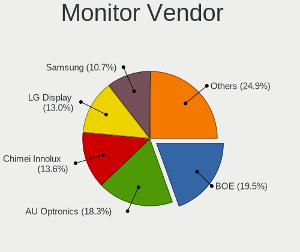

| Vendor                  | Notebooks | Percent |
|-------------------------|-----------|---------|
| AU Optronics            | 25        | 22.94%  |
| BOE                     | 24        | 22.02%  |
| LG Display              | 14        | 12.84%  |
| Samsung Electronics     | 13        | 11.93%  |
| Chimei Innolux          | 13        | 11.93%  |
| Hewlett-Packard         | 3         | 2.75%   |
| Lenovo                  | 2         | 1.83%   |
| InfoVision              | 2         | 1.83%   |
| Chi Mei Optoelectronics | 2         | 1.83%   |
| ViewSonic               | 1         | 0.92%   |
| Sharp                   | 1         | 0.92%   |
| SAC                     | 1         | 0.92%   |
| PANDA                   | 1         | 0.92%   |
| Iiyama                  | 1         | 0.92%   |
| HB@                     | 1         | 0.92%   |
| HannStar                | 1         | 0.92%   |
| Goldstar                | 1         | 0.92%   |
| Dell                    | 1         | 0.92%   |
| CSO                     | 1         | 0.92%   |
| AOC                     | 1         | 0.92%   |

Monitor Model
-------------

Monitor models

| Model                                                                 | Notebooks | Percent |
|-----------------------------------------------------------------------|-----------|---------|
| AU Optronics LCD Monitor AUO26EC 1366x768 344x193mm 15.5-inch         | 3         | 2.73%   |
| LG Display LCD Monitor LGD0468 1366x768 344x194mm 15.5-inch           | 2         | 1.82%   |
| Chimei Innolux LCD Monitor CMN14C4 1366x768 309x173mm 13.9-inch       | 2         | 1.82%   |
| BOE LCD Monitor BOE06A4 1366x768 344x194mm 15.5-inch                  | 2         | 1.82%   |
| AU Optronics LCD Monitor AUO71EC 1366x768 344x193mm 15.5-inch         | 2         | 1.82%   |
| AU Optronics LCD Monitor AUO226D 1920x1080 276x155mm 12.5-inch        | 2         | 1.82%   |
| AU Optronics LCD Monitor AUO21ED 1920x1080 344x194mm 15.5-inch        | 2         | 1.82%   |
| ViewSonic VX2481-mh VSC3933 1920x1080 527x296mm 23.8-inch             | 1         | 0.91%   |
| Sharp LCD Monitor SHP1449 1920x1080 294x165mm 13.3-inch               | 1         | 0.91%   |
| Samsung Electronics LCD Monitor SEC5448 1920x1080 344x194mm 15.5-inch | 1         | 0.91%   |
| Samsung Electronics LCD Monitor SEC5441 1366x768 256x144mm 11.6-inch  | 1         | 0.91%   |
| Samsung Electronics LCD Monitor SEC384A 1366x768 344x194mm 15.5-inch  | 1         | 0.91%   |
| Samsung Electronics LCD Monitor SEC324A 1366x768 344x194mm 15.5-inch  | 1         | 0.91%   |
| Samsung Electronics LCD Monitor SEC3150 1366x768 344x193mm 15.5-inch  | 1         | 0.91%   |
| Samsung Electronics LCD Monitor SEC314B 1680x945 409x230mm 18.5-inch  | 1         | 0.91%   |
| Samsung Electronics LCD Monitor SDC534B 1600x900 382x215mm 17.3-inch  | 1         | 0.91%   |
| Samsung Electronics LCD Monitor SDC4E51 1366x768 344x194mm 15.5-inch  | 1         | 0.91%   |
| Samsung Electronics LCD Monitor SDC4A42 1366x768 309x174mm 14.0-inch  | 1         | 0.91%   |
| Samsung Electronics LCD Monitor SDC4951 1366x768 344x194mm 15.5-inch  | 1         | 0.91%   |
| Samsung Electronics LCD Monitor SDC434A 3200x1800 293x165mm 13.2-inch | 1         | 0.91%   |
| Samsung Electronics LCD Monitor SDC4147 1366x768 344x194mm 15.5-inch  | 1         | 0.91%   |
| Samsung Electronics LCD Monitor SAM03BC 1920x1080                     | 1         | 0.91%   |
| SAC LED MONITOR SAC952D 1920x1080 443x249mm 20.0-inch                 | 1         | 0.91%   |
| PANDA LCD Monitor NCP004D 1920x1080 344x194mm 15.5-inch               | 1         | 0.91%   |
| LG Display LP156WH1-TLA1 LGD6301 1366x768 344x194mm 15.5-inch         | 1         | 0.91%   |
| LG Display LCD Monitor LGD05EC 1920x1080 309x174mm 14.0-inch          | 1         | 0.91%   |
| LG Display LCD Monitor LGD0590 1920x1080 344x194mm 15.5-inch          | 1         | 0.91%   |
| LG Display LCD Monitor LGD0503 1366x768 344x194mm 15.5-inch           | 1         | 0.91%   |
| LG Display LCD Monitor LGD04B2 1920x1080 309x175mm 14.0-inch          | 1         | 0.91%   |
| LG Display LCD Monitor LGD045E 1366x768 309x174mm 14.0-inch           | 1         | 0.91%   |
| LG Display LCD Monitor LGD0456 1366x768 340x190mm 15.3-inch           | 1         | 0.91%   |
| LG Display LCD Monitor LGD0354 1366x768 293x165mm 13.2-inch           | 1         | 0.91%   |
| LG Display LCD Monitor LGD033F 1366x768 310x174mm 14.0-inch           | 1         | 0.91%   |
| LG Display LCD Monitor LGD02E2 1600x900 310x174mm 14.0-inch           | 1         | 0.91%   |
| LG Display LCD Monitor LGD0259 1920x1080 345x194mm 15.6-inch          | 1         | 0.91%   |
| LG Display LCD Monitor LGD0258 1600x900 345x194mm 15.6-inch           | 1         | 0.91%   |
| Lenovo LCD Monitor LEN40B0 1366x768 344x193mm 15.5-inch               | 1         | 0.91%   |
| Lenovo LCD Monitor LEN40A0 1366x768 309x174mm 14.0-inch               | 1         | 0.91%   |
| InfoVision M140NWR2 R1 IVO057A 1366x768 309x174mm 14.0-inch           | 1         | 0.91%   |
| InfoVision LCD Monitor IVO0536 1920x1080 294x165mm 13.3-inch          | 1         | 0.91%   |
| Iiyama PLE2607WS IVM5608 1920x1200 550x344mm 25.5-inch                | 1         | 0.91%   |
| Iiyama PL2773HD IVM6606 1920x1080 598x336mm 27.0-inch                 | 1         | 0.91%   |
| Hewlett-Packard N240 HPN340A 1920x1080 527x296mm 23.8-inch            | 1         | 0.91%   |
| Hewlett-Packard 24mq HPN366F 2560x1440 527x296mm 23.8-inch            | 1         | 0.91%   |
| Hewlett-Packard 24fw HPN3546 1920x1080 527x296mm 23.8-inch            | 1         | 0.91%   |
| HB@ HBTV-32D03HD HB@0B01 1920x540 708x398mm 32.0-inch                 | 1         | 0.91%   |
| HannStar HSD140PHW1 HSD0583 1366x768 309x174mm 14.0-inch              | 1         | 0.91%   |
| Goldstar 19EN33 GSM4C18 1366x768 410x230mm 18.5-inch                  | 1         | 0.91%   |
| Dell SE2216H DELF070 1920x1080 476x268mm 21.5-inch                    | 1         | 0.91%   |
| CSO LCD Monitor CSO1600 2560x1600 340x220mm 15.9-inch                 | 1         | 0.91%   |
| Chimei Innolux P130ZFA-BA1 CMN8201 2160x1440 275x183mm 13.0-inch      | 1         | 0.91%   |
| Chimei Innolux LCD Monitor CMN1728 1600x900 382x215mm 17.3-inch       | 1         | 0.91%   |
| Chimei Innolux LCD Monitor CMN1604 1920x1080 355x199mm 16.0-inch      | 1         | 0.91%   |
| Chimei Innolux LCD Monitor CMN15E6 1366x768 344x193mm 15.5-inch       | 1         | 0.91%   |
| Chimei Innolux LCD Monitor CMN15DB 1366x768 344x193mm 15.5-inch       | 1         | 0.91%   |
| Chimei Innolux LCD Monitor CMN15C4 1920x1080 344x193mm 15.5-inch      | 1         | 0.91%   |
| Chimei Innolux LCD Monitor CMN15B9 1920x1080 344x193mm 15.5-inch      | 1         | 0.91%   |
| Chimei Innolux LCD Monitor CMN151B 1920x1080 344x193mm 15.5-inch      | 1         | 0.91%   |
| Chimei Innolux LCD Monitor CMN14D5 1920x1080 309x173mm 13.9-inch      | 1         | 0.91%   |
| Chimei Innolux LCD Monitor CMN14D4 1920x1080 309x173mm 13.9-inch      | 1         | 0.91%   |

Monitor Resolution
------------------

Monitor screen resolution

| Resolution       | Notebooks | Percent |
|------------------|-----------|---------|
| 1366x768 (WXGA)  | 47        | 45.63%  |
| 1920x1080 (FHD)  | 42        | 40.78%  |
| 1600x900 (HD+)   | 6         | 5.83%   |
| 3840x2160 (4K)   | 1         | 0.97%   |
| 3200x1800 (QHD+) | 1         | 0.97%   |
| 2560x1600        | 1         | 0.97%   |
| 2560x1440 (QHD)  | 1         | 0.97%   |
| 2160x1440        | 1         | 0.97%   |
| 1920x540         | 1         | 0.97%   |
| 1680x945         | 1         | 0.97%   |
| 1280x800 (WXGA)  | 1         | 0.97%   |

Monitor Diagonal
----------------

Diagonal size in inches

| Inches  | Notebooks | Percent |
|---------|-----------|---------|
| 15      | 49        | 44.55%  |
| 13      | 22        | 20%     |
| 14      | 16        | 14.55%  |
| 23      | 4         | 3.64%   |
| 18      | 3         | 2.73%   |
| 17      | 3         | 2.73%   |
| 11      | 3         | 2.73%   |
| 21      | 2         | 1.82%   |
| 12      | 2         | 1.82%   |
| 32      | 1         | 0.91%   |
| 27      | 1         | 0.91%   |
| 25      | 1         | 0.91%   |
| 24      | 1         | 0.91%   |
| 16      | 1         | 0.91%   |
| Unknown | 1         | 0.91%   |

Monitor Width
-------------

Physical width

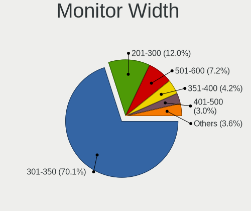

| Width in mm | Notebooks | Percent |
|-------------|-----------|---------|
| 301-350     | 79        | 73.83%  |
| 201-300     | 12        | 11.21%  |
| 501-600     | 5         | 4.67%   |
| 351-400     | 5         | 4.67%   |
| 401-500     | 4         | 3.74%   |
| 701-800     | 1         | 0.93%   |
| Unknown     | 1         | 0.93%   |

Aspect Ratio
------------

Proportional relationship between the width and the height

| Ratio | Notebooks | Percent |
|-------|-----------|---------|
| 16/9  | 96        | 95.05%  |
| 16/10 | 3         | 2.97%   |
| 3/2   | 2         | 1.98%   |

Monitor Area
------------

Area in inch²

| Area in inch² | Notebooks | Percent |
|----------------|-----------|---------|
| 101-110        | 49        | 44.55%  |
| 81-90          | 31        | 28.18%  |
| 71-80          | 7         | 6.36%   |
| 201-250        | 6         | 5.45%   |
| 51-60          | 3         | 2.73%   |
| 141-150        | 3         | 2.73%   |
| 61-70          | 2         | 1.82%   |
| 251-300        | 2         | 1.82%   |
| 121-130        | 2         | 1.82%   |
| 351-500        | 1         | 0.91%   |
| 301-350        | 1         | 0.91%   |
| 131-140        | 1         | 0.91%   |
| 111-120        | 1         | 0.91%   |
| Unknown        | 1         | 0.91%   |

Pixel Density
-------------

Pixels per inch

| Density       | Notebooks | Percent |
|---------------|-----------|---------|
| 101-120       | 50        | 46.73%  |
| 121-160       | 38        | 35.51%  |
| 51-100        | 9         | 8.41%   |
| 161-240       | 8         | 7.48%   |
| More than 240 | 1         | 0.93%   |
| Unknown       | 1         | 0.93%   |

Multiple Monitors
-----------------

Total monitors connected

| Total | Notebooks | Percent |
|-------|-----------|---------|
| 1     | 92        | 85.98%  |
| 2     | 12        | 11.21%  |
| 0     | 2         | 1.87%   |
| 3     | 1         | 0.93%   |

Network
-------

Net Controller Vendor
---------------------

Controller vendors

| Vendor                          | Notebooks | Percent |
|---------------------------------|-----------|---------|
| Realtek Semiconductor           | 73        | 43.98%  |
| Intel                           | 42        | 25.3%   |
| Qualcomm Atheros                | 34        | 20.48%  |
| Broadcom                        | 4         | 2.41%   |
| Marvell Technology Group        | 3         | 1.81%   |
| Broadcom Limited                | 3         | 1.81%   |
| Xiaomi                          | 1         | 0.6%    |
| Ralink Technology               | 1         | 0.6%    |
| Qualcomm Atheros Communications | 1         | 0.6%    |
| OPPO Electronics                | 1         | 0.6%    |
| MEDIATEK                        | 1         | 0.6%    |
| Huawei Technologies             | 1         | 0.6%    |
| Hewlett-Packard                 | 1         | 0.6%    |

Net Controller Model
--------------------

Controller models

| Model                                                             | Notebooks | Percent |
|-------------------------------------------------------------------|-----------|---------|
| Realtek RTL8111/8168/8411 PCI Express Gigabit Ethernet Controller | 46        | 23.47%  |
| Realtek RTL810xE PCI Express Fast Ethernet controller             | 16        | 8.16%   |
| Qualcomm Atheros QCA9377 802.11ac Wireless Network Adapter        | 12        | 6.12%   |
| Realtek RTL8822CE 802.11ac PCIe Wireless Network Adapter          | 7         | 3.57%   |
| Qualcomm Atheros QCA9565 / AR9565 Wireless Network Adapter        | 7         | 3.57%   |
| Qualcomm Atheros AR9485 Wireless Network Adapter                  | 5         | 2.55%   |
| Intel Wireless 3165                                               | 5         | 2.55%   |
| Intel Wi-Fi 6 AX200                                               | 5         | 2.55%   |
| Intel 82579LM Gigabit Network Connection (Lewisville)             | 5         | 2.55%   |
| Realtek RTL8723BE PCIe Wireless Network Adapter                   | 4         | 2.04%   |
| Qualcomm Atheros QCA6174 802.11ac Wireless Network Adapter        | 4         | 2.04%   |
| Intel Centrino Advanced-N 6205 [Taylor Peak]                      | 4         | 2.04%   |
| Realtek RTL8723DE Wireless Network Adapter                        | 3         | 1.53%   |
| Realtek RTL8153 Gigabit Ethernet Adapter                          | 3         | 1.53%   |
| Intel Wireless 8265 / 8275                                        | 3         | 1.53%   |
| Intel Wireless 7260                                               | 3         | 1.53%   |
| Intel Wireless 3160                                               | 3         | 1.53%   |
| Intel WiFi Link 5100                                              | 3         | 1.53%   |
| Realtek RTL8191SEvA Wireless LAN Controller                       | 2         | 1.02%   |
| Realtek RTL8188EE Wireless Network Adapter                        | 2         | 1.02%   |
| Realtek RTL8188CE 802.11b/g/n WiFi Adapter                        | 2         | 1.02%   |
| Qualcomm Atheros AR9462 Wireless Network Adapter                  | 2         | 1.02%   |
| Qualcomm Atheros AR9287 Wireless Network Adapter (PCI-Express)    | 2         | 1.02%   |
| Qualcomm Atheros AR8131 Gigabit Ethernet                          | 2         | 1.02%   |
| Marvell Group 88E8055 PCI-E Gigabit Ethernet Controller           | 2         | 1.02%   |
| Intel Wireless 7265                                               | 2         | 1.02%   |
| Intel Comet Lake PCH-LP CNVi WiFi                                 | 2         | 1.02%   |
| Intel Cannon Point-LP CNVi [Wireless-AC]                          | 2         | 1.02%   |
| Broadcom NetLink BCM57785 Gigabit Ethernet PCIe                   | 2         | 1.02%   |
| Broadcom BCM43142 802.11b/g/n                                     | 2         | 1.02%   |
| Xiaomi Mi/Redmi series (RNDIS)                                    | 1         | 0.51%   |
| Realtek RTL88x2bu [AC1200 Techkey]                                | 1         | 0.51%   |
| Realtek RTL8822BE 802.11a/b/g/n/ac WiFi adapter                   | 1         | 0.51%   |
| Realtek RTL8821AE 802.11ac PCIe Wireless Network Adapter          | 1         | 0.51%   |
| Realtek RTL8191SEvB Wireless LAN Controller                       | 1         | 0.51%   |
| Realtek RTL8188EUS 802.11n Wireless Network Adapter               | 1         | 0.51%   |
| Realtek 802.11ac NIC                                              | 1         | 0.51%   |
| Ralink RT2870/RT3070 Wireless Adapter                             | 1         | 0.51%   |
| Qualcomm Atheros QCA8172 Fast Ethernet                            | 1         | 0.51%   |
| Qualcomm Atheros AR9271 802.11n                                   | 1         | 0.51%   |
| Qualcomm Atheros AR928X Wireless Network Adapter (PCI-Express)    | 1         | 0.51%   |
| Qualcomm Atheros AR9285 Wireless Network Adapter (PCI-Express)    | 1         | 0.51%   |
| OPPO RMX2001                                                      | 1         | 0.51%   |
| MEDIATEK MT7921 802.11ax PCI Express Wireless Network Adapter     | 1         | 0.51%   |
| Marvell Group 88E8071 PCI-E Gigabit Ethernet Controller           | 1         | 0.51%   |
| Intel Wireless 8260                                               | 1         | 0.51%   |
| Intel Wi-Fi 6 AX210/AX211/AX411 160MHz                            | 1         | 0.51%   |
| Intel Ethernet Connection I219-LM                                 | 1         | 0.51%   |
| Intel Ethernet Connection I218-V                                  | 1         | 0.51%   |
| Intel Ethernet Connection (4) I219-LM                             | 1         | 0.51%   |
| Intel Ethernet Connection (3) I218-LM                             | 1         | 0.51%   |
| Intel Dual Band Wireless-AC 3165 Plus Bluetooth                   | 1         | 0.51%   |
| Intel Comet Lake PCH CNVi WiFi                                    | 1         | 0.51%   |
| Intel Centrino Wireless-N 2230                                    | 1         | 0.51%   |
| Intel Centrino Wireless-N 100                                     | 1         | 0.51%   |
| Intel Centrino Ultimate-N 6300                                    | 1         | 0.51%   |
| Intel Centrino Advanced-N 6235                                    | 1         | 0.51%   |
| Intel Centrino Advanced-N 6200                                    | 1         | 0.51%   |
| Intel Cannon Lake PCH CNVi WiFi                                   | 1         | 0.51%   |
| Huawei SNE-LX3                                                    | 1         | 0.51%   |

Wireless Vendor
---------------

Wireless vendors

| Vendor                          | Notebooks | Percent |
|---------------------------------|-----------|---------|
| Intel                           | 41        | 37.61%  |
| Qualcomm Atheros                | 34        | 31.19%  |
| Realtek Semiconductor           | 26        | 23.85%  |
| Broadcom Limited                | 3         | 2.75%   |
| Broadcom                        | 2         | 1.83%   |
| Ralink Technology               | 1         | 0.92%   |
| Qualcomm Atheros Communications | 1         | 0.92%   |
| MEDIATEK                        | 1         | 0.92%   |

Wireless Model
--------------

Wireless models

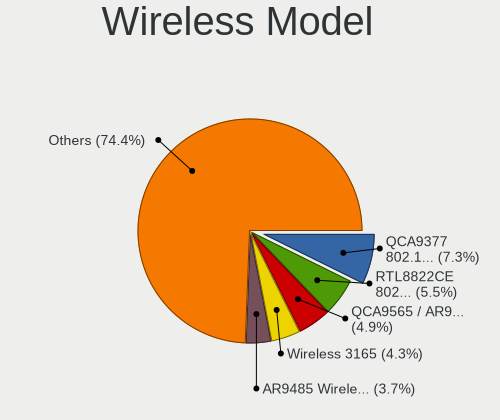

| Model                                                          | Notebooks | Percent |
|----------------------------------------------------------------|-----------|---------|
| Qualcomm Atheros QCA9377 802.11ac Wireless Network Adapter     | 12        | 10.91%  |
| Realtek RTL8822CE 802.11ac PCIe Wireless Network Adapter       | 7         | 6.36%   |
| Qualcomm Atheros QCA9565 / AR9565 Wireless Network Adapter     | 7         | 6.36%   |
| Qualcomm Atheros AR9485 Wireless Network Adapter               | 5         | 4.55%   |
| Intel Wireless 3165                                            | 5         | 4.55%   |
| Intel Wi-Fi 6 AX200                                            | 5         | 4.55%   |
| Realtek RTL8723BE PCIe Wireless Network Adapter                | 4         | 3.64%   |
| Qualcomm Atheros QCA6174 802.11ac Wireless Network Adapter     | 4         | 3.64%   |
| Intel Centrino Advanced-N 6205 [Taylor Peak]                   | 4         | 3.64%   |
| Realtek RTL8723DE Wireless Network Adapter                     | 3         | 2.73%   |
| Intel Wireless 8265 / 8275                                     | 3         | 2.73%   |
| Intel Wireless 7260                                            | 3         | 2.73%   |
| Intel Wireless 3160                                            | 3         | 2.73%   |
| Intel WiFi Link 5100                                           | 3         | 2.73%   |
| Realtek RTL8191SEvA Wireless LAN Controller                    | 2         | 1.82%   |
| Realtek RTL8188EE Wireless Network Adapter                     | 2         | 1.82%   |
| Realtek RTL8188CE 802.11b/g/n WiFi Adapter                     | 2         | 1.82%   |
| Qualcomm Atheros AR9462 Wireless Network Adapter               | 2         | 1.82%   |
| Qualcomm Atheros AR9287 Wireless Network Adapter (PCI-Express) | 2         | 1.82%   |
| Intel Wireless 7265                                            | 2         | 1.82%   |
| Intel Comet Lake PCH-LP CNVi WiFi                              | 2         | 1.82%   |
| Intel Cannon Point-LP CNVi [Wireless-AC]                       | 2         | 1.82%   |
| Broadcom BCM43142 802.11b/g/n                                  | 2         | 1.82%   |
| Realtek RTL88x2bu [AC1200 Techkey]                             | 1         | 0.91%   |
| Realtek RTL8822BE 802.11a/b/g/n/ac WiFi adapter                | 1         | 0.91%   |
| Realtek RTL8821AE 802.11ac PCIe Wireless Network Adapter       | 1         | 0.91%   |
| Realtek RTL8191SEvB Wireless LAN Controller                    | 1         | 0.91%   |
| Realtek RTL8188EUS 802.11n Wireless Network Adapter            | 1         | 0.91%   |
| Realtek 802.11ac NIC                                           | 1         | 0.91%   |
| Ralink RT2870/RT3070 Wireless Adapter                          | 1         | 0.91%   |
| Qualcomm Atheros AR9271 802.11n                                | 1         | 0.91%   |
| Qualcomm Atheros AR928X Wireless Network Adapter (PCI-Express) | 1         | 0.91%   |
| Qualcomm Atheros AR9285 Wireless Network Adapter (PCI-Express) | 1         | 0.91%   |
| MEDIATEK MT7921 802.11ax PCI Express Wireless Network Adapter  | 1         | 0.91%   |
| Intel Wireless 8260                                            | 1         | 0.91%   |
| Intel Wi-Fi 6 AX210/AX211/AX411 160MHz                         | 1         | 0.91%   |
| Intel Dual Band Wireless-AC 3165 Plus Bluetooth                | 1         | 0.91%   |
| Intel Comet Lake PCH CNVi WiFi                                 | 1         | 0.91%   |
| Intel Centrino Wireless-N 2230                                 | 1         | 0.91%   |
| Intel Centrino Wireless-N 100                                  | 1         | 0.91%   |
| Intel Centrino Ultimate-N 6300                                 | 1         | 0.91%   |
| Intel Centrino Advanced-N 6235                                 | 1         | 0.91%   |
| Intel Centrino Advanced-N 6200                                 | 1         | 0.91%   |
| Intel Cannon Lake PCH CNVi WiFi                                | 1         | 0.91%   |
| Broadcom Limited BCM4352 802.11ac Wireless Network Adapter     | 1         | 0.91%   |
| Broadcom Limited BCM43224 802.11a/b/g/n                        | 1         | 0.91%   |
| Broadcom Limited BCM4312 802.11b/g LP-PHY                      | 1         | 0.91%   |

Ethernet Vendor
---------------

Ethernet vendors

| Vendor                   | Notebooks | Percent |
|--------------------------|-----------|---------|
| Realtek Semiconductor    | 65        | 75.58%  |
| Intel                    | 9         | 10.47%  |
| Qualcomm Atheros         | 3         | 3.49%   |
| Marvell Technology Group | 3         | 3.49%   |
| Broadcom                 | 2         | 2.33%   |
| Xiaomi                   | 1         | 1.16%   |
| OPPO Electronics         | 1         | 1.16%   |
| Huawei Technologies      | 1         | 1.16%   |
| Hewlett-Packard          | 1         | 1.16%   |

Ethernet Model
--------------

Ethernet models

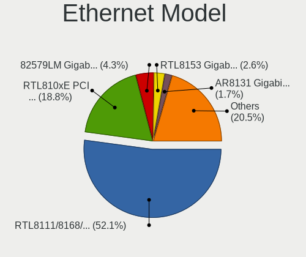

| Model                                                             | Notebooks | Percent |
|-------------------------------------------------------------------|-----------|---------|
| Realtek RTL8111/8168/8411 PCI Express Gigabit Ethernet Controller | 46        | 53.49%  |
| Realtek RTL810xE PCI Express Fast Ethernet controller             | 16        | 18.6%   |
| Intel 82579LM Gigabit Network Connection (Lewisville)             | 5         | 5.81%   |
| Realtek RTL8153 Gigabit Ethernet Adapter                          | 3         | 3.49%   |
| Qualcomm Atheros AR8131 Gigabit Ethernet                          | 2         | 2.33%   |
| Marvell Group 88E8055 PCI-E Gigabit Ethernet Controller           | 2         | 2.33%   |
| Broadcom NetLink BCM57785 Gigabit Ethernet PCIe                   | 2         | 2.33%   |
| Xiaomi Mi/Redmi series (RNDIS)                                    | 1         | 1.16%   |
| Qualcomm Atheros QCA8172 Fast Ethernet                            | 1         | 1.16%   |
| OPPO RMX2001                                                      | 1         | 1.16%   |
| Marvell Group 88E8071 PCI-E Gigabit Ethernet Controller           | 1         | 1.16%   |
| Intel Ethernet Connection I219-LM                                 | 1         | 1.16%   |
| Intel Ethernet Connection I218-V                                  | 1         | 1.16%   |
| Intel Ethernet Connection (4) I219-LM                             | 1         | 1.16%   |
| Intel Ethernet Connection (3) I218-LM                             | 1         | 1.16%   |
| Huawei SNE-LX3                                                    | 1         | 1.16%   |
| HP lt4120 Snapdragon X5 LTE                                       | 1         | 1.16%   |

Net Controller Kind
-------------------

Ethernet, WiFi or modem

| Kind     | Notebooks | Percent |
|----------|-----------|---------|
| WiFi     | 105       | 55.85%  |
| Ethernet | 83        | 44.15%  |

Used Controller
---------------

Currently used network controller

| Kind     | Notebooks | Percent |
|----------|-----------|---------|
| WiFi     | 94        | 65.28%  |
| Ethernet | 50        | 34.72%  |

NICs
----

Total network controllers on board

| Total | Notebooks | Percent |
|-------|-----------|---------|
| 2     | 79        | 73.83%  |
| 1     | 26        | 24.3%   |
| 0     | 2         | 1.87%   |

IPv6
----

IPv6 vs IPv4

| Used | Notebooks | Percent |
|------|-----------|---------|
| No   | 102       | 94.44%  |
| Yes  | 6         | 5.56%   |

Bluetooth
---------

Bluetooth Vendor
----------------

Controller vendors

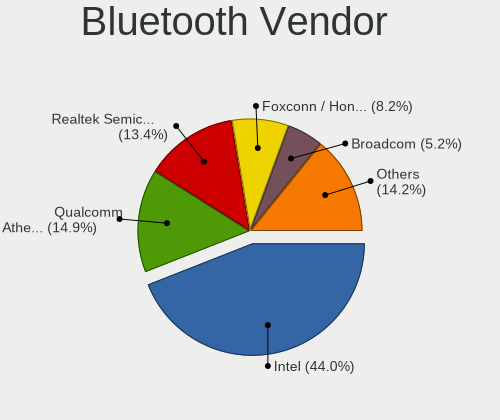

| Vendor                          | Notebooks | Percent |
|---------------------------------|-----------|---------|
| Intel                           | 31        | 36.05%  |
| Qualcomm Atheros Communications | 20        | 23.26%  |
| Realtek Semiconductor           | 10        | 11.63%  |
| Foxconn / Hon Hai               | 6         | 6.98%   |
| Broadcom                        | 6         | 6.98%   |
| Realtek                         | 4         | 4.65%   |
| Lite-On Technology              | 3         | 3.49%   |
| IMC Networks                    | 3         | 3.49%   |
| Toshiba                         | 1         | 1.16%   |
| Dell                            | 1         | 1.16%   |
| Cambridge Silicon Radio         | 1         | 1.16%   |

Bluetooth Model
---------------

Controller models

| Model                                                                               | Notebooks | Percent |
|-------------------------------------------------------------------------------------|-----------|---------|
| Intel Bluetooth wireless interface                                                  | 18        | 20.93%  |
| Qualcomm Atheros  Bluetooth Device                                                  | 15        | 17.44%  |
| Realtek Bluetooth Radio                                                             | 5         | 5.81%   |
| Intel AX200 Bluetooth                                                               | 5         | 5.81%   |
| Realtek Bluetooth Radio                                                             | 4         | 4.65%   |
| Broadcom BCM2045B (BDC-2.1)                                                         | 4         | 4.65%   |
| Realtek  Bluetooth 4.2 Adapter                                                      | 3         | 3.49%   |
| Intel Bluetooth 9460/9560 Jefferson Peak (JfP)                                      | 3         | 3.49%   |
| Intel AX201 Bluetooth                                                               | 3         | 3.49%   |
| Qualcomm Atheros QCA61x4 Bluetooth 4.0                                              | 2         | 2.33%   |
| Qualcomm Atheros AR3012 Bluetooth 4.0                                               | 2         | 2.33%   |
| Lite-On Atheros AR3012 Bluetooth                                                    | 2         | 2.33%   |
| Intel Centrino Bluetooth Wireless Transceiver                                       | 2         | 2.33%   |
| Foxconn / Hon Hai Bluetooth Device                                                  | 2         | 2.33%   |
| Broadcom HP Portable SoftSailing                                                    | 2         | 2.33%   |
| Toshiba Bluetooth Radio                                                             | 1         | 1.16%   |
| Realtek RTL8821A Bluetooth                                                          | 1         | 1.16%   |
| Realtek RTL8723B Bluetooth                                                          | 1         | 1.16%   |
| Qualcomm Atheros Bluetooth USB Host Controller                                      | 1         | 1.16%   |
| Lite-On Bluetooth Device                                                            | 1         | 1.16%   |
| IMC Networks Wireless_Device                                                        | 1         | 1.16%   |
| IMC Networks Bluetooth Device                                                       | 1         | 1.16%   |
| IMC Networks Atheros AR3012 Bluetooth 4.0 Adapter                                   | 1         | 1.16%   |
| Foxconn / Hon Hai Foxconn T77H114 BCM2070 [Single-Chip Bluetooth 2.1 + EDR Adapter] | 1         | 1.16%   |
| Foxconn / Hon Hai Bluetooth USB Host Controller                                     | 1         | 1.16%   |
| Foxconn / Hon Hai BCM43142A0                                                        | 1         | 1.16%   |
| Foxconn / Hon Hai BCM20702A0                                                        | 1         | 1.16%   |
| Dell DW375 Bluetooth Module                                                         | 1         | 1.16%   |
| Cambridge Silicon Radio Bluetooth Dongle (HCI mode)                                 | 1         | 1.16%   |

Sound
-----

Sound Vendor
------------

Sound card vendors

| Vendor              | Notebooks | Percent |
|---------------------|-----------|---------|
| Intel               | 86        | 74.78%  |
| AMD                 | 17        | 14.78%  |
| Nvidia              | 9         | 7.83%   |
| Zhaoxin             | 1         | 0.87%   |
| JMTek               | 1         | 0.87%   |
| Creative Technology | 1         | 0.87%   |

Sound Model
-----------

Sound card models

| Model                                                                                             | Notebooks | Percent |
|---------------------------------------------------------------------------------------------------|-----------|---------|
| Intel Sunrise Point-LP HD Audio                                                                   | 18        | 11.84%  |
| Intel 7 Series/C216 Chipset Family High Definition Audio Controller                               | 14        | 9.21%   |
| AMD Family 17h/19h HD Audio Controller                                                            | 13        | 8.55%   |
| Intel Haswell-ULT HD Audio Controller                                                             | 11        | 7.24%   |
| Intel 8 Series HD Audio Controller                                                                | 11        | 7.24%   |
| Intel Wildcat Point-LP High Definition Audio Controller                                           | 9         | 5.92%   |
| Intel Broadwell-U Audio Controller                                                                | 9         | 5.92%   |
| AMD Renoir Radeon High Definition Audio Controller                                                | 7         | 4.61%   |
| Intel 82801I (ICH9 Family) HD Audio Controller                                                    | 6         | 3.95%   |
| Intel 6 Series/C200 Series Chipset Family High Definition Audio Controller                        | 6         | 3.95%   |
| AMD Raven/Raven2/Fenghuang HDMI/DP Audio Controller                                               | 5         | 3.29%   |
| Intel Cannon Point-LP High Definition Audio Controller                                            | 4         | 2.63%   |
| Intel Cannon Lake PCH cAVS                                                                        | 4         | 2.63%   |
| Nvidia TU107 GeForce GTX 1650 High Definition Audio Controller                                    | 3         | 1.97%   |
| Intel Atom/Celeron/Pentium Processor x5-E8000/J3xxx/N3xxx Series High Definition Audio Controller | 3         | 1.97%   |
| Intel 5 Series/3400 Series Chipset High Definition Audio                                          | 3         | 1.97%   |
| Nvidia Audio device                                                                               | 2         | 1.32%   |
| Intel Comet Lake PCH-LP cAVS                                                                      | 2         | 1.32%   |
| Intel Celeron/Pentium Silver Processor High Definition Audio                                      | 2         | 1.32%   |
| Intel Celeron N3350/Pentium N4200/Atom E3900 Series Audio Cluster                                 | 2         | 1.32%   |
| AMD Wrestler HDMI Audio                                                                           | 2         | 1.32%   |
| AMD Kabini HDMI/DP Audio                                                                          | 2         | 1.32%   |
| AMD Family 15h (Models 60h-6fh) Audio Controller                                                  | 2         | 1.32%   |
| Zhaoxin ZX-E High Definition Audio Controller                                                     | 1         | 0.66%   |
| Zhaoxin ZX-100/ZX-D/ZX-E High Definition Audio Controller                                         | 1         | 0.66%   |
| Nvidia GP107GL High Definition Audio Controller                                                   | 1         | 0.66%   |
| Nvidia GK107 HDMI Audio Controller                                                                | 1         | 0.66%   |
| Nvidia GF119 HDMI Audio Controller                                                                | 1         | 0.66%   |
| Nvidia GF108 High Definition Audio Controller                                                     | 1         | 0.66%   |
| JMTek USB PnP Audio Device                                                                        | 1         | 0.66%   |
| Intel Comet Lake PCH cAVS                                                                         | 1         | 0.66%   |
| Intel CM238 HD Audio Controller                                                                   | 1         | 0.66%   |
| Creative Technology SB X-Fi Surround 5.1 Pro                                                      | 1         | 0.66%   |
| AMD SBx00 Azalia (Intel HDA)                                                                      | 1         | 0.66%   |
| AMD FCH Azalia Controller                                                                         | 1         | 0.66%   |

Memory
------

Memory Vendor
-------------

Memory module vendors

| Vendor              | Notebooks | Percent |
|---------------------|-----------|---------|
| Samsung Electronics | 19        | 28.36%  |
| SK Hynix            | 15        | 22.39%  |
| Unknown             | 10        | 14.93%  |
| Smart               | 4         | 5.97%   |
| Micron Technology   | 4         | 5.97%   |
| Kingston            | 4         | 5.97%   |
| Nanya Technology    | 3         | 4.48%   |
| Ramaxel Technology  | 2         | 2.99%   |
| A-DATA Technology   | 2         | 2.99%   |
| Unknown (07FB)      | 1         | 1.49%   |
| SMART Brazil        | 1         | 1.49%   |
| MTASE               | 1         | 1.49%   |
| Crucial             | 1         | 1.49%   |

Memory Model
------------

Memory module models

| Model                                                            | Notebooks | Percent |
|------------------------------------------------------------------|-----------|---------|
| Unknown RAM Module 2048MB SODIMM DDR3 1333MT/s                   | 2         | 2.82%   |
| Smart RAM SH564128FJ8NWRNSQG 4GB SODIMM DDR3 1600MT/s            | 2         | 2.82%   |
| SK Hynix RAM Module 8192MB SODIMM DDR4 2133MT/s                  | 2         | 2.82%   |
| SK Hynix RAM HMAA1GS6CMR6N-VK 8192MB Row Of Chips DDR4 2667MT/s  | 2         | 2.82%   |
| Samsung RAM M471A5244CB0-CTD 4096MB SODIMM DDR4 3266MT/s         | 2         | 2.82%   |
| Samsung RAM M471A1K43CB1-CRC 8GB SODIMM DDR4 2667MT/s            | 2         | 2.82%   |
| Unknown RAM Module 8192MB SODIMM DDR3 1600MT/s                   | 1         | 1.41%   |
| Unknown RAM Module 4GB SODIMM LPDDR3 1600MT/s                    | 1         | 1.41%   |
| Unknown RAM Module 4096MB SODIMM DDR4 2667MT/s                   | 1         | 1.41%   |
| Unknown RAM Module 4096MB SODIMM DDR3 1333MT/s                   | 1         | 1.41%   |
| Unknown RAM Module 4096MB SODIMM DDR3                            | 1         | 1.41%   |
| Unknown RAM Module 2048MB SODIMM LPDDR3 1600MT/s                 | 1         | 1.41%   |
| Unknown RAM Module 2048MB SODIMM DDR3                            | 1         | 1.41%   |
| Unknown RAM Module 2048MB SODIMM DDR2                            | 1         | 1.41%   |
| Unknown RAM Module 1024MB SODIMM LPDDR4 2400MT/s                 | 1         | 1.41%   |
| Unknown RAM Module 1024MB SODIMM DDR2                            | 1         | 1.41%   |
| Unknown (07FB) RAM GST32G08SCL196P-26 32GB SODIMM DDR4 2667MT/s  | 1         | 1.41%   |
| Smart RAM SH564568FJ8NZRNSDR 2GB SODIMM DDR3 1600MT/s            | 1         | 1.41%   |
| Smart RAM SH564128FJ8NWRNSQR 4096MB SODIMM DDR3 1600MT/s         | 1         | 1.41%   |
| Smart RAM SG564568FG8NWKF-Z1 2GB SODIMM DDR2 800MT/s             | 1         | 1.41%   |
| SMART Brazil RAM SMS4TDC3C0K0446SCG 4096MB SODIMM DDR4 2667MT/s  | 1         | 1.41%   |
| SK Hynix RAM MPPS4GBPC1600 1.35 4096MB SODIMM DDR3 1600MT/s      | 1         | 1.41%   |
| SK Hynix RAM HMT451S6MFR8C-PB 4GB SODIMM DDR3 1600MT/s           | 1         | 1.41%   |
| SK Hynix RAM HMT451S6BFR8A-PB 4GB SODIMM DDR3 1600MT/s           | 1         | 1.41%   |
| SK Hynix RAM HMT425S6AFR6A-PB 2048MB SODIMM DDR3 1600MT/s        | 1         | 1.41%   |
| SK Hynix RAM HMT351S6CFR8C-PB 4GB SODIMM DDR3 1600MT/s           | 1         | 1.41%   |
| SK Hynix RAM HMT351S6CFR8C-PB 4096MB SODIMM DDR3 1600MT/s        | 1         | 1.41%   |
| SK Hynix RAM HMA851S6DJR6N-XN 4GB Row Of Chips DDR4 3200MT/s     | 1         | 1.41%   |
| SK Hynix RAM HMA82GS6MFR8N-TF 16GB SODIMM DDR4 2133MT/s          | 1         | 1.41%   |
| SK Hynix RAM HMA81GS6AFR8N-UH 8192MB SODIMM DDR4 2400MT/s        | 1         | 1.41%   |
| SK Hynix RAM H9CCNNNBJTMLAR-NUD 4GB Row Of Chips LPDDR3 1867MT/s | 1         | 1.41%   |
| SK Hynix RAM H9CCNNN8JTBLAR-NUD 2048MB LPDDR3 1600MT/s           | 1         | 1.41%   |
| Samsung RAM Module 8192MB SODIMM DDR4 2133MT/s                   | 1         | 1.41%   |
| Samsung RAM Module 4096MB SODIMM LPDDR3 1600MT/s                 | 1         | 1.41%   |
| Samsung RAM Module 4096MB SODIMM DDR4 2666MT/s                   | 1         | 1.41%   |
| Samsung RAM M471B5273CH0-CK0 4GB SODIMM DDR3 1600MT/s            | 1         | 1.41%   |
| Samsung RAM M471B5173QH0-YK0 4096MB SODIMM DDR3 1600MT/s         | 1         | 1.41%   |
| Samsung RAM M471B5173EB0-YK0 4GB SODIMM DDR3 1600MT/s            | 1         | 1.41%   |
| Samsung RAM M471B5173DB0-YK0 4GB SODIMM DDR3 1600MT/s            | 1         | 1.41%   |
| Samsung RAM M471B1G73DB0-YK0 8GB SODIMM DDR3 1600MT/s            | 1         | 1.41%   |
| Samsung RAM M471A5244CB0-CWE 4GB SODIMM DDR4 3200MT/s            | 1         | 1.41%   |
| Samsung RAM M471A5244CB0-CTD 4GB Row Of Chips DDR4 2667MT/s      | 1         | 1.41%   |
| Samsung RAM M471A5244CB0-CRC 4GB SODIMM DDR4 2667MT/s            | 1         | 1.41%   |
| Samsung RAM M471A5143EB0-CPB 4096MB SODIMM DDR4 2133MT/s         | 1         | 1.41%   |
| Samsung RAM M471A1K43EB1-CWE 8GB SODIMM DDR4 3200MT/s            | 1         | 1.41%   |
| Samsung RAM M471A1K43BB1-CRC 8GB SODIMM DDR4 2667MT/s            | 1         | 1.41%   |
| Samsung RAM K4UBE3D4AA-MGCL 8GB SODIMM LPDDR4 4266MT/s           | 1         | 1.41%   |
| Ramaxel RAM RMSA3300ME78HBF-2666 16GB SODIMM DDR4 2667MT/s       | 1         | 1.41%   |
| Ramaxel RAM RMSA3260ME78HAF-2666 8GB SODIMM DDR4 2667MT/s        | 1         | 1.41%   |
| Nanya RAM NT4GC64B8HG0NS-CG 4096MB SODIMM DDR3 1334MT/s          | 1         | 1.41%   |
| Nanya RAM NT4GC64B8HB0NS-CG 4GB SODIMM DDR3 1334MT/s             | 1         | 1.41%   |
| Nanya RAM NT2GC64B88B0NS-CG 2048MB SODIMM DDR3 1334MT/s          | 1         | 1.41%   |
| MTASE RAM Module 8192MB SODIMM DDR4 2933MT/s                     | 1         | 1.41%   |
| Micron RAM 4ATF1G64HZ-3G2E2 8192MB SODIMM DDR4 3200MT/s          | 1         | 1.41%   |
| Micron RAM 4ATF1G64HZ-3G2E1 8GB SODIMM DDR4 3200MT/s             | 1         | 1.41%   |
| Micron RAM 4ATF1G64HZ-3G2E1 8GB Row Of Chips DDR4 3200MT/s       | 1         | 1.41%   |
| Micron RAM 16KTF1G64HZ-1G6E1 8GB SODIMM DDR3 1600MT/s            | 1         | 1.41%   |
| Kingston RAM LV32D4S2S8HD-8 8GB SODIMM DDR4 3200MT/s             | 1         | 1.41%   |
| Kingston RAM ACR26D4S9S8ME-8 8GB SODIMM DDR4 2667MT/s            | 1         | 1.41%   |
| Kingston RAM 99U5469-045.A00LF 4096MB SODIMM DDR3 1600MT/s       | 1         | 1.41%   |

Memory Kind
-----------

Memory module kinds

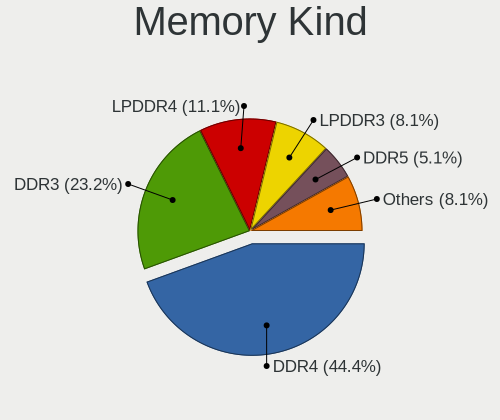

| Kind   | Notebooks | Percent |
|--------|-----------|---------|
| DDR4   | 28        | 49.12%  |
| DDR3   | 20        | 35.09%  |
| LPDDR3 | 5         | 8.77%   |
| LPDDR4 | 2         | 3.51%   |
| DDR2   | 2         | 3.51%   |

Memory Form Factor
------------------

Physical design of the memory module

| Name         | Notebooks | Percent |
|--------------|-----------|---------|
| SODIMM       | 51        | 87.93%  |
| Row Of Chips | 6         | 10.34%  |
| Unknown      | 1         | 1.72%   |

Memory Size
-----------

Memory module size

| Size  | Notebooks | Percent |
|-------|-----------|---------|
| 4096  | 26        | 41.94%  |
| 8192  | 19        | 30.65%  |
| 2048  | 11        | 17.74%  |
| 16384 | 3         | 4.84%   |
| 1024  | 2         | 3.23%   |
| 32768 | 1         | 1.61%   |

Memory Speed
------------

Memory module speed

| Speed   | Notebooks | Percent |
|---------|-----------|---------|
| 1600    | 17        | 28.33%  |
| 2667    | 14        | 23.33%  |
| 3200    | 6         | 10%     |
| 2133    | 4         | 6.67%   |
| 2400    | 3         | 5%      |
| 1334    | 3         | 5%      |
| 1333    | 3         | 5%      |
| 3266    | 2         | 3.33%   |
| Unknown | 2         | 3.33%   |
| 4266    | 1         | 1.67%   |
| 2933    | 1         | 1.67%   |
| 2666    | 1         | 1.67%   |
| 1867    | 1         | 1.67%   |
| 1066    | 1         | 1.67%   |
| 800     | 1         | 1.67%   |

Printers & scanners
-------------------

Printer Vendor
--------------

Printer device vendors

Zero info for selected period =(

Printer Model
-------------

Printer device models

Zero info for selected period =(

Scanner Vendor
--------------

Scanner device vendors

Zero info for selected period =(

Scanner Model
-------------

Scanner device models

Zero info for selected period =(

Camera
------

Camera Vendor
-------------

Camera device vendors

| Vendor                                 | Notebooks | Percent |
|----------------------------------------|-----------|---------|
| Chicony Electronics                    | 28        | 29.17%  |
| IMC Networks                           | 10        | 10.42%  |
| Microdia                               | 8         | 8.33%   |
| Realtek Semiconductor                  | 7         | 7.29%   |
| Syntek                                 | 6         | 6.25%   |
| Silicon Motion                         | 6         | 6.25%   |
| Suyin                                  | 5         | 5.21%   |
| Sunplus Innovation Technology          | 5         | 5.21%   |
| Acer                                   | 4         | 4.17%   |
| Quanta                                 | 3         | 3.13%   |
| Lite-On Technology                     | 3         | 3.13%   |
| Ricoh                                  | 2         | 2.08%   |
| Primax Electronics                     | 2         | 2.08%   |
| Cheng Uei Precision Industry (Foxlink) | 2         | 2.08%   |
| Alcor Micro                            | 2         | 2.08%   |
| LG Electronics                         | 1         | 1.04%   |
| Lenovo                                 | 1         | 1.04%   |
| Goodong Industry                       | 1         | 1.04%   |

Camera Model
------------

Camera device models

| Model                                                 | Notebooks | Percent |
|-------------------------------------------------------|-----------|---------|
| Chicony Integrated Camera                             | 6         | 6.25%   |
| IMC Networks Integrated Camera                        | 4         | 4.17%   |
| IMC Networks HD Camera                                | 4         | 4.17%   |
| Chicony EasyCamera                                    | 4         | 4.17%   |
| Syntek EasyCamera                                     | 3         | 3.13%   |
| Silicon Motion Web Camera                             | 3         | 3.13%   |
| Chicony TOSHIBA Web Camera - HD                       | 3         | 3.13%   |
| Syntek Integrated Camera                              | 2         | 2.08%   |
| Sunplus HD WebCam                                     | 2         | 2.08%   |
| Realtek HP "Truevision HD" laptop camera              | 2         | 2.08%   |
| Quanta HD User Facing                                 | 2         | 2.08%   |
| Primax HP HD Webcam [Fixed]                           | 2         | 2.08%   |
| Chicony HP Webcam                                     | 2         | 2.08%   |
| Chicony HP HD Webcam                                  | 2         | 2.08%   |
| Chicony HD WebCam                                     | 2         | 2.08%   |
| Acer Integrated Camera                                | 2         | 2.08%   |
| Syntek Lenovo EasyCamera                              | 1         | 1.04%   |
| Suyin Integrated_Webcam_HD                            | 1         | 1.04%   |
| Suyin HP Truevision HD                                | 1         | 1.04%   |
| Suyin HD WebCam                                       | 1         | 1.04%   |
| Suyin Acer/HP Integrated Webcam [CN0314]              | 1         | 1.04%   |
| Suyin 1.3M HD WebCam                                  | 1         | 1.04%   |
| Sunplus Integrated_Webcam_HD                          | 1         | 1.04%   |
| Sunplus HP Wide Vision HD                             | 1         | 1.04%   |
| Sunplus Asus Webcam                                   | 1         | 1.04%   |
| Silicon Motion WebCam SC-13HDL11939N                  | 1         | 1.04%   |
| Silicon Motion WebCam SC-0311139N                     | 1         | 1.04%   |
| Silicon Motion ATIV VGA Camera                        | 1         | 1.04%   |
| Ricoh Sony Vaio Integrated Webcam                     | 1         | 1.04%   |
| Ricoh Laptop_Integrated_Webcam_FHD                    | 1         | 1.04%   |
| Realtek Laptop_Integrated_Webcam_HD                   | 1         | 1.04%   |
| Realtek Integrated_Webcam_HD                          | 1         | 1.04%   |
| Realtek HP Wide Vision HD Camera                      | 1         | 1.04%   |
| Realtek HP Truevision HD                              | 1         | 1.04%   |
| Realtek HD WebCam                                     | 1         | 1.04%   |
| Quanta HD Webcam                                      | 1         | 1.04%   |
| Microdia Webcam SC-10HDD12636P                        | 1         | 1.04%   |
| Microdia USB 2.0 Camera                               | 1         | 1.04%   |
| Microdia Sony Visual Communication Camera             | 1         | 1.04%   |
| Microdia Sonix USB 2.0 Camera                         | 1         | 1.04%   |
| Microdia Laptop_Integrated_Webcam_HD                  | 1         | 1.04%   |
| Microdia Integrated_Webcam_HD                         | 1         | 1.04%   |
| Microdia Integrated Webcam HD                         | 1         | 1.04%   |
| Microdia Integrated HD Webcam                         | 1         | 1.04%   |
| Lite-On TOSHIBA Web Camera - HD                       | 1         | 1.04%   |
| Lite-On HP Webcam                                     | 1         | 1.04%   |
| Lite-On HP HD Camera                                  | 1         | 1.04%   |
| LG LM-X420xxx/G2/G3 Android Phone (MTP/download mode) | 1         | 1.04%   |
| Lenovo Integrated Webcam [R5U877]                     | 1         | 1.04%   |
| IMC Networks USB2.0 VGA UVC WebCam                    | 1         | 1.04%   |
| IMC Networks USB2.0 HD UVC WebCam                     | 1         | 1.04%   |
| Goodong Industry USB2.0 HD UVC WebCam                 | 1         | 1.04%   |
| Chicony Webcam-101                                    | 1         | 1.04%   |
| Chicony USB2.0 VGA UVC WebCam                         | 1         | 1.04%   |
| Chicony USB2.0 Camera                                 | 1         | 1.04%   |
| Chicony HP Truevision HD camera                       | 1         | 1.04%   |
| Chicony HP HD Camera                                  | 1         | 1.04%   |
| Chicony HD User Facing                                | 1         | 1.04%   |
| Chicony Front Camera                                  | 1         | 1.04%   |
| Chicony Acer CrystalEye Webcam                        | 1         | 1.04%   |

Security
--------

Fingerprint Vendor
------------------

Fingerprint sensor vendors

| Vendor                     | Notebooks | Percent |
|----------------------------|-----------|---------|
| Validity Sensors           | 10        | 45.45%  |
| Shenzhen Goodix Technology | 6         | 27.27%  |
| Upek                       | 5         | 22.73%  |
| Elan Microelectronics      | 1         | 4.55%   |

Fingerprint Model
-----------------

Fingerprint sensor models

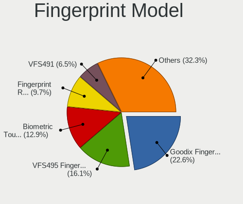

| Model                                                  | Notebooks | Percent |
|--------------------------------------------------------|-----------|---------|
| Validity Sensors VFS495 Fingerprint Reader             | 5         | 22.73%  |
| Shenzhen Goodix  FingerPrint Device                    | 4         | 18.18%  |
| Upek Biometric Touchchip/Touchstrip Fingerprint Sensor | 3         | 13.64%  |
| Validity Sensors VFS491                                | 2         | 9.09%   |
| Validity Sensors Swipe Fingerprint Sensor              | 2         | 9.09%   |
| Upek TCS5B Fingerprint sensor                          | 2         | 9.09%   |
| Shenzhen Goodix Fingerprint Reader                     | 2         | 9.09%   |
| Validity Sensors VFS5011 Fingerprint Reader            | 1         | 4.55%   |
| Elan ELAN:Fingerprint                                  | 1         | 4.55%   |

Chipcard Vendor
---------------

Chipcard module vendors

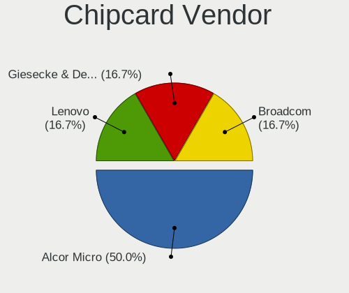

| Vendor              | Notebooks | Percent |
|---------------------|-----------|---------|
| Alcor Micro         | 2         | 40%     |
| Lenovo              | 1         | 20%     |
| Giesecke & Devrient | 1         | 20%     |
| Broadcom            | 1         | 20%     |

Chipcard Model
--------------

Chipcard module models

| Model                                          | Notebooks | Percent |
|------------------------------------------------|-----------|---------|
| Alcor Micro AU9540 Smartcard Reader            | 2         | 40%     |
| Lenovo Integrated Smart Card Reader            | 1         | 20%     |
| Giesecke & Devrient StarSign CUT               | 1         | 20%     |
| Broadcom BCM5880 Secure Applications Processor | 1         | 20%     |

Unsupported
-----------

Unsupported Devices
-------------------

Total unsupported devices on board

| Total | Notebooks | Percent |
|-------|-----------|---------|
| 0     | 69        | 63.3%   |
| 1     | 34        | 31.19%  |
| 2     | 6         | 5.5%    |

Unsupported Device Types
------------------------

Types of unsupported devices

| Type                  | Notebooks | Percent |
|-----------------------|-----------|---------|
| Fingerprint reader    | 22        | 48.89%  |
| Graphics card         | 13        | 28.89%  |
| Chipcard              | 5         | 11.11%  |
| Multimedia controller | 2         | 4.44%   |
| Storage               | 1         | 2.22%   |
| Sound                 | 1         | 2.22%   |
| Camera                | 1         | 2.22%   |

