Deepin - Tested Hardware & Statistics (Notebooks)
-------------------------------------------------

A project to collect tested hardware configurations for Deepin.

Anyone can contribute to this report by the [hw-probe](https://github.com/linuxhw/hw-probe) tool:

    sudo -E hw-probe -all -upload

Please contribute! Especially if your hardware is rare.

Contents
--------

* [ Test Cases ](#test-cases)

* [ System ](#system)
  - [ OS                       ](#os)
  - [ OS Family                ](#os-family)
  - [ Kernel                   ](#kernel)
  - [ Kernel Family            ](#kernel-family)
  - [ Kernel Major Ver.        ](#kernel-major-ver)
  - [ Arch                     ](#arch)
  - [ DE                       ](#de)
  - [ Display Server           ](#display-server)
  - [ Display Manager          ](#display-manager)
  - [ OS Lang                  ](#os-lang)
  - [ Boot Mode                ](#boot-mode)
  - [ Filesystem               ](#filesystem)
  - [ Part. scheme             ](#part-scheme)
  - [ Dual Boot with Linux/BSD ](#dual-boot-with-linuxbsd)
  - [ Dual Boot (Win)          ](#dual-boot-win)

* [ Board ](#board)
  - [ Vendor                   ](#vendor)
  - [ Model                    ](#model)
  - [ Model Family             ](#model-family)
  - [ MFG Year                 ](#mfg-year)
  - [ Form Factor              ](#form-factor)
  - [ Secure Boot              ](#secure-boot)
  - [ Coreboot                 ](#coreboot)
  - [ RAM Size                 ](#ram-size)
  - [ RAM Used                 ](#ram-used)
  - [ Total Drives             ](#total-drives)
  - [ Has CD-ROM               ](#has-cd-rom)
  - [ Has Ethernet             ](#has-ethernet)
  - [ Has WiFi                 ](#has-wifi)
  - [ Has Bluetooth            ](#has-bluetooth)

* [ Location ](#location)
  - [ Country                  ](#country)
  - [ City                     ](#city)

* [ Drives ](#drives)
  - [ Drive Vendor             ](#drive-vendor)
  - [ Drive Model              ](#drive-model)
  - [ HDD Vendor               ](#hdd-vendor)
  - [ SSD Vendor               ](#ssd-vendor)
  - [ Drive Kind               ](#drive-kind)
  - [ Drive Connector          ](#drive-connector)
  - [ Drive Size               ](#drive-size)
  - [ Space Total              ](#space-total)
  - [ Space Used               ](#space-used)
  - [ Malfunc. Drives          ](#malfunc-drives)
  - [ Malfunc. Drive Vendor    ](#malfunc-drive-vendor)
  - [ Malfunc. HDD Vendor      ](#malfunc-hdd-vendor)
  - [ Malfunc. Drive Kind      ](#malfunc-drive-kind)
  - [ Failed Drives            ](#failed-drives)
  - [ Failed Drive Vendor      ](#failed-drive-vendor)
  - [ Drive Status             ](#drive-status)

* [ Storage controller ](#storage-controller)
  - [ Storage Vendor           ](#storage-vendor)
  - [ Storage Model            ](#storage-model)
  - [ Storage Kind             ](#storage-kind)

* [ Processor ](#processor)
  - [ CPU Vendor               ](#cpu-vendor)
  - [ CPU Model                ](#cpu-model)
  - [ CPU Model Family         ](#cpu-model-family)
  - [ CPU Cores                ](#cpu-cores)
  - [ CPU Sockets              ](#cpu-sockets)
  - [ CPU Threads              ](#cpu-threads)
  - [ CPU Op-Modes             ](#cpu-op-modes)
  - [ CPU Microcode            ](#cpu-microcode)
  - [ CPU Microarch            ](#cpu-microarch)

* [ Graphics ](#graphics)
  - [ GPU Vendor               ](#gpu-vendor)
  - [ GPU Model                ](#gpu-model)
  - [ GPU Combo                ](#gpu-combo)
  - [ GPU Driver               ](#gpu-driver)
  - [ GPU Memory               ](#gpu-memory)

* [ Monitor ](#monitor)
  - [ Monitor Vendor           ](#monitor-vendor)
  - [ Monitor Model            ](#monitor-model)
  - [ Monitor Resolution       ](#monitor-resolution)
  - [ Monitor Diagonal         ](#monitor-diagonal)
  - [ Monitor Width            ](#monitor-width)
  - [ Aspect Ratio             ](#aspect-ratio)
  - [ Monitor Area             ](#monitor-area)
  - [ Pixel Density            ](#pixel-density)
  - [ Multiple Monitors        ](#multiple-monitors)

* [ Network ](#network)
  - [ Net Controller Vendor    ](#net-controller-vendor)
  - [ Net Controller Model     ](#net-controller-model)
  - [ Wireless Vendor          ](#wireless-vendor)
  - [ Wireless Model           ](#wireless-model)
  - [ Ethernet Vendor          ](#ethernet-vendor)
  - [ Ethernet Model           ](#ethernet-model)
  - [ Net Controller Kind      ](#net-controller-kind)
  - [ Used Controller          ](#used-controller)
  - [ NICs                     ](#nics)
  - [ IPv6                     ](#ipv6)

* [ Bluetooth ](#bluetooth)
  - [ Bluetooth Vendor         ](#bluetooth-vendor)
  - [ Bluetooth Model          ](#bluetooth-model)

* [ Sound ](#sound)
  - [ Sound Vendor             ](#sound-vendor)
  - [ Sound Model              ](#sound-model)

* [ Memory ](#memory)
  - [ Memory Vendor            ](#memory-vendor)
  - [ Memory Model             ](#memory-model)
  - [ Memory Kind              ](#memory-kind)
  - [ Memory Form Factor       ](#memory-form-factor)
  - [ Memory Size              ](#memory-size)
  - [ Memory Speed             ](#memory-speed)

* [ Printers & scanners ](#printers--scanners)
  - [ Printer Vendor           ](#printer-vendor)
  - [ Printer Model            ](#printer-model)
  - [ Scanner Vendor           ](#scanner-vendor)
  - [ Scanner Model            ](#scanner-model)

* [ Camera ](#camera)
  - [ Camera Vendor            ](#camera-vendor)
  - [ Camera Model             ](#camera-model)

* [ Security ](#security)
  - [ Fingerprint Vendor       ](#fingerprint-vendor)
  - [ Fingerprint Model        ](#fingerprint-model)
  - [ Chipcard Vendor          ](#chipcard-vendor)
  - [ Chipcard Model           ](#chipcard-model)

* [ Unsupported ](#unsupported)
  - [ Unsupported Devices      ](#unsupported-devices)
  - [ Unsupported Device Types ](#unsupported-device-types)

Test Cases
----------

Total: 196

| Vendor        | Model                       | Probe                                                      | Date         |
|---------------|-----------------------------|------------------------------------------------------------|--------------|
| KUU           | Andes II                    | [512394ef85](https://linux-hardware.org/?probe=512394ef85) | Jan 04, 2024 |
| Timi          | TM1709                      | [79d0628d57](https://linux-hardware.org/?probe=79d0628d57) | Jan 03, 2024 |
| Timi          | TM1709                      | [b934e033e4](https://linux-hardware.org/?probe=b934e033e4) | Jan 03, 2024 |
| KUU           | Andes II                    | [bda39c51cd](https://linux-hardware.org/?probe=bda39c51cd) | Jan 03, 2024 |
| Lenovo        | ThinkPad T490s 20NX003AU... | [e0dc55809f](https://linux-hardware.org/?probe=e0dc55809f) | Dec 09, 2023 |
| Lenovo        | ThinkPad T490s 20NX003AU... | [649f5e559d](https://linux-hardware.org/?probe=649f5e559d) | Dec 02, 2023 |
| HUAWEI        | KLVC-WXX9                   | [dd49d338b4](https://linux-hardware.org/?probe=dd49d338b4) | Nov 29, 2023 |
| Lenovo        | ThinkBook 16p Gen 4 21J8    | [4ce52b15f5](https://linux-hardware.org/?probe=4ce52b15f5) | Nov 24, 2023 |
| HP            | Compaq Presario CQ40        | [ede0c05f18](https://linux-hardware.org/?probe=ede0c05f18) | Nov 04, 2023 |
| Acer          | Nitro AN515-57              | [3b669afc38](https://linux-hardware.org/?probe=3b669afc38) | Oct 26, 2023 |
| UNOWHY        | Y13G012S4EI                 | [eb2ef3f8d5](https://linux-hardware.org/?probe=eb2ef3f8d5) | Oct 24, 2023 |
| HP            | Laptop 15s-eq2xxx           | [50698ed07c](https://linux-hardware.org/?probe=50698ed07c) | Oct 14, 2023 |
| Timi          | RedmiBook Air 13            | [63ea7be36f](https://linux-hardware.org/?probe=63ea7be36f) | Oct 07, 2023 |
| HP            | EliteBook 845 14 inch G1... | [b409947c26](https://linux-hardware.org/?probe=b409947c26) | Sep 11, 2023 |
| HP            | EliteBook 845 14 inch G1... | [f7f7964c03](https://linux-hardware.org/?probe=f7f7964c03) | Sep 09, 2023 |
| HP            | EliteBook 845 14 inch G1... | [6459a498c5](https://linux-hardware.org/?probe=6459a498c5) | Sep 07, 2023 |
| HP            | EliteBook 845 14 inch G1... | [c57f9232a2](https://linux-hardware.org/?probe=c57f9232a2) | Sep 05, 2023 |
| HP            | EliteBook 845 14 inch G1... | [8b11ecfd36](https://linux-hardware.org/?probe=8b11ecfd36) | Sep 04, 2023 |
| HP            | EliteBook 845 14 inch G1... | [ac607e5597](https://linux-hardware.org/?probe=ac607e5597) | Aug 25, 2023 |
| Lenovo        | ThinkPad X1 Carbon Gen 1... | [4d875892d6](https://linux-hardware.org/?probe=4d875892d6) | Jul 30, 2023 |
| HONOR         | NBLK-WAX9X                  | [1081b2e480](https://linux-hardware.org/?probe=1081b2e480) | Jul 26, 2023 |
| HONOR         | NBLK-WAX9X                  | [9919413d6e](https://linux-hardware.org/?probe=9919413d6e) | Jul 25, 2023 |
| HUAWEI        | MACHC-WAX9                  | [bddace9995](https://linux-hardware.org/?probe=bddace9995) | Jul 25, 2023 |
| itel Mobil... | SPIRIT 1                    | [36c3d3f6a8](https://linux-hardware.org/?probe=36c3d3f6a8) | Jul 16, 2023 |
| MSI           | GL72M 7REX                  | [6d50ff945d](https://linux-hardware.org/?probe=6d50ff945d) | Jun 19, 2023 |
| MSI           | GL72M 7REX                  | [1f1699301f](https://linux-hardware.org/?probe=1f1699301f) | Jun 15, 2023 |
| HP            | Pavilion Laptop 15-eh1xx... | [320e5bee32](https://linux-hardware.org/?probe=320e5bee32) | Jun 04, 2023 |
| Hometech      | Alfa 470C                   | [ee3bd9eb81](https://linux-hardware.org/?probe=ee3bd9eb81) | Jun 02, 2023 |
| Apple         | MacBookPro14,1              | [a5785cf3c3](https://linux-hardware.org/?probe=a5785cf3c3) | May 29, 2023 |
| Dell          | Inspiron 13-7359            | [35c9cf7244](https://linux-hardware.org/?probe=35c9cf7244) | May 12, 2023 |
| Dell          | G15 5520                    | [0322e7d38c](https://linux-hardware.org/?probe=0322e7d38c) | Mar 06, 2023 |
| Lenovo        | ThinkPad T14 Gen 1 20UD0... | [42a0b7428f](https://linux-hardware.org/?probe=42a0b7428f) | Mar 05, 2023 |
| Dell          | G15 5520                    | [1e3dcc41d3](https://linux-hardware.org/?probe=1e3dcc41d3) | Mar 04, 2023 |
| Lenovo        | Legion Y530-15ICH 81FV      | [f492107b66](https://linux-hardware.org/?probe=f492107b66) | Feb 19, 2023 |
| HP            | Pavilion Laptop 15-eh1xx... | [1746b40d04](https://linux-hardware.org/?probe=1746b40d04) | Feb 09, 2023 |
| Acer          | Aspire A515-54G             | [a57a68e42f](https://linux-hardware.org/?probe=a57a68e42f) | Jan 31, 2023 |
| Infinix       | INBOOK X2 GEN11             | [a899026279](https://linux-hardware.org/?probe=a899026279) | Jan 08, 2023 |
| Lenovo        | ThinkBook 14 G4+ ARA 21D... | [c4170b9ea3](https://linux-hardware.org/?probe=c4170b9ea3) | Dec 20, 2022 |
| Dell          | Inspiron 5488               | [32b350c3f6](https://linux-hardware.org/?probe=32b350c3f6) | Nov 25, 2022 |
| Timi          | Redmi G 2022                | [86f8128511](https://linux-hardware.org/?probe=86f8128511) | Nov 12, 2022 |
| HP            | Laptop                      | [e1cd3de91a](https://linux-hardware.org/?probe=e1cd3de91a) | Nov 02, 2022 |
| HUAWEI        | MACHD-WXX9                  | [ba1f911067](https://linux-hardware.org/?probe=ba1f911067) | Sep 10, 2022 |
| HP            | 620                         | [4476f5f677](https://linux-hardware.org/?probe=4476f5f677) | Jun 23, 2022 |
| Lenovo        | ZHAOYANG K4e-ITL 82F8       | [6103e540b9](https://linux-hardware.org/?probe=6103e540b9) | May 04, 2022 |
| HP            | EliteBook 8570w             | [7795fe989b](https://linux-hardware.org/?probe=7795fe989b) | Apr 29, 2022 |
| HUAWEI        | BOM-WXX9                    | [a771d771b2](https://linux-hardware.org/?probe=a771d771b2) | Apr 24, 2022 |
| HUAWEI        | BOM-WXX9                    | [1a195527a4](https://linux-hardware.org/?probe=1a195527a4) | Apr 24, 2022 |
| Lenovo        | Legion Y7000 81FW           | [c56c469d4f](https://linux-hardware.org/?probe=c56c469d4f) | Apr 21, 2022 |
| Acer          | Swift SF314-512             | [d7e77fd856](https://linux-hardware.org/?probe=d7e77fd856) | Apr 21, 2022 |
| HP            | Laptop 14s-fq0xxx           | [8794debb03](https://linux-hardware.org/?probe=8794debb03) | Apr 20, 2022 |
| ASUSTek       | P552LA                      | [94ef2678d5](https://linux-hardware.org/?probe=94ef2678d5) | Apr 03, 2022 |
| ASUSTek       | P552LA                      | [9166f15878](https://linux-hardware.org/?probe=9166f15878) | Apr 03, 2022 |
| HP            | EliteBook 8570w             | [131c9a7dc2](https://linux-hardware.org/?probe=131c9a7dc2) | Jan 27, 2022 |
| Lenovo        | Yoga 3 Pro-1370 80HE        | [f891c69576](https://linux-hardware.org/?probe=f891c69576) | Jan 08, 2022 |
| Google        | Akemi                       | [295fd594af](https://linux-hardware.org/?probe=295fd594af) | Dec 27, 2021 |
| Acer          | Aspire VN7-572G             | [895dca26b0](https://linux-hardware.org/?probe=895dca26b0) | Dec 21, 2021 |
| HUAWEI        | HN-WX9X                     | [f228b60d0c](https://linux-hardware.org/?probe=f228b60d0c) | Dec 07, 2021 |
| HP            | EliteBook 8570w             | [7752a79879](https://linux-hardware.org/?probe=7752a79879) | Dec 06, 2021 |
| HP            | Laptop 14-ck0xxx            | [4b03ed047c](https://linux-hardware.org/?probe=4b03ed047c) | Dec 06, 2021 |
| Samsung       | 550P5C/550P7C               | [31bc59dcb9](https://linux-hardware.org/?probe=31bc59dcb9) | Nov 12, 2021 |
| Lenovo        | ThinkBook 13s-IWL 20R9      | [88d791ff87](https://linux-hardware.org/?probe=88d791ff87) | Nov 09, 2021 |
| Dell          | Latitude 3400               | [7f519c2721](https://linux-hardware.org/?probe=7f519c2721) | Oct 23, 2021 |
| Samsung       | 550P5C/550P7C               | [2713972f14](https://linux-hardware.org/?probe=2713972f14) | Oct 22, 2021 |
| HP            | ZHAN 66 Pro G1              | [a1a1c41c6a](https://linux-hardware.org/?probe=a1a1c41c6a) | Oct 09, 2021 |
| HP            | ZHAN 66 Pro G1              | [fcc291e2f1](https://linux-hardware.org/?probe=fcc291e2f1) | Oct 08, 2021 |
| Lenovo        | Legion Y7000 2020 82AV      | [64d71e1177](https://linux-hardware.org/?probe=64d71e1177) | Sep 29, 2021 |
| HP            | Laptop 15-bs0xx             | [fc0f8f406b](https://linux-hardware.org/?probe=fc0f8f406b) | Aug 31, 2021 |
| Lenovo        | ThinkPad L412 0585AC3       | [f31b3187c3](https://linux-hardware.org/?probe=f31b3187c3) | Aug 23, 2021 |
| Lenovo        | Legion R9000K2021H 82N6     | [048b8332cc](https://linux-hardware.org/?probe=048b8332cc) | Aug 13, 2021 |
| ASUSTek       | ASUS TUF Gaming A15 FA50... | [5e1cc5b229](https://linux-hardware.org/?probe=5e1cc5b229) | Aug 11, 2021 |
| Lenovo        | XiaoXinAir-14ARE 2020 81... | [d563d62b5f](https://linux-hardware.org/?probe=d563d62b5f) | Jul 14, 2021 |
| Acer          | Aspire 5750G                | [61b9408d9e](https://linux-hardware.org/?probe=61b9408d9e) | Jul 11, 2021 |
| Acer          | Aspire 5750G                | [59728d9bef](https://linux-hardware.org/?probe=59728d9bef) | Jul 11, 2021 |
| HUAWEI        | HLYL-WXX9                   | [26b5b9e3d3](https://linux-hardware.org/?probe=26b5b9e3d3) | Jul 06, 2021 |
| Lenovo        | ZHAOYANG CF4620Z-A123 59... | [6f716961de](https://linux-hardware.org/?probe=6f716961de) | Jun 29, 2021 |
| Lenovo        | XiaoXin-15ARE 2020 81YR     | [279dea011e](https://linux-hardware.org/?probe=279dea011e) | Jun 28, 2021 |
| Lenovo        | ThinkBook 14 G2 ARE R7 8... | [b2c24061a6](https://linux-hardware.org/?probe=b2c24061a6) | Jun 13, 2021 |
| Lenovo        | IdeaPad 320-15IKB 80XL      | [0540d35606](https://linux-hardware.org/?probe=0540d35606) | May 31, 2021 |
| Samsung       | 300E4A/300E5A/300E7A/343... | [30ffaaaad4](https://linux-hardware.org/?probe=30ffaaaad4) | May 22, 2021 |
| Samsung       | 300E4A/300E5A/300E7A/343... | [91b9340ed6](https://linux-hardware.org/?probe=91b9340ed6) | May 20, 2021 |
| ASUSTek       | VivoBook 15_ASUS Laptop ... | [68740fff81](https://linux-hardware.org/?probe=68740fff81) | May 16, 2021 |
| Unknown       | Unknown                     | [4d3ffa307c](https://linux-hardware.org/?probe=4d3ffa307c) | Apr 26, 2021 |
| Unknown       | Unknown                     | [8d019adbf9](https://linux-hardware.org/?probe=8d019adbf9) | Apr 26, 2021 |
| Lenovo        | ThinkPad T420 4180M8P       | [1fe655cf93](https://linux-hardware.org/?probe=1fe655cf93) | Apr 25, 2021 |
| Toshiba       | Satellite E55t-A            | [e1a3602d7b](https://linux-hardware.org/?probe=e1a3602d7b) | Mar 28, 2021 |
| Unknown       | Unknown                     | [94f00d3697](https://linux-hardware.org/?probe=94f00d3697) | Mar 27, 2021 |
| Sony          | VGN-AW11Z_B                 | [9ddedfd3c9](https://linux-hardware.org/?probe=9ddedfd3c9) | Feb 13, 2021 |
| HP            | Pavilion Laptop 14-bf0xx    | [309266e981](https://linux-hardware.org/?probe=309266e981) | Feb 13, 2021 |
| Dell          | Inspiron 7720               | [8c8689a8ba](https://linux-hardware.org/?probe=8c8689a8ba) | Feb 08, 2021 |
| Acer          | Aspire V5-571P              | [e03d4bc850](https://linux-hardware.org/?probe=e03d4bc850) | Feb 07, 2021 |
| Dell          | Inspiron 5547               | [e2cee5283f](https://linux-hardware.org/?probe=e2cee5283f) | Feb 04, 2021 |
| HUAWEI        | HN-WX9X                     | [b0ca634dee](https://linux-hardware.org/?probe=b0ca634dee) | Jan 28, 2021 |
| Lenovo        | ThinkPad E14 20RA0058VA     | [3c08ce49f5](https://linux-hardware.org/?probe=3c08ce49f5) | Jan 08, 2021 |
| Acer          | Aspire 4736Z                | [dd3b50729f](https://linux-hardware.org/?probe=dd3b50729f) | Jan 07, 2021 |
| ASUSTek       | X406UAR                     | [42e509209a](https://linux-hardware.org/?probe=42e509209a) | Dec 20, 2020 |
| ASUSTek       | X406UAR                     | [23b1fae05b](https://linux-hardware.org/?probe=23b1fae05b) | Dec 20, 2020 |
| Lenovo        | IdeaPad 3 14ARE05 81W3      | [667577cb5f](https://linux-hardware.org/?probe=667577cb5f) | Dec 15, 2020 |
| Lenovo        | G50-80 80L0                 | [951a5a280f](https://linux-hardware.org/?probe=951a5a280f) | Dec 11, 2020 |
| Acer          | Nitro AN515-54              | [d46eb4b9c9](https://linux-hardware.org/?probe=d46eb4b9c9) | Nov 19, 2020 |
| Acer          | Nitro AN515-54              | [877187c708](https://linux-hardware.org/?probe=877187c708) | Nov 19, 2020 |
| Lenovo        | ThinkPad E585 20KV0010US    | [033f6f0920](https://linux-hardware.org/?probe=033f6f0920) | Nov 18, 2020 |
| Lenovo        | ThinkPad E585 20KV0010US    | [d2bedcab13](https://linux-hardware.org/?probe=d2bedcab13) | Nov 18, 2020 |
| Lenovo        | IdeaPad S145-15API 81UT     | [b687de4d3c](https://linux-hardware.org/?probe=b687de4d3c) | Nov 05, 2020 |
| Toshiba       | Satellite C850D-11K         | [53f5d002c9](https://linux-hardware.org/?probe=53f5d002c9) | Oct 31, 2020 |
| HP            | ENVY 15                     | [c23287b06d](https://linux-hardware.org/?probe=c23287b06d) | Oct 31, 2020 |
| Acer          | Swift SF314-42              | [628265bca0](https://linux-hardware.org/?probe=628265bca0) | Oct 25, 2020 |
| Acer          | Swift SF314-42              | [01143e194b](https://linux-hardware.org/?probe=01143e194b) | Oct 20, 2020 |
| Lenovo        | IdeaPad 110-14IBR 80UJ      | [8d149c1a39](https://linux-hardware.org/?probe=8d149c1a39) | Oct 17, 2020 |
| Acer          | Nitro AN515-52              | [ca3d5b9444](https://linux-hardware.org/?probe=ca3d5b9444) | Oct 13, 2020 |
| Microtech     | ebookPro                    | [2f1ff6265a](https://linux-hardware.org/?probe=2f1ff6265a) | Oct 10, 2020 |
| HUAWEI        | NBLK-WAX9X                  | [88e5775f0f](https://linux-hardware.org/?probe=88e5775f0f) | Oct 02, 2020 |
| HUAWEI        | NBLK-WAX9X                  | [2972557e3e](https://linux-hardware.org/?probe=2972557e3e) | Oct 02, 2020 |
| Lenovo        | G50-70 20351                | [c5ea28ed29](https://linux-hardware.org/?probe=c5ea28ed29) | Sep 28, 2020 |
| HP            | ENVY 15                     | [e7bfa62e4c](https://linux-hardware.org/?probe=e7bfa62e4c) | Sep 23, 2020 |
| Samsung       | 270E5J/2570EJ               | [d00667e263](https://linux-hardware.org/?probe=d00667e263) | Sep 21, 2020 |
| HP            | Pavilion 15                 | [f824ed9d26](https://linux-hardware.org/?probe=f824ed9d26) | Sep 18, 2020 |
| HP            | Pavilion 15                 | [d95e413136](https://linux-hardware.org/?probe=d95e413136) | Sep 16, 2020 |
| Dell          | Inspiron 3583               | [860b906339](https://linux-hardware.org/?probe=860b906339) | Sep 14, 2020 |
| Lenovo        | V310-15ISK 80SY             | [043d555fa5](https://linux-hardware.org/?probe=043d555fa5) | Sep 05, 2020 |
| Acer          | Aspire E5-571               | [84a6667f77](https://linux-hardware.org/?probe=84a6667f77) | Sep 05, 2020 |
| Acer          | Aspire 5735                 | [0e4c64618a](https://linux-hardware.org/?probe=0e4c64618a) | Sep 03, 2020 |
| Dell          | Inspiron 3583               | [885667a4cd](https://linux-hardware.org/?probe=885667a4cd) | Sep 02, 2020 |
| Samsung       | 340XAA/350XAA/550XAA        | [e4b74d9442](https://linux-hardware.org/?probe=e4b74d9442) | Sep 02, 2020 |
| Dell          | Inspiron 5447               | [bc69598c5f](https://linux-hardware.org/?probe=bc69598c5f) | Aug 28, 2020 |
| Dell          | Inspiron 5447               | [b9bf539788](https://linux-hardware.org/?probe=b9bf539788) | Jul 26, 2020 |
| Samsung       | 500R4K/500R5H/5400RK/501... | [b73122dcbf](https://linux-hardware.org/?probe=b73122dcbf) | Jul 24, 2020 |
| Dell          | Inspiron 7520               | [0e4bbcdaca](https://linux-hardware.org/?probe=0e4bbcdaca) | Jul 19, 2020 |
| Lenovo        | ThinkPad L512 44444NG       | [bfda7d01d5](https://linux-hardware.org/?probe=bfda7d01d5) | Jun 30, 2020 |
| HP            | EliteBook 820 G3            | [1ad623b060](https://linux-hardware.org/?probe=1ad623b060) | Jun 20, 2020 |
| HP            | EliteBook 820 G3            | [5517a703d4](https://linux-hardware.org/?probe=5517a703d4) | Jun 15, 2020 |
| Chuwi         | AeroBook                    | [12312a6c5b](https://linux-hardware.org/?probe=12312a6c5b) | Jun 03, 2020 |
| Chuwi         | AeroBook                    | [fdcf37b34d](https://linux-hardware.org/?probe=fdcf37b34d) | Jun 01, 2020 |
| Chuwi         | AeroBook                    | [6a57e4427b](https://linux-hardware.org/?probe=6a57e4427b) | Jun 01, 2020 |
| Google        | Edgar                       | [ed3bf69957](https://linux-hardware.org/?probe=ed3bf69957) | May 28, 2020 |
| ASUSTek       | T100TAF                     | [6d2999ebb1](https://linux-hardware.org/?probe=6d2999ebb1) | May 26, 2020 |
| HP            | Pavilion Notebook           | [825d07d907](https://linux-hardware.org/?probe=825d07d907) | May 14, 2020 |
| Lenovo        | IdeaPad 120S-11IAP 81A4     | [49661d90bd](https://linux-hardware.org/?probe=49661d90bd) | Apr 19, 2020 |
| HP            | EliteBook 8570p             | [6928abb72d](https://linux-hardware.org/?probe=6928abb72d) | Apr 07, 2020 |
| HP            | EliteBook 8570p             | [020c71d11e](https://linux-hardware.org/?probe=020c71d11e) | Apr 07, 2020 |
| HP            | EliteBook 8570p             | [163b885549](https://linux-hardware.org/?probe=163b885549) | Apr 07, 2020 |
| Sony          | VGN-NS140D                  | [dbae86d335](https://linux-hardware.org/?probe=dbae86d335) | Apr 06, 2020 |
| HP            | Pavilion Laptop 14-ce0xx... | [76c9608867](https://linux-hardware.org/?probe=76c9608867) | Mar 24, 2020 |
| HP            | Pavilion Laptop 14-ce0xx... | [81e20268cd](https://linux-hardware.org/?probe=81e20268cd) | Mar 24, 2020 |
| Fujitsu       | FARQ06012Z                  | [6d19311f7e](https://linux-hardware.org/?probe=6d19311f7e) | Mar 23, 2020 |
| HP            | EliteBook 820 G4            | [b525dfeb66](https://linux-hardware.org/?probe=b525dfeb66) | Mar 01, 2020 |
| HP            | EliteBook 820 G4            | [e28f1711fd](https://linux-hardware.org/?probe=e28f1711fd) | Mar 01, 2020 |
| CCE           | Capella & IbexPeak-M Chi... | [b6b6b3d6d5](https://linux-hardware.org/?probe=b6b6b3d6d5) | Mar 01, 2020 |
| HP            | ENVY 15                     | [a8fb8c36bf](https://linux-hardware.org/?probe=a8fb8c36bf) | Jan 22, 2020 |
| Acer          | P5WE0                       | [a3377994d6](https://linux-hardware.org/?probe=a3377994d6) | Jan 18, 2020 |
| HP            | 250 G5 Notebook PC          | [6882e04fe6](https://linux-hardware.org/?probe=6882e04fe6) | Jan 16, 2020 |
| Acer          | Nitro AN515-54              | [af36fc8a7c](https://linux-hardware.org/?probe=af36fc8a7c) | Jan 15, 2020 |
| Acer          | Nitro AN515-54              | [d96a34fd91](https://linux-hardware.org/?probe=d96a34fd91) | Jan 15, 2020 |
| Acer          | Nitro AN515-54              | [dbd7e76364](https://linux-hardware.org/?probe=dbd7e76364) | Jan 15, 2020 |
| HUAWEI        | HLY-WX9XX                   | [9f6e79326e](https://linux-hardware.org/?probe=9f6e79326e) | Jan 14, 2020 |
| Dell          | XPS 13 9360                 | [60888ae202](https://linux-hardware.org/?probe=60888ae202) | Jan 14, 2020 |
| Lenovo        | ThinkPad T420 4236CU8       | [0222255c98](https://linux-hardware.org/?probe=0222255c98) | Jan 12, 2020 |
| Toshiba       | Satellite L75-C             | [649fb9a60a](https://linux-hardware.org/?probe=649fb9a60a) | Jan 03, 2020 |
| Toshiba       | Satellite L75-C             | [2b66fb3c5e](https://linux-hardware.org/?probe=2b66fb3c5e) | Jan 03, 2020 |
| Toshiba       | Satellite C850-1H6          | [a0ffb29c6c](https://linux-hardware.org/?probe=a0ffb29c6c) | Dec 18, 2019 |
| Lenovo        | Unknown                     | [10ab399874](https://linux-hardware.org/?probe=10ab399874) | Dec 14, 2019 |
| Lenovo        | IdeaPad S145-15IWL 81S9     | [d1b18250b9](https://linux-hardware.org/?probe=d1b18250b9) | Dec 04, 2019 |
| BQ            | Tesla2 W10                  | [27f3692e24](https://linux-hardware.org/?probe=27f3692e24) | Dec 04, 2019 |
| BQ            | Tesla2 W10                  | [4c37070709](https://linux-hardware.org/?probe=4c37070709) | Dec 04, 2019 |
| HP            | Pavilion 15                 | [03188ddfb3](https://linux-hardware.org/?probe=03188ddfb3) | Dec 03, 2019 |
| HP            | Pavilion 15                 | [ae59f09d06](https://linux-hardware.org/?probe=ae59f09d06) | Nov 19, 2019 |
| Acer          | Aspire E5-571G              | [afc9fdb4b3](https://linux-hardware.org/?probe=afc9fdb4b3) | Nov 14, 2019 |
| Acer          | Aspire E5-571G              | [7914862967](https://linux-hardware.org/?probe=7914862967) | Nov 14, 2019 |
| ASUSTek       | K501LX                      | [e90c15e3c9](https://linux-hardware.org/?probe=e90c15e3c9) | Nov 10, 2019 |
| Samsung       | 340XAA/350XAA/550XAA        | [997462e90b](https://linux-hardware.org/?probe=997462e90b) | Oct 19, 2019 |
| Sony          | SVF14A190X                  | [0b9bdec363](https://linux-hardware.org/?probe=0b9bdec363) | Oct 08, 2019 |
| Lenovo        | IdeaPad 120S-11IAP 81A4     | [c4f25ea846](https://linux-hardware.org/?probe=c4f25ea846) | Oct 07, 2019 |
| Gateway       | NE56R                       | [d0978555c2](https://linux-hardware.org/?probe=d0978555c2) | Sep 11, 2019 |
| Sony          | SVE14135CXP                 | [1b1819d6c0](https://linux-hardware.org/?probe=1b1819d6c0) | Aug 13, 2019 |
| Dell          | Inspiron 1428               | [d12daa7b97](https://linux-hardware.org/?probe=d12daa7b97) | Aug 01, 2019 |
| Dell          | Inspiron 1428               | [44b9085f50](https://linux-hardware.org/?probe=44b9085f50) | Aug 01, 2019 |
| Dell          | Inspiron 17 7000 Series ... | [37b056e670](https://linux-hardware.org/?probe=37b056e670) | Jul 23, 2019 |
| Timi          | TM1701                      | [cde89e0f6e](https://linux-hardware.org/?probe=cde89e0f6e) | Jun 13, 2019 |
| Dell          | Latitude E6420              | [c5063bb936](https://linux-hardware.org/?probe=c5063bb936) | May 12, 2019 |
| Dell          | Latitude E6420              | [9563d07d0a](https://linux-hardware.org/?probe=9563d07d0a) | May 12, 2019 |
| Acer          | Aspire 7741                 | [38acfde0bd](https://linux-hardware.org/?probe=38acfde0bd) | Apr 25, 2019 |
| ASUSTek       | N46VM                       | [c22250e143](https://linux-hardware.org/?probe=c22250e143) | Apr 25, 2019 |
| ASUSTek       | N46VM                       | [def5c1c07c](https://linux-hardware.org/?probe=def5c1c07c) | Apr 25, 2019 |
| Positivo      | C14CU51                     | [87fe4181bd](https://linux-hardware.org/?probe=87fe4181bd) | Apr 08, 2019 |
| HP            | Unknown                     | [53f0f72dd6](https://linux-hardware.org/?probe=53f0f72dd6) | Apr 02, 2019 |
| Sony          | VPCYB25AB                   | [035925b406](https://linux-hardware.org/?probe=035925b406) | Apr 01, 2019 |
| HP            | G42                         | [c0b7643d96](https://linux-hardware.org/?probe=c0b7643d96) | Mar 28, 2019 |
| HP            | Pavilion Notebook           | [53fb4de336](https://linux-hardware.org/?probe=53fb4de336) | Mar 27, 2019 |
| HP            | Pavilion Notebook           | [9a4cbb7444](https://linux-hardware.org/?probe=9a4cbb7444) | Mar 27, 2019 |
| Samsung       | 800G5M/800G5W               | [efdc2e3d09](https://linux-hardware.org/?probe=efdc2e3d09) | Mar 27, 2019 |
| HP            | EliteBook 840 G2            | [86742db945](https://linux-hardware.org/?probe=86742db945) | Mar 27, 2019 |
| Standard      | MB45II/MB45IN               | [5a6f9cc354](https://linux-hardware.org/?probe=5a6f9cc354) | Mar 27, 2019 |
| Lenovo        | IdeaPad 320-15IKB 80YH      | [619a0d9d90](https://linux-hardware.org/?probe=619a0d9d90) | Mar 27, 2019 |
| Lenovo        | G400s VILG1                 | [a18da046c8](https://linux-hardware.org/?probe=a18da046c8) | Mar 27, 2019 |
| Lenovo        | ThinkPad E450c 20EHA00NC... | [deac2364d1](https://linux-hardware.org/?probe=deac2364d1) | Jan 30, 2019 |
| Lenovo        | ThinkPad E450c 20EHA00NC... | [1629601591](https://linux-hardware.org/?probe=1629601591) | Jan 30, 2019 |
| Lenovo        | ThinkPad E450c 20EHA00NC... | [b314214e24](https://linux-hardware.org/?probe=b314214e24) | Dec 25, 2018 |

System
------

OS
--

Installed operating systems

| Name           | Notebooks | Percent |
|----------------|-----------|---------|
| Deepin         | 29        | 19.73%  |
| Deepin 15.11   | 23        | 15.65%  |
| Deepin 20      | 20        | 13.61%  |
| UOS 20         | 14        | 9.52%   |
| Deepin 23      | 11        | 7.48%   |
| Deepin 15.9.2  | 8         | 5.44%   |
| Deepin 20.9    | 6         | 4.08%   |
| Deepin 20.8    | 6         | 4.08%   |
| Deepin 20.3    | 5         | 3.4%    |
| Deepin 20.5    | 4         | 2.72%   |
| Deepin 20.1    | 4         | 2.72%   |
| Deepin 20 beta | 3         | 2.04%   |
| Deepin 20.2.4  | 2         | 1.36%   |
| Deepin 15.9.3  | 2         | 1.36%   |
| Deepin 2014.3  | 1         | 0.68%   |
| Deepin 20.7.1  | 1         | 0.68%   |
| Deepin 20.7    | 1         | 0.68%   |
| Deepin 20.4    | 1         | 0.68%   |
| Deepin 20.2.3  | 1         | 0.68%   |
| Deepin 20.2.1  | 1         | 0.68%   |
| Deepin 15.9    | 1         | 0.68%   |
| Deepin 15.8    | 1         | 0.68%   |
| Deepin 15.10.1 | 1         | 0.68%   |
| Deepin 15.10   | 1         | 0.68%   |

OS Family
---------

OS without a version

| Name   | Notebooks | Percent |
|--------|-----------|---------|
| Deepin | 142       | 100%    |

Kernel
------

Version of the Linux kernel

| Version                             | Notebooks | Percent |
|-------------------------------------|-----------|---------|
| 4.15.0-30deepin-generic             | 32        | 21.77%  |
| 5.4.50-amd64-desktop                | 16        | 10.88%  |
| 4.15.0-29deepin-generic             | 12        | 8.16%   |
| 5.4.70-amd64-desktop                | 9         | 6.12%   |
| 5.10.60-amd64-desktop               | 9         | 6.12%   |
| 5.18.17-amd64-desktop-community-hwe | 6         | 4.08%   |
| 5.10.0-amd64-desktop                | 6         | 4.08%   |
| 6.1.32-amd64-desktop-hwe            | 5         | 3.4%    |
| 5.7.7-amd64-desktop                 | 4         | 2.72%   |
| 5.18.17-amd64-desktop-hwe           | 4         | 2.72%   |
| 5.10.41-amd64-desktop               | 4         | 2.72%   |
| 5.10.29-amd64-desktop               | 4         | 2.72%   |
| 5.3.0-3-amd64                       | 3         | 2.04%   |
| 5.15.77-amd64-desktop               | 3         | 2.04%   |
| 5.15.1-amd64-desktop                | 3         | 2.04%   |
| 6.1.11-amd64-desktop-hwe            | 2         | 1.36%   |
| 5.15.45-amd64-desktop               | 2         | 1.36%   |
| 5.15.24-amd64-desktop               | 2         | 1.36%   |
| 5.10.50-amd64-desktop               | 2         | 1.36%   |
| 5.10.5-amd64-desktop+               | 2         | 1.36%   |
| 5.10.18-amd64-desktop               | 2         | 1.36%   |
| 5.10.101-amd64-desktop              | 2         | 1.36%   |
| 4.19.0-amd64-desktop                | 2         | 1.36%   |
| 6.5.0                               | 1         | 0.68%   |
| 5.8.14-amd64-desktop                | 1         | 0.68%   |
| 5.6.14-050614-generic               | 1         | 0.68%   |
| 5.6.12-xanmod1                      | 1         | 0.68%   |
| 5.5.4-xanmod3                       | 1         | 0.68%   |
| 5.3.8-xanmod6                       | 1         | 0.68%   |
| 5.15.34-amd64-desktop               | 1         | 0.68%   |
| 5.10.83-amd64-desktop               | 1         | 0.68%   |
| 5.10.36-amd64-desktop               | 1         | 0.68%   |
| 5.1.0-050100rc2-generic             | 1         | 0.68%   |
| 4.15.0-135-generic                  | 1         | 0.68%   |

Kernel Family
-------------

Linux kernel without a distro release

| Version  | Notebooks | Percent |
|----------|-----------|---------|
| 4.15.0   | 45        | 30.61%  |
| 5.4.50   | 16        | 10.88%  |
| 5.18.17  | 10        | 6.8%    |
| 5.4.70   | 9         | 6.12%   |
| 5.10.60  | 9         | 6.12%   |
| 5.10.0   | 6         | 4.08%   |
| 6.1.32   | 5         | 3.4%    |
| 5.7.7    | 4         | 2.72%   |
| 5.10.41  | 4         | 2.72%   |
| 5.10.29  | 4         | 2.72%   |
| 5.3.0    | 3         | 2.04%   |
| 5.15.77  | 3         | 2.04%   |
| 5.15.1   | 3         | 2.04%   |
| 6.1.11   | 2         | 1.36%   |
| 5.15.45  | 2         | 1.36%   |
| 5.15.24  | 2         | 1.36%   |
| 5.10.50  | 2         | 1.36%   |
| 5.10.5   | 2         | 1.36%   |
| 5.10.18  | 2         | 1.36%   |
| 5.10.101 | 2         | 1.36%   |
| 4.19.0   | 2         | 1.36%   |
| 6.5.0    | 1         | 0.68%   |
| 5.8.14   | 1         | 0.68%   |
| 5.6.14   | 1         | 0.68%   |
| 5.6.12   | 1         | 0.68%   |
| 5.5.4    | 1         | 0.68%   |
| 5.3.8    | 1         | 0.68%   |
| 5.15.34  | 1         | 0.68%   |
| 5.10.83  | 1         | 0.68%   |
| 5.10.36  | 1         | 0.68%   |
| 5.1.0    | 1         | 0.68%   |

Kernel Major Ver.
-----------------

Linux kernel major version

| Version | Notebooks | Percent |
|---------|-----------|---------|
| 4.15    | 45        | 30.82%  |
| 5.10    | 33        | 22.6%   |
| 5.4     | 25        | 17.12%  |
| 5.18    | 10        | 6.85%   |
| 5.15    | 10        | 6.85%   |
| 6.1     | 7         | 4.79%   |
| 5.7     | 4         | 2.74%   |
| 5.3     | 4         | 2.74%   |
| 5.6     | 2         | 1.37%   |
| 4.19    | 2         | 1.37%   |
| 6.5     | 1         | 0.68%   |
| 5.8     | 1         | 0.68%   |
| 5.5     | 1         | 0.68%   |
| 5.1     | 1         | 0.68%   |

Arch
----

OS architecture (x86_64, i586, etc.)

| Name   | Notebooks | Percent |
|--------|-----------|---------|
| x86_64 | 142       | 100%    |

DE
--

Desktop Environment

| Name    | Notebooks | Percent |
|---------|-----------|---------|
| Deepin  | 115       | 80.99%  |
| Unknown | 20        | 14.08%  |
| DDE     | 6         | 4.23%   |
| KDE     | 1         | 0.7%    |

Display Server
--------------

X11 or Wayland

| Name | Notebooks | Percent |
|------|-----------|---------|
| X11  | 142       | 100%    |

Display Manager
---------------

SDDM, LightDM, etc.

| Name    | Notebooks | Percent |
|---------|-----------|---------|
| Unknown | 58        | 40.28%  |
| LightDM | 47        | 32.64%  |
| TDM     | 39        | 27.08%  |

OS Lang
-------

Language

| Lang    | Notebooks | Percent |
|---------|-----------|---------|
| en_US   | 30        | 21.13%  |
| Unknown | 30        | 21.13%  |
| zh_CN   | 23        | 16.2%   |
| pt_BR   | 15        | 10.56%  |
| es_ES   | 11        | 7.75%   |
| de_DE   | 10        | 7.04%   |
| ru_RU   | 8         | 5.63%   |
| tr_TR   | 3         | 2.11%   |
| it_IT   | 3         | 2.11%   |
| sv_SE   | 2         | 1.41%   |
| pl_PL   | 2         | 1.41%   |
| fr_FR   | 2         | 1.41%   |
| nl_NL   | 1         | 0.7%    |
| ja_JP   | 1         | 0.7%    |
| en_GB   | 1         | 0.7%    |

Boot Mode
---------

EFI or BIOS

| Mode | Notebooks | Percent |
|------|-----------|---------|
| EFI  | 96        | 67.13%  |
| BIOS | 47        | 32.87%  |

Filesystem
----------

Type of filesystem

| Type    | Notebooks | Percent |
|---------|-----------|---------|
| Ext4    | 127       | 89.44%  |
| Unknown | 14        | 9.86%   |
| Overlay | 1         | 0.7%    |

Part. scheme
------------

Scheme of partitioning

| Type    | Notebooks | Percent |
|---------|-----------|---------|
| GPT     | 72        | 50.35%  |
| Unknown | 57        | 39.86%  |
| MBR     | 14        | 9.79%   |

Dual Boot with Linux/BSD
------------------------

Hosting more than one Linux/BSD

| Dual boot | Notebooks | Percent |
|-----------|-----------|---------|
| No        | 112       | 77.78%  |
| Yes       | 32        | 22.22%  |

Dual Boot (Win)
---------------

Hosting Linux and Windows

| Dual boot | Notebooks | Percent |
|-----------|-----------|---------|
| No        | 101       | 70.63%  |
| Yes       | 42        | 29.37%  |

Board
-----

Vendor
------

Motherboard manufacturer

| Name                | Notebooks | Percent |
|---------------------|-----------|---------|
| Lenovo              | 36        | 25.35%  |
| Hewlett-Packard     | 24        | 16.9%   |
| Acer                | 15        | 10.56%  |
| Dell                | 13        | 9.15%   |
| Samsung Electronics | 7         | 4.93%   |
| HUAWEI              | 7         | 4.93%   |
| ASUSTek Computer    | 7         | 4.93%   |
| Sony                | 5         | 3.52%   |
| Toshiba             | 4         | 2.82%   |
| Timi                | 4         | 2.82%   |
| Google              | 2         | 1.41%   |
| Unknown             | 2         | 1.41%   |
| UNOWHY              | 1         | 0.7%    |
| Standard            | 1         | 0.7%    |
| Positivo            | 1         | 0.7%    |
| MSI                 | 1         | 0.7%    |
| Microtech           | 1         | 0.7%    |
| KUU                 | 1         | 0.7%    |
| itel Mobile Limited | 1         | 0.7%    |
| Infinix             | 1         | 0.7%    |
| HONOR               | 1         | 0.7%    |
| Hometech            | 1         | 0.7%    |
| Gateway             | 1         | 0.7%    |
| Fujitsu             | 1         | 0.7%    |
| Chuwi               | 1         | 0.7%    |
| CCE                 | 1         | 0.7%    |
| BQ                  | 1         | 0.7%    |
| Apple               | 1         | 0.7%    |

Model
-----

Motherboard model

| Name                                              | Notebooks | Percent |
|---------------------------------------------------|-----------|---------|
| Unknown                                           | 4         | 2.82%   |
| Samsung 340XAA/350XAA/550XAA                      | 2         | 1.41%   |
| Lenovo IdeaPad 120S-11IAP 81A4                    | 2         | 1.41%   |
| HP Pavilion Notebook                              | 2         | 1.41%   |
| HP Pavilion 15                                    | 2         | 1.41%   |
| HP ENVY 15                                        | 2         | 1.41%   |
| Acer Nitro AN515-54                               | 2         | 1.41%   |
| UNOWHY Y13G012S4EI                                | 1         | 0.7%    |
| Toshiba Satellite L75-C                           | 1         | 0.7%    |
| Toshiba Satellite E55t-A                          | 1         | 0.7%    |
| Toshiba Satellite C850D-11K                       | 1         | 0.7%    |
| Toshiba Satellite C850-1H6                        | 1         | 0.7%    |
| Timi TM1709                                       | 1         | 0.7%    |
| Timi TM1701                                       | 1         | 0.7%    |
| Timi RedmiBook Air 13                             | 1         | 0.7%    |
| Timi Redmi G 2022                                 | 1         | 0.7%    |
| Standard MB45II/MB45IN                            | 1         | 0.7%    |
| Sony VPCYB25AB                                    | 1         | 0.7%    |
| Sony VGN-NS140D                                   | 1         | 0.7%    |
| Sony VGN-AW11Z_B                                  | 1         | 0.7%    |
| Sony SVF14A190X                                   | 1         | 0.7%    |
| Sony SVE14135CXP                                  | 1         | 0.7%    |
| Samsung 800G5M/800G5W                             | 1         | 0.7%    |
| Samsung 550P5C/550P7C                             | 1         | 0.7%    |
| Samsung 500R4K/500R5H/5400RK/501R5H/5500RH/500R5S | 1         | 0.7%    |
| Samsung 300E4A/300E5A/300E7A/3430EA/3530EA        | 1         | 0.7%    |
| Samsung 270E5J/2570EJ                             | 1         | 0.7%    |
| Positivo C14CU51                                  | 1         | 0.7%    |
| MSI GL72M 7REX                                    | 1         | 0.7%    |
| Microtech ebookPro                                | 1         | 0.7%    |
| Lenovo ZHAOYANG K4e-ITL 82F8                      | 1         | 0.7%    |
| Lenovo ZHAOYANG CF4620Z-A123 59082537             | 1         | 0.7%    |
| Lenovo Yoga 3 Pro-1370 80HE                       | 1         | 0.7%    |
| Lenovo XiaoXinAir-14ARE 2020 81YN                 | 1         | 0.7%    |
| Lenovo XiaoXin-15ARE 2020 81YR                    | 1         | 0.7%    |
| Lenovo V310-15ISK 80SY                            | 1         | 0.7%    |
| Lenovo ThinkPad X1 Carbon Gen 11 21HMCTO1WW       | 1         | 0.7%    |
| Lenovo ThinkPad T490s 20NX003AUS                  | 1         | 0.7%    |
| Lenovo ThinkPad T420 4236CU8                      | 1         | 0.7%    |
| Lenovo ThinkPad T420 4180M8P                      | 1         | 0.7%    |

Model Family
------------

Motherboard model prefix

| Name                    | Notebooks | Percent |
|-------------------------|-----------|---------|
| Lenovo ThinkPad         | 10        | 7.04%   |
| Dell Inspiron           | 9         | 6.34%   |
| Lenovo IdeaPad          | 8         | 5.63%   |
| Acer Aspire             | 8         | 5.63%   |
| HP EliteBook            | 6         | 4.23%   |
| HP Pavilion             | 5         | 3.52%   |
| HP Laptop               | 5         | 3.52%   |
| Toshiba Satellite       | 4         | 2.82%   |
| Lenovo ThinkBook        | 4         | 2.82%   |
| Lenovo Legion           | 4         | 2.82%   |
| Acer Nitro              | 4         | 2.82%   |
| Unknown                 | 4         | 2.82%   |
| Samsung 340XAA          | 2         | 1.41%   |
| Lenovo ZHAOYANG         | 2         | 1.41%   |
| HP ENVY                 | 2         | 1.41%   |
| Dell Latitude           | 2         | 1.41%   |
| Acer Swift              | 2         | 1.41%   |
| UNOWHY Y13G012S4EI      | 1         | 0.7%    |
| Timi TM1709             | 1         | 0.7%    |
| Timi TM1701             | 1         | 0.7%    |
| Timi RedmiBook          | 1         | 0.7%    |
| Timi Redmi              | 1         | 0.7%    |
| Standard MB45II         | 1         | 0.7%    |
| Sony VPCYB25AB          | 1         | 0.7%    |
| Sony VGN-NS140D         | 1         | 0.7%    |
| Sony VGN-AW11Z          | 1         | 0.7%    |
| Sony SVF14A190X         | 1         | 0.7%    |
| Sony SVE14135CXP        | 1         | 0.7%    |
| Samsung 800G5M          | 1         | 0.7%    |
| Samsung 550P5C          | 1         | 0.7%    |
| Samsung 500R4K          | 1         | 0.7%    |
| Samsung 300E4A          | 1         | 0.7%    |
| Samsung 270E5J          | 1         | 0.7%    |
| Positivo C14CU51        | 1         | 0.7%    |
| MSI GL72M               | 1         | 0.7%    |
| Microtech ebookPro      | 1         | 0.7%    |
| Lenovo Yoga             | 1         | 0.7%    |
| Lenovo XiaoXinAir-14ARE | 1         | 0.7%    |
| Lenovo XiaoXin-15ARE    | 1         | 0.7%    |
| Lenovo V310-15ISK       | 1         | 0.7%    |

MFG Year
--------

Motherboard manufacture year

| Year    | Notebooks | Percent |
|---------|-----------|---------|
| 2019    | 17        | 11.97%  |
| 2021    | 14        | 9.86%   |
| 2018    | 14        | 9.86%   |
| 2017    | 14        | 9.86%   |
| 2020    | 10        | 7.04%   |
| 2015    | 10        | 7.04%   |
| 2012    | 10        | 7.04%   |
| 2014    | 8         | 5.63%   |
| 2013    | 8         | 5.63%   |
| 2011    | 7         | 4.93%   |
| 2010    | 7         | 4.93%   |
| 2022    | 6         | 4.23%   |
| 2016    | 6         | 4.23%   |
| 2023    | 4         | 2.82%   |
| 2009    | 4         | 2.82%   |
| 2008    | 2         | 1.41%   |
| Unknown | 1         | 0.7%    |

Form Factor
-----------

Physical design of the computer

| Name     | Notebooks | Percent |
|----------|-----------|---------|
| Notebook | 142       | 100%    |

Secure Boot
-----------

Enabled or disabled

| State    | Notebooks | Percent |
|----------|-----------|---------|
| Disabled | 133       | 93.66%  |
| Enabled  | 9         | 6.34%   |

Coreboot
--------

Have coreboot on board

| Used | Notebooks | Percent |
|------|-----------|---------|
| No   | 140       | 98.59%  |
| Yes  | 2         | 1.41%   |

RAM Size
--------

Total RAM memory

| Size in GB  | Notebooks | Percent |
|-------------|-----------|---------|
| 4.01-8.0    | 50        | 35.21%  |
| 8.01-16.0   | 29        | 20.42%  |
| 3.01-4.0    | 28        | 19.72%  |
| 16.01-24.0  | 22        | 15.49%  |
| 32.01-64.0  | 7         | 4.93%   |
| 1.01-2.0    | 4         | 2.82%   |
| 2.01-3.0    | 1         | 0.7%    |
| 64.01-256.0 | 1         | 0.7%    |

RAM Used
--------

Used RAM memory

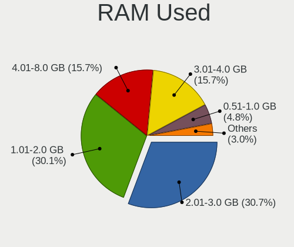

| Used GB   | Notebooks | Percent |
|-----------|-----------|---------|
| 2.01-3.0  | 46        | 31.29%  |
| 1.01-2.0  | 43        | 29.25%  |
| 3.01-4.0  | 24        | 16.33%  |
| 4.01-8.0  | 22        | 14.97%  |
| 0.51-1.0  | 8         | 5.44%   |
| 8.01-16.0 | 4         | 2.72%   |

Total Drives
------------

Number of drives on board

| Drives | Notebooks | Percent |
|--------|-----------|---------|
| 1      | 106       | 73.61%  |
| 2      | 37        | 25.69%  |
| 3      | 1         | 0.69%   |

Has CD-ROM
----------

Has CD-ROM on board

| Presented | Notebooks | Percent |
|-----------|-----------|---------|
| No        | 97        | 68.31%  |
| Yes       | 45        | 31.69%  |

Has Ethernet
------------

Has Ethernet on board

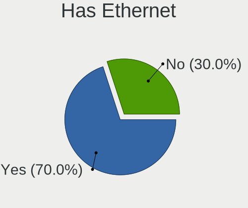

| Presented | Notebooks | Percent |
|-----------|-----------|---------|
| Yes       | 100       | 70.42%  |
| No        | 42        | 29.58%  |

Has WiFi
--------

Has WiFi module

| Presented | Notebooks | Percent |
|-----------|-----------|---------|
| Yes       | 140       | 98.59%  |
| No        | 2         | 1.41%   |

Has Bluetooth
-------------

Has Bluetooth module

| Presented | Notebooks | Percent |
|-----------|-----------|---------|
| Yes       | 118       | 83.1%   |
| No        | 24        | 16.9%   |

Location
--------

Country
-------

Geographic location (country)

| Country               | Notebooks | Percent |
|-----------------------|-----------|---------|
| Brazil                | 31        | 21.68%  |
| China                 | 24        | 16.78%  |
| Germany               | 11        | 7.69%   |
| Russia                | 6         | 4.2%    |
| USA                   | 5         | 3.5%    |
| Turkey                | 5         | 3.5%    |
| Spain                 | 5         | 3.5%    |
| Indonesia             | 4         | 2.8%    |
| Poland                | 3         | 2.1%    |
| Japan                 | 3         | 2.1%    |
| Italy                 | 3         | 2.1%    |
| Chile                 | 3         | 2.1%    |
| Sweden                | 2         | 1.4%    |
| Panama                | 2         | 1.4%    |
| India                 | 2         | 1.4%    |
| Hong Kong             | 2         | 1.4%    |
| Canada                | 2         | 1.4%    |
| Bulgaria              | 2         | 1.4%    |
| Austria               | 2         | 1.4%    |
| Vietnam               | 1         | 0.7%    |
| Venezuela             | 1         | 0.7%    |
| Tunisia               | 1         | 0.7%    |
| Sri Lanka             | 1         | 0.7%    |
| South Africa          | 1         | 0.7%    |
| Singapore             | 1         | 0.7%    |
| Serbia                | 1         | 0.7%    |
| Sao Tome and Principe | 1         | 0.7%    |
| Portugal              | 1         | 0.7%    |
| Pakistan              | 1         | 0.7%    |
| Netherlands           | 1         | 0.7%    |
| Mexico                | 1         | 0.7%    |
| Lebanon               | 1         | 0.7%    |
| Kenya                 | 1         | 0.7%    |
| Iran                  | 1         | 0.7%    |
| Greece                | 1         | 0.7%    |
| France                | 1         | 0.7%    |
| Ecuador               | 1         | 0.7%    |
| Czechia               | 1         | 0.7%    |
| Cuba                  | 1         | 0.7%    |
| Colombia              | 1         | 0.7%    |

City
----

Geographic location (city)

| City             | Notebooks | Percent |
|------------------|-----------|---------|
| Beijing          | 5         | 3.5%    |
| Wuhan            | 3         | 2.1%    |
| Guangzhou        | 3         | 2.1%    |
| Curitiba         | 3         | 2.1%    |
| Uberlndia      | 2         | 1.4%    |
| Taiyuan          | 2         | 1.4%    |
| Surabaya         | 2         | 1.4%    |
| Sao Paulo        | 2         | 1.4%    |
| Petrpolis      | 2         | 1.4%    |
| Londrina         | 2         | 1.4%    |
| Innsbruck        | 2         | 1.4%    |
| David            | 2         | 1.4%    |
| Atlanta          | 2         | 1.4%    |
| Yozgat           | 1         | 0.7%    |
| Yogyakarta       | 1         | 0.7%    |
| Yekaterinburg    | 1         | 0.7%    |
| Xuhui            | 1         | 0.7%    |
| Wanchai          | 1         | 0.7%    |
| Voronezh         | 1         | 0.7%    |
| Villa Ballester  | 1         | 0.7%    |
| Vigo             | 1         | 0.7%    |
| Ufa              | 1         | 0.7%    |
| Tomsk            | 1         | 0.7%    |
| Tokyo            | 1         | 0.7%    |
| Tianjin          | 1         | 0.7%    |
| Tehrn        | 1         | 0.7%    |
| Tai'an           | 1         | 0.7%    |
| So Tom   | 1         | 0.7%    |
| Suzano           | 1         | 0.7%    |
| Sofia            | 1         | 0.7%    |
| Singapore        | 1         | 0.7%    |
| Shanghai         | 1         | 0.7%    |
| Sao Carlos       | 1         | 0.7%    |
| Sao Bento do Sul | 1         | 0.7%    |
| Santiago         | 1         | 0.7%    |
| Samara           | 1         | 0.7%    |
| Saitama          | 1         | 0.7%    |
| Rzeszw         | 1         | 0.7%    |
| Rotenburg        | 1         | 0.7%    |
| Poznan           | 1         | 0.7%    |

Drives
------

Drive Vendor
------------

Hard drive vendors

| Vendor                         | Notebooks | Drives | Percent |
|--------------------------------|-----------|--------|---------|
| WDC                            | 24        | 27     | 13.41%  |
| Seagate                        | 23        | 26     | 12.85%  |
| Samsung Electronics            | 19        | 22     | 10.61%  |
| Unknown                        | 13        | 13     | 7.26%   |
| Toshiba                        | 13        | 14     | 7.26%   |
| SK hynix                       | 10        | 11     | 5.59%   |
| SanDisk                        | 10        | 10     | 5.59%   |
| Kingston                       | 9         | 10     | 5.03%   |
| Micron Technology              | 6         | 8      | 3.35%   |
| HGST                           | 6         | 6      | 3.35%   |
| Intel                          | 5         | 6      | 2.79%   |
| Hitachi                        | 4         | 4      | 2.23%   |
| Crucial                        | 4         | 4      | 2.23%   |
| LITEON                         | 3         | 3      | 1.68%   |
| China                          | 3         | 3      | 1.68%   |
| SPCC                           | 2         | 3      | 1.12%   |
| Silicon Motion                 | 2         | 2      | 1.12%   |
| KIOXIA                         | 2         | 2      | 1.12%   |
| A-DATA Technology              | 2         | 2      | 1.12%   |
| V-GeN                          | 1         | 1      | 0.56%   |
| Transcend                      | 1         | 1      | 0.56%   |
| Solid State Storage Technology | 1         | 1      | 0.56%   |
| Phison                         | 1         | 1      | 0.56%   |
| Patriot                        | 1         | 1      | 0.56%   |
| OEM                            | 1         | 1      | 0.56%   |
| OCZ                            | 1         | 1      | 0.56%   |
| Netac                          | 1         | 1      | 0.56%   |
| Microtech                      | 1         | 1      | 0.56%   |
| MAXIO Technology (Hangzhou)    | 1         | 1      | 0.56%   |
| Kingston Technology Company    | 1         | 1      | 0.56%   |
| KingSpec                       | 1         | 1      | 0.56%   |
| JMicron Technology             | 1         | 1      | 0.56%   |
| Intenso                        | 1         | 1      | 0.56%   |
| Fujitsu                        | 1         | 2      | 0.56%   |
| FORESEE                        | 1         | 1      | 0.56%   |
| Apple                          | 1         | 2      | 0.56%   |
| ADATA Technology               | 1         | 1      | 0.56%   |
| Unknown                        | 1         | 1      | 0.56%   |

Drive Model
-----------

Hard drive models

| Model                                              | Notebooks | Percent |
|----------------------------------------------------|-----------|---------|
| Seagate ST1000LM035-1RK172 1TB                     | 6         | 3.26%   |
| Toshiba MQ01ABF050 500GB                           | 4         | 2.17%   |
| Kingston SA400S37240G 240GB SSD                    | 4         | 2.17%   |
| Toshiba MQ01ABD100 1TB                             | 3         | 1.63%   |
| Crucial CT240BX500SSD1 240GB                       | 3         | 1.63%   |
| WDC WD5000LPCX-24VHAT0 500GB                       | 2         | 1.09%   |
| Unknown MMC Card                                   | 2         | 1.09%   |
| Seagate ST9320325AS 320GB                          | 2         | 1.09%   |
| Seagate ST500LM012 HN-M500MBB 500GB                | 2         | 1.09%   |
| Seagate ST2000LM007-1R8174 2TB                     | 2         | 1.09%   |
| Seagate ST1000LM024 HN-M101MBB 1TB                 | 2         | 1.09%   |
| Samsung SSD 850 EVO 500GB                          | 2         | 1.09%   |
| Samsung NVMe SSD Controller PM9A1/PM9A3/980PRO 2TB | 2         | 1.09%   |
| Samsung MZVLW256HEHP-000H1 256GB                   | 2         | 1.09%   |
| HGST HTS545050A7E680 500GB                         | 2         | 1.09%   |
| WDC WDS480G2G0B-00EPW0 480GB SSD                   | 1         | 0.54%   |
| WDC WDS240G2G0A-00JH30 240GB SSD                   | 1         | 0.54%   |
| WDC WDS120G2G0A-00JH30 120GB SSD                   | 1         | 0.54%   |
| WDC WD7500BPVT-24HXZT3 752GB                       | 1         | 0.54%   |
| WDC WD5000LPZX-75Z10T0 500GB                       | 1         | 0.54%   |
| WDC WD5000LPVX-80V0TT0 500GB                       | 1         | 0.54%   |
| WDC WD5000LPVX-08V0TT6 500GB                       | 1         | 0.54%   |
| WDC WD5000LPCX-24C6HT0 500GB                       | 1         | 0.54%   |
| WDC WD3200BEVT-60A23T0 320GB                       | 1         | 0.54%   |
| WDC WD3200BEVT-22ZCT0 320GB                        | 1         | 0.54%   |
| WDC WD3200BEVT-08A23T1 320GB                       | 1         | 0.54%   |
| WDC WD10SPZX-35Z10T0 1TB                           | 1         | 0.54%   |
| WDC WD10SPZX-24Z10 1TB                             | 1         | 0.54%   |
| WDC WD10SPZX-22Z10T1 1TB                           | 1         | 0.54%   |
| WDC WD10SPZX-08Z10 1TB                             | 1         | 0.54%   |
| WDC WD10JPVX-60JC3T1 1TB                           | 1         | 0.54%   |
| WDC WD10JPVX-60JC3T0 1TB                           | 1         | 0.54%   |
| WDC WD10JPVX-22JC3T0 1TB                           | 1         | 0.54%   |
| WDC WD10JPCX-24UE4T0 1TB                           | 1         | 0.54%   |
| WDC PC SN730 SDBPNTY-512G-1101 512GB               | 1         | 0.54%   |
| WDC PC SN730 SDBPNTY-512G-1027 512GB               | 1         | 0.54%   |
| WDC PC SN720 SDAPNTW-512G-1127 512GB               | 1         | 0.54%   |
| WDC PC SN530 SDBPMPZ-512G-1101 512GB               | 1         | 0.54%   |
| WDC PC SN520 NVMe 256GB                            | 1         | 0.54%   |
| V-GeN V-GEN10SM19AR120SDK 120GB SSD                | 1         | 0.54%   |

HDD Vendor
----------

Hard disk drive vendors

| Vendor              | Notebooks | Drives | Percent |
|---------------------|-----------|--------|---------|
| Seagate             | 23        | 26     | 34.85%  |
| WDC                 | 18        | 19     | 27.27%  |
| Toshiba             | 11        | 12     | 16.67%  |
| HGST                | 6         | 6      | 9.09%   |
| Hitachi             | 4         | 4      | 6.06%   |
| Samsung Electronics | 1         | 1      | 1.52%   |
| OEM                 | 1         | 1      | 1.52%   |
| JMicron Technology  | 1         | 1      | 1.52%   |
| Fujitsu             | 1         | 2      | 1.52%   |

SSD Vendor
----------

Solid state drive vendors

| Vendor              | Notebooks | Drives | Percent |
|---------------------|-----------|--------|---------|
| SanDisk             | 8         | 8      | 16.33%  |
| Samsung Electronics | 7         | 8      | 14.29%  |
| Kingston            | 7         | 8      | 14.29%  |
| WDC                 | 3         | 3      | 6.12%   |
| SK hynix            | 3         | 3      | 6.12%   |
| Crucial             | 3         | 3      | 6.12%   |
| China               | 3         | 3      | 6.12%   |
| SPCC                | 2         | 3      | 4.08%   |
| Micron Technology   | 2         | 3      | 4.08%   |
| LITEON              | 2         | 2      | 4.08%   |
| V-GeN               | 1         | 1      | 2.04%   |
| Unknown             | 1         | 1      | 2.04%   |
| Transcend           | 1         | 1      | 2.04%   |
| OCZ                 | 1         | 1      | 2.04%   |
| Netac               | 1         | 1      | 2.04%   |
| Microtech           | 1         | 1      | 2.04%   |
| KingSpec            | 1         | 1      | 2.04%   |
| Intenso             | 1         | 1      | 2.04%   |
| Intel               | 1         | 2      | 2.04%   |

Drive Kind
----------

HDD or SSD

| Kind | Notebooks | Drives | Percent |
|------|-----------|--------|---------|
| HDD  | 65        | 72     | 37.14%  |
| NVMe | 52        | 58     | 29.71%  |
| SSD  | 46        | 54     | 26.29%  |
| MMC  | 12        | 13     | 6.86%   |

Drive Connector
---------------

SATA, SAS, NVMe, etc.

| Type | Notebooks | Drives | Percent |
|------|-----------|--------|---------|
| SATA | 93        | 121    | 57.76%  |
| NVMe | 52        | 58     | 32.3%   |
| MMC  | 12        | 13     | 7.45%   |
| SAS  | 4         | 5      | 2.48%   |

Drive Size
----------

Size of hard drive

| Size in TB | Notebooks | Drives | Percent |
|------------|-----------|--------|---------|
| 0.01-0.5   | 65        | 82     | 62.5%   |
| 0.51-1.0   | 36        | 41     | 34.62%  |
| 1.01-2.0   | 2         | 2      | 1.92%   |
| 4.01-10.0  | 1         | 1      | 0.96%   |

Space Total
-----------

Amount of disk space available on the file system

| Size in GB     | Notebooks | Percent |
|----------------|-----------|---------|
| 251-500        | 51        | 34.93%  |
| 101-250        | 37        | 25.34%  |
| 501-1000       | 30        | 20.55%  |
| 1001-2000      | 11        | 7.53%   |
| More than 3000 | 4         | 2.74%   |
| 21-50          | 4         | 2.74%   |
| 51-100         | 4         | 2.74%   |
| Unknown        | 3         | 2.05%   |
| 2001-3000      | 1         | 0.68%   |
| 1-20           | 1         | 0.68%   |

Space Used
----------

Amount of used disk space

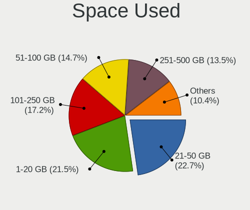

| Used GB   | Notebooks | Percent |
|-----------|-----------|---------|
| 1-20      | 33        | 22.76%  |
| 21-50     | 32        | 22.07%  |
| 101-250   | 24        | 16.55%  |
| 51-100    | 22        | 15.17%  |
| 251-500   | 19        | 13.1%   |
| 501-1000  | 6         | 4.14%   |
| 1001-2000 | 4         | 2.76%   |
| Unknown   | 3         | 2.07%   |
| 2001-3000 | 2         | 1.38%   |

Malfunc. Drives
---------------

Drive models with a malfunction

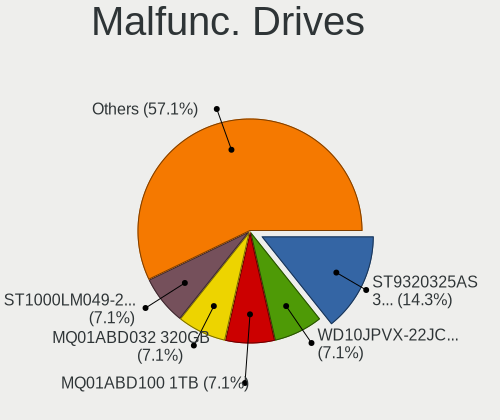

| Model                                         | Notebooks | Drives | Percent |
|-----------------------------------------------|-----------|--------|---------|
| Seagate ST9320325AS 320GB                     | 2         | 2      | 16.67%  |
| WDC WD10JPVX-22JC3T0 1TB                      | 1         | 1      | 8.33%   |
| Toshiba MQ01ABD100 1TB                        | 1         | 1      | 8.33%   |
| Toshiba MQ01ABD032 320GB                      | 1         | 1      | 8.33%   |
| SK hynix BC511 HFM256GDJTNI-82A0A 256GB       | 1         | 1      | 8.33%   |
| Seagate ST1000LM049-2GH172 1TB                | 1         | 1      | 8.33%   |
| Samsung Electronics HM250HI 250GB             | 1         | 1      | 8.33%   |
| OCZ VERTEX4 256GB SSD                         | 1         | 1      | 8.33%   |
| Micron Technology MTFDDAT128MAM-1J2 128GB SSD | 1         | 2      | 8.33%   |
| Intenso lntenso SSD Sata III 480GB            | 1         | 1      | 8.33%   |
| Hitachi HTS543225L9A300 250GB                 | 1         | 1      | 8.33%   |

Malfunc. Drive Vendor
---------------------

Vendors of faulty drives

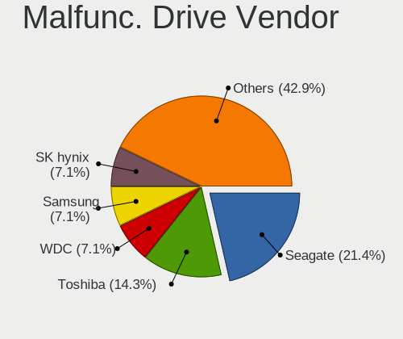

| Vendor              | Notebooks | Drives | Percent |
|---------------------|-----------|--------|---------|
| Seagate             | 3         | 3      | 25%     |
| Toshiba             | 2         | 2      | 16.67%  |
| WDC                 | 1         | 1      | 8.33%   |
| SK hynix            | 1         | 1      | 8.33%   |
| Samsung Electronics | 1         | 1      | 8.33%   |
| OCZ                 | 1         | 1      | 8.33%   |
| Micron Technology   | 1         | 2      | 8.33%   |
| Intenso             | 1         | 1      | 8.33%   |
| Hitachi             | 1         | 1      | 8.33%   |

Malfunc. HDD Vendor
-------------------

Vendors of faulty HDD drives

| Vendor              | Notebooks | Drives | Percent |
|---------------------|-----------|--------|---------|
| Seagate             | 3         | 3      | 37.5%   |
| Toshiba             | 2         | 2      | 25%     |
| WDC                 | 1         | 1      | 12.5%   |
| Samsung Electronics | 1         | 1      | 12.5%   |
| Hitachi             | 1         | 1      | 12.5%   |

Malfunc. Drive Kind
-------------------

Kinds of faulty drives

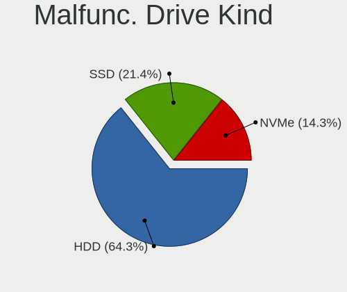

| Kind | Notebooks | Drives | Percent |
|------|-----------|--------|---------|
| HDD  | 8         | 8      | 66.67%  |
| SSD  | 3         | 4      | 25%     |
| NVMe | 1         | 1      | 8.33%   |

Failed Drives
-------------

Failed drive models

| Model                    | Notebooks | Drives | Percent |
|--------------------------|-----------|--------|---------|
| Toshiba MK5065GSXN 500GB | 1         | 1      | 100%    |

Failed Drive Vendor
-------------------

Failed drive vendors

| Vendor  | Notebooks | Drives | Percent |
|---------|-----------|--------|---------|
| Toshiba | 1         | 1      | 100%    |

Drive Status
------------

Number of failed and malfunc. drives

| Status   | Notebooks | Drives | Percent |
|----------|-----------|--------|---------|
| Detected | 71        | 97     | 46.71%  |
| Works    | 68        | 86     | 44.74%  |
| Malfunc  | 12        | 13     | 7.89%   |
| Failed   | 1         | 1      | 0.66%   |

Storage controller
------------------

Storage Vendor
--------------

Storage controller vendors

| Vendor                         | Notebooks | Percent |
|--------------------------------|-----------|---------|
| Intel                          | 99        | 61.88%  |
| Samsung Electronics            | 11        | 6.88%   |
| AMD                            | 10        | 6.25%   |
| SK hynix                       | 7         | 4.38%   |
| SanDisk                        | 6         | 3.75%   |
| Micron Technology              | 4         | 2.5%    |
| MAXIO Technology (Hangzhou)    | 3         | 1.88%   |
| KIOXIA                         | 3         | 1.88%   |
| Kingston Technology Company    | 3         | 1.88%   |
| Silicon Motion                 | 2         | 1.25%   |
| Zhaoxin                        | 1         | 0.63%   |
| Toshiba America Info Systems   | 1         | 0.63%   |
| Solid State Storage Technology | 1         | 0.63%   |
| Shenzhen Longsys Electronics   | 1         | 0.63%   |
| Realtek Semiconductor          | 1         | 0.63%   |
| Phison Electronics             | 1         | 0.63%   |
| Micron/Crucial Technology      | 1         | 0.63%   |
| Lite-On Technology             | 1         | 0.63%   |
| JMicron Technology             | 1         | 0.63%   |
| Apple                          | 1         | 0.63%   |
| ADATA Technology               | 1         | 0.63%   |
| Unknown                        | 1         | 0.63%   |

Storage Model
-------------

Storage controller models

| Model                                                                                                              | Notebooks | Percent |
|--------------------------------------------------------------------------------------------------------------------|-----------|---------|
| Intel Sunrise Point-LP SATA Controller [AHCI mode]                                                                 | 16        | 9.58%   |
| Intel 7 Series Chipset Family 6-port SATA Controller [AHCI mode]                                                   | 12        | 7.19%   |
| Intel 8 Series SATA Controller 1 [AHCI mode]                                                                       | 11        | 6.59%   |
| Intel Wildcat Point-LP SATA Controller [AHCI Mode]                                                                 | 10        | 5.99%   |
| AMD FCH SATA Controller [AHCI mode]                                                                                | 9         | 5.39%   |
| Intel 82801IBM/IEM (ICH9M/ICH9M-E) 4 port SATA Controller [AHCI mode]                                              | 7         | 4.19%   |
| Samsung NVMe SSD Controller SM981/PM981/PM983                                                                      | 5         | 2.99%   |
| Intel Cannon Point-LP SATA Controller [AHCI Mode]                                                                  | 5         | 2.99%   |
| Intel 82801 Mobile SATA Controller [RAID mode]                                                                     | 5         | 2.99%   |
| Intel Comet Lake SATA AHCI Controller                                                                              | 4         | 2.4%    |
| Intel Celeron/Pentium Silver Processor SATA Controller                                                             | 4         | 2.4%    |
| Intel Cannon Lake Mobile PCH SATA AHCI Controller                                                                  | 4         | 2.4%    |
| Intel 6 Series/C200 Series Chipset Family 6 port Mobile SATA AHCI Controller                                       | 4         | 2.4%    |
| SK hynix BC511 NVMe SSD                                                                                            | 3         | 1.8%    |
| SanDisk Extreme Pro / WD Black SN750 / PC SN730 / Red SN700 NVMe SSD                                               | 3         | 1.8%    |
| Samsung NVMe SSD Controller SM961/PM961/SM963                                                                      | 3         | 1.8%    |
| Intel 5 Series/3400 Series Chipset 4 port SATA AHCI Controller                                                     | 3         | 1.8%    |
| SK hynix BC501 NVMe Solid State Drive                                                                              | 2         | 1.2%    |
| Silicon Motion SM2263EN/SM2263XT (DRAM-less) NVMe SSD Controllers                                                  | 2         | 1.2%    |
| Samsung NVMe SSD Controller PM9A1/PM9A3/980PRO                                                                     | 2         | 1.2%    |
| Micron 2200S NVMe SSD [Cassandra]                                                                                  | 2         | 1.2%    |
| MAXIO (Hangzhou) NVMe SSD Controller MAP1202 (DRAM-less)                                                           | 2         | 1.2%    |
| KIOXIA NVMe SSD Controller BG4 (DRAM-less)                                                                         | 2         | 1.2%    |
| Intel Volume Management Device NVMe RAID Controller                                                                | 2         | 1.2%    |
| Intel Tiger Lake-LP SATA Controller                                                                                | 2         | 1.2%    |
| Intel HM170/QM170 Chipset SATA Controller [AHCI Mode]                                                              | 2         | 1.2%    |
| Intel Celeron N3350/Pentium N4200/Atom E3900 Series SATA AHCI Controller                                           | 2         | 1.2%    |
| Intel Atom/Celeron/Pentium Processor x5-E8000/J3xxx/N3xxx Series SATA Controller                                   | 2         | 1.2%    |
| Zhaoxin ZX-100/ZX-200/KX-6000/KX-6000G/KH-40000/KX-7000 StorX AHCI Controller                                      | 1         | 0.6%    |
| Toshiba America Info Systems XG6 NVMe SSD Controller                                                               | 1         | 0.6%    |
| Solid State Storage CL1-3D256-Q11 NVMe SSD M.2                                                                     | 1         | 0.6%    |
| SK hynix Platinum P41/PC801 NVMe Solid State Drive                                                                 | 1         | 0.6%    |
| SK hynix Gold P31/BC711/PC711 NVMe Solid State Drive                                                               | 1         | 0.6%    |
| Shenzhen Longsys FORESEE XP1000 / Lexar Professional CFexpress Type B Gold series, NM620 PCIe NVME SSD (DRAM-less) | 1         | 0.6%    |
| SanDisk PC SN530 NVMe SSD (DRAM-less)                                                                              | 1         | 0.6%    |
| SanDisk PC SN520 x2 M.2 2230 NVMe SSD                                                                              | 1         | 0.6%    |
| SanDisk Extreme Pro / WD Black 2018/SN750/PC SN720 NVMe SSD                                                        | 1         | 0.6%    |
| Samsung NVMe SSD Controller 980 (DRAM-less)                                                                        | 1         | 0.6%    |
| Realtek RTS5763DL NVMe SSD Controller (DRAM-less)                                                                  | 1         | 0.6%    |
| Phison PS5019-E19 PCIe4 NVMe Controller (DRAM-less)                                                                | 1         | 0.6%    |

Storage Kind
------------

Kind of storage controller (IDE, SATA, NVMe, SAS, ...)

| Kind | Notebooks | Percent |
|------|-----------|---------|
| SATA | 102       | 62.2%   |
| NVMe | 51        | 31.1%   |
| RAID | 7         | 4.27%   |
| IDE  | 4         | 2.44%   |

Processor
---------

CPU Vendor
----------

Processor vendors

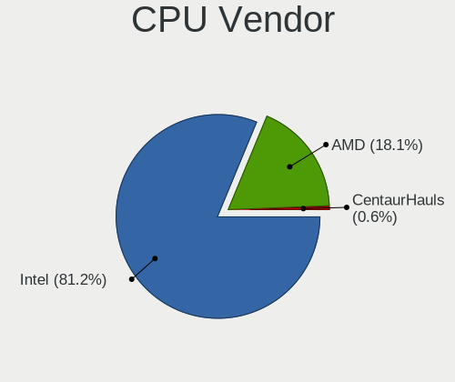

| Vendor       | Notebooks | Percent |
|--------------|-----------|---------|
| Intel        | 117       | 82.39%  |
| AMD          | 24        | 16.9%   |
| CentaurHauls | 1         | 0.7%    |

CPU Model
---------

Processor models

| Model                                         | Notebooks | Percent |
|-----------------------------------------------|-----------|---------|
| Intel Core i5-7200U CPU @ 2.50GHz             | 5         | 3.52%   |
| Intel Core i7-5500U CPU @ 2.40GHz             | 4         | 2.82%   |
| Intel Core i5-8250U CPU @ 1.60GHz             | 4         | 2.82%   |
| Intel Core i5-5200U CPU @ 2.20GHz             | 4         | 2.82%   |
| Intel Core i7-7500U CPU @ 2.70GHz             | 3         | 2.11%   |
| Intel Core i7-10510U CPU @ 1.80GHz            | 3         | 2.11%   |
| Intel Core i5-8300H CPU @ 2.30GHz             | 3         | 2.11%   |
| Intel Core i5-4210U CPU @ 1.70GHz             | 3         | 2.11%   |
| Intel Pentium Dual-Core CPU T4500 @ 2.30GHz   | 2         | 1.41%   |
| Intel Core i7-8565U CPU @ 1.80GHz             | 2         | 1.41%   |
| Intel Core i7-8550U CPU @ 1.80GHz             | 2         | 1.41%   |
| Intel Core i7-7700HQ CPU @ 2.80GHz            | 2         | 1.41%   |
| Intel Core i7-6500U CPU @ 2.50GHz             | 2         | 1.41%   |
| Intel Core i7-4510U CPU @ 2.00GHz             | 2         | 1.41%   |
| Intel Core i7-3630QM CPU @ 2.40GHz            | 2         | 1.41%   |
| Intel Core i7-2630QM CPU @ 2.00GHz            | 2         | 1.41%   |
| Intel Core i5-8265U CPU @ 1.60GHz             | 2         | 1.41%   |
| Intel Core i5-6200U CPU @ 2.30GHz             | 2         | 1.41%   |
| Intel Core i5-4200U CPU @ 1.60GHz             | 2         | 1.41%   |
| Intel Core i5-3230M CPU @ 2.60GHz             | 2         | 1.41%   |
| Intel Core i3-4030U CPU @ 1.90GHz             | 2         | 1.41%   |
| Intel Core i3-4005U CPU @ 1.70GHz             | 2         | 1.41%   |
| Intel Celeron CPU N3350 @ 1.10GHz             | 2         | 1.41%   |
| Intel Atom CPU Z3735F @ 1.33GHz               | 2         | 1.41%   |
| Intel 11th Gen Core i7-1165G7 @ 2.80GHz       | 2         | 1.41%   |
| AMD Ryzen 7 5800H with Radeon Graphics        | 2         | 1.41%   |
| AMD Ryzen 7 3700U with Radeon Vega Mobile Gfx | 2         | 1.41%   |
| AMD Ryzen 5 4600U with Radeon Graphics        | 2         | 1.41%   |
| AMD Ryzen 5 3500U with Radeon Vega Mobile Gfx | 2         | 1.41%   |
| AMD 3020e with Radeon Graphics                | 2         | 1.41%   |
| Intel Pentium Silver N5000 CPU @ 1.10GHz      | 1         | 0.7%    |
| Intel Pentium Dual-Core CPU T4400 @ 2.20GHz   | 1         | 0.7%    |
| Intel Pentium CPU N3710 @ 1.60GHz             | 1         | 0.7%    |
| Intel Pentium CPU 5405U @ 2.30GHz             | 1         | 0.7%    |
| Intel Core m3-6Y30 CPU @ 0.90GHz              | 1         | 0.7%    |
| Intel Core M-5Y71 CPU @ 1.20GHz               | 1         | 0.7%    |
| Intel Core i9-8950HK CPU @ 2.90GHz            | 1         | 0.7%    |
| Intel Core i7-8750H CPU @ 2.20GHz             | 1         | 0.7%    |
| Intel Core i7-6600U CPU @ 2.60GHz             | 1         | 0.7%    |
| Intel Core i7-3720QM CPU @ 2.60GHz            | 1         | 0.7%    |

CPU Model Family
----------------

Processor model prefix

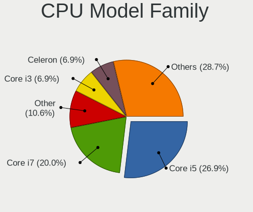

| Model                   | Notebooks | Percent |
|-------------------------|-----------|---------|
| Intel Core i5           | 40        | 28.17%  |
| Intel Core i7           | 31        | 21.83%  |
| Other                   | 13        | 9.15%   |
| Intel Core i3           | 10        | 7.04%   |
| Intel Celeron           | 9         | 6.34%   |
| AMD Ryzen 7             | 7         | 4.93%   |
| AMD Ryzen 5             | 6         | 4.23%   |
| Intel Core 2 Duo        | 4         | 2.82%   |
| Intel Pentium Dual-Core | 3         | 2.11%   |
| Intel Atom              | 3         | 2.11%   |
| AMD Ryzen 3             | 3         | 2.11%   |
| Intel Pentium           | 2         | 1.41%   |
| AMD A10                 | 2         | 1.41%   |
| Intel Pentium Silver    | 1         | 0.7%    |
| Intel Core m3           | 1         | 0.7%    |
| Intel Core M            | 1         | 0.7%    |
| Intel Core i9           | 1         | 0.7%    |
| Intel Celeron Dual-Core | 1         | 0.7%    |
| AMD Ryzen 7 PRO         | 1         | 0.7%    |
| AMD Ryzen 5 PRO         | 1         | 0.7%    |
| AMD E1                  | 1         | 0.7%    |
| AMD E                   | 1         | 0.7%    |

CPU Cores
---------

Number of processor cores

| Number | Notebooks | Percent |
|--------|-----------|---------|
| 2      | 73        | 51.41%  |
| 4      | 50        | 35.21%  |
| 6      | 7         | 4.93%   |
| 8      | 6         | 4.23%   |
| 12     | 2         | 1.41%   |
| 10     | 2         | 1.41%   |
| 14     | 1         | 0.7%    |
| 1      | 1         | 0.7%    |

CPU Sockets
-----------

Number of sockets

| Number | Notebooks | Percent |
|--------|-----------|---------|
| 1      | 142       | 100%    |

CPU Threads
-----------

Threads per core (Hyper-Threading)

| Number | Notebooks | Percent |
|--------|-----------|---------|
| 2      | 111       | 78.17%  |
| 1      | 31        | 21.83%  |

CPU Op-Modes
------------

CPU Operation Modes (32-bit, 64-bit)

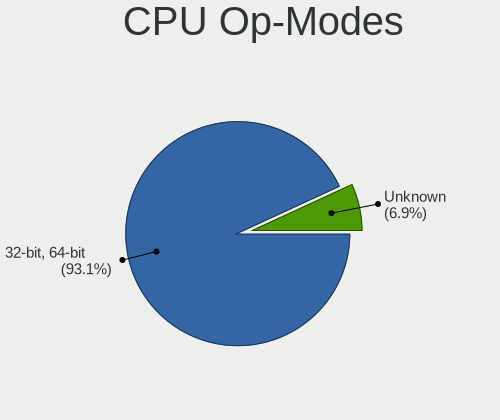

| Op mode        | Notebooks | Percent |
|----------------|-----------|---------|
| 32-bit, 64-bit | 131       | 92.25%  |
| Unknown        | 11        | 7.75%   |

CPU Microcode
-------------

Microcode number

| Number     | Notebooks | Percent |
|------------|-----------|---------|
| Unknown    | 27        | 18.75%  |
| 0x806ec    | 12        | 8.33%   |
| 0x306a9    | 10        | 6.94%   |
| 0x40651    | 9         | 6.25%   |
| 0x806e9    | 8         | 5.56%   |
| 0x306d4    | 7         | 4.86%   |
| 0x406e3    | 6         | 4.17%   |
| 0x206a7    | 6         | 4.17%   |
| 0x906ea    | 5         | 3.47%   |
| 0x806ea    | 4         | 2.78%   |
| 0x1067a    | 4         | 2.78%   |
| 0x906a3    | 3         | 2.08%   |
| 0x08600106 | 3         | 2.08%   |
| 0x08108109 | 3         | 2.08%   |
| 0x906e9    | 2         | 1.39%   |
| 0x806c1    | 2         | 1.39%   |
| 0x706a8    | 2         | 1.39%   |
| 0x406c4    | 2         | 1.39%   |
| 0x20655    | 2         | 1.39%   |
| 0x08600104 | 2         | 1.39%   |
| 0x08200103 | 2         | 1.39%   |
| 0x08108102 | 2         | 1.39%   |
| 0xb06a3    | 1         | 0.69%   |
| 0xb06a2    | 1         | 0.69%   |
| 0xa0652    | 1         | 0.69%   |
| 0x806d1    | 1         | 0.69%   |
| 0x806c2    | 1         | 0.69%   |
| 0x706a1    | 1         | 0.69%   |
| 0x6fd      | 1         | 0.69%   |
| 0x406c3    | 1         | 0.69%   |
| 0x30678    | 1         | 0.69%   |
| 0x10676    | 1         | 0.69%   |
| 0x0a704103 | 1         | 0.69%   |
| 0x0a50000c | 1         | 0.69%   |
| 0x0a50000b | 1         | 0.69%   |
| 0x0a404101 | 1         | 0.69%   |
| 0x08608102 | 1         | 0.69%   |
| 0x08600103 | 1         | 0.69%   |
| 0x08600102 | 1         | 0.69%   |
| 0x0810100b | 1         | 0.69%   |

CPU Microarch
-------------

Microarchitecture

| Name             | Notebooks | Percent |
|------------------|-----------|---------|
| KabyLake         | 36        | 25.35%  |
| IvyBridge        | 13        | 9.15%   |
| Haswell          | 11        | 7.75%   |
| Broadwell        | 10        | 7.04%   |
| Zen 2            | 7         | 4.93%   |
| SandyBridge      | 7         | 4.93%   |
| Penryn           | 7         | 4.93%   |
| Skylake          | 6         | 4.23%   |
| Silvermont       | 6         | 4.23%   |
| Zen+             | 5         | 3.52%   |
| Unknown          | 5         | 3.52%   |
| TigerLake        | 4         | 2.82%   |
| Goldmont plus    | 4         | 2.82%   |
| Alderlake Hybrid | 4         | 2.82%   |
| Zen              | 3         | 2.11%   |
| Westmere         | 3         | 2.11%   |
| Zen 3            | 2         | 1.41%   |
| Goldmont         | 2         | 1.41%   |
| Excavator        | 2         | 1.41%   |
| Bobcat           | 2         | 1.41%   |
| Icelake          | 1         | 0.7%    |
| Core             | 1         | 0.7%    |
| CometLake        | 1         | 0.7%    |

Graphics
--------

GPU Vendor
----------

Vendors of graphics cards

| Vendor  | Notebooks | Percent |
|---------|-----------|---------|
| Intel   | 115       | 59.59%  |
| Nvidia  | 48        | 24.87%  |
| AMD     | 29        | 15.03%  |
| Zhaoxin | 1         | 0.52%   |

GPU Model
---------

Graphics card models

| Model                                                                                    | Notebooks | Percent |
|------------------------------------------------------------------------------------------|-----------|---------|
| Intel 3rd Gen Core processor Graphics Controller                                         | 12        | 6.15%   |
| Intel Haswell-ULT Integrated Graphics Controller                                         | 11        | 5.64%   |
| Intel HD Graphics 5500                                                                   | 9         | 4.62%   |
| Intel HD Graphics 620                                                                    | 8         | 4.1%    |
| Intel Mobile 4 Series Chipset Integrated Graphics Controller                             | 7         | 3.59%   |
| Intel 2nd Generation Core Processor Family Integrated Graphics Controller                | 7         | 3.59%   |
| AMD Renoir [Radeon RX Vega 6 (Ryzen 4000/5000 Mobile Series)]                            | 7         | 3.59%   |
| AMD Picasso/Raven 2 [Radeon Vega Series / Radeon Vega Mobile Series]                     | 7         | 3.59%   |
| Intel UHD Graphics 620                                                                   | 6         | 3.08%   |
| Intel CoffeeLake-H GT2 [UHD Graphics 630]                                                | 6         | 3.08%   |
| AMD Topaz XT [Radeon R7 M260/M265 / M340/M360 / M440/M445 / 530/535 / 620/625 Mobile]    | 6         | 3.08%   |
| Intel WhiskeyLake-U GT2 [UHD Graphics 620]                                               | 5         | 2.56%   |
| Intel Skylake GT2 [HD Graphics 520]                                                      | 5         | 2.56%   |
| Intel CometLake-U GT2 [UHD Graphics]                                                     | 5         | 2.56%   |
| Nvidia TU117M [GeForce GTX 1650 Mobile / Max-Q]                                          | 4         | 2.05%   |
| Intel TigerLake-LP GT2 [Iris Xe Graphics]                                                | 4         | 2.05%   |
| Intel Atom/Celeron/Pentium Processor x5-E8000/J3xxx/N3xxx Integrated Graphics Controller | 4         | 2.05%   |
| Nvidia GP107M [GeForce GTX 1050 Ti Mobile]                                               | 3         | 1.54%   |
| Nvidia GM108M [GeForce MX110]                                                            | 3         | 1.54%   |
| Intel GeminiLake [UHD Graphics 600]                                                      | 3         | 1.54%   |
| Intel Core Processor Integrated Graphics Controller                                      | 3         | 1.54%   |
| Nvidia GP108M [GeForce MX250]                                                            | 2         | 1.03%   |
| Nvidia GP108BM [GeForce MX250]                                                           | 2         | 1.03%   |
| Nvidia GP107M [GeForce GTX 1050 Mobile]                                                  | 2         | 1.03%   |
| Nvidia GM108M [GeForce 940MX]                                                            | 2         | 1.03%   |
| Nvidia GM108M [GeForce 840M]                                                             | 2         | 1.03%   |
| Nvidia GM107M [GeForce GTX 950M]                                                         | 2         | 1.03%   |
| Nvidia GK107M [GeForce GT 650M]                                                          | 2         | 1.03%   |
| Nvidia GF117M [GeForce 610M/710M/810M/820M / GT 620M/625M/630M/720M]                     | 2         | 1.03%   |
| Nvidia GF108M [GeForce GT 540M]                                                          | 2         | 1.03%   |
| Nvidia GA107BM [GeForce RTX 3050 Mobile]                                                 | 2         | 1.03%   |
| Intel Raptor Lake-P [Iris Xe Graphics]                                                   | 2         | 1.03%   |
| Intel HD Graphics 630                                                                    | 2         | 1.03%   |
| Intel HD Graphics 500                                                                    | 2         | 1.03%   |
| Intel Atom Processor Z36xxx/Z37xxx Series Graphics & Display                             | 2         | 1.03%   |
| Intel Alder Lake-P GT2 [Iris Xe Graphics]                                                | 2         | 1.03%   |
| AMD Wani [Radeon R5/R6/R7 Graphics]                                                      | 2         | 1.03%   |
| Zhaoxin KX-6000 C-960 GPU                                                                | 1         | 0.51%   |
| Nvidia GP108M [GeForce MX150]                                                            | 1         | 0.51%   |
| Nvidia GP107M [GeForce MX350]                                                            | 1         | 0.51%   |

GPU Combo
---------

Combinations of graphics cards

| Name           | Notebooks | Percent |
|----------------|-----------|---------|
| 1 x Intel      | 66        | 46.48%  |
| Intel + Nvidia | 43        | 30.28%  |
| 1 x AMD        | 19        | 13.38%  |
| Intel + AMD    | 6         | 4.23%   |
| 1 x Nvidia     | 3         | 2.11%   |
| 2 x AMD        | 2         | 1.41%   |
| AMD + Nvidia   | 2         | 1.41%   |
| 1 x Zhaoxin    | 1         | 0.7%    |

GPU Driver
----------

Free vs proprietary

| Driver      | Notebooks | Percent |
|-------------|-----------|---------|
| Free        | 113       | 79.02%  |
| Proprietary | 24        | 16.78%  |
| Unknown     | 6         | 4.2%    |

GPU Memory
----------

Total video memory

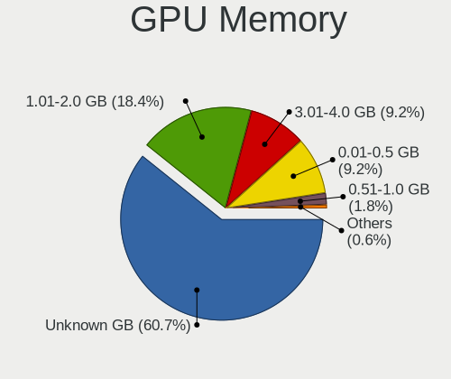

| Size in GB | Notebooks | Percent |
|------------|-----------|---------|
| Unknown    | 85        | 58.62%  |
| 1.01-2.0   | 29        | 20%     |
| 3.01-4.0   | 15        | 10.34%  |
| 0.01-0.5   | 12        | 8.28%   |
| 0.51-1.0   | 3         | 2.07%   |
| 5.01-6.0   | 1         | 0.69%   |

Monitor
-------

Monitor Vendor
--------------

Monitor vendors

| Vendor                  | Notebooks | Percent |
|-------------------------|-----------|---------|
| BOE                     | 29        | 19.33%  |
| AU Optronics            | 29        | 19.33%  |
| Chimei Innolux          | 21        | 14%     |
| Samsung Electronics     | 17        | 11.33%  |
| LG Display              | 17        | 11.33%  |
| CSO                     | 6         | 4%      |
| Hewlett-Packard         | 3         | 2%      |
| Goldstar                | 3         | 2%      |
| AOC                     | 3         | 2%      |
| Lenovo                  | 2         | 1.33%   |
| InfoVision              | 2         | 1.33%   |
| HKC                     | 2         | 1.33%   |
| Chi Mei Optoelectronics | 2         | 1.33%   |
| ViewSonic               | 1         | 0.67%   |
| TMX                     | 1         | 0.67%   |
| Sharp                   | 1         | 0.67%   |
| SAC                     | 1         | 0.67%   |
| PANDA                   | 1         | 0.67%   |
| LG Philips              | 1         | 0.67%   |
| JDI                     | 1         | 0.67%   |
| Iiyama                  | 1         | 0.67%   |
| HB@                     | 1         | 0.67%   |
| HannStar                | 1         | 0.67%   |
| Dell                    | 1         | 0.67%   |
| CS_                     | 1         | 0.67%   |
| BenQ                    | 1         | 0.67%   |
| Apple                   | 1         | 0.67%   |

Monitor Model
-------------

Monitor models

| Model                                                                 | Notebooks | Percent |
|-----------------------------------------------------------------------|-----------|---------|
| AU Optronics LCD Monitor AUO26EC 1366x768 344x193mm 15.5-inch         | 3         | 1.99%   |
| AU Optronics LCD Monitor AUO21ED 1920x1080 344x193mm 15.5-inch        | 3         | 1.99%   |
| LG Display LCD Monitor LGD0468 1366x768 344x194mm 15.5-inch           | 2         | 1.32%   |
| HKC LCD Monitor HKC3CFB 1920x1080 344x194mm 15.5-inch                 | 2         | 1.32%   |
| Chimei Innolux LCD Monitor CMN14D4 1920x1080 309x173mm 13.9-inch      | 2         | 1.32%   |
| Chimei Innolux LCD Monitor CMN14C4 1366x768 309x173mm 13.9-inch       | 2         | 1.32%   |
| BOE LCD Monitor BOE0877 1920x1080 309x173mm 13.9-inch                 | 2         | 1.32%   |
| BOE LCD Monitor BOE06A4 1366x768 344x194mm 15.5-inch                  | 2         | 1.32%   |
| AU Optronics LCD Monitor AUO71EC 1366x768 344x193mm 15.5-inch         | 2         | 1.32%   |
| AU Optronics LCD Monitor AUO226D 1920x1080 276x155mm 12.5-inch        | 2         | 1.32%   |
| ViewSonic VX2481-mh VSC3933 1920x1080 527x296mm 23.8-inch             | 1         | 0.66%   |
| TMX TL140VDXP04-0 TMX1398 1920x1080 309x174mm 14.0-inch               | 1         | 0.66%   |
| Sharp LCD Monitor SHP1449 1920x1080 294x165mm 13.3-inch               | 1         | 0.66%   |
| Samsung Electronics SyncMaster SAM0167 1280x1024 338x270mm 17.0-inch  | 1         | 0.66%   |
| Samsung Electronics S32B80P SAM71F1 3840x2160 700x400mm 31.7-inch     | 1         | 0.66%   |
| Samsung Electronics LCD Monitor SEC5448 1920x1080 344x194mm 15.5-inch | 1         | 0.66%   |
| Samsung Electronics LCD Monitor SEC5441 1366x768 344x194mm 15.5-inch  | 1         | 0.66%   |
| Samsung Electronics LCD Monitor SEC384A 1366x768 344x194mm 15.5-inch  | 1         | 0.66%   |
| Samsung Electronics LCD Monitor SEC324A 1366x768 344x194mm 15.5-inch  | 1         | 0.66%   |
| Samsung Electronics LCD Monitor SEC3150 1366x768 344x193mm 15.5-inch  | 1         | 0.66%   |
| Samsung Electronics LCD Monitor SEC314B 1600x900 344x194mm 15.5-inch  | 1         | 0.66%   |
| Samsung Electronics LCD Monitor SDC864D 1920x1080 293x165mm 13.2-inch | 1         | 0.66%   |
| Samsung Electronics LCD Monitor SDC534B 1600x900 382x215mm 17.3-inch  | 1         | 0.66%   |
| Samsung Electronics LCD Monitor SDC4E51 1366x768 344x194mm 15.5-inch  | 1         | 0.66%   |
| Samsung Electronics LCD Monitor SDC4A42 1366x768 309x174mm 14.0-inch  | 1         | 0.66%   |
| Samsung Electronics LCD Monitor SDC4951 1366x768 344x194mm 15.5-inch  | 1         | 0.66%   |
| Samsung Electronics LCD Monitor SDC434A 3200x1800 293x165mm 13.2-inch | 1         | 0.66%   |
| Samsung Electronics LCD Monitor SDC4193 2880x1800 302x189mm 14.0-inch | 1         | 0.66%   |
| Samsung Electronics LCD Monitor SDC4147 1366x768 344x194mm 15.5-inch  | 1         | 0.66%   |
| Samsung Electronics LCD Monitor SAM03BC 1920x1080                     | 1         | 0.66%   |
| SAC LED MONITOR SAC952D 1920x1080 480x270mm 21.7-inch                 | 1         | 0.66%   |
| PANDA LCD Monitor NCP004D 1920x1080 344x194mm 15.5-inch               | 1         | 0.66%   |
| LG Philips LCD Monitor LPLE800 1280x800 304x190mm 14.1-inch           | 1         | 0.66%   |
| LG Display LP156WH1-TLA1 LGD6301 1366x768 344x194mm 15.5-inch         | 1         | 0.66%   |
| LG Display LCD Monitor LGD062C 1920x1080 309x174mm 14.0-inch          | 1         | 0.66%   |
| LG Display LCD Monitor LGD0608 1920x1080 309x174mm 14.0-inch          | 1         | 0.66%   |
| LG Display LCD Monitor LGD05EC 1920x1080 309x174mm 14.0-inch          | 1         | 0.66%   |
| LG Display LCD Monitor LGD0590 1920x1080 344x194mm 15.5-inch          | 1         | 0.66%   |
| LG Display LCD Monitor LGD0503 1366x768 344x194mm 15.5-inch           | 1         | 0.66%   |
| LG Display LCD Monitor LGD04B2 1920x1080 309x174mm 14.0-inch          | 1         | 0.66%   |

Monitor Resolution
------------------

Monitor screen resolution

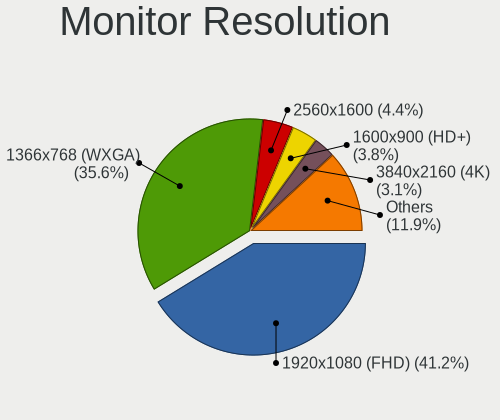

| Resolution       | Notebooks | Percent |
|------------------|-----------|---------|
| 1920x1080 (FHD)  | 60        | 42.25%  |
| 1366x768 (WXGA)  | 51        | 35.92%  |
| 1600x900 (HD+)   | 6         | 4.23%   |
| 3840x2160 (4K)   | 4         | 2.82%   |
| 2560x1600        | 4         | 2.82%   |
| 2880x1800        | 3         | 2.11%   |
| 3000x2000        | 2         | 1.41%   |
| 2160x1440        | 2         | 1.41%   |
| 3440x1440        | 1         | 0.7%    |
| 3200x2000        | 1         | 0.7%    |
| 3200x1800 (QHD+) | 1         | 0.7%    |
| 2880x1920        | 1         | 0.7%    |
| 2560x1440 (QHD)  | 1         | 0.7%    |
| 2288x1287        | 1         | 0.7%    |
| 1920x540         | 1         | 0.7%    |
| 1680x945         | 1         | 0.7%    |
| 1280x800 (WXGA)  | 1         | 0.7%    |
| 1280x1024 (SXGA) | 1         | 0.7%    |

Monitor Diagonal
----------------

Diagonal size in inches

| Inches  | Notebooks | Percent |
|---------|-----------|---------|
| 15      | 60        | 40%     |
| 13      | 31        | 20.67%  |
| 14      | 25        | 16.67%  |
| 17      | 5         | 3.33%   |
| 23      | 4         | 2.67%   |
| 27      | 3         | 2%      |
| 21      | 3         | 2%      |
| 18      | 3         | 2%      |
| 16      | 3         | 2%      |
| 11      | 3         | 2%      |
| 32      | 2         | 1.33%   |
| 24      | 2         | 1.33%   |
| 12      | 2         | 1.33%   |
| 40      | 1         | 0.67%   |
| 31      | 1         | 0.67%   |
| 25      | 1         | 0.67%   |
| Unknown | 1         | 0.67%   |

Monitor Width
-------------

Physical width

| Width in mm | Notebooks | Percent |
|-------------|-----------|---------|
| 301-350     | 104       | 70.75%  |
| 201-300     | 18        | 12.24%  |
| 501-600     | 9         | 6.12%   |
| 351-400     | 6         | 4.08%   |
| 401-500     | 5         | 3.4%    |
| 701-800     | 2         | 1.36%   |
| 801-900     | 1         | 0.68%   |
| 601-700     | 1         | 0.68%   |
| Unknown     | 1         | 0.68%   |

Aspect Ratio
------------

Proportional relationship between the width and the height

| Ratio | Notebooks | Percent |
|-------|-----------|---------|
| 16/9  | 119       | 86.86%  |
| 16/10 | 12        | 8.76%   |
| 3/2   | 5         | 3.65%   |
| 5/4   | 1         | 0.73%   |

Monitor Area
------------

Area in inch

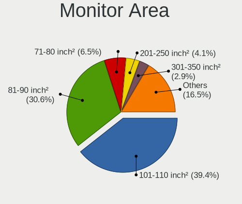

| Area in inch | Notebooks | Percent |
|----------------|-----------|---------|
| 101-110        | 60        | 39.74%  |
| 81-90          | 47        | 31.13%  |
| 71-80          | 9         | 5.96%   |
| 201-250        | 7         | 4.64%   |
| 141-150        | 4         | 2.65%   |
| 51-60          | 3         | 1.99%   |
| 351-500        | 3         | 1.99%   |
| 301-350        | 3         | 1.99%   |
| 251-300        | 3         | 1.99%   |
| 121-130        | 3         | 1.99%   |
| 111-120        | 3         | 1.99%   |
| 61-70          | 2         | 1.32%   |
| 151-200        | 1         | 0.66%   |
| 131-140        | 1         | 0.66%   |
| 501-1000       | 1         | 0.66%   |
| Unknown        | 1         | 0.66%   |

Pixel Density
-------------

Pixels per inch

| Density       | Notebooks | Percent |
|---------------|-----------|---------|
| 101-120       | 56        | 38.1%   |
| 121-160       | 54        | 36.73%  |
| 51-100        | 16        | 10.88%  |
| 161-240       | 14        | 9.52%   |
| More than 240 | 6         | 4.08%   |
| Unknown       | 1         | 0.68%   |

Multiple Monitors
-----------------

Total monitors connected

| Total | Notebooks | Percent |
|-------|-----------|---------|
| 1     | 118       | 82.52%  |
| 2     | 20        | 13.99%  |
| 0     | 4         | 2.8%    |
| 3     | 1         | 0.7%    |

Network
-------

Net Controller Vendor
---------------------

Controller vendors

| Vendor                          | Notebooks | Percent |
|---------------------------------|-----------|---------|
| Realtek Semiconductor           | 93        | 43.46%  |
| Intel                           | 62        | 28.97%  |
| Qualcomm Atheros                | 35        | 16.36%  |
| Broadcom                        | 6         | 2.8%    |
| MediaTek                        | 3         | 1.4%    |
| Marvell Technology Group        | 3         | 1.4%    |
| Broadcom Limited                | 3         | 1.4%    |
| Xiaomi                          | 2         | 0.93%   |
| Ralink Technology               | 1         | 0.47%   |
| Ralink                          | 1         | 0.47%   |
| Qualcomm Atheros Communications | 1         | 0.47%   |
| OPPO Electronics                | 1         | 0.47%   |
| Huawei Technologies             | 1         | 0.47%   |
| Hewlett-Packard                 | 1         | 0.47%   |
| ASIX Electronics                | 1         | 0.47%   |

Net Controller Model
--------------------

Controller models

| Model                                                                  | Notebooks | Percent |
|------------------------------------------------------------------------|-----------|---------|
| Realtek RTL8111/8168/8211/8411 PCI Express Gigabit Ethernet Controller | 56        | 22.49%  |
| Realtek RTL810xE PCI Express Fast Ethernet controller                  | 19        | 7.63%   |
| Qualcomm Atheros QCA9377 802.11ac Wireless Network Adapter             | 12        | 4.82%   |
| Realtek RTL8822CE 802.11ac PCIe Wireless Network Adapter               | 9         | 3.61%   |
| Qualcomm Atheros QCA9565 / AR9565 Wireless Network Adapter             | 7         | 2.81%   |
| Intel Wireless 3165                                                    | 7         | 2.81%   |
| Intel Wi-Fi 6 AX200                                                    | 6         | 2.41%   |
| Qualcomm Atheros AR9485 Wireless Network Adapter                       | 5         | 2.01%   |
| Intel Comet Lake PCH-LP CNVi WiFi                                      | 5         | 2.01%   |
| Intel 82579LM Gigabit Network Connection (Lewisville)                  | 5         | 2.01%   |
| Realtek RTL8723BE PCIe Wireless Network Adapter                        | 4         | 1.61%   |
| Qualcomm Atheros QCA6174 802.11ac Wireless Network Adapter             | 4         | 1.61%   |
| Intel Centrino Advanced-N 6205 [Taylor Peak]                           | 4         | 1.61%   |
| Intel Cannon Point-LP CNVi [Wireless-AC]                               | 4         | 1.61%   |
| Realtek RTL8821CE 802.11ac PCIe Wireless Network Adapter               | 3         | 1.2%    |
| Realtek RTL8723DE Wireless Network Adapter                             | 3         | 1.2%    |
| Realtek RTL8153 Gigabit Ethernet Adapter                               | 3         | 1.2%    |
| Intel Wireless 8265 / 8275                                             | 3         | 1.2%    |
| Intel Wireless 7260                                                    | 3         | 1.2%    |
| Intel Wireless 3160                                                    | 3         | 1.2%    |
| Intel WiFi Link 5100                                                   | 3         | 1.2%    |
| Intel Wi-Fi 6 AX201                                                    | 3         | 1.2%    |
| Intel Alder Lake-P PCH CNVi WiFi                                       | 3         | 1.2%    |
| Realtek RTL8852BE PCIe 802.11ax Wireless Network Controller            | 2         | 0.8%    |
| Realtek RTL8822BE 802.11a/b/g/n/ac WiFi adapter                        | 2         | 0.8%    |
| Realtek RTL8821AE 802.11ac PCIe Wireless Network Adapter               | 2         | 0.8%    |
| Realtek RTL8191SEvA Wireless LAN Controller                            | 2         | 0.8%    |
| Realtek RTL8188EE Wireless Network Adapter                             | 2         | 0.8%    |
| Realtek RTL8188CE 802.11b/g/n WiFi Adapter                             | 2         | 0.8%    |
| Qualcomm Atheros AR9462 Wireless Network Adapter                       | 2         | 0.8%    |
| Qualcomm Atheros AR9287 Wireless Network Adapter (PCI-Express)         | 2         | 0.8%    |
| Qualcomm Atheros AR8131 Gigabit Ethernet                               | 2         | 0.8%    |
| MediaTek MT7921 802.11ax PCI Express Wireless Network Adapter          | 2         | 0.8%    |
| Marvell Group 88E8055 PCI-E Gigabit Ethernet Controller                | 2         | 0.8%    |
| Intel Wireless 7265                                                    | 2         | 0.8%    |
| Intel Raptor Lake PCH CNVi WiFi                                        | 2         | 0.8%    |
| Intel Dual Band Wireless-AC 3165 Plus Bluetooth                        | 2         | 0.8%    |
| Broadcom NetLink BCM57785 Gigabit Ethernet PCIe                        | 2         | 0.8%    |
| Broadcom BCM43142 802.11b/g/n                                          | 2         | 0.8%    |
| Xiaomi Mi/Redmi series (RNDIS)                                         | 1         | 0.4%    |

Wireless Vendor
---------------

Wireless vendors

| Vendor                          | Notebooks | Percent |
|---------------------------------|-----------|---------|
| Intel                           | 61        | 42.36%  |
| Realtek Semiconductor           | 36        | 25%     |
| Qualcomm Atheros                | 34        | 23.61%  |
| Broadcom                        | 4         | 2.78%   |
| MediaTek                        | 3         | 2.08%   |
| Broadcom Limited                | 3         | 2.08%   |
| Ralink Technology               | 1         | 0.69%   |
| Ralink                          | 1         | 0.69%   |
| Qualcomm Atheros Communications | 1         | 0.69%   |

Wireless Model
--------------

Wireless models

| Model                                                          | Notebooks | Percent |
|----------------------------------------------------------------|-----------|---------|
| Qualcomm Atheros QCA9377 802.11ac Wireless Network Adapter     | 12        | 8.28%   |
| Realtek RTL8822CE 802.11ac PCIe Wireless Network Adapter       | 9         | 6.21%   |
| Qualcomm Atheros QCA9565 / AR9565 Wireless Network Adapter     | 7         | 4.83%   |
| Intel Wireless 3165                                            | 7         | 4.83%   |
| Intel Wi-Fi 6 AX200                                            | 6         | 4.14%   |
| Qualcomm Atheros AR9485 Wireless Network Adapter               | 5         | 3.45%   |
| Intel Comet Lake PCH-LP CNVi WiFi                              | 5         | 3.45%   |
| Realtek RTL8723BE PCIe Wireless Network Adapter                | 4         | 2.76%   |
| Qualcomm Atheros QCA6174 802.11ac Wireless Network Adapter     | 4         | 2.76%   |
| Intel Centrino Advanced-N 6205 [Taylor Peak]                   | 4         | 2.76%   |
| Intel Cannon Point-LP CNVi [Wireless-AC]                       | 4         | 2.76%   |
| Realtek RTL8821CE 802.11ac PCIe Wireless Network Adapter       | 3         | 2.07%   |
| Realtek RTL8723DE Wireless Network Adapter                     | 3         | 2.07%   |
| Intel Wireless 8265 / 8275                                     | 3         | 2.07%   |
| Intel Wireless 7260                                            | 3         | 2.07%   |
| Intel Wireless 3160                                            | 3         | 2.07%   |
| Intel WiFi Link 5100                                           | 3         | 2.07%   |
| Intel Wi-Fi 6 AX201                                            | 3         | 2.07%   |
| Intel Alder Lake-P PCH CNVi WiFi                               | 3         | 2.07%   |
| Realtek RTL8852BE PCIe 802.11ax Wireless Network Controller    | 2         | 1.38%   |
| Realtek RTL8822BE 802.11a/b/g/n/ac WiFi adapter                | 2         | 1.38%   |
| Realtek RTL8821AE 802.11ac PCIe Wireless Network Adapter       | 2         | 1.38%   |
| Realtek RTL8191SEvA Wireless LAN Controller                    | 2         | 1.38%   |
| Realtek RTL8188EE Wireless Network Adapter                     | 2         | 1.38%   |
| Realtek RTL8188CE 802.11b/g/n WiFi Adapter                     | 2         | 1.38%   |
| Qualcomm Atheros AR9462 Wireless Network Adapter               | 2         | 1.38%   |
| Qualcomm Atheros AR9287 Wireless Network Adapter (PCI-Express) | 2         | 1.38%   |
| MediaTek MT7921 802.11ax PCI Express Wireless Network Adapter  | 2         | 1.38%   |
| Intel Wireless 7265                                            | 2         | 1.38%   |
| Intel Raptor Lake PCH CNVi WiFi                                | 2         | 1.38%   |
| Intel Dual Band Wireless-AC 3165 Plus Bluetooth                | 2         | 1.38%   |
| Broadcom BCM43142 802.11b/g/n                                  | 2         | 1.38%   |
| Realtek RTL88x2bu [AC1200 Techkey]                             | 1         | 0.69%   |
| Realtek RTL8723BU 802.11b/g/n WLAN Adapter                     | 1         | 0.69%   |
| Realtek RTL8191SEvB Wireless LAN Controller                    | 1         | 0.69%   |
| Realtek RTL8188EUS 802.11n Wireless Network Adapter            | 1         | 0.69%   |
| Realtek 802.11ac NIC                                           | 1         | 0.69%   |
| Ralink RT2870/RT3070 Wireless Adapter                          | 1         | 0.69%   |
| Ralink RT3090 Wireless 802.11n 1T/1R PCIe                      | 1         | 0.69%   |
| Qualcomm Atheros AR9271 802.11n                                | 1         | 0.69%   |

Ethernet Vendor
---------------

Ethernet vendors

| Vendor                   | Notebooks | Percent |
|--------------------------|-----------|---------|
| Realtek Semiconductor    | 79        | 75.96%  |
| Intel                    | 10        | 9.62%   |
| Qualcomm Atheros         | 4         | 3.85%   |
| Marvell Technology Group | 3         | 2.88%   |
| Xiaomi                   | 2         | 1.92%   |
| Broadcom                 | 2         | 1.92%   |
| OPPO Electronics         | 1         | 0.96%   |
| Huawei Technologies      | 1         | 0.96%   |
| Hewlett-Packard          | 1         | 0.96%   |
| ASIX Electronics         | 1         | 0.96%   |

Ethernet Model
--------------

Ethernet models

| Model                                                                  | Notebooks | Percent |
|------------------------------------------------------------------------|-----------|---------|
| Realtek RTL8111/8168/8211/8411 PCI Express Gigabit Ethernet Controller | 56        | 53.85%  |
| Realtek RTL810xE PCI Express Fast Ethernet controller                  | 19        | 18.27%  |
| Intel 82579LM Gigabit Network Connection (Lewisville)                  | 5         | 4.81%   |
| Realtek RTL8153 Gigabit Ethernet Adapter                               | 3         | 2.88%   |
| Qualcomm Atheros AR8131 Gigabit Ethernet                               | 2         | 1.92%   |
| Marvell Group 88E8055 PCI-E Gigabit Ethernet Controller                | 2         | 1.92%   |
| Broadcom NetLink BCM57785 Gigabit Ethernet PCIe                        | 2         | 1.92%   |
| Xiaomi Mi/Redmi series (RNDIS)                                         | 1         | 0.96%   |
| Xiaomi Mi/Redmi series (RNDIS + ADB)                                   | 1         | 0.96%   |
| Realtek Killer E2600 GbE Controller                                    | 1         | 0.96%   |
| Qualcomm Atheros QCA8172 Fast Ethernet                                 | 1         | 0.96%   |
| Qualcomm Atheros QCA8171 Gigabit Ethernet                              | 1         | 0.96%   |
| OPPO SM8350-IDP _SN:361A1B3C                                           | 1         | 0.96%   |
| Marvell Group 88E8071 PCI-E Gigabit Ethernet Controller                | 1         | 0.96%   |
| Intel Ethernet Connection I219-LM                                      | 1         | 0.96%   |
| Intel Ethernet Connection I218-V                                       | 1         | 0.96%   |
| Intel Ethernet Connection (6) I219-V                                   | 1         | 0.96%   |
| Intel Ethernet Connection (4) I219-LM                                  | 1         | 0.96%   |
| Intel Ethernet Connection (3) I218-LM                                  | 1         | 0.96%   |
| Huawei STG-LX1                                                         | 1         | 0.96%   |
| HP lt4120 Snapdragon X5 LTE                                            | 1         | 0.96%   |
| ASIX AX88179 Gigabit Ethernet                                          | 1         | 0.96%   |

Net Controller Kind
-------------------

Ethernet, WiFi or modem

| Kind     | Notebooks | Percent |
|----------|-----------|---------|
| WiFi     | 140       | 58.09%  |
| Ethernet | 101       | 41.91%  |

Used Controller
---------------

Currently used network controller

| Kind     | Notebooks | Percent |
|----------|-----------|---------|
| WiFi     | 119       | 83.22%  |
| Ethernet | 24        | 16.78%  |

NICs
----

Total network controllers on board

| Total | Notebooks | Percent |
|-------|-----------|---------|
| 2     | 94        | 66.2%   |
| 1     | 44        | 30.99%  |
| 0     | 3         | 2.11%   |
| 3     | 1         | 0.7%    |

IPv6
----

IPv6 vs IPv4

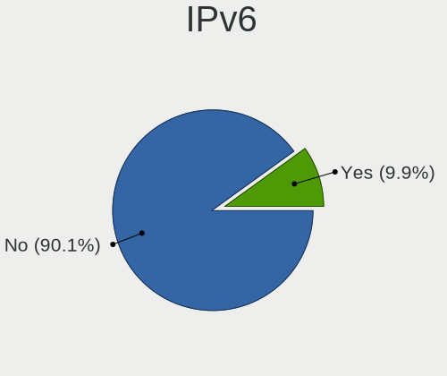

| Used | Notebooks | Percent |
|------|-----------|---------|
| No   | 132       | 92.31%  |
| Yes  | 11        | 7.69%   |

Bluetooth
---------

Bluetooth Vendor
----------------

Controller vendors

| Vendor                          | Notebooks | Percent |
|---------------------------------|-----------|---------|
| Intel                           | 51        | 43.22%  |
| Qualcomm Atheros Communications | 20        | 16.95%  |
| Realtek Semiconductor           | 16        | 13.56%  |
| Foxconn / Hon Hai               | 8         | 6.78%   |
| Broadcom                        | 6         | 5.08%   |
| Realtek                         | 5         | 4.24%   |
| IMC Networks                    | 4         | 3.39%   |
| Lite-On Technology              | 3         | 2.54%   |
| Cambridge Silicon Radio         | 2         | 1.69%   |
| Toshiba                         | 1         | 0.85%   |
| Ralink Technology               | 1         | 0.85%   |
| Dell                            | 1         | 0.85%   |

Bluetooth Model
---------------

Controller models

| Model                                                                               | Notebooks | Percent |
|-------------------------------------------------------------------------------------|-----------|---------|
| Intel Bluetooth wireless interface                                                  | 21        | 17.8%   |
| Qualcomm Atheros  Bluetooth Device                                                  | 15        | 12.71%  |
| Intel Bluetooth 9460/9560 Jefferson Peak (JfP)                                      | 10        | 8.47%   |
| Realtek Bluetooth Radio                                                             | 9         | 7.63%   |
| Intel AX201 Bluetooth                                                               | 9         | 7.63%   |
| Intel AX200 Bluetooth                                                               | 6         | 5.08%   |
| Realtek  Bluetooth 4.2 Adapter                                                      | 5         | 4.24%   |
| Realtek Bluetooth Radio                                                             | 5         | 4.24%   |
| Broadcom BCM2045B (BDC-2.1)                                                         | 4         | 3.39%   |
| Qualcomm Atheros QCA61x4 Bluetooth 4.0                                              | 2         | 1.69%   |
| Qualcomm Atheros AR3012 Bluetooth 4.0                                               | 2         | 1.69%   |
| Lite-On Atheros AR3012 Bluetooth                                                    | 2         | 1.69%   |
| Intel Centrino Bluetooth Wireless Transceiver                                       | 2         | 1.69%   |
| Intel Bluetooth Device                                                              | 2         | 1.69%   |
| Foxconn / Hon Hai Wireless_Device                                                   | 2         | 1.69%   |
| Foxconn / Hon Hai Bluetooth Device                                                  | 2         | 1.69%   |
| Cambridge Silicon Radio Bluetooth Dongle (HCI mode)                                 | 2         | 1.69%   |
| Broadcom HP Portable SoftSailing                                                    | 2         | 1.69%   |
| Toshiba Bluetooth Radio                                                             | 1         | 0.85%   |
| Realtek RTL8822BE Bluetooth 4.2 Adapter                                             | 1         | 0.85%   |
| Realtek RTL8723B Bluetooth                                                          | 1         | 0.85%   |
| Ralink Motorola BC4 Bluetooth 3.0+HS Adapter                                        | 1         | 0.85%   |
| Qualcomm Atheros Bluetooth USB Host Controller                                      | 1         | 0.85%   |
| Lite-On Bluetooth Device                                                            | 1         | 0.85%   |
| Intel Wireless-AC 3168 Bluetooth                                                    | 1         | 0.85%   |
| IMC Networks Wireless_Device                                                        | 1         | 0.85%   |
| IMC Networks Bluetooth Radio                                                        | 1         | 0.85%   |
| IMC Networks Bluetooth Device                                                       | 1         | 0.85%   |
| IMC Networks Atheros AR3012 Bluetooth 4.0 Adapter                                   | 1         | 0.85%   |
| Foxconn / Hon Hai Foxconn T77H114 BCM2070 [Single-Chip Bluetooth 2.1 + EDR Adapter] | 1         | 0.85%   |
| Foxconn / Hon Hai Bluetooth USB Host Controller                                     | 1         | 0.85%   |
| Foxconn / Hon Hai BCM43142A0                                                        | 1         | 0.85%   |
| Foxconn / Hon Hai BCM20702A0                                                        | 1         | 0.85%   |
| Dell DW375 Bluetooth Module                                                         | 1         | 0.85%   |

Sound
-----

Sound Vendor
------------

Sound card vendors

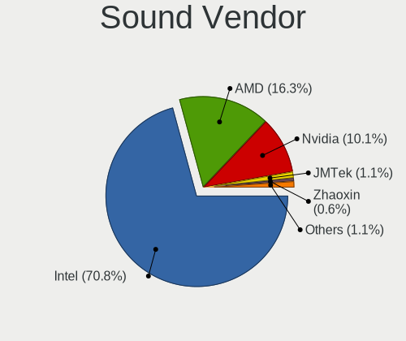

| Vendor              | Notebooks | Percent |
|---------------------|-----------|---------|
| Intel               | 114       | 73.08%  |
| AMD                 | 24        | 15.38%  |
| Nvidia              | 15        | 9.62%   |
| Zhaoxin             | 1         | 0.64%   |
| JMTek               | 1         | 0.64%   |
| Creative Technology | 1         | 0.64%   |

Sound Model
-----------

Sound card models

| Model                                                                                             | Notebooks | Percent |
|---------------------------------------------------------------------------------------------------|-----------|---------|
| Intel Sunrise Point-LP HD Audio                                                                   | 22        | 10.95%  |
| AMD Family 17h/19h HD Audio Controller                                                            | 20        | 9.95%   |
| Intel 7 Series/C216 Chipset Family High Definition Audio Controller                               | 14        | 6.97%   |
| Intel Haswell-ULT HD Audio Controller                                                             | 11        | 5.47%   |
| Intel 8 Series HD Audio Controller                                                                | 11        | 5.47%   |
| Intel Wildcat Point-LP High Definition Audio Controller                                           | 10        | 4.98%   |
| Intel Broadwell-U Audio Controller                                                                | 10        | 4.98%   |
| AMD Renoir Radeon High Definition Audio Controller                                                | 9         | 4.48%   |
| Intel 82801I (ICH9 Family) HD Audio Controller                                                    | 8         | 3.98%   |
| AMD Raven/Raven2/Fenghuang HDMI/DP Audio Controller                                               | 8         | 3.98%   |
| Intel Cannon Point-LP High Definition Audio Controller                                            | 7         | 3.48%   |
| Intel Cannon Lake PCH cAVS                                                                        | 6         | 2.99%   |
| Intel 6 Series/C200 Series Chipset Family High Definition Audio Controller                        | 6         | 2.99%   |
| Intel Comet Lake PCH-LP cAVS                                                                      | 5         | 2.49%   |
| Nvidia TU107 GeForce GTX 1650 High Definition Audio Controller                                    | 4         | 1.99%   |
| Nvidia Audio device                                                                               | 4         | 1.99%   |
| Intel Tiger Lake-LP Smart Sound Technology Audio Controller                                       | 4         | 1.99%   |
| Intel Celeron/Pentium Silver Processor High Definition Audio                                      | 4         | 1.99%   |
| Nvidia GP107GL High Definition Audio Controller                                                   | 3         | 1.49%   |
| Intel Atom/Celeron/Pentium Processor x5-E8000/J3xxx/N3xxx Series High Definition Audio Controller | 3         | 1.49%   |
| Intel Alder Lake PCH-P High Definition Audio Controller                                           | 3         | 1.49%   |
| Intel 5 Series/3400 Series Chipset High Definition Audio                                          | 3         | 1.49%   |
| Intel Raptor Lake-P/U/H cAVS                                                                      | 2         | 1%      |
| Intel CM238 HD Audio Controller                                                                   | 2         | 1%      |
| Intel Celeron N3350/Pentium N4200/Atom E3900 Series Audio Cluster                                 | 2         | 1%      |
| AMD Wrestler HDMI Audio                                                                           | 2         | 1%      |
| AMD Rembrandt Radeon High Definition Audio Controller                                             | 2         | 1%      |
| AMD Kabini HDMI/DP Audio                                                                          | 2         | 1%      |
| AMD Family 15h (Models 60h-6fh) Audio Controller                                                  | 2         | 1%      |
| Zhaoxin ZX-E High Definition Audio Controller                                                     | 1         | 0.5%    |
| Zhaoxin ZX-100/KX-5000/KX-6000/KX-6000G/KH-40000/KX-7000 High Definition Audio Controller         | 1         | 0.5%    |
| Nvidia GK107 HDMI Audio Controller                                                                | 1         | 0.5%    |
| Nvidia GF119 HDMI Audio Controller                                                                | 1         | 0.5%    |
| Nvidia GF108 High Definition Audio Controller                                                     | 1         | 0.5%    |
| Nvidia GA106 High Definition Audio Controller                                                     | 1         | 0.5%    |
| JMTek USB PnP Audio Device                                                                        | 1         | 0.5%    |
| Intel Tiger Lake-H HD Audio Controller                                                            | 1         | 0.5%    |
| Intel Comet Lake PCH cAVS                                                                         | 1         | 0.5%    |
| Creative Technology SB X-Fi Surround 5.1 Pro                                                      | 1         | 0.5%    |
| AMD SBx00 Azalia (Intel HDA)                                                                      | 1         | 0.5%    |

Memory
------

Memory Vendor
-------------

Memory module vendors

| Vendor              | Notebooks | Percent |
|---------------------|-----------|---------|
| Samsung Electronics | 28        | 28.28%  |
| SK hynix            | 27        | 27.27%  |
| Unknown             | 10        | 10.1%   |
| Micron Technology   | 10        | 10.1%   |
| Smart               | 4         | 4.04%   |
| Kingston            | 4         | 4.04%   |
| Ramaxel Technology  | 3         | 3.03%   |
| Nanya Technology    | 3         | 3.03%   |
| Unknown (ABCD)      | 2         | 2.02%   |
| A-DATA Technology   | 2         | 2.02%   |
| Unknown (07FB)      | 1         | 1.01%   |
| Smart Brazil        | 1         | 1.01%   |
| MTASE               | 1         | 1.01%   |
| Kingmax             | 1         | 1.01%   |
| Crucial             | 1         | 1.01%   |
| ChangXin Memory     | 1         | 1.01%   |

Memory Model
------------

Memory module models

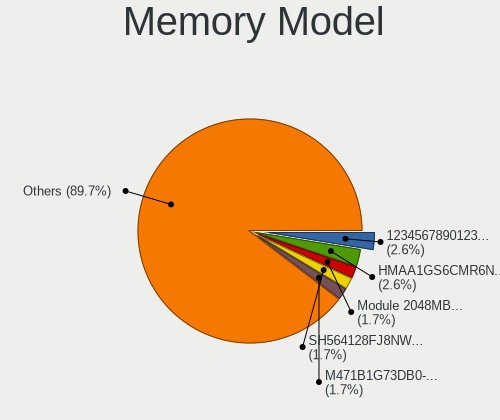

| Model                                                               | Notebooks | Percent |
|---------------------------------------------------------------------|-----------|---------|
| SK hynix RAM HMAA1GS6CMR6N-VK 8GB Row Of Chips DDR4 2667MT/s        | 3         | 2.88%   |
| Unknown RAM Module 2048MB SODIMM DDR3 1333MT/s                      | 2         | 1.92%   |
| Unknown (ABCD) RAM 123456789012345678 2048MB SODIMM LPDDR4 2400MT/s | 2         | 1.92%   |
| Smart RAM SH564128FJ8NWRNSQG 4GB SODIMM DDR3 1600MT/s               | 2         | 1.92%   |
| SK hynix RAM Module 8192MB SODIMM DDR4 2133MT/s                     | 2         | 1.92%   |
| SK hynix RAM HMT351S6CFR8C-PB 4GB SODIMM DDR3 1600MT/s              | 2         | 1.92%   |
| SK hynix RAM HMA81GS6AFR8N-UH 8GB SODIMM DDR4 2400MT/s              | 2         | 1.92%   |
| Samsung RAM M471B1G73DB0-YK0 8GB SODIMM DDR3 1600MT/s               | 2         | 1.92%   |
| Samsung RAM M471A5244CB0-CTD 4096MB SODIMM DDR4 3266MT/s            | 2         | 1.92%   |
| Samsung RAM M471A1K43CB1-CRC 8GB SODIMM DDR4 2667MT/s               | 2         | 1.92%   |
| Samsung RAM K4EBE304ED-EGCG 8GB Row Of Chips LPDDR3 2133MT/s        | 2         | 1.92%   |
| Micron RAM 4ATF1G64HZ-3G2E2 8GB SODIMM DDR4 3200MT/s                | 2         | 1.92%   |
| Micron RAM 4ATF1G64HZ-3G2E1 8GB SODIMM DDR4 3200MT/s                | 2         | 1.92%   |
| Unknown RAM Module 8GB SODIMM DDR3 1600MT/s                         | 1         | 0.96%   |
| Unknown RAM Module 8192MB SODIMM DDR3 1600MT/s                      | 1         | 0.96%   |
| Unknown RAM Module 4GB SODIMM LPDDR3 1600MT/s                       | 1         | 0.96%   |
| Unknown RAM Module 4096MB SODIMM DDR4 2667MT/s                      | 1         | 0.96%   |
| Unknown RAM Module 4096MB SODIMM DDR3 1333MT/s                      | 1         | 0.96%   |
| Unknown RAM Module 4096MB SODIMM DDR3                               | 1         | 0.96%   |
| Unknown RAM Module 2048MB SODIMM LPDDR3 1600MT/s                    | 1         | 0.96%   |
| Unknown RAM Module 2048MB SODIMM DDR3                               | 1         | 0.96%   |
| Unknown RAM Module 2048MB SODIMM DDR2                               | 1         | 0.96%   |
| Unknown RAM Module 1024MB SODIMM LPDDR4 2400MT/s                    | 1         | 0.96%   |
| Unknown RAM Module 1024MB SODIMM DDR2                               | 1         | 0.96%   |
| Unknown (07FB) RAM GST32G08SCL196P-26 32GB SODIMM DDR4 2667MT/s     | 1         | 0.96%   |
| Smart RAM SH564568FJ8NZRNSDR 2GB SODIMM DDR3 1600MT/s               | 1         | 0.96%   |
| Smart RAM SH564128FJ8NWRNSQR 4GB SODIMM DDR3 1600MT/s               | 1         | 0.96%   |
| Smart RAM SG564568FG8NWKF-Z1 2GB SODIMM DDR2 800MT/s                | 1         | 0.96%   |
| Smart Brazil RAM SMS4TDC3C0K0446SCG 4GB SODIMM DDR4 2667MT/s        | 1         | 0.96%   |
| SK hynix RAM MPPS4GBPC1600 1.35 4096MB SODIMM DDR3 1600MT/s         | 1         | 0.96%   |
| SK hynix RAM Module 2048MB Row Of Chips LPDDR4 4267MT/s             | 1         | 0.96%   |
| SK hynix RAM Module 16384MB SODIMM DDR5 5600MT/s                    | 1         | 0.96%   |
| SK hynix RAM HMT451S6MFR8C-PB 4GB SODIMM DDR3 1600MT/s              | 1         | 0.96%   |
| SK hynix RAM HMT451S6BFR8A-PB 4GB SODIMM DDR3 1600MT/s              | 1         | 0.96%   |
| SK hynix RAM HMT425S6AFR6A-PB 2GB SODIMM DDR3 1600MT/s              | 1         | 0.96%   |
| SK hynix RAM HMP125S6EFR8C-S6 2048MB SODIMM DDR2 800MT/s            | 1         | 0.96%   |
| SK hynix RAM HMCG66MEBSA092N 8GB SODIMM DDR5 4800MT/s               | 1         | 0.96%   |
| SK hynix RAM HMAA1GS6CJR6N-XN 8GB Row Of Chips DDR4 3200MT/s        | 1         | 0.96%   |
| SK hynix RAM HMA851S6DJR6N-XN 4GB Row Of Chips DDR4 3200MT/s        | 1         | 0.96%   |
| SK hynix RAM HMA851S6CJR6N-XN 4GB SODIMM DDR4 3200MT/s              | 1         | 0.96%   |

Memory Kind
-----------

Memory module kinds

| Kind   | Notebooks | Percent |
|--------|-----------|---------|
| DDR4   | 42        | 47.73%  |
| DDR3   | 21        | 23.86%  |
| LPDDR4 | 8         | 9.09%   |
| LPDDR3 | 8         | 9.09%   |
| DDR5   | 3         | 3.41%   |
| DDR2   | 3         | 3.41%   |
| LPDDR5 | 2         | 2.27%   |
| SDRAM  | 1         | 1.14%   |

Memory Form Factor
------------------

Physical design of the memory module

| Name         | Notebooks | Percent |
|--------------|-----------|---------|
| SODIMM       | 71        | 80.68%  |
| Row Of Chips | 16        | 18.18%  |
| Unknown      | 1         | 1.14%   |

Memory Size
-----------

Memory module size

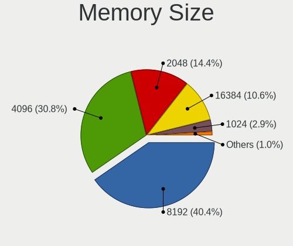

| Size  | Notebooks | Percent |
|-------|-----------|---------|
| 8192  | 38        | 40.86%  |
| 4096  | 31        | 33.33%  |
| 2048  | 14        | 15.05%  |
| 16384 | 7         | 7.53%   |
| 1024  | 2         | 2.15%   |
| 32768 | 1         | 1.08%   |

Memory Speed
------------

Memory module speed

| Speed   | Notebooks | Percent |
|---------|-----------|---------|
| 2667    | 20        | 21.98%  |
| 1600    | 18        | 19.78%  |
| 3200    | 12        | 13.19%  |
| 2400    | 8         | 8.79%   |
| 2133    | 7         | 7.69%   |
| 1334    | 3         | 3.3%    |
| 1333    | 3         | 3.3%    |
| 4800    | 2         | 2.2%    |
| 4267    | 2         | 2.2%    |
| 3266    | 2         | 2.2%    |
| 800     | 2         | 2.2%    |
| Unknown | 2         | 2.2%    |
| 7467    | 1         | 1.1%    |
| 6400    | 1         | 1.1%    |
| 5600    | 1         | 1.1%    |
| 4266    | 1         | 1.1%    |
| 3733    | 1         | 1.1%    |
| 2933    | 1         | 1.1%    |
| 2666    | 1         | 1.1%    |
| 2048    | 1         | 1.1%    |
| 1867    | 1         | 1.1%    |
| 1066    | 1         | 1.1%    |

Printers & scanners
-------------------

Printer Vendor
--------------

Printer device vendors

Zero info for selected period =(

Printer Model
-------------

Printer device models

Zero info for selected period =(

Scanner Vendor
--------------

Scanner device vendors

Zero info for selected period =(

Scanner Model
-------------

Scanner device models

Zero info for selected period =(

Camera
------

Camera Vendor
-------------

Camera device vendors

| Vendor                                 | Notebooks | Percent |
|----------------------------------------|-----------|---------|
| Chicony Electronics                    | 32        | 25.4%   |
| IMC Networks                           | 12        | 9.52%   |
| Realtek Semiconductor                  | 11        | 8.73%   |
| Microdia                               | 11        | 8.73%   |
| Quanta                                 | 9         | 7.14%   |
| Sunplus Innovation Technology          | 7         | 5.56%   |
| Syntek                                 | 6         | 4.76%   |
| Suyin                                  | 6         | 4.76%   |
| Silicon Motion                         | 6         | 4.76%   |
| Lite-On Technology                     | 5         | 3.97%   |
| Cheng Uei Precision Industry (Foxlink) | 4         | 3.17%   |
| Bison Electronics                      | 3         | 2.38%   |
| Ricoh                                  | 2         | 1.59%   |
| Primax Electronics                     | 2         | 1.59%   |
| Alcor Micro                            | 2         | 1.59%   |
| Acer                                   | 2         | 1.59%   |
| USB Camera                             | 1         | 0.79%   |
| Luxvisions Innotech Limited            | 1         | 0.79%   |
| LG Electronics                         | 1         | 0.79%   |
| Lenovo                                 | 1         | 0.79%   |
| kingcome                               | 1         | 0.79%   |
| Goodong Industry                       | 1         | 0.79%   |

Camera Model
------------

Camera device models

| Model                                                        | Notebooks | Percent |
|--------------------------------------------------------------|-----------|---------|
| Chicony Integrated Camera                                    | 8         | 6.3%    |
| IMC Networks Integrated Camera                               | 5         | 3.94%   |
| Quanta HD User Facing                                        | 4         | 3.15%   |
| Chicony EasyCamera                                           | 4         | 3.15%   |
| Syntek EasyCamera                                            | 3         | 2.36%   |
| Silicon Motion Web Camera                                    | 3         | 2.36%   |
| Quanta HP TrueVision HD Camera                               | 3         | 2.36%   |
| IMC Networks ov9734_azurewave_camera                         | 3         | 2.36%   |
| Chicony TOSHIBA Web Camera - HD                              | 3         | 2.36%   |
| Syntek Integrated Camera                                     | 2         | 1.57%   |
| Sunplus Integrated_Webcam_HD                                 | 2         | 1.57%   |
| Sunplus HD WebCam                                            | 2         | 1.57%   |
| Realtek USB Camera                                           | 2         | 1.57%   |
| Realtek Integrated_Webcam_HD                                 | 2         | 1.57%   |
| Realtek HP "Truevision HD" laptop camera                     | 2         | 1.57%   |
| Primax HP HD Webcam [Fixed]                                  | 2         | 1.57%   |
| Microdia Integrated_Webcam_HD                                | 2         | 1.57%   |
| Lite-On Integrated Camera                                    | 2         | 1.57%   |
| IMC Networks HD Camera                                       | 2         | 1.57%   |
| Chicony HP Webcam                                            | 2         | 1.57%   |
| Chicony HP HD Webcam                                         | 2         | 1.57%   |
| Cheng Uei Precision Industry (Foxlink) XiaoMi USB 2.0 Webcam | 2         | 1.57%   |
| Bison Integrated Camera                                      | 2         | 1.57%   |
| USB Camera USB Camera                                        | 1         | 0.79%   |
| Syntek Lenovo EasyCamera                                     | 1         | 0.79%   |
| Suyin Integrated_Webcam_HD                                   | 1         | 0.79%   |
| Suyin HP Webcam 101                                          | 1         | 0.79%   |
| Suyin HP Truevision HD                                       | 1         | 0.79%   |
| Suyin HD WebCam                                              | 1         | 0.79%   |
| Suyin Acer/HP Integrated Webcam [CN0314]                     | 1         | 0.79%   |
| Suyin 1.3M HD WebCam                                         | 1         | 0.79%   |
| Sunplus XiaoMi USB 2.0 Webcam                                | 1         | 0.79%   |
| Sunplus HP Wide Vision HD                                    | 1         | 0.79%   |
| Sunplus Asus Webcam                                          | 1         | 0.79%   |
| Silicon Motion WebCam SC-13HDL11939N                         | 1         | 0.79%   |
| Silicon Motion WebCam SC-0311139N                            | 1         | 0.79%   |
| Silicon Motion ATIV VGA Camera                               | 1         | 0.79%   |
| Ricoh Sony Vaio Integrated Webcam                            | 1         | 0.79%   |
| Ricoh Laptop_Integrated_Webcam_FHD                           | 1         | 0.79%   |
| Realtek Rear Camera                                          | 1         | 0.79%   |

Security
--------

Fingerprint Vendor
------------------

Fingerprint sensor vendors

| Vendor                     | Notebooks | Percent |
|----------------------------|-----------|---------|
| Validity Sensors           | 10        | 37.04%  |
| Shenzhen Goodix Technology | 9         | 33.33%  |
| Upek                       | 5         | 18.52%  |
| Synaptics                  | 2         | 7.41%   |
| Elan Microelectronics      | 1         | 3.7%    |

Fingerprint Model
-----------------

Fingerprint sensor models

| Model                                                  | Notebooks | Percent |
|--------------------------------------------------------|-----------|---------|
| Shenzhen Goodix  Fingerprint Device                    | 6         | 22.22%  |
| Validity Sensors VFS495 Fingerprint Reader             | 5         | 18.52%  |
| Upek Biometric Touchchip/Touchstrip Fingerprint Sensor | 3         | 11.11%  |
| Shenzhen Goodix Fingerprint Reader                     | 3         | 11.11%  |
| Validity Sensors VFS491                                | 2         | 7.41%   |
| Validity Sensors Swipe Fingerprint Sensor              | 2         | 7.41%   |
| Upek TCS5B Fingerprint sensor                          | 2         | 7.41%   |
| Synaptics Prometheus MIS Touch Fingerprint Reader      | 2         | 7.41%   |
| Validity Sensors VFS5011 Fingerprint Reader            | 1         | 3.7%    |
| Elan ELAN:Fingerprint                                  | 1         | 3.7%    |

Chipcard Vendor
---------------

Chipcard module vendors

| Vendor              | Notebooks | Percent |
|---------------------|-----------|---------|
| Alcor Micro         | 3         | 50%     |
| Lenovo              | 1         | 16.67%  |
| Giesecke & Devrient | 1         | 16.67%  |
| Broadcom            | 1         | 16.67%  |

Chipcard Model
--------------

Chipcard module models

| Model                                          | Notebooks | Percent |
|------------------------------------------------|-----------|---------|
| Alcor Micro AU9540 Smartcard Reader            | 3         | 50%     |
| Lenovo Integrated Smart Card Reader            | 1         | 16.67%  |
| Giesecke & Devrient StarSign CUT               | 1         | 16.67%  |
| Broadcom BCM5880 Secure Applications Processor | 1         | 16.67%  |

Unsupported
-----------

Unsupported Devices
-------------------

Total unsupported devices on board

| Total | Notebooks | Percent |
|-------|-----------|---------|
| 0     | 94        | 65.28%  |
| 1     | 42        | 29.17%  |
| 2     | 8         | 5.56%   |

Unsupported Device Types
------------------------

Types of unsupported devices

| Type                  | Notebooks | Percent |
|-----------------------|-----------|---------|
| Fingerprint reader    | 27        | 46.55%  |
| Graphics card         | 16        | 27.59%  |
| Multimedia controller | 6         | 10.34%  |
| Chipcard              | 5         | 8.62%   |
| Sound                 | 2         | 3.45%   |
| Storage               | 1         | 1.72%   |
| Camera                | 1         | 1.72%   |

