Deepin - Tested Hardware & Statistics
-------------------------------------

A project to collect tested hardware configurations for Deepin.

Anyone can contribute to this report by the [hw-probe](https://github.com/linuxhw/hw-probe) tool:

    sudo -E hw-probe -all -upload

Please contribute! Especially if your hardware is rare.

This is a report for all computer types. See also reports for [desktops](/Dist/Deepin/Desktop/README.md) and [notebooks](/Dist/Deepin/Notebook/README.md).

Contents
--------

* [ Test Cases ](#test-cases)

* [ System ](#system)
  - [ OS                       ](#os)
  - [ OS Family                ](#os-family)
  - [ Kernel                   ](#kernel)
  - [ Kernel Family            ](#kernel-family)
  - [ Kernel Major Ver.        ](#kernel-major-ver)
  - [ Arch                     ](#arch)
  - [ DE                       ](#de)
  - [ Display Server           ](#display-server)
  - [ Display Manager          ](#display-manager)
  - [ OS Lang                  ](#os-lang)
  - [ Boot Mode                ](#boot-mode)
  - [ Filesystem               ](#filesystem)
  - [ Part. scheme             ](#part-scheme)
  - [ Dual Boot with Linux/BSD ](#dual-boot-with-linuxbsd)
  - [ Dual Boot (Win)          ](#dual-boot-win)

* [ Board ](#board)
  - [ Vendor                   ](#vendor)
  - [ Model                    ](#model)
  - [ Model Family             ](#model-family)
  - [ MFG Year                 ](#mfg-year)
  - [ Form Factor              ](#form-factor)
  - [ Secure Boot              ](#secure-boot)
  - [ Coreboot                 ](#coreboot)
  - [ RAM Size                 ](#ram-size)
  - [ RAM Used                 ](#ram-used)
  - [ Total Drives             ](#total-drives)
  - [ Has CD-ROM               ](#has-cd-rom)
  - [ Has Ethernet             ](#has-ethernet)
  - [ Has WiFi                 ](#has-wifi)
  - [ Has Bluetooth            ](#has-bluetooth)

* [ Location ](#location)
  - [ Country                  ](#country)
  - [ City                     ](#city)

* [ Drives ](#drives)
  - [ Drive Vendor             ](#drive-vendor)
  - [ Drive Model              ](#drive-model)
  - [ HDD Vendor               ](#hdd-vendor)
  - [ SSD Vendor               ](#ssd-vendor)
  - [ Drive Kind               ](#drive-kind)
  - [ Drive Connector          ](#drive-connector)
  - [ Drive Size               ](#drive-size)
  - [ Space Total              ](#space-total)
  - [ Space Used               ](#space-used)
  - [ Malfunc. Drives          ](#malfunc-drives)
  - [ Malfunc. Drive Vendor    ](#malfunc-drive-vendor)
  - [ Malfunc. HDD Vendor      ](#malfunc-hdd-vendor)
  - [ Malfunc. Drive Kind      ](#malfunc-drive-kind)
  - [ Failed Drives            ](#failed-drives)
  - [ Failed Drive Vendor      ](#failed-drive-vendor)
  - [ Drive Status             ](#drive-status)

* [ Storage controller ](#storage-controller)
  - [ Storage Vendor           ](#storage-vendor)
  - [ Storage Model            ](#storage-model)
  - [ Storage Kind             ](#storage-kind)

* [ Processor ](#processor)
  - [ CPU Vendor               ](#cpu-vendor)
  - [ CPU Model                ](#cpu-model)
  - [ CPU Model Family         ](#cpu-model-family)
  - [ CPU Cores                ](#cpu-cores)
  - [ CPU Sockets              ](#cpu-sockets)
  - [ CPU Threads              ](#cpu-threads)
  - [ CPU Op-Modes             ](#cpu-op-modes)
  - [ CPU Microcode            ](#cpu-microcode)
  - [ CPU Microarch            ](#cpu-microarch)

* [ Graphics ](#graphics)
  - [ GPU Vendor               ](#gpu-vendor)
  - [ GPU Model                ](#gpu-model)
  - [ GPU Combo                ](#gpu-combo)
  - [ GPU Driver               ](#gpu-driver)
  - [ GPU Memory               ](#gpu-memory)

* [ Monitor ](#monitor)
  - [ Monitor Vendor           ](#monitor-vendor)
  - [ Monitor Model            ](#monitor-model)
  - [ Monitor Resolution       ](#monitor-resolution)
  - [ Monitor Diagonal         ](#monitor-diagonal)
  - [ Monitor Width            ](#monitor-width)
  - [ Aspect Ratio             ](#aspect-ratio)
  - [ Monitor Area             ](#monitor-area)
  - [ Pixel Density            ](#pixel-density)
  - [ Multiple Monitors        ](#multiple-monitors)

* [ Network ](#network)
  - [ Net Controller Vendor    ](#net-controller-vendor)
  - [ Net Controller Model     ](#net-controller-model)
  - [ Wireless Vendor          ](#wireless-vendor)
  - [ Wireless Model           ](#wireless-model)
  - [ Ethernet Vendor          ](#ethernet-vendor)
  - [ Ethernet Model           ](#ethernet-model)
  - [ Net Controller Kind      ](#net-controller-kind)
  - [ Used Controller          ](#used-controller)
  - [ NICs                     ](#nics)
  - [ IPv6                     ](#ipv6)

* [ Bluetooth ](#bluetooth)
  - [ Bluetooth Vendor         ](#bluetooth-vendor)
  - [ Bluetooth Model          ](#bluetooth-model)

* [ Sound ](#sound)
  - [ Sound Vendor             ](#sound-vendor)
  - [ Sound Model              ](#sound-model)

* [ Memory ](#memory)
  - [ Memory Vendor            ](#memory-vendor)
  - [ Memory Model             ](#memory-model)
  - [ Memory Kind              ](#memory-kind)
  - [ Memory Form Factor       ](#memory-form-factor)
  - [ Memory Size              ](#memory-size)
  - [ Memory Speed             ](#memory-speed)

* [ Printers & scanners ](#printers--scanners)
  - [ Printer Vendor           ](#printer-vendor)
  - [ Printer Model            ](#printer-model)
  - [ Scanner Vendor           ](#scanner-vendor)
  - [ Scanner Model            ](#scanner-model)

* [ Camera ](#camera)
  - [ Camera Vendor            ](#camera-vendor)
  - [ Camera Model             ](#camera-model)

* [ Security ](#security)
  - [ Fingerprint Vendor       ](#fingerprint-vendor)
  - [ Fingerprint Model        ](#fingerprint-model)
  - [ Chipcard Vendor          ](#chipcard-vendor)
  - [ Chipcard Model           ](#chipcard-model)

* [ Unsupported ](#unsupported)
  - [ Unsupported Devices      ](#unsupported-devices)
  - [ Unsupported Device Types ](#unsupported-device-types)

Test Cases
----------

Total: 434

| Vendor        | Model                       | Form-Factor | Probe                                                      | Date         |
|---------------|-----------------------------|-------------|------------------------------------------------------------|--------------|
| GITSTAR       | GM9-7002 VF                 | Desktop     | [1574f6b134](https://linux-hardware.org/?probe=1574f6b134) | Dec 22, 2025 |
| HUAWEI        | VGHH-XX                     | Notebook    | [7313bd0a72](https://linux-hardware.org/?probe=7313bd0a72) | Dec 14, 2025 |
| Lenovo        | Legion Pro 5 16IAX10H 83... | Notebook    | [578a437a17](https://linux-hardware.org/?probe=578a437a17) | Dec 02, 2025 |
| Fujitsu       | D3233-A1 S26361-D3233-A1    | Desktop     | [0a9e7a6ccd](https://linux-hardware.org/?probe=0a9e7a6ccd) | Dec 02, 2025 |
| B450MV1       | 1006                        | Desktop     | [6b11d3e030](https://linux-hardware.org/?probe=6b11d3e030) | Dec 02, 2025 |
| HP            | 829E                        | Mini pc     | [973642c1d8](https://linux-hardware.org/?probe=973642c1d8) | Nov 27, 2025 |
| HP            | Pavilion Laptop 15-eg0xx... | Notebook    | [7d3695c683](https://linux-hardware.org/?probe=7d3695c683) | Nov 21, 2025 |
| Inspur        | CP300H2                     | Notebook    | [f9d0897749](https://linux-hardware.org/?probe=f9d0897749) | Nov 13, 2025 |
| Dell          | Inspiron 3443               | Notebook    | [6ec2cd0bc8](https://linux-hardware.org/?probe=6ec2cd0bc8) | Nov 10, 2025 |
| Apple         | Mac-942B5BF58194151B        | All in one  | [37733a24cf](https://linux-hardware.org/?probe=37733a24cf) | Nov 02, 2025 |
| Dell          | Latitude E6320              | Notebook    | [5c42f5c28e](https://linux-hardware.org/?probe=5c42f5c28e) | Nov 01, 2025 |
| Dell          | Latitude E6320              | Notebook    | [a4138be5cc](https://linux-hardware.org/?probe=a4138be5cc) | Nov 01, 2025 |
| Lenovo        | 36D5 SDK0J40700 WIN 3258... | Desktop     | [f4e20f12c3](https://linux-hardware.org/?probe=f4e20f12c3) | Nov 01, 2025 |
| Toshiba       | Satellite L755              | Notebook    | [e131d69d93](https://linux-hardware.org/?probe=e131d69d93) | Oct 03, 2025 |
| Fujitsu       | D3233-A1 S26361-D3233-A1    | Desktop     | [ad502e282c](https://linux-hardware.org/?probe=ad502e282c) | Oct 03, 2025 |
| Lenovo        | Legion Pro 5 16ARX8 82WM    | Notebook    | [8c2ff2410e](https://linux-hardware.org/?probe=8c2ff2410e) | Oct 01, 2025 |
| Toshiba       | Satellite L745              | Notebook    | [6483d48ae3](https://linux-hardware.org/?probe=6483d48ae3) | Sep 10, 2025 |
| Toshiba       | Satellite L745              | Notebook    | [7734659711](https://linux-hardware.org/?probe=7734659711) | Sep 10, 2025 |
| HP            | Laptop 14-fq1xxx            | Notebook    | [09845557aa](https://linux-hardware.org/?probe=09845557aa) | Aug 20, 2025 |
| Apple         | MacBookPro8,1               | Notebook    | [8551ce0b30](https://linux-hardware.org/?probe=8551ce0b30) | Jul 23, 2025 |
| Apple         | MacBookPro8,1               | Notebook    | [7b834bb702](https://linux-hardware.org/?probe=7b834bb702) | Jul 23, 2025 |
| ASUSTek       | VivoBook_ASUSLaptop K360... | Notebook    | [9e3f889ce7](https://linux-hardware.org/?probe=9e3f889ce7) | Jul 14, 2025 |
| Apple         | MacBookAir7,2               | Notebook    | [c681b0193e](https://linux-hardware.org/?probe=c681b0193e) | Jul 05, 2025 |
| TSINGHUA T... | B460-N2 V1.1                | Desktop     | [4c93574a2e](https://linux-hardware.org/?probe=4c93574a2e) | Jun 23, 2025 |
| TSINGHUA T... | B460-N2 V1.1                | Desktop     | [e1d6625658](https://linux-hardware.org/?probe=e1d6625658) | Jun 23, 2025 |
| Dell          | Inspiron 5558               | Notebook    | [3294904e18](https://linux-hardware.org/?probe=3294904e18) | Jun 14, 2025 |
| Samsung       | 270E5G/270E5U               | Notebook    | [0f3078141e](https://linux-hardware.org/?probe=0f3078141e) | Jun 14, 2025 |
| Samsung       | 270E5G/270E5U               | Notebook    | [96d9e569fb](https://linux-hardware.org/?probe=96d9e569fb) | Jun 14, 2025 |
| Lenovo        | ThinkBook 14 G4+ ARA 21D... | Notebook    | [097ded093a](https://linux-hardware.org/?probe=097ded093a) | Jun 09, 2025 |
| Apple         | Mac-942B5BF58194151B        | All in one  | [e04d842f88](https://linux-hardware.org/?probe=e04d842f88) | Jun 09, 2025 |
| MECHREVO      | Jiaolong Series GK5NR0O     | Notebook    | [c3d5acb171](https://linux-hardware.org/?probe=c3d5acb171) | Jun 08, 2025 |
| Gigabyte      | GA-E6010N                   | Desktop     | [0370589a75](https://linux-hardware.org/?probe=0370589a75) | Jun 07, 2025 |
| Intel         | X79G V2.x                   | Desktop     | [dfc2fe87b1](https://linux-hardware.org/?probe=dfc2fe87b1) | Jun 01, 2025 |
| Intel         | X79G V2.x                   | Desktop     | [1ed8c48d62](https://linux-hardware.org/?probe=1ed8c48d62) | Jun 01, 2025 |
| Gigabyte      | B550M AORUS PRO AX          | Desktop     | [a12e6f5753](https://linux-hardware.org/?probe=a12e6f5753) | May 16, 2025 |
| HONOR         | NBLK-WAX9X                  | Notebook    | [882933497a](https://linux-hardware.org/?probe=882933497a) | May 07, 2025 |
| Lenovo        | IdeaPad 1 15AMN7 82X5       | Notebook    | [fc723a65ee](https://linux-hardware.org/?probe=fc723a65ee) | Apr 23, 2025 |
| Lenovo        | ThinkCentre M70e 0830F2U    | Desktop     | [ce29f11d32](https://linux-hardware.org/?probe=ce29f11d32) | Apr 15, 2025 |
| Dell          | Inspiron 13-7359            | Notebook    | [7fd4c55c90](https://linux-hardware.org/?probe=7fd4c55c90) | Mar 31, 2025 |
| METAPHYUNI    | M11 Series-HPT              | Desktop     | [5bbe21ead2](https://linux-hardware.org/?probe=5bbe21ead2) | Mar 21, 2025 |
| MECHREVO      | WUJIE14XA                   | Notebook    | [9b35215e37](https://linux-hardware.org/?probe=9b35215e37) | Feb 16, 2025 |
| HIKVISION     | 22D4-US B01                 | Desktop     | [bfebaeef8d](https://linux-hardware.org/?probe=bfebaeef8d) | Feb 11, 2025 |
| B450MV1       | 1006                        | Desktop     | [cf4e566765](https://linux-hardware.org/?probe=cf4e566765) | Jan 28, 2025 |
| Dell          | 0XR1GT A00                  | Desktop     | [455ec3b313](https://linux-hardware.org/?probe=455ec3b313) | Jan 20, 2025 |
| Dell          | Inspiron 13-7359            | Notebook    | [e6d83bdda9](https://linux-hardware.org/?probe=e6d83bdda9) | Jan 19, 2025 |
| HP            | 82F1                        | Desktop     | [df17f15969](https://linux-hardware.org/?probe=df17f15969) | Jan 11, 2025 |
| HP            | 82F1                        | Desktop     | [f097a33153](https://linux-hardware.org/?probe=f097a33153) | Jan 10, 2025 |
| Acer          | Aspire E5-552G              | Notebook    | [97430826f3](https://linux-hardware.org/?probe=97430826f3) | Jan 03, 2025 |
| Acer          | Aspire E5-552G              | Notebook    | [9b3e1c7a27](https://linux-hardware.org/?probe=9b3e1c7a27) | Jan 02, 2025 |
| Acer          | Aspire E5-552G              | Notebook    | [2cd3af691f](https://linux-hardware.org/?probe=2cd3af691f) | Jan 02, 2025 |
| ASUSTek       | ROG STRIX Z590-E GAMING ... | Desktop     | [91cdbe5df9](https://linux-hardware.org/?probe=91cdbe5df9) | Dec 25, 2024 |
| ASUSTek       | ROG STRIX Z590-E GAMING ... | Desktop     | [32e2211a4c](https://linux-hardware.org/?probe=32e2211a4c) | Dec 25, 2024 |
| Dell          | Inspiron 13-7359            | Notebook    | [03a9e4f5c0](https://linux-hardware.org/?probe=03a9e4f5c0) | Dec 22, 2024 |
| Lenovo        | Legion Y9000P IRX9 83DF     | Notebook    | [35b1e770a7](https://linux-hardware.org/?probe=35b1e770a7) | Dec 11, 2024 |
| Intel         | NUC11DBBi9 M17026-402       | Mini pc     | [82b4880445](https://linux-hardware.org/?probe=82b4880445) | Dec 09, 2024 |
| Lenovo        | IdeaPad 100-15IBY 80MJ      | Notebook    | [3119155502](https://linux-hardware.org/?probe=3119155502) | Dec 07, 2024 |
| Lenovo        | IdeaPad 100-15IBY 80MJ      | Notebook    | [4a921c31f8](https://linux-hardware.org/?probe=4a921c31f8) | Dec 07, 2024 |
| Intel         | B75A                        | Desktop     | [974983efed](https://linux-hardware.org/?probe=974983efed) | Dec 05, 2024 |
| Intel         | B75A                        | Desktop     | [bb9185a4b6](https://linux-hardware.org/?probe=bb9185a4b6) | Dec 04, 2024 |
| Dell          | 0XFWHV A00                  | Desktop     | [c60047b59a](https://linux-hardware.org/?probe=c60047b59a) | Dec 02, 2024 |
| HP            | Victus by Laptop 16-d1xx... | Notebook    | [8589373272](https://linux-hardware.org/?probe=8589373272) | Nov 11, 2024 |
| Lenovo        | 3102 SDK0L77767 WIN 3423... | Desktop     | [3a3945760d](https://linux-hardware.org/?probe=3a3945760d) | Nov 09, 2024 |
| HP            | Victus by Laptop 16-d1xx... | Notebook    | [d37b1e618c](https://linux-hardware.org/?probe=d37b1e618c) | Nov 08, 2024 |
| ASUSTek       | X441UV                      | Notebook    | [ef419e7dda](https://linux-hardware.org/?probe=ef419e7dda) | Oct 26, 2024 |
| ASUSTek       | X441UV                      | Notebook    | [d5527bcd69](https://linux-hardware.org/?probe=d5527bcd69) | Oct 23, 2024 |
| ZOTAC         | ZBOXNANO-ID63/ID64/ID65     | Mini pc     | [9c6a7b391d](https://linux-hardware.org/?probe=9c6a7b391d) | Oct 17, 2024 |
| ZOTAC         | ZBOXNANO-ID63/ID64/ID65     | Mini pc     | [ae6b9ed2d2](https://linux-hardware.org/?probe=ae6b9ed2d2) | Oct 16, 2024 |
| Lenovo        | MAHOBAY NOK                 | Desktop     | [87eb4b588b](https://linux-hardware.org/?probe=87eb4b588b) | Oct 10, 2024 |
| Gigabyte      | F2A55M-S1                   | Desktop     | [1d3cf1476f](https://linux-hardware.org/?probe=1d3cf1476f) | Sep 30, 2024 |
| Lenovo        | K4450 20229                 | Notebook    | [1a2a5fe2de](https://linux-hardware.org/?probe=1a2a5fe2de) | Sep 20, 2024 |
| ASRock        | B550M Pro4                  | Desktop     | [9ef268f88f](https://linux-hardware.org/?probe=9ef268f88f) | Sep 20, 2024 |
| Google        | Lindar rev2                 | Notebook    | [5ece0457a9](https://linux-hardware.org/?probe=5ece0457a9) | Sep 20, 2024 |
| ASUSTek       | TUF Gaming B550M-PLUS WI... | Desktop     | [74442529cd](https://linux-hardware.org/?probe=74442529cd) | Sep 20, 2024 |
| HUAWEI        | WRTD-WXX9                   | Notebook    | [ffef25ebe6](https://linux-hardware.org/?probe=ffef25ebe6) | Sep 20, 2024 |
| Colorful T... | B460M-K PRO V21             | Desktop     | [6d090db07d](https://linux-hardware.org/?probe=6d090db07d) | Sep 19, 2024 |
| Loongson      | LS3C5000L-7A1000-16w-LS4... | Server      | [030db5bbf1](https://linux-hardware.org/?probe=030db5bbf1) | Sep 19, 2024 |
| HP            | EliteBook 845 14 inch G1... | Notebook    | [3135d9039d](https://linux-hardware.org/?probe=3135d9039d) | Sep 19, 2024 |
| HUAWEI        | WRTD-WXX9                   | Notebook    | [0e0a845726](https://linux-hardware.org/?probe=0e0a845726) | Sep 19, 2024 |
| ASUSTek       | PRIME B760M-A WIFI          | Desktop     | [ef787d7934](https://linux-hardware.org/?probe=ef787d7934) | Sep 13, 2024 |
| ASUSTek       | ROG STRIX B550-F GAMING     | Desktop     | [8fe595fe5f](https://linux-hardware.org/?probe=8fe595fe5f) | Sep 05, 2024 |
| Apple         | Mac-031AEE4D24BFF0B1 Mac... | Mini pc     | [4ec36c4d7d](https://linux-hardware.org/?probe=4ec36c4d7d) | Sep 04, 2024 |
| Gigabyte      | F2A55M-S1                   | Desktop     | [0ff77db375](https://linux-hardware.org/?probe=0ff77db375) | Sep 03, 2024 |
| Sony          | SVE14118FXW                 | Notebook    | [04f43f6a24](https://linux-hardware.org/?probe=04f43f6a24) | Sep 02, 2024 |
| Sony          | SVE14118FXW                 | Notebook    | [9405ca1f56](https://linux-hardware.org/?probe=9405ca1f56) | Sep 01, 2024 |
| HP            | Pavilion Laptop 15-eh1xx... | Notebook    | [9a670dddb0](https://linux-hardware.org/?probe=9a670dddb0) | Aug 15, 2024 |
| Dell          | 0XR1GT A00                  | Desktop     | [a2aa1e0463](https://linux-hardware.org/?probe=a2aa1e0463) | Jul 08, 2024 |
| GreatWall     | GW-001M1A-FTF               | Soc         | [42e529e8ee](https://linux-hardware.org/?probe=42e529e8ee) | Jun 25, 2024 |
| GreatWall     | GW-001M1A-FTF               | Soc         | [ce4e1f1c6b](https://linux-hardware.org/?probe=ce4e1f1c6b) | Jun 25, 2024 |
| MACHINIST     | E5-RS9 V1.1                 | Desktop     | [c637868885](https://linux-hardware.org/?probe=c637868885) | Jun 20, 2024 |
| Lenovo        | ThinkBook 16 G4+ IAP 21C... | Notebook    | [30840e7e74](https://linux-hardware.org/?probe=30840e7e74) | Jun 11, 2024 |
| MECHREVO      | Jiaolong Series GM5ZG0O     | Notebook    | [83173e6eff](https://linux-hardware.org/?probe=83173e6eff) | Jun 05, 2024 |
| Timi          | TM1613                      | Notebook    | [9366c9ccc7](https://linux-hardware.org/?probe=9366c9ccc7) | May 31, 2024 |
| MECHREVO      | Jiaolong Series MRID6       | Notebook    | [4f1a07100e](https://linux-hardware.org/?probe=4f1a07100e) | May 26, 2024 |
| Intel         | DX58SO AAE29331-504         | Desktop     | [f4b6b040b5](https://linux-hardware.org/?probe=f4b6b040b5) | May 13, 2024 |
| HP            | 8245 001                    | All in one  | [ce7de2b377](https://linux-hardware.org/?probe=ce7de2b377) | May 03, 2024 |
| Apple         | MacBookPro11,1              | Notebook    | [0b8f54ed65](https://linux-hardware.org/?probe=0b8f54ed65) | Apr 08, 2024 |
| Insyde        | BayTrail                    | Notebook    | [89d859d241](https://linux-hardware.org/?probe=89d859d241) | Mar 14, 2024 |
| Gigabyte      | B450 I AORUS PRO WIFI-CF    | Desktop     | [ac24b8ae8b](https://linux-hardware.org/?probe=ac24b8ae8b) | Mar 06, 2024 |
| MECHREVO      | WUJIE14 PRO                 | Notebook    | [5b2bd502f2](https://linux-hardware.org/?probe=5b2bd502f2) | Mar 05, 2024 |
| HP            | Pavilion g6                 | Notebook    | [b12a505c7c](https://linux-hardware.org/?probe=b12a505c7c) | Feb 25, 2024 |
| Lenovo        | ThinkPad E550 20DFA06NCD    | Notebook    | [7858b1e150](https://linux-hardware.org/?probe=7858b1e150) | Feb 12, 2024 |
| Unknown       | Unknown                     | Notebook    | [7f23752859](https://linux-hardware.org/?probe=7f23752859) | Feb 06, 2024 |
| ASUSTek       | B85M-K                      | Desktop     | [dc3ec9e412](https://linux-hardware.org/?probe=dc3ec9e412) | Feb 03, 2024 |
| MSI           | MAG X570 TOMAHAWK WIFI      | Desktop     | [8b1e8e6fe4](https://linux-hardware.org/?probe=8b1e8e6fe4) | Jan 08, 2024 |
| KUU           | Andes II                    | Notebook    | [512394ef85](https://linux-hardware.org/?probe=512394ef85) | Jan 04, 2024 |
| Timi          | TM1709                      | Notebook    | [79d0628d57](https://linux-hardware.org/?probe=79d0628d57) | Jan 03, 2024 |
| Timi          | TM1709                      | Notebook    | [b934e033e4](https://linux-hardware.org/?probe=b934e033e4) | Jan 03, 2024 |
| KUU           | Andes II                    | Notebook    | [bda39c51cd](https://linux-hardware.org/?probe=bda39c51cd) | Jan 03, 2024 |
| Dell          | 0XPDFK A01                  | Desktop     | [6990382d8a](https://linux-hardware.org/?probe=6990382d8a) | Dec 14, 2023 |
| Dell          | 0XPDFK A01                  | Desktop     | [da80cd5bbd](https://linux-hardware.org/?probe=da80cd5bbd) | Dec 14, 2023 |
| Unknown       | Unknown                     | Soc         | [9c60527586](https://linux-hardware.org/?probe=9c60527586) | Dec 13, 2023 |
| Lenovo        | ThinkPad T490s 20NX003AU... | Notebook    | [e0dc55809f](https://linux-hardware.org/?probe=e0dc55809f) | Dec 09, 2023 |
| Lenovo        | ThinkPad T490s 20NX003AU... | Notebook    | [649f5e559d](https://linux-hardware.org/?probe=649f5e559d) | Dec 02, 2023 |
| HUAWEI        | KLVC-WXX9                   | Notebook    | [dd49d338b4](https://linux-hardware.org/?probe=dd49d338b4) | Nov 29, 2023 |
| Lenovo        | ThinkBook 16p Gen 4 21J8    | Notebook    | [4ce52b15f5](https://linux-hardware.org/?probe=4ce52b15f5) | Nov 24, 2023 |
| Dell          | 0XR1GT A00                  | Desktop     | [17b5d35090](https://linux-hardware.org/?probe=17b5d35090) | Nov 19, 2023 |
| ASUSTek       | ROG STRIX X570-E GAMING     | Desktop     | [12d30e16b4](https://linux-hardware.org/?probe=12d30e16b4) | Nov 07, 2023 |
| Dell          | 0XR1GT A00                  | Desktop     | [f01a35c9a7](https://linux-hardware.org/?probe=f01a35c9a7) | Nov 06, 2023 |
| HP            | Compaq Presario CQ40        | Notebook    | [ede0c05f18](https://linux-hardware.org/?probe=ede0c05f18) | Nov 04, 2023 |
| Acer          | Nitro AN515-57              | Notebook    | [3b669afc38](https://linux-hardware.org/?probe=3b669afc38) | Oct 26, 2023 |
| UNOWHY        | Y13G012S4EI                 | Notebook    | [eb2ef3f8d5](https://linux-hardware.org/?probe=eb2ef3f8d5) | Oct 24, 2023 |
| Intel         | DX58SO AAE29331-504         | Desktop     | [33d7713b52](https://linux-hardware.org/?probe=33d7713b52) | Oct 21, 2023 |
| HP            | Laptop 15s-eq2xxx           | Notebook    | [50698ed07c](https://linux-hardware.org/?probe=50698ed07c) | Oct 14, 2023 |
| Intel         | DX58SO AAE29331-504         | Desktop     | [afe13c52df](https://linux-hardware.org/?probe=afe13c52df) | Oct 11, 2023 |
| Dell          | 0NW6H5 A00                  | Desktop     | [e337e05dff](https://linux-hardware.org/?probe=e337e05dff) | Oct 08, 2023 |
| Timi          | RedmiBook Air 13            | Notebook    | [63ea7be36f](https://linux-hardware.org/?probe=63ea7be36f) | Oct 07, 2023 |
| Dell          | 0NW6H5 A00                  | Desktop     | [dc4ec4e72a](https://linux-hardware.org/?probe=dc4ec4e72a) | Oct 02, 2023 |
| HP            | EliteBook 845 14 inch G1... | Notebook    | [b409947c26](https://linux-hardware.org/?probe=b409947c26) | Sep 11, 2023 |
| HP            | EliteBook 845 14 inch G1... | Notebook    | [f7f7964c03](https://linux-hardware.org/?probe=f7f7964c03) | Sep 09, 2023 |
| HP            | EliteBook 845 14 inch G1... | Notebook    | [6459a498c5](https://linux-hardware.org/?probe=6459a498c5) | Sep 07, 2023 |
| HP            | EliteBook 845 14 inch G1... | Notebook    | [c57f9232a2](https://linux-hardware.org/?probe=c57f9232a2) | Sep 05, 2023 |
| HP            | EliteBook 845 14 inch G1... | Notebook    | [8b11ecfd36](https://linux-hardware.org/?probe=8b11ecfd36) | Sep 04, 2023 |
| TSINGHUA T... | B460M-HDV                   | Desktop     | [f82a030bce](https://linux-hardware.org/?probe=f82a030bce) | Aug 30, 2023 |
| Chuwi         | UBook X                     | Tablet      | [e2281326e3](https://linux-hardware.org/?probe=e2281326e3) | Aug 27, 2023 |
| HP            | EliteBook 845 14 inch G1... | Notebook    | [ac607e5597](https://linux-hardware.org/?probe=ac607e5597) | Aug 25, 2023 |
| TSINGHUA T... | B460M-HDV                   | Desktop     | [815cb59889](https://linux-hardware.org/?probe=815cb59889) | Aug 16, 2023 |
| TSINGHUA T... | B460-N2                     | Desktop     | [f7f87f7a07](https://linux-hardware.org/?probe=f7f87f7a07) | Aug 16, 2023 |
| Lenovo        | ThinkPad X1 Carbon Gen 1... | Notebook    | [4d875892d6](https://linux-hardware.org/?probe=4d875892d6) | Jul 30, 2023 |
| GreatWall     | GW-XXXXXX-XXX               | Soc         | [8709162441](https://linux-hardware.org/?probe=8709162441) | Jul 27, 2023 |
| HONOR         | NBLK-WAX9X                  | Notebook    | [1081b2e480](https://linux-hardware.org/?probe=1081b2e480) | Jul 26, 2023 |
| HONOR         | NBLK-WAX9X                  | Notebook    | [9919413d6e](https://linux-hardware.org/?probe=9919413d6e) | Jul 25, 2023 |
| HUAWEI        | MACHC-WAX9                  | Notebook    | [bddace9995](https://linux-hardware.org/?probe=bddace9995) | Jul 25, 2023 |
| THTF          | ChaoXiangQ620-T1            | Soc         | [45e36895f0](https://linux-hardware.org/?probe=45e36895f0) | Jul 23, 2023 |
| itel Mobil... | SPIRIT 1                    | Notebook    | [36c3d3f6a8](https://linux-hardware.org/?probe=36c3d3f6a8) | Jul 16, 2023 |
| MSI           | GL72M 7REX                  | Notebook    | [6d50ff945d](https://linux-hardware.org/?probe=6d50ff945d) | Jun 19, 2023 |
| MSI           | GL72M 7REX                  | Notebook    | [1f1699301f](https://linux-hardware.org/?probe=1f1699301f) | Jun 15, 2023 |
| HP            | 18EA                        | Desktop     | [d6e48a99e7](https://linux-hardware.org/?probe=d6e48a99e7) | Jun 08, 2023 |
| MSI           | A55M-E35                    | Desktop     | [fa4eba3787](https://linux-hardware.org/?probe=fa4eba3787) | Jun 08, 2023 |
| HP            | Pavilion Laptop 15-eh1xx... | Notebook    | [320e5bee32](https://linux-hardware.org/?probe=320e5bee32) | Jun 04, 2023 |
| Hometech      | Alfa 470C                   | Notebook    | [ee3bd9eb81](https://linux-hardware.org/?probe=ee3bd9eb81) | Jun 02, 2023 |
| Apple         | MacBookPro14,1              | Notebook    | [a5785cf3c3](https://linux-hardware.org/?probe=a5785cf3c3) | May 29, 2023 |
| Intel         | DH77EB AAG39073-304         | Desktop     | [8310aaaa78](https://linux-hardware.org/?probe=8310aaaa78) | May 27, 2023 |
| Intel         | DH77EB AAG39073-304         | Desktop     | [86545c89c0](https://linux-hardware.org/?probe=86545c89c0) | May 27, 2023 |
| Dell          | Inspiron 13-7359            | Notebook    | [35c9cf7244](https://linux-hardware.org/?probe=35c9cf7244) | May 12, 2023 |
| Koloe         | X58                         | Desktop     | [7c1acc3b84](https://linux-hardware.org/?probe=7c1acc3b84) | May 08, 2023 |
| ASUSTek       | ROG Maximus Z790 HERO       | Desktop     | [a22f7f4309](https://linux-hardware.org/?probe=a22f7f4309) | Mar 13, 2023 |
| ASUSTek       | ROG Maximus Z790 HERO       | Desktop     | [d4f6b075c4](https://linux-hardware.org/?probe=d4f6b075c4) | Mar 13, 2023 |
| Dell          | G15 5520                    | Notebook    | [0322e7d38c](https://linux-hardware.org/?probe=0322e7d38c) | Mar 06, 2023 |
| Lenovo        | ThinkPad T14 Gen 1 20UD0... | Notebook    | [42a0b7428f](https://linux-hardware.org/?probe=42a0b7428f) | Mar 05, 2023 |
| Dell          | G15 5520                    | Notebook    | [1e3dcc41d3](https://linux-hardware.org/?probe=1e3dcc41d3) | Mar 04, 2023 |
| Lenovo        | Legion Y530-15ICH 81FV      | Notebook    | [f492107b66](https://linux-hardware.org/?probe=f492107b66) | Feb 19, 2023 |
| Intel         | NUC8BEB J72692-304          | Mini pc     | [16b8333671](https://linux-hardware.org/?probe=16b8333671) | Feb 17, 2023 |
| Intel         | NUC8BEB J72692-304          | Mini pc     | [546d700cde](https://linux-hardware.org/?probe=546d700cde) | Feb 17, 2023 |
| ASUSTek       | K30AD_M31AD_M51AD_M32AD     | Desktop     | [44a3952ccf](https://linux-hardware.org/?probe=44a3952ccf) | Feb 15, 2023 |
| HP            | Pavilion Laptop 15-eh1xx... | Notebook    | [1746b40d04](https://linux-hardware.org/?probe=1746b40d04) | Feb 09, 2023 |
| Acer          | Aspire A515-54G             | Notebook    | [a57a68e42f](https://linux-hardware.org/?probe=a57a68e42f) | Jan 31, 2023 |
| OEM           | KX-01 V1.0                  | Desktop     | [75d9dc396c](https://linux-hardware.org/?probe=75d9dc396c) | Jan 28, 2023 |
| ASUSTek       | TUF Gaming B550M-PLUS       | Desktop     | [510b879339](https://linux-hardware.org/?probe=510b879339) | Jan 26, 2023 |
| Rockchip E... | RK3588                      | Soc         | [87b2165adf](https://linux-hardware.org/?probe=87b2165adf) | Jan 23, 2023 |
| HP            | ENVY x360 Convertible 13... | Convertible | [9cdfb3119e](https://linux-hardware.org/?probe=9cdfb3119e) | Jan 15, 2023 |
| Infinix       | INBOOK X2 GEN11             | Notebook    | [a899026279](https://linux-hardware.org/?probe=a899026279) | Jan 08, 2023 |
| Lenovo        | ThinkBook 14 G4+ ARA 21D... | Notebook    | [c4170b9ea3](https://linux-hardware.org/?probe=c4170b9ea3) | Dec 20, 2022 |
| Dell          | Inspiron 5488               | Notebook    | [32b350c3f6](https://linux-hardware.org/?probe=32b350c3f6) | Nov 25, 2022 |
| Lenovo        | ThinkPad 10 20C1CTO1WW      | Tablet      | [f5e2cc92e2](https://linux-hardware.org/?probe=f5e2cc92e2) | Nov 19, 2022 |
| Timi          | Redmi G 2022                | Notebook    | [86f8128511](https://linux-hardware.org/?probe=86f8128511) | Nov 12, 2022 |
| HP            | Laptop                      | Notebook    | [e1cd3de91a](https://linux-hardware.org/?probe=e1cd3de91a) | Nov 02, 2022 |
| HUAWEI        | MACHD-WXX9                  | Notebook    | [ba1f911067](https://linux-hardware.org/?probe=ba1f911067) | Sep 10, 2022 |
| Phytium       | D2000                       | Server      | [7e0be651b1](https://linux-hardware.org/?probe=7e0be651b1) | Jul 27, 2022 |
| Unknown       | Unknown                     | Desktop     | [98e2d17193](https://linux-hardware.org/?probe=98e2d17193) | Jul 21, 2022 |
| HP            | 620                         | Notebook    | [4476f5f677](https://linux-hardware.org/?probe=4476f5f677) | Jun 23, 2022 |
| ASUSTek       | ROG Maximus XII HERO        | Desktop     | [843d2132ad](https://linux-hardware.org/?probe=843d2132ad) | Jun 09, 2022 |
| Lenovo        | ZHAOYANG K4e-ITL 82F8       | Notebook    | [6103e540b9](https://linux-hardware.org/?probe=6103e540b9) | May 04, 2022 |
| HP            | EliteBook 8570w             | Notebook    | [7795fe989b](https://linux-hardware.org/?probe=7795fe989b) | Apr 29, 2022 |
| HUAWEI        | BOM-WXX9                    | Notebook    | [a771d771b2](https://linux-hardware.org/?probe=a771d771b2) | Apr 24, 2022 |
| HUAWEI        | BOM-WXX9                    | Notebook    | [1a195527a4](https://linux-hardware.org/?probe=1a195527a4) | Apr 24, 2022 |
| Lenovo        | Legion Y7000 81FW           | Notebook    | [c56c469d4f](https://linux-hardware.org/?probe=c56c469d4f) | Apr 21, 2022 |
| Acer          | Swift SF314-512             | Notebook    | [d7e77fd856](https://linux-hardware.org/?probe=d7e77fd856) | Apr 21, 2022 |
| HP            | Laptop 14s-fq0xxx           | Notebook    | [8794debb03](https://linux-hardware.org/?probe=8794debb03) | Apr 20, 2022 |
| Gigabyte      | B550 AORUS ELITE AX V2      | Desktop     | [486b6a5d64](https://linux-hardware.org/?probe=486b6a5d64) | Apr 10, 2022 |
| Gigabyte      | B550 AORUS ELITE AX V2      | Desktop     | [ec3689ffdc](https://linux-hardware.org/?probe=ec3689ffdc) | Apr 10, 2022 |
| ASUSTek       | P552LA                      | Notebook    | [94ef2678d5](https://linux-hardware.org/?probe=94ef2678d5) | Apr 03, 2022 |
| ASUSTek       | P552LA                      | Notebook    | [9166f15878](https://linux-hardware.org/?probe=9166f15878) | Apr 03, 2022 |
| Phytium       | FT-2000/4 V0001             | Server      | [6385010257](https://linux-hardware.org/?probe=6385010257) | Mar 28, 2022 |
| Cube          | SurfTab twin 11.6           | Convertible | [d8659d7018](https://linux-hardware.org/?probe=d8659d7018) | Mar 03, 2022 |
| Cube          | SurfTab twin 11.6           | Convertible | [fde2a4b713](https://linux-hardware.org/?probe=fde2a4b713) | Mar 03, 2022 |
| HANWEI        | FT-208-COME-B               | Soc         | [93aca5cd19](https://linux-hardware.org/?probe=93aca5cd19) | Feb 25, 2022 |
| HANWEI        | FT-208-COME-B               | Soc         | [e578c5f173](https://linux-hardware.org/?probe=e578c5f173) | Jan 28, 2022 |
| HP            | EliteBook 8570w             | Notebook    | [131c9a7dc2](https://linux-hardware.org/?probe=131c9a7dc2) | Jan 27, 2022 |
| Lenovo        | Yoga 3 Pro-1370 80HE        | Notebook    | [f891c69576](https://linux-hardware.org/?probe=f891c69576) | Jan 08, 2022 |
| ASUSTek       | Z97-PRO GAMER               | Desktop     | [3e37ded7e2](https://linux-hardware.org/?probe=3e37ded7e2) | Jan 04, 2022 |
| Google        | Akemi                       | Notebook    | [295fd594af](https://linux-hardware.org/?probe=295fd594af) | Dec 27, 2021 |
| TSINGHUA T... | B460M-HDV                   | Desktop     | [8447bd4156](https://linux-hardware.org/?probe=8447bd4156) | Dec 22, 2021 |
| Acer          | Aspire VN7-572G             | Notebook    | [895dca26b0](https://linux-hardware.org/?probe=895dca26b0) | Dec 21, 2021 |
| TSINGHUA T... | B460M-HDV                   | Desktop     | [1146dc777c](https://linux-hardware.org/?probe=1146dc777c) | Dec 15, 2021 |
| HUAWEI        | HN-WX9X                     | Notebook    | [f228b60d0c](https://linux-hardware.org/?probe=f228b60d0c) | Dec 07, 2021 |
| Dell          | 07N90W A02                  | Desktop     | [43a5aec999](https://linux-hardware.org/?probe=43a5aec999) | Dec 07, 2021 |
| ECS           | H81H3-M4                    | Desktop     | [cdaf4b1031](https://linux-hardware.org/?probe=cdaf4b1031) | Dec 07, 2021 |
| HP            | EliteBook 8570w             | Notebook    | [7752a79879](https://linux-hardware.org/?probe=7752a79879) | Dec 06, 2021 |
| HP            | Laptop 14-ck0xxx            | Notebook    | [4b03ed047c](https://linux-hardware.org/?probe=4b03ed047c) | Dec 06, 2021 |
| Samsung       | 550P5C/550P7C               | Notebook    | [31bc59dcb9](https://linux-hardware.org/?probe=31bc59dcb9) | Nov 12, 2021 |
| Lenovo        | ThinkBook 13s-IWL 20R9      | Notebook    | [88d791ff87](https://linux-hardware.org/?probe=88d791ff87) | Nov 09, 2021 |
| Dell          | Latitude 3400               | Notebook    | [7f519c2721](https://linux-hardware.org/?probe=7f519c2721) | Oct 23, 2021 |
| Samsung       | 550P5C/550P7C               | Notebook    | [2713972f14](https://linux-hardware.org/?probe=2713972f14) | Oct 22, 2021 |
| HP            | ZHAN 66 Pro G1              | Notebook    | [a1a1c41c6a](https://linux-hardware.org/?probe=a1a1c41c6a) | Oct 09, 2021 |
| HP            | ZHAN 66 Pro G1              | Notebook    | [fcc291e2f1](https://linux-hardware.org/?probe=fcc291e2f1) | Oct 08, 2021 |
| Lenovo        | Legion Y7000 2020 82AV      | Notebook    | [64d71e1177](https://linux-hardware.org/?probe=64d71e1177) | Sep 29, 2021 |
| Soyo          | SY-Thin Mini H110           | Mini pc     | [ca900f89d0](https://linux-hardware.org/?probe=ca900f89d0) | Sep 28, 2021 |
| TSINGHUA T... | B460M-HDV                   | Desktop     | [bc175433f9](https://linux-hardware.org/?probe=bc175433f9) | Sep 18, 2021 |
| TSINGHUA T... | B460M-HDV                   | Desktop     | [80017bc79b](https://linux-hardware.org/?probe=80017bc79b) | Sep 18, 2021 |
| ASUSTek       | Z97-PRO GAMER               | Desktop     | [a428f57f6a](https://linux-hardware.org/?probe=a428f57f6a) | Sep 17, 2021 |
| HP            | Laptop 15-bs0xx             | Notebook    | [fc0f8f406b](https://linux-hardware.org/?probe=fc0f8f406b) | Aug 31, 2021 |
| Lenovo        | ThinkPad L412 0585AC3       | Notebook    | [f31b3187c3](https://linux-hardware.org/?probe=f31b3187c3) | Aug 23, 2021 |
| Lenovo        | Legion R9000K2021H 82N6     | Notebook    | [048b8332cc](https://linux-hardware.org/?probe=048b8332cc) | Aug 13, 2021 |
| ASUSTek       | ASUS TUF Gaming A15 FA50... | Notebook    | [5e1cc5b229](https://linux-hardware.org/?probe=5e1cc5b229) | Aug 11, 2021 |
| TSINGHUA T... | B460-N2                     | Desktop     | [59d9384348](https://linux-hardware.org/?probe=59d9384348) | Aug 09, 2021 |
| Gigabyte      | B550M DS3H                  | Desktop     | [418d6ee68f](https://linux-hardware.org/?probe=418d6ee68f) | Jul 23, 2021 |
| Toshiba       | STI 005492G                 | Desktop     | [d7fe511a9e](https://linux-hardware.org/?probe=d7fe511a9e) | Jul 19, 2021 |
| Lenovo        | XiaoXinAir-14ARE 2020 81... | Notebook    | [d563d62b5f](https://linux-hardware.org/?probe=d563d62b5f) | Jul 14, 2021 |
| AMD           | BL2 V2.3                    | Desktop     | [1053adf355](https://linux-hardware.org/?probe=1053adf355) | Jul 12, 2021 |
| Acer          | Aspire 5750G                | Notebook    | [61b9408d9e](https://linux-hardware.org/?probe=61b9408d9e) | Jul 11, 2021 |
| Acer          | Aspire 5750G                | Notebook    | [59728d9bef](https://linux-hardware.org/?probe=59728d9bef) | Jul 11, 2021 |
| HP            | Spectre x2 Detachable 12... | Tablet      | [efc4c63ac7](https://linux-hardware.org/?probe=efc4c63ac7) | Jul 09, 2021 |
| HP            | Spectre x2 Detachable 12... | Tablet      | [9f7d75d241](https://linux-hardware.org/?probe=9f7d75d241) | Jul 09, 2021 |
| HUAWEI        | HLYL-WXX9                   | Notebook    | [26b5b9e3d3](https://linux-hardware.org/?probe=26b5b9e3d3) | Jul 06, 2021 |
| Lenovo        | ZHAOYANG CF4620Z-A123 59... | Notebook    | [6f716961de](https://linux-hardware.org/?probe=6f716961de) | Jun 29, 2021 |
| Lenovo        | XiaoXin-15ARE 2020 81YR     | Notebook    | [279dea011e](https://linux-hardware.org/?probe=279dea011e) | Jun 28, 2021 |
| ECS           | H81H3-M4                    | Desktop     | [838f10c576](https://linux-hardware.org/?probe=838f10c576) | Jun 25, 2021 |
| ECS           | H81H3-M4                    | Desktop     | [bfc9a4d537](https://linux-hardware.org/?probe=bfc9a4d537) | Jun 25, 2021 |
| Lenovo        | Yoga DuetITL 2021 82MA      | Tablet      | [48335e0b08](https://linux-hardware.org/?probe=48335e0b08) | Jun 24, 2021 |
| TSINGHUA T... | B460-N2 V1.1                | Desktop     | [70d8ede642](https://linux-hardware.org/?probe=70d8ede642) | Jun 23, 2021 |
| TSINGHUA T... | B460-N2 V1.1                | Desktop     | [8431bcbed8](https://linux-hardware.org/?probe=8431bcbed8) | Jun 22, 2021 |
| Loongson      | LS3A3000-7A1000-1w-V1.2-... | Desktop     | [014bdabb68](https://linux-hardware.org/?probe=014bdabb68) | Jun 16, 2021 |
| Lenovo        | ThinkBook 14 G2 ARE R7 8... | Notebook    | [b2c24061a6](https://linux-hardware.org/?probe=b2c24061a6) | Jun 13, 2021 |
| Toshiba       | STI 005492G                 | Desktop     | [e28291b9ed](https://linux-hardware.org/?probe=e28291b9ed) | Jun 13, 2021 |
| Lenovo        | IdeaPad 320-15IKB 80XL      | Notebook    | [0540d35606](https://linux-hardware.org/?probe=0540d35606) | May 31, 2021 |
| Samsung       | 300E4A/300E5A/300E7A/343... | Notebook    | [30ffaaaad4](https://linux-hardware.org/?probe=30ffaaaad4) | May 22, 2021 |
| Samsung       | 300E4A/300E5A/300E7A/343... | Notebook    | [91b9340ed6](https://linux-hardware.org/?probe=91b9340ed6) | May 20, 2021 |
| ASUSTek       | VivoBook 15_ASUS Laptop ... | Notebook    | [68740fff81](https://linux-hardware.org/?probe=68740fff81) | May 16, 2021 |
| MSI           | H81I                        | Desktop     | [a0f0f9e7e8](https://linux-hardware.org/?probe=a0f0f9e7e8) | May 06, 2021 |
| Unknown       | Unknown                     | Notebook    | [4d3ffa307c](https://linux-hardware.org/?probe=4d3ffa307c) | Apr 26, 2021 |
| Unknown       | Unknown                     | Notebook    | [8d019adbf9](https://linux-hardware.org/?probe=8d019adbf9) | Apr 26, 2021 |
| Lenovo        | ThinkPad T420 4180M8P       | Notebook    | [1fe655cf93](https://linux-hardware.org/?probe=1fe655cf93) | Apr 25, 2021 |
| Huanan        | X99-8M-F V1.1               | Desktop     | [13daa2d4a6](https://linux-hardware.org/?probe=13daa2d4a6) | Apr 23, 2021 |
| ASUSTek       | P8H61-MX                    | Desktop     | [9212747e6a](https://linux-hardware.org/?probe=9212747e6a) | Apr 08, 2021 |
| Toshiba       | Satellite E55t-A            | Notebook    | [e1a3602d7b](https://linux-hardware.org/?probe=e1a3602d7b) | Mar 28, 2021 |
| Unknown       | Unknown                     | Notebook    | [94f00d3697](https://linux-hardware.org/?probe=94f00d3697) | Mar 27, 2021 |
| Gigabyte      | Z170X-Gaming 7              | Desktop     | [e6db1c79cc](https://linux-hardware.org/?probe=e6db1c79cc) | Mar 25, 2021 |
| Gigabyte      | Z170X-Gaming 7              | Desktop     | [edb786e43a](https://linux-hardware.org/?probe=edb786e43a) | Mar 25, 2021 |
| ASUSTek       | PRIME A320M-K               | Desktop     | [1db414e1cd](https://linux-hardware.org/?probe=1db414e1cd) | Mar 21, 2021 |
| Gigabyte      | H81M-D2V                    | Desktop     | [d62d3a2dad](https://linux-hardware.org/?probe=d62d3a2dad) | Mar 19, 2021 |
| MSI           | B460M PRO-VDH WIFI          | Desktop     | [b165cd04ce](https://linux-hardware.org/?probe=b165cd04ce) | Feb 25, 2021 |
| Sony          | VGN-AW11Z_B                 | Notebook    | [9ddedfd3c9](https://linux-hardware.org/?probe=9ddedfd3c9) | Feb 13, 2021 |
| HP            | Pavilion Laptop 14-bf0xx    | Notebook    | [309266e981](https://linux-hardware.org/?probe=309266e981) | Feb 13, 2021 |
| Dell          | Inspiron 7720               | Notebook    | [8c8689a8ba](https://linux-hardware.org/?probe=8c8689a8ba) | Feb 08, 2021 |
| Acer          | Aspire V5-571P              | Notebook    | [e03d4bc850](https://linux-hardware.org/?probe=e03d4bc850) | Feb 07, 2021 |
| Dell          | Inspiron 5547               | Notebook    | [e2cee5283f](https://linux-hardware.org/?probe=e2cee5283f) | Feb 04, 2021 |
| Dell          | 0KWVT8 A00                  | Desktop     | [56f1d17280](https://linux-hardware.org/?probe=56f1d17280) | Feb 04, 2021 |
| HUAWEI        | HN-WX9X                     | Notebook    | [b0ca634dee](https://linux-hardware.org/?probe=b0ca634dee) | Jan 28, 2021 |
| Dell          | 00V62H A00                  | Desktop     | [863c1d64fe](https://linux-hardware.org/?probe=863c1d64fe) | Jan 23, 2021 |
| Lenovo        | MAHOBAY NO DPK              | Desktop     | [842703dc6b](https://linux-hardware.org/?probe=842703dc6b) | Jan 20, 2021 |
| Lenovo        | MAHOBAY NO DPK              | Desktop     | [5b9e365258](https://linux-hardware.org/?probe=5b9e365258) | Jan 19, 2021 |
| Gigabyte      | B365M D3H-CF                | Desktop     | [0bfbe639fc](https://linux-hardware.org/?probe=0bfbe639fc) | Jan 18, 2021 |
| Lenovo        | ThinkPad E14 20RA0058VA     | Notebook    | [3c08ce49f5](https://linux-hardware.org/?probe=3c08ce49f5) | Jan 08, 2021 |
| Acer          | Aspire 4736Z                | Notebook    | [dd3b50729f](https://linux-hardware.org/?probe=dd3b50729f) | Jan 07, 2021 |
| ASUSTek       | X406UAR                     | Notebook    | [42e509209a](https://linux-hardware.org/?probe=42e509209a) | Dec 20, 2020 |
| ASUSTek       | X406UAR                     | Notebook    | [23b1fae05b](https://linux-hardware.org/?probe=23b1fae05b) | Dec 20, 2020 |
| Lenovo        | IdeaPad 3 14ARE05 81W3      | Notebook    | [667577cb5f](https://linux-hardware.org/?probe=667577cb5f) | Dec 15, 2020 |
| Lenovo        | G50-80 80L0                 | Notebook    | [951a5a280f](https://linux-hardware.org/?probe=951a5a280f) | Dec 11, 2020 |
| Gigabyte      | H81M-D2V                    | Desktop     | [49bd67196b](https://linux-hardware.org/?probe=49bd67196b) | Nov 20, 2020 |
| Acer          | Nitro AN515-54              | Notebook    | [d46eb4b9c9](https://linux-hardware.org/?probe=d46eb4b9c9) | Nov 19, 2020 |
| Acer          | Nitro AN515-54              | Notebook    | [877187c708](https://linux-hardware.org/?probe=877187c708) | Nov 19, 2020 |
| Lenovo        | ThinkPad E585 20KV0010US    | Notebook    | [033f6f0920](https://linux-hardware.org/?probe=033f6f0920) | Nov 18, 2020 |
| Lenovo        | ThinkPad E585 20KV0010US    | Notebook    | [d2bedcab13](https://linux-hardware.org/?probe=d2bedcab13) | Nov 18, 2020 |
| Foxconn       | 2ADA                        | Desktop     | [2c76ab07eb](https://linux-hardware.org/?probe=2c76ab07eb) | Nov 12, 2020 |
| ASUSTek       | PRIME B450M-GAMING/BR       | Desktop     | [0b46341e31](https://linux-hardware.org/?probe=0b46341e31) | Nov 07, 2020 |
| Lenovo        | IdeaPad S145-15API 81UT     | Notebook    | [b687de4d3c](https://linux-hardware.org/?probe=b687de4d3c) | Nov 05, 2020 |
| Toshiba       | Satellite C850D-11K         | Notebook    | [53f5d002c9](https://linux-hardware.org/?probe=53f5d002c9) | Oct 31, 2020 |
| HP            | ENVY 15                     | Notebook    | [c23287b06d](https://linux-hardware.org/?probe=c23287b06d) | Oct 31, 2020 |
| Gigabyte      | B360M AORUS Gaming 3-CF     | Desktop     | [a4fa363ca9](https://linux-hardware.org/?probe=a4fa363ca9) | Oct 29, 2020 |
| Acer          | Swift SF314-42              | Notebook    | [628265bca0](https://linux-hardware.org/?probe=628265bca0) | Oct 25, 2020 |
| Acer          | Swift SF314-42              | Notebook    | [01143e194b](https://linux-hardware.org/?probe=01143e194b) | Oct 20, 2020 |
| Lenovo        | IdeaPad 110-14IBR 80UJ      | Notebook    | [8d149c1a39](https://linux-hardware.org/?probe=8d149c1a39) | Oct 17, 2020 |
| Acer          | Nitro AN515-52              | Notebook    | [ca3d5b9444](https://linux-hardware.org/?probe=ca3d5b9444) | Oct 13, 2020 |
| Microtech     | ebookPro                    | Notebook    | [2f1ff6265a](https://linux-hardware.org/?probe=2f1ff6265a) | Oct 10, 2020 |
| ASRock        | Z68 Extreme7 Gen3           | Desktop     | [181ccd5686](https://linux-hardware.org/?probe=181ccd5686) | Oct 10, 2020 |
| HUAWEI        | NBLK-WAX9X                  | Notebook    | [88e5775f0f](https://linux-hardware.org/?probe=88e5775f0f) | Oct 02, 2020 |
| HUAWEI        | NBLK-WAX9X                  | Notebook    | [2972557e3e](https://linux-hardware.org/?probe=2972557e3e) | Oct 02, 2020 |
| Toshiba       | STI 013442                  | Desktop     | [25aa1737df](https://linux-hardware.org/?probe=25aa1737df) | Oct 02, 2020 |
| Toshiba       | STI 013442                  | Desktop     | [325dccb021](https://linux-hardware.org/?probe=325dccb021) | Oct 01, 2020 |
| Toshiba       | STI 013442                  | Desktop     | [d878c17ac5](https://linux-hardware.org/?probe=d878c17ac5) | Oct 01, 2020 |
| Lenovo        | G50-70 20351                | Notebook    | [c5ea28ed29](https://linux-hardware.org/?probe=c5ea28ed29) | Sep 28, 2020 |
| ASRock        | Z68 Extreme7 Gen3           | Desktop     | [d5c18b2ad2](https://linux-hardware.org/?probe=d5c18b2ad2) | Sep 27, 2020 |
| ASRock        | Z68 Extreme7 Gen3           | Desktop     | [27f0cbcbfa](https://linux-hardware.org/?probe=27f0cbcbfa) | Sep 27, 2020 |
| HP            | ENVY 15                     | Notebook    | [e7bfa62e4c](https://linux-hardware.org/?probe=e7bfa62e4c) | Sep 23, 2020 |
| ASUSTek       | P8H77-M PRO                 | Desktop     | [7318b0893d](https://linux-hardware.org/?probe=7318b0893d) | Sep 22, 2020 |
| Samsung       | 270E5J/2570EJ               | Notebook    | [d00667e263](https://linux-hardware.org/?probe=d00667e263) | Sep 21, 2020 |
| HP            | Pavilion 15                 | Notebook    | [f824ed9d26](https://linux-hardware.org/?probe=f824ed9d26) | Sep 18, 2020 |
| Gigabyte      | H81M-D2V                    | Desktop     | [c46dd29f7a](https://linux-hardware.org/?probe=c46dd29f7a) | Sep 17, 2020 |
| HP            | Pavilion 15                 | Notebook    | [d95e413136](https://linux-hardware.org/?probe=d95e413136) | Sep 16, 2020 |
| Dell          | Inspiron 3583               | Notebook    | [860b906339](https://linux-hardware.org/?probe=860b906339) | Sep 14, 2020 |
| Gigabyte      | Z77-DS3H                    | Desktop     | [d7f43611eb](https://linux-hardware.org/?probe=d7f43611eb) | Sep 13, 2020 |
| Lenovo        | V310-15ISK 80SY             | Notebook    | [043d555fa5](https://linux-hardware.org/?probe=043d555fa5) | Sep 05, 2020 |
| Acer          | Aspire E5-571               | Notebook    | [84a6667f77](https://linux-hardware.org/?probe=84a6667f77) | Sep 05, 2020 |
| Acer          | Aspire 5735                 | Notebook    | [0e4c64618a](https://linux-hardware.org/?probe=0e4c64618a) | Sep 03, 2020 |
| Dell          | Inspiron 3583               | Notebook    | [885667a4cd](https://linux-hardware.org/?probe=885667a4cd) | Sep 02, 2020 |
| Samsung       | 340XAA/350XAA/550XAA        | Notebook    | [e4b74d9442](https://linux-hardware.org/?probe=e4b74d9442) | Sep 02, 2020 |
| Dell          | Inspiron 5447               | Notebook    | [bc69598c5f](https://linux-hardware.org/?probe=bc69598c5f) | Aug 28, 2020 |
| HP            | 81B4                        | Desktop     | [9e3aa00a36](https://linux-hardware.org/?probe=9e3aa00a36) | Aug 21, 2020 |
| Samsung       | DP500A2D-A01UB SEC_SW_RE... | All in one  | [0a65089c68](https://linux-hardware.org/?probe=0a65089c68) | Aug 18, 2020 |
| Samsung       | DP500A2D-A01UB SEC_SW_RE... | All in one  | [922ccd2bc5](https://linux-hardware.org/?probe=922ccd2bc5) | Aug 18, 2020 |
| HP            | 81B4                        | Desktop     | [03c849fcd2](https://linux-hardware.org/?probe=03c849fcd2) | Jul 26, 2020 |
| Dell          | Inspiron 5447               | Notebook    | [b9bf539788](https://linux-hardware.org/?probe=b9bf539788) | Jul 26, 2020 |
| Foxconn       | 2ADA                        | Desktop     | [035b1fd159](https://linux-hardware.org/?probe=035b1fd159) | Jul 24, 2020 |
| Samsung       | 500R4K/500R5H/5400RK/501... | Notebook    | [b73122dcbf](https://linux-hardware.org/?probe=b73122dcbf) | Jul 24, 2020 |
| ASUSTek       | AM1M-A/BR                   | Desktop     | [dafd042867](https://linux-hardware.org/?probe=dafd042867) | Jul 22, 2020 |
| ASUSTek       | H110M-A/M.2                 | Desktop     | [a3dc30f185](https://linux-hardware.org/?probe=a3dc30f185) | Jul 21, 2020 |
| Dell          | Inspiron 7520               | Notebook    | [0e4bbcdaca](https://linux-hardware.org/?probe=0e4bbcdaca) | Jul 19, 2020 |
| Positivo      | POS-PQ45AU                  | Desktop     | [056dd1ec51](https://linux-hardware.org/?probe=056dd1ec51) | Jul 15, 2020 |
| ASUSTek       | H110I-PLUS                  | Desktop     | [116754d157](https://linux-hardware.org/?probe=116754d157) | Jul 11, 2020 |
| Lenovo        | ThinkPad L512 44444NG       | Notebook    | [bfda7d01d5](https://linux-hardware.org/?probe=bfda7d01d5) | Jun 30, 2020 |
| ASUSTek       | H110I-PLUS                  | Desktop     | [4a0dcf77f1](https://linux-hardware.org/?probe=4a0dcf77f1) | Jun 24, 2020 |
| MSI           | P67A-GD65                   | Desktop     | [c0df14bdee](https://linux-hardware.org/?probe=c0df14bdee) | Jun 22, 2020 |
| HP            | EliteBook 820 G3            | Notebook    | [1ad623b060](https://linux-hardware.org/?probe=1ad623b060) | Jun 20, 2020 |
| HP            | EliteBook 820 G3            | Notebook    | [5517a703d4](https://linux-hardware.org/?probe=5517a703d4) | Jun 15, 2020 |
| Apple         | Mac-F2268CC8                | All in one  | [2212090ff2](https://linux-hardware.org/?probe=2212090ff2) | Jun 10, 2020 |
| Chuwi         | AeroBook                    | Notebook    | [12312a6c5b](https://linux-hardware.org/?probe=12312a6c5b) | Jun 03, 2020 |
| Chuwi         | AeroBook                    | Notebook    | [fdcf37b34d](https://linux-hardware.org/?probe=fdcf37b34d) | Jun 01, 2020 |
| Chuwi         | AeroBook                    | Notebook    | [6a57e4427b](https://linux-hardware.org/?probe=6a57e4427b) | Jun 01, 2020 |
| ASRock        | Z77 Extreme4                | Desktop     | [2e074b7913](https://linux-hardware.org/?probe=2e074b7913) | May 30, 2020 |
| Google        | Edgar                       | Notebook    | [ed3bf69957](https://linux-hardware.org/?probe=ed3bf69957) | May 28, 2020 |
| ASUSTek       | T100TAF                     | Notebook    | [6d2999ebb1](https://linux-hardware.org/?probe=6d2999ebb1) | May 26, 2020 |
| Gigabyte      | 990XA-UD3                   | Desktop     | [cc7c6da435](https://linux-hardware.org/?probe=cc7c6da435) | May 19, 2020 |
| ASUSTek       | T101HA                      | Tablet      | [eedf2f3d04](https://linux-hardware.org/?probe=eedf2f3d04) | May 16, 2020 |
| ASUSTek       | T101HA                      | Tablet      | [cc59b3f980](https://linux-hardware.org/?probe=cc59b3f980) | May 16, 2020 |
| HP            | Pavilion Notebook           | Notebook    | [825d07d907](https://linux-hardware.org/?probe=825d07d907) | May 14, 2020 |
| Lenovo        | IdeaPad 120S-11IAP 81A4     | Notebook    | [49661d90bd](https://linux-hardware.org/?probe=49661d90bd) | Apr 19, 2020 |
| Microsoft     | Surface Pro 4               | Tablet      | [13b3bd980f](https://linux-hardware.org/?probe=13b3bd980f) | Apr 08, 2020 |
| HP            | EliteBook 8570p             | Notebook    | [6928abb72d](https://linux-hardware.org/?probe=6928abb72d) | Apr 07, 2020 |
| HP            | EliteBook 8570p             | Notebook    | [020c71d11e](https://linux-hardware.org/?probe=020c71d11e) | Apr 07, 2020 |
| HP            | EliteBook 8570p             | Notebook    | [163b885549](https://linux-hardware.org/?probe=163b885549) | Apr 07, 2020 |
| Sony          | VGN-NS140D                  | Notebook    | [dbae86d335](https://linux-hardware.org/?probe=dbae86d335) | Apr 06, 2020 |
| ASUSTek       | M5A78L-M/USB3               | Desktop     | [b8f32a998c](https://linux-hardware.org/?probe=b8f32a998c) | Mar 31, 2020 |
| Dell          | 0M863N A00                  | Desktop     | [39201e0067](https://linux-hardware.org/?probe=39201e0067) | Mar 30, 2020 |
| HP            | Pavilion Laptop 14-ce0xx... | Notebook    | [76c9608867](https://linux-hardware.org/?probe=76c9608867) | Mar 24, 2020 |
| HP            | Pavilion Laptop 14-ce0xx... | Notebook    | [81e20268cd](https://linux-hardware.org/?probe=81e20268cd) | Mar 24, 2020 |
| Fujitsu       | FARQ06012Z                  | Notebook    | [6d19311f7e](https://linux-hardware.org/?probe=6d19311f7e) | Mar 23, 2020 |
| Dell          | 07C0H8 A00                  | Desktop     | [6863933279](https://linux-hardware.org/?probe=6863933279) | Mar 18, 2020 |
| ASRock        | J5005-ITX                   | Desktop     | [94c7463689](https://linux-hardware.org/?probe=94c7463689) | Mar 16, 2020 |
| ASRock        | J5005-ITX                   | Desktop     | [12e2c41514](https://linux-hardware.org/?probe=12e2c41514) | Mar 08, 2020 |
| ASRock        | J5005-ITX                   | Desktop     | [77ca797332](https://linux-hardware.org/?probe=77ca797332) | Mar 04, 2020 |
| ASRock        | J5005-ITX                   | Desktop     | [455989807e](https://linux-hardware.org/?probe=455989807e) | Mar 04, 2020 |
| HP            | EliteBook 820 G4            | Notebook    | [b525dfeb66](https://linux-hardware.org/?probe=b525dfeb66) | Mar 01, 2020 |
| HP            | EliteBook 820 G4            | Notebook    | [e28f1711fd](https://linux-hardware.org/?probe=e28f1711fd) | Mar 01, 2020 |
| CCE           | Capella & IbexPeak-M Chi... | Notebook    | [b6b6b3d6d5](https://linux-hardware.org/?probe=b6b6b3d6d5) | Mar 01, 2020 |
| Gigabyte      | GA-78LMT-USB3               | Desktop     | [c8e114bee8](https://linux-hardware.org/?probe=c8e114bee8) | Feb 14, 2020 |
| Medion        | MS-7728                     | Desktop     | [645a7667ce](https://linux-hardware.org/?probe=645a7667ce) | Feb 07, 2020 |
| Medion        | MS-7728                     | Desktop     | [c55f5705f3](https://linux-hardware.org/?probe=c55f5705f3) | Feb 07, 2020 |
| ASUSTek       | Z170-AR                     | Desktop     | [cd4ef749f3](https://linux-hardware.org/?probe=cd4ef749f3) | Feb 03, 2020 |
| ASUSTek       | Z170-AR                     | Desktop     | [74934afe78](https://linux-hardware.org/?probe=74934afe78) | Feb 03, 2020 |
| HP            | ENVY 15                     | Notebook    | [a8fb8c36bf](https://linux-hardware.org/?probe=a8fb8c36bf) | Jan 22, 2020 |
| Acer          | P5WE0                       | Notebook    | [a3377994d6](https://linux-hardware.org/?probe=a3377994d6) | Jan 18, 2020 |
| HP            | 250 G5 Notebook PC          | Notebook    | [6882e04fe6](https://linux-hardware.org/?probe=6882e04fe6) | Jan 16, 2020 |
| Acer          | Nitro AN515-54              | Notebook    | [af36fc8a7c](https://linux-hardware.org/?probe=af36fc8a7c) | Jan 15, 2020 |
| Acer          | Nitro AN515-54              | Notebook    | [d96a34fd91](https://linux-hardware.org/?probe=d96a34fd91) | Jan 15, 2020 |
| Acer          | Nitro AN515-54              | Notebook    | [dbd7e76364](https://linux-hardware.org/?probe=dbd7e76364) | Jan 15, 2020 |
| HUAWEI        | HLY-WX9XX                   | Notebook    | [9f6e79326e](https://linux-hardware.org/?probe=9f6e79326e) | Jan 14, 2020 |
| Dell          | XPS 13 9360                 | Notebook    | [60888ae202](https://linux-hardware.org/?probe=60888ae202) | Jan 14, 2020 |
| Lenovo        | ThinkPad T420 4236CU8       | Notebook    | [0222255c98](https://linux-hardware.org/?probe=0222255c98) | Jan 12, 2020 |
| Toshiba       | Satellite L75-C             | Notebook    | [649fb9a60a](https://linux-hardware.org/?probe=649fb9a60a) | Jan 03, 2020 |
| Toshiba       | Satellite L75-C             | Notebook    | [2b66fb3c5e](https://linux-hardware.org/?probe=2b66fb3c5e) | Jan 03, 2020 |
| ASRock        | N68-S3 FX                   | Desktop     | [ddf39244d2](https://linux-hardware.org/?probe=ddf39244d2) | Dec 24, 2019 |
| ASRock        | N68-S3 FX                   | Desktop     | [5f2a15fa54](https://linux-hardware.org/?probe=5f2a15fa54) | Dec 24, 2019 |
| Toshiba       | Satellite C850-1H6          | Notebook    | [a0ffb29c6c](https://linux-hardware.org/?probe=a0ffb29c6c) | Dec 18, 2019 |
| Lenovo        | Unknown                     | Notebook    | [10ab399874](https://linux-hardware.org/?probe=10ab399874) | Dec 14, 2019 |
| Lenovo        | IdeaPad 2in1 14 81CW        | Convertible | [33d7d63c6d](https://linux-hardware.org/?probe=33d7d63c6d) | Dec 13, 2019 |
| Lenovo        | IdeaPad S145-15IWL 81S9     | Notebook    | [d1b18250b9](https://linux-hardware.org/?probe=d1b18250b9) | Dec 04, 2019 |
| BQ            | Tesla2 W10                  | Notebook    | [27f3692e24](https://linux-hardware.org/?probe=27f3692e24) | Dec 04, 2019 |
| BQ            | Tesla2 W10                  | Notebook    | [4c37070709](https://linux-hardware.org/?probe=4c37070709) | Dec 04, 2019 |
| HP            | Pavilion 15                 | Notebook    | [03188ddfb3](https://linux-hardware.org/?probe=03188ddfb3) | Dec 03, 2019 |
| HP            | Pavilion 15                 | Notebook    | [ae59f09d06](https://linux-hardware.org/?probe=ae59f09d06) | Nov 19, 2019 |
| Acer          | Aspire E5-571G              | Notebook    | [afc9fdb4b3](https://linux-hardware.org/?probe=afc9fdb4b3) | Nov 14, 2019 |
| Acer          | Aspire E5-571G              | Notebook    | [7914862967](https://linux-hardware.org/?probe=7914862967) | Nov 14, 2019 |
| ASUSTek       | K501LX                      | Notebook    | [e90c15e3c9](https://linux-hardware.org/?probe=e90c15e3c9) | Nov 10, 2019 |
| Dell          | 0Y4DXR A00                  | All in one  | [8740133e10](https://linux-hardware.org/?probe=8740133e10) | Nov 02, 2019 |
| Lenovo        | 3107 NOK                    | Desktop     | [8545691fd8](https://linux-hardware.org/?probe=8545691fd8) | Oct 24, 2019 |
| Samsung       | 340XAA/350XAA/550XAA        | Notebook    | [997462e90b](https://linux-hardware.org/?probe=997462e90b) | Oct 19, 2019 |
| Sony          | SVF14A190X                  | Notebook    | [0b9bdec363](https://linux-hardware.org/?probe=0b9bdec363) | Oct 08, 2019 |
| Lenovo        | IdeaPad 120S-11IAP 81A4     | Notebook    | [c4f25ea846](https://linux-hardware.org/?probe=c4f25ea846) | Oct 07, 2019 |
| Gateway       | NE56R                       | Notebook    | [d0978555c2](https://linux-hardware.org/?probe=d0978555c2) | Sep 11, 2019 |
| Sony          | SVE14135CXP                 | Notebook    | [1b1819d6c0](https://linux-hardware.org/?probe=1b1819d6c0) | Aug 13, 2019 |
| ASUSTek       | Z97-A                       | Desktop     | [1c2f2dd0b9](https://linux-hardware.org/?probe=1c2f2dd0b9) | Aug 06, 2019 |
| Dell          | Inspiron 1428               | Notebook    | [d12daa7b97](https://linux-hardware.org/?probe=d12daa7b97) | Aug 01, 2019 |
| Dell          | Inspiron 1428               | Notebook    | [44b9085f50](https://linux-hardware.org/?probe=44b9085f50) | Aug 01, 2019 |
| Dell          | Inspiron 17 7000 Series ... | Notebook    | [37b056e670](https://linux-hardware.org/?probe=37b056e670) | Jul 23, 2019 |
| ASUSTek       | P5G41T-M LX2/BR             | Desktop     | [834659c2b7](https://linux-hardware.org/?probe=834659c2b7) | Jun 18, 2019 |
| ASUSTek       | P8H61-M LX2 R2.0            | Desktop     | [883fb20fad](https://linux-hardware.org/?probe=883fb20fad) | Jun 18, 2019 |
| Timi          | TM1701                      | Notebook    | [cde89e0f6e](https://linux-hardware.org/?probe=cde89e0f6e) | Jun 13, 2019 |
| Dell          | Latitude E6420              | Notebook    | [c5063bb936](https://linux-hardware.org/?probe=c5063bb936) | May 12, 2019 |
| Dell          | Latitude E6420              | Notebook    | [9563d07d0a](https://linux-hardware.org/?probe=9563d07d0a) | May 12, 2019 |
| Acer          | Aspire 7741                 | Notebook    | [38acfde0bd](https://linux-hardware.org/?probe=38acfde0bd) | Apr 25, 2019 |
| ASUSTek       | N46VM                       | Notebook    | [c22250e143](https://linux-hardware.org/?probe=c22250e143) | Apr 25, 2019 |
| ASUSTek       | N46VM                       | Notebook    | [def5c1c07c](https://linux-hardware.org/?probe=def5c1c07c) | Apr 25, 2019 |
| Positivo      | C14CU51                     | Notebook    | [87fe4181bd](https://linux-hardware.org/?probe=87fe4181bd) | Apr 08, 2019 |
| HP            | Unknown                     | Notebook    | [53f0f72dd6](https://linux-hardware.org/?probe=53f0f72dd6) | Apr 02, 2019 |
| Sony          | VPCYB25AB                   | Notebook    | [035925b406](https://linux-hardware.org/?probe=035925b406) | Apr 01, 2019 |
| ASUSTek       | P5Q-E                       | Desktop     | [f16456d590](https://linux-hardware.org/?probe=f16456d590) | Mar 28, 2019 |
| ASUSTek       | P5G41T-M LX2/BR             | Desktop     | [dacef5f8e5](https://linux-hardware.org/?probe=dacef5f8e5) | Mar 28, 2019 |
| HP            | G42                         | Notebook    | [c0b7643d96](https://linux-hardware.org/?probe=c0b7643d96) | Mar 28, 2019 |
| HP            | Pavilion Notebook           | Notebook    | [53fb4de336](https://linux-hardware.org/?probe=53fb4de336) | Mar 27, 2019 |
| HP            | Pavilion Notebook           | Notebook    | [9a4cbb7444](https://linux-hardware.org/?probe=9a4cbb7444) | Mar 27, 2019 |
| Samsung       | 800G5M/800G5W               | Notebook    | [efdc2e3d09](https://linux-hardware.org/?probe=efdc2e3d09) | Mar 27, 2019 |
| HP            | EliteBook 840 G2            | Notebook    | [86742db945](https://linux-hardware.org/?probe=86742db945) | Mar 27, 2019 |
| Standard      | MB45II/MB45IN               | Notebook    | [5a6f9cc354](https://linux-hardware.org/?probe=5a6f9cc354) | Mar 27, 2019 |
| Positivo      | POS-EINM70CS POSITIVO       | Desktop     | [296a0cde2c](https://linux-hardware.org/?probe=296a0cde2c) | Mar 27, 2019 |
| Lenovo        | IdeaPad 320-15IKB 80YH      | Notebook    | [619a0d9d90](https://linux-hardware.org/?probe=619a0d9d90) | Mar 27, 2019 |
| Lenovo        | G400s VILG1                 | Notebook    | [a18da046c8](https://linux-hardware.org/?probe=a18da046c8) | Mar 27, 2019 |
| ASUSTek       | PRIME B350-PLUS             | Desktop     | [175525d48c](https://linux-hardware.org/?probe=175525d48c) | Mar 25, 2019 |
| ASUSTek       | PRIME B350-PLUS             | Desktop     | [dccca67c2e](https://linux-hardware.org/?probe=dccca67c2e) | Mar 25, 2019 |
| ASUSTek       | PRIME B350-PLUS             | Desktop     | [d0787d5045](https://linux-hardware.org/?probe=d0787d5045) | Mar 25, 2019 |
| Lenovo        | ThinkPad E450c 20EHA00NC... | Notebook    | [deac2364d1](https://linux-hardware.org/?probe=deac2364d1) | Jan 30, 2019 |
| Lenovo        | ThinkPad E450c 20EHA00NC... | Notebook    | [1629601591](https://linux-hardware.org/?probe=1629601591) | Jan 30, 2019 |
| Lenovo        | ThinkPad E450c 20EHA00NC... | Notebook    | [b314214e24](https://linux-hardware.org/?probe=b314214e24) | Dec 25, 2018 |
| Gigabyte      | H110M-H-CF                  | Desktop     | [730a46747b](https://linux-hardware.org/?probe=730a46747b) | Nov 07, 2018 |
| Gigabyte      | H110M-H-CF                  | Desktop     | [0e7a915eb4](https://linux-hardware.org/?probe=0e7a915eb4) | Oct 30, 2018 |

System
------

OS
--

Installed operating systems

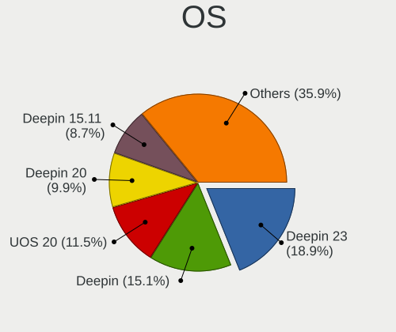

| Name           | Computers | Percent |
|----------------|-----------|---------|
| Deepin 23      | 59        | 18.91%  |
| Deepin         | 47        | 15.06%  |
| UOS 20         | 36        | 11.54%  |
| Deepin 20      | 31        | 9.94%   |
| Deepin 15.11   | 27        | 8.65%   |
| Deepin 25      | 15        | 4.81%   |
| Deepin 20.9    | 15        | 4.81%   |
| Deepin 15.9.2  | 12        | 3.85%   |
| Deepin 23.1    | 9         | 2.88%   |
| Deepin 20.8    | 8         | 2.56%   |
| Deepin 20.3    | 7         | 2.24%   |
| Deepin 20.1    | 7         | 2.24%   |
| Deepin 20 beta | 7         | 2.24%   |
| Deepin 20.5    | 4         | 1.28%   |
| Deepin 20.2.4  | 3         | 0.96%   |
| Deepin 20.2.3  | 3         | 0.96%   |
| Deepin 20.2.2  | 3         | 0.96%   |
| Deepin 15.10.1 | 3         | 0.96%   |
| Deepin 20.7.1  | 2         | 0.64%   |
| Deepin 20.6    | 2         | 0.64%   |
| Deepin 15.9.3  | 2         | 0.64%   |
| UOS 25         | 1         | 0.32%   |
| Deepin 2014.3  | 1         | 0.32%   |
| Deepin 20.7    | 1         | 0.32%   |
| Deepin 20.4    | 1         | 0.32%   |
| Deepin 20.2.1  | 1         | 0.32%   |
| Deepin 20.2    | 1         | 0.32%   |
| Deepin 15.9    | 1         | 0.32%   |
| Deepin 15.8    | 1         | 0.32%   |
| Deepin 15.7    | 1         | 0.32%   |
| Deepin 15.10   | 1         | 0.32%   |

OS Family
---------

OS without a version

| Name   | Computers | Percent |
|--------|-----------|---------|
| Deepin | 300       | 100%    |

Kernel
------

Version of the Linux kernel

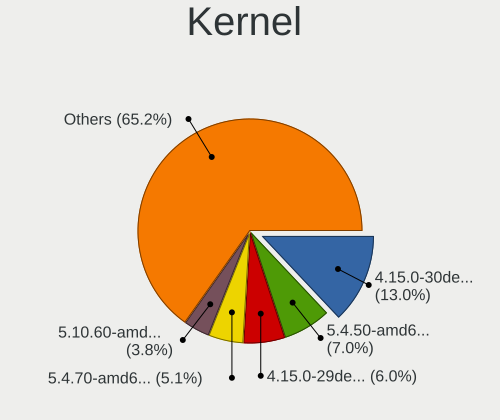

| Version                             | Computers | Percent |
|-------------------------------------|-----------|---------|
| 4.15.0-30deepin-generic             | 41        | 12.97%  |
| 5.4.50-amd64-desktop                | 22        | 6.96%   |
| 4.15.0-29deepin-generic             | 19        | 6.01%   |
| 5.4.70-amd64-desktop                | 16        | 5.06%   |
| 5.10.60-amd64-desktop               | 12        | 3.8%    |
| 6.1.32-amd64-desktop-hwe            | 11        | 3.48%   |
| 5.3.0-3-amd64                       | 10        | 3.16%   |
| 5.15.77-amd64-desktop               | 10        | 3.16%   |
| 5.10.0-amd64-desktop                | 10        | 3.16%   |
| 6.9.6-amd64-desktop-rolling         | 9         | 2.85%   |
| 5.18.17-amd64-desktop-hwe           | 7         | 2.22%   |
| 5.18.17-amd64-desktop-community-hwe | 7         | 2.22%   |
| 6.6.84-amd64-desktop-hwe            | 6         | 1.9%    |
| 6.6.47-amd64-desktop-hwe            | 6         | 1.9%    |
| 5.7.7-amd64-desktop                 | 6         | 1.9%    |
| 5.10.29-amd64-desktop               | 6         | 1.9%    |
| 4.19.0-amd64-desktop                | 6         | 1.9%    |
| 6.6.40-amd64-desktop-hwe            | 5         | 1.58%   |
| 5.15.45-amd64-desktop               | 5         | 1.58%   |
| 5.10.41-amd64-desktop               | 5         | 1.58%   |
| 5.10.36-amd64-desktop               | 5         | 1.58%   |
| 6.12.43-amd64-desktop-rolling       | 4         | 1.27%   |
| 6.1.11-amd64-desktop-hwe            | 4         | 1.27%   |
| 5.10.18-amd64-desktop               | 4         | 1.27%   |
| 6.12.20-amd64-desktop-rolling       | 3         | 0.95%   |
| 6.12.1-amd64-desktop-rolling        | 3         | 0.95%   |
| 5.15.24-amd64-desktop               | 3         | 0.95%   |
| 5.15.1-amd64-desktop                | 3         | 0.95%   |
| 5.10.50-amd64-desktop               | 3         | 0.95%   |
| 5.10.5-amd64-desktop+               | 3         | 0.95%   |
| 5.10.101-amd64-desktop              | 3         | 0.95%   |
| 4.19.0-arm64-desktop                | 3         | 0.95%   |
| 6.6.104-amd64-desktop-hwe           | 2         | 0.63%   |
| 6.3.0-rc4-amd64-exton               | 2         | 0.63%   |
| 6.12.9-amd64-desktop-rolling        | 2         | 0.63%   |
| 6.12.33-amd64-desktop-rolling       | 2         | 0.63%   |
| 6.12.28-amd64-desktop-rolling       | 2         | 0.63%   |
| 5.8.14-amd64-desktop                | 2         | 0.63%   |
| 5.5.4-xanmod3                       | 2         | 0.63%   |
| 5.15.34-amd64-desktop               | 2         | 0.63%   |

Kernel Family
-------------

Linux kernel without a distro release

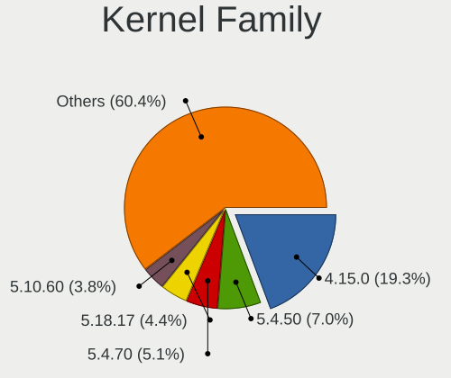

| Version  | Computers | Percent |
|----------|-----------|---------|
| 4.15.0   | 61        | 19.3%   |
| 5.4.50   | 22        | 6.96%   |
| 5.4.70   | 16        | 5.06%   |
| 5.18.17  | 14        | 4.43%   |
| 5.10.60  | 12        | 3.8%    |
| 5.10.0   | 12        | 3.8%    |
| 6.1.32   | 11        | 3.48%   |
| 4.19.0   | 11        | 3.48%   |
| 5.3.0    | 10        | 3.16%   |
| 5.15.77  | 10        | 3.16%   |
| 6.9.6    | 9         | 2.85%   |
| 6.6.84   | 6         | 1.9%    |
| 6.6.47   | 6         | 1.9%    |
| 5.7.7    | 6         | 1.9%    |
| 5.10.29  | 6         | 1.9%    |
| 6.6.40   | 5         | 1.58%   |
| 5.15.45  | 5         | 1.58%   |
| 5.10.41  | 5         | 1.58%   |
| 5.10.36  | 5         | 1.58%   |
| 6.12.43  | 4         | 1.27%   |
| 6.1.11   | 4         | 1.27%   |
| 5.10.18  | 4         | 1.27%   |
| 6.12.20  | 3         | 0.95%   |
| 6.12.1   | 3         | 0.95%   |
| 5.15.24  | 3         | 0.95%   |
| 5.15.1   | 3         | 0.95%   |
| 5.10.50  | 3         | 0.95%   |
| 5.10.5   | 3         | 0.95%   |
| 5.10.101 | 3         | 0.95%   |
| 6.9.3    | 2         | 0.63%   |
| 6.6.104  | 2         | 0.63%   |
| 6.3.0    | 2         | 0.63%   |
| 6.12.9   | 2         | 0.63%   |
| 6.12.33  | 2         | 0.63%   |
| 6.12.28  | 2         | 0.63%   |
| 5.8.14   | 2         | 0.63%   |
| 5.5.4    | 2         | 0.63%   |
| 5.15.34  | 2         | 0.63%   |
| 5.10.83  | 2         | 0.63%   |
| 6.7.4    | 1         | 0.32%   |

Kernel Major Ver.
-----------------

Linux kernel major version

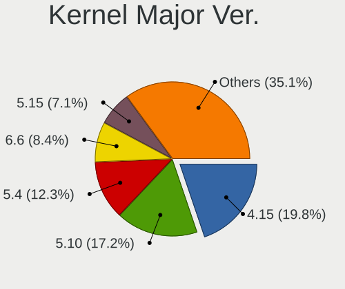

| Version | Computers | Percent |
|---------|-----------|---------|
| 4.15    | 61        | 19.81%  |
| 5.10    | 53        | 17.21%  |
| 5.4     | 38        | 12.34%  |
| 6.6     | 26        | 8.44%   |
| 5.15    | 22        | 7.14%   |
| 6.1     | 16        | 5.19%   |
| 6.12    | 15        | 4.87%   |
| 5.18    | 15        | 4.87%   |
| 4.19    | 14        | 4.55%   |
| 6.9     | 11        | 3.57%   |
| 5.3     | 11        | 3.57%   |
| 5.7     | 6         | 1.95%   |
| 6.3     | 2         | 0.65%   |
| 6.10    | 2         | 0.65%   |
| 5.8     | 2         | 0.65%   |
| 5.6     | 2         | 0.65%   |
| 5.5     | 2         | 0.65%   |
| 5.1     | 2         | 0.65%   |
| 6.7     | 1         | 0.32%   |
| 6.5     | 1         | 0.32%   |
| 6.2     | 1         | 0.32%   |
| 6.17    | 1         | 0.32%   |
| 6.14    | 1         | 0.32%   |
| 5.2     | 1         | 0.32%   |
| 5.14    | 1         | 0.32%   |
| 5.12    | 1         | 0.32%   |

Arch
----

OS architecture (x86_64, i586, etc.)

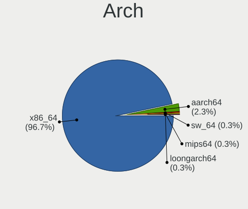

| Name        | Computers | Percent |
|-------------|-----------|---------|
| x86_64      | 290       | 96.67%  |
| aarch64     | 7         | 2.33%   |
| sw_64       | 1         | 0.33%   |
| mips64      | 1         | 0.33%   |
| loongarch64 | 1         | 0.33%   |

DE
--

Desktop Environment

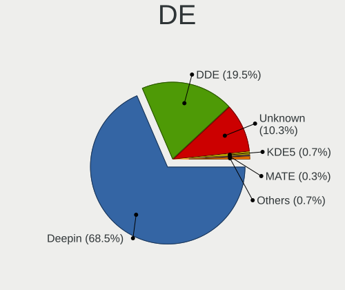

| Name    | Computers | Percent |
|---------|-----------|---------|
| Deepin  | 207       | 68.54%  |
| DDE     | 59        | 19.54%  |
| Unknown | 31        | 10.26%  |
| KDE5    | 2         | 0.66%   |
| MATE    | 1         | 0.33%   |
| KDE     | 1         | 0.33%   |
| GNOME   | 1         | 0.33%   |

Display Server
--------------

X11 or Wayland

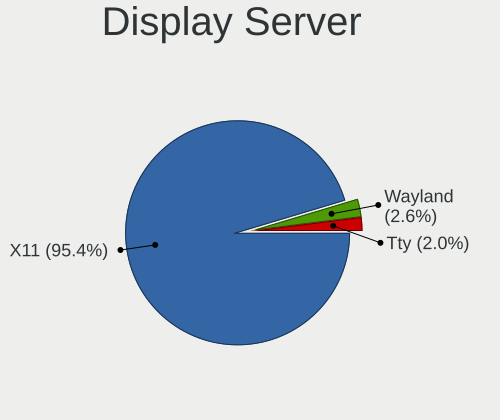

| Name    | Computers | Percent |
|---------|-----------|---------|
| X11     | 288       | 95.36%  |
| Wayland | 8         | 2.65%   |
| Tty     | 6         | 1.99%   |

Display Manager
---------------

SDDM, LightDM, etc.

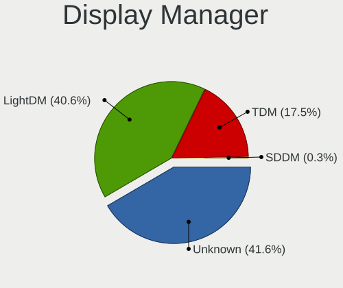

| Name    | Computers | Percent |
|---------|-----------|---------|
| Unknown | 126       | 41.58%  |
| LightDM | 123       | 40.59%  |
| TDM     | 53        | 17.49%  |
| SDDM    | 1         | 0.33%   |

OS Lang
-------

Language

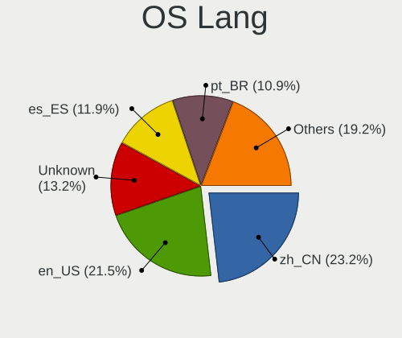

| Lang    | Computers | Percent |
|---------|-----------|---------|
| zh_CN   | 70        | 23.18%  |
| en_US   | 65        | 21.52%  |
| Unknown | 40        | 13.25%  |
| es_ES   | 36        | 11.92%  |
| pt_BR   | 33        | 10.93%  |
| de_DE   | 18        | 5.96%   |
| ru_RU   | 11        | 3.64%   |
| tr_TR   | 5         | 1.66%   |
| it_IT   | 5         | 1.66%   |
| pl_PL   | 3         | 0.99%   |
| fr_FR   | 3         | 0.99%   |
| en_GB   | 3         | 0.99%   |
| sv_SE   | 2         | 0.66%   |
| id_ID   | 2         | 0.66%   |
| pt_PT   | 1         | 0.33%   |
| nl_NL   | 1         | 0.33%   |
| lt_LT   | 1         | 0.33%   |
| ja_JP   | 1         | 0.33%   |
| hu_HU   | 1         | 0.33%   |
| C       | 1         | 0.33%   |

Boot Mode
---------

EFI or BIOS

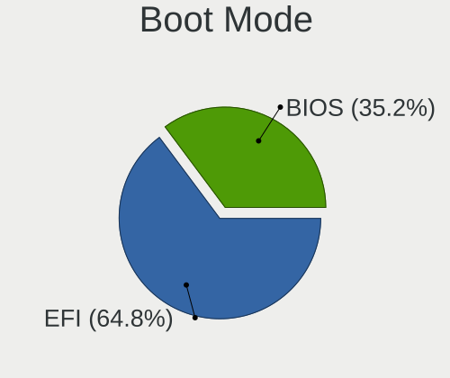

| Mode | Computers | Percent |
|------|-----------|---------|
| EFI  | 197       | 64.8%   |
| BIOS | 107       | 35.2%   |

Filesystem
----------

Type of filesystem

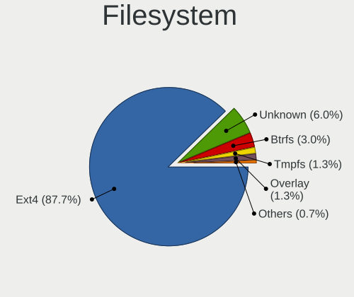

| Type    | Computers | Percent |
|---------|-----------|---------|
| Ext4    | 264       | 87.71%  |
| Unknown | 18        | 5.98%   |
| Btrfs   | 9         | 2.99%   |
| Tmpfs   | 4         | 1.33%   |
| Overlay | 4         | 1.33%   |
| Xfs     | 1         | 0.33%   |
| Ext3    | 1         | 0.33%   |

Part. scheme
------------

Scheme of partitioning

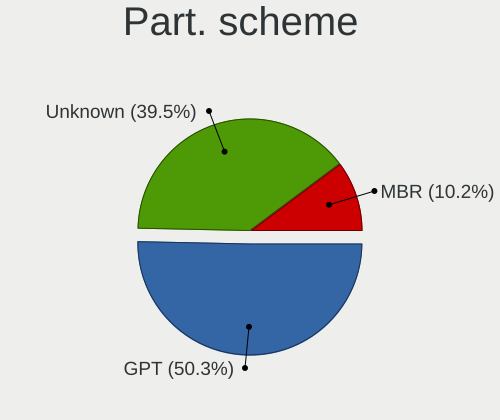

| Type    | Computers | Percent |
|---------|-----------|---------|
| GPT     | 153       | 50.33%  |
| Unknown | 120       | 39.47%  |
| MBR     | 31        | 10.2%   |

Dual Boot with Linux/BSD
------------------------

Hosting more than one Linux/BSD

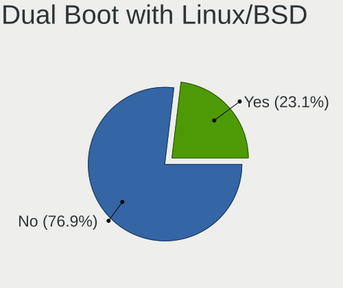

| Dual boot | Computers | Percent |
|-----------|-----------|---------|
| No        | 233       | 76.9%   |
| Yes       | 70        | 23.1%   |

Dual Boot (Win)
---------------

Hosting Linux and Windows

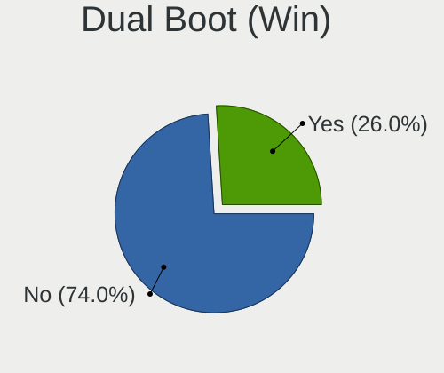

| Dual boot | Computers | Percent |
|-----------|-----------|---------|
| No        | 225       | 74.01%  |
| Yes       | 79        | 25.99%  |

Board
-----

Vendor
------

Motherboard manufacturer

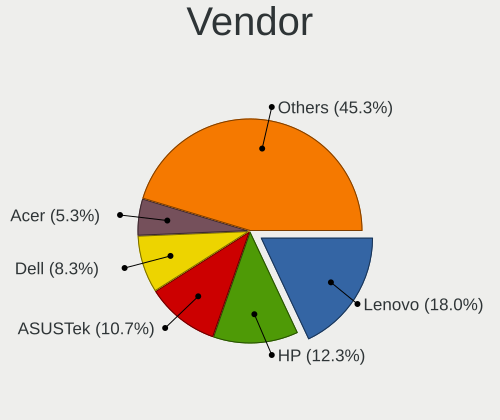

| Name                       | Computers | Percent |
|----------------------------|-----------|---------|
| Lenovo                     | 54        | 18%     |
| Hewlett-Packard            | 37        | 12.33%  |
| ASUSTek Computer           | 32        | 10.67%  |
| Dell                       | 25        | 8.33%   |
| Acer                       | 16        | 5.33%   |
| Gigabyte Technology        | 13        | 4.33%   |
| Samsung Electronics        | 9         | 3%      |
| TSINGHUA TONGFANG COMPUTER | 8         | 2.67%   |
| HUAWEI                     | 8         | 2.67%   |
| Sony                       | 6         | 2%      |
| Intel                      | 6         | 2%      |
| Apple                      | 6         | 2%      |
| Toshiba                    | 5         | 1.67%   |
| Timi                       | 5         | 1.67%   |
| MSI                        | 5         | 1.67%   |
| ASRock                     | 5         | 1.67%   |
| Unknown                    | 5         | 1.67%   |
| Positivo                   | 3         | 1%      |
| MECHREVO                   | 3         | 1%      |
| Google                     | 3         | 1%      |
| Semp Toshiba               | 2         | 0.67%   |
| Loongson                   | 2         | 0.67%   |
| HONOR                      | 2         | 0.67%   |
| GreatWall                  | 2         | 0.67%   |
| Fujitsu                    | 2         | 0.67%   |
| ECS                        | 2         | 0.67%   |
| Chuwi                      | 2         | 0.67%   |
| ZOTAC                      | 1         | 0.33%   |
| UNOWHY                     | 1         | 0.33%   |
| THTF                       | 1         | 0.33%   |
| Standard                   | 1         | 0.33%   |
| Soyo                       | 1         | 0.33%   |
| Rockchip Electronics       | 1         | 0.33%   |
| Phytium                    | 1         | 0.33%   |
| OEM                        | 1         | 0.33%   |
| Microtech                  | 1         | 0.33%   |
| Microsoft                  | 1         | 0.33%   |
| METAPHYUNI                 | 1         | 0.33%   |
| Medion                     | 1         | 0.33%   |
| MACHINIST                  | 1         | 0.33%   |

Model
-----

Motherboard model

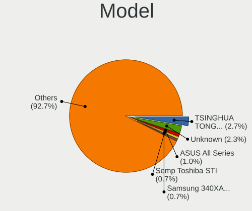

| Name                                              | Computers | Percent |
|---------------------------------------------------|-----------|---------|
| TSINGHUA TONGFANG COMPUTER E500                   | 8         | 2.67%   |
| Unknown                                           | 7         | 2.33%   |
| ASUS All Series                                   | 3         | 1%      |
| Semp Toshiba STI                                  | 2         | 0.67%   |
| Samsung 340XAA/350XAA/550XAA                      | 2         | 0.67%   |
| Lenovo ThinkBook 14 G4+ ARA 21D0                  | 2         | 0.67%   |
| Lenovo IdeaPad 120S-11IAP 81A4                    | 2         | 0.67%   |
| HONOR NBLK-WAX9X                                  | 2         | 0.67%   |
| HP Pavilion Notebook                              | 2         | 0.67%   |
| HP Pavilion 15                                    | 2         | 0.67%   |
| HP ENVY 15                                        | 2         | 0.67%   |
| HP EliteBook 845 14 inch G10 Notebook PC          | 2         | 0.67%   |
| ECS H81H3-M4                                      | 2         | 0.67%   |
| Acer Nitro AN515-54                               | 2         | 0.67%   |
| ZOTAC ZBOXNANO-ID63/ID64/ID65                     | 1         | 0.33%   |
| UNOWHY Y13G012S4EI                                | 1         | 0.33%   |
| Toshiba Satellite L75-C                           | 1         | 0.33%   |
| Toshiba Satellite L745                            | 1         | 0.33%   |
| Toshiba Satellite E55t-A                          | 1         | 0.33%   |
| Toshiba Satellite C850D-11K                       | 1         | 0.33%   |
| Toshiba Satellite C850-1H6                        | 1         | 0.33%   |
| Timi TM1709                                       | 1         | 0.33%   |
| Timi TM1701                                       | 1         | 0.33%   |
| Timi TM1613                                       | 1         | 0.33%   |
| Timi RedmiBook Air 13                             | 1         | 0.33%   |
| Timi Redmi G 2022                                 | 1         | 0.33%   |
| THTF ChaoXiangQ620-T1                             | 1         | 0.33%   |
| Standard MB45II/MB45IN                            | 1         | 0.33%   |
| Soyo SY-Thin Mini H110                            | 1         | 0.33%   |
| Sony VPCYB25AB                                    | 1         | 0.33%   |
| Sony VGN-NS140D                                   | 1         | 0.33%   |
| Sony VGN-AW11Z_B                                  | 1         | 0.33%   |
| Sony SVF14A190X                                   | 1         | 0.33%   |
| Sony SVE14135CXP                                  | 1         | 0.33%   |
| Sony SVE14118FXW                                  | 1         | 0.33%   |
| Samsung P500A2D                                   | 1         | 0.33%   |
| Samsung 800G5M/800G5W                             | 1         | 0.33%   |
| Samsung 550P5C/550P7C                             | 1         | 0.33%   |
| Samsung 500R4K/500R5H/5400RK/501R5H/5500RH/500R5S | 1         | 0.33%   |
| Samsung 300E4A/300E5A/300E7A/3430EA/3530EA        | 1         | 0.33%   |

Model Family
------------

Motherboard model prefix

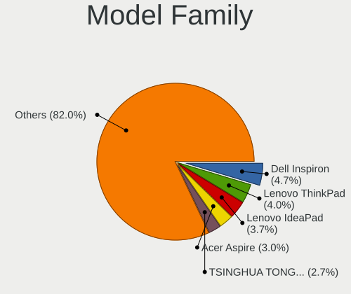

| Name                            | Computers | Percent |
|---------------------------------|-----------|---------|
| Dell Inspiron                   | 14        | 4.67%   |
| Lenovo ThinkPad                 | 12        | 4%      |
| Lenovo IdeaPad                  | 11        | 3.67%   |
| Acer Aspire                     | 9         | 3%      |
| TSINGHUA TONGFANG COMPUTER E500 | 8         | 2.67%   |
| HP Pavilion                     | 8         | 2.67%   |
| Lenovo Legion                   | 7         | 2.33%   |
| HP EliteBook                    | 7         | 2.33%   |
| Unknown                         | 7         | 2.33%   |
| Lenovo ThinkBook                | 6         | 2%      |
| HP Laptop                       | 6         | 2%      |
| Toshiba Satellite               | 5         | 1.67%   |
| ASUS ROG                        | 5         | 1.67%   |
| Lenovo ThinkCentre              | 4         | 1.33%   |
| ASUS PRIME                      | 4         | 1.33%   |
| Acer Nitro                      | 4         | 1.33%   |
| HP ENVY                         | 3         | 1%      |
| Dell OptiPlex                   | 3         | 1%      |
| Dell Latitude                   | 3         | 1%      |
| ASUS All                        | 3         | 1%      |
| Semp Toshiba STI                | 2         | 0.67%   |
| Samsung 340XAA                  | 2         | 0.67%   |
| MECHREVO Jiaolong               | 2         | 0.67%   |
| Lenovo ZHAOYANG                 | 2         | 0.67%   |
| Lenovo Yoga                     | 2         | 0.67%   |
| HONOR NBLK-WAX9X                | 2         | 0.67%   |
| Gigabyte B550M                  | 2         | 0.67%   |
| ECS H81H3-M4                    | 2         | 0.67%   |
| Dell Vostro                     | 2         | 0.67%   |
| ASUS VivoBook                   | 2         | 0.67%   |
| ASUS TUF                        | 2         | 0.67%   |
| Acer Swift                      | 2         | 0.67%   |
| ZOTAC ZBOXNANO-ID63             | 1         | 0.33%   |
| UNOWHY Y13G012S4EI              | 1         | 0.33%   |
| Timi TM1709                     | 1         | 0.33%   |
| Timi TM1701                     | 1         | 0.33%   |
| Timi TM1613                     | 1         | 0.33%   |
| Timi RedmiBook                  | 1         | 0.33%   |
| Timi Redmi                      | 1         | 0.33%   |
| THTF ChaoXiangQ620-T1           | 1         | 0.33%   |

MFG Year
--------

Motherboard manufacture year

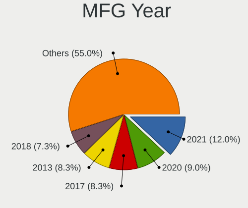

| Year    | Computers | Percent |
|---------|-----------|---------|
| 2021    | 36        | 12%     |
| 2020    | 27        | 9%      |
| 2017    | 25        | 8.33%   |
| 2013    | 25        | 8.33%   |
| 2018    | 22        | 7.33%   |
| 2019    | 21        | 7%      |
| 2012    | 20        | 6.67%   |
| 2011    | 18        | 6%      |
| 2014    | 17        | 5.67%   |
| 2022    | 16        | 5.33%   |
| 2015    | 16        | 5.33%   |
| 2023    | 11        | 3.67%   |
| 2016    | 11        | 3.67%   |
| 2010    | 11        | 3.67%   |
| 2009    | 10        | 3.33%   |
| 2024    | 5         | 1.67%   |
| 2008    | 3         | 1%      |
| Unknown | 3         | 1%      |
| 2025    | 2         | 0.67%   |
| 2006    | 1         | 0.33%   |

Form Factor
-----------

Physical design of the computer

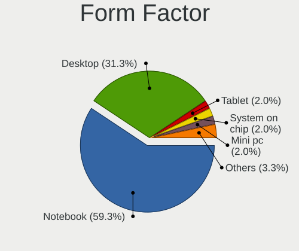

| Name           | Computers | Percent |
|----------------|-----------|---------|
| Notebook       | 178       | 59.33%  |
| Desktop        | 94        | 31.33%  |
| System on chip | 6         | 2%      |
| Tablet         | 6         | 2%      |
| Mini pc        | 6         | 2%      |
| All in one     | 5         | 1.67%   |
| Convertible    | 3         | 1%      |
| Server         | 2         | 0.67%   |

Secure Boot
-----------

Enabled or disabled

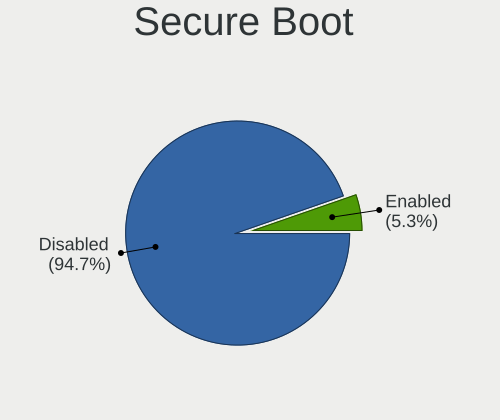

| State    | Computers | Percent |
|----------|-----------|---------|
| Disabled | 285       | 94.68%  |
| Enabled  | 16        | 5.32%   |

Coreboot
--------

Have coreboot on board

| Used | Computers | Percent |
|------|-----------|---------|
| No   | 297       | 99%     |
| Yes  | 3         | 1%      |

RAM Size
--------

Total RAM memory

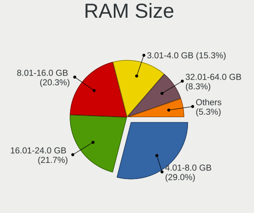

| Size in GB  | Computers | Percent |
|-------------|-----------|---------|
| 4.01-8.0    | 87        | 29%     |
| 16.01-24.0  | 65        | 21.67%  |
| 8.01-16.0   | 61        | 20.33%  |
| 3.01-4.0    | 46        | 15.33%  |
| 32.01-64.0  | 25        | 8.33%   |
| 1.01-2.0    | 6         | 2%      |
| 24.01-32.0  | 5         | 1.67%   |
| 64.01-256.0 | 4         | 1.33%   |
| 2.01-3.0    | 1         | 0.33%   |

RAM Used
--------

Used RAM memory

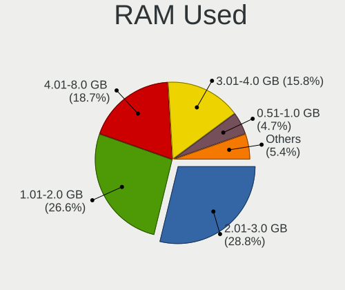

| Used GB    | Computers | Percent |
|------------|-----------|---------|
| 2.01-3.0   | 91        | 28.8%   |
| 1.01-2.0   | 84        | 26.58%  |
| 4.01-8.0   | 59        | 18.67%  |
| 3.01-4.0   | 50        | 15.82%  |
| 0.51-1.0   | 15        | 4.75%   |
| 8.01-16.0  | 13        | 4.11%   |
| 16.01-24.0 | 2         | 0.63%   |
| 24.01-32.0 | 1         | 0.32%   |
| 0.01-0.5   | 1         | 0.32%   |

Total Drives
------------

Number of drives on board

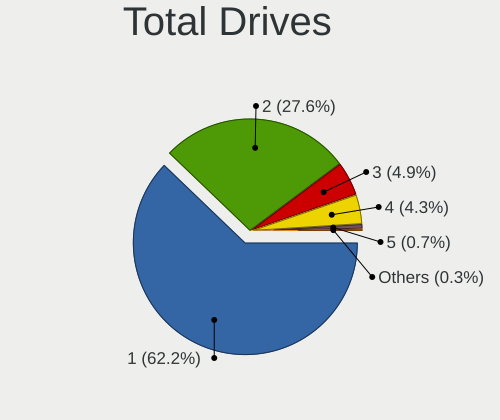

| Drives | Computers | Percent |
|--------|-----------|---------|
| 1      | 189       | 62.17%  |
| 2      | 84        | 27.63%  |
| 3      | 15        | 4.93%   |
| 4      | 13        | 4.28%   |
| 5      | 2         | 0.66%   |
| 8      | 1         | 0.33%   |

Has CD-ROM
----------

Has CD-ROM on board

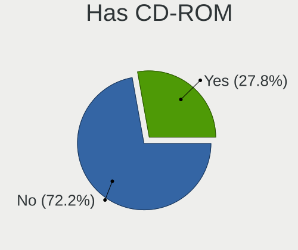

| Presented | Computers | Percent |
|-----------|-----------|---------|
| No        | 218       | 72.19%  |
| Yes       | 84        | 27.81%  |

Has Ethernet
------------

Has Ethernet on board

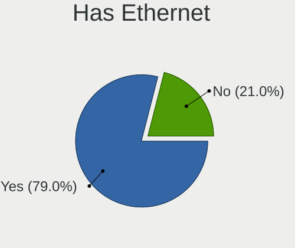

| Presented | Computers | Percent |
|-----------|-----------|---------|
| Yes       | 237       | 79%     |
| No        | 63        | 21%     |

Has WiFi
--------

Has WiFi module

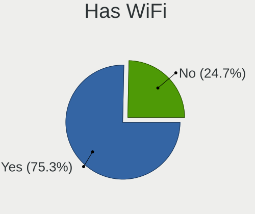

| Presented | Computers | Percent |
|-----------|-----------|---------|
| Yes       | 226       | 75.33%  |
| No        | 74        | 24.67%  |

Has Bluetooth
-------------

Has Bluetooth module

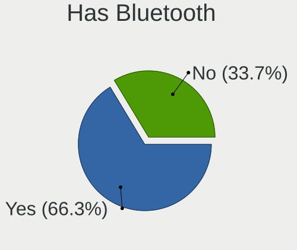

| Presented | Computers | Percent |
|-----------|-----------|---------|
| Yes       | 199       | 66.33%  |
| No        | 101       | 33.67%  |

Location
--------

Country
-------

Geographic location (country)

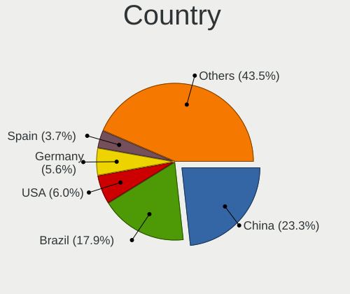

| Country      | Computers | Percent |
|--------------|-----------|---------|
| China        | 70        | 23.26%  |
| Brazil       | 54        | 17.94%  |
| USA          | 18        | 5.98%   |
| Germany      | 17        | 5.65%   |
| Spain        | 11        | 3.65%   |
| Russia       | 11        | 3.65%   |
| Indonesia    | 7         | 2.33%   |
| Turkey       | 6         | 1.99%   |
| Mexico       | 6         | 1.99%   |
| Colombia     | 6         | 1.99%   |
| Japan        | 5         | 1.66%   |
| Italy        | 5         | 1.66%   |
| Poland       | 4         | 1.33%   |
| Panama       | 4         | 1.33%   |
| India        | 4         | 1.33%   |
| Hong Kong    | 4         | 1.33%   |
| Chile        | 4         | 1.33%   |
| Austria      | 4         | 1.33%   |
| Argentina    | 4         | 1.33%   |
| UK           | 3         | 1%      |
| Pakistan     | 3         | 1%      |
| Canada       | 3         | 1%      |
| Venezuela    | 2         | 0.66%   |
| Sweden       | 2         | 0.66%   |
| Singapore    | 2         | 0.66%   |
| Portugal     | 2         | 0.66%   |
| Kenya        | 2         | 0.66%   |
| Iran         | 2         | 0.66%   |
| Costa Rica   | 2         | 0.66%   |
| Bulgaria     | 2         | 0.66%   |
| Belarus      | 2         | 0.66%   |
| Bangladesh   | 2         | 0.66%   |
| Australia    | 2         | 0.66%   |
| Vietnam      | 1         | 0.33%   |
| Ukraine      | 1         | 0.33%   |
| Türkiye     | 1         | 0.33%   |
| Tunisia      | 1         | 0.33%   |
| Sri Lanka    | 1         | 0.33%   |
| South Africa | 1         | 0.33%   |
| Serbia       | 1         | 0.33%   |

City
----

Geographic location (city)

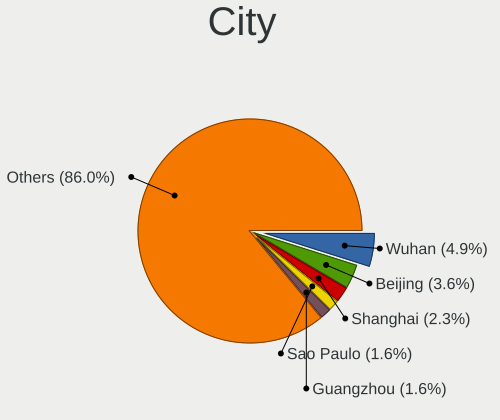

| City          | Computers | Percent |
|---------------|-----------|---------|
| Wuhan         | 15        | 4.89%   |
| Beijing       | 11        | 3.58%   |
| Shanghai      | 7         | 2.28%   |
| Sao Paulo     | 5         | 1.63%   |
| Guangzhou     | 5         | 1.63%   |
| Nanjing       | 4         | 1.3%    |
| Moscow        | 4         | 1.3%    |
| David         | 4         | 1.3%    |
| Curitiba      | 4         | 1.3%    |
| Uberlândia   | 3         | 0.98%   |
| Tokyo         | 3         | 0.98%   |
| Shenzhen      | 3         | 0.98%   |
| Bogotá       | 3         | 0.98%   |
| Xiamen        | 2         | 0.65%   |
| Taiyuan       | 2         | 0.65%   |
| Surabaya      | 2         | 0.65%   |
| Singapore     | 2         | 0.65%   |
| San Francisco | 2         | 0.65%   |
| Petrópolis   | 2         | 0.65%   |
| Londrina      | 2         | 0.65%   |
| Konya         | 2         | 0.65%   |
| Innsbruck     | 2         | 0.65%   |
| Getxo         | 2         | 0.65%   |
| Dhaka         | 2         | 0.65%   |
| Contagem      | 2         | 0.65%   |
| Central       | 2         | 0.65%   |
| Brasília     | 2         | 0.65%   |
| Atlanta       | 2         | 0.65%   |
| Zibo          | 1         | 0.33%   |
| Zhongshan     | 1         | 0.33%   |
| Zhengzhou     | 1         | 0.33%   |
| Zaragoza      | 1         | 0.33%   |
| Yozgat        | 1         | 0.33%   |
| Yogyakarta    | 1         | 0.33%   |
| Yichun        | 1         | 0.33%   |
| Yekaterinburg | 1         | 0.33%   |
| Yalova        | 1         | 0.33%   |
| Xuhui         | 1         | 0.33%   |
| Windhoek      | 1         | 0.33%   |
| West Jordan   | 1         | 0.33%   |

Drives
------

Drive Vendor
------------

Hard drive vendors

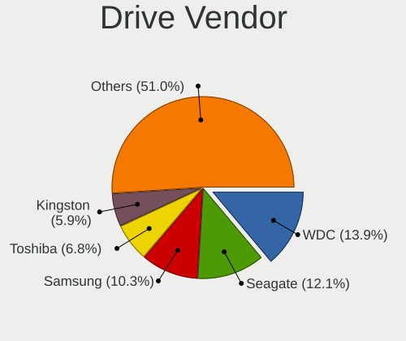

| Vendor                                  | Computers | Drives | Percent |
|-----------------------------------------|-----------|--------|---------|
| WDC                                     | 61        | 77     | 13.9%   |
| Seagate                                 | 53        | 63     | 12.07%  |
| Samsung Electronics                     | 45        | 52     | 10.25%  |
| Toshiba                                 | 30        | 32     | 6.83%   |
| Kingston                                | 26        | 34     | 5.92%   |
| SanDisk                                 | 25        | 29     | 5.69%   |
| Unknown                                 | 21        | 23     | 4.78%   |
| SK hynix                                | 13        | 14     | 2.96%   |
| Crucial                                 | 13        | 14     | 2.96%   |
| Hitachi                                 | 12        | 13     | 2.73%   |
| Micron Technology                       | 9         | 12     | 2.05%   |
| A-DATA Technology                       | 9         | 10     | 2.05%   |
| HGST                                    | 8         | 8      | 1.82%   |
| Silicon Motion                          | 7         | 7      | 1.59%   |
| Intel                                   | 7         | 11     | 1.59%   |
| China                                   | 7         | 7      | 1.59%   |
| MAXIO Technology (Hangzhou)             | 5         | 6      | 1.14%   |
| KIOXIA                                  | 5         | 5      | 1.14%   |
| SPCC                                    | 4         | 5      | 0.91%   |
| Phison Electronics                      | 4         | 5      | 0.91%   |
| Phison                                  | 4         | 4      | 0.91%   |
| FORESEE                                 | 4         | 4      | 0.91%   |
| LITEON                                  | 3         | 3      | 0.68%   |
| Intenso                                 | 3         | 4      | 0.68%   |
| Yangtze Memory Technologies             | 2         | 2      | 0.46%   |
| Vaseky                                  | 2         | 2      | 0.46%   |
| V-GeN                                   | 2         | 2      | 0.46%   |
| Patriot                                 | 2         | 4      | 0.46%   |
| Mushkin                                 | 2         | 3      | 0.46%   |
| Maxtor                                  | 2         | 4      | 0.46%   |
| Kingston Technology Company             | 2         | 2      | 0.46%   |
| JMicron Technology                      | 2         | 2      | 0.46%   |
| Hewlett-Packard                         | 2         | 3      | 0.46%   |
| Gigabyte Technology                     | 2         | 2      | 0.46%   |
| Apple                                   | 2         | 3      | 0.46%   |
| ADATA Technology                        | 2         | 2      | 0.46%   |
| WALRAM                                  | 1         | 1      | 0.23%   |
| Transcend                               | 1         | 1      | 0.23%   |
| Solid State Storage Technology          | 1         | 1      | 0.23%   |
| Shenzhen Unionmemory Information System | 1         | 1      | 0.23%   |

Drive Model
-----------

Hard drive models

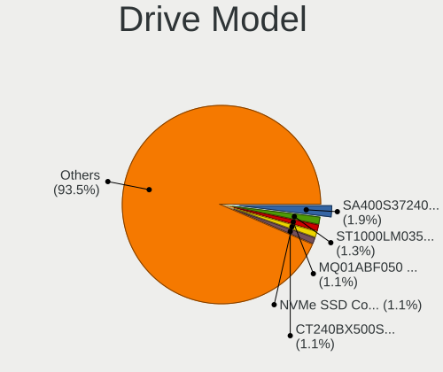

| Model                                                 | Computers | Percent |
|-------------------------------------------------------|-----------|---------|
| Kingston SA400S37240G 240GB SSD                       | 9         | 1.94%   |
| Seagate ST1000LM035-1RK172 1TB                        | 6         | 1.3%    |
| Toshiba MQ01ABF050 500GB                              | 5         | 1.08%   |
| Samsung NVMe SSD Controller PM9A1/PM9A3/980PRO 1TB    | 5         | 1.08%   |
| Crucial CT240BX500SSD1 240GB                          | 5         | 1.08%   |
| Toshiba MQ01ABD100 1TB                                | 4         | 0.86%   |
| Silicon Motion SM2263EN/SM2263XT SSD Controller 512GB | 4         | 0.86%   |
| Seagate ST1000DM010-2EP102 1TB                        | 4         | 0.86%   |
| WDC WD5000LPCX-24VHAT0 500GB                          | 3         | 0.65%   |
| Unknown SD/MMC/MS PRO 2GB                             | 3         | 0.65%   |
| Unknown MMC Card                                      | 3         | 0.65%   |
| Seagate ST500LM012 HN-M500MBB 500GB                   | 3         | 0.65%   |
| Seagate ST1000DM003-1SB102 1TB                        | 3         | 0.65%   |
| Samsung SSD 850 EVO 500GB                             | 3         | 0.65%   |
| Samsung MZVLW256HEHP-000H1 256GB                      | 3         | 0.65%   |
| Phison ESO256GMFCH-E3C-2 256GB                        | 3         | 0.65%   |
| Kingston SA400S37480G 480GB SSD                       | 3         | 0.65%   |
| HGST HTS721010A9E630 1TB                              | 3         | 0.65%   |
| WDC WDS120G1G0A-00SS50 120GB SSD                      | 2         | 0.43%   |
| WDC WD5000AAKX-003CA0 500GB                           | 2         | 0.43%   |
| WDC WD10EZEX-22MFCA0 1TB                              | 2         | 0.43%   |
| WDC WD10EZEX-08WN4A0 1TB                              | 2         | 0.43%   |
| WDC PC SN530 SDBPMPZ-512G-1101 512GB                  | 2         | 0.43%   |
| Unknown MMC Card  32GB                                | 2         | 0.43%   |
| Toshiba MQ01ABD050 500GB                              | 2         | 0.43%   |
| Toshiba KXG60ZNV512G 512GB                            | 2         | 0.43%   |
| Toshiba DT01ACA200 2TB                                | 2         | 0.43%   |
| Toshiba DT01ACA100 1TB                                | 2         | 0.43%   |
| SPCC Solid State Disk 512GB                           | 2         | 0.43%   |
| SK hynix Platinum P41 NVMe Solid State Drive 2TB      | 2         | 0.43%   |
| Seagate ST9320325AS 320GB                             | 2         | 0.43%   |
| Seagate ST500DM002-1BD142 500GB                       | 2         | 0.43%   |
| Seagate ST3750528AS 752GB                             | 2         | 0.43%   |
| Seagate ST3500418AS 500GB                             | 2         | 0.43%   |
| Seagate ST2000LM007-1R8174 2TB                        | 2         | 0.43%   |
| Seagate ST1000LM024 HN-M101MBB 1TB                    | 2         | 0.43%   |
| SanDisk SSD PLUS 240GB                                | 2         | 0.43%   |
| SanDisk SDSSDH3512G 512GB                             | 2         | 0.43%   |
| SanDisk SDSSDA240G 240GB                              | 2         | 0.43%   |
| SanDisk SDSSDA120G 120GB                              | 2         | 0.43%   |

HDD Vendor
----------

Hard disk drive vendors

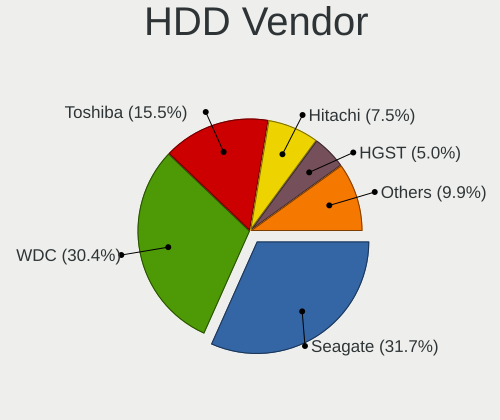

| Vendor              | Computers | Drives | Percent |
|---------------------|-----------|--------|---------|
| Seagate             | 51        | 61     | 31.68%  |
| WDC                 | 49        | 58     | 30.43%  |
| Toshiba             | 25        | 27     | 15.53%  |
| Hitachi             | 12        | 13     | 7.45%   |
| HGST                | 8         | 8      | 4.97%   |
| Samsung Electronics | 4         | 4      | 2.48%   |
| Unknown             | 3         | 4      | 1.86%   |
| Maxtor              | 2         | 4      | 1.24%   |
| JMicron Technology  | 2         | 2      | 1.24%   |
| OEM                 | 1         | 1      | 0.62%   |
| Maxtor 6            | 1         | 1      | 0.62%   |
| Hewlett-Packard     | 1         | 2      | 0.62%   |
| Fujitsu             | 1         | 2      | 0.62%   |
| External            | 1         | 2      | 0.62%   |

SSD Vendor
----------

Solid state drive vendors

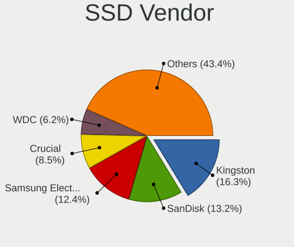

| Vendor              | Computers | Drives | Percent |
|---------------------|-----------|--------|---------|
| Kingston            | 21        | 28     | 16.28%  |
| SanDisk             | 17        | 21     | 13.18%  |
| Samsung Electronics | 16        | 21     | 12.4%   |
| Crucial             | 11        | 12     | 8.53%   |
| WDC                 | 8         | 11     | 6.2%    |
| China               | 7         | 7      | 5.43%   |
| A-DATA Technology   | 5         | 6      | 3.88%   |
| SPCC                | 4         | 5      | 3.1%    |
| SK hynix            | 3         | 3      | 2.33%   |
| Micron Technology   | 3         | 5      | 2.33%   |
| Intenso             | 3         | 4      | 2.33%   |
| Vaseky              | 2         | 2      | 1.55%   |
| LITEON              | 2         | 2      | 1.55%   |
| Intel               | 2         | 5      | 1.55%   |
| V-GeN               | 1         | 1      | 0.78%   |
| Unknown             | 1         | 1      | 0.78%   |
| Transcend           | 1         | 1      | 0.78%   |
| Toshiba             | 1         | 1      | 0.78%   |
| RZX                 | 1         | 1      | 0.78%   |
| Patriot             | 1         | 3      | 0.78%   |
| OCZ                 | 1         | 1      | 0.78%   |
| Netac               | 1         | 1      | 0.78%   |
| Mushkin             | 1         | 2      | 0.78%   |
| Microtech           | 1         | 1      | 0.78%   |
| MaiChai             | 1         | 1      | 0.78%   |
| LITEONIT            | 1         | 1      | 0.78%   |
| KingSpec            | 1         | 1      | 0.78%   |
| KingDian            | 1         | 1      | 0.78%   |
| KINGBANK            | 1         | 1      | 0.78%   |
| Hewlett-Packard     | 1         | 1      | 0.78%   |
| Great               | 1         | 1      | 0.78%   |
| GLOWAY              | 1         | 1      | 0.78%   |
| Gigabyte Technology | 1         | 1      | 0.78%   |
| G521N               | 1         | 1      | 0.78%   |
| Colorful            | 1         | 2      | 0.78%   |
| Apple               | 1         | 1      | 0.78%   |
| Apacer              | 1         | 3      | 0.78%   |
| addlink             | 1         | 1      | 0.78%   |
| Acer                | 1         | 1      | 0.78%   |

Drive Kind
----------

HDD or SSD

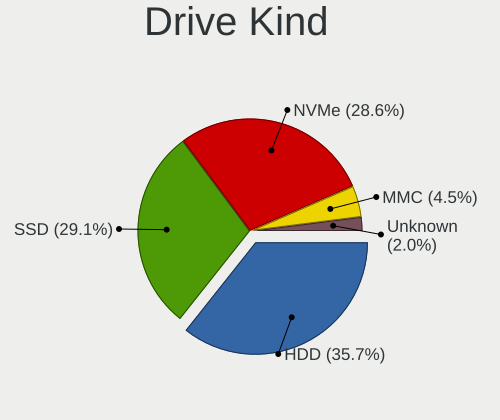

| Kind    | Computers | Drives | Percent |
|---------|-----------|--------|---------|
| HDD     | 142       | 189    | 35.68%  |
| SSD     | 116       | 163    | 29.15%  |
| NVMe    | 114       | 135    | 28.64%  |
| MMC     | 18        | 20     | 4.52%   |
| Unknown | 8         | 10     | 2.01%   |

Drive Connector
---------------

SATA, SAS, NVMe, etc.

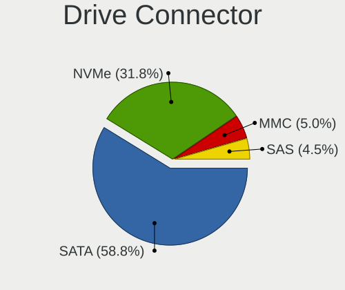

| Type | Computers | Drives | Percent |
|------|-----------|--------|---------|
| SATA | 211       | 336    | 58.77%  |
| NVMe | 114       | 133    | 31.75%  |
| MMC  | 18        | 20     | 5.01%   |
| SAS  | 16        | 28     | 4.46%   |

Drive Size
----------

Size of hard drive

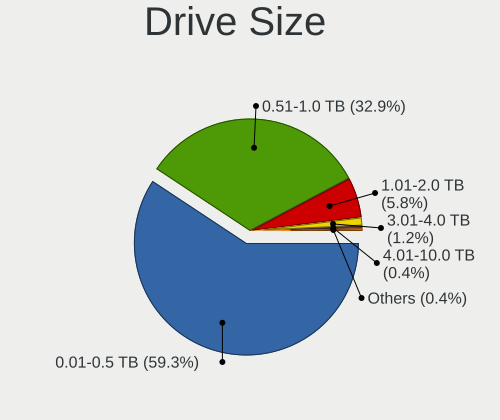

| Size in TB | Computers | Drives | Percent |
|------------|-----------|--------|---------|
| 0.01-0.5   | 153       | 224    | 59.3%   |
| 0.51-1.0   | 85        | 99     | 32.95%  |
| 1.01-2.0   | 15        | 21     | 5.81%   |
| 3.01-4.0   | 3         | 6      | 1.16%   |
| 2.01-3.0   | 1         | 1      | 0.39%   |
| 4.01-10.0  | 1         | 1      | 0.39%   |

Space Total
-----------

Amount of disk space available on the file system

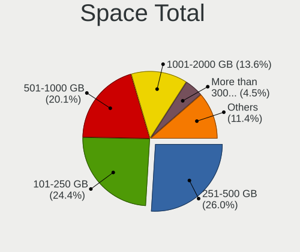

| Size in GB     | Computers | Percent |
|----------------|-----------|---------|
| 251-500        | 80        | 25.97%  |
| 101-250        | 75        | 24.35%  |
| 501-1000       | 62        | 20.13%  |
| 1001-2000      | 42        | 13.64%  |
| More than 3000 | 14        | 4.55%   |
| 51-100         | 14        | 4.55%   |
| 2001-3000      | 9         | 2.92%   |
| 21-50          | 5         | 1.62%   |
| Unknown        | 5         | 1.62%   |
| 1-20           | 2         | 0.65%   |

Space Used
----------

Amount of used disk space

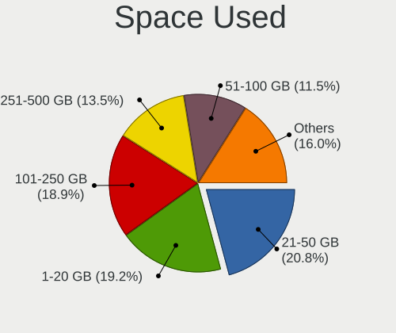

| Used GB        | Computers | Percent |
|----------------|-----------|---------|
| 21-50          | 65        | 20.83%  |
| 1-20           | 60        | 19.23%  |
| 101-250        | 59        | 18.91%  |
| 251-500        | 42        | 13.46%  |
| 51-100         | 36        | 11.54%  |
| 501-1000       | 26        | 8.33%   |
| 1001-2000      | 9         | 2.88%   |
| More than 3000 | 5         | 1.6%    |
| 2001-3000      | 5         | 1.6%    |
| Unknown        | 5         | 1.6%    |

Malfunc. Drives
---------------

Drive models with a malfunction

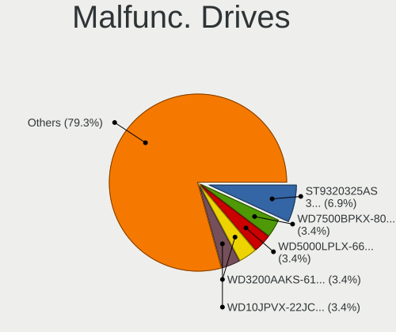

| Model                                         | Computers | Drives | Percent |
|-----------------------------------------------|-----------|--------|---------|
| Seagate ST9320325AS 320GB                     | 2         | 2      | 6.9%    |
| WDC WD7500BPKX-80HPJT0 752GB                  | 1         | 1      | 3.45%   |
| WDC WD5000LPLX-66ZNTT1 500GB                  | 1         | 1      | 3.45%   |
| WDC WD3200AAKS-61L9A0 320GB                   | 1         | 1      | 3.45%   |
| WDC WD10JPVX-22JC3T0 1TB                      | 1         | 1      | 3.45%   |
| WDC WD10EARS-00Y5B1 1TB                       | 1         | 1      | 3.45%   |
| Toshiba MQ01ABD100 1TB                        | 1         | 1      | 3.45%   |
| Toshiba MQ01ABD032 320GB                      | 1         | 1      | 3.45%   |
| Toshiba MK8052GSX 80GB                        | 1         | 1      | 3.45%   |
| Toshiba MK2561GSYN 250GB                      | 1         | 1      | 3.45%   |
| SK hynix PC711 HFS001TDE9X073N 1TB            | 1         | 1      | 3.45%   |
| SK hynix BC511 HFM256GDJTNI-82A0A 256GB       | 1         | 1      | 3.45%   |
| Seagate ST380815AS 80GB                       | 1         | 1      | 3.45%   |
| Seagate ST3750528AS 752GB                     | 1         | 1      | 3.45%   |
| Seagate ST2000LM003 HN-M201RAD 2TB            | 1         | 1      | 3.45%   |
| Seagate ST1000LM049-2GH172 1TB                | 1         | 1      | 3.45%   |
| Seagate ST1000DL002-9TT153 1TB                | 1         | 1      | 3.45%   |
| Samsung Electronics HM250HI 250GB             | 1         | 1      | 3.45%   |
| Samsung Electronics HD502HJ 500GB             | 1         | 1      | 3.45%   |
| Samsung Electronics HD250HJ 250GB             | 1         | 1      | 3.45%   |
| OCZ VERTEX4 256GB SSD                         | 1         | 1      | 3.45%   |
| Micron Technology MTFDDAT128MAM-1J2 128GB SSD | 1         | 2      | 3.45%   |
| Intenso lntenso SSD Sata III 480GB            | 1         | 1      | 3.45%   |
| Hitachi HTS543225L9A300 250GB                 | 1         | 1      | 3.45%   |
| Hitachi HDP725050GLA360 500GB                 | 1         | 1      | 3.45%   |
| HIKSEMI MS201 1TB                             | 1         | 1      | 3.45%   |
| HGST HTS721010A9E630 1TB                      | 1         | 1      | 3.45%   |
| G521N SSD 256GB                               | 1         | 1      | 3.45%   |

Malfunc. Drive Vendor
---------------------

Vendors of faulty drives

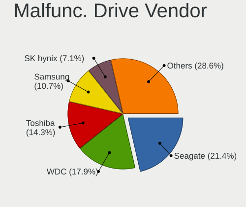

| Vendor              | Computers | Drives | Percent |
|---------------------|-----------|--------|---------|
| Seagate             | 6         | 7      | 21.43%  |
| WDC                 | 5         | 5      | 17.86%  |
| Toshiba             | 4         | 4      | 14.29%  |
| Samsung Electronics | 3         | 3      | 10.71%  |
| SK hynix            | 2         | 2      | 7.14%   |
| Hitachi             | 2         | 2      | 7.14%   |
| OCZ                 | 1         | 1      | 3.57%   |
| Micron Technology   | 1         | 2      | 3.57%   |
| Intenso             | 1         | 1      | 3.57%   |
| HIKSEMI             | 1         | 1      | 3.57%   |
| HGST                | 1         | 1      | 3.57%   |
| G521N               | 1         | 1      | 3.57%   |

Malfunc. HDD Vendor
-------------------

Vendors of faulty HDD drives

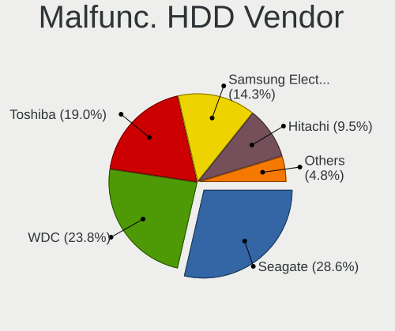

| Vendor              | Computers | Drives | Percent |
|---------------------|-----------|--------|---------|
| Seagate             | 6         | 7      | 28.57%  |
| WDC                 | 5         | 5      | 23.81%  |
| Toshiba             | 4         | 4      | 19.05%  |
| Samsung Electronics | 3         | 3      | 14.29%  |
| Hitachi             | 2         | 2      | 9.52%   |
| HGST                | 1         | 1      | 4.76%   |

Malfunc. Drive Kind
-------------------

Kinds of faulty drives

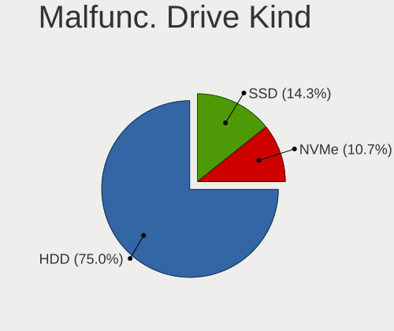

| Kind | Computers | Drives | Percent |
|------|-----------|--------|---------|
| HDD  | 21        | 22     | 75%     |
| SSD  | 4         | 5      | 14.29%  |
| NVMe | 3         | 3      | 10.71%  |

Failed Drives
-------------

Failed drive models

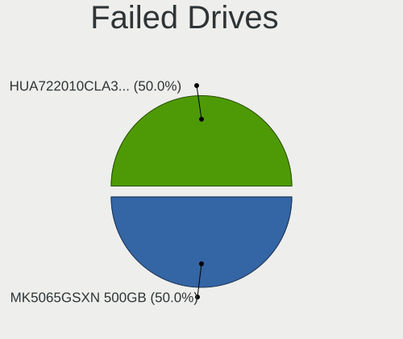

| Model                       | Computers | Drives | Percent |
|-----------------------------|-----------|--------|---------|
| Toshiba MK5065GSXN 500GB    | 1         | 1      | 50%     |
| Hitachi HUA722010CLA330 1TB | 1         | 1      | 50%     |

Failed Drive Vendor
-------------------

Failed drive vendors

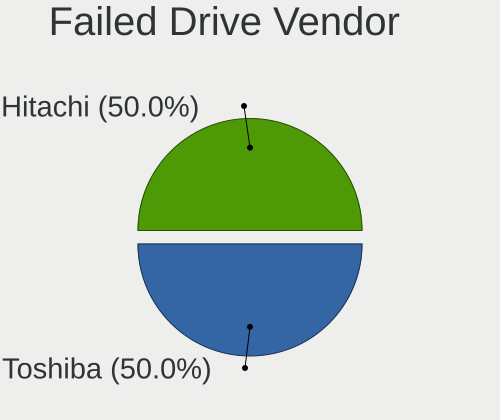

| Vendor  | Computers | Drives | Percent |
|---------|-----------|--------|---------|
| Toshiba | 1         | 1      | 50%     |
| Hitachi | 1         | 1      | 50%     |

Drive Status
------------

Number of failed and malfunc. drives

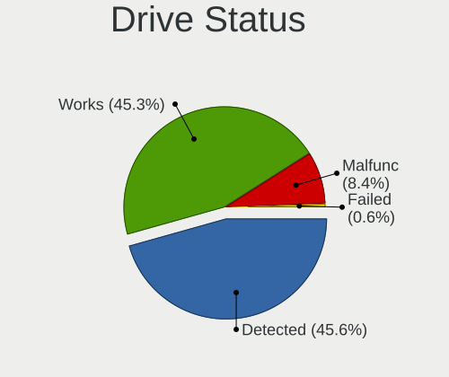

| Status   | Computers | Drives | Percent |
|----------|-----------|--------|---------|
| Detected | 152       | 267    | 45.65%  |
| Works    | 151       | 218    | 45.35%  |
| Malfunc  | 28        | 30     | 8.41%   |
| Failed   | 2         | 2      | 0.6%    |

Storage controller
------------------

Storage Vendor
--------------

Storage controller vendors

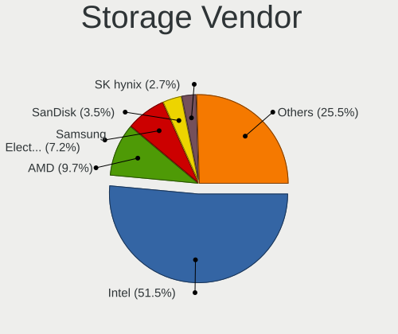

| Vendor                                  | Computers | Percent |
|-----------------------------------------|-----------|---------|
| Intel                                   | 192       | 51.47%  |
| AMD                                     | 36        | 9.65%   |
| Samsung Electronics                     | 27        | 7.24%   |
| SanDisk                                 | 13        | 3.49%   |
| SK hynix                                | 10        | 2.68%   |
| Silicon Motion                          | 9         | 2.41%   |
| Phison Electronics                      | 9         | 2.41%   |
| MAXIO Technology (Hangzhou)             | 8         | 2.14%   |
| Marvell Technology Group                | 7         | 1.88%   |
| Kingston Technology Company             | 7         | 1.88%   |
| ASMedia Technology                      | 7         | 1.88%   |
| Micron Technology                       | 6         | 1.61%   |
| KIOXIA                                  | 6         | 1.61%   |
| Shenzhen Longsys Electronics            | 4         | 1.07%   |
| Zhaoxin                                 | 3         | 0.8%    |
| Toshiba America Info Systems            | 3         | 0.8%    |
| ADATA Technology                        | 3         | 0.8%    |
| Yangtze Memory Technologies             | 2         | 0.54%   |
| Realtek Semiconductor                   | 2         | 0.54%   |
| Nvidia                                  | 2         | 0.54%   |
| Micron/Crucial Technology               | 2         | 0.54%   |
| Loongson Technology                     | 2         | 0.54%   |
| JMicron Technology                      | 2         | 0.54%   |
| Beijing Starblaze Technology            | 2         | 0.54%   |
| Solid State Storage Technology          | 1         | 0.27%   |
| Shenzhen Unionmemory Information System | 1         | 0.27%   |
| LSI Logic / Symbios Logic               | 1         | 0.27%   |
| Lite-On Technology                      | 1         | 0.27%   |
| INNOGRIT                                | 1         | 0.27%   |
| Huawei Technologies                     | 1         | 0.27%   |
| Chengdu Haiguang IC Design              | 1         | 0.27%   |
| Apple                                   | 1         | 0.27%   |
| Unknown                                 | 1         | 0.27%   |

Storage Model
-------------

Storage controller models

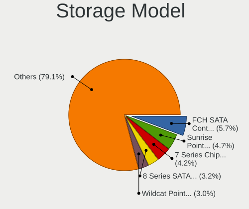

| Model                                                                          | Computers | Percent |
|--------------------------------------------------------------------------------|-----------|---------|
| AMD FCH SATA Controller [AHCI mode]                                            | 23        | 5.72%   |
| Intel Sunrise Point-LP SATA Controller [AHCI mode]                             | 19        | 4.73%   |
| Intel 7 Series Chipset Family 6-port SATA Controller [AHCI mode]               | 17        | 4.23%   |
| Intel 8 Series SATA Controller 1 [AHCI mode]                                   | 13        | 3.23%   |
| Intel Wildcat Point-LP SATA Controller [AHCI Mode]                             | 12        | 2.99%   |
| Intel 400 Series Chipset Family SATA AHCI Controller                           | 11        | 2.74%   |
| Intel 8 Series/C220 Series Chipset Family 6-port SATA Controller 1 [AHCI mode] | 10        | 2.49%   |
| Samsung NVMe SSD Controller SM981/PM981/PM983                                  | 9         | 2.24%   |
| Silicon Motion SM2263EN/SM2263XT (DRAM-less) NVMe SSD Controllers              | 8         | 1.99%   |
| Intel Celeron/Pentium Silver Processor SATA Controller                         | 8         | 1.99%   |
| Intel 7 Series/C210 Series Chipset Family 6-port SATA Controller [AHCI mode]   | 8         | 1.99%   |
| Intel Q170/Q150/B150/H170/H110/Z170/CM236 Chipset SATA Controller [AHCI Mode]  | 7         | 1.74%   |
| Intel 82801IBM/IEM (ICH9M/ICH9M-E) 4 port SATA Controller [AHCI mode]          | 7         | 1.74%   |
| Intel 6 Series/C200 Series Chipset Family 6 port Mobile SATA AHCI Controller   | 7         | 1.74%   |
| Intel 6 Series/C200 Series Chipset Family 6 port Desktop SATA AHCI Controller  | 7         | 1.74%   |
| Intel Cannon Point-LP SATA Controller [AHCI Mode]                              | 6         | 1.49%   |
| Intel 82801 Mobile SATA Controller [RAID mode]                                 | 6         | 1.49%   |
| ASMedia ASM1061/ASM1062 Serial ATA Controller                                  | 6         | 1.49%   |
| AMD 500 Series Chipset SATA Controller                                         | 6         | 1.49%   |
| Samsung NVMe SSD Controller SM961/PM961/SM963                                  | 5         | 1.24%   |
| Samsung NVMe SSD Controller PM9A1/PM9A3/980PRO                                 | 5         | 1.24%   |
| MAXIO (Hangzhou) NVMe SSD Controller MAP1202 (DRAM-less)                       | 5         | 1.24%   |
| Intel Comet Lake SATA AHCI Controller                                          | 5         | 1.24%   |
| Phison PS5013-E13 PCIe3 NVMe Controller (DRAM-less)                            | 4         | 1%      |
| Marvell Group 88SE9215 PCIe 2.0 x1 4-port SATA 6 Gb/s Controller               | 4         | 1%      |
| Intel NM10/ICH7 Family SATA Controller [IDE mode]                              | 4         | 1%      |
| Intel Cannon Lake Mobile PCH SATA AHCI Controller                              | 4         | 1%      |
| Intel 200 Series PCH SATA controller [AHCI mode]                               | 4         | 1%      |
| AMD SB7x0/SB8x0/SB9x0 SATA Controller [AHCI mode]                              | 4         | 1%      |
| Zhaoxin ZX-100/ZX-200/KX-6000/KX-6000G/KH-40000/KX-7000 StorX AHCI Controller  | 3         | 0.75%   |
| SK hynix Platinum P41/PC801 NVMe Solid State Drive                             | 3         | 0.75%   |
| SK hynix BC511 NVMe SSD                                                        | 3         | 0.75%   |
| SanDisk Extreme Pro / WD Black SN750 / PC SN730 / Red SN700 NVMe SSD           | 3         | 0.75%   |
| Samsung NVMe SSD Controller 980 (DRAM-less)                                    | 3         | 0.75%   |
| MAXIO (Hangzhou) NVMe SSD Controller MAP1602 (DRAM-less)                       | 3         | 0.75%   |
| Intel Volume Management Device NVMe RAID Controller                            | 3         | 0.75%   |
| Intel 82801JI (ICH10 Family) 4 port SATA IDE Controller #1                     | 3         | 0.75%   |
| Intel 82801JI (ICH10 Family) 2 port SATA IDE Controller #2                     | 3         | 0.75%   |
| Intel 5 Series/3400 Series Chipset 4 port SATA AHCI Controller                 | 3         | 0.75%   |
| AMD SB7x0/SB8x0/SB9x0 IDE Controller                                           | 3         | 0.75%   |

Storage Kind
------------

Kind of storage controller (IDE, SATA, NVMe, SAS, ...)

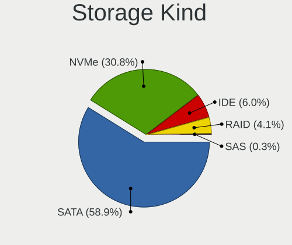

| Kind | Computers | Percent |
|------|-----------|---------|
| SATA | 216       | 58.86%  |
| NVMe | 113       | 30.79%  |
| IDE  | 22        | 5.99%   |
| RAID | 15        | 4.09%   |
| SAS  | 1         | 0.27%   |

Processor
---------

CPU Vendor
----------

Processor vendors

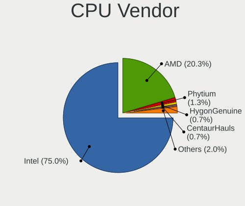

| Vendor       | Computers | Percent |
|--------------|-----------|---------|
| Intel        | 225       | 75%     |
| AMD          | 61        | 20.33%  |
| Phytium      | 4         | 1.33%   |
| HygonGenuine | 2         | 0.67%   |
| CentaurHauls | 2         | 0.67%   |
| ARM          | 2         | 0.67%   |
| WIAT         | 1         | 0.33%   |
| Loongson     | 1         | 0.33%   |
| HUAWEI       | 1         | 0.33%   |
| Unknown      | 1         | 0.33%   |

CPU Model
---------

Processor models

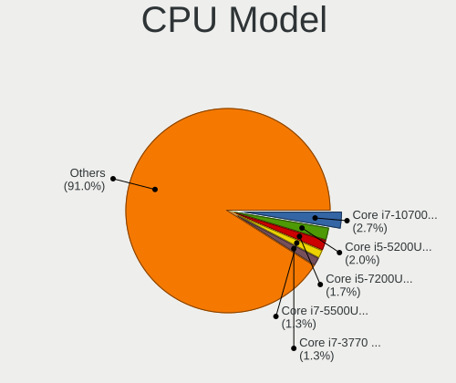

| Model                                         | Computers | Percent |
|-----------------------------------------------|-----------|---------|
| Intel Core i7-10700 CPU @ 2.90GHz             | 8         | 2.67%   |
| Intel Core i5-5200U CPU @ 2.20GHz             | 6         | 2%      |
| Intel Core i5-7200U CPU @ 2.50GHz             | 5         | 1.67%   |
| Intel Core i7-5500U CPU @ 2.40GHz             | 4         | 1.33%   |
| Intel Core i7-3770 CPU @ 3.40GHz              | 4         | 1.33%   |
| Intel Core i7-10510U CPU @ 1.80GHz            | 4         | 1.33%   |
| Intel Core i5-8250U CPU @ 1.60GHz             | 4         | 1.33%   |
| Intel Core 2 Duo CPU E8400 @ 3.00GHz          | 4         | 1.33%   |
| Intel Core i7-7700 CPU @ 3.60GHz              | 3         | 1%      |
| Intel Core i7-7500U CPU @ 2.70GHz             | 3         | 1%      |
| Intel Core i7-4510U CPU @ 2.00GHz             | 3         | 1%      |
| Intel Core i5-8300H CPU @ 2.30GHz             | 3         | 1%      |
| Intel Core i5-6200U CPU @ 2.30GHz             | 3         | 1%      |
| Intel Core i5-4210U CPU @ 1.70GHz             | 3         | 1%      |
| Intel Core i3-4005U CPU @ 1.70GHz             | 3         | 1%      |
| Intel 11th Gen Core i7-1165G7 @ 2.80GHz       | 3         | 1%      |
| Intel 11th Gen Core i5-1135G7 @ 2.40GHz       | 3         | 1%      |
| AMD Ryzen 5 3500U with Radeon Vega Mobile Gfx | 3         | 1%      |
| Intel Pentium Dual-Core CPU T4500 @ 2.30GHz   | 2         | 0.67%   |
| Intel Core i7-8565U CPU @ 1.80GHz             | 2         | 0.67%   |
| Intel Core i7-8550U CPU @ 1.80GHz             | 2         | 0.67%   |
| Intel Core i7-7700HQ CPU @ 2.80GHz            | 2         | 0.67%   |
| Intel Core i7-6500U CPU @ 2.50GHz             | 2         | 0.67%   |
| Intel Core i7-4790 CPU @ 3.60GHz              | 2         | 0.67%   |
| Intel Core i7-3630QM CPU @ 2.40GHz            | 2         | 0.67%   |
| Intel Core i7-2630QM CPU @ 2.00GHz            | 2         | 0.67%   |
| Intel Core i5-8265U CPU @ 1.60GHz             | 2         | 0.67%   |
| Intel Core i5-8259U CPU @ 2.30GHz             | 2         | 0.67%   |
| Intel Core i5-4200U CPU @ 1.60GHz             | 2         | 0.67%   |
| Intel Core i5-3550 CPU @ 3.30GHz              | 2         | 0.67%   |
| Intel Core i5-3470 CPU @ 3.20GHz              | 2         | 0.67%   |
| Intel Core i5-3337U CPU @ 1.80GHz             | 2         | 0.67%   |
| Intel Core i5-3230M CPU @ 2.60GHz             | 2         | 0.67%   |
| Intel Core i5-2520M CPU @ 2.50GHz             | 2         | 0.67%   |
| Intel Core i5-2450M CPU @ 2.50GHz             | 2         | 0.67%   |
| Intel Core i3-6100 CPU @ 3.70GHz              | 2         | 0.67%   |
| Intel Core i3-4030U CPU @ 1.90GHz             | 2         | 0.67%   |
| Intel Core i3-3220 CPU @ 3.30GHz              | 2         | 0.67%   |
| Intel Core i3-3110M CPU @ 2.40GHz             | 2         | 0.67%   |
| Intel Core i3-10100 CPU @ 3.60GHz             | 2         | 0.67%   |

CPU Model Family
----------------

Processor model prefix

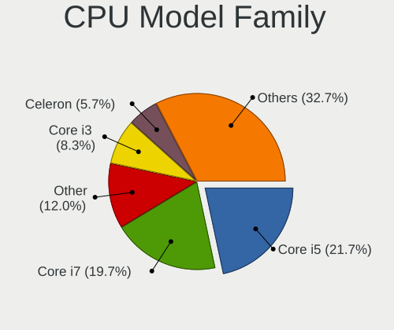

| Model                   | Computers | Percent |
|-------------------------|-----------|---------|
| Intel Core i5           | 65        | 21.67%  |
| Intel Core i7           | 59        | 19.67%  |
| Other                   | 36        | 12%     |
| Intel Core i3           | 25        | 8.33%   |
| Intel Celeron           | 17        | 5.67%   |
| AMD Ryzen 5             | 17        | 5.67%   |
| AMD Ryzen 7             | 14        | 4.67%   |
| Intel Core 2 Duo        | 10        | 3.33%   |
| Intel Atom              | 7         | 2.33%   |
| Intel Xeon              | 6         | 2%      |
| AMD Ryzen 3             | 6         | 2%      |
| AMD FX                  | 5         | 1.67%   |
| Intel Pentium Dual-Core | 4         | 1.33%   |
| Intel Core i9           | 4         | 1.33%   |
| Intel Pentium           | 3         | 1%      |
| AMD Ryzen 9             | 3         | 1%      |
| AMD A10                 | 3         | 1%      |
| Intel Pentium Silver    | 2         | 0.67%   |
| AMD Ryzen 7 PRO         | 2         | 0.67%   |
| AMD E1                  | 2         | 0.67%   |
| Intel Core m3           | 1         | 0.33%   |
| Intel Core M            | 1         | 0.33%   |
| Intel Core              | 1         | 0.33%   |
| Intel Celeron Dual-Core | 1         | 0.33%   |
| AMD Ryzen 5 PRO         | 1         | 0.33%   |
| AMD E2                  | 1         | 0.33%   |
| AMD E                   | 1         | 0.33%   |
| AMD C-60                | 1         | 0.33%   |
| AMD Athlon              | 1         | 0.33%   |
| AMD A8                  | 1         | 0.33%   |

CPU Cores
---------

Number of processor cores

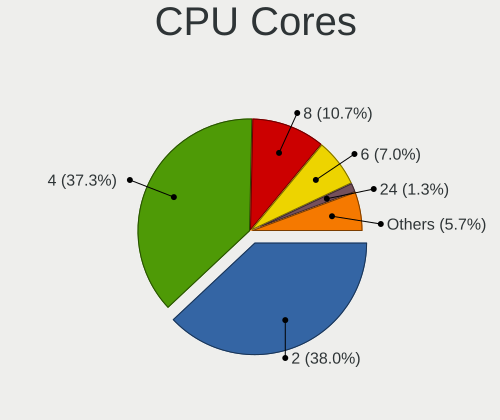

| Number | Computers | Percent |
|--------|-----------|---------|
| 2      | 114       | 38%     |
| 4      | 112       | 37.33%  |
| 8      | 32        | 10.67%  |
| 6      | 21        | 7%      |
| 24     | 4         | 1.33%   |
| 14     | 4         | 1.33%   |
| 12     | 4         | 1.33%   |
| 10     | 3         | 1%      |
| 16     | 2         | 0.67%   |
| 1      | 2         | 0.67%   |
| 64     | 1         | 0.33%   |
| 3      | 1         | 0.33%   |

CPU Sockets
-----------

Number of sockets

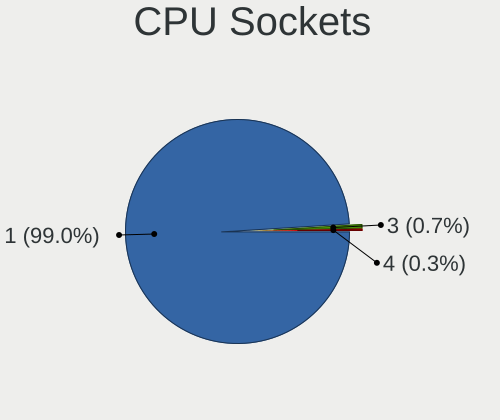

| Number | Computers | Percent |
|--------|-----------|---------|
| 1      | 297       | 99%     |
| 3      | 2         | 0.67%   |
| 4      | 1         | 0.33%   |

CPU Threads
-----------

Threads per core (Hyper-Threading)

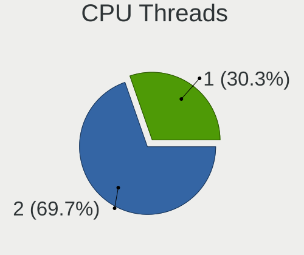

| Number | Computers | Percent |
|--------|-----------|---------|
| 2      | 209       | 69.67%  |
| 1      | 91        | 30.33%  |

CPU Op-Modes
------------

CPU Operation Modes (32-bit, 64-bit)

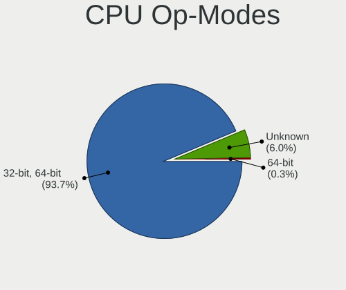

| Op mode        | Computers | Percent |
|----------------|-----------|---------|
| 32-bit, 64-bit | 281       | 93.67%  |
| Unknown        | 18        | 6%      |
| 64-bit         | 1         | 0.33%   |

CPU Microcode
-------------

Microcode number

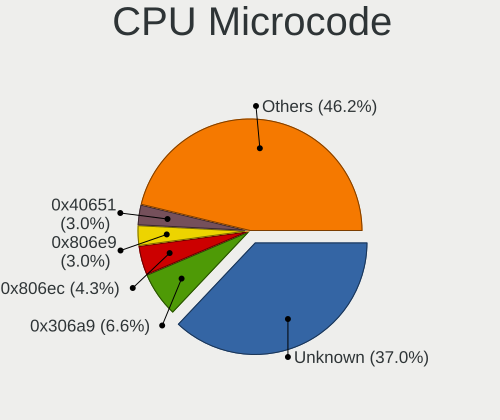

| Number     | Computers | Percent |
|------------|-----------|---------|
| Unknown    | 113       | 37.05%  |
| 0x306a9    | 20        | 6.56%   |
| 0x806ec    | 13        | 4.26%   |
| 0x806e9    | 9         | 2.95%   |
| 0x40651    | 9         | 2.95%   |
| 0x306c3    | 9         | 2.95%   |
| 0x306d4    | 8         | 2.62%   |
| 0x206a7    | 8         | 2.62%   |
| 0x1067a    | 8         | 2.62%   |
| 0x906e9    | 7         | 2.3%    |
| 0x406e3    | 7         | 2.3%    |
| 0xa0655    | 5         | 1.64%   |
| 0x906ea    | 5         | 1.64%   |
| 0x806ea    | 5         | 1.64%   |
| 0x706a8    | 4         | 1.31%   |
| 0x906a3    | 3         | 0.98%   |
| 0x806c1    | 3         | 0.98%   |
| 0x406c4    | 3         | 0.98%   |
| 0x30678    | 3         | 0.98%   |
| 0x08600106 | 3         | 0.98%   |
| 0x08108109 | 3         | 0.98%   |
| 0x706a1    | 2         | 0.66%   |
| 0x506e3    | 2         | 0.66%   |
| 0x20655    | 2         | 0.66%   |
| 0x0a50000d | 2         | 0.66%   |
| 0x0a50000c | 2         | 0.66%   |
| 0x0a20120e | 2         | 0.66%   |
| 0x08600104 | 2         | 0.66%   |
| 0x08200103 | 2         | 0.66%   |
| 0x08108102 | 2         | 0.66%   |
| 0x0500010d | 2         | 0.66%   |
| 0xb06a3    | 1         | 0.33%   |
| 0xb06a2    | 1         | 0.33%   |
| 0xb0671    | 1         | 0.33%   |
| 0xa0653    | 1         | 0.33%   |
| 0xa0652    | 1         | 0.33%   |
| 0x906eb    | 1         | 0.33%   |
| 0x806d1    | 1         | 0.33%   |
| 0x806c2    | 1         | 0.33%   |
| 0x6fd      | 1         | 0.33%   |

CPU Microarch
-------------

Microarchitecture

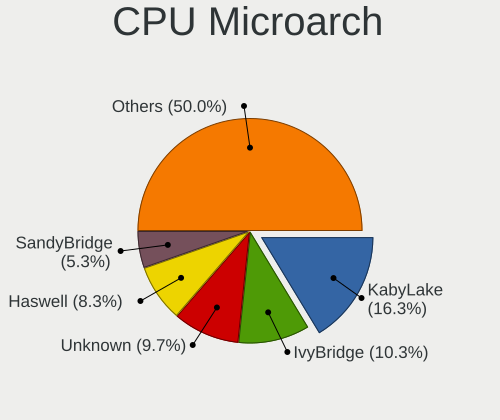

| Name             | Computers | Percent |
|------------------|-----------|---------|
| KabyLake         | 49        | 16.33%  |
| IvyBridge        | 31        | 10.33%  |
| Unknown          | 29        | 9.67%   |
| Haswell          | 25        | 8.33%   |
| SandyBridge      | 16        | 5.33%   |
| Penryn           | 15        | 5%      |
| Zen 2            | 13        | 4.33%   |
| Skylake          | 13        | 4.33%   |
| CometLake        | 13        | 4.33%   |
| Broadwell        | 13        | 4.33%   |
| Silvermont       | 11        | 3.67%   |
| Zen 3            | 9         | 3%      |
| Alderlake Hybrid | 9         | 3%      |
| TigerLake        | 8         | 2.67%   |
| Goldmont plus    | 8         | 2.67%   |
| Zen+             | 6         | 2%      |
| Zen              | 6         | 2%      |
| Westmere         | 4         | 1.33%   |
| Excavator        | 3         | 1%      |
| Bobcat           | 3         | 1%      |
| Puma             | 2         | 0.67%   |
| Piledriver       | 2         | 0.67%   |
| Nehalem          | 2         | 0.67%   |
| Goldmont         | 2         | 0.67%   |
| Bulldozer        | 2         | 0.67%   |
| Steamroller      | 1         | 0.33%   |
| Lunarlake Hybrid | 1         | 0.33%   |
| K10 Llano        | 1         | 0.33%   |
| Jaguar           | 1         | 0.33%   |
| Icelake          | 1         | 0.33%   |
| Core             | 1         | 0.33%   |

Graphics
--------

GPU Vendor
----------

Vendors of graphics cards

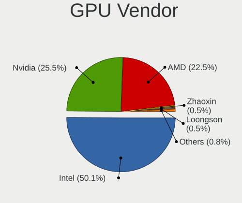

| Vendor              | Computers | Percent |
|---------------------|-----------|---------|
| Intel               | 187       | 50.13%  |
| Nvidia              | 95        | 25.47%  |
| AMD                 | 84        | 22.52%  |
| Zhaoxin             | 2         | 0.54%   |
| Loongson Technology | 2         | 0.54%   |
| Phytium Technology  | 1         | 0.27%   |
| Innosilicon         | 1         | 0.27%   |
| ASPEED Technology   | 1         | 0.27%   |

GPU Model
---------

Graphics card models

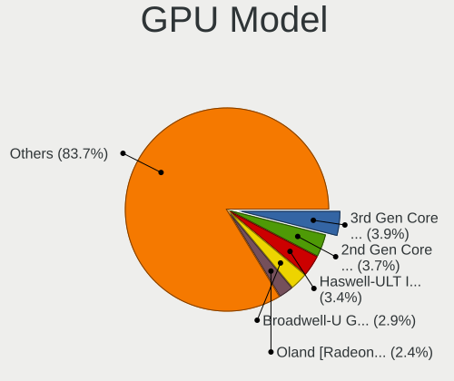

| Model                                                                                    | Computers | Percent |
|------------------------------------------------------------------------------------------|-----------|---------|
| Intel 3rd Gen Core processor Graphics Controller                                         | 15        | 3.95%   |
| Intel 2nd Generation Core Processor Family Integrated Graphics Controller                | 14        | 3.68%   |
| Intel Haswell-ULT Integrated Graphics Controller                                         | 13        | 3.42%   |
| Intel Broadwell-U GT2 [HD Graphics 5500]                                                 | 11        | 2.89%   |
| AMD Oland [Radeon HD 8570 / R5 430 OEM / R7 240/340 / Radeon 520 OEM]                    | 9         | 2.37%   |
| Intel Xeon E3-1200 v2/3rd Gen Core processor Graphics Controller                         | 8         | 2.11%   |
| Intel Skylake-U GT2 [HD Graphics 520]                                                    | 8         | 2.11%   |
| Intel Kaby Lake-U GT2 [HD Graphics 620]                                                  | 8         | 2.11%   |
| AMD Renoir [Radeon Vega Series / Radeon Vega Mobile Series]                              | 8         | 2.11%   |
| AMD Picasso/Raven 2 [Radeon Vega Series / Radeon Vega Mobile Series]                     | 8         | 2.11%   |
| Intel TigerLake-LP GT2 [Iris Xe Graphics]                                                | 7         | 1.84%   |
| Intel Mobile 4 Series Chipset Integrated Graphics Controller                             | 7         | 1.84%   |
| AMD Topaz XT [Radeon R7 M260/M265 / M340/M360 / M440/M445 / 530/535 / 620/625 Mobile]    | 7         | 1.84%   |
| Intel Kaby Lake-S GT2 [HD Graphics 630]                                                  | 6         | 1.58%   |
| Intel Kaby Lake-R GT2 [UHD Graphics 620]                                                 | 6         | 1.58%   |
| Intel GeminiLake [UHD Graphics 600]                                                      | 6         | 1.58%   |
| Intel CometLake-U GT2 [UHD Graphics]                                                     | 6         | 1.58%   |
| Intel CoffeeLake-H GT2 [UHD Graphics 630]                                                | 6         | 1.58%   |
| Intel Atom/Celeron/Pentium Processor x5-E8000/J3xxx/N3xxx Integrated Graphics Controller | 6         | 1.58%   |
| Intel Xeon E3-1200 v3/4th Gen Core Processor Integrated Graphics Controller              | 5         | 1.32%   |
| Intel WhiskeyLake-U GT2 [UHD Graphics 620]                                               | 5         | 1.32%   |
| Intel Atom Processor Z36xxx/Z37xxx Series Graphics & Display                             | 5         | 1.32%   |
| AMD Ellesmere [Radeon RX 470/480/570/570X/580/580X/590]                                  | 5         | 1.32%   |
| Nvidia TU117M [GeForce GTX 1650 Mobile / Max-Q]                                          | 4         | 1.05%   |
| Intel CometLake-S GT2 [UHD Graphics 630]                                                 | 4         | 1.05%   |
| Intel Alder Lake-P GT2 [Iris Xe Graphics]                                                | 4         | 1.05%   |
| AMD Caicos [Radeon HD 6450/7450/8450 / R5 230 OEM]                                       | 4         | 1.05%   |
| Nvidia GP107M [GeForce GTX 1050 Ti Mobile]                                               | 3         | 0.79%   |
| Nvidia GP106 [GeForce GTX 1060 6GB]                                                      | 3         | 0.79%   |
| Nvidia GM204 [GeForce GTX 970]                                                           | 3         | 0.79%   |
| Nvidia GM108M [GeForce MX110]                                                            | 3         | 0.79%   |
| Nvidia GM108M [GeForce 940MX]                                                            | 3         | 0.79%   |
| Nvidia GA106M [GeForce RTX 3060 Mobile / Max-Q]                                          | 3         | 0.79%   |
| Intel Core Processor Integrated Graphics Controller                                      | 3         | 0.79%   |
| Intel 4 Series Chipset Integrated Graphics Controller                                    | 3         | 0.79%   |
| AMD Wani [Radeon R5/R6/R7 Graphics]                                                      | 3         | 0.79%   |
| AMD Navi 23 [Radeon RX 6600/6600 XT/6600M]                                               | 3         | 0.79%   |
| AMD Lucienne                                                                             | 3         | 0.79%   |
| AMD Cezanne [Radeon Vega Series / Radeon Vega Mobile Series]                             | 3         | 0.79%   |
| Zhaoxin KX-6000 C-960 GPU                                                                | 2         | 0.53%   |

GPU Combo
---------

Combinations of graphics cards

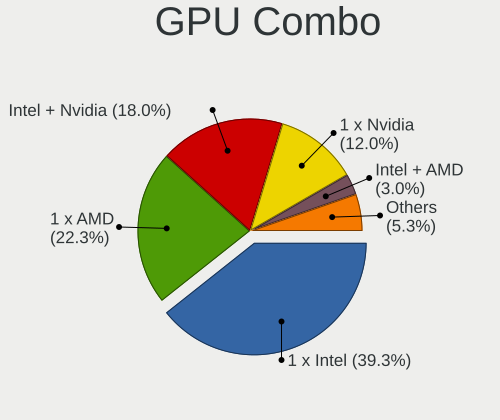

| Name                         | Computers | Percent |
|------------------------------|-----------|---------|
| 1 x Intel                    | 118       | 39.33%  |
| 1 x AMD                      | 67        | 22.33%  |
| Intel + Nvidia               | 54        | 18%     |
| 1 x Nvidia                   | 36        | 12%     |
| Intel + AMD                  | 9         | 3%      |
| AMD + Nvidia                 | 5         | 1.67%   |
| 2 x AMD                      | 3         | 1%      |
| Other                        | 2         | 0.67%   |
| 1 x Zhaoxin                  | 2         | 0.67%   |
| 1 x Phytium Technology       | 1         | 0.33%   |
| 1 x Loongson Technology      | 1         | 0.33%   |
| 1 x Innosilicon              | 1         | 0.33%   |
| ASPEED + Loongson Technology | 1         | 0.33%   |

GPU Driver
----------

Free vs proprietary

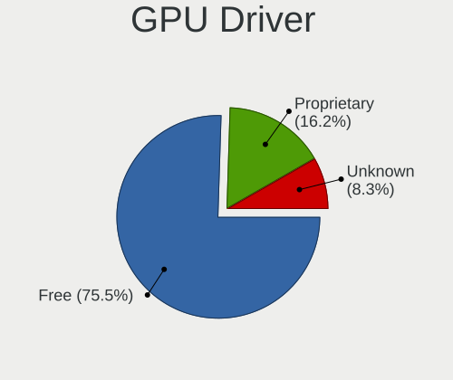

| Driver      | Computers | Percent |
|-------------|-----------|---------|
| Free        | 228       | 75.5%   |
| Proprietary | 49        | 16.23%  |
| Unknown     | 25        | 8.28%   |

GPU Memory
----------

Total video memory

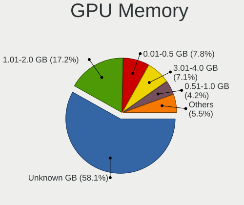

| Size in GB | Computers | Percent |
|------------|-----------|---------|
| Unknown    | 179       | 58.12%  |
| 1.01-2.0   | 53        | 17.21%  |
| 0.01-0.5   | 24        | 7.79%   |
| 3.01-4.0   | 22        | 7.14%   |
| 0.51-1.0   | 13        | 4.22%   |
| 7.01-8.0   | 11        | 3.57%   |
| 5.01-6.0   | 4         | 1.3%    |
| 16.01-24.0 | 1         | 0.32%   |
| 8.01-16.0  | 1         | 0.32%   |

Monitor
-------

Monitor Vendor
--------------

Monitor vendors

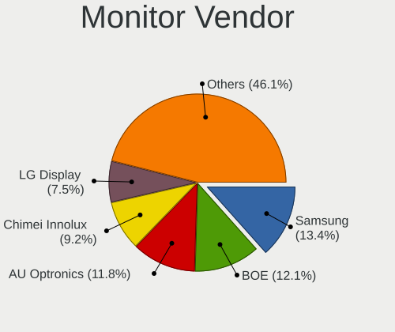

| Vendor                  | Computers | Percent |
|-------------------------|-----------|---------|
| Samsung Electronics     | 41        | 13.4%   |
| BOE                     | 37        | 12.09%  |
| AU Optronics            | 36        | 11.76%  |
| Chimei Innolux          | 28        | 9.15%   |
| LG Display              | 23        | 7.52%   |
| Goldstar                | 17        | 5.56%   |
| Hewlett-Packard         | 11        | 3.59%   |
| ViewSonic               | 9         | 2.94%   |
| Dell                    | 8         | 2.61%   |
| CSO                     | 7         | 2.29%   |
| AOC                     | 7         | 2.29%   |
| Philips                 | 6         | 1.96%   |
| Lenovo                  | 5         | 1.63%   |
| BenQ                    | 5         | 1.63%   |
| HKC                     | 4         | 1.31%   |
| Apple                   | 4         | 1.31%   |
| Acer                    | 4         | 1.31%   |
| Iiyama                  | 3         | 0.98%   |
| HannStar                | 3         | 0.98%   |
| ASUSTek Computer        | 3         | 0.98%   |
| Ancor Communications    | 3         | 0.98%   |
| Xiaomi                  | 2         | 0.65%   |
| TMX                     | 2         | 0.65%   |
| Sharp                   | 2         | 0.65%   |
| SAC                     | 2         | 0.65%   |
| RTK                     | 2         | 0.65%   |
| MSI                     | 2         | 0.65%   |
| InnoLux Display         | 2         | 0.65%   |
| InfoVision              | 2         | 0.65%   |
| Chi Mei Optoelectronics | 2         | 0.65%   |
| Yeyian                  | 1         | 0.33%   |
| Vizio                   | 1         | 0.33%   |
| Unknown                 | 1         | 0.33%   |
| Toshiba                 | 1         | 0.33%   |
| TMA                     | 1         | 0.33%   |
| TFC                     | 1         | 0.33%   |
| SKY                     | 1         | 0.33%   |
| Positivo                | 1         | 0.33%   |
| PANDA                   | 1         | 0.33%   |
| Packard Bell            | 1         | 0.33%   |

Monitor Model
-------------

Monitor models

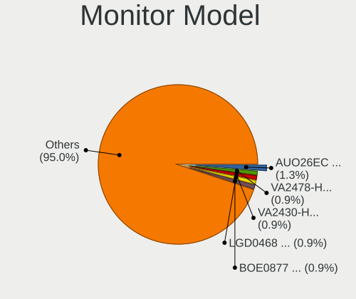

| Model                                                                 | Computers | Percent |
|-----------------------------------------------------------------------|-----------|---------|
| AU Optronics LCD Monitor AUO26EC 1366x768 344x193mm 15.5-inch         | 4         | 1.26%   |
| ViewSonic VA2478-H-2 VSC8335 1920x1080 527x296mm 23.8-inch            | 3         | 0.95%   |
| ViewSonic VA2430-H-3 VSC3A3E 1920x1080 527x296mm 23.8-inch            | 3         | 0.95%   |
| LG Display LCD Monitor LGD0468 1366x768 344x194mm 15.5-inch           | 3         | 0.95%   |
| BOE LCD Monitor BOE0877 1920x1080 309x173mm 13.9-inch                 | 3         | 0.95%   |
| AU Optronics LCD Monitor AUO21ED 1920x1080 344x193mm 15.5-inch        | 3         | 0.95%   |
| Xiaomi Mi TV XMD0076 3840x2160 1110x620mm 50.1-inch                   | 2         | 0.63%   |
| Samsung Electronics LCD Monitor SEC5441 1280x800 331x207mm 15.4-inch  | 2         | 0.63%   |
| Samsung Electronics LCD Monitor SAM0FF0 3840x2160 950x540mm 43.0-inch | 2         | 0.63%   |
| LG Display LCD Monitor LGD0456 1366x768 344x194mm 15.5-inch           | 2         | 0.63%   |
| InnoLux Display P120ZDG-BF4 INX7801 2160x1440 254x169mm 12.0-inch     | 2         | 0.63%   |
| HKC LCD Monitor HKC3CFB 1920x1080 344x194mm 15.5-inch                 | 2         | 0.63%   |
| Goldstar 20EN33 GSM4EE1 1600x900 443x249mm 20.0-inch                  | 2         | 0.63%   |
| Chimei Innolux LCD Monitor CMN14D4 1920x1080 309x173mm 13.9-inch      | 2         | 0.63%   |
| Chimei Innolux LCD Monitor CMN14C4 1366x768 309x173mm 13.9-inch       | 2         | 0.63%   |
| BOE LCD Monitor BOE06A4 1366x768 344x194mm 15.5-inch                  | 2         | 0.63%   |
| AU Optronics LCD Monitor AUO71EC 1366x768 344x193mm 15.5-inch         | 2         | 0.63%   |
| AU Optronics LCD Monitor AUO6DA8 2560x1600 301x188mm 14.0-inch        | 2         | 0.63%   |
| AU Optronics LCD Monitor AUO40EC 1366x768 344x193mm 15.5-inch         | 2         | 0.63%   |
| AU Optronics LCD Monitor AUO226D 1920x1080 276x155mm 12.5-inch        | 2         | 0.63%   |
| AOC 27G2G4 AOC2702 1920x1080 598x336mm 27.0-inch                      | 2         | 0.63%   |
| Yeyian YMG-4K27-01 YEY2700 3840x2160 600x330mm 27.0-inch              | 1         | 0.32%   |
| Vizio E190VA VIZ0067 1920x1080 410x230mm 18.5-inch                    | 1         | 0.32%   |
| ViewSonic VX2481-mh VSC3933 1920x1080 527x296mm 23.8-inch             | 1         | 0.32%   |
| ViewSonic VA2431-H-2 VSC3A22 1920x1080 527x296mm 23.8-inch            | 1         | 0.32%   |
| ViewSonic VA2430-FHD VSC4038 1920x1080 527x296mm 23.8-inch            | 1         | 0.32%   |
| ViewSonic VA2407 Series VSC8C31 1920x1080 521x293mm 23.5-inch         | 1         | 0.32%   |
| Unknown LCD Monitor FFFF 2288x1287 2550x2550mm 142.0-inch             | 1         | 0.32%   |
| Toshiba TV TSB0108 1920x1080 698x393mm 31.5-inch                      | 1         | 0.32%   |
| TMX TL160ADMP11-0 TMX1601 2560x1600 350x220mm 16.3-inch               | 1         | 0.32%   |
| TMX TL140VDXP04-0 TMX1398 1920x1080 309x174mm 14.0-inch               | 1         | 0.32%   |
| TMA TL140ADXP24-0 TMA2004 2880x1800 300x190mm 14.0-inch               | 1         | 0.32%   |
| TFC FY24FMC-B TFC0238 1920x1080 527x296mm 23.8-inch                   | 1         | 0.32%   |
| SKY 24X1Q SKY2380 2560x1440 520x290mm 23.4-inch                       | 1         | 0.32%   |
| Sharp LCD Monitor SHP1449 1920x1080 294x165mm 13.3-inch               | 1         | 0.32%   |
| Sharp LCD Monitor SHP1447 1920x1080 294x165mm 13.3-inch               | 1         | 0.32%   |
| Samsung Electronics SyncMaster SAM060B 1920x1080 531x299mm 24.0-inch  | 1         | 0.32%   |
| Samsung Electronics SyncMaster SAM0601 1600x900                       | 1         | 0.32%   |
| Samsung Electronics SyncMaster SAM05FF 1600x900 443x249mm 20.0-inch   | 1         | 0.32%   |
| Samsung Electronics SyncMaster SAM0497 1600x900 443x249mm 20.0-inch   | 1         | 0.32%   |

Monitor Resolution
------------------

Monitor screen resolution

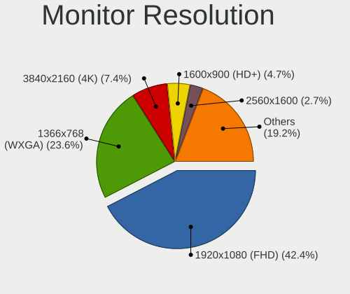

| Resolution         | Computers | Percent |
|--------------------|-----------|---------|
| 1920x1080 (FHD)    | 126       | 42.42%  |
| 1366x768 (WXGA)    | 70        | 23.57%  |
| 3840x2160 (4K)     | 22        | 7.41%   |
| 1600x900 (HD+)     | 14        | 4.71%   |
| 2560x1600          | 8         | 2.69%   |
| 2560x1440 (QHD)    | 8         | 2.69%   |
| 2160x1440          | 6         | 2.02%   |
| 2880x1800          | 5         | 1.68%   |
| 1920x1200 (WUXGA)  | 4         | 1.35%   |
| 1680x1050 (WSXGA+) | 4         | 1.35%   |
| 1440x900 (WXGA+)   | 4         | 1.35%   |
| 3840x1080          | 3         | 1.01%   |
| 3000x2000          | 3         | 1.01%   |
| Unknown            | 3         | 1.01%   |
| 3440x1440          | 2         | 0.67%   |
| 2288x1287          | 2         | 0.67%   |
| 1920x540           | 2         | 0.67%   |
| 1360x768           | 2         | 0.67%   |
| 1280x1024 (SXGA)   | 2         | 0.67%   |
| 3200x2000          | 1         | 0.34%   |
| 3200x1800 (QHD+)   | 1         | 0.34%   |
| 2880x1920          | 1         | 0.34%   |
| 2736x1824          | 1         | 0.34%   |
| 2160x1350          | 1         | 0.34%   |
| 1680x945           | 1         | 0.34%   |
| 1280x800 (WXGA)    | 1         | 0.34%   |

Monitor Diagonal
----------------

Diagonal size in inches

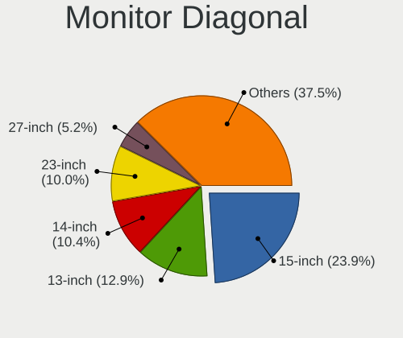

| Inches  | Computers | Percent |
|---------|-----------|---------|
| 15      | 74        | 23.95%  |
| 13      | 40        | 12.94%  |
| 14      | 32        | 10.36%  |
| 23      | 31        | 10.03%  |
| 27      | 16        | 5.18%   |
| 24      | 16        | 5.18%   |
| 21      | 14        | 4.53%   |
| Unknown | 14        | 4.53%   |
| 31      | 8         | 2.59%   |
| 16      | 8         | 2.59%   |
| 18      | 7         | 2.27%   |
| 12      | 7         | 2.27%   |
| 20      | 6         | 1.94%   |
| 17      | 5         | 1.62%   |
| 84      | 4         | 1.29%   |
| 22      | 4         | 1.29%   |
| 19      | 4         | 1.29%   |
| 11      | 4         | 1.29%   |
| 32      | 3         | 0.97%   |
| 82      | 2         | 0.65%   |
| 25      | 2         | 0.65%   |
| 142     | 1         | 0.32%   |
| 72      | 1         | 0.32%   |
| 65      | 1         | 0.32%   |
| 49      | 1         | 0.32%   |
| 40      | 1         | 0.32%   |
| 34      | 1         | 0.32%   |
| 28      | 1         | 0.32%   |
| 10      | 1         | 0.32%   |

Monitor Width
-------------

Physical width

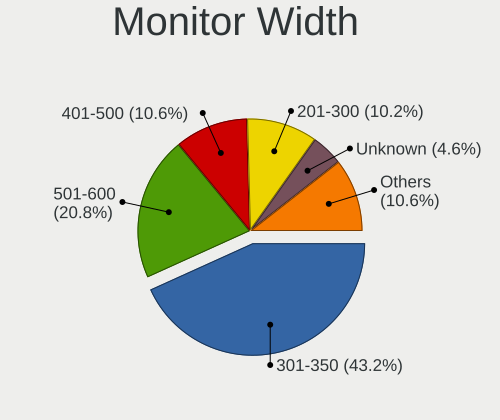

| Width in mm    | Computers | Percent |
|----------------|-----------|---------|
| 301-350        | 131       | 43.23%  |
| 501-600        | 63        | 20.79%  |
| 401-500        | 32        | 10.56%  |
| 201-300        | 31        | 10.23%  |
| Unknown        | 14        | 4.62%   |
| 601-700        | 9         | 2.97%   |
| 351-400        | 8         | 2.64%   |
| 1501-2000      | 7         | 2.31%   |
| 701-800        | 4         | 1.32%   |
| 1001-1500      | 2         | 0.66%   |
| More than 2000 | 1         | 0.33%   |
| 801-900        | 1         | 0.33%   |

Aspect Ratio
------------

Proportional relationship between the width and the height

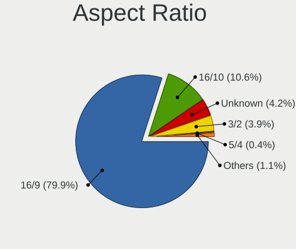

| Ratio   | Computers | Percent |
|---------|-----------|---------|
| 16/9    | 227       | 79.93%  |
| 16/10   | 30        | 10.56%  |
| Unknown | 12        | 4.23%   |
| 3/2     | 11        | 3.87%   |
| 5/4     | 1         | 0.35%   |
| 32/9    | 1         | 0.35%   |
| 21/9    | 1         | 0.35%   |
| 1.00    | 1         | 0.35%   |

Monitor Area
------------

Area in inch²

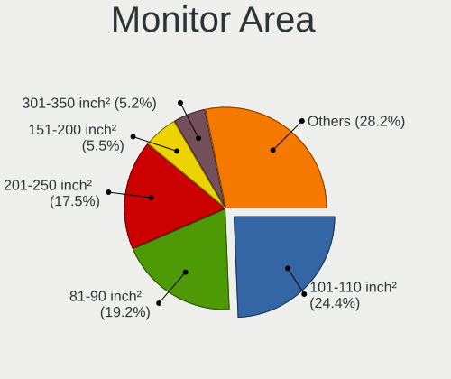

| Area in inch² | Computers | Percent |
|----------------|-----------|---------|
| 101-110        | 75        | 24.35%  |
| 81-90          | 59        | 19.16%  |
| 201-250        | 54        | 17.53%  |
| 151-200        | 17        | 5.52%   |
| 301-350        | 16        | 5.19%   |
| Unknown        | 14        | 4.55%   |
| 71-80          | 13        | 4.22%   |
| 351-500        | 13        | 4.22%   |
| More than 1000 | 9         | 2.92%   |
| 61-70          | 8         | 2.6%    |
| 141-150        | 7         | 2.27%   |
| 111-120        | 7         | 2.27%   |
| 251-300        | 6         | 1.95%   |
| 51-60          | 3         | 0.97%   |
| 121-130        | 3         | 0.97%   |
| 501-1000       | 2         | 0.65%   |
| 41-50          | 1         | 0.32%   |
| 131-140        | 1         | 0.32%   |

Pixel Density
-------------

Pixels per inch

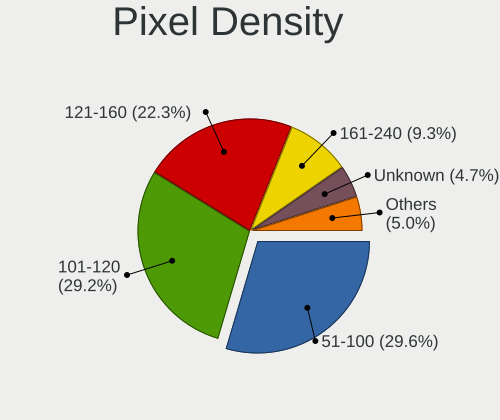

| Density       | Computers | Percent |
|---------------|-----------|---------|
| 51-100        | 89        | 29.57%  |
| 101-120       | 88        | 29.24%  |
| 121-160       | 67        | 22.26%  |
| 161-240       | 28        | 9.3%    |
| Unknown       | 14        | 4.65%   |
| More than 240 | 10        | 3.32%   |
| 1-50          | 5         | 1.66%   |

Multiple Monitors
-----------------

Total monitors connected

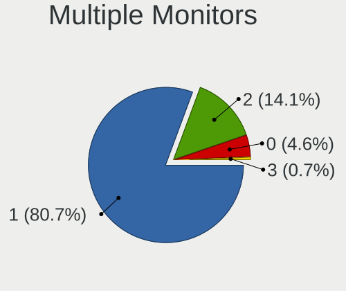

| Total | Computers | Percent |
|-------|-----------|---------|
| 1     | 246       | 80.66%  |
| 2     | 43        | 14.1%   |
| 0     | 14        | 4.59%   |
| 3     | 2         | 0.66%   |

Network
-------

Net Controller Vendor
---------------------

Controller vendors

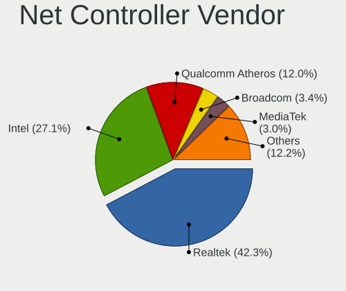

| Vendor                                 | Computers | Percent |
|----------------------------------------|-----------|---------|
| Realtek Semiconductor                  | 184       | 42.3%   |
| Intel                                  | 118       | 27.13%  |
| Qualcomm Atheros                       | 52        | 11.95%  |
| Broadcom                               | 15        | 3.45%   |
| MediaTek                               | 13        | 2.99%   |
| TP-Link                                | 6         | 1.38%   |
| Marvell Technology Group               | 6         | 1.38%   |
| Broadcom Limited                       | 6         | 1.38%   |
| Xiaomi                                 | 5         | 1.15%   |
| Ralink Technology                      | 4         | 0.92%   |
| Huawei Technologies                    | 3         | 0.69%   |
| Suzhou Motorcomm Electronic Technology | 2         | 0.46%   |
| Ralink                                 | 2         | 0.46%   |
| Nvidia                                 | 2         | 0.46%   |
| Loongson Technology                    | 2         | 0.46%   |
| ICS Advent                             | 2         | 0.46%   |
| ASIX Electronics                       | 2         | 0.46%   |
| Unknown                                | 1         | 0.23%   |
| Shenzhen Goodix Technology             | 1         | 0.23%   |
| Samsung Electronics                    | 1         | 0.23%   |
| Qualcomm Atheros Communications        | 1         | 0.23%   |
| OPPO Electronics                       | 1         | 0.23%   |
| NXP Semiconductors                     | 1         | 0.23%   |
| NetGear                                | 1         | 0.23%   |
| Microsoft                              | 1         | 0.23%   |
| IMC Networks                           | 1         | 0.23%   |
| Hewlett-Packard                        | 1         | 0.23%   |
| Aquantia                               | 1         | 0.23%   |

Net Controller Model
--------------------

Controller models

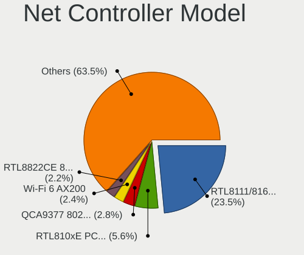

| Model                                                                  | Computers | Percent |
|------------------------------------------------------------------------|-----------|---------|
| Realtek RTL8111/8168/8211/8411 PCI Express Gigabit Ethernet Controller | 117       | 23.49%  |
| Realtek RTL810xE PCI Express Fast Ethernet controller                  | 28        | 5.62%   |
| Qualcomm Atheros QCA9377 802.11ac Wireless Network Adapter             | 14        | 2.81%   |
| Intel Wi-Fi 6 AX200                                                    | 12        | 2.41%   |
| Realtek RTL8822CE 802.11ac PCIe Wireless Network Adapter               | 11        | 2.21%   |
| Qualcomm Atheros QCA9565 / AR9565 Wireless Network Adapter             | 10        | 2.01%   |
| Qualcomm Atheros AR9485 Wireless Network Adapter                       | 9         | 1.81%   |
| Realtek RTL8125 2.5GbE Controller                                      | 8         | 1.61%   |
| Intel Wireless 3165                                                    | 8         | 1.61%   |
| Intel 82579LM Gigabit Network Connection (Lewisville)                  | 8         | 1.61%   |
| Intel Wi-Fi 6 AX201                                                    | 7         | 1.41%   |
| Realtek RTL8821CE 802.11ac PCIe Wireless Network Adapter               | 6         | 1.2%    |
| Realtek RTL8723BE PCIe Wireless Network Adapter                        | 6         | 1.2%    |
| Realtek RTL8153 Gigabit Ethernet Adapter                               | 6         | 1.2%    |
| Intel Comet Lake PCH-LP CNVi WiFi                                      | 6         | 1.2%    |
| Qualcomm Atheros QCA6174 802.11ac Wireless Network Adapter             | 5         | 1%      |
| MediaTek MT7922 802.11ax PCI Express Wireless Network Adapter          | 5         | 1%      |
| Intel Cannon Point-LP CNVi [Wireless-AC]                               | 5         | 1%      |
| Intel Alder Lake-P PCH CNVi WiFi                                       | 5         | 1%      |
| Realtek RTL8852BE PCIe 802.11ax Wireless Network Controller            | 4         | 0.8%    |
| Realtek RTL8188EE Wireless Network Adapter                             | 4         | 0.8%    |
| Qualcomm Atheros AR9462 Wireless Network Adapter                       | 4         | 0.8%    |
| Intel Wireless 8265 / 8275                                             | 4         | 0.8%    |
| Intel Wireless 7265                                                    | 4         | 0.8%    |
| Intel Wireless 7260                                                    | 4         | 0.8%    |
| Intel Wireless 3160                                                    | 4         | 0.8%    |
| Intel Ethernet Connection (12) I219-V                                  | 4         | 0.8%    |
| Intel Centrino Advanced-N 6205 [Taylor Peak]                           | 4         | 0.8%    |
| Xiaomi Mi/Redmi series (RNDIS)                                         | 3         | 0.6%    |
| Realtek RTL88x2bu [AC1200 Techkey]                                     | 3         | 0.6%    |
| Realtek RTL8723DE Wireless Network Adapter                             | 3         | 0.6%    |
| Realtek RTL8188CE 802.11b/g/n WiFi Adapter                             | 3         | 0.6%    |
| Ralink MT7601U Wireless Adapter                                        | 3         | 0.6%    |
| MediaTek MT7921 802.11ax PCIe Wireless Network Adapter [Filogic 330]   | 3         | 0.6%    |
| Intel WiFi Link 5100                                                   | 3         | 0.6%    |
| Intel Ethernet Connection (2) I219-V                                   | 3         | 0.6%    |
| Intel Dual Band Wireless-AC 3165 Plus Bluetooth                        | 3         | 0.6%    |
| Intel 700 Series Chipset CNVi WiFi                                     | 3         | 0.6%    |
| Suzhou Motorcomm Electronic YT6801 Gigabit Ethernet Controller         | 2         | 0.4%    |
| Realtek RTL8822BE 802.11a/b/g/n/ac WiFi adapter                        | 2         | 0.4%    |

Wireless Vendor
---------------

Wireless vendors

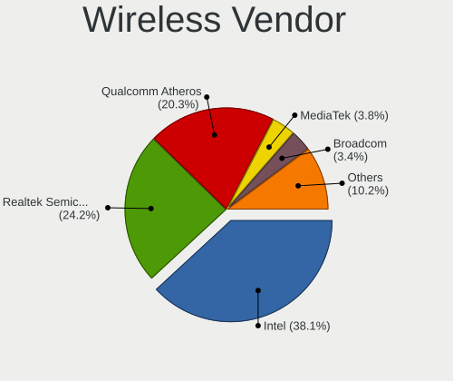

| Vendor                          | Computers | Percent |
|---------------------------------|-----------|---------|
| Intel                           | 90        | 38.14%  |
| Realtek Semiconductor           | 57        | 24.15%  |
| Qualcomm Atheros                | 48        | 20.34%  |
| MediaTek                        | 9         | 3.81%   |
| Broadcom                        | 8         | 3.39%   |
| TP-Link                         | 6         | 2.54%   |
| Broadcom Limited                | 6         | 2.54%   |
| Ralink Technology               | 4         | 1.69%   |
| Ralink                          | 2         | 0.85%   |
| Xiaomi                          | 1         | 0.42%   |
| Qualcomm Atheros Communications | 1         | 0.42%   |
| NetGear                         | 1         | 0.42%   |
| Microsoft                       | 1         | 0.42%   |
| Marvell Technology Group        | 1         | 0.42%   |
| IMC Networks                    | 1         | 0.42%   |

Wireless Model
--------------

Wireless models

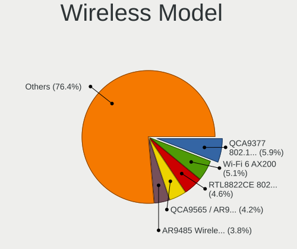

| Model                                                                | Computers | Percent |
|----------------------------------------------------------------------|-----------|---------|
| Qualcomm Atheros QCA9377 802.11ac Wireless Network Adapter           | 14        | 5.91%   |
| Intel Wi-Fi 6 AX200                                                  | 12        | 5.06%   |
| Realtek RTL8822CE 802.11ac PCIe Wireless Network Adapter             | 11        | 4.64%   |
| Qualcomm Atheros QCA9565 / AR9565 Wireless Network Adapter           | 10        | 4.22%   |
| Qualcomm Atheros AR9485 Wireless Network Adapter                     | 9         | 3.8%    |
| Intel Wireless 3165                                                  | 8         | 3.38%   |
| Intel Wi-Fi 6 AX201                                                  | 7         | 2.95%   |
| Realtek RTL8821CE 802.11ac PCIe Wireless Network Adapter             | 6         | 2.53%   |
| Realtek RTL8723BE PCIe Wireless Network Adapter                      | 6         | 2.53%   |
| Intel Comet Lake PCH-LP CNVi WiFi                                    | 6         | 2.53%   |
| Qualcomm Atheros QCA6174 802.11ac Wireless Network Adapter           | 5         | 2.11%   |
| Intel Cannon Point-LP CNVi [Wireless-AC]                             | 5         | 2.11%   |
| Realtek RTL8852BE PCIe 802.11ax Wireless Network Controller          | 4         | 1.69%   |
| Realtek RTL8188EE Wireless Network Adapter                           | 4         | 1.69%   |
| Qualcomm Atheros AR9462 Wireless Network Adapter                     | 4         | 1.69%   |
| Intel Wireless 8265 / 8275                                           | 4         | 1.69%   |
| Intel Wireless 7265                                                  | 4         | 1.69%   |
| Intel Wireless 7260                                                  | 4         | 1.69%   |
| Intel Wireless 3160                                                  | 4         | 1.69%   |
| Intel Centrino Advanced-N 6205 [Taylor Peak]                         | 4         | 1.69%   |
| Realtek RTL88x2bu [AC1200 Techkey]                                   | 3         | 1.27%   |
| Realtek RTL8723DE Wireless Network Adapter                           | 3         | 1.27%   |
| Realtek RTL8188CE 802.11b/g/n WiFi Adapter                           | 3         | 1.27%   |
| Ralink MT7601U Wireless Adapter                                      | 3         | 1.27%   |
| MediaTek MT7921 802.11ax PCIe Wireless Network Adapter [Filogic 330] | 3         | 1.27%   |
| Intel WiFi Link 5100                                                 | 3         | 1.27%   |
| Intel Dual Band Wireless-AC 3165 Plus Bluetooth                      | 3         | 1.27%   |
| Intel Alder Lake-P PCH CNVi WiFi                                     | 3         | 1.27%   |
| Intel 700 Series Chipset CNVi WiFi                                   | 3         | 1.27%   |
| Realtek RTL8822BE 802.11a/b/g/n/ac WiFi adapter                      | 2         | 0.84%   |
| Realtek RTL8821AE 802.11ac PCIe Wireless Network Adapter             | 2         | 0.84%   |
| Realtek RTL8191SEvA Wireless LAN Controller                          | 2         | 0.84%   |
| Realtek RTL8188GU 802.11n WLAN Adapter (After Modeswitch)            | 2         | 0.84%   |
| Realtek RTL8188EUS 802.11n Wireless Network Adapter                  | 2         | 0.84%   |
| Qualcomm Atheros AR928X Wireless Network Adapter (PCI-Express)       | 2         | 0.84%   |
| Qualcomm Atheros AR9287 Wireless Network Adapter (PCI-Express)       | 2         | 0.84%   |
| MediaTek MT7922 802.11ax PCI Express Wireless Network Adapter        | 2         | 0.84%   |
| Intel Wireless 8260                                                  | 2         | 0.84%   |
| Intel Wi-Fi 6E(802.11ax) AX210/AX1675* 2x2 [Typhoon Peak]            | 2         | 0.84%   |
| Intel Raptor Lake PCH CNVi WiFi                                      | 2         | 0.84%   |

Ethernet Vendor
---------------

Ethernet vendors

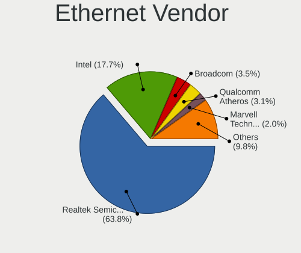

| Vendor                                 | Computers | Percent |
|----------------------------------------|-----------|---------|
| Realtek Semiconductor                  | 162       | 63.78%  |
| Intel                                  | 45        | 17.72%  |
| Broadcom                               | 9         | 3.54%   |
| Qualcomm Atheros                       | 8         | 3.15%   |
| Marvell Technology Group               | 5         | 1.97%   |
| Xiaomi                                 | 4         | 1.57%   |
| MediaTek                               | 4         | 1.57%   |
| Huawei Technologies                    | 3         | 1.18%   |
| Suzhou Motorcomm Electronic Technology | 2         | 0.79%   |
| Nvidia                                 | 2         | 0.79%   |
| Loongson Technology                    | 2         | 0.79%   |
| ICS Advent                             | 2         | 0.79%   |
| ASIX Electronics                       | 2         | 0.79%   |
| Samsung Electronics                    | 1         | 0.39%   |
| OPPO Electronics                       | 1         | 0.39%   |
| Hewlett-Packard                        | 1         | 0.39%   |
| Aquantia                               | 1         | 0.39%   |

Ethernet Model
--------------

Ethernet models

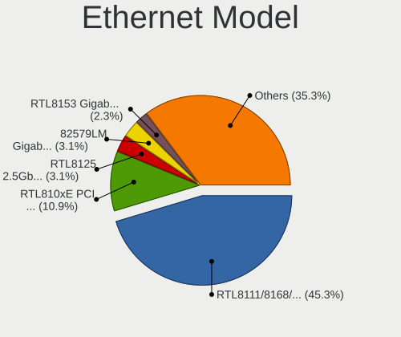

| Model                                                                  | Computers | Percent |
|------------------------------------------------------------------------|-----------|---------|
| Realtek RTL8111/8168/8211/8411 PCI Express Gigabit Ethernet Controller | 117       | 45.35%  |
| Realtek RTL810xE PCI Express Fast Ethernet controller                  | 28        | 10.85%  |
| Realtek RTL8125 2.5GbE Controller                                      | 8         | 3.1%    |
| Intel 82579LM Gigabit Network Connection (Lewisville)                  | 8         | 3.1%    |
| Realtek RTL8153 Gigabit Ethernet Adapter                               | 6         | 2.33%   |
| Intel Ethernet Connection (12) I219-V                                  | 4         | 1.55%   |
| Xiaomi Mi/Redmi series (RNDIS)                                         | 3         | 1.16%   |
| MediaTek MT7922 802.11ax PCI Express Wireless Network Adapter          | 3         | 1.16%   |
| Intel Ethernet Connection (2) I219-V                                   | 3         | 1.16%   |
| Suzhou Motorcomm Electronic YT6801 Gigabit Ethernet Controller         | 2         | 0.78%   |
| Realtek RTL-8100/8101L/8139 PCI Fast Ethernet Adapter                  | 2         | 0.78%   |
| Qualcomm Atheros Killer E2400 Gigabit Ethernet Controller              | 2         | 0.78%   |
| Qualcomm Atheros AR8131 Gigabit Ethernet                               | 2         | 0.78%   |
| Marvell Group 88E8055 PCI-E Gigabit Ethernet Controller                | 2         | 0.78%   |
| Loongson 2K1000/2000 / 7A1000 Chipset Gigabit Ethernet Controller      | 2         | 0.78%   |
| Intel I211 Gigabit Network Connection                                  | 2         | 0.78%   |
| Intel Ethernet Controller I225-V                                       | 2         | 0.78%   |
| Intel Ethernet Connection I217-LM                                      | 2         | 0.78%   |
| Intel Ethernet Connection (6) I219-V                                   | 2         | 0.78%   |
| Intel Ethernet Connection (5) I219-LM                                  | 2         | 0.78%   |
| Intel Alder Lake-P PCH CNVi WiFi                                       | 2         | 0.78%   |
| Intel 82575EB Gigabit Network Connection                               | 2         | 0.78%   |
| Intel 82567LM-3 Gigabit Network Connection                             | 2         | 0.78%   |
| Huawei FOA-LX9                                                         | 2         | 0.78%   |
| Broadcom NetXtreme BCM57765 Gigabit Ethernet PCIe                      | 2         | 0.78%   |
| Broadcom NetLink BCM57785 Gigabit Ethernet PCIe                        | 2         | 0.78%   |
| Broadcom NetLink BCM57781 Gigabit Ethernet PCIe                        | 2         | 0.78%   |
| Xiaomi Mi/Redmi series (RNDIS + ADB)                                   | 1         | 0.39%   |
| Samsung Galaxy series, misc. (tethering mode)                          | 1         | 0.39%   |
| Realtek Killer E2600 GbE Controller                                    | 1         | 0.39%   |
| Qualcomm Atheros QCA8172 Fast Ethernet                                 | 1         | 0.39%   |
| Qualcomm Atheros QCA8171 Gigabit Ethernet                              | 1         | 0.39%   |
| Qualcomm Atheros AR8161 Gigabit Ethernet                               | 1         | 0.39%   |
| Qualcomm Atheros AR8152 v2.0 Fast Ethernet                             | 1         | 0.39%   |
| OPPO Ace 3V                                                            | 1         | 0.39%   |
| Nvidia MCP79 Ethernet                                                  | 1         | 0.39%   |
| Nvidia MCP61 Ethernet                                                  | 1         | 0.39%   |
| MediaTek Infinix HOT 50i                                               | 1         | 0.39%   |
| Marvell Group 88E8071 PCI-E Gigabit Ethernet Controller                | 1         | 0.39%   |
| Marvell Group 88E8057 PCI-E Gigabit Ethernet Controller                | 1         | 0.39%   |

Net Controller Kind
-------------------

Ethernet, WiFi or modem

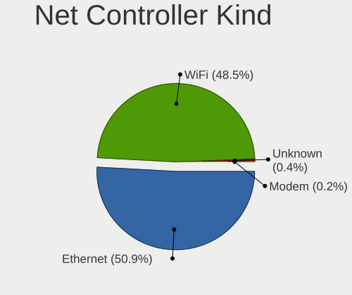

| Kind     | Computers | Percent |
|----------|-----------|---------|
| Ethernet | 237       | 50.86%  |
| WiFi     | 226       | 48.5%   |
| Unknown  | 2         | 0.43%   |
| Modem    | 1         | 0.21%   |

Used Controller
---------------

Currently used network controller

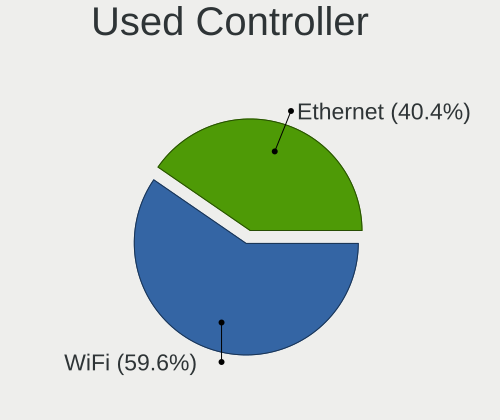

| Kind     | Computers | Percent |
|----------|-----------|---------|
| WiFi     | 177       | 59.6%   |
| Ethernet | 120       | 40.4%   |

NICs
----

Total network controllers on board

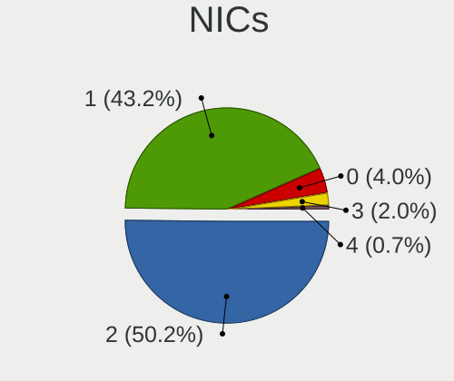

| Total | Computers | Percent |
|-------|-----------|---------|
| 2     | 151       | 50.17%  |
| 1     | 130       | 43.19%  |
| 0     | 12        | 3.99%   |
| 3     | 6         | 1.99%   |
| 4     | 2         | 0.66%   |

IPv6
----

IPv6 vs IPv4

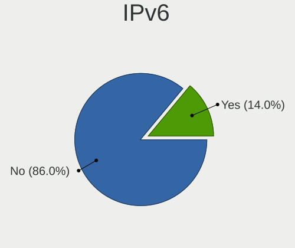

| Used | Computers | Percent |
|------|-----------|---------|
| No   | 259       | 86.05%  |
| Yes  | 42        | 13.95%  |

Bluetooth
---------

Bluetooth Vendor
----------------

Controller vendors

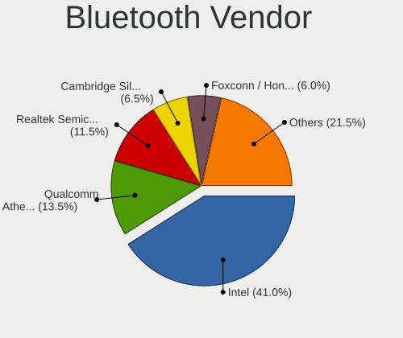

| Vendor                          | Computers | Percent |
|---------------------------------|-----------|---------|
| Intel                           | 82        | 41%     |
| Qualcomm Atheros Communications | 27        | 13.5%   |
| Realtek Semiconductor           | 23        | 11.5%   |
| Cambridge Silicon Radio         | 13        | 6.5%    |
| Foxconn / Hon Hai               | 12        | 6%      |
| IMC Networks                    | 9         | 4.5%    |
| Broadcom                        | 8         | 4%      |
| Realtek                         | 6         | 3%      |
| Apple                           | 6         | 3%      |
| Lite-On Technology              | 5         | 2.5%    |
| MediaTek                        | 3         | 1.5%    |
| Toshiba                         | 1         | 0.5%    |
| Ralink Technology               | 1         | 0.5%    |
| Marvell Semiconductor           | 1         | 0.5%    |
| Dynex                           | 1         | 0.5%    |
| Dell                            | 1         | 0.5%    |
| ASUSTek Computer                | 1         | 0.5%    |

Bluetooth Model
---------------

Controller models

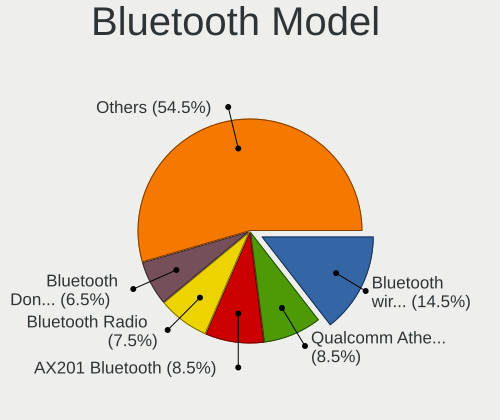

| Model                                               | Computers | Percent |
|-----------------------------------------------------|-----------|---------|
| Intel Bluetooth wireless interface                  | 29        | 14.5%   |
| Qualcomm Atheros  Bluetooth Device                  | 17        | 8.5%    |
| Intel AX201 Bluetooth                               | 17        | 8.5%    |
| Realtek Bluetooth Radio                             | 15        | 7.5%    |
| Cambridge Silicon Radio Bluetooth Dongle (HCI mode) | 13        | 6.5%    |
| Intel Bluetooth 9460/9560 Jefferson Peak (JfP)      | 12        | 6%      |
| Intel AX200 Bluetooth                               | 12        | 6%      |
| Realtek Bluetooth Radio                             | 6         | 3%      |
| Realtek  Bluetooth 4.2 Adapter                      | 5         | 2.5%    |
| Intel Bluetooth Device                              | 5         | 2.5%    |
| Qualcomm Atheros AR3012 Bluetooth 4.0               | 4         | 2%      |
| IMC Networks Wireless_Device                        | 4         | 2%      |
| Broadcom BCM2045B (BDC-2.1)                         | 4         | 2%      |
| Qualcomm Atheros QCA61x4 Bluetooth 4.0              | 3         | 1.5%    |
| Lite-On Bluetooth Device                            | 3         | 1.5%    |
| Intel Centrino Bluetooth Wireless Transceiver       | 3         | 1.5%    |
| Foxconn / Hon Hai Wireless_Device                   | 3         | 1.5%    |
| Apple Bluetooth USB Host Controller                 | 3         | 1.5%    |
| Qualcomm Atheros Bluetooth USB Host Controller      | 2         | 1%      |
| MediaTek Wireless_Device                            | 2         | 1%      |
| Lite-On Atheros AR3012 Bluetooth                    | 2         | 1%      |
| Intel Wireless-AC 3168 Bluetooth                    | 2         | 1%      |
| IMC Networks Bluetooth Radio                        | 2         | 1%      |
| IMC Networks Bluetooth Device                       | 2         | 1%      |
| Foxconn / Hon Hai Bluetooth USB Host Controller     | 2         | 1%      |
| Foxconn / Hon Hai Bluetooth Device                  | 2         | 1%      |
| Foxconn / Hon Hai BCM43142A0                        | 2         | 1%      |
| Broadcom HP Portable SoftSailing                    | 2         | 1%      |
| Apple Built-in Bluetooth 2.0+EDR HCI                | 2         | 1%      |
| Toshiba Bluetooth Radio                             | 1         | 0.5%    |
| Realtek RTL8822BE Bluetooth 4.2 Adapter             | 1         | 0.5%    |
| Realtek RTL8821A Bluetooth                          | 1         | 0.5%    |
| Realtek RTL8723B Bluetooth                          | 1         | 0.5%    |
| Ralink Motorola BC4 Bluetooth 3.0+HS Adapter        | 1         | 0.5%    |
| Qualcomm Atheros AR9462 Bluetooth                   | 1         | 0.5%    |
| MediaTek BT                                         | 1         | 0.5%    |
| Marvell Bluetooth and Wireless LAN Composite        | 1         | 0.5%    |
| Intel Wireless-AC 9260 Bluetooth Adapter            | 1         | 0.5%    |
| Intel AX210 Bluetooth                               | 1         | 0.5%    |
| IMC Networks Atheros AR3012 Bluetooth 4.0 Adapter   | 1         | 0.5%    |

Sound
-----

Sound Vendor
------------

Sound card vendors

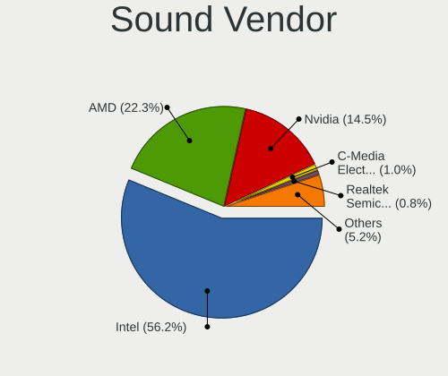

| Vendor                                       | Computers | Percent |
|----------------------------------------------|-----------|---------|
| Intel                                        | 217       | 56.22%  |
| AMD                                          | 86        | 22.28%  |
| Nvidia                                       | 56        | 14.51%  |
| C-Media Electronics                          | 4         | 1.04%   |
| Realtek Semiconductor                        | 3         | 0.78%   |
| JMTek                                        | 3         | 0.78%   |
| Zoran Co. Personal Media Division (Nogatech) | 2         | 0.52%   |
| Zhaoxin                                      | 2         | 0.52%   |
| Loongson Technology                          | 2         | 0.52%   |
| ASUSTek Computer                             | 2         | 0.52%   |
| XMOS                                         | 1         | 0.26%   |
| Phytium Technology                           | 1         | 0.26%   |
| Microdia                                     | 1         | 0.26%   |
| Logitech                                     | 1         | 0.26%   |
| Hifi 384Khz Type-C Audio                     | 1         | 0.26%   |
| Generalplus Technology                       | 1         | 0.26%   |
| Creative Technology                          | 1         | 0.26%   |
| Chengdu Haiguang IC Design                   | 1         | 0.26%   |
| BEHRINGER International                      | 1         | 0.26%   |

Sound Model
-----------

Sound card models

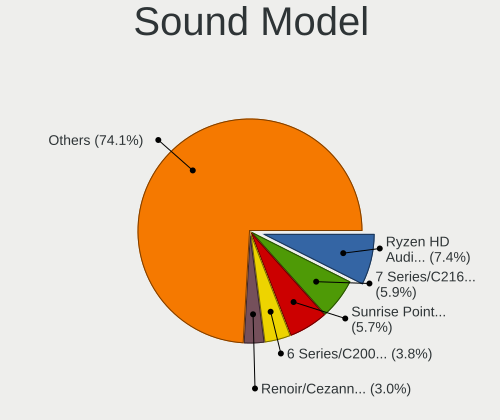

| Model                                                                             | Computers | Percent |
|-----------------------------------------------------------------------------------|-----------|---------|
| AMD Ryzen HD Audio Controller                                                     | 35        | 7.43%   |
| Intel 7 Series/C216 Chipset Family High Definition Audio Controller               | 28        | 5.94%   |
| Intel Sunrise Point-LP HD Audio                                                   | 27        | 5.73%   |
| Intel 6 Series/C200 Series Chipset Family High Definition Audio Controller        | 18        | 3.82%   |
| AMD Renoir/Cezanne HDMI/DP Audio Controller                                       | 14        | 2.97%   |
| Intel Wildcat Point-LP High Definition Audio Controller                           | 13        | 2.76%   |
| Intel Haswell-ULT HD Audio Controller                                             | 13        | 2.76%   |
| Intel Broadwell-U Audio Controller                                                | 13        | 2.76%   |
| Intel 8 Series HD Audio Controller                                                | 13        | 2.76%   |
| Intel 8 Series/C220 Series Chipset High Definition Audio Controller               | 11        | 2.34%   |
| AMD Oland/Hainan/Cape Verde/Pitcairn HDMI Audio [Radeon HD 7000 Series]           | 11        | 2.34%   |
| Intel Comet Lake PCH-V cAVS                                                       | 10        | 2.12%   |
| AMD Raven/Raven2/Fenghuang HDMI/DP Audio Controller                               | 10        | 2.12%   |
| Intel Tiger Lake-LP Smart Sound Technology Audio Controller                       | 8         | 1.7%    |
| Intel Celeron/Pentium Silver Processor High Definition Audio                      | 8         | 1.7%    |
| Intel Cannon Point-LP High Definition Audio Controller                            | 8         | 1.7%    |
| Intel 82801I (ICH9 Family) HD Audio Controller                                    | 8         | 1.7%    |
| AMD Starship/Matisse HD Audio Controller                                          | 8         | 1.7%    |
| Intel Cannon Lake PCH cAVS                                                        | 7         | 1.49%   |
| Intel 100 Series/C230 Series Chipset Family HD Audio Controller                   | 7         | 1.49%   |
| AMD Radeon High Definition Audio Controller                                       | 7         | 1.49%   |
| AMD FCH Azalia Controller                                                         | 7         | 1.49%   |
| Intel Comet Lake PCH-LP cAVS                                                      | 6         | 1.27%   |
| AMD Kabini HDMI/DP Audio                                                          | 6         | 1.27%   |
| Nvidia TU107 GeForce GTX 1650 High Definition Audio Controller                    | 5         | 1.06%   |
| Intel Xeon E3-1200 v3/4th Gen Core Processor HD Audio Controller                  | 5         | 1.06%   |
| Intel Alder Lake PCH-P High Definition Audio Controller                           | 5         | 1.06%   |
| Intel 200 Series PCH HD Audio                                                     | 5         | 1.06%   |
| AMD Ellesmere HDMI Audio [Radeon RX 470/480 / 570/580/590]                        | 5         | 1.06%   |
| AMD Caicos HDMI Audio [Radeon HD 6450 / 7450/8450/8490 OEM / R5 230/235/235X OEM] | 5         | 1.06%   |
| Nvidia GP107GL High Definition Audio Controller                                   | 4         | 0.85%   |
| Nvidia GK208 HDMI/DP Audio Controller                                             | 4         | 0.85%   |
| Nvidia GF119 HDMI Audio Controller                                                | 4         | 0.85%   |
| Intel NM10/ICH7 Family High Definition Audio Controller                           | 4         | 0.85%   |
| Intel 82801JI (ICH10 Family) HD Audio Controller                                  | 4         | 0.85%   |
| AMD SBx00 Azalia (Intel HDA)                                                      | 4         | 0.85%   |
| Nvidia GP106 High Definition Audio Controller                                     | 3         | 0.64%   |
| Nvidia GM204 High Definition Audio Controller                                     | 3         | 0.64%   |
| Nvidia GK107 HDMI Audio Controller                                                | 3         | 0.64%   |
| Nvidia GF116 High Definition Audio Controller                                     | 3         | 0.64%   |

Memory
------

Memory Vendor
-------------

Memory module vendors

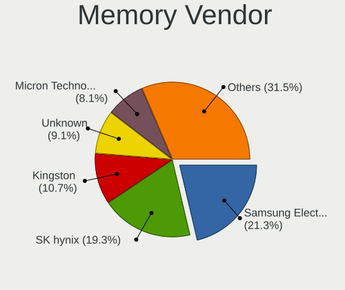

| Vendor                             | Computers | Percent |
|------------------------------------|-----------|---------|
| Samsung Electronics                | 42        | 21.32%  |
| SK hynix                           | 38        | 19.29%  |
| Kingston                           | 21        | 10.66%  |
| Unknown                            | 18        | 9.14%   |
| Micron Technology                  | 16        | 8.12%   |
| Ramaxel Technology                 | 7         | 3.55%   |
| Crucial                            | 7         | 3.55%   |
| Unknown                            | 7         | 3.55%   |
| Nanya Technology                   | 5         | 2.54%   |
| Unknown (ABCD)                     | 4         | 2.03%   |
| Smart                              | 4         | 2.03%   |
| A-DATA Technology                  | 4         | 2.03%   |
| UniIC                              | 3         | 1.52%   |
| G.Skill                            | 3         | 1.52%   |
| Corsair                            | 3         | 1.52%   |
| Team                               | 2         | 1.02%   |
| Unknown(L:00                       | 1         | 0.51%   |
| Unknown (07FB)                     | 1         | 0.51%   |
| Smart Brazil                       | 1         | 0.51%   |
| MTASE                              | 1         | 0.51%   |
| Lenovo                             | 1         | 0.51%   |
| Kingmax                            | 1         | 0.51%   |
| KINGBANK                           | 1         | 0.51%   |
| Kimtigo Semiconductor (HK) Limited | 1         | 0.51%   |
| JEDEC ID: 0000h                    | 1         | 0.51%   |
| Elpida                             | 1         | 0.51%   |
| CSX                                | 1         | 0.51%   |
| ChangXin Memory                    | 1         | 0.51%   |
| Apacer                             | 1         | 0.51%   |

Memory Model
------------

Memory module models

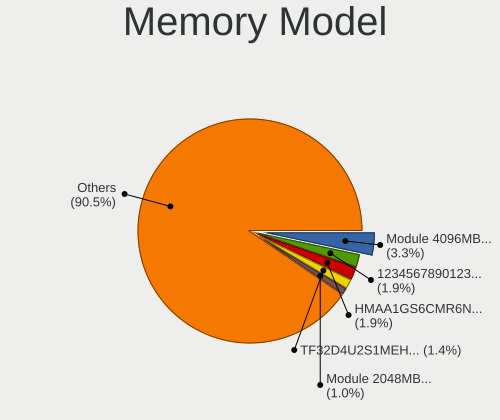

| Model                                                            | Computers | Percent |
|------------------------------------------------------------------|-----------|---------|
| Unknown                                                          | 7         | 3.33%   |
| Unknown (ABCD) RAM 123456789012345678 2GB SODIMM LPDDR4 2400MT/s | 4         | 1.9%    |
| SK hynix RAM HMAA1GS6CMR6N-VK 8GB Row Of Chips DDR4 2667MT/s     | 4         | 1.9%    |
| Kingston RAM TF32D4U2S1MEH-8 8192MB DIMM DDR4 3200MT/s           | 3         | 1.43%   |
| Unknown RAM Module 2048MB SODIMM DDR3 1333MT/s                   | 2         | 0.95%   |
| UniIC RAM SCC08GU03H1F1C-26V 8GB DIMM DDR4 2666MT/s              | 2         | 0.95%   |
| Smart RAM SH564128FJ8NWRNSQG 4GB SODIMM DDR3 1600MT/s            | 2         | 0.95%   |
| SK hynix RAM Module 8192MB SODIMM DDR4 2133MT/s                  | 2         | 0.95%   |
| SK hynix RAM HMT451S6BFR8A-PB 4GB SODIMM DDR3 1600MT/s           | 2         | 0.95%   |
| Samsung RAM M471B5173QH0-YK0 4GB SODIMM DDR3 1600MT/s            | 2         | 0.95%   |
| Samsung RAM M471B5173DB0-YK0 4GB SODIMM DDR3 1600MT/s            | 2         | 0.95%   |
| Samsung RAM M471B1G73DB0-YK0 8GB SODIMM DDR3 1600MT/s            | 2         | 0.95%   |
| Samsung RAM M471A5244CB0-CTD 4GB SODIMM DDR4 3266MT/s            | 2         | 0.95%   |
| Samsung RAM M471A1K43CB1-CRC 8GB SODIMM DDR4 8400MT/s            | 2         | 0.95%   |
| Samsung RAM K4EBE304ED-EGCG 8GB Row Of Chips LPDDR3 2133MT/s     | 2         | 0.95%   |
| Micron RAM MT62F1G32D4DR-031 WT 4GB Row Of Chips LPDDR5 6400MT/s | 2         | 0.95%   |
| Micron RAM 4ATF51264HZ-2G6E1 4GB SODIMM DDR4 2667MT/s            | 2         | 0.95%   |
| Micron RAM 4ATF1G64HZ-3G2E2 8GB SODIMM DDR4 3200MT/s             | 2         | 0.95%   |
| Micron RAM 4ATF1G64HZ-3G2E1 8GB SODIMM DDR4 3200MT/s             | 2         | 0.95%   |
| Kingston RAM KHX3200C16D4/16GX 16GB DIMM DDR4 3600MT/s           | 2         | 0.95%   |
| Unknown(L:00 RAM GU4101 8192MB SODIMM DDR4 3200MT/s              | 1         | 0.48%   |
| Unknown RAM Module 8GB SODIMM DDR3 1600MT/s                      | 1         | 0.48%   |
| Unknown RAM Module 8GB DIMM DDR4 2667MT/s                        | 1         | 0.48%   |
| Unknown RAM Module 8192MB SODIMM DDR3 1600MT/s                   | 1         | 0.48%   |
| Unknown RAM Module 4GB SODIMM LPDDR3 1600MT/s                    | 1         | 0.48%   |
| Unknown RAM Module 4GB DIMM SDRAM 1066MT/s                       | 1         | 0.48%   |
| Unknown RAM Module 4096MB SODIMM DDR4 2667MT/s                   | 1         | 0.48%   |
| Unknown RAM Module 4096MB SODIMM DDR3 1333MT/s                   | 1         | 0.48%   |
| Unknown RAM Module 4096MB SODIMM DDR3                            | 1         | 0.48%   |
| Unknown RAM Module 4096MB DIMM DDR3 1067MT/s                     | 1         | 0.48%   |
| Unknown RAM Module 4096MB DIMM 667MT/s                           | 1         | 0.48%   |
| Unknown RAM Module 2GB SODIMM DDR3 1333MT/s                      | 1         | 0.48%   |
| Unknown RAM Module 2GB DIMM SDRAM 1066MT/s                       | 1         | 0.48%   |
| Unknown RAM Module 2GB DIMM SDRAM                                | 1         | 0.48%   |
| Unknown RAM Module 2048MB SODIMM LPDDR3 1600MT/s                 | 1         | 0.48%   |
| Unknown RAM Module 2048MB SODIMM DDR3                            | 1         | 0.48%   |
| Unknown RAM Module 2048MB SODIMM DDR2                            | 1         | 0.48%   |
| Unknown RAM Module 2048MB Chip DDR3 1066MT/s                     | 1         | 0.48%   |
| Unknown RAM Module 1024MB SODIMM LPDDR4 2400MT/s                 | 1         | 0.48%   |
| Unknown RAM Module 1024MB SODIMM DDR2                            | 1         | 0.48%   |

Memory Kind
-----------

Memory module kinds

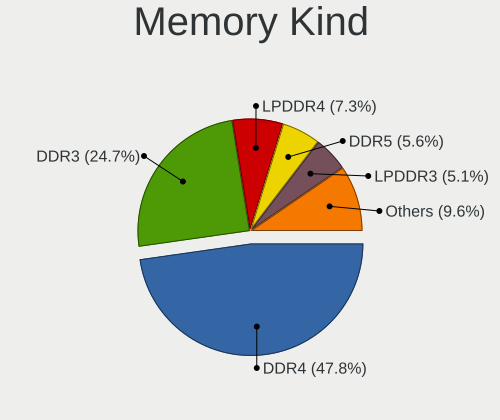

| Kind    | Computers | Percent |
|---------|-----------|---------|
| DDR4    | 85        | 47.75%  |
| DDR3    | 44        | 24.72%  |
| LPDDR4  | 13        | 7.3%    |
| DDR5    | 10        | 5.62%   |
| LPDDR3  | 9         | 5.06%   |
| LPDDR5  | 6         | 3.37%   |
| SDRAM   | 4         | 2.25%   |
| Unknown | 4         | 2.25%   |
| DDR2    | 3         | 1.69%   |

Memory Form Factor
------------------

Physical design of the memory module

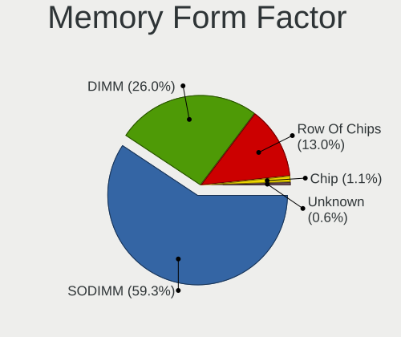

| Name         | Computers | Percent |
|--------------|-----------|---------|
| SODIMM       | 105       | 59.32%  |
| DIMM         | 46        | 25.99%  |
| Row Of Chips | 23        | 12.99%  |
| Chip         | 2         | 1.13%   |
| Unknown      | 1         | 0.56%   |

Memory Size
-----------

Memory module size

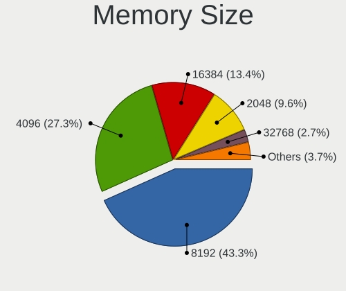

| Size  | Computers | Percent |
|-------|-----------|---------|
| 8192  | 81        | 43.32%  |
| 4096  | 51        | 27.27%  |
| 16384 | 25        | 13.37%  |
| 2048  | 18        | 9.63%   |
| 32768 | 5         | 2.67%   |
| 1024  | 5         | 2.67%   |
| 24576 | 1         | 0.53%   |
| 12288 | 1         | 0.53%   |

Memory Speed
------------

Memory module speed

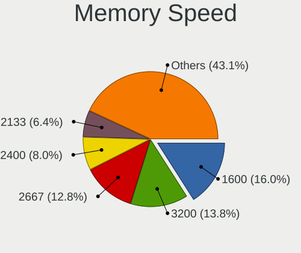

| Speed   | Computers | Percent |
|---------|-----------|---------|
| 1600    | 30        | 15.96%  |
| 3200    | 26        | 13.83%  |
| 2667    | 24        | 12.77%  |
| 2400    | 15        | 7.98%   |
| 2133    | 12        | 6.38%   |
| 5600    | 8         | 4.26%   |
| 1333    | 8         | 4.26%   |
| 2666    | 7         | 3.72%   |
| 1066    | 5         | 2.66%   |
| 6400    | 4         | 2.13%   |
| 3600    | 4         | 2.13%   |
| 1867    | 4         | 2.13%   |
| 4800    | 3         | 1.6%    |
| 4267    | 3         | 1.6%    |
| 4266    | 3         | 1.6%    |
| 1334    | 3         | 1.6%    |
| Unknown | 3         | 1.6%    |
| 8400    | 2         | 1.06%   |
| 3800    | 2         | 1.06%   |
| 3400    | 2         | 1.06%   |
| 3266    | 2         | 1.06%   |
| 3000    | 2         | 1.06%   |
| 1067    | 2         | 1.06%   |
| 800     | 2         | 1.06%   |
| 7500    | 1         | 0.53%   |
| 7467    | 1         | 0.53%   |
| 4199    | 1         | 0.53%   |
| 3733    | 1         | 0.53%   |
| 3500    | 1         | 0.53%   |
| 3466    | 1         | 0.53%   |
| 3066    | 1         | 0.53%   |
| 2933    | 1         | 0.53%   |
| 2048    | 1         | 0.53%   |
| 1866    | 1         | 0.53%   |
| 1648    | 1         | 0.53%   |
| 667     | 1         | 0.53%   |

Printers & scanners
-------------------

Printer Vendor
--------------

Printer device vendors

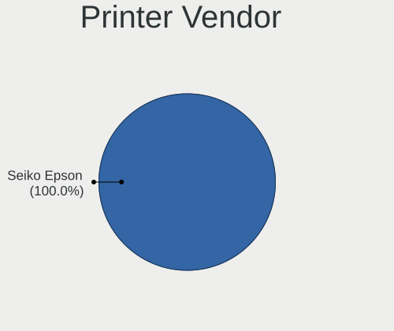

| Vendor          | Computers | Percent |
|-----------------|-----------|---------|
| Hewlett-Packard | 2         | 66.67%  |
| Seiko Epson     | 1         | 33.33%  |

Printer Model
-------------

Printer device models

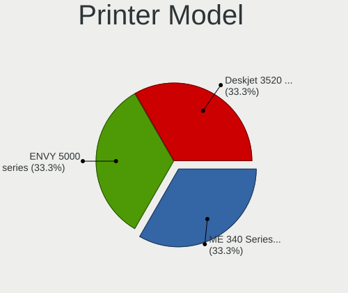

| Model                                         | Computers | Percent |
|-----------------------------------------------|-----------|---------|
| Seiko Epson ME 340 Series/Stylus NX130 Series | 1         | 33.33%  |
| HP ENVY 5000 series                           | 1         | 33.33%  |
| HP Deskjet 3520 series                        | 1         | 33.33%  |

Scanner Vendor
--------------

Scanner device vendors

Zero info for selected period =(

Scanner Model
-------------

Scanner device models

Zero info for selected period =(

Camera
------

Camera Vendor
-------------

Camera device vendors

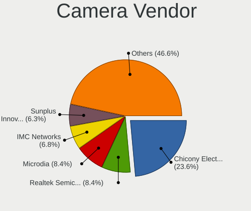

| Vendor                                 | Computers | Percent |
|----------------------------------------|-----------|---------|
| Chicony Electronics                    | 45        | 23.56%  |
| Realtek Semiconductor                  | 16        | 8.38%   |
| Microdia                               | 16        | 8.38%   |
| IMC Networks                           | 13        | 6.81%   |
| Sunplus Innovation Technology          | 12        | 6.28%   |
| Quanta                                 | 10        | 5.24%   |
| Silicon Motion                         | 8         | 4.19%   |
| Logitech                               | 8         | 4.19%   |
| Syntek                                 | 7         | 3.66%   |
| Suyin                                  | 7         | 3.66%   |
| Cheng Uei Precision Industry (Foxlink) | 7         | 3.66%   |
| Bison Electronics                      | 7         | 3.66%   |
| Luxvisions Innotech Limited            | 5         | 2.62%   |
| Lite-On Technology                     | 5         | 2.62%   |
| Apple                                  | 3         | 1.57%   |
| Alcor Micro                            | 3         | 1.57%   |
| Ricoh                                  | 2         | 1.05%   |
| Primax Electronics                     | 2         | 1.05%   |
| icSpring                               | 2         | 1.05%   |
| webcam                                 | 1         | 0.52%   |
| Web Camera                             | 1         | 0.52%   |
| Trust                                  | 1         | 0.52%   |
| SunplusIT                              | 1         | 0.52%   |
| LG Electronics                         | 1         | 0.52%   |
| Lenovo                                 | 1         | 0.52%   |
| kingcome                               | 1         | 0.52%   |
| Image+                                 | 1         | 0.52%   |
| Goodong Industry                       | 1         | 0.52%   |
| Genesys Logic                          | 1         | 0.52%   |
| Generalplus Technology                 | 1         | 0.52%   |
| BillionPixels                          | 1         | 0.52%   |
| Arkmicro Technologies                  | 1         | 0.52%   |

Camera Model
------------

Camera device models

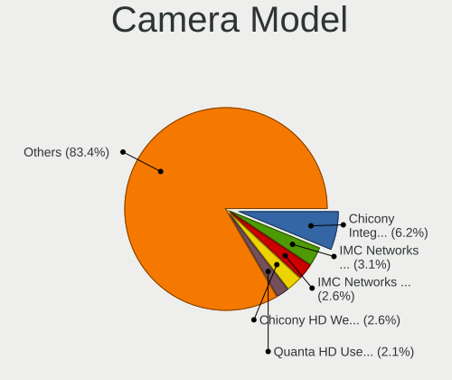

| Model                                                        | Computers | Percent |
|--------------------------------------------------------------|-----------|---------|
| Chicony Integrated Camera                                    | 12        | 6.22%   |
| IMC Networks HD Camera                                       | 6         | 3.11%   |
| IMC Networks Integrated Camera                               | 5         | 2.59%   |
| Chicony HD Webcam                                            | 5         | 2.59%   |
| Quanta HD User Facing                                        | 4         | 2.07%   |
| Logitech Webcam C270                                         | 4         | 2.07%   |
| Chicony EasyCamera                                           | 4         | 2.07%   |
| Syntek EasyCamera                                            | 3         | 1.55%   |
| Sunplus Integrated_Webcam_HD                                 | 3         | 1.55%   |
| Silicon Motion Web Camera                                    | 3         | 1.55%   |
| Quanta HP TrueVision HD Camera                               | 3         | 1.55%   |
| Microdia Integrated_Webcam_HD                                | 3         | 1.55%   |
| Chicony TOSHIBA Web Camera - HD                              | 3         | 1.55%   |
| Cheng Uei Precision Industry (Foxlink) XiaoMi USB 2.0 Webcam | 3         | 1.55%   |
| Bison Integrated Camera                                      | 3         | 1.55%   |
| Syntek Lenovo EasyCamera                                     | 2         | 1.04%   |
| Syntek Integrated Camera                                     | 2         | 1.04%   |
| Suyin Integrated_Webcam_HD                                   | 2         | 1.04%   |
| Sunplus Integrated Camera                                    | 2         | 1.04%   |
| Sunplus HD WebCam                                            | 2         | 1.04%   |
| Realtek Thronmax Stream Go Pro Webcam                        | 2         | 1.04%   |
| Realtek Integrated_Webcam_HD                                 | 2         | 1.04%   |
| Realtek HP "Truevision HD" laptop camera                     | 2         | 1.04%   |
| Realtek Front Camera                                         | 2         | 1.04%   |
| Primax HP HD Webcam [Fixed]                                  | 2         | 1.04%   |
| Microdia Webcam Vitade AF                                    | 2         | 1.04%   |
| Microdia HP Integrated Webcam                                | 2         | 1.04%   |
| Luxvisions Innotech Limited Integrated Camera                | 2         | 1.04%   |
| Lite-On Integrated Camera                                    | 2         | 1.04%   |
| icSpring camera                                              | 2         | 1.04%   |
| Chicony USB2.0 VGA UVC WebCam                                | 2         | 1.04%   |
| Chicony USB2.0 Camera                                        | 2         | 1.04%   |
| Chicony HP Wide Vision HD Camera                             | 2         | 1.04%   |
| Chicony HP Webcam                                            | 2         | 1.04%   |
| Chicony HP HD Webcam                                         | 2         | 1.04%   |
| Chicony HP 5MP Camera                                        | 2         | 1.04%   |
| Bison Integrated RGB Camera                                  | 2         | 1.04%   |
| webcam webcam                                                | 1         | 0.52%   |
| Web Camera Web Camera                                        | 1         | 0.52%   |
| Trust Full HD Webcam                                         | 1         | 0.52%   |

Security
--------

Fingerprint Vendor
------------------

Fingerprint sensor vendors

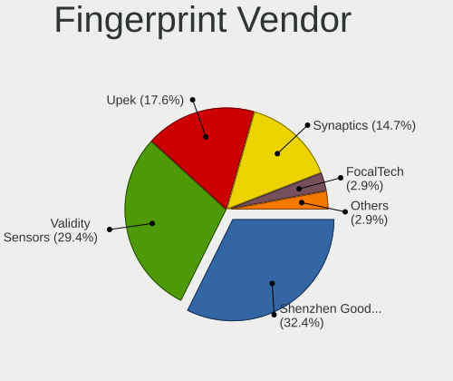

| Vendor                     | Computers | Percent |
|----------------------------|-----------|---------|
| Shenzhen Goodix Technology | 11        | 32.35%  |
| Validity Sensors           | 10        | 29.41%  |
| Upek                       | 6         | 17.65%  |
| Synaptics                  | 5         | 14.71%  |
| FocalTech                  | 1         | 2.94%   |
| Elan Microelectronics      | 1         | 2.94%   |

Fingerprint Model
-----------------

Fingerprint sensor models

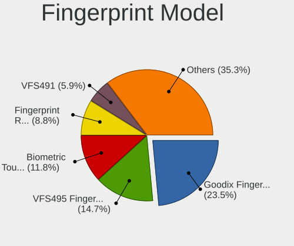

| Model                                                    | Computers | Percent |
|----------------------------------------------------------|-----------|---------|
| Shenzhen Goodix  Fingerprint Device                      | 8         | 23.53%  |
| Validity Sensors VFS495 Fingerprint Reader               | 5         | 14.71%  |
| Upek Biometric Touchchip/Touchstrip Fingerprint Sensor   | 4         | 11.76%  |
| Shenzhen Goodix Fingerprint Reader                       | 3         | 8.82%   |
| Validity Sensors VFS491                                  | 2         | 5.88%   |
| Validity Sensors Swipe Fingerprint Sensor                | 2         | 5.88%   |
| Upek TCS5B Fingerprint sensor                            | 2         | 5.88%   |
| Synaptics Prometheus MIS Touch Fingerprint Reader        | 2         | 5.88%   |
| Validity Sensors VFS5011 Fingerprint Reader              | 1         | 2.94%   |
| Synaptics UWP WBDI                                       | 1         | 2.94%   |
| Synaptics Prometheus Fingerprint Reader                  | 1         | 2.94%   |
| Synaptics FS7604 Touch Fingerprint Sensor with PurePrint | 1         | 2.94%   |
| FocalTech FocalTech Fingerprint Device                   | 1         | 2.94%   |
| Elan ELAN:Fingerprint                                    | 1         | 2.94%   |

Chipcard Vendor
---------------

Chipcard module vendors

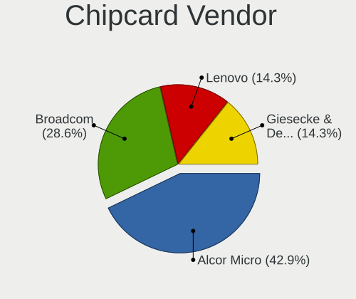

| Vendor              | Computers | Percent |
|---------------------|-----------|---------|
| Alcor Micro         | 3         | 42.86%  |
| Broadcom            | 2         | 28.57%  |
| Lenovo              | 1         | 14.29%  |
| Giesecke & Devrient | 1         | 14.29%  |

Chipcard Model
--------------

Chipcard module models

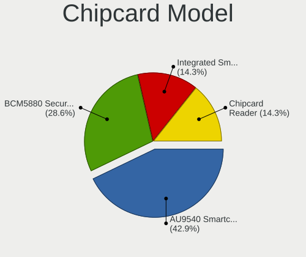

| Model                                          | Computers | Percent |
|------------------------------------------------|-----------|---------|
| Alcor Micro AU9540 Smartcard Reader            | 3         | 42.86%  |
| Broadcom BCM5880 Secure Applications Processor | 2         | 28.57%  |
| Lenovo Integrated Smart Card Reader            | 1         | 14.29%  |
| Giesecke & Devrient Chipcard Reader            | 1         | 14.29%  |

Unsupported
-----------

Unsupported Devices
-------------------

Total unsupported devices on board

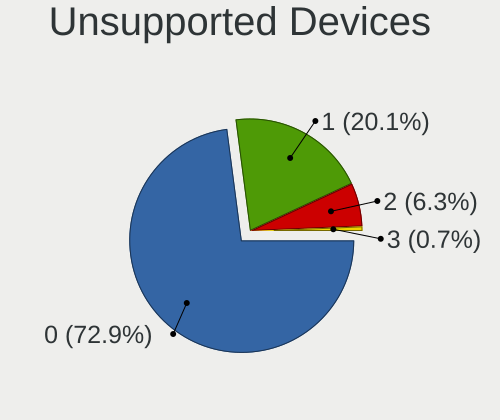

| Total | Computers | Percent |
|-------|-----------|---------|
| 0     | 221       | 72.94%  |
| 1     | 61        | 20.13%  |
| 2     | 19        | 6.27%   |
| 3     | 2         | 0.66%   |

Unsupported Device Types
------------------------

Types of unsupported devices

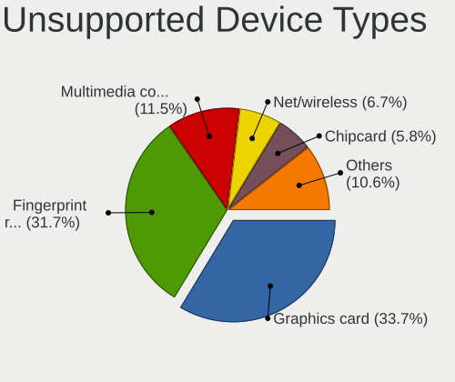

| Type                     | Computers | Percent |
|--------------------------|-----------|---------|
| Graphics card            | 35        | 33.65%  |
| Fingerprint reader       | 33        | 31.73%  |
| Multimedia controller    | 12        | 11.54%  |
| Net/wireless             | 7         | 6.73%   |
| Chipcard                 | 6         | 5.77%   |
| Sound                    | 3         | 2.88%   |
| Communication controller | 2         | 1.92%   |
| Camera                   | 2         | 1.92%   |
| Unassigned class         | 1         | 0.96%   |
| Storage/raid             | 1         | 0.96%   |
| Storage                  | 1         | 0.96%   |
| Network                  | 1         | 0.96%   |

