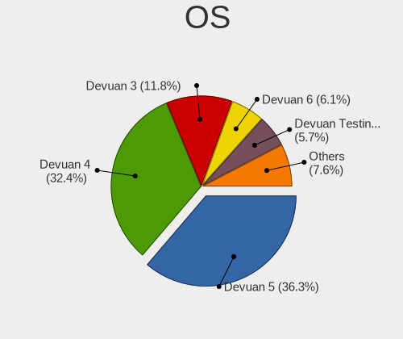
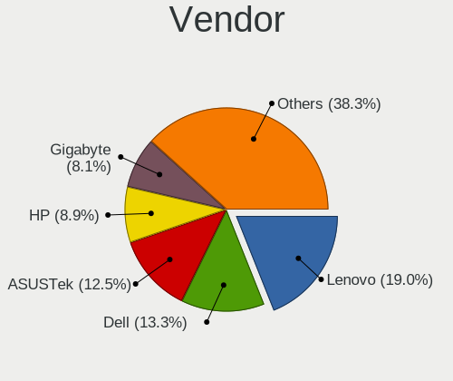
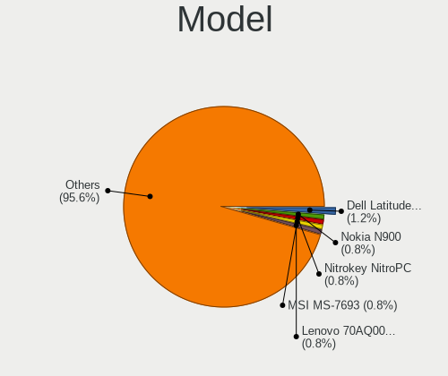
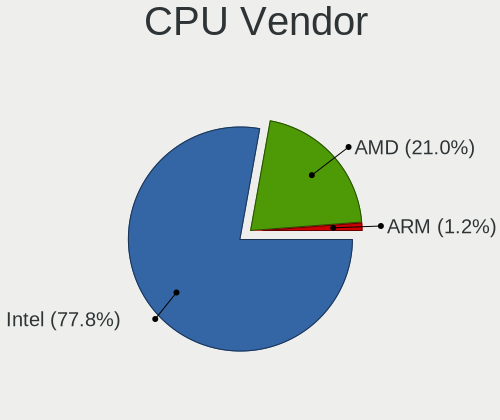
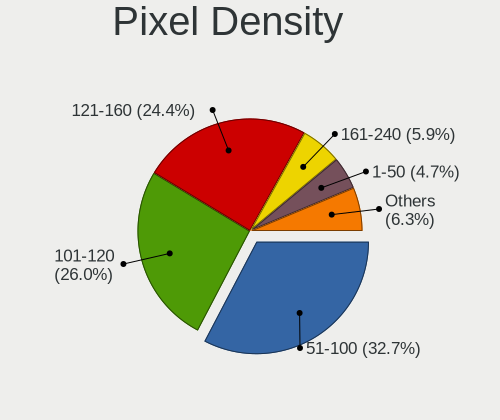
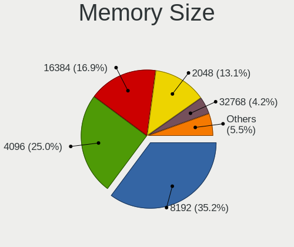

Devuan - Tested Hardware & Statistics
-------------------------------------

A project to collect tested hardware configurations for Devuan.

Anyone can contribute to this report by the [hw-probe](https://github.com/linuxhw/hw-probe) tool:

    sudo -E hw-probe -all -upload

Please contribute! Especially if your hardware is rare.

This is a report for all computer types. See also reports for [desktops](/Dist/Devuan/Desktop/README.md) and [notebooks](/Dist/Devuan/Notebook/README.md).

Contents
--------

* [ Test Cases ](#test-cases)

* [ System ](#system)
  - [ OS                       ](#os)
  - [ OS Family                ](#os-family)
  - [ Kernel                   ](#kernel)
  - [ Kernel Family            ](#kernel-family)
  - [ Kernel Major Ver.        ](#kernel-major-ver)
  - [ Arch                     ](#arch)
  - [ DE                       ](#de)
  - [ Display Server           ](#display-server)
  - [ Display Manager          ](#display-manager)
  - [ OS Lang                  ](#os-lang)
  - [ Boot Mode                ](#boot-mode)
  - [ Filesystem               ](#filesystem)
  - [ Part. scheme             ](#part-scheme)
  - [ Dual Boot with Linux/BSD ](#dual-boot-with-linuxbsd)
  - [ Dual Boot (Win)          ](#dual-boot-win)

* [ Board ](#board)
  - [ Vendor                   ](#vendor)
  - [ Model                    ](#model)
  - [ Model Family             ](#model-family)
  - [ MFG Year                 ](#mfg-year)
  - [ Form Factor              ](#form-factor)
  - [ Secure Boot              ](#secure-boot)
  - [ Coreboot                 ](#coreboot)
  - [ RAM Size                 ](#ram-size)
  - [ RAM Used                 ](#ram-used)
  - [ Total Drives             ](#total-drives)
  - [ Has CD-ROM               ](#has-cd-rom)
  - [ Has Ethernet             ](#has-ethernet)
  - [ Has WiFi                 ](#has-wifi)
  - [ Has Bluetooth            ](#has-bluetooth)

* [ Location ](#location)
  - [ Country                  ](#country)
  - [ City                     ](#city)

* [ Drives ](#drives)
  - [ Drive Vendor             ](#drive-vendor)
  - [ Drive Model              ](#drive-model)
  - [ HDD Vendor               ](#hdd-vendor)
  - [ SSD Vendor               ](#ssd-vendor)
  - [ Drive Kind               ](#drive-kind)
  - [ Drive Connector          ](#drive-connector)
  - [ Drive Size               ](#drive-size)
  - [ Space Total              ](#space-total)
  - [ Space Used               ](#space-used)
  - [ Malfunc. Drives          ](#malfunc-drives)
  - [ Malfunc. Drive Vendor    ](#malfunc-drive-vendor)
  - [ Malfunc. HDD Vendor      ](#malfunc-hdd-vendor)
  - [ Malfunc. Drive Kind      ](#malfunc-drive-kind)
  - [ Failed Drives            ](#failed-drives)
  - [ Failed Drive Vendor      ](#failed-drive-vendor)
  - [ Drive Status             ](#drive-status)

* [ Storage controller ](#storage-controller)
  - [ Storage Vendor           ](#storage-vendor)
  - [ Storage Model            ](#storage-model)
  - [ Storage Kind             ](#storage-kind)

* [ Processor ](#processor)
  - [ CPU Vendor               ](#cpu-vendor)
  - [ CPU Model                ](#cpu-model)
  - [ CPU Model Family         ](#cpu-model-family)
  - [ CPU Cores                ](#cpu-cores)
  - [ CPU Sockets              ](#cpu-sockets)
  - [ CPU Threads              ](#cpu-threads)
  - [ CPU Op-Modes             ](#cpu-op-modes)
  - [ CPU Microcode            ](#cpu-microcode)
  - [ CPU Microarch            ](#cpu-microarch)

* [ Graphics ](#graphics)
  - [ GPU Vendor               ](#gpu-vendor)
  - [ GPU Model                ](#gpu-model)
  - [ GPU Combo                ](#gpu-combo)
  - [ GPU Driver               ](#gpu-driver)
  - [ GPU Memory               ](#gpu-memory)

* [ Monitor ](#monitor)
  - [ Monitor Vendor           ](#monitor-vendor)
  - [ Monitor Model            ](#monitor-model)
  - [ Monitor Resolution       ](#monitor-resolution)
  - [ Monitor Diagonal         ](#monitor-diagonal)
  - [ Monitor Width            ](#monitor-width)
  - [ Aspect Ratio             ](#aspect-ratio)
  - [ Monitor Area             ](#monitor-area)
  - [ Pixel Density            ](#pixel-density)
  - [ Multiple Monitors        ](#multiple-monitors)

* [ Network ](#network)
  - [ Net Controller Vendor    ](#net-controller-vendor)
  - [ Net Controller Model     ](#net-controller-model)
  - [ Wireless Vendor          ](#wireless-vendor)
  - [ Wireless Model           ](#wireless-model)
  - [ Ethernet Vendor          ](#ethernet-vendor)
  - [ Ethernet Model           ](#ethernet-model)
  - [ Net Controller Kind      ](#net-controller-kind)
  - [ Used Controller          ](#used-controller)
  - [ NICs                     ](#nics)
  - [ IPv6                     ](#ipv6)

* [ Bluetooth ](#bluetooth)
  - [ Bluetooth Vendor         ](#bluetooth-vendor)
  - [ Bluetooth Model          ](#bluetooth-model)

* [ Sound ](#sound)
  - [ Sound Vendor             ](#sound-vendor)
  - [ Sound Model              ](#sound-model)

* [ Memory ](#memory)
  - [ Memory Vendor            ](#memory-vendor)
  - [ Memory Model             ](#memory-model)
  - [ Memory Kind              ](#memory-kind)
  - [ Memory Form Factor       ](#memory-form-factor)
  - [ Memory Size              ](#memory-size)
  - [ Memory Speed             ](#memory-speed)

* [ Printers & scanners ](#printers--scanners)
  - [ Printer Vendor           ](#printer-vendor)
  - [ Printer Model            ](#printer-model)
  - [ Scanner Vendor           ](#scanner-vendor)
  - [ Scanner Model            ](#scanner-model)

* [ Camera ](#camera)
  - [ Camera Vendor            ](#camera-vendor)
  - [ Camera Model             ](#camera-model)

* [ Security ](#security)
  - [ Fingerprint Vendor       ](#fingerprint-vendor)
  - [ Fingerprint Model        ](#fingerprint-model)
  - [ Chipcard Vendor          ](#chipcard-vendor)
  - [ Chipcard Model           ](#chipcard-model)

* [ Unsupported ](#unsupported)
  - [ Unsupported Devices      ](#unsupported-devices)
  - [ Unsupported Device Types ](#unsupported-device-types)

Test Cases
----------

Total: 260

| Vendor        | Model                       | Form-Factor | Probe                                                      | Date         |
|---------------|-----------------------------|-------------|------------------------------------------------------------|--------------|
| System76      | Galago Pro                  | Notebook    | [06d9cca0d2](https://linux-hardware.org/?probe=06d9cca0d2) | Apr 27, 2024 |
| ASUSTek       | 1000H                       | Notebook    | [0463a4d88b](https://linux-hardware.org/?probe=0463a4d88b) | Apr 26, 2024 |
| Apple         | MacBookAir6,1               | Notebook    | [08ca3d5ea0](https://linux-hardware.org/?probe=08ca3d5ea0) | Apr 19, 2024 |
| Dell          | Studio 1558                 | Notebook    | [73fb46028c](https://linux-hardware.org/?probe=73fb46028c) | Apr 12, 2024 |
| Samsung       | DP515A2G-K02FR SAMSUNG_S... | All in one  | [b029695fa9](https://linux-hardware.org/?probe=b029695fa9) | Apr 06, 2024 |
| Fujitsu       | D3041-A1 S26361-D3041-A1    | Desktop     | [fec7c15063](https://linux-hardware.org/?probe=fec7c15063) | Apr 03, 2024 |
| Fujitsu       | D3041-A1 S26361-D3041-A1    | Desktop     | [7756c3e23b](https://linux-hardware.org/?probe=7756c3e23b) | Apr 01, 2024 |
| Gigabyte      | Z370 AORUS Gaming 7         | Desktop     | [63429edd54](https://linux-hardware.org/?probe=63429edd54) | Apr 01, 2024 |
| Acer          | Aspire A3SP14-31PT          | Convertible | [f886e7b907](https://linux-hardware.org/?probe=f886e7b907) | Mar 21, 2024 |
| Foxconn       | 2ABF                        | Desktop     | [0348bd12f8](https://linux-hardware.org/?probe=0348bd12f8) | Mar 15, 2024 |
| ASUSTek       | TUF B450-PRO GAMING         | Desktop     | [fbd2947969](https://linux-hardware.org/?probe=fbd2947969) | Mar 13, 2024 |
| ASUSTek       | TUF B450-PRO GAMING         | Desktop     | [3b35cebff6](https://linux-hardware.org/?probe=3b35cebff6) | Mar 12, 2024 |
| Gigabyte      | B360M HD3                   | Desktop     | [63a3f8ce29](https://linux-hardware.org/?probe=63a3f8ce29) | Mar 11, 2024 |
| Gigabyte      | B360M HD3                   | Desktop     | [aa06991c8c](https://linux-hardware.org/?probe=aa06991c8c) | Mar 11, 2024 |
| Gigabyte      | B360M HD3                   | Desktop     | [724f7885d0](https://linux-hardware.org/?probe=724f7885d0) | Mar 10, 2024 |
| Lenovo        | ThinkPad X1 Carbon Gen 1... | Notebook    | [2270faaf14](https://linux-hardware.org/?probe=2270faaf14) | Mar 07, 2024 |
| Lenovo        | ThinkPad X230 23252UU       | Notebook    | [7fb7bfaacd](https://linux-hardware.org/?probe=7fb7bfaacd) | Mar 05, 2024 |
| ASUSTek       | K55VJ                       | Notebook    | [88ee2dbed6](https://linux-hardware.org/?probe=88ee2dbed6) | Mar 03, 2024 |
| Gigabyte      | B760 GAMING X AX            | Desktop     | [bdd341c11c](https://linux-hardware.org/?probe=bdd341c11c) | Mar 02, 2024 |
| MACHENIKE     | T90-V                       | Notebook    | [01cb379c2e](https://linux-hardware.org/?probe=01cb379c2e) | Feb 24, 2024 |
| Lenovo        | Yoga 7 16IRL8 82YN          | Convertible | [3b4a6f9360](https://linux-hardware.org/?probe=3b4a6f9360) | Feb 19, 2024 |
| Dell          | 0NW6H5 A00                  | Desktop     | [5b29c953c3](https://linux-hardware.org/?probe=5b29c953c3) | Feb 17, 2024 |
| Acer          | Aspire A3SP14-31PT          | Convertible | [72820ef395](https://linux-hardware.org/?probe=72820ef395) | Feb 15, 2024 |
| Maibenben     | MaiBook M                   | Notebook    | [7f6b3c0f92](https://linux-hardware.org/?probe=7f6b3c0f92) | Feb 13, 2024 |
| ASUSTek       | TUF B450-PRO GAMING         | Desktop     | [348dffed6d](https://linux-hardware.org/?probe=348dffed6d) | Feb 09, 2024 |
| HP            | EliteBook 840 G6            | Notebook    | [6cac3b71e0](https://linux-hardware.org/?probe=6cac3b71e0) | Feb 01, 2024 |
| Dell          | OptiPlex 780                | Desktop     | [3c444c1e27](https://linux-hardware.org/?probe=3c444c1e27) | Jan 24, 2024 |
| ASUSTek       | Z170-P                      | Desktop     | [fc85634fb3](https://linux-hardware.org/?probe=fc85634fb3) | Jan 10, 2024 |
| Lenovo        | ThinkPad P1 20MDCTO1WW      | Notebook    | [b66d7c38c1](https://linux-hardware.org/?probe=b66d7c38c1) | Dec 31, 2023 |
| Dell          | 03GCPM A01                  | Server      | [7c11f33356](https://linux-hardware.org/?probe=7c11f33356) | Dec 27, 2023 |
| Gigabyte      | B550 GAMING X V2            | Desktop     | [ce4bc6f455](https://linux-hardware.org/?probe=ce4bc6f455) | Dec 21, 2023 |
| HP            | ENVY x360 Convertible 15... | Convertible | [f170615f49](https://linux-hardware.org/?probe=f170615f49) | Dec 14, 2023 |
| HP            | ProBook 450 15.6 inch G9... | Notebook    | [7af6ecc981](https://linux-hardware.org/?probe=7af6ecc981) | Dec 12, 2023 |
| Dell          | Latitude E6400              | Notebook    | [c23aa9b02a](https://linux-hardware.org/?probe=c23aa9b02a) | Dec 10, 2023 |
| Lenovo        | ThinkPad T470 W10DG 20JN... | Notebook    | [c72f209121](https://linux-hardware.org/?probe=c72f209121) | Dec 05, 2023 |
| Dell          | Latitude E6430              | Notebook    | [8b68261a59](https://linux-hardware.org/?probe=8b68261a59) | Nov 30, 2023 |
| Dell          | XPS 13 9370                 | Notebook    | [2961332bce](https://linux-hardware.org/?probe=2961332bce) | Nov 26, 2023 |
| Lenovo        | ThinkPad T470s 20HGS1080... | Notebook    | [37c32a9af7](https://linux-hardware.org/?probe=37c32a9af7) | Nov 25, 2023 |
| ASRock        | G31M-S                      | Desktop     | [01866950a6](https://linux-hardware.org/?probe=01866950a6) | Nov 25, 2023 |
| HP            | G62                         | Notebook    | [9d6424c4cc](https://linux-hardware.org/?probe=9d6424c4cc) | Nov 24, 2023 |
| Acer          | Aspire A515-54G             | Notebook    | [8e8de2388b](https://linux-hardware.org/?probe=8e8de2388b) | Nov 21, 2023 |
| HP            | Presario C700               | Notebook    | [c8a9963f71](https://linux-hardware.org/?probe=c8a9963f71) | Nov 19, 2023 |
| HP            | Unknown                     | Notebook    | [3827b1fa19](https://linux-hardware.org/?probe=3827b1fa19) | Nov 16, 2023 |
| HP            | Unknown                     | Notebook    | [ef19087623](https://linux-hardware.org/?probe=ef19087623) | Nov 16, 2023 |
| Apple         | Mac-F2238BAE iMac11,3       | All in one  | [547a248361](https://linux-hardware.org/?probe=547a248361) | Nov 03, 2023 |
| ASUSTek       | M11BB                       | Desktop     | [21e7b53022](https://linux-hardware.org/?probe=21e7b53022) | Nov 02, 2023 |
| Lenovo        | ThinkPad X240 20AMS2EC00    | Notebook    | [820620d5c4](https://linux-hardware.org/?probe=820620d5c4) | Nov 01, 2023 |
| Intel         | X99                         | Desktop     | [8f60418655](https://linux-hardware.org/?probe=8f60418655) | Oct 30, 2023 |
| MSI           | 970A SLI Krait Edition      | Desktop     | [a54528c1ef](https://linux-hardware.org/?probe=a54528c1ef) | Oct 29, 2023 |
| Samsung       | N150P                       | Notebook    | [83f77d7896](https://linux-hardware.org/?probe=83f77d7896) | Oct 23, 2023 |
| ASUSTek       | STRIX Z270E GAMING          | Desktop     | [baacbfa91a](https://linux-hardware.org/?probe=baacbfa91a) | Oct 19, 2023 |
| Lenovo        | IdeaPad Gaming 3 15IAH7 ... | Notebook    | [cf522294f8](https://linux-hardware.org/?probe=cf522294f8) | Oct 18, 2023 |
| TUXEDO        | XP1610                      | Notebook    | [31be190f30](https://linux-hardware.org/?probe=31be190f30) | Oct 13, 2023 |
| Dell          | XPS M1530                   | Notebook    | [b24e393bbb](https://linux-hardware.org/?probe=b24e393bbb) | Sep 23, 2023 |
| Dell          | Inspiron 3583               | Notebook    | [56cd0e05e8](https://linux-hardware.org/?probe=56cd0e05e8) | Sep 22, 2023 |
| PC Special... | P7xxTM1                     | Notebook    | [2bdbc2f2e7](https://linux-hardware.org/?probe=2bdbc2f2e7) | Sep 12, 2023 |
| Apple         | MacBookPro8,2               | Notebook    | [f23bb97453](https://linux-hardware.org/?probe=f23bb97453) | Sep 11, 2023 |
| Sony          | VGN-FZ140E                  | Notebook    | [361226919e](https://linux-hardware.org/?probe=361226919e) | Sep 11, 2023 |
| Lenovo        | ThinkPad T14 Gen 3 21AHC... | Notebook    | [61906f4e91](https://linux-hardware.org/?probe=61906f4e91) | Sep 07, 2023 |
| Dell          | Inspiron 3585               | Notebook    | [89a0e93fd5](https://linux-hardware.org/?probe=89a0e93fd5) | Sep 05, 2023 |
| Intel         | powered classmate PC        | Notebook    | [f852524db2](https://linux-hardware.org/?probe=f852524db2) | Sep 01, 2023 |
| Lenovo        | ThinkPad T480 20L5CTO1WW    | Notebook    | [44e328b3a0](https://linux-hardware.org/?probe=44e328b3a0) | Aug 24, 2023 |
| Lenovo        | ThinkPad X390 20Q1A005CD    | Notebook    | [c299d4ad92](https://linux-hardware.org/?probe=c299d4ad92) | Aug 15, 2023 |
| Lenovo        | ThinkPad T560 20FJS1J200    | Notebook    | [f0d90b715d](https://linux-hardware.org/?probe=f0d90b715d) | Aug 15, 2023 |
| Dell          | 0GX297                      | Desktop     | [0fa81b620e](https://linux-hardware.org/?probe=0fa81b620e) | Aug 14, 2023 |
| Gigabyte      | F2A55M-HD2                  | Desktop     | [bed2e58bf4](https://linux-hardware.org/?probe=bed2e58bf4) | Aug 14, 2023 |
| ASUSTek       | T200TA                      | Notebook    | [affc999457](https://linux-hardware.org/?probe=affc999457) | Aug 12, 2023 |
| LORD ELECT... | LORD G4x 775 ICH7 8712 A... | Desktop     | [3e63b3dec0](https://linux-hardware.org/?probe=3e63b3dec0) | Aug 09, 2023 |
| LORD ELECT... | LORD G4x 775 ICH7 8712 A... | Desktop     | [a036ddad16](https://linux-hardware.org/?probe=a036ddad16) | Aug 09, 2023 |
| Supermicro    | X10SRG-F                    | Desktop     | [3bdaa7bfef](https://linux-hardware.org/?probe=3bdaa7bfef) | Aug 08, 2023 |
| Lenovo        | ThinkPad T14 Gen 3 21AHC... | Notebook    | [67febbf0c0](https://linux-hardware.org/?probe=67febbf0c0) | Jul 27, 2023 |
| MSI           | B450 GAMING PLUS MAX        | Desktop     | [606780c010](https://linux-hardware.org/?probe=606780c010) | Jul 24, 2023 |
| Samsung       | 550XDA                      | Notebook    | [c298263c6c](https://linux-hardware.org/?probe=c298263c6c) | Jul 22, 2023 |
| Dell          | Latitude E5500              | Notebook    | [03798c7840](https://linux-hardware.org/?probe=03798c7840) | Jul 10, 2023 |
| Nokia         | N900                        | Notebook    | [7728c85b90](https://linux-hardware.org/?probe=7728c85b90) | Jul 06, 2023 |
| HP            | EliteBook 840 G6            | Notebook    | [d072001450](https://linux-hardware.org/?probe=d072001450) | Jul 04, 2023 |
| Toshiba       | Satellite L300              | Notebook    | [8b04801d40](https://linux-hardware.org/?probe=8b04801d40) | Jun 27, 2023 |
| Lenovo        | ThinkPad T410 2537DA3       | Notebook    | [067b7f26a2](https://linux-hardware.org/?probe=067b7f26a2) | Jun 25, 2023 |
| HP            | EliteBook 840 G6            | Notebook    | [82c9c200bc](https://linux-hardware.org/?probe=82c9c200bc) | Jun 20, 2023 |
| Gigabyte      | H81M-S2H                    | Desktop     | [7a3f7dcd73](https://linux-hardware.org/?probe=7a3f7dcd73) | Jun 17, 2023 |
| MSI           | Bravo 15 A4DDR              | Notebook    | [0e9ccef97f](https://linux-hardware.org/?probe=0e9ccef97f) | May 27, 2023 |
| Lenovo        | ThinkPad T14 Gen 3 21AHC... | Notebook    | [54f07f7d96](https://linux-hardware.org/?probe=54f07f7d96) | May 12, 2023 |
| Lenovo        | 3138 SDK0J40697 WIN 3305... | Desktop     | [36022cb1ac](https://linux-hardware.org/?probe=36022cb1ac) | May 11, 2023 |
| Lenovo        | IdeaPad 530S-14ARR 81H1     | Notebook    | [0d2ac684c8](https://linux-hardware.org/?probe=0d2ac684c8) | May 08, 2023 |
| Lenovo        | IdeaPad 530S-14ARR 81H1     | Notebook    | [c67960852a](https://linux-hardware.org/?probe=c67960852a) | May 06, 2023 |
| HUAWEI        | HN-WX9X                     | Notebook    | [d07874c829](https://linux-hardware.org/?probe=d07874c829) | Apr 24, 2023 |
| MSI           | B450M PRO-VDH PLUS          | Desktop     | [5e6b796278](https://linux-hardware.org/?probe=5e6b796278) | Apr 24, 2023 |
| Lenovo        | S20-30 20421                | Notebook    | [b9846b05e7](https://linux-hardware.org/?probe=b9846b05e7) | Apr 22, 2023 |
| HP            | 212A                        | Desktop     | [178f3b9c05](https://linux-hardware.org/?probe=178f3b9c05) | Apr 17, 2023 |
| Lenovo        | ThinkPad T480 20L5CTO1WW    | Notebook    | [96e067f5c8](https://linux-hardware.org/?probe=96e067f5c8) | Apr 14, 2023 |
| Lenovo        | ThinkPad T14 Gen 3 21AHC... | Notebook    | [549f922cf6](https://linux-hardware.org/?probe=549f922cf6) | Apr 13, 2023 |
| Lenovo        | ThinkPad T14 Gen 3 21AHC... | Notebook    | [a9aa9ab39f](https://linux-hardware.org/?probe=a9aa9ab39f) | Apr 13, 2023 |
| Lenovo        | 3138 SDK0J40697 WIN 3305... | Desktop     | [491da3c2c2](https://linux-hardware.org/?probe=491da3c2c2) | Apr 10, 2023 |
| Google        | Cyan                        | Notebook    | [f32e15dfef](https://linux-hardware.org/?probe=f32e15dfef) | Apr 09, 2023 |
| MSI           | PH67A-C43                   | Desktop     | [8e7c8a3d67](https://linux-hardware.org/?probe=8e7c8a3d67) | Apr 03, 2023 |
| ASUSTek       | PRIME B360-PLUS             | Desktop     | [ec45a753a5](https://linux-hardware.org/?probe=ec45a753a5) | Apr 02, 2023 |
| Dell          | G5 5505                     | Notebook    | [2552b456b6](https://linux-hardware.org/?probe=2552b456b6) | Mar 29, 2023 |
| Gigabyte      | B650I AORUS ULTRA           | Desktop     | [a33a768662](https://linux-hardware.org/?probe=a33a768662) | Mar 29, 2023 |
| ASUSTek       | G750JM                      | Notebook    | [98ba3a9ce6](https://linux-hardware.org/?probe=98ba3a9ce6) | Mar 25, 2023 |
| Dell          | 0V52N7 A02                  | Server      | [f22446cb1d](https://linux-hardware.org/?probe=f22446cb1d) | Mar 16, 2023 |
| Google        | Bluebird                    | Notebook    | [2d18088551](https://linux-hardware.org/?probe=2d18088551) | Mar 15, 2023 |
| Dell          | Latitude E6230              | Notebook    | [49a9844be8](https://linux-hardware.org/?probe=49a9844be8) | Mar 15, 2023 |
| AMI           | Intel                       | Desktop     | [c2c28fa7e4](https://linux-hardware.org/?probe=c2c28fa7e4) | Mar 15, 2023 |
| Dell          | Latitude E6440              | Notebook    | [76a537c18e](https://linux-hardware.org/?probe=76a537c18e) | Mar 14, 2023 |
| Lenovo        | 3135 SDK0J40697 WIN 3305... | Mini pc     | [83dcd35e5f](https://linux-hardware.org/?probe=83dcd35e5f) | Mar 12, 2023 |
| Gigabyte      | P55A-UD3                    | Desktop     | [60cd9db1c5](https://linux-hardware.org/?probe=60cd9db1c5) | Feb 25, 2023 |
| Unknown       | Unknown                     | Notebook    | [1f89daceb8](https://linux-hardware.org/?probe=1f89daceb8) | Feb 20, 2023 |
| MSI           | A320M PRO-E                 | Desktop     | [3e441c86f1](https://linux-hardware.org/?probe=3e441c86f1) | Feb 20, 2023 |
| HP            | 829A                        | Mini pc     | [8791cd83c7](https://linux-hardware.org/?probe=8791cd83c7) | Feb 19, 2023 |
| HP            | ProBook 640 G1              | Notebook    | [d0319bdf17](https://linux-hardware.org/?probe=d0319bdf17) | Feb 09, 2023 |
| MSI           | H67MS-E43                   | Desktop     | [47a6655b3b](https://linux-hardware.org/?probe=47a6655b3b) | Feb 07, 2023 |
| Apple         | Mac-F22C86C8                | Mini pc     | [63ea9a161f](https://linux-hardware.org/?probe=63ea9a161f) | Jan 31, 2023 |
| Lenovo        | ThinkPad T560 20FJS1J200    | Notebook    | [de713cedce](https://linux-hardware.org/?probe=de713cedce) | Jan 21, 2023 |
| Acer          | Aspire E1-572G              | Notebook    | [360a177e77](https://linux-hardware.org/?probe=360a177e77) | Jan 14, 2023 |
| Dell          | Inspiron 15 3511            | Notebook    | [f4349052b8](https://linux-hardware.org/?probe=f4349052b8) | Jan 06, 2023 |
| Dell          | XPS 13 9370                 | Notebook    | [1f72002986](https://linux-hardware.org/?probe=1f72002986) | Dec 29, 2022 |
| HP            | Laptop 14-df0xxx            | Notebook    | [1d9edd6c97](https://linux-hardware.org/?probe=1d9edd6c97) | Dec 25, 2022 |
| Gigabyte      | B550I AORUS PRO AX          | Desktop     | [beeeff23a5](https://linux-hardware.org/?probe=beeeff23a5) | Dec 25, 2022 |
| HP            | 250 G8 Notebook PC          | Notebook    | [ed3886b135](https://linux-hardware.org/?probe=ed3886b135) | Dec 02, 2022 |
| Dell          | Latitude E6530              | Notebook    | [e40986d2fb](https://linux-hardware.org/?probe=e40986d2fb) | Nov 22, 2022 |
| Dell          | Latitude E6530              | Notebook    | [14debbe3e5](https://linux-hardware.org/?probe=14debbe3e5) | Nov 22, 2022 |
| Lenovo        | G50-30 80G0                 | Notebook    | [be4f638bc7](https://linux-hardware.org/?probe=be4f638bc7) | Nov 21, 2022 |
| ASUSTek       | ROG STRIX B550-A GAMING     | Desktop     | [de8b7d8220](https://linux-hardware.org/?probe=de8b7d8220) | Nov 19, 2022 |
| HP            | Laptop 15-bs2xx             | Notebook    | [7254534946](https://linux-hardware.org/?probe=7254534946) | Oct 20, 2022 |
| ASUSTek       | PRIME X399-A                | Desktop     | [304c12788b](https://linux-hardware.org/?probe=304c12788b) | Oct 06, 2022 |
| Lenovo        | ThinkPad T550 20CJS1VD01    | Notebook    | [97d1b5e6c5](https://linux-hardware.org/?probe=97d1b5e6c5) | Sep 30, 2022 |
| Lenovo        | ThinkPad T440p              | Notebook    | [270cf10219](https://linux-hardware.org/?probe=270cf10219) | Sep 25, 2022 |
| Lenovo        | ThinkPad T440p              | Notebook    | [bf397424f3](https://linux-hardware.org/?probe=bf397424f3) | Sep 18, 2022 |
| HP            | 1825                        | Desktop     | [bceae72004](https://linux-hardware.org/?probe=bceae72004) | Aug 15, 2022 |
| Lenovo        | ThinkPad T550 20CJS1VD01    | Notebook    | [1bcc13e6b4](https://linux-hardware.org/?probe=1bcc13e6b4) | Aug 15, 2022 |
| CCE           | Capella & IbexPeak-M Chi... | Notebook    | [defafd4f0b](https://linux-hardware.org/?probe=defafd4f0b) | Aug 10, 2022 |
| CCE           | Capella & IbexPeak-M Chi... | Notebook    | [389bef188c](https://linux-hardware.org/?probe=389bef188c) | Aug 10, 2022 |
| MSI           | X99S MPOWER                 | Desktop     | [a3c1523b6b](https://linux-hardware.org/?probe=a3c1523b6b) | Jul 27, 2022 |
| Sony          | VPCEE23FX                   | Notebook    | [b4108910d3](https://linux-hardware.org/?probe=b4108910d3) | Jul 25, 2022 |
| Toshiba       | Satellite Pro A50-C         | Notebook    | [a94461714d](https://linux-hardware.org/?probe=a94461714d) | Jul 18, 2022 |
| Lenovo        | V310-14ISK 80SX             | Notebook    | [6dcb934555](https://linux-hardware.org/?probe=6dcb934555) | Jul 17, 2022 |
| Dell          | Latitude 7280               | Notebook    | [75ce6d31bc](https://linux-hardware.org/?probe=75ce6d31bc) | Jul 14, 2022 |
| MSI           | Modern 15 A5M               | Notebook    | [40c6c77f2c](https://linux-hardware.org/?probe=40c6c77f2c) | Jul 13, 2022 |
| Dell          | Latitude E7240              | Notebook    | [045554b70c](https://linux-hardware.org/?probe=045554b70c) | Jul 08, 2022 |
| Dell          | 054KM3 A01                  | Desktop     | [407b210bfe](https://linux-hardware.org/?probe=407b210bfe) | Jul 05, 2022 |
| HP            | 18E7                        | Desktop     | [2fd690b3b4](https://linux-hardware.org/?probe=2fd690b3b4) | Jun 22, 2022 |
| Lenovo        | ThinkPad T430 2349I46       | Notebook    | [3a7df4ea17](https://linux-hardware.org/?probe=3a7df4ea17) | Jun 20, 2022 |
| ASUSTek       | ROG CROSSHAIR VII HERO      | Desktop     | [a698baa5f6](https://linux-hardware.org/?probe=a698baa5f6) | Jun 18, 2022 |
| HP            | Laptop 17-cp0xxx            | Notebook    | [001634b95b](https://linux-hardware.org/?probe=001634b95b) | Jun 17, 2022 |
| IP3 Tech      | GB3B                        | Mini pc     | [5da801634f](https://linux-hardware.org/?probe=5da801634f) | Jun 09, 2022 |
| Dell          | Latitude E6430              | Notebook    | [95b7617708](https://linux-hardware.org/?probe=95b7617708) | Jun 05, 2022 |
| Acer          | Aspire E5-553G              | Notebook    | [2d4c950e2f](https://linux-hardware.org/?probe=2d4c950e2f) | May 25, 2022 |
| Acer          | Aspire E5-553G              | Notebook    | [73139cdb17](https://linux-hardware.org/?probe=73139cdb17) | May 25, 2022 |
| Dell          | 0NC2VH A01                  | Desktop     | [f05a6e7d31](https://linux-hardware.org/?probe=f05a6e7d31) | May 03, 2022 |
| ASRock        | B450M-HDV R4.0              | Desktop     | [bce1bba9ff](https://linux-hardware.org/?probe=bce1bba9ff) | Apr 29, 2022 |
| Lenovo        | IdeaPad L340-15IRH Gamin... | Notebook    | [2717caa7f5](https://linux-hardware.org/?probe=2717caa7f5) | Apr 25, 2022 |
| HP            | Notebook                    | Notebook    | [966668f0c0](https://linux-hardware.org/?probe=966668f0c0) | Apr 17, 2022 |
| Dell          | 0D24M8 A01                  | Desktop     | [fe4bb32aa1](https://linux-hardware.org/?probe=fe4bb32aa1) | Apr 14, 2022 |
| Dell          | 014GRG A00                  | Desktop     | [1783efe96b](https://linux-hardware.org/?probe=1783efe96b) | Apr 14, 2022 |
| Lenovo        | ThinkPad T470s 20HGS00P0... | Notebook    | [2c9878c68b](https://linux-hardware.org/?probe=2c9878c68b) | Apr 13, 2022 |
| Chuwi         | Hi10 X                      | Tablet      | [1aa66a62c4](https://linux-hardware.org/?probe=1aa66a62c4) | Mar 26, 2022 |
| Dell          | Latitude E5540              | Notebook    | [0948114af7](https://linux-hardware.org/?probe=0948114af7) | Mar 03, 2022 |
| HP            | 1825                        | Desktop     | [a7ce5b6b11](https://linux-hardware.org/?probe=a7ce5b6b11) | Mar 03, 2022 |
| Lenovo        | ThinkPad T550 20CJS1VD01    | Notebook    | [a3aed9d375](https://linux-hardware.org/?probe=a3aed9d375) | Mar 03, 2022 |
| Lenovo        | ThinkPad X1 Tablet Gen 3... | Tablet      | [f92ae76fed](https://linux-hardware.org/?probe=f92ae76fed) | Feb 24, 2022 |
| MSI           | B450M PRO-M2 MAX            | Desktop     | [3f99c8072a](https://linux-hardware.org/?probe=3f99c8072a) | Feb 23, 2022 |
| ASUSTek       | PRIME H510M-A               | Desktop     | [7ab68e0043](https://linux-hardware.org/?probe=7ab68e0043) | Feb 17, 2022 |
| ASRock        | B450M-HDV R4.0              | Desktop     | [f2a65b8a5f](https://linux-hardware.org/?probe=f2a65b8a5f) | Feb 14, 2022 |
| Gigabyte      | P55A-UD3                    | Desktop     | [824dbdd8ad](https://linux-hardware.org/?probe=824dbdd8ad) | Jan 22, 2022 |
| Online Lab... | SR 42                       | Desktop     | [e3037eb087](https://linux-hardware.org/?probe=e3037eb087) | Jan 22, 2022 |
| Gigabyte      | H310M S2H x.x               | Desktop     | [9e14e04f7f](https://linux-hardware.org/?probe=9e14e04f7f) | Jan 22, 2022 |
| ASUSTek       | K55VJ                       | Notebook    | [562262b9eb](https://linux-hardware.org/?probe=562262b9eb) | Jan 22, 2022 |
| ASRock        | B450M-HDV R4.0              | Desktop     | [8e7267692b](https://linux-hardware.org/?probe=8e7267692b) | Jan 21, 2022 |
| ASUSTek       | X555LJ                      | Notebook    | [9fbdf4dfc2](https://linux-hardware.org/?probe=9fbdf4dfc2) | Jan 17, 2022 |
| Lenovo        | ThinkPad T420 4180AG3       | Notebook    | [2c3cd27ad2](https://linux-hardware.org/?probe=2c3cd27ad2) | Jan 16, 2022 |
| Notebook      | W230ST                      | Notebook    | [3dacf0aea8](https://linux-hardware.org/?probe=3dacf0aea8) | Jan 15, 2022 |
| Gigabyte      | MZGLKBP-00                  | Desktop     | [202ccac61c](https://linux-hardware.org/?probe=202ccac61c) | Dec 30, 2021 |
| Gigabyte      | B75M-D3V                    | Desktop     | [1c15b6b3c7](https://linux-hardware.org/?probe=1c15b6b3c7) | Dec 26, 2021 |
| Lenovo        | IdeaPad 130-15AST 81H5      | Notebook    | [899cb98778](https://linux-hardware.org/?probe=899cb98778) | Dec 06, 2021 |
| Fujitsu Si... | ESPRIMO Mobile V6535        | Notebook    | [d860ff9858](https://linux-hardware.org/?probe=d860ff9858) | Nov 30, 2021 |
| Fujitsu       | LIFEBOOK U7510              | Notebook    | [d43a6a6bb8](https://linux-hardware.org/?probe=d43a6a6bb8) | Nov 29, 2021 |
| HP            | 1495                        | Desktop     | [28835849f0](https://linux-hardware.org/?probe=28835849f0) | Oct 29, 2021 |
| Lenovo        | ThinkPad T550 20CJS1VD01    | Notebook    | [55689e67b3](https://linux-hardware.org/?probe=55689e67b3) | Oct 27, 2021 |
| Lenovo        | ThinkPad X230 2325DE0       | Notebook    | [991007e92a](https://linux-hardware.org/?probe=991007e92a) | Oct 13, 2021 |
| Lenovo        | IdeaPad 130-15AST 81H5      | Notebook    | [7f1b3371a9](https://linux-hardware.org/?probe=7f1b3371a9) | Oct 03, 2021 |
| ASUSTek       | PRIME Z490M-PLUS            | Desktop     | [5a7e6805d3](https://linux-hardware.org/?probe=5a7e6805d3) | Oct 02, 2021 |
| MSI           | B360M PRO-VD                | Desktop     | [06e625d98f](https://linux-hardware.org/?probe=06e625d98f) | Oct 02, 2021 |
| Toshiba       | Satellite M40X              | Notebook    | [61fea93e97](https://linux-hardware.org/?probe=61fea93e97) | Oct 01, 2021 |
| Acer          | Aspire 5250                 | Notebook    | [ae41600fd9](https://linux-hardware.org/?probe=ae41600fd9) | Sep 24, 2021 |
| IBM           | ThinkPad T41p 2373GHG       | Notebook    | [04747e3df4](https://linux-hardware.org/?probe=04747e3df4) | Sep 19, 2021 |
| IBM           | ThinkPad T41p 2373GHG       | Notebook    | [134b90f474](https://linux-hardware.org/?probe=134b90f474) | Sep 18, 2021 |
| HP            | Pavilion x360 Convertibl... | Convertible | [ffd8fa11af](https://linux-hardware.org/?probe=ffd8fa11af) | Sep 16, 2021 |
| Apple         | Mac-F22C86C8                | Mini pc     | [d65f9a48fd](https://linux-hardware.org/?probe=d65f9a48fd) | Sep 04, 2021 |
| Lenovo        | ThinkPad X200 74585FU       | Notebook    | [04256a6e0a](https://linux-hardware.org/?probe=04256a6e0a) | Aug 25, 2021 |
| Lenovo        | ThinkPad X200 74585FU       | Notebook    | [dffbcc492c](https://linux-hardware.org/?probe=dffbcc492c) | Aug 25, 2021 |
| ASUSTek       | K52F                        | Notebook    | [643e3cc4b3](https://linux-hardware.org/?probe=643e3cc4b3) | Aug 13, 2021 |
| MSI           | MS-1688                     | Notebook    | [0ae772d66b](https://linux-hardware.org/?probe=0ae772d66b) | Jul 30, 2021 |
| Lenovo        | ThinkPad X220 429053G       | Notebook    | [5f553465bf](https://linux-hardware.org/?probe=5f553465bf) | Jul 29, 2021 |
| Acer          | Extensa 215-51K             | Notebook    | [1c49c2f4d0](https://linux-hardware.org/?probe=1c49c2f4d0) | Jul 26, 2021 |
| Lenovo        | ThinkPad X250 20CLS7WY04    | Notebook    | [fc77801294](https://linux-hardware.org/?probe=fc77801294) | Jun 07, 2021 |
| HP            | 1825                        | Desktop     | [ff75be1ea3](https://linux-hardware.org/?probe=ff75be1ea3) | Jun 06, 2021 |
| Lenovo        | ThinkPad T550 20CJS1VD01    | Notebook    | [aef4e323e2](https://linux-hardware.org/?probe=aef4e323e2) | Jun 06, 2021 |
| ASUSTek       | P5G41T-M LX2/BR             | Desktop     | [8702580cb4](https://linux-hardware.org/?probe=8702580cb4) | May 26, 2021 |
| ASUSTek       | P5G41T-M LX2/BR             | Desktop     | [05f1d12390](https://linux-hardware.org/?probe=05f1d12390) | May 26, 2021 |
| Gigabyte      | H170-HD3-CF                 | Desktop     | [2ffdc89c2a](https://linux-hardware.org/?probe=2ffdc89c2a) | Apr 28, 2021 |
| Gigabyte      | Z390 GAMING SLI-CF          | Desktop     | [50f8ddb45c](https://linux-hardware.org/?probe=50f8ddb45c) | Apr 28, 2021 |
| ASUSTek       | K55VJ                       | Notebook    | [6fa86f9d25](https://linux-hardware.org/?probe=6fa86f9d25) | Apr 27, 2021 |
| Google        | Tricky                      | Desktop     | [666794d603](https://linux-hardware.org/?probe=666794d603) | Apr 26, 2021 |
| ASUSTek       | K55VJ                       | Notebook    | [aef1b6c71f](https://linux-hardware.org/?probe=aef1b6c71f) | Apr 17, 2021 |
| ASUSTek       | F1A55-M LX                  | Desktop     | [630bbb748a](https://linux-hardware.org/?probe=630bbb748a) | Apr 17, 2021 |
| Gigabyte      | H170-HD3-CF                 | Desktop     | [f103eefd66](https://linux-hardware.org/?probe=f103eefd66) | Apr 17, 2021 |
| Gigabyte      | Z390 GAMING SLI-CF          | Desktop     | [e802fc9ff5](https://linux-hardware.org/?probe=e802fc9ff5) | Apr 17, 2021 |
| HP            | ProBook 6475b               | Notebook    | [74b0fa77b5](https://linux-hardware.org/?probe=74b0fa77b5) | Apr 14, 2021 |
| Sun Micros... | Ultra 24 50                 | Desktop     | [e4b76f9137](https://linux-hardware.org/?probe=e4b76f9137) | Apr 10, 2021 |
| Sun Micros... | Ultra 24 50                 | Desktop     | [15691fbc42](https://linux-hardware.org/?probe=15691fbc42) | Apr 10, 2021 |
| Fujitsu Si... | AMILO Xi 1546               | Notebook    | [22a53eeb74](https://linux-hardware.org/?probe=22a53eeb74) | Apr 03, 2021 |
| Chuwi         | Hi10 pro tablet             | Tablet      | [ee6bb68e8c](https://linux-hardware.org/?probe=ee6bb68e8c) | Mar 29, 2021 |
| ASUSTek       | A8R-MVP                     | Desktop     | [6daa2a372c](https://linux-hardware.org/?probe=6daa2a372c) | Mar 27, 2021 |
| ASRock        | K8A780LM                    | Desktop     | [b8f4c7c2cb](https://linux-hardware.org/?probe=b8f4c7c2cb) | Mar 22, 2021 |
| Gigabyte      | 970A-DS3P                   | Desktop     | [eeebc66137](https://linux-hardware.org/?probe=eeebc66137) | Mar 17, 2021 |
| Gigabyte      | 970A-DS3P                   | Desktop     | [fdf4e6d366](https://linux-hardware.org/?probe=fdf4e6d366) | Mar 17, 2021 |
| ASRock        | K8A780LM                    | Desktop     | [d95a56d80f](https://linux-hardware.org/?probe=d95a56d80f) | Mar 15, 2021 |
| ASRock        | H81M-ITX                    | Desktop     | [0f5f41e1ca](https://linux-hardware.org/?probe=0f5f41e1ca) | Mar 08, 2021 |
| ASRock        | H81M-ITX                    | Desktop     | [8599b883d6](https://linux-hardware.org/?probe=8599b883d6) | Mar 08, 2021 |
| Intel         | D815EEA AAA45884-401        | Desktop     | [248565d49c](https://linux-hardware.org/?probe=248565d49c) | Feb 20, 2021 |
| Intel         | D815EEA AAA45884-401        | Desktop     | [3acc2f0b1e](https://linux-hardware.org/?probe=3acc2f0b1e) | Feb 20, 2021 |
| Gigabyte      | GA-G41M-ES2L                | Desktop     | [592c995804](https://linux-hardware.org/?probe=592c995804) | Jan 30, 2021 |
| Acer          | F672CR R01-A4               | Desktop     | [8d41694165](https://linux-hardware.org/?probe=8d41694165) | Jan 25, 2021 |
| Teclast       | F6 Plus                     | Notebook    | [26ac25681a](https://linux-hardware.org/?probe=26ac25681a) | Jan 08, 2021 |
| Lenovo        | ThinkStation E20 4220CTO    | Desktop     | [f963a2e7f9](https://linux-hardware.org/?probe=f963a2e7f9) | Jan 06, 2021 |
| Dell          | 0GXM1W A04                  | Desktop     | [989f983b51](https://linux-hardware.org/?probe=989f983b51) | Dec 28, 2020 |
| Lenovo        | ThinkStation E20 4220CTO    | Desktop     | [aac28ba905](https://linux-hardware.org/?probe=aac28ba905) | Dec 19, 2020 |
| Dell          | Precision 7530              | Notebook    | [8e0ee186a3](https://linux-hardware.org/?probe=8e0ee186a3) | Dec 04, 2020 |
| AMI           | Aptio CRB                   | Mini pc     | [b708be8d9e](https://linux-hardware.org/?probe=b708be8d9e) | Nov 10, 2020 |
| Lenovo        | ThinkPad X60 1707YF8        | Notebook    | [bcdd451de1](https://linux-hardware.org/?probe=bcdd451de1) | Oct 31, 2020 |
| Intel         | HURONRIVER                  | Desktop     | [49bdd1a99d](https://linux-hardware.org/?probe=49bdd1a99d) | Oct 29, 2020 |
| ASUSTek       | Maximus V GENE              | Desktop     | [253b5aba98](https://linux-hardware.org/?probe=253b5aba98) | Oct 29, 2020 |
| Nokia         | N900                        | Notebook    | [7960cb48cc](https://linux-hardware.org/?probe=7960cb48cc) | Oct 05, 2020 |
| ASUSTek       | H81M-C                      | Desktop     | [cd136e059e](https://linux-hardware.org/?probe=cd136e059e) | Oct 05, 2020 |
| Lenovo        | ThinkPad X230 23247S0       | Notebook    | [f313b0bf1b](https://linux-hardware.org/?probe=f313b0bf1b) | Oct 01, 2020 |
| Dell          | Precision 7530              | Notebook    | [e6c6dd2734](https://linux-hardware.org/?probe=e6c6dd2734) | Sep 26, 2020 |
| Dell          | Precision 7530              | Notebook    | [81e9306141](https://linux-hardware.org/?probe=81e9306141) | Sep 26, 2020 |
| HP            | 1791                        | Desktop     | [f41fcdc019](https://linux-hardware.org/?probe=f41fcdc019) | Sep 26, 2020 |
| Lenovo        | ThinkPad X1 Carbon 7th 2... | Notebook    | [3d241c321f](https://linux-hardware.org/?probe=3d241c321f) | Sep 20, 2020 |
| Lenovo        | Yoga C640-13IML 81UE        | Convertible | [32b487459e](https://linux-hardware.org/?probe=32b487459e) | Sep 16, 2020 |
| ASUSTek       | K52F                        | Notebook    | [cef5147eeb](https://linux-hardware.org/?probe=cef5147eeb) | Aug 30, 2020 |
| Acer          | Aspire 5732Z                | Notebook    | [c4cb936b69](https://linux-hardware.org/?probe=c4cb936b69) | Aug 30, 2020 |
| Toshiba       | Satellite L655              | Notebook    | [6251a9111f](https://linux-hardware.org/?probe=6251a9111f) | Aug 30, 2020 |
| HP            | Pavilion 11 x360 PC         | Notebook    | [0c85729a27](https://linux-hardware.org/?probe=0c85729a27) | Aug 30, 2020 |
| ASUSTek       | EX-A320M-GAMING             | Desktop     | [4eb75f039b](https://linux-hardware.org/?probe=4eb75f039b) | Aug 17, 2020 |
| HP            | 1791                        | Desktop     | [5a21e91155](https://linux-hardware.org/?probe=5a21e91155) | Aug 15, 2020 |
| Gigabyte      | B450 AORUS ELITE            | Desktop     | [ff5143e508](https://linux-hardware.org/?probe=ff5143e508) | Aug 02, 2020 |
| Samsung       | 355V4C/355V4X/355V5C/355... | Notebook    | [358be6b820](https://linux-hardware.org/?probe=358be6b820) | Jul 28, 2020 |
| Lenovo        | IdeaPad Z370                | Notebook    | [51e3108708](https://linux-hardware.org/?probe=51e3108708) | Jun 28, 2020 |
| Dell          | Latitude 5501               | Notebook    | [94ec8d2a1d](https://linux-hardware.org/?probe=94ec8d2a1d) | Jun 28, 2020 |
| Lenovo        | IdeaPad Z370                | Notebook    | [76c985ed75](https://linux-hardware.org/?probe=76c985ed75) | Jun 27, 2020 |
| Dell          | Latitude E7250              | Notebook    | [c2ca61e7bf](https://linux-hardware.org/?probe=c2ca61e7bf) | Jun 23, 2020 |
| ASUSTek       | P5PE-VM                     | Desktop     | [298c1239dd](https://linux-hardware.org/?probe=298c1239dd) | May 20, 2020 |
| MSI           | B350 PC MATE                | Desktop     | [ff3852f02d](https://linux-hardware.org/?probe=ff3852f02d) | Mar 23, 2020 |
| Dell          | Inspiron 1564               | Notebook    | [b80e556643](https://linux-hardware.org/?probe=b80e556643) | Feb 02, 2020 |
| MTC           | Montara-GML                 | Notebook    | [227bf1ba1d](https://linux-hardware.org/?probe=227bf1ba1d) | Dec 07, 2019 |
| ASRock        | G31M-VS2                    | Desktop     | [b64547f948](https://linux-hardware.org/?probe=b64547f948) | Dec 06, 2019 |
| Gigabyte      | H170-HD3-CF                 | Desktop     | [338994bd66](https://linux-hardware.org/?probe=338994bd66) | Dec 02, 2019 |
| ASUSTek       | P5PE-VM                     | Desktop     | [6a89046dfb](https://linux-hardware.org/?probe=6a89046dfb) | Dec 02, 2019 |
| Microsoft     | Surface Pro 4               | Tablet      | [59ca47d9e7](https://linux-hardware.org/?probe=59ca47d9e7) | Apr 12, 2019 |

System
------

OS
--

Installed operating systems

| Name                    | Computers | Percent |
|-------------------------|-----------|---------|
| Devuan 4                | 83        | 38.07%  |
| Devuan 5                | 61        | 27.98%  |
| Devuan 3                | 31        | 14.22%  |
| Devuan Testing/unstable | 15        | 6.88%   |
| Devuan 6                | 9         | 4.13%   |
| Devuan                  | 8         | 3.67%   |
| Devuan 2.1              | 7         | 3.21%   |
| Devuan 9                | 1         | 0.46%   |
| Devuan 3.0              | 1         | 0.46%   |
| Devuan 2.0              | 1         | 0.46%   |
| Devuan 1.0.0            | 1         | 0.46%   |

OS Family
---------

OS without a version

| Name   | Computers | Percent |
|--------|-----------|---------|
| Devuan | 205       | 100%    |

Kernel
------

Version of the Linux kernel

| Version               | Computers | Percent |
|-----------------------|-----------|---------|
| 5.10.0-21-amd64       | 13        | 5.68%   |
| 6.1.0-13-amd64        | 11        | 4.8%    |
| 5.10.0-9-amd64        | 10        | 4.37%   |
| 5.10.0-23-amd64       | 8         | 3.49%   |
| 5.10.0-8-amd64        | 7         | 3.06%   |
| 6.1.0-18-amd64        | 6         | 2.62%   |
| 5.10.0-16-amd64       | 6         | 2.62%   |
| 4.19.0-9-amd64        | 6         | 2.62%   |
| 4.19.0-14-amd64       | 6         | 2.62%   |
| 6.6.15-amd64          | 5         | 2.18%   |
| 6.1.0-11-amd64        | 5         | 2.18%   |
| 6.1.0-10-amd64        | 5         | 2.18%   |
| 5.10.0-19-amd64       | 5         | 2.18%   |
| 4.19.0-16-amd64       | 5         | 2.18%   |
| 5.10.0-18-amd64       | 4         | 1.75%   |
| 5.10.0-13-amd64       | 4         | 1.75%   |
| 5.10.0-11-amd64       | 4         | 1.75%   |
| 5.10.0-10-amd64       | 4         | 1.75%   |
| 6.1.0-6-amd64         | 3         | 1.31%   |
| 6.1.0-17-amd64        | 3         | 1.31%   |
| 6.1.0-12-amd64        | 3         | 1.31%   |
| 5.7.0-2-amd64         | 3         | 1.31%   |
| 5.10.0-20-amd64       | 3         | 1.31%   |
| 4.19.0-12-amd64       | 3         | 1.31%   |
| 4.19.0-10-amd64       | 3         | 1.31%   |
| 6.5.0-0.deb12.1-amd64 | 2         | 0.87%   |
| 6.1.0-9-amd64         | 2         | 0.87%   |
| 6.1.0-16-amd64        | 2         | 0.87%   |
| 6.1.0-0.deb11.7-amd64 | 2         | 0.87%   |
| 6.0.0-5-amd64         | 2         | 0.87%   |
| 5.7.0-0.bpo.2-amd64   | 2         | 0.87%   |
| 5.18.0-2-amd64        | 2         | 0.87%   |
| 5.18.0-1-amd64        | 2         | 0.87%   |
| 5.15.0-2-amd64        | 2         | 0.87%   |
| 5.10.0-6-amd64        | 2         | 0.87%   |
| 5.10.0-25-amd64       | 2         | 0.87%   |
| 5.10.0-22-amd64       | 2         | 0.87%   |
| 5.10.0-15-amd64       | 2         | 0.87%   |
| 5.10.0-14-amd64       | 2         | 0.87%   |
| 4.19.0-17-amd64       | 2         | 0.87%   |

Kernel Family
-------------

Linux kernel without a distro release

| Version  | Computers | Percent |
|----------|-----------|---------|
| 5.10.0   | 81        | 36.99%  |
| 6.1.0    | 46        | 21%     |
| 4.19.0   | 29        | 13.24%  |
| 4.9.0    | 9         | 4.11%   |
| 5.7.0    | 6         | 2.74%   |
| 6.6.15   | 5         | 2.28%   |
| 6.0.0    | 4         | 1.83%   |
| 5.18.0   | 4         | 1.83%   |
| 6.5.0    | 3         | 1.37%   |
| 5.15.0   | 3         | 1.37%   |
| 6.3.0    | 2         | 0.91%   |
| 5.9.0    | 2         | 0.91%   |
| 5.8.0    | 2         | 0.91%   |
| 5.14.0   | 2         | 0.91%   |
| 6.7.5    | 1         | 0.46%   |
| 6.6.13   | 1         | 0.46%   |
| 6.2.12   | 1         | 0.46%   |
| 6.1.9    | 1         | 0.46%   |
| 6.1.71   | 1         | 0.46%   |
| 6.1.7    | 1         | 0.46%   |
| 6.1.25   | 1         | 0.46%   |
| 5.7.19   | 1         | 0.46%   |
| 5.6.0    | 1         | 0.46%   |
| 5.19.0   | 1         | 0.46%   |
| 5.18.14  | 1         | 0.46%   |
| 5.18.11  | 1         | 0.46%   |
| 5.16.0   | 1         | 0.46%   |
| 5.15.5   | 1         | 0.46%   |
| 5.11.0   | 1         | 0.46%   |
| 5.10.162 | 1         | 0.46%   |
| 5.1.21   | 1         | 0.46%   |
| 5.0.7    | 1         | 0.46%   |
| 4.4.195  | 1         | 0.46%   |
| 4.19.112 | 1         | 0.46%   |
| 4.18.0   | 1         | 0.46%   |

Kernel Major Ver.
-----------------

Linux kernel major version

| Version | Computers | Percent |
|---------|-----------|---------|
| 5.10    | 82        | 37.44%  |
| 6.1     | 50        | 22.83%  |
| 4.19    | 30        | 13.7%   |
| 4.9     | 9         | 4.11%   |
| 5.7     | 7         | 3.2%    |
| 6.6     | 6         | 2.74%   |
| 5.18    | 6         | 2.74%   |
| 6.0     | 4         | 1.83%   |
| 5.15    | 4         | 1.83%   |
| 6.5     | 3         | 1.37%   |
| 6.3     | 2         | 0.91%   |
| 5.9     | 2         | 0.91%   |
| 5.8     | 2         | 0.91%   |
| 5.14    | 2         | 0.91%   |
| 6.7     | 1         | 0.46%   |
| 6.2     | 1         | 0.46%   |
| 5.6     | 1         | 0.46%   |
| 5.19    | 1         | 0.46%   |
| 5.16    | 1         | 0.46%   |
| 5.11    | 1         | 0.46%   |
| 5.1     | 1         | 0.46%   |
| 5.0     | 1         | 0.46%   |
| 4.4     | 1         | 0.46%   |
| 4.18    | 1         | 0.46%   |

Arch
----

OS architecture (x86_64, i586, etc.)

| Name   | Computers | Percent |
|--------|-----------|---------|
| x86_64 | 195       | 95.12%  |
| i686   | 8         | 3.9%    |
| armv7l | 2         | 0.98%   |

DE
--

Desktop Environment

| Name          | Computers | Percent |
|---------------|-----------|---------|
| XFCE          | 92        | 42.99%  |
| KDE5          | 30        | 14.02%  |
| Unknown       | 28        | 13.08%  |
| MATE          | 26        | 12.15%  |
| LXDE          | 9         | 4.21%   |
| i3            | 8         | 3.74%   |
| Cinnamon      | 5         | 2.34%   |
| GNOME         | 4         | 1.87%   |
| LXQt          | 3         | 1.4%    |
| Enlightenment | 2         | 0.93%   |
| awesome       | 2         | 0.93%   |
| X-Cinnamon    | 1         | 0.47%   |
| Trinity       | 1         | 0.47%   |
| sway          | 1         | 0.47%   |
| Openbox       | 1         | 0.47%   |
| Budgie        | 1         | 0.47%   |

Display Server
--------------

X11 or Wayland

| Name        | Computers | Percent |
|-------------|-----------|---------|
| X11         | 181       | 86.6%   |
| Tty         | 18        | 8.61%   |
| Unknown     | 6         | 2.87%   |
| Wayland     | 3         | 1.44%   |
| Unspecified | 1         | 0.48%   |

Display Manager
---------------

SDDM, LightDM, etc.

| Name    | Computers | Percent |
|---------|-----------|---------|
| SLiM    | 73        | 34.76%  |
| Unknown | 55        | 26.19%  |
| LightDM | 54        | 25.71%  |
| SDDM    | 16        | 7.62%   |
| XDM     | 3         | 1.43%   |
| GDM3    | 3         | 1.43%   |
| NODM    | 2         | 0.95%   |
| LXDM    | 2         | 0.95%   |
| TDM     | 1         | 0.48%   |
| Ly      | 1         | 0.48%   |

OS Lang
-------

Language

| Lang        | Computers | Percent |
|-------------|-----------|---------|
| en_US       | 82        | 39.05%  |
| en_GB       | 29        | 13.81%  |
| ru_RU       | 14        | 6.67%   |
| fr_FR       | 12        | 5.71%   |
| pt_BR       | 9         | 4.29%   |
| C           | 8         | 3.81%   |
| Unknown     | 8         | 3.81%   |
| it_IT       | 6         | 2.86%   |
| es_ES       | 6         | 2.86%   |
| de_DE       | 6         | 2.86%   |
| en_AU       | 4         | 1.9%    |
| sk_SK       | 3         | 1.43%   |
| fr_BE       | 3         | 1.43%   |
| en_NZ       | 3         | 1.43%   |
| pl_PL       | 2         | 0.95%   |
| es_MX       | 2         | 0.95%   |
| en_ZA       | 2         | 0.95%   |
| de_AT       | 2         | 0.95%   |
| ru_UA       | 1         | 0.48%   |
| ru_RU.utf-8 | 1         | 0.48%   |
| es_SV       | 1         | 0.48%   |
| es_AR       | 1         | 0.48%   |
| en_US.utf-8 | 1         | 0.48%   |
| en_SG       | 1         | 0.48%   |
| en_DK       | 1         | 0.48%   |
| en_CA       | 1         | 0.48%   |
| de_CH       | 1         | 0.48%   |

Boot Mode
---------

EFI or BIOS

| Mode | Computers | Percent |
|------|-----------|---------|
| BIOS | 111       | 53.62%  |
| EFI  | 96        | 46.38%  |

Filesystem
----------

Type of filesystem

| Type    | Computers | Percent |
|---------|-----------|---------|
| Ext4    | 170       | 82.52%  |
| Btrfs   | 13        | 6.31%   |
| Unknown | 7         | 3.4%    |
| Xfs     | 6         | 2.91%   |
| Overlay | 5         | 2.43%   |
| Ext3    | 2         | 0.97%   |
| Ext2    | 2         | 0.97%   |
| OveXlay | 1         | 0.49%   |

Part. scheme
------------

Scheme of partitioning

| Type    | Computers | Percent |
|---------|-----------|---------|
| GPT     | 115       | 54.5%   |
| MBR     | 66        | 31.28%  |
| Unknown | 30        | 14.22%  |

Dual Boot with Linux/BSD
------------------------

Hosting more than one Linux/BSD

| Dual boot | Computers | Percent |
|-----------|-----------|---------|
| No        | 164       | 78.85%  |
| Yes       | 44        | 21.15%  |

Dual Boot (Win)
---------------

Hosting Linux and Windows

| Dual boot | Computers | Percent |
|-----------|-----------|---------|
| No        | 161       | 78.16%  |
| Yes       | 45        | 21.84%  |

Board
-----

Vendor
------

Motherboard manufacturer

| Name                | Computers | Percent |
|---------------------|-----------|---------|
| Lenovo              | 37        | 18.05%  |
| Dell                | 31        | 15.12%  |
| ASUSTek Computer    | 23        | 11.22%  |
| Hewlett-Packard     | 21        | 10.24%  |
| Gigabyte Technology | 18        | 8.78%   |
| MSI                 | 13        | 6.34%   |
| Acer                | 8         | 3.9%    |
| ASRock              | 5         | 2.44%   |
| Toshiba             | 4         | 1.95%   |
| Samsung Electronics | 4         | 1.95%   |
| Intel               | 4         | 1.95%   |
| Apple               | 4         | 1.95%   |
| Google              | 3         | 1.46%   |
| Sony                | 2         | 0.98%   |
| Nokia               | 2         | 0.98%   |
| Fujitsu Siemens     | 2         | 0.98%   |
| Fujitsu             | 2         | 0.98%   |
| AMI                 | 2         | 0.98%   |
| TUXEDO              | 1         | 0.49%   |
| Teclast             | 1         | 0.49%   |
| System76            | 1         | 0.49%   |
| Supermicro          | 1         | 0.49%   |
| Sun Microsystems    | 1         | 0.49%   |
| PC Specialist       | 1         | 0.49%   |
| Online Labs         | 1         | 0.49%   |
| Notebook            | 1         | 0.49%   |
| MTC                 | 1         | 0.49%   |
| Microsoft           | 1         | 0.49%   |
| Maibenben           | 1         | 0.49%   |
| MACHENIKE           | 1         | 0.49%   |
| LORD ELECTRONICS    | 1         | 0.49%   |
| IP3 Tech            | 1         | 0.49%   |
| IBM                 | 1         | 0.49%   |
| HUAWEI              | 1         | 0.49%   |
| Foxconn             | 1         | 0.49%   |
| Chuwi               | 1         | 0.49%   |
| CCE                 | 1         | 0.49%   |
| Unknown             | 1         | 0.49%   |

Model
-----

Motherboard model

| Name                                                                                     | Computers | Percent |
|------------------------------------------------------------------------------------------|-----------|---------|
| Nokia N900                                                                               | 2         | 0.98%   |
| Dell OptiPlex 7050                                                                       | 2         | 0.98%   |
| Dell Latitude E6430                                                                      | 2         | 0.98%   |
| ASUS TUF B450-PRO GAMING                                                                 | 2         | 0.98%   |
| Unknown                                                                                  | 2         | 0.98%   |
| TUXEDO XP1610                                                                            | 1         | 0.49%   |
| Toshiba Satellite Pro A50-C                                                              | 1         | 0.49%   |
| Toshiba Satellite M40X                                                                   | 1         | 0.49%   |
| Toshiba Satellite L655                                                                   | 1         | 0.49%   |
| Toshiba Satellite L300                                                                   | 1         | 0.49%   |
| Teclast F6 Plus                                                                          | 1         | 0.49%   |
| System76 Galago Pro                                                                      | 1         | 0.49%   |
| Supermicro SYS-1018GR-T                                                                  | 1         | 0.49%   |
| Sun Microsystems Ultra 24                                                                | 1         | 0.49%   |
| Sony VPCEE23FX                                                                           | 1         | 0.49%   |
| Sony VGN-FZ140E                                                                          | 1         | 0.49%   |
| Samsung N150P                                                                            | 1         | 0.49%   |
| Samsung DP505/DM515                                                                      | 1         | 0.49%   |
| Samsung 550XDA                                                                           | 1         | 0.49%   |
| Samsung 355V4C/355V4X/355V5C/355V5X/356V4C/356V4X/356V5C/356V5X/3445VC/3445VX/3545VC/354 | 1         | 0.49%   |
| PC Specialist P7xxTM1                                                                    | 1         | 0.49%   |
| Online Labs SR                                                                           | 1         | 0.49%   |
| Notebook W230ST                                                                          | 1         | 0.49%   |
| MTC Montara-GML                                                                          | 1         | 0.49%   |
| MSI MS-7B86                                                                              | 1         | 0.49%   |
| MSI MS-7B84                                                                              | 1         | 0.49%   |
| MSI MS-7B53                                                                              | 1         | 0.49%   |
| MSI MS-7A38                                                                              | 1         | 0.49%   |
| MSI MS-7A36                                                                              | 1         | 0.49%   |
| MSI MS-7A34                                                                              | 1         | 0.49%   |
| MSI MS-7885                                                                              | 1         | 0.49%   |
| MSI MS-7693                                                                              | 1         | 0.49%   |
| MSI MS-7678                                                                              | 1         | 0.49%   |
| MSI MS-7673                                                                              | 1         | 0.49%   |
| MSI MS-1688                                                                              | 1         | 0.49%   |
| MSI Modern 15 A5M                                                                        | 1         | 0.49%   |
| MSI Bravo 15 A4DDR                                                                       | 1         | 0.49%   |
| Microsoft Surface Pro 4                                                                  | 1         | 0.49%   |
| Maibenben MaiBook M                                                                      | 1         | 0.49%   |
| MACHENIKE T90-V                                                                          | 1         | 0.49%   |

Model Family
------------

Motherboard model prefix

| Name                    | Computers | Percent |
|-------------------------|-----------|---------|
| Lenovo ThinkPad         | 24        | 11.71%  |
| Dell Latitude           | 12        | 5.85%   |
| Dell OptiPlex           | 7         | 3.41%   |
| Acer Aspire             | 7         | 3.41%   |
| Lenovo IdeaPad          | 5         | 2.44%   |
| Toshiba Satellite       | 4         | 1.95%   |
| Dell Inspiron           | 4         | 1.95%   |
| ASUS PRIME              | 4         | 1.95%   |
| Lenovo ThinkStation     | 3         | 1.46%   |
| HP ProBook              | 3         | 1.46%   |
| HP Laptop               | 3         | 1.46%   |
| Nokia N900              | 2         | 0.98%   |
| Lenovo Yoga             | 2         | 0.98%   |
| HP Pavilion             | 2         | 0.98%   |
| HP EliteDesk            | 2         | 0.98%   |
| Dell XPS                | 2         | 0.98%   |
| Dell PowerEdge          | 2         | 0.98%   |
| ASUS TUF                | 2         | 0.98%   |
| ASUS ROG                | 2         | 0.98%   |
| Unknown                 | 2         | 0.98%   |
| TUXEDO XP1610           | 1         | 0.49%   |
| Teclast F6              | 1         | 0.49%   |
| System76 Galago         | 1         | 0.49%   |
| Supermicro SYS-1018GR-T | 1         | 0.49%   |
| Sun Microsystems Ultra  | 1         | 0.49%   |
| Sony VPCEE23FX          | 1         | 0.49%   |
| Sony VGN-FZ140E         | 1         | 0.49%   |
| Samsung N150P           | 1         | 0.49%   |
| Samsung DP505           | 1         | 0.49%   |
| Samsung 550XDA          | 1         | 0.49%   |
| Samsung 355V4C          | 1         | 0.49%   |
| PC Specialist P7xxTM1   | 1         | 0.49%   |
| Online Labs SR          | 1         | 0.49%   |
| Notebook W230ST         | 1         | 0.49%   |
| MTC Montara-GML         | 1         | 0.49%   |
| MSI MS-7B86             | 1         | 0.49%   |
| MSI MS-7B84             | 1         | 0.49%   |
| MSI MS-7B53             | 1         | 0.49%   |
| MSI MS-7A38             | 1         | 0.49%   |
| MSI MS-7A36             | 1         | 0.49%   |

MFG Year
--------

Motherboard manufacture year

| Year    | Computers | Percent |
|---------|-----------|---------|
| 2018    | 27        | 13.17%  |
| 2019    | 21        | 10.24%  |
| 2013    | 17        | 8.29%   |
| 2012    | 14        | 6.83%   |
| 2017    | 13        | 6.34%   |
| 2008    | 13        | 6.34%   |
| 2014    | 12        | 5.85%   |
| 2010    | 12        | 5.85%   |
| 2020    | 10        | 4.88%   |
| 2011    | 10        | 4.88%   |
| 2016    | 9         | 4.39%   |
| 2022    | 8         | 3.9%    |
| 2015    | 8         | 3.9%    |
| 2021    | 7         | 3.41%   |
| 2009    | 7         | 3.41%   |
| 2007    | 5         | 2.44%   |
| 2023    | 4         | 1.95%   |
| 2006    | 3         | 1.46%   |
| 2005    | 2         | 0.98%   |
| Unknown | 2         | 0.98%   |
| 2000    | 1         | 0.49%   |

Form Factor
-----------

Physical design of the computer

| Name        | Computers | Percent |
|-------------|-----------|---------|
| Notebook    | 111       | 54.15%  |
| Desktop     | 77        | 37.56%  |
| Convertible | 5         | 2.44%   |
| Mini pc     | 5         | 2.44%   |
| Tablet      | 3         | 1.46%   |
| All in one  | 2         | 0.98%   |
| Server      | 2         | 0.98%   |

Secure Boot
-----------

Enabled or disabled

| State    | Computers | Percent |
|----------|-----------|---------|
| Disabled | 202       | 98.06%  |
| Enabled  | 4         | 1.94%   |

Coreboot
--------

Have coreboot on board

| Used | Computers | Percent |
|------|-----------|---------|
| No   | 198       | 96.59%  |
| Yes  | 7         | 3.41%   |

RAM Size
--------

Total RAM memory

| Size in GB  | Computers | Percent |
|-------------|-----------|---------|
| 16.01-24.0  | 45        | 21.74%  |
| 4.01-8.0    | 42        | 20.29%  |
| 8.01-16.0   | 39        | 18.84%  |
| 3.01-4.0    | 27        | 13.04%  |
| 32.01-64.0  | 22        | 10.63%  |
| 1.01-2.0    | 12        | 5.8%    |
| 64.01-256.0 | 8         | 3.86%   |
| 2.01-3.0    | 7         | 3.38%   |
| 0.01-0.5    | 4         | 1.93%   |
| 24.01-32.0  | 1         | 0.48%   |

RAM Used
--------

Used RAM memory

| Used GB    | Computers | Percent |
|------------|-----------|---------|
| 1.01-2.0   | 77        | 34.53%  |
| 4.01-8.0   | 37        | 16.59%  |
| 2.01-3.0   | 33        | 14.8%   |
| 0.51-1.0   | 26        | 11.66%  |
| 3.01-4.0   | 24        | 10.76%  |
| 8.01-16.0  | 14        | 6.28%   |
| 0.01-0.5   | 9         | 4.04%   |
| 16.01-24.0 | 2         | 0.9%    |
| 32.01-64.0 | 1         | 0.45%   |

Total Drives
------------

Number of drives on board

| Drives | Computers | Percent |
|--------|-----------|---------|
| 1      | 125       | 60.68%  |
| 2      | 38        | 18.45%  |
| 3      | 22        | 10.68%  |
| 4      | 8         | 3.88%   |
| 5      | 5         | 2.43%   |
| 6      | 4         | 1.94%   |
| 7      | 3         | 1.46%   |
| 0      | 1         | 0.49%   |

Has CD-ROM
----------

Has CD-ROM on board

| Presented | Computers | Percent |
|-----------|-----------|---------|
| No        | 138       | 66.99%  |
| Yes       | 68        | 33.01%  |

Has Ethernet
------------

Has Ethernet on board

| Presented | Computers | Percent |
|-----------|-----------|---------|
| Yes       | 187       | 90.78%  |
| No        | 19        | 9.22%   |

Has WiFi
--------

Has WiFi module

| Presented | Computers | Percent |
|-----------|-----------|---------|
| Yes       | 137       | 66.18%  |
| No        | 70        | 33.82%  |

Has Bluetooth
-------------

Has Bluetooth module

| Presented | Computers | Percent |
|-----------|-----------|---------|
| No        | 108       | 52.17%  |
| Yes       | 99        | 47.83%  |

Location
--------

Country
-------

Geographic location (country)

| Country         | Computers | Percent |
|-----------------|-----------|---------|
| USA             | 27        | 13.11%  |
| Germany         | 19        | 9.22%   |
| France          | 19        | 9.22%   |
| Russia          | 18        | 8.74%   |
| Brazil          | 13        | 6.31%   |
| Ukraine         | 8         | 3.88%   |
| Spain           | 7         | 3.4%    |
| Poland          | 7         | 3.4%    |
| UK              | 6         | 2.91%   |
| Italy           | 6         | 2.91%   |
| Slovakia        | 5         | 2.43%   |
| Portugal        | 4         | 1.94%   |
| Netherlands     | 4         | 1.94%   |
| Grenada         | 4         | 1.94%   |
| Australia       | 4         | 1.94%   |
| Switzerland     | 3         | 1.46%   |
| New Zealand     | 3         | 1.46%   |
| Mexico          | 3         | 1.46%   |
| Hungary         | 3         | 1.46%   |
| Finland         | 3         | 1.46%   |
| Canada          | 3         | 1.46%   |
| Argentina       | 3         | 1.46%   |
| South Africa    | 2         | 0.97%   |
| Norway          | 2         | 0.97%   |
| Israel          | 2         | 0.97%   |
| Indonesia       | 2         | 0.97%   |
| Greece          | 2         | 0.97%   |
| Georgia         | 2         | 0.97%   |
| Belgium         | 2         | 0.97%   |
| Austria         | 2         | 0.97%   |
| Vietnam         | 1         | 0.49%   |
| Tunisia         | 1         | 0.49%   |
| The Netherlands | 1         | 0.49%   |
| South Korea     | 1         | 0.49%   |
| Singapore       | 1         | 0.49%   |
| Serbia          | 1         | 0.49%   |
| Romania         | 1         | 0.49%   |
| Puerto Rico     | 1         | 0.49%   |
| Lithuania       | 1         | 0.49%   |
| Japan           | 1         | 0.49%   |

City
----

Geographic location (city)

| City           | Computers | Percent |
|----------------|-----------|---------|
| Bratislava     | 5         | 2.4%    |
| Bagnolet       | 5         | 2.4%    |
| Wroclaw        | 4         | 1.92%   |
| Saint George's | 4         | 1.92%   |
| Paris          | 4         | 1.92%   |
| Moscow         | 3         | 1.44%   |
| Madrid         | 3         | 1.44%   |
| Volzhskiy      | 2         | 0.96%   |
| Toronto        | 2         | 0.96%   |
| Thessaloniki   | 2         | 0.96%   |
| Tel Aviv       | 2         | 0.96%   |
| Tbilisi        | 2         | 0.96%   |
| Sydney         | 2         | 0.96%   |
| Sao Paulo      | 2         | 0.96%   |
| Rio de Janeiro | 2         | 0.96%   |
| Palmyra        | 2         | 0.96%   |
| Oslo           | 2         | 0.96%   |
| Nadudvar       | 2         | 0.96%   |
| Munich         | 2         | 0.96%   |
| Milan          | 2         | 0.96%   |
| Lisbon         | 2         | 0.96%   |
| Kyiv           | 2         | 0.96%   |
| Krasnodar      | 2         | 0.96%   |
| Ft. Washington | 2         | 0.96%   |
| Buenos Aires   | 2         | 0.96%   |
| Auckland       | 2         | 0.96%   |
| Amsterdam      | 2         | 0.96%   |
| Yoshkar-Ola    | 1         | 0.48%   |
| Yakutsk        | 1         | 0.48%   |
| Xiamen         | 1         | 0.48%   |
| Windisch       | 1         | 0.48%   |
| Willich        | 1         | 0.48%   |
| Wildberg       | 1         | 0.48%   |
| Whitby         | 1         | 0.48%   |
| Waterford      | 1         | 0.48%   |
| Vladikavkaz    | 1         | 0.48%   |
| Vise           | 1         | 0.48%   |
| Vilnius        | 1         | 0.48%   |
| Valencia       | 1         | 0.48%   |
| Valbonne       | 1         | 0.48%   |

Drives
------

Drive Vendor
------------

Hard drive vendors

| Vendor                      | Computers | Drives | Percent |
|-----------------------------|-----------|--------|---------|
| WDC                         | 51        | 82     | 16.72%  |
| Seagate                     | 39        | 52     | 12.79%  |
| Samsung Electronics         | 38        | 59     | 12.46%  |
| Kingston                    | 22        | 28     | 7.21%   |
| Unknown                     | 14        | 18     | 4.59%   |
| Toshiba                     | 14        | 14     | 4.59%   |
| SanDisk                     | 14        | 14     | 4.59%   |
| Crucial                     | 13        | 17     | 4.26%   |
| Hitachi                     | 8         | 8      | 2.62%   |
| Intel                       | 7         | 9      | 2.3%    |
| SK hynix                    | 6         | 6      | 1.97%   |
| HGST                        | 6         | 6      | 1.97%   |
| PNY                         | 5         | 6      | 1.64%   |
| Patriot                     | 4         | 4      | 1.31%   |
| Micron Technology           | 4         | 5      | 1.31%   |
| Team                        | 3         | 3      | 0.98%   |
| Netac                       | 3         | 3      | 0.98%   |
| LITEON                      | 3         | 6      | 0.98%   |
| Fujitsu                     | 3         | 3      | 0.98%   |
| China                       | 3         | 3      | 0.98%   |
| A-DATA Technology           | 3         | 3      | 0.98%   |
| SABRENT                     | 2         | 3      | 0.66%   |
| Maxtor                      | 2         | 2      | 0.66%   |
| Lexar                       | 2         | 2      | 0.66%   |
| Lenovo                      | 2         | 2      | 0.66%   |
| Intenso                     | 2         | 2      | 0.66%   |
| Hewlett-Packard             | 2         | 3      | 0.66%   |
| Dogfish                     | 2         | 2      | 0.66%   |
| WD MediaMax                 | 1         | 3      | 0.33%   |
| Verbatim                    | 1         | 1      | 0.33%   |
| Union Memory                | 1         | 2      | 0.33%   |
| UMIS                        | 1         | 1      | 0.33%   |
| Transcend                   | 1         | 2      | 0.33%   |
| Teclast                     | 1         | 1      | 0.33%   |
| Supermicro                  | 1         | 1      | 0.33%   |
| SSSTC                       | 1         | 1      | 0.33%   |
| Smart                       | 1         | 1      | 0.33%   |
| Plextor                     | 1         | 1      | 0.33%   |
| Mushkin                     | 1         | 1      | 0.33%   |
| MAXIO Technology (Hangzhou) | 1         | 1      | 0.33%   |

Drive Model
-----------

Hard drive models

| Model                                | Computers | Percent |
|--------------------------------------|-----------|---------|
| Kingston SA400S37480G 480GB SSD      | 6         | 1.77%   |
| Unknown MMC Card  32GB               | 5         | 1.47%   |
| PNY CS900 240GB SSD                  | 4         | 1.18%   |
| Unknown MMC Card  128GB              | 3         | 0.88%   |
| Toshiba MQ04ABF100 1TB               | 3         | 0.88%   |
| Samsung SSD 850 EVO 500GB            | 3         | 0.88%   |
| Samsung SSD 850 EVO 250GB            | 3         | 0.88%   |
| Kingston SA400S37240G 240GB SSD      | 3         | 0.88%   |
| Kingston SA400S37120G 120GB SSD      | 3         | 0.88%   |
| Kingston SA2000M8250G 250GB          | 3         | 0.88%   |
| Crucial CT1000MX500SSD1 1TB          | 3         | 0.88%   |
| WDC WDS500G2B0A-00SM50 500GB SSD     | 2         | 0.59%   |
| WDC WD5000BPVT-24HXZT3 500GB         | 2         | 0.59%   |
| WDC WD20EFRX-68EUZN0 2TB             | 2         | 0.59%   |
| WDC WD10EZEX-08WN4A0 1TB             | 2         | 0.59%   |
| WDC WD10EZEX-00BBHA0 1TB             | 2         | 0.59%   |
| WDC WD10EARX-00N0YB0 1TB             | 2         | 0.59%   |
| Seagate ST9250410AS 250GB            | 2         | 0.59%   |
| Seagate ST500LM021-1KJ152 500GB      | 2         | 0.59%   |
| Seagate ST3500418AS 500GB            | 2         | 0.59%   |
| Seagate ST2000DX002-2DV164 2TB       | 2         | 0.59%   |
| Seagate ST2000DM008-2FR102 2TB       | 2         | 0.59%   |
| Seagate ST1000LM035-1RK172 1TB       | 2         | 0.59%   |
| SanDisk SDSSDX240GG25 240GB          | 2         | 0.59%   |
| Samsung SSD 980 PRO 1TB              | 2         | 0.59%   |
| Samsung SSD 980 1TB                  | 2         | 0.59%   |
| Samsung SSD 970 EVO Plus 500GB       | 2         | 0.59%   |
| Samsung SSD 860 EVO 500GB            | 2         | 0.59%   |
| Samsung SSD 860 EVO 250GB            | 2         | 0.59%   |
| Samsung SSD 860 EVO 1TB              | 2         | 0.59%   |
| Samsung MZVLW512HMJP-000L7 512GB     | 2         | 0.59%   |
| SABRENT Disk 1TB                     | 2         | 0.59%   |
| Patriot Burst 960GB SSD              | 2         | 0.59%   |
| Patriot Burst 120GB SSD              | 2         | 0.59%   |
| Lenovo LENSE20256GMSP34MEAT2TA 256GB | 2         | 0.59%   |
| Kingston SA400S37960G 960GB SSD      | 2         | 0.59%   |
| Hitachi HDS721616PLA380 160GB        | 2         | 0.59%   |
| HGST HTS545050A7E680 500GB           | 2         | 0.59%   |
| Crucial CT250MX500SSD1 250GB         | 2         | 0.59%   |
| WDC WDS500G3X0C-00SJG0 500GB         | 1         | 0.29%   |

HDD Vendor
----------

Hard disk drive vendors

| Vendor              | Computers | Drives | Percent |
|---------------------|-----------|--------|---------|
| WDC                 | 41        | 69     | 35.04%  |
| Seagate             | 38        | 51     | 32.48%  |
| Toshiba             | 11        | 11     | 9.4%    |
| Hitachi             | 8         | 8      | 6.84%   |
| HGST                | 6         | 6      | 5.13%   |
| Samsung Electronics | 3         | 4      | 2.56%   |
| Fujitsu             | 3         | 3      | 2.56%   |
| SABRENT             | 2         | 3      | 1.71%   |
| Maxtor              | 2         | 2      | 1.71%   |
| IBM/Hitachi         | 1         | 1      | 0.85%   |
| HPE                 | 1         | 2      | 0.85%   |
| Hewlett-Packard     | 1         | 2      | 0.85%   |

SSD Vendor
----------

Solid state drive vendors

| Vendor              | Computers | Drives | Percent |
|---------------------|-----------|--------|---------|
| Samsung Electronics | 23        | 26     | 20.54%  |
| Kingston            | 16        | 18     | 14.29%  |
| SanDisk             | 8         | 8      | 7.14%   |
| Crucial             | 7         | 10     | 6.25%   |
| WDC                 | 6         | 7      | 5.36%   |
| PNY                 | 5         | 6      | 4.46%   |
| Patriot             | 4         | 4      | 3.57%   |
| Team                | 3         | 3      | 2.68%   |
| Netac               | 3         | 3      | 2.68%   |
| Micron Technology   | 3         | 3      | 2.68%   |
| China               | 3         | 3      | 2.68%   |
| SK hynix            | 2         | 2      | 1.79%   |
| LITEON              | 2         | 5      | 1.79%   |
| Intenso             | 2         | 2      | 1.79%   |
| Intel               | 2         | 4      | 1.79%   |
| Dogfish             | 2         | 2      | 1.79%   |
| A-DATA Technology   | 2         | 2      | 1.79%   |
| Verbatim            | 1         | 1      | 0.89%   |
| Union Memory        | 1         | 2      | 0.89%   |
| Transcend           | 1         | 2      | 0.89%   |
| Teclast             | 1         | 1      | 0.89%   |
| Supermicro          | 1         | 1      | 0.89%   |
| Smart               | 1         | 1      | 0.89%   |
| Plextor             | 1         | 1      | 0.89%   |
| Mushkin             | 1         | 1      | 0.89%   |
| LITEONIT            | 1         | 1      | 0.89%   |
| Lexar               | 1         | 1      | 0.89%   |
| Kston               | 1         | 1      | 0.89%   |
| KingDian            | 1         | 1      | 0.89%   |
| HXY                 | 1         | 1      | 0.89%   |
| Hewlett-Packard     | 1         | 1      | 0.89%   |
| GOODRAM             | 1         | 1      | 0.89%   |
| Emtec               | 1         | 1      | 0.89%   |
| Corsair             | 1         | 1      | 0.89%   |
| Apple               | 1         | 1      | 0.89%   |
| Apacer              | 1         | 1      | 0.89%   |

Drive Kind
----------

HDD or SSD

| Kind    | Computers | Drives | Percent |
|---------|-----------|--------|---------|
| SSD     | 100       | 129    | 36.23%  |
| HDD     | 97        | 162    | 35.14%  |
| NVMe    | 62        | 83     | 22.46%  |
| MMC     | 14        | 18     | 5.07%   |
| Unknown | 3         | 6      | 1.09%   |

Drive Connector
---------------

SATA, SAS, NVMe, etc.

| Type | Computers | Drives | Percent |
|------|-----------|--------|---------|
| SATA | 157       | 284    | 65.15%  |
| NVMe | 62        | 83     | 25.73%  |
| MMC  | 14        | 18     | 5.81%   |
| SAS  | 8         | 13     | 3.32%   |

Drive Size
----------

Size of hard drive

| Size in TB | Computers | Drives | Percent |
|------------|-----------|--------|---------|
| 0.01-0.5   | 122       | 170    | 61%     |
| 0.51-1.0   | 46        | 75     | 23%     |
| 1.01-2.0   | 20        | 30     | 10%     |
| 3.01-4.0   | 8         | 10     | 4%      |
| 2.01-3.0   | 2         | 4      | 1%      |
| 4.01-10.0  | 2         | 2      | 1%      |

Space Total
-----------

Amount of disk space available on the file system

| Size in GB     | Computers | Percent |
|----------------|-----------|---------|
| 251-500        | 46        | 21.6%   |
| 101-250        | 45        | 21.13%  |
| 501-1000       | 31        | 14.55%  |
| 51-100         | 21        | 9.86%   |
| 1001-2000      | 19        | 8.92%   |
| More than 3000 | 14        | 6.57%   |
| 21-50          | 14        | 6.57%   |
| 1-20           | 8         | 3.76%   |
| Unknown        | 8         | 3.76%   |
| 2001-3000      | 7         | 3.29%   |

Space Used
----------

Amount of used disk space

| Used GB        | Computers | Percent |
|----------------|-----------|---------|
| 1-20           | 65        | 30.23%  |
| 101-250        | 40        | 18.6%   |
| 21-50          | 26        | 12.09%  |
| 51-100         | 23        | 10.7%   |
| 251-500        | 20        | 9.3%    |
| 1001-2000      | 12        | 5.58%   |
| 501-1000       | 11        | 5.12%   |
| Unknown        | 8         | 3.72%   |
| More than 3000 | 5         | 2.33%   |
| 2001-3000      | 5         | 2.33%   |

Malfunc. Drives
---------------

Drive models with a malfunction

| Model                                 | Computers | Drives | Percent |
|---------------------------------------|-----------|--------|---------|
| WDC WD5000BPVT-24HXZT3 500GB          | 2         | 2      | 5.26%   |
| Seagate ST500LM021-1KJ152 500GB       | 2         | 2      | 5.26%   |
| Hitachi HDS721616PLA380 160GB         | 2         | 2      | 5.26%   |
| HGST HTS545050A7E680 500GB            | 2         | 2      | 5.26%   |
| WDC WD5000LPVX-00V0TT0 500GB          | 1         | 1      | 2.63%   |
| WDC WD5000AAKX-60U6AA0 500GB          | 1         | 1      | 2.63%   |
| WDC WD3200BEVT-22A23T0 320GB          | 1         | 1      | 2.63%   |
| WDC WD30EFRX-68EUZN0 3TB              | 1         | 2      | 2.63%   |
| WDC WD20EFRX-68EUZN0 2TB              | 1         | 3      | 2.63%   |
| WDC WD1600BEVT-75A23T0 160GB          | 1         | 1      | 2.63%   |
| WDC WD1502FAEX-007BA0 1TB             | 1         | 1      | 2.63%   |
| WDC WD10JPCX-24UE4T0 1TB              | 1         | 1      | 2.63%   |
| WDC WD10EARX-00N0YB0 1TB              | 1         | 1      | 2.63%   |
| Toshiba MQ04ABF100 1TB                | 1         | 1      | 2.63%   |
| Toshiba MQ02ABF100 1TB                | 1         | 1      | 2.63%   |
| SK hynix SH920 mSATA 128GB SSD        | 1         | 1      | 2.63%   |
| Seagate ST9200420ASG 200GB            | 1         | 1      | 2.63%   |
| Seagate ST3500418AS 500GB             | 1         | 1      | 2.63%   |
| Seagate ST320LT020-9YG142 320GB       | 1         | 1      | 2.63%   |
| Seagate ST320LT007-9ZV142 320GB       | 1         | 1      | 2.63%   |
| Samsung Electronics SSD 970 EVO 500GB | 1         | 1      | 2.63%   |
| Samsung Electronics SP2504C 250GB     | 1         | 1      | 2.63%   |
| Samsung Electronics HD160JJ 160GB     | 1         | 1      | 2.63%   |
| Maxtor 6E040L0 41GB                   | 1         | 1      | 2.63%   |
| Kingston SA400S37120G 120GB SSD       | 1         | 1      | 2.63%   |
| Intel SSDSC2BF120A5 120GB             | 1         | 3      | 2.63%   |
| HPE MB4000GEFNA 4TB                   | 1         | 2      | 2.63%   |
| Hitachi HTS727575A9E364 752GB         | 1         | 1      | 2.63%   |
| Hitachi HTS726060M9AT00 56GB          | 1         | 1      | 2.63%   |
| HGST HTE721010A9E630 1TB              | 1         | 1      | 2.63%   |
| Hewlett-Packard VB0250EAVER 250GB     | 1         | 2      | 2.63%   |
| Fujitsu MHV2060BH PL 64GB             | 1         | 1      | 2.63%   |
| China SSD 256GB                       | 1         | 1      | 2.63%   |
| China SATA SSD 64GB                   | 1         | 1      | 2.63%   |

Malfunc. Drive Vendor
---------------------

Vendors of faulty drives

| Vendor              | Computers | Drives | Percent |
|---------------------|-----------|--------|---------|
| WDC                 | 10        | 14     | 27.78%  |
| Seagate             | 6         | 6      | 16.67%  |
| Hitachi             | 4         | 4      | 11.11%  |
| HGST                | 3         | 3      | 8.33%   |
| Toshiba             | 2         | 2      | 5.56%   |
| Samsung Electronics | 2         | 3      | 5.56%   |
| China               | 2         | 2      | 5.56%   |
| SK hynix            | 1         | 1      | 2.78%   |
| Maxtor              | 1         | 1      | 2.78%   |
| Kingston            | 1         | 1      | 2.78%   |
| Intel               | 1         | 3      | 2.78%   |
| HPE                 | 1         | 2      | 2.78%   |
| Hewlett-Packard     | 1         | 2      | 2.78%   |
| Fujitsu             | 1         | 1      | 2.78%   |

Malfunc. HDD Vendor
-------------------

Vendors of faulty HDD drives

| Vendor              | Computers | Drives | Percent |
|---------------------|-----------|--------|---------|
| WDC                 | 10        | 14     | 33.33%  |
| Seagate             | 6         | 6      | 20%     |
| Hitachi             | 4         | 4      | 13.33%  |
| HGST                | 3         | 3      | 10%     |
| Toshiba             | 2         | 2      | 6.67%   |
| Samsung Electronics | 1         | 2      | 3.33%   |
| Maxtor              | 1         | 1      | 3.33%   |
| HPE                 | 1         | 2      | 3.33%   |
| Hewlett-Packard     | 1         | 2      | 3.33%   |
| Fujitsu             | 1         | 1      | 3.33%   |

Malfunc. Drive Kind
-------------------

Kinds of faulty drives

| Kind | Computers | Drives | Percent |
|------|-----------|--------|---------|
| HDD  | 30        | 37     | 83.33%  |
| SSD  | 5         | 7      | 13.89%  |
| NVMe | 1         | 1      | 2.78%   |

Failed Drives
-------------

Failed drive models

Zero info for selected period =(

Failed Drive Vendor
-------------------

Failed drive vendors

Zero info for selected period =(

Drive Status
------------

Number of failed and malfunc. drives

| Status   | Computers | Drives | Percent |
|----------|-----------|--------|---------|
| Works    | 148       | 266    | 62.71%  |
| Detected | 53        | 87     | 22.46%  |
| Malfunc  | 35        | 45     | 14.83%  |

Storage controller
------------------

Storage Vendor
--------------

Storage controller vendors

| Vendor                           | Computers | Percent |
|----------------------------------|-----------|---------|
| Intel                            | 140       | 56.22%  |
| AMD                              | 34        | 13.65%  |
| Samsung Electronics              | 19        | 7.63%   |
| SanDisk                          | 11        | 4.42%   |
| Kingston Technology Company      | 7         | 2.81%   |
| Micron/Crucial Technology        | 6         | 2.41%   |
| SK hynix                         | 4         | 1.61%   |
| Toshiba America Info Systems     | 3         | 1.2%    |
| Marvell Technology Group         | 3         | 1.2%    |
| Lenovo                           | 2         | 0.8%    |
| Broadcom / LSI                   | 2         | 0.8%    |
| ADATA Technology                 | 2         | 0.8%    |
| VIA Technologies                 | 1         | 0.4%    |
| Union Memory (Shenzhen)          | 1         | 0.4%    |
| Solid State Storage Technology   | 1         | 0.4%    |
| Silicon Motion                   | 1         | 0.4%    |
| Silicon Integrated Systems [SiS] | 1         | 0.4%    |
| Shenzhen Longsys Electronics     | 1         | 0.4%    |
| Nvidia                           | 1         | 0.4%    |
| Micron Technology                | 1         | 0.4%    |
| MAXIO Technology (Hangzhou)      | 1         | 0.4%    |
| LSI Logic / Symbios Logic        | 1         | 0.4%    |
| Lite-On Technology               | 1         | 0.4%    |
| KIOXIA                           | 1         | 0.4%    |
| Integrated Technology Express    | 1         | 0.4%    |
| Chelsio Communications           | 1         | 0.4%    |
| ASMedia Technology               | 1         | 0.4%    |
| Adaptec                          | 1         | 0.4%    |

Storage Model
-------------

Storage controller models

| Model                                                                          | Computers | Percent |
|--------------------------------------------------------------------------------|-----------|---------|
| AMD FCH SATA Controller [AHCI mode]                                            | 22        | 7.53%   |
| Intel 8 Series/C220 Series Chipset Family 6-port SATA Controller 1 [AHCI mode] | 9         | 3.08%   |
| Intel 7 Series Chipset Family 6-port SATA Controller [AHCI mode]               | 9         | 3.08%   |
| AMD 400 Series Chipset SATA Controller                                         | 8         | 2.74%   |
| Samsung NVMe SSD Controller SM981/PM981/PM983                                  | 7         | 2.4%    |
| Intel Cannon Lake PCH SATA AHCI Controller                                     | 7         | 2.4%    |
| Intel 82801G (ICH7 Family) IDE Controller                                      | 7         | 2.4%    |
| Intel NM10/ICH7 Family SATA Controller [IDE mode]                              | 6         | 2.05%   |
| Intel 82801IBM/IEM (ICH9M/ICH9M-E) 4 port SATA Controller [AHCI mode]          | 6         | 2.05%   |
| Intel 82801 Mobile SATA Controller [RAID mode]                                 | 6         | 2.05%   |
| Intel 5 Series/3400 Series Chipset 6 port SATA AHCI Controller                 | 6         | 2.05%   |
| Intel 200 Series PCH SATA controller [AHCI mode]                               | 6         | 2.05%   |
| Intel Sunrise Point-LP SATA Controller [AHCI mode]                             | 5         | 1.71%   |
| Intel 5 Series/3400 Series Chipset 4 port SATA AHCI Controller                 | 5         | 1.71%   |
| AMD SB7x0/SB8x0/SB9x0 SATA Controller [AHCI mode]                              | 5         | 1.71%   |
| Samsung NVMe SSD Controller SM961/PM961/SM963                                  | 4         | 1.37%   |
| Samsung NVMe SSD Controller PM9A1/PM9A3/980PRO                                 | 4         | 1.37%   |
| Micron/Crucial P2 [Nick P2] / P3 / P3 Plus NVMe PCIe SSD (DRAM-less)           | 4         | 1.37%   |
| Kingston Company A2000 NVMe SSD SM2263EN                                       | 4         | 1.37%   |
| Intel Wildcat Point-LP SATA Controller [AHCI Mode]                             | 4         | 1.37%   |
| Intel SATA Controller [RAID mode]                                              | 4         | 1.37%   |
| Intel Celeron/Pentium Silver Processor SATA Controller                         | 4         | 1.37%   |
| Intel Cannon Lake Mobile PCH SATA AHCI Controller                              | 4         | 1.37%   |
| Intel C610/X99 series chipset sSATA Controller [AHCI mode]                     | 4         | 1.37%   |
| Intel C610/X99 series chipset 6-Port SATA Controller [AHCI mode]               | 4         | 1.37%   |
| Intel Atom Processor E3800 Series SATA AHCI Controller                         | 4         | 1.37%   |
| Intel 82801HM/HEM (ICH8M/ICH8M-E) SATA Controller [AHCI mode]                  | 4         | 1.37%   |
| Intel 82801HM/HEM (ICH8M/ICH8M-E) IDE Controller                               | 4         | 1.37%   |
| Intel 8 Series SATA Controller 1 [AHCI mode]                                   | 4         | 1.37%   |
| Intel 6 Series/C200 Series Chipset Family 6 port Mobile SATA AHCI Controller   | 4         | 1.37%   |
| SanDisk WD PC SN540 / Green SN350 NVMe SSD 1 TB (DRAM-less)                    | 3         | 1.03%   |
| Samsung NVMe SSD Controller 980 (DRAM-less)                                    | 3         | 1.03%   |
| Intel Tiger Lake-LP SATA Controller                                            | 3         | 1.03%   |
| Intel 7 Series/C210 Series Chipset Family 6-port SATA Controller [AHCI mode]   | 3         | 1.03%   |
| Intel 6 Series/C200 Series Chipset Family 6 port Desktop SATA AHCI Controller  | 3         | 1.03%   |
| AMD FCH IDE Controller                                                         | 3         | 1.03%   |
| AMD 500 Series Chipset SATA Controller                                         | 3         | 1.03%   |
| SanDisk Extreme Pro / WD Black SN750 / PC SN730 / Red SN700 NVMe SSD           | 2         | 0.68%   |
| Marvell Group 88SE9215 PCIe 2.0 x1 4-port SATA 6 Gb/s Controller               | 2         | 0.68%   |
| Lenovo LENSE20256GMSP34MEAT2TA                                                 | 2         | 0.68%   |

Storage Kind
------------

Kind of storage controller (IDE, SATA, NVMe, SAS, ...)

| Kind | Computers | Percent |
|------|-----------|---------|
| SATA | 143       | 56.52%  |
| NVMe | 62        | 24.51%  |
| IDE  | 33        | 13.04%  |
| RAID | 13        | 5.14%   |
| SCSI | 2         | 0.79%   |

Processor
---------

CPU Vendor
----------

Processor vendors

| Vendor | Computers | Percent |
|--------|-----------|---------|
| Intel  | 164       | 80%     |
| AMD    | 39        | 19.02%  |
| ARM    | 2         | 0.98%   |

CPU Model
---------

Processor models

| Model                                       | Computers | Percent |
|---------------------------------------------|-----------|---------|
| Intel Core i7-8550U CPU @ 1.80GHz           | 4         | 1.94%   |
| Intel Core i5-6300U CPU @ 2.40GHz           | 4         | 1.94%   |
| Intel Core i5-3320M CPU @ 2.60GHz           | 4         | 1.94%   |
| Intel Core i5-5300U CPU @ 2.30GHz           | 3         | 1.46%   |
| Intel Core i7-8700 CPU @ 3.20GHz            | 2         | 0.97%   |
| Intel Core i7-7600U CPU @ 2.80GHz           | 2         | 0.97%   |
| Intel Core i5-9400F CPU @ 2.90GHz           | 2         | 0.97%   |
| Intel Core i5-8265U CPU @ 1.60GHz           | 2         | 0.97%   |
| Intel Core i5-6400 CPU @ 2.70GHz            | 2         | 0.97%   |
| Intel Core i5-3470 CPU @ 3.20GHz            | 2         | 0.97%   |
| Intel Core i3 CPU M 330 @ 2.13GHz           | 2         | 0.97%   |
| Intel Core 2 Quad CPU Q9550 @ 2.83GHz       | 2         | 0.97%   |
| Intel Core 2 Duo CPU E8400 @ 3.00GHz        | 2         | 0.97%   |
| Intel Atom x5-Z8350 CPU @ 1.44GHz           | 2         | 0.97%   |
| ARM Nokia RX-51 board Processor             | 2         | 0.97%   |
| AMD Ryzen 7 5700X 8-Core Processor          | 2         | 0.97%   |
| AMD Ryzen 7 2700X Eight-Core Processor      | 2         | 0.97%   |
| AMD Ryzen 5 5500U with Radeon Graphics      | 2         | 0.97%   |
| AMD Ryzen 5 4600H with Radeon Graphics      | 2         | 0.97%   |
| AMD Ryzen 5 1600 Six-Core Processor         | 2         | 0.97%   |
| AMD FX-8300 Eight-Core Processor            | 2         | 0.97%   |
| Intel Xeon CPU X3460 @ 2.80GHz              | 1         | 0.49%   |
| Intel Xeon CPU X3430 @ 2.40GHz              | 1         | 0.49%   |
| Intel Xeon CPU E5-2670 v3 @ 2.30GHz         | 1         | 0.49%   |
| Intel Xeon CPU E5-2643 v3 @ 3.40GHz         | 1         | 0.49%   |
| Intel Xeon CPU E5-2609 0 @ 2.40GHz          | 1         | 0.49%   |
| Intel Xeon CPU E5-2603 v4 @ 1.70GHz         | 1         | 0.49%   |
| Intel Xeon CPU E3-1270 V2 @ 3.50GHz         | 1         | 0.49%   |
| Intel Xeon CPU E3-1226 v3 @ 3.30GHz         | 1         | 0.49%   |
| Intel Pentium Silver J5005 CPU @ 1.50GHz    | 1         | 0.49%   |
| Intel Pentium M processor 1700MHz           | 1         | 0.49%   |
| Intel Pentium M processor 1.60GHz           | 1         | 0.49%   |
| Intel Pentium Gold G5420 CPU @ 3.80GHz      | 1         | 0.49%   |
| Intel Pentium Dual-Core CPU T4400 @ 2.20GHz | 1         | 0.49%   |
| Intel Pentium Dual-Core CPU E6300 @ 2.80GHz | 1         | 0.49%   |
| Intel Pentium Dual CPU T3400 @ 2.16GHz      | 1         | 0.49%   |
| Intel Pentium Dual CPU E2160 @ 1.80GHz      | 1         | 0.49%   |
| Intel Pentium D CPU 3.40GHz                 | 1         | 0.49%   |
| Intel Pentium CPU P6100 @ 2.00GHz           | 1         | 0.49%   |
| Intel Pentium CPU N3540 @ 2.16GHz           | 1         | 0.49%   |

CPU Model Family
----------------

Processor model prefix

| Model                   | Computers | Percent |
|-------------------------|-----------|---------|
| Intel Core i5           | 43        | 20.87%  |
| Intel Core i7           | 35        | 16.99%  |
| Intel Core i3           | 17        | 8.25%   |
| Intel Celeron           | 13        | 6.31%   |
| AMD Ryzen 5             | 12        | 5.83%   |
| Other                   | 11        | 5.34%   |
| Intel Core 2 Duo        | 10        | 4.85%   |
| Intel Xeon              | 8         | 3.88%   |
| AMD Ryzen 7             | 8         | 3.88%   |
| Intel Atom              | 7         | 3.4%    |
| Intel Pentium           | 3         | 1.46%   |
| Intel Core i9           | 3         | 1.46%   |
| Intel Core 2 Quad       | 3         | 1.46%   |
| Intel Core 2            | 3         | 1.46%   |
| AMD A10                 | 3         | 1.46%   |
| Intel Pentium M         | 2         | 0.97%   |
| Intel Pentium Dual-Core | 2         | 0.97%   |
| Intel Pentium Dual      | 2         | 0.97%   |
| AMD Ryzen 3             | 2         | 0.97%   |
| AMD FX                  | 2         | 0.97%   |
| AMD A6                  | 2         | 0.97%   |
| Intel Pentium Silver    | 1         | 0.49%   |
| Intel Pentium Gold      | 1         | 0.49%   |
| Intel Pentium D         | 1         | 0.49%   |
| Intel Pentium 4         | 1         | 0.49%   |
| Intel Genuine           | 1         | 0.49%   |
| Intel Celeron M         | 1         | 0.49%   |
| AMD Sempron             | 1         | 0.49%   |
| AMD Ryzen Threadripper  | 1         | 0.49%   |
| AMD Ryzen 7 PRO         | 1         | 0.49%   |
| AMD E2                  | 1         | 0.49%   |
| AMD E                   | 1         | 0.49%   |
| AMD Athlon II           | 1         | 0.49%   |
| AMD Athlon              | 1         | 0.49%   |
| AMD A8                  | 1         | 0.49%   |
| AMD A4                  | 1         | 0.49%   |

CPU Cores
---------

Number of processor cores

| Number | Computers | Percent |
|--------|-----------|---------|
| 2      | 82        | 40%     |
| 4      | 62        | 30.24%  |
| 6      | 27        | 13.17%  |
| 1      | 14        | 6.83%   |
| 8      | 11        | 5.37%   |
| 10     | 5         | 2.44%   |
| 12     | 3         | 1.46%   |
| 24     | 1         | 0.49%   |

CPU Sockets
-----------

Number of sockets

| Number | Computers | Percent |
|--------|-----------|---------|
| 1      | 204       | 99.51%  |
| 2      | 1         | 0.49%   |

CPU Threads
-----------

Threads per core (Hyper-Threading)

| Number | Computers | Percent |
|--------|-----------|---------|
| 2      | 121       | 58.74%  |
| 1      | 85        | 41.26%  |

CPU Op-Modes
------------

CPU Operation Modes (32-bit, 64-bit)

| Op mode        | Computers | Percent |
|----------------|-----------|---------|
| 32-bit, 64-bit | 196       | 95.61%  |
| 32-bit         | 5         | 2.44%   |
| Unknown        | 4         | 1.95%   |

CPU Microcode
-------------

Microcode number

| Number     | Computers | Percent |
|------------|-----------|---------|
| Unknown    | 64        | 30.05%  |
| 0x306c3    | 10        | 4.69%   |
| 0x306a9    | 10        | 4.69%   |
| 0x1067a    | 9         | 4.23%   |
| 0x906ea    | 8         | 3.76%   |
| 0x206a7    | 8         | 3.76%   |
| 0x806ec    | 7         | 3.29%   |
| 0x406e3    | 7         | 3.29%   |
| 0x20655    | 5         | 2.35%   |
| 0x40651    | 4         | 1.88%   |
| 0x806ea    | 3         | 1.41%   |
| 0x706a1    | 3         | 1.41%   |
| 0x6fd      | 3         | 1.41%   |
| 0x506e3    | 3         | 1.41%   |
| 0x406c4    | 3         | 1.41%   |
| 0x306d4    | 3         | 1.41%   |
| 0x30678    | 3         | 1.41%   |
| 0x08701021 | 3         | 1.41%   |
| 0x0800820d | 3         | 1.41%   |
| 0x906ed    | 2         | 0.94%   |
| 0x906e9    | 2         | 0.94%   |
| 0x906a3    | 2         | 0.94%   |
| 0x806c1    | 2         | 0.94%   |
| 0x706a8    | 2         | 0.94%   |
| 0x6f6      | 2         | 0.94%   |
| 0x106e5    | 2         | 0.94%   |
| 0x0a20120a | 2         | 0.94%   |
| 0x08608103 | 2         | 0.94%   |
| 0x0810100b | 2         | 0.94%   |
| 0xf49      | 1         | 0.47%   |
| 0xb06a3    | 1         | 0.47%   |
| 0xa0655    | 1         | 0.47%   |
| 0xa0653    | 1         | 0.47%   |
| 0x906a4    | 1         | 0.47%   |
| 0x6d8      | 1         | 0.47%   |
| 0x695      | 1         | 0.47%   |
| 0x686      | 1         | 0.47%   |
| 0x506c9    | 1         | 0.47%   |
| 0x406f1    | 1         | 0.47%   |
| 0x406d8    | 1         | 0.47%   |

CPU Microarch
-------------

Microarchitecture

| Name             | Computers | Percent |
|------------------|-----------|---------|
| KabyLake         | 33        | 16.02%  |
| Haswell          | 20        | 9.71%   |
| IvyBridge        | 13        | 6.31%   |
| Penryn           | 12        | 5.83%   |
| Skylake          | 11        | 5.34%   |
| Core             | 11        | 5.34%   |
| SandyBridge      | 10        | 4.85%   |
| Silvermont       | 9         | 4.37%   |
| Unknown          | 9         | 4.37%   |
| Westmere         | 8         | 3.88%   |
| Zen 2            | 7         | 3.4%    |
| Zen+             | 6         | 2.91%   |
| Zen              | 6         | 2.91%   |
| Piledriver       | 5         | 2.43%   |
| Goldmont plus    | 5         | 2.43%   |
| Broadwell        | 5         | 2.43%   |
| P6               | 4         | 1.94%   |
| Nehalem          | 4         | 1.94%   |
| Alderlake Hybrid | 4         | 1.94%   |
| TigerLake        | 3         | 1.46%   |
| CometLake        | 3         | 1.46%   |
| Bonnell          | 3         | 1.46%   |
| Zen 3            | 2         | 0.97%   |
| NetBurst         | 2         | 0.97%   |
| Excavator        | 2         | 0.97%   |
| Bobcat           | 2         | 0.97%   |
| Puma             | 1         | 0.49%   |
| K8 Hammer        | 1         | 0.49%   |
| K10 Llano        | 1         | 0.49%   |
| K10              | 1         | 0.49%   |
| Jaguar           | 1         | 0.49%   |
| Gracemont        | 1         | 0.49%   |
| Goldmont         | 1         | 0.49%   |

Graphics
--------

GPU Vendor
----------

Vendors of graphics cards

| Vendor                           | Computers | Percent |
|----------------------------------|-----------|---------|
| Intel                            | 124       | 55.86%  |
| AMD                              | 49        | 22.07%  |
| Nvidia                           | 46        | 20.72%  |
| Silicon Integrated Systems [SiS] | 1         | 0.45%   |
| Matrox Electronics Systems       | 1         | 0.45%   |
| ASPEED Technology                | 1         | 0.45%   |

GPU Model
---------

Graphics card models

| Model                                                                                    | Computers | Percent |
|------------------------------------------------------------------------------------------|-----------|---------|
| Intel 3rd Gen Core processor Graphics Controller                                         | 9         | 3.86%   |
| Intel Mobile 4 Series Chipset Integrated Graphics Controller                             | 7         | 3%      |
| Intel Skylake GT2 [HD Graphics 520]                                                      | 6         | 2.58%   |
| Intel Haswell-ULT Integrated Graphics Controller                                         | 6         | 2.58%   |
| Intel Core Processor Integrated Graphics Controller                                      | 6         | 2.58%   |
| Intel 2nd Generation Core Processor Family Integrated Graphics Controller                | 6         | 2.58%   |
| Intel Atom Processor Z36xxx/Z37xxx Series Graphics & Display                             | 5         | 2.15%   |
| Intel 4th Gen Core Processor Integrated Graphics Controller                              | 5         | 2.15%   |
| Intel Xeon E3-1200 v3/4th Gen Core Processor Integrated Graphics Controller              | 4         | 1.72%   |
| Intel WhiskeyLake-U GT2 [UHD Graphics 620]                                               | 4         | 1.72%   |
| Intel UHD Graphics 620                                                                   | 4         | 1.72%   |
| Intel HD Graphics 5500                                                                   | 4         | 1.72%   |
| Intel GeminiLake [UHD Graphics 600]                                                      | 4         | 1.72%   |
| Intel CometLake-U GT2 [UHD Graphics]                                                     | 4         | 1.72%   |
| Intel CoffeeLake-S GT2 [UHD Graphics 630]                                                | 4         | 1.72%   |
| Intel CoffeeLake-H GT2 [UHD Graphics 630]                                                | 4         | 1.72%   |
| AMD Ellesmere [Radeon RX 470/480/570/570X/580/580X/590]                                  | 4         | 1.72%   |
| Nvidia GP106 [GeForce GTX 1060 3GB]                                                      | 3         | 1.29%   |
| Intel HD Graphics 620                                                                    | 3         | 1.29%   |
| Intel Atom/Celeron/Pentium Processor x5-E8000/J3xxx/N3xxx Integrated Graphics Controller | 3         | 1.29%   |
| Intel 4 Series Chipset Integrated Graphics Controller                                    | 3         | 1.29%   |
| AMD Renoir [Radeon RX Vega 6 (Ryzen 4000/5000 Mobile Series)]                            | 3         | 1.29%   |
| AMD Lucienne                                                                             | 3         | 1.29%   |
| AMD Cedar [Radeon HD 5000/6000/7350/8350 Series]                                         | 3         | 1.29%   |
| Nvidia GP107 [GeForce GTX 1050 Ti]                                                       | 2         | 0.86%   |
| Nvidia GP106 [GeForce GTX 1060 6GB]                                                      | 2         | 0.86%   |
| Nvidia GP104 [GeForce GTX 1080]                                                          | 2         | 0.86%   |
| Nvidia GK208B [GeForce GT 710]                                                           | 2         | 0.86%   |
| Nvidia GA104 [GeForce RTX 3060 Ti]                                                       | 2         | 0.86%   |
| Nvidia G96CGL [Quadro FX 580]                                                            | 2         | 0.86%   |
| Intel Xeon E3-1200 v2/3rd Gen Core processor Graphics Controller                         | 2         | 0.86%   |
| Intel TigerLake-LP GT2 [Iris Xe Graphics]                                                | 2         | 0.86%   |
| Intel Mobile GM965/GL960 Integrated Graphics Controller (secondary)                      | 2         | 0.86%   |
| Intel Mobile GM965/GL960 Integrated Graphics Controller (primary)                        | 2         | 0.86%   |
| Intel Mobile 945GM/GMS/GME, 943/940GML Express Integrated Graphics Controller            | 2         | 0.86%   |
| Intel HD Graphics 630                                                                    | 2         | 0.86%   |
| Intel CometLake-S GT2 [UHD Graphics 630]                                                 | 2         | 0.86%   |
| Intel Alder Lake-P GT2 [Iris Xe Graphics]                                                | 2         | 0.86%   |
| Intel 82G33/G31 Express Integrated Graphics Controller                                   | 2         | 0.86%   |
| AMD Raven Ridge [Radeon Vega Series / Radeon Vega Mobile Series]                         | 2         | 0.86%   |

GPU Combo
---------

Combinations of graphics cards

| Name           | Computers | Percent |
|----------------|-----------|---------|
| 1 x Intel      | 98        | 47.8%   |
| 1 x AMD        | 40        | 19.51%  |
| 1 x Nvidia     | 31        | 15.12%  |
| Intel + Nvidia | 15        | 7.32%   |
| Other          | 5         | 2.44%   |
| 2 x AMD        | 5         | 2.44%   |
| 2 x Intel      | 4         | 1.95%   |
| Intel + AMD    | 4         | 1.95%   |
| 1 x SiS        | 1         | 0.49%   |
| 1 x Matrox     | 1         | 0.49%   |
| 1 x ASPEED     | 1         | 0.49%   |

GPU Driver
----------

Free vs proprietary

| Driver      | Computers | Percent |
|-------------|-----------|---------|
| Free        | 173       | 83.98%  |
| Proprietary | 23        | 11.17%  |
| Unknown     | 10        | 4.85%   |

GPU Memory
----------

Total video memory

| Size in GB | Computers | Percent |
|------------|-----------|---------|
| Unknown    | 135       | 64.59%  |
| 0.01-0.5   | 21        | 10.05%  |
| 0.51-1.0   | 13        | 6.22%   |
| 7.01-8.0   | 12        | 5.74%   |
| 3.01-4.0   | 10        | 4.78%   |
| 1.01-2.0   | 9         | 4.31%   |
| 5.01-6.0   | 6         | 2.87%   |
| 2.01-3.0   | 3         | 1.44%   |

Monitor
-------

Monitor Vendor
--------------

Monitor vendors

| Vendor                  | Computers | Percent |
|-------------------------|-----------|---------|
| Samsung Electronics     | 31        | 13.84%  |
| AU Optronics            | 25        | 11.16%  |
| LG Display              | 22        | 9.82%   |
| BOE                     | 17        | 7.59%   |
| Chimei Innolux          | 14        | 6.25%   |
| Hewlett-Packard         | 11        | 4.91%   |
| Dell                    | 11        | 4.91%   |
| Philips                 | 10        | 4.46%   |
| Acer                    | 9         | 4.02%   |
| Goldstar                | 8         | 3.57%   |
| Lenovo                  | 7         | 3.13%   |
| Ancor Communications    | 7         | 3.13%   |
| AOC                     | 6         | 2.68%   |
| Unknown                 | 4         | 1.79%   |
| PANDA                   | 4         | 1.79%   |
| Iiyama                  | 4         | 1.79%   |
| Chi Mei Optoelectronics | 3         | 1.34%   |
| Apple                   | 3         | 1.34%   |
| MStar                   | 2         | 0.89%   |
| InnoLux Display         | 2         | 0.89%   |
| BenQ                    | 2         | 0.89%   |
| ___                     | 1         | 0.45%   |
| ViewSonic               | 1         | 0.45%   |
| Toshiba                 | 1         | 0.45%   |
| STD                     | 1         | 0.45%   |
| Sony                    | 1         | 0.45%   |
| Sharp                   | 1         | 0.45%   |
| Sceptre Tech            | 1         | 0.45%   |
| Packard Bell            | 1         | 0.45%   |
| MSI                     | 1         | 0.45%   |
| MiTAC                   | 1         | 0.45%   |
| Lenovo Group Limited    | 1         | 0.45%   |
| InfoVision              | 1         | 0.45%   |
| HJW                     | 1         | 0.45%   |
| Hisense                 | 1         | 0.45%   |
| HannStar                | 1         | 0.45%   |
| EXP                     | 1         | 0.45%   |
| eMachines               | 1         | 0.45%   |
| Eizo                    | 1         | 0.45%   |
| CVT                     | 1         | 0.45%   |

Monitor Model
-------------

Monitor models

| Model                                                                  | Computers | Percent |
|------------------------------------------------------------------------|-----------|---------|
| Unknown LCD Monitor FFFF 2288x1287 2550x2550mm 142.0-inch              | 2         | 0.87%   |
| Samsung Electronics SyncMaster SAM0091 1600x1200 432x324mm 21.3-inch   | 2         | 0.87%   |
| Samsung Electronics S24D340 SAM0BBB 1920x1080 531x299mm 24.0-inch      | 2         | 0.87%   |
| Samsung Electronics LCD Monitor SAM0902 1920x1080 890x500mm 40.2-inch  | 2         | 0.87%   |
| Philips 17S PHL0877 1280x1024 337x270mm 17.0-inch                      | 2         | 0.87%   |
| MStar TV MST0030 1920x1080 708x398mm 32.0-inch                         | 2         | 0.87%   |
| LG Display LCD Monitor LGD02D8 1366x768 277x156mm 12.5-inch            | 2         | 0.87%   |
| InnoLux Display LCD Monitor INL000A 1366x768 344x194mm 15.5-inch       | 2         | 0.87%   |
| Hewlett-Packard 22m HPN3575 1920x1080 476x268mm 21.5-inch              | 2         | 0.87%   |
| Goldstar FULL HD GSM5B55 1920x1080 480x270mm 21.7-inch                 | 2         | 0.87%   |
| Dell P2717H DEL40F7 1920x1080 598x336mm 27.0-inch                      | 2         | 0.87%   |
| AU Optronics LCD Monitor AUO71EC 1366x768 344x193mm 15.5-inch          | 2         | 0.87%   |
| AU Optronics LCD Monitor AUO403D 1920x1080 309x174mm 14.0-inch         | 2         | 0.87%   |
| AU Optronics LCD Monitor AUO106C 1366x768 277x156mm 12.5-inch          | 2         | 0.87%   |
| Acer AL1716 ACRAD46 1280x1024 338x270mm 17.0-inch                      | 2         | 0.87%   |
| ___ LCDTV16 ___9000 1360x768                                           | 1         | 0.43%   |
| ViewSonic VA2261 VSC0F30 1920x1080 480x270mm 21.7-inch                 | 1         | 0.43%   |
| Unknown LCD TV 9000 1360x768 1600x900mm 72.3-inch                      | 1         | 0.43%   |
| Unknown LCD Monitor hp L1702 1280x1024                                 | 1         | 0.43%   |
| Toshiba TV TSB0209 1920x1080 1594x900mm 72.1-inch                      | 1         | 0.43%   |
| STD HDMI TV STD00C7 1680x1050 698x392mm 31.5-inch                      | 1         | 0.43%   |
| Sony TV SNY3002 1920x1080 531x299mm 24.0-inch                          | 1         | 0.43%   |
| Sharp LCD Monitor SHP1484 1920x1080 294x165mm 13.3-inch                | 1         | 0.43%   |
| Sceptre Tech Sceptre F22 SPT08E3 1920x1080 480x260mm 21.5-inch         | 1         | 0.43%   |
| Samsung Electronics T24B301 SAM098E 1920x1080 521x293mm 23.5-inch      | 1         | 0.43%   |
| Samsung Electronics SyncMaster SAM05CD 1920x1080                       | 1         | 0.43%   |
| Samsung Electronics SyncMaster SAM0473 2048x1152 510x287mm 23.0-inch   | 1         | 0.43%   |
| Samsung Electronics SyncMaster SAM0226 1440x900 410x257mm 19.1-inch    | 1         | 0.43%   |
| Samsung Electronics SyncMaster SAM0029 2048x1536 312x234mm 15.4-inch   | 1         | 0.43%   |
| Samsung Electronics SMS24A850 SAM0825 1920x1200 518x324mm 24.1-inch    | 1         | 0.43%   |
| Samsung Electronics S24D330 SAM0D92 1920x1080 531x299mm 24.0-inch      | 1         | 0.43%   |
| Samsung Electronics S24B300 SAM08B3 1920x1080 521x293mm 23.5-inch      | 1         | 0.43%   |
| Samsung Electronics S/T 77/76BDF STN0007 1280x1024 312x234mm 15.4-inch | 1         | 0.43%   |
| Samsung Electronics LCD Monitor SyncMaster 1280x1024                   | 1         | 0.43%   |
| Samsung Electronics LCD Monitor SyncMaster                             | 1         | 0.43%   |
| Samsung Electronics LCD Monitor SEC5742 1366x768 309x174mm 14.0-inch   | 1         | 0.43%   |
| Samsung Electronics LCD Monitor SEC544B 1600x900 310x174mm 14.0-inch   | 1         | 0.43%   |
| Samsung Electronics LCD Monitor SEC5441 1366x768 344x194mm 15.5-inch   | 1         | 0.43%   |
| Samsung Electronics LCD Monitor SEC4D45 1280x800 331x207mm 15.4-inch   | 1         | 0.43%   |
| Samsung Electronics LCD Monitor SEC4545 1280x800 331x207mm 15.4-inch   | 1         | 0.43%   |

Monitor Resolution
------------------

Monitor screen resolution

| Resolution         | Computers | Percent |
|--------------------|-----------|---------|
| 1920x1080 (FHD)    | 87        | 40.28%  |
| 1366x768 (WXGA)    | 48        | 22.22%  |
| 3840x2160 (4K)     | 11        | 5.09%   |
| 1920x1200 (WUXGA)  | 9         | 4.17%   |
| 1280x1024 (SXGA)   | 9         | 4.17%   |
| 1600x900 (HD+)     | 8         | 3.7%    |
| 2560x1440 (QHD)    | 7         | 3.24%   |
| 1440x900 (WXGA+)   | 6         | 2.78%   |
| 1280x800 (WXGA)    | 5         | 2.31%   |
| 1680x1050 (WSXGA+) | 4         | 1.85%   |
| Unknown            | 4         | 1.85%   |
| 5760x1080          | 2         | 0.93%   |
| 3440x1440          | 2         | 0.93%   |
| 2288x1287          | 2         | 0.93%   |
| 1600x1200          | 2         | 0.93%   |
| 1024x600           | 2         | 0.93%   |
| 4480x1440          | 1         | 0.46%   |
| 3000x2000          | 1         | 0.46%   |
| 2736x1824          | 1         | 0.46%   |
| 2160x1440          | 1         | 0.46%   |
| 2048x1152          | 1         | 0.46%   |
| 1920x540           | 1         | 0.46%   |
| 1360x768           | 1         | 0.46%   |
| 1024x768 (XGA)     | 1         | 0.46%   |

Monitor Diagonal
----------------

Diagonal size in inches

| Inches  | Computers | Percent |
|---------|-----------|---------|
| 15      | 49        | 22.37%  |
| 24      | 21        | 9.59%   |
| 14      | 20        | 9.13%   |
| 21      | 18        | 8.22%   |
| 13      | 13        | 5.94%   |
| 27      | 12        | 5.48%   |
| 12      | 12        | 5.48%   |
| Unknown | 11        | 5.02%   |
| 23      | 10        | 4.57%   |
| 17      | 9         | 4.11%   |
| 11      | 6         | 2.74%   |
| 31      | 4         | 1.83%   |
| 19      | 4         | 1.83%   |
| 18      | 4         | 1.83%   |
| 52      | 3         | 1.37%   |
| 22      | 3         | 1.37%   |
| 142     | 2         | 0.91%   |
| 72      | 2         | 0.91%   |
| 54      | 2         | 0.91%   |
| 34      | 2         | 0.91%   |
| 25      | 2         | 0.91%   |
| 16      | 2         | 0.91%   |
| 10      | 2         | 0.91%   |
| 84      | 1         | 0.46%   |
| 46      | 1         | 0.46%   |
| 40      | 1         | 0.46%   |
| 32      | 1         | 0.46%   |
| 26      | 1         | 0.46%   |
| 20      | 1         | 0.46%   |

Monitor Width
-------------

Physical width

| Width in mm    | Computers | Percent |
|----------------|-----------|---------|
| 301-350        | 78        | 36.79%  |
| 501-600        | 43        | 20.28%  |
| 201-300        | 28        | 13.21%  |
| 401-500        | 25        | 11.79%  |
| Unknown        | 11        | 5.19%   |
| 351-400        | 8         | 3.77%   |
| 1001-1500      | 6         | 2.83%   |
| 601-700        | 4         | 1.89%   |
| 701-800        | 3         | 1.42%   |
| 1501-2000      | 3         | 1.42%   |
| More than 2000 | 2         | 0.94%   |
| 801-900        | 1         | 0.47%   |

Aspect Ratio
------------

Proportional relationship between the width and the height

| Ratio   | Computers | Percent |
|---------|-----------|---------|
| 16/9    | 147       | 75%     |
| 16/10   | 23        | 11.73%  |
| Unknown | 8         | 4.08%   |
| 5/4     | 6         | 3.06%   |
| 4/3     | 4         | 2.04%   |
| 3/2     | 3         | 1.53%   |
| 21/9    | 2         | 1.02%   |
| 1.00    | 2         | 1.02%   |
| 6/5     | 1         | 0.51%   |

Monitor Area
------------

Area in inch

| Area in inch | Computers | Percent |
|----------------|-----------|---------|
| 101-110        | 47        | 21.86%  |
| 201-250        | 39        | 18.14%  |
| 81-90          | 25        | 11.63%  |
| 61-70          | 12        | 5.58%   |
| 301-350        | 12        | 5.58%   |
| Unknown        | 11        | 5.12%   |
| More than 1000 | 10        | 4.65%   |
| 251-300        | 9         | 4.19%   |
| 151-200        | 9         | 4.19%   |
| 71-80          | 8         | 3.72%   |
| 141-150        | 8         | 3.72%   |
| 351-500        | 7         | 3.26%   |
| 51-60          | 6         | 2.79%   |
| 111-120        | 4         | 1.86%   |
| 121-130        | 3         | 1.4%    |
| 41-50          | 2         | 0.93%   |
| 501-1000       | 2         | 0.93%   |
| 131-140        | 1         | 0.47%   |

Pixel Density
-------------

Pixels per inch

| Density       | Computers | Percent |
|---------------|-----------|---------|
| 51-100        | 66        | 31.13%  |
| 101-120       | 57        | 26.89%  |
| 121-160       | 54        | 25.47%  |
| 161-240       | 11        | 5.19%   |
| Unknown       | 11        | 5.19%   |
| 1-50          | 10        | 4.72%   |
| More than 240 | 3         | 1.42%   |

Multiple Monitors
-----------------

Total monitors connected

| Total | Computers | Percent |
|-------|-----------|---------|
| 1     | 169       | 79.72%  |
| 2     | 29        | 13.68%  |
| 3     | 8         | 3.77%   |
| 0     | 6         | 2.83%   |

Network
-------

Net Controller Vendor
---------------------

Controller vendors

| Vendor                           | Computers | Percent |
|----------------------------------|-----------|---------|
| Realtek Semiconductor            | 100       | 32.79%  |
| Intel                            | 98        | 32.13%  |
| Qualcomm Atheros                 | 36        | 11.8%   |
| Broadcom                         | 13        | 4.26%   |
| Marvell Technology Group         | 8         | 2.62%   |
| Ralink Technology                | 6         | 1.97%   |
| MediaTek                         | 5         | 1.64%   |
| Broadcom Limited                 | 5         | 1.64%   |
| Samsung Electronics              | 4         | 1.31%   |
| NetGear                          | 4         | 1.31%   |
| TP-Link                          | 3         | 0.98%   |
| Sierra Wireless                  | 3         | 0.98%   |
| ICS Advent                       | 3         | 0.98%   |
| Ralink                           | 2         | 0.66%   |
| JMicron Technology               | 2         | 0.66%   |
| ZTE WCDMA Technologies MSM       | 1         | 0.33%   |
| Xiaomi                           | 1         | 0.33%   |
| VIA Technologies                 | 1         | 0.33%   |
| Solarflare Communications        | 1         | 0.33%   |
| Silicon Integrated Systems [SiS] | 1         | 0.33%   |
| Nvidia                           | 1         | 0.33%   |
| Huawei Technologies              | 1         | 0.33%   |
| Edimax Technology                | 1         | 0.33%   |
| DisplayLink                      | 1         | 0.33%   |
| Dell                             | 1         | 0.33%   |
| D-Link System                    | 1         | 0.33%   |
| Chelsio Communications           | 1         | 0.33%   |
| ASIX Electronics                 | 1         | 0.33%   |

Net Controller Model
--------------------

Controller models

| Model                                                                   | Computers | Percent |
|-------------------------------------------------------------------------|-----------|---------|
| Realtek RTL8111/8168/8211/8411 PCI Express Gigabit Ethernet Controller  | 70        | 19.39%  |
| Realtek RTL810xE PCI Express Fast Ethernet controller                   | 15        | 4.16%   |
| Intel 82579LM Gigabit Network Connection (Lewisville)                   | 13        | 3.6%    |
| Qualcomm Atheros QCA9377 802.11ac Wireless Network Adapter              | 7         | 1.94%   |
| Intel Centrino Advanced-N 6205 [Taylor Peak]                            | 7         | 1.94%   |
| Intel Wireless 7260                                                     | 6         | 1.66%   |
| Intel Ethernet Connection (7) I219-LM                                   | 6         | 1.66%   |
| Intel Wireless 8265 / 8275                                              | 5         | 1.39%   |
| Intel Wi-Fi 6 AX200                                                     | 5         | 1.39%   |
| Intel Ethernet Connection I217-LM                                       | 5         | 1.39%   |
| Samsung Galaxy series, misc. (tethering mode)                           | 4         | 1.11%   |
| Realtek RTL8821CE 802.11ac PCIe Wireless Network Adapter                | 4         | 1.11%   |
| Qualcomm Atheros QCA9565 / AR9565 Wireless Network Adapter              | 4         | 1.11%   |
| Qualcomm Atheros AR9485 Wireless Network Adapter                        | 4         | 1.11%   |
| Qualcomm Atheros AR9285 Wireless Network Adapter (PCI-Express)          | 4         | 1.11%   |
| Intel Wireless 8260                                                     | 4         | 1.11%   |
| Intel Wireless 7265                                                     | 4         | 1.11%   |
| Sierra Wireless EM7455                                                  | 3         | 0.83%   |
| Realtek RTL8822CE 802.11ac PCIe Wireless Network Adapter                | 3         | 0.83%   |
| Realtek RTL8188CE 802.11b/g/n WiFi Adapter                              | 3         | 0.83%   |
| Realtek RTL8153 Gigabit Ethernet Adapter                                | 3         | 0.83%   |
| Realtek RTL-8100/8101L/8139 PCI Fast Ethernet Adapter                   | 3         | 0.83%   |
| Qualcomm Atheros QCA6174 802.11ac Wireless Network Adapter              | 3         | 0.83%   |
| Intel Ethernet Controller I225-V                                        | 3         | 0.83%   |
| Intel Ethernet Connection (6) I219-V                                    | 3         | 0.83%   |
| Intel Ethernet Connection (5) I219-LM                                   | 3         | 0.83%   |
| Intel Ethernet Connection (4) I219-LM                                   | 3         | 0.83%   |
| Intel Ethernet Connection (3) I218-LM                                   | 3         | 0.83%   |
| Intel Comet Lake PCH-LP CNVi WiFi                                       | 3         | 0.83%   |
| ICS Advent 10/100M LAN                                                  | 3         | 0.83%   |
| Broadcom Limited BCM4312 802.11b/g LP-PHY                               | 3         | 0.83%   |
| Realtek RTL8852BE PCIe 802.11ax Wireless Network Controller             | 2         | 0.55%   |
| Realtek RTL8125 2.5GbE Controller                                       | 2         | 0.55%   |
| Ralink MT7601U Wireless Adapter                                         | 2         | 0.55%   |
| Qualcomm Atheros QCA8171 Gigabit Ethernet                               | 2         | 0.55%   |
| Qualcomm Atheros Killer E2500 Gigabit Ethernet Controller               | 2         | 0.55%   |
| Qualcomm Atheros AR928X Wireless Network Adapter (PCI-Express)          | 2         | 0.55%   |
| Qualcomm Atheros AR5212 802.11abg NIC                                   | 2         | 0.55%   |
| Qualcomm Atheros AR242x / AR542x Wireless Network Adapter (PCI-Express) | 2         | 0.55%   |
| NetGear WNA3100M(v1) Wireless-N 300 [Realtek RTL8192CU]                 | 2         | 0.55%   |

Wireless Vendor
---------------

Wireless vendors

| Vendor                   | Computers | Percent |
|--------------------------|-----------|---------|
| Intel                    | 58        | 39.73%  |
| Qualcomm Atheros         | 30        | 20.55%  |
| Realtek Semiconductor    | 23        | 15.75%  |
| Ralink Technology        | 6         | 4.11%   |
| Broadcom                 | 6         | 4.11%   |
| Broadcom Limited         | 5         | 3.42%   |
| NetGear                  | 4         | 2.74%   |
| MediaTek                 | 4         | 2.74%   |
| Sierra Wireless          | 3         | 2.05%   |
| TP-Link                  | 2         | 1.37%   |
| Ralink                   | 2         | 1.37%   |
| Marvell Technology Group | 1         | 0.68%   |
| Edimax Technology        | 1         | 0.68%   |
| Dell                     | 1         | 0.68%   |

Wireless Model
--------------

Wireless models

| Model                                                                   | Computers | Percent |
|-------------------------------------------------------------------------|-----------|---------|
| Qualcomm Atheros QCA9377 802.11ac Wireless Network Adapter              | 7         | 4.79%   |
| Intel Centrino Advanced-N 6205 [Taylor Peak]                            | 7         | 4.79%   |
| Intel Wireless 7260                                                     | 6         | 4.11%   |
| Intel Wireless 8265 / 8275                                              | 5         | 3.42%   |
| Intel Wi-Fi 6 AX200                                                     | 5         | 3.42%   |
| Realtek RTL8821CE 802.11ac PCIe Wireless Network Adapter                | 4         | 2.74%   |
| Qualcomm Atheros QCA9565 / AR9565 Wireless Network Adapter              | 4         | 2.74%   |
| Qualcomm Atheros AR9485 Wireless Network Adapter                        | 4         | 2.74%   |
| Qualcomm Atheros AR9285 Wireless Network Adapter (PCI-Express)          | 4         | 2.74%   |
| Intel Wireless 8260                                                     | 4         | 2.74%   |
| Intel Wireless 7265                                                     | 4         | 2.74%   |
| Sierra Wireless EM7455                                                  | 3         | 2.05%   |
| Realtek RTL8822CE 802.11ac PCIe Wireless Network Adapter                | 3         | 2.05%   |
| Realtek RTL8188CE 802.11b/g/n WiFi Adapter                              | 3         | 2.05%   |
| Qualcomm Atheros QCA6174 802.11ac Wireless Network Adapter              | 3         | 2.05%   |
| Intel Comet Lake PCH-LP CNVi WiFi                                       | 3         | 2.05%   |
| Broadcom Limited BCM4312 802.11b/g LP-PHY                               | 3         | 2.05%   |
| Realtek RTL8852BE PCIe 802.11ax Wireless Network Controller             | 2         | 1.37%   |
| Ralink MT7601U Wireless Adapter                                         | 2         | 1.37%   |
| Qualcomm Atheros AR928X Wireless Network Adapter (PCI-Express)          | 2         | 1.37%   |
| Qualcomm Atheros AR5212 802.11abg NIC                                   | 2         | 1.37%   |
| Qualcomm Atheros AR242x / AR542x Wireless Network Adapter (PCI-Express) | 2         | 1.37%   |
| NetGear WNA3100M(v1) Wireless-N 300 [Realtek RTL8192CU]                 | 2         | 1.37%   |
| NetGear WG111v3 54 Mbps Wireless [realtek RTL8187B]                     | 2         | 1.37%   |
| MediaTek MT7921K (RZ608) Wi-Fi 6E 80MHz                                 | 2         | 1.37%   |
| Intel Wi-Fi 5(802.11ac) Wireless-AC 9x6x [Thunder Peak]                 | 2         | 1.37%   |
| Intel PRO/Wireless 4965 AG or AGN [Kedron] Network Connection           | 2         | 1.37%   |
| Intel Gemini Lake PCH CNVi WiFi                                         | 2         | 1.37%   |
| Intel Centrino Advanced-N 6235                                          | 2         | 1.37%   |
| Intel Centrino Advanced-N 6200                                          | 2         | 1.37%   |
| Intel Cannon Point-LP CNVi [Wireless-AC]                                | 2         | 1.37%   |
| Intel Alder Lake-P PCH CNVi WiFi                                        | 2         | 1.37%   |
| Broadcom BCM43142 802.11b/g/n                                           | 2         | 1.37%   |
| TP-Link TL-WN821N v5/v6 [RTL8192EU]                                     | 1         | 0.68%   |
| TP-Link TL-WN722N v2/v3 [Realtek RTL8188EUS]                            | 1         | 0.68%   |
| Realtek RTL88x2bu [AC1200 Techkey]                                      | 1         | 0.68%   |
| Realtek RTL8852CE PCIe 802.11ax Wireless Network Controller             | 1         | 0.68%   |
| Realtek RTL8812AU 802.11a/b/g/n/ac 2T2R DB WLAN Adapter                 | 1         | 0.68%   |
| Realtek RTL8723BE PCIe Wireless Network Adapter                         | 1         | 0.68%   |
| Realtek RTL8191SEvA Wireless LAN Controller                             | 1         | 0.68%   |

Ethernet Vendor
---------------

Ethernet vendors

| Vendor                           | Computers | Percent |
|----------------------------------|-----------|---------|
| Realtek Semiconductor            | 92        | 44.66%  |
| Intel                            | 70        | 33.98%  |
| Qualcomm Atheros                 | 8         | 3.88%   |
| Marvell Technology Group         | 7         | 3.4%    |
| Broadcom                         | 7         | 3.4%    |
| Samsung Electronics              | 4         | 1.94%   |
| ICS Advent                       | 3         | 1.46%   |
| JMicron Technology               | 2         | 0.97%   |
| ZTE WCDMA Technologies MSM       | 1         | 0.49%   |
| Xiaomi                           | 1         | 0.49%   |
| VIA Technologies                 | 1         | 0.49%   |
| TP-Link                          | 1         | 0.49%   |
| Solarflare Communications        | 1         | 0.49%   |
| Silicon Integrated Systems [SiS] | 1         | 0.49%   |
| Nvidia                           | 1         | 0.49%   |
| MediaTek                         | 1         | 0.49%   |
| Huawei Technologies              | 1         | 0.49%   |
| DisplayLink                      | 1         | 0.49%   |
| D-Link System                    | 1         | 0.49%   |
| Chelsio Communications           | 1         | 0.49%   |
| ASIX Electronics                 | 1         | 0.49%   |

Ethernet Model
--------------

Ethernet models

| Model                                                                  | Computers | Percent |
|------------------------------------------------------------------------|-----------|---------|
| Realtek RTL8111/8168/8211/8411 PCI Express Gigabit Ethernet Controller | 70        | 33.02%  |
| Realtek RTL810xE PCI Express Fast Ethernet controller                  | 15        | 7.08%   |
| Intel 82579LM Gigabit Network Connection (Lewisville)                  | 13        | 6.13%   |
| Intel Ethernet Connection (7) I219-LM                                  | 6         | 2.83%   |
| Intel Ethernet Connection I217-LM                                      | 5         | 2.36%   |
| Samsung Galaxy series, misc. (tethering mode)                          | 4         | 1.89%   |
| Realtek RTL8153 Gigabit Ethernet Adapter                               | 3         | 1.42%   |
| Realtek RTL-8100/8101L/8139 PCI Fast Ethernet Adapter                  | 3         | 1.42%   |
| Intel Ethernet Controller I225-V                                       | 3         | 1.42%   |
| Intel Ethernet Connection (6) I219-V                                   | 3         | 1.42%   |
| Intel Ethernet Connection (5) I219-LM                                  | 3         | 1.42%   |
| Intel Ethernet Connection (4) I219-LM                                  | 3         | 1.42%   |
| Intel Ethernet Connection (3) I218-LM                                  | 3         | 1.42%   |
| ICS Advent 10/100M LAN                                                 | 3         | 1.42%   |
| Realtek RTL8125 2.5GbE Controller                                      | 2         | 0.94%   |
| Qualcomm Atheros QCA8171 Gigabit Ethernet                              | 2         | 0.94%   |
| Qualcomm Atheros Killer E2500 Gigabit Ethernet Controller              | 2         | 0.94%   |
| Marvell Group 88E8040 PCI-E Fast Ethernet Controller                   | 2         | 0.94%   |
| JMicron JMC250 PCI Express Gigabit Ethernet Controller                 | 2         | 0.94%   |
| Intel I350 Gigabit Network Connection                                  | 2         | 0.94%   |
| Intel I210 Gigabit Network Connection                                  | 2         | 0.94%   |
| Intel Ethernet Connection I219-LM                                      | 2         | 0.94%   |
| Intel Ethernet Connection I218-LM                                      | 2         | 0.94%   |
| Intel Ethernet Connection (2) I219-V                                   | 2         | 0.94%   |
| Intel 82567LM Gigabit Network Connection                               | 2         | 0.94%   |
| ZTE WCDMA MSM DEMO Mobile Boardband                                    | 1         | 0.47%   |
| Xiaomi Mi/Redmi series (RNDIS)                                         | 1         | 0.47%   |
| VIA VT6105/VT6106S [Rhine-III]                                         | 1         | 0.47%   |
| TP-Link UE300 10/100/1000 LAN (ethernet mode) [Realtek RTL8153]        | 1         | 0.47%   |
| Solarflare SFC9020 10G Ethernet Controller                             | 1         | 0.47%   |
| Silicon Integrated Systems [SiS] 191 Gigabit Ethernet Adapter          | 1         | 0.47%   |
| Realtek RTL8169 PCI Gigabit Ethernet Controller                        | 1         | 0.47%   |
| Realtek RTL8152 Fast Ethernet Adapter                                  | 1         | 0.47%   |
| Qualcomm Atheros AR8152 v2.0 Fast Ethernet                             | 1         | 0.47%   |
| Qualcomm Atheros AR8152 v1.1 Fast Ethernet                             | 1         | 0.47%   |
| Qualcomm Atheros AR8132 Fast Ethernet                                  | 1         | 0.47%   |
| Qualcomm Atheros AR8121/AR8113/AR8114 Gigabit or Fast Ethernet         | 1         | 0.47%   |
| Nvidia MCP79 Ethernet                                                  | 1         | 0.47%   |
| MediaTek Infinix NOTE 30 VIP                                           | 1         | 0.47%   |
| Marvell Group Yukon 88E8075 Family PCIe Gigabit Ethernet Controller    | 1         | 0.47%   |

Net Controller Kind
-------------------

Ethernet, WiFi or modem

| Kind     | Computers | Percent |
|----------|-----------|---------|
| Ethernet | 187       | 57.19%  |
| WiFi     | 137       | 41.9%   |
| Modem    | 3         | 0.92%   |

Used Controller
---------------

Currently used network controller

| Kind     | Computers | Percent |
|----------|-----------|---------|
| Ethernet | 111       | 53.11%  |
| WiFi     | 98        | 46.89%  |

NICs
----

Total network controllers on board

| Total | Computers | Percent |
|-------|-----------|---------|
| 2     | 109       | 52.66%  |
| 1     | 84        | 40.58%  |
| 0     | 6         | 2.9%    |
| 3     | 4         | 1.93%   |
| 4     | 2         | 0.97%   |
| 7     | 1         | 0.48%   |
| 5     | 1         | 0.48%   |

IPv6
----

IPv6 vs IPv4

| Used | Computers | Percent |
|------|-----------|---------|
| No   | 173       | 84.39%  |
| Yes  | 32        | 15.61%  |

Bluetooth
---------

Bluetooth Vendor
----------------

Controller vendors

| Vendor                          | Computers | Percent |
|---------------------------------|-----------|---------|
| Intel                           | 40        | 39.6%   |
| Qualcomm Atheros Communications | 11        | 10.89%  |
| Realtek Semiconductor           | 10        | 9.9%    |
| Broadcom                        | 6         | 5.94%   |
| Cambridge Silicon Radio         | 5         | 4.95%   |
| ASUSTek Computer                | 5         | 4.95%   |
| Dell                            | 4         | 3.96%   |
| Lite-On Technology              | 3         | 2.97%   |
| IMC Networks                    | 3         | 2.97%   |
| Apple                           | 3         | 2.97%   |
| MediaTek                        | 2         | 1.98%   |
| Foxconn International           | 2         | 1.98%   |
| Foxconn / Hon Hai               | 2         | 1.98%   |
| TP-Link                         | 1         | 0.99%   |
| Realtek                         | 1         | 0.99%   |
| Ralink                          | 1         | 0.99%   |
| Marvell Semiconductor           | 1         | 0.99%   |
| Hewlett-Packard                 | 1         | 0.99%   |

Bluetooth Model
---------------

Controller models

| Model                                               | Computers | Percent |
|-----------------------------------------------------|-----------|---------|
| Intel Bluetooth wireless interface                  | 10        | 9.9%    |
| Intel Bluetooth 9460/9560 Jefferson Peak (JfP)      | 9         | 8.91%   |
| Realtek Bluetooth Radio                             | 8         | 7.92%   |
| Qualcomm Atheros  Bluetooth Device                  | 8         | 7.92%   |
| Intel Bluetooth Device                              | 7         | 6.93%   |
| Intel AX200 Bluetooth                               | 5         | 4.95%   |
| Cambridge Silicon Radio Bluetooth Dongle (HCI mode) | 5         | 4.95%   |
| Dell BCM20702A0 Bluetooth Module                    | 3         | 2.97%   |
| Broadcom BCM20702 Bluetooth 4.0 [ThinkPad]          | 3         | 2.97%   |
| Realtek 802.11ac WLAN Adapter                       | 2         | 1.98%   |
| Qualcomm Atheros AR3012 Bluetooth 4.0               | 2         | 1.98%   |
| MediaTek Wireless_Device                            | 2         | 1.98%   |
| Lite-On Qualcomm Atheros QCA9377 Bluetooth          | 2         | 1.98%   |
| Intel Wireless-AC 9260 Bluetooth Adapter            | 2         | 1.98%   |
| Intel Centrino Bluetooth Wireless Transceiver       | 2         | 1.98%   |
| Intel AX211 Bluetooth                               | 2         | 1.98%   |
| Intel AX201 Bluetooth                               | 2         | 1.98%   |
| Foxconn International BCM43142A0 Bluetooth module   | 2         | 1.98%   |
| Broadcom BCM2045B (BDC-2.1)                         | 2         | 1.98%   |
| ASUS ASUS USB-BT500                                 | 2         | 1.98%   |
| Apple Bluetooth USB Host Controller                 | 2         | 1.98%   |
| TP-Link UB500 Adapter                               | 1         | 0.99%   |
| Realtek Bluetooth Radio                             | 1         | 0.99%   |
| Ralink RT3290 Bluetooth                             | 1         | 0.99%   |
| Qualcomm Atheros AR3011 Bluetooth                   | 1         | 0.99%   |
| Marvell Bluetooth and Wireless LAN Composite        | 1         | 0.99%   |
| Lite-On Atheros AR3012 Bluetooth                    | 1         | 0.99%   |
| Intel Wireless-AC 3168 Bluetooth                    | 1         | 0.99%   |
| IMC Networks Bluetooth Device                       | 1         | 0.99%   |
| IMC Networks BCM20702A0                             | 1         | 0.99%   |
| IMC Networks Atheros AR3012 Bluetooth 4.0 Adapter   | 1         | 0.99%   |
| HP Broadcom 2070 Bluetooth Combo                    | 1         | 0.99%   |
| Foxconn / Hon Hai BT                                | 1         | 0.99%   |
| Foxconn / Hon Hai Bluetooth Device                  | 1         | 0.99%   |
| Dell Wireless 370 Bluetooth Mini-card               | 1         | 0.99%   |
| Broadcom BCM2070 Bluetooth Device                   | 1         | 0.99%   |
| ASUS Qualcomm Bluetooth 4.1                         | 1         | 0.99%   |
| ASUS Broadcom Bluetooth 2.1                         | 1         | 0.99%   |
| ASUS Broadcom BCM20702A0 Bluetooth                  | 1         | 0.99%   |
| Apple Built-in Bluetooth 2.0+EDR HCI                | 1         | 0.99%   |

Sound
-----

Sound Vendor
------------

Sound card vendors

| Vendor                           | Computers | Percent |
|----------------------------------|-----------|---------|
| Intel                            | 153       | 56.04%  |
| AMD                              | 48        | 17.58%  |
| Nvidia                           | 37        | 13.55%  |
| Creative Labs                    | 6         | 2.2%    |
| C-Media Electronics              | 4         | 1.47%   |
| Plantronics                      | 3         | 1.1%    |
| Texas Instruments                | 2         | 0.73%   |
| TEAC                             | 1         | 0.37%   |
| Silicon Integrated Systems [SiS] | 1         | 0.37%   |
| Sennheiser Communications        | 1         | 0.37%   |
| Realtek Semiconductor            | 1         | 0.37%   |
| Medeli Electronics               | 1         | 0.37%   |
| M-Audio                          | 1         | 0.37%   |
| Logitech                         | 1         | 0.37%   |
| KORG                             | 1         | 0.37%   |
| GYROCOM C&C                      | 1         | 0.37%   |
| GN Netcom                        | 1         | 0.37%   |
| Giga-Byte Technology             | 1         | 0.37%   |
| Generalplus Technology           | 1         | 0.37%   |
| Focusrite-Novation               | 1         | 0.37%   |
| FIFINE Microphones               | 1         | 0.37%   |
| Elite Silicon                    | 1         | 0.37%   |
| DCMT Technology                  | 1         | 0.37%   |
| Cirrus Logic                     | 1         | 0.37%   |
| Blue Microphones                 | 1         | 0.37%   |
| Avance Logic                     | 1         | 0.37%   |
| ASUSTek Computer                 | 1         | 0.37%   |

Sound Model
-----------

Sound card models

| Model                                                                      | Computers | Percent |
|----------------------------------------------------------------------------|-----------|---------|
| Intel Sunrise Point-LP HD Audio                                            | 14        | 4.32%   |
| Intel 7 Series/C216 Chipset Family High Definition Audio Controller        | 13        | 4.01%   |
| AMD Family 17h/19h HD Audio Controller                                     | 12        | 3.7%    |
| Intel NM10/ICH7 Family High Definition Audio Controller                    | 11        | 3.4%    |
| Intel Cannon Lake PCH cAVS                                                 | 11        | 3.4%    |
| Intel 8 Series/C220 Series Chipset High Definition Audio Controller        | 11        | 3.4%    |
| Intel 5 Series/3400 Series Chipset High Definition Audio                   | 11        | 3.4%    |
| Intel Xeon E3-1200 v3/4th Gen Core Processor HD Audio Controller           | 10        | 3.09%   |
| Intel 6 Series/C200 Series Chipset Family High Definition Audio Controller | 9         | 2.78%   |
| Intel 82801I (ICH9 Family) HD Audio Controller                             | 8         | 2.47%   |
| Intel 200 Series PCH HD Audio                                              | 7         | 2.16%   |
| AMD FCH Azalia Controller                                                  | 7         | 2.16%   |
| Intel Haswell-ULT HD Audio Controller                                      | 6         | 1.85%   |
| Intel 8 Series HD Audio Controller                                         | 6         | 1.85%   |
| AMD Starship/Matisse HD Audio Controller                                   | 6         | 1.85%   |
| AMD Family 17h (Models 00h-0fh) HD Audio Controller                        | 6         | 1.85%   |
| Nvidia GP106 High Definition Audio Controller                              | 5         | 1.54%   |
| Intel Celeron/Pentium Silver Processor High Definition Audio               | 5         | 1.54%   |
| Intel 82801H (ICH8 Family) HD Audio Controller                             | 5         | 1.54%   |
| AMD SBx00 Azalia (Intel HDA)                                               | 5         | 1.54%   |
| AMD Renoir Radeon High Definition Audio Controller                         | 5         | 1.54%   |
| Nvidia GP107GL High Definition Audio Controller                            | 4         | 1.23%   |
| Nvidia GP104 High Definition Audio Controller                              | 4         | 1.23%   |
| Nvidia GK208 HDMI/DP Audio Controller                                      | 4         | 1.23%   |
| Nvidia GF108 High Definition Audio Controller                              | 4         | 1.23%   |
| Intel Wildcat Point-LP High Definition Audio Controller                    | 4         | 1.23%   |
| Intel Comet Lake PCH-LP cAVS                                               | 4         | 1.23%   |
| Intel Cannon Point-LP High Definition Audio Controller                     | 4         | 1.23%   |
| Intel Broadwell-U Audio Controller                                         | 4         | 1.23%   |
| Intel Atom Processor Z36xxx/Z37xxx Series High Definition Audio Controller | 4         | 1.23%   |
| Intel Alder Lake PCH-P High Definition Audio Controller                    | 4         | 1.23%   |
| AMD Raven/Raven2/Fenghuang HDMI/DP Audio Controller                        | 4         | 1.23%   |
| AMD Ellesmere HDMI Audio [Radeon RX 470/480 / 570/580/590]                 | 4         | 1.23%   |
| AMD Cedar HDMI Audio [Radeon HD 5400/6300/7300 Series]                     | 4         | 1.23%   |
| Plantronics HD1                                                            | 3         | 0.93%   |
| Nvidia High Definition Audio Controller                                    | 3         | 0.93%   |
| Intel Tiger Lake-LP Smart Sound Technology Audio Controller                | 3         | 0.93%   |
| Intel C610/X99 series chipset HD Audio Controller                          | 3         | 0.93%   |
| Creative Labs EMU10k2/CA0100/CA0102/CA10200 [Sound Blaster Audigy Series]  | 3         | 0.93%   |
| AMD Kabini HDMI/DP Audio                                                   | 3         | 0.93%   |

Memory
------

Memory Vendor
-------------

Memory module vendors

| Vendor              | Computers | Percent |
|---------------------|-----------|---------|
| Samsung Electronics | 43        | 20.98%  |
| SK hynix            | 28        | 13.66%  |
| Kingston            | 27        | 13.17%  |
| Unknown             | 25        | 12.2%   |
| Corsair             | 17        | 8.29%   |
| Micron Technology   | 14        | 6.83%   |
| G.Skill             | 8         | 3.9%    |
| Crucial             | 8         | 3.9%    |
| A-DATA Technology   | 7         | 3.41%   |
| Nanya Technology    | 4         | 1.95%   |
| Unknown (ABCD)      | 3         | 1.46%   |
| Unknown             | 3         | 1.46%   |
| Transcend           | 2         | 0.98%   |
| Ramaxel Technology  | 2         | 0.98%   |
| Unknown (F785)      | 1         | 0.49%   |
| Unknown (130B)      | 1         | 0.49%   |
| Team                | 1         | 0.49%   |
| Smart               | 1         | 0.49%   |
| Silicon Power       | 1         | 0.49%   |
| Patriot             | 1         | 0.49%   |
| GOODRAM             | 1         | 0.49%   |
| Goldkey             | 1         | 0.49%   |
| Elpida              | 1         | 0.49%   |
| Avant               | 1         | 0.49%   |
| Apacer              | 1         | 0.49%   |
| A Force             | 1         | 0.49%   |
| 4ea5                | 1         | 0.49%   |
| 48spaces            | 1         | 0.49%   |

Memory Model
------------

Memory module models

| Model                                                         | Computers | Percent |
|---------------------------------------------------------------|-----------|---------|
| Samsung RAM M471B1G73EB0-YK0 8GB SODIMM DDR3 1600MT/s         | 3         | 1.32%   |
| Samsung RAM M471A5244CB0-CTD 4GB SODIMM DDR4 3266MT/s         | 3         | 1.32%   |
| Corsair RAM CMK32GX4M2B3200C16 16GB DIMM DDR4 3800MT/s        | 3         | 1.32%   |
| Unknown                                                       | 3         | 1.32%   |
| Unknown RAM Module 2048MB SODIMM DDR2                         | 2         | 0.88%   |
| Unknown RAM Module 1024MB SODIMM DDR                          | 2         | 0.88%   |
| Unknown (ABCD) RAM 123456789012345678 4GB DIMM DDR4 2400MT/s  | 2         | 0.88%   |
| SK hynix RAM HMT451U6AFR8A-PB 4GB DIMM DDR3 1600MT/s          | 2         | 0.88%   |
| SK hynix RAM HMT41GS6DFR8A-PB 8GB SODIMM DDR3 1600MT/s        | 2         | 0.88%   |
| SK hynix RAM HMAA1GS6CJR6N-XN 8GB SODIMM DDR4 3200MT/s        | 2         | 0.88%   |
| Samsung RAM M471B5173DB0-YK0 4GB SODIMM DDR3 1600MT/s         | 2         | 0.88%   |
| Samsung RAM M471B5173CB0-YK0 4GB SODIMM DDR3 1600MT/s         | 2         | 0.88%   |
| Samsung RAM M471B1G73QH0-YK0 8GB SODIMM DDR3 1600MT/s         | 2         | 0.88%   |
| Samsung RAM M471A1K43DB1-CWE 8GB SODIMM DDR4 3200MT/s         | 2         | 0.88%   |
| Samsung RAM M471A1K43DB1-CTD 8GB SODIMM DDR4 2667MT/s         | 2         | 0.88%   |
| Samsung RAM M471A1K43BB1-CRC 8192MB SODIMM DDR4 2667MT/s      | 2         | 0.88%   |
| Samsung RAM M471A1G44AB0-CTD 8GB SODIMM DDR4 2667MT/s         | 2         | 0.88%   |
| Micron RAM MT62F1G32D4DR-031 2GB Row Of Chips LPDDR5 6400MT/s | 2         | 0.88%   |
| Kingston RAM 99U5471-054.A00LF 8GB DIMM DDR3 1600MT/s         | 2         | 0.88%   |
| Crucial RAM CT102464BF160B.M16 8GB SODIMM DDR3 1600MT/s       | 2         | 0.88%   |
| Corsair RAM CMK32GX4M4A2666C16 8GB DIMM DDR4 3000MT/s         | 2         | 0.88%   |
| Unknown RAM SM3S320SD0488CABC 8192MB SODIMM DDR3 1600MT/s     | 1         | 0.44%   |
| Unknown RAM Module 8GB SODIMM DDR3 1600MT/s                   | 1         | 0.44%   |
| Unknown RAM Module 8192MB DIMM DDR3 800MT/s                   | 1         | 0.44%   |
| Unknown RAM Module 64MB DIMM DRAM 100MT/s                     | 1         | 0.44%   |
| Unknown RAM Module 512MB SODIMM DDR                           | 1         | 0.44%   |
| Unknown RAM Module 4GB SODIMM DDR3                            | 1         | 0.44%   |
| Unknown RAM Module 4GB DIMM 1333MT/s                          | 1         | 0.44%   |
| Unknown RAM Module 4096MB SODIMM DDR3 1333MT/s                | 1         | 0.44%   |
| Unknown RAM Module 4096MB DIMM DDR3 1600MT/s                  | 1         | 0.44%   |
| Unknown RAM Module 2GB SODIMM SDRAM                           | 1         | 0.44%   |
| Unknown RAM Module 2GB SODIMM DDR2 800MT/s                    | 1         | 0.44%   |
| Unknown RAM Module 2GB DIMM 1333MT/s                          | 1         | 0.44%   |
| Unknown RAM Module 256MB DIMM DRAM 100MT/s                    | 1         | 0.44%   |
| Unknown RAM Module 2048MB SODIMM DDR2 667MT/s                 | 1         | 0.44%   |
| Unknown RAM Module 2048MB SODIMM 800MT/s                      | 1         | 0.44%   |
| Unknown RAM Module 2048MB DIMM SDRAM 667MT/s                  | 1         | 0.44%   |
| Unknown RAM Module 2048MB DIMM SDRAM                          | 1         | 0.44%   |
| Unknown RAM Module 1GB SODIMM DDR3 1066MT/s                   | 1         | 0.44%   |
| Unknown RAM Module 128MB DIMM DRAM 100MT/s                    | 1         | 0.44%   |

Memory Kind
-----------

Memory module kinds

| Kind    | Computers | Percent |
|---------|-----------|---------|
| DDR4    | 74        | 42.05%  |
| DDR3    | 66        | 37.5%   |
| DDR2    | 8         | 4.55%   |
| SDRAM   | 6         | 3.41%   |
| DDR     | 5         | 2.84%   |
| LPDDR4  | 4         | 2.27%   |
| LPDDR3  | 4         | 2.27%   |
| LPDDR5  | 3         | 1.7%    |
| Unknown | 3         | 1.7%    |
| DDR5    | 2         | 1.14%   |
| DRAM    | 1         | 0.57%   |

Memory Form Factor
------------------

Physical design of the memory module

| Name         | Computers | Percent |
|--------------|-----------|---------|
| SODIMM       | 98        | 56.65%  |
| DIMM         | 66        | 38.15%  |
| Row Of Chips | 7         | 4.05%   |
| Chip         | 1         | 0.58%   |
| Unknown      | 1         | 0.58%   |

Memory Size
-----------

Memory module size

| Size  | Computers | Percent |
|-------|-----------|---------|
| 8192  | 69        | 34.85%  |
| 4096  | 49        | 24.75%  |
| 16384 | 35        | 17.68%  |
| 2048  | 27        | 13.64%  |
| 1024  | 8         | 4.04%   |
| 32768 | 6         | 3.03%   |
| 512   | 1         | 0.51%   |
| 256   | 1         | 0.51%   |
| 128   | 1         | 0.51%   |
| 64    | 1         | 0.51%   |

Memory Speed
------------

Memory module speed

| Speed   | Computers | Percent |
|---------|-----------|---------|
| 1600    | 43        | 22.63%  |
| 2667    | 26        | 13.68%  |
| 3200    | 16        | 8.42%   |
| 2400    | 16        | 8.42%   |
| 2133    | 10        | 5.26%   |
| 1333    | 10        | 5.26%   |
| Unknown | 8         | 4.21%   |
| 3600    | 7         | 3.68%   |
| 667     | 6         | 3.16%   |
| 800     | 5         | 2.63%   |
| 3800    | 4         | 2.11%   |
| 1067    | 4         | 2.11%   |
| 6400    | 3         | 1.58%   |
| 3266    | 3         | 1.58%   |
| 1867    | 3         | 1.58%   |
| 1800    | 3         | 1.58%   |
| 1066    | 3         | 1.58%   |
| 4199    | 2         | 1.05%   |
| 3000    | 2         | 1.05%   |
| 1334    | 2         | 1.05%   |
| 5600    | 1         | 0.53%   |
| 4800    | 1         | 0.53%   |
| 3666    | 1         | 0.53%   |
| 3534    | 1         | 0.53%   |
| 3400    | 1         | 0.53%   |
| 3066    | 1         | 0.53%   |
| 2666    | 1         | 0.53%   |
| 2176    | 1         | 0.53%   |
| 1866    | 1         | 0.53%   |
| 1632    | 1         | 0.53%   |
| 1200    | 1         | 0.53%   |
| 975     | 1         | 0.53%   |
| 400     | 1         | 0.53%   |
| 100     | 1         | 0.53%   |

Printers & scanners
-------------------

Printer Vendor
--------------

Printer device vendors

| Vendor                 | Computers | Percent |
|------------------------|-----------|---------|
| Hewlett-Packard        | 4         | 44.44%  |
| Brother Industries     | 2         | 22.22%  |
| Samsung Electronics    | 1         | 11.11%  |
| Custom Engineering SPA | 1         | 11.11%  |
| Canon                  | 1         | 11.11%  |

Printer Model
-------------

Printer device models

| Model                           | Computers | Percent |
|---------------------------------|-----------|---------|
| Samsung SCX-4600 Series         | 1         | 11.11%  |
| HP ENVY 5000 series             | 1         | 11.11%  |
| HP DeskJet F4200 series         | 1         | 11.11%  |
| HP Deskjet 1510                 | 1         | 11.11%  |
| HP Deskjet 1050 J410            | 1         | 11.11%  |
| Custom Engineering SPA KUBE USB | 1         | 11.11%  |
| Canon G1010 series              | 1         | 11.11%  |
| Brother MFC-J460DW              | 1         | 11.11%  |
| Brother HL-L2375DW series       | 1         | 11.11%  |

Scanner Vendor
--------------

Scanner device vendors

Zero info for selected period =(

Scanner Model
-------------

Scanner device models

Zero info for selected period =(

Camera
------

Camera Vendor
-------------

Camera device vendors

| Vendor                                 | Computers | Percent |
|----------------------------------------|-----------|---------|
| Chicony Electronics                    | 32        | 28.83%  |
| Microdia                               | 9         | 8.11%   |
| Logitech                               | 8         | 7.21%   |
| Bison Electronics                      | 8         | 7.21%   |
| Sunplus Innovation Technology          | 6         | 5.41%   |
| Realtek Semiconductor                  | 5         | 4.5%    |
| Quanta                                 | 5         | 4.5%    |
| IMC Networks                           | 4         | 3.6%    |
| Cheng Uei Precision Industry (Foxlink) | 4         | 3.6%    |
| Acer                                   | 4         | 3.6%    |
| Lite-On Technology                     | 3         | 2.7%    |
| Z-Star Microelectronics                | 2         | 1.8%    |
| Suyin                                  | 2         | 1.8%    |
| Silicon Motion                         | 2         | 1.8%    |
| KYE Systems (Mouse Systems)            | 2         | 1.8%    |
| Cubeternet                             | 2         | 1.8%    |
| Softkinetic                            | 1         | 0.9%    |
| Samsung Electronics                    | 1         | 0.9%    |
| OmniVision Technologies                | 1         | 0.9%    |
| Mustek Systems                         | 1         | 0.9%    |
| Microsoft                              | 1         | 0.9%    |
| MacroSilicon                           | 1         | 0.9%    |
| Luxvisions Innotech Limited            | 1         | 0.9%    |
| LG Electronics                         | 1         | 0.9%    |
| kingcome                               | 1         | 0.9%    |
| Hauppauge                              | 1         | 0.9%    |
| Genesys Logic                          | 1         | 0.9%    |
| GEMBIRD                                | 1         | 0.9%    |
| Apple                                  | 1         | 0.9%    |

Camera Model
------------

Camera device models

| Model                                    | Computers | Percent |
|------------------------------------------|-----------|---------|
| Chicony Integrated Camera                | 12        | 10.81%  |
| Logitech Webcam C270                     | 3         | 2.7%    |
| Chicony HD WebCam                        | 3         | 2.7%    |
| Realtek Integrated_Webcam_HD             | 2         | 1.8%    |
| Microdia Integrated Webcam               | 2         | 1.8%    |
| Logitech HD Pro Webcam C920              | 2         | 1.8%    |
| IMC Networks Integrated Camera           | 2         | 1.8%    |
| Cubeternet GL-UPC822 UVC WebCam          | 2         | 1.8%    |
| Chicony HP TrueVision HD Camera          | 2         | 1.8%    |
| Chicony EasyCamera                       | 2         | 1.8%    |
| Bison BisonCam,NB Pro                    | 2         | 1.8%    |
| Bison BisonCam, NB Pro                   | 2         | 1.8%    |
| Acer Integrated Camera                   | 2         | 1.8%    |
| Z-Star Webcam                            | 1         | 0.9%    |
| Z-Star Vimicro USB Camera (Altair)       | 1         | 0.9%    |
| Suyin Acer/Lenovo Webcam [CN0316]        | 1         | 0.9%    |
| Suyin Acer/HP Integrated Webcam [CN0314] | 1         | 0.9%    |
| Sunplus PC Camera                        | 1         | 0.9%    |
| Sunplus Laptop Integrated Webcam HD      | 1         | 0.9%    |
| Sunplus Integrated_Webcam_HD             | 1         | 0.9%    |
| Sunplus Dell Integrated Webcam           | 1         | 0.9%    |
| Sunplus Asus Webcam                      | 1         | 0.9%    |
| Sunplus 720p HD Camera                   | 1         | 0.9%    |
| Softkinetic DepthSense 325               | 1         | 0.9%    |
| Silicon Motion WebCam SC-10IRR13340N     | 1         | 0.9%    |
| Silicon Motion HP Webcam-101             | 1         | 0.9%    |
| Samsung Galaxy series, misc. (MTP mode)  | 1         | 0.9%    |
| Realtek Lenovo EasyCamera                | 1         | 0.9%    |
| Realtek Integrated Webcam_HD             | 1         | 0.9%    |
| Realtek HD 720P Webcam                   | 1         | 0.9%    |
| Quanta USB webcam                        | 1         | 0.9%    |
| Quanta Sony Visual Communication Camera  | 1         | 0.9%    |
| Quanta HP HD Camera                      | 1         | 0.9%    |
| Quanta HD User Facing                    | 1         | 0.9%    |
| Quanta ACER HD User Facing               | 1         | 0.9%    |
| OmniVision OV2640 Webcam                 | 1         | 0.9%    |
| Mustek Systems USB 2.0 PC Camera         | 1         | 0.9%    |
| Microsoft LifeCam Studio                 | 1         | 0.9%    |
| Microdia Webcam Vitade AF                | 1         | 0.9%    |
| Microdia WebCam SC-13HDL12639P           | 1         | 0.9%    |

Security
--------

Fingerprint Vendor
------------------

Fingerprint sensor vendors

| Vendor                     | Computers | Percent |
|----------------------------|-----------|---------|
| Synaptics                  | 7         | 46.67%  |
| Validity Sensors           | 3         | 20%     |
| STMicroelectronics         | 2         | 13.33%  |
| Shenzhen Goodix Technology | 2         | 13.33%  |
| Upek                       | 1         | 6.67%   |

Fingerprint Model
-----------------

Fingerprint sensor models

| Model                                                  | Computers | Percent |
|--------------------------------------------------------|-----------|---------|
| Validity Sensors Synaptics WBDI                        | 2         | 13.33%  |
| Synaptics Prometheus MIS Touch Fingerprint Reader      | 2         | 13.33%  |
| STMicroelectronics Fingerprint Reader                  | 2         | 13.33%  |
| Shenzhen Goodix Fingerprint Reader                     | 2         | 13.33%  |
| Validity Sensors VFS 5011 fingerprint sensor           | 1         | 6.67%   |
| Upek Biometric Touchchip/Touchstrip Fingerprint Sensor | 1         | 6.67%   |
| Synaptics WBDI Device                                  | 1         | 6.67%   |
| Synaptics UWP WBDI                                     | 1         | 6.67%   |
| Synaptics TouchPad                                     | 1         | 6.67%   |
| Synaptics Fingerprint scanner                          | 1         | 6.67%   |
| Synaptics Fingerprint reader [HP G6]                   | 1         | 6.67%   |

Chipcard Vendor
---------------

Chipcard module vendors

| Vendor      | Computers | Percent |
|-------------|-----------|---------|
| Broadcom    | 10        | 52.63%  |
| Alcor Micro | 7         | 36.84%  |
| Upek        | 1         | 5.26%   |
| Lenovo      | 1         | 5.26%   |

Chipcard Model
--------------

Chipcard module models

| Model                                                                        | Computers | Percent |
|------------------------------------------------------------------------------|-----------|---------|
| Alcor Micro AU9540 Smartcard Reader                                          | 7         | 36.84%  |
| Broadcom BCM5880 Secure Applications Processor                               | 4         | 21.05%  |
| Broadcom BCM5880 Secure Applications Processor with fingerprint swipe sensor | 3         | 15.79%  |
| Broadcom 5880                                                                | 2         | 10.53%  |
| Upek TouchChip Fingerprint Coprocessor (WBF advanced mode)                   | 1         | 5.26%   |
| Lenovo Integrated Smart Card Reader                                          | 1         | 5.26%   |
| Broadcom 58200                                                               | 1         | 5.26%   |

Unsupported
-----------

Unsupported Devices
-------------------

Total unsupported devices on board

| Total | Computers | Percent |
|-------|-----------|---------|
| 0     | 145       | 68.72%  |
| 1     | 47        | 22.27%  |
| 2     | 15        | 7.11%   |
| 3     | 3         | 1.42%   |
| 5     | 1         | 0.47%   |

Unsupported Device Types
------------------------

Types of unsupported devices

| Type                     | Computers | Percent |
|--------------------------|-----------|---------|
| Graphics card            | 17        | 22.08%  |
| Fingerprint reader       | 15        | 19.48%  |
| Chipcard                 | 14        | 18.18%  |
| Net/wireless             | 8         | 10.39%  |
| Communication controller | 6         | 7.79%   |
| Unassigned class         | 4         | 5.19%   |
| Multimedia controller    | 4         | 5.19%   |
| Camera                   | 4         | 5.19%   |
| Bluetooth                | 2         | 2.6%    |
| Storage                  | 1         | 1.3%    |
| Net/ethernet             | 1         | 1.3%    |
| Firewire controller      | 1         | 1.3%    |

