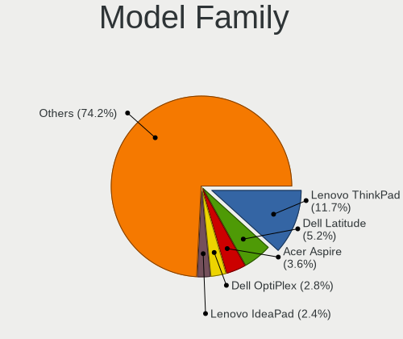
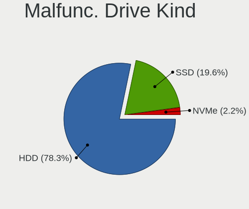
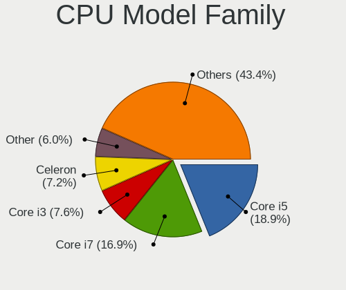
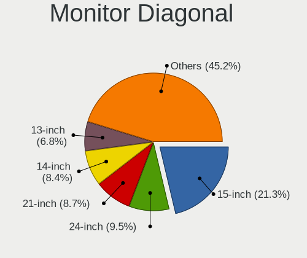
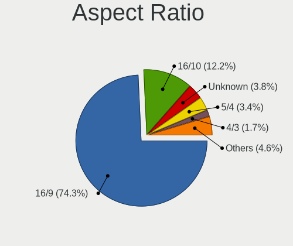
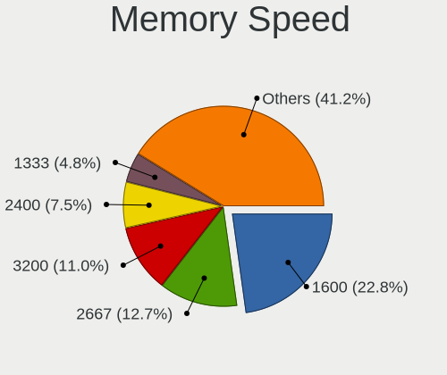
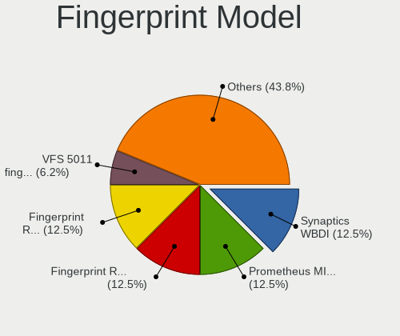
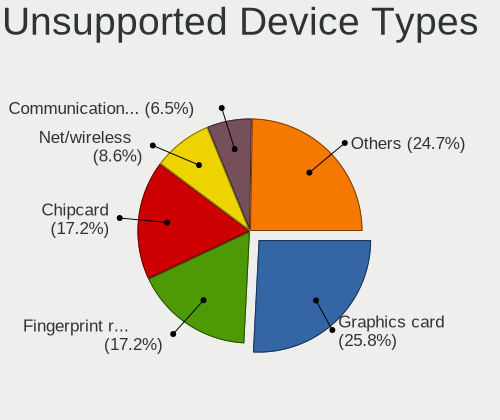

Devuan - Tested Hardware & Statistics
-------------------------------------

A project to collect tested hardware configurations for Devuan.

Anyone can contribute to this report by the [hw-probe](https://github.com/linuxhw/hw-probe) tool:

    sudo -E hw-probe -all -upload

Please submit a probe of your configuration if it's not presented on the page or is rare.

This is a report for all computer types. See also reports for [desktops](/Dist/Devuan/Desktop/README.md) and [notebooks](/Dist/Devuan/Notebook/README.md).

Full-feature report is available here: https://linux-hardware.org/?view=trends

Contents
--------

* [ Test Cases ](#test-cases)

* [ System ](#system)
  - [ Kernel                   ](#kernel)
  - [ Kernel Family            ](#kernel-family)
  - [ Kernel Major Ver.        ](#kernel-major-ver)
  - [ Arch                     ](#arch)
  - [ DE                       ](#de)
  - [ Display Server           ](#display-server)
  - [ Display Manager          ](#display-manager)
  - [ OS Lang                  ](#os-lang)
  - [ Boot Mode                ](#boot-mode)
  - [ Filesystem               ](#filesystem)
  - [ Part. scheme             ](#part-scheme)
  - [ Dual Boot with Linux/BSD ](#dual-boot-with-linuxbsd)
  - [ Dual Boot (Win)          ](#dual-boot-win)

* [ Board ](#board)
  - [ Vendor                   ](#vendor)
  - [ Model                    ](#model)
  - [ Model Family             ](#model-family)
  - [ MFG Year                 ](#mfg-year)
  - [ Form Factor              ](#form-factor)
  - [ Secure Boot              ](#secure-boot)
  - [ Coreboot                 ](#coreboot)
  - [ RAM Size                 ](#ram-size)
  - [ RAM Used                 ](#ram-used)
  - [ Total Drives             ](#total-drives)
  - [ Has CD-ROM               ](#has-cd-rom)
  - [ Has Ethernet             ](#has-ethernet)
  - [ Has WiFi                 ](#has-wifi)
  - [ Has Bluetooth            ](#has-bluetooth)

* [ Location ](#location)
  - [ Country                  ](#country)
  - [ City                     ](#city)

* [ Drives ](#drives)
  - [ Drive Vendor             ](#drive-vendor)
  - [ Drive Model              ](#drive-model)
  - [ HDD Vendor               ](#hdd-vendor)
  - [ SSD Vendor               ](#ssd-vendor)
  - [ Drive Kind               ](#drive-kind)
  - [ Drive Connector          ](#drive-connector)
  - [ Drive Size               ](#drive-size)
  - [ Space Total              ](#space-total)
  - [ Space Used               ](#space-used)
  - [ Malfunc. Drives          ](#malfunc-drives)
  - [ Malfunc. Drive Vendor    ](#malfunc-drive-vendor)
  - [ Malfunc. HDD Vendor      ](#malfunc-hdd-vendor)
  - [ Malfunc. Drive Kind      ](#malfunc-drive-kind)
  - [ Failed Drives            ](#failed-drives)
  - [ Failed Drive Vendor      ](#failed-drive-vendor)
  - [ Drive Status             ](#drive-status)

* [ Storage controller ](#storage-controller)
  - [ Storage Vendor           ](#storage-vendor)
  - [ Storage Model            ](#storage-model)
  - [ Storage Kind             ](#storage-kind)

* [ Processor ](#processor)
  - [ CPU Vendor               ](#cpu-vendor)
  - [ CPU Model                ](#cpu-model)
  - [ CPU Model Family         ](#cpu-model-family)
  - [ CPU Cores                ](#cpu-cores)
  - [ CPU Sockets              ](#cpu-sockets)
  - [ CPU Threads              ](#cpu-threads)
  - [ CPU Op-Modes             ](#cpu-op-modes)
  - [ CPU Microcode            ](#cpu-microcode)
  - [ CPU Microarch            ](#cpu-microarch)

* [ Graphics ](#graphics)
  - [ GPU Vendor               ](#gpu-vendor)
  - [ GPU Model                ](#gpu-model)
  - [ GPU Combo                ](#gpu-combo)
  - [ GPU Driver               ](#gpu-driver)
  - [ GPU Memory               ](#gpu-memory)

* [ Monitor ](#monitor)
  - [ Monitor Vendor           ](#monitor-vendor)
  - [ Monitor Model            ](#monitor-model)
  - [ Monitor Resolution       ](#monitor-resolution)
  - [ Monitor Diagonal         ](#monitor-diagonal)
  - [ Monitor Width            ](#monitor-width)
  - [ Aspect Ratio             ](#aspect-ratio)
  - [ Monitor Area             ](#monitor-area)
  - [ Pixel Density            ](#pixel-density)
  - [ Multiple Monitors        ](#multiple-monitors)

* [ Network ](#network)
  - [ Net Controller Vendor    ](#net-controller-vendor)
  - [ Net Controller Model     ](#net-controller-model)
  - [ Wireless Vendor          ](#wireless-vendor)
  - [ Wireless Model           ](#wireless-model)
  - [ Ethernet Vendor          ](#ethernet-vendor)
  - [ Ethernet Model           ](#ethernet-model)
  - [ Net Controller Kind      ](#net-controller-kind)
  - [ Used Controller          ](#used-controller)
  - [ NICs                     ](#nics)
  - [ IPv6                     ](#ipv6)

* [ Bluetooth ](#bluetooth)
  - [ Bluetooth Vendor         ](#bluetooth-vendor)
  - [ Bluetooth Model          ](#bluetooth-model)

* [ Sound ](#sound)
  - [ Sound Vendor             ](#sound-vendor)
  - [ Sound Model              ](#sound-model)

* [ Memory ](#memory)
  - [ Memory Vendor            ](#memory-vendor)
  - [ Memory Model             ](#memory-model)
  - [ Memory Kind              ](#memory-kind)
  - [ Memory Form Factor       ](#memory-form-factor)
  - [ Memory Size              ](#memory-size)
  - [ Memory Speed             ](#memory-speed)

* [ Printers & scanners ](#printers--scanners)
  - [ Printer Vendor           ](#printer-vendor)
  - [ Printer Model            ](#printer-model)
  - [ Scanner Vendor           ](#scanner-vendor)
  - [ Scanner Model            ](#scanner-model)

* [ Camera ](#camera)
  - [ Camera Vendor            ](#camera-vendor)
  - [ Camera Model             ](#camera-model)

* [ Security ](#security)
  - [ Fingerprint Vendor       ](#fingerprint-vendor)
  - [ Fingerprint Model        ](#fingerprint-model)
  - [ Chipcard Vendor          ](#chipcard-vendor)
  - [ Chipcard Model           ](#chipcard-model)

* [ Unsupported ](#unsupported)
  - [ Unsupported Devices      ](#unsupported-devices)
  - [ Unsupported Device Types ](#unsupported-device-types)

Test Cases
----------

| Vendor        | Model                       | Form-Factor | Probe                                                      | Date         |
|---------------|-----------------------------|-------------|------------------------------------------------------------|--------------|
| Lenovo        | ThinkPad X1 Tablet Gen 3... | Tablet      | [f92ae76fed](https://linux-hardware.org/?probe=f92ae76fed) | Feb 24, 2022 |
| MSI           | B450M PRO-M2 MAX            | Desktop     | [3f99c8072a](https://linux-hardware.org/?probe=3f99c8072a) | Feb 23, 2022 |
| ASUSTek       | PRIME H510M-A               | Desktop     | [7ab68e0043](https://linux-hardware.org/?probe=7ab68e0043) | Feb 17, 2022 |
| ASRock        | B450M-HDV R4.0              | Desktop     | [f2a65b8a5f](https://linux-hardware.org/?probe=f2a65b8a5f) | Feb 14, 2022 |
| Gigabyte      | P55A-UD3                    | Desktop     | [824dbdd8ad](https://linux-hardware.org/?probe=824dbdd8ad) | Jan 22, 2022 |
| Online Lab... | SR 42                       | Desktop     | [e3037eb087](https://linux-hardware.org/?probe=e3037eb087) | Jan 22, 2022 |
| Gigabyte      | H310M S2H x.x               | Desktop     | [9e14e04f7f](https://linux-hardware.org/?probe=9e14e04f7f) | Jan 22, 2022 |
| ASUSTek       | K55VJ                       | Notebook    | [562262b9eb](https://linux-hardware.org/?probe=562262b9eb) | Jan 22, 2022 |
| ASRock        | B450M-HDV R4.0              | Desktop     | [8e7267692b](https://linux-hardware.org/?probe=8e7267692b) | Jan 21, 2022 |
| ASUSTek       | X555LJ                      | Notebook    | [9fbdf4dfc2](https://linux-hardware.org/?probe=9fbdf4dfc2) | Jan 17, 2022 |
| Lenovo        | ThinkPad T420 4180AG3       | Notebook    | [2c3cd27ad2](https://linux-hardware.org/?probe=2c3cd27ad2) | Jan 16, 2022 |
| Notebook      | W230ST                      | Notebook    | [3dacf0aea8](https://linux-hardware.org/?probe=3dacf0aea8) | Jan 15, 2022 |
| Gigabyte      | MZGLKBP-00                  | Desktop     | [202ccac61c](https://linux-hardware.org/?probe=202ccac61c) | Dec 30, 2021 |
| Gigabyte      | B75M-D3V                    | Desktop     | [1c15b6b3c7](https://linux-hardware.org/?probe=1c15b6b3c7) | Dec 26, 2021 |
| Lenovo        | IdeaPad 130-15AST 81H5      | Notebook    | [899cb98778](https://linux-hardware.org/?probe=899cb98778) | Dec 06, 2021 |
| Fujitsu Si... | ESPRIMO Mobile V6535        | Notebook    | [d860ff9858](https://linux-hardware.org/?probe=d860ff9858) | Nov 30, 2021 |
| Fujitsu       | LIFEBOOK U7510              | Notebook    | [d43a6a6bb8](https://linux-hardware.org/?probe=d43a6a6bb8) | Nov 29, 2021 |
| HP            | 1495                        | Desktop     | [28835849f0](https://linux-hardware.org/?probe=28835849f0) | Oct 29, 2021 |
| Lenovo        | ThinkPad T550 20CJS1VD01    | Notebook    | [55689e67b3](https://linux-hardware.org/?probe=55689e67b3) | Oct 27, 2021 |
| Lenovo        | ThinkPad X230 2325DE0       | Notebook    | [991007e92a](https://linux-hardware.org/?probe=991007e92a) | Oct 13, 2021 |
| Lenovo        | IdeaPad 130-15AST 81H5      | Notebook    | [7f1b3371a9](https://linux-hardware.org/?probe=7f1b3371a9) | Oct 03, 2021 |
| ASUSTek       | PRIME Z490M-PLUS            | Desktop     | [5a7e6805d3](https://linux-hardware.org/?probe=5a7e6805d3) | Oct 02, 2021 |
| MSI           | B360M PRO-VD                | Desktop     | [06e625d98f](https://linux-hardware.org/?probe=06e625d98f) | Oct 02, 2021 |
| Toshiba       | Satellite M40X              | Notebook    | [61fea93e97](https://linux-hardware.org/?probe=61fea93e97) | Oct 01, 2021 |
| Acer          | Aspire 5250                 | Notebook    | [ae41600fd9](https://linux-hardware.org/?probe=ae41600fd9) | Sep 24, 2021 |
| IBM           | ThinkPad T41p 2373GHG       | Notebook    | [04747e3df4](https://linux-hardware.org/?probe=04747e3df4) | Sep 19, 2021 |
| IBM           | ThinkPad T41p 2373GHG       | Notebook    | [134b90f474](https://linux-hardware.org/?probe=134b90f474) | Sep 18, 2021 |
| HP            | Pavilion x360 Convertibl... | Convertible | [ffd8fa11af](https://linux-hardware.org/?probe=ffd8fa11af) | Sep 16, 2021 |
| Apple         | Mac-F22C86C8                | Mini pc     | [d65f9a48fd](https://linux-hardware.org/?probe=d65f9a48fd) | Sep 04, 2021 |
| Lenovo        | ThinkPad X200 74585FU       | Notebook    | [04256a6e0a](https://linux-hardware.org/?probe=04256a6e0a) | Aug 25, 2021 |
| Lenovo        | ThinkPad X200 74585FU       | Notebook    | [dffbcc492c](https://linux-hardware.org/?probe=dffbcc492c) | Aug 25, 2021 |
| ASUSTek       | K52F                        | Notebook    | [643e3cc4b3](https://linux-hardware.org/?probe=643e3cc4b3) | Aug 13, 2021 |
| MSI           | MS-1688                     | Notebook    | [0ae772d66b](https://linux-hardware.org/?probe=0ae772d66b) | Jul 30, 2021 |
| Lenovo        | ThinkPad X220 429053G       | Notebook    | [5f553465bf](https://linux-hardware.org/?probe=5f553465bf) | Jul 29, 2021 |
| Acer          | Extensa 215-51K             | Notebook    | [1c49c2f4d0](https://linux-hardware.org/?probe=1c49c2f4d0) | Jul 26, 2021 |
| Lenovo        | ThinkPad X250 20CLS7WY04    | Notebook    | [fc77801294](https://linux-hardware.org/?probe=fc77801294) | Jun 07, 2021 |
| HP            | 1825                        | Desktop     | [ff75be1ea3](https://linux-hardware.org/?probe=ff75be1ea3) | Jun 06, 2021 |
| Lenovo        | ThinkPad T550 20CJS1VD01    | Notebook    | [aef4e323e2](https://linux-hardware.org/?probe=aef4e323e2) | Jun 06, 2021 |
| ASUSTek       | P5G41T-M LX2/BR             | Desktop     | [8702580cb4](https://linux-hardware.org/?probe=8702580cb4) | May 26, 2021 |
| ASUSTek       | P5G41T-M LX2/BR             | Desktop     | [05f1d12390](https://linux-hardware.org/?probe=05f1d12390) | May 26, 2021 |
| Gigabyte      | H170-HD3-CF                 | Desktop     | [2ffdc89c2a](https://linux-hardware.org/?probe=2ffdc89c2a) | Apr 28, 2021 |
| Gigabyte      | Z390 GAMING SLI-CF          | Desktop     | [50f8ddb45c](https://linux-hardware.org/?probe=50f8ddb45c) | Apr 28, 2021 |
| ASUSTek       | K55VJ                       | Notebook    | [6fa86f9d25](https://linux-hardware.org/?probe=6fa86f9d25) | Apr 27, 2021 |
| Google        | Panther                     | Desktop     | [666794d603](https://linux-hardware.org/?probe=666794d603) | Apr 26, 2021 |
| ASUSTek       | K55VJ                       | Notebook    | [aef1b6c71f](https://linux-hardware.org/?probe=aef1b6c71f) | Apr 17, 2021 |
| ASUSTek       | F1A55-M LX                  | Desktop     | [630bbb748a](https://linux-hardware.org/?probe=630bbb748a) | Apr 17, 2021 |
| Gigabyte      | H170-HD3-CF                 | Desktop     | [f103eefd66](https://linux-hardware.org/?probe=f103eefd66) | Apr 17, 2021 |
| Gigabyte      | Z390 GAMING SLI-CF          | Desktop     | [e802fc9ff5](https://linux-hardware.org/?probe=e802fc9ff5) | Apr 17, 2021 |
| HP            | ProBook 6475b               | Notebook    | [74b0fa77b5](https://linux-hardware.org/?probe=74b0fa77b5) | Apr 14, 2021 |
| Sun Micros... | Ultra 24 50                 | Desktop     | [e4b76f9137](https://linux-hardware.org/?probe=e4b76f9137) | Apr 10, 2021 |
| Sun Micros... | Ultra 24 50                 | Desktop     | [15691fbc42](https://linux-hardware.org/?probe=15691fbc42) | Apr 10, 2021 |
| Fujitsu Si... | AMILO Xi 1546               | Notebook    | [22a53eeb74](https://linux-hardware.org/?probe=22a53eeb74) | Apr 03, 2021 |
| Chuwi         | Hi10 pro tablet             | Tablet      | [ee6bb68e8c](https://linux-hardware.org/?probe=ee6bb68e8c) | Mar 29, 2021 |
| ASUSTek       | A8R-MVP                     | Desktop     | [6daa2a372c](https://linux-hardware.org/?probe=6daa2a372c) | Mar 27, 2021 |
| ASRock        | K8A780LM                    | Desktop     | [b8f4c7c2cb](https://linux-hardware.org/?probe=b8f4c7c2cb) | Mar 22, 2021 |
| Gigabyte      | 970A-DS3P                   | Desktop     | [eeebc66137](https://linux-hardware.org/?probe=eeebc66137) | Mar 17, 2021 |
| Gigabyte      | 970A-DS3P                   | Desktop     | [fdf4e6d366](https://linux-hardware.org/?probe=fdf4e6d366) | Mar 17, 2021 |
| ASRock        | K8A780LM                    | Desktop     | [d95a56d80f](https://linux-hardware.org/?probe=d95a56d80f) | Mar 15, 2021 |
| ASRock        | H81M-ITX                    | Desktop     | [0f5f41e1ca](https://linux-hardware.org/?probe=0f5f41e1ca) | Mar 08, 2021 |
| ASRock        | H81M-ITX                    | Desktop     | [8599b883d6](https://linux-hardware.org/?probe=8599b883d6) | Mar 08, 2021 |
| Intel         | D815EEA AAA45884-401        | Desktop     | [248565d49c](https://linux-hardware.org/?probe=248565d49c) | Feb 20, 2021 |
| Intel         | D815EEA AAA45884-401        | Desktop     | [3acc2f0b1e](https://linux-hardware.org/?probe=3acc2f0b1e) | Feb 20, 2021 |
| Gigabyte      | GA-G41M-ES2L                | Desktop     | [592c995804](https://linux-hardware.org/?probe=592c995804) | Jan 30, 2021 |
| Acer          | F672CR R01-A4               | Desktop     | [8d41694165](https://linux-hardware.org/?probe=8d41694165) | Jan 25, 2021 |
| Teclast       | F6 Plus                     | Notebook    | [26ac25681a](https://linux-hardware.org/?probe=26ac25681a) | Jan 08, 2021 |
| Lenovo        | Board                       | Desktop     | [f963a2e7f9](https://linux-hardware.org/?probe=f963a2e7f9) | Jan 06, 2021 |
| Lenovo        | Board                       | Desktop     | [3ab2cd64a6](https://linux-hardware.org/?probe=3ab2cd64a6) | Jan 04, 2021 |
| Dell          | 0GXM1W A04                  | Desktop     | [989f983b51](https://linux-hardware.org/?probe=989f983b51) | Dec 28, 2020 |
| Lenovo        | Board                       | Desktop     | [aac28ba905](https://linux-hardware.org/?probe=aac28ba905) | Dec 19, 2020 |
| Dell          | Precision 7530              | Notebook    | [8e0ee186a3](https://linux-hardware.org/?probe=8e0ee186a3) | Dec 04, 2020 |
| AMI           | Aptio CRB                   | Mini pc     | [b708be8d9e](https://linux-hardware.org/?probe=b708be8d9e) | Nov 10, 2020 |
| Lenovo        | ThinkPad X60 1707YF8        | Notebook    | [bcdd451de1](https://linux-hardware.org/?probe=bcdd451de1) | Oct 31, 2020 |
| Intel         | HURONRIVER                  | Desktop     | [49bdd1a99d](https://linux-hardware.org/?probe=49bdd1a99d) | Oct 29, 2020 |
| ASUSTek       | Maximus V GENE              | Desktop     | [253b5aba98](https://linux-hardware.org/?probe=253b5aba98) | Oct 29, 2020 |
| Nokia         | N900                        | Notebook    | [7960cb48cc](https://linux-hardware.org/?probe=7960cb48cc) | Oct 05, 2020 |
| ASUSTek       | H81M-C                      | Desktop     | [cd136e059e](https://linux-hardware.org/?probe=cd136e059e) | Oct 05, 2020 |
| Lenovo        | ThinkPad X230 23247S0       | Notebook    | [f313b0bf1b](https://linux-hardware.org/?probe=f313b0bf1b) | Oct 01, 2020 |
| Dell          | Precision 7530              | Notebook    | [e6c6dd2734](https://linux-hardware.org/?probe=e6c6dd2734) | Sep 26, 2020 |
| Dell          | Precision 7530              | Notebook    | [81e9306141](https://linux-hardware.org/?probe=81e9306141) | Sep 26, 2020 |
| HP            | 1791                        | Desktop     | [f41fcdc019](https://linux-hardware.org/?probe=f41fcdc019) | Sep 26, 2020 |
| Lenovo        | ThinkPad X1 Carbon 7th 2... | Notebook    | [3d241c321f](https://linux-hardware.org/?probe=3d241c321f) | Sep 20, 2020 |
| Lenovo        | Yoga C640-13IML 81UE        | Convertible | [32b487459e](https://linux-hardware.org/?probe=32b487459e) | Sep 16, 2020 |
| ASUSTek       | K52F                        | Notebook    | [cef5147eeb](https://linux-hardware.org/?probe=cef5147eeb) | Aug 30, 2020 |
| Acer          | Aspire 5732Z                | Notebook    | [c4cb936b69](https://linux-hardware.org/?probe=c4cb936b69) | Aug 30, 2020 |
| Toshiba       | Satellite L655              | Notebook    | [6251a9111f](https://linux-hardware.org/?probe=6251a9111f) | Aug 30, 2020 |
| HP            | Pavilion 11 x360 PC         | Notebook    | [0c85729a27](https://linux-hardware.org/?probe=0c85729a27) | Aug 30, 2020 |
| ASUSTek       | EX-A320M-GAMING             | Desktop     | [4eb75f039b](https://linux-hardware.org/?probe=4eb75f039b) | Aug 17, 2020 |
| HP            | 1791                        | Desktop     | [5a21e91155](https://linux-hardware.org/?probe=5a21e91155) | Aug 15, 2020 |
| Gigabyte      | B450 AORUS ELITE            | Desktop     | [ff5143e508](https://linux-hardware.org/?probe=ff5143e508) | Aug 02, 2020 |
| Samsung       | 355V4C/355V4X/355V5C/355... | Notebook    | [358be6b820](https://linux-hardware.org/?probe=358be6b820) | Jul 28, 2020 |
| Lenovo        | IdeaPad Z370                | Notebook    | [51e3108708](https://linux-hardware.org/?probe=51e3108708) | Jun 28, 2020 |
| Dell          | Latitude 5501               | Notebook    | [94ec8d2a1d](https://linux-hardware.org/?probe=94ec8d2a1d) | Jun 28, 2020 |
| Lenovo        | IdeaPad Z370                | Notebook    | [76c985ed75](https://linux-hardware.org/?probe=76c985ed75) | Jun 27, 2020 |
| Dell          | Latitude E7250              | Notebook    | [c2ca61e7bf](https://linux-hardware.org/?probe=c2ca61e7bf) | Jun 23, 2020 |
| ASUSTek       | P5PE-VM                     | Desktop     | [298c1239dd](https://linux-hardware.org/?probe=298c1239dd) | May 20, 2020 |
| MSI           | B350 PC MATE                | Desktop     | [ff3852f02d](https://linux-hardware.org/?probe=ff3852f02d) | Mar 23, 2020 |
| Dell          | Inspiron 1564               | Notebook    | [b80e556643](https://linux-hardware.org/?probe=b80e556643) | Feb 02, 2020 |
| MTC           | Montara-GML                 | Notebook    | [227bf1ba1d](https://linux-hardware.org/?probe=227bf1ba1d) | Dec 07, 2019 |
| ASRock        | G31M-VS2                    | Desktop     | [b64547f948](https://linux-hardware.org/?probe=b64547f948) | Dec 06, 2019 |
| Gigabyte      | H170-HD3-CF                 | Desktop     | [338994bd66](https://linux-hardware.org/?probe=338994bd66) | Dec 02, 2019 |
| ASUSTek       | P5PE-VM                     | Desktop     | [6a89046dfb](https://linux-hardware.org/?probe=6a89046dfb) | Dec 02, 2019 |
| Microsoft     | Surface Pro 4               | Tablet      | [59ca47d9e7](https://linux-hardware.org/?probe=59ca47d9e7) | Apr 12, 2019 |

System
------

Kernel
------

Version of the Linux kernel

| Version                   | Computers | Percent |
|---------------------------|-----------|---------|
| 5.10.0-9-amd64            | 7         | 8.24%   |
| 5.10.0-8-amd64            | 7         | 8.24%   |
| 4.19.0-9-amd64            | 6         | 7.06%   |
| 4.19.0-14-amd64           | 6         | 7.06%   |
| 4.19.0-16-amd64           | 5         | 5.88%   |
| 5.7.0-2-amd64             | 3         | 3.53%   |
| 5.10.0-10-amd64           | 3         | 3.53%   |
| 4.19.0-12-amd64           | 3         | 3.53%   |
| 5.7.0-0.bpo.2-amd64       | 2         | 2.35%   |
| 5.15.0-2-amd64            | 2         | 2.35%   |
| 5.10.0-6-amd64            | 2         | 2.35%   |
| 4.19.0-17-amd64           | 2         | 2.35%   |
| 4.19.0-10-amd64           | 2         | 2.35%   |
| 5.9.0-4-amd64             | 1         | 1.18%   |
| 5.9.0-1-amd64             | 1         | 1.18%   |
| 5.8.0-3-amd64             | 1         | 1.18%   |
| 5.8.0-1-amd64             | 1         | 1.18%   |
| 5.7.19-server1            | 1         | 1.18%   |
| 5.7.0-1-amd64             | 1         | 1.18%   |
| 5.6.0-2-amd64             | 1         | 1.18%   |
| 5.16.0-1-amd64            | 1         | 1.18%   |
| 5.15.5-xanmod1            | 1         | 1.18%   |
| 5.15.0-0.bpo.2-amd64      | 1         | 1.18%   |
| 5.14.0-4-amd64            | 1         | 1.18%   |
| 5.11.0-6.2-liquorix-amd64 | 1         | 1.18%   |
| 5.10.0-7-amd64            | 1         | 1.18%   |
| 5.10.0-5-amd64            | 1         | 1.18%   |
| 5.10.0-4-amd64            | 1         | 1.18%   |
| 5.10.0-2-amd64            | 1         | 1.18%   |
| 5.10.0-11-amd64           | 1         | 1.18%   |
| 5.10.0-1-amd64            | 1         | 1.18%   |
| 5.1.21                    | 1         | 1.18%   |
| 5.0.7                     | 1         | 1.18%   |
| 4.9.0-15-amd64            | 1         | 1.18%   |
| 4.9.0-14-amd64            | 1         | 1.18%   |
| 4.9.0-14-686-pae          | 1         | 1.18%   |
| 4.9.0-14-686              | 1         | 1.18%   |
| 4.9.0-11-amd64            | 1         | 1.18%   |
| 4.9.0-11-686-pae          | 1         | 1.18%   |
| 4.9.0-11-686              | 1         | 1.18%   |
| 4.9.0-0.bpo.4-686-pae     | 1         | 1.18%   |
| 4.4.195-antix.1-amd64-smp | 1         | 1.18%   |
| 4.19.112                  | 1         | 1.18%   |
| 4.19.0-17-686-pae         | 1         | 1.18%   |
| 4.19.0-13-amd64           | 1         | 1.18%   |
| 4.19.0-1-amd64            | 1         | 1.18%   |
| 4.19.0-0.bpo.6-amd64      | 1         | 1.18%   |
| 4.18.0-0.bpo.1-amd64      | 1         | 1.18%   |

Kernel Family
-------------

Linux kernel without a distro release

| Version  | Computers | Percent |
|----------|-----------|---------|
| 4.19.0   | 27        | 32.14%  |
| 5.10.0   | 25        | 29.76%  |
| 4.9.0    | 8         | 9.52%   |
| 5.7.0    | 6         | 7.14%   |
| 5.15.0   | 3         | 3.57%   |
| 5.9.0    | 2         | 2.38%   |
| 5.8.0    | 2         | 2.38%   |
| 5.7.19   | 1         | 1.19%   |
| 5.6.0    | 1         | 1.19%   |
| 5.16.0   | 1         | 1.19%   |
| 5.15.5   | 1         | 1.19%   |
| 5.14.0   | 1         | 1.19%   |
| 5.11.0   | 1         | 1.19%   |
| 5.1.21   | 1         | 1.19%   |
| 5.0.7    | 1         | 1.19%   |
| 4.4.195  | 1         | 1.19%   |
| 4.19.112 | 1         | 1.19%   |
| 4.18.0   | 1         | 1.19%   |

Kernel Major Ver.
-----------------

Linux kernel major version

| Version | Computers | Percent |
|---------|-----------|---------|
| 4.19    | 28        | 33.33%  |
| 5.10    | 25        | 29.76%  |
| 4.9     | 8         | 9.52%   |
| 5.7     | 7         | 8.33%   |
| 5.15    | 4         | 4.76%   |
| 5.9     | 2         | 2.38%   |
| 5.8     | 2         | 2.38%   |
| 5.6     | 1         | 1.19%   |
| 5.16    | 1         | 1.19%   |
| 5.14    | 1         | 1.19%   |
| 5.11    | 1         | 1.19%   |
| 5.1     | 1         | 1.19%   |
| 5.0     | 1         | 1.19%   |
| 4.4     | 1         | 1.19%   |
| 4.18    | 1         | 1.19%   |

Arch
----

OS architecture (x86_64, i586, etc.)

| Name   | Computers | Percent |
|--------|-----------|---------|
| x86_64 | 71        | 91.03%  |
| i686   | 6         | 7.69%   |
| armv7l | 1         | 1.28%   |

DE
--

Desktop Environment

| Name       | Computers | Percent |
|------------|-----------|---------|
| XFCE       | 31        | 38.27%  |
| Unknown    | 13        | 16.05%  |
| KDE5       | 12        | 14.81%  |
| MATE       | 9         | 11.11%  |
| LXDE       | 4         | 4.94%   |
| i3         | 4         | 4.94%   |
| LXQt       | 2         | 2.47%   |
| Cinnamon   | 2         | 2.47%   |
| X-Cinnamon | 1         | 1.23%   |
| Openbox    | 1         | 1.23%   |
| GNOME      | 1         | 1.23%   |
| awesome    | 1         | 1.23%   |

Display Server
--------------

X11 or Wayland

| Name    | Computers | Percent |
|---------|-----------|---------|
| X11     | 69        | 87.34%  |
| Tty     | 7         | 8.86%   |
| Unknown | 3         | 3.8%    |

Display Manager
---------------

SDDM, LightDM, etc.

| Name    | Computers | Percent |
|---------|-----------|---------|
| SLiM    | 28        | 35%     |
| Unknown | 23        | 28.75%  |
| LightDM | 21        | 26.25%  |
| SDDM    | 4         | 5%      |
| XDM     | 2         | 2.5%    |
| NODM    | 1         | 1.25%   |
| GDM3    | 1         | 1.25%   |

OS Lang
-------

Language

| Lang        | Computers | Percent |
|-------------|-----------|---------|
| en_US       | 23        | 29.11%  |
| en_GB       | 15        | 18.99%  |
| ru_RU       | 7         | 8.86%   |
| Unknown     | 7         | 8.86%   |
| C           | 5         | 6.33%   |
| fr_FR       | 4         | 5.06%   |
| sk_SK       | 3         | 3.8%    |
| pt_BR       | 3         | 3.8%    |
| en_AU       | 2         | 2.53%   |
| pl_PL       | 1         | 1.27%   |
| it_IT       | 1         | 1.27%   |
| fr_BE       | 1         | 1.27%   |
| es_SV       | 1         | 1.27%   |
| es_ES       | 1         | 1.27%   |
| en_US.utf-8 | 1         | 1.27%   |
| en_SG       | 1         | 1.27%   |
| en_NZ       | 1         | 1.27%   |
| en_CA       | 1         | 1.27%   |
| de_AT       | 1         | 1.27%   |

Boot Mode
---------

EFI or BIOS

| Mode | Computers | Percent |
|------|-----------|---------|
| BIOS | 52        | 65.82%  |
| EFI  | 27        | 34.18%  |

Filesystem
----------

Type of filesystem

| Type    | Computers | Percent |
|---------|-----------|---------|
| Ext4    | 64        | 82.05%  |
| Unknown | 5         | 6.41%   |
| Btrfs   | 4         | 5.13%   |
| Overlay | 2         | 2.56%   |
| OveXlay | 1         | 1.28%   |
| Ext3    | 1         | 1.28%   |
| Ext2    | 1         | 1.28%   |

Part. scheme
------------

Scheme of partitioning

| Type    | Computers | Percent |
|---------|-----------|---------|
| MBR     | 36        | 43.9%   |
| GPT     | 36        | 43.9%   |
| Unknown | 10        | 12.2%   |

Dual Boot with Linux/BSD
------------------------

Hosting more than one Linux/BSD

| Dual boot | Computers | Percent |
|-----------|-----------|---------|
| No        | 60        | 75.95%  |
| Yes       | 19        | 24.05%  |

Dual Boot (Win)
---------------

Hosting Linux and Windows

| Dual boot | Computers | Percent |
|-----------|-----------|---------|
| No        | 59        | 74.68%  |
| Yes       | 20        | 25.32%  |

Board
-----

Vendor
------

Motherboard manufacturer

| Name                | Computers | Percent |
|---------------------|-----------|---------|
| Lenovo              | 14        | 17.95%  |
| ASUSTek Computer    | 11        | 14.1%   |
| Gigabyte Technology | 10        | 12.82%  |
| Hewlett-Packard     | 6         | 7.69%   |
| Dell                | 5         | 6.41%   |
| MSI                 | 4         | 5.13%   |
| ASRock              | 4         | 5.13%   |
| Acer                | 4         | 5.13%   |
| Toshiba             | 2         | 2.56%   |
| Intel               | 2         | 2.56%   |
| Fujitsu Siemens     | 2         | 2.56%   |
| Teclast             | 1         | 1.28%   |
| Sun Microsystems    | 1         | 1.28%   |
| Samsung Electronics | 1         | 1.28%   |
| Online Labs         | 1         | 1.28%   |
| Notebook            | 1         | 1.28%   |
| Nokia               | 1         | 1.28%   |
| MTC                 | 1         | 1.28%   |
| Microsoft           | 1         | 1.28%   |
| IBM                 | 1         | 1.28%   |
| Google              | 1         | 1.28%   |
| Fujitsu             | 1         | 1.28%   |
| Chuwi               | 1         | 1.28%   |
| Apple               | 1         | 1.28%   |
| AMI                 | 1         | 1.28%   |

Model
-----

Motherboard model

| Name                                                                                     | Computers | Percent |
|------------------------------------------------------------------------------------------|-----------|---------|
| Toshiba Satellite M40X                                                                   | 1         | 1.28%   |
| Toshiba Satellite L655                                                                   | 1         | 1.28%   |
| Teclast F6 Plus                                                                          | 1         | 1.28%   |
| Sun Microsystems Ultra 24                                                                | 1         | 1.28%   |
| Samsung 355V4C/355V4X/355V5C/355V5X/356V4C/356V4X/356V5C/356V5X/3445VC/3445VX/3545VC/354 | 1         | 1.28%   |
| Online Labs SR                                                                           | 1         | 1.28%   |
| Notebook W230ST                                                                          | 1         | 1.28%   |
| Nokia N900                                                                               | 1         | 1.28%   |
| MTC Montara-GML                                                                          | 1         | 1.28%   |
| MSI MS-7B84                                                                              | 1         | 1.28%   |
| MSI MS-7B53                                                                              | 1         | 1.28%   |
| MSI MS-7A34                                                                              | 1         | 1.28%   |
| MSI MS-1688                                                                              | 1         | 1.28%   |
| Microsoft Surface Pro 4                                                                  | 1         | 1.28%   |
| Lenovo Yoga C640-13IML 81UE                                                              | 1         | 1.28%   |
| Lenovo ThinkStation E20 4220CTO                                                          | 1         | 1.28%   |
| Lenovo ThinkPad X60 1707YF8                                                              | 1         | 1.28%   |
| Lenovo ThinkPad X250 20CLS7WY04                                                          | 1         | 1.28%   |
| Lenovo ThinkPad X230 2325DE0                                                             | 1         | 1.28%   |
| Lenovo ThinkPad X230 23247S0                                                             | 1         | 1.28%   |
| Lenovo ThinkPad X220 429053G                                                             | 1         | 1.28%   |
| Lenovo ThinkPad X200 74585FU                                                             | 1         | 1.28%   |
| Lenovo ThinkPad X1 Tablet Gen 3 20KJCTO1WW                                               | 1         | 1.28%   |
| Lenovo ThinkPad X1 Carbon 7th 20QD00L1PB                                                 | 1         | 1.28%   |
| Lenovo ThinkPad T550 20CJS1VD01                                                          | 1         | 1.28%   |
| Lenovo ThinkPad T420 4180AG3                                                             | 1         | 1.28%   |
| Lenovo IdeaPad Z370                                                                      | 1         | 1.28%   |
| Lenovo IdeaPad 130-15AST 81H5                                                            | 1         | 1.28%   |
| Intel D815EEA AAA45884-401                                                               | 1         | 1.28%   |
| Intel AHV                                                                                | 1         | 1.28%   |
| IBM ThinkPad T41p 2373GHG                                                                | 1         | 1.28%   |
| HP Z220 SFF Workstation                                                                  | 1         | 1.28%   |
| HP ProBook 6475b                                                                         | 1         | 1.28%   |
| HP Pavilion x360 Convertible 14-dh1xxx                                                   | 1         | 1.28%   |
| HP Pavilion 11 x360 PC                                                                   | 1         | 1.28%   |
| HP EliteDesk 800 G1 DM                                                                   | 1         | 1.28%   |
| HP Compaq 8200 Elite SFF PC                                                              | 1         | 1.28%   |
| Google Panther                                                                           | 1         | 1.28%   |
| Gigabyte Z390 GAMING SLI                                                                 | 1         | 1.28%   |
| Gigabyte P55A-UD3                                                                        | 1         | 1.28%   |
| Gigabyte MZGLKBP-00                                                                      | 1         | 1.28%   |
| Gigabyte H310M S2H 2.0                                                                   | 1         | 1.28%   |
| Gigabyte H170-HD3-CF                                                                     | 1         | 1.28%   |
| Gigabyte H170-HD3                                                                        | 1         | 1.28%   |
| Gigabyte GA-G41M-ES2L                                                                    | 1         | 1.28%   |
| Gigabyte B75M-D3V                                                                        | 1         | 1.28%   |
| Gigabyte B450 AORUS ELITE                                                                | 1         | 1.28%   |
| Gigabyte 970A-DS3P                                                                       | 1         | 1.28%   |
| Fujitsu Siemens ESPRIMO Mobile V6535                                                     | 1         | 1.28%   |
| Fujitsu Siemens AMILO Xi 1546                                                            | 1         | 1.28%   |
| Fujitsu LIFEBOOK U7510                                                                   | 1         | 1.28%   |
| Dell Precision 7530                                                                      | 1         | 1.28%   |
| Dell OptiPlex 7010                                                                       | 1         | 1.28%   |
| Dell Latitude E7250                                                                      | 1         | 1.28%   |
| Dell Latitude 5501                                                                       | 1         | 1.28%   |
| Dell Inspiron 1564                                                                       | 1         | 1.28%   |
| Chuwi Hi10 pro tablet                                                                    | 1         | 1.28%   |
| ASUS X555LJ                                                                              | 1         | 1.28%   |
| ASUS PRIME Z490M-PLUS                                                                    | 1         | 1.28%   |
| ASUS PRIME H510M-A                                                                       | 1         | 1.28%   |

Model Family
------------

Motherboard model prefix

| Name                    | Computers | Percent |
|-------------------------|-----------|---------|
| Lenovo ThinkPad         | 10        | 12.82%  |
| Acer Aspire             | 3         | 3.85%   |
| Toshiba Satellite       | 2         | 2.56%   |
| Lenovo IdeaPad          | 2         | 2.56%   |
| HP Pavilion             | 2         | 2.56%   |
| Dell Latitude           | 2         | 2.56%   |
| ASUS PRIME              | 2         | 2.56%   |
| Teclast F6              | 1         | 1.28%   |
| Sun Microsystems Ultra  | 1         | 1.28%   |
| Samsung 355V4C          | 1         | 1.28%   |
| Online Labs SR          | 1         | 1.28%   |
| Notebook W230ST         | 1         | 1.28%   |
| Nokia N900              | 1         | 1.28%   |
| MTC Montara-GML         | 1         | 1.28%   |
| MSI MS-7B84             | 1         | 1.28%   |
| MSI MS-7B53             | 1         | 1.28%   |
| MSI MS-7A34             | 1         | 1.28%   |
| MSI MS-1688             | 1         | 1.28%   |
| Microsoft Surface       | 1         | 1.28%   |
| Lenovo Yoga             | 1         | 1.28%   |
| Lenovo ThinkStation     | 1         | 1.28%   |
| Intel D815EEA           | 1         | 1.28%   |
| Intel AHV               | 1         | 1.28%   |
| IBM ThinkPad            | 1         | 1.28%   |
| HP Z220                 | 1         | 1.28%   |
| HP ProBook              | 1         | 1.28%   |
| HP EliteDesk            | 1         | 1.28%   |
| HP Compaq               | 1         | 1.28%   |
| Google Panther          | 1         | 1.28%   |
| Gigabyte Z390           | 1         | 1.28%   |
| Gigabyte P55A-UD3       | 1         | 1.28%   |
| Gigabyte MZGLKBP-00     | 1         | 1.28%   |
| Gigabyte H310M          | 1         | 1.28%   |
| Gigabyte H170-HD3-CF    | 1         | 1.28%   |
| Gigabyte H170-HD3       | 1         | 1.28%   |
| Gigabyte GA-G41M-ES2L   | 1         | 1.28%   |
| Gigabyte B75M-D3V       | 1         | 1.28%   |
| Gigabyte B450           | 1         | 1.28%   |
| Gigabyte 970A-DS3P      | 1         | 1.28%   |
| Fujitsu Siemens ESPRIMO | 1         | 1.28%   |
| Fujitsu Siemens AMILO   | 1         | 1.28%   |
| Fujitsu LIFEBOOK        | 1         | 1.28%   |
| Dell Precision          | 1         | 1.28%   |
| Dell OptiPlex           | 1         | 1.28%   |
| Dell Inspiron           | 1         | 1.28%   |
| Chuwi Hi10              | 1         | 1.28%   |
| ASUS X555LJ             | 1         | 1.28%   |
| ASUS P5PE-VM            | 1         | 1.28%   |
| ASUS P5G41T-M           | 1         | 1.28%   |
| ASUS Maximus            | 1         | 1.28%   |
| ASUS K55VJ              | 1         | 1.28%   |
| ASUS K52F               | 1         | 1.28%   |
| ASUS F1A55-M            | 1         | 1.28%   |
| ASUS EX-A320M-GAMING    | 1         | 1.28%   |
| ASUS All                | 1         | 1.28%   |
| ASRock K8A780LM         | 1         | 1.28%   |
| ASRock H81M-ITX         | 1         | 1.28%   |
| ASRock G31M-VS2         | 1         | 1.28%   |
| ASRock B450M-HDV        | 1         | 1.28%   |
| Apple Macmini3          | 1         | 1.28%   |

MFG Year
--------

Motherboard manufacture year

| Year    | Computers | Percent |
|---------|-----------|---------|
| 2018    | 12        | 15.38%  |
| 2012    | 9         | 11.54%  |
| 2019    | 7         | 8.97%   |
| 2011    | 7         | 8.97%   |
| 2015    | 6         | 7.69%   |
| 2014    | 5         | 6.41%   |
| 2009    | 5         | 6.41%   |
| 2013    | 4         | 5.13%   |
| 2008    | 4         | 5.13%   |
| 2010    | 3         | 3.85%   |
| 2006    | 3         | 3.85%   |
| 2020    | 2         | 2.56%   |
| 2017    | 2         | 2.56%   |
| 2016    | 2         | 2.56%   |
| 2007    | 2         | 2.56%   |
| 2005    | 2         | 2.56%   |
| 2021    | 1         | 1.28%   |
| 2000    | 1         | 1.28%   |
| Unknown | 1         | 1.28%   |

Form Factor
-----------

Physical design of the computer

| Name        | Computers | Percent |
|-------------|-----------|---------|
| Desktop     | 36        | 46.15%  |
| Notebook    | 35        | 44.87%  |
| Tablet      | 3         | 3.85%   |
| Convertible | 2         | 2.56%   |
| Mini pc     | 2         | 2.56%   |

Secure Boot
-----------

Enabled or disabled

| State    | Computers | Percent |
|----------|-----------|---------|
| Disabled | 78        | 100%    |

Coreboot
--------

Have coreboot on board

| Used | Computers | Percent |
|------|-----------|---------|
| No   | 75        | 96.15%  |
| Yes  | 3         | 3.85%   |

RAM Size
--------

Total RAM memory

| Size in GB  | Computers | Percent |
|-------------|-----------|---------|
| 4.01-8.0    | 16        | 20.51%  |
| 8.01-16.0   | 16        | 20.51%  |
| 16.01-24.0  | 14        | 17.95%  |
| 3.01-4.0    | 13        | 16.67%  |
| 32.01-64.0  | 7         | 8.97%   |
| 1.01-2.0    | 6         | 7.69%   |
| 0.01-0.5    | 3         | 3.85%   |
| 2.01-3.0    | 2         | 2.56%   |
| 64.01-256.0 | 1         | 1.28%   |

RAM Used
--------

Used RAM memory

| Used GB    | Computers | Percent |
|------------|-----------|---------|
| 1.01-2.0   | 26        | 30.95%  |
| 4.01-8.0   | 16        | 19.05%  |
| 2.01-3.0   | 15        | 17.86%  |
| 0.51-1.0   | 13        | 15.48%  |
| 3.01-4.0   | 6         | 7.14%   |
| 0.01-0.5   | 4         | 4.76%   |
| 8.01-16.0  | 3         | 3.57%   |
| 32.01-64.0 | 1         | 1.19%   |

Total Drives
------------

Number of drives on board

| Drives | Computers | Percent |
|--------|-----------|---------|
| 1      | 47        | 60.26%  |
| 2      | 14        | 17.95%  |
| 3      | 9         | 11.54%  |
| 4      | 5         | 6.41%   |
| 5      | 3         | 3.85%   |

Has CD-ROM
----------

Has CD-ROM on board

| Presented | Computers | Percent |
|-----------|-----------|---------|
| No        | 50        | 63.29%  |
| Yes       | 29        | 36.71%  |

Has Ethernet
------------

Has Ethernet on board

| Presented | Computers | Percent |
|-----------|-----------|---------|
| Yes       | 71        | 91.03%  |
| No        | 7         | 8.97%   |

Has WiFi
--------

Has WiFi module

| Presented | Computers | Percent |
|-----------|-----------|---------|
| Yes       | 46        | 58.23%  |
| No        | 33        | 41.77%  |

Has Bluetooth
-------------

Has Bluetooth module

| Presented | Computers | Percent |
|-----------|-----------|---------|
| No        | 52        | 66.67%  |
| Yes       | 26        | 33.33%  |

Location
--------

Country
-------

Geographic location (country)

| Country     | Computers | Percent |
|-------------|-----------|---------|
| Russia      | 9         | 11.54%  |
| France      | 8         | 10.26%  |
| Ukraine     | 6         | 7.69%   |
| USA         | 5         | 6.41%   |
| Brazil      | 5         | 6.41%   |
| Grenada     | 4         | 5.13%   |
| Germany     | 4         | 5.13%   |
| Slovakia    | 3         | 3.85%   |
| Poland      | 3         | 3.85%   |
| Netherlands | 3         | 3.85%   |
| UK          | 2         | 2.56%   |
| Israel      | 2         | 2.56%   |
| Hungary     | 2         | 2.56%   |
| Australia   | 2         | 2.56%   |
| Argentina   | 2         | 2.56%   |
| Switzerland | 1         | 1.28%   |
| Spain       | 1         | 1.28%   |
| South Korea | 1         | 1.28%   |
| Singapore   | 1         | 1.28%   |
| Puerto Rico | 1         | 1.28%   |
| Portugal    | 1         | 1.28%   |
| Norway      | 1         | 1.28%   |
| New Zealand | 1         | 1.28%   |
| Mexico      | 1         | 1.28%   |
| Italy       | 1         | 1.28%   |
| Indonesia   | 1         | 1.28%   |
| India       | 1         | 1.28%   |
| Greece      | 1         | 1.28%   |
| Finland     | 1         | 1.28%   |
| El Salvador | 1         | 1.28%   |
| Canada      | 1         | 1.28%   |
| Belgium     | 1         | 1.28%   |
| Austria     | 1         | 1.28%   |

City
----

Geographic location (city)

| City                 | Computers | Percent |
|----------------------|-----------|---------|
| Bagnolet             | 4         | 5.06%   |
| Kyiv                 | 3         | 3.8%    |
| Gouyave              | 3         | 3.8%    |
| Bratislava           | 3         | 3.8%    |
| Wroclaw              | 2         | 2.53%   |
| Volzhskiy            | 2         | 2.53%   |
| Tel Aviv             | 2         | 2.53%   |
| SГЈo Paulo         | 2         | 2.53%   |
| Ryde                 | 2         | 2.53%   |
| Rio de Janeiro       | 2         | 2.53%   |
| Hillsborough         | 2         | 2.53%   |
| Budapest             | 2         | 2.53%   |
| Zeist                | 1         | 1.27%   |
| Yakutsk              | 1         | 1.27%   |
| Wageningen           | 1         | 1.27%   |
| Vologda              | 1         | 1.27%   |
| Toronto              | 1         | 1.27%   |
| Thrissur             | 1         | 1.27%   |
| Thessaloniki         | 1         | 1.27%   |
| Talavera de la Reina | 1         | 1.27%   |
| Syeverodonets'k      | 1         | 1.27%   |
| St Petersburg        | 1         | 1.27%   |
| Singapore            | 1         | 1.27%   |
| Seongbuk-gu          | 1         | 1.27%   |
| Sao Vicente          | 1         | 1.27%   |
| San Salvador         | 1         | 1.27%   |
| Saint-Herblain       | 1         | 1.27%   |
| Poperinge            | 1         | 1.27%   |
| Paris                | 1         | 1.27%   |
| Oslo                 | 1         | 1.27%   |
| Oleksandriya         | 1         | 1.27%   |
| NГ©rac             | 1         | 1.27%   |
| Mozdok               | 1         | 1.27%   |
| Moscow               | 1         | 1.27%   |
| Milan                | 1         | 1.27%   |
| Miedziana Gora       | 1         | 1.27%   |
| Miami                | 1         | 1.27%   |
| Mglin                | 1         | 1.27%   |
| Lisbon               | 1         | 1.27%   |
| Leonding             | 1         | 1.27%   |
| Leipzig              | 1         | 1.27%   |
| Kirov                | 1         | 1.27%   |
| Jyväskylä      | 1         | 1.27%   |
| Hochheim am Main     | 1         | 1.27%   |
| Hermosillo           | 1         | 1.27%   |
| Hayden               | 1         | 1.27%   |
| Haiger               | 1         | 1.27%   |
| Great Bend           | 1         | 1.27%   |
| Forest Grove         | 1         | 1.27%   |
| Donetsk              | 1         | 1.27%   |
| Depok                | 1         | 1.27%   |
| Cologne              | 1         | 1.27%   |
| Coghlan              | 1         | 1.27%   |
| Cipolletti           | 1         | 1.27%   |
| ChГўteau-Thierry   | 1         | 1.27%   |
| Carlisle             | 1         | 1.27%   |
| Caguas               | 1         | 1.27%   |
| Bradford             | 1         | 1.27%   |
| Auckland             | 1         | 1.27%   |
| Atlanta              | 1         | 1.27%   |

Drives
------

Drive Vendor
------------

Hard drive vendors

| Vendor              | Computers | Drives | Percent |
|---------------------|-----------|--------|---------|
| WDC                 | 23        | 34     | 19.83%  |
| Seagate             | 16        | 24     | 13.79%  |
| Kingston            | 10        | 11     | 8.62%   |
| Samsung Electronics | 9         | 15     | 7.76%   |
| Unknown             | 6         | 8      | 5.17%   |
| Toshiba             | 5         | 5      | 4.31%   |
| Crucial             | 5         | 6      | 4.31%   |
| Hitachi             | 4         | 4      | 3.45%   |
| PNY                 | 3         | 3      | 2.59%   |
| Fujitsu             | 3         | 3      | 2.59%   |
| SK Hynix            | 2         | 2      | 1.72%   |
| Netac               | 2         | 2      | 1.72%   |
| HGST                | 2         | 2      | 1.72%   |
| Hewlett-Packard     | 2         | 3      | 1.72%   |
| DOGFISH             | 2         | 2      | 1.72%   |
| A-DATA Technology   | 2         | 2      | 1.72%   |
| WD MediaMax         | 1         | 2      | 0.86%   |
| Union Memory        | 1         | 2      | 0.86%   |
| Transcend           | 1         | 2      | 0.86%   |
| Teclast             | 1         | 1      | 0.86%   |
| Team                | 1         | 1      | 0.86%   |
| SMART               | 1         | 1      | 0.86%   |
| SanDisk             | 1         | 1      | 0.86%   |
| SABRENT             | 1         | 2      | 0.86%   |
| Patriot             | 1         | 1      | 0.86%   |
| Micron Technology   | 1         | 1      | 0.86%   |
| MAXTOR              | 1         | 1      | 0.86%   |
| LITEON              | 1         | 2      | 0.86%   |
| Lenovo              | 1         | 1      | 0.86%   |
| Kston               | 1         | 1      | 0.86%   |
| KIOXIA              | 1         | 1      | 0.86%   |
| KingFast            | 1         | 1      | 0.86%   |
| KingDian            | 1         | 1      | 0.86%   |
| Intel               | 1         | 1      | 0.86%   |
| IBM/Hitachi         | 1         | 1      | 0.86%   |
| GOODRAM             | 1         | 1      | 0.86%   |

Drive Model
-----------

Hard drive models

| Model                                   | Computers | Percent |
|-----------------------------------------|-----------|---------|
| PNY CS900 240GB SSD                     | 3         | 2.31%   |
| Kingston SA2000M8250G 250GB             | 3         | 2.31%   |
| WDC WD5000BPVT-24HXZT3 500GB            | 2         | 1.54%   |
| WDC WD10EARX-00N0YB0 1TB                | 2         | 1.54%   |
| Seagate ST2000DX002-2DV164 2TB          | 2         | 1.54%   |
| Samsung SSD 860 EVO 250GB               | 2         | 1.54%   |
| Kingston SA400S37480G 480GB SSD         | 2         | 1.54%   |
| Kingston SA400S37120G 120GB SSD         | 2         | 1.54%   |
| WDC WDS480G2G0A-00JH30 480GB SSD        | 1         | 0.77%   |
| WDC WDS240G2G0A-00JH30 240GB SSD        | 1         | 0.77%   |
| WDC WDS120G2G0A-00JH30 120GB SSD        | 1         | 0.77%   |
| WDC WD800BB-00JHC0 80GB                 | 1         | 0.77%   |
| WDC WD7500BPKX-00HPJT0 752GB            | 1         | 0.77%   |
| WDC WD5001AALS-00L3B2 500GB             | 1         | 0.77%   |
| WDC WD5001AALS-00E3A0 500GB             | 1         | 0.77%   |
| WDC WD5000LPVX-00V0TT0 500GB            | 1         | 0.77%   |
| WDC WD40EFRX-68WT0N0 4TB                | 1         | 0.77%   |
| WDC WD3200BPVT-22JJ5T0 320GB            | 1         | 0.77%   |
| WDC WD3200BEVT-22A23T0 320GB            | 1         | 0.77%   |
| WDC WD3200BEVE-00A0HT0 320GB            | 1         | 0.77%   |
| WDC WD2500BEKT-00A25T0 250GB            | 1         | 0.77%   |
| WDC WD20PURZ-85GU6Y0 2TB                | 1         | 0.77%   |
| WDC WD20EZRX-00D8PB0 2TB                | 1         | 0.77%   |
| WDC WD20EFRX-68EUZN0 2TB                | 1         | 0.77%   |
| WDC WD1200JS-55NCB1 120GB               | 1         | 0.77%   |
| WDC WD10SPZX-21Z10T0 1TB                | 1         | 0.77%   |
| WDC WD10EZRX-00D8PB0 1TB                | 1         | 0.77%   |
| WDC WD10EZEX-75M2NA0 1TB                | 1         | 0.77%   |
| WDC WD10EZEX-22MFCA0 1TB                | 1         | 0.77%   |
| WDC WD10EZEX-22BN5A0 1TB                | 1         | 0.77%   |
| WDC WD10EZEX-08WN4A0 1TB                | 1         | 0.77%   |
| WDC WD10EURX-63FH1Y0 1TB                | 1         | 0.77%   |
| WD MediaMax WL500GSA3272 500GB          | 1         | 0.77%   |
| Unknown SD64G  64GB                     | 1         | 0.77%   |
| Unknown SD04G  4GB                      | 1         | 0.77%   |
| Unknown SD  8GB                         | 1         | 0.77%   |
| Unknown S0J9F8  64GB                    | 1         | 0.77%   |
| Unknown MMC32G  32GB                    | 1         | 0.77%   |
| Unknown MMC Card  32GB                  | 1         | 0.77%   |
| Unknown MMC Card  16GB                  | 1         | 0.77%   |
| Unknown MMC Card  128GB                 | 1         | 0.77%   |
| Union Memory RTOTJ128VGD2EYX 128GB SSD  | 1         | 0.77%   |
| Transcend TS128GSSD370S 128GB           | 1         | 0.77%   |
| Toshiba MQ04ABF100 1TB                  | 1         | 0.77%   |
| Toshiba MQ02ABF100 1TB                  | 1         | 0.77%   |
| Toshiba MK1252GSX 120GB                 | 1         | 0.77%   |
| Toshiba HDWD110 1TB                     | 1         | 0.77%   |
| Toshiba DT01ACA100 1TB                  | 1         | 0.77%   |
| Teclast 256GB NS550-2242 SSD            | 1         | 0.77%   |
| Team T253X1120G 120GB SSD               | 1         | 0.77%   |
| SMART SSD SZ9MSE mSATA 256GB            | 1         | 0.77%   |
| SK Hynix PC611 NVMe 1TB                 | 1         | 0.77%   |
| SK Hynix BC511 HFM256GDJTNI-82A0A 256GB | 1         | 0.77%   |
| Seagate ST9250410AS 250GB               | 1         | 0.77%   |
| Seagate ST8000DM004-2CX188 8TB          | 1         | 0.77%   |
| Seagate ST750LX003-1AC154 752GB         | 1         | 0.77%   |
| Seagate ST500LT012-1DG142 500GB         | 1         | 0.77%   |
| Seagate ST500DM002-1BD142 500GB         | 1         | 0.77%   |
| Seagate ST4000VN008-2DR166 4TB          | 1         | 0.77%   |
| Seagate ST4000DM005-2DP166 4TB          | 1         | 0.77%   |

HDD Vendor
----------

Hard disk drive vendors

| Vendor          | Computers | Drives | Percent |
|-----------------|-----------|--------|---------|
| WDC             | 20        | 30     | 37.04%  |
| Seagate         | 16        | 24     | 29.63%  |
| Toshiba         | 5         | 5      | 9.26%   |
| Hitachi         | 4         | 4      | 7.41%   |
| Fujitsu         | 3         | 3      | 5.56%   |
| HGST            | 2         | 2      | 3.7%    |
| SABRENT         | 1         | 2      | 1.85%   |
| MAXTOR          | 1         | 1      | 1.85%   |
| IBM/Hitachi     | 1         | 1      | 1.85%   |
| Hewlett-Packard | 1         | 2      | 1.85%   |

SSD Vendor
----------

Solid state drive vendors

| Vendor              | Computers | Drives | Percent |
|---------------------|-----------|--------|---------|
| Kingston            | 7         | 7      | 17.07%  |
| Samsung Electronics | 6         | 7      | 14.63%  |
| WDC                 | 3         | 4      | 7.32%   |
| PNY                 | 3         | 3      | 7.32%   |
| Crucial             | 3         | 3      | 7.32%   |
| Netac               | 2         | 2      | 4.88%   |
| Dogfish             | 2         | 2      | 4.88%   |
| A-DATA Technology   | 2         | 2      | 4.88%   |
| Union Memory        | 1         | 2      | 2.44%   |
| Transcend           | 1         | 2      | 2.44%   |
| Teclast             | 1         | 1      | 2.44%   |
| Team                | 1         | 1      | 2.44%   |
| SMART               | 1         | 1      | 2.44%   |
| SanDisk             | 1         | 1      | 2.44%   |
| Patriot             | 1         | 1      | 2.44%   |
| Micron Technology   | 1         | 1      | 2.44%   |
| LITEON              | 1         | 2      | 2.44%   |
| Kston               | 1         | 1      | 2.44%   |
| KingDian            | 1         | 1      | 2.44%   |
| Hewlett-Packard     | 1         | 1      | 2.44%   |
| GOODRAM             | 1         | 1      | 2.44%   |

Drive Kind
----------

HDD or SSD

| Kind    | Computers | Drives | Percent |
|---------|-----------|--------|---------|
| HDD     | 47        | 74     | 44.34%  |
| SSD     | 38        | 46     | 35.85%  |
| NVMe    | 13        | 20     | 12.26%  |
| MMC     | 6         | 8      | 5.66%   |
| Unknown | 2         | 3      | 1.89%   |

Drive Connector
---------------

SATA, SAS, NVMe, etc.

| Type | Computers | Drives | Percent |
|------|-----------|--------|---------|
| SATA | 68        | 115    | 74.73%  |
| NVMe | 13        | 20     | 14.29%  |
| MMC  | 6         | 8      | 6.59%   |
| SAS  | 4         | 8      | 4.4%    |

Drive Size
----------

Size of hard drive

| Size in TB | Computers | Drives | Percent |
|------------|-----------|--------|---------|
| 0.01-0.5   | 52        | 73     | 63.41%  |
| 0.51-1.0   | 19        | 31     | 23.17%  |
| 1.01-2.0   | 7         | 12     | 8.54%   |
| 3.01-4.0   | 3         | 3      | 3.66%   |
| 4.01-10.0  | 1         | 1      | 1.22%   |

Space Total
-----------

Amount of disk space available on the file system

| Size in GB     | Computers | Percent |
|----------------|-----------|---------|
| 251-500        | 19        | 22.89%  |
| 101-250        | 16        | 19.28%  |
| 1001-2000      | 13        | 15.66%  |
| 21-50          | 8         | 9.64%   |
| 501-1000       | 8         | 9.64%   |
| Unknown        | 6         | 7.23%   |
| 51-100         | 5         | 6.02%   |
| More than 3000 | 3         | 3.61%   |
| 1-20           | 3         | 3.61%   |
| 2001-3000      | 2         | 2.41%   |

Space Used
----------

Amount of used disk space

| Used GB        | Computers | Percent |
|----------------|-----------|---------|
| 101-250        | 23        | 28.05%  |
| 1-20           | 21        | 25.61%  |
| 21-50          | 9         | 10.98%  |
| 51-100         | 7         | 8.54%   |
| 1001-2000      | 6         | 7.32%   |
| 501-1000       | 6         | 7.32%   |
| Unknown        | 6         | 7.32%   |
| 251-500        | 3         | 3.66%   |
| More than 3000 | 1         | 1.22%   |

Malfunc. Drives
---------------

Drive models with a malfunction

| Model                             | Computers | Drives | Percent |
|-----------------------------------|-----------|--------|---------|
| WDC WD5000BPVT-24HXZT3 500GB      | 2         | 2      | 13.33%  |
| WDC WD5000LPVX-00V0TT0 500GB      | 1         | 1      | 6.67%   |
| WDC WD3200BEVT-22A23T0 320GB      | 1         | 1      | 6.67%   |
| WDC WD10EARX-00N0YB0 1TB          | 1         | 1      | 6.67%   |
| Toshiba MQ04ABF100 1TB            | 1         | 1      | 6.67%   |
| Toshiba MQ02ABF100 1TB            | 1         | 1      | 6.67%   |
| MAXTOR 6E040L0 41GB               | 1         | 1      | 6.67%   |
| Kingston SA400S37120G 120GB SSD   | 1         | 1      | 6.67%   |
| Hitachi HTS727575A9E364 752GB     | 1         | 1      | 6.67%   |
| Hitachi HTS726060M9AT00 56GB      | 1         | 1      | 6.67%   |
| Hitachi HDS721616PLA380 164GB     | 1         | 1      | 6.67%   |
| HGST HTE721010A9E630 1TB          | 1         | 1      | 6.67%   |
| Hewlett-Packard VB0250EAVER 250GB | 1         | 2      | 6.67%   |
| Fujitsu MHV2060BH PL 64GB         | 1         | 1      | 6.67%   |

Malfunc. Drive Vendor
---------------------

Vendors of faulty drives

| Vendor          | Computers | Drives | Percent |
|-----------------|-----------|--------|---------|
| WDC             | 5         | 5      | 33.33%  |
| Hitachi         | 3         | 3      | 20%     |
| Toshiba         | 2         | 2      | 13.33%  |
| MAXTOR          | 1         | 1      | 6.67%   |
| Kingston        | 1         | 1      | 6.67%   |
| HGST            | 1         | 1      | 6.67%   |
| Hewlett-Packard | 1         | 2      | 6.67%   |
| Fujitsu         | 1         | 1      | 6.67%   |

Malfunc. HDD Vendor
-------------------

Vendors of faulty HDD drives

| Vendor          | Computers | Drives | Percent |
|-----------------|-----------|--------|---------|
| WDC             | 5         | 5      | 35.71%  |
| Hitachi         | 3         | 3      | 21.43%  |
| Toshiba         | 2         | 2      | 14.29%  |
| MAXTOR          | 1         | 1      | 7.14%   |
| HGST            | 1         | 1      | 7.14%   |
| Hewlett-Packard | 1         | 2      | 7.14%   |
| Fujitsu         | 1         | 1      | 7.14%   |

Malfunc. Drive Kind
-------------------

Kinds of faulty drives

| Kind | Computers | Drives | Percent |
|------|-----------|--------|---------|
| HDD  | 14        | 15     | 93.33%  |
| SSD  | 1         | 1      | 6.67%   |

Failed Drives
-------------

Failed drive models

Zero info for selected period =(

Failed Drive Vendor
-------------------

Failed drive vendors

Zero info for selected period =(

Drive Status
------------

Number of failed and malfunc. drives

| Status   | Computers | Drives | Percent |
|----------|-----------|--------|---------|
| Works    | 56        | 97     | 60.87%  |
| Detected | 22        | 38     | 23.91%  |
| Malfunc  | 14        | 16     | 15.22%  |

Storage controller
------------------

Storage Vendor
--------------

Storage controller vendors

| Vendor                           | Computers | Percent |
|----------------------------------|-----------|---------|
| Intel                            | 58        | 63.04%  |
| AMD                              | 12        | 13.04%  |
| Kingston Technology Company      | 4         | 4.35%   |
| Samsung Electronics              | 3         | 3.26%   |
| SK Hynix                         | 2         | 2.17%   |
| Micron/Crucial Technology        | 2         | 2.17%   |
| Marvell Technology Group         | 2         | 2.17%   |
| VIA Technologies                 | 1         | 1.09%   |
| Silicon Integrated Systems [SiS] | 1         | 1.09%   |
| Nvidia                           | 1         | 1.09%   |
| Lenovo                           | 1         | 1.09%   |
| KIOXIA                           | 1         | 1.09%   |
| Integrated Technology Express    | 1         | 1.09%   |
| Broadcom / LSI                   | 1         | 1.09%   |
| ASMedia Technology               | 1         | 1.09%   |
| Adaptec                          | 1         | 1.09%   |

Storage Model
-------------

Storage controller models

| Model                                                                                  | Computers | Percent |
|----------------------------------------------------------------------------------------|-----------|---------|
| AMD FCH SATA Controller [AHCI mode]                                                    | 8         | 7.48%   |
| Intel 82801G (ICH7 Family) IDE Controller                                              | 5         | 4.67%   |
| Kingston Company A2000 NVMe SSD                                                        | 4         | 3.74%   |
| Intel Wildcat Point-LP SATA Controller [AHCI Mode]                                     | 4         | 3.74%   |
| Intel 8 Series/C220 Series Chipset Family 6-port SATA Controller 1 [AHCI mode]         | 4         | 3.74%   |
| Intel NM10/ICH7 Family SATA Controller [IDE mode]                                      | 3         | 2.8%    |
| Intel 82801IBM/IEM (ICH9M/ICH9M-E) 4 port SATA Controller [AHCI mode]                  | 3         | 2.8%    |
| Intel 7 Series/C210 Series Chipset Family 6-port SATA Controller [AHCI mode]           | 3         | 2.8%    |
| Intel 7 Series Chipset Family 6-port SATA Controller [AHCI mode]                       | 3         | 2.8%    |
| Intel 6 Series/C200 Series Chipset Family 6 port Mobile SATA AHCI Controller           | 3         | 2.8%    |
| Intel 5 Series/3400 Series Chipset 4 port SATA AHCI Controller                         | 3         | 2.8%    |
| AMD SB7x0/SB8x0/SB9x0 SATA Controller [AHCI mode]                                      | 3         | 2.8%    |
| AMD 400 Series Chipset SATA Controller                                                 | 3         | 2.8%    |
| Micron/Crucial P2 NVMe PCIe SSD                                                        | 2         | 1.87%   |
| Intel SATA Controller [RAID mode]                                                      | 2         | 1.87%   |
| Intel Celeron/Pentium Silver Processor SATA Controller                                 | 2         | 1.87%   |
| Intel Cannon Lake PCH SATA AHCI Controller                                             | 2         | 1.87%   |
| Intel Cannon Lake Mobile PCH SATA AHCI Controller                                      | 2         | 1.87%   |
| Intel Atom Processor E3800 Series SATA AHCI Controller                                 | 2         | 1.87%   |
| Intel 82801DBM (ICH4-M) IDE Controller                                                 | 2         | 1.87%   |
| Intel 82801 Mobile SATA Controller [RAID mode]                                         | 2         | 1.87%   |
| Intel 5 Series/3400 Series Chipset 6 port SATA AHCI Controller                         | 2         | 1.87%   |
| VIA VT6421 IDE/SATA Controller                                                         | 1         | 0.93%   |
| SK Hynix Non-Volatile memory controller                                                | 1         | 0.93%   |
| SK Hynix BC511                                                                         | 1         | 0.93%   |
| Silicon Integrated Systems [SiS] SATA Controller / IDE mode                            | 1         | 0.93%   |
| Silicon Integrated Systems [SiS] 5513 IDE Controller                                   | 1         | 0.93%   |
| Samsung NVMe SSD Controller SM981/PM981/PM983                                          | 1         | 0.93%   |
| Samsung NVMe SSD Controller SM951/PM951                                                | 1         | 0.93%   |
| Samsung NVMe SSD Controller 980                                                        | 1         | 0.93%   |
| Nvidia MCP79 SATA Controller                                                           | 1         | 0.93%   |
| Marvell Group 88SE9215 PCIe 2.0 x1 4-port SATA 6 Gb/s Controller                       | 1         | 0.93%   |
| Marvell Group 88SE9128 PCIe SATA 6 Gb/s RAID controller                                | 1         | 0.93%   |
| Lenovo Non-Volatile memory controller                                                  | 1         | 0.93%   |
| KIOXIA Non-Volatile memory controller                                                  | 1         | 0.93%   |
| Intel SSD Pro 7600p/760p/E 6100p Series                                                | 1         | 0.93%   |
| Intel Q170/Q150/B150/H170/H110/Z170/CM236 Chipset SATA Controller [AHCI Mode]          | 1         | 0.93%   |
| Intel Comet Lake SATA AHCI Controller                                                  | 1         | 0.93%   |
| Intel Atom processor C2000 AHCI SATA3 Controller                                       | 1         | 0.93%   |
| Intel 82801IR/IO/IH (ICH9R/DO/DH) 6 port SATA Controller [AHCI mode]                   | 1         | 0.93%   |
| Intel 82801GBM/GHM (ICH7-M Family) SATA Controller [IDE mode]                          | 1         | 0.93%   |
| Intel 82801GBM/GHM (ICH7-M Family) SATA Controller [AHCI mode]                         | 1         | 0.93%   |
| Intel 82801FBM (ICH6M) SATA Controller                                                 | 1         | 0.93%   |
| Intel 82801EB/ER (ICH5/ICH5R) IDE Controller                                           | 1         | 0.93%   |
| Intel 82801BA IDE U100 Controller                                                      | 1         | 0.93%   |
| Intel 8 Series SATA Controller 1 [AHCI mode]                                           | 1         | 0.93%   |
| Intel 6 Series/C200 Series Chipset Family Mobile SATA Controller (IDE mode, ports 4-5) | 1         | 0.93%   |
| Intel 6 Series/C200 Series Chipset Family Mobile SATA Controller (IDE mode, ports 0-3) | 1         | 0.93%   |
| Intel 6 Series/C200 Series Chipset Family 6 port Desktop SATA AHCI Controller          | 1         | 0.93%   |
| Intel 500 Series Chipset Family SATA AHCI Controller                                   | 1         | 0.93%   |
| Intel 5 Series/3400 Series Chipset 4 port SATA IDE Controller                          | 1         | 0.93%   |
| Intel 5 Series/3400 Series Chipset 2 port SATA IDE Controller                          | 1         | 0.93%   |
| Intel 200 Series PCH SATA controller [AHCI mode]                                       | 1         | 0.93%   |
| Integrated Express IT8213 IDE Controller                                               | 1         | 0.93%   |
| Broadcom / LSI SAS1068E PCI-Express Fusion-MPT SAS                                     | 1         | 0.93%   |
| ASMedia ASM1062 Serial ATA Controller                                                  | 1         | 0.93%   |
| AMD SB7x0/SB8x0/SB9x0 IDE Controller                                                   | 1         | 0.93%   |
| AMD FCH SATA Controller [IDE mode]                                                     | 1         | 0.93%   |
| AMD FCH SATA Controller D                                                              | 1         | 0.93%   |
| AMD FCH IDE Controller                                                                 | 1         | 0.93%   |

Storage Kind
------------

Kind of storage controller (IDE, SATA, NVMe, SAS, ...)

| Kind | Computers | Percent |
|------|-----------|---------|
| SATA | 54        | 60%     |
| IDE  | 17        | 18.89%  |
| NVMe | 13        | 14.44%  |
| RAID | 5         | 5.56%   |
| SCSI | 1         | 1.11%   |

Processor
---------

CPU Vendor
----------

Processor vendors

| Vendor | Computers | Percent |
|--------|-----------|---------|
| Intel  | 65        | 83.33%  |
| AMD    | 12        | 15.38%  |
| ARM    | 1         | 1.28%   |

CPU Model
---------

Processor models

| Model                                       | Computers | Percent |
|---------------------------------------------|-----------|---------|
| Intel Core i5-5300U CPU @ 2.30GHz           | 3         | 3.8%    |
| Intel Core i5-9400F CPU @ 2.90GHz           | 2         | 2.53%   |
| Intel Core i5-6400 CPU @ 2.70GHz            | 2         | 2.53%   |
| Intel Core i5-6300U CPU @ 2.40GHz           | 2         | 2.53%   |
| Intel Core i5-3320M CPU @ 2.60GHz           | 2         | 2.53%   |
| Intel Core 2 Duo CPU E8400 @ 3.00GHz        | 2         | 2.53%   |
| AMD Ryzen 5 1600 Six-Core Processor         | 2         | 2.53%   |
| Intel Xeon CPU X3460 @ 2.80GHz              | 1         | 1.27%   |
| Intel Xeon CPU E3-1270 V2 @ 3.50GHz         | 1         | 1.27%   |
| Intel Xeon CPU E3-1226 v3 @ 3.30GHz         | 1         | 1.27%   |
| Intel Pentium Silver J5005 CPU @ 1.50GHz    | 1         | 1.27%   |
| Intel Pentium M processor 1700MHz           | 1         | 1.27%   |
| Intel Pentium M processor 1.60GHz           | 1         | 1.27%   |
| Intel Pentium Gold G5420 CPU @ 3.80GHz      | 1         | 1.27%   |
| Intel Pentium Dual-Core CPU T4400 @ 2.20GHz | 1         | 1.27%   |
| Intel Pentium Dual-Core CPU E6300 @ 2.80GHz | 1         | 1.27%   |
| Intel Pentium Dual CPU T3400 @ 2.16GHz      | 1         | 1.27%   |
| Intel Pentium Dual CPU E2160 @ 1.80GHz      | 1         | 1.27%   |
| Intel Pentium CPU P6100 @ 2.00GHz           | 1         | 1.27%   |
| Intel Pentium CPU G3240 @ 3.10GHz           | 1         | 1.27%   |
| Intel Pentium 4 CPU 3.00GHz                 | 1         | 1.27%   |
| Intel Core i9-8950HK CPU @ 2.90GHz          | 1         | 1.27%   |
| Intel Core i9-10850K CPU @ 3.60GHz          | 1         | 1.27%   |
| Intel Core i7-9850H CPU @ 2.60GHz           | 1         | 1.27%   |
| Intel Core i7-8565U CPU @ 1.80GHz           | 1         | 1.27%   |
| Intel Core i7-8550U CPU @ 1.80GHz           | 1         | 1.27%   |
| Intel Core i7-4700MQ CPU @ 2.40GHz          | 1         | 1.27%   |
| Intel Core i7-4600U CPU @ 2.10GHz           | 1         | 1.27%   |
| Intel Core i7-3770 CPU @ 3.40GHz            | 1         | 1.27%   |
| Intel Core i7-3610QM CPU @ 2.30GHz          | 1         | 1.27%   |
| Intel Core i7-2640M CPU @ 2.80GHz           | 1         | 1.27%   |
| Intel Core i7-10510U CPU @ 1.80GHz          | 1         | 1.27%   |
| Intel Core i5-4590T CPU @ 2.00GHz           | 1         | 1.27%   |
| Intel Core i5-3470 CPU @ 3.20GHz            | 1         | 1.27%   |
| Intel Core i5-2520M CPU @ 2.50GHz           | 1         | 1.27%   |
| Intel Core i5-2500K CPU @ 3.30GHz           | 1         | 1.27%   |
| Intel Core i5-2500 CPU @ 3.30GHz            | 1         | 1.27%   |
| Intel Core i5-2410M CPU @ 2.30GHz           | 1         | 1.27%   |
| Intel Core i5-10400 CPU @ 2.90GHz           | 1         | 1.27%   |
| Intel Core i5-10310U CPU @ 1.70GHz          | 1         | 1.27%   |
| Intel Core i5 CPU 750 @ 2.67GHz             | 1         | 1.27%   |
| Intel Core i3-5005U CPU @ 2.00GHz           | 1         | 1.27%   |
| Intel Core i3-2350M CPU @ 2.30GHz           | 1         | 1.27%   |
| Intel Core i3-10110U CPU @ 2.10GHz          | 1         | 1.27%   |
| Intel Core i3 CPU M 380 @ 2.53GHz           | 1         | 1.27%   |
| Intel Core i3 CPU M 370 @ 2.40GHz           | 1         | 1.27%   |
| Intel Core i3 CPU M 330 @ 2.13GHz           | 1         | 1.27%   |
| Intel Core 2 Quad CPU Q9550 @ 2.83GHz       | 1         | 1.27%   |
| Intel Core 2 Duo CPU P8700 @ 2.53GHz        | 1         | 1.27%   |
| Intel Core 2 Duo CPU E7500 @ 2.93GHz        | 1         | 1.27%   |
| Intel Core 2 CPU T7200 @ 2.00GHz            | 1         | 1.27%   |
| Intel Core 2 CPU T5600 @ 1.83GHz            | 1         | 1.27%   |
| Intel Core 2 CPU P8600 @ 2.40GHz            | 1         | 1.27%   |
| Intel Celeron N4100 CPU @ 1.10GHz           | 1         | 1.27%   |
| Intel Celeron M processor 1.40GHz           | 1         | 1.27%   |
| Intel Celeron CPU N2830 @ 2.16GHz           | 1         | 1.27%   |
| Intel Celeron CPU J1900 @ 1.99GHz           | 1         | 1.27%   |
| Intel Celeron (Coppermine)                  | 1         | 1.27%   |
| Intel Atom x5-Z8350 CPU @ 1.44GHz           | 1         | 1.27%   |
| Intel Atom CPU C2750 @ 2.40GHz              | 1         | 1.27%   |

CPU Model Family
----------------

Processor model prefix

| Model                   | Computers | Percent |
|-------------------------|-----------|---------|
| Intel Core i5           | 20        | 25.32%  |
| Intel Core i7           | 9         | 11.39%  |
| Intel Core i3           | 6         | 7.59%   |
| Intel Core 2 Duo        | 4         | 5.06%   |
| Intel Celeron           | 4         | 5.06%   |
| Intel Xeon              | 3         | 3.8%    |
| Intel Core 2            | 3         | 3.8%    |
| AMD Ryzen 5             | 3         | 3.8%    |
| Other                   | 2         | 2.53%   |
| Intel Pentium M         | 2         | 2.53%   |
| Intel Pentium Dual-Core | 2         | 2.53%   |
| Intel Pentium Dual      | 2         | 2.53%   |
| Intel Pentium           | 2         | 2.53%   |
| Intel Core i9           | 2         | 2.53%   |
| Intel Atom              | 2         | 2.53%   |
| AMD Ryzen 3             | 2         | 2.53%   |
| Intel Pentium Silver    | 1         | 1.27%   |
| Intel Pentium Gold      | 1         | 1.27%   |
| Intel Pentium 4         | 1         | 1.27%   |
| Intel Core 2 Quad       | 1         | 1.27%   |
| Intel Celeron M         | 1         | 1.27%   |
| AMD Sempron             | 1         | 1.27%   |
| AMD FX                  | 1         | 1.27%   |
| AMD E2                  | 1         | 1.27%   |
| AMD E                   | 1         | 1.27%   |
| AMD A6                  | 1         | 1.27%   |
| AMD A4                  | 1         | 1.27%   |

CPU Cores
---------

Number of processor cores

| Number | Computers | Percent |
|--------|-----------|---------|
| 2      | 35        | 44.87%  |
| 4      | 25        | 32.05%  |
| 6      | 8         | 10.26%  |
| 1      | 8         | 10.26%  |
| 10     | 1         | 1.28%   |
| 8      | 1         | 1.28%   |

CPU Sockets
-----------

Number of sockets

| Number | Computers | Percent |
|--------|-----------|---------|
| 1      | 78        | 100%    |

CPU Threads
-----------

Threads per core (Hyper-Threading)

| Number | Computers | Percent |
|--------|-----------|---------|
| 1      | 41        | 52.56%  |
| 2      | 37        | 47.44%  |

CPU Op-Modes
------------

CPU Operation Modes (32-bit, 64-bit)

| Op mode        | Computers | Percent |
|----------------|-----------|---------|
| 32-bit, 64-bit | 71        | 91.03%  |
| 32-bit         | 4         | 5.13%   |
| Unknown        | 3         | 3.85%   |

CPU Microcode
-------------

Microcode number

| Number     | Computers | Percent |
|------------|-----------|---------|
| Unknown    | 20        | 25%     |
| 0x206a7    | 6         | 7.5%    |
| 0x1067a    | 5         | 6.25%   |
| 0x806ec    | 4         | 5%      |
| 0x306a9    | 4         | 5%      |
| 0x906ea    | 3         | 3.75%   |
| 0x306d4    | 3         | 3.75%   |
| 0x306c3    | 3         | 3.75%   |
| 0x706a1    | 2         | 2.5%    |
| 0x6f6      | 2         | 2.5%    |
| 0x406e3    | 2         | 2.5%    |
| 0x20655    | 2         | 2.5%    |
| 0xf49      | 1         | 1.25%   |
| 0xa0655    | 1         | 1.25%   |
| 0xa0653    | 1         | 1.25%   |
| 0x906ed    | 1         | 1.25%   |
| 0x806ea    | 1         | 1.25%   |
| 0x6fd      | 1         | 1.25%   |
| 0x6d8      | 1         | 1.25%   |
| 0x695      | 1         | 1.25%   |
| 0x686      | 1         | 1.25%   |
| 0x506e3    | 1         | 1.25%   |
| 0x406d8    | 1         | 1.25%   |
| 0x406c4    | 1         | 1.25%   |
| 0x40651    | 1         | 1.25%   |
| 0x30678    | 1         | 1.25%   |
| 0x20652    | 1         | 1.25%   |
| 0x106e5    | 1         | 1.25%   |
| 0x10676    | 1         | 1.25%   |
| 0x08701021 | 1         | 1.25%   |
| 0x08701013 | 1         | 1.25%   |
| 0x08001138 | 1         | 1.25%   |
| 0x08001129 | 1         | 1.25%   |
| 0x05000119 | 1         | 1.25%   |
| 0x05000101 | 1         | 1.25%   |
| 0x03000027 | 1         | 1.25%   |

CPU Microarch
-------------

Microarchitecture

| Name          | Computers | Percent |
|---------------|-----------|---------|
| KabyLake      | 10        | 12.82%  |
| Penryn        | 7         | 8.97%   |
| SandyBridge   | 6         | 7.69%   |
| IvyBridge     | 6         | 7.69%   |
| Haswell       | 5         | 6.41%   |
| Westmere      | 4         | 5.13%   |
| Skylake       | 4         | 5.13%   |
| Silvermont    | 4         | 5.13%   |
| P6            | 4         | 5.13%   |
| Core          | 4         | 5.13%   |
| Broadwell     | 4         | 5.13%   |
| Zen 2         | 2         | 2.56%   |
| Zen           | 2         | 2.56%   |
| Piledriver    | 2         | 2.56%   |
| Nehalem       | 2         | 2.56%   |
| Goldmont plus | 2         | 2.56%   |
| CometLake     | 2         | 2.56%   |
| Bobcat        | 2         | 2.56%   |
| Zen+          | 1         | 1.28%   |
| NetBurst      | 1         | 1.28%   |
| K8 Hammer     | 1         | 1.28%   |
| K10 Llano     | 1         | 1.28%   |
| Excavator     | 1         | 1.28%   |
| Unknown       | 1         | 1.28%   |

Graphics
--------

GPU Vendor
----------

Vendors of graphics cards

| Vendor                           | Computers | Percent |
|----------------------------------|-----------|---------|
| Intel                            | 45        | 54.88%  |
| AMD                              | 19        | 23.17%  |
| Nvidia                           | 17        | 20.73%  |
| Silicon Integrated Systems [SiS] | 1         | 1.22%   |

GPU Model
---------

Graphics card models

| Model                                                                                    | Computers | Percent |
|------------------------------------------------------------------------------------------|-----------|---------|
| Intel 2nd Generation Core Processor Family Integrated Graphics Controller                | 5         | 5.81%   |
| Intel HD Graphics 5500                                                                   | 4         | 4.65%   |
| Intel Core Processor Integrated Graphics Controller                                      | 4         | 4.65%   |
| Nvidia GP106 [GeForce GTX 1060 3GB]                                                      | 3         | 3.49%   |
| Intel Mobile 4 Series Chipset Integrated Graphics Controller                             | 3         | 3.49%   |
| Intel CometLake-U GT2 [UHD Graphics]                                                     | 3         | 3.49%   |
| Intel 3rd Gen Core processor Graphics Controller                                         | 3         | 3.49%   |
| Nvidia G96CGL [Quadro FX 580]                                                            | 2         | 2.33%   |
| Intel Xeon E3-1200 v3/4th Gen Core Processor Integrated Graphics Controller              | 2         | 2.33%   |
| Intel Skylake GT2 [HD Graphics 520]                                                      | 2         | 2.33%   |
| Intel CometLake-S GT2 [UHD Graphics 630]                                                 | 2         | 2.33%   |
| Intel Atom Processor Z36xxx/Z37xxx Series Graphics & Display                             | 2         | 2.33%   |
| AMD Cedar [Radeon HD 5000/6000/7350/8350 Series]                                         | 2         | 2.33%   |
| Silicon Integrated Systems [SiS] 771/671 PCIE VGA Display Adapter                        | 1         | 1.16%   |
| Nvidia GT218 [GeForce 8400 GS Rev. 3]                                                    | 1         | 1.16%   |
| Nvidia GP107M [GeForce MX150]                                                            | 1         | 1.16%   |
| Nvidia GP107 [GeForce GTX 1050 Ti]                                                       | 1         | 1.16%   |
| Nvidia GP106 [GeForce GTX 1060 6GB]                                                      | 1         | 1.16%   |
| Nvidia GK208BM [GeForce 920M]                                                            | 1         | 1.16%   |
| Nvidia GK208B [GeForce GT 730]                                                           | 1         | 1.16%   |
| Nvidia GK208B [GeForce GT 710]                                                           | 1         | 1.16%   |
| Nvidia GK106M [GeForce GTX 765M]                                                         | 1         | 1.16%   |
| Nvidia GK106 [GeForce GTX 650 Ti]                                                        | 1         | 1.16%   |
| Nvidia GF108M [GeForce GT 635M]                                                          | 1         | 1.16%   |
| Nvidia GA104 [GeForce RTX 3060 Ti]                                                       | 1         | 1.16%   |
| Nvidia C79 [GeForce 9400]                                                                | 1         | 1.16%   |
| Intel Xeon E3-1200 v2/3rd Gen Core processor Graphics Controller                         | 1         | 1.16%   |
| Intel WhiskeyLake-U GT2 [UHD Graphics 620]                                               | 1         | 1.16%   |
| Intel UHD Graphics 620                                                                   | 1         | 1.16%   |
| Intel Mobile 945GM/GMS/GME, 943/940GML Express Integrated Graphics Controller            | 1         | 1.16%   |
| Intel Mobile 945GM/GMS, 943/940GML Express Integrated Graphics Controller                | 1         | 1.16%   |
| Intel IvyBridge GT2 [HD Graphics 4000]                                                   | 1         | 1.16%   |
| Intel Haswell-ULT Integrated Graphics Controller                                         | 1         | 1.16%   |
| Intel GeminiLake [UHD Graphics 605]                                                      | 1         | 1.16%   |
| Intel GeminiLake [UHD Graphics 600]                                                      | 1         | 1.16%   |
| Intel CoffeeLake-S GT1 [UHD Graphics 610]                                                | 1         | 1.16%   |
| Intel CoffeeLake-H GT2 [UHD Graphics 630]                                                | 1         | 1.16%   |
| Intel Atom/Celeron/Pentium Processor x5-E8000/J3xxx/N3xxx Integrated Graphics Controller | 1         | 1.16%   |
| Intel 82G33/G31 Express Integrated Graphics Controller                                   | 1         | 1.16%   |
| Intel 82852/855GM Integrated Graphics Device                                             | 1         | 1.16%   |
| Intel 4th Gen Core Processor Integrated Graphics Controller                              | 1         | 1.16%   |
| Intel 4 Series Chipset Integrated Graphics Controller                                    | 1         | 1.16%   |
| AMD Wrestler [Radeon HD 7340]                                                            | 1         | 1.16%   |
| AMD Wrestler [Radeon HD 6310]                                                            | 1         | 1.16%   |
| AMD Trinity 2 [Radeon HD 7520G]                                                          | 1         | 1.16%   |
| AMD Stoney [Radeon R2/R3/R4/R5 Graphics]                                                 | 1         | 1.16%   |
| AMD RV380/M24 [Mobility Radeon X600]                                                     | 1         | 1.16%   |
| AMD RV350/M10 GL [Mobility FireGL T2]                                                    | 1         | 1.16%   |
| AMD RV350 [Radeon 9550] (Secondary)                                                      | 1         | 1.16%   |
| AMD RV350 [Radeon 9550]                                                                  | 1         | 1.16%   |
| AMD RV100 [Radeon 7000 / Radeon VE]                                                      | 1         | 1.16%   |
| AMD RS780L [Radeon 3000]                                                                 | 1         | 1.16%   |
| AMD R520/M58 [Mobility Radeon X1800]                                                     | 1         | 1.16%   |
| AMD R350 [Radeon 9800 Series]                                                            | 1         | 1.16%   |
| AMD R350 [Radeon 9800 PRO] (Secondary)                                                   | 1         | 1.16%   |
| AMD Picasso/Raven 2 [Radeon Vega Series / Radeon Vega Mobile Series]                     | 1         | 1.16%   |
| AMD Park [Mobility Radeon HD 5430/5450/5470]                                             | 1         | 1.16%   |
| AMD Lexa PRO [Radeon 540/540X/550/550X / RX 540X/550/550X]                               | 1         | 1.16%   |
| AMD Ellesmere [Radeon RX 470/480/570/570X/580/580X/590]                                  | 1         | 1.16%   |
| AMD Curacao XT / Trinidad XT [Radeon R7 370 / R9 270X/370X]                              | 1         | 1.16%   |

GPU Combo
---------

Combinations of graphics cards

| Name           | Computers | Percent |
|----------------|-----------|---------|
| 1 x Intel      | 37        | 47.44%  |
| 1 x AMD        | 17        | 21.79%  |
| 1 x Nvidia     | 13        | 16.67%  |
| Intel + Nvidia | 4         | 5.13%   |
| Other          | 3         | 3.85%   |
| 2 x Intel      | 1         | 1.28%   |
| 2 x AMD        | 1         | 1.28%   |
| 1 x SiS        | 1         | 1.28%   |
| Intel + AMD    | 1         | 1.28%   |

GPU Driver
----------

Free vs proprietary

| Driver      | Computers | Percent |
|-------------|-----------|---------|
| Free        | 65        | 82.28%  |
| Proprietary | 9         | 11.39%  |
| Unknown     | 5         | 6.33%   |

GPU Memory
----------

Total video memory

| Size in GB | Computers | Percent |
|------------|-----------|---------|
| Unknown    | 47        | 59.49%  |
| 0.01-0.5   | 12        | 15.19%  |
| 3.01-4.0   | 5         | 6.33%   |
| 0.51-1.0   | 5         | 6.33%   |
| 1.01-2.0   | 4         | 5.06%   |
| 2.01-3.0   | 3         | 3.8%    |
| 7.01-8.0   | 2         | 2.53%   |
| 5.01-6.0   | 1         | 1.27%   |

Monitor
-------

Monitor Vendor
--------------

Monitor vendors

| Vendor                  | Computers | Percent |
|-------------------------|-----------|---------|
| Samsung Electronics     | 15        | 18.29%  |
| LG Display              | 11        | 13.41%  |
| AU Optronics            | 7         | 8.54%   |
| Goldstar                | 6         | 7.32%   |
| Lenovo                  | 4         | 4.88%   |
| Hewlett-Packard         | 4         | 4.88%   |
| Chimei Innolux          | 4         | 4.88%   |
| AOC                     | 4         | 4.88%   |
| Philips                 | 3         | 3.66%   |
| Acer                    | 3         | 3.66%   |
| PANDA                   | 2         | 2.44%   |
| Iiyama                  | 2         | 2.44%   |
| Dell                    | 2         | 2.44%   |
| Chi Mei Optoelectronics | 2         | 2.44%   |
| BOE                     | 2         | 2.44%   |
| ViewSonic               | 1         | 1.22%   |
| Toshiba                 | 1         | 1.22%   |
| STD                     | 1         | 1.22%   |
| MStar                   | 1         | 1.22%   |
| InnoLux Display         | 1         | 1.22%   |
| HJW                     | 1         | 1.22%   |
| Hisense                 | 1         | 1.22%   |
| eMachines               | 1         | 1.22%   |
| Eizo                    | 1         | 1.22%   |
| CVT                     | 1         | 1.22%   |
| Ancor Communications    | 1         | 1.22%   |

Monitor Model
-------------

Monitor models

| Model                                                                  | Computers | Percent |
|------------------------------------------------------------------------|-----------|---------|
| Samsung Electronics SyncMaster SAM0091 1600x1200 432x324mm 21.3-inch   | 2         | 2.33%   |
| LG Display LCD Monitor LGD02D8 1366x768 277x156mm 12.5-inch            | 2         | 2.33%   |
| Goldstar LG FULL HD GSM5B55 1920x1080 480x270mm 21.7-inch              | 2         | 2.33%   |
| ViewSonic VA2261 VSC0F30 1920x1080 477x268mm 21.5-inch                 | 1         | 1.16%   |
| Toshiba TV TSB0209 1920x1080 1594x900mm 72.1-inch                      | 1         | 1.16%   |
| STD HDMI TV STD00C7 1920x1080 698x392mm 31.5-inch                      | 1         | 1.16%   |
| Samsung Electronics T24B301 SAM098E 1920x1080 521x293mm 23.5-inch      | 1         | 1.16%   |
| Samsung Electronics SyncMaster SAM0226 1440x900 410x257mm 19.1-inch    | 1         | 1.16%   |
| Samsung Electronics SyncMaster SAM0029 1280x1024 312x234mm 15.4-inch   | 1         | 1.16%   |
| Samsung Electronics S24D340 SAM0BBB 1920x1080 530x300mm 24.0-inch      | 1         | 1.16%   |
| Samsung Electronics S/T 77/76BDF STN0007 1280x1024 312x234mm 15.4-inch | 1         | 1.16%   |
| Samsung Electronics LCD Monitor SyncMaster 1280x1024                   | 1         | 1.16%   |
| Samsung Electronics LCD Monitor SyncMaster                             | 1         | 1.16%   |
| Samsung Electronics LCD Monitor SEC4545 1280x800 331x207mm 15.4-inch   | 1         | 1.16%   |
| Samsung Electronics LCD Monitor SEC4151 1366x768 344x194mm 15.5-inch   | 1         | 1.16%   |
| Samsung Electronics LCD Monitor SDC4851 1366x768 344x194mm 15.5-inch   | 1         | 1.16%   |
| Samsung Electronics LCD Monitor SDC3853 2736x1824 260x173mm 12.3-inch  | 1         | 1.16%   |
| Samsung Electronics LCD Monitor SAM0902 1920x1080 700x390mm 31.5-inch  | 1         | 1.16%   |
| Samsung Electronics LCD Monitor SA300/350/360                          | 1         | 1.16%   |
| Samsung Electronics LCD Monitor S24D340                                | 1         | 1.16%   |
| Samsung Electronics LCD Monitor C27F390 5760x1080                      | 1         | 1.16%   |
| Samsung Electronics C27F398 SAM0D45 1920x1080 598x336mm 27.0-inch      | 1         | 1.16%   |
| Philips PHL 223V5 PHLC0CF 1920x1080 480x270mm 21.7-inch                | 1         | 1.16%   |
| Philips 190B PHL086C 1280x1024 376x301mm 19.0-inch                     | 1         | 1.16%   |
| Philips 17S PHL0877 1280x1024 337x270mm 17.0-inch                      | 1         | 1.16%   |
| PANDA LM133LF5L01 NCP0020 1920x1080 294x165mm 13.3-inch                | 1         | 1.16%   |
| PANDA LCD Monitor NCP002E 1920x1080 344x194mm 15.5-inch                | 1         | 1.16%   |
| MStar Demo MST0030 1920x540 1150x650mm 52.0-inch                       | 1         | 1.16%   |
| LG Display LP156WH1-TLA3 LGD01C2 1366x768 344x194mm 15.5-inch          | 1         | 1.16%   |
| LG Display LCD Monitor LGD060F 1920x1080 309x174mm 14.0-inch           | 1         | 1.16%   |
| LG Display LCD Monitor LGD0582 3000x2000 275x183mm 13.0-inch           | 1         | 1.16%   |
| LG Display LCD Monitor LGD0540 1920x1080 344x194mm 15.5-inch           | 1         | 1.16%   |
| LG Display LCD Monitor LGD046F 1920x1080 344x194mm 15.5-inch           | 1         | 1.16%   |
| LG Display LCD Monitor LGD0450 1366x768 277x156mm 12.5-inch            | 1         | 1.16%   |
| LG Display LCD Monitor LGD03A3 1366x768 277x156mm 12.5-inch            | 1         | 1.16%   |
| LG Display LCD Monitor LGD0386 1366x768 309x174mm 14.0-inch            | 1         | 1.16%   |
| LG Display LCD Monitor LGD02C0 1366x768 293x165mm 13.2-inch            | 1         | 1.16%   |
| Lenovo LI2215sD LEN65CC 1920x1080 476x267mm 21.5-inch                  | 1         | 1.16%   |
| Lenovo LCD Monitor LEN40A0 1366x768 309x174mm 14.0-inch                | 1         | 1.16%   |
| Lenovo LCD Monitor LEN4010 1280x800 261x163mm 12.1-inch                | 1         | 1.16%   |
| Lenovo LCD Monitor LEN4000 1024x768 246x184mm 12.1-inch                | 1         | 1.16%   |
| InnoLux Display LCD Monitor INL000A 1366x768 344x194mm 15.5-inch       | 1         | 1.16%   |
| Iiyama PLX2483H IVM6114 1920x1080 531x299mm 24.0-inch                  | 1         | 1.16%   |
| Iiyama PLB2712HDS IVM6602 1920x1080 598x336mm 27.0-inch                | 1         | 1.16%   |
| HJW HDMI TO USB HJW0001 1920x1080 700x390mm 31.5-inch                  | 1         | 1.16%   |
| Hisense Hisense HSE4000 1920x1080 591x355mm 27.1-inch                  | 1         | 1.16%   |
| Hewlett-Packard LA2206 HWP2947 1920x1080 476x268mm 21.5-inch           | 1         | 1.16%   |
| Hewlett-Packard L2245w HWP26FC 1680x1050 470x300mm 22.0-inch           | 1         | 1.16%   |
| Hewlett-Packard Compaq S2321a HWP2915 1920x1080 509x286mm 23.0-inch    | 1         | 1.16%   |
| Hewlett-Packard 24yh HPN3504 1920x1080 528x297mm 23.9-inch             | 1         | 1.16%   |
| Hewlett-Packard 22cwa HWP3183 1920x1080 476x268mm 21.5-inch            | 1         | 1.16%   |
| Goldstar W2243 GSM56FF 1920x1080 477x268mm 21.5-inch                   | 1         | 1.16%   |
| Goldstar Ultra HD GSM5B09 3840x2160 600x340mm 27.2-inch                | 1         | 1.16%   |
| Goldstar L1730S GSM438D 1280x1024 338x270mm 17.0-inch                  | 1         | 1.16%   |
| Goldstar E2260 GSM57E0 1920x1080 477x268mm 21.5-inch                   | 1         | 1.16%   |
| eMachines E19T6W EMA0783 1440x900 410x260mm 19.1-inch                  | 1         | 1.16%   |
| Eizo EV2456 ENC2798 1920x1200 520x330mm 24.2-inch                      | 1         | 1.16%   |
| Dell P2415Q DELA0BE 3840x2160 527x296mm 23.8-inch                      | 1         | 1.16%   |
| Dell LCD Monitor P1914S 1280x1024                                      | 1         | 1.16%   |
| CVT LCD Monitor CVT4668 1440x900 360x290mm 18.2-inch                   | 1         | 1.16%   |

Monitor Resolution
------------------

Monitor screen resolution

| Resolution         | Computers | Percent |
|--------------------|-----------|---------|
| 1920x1080 (FHD)    | 30        | 37.04%  |
| 1366x768 (WXGA)    | 22        | 27.16%  |
| 3840x2160 (4K)     | 7         | 8.64%   |
| 1280x1024 (SXGA)   | 5         | 6.17%   |
| 1440x900 (WXGA+)   | 4         | 4.94%   |
| 1600x900 (HD+)     | 2         | 2.47%   |
| 1600x1200          | 2         | 2.47%   |
| 1280x800 (WXGA)    | 2         | 2.47%   |
| Unknown            | 2         | 2.47%   |
| 5760x1080          | 1         | 1.23%   |
| 3000x2000          | 1         | 1.23%   |
| 2736x1824          | 1         | 1.23%   |
| 1920x1200 (WUXGA)  | 1         | 1.23%   |
| 1680x1050 (WSXGA+) | 1         | 1.23%   |

Monitor Diagonal
----------------

Diagonal size in inches

| Inches  | Computers | Percent |
|---------|-----------|---------|
| 15      | 18        | 22.5%   |
| 21      | 13        | 16.25%  |
| 12      | 7         | 8.75%   |
| 24      | 5         | 6.25%   |
| 14      | 5         | 6.25%   |
| 13      | 5         | 6.25%   |
| 27      | 4         | 5%      |
| 23      | 4         | 5%      |
| 31      | 3         | 3.75%   |
| 19      | 3         | 3.75%   |
| 18      | 3         | 3.75%   |
| 17      | 3         | 3.75%   |
| Unknown | 2         | 2.5%    |
| 72      | 1         | 1.25%   |
| 54      | 1         | 1.25%   |
| 52      | 1         | 1.25%   |
| 22      | 1         | 1.25%   |
| 11      | 1         | 1.25%   |

Monitor Width
-------------

Physical width

| Width in mm | Computers | Percent |
|-------------|-----------|---------|
| 301-350     | 24        | 31.17%  |
| 401-500     | 16        | 20.78%  |
| 501-600     | 13        | 16.88%  |
| 201-300     | 13        | 16.88%  |
| 601-700     | 3         | 3.9%    |
| 351-400     | 3         | 3.9%    |
| 1001-1500   | 2         | 2.6%    |
| Unknown     | 2         | 2.6%    |
| 1501-2000   | 1         | 1.3%    |

Aspect Ratio
------------

Proportional relationship between the width and the height

| Ratio   | Computers | Percent |
|---------|-----------|---------|
| 16/9    | 52        | 73.24%  |
| 16/10   | 7         | 9.86%   |
| 4/3     | 4         | 5.63%   |
| 5/4     | 3         | 4.23%   |
| 3/2     | 2         | 2.82%   |
| Unknown | 2         | 2.82%   |
| 6/5     | 1         | 1.41%   |

Monitor Area
------------

Area in inch²

| Area in inch² | Computers | Percent |
|----------------|-----------|---------|
| 201-250        | 18        | 22.78%  |
| 101-110        | 16        | 20.25%  |
| 61-70          | 7         | 8.86%   |
| 151-200        | 7         | 8.86%   |
| 81-90          | 5         | 6.33%   |
| 71-80          | 5         | 6.33%   |
| 301-350        | 4         | 5.06%   |
| 141-150        | 4         | 5.06%   |
| More than 1000 | 3         | 3.8%    |
| 351-500        | 3         | 3.8%    |
| 111-120        | 2         | 2.53%   |
| Unknown        | 2         | 2.53%   |
| 51-60          | 1         | 1.27%   |
| 251-300        | 1         | 1.27%   |
| 131-140        | 1         | 1.27%   |

Pixel Density
-------------

Pixels per inch

| Density       | Computers | Percent |
|---------------|-----------|---------|
| 101-120       | 26        | 33.33%  |
| 51-100        | 26        | 33.33%  |
| 121-160       | 14        | 17.95%  |
| 161-240       | 5         | 6.41%   |
| 1-50          | 3         | 3.85%   |
| More than 240 | 2         | 2.56%   |
| Unknown       | 2         | 2.56%   |

Multiple Monitors
-----------------

Total monitors connected

| Total | Computers | Percent |
|-------|-----------|---------|
| 1     | 61        | 76.25%  |
| 2     | 11        | 13.75%  |
| 3     | 4         | 5%      |
| 0     | 4         | 5%      |

Network
-------

Net Controller Vendor
---------------------

Controller vendors

| Vendor                           | Computers | Percent |
|----------------------------------|-----------|---------|
| Realtek Semiconductor            | 39        | 33.91%  |
| Intel                            | 35        | 30.43%  |
| Qualcomm Atheros                 | 17        | 14.78%  |
| Ralink Technology                | 3         | 2.61%   |
| Marvell Technology Group         | 3         | 2.61%   |
| TP-Link                          | 2         | 1.74%   |
| Sierra Wireless                  | 2         | 1.74%   |
| NetGear                          | 2         | 1.74%   |
| JMicron Technology               | 2         | 1.74%   |
| Broadcom Limited                 | 2         | 1.74%   |
| ZTE WCDMA Technologies MSM       | 1         | 0.87%   |
| VIA Technologies                 | 1         | 0.87%   |
| Silicon Integrated Systems [SiS] | 1         | 0.87%   |
| Samsung Electronics              | 1         | 0.87%   |
| Ralink                           | 1         | 0.87%   |
| Nvidia                           | 1         | 0.87%   |
| MEDIATEK                         | 1         | 0.87%   |
| Broadcom                         | 1         | 0.87%   |

Net Controller Model
--------------------

Controller models

| Model                                                                   | Computers | Percent |
|-------------------------------------------------------------------------|-----------|---------|
| Realtek RTL8111/8168/8411 PCI Express Gigabit Ethernet Controller       | 29        | 22.14%  |
| Intel 82579LM Gigabit Network Connection (Lewisville)                   | 7         | 5.34%   |
| Realtek RTL810xE PCI Express Fast Ethernet controller                   | 4         | 3.05%   |
| Qualcomm Atheros AR9485 Wireless Network Adapter                        | 3         | 2.29%   |
| Qualcomm Atheros AR9285 Wireless Network Adapter (PCI-Express)          | 3         | 2.29%   |
| Intel Wireless 7265                                                     | 3         | 2.29%   |
| Intel Wireless 7260                                                     | 3         | 2.29%   |
| Intel Ethernet Connection (3) I218-LM                                   | 3         | 2.29%   |
| Intel Centrino Advanced-N 6205 [Taylor Peak]                            | 3         | 2.29%   |
| Realtek RTL8188CE 802.11b/g/n WiFi Adapter                              | 2         | 1.53%   |
| Realtek RTL-8100/8101L/8139 PCI Fast Ethernet Adapter                   | 2         | 1.53%   |
| Qualcomm Atheros AR5212 802.11abg NIC                                   | 2         | 1.53%   |
| Qualcomm Atheros AR242x / AR542x Wireless Network Adapter (PCI-Express) | 2         | 1.53%   |
| NetGear WG111v3 54 Mbps Wireless [realtek RTL8187B]                     | 2         | 1.53%   |
| JMicron JMC250 PCI Express Gigabit Ethernet Controller                  | 2         | 1.53%   |
| Intel Ethernet Connection (7) I219-LM                                   | 2         | 1.53%   |
| Intel Comet Lake PCH-LP CNVi WiFi                                       | 2         | 1.53%   |
| Intel 82801DB/DBL/DBM (ICH4/ICH4-L/ICH4-M) AC'97 Modem Controller       | 2         | 1.53%   |
| ZTE WCDMA MSM ZTE Mobile Broadband Station                              | 1         | 0.76%   |
| VIA VT6105/VT6106S [Rhine-III]                                          | 1         | 0.76%   |
| TP-Link UE300 10/100/1000 LAN (ethernet mode) [Realtek RTL8153]         | 1         | 0.76%   |
| TP-Link TL-WN722N v2/v3 [Realtek RTL8188EUS]                            | 1         | 0.76%   |
| Silicon Integrated Systems [SiS] 191 Gigabit Ethernet Adapter           | 1         | 0.76%   |
| Sierra Wireless EM7455 Qualcomm Snapdragon™ X7 LTE-A             | 1         | 0.76%   |
| Sierra Wireless EM7455                                                  | 1         | 0.76%   |
| Samsung Galaxy series, misc. (tethering mode)                           | 1         | 0.76%   |
| Realtek RTL8821CE 802.11ac PCIe Wireless Network Adapter                | 1         | 0.76%   |
| Realtek RTL8169 PCI Gigabit Ethernet Controller                         | 1         | 0.76%   |
| Realtek RTL8153 Gigabit Ethernet Adapter                                | 1         | 0.76%   |
| Ralink RT5372 Wireless Adapter                                          | 1         | 0.76%   |
| Ralink RT5370 Wireless Adapter                                          | 1         | 0.76%   |
| Ralink MT7601U Wireless Adapter                                         | 1         | 0.76%   |
| Ralink RT3290 Wireless 802.11n 1T/1R PCIe                               | 1         | 0.76%   |
| Qualcomm Atheros QCA9377 802.11ac Wireless Network Adapter              | 1         | 0.76%   |
| Qualcomm Atheros QCA8171 Gigabit Ethernet                               | 1         | 0.76%   |
| Qualcomm Atheros QCA6174 802.11ac Wireless Network Adapter              | 1         | 0.76%   |
| Qualcomm Atheros AR9462 Wireless Network Adapter                        | 1         | 0.76%   |
| Qualcomm Atheros AR928X Wireless Network Adapter (PCI-Express)          | 1         | 0.76%   |
| Qualcomm Atheros AR8152 v2.0 Fast Ethernet                              | 1         | 0.76%   |
| Qualcomm Atheros AR8152 v1.1 Fast Ethernet                              | 1         | 0.76%   |
| Qualcomm Atheros AR8132 Fast Ethernet                                   | 1         | 0.76%   |
| Qualcomm Atheros AR5212/5213/2414 Wireless Network Adapter              | 1         | 0.76%   |
| Nvidia MCP79 Ethernet                                                   | 1         | 0.76%   |
| MEDIATEK MT7630e 802.11bgn Wireless Network Adapter                     | 1         | 0.76%   |
| Marvell Group 88W8897 [AVASTAR] 802.11ac Wireless                       | 1         | 0.76%   |
| Marvell Group 88E8053 PCI-E Gigabit Ethernet Controller                 | 1         | 0.76%   |
| Marvell Group 88E8001 Gigabit Ethernet Controller                       | 1         | 0.76%   |
| Intel Wireless 8265 / 8275                                              | 1         | 0.76%   |
| Intel Wireless 8260                                                     | 1         | 0.76%   |
| Intel PRO/Wireless 3945ABG [Golan] Network Connection                   | 1         | 0.76%   |
| Intel PRO/Wireless 2200BG [Calexico2] Network Connection                | 1         | 0.76%   |
| Intel Ethernet Connection I354 2.5 GbE Backplane                        | 1         | 0.76%   |
| Intel Ethernet Connection I217-LM                                       | 1         | 0.76%   |
| Intel Ethernet Connection (7) I219-V                                    | 1         | 0.76%   |
| Intel Ethernet Connection (6) I219-V                                    | 1         | 0.76%   |
| Intel Ethernet Connection (14) I219-V                                   | 1         | 0.76%   |
| Intel Ethernet Connection (11) I219-V                                   | 1         | 0.76%   |
| Intel Ethernet Connection (10) I219-LM                                  | 1         | 0.76%   |
| Intel Dual Band Wireless-AC 3168NGW [Stone Peak]                        | 1         | 0.76%   |
| Intel Cannon Point-LP CNVi [Wireless-AC]                                | 1         | 0.76%   |

Wireless Vendor
---------------

Wireless vendors

| Vendor                   | Computers | Percent |
|--------------------------|-----------|---------|
| Intel                    | 17        | 34.69%  |
| Qualcomm Atheros         | 15        | 30.61%  |
| Realtek Semiconductor    | 3         | 6.12%   |
| Ralink Technology        | 3         | 6.12%   |
| Sierra Wireless          | 2         | 4.08%   |
| NetGear                  | 2         | 4.08%   |
| Broadcom Limited         | 2         | 4.08%   |
| TP-Link                  | 1         | 2.04%   |
| Ralink                   | 1         | 2.04%   |
| MEDIATEK                 | 1         | 2.04%   |
| Marvell Technology Group | 1         | 2.04%   |
| Broadcom                 | 1         | 2.04%   |

Wireless Model
--------------

Wireless models

| Model                                                                   | Computers | Percent |
|-------------------------------------------------------------------------|-----------|---------|
| Qualcomm Atheros AR9485 Wireless Network Adapter                        | 3         | 6.12%   |
| Qualcomm Atheros AR9285 Wireless Network Adapter (PCI-Express)          | 3         | 6.12%   |
| Intel Wireless 7265                                                     | 3         | 6.12%   |
| Intel Wireless 7260                                                     | 3         | 6.12%   |
| Intel Centrino Advanced-N 6205 [Taylor Peak]                            | 3         | 6.12%   |
| Realtek RTL8188CE 802.11b/g/n WiFi Adapter                              | 2         | 4.08%   |
| Qualcomm Atheros AR5212 802.11abg NIC                                   | 2         | 4.08%   |
| Qualcomm Atheros AR242x / AR542x Wireless Network Adapter (PCI-Express) | 2         | 4.08%   |
| NetGear WG111v3 54 Mbps Wireless [realtek RTL8187B]                     | 2         | 4.08%   |
| Intel Comet Lake PCH-LP CNVi WiFi                                       | 2         | 4.08%   |
| TP-Link TL-WN722N v2/v3 [Realtek RTL8188EUS]                            | 1         | 2.04%   |
| Sierra Wireless EM7455 Qualcomm Snapdragon™ X7 LTE-A             | 1         | 2.04%   |
| Sierra Wireless EM7455                                                  | 1         | 2.04%   |
| Realtek RTL8821CE 802.11ac PCIe Wireless Network Adapter                | 1         | 2.04%   |
| Ralink RT5372 Wireless Adapter                                          | 1         | 2.04%   |
| Ralink RT5370 Wireless Adapter                                          | 1         | 2.04%   |
| Ralink MT7601U Wireless Adapter                                         | 1         | 2.04%   |
| Ralink RT3290 Wireless 802.11n 1T/1R PCIe                               | 1         | 2.04%   |
| Qualcomm Atheros QCA9377 802.11ac Wireless Network Adapter              | 1         | 2.04%   |
| Qualcomm Atheros QCA6174 802.11ac Wireless Network Adapter              | 1         | 2.04%   |
| Qualcomm Atheros AR9462 Wireless Network Adapter                        | 1         | 2.04%   |
| Qualcomm Atheros AR928X Wireless Network Adapter (PCI-Express)          | 1         | 2.04%   |
| Qualcomm Atheros AR5212/5213/2414 Wireless Network Adapter              | 1         | 2.04%   |
| MEDIATEK MT7630e 802.11bgn Wireless Network Adapter                     | 1         | 2.04%   |
| Marvell Group 88W8897 [AVASTAR] 802.11ac Wireless                       | 1         | 2.04%   |
| Intel Wireless 8265 / 8275                                              | 1         | 2.04%   |
| Intel Wireless 8260                                                     | 1         | 2.04%   |
| Intel PRO/Wireless 3945ABG [Golan] Network Connection                   | 1         | 2.04%   |
| Intel PRO/Wireless 2200BG [Calexico2] Network Connection                | 1         | 2.04%   |
| Intel Dual Band Wireless-AC 3168NGW [Stone Peak]                        | 1         | 2.04%   |
| Intel Cannon Point-LP CNVi [Wireless-AC]                                | 1         | 2.04%   |
| Broadcom Limited BCM4321 802.11a/b/g/n                                  | 1         | 2.04%   |
| Broadcom Limited BCM4312 802.11b/g LP-PHY                               | 1         | 2.04%   |
| Broadcom BCM43228 802.11a/b/g/n                                         | 1         | 2.04%   |

Ethernet Vendor
---------------

Ethernet vendors

| Vendor                           | Computers | Percent |
|----------------------------------|-----------|---------|
| Realtek Semiconductor            | 37        | 48.05%  |
| Intel                            | 27        | 35.06%  |
| Qualcomm Atheros                 | 4         | 5.19%   |
| Marvell Technology Group         | 2         | 2.6%    |
| JMicron Technology               | 2         | 2.6%    |
| VIA Technologies                 | 1         | 1.3%    |
| TP-Link                          | 1         | 1.3%    |
| Silicon Integrated Systems [SiS] | 1         | 1.3%    |
| Samsung Electronics              | 1         | 1.3%    |
| Nvidia                           | 1         | 1.3%    |

Ethernet Model
--------------

Ethernet models

| Model                                                             | Computers | Percent |
|-------------------------------------------------------------------|-----------|---------|
| Realtek RTL8111/8168/8411 PCI Express Gigabit Ethernet Controller | 29        | 37.18%  |
| Intel 82579LM Gigabit Network Connection (Lewisville)             | 7         | 8.97%   |
| Realtek RTL810xE PCI Express Fast Ethernet controller             | 4         | 5.13%   |
| Intel Ethernet Connection (3) I218-LM                             | 3         | 3.85%   |
| Realtek RTL-8100/8101L/8139 PCI Fast Ethernet Adapter             | 2         | 2.56%   |
| JMicron JMC250 PCI Express Gigabit Ethernet Controller            | 2         | 2.56%   |
| Intel Ethernet Connection (7) I219-LM                             | 2         | 2.56%   |
| VIA VT6105/VT6106S [Rhine-III]                                    | 1         | 1.28%   |
| TP-Link UE300 10/100/1000 LAN (ethernet mode) [Realtek RTL8153]   | 1         | 1.28%   |
| Silicon Integrated Systems [SiS] 191 Gigabit Ethernet Adapter     | 1         | 1.28%   |
| Samsung Galaxy series, misc. (tethering mode)                     | 1         | 1.28%   |
| Realtek RTL8169 PCI Gigabit Ethernet Controller                   | 1         | 1.28%   |
| Realtek RTL8153 Gigabit Ethernet Adapter                          | 1         | 1.28%   |
| Qualcomm Atheros QCA8171 Gigabit Ethernet                         | 1         | 1.28%   |
| Qualcomm Atheros AR8152 v2.0 Fast Ethernet                        | 1         | 1.28%   |
| Qualcomm Atheros AR8152 v1.1 Fast Ethernet                        | 1         | 1.28%   |
| Qualcomm Atheros AR8132 Fast Ethernet                             | 1         | 1.28%   |
| Nvidia MCP79 Ethernet                                             | 1         | 1.28%   |
| Marvell Group 88E8053 PCI-E Gigabit Ethernet Controller           | 1         | 1.28%   |
| Marvell Group 88E8001 Gigabit Ethernet Controller                 | 1         | 1.28%   |
| Intel Ethernet Connection I354 2.5 GbE Backplane                  | 1         | 1.28%   |
| Intel Ethernet Connection I217-LM                                 | 1         | 1.28%   |
| Intel Ethernet Connection (7) I219-V                              | 1         | 1.28%   |
| Intel Ethernet Connection (6) I219-V                              | 1         | 1.28%   |
| Intel Ethernet Connection (14) I219-V                             | 1         | 1.28%   |
| Intel Ethernet Connection (11) I219-V                             | 1         | 1.28%   |
| Intel Ethernet Connection (10) I219-LM                            | 1         | 1.28%   |
| Intel 82579V Gigabit Network Connection                           | 1         | 1.28%   |
| Intel 82578DM Gigabit Network Connection                          | 1         | 1.28%   |
| Intel 82576 Gigabit Network Connection                            | 1         | 1.28%   |
| Intel 82574L Gigabit Network Connection                           | 1         | 1.28%   |
| Intel 82573L Gigabit Ethernet Controller                          | 1         | 1.28%   |
| Intel 82571EB/82571GB Gigabit Ethernet Controller (Copper)        | 1         | 1.28%   |
| Intel 82567LM Gigabit Network Connection                          | 1         | 1.28%   |
| Intel 82566DM-2 Gigabit Network Connection                        | 1         | 1.28%   |
| Intel 82540EP Gigabit Ethernet Controller (Mobile)                | 1         | 1.28%   |

Net Controller Kind
-------------------

Ethernet, WiFi or modem

| Kind     | Computers | Percent |
|----------|-----------|---------|
| Ethernet | 71        | 58.68%  |
| WiFi     | 46        | 38.02%  |
| Modem    | 4         | 3.31%   |

Used Controller
---------------

Currently used network controller

| Kind     | Computers | Percent |
|----------|-----------|---------|
| Ethernet | 50        | 58.82%  |
| WiFi     | 34        | 40%     |
| Modem    | 1         | 1.18%   |

NICs
----

Total network controllers on board

| Total | Computers | Percent |
|-------|-----------|---------|
| 2     | 42        | 53.16%  |
| 1     | 31        | 39.24%  |
| 0     | 4         | 5.06%   |
| 5     | 1         | 1.27%   |
| 3     | 1         | 1.27%   |

IPv6
----

IPv6 vs IPv4

| Used | Computers | Percent |
|------|-----------|---------|
| No   | 73        | 93.59%  |
| Yes  | 5         | 6.41%   |

Bluetooth
---------

Bluetooth Vendor
----------------

Controller vendors

| Vendor                          | Computers | Percent |
|---------------------------------|-----------|---------|
| Intel                           | 11        | 40.74%  |
| Qualcomm Atheros Communications | 3         | 11.11%  |
| Broadcom                        | 3         | 11.11%  |
| Cambridge Silicon Radio         | 2         | 7.41%   |
| Realtek Semiconductor           | 1         | 3.7%    |
| Ralink                          | 1         | 3.7%    |
| Qualcomm Atheros                | 1         | 3.7%    |
| Marvell Semiconductor           | 1         | 3.7%    |
| Lite-On Technology              | 1         | 3.7%    |
| IMC Networks                    | 1         | 3.7%    |
| Foxconn / Hon Hai               | 1         | 3.7%    |
| Apple                           | 1         | 3.7%    |

Bluetooth Model
---------------

Controller models

| Model                                               | Computers | Percent |
|-----------------------------------------------------|-----------|---------|
| Intel Bluetooth wireless interface                  | 6         | 22.22%  |
| Intel Bluetooth Device                              | 3         | 11.11%  |
| Qualcomm Atheros  Bluetooth Device                  | 2         | 7.41%   |
| Cambridge Silicon Radio Bluetooth Dongle (HCI mode) | 2         | 7.41%   |
| Broadcom BCM2045B (BDC-2.1)                         | 2         | 7.41%   |
| Realtek Bluetooth Radio                             | 1         | 3.7%    |
| Ralink RT3290 Bluetooth                             | 1         | 3.7%    |
| Qualcomm Atheros AR3011 Bluetooth                   | 1         | 3.7%    |
| Qualcomm Atheros AR3012 Bluetooth 4.0               | 1         | 3.7%    |
| Marvell Bluetooth and Wireless LAN Composite        | 1         | 3.7%    |
| Lite-On Bluetooth Device                            | 1         | 3.7%    |
| Intel Wireless-AC 3168 Bluetooth                    | 1         | 3.7%    |
| Intel AX201 Bluetooth                               | 1         | 3.7%    |
| IMC Networks Atheros AR3012 Bluetooth 4.0 Adapter   | 1         | 3.7%    |
| Foxconn / Hon Hai BT                                | 1         | 3.7%    |
| Broadcom BCM20702 Bluetooth 4.0 [ThinkPad]          | 1         | 3.7%    |
| Apple Bluetooth USB Host Controller                 | 1         | 3.7%    |

Sound
-----

Sound Vendor
------------

Sound card vendors

| Vendor                           | Computers | Percent |
|----------------------------------|-----------|---------|
| Intel                            | 59        | 56.73%  |
| AMD                              | 16        | 15.38%  |
| Nvidia                           | 13        | 12.5%   |
| Plantronics                      | 2         | 1.92%   |
| Creative Labs                    | 2         | 1.92%   |
| Texas Instruments                | 1         | 0.96%   |
| TEAC                             | 1         | 0.96%   |
| Silicon Integrated Systems [SiS] | 1         | 0.96%   |
| Realtek Semiconductor            | 1         | 0.96%   |
| M-Audio                          | 1         | 0.96%   |
| Logitech                         | 1         | 0.96%   |
| KORG                             | 1         | 0.96%   |
| GYROCOM C&C                      | 1         | 0.96%   |
| Elite Silicon                    | 1         | 0.96%   |
| Cirrus Logic                     | 1         | 0.96%   |
| C-Media Electronics              | 1         | 0.96%   |
| Blue Microphones                 | 1         | 0.96%   |

Sound Model
-----------

Sound card models

| Model                                                                      | Computers | Percent |
|----------------------------------------------------------------------------|-----------|---------|
| Intel 7 Series/C216 Chipset Family High Definition Audio Controller        | 7         | 5.79%   |
| Intel 5 Series/3400 Series Chipset High Definition Audio                   | 6         | 4.96%   |
| Intel NM10/ICH7 Family High Definition Audio Controller                    | 5         | 4.13%   |
| Intel 6 Series/C200 Series Chipset Family High Definition Audio Controller | 5         | 4.13%   |
| Nvidia GP106 High Definition Audio Controller                              | 4         | 3.31%   |
| Intel Wildcat Point-LP High Definition Audio Controller                    | 4         | 3.31%   |
| Intel Cannon Lake PCH cAVS                                                 | 4         | 3.31%   |
| Intel Broadwell-U Audio Controller                                         | 4         | 3.31%   |
| Intel 82801I (ICH9 Family) HD Audio Controller                             | 4         | 3.31%   |
| Intel 8 Series/C220 Series Chipset High Definition Audio Controller        | 4         | 3.31%   |
| Nvidia GK208 HDMI/DP Audio Controller                                      | 3         | 2.48%   |
| Intel Xeon E3-1200 v3/4th Gen Core Processor HD Audio Controller           | 3         | 2.48%   |
| Intel Sunrise Point-LP HD Audio                                            | 3         | 2.48%   |
| Intel Comet Lake PCH-LP cAVS                                               | 3         | 2.48%   |
| AMD SBx00 Azalia (Intel HDA)                                               | 3         | 2.48%   |
| AMD FCH Azalia Controller                                                  | 3         | 2.48%   |
| AMD Cedar HDMI Audio [Radeon HD 5400/6300/7300 Series]                     | 3         | 2.48%   |
| AMD Baffin HDMI/DP Audio [Radeon RX 550 640SP / RX 560/560X]               | 3         | 2.48%   |
| Plantronics HD1                                                            | 2         | 1.65%   |
| Intel Celeron/Pentium Silver Processor High Definition Audio               | 2         | 1.65%   |
| Intel Atom Processor Z36xxx/Z37xxx Series High Definition Audio Controller | 2         | 1.65%   |
| Intel 82801DB/DBL/DBM (ICH4/ICH4-L/ICH4-M) AC'97 Audio Controller          | 2         | 1.65%   |
| Creative Labs EMU10k2/CA0100/CA0102/CA10200 [Sound Blaster Audigy Series]  | 2         | 1.65%   |
| AMD Starship/Matisse HD Audio Controller                                   | 2         | 1.65%   |
| AMD Family 17h (Models 00h-0fh) HD Audio Controller                        | 2         | 1.65%   |
| Texas Instruments PCM2902 Audio Codec                                      | 1         | 0.83%   |
| TEAC US-1800                                                               | 1         | 0.83%   |
| Silicon Integrated Systems [SiS] Azalia Audio Controller                   | 1         | 0.83%   |
| Realtek Semiconductor USB Audio                                            | 1         | 0.83%   |
| Nvidia MCP79 High Definition Audio                                         | 1         | 0.83%   |
| Nvidia High Definition Audio Controller                                    | 1         | 0.83%   |
| Nvidia GP107GL High Definition Audio Controller                            | 1         | 0.83%   |
| Nvidia GK106 HDMI Audio Controller                                         | 1         | 0.83%   |
| Nvidia GF108 High Definition Audio Controller                              | 1         | 0.83%   |
| Nvidia GA104 High Definition Audio Controller                              | 1         | 0.83%   |
| M-Audio MIDISPORT 4x4 Anniv                                                | 1         | 0.83%   |
| M-Audio M-Audio 1x1                                                        | 1         | 0.83%   |
| Logitech H390 headset with microphone                                      | 1         | 0.83%   |
| KORG nanoKONTROL studio controller                                         | 1         | 0.83%   |
| Intel Haswell-ULT HD Audio Controller                                      | 1         | 0.83%   |
| Intel Comet Lake PCH cAVS                                                  | 1         | 0.83%   |
| Intel Cannon Point-LP High Definition Audio Controller                     | 1         | 0.83%   |
| Intel Audio device                                                         | 1         | 0.83%   |
| Intel 82801FB/FBM/FR/FW/FRW (ICH6 Family) AC'97 Audio Controller           | 1         | 0.83%   |
| Intel 82801BA/BAM AC'97 Audio Controller                                   | 1         | 0.83%   |
| Intel 8 Series HD Audio Controller                                         | 1         | 0.83%   |
| Intel 200 Series PCH HD Audio                                              | 1         | 0.83%   |
| Intel 100 Series/C230 Series Chipset Family HD Audio Controller            | 1         | 0.83%   |
| GYROCOM C&C DigiHug USB Audio                                              | 1         | 0.83%   |
| Elite Silicon USB Audio Device                                             | 1         | 0.83%   |
| Cirrus Logic Crystal CS4281 PCI Audio                                      | 1         | 0.83%   |
| C-Media Electronics CM106 Like Sound Device                                | 1         | 0.83%   |
| Blue Microphones Yeti Stereo Microphone                                    | 1         | 0.83%   |
| AMD Wrestler HDMI Audio                                                    | 1         | 0.83%   |
| AMD Trinity HDMI Audio Controller                                          | 1         | 0.83%   |
| AMD Raven/Raven2/Fenghuang HDMI/DP Audio Controller                        | 1         | 0.83%   |
| AMD Oland/Hainan/Cape Verde/Pitcairn HDMI Audio [Radeon HD 7000 Series]    | 1         | 0.83%   |
| AMD High Definition Audio Controller                                       | 1         | 0.83%   |
| AMD Family 17h/19h HD Audio Controller                                     | 1         | 0.83%   |
| AMD Family 15h (Models 60h-6fh) Audio Controller                           | 1         | 0.83%   |

Memory
------

Memory Vendor
-------------

Memory module vendors

| Vendor              | Computers | Percent |
|---------------------|-----------|---------|
| Unknown             | 18        | 22.78%  |
| Samsung Electronics | 14        | 17.72%  |
| Kingston            | 12        | 15.19%  |
| SK Hynix            | 7         | 8.86%   |
| Corsair             | 5         | 6.33%   |
| Micron Technology   | 4         | 5.06%   |
| G.Skill             | 4         | 5.06%   |
| Crucial             | 4         | 5.06%   |
| Nanya Technology    | 3         | 3.8%    |
| A-DATA Technology   | 3         | 3.8%    |
| Unknown (ABCD)      | 1         | 1.27%   |
| Smart               | 1         | 1.27%   |
| GOODRAM             | 1         | 1.27%   |
| Avant               | 1         | 1.27%   |
| Apacer              | 1         | 1.27%   |

Memory Model
------------

Memory module models

| Model                                                            | Computers | Percent |
|------------------------------------------------------------------|-----------|---------|
| Unknown RAM Module 2048MB SODIMM DDR2                            | 2         | 2.22%   |
| Unknown RAM Module 1024MB SODIMM DDR                             | 2         | 2.22%   |
| Samsung RAM M471B1G73EB0-YK0 8192MB SODIMM DDR3 1600MT/s         | 2         | 2.22%   |
| Samsung RAM M471A1K43DB1-CTD 8GB SODIMM DDR4 2667MT/s            | 2         | 2.22%   |
| Kingston RAM 99U5471-054.A00LF 8GB DIMM DDR3 1600MT/s            | 2         | 2.22%   |
| Corsair RAM CMK32GX4M4A2666C16 8192MB DIMM 2667MT/s              | 2         | 2.22%   |
| Unknown RAM SM3S320SD0488CABC 8192MB SODIMM DDR3 1600MT/s        | 1         | 1.11%   |
| Unknown RAM Module 8192MB DIMM DDR3 800MT/s                      | 1         | 1.11%   |
| Unknown RAM Module 64MB DIMM DRAM 100MT/s                        | 1         | 1.11%   |
| Unknown RAM Module 512MB SODIMM DDR                              | 1         | 1.11%   |
| Unknown RAM Module 4GB DIMM 1333MT/s                             | 1         | 1.11%   |
| Unknown RAM Module 4096MB SODIMM DDR3 1333MT/s                   | 1         | 1.11%   |
| Unknown RAM Module 4096MB DIMM DDR3 1600MT/s                     | 1         | 1.11%   |
| Unknown RAM Module 2GB DIMM 1333MT/s                             | 1         | 1.11%   |
| Unknown RAM Module 256MB DIMM DRAM 100MT/s                       | 1         | 1.11%   |
| Unknown RAM Module 2048MB SODIMM DDR2 667MT/s                    | 1         | 1.11%   |
| Unknown RAM Module 2048MB SODIMM 800MT/s                         | 1         | 1.11%   |
| Unknown RAM Module 2048MB DIMM SDRAM 667MT/s                     | 1         | 1.11%   |
| Unknown RAM Module 2048MB DIMM SDRAM                             | 1         | 1.11%   |
| Unknown RAM Module 128MB DIMM DRAM 100MT/s                       | 1         | 1.11%   |
| Unknown RAM Module 1024MB SODIMM DDR2                            | 1         | 1.11%   |
| Unknown RAM Module 1024MB DIMM DDR 400MT/s                       | 1         | 1.11%   |
| Unknown RAM Module 1024MB DIMM DDR                               | 1         | 1.11%   |
| Unknown RAM BRAN51288G16C1600L 8GB DIMM DDR3 1600MT/s            | 1         | 1.11%   |
| Unknown RAM 3000 C16 Series 8192MB DIMM DDR4 2133MT/s            | 1         | 1.11%   |
| Unknown (ABCD) RAM 123456789012345678 2GB SODIMM LPDDR4 2400MT/s | 1         | 1.11%   |
| Smart RAM SH564128FJ8NWRNSQG 4GB SODIMM DDR3 1600MT/s            | 1         | 1.11%   |
| Smart RAM SF564128CJ8NWMNSEG 4GB SODIMM DDR3 1600MT/s            | 1         | 1.11%   |
| SK Hynix RAM Module 8192MB Row Of Chips LPDDR3 2133MT/s          | 1         | 1.11%   |
| SK Hynix RAM Module 4GB DIMM DDR3 1333MT/s                       | 1         | 1.11%   |
| SK Hynix RAM Module 4096MB DIMM DDR3 1066MT/s                    | 1         | 1.11%   |
| SK Hynix RAM HMT351U6CFR8C-PB 4GB DIMM DDR3 1800MT/s             | 1         | 1.11%   |
| SK Hynix RAM HMT351S6CFR8C-PB 4GB SODIMM DDR3 1600MT/s           | 1         | 1.11%   |
| SK Hynix RAM HMT351S6BFR8C-H9 4GB SODIMM DDR3 1333MT/s           | 1         | 1.11%   |
| SK Hynix RAM HMA851S6CJR6N-VK 4GB SODIMM DDR4 2667MT/s           | 1         | 1.11%   |
| Samsung RAM Module 2GB DIMM DDR3 1333MT/s                        | 1         | 1.11%   |
| Samsung RAM Module 2048MB Row Of Chips LPDDR3 1867MT/s           | 1         | 1.11%   |
| Samsung RAM M471B5773DH0-CH9 2GB SODIMM DDR3 1600MT/s            | 1         | 1.11%   |
| Samsung RAM M471B5773CHS-CH9 2GB SODIMM DDR3 4199MT/s            | 1         | 1.11%   |
| Samsung RAM M471B5673FH0-CF8 2GB SODIMM DDR3 1067MT/s            | 1         | 1.11%   |
| Samsung RAM M471B5273EB0-CK0 4GB SODIMM DDR3 4199MT/s            | 1         | 1.11%   |
| Samsung RAM M471B1G73DB0-YK0 8GB SODIMM DDR3 1600MT/s            | 1         | 1.11%   |
| Samsung RAM M471A4G43MB1-CTD 32GB SODIMM DDR4 2667MT/s           | 1         | 1.11%   |
| Samsung RAM M471A1G44AB0-CTD 8GB SODIMM DDR4 2667MT/s            | 1         | 1.11%   |
| Samsung RAM M378B5273DH0-CH9 4096MB DIMM DDR3 2133MT/s           | 1         | 1.11%   |
| Samsung RAM K4EBE304EB-EGCG 8192MB Row Of Chips LPDDR3 2133MT/s  | 1         | 1.11%   |
| Nanya RAM NT2GC64B88B0NS-CG 2GB SODIMM DDR3 1334MT/s             | 1         | 1.11%   |
| Nanya RAM Module 2GB DIMM DDR3 1333MT/s                          | 1         | 1.11%   |
| Nanya RAM M2X4G64CB8HG5N-DG 4GB DIMM DDR3 1867MT/s               | 1         | 1.11%   |
| Micron RAM Module 2GB SODIMM DDR3 1067MT/s                       | 1         | 1.11%   |
| Micron RAM Module 2GB DIMM DDR3 1333MT/s                         | 1         | 1.11%   |
| Micron RAM DVM64453C DATARAM 8GB DIMM DDR3 1600MT/s              | 1         | 1.11%   |
| Micron RAM 4ATF51264HZ-2G6E1 4GB SODIMM DDR4 2667MT/s            | 1         | 1.11%   |
| Kingston RAM TSB1600D3S1ELD/4GE 4096MB SODIMM DDR3 1067MT/s      | 1         | 1.11%   |
| Kingston RAM KHYXPX-MIE 8GB SODIMM DDR4 2667MT/s                 | 1         | 1.11%   |
| Kingston RAM KHX3200C16D4/16GX 16GB DIMM DDR4 3600MT/s           | 1         | 1.11%   |
| Kingston RAM KHX2133C14D4/8G 8GB DIMM DDR4 2667MT/s              | 1         | 1.11%   |
| Kingston RAM KHX2133C14/8G 8GB DIMM DDR4 2400MT/s                | 1         | 1.11%   |
| Kingston RAM KHX1600C9D3/4GX 4GB DIMM DDR3 2400MT/s              | 1         | 1.11%   |
| Kingston RAM ACR16D3LS1NGG/2G 2GB SODIMM DDR3 1333MT/s           | 1         | 1.11%   |

Memory Kind
-----------

Memory module kinds

| Kind    | Computers | Percent |
|---------|-----------|---------|
| DDR3    | 30        | 44.78%  |
| DDR4    | 19        | 28.36%  |
| SDRAM   | 4         | 5.97%   |
| DDR     | 4         | 5.97%   |
| LPDDR3  | 3         | 4.48%   |
| DDR2    | 3         | 4.48%   |
| Unknown | 2         | 2.99%   |
| LPDDR4  | 1         | 1.49%   |
| DRAM    | 1         | 1.49%   |

Memory Form Factor
------------------

Physical design of the memory module

| Name         | Computers | Percent |
|--------------|-----------|---------|
| SODIMM       | 33        | 50%     |
| DIMM         | 30        | 45.45%  |
| Row Of Chips | 3         | 4.55%   |

Memory Size
-----------

Memory module size

| Size  | Computers | Percent |
|-------|-----------|---------|
| 8192  | 24        | 30.77%  |
| 4096  | 19        | 24.36%  |
| 2048  | 17        | 21.79%  |
| 16384 | 7         | 8.97%   |
| 1024  | 5         | 6.41%   |
| 32768 | 2         | 2.56%   |
| 512   | 1         | 1.28%   |
| 256   | 1         | 1.28%   |
| 128   | 1         | 1.28%   |
| 64    | 1         | 1.28%   |

Memory Speed
------------

Memory module speed

| Speed   | Computers | Percent |
|---------|-----------|---------|
| 1600    | 15        | 21.13%  |
| 2667    | 11        | 15.49%  |
| 1333    | 8         | 11.27%  |
| 2400    | 6         | 8.45%   |
| Unknown | 6         | 8.45%   |
| 2133    | 4         | 5.63%   |
| 1067    | 4         | 5.63%   |
| 3600    | 3         | 4.23%   |
| 4199    | 2         | 2.82%   |
| 1867    | 2         | 2.82%   |
| 800     | 2         | 2.82%   |
| 667     | 2         | 2.82%   |
| 3200    | 1         | 1.41%   |
| 1800    | 1         | 1.41%   |
| 1334    | 1         | 1.41%   |
| 1066    | 1         | 1.41%   |
| 400     | 1         | 1.41%   |
| 100     | 1         | 1.41%   |

Printers & scanners
-------------------

Printer Vendor
--------------

Printer device vendors

| Vendor                 | Computers | Percent |
|------------------------|-----------|---------|
| Hewlett-Packard        | 2         | 50%     |
| Custom Engineering SPA | 1         | 25%     |
| Brother Industries     | 1         | 25%     |

Printer Model
-------------

Printer device models

| Model                           | Computers | Percent |
|---------------------------------|-----------|---------|
| HP ENVY 5000 series             | 1         | 25%     |
| HP Deskjet 1050 J410            | 1         | 25%     |
| Custom Engineering SPA KUBE USB | 1         | 25%     |
| Brother HL-L2375DW series       | 1         | 25%     |

Scanner Vendor
--------------

Scanner device vendors

Zero info for selected period =(

Scanner Model
-------------

Scanner device models

Zero info for selected period =(

Camera
------

Camera Vendor
-------------

Camera device vendors

| Vendor                                 | Computers | Percent |
|----------------------------------------|-----------|---------|
| Chicony Electronics                    | 11        | 31.43%  |
| Acer                                   | 4         | 11.43%  |
| Sunplus Innovation Technology          | 3         | 8.57%   |
| Microdia                               | 3         | 8.57%   |
| Logitech                               | 2         | 5.71%   |
| Cheng Uei Precision Industry (Foxlink) | 2         | 5.71%   |
| Z-Star Microelectronics                | 1         | 2.86%   |
| Suyin                                  | 1         | 2.86%   |
| Softkinetic                            | 1         | 2.86%   |
| Samsung Electronics                    | 1         | 2.86%   |
| Mustek Systems                         | 1         | 2.86%   |
| MacroSilicon                           | 1         | 2.86%   |
| Lite-On Technology                     | 1         | 2.86%   |
| IMC Networks                           | 1         | 2.86%   |
| GEMBIRD                                | 1         | 2.86%   |
| Cubeternet                             | 1         | 2.86%   |

Camera Model
------------

Camera device models

| Model                                            | Computers | Percent |
|--------------------------------------------------|-----------|---------|
| Chicony integrated camera                        | 5         | 14.29%  |
| Acer BisonCam, NB Pro                            | 2         | 5.71%   |
| Z-Star Venus USB2.0 Camera                       | 1         | 2.86%   |
| Suyin Acer/HP Integrated Webcam [CN0314]         | 1         | 2.86%   |
| Sunplus WebCamera                                | 1         | 2.86%   |
| Sunplus Integrated_Webcam_HD                     | 1         | 2.86%   |
| Sunplus Asus Webcam                              | 1         | 2.86%   |
| Softkinetic DepthSense 325                       | 1         | 2.86%   |
| Samsung Galaxy A5 (MTP)                          | 1         | 2.86%   |
| Mustek Systems USB 2.0 PC Camera                 | 1         | 2.86%   |
| Microdia WebCam SC-13HDL12639P                   | 1         | 2.86%   |
| Microdia Camera                                  | 1         | 2.86%   |
| Microdia 1.3 MPixel Integrated Webcam            | 1         | 2.86%   |
| MacroSilicon USB Video                           | 1         | 2.86%   |
| Logitech Webcam C270                             | 1         | 2.86%   |
| Logitech HD Pro Webcam C920                      | 1         | 2.86%   |
| Lite-On HP Wide Vision HD Camera                 | 1         | 2.86%   |
| IMC Networks Integrated Webcam                   | 1         | 2.86%   |
| GEMBIRD USB2.0 PC CAMERA                         | 1         | 2.86%   |
| Cubeternet GL-UPC822 UVC WebCam                  | 1         | 2.86%   |
| Chicony WebCam                                   | 1         | 2.86%   |
| Chicony VGA WebCam                               | 1         | 2.86%   |
| Chicony Lenovo Integrated Camera (0.3MP)         | 1         | 2.86%   |
| Chicony Lenovo EasyCamera                        | 1         | 2.86%   |
| Chicony EasyCamera                               | 1         | 2.86%   |
| Chicony CNF9055 Toshiba Webcam                   | 1         | 2.86%   |
| Cheng Uei Precision Industry (Foxlink) Webcam    | 1         | 2.86%   |
| Cheng Uei Precision Industry (Foxlink) FM13FF-82 | 1         | 2.86%   |
| Acer ThinkPad Integrated Camera                  | 1         | 2.86%   |
| Acer Integrated Camera                           | 1         | 2.86%   |

Security
--------

Fingerprint Vendor
------------------

Fingerprint sensor vendors

| Vendor             | Computers | Percent |
|--------------------|-----------|---------|
| Upek               | 1         | 33.33%  |
| Synaptics          | 1         | 33.33%  |
| STMicroelectronics | 1         | 33.33%  |

Fingerprint Model
-----------------

Fingerprint sensor models

| Model                                                  | Computers | Percent |
|--------------------------------------------------------|-----------|---------|
| Upek Biometric Touchchip/Touchstrip Fingerprint Sensor | 1         | 33.33%  |
| Synaptics Prometheus MIS Touch Fingerprint Reader      | 1         | 33.33%  |
| STMicroelectronics Fingerprint Reader                  | 1         | 33.33%  |

Chipcard Vendor
---------------

Chipcard module vendors

| Vendor      | Computers | Percent |
|-------------|-----------|---------|
| Broadcom    | 3         | 60%     |
| Lenovo      | 1         | 20%     |
| Alcor Micro | 1         | 20%     |

Chipcard Model
--------------

Chipcard module models

| Model                                          | Computers | Percent |
|------------------------------------------------|-----------|---------|
| Lenovo Integrated Smart Card Reader            | 1         | 20%     |
| Broadcom BCM5880 Secure Applications Processor | 1         | 20%     |
| Broadcom 5880                                  | 1         | 20%     |
| Broadcom 58200                                 | 1         | 20%     |
| Alcor Micro AU9540 Smartcard Reader            | 1         | 20%     |

Unsupported
-----------

Unsupported Devices
-------------------

Total unsupported devices on board

| Total | Computers | Percent |
|-------|-----------|---------|
| 0     | 62        | 77.5%   |
| 1     | 11        | 13.75%  |
| 2     | 5         | 6.25%   |
| 3     | 2         | 2.5%    |

Unsupported Device Types
------------------------

Types of unsupported devices

| Type                     | Computers | Percent |
|--------------------------|-----------|---------|
| Graphics card            | 4         | 19.05%  |
| Fingerprint reader       | 3         | 14.29%  |
| Communication controller | 3         | 14.29%  |
| Chipcard                 | 3         | 14.29%  |
| Net/wireless             | 2         | 9.52%   |
| Multimedia controller    | 2         | 9.52%   |
| Bluetooth                | 2         | 9.52%   |
| Firewire controller      | 1         | 4.76%   |
| Camera                   | 1         | 4.76%   |

