Devuan - Tested Hardware & Statistics (Desktops)
------------------------------------------------

A project to collect tested hardware configurations for Devuan.

Anyone can contribute to this report by the [hw-probe](https://github.com/linuxhw/hw-probe) tool:

    sudo -E hw-probe -all -upload

Please contribute! Especially if your hardware is rare.

Contents
--------

* [ Test Cases ](#test-cases)

* [ System ](#system)
  - [ OS                       ](#os)
  - [ OS Family                ](#os-family)
  - [ Kernel                   ](#kernel)
  - [ Kernel Family            ](#kernel-family)
  - [ Kernel Major Ver.        ](#kernel-major-ver)
  - [ Arch                     ](#arch)
  - [ DE                       ](#de)
  - [ Display Server           ](#display-server)
  - [ Display Manager          ](#display-manager)
  - [ OS Lang                  ](#os-lang)
  - [ Boot Mode                ](#boot-mode)
  - [ Filesystem               ](#filesystem)
  - [ Part. scheme             ](#part-scheme)
  - [ Dual Boot with Linux/BSD ](#dual-boot-with-linuxbsd)
  - [ Dual Boot (Win)          ](#dual-boot-win)

* [ Board ](#board)
  - [ Vendor                   ](#vendor)
  - [ Model                    ](#model)
  - [ Model Family             ](#model-family)
  - [ MFG Year                 ](#mfg-year)
  - [ Form Factor              ](#form-factor)
  - [ Secure Boot              ](#secure-boot)
  - [ Coreboot                 ](#coreboot)
  - [ RAM Size                 ](#ram-size)
  - [ RAM Used                 ](#ram-used)
  - [ Total Drives             ](#total-drives)
  - [ Has CD-ROM               ](#has-cd-rom)
  - [ Has Ethernet             ](#has-ethernet)
  - [ Has WiFi                 ](#has-wifi)
  - [ Has Bluetooth            ](#has-bluetooth)

* [ Location ](#location)
  - [ Country                  ](#country)
  - [ City                     ](#city)

* [ Drives ](#drives)
  - [ Drive Vendor             ](#drive-vendor)
  - [ Drive Model              ](#drive-model)
  - [ HDD Vendor               ](#hdd-vendor)
  - [ SSD Vendor               ](#ssd-vendor)
  - [ Drive Kind               ](#drive-kind)
  - [ Drive Connector          ](#drive-connector)
  - [ Drive Size               ](#drive-size)
  - [ Space Total              ](#space-total)
  - [ Space Used               ](#space-used)
  - [ Malfunc. Drives          ](#malfunc-drives)
  - [ Malfunc. Drive Vendor    ](#malfunc-drive-vendor)
  - [ Malfunc. HDD Vendor      ](#malfunc-hdd-vendor)
  - [ Malfunc. Drive Kind      ](#malfunc-drive-kind)
  - [ Failed Drives            ](#failed-drives)
  - [ Failed Drive Vendor      ](#failed-drive-vendor)
  - [ Drive Status             ](#drive-status)

* [ Storage controller ](#storage-controller)
  - [ Storage Vendor           ](#storage-vendor)
  - [ Storage Model            ](#storage-model)
  - [ Storage Kind             ](#storage-kind)

* [ Processor ](#processor)
  - [ CPU Vendor               ](#cpu-vendor)
  - [ CPU Model                ](#cpu-model)
  - [ CPU Model Family         ](#cpu-model-family)
  - [ CPU Cores                ](#cpu-cores)
  - [ CPU Sockets              ](#cpu-sockets)
  - [ CPU Threads              ](#cpu-threads)
  - [ CPU Op-Modes             ](#cpu-op-modes)
  - [ CPU Microcode            ](#cpu-microcode)
  - [ CPU Microarch            ](#cpu-microarch)

* [ Graphics ](#graphics)
  - [ GPU Vendor               ](#gpu-vendor)
  - [ GPU Model                ](#gpu-model)
  - [ GPU Combo                ](#gpu-combo)
  - [ GPU Driver               ](#gpu-driver)
  - [ GPU Memory               ](#gpu-memory)

* [ Monitor ](#monitor)
  - [ Monitor Vendor           ](#monitor-vendor)
  - [ Monitor Model            ](#monitor-model)
  - [ Monitor Resolution       ](#monitor-resolution)
  - [ Monitor Diagonal         ](#monitor-diagonal)
  - [ Monitor Width            ](#monitor-width)
  - [ Aspect Ratio             ](#aspect-ratio)
  - [ Monitor Area             ](#monitor-area)
  - [ Pixel Density            ](#pixel-density)
  - [ Multiple Monitors        ](#multiple-monitors)

* [ Network ](#network)
  - [ Net Controller Vendor    ](#net-controller-vendor)
  - [ Net Controller Model     ](#net-controller-model)
  - [ Wireless Vendor          ](#wireless-vendor)
  - [ Wireless Model           ](#wireless-model)
  - [ Ethernet Vendor          ](#ethernet-vendor)
  - [ Ethernet Model           ](#ethernet-model)
  - [ Net Controller Kind      ](#net-controller-kind)
  - [ Used Controller          ](#used-controller)
  - [ NICs                     ](#nics)
  - [ IPv6                     ](#ipv6)

* [ Bluetooth ](#bluetooth)
  - [ Bluetooth Vendor         ](#bluetooth-vendor)
  - [ Bluetooth Model          ](#bluetooth-model)

* [ Sound ](#sound)
  - [ Sound Vendor             ](#sound-vendor)
  - [ Sound Model              ](#sound-model)

* [ Memory ](#memory)
  - [ Memory Vendor            ](#memory-vendor)
  - [ Memory Model             ](#memory-model)
  - [ Memory Kind              ](#memory-kind)
  - [ Memory Form Factor       ](#memory-form-factor)
  - [ Memory Size              ](#memory-size)
  - [ Memory Speed             ](#memory-speed)

* [ Printers & scanners ](#printers--scanners)
  - [ Printer Vendor           ](#printer-vendor)
  - [ Printer Model            ](#printer-model)
  - [ Scanner Vendor           ](#scanner-vendor)
  - [ Scanner Model            ](#scanner-model)

* [ Camera ](#camera)
  - [ Camera Vendor            ](#camera-vendor)
  - [ Camera Model             ](#camera-model)

* [ Security ](#security)
  - [ Fingerprint Vendor       ](#fingerprint-vendor)
  - [ Fingerprint Model        ](#fingerprint-model)
  - [ Chipcard Vendor          ](#chipcard-vendor)
  - [ Chipcard Model           ](#chipcard-model)

* [ Unsupported ](#unsupported)
  - [ Unsupported Devices      ](#unsupported-devices)
  - [ Unsupported Device Types ](#unsupported-device-types)

Test Cases
----------

Total: 165

| Vendor        | Model                       | Probe                                                      | Date         |
|---------------|-----------------------------|------------------------------------------------------------|--------------|
| HP            | 304Ah                       | [71dfdb19f6](https://linux-hardware.org/?probe=71dfdb19f6) | Dec 11, 2025 |
| MSI           | PRO Z690-A WIFI             | [9431b767be](https://linux-hardware.org/?probe=9431b767be) | Dec 03, 2025 |
| Gigabyte      | B85M-D3H                    | [31b2a1f884](https://linux-hardware.org/?probe=31b2a1f884) | Nov 23, 2025 |
| Dell          | 0D4MD1 A00                  | [b691fc2880](https://linux-hardware.org/?probe=b691fc2880) | Nov 19, 2025 |
| ASUSTek       | Pro WS W790-ACE             | [2e0f05a7d9](https://linux-hardware.org/?probe=2e0f05a7d9) | Oct 23, 2025 |
| Huanan        | X99-F8D PLUS V1.3           | [ac0f8b3712](https://linux-hardware.org/?probe=ac0f8b3712) | Oct 20, 2025 |
| Huanan        | X99-F8D PLUS V1.3           | [c2ec807464](https://linux-hardware.org/?probe=c2ec807464) | Oct 20, 2025 |
| Gigabyte      | B550 AORUS ELITE AX V2      | [0899ddb6b6](https://linux-hardware.org/?probe=0899ddb6b6) | Oct 16, 2025 |
| MSI           | X570-A PRO                  | [d68db2f7ee](https://linux-hardware.org/?probe=d68db2f7ee) | Oct 06, 2025 |
| Lenovo        | ThinkServer TS440           | [173f941c64](https://linux-hardware.org/?probe=173f941c64) | Sep 30, 2025 |
| ASUSTek       | ROG STRIX B550-A GAMING     | [5eea17a71a](https://linux-hardware.org/?probe=5eea17a71a) | Sep 30, 2025 |
| AZW           | Gemini T34-M                | [65e7e08bef](https://linux-hardware.org/?probe=65e7e08bef) | Sep 06, 2025 |
| AZW           | Gemini T34-M                | [3a5389f512](https://linux-hardware.org/?probe=3a5389f512) | Sep 06, 2025 |
| Unknown       | X99-D8                      | [42431a020f](https://linux-hardware.org/?probe=42431a020f) | Sep 04, 2025 |
| Lenovo        | ThinkServer TS440           | [4030534b99](https://linux-hardware.org/?probe=4030534b99) | Aug 23, 2025 |
| Gigabyte      | G1.Guerrilla                | [1d70f31076](https://linux-hardware.org/?probe=1d70f31076) | Aug 05, 2025 |
| ASUSTek       | PRIME H510M-R               | [7c7ef95c5c](https://linux-hardware.org/?probe=7c7ef95c5c) | Aug 04, 2025 |
| AZW           | U59                         | [675db42ec7](https://linux-hardware.org/?probe=675db42ec7) | Aug 01, 2025 |
| MSI           | X570-A PRO                  | [b15e25dd23](https://linux-hardware.org/?probe=b15e25dd23) | Jul 30, 2025 |
| Lenovo        | ThinkServer TS440           | [3dd29d877f](https://linux-hardware.org/?probe=3dd29d877f) | Jul 28, 2025 |
| Gigabyte      | Z390 GAMING SLI-CF          | [8491558d46](https://linux-hardware.org/?probe=8491558d46) | Jul 03, 2025 |
| Gigabyte      | B760 GAMING X AX            | [31d6778bbe](https://linux-hardware.org/?probe=31d6778bbe) | Jul 03, 2025 |
| ASUSTek       | ROG STRIX B550-A GAMING     | [04f2a9918d](https://linux-hardware.org/?probe=04f2a9918d) | Jul 02, 2025 |
| MSI           | X570-A PRO                  | [157c4afbb8](https://linux-hardware.org/?probe=157c4afbb8) | Apr 15, 2025 |
| Intel         | DG41RQ AAE54511-205         | [87b2260338](https://linux-hardware.org/?probe=87b2260338) | Mar 19, 2025 |
| Intel         | DG41RQ AAE54511-205         | [28fb11d47d](https://linux-hardware.org/?probe=28fb11d47d) | Mar 17, 2025 |
| ASRock        | X370 Gaming K4              | [b843db386a](https://linux-hardware.org/?probe=b843db386a) | Feb 19, 2025 |
| Unknown       | Unknown                     | [0ae66b83f4](https://linux-hardware.org/?probe=0ae66b83f4) | Feb 17, 2025 |
| Lenovo        | ThinkServer TS440           | [d28f900a93](https://linux-hardware.org/?probe=d28f900a93) | Feb 01, 2025 |
| Gigabyte      | A520I AC                    | [316bf86d32](https://linux-hardware.org/?probe=316bf86d32) | Jan 29, 2025 |
| Biostar       | A960G+                      | [4c8bbea6fa](https://linux-hardware.org/?probe=4c8bbea6fa) | Jan 21, 2025 |
| Fujitsu       | D3403-U1 S26361-D3403-U1    | [47eefaf43e](https://linux-hardware.org/?probe=47eefaf43e) | Jan 13, 2025 |
| ASUSTek       | P5VD2-MX SE                 | [79f2dc1f44](https://linux-hardware.org/?probe=79f2dc1f44) | Jan 04, 2025 |
| Medion        | MS-7800                     | [4d798c6151](https://linux-hardware.org/?probe=4d798c6151) | Dec 28, 2024 |
| ASUSTek       | PRIME H510M-R               | [3dd5eb18d7](https://linux-hardware.org/?probe=3dd5eb18d7) | Dec 04, 2024 |
| Fujitsu       | D3313-B1 S26361-D3313-B1    | [37e2be7204](https://linux-hardware.org/?probe=37e2be7204) | Nov 29, 2024 |
| Gigabyte      | B360M HD3                   | [47689d663d](https://linux-hardware.org/?probe=47689d663d) | Nov 26, 2024 |
| Lenovo        | ThinkServer TS440           | [32d727d9ed](https://linux-hardware.org/?probe=32d727d9ed) | Nov 23, 2024 |
| Gigabyte      | B360M HD3                   | [324609e537](https://linux-hardware.org/?probe=324609e537) | Nov 13, 2024 |
| Gigabyte      | B360M HD3                   | [e0f9145a94](https://linux-hardware.org/?probe=e0f9145a94) | Oct 29, 2024 |
| Gigabyte      | B550 AORUS ELITE AX V2      | [08d5336ac6](https://linux-hardware.org/?probe=08d5336ac6) | Oct 23, 2024 |
| MSI           | 970A-G46                    | [7f5bf49bca](https://linux-hardware.org/?probe=7f5bf49bca) | Oct 08, 2024 |
| Packard Be... | IMEDIA S1300                | [169f7ca9c5](https://linux-hardware.org/?probe=169f7ca9c5) | Oct 07, 2024 |
| Gigabyte      | B360M HD3                   | [48012a37a7](https://linux-hardware.org/?probe=48012a37a7) | Oct 06, 2024 |
| Lenovo        | ThinkServer TS440           | [f632484903](https://linux-hardware.org/?probe=f632484903) | Sep 24, 2024 |
| Lenovo        | ThinkServer TS440           | [d6f3c76298](https://linux-hardware.org/?probe=d6f3c76298) | Sep 22, 2024 |
| Gigabyte      | B360M HD3                   | [467e17fa7f](https://linux-hardware.org/?probe=467e17fa7f) | Sep 15, 2024 |
| Gigabyte      | B360M HD3                   | [c481ebf3ab](https://linux-hardware.org/?probe=c481ebf3ab) | Sep 03, 2024 |
| Nitrokey      | NitroPC                     | [9483c755b2](https://linux-hardware.org/?probe=9483c755b2) | Aug 30, 2024 |
| MSI           | X570-A PRO                  | [5d24c43a0f](https://linux-hardware.org/?probe=5d24c43a0f) | Aug 23, 2024 |
| ASUSTek       | M4A78LT-M-LE                | [f4985cfd49](https://linux-hardware.org/?probe=f4985cfd49) | Jul 21, 2024 |
| Gigabyte      | B360M HD3                   | [2afec4b13a](https://linux-hardware.org/?probe=2afec4b13a) | Jul 17, 2024 |
| Nitrokey      | NitroPC                     | [b6feebdb98](https://linux-hardware.org/?probe=b6feebdb98) | Jul 15, 2024 |
| ASRock        | H310CM-HG4                  | [a7472ec4d0](https://linux-hardware.org/?probe=a7472ec4d0) | Jul 12, 2024 |
| ASUSTek       | M5A78L-M PLUS/USB3          | [59b443dc2a](https://linux-hardware.org/?probe=59b443dc2a) | Jul 12, 2024 |
| Gigabyte      | B360M HD3                   | [b8bdcd66a2](https://linux-hardware.org/?probe=b8bdcd66a2) | Jul 07, 2024 |
| Foxconn       | G31MXP FAB:1.1              | [6dc0514739](https://linux-hardware.org/?probe=6dc0514739) | Jul 05, 2024 |
| Gigabyte      | B360M HD3                   | [48d2c2f4d4](https://linux-hardware.org/?probe=48d2c2f4d4) | Jun 30, 2024 |
| Positivo      | POS-PIB150DT                | [0605d568ff](https://linux-hardware.org/?probe=0605d568ff) | Jun 18, 2024 |
| ASUSTek       | EB1037                      | [b138f78a44](https://linux-hardware.org/?probe=b138f78a44) | Jun 16, 2024 |
| ASUSTek       | PRIME H310M-E R2.0          | [8b81f887cb](https://linux-hardware.org/?probe=8b81f887cb) | Jun 15, 2024 |
| Gigabyte      | H97N-WIFI                   | [f2859ff34a](https://linux-hardware.org/?probe=f2859ff34a) | Jun 07, 2024 |
| Shenzhen M... | ANSVK                       | [9d7782cbb6](https://linux-hardware.org/?probe=9d7782cbb6) | May 22, 2024 |
| Shenzhen M... | ANSVK                       | [70f87ebe01](https://linux-hardware.org/?probe=70f87ebe01) | May 22, 2024 |
| Gigabyte      | B360M HD3                   | [f637fbeb5a](https://linux-hardware.org/?probe=f637fbeb5a) | May 11, 2024 |
| Fujitsu       | D3041-A1 S26361-D3041-A1    | [fec7c15063](https://linux-hardware.org/?probe=fec7c15063) | Apr 03, 2024 |
| Fujitsu       | D3041-A1 S26361-D3041-A1    | [7756c3e23b](https://linux-hardware.org/?probe=7756c3e23b) | Apr 01, 2024 |
| Gigabyte      | Z370 AORUS Gaming 7         | [63429edd54](https://linux-hardware.org/?probe=63429edd54) | Apr 01, 2024 |
| Foxconn       | 2ABF                        | [0348bd12f8](https://linux-hardware.org/?probe=0348bd12f8) | Mar 15, 2024 |
| ASUSTek       | TUF B450-PRO GAMING         | [fbd2947969](https://linux-hardware.org/?probe=fbd2947969) | Mar 13, 2024 |
| ASUSTek       | TUF B450-PRO GAMING         | [3b35cebff6](https://linux-hardware.org/?probe=3b35cebff6) | Mar 12, 2024 |
| Gigabyte      | B360M HD3                   | [63a3f8ce29](https://linux-hardware.org/?probe=63a3f8ce29) | Mar 11, 2024 |
| Gigabyte      | B360M HD3                   | [aa06991c8c](https://linux-hardware.org/?probe=aa06991c8c) | Mar 11, 2024 |
| Gigabyte      | B360M HD3                   | [724f7885d0](https://linux-hardware.org/?probe=724f7885d0) | Mar 10, 2024 |
| Gigabyte      | B760 GAMING X AX            | [bdd341c11c](https://linux-hardware.org/?probe=bdd341c11c) | Mar 02, 2024 |
| Dell          | 0NW6H5 A00                  | [5b29c953c3](https://linux-hardware.org/?probe=5b29c953c3) | Feb 17, 2024 |
| ASUSTek       | TUF B450-PRO GAMING         | [348dffed6d](https://linux-hardware.org/?probe=348dffed6d) | Feb 09, 2024 |
| Dell          | OptiPlex 780                | [3c444c1e27](https://linux-hardware.org/?probe=3c444c1e27) | Jan 24, 2024 |
| ASUSTek       | Z170-P                      | [fc85634fb3](https://linux-hardware.org/?probe=fc85634fb3) | Jan 10, 2024 |
| Gigabyte      | B550 GAMING X V2            | [ce4bc6f455](https://linux-hardware.org/?probe=ce4bc6f455) | Dec 21, 2023 |
| ASRock        | G31M-S                      | [01866950a6](https://linux-hardware.org/?probe=01866950a6) | Nov 25, 2023 |
| ASUSTek       | M11BB                       | [21e7b53022](https://linux-hardware.org/?probe=21e7b53022) | Nov 02, 2023 |
| Intel         | X99                         | [8f60418655](https://linux-hardware.org/?probe=8f60418655) | Oct 30, 2023 |
| MSI           | 970A SLI Krait Edition      | [a54528c1ef](https://linux-hardware.org/?probe=a54528c1ef) | Oct 29, 2023 |
| ASUSTek       | STRIX Z270E GAMING          | [baacbfa91a](https://linux-hardware.org/?probe=baacbfa91a) | Oct 19, 2023 |
| Dell          | 0GX297                      | [0fa81b620e](https://linux-hardware.org/?probe=0fa81b620e) | Aug 14, 2023 |
| Gigabyte      | F2A55M-HD2                  | [bed2e58bf4](https://linux-hardware.org/?probe=bed2e58bf4) | Aug 14, 2023 |
| LORD ELECT... | LORD G4x 775 ICH7 8712 A... | [3e63b3dec0](https://linux-hardware.org/?probe=3e63b3dec0) | Aug 09, 2023 |
| LORD ELECT... | LORD G4x 775 ICH7 8712 A... | [a036ddad16](https://linux-hardware.org/?probe=a036ddad16) | Aug 09, 2023 |
| Supermicro    | X10SRG-F                    | [3bdaa7bfef](https://linux-hardware.org/?probe=3bdaa7bfef) | Aug 08, 2023 |
| MSI           | B450 GAMING PLUS MAX        | [606780c010](https://linux-hardware.org/?probe=606780c010) | Jul 24, 2023 |
| Gigabyte      | H81M-S2H                    | [7a3f7dcd73](https://linux-hardware.org/?probe=7a3f7dcd73) | Jun 17, 2023 |
| Lenovo        | 3138 SDK0J40697 WIN 3305... | [36022cb1ac](https://linux-hardware.org/?probe=36022cb1ac) | May 11, 2023 |
| MSI           | B450M PRO-VDH PLUS          | [5e6b796278](https://linux-hardware.org/?probe=5e6b796278) | Apr 24, 2023 |
| HP            | 212A                        | [178f3b9c05](https://linux-hardware.org/?probe=178f3b9c05) | Apr 17, 2023 |
| Lenovo        | 3138 SDK0J40697 WIN 3305... | [491da3c2c2](https://linux-hardware.org/?probe=491da3c2c2) | Apr 10, 2023 |
| MSI           | PH67A-C43                   | [8e7c8a3d67](https://linux-hardware.org/?probe=8e7c8a3d67) | Apr 03, 2023 |
| ASUSTek       | PRIME B360-PLUS             | [ec45a753a5](https://linux-hardware.org/?probe=ec45a753a5) | Apr 02, 2023 |
| Gigabyte      | B650I AORUS ULTRA           | [a33a768662](https://linux-hardware.org/?probe=a33a768662) | Mar 29, 2023 |
| AMI           | Intel                       | [c2c28fa7e4](https://linux-hardware.org/?probe=c2c28fa7e4) | Mar 15, 2023 |
| Gigabyte      | P55A-UD3                    | [60cd9db1c5](https://linux-hardware.org/?probe=60cd9db1c5) | Feb 25, 2023 |
| MSI           | A320M PRO-E                 | [3e441c86f1](https://linux-hardware.org/?probe=3e441c86f1) | Feb 20, 2023 |
| MSI           | H67MS-E43                   | [47a6655b3b](https://linux-hardware.org/?probe=47a6655b3b) | Feb 07, 2023 |
| Gigabyte      | B550I AORUS PRO AX          | [beeeff23a5](https://linux-hardware.org/?probe=beeeff23a5) | Dec 25, 2022 |
| ASUSTek       | ROG STRIX B550-A GAMING     | [de8b7d8220](https://linux-hardware.org/?probe=de8b7d8220) | Nov 19, 2022 |
| ASUSTek       | PRIME X399-A                | [304c12788b](https://linux-hardware.org/?probe=304c12788b) | Oct 06, 2022 |
| HP            | 1825                        | [bceae72004](https://linux-hardware.org/?probe=bceae72004) | Aug 15, 2022 |
| MSI           | X99S MPOWER                 | [a3c1523b6b](https://linux-hardware.org/?probe=a3c1523b6b) | Jul 27, 2022 |
| Dell          | 054KM3 A01                  | [407b210bfe](https://linux-hardware.org/?probe=407b210bfe) | Jul 05, 2022 |
| HP            | 18E7                        | [2fd690b3b4](https://linux-hardware.org/?probe=2fd690b3b4) | Jun 22, 2022 |
| ASUSTek       | ROG CROSSHAIR VII HERO      | [a698baa5f6](https://linux-hardware.org/?probe=a698baa5f6) | Jun 18, 2022 |
| Dell          | 0NC2VH A01                  | [f05a6e7d31](https://linux-hardware.org/?probe=f05a6e7d31) | May 03, 2022 |
| ASRock        | B450M-HDV R4.0              | [bce1bba9ff](https://linux-hardware.org/?probe=bce1bba9ff) | Apr 29, 2022 |
| Dell          | 0D24M8 A01                  | [fe4bb32aa1](https://linux-hardware.org/?probe=fe4bb32aa1) | Apr 14, 2022 |
| Dell          | 014GRG A00                  | [1783efe96b](https://linux-hardware.org/?probe=1783efe96b) | Apr 14, 2022 |
| HP            | 1825                        | [a7ce5b6b11](https://linux-hardware.org/?probe=a7ce5b6b11) | Mar 03, 2022 |
| MSI           | B450M PRO-M2 MAX            | [3f99c8072a](https://linux-hardware.org/?probe=3f99c8072a) | Feb 23, 2022 |
| ASUSTek       | PRIME H510M-A               | [7ab68e0043](https://linux-hardware.org/?probe=7ab68e0043) | Feb 17, 2022 |
| ASRock        | B450M-HDV R4.0              | [f2a65b8a5f](https://linux-hardware.org/?probe=f2a65b8a5f) | Feb 14, 2022 |
| Gigabyte      | P55A-UD3                    | [824dbdd8ad](https://linux-hardware.org/?probe=824dbdd8ad) | Jan 22, 2022 |
| Online Lab... | SR 42                       | [e3037eb087](https://linux-hardware.org/?probe=e3037eb087) | Jan 22, 2022 |
| Gigabyte      | H310M S2H x.x               | [9e14e04f7f](https://linux-hardware.org/?probe=9e14e04f7f) | Jan 22, 2022 |
| ASRock        | B450M-HDV R4.0              | [8e7267692b](https://linux-hardware.org/?probe=8e7267692b) | Jan 21, 2022 |
| Gigabyte      | MZGLKBP-00                  | [202ccac61c](https://linux-hardware.org/?probe=202ccac61c) | Dec 30, 2021 |
| Gigabyte      | B75M-D3V                    | [1c15b6b3c7](https://linux-hardware.org/?probe=1c15b6b3c7) | Dec 26, 2021 |
| HP            | 1495                        | [28835849f0](https://linux-hardware.org/?probe=28835849f0) | Oct 29, 2021 |
| ASUSTek       | PRIME Z490M-PLUS            | [5a7e6805d3](https://linux-hardware.org/?probe=5a7e6805d3) | Oct 02, 2021 |
| MSI           | B360M PRO-VD                | [06e625d98f](https://linux-hardware.org/?probe=06e625d98f) | Oct 02, 2021 |
| HP            | 1825                        | [ff75be1ea3](https://linux-hardware.org/?probe=ff75be1ea3) | Jun 06, 2021 |
| ASUSTek       | P5G41T-M LX2/BR             | [8702580cb4](https://linux-hardware.org/?probe=8702580cb4) | May 26, 2021 |
| ASUSTek       | P5G41T-M LX2/BR             | [05f1d12390](https://linux-hardware.org/?probe=05f1d12390) | May 26, 2021 |
| Gigabyte      | H170-HD3-CF                 | [2ffdc89c2a](https://linux-hardware.org/?probe=2ffdc89c2a) | Apr 28, 2021 |
| Gigabyte      | Z390 GAMING SLI-CF          | [50f8ddb45c](https://linux-hardware.org/?probe=50f8ddb45c) | Apr 28, 2021 |
| Google        | Panther                     | [666794d603](https://linux-hardware.org/?probe=666794d603) | Apr 26, 2021 |
| ASUSTek       | F1A55-M LX                  | [630bbb748a](https://linux-hardware.org/?probe=630bbb748a) | Apr 17, 2021 |
| Gigabyte      | H170-HD3-CF                 | [f103eefd66](https://linux-hardware.org/?probe=f103eefd66) | Apr 17, 2021 |
| Gigabyte      | Z390 GAMING SLI-CF          | [e802fc9ff5](https://linux-hardware.org/?probe=e802fc9ff5) | Apr 17, 2021 |
| Sun Micros... | Ultra 24 50                 | [e4b76f9137](https://linux-hardware.org/?probe=e4b76f9137) | Apr 10, 2021 |
| Sun Micros... | Ultra 24 50                 | [15691fbc42](https://linux-hardware.org/?probe=15691fbc42) | Apr 10, 2021 |
| ASUSTek       | A8R-MVP                     | [6daa2a372c](https://linux-hardware.org/?probe=6daa2a372c) | Mar 27, 2021 |
| ASRock        | K8A780LM                    | [b8f4c7c2cb](https://linux-hardware.org/?probe=b8f4c7c2cb) | Mar 22, 2021 |
| Gigabyte      | 970A-DS3P                   | [eeebc66137](https://linux-hardware.org/?probe=eeebc66137) | Mar 17, 2021 |
| Gigabyte      | 970A-DS3P                   | [fdf4e6d366](https://linux-hardware.org/?probe=fdf4e6d366) | Mar 17, 2021 |
| ASRock        | K8A780LM                    | [d95a56d80f](https://linux-hardware.org/?probe=d95a56d80f) | Mar 15, 2021 |
| ASRock        | H81M-ITX                    | [0f5f41e1ca](https://linux-hardware.org/?probe=0f5f41e1ca) | Mar 08, 2021 |
| ASRock        | H81M-ITX                    | [8599b883d6](https://linux-hardware.org/?probe=8599b883d6) | Mar 08, 2021 |
| Intel         | D815EEA AAA45884-401        | [248565d49c](https://linux-hardware.org/?probe=248565d49c) | Feb 20, 2021 |
| Intel         | D815EEA AAA45884-401        | [3acc2f0b1e](https://linux-hardware.org/?probe=3acc2f0b1e) | Feb 20, 2021 |
| Gigabyte      | GA-G41M-ES2L                | [592c995804](https://linux-hardware.org/?probe=592c995804) | Jan 30, 2021 |
| Acer          | F672CR R01-A4               | [8d41694165](https://linux-hardware.org/?probe=8d41694165) | Jan 25, 2021 |
| Lenovo        | ThinkStation E20 4220CTO    | [f963a2e7f9](https://linux-hardware.org/?probe=f963a2e7f9) | Jan 06, 2021 |
| Dell          | 0GXM1W A04                  | [989f983b51](https://linux-hardware.org/?probe=989f983b51) | Dec 28, 2020 |
| Lenovo        | ThinkStation E20 4220CTO    | [aac28ba905](https://linux-hardware.org/?probe=aac28ba905) | Dec 19, 2020 |
| Intel         | HURONRIVER                  | [49bdd1a99d](https://linux-hardware.org/?probe=49bdd1a99d) | Oct 29, 2020 |
| ASUSTek       | Maximus V GENE              | [253b5aba98](https://linux-hardware.org/?probe=253b5aba98) | Oct 29, 2020 |
| ASUSTek       | H81M-C                      | [cd136e059e](https://linux-hardware.org/?probe=cd136e059e) | Oct 05, 2020 |
| HP            | 1791                        | [f41fcdc019](https://linux-hardware.org/?probe=f41fcdc019) | Sep 26, 2020 |
| ASUSTek       | EX-A320M-GAMING             | [4eb75f039b](https://linux-hardware.org/?probe=4eb75f039b) | Aug 17, 2020 |
| HP            | 1791                        | [5a21e91155](https://linux-hardware.org/?probe=5a21e91155) | Aug 15, 2020 |
| Gigabyte      | B450 AORUS ELITE            | [ff5143e508](https://linux-hardware.org/?probe=ff5143e508) | Aug 02, 2020 |
| ASUSTek       | P5PE-VM                     | [298c1239dd](https://linux-hardware.org/?probe=298c1239dd) | May 20, 2020 |
| MSI           | B350 PC MATE                | [ff3852f02d](https://linux-hardware.org/?probe=ff3852f02d) | Mar 23, 2020 |
| ASRock        | G31M-VS2                    | [b64547f948](https://linux-hardware.org/?probe=b64547f948) | Dec 06, 2019 |
| Gigabyte      | H170-HD3-CF                 | [338994bd66](https://linux-hardware.org/?probe=338994bd66) | Dec 02, 2019 |
| ASUSTek       | P5PE-VM                     | [6a89046dfb](https://linux-hardware.org/?probe=6a89046dfb) | Dec 02, 2019 |

System
------

OS
--

Installed operating systems

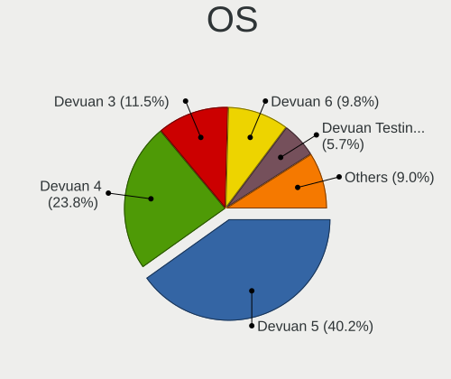

| Name                    | Desktops | Percent |
|-------------------------|----------|---------|
| Devuan 5                | 49       | 40.16%  |
| Devuan 4                | 29       | 23.77%  |
| Devuan 3                | 14       | 11.48%  |
| Devuan 6                | 12       | 9.84%   |
| Devuan Testing/unstable | 7        | 5.74%   |
| Devuan 2.1              | 6        | 4.92%   |
| Devuan                  | 3        | 2.46%   |
| Devuan 7                | 1        | 0.82%   |
| Devuan 1.0.0            | 1        | 0.82%   |

OS Family
---------

OS without a version

| Name   | Desktops | Percent |
|--------|----------|---------|
| Devuan | 116      | 100%    |

Kernel
------

Version of the Linux kernel

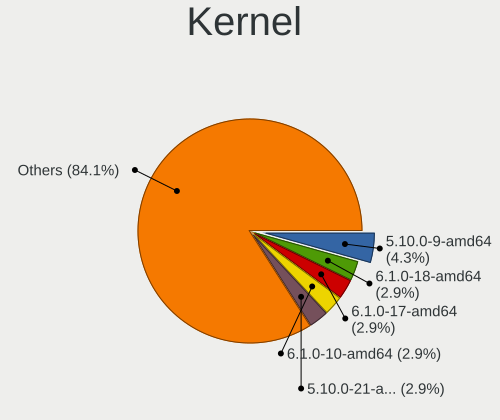

| Version               | Desktops | Percent |
|-----------------------|----------|---------|
| 5.10.0-9-amd64        | 6        | 4.35%   |
| 6.1.0-18-amd64        | 4        | 2.9%    |
| 6.1.0-17-amd64        | 4        | 2.9%    |
| 6.1.0-10-amd64        | 4        | 2.9%    |
| 5.10.0-21-amd64       | 4        | 2.9%    |
| 4.19.0-14-amd64       | 4        | 2.9%    |
| 6.1.0-26-amd64        | 3        | 2.17%   |
| 6.1.0-21-amd64        | 3        | 2.17%   |
| 6.1.0-13-amd64        | 3        | 2.17%   |
| 5.10.0-19-amd64       | 3        | 2.17%   |
| 4.19.0-16-amd64       | 3        | 2.17%   |
| 6.12.48+deb13-amd64   | 2        | 1.45%   |
| 6.10.11+bpo-amd64     | 2        | 1.45%   |
| 6.1.0-28-amd64        | 2        | 1.45%   |
| 6.1.0-22-amd64        | 2        | 1.45%   |
| 5.10.0-8-amd64        | 2        | 1.45%   |
| 5.10.0-6-amd64        | 2        | 1.45%   |
| 5.10.0-23-amd64       | 2        | 1.45%   |
| 4.19.0-9-amd64        | 2        | 1.45%   |
| 4.19.0-13-amd64       | 2        | 1.45%   |
| 4.19.0-10-amd64       | 2        | 1.45%   |
| 6.6.15-amd64          | 1        | 0.72%   |
| 6.5.0-0.deb12.4-amd64 | 1        | 0.72%   |
| 6.5.0-0.deb12.1-amd64 | 1        | 0.72%   |
| 6.4.0-0.deb12.2-amd64 | 1        | 0.72%   |
| 6.3.0-2-amd64         | 1        | 0.72%   |
| 6.3.0-1-amd64         | 1        | 0.72%   |
| 6.2.12                | 1        | 0.72%   |
| 6.17.8+deb14-amd64    | 1        | 0.72%   |
| 6.17.0-amd64          | 1        | 0.72%   |
| 6.16.1-amd64          | 1        | 0.72%   |
| 6.16.0-amd64          | 1        | 0.72%   |
| 6.13.0-amd64          | 1        | 0.72%   |
| 6.12.57+deb13-amd64   | 1        | 0.72%   |
| 6.12.43+deb13-amd64   | 1        | 0.72%   |
| 6.12.38+deb13-amd64   | 1        | 0.72%   |
| 6.12.33+deb13-amd64   | 1        | 0.72%   |
| 6.12.32+bpo-amd64     | 1        | 0.72%   |
| 6.12.30-amd64         | 1        | 0.72%   |
| 6.12.25-amd64         | 1        | 0.72%   |

Kernel Family
-------------

Linux kernel without a distro release

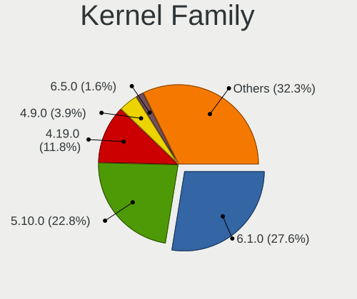

| Version  | Desktops | Percent |
|----------|----------|---------|
| 6.1.0    | 35       | 27.56%  |
| 5.10.0   | 29       | 22.83%  |
| 4.19.0   | 15       | 11.81%  |
| 4.9.0    | 5        | 3.94%   |
| 6.5.0    | 2        | 1.57%   |
| 6.3.0    | 2        | 1.57%   |
| 6.12.48  | 2        | 1.57%   |
| 6.10.11  | 2        | 1.57%   |
| 5.7.0    | 2        | 1.57%   |
| 5.15.0   | 2        | 1.57%   |
| 6.6.15   | 1        | 0.79%   |
| 6.4.0    | 1        | 0.79%   |
| 6.2.12   | 1        | 0.79%   |
| 6.17.8   | 1        | 0.79%   |
| 6.17.0   | 1        | 0.79%   |
| 6.16.1   | 1        | 0.79%   |
| 6.16.0   | 1        | 0.79%   |
| 6.13.0   | 1        | 0.79%   |
| 6.12.57  | 1        | 0.79%   |
| 6.12.43  | 1        | 0.79%   |
| 6.12.38  | 1        | 0.79%   |
| 6.12.33  | 1        | 0.79%   |
| 6.12.32  | 1        | 0.79%   |
| 6.12.30  | 1        | 0.79%   |
| 6.12.25  | 1        | 0.79%   |
| 6.12.10  | 1        | 0.79%   |
| 6.12.0   | 1        | 0.79%   |
| 6.11.0   | 1        | 0.79%   |
| 6.10.7   | 1        | 0.79%   |
| 6.1.71   | 1        | 0.79%   |
| 6.1.7    | 1        | 0.79%   |
| 6.0.0    | 1        | 0.79%   |
| 5.9.0    | 1        | 0.79%   |
| 5.8.0    | 1        | 0.79%   |
| 5.18.14  | 1        | 0.79%   |
| 5.18.11  | 1        | 0.79%   |
| 5.18.0   | 1        | 0.79%   |
| 5.16.0   | 1        | 0.79%   |
| 5.14.0   | 1        | 0.79%   |
| 4.19.112 | 1        | 0.79%   |

Kernel Major Ver.
-----------------

Linux kernel major version

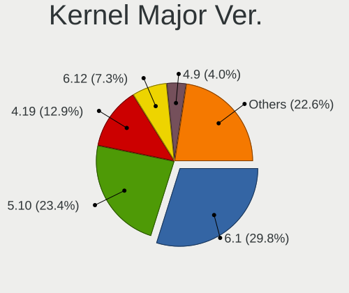

| Version | Desktops | Percent |
|---------|----------|---------|
| 6.1     | 37       | 29.84%  |
| 5.10    | 29       | 23.39%  |
| 4.19    | 16       | 12.9%   |
| 6.12    | 9        | 7.26%   |
| 4.9     | 5        | 4.03%   |
| 6.10    | 3        | 2.42%   |
| 5.18    | 3        | 2.42%   |
| 6.5     | 2        | 1.61%   |
| 6.3     | 2        | 1.61%   |
| 6.17    | 2        | 1.61%   |
| 5.7     | 2        | 1.61%   |
| 5.15    | 2        | 1.61%   |
| 6.6     | 1        | 0.81%   |
| 6.4     | 1        | 0.81%   |
| 6.2     | 1        | 0.81%   |
| 6.16    | 1        | 0.81%   |
| 6.13    | 1        | 0.81%   |
| 6.11    | 1        | 0.81%   |
| 6.0     | 1        | 0.81%   |
| 5.9     | 1        | 0.81%   |
| 5.8     | 1        | 0.81%   |
| 5.16    | 1        | 0.81%   |
| 5.14    | 1        | 0.81%   |
| 4.18    | 1        | 0.81%   |

Arch
----

OS architecture (x86_64, i586, etc.)

| Name   | Desktops | Percent |
|--------|----------|---------|
| x86_64 | 112      | 96.55%  |
| i686   | 4        | 3.45%   |

DE
--

Desktop Environment

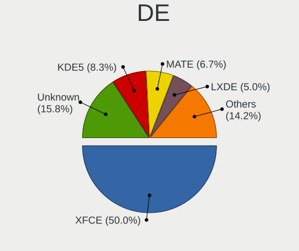

| Name       | Desktops | Percent |
|------------|----------|---------|
| XFCE       | 60       | 50%     |
| Unknown    | 19       | 15.83%  |
| KDE5       | 10       | 8.33%   |
| MATE       | 8        | 6.67%   |
| LXDE       | 6        | 5%      |
| LXQt       | 4        | 3.33%   |
| X-Cinnamon | 3        | 2.5%    |
| i3         | 3        | 2.5%    |
| Cinnamon   | 3        | 2.5%    |
| awesome    | 2        | 1.67%   |
| KDE6       | 1        | 0.83%   |
| GNOME      | 1        | 0.83%   |

Display Server
--------------

X11 or Wayland

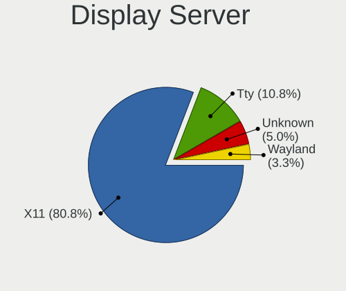

| Name    | Desktops | Percent |
|---------|----------|---------|
| X11     | 97       | 80.83%  |
| Tty     | 13       | 10.83%  |
| Unknown | 6        | 5%      |
| Wayland | 4        | 3.33%   |

Display Manager
---------------

SDDM, LightDM, etc.

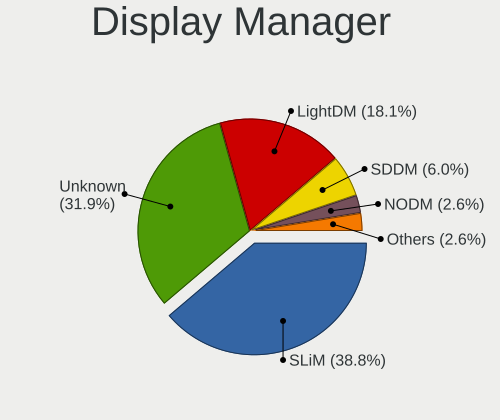

| Name    | Desktops | Percent |
|---------|----------|---------|
| SLiM    | 45       | 38.79%  |
| Unknown | 37       | 31.9%   |
| LightDM | 21       | 18.1%   |
| SDDM    | 7        | 6.03%   |
| NODM    | 3        | 2.59%   |
| XDM     | 1        | 0.86%   |
| LXDM    | 1        | 0.86%   |
| GDM3    | 1        | 0.86%   |

OS Lang
-------

Language

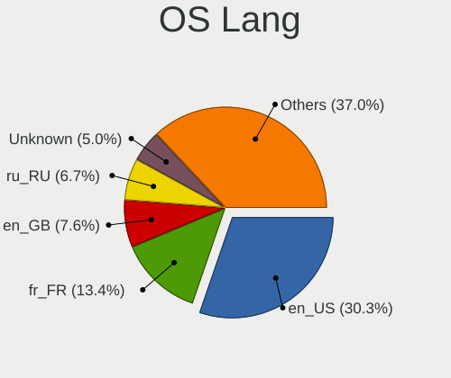

| Lang    | Desktops | Percent |
|---------|----------|---------|
| en_US   | 36       | 30.25%  |
| fr_FR   | 16       | 13.45%  |
| en_GB   | 9        | 7.56%   |
| ru_RU   | 8        | 6.72%   |
| Unknown | 6        | 5.04%   |
| pt_BR   | 5        | 4.2%    |
| es_ES   | 5        | 4.2%    |
| de_DE   | 5        | 4.2%    |
| C       | 5        | 4.2%    |
| it_IT   | 4        | 3.36%   |
| sk_SK   | 3        | 2.52%   |
| hu_HU   | 3        | 2.52%   |
| en_AU   | 3        | 2.52%   |
| de_AT   | 3        | 2.52%   |
| fr_BE   | 2        | 1.68%   |
| en_NZ   | 2        | 1.68%   |
| pl_PL   | 1        | 0.84%   |
| fr_CA   | 1        | 0.84%   |
| es_MX   | 1        | 0.84%   |
| en_CA   | 1        | 0.84%   |

Boot Mode
---------

EFI or BIOS

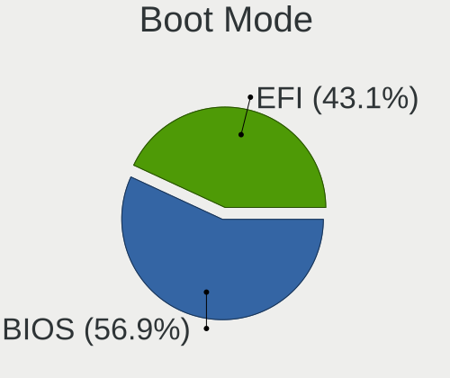

| Mode | Desktops | Percent |
|------|----------|---------|
| BIOS | 66       | 56.9%   |
| EFI  | 50       | 43.1%   |

Filesystem
----------

Type of filesystem

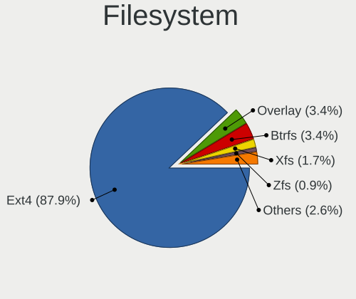

| Type    | Desktops | Percent |
|---------|----------|---------|
| Ext4    | 102      | 87.93%  |
| Overlay | 4        | 3.45%   |
| Btrfs   | 4        | 3.45%   |
| Xfs     | 2        | 1.72%   |
| Zfs     | 1        | 0.86%   |
| Ext3    | 1        | 0.86%   |
| Ext2    | 1        | 0.86%   |
| Unknown | 1        | 0.86%   |

Part. scheme
------------

Scheme of partitioning

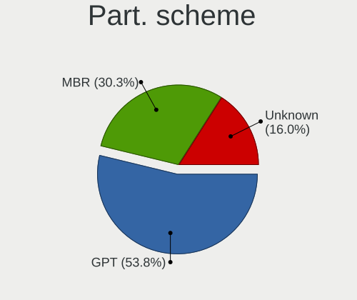

| Type    | Desktops | Percent |
|---------|----------|---------|
| GPT     | 64       | 53.78%  |
| MBR     | 36       | 30.25%  |
| Unknown | 19       | 15.97%  |

Dual Boot with Linux/BSD
------------------------

Hosting more than one Linux/BSD

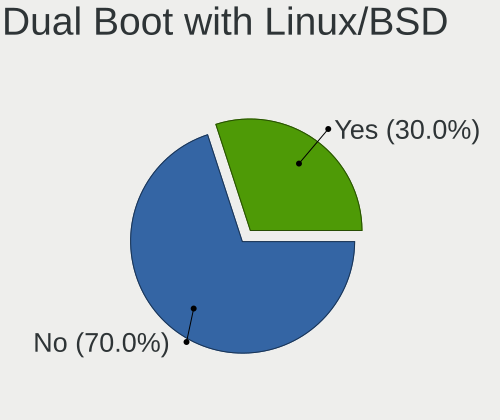

| Dual boot | Desktops | Percent |
|-----------|----------|---------|
| No        | 88       | 73.33%  |
| Yes       | 32       | 26.67%  |

Dual Boot (Win)
---------------

Hosting Linux and Windows

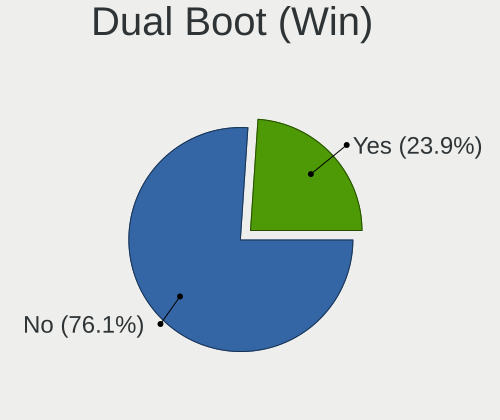

| Dual boot | Desktops | Percent |
|-----------|----------|---------|
| No        | 89       | 76.07%  |
| Yes       | 28       | 23.93%  |

Board
-----

Vendor
------

Motherboard manufacturer

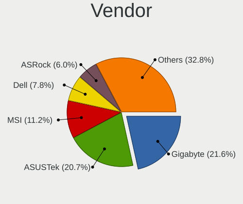

| Name                                 | Desktops | Percent |
|--------------------------------------|----------|---------|
| Gigabyte Technology                  | 25       | 21.55%  |
| ASUSTek Computer                     | 24       | 20.69%  |
| MSI                                  | 13       | 11.21%  |
| Dell                                 | 9        | 7.76%   |
| ASRock                               | 7        | 6.03%   |
| Hewlett-Packard                      | 6        | 5.17%   |
| Lenovo                               | 5        | 4.31%   |
| Intel                                | 4        | 3.45%   |
| Fujitsu                              | 3        | 2.59%   |
| Nitrokey                             | 2        | 1.72%   |
| Foxconn                              | 2        | 1.72%   |
| Unknown                              | 2        | 1.72%   |
| Supermicro                           | 1        | 0.86%   |
| Sun Microsystems                     | 1        | 0.86%   |
| Shenzhen Meigao Electronic Equipment | 1        | 0.86%   |
| Positivo                             | 1        | 0.86%   |
| Packard Bell                         | 1        | 0.86%   |
| Online Labs                          | 1        | 0.86%   |
| Medion                               | 1        | 0.86%   |
| LORD ELECTRONICS                     | 1        | 0.86%   |
| Huanan                               | 1        | 0.86%   |
| Google                               | 1        | 0.86%   |
| Biostar                              | 1        | 0.86%   |
| AZW                                  | 1        | 0.86%   |
| AMI                                  | 1        | 0.86%   |
| Acer                                 | 1        | 0.86%   |

Model
-----

Motherboard model

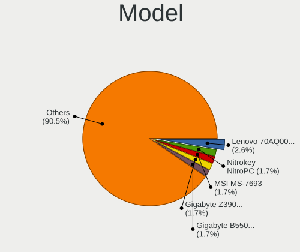

| Name                                                | Desktops | Percent |
|-----------------------------------------------------|----------|---------|
| Lenovo 70AQ000JGE ThinkServer TS440                 | 3        | 2.59%   |
| Nitrokey NitroPC                                    | 2        | 1.72%   |
| MSI MS-7693                                         | 2        | 1.72%   |
| Gigabyte Z390 GAMING SLI                            | 2        | 1.72%   |
| Gigabyte B550 AORUS ELITE AX V2                     | 2        | 1.72%   |
| Dell OptiPlex 7050                                  | 2        | 1.72%   |
| ASUS TUF B450-PRO GAMING                            | 2        | 1.72%   |
| Unknown                                             | 2        | 1.72%   |
| Supermicro SYS-1018GR-T                             | 1        | 0.86%   |
| Sun Microsystems Ultra 24                           | 1        | 0.86%   |
| Shenzhen Meigao Electronic Equipment Mercury Series | 1        | 0.86%   |
| Positivo Positivo Master D610                       | 1        | 0.86%   |
| Packard Bell IMEDIA S1300                           | 1        | 0.86%   |
| Online Labs SR                                      | 1        | 0.86%   |
| MSI MS-7D25                                         | 1        | 0.86%   |
| MSI MS-7C37                                         | 1        | 0.86%   |
| MSI MS-7B86                                         | 1        | 0.86%   |
| MSI MS-7B84                                         | 1        | 0.86%   |
| MSI MS-7B53                                         | 1        | 0.86%   |
| MSI MS-7A38                                         | 1        | 0.86%   |
| MSI MS-7A36                                         | 1        | 0.86%   |
| MSI MS-7A34                                         | 1        | 0.86%   |
| MSI MS-7885                                         | 1        | 0.86%   |
| MSI MS-7678                                         | 1        | 0.86%   |
| MSI MS-7673                                         | 1        | 0.86%   |
| Medion MS-7800                                      | 1        | 0.86%   |
| LORD ELECTRONICS LORD G4x 775 ICH7 8712 As Design   | 1        | 0.86%   |
| Lenovo ThinkStation P330 30C5S1LQ00                 | 1        | 0.86%   |
| Lenovo ThinkStation E20 4220CTO                     | 1        | 0.86%   |
| Intel X99                                           | 1        | 0.86%   |
| Intel DG41RQ AAE54511-205                           | 1        | 0.86%   |
| Intel D815EEA AAA45884-401                          | 1        | 0.86%   |
| Intel AHV                                           | 1        | 0.86%   |
| Huanan X99-F8D PLUS V1.3                            | 1        | 0.86%   |
| HP Z640 Workstation                                 | 1        | 0.86%   |
| HP Z220 SFF Workstation                             | 1        | 0.86%   |
| HP ProDesk 600 G1 SFF                               | 1        | 0.86%   |
| HP EliteDesk 800 G1 DM                              | 1        | 0.86%   |
| HP Compaq 8200 Elite SFF PC                         | 1        | 0.86%   |
| HP Compaq 8100 Elite SFF PC                         | 1        | 0.86%   |

Model Family
------------

Motherboard model prefix

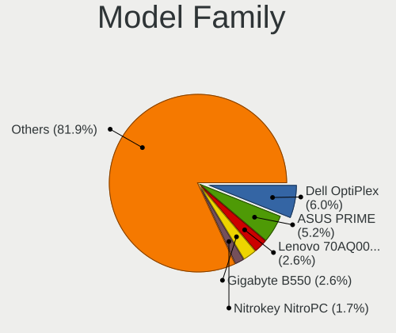

| Name                                         | Desktops | Percent |
|----------------------------------------------|----------|---------|
| Dell OptiPlex                                | 7        | 6.03%   |
| ASUS PRIME                                   | 6        | 5.17%   |
| Lenovo 70AQ000JGE                            | 3        | 2.59%   |
| Gigabyte B550                                | 3        | 2.59%   |
| Nitrokey NitroPC                             | 2        | 1.72%   |
| MSI MS-7693                                  | 2        | 1.72%   |
| Lenovo ThinkStation                          | 2        | 1.72%   |
| HP Compaq                                    | 2        | 1.72%   |
| Gigabyte Z390                                | 2        | 1.72%   |
| Fujitsu ESPRIMO                              | 2        | 1.72%   |
| ASUS TUF                                     | 2        | 1.72%   |
| ASUS ROG                                     | 2        | 1.72%   |
| Unknown                                      | 2        | 1.72%   |
| Supermicro SYS-1018GR-T                      | 1        | 0.86%   |
| Sun Microsystems Ultra                       | 1        | 0.86%   |
| Shenzhen Meigao Electronic Equipment Mercury | 1        | 0.86%   |
| Positivo Positivo                            | 1        | 0.86%   |
| Packard Bell IMEDIA                          | 1        | 0.86%   |
| Online Labs SR                               | 1        | 0.86%   |
| MSI MS-7D25                                  | 1        | 0.86%   |
| MSI MS-7C37                                  | 1        | 0.86%   |
| MSI MS-7B86                                  | 1        | 0.86%   |
| MSI MS-7B84                                  | 1        | 0.86%   |
| MSI MS-7B53                                  | 1        | 0.86%   |
| MSI MS-7A38                                  | 1        | 0.86%   |
| MSI MS-7A36                                  | 1        | 0.86%   |
| MSI MS-7A34                                  | 1        | 0.86%   |
| MSI MS-7885                                  | 1        | 0.86%   |
| MSI MS-7678                                  | 1        | 0.86%   |
| MSI MS-7673                                  | 1        | 0.86%   |
| Medion MS-7800                               | 1        | 0.86%   |
| LORD ELECTRONICS LORD                        | 1        | 0.86%   |
| Intel X99                                    | 1        | 0.86%   |
| Intel DG41RQ                                 | 1        | 0.86%   |
| Intel D815EEA                                | 1        | 0.86%   |
| Intel AHV                                    | 1        | 0.86%   |
| Huanan X99-F8D                               | 1        | 0.86%   |
| HP Z640                                      | 1        | 0.86%   |
| HP Z220                                      | 1        | 0.86%   |
| HP ProDesk                                   | 1        | 0.86%   |

MFG Year
--------

Motherboard manufacture year

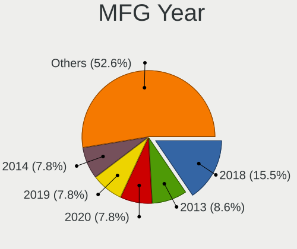

| Year | Desktops | Percent |
|------|----------|---------|
| 2018 | 18       | 15.52%  |
| 2013 | 10       | 8.62%   |
| 2020 | 9        | 7.76%   |
| 2019 | 9        | 7.76%   |
| 2014 | 9        | 7.76%   |
| 2012 | 9        | 7.76%   |
| 2011 | 7        | 6.03%   |
| 2016 | 6        | 5.17%   |
| 2009 | 6        | 5.17%   |
| 2021 | 5        | 4.31%   |
| 2017 | 5        | 4.31%   |
| 2010 | 5        | 4.31%   |
| 2023 | 4        | 3.45%   |
| 2015 | 3        | 2.59%   |
| 2007 | 3        | 2.59%   |
| 2024 | 2        | 1.72%   |
| 2022 | 2        | 1.72%   |
| 2008 | 2        | 1.72%   |
| 2006 | 1        | 0.86%   |
| 2000 | 1        | 0.86%   |

Form Factor
-----------

Physical design of the computer

| Name    | Desktops | Percent |
|---------|----------|---------|
| Desktop | 116      | 100%    |

Secure Boot
-----------

Enabled or disabled

| State    | Desktops | Percent |
|----------|----------|---------|
| Disabled | 115      | 99.14%  |
| Enabled  | 1        | 0.86%   |

Coreboot
--------

Have coreboot on board

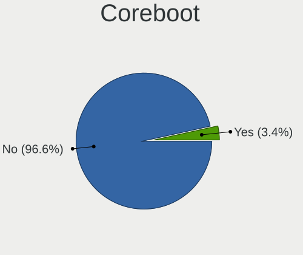

| Used | Desktops | Percent |
|------|----------|---------|
| No   | 112      | 96.55%  |
| Yes  | 4        | 3.45%   |

RAM Size
--------

Total RAM memory

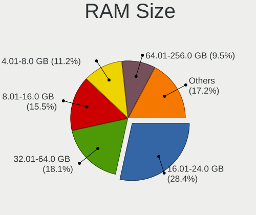

| Size in GB      | Desktops | Percent |
|-----------------|----------|---------|
| 16.01-24.0      | 33       | 28.45%  |
| 32.01-64.0      | 21       | 18.1%   |
| 8.01-16.0       | 18       | 15.52%  |
| 4.01-8.0        | 13       | 11.21%  |
| 3.01-4.0        | 11       | 9.48%   |
| 64.01-256.0     | 11       | 9.48%   |
| 1.01-2.0        | 5        | 4.31%   |
| More than 256.0 | 2        | 1.72%   |
| 24.01-32.0      | 1        | 0.86%   |
| 0.01-0.5        | 1        | 0.86%   |

RAM Used
--------

Used RAM memory

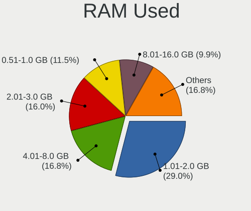

| Used GB    | Desktops | Percent |
|------------|----------|---------|
| 1.01-2.0   | 38       | 29.01%  |
| 4.01-8.0   | 22       | 16.79%  |
| 2.01-3.0   | 21       | 16.03%  |
| 0.51-1.0   | 15       | 11.45%  |
| 3.01-4.0   | 13       | 9.92%   |
| 8.01-16.0  | 13       | 9.92%   |
| 16.01-24.0 | 4        | 3.05%   |
| 0.01-0.5   | 4        | 3.05%   |
| 24.01-32.0 | 1        | 0.76%   |

Total Drives
------------

Number of drives on board

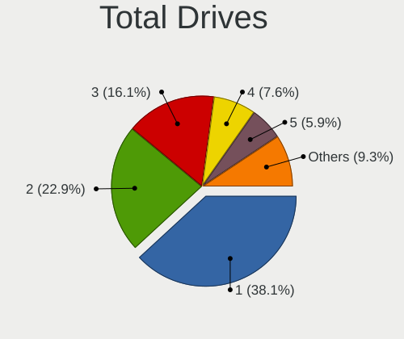

| Drives | Desktops | Percent |
|--------|----------|---------|
| 1      | 45       | 38.14%  |
| 2      | 27       | 22.88%  |
| 3      | 19       | 16.1%   |
| 4      | 9        | 7.63%   |
| 5      | 7        | 5.93%   |
| 6      | 5        | 4.24%   |
| 9      | 3        | 2.54%   |
| 7      | 2        | 1.69%   |
| 8      | 1        | 0.85%   |

Has CD-ROM
----------

Has CD-ROM on board

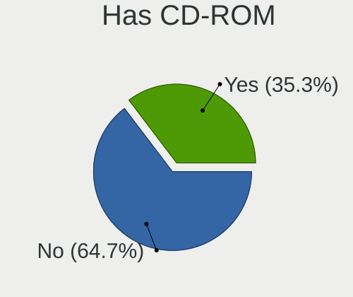

| Presented | Desktops | Percent |
|-----------|----------|---------|
| No        | 75       | 64.66%  |
| Yes       | 41       | 35.34%  |

Has Ethernet
------------

Has Ethernet on board

| Presented | Desktops | Percent |
|-----------|----------|---------|
| Yes       | 114      | 98.28%  |
| No        | 2        | 1.72%   |

Has WiFi
--------

Has WiFi module

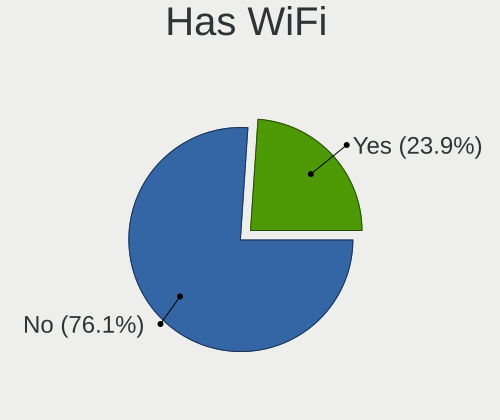

| Presented | Desktops | Percent |
|-----------|----------|---------|
| No        | 89       | 76.07%  |
| Yes       | 28       | 23.93%  |

Has Bluetooth
-------------

Has Bluetooth module

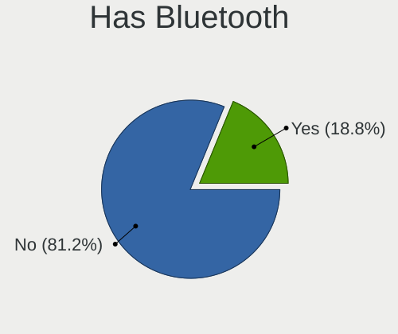

| Presented | Desktops | Percent |
|-----------|----------|---------|
| No        | 95       | 81.2%   |
| Yes       | 22       | 18.8%   |

Location
--------

Country
-------

Geographic location (country)

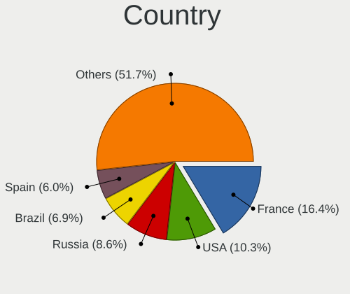

| Country     | Desktops | Percent |
|-------------|----------|---------|
| France      | 19       | 16.38%  |
| USA         | 12       | 10.34%  |
| Russia      | 10       | 8.62%   |
| Brazil      | 8        | 6.9%    |
| Spain       | 7        | 6.03%   |
| Germany     | 6        | 5.17%   |
| UK          | 5        | 4.31%   |
| Ukraine     | 4        | 3.45%   |
| Italy       | 4        | 3.45%   |
| Hungary     | 4        | 3.45%   |
| Slovakia    | 3        | 2.59%   |
| Poland      | 3        | 2.59%   |
| Netherlands | 3        | 2.59%   |
| Canada      | 3        | 2.59%   |
| Austria     | 3        | 2.59%   |
| Australia   | 3        | 2.59%   |
| New Zealand | 2        | 1.72%   |
| Bulgaria    | 2        | 1.72%   |
| Belgium     | 2        | 1.72%   |
| Argentina   | 2        | 1.72%   |
| Tunisia     | 1        | 0.86%   |
| South Korea | 1        | 0.86%   |
| Puerto Rico | 1        | 0.86%   |
| Mexico      | 1        | 0.86%   |
| Japan       | 1        | 0.86%   |
| Israel      | 1        | 0.86%   |
| Iceland     | 1        | 0.86%   |
| Georgia     | 1        | 0.86%   |
| Finland     | 1        | 0.86%   |
| Denmark     | 1        | 0.86%   |
| China       | 1        | 0.86%   |

City
----

Geographic location (city)

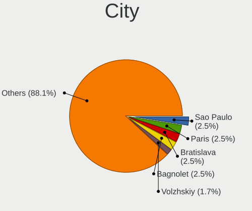

| City                | Desktops | Percent |
|---------------------|----------|---------|
| Sao Paulo           | 3        | 2.54%   |
| Paris               | 3        | 2.54%   |
| Bratislava          | 3        | 2.54%   |
| Bagnolet            | 3        | 2.54%   |
| Volzhskiy           | 2        | 1.69%   |
| Vienna              | 2        | 1.69%   |
| Valencia            | 2        | 1.69%   |
| Toronto             | 2        | 1.69%   |
| Szombathely         | 2        | 1.69%   |
| Sydney              | 2        | 1.69%   |
| Sofia               | 2        | 1.69%   |
| Roubaix             | 2        | 1.69%   |
| Rio de Janeiro      | 2        | 1.69%   |
| Munich              | 2        | 1.69%   |
| Moscow              | 2        | 1.69%   |
| Molsheim            | 2        | 1.69%   |
| Issy-les-Moulineaux | 2        | 1.69%   |
| Auckland            | 2        | 1.69%   |
| Xiamen              | 1        | 0.85%   |
| Wroclaw             | 1        | 0.85%   |
| West Valley City    | 1        | 0.85%   |
| Waterford           | 1        | 0.85%   |
| Vladikavkaz         | 1        | 0.85%   |
| Vise                | 1        | 0.85%   |
| Venice              | 1        | 0.85%   |
| Torre Annunziata    | 1        | 0.85%   |
| Tel Aviv            | 1        | 0.85%   |
| Tbilisi             | 1        | 0.85%   |
| Taganrog            | 1        | 0.85%   |
| Straubing           | 1        | 0.85%   |
| St Petersburg       | 1        | 0.85%   |
| Shelekhov           | 1        | 0.85%   |
| Sheffield           | 1        | 0.85%   |
| Sevastopol          | 1        | 0.85%   |
| Seongbuk-gu         | 1        | 0.85%   |
| Saint-Herblain      | 1        | 0.85%   |
| Sacramento          | 1        | 0.85%   |
| Rugby               | 1        | 0.85%   |
| Rosny-sous-Bois     | 1        | 0.85%   |
| Reykjavik           | 1        | 0.85%   |

Drives
------

Drive Vendor
------------

Hard drive vendors

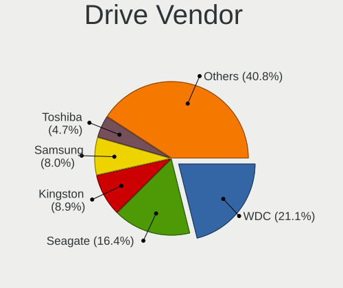

| Vendor                      | Desktops | Drives | Percent |
|-----------------------------|----------|--------|---------|
| WDC                         | 45       | 87     | 21.13%  |
| Seagate                     | 35       | 80     | 16.43%  |
| Kingston                    | 19       | 34     | 8.92%   |
| Samsung Electronics         | 17       | 38     | 7.98%   |
| Toshiba                     | 10       | 10     | 4.69%   |
| SanDisk                     | 8        | 10     | 3.76%   |
| Intel                       | 8        | 14     | 3.76%   |
| Crucial                     | 8        | 11     | 3.76%   |
| Micron Technology           | 3        | 3      | 1.41%   |
| IBM-D050                    | 3        | 12     | 1.41%   |
| Hitachi                     | 3        | 3      | 1.41%   |
| HGST                        | 3        | 3      | 1.41%   |
| Dogfish                     | 3        | 3      | 1.41%   |
| China                       | 3        | 3      | 1.41%   |
| A-DATA Technology           | 3        | 3      | 1.41%   |
| Unknown                     | 2        | 3      | 0.94%   |
| Transcend                   | 2        | 3      | 0.94%   |
| PNY                         | 2        | 2      | 0.94%   |
| Patriot                     | 2        | 2      | 0.94%   |
| Netac                       | 2        | 2      | 0.94%   |
| Maxtor                      | 2        | 2      | 0.94%   |
| Lexar                       | 2        | 2      | 0.94%   |
| Intenso                     | 2        | 2      | 0.94%   |
| Corsair                     | 2        | 2      | 0.94%   |
| Wicgtyp                     | 1        | 1      | 0.47%   |
| WD MediaMax                 | 1        | 3      | 0.47%   |
| Verbatim                    | 1        | 1      | 0.47%   |
| Team                        | 1        | 1      | 0.47%   |
| Supermicro                  | 1        | 1      | 0.47%   |
| SomnAmbulist                | 1        | 1      | 0.47%   |
| SK hynix                    | 1        | 1      | 0.47%   |
| Silicon Motion              | 1        | 1      | 0.47%   |
| Predator                    | 1        | 1      | 0.47%   |
| Plextor                     | 1        | 1      | 0.47%   |
| Phison Electronics          | 1        | 1      | 0.47%   |
| MAXIO Technology (Hangzhou) | 1        | 1      | 0.47%   |
| KingDian                    | 1        | 1      | 0.47%   |
| IBM/Hitachi                 | 1        | 1      | 0.47%   |
| HUSKY                       | 1        | 1      | 0.47%   |
| HPE                         | 1        | 2      | 0.47%   |

Drive Model
-----------

Hard drive models

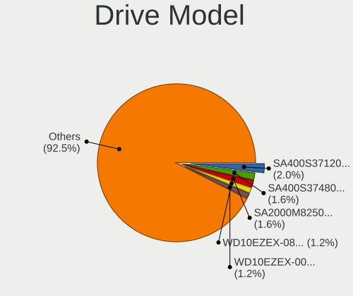

| Model                            | Desktops | Percent |
|----------------------------------|----------|---------|
| Kingston SA400S37120G 120GB SSD  | 5        | 1.97%   |
| Kingston SA400S37480G 480GB SSD  | 4        | 1.57%   |
| Kingston SA2000M8250G 250GB      | 4        | 1.57%   |
| WDC WD10EZEX-08WN4A0 1TB         | 3        | 1.18%   |
| WDC WD10EZEX-00BBHA0 1TB         | 3        | 1.18%   |
| Seagate ST4000NM0023 4TB         | 3        | 1.18%   |
| Kingston SA400S37240G 240GB SSD  | 3        | 1.18%   |
| Intel SSDSC2KB240GZ 240GB        | 3        | 1.18%   |
| IBM-D050 ST4000NM0023 4TB        | 3        | 1.18%   |
| WDC WD10EARX-00N0YB0 1TB         | 2        | 0.79%   |
| WDC WD10EADS-22M2B0 1TB          | 2        | 0.79%   |
| Seagate ST3500418AS 500GB        | 2        | 0.79%   |
| Seagate ST2000DX002-2DV164 2TB   | 2        | 0.79%   |
| Seagate ST2000DM008-2UB102 2TB   | 2        | 0.79%   |
| Seagate ST2000DM008-2FR102 2TB   | 2        | 0.79%   |
| Seagate ST1000DM010-2EP102 1TB   | 2        | 0.79%   |
| Seagate ST1000DM003-1CH162 1TB   | 2        | 0.79%   |
| SanDisk SDSSDX240GG25 240GB      | 2        | 0.79%   |
| Samsung SSD 980 1TB              | 2        | 0.79%   |
| Samsung SSD 860 EVO 500GB        | 2        | 0.79%   |
| Samsung SSD 860 EVO 250GB        | 2        | 0.79%   |
| Samsung SSD 860 EVO 1TB          | 2        | 0.79%   |
| Patriot Burst 120GB SSD          | 2        | 0.79%   |
| Intel SSDSC2KB038T8 4TB          | 2        | 0.79%   |
| Hitachi HDS721616PLA380 160GB    | 2        | 0.79%   |
| HGST HTS545050A7E680 500GB       | 2        | 0.79%   |
| Dogfish SSD 256GB                | 2        | 0.79%   |
| Crucial CT500P2SSD8 500GB        | 2        | 0.79%   |
| Wicgtyp N900-512 512GB SSD       | 1        | 0.39%   |
| WDC WDS500G3X0C-00SJG0 500GB     | 1        | 0.39%   |
| WDC WDS500G2B0A-00SM50 500GB     | 1        | 0.39%   |
| WDC WDS480G2G0A-00JH30 480GB SSD | 1        | 0.39%   |
| WDC WDS120G2G0A-00JH30 120GB SSD | 1        | 0.39%   |
| WDC WD800BB-00JHC0 80GB          | 1        | 0.39%   |
| WDC WD7500AALX-009BA0 752GB      | 1        | 0.39%   |
| WDC WD6400AAKS-00A7B0 640GB      | 1        | 0.39%   |
| WDC WD5003AZEX-00MK2A0 500GB     | 1        | 0.39%   |
| WDC WD5001AALS-00L3B2 500GB      | 1        | 0.39%   |
| WDC WD5001AALS-00E3A0 500GB      | 1        | 0.39%   |
| WDC WD5000LPVX-00V0TT0 500GB     | 1        | 0.39%   |

HDD Vendor
----------

Hard disk drive vendors

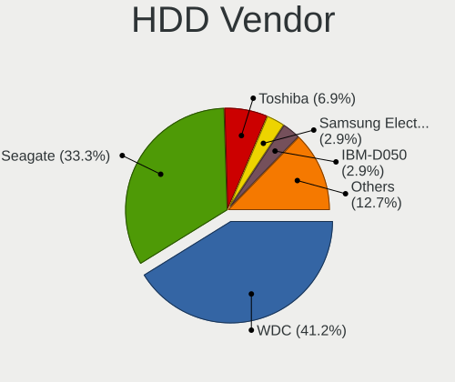

| Vendor              | Desktops | Drives | Percent |
|---------------------|----------|--------|---------|
| WDC                 | 42       | 83     | 41.18%  |
| Seagate             | 34       | 79     | 33.33%  |
| Toshiba             | 7        | 7      | 6.86%   |
| Samsung Electronics | 3        | 6      | 2.94%   |
| IBM-D050            | 3        | 12     | 2.94%   |
| Hitachi             | 3        | 3      | 2.94%   |
| HGST                | 3        | 3      | 2.94%   |
| Maxtor              | 2        | 2      | 1.96%   |
| Unknown             | 1        | 1      | 0.98%   |
| IBM/Hitachi         | 1        | 1      | 0.98%   |
| HPE                 | 1        | 2      | 0.98%   |
| Hewlett-Packard     | 1        | 2      | 0.98%   |
| Fujitsu             | 1        | 1      | 0.98%   |

SSD Vendor
----------

Solid state drive vendors

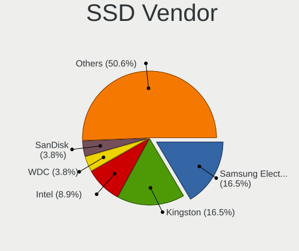

| Vendor              | Desktops | Drives | Percent |
|---------------------|----------|--------|---------|
| Samsung Electronics | 13       | 19     | 16.46%  |
| Kingston            | 13       | 24     | 16.46%  |
| Intel               | 7        | 13     | 8.86%   |
| WDC                 | 3        | 3      | 3.8%    |
| SanDisk             | 3        | 3      | 3.8%    |
| Micron Technology   | 3        | 3      | 3.8%    |
| Dogfish             | 3        | 3      | 3.8%    |
| Crucial             | 3        | 4      | 3.8%    |
| China               | 3        | 3      | 3.8%    |
| A-DATA Technology   | 3        | 3      | 3.8%    |
| Transcend           | 2        | 3      | 2.53%   |
| PNY                 | 2        | 2      | 2.53%   |
| Patriot             | 2        | 2      | 2.53%   |
| Netac               | 2        | 2      | 2.53%   |
| Wicgtyp             | 1        | 1      | 1.27%   |
| Verbatim            | 1        | 1      | 1.27%   |
| Toshiba             | 1        | 1      | 1.27%   |
| Team                | 1        | 1      | 1.27%   |
| Supermicro          | 1        | 1      | 1.27%   |
| SomnAmbulist        | 1        | 1      | 1.27%   |
| SK hynix            | 1        | 1      | 1.27%   |
| Plextor             | 1        | 1      | 1.27%   |
| Lexar               | 1        | 1      | 1.27%   |
| KingDian            | 1        | 1      | 1.27%   |
| Intenso             | 1        | 1      | 1.27%   |
| HUSKY               | 1        | 1      | 1.27%   |
| GOODRAM             | 1        | 1      | 1.27%   |
| Emtec               | 1        | 1      | 1.27%   |
| Corsair             | 1        | 1      | 1.27%   |
| Apacer              | 1        | 1      | 1.27%   |
| AGI                 | 1        | 1      | 1.27%   |

Drive Kind
----------

HDD or SSD

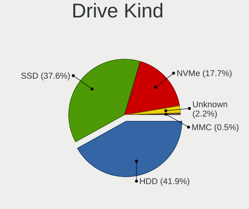

| Kind    | Desktops | Drives | Percent |
|---------|----------|--------|---------|
| HDD     | 78       | 202    | 41.94%  |
| SSD     | 70       | 104    | 37.63%  |
| NVMe    | 33       | 49     | 17.74%  |
| Unknown | 4        | 6      | 2.15%   |
| MMC     | 1        | 1      | 0.54%   |

Drive Connector
---------------

SATA, SAS, NVMe, etc.

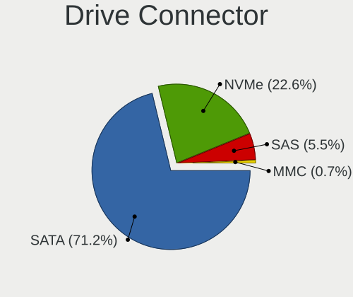

| Type | Desktops | Drives | Percent |
|------|----------|--------|---------|
| SATA | 104      | 300    | 71.23%  |
| NVMe | 33       | 49     | 22.6%   |
| SAS  | 8        | 12     | 5.48%   |
| MMC  | 1        | 1      | 0.68%   |

Drive Size
----------

Size of hard drive

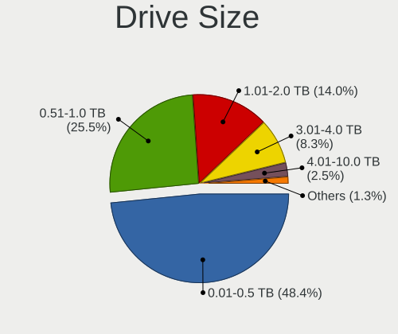

| Size in TB | Desktops | Drives | Percent |
|------------|----------|--------|---------|
| 0.01-0.5   | 76       | 133    | 48.41%  |
| 0.51-1.0   | 40       | 68     | 25.48%  |
| 1.01-2.0   | 22       | 41     | 14.01%  |
| 3.01-4.0   | 13       | 52     | 8.28%   |
| 4.01-10.0  | 4        | 7      | 2.55%   |
| 2.01-3.0   | 2        | 5      | 1.27%   |

Space Total
-----------

Amount of disk space available on the file system

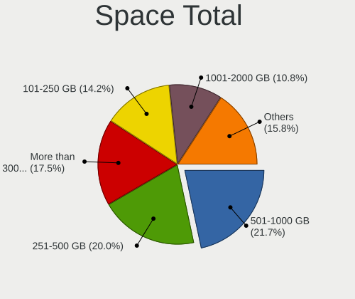

| Size in GB     | Desktops | Percent |
|----------------|----------|---------|
| 501-1000       | 26       | 21.67%  |
| 251-500        | 24       | 20%     |
| More than 3000 | 21       | 17.5%   |
| 101-250        | 17       | 14.17%  |
| 1001-2000      | 13       | 10.83%  |
| 51-100         | 6        | 5%      |
| 2001-3000      | 4        | 3.33%   |
| 1-20           | 4        | 3.33%   |
| 21-50          | 3        | 2.5%    |
| Unknown        | 2        | 1.67%   |

Space Used
----------

Amount of used disk space

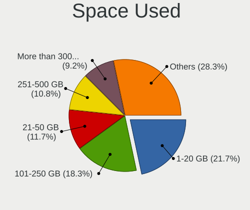

| Used GB        | Desktops | Percent |
|----------------|----------|---------|
| 1-20           | 26       | 21.67%  |
| 101-250        | 22       | 18.33%  |
| 21-50          | 14       | 11.67%  |
| 251-500        | 13       | 10.83%  |
| More than 3000 | 11       | 9.17%   |
| 1001-2000      | 10       | 8.33%   |
| 501-1000       | 9        | 7.5%    |
| 51-100         | 9        | 7.5%    |
| 2001-3000      | 4        | 3.33%   |
| Unknown        | 2        | 1.67%   |

Malfunc. Drives
---------------

Drive models with a malfunction

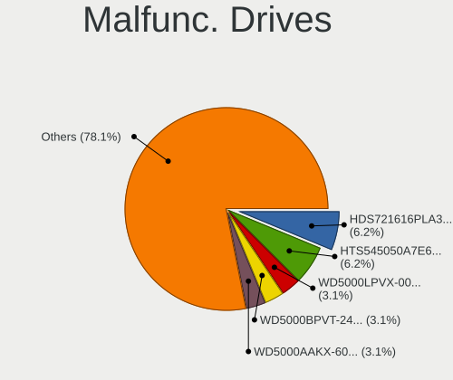

| Model                                 | Desktops | Drives | Percent |
|---------------------------------------|----------|--------|---------|
| Hitachi HDS721616PLA380 160GB         | 2        | 2      | 6.25%   |
| HGST HTS545050A7E680 500GB            | 2        | 2      | 6.25%   |
| WDC WD5000LPVX-00V0TT0 500GB          | 1        | 1      | 3.13%   |
| WDC WD5000BPVT-24HXZT3 500GB          | 1        | 1      | 3.13%   |
| WDC WD5000AAKX-60U6AA0 500GB          | 1        | 1      | 3.13%   |
| WDC WD5000AAKS-08V0A0 500GB           | 1        | 2      | 3.13%   |
| WDC WD1502FAEX-007BA0 1TB             | 1        | 1      | 3.13%   |
| WDC WD10EARX-00N0YB0 1TB              | 1        | 1      | 3.13%   |
| Toshiba THNSNF128GCSS 128GB SSD       | 1        | 1      | 3.13%   |
| Toshiba MQ04ABF100 1TB                | 1        | 1      | 3.13%   |
| Toshiba MQ02ABF100 1TB                | 1        | 1      | 3.13%   |
| Toshiba MQ01ABD100 1TB                | 1        | 1      | 3.13%   |
| SomnAmbulist SSD 120GB                | 1        | 1      | 3.13%   |
| SK hynix SH920 mSATA 128GB SSD        | 1        | 1      | 3.13%   |
| Seagate ST8000AS0002-1NA17Z 8TB       | 1        | 1      | 3.13%   |
| Seagate ST3500418AS 500GB             | 1        | 1      | 3.13%   |
| Samsung Electronics SSD 970 EVO 500GB | 1        | 1      | 3.13%   |
| Samsung Electronics SP2504C 250GB     | 1        | 1      | 3.13%   |
| Samsung Electronics HD160JJ 160GB     | 1        | 1      | 3.13%   |
| Maxtor 6E040L0 41GB                   | 1        | 1      | 3.13%   |
| Kingston SA400S37240G 240GB SSD       | 1        | 1      | 3.13%   |
| Kingston SA400S37120G 120GB SSD       | 1        | 1      | 3.13%   |
| Intel SSDSC2BF120A5 120GB             | 1        | 3      | 3.13%   |
| HPE MB4000GEFNA 4TB                   | 1        | 2      | 3.13%   |
| Hitachi HDT722525DLA380 250GB         | 1        | 1      | 3.13%   |
| HGST HTE721010A9E630 1TB              | 1        | 1      | 3.13%   |
| Hewlett-Packard VB0250EAVER 250GB     | 1        | 2      | 3.13%   |
| Fujitsu MHV2060BH PL 64GB             | 1        | 1      | 3.13%   |
| China SSD 256GB                       | 1        | 1      | 3.13%   |
| China SATA SSD 64GB                   | 1        | 1      | 3.13%   |

Malfunc. Drive Vendor
---------------------

Vendors of faulty drives

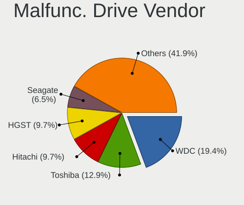

| Vendor              | Desktops | Drives | Percent |
|---------------------|----------|--------|---------|
| WDC                 | 6        | 7      | 19.35%  |
| Toshiba             | 4        | 4      | 12.9%   |
| Hitachi             | 3        | 3      | 9.68%   |
| HGST                | 3        | 3      | 9.68%   |
| Seagate             | 2        | 2      | 6.45%   |
| Samsung Electronics | 2        | 3      | 6.45%   |
| Kingston            | 2        | 2      | 6.45%   |
| China               | 2        | 2      | 6.45%   |
| SomnAmbulist        | 1        | 1      | 3.23%   |
| SK hynix            | 1        | 1      | 3.23%   |
| Maxtor              | 1        | 1      | 3.23%   |
| Intel               | 1        | 3      | 3.23%   |
| HPE                 | 1        | 2      | 3.23%   |
| Hewlett-Packard     | 1        | 2      | 3.23%   |
| Fujitsu             | 1        | 1      | 3.23%   |

Malfunc. HDD Vendor
-------------------

Vendors of faulty HDD drives

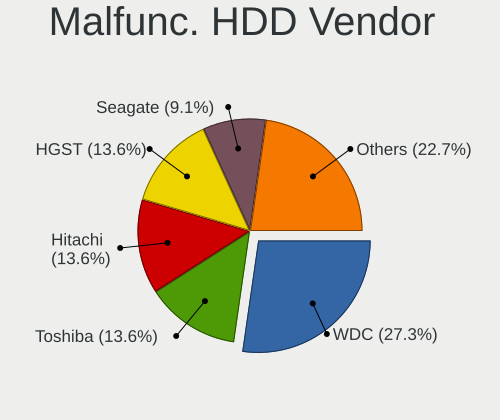

| Vendor              | Desktops | Drives | Percent |
|---------------------|----------|--------|---------|
| WDC                 | 6        | 7      | 27.27%  |
| Toshiba             | 3        | 3      | 13.64%  |
| Hitachi             | 3        | 3      | 13.64%  |
| HGST                | 3        | 3      | 13.64%  |
| Seagate             | 2        | 2      | 9.09%   |
| Samsung Electronics | 1        | 2      | 4.55%   |
| Maxtor              | 1        | 1      | 4.55%   |
| HPE                 | 1        | 2      | 4.55%   |
| Hewlett-Packard     | 1        | 2      | 4.55%   |
| Fujitsu             | 1        | 1      | 4.55%   |

Malfunc. Drive Kind
-------------------

Kinds of faulty drives

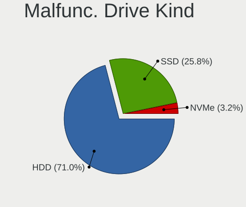

| Kind | Desktops | Drives | Percent |
|------|----------|--------|---------|
| HDD  | 22       | 26     | 70.97%  |
| SSD  | 8        | 10     | 25.81%  |
| NVMe | 1        | 1      | 3.23%   |

Failed Drives
-------------

Failed drive models

Zero info for selected period =(

Failed Drive Vendor
-------------------

Failed drive vendors

Zero info for selected period =(

Drive Status
------------

Number of failed and malfunc. drives

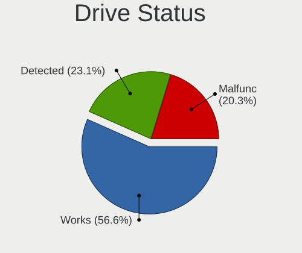

| Status   | Desktops | Drives | Percent |
|----------|----------|--------|---------|
| Works    | 81       | 252    | 56.64%  |
| Detected | 33       | 73     | 23.08%  |
| Malfunc  | 29       | 37     | 20.28%  |

Storage controller
------------------

Storage Vendor
--------------

Storage controller vendors

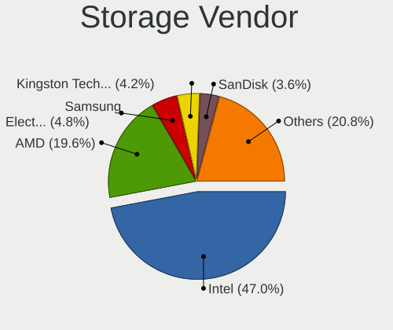

| Vendor                           | Desktops | Percent |
|----------------------------------|----------|---------|
| Intel                            | 79       | 47.02%  |
| AMD                              | 33       | 19.64%  |
| Samsung Electronics              | 8        | 4.76%   |
| Kingston Technology Company      | 7        | 4.17%   |
| SanDisk                          | 6        | 3.57%   |
| Micron/Crucial Technology        | 6        | 3.57%   |
| Marvell Technology Group         | 5        | 2.98%   |
| LSI Logic / Symbios Logic        | 4        | 2.38%   |
| Toshiba America Info Systems     | 2        | 1.19%   |
| Silicon Motion                   | 2        | 1.19%   |
| Phison Electronics               | 2        | 1.19%   |
| ASMedia Technology               | 2        | 1.19%   |
| VIA Technologies                 | 1        | 0.6%    |
| Silicon Integrated Systems [SiS] | 1        | 0.6%    |
| Nvidia                           | 1        | 0.6%    |
| MAXIO Technology (Hangzhou)      | 1        | 0.6%    |
| Integrated Technology Express    | 1        | 0.6%    |
| INNOGRIT                         | 1        | 0.6%    |
| HighPoint Technologies           | 1        | 0.6%    |
| Chelsio Communications           | 1        | 0.6%    |
| Broadcom / LSI                   | 1        | 0.6%    |
| Biwin Storage Technology         | 1        | 0.6%    |
| ADATA Technology                 | 1        | 0.6%    |
| Adaptec                          | 1        | 0.6%    |

Storage Model
-------------

Storage controller models

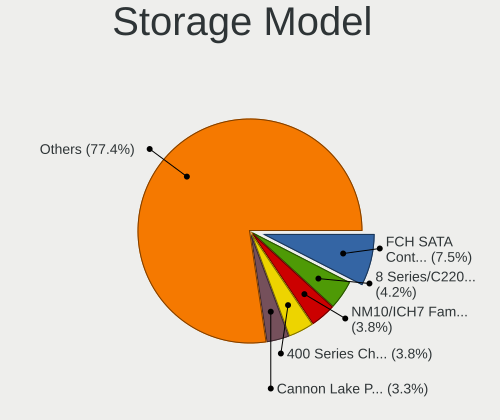

| Model                                                                                   | Desktops | Percent |
|-----------------------------------------------------------------------------------------|----------|---------|
| AMD FCH SATA Controller [AHCI mode]                                                     | 16       | 7.55%   |
| Intel 8 Series/C220 Series Chipset Family 6-port SATA Controller 1 [AHCI mode]          | 9        | 4.25%   |
| Intel NM10/ICH7 Family SATA Controller [IDE mode]                                       | 8        | 3.77%   |
| AMD 400 Series Chipset SATA Controller                                                  | 8        | 3.77%   |
| Intel Cannon Lake PCH SATA AHCI Controller                                              | 7        | 3.3%    |
| Intel 82801G (ICH7 Family) IDE Controller                                               | 7        | 3.3%    |
| Intel C610/X99 series chipset 6-Port SATA Controller [AHCI mode]                        | 6        | 2.83%   |
| Intel 200 Series PCH SATA controller [AHCI mode]                                        | 6        | 2.83%   |
| AMD 500 Series Chipset SATA Controller                                                  | 6        | 2.83%   |
| Kingston Company A2000 NVMe SSD [SM2263EN]                                              | 5        | 2.36%   |
| Intel C610/X99 series chipset sSATA Controller [AHCI mode]                              | 5        | 2.36%   |
| AMD SB7x0/SB8x0/SB9x0 SATA Controller [AHCI mode]                                       | 5        | 2.36%   |
| AMD SB7x0/SB8x0/SB9x0 IDE Controller                                                    | 5        | 2.36%   |
| Samsung NVMe SSD Controller SM981/PM981/PM983                                           | 4        | 1.89%   |
| Micron/Crucial P2 [Nick P2] / P3 / P3 Plus NVMe PCIe SSD (DRAM-less)                    | 4        | 1.89%   |
| LSI Logic / Symbios Logic MegaRAID SAS 2108 [Liberator]                                 | 4        | 1.89%   |
| Intel SATA Controller [RAID mode]                                                       | 4        | 1.89%   |
| Intel Q170/Q150/B150/H170/H110/Z170/CM236 Chipset SATA Controller [AHCI Mode]           | 4        | 1.89%   |
| Intel Comet Lake SATA AHCI Controller                                                   | 4        | 1.89%   |
| Intel 7 Series/C210 Series Chipset Family 6-port SATA Controller [AHCI mode]            | 3        | 1.42%   |
| Intel 6 Series/C200 Series Chipset Family 6 port Desktop SATA AHCI Controller           | 3        | 1.42%   |
| Intel 5 Series/3400 Series Chipset 6 port SATA AHCI Controller                          | 3        | 1.42%   |
| AMD FCH IDE Controller                                                                  | 3        | 1.42%   |
| Silicon Motion SM2263EN/SM2263XT (DRAM-less) NVMe SSD Controllers                       | 2        | 0.94%   |
| SanDisk Extreme Pro / WD Black SN750 / PC SN730 / Red SN700 NVMe SSD                    | 2        | 0.94%   |
| Samsung NVMe SSD Controller 980 (DRAM-less)                                             | 2        | 0.94%   |
| Marvell Group 88SE9215 PCIe 2.0 x1 4-port SATA 6 Gb/s Controller                        | 2        | 0.94%   |
| Intel Alder Lake-S PCH SATA Controller [AHCI Mode]                                      | 2        | 0.94%   |
| Intel 6 Series/C200 Series Chipset Family Desktop SATA Controller (IDE mode, ports 4-5) | 2        | 0.94%   |
| Intel 500 Series Chipset Family SATA AHCI Controller                                    | 2        | 0.94%   |
| ASMedia ASM1061/ASM1062 Serial ATA Controller                                           | 2        | 0.94%   |
| AMD SB7x0/SB8x0/SB9x0 SATA Controller [IDE mode]                                        | 2        | 0.94%   |
| AMD FCH SATA Controller [IDE mode]                                                      | 2        | 0.94%   |
| AMD A320 Chipset SATA Controller [AHCI mode]                                            | 2        | 0.94%   |
| VIA VT82C586A/B/VT82C686/A/B/VT823x/A/C PIPC Bus Master IDE                             | 1        | 0.47%   |
| VIA VT8237A Integrated SATA RAID Controller                                             | 1        | 0.47%   |
| Toshiba America Info Systems XG6 NVMe SSD Controller                                    | 1        | 0.47%   |
| Toshiba America Info Systems XG5 NVMe SSD Controller                                    | 1        | 0.47%   |
| Silicon Integrated Systems [SiS] SATA Controller / IDE mode                             | 1        | 0.47%   |
| Silicon Integrated Systems [SiS] 5513 IDE Controller                                    | 1        | 0.47%   |

Storage Kind
------------

Kind of storage controller (IDE, SATA, NVMe, SAS, ...)

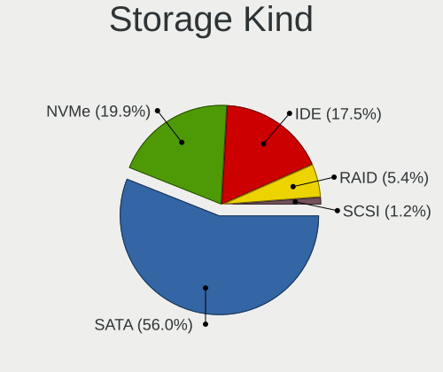

| Kind | Desktops | Percent |
|------|----------|---------|
| SATA | 93       | 56.02%  |
| NVMe | 33       | 19.88%  |
| IDE  | 29       | 17.47%  |
| RAID | 9        | 5.42%   |
| SCSI | 2        | 1.2%    |

Processor
---------

CPU Vendor
----------

Processor vendors

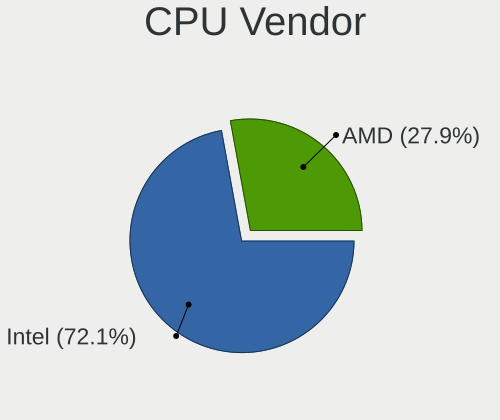

| Vendor | Desktops | Percent |
|--------|----------|---------|
| Intel  | 82       | 70.69%  |
| AMD    | 34       | 29.31%  |

CPU Model
---------

Processor models

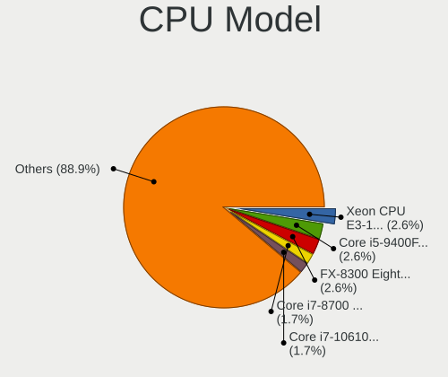

| Model                                       | Desktops | Percent |
|---------------------------------------------|----------|---------|
| Intel Xeon CPU E3-1245 v3 @ 3.40GHz         | 3        | 2.56%   |
| Intel Core i5-9400F CPU @ 2.90GHz           | 3        | 2.56%   |
| AMD FX-8300 Eight-Core Processor            | 3        | 2.56%   |
| Intel Core i7-8700 CPU @ 3.20GHz            | 2        | 1.71%   |
| Intel Core i7-10610U CPU @ 1.80GHz          | 2        | 1.71%   |
| Intel Core i5-8500 CPU @ 3.00GHz            | 2        | 1.71%   |
| Intel Core i5-6400 CPU @ 2.70GHz            | 2        | 1.71%   |
| Intel Core i5-3470 CPU @ 3.20GHz            | 2        | 1.71%   |
| Intel Core 2 Quad CPU Q9550 @ 2.83GHz       | 2        | 1.71%   |
| Intel Core 2 Duo CPU E8400 @ 3.00GHz        | 2        | 1.71%   |
| AMD Ryzen 7 5700X 8-Core Processor          | 2        | 1.71%   |
| AMD Ryzen 7 2700X Eight-Core Processor      | 2        | 1.71%   |
| AMD Ryzen 5 5600 6-Core Processor           | 2        | 1.71%   |
| AMD Ryzen 5 1600 Six-Core Processor         | 2        | 1.71%   |
| Intel Xeon w5-2465X                         | 1        | 0.85%   |
| Intel Xeon CPU X3460 @ 2.80GHz              | 1        | 0.85%   |
| Intel Xeon CPU E5-2696 v3 @ 2.30GHz         | 1        | 0.85%   |
| Intel Xeon CPU E5-2683 v4 @ 2.10GHz         | 1        | 0.85%   |
| Intel Xeon CPU E5-2670 v3 @ 2.30GHz         | 1        | 0.85%   |
| Intel Xeon CPU E5-2643 v3 @ 3.40GHz         | 1        | 0.85%   |
| Intel Xeon CPU E5-2603 v4 @ 1.70GHz         | 1        | 0.85%   |
| Intel Xeon CPU E3-1270 V2 @ 3.50GHz         | 1        | 0.85%   |
| Intel Xeon CPU E3-1226 v3 @ 3.30GHz         | 1        | 0.85%   |
| Intel Pentium Silver J5005 CPU @ 1.50GHz    | 1        | 0.85%   |
| Intel Pentium Gold G5420 CPU @ 3.80GHz      | 1        | 0.85%   |
| Intel Pentium Dual-Core CPU E6300 @ 2.80GHz | 1        | 0.85%   |
| Intel Pentium Dual-Core CPU E5700 @ 3.00GHz | 1        | 0.85%   |
| Intel Pentium Dual-Core CPU E5300 @ 2.60GHz | 1        | 0.85%   |
| Intel Pentium Dual CPU E2180 @ 2.00GHz      | 1        | 0.85%   |
| Intel Pentium Dual CPU E2160 @ 1.80GHz      | 1        | 0.85%   |
| Intel Pentium D CPU 3.40GHz                 | 1        | 0.85%   |
| Intel Pentium CPU G6950 @ 2.80GHz           | 1        | 0.85%   |
| Intel Pentium CPU G3240 @ 3.10GHz           | 1        | 0.85%   |
| Intel Pentium 4 CPU 3.00GHz                 | 1        | 0.85%   |
| Intel N150                                  | 1        | 0.85%   |
| Intel N100                                  | 1        | 0.85%   |
| Intel Core i9-10850K CPU @ 3.60GHz          | 1        | 0.85%   |
| Intel Core i7-9700K CPU @ 3.60GHz           | 1        | 0.85%   |
| Intel Core i7-9700F CPU @ 3.00GHz           | 1        | 0.85%   |
| Intel Core i7-8700K CPU @ 3.70GHz           | 1        | 0.85%   |

CPU Model Family
----------------

Processor model prefix

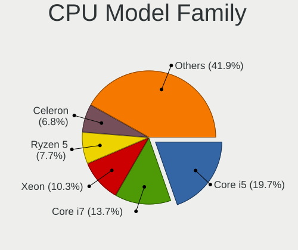

| Model                   | Desktops | Percent |
|-------------------------|----------|---------|
| Intel Core i5           | 23       | 19.66%  |
| Intel Core i7           | 16       | 13.68%  |
| Intel Xeon              | 12       | 10.26%  |
| AMD Ryzen 5             | 9        | 7.69%   |
| Intel Celeron           | 8        | 6.84%   |
| AMD Ryzen 7             | 7        | 5.98%   |
| AMD FX                  | 4        | 3.42%   |
| Other                   | 3        | 2.56%   |
| Intel Pentium Dual-Core | 3        | 2.56%   |
| Intel Core 2 Quad       | 3        | 2.56%   |
| Intel Core 2 Duo        | 3        | 2.56%   |
| AMD A10                 | 3        | 2.56%   |
| Intel Pentium Dual      | 2        | 1.71%   |
| Intel Pentium           | 2        | 1.71%   |
| Intel Core i3           | 2        | 1.71%   |
| AMD Ryzen 3             | 2        | 1.71%   |
| Intel Pentium Silver    | 1        | 0.85%   |
| Intel Pentium Gold      | 1        | 0.85%   |
| Intel Pentium D         | 1        | 0.85%   |
| Intel Pentium 4         | 1        | 0.85%   |
| Intel Core i9           | 1        | 0.85%   |
| Intel Atom              | 1        | 0.85%   |
| AMD Sempron             | 1        | 0.85%   |
| AMD Ryzen Threadripper  | 1        | 0.85%   |
| AMD Ryzen 7 PRO         | 1        | 0.85%   |
| AMD Phenom II X4        | 1        | 0.85%   |
| AMD GX                  | 1        | 0.85%   |
| AMD Athlon II X2        | 1        | 0.85%   |
| AMD Athlon II           | 1        | 0.85%   |
| AMD Athlon              | 1        | 0.85%   |
| AMD A4                  | 1        | 0.85%   |

CPU Cores
---------

Number of processor cores

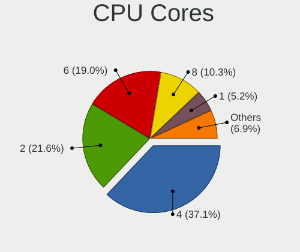

| Number | Desktops | Percent |
|--------|----------|---------|
| 4      | 43       | 37.07%  |
| 2      | 25       | 21.55%  |
| 6      | 22       | 18.97%  |
| 8      | 12       | 10.34%  |
| 1      | 6        | 5.17%   |
| 16     | 2        | 1.72%   |
| 10     | 2        | 1.72%   |
| 36     | 1        | 0.86%   |
| 24     | 1        | 0.86%   |
| 14     | 1        | 0.86%   |
| 12     | 1        | 0.86%   |

CPU Sockets
-----------

Number of sockets

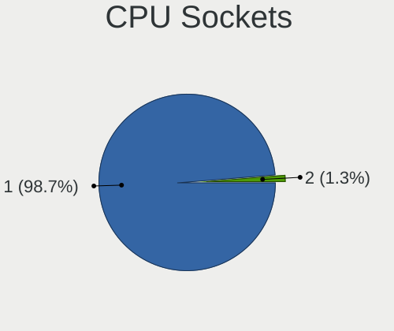

| Number | Desktops | Percent |
|--------|----------|---------|
| 1      | 114      | 98.28%  |
| 2      | 2        | 1.72%   |

CPU Threads
-----------

Threads per core (Hyper-Threading)

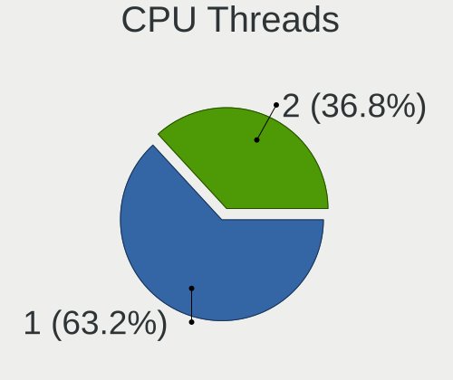

| Number | Desktops | Percent |
|--------|----------|---------|
| 2      | 58       | 50%     |
| 1      | 58       | 50%     |

CPU Op-Modes
------------

CPU Operation Modes (32-bit, 64-bit)

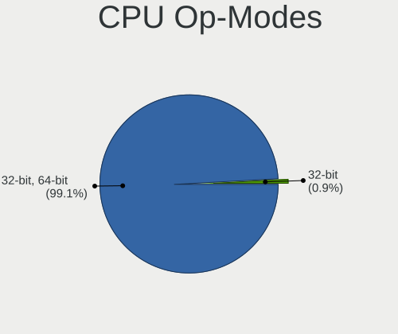

| Op mode        | Desktops | Percent |
|----------------|----------|---------|
| 32-bit, 64-bit | 115      | 99.14%  |
| 32-bit         | 1        | 0.86%   |

CPU Microcode
-------------

Microcode number

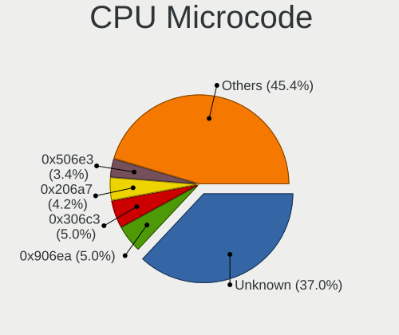

| Number     | Desktops | Percent |
|------------|----------|---------|
| Unknown    | 44       | 36.97%  |
| 0x906ea    | 6        | 5.04%   |
| 0x306c3    | 6        | 5.04%   |
| 0x206a7    | 5        | 4.2%    |
| 0x506e3    | 4        | 3.36%   |
| 0x306a9    | 4        | 3.36%   |
| 0x1067a    | 4        | 3.36%   |
| 0x08701021 | 3        | 2.52%   |
| 0x0800820d | 3        | 2.52%   |
| 0xa0653    | 2        | 1.68%   |
| 0x906e9    | 2        | 1.68%   |
| 0x6fd      | 2        | 1.68%   |
| 0x106e5    | 2        | 1.68%   |
| 0x0a20120a | 2        | 1.68%   |
| 0x08001138 | 2        | 1.68%   |
| 0xf49      | 1        | 0.84%   |
| 0xb06e0    | 1        | 0.84%   |
| 0xb0671    | 1        | 0.84%   |
| 0xa0655    | 1        | 0.84%   |
| 0x906ed    | 1        | 0.84%   |
| 0x906c0    | 1        | 0.84%   |
| 0x806f8    | 1        | 0.84%   |
| 0x806ec    | 1        | 0.84%   |
| 0x706a1    | 1        | 0.84%   |
| 0x686      | 1        | 0.84%   |
| 0x506c9    | 1        | 0.84%   |
| 0x406f1    | 1        | 0.84%   |
| 0x406d8    | 1        | 0.84%   |
| 0x40651    | 1        | 0.84%   |
| 0x306f2    | 1        | 0.84%   |
| 0x30678    | 1        | 0.84%   |
| 0x206c2    | 1        | 0.84%   |
| 0x10676    | 1        | 0.84%   |
| 0x0a601203 | 1        | 0.84%   |
| 0x0a50000f | 1        | 0.84%   |
| 0x08701013 | 1        | 0.84%   |
| 0x0810100b | 1        | 0.84%   |
| 0x08001129 | 1        | 0.84%   |
| 0x07000110 | 1        | 0.84%   |
| 0x06001119 | 1        | 0.84%   |

CPU Microarch
-------------

Microarchitecture

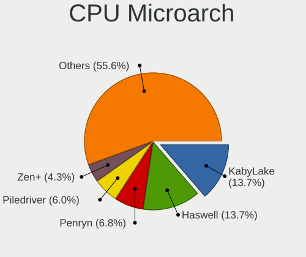

| Name             | Desktops | Percent |
|------------------|----------|---------|
| KabyLake         | 16       | 13.68%  |
| Haswell          | 16       | 13.68%  |
| Penryn           | 8        | 6.84%   |
| Piledriver       | 7        | 5.98%   |
| Zen+             | 5        | 4.27%   |
| Zen 3            | 5        | 4.27%   |
| Zen 2            | 5        | 4.27%   |
| Zen              | 5        | 4.27%   |
| Skylake          | 5        | 4.27%   |
| SandyBridge      | 5        | 4.27%   |
| IvyBridge        | 4        | 3.42%   |
| Core             | 4        | 3.42%   |
| CometLake        | 4        | 3.42%   |
| Nehalem          | 3        | 2.56%   |
| K10              | 3        | 2.56%   |
| Unknown          | 3        | 2.56%   |
| Westmere         | 2        | 1.71%   |
| Silvermont       | 2        | 1.71%   |
| NetBurst         | 2        | 1.71%   |
| Broadwell        | 2        | 1.71%   |
| Alderlake Hybrid | 2        | 1.71%   |
| Tremont          | 1        | 0.85%   |
| Sapphire Rapids  | 1        | 0.85%   |
| P6               | 1        | 0.85%   |
| K8 Hammer        | 1        | 0.85%   |
| K10 Llano        | 1        | 0.85%   |
| Jaguar           | 1        | 0.85%   |
| Gracemont        | 1        | 0.85%   |
| Goldmont plus    | 1        | 0.85%   |
| Goldmont         | 1        | 0.85%   |

Graphics
--------

GPU Vendor
----------

Vendors of graphics cards

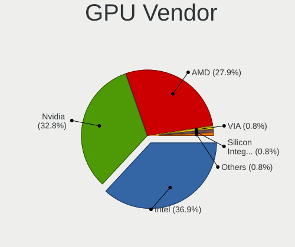

| Vendor                           | Desktops | Percent |
|----------------------------------|----------|---------|
| Intel                            | 45       | 36.89%  |
| Nvidia                           | 40       | 32.79%  |
| AMD                              | 34       | 27.87%  |
| VIA Technologies                 | 1        | 0.82%   |
| Silicon Integrated Systems [SiS] | 1        | 0.82%   |
| ASPEED Technology                | 1        | 0.82%   |

GPU Model
---------

Graphics card models

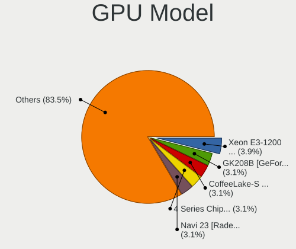

| Model                                                                       | Desktops | Percent |
|-----------------------------------------------------------------------------|----------|---------|
| Intel Xeon E3-1200 v3/4th Gen Core Processor Integrated Graphics Controller | 5        | 3.94%   |
| Nvidia GK208B [GeForce GT 710]                                              | 4        | 3.15%   |
| Intel CoffeeLake-S GT2 [UHD Graphics 630]                                   | 4        | 3.15%   |
| Intel 4 Series Chipset Integrated Graphics Controller                       | 4        | 3.15%   |
| AMD Navi 23 [Radeon RX 6600/6600 XT/6600M]                                  | 4        | 3.15%   |
| AMD Ellesmere [Radeon RX 470/480/570/570X/580/580X/590]                     | 4        | 3.15%   |
| Nvidia GP107 [GeForce GTX 1050 Ti]                                          | 3        | 2.36%   |
| Nvidia GP106 [GeForce GTX 1060 3GB]                                         | 3        | 2.36%   |
| Intel Xeon E3-1200 v3 Processor Integrated Graphics Controller              | 3        | 2.36%   |
| Intel CometLake-S GT2 [UHD Graphics 630]                                    | 3        | 2.36%   |
| Nvidia GT218 [GeForce 210]                                                  | 2        | 1.57%   |
| Nvidia GP106 [GeForce GTX 1060 6GB]                                         | 2        | 1.57%   |
| Nvidia GP104 [GeForce GTX 1080]                                             | 2        | 1.57%   |
| Nvidia GF108 [GeForce GT 430]                                               | 2        | 1.57%   |
| Nvidia GA104 [GeForce RTX 3060 Ti]                                          | 2        | 1.57%   |
| Nvidia G96CGL [Quadro FX 580]                                               | 2        | 1.57%   |
| Intel Xeon E3-1200 v2/3rd Gen Core processor Graphics Controller            | 2        | 1.57%   |
| Intel Skylake-S GT2 [HD Graphics 530]                                       | 2        | 1.57%   |
| Intel Kaby Lake-S GT2 [HD Graphics 630]                                     | 2        | 1.57%   |
| Intel CometLake-U GT2 [UHD Graphics]                                        | 2        | 1.57%   |
| Intel 82G33/G31 Express Integrated Graphics Controller                      | 2        | 1.57%   |
| Intel 2nd Generation Core Processor Family Integrated Graphics Controller   | 2        | 1.57%   |
| AMD RV730 PRO [Radeon HD 4650]                                              | 2        | 1.57%   |
| AMD RS780L [Radeon 3000]                                                    | 2        | 1.57%   |
| AMD Navi 33 [Radeon RX 7600/7600 XT/7600M XT/7600S/7700S / PRO W7600]       | 2        | 1.57%   |
| AMD Lexa PRO [Radeon 540/540X/550/550X / RX 540X/550/550X]                  | 2        | 1.57%   |
| AMD Cedar [Radeon HD 5000/6000/7350/8350 Series]                            | 2        | 1.57%   |
| VIA Technologies P4M890 [S3 UniChrome Pro]                                  | 1        | 0.79%   |
| Silicon Integrated Systems [SiS] 771/671 PCIE VGA Display Adapter           | 1        | 0.79%   |
| Nvidia TU117 [GeForce GTX 1650]                                             | 1        | 0.79%   |
| Nvidia TU116 [GeForce GTX 1660]                                             | 1        | 0.79%   |
| Nvidia TU116 [GeForce GTX 1660 SUPER]                                       | 1        | 0.79%   |
| Nvidia TU104GL [Quadro RTX 4000]                                            | 1        | 0.79%   |
| Nvidia GT218 [GeForce 8400 GS Rev. 3]                                       | 1        | 0.79%   |
| Nvidia GT218 [GeForce 310]                                                  | 1        | 0.79%   |
| Nvidia GP104 [GeForce GTX 1070]                                             | 1        | 0.79%   |
| Nvidia GP104 [GeForce GTX 1070 Ti]                                          | 1        | 0.79%   |
| Nvidia GM107 [GeForce GTX 750 Ti]                                           | 1        | 0.79%   |
| Nvidia GK208B [GeForce GT 730]                                              | 1        | 0.79%   |
| Nvidia GK107 [NVS 510]                                                      | 1        | 0.79%   |

GPU Combo
---------

Combinations of graphics cards

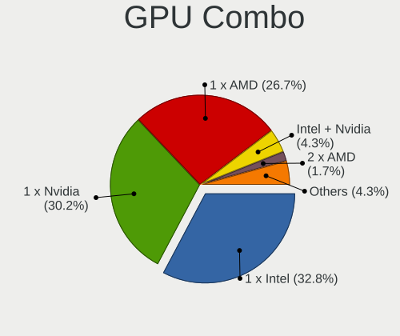

| Name           | Desktops | Percent |
|----------------|----------|---------|
| 1 x Intel      | 38       | 32.76%  |
| 1 x Nvidia     | 35       | 30.17%  |
| 1 x AMD        | 31       | 26.72%  |
| Intel + Nvidia | 5        | 4.31%   |
| 2 x AMD        | 2        | 1.72%   |
| Other          | 1        | 0.86%   |
| 1 x VIA        | 1        | 0.86%   |
| 1 x SiS        | 1        | 0.86%   |
| Intel + AMD    | 1        | 0.86%   |
| 1 x ASPEED     | 1        | 0.86%   |

GPU Driver
----------

Free vs proprietary

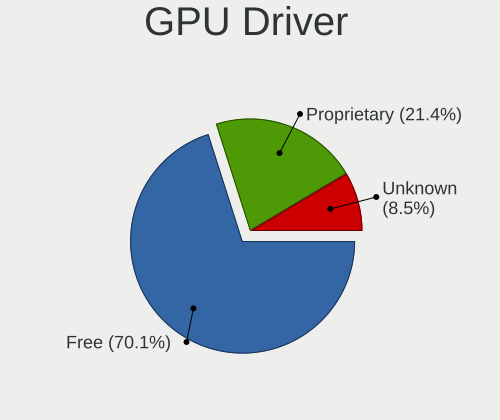

| Driver      | Desktops | Percent |
|-------------|----------|---------|
| Free        | 82       | 70.09%  |
| Proprietary | 25       | 21.37%  |
| Unknown     | 10       | 8.55%   |

GPU Memory
----------

Total video memory

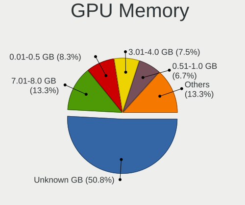

| Size in GB | Desktops | Percent |
|------------|----------|---------|
| Unknown    | 61       | 50.83%  |
| 7.01-8.0   | 16       | 13.33%  |
| 0.01-0.5   | 10       | 8.33%   |
| 3.01-4.0   | 9        | 7.5%    |
| 0.51-1.0   | 8        | 6.67%   |
| 1.01-2.0   | 6        | 5%      |
| 5.01-6.0   | 5        | 4.17%   |
| 2.01-3.0   | 3        | 2.5%    |
| 8.01-16.0  | 2        | 1.67%   |

Monitor
-------

Monitor Vendor
--------------

Monitor vendors

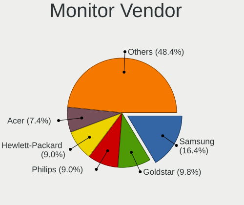

| Vendor                  | Desktops | Percent |
|-------------------------|----------|---------|
| Samsung Electronics     | 20       | 16.39%  |
| Goldstar                | 12       | 9.84%   |
| Philips                 | 11       | 9.02%   |
| Hewlett-Packard         | 11       | 9.02%   |
| Acer                    | 9        | 7.38%   |
| Dell                    | 8        | 6.56%   |
| Ancor Communications    | 8        | 6.56%   |
| Lenovo                  | 6        | 4.92%   |
| Unknown                 | 4        | 3.28%   |
| Iiyama                  | 4        | 3.28%   |
| BenQ                    | 4        | 3.28%   |
| AOC                     | 4        | 3.28%   |
| Toshiba                 | 2        | 1.64%   |
| CHI                     | 2        | 1.64%   |
| ___                     | 1        | 0.82%   |
| ViewSonic               | 1        | 0.82%   |
| Sony                    | 1        | 0.82%   |
| PCT                     | 1        | 0.82%   |
| Packard Bell            | 1        | 0.82%   |
| MSI                     | 1        | 0.82%   |
| MiTAC                   | 1        | 0.82%   |
| HJW                     | 1        | 0.82%   |
| Haier                   | 1        | 0.82%   |
| Grundig                 | 1        | 0.82%   |
| GDH                     | 1        | 0.82%   |
| EXP                     | 1        | 0.82%   |
| eMachines               | 1        | 0.82%   |
| Eizo                    | 1        | 0.82%   |
| CVT                     | 1        | 0.82%   |
| Chi Mei Optoelectronics | 1        | 0.82%   |
| AVX                     | 1        | 0.82%   |

Monitor Model
-------------

Monitor models

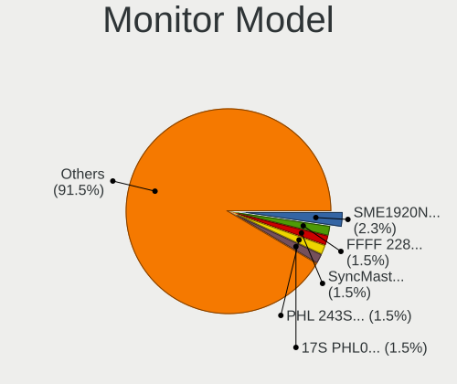

| Model                                                                  | Desktops | Percent |
|------------------------------------------------------------------------|----------|---------|
| Samsung Electronics SME1920N SAM06A3 1366x768 410x230mm 18.5-inch      | 3        | 2.31%   |
| Unknown LCD Monitor FFFF 2288x1287 2550x2550mm 142.0-inch              | 2        | 1.54%   |
| Samsung Electronics SyncMaster SAM0091 1600x1200 432x324mm 21.3-inch   | 2        | 1.54%   |
| Philips PHL 243S7 PHL090F 1920x1080 527x296mm 23.8-inch                | 2        | 1.54%   |
| Philips 17S PHL0877 1280x1024 337x270mm 17.0-inch                      | 2        | 1.54%   |
| Hewlett-Packard 22m HPN3575 1920x1080 476x268mm 21.5-inch              | 2        | 1.54%   |
| Ancor Communications VS248 ACI2498 1920x1080 531x299mm 24.0-inch       | 2        | 1.54%   |
| Acer AL1707 A ACRAD46 1280x1024 338x270mm 17.0-inch                    | 2        | 1.54%   |
| ___ LCD TV ___9000 1360x768                                            | 1        | 0.77%   |
| ViewSonic VA2261 Series VSC0F30 1920x1080 477x268mm 21.5-inch          | 1        | 0.77%   |
| Unknown LCD TV 9000 1360x768 1600x900mm 72.3-inch                      | 1        | 0.77%   |
| Unknown LCD Monitor hp L1702 1280x1024                                 | 1        | 0.77%   |
| Toshiba TV TSB0209 1920x1080 1594x900mm 72.1-inch                      | 1        | 0.77%   |
| Toshiba TV TSB010D 1920x1080 529x299mm 23.9-inch                       | 1        | 0.77%   |
| Sony SDM-HS95 SNY2700 1280x1024 380x300mm 19.1-inch                    | 1        | 0.77%   |
| Samsung Electronics T24B301 SAM098E 1920x1080 521x293mm 23.5-inch      | 1        | 0.77%   |
| Samsung Electronics SyncMaster SAM05CD 1920x1080                       | 1        | 0.77%   |
| Samsung Electronics SyncMaster SAM0473 2048x1152 510x287mm 23.0-inch   | 1        | 0.77%   |
| Samsung Electronics SyncMaster SAM0226 1440x900 410x257mm 19.1-inch    | 1        | 0.77%   |
| Samsung Electronics SyncMaster SAM0029 2048x1536 312x234mm 15.4-inch   | 1        | 0.77%   |
| Samsung Electronics S24D330 SAM0D92 1920x1080 531x299mm 24.0-inch      | 1        | 0.77%   |
| Samsung Electronics S24D300 SAM0B43 1920x1080 531x299mm 24.0-inch      | 1        | 0.77%   |
| Samsung Electronics S24B300 SAM08B3 1920x1080 521x293mm 23.5-inch      | 1        | 0.77%   |
| Samsung Electronics S/T 77/76BDF STN0007 1792x1344 312x234mm 15.4-inch | 1        | 0.77%   |
| Samsung Electronics LF24T35 SAM707D 1920x1080 528x297mm 23.9-inch      | 1        | 0.77%   |
| Samsung Electronics LCD Monitor SyncMaster 1280x1024                   | 1        | 0.77%   |
| Samsung Electronics LCD Monitor SyncMaster                             | 1        | 0.77%   |
| Samsung Electronics LCD Monitor SAM0902 1920x1080 890x500mm 40.2-inch  | 1        | 0.77%   |
| Samsung Electronics LCD Monitor SA300/350/360                          | 1        | 0.77%   |
| Samsung Electronics LCD Monitor S24D340                                | 1        | 0.77%   |
| Samsung Electronics LCD Monitor S24D330 1920x1080                      | 1        | 0.77%   |
| Samsung Electronics LCD Monitor C27F398 1920x1080                      | 1        | 0.77%   |
| Samsung Electronics LCD Monitor C27F390 5760x1080                      | 1        | 0.77%   |
| Samsung Electronics C27F398 SAM0D45 1920x1080 598x336mm 27.0-inch      | 1        | 0.77%   |
| Philips PHL 241P6Q PHL08DB 1920x1080 527x296mm 23.8-inch               | 1        | 0.77%   |
| Philips PHL 223V5 PHLC0CF 1920x1080 477x268mm 21.5-inch                | 1        | 0.77%   |
| Philips LCD Monitor PHL 234E5 4480x1440                                | 1        | 0.77%   |
| Philips 32M1C5500V PHLC29C 2560x1440 697x392mm 31.5-inch               | 1        | 0.77%   |
| Philips 273ELH PHLC07D 1920x1080 598x336mm 27.0-inch                   | 1        | 0.77%   |
| Philips 247EL PHLC084 1920x1080 521x293mm 23.5-inch                    | 1        | 0.77%   |

Monitor Resolution
------------------

Monitor screen resolution

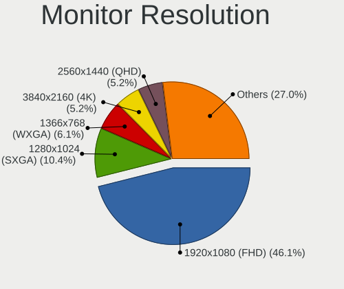

| Resolution         | Desktops | Percent |
|--------------------|----------|---------|
| 1920x1080 (FHD)    | 53       | 46.09%  |
| 1280x1024 (SXGA)   | 12       | 10.43%  |
| 1366x768 (WXGA)    | 7        | 6.09%   |
| 3840x2160 (4K)     | 6        | 5.22%   |
| 2560x1440 (QHD)    | 6        | 5.22%   |
| 1440x900 (WXGA+)   | 6        | 5.22%   |
| 1920x1200 (WUXGA)  | 4        | 3.48%   |
| 1680x1050 (WSXGA+) | 4        | 3.48%   |
| Unknown            | 3        | 2.61%   |
| 3440x1440          | 2        | 1.74%   |
| 2288x1287          | 2        | 1.74%   |
| 1600x1200          | 2        | 1.74%   |
| 1360x768           | 2        | 1.74%   |
| 5760x1080          | 1        | 0.87%   |
| 4480x1440          | 1        | 0.87%   |
| 2048x1152          | 1        | 0.87%   |
| 1920x540           | 1        | 0.87%   |
| 1600x900 (HD+)     | 1        | 0.87%   |
| 1024x768 (XGA)     | 1        | 0.87%   |

Monitor Diagonal
----------------

Diagonal size in inches

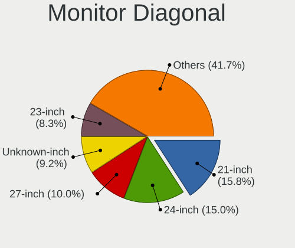

| Inches  | Desktops | Percent |
|---------|----------|---------|
| 21      | 19       | 15.83%  |
| 24      | 18       | 15%     |
| 27      | 12       | 10%     |
| Unknown | 11       | 9.17%   |
| 23      | 10       | 8.33%   |
| 19      | 8        | 6.67%   |
| 18      | 8        | 6.67%   |
| 17      | 6        | 5%      |
| 31      | 5        | 4.17%   |
| 32      | 3        | 2.5%    |
| 22      | 3        | 2.5%    |
| 142     | 2        | 1.67%   |
| 72      | 2        | 1.67%   |
| 54      | 2        | 1.67%   |
| 52      | 2        | 1.67%   |
| 34      | 2        | 1.67%   |
| 15      | 2        | 1.67%   |
| 40      | 1        | 0.83%   |
| 39      | 1        | 0.83%   |
| 26      | 1        | 0.83%   |
| 25      | 1        | 0.83%   |
| 14      | 1        | 0.83%   |

Monitor Width
-------------

Physical width

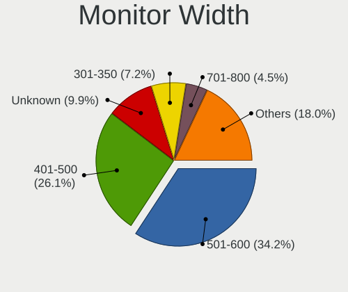

| Width in mm    | Desktops | Percent |
|----------------|----------|---------|
| 501-600        | 38       | 34.23%  |
| 401-500        | 29       | 26.13%  |
| Unknown        | 11       | 9.91%   |
| 301-350        | 8        | 7.21%   |
| 701-800        | 5        | 4.5%    |
| 601-700        | 5        | 4.5%    |
| 351-400        | 5        | 4.5%    |
| 1001-1500      | 4        | 3.6%    |
| More than 2000 | 2        | 1.8%    |
| 801-900        | 2        | 1.8%    |
| 1501-2000      | 2        | 1.8%    |

Aspect Ratio
------------

Proportional relationship between the width and the height

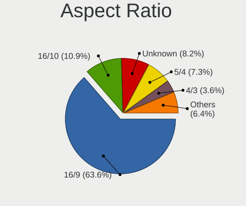

| Ratio   | Desktops | Percent |
|---------|----------|---------|
| 16/9    | 70       | 63.64%  |
| 16/10   | 12       | 10.91%  |
| Unknown | 9        | 8.18%   |
| 5/4     | 8        | 7.27%   |
| 4/3     | 4        | 3.64%   |
| 6/5     | 3        | 2.73%   |
| 21/9    | 2        | 1.82%   |
| 1.00    | 2        | 1.82%   |

Monitor Area
------------

Area in inch²

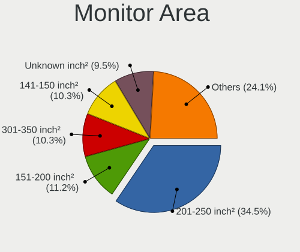

| Area in inch² | Desktops | Percent |
|----------------|----------|---------|
| 201-250        | 40       | 34.48%  |
| 151-200        | 13       | 11.21%  |
| 301-350        | 12       | 10.34%  |
| 141-150        | 12       | 10.34%  |
| Unknown        | 11       | 9.48%   |
| 351-500        | 10       | 8.62%   |
| More than 1000 | 8        | 6.9%    |
| 251-300        | 5        | 4.31%   |
| 111-120        | 2        | 1.72%   |
| 501-1000       | 2        | 1.72%   |
| 81-90          | 1        | 0.86%   |

Pixel Density
-------------

Pixels per inch

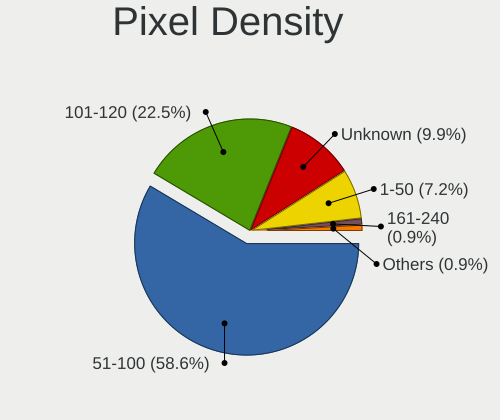

| Density | Desktops | Percent |
|---------|----------|---------|
| 51-100  | 65       | 58.56%  |
| 101-120 | 25       | 22.52%  |
| Unknown | 11       | 9.91%   |
| 1-50    | 8        | 7.21%   |
| 161-240 | 1        | 0.9%    |
| 121-160 | 1        | 0.9%    |

Multiple Monitors
-----------------

Total monitors connected

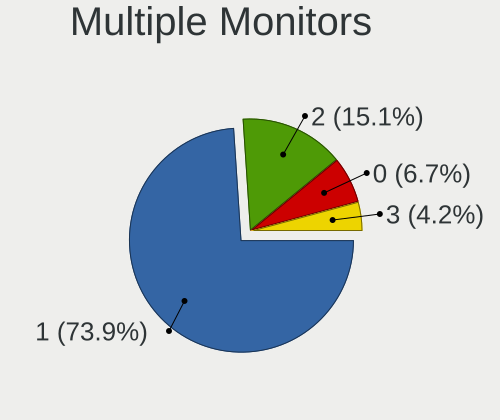

| Total | Desktops | Percent |
|-------|----------|---------|
| 1     | 88       | 73.95%  |
| 2     | 18       | 15.13%  |
| 0     | 8        | 6.72%   |
| 3     | 5        | 4.2%    |

Network
-------

Net Controller Vendor
---------------------

Controller vendors

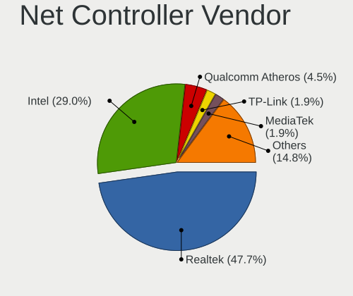

| Vendor                           | Desktops | Percent |
|----------------------------------|----------|---------|
| Realtek Semiconductor            | 74       | 47.74%  |
| Intel                            | 45       | 29.03%  |
| Qualcomm Atheros                 | 7        | 4.52%   |
| TP-Link                          | 3        | 1.94%   |
| MediaTek                         | 3        | 1.94%   |
| Espressif                        | 3        | 1.94%   |
| NetGear                          | 2        | 1.29%   |
| Marvell Technology Group         | 2        | 1.29%   |
| D-Link System                    | 2        | 1.29%   |
| Broadcom                         | 2        | 1.29%   |
| VIA Technologies                 | 1        | 0.65%   |
| STMicroelectronics               | 1        | 0.65%   |
| Solarflare Communications        | 1        | 0.65%   |
| Silicon Integrated Systems [SiS] | 1        | 0.65%   |
| Seiko Epson                      | 1        | 0.65%   |
| Samsung Electronics              | 1        | 0.65%   |
| Ralink Technology                | 1        | 0.65%   |
| Nvidia                           | 1        | 0.65%   |
| JMicron Technology               | 1        | 0.65%   |
| Chelsio Communications           | 1        | 0.65%   |
| ASIX Electronics                 | 1        | 0.65%   |
| Aquantia                         | 1        | 0.65%   |

Net Controller Model
--------------------

Controller models

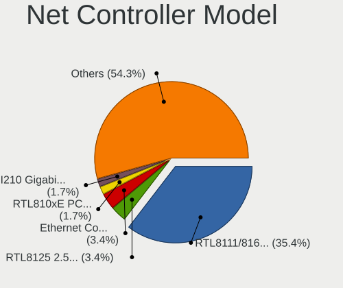

| Model                                                                  | Desktops | Percent |
|------------------------------------------------------------------------|----------|---------|
| Realtek RTL8111/8168/8211/8411 PCI Express Gigabit Ethernet Controller | 62       | 35.43%  |
| Realtek RTL8125 2.5GbE Controller                                      | 6        | 3.43%   |
| Intel Ethernet Connection I217-LM                                      | 6        | 3.43%   |
| Realtek RTL810xE PCI Express Fast Ethernet controller                  | 3        | 1.71%   |
| Intel I210 Gigabit Network Connection                                  | 3        | 1.71%   |
| Intel Ethernet Controller I225-V                                       | 3        | 1.71%   |
| Intel 82579LM Gigabit Network Connection (Lewisville)                  | 3        | 1.71%   |
| Espressif USB JTAG/serial debug unit                                   | 3        | 1.71%   |
| Realtek RTL8821CE 802.11ac PCIe Wireless Network Adapter               | 2        | 1.14%   |
| NetGear WNA3100M(v1) Wireless-N 300 [Realtek RTL8192CU]                | 2        | 1.14%   |
| MediaTek MT7921K (RZ608) Wi-Fi 6E 80MHz                                | 2        | 1.14%   |
| Intel Wi-Fi 6 AX200                                                    | 2        | 1.14%   |
| Intel I211 Gigabit Network Connection                                  | 2        | 1.14%   |
| Intel Ethernet Controller I226-V                                       | 2        | 1.14%   |
| Intel Ethernet Connection (7) I219-V                                   | 2        | 1.14%   |
| Intel Ethernet Connection (7) I219-LM                                  | 2        | 1.14%   |
| Intel Ethernet Connection (5) I219-LM                                  | 2        | 1.14%   |
| Intel Ethernet Connection (2) I219-V                                   | 2        | 1.14%   |
| Intel 82578DM Gigabit Network Connection                               | 2        | 1.14%   |
| VIA VT6102/VT6103 [Rhine-II]                                           | 1        | 0.57%   |
| TP-Link UE300 10/100/1000 LAN (ethernet mode) [Realtek RTL8153]        | 1        | 0.57%   |
| TP-Link TL-WN821N v5/v6 [RTL8192EU]                                    | 1        | 0.57%   |
| TP-Link TL-WN722N v2/v3 [Realtek RTL8188EUS]                           | 1        | 0.57%   |
| STMicroelectronics Virtual COM Port                                    | 1        | 0.57%   |
| Solarflare SFC9020 10G Ethernet Controller                             | 1        | 0.57%   |
| Silicon Integrated Systems [SiS] 191 Gigabit Ethernet Adapter          | 1        | 0.57%   |
| Seiko Epson ELPAP02 Ethernet unit                                      | 1        | 0.57%   |
| Samsung Galaxy series, misc. (tethering mode)                          | 1        | 0.57%   |
| Realtek USB 10/100/1G/2.5 LAN                                          | 1        | 0.57%   |
| Realtek RTL88x2bu [AC1200 Techkey]                                     | 1        | 0.57%   |
| Realtek RTL8852CE PCIe 802.11ax Wireless Network Controller            | 1        | 0.57%   |
| Realtek RTL8812AU 802.11a/b/g/n/ac 2T2R DB WLAN Adapter                | 1        | 0.57%   |
| Realtek RTL8188FTV 802.11b/g/n 1T1R 2.4G WLAN Adapter                  | 1        | 0.57%   |
| Realtek RTL8188EUS 802.11n Wireless Network Adapter                    | 1        | 0.57%   |
| Realtek RTL8188CUS 802.11n WLAN Adapter                                | 1        | 0.57%   |
| Realtek RTL8188CE 802.11b/g/n WiFi Adapter                             | 1        | 0.57%   |
| Realtek RTL8153 Gigabit Ethernet Adapter                               | 1        | 0.57%   |
| Realtek RTL-8185 IEEE 802.11a/b/g Wireless LAN Controller              | 1        | 0.57%   |
| Realtek RTL-8100/8101L/8139 PCI Fast Ethernet Adapter                  | 1        | 0.57%   |
| Ralink MT7601U Wireless Adapter                                        | 1        | 0.57%   |

Wireless Vendor
---------------

Wireless vendors

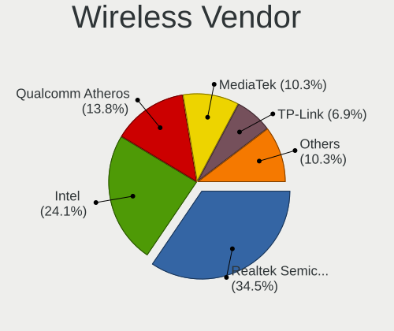

| Vendor                | Desktops | Percent |
|-----------------------|----------|---------|
| Realtek Semiconductor | 10       | 34.48%  |
| Intel                 | 7        | 24.14%  |
| Qualcomm Atheros      | 4        | 13.79%  |
| MediaTek              | 3        | 10.34%  |
| TP-Link               | 2        | 6.9%    |
| NetGear               | 2        | 6.9%    |
| Ralink Technology     | 1        | 3.45%   |

Wireless Model
--------------

Wireless models

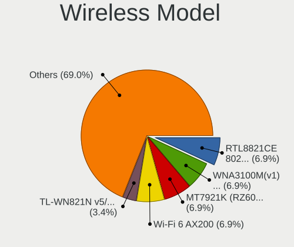

| Model                                                          | Desktops | Percent |
|----------------------------------------------------------------|----------|---------|
| Realtek RTL8821CE 802.11ac PCIe Wireless Network Adapter       | 2        | 6.9%    |
| NetGear WNA3100M(v1) Wireless-N 300 [Realtek RTL8192CU]        | 2        | 6.9%    |
| MediaTek MT7921K (RZ608) Wi-Fi 6E 80MHz                        | 2        | 6.9%    |
| Intel Wi-Fi 6 AX200                                            | 2        | 6.9%    |
| TP-Link TL-WN821N v5/v6 [RTL8192EU]                            | 1        | 3.45%   |
| TP-Link TL-WN722N v2/v3 [Realtek RTL8188EUS]                   | 1        | 3.45%   |
| Realtek RTL88x2bu [AC1200 Techkey]                             | 1        | 3.45%   |
| Realtek RTL8852CE PCIe 802.11ax Wireless Network Controller    | 1        | 3.45%   |
| Realtek RTL8812AU 802.11a/b/g/n/ac 2T2R DB WLAN Adapter        | 1        | 3.45%   |
| Realtek RTL8188FTV 802.11b/g/n 1T1R 2.4G WLAN Adapter          | 1        | 3.45%   |
| Realtek RTL8188EUS 802.11n Wireless Network Adapter            | 1        | 3.45%   |
| Realtek RTL8188CUS 802.11n WLAN Adapter                        | 1        | 3.45%   |
| Realtek RTL8188CE 802.11b/g/n WiFi Adapter                     | 1        | 3.45%   |
| Realtek RTL-8185 IEEE 802.11a/b/g Wireless LAN Controller      | 1        | 3.45%   |
| Ralink MT7601U Wireless Adapter                                | 1        | 3.45%   |
| Qualcomm Atheros QCA6174 802.11ac Wireless Network Adapter     | 1        | 3.45%   |
| Qualcomm Atheros AR9462 Wireless Network Adapter               | 1        | 3.45%   |
| Qualcomm Atheros AR9287 Wireless Network Adapter (PCI-Express) | 1        | 3.45%   |
| Qualcomm Atheros AR5212/5213/2414 Wireless Network Adapter     | 1        | 3.45%   |
| MediaTek MT7922 802.11ax PCI Express Wireless Network Adapter  | 1        | 3.45%   |
| Intel Wireless 8260                                            | 1        | 3.45%   |
| Intel Wireless 7265                                            | 1        | 3.45%   |
| Intel Wireless 7260                                            | 1        | 3.45%   |
| Intel Wireless 3165                                            | 1        | 3.45%   |
| Intel Dual Band Wireless-AC 3168NGW [Stone Peak]               | 1        | 3.45%   |

Ethernet Vendor
---------------

Ethernet vendors

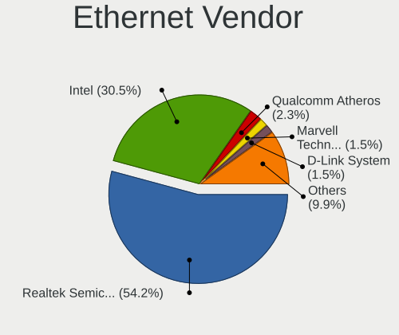

| Vendor                           | Desktops | Percent |
|----------------------------------|----------|---------|
| Realtek Semiconductor            | 71       | 54.2%   |
| Intel                            | 40       | 30.53%  |
| Qualcomm Atheros                 | 3        | 2.29%   |
| Marvell Technology Group         | 2        | 1.53%   |
| D-Link System                    | 2        | 1.53%   |
| Broadcom                         | 2        | 1.53%   |
| VIA Technologies                 | 1        | 0.76%   |
| TP-Link                          | 1        | 0.76%   |
| Solarflare Communications        | 1        | 0.76%   |
| Silicon Integrated Systems [SiS] | 1        | 0.76%   |
| Seiko Epson                      | 1        | 0.76%   |
| Samsung Electronics              | 1        | 0.76%   |
| Nvidia                           | 1        | 0.76%   |
| JMicron Technology               | 1        | 0.76%   |
| Chelsio Communications           | 1        | 0.76%   |
| ASIX Electronics                 | 1        | 0.76%   |
| Aquantia                         | 1        | 0.76%   |

Ethernet Model
--------------

Ethernet models

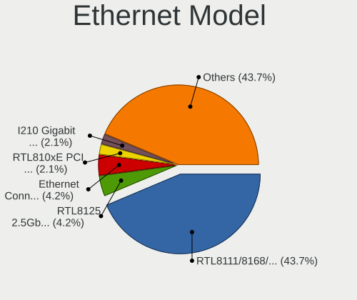

| Model                                                                  | Desktops | Percent |
|------------------------------------------------------------------------|----------|---------|
| Realtek RTL8111/8168/8211/8411 PCI Express Gigabit Ethernet Controller | 62       | 43.66%  |
| Realtek RTL8125 2.5GbE Controller                                      | 6        | 4.23%   |
| Intel Ethernet Connection I217-LM                                      | 6        | 4.23%   |
| Realtek RTL810xE PCI Express Fast Ethernet controller                  | 3        | 2.11%   |
| Intel I210 Gigabit Network Connection                                  | 3        | 2.11%   |
| Intel Ethernet Controller I225-V                                       | 3        | 2.11%   |
| Intel 82579LM Gigabit Network Connection (Lewisville)                  | 3        | 2.11%   |
| Intel I211 Gigabit Network Connection                                  | 2        | 1.41%   |
| Intel Ethernet Controller I226-V                                       | 2        | 1.41%   |
| Intel Ethernet Connection (7) I219-V                                   | 2        | 1.41%   |
| Intel Ethernet Connection (7) I219-LM                                  | 2        | 1.41%   |
| Intel Ethernet Connection (5) I219-LM                                  | 2        | 1.41%   |
| Intel Ethernet Connection (2) I219-V                                   | 2        | 1.41%   |
| Intel 82578DM Gigabit Network Connection                               | 2        | 1.41%   |
| VIA VT6102/VT6103 [Rhine-II]                                           | 1        | 0.7%    |
| TP-Link UE300 10/100/1000 LAN (ethernet mode) [Realtek RTL8153]        | 1        | 0.7%    |
| Solarflare SFC9020 10G Ethernet Controller                             | 1        | 0.7%    |
| Silicon Integrated Systems [SiS] 191 Gigabit Ethernet Adapter          | 1        | 0.7%    |
| Seiko Epson ELPAP02 Ethernet unit                                      | 1        | 0.7%    |
| Samsung Galaxy series, misc. (tethering mode)                          | 1        | 0.7%    |
| Realtek USB 10/100/1G/2.5 LAN                                          | 1        | 0.7%    |
| Realtek RTL8153 Gigabit Ethernet Adapter                               | 1        | 0.7%    |
| Realtek RTL-8100/8101L/8139 PCI Fast Ethernet Adapter                  | 1        | 0.7%    |
| Qualcomm Atheros QCA8171 Gigabit Ethernet                              | 1        | 0.7%    |
| Qualcomm Atheros Killer E2500 Gigabit Ethernet Controller              | 1        | 0.7%    |
| Qualcomm Atheros AR8131 Gigabit Ethernet                               | 1        | 0.7%    |
| Nvidia MCP61 Ethernet                                                  | 1        | 0.7%    |
| Marvell Group 88E8053 PCI-E Gigabit Ethernet Controller                | 1        | 0.7%    |
| Marvell Group 88E8001 Gigabit Ethernet Controller                      | 1        | 0.7%    |
| JMicron JMC250 PCI Express Gigabit Ethernet Controller                 | 1        | 0.7%    |
| Intel I350 Gigabit Network Connection                                  | 1        | 0.7%    |
| Intel Ethernet Controller I226-LM                                      | 1        | 0.7%    |
| Intel Ethernet Controller 10-Gigabit X540-AT2                          | 1        | 0.7%    |
| Intel Ethernet Connection I354 2.5 GbE Backplane                       | 1        | 0.7%    |
| Intel Ethernet Connection I217-V                                       | 1        | 0.7%    |
| Intel Ethernet Connection (2) I218-LM                                  | 1        | 0.7%    |
| Intel Ethernet Connection (14) I219-V                                  | 1        | 0.7%    |
| Intel Ethernet Connection (11) I219-V                                  | 1        | 0.7%    |
| Intel Ethernet Connection (11) I219-LM                                 | 1        | 0.7%    |
| Intel Alder Lake-S PCH CNVi WiFi                                       | 1        | 0.7%    |

Net Controller Kind
-------------------

Ethernet, WiFi or modem

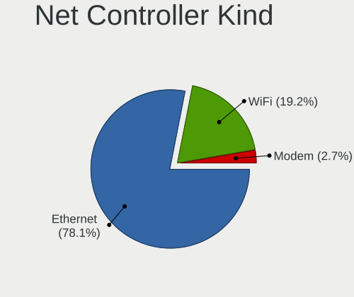

| Kind     | Desktops | Percent |
|----------|----------|---------|
| Ethernet | 114      | 78.08%  |
| WiFi     | 28       | 19.18%  |
| Modem    | 4        | 2.74%   |

Used Controller
---------------

Currently used network controller

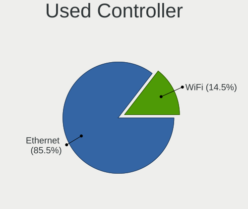

| Kind     | Desktops | Percent |
|----------|----------|---------|
| Ethernet | 100      | 85.47%  |
| WiFi     | 17       | 14.53%  |

NICs
----

Total network controllers on board

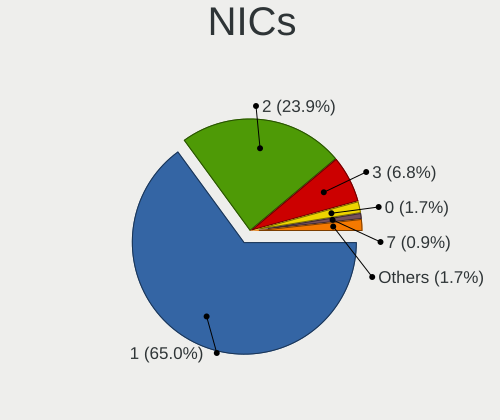

| Total | Desktops | Percent |
|-------|----------|---------|
| 1     | 76       | 64.96%  |
| 2     | 28       | 23.93%  |
| 3     | 8        | 6.84%   |
| 0     | 2        | 1.71%   |
| 7     | 1        | 0.85%   |
| 5     | 1        | 0.85%   |
| 4     | 1        | 0.85%   |

IPv6
----

IPv6 vs IPv4

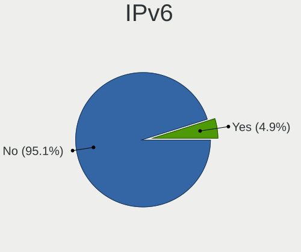

| Used | Desktops | Percent |
|------|----------|---------|
| No   | 96       | 82.76%  |
| Yes  | 20       | 17.24%  |

Bluetooth
---------

Bluetooth Vendor
----------------

Controller vendors

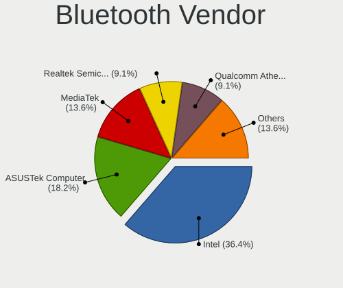

| Vendor                          | Desktops | Percent |
|---------------------------------|----------|---------|
| Intel                           | 8        | 36.36%  |
| ASUSTek Computer                | 4        | 18.18%  |
| MediaTek                        | 3        | 13.64%  |
| Realtek Semiconductor           | 2        | 9.09%   |
| Qualcomm Atheros Communications | 2        | 9.09%   |
| Cambridge Silicon Radio         | 2        | 9.09%   |
| IMC Networks                    | 1        | 4.55%   |

Bluetooth Model
---------------

Controller models

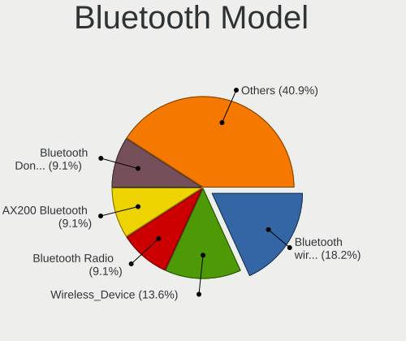

| Model                                               | Desktops | Percent |
|-----------------------------------------------------|----------|---------|
| Intel Bluetooth wireless interface                  | 4        | 18.18%  |
| MediaTek Wireless_Device                            | 3        | 13.64%  |
| Realtek Bluetooth Radio                             | 2        | 9.09%   |
| Intel AX200 Bluetooth                               | 2        | 9.09%   |
| Cambridge Silicon Radio Bluetooth Dongle (HCI mode) | 2        | 9.09%   |
| ASUS ASUS USB-BT500                                 | 2        | 9.09%   |
| Qualcomm Atheros  Bluetooth Device                  | 1        | 4.55%   |
| Qualcomm Atheros AR3011 Bluetooth                   | 1        | 4.55%   |
| Intel Wireless-AC 3168 Bluetooth                    | 1        | 4.55%   |
| Intel Bluetooth Device                              | 1        | 4.55%   |
| IMC Networks Bluetooth Radio                        | 1        | 4.55%   |
| ASUS Qualcomm Bluetooth 4.1                         | 1        | 4.55%   |
| ASUS Broadcom BCM20702A0 Bluetooth                  | 1        | 4.55%   |

Sound
-----

Sound Vendor
------------

Sound card vendors

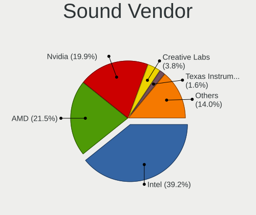

| Vendor                                       | Desktops | Percent |
|----------------------------------------------|----------|---------|
| Intel                                        | 73       | 39.25%  |
| AMD                                          | 40       | 21.51%  |
| Nvidia                                       | 37       | 19.89%  |
| Creative Labs                                | 7        | 3.76%   |
| Texas Instruments                            | 3        | 1.61%   |
| Plantronics                                  | 3        | 1.61%   |
| Logitech                                     | 2        | 1.08%   |
| KTMicro                                      | 2        | 1.08%   |
| Generalplus Technology                       | 2        | 1.08%   |
| Zoran Co. Personal Media Division (Nogatech) | 1        | 0.54%   |
| Walmart                                      | 1        | 0.54%   |
| VIA Technologies                             | 1        | 0.54%   |
| TEAC                                         | 1        | 0.54%   |
| Silicon Integrated Systems [SiS]             | 1        | 0.54%   |
| Nordic Semiconductor ASA                     | 1        | 0.54%   |
| Medeli Electronics                           | 1        | 0.54%   |
| M-Audio                                      | 1        | 0.54%   |
| KORG                                         | 1        | 0.54%   |
| Giga-Byte Technology                         | 1        | 0.54%   |
| Focusrite-Novation                           | 1        | 0.54%   |
| FIFINE Microphones                           | 1        | 0.54%   |
| Elite Silicon                                | 1        | 0.54%   |
| Cirrus Logic                                 | 1        | 0.54%   |
| C-Media Electronics                          | 1        | 0.54%   |
| Avance Logic                                 | 1        | 0.54%   |
| ASUSTek Computer                             | 1        | 0.54%   |

Sound Model
-----------

Sound card models

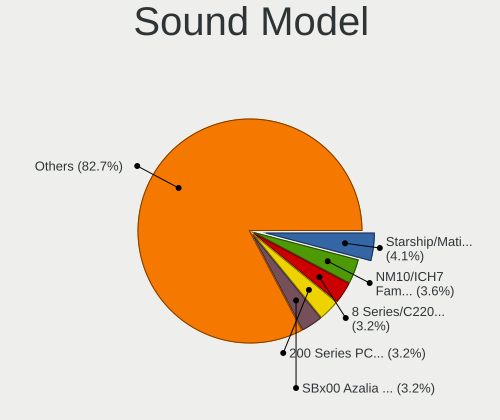

| Model                                                                                           | Desktops | Percent |
|-------------------------------------------------------------------------------------------------|----------|---------|
| AMD Starship/Matisse HD Audio Controller                                                        | 9        | 4.09%   |
| Intel NM10/ICH7 Family High Definition Audio Controller                                         | 8        | 3.64%   |
| Intel 8 Series/C220 Series Chipset High Definition Audio Controller                             | 7        | 3.18%   |
| Intel 200 Series PCH HD Audio                                                                   | 7        | 3.18%   |
| AMD SBx00 Azalia (Intel HDA)                                                                    | 7        | 3.18%   |
| AMD Family 17h (Models 00h-0fh) HD Audio Controller                                             | 7        | 3.18%   |
| Intel Xeon E3-1200 v3/4th Gen Core Processor HD Audio Controller                                | 6        | 2.73%   |
| Intel Cannon Lake PCH cAVS                                                                      | 6        | 2.73%   |
| AMD Navi 21/23 HDMI/DP Audio Controller                                                         | 6        | 2.73%   |
| Nvidia GP106 High Definition Audio Controller                                                   | 5        | 2.27%   |
| Nvidia GK208 HDMI/DP Audio Controller                                                           | 5        | 2.27%   |
| Intel C610/X99 series chipset HD Audio Controller                                               | 5        | 2.27%   |
| Intel 6 Series/C200 Series Chipset Family High Definition Audio Controller                      | 5        | 2.27%   |
| AMD FCH Azalia Controller                                                                       | 5        | 2.27%   |
| Nvidia High Definition Audio Controller                                                         | 4        | 1.82%   |
| Nvidia GP104 High Definition Audio Controller                                                   | 4        | 1.82%   |
| Intel 7 Series/C216 Chipset Family High Definition Audio Controller                             | 4        | 1.82%   |
| Intel 5 Series/3400 Series Chipset High Definition Audio                                        | 4        | 1.82%   |
| Intel 100 Series/C230 Series Chipset Family HD Audio Controller                                 | 4        | 1.82%   |
| AMD Ryzen HD Audio Controller                                                                   | 4        | 1.82%   |
| AMD Oland/Hainan/Cape Verde/Pitcairn HDMI Audio [Radeon HD 7000 Series]                         | 4        | 1.82%   |
| AMD Ellesmere HDMI Audio [Radeon RX 470/480 / 570/580/590]                                      | 4        | 1.82%   |
| Plantronics HD1                                                                                 | 3        | 1.36%   |
| Nvidia GP107GL High Definition Audio Controller                                                 | 3        | 1.36%   |
| Nvidia GA104 High Definition Audio Controller                                                   | 3        | 1.36%   |
| Creative Labs EMU10k2/CA0100/CA0102/CA10200 [Sound Blaster Audigy Series]                       | 3        | 1.36%   |
| AMD Baffin HDMI/DP Audio [Radeon RX 550 640SP / RX 560/560X]                                    | 3        | 1.36%   |
| Texas Instruments PCM2902 Audio Codec                                                           | 2        | 0.91%   |
| Nvidia TU116 High Definition Audio Controller                                                   | 2        | 0.91%   |
| Nvidia GF108 High Definition Audio Controller                                                   | 2        | 0.91%   |
| Intel Smart Sound Technology (SST) Audio Controller                                             | 2        | 0.91%   |
| Intel Comet Lake PCH-LP cAVS                                                                    | 2        | 0.91%   |
| Intel Comet Lake PCH cAVS                                                                       | 2        | 0.91%   |
| Intel Alder Lake-S HD Audio Controller                                                          | 2        | 0.91%   |
| Intel Alder Lake-N PCH High Definition Audio Controller                                         | 2        | 0.91%   |
| Generalplus Technology USB Audio Device                                                         | 2        | 0.91%   |
| Creative Labs CA0132 Sound Core3D [Sound Blaster Recon3D / Z-Series / Sound BlasterX AE-5 Plus] | 2        | 0.91%   |
| AMD RV710/730 HDMI Audio [Radeon HD 4000 series]                                                | 2        | 0.91%   |
| AMD Navi 31 HDMI/DP Audio                                                                       | 2        | 0.91%   |
| AMD Cedar HDMI Audio [Radeon HD 5400/6300/7300 Series]                                          | 2        | 0.91%   |

Memory
------

Memory Vendor
-------------

Memory module vendors

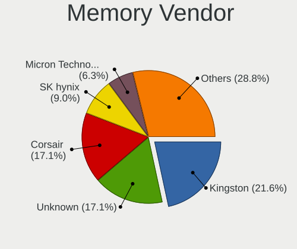

| Vendor                       | Desktops | Percent |
|------------------------------|----------|---------|
| Kingston                     | 24       | 21.62%  |
| Unknown                      | 19       | 17.12%  |
| Corsair                      | 19       | 17.12%  |
| SK hynix                     | 10       | 9.01%   |
| Micron Technology            | 7        | 6.31%   |
| Samsung Electronics          | 6        | 5.41%   |
| G.Skill                      | 6        | 5.41%   |
| Crucial                      | 4        | 3.6%    |
| Unknown                      | 3        | 2.7%    |
| Nanya Technology             | 2        | 1.8%    |
| Unknown (ABCD)               | 1        | 0.9%    |
| Unknown (0x0E9D)             | 1        | 0.9%    |
| Transcend                    | 1        | 0.9%    |
| Team                         | 1        | 0.9%    |
| Silicon Power                | 1        | 0.9%    |
| Ramaxel Technology           | 1        | 0.9%    |
| Patriot Memory (PDP Systems) | 1        | 0.9%    |
| Patriot                      | 1        | 0.9%    |
| GOODRAM                      | 1        | 0.9%    |
| Avant                        | 1        | 0.9%    |
| A-DATA Technology            | 1        | 0.9%    |

Memory Model
------------

Memory module models

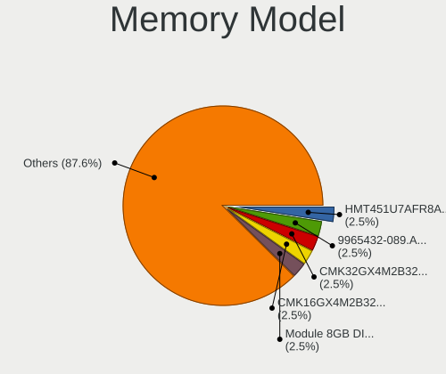

| Model                                                              | Desktops | Percent |
|--------------------------------------------------------------------|----------|---------|
| SK hynix RAM HMT451U7AFR8A-PB 4GB DIMM DDR3 1600MT/s               | 3        | 2.48%   |
| Kingston RAM 9965432-089.A00LF 4GB DIMM DDR3 1600MT/s              | 3        | 2.48%   |
| Corsair RAM CMK32GX4M2B3200C16 16GB DIMM DDR4 3800MT/s             | 3        | 2.48%   |
| Corsair RAM CMK16GX4M2B3200C16 8GB DIMM DDR4 3600MT/s              | 3        | 2.48%   |
| Unknown                                                            | 3        | 2.48%   |
| SK hynix RAM HMT451U6AFR8A-PB 4GB DIMM DDR3 1600MT/s               | 2        | 1.65%   |
| Kingston RAM KHX1600C10D3/8G 8GB DIMM DDR3 2133MT/s                | 2        | 1.65%   |
| Kingston RAM 99U5471-054.A00LF 8GB DIMM DDR3 1600MT/s              | 2        | 1.65%   |
| G.Skill RAM F4-3200C16-16GIS 16GB DIMM DDR4 3600MT/s               | 2        | 1.65%   |
| Corsair RAM CMK32GX4M4A2666C16 8GB DIMM DDR4 3000MT/s              | 2        | 1.65%   |
| Unknown RAM SM3S320SD0488CABC 8192MB SODIMM DDR3 1600MT/s          | 1        | 0.83%   |
| Unknown RAM Module 8GB DIMM DDR3 1333MT/s                          | 1        | 0.83%   |
| Unknown RAM Module 8192MB DIMM DDR3 800MT/s                        | 1        | 0.83%   |
| Unknown RAM Module 64MB DIMM DRAM 100MT/s                          | 1        | 0.83%   |
| Unknown RAM Module 4GB DIMM DDR3 800MT/s                           | 1        | 0.83%   |
| Unknown RAM Module 4GB DIMM 400MT/s                                | 1        | 0.83%   |
| Unknown RAM Module 4GB DIMM 1333MT/s                               | 1        | 0.83%   |
| Unknown RAM Module 4096MB SODIMM DDR3 1333MT/s                     | 1        | 0.83%   |
| Unknown RAM Module 4096MB DIMM DDR3 1600MT/s                       | 1        | 0.83%   |
| Unknown RAM Module 2GB DIMM DDR3 667MT/s                           | 1        | 0.83%   |
| Unknown RAM Module 2GB DIMM 1333MT/s                               | 1        | 0.83%   |
| Unknown RAM Module 256MB DIMM DRAM 100MT/s                         | 1        | 0.83%   |
| Unknown RAM Module 2048MB SODIMM DDR2 667MT/s                      | 1        | 0.83%   |
| Unknown RAM Module 2048MB DIMM SDRAM 667MT/s                       | 1        | 0.83%   |
| Unknown RAM Module 2048MB DIMM SDRAM                               | 1        | 0.83%   |
| Unknown RAM Module 1GB DIMM DDR2                                   | 1        | 0.83%   |
| Unknown RAM Module 128MB DIMM DRAM 100MT/s                         | 1        | 0.83%   |
| Unknown RAM Module 1024MB DIMM DDR 400MT/s                         | 1        | 0.83%   |
| Unknown RAM Module 1024MB DIMM DDR                                 | 1        | 0.83%   |
| Unknown RAM DDR4 NB 8G 2666 8GB SODIMM DDR4 2667MT/s               | 1        | 0.83%   |
| Unknown RAM 3600 C17 Series 8GB DIMM DDR4 3200MT/s                 | 1        | 0.83%   |
| Unknown RAM 3000 C16 Series 8192MB DIMM DDR4 2133MT/s              | 1        | 0.83%   |
| Unknown RAM 1600 CL9 Series 8192MB DIMM DDR3 1066MT/s              | 1        | 0.83%   |
| Unknown (ABCD) RAM 123456789012345678 2GB DIMM LPDDR4 2133MT/s     | 1        | 0.83%   |
| Unknown (0x0E9D) RAM KINSOTIN16GB2666MHZ 16GB SODIMM DDR4 2667MT/s | 1        | 0.83%   |
| Transcend RAM JM1333KLN-4G 4GB DIMM DDR3 1333MT/s                  | 1        | 0.83%   |
| Team RAM TEAMGROUP-UD4-2666 16GB DIMM DDR4 2667MT/s                | 1        | 0.83%   |
| SK hynix RAM Module 4GB DIMM DDR3 1333MT/s                         | 1        | 0.83%   |
| SK hynix RAM HMT451U7BFR8A-PB 4GB DIMM 1600MT/s                    | 1        | 0.83%   |
| SK hynix RAM HMT351U6EFR8C-PB 4GB DIMM DDR3 1600MT/s               | 1        | 0.83%   |

Memory Kind
-----------

Memory module kinds

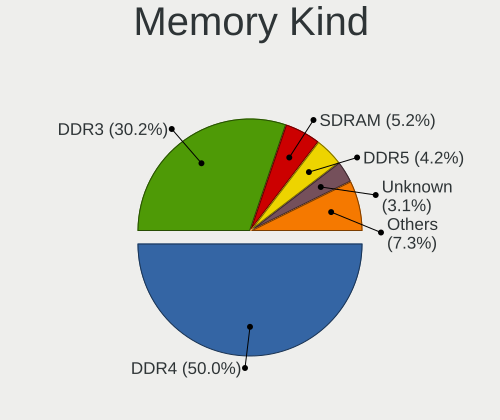

| Kind    | Desktops | Percent |
|---------|----------|---------|
| DDR4    | 48       | 50%     |
| DDR3    | 29       | 30.21%  |
| SDRAM   | 5        | 5.21%   |
| DDR5    | 4        | 4.17%   |
| Unknown | 3        | 3.13%   |
| DDR2    | 2        | 2.08%   |
| DDR     | 2        | 2.08%   |
| LPDDR5  | 1        | 1.04%   |
| LPDDR4  | 1        | 1.04%   |
| DRAM    | 1        | 1.04%   |

Memory Form Factor
------------------

Physical design of the memory module

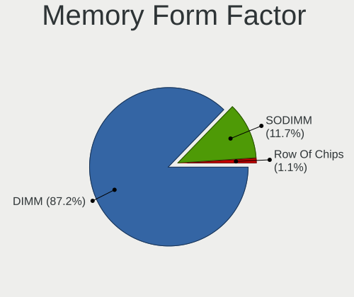

| Name         | Desktops | Percent |
|--------------|----------|---------|
| DIMM         | 82       | 87.23%  |
| SODIMM       | 11       | 11.7%   |
| Row Of Chips | 1        | 1.06%   |

Memory Size
-----------

Memory module size

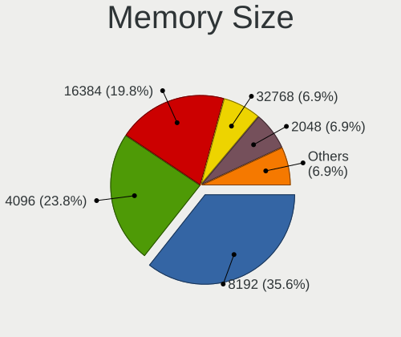

| Size  | Desktops | Percent |
|-------|----------|---------|
| 8192  | 36       | 35.64%  |
| 4096  | 24       | 23.76%  |
| 16384 | 20       | 19.8%   |
| 32768 | 7        | 6.93%   |
| 2048  | 7        | 6.93%   |
| 1024  | 3        | 2.97%   |
| 65536 | 1        | 0.99%   |
| 256   | 1        | 0.99%   |
| 128   | 1        | 0.99%   |
| 64    | 1        | 0.99%   |

Memory Speed
------------

Memory module speed

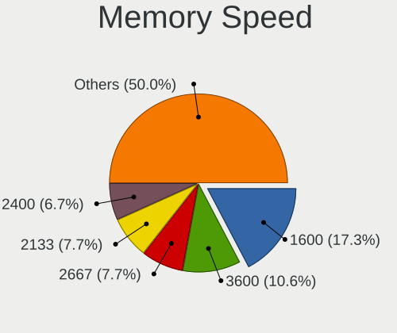

| Speed   | Desktops | Percent |
|---------|----------|---------|
| 1600    | 18       | 17.31%  |
| 3600    | 11       | 10.58%  |
| 2667    | 8        | 7.69%   |
| 2133    | 8        | 7.69%   |
| 2400    | 7        | 6.73%   |
| 1333    | 6        | 5.77%   |
| 3200    | 5        | 4.81%   |
| 3800    | 4        | 3.85%   |
| 4800    | 3        | 2.88%   |
| 3000    | 3        | 2.88%   |
| 1800    | 3        | 2.88%   |
| 667     | 3        | 2.88%   |
| Unknown | 3        | 2.88%   |
| 2933    | 2        | 1.92%   |
| 2666    | 2        | 1.92%   |
| 1866    | 2        | 1.92%   |
| 800     | 2        | 1.92%   |
| 400     | 2        | 1.92%   |
| 6800    | 1        | 0.96%   |
| 5600    | 1        | 0.96%   |
| 4000    | 1        | 0.96%   |
| 3466    | 1        | 0.96%   |
| 3400    | 1        | 0.96%   |
| 3333    | 1        | 0.96%   |
| 3066    | 1        | 0.96%   |
| 2448    | 1        | 0.96%   |
| 1867    | 1        | 0.96%   |
| 1632    | 1        | 0.96%   |
| 1334    | 1        | 0.96%   |
| 100     | 1        | 0.96%   |

Printers & scanners
-------------------

Printer Vendor
--------------

Printer device vendors

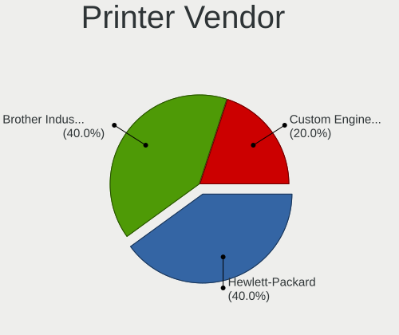

| Vendor                 | Desktops | Percent |
|------------------------|----------|---------|
| Hewlett-Packard        | 3        | 37.5%   |
| QinHeng Electronics    | 2        | 25%     |
| Brother Industries     | 2        | 25%     |
| Custom Engineering SPA | 1        | 12.5%   |

Printer Model
-------------

Printer device models

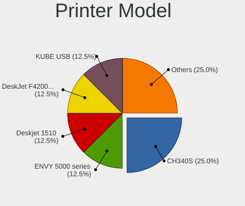

| Model                           | Desktops | Percent |
|---------------------------------|----------|---------|
| QinHeng CH340S                  | 2        | 25%     |
| HP ENVY 5000 series             | 1        | 12.5%   |
| HP DeskJet F4200 series         | 1        | 12.5%   |
| HP Deskjet 1510                 | 1        | 12.5%   |
| Custom Engineering SPA KUBE USB | 1        | 12.5%   |
| Brother MFC-J460DW              | 1        | 12.5%   |
| Brother HL-L2375DW series       | 1        | 12.5%   |

Scanner Vendor
--------------

Scanner device vendors

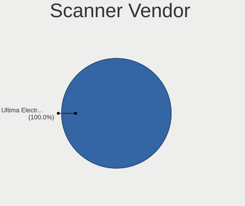

| Vendor             | Desktops | Percent |
|--------------------|----------|---------|
| Ultima Electronics | 1        | 100%    |

Scanner Model
-------------

Scanner device models

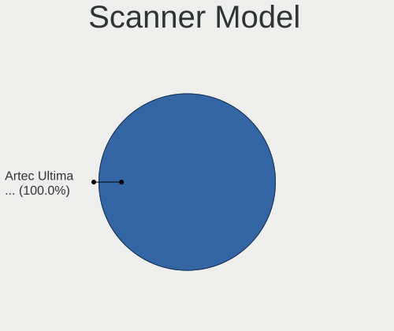

| Model                                                                                 | Desktops | Percent |
|---------------------------------------------------------------------------------------|----------|---------|
| Ultima Artec Ultima 2000 (GT6801 based)/Lifetec LT9385/ScanMagic 1200 UB Plus Scanner | 1        | 100%    |

Camera
------

Camera Vendor
-------------

Camera device vendors

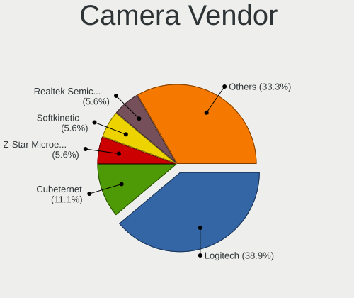

| Vendor                      | Desktops | Percent |
|-----------------------------|----------|---------|
| Logitech                    | 7        | 38.89%  |
| Cubeternet                  | 2        | 11.11%  |
| Z-Star Microelectronics     | 1        | 5.56%   |
| Softkinetic                 | 1        | 5.56%   |
| Realtek Semiconductor       | 1        | 5.56%   |
| Microsoft                   | 1        | 5.56%   |
| Microdia                    | 1        | 5.56%   |
| MacroSilicon                | 1        | 5.56%   |
| KYE Systems (Mouse Systems) | 1        | 5.56%   |
| Hauppauge                   | 1        | 5.56%   |
| GEMBIRD                     | 1        | 5.56%   |

Camera Model
------------

Camera device models

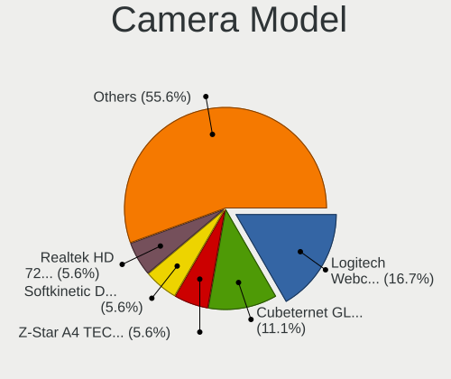

| Model                                                 | Desktops | Percent |
|-------------------------------------------------------|----------|---------|
| Logitech Webcam C270                                  | 3        | 16.67%  |
| Cubeternet GL-UPC822 UVC WebCam                       | 2        | 11.11%  |
| Z-Star A4 TECH USB2.0 PC Camera E                     | 1        | 5.56%   |
| Softkinetic DepthSense 325                            | 1        | 5.56%   |
| Realtek HD 720P Webcam                                | 1        | 5.56%   |
| Microsoft LifeCam Studio                              | 1        | 5.56%   |
| Microdia Camera                                       | 1        | 5.56%   |
| MacroSilicon USB Video                                | 1        | 5.56%   |
| Logitech Webcam C170                                  | 1        | 5.56%   |
| Logitech C922 Pro Stream Webcam                       | 1        | 5.56%   |
| Logitech C920 PRO HD Webcam                           | 1        | 5.56%   |
| Logitech BRIO Ultra HD Webcam                         | 1        | 5.56%   |
| KYE Systems (Mouse Systems) USB 2.0 HD1080P PC Camera | 1        | 5.56%   |
| Hauppauge HD PVR Pro 60                               | 1        | 5.56%   |
| GEMBIRD USB2.0 PC CAMERA                              | 1        | 5.56%   |

Security
--------

Fingerprint Vendor
------------------

Fingerprint sensor vendors

Zero info for selected period =(

Fingerprint Model
-----------------

Fingerprint sensor models

Zero info for selected period =(

Chipcard Vendor
---------------

Chipcard module vendors

Zero info for selected period =(

Chipcard Model
--------------

Chipcard module models

Zero info for selected period =(

Unsupported
-----------

Unsupported Devices
-------------------

Total unsupported devices on board

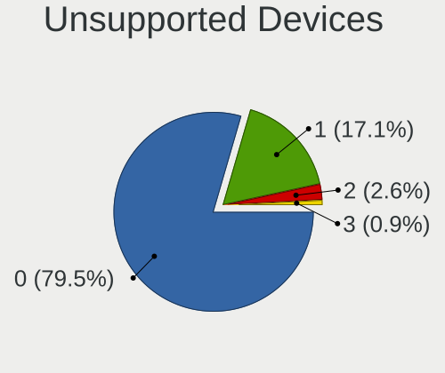

| Total | Desktops | Percent |
|-------|----------|---------|
| 0     | 93       | 79.49%  |
| 1     | 20       | 17.09%  |
| 2     | 3        | 2.56%   |
| 3     | 1        | 0.85%   |

Unsupported Device Types
------------------------

Types of unsupported devices

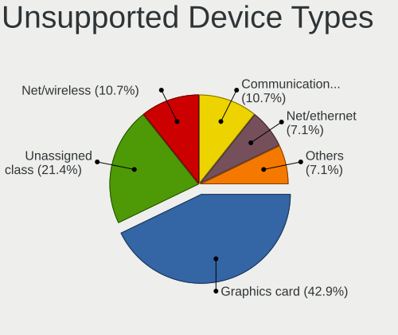

| Type                     | Desktops | Percent |
|--------------------------|----------|---------|
| Graphics card            | 12       | 42.86%  |
| Unassigned class         | 6        | 21.43%  |
| Net/wireless             | 3        | 10.71%  |
| Communication controller | 3        | 10.71%  |
| Net/ethernet             | 2        | 7.14%   |
| Storage/raid             | 1        | 3.57%   |
| Firewire controller      | 1        | 3.57%   |

