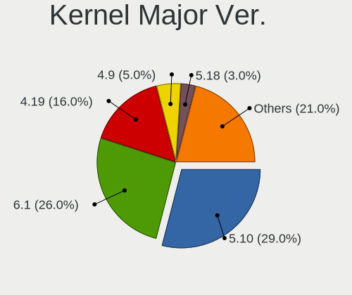
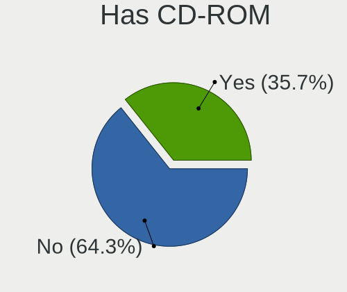
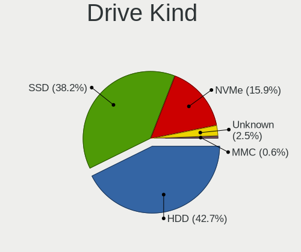
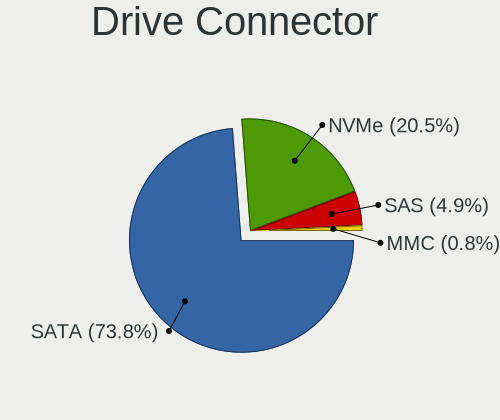
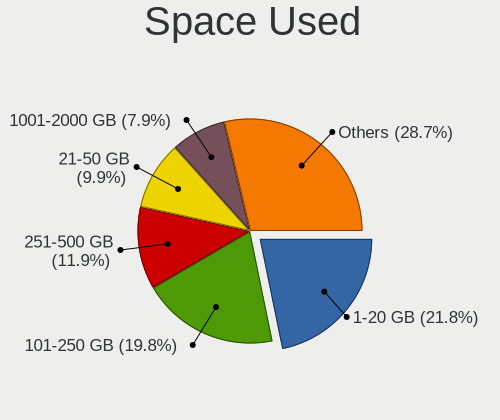
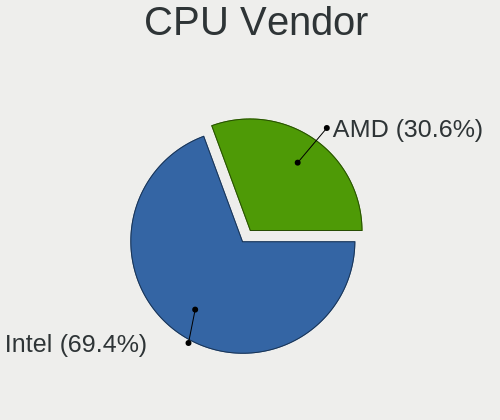
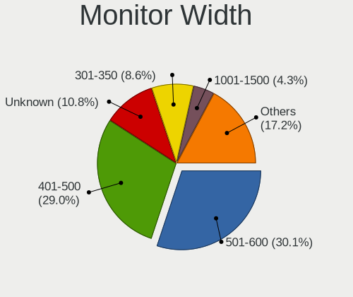
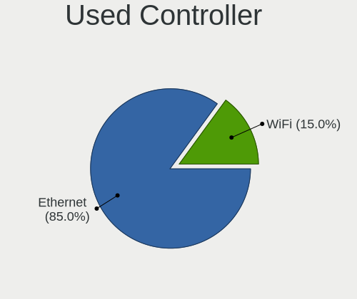
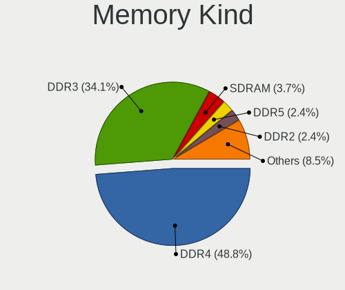

Devuan - Tested Hardware & Statistics (Desktops)
------------------------------------------------

A project to collect tested hardware configurations for Devuan.

Anyone can contribute to this report by the [hw-probe](https://github.com/linuxhw/hw-probe) tool:

    sudo -E hw-probe -all -upload

Please contribute! Especially if your hardware is rare.

Contents
--------

* [ Test Cases ](#test-cases)

* [ System ](#system)
  - [ OS                       ](#os)
  - [ OS Family                ](#os-family)
  - [ Kernel                   ](#kernel)
  - [ Kernel Family            ](#kernel-family)
  - [ Kernel Major Ver.        ](#kernel-major-ver)
  - [ Arch                     ](#arch)
  - [ DE                       ](#de)
  - [ Display Server           ](#display-server)
  - [ Display Manager          ](#display-manager)
  - [ OS Lang                  ](#os-lang)
  - [ Boot Mode                ](#boot-mode)
  - [ Filesystem               ](#filesystem)
  - [ Part. scheme             ](#part-scheme)
  - [ Dual Boot with Linux/BSD ](#dual-boot-with-linuxbsd)
  - [ Dual Boot (Win)          ](#dual-boot-win)

* [ Board ](#board)
  - [ Vendor                   ](#vendor)
  - [ Model                    ](#model)
  - [ Model Family             ](#model-family)
  - [ MFG Year                 ](#mfg-year)
  - [ Form Factor              ](#form-factor)
  - [ Secure Boot              ](#secure-boot)
  - [ Coreboot                 ](#coreboot)
  - [ RAM Size                 ](#ram-size)
  - [ RAM Used                 ](#ram-used)
  - [ Total Drives             ](#total-drives)
  - [ Has CD-ROM               ](#has-cd-rom)
  - [ Has Ethernet             ](#has-ethernet)
  - [ Has WiFi                 ](#has-wifi)
  - [ Has Bluetooth            ](#has-bluetooth)

* [ Location ](#location)
  - [ Country                  ](#country)
  - [ City                     ](#city)

* [ Drives ](#drives)
  - [ Drive Vendor             ](#drive-vendor)
  - [ Drive Model              ](#drive-model)
  - [ HDD Vendor               ](#hdd-vendor)
  - [ SSD Vendor               ](#ssd-vendor)
  - [ Drive Kind               ](#drive-kind)
  - [ Drive Connector          ](#drive-connector)
  - [ Drive Size               ](#drive-size)
  - [ Space Total              ](#space-total)
  - [ Space Used               ](#space-used)
  - [ Malfunc. Drives          ](#malfunc-drives)
  - [ Malfunc. Drive Vendor    ](#malfunc-drive-vendor)
  - [ Malfunc. HDD Vendor      ](#malfunc-hdd-vendor)
  - [ Malfunc. Drive Kind      ](#malfunc-drive-kind)
  - [ Failed Drives            ](#failed-drives)
  - [ Failed Drive Vendor      ](#failed-drive-vendor)
  - [ Drive Status             ](#drive-status)

* [ Storage controller ](#storage-controller)
  - [ Storage Vendor           ](#storage-vendor)
  - [ Storage Model            ](#storage-model)
  - [ Storage Kind             ](#storage-kind)

* [ Processor ](#processor)
  - [ CPU Vendor               ](#cpu-vendor)
  - [ CPU Model                ](#cpu-model)
  - [ CPU Model Family         ](#cpu-model-family)
  - [ CPU Cores                ](#cpu-cores)
  - [ CPU Sockets              ](#cpu-sockets)
  - [ CPU Threads              ](#cpu-threads)
  - [ CPU Op-Modes             ](#cpu-op-modes)
  - [ CPU Microcode            ](#cpu-microcode)
  - [ CPU Microarch            ](#cpu-microarch)

* [ Graphics ](#graphics)
  - [ GPU Vendor               ](#gpu-vendor)
  - [ GPU Model                ](#gpu-model)
  - [ GPU Combo                ](#gpu-combo)
  - [ GPU Driver               ](#gpu-driver)
  - [ GPU Memory               ](#gpu-memory)

* [ Monitor ](#monitor)
  - [ Monitor Vendor           ](#monitor-vendor)
  - [ Monitor Model            ](#monitor-model)
  - [ Monitor Resolution       ](#monitor-resolution)
  - [ Monitor Diagonal         ](#monitor-diagonal)
  - [ Monitor Width            ](#monitor-width)
  - [ Aspect Ratio             ](#aspect-ratio)
  - [ Monitor Area             ](#monitor-area)
  - [ Pixel Density            ](#pixel-density)
  - [ Multiple Monitors        ](#multiple-monitors)

* [ Network ](#network)
  - [ Net Controller Vendor    ](#net-controller-vendor)
  - [ Net Controller Model     ](#net-controller-model)
  - [ Wireless Vendor          ](#wireless-vendor)
  - [ Wireless Model           ](#wireless-model)
  - [ Ethernet Vendor          ](#ethernet-vendor)
  - [ Ethernet Model           ](#ethernet-model)
  - [ Net Controller Kind      ](#net-controller-kind)
  - [ Used Controller          ](#used-controller)
  - [ NICs                     ](#nics)
  - [ IPv6                     ](#ipv6)

* [ Bluetooth ](#bluetooth)
  - [ Bluetooth Vendor         ](#bluetooth-vendor)
  - [ Bluetooth Model          ](#bluetooth-model)

* [ Sound ](#sound)
  - [ Sound Vendor             ](#sound-vendor)
  - [ Sound Model              ](#sound-model)

* [ Memory ](#memory)
  - [ Memory Vendor            ](#memory-vendor)
  - [ Memory Model             ](#memory-model)
  - [ Memory Kind              ](#memory-kind)
  - [ Memory Form Factor       ](#memory-form-factor)
  - [ Memory Size              ](#memory-size)
  - [ Memory Speed             ](#memory-speed)

* [ Printers & scanners ](#printers--scanners)
  - [ Printer Vendor           ](#printer-vendor)
  - [ Printer Model            ](#printer-model)
  - [ Scanner Vendor           ](#scanner-vendor)
  - [ Scanner Model            ](#scanner-model)

* [ Camera ](#camera)
  - [ Camera Vendor            ](#camera-vendor)
  - [ Camera Model             ](#camera-model)

* [ Security ](#security)
  - [ Fingerprint Vendor       ](#fingerprint-vendor)
  - [ Fingerprint Model        ](#fingerprint-model)
  - [ Chipcard Vendor          ](#chipcard-vendor)
  - [ Chipcard Model           ](#chipcard-model)

* [ Unsupported ](#unsupported)
  - [ Unsupported Devices      ](#unsupported-devices)
  - [ Unsupported Device Types ](#unsupported-device-types)

Test Cases
----------

Total: 67

| Vendor        | Model                    | Probe                                                      | Date         |
|---------------|--------------------------|------------------------------------------------------------|--------------|
| Gigabyte      | B650I AORUS ULTRA        | [a33a768662](https://linux-hardware.org/?probe=a33a768662) | Mar 29, 2023 |
| AMI           | Intel                    | [c2c28fa7e4](https://linux-hardware.org/?probe=c2c28fa7e4) | Mar 15, 2023 |
| Gigabyte      | P55A-UD3                 | [60cd9db1c5](https://linux-hardware.org/?probe=60cd9db1c5) | Feb 25, 2023 |
| MSI           | A320M PRO-E              | [3e441c86f1](https://linux-hardware.org/?probe=3e441c86f1) | Feb 20, 2023 |
| MSI           | H67MS-E43                | [47a6655b3b](https://linux-hardware.org/?probe=47a6655b3b) | Feb 07, 2023 |
| Gigabyte      | B550I AORUS PRO AX       | [beeeff23a5](https://linux-hardware.org/?probe=beeeff23a5) | Dec 25, 2022 |
| ASUSTek       | ROG STRIX B550-A GAMING  | [de8b7d8220](https://linux-hardware.org/?probe=de8b7d8220) | Nov 19, 2022 |
| ASUSTek       | PRIME X399-A             | [304c12788b](https://linux-hardware.org/?probe=304c12788b) | Oct 06, 2022 |
| HP            | 1825                     | [bceae72004](https://linux-hardware.org/?probe=bceae72004) | Aug 15, 2022 |
| MSI           | X99S MPOWER              | [a3c1523b6b](https://linux-hardware.org/?probe=a3c1523b6b) | Jul 27, 2022 |
| Dell          | 054KM3 A01               | [407b210bfe](https://linux-hardware.org/?probe=407b210bfe) | Jul 05, 2022 |
| HP            | 18E7                     | [2fd690b3b4](https://linux-hardware.org/?probe=2fd690b3b4) | Jun 22, 2022 |
| ASUSTek       | ROG CROSSHAIR VII HERO   | [a698baa5f6](https://linux-hardware.org/?probe=a698baa5f6) | Jun 18, 2022 |
| Dell          | 0NC2VH A01               | [f05a6e7d31](https://linux-hardware.org/?probe=f05a6e7d31) | May 03, 2022 |
| ASRock        | B450M-HDV R4.0           | [bce1bba9ff](https://linux-hardware.org/?probe=bce1bba9ff) | Apr 29, 2022 |
| Dell          | 0D24M8 A01               | [fe4bb32aa1](https://linux-hardware.org/?probe=fe4bb32aa1) | Apr 14, 2022 |
| Dell          | 014GRG A00               | [1783efe96b](https://linux-hardware.org/?probe=1783efe96b) | Apr 14, 2022 |
| HP            | 1825                     | [a7ce5b6b11](https://linux-hardware.org/?probe=a7ce5b6b11) | Mar 03, 2022 |
| MSI           | B450M PRO-M2 MAX         | [3f99c8072a](https://linux-hardware.org/?probe=3f99c8072a) | Feb 23, 2022 |
| ASUSTek       | PRIME H510M-A            | [7ab68e0043](https://linux-hardware.org/?probe=7ab68e0043) | Feb 17, 2022 |
| ASRock        | B450M-HDV R4.0           | [f2a65b8a5f](https://linux-hardware.org/?probe=f2a65b8a5f) | Feb 14, 2022 |
| Gigabyte      | P55A-UD3                 | [824dbdd8ad](https://linux-hardware.org/?probe=824dbdd8ad) | Jan 22, 2022 |
| Online Lab... | SR 42                    | [e3037eb087](https://linux-hardware.org/?probe=e3037eb087) | Jan 22, 2022 |
| Gigabyte      | H310M S2H x.x            | [9e14e04f7f](https://linux-hardware.org/?probe=9e14e04f7f) | Jan 22, 2022 |
| ASRock        | B450M-HDV R4.0           | [8e7267692b](https://linux-hardware.org/?probe=8e7267692b) | Jan 21, 2022 |
| Gigabyte      | MZGLKBP-00               | [202ccac61c](https://linux-hardware.org/?probe=202ccac61c) | Dec 30, 2021 |
| Gigabyte      | B75M-D3V                 | [1c15b6b3c7](https://linux-hardware.org/?probe=1c15b6b3c7) | Dec 26, 2021 |
| HP            | 1495                     | [28835849f0](https://linux-hardware.org/?probe=28835849f0) | Oct 29, 2021 |
| ASUSTek       | PRIME Z490M-PLUS         | [5a7e6805d3](https://linux-hardware.org/?probe=5a7e6805d3) | Oct 02, 2021 |
| MSI           | B360M PRO-VD             | [06e625d98f](https://linux-hardware.org/?probe=06e625d98f) | Oct 02, 2021 |
| HP            | 1825                     | [ff75be1ea3](https://linux-hardware.org/?probe=ff75be1ea3) | Jun 06, 2021 |
| ASUSTek       | P5G41T-M LX2/BR          | [8702580cb4](https://linux-hardware.org/?probe=8702580cb4) | May 26, 2021 |
| ASUSTek       | P5G41T-M LX2/BR          | [05f1d12390](https://linux-hardware.org/?probe=05f1d12390) | May 26, 2021 |
| Gigabyte      | H170-HD3-CF              | [2ffdc89c2a](https://linux-hardware.org/?probe=2ffdc89c2a) | Apr 28, 2021 |
| Gigabyte      | Z390 GAMING SLI-CF       | [50f8ddb45c](https://linux-hardware.org/?probe=50f8ddb45c) | Apr 28, 2021 |
| Google        | Panther                  | [666794d603](https://linux-hardware.org/?probe=666794d603) | Apr 26, 2021 |
| ASUSTek       | F1A55-M LX               | [630bbb748a](https://linux-hardware.org/?probe=630bbb748a) | Apr 17, 2021 |
| Gigabyte      | H170-HD3-CF              | [f103eefd66](https://linux-hardware.org/?probe=f103eefd66) | Apr 17, 2021 |
| Gigabyte      | Z390 GAMING SLI-CF       | [e802fc9ff5](https://linux-hardware.org/?probe=e802fc9ff5) | Apr 17, 2021 |
| Sun Micros... | Ultra 24 50              | [e4b76f9137](https://linux-hardware.org/?probe=e4b76f9137) | Apr 10, 2021 |
| Sun Micros... | Ultra 24 50              | [15691fbc42](https://linux-hardware.org/?probe=15691fbc42) | Apr 10, 2021 |
| ASUSTek       | A8R-MVP                  | [6daa2a372c](https://linux-hardware.org/?probe=6daa2a372c) | Mar 27, 2021 |
| ASRock        | K8A780LM                 | [b8f4c7c2cb](https://linux-hardware.org/?probe=b8f4c7c2cb) | Mar 22, 2021 |
| Gigabyte      | 970A-DS3P                | [eeebc66137](https://linux-hardware.org/?probe=eeebc66137) | Mar 17, 2021 |
| Gigabyte      | 970A-DS3P                | [fdf4e6d366](https://linux-hardware.org/?probe=fdf4e6d366) | Mar 17, 2021 |
| ASRock        | K8A780LM                 | [d95a56d80f](https://linux-hardware.org/?probe=d95a56d80f) | Mar 15, 2021 |
| ASRock        | H81M-ITX                 | [0f5f41e1ca](https://linux-hardware.org/?probe=0f5f41e1ca) | Mar 08, 2021 |
| ASRock        | H81M-ITX                 | [8599b883d6](https://linux-hardware.org/?probe=8599b883d6) | Mar 08, 2021 |
| Intel         | D815EEA AAA45884-401     | [248565d49c](https://linux-hardware.org/?probe=248565d49c) | Feb 20, 2021 |
| Intel         | D815EEA AAA45884-401     | [3acc2f0b1e](https://linux-hardware.org/?probe=3acc2f0b1e) | Feb 20, 2021 |
| Gigabyte      | GA-G41M-ES2L             | [592c995804](https://linux-hardware.org/?probe=592c995804) | Jan 30, 2021 |
| Acer          | F672CR R01-A4            | [8d41694165](https://linux-hardware.org/?probe=8d41694165) | Jan 25, 2021 |
| Lenovo        | ThinkStation E20 4220CTO | [f963a2e7f9](https://linux-hardware.org/?probe=f963a2e7f9) | Jan 06, 2021 |
| Dell          | 0GXM1W A04               | [989f983b51](https://linux-hardware.org/?probe=989f983b51) | Dec 28, 2020 |
| Lenovo        | ThinkStation E20 4220CTO | [aac28ba905](https://linux-hardware.org/?probe=aac28ba905) | Dec 19, 2020 |
| Intel         | HURONRIVER               | [49bdd1a99d](https://linux-hardware.org/?probe=49bdd1a99d) | Oct 29, 2020 |
| ASUSTek       | Maximus V GENE           | [253b5aba98](https://linux-hardware.org/?probe=253b5aba98) | Oct 29, 2020 |
| ASUSTek       | H81M-C                   | [cd136e059e](https://linux-hardware.org/?probe=cd136e059e) | Oct 05, 2020 |
| HP            | 1791                     | [f41fcdc019](https://linux-hardware.org/?probe=f41fcdc019) | Sep 26, 2020 |
| ASUSTek       | EX-A320M-GAMING          | [4eb75f039b](https://linux-hardware.org/?probe=4eb75f039b) | Aug 17, 2020 |
| HP            | 1791                     | [5a21e91155](https://linux-hardware.org/?probe=5a21e91155) | Aug 15, 2020 |
| Gigabyte      | B450 AORUS ELITE         | [ff5143e508](https://linux-hardware.org/?probe=ff5143e508) | Aug 02, 2020 |
| ASUSTek       | P5PE-VM                  | [298c1239dd](https://linux-hardware.org/?probe=298c1239dd) | May 20, 2020 |
| MSI           | B350 PC MATE             | [ff3852f02d](https://linux-hardware.org/?probe=ff3852f02d) | Mar 23, 2020 |
| ASRock        | G31M-VS2                 | [b64547f948](https://linux-hardware.org/?probe=b64547f948) | Dec 06, 2019 |
| Gigabyte      | H170-HD3-CF              | [338994bd66](https://linux-hardware.org/?probe=338994bd66) | Dec 02, 2019 |
| ASUSTek       | P5PE-VM                  | [6a89046dfb](https://linux-hardware.org/?probe=6a89046dfb) | Dec 02, 2019 |

System
------

OS
--

Installed operating systems

| Name                    | Desktops | Percent |
|-------------------------|----------|---------|
| Devuan 4                | 19       | 35.85%  |
| Devuan 3                | 13       | 24.53%  |
| Devuan Testing/unstable | 7        | 13.21%  |
| Devuan 5                | 7        | 13.21%  |
| Devuan 2.1              | 6        | 11.32%  |
| Devuan 1.0.0            | 1        | 1.89%   |

OS Family
---------

OS without a version

| Name   | Desktops | Percent |
|--------|----------|---------|
| Devuan | 50       | 100%    |

Kernel
------

Version of the Linux kernel

| Version               | Desktops | Percent |
|-----------------------|----------|---------|
| 5.10.0-9-amd64        | 6        | 10.71%  |
| 4.19.0-14-amd64       | 4        | 7.14%   |
| 4.19.0-16-amd64       | 3        | 5.36%   |
| 5.10.0-8-amd64        | 2        | 3.57%   |
| 5.10.0-6-amd64        | 2        | 3.57%   |
| 5.10.0-19-amd64       | 2        | 3.57%   |
| 4.19.0-9-amd64        | 2        | 3.57%   |
| 4.19.0-13-amd64       | 2        | 3.57%   |
| 6.1.0-6-amd64         | 1        | 1.79%   |
| 6.1.0-0.deb11.5-amd64 | 1        | 1.79%   |
| 6.0.0-5-amd64         | 1        | 1.79%   |
| 5.9.0-1-amd64         | 1        | 1.79%   |
| 5.8.0-3-amd64         | 1        | 1.79%   |
| 5.7.0-1-amd64         | 1        | 1.79%   |
| 5.7.0-0.bpo.2-amd64   | 1        | 1.79%   |
| 5.18.14-devuan        | 1        | 1.79%   |
| 5.18.11-gnu           | 1        | 1.79%   |
| 5.18.0-1-amd64        | 1        | 1.79%   |
| 5.16.0-1-amd64        | 1        | 1.79%   |
| 5.15.0-2-amd64        | 1        | 1.79%   |
| 5.15.0-0.bpo.2-amd64  | 1        | 1.79%   |
| 5.14.0-kali2-amd64    | 1        | 1.79%   |
| 5.10.0-5-amd64        | 1        | 1.79%   |
| 5.10.0-21-amd64       | 1        | 1.79%   |
| 5.10.0-2-amd64        | 1        | 1.79%   |
| 5.10.0-18-amd64       | 1        | 1.79%   |
| 5.10.0-16-amd64       | 1        | 1.79%   |
| 5.10.0-15-amd64       | 1        | 1.79%   |
| 5.10.0-11-amd64       | 1        | 1.79%   |
| 5.10.0-10-amd64       | 1        | 1.79%   |
| 4.9.0-15-amd64        | 1        | 1.79%   |
| 4.9.0-14-686-pae      | 1        | 1.79%   |
| 4.9.0-14-686          | 1        | 1.79%   |
| 4.9.0-11-686-pae      | 1        | 1.79%   |
| 4.19.112              | 1        | 1.79%   |
| 4.19.0-20-amd64       | 1        | 1.79%   |
| 4.19.0-12-amd64       | 1        | 1.79%   |
| 4.19.0-10-amd64       | 1        | 1.79%   |
| 4.19.0-1-amd64        | 1        | 1.79%   |
| 4.19.0-0.bpo.6-amd64  | 1        | 1.79%   |

Kernel Family
-------------

Linux kernel without a distro release

| Version  | Desktops | Percent |
|----------|----------|---------|
| 5.10.0   | 18       | 34.62%  |
| 4.19.0   | 14       | 26.92%  |
| 4.9.0    | 4        | 7.69%   |
| 6.1.0    | 2        | 3.85%   |
| 5.7.0    | 2        | 3.85%   |
| 5.15.0   | 2        | 3.85%   |
| 6.0.0    | 1        | 1.92%   |
| 5.9.0    | 1        | 1.92%   |
| 5.8.0    | 1        | 1.92%   |
| 5.18.14  | 1        | 1.92%   |
| 5.18.11  | 1        | 1.92%   |
| 5.18.0   | 1        | 1.92%   |
| 5.16.0   | 1        | 1.92%   |
| 5.14.0   | 1        | 1.92%   |
| 4.19.112 | 1        | 1.92%   |
| 4.18.0   | 1        | 1.92%   |

Kernel Major Ver.
-----------------

Linux kernel major version

| Version | Desktops | Percent |
|---------|----------|---------|
| 5.10    | 18       | 34.62%  |
| 4.19    | 15       | 28.85%  |
| 4.9     | 4        | 7.69%   |
| 5.18    | 3        | 5.77%   |
| 6.1     | 2        | 3.85%   |
| 5.7     | 2        | 3.85%   |
| 5.15    | 2        | 3.85%   |
| 6.0     | 1        | 1.92%   |
| 5.9     | 1        | 1.92%   |
| 5.8     | 1        | 1.92%   |
| 5.16    | 1        | 1.92%   |
| 5.14    | 1        | 1.92%   |
| 4.18    | 1        | 1.92%   |

Arch
----

OS architecture (x86_64, i586, etc.)

| Name   | Desktops | Percent |
|--------|----------|---------|
| x86_64 | 47       | 94%     |
| i686   | 3        | 6%      |

DE
--

Desktop Environment

| Name       | Desktops | Percent |
|------------|----------|---------|
| XFCE       | 24       | 45.28%  |
| Unknown    | 11       | 20.75%  |
| MATE       | 6        | 11.32%  |
| KDE5       | 5        | 9.43%   |
| LXDE       | 3        | 5.66%   |
| X-Cinnamon | 1        | 1.89%   |
| i3         | 1        | 1.89%   |
| Cinnamon   | 1        | 1.89%   |
| awesome    | 1        | 1.89%   |

Display Server
--------------

X11 or Wayland

| Name    | Desktops | Percent |
|---------|----------|---------|
| X11     | 44       | 86.27%  |
| Tty     | 6        | 11.76%  |
| Unknown | 1        | 1.96%   |

Display Manager
---------------

SDDM, LightDM, etc.

| Name    | Desktops | Percent |
|---------|----------|---------|
| SLiM    | 25       | 50%     |
| LightDM | 10       | 20%     |
| Unknown | 10       | 20%     |
| SDDM    | 2        | 4%      |
| NODM    | 2        | 4%      |
| XDM     | 1        | 2%      |

OS Lang
-------

Language

| Lang    | Desktops | Percent |
|---------|----------|---------|
| en_US   | 16       | 31.37%  |
| en_GB   | 5        | 9.8%    |
| ru_RU   | 4        | 7.84%   |
| fr_FR   | 4        | 7.84%   |
| C       | 4        | 7.84%   |
| Unknown | 4        | 7.84%   |
| sk_SK   | 3        | 5.88%   |
| en_AU   | 3        | 5.88%   |
| pt_BR   | 2        | 3.92%   |
| fr_BE   | 2        | 3.92%   |
| en_NZ   | 2        | 3.92%   |
| pl_PL   | 1        | 1.96%   |
| en_CA   | 1        | 1.96%   |

Boot Mode
---------

EFI or BIOS

| Mode | Desktops | Percent |
|------|----------|---------|
| BIOS | 32       | 64%     |
| EFI  | 18       | 36%     |

Filesystem
----------

Type of filesystem

| Type    | Desktops | Percent |
|---------|----------|---------|
| Ext4    | 44       | 88%     |
| Overlay | 2        | 4%      |
| Xfs     | 1        | 2%      |
| Ext3    | 1        | 2%      |
| Btrfs   | 1        | 2%      |
| Unknown | 1        | 2%      |

Part. scheme
------------

Scheme of partitioning

| Type    | Desktops | Percent |
|---------|----------|---------|
| GPT     | 28       | 52.83%  |
| MBR     | 22       | 41.51%  |
| Unknown | 3        | 5.66%   |

Dual Boot with Linux/BSD
------------------------

Hosting more than one Linux/BSD

| Dual boot | Desktops | Percent |
|-----------|----------|---------|
| No        | 34       | 65.38%  |
| Yes       | 18       | 34.62%  |

Dual Boot (Win)
---------------

Hosting Linux and Windows

| Dual boot | Desktops | Percent |
|-----------|----------|---------|
| No        | 37       | 74%     |
| Yes       | 13       | 26%     |

Board
-----

Vendor
------

Motherboard manufacturer

| Name                | Desktops | Percent |
|---------------------|----------|---------|
| Gigabyte Technology | 12       | 24%     |
| ASUSTek Computer    | 11       | 22%     |
| MSI                 | 6        | 12%     |
| Dell                | 5        | 10%     |
| Hewlett-Packard     | 4        | 8%      |
| ASRock              | 4        | 8%      |
| Intel               | 2        | 4%      |
| Sun Microsystems    | 1        | 2%      |
| Online Labs         | 1        | 2%      |
| Lenovo              | 1        | 2%      |
| Google              | 1        | 2%      |
| AMI                 | 1        | 2%      |
| Acer                | 1        | 2%      |

Model
-----

Motherboard model

| Name                            | Desktops | Percent |
|---------------------------------|----------|---------|
| Sun Microsystems Ultra 24       | 1        | 2%      |
| Online Labs SR                  | 1        | 2%      |
| MSI MS-7B84                     | 1        | 2%      |
| MSI MS-7B53                     | 1        | 2%      |
| MSI MS-7A36                     | 1        | 2%      |
| MSI MS-7A34                     | 1        | 2%      |
| MSI MS-7885                     | 1        | 2%      |
| MSI MS-7678                     | 1        | 2%      |
| Lenovo ThinkStation E20 4220CTO | 1        | 2%      |
| Intel D815EEA AAA45884-401      | 1        | 2%      |
| Intel AHV                       | 1        | 2%      |
| HP Z220 SFF Workstation         | 1        | 2%      |
| HP ProDesk 600 G1 SFF           | 1        | 2%      |
| HP EliteDesk 800 G1 DM          | 1        | 2%      |
| HP Compaq 8200 Elite SFF PC     | 1        | 2%      |
| Google Panther                  | 1        | 2%      |
| Gigabyte Z390 GAMING SLI        | 1        | 2%      |
| Gigabyte P55A-UD3               | 1        | 2%      |
| Gigabyte MZGLKBP-00             | 1        | 2%      |
| Gigabyte H310M S2H 2.0          | 1        | 2%      |
| Gigabyte H170-HD3-CF            | 1        | 2%      |
| Gigabyte H170-HD3               | 1        | 2%      |
| Gigabyte GA-G41M-ES2L           | 1        | 2%      |
| Gigabyte B75M-D3V               | 1        | 2%      |
| Gigabyte B650I AORUS ULTRA      | 1        | 2%      |
| Gigabyte B550I AORUS PRO AX     | 1        | 2%      |
| Gigabyte B450 AORUS ELITE       | 1        | 2%      |
| Gigabyte 970A-DS3P              | 1        | 2%      |
| Dell Vostro 430                 | 1        | 2%      |
| Dell OptiPlex 9020              | 1        | 2%      |
| Dell OptiPlex 7060              | 1        | 2%      |
| Dell OptiPlex 7050              | 1        | 2%      |
| Dell OptiPlex 7010              | 1        | 2%      |
| ASUS ROG STRIX B550-A GAMING    | 1        | 2%      |
| ASUS ROG CROSSHAIR VII HERO     | 1        | 2%      |
| ASUS PRIME Z490M-PLUS           | 1        | 2%      |
| ASUS PRIME X399-A               | 1        | 2%      |
| ASUS PRIME H510M-A              | 1        | 2%      |
| ASUS P5PE-VM                    | 1        | 2%      |
| ASUS P5G41T-M LX2/BR            | 1        | 2%      |

Model Family
------------

Motherboard model prefix

| Name                   | Desktops | Percent |
|------------------------|----------|---------|
| Dell OptiPlex          | 4        | 8%      |
| ASUS PRIME             | 3        | 6%      |
| ASUS ROG               | 2        | 4%      |
| Sun Microsystems Ultra | 1        | 2%      |
| Online Labs SR         | 1        | 2%      |
| MSI MS-7B84            | 1        | 2%      |
| MSI MS-7B53            | 1        | 2%      |
| MSI MS-7A36            | 1        | 2%      |
| MSI MS-7A34            | 1        | 2%      |
| MSI MS-7885            | 1        | 2%      |
| MSI MS-7678            | 1        | 2%      |
| Lenovo ThinkStation    | 1        | 2%      |
| Intel D815EEA          | 1        | 2%      |
| Intel AHV              | 1        | 2%      |
| HP Z220                | 1        | 2%      |
| HP ProDesk             | 1        | 2%      |
| HP EliteDesk           | 1        | 2%      |
| HP Compaq              | 1        | 2%      |
| Google Panther         | 1        | 2%      |
| Gigabyte Z390          | 1        | 2%      |
| Gigabyte P55A-UD3      | 1        | 2%      |
| Gigabyte MZGLKBP-00    | 1        | 2%      |
| Gigabyte H310M         | 1        | 2%      |
| Gigabyte H170-HD3-CF   | 1        | 2%      |
| Gigabyte H170-HD3      | 1        | 2%      |
| Gigabyte GA-G41M-ES2L  | 1        | 2%      |
| Gigabyte B75M-D3V      | 1        | 2%      |
| Gigabyte B650I         | 1        | 2%      |
| Gigabyte B550I         | 1        | 2%      |
| Gigabyte B450          | 1        | 2%      |
| Gigabyte 970A-DS3P     | 1        | 2%      |
| Dell Vostro            | 1        | 2%      |
| ASUS P5PE-VM           | 1        | 2%      |
| ASUS P5G41T-M          | 1        | 2%      |
| ASUS Maximus           | 1        | 2%      |
| ASUS F1A55-M           | 1        | 2%      |
| ASUS EX-A320M-GAMING   | 1        | 2%      |
| ASUS All               | 1        | 2%      |
| ASRock K8A780LM        | 1        | 2%      |
| ASRock H81M-ITX        | 1        | 2%      |

MFG Year
--------

Motherboard manufacture year

| Year | Desktops | Percent |
|------|----------|---------|
| 2018 | 9        | 18%     |
| 2013 | 5        | 10%     |
| 2019 | 4        | 8%      |
| 2017 | 4        | 8%      |
| 2012 | 4        | 8%      |
| 2011 | 4        | 8%      |
| 2020 | 3        | 6%      |
| 2014 | 3        | 6%      |
| 2010 | 3        | 6%      |
| 2022 | 2        | 4%      |
| 2009 | 2        | 4%      |
| 2021 | 1        | 2%      |
| 2016 | 1        | 2%      |
| 2015 | 1        | 2%      |
| 2008 | 1        | 2%      |
| 2007 | 1        | 2%      |
| 2006 | 1        | 2%      |
| 2000 | 1        | 2%      |

Form Factor
-----------

Physical design of the computer

| Name    | Desktops | Percent |
|---------|----------|---------|
| Desktop | 50       | 100%    |

Secure Boot
-----------

Enabled or disabled

| State    | Desktops | Percent |
|----------|----------|---------|
| Disabled | 50       | 100%    |

Coreboot
--------

Have coreboot on board

| Used | Desktops | Percent |
|------|----------|---------|
| No   | 48       | 96%     |
| Yes  | 2        | 4%      |

RAM Size
--------

Total RAM memory

| Size in GB  | Desktops | Percent |
|-------------|----------|---------|
| 16.01-24.0  | 14       | 28%     |
| 8.01-16.0   | 11       | 22%     |
| 32.01-64.0  | 10       | 20%     |
| 4.01-8.0    | 8        | 16%     |
| 1.01-2.0    | 3        | 6%      |
| 3.01-4.0    | 2        | 4%      |
| 64.01-256.0 | 1        | 2%      |
| 0.01-0.5    | 1        | 2%      |

RAM Used
--------

Used RAM memory

| Used GB   | Desktops | Percent |
|-----------|----------|---------|
| 1.01-2.0  | 16       | 29.63%  |
| 4.01-8.0  | 10       | 18.52%  |
| 0.51-1.0  | 9        | 16.67%  |
| 2.01-3.0  | 8        | 14.81%  |
| 3.01-4.0  | 5        | 9.26%   |
| 8.01-16.0 | 4        | 7.41%   |
| 0.01-0.5  | 2        | 3.7%    |

Total Drives
------------

Number of drives on board

| Drives | Desktops | Percent |
|--------|----------|---------|
| 1      | 22       | 44%     |
| 2      | 9        | 18%     |
| 3      | 8        | 16%     |
| 4      | 5        | 10%     |
| 5      | 4        | 8%      |
| 6      | 2        | 4%      |

Has CD-ROM
----------

Has CD-ROM on board

| Presented | Desktops | Percent |
|-----------|----------|---------|
| No        | 33       | 66%     |
| Yes       | 17       | 34%     |

Has Ethernet
------------

Has Ethernet on board

| Presented | Desktops | Percent |
|-----------|----------|---------|
| Yes       | 49       | 98%     |
| No        | 1        | 2%      |

Has WiFi
--------

Has WiFi module

| Presented | Desktops | Percent |
|-----------|----------|---------|
| No        | 40       | 78.43%  |
| Yes       | 11       | 21.57%  |

Has Bluetooth
-------------

Has Bluetooth module

| Presented | Desktops | Percent |
|-----------|----------|---------|
| No        | 43       | 86%     |
| Yes       | 7        | 14%     |

Location
--------

Country
-------

Geographic location (country)

| Country     | Desktops | Percent |
|-------------|----------|---------|
| USA         | 7        | 14%     |
| France      | 6        | 12%     |
| Russia      | 5        | 10%     |
| Ukraine     | 3        | 6%      |
| UK          | 3        | 6%      |
| Slovakia    | 3        | 6%      |
| Australia   | 3        | 6%      |
| Poland      | 2        | 4%      |
| New Zealand | 2        | 4%      |
| Netherlands | 2        | 4%      |
| Brazil      | 2        | 4%      |
| Belgium     | 2        | 4%      |
| Argentina   | 2        | 4%      |
| South Korea | 1        | 2%      |
| Puerto Rico | 1        | 2%      |
| Israel      | 1        | 2%      |
| Germany     | 1        | 2%      |
| Georgia     | 1        | 2%      |
| China       | 1        | 2%      |
| Canada      | 1        | 2%      |
| Bulgaria    | 1        | 2%      |

City
----

Geographic location (city)

| City           | Desktops | Percent |
|----------------|----------|---------|
| Bratislava     | 3        | 6%      |
| Bagnolet       | 3        | 6%      |
| Volzhskiy      | 2        | 4%      |
| Sydney         | 2        | 4%      |
| Auckland       | 2        | 4%      |
| Xiamen         | 1        | 2%      |
| Wroclaw        | 1        | 2%      |
| Vladikavkaz    | 1        | 2%      |
| Vise           | 1        | 2%      |
| Toronto        | 1        | 2%      |
| Tel Aviv       | 1        | 2%      |
| Tbilisi        | 1        | 2%      |
| Sofia          | 1        | 2%      |
| Seongbuk-gu    | 1        | 2%      |
| Sao Paulo      | 1        | 2%      |
| Saint-Herblain | 1        | 2%      |
| Rio de Janeiro | 1        | 2%      |
| Renkum         | 1        | 2%      |
| Port Richey    | 1        | 2%      |
| Poperinge      | 1        | 2%      |
| Paris          | 1        | 2%      |
| Oleksandriya   | 1        | 2%      |
| Okehampton     | 1        | 2%      |
| Norman         | 1        | 2%      |
| Nérac         | 1        | 2%      |
| Miedziana Gora | 1        | 2%      |
| Miami          | 1        | 2%      |
| Los Angeles    | 1        | 2%      |
| Loosdrecht     | 1        | 2%      |
| Leeds          | 1        | 2%      |
| Kushchyovskaya | 1        | 2%      |
| Kirov          | 1        | 2%      |
| Karlsruhe      | 1        | 2%      |
| Holt           | 1        | 2%      |
| Hollywood      | 1        | 2%      |
| Great Bend     | 1        | 2%      |
| Donetsk        | 1        | 2%      |
| Dnipro         | 1        | 2%      |
| Cipolletti     | 1        | 2%      |
| Carlisle       | 1        | 2%      |

Drives
------

Drive Vendor
------------

Hard drive vendors

| Vendor              | Desktops | Drives | Percent |
|---------------------|----------|--------|---------|
| WDC                 | 20       | 38     | 22.22%  |
| Seagate             | 17       | 25     | 18.89%  |
| Kingston            | 9        | 12     | 10%     |
| Toshiba             | 7        | 7      | 7.78%   |
| Samsung Electronics | 6        | 10     | 6.67%   |
| Crucial             | 4        | 6      | 4.44%   |
| SanDisk             | 2        | 2      | 2.22%   |
| Netac               | 2        | 2      | 2.22%   |
| Micron Technology   | 2        | 2      | 2.22%   |
| Maxtor              | 2        | 2      | 2.22%   |
| Dogfish             | 2        | 2      | 2.22%   |
| A-DATA Technology   | 2        | 2      | 2.22%   |
| WD MediaMax         | 1        | 3      | 1.11%   |
| Unknown             | 1        | 1      | 1.11%   |
| Transcend           | 1        | 2      | 1.11%   |
| Team                | 1        | 1      | 1.11%   |
| SK hynix            | 1        | 1      | 1.11%   |
| PNY                 | 1        | 1      | 1.11%   |
| Plextor             | 1        | 1      | 1.11%   |
| KingDian            | 1        | 1      | 1.11%   |
| Intenso             | 1        | 1      | 1.11%   |
| IBM/Hitachi         | 1        | 1      | 1.11%   |
| Hitachi             | 1        | 1      | 1.11%   |
| HGST                | 1        | 1      | 1.11%   |
| Hewlett-Packard     | 1        | 2      | 1.11%   |
| GOODRAM             | 1        | 1      | 1.11%   |
| Fujitsu             | 1        | 1      | 1.11%   |

Drive Model
-----------

Hard drive models

| Model                            | Desktops | Percent |
|----------------------------------|----------|---------|
| Kingston SA400S37120G 120GB SSD  | 3        | 2.78%   |
| Kingston SA2000M8250G 250GB      | 3        | 2.78%   |
| WDC WD10EZEX-08WN4A0 1TB         | 2        | 1.85%   |
| WDC WD10EARX-00N0YB0 1TB         | 2        | 1.85%   |
| Seagate ST3500418AS 500GB        | 2        | 1.85%   |
| Seagate ST2000DX002-2DV164 2TB   | 2        | 1.85%   |
| Samsung SSD 860 EVO 250GB        | 2        | 1.85%   |
| WDC WDS500G3X0C-00SJG0 500GB     | 1        | 0.93%   |
| WDC WDS480G2G0A-00JH30 480GB SSD | 1        | 0.93%   |
| WDC WDS120G2G0A-00JH30 120GB SSD | 1        | 0.93%   |
| WDC WD800BB-00JHC0 80GB          | 1        | 0.93%   |
| WDC WD5001AALS-00L3B2 500GB      | 1        | 0.93%   |
| WDC WD5001AALS-00E3A0 500GB      | 1        | 0.93%   |
| WDC WD5000LPVX-00V0TT0 500GB     | 1        | 0.93%   |
| WDC WD5000BPVT-24HXZT3 500GB     | 1        | 0.93%   |
| WDC WD5000AZLX-75K2TA0 500GB     | 1        | 0.93%   |
| WDC WD40EFRX-68WT0N0 4TB         | 1        | 0.93%   |
| WDC WD40EDAZ-11SLVB0 4TB         | 1        | 0.93%   |
| WDC WD20PURZ-85GU6Y0 2TB         | 1        | 0.93%   |
| WDC WD20EZRX-00DC0B0 2TB         | 1        | 0.93%   |
| WDC WD20EZRX-00D8PB0 2TB         | 1        | 0.93%   |
| WDC WD20EFRX-68EUZN0 2TB         | 1        | 0.93%   |
| WDC WD1200JS-55NCB1 120GB        | 1        | 0.93%   |
| WDC WD10SPZX-22Z10T1 1TB         | 1        | 0.93%   |
| WDC WD10JFCX-68N6GN0 1TB         | 1        | 0.93%   |
| WDC WD10EZRX-00D8PB0 1TB         | 1        | 0.93%   |
| WDC WD10EZEX-75M2NA0 1TB         | 1        | 0.93%   |
| WDC WD10EZEX-22MFCA0 1TB         | 1        | 0.93%   |
| WDC WD10EZEX-22BN5A0 1TB         | 1        | 0.93%   |
| WDC WD10EZEX-00BN5A0 1TB         | 1        | 0.93%   |
| WDC WD10EZEX-00BBHA0 1TB         | 1        | 0.93%   |
| WDC WD10EURX-63FH1Y0 1TB         | 1        | 0.93%   |
| WD MediaMax WL500GSA3272 500GB   | 1        | 0.93%   |
| Unknown MMC Card  64GB           | 1        | 0.93%   |
| Transcend TS128GSSD370S 128GB    | 1        | 0.93%   |
| Toshiba MQ04ABF100 1TB           | 1        | 0.93%   |
| Toshiba MQ02ABF100 1TB           | 1        | 0.93%   |
| Toshiba KXG60ZNV512G NVMe 512GB  | 1        | 0.93%   |
| Toshiba KXG50ZNV512G 512GB       | 1        | 0.93%   |
| Toshiba HDWD110 1TB              | 1        | 0.93%   |

HDD Vendor
----------

Hard disk drive vendors

| Vendor              | Desktops | Drives | Percent |
|---------------------|----------|--------|---------|
| WDC                 | 18       | 35     | 37.5%   |
| Seagate             | 17       | 25     | 35.42%  |
| Toshiba             | 5        | 5      | 10.42%  |
| Maxtor              | 2        | 2      | 4.17%   |
| Samsung Electronics | 1        | 1      | 2.08%   |
| IBM/Hitachi         | 1        | 1      | 2.08%   |
| Hitachi             | 1        | 1      | 2.08%   |
| HGST                | 1        | 1      | 2.08%   |
| Hewlett-Packard     | 1        | 2      | 2.08%   |
| Fujitsu             | 1        | 1      | 2.08%   |

SSD Vendor
----------

Solid state drive vendors

| Vendor              | Desktops | Drives | Percent |
|---------------------|----------|--------|---------|
| Samsung Electronics | 6        | 7      | 18.75%  |
| Kingston            | 6        | 8      | 18.75%  |
| WDC                 | 2        | 2      | 6.25%   |
| Netac               | 2        | 2      | 6.25%   |
| Micron Technology   | 2        | 2      | 6.25%   |
| Dogfish             | 2        | 2      | 6.25%   |
| Crucial             | 2        | 3      | 6.25%   |
| A-DATA Technology   | 2        | 2      | 6.25%   |
| Transcend           | 1        | 2      | 3.13%   |
| Team                | 1        | 1      | 3.13%   |
| SK hynix            | 1        | 1      | 3.13%   |
| PNY                 | 1        | 1      | 3.13%   |
| Plextor             | 1        | 1      | 3.13%   |
| KingDian            | 1        | 1      | 3.13%   |
| Intenso             | 1        | 1      | 3.13%   |
| GOODRAM             | 1        | 1      | 3.13%   |

Drive Kind
----------

HDD or SSD

| Kind    | Desktops | Drives | Percent |
|---------|----------|--------|---------|
| HDD     | 36       | 74     | 46.75%  |
| SSD     | 28       | 37     | 36.36%  |
| NVMe    | 11       | 14     | 14.29%  |
| MMC     | 1        | 1      | 1.3%    |
| Unknown | 1        | 3      | 1.3%    |

Drive Connector
---------------

SATA, SAS, NVMe, etc.

| Type | Desktops | Drives | Percent |
|------|----------|--------|---------|
| SATA | 47       | 108    | 75.81%  |
| NVMe | 11       | 14     | 17.74%  |
| SAS  | 3        | 6      | 4.84%   |
| MMC  | 1        | 1      | 1.61%   |

Drive Size
----------

Size of hard drive

| Size in TB | Desktops | Drives | Percent |
|------------|----------|--------|---------|
| 0.01-0.5   | 33       | 56     | 50.77%  |
| 0.51-1.0   | 20       | 38     | 30.77%  |
| 1.01-2.0   | 7        | 12     | 10.77%  |
| 3.01-4.0   | 4        | 4      | 6.15%   |
| 4.01-10.0  | 1        | 1      | 1.54%   |

Space Total
-----------

Amount of disk space available on the file system

| Size in GB     | Desktops | Percent |
|----------------|----------|---------|
| 1001-2000      | 12       | 22.64%  |
| 251-500        | 10       | 18.87%  |
| 501-1000       | 10       | 18.87%  |
| 101-250        | 6        | 11.32%  |
| More than 3000 | 5        | 9.43%   |
| 21-50          | 3        | 5.66%   |
| 51-100         | 3        | 5.66%   |
| 1-20           | 2        | 3.77%   |
| Unknown        | 2        | 3.77%   |

Space Used
----------

Amount of used disk space

| Used GB        | Desktops | Percent |
|----------------|----------|---------|
| 101-250        | 15       | 28.85%  |
| 1-20           | 12       | 23.08%  |
| 21-50          | 6        | 11.54%  |
| 501-1000       | 6        | 11.54%  |
| 1001-2000      | 4        | 7.69%   |
| 251-500        | 3        | 5.77%   |
| More than 3000 | 2        | 3.85%   |
| Unknown        | 2        | 3.85%   |
| 2001-3000      | 1        | 1.92%   |
| 51-100         | 1        | 1.92%   |

Malfunc. Drives
---------------

Drive models with a malfunction

| Model                             | Desktops | Drives | Percent |
|-----------------------------------|----------|--------|---------|
| WDC WD5000LPVX-00V0TT0 500GB      | 1        | 1      | 7.69%   |
| WDC WD5000BPVT-24HXZT3 500GB      | 1        | 1      | 7.69%   |
| WDC WD10EARX-00N0YB0 1TB          | 1        | 1      | 7.69%   |
| Toshiba MQ04ABF100 1TB            | 1        | 1      | 7.69%   |
| Toshiba MQ02ABF100 1TB            | 1        | 1      | 7.69%   |
| SK hynix SH920 mSATA 128GB SSD    | 1        | 1      | 7.69%   |
| Seagate ST3500418AS 500GB         | 1        | 1      | 7.69%   |
| Maxtor 6E040L0 41GB               | 1        | 1      | 7.69%   |
| Kingston SA400S37120G 120GB SSD   | 1        | 1      | 7.69%   |
| Hitachi HDS721616PLA380 160GB     | 1        | 1      | 7.69%   |
| HGST HTE721010A9E630 1TB          | 1        | 1      | 7.69%   |
| Hewlett-Packard VB0250EAVER 250GB | 1        | 2      | 7.69%   |
| Fujitsu MHV2060BH PL 64GB         | 1        | 1      | 7.69%   |

Malfunc. Drive Vendor
---------------------

Vendors of faulty drives

| Vendor          | Desktops | Drives | Percent |
|-----------------|----------|--------|---------|
| WDC             | 3        | 3      | 23.08%  |
| Toshiba         | 2        | 2      | 15.38%  |
| SK hynix        | 1        | 1      | 7.69%   |
| Seagate         | 1        | 1      | 7.69%   |
| Maxtor          | 1        | 1      | 7.69%   |
| Kingston        | 1        | 1      | 7.69%   |
| Hitachi         | 1        | 1      | 7.69%   |
| HGST            | 1        | 1      | 7.69%   |
| Hewlett-Packard | 1        | 2      | 7.69%   |
| Fujitsu         | 1        | 1      | 7.69%   |

Malfunc. HDD Vendor
-------------------

Vendors of faulty HDD drives

| Vendor          | Desktops | Drives | Percent |
|-----------------|----------|--------|---------|
| WDC             | 3        | 3      | 27.27%  |
| Toshiba         | 2        | 2      | 18.18%  |
| Seagate         | 1        | 1      | 9.09%   |
| Maxtor          | 1        | 1      | 9.09%   |
| Hitachi         | 1        | 1      | 9.09%   |
| HGST            | 1        | 1      | 9.09%   |
| Hewlett-Packard | 1        | 2      | 9.09%   |
| Fujitsu         | 1        | 1      | 9.09%   |

Malfunc. Drive Kind
-------------------

Kinds of faulty drives

| Kind | Desktops | Drives | Percent |
|------|----------|--------|---------|
| HDD  | 11       | 12     | 84.62%  |
| SSD  | 2        | 2      | 15.38%  |

Failed Drives
-------------

Failed drive models

Zero info for selected period =(

Failed Drive Vendor
-------------------

Failed drive vendors

Zero info for selected period =(

Drive Status
------------

Number of failed and malfunc. drives

| Status   | Desktops | Drives | Percent |
|----------|----------|--------|---------|
| Works    | 36       | 88     | 59.02%  |
| Detected | 13       | 27     | 21.31%  |
| Malfunc  | 12       | 14     | 19.67%  |

Storage controller
------------------

Storage Vendor
--------------

Storage controller vendors

| Vendor                           | Desktops | Percent |
|----------------------------------|----------|---------|
| Intel                            | 35       | 50%     |
| AMD                              | 14       | 20%     |
| Kingston Technology Company      | 4        | 5.71%   |
| SanDisk                          | 3        | 4.29%   |
| Toshiba America Info Systems     | 2        | 2.86%   |
| Samsung Electronics              | 2        | 2.86%   |
| Micron/Crucial Technology        | 2        | 2.86%   |
| Marvell Technology Group         | 2        | 2.86%   |
| Silicon Integrated Systems [SiS] | 1        | 1.43%   |
| Integrated Technology Express    | 1        | 1.43%   |
| Chelsio Communications           | 1        | 1.43%   |
| Broadcom / LSI                   | 1        | 1.43%   |
| ASMedia Technology               | 1        | 1.43%   |
| Adaptec                          | 1        | 1.43%   |

Storage Model
-------------

Storage controller models

| Model                                                                                   | Desktops | Percent |
|-----------------------------------------------------------------------------------------|----------|---------|
| AMD FCH SATA Controller [AHCI mode]                                                     | 9        | 10.47%  |
| Kingston Company A2000 NVMe SSD                                                         | 4        | 4.65%   |
| Intel SATA Controller [RAID mode]                                                       | 4        | 4.65%   |
| Intel 8 Series/C220 Series Chipset Family 6-port SATA Controller 1 [AHCI mode]          | 4        | 4.65%   |
| AMD 400 Series Chipset SATA Controller                                                  | 4        | 4.65%   |
| Intel NM10/ICH7 Family SATA Controller [IDE mode]                                       | 3        | 3.49%   |
| Intel Cannon Lake PCH SATA AHCI Controller                                              | 3        | 3.49%   |
| Intel 82801G (ICH7 Family) IDE Controller                                               | 3        | 3.49%   |
| Intel 7 Series/C210 Series Chipset Family 6-port SATA Controller [AHCI mode]            | 3        | 3.49%   |
| Intel 5 Series/3400 Series Chipset 6 port SATA AHCI Controller                          | 3        | 3.49%   |
| Micron/Crucial P2 NVMe PCIe SSD                                                         | 2        | 2.33%   |
| AMD SB7x0/SB8x0/SB9x0 SATA Controller [AHCI mode]                                       | 2        | 2.33%   |
| AMD FCH SATA Controller D                                                               | 2        | 2.33%   |
| AMD 500 Series Chipset SATA Controller                                                  | 2        | 2.33%   |
| Toshiba America Info Systems XG6 NVMe SSD Controller                                    | 1        | 1.16%   |
| Toshiba America Info Systems XG5 NVMe SSD Controller                                    | 1        | 1.16%   |
| Silicon Integrated Systems [SiS] SATA Controller / IDE mode                             | 1        | 1.16%   |
| Silicon Integrated Systems [SiS] 5513 IDE Controller                                    | 1        | 1.16%   |
| Sandisk Western Digital WD Black SN850X NVMe SSD                                        | 1        | 1.16%   |
| SanDisk WD Black SN750 / PC SN730 NVMe SSD                                              | 1        | 1.16%   |
| SanDisk NVMe Controller                                                                 | 1        | 1.16%   |
| Samsung NVMe SSD Controller SM981/PM981/PM983                                           | 1        | 1.16%   |
| Samsung NVMe SSD Controller 980                                                         | 1        | 1.16%   |
| Marvell Group 88SE9215 PCIe 2.0 x1 4-port SATA 6 Gb/s Controller                        | 1        | 1.16%   |
| Marvell Group 88SE9128 PCIe SATA 6 Gb/s RAID controller                                 | 1        | 1.16%   |
| Intel Q170/Q150/B150/H170/H110/Z170/CM236 Chipset SATA Controller [AHCI Mode]           | 1        | 1.16%   |
| Intel Comet Lake SATA AHCI Controller                                                   | 1        | 1.16%   |
| Intel Celeron/Pentium Silver Processor SATA Controller                                  | 1        | 1.16%   |
| Intel Celeron N3350/Pentium N4200/Atom E3900 Series SATA AHCI Controller                | 1        | 1.16%   |
| Intel C610/X99 series chipset sSATA Controller [AHCI mode]                              | 1        | 1.16%   |
| Intel C610/X99 series chipset 6-Port SATA Controller [AHCI mode]                        | 1        | 1.16%   |
| Intel Atom processor C2000 AHCI SATA3 Controller                                        | 1        | 1.16%   |
| Intel 82801IR/IO/IH (ICH9R/DO/DH) 6 port SATA Controller [AHCI mode]                    | 1        | 1.16%   |
| Intel 82801EB/ER (ICH5/ICH5R) IDE Controller                                            | 1        | 1.16%   |
| Intel 82801BA IDE U100 Controller                                                       | 1        | 1.16%   |
| Intel 8 Series SATA Controller 1 [AHCI mode]                                            | 1        | 1.16%   |
| Intel 6 Series/C200 Series Chipset Family Desktop SATA Controller (IDE mode, ports 4-5) | 1        | 1.16%   |
| Intel 6 Series/C200 Series Chipset Family Desktop SATA Controller (IDE mode, ports 0-3) | 1        | 1.16%   |
| Intel 6 Series/C200 Series Chipset Family 6 port Mobile SATA AHCI Controller            | 1        | 1.16%   |
| Intel 6 Series/C200 Series Chipset Family 6 port Desktop SATA AHCI Controller           | 1        | 1.16%   |

Storage Kind
------------

Kind of storage controller (IDE, SATA, NVMe, SAS, ...)

| Kind | Desktops | Percent |
|------|----------|---------|
| SATA | 39       | 59.09%  |
| NVMe | 11       | 16.67%  |
| IDE  | 10       | 15.15%  |
| RAID | 4        | 6.06%   |
| SCSI | 2        | 3.03%   |

Processor
---------

CPU Vendor
----------

Processor vendors

| Vendor | Desktops | Percent |
|--------|----------|---------|
| Intel  | 36       | 72%     |
| AMD    | 14       | 28%     |

CPU Model
---------

Processor models

| Model                                          | Desktops | Percent |
|------------------------------------------------|----------|---------|
| Intel Core i5-9400F CPU @ 2.90GHz              | 2        | 3.92%   |
| Intel Core i5-6400 CPU @ 2.70GHz               | 2        | 3.92%   |
| Intel Core 2 Duo CPU E8400 @ 3.00GHz           | 2        | 3.92%   |
| AMD Ryzen 5 1600 Six-Core Processor            | 2        | 3.92%   |
| Intel Xeon CPU X3460 @ 2.80GHz                 | 1        | 1.96%   |
| Intel Xeon CPU E3-1270 V2 @ 3.50GHz            | 1        | 1.96%   |
| Intel Xeon CPU E3-1226 v3 @ 3.30GHz            | 1        | 1.96%   |
| Intel Pentium Silver J5005 CPU @ 1.50GHz       | 1        | 1.96%   |
| Intel Pentium Gold G5420 CPU @ 3.80GHz         | 1        | 1.96%   |
| Intel Pentium Dual-Core CPU E6300 @ 2.80GHz    | 1        | 1.96%   |
| Intel Pentium Dual CPU E2160 @ 1.80GHz         | 1        | 1.96%   |
| Intel Pentium CPU G3240 @ 3.10GHz              | 1        | 1.96%   |
| Intel Pentium 4 CPU 3.00GHz                    | 1        | 1.96%   |
| Intel Core i9-10850K CPU @ 3.60GHz             | 1        | 1.96%   |
| Intel Core i7-8700 CPU @ 3.20GHz               | 1        | 1.96%   |
| Intel Core i7-5930K CPU @ 3.50GHz              | 1        | 1.96%   |
| Intel Core i7-4600U CPU @ 2.10GHz              | 1        | 1.96%   |
| Intel Core i7-3770 CPU @ 3.40GHz               | 1        | 1.96%   |
| Intel Core i7 CPU 860 @ 2.80GHz                | 1        | 1.96%   |
| Intel Core i5-7500T CPU @ 2.70GHz              | 1        | 1.96%   |
| Intel Core i5-4590T CPU @ 2.00GHz              | 1        | 1.96%   |
| Intel Core i5-4570S CPU @ 2.90GHz              | 1        | 1.96%   |
| Intel Core i5-3470 CPU @ 3.20GHz               | 1        | 1.96%   |
| Intel Core i5-2500K CPU @ 3.30GHz              | 1        | 1.96%   |
| Intel Core i5-2500 CPU @ 3.30GHz               | 1        | 1.96%   |
| Intel Core i5-2410M CPU @ 2.30GHz              | 1        | 1.96%   |
| Intel Core i5-10400 CPU @ 2.90GHz              | 1        | 1.96%   |
| Intel Core i5 CPU 750 @ 2.67GHz                | 1        | 1.96%   |
| Intel Core i3-4130 CPU @ 3.40GHz               | 1        | 1.96%   |
| Intel Core i3-2120 CPU @ 3.30GHz               | 1        | 1.96%   |
| Intel Core 2 Quad CPU Q9550 @ 2.83GHz          | 1        | 1.96%   |
| Intel Core 2 Duo CPU E7500 @ 2.93GHz           | 1        | 1.96%   |
| Intel Celeron CPU N3350 @ 1.10GHz              | 1        | 1.96%   |
| Intel Celeron (Coppermine)                     | 1        | 1.96%   |
| Intel Atom CPU C2750 @ 2.40GHz                 | 1        | 1.96%   |
| AMD Sempron Processor 2800+                    | 1        | 1.96%   |
| AMD Ryzen Threadripper 1920X 12-Core Processor | 1        | 1.96%   |
| AMD Ryzen 7 PRO 3700 8-Core Processor          | 1        | 1.96%   |
| AMD Ryzen 7 5700X 8-Core Processor             | 1        | 1.96%   |
| AMD Ryzen 7 2700X Eight-Core Processor         | 1        | 1.96%   |

CPU Model Family
----------------

Processor model prefix

| Model                   | Desktops | Percent |
|-------------------------|----------|---------|
| Intel Core i5           | 13       | 25.49%  |
| Intel Core i7           | 5        | 9.8%    |
| AMD Ryzen 5             | 4        | 7.84%   |
| Intel Xeon              | 3        | 5.88%   |
| Intel Core 2 Duo        | 3        | 5.88%   |
| Intel Core i3           | 2        | 3.92%   |
| Intel Celeron           | 2        | 3.92%   |
| AMD Ryzen 7             | 2        | 3.92%   |
| AMD Ryzen 3             | 2        | 3.92%   |
| Intel Pentium Silver    | 1        | 1.96%   |
| Intel Pentium Gold      | 1        | 1.96%   |
| Intel Pentium Dual-Core | 1        | 1.96%   |
| Intel Pentium Dual      | 1        | 1.96%   |
| Intel Pentium 4         | 1        | 1.96%   |
| Intel Pentium           | 1        | 1.96%   |
| Intel Core i9           | 1        | 1.96%   |
| Intel Core 2 Quad       | 1        | 1.96%   |
| Intel Atom              | 1        | 1.96%   |
| AMD Sempron             | 1        | 1.96%   |
| AMD Ryzen Threadripper  | 1        | 1.96%   |
| AMD Ryzen 7 PRO         | 1        | 1.96%   |
| AMD FX                  | 1        | 1.96%   |
| AMD Athlon              | 1        | 1.96%   |
| AMD A4                  | 1        | 1.96%   |

CPU Cores
---------

Number of processor cores

| Number | Desktops | Percent |
|--------|----------|---------|
| 4      | 19       | 38%     |
| 2      | 13       | 26%     |
| 6      | 9        | 18%     |
| 8      | 4        | 8%      |
| 1      | 3        | 6%      |
| 12     | 1        | 2%      |
| 10     | 1        | 2%      |

CPU Sockets
-----------

Number of sockets

| Number | Desktops | Percent |
|--------|----------|---------|
| 1      | 50       | 100%    |

CPU Threads
-----------

Threads per core (Hyper-Threading)

| Number | Desktops | Percent |
|--------|----------|---------|
| 2      | 25       | 50%     |
| 1      | 25       | 50%     |

CPU Op-Modes
------------

CPU Operation Modes (32-bit, 64-bit)

| Op mode        | Desktops | Percent |
|----------------|----------|---------|
| 32-bit, 64-bit | 49       | 98%     |
| 32-bit         | 1        | 2%      |

CPU Microcode
-------------

Microcode number

| Number     | Desktops | Percent |
|------------|----------|---------|
| Unknown    | 9        | 17.65%  |
| 0x306c3    | 4        | 7.84%   |
| 0x206a7    | 4        | 7.84%   |
| 0x906ea    | 3        | 5.88%   |
| 0x306a9    | 3        | 5.88%   |
| 0x1067a    | 3        | 5.88%   |
| 0x106e5    | 2        | 3.92%   |
| 0x08701021 | 2        | 3.92%   |
| 0xf49      | 1        | 1.96%   |
| 0xa0655    | 1        | 1.96%   |
| 0xa0653    | 1        | 1.96%   |
| 0x906e9    | 1        | 1.96%   |
| 0x706a1    | 1        | 1.96%   |
| 0x6fd      | 1        | 1.96%   |
| 0x686      | 1        | 1.96%   |
| 0x506e3    | 1        | 1.96%   |
| 0x506c9    | 1        | 1.96%   |
| 0x406d8    | 1        | 1.96%   |
| 0x40651    | 1        | 1.96%   |
| 0x306f2    | 1        | 1.96%   |
| 0x10676    | 1        | 1.96%   |
| 0x0a601203 | 1        | 1.96%   |
| 0x0a20120a | 1        | 1.96%   |
| 0x08701013 | 1        | 1.96%   |
| 0x0810100b | 1        | 1.96%   |
| 0x0800820d | 1        | 1.96%   |
| 0x08001138 | 1        | 1.96%   |
| 0x08001129 | 1        | 1.96%   |
| 0x03000027 | 1        | 1.96%   |

CPU Microarch
-------------

Microarchitecture

| Name          | Desktops | Percent |
|---------------|----------|---------|
| Haswell       | 7        | 14%     |
| KabyLake      | 5        | 10%     |
| Zen           | 4        | 8%      |
| SandyBridge   | 4        | 8%      |
| Penryn        | 4        | 8%      |
| Zen 2         | 3        | 6%      |
| Nehalem       | 3        | 6%      |
| IvyBridge     | 3        | 6%      |
| Zen+          | 2        | 4%      |
| Skylake       | 2        | 4%      |
| CometLake     | 2        | 4%      |
| Zen 3         | 1        | 2%      |
| Silvermont    | 1        | 2%      |
| Piledriver    | 1        | 2%      |
| P6            | 1        | 2%      |
| NetBurst      | 1        | 2%      |
| K8 Hammer     | 1        | 2%      |
| K10 Llano     | 1        | 2%      |
| Goldmont plus | 1        | 2%      |
| Goldmont      | 1        | 2%      |
| Core          | 1        | 2%      |
| Unknown       | 1        | 2%      |

Graphics
--------

GPU Vendor
----------

Vendors of graphics cards

| Vendor                           | Desktops | Percent |
|----------------------------------|----------|---------|
| Intel                            | 18       | 35.29%  |
| Nvidia                           | 16       | 31.37%  |
| AMD                              | 16       | 31.37%  |
| Silicon Integrated Systems [SiS] | 1        | 1.96%   |

GPU Model
---------

Graphics card models

| Model                                                                       | Desktops | Percent |
|-----------------------------------------------------------------------------|----------|---------|
| Nvidia GP106 [GeForce GTX 1060 3GB]                                         | 3        | 5.56%   |
| Intel Xeon E3-1200 v3/4th Gen Core Processor Integrated Graphics Controller | 3        | 5.56%   |
| AMD Ellesmere [Radeon RX 470/480/570/570X/580/580X/590]                     | 3        | 5.56%   |
| Nvidia GP107 [GeForce GTX 1050 Ti]                                          | 2        | 3.7%    |
| Nvidia G96CGL [Quadro FX 580]                                               | 2        | 3.7%    |
| Intel CometLake-S GT2 [UHD Graphics 630]                                    | 2        | 3.7%    |
| Intel 2nd Generation Core Processor Family Integrated Graphics Controller   | 2        | 3.7%    |
| AMD Cedar [Radeon HD 5000/6000/7350/8350 Series]                            | 2        | 3.7%    |
| Silicon Integrated Systems [SiS] 771/671 PCIE VGA Display Adapter           | 1        | 1.85%   |
| Nvidia GT218 [GeForce 8400 GS Rev. 3]                                       | 1        | 1.85%   |
| Nvidia GT218 [GeForce 310]                                                  | 1        | 1.85%   |
| Nvidia GP106 [GeForce GTX 1060 6GB]                                         | 1        | 1.85%   |
| Nvidia GP104 [GeForce GTX 1080]                                             | 1        | 1.85%   |
| Nvidia GK208B [GeForce GT 730]                                              | 1        | 1.85%   |
| Nvidia GK208B [GeForce GT 710]                                              | 1        | 1.85%   |
| Nvidia GK106 [GeForce GTX 650 Ti]                                           | 1        | 1.85%   |
| Nvidia GF108 [GeForce GT 430]                                               | 1        | 1.85%   |
| Nvidia GA104 [GeForce RTX 3060 Ti]                                          | 1        | 1.85%   |
| Intel Xeon E3-1200 v2/3rd Gen Core processor Graphics Controller            | 1        | 1.85%   |
| Intel IvyBridge GT2 [HD Graphics 4000]                                      | 1        | 1.85%   |
| Intel HD Graphics 630                                                       | 1        | 1.85%   |
| Intel HD Graphics 500                                                       | 1        | 1.85%   |
| Intel Haswell-ULT Integrated Graphics Controller                            | 1        | 1.85%   |
| Intel GeminiLake [UHD Graphics 605]                                         | 1        | 1.85%   |
| Intel CoffeeLake-S GT2 [UHD Graphics 630]                                   | 1        | 1.85%   |
| Intel CoffeeLake-S GT1 [UHD Graphics 610]                                   | 1        | 1.85%   |
| Intel 82G33/G31 Express Integrated Graphics Controller                      | 1        | 1.85%   |
| Intel 4th Generation Core Processor Family Integrated Graphics Controller   | 1        | 1.85%   |
| Intel 4 Series Chipset Integrated Graphics Controller                       | 1        | 1.85%   |
| AMD Tahiti PRO [Radeon HD 7950/8950 OEM / R9 280]                           | 1        | 1.85%   |
| AMD RV350 [Radeon 9550] (Secondary)                                         | 1        | 1.85%   |
| AMD RV350 [Radeon 9550]                                                     | 1        | 1.85%   |
| AMD RV100 [Radeon 7000 / Radeon VE]                                         | 1        | 1.85%   |
| AMD RS780L [Radeon 3000]                                                    | 1        | 1.85%   |
| AMD R350 [Radeon 9800 Series]                                               | 1        | 1.85%   |
| AMD R350 [Radeon 9800 PRO] (Secondary)                                      | 1        | 1.85%   |
| AMD Picasso/Raven 2 [Radeon Vega Series / Radeon Vega Mobile Series]        | 1        | 1.85%   |
| AMD Navi 24 [Radeon RX 6400/6500 XT/6500M]                                  | 1        | 1.85%   |
| AMD Lexa PRO [Radeon 540/540X/550/550X / RX 540X/550/550X]                  | 1        | 1.85%   |
| AMD Curacao XT / Trinidad XT [Radeon R7 370 / R9 270X/370X]                 | 1        | 1.85%   |

GPU Combo
---------

Combinations of graphics cards

| Name        | Desktops | Percent |
|-------------|----------|---------|
| 1 x Nvidia  | 16       | 32%     |
| 1 x Intel   | 16       | 32%     |
| 1 x AMD     | 14       | 28%     |
| Other       | 1        | 2%      |
| 2 x AMD     | 1        | 2%      |
| 1 x SiS     | 1        | 2%      |
| Intel + AMD | 1        | 2%      |

GPU Driver
----------

Free vs proprietary

| Driver      | Desktops | Percent |
|-------------|----------|---------|
| Free        | 36       | 70.59%  |
| Proprietary | 10       | 19.61%  |
| Unknown     | 5        | 9.8%    |

GPU Memory
----------

Total video memory

| Size in GB | Desktops | Percent |
|------------|----------|---------|
| Unknown    | 21       | 41.18%  |
| 3.01-4.0   | 8        | 15.69%  |
| 0.01-0.5   | 8        | 15.69%  |
| 0.51-1.0   | 5        | 9.8%    |
| 7.01-8.0   | 3        | 5.88%   |
| 2.01-3.0   | 3        | 5.88%   |
| 1.01-2.0   | 2        | 3.92%   |
| 5.01-6.0   | 1        | 1.96%   |

Monitor
-------

Monitor Vendor
--------------

Monitor vendors

| Vendor               | Desktops | Percent |
|----------------------|----------|---------|
| Samsung Electronics  | 11       | 21.15%  |
| Hewlett-Packard      | 7        | 13.46%  |
| Philips              | 4        | 7.69%   |
| Goldstar             | 4        | 7.69%   |
| Iiyama               | 3        | 5.77%   |
| Dell                 | 3        | 5.77%   |
| AOC                  | 3        | 5.77%   |
| Unknown              | 2        | 3.85%   |
| Lenovo               | 2        | 3.85%   |
| Ancor Communications | 2        | 3.85%   |
| Acer                 | 2        | 3.85%   |
| ___                  | 1        | 1.92%   |
| ViewSonic            | 1        | 1.92%   |
| Toshiba              | 1        | 1.92%   |
| MSI                  | 1        | 1.92%   |
| HJW                  | 1        | 1.92%   |
| eMachines            | 1        | 1.92%   |
| Eizo                 | 1        | 1.92%   |
| CVT                  | 1        | 1.92%   |
| CHI                  | 1        | 1.92%   |

Monitor Model
-------------

Monitor models

| Model                                                                  | Desktops | Percent |
|------------------------------------------------------------------------|----------|---------|
| Samsung Electronics SyncMaster SAM0091 1600x1200 432x324mm 21.3-inch   | 2        | 3.57%   |
| Hewlett-Packard 22m HPN3575 1920x1080 476x268mm 21.5-inch              | 2        | 3.57%   |
| ___ LCD TV ___9000 1360x768                                            | 1        | 1.79%   |
| ViewSonic VA2261 Series VSC0F30 1920x1080 477x268mm 21.5-inch          | 1        | 1.79%   |
| Unknown LCD TV 9000 1360x768 1600x900mm 72.3-inch                      | 1        | 1.79%   |
| Unknown LCD Monitor FFFF 2288x1287 2550x2550mm 142.0-inch              | 1        | 1.79%   |
| Toshiba TV TSB0209 1920x1080 1594x900mm 72.1-inch                      | 1        | 1.79%   |
| Samsung Electronics T24B301 SAM098E 1920x1080 521x293mm 23.5-inch      | 1        | 1.79%   |
| Samsung Electronics SyncMaster SAM0473 2048x1152 510x287mm 23.0-inch   | 1        | 1.79%   |
| Samsung Electronics SyncMaster SAM0226 1440x900 410x257mm 19.1-inch    | 1        | 1.79%   |
| Samsung Electronics SyncMaster SAM0029 2048x1536 312x234mm 15.4-inch   | 1        | 1.79%   |
| Samsung Electronics S/T 77/76BDF STN0007 1280x1024 312x234mm 15.4-inch | 1        | 1.79%   |
| Samsung Electronics LCD Monitor SyncMaster 1280x1024                   | 1        | 1.79%   |
| Samsung Electronics LCD Monitor SyncMaster                             | 1        | 1.79%   |
| Samsung Electronics LCD Monitor SAM0902 1920x1080 700x390mm 31.5-inch  | 1        | 1.79%   |
| Samsung Electronics LCD Monitor SA300/350/360                          | 1        | 1.79%   |
| Samsung Electronics LCD Monitor S24D340                                | 1        | 1.79%   |
| Samsung Electronics LCD Monitor C27F390 5760x1080                      | 1        | 1.79%   |
| Samsung Electronics C27F398 SAM0D45 1920x1080 598x336mm 27.0-inch      | 1        | 1.79%   |
| Philips PHL 241P6Q PHL08DB 1920x1080 527x296mm 23.8-inch               | 1        | 1.79%   |
| Philips PHL 223V5 PHLC0CF 1920x1080 477x268mm 21.5-inch                | 1        | 1.79%   |
| Philips 190B PHL086C 1280x1024 376x301mm 19.0-inch                     | 1        | 1.79%   |
| Philips 17S PHL0877 1280x1024 337x270mm 17.0-inch                      | 1        | 1.79%   |
| MSI Optix G241VC MSI1462 1920x1080 521x294mm 23.6-inch                 | 1        | 1.79%   |
| Lenovo LI2215sD LEN65CC 1920x1080 476x267mm 21.5-inch                  | 1        | 1.79%   |
| Lenovo LCD Monitor LEN40A0 1366x768 309x173mm 13.9-inch                | 1        | 1.79%   |
| Iiyama PLX2483H IVM6114 1920x1080 531x299mm 24.0-inch                  | 1        | 1.79%   |
| Iiyama PLB2712HDS IVM6602 1920x1080 598x336mm 27.0-inch                | 1        | 1.79%   |
| Iiyama PL2482H IVM610D 1920x1080 521x293mm 23.5-inch                   | 1        | 1.79%   |
| HJW HDMI TO USB HJW0001 1920x1080 700x390mm 31.5-inch                  | 1        | 1.79%   |
| Hewlett-Packard LA2206 HWP2947 1920x1080 476x268mm 21.5-inch           | 1        | 1.79%   |
| Hewlett-Packard L2245w HWP26FC 1680x1050 473x296mm 22.0-inch           | 1        | 1.79%   |
| Hewlett-Packard ENVY 34c HWP3204 3440x1440 800x330mm 34.1-inch         | 1        | 1.79%   |
| Hewlett-Packard E243 HPN3468 1920x1080 527x296mm 23.8-inch             | 1        | 1.79%   |
| Hewlett-Packard Compaq S2321a HWP2915 1920x1080 509x286mm 23.0-inch    | 1        | 1.79%   |
| Hewlett-Packard 22cwa HWP3183 1920x1080 476x268mm 21.5-inch            | 1        | 1.79%   |
| Goldstar W2243 GSM56FF 1920x1080 477x269mm 21.6-inch                   | 1        | 1.79%   |
| Goldstar Ultra HD GSM5B09 3840x2160 600x340mm 27.2-inch                | 1        | 1.79%   |
| Goldstar L1730S GSM438D 1280x1024 338x270mm 17.0-inch                  | 1        | 1.79%   |
| Goldstar FULL HD GSM5B55 1920x1080 480x270mm 21.7-inch                 | 1        | 1.79%   |

Monitor Resolution
------------------

Monitor screen resolution

| Resolution         | Desktops | Percent |
|--------------------|----------|---------|
| 1920x1080 (FHD)    | 20       | 39.22%  |
| 1440x900 (WXGA+)   | 5        | 9.8%    |
| 1280x1024 (SXGA)   | 5        | 9.8%    |
| 3840x2160 (4K)     | 4        | 7.84%   |
| 1366x768 (WXGA)    | 3        | 5.88%   |
| 3440x1440          | 2        | 3.92%   |
| 1600x1200          | 2        | 3.92%   |
| Unknown            | 2        | 3.92%   |
| 5760x1080          | 1        | 1.96%   |
| 2288x1287          | 1        | 1.96%   |
| 2048x1152          | 1        | 1.96%   |
| 1920x1200 (WUXGA)  | 1        | 1.96%   |
| 1680x1050 (WSXGA+) | 1        | 1.96%   |
| 1600x900 (HD+)     | 1        | 1.96%   |
| 1360x768           | 1        | 1.96%   |
| 1024x768 (XGA)     | 1        | 1.96%   |

Monitor Diagonal
----------------

Diagonal size in inches

| Inches  | Desktops | Percent |
|---------|----------|---------|
| 21      | 12       | 24%     |
| 23      | 6        | 12%     |
| 27      | 4        | 8%      |
| 19      | 4        | 8%      |
| Unknown | 4        | 8%      |
| 24      | 3        | 6%      |
| 18      | 3        | 6%      |
| 72      | 2        | 4%      |
| 34      | 2        | 4%      |
| 31      | 2        | 4%      |
| 17      | 2        | 4%      |
| 15      | 2        | 4%      |
| 142     | 1        | 2%      |
| 54      | 1        | 2%      |
| 22      | 1        | 2%      |
| 14      | 1        | 2%      |

Monitor Width
-------------

Physical width

| Width in mm    | Desktops | Percent |
|----------------|----------|---------|
| 401-500        | 16       | 34.78%  |
| 501-600        | 12       | 26.09%  |
| 301-350        | 4        | 8.7%    |
| Unknown        | 4        | 8.7%    |
| 701-800        | 2        | 4.35%   |
| 601-700        | 2        | 4.35%   |
| 351-400        | 2        | 4.35%   |
| 1501-2000      | 2        | 4.35%   |
| More than 2000 | 1        | 2.17%   |
| 1001-1500      | 1        | 2.17%   |

Aspect Ratio
------------

Proportional relationship between the width and the height

| Ratio   | Desktops | Percent |
|---------|----------|---------|
| 16/9    | 27       | 57.45%  |
| 16/10   | 6        | 12.77%  |
| 4/3     | 4        | 8.51%   |
| 5/4     | 3        | 6.38%   |
| Unknown | 3        | 6.38%   |
| 21/9    | 2        | 4.26%   |
| 6/5     | 1        | 2.13%   |
| 1.00    | 1        | 2.13%   |

Monitor Area
------------

Area in inch²

| Area in inch² | Desktops | Percent |
|----------------|----------|---------|
| 201-250        | 15       | 31.25%  |
| 151-200        | 9        | 18.75%  |
| More than 1000 | 4        | 8.33%   |
| 351-500        | 4        | 8.33%   |
| 301-350        | 4        | 8.33%   |
| 141-150        | 4        | 8.33%   |
| Unknown        | 4        | 8.33%   |
| 111-120        | 2        | 4.17%   |
| 81-90          | 1        | 2.08%   |
| 251-300        | 1        | 2.08%   |

Pixel Density
-------------

Pixels per inch

| Density | Desktops | Percent |
|---------|----------|---------|
| 51-100  | 23       | 47.92%  |
| 101-120 | 17       | 35.42%  |
| 1-50    | 4        | 8.33%   |
| Unknown | 4        | 8.33%   |

Multiple Monitors
-----------------

Total monitors connected

| Total | Desktops | Percent |
|-------|----------|---------|
| 1     | 39       | 78%     |
| 2     | 5        | 10%     |
| 3     | 3        | 6%      |
| 0     | 3        | 6%      |

Network
-------

Net Controller Vendor
---------------------

Controller vendors

| Vendor                           | Desktops | Percent |
|----------------------------------|----------|---------|
| Realtek Semiconductor            | 28       | 44.44%  |
| Intel                            | 23       | 36.51%  |
| Qualcomm Atheros                 | 3        | 4.76%   |
| Marvell Technology Group         | 2        | 3.17%   |
| TP-Link                          | 1        | 1.59%   |
| Silicon Integrated Systems [SiS] | 1        | 1.59%   |
| Ralink Technology                | 1        | 1.59%   |
| MediaTek                         | 1        | 1.59%   |
| JMicron Technology               | 1        | 1.59%   |
| Chelsio Communications           | 1        | 1.59%   |
| Broadcom                         | 1        | 1.59%   |

Net Controller Model
--------------------

Controller models

| Model                                                             | Desktops | Percent |
|-------------------------------------------------------------------|----------|---------|
| Realtek RTL8111/8168/8411 PCI Express Gigabit Ethernet Controller | 23       | 34.85%  |
| Intel Ethernet Connection I217-LM                                 | 3        | 4.55%   |
| Intel 82579LM Gigabit Network Connection (Lewisville)             | 3        | 4.55%   |
| Intel Ethernet Controller I225-V                                  | 2        | 3.03%   |
| TP-Link TL-WN722N v2/v3 [Realtek RTL8188EUS]                      | 1        | 1.52%   |
| Silicon Integrated Systems [SiS] 191 Gigabit Ethernet Adapter     | 1        | 1.52%   |
| Realtek RTL8812AU 802.11a/b/g/n/ac 2T2R DB WLAN Adapter           | 1        | 1.52%   |
| Realtek RTL8188EUS 802.11n Wireless Network Adapter               | 1        | 1.52%   |
| Realtek RTL8188CE 802.11b/g/n WiFi Adapter                        | 1        | 1.52%   |
| Realtek RTL8125 2.5GbE Controller                                 | 1        | 1.52%   |
| Realtek RTL-8100/8101L/8139 PCI Fast Ethernet Adapter             | 1        | 1.52%   |
| Ralink MT7601U Wireless Adapter                                   | 1        | 1.52%   |
| Qualcomm Atheros QCA8171 Gigabit Ethernet                         | 1        | 1.52%   |
| Qualcomm Atheros AR9462 Wireless Network Adapter                  | 1        | 1.52%   |
| Qualcomm Atheros AR5212/5213/2414 Wireless Network Adapter        | 1        | 1.52%   |
| MediaTek MT7922 802.11ax PCI Express Wireless Network Adapter     | 1        | 1.52%   |
| Marvell Group 88E8053 PCI-E Gigabit Ethernet Controller           | 1        | 1.52%   |
| Marvell Group 88E8001 Gigabit Ethernet Controller                 | 1        | 1.52%   |
| JMicron JMC250 PCI Express Gigabit Ethernet Controller            | 1        | 1.52%   |
| Intel Wireless 7260                                               | 1        | 1.52%   |
| Intel Wi-Fi 6 AX200                                               | 1        | 1.52%   |
| Intel I211 Gigabit Network Connection                             | 1        | 1.52%   |
| Intel I210 Gigabit Network Connection                             | 1        | 1.52%   |
| Intel Ethernet Connection I354 2.5 GbE Backplane                  | 1        | 1.52%   |
| Intel Ethernet Connection (7) I219-V                              | 1        | 1.52%   |
| Intel Ethernet Connection (7) I219-LM                             | 1        | 1.52%   |
| Intel Ethernet Connection (5) I219-LM                             | 1        | 1.52%   |
| Intel Ethernet Connection (14) I219-V                             | 1        | 1.52%   |
| Intel Ethernet Connection (11) I219-V                             | 1        | 1.52%   |
| Intel Dual Band Wireless-AC 3168NGW [Stone Peak]                  | 1        | 1.52%   |
| Intel 82579V Gigabit Network Connection                           | 1        | 1.52%   |
| Intel 82578DM Gigabit Network Connection                          | 1        | 1.52%   |
| Intel 82576 Gigabit Network Connection                            | 1        | 1.52%   |
| Intel 82574L Gigabit Network Connection                           | 1        | 1.52%   |
| Intel 82571EB/82571GB Gigabit Ethernet Controller (Copper)        | 1        | 1.52%   |
| Intel 82566DM-2 Gigabit Network Connection                        | 1        | 1.52%   |
| Chelsio T420-SO Unified Wire Ethernet Controller                  | 1        | 1.52%   |
| Chelsio T4 Generic function                                       | 1        | 1.52%   |
| Broadcom NetLink BCM57780 Gigabit Ethernet PCIe                   | 1        | 1.52%   |

Wireless Vendor
---------------

Wireless vendors

| Vendor                | Desktops | Percent |
|-----------------------|----------|---------|
| Realtek Semiconductor | 3        | 27.27%  |
| Intel                 | 3        | 27.27%  |
| Qualcomm Atheros      | 2        | 18.18%  |
| TP-Link               | 1        | 9.09%   |
| Ralink Technology     | 1        | 9.09%   |
| MediaTek              | 1        | 9.09%   |

Wireless Model
--------------

Wireless models

| Model                                                         | Desktops | Percent |
|---------------------------------------------------------------|----------|---------|
| TP-Link TL-WN722N v2/v3 [Realtek RTL8188EUS]                  | 1        | 9.09%   |
| Realtek RTL8812AU 802.11a/b/g/n/ac 2T2R DB WLAN Adapter       | 1        | 9.09%   |
| Realtek RTL8188EUS 802.11n Wireless Network Adapter           | 1        | 9.09%   |
| Realtek RTL8188CE 802.11b/g/n WiFi Adapter                    | 1        | 9.09%   |
| Ralink MT7601U Wireless Adapter                               | 1        | 9.09%   |
| Qualcomm Atheros AR9462 Wireless Network Adapter              | 1        | 9.09%   |
| Qualcomm Atheros AR5212/5213/2414 Wireless Network Adapter    | 1        | 9.09%   |
| MediaTek MT7922 802.11ax PCI Express Wireless Network Adapter | 1        | 9.09%   |
| Intel Wireless 7260                                           | 1        | 9.09%   |
| Intel Wi-Fi 6 AX200                                           | 1        | 9.09%   |
| Intel Dual Band Wireless-AC 3168NGW [Stone Peak]              | 1        | 9.09%   |

Ethernet Vendor
---------------

Ethernet vendors

| Vendor                           | Desktops | Percent |
|----------------------------------|----------|---------|
| Realtek Semiconductor            | 25       | 47.17%  |
| Intel                            | 21       | 39.62%  |
| Marvell Technology Group         | 2        | 3.77%   |
| Silicon Integrated Systems [SiS] | 1        | 1.89%   |
| Qualcomm Atheros                 | 1        | 1.89%   |
| JMicron Technology               | 1        | 1.89%   |
| Chelsio Communications           | 1        | 1.89%   |
| Broadcom                         | 1        | 1.89%   |

Ethernet Model
--------------

Ethernet models

| Model                                                             | Desktops | Percent |
|-------------------------------------------------------------------|----------|---------|
| Realtek RTL8111/8168/8411 PCI Express Gigabit Ethernet Controller | 23       | 41.82%  |
| Intel Ethernet Connection I217-LM                                 | 3        | 5.45%   |
| Intel 82579LM Gigabit Network Connection (Lewisville)             | 3        | 5.45%   |
| Intel Ethernet Controller I225-V                                  | 2        | 3.64%   |
| Silicon Integrated Systems [SiS] 191 Gigabit Ethernet Adapter     | 1        | 1.82%   |
| Realtek RTL8125 2.5GbE Controller                                 | 1        | 1.82%   |
| Realtek RTL-8100/8101L/8139 PCI Fast Ethernet Adapter             | 1        | 1.82%   |
| Qualcomm Atheros QCA8171 Gigabit Ethernet                         | 1        | 1.82%   |
| Marvell Group 88E8053 PCI-E Gigabit Ethernet Controller           | 1        | 1.82%   |
| Marvell Group 88E8001 Gigabit Ethernet Controller                 | 1        | 1.82%   |
| JMicron JMC250 PCI Express Gigabit Ethernet Controller            | 1        | 1.82%   |
| Intel I211 Gigabit Network Connection                             | 1        | 1.82%   |
| Intel I210 Gigabit Network Connection                             | 1        | 1.82%   |
| Intel Ethernet Connection I354 2.5 GbE Backplane                  | 1        | 1.82%   |
| Intel Ethernet Connection (7) I219-V                              | 1        | 1.82%   |
| Intel Ethernet Connection (7) I219-LM                             | 1        | 1.82%   |
| Intel Ethernet Connection (5) I219-LM                             | 1        | 1.82%   |
| Intel Ethernet Connection (14) I219-V                             | 1        | 1.82%   |
| Intel Ethernet Connection (11) I219-V                             | 1        | 1.82%   |
| Intel 82579V Gigabit Network Connection                           | 1        | 1.82%   |
| Intel 82578DM Gigabit Network Connection                          | 1        | 1.82%   |
| Intel 82576 Gigabit Network Connection                            | 1        | 1.82%   |
| Intel 82574L Gigabit Network Connection                           | 1        | 1.82%   |
| Intel 82571EB/82571GB Gigabit Ethernet Controller (Copper)        | 1        | 1.82%   |
| Intel 82566DM-2 Gigabit Network Connection                        | 1        | 1.82%   |
| Chelsio T420-SO Unified Wire Ethernet Controller                  | 1        | 1.82%   |
| Chelsio T4 Generic function                                       | 1        | 1.82%   |
| Broadcom NetLink BCM57780 Gigabit Ethernet PCIe                   | 1        | 1.82%   |

Net Controller Kind
-------------------

Ethernet, WiFi or modem

| Kind     | Desktops | Percent |
|----------|----------|---------|
| Ethernet | 49       | 81.67%  |
| WiFi     | 11       | 18.33%  |

Used Controller
---------------

Currently used network controller

| Kind     | Desktops | Percent |
|----------|----------|---------|
| Ethernet | 41       | 83.67%  |
| WiFi     | 8        | 16.33%  |

NICs
----

Total network controllers on board

| Total | Desktops | Percent |
|-------|----------|---------|
| 1     | 35       | 68.63%  |
| 2     | 12       | 23.53%  |
| 7     | 1        | 1.96%   |
| 5     | 1        | 1.96%   |
| 3     | 1        | 1.96%   |
| 0     | 1        | 1.96%   |

IPv6
----

IPv6 vs IPv4

| Used | Desktops | Percent |
|------|----------|---------|
| No   | 46       | 92%     |
| Yes  | 4        | 8%      |

Bluetooth
---------

Bluetooth Vendor
----------------

Controller vendors

| Vendor                          | Desktops | Percent |
|---------------------------------|----------|---------|
| Intel                           | 3        | 42.86%  |
| Qualcomm Atheros Communications | 2        | 28.57%  |
| MediaTek                        | 1        | 14.29%  |
| ASUSTek Computer                | 1        | 14.29%  |

Bluetooth Model
---------------

Controller models

| Model                              | Desktops | Percent |
|------------------------------------|----------|---------|
| Qualcomm Atheros  Bluetooth Device | 1        | 14.29%  |
| Qualcomm Atheros AR3011 Bluetooth  | 1        | 14.29%  |
| MediaTek Wireless_Device           | 1        | 14.29%  |
| Intel Wireless-AC 3168 Bluetooth   | 1        | 14.29%  |
| Intel Bluetooth wireless interface | 1        | 14.29%  |
| Intel AX200 Bluetooth              | 1        | 14.29%  |
| ASUS ASUS USB-BT500                | 1        | 14.29%  |

Sound
-----

Sound Vendor
------------

Sound card vendors

| Vendor                           | Desktops | Percent |
|----------------------------------|----------|---------|
| Intel                            | 32       | 41.03%  |
| AMD                              | 16       | 20.51%  |
| Nvidia                           | 14       | 17.95%  |
| Creative Labs                    | 3        | 3.85%   |
| Plantronics                      | 2        | 2.56%   |
| Texas Instruments                | 1        | 1.28%   |
| TEAC                             | 1        | 1.28%   |
| Silicon Integrated Systems [SiS] | 1        | 1.28%   |
| M-Audio                          | 1        | 1.28%   |
| Logitech                         | 1        | 1.28%   |
| KORG                             | 1        | 1.28%   |
| Giga-Byte Technology             | 1        | 1.28%   |
| Elite Silicon                    | 1        | 1.28%   |
| DCMT Technology                  | 1        | 1.28%   |
| Cirrus Logic                     | 1        | 1.28%   |
| ASUSTek Computer                 | 1        | 1.28%   |

Sound Model
-----------

Sound card models

| Model                                                                      | Desktops | Percent |
|----------------------------------------------------------------------------|----------|---------|
| Intel 8 Series/C220 Series Chipset High Definition Audio Controller        | 5        | 5.38%   |
| Nvidia GP106 High Definition Audio Controller                              | 4        | 4.3%    |
| Intel Xeon E3-1200 v3/4th Gen Core Processor HD Audio Controller           | 4        | 4.3%    |
| Intel 7 Series/C216 Chipset Family High Definition Audio Controller        | 4        | 4.3%    |
| AMD Starship/Matisse HD Audio Controller                                   | 4        | 4.3%    |
| Intel NM10/ICH7 Family High Definition Audio Controller                    | 3        | 3.23%   |
| Intel Cannon Lake PCH cAVS                                                 | 3        | 3.23%   |
| Intel 6 Series/C200 Series Chipset Family High Definition Audio Controller | 3        | 3.23%   |
| Intel 5 Series/3400 Series Chipset High Definition Audio                   | 3        | 3.23%   |
| AMD Family 17h/19h HD Audio Controller                                     | 3        | 3.23%   |
| AMD Family 17h (Models 00h-0fh) HD Audio Controller                        | 3        | 3.23%   |
| AMD Ellesmere HDMI Audio [Radeon RX 470/480 / 570/580/590]                 | 3        | 3.23%   |
| Plantronics HD1                                                            | 2        | 2.15%   |
| Nvidia High Definition Audio Controller                                    | 2        | 2.15%   |
| Nvidia GP107GL High Definition Audio Controller                            | 2        | 2.15%   |
| Nvidia GK208 HDMI/DP Audio Controller                                      | 2        | 2.15%   |
| Intel 200 Series PCH HD Audio                                              | 2        | 2.15%   |
| Creative Labs EMU10k2/CA0100/CA0102/CA10200 [Sound Blaster Audigy Series]  | 2        | 2.15%   |
| AMD SBx00 Azalia (Intel HDA)                                               | 2        | 2.15%   |
| AMD Oland/Hainan/Cape Verde/Pitcairn HDMI Audio [Radeon HD 7000 Series]    | 2        | 2.15%   |
| AMD Cedar HDMI Audio [Radeon HD 5400/6300/7300 Series]                     | 2        | 2.15%   |
| AMD Baffin HDMI/DP Audio [Radeon RX 550 640SP / RX 560/560X]               | 2        | 2.15%   |
| Texas Instruments PCM2902 Audio Codec                                      | 1        | 1.08%   |
| TEAC US-1800                                                               | 1        | 1.08%   |
| Silicon Integrated Systems [SiS] Azalia Audio Controller                   | 1        | 1.08%   |
| Nvidia GP104 High Definition Audio Controller                              | 1        | 1.08%   |
| Nvidia GK106 HDMI Audio Controller                                         | 1        | 1.08%   |
| Nvidia GF108 High Definition Audio Controller                              | 1        | 1.08%   |
| Nvidia GA104 High Definition Audio Controller                              | 1        | 1.08%   |
| M-Audio MIDISPORT 4x4 Anniv                                                | 1        | 1.08%   |
| M-Audio M-Audio 1x1                                                        | 1        | 1.08%   |
| Logitech H390 headset with microphone                                      | 1        | 1.08%   |
| KORG nanoKONTROL studio controller                                         | 1        | 1.08%   |
| Intel Smart Sound Technology (SST) Audio Controller                        | 1        | 1.08%   |
| Intel Haswell-ULT HD Audio Controller                                      | 1        | 1.08%   |
| Intel Comet Lake PCH cAVS                                                  | 1        | 1.08%   |
| Intel Celeron/Pentium Silver Processor High Definition Audio               | 1        | 1.08%   |
| Intel Celeron N3350/Pentium N4200/Atom E3900 Series Audio Cluster          | 1        | 1.08%   |
| Intel C610/X99 series chipset HD Audio Controller                          | 1        | 1.08%   |
| Intel 82801I (ICH9 Family) HD Audio Controller                             | 1        | 1.08%   |

Memory
------

Memory Vendor
-------------

Memory module vendors

| Vendor              | Desktops | Percent |
|---------------------|----------|---------|
| Unknown             | 13       | 23.64%  |
| Kingston            | 9        | 16.36%  |
| Corsair             | 8        | 14.55%  |
| SK hynix            | 5        | 9.09%   |
| Micron Technology   | 4        | 7.27%   |
| G.Skill             | 4        | 7.27%   |
| Samsung Electronics | 2        | 3.64%   |
| Nanya Technology    | 2        | 3.64%   |
| Crucial             | 2        | 3.64%   |
| Unknown (ABCD)      | 1        | 1.82%   |
| Team                | 1        | 1.82%   |
| GOODRAM             | 1        | 1.82%   |
| Avant               | 1        | 1.82%   |
| A-DATA Technology   | 1        | 1.82%   |
| Unknown             | 1        | 1.82%   |

Memory Model
------------

Memory module models

| Model                                                        | Desktops | Percent |
|--------------------------------------------------------------|----------|---------|
| Kingston RAM 99U5471-054.A00LF 8GB DIMM DDR3 1600MT/s        | 2        | 3.17%   |
| Corsair RAM CMK32GX4M4A2666C16 8GB DIMM DDR4 2667MT/s        | 2        | 3.17%   |
| Unknown RAM SM3S320SD0488CABC 8192MB SODIMM DDR3 1600MT/s    | 1        | 1.59%   |
| Unknown RAM Module 8192MB DIMM DDR3 800MT/s                  | 1        | 1.59%   |
| Unknown RAM Module 64MB DIMM DRAM 100MT/s                    | 1        | 1.59%   |
| Unknown RAM Module 4GB DIMM 1333MT/s                         | 1        | 1.59%   |
| Unknown RAM Module 4096MB SODIMM DDR3 1333MT/s               | 1        | 1.59%   |
| Unknown RAM Module 4096MB DIMM DDR3 1600MT/s                 | 1        | 1.59%   |
| Unknown RAM Module 2GB DIMM 1333MT/s                         | 1        | 1.59%   |
| Unknown RAM Module 256MB DIMM DRAM 100MT/s                   | 1        | 1.59%   |
| Unknown RAM Module 2048MB SODIMM DDR2 667MT/s                | 1        | 1.59%   |
| Unknown RAM Module 2048MB DIMM SDRAM 667MT/s                 | 1        | 1.59%   |
| Unknown RAM Module 2048MB DIMM SDRAM                         | 1        | 1.59%   |
| Unknown RAM Module 128MB DIMM DRAM 100MT/s                   | 1        | 1.59%   |
| Unknown RAM Module 1024MB DIMM DDR 400MT/s                   | 1        | 1.59%   |
| Unknown RAM Module 1024MB DIMM DDR                           | 1        | 1.59%   |
| Unknown RAM 3600 C17 Series 8GB DIMM DDR4 3200MT/s           | 1        | 1.59%   |
| Unknown RAM 3000 C16 Series 8192MB DIMM DDR4 2133MT/s        | 1        | 1.59%   |
| Unknown (ABCD) RAM 123456789012345678 1GB DIMM DDR3 2400MT/s | 1        | 1.59%   |
| Team RAM TEAMGROUP-UD4-2666 8192MB DIMM DDR4 2933MT/s        | 1        | 1.59%   |
| SK hynix RAM Module 4GB DIMM DDR3 1333MT/s                   | 1        | 1.59%   |
| SK hynix RAM HMT451U7BFR8A-PB 4GB DIMM 1600MT/s              | 1        | 1.59%   |
| SK hynix RAM HMT451U6AFR8A-PB 4GB DIMM DDR3 1600MT/s         | 1        | 1.59%   |
| SK hynix RAM HMT351U6EFR8C-PB 4GB DIMM DDR3 1800MT/s         | 1        | 1.59%   |
| SK hynix RAM HMT351U6CFR8C-PB 4GB DIMM DDR3 1800MT/s         | 1        | 1.59%   |
| SK hynix RAM HMT351U6CFR8C-PB 4GB DIMM 1600MT/s              | 1        | 1.59%   |
| SK hynix RAM HMA81GU6JJR8N-VK 8GB DIMM DDR4 2667MT/s         | 1        | 1.59%   |
| Samsung RAM Module 2GB DIMM DDR3 1333MT/s                    | 1        | 1.59%   |
| Samsung RAM M378B5273DH0-CH9 4GB DIMM DDR3 2133MT/s          | 1        | 1.59%   |
| Nanya RAM Module 2GB DIMM DDR3 1333MT/s                      | 1        | 1.59%   |
| Nanya RAM M2X4G64CB8HG5N-DG 4GB DIMM DDR3 1867MT/s           | 1        | 1.59%   |
| Micron RAM Module 2GB DIMM DDR3 1333MT/s                     | 1        | 1.59%   |
| Micron RAM DVM64453C DATARAM 8GB DIMM DDR3 1600MT/s          | 1        | 1.59%   |
| Micron RAM 8JTF51264AZ-1G6E1 4GB DIMM DDR3 1600MT/s          | 1        | 1.59%   |
| Micron RAM 4ATF51264HZ-2G3E1 4GB SODIMM DDR4 2667MT/s        | 1        | 1.59%   |
| Kingston RAM KHX3200C16D4/16GX 16GB DIMM DDR4 3600MT/s       | 1        | 1.59%   |
| Kingston RAM KHX2133C14D4/8G 8GB DIMM DDR4 2667MT/s          | 1        | 1.59%   |
| Kingston RAM KHX2133C14/8G 8GB DIMM DDR4 2400MT/s            | 1        | 1.59%   |
| Kingston RAM KHX1600C9D3/4GX 4GB DIMM DDR3 1600MT/s          | 1        | 1.59%   |
| Kingston RAM 99U5704-001.A00G 4GB SODIMM DDR4 2400MT/s       | 1        | 1.59%   |

Memory Kind
-----------

Memory module kinds

| Kind    | Desktops | Percent |
|---------|----------|---------|
| DDR4    | 20       | 42.55%  |
| DDR3    | 17       | 36.17%  |
| SDRAM   | 2        | 4.26%   |
| DDR     | 2        | 4.26%   |
| Unknown | 2        | 4.26%   |
| LPDDR4  | 1        | 2.13%   |
| DRAM    | 1        | 2.13%   |
| DDR5    | 1        | 2.13%   |
| DDR2    | 1        | 2.13%   |

Memory Form Factor
------------------

Physical design of the memory module

| Name   | Desktops | Percent |
|--------|----------|---------|
| DIMM   | 41       | 89.13%  |
| SODIMM | 5        | 10.87%  |

Memory Size
-----------

Memory module size

| Size  | Desktops | Percent |
|-------|----------|---------|
| 8192  | 15       | 28.85%  |
| 4096  | 15       | 28.85%  |
| 16384 | 11       | 21.15%  |
| 2048  | 5        | 9.62%   |
| 1024  | 2        | 3.85%   |
| 32768 | 1        | 1.92%   |
| 256   | 1        | 1.92%   |
| 128   | 1        | 1.92%   |
| 64    | 1        | 1.92%   |

Memory Speed
------------

Memory module speed

| Speed   | Desktops | Percent |
|---------|----------|---------|
| 1600    | 10       | 20%     |
| 2667    | 6        | 12%     |
| 2400    | 6        | 12%     |
| 1333    | 5        | 10%     |
| 3600    | 4        | 8%      |
| 3400    | 2        | 4%      |
| 3200    | 2        | 4%      |
| 2133    | 2        | 4%      |
| 1800    | 2        | 4%      |
| 667     | 2        | 4%      |
| Unknown | 2        | 4%      |
| 4800    | 1        | 2%      |
| 3534    | 1        | 2%      |
| 2933    | 1        | 2%      |
| 1867    | 1        | 2%      |
| 800     | 1        | 2%      |
| 400     | 1        | 2%      |
| 100     | 1        | 2%      |

Printers & scanners
-------------------

Printer Vendor
--------------

Printer device vendors

| Vendor                 | Desktops | Percent |
|------------------------|----------|---------|
| Hewlett-Packard        | 1        | 33.33%  |
| Custom Engineering SPA | 1        | 33.33%  |
| Brother Industries     | 1        | 33.33%  |

Printer Model
-------------

Printer device models

| Model                           | Desktops | Percent |
|---------------------------------|----------|---------|
| HP ENVY 5000 series             | 1        | 33.33%  |
| Custom Engineering SPA KUBE USB | 1        | 33.33%  |
| Brother HL-L2375DW series       | 1        | 33.33%  |

Scanner Vendor
--------------

Scanner device vendors

Zero info for selected period =(

Scanner Model
-------------

Scanner device models

Zero info for selected period =(

Camera
------

Camera Vendor
-------------

Camera device vendors

| Vendor                      | Desktops | Percent |
|-----------------------------|----------|---------|
| Cubeternet                  | 2        | 18.18%  |
| Z-Star Microelectronics     | 1        | 9.09%   |
| Softkinetic                 | 1        | 9.09%   |
| Realtek Semiconductor       | 1        | 9.09%   |
| Microsoft                   | 1        | 9.09%   |
| Microdia                    | 1        | 9.09%   |
| MacroSilicon                | 1        | 9.09%   |
| Logitech                    | 1        | 9.09%   |
| KYE Systems (Mouse Systems) | 1        | 9.09%   |
| GEMBIRD                     | 1        | 9.09%   |

Camera Model
------------

Camera device models

| Model                                    | Desktops | Percent |
|------------------------------------------|----------|---------|
| Cubeternet GL-UPC822 UVC WebCam          | 2        | 18.18%  |
| Z-Star Vimicro USB Camera (Altair)       | 1        | 9.09%   |
| Softkinetic DepthSense 325               | 1        | 9.09%   |
| Realtek HD 720P Webcam                   | 1        | 9.09%   |
| Microsoft LifeCam Studio                 | 1        | 9.09%   |
| Microdia Camera                          | 1        | 9.09%   |
| MacroSilicon USB Video                   | 1        | 9.09%   |
| Logitech Webcam C270                     | 1        | 9.09%   |
| KYE Systems (Mouse Systems) PC-W3 Camera | 1        | 9.09%   |
| GEMBIRD USB2.0 PC CAMERA                 | 1        | 9.09%   |

Security
--------

Fingerprint Vendor
------------------

Fingerprint sensor vendors

Zero info for selected period =(

Fingerprint Model
-----------------

Fingerprint sensor models

Zero info for selected period =(

Chipcard Vendor
---------------

Chipcard module vendors

Zero info for selected period =(

Chipcard Model
--------------

Chipcard module models

Zero info for selected period =(

Unsupported
-----------

Unsupported Devices
-------------------

Total unsupported devices on board

| Total | Desktops | Percent |
|-------|----------|---------|
| 0     | 42       | 84%     |
| 1     | 7        | 14%     |
| 2     | 1        | 2%      |

Unsupported Device Types
------------------------

Types of unsupported devices

| Type                     | Desktops | Percent |
|--------------------------|----------|---------|
| Graphics card            | 5        | 55.56%  |
| Unassigned class         | 1        | 11.11%  |
| Net/ethernet             | 1        | 11.11%  |
| Firewire controller      | 1        | 11.11%  |
| Communication controller | 1        | 11.11%  |

