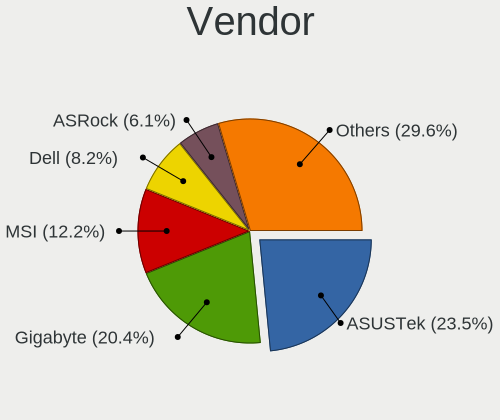
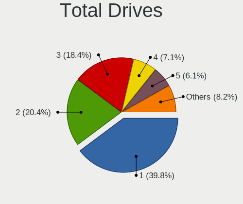
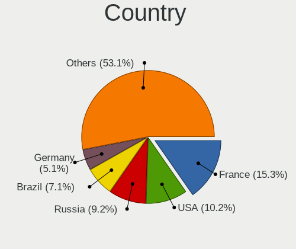
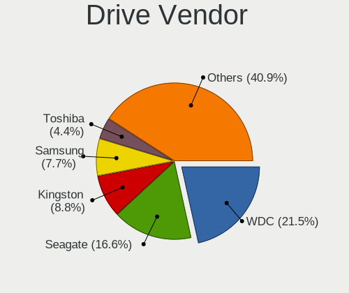
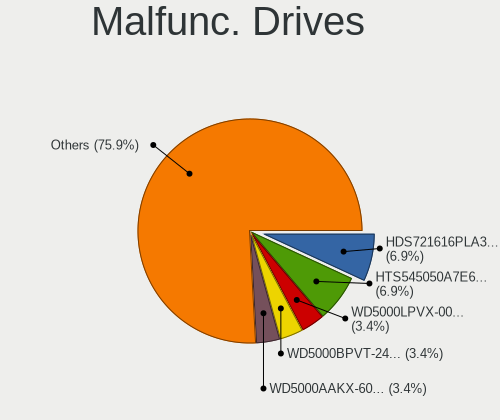
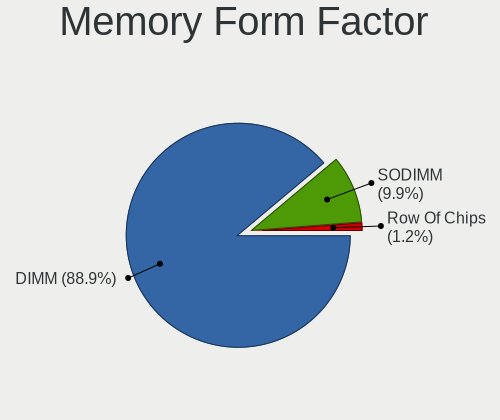

Devuan - Tested Hardware & Statistics (Desktops)
------------------------------------------------

A project to collect tested hardware configurations for Devuan.

Anyone can contribute to this report by the [hw-probe](https://github.com/linuxhw/hw-probe) tool:

    sudo -E hw-probe -all -upload

Please contribute! Especially if your hardware is rare.

Contents
--------

* [ Test Cases ](#test-cases)

* [ System ](#system)
  - [ OS                       ](#os)
  - [ OS Family                ](#os-family)
  - [ Kernel                   ](#kernel)
  - [ Kernel Family            ](#kernel-family)
  - [ Kernel Major Ver.        ](#kernel-major-ver)
  - [ Arch                     ](#arch)
  - [ DE                       ](#de)
  - [ Display Server           ](#display-server)
  - [ Display Manager          ](#display-manager)
  - [ OS Lang                  ](#os-lang)
  - [ Boot Mode                ](#boot-mode)
  - [ Filesystem               ](#filesystem)
  - [ Part. scheme             ](#part-scheme)
  - [ Dual Boot with Linux/BSD ](#dual-boot-with-linuxbsd)
  - [ Dual Boot (Win)          ](#dual-boot-win)

* [ Board ](#board)
  - [ Vendor                   ](#vendor)
  - [ Model                    ](#model)
  - [ Model Family             ](#model-family)
  - [ MFG Year                 ](#mfg-year)
  - [ Form Factor              ](#form-factor)
  - [ Secure Boot              ](#secure-boot)
  - [ Coreboot                 ](#coreboot)
  - [ RAM Size                 ](#ram-size)
  - [ RAM Used                 ](#ram-used)
  - [ Total Drives             ](#total-drives)
  - [ Has CD-ROM               ](#has-cd-rom)
  - [ Has Ethernet             ](#has-ethernet)
  - [ Has WiFi                 ](#has-wifi)
  - [ Has Bluetooth            ](#has-bluetooth)

* [ Location ](#location)
  - [ Country                  ](#country)
  - [ City                     ](#city)

* [ Drives ](#drives)
  - [ Drive Vendor             ](#drive-vendor)
  - [ Drive Model              ](#drive-model)
  - [ HDD Vendor               ](#hdd-vendor)
  - [ SSD Vendor               ](#ssd-vendor)
  - [ Drive Kind               ](#drive-kind)
  - [ Drive Connector          ](#drive-connector)
  - [ Drive Size               ](#drive-size)
  - [ Space Total              ](#space-total)
  - [ Space Used               ](#space-used)
  - [ Malfunc. Drives          ](#malfunc-drives)
  - [ Malfunc. Drive Vendor    ](#malfunc-drive-vendor)
  - [ Malfunc. HDD Vendor      ](#malfunc-hdd-vendor)
  - [ Malfunc. Drive Kind      ](#malfunc-drive-kind)
  - [ Failed Drives            ](#failed-drives)
  - [ Failed Drive Vendor      ](#failed-drive-vendor)
  - [ Drive Status             ](#drive-status)

* [ Storage controller ](#storage-controller)
  - [ Storage Vendor           ](#storage-vendor)
  - [ Storage Model            ](#storage-model)
  - [ Storage Kind             ](#storage-kind)

* [ Processor ](#processor)
  - [ CPU Vendor               ](#cpu-vendor)
  - [ CPU Model                ](#cpu-model)
  - [ CPU Model Family         ](#cpu-model-family)
  - [ CPU Cores                ](#cpu-cores)
  - [ CPU Sockets              ](#cpu-sockets)
  - [ CPU Threads              ](#cpu-threads)
  - [ CPU Op-Modes             ](#cpu-op-modes)
  - [ CPU Microcode            ](#cpu-microcode)
  - [ CPU Microarch            ](#cpu-microarch)

* [ Graphics ](#graphics)
  - [ GPU Vendor               ](#gpu-vendor)
  - [ GPU Model                ](#gpu-model)
  - [ GPU Combo                ](#gpu-combo)
  - [ GPU Driver               ](#gpu-driver)
  - [ GPU Memory               ](#gpu-memory)

* [ Monitor ](#monitor)
  - [ Monitor Vendor           ](#monitor-vendor)
  - [ Monitor Model            ](#monitor-model)
  - [ Monitor Resolution       ](#monitor-resolution)
  - [ Monitor Diagonal         ](#monitor-diagonal)
  - [ Monitor Width            ](#monitor-width)
  - [ Aspect Ratio             ](#aspect-ratio)
  - [ Monitor Area             ](#monitor-area)
  - [ Pixel Density            ](#pixel-density)
  - [ Multiple Monitors        ](#multiple-monitors)

* [ Network ](#network)
  - [ Net Controller Vendor    ](#net-controller-vendor)
  - [ Net Controller Model     ](#net-controller-model)
  - [ Wireless Vendor          ](#wireless-vendor)
  - [ Wireless Model           ](#wireless-model)
  - [ Ethernet Vendor          ](#ethernet-vendor)
  - [ Ethernet Model           ](#ethernet-model)
  - [ Net Controller Kind      ](#net-controller-kind)
  - [ Used Controller          ](#used-controller)
  - [ NICs                     ](#nics)
  - [ IPv6                     ](#ipv6)

* [ Bluetooth ](#bluetooth)
  - [ Bluetooth Vendor         ](#bluetooth-vendor)
  - [ Bluetooth Model          ](#bluetooth-model)

* [ Sound ](#sound)
  - [ Sound Vendor             ](#sound-vendor)
  - [ Sound Model              ](#sound-model)

* [ Memory ](#memory)
  - [ Memory Vendor            ](#memory-vendor)
  - [ Memory Model             ](#memory-model)
  - [ Memory Kind              ](#memory-kind)
  - [ Memory Form Factor       ](#memory-form-factor)
  - [ Memory Size              ](#memory-size)
  - [ Memory Speed             ](#memory-speed)

* [ Printers & scanners ](#printers--scanners)
  - [ Printer Vendor           ](#printer-vendor)
  - [ Printer Model            ](#printer-model)
  - [ Scanner Vendor           ](#scanner-vendor)
  - [ Scanner Model            ](#scanner-model)

* [ Camera ](#camera)
  - [ Camera Vendor            ](#camera-vendor)
  - [ Camera Model             ](#camera-model)

* [ Security ](#security)
  - [ Fingerprint Vendor       ](#fingerprint-vendor)
  - [ Fingerprint Model        ](#fingerprint-model)
  - [ Chipcard Vendor          ](#chipcard-vendor)
  - [ Chipcard Model           ](#chipcard-model)

* [ Unsupported ](#unsupported)
  - [ Unsupported Devices      ](#unsupported-devices)
  - [ Unsupported Device Types ](#unsupported-device-types)

Test Cases
----------

Total: 84

| Vendor        | Model                       | Probe                                                      | Date         |
|---------------|-----------------------------|------------------------------------------------------------|--------------|
| ASUSTek       | M11BB                       | [21e7b53022](https://linux-hardware.org/?probe=21e7b53022) | Nov 02, 2023 |
| Intel         | X99                         | [8f60418655](https://linux-hardware.org/?probe=8f60418655) | Oct 30, 2023 |
| MSI           | 970A SLI Krait Edition      | [a54528c1ef](https://linux-hardware.org/?probe=a54528c1ef) | Oct 29, 2023 |
| ASUSTek       | STRIX Z270E GAMING          | [baacbfa91a](https://linux-hardware.org/?probe=baacbfa91a) | Oct 19, 2023 |
| Dell          | 0GX297                      | [0fa81b620e](https://linux-hardware.org/?probe=0fa81b620e) | Aug 14, 2023 |
| Gigabyte      | F2A55M-HD2                  | [bed2e58bf4](https://linux-hardware.org/?probe=bed2e58bf4) | Aug 14, 2023 |
| LORD ELECT... | LORD G4x 775 ICH7 8712 A... | [3e63b3dec0](https://linux-hardware.org/?probe=3e63b3dec0) | Aug 09, 2023 |
| LORD ELECT... | LORD G4x 775 ICH7 8712 A... | [a036ddad16](https://linux-hardware.org/?probe=a036ddad16) | Aug 09, 2023 |
| Supermicro    | X10SRG-F                    | [3bdaa7bfef](https://linux-hardware.org/?probe=3bdaa7bfef) | Aug 08, 2023 |
| MSI           | B450 GAMING PLUS MAX        | [606780c010](https://linux-hardware.org/?probe=606780c010) | Jul 24, 2023 |
| Gigabyte      | H81M-S2H                    | [7a3f7dcd73](https://linux-hardware.org/?probe=7a3f7dcd73) | Jun 17, 2023 |
| Lenovo        | 3138 SDK0J40697 WIN 3305... | [36022cb1ac](https://linux-hardware.org/?probe=36022cb1ac) | May 11, 2023 |
| MSI           | B450M PRO-VDH PLUS          | [5e6b796278](https://linux-hardware.org/?probe=5e6b796278) | Apr 24, 2023 |
| HP            | 212A                        | [178f3b9c05](https://linux-hardware.org/?probe=178f3b9c05) | Apr 17, 2023 |
| Lenovo        | 3138 SDK0J40697 WIN 3305... | [491da3c2c2](https://linux-hardware.org/?probe=491da3c2c2) | Apr 10, 2023 |
| MSI           | PH67A-C43                   | [8e7c8a3d67](https://linux-hardware.org/?probe=8e7c8a3d67) | Apr 03, 2023 |
| ASUSTek       | PRIME B360-PLUS             | [ec45a753a5](https://linux-hardware.org/?probe=ec45a753a5) | Apr 02, 2023 |
| Gigabyte      | B650I AORUS ULTRA           | [a33a768662](https://linux-hardware.org/?probe=a33a768662) | Mar 29, 2023 |
| AMI           | Intel                       | [c2c28fa7e4](https://linux-hardware.org/?probe=c2c28fa7e4) | Mar 15, 2023 |
| Gigabyte      | P55A-UD3                    | [60cd9db1c5](https://linux-hardware.org/?probe=60cd9db1c5) | Feb 25, 2023 |
| MSI           | A320M PRO-E                 | [3e441c86f1](https://linux-hardware.org/?probe=3e441c86f1) | Feb 20, 2023 |
| MSI           | H67MS-E43                   | [47a6655b3b](https://linux-hardware.org/?probe=47a6655b3b) | Feb 07, 2023 |
| Gigabyte      | B550I AORUS PRO AX          | [beeeff23a5](https://linux-hardware.org/?probe=beeeff23a5) | Dec 25, 2022 |
| ASUSTek       | ROG STRIX B550-A GAMING     | [de8b7d8220](https://linux-hardware.org/?probe=de8b7d8220) | Nov 19, 2022 |
| ASUSTek       | PRIME X399-A                | [304c12788b](https://linux-hardware.org/?probe=304c12788b) | Oct 06, 2022 |
| HP            | 1825                        | [bceae72004](https://linux-hardware.org/?probe=bceae72004) | Aug 15, 2022 |
| MSI           | X99S MPOWER                 | [a3c1523b6b](https://linux-hardware.org/?probe=a3c1523b6b) | Jul 27, 2022 |
| Dell          | 054KM3 A01                  | [407b210bfe](https://linux-hardware.org/?probe=407b210bfe) | Jul 05, 2022 |
| HP            | 18E7                        | [2fd690b3b4](https://linux-hardware.org/?probe=2fd690b3b4) | Jun 22, 2022 |
| ASUSTek       | ROG CROSSHAIR VII HERO      | [a698baa5f6](https://linux-hardware.org/?probe=a698baa5f6) | Jun 18, 2022 |
| Dell          | 0NC2VH A01                  | [f05a6e7d31](https://linux-hardware.org/?probe=f05a6e7d31) | May 03, 2022 |
| ASRock        | B450M-HDV R4.0              | [bce1bba9ff](https://linux-hardware.org/?probe=bce1bba9ff) | Apr 29, 2022 |
| Dell          | 0D24M8 A01                  | [fe4bb32aa1](https://linux-hardware.org/?probe=fe4bb32aa1) | Apr 14, 2022 |
| Dell          | 014GRG A00                  | [1783efe96b](https://linux-hardware.org/?probe=1783efe96b) | Apr 14, 2022 |
| HP            | 1825                        | [a7ce5b6b11](https://linux-hardware.org/?probe=a7ce5b6b11) | Mar 03, 2022 |
| MSI           | B450M PRO-M2 MAX            | [3f99c8072a](https://linux-hardware.org/?probe=3f99c8072a) | Feb 23, 2022 |
| ASUSTek       | PRIME H510M-A               | [7ab68e0043](https://linux-hardware.org/?probe=7ab68e0043) | Feb 17, 2022 |
| ASRock        | B450M-HDV R4.0              | [f2a65b8a5f](https://linux-hardware.org/?probe=f2a65b8a5f) | Feb 14, 2022 |
| Gigabyte      | P55A-UD3                    | [824dbdd8ad](https://linux-hardware.org/?probe=824dbdd8ad) | Jan 22, 2022 |
| Online Lab... | SR 42                       | [e3037eb087](https://linux-hardware.org/?probe=e3037eb087) | Jan 22, 2022 |
| Gigabyte      | H310M S2H x.x               | [9e14e04f7f](https://linux-hardware.org/?probe=9e14e04f7f) | Jan 22, 2022 |
| ASRock        | B450M-HDV R4.0              | [8e7267692b](https://linux-hardware.org/?probe=8e7267692b) | Jan 21, 2022 |
| Gigabyte      | MZGLKBP-00                  | [202ccac61c](https://linux-hardware.org/?probe=202ccac61c) | Dec 30, 2021 |
| Gigabyte      | B75M-D3V                    | [1c15b6b3c7](https://linux-hardware.org/?probe=1c15b6b3c7) | Dec 26, 2021 |
| HP            | 1495                        | [28835849f0](https://linux-hardware.org/?probe=28835849f0) | Oct 29, 2021 |
| ASUSTek       | PRIME Z490M-PLUS            | [5a7e6805d3](https://linux-hardware.org/?probe=5a7e6805d3) | Oct 02, 2021 |
| MSI           | B360M PRO-VD                | [06e625d98f](https://linux-hardware.org/?probe=06e625d98f) | Oct 02, 2021 |
| HP            | 1825                        | [ff75be1ea3](https://linux-hardware.org/?probe=ff75be1ea3) | Jun 06, 2021 |
| ASUSTek       | P5G41T-M LX2/BR             | [8702580cb4](https://linux-hardware.org/?probe=8702580cb4) | May 26, 2021 |
| ASUSTek       | P5G41T-M LX2/BR             | [05f1d12390](https://linux-hardware.org/?probe=05f1d12390) | May 26, 2021 |
| Gigabyte      | H170-HD3-CF                 | [2ffdc89c2a](https://linux-hardware.org/?probe=2ffdc89c2a) | Apr 28, 2021 |
| Gigabyte      | Z390 GAMING SLI-CF          | [50f8ddb45c](https://linux-hardware.org/?probe=50f8ddb45c) | Apr 28, 2021 |
| Google        | Tricky                      | [666794d603](https://linux-hardware.org/?probe=666794d603) | Apr 26, 2021 |
| ASUSTek       | F1A55-M LX                  | [630bbb748a](https://linux-hardware.org/?probe=630bbb748a) | Apr 17, 2021 |
| Gigabyte      | H170-HD3-CF                 | [f103eefd66](https://linux-hardware.org/?probe=f103eefd66) | Apr 17, 2021 |
| Gigabyte      | Z390 GAMING SLI-CF          | [e802fc9ff5](https://linux-hardware.org/?probe=e802fc9ff5) | Apr 17, 2021 |
| Sun Micros... | Ultra 24 50                 | [e4b76f9137](https://linux-hardware.org/?probe=e4b76f9137) | Apr 10, 2021 |
| Sun Micros... | Ultra 24 50                 | [15691fbc42](https://linux-hardware.org/?probe=15691fbc42) | Apr 10, 2021 |
| ASUSTek       | A8R-MVP                     | [6daa2a372c](https://linux-hardware.org/?probe=6daa2a372c) | Mar 27, 2021 |
| ASRock        | K8A780LM                    | [b8f4c7c2cb](https://linux-hardware.org/?probe=b8f4c7c2cb) | Mar 22, 2021 |
| Gigabyte      | 970A-DS3P                   | [eeebc66137](https://linux-hardware.org/?probe=eeebc66137) | Mar 17, 2021 |
| Gigabyte      | 970A-DS3P                   | [fdf4e6d366](https://linux-hardware.org/?probe=fdf4e6d366) | Mar 17, 2021 |
| ASRock        | K8A780LM                    | [d95a56d80f](https://linux-hardware.org/?probe=d95a56d80f) | Mar 15, 2021 |
| ASRock        | H81M-ITX                    | [0f5f41e1ca](https://linux-hardware.org/?probe=0f5f41e1ca) | Mar 08, 2021 |
| ASRock        | H81M-ITX                    | [8599b883d6](https://linux-hardware.org/?probe=8599b883d6) | Mar 08, 2021 |
| Intel         | D815EEA AAA45884-401        | [248565d49c](https://linux-hardware.org/?probe=248565d49c) | Feb 20, 2021 |
| Intel         | D815EEA AAA45884-401        | [3acc2f0b1e](https://linux-hardware.org/?probe=3acc2f0b1e) | Feb 20, 2021 |
| Gigabyte      | GA-G41M-ES2L                | [592c995804](https://linux-hardware.org/?probe=592c995804) | Jan 30, 2021 |
| Acer          | F672CR R01-A4               | [8d41694165](https://linux-hardware.org/?probe=8d41694165) | Jan 25, 2021 |
| Lenovo        | ThinkStation E20 4220CTO    | [f963a2e7f9](https://linux-hardware.org/?probe=f963a2e7f9) | Jan 06, 2021 |
| Dell          | 0GXM1W A04                  | [989f983b51](https://linux-hardware.org/?probe=989f983b51) | Dec 28, 2020 |
| Lenovo        | ThinkStation E20 4220CTO    | [aac28ba905](https://linux-hardware.org/?probe=aac28ba905) | Dec 19, 2020 |
| Intel         | HURONRIVER                  | [49bdd1a99d](https://linux-hardware.org/?probe=49bdd1a99d) | Oct 29, 2020 |
| ASUSTek       | Maximus V GENE              | [253b5aba98](https://linux-hardware.org/?probe=253b5aba98) | Oct 29, 2020 |
| ASUSTek       | H81M-C                      | [cd136e059e](https://linux-hardware.org/?probe=cd136e059e) | Oct 05, 2020 |
| HP            | 1791                        | [f41fcdc019](https://linux-hardware.org/?probe=f41fcdc019) | Sep 26, 2020 |
| ASUSTek       | EX-A320M-GAMING             | [4eb75f039b](https://linux-hardware.org/?probe=4eb75f039b) | Aug 17, 2020 |
| HP            | 1791                        | [5a21e91155](https://linux-hardware.org/?probe=5a21e91155) | Aug 15, 2020 |
| Gigabyte      | B450 AORUS ELITE            | [ff5143e508](https://linux-hardware.org/?probe=ff5143e508) | Aug 02, 2020 |
| ASUSTek       | P5PE-VM                     | [298c1239dd](https://linux-hardware.org/?probe=298c1239dd) | May 20, 2020 |
| MSI           | B350 PC MATE                | [ff3852f02d](https://linux-hardware.org/?probe=ff3852f02d) | Mar 23, 2020 |
| ASRock        | G31M-VS2                    | [b64547f948](https://linux-hardware.org/?probe=b64547f948) | Dec 06, 2019 |
| Gigabyte      | H170-HD3-CF                 | [338994bd66](https://linux-hardware.org/?probe=338994bd66) | Dec 02, 2019 |
| ASUSTek       | P5PE-VM                     | [6a89046dfb](https://linux-hardware.org/?probe=6a89046dfb) | Dec 02, 2019 |

System
------

OS
--

Installed operating systems

| Name                    | Desktops | Percent |
|-------------------------|----------|---------|
| Devuan 4                | 26       | 38.24%  |
| Devuan 3                | 14       | 20.59%  |
| Devuan 5                | 12       | 17.65%  |
| Devuan Testing/unstable | 7        | 10.29%  |
| Devuan 2.1              | 6        | 8.82%   |
| Devuan 6                | 1        | 1.47%   |
| Devuan 1.0.0            | 1        | 1.47%   |
| Devuan                  | 1        | 1.47%   |

OS Family
---------

OS without a version

| Name   | Desktops | Percent |
|--------|----------|---------|
| Devuan | 65       | 100%    |

Kernel
------

Version of the Linux kernel

| Version               | Desktops | Percent |
|-----------------------|----------|---------|
| 5.10.0-9-amd64        | 6        | 8.33%   |
| 5.10.0-21-amd64       | 4        | 5.56%   |
| 4.19.0-14-amd64       | 4        | 5.56%   |
| 5.10.0-19-amd64       | 3        | 4.17%   |
| 4.19.0-16-amd64       | 3        | 4.17%   |
| 6.1.0-13-amd64        | 2        | 2.78%   |
| 5.10.0-8-amd64        | 2        | 2.78%   |
| 5.10.0-6-amd64        | 2        | 2.78%   |
| 5.10.0-23-amd64       | 2        | 2.78%   |
| 4.19.0-9-amd64        | 2        | 2.78%   |
| 4.19.0-13-amd64       | 2        | 2.78%   |
| 4.19.0-10-amd64       | 2        | 2.78%   |
| 6.5.0-0.deb12.1-amd64 | 1        | 1.39%   |
| 6.3.0-2-amd64         | 1        | 1.39%   |
| 6.2.12                | 1        | 1.39%   |
| 6.1.7                 | 1        | 1.39%   |
| 6.1.0-6-amd64         | 1        | 1.39%   |
| 6.1.0-10-amd64        | 1        | 1.39%   |
| 6.1.0-0.deb11.5-amd64 | 1        | 1.39%   |
| 6.0.0-5-amd64         | 1        | 1.39%   |
| 5.9.0-1-amd64         | 1        | 1.39%   |
| 5.8.0-3-amd64         | 1        | 1.39%   |
| 5.7.0-1-amd64         | 1        | 1.39%   |
| 5.7.0-0.bpo.2-amd64   | 1        | 1.39%   |
| 5.18.14-devuan        | 1        | 1.39%   |
| 5.18.11-gnu           | 1        | 1.39%   |
| 5.18.0-1-amd64        | 1        | 1.39%   |
| 5.16.0-1-amd64        | 1        | 1.39%   |
| 5.15.0-2-amd64        | 1        | 1.39%   |
| 5.15.0-0.bpo.2-amd64  | 1        | 1.39%   |
| 5.14.0-kali2-amd64    | 1        | 1.39%   |
| 5.10.0-5-amd64        | 1        | 1.39%   |
| 5.10.0-24-amd64       | 1        | 1.39%   |
| 5.10.0-22-amd64       | 1        | 1.39%   |
| 5.10.0-2-amd64        | 1        | 1.39%   |
| 5.10.0-18-amd64       | 1        | 1.39%   |
| 5.10.0-16-amd64       | 1        | 1.39%   |
| 5.10.0-15-amd64       | 1        | 1.39%   |
| 5.10.0-11-amd64       | 1        | 1.39%   |
| 5.10.0-10-amd64       | 1        | 1.39%   |

Kernel Family
-------------

Linux kernel without a distro release

| Version  | Desktops | Percent |
|----------|----------|---------|
| 5.10.0   | 25       | 37.31%  |
| 4.19.0   | 15       | 22.39%  |
| 6.1.0    | 5        | 7.46%   |
| 4.9.0    | 4        | 5.97%   |
| 5.7.0    | 2        | 2.99%   |
| 5.15.0   | 2        | 2.99%   |
| 6.5.0    | 1        | 1.49%   |
| 6.3.0    | 1        | 1.49%   |
| 6.2.12   | 1        | 1.49%   |
| 6.1.7    | 1        | 1.49%   |
| 6.0.0    | 1        | 1.49%   |
| 5.9.0    | 1        | 1.49%   |
| 5.8.0    | 1        | 1.49%   |
| 5.18.14  | 1        | 1.49%   |
| 5.18.11  | 1        | 1.49%   |
| 5.18.0   | 1        | 1.49%   |
| 5.16.0   | 1        | 1.49%   |
| 5.14.0   | 1        | 1.49%   |
| 4.19.112 | 1        | 1.49%   |
| 4.18.0   | 1        | 1.49%   |

Kernel Major Ver.
-----------------

Linux kernel major version

| Version | Desktops | Percent |
|---------|----------|---------|
| 5.10    | 25       | 37.31%  |
| 4.19    | 16       | 23.88%  |
| 6.1     | 6        | 8.96%   |
| 4.9     | 4        | 5.97%   |
| 5.18    | 3        | 4.48%   |
| 5.7     | 2        | 2.99%   |
| 5.15    | 2        | 2.99%   |
| 6.5     | 1        | 1.49%   |
| 6.3     | 1        | 1.49%   |
| 6.2     | 1        | 1.49%   |
| 6.0     | 1        | 1.49%   |
| 5.9     | 1        | 1.49%   |
| 5.8     | 1        | 1.49%   |
| 5.16    | 1        | 1.49%   |
| 5.14    | 1        | 1.49%   |
| 4.18    | 1        | 1.49%   |

Arch
----

OS architecture (x86_64, i586, etc.)

| Name   | Desktops | Percent |
|--------|----------|---------|
| x86_64 | 62       | 95.38%  |
| i686   | 3        | 4.62%   |

DE
--

Desktop Environment

| Name       | Desktops | Percent |
|------------|----------|---------|
| XFCE       | 28       | 41.18%  |
| Unknown    | 13       | 19.12%  |
| MATE       | 8        | 11.76%  |
| KDE5       | 8        | 11.76%  |
| LXDE       | 3        | 4.41%   |
| Cinnamon   | 3        | 4.41%   |
| X-Cinnamon | 1        | 1.47%   |
| LXQt       | 1        | 1.47%   |
| i3         | 1        | 1.47%   |
| GNOME      | 1        | 1.47%   |
| awesome    | 1        | 1.47%   |

Display Server
--------------

X11 or Wayland

| Name    | Desktops | Percent |
|---------|----------|---------|
| X11     | 55       | 83.33%  |
| Tty     | 8        | 12.12%  |
| Unknown | 3        | 4.55%   |

Display Manager
---------------

SDDM, LightDM, etc.

| Name    | Desktops | Percent |
|---------|----------|---------|
| SLiM    | 28       | 43.08%  |
| Unknown | 15       | 23.08%  |
| LightDM | 12       | 18.46%  |
| SDDM    | 6        | 9.23%   |
| NODM    | 2        | 3.08%   |
| XDM     | 1        | 1.54%   |
| LXDM    | 1        | 1.54%   |

OS Lang
-------

Language

| Lang    | Desktops | Percent |
|---------|----------|---------|
| en_US   | 22       | 33.33%  |
| fr_FR   | 7        | 10.61%  |
| en_GB   | 7        | 10.61%  |
| Unknown | 5        | 7.58%   |
| ru_RU   | 4        | 6.06%   |
| C       | 4        | 6.06%   |
| sk_SK   | 3        | 4.55%   |
| en_AU   | 3        | 4.55%   |
| pt_BR   | 2        | 3.03%   |
| fr_BE   | 2        | 3.03%   |
| en_NZ   | 2        | 3.03%   |
| de_DE   | 2        | 3.03%   |
| pl_PL   | 1        | 1.52%   |
| it_IT   | 1        | 1.52%   |
| en_CA   | 1        | 1.52%   |

Boot Mode
---------

EFI or BIOS

| Mode | Desktops | Percent |
|------|----------|---------|
| BIOS | 38       | 58.46%  |
| EFI  | 27       | 41.54%  |

Filesystem
----------

Type of filesystem

| Type    | Desktops | Percent |
|---------|----------|---------|
| Ext4    | 57       | 87.69%  |
| Overlay | 2        | 3.08%   |
| Btrfs   | 2        | 3.08%   |
| Xfs     | 1        | 1.54%   |
| Ext3    | 1        | 1.54%   |
| Ext2    | 1        | 1.54%   |
| Unknown | 1        | 1.54%   |

Part. scheme
------------

Scheme of partitioning

| Type    | Desktops | Percent |
|---------|----------|---------|
| GPT     | 39       | 57.35%  |
| MBR     | 24       | 35.29%  |
| Unknown | 5        | 7.35%   |

Dual Boot with Linux/BSD
------------------------

Hosting more than one Linux/BSD

| Dual boot | Desktops | Percent |
|-----------|----------|---------|
| No        | 43       | 64.18%  |
| Yes       | 24       | 35.82%  |

Dual Boot (Win)
---------------

Hosting Linux and Windows

| Dual boot | Desktops | Percent |
|-----------|----------|---------|
| No        | 47       | 72.31%  |
| Yes       | 18       | 27.69%  |

Board
-----

Vendor
------

Motherboard manufacturer

| Name                | Desktops | Percent |
|---------------------|----------|---------|
| Gigabyte Technology | 14       | 21.54%  |
| ASUSTek Computer    | 14       | 21.54%  |
| MSI                 | 10       | 15.38%  |
| Dell                | 6        | 9.23%   |
| Hewlett-Packard     | 5        | 7.69%   |
| ASRock              | 4        | 6.15%   |
| Intel               | 3        | 4.62%   |
| Lenovo              | 2        | 3.08%   |
| Supermicro          | 1        | 1.54%   |
| Sun Microsystems    | 1        | 1.54%   |
| Online Labs         | 1        | 1.54%   |
| LORD ELECTRONICS    | 1        | 1.54%   |
| Google              | 1        | 1.54%   |
| AMI                 | 1        | 1.54%   |
| Acer                | 1        | 1.54%   |

Model
-----

Motherboard model

| Name                                              | Desktops | Percent |
|---------------------------------------------------|----------|---------|
| Supermicro SYS-1018GR-T                           | 1        | 1.54%   |
| Sun Microsystems Ultra 24                         | 1        | 1.54%   |
| Online Labs SR                                    | 1        | 1.54%   |
| MSI MS-7B86                                       | 1        | 1.54%   |
| MSI MS-7B84                                       | 1        | 1.54%   |
| MSI MS-7B53                                       | 1        | 1.54%   |
| MSI MS-7A38                                       | 1        | 1.54%   |
| MSI MS-7A36                                       | 1        | 1.54%   |
| MSI MS-7A34                                       | 1        | 1.54%   |
| MSI MS-7885                                       | 1        | 1.54%   |
| MSI MS-7693                                       | 1        | 1.54%   |
| MSI MS-7678                                       | 1        | 1.54%   |
| MSI MS-7673                                       | 1        | 1.54%   |
| LORD ELECTRONICS LORD G4x 775 ICH7 8712 As Design | 1        | 1.54%   |
| Lenovo ThinkStation P330 30C5S1LQ00               | 1        | 1.54%   |
| Lenovo ThinkStation E20 4220CTO                   | 1        | 1.54%   |
| Intel X99                                         | 1        | 1.54%   |
| Intel D815EEA AAA45884-401                        | 1        | 1.54%   |
| Intel AHV                                         | 1        | 1.54%   |
| HP Z640 Workstation                               | 1        | 1.54%   |
| HP Z220 SFF Workstation                           | 1        | 1.54%   |
| HP ProDesk 600 G1 SFF                             | 1        | 1.54%   |
| HP EliteDesk 800 G1 DM                            | 1        | 1.54%   |
| HP Compaq 8200 Elite SFF PC                       | 1        | 1.54%   |
| Google Tricky                                     | 1        | 1.54%   |
| Gigabyte Z390 GAMING SLI                          | 1        | 1.54%   |
| Gigabyte P55A-UD3                                 | 1        | 1.54%   |
| Gigabyte MZGLKBP-00                               | 1        | 1.54%   |
| Gigabyte H81M-S2H                                 | 1        | 1.54%   |
| Gigabyte H310M S2H 2.0                            | 1        | 1.54%   |
| Gigabyte H170-HD3-CF                              | 1        | 1.54%   |
| Gigabyte H170-HD3                                 | 1        | 1.54%   |
| Gigabyte GA-G41M-ES2L                             | 1        | 1.54%   |
| Gigabyte F2A55M-HD2                               | 1        | 1.54%   |
| Gigabyte B75M-D3V                                 | 1        | 1.54%   |
| Gigabyte B650I AORUS ULTRA                        | 1        | 1.54%   |
| Gigabyte B550I AORUS PRO AX                       | 1        | 1.54%   |
| Gigabyte B450 AORUS ELITE                         | 1        | 1.54%   |
| Gigabyte 970A-DS3P                                | 1        | 1.54%   |
| Dell Vostro 430                                   | 1        | 1.54%   |

Model Family
------------

Motherboard model prefix

| Name                    | Desktops | Percent |
|-------------------------|----------|---------|
| Dell OptiPlex           | 5        | 7.69%   |
| ASUS PRIME              | 4        | 6.15%   |
| Lenovo ThinkStation     | 2        | 3.08%   |
| ASUS ROG                | 2        | 3.08%   |
| Supermicro SYS-1018GR-T | 1        | 1.54%   |
| Sun Microsystems Ultra  | 1        | 1.54%   |
| Online Labs SR          | 1        | 1.54%   |
| MSI MS-7B86             | 1        | 1.54%   |
| MSI MS-7B84             | 1        | 1.54%   |
| MSI MS-7B53             | 1        | 1.54%   |
| MSI MS-7A38             | 1        | 1.54%   |
| MSI MS-7A36             | 1        | 1.54%   |
| MSI MS-7A34             | 1        | 1.54%   |
| MSI MS-7885             | 1        | 1.54%   |
| MSI MS-7693             | 1        | 1.54%   |
| MSI MS-7678             | 1        | 1.54%   |
| MSI MS-7673             | 1        | 1.54%   |
| LORD ELECTRONICS LORD   | 1        | 1.54%   |
| Intel X99               | 1        | 1.54%   |
| Intel D815EEA           | 1        | 1.54%   |
| Intel AHV               | 1        | 1.54%   |
| HP Z640                 | 1        | 1.54%   |
| HP Z220                 | 1        | 1.54%   |
| HP ProDesk              | 1        | 1.54%   |
| HP EliteDesk            | 1        | 1.54%   |
| HP Compaq               | 1        | 1.54%   |
| Google Tricky           | 1        | 1.54%   |
| Gigabyte Z390           | 1        | 1.54%   |
| Gigabyte P55A-UD3       | 1        | 1.54%   |
| Gigabyte MZGLKBP-00     | 1        | 1.54%   |
| Gigabyte H81M-S2H       | 1        | 1.54%   |
| Gigabyte H310M          | 1        | 1.54%   |
| Gigabyte H170-HD3-CF    | 1        | 1.54%   |
| Gigabyte H170-HD3       | 1        | 1.54%   |
| Gigabyte GA-G41M-ES2L   | 1        | 1.54%   |
| Gigabyte F2A55M-HD2     | 1        | 1.54%   |
| Gigabyte B75M-D3V       | 1        | 1.54%   |
| Gigabyte B650I          | 1        | 1.54%   |
| Gigabyte B550I          | 1        | 1.54%   |
| Gigabyte B450           | 1        | 1.54%   |

MFG Year
--------

Motherboard manufacture year

| Year | Desktops | Percent |
|------|----------|---------|
| 2018 | 10       | 15.38%  |
| 2019 | 8        | 12.31%  |
| 2013 | 6        | 9.23%   |
| 2012 | 5        | 7.69%   |
| 2011 | 5        | 7.69%   |
| 2017 | 4        | 6.15%   |
| 2014 | 4        | 6.15%   |
| 2020 | 3        | 4.62%   |
| 2016 | 3        | 4.62%   |
| 2015 | 3        | 4.62%   |
| 2010 | 3        | 4.62%   |
| 2022 | 2        | 3.08%   |
| 2009 | 2        | 3.08%   |
| 2007 | 2        | 3.08%   |
| 2023 | 1        | 1.54%   |
| 2021 | 1        | 1.54%   |
| 2008 | 1        | 1.54%   |
| 2006 | 1        | 1.54%   |
| 2000 | 1        | 1.54%   |

Form Factor
-----------

Physical design of the computer

| Name    | Desktops | Percent |
|---------|----------|---------|
| Desktop | 65       | 100%    |

Secure Boot
-----------

Enabled or disabled

| State    | Desktops | Percent |
|----------|----------|---------|
| Disabled | 64       | 98.46%  |
| Enabled  | 1        | 1.54%   |

Coreboot
--------

Have coreboot on board

| Used | Desktops | Percent |
|------|----------|---------|
| No   | 63       | 96.92%  |
| Yes  | 2        | 3.08%   |

RAM Size
--------

Total RAM memory

| Size in GB  | Desktops | Percent |
|-------------|----------|---------|
| 16.01-24.0  | 19       | 29.23%  |
| 32.01-64.0  | 13       | 20%     |
| 8.01-16.0   | 12       | 18.46%  |
| 4.01-8.0    | 8        | 12.31%  |
| 64.01-256.0 | 5        | 7.69%   |
| 3.01-4.0    | 4        | 6.15%   |
| 1.01-2.0    | 3        | 4.62%   |
| 0.01-0.5    | 1        | 1.54%   |

RAM Used
--------

Used RAM memory

| Used GB    | Desktops | Percent |
|------------|----------|---------|
| 1.01-2.0   | 22       | 31.88%  |
| 4.01-8.0   | 11       | 15.94%  |
| 2.01-3.0   | 10       | 14.49%  |
| 0.51-1.0   | 10       | 14.49%  |
| 3.01-4.0   | 6        | 8.7%    |
| 8.01-16.0  | 5        | 7.25%   |
| 0.01-0.5   | 3        | 4.35%   |
| 16.01-24.0 | 2        | 2.9%    |

Total Drives
------------

Number of drives on board

| Drives | Desktops | Percent |
|--------|----------|---------|
| 1      | 24       | 36.92%  |
| 3      | 14       | 21.54%  |
| 2      | 12       | 18.46%  |
| 5      | 5        | 7.69%   |
| 4      | 5        | 7.69%   |
| 6      | 4        | 6.15%   |
| 7      | 1        | 1.54%   |

Has CD-ROM
----------

Has CD-ROM on board

| Presented | Desktops | Percent |
|-----------|----------|---------|
| No        | 42       | 64.62%  |
| Yes       | 23       | 35.38%  |

Has Ethernet
------------

Has Ethernet on board

| Presented | Desktops | Percent |
|-----------|----------|---------|
| Yes       | 64       | 98.46%  |
| No        | 1        | 1.54%   |

Has WiFi
--------

Has WiFi module

| Presented | Desktops | Percent |
|-----------|----------|---------|
| No        | 51       | 77.27%  |
| Yes       | 15       | 22.73%  |

Has Bluetooth
-------------

Has Bluetooth module

| Presented | Desktops | Percent |
|-----------|----------|---------|
| No        | 55       | 84.62%  |
| Yes       | 10       | 15.38%  |

Location
--------

Country
-------

Geographic location (country)

| Country     | Desktops | Percent |
|-------------|----------|---------|
| USA         | 10       | 15.38%  |
| France      | 10       | 15.38%  |
| Russia      | 5        | 7.69%   |
| UK          | 4        | 6.15%   |
| Ukraine     | 3        | 4.62%   |
| Slovakia    | 3        | 4.62%   |
| Poland      | 3        | 4.62%   |
| Germany     | 3        | 4.62%   |
| Australia   | 3        | 4.62%   |
| New Zealand | 2        | 3.08%   |
| Netherlands | 2        | 3.08%   |
| Canada      | 2        | 3.08%   |
| Brazil      | 2        | 3.08%   |
| Belgium     | 2        | 3.08%   |
| Argentina   | 2        | 3.08%   |
| Tunisia     | 1        | 1.54%   |
| Spain       | 1        | 1.54%   |
| South Korea | 1        | 1.54%   |
| Puerto Rico | 1        | 1.54%   |
| Italy       | 1        | 1.54%   |
| Israel      | 1        | 1.54%   |
| Georgia     | 1        | 1.54%   |
| China       | 1        | 1.54%   |
| Bulgaria    | 1        | 1.54%   |

City
----

Geographic location (city)

| City             | Desktops | Percent |
|------------------|----------|---------|
| Bratislava       | 3        | 4.62%   |
| Bagnolet         | 3        | 4.62%   |
| Volzhskiy        | 2        | 3.08%   |
| Toronto          | 2        | 3.08%   |
| Sydney           | 2        | 3.08%   |
| Auckland         | 2        | 3.08%   |
| Xiamen           | 1        | 1.54%   |
| Wroclaw          | 1        | 1.54%   |
| Waterford        | 1        | 1.54%   |
| Vladikavkaz      | 1        | 1.54%   |
| Vise             | 1        | 1.54%   |
| Tel Aviv         | 1        | 1.54%   |
| Tbilisi          | 1        | 1.54%   |
| Sofia            | 1        | 1.54%   |
| Seongbuk-gu      | 1        | 1.54%   |
| Sao Paulo        | 1        | 1.54%   |
| Saint-Herblain   | 1        | 1.54%   |
| Rugby            | 1        | 1.54%   |
| Roubaix          | 1        | 1.54%   |
| Rio de Janeiro   | 1        | 1.54%   |
| Renkum           | 1        | 1.54%   |
| Radzionkow       | 1        | 1.54%   |
| Port Richey      | 1        | 1.54%   |
| Poperinge        | 1        | 1.54%   |
| Paris            | 1        | 1.54%   |
| Oleksandriya     | 1        | 1.54%   |
| Okehampton       | 1        | 1.54%   |
| Novopokrovskoye  | 1        | 1.54%   |
| Norman           | 1        | 1.54%   |
| Nérac           | 1        | 1.54%   |
| Monferran-Plaves | 1        | 1.54%   |
| Miedziana Gora   | 1        | 1.54%   |
| Miami            | 1        | 1.54%   |
| Madrid           | 1        | 1.54%   |
| Loosdrecht       | 1        | 1.54%   |
| Lincoln          | 1        | 1.54%   |
| Leeds            | 1        | 1.54%   |
| Lahr             | 1        | 1.54%   |
| L'Albenc         | 1        | 1.54%   |
| Kirov            | 1        | 1.54%   |

Drives
------

Drive Vendor
------------

Hard drive vendors

| Vendor              | Desktops | Drives | Percent |
|---------------------|----------|--------|---------|
| WDC                 | 28       | 50     | 22.76%  |
| Seagate             | 21       | 32     | 17.07%  |
| Kingston            | 11       | 14     | 8.94%   |
| Samsung Electronics | 10       | 21     | 8.13%   |
| Toshiba             | 8        | 8      | 6.5%    |
| SanDisk             | 6        | 6      | 4.88%   |
| Crucial             | 5        | 7      | 4.07%   |
| Netac               | 2        | 2      | 1.63%   |
| Micron Technology   | 2        | 2      | 1.63%   |
| Maxtor              | 2        | 2      | 1.63%   |
| Intel               | 2        | 4      | 1.63%   |
| Hitachi             | 2        | 2      | 1.63%   |
| HGST                | 2        | 2      | 1.63%   |
| Dogfish             | 2        | 2      | 1.63%   |
| A-DATA Technology   | 2        | 2      | 1.63%   |
| WD MediaMax         | 1        | 3      | 0.81%   |
| Unknown             | 1        | 1      | 0.81%   |
| Transcend           | 1        | 2      | 0.81%   |
| Team                | 1        | 1      | 0.81%   |
| Supermicro          | 1        | 1      | 0.81%   |
| SK hynix            | 1        | 1      | 0.81%   |
| PNY                 | 1        | 1      | 0.81%   |
| Plextor             | 1        | 1      | 0.81%   |
| Lexar               | 1        | 1      | 0.81%   |
| KingDian            | 1        | 1      | 0.81%   |
| Intenso             | 1        | 1      | 0.81%   |
| IBM/Hitachi         | 1        | 1      | 0.81%   |
| HPE                 | 1        | 2      | 0.81%   |
| Hewlett-Packard     | 1        | 2      | 0.81%   |
| GOODRAM             | 1        | 1      | 0.81%   |
| Fujitsu             | 1        | 1      | 0.81%   |
| Corsair             | 1        | 1      | 0.81%   |
| China               | 1        | 1      | 0.81%   |

Drive Model
-----------

Hard drive models

| Model                            | Desktops | Percent |
|----------------------------------|----------|---------|
| Kingston SA400S37120G 120GB SSD  | 3        | 2.01%   |
| Kingston SA2000M8250G 250GB      | 3        | 2.01%   |
| WDC WD10EZEX-08WN4A0 1TB         | 2        | 1.34%   |
| WDC WD10EZEX-00BBHA0 1TB         | 2        | 1.34%   |
| WDC WD10EARX-00N0YB0 1TB         | 2        | 1.34%   |
| Seagate ST3500418AS 500GB        | 2        | 1.34%   |
| Seagate ST2000DX002-2DV164 2TB   | 2        | 1.34%   |
| Seagate ST2000DM008-2FR102 2TB   | 2        | 1.34%   |
| SanDisk SDSSDX240GG25 240GB      | 2        | 1.34%   |
| Samsung SSD 860 EVO 250GB        | 2        | 1.34%   |
| Kingston SA400S37480G 480GB SSD  | 2        | 1.34%   |
| Hitachi HDS721616PLA380 164GB    | 2        | 1.34%   |
| WDC WDS500G3X0C-00SJG0 500GB     | 1        | 0.67%   |
| WDC WDS500G2B0A-00SM50 500GB SSD | 1        | 0.67%   |
| WDC WDS480G2G0A-00JH30 480GB SSD | 1        | 0.67%   |
| WDC WDS120G2G0A-00JH30 120GB SSD | 1        | 0.67%   |
| WDC WD800BB-00JHC0 80GB          | 1        | 0.67%   |
| WDC WD7500AALX-009BA0 752GB      | 1        | 0.67%   |
| WDC WD5001AALS-00L3B2 500GB      | 1        | 0.67%   |
| WDC WD5001AALS-00E3A0 500GB      | 1        | 0.67%   |
| WDC WD5000LPVX-00V0TT0 500GB     | 1        | 0.67%   |
| WDC WD5000BPVT-24HXZT3 500GB     | 1        | 0.67%   |
| WDC WD5000AZLX-75K2TA0 500GB     | 1        | 0.67%   |
| WDC WD40EFRX-68WT0N0 4TB         | 1        | 0.67%   |
| WDC WD40EDAZ-11SLVB0 4TB         | 1        | 0.67%   |
| WDC WD20PURZ-85GU6Y0 2TB         | 1        | 0.67%   |
| WDC WD20EZRZ-00Z5HB0 2TB         | 1        | 0.67%   |
| WDC WD20EZRX-00DC0B0 2TB         | 1        | 0.67%   |
| WDC WD20EZRX-00D8PB0 2TB         | 1        | 0.67%   |
| WDC WD20EZAZ-00L9GB0 2TB         | 1        | 0.67%   |
| WDC WD20EFRX-68EUZN0 2TB         | 1        | 0.67%   |
| WDC WD2003FZEX-00Z4SA0 2TB       | 1        | 0.67%   |
| WDC WD2003FZEX-00SRLA0 2TB       | 1        | 0.67%   |
| WDC WD1600AAJS-00YZCA0 160GB     | 1        | 0.67%   |
| WDC WD1502FAEX-007BA0 1TB        | 1        | 0.67%   |
| WDC WD1200JS-55NCB1 120GB        | 1        | 0.67%   |
| WDC WD10SPZX-22Z10T1 1TB         | 1        | 0.67%   |
| WDC WD10JFCX-68N6GN0 1TB         | 1        | 0.67%   |
| WDC WD10EZRX-00D8PB0 1TB         | 1        | 0.67%   |
| WDC WD10EZEX-75M2NA0 1TB         | 1        | 0.67%   |

HDD Vendor
----------

Hard disk drive vendors

| Vendor              | Desktops | Drives | Percent |
|---------------------|----------|--------|---------|
| WDC                 | 25       | 46     | 39.68%  |
| Seagate             | 20       | 31     | 31.75%  |
| Toshiba             | 6        | 6      | 9.52%   |
| Samsung Electronics | 2        | 3      | 3.17%   |
| Maxtor              | 2        | 2      | 3.17%   |
| Hitachi             | 2        | 2      | 3.17%   |
| HGST                | 2        | 2      | 3.17%   |
| IBM/Hitachi         | 1        | 1      | 1.59%   |
| HPE                 | 1        | 2      | 1.59%   |
| Hewlett-Packard     | 1        | 2      | 1.59%   |
| Fujitsu             | 1        | 1      | 1.59%   |

SSD Vendor
----------

Solid state drive vendors

| Vendor              | Desktops | Drives | Percent |
|---------------------|----------|--------|---------|
| Samsung Electronics | 9        | 12     | 19.57%  |
| Kingston            | 8        | 10     | 17.39%  |
| WDC                 | 3        | 3      | 6.52%   |
| SanDisk             | 3        | 3      | 6.52%   |
| Netac               | 2        | 2      | 4.35%   |
| Micron Technology   | 2        | 2      | 4.35%   |
| Dogfish             | 2        | 2      | 4.35%   |
| Crucial             | 2        | 3      | 4.35%   |
| A-DATA Technology   | 2        | 2      | 4.35%   |
| Transcend           | 1        | 2      | 2.17%   |
| Team                | 1        | 1      | 2.17%   |
| Supermicro          | 1        | 1      | 2.17%   |
| SK hynix            | 1        | 1      | 2.17%   |
| PNY                 | 1        | 1      | 2.17%   |
| Plextor             | 1        | 1      | 2.17%   |
| Lexar               | 1        | 1      | 2.17%   |
| KingDian            | 1        | 1      | 2.17%   |
| Intenso             | 1        | 1      | 2.17%   |
| Intel               | 1        | 3      | 2.17%   |
| GOODRAM             | 1        | 1      | 2.17%   |
| Corsair             | 1        | 1      | 2.17%   |
| China               | 1        | 1      | 2.17%   |

Drive Kind
----------

HDD or SSD

| Kind    | Desktops | Drives | Percent |
|---------|----------|--------|---------|
| HDD     | 46       | 98     | 43.81%  |
| SSD     | 39       | 55     | 37.14%  |
| NVMe    | 17       | 21     | 16.19%  |
| Unknown | 2        | 4      | 1.9%    |
| MMC     | 1        | 1      | 0.95%   |

Drive Connector
---------------

SATA, SAS, NVMe, etc.

| Type | Desktops | Drives | Percent |
|------|----------|--------|---------|
| SATA | 61       | 150    | 73.49%  |
| NVMe | 17       | 21     | 20.48%  |
| SAS  | 4        | 7      | 4.82%   |
| MMC  | 1        | 1      | 1.2%    |

Drive Size
----------

Size of hard drive

| Size in TB | Desktops | Drives | Percent |
|------------|----------|--------|---------|
| 0.01-0.5   | 45       | 79     | 49.45%  |
| 0.51-1.0   | 25       | 44     | 27.47%  |
| 1.01-2.0   | 14       | 22     | 15.38%  |
| 3.01-4.0   | 5        | 6      | 5.49%   |
| 4.01-10.0  | 2        | 2      | 2.2%    |

Space Total
-----------

Amount of disk space available on the file system

| Size in GB     | Desktops | Percent |
|----------------|----------|---------|
| 251-500        | 13       | 19.12%  |
| 1001-2000      | 13       | 19.12%  |
| 501-1000       | 12       | 17.65%  |
| 101-250        | 10       | 14.71%  |
| More than 3000 | 8        | 11.76%  |
| 21-50          | 3        | 4.41%   |
| 51-100         | 3        | 4.41%   |
| 2001-3000      | 2        | 2.94%   |
| 1-20           | 2        | 2.94%   |
| Unknown        | 2        | 2.94%   |

Space Used
----------

Amount of used disk space

| Used GB        | Desktops | Percent |
|----------------|----------|---------|
| 101-250        | 16       | 23.88%  |
| 1-20           | 13       | 19.4%   |
| 21-50          | 7        | 10.45%  |
| 251-500        | 6        | 8.96%   |
| 1001-2000      | 6        | 8.96%   |
| 501-1000       | 6        | 8.96%   |
| 51-100         | 5        | 7.46%   |
| More than 3000 | 3        | 4.48%   |
| 2001-3000      | 3        | 4.48%   |
| Unknown        | 2        | 2.99%   |

Malfunc. Drives
---------------

Drive models with a malfunction

| Model                                 | Desktops | Drives | Percent |
|---------------------------------------|----------|--------|---------|
| Hitachi HDS721616PLA380 164GB         | 2        | 2      | 9.09%   |
| WDC WD5000LPVX-00V0TT0 500GB          | 1        | 1      | 4.55%   |
| WDC WD5000BPVT-24HXZT3 500GB          | 1        | 1      | 4.55%   |
| WDC WD1502FAEX-007BA0 1TB             | 1        | 1      | 4.55%   |
| WDC WD10EARX-00N0YB0 1TB              | 1        | 1      | 4.55%   |
| Toshiba MQ04ABF100 1TB                | 1        | 1      | 4.55%   |
| Toshiba MQ02ABF100 1TB                | 1        | 1      | 4.55%   |
| SK hynix SH920 mSATA 128GB SSD        | 1        | 1      | 4.55%   |
| Seagate ST3500418AS 500GB             | 1        | 1      | 4.55%   |
| Samsung Electronics SSD 970 EVO 500GB | 1        | 1      | 4.55%   |
| Samsung Electronics SP2504C 250GB     | 1        | 1      | 4.55%   |
| Samsung Electronics HD160JJ 160GB     | 1        | 1      | 4.55%   |
| Maxtor 6E040L0 41GB                   | 1        | 1      | 4.55%   |
| Kingston SA400S37120G 120GB SSD       | 1        | 1      | 4.55%   |
| Intel SSDSC2BF120A5 120GB             | 1        | 3      | 4.55%   |
| HPE MB4000GEFNA 4TB                   | 1        | 2      | 4.55%   |
| HGST HTS545050A7E680 500GB            | 1        | 1      | 4.55%   |
| HGST HTE721010A9E630 1TB              | 1        | 1      | 4.55%   |
| Hewlett-Packard VB0250EAVER 250GB     | 1        | 2      | 4.55%   |
| Fujitsu MHV2060BH PL 64GB             | 1        | 1      | 4.55%   |
| China SATA SSD 64GB                   | 1        | 1      | 4.55%   |

Malfunc. Drive Vendor
---------------------

Vendors of faulty drives

| Vendor              | Desktops | Drives | Percent |
|---------------------|----------|--------|---------|
| WDC                 | 4        | 4      | 19.05%  |
| Toshiba             | 2        | 2      | 9.52%   |
| Samsung Electronics | 2        | 3      | 9.52%   |
| Hitachi             | 2        | 2      | 9.52%   |
| HGST                | 2        | 2      | 9.52%   |
| SK hynix            | 1        | 1      | 4.76%   |
| Seagate             | 1        | 1      | 4.76%   |
| Maxtor              | 1        | 1      | 4.76%   |
| Kingston            | 1        | 1      | 4.76%   |
| Intel               | 1        | 3      | 4.76%   |
| HPE                 | 1        | 2      | 4.76%   |
| Hewlett-Packard     | 1        | 2      | 4.76%   |
| Fujitsu             | 1        | 1      | 4.76%   |
| China               | 1        | 1      | 4.76%   |

Malfunc. HDD Vendor
-------------------

Vendors of faulty HDD drives

| Vendor              | Desktops | Drives | Percent |
|---------------------|----------|--------|---------|
| WDC                 | 4        | 4      | 25%     |
| Toshiba             | 2        | 2      | 12.5%   |
| Hitachi             | 2        | 2      | 12.5%   |
| HGST                | 2        | 2      | 12.5%   |
| Seagate             | 1        | 1      | 6.25%   |
| Samsung Electronics | 1        | 2      | 6.25%   |
| Maxtor              | 1        | 1      | 6.25%   |
| HPE                 | 1        | 2      | 6.25%   |
| Hewlett-Packard     | 1        | 2      | 6.25%   |
| Fujitsu             | 1        | 1      | 6.25%   |

Malfunc. Drive Kind
-------------------

Kinds of faulty drives

| Kind | Desktops | Drives | Percent |
|------|----------|--------|---------|
| HDD  | 16       | 19     | 76.19%  |
| SSD  | 4        | 6      | 19.05%  |
| NVMe | 1        | 1      | 4.76%   |

Failed Drives
-------------

Failed drive models

Zero info for selected period =(

Failed Drive Vendor
-------------------

Failed drive vendors

Zero info for selected period =(

Drive Status
------------

Number of failed and malfunc. drives

| Status   | Desktops | Drives | Percent |
|----------|----------|--------|---------|
| Works    | 48       | 122    | 57.14%  |
| Malfunc  | 20       | 26     | 23.81%  |
| Detected | 16       | 31     | 19.05%  |

Storage controller
------------------

Storage Vendor
--------------

Storage controller vendors

| Vendor                           | Desktops | Percent |
|----------------------------------|----------|---------|
| Intel                            | 45       | 48.91%  |
| AMD                              | 19       | 20.65%  |
| Samsung Electronics              | 5        | 5.43%   |
| SanDisk                          | 4        | 4.35%   |
| Kingston Technology Company      | 4        | 4.35%   |
| Micron/Crucial Technology        | 3        | 3.26%   |
| Marvell Technology Group         | 3        | 3.26%   |
| Toshiba America Info Systems     | 2        | 2.17%   |
| Silicon Integrated Systems [SiS] | 1        | 1.09%   |
| LSI Logic / Symbios Logic        | 1        | 1.09%   |
| Integrated Technology Express    | 1        | 1.09%   |
| Chelsio Communications           | 1        | 1.09%   |
| Broadcom / LSI                   | 1        | 1.09%   |
| ASMedia Technology               | 1        | 1.09%   |
| Adaptec                          | 1        | 1.09%   |

Storage Model
-------------

Storage controller models

| Model                                                                                   | Desktops | Percent |
|-----------------------------------------------------------------------------------------|----------|---------|
| AMD FCH SATA Controller [AHCI mode]                                                     | 12       | 10.08%  |
| AMD 400 Series Chipset SATA Controller                                                  | 6        | 5.04%   |
| Intel Cannon Lake PCH SATA AHCI Controller                                              | 5        | 4.2%    |
| Intel 8 Series/C220 Series Chipset Family 6-port SATA Controller 1 [AHCI mode]          | 5        | 4.2%    |
| Kingston Company A2000 NVMe SSD SM2263EN                                                | 4        | 3.36%   |
| Intel SATA Controller [RAID mode]                                                       | 4        | 3.36%   |
| Intel NM10/ICH7 Family SATA Controller [IDE mode]                                       | 4        | 3.36%   |
| Intel C610/X99 series chipset sSATA Controller [AHCI mode]                              | 4        | 3.36%   |
| Intel C610/X99 series chipset 6-Port SATA Controller [AHCI mode]                        | 4        | 3.36%   |
| Intel 82801G (ICH7 Family) IDE Controller                                               | 4        | 3.36%   |
| Samsung NVMe SSD Controller SM981/PM981/PM983                                           | 3        | 2.52%   |
| Intel 7 Series/C210 Series Chipset Family 6-port SATA Controller [AHCI mode]            | 3        | 2.52%   |
| Intel 5 Series/3400 Series Chipset 6 port SATA AHCI Controller                          | 3        | 2.52%   |
| AMD SB7x0/SB8x0/SB9x0 SATA Controller [AHCI mode]                                       | 3        | 2.52%   |
| AMD FCH IDE Controller                                                                  | 3        | 2.52%   |
| SanDisk Extreme Pro / WD Black SN750 / PC SN730 / Red SN700 NVMe SSD                    | 2        | 1.68%   |
| Micron/Crucial P2 [Nick P2] / P3 / P3 Plus NVMe PCIe SSD (DRAM-less)                    | 2        | 1.68%   |
| Marvell Group 88SE9215 PCIe 2.0 x1 4-port SATA 6 Gb/s Controller                        | 2        | 1.68%   |
| Intel 6 Series/C200 Series Chipset Family Desktop SATA Controller (IDE mode, ports 4-5) | 2        | 1.68%   |
| Intel 6 Series/C200 Series Chipset Family 6 port Desktop SATA AHCI Controller           | 2        | 1.68%   |
| Intel 200 Series PCH SATA controller [AHCI mode]                                        | 2        | 1.68%   |
| AMD FCH SATA Controller [IDE mode]                                                      | 2        | 1.68%   |
| AMD FCH SATA Controller D                                                               | 2        | 1.68%   |
| AMD 500 Series Chipset SATA Controller                                                  | 2        | 1.68%   |
| Toshiba America Info Systems XG6 NVMe SSD Controller                                    | 1        | 0.84%   |
| Toshiba America Info Systems XG5 NVMe SSD Controller                                    | 1        | 0.84%   |
| Silicon Integrated Systems [SiS] SATA Controller / IDE mode                             | 1        | 0.84%   |
| Silicon Integrated Systems [SiS] 5513 IDE Controller                                    | 1        | 0.84%   |
| Sandisk WD Black SN850X NVMe SSD                                                        | 1        | 0.84%   |
| SanDisk WD Black SN770 / PC SN740 256GB / PC SN560 (DRAM-less) NVMe SSD                 | 1        | 0.84%   |
| Samsung NVMe SSD Controller SM961/PM961/SM963                                           | 1        | 0.84%   |
| Samsung NVMe SSD Controller 980 (DRAM-less)                                             | 1        | 0.84%   |
| Micron/Crucial P1 NVMe PCIe SSD[Frampton2]                                              | 1        | 0.84%   |
| Marvell Group 88SE9128 PCIe SATA 6 Gb/s RAID controller                                 | 1        | 0.84%   |
| LSI Logic / Symbios Logic MegaRAID SAS 2108 [Liberator]                                 | 1        | 0.84%   |
| Intel Q170/Q150/B150/H170/H110/Z170/CM236 Chipset SATA Controller [AHCI Mode]           | 1        | 0.84%   |
| Intel Optane SSD 900P Series                                                            | 1        | 0.84%   |
| Intel Comet Lake SATA AHCI Controller                                                   | 1        | 0.84%   |
| Intel Celeron/Pentium Silver Processor SATA Controller                                  | 1        | 0.84%   |
| Intel Celeron N3350/Pentium N4200/Atom E3900 Series SATA AHCI Controller                | 1        | 0.84%   |

Storage Kind
------------

Kind of storage controller (IDE, SATA, NVMe, SAS, ...)

| Kind | Desktops | Percent |
|------|----------|---------|
| SATA | 52       | 57.14%  |
| NVMe | 17       | 18.68%  |
| IDE  | 15       | 16.48%  |
| RAID | 5        | 5.49%   |
| SCSI | 2        | 2.2%    |

Processor
---------

CPU Vendor
----------

Processor vendors

| Vendor | Desktops | Percent |
|--------|----------|---------|
| Intel  | 46       | 70.77%  |
| AMD    | 19       | 29.23%  |

CPU Model
---------

Processor models

| Model                                       | Desktops | Percent |
|---------------------------------------------|----------|---------|
| Intel Core i5-9400F CPU @ 2.90GHz           | 2        | 3.03%   |
| Intel Core i5-6400 CPU @ 2.70GHz            | 2        | 3.03%   |
| Intel Core 2 Quad CPU Q9550 @ 2.83GHz       | 2        | 3.03%   |
| Intel Core 2 Duo CPU E8400 @ 3.00GHz        | 2        | 3.03%   |
| AMD Ryzen 7 2700X Eight-Core Processor      | 2        | 3.03%   |
| AMD Ryzen 5 1600 Six-Core Processor         | 2        | 3.03%   |
| AMD FX-8300 Eight-Core Processor            | 2        | 3.03%   |
| Intel Xeon CPU X3460 @ 2.80GHz              | 1        | 1.52%   |
| Intel Xeon CPU E5-2670 v3 @ 2.30GHz         | 1        | 1.52%   |
| Intel Xeon CPU E5-2643 v3 @ 3.40GHz         | 1        | 1.52%   |
| Intel Xeon CPU E5-2603 v4 @ 1.70GHz         | 1        | 1.52%   |
| Intel Xeon CPU E3-1270 V2 @ 3.50GHz         | 1        | 1.52%   |
| Intel Xeon CPU E3-1226 v3 @ 3.30GHz         | 1        | 1.52%   |
| Intel Pentium Silver J5005 CPU @ 1.50GHz    | 1        | 1.52%   |
| Intel Pentium Gold G5420 CPU @ 3.80GHz      | 1        | 1.52%   |
| Intel Pentium Dual-Core CPU E6300 @ 2.80GHz | 1        | 1.52%   |
| Intel Pentium Dual CPU E2160 @ 1.80GHz      | 1        | 1.52%   |
| Intel Pentium D CPU 3.40GHz                 | 1        | 1.52%   |
| Intel Pentium CPU G3240 @ 3.10GHz           | 1        | 1.52%   |
| Intel Pentium 4 CPU 3.00GHz                 | 1        | 1.52%   |
| Intel Core i9-10850K CPU @ 3.60GHz          | 1        | 1.52%   |
| Intel Core i7-9700K CPU @ 3.60GHz           | 1        | 1.52%   |
| Intel Core i7-8700K CPU @ 3.70GHz           | 1        | 1.52%   |
| Intel Core i7-8700 CPU @ 3.20GHz            | 1        | 1.52%   |
| Intel Core i7-7700K CPU @ 4.20GHz           | 1        | 1.52%   |
| Intel Core i7-5930K CPU @ 3.50GHz           | 1        | 1.52%   |
| Intel Core i7-4600U CPU @ 2.10GHz           | 1        | 1.52%   |
| Intel Core i7-3770 CPU @ 3.40GHz            | 1        | 1.52%   |
| Intel Core i7 CPU 860 @ 2.80GHz             | 1        | 1.52%   |
| Intel Core i5-7500T CPU @ 2.70GHz           | 1        | 1.52%   |
| Intel Core i5-4590T CPU @ 2.00GHz           | 1        | 1.52%   |
| Intel Core i5-4590 CPU @ 3.30GHz            | 1        | 1.52%   |
| Intel Core i5-4570S CPU @ 2.90GHz           | 1        | 1.52%   |
| Intel Core i5-3470 CPU @ 3.20GHz            | 1        | 1.52%   |
| Intel Core i5-2500K CPU @ 3.30GHz           | 1        | 1.52%   |
| Intel Core i5-2500 CPU @ 3.30GHz            | 1        | 1.52%   |
| Intel Core i5-2410M CPU @ 2.30GHz           | 1        | 1.52%   |
| Intel Core i5-2400 CPU @ 3.10GHz            | 1        | 1.52%   |
| Intel Core i5-10400 CPU @ 2.90GHz           | 1        | 1.52%   |
| Intel Core i5 CPU 750 @ 2.67GHz             | 1        | 1.52%   |

CPU Model Family
----------------

Processor model prefix

| Model                   | Desktops | Percent |
|-------------------------|----------|---------|
| Intel Core i5           | 15       | 22.73%  |
| Intel Core i7           | 8        | 12.12%  |
| Intel Xeon              | 6        | 9.09%   |
| AMD Ryzen 5             | 5        | 7.58%   |
| Intel Core 2 Duo        | 3        | 4.55%   |
| AMD Ryzen 7             | 3        | 4.55%   |
| Intel Core i3           | 2        | 3.03%   |
| Intel Core 2 Quad       | 2        | 3.03%   |
| Intel Celeron           | 2        | 3.03%   |
| AMD Ryzen 3             | 2        | 3.03%   |
| AMD FX                  | 2        | 3.03%   |
| AMD A10                 | 2        | 3.03%   |
| Intel Pentium Silver    | 1        | 1.52%   |
| Intel Pentium Gold      | 1        | 1.52%   |
| Intel Pentium Dual-Core | 1        | 1.52%   |
| Intel Pentium Dual      | 1        | 1.52%   |
| Intel Pentium D         | 1        | 1.52%   |
| Intel Pentium 4         | 1        | 1.52%   |
| Intel Pentium           | 1        | 1.52%   |
| Intel Core i9           | 1        | 1.52%   |
| Intel Atom              | 1        | 1.52%   |
| AMD Sempron             | 1        | 1.52%   |
| AMD Ryzen Threadripper  | 1        | 1.52%   |
| AMD Ryzen 7 PRO         | 1        | 1.52%   |
| AMD Athlon              | 1        | 1.52%   |
| AMD A4                  | 1        | 1.52%   |

CPU Cores
---------

Number of processor cores

| Number | Desktops | Percent |
|--------|----------|---------|
| 4      | 24       | 36.92%  |
| 2      | 16       | 24.62%  |
| 6      | 13       | 20%     |
| 8      | 6        | 9.23%   |
| 1      | 3        | 4.62%   |
| 24     | 1        | 1.54%   |
| 12     | 1        | 1.54%   |
| 10     | 1        | 1.54%   |

CPU Sockets
-----------

Number of sockets

| Number | Desktops | Percent |
|--------|----------|---------|
| 1      | 64       | 98.46%  |
| 2      | 1        | 1.54%   |

CPU Threads
-----------

Threads per core (Hyper-Threading)

| Number | Desktops | Percent |
|--------|----------|---------|
| 2      | 34       | 52.31%  |
| 1      | 31       | 47.69%  |

CPU Op-Modes
------------

CPU Operation Modes (32-bit, 64-bit)

| Op mode        | Desktops | Percent |
|----------------|----------|---------|
| 32-bit, 64-bit | 64       | 98.46%  |
| 32-bit         | 1        | 1.54%   |

CPU Microcode
-------------

Microcode number

| Number     | Desktops | Percent |
|------------|----------|---------|
| Unknown    | 13       | 19.7%   |
| 0x306c3    | 5        | 7.58%   |
| 0x206a7    | 5        | 7.58%   |
| 0x906ea    | 4        | 6.06%   |
| 0x1067a    | 4        | 6.06%   |
| 0x306a9    | 3        | 4.55%   |
| 0x0800820d | 3        | 4.55%   |
| 0x906e9    | 2        | 3.03%   |
| 0x106e5    | 2        | 3.03%   |
| 0x08701021 | 2        | 3.03%   |
| 0xf49      | 1        | 1.52%   |
| 0xa0655    | 1        | 1.52%   |
| 0xa0653    | 1        | 1.52%   |
| 0x906ed    | 1        | 1.52%   |
| 0x706a1    | 1        | 1.52%   |
| 0x6fd      | 1        | 1.52%   |
| 0x686      | 1        | 1.52%   |
| 0x506e3    | 1        | 1.52%   |
| 0x506c9    | 1        | 1.52%   |
| 0x406f1    | 1        | 1.52%   |
| 0x406d8    | 1        | 1.52%   |
| 0x40651    | 1        | 1.52%   |
| 0x306f2    | 1        | 1.52%   |
| 0x10676    | 1        | 1.52%   |
| 0x0a601203 | 1        | 1.52%   |
| 0x0a20120a | 1        | 1.52%   |
| 0x08701013 | 1        | 1.52%   |
| 0x0810100b | 1        | 1.52%   |
| 0x08001138 | 1        | 1.52%   |
| 0x08001129 | 1        | 1.52%   |
| 0x06001119 | 1        | 1.52%   |
| 0x06000822 | 1        | 1.52%   |
| 0x03000027 | 1        | 1.52%   |

CPU Microarch
-------------

Microarchitecture

| Name          | Desktops | Percent |
|---------------|----------|---------|
| Haswell       | 10       | 15.38%  |
| KabyLake      | 8        | 12.31%  |
| SandyBridge   | 5        | 7.69%   |
| Penryn        | 5        | 7.69%   |
| Zen+          | 4        | 6.15%   |
| Zen           | 4        | 6.15%   |
| Piledriver    | 4        | 6.15%   |
| Zen 2         | 3        | 4.62%   |
| Nehalem       | 3        | 4.62%   |
| IvyBridge     | 3        | 4.62%   |
| Skylake       | 2        | 3.08%   |
| NetBurst      | 2        | 3.08%   |
| CometLake     | 2        | 3.08%   |
| Zen 3         | 1        | 1.54%   |
| Silvermont    | 1        | 1.54%   |
| P6            | 1        | 1.54%   |
| K8 Hammer     | 1        | 1.54%   |
| K10 Llano     | 1        | 1.54%   |
| Goldmont plus | 1        | 1.54%   |
| Goldmont      | 1        | 1.54%   |
| Core          | 1        | 1.54%   |
| Broadwell     | 1        | 1.54%   |
| Unknown       | 1        | 1.54%   |

Graphics
--------

GPU Vendor
----------

Vendors of graphics cards

| Vendor                           | Desktops | Percent |
|----------------------------------|----------|---------|
| Nvidia                           | 23       | 34.85%  |
| Intel                            | 21       | 31.82%  |
| AMD                              | 20       | 30.3%   |
| Silicon Integrated Systems [SiS] | 1        | 1.52%   |
| ASPEED Technology                | 1        | 1.52%   |

GPU Model
---------

Graphics card models

| Model                                                                       | Desktops | Percent |
|-----------------------------------------------------------------------------|----------|---------|
| Intel Xeon E3-1200 v3/4th Gen Core Processor Integrated Graphics Controller | 4        | 5.8%    |
| AMD Ellesmere [Radeon RX 470/480/570/570X/580/580X/590]                     | 4        | 5.8%    |
| Nvidia GP106 [GeForce GTX 1060 3GB]                                         | 3        | 4.35%   |
| Nvidia GP107 [GeForce GTX 1050 Ti]                                          | 2        | 2.9%    |
| Nvidia GP104 [GeForce GTX 1080]                                             | 2        | 2.9%    |
| Nvidia G96CGL [Quadro FX 580]                                               | 2        | 2.9%    |
| Intel CometLake-S GT2 [UHD Graphics 630]                                    | 2        | 2.9%    |
| Intel CoffeeLake-S GT2 [UHD Graphics 630]                                   | 2        | 2.9%    |
| Intel 4 Series Chipset Integrated Graphics Controller                       | 2        | 2.9%    |
| Intel 2nd Generation Core Processor Family Integrated Graphics Controller   | 2        | 2.9%    |
| AMD Cedar [Radeon HD 5000/6000/7350/8350 Series]                            | 2        | 2.9%    |
| Silicon Integrated Systems [SiS] 771/671 PCIE VGA Display Adapter           | 1        | 1.45%   |
| Nvidia TU116 [GeForce GTX 1660]                                             | 1        | 1.45%   |
| Nvidia GT218 [GeForce 8400 GS Rev. 3]                                       | 1        | 1.45%   |
| Nvidia GT218 [GeForce 310]                                                  | 1        | 1.45%   |
| Nvidia GP106 [GeForce GTX 1060 6GB]                                         | 1        | 1.45%   |
| Nvidia GP104 [GeForce GTX 1070 Ti]                                          | 1        | 1.45%   |
| Nvidia GM107 [GeForce GTX 750 Ti]                                           | 1        | 1.45%   |
| Nvidia GK208B [GeForce GT 730]                                              | 1        | 1.45%   |
| Nvidia GK208B [GeForce GT 710]                                              | 1        | 1.45%   |
| Nvidia GK107 [NVS 510]                                                      | 1        | 1.45%   |
| Nvidia GK106 [GeForce GTX 650 Ti]                                           | 1        | 1.45%   |
| Nvidia GF119 [GeForce GT 610]                                               | 1        | 1.45%   |
| Nvidia GF108 [GeForce GT 430]                                               | 1        | 1.45%   |
| Nvidia GA104 [GeForce RTX 3060 Ti]                                          | 1        | 1.45%   |
| Nvidia AD107 [GeForce RTX 4060]                                             | 1        | 1.45%   |
| Intel Xeon E3-1200 v2/3rd Gen Core processor Graphics Controller            | 1        | 1.45%   |
| Intel IvyBridge GT2 [HD Graphics 4000]                                      | 1        | 1.45%   |
| Intel HD Graphics 630                                                       | 1        | 1.45%   |
| Intel HD Graphics 500                                                       | 1        | 1.45%   |
| Intel Haswell-ULT Integrated Graphics Controller                            | 1        | 1.45%   |
| Intel GeminiLake [UHD Graphics 605]                                         | 1        | 1.45%   |
| Intel CoffeeLake-S GT1 [UHD Graphics 610]                                   | 1        | 1.45%   |
| Intel 82G33/G31 Express Integrated Graphics Controller                      | 1        | 1.45%   |
| Intel 4th Generation Core Processor Family Integrated Graphics Controller   | 1        | 1.45%   |
| ASPEED Technology ASPEED Graphics Family                                    | 1        | 1.45%   |
| AMD Tahiti PRO [Radeon HD 7950/8950 OEM / R9 280]                           | 1        | 1.45%   |
| AMD RV730 PRO [Radeon HD 4650]                                              | 1        | 1.45%   |
| AMD RV350 [Radeon 9550] (Secondary)                                         | 1        | 1.45%   |
| AMD RV350 [Radeon 9550]                                                     | 1        | 1.45%   |

GPU Combo
---------

Combinations of graphics cards

| Name        | Desktops | Percent |
|-------------|----------|---------|
| 1 x Nvidia  | 23       | 35.38%  |
| 1 x Intel   | 19       | 29.23%  |
| 1 x AMD     | 18       | 27.69%  |
| Other       | 1        | 1.54%   |
| 2 x AMD     | 1        | 1.54%   |
| 1 x SiS     | 1        | 1.54%   |
| Intel + AMD | 1        | 1.54%   |
| 1 x ASPEED  | 1        | 1.54%   |

GPU Driver
----------

Free vs proprietary

| Driver      | Desktops | Percent |
|-------------|----------|---------|
| Free        | 45       | 68.18%  |
| Proprietary | 15       | 22.73%  |
| Unknown     | 6        | 9.09%   |

GPU Memory
----------

Total video memory

| Size in GB | Desktops | Percent |
|------------|----------|---------|
| Unknown    | 29       | 43.94%  |
| 7.01-8.0   | 8        | 12.12%  |
| 3.01-4.0   | 8        | 12.12%  |
| 0.01-0.5   | 8        | 12.12%  |
| 0.51-1.0   | 5        | 7.58%   |
| 2.01-3.0   | 3        | 4.55%   |
| 1.01-2.0   | 3        | 4.55%   |
| 5.01-6.0   | 2        | 3.03%   |

Monitor
-------

Monitor Vendor
--------------

Monitor vendors

| Vendor               | Desktops | Percent |
|----------------------|----------|---------|
| Samsung Electronics  | 13       | 18.84%  |
| Hewlett-Packard      | 8        | 11.59%  |
| Philips              | 6        | 8.7%    |
| Goldstar             | 5        | 7.25%   |
| Ancor Communications | 5        | 7.25%   |
| Acer                 | 5        | 7.25%   |
| Dell                 | 4        | 5.8%    |
| AOC                  | 4        | 5.8%    |
| Unknown              | 3        | 4.35%   |
| Lenovo               | 3        | 4.35%   |
| Iiyama               | 3        | 4.35%   |
| ___                  | 1        | 1.45%   |
| ViewSonic            | 1        | 1.45%   |
| Toshiba              | 1        | 1.45%   |
| MSI                  | 1        | 1.45%   |
| HJW                  | 1        | 1.45%   |
| eMachines            | 1        | 1.45%   |
| Eizo                 | 1        | 1.45%   |
| CVT                  | 1        | 1.45%   |
| CHI                  | 1        | 1.45%   |
| BenQ                 | 1        | 1.45%   |

Monitor Model
-------------

Monitor models

| Model                                                                  | Desktops | Percent |
|------------------------------------------------------------------------|----------|---------|
| Samsung Electronics SyncMaster SAM0091 1600x1200 432x324mm 21.3-inch   | 2        | 2.74%   |
| Philips 17S PHL0877 1280x1024 337x270mm 17.0-inch                      | 2        | 2.74%   |
| Hewlett-Packard 22m HPN3575 1920x1080 476x268mm 21.5-inch              | 2        | 2.74%   |
| Acer AL1717 A ACRAD46 1280x1024 338x270mm 17.0-inch                    | 2        | 2.74%   |
| ___ LCD TV ___9000 1360x768                                            | 1        | 1.37%   |
| ViewSonic VA2261 Series VSC0F30 1920x1080 477x268mm 21.5-inch          | 1        | 1.37%   |
| Unknown LCD TV 9000 1360x768 1600x900mm 72.3-inch                      | 1        | 1.37%   |
| Unknown LCD Monitor hp L1702 1280x1024                                 | 1        | 1.37%   |
| Unknown LCD Monitor FFFF 2288x1287 2550x2550mm 142.0-inch              | 1        | 1.37%   |
| Toshiba TV TSB0209 1920x1080 1594x900mm 72.1-inch                      | 1        | 1.37%   |
| Samsung Electronics T24B301 SAM098E 1920x1080 521x293mm 23.5-inch      | 1        | 1.37%   |
| Samsung Electronics SyncMaster SAM05CD 1920x1080                       | 1        | 1.37%   |
| Samsung Electronics SyncMaster SAM0473 2048x1152 510x287mm 23.0-inch   | 1        | 1.37%   |
| Samsung Electronics SyncMaster SAM0226 1440x900 410x257mm 19.1-inch    | 1        | 1.37%   |
| Samsung Electronics SyncMaster SAM0029 2048x1536 312x234mm 15.4-inch   | 1        | 1.37%   |
| Samsung Electronics S24B300 SAM08B3 1920x1080 520x290mm 23.4-inch      | 1        | 1.37%   |
| Samsung Electronics S/T 77/76BDF STN0007 1280x1024 312x234mm 15.4-inch | 1        | 1.37%   |
| Samsung Electronics LCD Monitor SyncMaster 1280x1024                   | 1        | 1.37%   |
| Samsung Electronics LCD Monitor SyncMaster                             | 1        | 1.37%   |
| Samsung Electronics LCD Monitor SAM0902 1920x1080 480x270mm 21.7-inch  | 1        | 1.37%   |
| Samsung Electronics LCD Monitor SA300/350/360                          | 1        | 1.37%   |
| Samsung Electronics LCD Monitor S24D340                                | 1        | 1.37%   |
| Samsung Electronics LCD Monitor C27F390 5760x1080                      | 1        | 1.37%   |
| Samsung Electronics C27F398 SAM0D45 1920x1080 598x336mm 27.0-inch      | 1        | 1.37%   |
| Philips PHL 243S7 PHL090F 1920x1080 527x296mm 23.8-inch                | 1        | 1.37%   |
| Philips PHL 241P6Q PHL08DB 1920x1080 527x296mm 23.8-inch               | 1        | 1.37%   |
| Philips PHL 223V5 PHLC0CF 1920x1080 477x268mm 21.5-inch                | 1        | 1.37%   |
| Philips 190B PHL086C 1280x1024 376x301mm 19.0-inch                     | 1        | 1.37%   |
| MSI MAG341CQ MSI1462 3440x1440 797x333mm 34.0-inch                     | 1        | 1.37%   |
| Lenovo LI2215sD LEN65CC 1920x1080 476x267mm 21.5-inch                  | 1        | 1.37%   |
| Lenovo LCD Monitor LEN40A0 1366x768 309x174mm 14.0-inch                | 1        | 1.37%   |
| Lenovo L24e-30 LEN66BC 1920x1080 527x296mm 23.8-inch                   | 1        | 1.37%   |
| Iiyama PLX2483H IVM6114 1920x1080 531x299mm 24.0-inch                  | 1        | 1.37%   |
| Iiyama PLB2712HDS IVM6602 1920x1080 598x336mm 27.0-inch                | 1        | 1.37%   |
| Iiyama PL2482H IVM610D 1920x1080 521x293mm 23.5-inch                   | 1        | 1.37%   |
| HJW HDMI TO USB HJW0001 1920x1080 700x390mm 31.5-inch                  | 1        | 1.37%   |
| Hewlett-Packard LA2206 HWP2947 1920x1080 477x268mm 21.5-inch           | 1        | 1.37%   |
| Hewlett-Packard LA1951 HWP285A 1280x1024 380x300mm 19.1-inch           | 1        | 1.37%   |
| Hewlett-Packard L2245w HWP26FC 1680x1050 473x296mm 22.0-inch           | 1        | 1.37%   |
| Hewlett-Packard ENVY 34c HWP3204 3440x1440 797x333mm 34.0-inch         | 1        | 1.37%   |

Monitor Resolution
------------------

Monitor screen resolution

| Resolution         | Desktops | Percent |
|--------------------|----------|---------|
| 1920x1080 (FHD)    | 26       | 39.39%  |
| 1280x1024 (SXGA)   | 9        | 13.64%  |
| 1440x900 (WXGA+)   | 5        | 7.58%   |
| 3840x2160 (4K)     | 4        | 6.06%   |
| 1920x1200 (WUXGA)  | 4        | 6.06%   |
| 1366x768 (WXGA)    | 3        | 4.55%   |
| 3440x1440          | 2        | 3.03%   |
| 2560x1440 (QHD)    | 2        | 3.03%   |
| 1600x1200          | 2        | 3.03%   |
| Unknown            | 2        | 3.03%   |
| 5760x1080          | 1        | 1.52%   |
| 2288x1287          | 1        | 1.52%   |
| 2048x1152          | 1        | 1.52%   |
| 1680x1050 (WSXGA+) | 1        | 1.52%   |
| 1600x900 (HD+)     | 1        | 1.52%   |
| 1360x768           | 1        | 1.52%   |
| 1024x768 (XGA)     | 1        | 1.52%   |

Monitor Diagonal
----------------

Diagonal size in inches

| Inches  | Desktops | Percent |
|---------|----------|---------|
| 21      | 13       | 19.7%   |
| 24      | 8        | 12.12%  |
| Unknown | 8        | 12.12%  |
| 23      | 7        | 10.61%  |
| 17      | 5        | 7.58%   |
| 27      | 4        | 6.06%   |
| 19      | 4        | 6.06%   |
| 18      | 3        | 4.55%   |
| 72      | 2        | 3.03%   |
| 34      | 2        | 3.03%   |
| 31      | 2        | 3.03%   |
| 15      | 2        | 3.03%   |
| 142     | 1        | 1.52%   |
| 54      | 1        | 1.52%   |
| 40      | 1        | 1.52%   |
| 25      | 1        | 1.52%   |
| 22      | 1        | 1.52%   |
| 14      | 1        | 1.52%   |

Monitor Width
-------------

Physical width

| Width in mm    | Desktops | Percent |
|----------------|----------|---------|
| 501-600        | 18       | 29.51%  |
| 401-500        | 17       | 27.87%  |
| Unknown        | 8        | 13.11%  |
| 301-350        | 7        | 11.48%  |
| 701-800        | 2        | 3.28%   |
| 601-700        | 2        | 3.28%   |
| 351-400        | 2        | 3.28%   |
| 1501-2000      | 2        | 3.28%   |
| More than 2000 | 1        | 1.64%   |
| 801-900        | 1        | 1.64%   |
| 1001-1500      | 1        | 1.64%   |

Aspect Ratio
------------

Proportional relationship between the width and the height

| Ratio   | Desktops | Percent |
|---------|----------|---------|
| 16/9    | 34       | 54.84%  |
| 16/10   | 8        | 12.9%   |
| 5/4     | 6        | 9.68%   |
| Unknown | 6        | 9.68%   |
| 4/3     | 4        | 6.45%   |
| 21/9    | 2        | 3.23%   |
| 6/5     | 1        | 1.61%   |
| 1.00    | 1        | 1.61%   |

Monitor Area
------------

Area in inch²

| Area in inch² | Desktops | Percent |
|----------------|----------|---------|
| 201-250        | 22       | 34.38%  |
| Unknown        | 8        | 12.5%   |
| 151-200        | 7        | 10.94%  |
| 141-150        | 7        | 10.94%  |
| More than 1000 | 4        | 6.25%   |
| 351-500        | 4        | 6.25%   |
| 301-350        | 4        | 6.25%   |
| 251-300        | 4        | 6.25%   |
| 111-120        | 2        | 3.13%   |
| 81-90          | 1        | 1.56%   |
| 501-1000       | 1        | 1.56%   |

Pixel Density
-------------

Pixels per inch

| Density | Desktops | Percent |
|---------|----------|---------|
| 51-100  | 33       | 52.38%  |
| 101-120 | 18       | 28.57%  |
| Unknown | 8        | 12.7%   |
| 1-50    | 4        | 6.35%   |

Multiple Monitors
-----------------

Total monitors connected

| Total | Desktops | Percent |
|-------|----------|---------|
| 1     | 51       | 78.46%  |
| 2     | 8        | 12.31%  |
| 3     | 3        | 4.62%   |
| 0     | 3        | 4.62%   |

Network
-------

Net Controller Vendor
---------------------

Controller vendors

| Vendor                           | Desktops | Percent |
|----------------------------------|----------|---------|
| Realtek Semiconductor            | 39       | 46.99%  |
| Intel                            | 27       | 32.53%  |
| Qualcomm Atheros                 | 4        | 4.82%   |
| NetGear                          | 2        | 2.41%   |
| Marvell Technology Group         | 2        | 2.41%   |
| Broadcom                         | 2        | 2.41%   |
| TP-Link                          | 1        | 1.2%    |
| Solarflare Communications        | 1        | 1.2%    |
| Silicon Integrated Systems [SiS] | 1        | 1.2%    |
| Ralink Technology                | 1        | 1.2%    |
| MediaTek                         | 1        | 1.2%    |
| JMicron Technology               | 1        | 1.2%    |
| Chelsio Communications           | 1        | 1.2%    |

Net Controller Model
--------------------

Controller models

| Model                                                             | Desktops | Percent |
|-------------------------------------------------------------------|----------|---------|
| Realtek RTL8111/8168/8411 PCI Express Gigabit Ethernet Controller | 32       | 35.96%  |
| Intel Ethernet Connection I217-LM                                 | 3        | 3.37%   |
| Intel 82579LM Gigabit Network Connection (Lewisville)             | 3        | 3.37%   |
| Realtek RTL810xE PCI Express Fast Ethernet controller             | 2        | 2.25%   |
| NetGear WNA3100M(v1) Wireless-N 300 [Realtek RTL8192CU]           | 2        | 2.25%   |
| Intel I210 Gigabit Network Connection                             | 2        | 2.25%   |
| Intel Ethernet Controller I225-V                                  | 2        | 2.25%   |
| Intel Ethernet Connection (7) I219-LM                             | 2        | 2.25%   |
| TP-Link TL-WN722N v2/v3 [Realtek RTL8188EUS]                      | 1        | 1.12%   |
| Solarflare SFC9020 10G Ethernet Controller                        | 1        | 1.12%   |
| Silicon Integrated Systems [SiS] 191 Gigabit Ethernet Adapter     | 1        | 1.12%   |
| Realtek RTL88x2bu [AC1200 Techkey]                                | 1        | 1.12%   |
| Realtek RTL8812AU 802.11a/b/g/n/ac 2T2R DB WLAN Adapter           | 1        | 1.12%   |
| Realtek RTL8188FTV 802.11b/g/n 1T1R 2.4G WLAN Adapter             | 1        | 1.12%   |
| Realtek RTL8188EUS 802.11n Wireless Network Adapter               | 1        | 1.12%   |
| Realtek RTL8188CE 802.11b/g/n WiFi Adapter                        | 1        | 1.12%   |
| Realtek RTL8125 2.5GbE Controller                                 | 1        | 1.12%   |
| Realtek RTL-8100/8101L/8139 PCI Fast Ethernet Adapter             | 1        | 1.12%   |
| Ralink MT7601U Wireless Adapter                                   | 1        | 1.12%   |
| Qualcomm Atheros QCA8171 Gigabit Ethernet                         | 1        | 1.12%   |
| Qualcomm Atheros QCA6174 802.11ac Wireless Network Adapter        | 1        | 1.12%   |
| Qualcomm Atheros AR9462 Wireless Network Adapter                  | 1        | 1.12%   |
| Qualcomm Atheros AR5212/5213/2414 Wireless Network Adapter        | 1        | 1.12%   |
| MediaTek MT7922 802.11ax PCI Express Wireless Network Adapter     | 1        | 1.12%   |
| Marvell Group 88E8053 PCI-E Gigabit Ethernet Controller           | 1        | 1.12%   |
| Marvell Group 88E8001 Gigabit Ethernet Controller                 | 1        | 1.12%   |
| JMicron JMC250 PCI Express Gigabit Ethernet Controller            | 1        | 1.12%   |
| Intel Wireless 7260                                               | 1        | 1.12%   |
| Intel Wi-Fi 6 AX200                                               | 1        | 1.12%   |
| Intel I350 Gigabit Network Connection                             | 1        | 1.12%   |
| Intel I211 Gigabit Network Connection                             | 1        | 1.12%   |
| Intel Ethernet Connection I354 2.5 GbE Backplane                  | 1        | 1.12%   |
| Intel Ethernet Connection (7) I219-V                              | 1        | 1.12%   |
| Intel Ethernet Connection (5) I219-LM                             | 1        | 1.12%   |
| Intel Ethernet Connection (2) I219-V                              | 1        | 1.12%   |
| Intel Ethernet Connection (2) I218-LM                             | 1        | 1.12%   |
| Intel Ethernet Connection (14) I219-V                             | 1        | 1.12%   |
| Intel Ethernet Connection (11) I219-V                             | 1        | 1.12%   |
| Intel Dual Band Wireless-AC 3168NGW [Stone Peak]                  | 1        | 1.12%   |
| Intel 82579V Gigabit Network Connection                           | 1        | 1.12%   |

Wireless Vendor
---------------

Wireless vendors

| Vendor                | Desktops | Percent |
|-----------------------|----------|---------|
| Realtek Semiconductor | 5        | 31.25%  |
| Qualcomm Atheros      | 3        | 18.75%  |
| Intel                 | 3        | 18.75%  |
| NetGear               | 2        | 12.5%   |
| TP-Link               | 1        | 6.25%   |
| Ralink Technology     | 1        | 6.25%   |
| MediaTek              | 1        | 6.25%   |

Wireless Model
--------------

Wireless models

| Model                                                         | Desktops | Percent |
|---------------------------------------------------------------|----------|---------|
| NetGear WNA3100M(v1) Wireless-N 300 [Realtek RTL8192CU]       | 2        | 12.5%   |
| TP-Link TL-WN722N v2/v3 [Realtek RTL8188EUS]                  | 1        | 6.25%   |
| Realtek RTL88x2bu [AC1200 Techkey]                            | 1        | 6.25%   |
| Realtek RTL8812AU 802.11a/b/g/n/ac 2T2R DB WLAN Adapter       | 1        | 6.25%   |
| Realtek RTL8188FTV 802.11b/g/n 1T1R 2.4G WLAN Adapter         | 1        | 6.25%   |
| Realtek RTL8188EUS 802.11n Wireless Network Adapter           | 1        | 6.25%   |
| Realtek RTL8188CE 802.11b/g/n WiFi Adapter                    | 1        | 6.25%   |
| Ralink MT7601U Wireless Adapter                               | 1        | 6.25%   |
| Qualcomm Atheros QCA6174 802.11ac Wireless Network Adapter    | 1        | 6.25%   |
| Qualcomm Atheros AR9462 Wireless Network Adapter              | 1        | 6.25%   |
| Qualcomm Atheros AR5212/5213/2414 Wireless Network Adapter    | 1        | 6.25%   |
| MediaTek MT7922 802.11ax PCI Express Wireless Network Adapter | 1        | 6.25%   |
| Intel Wireless 7260                                           | 1        | 6.25%   |
| Intel Wi-Fi 6 AX200                                           | 1        | 6.25%   |
| Intel Dual Band Wireless-AC 3168NGW [Stone Peak]              | 1        | 6.25%   |

Ethernet Vendor
---------------

Ethernet vendors

| Vendor                           | Desktops | Percent |
|----------------------------------|----------|---------|
| Realtek Semiconductor            | 36       | 51.43%  |
| Intel                            | 25       | 35.71%  |
| Marvell Technology Group         | 2        | 2.86%   |
| Broadcom                         | 2        | 2.86%   |
| Solarflare Communications        | 1        | 1.43%   |
| Silicon Integrated Systems [SiS] | 1        | 1.43%   |
| Qualcomm Atheros                 | 1        | 1.43%   |
| JMicron Technology               | 1        | 1.43%   |
| Chelsio Communications           | 1        | 1.43%   |

Ethernet Model
--------------

Ethernet models

| Model                                                             | Desktops | Percent |
|-------------------------------------------------------------------|----------|---------|
| Realtek RTL8111/8168/8411 PCI Express Gigabit Ethernet Controller | 32       | 43.84%  |
| Intel Ethernet Connection I217-LM                                 | 3        | 4.11%   |
| Intel 82579LM Gigabit Network Connection (Lewisville)             | 3        | 4.11%   |
| Realtek RTL810xE PCI Express Fast Ethernet controller             | 2        | 2.74%   |
| Intel I210 Gigabit Network Connection                             | 2        | 2.74%   |
| Intel Ethernet Controller I225-V                                  | 2        | 2.74%   |
| Intel Ethernet Connection (7) I219-LM                             | 2        | 2.74%   |
| Solarflare SFC9020 10G Ethernet Controller                        | 1        | 1.37%   |
| Silicon Integrated Systems [SiS] 191 Gigabit Ethernet Adapter     | 1        | 1.37%   |
| Realtek RTL8125 2.5GbE Controller                                 | 1        | 1.37%   |
| Realtek RTL-8100/8101L/8139 PCI Fast Ethernet Adapter             | 1        | 1.37%   |
| Qualcomm Atheros QCA8171 Gigabit Ethernet                         | 1        | 1.37%   |
| Marvell Group 88E8053 PCI-E Gigabit Ethernet Controller           | 1        | 1.37%   |
| Marvell Group 88E8001 Gigabit Ethernet Controller                 | 1        | 1.37%   |
| JMicron JMC250 PCI Express Gigabit Ethernet Controller            | 1        | 1.37%   |
| Intel I350 Gigabit Network Connection                             | 1        | 1.37%   |
| Intel I211 Gigabit Network Connection                             | 1        | 1.37%   |
| Intel Ethernet Connection I354 2.5 GbE Backplane                  | 1        | 1.37%   |
| Intel Ethernet Connection (7) I219-V                              | 1        | 1.37%   |
| Intel Ethernet Connection (5) I219-LM                             | 1        | 1.37%   |
| Intel Ethernet Connection (2) I219-V                              | 1        | 1.37%   |
| Intel Ethernet Connection (2) I218-LM                             | 1        | 1.37%   |
| Intel Ethernet Connection (14) I219-V                             | 1        | 1.37%   |
| Intel Ethernet Connection (11) I219-V                             | 1        | 1.37%   |
| Intel 82579V Gigabit Network Connection                           | 1        | 1.37%   |
| Intel 82578DM Gigabit Network Connection                          | 1        | 1.37%   |
| Intel 82576 Gigabit Network Connection                            | 1        | 1.37%   |
| Intel 82574L Gigabit Network Connection                           | 1        | 1.37%   |
| Intel 82571EB/82571GB Gigabit Ethernet Controller (Copper)        | 1        | 1.37%   |
| Intel 82566DM-2 Gigabit Network Connection                        | 1        | 1.37%   |
| Chelsio T420-SO Unified Wire Ethernet Controller                  | 1        | 1.37%   |
| Chelsio T4 Generic function                                       | 1        | 1.37%   |
| Broadcom NetXtreme BCM5754 Gigabit Ethernet PCI Express           | 1        | 1.37%   |
| Broadcom NetLink BCM57780 Gigabit Ethernet PCIe                   | 1        | 1.37%   |

Net Controller Kind
-------------------

Ethernet, WiFi or modem

| Kind     | Desktops | Percent |
|----------|----------|---------|
| Ethernet | 64       | 81.01%  |
| WiFi     | 15       | 18.99%  |

Used Controller
---------------

Currently used network controller

| Kind     | Desktops | Percent |
|----------|----------|---------|
| Ethernet | 54       | 84.38%  |
| WiFi     | 10       | 15.63%  |

NICs
----

Total network controllers on board

| Total | Desktops | Percent |
|-------|----------|---------|
| 1     | 47       | 71.21%  |
| 2     | 13       | 19.7%   |
| 3     | 2        | 3.03%   |
| 7     | 1        | 1.52%   |
| 5     | 1        | 1.52%   |
| 4     | 1        | 1.52%   |
| 0     | 1        | 1.52%   |

IPv6
----

IPv6 vs IPv4

| Used | Desktops | Percent |
|------|----------|---------|
| No   | 58       | 89.23%  |
| Yes  | 7        | 10.77%  |

Bluetooth
---------

Bluetooth Vendor
----------------

Controller vendors

| Vendor                          | Desktops | Percent |
|---------------------------------|----------|---------|
| ASUSTek Computer                | 4        | 40%     |
| Intel                           | 3        | 30%     |
| Qualcomm Atheros Communications | 2        | 20%     |
| MediaTek                        | 1        | 10%     |

Bluetooth Model
---------------

Controller models

| Model                              | Desktops | Percent |
|------------------------------------|----------|---------|
| ASUS ASUS USB-BT500                | 2        | 20%     |
| Qualcomm Atheros  Bluetooth Device | 1        | 10%     |
| Qualcomm Atheros AR3011 Bluetooth  | 1        | 10%     |
| MediaTek Wireless_Device           | 1        | 10%     |
| Intel Wireless-AC 3168 Bluetooth   | 1        | 10%     |
| Intel Bluetooth wireless interface | 1        | 10%     |
| Intel AX200 Bluetooth              | 1        | 10%     |
| ASUS Qualcomm Bluetooth 4.1        | 1        | 10%     |
| ASUS Broadcom BCM20702A0 Bluetooth | 1        | 10%     |

Sound
-----

Sound Vendor
------------

Sound card vendors

| Vendor                           | Desktops | Percent |
|----------------------------------|----------|---------|
| Intel                            | 40       | 37.38%  |
| AMD                              | 23       | 21.5%   |
| Nvidia                           | 21       | 19.63%  |
| Creative Labs                    | 6        | 5.61%   |
| Texas Instruments                | 2        | 1.87%   |
| Plantronics                      | 2        | 1.87%   |
| TEAC                             | 1        | 0.93%   |
| Silicon Integrated Systems [SiS] | 1        | 0.93%   |
| M-Audio                          | 1        | 0.93%   |
| Logitech                         | 1        | 0.93%   |
| KORG                             | 1        | 0.93%   |
| Giga-Byte Technology             | 1        | 0.93%   |
| Generalplus Technology           | 1        | 0.93%   |
| Focusrite-Novation               | 1        | 0.93%   |
| Elite Silicon                    | 1        | 0.93%   |
| DCMT Technology                  | 1        | 0.93%   |
| Cirrus Logic                     | 1        | 0.93%   |
| Avance Logic                     | 1        | 0.93%   |
| ASUSTek Computer                 | 1        | 0.93%   |

Sound Model
-----------

Sound card models

| Model                                                                      | Desktops | Percent |
|----------------------------------------------------------------------------|----------|---------|
| Intel 8 Series/C220 Series Chipset High Definition Audio Controller        | 6        | 4.8%    |
| Intel Xeon E3-1200 v3/4th Gen Core Processor HD Audio Controller           | 5        | 4%      |
| AMD Family 17h (Models 00h-0fh) HD Audio Controller                        | 5        | 4%      |
| Nvidia GP106 High Definition Audio Controller                              | 4        | 3.2%    |
| Intel NM10/ICH7 Family High Definition Audio Controller                    | 4        | 3.2%    |
| Intel Cannon Lake PCH cAVS                                                 | 4        | 3.2%    |
| Intel 7 Series/C216 Chipset Family High Definition Audio Controller        | 4        | 3.2%    |
| Intel 6 Series/C200 Series Chipset Family High Definition Audio Controller | 4        | 3.2%    |
| AMD Starship/Matisse HD Audio Controller                                   | 4        | 3.2%    |
| AMD Ellesmere HDMI Audio [Radeon RX 470/480 / 570/580/590]                 | 4        | 3.2%    |
| Nvidia GP104 High Definition Audio Controller                              | 3        | 2.4%    |
| Intel C610/X99 series chipset HD Audio Controller                          | 3        | 2.4%    |
| Intel 5 Series/3400 Series Chipset High Definition Audio                   | 3        | 2.4%    |
| Intel 200 Series PCH HD Audio                                              | 3        | 2.4%    |
| Creative Labs EMU10k2/CA0100/CA0102/CA10200 [Sound Blaster Audigy Series]  | 3        | 2.4%    |
| AMD SBx00 Azalia (Intel HDA)                                               | 3        | 2.4%    |
| AMD FCH Azalia Controller                                                  | 3        | 2.4%    |
| AMD Family 17h/19h HD Audio Controller                                     | 3        | 2.4%    |
| Texas Instruments PCM2902 Audio Codec                                      | 2        | 1.6%    |
| Plantronics HD1                                                            | 2        | 1.6%    |
| Nvidia High Definition Audio Controller                                    | 2        | 1.6%    |
| Nvidia GP107GL High Definition Audio Controller                            | 2        | 1.6%    |
| Nvidia GK208 HDMI/DP Audio Controller                                      | 2        | 1.6%    |
| AMD Oland/Hainan/Cape Verde/Pitcairn HDMI Audio [Radeon HD 7000 Series]    | 2        | 1.6%    |
| AMD Navi 21/23 HDMI/DP Audio Controller                                    | 2        | 1.6%    |
| AMD Cedar HDMI Audio [Radeon HD 5400/6300/7300 Series]                     | 2        | 1.6%    |
| AMD Baffin HDMI/DP Audio [Radeon RX 550 640SP / RX 560/560X]               | 2        | 1.6%    |
| TEAC US-1800                                                               | 1        | 0.8%    |
| Silicon Integrated Systems [SiS] Azalia Audio Controller                   | 1        | 0.8%    |
| Nvidia TU116 High Definition Audio Controller                              | 1        | 0.8%    |
| Nvidia GM107 High Definition Audio Controller [GeForce 940MX]              | 1        | 0.8%    |
| Nvidia GK107 HDMI Audio Controller                                         | 1        | 0.8%    |
| Nvidia GK106 HDMI Audio Controller                                         | 1        | 0.8%    |
| Nvidia GF119 HDMI Audio Controller                                         | 1        | 0.8%    |
| Nvidia GF108 High Definition Audio Controller                              | 1        | 0.8%    |
| Nvidia GA104 High Definition Audio Controller                              | 1        | 0.8%    |
| Nvidia Audio device                                                        | 1        | 0.8%    |
| M-Audio MIDISPORT 4x4 Anniv                                                | 1        | 0.8%    |
| M-Audio M-Audio 1x1                                                        | 1        | 0.8%    |
| Logitech H390 headset with microphone                                      | 1        | 0.8%    |

Memory
------

Memory Vendor
-------------

Memory module vendors

| Vendor              | Desktops | Percent |
|---------------------|----------|---------|
| Unknown             | 14       | 19.44%  |
| Corsair             | 14       | 19.44%  |
| Kingston            | 12       | 16.67%  |
| SK hynix            | 6        | 8.33%   |
| Micron Technology   | 5        | 6.94%   |
| G.Skill             | 5        | 6.94%   |
| Samsung Electronics | 4        | 5.56%   |
| Nanya Technology    | 2        | 2.78%   |
| Crucial             | 2        | 2.78%   |
| Unknown (ABCD)      | 1        | 1.39%   |
| Transcend           | 1        | 1.39%   |
| Team                | 1        | 1.39%   |
| Ramaxel Technology  | 1        | 1.39%   |
| GOODRAM             | 1        | 1.39%   |
| Avant               | 1        | 1.39%   |
| A-DATA Technology   | 1        | 1.39%   |
| Unknown             | 1        | 1.39%   |

Memory Model
------------

Memory module models

| Model                                                          | Desktops | Percent |
|----------------------------------------------------------------|----------|---------|
| Corsair RAM CMK32GX4M2B3200C16 16GB DIMM DDR4 3400MT/s         | 3        | 3.75%   |
| Kingston RAM 99U5471-054.A00LF 8GB DIMM DDR3 1600MT/s          | 2        | 2.5%    |
| Corsair RAM CMK32GX4M4A2666C16 8GB DIMM DDR4 3000MT/s          | 2        | 2.5%    |
| Unknown RAM SM3S320SD0488CABC 8192MB SODIMM DDR3 1600MT/s      | 1        | 1.25%   |
| Unknown RAM Module 8192MB DIMM DDR3 800MT/s                    | 1        | 1.25%   |
| Unknown RAM Module 64MB DIMM DRAM 100MT/s                      | 1        | 1.25%   |
| Unknown RAM Module 4GB DIMM 1333MT/s                           | 1        | 1.25%   |
| Unknown RAM Module 4096MB SODIMM DDR3 1333MT/s                 | 1        | 1.25%   |
| Unknown RAM Module 4096MB DIMM DDR3 1600MT/s                   | 1        | 1.25%   |
| Unknown RAM Module 2GB DIMM 1333MT/s                           | 1        | 1.25%   |
| Unknown RAM Module 256MB DIMM DRAM 100MT/s                     | 1        | 1.25%   |
| Unknown RAM Module 2048MB SODIMM DDR2 667MT/s                  | 1        | 1.25%   |
| Unknown RAM Module 2048MB DIMM SDRAM 667MT/s                   | 1        | 1.25%   |
| Unknown RAM Module 2048MB DIMM SDRAM                           | 1        | 1.25%   |
| Unknown RAM Module 128MB DIMM DRAM 100MT/s                     | 1        | 1.25%   |
| Unknown RAM Module 1024MB DIMM DDR 400MT/s                     | 1        | 1.25%   |
| Unknown RAM Module 1024MB DIMM DDR                             | 1        | 1.25%   |
| Unknown RAM 3600 C17 Series 8GB DIMM DDR4 3200MT/s             | 1        | 1.25%   |
| Unknown RAM 3000 C16 Series 8192MB DIMM DDR4 2133MT/s          | 1        | 1.25%   |
| Unknown RAM 1600 CL9 Series 8192MB DIMM DDR3 1066MT/s          | 1        | 1.25%   |
| Unknown (ABCD) RAM 123456789012345678 2GB DIMM LPDDR4 2400MT/s | 1        | 1.25%   |
| Transcend RAM JM1333KLN-4G 4096MB DIMM SDRAM 1600MT/s          | 1        | 1.25%   |
| Team RAM TEAMGROUP-UD4-2666 16GB DIMM DDR4 2933MT/s            | 1        | 1.25%   |
| SK hynix RAM Module 4GB DIMM DDR3 1333MT/s                     | 1        | 1.25%   |
| SK hynix RAM HMT451U7BFR8A-PB 4GB DIMM 1600MT/s                | 1        | 1.25%   |
| SK hynix RAM HMT451U6AFR8A-PB 4096MB DIMM DDR3 1600MT/s        | 1        | 1.25%   |
| SK hynix RAM HMT351U6EFR8C-PB 4GB DIMM DDR3 1800MT/s           | 1        | 1.25%   |
| SK hynix RAM HMT351U6CFR8C-PB 4GB DIMM DDR3 1800MT/s           | 1        | 1.25%   |
| SK hynix RAM HMT351U6CFR8C-PB 4GB DIMM 1600MT/s                | 1        | 1.25%   |
| SK hynix RAM HMT325U6CFR8C-PB 8GB DIMM DDR3 1866MT/s           | 1        | 1.25%   |
| SK hynix RAM HMA81GU6JJR8N-VK 8GB DIMM DDR4 2667MT/s           | 1        | 1.25%   |
| Samsung RAM Module 2GB DIMM DDR3 1333MT/s                      | 1        | 1.25%   |
| Samsung RAM M393A4K40BB0-CPB 32GB DIMM DDR4 2133MT/s           | 1        | 1.25%   |
| Samsung RAM M378B5273DH0-CH9 4096MB DIMM DDR3 2133MT/s         | 1        | 1.25%   |
| Samsung RAM M378B1G73DB0-CK0 8GB DIMM DDR3 2133MT/s            | 1        | 1.25%   |
| Ramaxel RAM RMUA5180ME78HBF-2666 16GB DIMM DDR4 2667MT/s       | 1        | 1.25%   |
| Nanya RAM Module 2GB DIMM DDR3 1333MT/s                        | 1        | 1.25%   |
| Nanya RAM M2X4G64CB8HG5N-DG 4GB DIMM DDR3 1867MT/s             | 1        | 1.25%   |
| Micron RAM Module 2GB DIMM DDR3 1333MT/s                       | 1        | 1.25%   |
| Micron RAM DVM64453C DATARAM 8192MB DIMM DDR3 1600MT/s         | 1        | 1.25%   |

Memory Kind
-----------

Memory module kinds

| Kind    | Desktops | Percent |
|---------|----------|---------|
| DDR4    | 28       | 46.67%  |
| DDR3    | 21       | 35%     |
| SDRAM   | 3        | 5%      |
| DDR     | 2        | 3.33%   |
| Unknown | 2        | 3.33%   |
| LPDDR4  | 1        | 1.67%   |
| DRAM    | 1        | 1.67%   |
| DDR5    | 1        | 1.67%   |
| DDR2    | 1        | 1.67%   |

Memory Form Factor
------------------

Physical design of the memory module

| Name   | Desktops | Percent |
|--------|----------|---------|
| DIMM   | 54       | 91.53%  |
| SODIMM | 5        | 8.47%   |

Memory Size
-----------

Memory module size

| Size  | Desktops | Percent |
|-------|----------|---------|
| 8192  | 22       | 33.33%  |
| 4096  | 17       | 25.76%  |
| 16384 | 13       | 19.7%   |
| 2048  | 5        | 7.58%   |
| 32768 | 4        | 6.06%   |
| 1024  | 2        | 3.03%   |
| 256   | 1        | 1.52%   |
| 128   | 1        | 1.52%   |
| 64    | 1        | 1.52%   |

Memory Speed
------------

Memory module speed

| Speed   | Desktops | Percent |
|---------|----------|---------|
| 1600    | 13       | 19.12%  |
| 2667    | 6        | 8.82%   |
| 2400    | 6        | 8.82%   |
| 2133    | 6        | 8.82%   |
| 3600    | 5        | 7.35%   |
| 1333    | 5        | 7.35%   |
| 3400    | 4        | 5.88%   |
| 1800    | 3        | 4.41%   |
| 3200    | 2        | 2.94%   |
| 3000    | 2        | 2.94%   |
| 1867    | 2        | 2.94%   |
| 667     | 2        | 2.94%   |
| Unknown | 2        | 2.94%   |
| 4800    | 1        | 1.47%   |
| 3666    | 1        | 1.47%   |
| 3534    | 1        | 1.47%   |
| 2933    | 1        | 1.47%   |
| 2666    | 1        | 1.47%   |
| 1866    | 1        | 1.47%   |
| 1632    | 1        | 1.47%   |
| 800     | 1        | 1.47%   |
| 400     | 1        | 1.47%   |
| 100     | 1        | 1.47%   |

Printers & scanners
-------------------

Printer Vendor
--------------

Printer device vendors

| Vendor                 | Desktops | Percent |
|------------------------|----------|---------|
| Hewlett-Packard        | 2        | 50%     |
| Custom Engineering SPA | 1        | 25%     |
| Brother Industries     | 1        | 25%     |

Printer Model
-------------

Printer device models

| Model                           | Desktops | Percent |
|---------------------------------|----------|---------|
| HP ENVY 5000 series             | 1        | 25%     |
| HP DeskJet F4200 series         | 1        | 25%     |
| Custom Engineering SPA KUBE USB | 1        | 25%     |
| Brother HL-L2375DW series       | 1        | 25%     |

Scanner Vendor
--------------

Scanner device vendors

Zero info for selected period =(

Scanner Model
-------------

Scanner device models

Zero info for selected period =(

Camera
------

Camera Vendor
-------------

Camera device vendors

| Vendor                      | Desktops | Percent |
|-----------------------------|----------|---------|
| Logitech                    | 4        | 26.67%  |
| Cubeternet                  | 2        | 13.33%  |
| Z-Star Microelectronics     | 1        | 6.67%   |
| Softkinetic                 | 1        | 6.67%   |
| Realtek Semiconductor       | 1        | 6.67%   |
| Microsoft                   | 1        | 6.67%   |
| Microdia                    | 1        | 6.67%   |
| MacroSilicon                | 1        | 6.67%   |
| KYE Systems (Mouse Systems) | 1        | 6.67%   |
| Hauppauge                   | 1        | 6.67%   |
| GEMBIRD                     | 1        | 6.67%   |

Camera Model
------------

Camera device models

| Model                                      | Desktops | Percent |
|--------------------------------------------|----------|---------|
| Logitech Webcam C270                       | 2        | 13.33%  |
| Cubeternet GL-UPC822 UVC WebCam            | 2        | 13.33%  |
| Z-Star A4 TECH USB2.0 PC Camera E          | 1        | 6.67%   |
| Softkinetic DepthSense 325                 | 1        | 6.67%   |
| Realtek HD 720P Webcam                     | 1        | 6.67%   |
| Microsoft LifeCam Studio                   | 1        | 6.67%   |
| Microdia Camera                            | 1        | 6.67%   |
| MacroSilicon USB Video                     | 1        | 6.67%   |
| Logitech C920 PRO HD Webcam                | 1        | 6.67%   |
| Logitech BRIO Ultra HD Webcam              | 1        | 6.67%   |
| KYE Systems (Mouse Systems) PC-LM1E Camera | 1        | 6.67%   |
| Hauppauge HD PVR Pro 60                    | 1        | 6.67%   |
| GEMBIRD USB2.0 PC CAMERA                   | 1        | 6.67%   |

Security
--------

Fingerprint Vendor
------------------

Fingerprint sensor vendors

Zero info for selected period =(

Fingerprint Model
-----------------

Fingerprint sensor models

Zero info for selected period =(

Chipcard Vendor
---------------

Chipcard module vendors

Zero info for selected period =(

Chipcard Model
--------------

Chipcard module models

Zero info for selected period =(

Unsupported
-----------

Unsupported Devices
-------------------

Total unsupported devices on board

| Total | Desktops | Percent |
|-------|----------|---------|
| 0     | 51       | 77.27%  |
| 1     | 13       | 19.7%   |
| 2     | 2        | 3.03%   |

Unsupported Device Types
------------------------

Types of unsupported devices

| Type                     | Desktops | Percent |
|--------------------------|----------|---------|
| Graphics card            | 7        | 41.18%  |
| Unassigned class         | 4        | 23.53%  |
| Net/wireless             | 2        | 11.76%  |
| Communication controller | 2        | 11.76%  |
| Net/ethernet             | 1        | 5.88%   |
| Firewire controller      | 1        | 5.88%   |

