Devuan - Tested Hardware & Statistics (Desktops)
------------------------------------------------

A project to collect tested hardware configurations for Devuan.

Anyone can contribute to this report by the [hw-probe](https://github.com/linuxhw/hw-probe) tool:

    sudo -E hw-probe -all -upload

Please submit a probe of your configuration if it's not presented on the page or is rare.

Full-feature report is available here: https://linux-hardware.org/?view=trends

Contents
--------

* [ Test Cases ](#test-cases)

* [ System ](#system)
  - [ Kernel                   ](#kernel)
  - [ Kernel Family            ](#kernel-family)
  - [ Kernel Major Ver.        ](#kernel-major-ver)
  - [ Arch                     ](#arch)
  - [ DE                       ](#de)
  - [ Display Server           ](#display-server)
  - [ Display Manager          ](#display-manager)
  - [ OS Lang                  ](#os-lang)
  - [ Boot Mode                ](#boot-mode)
  - [ Filesystem               ](#filesystem)
  - [ Part. scheme             ](#part-scheme)
  - [ Dual Boot with Linux/BSD ](#dual-boot-with-linuxbsd)
  - [ Dual Boot (Win)          ](#dual-boot-win)

* [ Board ](#board)
  - [ Vendor                   ](#vendor)
  - [ Model                    ](#model)
  - [ Model Family             ](#model-family)
  - [ MFG Year                 ](#mfg-year)
  - [ Form Factor              ](#form-factor)
  - [ Secure Boot              ](#secure-boot)
  - [ Coreboot                 ](#coreboot)
  - [ RAM Size                 ](#ram-size)
  - [ RAM Used                 ](#ram-used)
  - [ Total Drives             ](#total-drives)
  - [ Has CD-ROM               ](#has-cd-rom)
  - [ Has Ethernet             ](#has-ethernet)
  - [ Has WiFi                 ](#has-wifi)
  - [ Has Bluetooth            ](#has-bluetooth)

* [ Location ](#location)
  - [ Country                  ](#country)
  - [ City                     ](#city)

* [ Drives ](#drives)
  - [ Drive Vendor             ](#drive-vendor)
  - [ Drive Model              ](#drive-model)
  - [ HDD Vendor               ](#hdd-vendor)
  - [ SSD Vendor               ](#ssd-vendor)
  - [ Drive Kind               ](#drive-kind)
  - [ Drive Connector          ](#drive-connector)
  - [ Drive Size               ](#drive-size)
  - [ Space Total              ](#space-total)
  - [ Space Used               ](#space-used)
  - [ Malfunc. Drives          ](#malfunc-drives)
  - [ Malfunc. Drive Vendor    ](#malfunc-drive-vendor)
  - [ Malfunc. HDD Vendor      ](#malfunc-hdd-vendor)
  - [ Malfunc. Drive Kind      ](#malfunc-drive-kind)
  - [ Failed Drives            ](#failed-drives)
  - [ Failed Drive Vendor      ](#failed-drive-vendor)
  - [ Drive Status             ](#drive-status)

* [ Storage controller ](#storage-controller)
  - [ Storage Vendor           ](#storage-vendor)
  - [ Storage Model            ](#storage-model)
  - [ Storage Kind             ](#storage-kind)

* [ Processor ](#processor)
  - [ CPU Vendor               ](#cpu-vendor)
  - [ CPU Model                ](#cpu-model)
  - [ CPU Model Family         ](#cpu-model-family)
  - [ CPU Cores                ](#cpu-cores)
  - [ CPU Sockets              ](#cpu-sockets)
  - [ CPU Threads              ](#cpu-threads)
  - [ CPU Op-Modes             ](#cpu-op-modes)
  - [ CPU Microcode            ](#cpu-microcode)
  - [ CPU Microarch            ](#cpu-microarch)

* [ Graphics ](#graphics)
  - [ GPU Vendor               ](#gpu-vendor)
  - [ GPU Model                ](#gpu-model)
  - [ GPU Combo                ](#gpu-combo)
  - [ GPU Driver               ](#gpu-driver)
  - [ GPU Memory               ](#gpu-memory)

* [ Monitor ](#monitor)
  - [ Monitor Vendor           ](#monitor-vendor)
  - [ Monitor Model            ](#monitor-model)
  - [ Monitor Resolution       ](#monitor-resolution)
  - [ Monitor Diagonal         ](#monitor-diagonal)
  - [ Monitor Width            ](#monitor-width)
  - [ Aspect Ratio             ](#aspect-ratio)
  - [ Monitor Area             ](#monitor-area)
  - [ Pixel Density            ](#pixel-density)
  - [ Multiple Monitors        ](#multiple-monitors)

* [ Network ](#network)
  - [ Net Controller Vendor    ](#net-controller-vendor)
  - [ Net Controller Model     ](#net-controller-model)
  - [ Wireless Vendor          ](#wireless-vendor)
  - [ Wireless Model           ](#wireless-model)
  - [ Ethernet Vendor          ](#ethernet-vendor)
  - [ Ethernet Model           ](#ethernet-model)
  - [ Net Controller Kind      ](#net-controller-kind)
  - [ Used Controller          ](#used-controller)
  - [ NICs                     ](#nics)
  - [ IPv6                     ](#ipv6)

* [ Bluetooth ](#bluetooth)
  - [ Bluetooth Vendor         ](#bluetooth-vendor)
  - [ Bluetooth Model          ](#bluetooth-model)

* [ Sound ](#sound)
  - [ Sound Vendor             ](#sound-vendor)
  - [ Sound Model              ](#sound-model)

* [ Memory ](#memory)
  - [ Memory Vendor            ](#memory-vendor)
  - [ Memory Model             ](#memory-model)
  - [ Memory Kind              ](#memory-kind)
  - [ Memory Form Factor       ](#memory-form-factor)
  - [ Memory Size              ](#memory-size)
  - [ Memory Speed             ](#memory-speed)

* [ Printers & scanners ](#printers--scanners)
  - [ Printer Vendor           ](#printer-vendor)
  - [ Printer Model            ](#printer-model)
  - [ Scanner Vendor           ](#scanner-vendor)
  - [ Scanner Model            ](#scanner-model)

* [ Camera ](#camera)
  - [ Camera Vendor            ](#camera-vendor)
  - [ Camera Model             ](#camera-model)

* [ Security ](#security)
  - [ Fingerprint Vendor       ](#fingerprint-vendor)
  - [ Fingerprint Model        ](#fingerprint-model)
  - [ Chipcard Vendor          ](#chipcard-vendor)
  - [ Chipcard Model           ](#chipcard-model)

* [ Unsupported ](#unsupported)
  - [ Unsupported Devices      ](#unsupported-devices)
  - [ Unsupported Device Types ](#unsupported-device-types)

Test Cases
----------

| Vendor        | Model                | Probe                                                      | Date         |
|---------------|----------------------|------------------------------------------------------------|--------------|
| Gigabyte      | P55A-UD3             | [824dbdd8ad](https://linux-hardware.org/?probe=824dbdd8ad) | Jan 22, 2022 |
| Online Lab... | SR 42                | [e3037eb087](https://linux-hardware.org/?probe=e3037eb087) | Jan 22, 2022 |
| Gigabyte      | H310M S2H x.x        | [9e14e04f7f](https://linux-hardware.org/?probe=9e14e04f7f) | Jan 22, 2022 |
| ASRock        | B450M-HDV R4.0       | [8e7267692b](https://linux-hardware.org/?probe=8e7267692b) | Jan 21, 2022 |
| Gigabyte      | MZGLKBP-00           | [202ccac61c](https://linux-hardware.org/?probe=202ccac61c) | Dec 30, 2021 |
| Gigabyte      | B75M-D3V             | [1c15b6b3c7](https://linux-hardware.org/?probe=1c15b6b3c7) | Dec 26, 2021 |
| HP            | 1495                 | [28835849f0](https://linux-hardware.org/?probe=28835849f0) | Oct 29, 2021 |
| ASUSTek       | PRIME Z490M-PLUS     | [5a7e6805d3](https://linux-hardware.org/?probe=5a7e6805d3) | Oct 02, 2021 |
| MSI           | B360M PRO-VD         | [06e625d98f](https://linux-hardware.org/?probe=06e625d98f) | Oct 02, 2021 |
| HP            | 1825                 | [ff75be1ea3](https://linux-hardware.org/?probe=ff75be1ea3) | Jun 06, 2021 |
| ASUSTek       | P5G41T-M LX2/BR      | [8702580cb4](https://linux-hardware.org/?probe=8702580cb4) | May 26, 2021 |
| ASUSTek       | P5G41T-M LX2/BR      | [05f1d12390](https://linux-hardware.org/?probe=05f1d12390) | May 26, 2021 |
| Gigabyte      | H170-HD3-CF          | [2ffdc89c2a](https://linux-hardware.org/?probe=2ffdc89c2a) | Apr 28, 2021 |
| Gigabyte      | Z390 GAMING SLI-CF   | [50f8ddb45c](https://linux-hardware.org/?probe=50f8ddb45c) | Apr 28, 2021 |
| Google        | Panther              | [666794d603](https://linux-hardware.org/?probe=666794d603) | Apr 26, 2021 |
| ASUSTek       | F1A55-M LX           | [630bbb748a](https://linux-hardware.org/?probe=630bbb748a) | Apr 17, 2021 |
| Gigabyte      | H170-HD3-CF          | [f103eefd66](https://linux-hardware.org/?probe=f103eefd66) | Apr 17, 2021 |
| Gigabyte      | Z390 GAMING SLI-CF   | [e802fc9ff5](https://linux-hardware.org/?probe=e802fc9ff5) | Apr 17, 2021 |
| Sun Micros... | Ultra 24 50          | [e4b76f9137](https://linux-hardware.org/?probe=e4b76f9137) | Apr 10, 2021 |
| Sun Micros... | Ultra 24 50          | [15691fbc42](https://linux-hardware.org/?probe=15691fbc42) | Apr 10, 2021 |
| ASUSTek       | A8R-MVP              | [6daa2a372c](https://linux-hardware.org/?probe=6daa2a372c) | Mar 27, 2021 |
| ASRock        | K8A780LM             | [b8f4c7c2cb](https://linux-hardware.org/?probe=b8f4c7c2cb) | Mar 22, 2021 |
| Gigabyte      | 970A-DS3P            | [eeebc66137](https://linux-hardware.org/?probe=eeebc66137) | Mar 17, 2021 |
| Gigabyte      | 970A-DS3P            | [fdf4e6d366](https://linux-hardware.org/?probe=fdf4e6d366) | Mar 17, 2021 |
| ASRock        | K8A780LM             | [d95a56d80f](https://linux-hardware.org/?probe=d95a56d80f) | Mar 15, 2021 |
| ASRock        | H81M-ITX             | [0f5f41e1ca](https://linux-hardware.org/?probe=0f5f41e1ca) | Mar 08, 2021 |
| ASRock        | H81M-ITX             | [8599b883d6](https://linux-hardware.org/?probe=8599b883d6) | Mar 08, 2021 |
| Intel         | D815EEA AAA45884-401 | [248565d49c](https://linux-hardware.org/?probe=248565d49c) | Feb 20, 2021 |
| Intel         | D815EEA AAA45884-401 | [3acc2f0b1e](https://linux-hardware.org/?probe=3acc2f0b1e) | Feb 20, 2021 |
| Gigabyte      | GA-G41M-ES2L         | [592c995804](https://linux-hardware.org/?probe=592c995804) | Jan 30, 2021 |
| Acer          | F672CR R01-A4        | [8d41694165](https://linux-hardware.org/?probe=8d41694165) | Jan 25, 2021 |
| Lenovo        | Board                | [f963a2e7f9](https://linux-hardware.org/?probe=f963a2e7f9) | Jan 06, 2021 |
| Lenovo        | Board                | [3ab2cd64a6](https://linux-hardware.org/?probe=3ab2cd64a6) | Jan 04, 2021 |
| Dell          | 0GXM1W A04           | [989f983b51](https://linux-hardware.org/?probe=989f983b51) | Dec 28, 2020 |
| Lenovo        | Board                | [aac28ba905](https://linux-hardware.org/?probe=aac28ba905) | Dec 19, 2020 |
| ASUSTek       | Maximus V GENE       | [253b5aba98](https://linux-hardware.org/?probe=253b5aba98) | Oct 29, 2020 |
| ASUSTek       | H81M-C               | [cd136e059e](https://linux-hardware.org/?probe=cd136e059e) | Oct 05, 2020 |
| HP            | 1791                 | [f41fcdc019](https://linux-hardware.org/?probe=f41fcdc019) | Sep 26, 2020 |
| ASUSTek       | EX-A320M-GAMING      | [4eb75f039b](https://linux-hardware.org/?probe=4eb75f039b) | Aug 17, 2020 |
| HP            | 1791                 | [5a21e91155](https://linux-hardware.org/?probe=5a21e91155) | Aug 15, 2020 |
| Gigabyte      | B450 AORUS ELITE     | [ff5143e508](https://linux-hardware.org/?probe=ff5143e508) | Aug 02, 2020 |
| ASUSTek       | P5PE-VM              | [298c1239dd](https://linux-hardware.org/?probe=298c1239dd) | May 20, 2020 |
| MSI           | B350 PC MATE         | [ff3852f02d](https://linux-hardware.org/?probe=ff3852f02d) | Mar 23, 2020 |
| ASRock        | G31M-VS2             | [b64547f948](https://linux-hardware.org/?probe=b64547f948) | Dec 06, 2019 |
| Gigabyte      | H170-HD3-CF          | [338994bd66](https://linux-hardware.org/?probe=338994bd66) | Dec 02, 2019 |
| ASUSTek       | P5PE-VM              | [6a89046dfb](https://linux-hardware.org/?probe=6a89046dfb) | Dec 02, 2019 |

System
------

Kernel
------

Version of the Linux kernel

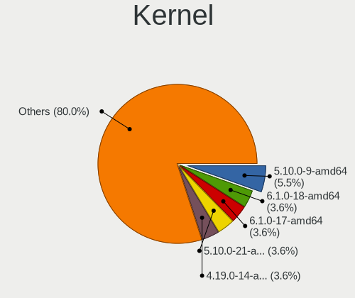

| Version              | Desktops | Percent |
|----------------------|----------|---------|
| 5.10.0-9-amd64       | 4        | 11.43%  |
| 4.19.0-14-amd64      | 4        | 11.43%  |
| 4.19.0-16-amd64      | 3        | 8.57%   |
| 5.10.0-8-amd64       | 2        | 5.71%   |
| 5.10.0-6-amd64       | 2        | 5.71%   |
| 4.19.0-9-amd64       | 2        | 5.71%   |
| 5.9.0-1-amd64        | 1        | 2.86%   |
| 5.7.0-1-amd64        | 1        | 2.86%   |
| 5.7.0-0.bpo.2-amd64  | 1        | 2.86%   |
| 5.15.0-2-amd64       | 1        | 2.86%   |
| 5.10.0-5-amd64       | 1        | 2.86%   |
| 5.10.0-2-amd64       | 1        | 2.86%   |
| 5.10.0-10-amd64      | 1        | 2.86%   |
| 4.9.0-15-amd64       | 1        | 2.86%   |
| 4.9.0-14-686-pae     | 1        | 2.86%   |
| 4.9.0-14-686         | 1        | 2.86%   |
| 4.9.0-11-686-pae     | 1        | 2.86%   |
| 4.19.112             | 1        | 2.86%   |
| 4.19.0-13-amd64      | 1        | 2.86%   |
| 4.19.0-12-amd64      | 1        | 2.86%   |
| 4.19.0-10-amd64      | 1        | 2.86%   |
| 4.19.0-1-amd64       | 1        | 2.86%   |
| 4.19.0-0.bpo.6-amd64 | 1        | 2.86%   |
| 4.18.0-0.bpo.1-amd64 | 1        | 2.86%   |

Kernel Family
-------------

Linux kernel without a distro release

| Version  | Desktops | Percent |
|----------|----------|---------|
| 4.19.0   | 13       | 38.24%  |
| 5.10.0   | 11       | 32.35%  |
| 4.9.0    | 4        | 11.76%  |
| 5.7.0    | 2        | 5.88%   |
| 5.9.0    | 1        | 2.94%   |
| 5.15.0   | 1        | 2.94%   |
| 4.19.112 | 1        | 2.94%   |
| 4.18.0   | 1        | 2.94%   |

Kernel Major Ver.
-----------------

Linux kernel major version

| Version | Desktops | Percent |
|---------|----------|---------|
| 4.19    | 14       | 41.18%  |
| 5.10    | 11       | 32.35%  |
| 4.9     | 4        | 11.76%  |
| 5.7     | 2        | 5.88%   |
| 5.9     | 1        | 2.94%   |
| 5.15    | 1        | 2.94%   |
| 4.18    | 1        | 2.94%   |

Arch
----

OS architecture (x86_64, i586, etc.)

| Name   | Desktops | Percent |
|--------|----------|---------|
| x86_64 | 30       | 90.91%  |
| i686   | 3        | 9.09%   |

DE
--

Desktop Environment

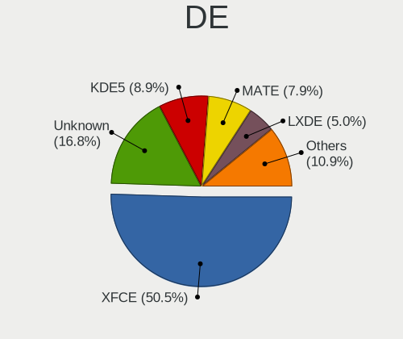

| Name    | Desktops | Percent |
|---------|----------|---------|
| XFCE    | 19       | 55.88%  |
| Unknown | 6        | 17.65%  |
| MATE    | 3        | 8.82%   |
| LXDE    | 2        | 5.88%   |
| KDE5    | 2        | 5.88%   |
| i3      | 1        | 2.94%   |
| awesome | 1        | 2.94%   |

Display Server
--------------

X11 or Wayland

| Name    | Desktops | Percent |
|---------|----------|---------|
| X11     | 28       | 84.85%  |
| Tty     | 4        | 12.12%  |
| Unknown | 1        | 3.03%   |

Display Manager
---------------

SDDM, LightDM, etc.

| Name    | Desktops | Percent |
|---------|----------|---------|
| SLiM    | 18       | 54.55%  |
| Unknown | 7        | 21.21%  |
| LightDM | 6        | 18.18%  |
| XDM     | 1        | 3.03%   |
| NODM    | 1        | 3.03%   |

OS Lang
-------

Language

| Lang    | Desktops | Percent |
|---------|----------|---------|
| en_US   | 8        | 24.24%  |
| fr_FR   | 4        | 12.12%  |
| Unknown | 4        | 12.12%  |
| sk_SK   | 3        | 9.09%   |
| en_GB   | 3        | 9.09%   |
| C       | 3        | 9.09%   |
| ru_RU   | 2        | 6.06%   |
| en_AU   | 2        | 6.06%   |
| pt_BR   | 1        | 3.03%   |
| pl_PL   | 1        | 3.03%   |
| en_NZ   | 1        | 3.03%   |
| en_CA   | 1        | 3.03%   |

Boot Mode
---------

EFI or BIOS

| Mode | Desktops | Percent |
|------|----------|---------|
| BIOS | 26       | 78.79%  |
| EFI  | 7        | 21.21%  |

Filesystem
----------

Type of filesystem

| Type    | Desktops | Percent |
|---------|----------|---------|
| Ext4    | 29       | 87.88%  |
| Overlay | 2        | 6.06%   |
| Ext3    | 1        | 3.03%   |
| Unknown | 1        | 3.03%   |

Part. scheme
------------

Scheme of partitioning

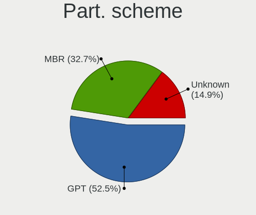

| Type    | Desktops | Percent |
|---------|----------|---------|
| MBR     | 17       | 48.57%  |
| GPT     | 15       | 42.86%  |
| Unknown | 3        | 8.57%   |

Dual Boot with Linux/BSD
------------------------

Hosting more than one Linux/BSD

| Dual boot | Desktops | Percent |
|-----------|----------|---------|
| No        | 21       | 61.76%  |
| Yes       | 13       | 38.24%  |

Dual Boot (Win)
---------------

Hosting Linux and Windows

| Dual boot | Desktops | Percent |
|-----------|----------|---------|
| No        | 23       | 69.7%   |
| Yes       | 10       | 30.3%   |

Board
-----

Vendor
------

Motherboard manufacturer

| Name                | Desktops | Percent |
|---------------------|----------|---------|
| Gigabyte Technology | 10       | 30.3%   |
| ASUSTek Computer    | 7        | 21.21%  |
| ASRock              | 4        | 12.12%  |
| Hewlett-Packard     | 3        | 9.09%   |
| MSI                 | 2        | 6.06%   |
| Sun Microsystems    | 1        | 3.03%   |
| Online Labs         | 1        | 3.03%   |
| Lenovo              | 1        | 3.03%   |
| Intel               | 1        | 3.03%   |
| Google              | 1        | 3.03%   |
| Dell                | 1        | 3.03%   |
| Acer                | 1        | 3.03%   |

Model
-----

Motherboard model

| Name                            | Desktops | Percent |
|---------------------------------|----------|---------|
| Sun Microsystems Ultra 24       | 1        | 3.03%   |
| Online Labs SR                  | 1        | 3.03%   |
| MSI MS-7B53                     | 1        | 3.03%   |
| MSI MS-7A34                     | 1        | 3.03%   |
| Lenovo ThinkStation E20 4220CTO | 1        | 3.03%   |
| Intel D815EEA AAA45884-401      | 1        | 3.03%   |
| HP Z220 SFF Workstation         | 1        | 3.03%   |
| HP EliteDesk 800 G1 DM          | 1        | 3.03%   |
| HP Compaq 8200 Elite SFF PC     | 1        | 3.03%   |
| Google Panther                  | 1        | 3.03%   |
| Gigabyte Z390 GAMING SLI        | 1        | 3.03%   |
| Gigabyte P55A-UD3               | 1        | 3.03%   |
| Gigabyte MZGLKBP-00             | 1        | 3.03%   |
| Gigabyte H310M S2H 2.0          | 1        | 3.03%   |
| Gigabyte H170-HD3-CF            | 1        | 3.03%   |
| Gigabyte H170-HD3               | 1        | 3.03%   |
| Gigabyte GA-G41M-ES2L           | 1        | 3.03%   |
| Gigabyte B75M-D3V               | 1        | 3.03%   |
| Gigabyte B450 AORUS ELITE       | 1        | 3.03%   |
| Gigabyte 970A-DS3P              | 1        | 3.03%   |
| Dell OptiPlex 7010              | 1        | 3.03%   |
| ASUS PRIME Z490M-PLUS           | 1        | 3.03%   |
| ASUS P5PE-VM                    | 1        | 3.03%   |
| ASUS P5G41T-M LX2/BR            | 1        | 3.03%   |
| ASUS Maximus V GENE             | 1        | 3.03%   |
| ASUS F1A55-M LX                 | 1        | 3.03%   |
| ASUS EX-A320M-GAMING            | 1        | 3.03%   |
| ASUS All Series                 | 1        | 3.03%   |
| ASRock K8A780LM                 | 1        | 3.03%   |
| ASRock H81M-ITX                 | 1        | 3.03%   |
| ASRock G31M-VS2                 | 1        | 3.03%   |
| ASRock B450M-HDV R4.0           | 1        | 3.03%   |
| Acer Aspire M1610               | 1        | 3.03%   |

Model Family
------------

Motherboard model prefix

| Name                   | Desktops | Percent |
|------------------------|----------|---------|
| Sun Microsystems Ultra | 1        | 3.03%   |
| Online Labs SR         | 1        | 3.03%   |
| MSI MS-7B53            | 1        | 3.03%   |
| MSI MS-7A34            | 1        | 3.03%   |
| Lenovo ThinkStation    | 1        | 3.03%   |
| Intel D815EEA          | 1        | 3.03%   |
| HP Z220                | 1        | 3.03%   |
| HP EliteDesk           | 1        | 3.03%   |
| HP Compaq              | 1        | 3.03%   |
| Google Panther         | 1        | 3.03%   |
| Gigabyte Z390          | 1        | 3.03%   |
| Gigabyte P55A-UD3      | 1        | 3.03%   |
| Gigabyte MZGLKBP-00    | 1        | 3.03%   |
| Gigabyte H310M         | 1        | 3.03%   |
| Gigabyte H170-HD3-CF   | 1        | 3.03%   |
| Gigabyte H170-HD3      | 1        | 3.03%   |
| Gigabyte GA-G41M-ES2L  | 1        | 3.03%   |
| Gigabyte B75M-D3V      | 1        | 3.03%   |
| Gigabyte B450          | 1        | 3.03%   |
| Gigabyte 970A-DS3P     | 1        | 3.03%   |
| Dell OptiPlex          | 1        | 3.03%   |
| ASUS PRIME             | 1        | 3.03%   |
| ASUS P5PE-VM           | 1        | 3.03%   |
| ASUS P5G41T-M          | 1        | 3.03%   |
| ASUS Maximus           | 1        | 3.03%   |
| ASUS F1A55-M           | 1        | 3.03%   |
| ASUS EX-A320M-GAMING   | 1        | 3.03%   |
| ASUS All               | 1        | 3.03%   |
| ASRock K8A780LM        | 1        | 3.03%   |
| ASRock H81M-ITX        | 1        | 3.03%   |
| ASRock G31M-VS2        | 1        | 3.03%   |
| ASRock B450M-HDV       | 1        | 3.03%   |
| Acer Aspire            | 1        | 3.03%   |

MFG Year
--------

Motherboard manufacture year

| Year | Desktops | Percent |
|------|----------|---------|
| 2018 | 8        | 24.24%  |
| 2014 | 4        | 12.12%  |
| 2013 | 3        | 9.09%   |
| 2012 | 3        | 9.09%   |
| 2017 | 2        | 6.06%   |
| 2015 | 2        | 6.06%   |
| 2011 | 2        | 6.06%   |
| 2009 | 2        | 6.06%   |
| 2020 | 1        | 3.03%   |
| 2019 | 1        | 3.03%   |
| 2010 | 1        | 3.03%   |
| 2008 | 1        | 3.03%   |
| 2007 | 1        | 3.03%   |
| 2006 | 1        | 3.03%   |
| 2000 | 1        | 3.03%   |

Form Factor
-----------

Physical design of the computer

| Name    | Desktops | Percent |
|---------|----------|---------|
| Desktop | 33       | 100%    |

Secure Boot
-----------

Enabled or disabled

| State    | Desktops | Percent |
|----------|----------|---------|
| Disabled | 33       | 100%    |

Coreboot
--------

Have coreboot on board

| Used | Desktops | Percent |
|------|----------|---------|
| No   | 31       | 93.94%  |
| Yes  | 2        | 6.06%   |

RAM Size
--------

Total RAM memory

| Size in GB | Desktops | Percent |
|------------|----------|---------|
| 16.01-24.0 | 9        | 27.27%  |
| 8.01-16.0  | 9        | 27.27%  |
| 4.01-8.0   | 5        | 15.15%  |
| 32.01-64.0 | 5        | 15.15%  |
| 1.01-2.0   | 3        | 9.09%   |
| 3.01-4.0   | 1        | 3.03%   |
| 0.01-0.5   | 1        | 3.03%   |

RAM Used
--------

Used RAM memory

| Used GB   | Desktops | Percent |
|-----------|----------|---------|
| 1.01-2.0  | 9        | 27.27%  |
| 4.01-8.0  | 7        | 21.21%  |
| 0.51-1.0  | 7        | 21.21%  |
| 2.01-3.0  | 4        | 12.12%  |
| 3.01-4.0  | 3        | 9.09%   |
| 8.01-16.0 | 2        | 6.06%   |
| 0.01-0.5  | 1        | 3.03%   |

Total Drives
------------

Number of drives on board

| Drives | Desktops | Percent |
|--------|----------|---------|
| 1      | 13       | 39.39%  |
| 3      | 7        | 21.21%  |
| 4      | 5        | 15.15%  |
| 2      | 5        | 15.15%  |
| 5      | 3        | 9.09%   |

Has CD-ROM
----------

Has CD-ROM on board

| Presented | Desktops | Percent |
|-----------|----------|---------|
| No        | 23       | 69.7%   |
| Yes       | 10       | 30.3%   |

Has Ethernet
------------

Has Ethernet on board

| Presented | Desktops | Percent |
|-----------|----------|---------|
| Yes       | 32       | 96.97%  |
| No        | 1        | 3.03%   |

Has WiFi
--------

Has WiFi module

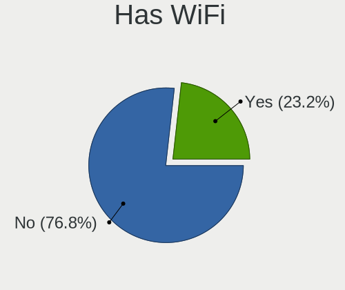

| Presented | Desktops | Percent |
|-----------|----------|---------|
| No        | 28       | 82.35%  |
| Yes       | 6        | 17.65%  |

Has Bluetooth
-------------

Has Bluetooth module

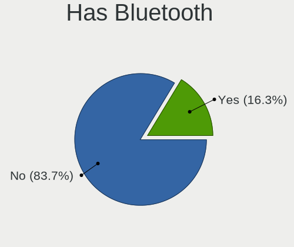

| Presented | Desktops | Percent |
|-----------|----------|---------|
| No        | 29       | 87.88%  |
| Yes       | 4        | 12.12%  |

Location
--------

Country
-------

Geographic location (country)

| Country     | Desktops | Percent |
|-------------|----------|---------|
| France      | 6        | 18.18%  |
| Russia      | 4        | 12.12%  |
| Ukraine     | 3        | 9.09%   |
| Slovakia    | 3        | 9.09%   |
| USA         | 2        | 6.06%   |
| Poland      | 2        | 6.06%   |
| Netherlands | 2        | 6.06%   |
| Australia   | 2        | 6.06%   |
| UK          | 1        | 3.03%   |
| South Korea | 1        | 3.03%   |
| Puerto Rico | 1        | 3.03%   |
| New Zealand | 1        | 3.03%   |
| Israel      | 1        | 3.03%   |
| Canada      | 1        | 3.03%   |
| Brazil      | 1        | 3.03%   |
| Belgium     | 1        | 3.03%   |
| Argentina   | 1        | 3.03%   |

City
----

Geographic location (city)

| City           | Desktops | Percent |
|----------------|----------|---------|
| Bratislava     | 3        | 9.09%   |
| Bagnolet       | 3        | 9.09%   |
| Volzhskiy      | 2        | 6.06%   |
| Ryde           | 2        | 6.06%   |
| Zeist          | 1        | 3.03%   |
| Wroclaw        | 1        | 3.03%   |
| Wageningen     | 1        | 3.03%   |
| Toronto        | 1        | 3.03%   |
| Tel Aviv       | 1        | 3.03%   |
| Seongbuk-gu    | 1        | 3.03%   |
| Saint-Herblain | 1        | 3.03%   |
| Rio de Janeiro | 1        | 3.03%   |
| Poperinge      | 1        | 3.03%   |
| Paris          | 1        | 3.03%   |
| Oleksandriya   | 1        | 3.03%   |
| Nérac         | 1        | 3.03%   |
| Mozdok         | 1        | 3.03%   |
| Miedziana Gora | 1        | 3.03%   |
| Miami          | 1        | 3.03%   |
| Kyiv           | 1        | 3.03%   |
| Kirov          | 1        | 3.03%   |
| Great Bend     | 1        | 3.03%   |
| Donetsk        | 1        | 3.03%   |
| Coghlan        | 1        | 3.03%   |
| Caguas         | 1        | 3.03%   |
| Bradford       | 1        | 3.03%   |
| Auckland       | 1        | 3.03%   |

Drives
------

Drive Vendor
------------

Hard drive vendors

| Vendor              | Desktops | Drives | Percent |
|---------------------|----------|--------|---------|
| WDC                 | 14       | 22     | 22.58%  |
| Seagate             | 13       | 21     | 20.97%  |
| Kingston            | 7        | 8      | 11.29%  |
| Toshiba             | 4        | 4      | 6.45%   |
| Samsung Electronics | 4        | 5      | 6.45%   |
| Crucial             | 3        | 4      | 4.84%   |
| Netac               | 2        | 2      | 3.23%   |
| DOGFISH             | 2        | 2      | 3.23%   |
| A-DATA Technology   | 2        | 2      | 3.23%   |
| WD MediaMax         | 1        | 1      | 1.61%   |
| Transcend           | 1        | 2      | 1.61%   |
| Micron Technology   | 1        | 1      | 1.61%   |
| MAXTOR              | 1        | 1      | 1.61%   |
| KingDian            | 1        | 1      | 1.61%   |
| IBM/Hitachi         | 1        | 1      | 1.61%   |
| Hitachi             | 1        | 1      | 1.61%   |
| HGST                | 1        | 1      | 1.61%   |
| Hewlett-Packard     | 1        | 2      | 1.61%   |
| GOODRAM             | 1        | 1      | 1.61%   |
| Fujitsu             | 1        | 1      | 1.61%   |

Drive Model
-----------

Hard drive models

| Model                               | Desktops | Percent |
|-------------------------------------|----------|---------|
| Kingston SA2000M8250G 250GB         | 3        | 4.11%   |
| WDC WD10EARX-00N0YB0 1TB            | 2        | 2.74%   |
| Seagate ST2000DX002-2DV164 2TB      | 2        | 2.74%   |
| Samsung SSD 860 EVO 250GB           | 2        | 2.74%   |
| Kingston SA400S37120G 120GB SSD     | 2        | 2.74%   |
| WDC WDS480G2G0A-00JH30 480GB SSD    | 1        | 1.37%   |
| WDC WDS120G2G0A-00JH30 120GB SSD    | 1        | 1.37%   |
| WDC WD800BB-00JHC0 80GB             | 1        | 1.37%   |
| WDC WD5001AALS-00L3B2 500GB         | 1        | 1.37%   |
| WDC WD5001AALS-00E3A0 500GB         | 1        | 1.37%   |
| WDC WD5000BPVT-24HXZT3 500GB        | 1        | 1.37%   |
| WDC WD40EFRX-68WT0N0 4TB            | 1        | 1.37%   |
| WDC WD20PURZ-85GU6Y0 2TB            | 1        | 1.37%   |
| WDC WD20EZRX-00D8PB0 2TB            | 1        | 1.37%   |
| WDC WD20EFRX-68EUZN0 2TB            | 1        | 1.37%   |
| WDC WD1200JS-55NCB1 120GB           | 1        | 1.37%   |
| WDC WD10EZRX-00D8PB0 1TB            | 1        | 1.37%   |
| WDC WD10EZEX-75M2NA0 1TB            | 1        | 1.37%   |
| WDC WD10EZEX-22MFCA0 1TB            | 1        | 1.37%   |
| WDC WD10EZEX-22BN5A0 1TB            | 1        | 1.37%   |
| WDC WD10EZEX-08WN4A0 1TB            | 1        | 1.37%   |
| WDC WD10EURX-63FH1Y0 1TB            | 1        | 1.37%   |
| WD MediaMax WL500GSA3272 500GB      | 1        | 1.37%   |
| Transcend TS128GSSD370S 128GB       | 1        | 1.37%   |
| Toshiba MQ04ABF100 1TB              | 1        | 1.37%   |
| Toshiba MQ02ABF100 1TB              | 1        | 1.37%   |
| Toshiba HDWD110 1TB                 | 1        | 1.37%   |
| Toshiba DT01ACA100 1TB              | 1        | 1.37%   |
| Seagate ST8000DM004-2CX188 8TB      | 1        | 1.37%   |
| Seagate ST750LX003-1AC154 752GB     | 1        | 1.37%   |
| Seagate ST500DM002-1BD142 500GB     | 1        | 1.37%   |
| Seagate ST4000VN008-2DR166 4TB      | 1        | 1.37%   |
| Seagate ST4000DM005-2DP166 4TB      | 1        | 1.37%   |
| Seagate ST350063 0NS 500GB          | 1        | 1.37%   |
| Seagate ST3500418AS 500GB           | 1        | 1.37%   |
| Seagate ST340014A 40GB              | 1        | 1.37%   |
| Seagate ST3300555SS 304GB           | 1        | 1.37%   |
| Seagate ST320LM001 HN-M320MBB 320GB | 1        | 1.37%   |
| Seagate ST3160815A 160GB            | 1        | 1.37%   |
| Seagate ST3160813AS 160GB           | 1        | 1.37%   |
| Seagate ST2000DM006-2DM164 2TB      | 1        | 1.37%   |
| Seagate ST1000LM035-1RK172 1TB      | 1        | 1.37%   |
| Seagate ST1000DM003-1SB102 1TB      | 1        | 1.37%   |
| Seagate BUP Ultra Touch 2TB         | 1        | 1.37%   |
| Samsung SSD 860 EVO 500G            | 1        | 1.37%   |
| Samsung SSD 850 EVO 250GB           | 1        | 1.37%   |
| Netac SSD 720GB                     | 1        | 1.37%   |
| Netac SSD 512GB                     | 1        | 1.37%   |
| Micron 1100_MTFDDAK2T0TBN 2TB SSD   | 1        | 1.37%   |
| MAXTOR 6E040L0 41GB                 | 1        | 1.37%   |
| Kingston SV300S37A120G 120GB SSD    | 1        | 1.37%   |
| Kingston SA400S37960G 960GB SSD     | 1        | 1.37%   |
| Kingston SA2000M8500G 500GB         | 1        | 1.37%   |
| KingDian S400 480GB SSD             | 1        | 1.37%   |
| IBM/Hitachi IC25N030ATCS04-0 32GB   | 1        | 1.37%   |
| Hitachi HDS721616PLA380 164GB       | 1        | 1.37%   |
| HGST HTE721010A9E630 1TB            | 1        | 1.37%   |
| HP VB0250EAVER 250GB                | 1        | 1.37%   |
| GOODRAM SSDPR-CX400-128 128GB       | 1        | 1.37%   |
| Fujitsu MHV2060BH PL 64GB           | 1        | 1.37%   |

HDD Vendor
----------

Hard disk drive vendors

| Vendor          | Desktops | Drives | Percent |
|-----------------|----------|--------|---------|
| Seagate         | 13       | 21     | 37.14%  |
| WDC             | 12       | 20     | 34.29%  |
| Toshiba         | 4        | 4      | 11.43%  |
| MAXTOR          | 1        | 1      | 2.86%   |
| IBM/Hitachi     | 1        | 1      | 2.86%   |
| Hitachi         | 1        | 1      | 2.86%   |
| HGST            | 1        | 1      | 2.86%   |
| Hewlett-Packard | 1        | 2      | 2.86%   |
| Fujitsu         | 1        | 1      | 2.86%   |

SSD Vendor
----------

Solid state drive vendors

| Vendor              | Desktops | Drives | Percent |
|---------------------|----------|--------|---------|
| Samsung Electronics | 4        | 5      | 19.05%  |
| Kingston            | 4        | 4      | 19.05%  |
| WDC                 | 2        | 2      | 9.52%   |
| Netac               | 2        | 2      | 9.52%   |
| Dogfish             | 2        | 2      | 9.52%   |
| A-DATA Technology   | 2        | 2      | 9.52%   |
| Transcend           | 1        | 2      | 4.76%   |
| Micron Technology   | 1        | 1      | 4.76%   |
| KingDian            | 1        | 1      | 4.76%   |
| GOODRAM             | 1        | 1      | 4.76%   |
| Crucial             | 1        | 1      | 4.76%   |

Drive Kind
----------

HDD or SSD

| Kind    | Desktops | Drives | Percent |
|---------|----------|--------|---------|
| HDD     | 28       | 52     | 53.85%  |
| SSD     | 18       | 23     | 34.62%  |
| NVMe    | 5        | 7      | 9.62%   |
| Unknown | 1        | 1      | 1.92%   |

Drive Connector
---------------

SATA, SAS, NVMe, etc.

| Type | Desktops | Drives | Percent |
|------|----------|--------|---------|
| SATA | 33       | 70     | 80.49%  |
| NVMe | 5        | 7      | 12.2%   |
| SAS  | 3        | 6      | 7.32%   |

Drive Size
----------

Size of hard drive

| Size in TB | Desktops | Drives | Percent |
|------------|----------|--------|---------|
| 0.01-0.5   | 23       | 41     | 51.11%  |
| 0.51-1.0   | 13       | 20     | 28.89%  |
| 1.01-2.0   | 5        | 10     | 11.11%  |
| 3.01-4.0   | 3        | 3      | 6.67%   |
| 4.01-10.0  | 1        | 1      | 2.22%   |

Space Total
-----------

Amount of disk space available on the file system

| Size in GB     | Desktops | Percent |
|----------------|----------|---------|
| 251-500        | 8        | 22.86%  |
| 1001-2000      | 7        | 20%     |
| 501-1000       | 5        | 14.29%  |
| 101-250        | 4        | 11.43%  |
| More than 3000 | 3        | 8.57%   |
| 21-50          | 3        | 8.57%   |
| 51-100         | 2        | 5.71%   |
| Unknown        | 2        | 5.71%   |
| 1-20           | 1        | 2.86%   |

Space Used
----------

Amount of used disk space

| Used GB        | Desktops | Percent |
|----------------|----------|---------|
| 101-250        | 12       | 34.29%  |
| 1-20           | 7        | 20%     |
| 21-50          | 4        | 11.43%  |
| 1001-2000      | 4        | 11.43%  |
| 501-1000       | 3        | 8.57%   |
| Unknown        | 2        | 5.71%   |
| More than 3000 | 1        | 2.86%   |
| 251-500        | 1        | 2.86%   |
| 51-100         | 1        | 2.86%   |

Malfunc. Drives
---------------

Drive models with a malfunction

| Model                             | Desktops | Drives | Percent |
|-----------------------------------|----------|--------|---------|
| WDC WD5000BPVT-24HXZT3 500GB      | 1        | 1      | 10%     |
| WDC WD10EARX-00N0YB0 1TB          | 1        | 1      | 10%     |
| Toshiba MQ04ABF100 1TB            | 1        | 1      | 10%     |
| Toshiba MQ02ABF100 1TB            | 1        | 1      | 10%     |
| MAXTOR 6E040L0 41GB               | 1        | 1      | 10%     |
| Kingston SA400S37120G 120GB SSD   | 1        | 1      | 10%     |
| Hitachi HDS721616PLA380 164GB     | 1        | 1      | 10%     |
| HGST HTE721010A9E630 1TB          | 1        | 1      | 10%     |
| Hewlett-Packard VB0250EAVER 250GB | 1        | 2      | 10%     |
| Fujitsu MHV2060BH PL 64GB         | 1        | 1      | 10%     |

Malfunc. Drive Vendor
---------------------

Vendors of faulty drives

| Vendor          | Desktops | Drives | Percent |
|-----------------|----------|--------|---------|
| WDC             | 2        | 2      | 20%     |
| Toshiba         | 2        | 2      | 20%     |
| MAXTOR          | 1        | 1      | 10%     |
| Kingston        | 1        | 1      | 10%     |
| Hitachi         | 1        | 1      | 10%     |
| HGST            | 1        | 1      | 10%     |
| Hewlett-Packard | 1        | 2      | 10%     |
| Fujitsu         | 1        | 1      | 10%     |

Malfunc. HDD Vendor
-------------------

Vendors of faulty HDD drives

| Vendor          | Desktops | Drives | Percent |
|-----------------|----------|--------|---------|
| WDC             | 2        | 2      | 22.22%  |
| Toshiba         | 2        | 2      | 22.22%  |
| MAXTOR          | 1        | 1      | 11.11%  |
| Hitachi         | 1        | 1      | 11.11%  |
| HGST            | 1        | 1      | 11.11%  |
| Hewlett-Packard | 1        | 2      | 11.11%  |
| Fujitsu         | 1        | 1      | 11.11%  |

Malfunc. Drive Kind
-------------------

Kinds of faulty drives

| Kind | Desktops | Drives | Percent |
|------|----------|--------|---------|
| HDD  | 9        | 10     | 90%     |
| SSD  | 1        | 1      | 10%     |

Failed Drives
-------------

Failed drive models

Zero info for selected period =(

Failed Drive Vendor
-------------------

Failed drive vendors

Zero info for selected period =(

Drive Status
------------

Number of failed and malfunc. drives

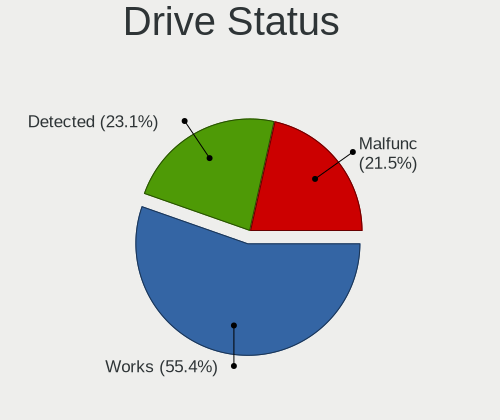

| Status   | Desktops | Drives | Percent |
|----------|----------|--------|---------|
| Works    | 22       | 54     | 53.66%  |
| Detected | 10       | 18     | 24.39%  |
| Malfunc  | 9        | 11     | 21.95%  |

Storage controller
------------------

Storage Vendor
--------------

Storage controller vendors

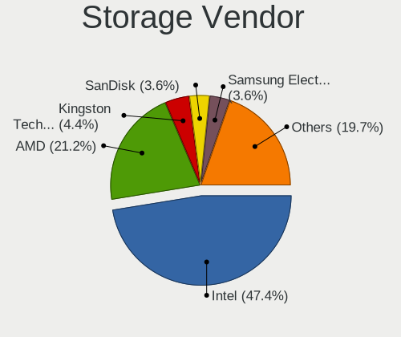

| Vendor                           | Desktops | Percent |
|----------------------------------|----------|---------|
| Intel                            | 25       | 55.56%  |
| AMD                              | 7        | 15.56%  |
| Kingston Technology Company      | 4        | 8.89%   |
| Micron/Crucial Technology        | 2        | 4.44%   |
| Marvell Technology Group         | 2        | 4.44%   |
| Silicon Integrated Systems [SiS] | 1        | 2.22%   |
| Integrated Technology Express    | 1        | 2.22%   |
| Broadcom / LSI                   | 1        | 2.22%   |
| ASMedia Technology               | 1        | 2.22%   |
| Adaptec                          | 1        | 2.22%   |

Storage Model
-------------

Storage controller models

| Model                                                                          | Desktops | Percent |
|--------------------------------------------------------------------------------|----------|---------|
| Kingston Company A2000 NVMe SSD                                                | 4        | 7.27%   |
| AMD FCH SATA Controller [AHCI mode]                                            | 4        | 7.27%   |
| Intel NM10/ICH7 Family SATA Controller [IDE mode]                              | 3        | 5.45%   |
| Intel 82801G (ICH7 Family) IDE Controller                                      | 3        | 5.45%   |
| Intel 8 Series/C220 Series Chipset Family 6-port SATA Controller 1 [AHCI mode] | 3        | 5.45%   |
| Intel 7 Series/C210 Series Chipset Family 6-port SATA Controller [AHCI mode]   | 3        | 5.45%   |
| Micron/Crucial P2 NVMe PCIe SSD                                                | 2        | 3.64%   |
| Intel SATA Controller [RAID mode]                                              | 2        | 3.64%   |
| Intel Cannon Lake PCH SATA AHCI Controller                                     | 2        | 3.64%   |
| Intel 5 Series/3400 Series Chipset 6 port SATA AHCI Controller                 | 2        | 3.64%   |
| AMD SB7x0/SB8x0/SB9x0 SATA Controller [AHCI mode]                              | 2        | 3.64%   |
| AMD 400 Series Chipset SATA Controller                                         | 2        | 3.64%   |
| Silicon Integrated Systems [SiS] SATA Controller / IDE mode                    | 1        | 1.82%   |
| Silicon Integrated Systems [SiS] 5513 IDE Controller                           | 1        | 1.82%   |
| Marvell Group 88SE9215 PCIe 2.0 x1 4-port SATA 6 Gb/s Controller               | 1        | 1.82%   |
| Marvell Group 88SE9128 PCIe SATA 6 Gb/s RAID controller                        | 1        | 1.82%   |
| Intel Q170/Q150/B150/H170/H110/Z170/CM236 Chipset SATA Controller [AHCI Mode]  | 1        | 1.82%   |
| Intel Comet Lake SATA AHCI Controller                                          | 1        | 1.82%   |
| Intel Celeron/Pentium Silver Processor SATA Controller                         | 1        | 1.82%   |
| Intel Atom processor C2000 AHCI SATA3 Controller                               | 1        | 1.82%   |
| Intel 82801IR/IO/IH (ICH9R/DO/DH) 6 port SATA Controller [AHCI mode]           | 1        | 1.82%   |
| Intel 82801EB/ER (ICH5/ICH5R) IDE Controller                                   | 1        | 1.82%   |
| Intel 82801BA IDE U100 Controller                                              | 1        | 1.82%   |
| Intel 8 Series SATA Controller 1 [AHCI mode]                                   | 1        | 1.82%   |
| Intel 6 Series/C200 Series Chipset Family 6 port Desktop SATA AHCI Controller  | 1        | 1.82%   |
| Intel 200 Series PCH SATA controller [AHCI mode]                               | 1        | 1.82%   |
| Integrated Express IT8213 IDE Controller                                       | 1        | 1.82%   |
| Broadcom / LSI SAS1068E PCI-Express Fusion-MPT SAS                             | 1        | 1.82%   |
| ASMedia ASM1062 Serial ATA Controller                                          | 1        | 1.82%   |
| AMD SB7x0/SB8x0/SB9x0 IDE Controller                                           | 1        | 1.82%   |
| AMD FCH SATA Controller [IDE mode]                                             | 1        | 1.82%   |
| AMD FCH SATA Controller D                                                      | 1        | 1.82%   |
| AMD FCH IDE Controller                                                         | 1        | 1.82%   |
| AMD 300 Series Chipset SATA Controller                                         | 1        | 1.82%   |
| Adaptec AIC-7870P/7881U [AHA-2940U/UW/D/S76]                                   | 1        | 1.82%   |

Storage Kind
------------

Kind of storage controller (IDE, SATA, NVMe, SAS, ...)

| Kind | Desktops | Percent |
|------|----------|---------|
| SATA | 25       | 59.52%  |
| IDE  | 9        | 21.43%  |
| NVMe | 5        | 11.9%   |
| RAID | 2        | 4.76%   |
| SCSI | 1        | 2.38%   |

Processor
---------

CPU Vendor
----------

Processor vendors

| Vendor | Desktops | Percent |
|--------|----------|---------|
| Intel  | 26       | 78.79%  |
| AMD    | 7        | 21.21%  |

CPU Model
---------

Processor models

| Model                                       | Desktops | Percent |
|---------------------------------------------|----------|---------|
| Intel Core i5-9400F CPU @ 2.90GHz           | 2        | 5.88%   |
| Intel Core i5-6400 CPU @ 2.70GHz            | 2        | 5.88%   |
| Intel Core 2 Duo CPU E8400 @ 3.00GHz        | 2        | 5.88%   |
| AMD Ryzen 5 1600 Six-Core Processor         | 2        | 5.88%   |
| Intel Xeon CPU X3460 @ 2.80GHz              | 1        | 2.94%   |
| Intel Xeon CPU E3-1270 V2 @ 3.50GHz         | 1        | 2.94%   |
| Intel Xeon CPU E3-1226 v3 @ 3.30GHz         | 1        | 2.94%   |
| Intel Pentium Silver J5005 CPU @ 1.50GHz    | 1        | 2.94%   |
| Intel Pentium Gold G5420 CPU @ 3.80GHz      | 1        | 2.94%   |
| Intel Pentium Dual-Core CPU E6300 @ 2.80GHz | 1        | 2.94%   |
| Intel Pentium Dual CPU E2160 @ 1.80GHz      | 1        | 2.94%   |
| Intel Pentium CPU G3240 @ 3.10GHz           | 1        | 2.94%   |
| Intel Pentium 4 CPU 3.00GHz                 | 1        | 2.94%   |
| Intel Core i9-10850K CPU @ 3.60GHz          | 1        | 2.94%   |
| Intel Core i7-4600U CPU @ 2.10GHz           | 1        | 2.94%   |
| Intel Core i7-3770 CPU @ 3.40GHz            | 1        | 2.94%   |
| Intel Core i5-4590T CPU @ 2.00GHz           | 1        | 2.94%   |
| Intel Core i5-3470 CPU @ 3.20GHz            | 1        | 2.94%   |
| Intel Core i5-2500K CPU @ 3.30GHz           | 1        | 2.94%   |
| Intel Core i5-2500 CPU @ 3.30GHz            | 1        | 2.94%   |
| Intel Core i5 CPU 750 @ 2.67GHz             | 1        | 2.94%   |
| Intel Core 2 Quad CPU Q9550 @ 2.83GHz       | 1        | 2.94%   |
| Intel Core 2 Duo CPU E7500 @ 2.93GHz        | 1        | 2.94%   |
| Intel Celeron (Coppermine)                  | 1        | 2.94%   |
| Intel Atom CPU C2750 @ 2.40GHz              | 1        | 2.94%   |
| AMD Sempron Processor 2800+                 | 1        | 2.94%   |
| AMD Ryzen 5 3600 6-Core Processor           | 1        | 2.94%   |
| AMD Ryzen 3 3200G with Radeon Vega Graphics | 1        | 2.94%   |
| AMD FX-8300 Eight-Core Processor            | 1        | 2.94%   |
| AMD A4-3300 APU with Radeon HD Graphics     | 1        | 2.94%   |

CPU Model Family
----------------

Processor model prefix

| Model                   | Desktops | Percent |
|-------------------------|----------|---------|
| Intel Core i5           | 9        | 26.47%  |
| Intel Xeon              | 3        | 8.82%   |
| Intel Core 2 Duo        | 3        | 8.82%   |
| AMD Ryzen 5             | 3        | 8.82%   |
| Intel Core i7           | 2        | 5.88%   |
| Intel Pentium Silver    | 1        | 2.94%   |
| Intel Pentium Gold      | 1        | 2.94%   |
| Intel Pentium Dual-Core | 1        | 2.94%   |
| Intel Pentium Dual      | 1        | 2.94%   |
| Intel Pentium 4         | 1        | 2.94%   |
| Intel Pentium           | 1        | 2.94%   |
| Intel Core i9           | 1        | 2.94%   |
| Intel Core 2 Quad       | 1        | 2.94%   |
| Intel Celeron           | 1        | 2.94%   |
| Intel Atom              | 1        | 2.94%   |
| AMD Sempron             | 1        | 2.94%   |
| AMD Ryzen 3             | 1        | 2.94%   |
| AMD FX                  | 1        | 2.94%   |
| AMD A4                  | 1        | 2.94%   |

CPU Cores
---------

Number of processor cores

| Number | Desktops | Percent |
|--------|----------|---------|
| 4      | 15       | 45.45%  |
| 2      | 8        | 24.24%  |
| 6      | 5        | 15.15%  |
| 1      | 3        | 9.09%   |
| 10     | 1        | 3.03%   |
| 8      | 1        | 3.03%   |

CPU Sockets
-----------

Number of sockets

| Number | Desktops | Percent |
|--------|----------|---------|
| 1      | 33       | 100%    |

CPU Threads
-----------

Threads per core (Hyper-Threading)

| Number | Desktops | Percent |
|--------|----------|---------|
| 1      | 22       | 66.67%  |
| 2      | 11       | 33.33%  |

CPU Op-Modes
------------

CPU Operation Modes (32-bit, 64-bit)

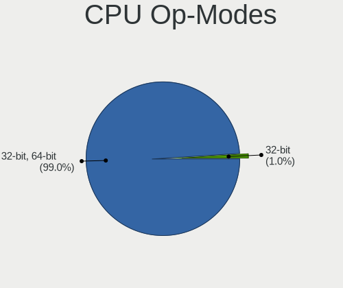

| Op mode        | Desktops | Percent |
|----------------|----------|---------|
| 32-bit, 64-bit | 32       | 96.97%  |
| 32-bit         | 1        | 3.03%   |

CPU Microcode
-------------

Microcode number

| Number     | Desktops | Percent |
|------------|----------|---------|
| Unknown    | 8        | 23.53%  |
| 0x306a9    | 3        | 8.82%   |
| 0x1067a    | 3        | 8.82%   |
| 0x906ea    | 2        | 5.88%   |
| 0x306c3    | 2        | 5.88%   |
| 0x206a7    | 2        | 5.88%   |
| 0xf49      | 1        | 2.94%   |
| 0xa0655    | 1        | 2.94%   |
| 0x706a1    | 1        | 2.94%   |
| 0x6fd      | 1        | 2.94%   |
| 0x686      | 1        | 2.94%   |
| 0x506e3    | 1        | 2.94%   |
| 0x406d8    | 1        | 2.94%   |
| 0x40651    | 1        | 2.94%   |
| 0x106e5    | 1        | 2.94%   |
| 0x10676    | 1        | 2.94%   |
| 0x08701013 | 1        | 2.94%   |
| 0x08001138 | 1        | 2.94%   |
| 0x08001129 | 1        | 2.94%   |
| 0x03000027 | 1        | 2.94%   |

CPU Microarch
-------------

Microarchitecture

| Name          | Desktops | Percent |
|---------------|----------|---------|
| Penryn        | 4        | 12.12%  |
| Haswell       | 4        | 12.12%  |
| KabyLake      | 3        | 9.09%   |
| IvyBridge     | 3        | 9.09%   |
| Zen           | 2        | 6.06%   |
| Skylake       | 2        | 6.06%   |
| SandyBridge   | 2        | 6.06%   |
| Nehalem       | 2        | 6.06%   |
| Zen+          | 1        | 3.03%   |
| Zen 2         | 1        | 3.03%   |
| Silvermont    | 1        | 3.03%   |
| Piledriver    | 1        | 3.03%   |
| P6            | 1        | 3.03%   |
| NetBurst      | 1        | 3.03%   |
| K8 Hammer     | 1        | 3.03%   |
| K10 Llano     | 1        | 3.03%   |
| Goldmont plus | 1        | 3.03%   |
| Core          | 1        | 3.03%   |
| CometLake     | 1        | 3.03%   |

Graphics
--------

GPU Vendor
----------

Vendors of graphics cards

| Vendor                           | Desktops | Percent |
|----------------------------------|----------|---------|
| Nvidia                           | 12       | 36.36%  |
| Intel                            | 11       | 33.33%  |
| AMD                              | 9        | 27.27%  |
| Silicon Integrated Systems [SiS] | 1        | 3.03%   |

GPU Model
---------

Graphics card models

| Model                                                                       | Desktops | Percent |
|-----------------------------------------------------------------------------|----------|---------|
| Nvidia GP106 [GeForce GTX 1060 3GB]                                         | 3        | 8.33%   |
| Nvidia G96CGL [Quadro FX 580]                                               | 2        | 5.56%   |
| Intel Xeon E3-1200 v3/4th Gen Core Processor Integrated Graphics Controller | 2        | 5.56%   |
| AMD Cedar [Radeon HD 5000/6000/7350/8350 Series]                            | 2        | 5.56%   |
| Silicon Integrated Systems [SiS] 771/671 PCIE VGA Display Adapter           | 1        | 2.78%   |
| Nvidia GT218 [GeForce 8400 GS Rev. 3]                                       | 1        | 2.78%   |
| Nvidia GP107 [GeForce GTX 1050 Ti]                                          | 1        | 2.78%   |
| Nvidia GP106 [GeForce GTX 1060 6GB]                                         | 1        | 2.78%   |
| Nvidia GK208B [GeForce GT 730]                                              | 1        | 2.78%   |
| Nvidia GK208B [GeForce GT 710]                                              | 1        | 2.78%   |
| Nvidia GK106 [GeForce GTX 650 Ti]                                           | 1        | 2.78%   |
| Nvidia GA104 [GeForce RTX 3060 Ti]                                          | 1        | 2.78%   |
| Intel Xeon E3-1200 v2/3rd Gen Core processor Graphics Controller            | 1        | 2.78%   |
| Intel IvyBridge GT2 [HD Graphics 4000]                                      | 1        | 2.78%   |
| Intel Haswell-ULT Integrated Graphics Controller                            | 1        | 2.78%   |
| Intel GeminiLake [UHD Graphics 605]                                         | 1        | 2.78%   |
| Intel CometLake-S GT2 [UHD Graphics 630]                                    | 1        | 2.78%   |
| Intel CoffeeLake-S GT1 [UHD Graphics 610]                                   | 1        | 2.78%   |
| Intel 82G33/G31 Express Integrated Graphics Controller                      | 1        | 2.78%   |
| Intel 4 Series Chipset Integrated Graphics Controller                       | 1        | 2.78%   |
| Intel 2nd Generation Core Processor Family Integrated Graphics Controller   | 1        | 2.78%   |
| AMD RV350 [Radeon 9550] (Secondary)                                         | 1        | 2.78%   |
| AMD RV350 [Radeon 9550]                                                     | 1        | 2.78%   |
| AMD RV100 [Radeon 7000 / Radeon VE]                                         | 1        | 2.78%   |
| AMD RS780L [Radeon 3000]                                                    | 1        | 2.78%   |
| AMD R350 [Radeon 9800 Series]                                               | 1        | 2.78%   |
| AMD R350 [Radeon 9800 PRO] (Secondary)                                      | 1        | 2.78%   |
| AMD Picasso/Raven 2 [Radeon Vega Series / Radeon Vega Mobile Series]        | 1        | 2.78%   |
| AMD Ellesmere [Radeon RX 470/480/570/570X/580/580X/590]                     | 1        | 2.78%   |
| AMD Curacao XT / Trinidad XT [Radeon R7 370 / R9 270X/370X]                 | 1        | 2.78%   |
| AMD Baffin [Radeon RX 550 640SP / RX 560/560X]                              | 1        | 2.78%   |

GPU Combo
---------

Combinations of graphics cards

| Name       | Desktops | Percent |
|------------|----------|---------|
| 1 x Nvidia | 12       | 36.36%  |
| 1 x Intel  | 10       | 30.3%   |
| 1 x AMD    | 8        | 24.24%  |
| Other      | 1        | 3.03%   |
| 2 x AMD    | 1        | 3.03%   |
| 1 x SiS    | 1        | 3.03%   |

GPU Driver
----------

Free vs proprietary

| Driver      | Desktops | Percent |
|-------------|----------|---------|
| Free        | 23       | 67.65%  |
| Proprietary | 8        | 23.53%  |
| Unknown     | 3        | 8.82%   |

GPU Memory
----------

Total video memory

| Size in GB | Desktops | Percent |
|------------|----------|---------|
| Unknown    | 12       | 36.36%  |
| 0.01-0.5   | 7        | 21.21%  |
| 0.51-1.0   | 4        | 12.12%  |
| 3.01-4.0   | 3        | 9.09%   |
| 2.01-3.0   | 3        | 9.09%   |
| 7.01-8.0   | 2        | 6.06%   |
| 5.01-6.0   | 1        | 3.03%   |
| 1.01-2.0   | 1        | 3.03%   |

Monitor
-------

Monitor Vendor
--------------

Monitor vendors

| Vendor               | Desktops | Percent |
|----------------------|----------|---------|
| Samsung Electronics  | 10       | 28.57%  |
| Philips              | 3        | 8.57%   |
| Hewlett-Packard      | 3        | 8.57%   |
| Goldstar             | 3        | 8.57%   |
| AOC                  | 3        | 8.57%   |
| Iiyama               | 2        | 5.71%   |
| Acer                 | 2        | 5.71%   |
| ViewSonic            | 1        | 2.86%   |
| Toshiba              | 1        | 2.86%   |
| Lenovo               | 1        | 2.86%   |
| HJW                  | 1        | 2.86%   |
| eMachines            | 1        | 2.86%   |
| Eizo                 | 1        | 2.86%   |
| Dell                 | 1        | 2.86%   |
| CVT                  | 1        | 2.86%   |
| Ancor Communications | 1        | 2.86%   |

Monitor Model
-------------

Monitor models

| Model                                                                  | Desktops | Percent |
|------------------------------------------------------------------------|----------|---------|
| Samsung Electronics SyncMaster SAM0091 1600x1200 432x324mm 21.3-inch   | 2        | 5.13%   |
| ViewSonic VA2261 VSC0F30 1920x1080 477x268mm 21.5-inch                 | 1        | 2.56%   |
| Toshiba TV TSB0209 1920x1080 1594x900mm 72.1-inch                      | 1        | 2.56%   |
| Samsung Electronics T24B301 SAM098E 1920x1080 521x293mm 23.5-inch      | 1        | 2.56%   |
| Samsung Electronics SyncMaster SAM0226 1440x900 410x257mm 19.1-inch    | 1        | 2.56%   |
| Samsung Electronics SyncMaster SAM0029 1280x1024 312x234mm 15.4-inch   | 1        | 2.56%   |
| Samsung Electronics S/T 77/76BDF STN0007 1280x1024 312x234mm 15.4-inch | 1        | 2.56%   |
| Samsung Electronics LCD Monitor SyncMaster 1280x1024                   | 1        | 2.56%   |
| Samsung Electronics LCD Monitor SyncMaster                             | 1        | 2.56%   |
| Samsung Electronics LCD Monitor SAM0902 1920x1080 890x500mm 40.2-inch  | 1        | 2.56%   |
| Samsung Electronics LCD Monitor SA300/350/360                          | 1        | 2.56%   |
| Samsung Electronics LCD Monitor S24D340                                | 1        | 2.56%   |
| Samsung Electronics LCD Monitor C27F390 5760x1080                      | 1        | 2.56%   |
| Samsung Electronics C27F398 SAM0D45 1920x1080 598x336mm 27.0-inch      | 1        | 2.56%   |
| Philips PHL 223V5 PHLC0CF 1920x1080 477x268mm 21.5-inch                | 1        | 2.56%   |
| Philips 190B PHL086C 1280x1024 376x301mm 19.0-inch                     | 1        | 2.56%   |
| Philips 17S PHL0877 1280x1024 337x270mm 17.0-inch                      | 1        | 2.56%   |
| Lenovo LI2215sD LEN65CC 1920x1080 476x267mm 21.5-inch                  | 1        | 2.56%   |
| Iiyama PLX2483H IVM6114 1920x1080 531x299mm 24.0-inch                  | 1        | 2.56%   |
| Iiyama PLB2712HDS IVM6602 1920x1080 598x336mm 27.0-inch                | 1        | 2.56%   |
| HJW HDMI TO USB HJW0001 1920x1080 700x390mm 31.5-inch                  | 1        | 2.56%   |
| Hewlett-Packard LA2206 HWP2947 1920x1080 476x268mm 21.5-inch           | 1        | 2.56%   |
| Hewlett-Packard L2245w HWP26FC 1680x1050 470x300mm 22.0-inch           | 1        | 2.56%   |
| Hewlett-Packard Compaq S2321a HWP2915 1920x1080 509x286mm 23.0-inch    | 1        | 2.56%   |
| Hewlett-Packard 22cwa HWP3183 1920x1080 476x268mm 21.5-inch            | 1        | 2.56%   |
| Goldstar Ultra HD GSM5B09 3840x2160 600x340mm 27.2-inch                | 1        | 2.56%   |
| Goldstar LG FULL HD GSM5B55 1920x1080 480x270mm 21.7-inch              | 1        | 2.56%   |
| Goldstar L1730S GSM438D 1280x1024 338x270mm 17.0-inch                  | 1        | 2.56%   |
| eMachines E19T6W EMA0783 1440x900 410x260mm 19.1-inch                  | 1        | 2.56%   |
| Eizo EV2456 ENC2798 1920x1200 520x330mm 24.2-inch                      | 1        | 2.56%   |
| Dell LCD Monitor P1914S 1280x1024                                      | 1        | 2.56%   |
| CVT LCD Monitor CVT4668 1440x900 360x290mm 18.2-inch                   | 1        | 2.56%   |
| AOC Q32G1WG4 AOC3201 2560x1440 697x393mm 31.5-inch                     | 1        | 2.56%   |
| AOC Q2790 AOC2790 2560x1440 600x340mm 27.2-inch                        | 1        | 2.56%   |
| AOC 1950W AOC1950 1366x768 410x230mm 18.5-inch                         | 1        | 2.56%   |
| Ancor Communications ASUS VW190 ACI19E9 1366x768 410x230mm 18.5-inch   | 1        | 2.56%   |
| Acer VG220Q ACR06D8 1920x1080 476x268mm 21.5-inch                      | 1        | 2.56%   |
| Acer V206HQL ACR0334 1600x900 432x240mm 19.5-inch                      | 1        | 2.56%   |

Monitor Resolution
------------------

Monitor screen resolution

| Resolution         | Desktops | Percent |
|--------------------|----------|---------|
| 1920x1080 (FHD)    | 13       | 37.14%  |
| 1280x1024 (SXGA)   | 5        | 14.29%  |
| 3840x2160 (4K)     | 4        | 11.43%  |
| 1440x900 (WXGA+)   | 3        | 8.57%   |
| 1600x1200          | 2        | 5.71%   |
| 1366x768 (WXGA)    | 2        | 5.71%   |
| Unknown            | 2        | 5.71%   |
| 5760x1080          | 1        | 2.86%   |
| 1920x1200 (WUXGA)  | 1        | 2.86%   |
| 1680x1050 (WSXGA+) | 1        | 2.86%   |
| 1600x900 (HD+)     | 1        | 2.86%   |

Monitor Diagonal
----------------

Diagonal size in inches

| Inches  | Desktops | Percent |
|---------|----------|---------|
| 21      | 9        | 27.27%  |
| 27      | 3        | 9.09%   |
| 19      | 3        | 9.09%   |
| 18      | 3        | 9.09%   |
| 31      | 2        | 6.06%   |
| 24      | 2        | 6.06%   |
| 23      | 2        | 6.06%   |
| 17      | 2        | 6.06%   |
| 15      | 2        | 6.06%   |
| Unknown | 2        | 6.06%   |
| 72      | 1        | 3.03%   |
| 54      | 1        | 3.03%   |
| 22      | 1        | 3.03%   |

Monitor Width
-------------

Physical width

| Width in mm | Desktops | Percent |
|-------------|----------|---------|
| 401-500     | 12       | 40%     |
| 501-600     | 7        | 23.33%  |
| 301-350     | 3        | 10%     |
| 601-700     | 2        | 6.67%   |
| 351-400     | 2        | 6.67%   |
| Unknown     | 2        | 6.67%   |
| 1501-2000   | 1        | 3.33%   |
| 1001-1500   | 1        | 3.33%   |

Aspect Ratio
------------

Proportional relationship between the width and the height

| Ratio   | Desktops | Percent |
|---------|----------|---------|
| 16/9    | 18       | 56.25%  |
| 4/3     | 4        | 12.5%   |
| 16/10   | 4        | 12.5%   |
| 5/4     | 3        | 9.38%   |
| Unknown | 2        | 6.25%   |
| 6/5     | 1        | 3.13%   |

Monitor Area
------------

Area in inch²

| Area in inch² | Desktops | Percent |
|----------------|----------|---------|
| 201-250        | 9        | 28.13%  |
| 151-200        | 7        | 21.88%  |
| 141-150        | 4        | 12.5%   |
| 301-350        | 3        | 9.38%   |
| More than 1000 | 2        | 6.25%   |
| 351-500        | 2        | 6.25%   |
| 111-120        | 2        | 6.25%   |
| Unknown        | 2        | 6.25%   |
| 251-300        | 1        | 3.13%   |

Pixel Density
-------------

Pixels per inch

| Density | Desktops | Percent |
|---------|----------|---------|
| 51-100  | 17       | 53.13%  |
| 101-120 | 10       | 31.25%  |
| 1-50    | 2        | 6.25%   |
| Unknown | 2        | 6.25%   |
| 161-240 | 1        | 3.13%   |

Multiple Monitors
-----------------

Total monitors connected

| Total | Desktops | Percent |
|-------|----------|---------|
| 1     | 25       | 75.76%  |
| 3     | 3        | 9.09%   |
| 2     | 3        | 9.09%   |
| 0     | 2        | 6.06%   |

Network
-------

Net Controller Vendor
---------------------

Controller vendors

| Vendor                           | Desktops | Percent |
|----------------------------------|----------|---------|
| Realtek Semiconductor            | 20       | 48.78%  |
| Intel                            | 13       | 31.71%  |
| Qualcomm Atheros                 | 3        | 7.32%   |
| Marvell Technology Group         | 2        | 4.88%   |
| TP-Link                          | 1        | 2.44%   |
| Silicon Integrated Systems [SiS] | 1        | 2.44%   |
| Ralink Technology                | 1        | 2.44%   |

Net Controller Model
--------------------

Controller models

| Model                                                             | Desktops | Percent |
|-------------------------------------------------------------------|----------|---------|
| Realtek RTL8111/8168/8411 PCI Express Gigabit Ethernet Controller | 19       | 44.19%  |
| Intel 82579LM Gigabit Network Connection (Lewisville)             | 3        | 6.98%   |
| TP-Link TL-WN722N v2/v3 [Realtek RTL8188EUS]                      | 1        | 2.33%   |
| Silicon Integrated Systems [SiS] 191 Gigabit Ethernet Adapter     | 1        | 2.33%   |
| Realtek RTL-8100/8101L/8139 PCI Fast Ethernet Adapter             | 1        | 2.33%   |
| Ralink MT7601U Wireless Adapter                                   | 1        | 2.33%   |
| Qualcomm Atheros QCA8171 Gigabit Ethernet                         | 1        | 2.33%   |
| Qualcomm Atheros AR9462 Wireless Network Adapter                  | 1        | 2.33%   |
| Qualcomm Atheros AR5212/5213/2414 Wireless Network Adapter        | 1        | 2.33%   |
| Marvell Group 88E8053 PCI-E Gigabit Ethernet Controller           | 1        | 2.33%   |
| Marvell Group 88E8001 Gigabit Ethernet Controller                 | 1        | 2.33%   |
| Intel Wireless 7260                                               | 1        | 2.33%   |
| Intel Ethernet Connection I354 2.5 GbE Backplane                  | 1        | 2.33%   |
| Intel Ethernet Connection I217-LM                                 | 1        | 2.33%   |
| Intel Ethernet Connection (7) I219-V                              | 1        | 2.33%   |
| Intel Ethernet Connection (11) I219-V                             | 1        | 2.33%   |
| Intel Dual Band Wireless-AC 3168NGW [Stone Peak]                  | 1        | 2.33%   |
| Intel 82579V Gigabit Network Connection                           | 1        | 2.33%   |
| Intel 82578DM Gigabit Network Connection                          | 1        | 2.33%   |
| Intel 82576 Gigabit Network Connection                            | 1        | 2.33%   |
| Intel 82574L Gigabit Network Connection                           | 1        | 2.33%   |
| Intel 82571EB/82571GB Gigabit Ethernet Controller (Copper)        | 1        | 2.33%   |
| Intel 82566DM-2 Gigabit Network Connection                        | 1        | 2.33%   |

Wireless Vendor
---------------

Wireless vendors

| Vendor            | Desktops | Percent |
|-------------------|----------|---------|
| Qualcomm Atheros  | 2        | 33.33%  |
| Intel             | 2        | 33.33%  |
| TP-Link           | 1        | 16.67%  |
| Ralink Technology | 1        | 16.67%  |

Wireless Model
--------------

Wireless models

| Model                                                      | Desktops | Percent |
|------------------------------------------------------------|----------|---------|
| TP-Link TL-WN722N v2/v3 [Realtek RTL8188EUS]               | 1        | 16.67%  |
| Ralink MT7601U Wireless Adapter                            | 1        | 16.67%  |
| Qualcomm Atheros AR9462 Wireless Network Adapter           | 1        | 16.67%  |
| Qualcomm Atheros AR5212/5213/2414 Wireless Network Adapter | 1        | 16.67%  |
| Intel Wireless 7260                                        | 1        | 16.67%  |
| Intel Dual Band Wireless-AC 3168NGW [Stone Peak]           | 1        | 16.67%  |

Ethernet Vendor
---------------

Ethernet vendors

| Vendor                           | Desktops | Percent |
|----------------------------------|----------|---------|
| Realtek Semiconductor            | 20       | 55.56%  |
| Intel                            | 12       | 33.33%  |
| Marvell Technology Group         | 2        | 5.56%   |
| Silicon Integrated Systems [SiS] | 1        | 2.78%   |
| Qualcomm Atheros                 | 1        | 2.78%   |

Ethernet Model
--------------

Ethernet models

| Model                                                             | Desktops | Percent |
|-------------------------------------------------------------------|----------|---------|
| Realtek RTL8111/8168/8411 PCI Express Gigabit Ethernet Controller | 19       | 51.35%  |
| Intel 82579LM Gigabit Network Connection (Lewisville)             | 3        | 8.11%   |
| Silicon Integrated Systems [SiS] 191 Gigabit Ethernet Adapter     | 1        | 2.7%    |
| Realtek RTL-8100/8101L/8139 PCI Fast Ethernet Adapter             | 1        | 2.7%    |
| Qualcomm Atheros QCA8171 Gigabit Ethernet                         | 1        | 2.7%    |
| Marvell Group 88E8053 PCI-E Gigabit Ethernet Controller           | 1        | 2.7%    |
| Marvell Group 88E8001 Gigabit Ethernet Controller                 | 1        | 2.7%    |
| Intel Ethernet Connection I354 2.5 GbE Backplane                  | 1        | 2.7%    |
| Intel Ethernet Connection I217-LM                                 | 1        | 2.7%    |
| Intel Ethernet Connection (7) I219-V                              | 1        | 2.7%    |
| Intel Ethernet Connection (11) I219-V                             | 1        | 2.7%    |
| Intel 82579V Gigabit Network Connection                           | 1        | 2.7%    |
| Intel 82578DM Gigabit Network Connection                          | 1        | 2.7%    |
| Intel 82576 Gigabit Network Connection                            | 1        | 2.7%    |
| Intel 82574L Gigabit Network Connection                           | 1        | 2.7%    |
| Intel 82571EB/82571GB Gigabit Ethernet Controller (Copper)        | 1        | 2.7%    |
| Intel 82566DM-2 Gigabit Network Connection                        | 1        | 2.7%    |

Net Controller Kind
-------------------

Ethernet, WiFi or modem

| Kind     | Desktops | Percent |
|----------|----------|---------|
| Ethernet | 32       | 84.21%  |
| WiFi     | 6        | 15.79%  |

Used Controller
---------------

Currently used network controller

| Kind     | Desktops | Percent |
|----------|----------|---------|
| Ethernet | 28       | 84.85%  |
| WiFi     | 5        | 15.15%  |

NICs
----

Total network controllers on board

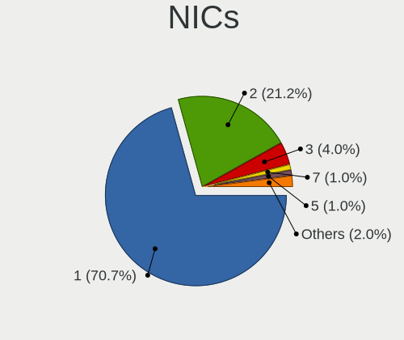

| Total | Desktops | Percent |
|-------|----------|---------|
| 1     | 22       | 64.71%  |
| 2     | 9        | 26.47%  |
| 5     | 1        | 2.94%   |
| 3     | 1        | 2.94%   |
| 0     | 1        | 2.94%   |

IPv6
----

IPv6 vs IPv4

| Used | Desktops | Percent |
|------|----------|---------|
| No   | 33       | 100%    |

Bluetooth
---------

Bluetooth Vendor
----------------

Controller vendors

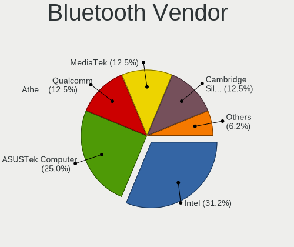

| Vendor                          | Desktops | Percent |
|---------------------------------|----------|---------|
| Qualcomm Atheros Communications | 2        | 50%     |
| Intel                           | 2        | 50%     |

Bluetooth Model
---------------

Controller models

| Model                              | Desktops | Percent |
|------------------------------------|----------|---------|
| Qualcomm Atheros  Bluetooth Device | 1        | 25%     |
| Qualcomm Atheros AR3011 Bluetooth  | 1        | 25%     |
| Intel Wireless-AC 3168 Bluetooth   | 1        | 25%     |
| Intel Bluetooth Device             | 1        | 25%     |

Sound
-----

Sound Vendor
------------

Sound card vendors

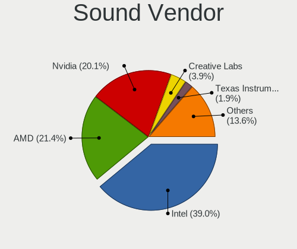

| Vendor                           | Desktops | Percent |
|----------------------------------|----------|---------|
| Intel                            | 22       | 43.14%  |
| Nvidia                           | 10       | 19.61%  |
| AMD                              | 9        | 17.65%  |
| Plantronics                      | 2        | 3.92%   |
| Creative Labs                    | 2        | 3.92%   |
| Texas Instruments                | 1        | 1.96%   |
| Silicon Integrated Systems [SiS] | 1        | 1.96%   |
| M-Audio                          | 1        | 1.96%   |
| Logitech                         | 1        | 1.96%   |
| KORG                             | 1        | 1.96%   |
| Cirrus Logic                     | 1        | 1.96%   |

Sound Model
-----------

Sound card models

| Model                                                                      | Desktops | Percent |
|----------------------------------------------------------------------------|----------|---------|
| Nvidia GP106 High Definition Audio Controller                              | 4        | 6.78%   |
| Intel 7 Series/C216 Chipset Family High Definition Audio Controller        | 4        | 6.78%   |
| Intel NM10/ICH7 Family High Definition Audio Controller                    | 3        | 5.08%   |
| Intel 8 Series/C220 Series Chipset High Definition Audio Controller        | 3        | 5.08%   |
| Plantronics HD1                                                            | 2        | 3.39%   |
| Nvidia GK208 HDMI/DP Audio Controller                                      | 2        | 3.39%   |
| Intel Xeon E3-1200 v3/4th Gen Core Processor HD Audio Controller           | 2        | 3.39%   |
| Intel Cannon Lake PCH cAVS                                                 | 2        | 3.39%   |
| Intel 5 Series/3400 Series Chipset High Definition Audio                   | 2        | 3.39%   |
| Creative Labs EMU10k2/CA0100/CA0102/CA10200 [Sound Blaster Audigy Series]  | 2        | 3.39%   |
| AMD SBx00 Azalia (Intel HDA)                                               | 2        | 3.39%   |
| AMD Family 17h (Models 00h-0fh) HD Audio Controller                        | 2        | 3.39%   |
| AMD Cedar HDMI Audio [Radeon HD 5400/6300/7300 Series]                     | 2        | 3.39%   |
| Texas Instruments PCM2902 Audio Codec                                      | 1        | 1.69%   |
| Silicon Integrated Systems [SiS] Azalia Audio Controller                   | 1        | 1.69%   |
| Nvidia High Definition Audio Controller                                    | 1        | 1.69%   |
| Nvidia GP107GL High Definition Audio Controller                            | 1        | 1.69%   |
| Nvidia GK106 HDMI Audio Controller                                         | 1        | 1.69%   |
| Nvidia GA104 High Definition Audio Controller                              | 1        | 1.69%   |
| M-Audio MIDISPORT 4x4 Anniv                                                | 1        | 1.69%   |
| M-Audio M-Audio 1x1                                                        | 1        | 1.69%   |
| Logitech H390 headset with microphone                                      | 1        | 1.69%   |
| KORG nanoKONTROL studio controller                                         | 1        | 1.69%   |
| Intel Haswell-ULT HD Audio Controller                                      | 1        | 1.69%   |
| Intel Comet Lake PCH cAVS                                                  | 1        | 1.69%   |
| Intel Celeron/Pentium Silver Processor High Definition Audio               | 1        | 1.69%   |
| Intel 82801I (ICH9 Family) HD Audio Controller                             | 1        | 1.69%   |
| Intel 82801BA/BAM AC'97 Audio Controller                                   | 1        | 1.69%   |
| Intel 8 Series HD Audio Controller                                         | 1        | 1.69%   |
| Intel 6 Series/C200 Series Chipset Family High Definition Audio Controller | 1        | 1.69%   |
| Intel 200 Series PCH HD Audio                                              | 1        | 1.69%   |
| Intel 100 Series/C230 Series Chipset Family HD Audio Controller            | 1        | 1.69%   |
| Cirrus Logic Crystal CS4281 PCI Audio                                      | 1        | 1.69%   |
| AMD Starship/Matisse HD Audio Controller                                   | 1        | 1.69%   |
| AMD Raven/Raven2/Fenghuang HDMI/DP Audio Controller                        | 1        | 1.69%   |
| AMD Oland/Hainan/Cape Verde/Pitcairn HDMI Audio [Radeon HD 7000 Series]    | 1        | 1.69%   |
| AMD FCH Azalia Controller                                                  | 1        | 1.69%   |
| AMD Family 17h (Models 10h-1fh) HD Audio Controller                        | 1        | 1.69%   |
| AMD Ellesmere HDMI Audio [Radeon RX 470/480 / 570/580/590]                 | 1        | 1.69%   |
| AMD Baffin HDMI/DP Audio [Radeon RX 550 640SP / RX 560/560X]               | 1        | 1.69%   |

Memory
------

Memory Vendor
-------------

Memory module vendors

| Vendor              | Desktops | Percent |
|---------------------|----------|---------|
| Unknown             | 11       | 29.73%  |
| Kingston            | 8        | 21.62%  |
| Corsair             | 4        | 10.81%  |
| SK Hynix            | 2        | 5.41%   |
| Samsung Electronics | 2        | 5.41%   |
| Nanya Technology    | 2        | 5.41%   |
| Micron Technology   | 2        | 5.41%   |
| G.Skill             | 2        | 5.41%   |
| GOODRAM             | 1        | 2.7%    |
| Crucial             | 1        | 2.7%    |
| Avant               | 1        | 2.7%    |
| A-DATA Technology   | 1        | 2.7%    |

Memory Model
------------

Memory module models

| Model                                                     | Desktops | Percent |
|-----------------------------------------------------------|----------|---------|
| Kingston RAM 99U5471-054.A00LF 8GB DIMM DDR3 1600MT/s     | 2        | 4.65%   |
| Corsair RAM CMK32GX4M4A2666C16 8GB DIMM DDR4 2667MT/s     | 2        | 4.65%   |
| Unknown RAM SM3S320SD0488CABC 8192MB SODIMM DDR3 1600MT/s | 1        | 2.33%   |
| Unknown RAM Module 8192MB DIMM DDR3 800MT/s               | 1        | 2.33%   |
| Unknown RAM Module 64MB DIMM DRAM 100MT/s                 | 1        | 2.33%   |
| Unknown RAM Module 4GB DIMM 1333MT/s                      | 1        | 2.33%   |
| Unknown RAM Module 4096MB DIMM DDR3 1600MT/s              | 1        | 2.33%   |
| Unknown RAM Module 2GB DIMM 1333MT/s                      | 1        | 2.33%   |
| Unknown RAM Module 256MB DIMM DRAM 100MT/s                | 1        | 2.33%   |
| Unknown RAM Module 2048MB SODIMM DDR2 667MT/s             | 1        | 2.33%   |
| Unknown RAM Module 2048MB DIMM SDRAM 667MT/s              | 1        | 2.33%   |
| Unknown RAM Module 2048MB DIMM SDRAM                      | 1        | 2.33%   |
| Unknown RAM Module 128MB DIMM DRAM 100MT/s                | 1        | 2.33%   |
| Unknown RAM Module 1024MB DIMM DDR 400MT/s                | 1        | 2.33%   |
| Unknown RAM Module 1024MB DIMM DDR                        | 1        | 2.33%   |
| Unknown RAM 3000 C16 Series 8192MB DIMM DDR4 2133MT/s     | 1        | 2.33%   |
| SK Hynix RAM Module 4GB DIMM DDR3 1333MT/s                | 1        | 2.33%   |
| SK Hynix RAM HMT351U6CFR8C-PB 4GB DIMM DDR3 1800MT/s      | 1        | 2.33%   |
| Samsung RAM Module 2GB DIMM DDR3 1333MT/s                 | 1        | 2.33%   |
| Samsung RAM M378B5273DH0-CH9 4GB DIMM DDR3 2133MT/s       | 1        | 2.33%   |
| Nanya RAM Module 2GB DIMM DDR3 1333MT/s                   | 1        | 2.33%   |
| Nanya RAM M2X4G64CB8HG5N-DG 4GB DIMM DDR3 1867MT/s        | 1        | 2.33%   |
| Micron RAM Module 2GB DIMM DDR3 1333MT/s                  | 1        | 2.33%   |
| Micron RAM DVM64453C DATARAM 8GB DIMM DDR3 1600MT/s       | 1        | 2.33%   |
| Kingston RAM KHX3200C16D4/16GX 16GB DIMM DDR4 3600MT/s    | 1        | 2.33%   |
| Kingston RAM KHX2133C14D4/8G 8GB DIMM DDR4 2667MT/s       | 1        | 2.33%   |
| Kingston RAM KHX2133C14/8G 8192MB DIMM DDR4 2400MT/s      | 1        | 2.33%   |
| Kingston RAM KHX1600C9D3/4GX 4096MB DIMM DDR3 2400MT/s    | 1        | 2.33%   |
| Kingston RAM 99U5704-001.A00G 4GB SODIMM DDR4 2400MT/s    | 1        | 2.33%   |
| Kingston RAM 99U5471-066.A00LF 8GB DIMM DDR3 1600MT/s     | 1        | 2.33%   |
| Kingston RAM 9905711-015.A00G 4GB SODIMM DDR4 2400MT/s    | 1        | 2.33%   |
| Kingston RAM 9905625-066.A00G 16GB DIMM DDR4 2667MT/s     | 1        | 2.33%   |
| Kingston RAM 9905471-084.A00LF 8192MB DIMM DDR3 1600MT/s  | 1        | 2.33%   |
| GOODRAM RAM GR1333D364L9/4G 4GB DIMM DDR3 1600MT/s        | 1        | 2.33%   |
| G.Skill RAM F4-3200C16-16GIS 16GB DIMM DDR4 3600MT/s      | 1        | 2.33%   |
| G.Skill RAM F4-2133C15-16GIS 16384MB DIMM DDR4 2133MT/s   | 1        | 2.33%   |
| Crucial RAM CT51264BA160BJ.C8 4GB DIMM DDR3 1600MT/s      | 1        | 2.33%   |
| Corsair RAM CMK16GX4M2B3200C16 8GB DIMM DDR4 3600MT/s     | 1        | 2.33%   |
| Corsair RAM CMD8GX3M2B2133C9 4096MB DIMM DDR3 1333MT/s    | 1        | 2.33%   |
| Avant RAM F6451U67F9333G 4096MB DIMM DDR3 1333MT/s        | 1        | 2.33%   |
| A-DATA RAM DDR4 2666 2OZ 4GB DIMM DDR4 2667MT/s           | 1        | 2.33%   |

Memory Kind
-----------

Memory module kinds

| Kind    | Desktops | Percent |
|---------|----------|---------|
| DDR3    | 12       | 41.38%  |
| DDR4    | 10       | 34.48%  |
| SDRAM   | 2        | 6.9%    |
| DDR     | 2        | 6.9%    |
| DRAM    | 1        | 3.45%   |
| DDR2    | 1        | 3.45%   |
| Unknown | 1        | 3.45%   |

Memory Form Factor
------------------

Physical design of the memory module

| Name   | Desktops | Percent |
|--------|----------|---------|
| DIMM   | 26       | 89.66%  |
| SODIMM | 3        | 10.34%  |

Memory Size
-----------

Memory module size

| Size  | Desktops | Percent |
|-------|----------|---------|
| 8192  | 9        | 26.47%  |
| 4096  | 9        | 26.47%  |
| 16384 | 5        | 14.71%  |
| 2048  | 5        | 14.71%  |
| 1024  | 2        | 5.88%   |
| 32768 | 1        | 2.94%   |
| 256   | 1        | 2.94%   |
| 128   | 1        | 2.94%   |
| 64    | 1        | 2.94%   |

Memory Speed
------------

Memory module speed

| Speed   | Desktops | Percent |
|---------|----------|---------|
| 1600    | 6        | 18.75%  |
| 2667    | 4        | 12.5%   |
| 1333    | 4        | 12.5%   |
| 3600    | 3        | 9.38%   |
| 2400    | 3        | 9.38%   |
| 2133    | 2        | 6.25%   |
| 667     | 2        | 6.25%   |
| Unknown | 2        | 6.25%   |
| 3200    | 1        | 3.13%   |
| 1867    | 1        | 3.13%   |
| 1800    | 1        | 3.13%   |
| 800     | 1        | 3.13%   |
| 400     | 1        | 3.13%   |
| 100     | 1        | 3.13%   |

Printers & scanners
-------------------

Printer Vendor
--------------

Printer device vendors

| Vendor                 | Desktops | Percent |
|------------------------|----------|---------|
| Hewlett-Packard        | 1        | 33.33%  |
| Custom Engineering SPA | 1        | 33.33%  |
| Brother Industries     | 1        | 33.33%  |

Printer Model
-------------

Printer device models

| Model                           | Desktops | Percent |
|---------------------------------|----------|---------|
| HP ENVY 5000 series             | 1        | 33.33%  |
| Custom Engineering SPA KUBE USB | 1        | 33.33%  |
| Brother HL-L2375DW series       | 1        | 33.33%  |

Scanner Vendor
--------------

Scanner device vendors

Zero info for selected period =(

Scanner Model
-------------

Scanner device models

Zero info for selected period =(

Camera
------

Camera Vendor
-------------

Camera device vendors

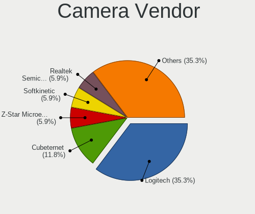

| Vendor                  | Desktops | Percent |
|-------------------------|----------|---------|
| Z-Star Microelectronics | 1        | 14.29%  |
| Softkinetic             | 1        | 14.29%  |
| Microdia                | 1        | 14.29%  |
| MacroSilicon            | 1        | 14.29%  |
| Logitech                | 1        | 14.29%  |
| GEMBIRD                 | 1        | 14.29%  |
| Cubeternet              | 1        | 14.29%  |

Camera Model
------------

Camera device models

| Model                              | Desktops | Percent |
|------------------------------------|----------|---------|
| Z-Star Vimicro USB Camera (Altair) | 1        | 14.29%  |
| Softkinetic DepthSense 325         | 1        | 14.29%  |
| Microdia Camera                    | 1        | 14.29%  |
| MacroSilicon MiraBox Capture       | 1        | 14.29%  |
| Logitech Webcam C270               | 1        | 14.29%  |
| GEMBIRD USB2.0 PC CAMERA           | 1        | 14.29%  |
| Cubeternet GL-UPC822 UVC WebCam    | 1        | 14.29%  |

Security
--------

Fingerprint Vendor
------------------

Fingerprint sensor vendors

Zero info for selected period =(

Fingerprint Model
-----------------

Fingerprint sensor models

Zero info for selected period =(

Chipcard Vendor
---------------

Chipcard module vendors

Zero info for selected period =(

Chipcard Model
--------------

Chipcard module models

Zero info for selected period =(

Unsupported
-----------

Unsupported Devices
-------------------

Total unsupported devices on board

| Total | Desktops | Percent |
|-------|----------|---------|
| 0     | 30       | 90.91%  |
| 1     | 2        | 6.06%   |
| 2     | 1        | 3.03%   |

Unsupported Device Types
------------------------

Types of unsupported devices

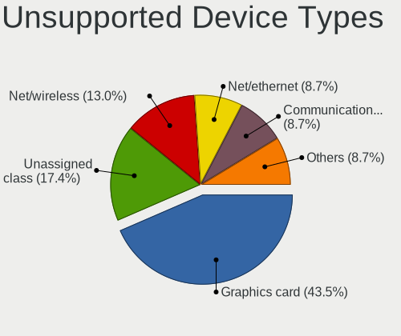

| Type                     | Desktops | Percent |
|--------------------------|----------|---------|
| Graphics card            | 2        | 50%     |
| Firewire controller      | 1        | 25%     |
| Communication controller | 1        | 25%     |

