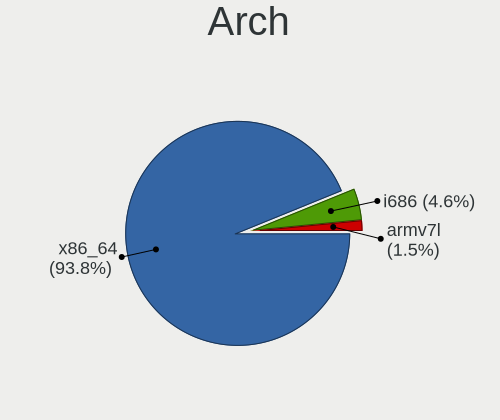
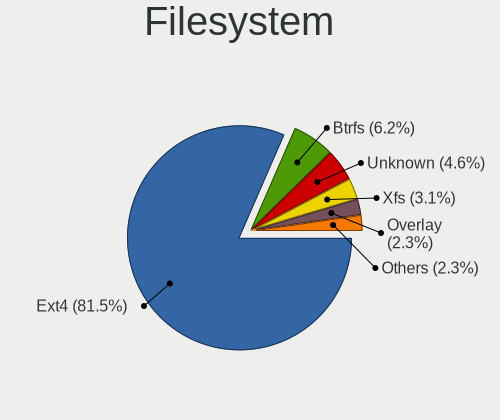
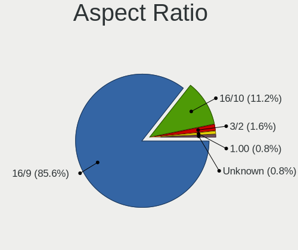
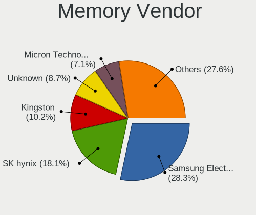
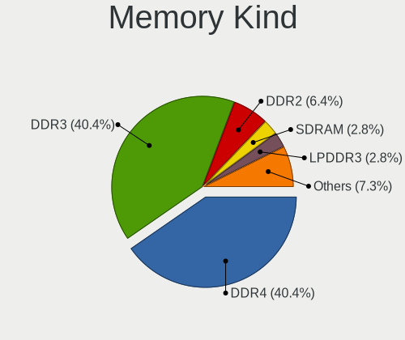
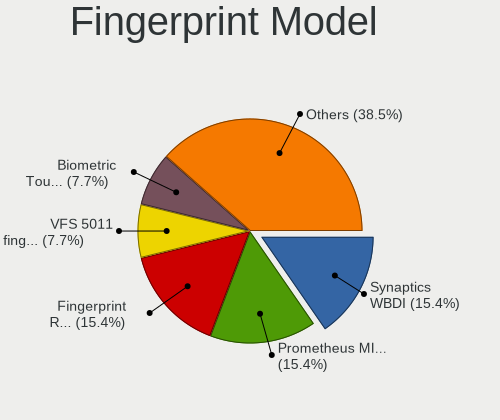

Devuan - Tested Hardware & Statistics (Notebooks)
-------------------------------------------------

A project to collect tested hardware configurations for Devuan.

Anyone can contribute to this report by the [hw-probe](https://github.com/linuxhw/hw-probe) tool:

    sudo -E hw-probe -all -upload

Please contribute! Especially if your hardware is rare.

Contents
--------

* [ Test Cases ](#test-cases)

* [ System ](#system)
  - [ OS                       ](#os)
  - [ OS Family                ](#os-family)
  - [ Kernel                   ](#kernel)
  - [ Kernel Family            ](#kernel-family)
  - [ Kernel Major Ver.        ](#kernel-major-ver)
  - [ Arch                     ](#arch)
  - [ DE                       ](#de)
  - [ Display Server           ](#display-server)
  - [ Display Manager          ](#display-manager)
  - [ OS Lang                  ](#os-lang)
  - [ Boot Mode                ](#boot-mode)
  - [ Filesystem               ](#filesystem)
  - [ Part. scheme             ](#part-scheme)
  - [ Dual Boot with Linux/BSD ](#dual-boot-with-linuxbsd)
  - [ Dual Boot (Win)          ](#dual-boot-win)

* [ Board ](#board)
  - [ Vendor                   ](#vendor)
  - [ Model                    ](#model)
  - [ Model Family             ](#model-family)
  - [ MFG Year                 ](#mfg-year)
  - [ Form Factor              ](#form-factor)
  - [ Secure Boot              ](#secure-boot)
  - [ Coreboot                 ](#coreboot)
  - [ RAM Size                 ](#ram-size)
  - [ RAM Used                 ](#ram-used)
  - [ Total Drives             ](#total-drives)
  - [ Has CD-ROM               ](#has-cd-rom)
  - [ Has Ethernet             ](#has-ethernet)
  - [ Has WiFi                 ](#has-wifi)
  - [ Has Bluetooth            ](#has-bluetooth)

* [ Location ](#location)
  - [ Country                  ](#country)
  - [ City                     ](#city)

* [ Drives ](#drives)
  - [ Drive Vendor             ](#drive-vendor)
  - [ Drive Model              ](#drive-model)
  - [ HDD Vendor               ](#hdd-vendor)
  - [ SSD Vendor               ](#ssd-vendor)
  - [ Drive Kind               ](#drive-kind)
  - [ Drive Connector          ](#drive-connector)
  - [ Drive Size               ](#drive-size)
  - [ Space Total              ](#space-total)
  - [ Space Used               ](#space-used)
  - [ Malfunc. Drives          ](#malfunc-drives)
  - [ Malfunc. Drive Vendor    ](#malfunc-drive-vendor)
  - [ Malfunc. HDD Vendor      ](#malfunc-hdd-vendor)
  - [ Malfunc. Drive Kind      ](#malfunc-drive-kind)
  - [ Failed Drives            ](#failed-drives)
  - [ Failed Drive Vendor      ](#failed-drive-vendor)
  - [ Drive Status             ](#drive-status)

* [ Storage controller ](#storage-controller)
  - [ Storage Vendor           ](#storage-vendor)
  - [ Storage Model            ](#storage-model)
  - [ Storage Kind             ](#storage-kind)

* [ Processor ](#processor)
  - [ CPU Vendor               ](#cpu-vendor)
  - [ CPU Model                ](#cpu-model)
  - [ CPU Model Family         ](#cpu-model-family)
  - [ CPU Cores                ](#cpu-cores)
  - [ CPU Sockets              ](#cpu-sockets)
  - [ CPU Threads              ](#cpu-threads)
  - [ CPU Op-Modes             ](#cpu-op-modes)
  - [ CPU Microcode            ](#cpu-microcode)
  - [ CPU Microarch            ](#cpu-microarch)

* [ Graphics ](#graphics)
  - [ GPU Vendor               ](#gpu-vendor)
  - [ GPU Model                ](#gpu-model)
  - [ GPU Combo                ](#gpu-combo)
  - [ GPU Driver               ](#gpu-driver)
  - [ GPU Memory               ](#gpu-memory)

* [ Monitor ](#monitor)
  - [ Monitor Vendor           ](#monitor-vendor)
  - [ Monitor Model            ](#monitor-model)
  - [ Monitor Resolution       ](#monitor-resolution)
  - [ Monitor Diagonal         ](#monitor-diagonal)
  - [ Monitor Width            ](#monitor-width)
  - [ Aspect Ratio             ](#aspect-ratio)
  - [ Monitor Area             ](#monitor-area)
  - [ Pixel Density            ](#pixel-density)
  - [ Multiple Monitors        ](#multiple-monitors)

* [ Network ](#network)
  - [ Net Controller Vendor    ](#net-controller-vendor)
  - [ Net Controller Model     ](#net-controller-model)
  - [ Wireless Vendor          ](#wireless-vendor)
  - [ Wireless Model           ](#wireless-model)
  - [ Ethernet Vendor          ](#ethernet-vendor)
  - [ Ethernet Model           ](#ethernet-model)
  - [ Net Controller Kind      ](#net-controller-kind)
  - [ Used Controller          ](#used-controller)
  - [ NICs                     ](#nics)
  - [ IPv6                     ](#ipv6)

* [ Bluetooth ](#bluetooth)
  - [ Bluetooth Vendor         ](#bluetooth-vendor)
  - [ Bluetooth Model          ](#bluetooth-model)

* [ Sound ](#sound)
  - [ Sound Vendor             ](#sound-vendor)
  - [ Sound Model              ](#sound-model)

* [ Memory ](#memory)
  - [ Memory Vendor            ](#memory-vendor)
  - [ Memory Model             ](#memory-model)
  - [ Memory Kind              ](#memory-kind)
  - [ Memory Form Factor       ](#memory-form-factor)
  - [ Memory Size              ](#memory-size)
  - [ Memory Speed             ](#memory-speed)

* [ Printers & scanners ](#printers--scanners)
  - [ Printer Vendor           ](#printer-vendor)
  - [ Printer Model            ](#printer-model)
  - [ Scanner Vendor           ](#scanner-vendor)
  - [ Scanner Model            ](#scanner-model)

* [ Camera ](#camera)
  - [ Camera Vendor            ](#camera-vendor)
  - [ Camera Model             ](#camera-model)

* [ Security ](#security)
  - [ Fingerprint Vendor       ](#fingerprint-vendor)
  - [ Fingerprint Model        ](#fingerprint-model)
  - [ Chipcard Vendor          ](#chipcard-vendor)
  - [ Chipcard Model           ](#chipcard-model)

* [ Unsupported ](#unsupported)
  - [ Unsupported Devices      ](#unsupported-devices)
  - [ Unsupported Device Types ](#unsupported-device-types)

Test Cases
----------

Total: 140

| Vendor        | Model                       | Probe                                                      | Date         |
|---------------|-----------------------------|------------------------------------------------------------|--------------|
| System76      | Galago Pro                  | [06d9cca0d2](https://linux-hardware.org/?probe=06d9cca0d2) | Apr 27, 2024 |
| ASUSTek       | 1000H                       | [0463a4d88b](https://linux-hardware.org/?probe=0463a4d88b) | Apr 26, 2024 |
| Apple         | MacBookAir6,1               | [08ca3d5ea0](https://linux-hardware.org/?probe=08ca3d5ea0) | Apr 19, 2024 |
| Dell          | Studio 1558                 | [73fb46028c](https://linux-hardware.org/?probe=73fb46028c) | Apr 12, 2024 |
| Lenovo        | ThinkPad X1 Carbon Gen 1... | [2270faaf14](https://linux-hardware.org/?probe=2270faaf14) | Mar 07, 2024 |
| Lenovo        | ThinkPad X230 23252UU       | [7fb7bfaacd](https://linux-hardware.org/?probe=7fb7bfaacd) | Mar 05, 2024 |
| ASUSTek       | K55VJ                       | [88ee2dbed6](https://linux-hardware.org/?probe=88ee2dbed6) | Mar 03, 2024 |
| MACHENIKE     | T90-V                       | [01cb379c2e](https://linux-hardware.org/?probe=01cb379c2e) | Feb 24, 2024 |
| Maibenben     | MaiBook M                   | [7f6b3c0f92](https://linux-hardware.org/?probe=7f6b3c0f92) | Feb 13, 2024 |
| HP            | EliteBook 840 G6            | [6cac3b71e0](https://linux-hardware.org/?probe=6cac3b71e0) | Feb 01, 2024 |
| Lenovo        | ThinkPad P1 20MDCTO1WW      | [b66d7c38c1](https://linux-hardware.org/?probe=b66d7c38c1) | Dec 31, 2023 |
| HP            | ProBook 450 15.6 inch G9... | [7af6ecc981](https://linux-hardware.org/?probe=7af6ecc981) | Dec 12, 2023 |
| Dell          | Latitude E6400              | [c23aa9b02a](https://linux-hardware.org/?probe=c23aa9b02a) | Dec 10, 2023 |
| Lenovo        | ThinkPad T470 W10DG 20JN... | [c72f209121](https://linux-hardware.org/?probe=c72f209121) | Dec 05, 2023 |
| Dell          | Latitude E6430              | [8b68261a59](https://linux-hardware.org/?probe=8b68261a59) | Nov 30, 2023 |
| Dell          | XPS 13 9370                 | [2961332bce](https://linux-hardware.org/?probe=2961332bce) | Nov 26, 2023 |
| Lenovo        | ThinkPad T470s 20HGS1080... | [37c32a9af7](https://linux-hardware.org/?probe=37c32a9af7) | Nov 25, 2023 |
| HP            | G62                         | [9d6424c4cc](https://linux-hardware.org/?probe=9d6424c4cc) | Nov 24, 2023 |
| Acer          | Aspire A515-54G             | [8e8de2388b](https://linux-hardware.org/?probe=8e8de2388b) | Nov 21, 2023 |
| HP            | Presario C700               | [c8a9963f71](https://linux-hardware.org/?probe=c8a9963f71) | Nov 19, 2023 |
| HP            | Unknown                     | [3827b1fa19](https://linux-hardware.org/?probe=3827b1fa19) | Nov 16, 2023 |
| HP            | Unknown                     | [ef19087623](https://linux-hardware.org/?probe=ef19087623) | Nov 16, 2023 |
| Lenovo        | ThinkPad X240 20AMS2EC00    | [820620d5c4](https://linux-hardware.org/?probe=820620d5c4) | Nov 01, 2023 |
| Samsung       | N150P                       | [83f77d7896](https://linux-hardware.org/?probe=83f77d7896) | Oct 23, 2023 |
| Lenovo        | IdeaPad Gaming 3 15IAH7 ... | [cf522294f8](https://linux-hardware.org/?probe=cf522294f8) | Oct 18, 2023 |
| TUXEDO        | XP1610                      | [31be190f30](https://linux-hardware.org/?probe=31be190f30) | Oct 13, 2023 |
| Dell          | XPS M1530                   | [b24e393bbb](https://linux-hardware.org/?probe=b24e393bbb) | Sep 23, 2023 |
| Dell          | Inspiron 3583               | [56cd0e05e8](https://linux-hardware.org/?probe=56cd0e05e8) | Sep 22, 2023 |
| PC Special... | P7xxTM1                     | [2bdbc2f2e7](https://linux-hardware.org/?probe=2bdbc2f2e7) | Sep 12, 2023 |
| Apple         | MacBookPro8,2               | [f23bb97453](https://linux-hardware.org/?probe=f23bb97453) | Sep 11, 2023 |
| Sony          | VGN-FZ140E                  | [361226919e](https://linux-hardware.org/?probe=361226919e) | Sep 11, 2023 |
| Lenovo        | ThinkPad T14 Gen 3 21AHC... | [61906f4e91](https://linux-hardware.org/?probe=61906f4e91) | Sep 07, 2023 |
| Dell          | Inspiron 3585               | [89a0e93fd5](https://linux-hardware.org/?probe=89a0e93fd5) | Sep 05, 2023 |
| Intel         | powered classmate PC        | [f852524db2](https://linux-hardware.org/?probe=f852524db2) | Sep 01, 2023 |
| Lenovo        | ThinkPad T480 20L5CTO1WW    | [44e328b3a0](https://linux-hardware.org/?probe=44e328b3a0) | Aug 24, 2023 |
| Lenovo        | ThinkPad X390 20Q1A005CD    | [c299d4ad92](https://linux-hardware.org/?probe=c299d4ad92) | Aug 15, 2023 |
| Lenovo        | ThinkPad T560 20FJS1J200    | [f0d90b715d](https://linux-hardware.org/?probe=f0d90b715d) | Aug 15, 2023 |
| ASUSTek       | T200TA                      | [affc999457](https://linux-hardware.org/?probe=affc999457) | Aug 12, 2023 |
| Lenovo        | ThinkPad T14 Gen 3 21AHC... | [67febbf0c0](https://linux-hardware.org/?probe=67febbf0c0) | Jul 27, 2023 |
| Samsung       | 550XDA                      | [c298263c6c](https://linux-hardware.org/?probe=c298263c6c) | Jul 22, 2023 |
| Dell          | Latitude E5500              | [03798c7840](https://linux-hardware.org/?probe=03798c7840) | Jul 10, 2023 |
| Nokia         | N900                        | [7728c85b90](https://linux-hardware.org/?probe=7728c85b90) | Jul 06, 2023 |
| HP            | EliteBook 840 G6            | [d072001450](https://linux-hardware.org/?probe=d072001450) | Jul 04, 2023 |
| Toshiba       | Satellite L300              | [8b04801d40](https://linux-hardware.org/?probe=8b04801d40) | Jun 27, 2023 |
| Lenovo        | ThinkPad T410 2537DA3       | [067b7f26a2](https://linux-hardware.org/?probe=067b7f26a2) | Jun 25, 2023 |
| HP            | EliteBook 840 G6            | [82c9c200bc](https://linux-hardware.org/?probe=82c9c200bc) | Jun 20, 2023 |
| MSI           | Bravo 15 A4DDR              | [0e9ccef97f](https://linux-hardware.org/?probe=0e9ccef97f) | May 27, 2023 |
| Lenovo        | ThinkPad T14 Gen 3 21AHC... | [54f07f7d96](https://linux-hardware.org/?probe=54f07f7d96) | May 12, 2023 |
| Lenovo        | IdeaPad 530S-14ARR 81H1     | [0d2ac684c8](https://linux-hardware.org/?probe=0d2ac684c8) | May 08, 2023 |
| Lenovo        | IdeaPad 530S-14ARR 81H1     | [c67960852a](https://linux-hardware.org/?probe=c67960852a) | May 06, 2023 |
| HUAWEI        | HN-WX9X                     | [d07874c829](https://linux-hardware.org/?probe=d07874c829) | Apr 24, 2023 |
| Lenovo        | S20-30 20421                | [b9846b05e7](https://linux-hardware.org/?probe=b9846b05e7) | Apr 22, 2023 |
| Lenovo        | ThinkPad T480 20L5CTO1WW    | [96e067f5c8](https://linux-hardware.org/?probe=96e067f5c8) | Apr 14, 2023 |
| Lenovo        | ThinkPad T14 Gen 3 21AHC... | [549f922cf6](https://linux-hardware.org/?probe=549f922cf6) | Apr 13, 2023 |
| Lenovo        | ThinkPad T14 Gen 3 21AHC... | [a9aa9ab39f](https://linux-hardware.org/?probe=a9aa9ab39f) | Apr 13, 2023 |
| Google        | Cyan                        | [f32e15dfef](https://linux-hardware.org/?probe=f32e15dfef) | Apr 09, 2023 |
| Dell          | G5 5505                     | [2552b456b6](https://linux-hardware.org/?probe=2552b456b6) | Mar 29, 2023 |
| ASUSTek       | G750JM                      | [98ba3a9ce6](https://linux-hardware.org/?probe=98ba3a9ce6) | Mar 25, 2023 |
| Google        | Bluebird                    | [2d18088551](https://linux-hardware.org/?probe=2d18088551) | Mar 15, 2023 |
| Dell          | Latitude E6230              | [49a9844be8](https://linux-hardware.org/?probe=49a9844be8) | Mar 15, 2023 |
| Dell          | Latitude E6440              | [76a537c18e](https://linux-hardware.org/?probe=76a537c18e) | Mar 14, 2023 |
| Unknown       | Unknown                     | [1f89daceb8](https://linux-hardware.org/?probe=1f89daceb8) | Feb 20, 2023 |
| HP            | ProBook 640 G1              | [d0319bdf17](https://linux-hardware.org/?probe=d0319bdf17) | Feb 09, 2023 |
| Lenovo        | ThinkPad T560 20FJS1J200    | [de713cedce](https://linux-hardware.org/?probe=de713cedce) | Jan 21, 2023 |
| Acer          | Aspire E1-572G              | [360a177e77](https://linux-hardware.org/?probe=360a177e77) | Jan 14, 2023 |
| Dell          | Inspiron 15 3511            | [f4349052b8](https://linux-hardware.org/?probe=f4349052b8) | Jan 06, 2023 |
| Dell          | XPS 13 9370                 | [1f72002986](https://linux-hardware.org/?probe=1f72002986) | Dec 29, 2022 |
| HP            | Laptop 14-df0xxx            | [1d9edd6c97](https://linux-hardware.org/?probe=1d9edd6c97) | Dec 25, 2022 |
| HP            | 250 G8 Notebook PC          | [ed3886b135](https://linux-hardware.org/?probe=ed3886b135) | Dec 02, 2022 |
| Dell          | Latitude E6530              | [e40986d2fb](https://linux-hardware.org/?probe=e40986d2fb) | Nov 22, 2022 |
| Dell          | Latitude E6530              | [14debbe3e5](https://linux-hardware.org/?probe=14debbe3e5) | Nov 22, 2022 |
| Lenovo        | G50-30 80G0                 | [be4f638bc7](https://linux-hardware.org/?probe=be4f638bc7) | Nov 21, 2022 |
| HP            | Laptop 15-bs2xx             | [7254534946](https://linux-hardware.org/?probe=7254534946) | Oct 20, 2022 |
| Lenovo        | ThinkPad T550 20CJS1VD01    | [97d1b5e6c5](https://linux-hardware.org/?probe=97d1b5e6c5) | Sep 30, 2022 |
| Lenovo        | ThinkPad T440p              | [270cf10219](https://linux-hardware.org/?probe=270cf10219) | Sep 25, 2022 |
| Lenovo        | ThinkPad T440p              | [bf397424f3](https://linux-hardware.org/?probe=bf397424f3) | Sep 18, 2022 |
| Lenovo        | ThinkPad T550 20CJS1VD01    | [1bcc13e6b4](https://linux-hardware.org/?probe=1bcc13e6b4) | Aug 15, 2022 |
| CCE           | Capella & IbexPeak-M Chi... | [defafd4f0b](https://linux-hardware.org/?probe=defafd4f0b) | Aug 10, 2022 |
| CCE           | Capella & IbexPeak-M Chi... | [389bef188c](https://linux-hardware.org/?probe=389bef188c) | Aug 10, 2022 |
| Sony          | VPCEE23FX                   | [b4108910d3](https://linux-hardware.org/?probe=b4108910d3) | Jul 25, 2022 |
| Toshiba       | Satellite Pro A50-C         | [a94461714d](https://linux-hardware.org/?probe=a94461714d) | Jul 18, 2022 |
| Lenovo        | V310-14ISK 80SX             | [6dcb934555](https://linux-hardware.org/?probe=6dcb934555) | Jul 17, 2022 |
| Dell          | Latitude 7280               | [75ce6d31bc](https://linux-hardware.org/?probe=75ce6d31bc) | Jul 14, 2022 |
| MSI           | Modern 15 A5M               | [40c6c77f2c](https://linux-hardware.org/?probe=40c6c77f2c) | Jul 13, 2022 |
| Dell          | Latitude E7240              | [045554b70c](https://linux-hardware.org/?probe=045554b70c) | Jul 08, 2022 |
| Lenovo        | ThinkPad T430 2349I46       | [3a7df4ea17](https://linux-hardware.org/?probe=3a7df4ea17) | Jun 20, 2022 |
| HP            | Laptop 17-cp0xxx            | [001634b95b](https://linux-hardware.org/?probe=001634b95b) | Jun 17, 2022 |
| Dell          | Latitude E6430              | [95b7617708](https://linux-hardware.org/?probe=95b7617708) | Jun 05, 2022 |
| Acer          | Aspire E5-553G              | [2d4c950e2f](https://linux-hardware.org/?probe=2d4c950e2f) | May 25, 2022 |
| Acer          | Aspire E5-553G              | [73139cdb17](https://linux-hardware.org/?probe=73139cdb17) | May 25, 2022 |
| Lenovo        | IdeaPad L340-15IRH Gamin... | [2717caa7f5](https://linux-hardware.org/?probe=2717caa7f5) | Apr 25, 2022 |
| HP            | Notebook                    | [966668f0c0](https://linux-hardware.org/?probe=966668f0c0) | Apr 17, 2022 |
| Lenovo        | ThinkPad T470s 20HGS00P0... | [2c9878c68b](https://linux-hardware.org/?probe=2c9878c68b) | Apr 13, 2022 |
| Dell          | Latitude E5540              | [0948114af7](https://linux-hardware.org/?probe=0948114af7) | Mar 03, 2022 |
| Lenovo        | ThinkPad T550 20CJS1VD01    | [a3aed9d375](https://linux-hardware.org/?probe=a3aed9d375) | Mar 03, 2022 |
| ASUSTek       | K55VJ                       | [562262b9eb](https://linux-hardware.org/?probe=562262b9eb) | Jan 22, 2022 |
| ASUSTek       | X555LJ                      | [9fbdf4dfc2](https://linux-hardware.org/?probe=9fbdf4dfc2) | Jan 17, 2022 |
| Lenovo        | ThinkPad T420 4180AG3       | [2c3cd27ad2](https://linux-hardware.org/?probe=2c3cd27ad2) | Jan 16, 2022 |
| Notebook      | W230ST                      | [3dacf0aea8](https://linux-hardware.org/?probe=3dacf0aea8) | Jan 15, 2022 |
| Lenovo        | IdeaPad 130-15AST 81H5      | [899cb98778](https://linux-hardware.org/?probe=899cb98778) | Dec 06, 2021 |
| Fujitsu Si... | ESPRIMO Mobile V6535        | [d860ff9858](https://linux-hardware.org/?probe=d860ff9858) | Nov 30, 2021 |
| Fujitsu       | LIFEBOOK U7510              | [d43a6a6bb8](https://linux-hardware.org/?probe=d43a6a6bb8) | Nov 29, 2021 |
| Lenovo        | ThinkPad T550 20CJS1VD01    | [55689e67b3](https://linux-hardware.org/?probe=55689e67b3) | Oct 27, 2021 |
| Lenovo        | ThinkPad X230 2325DE0       | [991007e92a](https://linux-hardware.org/?probe=991007e92a) | Oct 13, 2021 |
| Lenovo        | IdeaPad 130-15AST 81H5      | [7f1b3371a9](https://linux-hardware.org/?probe=7f1b3371a9) | Oct 03, 2021 |
| Toshiba       | Satellite M40X              | [61fea93e97](https://linux-hardware.org/?probe=61fea93e97) | Oct 01, 2021 |
| Acer          | Aspire 5250                 | [ae41600fd9](https://linux-hardware.org/?probe=ae41600fd9) | Sep 24, 2021 |
| IBM           | ThinkPad T41p 2373GHG       | [04747e3df4](https://linux-hardware.org/?probe=04747e3df4) | Sep 19, 2021 |
| IBM           | ThinkPad T41p 2373GHG       | [134b90f474](https://linux-hardware.org/?probe=134b90f474) | Sep 18, 2021 |
| Lenovo        | ThinkPad X200 74585FU       | [04256a6e0a](https://linux-hardware.org/?probe=04256a6e0a) | Aug 25, 2021 |
| Lenovo        | ThinkPad X200 74585FU       | [dffbcc492c](https://linux-hardware.org/?probe=dffbcc492c) | Aug 25, 2021 |
| ASUSTek       | K52F                        | [643e3cc4b3](https://linux-hardware.org/?probe=643e3cc4b3) | Aug 13, 2021 |
| MSI           | MS-1688                     | [0ae772d66b](https://linux-hardware.org/?probe=0ae772d66b) | Jul 30, 2021 |
| Lenovo        | ThinkPad X220 429053G       | [5f553465bf](https://linux-hardware.org/?probe=5f553465bf) | Jul 29, 2021 |
| Acer          | Extensa 215-51K             | [1c49c2f4d0](https://linux-hardware.org/?probe=1c49c2f4d0) | Jul 26, 2021 |
| Lenovo        | ThinkPad X250 20CLS7WY04    | [fc77801294](https://linux-hardware.org/?probe=fc77801294) | Jun 07, 2021 |
| Lenovo        | ThinkPad T550 20CJS1VD01    | [aef4e323e2](https://linux-hardware.org/?probe=aef4e323e2) | Jun 06, 2021 |
| ASUSTek       | K55VJ                       | [6fa86f9d25](https://linux-hardware.org/?probe=6fa86f9d25) | Apr 27, 2021 |
| ASUSTek       | K55VJ                       | [aef1b6c71f](https://linux-hardware.org/?probe=aef1b6c71f) | Apr 17, 2021 |
| HP            | ProBook 6475b               | [74b0fa77b5](https://linux-hardware.org/?probe=74b0fa77b5) | Apr 14, 2021 |
| Fujitsu Si... | AMILO Xi 1546               | [22a53eeb74](https://linux-hardware.org/?probe=22a53eeb74) | Apr 03, 2021 |
| Teclast       | F6 Plus                     | [26ac25681a](https://linux-hardware.org/?probe=26ac25681a) | Jan 08, 2021 |
| Dell          | Precision 7530              | [8e0ee186a3](https://linux-hardware.org/?probe=8e0ee186a3) | Dec 04, 2020 |
| Lenovo        | ThinkPad X60 1707YF8        | [bcdd451de1](https://linux-hardware.org/?probe=bcdd451de1) | Oct 31, 2020 |
| Nokia         | N900                        | [7960cb48cc](https://linux-hardware.org/?probe=7960cb48cc) | Oct 05, 2020 |
| Lenovo        | ThinkPad X230 23247S0       | [f313b0bf1b](https://linux-hardware.org/?probe=f313b0bf1b) | Oct 01, 2020 |
| Dell          | Precision 7530              | [e6c6dd2734](https://linux-hardware.org/?probe=e6c6dd2734) | Sep 26, 2020 |
| Dell          | Precision 7530              | [81e9306141](https://linux-hardware.org/?probe=81e9306141) | Sep 26, 2020 |
| Lenovo        | ThinkPad X1 Carbon 7th 2... | [3d241c321f](https://linux-hardware.org/?probe=3d241c321f) | Sep 20, 2020 |
| ASUSTek       | K52F                        | [cef5147eeb](https://linux-hardware.org/?probe=cef5147eeb) | Aug 30, 2020 |
| Acer          | Aspire 5732Z                | [c4cb936b69](https://linux-hardware.org/?probe=c4cb936b69) | Aug 30, 2020 |
| Toshiba       | Satellite L655              | [6251a9111f](https://linux-hardware.org/?probe=6251a9111f) | Aug 30, 2020 |
| HP            | Pavilion 11 x360 PC         | [0c85729a27](https://linux-hardware.org/?probe=0c85729a27) | Aug 30, 2020 |
| Samsung       | 355V4C/355V4X/355V5C/355... | [358be6b820](https://linux-hardware.org/?probe=358be6b820) | Jul 28, 2020 |
| Lenovo        | IdeaPad Z370                | [51e3108708](https://linux-hardware.org/?probe=51e3108708) | Jun 28, 2020 |
| Dell          | Latitude 5501               | [94ec8d2a1d](https://linux-hardware.org/?probe=94ec8d2a1d) | Jun 28, 2020 |
| Lenovo        | IdeaPad Z370                | [76c985ed75](https://linux-hardware.org/?probe=76c985ed75) | Jun 27, 2020 |
| Dell          | Latitude E7250              | [c2ca61e7bf](https://linux-hardware.org/?probe=c2ca61e7bf) | Jun 23, 2020 |
| Dell          | Inspiron 1564               | [b80e556643](https://linux-hardware.org/?probe=b80e556643) | Feb 02, 2020 |
| MTC           | Montara-GML                 | [227bf1ba1d](https://linux-hardware.org/?probe=227bf1ba1d) | Dec 07, 2019 |

System
------

OS
--

Installed operating systems

| Name                    | Notebooks | Percent |
|-------------------------|-----------|---------|
| Devuan 4                | 49        | 40.83%  |
| Devuan 5                | 37        | 30.83%  |
| Devuan 3                | 14        | 11.67%  |
| Devuan Testing/unstable | 8         | 6.67%   |
| Devuan                  | 5         | 4.17%   |
| Devuan 6                | 4         | 3.33%   |
| Devuan 9                | 1         | 0.83%   |
| Devuan 3.0              | 1         | 0.83%   |
| Devuan 2.1              | 1         | 0.83%   |

OS Family
---------

OS without a version

| Name   | Notebooks | Percent |
|--------|-----------|---------|
| Devuan | 111       | 100%    |

Kernel
------

Version of the Linux kernel

| Version               | Notebooks | Percent |
|-----------------------|-----------|---------|
| 6.1.0-13-amd64        | 8         | 6.3%    |
| 5.10.0-21-amd64       | 8         | 6.3%    |
| 5.10.0-23-amd64       | 6         | 4.72%   |
| 6.1.0-11-amd64        | 5         | 3.94%   |
| 5.10.0-16-amd64       | 5         | 3.94%   |
| 5.10.0-9-amd64        | 4         | 3.15%   |
| 5.10.0-13-amd64       | 4         | 3.15%   |
| 4.19.0-9-amd64        | 4         | 3.15%   |
| 6.6.15-amd64          | 3         | 2.36%   |
| 6.1.0-12-amd64        | 3         | 2.36%   |
| 6.1.0-10-amd64        | 3         | 2.36%   |
| 5.7.0-2-amd64         | 3         | 2.36%   |
| 5.10.0-8-amd64        | 3         | 2.36%   |
| 5.10.0-18-amd64       | 3         | 2.36%   |
| 5.10.0-10-amd64       | 3         | 2.36%   |
| 6.1.0-9-amd64         | 2         | 1.57%   |
| 6.1.0-6-amd64         | 2         | 1.57%   |
| 6.1.0-18-amd64        | 2         | 1.57%   |
| 6.1.0-0.deb11.7-amd64 | 2         | 1.57%   |
| 5.18.0-2-amd64        | 2         | 1.57%   |
| 5.10.0-25-amd64       | 2         | 1.57%   |
| 5.10.0-20-amd64       | 2         | 1.57%   |
| 5.10.0-19-amd64       | 2         | 1.57%   |
| 5.10.0-11-amd64       | 2         | 1.57%   |
| 4.19.0-17-amd64       | 2         | 1.57%   |
| 4.19.0-16-amd64       | 2         | 1.57%   |
| 4.19.0-14-amd64       | 2         | 1.57%   |
| 6.7.5-arkd            | 1         | 0.79%   |
| 6.6.13+bpo-amd64      | 1         | 0.79%   |
| 6.5.0-0.deb12.4-amd64 | 1         | 0.79%   |
| 6.1.9                 | 1         | 0.79%   |
| 6.1.25                | 1         | 0.79%   |
| 6.1.0-7-amd64         | 1         | 0.79%   |
| 6.1.0-18-686-pae      | 1         | 0.79%   |
| 6.1.0-17-amd64        | 1         | 0.79%   |
| 6.1.0-0.deb11.6-amd64 | 1         | 0.79%   |
| 6.0.0-5-amd64         | 1         | 0.79%   |
| 6.0.0-2-amd64         | 1         | 0.79%   |
| 6.0.0-0.deb11.6-amd64 | 1         | 0.79%   |
| 5.9.0-4-amd64         | 1         | 0.79%   |

Kernel Family
-------------

Linux kernel without a distro release

| Version | Notebooks | Percent |
|---------|-----------|---------|
| 5.10.0  | 48        | 39.34%  |
| 6.1.0   | 29        | 23.77%  |
| 4.19.0  | 13        | 10.66%  |
| 4.9.0   | 5         | 4.1%    |
| 5.7.0   | 4         | 3.28%   |
| 6.6.15  | 3         | 2.46%   |
| 6.0.0   | 3         | 2.46%   |
| 5.18.0  | 3         | 2.46%   |
| 6.7.5   | 1         | 0.82%   |
| 6.6.13  | 1         | 0.82%   |
| 6.5.0   | 1         | 0.82%   |
| 6.1.9   | 1         | 0.82%   |
| 6.1.25  | 1         | 0.82%   |
| 5.9.0   | 1         | 0.82%   |
| 5.8.0   | 1         | 0.82%   |
| 5.6.0   | 1         | 0.82%   |
| 5.19.0  | 1         | 0.82%   |
| 5.15.5  | 1         | 0.82%   |
| 5.15.0  | 1         | 0.82%   |
| 5.14.0  | 1         | 0.82%   |
| 5.1.21  | 1         | 0.82%   |
| 4.4.195 | 1         | 0.82%   |

Kernel Major Ver.
-----------------

Linux kernel major version

| Version | Notebooks | Percent |
|---------|-----------|---------|
| 5.10    | 48        | 39.34%  |
| 6.1     | 31        | 25.41%  |
| 4.19    | 13        | 10.66%  |
| 4.9     | 5         | 4.1%    |
| 6.6     | 4         | 3.28%   |
| 5.7     | 4         | 3.28%   |
| 6.0     | 3         | 2.46%   |
| 5.18    | 3         | 2.46%   |
| 5.15    | 2         | 1.64%   |
| 6.7     | 1         | 0.82%   |
| 6.5     | 1         | 0.82%   |
| 5.9     | 1         | 0.82%   |
| 5.8     | 1         | 0.82%   |
| 5.6     | 1         | 0.82%   |
| 5.19    | 1         | 0.82%   |
| 5.14    | 1         | 0.82%   |
| 5.1     | 1         | 0.82%   |
| 4.4     | 1         | 0.82%   |

Arch
----

OS architecture (x86_64, i586, etc.)

| Name   | Notebooks | Percent |
|--------|-----------|---------|
| x86_64 | 104       | 93.69%  |
| i686   | 5         | 4.5%    |
| armv7l | 2         | 1.8%    |

DE
--

Desktop Environment

| Name          | Notebooks | Percent |
|---------------|-----------|---------|
| XFCE          | 54        | 46.55%  |
| KDE5          | 16        | 13.79%  |
| MATE          | 15        | 12.93%  |
| Unknown       | 13        | 11.21%  |
| i3            | 5         | 4.31%   |
| LXDE          | 4         | 3.45%   |
| GNOME         | 2         | 1.72%   |
| Enlightenment | 2         | 1.72%   |
| Trinity       | 1         | 0.86%   |
| sway          | 1         | 0.86%   |
| Openbox       | 1         | 0.86%   |
| LXQt          | 1         | 0.86%   |
| Cinnamon      | 1         | 0.86%   |

Display Server
--------------

X11 or Wayland

| Name        | Notebooks | Percent |
|-------------|-----------|---------|
| X11         | 101       | 88.6%   |
| Tty         | 7         | 6.14%   |
| Wayland     | 3         | 2.63%   |
| Unknown     | 2         | 1.75%   |
| Unspecified | 1         | 0.88%   |

Display Manager
---------------

SDDM, LightDM, etc.

| Name    | Notebooks | Percent |
|---------|-----------|---------|
| SLiM    | 39        | 33.91%  |
| LightDM | 32        | 27.83%  |
| Unknown | 29        | 25.22%  |
| SDDM    | 8         | 6.96%   |
| XDM     | 2         | 1.74%   |
| GDM3    | 2         | 1.74%   |
| TDM     | 1         | 0.87%   |
| Ly      | 1         | 0.87%   |
| LXDM    | 1         | 0.87%   |

OS Lang
-------

Language

| Lang        | Notebooks | Percent |
|-------------|-----------|---------|
| en_US       | 53        | 46.49%  |
| en_GB       | 18        | 15.79%  |
| ru_RU       | 8         | 7.02%   |
| pt_BR       | 6         | 5.26%   |
| es_ES       | 3         | 2.63%   |
| de_DE       | 3         | 2.63%   |
| C           | 3         | 2.63%   |
| it_IT       | 2         | 1.75%   |
| en_ZA       | 2         | 1.75%   |
| de_AT       | 2         | 1.75%   |
| Unknown     | 2         | 1.75%   |
| ru_UA       | 1         | 0.88%   |
| ru_RU.utf-8 | 1         | 0.88%   |
| pl_PL       | 1         | 0.88%   |
| fr_FR       | 1         | 0.88%   |
| fr_BE       | 1         | 0.88%   |
| es_SV       | 1         | 0.88%   |
| es_AR       | 1         | 0.88%   |
| en_US.utf-8 | 1         | 0.88%   |
| en_NZ       | 1         | 0.88%   |
| en_DK       | 1         | 0.88%   |
| en_AU       | 1         | 0.88%   |
| de_CH       | 1         | 0.88%   |

Boot Mode
---------

EFI or BIOS

| Mode | Notebooks | Percent |
|------|-----------|---------|
| BIOS | 60        | 53.1%   |
| EFI  | 53        | 46.9%   |

Filesystem
----------

Type of filesystem

| Type    | Notebooks | Percent |
|---------|-----------|---------|
| Ext4    | 89        | 79.46%  |
| Btrfs   | 8         | 7.14%   |
| Unknown | 5         | 4.46%   |
| Xfs     | 4         | 3.57%   |
| Overlay | 3         | 2.68%   |
| OveXlay | 1         | 0.89%   |
| Ext3    | 1         | 0.89%   |
| Ext2    | 1         | 0.89%   |

Part. scheme
------------

Scheme of partitioning

| Type    | Notebooks | Percent |
|---------|-----------|---------|
| GPT     | 56        | 49.12%  |
| MBR     | 39        | 34.21%  |
| Unknown | 19        | 16.67%  |

Dual Boot with Linux/BSD
------------------------

Hosting more than one Linux/BSD

| Dual boot | Notebooks | Percent |
|-----------|-----------|---------|
| No        | 96        | 85.71%  |
| Yes       | 16        | 14.29%  |

Dual Boot (Win)
---------------

Hosting Linux and Windows

| Dual boot | Notebooks | Percent |
|-----------|-----------|---------|
| No        | 91        | 81.25%  |
| Yes       | 21        | 18.75%  |

Board
-----

Vendor
------

Motherboard manufacturer

| Name                | Notebooks | Percent |
|---------------------|-----------|---------|
| Lenovo              | 31        | 27.93%  |
| Dell                | 21        | 18.92%  |
| Hewlett-Packard     | 13        | 11.71%  |
| ASUSTek Computer    | 6         | 5.41%   |
| Acer                | 6         | 5.41%   |
| Toshiba             | 4         | 3.6%    |
| Samsung Electronics | 3         | 2.7%    |
| MSI                 | 3         | 2.7%    |
| Sony                | 2         | 1.8%    |
| Nokia               | 2         | 1.8%    |
| Google              | 2         | 1.8%    |
| Fujitsu Siemens     | 2         | 1.8%    |
| Apple               | 2         | 1.8%    |
| TUXEDO              | 1         | 0.9%    |
| Teclast             | 1         | 0.9%    |
| System76            | 1         | 0.9%    |
| PC Specialist       | 1         | 0.9%    |
| Notebook            | 1         | 0.9%    |
| MTC                 | 1         | 0.9%    |
| Maibenben           | 1         | 0.9%    |
| MACHENIKE           | 1         | 0.9%    |
| Intel               | 1         | 0.9%    |
| IBM                 | 1         | 0.9%    |
| HUAWEI              | 1         | 0.9%    |
| Fujitsu             | 1         | 0.9%    |
| CCE                 | 1         | 0.9%    |
| Unknown             | 1         | 0.9%    |

Model
-----

Motherboard model

| Name                                                                                     | Notebooks | Percent |
|------------------------------------------------------------------------------------------|-----------|---------|
| Nokia N900                                                                               | 2         | 1.8%    |
| Dell Latitude E6430                                                                      | 2         | 1.8%    |
| Unknown                                                                                  | 2         | 1.8%    |
| TUXEDO XP1610                                                                            | 1         | 0.9%    |
| Toshiba Satellite Pro A50-C                                                              | 1         | 0.9%    |
| Toshiba Satellite M40X                                                                   | 1         | 0.9%    |
| Toshiba Satellite L655                                                                   | 1         | 0.9%    |
| Toshiba Satellite L300                                                                   | 1         | 0.9%    |
| Teclast F6 Plus                                                                          | 1         | 0.9%    |
| System76 Galago Pro                                                                      | 1         | 0.9%    |
| Sony VPCEE23FX                                                                           | 1         | 0.9%    |
| Sony VGN-FZ140E                                                                          | 1         | 0.9%    |
| Samsung N150P                                                                            | 1         | 0.9%    |
| Samsung 550XDA                                                                           | 1         | 0.9%    |
| Samsung 355V4C/355V4X/355V5C/355V5X/356V4C/356V4X/356V5C/356V5X/3445VC/3445VX/3545VC/354 | 1         | 0.9%    |
| PC Specialist P7xxTM1                                                                    | 1         | 0.9%    |
| Notebook W230ST                                                                          | 1         | 0.9%    |
| MTC Montara-GML                                                                          | 1         | 0.9%    |
| MSI MS-1688                                                                              | 1         | 0.9%    |
| MSI Modern 15 A5M                                                                        | 1         | 0.9%    |
| MSI Bravo 15 A4DDR                                                                       | 1         | 0.9%    |
| Maibenben MaiBook M                                                                      | 1         | 0.9%    |
| MACHENIKE T90-V                                                                          | 1         | 0.9%    |
| Lenovo V310-14ISK 80SX                                                                   | 1         | 0.9%    |
| Lenovo ThinkPad X60 1707YF8                                                              | 1         | 0.9%    |
| Lenovo ThinkPad X390 20Q1A005CD                                                          | 1         | 0.9%    |
| Lenovo ThinkPad X250 20CLS7WY04                                                          | 1         | 0.9%    |
| Lenovo ThinkPad X240 20AMS2EC00                                                          | 1         | 0.9%    |
| Lenovo ThinkPad X230 2325DE0                                                             | 1         | 0.9%    |
| Lenovo ThinkPad X230 23252UU                                                             | 1         | 0.9%    |
| Lenovo ThinkPad X230 23247S0                                                             | 1         | 0.9%    |
| Lenovo ThinkPad X220 429053G                                                             | 1         | 0.9%    |
| Lenovo ThinkPad X200 74585FU                                                             | 1         | 0.9%    |
| Lenovo ThinkPad X1 Carbon Gen 10 21CB006KPB                                              | 1         | 0.9%    |
| Lenovo ThinkPad X1 Carbon 7th 20QD00L1PB                                                 | 1         | 0.9%    |
| Lenovo ThinkPad T560 20FJS1J200                                                          | 1         | 0.9%    |
| Lenovo ThinkPad T550 20CJS1VD01                                                          | 1         | 0.9%    |
| Lenovo ThinkPad T480 20L5CTO1WW                                                          | 1         | 0.9%    |
| Lenovo ThinkPad T470s 20HGS10800                                                         | 1         | 0.9%    |
| Lenovo ThinkPad T470s 20HGS00P00                                                         | 1         | 0.9%    |

Model Family
------------

Motherboard model prefix

| Name                  | Notebooks | Percent |
|-----------------------|-----------|---------|
| Lenovo ThinkPad       | 23        | 20.72%  |
| Dell Latitude         | 12        | 10.81%  |
| Lenovo IdeaPad        | 5         | 4.5%    |
| Acer Aspire           | 5         | 4.5%    |
| Toshiba Satellite     | 4         | 3.6%    |
| Dell Inspiron         | 4         | 3.6%    |
| HP ProBook            | 3         | 2.7%    |
| HP Laptop             | 3         | 2.7%    |
| Nokia N900            | 2         | 1.8%    |
| Dell XPS              | 2         | 1.8%    |
| Unknown               | 2         | 1.8%    |
| TUXEDO XP1610         | 1         | 0.9%    |
| Teclast F6            | 1         | 0.9%    |
| System76 Galago       | 1         | 0.9%    |
| Sony VPCEE23FX        | 1         | 0.9%    |
| Sony VGN-FZ140E       | 1         | 0.9%    |
| Samsung N150P         | 1         | 0.9%    |
| Samsung 550XDA        | 1         | 0.9%    |
| Samsung 355V4C        | 1         | 0.9%    |
| PC Specialist P7xxTM1 | 1         | 0.9%    |
| Notebook W230ST       | 1         | 0.9%    |
| MTC Montara-GML       | 1         | 0.9%    |
| MSI MS-1688           | 1         | 0.9%    |
| MSI Modern            | 1         | 0.9%    |
| MSI Bravo             | 1         | 0.9%    |
| Maibenben MaiBook     | 1         | 0.9%    |
| MACHENIKE T90-V       | 1         | 0.9%    |
| Lenovo V310-14ISK     | 1         | 0.9%    |
| Lenovo S20-30         | 1         | 0.9%    |
| Lenovo G50-30         | 1         | 0.9%    |
| Intel powered         | 1         | 0.9%    |
| IBM ThinkPad          | 1         | 0.9%    |
| HUAWEI HN-WX9X        | 1         | 0.9%    |
| HP Presario           | 1         | 0.9%    |
| HP Pavilion           | 1         | 0.9%    |
| HP Notebook           | 1         | 0.9%    |
| HP G62                | 1         | 0.9%    |
| HP EliteBook          | 1         | 0.9%    |
| HP 250                | 1         | 0.9%    |
| Google Cyan           | 1         | 0.9%    |

MFG Year
--------

Motherboard manufacture year

| Year    | Notebooks | Percent |
|---------|-----------|---------|
| 2019    | 12        | 10.81%  |
| 2018    | 11        | 9.91%   |
| 2008    | 10        | 9.01%   |
| 2012    | 9         | 8.11%   |
| 2013    | 8         | 7.21%   |
| 2014    | 7         | 6.31%   |
| 2010    | 7         | 6.31%   |
| 2022    | 5         | 4.5%    |
| 2021    | 5         | 4.5%    |
| 2020    | 5         | 4.5%    |
| 2017    | 5         | 4.5%    |
| 2009    | 5         | 4.5%    |
| 2016    | 4         | 3.6%    |
| 2015    | 4         | 3.6%    |
| 2011    | 4         | 3.6%    |
| 2007    | 3         | 2.7%    |
| 2006    | 2         | 1.8%    |
| 2005    | 2         | 1.8%    |
| Unknown | 2         | 1.8%    |
| 2023    | 1         | 0.9%    |

Form Factor
-----------

Physical design of the computer

| Name     | Notebooks | Percent |
|----------|-----------|---------|
| Notebook | 111       | 100%    |

Secure Boot
-----------

Enabled or disabled

| State    | Notebooks | Percent |
|----------|-----------|---------|
| Disabled | 109       | 97.32%  |
| Enabled  | 3         | 2.68%   |

Coreboot
--------

Have coreboot on board

| Used | Notebooks | Percent |
|------|-----------|---------|
| No   | 106       | 95.5%   |
| Yes  | 5         | 4.5%    |

RAM Size
--------

Total RAM memory

| Size in GB  | Notebooks | Percent |
|-------------|-----------|---------|
| 4.01-8.0    | 29        | 25.66%  |
| 8.01-16.0   | 22        | 19.47%  |
| 3.01-4.0    | 19        | 16.81%  |
| 16.01-24.0  | 17        | 15.04%  |
| 1.01-2.0    | 8         | 7.08%   |
| 2.01-3.0    | 7         | 6.19%   |
| 32.01-64.0  | 6         | 5.31%   |
| 0.01-0.5    | 3         | 2.65%   |
| 24.01-32.0  | 1         | 0.88%   |
| 64.01-256.0 | 1         | 0.88%   |

RAM Used
--------

Used RAM memory

| Used GB    | Notebooks | Percent |
|------------|-----------|---------|
| 1.01-2.0   | 46        | 37.1%   |
| 4.01-8.0   | 20        | 16.13%  |
| 2.01-3.0   | 17        | 13.71%  |
| 3.01-4.0   | 13        | 10.48%  |
| 0.51-1.0   | 13        | 10.48%  |
| 8.01-16.0  | 8         | 6.45%   |
| 0.01-0.5   | 6         | 4.84%   |
| 32.01-64.0 | 1         | 0.81%   |

Total Drives
------------

Number of drives on board

| Drives | Notebooks | Percent |
|--------|-----------|---------|
| 1      | 83        | 74.11%  |
| 2      | 22        | 19.64%  |
| 3      | 5         | 4.46%   |
| 4      | 1         | 0.89%   |
| 0      | 1         | 0.89%   |

Has CD-ROM
----------

Has CD-ROM on board

| Presented | Notebooks | Percent |
|-----------|-----------|---------|
| No        | 73        | 65.18%  |
| Yes       | 39        | 34.82%  |

Has Ethernet
------------

Has Ethernet on board

| Presented | Notebooks | Percent |
|-----------|-----------|---------|
| Yes       | 101       | 90.18%  |
| No        | 11        | 9.82%   |

Has WiFi
--------

Has WiFi module

| Presented | Notebooks | Percent |
|-----------|-----------|---------|
| Yes       | 105       | 94.59%  |
| No        | 6         | 5.41%   |

Has Bluetooth
-------------

Has Bluetooth module

| Presented | Notebooks | Percent |
|-----------|-----------|---------|
| Yes       | 74        | 66.07%  |
| No        | 38        | 33.93%  |

Location
--------

Country
-------

Geographic location (country)

| Country         | Notebooks | Percent |
|-----------------|-----------|---------|
| USA             | 15        | 13.39%  |
| Germany         | 14        | 12.5%   |
| Russia          | 10        | 8.93%   |
| Brazil          | 10        | 8.93%   |
| Ukraine         | 5         | 4.46%   |
| Spain           | 4         | 3.57%   |
| Portugal        | 4         | 3.57%   |
| Poland          | 4         | 3.57%   |
| France          | 4         | 3.57%   |
| Italy           | 3         | 2.68%   |
| Hungary         | 3         | 2.68%   |
| Grenada         | 3         | 2.68%   |
| Finland         | 3         | 2.68%   |
| Switzerland     | 2         | 1.79%   |
| South Africa    | 2         | 1.79%   |
| Norway          | 2         | 1.79%   |
| Netherlands     | 2         | 1.79%   |
| Greece          | 2         | 1.79%   |
| Austria         | 2         | 1.79%   |
| Vietnam         | 1         | 0.89%   |
| UK              | 1         | 0.89%   |
| The Netherlands | 1         | 0.89%   |
| Slovakia        | 1         | 0.89%   |
| Serbia          | 1         | 0.89%   |
| Romania         | 1         | 0.89%   |
| New Zealand     | 1         | 0.89%   |
| Mexico          | 1         | 0.89%   |
| Lithuania       | 1         | 0.89%   |
| Japan           | 1         | 0.89%   |
| Israel          | 1         | 0.89%   |
| Indonesia       | 1         | 0.89%   |
| Georgia         | 1         | 0.89%   |
| El Salvador     | 1         | 0.89%   |
| Canada          | 1         | 0.89%   |
| Belarus         | 1         | 0.89%   |
| Bangladesh      | 1         | 0.89%   |
| Argentina       | 1         | 0.89%   |

City
----

Geographic location (city)

| City                 | Notebooks | Percent |
|----------------------|-----------|---------|
| Wroclaw              | 3         | 2.65%   |
| Saint George's       | 3         | 2.65%   |
| Thessaloniki         | 2         | 1.77%   |
| Palmyra              | 2         | 1.77%   |
| Oslo                 | 2         | 1.77%   |
| Nadudvar             | 2         | 1.77%   |
| Munich               | 2         | 1.77%   |
| Milan                | 2         | 1.77%   |
| Madrid               | 2         | 1.77%   |
| Lisbon               | 2         | 1.77%   |
| Kyiv                 | 2         | 1.77%   |
| Krasnodar            | 2         | 1.77%   |
| Ft. Washington       | 2         | 1.77%   |
| Bagnolet             | 2         | 1.77%   |
| Amsterdam            | 2         | 1.77%   |
| Yoshkar-Ola          | 1         | 0.88%   |
| Yakutsk              | 1         | 0.88%   |
| Willich              | 1         | 0.88%   |
| Wildberg             | 1         | 0.88%   |
| Whitby               | 1         | 0.88%   |
| Vilnius              | 1         | 0.88%   |
| Valbonne             | 1         | 0.88%   |
| Trubchëvsk          | 1         | 0.88%   |
| Tokyo                | 1         | 0.88%   |
| Timonium             | 1         | 0.88%   |
| Tel Aviv             | 1         | 0.88%   |
| Tejgaon              | 1         | 0.88%   |
| Tbilisi              | 1         | 0.88%   |
| Syktyvkar            | 1         | 0.88%   |
| Staunton             | 1         | 0.88%   |
| St Petersburg        | 1         | 0.88%   |
| Siena                | 1         | 0.88%   |
| Sao Paulo            | 1         | 0.88%   |
| San Salvador         | 1         | 0.88%   |
| Samara               | 1         | 0.88%   |
| Rottenburg           | 1         | 0.88%   |
| Rio de Janeiro       | 1         | 0.88%   |
| Riegelsberg          | 1         | 0.88%   |
| Presidente Venceslau | 1         | 0.88%   |
| Praia Grande         | 1         | 0.88%   |

Drives
------

Drive Vendor
------------

Hard drive vendors

| Vendor              | Notebooks | Drives | Percent |
|---------------------|-----------|--------|---------|
| Samsung Electronics | 21        | 31     | 15.22%  |
| WDC                 | 16        | 18     | 11.59%  |
| Seagate             | 14        | 14     | 10.14%  |
| Unknown             | 12        | 15     | 8.7%    |
| Kingston            | 8         | 9      | 5.8%    |
| Toshiba             | 6         | 6      | 4.35%   |
| SanDisk             | 6         | 6      | 4.35%   |
| Hitachi             | 5         | 5      | 3.62%   |
| Crucial             | 5         | 7      | 3.62%   |
| SK hynix            | 4         | 4      | 2.9%    |
| Intel               | 4         | 4      | 2.9%    |
| HGST                | 4         | 4      | 2.9%    |
| PNY                 | 3         | 3      | 2.17%   |
| LITEON              | 3         | 6      | 2.17%   |
| Team                | 2         | 2      | 1.45%   |
| Patriot             | 2         | 2      | 1.45%   |
| Micron Technology   | 2         | 3      | 1.45%   |
| Fujitsu             | 2         | 2      | 1.45%   |
| Union Memory        | 1         | 2      | 0.72%   |
| UMIS                | 1         | 1      | 0.72%   |
| Teclast             | 1         | 1      | 0.72%   |
| SSSTC               | 1         | 1      | 0.72%   |
| Smart               | 1         | 1      | 0.72%   |
| SABRENT             | 1         | 2      | 0.72%   |
| Mushkin             | 1         | 1      | 0.72%   |
| LITEONIT            | 1         | 1      | 0.72%   |
| Lexar               | 1         | 1      | 0.72%   |
| KIOXIA              | 1         | 1      | 0.72%   |
| KingFast            | 1         | 1      | 0.72%   |
| Intenso             | 1         | 1      | 0.72%   |
| HXY                 | 1         | 1      | 0.72%   |
| Hewlett-Packard     | 1         | 1      | 0.72%   |
| DEMO                | 1         | 1      | 0.72%   |
| China               | 1         | 1      | 0.72%   |
| Aura                | 1         | 1      | 0.72%   |
| Apple               | 1         | 1      | 0.72%   |
| A-DATA Technology   | 1         | 1      | 0.72%   |

Drive Model
-----------

Hard drive models

| Model                                  | Notebooks | Percent |
|----------------------------------------|-----------|---------|
| Unknown MMC Card  32GB                 | 5         | 3.55%   |
| Unknown MMC Card  128GB                | 3         | 2.13%   |
| PNY CS900 240GB SSD                    | 3         | 2.13%   |
| Kingston SA400S37480G 480GB SSD        | 3         | 2.13%   |
| Toshiba MQ04ABF100 1TB                 | 2         | 1.42%   |
| Seagate ST9250410AS 250GB              | 2         | 1.42%   |
| Seagate ST500LM021-1KJ152 500GB        | 2         | 1.42%   |
| Samsung SSD 980 PRO 1TB                | 2         | 1.42%   |
| Samsung SSD 970 EVO Plus 500GB         | 2         | 1.42%   |
| Samsung SSD 850 EVO 500GB              | 2         | 1.42%   |
| Samsung SSD 850 EVO 250GB              | 2         | 1.42%   |
| Samsung MZVLW512HMJP-000L7 512GB       | 2         | 1.42%   |
| Patriot Burst 960GB SSD                | 2         | 1.42%   |
| Kingston SA400S37240G 240GB SSD        | 2         | 1.42%   |
| Crucial CT250MX500SSD1 250GB           | 2         | 1.42%   |
| Crucial CT1000MX500SSD1 1TB            | 2         | 1.42%   |
| WDC WDS500G2B0A-00SM50 500GB SSD       | 1         | 0.71%   |
| WDC WDS500G1B0A-00H9H0 500GB SSD       | 1         | 0.71%   |
| WDC WDS240G2G0A-00JH30 240GB SSD       | 1         | 0.71%   |
| WDC WD7500BPKX-00HPJT0 752GB           | 1         | 0.71%   |
| WDC WD5000BPVT-24HXZT3 500GB           | 1         | 0.71%   |
| WDC WD3200BPVT-22JJ5T0 320GB           | 1         | 0.71%   |
| WDC WD3200BEVT-22A23T0 320GB           | 1         | 0.71%   |
| WDC WD3200BEVE-00A0HT0 320GB           | 1         | 0.71%   |
| WDC WD2500BEKT-00A25T0 250GB           | 1         | 0.71%   |
| WDC WD1600BEVT-75A23T0 160GB           | 1         | 0.71%   |
| WDC WD10SPZX-21Z10T0 1TB               | 1         | 0.71%   |
| WDC WD10JPCX-24UE4T0 1TB               | 1         | 0.71%   |
| WDC PC SN720 SDAQNTW-512G-1001 512GB   | 1         | 0.71%   |
| WDC PC SN540 SDDPNPF-512G-1032 512GB   | 1         | 0.71%   |
| WDC PC SN530 NVMe 256GB                | 1         | 0.71%   |
| WDC PC SN520 SDAPMUW-512G-1101 512GB   | 1         | 0.71%   |
| Unknown SD04G  4GB                     | 1         | 0.71%   |
| Unknown SD  8GB                        | 1         | 0.71%   |
| Unknown MMC32G  32GB                   | 1         | 0.71%   |
| Unknown MMC Card  8GB                  | 1         | 0.71%   |
| Unknown MMC Card  16GB                 | 1         | 0.71%   |
| Union Memory RTOTJ128VGD2EYX 128GB SSD | 1         | 0.71%   |
| UMIS RPFTJ256PDD2MWX 256GB             | 1         | 0.71%   |
| Toshiba MK5065GSX 500GB                | 1         | 0.71%   |

HDD Vendor
----------

Hard disk drive vendors

| Vendor  | Notebooks | Drives | Percent |
|---------|-----------|--------|---------|
| Seagate | 14        | 14     | 35%     |
| WDC     | 9         | 9      | 22.5%   |
| Toshiba | 5         | 5      | 12.5%   |
| Hitachi | 5         | 5      | 12.5%   |
| HGST    | 4         | 4      | 10%     |
| Fujitsu | 2         | 2      | 5%      |
| SABRENT | 1         | 2      | 2.5%    |

SSD Vendor
----------

Solid state drive vendors

| Vendor              | Notebooks | Drives | Percent |
|---------------------|-----------|--------|---------|
| Samsung Electronics | 10        | 10     | 20%     |
| Kingston            | 7         | 7      | 14%     |
| SanDisk             | 5         | 5      | 10%     |
| Crucial             | 4         | 6      | 8%      |
| WDC                 | 3         | 4      | 6%      |
| PNY                 | 3         | 3      | 6%      |
| Team                | 2         | 2      | 4%      |
| Patriot             | 2         | 2      | 4%      |
| LITEON              | 2         | 5      | 4%      |
| Union Memory        | 1         | 2      | 2%      |
| Teclast             | 1         | 1      | 2%      |
| Smart               | 1         | 1      | 2%      |
| SK hynix            | 1         | 1      | 2%      |
| Mushkin             | 1         | 1      | 2%      |
| Micron Technology   | 1         | 1      | 2%      |
| LITEONIT            | 1         | 1      | 2%      |
| Intenso             | 1         | 1      | 2%      |
| HXY                 | 1         | 1      | 2%      |
| Hewlett-Packard     | 1         | 1      | 2%      |
| China               | 1         | 1      | 2%      |
| Apple               | 1         | 1      | 2%      |

Drive Kind
----------

HDD or SSD

| Kind    | Notebooks | Drives | Percent |
|---------|-----------|--------|---------|
| SSD     | 45        | 57     | 34.62%  |
| HDD     | 40        | 41     | 30.77%  |
| NVMe    | 32        | 47     | 24.62%  |
| MMC     | 12        | 15     | 9.23%   |
| Unknown | 1         | 2      | 0.77%   |

Drive Connector
---------------

SATA, SAS, NVMe, etc.

| Type | Notebooks | Drives | Percent |
|------|-----------|--------|---------|
| SATA | 78        | 96     | 62.4%   |
| NVMe | 32        | 47     | 25.6%   |
| MMC  | 12        | 15     | 9.6%    |
| SAS  | 3         | 4      | 2.4%    |

Drive Size
----------

Size of hard drive

| Size in TB | Notebooks | Drives | Percent |
|------------|-----------|--------|---------|
| 0.01-0.5   | 62        | 71     | 75.61%  |
| 0.51-1.0   | 17        | 24     | 20.73%  |
| 1.01-2.0   | 2         | 2      | 2.44%   |
| 3.01-4.0   | 1         | 1      | 1.22%   |

Space Total
-----------

Amount of disk space available on the file system

| Size in GB     | Notebooks | Percent |
|----------------|-----------|---------|
| 251-500        | 29        | 25%     |
| 101-250        | 29        | 25%     |
| 51-100         | 14        | 12.07%  |
| 501-1000       | 13        | 11.21%  |
| 21-50          | 9         | 7.76%   |
| 1001-2000      | 6         | 5.17%   |
| 1-20           | 6         | 5.17%   |
| Unknown        | 5         | 4.31%   |
| More than 3000 | 3         | 2.59%   |
| 2001-3000      | 2         | 1.72%   |

Space Used
----------

Amount of used disk space

| Used GB        | Notebooks | Percent |
|----------------|-----------|---------|
| 1-20           | 40        | 33.9%   |
| 101-250        | 19        | 16.1%   |
| 21-50          | 17        | 14.41%  |
| 51-100         | 15        | 12.71%  |
| 251-500        | 13        | 11.02%  |
| Unknown        | 5         | 4.24%   |
| 501-1000       | 4         | 3.39%   |
| 1001-2000      | 3         | 2.54%   |
| More than 3000 | 1         | 0.85%   |
| 2001-3000      | 1         | 0.85%   |

Malfunc. Drives
---------------

Drive models with a malfunction

| Model                           | Notebooks | Drives | Percent |
|---------------------------------|-----------|--------|---------|
| Seagate ST500LM021-1KJ152 500GB | 2         | 2      | 16.67%  |
| WDC WD5000BPVT-24HXZT3 500GB    | 1         | 1      | 8.33%   |
| WDC WD3200BEVT-22A23T0 320GB    | 1         | 1      | 8.33%   |
| WDC WD1600BEVT-75A23T0 160GB    | 1         | 1      | 8.33%   |
| WDC WD10JPCX-24UE4T0 1TB        | 1         | 1      | 8.33%   |
| Seagate ST9200420ASG 200GB      | 1         | 1      | 8.33%   |
| Seagate ST320LT020-9YG142 320GB | 1         | 1      | 8.33%   |
| Seagate ST320LT007-9ZV142 320GB | 1         | 1      | 8.33%   |
| Hitachi HTS727575A9E364 752GB   | 1         | 1      | 8.33%   |
| Hitachi HTS726060M9AT00 56GB    | 1         | 1      | 8.33%   |
| HGST HTS545050A7E680 500GB      | 1         | 1      | 8.33%   |

Malfunc. Drive Vendor
---------------------

Vendors of faulty drives

| Vendor  | Notebooks | Drives | Percent |
|---------|-----------|--------|---------|
| Seagate | 5         | 5      | 41.67%  |
| WDC     | 4         | 4      | 33.33%  |
| Hitachi | 2         | 2      | 16.67%  |
| HGST    | 1         | 1      | 8.33%   |

Malfunc. HDD Vendor
-------------------

Vendors of faulty HDD drives

| Vendor  | Notebooks | Drives | Percent |
|---------|-----------|--------|---------|
| Seagate | 5         | 5      | 41.67%  |
| WDC     | 4         | 4      | 33.33%  |
| Hitachi | 2         | 2      | 16.67%  |
| HGST    | 1         | 1      | 8.33%   |

Malfunc. Drive Kind
-------------------

Kinds of faulty drives

| Kind | Notebooks | Drives | Percent |
|------|-----------|--------|---------|
| HDD  | 12        | 12     | 100%    |

Failed Drives
-------------

Failed drive models

Zero info for selected period =(

Failed Drive Vendor
-------------------

Failed drive vendors

Zero info for selected period =(

Drive Status
------------

Number of failed and malfunc. drives

| Status   | Notebooks | Drives | Percent |
|----------|-----------|--------|---------|
| Works    | 78        | 112    | 66.1%   |
| Detected | 28        | 38     | 23.73%  |
| Malfunc  | 12        | 12     | 10.17%  |

Storage controller
------------------

Storage Vendor
--------------

Storage controller vendors

| Vendor                         | Notebooks | Percent |
|--------------------------------|-----------|---------|
| Intel                          | 78        | 64.46%  |
| Samsung Electronics            | 12        | 9.92%   |
| AMD                            | 11        | 9.09%   |
| SanDisk                        | 5         | 4.13%   |
| SK hynix                       | 3         | 2.48%   |
| VIA Technologies               | 1         | 0.83%   |
| Union Memory (Shenzhen)        | 1         | 0.83%   |
| Toshiba America Info Systems   | 1         | 0.83%   |
| Solid State Storage Technology | 1         | 0.83%   |
| Silicon Motion                 | 1         | 0.83%   |
| Shenzhen Longsys Electronics   | 1         | 0.83%   |
| Micron/Crucial Technology      | 1         | 0.83%   |
| Micron Technology              | 1         | 0.83%   |
| Lite-On Technology             | 1         | 0.83%   |
| KIOXIA                         | 1         | 0.83%   |
| Kingston Technology Company    | 1         | 0.83%   |
| ADATA Technology               | 1         | 0.83%   |

Storage Model
-------------

Storage controller models

| Model                                                                                                              | Notebooks | Percent |
|--------------------------------------------------------------------------------------------------------------------|-----------|---------|
| Intel 7 Series Chipset Family 6-port SATA Controller [AHCI mode]                                                   | 9         | 6.77%   |
| AMD FCH SATA Controller [AHCI mode]                                                                                | 9         | 6.77%   |
| Intel 82801IBM/IEM (ICH9M/ICH9M-E) 4 port SATA Controller [AHCI mode]                                              | 6         | 4.51%   |
| Intel Sunrise Point-LP SATA Controller [AHCI mode]                                                                 | 5         | 3.76%   |
| Intel 82801 Mobile SATA Controller [RAID mode]                                                                     | 5         | 3.76%   |
| Intel 5 Series/3400 Series Chipset 4 port SATA AHCI Controller                                                     | 5         | 3.76%   |
| Samsung NVMe SSD Controller SM981/PM981/PM983                                                                      | 4         | 3.01%   |
| Samsung NVMe SSD Controller PM9A1/PM9A3/980PRO                                                                     | 4         | 3.01%   |
| Intel Wildcat Point-LP SATA Controller [AHCI Mode]                                                                 | 4         | 3.01%   |
| Intel Cannon Lake Mobile PCH SATA AHCI Controller                                                                  | 4         | 3.01%   |
| Intel 82801HM/HEM (ICH8M/ICH8M-E) SATA Controller [AHCI mode]                                                      | 4         | 3.01%   |
| Intel 82801HM/HEM (ICH8M/ICH8M-E) IDE Controller                                                                   | 4         | 3.01%   |
| Intel 8 Series/C220 Series Chipset Family 6-port SATA Controller 1 [AHCI mode]                                     | 4         | 3.01%   |
| Samsung NVMe SSD Controller SM961/PM961/SM963                                                                      | 3         | 2.26%   |
| Intel Tiger Lake-LP SATA Controller                                                                                | 3         | 2.26%   |
| Intel Atom Processor E3800 Series SATA AHCI Controller                                                             | 3         | 2.26%   |
| Intel 8 Series SATA Controller 1 [AHCI mode]                                                                       | 3         | 2.26%   |
| Intel 6 Series/C200 Series Chipset Family 6 port Mobile SATA AHCI Controller                                       | 3         | 2.26%   |
| SanDisk WD PC SN540 / Green SN350 NVMe SSD 1 TB (DRAM-less)                                                        | 2         | 1.5%    |
| Intel SSD DC P4101/Pro 7600p/760p/E 6100p Series                                                                   | 2         | 1.5%    |
| Intel SSD 670p Series [Keystone Harbor]                                                                            | 2         | 1.5%    |
| Intel NM10/ICH7 Family SATA Controller [AHCI mode]                                                                 | 2         | 1.5%    |
| Intel Celeron/Pentium Silver Processor SATA Controller                                                             | 2         | 1.5%    |
| Intel 82801GBM/GHM (ICH7-M Family) SATA Controller [IDE mode]                                                      | 2         | 1.5%    |
| Intel 82801G (ICH7 Family) IDE Controller                                                                          | 2         | 1.5%    |
| Intel 82801DBM (ICH4-M) IDE Controller                                                                             | 2         | 1.5%    |
| AMD SB7x0/SB8x0/SB9x0 SATA Controller [AHCI mode]                                                                  | 2         | 1.5%    |
| VIA VT6421 IDE/SATA Controller                                                                                     | 1         | 0.75%   |
| Union Memory (Shenzhen) AM610 PCIe 3.0 x2 NVMe SSD 128GB, 256GB                                                    | 1         | 0.75%   |
| Toshiba America Info Systems BG3 x2 NVMe SSD Controller (DRAM-less)                                                | 1         | 0.75%   |
| Solid State Storage CL1-3D256-Q11 NVMe SSD M.2                                                                     | 1         | 0.75%   |
| SK hynix PC611 NVMe Solid State Drive                                                                              | 1         | 0.75%   |
| SK hynix PC401 NVMe Solid State Drive 256GB                                                                        | 1         | 0.75%   |
| SK hynix Gold P31/BC711/PC711 NVMe Solid State Drive                                                               | 1         | 0.75%   |
| Silicon Motion SM2262/SM2262EN SSD Controller                                                                      | 1         | 0.75%   |
| Shenzhen Longsys FORESEE XP1000 / Lexar Professional CFexpress Type B Gold series, NM620 PCIe NVME SSD (DRAM-less) | 1         | 0.75%   |
| SanDisk PC SN520 x2 M.2 2242 NVMe SSD                                                                              | 1         | 0.75%   |
| SanDisk IX SN530 NVMe SSD (DRAM-less)                                                                              | 1         | 0.75%   |
| SanDisk Extreme Pro / WD Black 2018/SN750/PC SN720 NVMe SSD                                                        | 1         | 0.75%   |
| Samsung NVMe SSD Controller 980 (DRAM-less)                                                                        | 1         | 0.75%   |

Storage Kind
------------

Kind of storage controller (IDE, SATA, NVMe, SAS, ...)

| Kind | Notebooks | Percent |
|------|-----------|---------|
| SATA | 74        | 58.73%  |
| NVMe | 32        | 25.4%   |
| IDE  | 14        | 11.11%  |
| RAID | 6         | 4.76%   |

Processor
---------

CPU Vendor
----------

Processor vendors

| Vendor | Notebooks | Percent |
|--------|-----------|---------|
| Intel  | 94        | 84.68%  |
| AMD    | 15        | 13.51%  |
| ARM    | 2         | 1.8%    |

CPU Model
---------

Processor models

| Model                                       | Notebooks | Percent |
|---------------------------------------------|-----------|---------|
| Intel Core i5-3320M CPU @ 2.60GHz           | 4         | 3.6%    |
| Intel Core i7-8550U CPU @ 1.80GHz           | 3         | 2.7%    |
| Intel Core i5-6300U CPU @ 2.40GHz           | 3         | 2.7%    |
| Intel Core i5-5300U CPU @ 2.30GHz           | 3         | 2.7%    |
| Intel Core i7-7600U CPU @ 2.80GHz           | 2         | 1.8%    |
| Intel Core i5-8265U CPU @ 1.60GHz           | 2         | 1.8%    |
| Intel Core i3 CPU M 330 @ 2.13GHz           | 2         | 1.8%    |
| ARM Nokia RX-51 board Processor             | 2         | 1.8%    |
| AMD Ryzen 5 5500U with Radeon Graphics      | 2         | 1.8%    |
| AMD Ryzen 5 4600H with Radeon Graphics      | 2         | 1.8%    |
| Intel Pentium M processor 1700MHz           | 1         | 0.9%    |
| Intel Pentium M processor 1.60GHz           | 1         | 0.9%    |
| Intel Pentium Dual-Core CPU T4400 @ 2.20GHz | 1         | 0.9%    |
| Intel Pentium Dual CPU T3400 @ 2.16GHz      | 1         | 0.9%    |
| Intel Pentium CPU P6100 @ 2.00GHz           | 1         | 0.9%    |
| Intel Pentium CPU N3540 @ 2.16GHz           | 1         | 0.9%    |
| Intel Genuine CPU T1600 @ 1.66GHz           | 1         | 0.9%    |
| Intel Core i9-9900K CPU @ 3.60GHz           | 1         | 0.9%    |
| Intel Core i9-8950HK CPU @ 2.90GHz          | 1         | 0.9%    |
| Intel Core i7-9850H CPU @ 2.60GHz           | 1         | 0.9%    |
| Intel Core i7-9750H CPU @ 2.60GHz           | 1         | 0.9%    |
| Intel Core i7-8850H CPU @ 2.60GHz           | 1         | 0.9%    |
| Intel Core i7-8565U CPU @ 1.80GHz           | 1         | 0.9%    |
| Intel Core i7-6600U CPU @ 2.60GHz           | 1         | 0.9%    |
| Intel Core i7-6500U CPU @ 2.50GHz           | 1         | 0.9%    |
| Intel Core i7-4710MQ CPU @ 2.50GHz          | 1         | 0.9%    |
| Intel Core i7-4700MQ CPU @ 2.40GHz          | 1         | 0.9%    |
| Intel Core i7-4700HQ CPU @ 2.40GHz          | 1         | 0.9%    |
| Intel Core i7-4610M CPU @ 3.00GHz           | 1         | 0.9%    |
| Intel Core i7-4500U CPU @ 1.80GHz           | 1         | 0.9%    |
| Intel Core i7-3610QM CPU @ 2.30GHz          | 1         | 0.9%    |
| Intel Core i7-3540M CPU @ 3.00GHz           | 1         | 0.9%    |
| Intel Core i7-3520M CPU @ 2.90GHz           | 1         | 0.9%    |
| Intel Core i7-2860QM CPU @ 2.50GHz          | 1         | 0.9%    |
| Intel Core i7-2640M CPU @ 2.80GHz           | 1         | 0.9%    |
| Intel Core i7-10750H CPU @ 2.60GHz          | 1         | 0.9%    |
| Intel Core i5-9300H CPU @ 2.40GHz           | 1         | 0.9%    |
| Intel Core i5-4310U CPU @ 2.00GHz           | 1         | 0.9%    |
| Intel Core i5-4300M CPU @ 2.60GHz           | 1         | 0.9%    |
| Intel Core i5-4260U CPU @ 1.40GHz           | 1         | 0.9%    |

CPU Model Family
----------------

Processor model prefix

| Model                   | Notebooks | Percent |
|-------------------------|-----------|---------|
| Intel Core i7           | 22        | 19.82%  |
| Intel Core i5           | 22        | 19.82%  |
| Intel Core i3           | 12        | 10.81%  |
| Other                   | 10        | 9.01%   |
| Intel Celeron           | 7         | 6.31%   |
| Intel Core 2 Duo        | 6         | 5.41%   |
| Intel Atom              | 5         | 4.5%    |
| AMD Ryzen 5             | 5         | 4.5%    |
| Intel Core 2            | 3         | 2.7%    |
| AMD Ryzen 7             | 3         | 2.7%    |
| Intel Pentium M         | 2         | 1.8%    |
| Intel Pentium           | 2         | 1.8%    |
| Intel Core i9           | 2         | 1.8%    |
| Intel Pentium Dual-Core | 1         | 0.9%    |
| Intel Pentium Dual      | 1         | 0.9%    |
| Intel Genuine           | 1         | 0.9%    |
| Intel Celeron M         | 1         | 0.9%    |
| AMD E2                  | 1         | 0.9%    |
| AMD E                   | 1         | 0.9%    |
| AMD Athlon II           | 1         | 0.9%    |
| AMD A8                  | 1         | 0.9%    |
| AMD A6                  | 1         | 0.9%    |
| AMD A10                 | 1         | 0.9%    |

CPU Cores
---------

Number of processor cores

| Number | Notebooks | Percent |
|--------|-----------|---------|
| 2      | 62        | 55.86%  |
| 4      | 25        | 22.52%  |
| 6      | 9         | 8.11%   |
| 1      | 9         | 8.11%   |
| 12     | 2         | 1.8%    |
| 10     | 2         | 1.8%    |
| 8      | 2         | 1.8%    |

CPU Sockets
-----------

Number of sockets

| Number | Notebooks | Percent |
|--------|-----------|---------|
| 1      | 111       | 100%    |

CPU Threads
-----------

Threads per core (Hyper-Threading)

| Number | Notebooks | Percent |
|--------|-----------|---------|
| 2      | 75        | 66.96%  |
| 1      | 37        | 33.04%  |

CPU Op-Modes
------------

CPU Operation Modes (32-bit, 64-bit)

| Op mode        | Notebooks | Percent |
|----------------|-----------|---------|
| 32-bit, 64-bit | 104       | 93.69%  |
| 32-bit         | 4         | 3.6%    |
| Unknown        | 3         | 2.7%    |

CPU Microcode
-------------

Microcode number

| Number     | Notebooks | Percent |
|------------|-----------|---------|
| Unknown    | 37        | 31.62%  |
| 0x406e3    | 6         | 5.13%   |
| 0x306a9    | 6         | 5.13%   |
| 0x806ec    | 5         | 4.27%   |
| 0x306c3    | 5         | 4.27%   |
| 0x20655    | 4         | 3.42%   |
| 0x1067a    | 4         | 3.42%   |
| 0x906ea    | 3         | 2.56%   |
| 0x40651    | 3         | 2.56%   |
| 0x306d4    | 3         | 2.56%   |
| 0x30678    | 3         | 2.56%   |
| 0x206a7    | 3         | 2.56%   |
| 0x906a3    | 2         | 1.71%   |
| 0x806ea    | 2         | 1.71%   |
| 0x806c1    | 2         | 1.71%   |
| 0x706a1    | 2         | 1.71%   |
| 0x6fd      | 2         | 1.71%   |
| 0x6f6      | 2         | 1.71%   |
| 0x406c4    | 2         | 1.71%   |
| 0x08608103 | 2         | 1.71%   |
| 0x906ed    | 1         | 0.85%   |
| 0x906a4    | 1         | 0.85%   |
| 0x706a8    | 1         | 0.85%   |
| 0x6d8      | 1         | 0.85%   |
| 0x695      | 1         | 0.85%   |
| 0x30661    | 1         | 0.85%   |
| 0x20652    | 1         | 0.85%   |
| 0x106ca    | 1         | 0.85%   |
| 0x106c2    | 1         | 0.85%   |
| 0x08600106 | 1         | 0.85%   |
| 0x08600102 | 1         | 0.85%   |
| 0x08108109 | 1         | 0.85%   |
| 0x08101016 | 1         | 0.85%   |
| 0x0810100b | 1         | 0.85%   |
| 0x07030105 | 1         | 0.85%   |
| 0x0600611a | 1         | 0.85%   |
| 0x05000119 | 1         | 0.85%   |
| 0x05000101 | 1         | 0.85%   |
| 0x010000b6 | 1         | 0.85%   |

CPU Microarch
-------------

Microarchitecture

| Name             | Notebooks | Percent |
|------------------|-----------|---------|
| KabyLake         | 18        | 16.07%  |
| Haswell          | 10        | 8.93%   |
| IvyBridge        | 9         | 8.04%   |
| Core             | 8         | 7.14%   |
| Westmere         | 7         | 6.25%   |
| Unknown          | 7         | 6.25%   |
| Skylake          | 6         | 5.36%   |
| Silvermont       | 6         | 5.36%   |
| Penryn           | 5         | 4.46%   |
| SandyBridge      | 4         | 3.57%   |
| Broadwell        | 4         | 3.57%   |
| TigerLake        | 3         | 2.68%   |
| P6               | 3         | 2.68%   |
| Goldmont plus    | 3         | 2.68%   |
| Bonnell          | 3         | 2.68%   |
| Alderlake Hybrid | 3         | 2.68%   |
| Zen 2            | 2         | 1.79%   |
| Zen              | 2         | 1.79%   |
| Excavator        | 2         | 1.79%   |
| Bobcat           | 2         | 1.79%   |
| Zen+             | 1         | 0.89%   |
| Puma             | 1         | 0.89%   |
| Piledriver       | 1         | 0.89%   |
| K10              | 1         | 0.89%   |
| CometLake        | 1         | 0.89%   |

Graphics
--------

GPU Vendor
----------

Vendors of graphics cards

| Vendor | Notebooks | Percent |
|--------|-----------|---------|
| Intel  | 87        | 68.5%   |
| AMD    | 23        | 18.11%  |
| Nvidia | 17        | 13.39%  |

GPU Model
---------

Graphics card models

| Model                                                                                    | Notebooks | Percent |
|------------------------------------------------------------------------------------------|-----------|---------|
| Intel 3rd Gen Core processor Graphics Controller                                         | 9         | 6.67%   |
| Intel Mobile 4 Series Chipset Integrated Graphics Controller                             | 7         | 5.19%   |
| Intel Core Processor Integrated Graphics Controller                                      | 6         | 4.44%   |
| Intel Skylake GT2 [HD Graphics 520]                                                      | 5         | 3.7%    |
| Intel Haswell-ULT Integrated Graphics Controller                                         | 5         | 3.7%    |
| Intel 4th Gen Core Processor Integrated Graphics Controller                              | 5         | 3.7%    |
| Intel WhiskeyLake-U GT2 [UHD Graphics 620]                                               | 4         | 2.96%   |
| Intel HD Graphics 5500                                                                   | 4         | 2.96%   |
| Intel CoffeeLake-H GT2 [UHD Graphics 630]                                                | 4         | 2.96%   |
| Intel Atom Processor Z36xxx/Z37xxx Series Graphics & Display                             | 4         | 2.96%   |
| Intel 2nd Generation Core Processor Family Integrated Graphics Controller                | 4         | 2.96%   |
| Intel UHD Graphics 620                                                                   | 3         | 2.22%   |
| Intel HD Graphics 620                                                                    | 3         | 2.22%   |
| Intel GeminiLake [UHD Graphics 600]                                                      | 3         | 2.22%   |
| AMD Lucienne                                                                             | 3         | 2.22%   |
| Intel TigerLake-LP GT2 [Iris Xe Graphics]                                                | 2         | 1.48%   |
| Intel Mobile GM965/GL960 Integrated Graphics Controller (secondary)                      | 2         | 1.48%   |
| Intel Mobile GM965/GL960 Integrated Graphics Controller (primary)                        | 2         | 1.48%   |
| Intel Mobile 945GM/GMS/GME, 943/940GML Express Integrated Graphics Controller            | 2         | 1.48%   |
| Intel CometLake-U GT2 [UHD Graphics]                                                     | 2         | 1.48%   |
| Intel Atom/Celeron/Pentium Processor x5-E8000/J3xxx/N3xxx Integrated Graphics Controller | 2         | 1.48%   |
| Intel Alder Lake-P GT2 [Iris Xe Graphics]                                                | 2         | 1.48%   |
| AMD Renoir [Radeon RX Vega 6 (Ryzen 4000/5000 Mobile Series)]                            | 2         | 1.48%   |
| AMD Raven Ridge [Radeon Vega Series / Radeon Vega Mobile Series]                         | 2         | 1.48%   |
| AMD Park [Mobility Radeon HD 5430/5450/5470]                                             | 2         | 1.48%   |
| Nvidia TU117M [GeForce GTX 1650 Mobile / Max-Q]                                          | 1         | 0.74%   |
| Nvidia TU116M [GeForce GTX 1660 Ti Mobile]                                               | 1         | 0.74%   |
| Nvidia TU106BM [GeForce RTX 2060 Mobile]                                                 | 1         | 0.74%   |
| Nvidia GP108M [GeForce MX250]                                                            | 1         | 0.74%   |
| Nvidia GP107M [GeForce MX150]                                                            | 1         | 0.74%   |
| Nvidia GP107M [GeForce GTX 1050 3 GB Max-Q]                                              | 1         | 0.74%   |
| Nvidia GP107GLM [Quadro P2000 Mobile]                                                    | 1         | 0.74%   |
| Nvidia GM108M [GeForce 930M]                                                             | 1         | 0.74%   |
| Nvidia GM107M [GeForce GTX 860M]                                                         | 1         | 0.74%   |
| Nvidia GK208BM [GeForce 920M]                                                            | 1         | 0.74%   |
| Nvidia GK106M [GeForce GTX 765M]                                                         | 1         | 0.74%   |
| Nvidia GF117M [GeForce 610M/710M/810M/820M / GT 620M/625M/630M/720M]                     | 1         | 0.74%   |
| Nvidia GF108M [NVS 5400M]                                                                | 1         | 0.74%   |
| Nvidia GF108M [GeForce GT 635M]                                                          | 1         | 0.74%   |
| Nvidia GF108GLM [NVS 5200M]                                                              | 1         | 0.74%   |

GPU Combo
---------

Combinations of graphics cards

| Name           | Notebooks | Percent |
|----------------|-----------|---------|
| 1 x Intel      | 63        | 56.76%  |
| 1 x AMD        | 16        | 14.41%  |
| Intel + Nvidia | 15        | 13.51%  |
| Other          | 4         | 3.6%    |
| 2 x Intel      | 4         | 3.6%    |
| 2 x AMD        | 4         | 3.6%    |
| Intel + AMD    | 3         | 2.7%    |
| 1 x Nvidia     | 2         | 1.8%    |

GPU Driver
----------

Free vs proprietary

| Driver      | Notebooks | Percent |
|-------------|-----------|---------|
| Free        | 102       | 91.89%  |
| Proprietary | 5         | 4.5%    |
| Unknown     | 4         | 3.6%    |

GPU Memory
----------

Total video memory

| Size in GB | Notebooks | Percent |
|------------|-----------|---------|
| Unknown    | 85        | 75.22%  |
| 0.01-0.5   | 10        | 8.85%   |
| 0.51-1.0   | 7         | 6.19%   |
| 1.01-2.0   | 6         | 5.31%   |
| 5.01-6.0   | 3         | 2.65%   |
| 3.01-4.0   | 2         | 1.77%   |

Monitor
-------

Monitor Vendor
--------------

Monitor vendors

| Vendor                  | Notebooks | Percent |
|-------------------------|-----------|---------|
| AU Optronics            | 23        | 18.4%   |
| LG Display              | 20        | 16%     |
| BOE                     | 16        | 12.8%   |
| Samsung Electronics     | 14        | 11.2%   |
| Chimei Innolux          | 13        | 10.4%   |
| Dell                    | 6         | 4.8%    |
| PANDA                   | 4         | 3.2%    |
| Lenovo                  | 3         | 2.4%    |
| Chi Mei Optoelectronics | 3         | 2.4%    |
| MStar                   | 2         | 1.6%    |
| InnoLux Display         | 2         | 1.6%    |
| Goldstar                | 2         | 1.6%    |
| Apple                   | 2         | 1.6%    |
| AOC                     | 2         | 1.6%    |
| Acer                    | 2         | 1.6%    |
| Unknown                 | 1         | 0.8%    |
| STD                     | 1         | 0.8%    |
| Sharp                   | 1         | 0.8%    |
| Lenovo Group Limited    | 1         | 0.8%    |
| InfoVision              | 1         | 0.8%    |
| Iiyama                  | 1         | 0.8%    |
| Hisense                 | 1         | 0.8%    |
| HannStar                | 1         | 0.8%    |
| CPT                     | 1         | 0.8%    |
| Ancor Communications    | 1         | 0.8%    |
| Unknown                 | 1         | 0.8%    |

Monitor Model
-------------

Monitor models

| Model                                                                 | Notebooks | Percent |
|-----------------------------------------------------------------------|-----------|---------|
| Samsung Electronics S24D340 SAM0BBB 1920x1080 531x299mm 24.0-inch     | 2         | 1.6%    |
| MStar TV MST0030 1920x1080 708x398mm 32.0-inch                        | 2         | 1.6%    |
| LG Display LCD Monitor LGD02D8 1366x768 277x156mm 12.5-inch           | 2         | 1.6%    |
| InnoLux Display LCD Monitor INL000A 1366x768 344x194mm 15.5-inch      | 2         | 1.6%    |
| Dell P2717H DEL40F7 1920x1080 598x336mm 27.0-inch                     | 2         | 1.6%    |
| AU Optronics LCD Monitor AUO71EC 1366x768 344x193mm 15.5-inch         | 2         | 1.6%    |
| AU Optronics LCD Monitor AUO403D 1920x1080 309x174mm 14.0-inch        | 2         | 1.6%    |
| AU Optronics LCD Monitor AUO106C 1366x768 277x156mm 12.5-inch         | 2         | 1.6%    |
| Unknown LCD Monitor FFFF 2288x1287 2550x2550mm 142.0-inch             | 1         | 0.8%    |
| STD HDMI TV STD00C7 1680x1050 698x392mm 31.5-inch                     | 1         | 0.8%    |
| Sharp LCD Monitor SHP1484 1920x1080 294x165mm 13.3-inch               | 1         | 0.8%    |
| Samsung Electronics SMS24A850 SAM0825 1920x1200 518x324mm 24.1-inch   | 1         | 0.8%    |
| Samsung Electronics LCD Monitor SEC5742 1366x768 309x174mm 14.0-inch  | 1         | 0.8%    |
| Samsung Electronics LCD Monitor SEC544B 1600x900 310x174mm 14.0-inch  | 1         | 0.8%    |
| Samsung Electronics LCD Monitor SEC5441 1366x768 344x194mm 15.5-inch  | 1         | 0.8%    |
| Samsung Electronics LCD Monitor SEC4D45 1280x800 331x207mm 15.4-inch  | 1         | 0.8%    |
| Samsung Electronics LCD Monitor SEC4545 1280x800 331x207mm 15.4-inch  | 1         | 0.8%    |
| Samsung Electronics LCD Monitor SEC4151 1366x768 344x194mm 15.5-inch  | 1         | 0.8%    |
| Samsung Electronics LCD Monitor SEC3245 1366x768 344x194mm 15.5-inch  | 1         | 0.8%    |
| Samsung Electronics LCD Monitor SEC3030 1024x600 223x125mm 10.1-inch  | 1         | 0.8%    |
| Samsung Electronics LCD Monitor SDC4852 1366x768 344x194mm 15.5-inch  | 1         | 0.8%    |
| Samsung Electronics LCD Monitor SDC4851 1366x768 344x194mm 15.5-inch  | 1         | 0.8%    |
| Samsung Electronics LCD Monitor SAM0902 1920x1080 890x500mm 40.2-inch | 1         | 0.8%    |
| PANDA LM133LF5L01 NCP0020 1920x1080 294x165mm 13.3-inch               | 1         | 0.8%    |
| PANDA LCD Monitor NCP0040 1920x1080 344x194mm 15.5-inch               | 1         | 0.8%    |
| PANDA LCD Monitor NCP0035 1920x1080 309x174mm 14.0-inch               | 1         | 0.8%    |
| PANDA LCD Monitor NCP002E 1920x1080 344x194mm 15.5-inch               | 1         | 0.8%    |
| LG Display LP156WH2-TLR1 LGD0221 1366x768 344x194mm 15.5-inch         | 1         | 0.8%    |
| LG Display LP156WH1-TLA3 LGD01C2 1366x768 344x194mm 15.5-inch         | 1         | 0.8%    |
| LG Display LCD Monitor LGDD901 1366x768 344x194mm 15.5-inch           | 1         | 0.8%    |
| LG Display LCD Monitor LGD071E 1920x1080 344x194mm 15.5-inch          | 1         | 0.8%    |
| LG Display LCD Monitor LGD0542 1920x1080 276x156mm 12.5-inch          | 1         | 0.8%    |
| LG Display LCD Monitor LGD0540 1920x1080 344x194mm 15.5-inch          | 1         | 0.8%    |
| LG Display LCD Monitor LGD04D5 1920x1080 344x194mm 15.5-inch          | 1         | 0.8%    |
| LG Display LCD Monitor LGD047B 1366x768 344x194mm 15.5-inch           | 1         | 0.8%    |
| LG Display LCD Monitor LGD046F 1920x1080 340x190mm 15.3-inch          | 1         | 0.8%    |
| LG Display LCD Monitor LGD0450 1366x768 277x156mm 12.5-inch           | 1         | 0.8%    |
| LG Display LCD Monitor LGD03D3 1600x900 309x174mm 14.0-inch           | 1         | 0.8%    |
| LG Display LCD Monitor LGD03A3 1366x768 277x156mm 12.5-inch           | 1         | 0.8%    |
| LG Display LCD Monitor LGD0386 1366x768 309x174mm 14.0-inch           | 1         | 0.8%    |

Monitor Resolution
------------------

Monitor screen resolution

| Resolution         | Notebooks | Percent |
|--------------------|-----------|---------|
| 1920x1080 (FHD)    | 46        | 38.33%  |
| 1366x768 (WXGA)    | 44        | 36.67%  |
| 1600x900 (HD+)     | 7         | 5.83%   |
| 3840x2160 (4K)     | 6         | 5%      |
| 1280x800 (WXGA)    | 5         | 4.17%   |
| 1920x1200 (WUXGA)  | 3         | 2.5%    |
| 1024x600           | 2         | 1.67%   |
| 5760x1080          | 1         | 0.83%   |
| 2560x1440 (QHD)    | 1         | 0.83%   |
| 2288x1287          | 1         | 0.83%   |
| 2160x1440          | 1         | 0.83%   |
| 1680x1050 (WSXGA+) | 1         | 0.83%   |
| 1440x900 (WXGA+)   | 1         | 0.83%   |
| Unknown            | 1         | 0.83%   |

Monitor Diagonal
----------------

Diagonal size in inches

| Inches  | Notebooks | Percent |
|---------|-----------|---------|
| 15      | 46        | 37.4%   |
| 14      | 17        | 13.82%  |
| 13      | 11        | 8.94%   |
| 12      | 11        | 8.94%   |
| 24      | 8         | 6.5%    |
| 27      | 6         | 4.88%   |
| 11      | 6         | 4.88%   |
| 17      | 4         | 3.25%   |
| 52      | 2         | 1.63%   |
| 21      | 2         | 1.63%   |
| 10      | 2         | 1.63%   |
| 142     | 1         | 0.81%   |
| 54      | 1         | 0.81%   |
| 31      | 1         | 0.81%   |
| 25      | 1         | 0.81%   |
| 23      | 1         | 0.81%   |
| 20      | 1         | 0.81%   |
| 16      | 1         | 0.81%   |
| Unknown | 1         | 0.81%   |

Monitor Width
-------------

Physical width

| Width in mm    | Notebooks | Percent |
|----------------|-----------|---------|
| 301-350        | 67        | 54.92%  |
| 201-300        | 25        | 20.49%  |
| 501-600        | 15        | 12.3%   |
| 351-400        | 6         | 4.92%   |
| 401-500        | 3         | 2.46%   |
| 1001-1500      | 3         | 2.46%   |
| More than 2000 | 1         | 0.82%   |
| 601-700        | 1         | 0.82%   |
| Unknown        | 1         | 0.82%   |

Aspect Ratio
------------

Proportional relationship between the width and the height

| Ratio   | Notebooks | Percent |
|---------|-----------|---------|
| 16/9    | 93        | 86.92%  |
| 16/10   | 11        | 10.28%  |
| 3/2     | 1         | 0.93%   |
| 1.00    | 1         | 0.93%   |
| Unknown | 1         | 0.93%   |

Monitor Area
------------

Area in inch²

| Area in inch² | Notebooks | Percent |
|----------------|-----------|---------|
| 101-110        | 46        | 37.4%   |
| 81-90          | 22        | 17.89%  |
| 61-70          | 11        | 8.94%   |
| 201-250        | 8         | 6.5%    |
| 71-80          | 6         | 4.88%   |
| 51-60          | 6         | 4.88%   |
| 301-350        | 6         | 4.88%   |
| More than 1000 | 4         | 3.25%   |
| 251-300        | 4         | 3.25%   |
| 121-130        | 3         | 2.44%   |
| 41-50          | 2         | 1.63%   |
| 351-500        | 1         | 0.81%   |
| 151-200        | 1         | 0.81%   |
| 131-140        | 1         | 0.81%   |
| 111-120        | 1         | 0.81%   |
| Unknown        | 1         | 0.81%   |

Pixel Density
-------------

Pixels per inch

| Density       | Notebooks | Percent |
|---------------|-----------|---------|
| 121-160       | 50        | 41.32%  |
| 101-120       | 34        | 28.1%   |
| 51-100        | 22        | 18.18%  |
| 161-240       | 9         | 7.44%   |
| 1-50          | 4         | 3.31%   |
| More than 240 | 1         | 0.83%   |
| Unknown       | 1         | 0.83%   |

Multiple Monitors
-----------------

Total monitors connected

| Total | Notebooks | Percent |
|-------|-----------|---------|
| 1     | 95        | 80.51%  |
| 2     | 18        | 15.25%  |
| 3     | 3         | 2.54%   |
| 0     | 2         | 1.69%   |

Network
-------

Net Controller Vendor
---------------------

Controller vendors

| Vendor                     | Notebooks | Percent |
|----------------------------|-----------|---------|
| Intel                      | 59        | 32.78%  |
| Realtek Semiconductor      | 49        | 27.22%  |
| Qualcomm Atheros           | 28        | 15.56%  |
| Broadcom                   | 9         | 5%      |
| MediaTek                   | 4         | 2.22%   |
| Marvell Technology Group   | 4         | 2.22%   |
| Broadcom Limited           | 4         | 2.22%   |
| Ralink Technology          | 3         | 1.67%   |
| ICS Advent                 | 3         | 1.67%   |
| Sierra Wireless            | 2         | 1.11%   |
| Samsung Electronics        | 2         | 1.11%   |
| Ralink                     | 2         | 1.11%   |
| ZTE WCDMA Technologies MSM | 1         | 0.56%   |
| Xiaomi                     | 1         | 0.56%   |
| VIA Technologies           | 1         | 0.56%   |
| TP-Link                    | 1         | 0.56%   |
| NetGear                    | 1         | 0.56%   |
| JMicron Technology         | 1         | 0.56%   |
| Huawei Technologies        | 1         | 0.56%   |
| Edimax Technology          | 1         | 0.56%   |
| DisplayLink                | 1         | 0.56%   |
| Dell                       | 1         | 0.56%   |
| ASIX Electronics           | 1         | 0.56%   |

Net Controller Model
--------------------

Controller models

| Model                                                                   | Notebooks | Percent |
|-------------------------------------------------------------------------|-----------|---------|
| Realtek RTL8111/8168/8211/8411 PCI Express Gigabit Ethernet Controller  | 28        | 12.39%  |
| Realtek RTL810xE PCI Express Fast Ethernet controller                   | 12        | 5.31%   |
| Intel 82579LM Gigabit Network Connection (Lewisville)                   | 10        | 4.42%   |
| Intel Centrino Advanced-N 6205 [Taylor Peak]                            | 7         | 3.1%    |
| Qualcomm Atheros QCA9377 802.11ac Wireless Network Adapter              | 6         | 2.65%   |
| Intel Wireless 7260                                                     | 5         | 2.21%   |
| Realtek RTL8821CE 802.11ac PCIe Wireless Network Adapter                | 4         | 1.77%   |
| Qualcomm Atheros AR9485 Wireless Network Adapter                        | 4         | 1.77%   |
| Qualcomm Atheros AR9285 Wireless Network Adapter (PCI-Express)          | 4         | 1.77%   |
| Intel Wireless 8260                                                     | 4         | 1.77%   |
| Intel Wireless 7265                                                     | 4         | 1.77%   |
| Intel Wi-Fi 6 AX200                                                     | 4         | 1.77%   |
| Realtek RTL8153 Gigabit Ethernet Adapter                                | 3         | 1.33%   |
| Qualcomm Atheros QCA9565 / AR9565 Wireless Network Adapter              | 3         | 1.33%   |
| Intel Wireless 8265 / 8275                                              | 3         | 1.33%   |
| Intel Ethernet Connection (7) I219-LM                                   | 3         | 1.33%   |
| Intel Ethernet Connection (6) I219-V                                    | 3         | 1.33%   |
| Intel Ethernet Connection (4) I219-LM                                   | 3         | 1.33%   |
| Intel Ethernet Connection (3) I218-LM                                   | 3         | 1.33%   |
| ICS Advent 10/100M LAN                                                  | 3         | 1.33%   |
| Broadcom Limited BCM4312 802.11b/g LP-PHY                               | 3         | 1.33%   |
| Sierra Wireless EM7455                                                  | 2         | 0.88%   |
| Samsung Galaxy series, misc. (tethering mode)                           | 2         | 0.88%   |
| Realtek RTL8852BE PCIe 802.11ax Wireless Network Controller             | 2         | 0.88%   |
| Realtek RTL8822CE 802.11ac PCIe Wireless Network Adapter                | 2         | 0.88%   |
| Realtek RTL8188CE 802.11b/g/n WiFi Adapter                              | 2         | 0.88%   |
| Realtek RTL-8100/8101L/8139 PCI Fast Ethernet Adapter                   | 2         | 0.88%   |
| Qualcomm Atheros QCA6174 802.11ac Wireless Network Adapter              | 2         | 0.88%   |
| Qualcomm Atheros AR5212 802.11abg NIC                                   | 2         | 0.88%   |
| Qualcomm Atheros AR242x / AR542x Wireless Network Adapter (PCI-Express) | 2         | 0.88%   |
| MediaTek MT7921K (RZ608) Wi-Fi 6E 80MHz                                 | 2         | 0.88%   |
| Marvell Group 88E8040 PCI-E Fast Ethernet Controller                    | 2         | 0.88%   |
| Intel Wi-Fi 5(802.11ac) Wireless-AC 9x6x [Thunder Peak]                 | 2         | 0.88%   |
| Intel PRO/Wireless 4965 AG or AGN [Kedron] Network Connection           | 2         | 0.88%   |
| Intel Gemini Lake PCH CNVi WiFi                                         | 2         | 0.88%   |
| Intel Ethernet Connection I219-LM                                       | 2         | 0.88%   |
| Intel Ethernet Connection I218-LM                                       | 2         | 0.88%   |
| Intel Ethernet Connection I217-LM                                       | 2         | 0.88%   |
| Intel Centrino Advanced-N 6235                                          | 2         | 0.88%   |
| Intel Centrino Advanced-N 6200                                          | 2         | 0.88%   |

Wireless Vendor
---------------

Wireless vendors

| Vendor                | Notebooks | Percent |
|-----------------------|-----------|---------|
| Intel                 | 49        | 44.14%  |
| Qualcomm Atheros      | 24        | 21.62%  |
| Realtek Semiconductor | 15        | 13.51%  |
| Broadcom              | 6         | 5.41%   |
| Broadcom Limited      | 4         | 3.6%    |
| Ralink Technology     | 3         | 2.7%    |
| MediaTek              | 3         | 2.7%    |
| Sierra Wireless       | 2         | 1.8%    |
| Ralink                | 2         | 1.8%    |
| NetGear               | 1         | 0.9%    |
| Edimax Technology     | 1         | 0.9%    |
| Dell                  | 1         | 0.9%    |

Wireless Model
--------------

Wireless models

| Model                                                                   | Notebooks | Percent |
|-------------------------------------------------------------------------|-----------|---------|
| Intel Centrino Advanced-N 6205 [Taylor Peak]                            | 7         | 6.31%   |
| Qualcomm Atheros QCA9377 802.11ac Wireless Network Adapter              | 6         | 5.41%   |
| Intel Wireless 7260                                                     | 5         | 4.5%    |
| Realtek RTL8821CE 802.11ac PCIe Wireless Network Adapter                | 4         | 3.6%    |
| Qualcomm Atheros AR9485 Wireless Network Adapter                        | 4         | 3.6%    |
| Qualcomm Atheros AR9285 Wireless Network Adapter (PCI-Express)          | 4         | 3.6%    |
| Intel Wireless 8260                                                     | 4         | 3.6%    |
| Intel Wireless 7265                                                     | 4         | 3.6%    |
| Intel Wi-Fi 6 AX200                                                     | 4         | 3.6%    |
| Qualcomm Atheros QCA9565 / AR9565 Wireless Network Adapter              | 3         | 2.7%    |
| Intel Wireless 8265 / 8275                                              | 3         | 2.7%    |
| Broadcom Limited BCM4312 802.11b/g LP-PHY                               | 3         | 2.7%    |
| Sierra Wireless EM7455                                                  | 2         | 1.8%    |
| Realtek RTL8852BE PCIe 802.11ax Wireless Network Controller             | 2         | 1.8%    |
| Realtek RTL8822CE 802.11ac PCIe Wireless Network Adapter                | 2         | 1.8%    |
| Realtek RTL8188CE 802.11b/g/n WiFi Adapter                              | 2         | 1.8%    |
| Qualcomm Atheros QCA6174 802.11ac Wireless Network Adapter              | 2         | 1.8%    |
| Qualcomm Atheros AR5212 802.11abg NIC                                   | 2         | 1.8%    |
| Qualcomm Atheros AR242x / AR542x Wireless Network Adapter (PCI-Express) | 2         | 1.8%    |
| MediaTek MT7921K (RZ608) Wi-Fi 6E 80MHz                                 | 2         | 1.8%    |
| Intel Wi-Fi 5(802.11ac) Wireless-AC 9x6x [Thunder Peak]                 | 2         | 1.8%    |
| Intel PRO/Wireless 4965 AG or AGN [Kedron] Network Connection           | 2         | 1.8%    |
| Intel Gemini Lake PCH CNVi WiFi                                         | 2         | 1.8%    |
| Intel Centrino Advanced-N 6235                                          | 2         | 1.8%    |
| Intel Centrino Advanced-N 6200                                          | 2         | 1.8%    |
| Intel Cannon Point-LP CNVi [Wireless-AC]                                | 2         | 1.8%    |
| Intel Alder Lake-P PCH CNVi WiFi                                        | 2         | 1.8%    |
| Broadcom BCM43142 802.11b/g/n                                           | 2         | 1.8%    |
| Realtek RTL8723BE PCIe Wireless Network Adapter                         | 1         | 0.9%    |
| Realtek RTL8191SEvA Wireless LAN Controller                             | 1         | 0.9%    |
| Realtek RTL8187SE Wireless LAN Controller                               | 1         | 0.9%    |
| Realtek RTL8187B Wireless Adapter                                       | 1         | 0.9%    |
| Realtek 802.11ac NIC                                                    | 1         | 0.9%    |
| Ralink RT5572 Wireless Adapter                                          | 1         | 0.9%    |
| Ralink RT5370 Wireless Adapter                                          | 1         | 0.9%    |
| Ralink MT7601U Wireless Adapter                                         | 1         | 0.9%    |
| Ralink RT3290 Wireless 802.11n 1T/1R PCIe                               | 1         | 0.9%    |
| Ralink RT2790 Wireless 802.11n 1T/2R PCIe                               | 1         | 0.9%    |
| Qualcomm Atheros AR928X Wireless Network Adapter (PCI-Express)          | 1         | 0.9%    |
| NetGear WG111v3 54 Mbps Wireless [realtek RTL8187B]                     | 1         | 0.9%    |

Ethernet Vendor
---------------

Ethernet vendors

| Vendor                     | Notebooks | Percent |
|----------------------------|-----------|---------|
| Realtek Semiconductor      | 45        | 40.91%  |
| Intel                      | 38        | 34.55%  |
| Qualcomm Atheros           | 6         | 5.45%   |
| Marvell Technology Group   | 4         | 3.64%   |
| ICS Advent                 | 3         | 2.73%   |
| Broadcom                   | 3         | 2.73%   |
| Samsung Electronics        | 2         | 1.82%   |
| ZTE WCDMA Technologies MSM | 1         | 0.91%   |
| Xiaomi                     | 1         | 0.91%   |
| VIA Technologies           | 1         | 0.91%   |
| TP-Link                    | 1         | 0.91%   |
| MediaTek                   | 1         | 0.91%   |
| JMicron Technology         | 1         | 0.91%   |
| Huawei Technologies        | 1         | 0.91%   |
| DisplayLink                | 1         | 0.91%   |
| ASIX Electronics           | 1         | 0.91%   |

Ethernet Model
--------------

Ethernet models

| Model                                                                  | Notebooks | Percent |
|------------------------------------------------------------------------|-----------|---------|
| Realtek RTL8111/8168/8211/8411 PCI Express Gigabit Ethernet Controller | 28        | 25%     |
| Realtek RTL810xE PCI Express Fast Ethernet controller                  | 12        | 10.71%  |
| Intel 82579LM Gigabit Network Connection (Lewisville)                  | 10        | 8.93%   |
| Realtek RTL8153 Gigabit Ethernet Adapter                               | 3         | 2.68%   |
| Intel Ethernet Connection (7) I219-LM                                  | 3         | 2.68%   |
| Intel Ethernet Connection (6) I219-V                                   | 3         | 2.68%   |
| Intel Ethernet Connection (4) I219-LM                                  | 3         | 2.68%   |
| Intel Ethernet Connection (3) I218-LM                                  | 3         | 2.68%   |
| ICS Advent 10/100M LAN                                                 | 3         | 2.68%   |
| Samsung Galaxy series, misc. (tethering mode)                          | 2         | 1.79%   |
| Realtek RTL-8100/8101L/8139 PCI Fast Ethernet Adapter                  | 2         | 1.79%   |
| Marvell Group 88E8040 PCI-E Fast Ethernet Controller                   | 2         | 1.79%   |
| Intel Ethernet Connection I219-LM                                      | 2         | 1.79%   |
| Intel Ethernet Connection I218-LM                                      | 2         | 1.79%   |
| Intel Ethernet Connection I217-LM                                      | 2         | 1.79%   |
| Intel 82567LM Gigabit Network Connection                               | 2         | 1.79%   |
| ZTE WCDMA MSM DEMO Mobile Boardband                                    | 1         | 0.89%   |
| Xiaomi Mi/Redmi series (RNDIS)                                         | 1         | 0.89%   |
| VIA VT6105/VT6106S [Rhine-III]                                         | 1         | 0.89%   |
| TP-Link UE300 10/100/1000 LAN (ethernet mode) [Realtek RTL8153]        | 1         | 0.89%   |
| Realtek RTL8169 PCI Gigabit Ethernet Controller                        | 1         | 0.89%   |
| Realtek RTL8152 Fast Ethernet Adapter                                  | 1         | 0.89%   |
| Qualcomm Atheros QCA8171 Gigabit Ethernet                              | 1         | 0.89%   |
| Qualcomm Atheros Killer E2500 Gigabit Ethernet Controller              | 1         | 0.89%   |
| Qualcomm Atheros AR8152 v2.0 Fast Ethernet                             | 1         | 0.89%   |
| Qualcomm Atheros AR8152 v1.1 Fast Ethernet                             | 1         | 0.89%   |
| Qualcomm Atheros AR8132 Fast Ethernet                                  | 1         | 0.89%   |
| Qualcomm Atheros AR8121/AR8113/AR8114 Gigabit or Fast Ethernet         | 1         | 0.89%   |
| MediaTek Infinix NOTE 30 VIP                                           | 1         | 0.89%   |
| Marvell Group 88E8042 PCI-E Fast Ethernet Controller                   | 1         | 0.89%   |
| Marvell Group 88E8036 PCI-E Fast Ethernet Controller                   | 1         | 0.89%   |
| JMicron JMC250 PCI Express Gigabit Ethernet Controller                 | 1         | 0.89%   |
| Intel Ethernet Connection I219-V                                       | 1         | 0.89%   |
| Intel Ethernet Connection I217-V                                       | 1         | 0.89%   |
| Intel Ethernet Connection (4) I219-V                                   | 1         | 0.89%   |
| Intel Ethernet Connection (16) I219-V                                  | 1         | 0.89%   |
| Intel Ethernet Connection (10) I219-LM                                 | 1         | 0.89%   |
| Intel 82577LM Gigabit Network Connection                               | 1         | 0.89%   |
| Intel 82573L Gigabit Ethernet Controller                               | 1         | 0.89%   |
| Intel 82540EP Gigabit Ethernet Controller (Mobile)                     | 1         | 0.89%   |

Net Controller Kind
-------------------

Ethernet, WiFi or modem

| Kind     | Notebooks | Percent |
|----------|-----------|---------|
| WiFi     | 105       | 50.24%  |
| Ethernet | 101       | 48.33%  |
| Modem    | 3         | 1.44%   |

Used Controller
---------------

Currently used network controller

| Kind     | Notebooks | Percent |
|----------|-----------|---------|
| WiFi     | 77        | 66.38%  |
| Ethernet | 39        | 33.62%  |

NICs
----

Total network controllers on board

| Total | Notebooks | Percent |
|-------|-----------|---------|
| 2     | 90        | 81.08%  |
| 1     | 17        | 15.32%  |
| 0     | 4         | 3.6%    |

IPv6
----

IPv6 vs IPv4

| Used | Notebooks | Percent |
|------|-----------|---------|
| No   | 92        | 82.88%  |
| Yes  | 19        | 17.12%  |

Bluetooth
---------

Bluetooth Vendor
----------------

Controller vendors

| Vendor                          | Notebooks | Percent |
|---------------------------------|-----------|---------|
| Intel                           | 31        | 40.79%  |
| Realtek Semiconductor           | 8         | 10.53%  |
| Qualcomm Atheros Communications | 8         | 10.53%  |
| Broadcom                        | 6         | 7.89%   |
| Dell                            | 4         | 5.26%   |
| Lite-On Technology              | 3         | 3.95%   |
| Cambridge Silicon Radio         | 3         | 3.95%   |
| IMC Networks                    | 2         | 2.63%   |
| Foxconn International           | 2         | 2.63%   |
| Foxconn / Hon Hai               | 2         | 2.63%   |
| TP-Link                         | 1         | 1.32%   |
| Realtek                         | 1         | 1.32%   |
| Ralink                          | 1         | 1.32%   |
| MediaTek                        | 1         | 1.32%   |
| Hewlett-Packard                 | 1         | 1.32%   |
| ASUSTek Computer                | 1         | 1.32%   |
| Apple                           | 1         | 1.32%   |

Bluetooth Model
---------------

Controller models

| Model                                               | Notebooks | Percent |
|-----------------------------------------------------|-----------|---------|
| Intel Bluetooth wireless interface                  | 9         | 11.84%  |
| Intel Bluetooth 9460/9560 Jefferson Peak (JfP)      | 8         | 10.53%  |
| Realtek Bluetooth Radio                             | 7         | 9.21%   |
| Qualcomm Atheros  Bluetooth Device                  | 7         | 9.21%   |
| Intel Bluetooth Device                              | 5         | 6.58%   |
| Intel AX200 Bluetooth                               | 4         | 5.26%   |
| Dell BCM20702A0 Bluetooth Module                    | 3         | 3.95%   |
| Cambridge Silicon Radio Bluetooth Dongle (HCI mode) | 3         | 3.95%   |
| Broadcom BCM20702 Bluetooth 4.0 [ThinkPad]          | 3         | 3.95%   |
| Lite-On Qualcomm Atheros QCA9377 Bluetooth          | 2         | 2.63%   |
| Intel Wireless-AC 9260 Bluetooth Adapter            | 2         | 2.63%   |
| Intel Centrino Bluetooth Wireless Transceiver       | 2         | 2.63%   |
| Foxconn International BCM43142A0 Bluetooth module   | 2         | 2.63%   |
| Broadcom BCM2045B (BDC-2.1)                         | 2         | 2.63%   |
| TP-Link UB500 Adapter                               | 1         | 1.32%   |
| Realtek 802.11ac WLAN Adapter                       | 1         | 1.32%   |
| Realtek Bluetooth Radio                             | 1         | 1.32%   |
| Ralink RT3290 Bluetooth                             | 1         | 1.32%   |
| Qualcomm Atheros AR3012 Bluetooth 4.0               | 1         | 1.32%   |
| MediaTek Wireless_Device                            | 1         | 1.32%   |
| Lite-On Atheros AR3012 Bluetooth                    | 1         | 1.32%   |
| Intel AX211 Bluetooth                               | 1         | 1.32%   |
| IMC Networks BCM20702A0                             | 1         | 1.32%   |
| IMC Networks Atheros AR3012 Bluetooth 4.0 Adapter   | 1         | 1.32%   |
| HP Broadcom 2070 Bluetooth Combo                    | 1         | 1.32%   |
| Foxconn / Hon Hai BT                                | 1         | 1.32%   |
| Foxconn / Hon Hai Bluetooth Device                  | 1         | 1.32%   |
| Dell Wireless 370 Bluetooth Mini-card               | 1         | 1.32%   |
| Broadcom BCM2070 Bluetooth Device                   | 1         | 1.32%   |
| ASUS Broadcom Bluetooth 2.1                         | 1         | 1.32%   |
| Apple Bluetooth USB Host Controller                 | 1         | 1.32%   |

Sound
-----

Sound Vendor
------------

Sound card vendors

| Vendor                | Notebooks | Percent |
|-----------------------|-----------|---------|
| Intel                 | 92        | 71.32%  |
| AMD                   | 19        | 14.73%  |
| Nvidia                | 10        | 7.75%   |
| C-Media Electronics   | 4         | 3.1%    |
| Realtek Semiconductor | 1         | 0.78%   |
| GYROCOM C&C           | 1         | 0.78%   |
| GN Netcom             | 1         | 0.78%   |
| Blue Microphones      | 1         | 0.78%   |

Sound Model
-----------

Sound card models

| Model                                                                      | Notebooks | Percent |
|----------------------------------------------------------------------------|-----------|---------|
| Intel Sunrise Point-LP HD Audio                                            | 12        | 7.59%   |
| Intel 7 Series/C216 Chipset Family High Definition Audio Controller        | 9         | 5.7%    |
| AMD Family 17h/19h HD Audio Controller                                     | 8         | 5.06%   |
| Intel 82801I (ICH9 Family) HD Audio Controller                             | 7         | 4.43%   |
| Intel 5 Series/3400 Series Chipset High Definition Audio                   | 7         | 4.43%   |
| Intel Xeon E3-1200 v3/4th Gen Core Processor HD Audio Controller           | 5         | 3.16%   |
| Intel NM10/ICH7 Family High Definition Audio Controller                    | 5         | 3.16%   |
| Intel Haswell-ULT HD Audio Controller                                      | 5         | 3.16%   |
| Intel Cannon Lake PCH cAVS                                                 | 5         | 3.16%   |
| Intel 8 Series/C220 Series Chipset High Definition Audio Controller        | 5         | 3.16%   |
| Intel 8 Series HD Audio Controller                                         | 5         | 3.16%   |
| Intel Wildcat Point-LP High Definition Audio Controller                    | 4         | 2.53%   |
| Intel Cannon Point-LP High Definition Audio Controller                     | 4         | 2.53%   |
| Intel Broadwell-U Audio Controller                                         | 4         | 2.53%   |
| Intel Alder Lake PCH-P High Definition Audio Controller                    | 4         | 2.53%   |
| Intel 82801H (ICH8 Family) HD Audio Controller                             | 4         | 2.53%   |
| Intel 6 Series/C200 Series Chipset Family High Definition Audio Controller | 4         | 2.53%   |
| AMD Renoir Radeon High Definition Audio Controller                         | 4         | 2.53%   |
| Nvidia GF108 High Definition Audio Controller                              | 3         | 1.9%    |
| Intel Tiger Lake-LP Smart Sound Technology Audio Controller                | 3         | 1.9%    |
| Intel Celeron/Pentium Silver Processor High Definition Audio               | 3         | 1.9%    |
| Intel Atom Processor Z36xxx/Z37xxx Series High Definition Audio Controller | 3         | 1.9%    |
| AMD Raven/Raven2/Fenghuang HDMI/DP Audio Controller                        | 3         | 1.9%    |
| AMD FCH Azalia Controller                                                  | 3         | 1.9%    |
| Nvidia GP107GL High Definition Audio Controller                            | 2         | 1.27%   |
| Intel Comet Lake PCH-LP cAVS                                               | 2         | 1.27%   |
| Intel 82801DB/DBL/DBM (ICH4/ICH4-L/ICH4-M) AC'97 Audio Controller          | 2         | 1.27%   |
| C-Media Electronics CM106 Like Sound Device                                | 2         | 1.27%   |
| C-Media Electronics Audio Adapter (Unitek Y-247A)                          | 2         | 1.27%   |
| AMD SBx00 Azalia (Intel HDA)                                               | 2         | 1.27%   |
| AMD Navi 10 HDMI Audio                                                     | 2         | 1.27%   |
| AMD Kabini HDMI/DP Audio                                                   | 2         | 1.27%   |
| AMD Family 15h (Models 60h-6fh) Audio Controller                           | 2         | 1.27%   |
| AMD Cedar HDMI Audio [Radeon HD 5400/6300/7300 Series]                     | 2         | 1.27%   |
| Realtek Semiconductor USB Audio                                            | 1         | 0.63%   |
| Nvidia TU116 High Definition Audio Controller                              | 1         | 0.63%   |
| Nvidia TU107 GeForce GTX 1650 High Definition Audio Controller             | 1         | 0.63%   |
| Nvidia TU106 High Definition Audio Controller                              | 1         | 0.63%   |
| Nvidia GK208 HDMI/DP Audio Controller                                      | 1         | 0.63%   |
| Nvidia Audio device                                                        | 1         | 0.63%   |

Memory
------

Memory Vendor
-------------

Memory module vendors

| Vendor              | Notebooks | Percent |
|---------------------|-----------|---------|
| Samsung Electronics | 30        | 28.04%  |
| SK hynix            | 19        | 17.76%  |
| Unknown             | 10        | 9.35%   |
| Kingston            | 10        | 9.35%   |
| Micron Technology   | 7         | 6.54%   |
| A-DATA Technology   | 6         | 5.61%   |
| Crucial             | 5         | 4.67%   |
| G.Skill             | 3         | 2.8%    |
| Nanya Technology    | 2         | 1.87%   |
| Corsair             | 2         | 1.87%   |
| Unknown             | 2         | 1.87%   |
| Unknown (F785)      | 1         | 0.93%   |
| Unknown (ABCD)      | 1         | 0.93%   |
| Transcend           | 1         | 0.93%   |
| Smart               | 1         | 0.93%   |
| Ramaxel Technology  | 1         | 0.93%   |
| Goldkey             | 1         | 0.93%   |
| Elpida              | 1         | 0.93%   |
| Apacer              | 1         | 0.93%   |
| A Force             | 1         | 0.93%   |
| 4ea5                | 1         | 0.93%   |
| 48spaces            | 1         | 0.93%   |

Memory Model
------------

Memory module models

| Model                                                            | Notebooks | Percent |
|------------------------------------------------------------------|-----------|---------|
| Samsung RAM M471B1G73EB0-YK0 8GB SODIMM DDR3 1600MT/s            | 3         | 2.5%    |
| Samsung RAM M471A5244CB0-CTD 4GB SODIMM DDR4 3266MT/s            | 3         | 2.5%    |
| Unknown RAM Module 2048MB SODIMM DDR2                            | 2         | 1.67%   |
| Unknown RAM Module 1024MB SODIMM DDR                             | 2         | 1.67%   |
| SK hynix RAM HMT41GS6DFR8A-PB 8GB SODIMM DDR3 1600MT/s           | 2         | 1.67%   |
| SK hynix RAM HMAA1GS6CJR6N-XN 8GB SODIMM DDR4 3200MT/s           | 2         | 1.67%   |
| Samsung RAM M471B5173DB0-YK0 4GB SODIMM DDR3 1600MT/s            | 2         | 1.67%   |
| Samsung RAM M471B5173CB0-YK0 4GB SODIMM DDR3 1600MT/s            | 2         | 1.67%   |
| Samsung RAM M471B1G73QH0-YK0 8GB SODIMM DDR3 1600MT/s            | 2         | 1.67%   |
| Samsung RAM M471A1K43BB1-CRC 8192MB SODIMM DDR4 2667MT/s         | 2         | 1.67%   |
| Crucial RAM CT102464BF160B.M16 8GB SODIMM DDR3 1600MT/s          | 2         | 1.67%   |
| Unknown                                                          | 2         | 1.67%   |
| Unknown RAM Module 8GB SODIMM DDR3 1600MT/s                      | 1         | 0.83%   |
| Unknown RAM Module 512MB SODIMM DDR                              | 1         | 0.83%   |
| Unknown RAM Module 4GB SODIMM DDR3                               | 1         | 0.83%   |
| Unknown RAM Module 2GB SODIMM SDRAM                              | 1         | 0.83%   |
| Unknown RAM Module 2GB SODIMM DDR2 800MT/s                       | 1         | 0.83%   |
| Unknown RAM Module 2048MB SODIMM 800MT/s                         | 1         | 0.83%   |
| Unknown RAM Module 1GB SODIMM DDR3 1066MT/s                      | 1         | 0.83%   |
| Unknown RAM Module 1024MB SODIMM DDR2                            | 1         | 0.83%   |
| Unknown (F785) RAM Module 16GB SODIMM DDR4 3200MT/s              | 1         | 0.83%   |
| Unknown (ABCD) RAM 123456789012345678 2GB SODIMM LPDDR4 2400MT/s | 1         | 0.83%   |
| Transcend RAM JM667QSU-2G 2048MB SODIMM DDR2 667MT/s             | 1         | 0.83%   |
| Smart RAM SH564128FJ8NWRNSQG 4GB SODIMM DDR3 1600MT/s            | 1         | 0.83%   |
| Smart RAM SF564128CJ8NWMNSEG 4GB SODIMM DDR3 1600MT/s            | 1         | 0.83%   |
| SK hynix RAM Module 8GB SODIMM DDR3 1066MT/s                     | 1         | 0.83%   |
| SK hynix RAM Module 8192MB Row Of Chips LPDDR3 2133MT/s          | 1         | 0.83%   |
| SK hynix RAM Module 2GB SODIMM DDR3 1600MT/s                     | 1         | 0.83%   |
| SK hynix RAM HYMP125S64CP8-S6 2GB SODIMM DDR2 975MT/s            | 1         | 0.83%   |
| SK hynix RAM HMT425S6CFR6A-PB 2GB SODIMM DDR3 1600MT/s           | 1         | 0.83%   |
| SK hynix RAM HMT41GS6MFR8C-PB 8GB SODIMM DDR3 1600MT/s           | 1         | 0.83%   |
| SK hynix RAM HMT41GS6AFR8A-PB 8GB SODIMM DDR3 1600MT/s           | 1         | 0.83%   |
| SK hynix RAM HMT351S6CFR8C-PB 4GB SODIMM DDR3 1600MT/s           | 1         | 0.83%   |
| SK hynix RAM HMT351S6BFR8C-H9 4GB SODIMM DDR3 1333MT/s           | 1         | 0.83%   |
| SK hynix RAM HMT325S6BFR8C-G7 2GB SODIMM DDR3 1067MT/s           | 1         | 0.83%   |
| SK hynix RAM HMA851S6JJR6N-VK 4GB SODIMM DDR4 2667MT/s           | 1         | 0.83%   |
| SK hynix RAM HMA851S6CJR6N-VK 8GB SODIMM DDR4 2667MT/s           | 1         | 0.83%   |
| SK hynix RAM HMA82GS6AFR8N-UH 16GB SODIMM DDR4 2667MT/s          | 1         | 0.83%   |
| SK hynix RAM HMA81GS6DJR8N-XN 8GB SODIMM DDR4 3200MT/s           | 1         | 0.83%   |
| SK hynix RAM HMA81GS6AFR8N-UH 8GB SODIMM DDR4 2667MT/s           | 1         | 0.83%   |

Memory Kind
-----------

Memory module kinds

| Kind    | Notebooks | Percent |
|---------|-----------|---------|
| DDR3    | 38        | 40.86%  |
| DDR4    | 36        | 38.71%  |
| DDR2    | 7         | 7.53%   |
| SDRAM   | 3         | 3.23%   |
| DDR     | 3         | 3.23%   |
| LPDDR4  | 2         | 2.15%   |
| LPDDR3  | 2         | 2.15%   |
| LPDDR5  | 1         | 1.08%   |
| Unknown | 1         | 1.08%   |

Memory Form Factor
------------------

Physical design of the memory module

| Name         | Notebooks | Percent |
|--------------|-----------|---------|
| SODIMM       | 86        | 94.51%  |
| Row Of Chips | 3         | 3.3%    |
| Chip         | 1         | 1.1%    |
| Unknown      | 1         | 1.1%    |

Memory Size
-----------

Memory module size

| Size  | Notebooks | Percent |
|-------|-----------|---------|
| 8192  | 35        | 32.71%  |
| 4096  | 28        | 26.17%  |
| 2048  | 19        | 17.76%  |
| 16384 | 17        | 15.89%  |
| 1024  | 6         | 5.61%   |
| 32768 | 1         | 0.93%   |
| 512   | 1         | 0.93%   |

Memory Speed
------------

Memory module speed

| Speed   | Notebooks | Percent |
|---------|-----------|---------|
| 1600    | 26        | 26.53%  |
| 2667    | 18        | 18.37%  |
| 3200    | 11        | 11.22%  |
| 2400    | 9         | 9.18%   |
| Unknown | 6         | 6.12%   |
| 800     | 4         | 4.08%   |
| 667     | 4         | 4.08%   |
| 3266    | 3         | 3.06%   |
| 1333    | 3         | 3.06%   |
| 1067    | 3         | 3.06%   |
| 4199    | 2         | 2.04%   |
| 2133    | 2         | 2.04%   |
| 1334    | 2         | 2.04%   |
| 1066    | 2         | 2.04%   |
| 6400    | 1         | 1.02%   |
| 1200    | 1         | 1.02%   |
| 975     | 1         | 1.02%   |

Printers & scanners
-------------------

Printer Vendor
--------------

Printer device vendors

Zero info for selected period =(

Printer Model
-------------

Printer device models

Zero info for selected period =(

Scanner Vendor
--------------

Scanner device vendors

Zero info for selected period =(

Scanner Model
-------------

Scanner device models

Zero info for selected period =(

Camera
------

Camera Vendor
-------------

Camera device vendors

| Vendor                                 | Notebooks | Percent |
|----------------------------------------|-----------|---------|
| Chicony Electronics                    | 30        | 34.88%  |
| Microdia                               | 8         | 9.3%    |
| Bison Electronics                      | 8         | 9.3%    |
| Sunplus Innovation Technology          | 6         | 6.98%   |
| Realtek Semiconductor                  | 4         | 4.65%   |
| Quanta                                 | 4         | 4.65%   |
| IMC Networks                           | 4         | 4.65%   |
| Cheng Uei Precision Industry (Foxlink) | 4         | 4.65%   |
| Acer                                   | 4         | 4.65%   |
| Suyin                                  | 2         | 2.33%   |
| Lite-On Technology                     | 2         | 2.33%   |
| Z-Star Microelectronics                | 1         | 1.16%   |
| Silicon Motion                         | 1         | 1.16%   |
| Samsung Electronics                    | 1         | 1.16%   |
| OmniVision Technologies                | 1         | 1.16%   |
| Mustek Systems                         | 1         | 1.16%   |
| Luxvisions Innotech Limited            | 1         | 1.16%   |
| Logitech                               | 1         | 1.16%   |
| LG Electronics                         | 1         | 1.16%   |
| kingcome                               | 1         | 1.16%   |
| Genesys Logic                          | 1         | 1.16%   |

Camera Model
------------

Camera device models

| Model                                                 | Notebooks | Percent |
|-------------------------------------------------------|-----------|---------|
| Chicony Integrated Camera                             | 10        | 11.63%  |
| Chicony HD WebCam                                     | 3         | 3.49%   |
| Realtek Integrated_Webcam_HD                          | 2         | 2.33%   |
| Microdia Integrated Webcam                            | 2         | 2.33%   |
| IMC Networks Integrated Camera                        | 2         | 2.33%   |
| Chicony HP TrueVision HD Camera                       | 2         | 2.33%   |
| Chicony EasyCamera                                    | 2         | 2.33%   |
| Bison BisonCam,NB Pro                                 | 2         | 2.33%   |
| Bison BisonCam, NB Pro                                | 2         | 2.33%   |
| Acer Integrated Camera                                | 2         | 2.33%   |
| Z-Star Webcam                                         | 1         | 1.16%   |
| Suyin Acer/Lenovo Webcam [CN0316]                     | 1         | 1.16%   |
| Suyin Acer/HP Integrated Webcam [CN0314]              | 1         | 1.16%   |
| Sunplus PC Camera                                     | 1         | 1.16%   |
| Sunplus Laptop Integrated Webcam HD                   | 1         | 1.16%   |
| Sunplus Integrated_Webcam_HD                          | 1         | 1.16%   |
| Sunplus Dell Integrated Webcam                        | 1         | 1.16%   |
| Sunplus Asus Webcam                                   | 1         | 1.16%   |
| Sunplus 720p HD Camera                                | 1         | 1.16%   |
| Silicon Motion HP Webcam-101                          | 1         | 1.16%   |
| Samsung Galaxy series, misc. (MTP mode)               | 1         | 1.16%   |
| Realtek Lenovo EasyCamera                             | 1         | 1.16%   |
| Realtek Integrated Webcam_HD                          | 1         | 1.16%   |
| Quanta USB webcam                                     | 1         | 1.16%   |
| Quanta Sony Visual Communication Camera               | 1         | 1.16%   |
| Quanta HP HD Camera                                   | 1         | 1.16%   |
| Quanta HD User Facing                                 | 1         | 1.16%   |
| OmniVision OV2640 Webcam                              | 1         | 1.16%   |
| Mustek Systems USB 2.0 PC Camera                      | 1         | 1.16%   |
| Microdia Webcam Vitade AF                             | 1         | 1.16%   |
| Microdia WebCam SC-13HDL12639P                        | 1         | 1.16%   |
| Microdia Sonix USB 2.0 Camera                         | 1         | 1.16%   |
| Microdia Integrated_Webcam_HD                         | 1         | 1.16%   |
| Microdia Dell Integrated HD Webcam                    | 1         | 1.16%   |
| Microdia 1.3 MPixel Integrated Webcam                 | 1         | 1.16%   |
| Luxvisions Innotech Limited HP HD Camera              | 1         | 1.16%   |
| Logitech HD Pro Webcam C920                           | 1         | 1.16%   |
| Lite-On Integrated Camera                             | 1         | 1.16%   |
| Lite-On HP HD Webcam                                  | 1         | 1.16%   |
| LG LM-X420xxx/G2/G3 Android Phone (MTP/download mode) | 1         | 1.16%   |

Security
--------

Fingerprint Vendor
------------------

Fingerprint sensor vendors

| Vendor                     | Notebooks | Percent |
|----------------------------|-----------|---------|
| Synaptics                  | 5         | 41.67%  |
| Validity Sensors           | 3         | 25%     |
| STMicroelectronics         | 2         | 16.67%  |
| Upek                       | 1         | 8.33%   |
| Shenzhen Goodix Technology | 1         | 8.33%   |

Fingerprint Model
-----------------

Fingerprint sensor models

| Model                                                  | Notebooks | Percent |
|--------------------------------------------------------|-----------|---------|
| Validity Sensors Synaptics WBDI                        | 2         | 16.67%  |
| Synaptics Prometheus MIS Touch Fingerprint Reader      | 2         | 16.67%  |
| STMicroelectronics Fingerprint Reader                  | 2         | 16.67%  |
| Validity Sensors VFS 5011 fingerprint sensor           | 1         | 8.33%   |
| Upek Biometric Touchchip/Touchstrip Fingerprint Sensor | 1         | 8.33%   |
| Synaptics WBDI Device                                  | 1         | 8.33%   |
| Synaptics TouchPad                                     | 1         | 8.33%   |
| Synaptics Fingerprint reader [HP G6]                   | 1         | 8.33%   |
| Shenzhen Goodix Fingerprint Reader                     | 1         | 8.33%   |

Chipcard Vendor
---------------

Chipcard module vendors

| Vendor      | Notebooks | Percent |
|-------------|-----------|---------|
| Broadcom    | 10        | 52.63%  |
| Alcor Micro | 7         | 36.84%  |
| Upek        | 1         | 5.26%   |
| Lenovo      | 1         | 5.26%   |

Chipcard Model
--------------

Chipcard module models

| Model                                                                        | Notebooks | Percent |
|------------------------------------------------------------------------------|-----------|---------|
| Alcor Micro AU9540 Smartcard Reader                                          | 7         | 36.84%  |
| Broadcom BCM5880 Secure Applications Processor                               | 4         | 21.05%  |
| Broadcom BCM5880 Secure Applications Processor with fingerprint swipe sensor | 3         | 15.79%  |
| Broadcom 5880                                                                | 2         | 10.53%  |
| Upek TouchChip Fingerprint Coprocessor (WBF advanced mode)                   | 1         | 5.26%   |
| Lenovo Integrated Smart Card Reader                                          | 1         | 5.26%   |
| Broadcom 58200                                                               | 1         | 5.26%   |

Unsupported
-----------

Unsupported Devices
-------------------

Total unsupported devices on board

| Total | Notebooks | Percent |
|-------|-----------|---------|
| 0     | 72        | 62.07%  |
| 1     | 29        | 25%     |
| 2     | 12        | 10.34%  |
| 3     | 2         | 1.72%   |
| 5     | 1         | 0.86%   |

Unsupported Device Types
------------------------

Types of unsupported devices

| Type                     | Notebooks | Percent |
|--------------------------|-----------|---------|
| Chipcard                 | 14        | 26.92%  |
| Fingerprint reader       | 12        | 23.08%  |
| Graphics card            | 10        | 19.23%  |
| Net/wireless             | 5         | 9.62%   |
| Camera                   | 4         | 7.69%   |
| Multimedia controller    | 2         | 3.85%   |
| Communication controller | 2         | 3.85%   |
| Bluetooth                | 2         | 3.85%   |
| Storage                  | 1         | 1.92%   |

