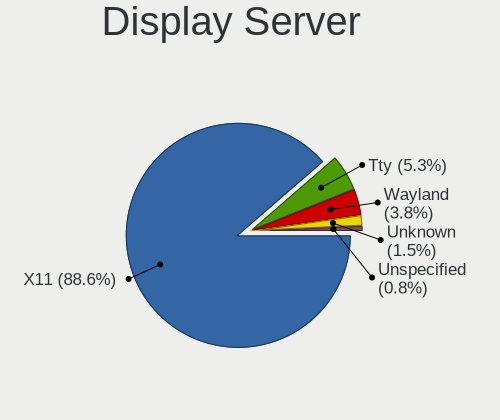
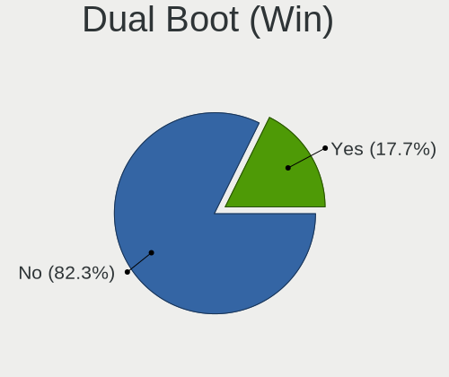
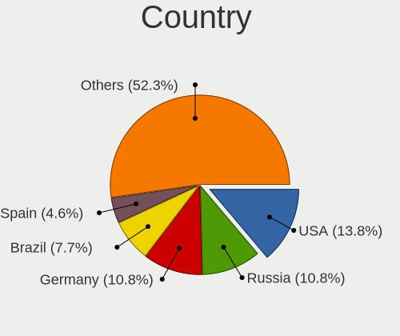
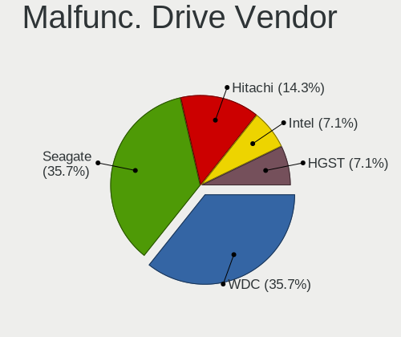
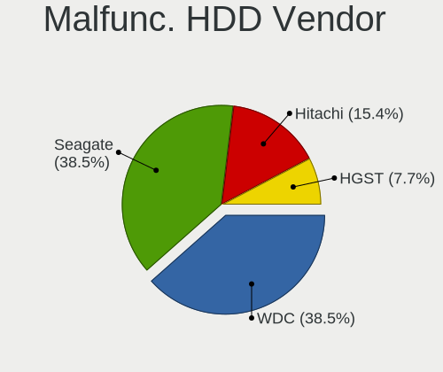
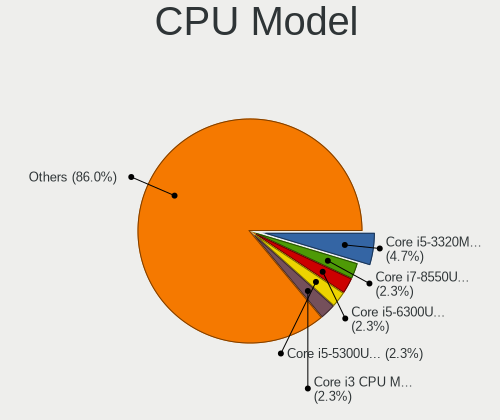
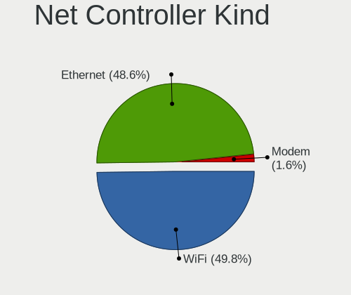
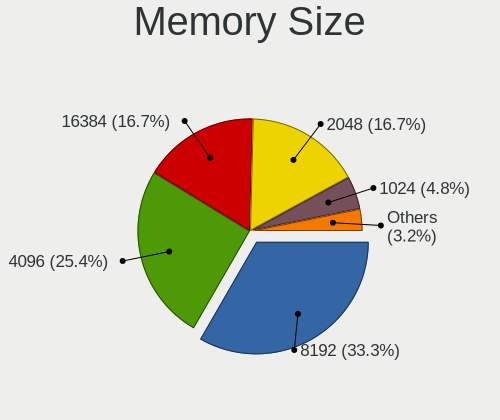
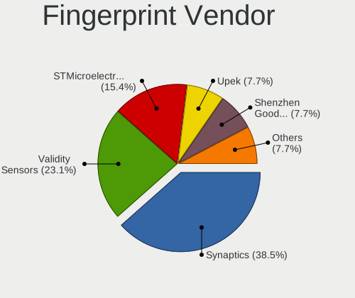

Devuan - Tested Hardware & Statistics (Notebooks)
-------------------------------------------------

A project to collect tested hardware configurations for Devuan.

Anyone can contribute to this report by the [hw-probe](https://github.com/linuxhw/hw-probe) tool:

    sudo -E hw-probe -all -upload

Please contribute! Especially if your hardware is rare.

Contents
--------

* [ Test Cases ](#test-cases)

* [ System ](#system)
  - [ OS                       ](#os)
  - [ OS Family                ](#os-family)
  - [ Kernel                   ](#kernel)
  - [ Kernel Family            ](#kernel-family)
  - [ Kernel Major Ver.        ](#kernel-major-ver)
  - [ Arch                     ](#arch)
  - [ DE                       ](#de)
  - [ Display Server           ](#display-server)
  - [ Display Manager          ](#display-manager)
  - [ OS Lang                  ](#os-lang)
  - [ Boot Mode                ](#boot-mode)
  - [ Filesystem               ](#filesystem)
  - [ Part. scheme             ](#part-scheme)
  - [ Dual Boot with Linux/BSD ](#dual-boot-with-linuxbsd)
  - [ Dual Boot (Win)          ](#dual-boot-win)

* [ Board ](#board)
  - [ Vendor                   ](#vendor)
  - [ Model                    ](#model)
  - [ Model Family             ](#model-family)
  - [ MFG Year                 ](#mfg-year)
  - [ Form Factor              ](#form-factor)
  - [ Secure Boot              ](#secure-boot)
  - [ Coreboot                 ](#coreboot)
  - [ RAM Size                 ](#ram-size)
  - [ RAM Used                 ](#ram-used)
  - [ Total Drives             ](#total-drives)
  - [ Has CD-ROM               ](#has-cd-rom)
  - [ Has Ethernet             ](#has-ethernet)
  - [ Has WiFi                 ](#has-wifi)
  - [ Has Bluetooth            ](#has-bluetooth)

* [ Location ](#location)
  - [ Country                  ](#country)
  - [ City                     ](#city)

* [ Drives ](#drives)
  - [ Drive Vendor             ](#drive-vendor)
  - [ Drive Model              ](#drive-model)
  - [ HDD Vendor               ](#hdd-vendor)
  - [ SSD Vendor               ](#ssd-vendor)
  - [ Drive Kind               ](#drive-kind)
  - [ Drive Connector          ](#drive-connector)
  - [ Drive Size               ](#drive-size)
  - [ Space Total              ](#space-total)
  - [ Space Used               ](#space-used)
  - [ Malfunc. Drives          ](#malfunc-drives)
  - [ Malfunc. Drive Vendor    ](#malfunc-drive-vendor)
  - [ Malfunc. HDD Vendor      ](#malfunc-hdd-vendor)
  - [ Malfunc. Drive Kind      ](#malfunc-drive-kind)
  - [ Failed Drives            ](#failed-drives)
  - [ Failed Drive Vendor      ](#failed-drive-vendor)
  - [ Drive Status             ](#drive-status)

* [ Storage controller ](#storage-controller)
  - [ Storage Vendor           ](#storage-vendor)
  - [ Storage Model            ](#storage-model)
  - [ Storage Kind             ](#storage-kind)

* [ Processor ](#processor)
  - [ CPU Vendor               ](#cpu-vendor)
  - [ CPU Model                ](#cpu-model)
  - [ CPU Model Family         ](#cpu-model-family)
  - [ CPU Cores                ](#cpu-cores)
  - [ CPU Sockets              ](#cpu-sockets)
  - [ CPU Threads              ](#cpu-threads)
  - [ CPU Op-Modes             ](#cpu-op-modes)
  - [ CPU Microcode            ](#cpu-microcode)
  - [ CPU Microarch            ](#cpu-microarch)

* [ Graphics ](#graphics)
  - [ GPU Vendor               ](#gpu-vendor)
  - [ GPU Model                ](#gpu-model)
  - [ GPU Combo                ](#gpu-combo)
  - [ GPU Driver               ](#gpu-driver)
  - [ GPU Memory               ](#gpu-memory)

* [ Monitor ](#monitor)
  - [ Monitor Vendor           ](#monitor-vendor)
  - [ Monitor Model            ](#monitor-model)
  - [ Monitor Resolution       ](#monitor-resolution)
  - [ Monitor Diagonal         ](#monitor-diagonal)
  - [ Monitor Width            ](#monitor-width)
  - [ Aspect Ratio             ](#aspect-ratio)
  - [ Monitor Area             ](#monitor-area)
  - [ Pixel Density            ](#pixel-density)
  - [ Multiple Monitors        ](#multiple-monitors)

* [ Network ](#network)
  - [ Net Controller Vendor    ](#net-controller-vendor)
  - [ Net Controller Model     ](#net-controller-model)
  - [ Wireless Vendor          ](#wireless-vendor)
  - [ Wireless Model           ](#wireless-model)
  - [ Ethernet Vendor          ](#ethernet-vendor)
  - [ Ethernet Model           ](#ethernet-model)
  - [ Net Controller Kind      ](#net-controller-kind)
  - [ Used Controller          ](#used-controller)
  - [ NICs                     ](#nics)
  - [ IPv6                     ](#ipv6)

* [ Bluetooth ](#bluetooth)
  - [ Bluetooth Vendor         ](#bluetooth-vendor)
  - [ Bluetooth Model          ](#bluetooth-model)

* [ Sound ](#sound)
  - [ Sound Vendor             ](#sound-vendor)
  - [ Sound Model              ](#sound-model)

* [ Memory ](#memory)
  - [ Memory Vendor            ](#memory-vendor)
  - [ Memory Model             ](#memory-model)
  - [ Memory Kind              ](#memory-kind)
  - [ Memory Form Factor       ](#memory-form-factor)
  - [ Memory Size              ](#memory-size)
  - [ Memory Speed             ](#memory-speed)

* [ Printers & scanners ](#printers--scanners)
  - [ Printer Vendor           ](#printer-vendor)
  - [ Printer Model            ](#printer-model)
  - [ Scanner Vendor           ](#scanner-vendor)
  - [ Scanner Model            ](#scanner-model)

* [ Camera ](#camera)
  - [ Camera Vendor            ](#camera-vendor)
  - [ Camera Model             ](#camera-model)

* [ Security ](#security)
  - [ Fingerprint Vendor       ](#fingerprint-vendor)
  - [ Fingerprint Model        ](#fingerprint-model)
  - [ Chipcard Vendor          ](#chipcard-vendor)
  - [ Chipcard Model           ](#chipcard-model)

* [ Unsupported ](#unsupported)
  - [ Unsupported Devices      ](#unsupported-devices)
  - [ Unsupported Device Types ](#unsupported-device-types)

Test Cases
----------

Total: 79

| Vendor        | Model                       | Probe                                                      | Date         |
|---------------|-----------------------------|------------------------------------------------------------|--------------|
| Unknown       | Unknown                     | [1f89daceb8](https://linux-hardware.org/?probe=1f89daceb8) | Feb 20, 2023 |
| HP            | ProBook 640 G1              | [d0319bdf17](https://linux-hardware.org/?probe=d0319bdf17) | Feb 09, 2023 |
| Lenovo        | ThinkPad T560 20FJS1J200    | [de713cedce](https://linux-hardware.org/?probe=de713cedce) | Jan 21, 2023 |
| Acer          | Aspire E1-572G              | [360a177e77](https://linux-hardware.org/?probe=360a177e77) | Jan 14, 2023 |
| Dell          | Inspiron 15 3511            | [f4349052b8](https://linux-hardware.org/?probe=f4349052b8) | Jan 06, 2023 |
| Dell          | XPS 13 9370                 | [1f72002986](https://linux-hardware.org/?probe=1f72002986) | Dec 29, 2022 |
| HP            | Laptop 14-df0xxx            | [1d9edd6c97](https://linux-hardware.org/?probe=1d9edd6c97) | Dec 25, 2022 |
| HP            | 250 G8 Notebook PC          | [ed3886b135](https://linux-hardware.org/?probe=ed3886b135) | Dec 02, 2022 |
| Dell          | Latitude E6530              | [e40986d2fb](https://linux-hardware.org/?probe=e40986d2fb) | Nov 22, 2022 |
| Dell          | Latitude E6530              | [14debbe3e5](https://linux-hardware.org/?probe=14debbe3e5) | Nov 22, 2022 |
| Lenovo        | G50-30 80G0                 | [be4f638bc7](https://linux-hardware.org/?probe=be4f638bc7) | Nov 21, 2022 |
| HP            | Laptop 15-bs2xx             | [7254534946](https://linux-hardware.org/?probe=7254534946) | Oct 20, 2022 |
| Lenovo        | ThinkPad T550 20CJS1VD01    | [97d1b5e6c5](https://linux-hardware.org/?probe=97d1b5e6c5) | Sep 30, 2022 |
| Lenovo        | ThinkPad T440p              | [270cf10219](https://linux-hardware.org/?probe=270cf10219) | Sep 25, 2022 |
| Lenovo        | ThinkPad T440p              | [bf397424f3](https://linux-hardware.org/?probe=bf397424f3) | Sep 18, 2022 |
| Lenovo        | ThinkPad T550 20CJS1VD01    | [1bcc13e6b4](https://linux-hardware.org/?probe=1bcc13e6b4) | Aug 15, 2022 |
| CCE           | Capella & IbexPeak-M Chi... | [defafd4f0b](https://linux-hardware.org/?probe=defafd4f0b) | Aug 10, 2022 |
| CCE           | Capella & IbexPeak-M Chi... | [389bef188c](https://linux-hardware.org/?probe=389bef188c) | Aug 10, 2022 |
| Sony          | VPCEE23FX                   | [b4108910d3](https://linux-hardware.org/?probe=b4108910d3) | Jul 25, 2022 |
| Toshiba       | Satellite Pro A50-C         | [a94461714d](https://linux-hardware.org/?probe=a94461714d) | Jul 18, 2022 |
| Lenovo        | V310-14ISK 80SX             | [6dcb934555](https://linux-hardware.org/?probe=6dcb934555) | Jul 17, 2022 |
| Dell          | Latitude 7280               | [75ce6d31bc](https://linux-hardware.org/?probe=75ce6d31bc) | Jul 14, 2022 |
| MSI           | Modern 15 A5M               | [40c6c77f2c](https://linux-hardware.org/?probe=40c6c77f2c) | Jul 13, 2022 |
| Dell          | Latitude E7240              | [045554b70c](https://linux-hardware.org/?probe=045554b70c) | Jul 08, 2022 |
| Lenovo        | ThinkPad T430 2349I46       | [3a7df4ea17](https://linux-hardware.org/?probe=3a7df4ea17) | Jun 20, 2022 |
| HP            | Laptop 17-cp0xxx            | [001634b95b](https://linux-hardware.org/?probe=001634b95b) | Jun 17, 2022 |
| Dell          | Latitude E6430              | [95b7617708](https://linux-hardware.org/?probe=95b7617708) | Jun 05, 2022 |
| Acer          | Aspire E5-553G              | [2d4c950e2f](https://linux-hardware.org/?probe=2d4c950e2f) | May 25, 2022 |
| Acer          | Aspire E5-553G              | [73139cdb17](https://linux-hardware.org/?probe=73139cdb17) | May 25, 2022 |
| Lenovo        | IdeaPad L340-15IRH Gamin... | [2717caa7f5](https://linux-hardware.org/?probe=2717caa7f5) | Apr 25, 2022 |
| HP            | Notebook                    | [966668f0c0](https://linux-hardware.org/?probe=966668f0c0) | Apr 17, 2022 |
| Lenovo        | ThinkPad T470s 20HGS00P0... | [2c9878c68b](https://linux-hardware.org/?probe=2c9878c68b) | Apr 13, 2022 |
| Dell          | Latitude E5540              | [0948114af7](https://linux-hardware.org/?probe=0948114af7) | Mar 03, 2022 |
| Lenovo        | ThinkPad T550 20CJS1VD01    | [a3aed9d375](https://linux-hardware.org/?probe=a3aed9d375) | Mar 03, 2022 |
| ASUSTek       | K55VJ                       | [562262b9eb](https://linux-hardware.org/?probe=562262b9eb) | Jan 22, 2022 |
| ASUSTek       | X555LJ                      | [9fbdf4dfc2](https://linux-hardware.org/?probe=9fbdf4dfc2) | Jan 17, 2022 |
| Lenovo        | ThinkPad T420 4180AG3       | [2c3cd27ad2](https://linux-hardware.org/?probe=2c3cd27ad2) | Jan 16, 2022 |
| Notebook      | W230ST                      | [3dacf0aea8](https://linux-hardware.org/?probe=3dacf0aea8) | Jan 15, 2022 |
| Lenovo        | IdeaPad 130-15AST 81H5      | [899cb98778](https://linux-hardware.org/?probe=899cb98778) | Dec 06, 2021 |
| Fujitsu Si... | ESPRIMO Mobile V6535        | [d860ff9858](https://linux-hardware.org/?probe=d860ff9858) | Nov 30, 2021 |
| Fujitsu       | LIFEBOOK U7510              | [d43a6a6bb8](https://linux-hardware.org/?probe=d43a6a6bb8) | Nov 29, 2021 |
| Lenovo        | ThinkPad T550 20CJS1VD01    | [55689e67b3](https://linux-hardware.org/?probe=55689e67b3) | Oct 27, 2021 |
| Lenovo        | ThinkPad X230 2325DE0       | [991007e92a](https://linux-hardware.org/?probe=991007e92a) | Oct 13, 2021 |
| Lenovo        | IdeaPad 130-15AST 81H5      | [7f1b3371a9](https://linux-hardware.org/?probe=7f1b3371a9) | Oct 03, 2021 |
| Toshiba       | Satellite M40X              | [61fea93e97](https://linux-hardware.org/?probe=61fea93e97) | Oct 01, 2021 |
| Acer          | Aspire 5250                 | [ae41600fd9](https://linux-hardware.org/?probe=ae41600fd9) | Sep 24, 2021 |
| IBM           | ThinkPad T41p 2373GHG       | [04747e3df4](https://linux-hardware.org/?probe=04747e3df4) | Sep 19, 2021 |
| IBM           | ThinkPad T41p 2373GHG       | [134b90f474](https://linux-hardware.org/?probe=134b90f474) | Sep 18, 2021 |
| Lenovo        | ThinkPad X200 74585FU       | [04256a6e0a](https://linux-hardware.org/?probe=04256a6e0a) | Aug 25, 2021 |
| Lenovo        | ThinkPad X200 74585FU       | [dffbcc492c](https://linux-hardware.org/?probe=dffbcc492c) | Aug 25, 2021 |
| ASUSTek       | K52F                        | [643e3cc4b3](https://linux-hardware.org/?probe=643e3cc4b3) | Aug 13, 2021 |
| MSI           | MS-1688                     | [0ae772d66b](https://linux-hardware.org/?probe=0ae772d66b) | Jul 30, 2021 |
| Lenovo        | ThinkPad X220 429053G       | [5f553465bf](https://linux-hardware.org/?probe=5f553465bf) | Jul 29, 2021 |
| Acer          | Extensa 215-51K             | [1c49c2f4d0](https://linux-hardware.org/?probe=1c49c2f4d0) | Jul 26, 2021 |
| Lenovo        | ThinkPad X250 20CLS7WY04    | [fc77801294](https://linux-hardware.org/?probe=fc77801294) | Jun 07, 2021 |
| Lenovo        | ThinkPad T550 20CJS1VD01    | [aef4e323e2](https://linux-hardware.org/?probe=aef4e323e2) | Jun 06, 2021 |
| ASUSTek       | K55VJ                       | [6fa86f9d25](https://linux-hardware.org/?probe=6fa86f9d25) | Apr 27, 2021 |
| ASUSTek       | K55VJ                       | [aef1b6c71f](https://linux-hardware.org/?probe=aef1b6c71f) | Apr 17, 2021 |
| HP            | ProBook 6475b               | [74b0fa77b5](https://linux-hardware.org/?probe=74b0fa77b5) | Apr 14, 2021 |
| Fujitsu Si... | AMILO Xi 1546               | [22a53eeb74](https://linux-hardware.org/?probe=22a53eeb74) | Apr 03, 2021 |
| Teclast       | F6 Plus                     | [26ac25681a](https://linux-hardware.org/?probe=26ac25681a) | Jan 08, 2021 |
| Dell          | Precision 7530              | [8e0ee186a3](https://linux-hardware.org/?probe=8e0ee186a3) | Dec 04, 2020 |
| Lenovo        | ThinkPad X60 1707YF8        | [bcdd451de1](https://linux-hardware.org/?probe=bcdd451de1) | Oct 31, 2020 |
| Nokia         | N900                        | [7960cb48cc](https://linux-hardware.org/?probe=7960cb48cc) | Oct 05, 2020 |
| Lenovo        | ThinkPad X230 23247S0       | [f313b0bf1b](https://linux-hardware.org/?probe=f313b0bf1b) | Oct 01, 2020 |
| Dell          | Precision 7530              | [e6c6dd2734](https://linux-hardware.org/?probe=e6c6dd2734) | Sep 26, 2020 |
| Dell          | Precision 7530              | [81e9306141](https://linux-hardware.org/?probe=81e9306141) | Sep 26, 2020 |
| Lenovo        | ThinkPad X1 Carbon 7th 2... | [3d241c321f](https://linux-hardware.org/?probe=3d241c321f) | Sep 20, 2020 |
| ASUSTek       | K52F                        | [cef5147eeb](https://linux-hardware.org/?probe=cef5147eeb) | Aug 30, 2020 |
| Acer          | Aspire 5732Z                | [c4cb936b69](https://linux-hardware.org/?probe=c4cb936b69) | Aug 30, 2020 |
| Toshiba       | Satellite L655              | [6251a9111f](https://linux-hardware.org/?probe=6251a9111f) | Aug 30, 2020 |
| HP            | Pavilion 11 x360 PC         | [0c85729a27](https://linux-hardware.org/?probe=0c85729a27) | Aug 30, 2020 |
| Samsung       | 355V4C/355V4X/355V5C/355... | [358be6b820](https://linux-hardware.org/?probe=358be6b820) | Jul 28, 2020 |
| Lenovo        | IdeaPad Z370                | [51e3108708](https://linux-hardware.org/?probe=51e3108708) | Jun 28, 2020 |
| Dell          | Latitude 5501               | [94ec8d2a1d](https://linux-hardware.org/?probe=94ec8d2a1d) | Jun 28, 2020 |
| Lenovo        | IdeaPad Z370                | [76c985ed75](https://linux-hardware.org/?probe=76c985ed75) | Jun 27, 2020 |
| Dell          | Latitude E7250              | [c2ca61e7bf](https://linux-hardware.org/?probe=c2ca61e7bf) | Jun 23, 2020 |
| Dell          | Inspiron 1564               | [b80e556643](https://linux-hardware.org/?probe=b80e556643) | Feb 02, 2020 |
| MTC           | Montara-GML                 | [227bf1ba1d](https://linux-hardware.org/?probe=227bf1ba1d) | Dec 07, 2019 |

System
------

OS
--

Installed operating systems

| Name                    | Notebooks | Percent |
|-------------------------|-----------|---------|
| Devuan 4                | 32        | 48.48%  |
| Devuan 3                | 14        | 21.21%  |
| Devuan Testing/unstable | 8         | 12.12%  |
| Devuan 5                | 8         | 12.12%  |
| Devuan                  | 2         | 3.03%   |
| Devuan 3.0              | 1         | 1.52%   |
| Devuan 2.1              | 1         | 1.52%   |

OS Family
---------

OS without a version

| Name   | Notebooks | Percent |
|--------|-----------|---------|
| Devuan | 62        | 100%    |

Kernel
------

Version of the Linux kernel

| Version                   | Notebooks | Percent |
|---------------------------|-----------|---------|
| 5.10.0-16-amd64           | 5         | 7.14%   |
| 5.10.0-9-amd64            | 4         | 5.71%   |
| 5.10.0-13-amd64           | 4         | 5.71%   |
| 4.19.0-9-amd64            | 4         | 5.71%   |
| 5.7.0-2-amd64             | 3         | 4.29%   |
| 5.10.0-8-amd64            | 3         | 4.29%   |
| 5.10.0-18-amd64           | 3         | 4.29%   |
| 5.10.0-10-amd64           | 3         | 4.29%   |
| 5.18.0-2-amd64            | 2         | 2.86%   |
| 5.10.0-21-amd64           | 2         | 2.86%   |
| 5.10.0-19-amd64           | 2         | 2.86%   |
| 5.10.0-11-amd64           | 2         | 2.86%   |
| 4.19.0-17-amd64           | 2         | 2.86%   |
| 4.19.0-16-amd64           | 2         | 2.86%   |
| 4.19.0-14-amd64           | 2         | 2.86%   |
| 6.0.0-5-amd64             | 1         | 1.43%   |
| 6.0.0-2-amd64             | 1         | 1.43%   |
| 6.0.0-0.deb11.6-amd64     | 1         | 1.43%   |
| 5.9.0-4-amd64             | 1         | 1.43%   |
| 5.8.0-1-amd64             | 1         | 1.43%   |
| 5.7.0-0.bpo.2-amd64       | 1         | 1.43%   |
| 5.6.0-2-amd64             | 1         | 1.43%   |
| 5.19.0-2-amd64            | 1         | 1.43%   |
| 5.18.0-1-amd64            | 1         | 1.43%   |
| 5.15.5-xanmod1            | 1         | 1.43%   |
| 5.15.0-2-amd64            | 1         | 1.43%   |
| 5.14.0-4-amd64            | 1         | 1.43%   |
| 5.10.0-7-amd64            | 1         | 1.43%   |
| 5.10.0-4-amd64            | 1         | 1.43%   |
| 5.10.0-20-amd64           | 1         | 1.43%   |
| 5.10.0-15-amd64           | 1         | 1.43%   |
| 5.10.0-14-amd64           | 1         | 1.43%   |
| 5.10.0-1-amd64            | 1         | 1.43%   |
| 5.1.21                    | 1         | 1.43%   |
| 4.9.0-14-amd64            | 1         | 1.43%   |
| 4.9.0-11-amd64            | 1         | 1.43%   |
| 4.9.0-11-686              | 1         | 1.43%   |
| 4.9.0-0.bpo.4-686-pae     | 1         | 1.43%   |
| 4.4.195-antix.1-amd64-smp | 1         | 1.43%   |
| 4.19.0-17-686-pae         | 1         | 1.43%   |

Kernel Family
-------------

Linux kernel without a distro release

| Version | Notebooks | Percent |
|---------|-----------|---------|
| 5.10.0  | 31        | 46.27%  |
| 4.19.0  | 13        | 19.4%   |
| 5.7.0   | 4         | 5.97%   |
| 4.9.0   | 4         | 5.97%   |
| 6.0.0   | 3         | 4.48%   |
| 5.18.0  | 3         | 4.48%   |
| 5.9.0   | 1         | 1.49%   |
| 5.8.0   | 1         | 1.49%   |
| 5.6.0   | 1         | 1.49%   |
| 5.19.0  | 1         | 1.49%   |
| 5.15.5  | 1         | 1.49%   |
| 5.15.0  | 1         | 1.49%   |
| 5.14.0  | 1         | 1.49%   |
| 5.1.21  | 1         | 1.49%   |
| 4.4.195 | 1         | 1.49%   |

Kernel Major Ver.
-----------------

Linux kernel major version

| Version | Notebooks | Percent |
|---------|-----------|---------|
| 5.10    | 31        | 46.27%  |
| 4.19    | 13        | 19.4%   |
| 5.7     | 4         | 5.97%   |
| 4.9     | 4         | 5.97%   |
| 6.0     | 3         | 4.48%   |
| 5.18    | 3         | 4.48%   |
| 5.15    | 2         | 2.99%   |
| 5.9     | 1         | 1.49%   |
| 5.8     | 1         | 1.49%   |
| 5.6     | 1         | 1.49%   |
| 5.19    | 1         | 1.49%   |
| 5.14    | 1         | 1.49%   |
| 5.1     | 1         | 1.49%   |
| 4.4     | 1         | 1.49%   |

Arch
----

OS architecture (x86_64, i586, etc.)

| Name   | Notebooks | Percent |
|--------|-----------|---------|
| x86_64 | 58        | 93.55%  |
| i686   | 3         | 4.84%   |
| armv7l | 1         | 1.61%   |

DE
--

Desktop Environment

| Name     | Notebooks | Percent |
|----------|-----------|---------|
| XFCE     | 26        | 40%     |
| KDE5     | 10        | 15.38%  |
| MATE     | 9         | 13.85%  |
| Unknown  | 8         | 12.31%  |
| i3       | 4         | 6.15%   |
| LXDE     | 3         | 4.62%   |
| GNOME    | 2         | 3.08%   |
| Openbox  | 1         | 1.54%   |
| LXQt     | 1         | 1.54%   |
| Cinnamon | 1         | 1.54%   |

Display Server
--------------

X11 or Wayland

| Name    | Notebooks | Percent |
|---------|-----------|---------|
| X11     | 59        | 93.65%  |
| Tty     | 2         | 3.17%   |
| Unknown | 2         | 3.17%   |

Display Manager
---------------

SDDM, LightDM, etc.

| Name    | Notebooks | Percent |
|---------|-----------|---------|
| SLiM    | 21        | 32.31%  |
| LightDM | 19        | 29.23%  |
| Unknown | 18        | 27.69%  |
| SDDM    | 5         | 7.69%   |
| XDM     | 1         | 1.54%   |
| GDM3    | 1         | 1.54%   |

OS Lang
-------

Language

| Lang        | Notebooks | Percent |
|-------------|-----------|---------|
| en_US       | 26        | 41.27%  |
| en_GB       | 12        | 19.05%  |
| ru_RU       | 7         | 11.11%  |
| pt_BR       | 3         | 4.76%   |
| it_IT       | 2         | 3.17%   |
| es_ES       | 2         | 3.17%   |
| de_AT       | 2         | 3.17%   |
| Unknown     | 2         | 3.17%   |
| ru_UA       | 1         | 1.59%   |
| pl_PL       | 1         | 1.59%   |
| fr_BE       | 1         | 1.59%   |
| es_SV       | 1         | 1.59%   |
| en_US.utf-8 | 1         | 1.59%   |
| de_DE       | 1         | 1.59%   |
| C           | 1         | 1.59%   |

Boot Mode
---------

EFI or BIOS

| Mode | Notebooks | Percent |
|------|-----------|---------|
| BIOS | 35        | 55.56%  |
| EFI  | 28        | 44.44%  |

Filesystem
----------

Type of filesystem

| Type    | Notebooks | Percent |
|---------|-----------|---------|
| Ext4    | 54        | 87.1%   |
| Btrfs   | 3         | 4.84%   |
| Unknown | 3         | 4.84%   |
| OveXlay | 1         | 1.61%   |
| Ext2    | 1         | 1.61%   |

Part. scheme
------------

Scheme of partitioning

| Type    | Notebooks | Percent |
|---------|-----------|---------|
| GPT     | 30        | 46.88%  |
| MBR     | 25        | 39.06%  |
| Unknown | 9         | 14.06%  |

Dual Boot with Linux/BSD
------------------------

Hosting more than one Linux/BSD

| Dual boot | Notebooks | Percent |
|-----------|-----------|---------|
| No        | 54        | 87.1%   |
| Yes       | 8         | 12.9%   |

Dual Boot (Win)
---------------

Hosting Linux and Windows

| Dual boot | Notebooks | Percent |
|-----------|-----------|---------|
| No        | 49        | 77.78%  |
| Yes       | 14        | 22.22%  |

Board
-----

Vendor
------

Motherboard manufacturer

| Name                | Notebooks | Percent |
|---------------------|-----------|---------|
| Lenovo              | 18        | 29.03%  |
| Dell                | 11        | 17.74%  |
| Hewlett-Packard     | 8         | 12.9%   |
| Acer                | 5         | 8.06%   |
| Toshiba             | 3         | 4.84%   |
| ASUSTek Computer    | 3         | 4.84%   |
| MSI                 | 2         | 3.23%   |
| Fujitsu Siemens     | 2         | 3.23%   |
| Teclast             | 1         | 1.61%   |
| Sony                | 1         | 1.61%   |
| Samsung Electronics | 1         | 1.61%   |
| Notebook            | 1         | 1.61%   |
| Nokia               | 1         | 1.61%   |
| MTC                 | 1         | 1.61%   |
| IBM                 | 1         | 1.61%   |
| Fujitsu             | 1         | 1.61%   |
| CCE                 | 1         | 1.61%   |
| Unknown             | 1         | 1.61%   |

Model
-----

Motherboard model

| Name                                                                                     | Notebooks | Percent |
|------------------------------------------------------------------------------------------|-----------|---------|
| Toshiba Satellite Pro A50-C                                                              | 1         | 1.61%   |
| Toshiba Satellite M40X                                                                   | 1         | 1.61%   |
| Toshiba Satellite L655                                                                   | 1         | 1.61%   |
| Teclast F6 Plus                                                                          | 1         | 1.61%   |
| Sony VPCEE23FX                                                                           | 1         | 1.61%   |
| Samsung 355V4C/355V4X/355V5C/355V5X/356V4C/356V4X/356V5C/356V5X/3445VC/3445VX/3545VC/354 | 1         | 1.61%   |
| Notebook W230ST                                                                          | 1         | 1.61%   |
| Nokia N900                                                                               | 1         | 1.61%   |
| MTC Montara-GML                                                                          | 1         | 1.61%   |
| MSI MS-1688                                                                              | 1         | 1.61%   |
| MSI Modern 15 A5M                                                                        | 1         | 1.61%   |
| Lenovo V310-14ISK 80SX                                                                   | 1         | 1.61%   |
| Lenovo ThinkPad X60 1707YF8                                                              | 1         | 1.61%   |
| Lenovo ThinkPad X250 20CLS7WY04                                                          | 1         | 1.61%   |
| Lenovo ThinkPad X230 2325DE0                                                             | 1         | 1.61%   |
| Lenovo ThinkPad X230 23247S0                                                             | 1         | 1.61%   |
| Lenovo ThinkPad X220 429053G                                                             | 1         | 1.61%   |
| Lenovo ThinkPad X200 74585FU                                                             | 1         | 1.61%   |
| Lenovo ThinkPad X1 Carbon 7th 20QD00L1PB                                                 | 1         | 1.61%   |
| Lenovo ThinkPad T560 20FJS1J200                                                          | 1         | 1.61%   |
| Lenovo ThinkPad T550 20CJS1VD01                                                          | 1         | 1.61%   |
| Lenovo ThinkPad T470s 20HGS00P00                                                         | 1         | 1.61%   |
| Lenovo ThinkPad T440p                                                                    | 1         | 1.61%   |
| Lenovo ThinkPad T430 2349I46                                                             | 1         | 1.61%   |
| Lenovo ThinkPad T420 4180AG3                                                             | 1         | 1.61%   |
| Lenovo IdeaPad Z370                                                                      | 1         | 1.61%   |
| Lenovo IdeaPad L340-15IRH Gaming 81LK                                                    | 1         | 1.61%   |
| Lenovo IdeaPad 130-15AST 81H5                                                            | 1         | 1.61%   |
| Lenovo G50-30 80G0                                                                       | 1         | 1.61%   |
| IBM ThinkPad T41p 2373GHG                                                                | 1         | 1.61%   |
| HP ProBook 6475b                                                                         | 1         | 1.61%   |
| HP ProBook 640 G1                                                                        | 1         | 1.61%   |
| HP Pavilion 11 x360 PC                                                                   | 1         | 1.61%   |
| HP Notebook                                                                              | 1         | 1.61%   |
| HP Laptop 17-cp0xxx                                                                      | 1         | 1.61%   |
| HP Laptop 15-bs2xx                                                                       | 1         | 1.61%   |
| HP Laptop 14-df0xxx                                                                      | 1         | 1.61%   |
| HP 250 G8 Notebook PC                                                                    | 1         | 1.61%   |
| Fujitsu Siemens ESPRIMO Mobile V6535                                                     | 1         | 1.61%   |
| Fujitsu Siemens AMILO Xi 1546                                                            | 1         | 1.61%   |

Model Family
------------

Motherboard model prefix

| Name                    | Notebooks | Percent |
|-------------------------|-----------|---------|
| Lenovo ThinkPad         | 13        | 20.97%  |
| Dell Latitude           | 7         | 11.29%  |
| Acer Aspire             | 4         | 6.45%   |
| Toshiba Satellite       | 3         | 4.84%   |
| Lenovo IdeaPad          | 3         | 4.84%   |
| HP Laptop               | 3         | 4.84%   |
| HP ProBook              | 2         | 3.23%   |
| Dell Inspiron           | 2         | 3.23%   |
| Teclast F6              | 1         | 1.61%   |
| Sony VPCEE23FX          | 1         | 1.61%   |
| Samsung 355V4C          | 1         | 1.61%   |
| Notebook W230ST         | 1         | 1.61%   |
| Nokia N900              | 1         | 1.61%   |
| MTC Montara-GML         | 1         | 1.61%   |
| MSI MS-1688             | 1         | 1.61%   |
| MSI Modern              | 1         | 1.61%   |
| Lenovo V310-14ISK       | 1         | 1.61%   |
| Lenovo G50-30           | 1         | 1.61%   |
| IBM ThinkPad            | 1         | 1.61%   |
| HP Pavilion             | 1         | 1.61%   |
| HP Notebook             | 1         | 1.61%   |
| HP 250                  | 1         | 1.61%   |
| Fujitsu Siemens ESPRIMO | 1         | 1.61%   |
| Fujitsu Siemens AMILO   | 1         | 1.61%   |
| Fujitsu LIFEBOOK        | 1         | 1.61%   |
| Dell XPS                | 1         | 1.61%   |
| Dell Precision          | 1         | 1.61%   |
| CCE Capella             | 1         | 1.61%   |
| ASUS X555LJ             | 1         | 1.61%   |
| ASUS K55VJ              | 1         | 1.61%   |
| ASUS K52F               | 1         | 1.61%   |
| Acer Extensa            | 1         | 1.61%   |
| Unknown                 | 1         | 1.61%   |

MFG Year
--------

Motherboard manufacture year

| Year    | Notebooks | Percent |
|---------|-----------|---------|
| 2012    | 8         | 12.9%   |
| 2019    | 5         | 8.06%   |
| 2018    | 5         | 8.06%   |
| 2021    | 4         | 6.45%   |
| 2017    | 4         | 6.45%   |
| 2014    | 4         | 6.45%   |
| 2013    | 4         | 6.45%   |
| 2011    | 4         | 6.45%   |
| 2010    | 4         | 6.45%   |
| 2016    | 3         | 4.84%   |
| 2015    | 3         | 4.84%   |
| 2009    | 3         | 4.84%   |
| 2020    | 2         | 3.23%   |
| 2008    | 2         | 3.23%   |
| 2006    | 2         | 3.23%   |
| 2005    | 2         | 3.23%   |
| 2022    | 1         | 1.61%   |
| 2007    | 1         | 1.61%   |
| Unknown | 1         | 1.61%   |

Form Factor
-----------

Physical design of the computer

| Name     | Notebooks | Percent |
|----------|-----------|---------|
| Notebook | 62        | 100%    |

Secure Boot
-----------

Enabled or disabled

| State    | Notebooks | Percent |
|----------|-----------|---------|
| Disabled | 60        | 96.77%  |
| Enabled  | 2         | 3.23%   |

Coreboot
--------

Have coreboot on board

| Used | Notebooks | Percent |
|------|-----------|---------|
| No   | 60        | 96.77%  |
| Yes  | 2         | 3.23%   |

RAM Size
--------

Total RAM memory

| Size in GB  | Notebooks | Percent |
|-------------|-----------|---------|
| 4.01-8.0    | 16        | 25.81%  |
| 8.01-16.0   | 14        | 22.58%  |
| 3.01-4.0    | 12        | 19.35%  |
| 16.01-24.0  | 9         | 14.52%  |
| 2.01-3.0    | 3         | 4.84%   |
| 1.01-2.0    | 3         | 4.84%   |
| 0.01-0.5    | 2         | 3.23%   |
| 32.01-64.0  | 1         | 1.61%   |
| 24.01-32.0  | 1         | 1.61%   |
| 64.01-256.0 | 1         | 1.61%   |

RAM Used
--------

Used RAM memory

| Used GB    | Notebooks | Percent |
|------------|-----------|---------|
| 1.01-2.0   | 28        | 41.18%  |
| 4.01-8.0   | 15        | 22.06%  |
| 2.01-3.0   | 9         | 13.24%  |
| 3.01-4.0   | 5         | 7.35%   |
| 0.51-1.0   | 5         | 7.35%   |
| 0.01-0.5   | 3         | 4.41%   |
| 8.01-16.0  | 2         | 2.94%   |
| 32.01-64.0 | 1         | 1.47%   |

Total Drives
------------

Number of drives on board

| Drives | Notebooks | Percent |
|--------|-----------|---------|
| 1      | 45        | 71.43%  |
| 2      | 14        | 22.22%  |
| 3      | 4         | 6.35%   |

Has CD-ROM
----------

Has CD-ROM on board

| Presented | Notebooks | Percent |
|-----------|-----------|---------|
| No        | 37        | 58.73%  |
| Yes       | 26        | 41.27%  |

Has Ethernet
------------

Has Ethernet on board

| Presented | Notebooks | Percent |
|-----------|-----------|---------|
| Yes       | 56        | 90.32%  |
| No        | 6         | 9.68%   |

Has WiFi
--------

Has WiFi module

| Presented | Notebooks | Percent |
|-----------|-----------|---------|
| Yes       | 60        | 96.77%  |
| No        | 2         | 3.23%   |

Has Bluetooth
-------------

Has Bluetooth module

| Presented | Notebooks | Percent |
|-----------|-----------|---------|
| Yes       | 38        | 60.32%  |
| No        | 25        | 39.68%  |

Location
--------

Country
-------

Geographic location (country)

| Country     | Notebooks | Percent |
|-------------|-----------|---------|
| Germany     | 7         | 11.11%  |
| USA         | 6         | 9.52%   |
| Russia      | 6         | 9.52%   |
| Brazil      | 5         | 7.94%   |
| Ukraine     | 4         | 6.35%   |
| Italy       | 3         | 4.76%   |
| Grenada     | 3         | 4.76%   |
| Spain       | 2         | 3.17%   |
| Portugal    | 2         | 3.17%   |
| Poland      | 2         | 3.17%   |
| Netherlands | 2         | 3.17%   |
| Hungary     | 2         | 3.17%   |
| France      | 2         | 3.17%   |
| Finland     | 2         | 3.17%   |
| Austria     | 2         | 3.17%   |
| Vietnam     | 1         | 1.59%   |
| UK          | 1         | 1.59%   |
| Slovakia    | 1         | 1.59%   |
| Serbia      | 1         | 1.59%   |
| Romania     | 1         | 1.59%   |
| Norway      | 1         | 1.59%   |
| Mexico      | 1         | 1.59%   |
| Israel      | 1         | 1.59%   |
| Indonesia   | 1         | 1.59%   |
| Greece      | 1         | 1.59%   |
| Georgia     | 1         | 1.59%   |
| El Salvador | 1         | 1.59%   |
| Belarus     | 1         | 1.59%   |

City
----

Geographic location (city)

| City               | Notebooks | Percent |
|--------------------|-----------|---------|
| Saint George's     | 3         | 4.76%   |
| Nadudvar           | 2         | 3.17%   |
| Milan              | 2         | 3.17%   |
| Kyiv               | 2         | 3.17%   |
| Bagnolet           | 2         | 3.17%   |
| Amsterdam          | 2         | 3.17%   |
| Yakutsk            | 1         | 1.59%   |
| Wulkaprodersdorf   | 1         | 1.59%   |
| Wroclaw            | 1         | 1.59%   |
| Willich            | 1         | 1.59%   |
| Wildberg           | 1         | 1.59%   |
| Trubchëvsk        | 1         | 1.59%   |
| Thessaloniki       | 1         | 1.59%   |
| Tel Aviv           | 1         | 1.59%   |
| Tbilisi            | 1         | 1.59%   |
| Staunton           | 1         | 1.59%   |
| St Petersburg      | 1         | 1.59%   |
| Siena              | 1         | 1.59%   |
| Sao Paulo          | 1         | 1.59%   |
| San Salvador       | 1         | 1.59%   |
| Rio de Janeiro     | 1         | 1.59%   |
| Praia Grande       | 1         | 1.59%   |
| Oslo               | 1         | 1.59%   |
| Novopskov          | 1         | 1.59%   |
| Muenster-Sarmsheim | 1         | 1.59%   |
| Mountain View      | 1         | 1.59%   |
| Moscow             | 1         | 1.59%   |
| Maladzyechna       | 1         | 1.59%   |
| Madrid             | 1         | 1.59%   |
| Lisbon             | 1         | 1.59%   |
| Leonding           | 1         | 1.59%   |
| Leipzig            | 1         | 1.59%   |
| Krasnodar          | 1         | 1.59%   |
| Kouvola            | 1         | 1.59%   |
| Kharkiv            | 1         | 1.59%   |
| Katzenbach         | 1         | 1.59%   |
| Katowice           | 1         | 1.59%   |
| Jyväskylä        | 1         | 1.59%   |
| Hermosillo         | 1         | 1.59%   |
| Hayden             | 1         | 1.59%   |

Drives
------

Drive Vendor
------------

Hard drive vendors

| Vendor              | Notebooks | Drives | Percent |
|---------------------|-----------|--------|---------|
| WDC                 | 11        | 12     | 13.41%  |
| Samsung Electronics | 11        | 16     | 13.41%  |
| Unknown             | 8         | 9      | 9.76%   |
| Kingston            | 6         | 6      | 7.32%   |
| Seagate             | 5         | 5      | 6.1%    |
| SanDisk             | 4         | 4      | 4.88%   |
| SK hynix            | 3         | 3      | 3.66%   |
| PNY                 | 3         | 3      | 3.66%   |
| Hitachi             | 3         | 3      | 3.66%   |
| HGST                | 3         | 3      | 3.66%   |
| Crucial             | 3         | 3      | 3.66%   |
| Toshiba             | 2         | 2      | 2.44%   |
| Team                | 2         | 2      | 2.44%   |
| LITEON              | 2         | 5      | 2.44%   |
| Intel               | 2         | 2      | 2.44%   |
| Fujitsu             | 2         | 2      | 2.44%   |
| Union Memory        | 1         | 2      | 1.22%   |
| UMIS                | 1         | 1      | 1.22%   |
| Teclast             | 1         | 1      | 1.22%   |
| Smart               | 1         | 1      | 1.22%   |
| SABRENT             | 1         | 2      | 1.22%   |
| Patriot             | 1         | 1      | 1.22%   |
| Mushkin             | 1         | 1      | 1.22%   |
| LITEONIT            | 1         | 1      | 1.22%   |
| KIOXIA              | 1         | 1      | 1.22%   |
| KingFast            | 1         | 1      | 1.22%   |
| HXY                 | 1         | 1      | 1.22%   |
| Hewlett-Packard     | 1         | 1      | 1.22%   |

Drive Model
-----------

Hard drive models

| Model                                  | Notebooks | Percent |
|----------------------------------------|-----------|---------|
| Unknown MMC Card  128GB                | 3         | 3.57%   |
| PNY CS900 240GB SSD                    | 3         | 3.57%   |
| Samsung SSD 850 EVO 500GB              | 2         | 2.38%   |
| Kingston SA400S37480G 480GB SSD        | 2         | 2.38%   |
| Kingston SA400S37240G 240GB SSD        | 2         | 2.38%   |
| Crucial CT250MX500SSD1 250GB           | 2         | 2.38%   |
| WDC WDS500G2B0A-00SM50 500GB SSD       | 1         | 1.19%   |
| WDC WDS240G2G0A-00JH30 240GB SSD       | 1         | 1.19%   |
| WDC WD7500BPKX-00HPJT0 752GB           | 1         | 1.19%   |
| WDC WD5000BPVT-24HXZT3 500GB           | 1         | 1.19%   |
| WDC WD3200BPVT-22JJ5T0 320GB           | 1         | 1.19%   |
| WDC WD3200BEVT-22A23T0 320GB           | 1         | 1.19%   |
| WDC WD3200BEVE-00A0HT0 320GB           | 1         | 1.19%   |
| WDC WD2500BEKT-00A25T0 250GB           | 1         | 1.19%   |
| WDC WD10SPZX-21Z10T0 1TB               | 1         | 1.19%   |
| WDC WD10JPCX-24UE4T0 1TB               | 1         | 1.19%   |
| WDC PC SN540 SDDPNPF-512G-1032 512GB   | 1         | 1.19%   |
| Unknown SD04G  4GB                     | 1         | 1.19%   |
| Unknown SD  8GB                        | 1         | 1.19%   |
| Unknown MMC32G  32GB                   | 1         | 1.19%   |
| Unknown MMC Card  8GB                  | 1         | 1.19%   |
| Unknown MMC Card  32GB                 | 1         | 1.19%   |
| Unknown MMC Card  16GB                 | 1         | 1.19%   |
| Union Memory RTOTJ128VGD2EYX 128GB SSD | 1         | 1.19%   |
| UMIS RPFTJ256PDD2MWX 256GB             | 1         | 1.19%   |
| Toshiba MK5065GSX 500GB                | 1         | 1.19%   |
| Toshiba MK1252GSX 120GB                | 1         | 1.19%   |
| Teclast 256GB NS550-2242 SSD           | 1         | 1.19%   |
| Team T253X1120G 120GB SSD              | 1         | 1.19%   |
| Team T253TD240G 240GB SSD              | 1         | 1.19%   |
| Smart SSD SZ9MSE mSATA 256GB           | 1         | 1.19%   |
| SK hynix SC311 SATA 256GB SSD          | 1         | 1.19%   |
| SK hynix PC611 NVMe 1TB                | 1         | 1.19%   |
| SK hynix PC401 NVMe 512GB              | 1         | 1.19%   |
| Seagate ST9250410AS 250GB              | 1         | 1.19%   |
| Seagate ST500LT012-1DG142 500GB        | 1         | 1.19%   |
| Seagate ST320LM010-1KJ15C 320GB        | 1         | 1.19%   |
| Seagate ST250VT000-1DK141 250GB        | 1         | 1.19%   |
| Seagate Expansion Desk 5TB             | 1         | 1.19%   |
| SanDisk X300 MSATA 256GB SSD           | 1         | 1.19%   |

HDD Vendor
----------

Hard disk drive vendors

| Vendor  | Notebooks | Drives | Percent |
|---------|-----------|--------|---------|
| WDC     | 8         | 8      | 33.33%  |
| Seagate | 5         | 5      | 20.83%  |
| Hitachi | 3         | 3      | 12.5%   |
| HGST    | 3         | 3      | 12.5%   |
| Toshiba | 2         | 2      | 8.33%   |
| Fujitsu | 2         | 2      | 8.33%   |
| SABRENT | 1         | 2      | 4.17%   |

SSD Vendor
----------

Solid state drive vendors

| Vendor              | Notebooks | Drives | Percent |
|---------------------|-----------|--------|---------|
| Samsung Electronics | 7         | 7      | 18.42%  |
| Kingston            | 6         | 6      | 15.79%  |
| SanDisk             | 4         | 4      | 10.53%  |
| PNY                 | 3         | 3      | 7.89%   |
| Crucial             | 3         | 3      | 7.89%   |
| WDC                 | 2         | 3      | 5.26%   |
| Team                | 2         | 2      | 5.26%   |
| LITEON              | 2         | 5      | 5.26%   |
| Union Memory        | 1         | 2      | 2.63%   |
| Teclast             | 1         | 1      | 2.63%   |
| Smart               | 1         | 1      | 2.63%   |
| SK hynix            | 1         | 1      | 2.63%   |
| Patriot             | 1         | 1      | 2.63%   |
| Mushkin             | 1         | 1      | 2.63%   |
| LITEONIT            | 1         | 1      | 2.63%   |
| HXY                 | 1         | 1      | 2.63%   |
| Hewlett-Packard     | 1         | 1      | 2.63%   |

Drive Kind
----------

HDD or SSD

| Kind    | Notebooks | Drives | Percent |
|---------|-----------|--------|---------|
| SSD     | 34        | 43     | 43.59%  |
| HDD     | 24        | 25     | 30.77%  |
| NVMe    | 11        | 16     | 14.1%   |
| MMC     | 8         | 9      | 10.26%  |
| Unknown | 1         | 1      | 1.28%   |

Drive Connector
---------------

SATA, SAS, NVMe, etc.

| Type | Notebooks | Drives | Percent |
|------|-----------|--------|---------|
| SATA | 51        | 66     | 70.83%  |
| NVMe | 11        | 16     | 15.28%  |
| MMC  | 8         | 9      | 11.11%  |
| SAS  | 2         | 3      | 2.78%   |

Drive Size
----------

Size of hard drive

| Size in TB | Notebooks | Drives | Percent |
|------------|-----------|--------|---------|
| 0.01-0.5   | 43        | 53     | 81.13%  |
| 0.51-1.0   | 7         | 12     | 13.21%  |
| 1.01-2.0   | 2         | 2      | 3.77%   |
| 4.01-10.0  | 1         | 1      | 1.89%   |

Space Total
-----------

Amount of disk space available on the file system

| Size in GB     | Notebooks | Percent |
|----------------|-----------|---------|
| 251-500        | 19        | 29.23%  |
| 101-250        | 15        | 23.08%  |
| 501-1000       | 8         | 12.31%  |
| 51-100         | 7         | 10.77%  |
| 21-50          | 4         | 6.15%   |
| 1001-2000      | 4         | 6.15%   |
| Unknown        | 3         | 4.62%   |
| 2001-3000      | 2         | 3.08%   |
| 1-20           | 2         | 3.08%   |
| More than 3000 | 1         | 1.54%   |

Space Used
----------

Amount of used disk space

| Used GB   | Notebooks | Percent |
|-----------|-----------|---------|
| 1-20      | 19        | 29.69%  |
| 101-250   | 12        | 18.75%  |
| 51-100    | 10        | 15.63%  |
| 251-500   | 8         | 12.5%   |
| 21-50     | 6         | 9.38%   |
| 1001-2000 | 3         | 4.69%   |
| Unknown   | 3         | 4.69%   |
| 501-1000  | 2         | 3.13%   |
| 2001-3000 | 1         | 1.56%   |

Malfunc. Drives
---------------

Drive models with a malfunction

| Model                         | Notebooks | Drives | Percent |
|-------------------------------|-----------|--------|---------|
| WDC WD5000BPVT-24HXZT3 500GB  | 1         | 1      | 20%     |
| WDC WD3200BEVT-22A23T0 320GB  | 1         | 1      | 20%     |
| WDC WD10JPCX-24UE4T0 1TB      | 1         | 1      | 20%     |
| Hitachi HTS727575A9E364 752GB | 1         | 1      | 20%     |
| Hitachi HTS726060M9AT00 56GB  | 1         | 1      | 20%     |

Malfunc. Drive Vendor
---------------------

Vendors of faulty drives

| Vendor  | Notebooks | Drives | Percent |
|---------|-----------|--------|---------|
| WDC     | 3         | 3      | 60%     |
| Hitachi | 2         | 2      | 40%     |

Malfunc. HDD Vendor
-------------------

Vendors of faulty HDD drives

| Vendor  | Notebooks | Drives | Percent |
|---------|-----------|--------|---------|
| WDC     | 3         | 3      | 60%     |
| Hitachi | 2         | 2      | 40%     |

Malfunc. Drive Kind
-------------------

Kinds of faulty drives

| Kind | Notebooks | Drives | Percent |
|------|-----------|--------|---------|
| HDD  | 5         | 5      | 100%    |

Failed Drives
-------------

Failed drive models

Zero info for selected period =(

Failed Drive Vendor
-------------------

Failed drive vendors

Zero info for selected period =(

Drive Status
------------

Number of failed and malfunc. drives

| Status   | Notebooks | Drives | Percent |
|----------|-----------|--------|---------|
| Works    | 49        | 67     | 70%     |
| Detected | 16        | 22     | 22.86%  |
| Malfunc  | 5         | 5      | 7.14%   |

Storage controller
------------------

Storage Vendor
--------------

Storage controller vendors

| Vendor                  | Notebooks | Percent |
|-------------------------|-----------|---------|
| Intel                   | 48        | 72.73%  |
| AMD                     | 8         | 12.12%  |
| Samsung Electronics     | 4         | 6.06%   |
| SK hynix                | 2         | 3.03%   |
| VIA Technologies        | 1         | 1.52%   |
| Union Memory (Shenzhen) | 1         | 1.52%   |
| SanDisk                 | 1         | 1.52%   |
| KIOXIA                  | 1         | 1.52%   |

Storage Model
-------------

Storage controller models

| Model                                                                                  | Notebooks | Percent |
|----------------------------------------------------------------------------------------|-----------|---------|
| Intel 7 Series Chipset Family 6-port SATA Controller [AHCI mode]                       | 6         | 8.11%   |
| AMD FCH SATA Controller [AHCI mode]                                                    | 6         | 8.11%   |
| Intel Wildcat Point-LP SATA Controller [AHCI Mode]                                     | 4         | 5.41%   |
| Intel Sunrise Point-LP SATA Controller [AHCI mode]                                     | 4         | 5.41%   |
| Intel 5 Series/3400 Series Chipset 4 port SATA AHCI Controller                         | 4         | 5.41%   |
| Intel Cannon Lake Mobile PCH SATA AHCI Controller                                      | 3         | 4.05%   |
| Intel 82801IBM/IEM (ICH9M/ICH9M-E) 4 port SATA Controller [AHCI mode]                  | 3         | 4.05%   |
| Intel 82801 Mobile SATA Controller [RAID mode]                                         | 3         | 4.05%   |
| Intel Tiger Lake-LP SATA Controller                                                    | 2         | 2.7%    |
| Intel Celeron/Pentium Silver Processor SATA Controller                                 | 2         | 2.7%    |
| Intel Atom Processor E3800 Series SATA AHCI Controller                                 | 2         | 2.7%    |
| Intel 82801G (ICH7 Family) IDE Controller                                              | 2         | 2.7%    |
| Intel 82801DBM (ICH4-M) IDE Controller                                                 | 2         | 2.7%    |
| Intel 8 Series/C220 Series Chipset Family 6-port SATA Controller 1 [AHCI mode]         | 2         | 2.7%    |
| Intel 8 Series SATA Controller 1 [AHCI mode]                                           | 2         | 2.7%    |
| Intel 6 Series/C200 Series Chipset Family 6 port Mobile SATA AHCI Controller           | 2         | 2.7%    |
| AMD SB7x0/SB8x0/SB9x0 SATA Controller [AHCI mode]                                      | 2         | 2.7%    |
| VIA VT6421 IDE/SATA Controller                                                         | 1         | 1.35%   |
| Union Memory (Shenzhen) Non-Volatile memory controller                                 | 1         | 1.35%   |
| SK hynix PC401 NVMe Solid State Drive 256GB                                            | 1         | 1.35%   |
| SK hynix Non-Volatile memory controller                                                | 1         | 1.35%   |
| SanDisk Non-Volatile memory controller                                                 | 1         | 1.35%   |
| Samsung NVMe SSD Controller SM981/PM981/PM983                                          | 1         | 1.35%   |
| Samsung NVMe SSD Controller SM961/PM961/SM963                                          | 1         | 1.35%   |
| Samsung NVMe SSD Controller PM9A1/PM9A3/980PRO                                         | 1         | 1.35%   |
| Samsung NVMe SSD Controller 980                                                        | 1         | 1.35%   |
| KIOXIA NVMe SSD Controller BG4                                                         | 1         | 1.35%   |
| Intel Volume Management Device NVMe RAID Controller                                    | 1         | 1.35%   |
| Intel SSD Pro 7600p/760p/E 6100p Series                                                | 1         | 1.35%   |
| Intel Non-Volatile memory controller                                                   | 1         | 1.35%   |
| Intel 82801GBM/GHM (ICH7-M Family) SATA Controller [IDE mode]                          | 1         | 1.35%   |
| Intel 82801GBM/GHM (ICH7-M Family) SATA Controller [AHCI mode]                         | 1         | 1.35%   |
| Intel 82801FBM (ICH6M) SATA Controller                                                 | 1         | 1.35%   |
| Intel 8 Series/C220 Series Chipset Family 2-port SATA Controller 2 [IDE mode]          | 1         | 1.35%   |
| Intel 8 Series Chipset Family 4-port SATA Controller 1 [IDE mode] - Mobile             | 1         | 1.35%   |
| Intel 6 Series/C200 Series Chipset Family Mobile SATA Controller (IDE mode, ports 4-5) | 1         | 1.35%   |
| Intel 6 Series/C200 Series Chipset Family Mobile SATA Controller (IDE mode, ports 0-3) | 1         | 1.35%   |
| Intel 5 Series/3400 Series Chipset 4 port SATA IDE Controller                          | 1         | 1.35%   |
| Intel 5 Series/3400 Series Chipset 2 port SATA IDE Controller                          | 1         | 1.35%   |
| AMD SB7x0/SB8x0/SB9x0 IDE Controller                                                   | 1         | 1.35%   |

Storage Kind
------------

Kind of storage controller (IDE, SATA, NVMe, SAS, ...)

| Kind | Notebooks | Percent |
|------|-----------|---------|
| SATA | 45        | 64.29%  |
| NVMe | 11        | 15.71%  |
| IDE  | 9         | 12.86%  |
| RAID | 5         | 7.14%   |

Processor
---------

CPU Vendor
----------

Processor vendors

| Vendor | Notebooks | Percent |
|--------|-----------|---------|
| Intel  | 52        | 83.87%  |
| AMD    | 9         | 14.52%  |
| ARM    | 1         | 1.61%   |

CPU Model
---------

Processor models

| Model                                       | Notebooks | Percent |
|---------------------------------------------|-----------|---------|
| Intel Core i5-5300U CPU @ 2.30GHz           | 3         | 4.84%   |
| Intel Core i5-3320M CPU @ 2.60GHz           | 3         | 4.84%   |
| Intel Core i5-6300U CPU @ 2.40GHz           | 2         | 3.23%   |
| Intel Core i3 CPU M 330 @ 2.13GHz           | 2         | 3.23%   |
| Intel Pentium M processor 1700MHz           | 1         | 1.61%   |
| Intel Pentium M processor 1.60GHz           | 1         | 1.61%   |
| Intel Pentium Dual-Core CPU T4400 @ 2.20GHz | 1         | 1.61%   |
| Intel Pentium Dual CPU T3400 @ 2.16GHz      | 1         | 1.61%   |
| Intel Pentium CPU P6100 @ 2.00GHz           | 1         | 1.61%   |
| Intel Pentium CPU N3540 @ 2.16GHz           | 1         | 1.61%   |
| Intel Core i9-8950HK CPU @ 2.90GHz          | 1         | 1.61%   |
| Intel Core i7-9850H CPU @ 2.60GHz           | 1         | 1.61%   |
| Intel Core i7-8565U CPU @ 1.80GHz           | 1         | 1.61%   |
| Intel Core i7-8550U CPU @ 1.80GHz           | 1         | 1.61%   |
| Intel Core i7-7600U CPU @ 2.80GHz           | 1         | 1.61%   |
| Intel Core i7-6600U CPU @ 2.60GHz           | 1         | 1.61%   |
| Intel Core i7-6500U CPU @ 2.50GHz           | 1         | 1.61%   |
| Intel Core i7-4710MQ CPU @ 2.50GHz          | 1         | 1.61%   |
| Intel Core i7-4700MQ CPU @ 2.40GHz          | 1         | 1.61%   |
| Intel Core i7-4610M CPU @ 3.00GHz           | 1         | 1.61%   |
| Intel Core i7-4500U CPU @ 1.80GHz           | 1         | 1.61%   |
| Intel Core i7-3610QM CPU @ 2.30GHz          | 1         | 1.61%   |
| Intel Core i7-3540M CPU @ 3.00GHz           | 1         | 1.61%   |
| Intel Core i7-2640M CPU @ 2.80GHz           | 1         | 1.61%   |
| Intel Core i5-9300H CPU @ 2.40GHz           | 1         | 1.61%   |
| Intel Core i5-4310U CPU @ 2.00GHz           | 1         | 1.61%   |
| Intel Core i5-2520M CPU @ 2.50GHz           | 1         | 1.61%   |
| Intel Core i5-10310U CPU @ 1.70GHz          | 1         | 1.61%   |
| Intel Core i3-7100U CPU @ 2.40GHz           | 1         | 1.61%   |
| Intel Core i3-6006U CPU @ 2.00GHz           | 1         | 1.61%   |
| Intel Core i3-5005U CPU @ 2.00GHz           | 1         | 1.61%   |
| Intel Core i3-4010U CPU @ 1.70GHz           | 1         | 1.61%   |
| Intel Core i3-3120M CPU @ 2.50GHz           | 1         | 1.61%   |
| Intel Core i3-2350M CPU @ 2.30GHz           | 1         | 1.61%   |
| Intel Core i3 CPU M 380 @ 2.53GHz           | 1         | 1.61%   |
| Intel Core i3 CPU M 370 @ 2.40GHz           | 1         | 1.61%   |
| Intel Core 2 CPU T7200 @ 2.00GHz            | 1         | 1.61%   |
| Intel Core 2 CPU T5600 @ 1.83GHz            | 1         | 1.61%   |
| Intel Core 2 CPU P8600 @ 2.40GHz            | 1         | 1.61%   |
| Intel Celeron N4100 CPU @ 1.10GHz           | 1         | 1.61%   |

CPU Model Family
----------------

Processor model prefix

| Model                   | Notebooks | Percent |
|-------------------------|-----------|---------|
| Intel Core i7           | 13        | 20.97%  |
| Intel Core i5           | 12        | 19.35%  |
| Intel Core i3           | 10        | 16.13%  |
| Other                   | 4         | 6.45%   |
| Intel Core 2            | 3         | 4.84%   |
| Intel Celeron           | 3         | 4.84%   |
| Intel Pentium M         | 2         | 3.23%   |
| Intel Pentium           | 2         | 3.23%   |
| Intel Pentium Dual-Core | 1         | 1.61%   |
| Intel Pentium Dual      | 1         | 1.61%   |
| Intel Core i9           | 1         | 1.61%   |
| Intel Celeron M         | 1         | 1.61%   |
| Intel Atom              | 1         | 1.61%   |
| AMD Ryzen 7             | 1         | 1.61%   |
| AMD Ryzen 5             | 1         | 1.61%   |
| AMD E2                  | 1         | 1.61%   |
| AMD E                   | 1         | 1.61%   |
| AMD Athlon II           | 1         | 1.61%   |
| AMD A8                  | 1         | 1.61%   |
| AMD A6                  | 1         | 1.61%   |
| AMD A10                 | 1         | 1.61%   |

CPU Cores
---------

Number of processor cores

| Number | Notebooks | Percent |
|--------|-----------|---------|
| 2      | 40        | 64.52%  |
| 4      | 13        | 20.97%  |
| 1      | 5         | 8.06%   |
| 6      | 3         | 4.84%   |
| 8      | 1         | 1.61%   |

CPU Sockets
-----------

Number of sockets

| Number | Notebooks | Percent |
|--------|-----------|---------|
| 1      | 62        | 100%    |

CPU Threads
-----------

Threads per core (Hyper-Threading)

| Number | Notebooks | Percent |
|--------|-----------|---------|
| 2      | 40        | 64.52%  |
| 1      | 22        | 35.48%  |

CPU Op-Modes
------------

CPU Operation Modes (32-bit, 64-bit)

| Op mode        | Notebooks | Percent |
|----------------|-----------|---------|
| 32-bit, 64-bit | 57        | 91.94%  |
| 32-bit         | 3         | 4.84%   |
| Unknown        | 2         | 3.23%   |

CPU Microcode
-------------

Microcode number

| Number     | Notebooks | Percent |
|------------|-----------|---------|
| Unknown    | 19        | 29.69%  |
| 0x406e3    | 4         | 6.25%   |
| 0x306d4    | 3         | 4.69%   |
| 0x306c3    | 3         | 4.69%   |
| 0x306a9    | 3         | 4.69%   |
| 0x206a7    | 3         | 4.69%   |
| 0x906ea    | 2         | 3.13%   |
| 0x806ec    | 2         | 3.13%   |
| 0x706a1    | 2         | 3.13%   |
| 0x6f6      | 2         | 3.13%   |
| 0x40651    | 2         | 3.13%   |
| 0x30678    | 2         | 3.13%   |
| 0x20655    | 2         | 3.13%   |
| 0x1067a    | 2         | 3.13%   |
| 0x08608103 | 2         | 3.13%   |
| 0x906ed    | 1         | 1.56%   |
| 0x806c1    | 1         | 1.56%   |
| 0x6d8      | 1         | 1.56%   |
| 0x695      | 1         | 1.56%   |
| 0x406c4    | 1         | 1.56%   |
| 0x20652    | 1         | 1.56%   |
| 0x07030105 | 1         | 1.56%   |
| 0x0600611a | 1         | 1.56%   |
| 0x05000119 | 1         | 1.56%   |
| 0x05000101 | 1         | 1.56%   |
| 0x010000b6 | 1         | 1.56%   |

CPU Microarch
-------------

Microarchitecture

| Name          | Notebooks | Percent |
|---------------|-----------|---------|
| KabyLake      | 8         | 12.9%   |
| IvyBridge     | 6         | 9.68%   |
| Haswell       | 6         | 9.68%   |
| Westmere      | 5         | 8.06%   |
| Skylake       | 5         | 8.06%   |
| Broadwell     | 4         | 6.45%   |
| Silvermont    | 3         | 4.84%   |
| SandyBridge   | 3         | 4.84%   |
| P6            | 3         | 4.84%   |
| Core          | 3         | 4.84%   |
| Unknown       | 3         | 4.84%   |
| TigerLake     | 2         | 3.23%   |
| Penryn        | 2         | 3.23%   |
| Goldmont plus | 2         | 3.23%   |
| Excavator     | 2         | 3.23%   |
| Bobcat        | 2         | 3.23%   |
| Puma          | 1         | 1.61%   |
| Piledriver    | 1         | 1.61%   |
| K10           | 1         | 1.61%   |

Graphics
--------

GPU Vendor
----------

Vendors of graphics cards

| Vendor | Notebooks | Percent |
|--------|-----------|---------|
| Intel  | 48        | 66.67%  |
| AMD    | 15        | 20.83%  |
| Nvidia | 9         | 12.5%   |

GPU Model
---------

Graphics card models

| Model                                                                                    | Notebooks | Percent |
|------------------------------------------------------------------------------------------|-----------|---------|
| Intel 3rd Gen Core processor Graphics Controller                                         | 6         | 8%      |
| Intel Core Processor Integrated Graphics Controller                                      | 5         | 6.67%   |
| Intel Skylake GT2 [HD Graphics 520]                                                      | 4         | 5.33%   |
| Intel HD Graphics 5500                                                                   | 4         | 5.33%   |
| Intel Mobile 4 Series Chipset Integrated Graphics Controller                             | 3         | 4%      |
| Intel Haswell-ULT Integrated Graphics Controller                                         | 3         | 4%      |
| Intel 4th Gen Core Processor Integrated Graphics Controller                              | 3         | 4%      |
| Intel 2nd Generation Core Processor Family Integrated Graphics Controller                | 3         | 4%      |
| Intel TigerLake-LP GT2 [Iris Xe Graphics]                                                | 2         | 2.67%   |
| Intel HD Graphics 620                                                                    | 2         | 2.67%   |
| Intel GeminiLake [UHD Graphics 600]                                                      | 2         | 2.67%   |
| Intel CoffeeLake-H GT2 [UHD Graphics 630]                                                | 2         | 2.67%   |
| Intel Atom Processor Z36xxx/Z37xxx Series Graphics & Display                             | 2         | 2.67%   |
| AMD Lucienne                                                                             | 2         | 2.67%   |
| Nvidia GP107M [GeForce MX150]                                                            | 1         | 1.33%   |
| Nvidia GP107M [GeForce GTX 1050 3 GB Max-Q]                                              | 1         | 1.33%   |
| Nvidia GM108M [GeForce 930M]                                                             | 1         | 1.33%   |
| Nvidia GK208BM [GeForce 920M]                                                            | 1         | 1.33%   |
| Nvidia GK106M [GeForce GTX 765M]                                                         | 1         | 1.33%   |
| Nvidia GF117M [GeForce 610M/710M/810M/820M / GT 620M/625M/630M/720M]                     | 1         | 1.33%   |
| Nvidia GF108M [NVS 5400M]                                                                | 1         | 1.33%   |
| Nvidia GF108M [GeForce GT 635M]                                                          | 1         | 1.33%   |
| Nvidia GF108GLM [NVS 5200M]                                                              | 1         | 1.33%   |
| Intel WhiskeyLake-U GT2 [UHD Graphics 620]                                               | 1         | 1.33%   |
| Intel UHD Graphics 620                                                                   | 1         | 1.33%   |
| Intel Mobile 945GM/GMS/GME, 943/940GML Express Integrated Graphics Controller            | 1         | 1.33%   |
| Intel Mobile 945GM/GMS, 943/940GML Express Integrated Graphics Controller                | 1         | 1.33%   |
| Intel HD Graphics 520                                                                    | 1         | 1.33%   |
| Intel CometLake-U GT2 [UHD Graphics]                                                     | 1         | 1.33%   |
| Intel Atom/Celeron/Pentium Processor x5-E8000/J3xxx/N3xxx Integrated Graphics Controller | 1         | 1.33%   |
| Intel 82852/855GM Integrated Graphics Device                                             | 1         | 1.33%   |
| AMD Wrestler [Radeon HD 7340]                                                            | 1         | 1.33%   |
| AMD Wrestler [Radeon HD 6310]                                                            | 1         | 1.33%   |
| AMD Wani [Radeon R5/R6/R7 Graphics]                                                      | 1         | 1.33%   |
| AMD Trinity 2 [Radeon HD 7520G]                                                          | 1         | 1.33%   |
| AMD Topaz XT [Radeon R7 M260/M265 / M340/M360 / M440/M445 / 530/535 / 620/625 Mobile]    | 1         | 1.33%   |
| AMD Sun XT [Radeon HD 8670A/8670M/8690M / R5 M330 / M430 / Radeon 520 Mobile]            | 1         | 1.33%   |
| AMD Stoney [Radeon R2/R3/R4/R5 Graphics]                                                 | 1         | 1.33%   |
| AMD RV380/M24 [Mobility Radeon X600]                                                     | 1         | 1.33%   |
| AMD RV350/M10 GL [Mobility FireGL T2]                                                    | 1         | 1.33%   |

GPU Combo
---------

Combinations of graphics cards

| Name           | Notebooks | Percent |
|----------------|-----------|---------|
| 1 x Intel      | 35        | 56.45%  |
| 1 x AMD        | 11        | 17.74%  |
| Intel + Nvidia | 9         | 14.52%  |
| Other          | 2         | 3.23%   |
| 2 x AMD        | 2         | 3.23%   |
| Intel + AMD    | 2         | 3.23%   |
| 2 x Intel      | 1         | 1.61%   |

GPU Driver
----------

Free vs proprietary

| Driver      | Notebooks | Percent |
|-------------|-----------|---------|
| Free        | 57        | 91.94%  |
| Proprietary | 3         | 4.84%   |
| Unknown     | 2         | 3.23%   |

GPU Memory
----------

Total video memory

| Size in GB | Notebooks | Percent |
|------------|-----------|---------|
| Unknown    | 46        | 73.02%  |
| 0.01-0.5   | 8         | 12.7%   |
| 1.01-2.0   | 4         | 6.35%   |
| 0.51-1.0   | 4         | 6.35%   |
| 3.01-4.0   | 1         | 1.59%   |

Monitor
-------

Monitor Vendor
--------------

Monitor vendors

| Vendor                  | Notebooks | Percent |
|-------------------------|-----------|---------|
| LG Display              | 15        | 21.74%  |
| AU Optronics            | 12        | 17.39%  |
| Chimei Innolux          | 10        | 14.49%  |
| Samsung Electronics     | 7         | 10.14%  |
| BOE                     | 4         | 5.8%    |
| PANDA                   | 3         | 4.35%   |
| MStar                   | 2         | 2.9%    |
| Lenovo                  | 2         | 2.9%    |
| Goldstar                | 2         | 2.9%    |
| Chi Mei Optoelectronics | 2         | 2.9%    |
| Acer                    | 2         | 2.9%    |
| Unknown                 | 1         | 1.45%   |
| STD                     | 1         | 1.45%   |
| Sharp                   | 1         | 1.45%   |
| InnoLux Display         | 1         | 1.45%   |
| InfoVision              | 1         | 1.45%   |
| Hisense                 | 1         | 1.45%   |
| Dell                    | 1         | 1.45%   |
| AOC                     | 1         | 1.45%   |

Monitor Model
-------------

Monitor models

| Model                                                                | Notebooks | Percent |
|----------------------------------------------------------------------|-----------|---------|
| Samsung Electronics S24D340 SAM0BBB 1920x1080 531x299mm 24.0-inch    | 2         | 2.9%    |
| MStar Demo MST0030 1920x540 708x398mm 32.0-inch                      | 2         | 2.9%    |
| LG Display LCD Monitor LGD02D8 1366x768 277x156mm 12.5-inch          | 2         | 2.9%    |
| Unknown LCD Monitor FFFF 2288x1287 2550x2550mm 142.0-inch            | 1         | 1.45%   |
| STD HDMI TV STD00C7 1680x1050 698x392mm 31.5-inch                    | 1         | 1.45%   |
| Sharp LCD Monitor SHP1484 1920x1080 294x165mm 13.3-inch              | 1         | 1.45%   |
| Samsung Electronics LCD Monitor SEC544B 1600x900 382x214mm 17.2-inch | 1         | 1.45%   |
| Samsung Electronics LCD Monitor SEC4545 1280x800 331x207mm 15.4-inch | 1         | 1.45%   |
| Samsung Electronics LCD Monitor SEC4151 1366x768 344x194mm 15.5-inch | 1         | 1.45%   |
| Samsung Electronics LCD Monitor SDC4852 1366x768 344x194mm 15.5-inch | 1         | 1.45%   |
| Samsung Electronics LCD Monitor SDC4851 1366x768 344x194mm 15.5-inch | 1         | 1.45%   |
| PANDA LM133LF5L01 NCP0020 1920x1080 294x165mm 13.3-inch              | 1         | 1.45%   |
| PANDA LCD Monitor NCP0040 1920x1080 344x194mm 15.5-inch              | 1         | 1.45%   |
| PANDA LCD Monitor NCP002E 1920x1080 344x194mm 15.5-inch              | 1         | 1.45%   |
| LG Display LP156WH1-TLA3 LGD01C2 1366x768 344x194mm 15.5-inch        | 1         | 1.45%   |
| LG Display LCD Monitor LGDD901 1366x768 344x194mm 15.5-inch          | 1         | 1.45%   |
| LG Display LCD Monitor LGD0542 1920x1080 276x156mm 12.5-inch         | 1         | 1.45%   |
| LG Display LCD Monitor LGD0540 1920x1080 344x194mm 15.5-inch         | 1         | 1.45%   |
| LG Display LCD Monitor LGD04D5 1920x1080 344x194mm 15.5-inch         | 1         | 1.45%   |
| LG Display LCD Monitor LGD047B 1366x768 344x194mm 15.5-inch          | 1         | 1.45%   |
| LG Display LCD Monitor LGD046F 1920x1080 344x194mm 15.5-inch         | 1         | 1.45%   |
| LG Display LCD Monitor LGD0450 1366x768 277x156mm 12.5-inch          | 1         | 1.45%   |
| LG Display LCD Monitor LGD03A3 1366x768 277x156mm 12.5-inch          | 1         | 1.45%   |
| LG Display LCD Monitor LGD0386 1366x768 309x174mm 14.0-inch          | 1         | 1.45%   |
| LG Display LCD Monitor LGD033E 1366x768 309x174mm 14.0-inch          | 1         | 1.45%   |
| LG Display LCD Monitor LGD02C0 1366x768 293x165mm 13.2-inch          | 1         | 1.45%   |
| LG Display LCD Monitor LGD018B 1366x768 310x174mm 14.0-inch          | 1         | 1.45%   |
| Lenovo LCD Monitor LEN4010 1280x800 261x163mm 12.1-inch              | 1         | 1.45%   |
| Lenovo LCD Monitor LEN4000 1024x768 246x185mm 12.1-inch              | 1         | 1.45%   |
| InnoLux Display LCD Monitor INL000A 1366x768 344x194mm 15.5-inch     | 1         | 1.45%   |
| InfoVision LCD Monitor IVO057D 1920x1080 309x174mm 14.0-inch         | 1         | 1.45%   |
| Hisense Hisense HSE4000 1920x1080 591x355mm 27.1-inch                | 1         | 1.45%   |
| Goldstar FULL HD GSM5B55 1920x1080 480x270mm 21.7-inch               | 1         | 1.45%   |
| Goldstar E2260 GSM57E0 1920x1080 477x268mm 21.5-inch                 | 1         | 1.45%   |
| Dell P2415Q DELA0BE 3840x2160 527x296mm 23.8-inch                    | 1         | 1.45%   |
| Chimei Innolux LCD Monitor CMN15E7 1920x1080 344x193mm 15.5-inch     | 1         | 1.45%   |
| Chimei Innolux LCD Monitor CMN15E5 1920x1080 344x193mm 15.5-inch     | 1         | 1.45%   |
| Chimei Innolux LCD Monitor CMN15DB 1366x768 344x193mm 15.5-inch      | 1         | 1.45%   |
| Chimei Innolux LCD Monitor CMN15C5 1366x768 344x193mm 15.5-inch      | 1         | 1.45%   |
| Chimei Innolux LCD Monitor CMN15BE 1366x768 344x194mm 15.5-inch      | 1         | 1.45%   |

Monitor Resolution
------------------

Monitor screen resolution

| Resolution       | Notebooks | Percent |
|------------------|-----------|---------|
| 1366x768 (WXGA)  | 30        | 44.78%  |
| 1920x1080 (FHD)  | 24        | 35.82%  |
| 3840x2160 (4K)   | 5         | 7.46%   |
| 1600x900 (HD+)   | 4         | 5.97%   |
| 1280x800 (WXGA)  | 2         | 2.99%   |
| 2288x1287        | 1         | 1.49%   |
| 1440x900 (WXGA+) | 1         | 1.49%   |

Monitor Diagonal
----------------

Diagonal size in inches

| Inches | Notebooks | Percent |
|--------|-----------|---------|
| 15     | 28        | 40.58%  |
| 14     | 8         | 11.59%  |
| 12     | 8         | 11.59%  |
| 13     | 7         | 10.14%  |
| 24     | 4         | 5.8%    |
| 17     | 3         | 4.35%   |
| 52     | 2         | 2.9%    |
| 23     | 2         | 2.9%    |
| 21     | 2         | 2.9%    |
| 142    | 1         | 1.45%   |
| 31     | 1         | 1.45%   |
| 27     | 1         | 1.45%   |
| 20     | 1         | 1.45%   |
| 11     | 1         | 1.45%   |

Monitor Width
-------------

Physical width

| Width in mm    | Notebooks | Percent |
|----------------|-----------|---------|
| 301-350        | 39        | 56.52%  |
| 201-300        | 13        | 18.84%  |
| 501-600        | 7         | 10.14%  |
| 401-500        | 3         | 4.35%   |
| 351-400        | 3         | 4.35%   |
| 1001-1500      | 2         | 2.9%    |
| More than 2000 | 1         | 1.45%   |
| 601-700        | 1         | 1.45%   |

Aspect Ratio
------------

Proportional relationship between the width and the height

| Ratio | Notebooks | Percent |
|-------|-----------|---------|
| 16/9  | 54        | 93.1%   |
| 16/10 | 3         | 5.17%   |
| 1.00  | 1         | 1.72%   |

Monitor Area
------------

Area in inch²

| Area in inch² | Notebooks | Percent |
|----------------|-----------|---------|
| 101-110        | 28        | 40.58%  |
| 81-90          | 11        | 15.94%  |
| 61-70          | 8         | 11.59%  |
| 201-250        | 7         | 10.14%  |
| 71-80          | 4         | 5.8%    |
| More than 1000 | 3         | 4.35%   |
| 151-200        | 2         | 2.9%    |
| 121-130        | 2         | 2.9%    |
| 51-60          | 1         | 1.45%   |
| 351-500        | 1         | 1.45%   |
| 301-350        | 1         | 1.45%   |
| 131-140        | 1         | 1.45%   |

Pixel Density
-------------

Pixels per inch

| Density | Notebooks | Percent |
|---------|-----------|---------|
| 101-120 | 25        | 36.76%  |
| 121-160 | 24        | 35.29%  |
| 51-100  | 11        | 16.18%  |
| 161-240 | 5         | 7.35%   |
| 1-50    | 3         | 4.41%   |

Multiple Monitors
-----------------

Total monitors connected

| Total | Notebooks | Percent |
|-------|-----------|---------|
| 1     | 52        | 81.25%  |
| 2     | 9         | 14.06%  |
| 3     | 2         | 3.13%   |
| 0     | 1         | 1.56%   |

Network
-------

Net Controller Vendor
---------------------

Controller vendors

| Vendor                     | Notebooks | Percent |
|----------------------------|-----------|---------|
| Intel                      | 30        | 30.93%  |
| Realtek Semiconductor      | 29        | 29.9%   |
| Qualcomm Atheros           | 21        | 21.65%  |
| Broadcom                   | 3         | 3.09%   |
| Ralink Technology          | 2         | 2.06%   |
| MediaTek                   | 2         | 2.06%   |
| ZTE WCDMA Technologies MSM | 1         | 1.03%   |
| VIA Technologies           | 1         | 1.03%   |
| TP-Link                    | 1         | 1.03%   |
| Sierra Wireless            | 1         | 1.03%   |
| Samsung Electronics        | 1         | 1.03%   |
| Ralink                     | 1         | 1.03%   |
| NetGear                    | 1         | 1.03%   |
| JMicron Technology         | 1         | 1.03%   |
| DisplayLink                | 1         | 1.03%   |
| Broadcom Limited           | 1         | 1.03%   |

Net Controller Model
--------------------

Controller models

| Model                                                                   | Notebooks | Percent |
|-------------------------------------------------------------------------|-----------|---------|
| Realtek RTL8111/8168/8411 PCI Express Gigabit Ethernet Controller       | 17        | 13.6%   |
| Intel 82579LM Gigabit Network Connection (Lewisville)                   | 7         | 5.6%    |
| Realtek RTL810xE PCI Express Fast Ethernet controller                   | 6         | 4.8%    |
| Intel Centrino Advanced-N 6205 [Taylor Peak]                            | 5         | 4%      |
| Realtek RTL8821CE 802.11ac PCIe Wireless Network Adapter                | 4         | 3.2%    |
| Qualcomm Atheros AR9485 Wireless Network Adapter                        | 4         | 3.2%    |
| Qualcomm Atheros AR9285 Wireless Network Adapter (PCI-Express)          | 4         | 3.2%    |
| Intel Wireless 7260                                                     | 4         | 3.2%    |
| Qualcomm Atheros QCA9377 802.11ac Wireless Network Adapter              | 3         | 2.4%    |
| Intel Wireless 8260                                                     | 3         | 2.4%    |
| Intel Wireless 7265                                                     | 3         | 2.4%    |
| Intel Ethernet Connection (3) I218-LM                                   | 3         | 2.4%    |
| Qualcomm Atheros QCA9565 / AR9565 Wireless Network Adapter              | 2         | 1.6%    |
| Qualcomm Atheros QCA6174 802.11ac Wireless Network Adapter              | 2         | 1.6%    |
| Qualcomm Atheros AR5212 802.11abg NIC                                   | 2         | 1.6%    |
| Qualcomm Atheros AR242x / AR542x Wireless Network Adapter (PCI-Express) | 2         | 1.6%    |
| Intel Ethernet Connection (7) I219-LM                                   | 2         | 1.6%    |
| Intel Ethernet Connection (4) I219-LM                                   | 2         | 1.6%    |
| Intel 82801DB/DBL/DBM (ICH4/ICH4-L/ICH4-M) AC'97 Modem Controller       | 2         | 1.6%    |
| ZTE WCDMA MSM USB SCSI CD-ROM                                           | 1         | 0.8%    |
| VIA VT6105/VT6106S [Rhine-III]                                          | 1         | 0.8%    |
| TP-Link UE300 10/100/1000 LAN (ethernet mode) [Realtek RTL8153]         | 1         | 0.8%    |
| Sierra Wireless EM7455                                                  | 1         | 0.8%    |
| Samsung Galaxy series, misc. (tethering mode)                           | 1         | 0.8%    |
| Realtek RTL8822CE 802.11ac PCIe Wireless Network Adapter                | 1         | 0.8%    |
| Realtek RTL8723BE PCIe Wireless Network Adapter                         | 1         | 0.8%    |
| Realtek RTL8188CE 802.11b/g/n WiFi Adapter                              | 1         | 0.8%    |
| Realtek RTL8187SE Wireless LAN Controller                               | 1         | 0.8%    |
| Realtek RTL8169 PCI Gigabit Ethernet Controller                         | 1         | 0.8%    |
| Realtek RTL8153 Gigabit Ethernet Adapter                                | 1         | 0.8%    |
| Realtek RTL-8100/8101L/8139 PCI Fast Ethernet Adapter                   | 1         | 0.8%    |
| Realtek 802.11ac NIC                                                    | 1         | 0.8%    |
| Ralink RT5370 Wireless Adapter                                          | 1         | 0.8%    |
| Ralink MT7601U Wireless Adapter                                         | 1         | 0.8%    |
| Ralink RT3290 Wireless 802.11n 1T/1R PCIe                               | 1         | 0.8%    |
| Qualcomm Atheros AR928X Wireless Network Adapter (PCI-Express)          | 1         | 0.8%    |
| Qualcomm Atheros AR8152 v2.0 Fast Ethernet                              | 1         | 0.8%    |
| Qualcomm Atheros AR8152 v1.1 Fast Ethernet                              | 1         | 0.8%    |
| Qualcomm Atheros AR8132 Fast Ethernet                                   | 1         | 0.8%    |
| NetGear WG111v3 54 Mbps Wireless [realtek RTL8187B]                     | 1         | 0.8%    |

Wireless Vendor
---------------

Wireless vendors

| Vendor                | Notebooks | Percent |
|-----------------------|-----------|---------|
| Intel                 | 23        | 37.1%   |
| Qualcomm Atheros      | 20        | 32.26%  |
| Realtek Semiconductor | 9         | 14.52%  |
| Ralink Technology     | 2         | 3.23%   |
| MediaTek              | 2         | 3.23%   |
| Broadcom              | 2         | 3.23%   |
| Sierra Wireless       | 1         | 1.61%   |
| Ralink                | 1         | 1.61%   |
| NetGear               | 1         | 1.61%   |
| Broadcom Limited      | 1         | 1.61%   |

Wireless Model
--------------

Wireless models

| Model                                                                   | Notebooks | Percent |
|-------------------------------------------------------------------------|-----------|---------|
| Intel Centrino Advanced-N 6205 [Taylor Peak]                            | 5         | 8.06%   |
| Realtek RTL8821CE 802.11ac PCIe Wireless Network Adapter                | 4         | 6.45%   |
| Qualcomm Atheros AR9485 Wireless Network Adapter                        | 4         | 6.45%   |
| Qualcomm Atheros AR9285 Wireless Network Adapter (PCI-Express)          | 4         | 6.45%   |
| Intel Wireless 7260                                                     | 4         | 6.45%   |
| Qualcomm Atheros QCA9377 802.11ac Wireless Network Adapter              | 3         | 4.84%   |
| Intel Wireless 8260                                                     | 3         | 4.84%   |
| Intel Wireless 7265                                                     | 3         | 4.84%   |
| Qualcomm Atheros QCA9565 / AR9565 Wireless Network Adapter              | 2         | 3.23%   |
| Qualcomm Atheros QCA6174 802.11ac Wireless Network Adapter              | 2         | 3.23%   |
| Qualcomm Atheros AR5212 802.11abg NIC                                   | 2         | 3.23%   |
| Qualcomm Atheros AR242x / AR542x Wireless Network Adapter (PCI-Express) | 2         | 3.23%   |
| Sierra Wireless EM7455                                                  | 1         | 1.61%   |
| Realtek RTL8822CE 802.11ac PCIe Wireless Network Adapter                | 1         | 1.61%   |
| Realtek RTL8723BE PCIe Wireless Network Adapter                         | 1         | 1.61%   |
| Realtek RTL8188CE 802.11b/g/n WiFi Adapter                              | 1         | 1.61%   |
| Realtek RTL8187SE Wireless LAN Controller                               | 1         | 1.61%   |
| Realtek 802.11ac NIC                                                    | 1         | 1.61%   |
| Ralink RT5370 Wireless Adapter                                          | 1         | 1.61%   |
| Ralink MT7601U Wireless Adapter                                         | 1         | 1.61%   |
| Ralink RT3290 Wireless 802.11n 1T/1R PCIe                               | 1         | 1.61%   |
| Qualcomm Atheros AR928X Wireless Network Adapter (PCI-Express)          | 1         | 1.61%   |
| NetGear WG111v3 54 Mbps Wireless [realtek RTL8187B]                     | 1         | 1.61%   |
| MediaTek MT7921K (RZ608) Wi-Fi 6E 80MHz                                 | 1         | 1.61%   |
| MediaTek MT7630e 802.11bgn Wireless Network Adapter                     | 1         | 1.61%   |
| Intel Wireless 8265 / 8275                                              | 1         | 1.61%   |
| Intel Wi-Fi 6 AX200                                                     | 1         | 1.61%   |
| Intel PRO/Wireless 3945ABG [Golan] Network Connection                   | 1         | 1.61%   |
| Intel PRO/Wireless 2200BG [Calexico2] Network Connection                | 1         | 1.61%   |
| Intel Gemini Lake PCH CNVi WiFi                                         | 1         | 1.61%   |
| Intel Centrino Advanced-N 6235                                          | 1         | 1.61%   |
| Intel Centrino Advanced-N 6200                                          | 1         | 1.61%   |
| Intel Cannon Point-LP CNVi [Wireless-AC]                                | 1         | 1.61%   |
| Broadcom Limited BCM4312 802.11b/g LP-PHY                               | 1         | 1.61%   |
| Broadcom BCM43228 802.11a/b/g/n                                         | 1         | 1.61%   |
| Broadcom BCM43142 802.11b/g/n                                           | 1         | 1.61%   |

Ethernet Vendor
---------------

Ethernet vendors

| Vendor                     | Notebooks | Percent |
|----------------------------|-----------|---------|
| Realtek Semiconductor      | 26        | 43.33%  |
| Intel                      | 24        | 40%     |
| Qualcomm Atheros           | 3         | 5%      |
| ZTE WCDMA Technologies MSM | 1         | 1.67%   |
| VIA Technologies           | 1         | 1.67%   |
| TP-Link                    | 1         | 1.67%   |
| Samsung Electronics        | 1         | 1.67%   |
| JMicron Technology         | 1         | 1.67%   |
| DisplayLink                | 1         | 1.67%   |
| Broadcom                   | 1         | 1.67%   |

Ethernet Model
--------------

Ethernet models

| Model                                                             | Notebooks | Percent |
|-------------------------------------------------------------------|-----------|---------|
| Realtek RTL8111/8168/8411 PCI Express Gigabit Ethernet Controller | 17        | 28.33%  |
| Intel 82579LM Gigabit Network Connection (Lewisville)             | 7         | 11.67%  |
| Realtek RTL810xE PCI Express Fast Ethernet controller             | 6         | 10%     |
| Intel Ethernet Connection (3) I218-LM                             | 3         | 5%      |
| Intel Ethernet Connection (7) I219-LM                             | 2         | 3.33%   |
| Intel Ethernet Connection (4) I219-LM                             | 2         | 3.33%   |
| ZTE WCDMA MSM USB SCSI CD-ROM                                     | 1         | 1.67%   |
| VIA VT6105/VT6106S [Rhine-III]                                    | 1         | 1.67%   |
| TP-Link UE300 10/100/1000 LAN (ethernet mode) [Realtek RTL8153]   | 1         | 1.67%   |
| Samsung Galaxy series, misc. (tethering mode)                     | 1         | 1.67%   |
| Realtek RTL8169 PCI Gigabit Ethernet Controller                   | 1         | 1.67%   |
| Realtek RTL8153 Gigabit Ethernet Adapter                          | 1         | 1.67%   |
| Realtek RTL-8100/8101L/8139 PCI Fast Ethernet Adapter             | 1         | 1.67%   |
| Qualcomm Atheros AR8152 v2.0 Fast Ethernet                        | 1         | 1.67%   |
| Qualcomm Atheros AR8152 v1.1 Fast Ethernet                        | 1         | 1.67%   |
| Qualcomm Atheros AR8132 Fast Ethernet                             | 1         | 1.67%   |
| JMicron JMC250 PCI Express Gigabit Ethernet Controller            | 1         | 1.67%   |
| Intel Ethernet Connection I219-V                                  | 1         | 1.67%   |
| Intel Ethernet Connection I219-LM                                 | 1         | 1.67%   |
| Intel Ethernet Connection I218-LM                                 | 1         | 1.67%   |
| Intel Ethernet Connection I217-V                                  | 1         | 1.67%   |
| Intel Ethernet Connection I217-LM                                 | 1         | 1.67%   |
| Intel Ethernet Connection (6) I219-V                              | 1         | 1.67%   |
| Intel Ethernet Connection (10) I219-LM                            | 1         | 1.67%   |
| Intel 82573L Gigabit Ethernet Controller                          | 1         | 1.67%   |
| Intel 82567LM Gigabit Network Connection                          | 1         | 1.67%   |
| Intel 82540EP Gigabit Ethernet Controller (Mobile)                | 1         | 1.67%   |
| DisplayLink Quad Video Dock                                       | 1         | 1.67%   |
| Broadcom NetXtreme BCM57786 Gigabit Ethernet PCIe                 | 1         | 1.67%   |

Net Controller Kind
-------------------

Ethernet, WiFi or modem

| Kind     | Notebooks | Percent |
|----------|-----------|---------|
| WiFi     | 60        | 50.42%  |
| Ethernet | 56        | 47.06%  |
| Modem    | 3         | 2.52%   |

Used Controller
---------------

Currently used network controller

| Kind     | Notebooks | Percent |
|----------|-----------|---------|
| WiFi     | 43        | 66.15%  |
| Ethernet | 22        | 33.85%  |

NICs
----

Total network controllers on board

| Total | Notebooks | Percent |
|-------|-----------|---------|
| 2     | 52        | 83.87%  |
| 1     | 8         | 12.9%   |
| 0     | 2         | 3.23%   |

IPv6
----

IPv6 vs IPv4

| Used | Notebooks | Percent |
|------|-----------|---------|
| No   | 54        | 87.1%   |
| Yes  | 8         | 12.9%   |

Bluetooth
---------

Bluetooth Vendor
----------------

Controller vendors

| Vendor                          | Notebooks | Percent |
|---------------------------------|-----------|---------|
| Intel                           | 13        | 33.33%  |
| Realtek Semiconductor           | 6         | 15.38%  |
| Qualcomm Atheros Communications | 4         | 10.26%  |
| Broadcom                        | 4         | 10.26%  |
| Lite-On Technology              | 3         | 7.69%   |
| Foxconn / Hon Hai               | 2         | 5.13%   |
| Dell                            | 2         | 5.13%   |
| Cambridge Silicon Radio         | 2         | 5.13%   |
| Ralink                          | 1         | 2.56%   |
| IMC Networks                    | 1         | 2.56%   |
| Foxconn International           | 1         | 2.56%   |

Bluetooth Model
---------------

Controller models

| Model                                               | Notebooks | Percent |
|-----------------------------------------------------|-----------|---------|
| Intel Bluetooth wireless interface                  | 9         | 23.08%  |
| Realtek Bluetooth Radio                             | 6         | 15.38%  |
| Qualcomm Atheros  Bluetooth Device                  | 3         | 7.69%   |
| Lite-On Qualcomm Atheros QCA9377 Bluetooth          | 2         | 5.13%   |
| Intel Bluetooth 9460/9560 Jefferson Peak (JfP)      | 2         | 5.13%   |
| Dell BCM20702A0 Bluetooth Module                    | 2         | 5.13%   |
| Cambridge Silicon Radio Bluetooth Dongle (HCI mode) | 2         | 5.13%   |
| Broadcom BCM20702 Bluetooth 4.0 [ThinkPad]          | 2         | 5.13%   |
| Broadcom BCM2045B (BDC-2.1)                         | 2         | 5.13%   |
| Ralink RT3290 Bluetooth                             | 1         | 2.56%   |
| Qualcomm Atheros AR3012 Bluetooth 4.0               | 1         | 2.56%   |
| Lite-On Atheros AR3012 Bluetooth                    | 1         | 2.56%   |
| Intel Centrino Bluetooth Wireless Transceiver       | 1         | 2.56%   |
| Intel AX200 Bluetooth                               | 1         | 2.56%   |
| IMC Networks Atheros AR3012 Bluetooth 4.0 Adapter   | 1         | 2.56%   |
| Foxconn International BCM43142A0 Bluetooth module   | 1         | 2.56%   |
| Foxconn / Hon Hai BT                                | 1         | 2.56%   |
| Foxconn / Hon Hai Bluetooth Device                  | 1         | 2.56%   |

Sound
-----

Sound Vendor
------------

Sound card vendors

| Vendor                | Notebooks | Percent |
|-----------------------|-----------|---------|
| Intel                 | 51        | 69.86%  |
| AMD                   | 11        | 15.07%  |
| Nvidia                | 5         | 6.85%   |
| C-Media Electronics   | 3         | 4.11%   |
| Realtek Semiconductor | 1         | 1.37%   |
| GYROCOM C&C           | 1         | 1.37%   |
| Blue Microphones      | 1         | 1.37%   |

Sound Model
-----------

Sound card models

| Model                                                                      | Notebooks | Percent |
|----------------------------------------------------------------------------|-----------|---------|
| Intel Sunrise Point-LP HD Audio                                            | 8         | 8.79%   |
| Intel 7 Series/C216 Chipset Family High Definition Audio Controller        | 6         | 6.59%   |
| Intel 5 Series/3400 Series Chipset High Definition Audio                   | 5         | 5.49%   |
| Intel Wildcat Point-LP High Definition Audio Controller                    | 4         | 4.4%    |
| Intel Broadwell-U Audio Controller                                         | 4         | 4.4%    |
| Nvidia GF108 High Definition Audio Controller                              | 3         | 3.3%    |
| Intel Xeon E3-1200 v3/4th Gen Core Processor HD Audio Controller           | 3         | 3.3%    |
| Intel Haswell-ULT HD Audio Controller                                      | 3         | 3.3%    |
| Intel Cannon Lake PCH cAVS                                                 | 3         | 3.3%    |
| Intel 82801I (ICH9 Family) HD Audio Controller                             | 3         | 3.3%    |
| Intel 8 Series/C220 Series Chipset High Definition Audio Controller        | 3         | 3.3%    |
| Intel 8 Series HD Audio Controller                                         | 3         | 3.3%    |
| Intel 6 Series/C200 Series Chipset Family High Definition Audio Controller | 3         | 3.3%    |
| AMD FCH Azalia Controller                                                  | 3         | 3.3%    |
| Intel Tiger Lake-LP Smart Sound Technology Audio Controller                | 2         | 2.2%    |
| Intel NM10/ICH7 Family High Definition Audio Controller                    | 2         | 2.2%    |
| Intel Celeron/Pentium Silver Processor High Definition Audio               | 2         | 2.2%    |
| Intel Atom Processor Z36xxx/Z37xxx Series High Definition Audio Controller | 2         | 2.2%    |
| Intel 82801DB/DBL/DBM (ICH4/ICH4-L/ICH4-M) AC'97 Audio Controller          | 2         | 2.2%    |
| C-Media Electronics CM106 Like Sound Device                                | 2         | 2.2%    |
| AMD SBx00 Azalia (Intel HDA)                                               | 2         | 2.2%    |
| AMD Renoir Radeon High Definition Audio Controller                         | 2         | 2.2%    |
| AMD Kabini HDMI/DP Audio                                                   | 2         | 2.2%    |
| AMD Family 17h/19h HD Audio Controller                                     | 2         | 2.2%    |
| AMD Family 15h (Models 60h-6fh) Audio Controller                           | 2         | 2.2%    |
| Realtek Semiconductor USB Audio                                            | 1         | 1.1%    |
| Nvidia GP107GL High Definition Audio Controller                            | 1         | 1.1%    |
| Nvidia GK208 HDMI/DP Audio Controller                                      | 1         | 1.1%    |
| Intel Comet Lake PCH-LP cAVS                                               | 1         | 1.1%    |
| Intel Cannon Point-LP High Definition Audio Controller                     | 1         | 1.1%    |
| Intel 82801FB/FBM/FR/FW/FRW (ICH6 Family) AC'97 Audio Controller           | 1         | 1.1%    |
| GYROCOM C&C Fiio E10                                                       | 1         | 1.1%    |
| C-Media Electronics Audio Adapter (Unitek Y-247A)                          | 1         | 1.1%    |
| Blue Microphones Yeti Stereo Microphone                                    | 1         | 1.1%    |
| AMD Wrestler HDMI Audio                                                    | 1         | 1.1%    |
| AMD Trinity HDMI Audio Controller                                          | 1         | 1.1%    |
| AMD RS880 HDMI Audio [Radeon HD 4200 Series]                               | 1         | 1.1%    |
| AMD High Definition Audio Controller                                       | 1         | 1.1%    |
| AMD Cedar HDMI Audio [Radeon HD 5400/6300/7300 Series]                     | 1         | 1.1%    |
| AMD Baffin HDMI/DP Audio [Radeon RX 550 640SP / RX 560/560X]               | 1         | 1.1%    |

Memory
------

Memory Vendor
-------------

Memory module vendors

| Vendor              | Notebooks | Percent |
|---------------------|-----------|---------|
| Samsung Electronics | 18        | 31.03%  |
| SK hynix            | 9         | 15.52%  |
| Unknown             | 7         | 12.07%  |
| Kingston            | 6         | 10.34%  |
| A-DATA Technology   | 5         | 8.62%   |
| Crucial             | 4         | 6.9%    |
| Micron Technology   | 2         | 3.45%   |
| G.Skill             | 2         | 3.45%   |
| Unknown (ABCD)      | 1         | 1.72%   |
| Smart               | 1         | 1.72%   |
| Ramaxel Technology  | 1         | 1.72%   |
| Nanya Technology    | 1         | 1.72%   |
| Apacer              | 1         | 1.72%   |

Memory Model
------------

Memory module models

| Model                                                            | Notebooks | Percent |
|------------------------------------------------------------------|-----------|---------|
| Samsung RAM M471B1G73EB0-YK0 8192MB SODIMM DDR3 1600MT/s         | 3         | 4.41%   |
| Unknown RAM Module 2048MB SODIMM DDR2                            | 2         | 2.94%   |
| Unknown RAM Module 1024MB SODIMM DDR                             | 2         | 2.94%   |
| Samsung RAM M471B5173DB0-YK0 4GB SODIMM DDR3 1600MT/s            | 2         | 2.94%   |
| Samsung RAM M471B1G73QH0-YK0 8GB SODIMM DDR3 1867MT/s            | 2         | 2.94%   |
| Crucial RAM CT102464BF160B.M16 8GB SODIMM DDR3 1600MT/s          | 2         | 2.94%   |
| Unknown RAM Module 8GB SODIMM DDR3 1600MT/s                      | 1         | 1.47%   |
| Unknown RAM Module 512MB SODIMM DDR                              | 1         | 1.47%   |
| Unknown RAM Module 4GB SODIMM DDR3                               | 1         | 1.47%   |
| Unknown RAM Module 2048MB SODIMM 800MT/s                         | 1         | 1.47%   |
| Unknown RAM Module 1024MB SODIMM DDR2                            | 1         | 1.47%   |
| Unknown (ABCD) RAM 123456789012345678 2GB SODIMM LPDDR4 2400MT/s | 1         | 1.47%   |
| Smart RAM SH564128FJ8NWRNSQG 4GB SODIMM DDR3 1600MT/s            | 1         | 1.47%   |
| Smart RAM SF564128CJ8NWMNSEG 4GB SODIMM DDR3 1600MT/s            | 1         | 1.47%   |
| SK hynix RAM Module 8GB SODIMM DDR3 1066MT/s                     | 1         | 1.47%   |
| SK hynix RAM Module 8192MB Row Of Chips LPDDR3 2133MT/s          | 1         | 1.47%   |
| SK hynix RAM HMT41GS6DFR8A-PB 8GB SODIMM DDR3 1600MT/s           | 1         | 1.47%   |
| SK hynix RAM HMT351S6CFR8C-PB 4GB SODIMM DDR3 1600MT/s           | 1         | 1.47%   |
| SK hynix RAM HMT351S6BFR8C-H9 4GB SODIMM DDR3 1333MT/s           | 1         | 1.47%   |
| SK hynix RAM HMAA1GS6CJR6N-XN 8192MB SODIMM DDR4 3200MT/s        | 1         | 1.47%   |
| SK hynix RAM HMA851S6CJR6N-VK 4GB SODIMM DDR4 2667MT/s           | 1         | 1.47%   |
| SK hynix RAM HMA81GS6DJR8N-XN 8GB SODIMM DDR4 3200MT/s           | 1         | 1.47%   |
| SK hynix RAM H9CCNNNCLGALAR-NVD 8GB Row Of Chips LPDDR3 2133MT/s | 1         | 1.47%   |
| Samsung RAM M471B5773DH0-CH9 2GB SODIMM DDR3 1600MT/s            | 1         | 1.47%   |
| Samsung RAM M471B5773CHS-CH9 2GB SODIMM DDR3 4199MT/s            | 1         | 1.47%   |
| Samsung RAM M471B5673FH0-CF8 2GB SODIMM DDR3 1067MT/s            | 1         | 1.47%   |
| Samsung RAM M471B5273EB0-CK0 4096MB SODIMM DDR3 4199MT/s         | 1         | 1.47%   |
| Samsung RAM M471B5273DH0-CK0 4GB SODIMM DDR3 1600MT/s            | 1         | 1.47%   |
| Samsung RAM M471B5173QH0-YK0 4GB SODIMM DDR3 1600MT/s            | 1         | 1.47%   |
| Samsung RAM M471B5173EB0-YK0 4GB SODIMM DDR3 1600MT/s            | 1         | 1.47%   |
| Samsung RAM M471B5173CB0-YK0 4GB SODIMM DDR3 1600MT/s            | 1         | 1.47%   |
| Samsung RAM M471B1G73DB0-YK0 8192MB SODIMM DDR3 1600MT/s         | 1         | 1.47%   |
| Samsung RAM M471A5244CB0-CTD 4GB SODIMM DDR4 3266MT/s            | 1         | 1.47%   |
| Samsung RAM M471A4G43MB1-CTD 32GB SODIMM DDR4 2667MT/s           | 1         | 1.47%   |
| Samsung RAM M471A2K43BB1-CRC 16GB SODIMM DDR4 2400MT/s           | 1         | 1.47%   |
| Samsung RAM M471A1K43EB1-CWE 8GB SODIMM DDR4 3200MT/s            | 1         | 1.47%   |
| Samsung RAM M471A1K43DB1-CTD 8GB SODIMM DDR4 2667MT/s            | 1         | 1.47%   |
| Samsung RAM M471A1K43CB1-CRC 8GB SODIMM DDR4 2667MT/s            | 1         | 1.47%   |
| Samsung RAM M471A1K43BB1-CRC 8GB SODIMM DDR4 2667MT/s            | 1         | 1.47%   |
| Ramaxel RAM RMSA3260NA78HAF-2400 8192MB SODIMM DDR4 2400MT/s     | 1         | 1.47%   |

Memory Kind
-----------

Memory module kinds

| Kind    | Notebooks | Percent |
|---------|-----------|---------|
| DDR3    | 26        | 50.98%  |
| DDR4    | 15        | 29.41%  |
| SDRAM   | 2         | 3.92%   |
| LPDDR3  | 2         | 3.92%   |
| DDR2    | 2         | 3.92%   |
| DDR     | 2         | 3.92%   |
| LPDDR4  | 1         | 1.96%   |
| Unknown | 1         | 1.96%   |

Memory Form Factor
------------------

Physical design of the memory module

| Name         | Notebooks | Percent |
|--------------|-----------|---------|
| SODIMM       | 48        | 94.12%  |
| Row Of Chips | 2         | 3.92%   |
| Chip         | 1         | 1.96%   |

Memory Size
-----------

Memory module size

| Size  | Notebooks | Percent |
|-------|-----------|---------|
| 8192  | 25        | 40.98%  |
| 4096  | 17        | 27.87%  |
| 2048  | 9         | 14.75%  |
| 16384 | 5         | 8.2%    |
| 1024  | 3         | 4.92%   |
| 32768 | 1         | 1.64%   |
| 512   | 1         | 1.64%   |

Memory Speed
------------

Memory module speed

| Speed   | Notebooks | Percent |
|---------|-----------|---------|
| 1600    | 18        | 32.14%  |
| 2667    | 10        | 17.86%  |
| Unknown | 5         | 8.93%   |
| 3200    | 4         | 7.14%   |
| 2400    | 4         | 7.14%   |
| 1333    | 3         | 5.36%   |
| 1067    | 3         | 5.36%   |
| 4199    | 2         | 3.57%   |
| 2133    | 2         | 3.57%   |
| 3266    | 1         | 1.79%   |
| 1334    | 1         | 1.79%   |
| 1200    | 1         | 1.79%   |
| 1066    | 1         | 1.79%   |
| 800     | 1         | 1.79%   |

Printers & scanners
-------------------

Printer Vendor
--------------

Printer device vendors

Zero info for selected period =(

Printer Model
-------------

Printer device models

Zero info for selected period =(

Scanner Vendor
--------------

Scanner device vendors

Zero info for selected period =(

Scanner Model
-------------

Scanner device models

Zero info for selected period =(

Camera
------

Camera Vendor
-------------

Camera device vendors

| Vendor                                 | Notebooks | Percent |
|----------------------------------------|-----------|---------|
| Chicony Electronics                    | 22        | 44.9%   |
| Microdia                               | 5         | 10.2%   |
| Sunplus Innovation Technology          | 4         | 8.16%   |
| Acer                                   | 4         | 8.16%   |
| Realtek Semiconductor                  | 3         | 6.12%   |
| Cheng Uei Precision Industry (Foxlink) | 3         | 6.12%   |
| Suyin                                  | 2         | 4.08%   |
| Samsung Electronics                    | 1         | 2.04%   |
| Quanta                                 | 1         | 2.04%   |
| Mustek Systems                         | 1         | 2.04%   |
| Logitech                               | 1         | 2.04%   |
| Lite-On Technology                     | 1         | 2.04%   |
| IMC Networks                           | 1         | 2.04%   |

Camera Model
------------

Camera device models

| Model                                                           | Notebooks | Percent |
|-----------------------------------------------------------------|-----------|---------|
| Chicony Integrated Camera                                       | 7         | 14.29%  |
| Chicony HP TrueVision HD Camera                                 | 2         | 4.08%   |
| Chicony HD Webcam                                               | 2         | 4.08%   |
| Chicony EasyCamera                                              | 2         | 4.08%   |
| Acer BisonCam, NB Pro                                           | 2         | 4.08%   |
| Suyin Acer/Lenovo Webcam [CN0316]                               | 1         | 2.04%   |
| Suyin Acer/HP Integrated Webcam [CN0314]                        | 1         | 2.04%   |
| Sunplus Laptop Integrated Webcam HD                             | 1         | 2.04%   |
| Sunplus Integrated_Webcam_HD                                    | 1         | 2.04%   |
| Sunplus FHD Camera Microphone                                   | 1         | 2.04%   |
| Sunplus Asus Webcam                                             | 1         | 2.04%   |
| Samsung Galaxy A5 (MTP)                                         | 1         | 2.04%   |
| Realtek Lenovo EasyCamera                                       | 1         | 2.04%   |
| Realtek Integrated_Webcam_HD                                    | 1         | 2.04%   |
| Realtek Integrated Webcam_HD                                    | 1         | 2.04%   |
| Quanta Sony Visual Communication Camera                         | 1         | 2.04%   |
| Mustek Systems USB 2.0 PC Camera                                | 1         | 2.04%   |
| Microdia WebCam SC-13HDL12639P                                  | 1         | 2.04%   |
| Microdia Sonix USB 2.0 Camera                                   | 1         | 2.04%   |
| Microdia Integrated_Webcam_HD                                   | 1         | 2.04%   |
| Microdia Dell Integrated HD Webcam                              | 1         | 2.04%   |
| Microdia 1.3 MPixel Integrated Webcam                           | 1         | 2.04%   |
| Logitech HD Pro Webcam C920                                     | 1         | 2.04%   |
| Lite-On HP HD Webcam                                            | 1         | 2.04%   |
| IMC Networks Integrated Webcam                                  | 1         | 2.04%   |
| Chicony WebCam                                                  | 1         | 2.04%   |
| Chicony VGA WebCam                                              | 1         | 2.04%   |
| Chicony TOSHIBA Web Camera - FHD                                | 1         | 2.04%   |
| Chicony Thinkpad T430 camera                                    | 1         | 2.04%   |
| Chicony Lenovo Integrated Camera (0.3MP)                        | 1         | 2.04%   |
| Chicony Lenovo EasyCamera                                       | 1         | 2.04%   |
| Chicony HP TrueVision HD                                        | 1         | 2.04%   |
| Chicony HD WebCam (Acer)                                        | 1         | 2.04%   |
| Chicony CNF9055 Toshiba Webcam                                  | 1         | 2.04%   |
| Cheng Uei Precision Industry (Foxlink) Webcam                   | 1         | 2.04%   |
| Cheng Uei Precision Industry (Foxlink) HP True Vision HD Camera | 1         | 2.04%   |
| Cheng Uei Precision Industry (Foxlink) FM13FF-82                | 1         | 2.04%   |
| Acer ThinkPad Integrated Camera                                 | 1         | 2.04%   |
| Acer Integrated Camera                                          | 1         | 2.04%   |

Security
--------

Fingerprint Vendor
------------------

Fingerprint sensor vendors

| Vendor             | Notebooks | Percent |
|--------------------|-----------|---------|
| Validity Sensors   | 1         | 25%     |
| Upek               | 1         | 25%     |
| Synaptics          | 1         | 25%     |
| STMicroelectronics | 1         | 25%     |

Fingerprint Model
-----------------

Fingerprint sensor models

| Model                                                  | Notebooks | Percent |
|--------------------------------------------------------|-----------|---------|
| Validity Sensors Synaptics WBDI                        | 1         | 25%     |
| Upek Biometric Touchchip/Touchstrip Fingerprint Sensor | 1         | 25%     |
| Synaptics Prometheus MIS Touch Fingerprint Reader      | 1         | 25%     |
| STMicroelectronics Fingerprint Reader                  | 1         | 25%     |

Chipcard Vendor
---------------

Chipcard module vendors

| Vendor      | Notebooks | Percent |
|-------------|-----------|---------|
| Broadcom    | 7         | 63.64%  |
| Alcor Micro | 3         | 27.27%  |
| Lenovo      | 1         | 9.09%   |

Chipcard Model
--------------

Chipcard module models

| Model                                                                        | Notebooks | Percent |
|------------------------------------------------------------------------------|-----------|---------|
| Alcor Micro AU9540 Smartcard Reader                                          | 3         | 27.27%  |
| Broadcom BCM5880 Secure Applications Processor with fingerprint swipe sensor | 2         | 18.18%  |
| Broadcom BCM5880 Secure Applications Processor                               | 2         | 18.18%  |
| Broadcom 5880                                                                | 2         | 18.18%  |
| Lenovo Integrated Smart Card Reader                                          | 1         | 9.09%   |
| Broadcom 58200                                                               | 1         | 9.09%   |

Unsupported
-----------

Unsupported Devices
-------------------

Total unsupported devices on board

| Total | Notebooks | Percent |
|-------|-----------|---------|
| 0     | 43        | 67.19%  |
| 1     | 14        | 21.88%  |
| 2     | 5         | 7.81%   |
| 5     | 1         | 1.56%   |
| 3     | 1         | 1.56%   |

Unsupported Device Types
------------------------

Types of unsupported devices

| Type                     | Notebooks | Percent |
|--------------------------|-----------|---------|
| Chipcard                 | 8         | 34.78%  |
| Fingerprint reader       | 4         | 17.39%  |
| Net/wireless             | 3         | 13.04%  |
| Graphics card            | 2         | 8.7%    |
| Communication controller | 2         | 8.7%    |
| Camera                   | 2         | 8.7%    |
| Bluetooth                | 2         | 8.7%    |

