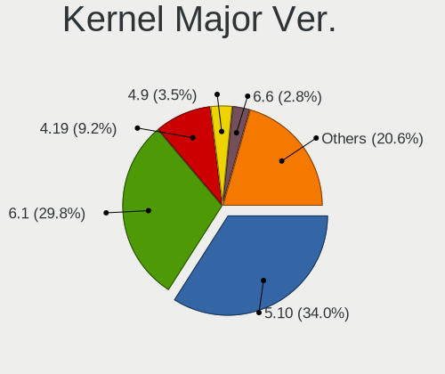
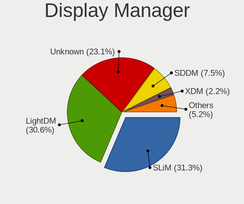
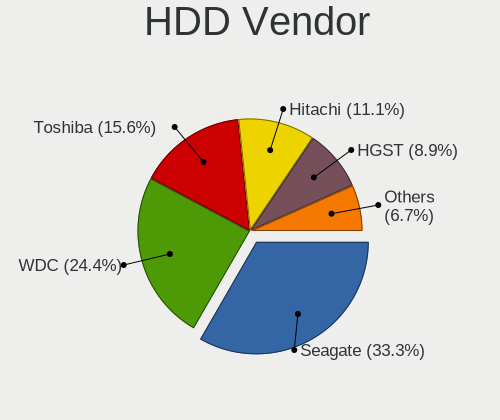
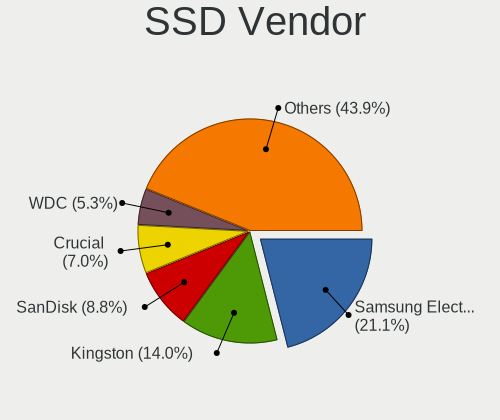
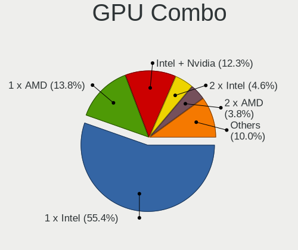
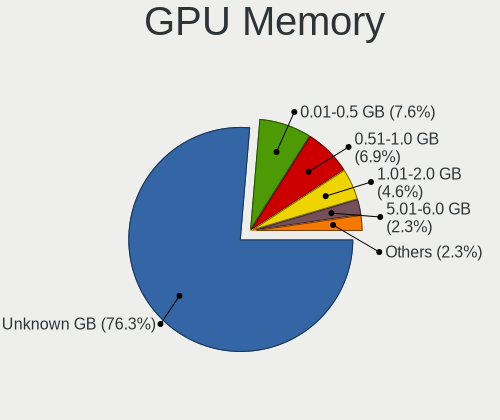

Devuan - Tested Hardware & Statistics (Notebooks)
-------------------------------------------------

A project to collect tested hardware configurations for Devuan.

Anyone can contribute to this report by the [hw-probe](https://github.com/linuxhw/hw-probe) tool:

    sudo -E hw-probe -all -upload

Please submit a probe of your configuration if it's not presented on the page or is rare.

Full-feature report is available here: https://linux-hardware.org/?view=trends

Contents
--------

* [ Test Cases ](#test-cases)

* [ System ](#system)
  - [ OS                       ](#os)
  - [ OS Family                ](#os-family)
  - [ Kernel                   ](#kernel)
  - [ Kernel Family            ](#kernel-family)
  - [ Kernel Major Ver.        ](#kernel-major-ver)
  - [ Arch                     ](#arch)
  - [ DE                       ](#de)
  - [ Display Server           ](#display-server)
  - [ Display Manager          ](#display-manager)
  - [ OS Lang                  ](#os-lang)
  - [ Boot Mode                ](#boot-mode)
  - [ Filesystem               ](#filesystem)
  - [ Part. scheme             ](#part-scheme)
  - [ Dual Boot with Linux/BSD ](#dual-boot-with-linuxbsd)
  - [ Dual Boot (Win)          ](#dual-boot-win)

* [ Board ](#board)
  - [ Vendor                   ](#vendor)
  - [ Model                    ](#model)
  - [ Model Family             ](#model-family)
  - [ MFG Year                 ](#mfg-year)
  - [ Form Factor              ](#form-factor)
  - [ Secure Boot              ](#secure-boot)
  - [ Coreboot                 ](#coreboot)
  - [ RAM Size                 ](#ram-size)
  - [ RAM Used                 ](#ram-used)
  - [ Total Drives             ](#total-drives)
  - [ Has CD-ROM               ](#has-cd-rom)
  - [ Has Ethernet             ](#has-ethernet)
  - [ Has WiFi                 ](#has-wifi)
  - [ Has Bluetooth            ](#has-bluetooth)

* [ Location ](#location)
  - [ Country                  ](#country)
  - [ City                     ](#city)

* [ Drives ](#drives)
  - [ Drive Vendor             ](#drive-vendor)
  - [ Drive Model              ](#drive-model)
  - [ HDD Vendor               ](#hdd-vendor)
  - [ SSD Vendor               ](#ssd-vendor)
  - [ Drive Kind               ](#drive-kind)
  - [ Drive Connector          ](#drive-connector)
  - [ Drive Size               ](#drive-size)
  - [ Space Total              ](#space-total)
  - [ Space Used               ](#space-used)
  - [ Malfunc. Drives          ](#malfunc-drives)
  - [ Malfunc. Drive Vendor    ](#malfunc-drive-vendor)
  - [ Malfunc. HDD Vendor      ](#malfunc-hdd-vendor)
  - [ Malfunc. Drive Kind      ](#malfunc-drive-kind)
  - [ Failed Drives            ](#failed-drives)
  - [ Failed Drive Vendor      ](#failed-drive-vendor)
  - [ Drive Status             ](#drive-status)

* [ Storage controller ](#storage-controller)
  - [ Storage Vendor           ](#storage-vendor)
  - [ Storage Model            ](#storage-model)
  - [ Storage Kind             ](#storage-kind)

* [ Processor ](#processor)
  - [ CPU Vendor               ](#cpu-vendor)
  - [ CPU Model                ](#cpu-model)
  - [ CPU Model Family         ](#cpu-model-family)
  - [ CPU Cores                ](#cpu-cores)
  - [ CPU Sockets              ](#cpu-sockets)
  - [ CPU Threads              ](#cpu-threads)
  - [ CPU Op-Modes             ](#cpu-op-modes)
  - [ CPU Microcode            ](#cpu-microcode)
  - [ CPU Microarch            ](#cpu-microarch)

* [ Graphics ](#graphics)
  - [ GPU Vendor               ](#gpu-vendor)
  - [ GPU Model                ](#gpu-model)
  - [ GPU Combo                ](#gpu-combo)
  - [ GPU Driver               ](#gpu-driver)
  - [ GPU Memory               ](#gpu-memory)

* [ Monitor ](#monitor)
  - [ Monitor Vendor           ](#monitor-vendor)
  - [ Monitor Model            ](#monitor-model)
  - [ Monitor Resolution       ](#monitor-resolution)
  - [ Monitor Diagonal         ](#monitor-diagonal)
  - [ Monitor Width            ](#monitor-width)
  - [ Aspect Ratio             ](#aspect-ratio)
  - [ Monitor Area             ](#monitor-area)
  - [ Pixel Density            ](#pixel-density)
  - [ Multiple Monitors        ](#multiple-monitors)

* [ Network ](#network)
  - [ Net Controller Vendor    ](#net-controller-vendor)
  - [ Net Controller Model     ](#net-controller-model)
  - [ Wireless Vendor          ](#wireless-vendor)
  - [ Wireless Model           ](#wireless-model)
  - [ Ethernet Vendor          ](#ethernet-vendor)
  - [ Ethernet Model           ](#ethernet-model)
  - [ Net Controller Kind      ](#net-controller-kind)
  - [ Used Controller          ](#used-controller)
  - [ NICs                     ](#nics)
  - [ IPv6                     ](#ipv6)

* [ Bluetooth ](#bluetooth)
  - [ Bluetooth Vendor         ](#bluetooth-vendor)
  - [ Bluetooth Model          ](#bluetooth-model)

* [ Sound ](#sound)
  - [ Sound Vendor             ](#sound-vendor)
  - [ Sound Model              ](#sound-model)

* [ Memory ](#memory)
  - [ Memory Vendor            ](#memory-vendor)
  - [ Memory Model             ](#memory-model)
  - [ Memory Kind              ](#memory-kind)
  - [ Memory Form Factor       ](#memory-form-factor)
  - [ Memory Size              ](#memory-size)
  - [ Memory Speed             ](#memory-speed)

* [ Printers & scanners ](#printers--scanners)
  - [ Printer Vendor           ](#printer-vendor)
  - [ Printer Model            ](#printer-model)
  - [ Scanner Vendor           ](#scanner-vendor)
  - [ Scanner Model            ](#scanner-model)

* [ Camera ](#camera)
  - [ Camera Vendor            ](#camera-vendor)
  - [ Camera Model             ](#camera-model)

* [ Security ](#security)
  - [ Fingerprint Vendor       ](#fingerprint-vendor)
  - [ Fingerprint Model        ](#fingerprint-model)
  - [ Chipcard Vendor          ](#chipcard-vendor)
  - [ Chipcard Model           ](#chipcard-model)

* [ Unsupported ](#unsupported)
  - [ Unsupported Devices      ](#unsupported-devices)
  - [ Unsupported Device Types ](#unsupported-device-types)

Test Cases
----------

Total: 47

| Vendor        | Model                       | Probe                                                      | Date         |
|---------------|-----------------------------|------------------------------------------------------------|--------------|
| Dell          | Latitude E5540              | [0948114af7](https://linux-hardware.org/?probe=0948114af7) | Mar 03, 2022 |
| Lenovo        | ThinkPad T550 20CJS1VD01    | [a3aed9d375](https://linux-hardware.org/?probe=a3aed9d375) | Mar 03, 2022 |
| ASUSTek       | K55VJ                       | [562262b9eb](https://linux-hardware.org/?probe=562262b9eb) | Jan 22, 2022 |
| ASUSTek       | X555LJ                      | [9fbdf4dfc2](https://linux-hardware.org/?probe=9fbdf4dfc2) | Jan 17, 2022 |
| Lenovo        | ThinkPad T420 4180AG3       | [2c3cd27ad2](https://linux-hardware.org/?probe=2c3cd27ad2) | Jan 16, 2022 |
| Notebook      | W230ST                      | [3dacf0aea8](https://linux-hardware.org/?probe=3dacf0aea8) | Jan 15, 2022 |
| Lenovo        | IdeaPad 130-15AST 81H5      | [899cb98778](https://linux-hardware.org/?probe=899cb98778) | Dec 06, 2021 |
| Fujitsu Si... | ESPRIMO Mobile V6535        | [d860ff9858](https://linux-hardware.org/?probe=d860ff9858) | Nov 30, 2021 |
| Fujitsu       | LIFEBOOK U7510              | [d43a6a6bb8](https://linux-hardware.org/?probe=d43a6a6bb8) | Nov 29, 2021 |
| Lenovo        | ThinkPad T550 20CJS1VD01    | [55689e67b3](https://linux-hardware.org/?probe=55689e67b3) | Oct 27, 2021 |
| Lenovo        | ThinkPad X230 2325DE0       | [991007e92a](https://linux-hardware.org/?probe=991007e92a) | Oct 13, 2021 |
| Lenovo        | IdeaPad 130-15AST 81H5      | [7f1b3371a9](https://linux-hardware.org/?probe=7f1b3371a9) | Oct 03, 2021 |
| Toshiba       | Satellite M40X              | [61fea93e97](https://linux-hardware.org/?probe=61fea93e97) | Oct 01, 2021 |
| Acer          | Aspire 5250                 | [ae41600fd9](https://linux-hardware.org/?probe=ae41600fd9) | Sep 24, 2021 |
| IBM           | ThinkPad T41p 2373GHG       | [04747e3df4](https://linux-hardware.org/?probe=04747e3df4) | Sep 19, 2021 |
| IBM           | ThinkPad T41p 2373GHG       | [134b90f474](https://linux-hardware.org/?probe=134b90f474) | Sep 18, 2021 |
| Lenovo        | ThinkPad X200 74585FU       | [04256a6e0a](https://linux-hardware.org/?probe=04256a6e0a) | Aug 25, 2021 |
| Lenovo        | ThinkPad X200 74585FU       | [dffbcc492c](https://linux-hardware.org/?probe=dffbcc492c) | Aug 25, 2021 |
| ASUSTek       | K52F                        | [643e3cc4b3](https://linux-hardware.org/?probe=643e3cc4b3) | Aug 13, 2021 |
| MSI           | MS-1688                     | [0ae772d66b](https://linux-hardware.org/?probe=0ae772d66b) | Jul 30, 2021 |
| Lenovo        | ThinkPad X220 429053G       | [5f553465bf](https://linux-hardware.org/?probe=5f553465bf) | Jul 29, 2021 |
| Acer          | Extensa 215-51K             | [1c49c2f4d0](https://linux-hardware.org/?probe=1c49c2f4d0) | Jul 26, 2021 |
| Lenovo        | ThinkPad X250 20CLS7WY04    | [fc77801294](https://linux-hardware.org/?probe=fc77801294) | Jun 07, 2021 |
| Lenovo        | ThinkPad T550 20CJS1VD01    | [aef4e323e2](https://linux-hardware.org/?probe=aef4e323e2) | Jun 06, 2021 |
| ASUSTek       | K55VJ                       | [6fa86f9d25](https://linux-hardware.org/?probe=6fa86f9d25) | Apr 27, 2021 |
| ASUSTek       | K55VJ                       | [aef1b6c71f](https://linux-hardware.org/?probe=aef1b6c71f) | Apr 17, 2021 |
| HP            | ProBook 6475b               | [74b0fa77b5](https://linux-hardware.org/?probe=74b0fa77b5) | Apr 14, 2021 |
| Fujitsu Si... | AMILO Xi 1546               | [22a53eeb74](https://linux-hardware.org/?probe=22a53eeb74) | Apr 03, 2021 |
| Teclast       | F6 Plus                     | [26ac25681a](https://linux-hardware.org/?probe=26ac25681a) | Jan 08, 2021 |
| Dell          | Precision 7530              | [8e0ee186a3](https://linux-hardware.org/?probe=8e0ee186a3) | Dec 04, 2020 |
| Lenovo        | ThinkPad X60 1707YF8        | [bcdd451de1](https://linux-hardware.org/?probe=bcdd451de1) | Oct 31, 2020 |
| Nokia         | N900                        | [7960cb48cc](https://linux-hardware.org/?probe=7960cb48cc) | Oct 05, 2020 |
| Lenovo        | ThinkPad X230 23247S0       | [f313b0bf1b](https://linux-hardware.org/?probe=f313b0bf1b) | Oct 01, 2020 |
| Dell          | Precision 7530              | [e6c6dd2734](https://linux-hardware.org/?probe=e6c6dd2734) | Sep 26, 2020 |
| Dell          | Precision 7530              | [81e9306141](https://linux-hardware.org/?probe=81e9306141) | Sep 26, 2020 |
| Lenovo        | ThinkPad X1 Carbon 7th 2... | [3d241c321f](https://linux-hardware.org/?probe=3d241c321f) | Sep 20, 2020 |
| ASUSTek       | K52F                        | [cef5147eeb](https://linux-hardware.org/?probe=cef5147eeb) | Aug 30, 2020 |
| Acer          | Aspire 5732Z                | [c4cb936b69](https://linux-hardware.org/?probe=c4cb936b69) | Aug 30, 2020 |
| Toshiba       | Satellite L655              | [6251a9111f](https://linux-hardware.org/?probe=6251a9111f) | Aug 30, 2020 |
| HP            | Pavilion 11 x360 PC         | [0c85729a27](https://linux-hardware.org/?probe=0c85729a27) | Aug 30, 2020 |
| Samsung       | 355V4C/355V4X/355V5C/355... | [358be6b820](https://linux-hardware.org/?probe=358be6b820) | Jul 28, 2020 |
| Lenovo        | IdeaPad Z370                | [51e3108708](https://linux-hardware.org/?probe=51e3108708) | Jun 28, 2020 |
| Dell          | Latitude 5501               | [94ec8d2a1d](https://linux-hardware.org/?probe=94ec8d2a1d) | Jun 28, 2020 |
| Lenovo        | IdeaPad Z370                | [76c985ed75](https://linux-hardware.org/?probe=76c985ed75) | Jun 27, 2020 |
| Dell          | Latitude E7250              | [c2ca61e7bf](https://linux-hardware.org/?probe=c2ca61e7bf) | Jun 23, 2020 |
| Dell          | Inspiron 1564               | [b80e556643](https://linux-hardware.org/?probe=b80e556643) | Feb 02, 2020 |
| MTC           | Montara-GML                 | [227bf1ba1d](https://linux-hardware.org/?probe=227bf1ba1d) | Dec 07, 2019 |

System
------

OS
--

Installed operating systems

| Name                    | Notebooks | Percent |
|-------------------------|-----------|---------|
| Devuan 3                | 14        | 35%     |
| Devuan 4                | 12        | 30%     |
| Devuan Testing/unstable | 8         | 20%     |
| Devuan 5                | 2         | 5%      |
| Devuan                  | 2         | 5%      |
| Devuan 3.0              | 1         | 2.5%    |
| Devuan 2.1              | 1         | 2.5%    |

OS Family
---------

OS without a version

| Name   | Notebooks | Percent |
|--------|-----------|---------|
| Devuan | 36        | 100%    |

Kernel
------

Version of the Linux kernel

| Version                   | Notebooks | Percent |
|---------------------------|-----------|---------|
| 4.19.0-9-amd64            | 4         | 9.52%   |
| 5.7.0-2-amd64             | 3         | 7.14%   |
| 5.10.0-9-amd64            | 3         | 7.14%   |
| 5.10.0-8-amd64            | 3         | 7.14%   |
| 5.10.0-11-amd64           | 2         | 4.76%   |
| 5.10.0-10-amd64           | 2         | 4.76%   |
| 4.19.0-17-amd64           | 2         | 4.76%   |
| 4.19.0-16-amd64           | 2         | 4.76%   |
| 4.19.0-14-amd64           | 2         | 4.76%   |
| 5.9.0-4-amd64             | 1         | 2.38%   |
| 5.8.0-1-amd64             | 1         | 2.38%   |
| 5.7.0-0.bpo.2-amd64       | 1         | 2.38%   |
| 5.6.0-2-amd64             | 1         | 2.38%   |
| 5.15.5-xanmod1            | 1         | 2.38%   |
| 5.15.0-2-amd64            | 1         | 2.38%   |
| 5.14.0-4-amd64            | 1         | 2.38%   |
| 5.10.0-7-amd64            | 1         | 2.38%   |
| 5.10.0-4-amd64            | 1         | 2.38%   |
| 5.10.0-1-amd64            | 1         | 2.38%   |
| 5.1.21                    | 1         | 2.38%   |
| 4.9.0-14-amd64            | 1         | 2.38%   |
| 4.9.0-11-amd64            | 1         | 2.38%   |
| 4.9.0-11-686              | 1         | 2.38%   |
| 4.9.0-0.bpo.4-686-pae     | 1         | 2.38%   |
| 4.4.195-antix.1-amd64-smp | 1         | 2.38%   |
| 4.19.0-17-686-pae         | 1         | 2.38%   |
| 4.19.0-12-amd64           | 1         | 2.38%   |
| 4.19.0-10-amd64           | 1         | 2.38%   |

Kernel Family
-------------

Linux kernel without a distro release

| Version | Notebooks | Percent |
|---------|-----------|---------|
| 4.19.0  | 13        | 31.71%  |
| 5.10.0  | 12        | 29.27%  |
| 5.7.0   | 4         | 9.76%   |
| 4.9.0   | 4         | 9.76%   |
| 5.9.0   | 1         | 2.44%   |
| 5.8.0   | 1         | 2.44%   |
| 5.6.0   | 1         | 2.44%   |
| 5.15.5  | 1         | 2.44%   |
| 5.15.0  | 1         | 2.44%   |
| 5.14.0  | 1         | 2.44%   |
| 5.1.21  | 1         | 2.44%   |
| 4.4.195 | 1         | 2.44%   |

Kernel Major Ver.
-----------------

Linux kernel major version

| Version | Notebooks | Percent |
|---------|-----------|---------|
| 4.19    | 13        | 31.71%  |
| 5.10    | 12        | 29.27%  |
| 5.7     | 4         | 9.76%   |
| 4.9     | 4         | 9.76%   |
| 5.15    | 2         | 4.88%   |
| 5.9     | 1         | 2.44%   |
| 5.8     | 1         | 2.44%   |
| 5.6     | 1         | 2.44%   |
| 5.14    | 1         | 2.44%   |
| 5.1     | 1         | 2.44%   |
| 4.4     | 1         | 2.44%   |

Arch
----

OS architecture (x86_64, i586, etc.)

| Name   | Notebooks | Percent |
|--------|-----------|---------|
| x86_64 | 32        | 88.89%  |
| i686   | 3         | 8.33%   |
| armv7l | 1         | 2.78%   |

DE
--

Desktop Environment

| Name     | Notebooks | Percent |
|----------|-----------|---------|
| XFCE     | 12        | 30.77%  |
| KDE5     | 8         | 20.51%  |
| MATE     | 6         | 15.38%  |
| Unknown  | 6         | 15.38%  |
| LXDE     | 2         | 5.13%   |
| i3       | 2         | 5.13%   |
| Openbox  | 1         | 2.56%   |
| LXQt     | 1         | 2.56%   |
| Cinnamon | 1         | 2.56%   |

Display Server
--------------

X11 or Wayland

| Name    | Notebooks | Percent |
|---------|-----------|---------|
| X11     | 34        | 91.89%  |
| Unknown | 2         | 5.41%   |
| Tty     | 1         | 2.7%    |

Display Manager
---------------

SDDM, LightDM, etc.

| Name    | Notebooks | Percent |
|---------|-----------|---------|
| LightDM | 13        | 33.33%  |
| Unknown | 13        | 33.33%  |
| SLiM    | 9         | 23.08%  |
| SDDM    | 3         | 7.69%   |
| XDM     | 1         | 2.56%   |

OS Lang
-------

Language

| Lang        | Notebooks | Percent |
|-------------|-----------|---------|
| en_US       | 15        | 40.54%  |
| en_GB       | 8         | 21.62%  |
| ru_RU       | 5         | 13.51%  |
| Unknown     | 2         | 5.41%   |
| pt_BR       | 1         | 2.7%    |
| it_IT       | 1         | 2.7%    |
| fr_BE       | 1         | 2.7%    |
| es_SV       | 1         | 2.7%    |
| en_US.utf-8 | 1         | 2.7%    |
| de_AT       | 1         | 2.7%    |
| C           | 1         | 2.7%    |

Boot Mode
---------

EFI or BIOS

| Mode | Notebooks | Percent |
|------|-----------|---------|
| BIOS | 23        | 62.16%  |
| EFI  | 14        | 37.84%  |

Filesystem
----------

Type of filesystem

| Type    | Notebooks | Percent |
|---------|-----------|---------|
| Ext4    | 29        | 80.56%  |
| Unknown | 3         | 8.33%   |
| Btrfs   | 2         | 5.56%   |
| OveXlay | 1         | 2.78%   |
| Ext2    | 1         | 2.78%   |

Part. scheme
------------

Scheme of partitioning

| Type    | Notebooks | Percent |
|---------|-----------|---------|
| MBR     | 17        | 44.74%  |
| GPT     | 14        | 36.84%  |
| Unknown | 7         | 18.42%  |

Dual Boot with Linux/BSD
------------------------

Hosting more than one Linux/BSD

| Dual boot | Notebooks | Percent |
|-----------|-----------|---------|
| No        | 31        | 86.11%  |
| Yes       | 5         | 13.89%  |

Dual Boot (Win)
---------------

Hosting Linux and Windows

| Dual boot | Notebooks | Percent |
|-----------|-----------|---------|
| No        | 28        | 75.68%  |
| Yes       | 9         | 24.32%  |

Board
-----

Vendor
------

Motherboard manufacturer

| Name                | Notebooks | Percent |
|---------------------|-----------|---------|
| Lenovo              | 11        | 30.56%  |
| Dell                | 5         | 13.89%  |
| ASUSTek Computer    | 3         | 8.33%   |
| Acer                | 3         | 8.33%   |
| Toshiba             | 2         | 5.56%   |
| Hewlett-Packard     | 2         | 5.56%   |
| Fujitsu Siemens     | 2         | 5.56%   |
| Teclast             | 1         | 2.78%   |
| Samsung Electronics | 1         | 2.78%   |
| Notebook            | 1         | 2.78%   |
| Nokia               | 1         | 2.78%   |
| MTC                 | 1         | 2.78%   |
| MSI                 | 1         | 2.78%   |
| IBM                 | 1         | 2.78%   |
| Fujitsu             | 1         | 2.78%   |

Model
-----

Motherboard model

| Name                                                                                     | Notebooks | Percent |
|------------------------------------------------------------------------------------------|-----------|---------|
| Toshiba Satellite M40X                                                                   | 1         | 2.78%   |
| Toshiba Satellite L655                                                                   | 1         | 2.78%   |
| Teclast F6 Plus                                                                          | 1         | 2.78%   |
| Samsung 355V4C/355V4X/355V5C/355V5X/356V4C/356V4X/356V5C/356V5X/3445VC/3445VX/3545VC/354 | 1         | 2.78%   |
| Notebook W230ST                                                                          | 1         | 2.78%   |
| Nokia N900                                                                               | 1         | 2.78%   |
| MTC Montara-GML                                                                          | 1         | 2.78%   |
| MSI MS-1688                                                                              | 1         | 2.78%   |
| Lenovo ThinkPad X60 1707YF8                                                              | 1         | 2.78%   |
| Lenovo ThinkPad X250 20CLS7WY04                                                          | 1         | 2.78%   |
| Lenovo ThinkPad X230 2325DE0                                                             | 1         | 2.78%   |
| Lenovo ThinkPad X230 23247S0                                                             | 1         | 2.78%   |
| Lenovo ThinkPad X220 429053G                                                             | 1         | 2.78%   |
| Lenovo ThinkPad X200 74585FU                                                             | 1         | 2.78%   |
| Lenovo ThinkPad X1 Carbon 7th 20QD00L1PB                                                 | 1         | 2.78%   |
| Lenovo ThinkPad T550 20CJS1VD01                                                          | 1         | 2.78%   |
| Lenovo ThinkPad T420 4180AG3                                                             | 1         | 2.78%   |
| Lenovo IdeaPad Z370                                                                      | 1         | 2.78%   |
| Lenovo IdeaPad 130-15AST 81H5                                                            | 1         | 2.78%   |
| IBM ThinkPad T41p 2373GHG                                                                | 1         | 2.78%   |
| HP ProBook 6475b                                                                         | 1         | 2.78%   |
| HP Pavilion 11 x360 PC                                                                   | 1         | 2.78%   |
| Fujitsu Siemens ESPRIMO Mobile V6535                                                     | 1         | 2.78%   |
| Fujitsu Siemens AMILO Xi 1546                                                            | 1         | 2.78%   |
| Fujitsu LIFEBOOK U7510                                                                   | 1         | 2.78%   |
| Dell Precision 7530                                                                      | 1         | 2.78%   |
| Dell Latitude E7250                                                                      | 1         | 2.78%   |
| Dell Latitude E5540                                                                      | 1         | 2.78%   |
| Dell Latitude 5501                                                                       | 1         | 2.78%   |
| Dell Inspiron 1564                                                                       | 1         | 2.78%   |
| ASUS X555LJ                                                                              | 1         | 2.78%   |
| ASUS K55VJ                                                                               | 1         | 2.78%   |
| ASUS K52F                                                                                | 1         | 2.78%   |
| Acer Extensa 215-51K                                                                     | 1         | 2.78%   |
| Acer Aspire 5732Z                                                                        | 1         | 2.78%   |
| Acer Aspire 5250                                                                         | 1         | 2.78%   |

Model Family
------------

Motherboard model prefix

| Name                    | Notebooks | Percent |
|-------------------------|-----------|---------|
| Lenovo ThinkPad         | 9         | 25%     |
| Dell Latitude           | 3         | 8.33%   |
| Toshiba Satellite       | 2         | 5.56%   |
| Lenovo IdeaPad          | 2         | 5.56%   |
| Acer Aspire             | 2         | 5.56%   |
| Teclast F6              | 1         | 2.78%   |
| Samsung 355V4C          | 1         | 2.78%   |
| Notebook W230ST         | 1         | 2.78%   |
| Nokia N900              | 1         | 2.78%   |
| MTC Montara-GML         | 1         | 2.78%   |
| MSI MS-1688             | 1         | 2.78%   |
| IBM ThinkPad            | 1         | 2.78%   |
| HP ProBook              | 1         | 2.78%   |
| HP Pavilion             | 1         | 2.78%   |
| Fujitsu Siemens ESPRIMO | 1         | 2.78%   |
| Fujitsu Siemens AMILO   | 1         | 2.78%   |
| Fujitsu LIFEBOOK        | 1         | 2.78%   |
| Dell Precision          | 1         | 2.78%   |
| Dell Inspiron           | 1         | 2.78%   |
| ASUS X555LJ             | 1         | 2.78%   |
| ASUS K55VJ              | 1         | 2.78%   |
| ASUS K52F               | 1         | 2.78%   |
| Acer Extensa            | 1         | 2.78%   |

MFG Year
--------

Motherboard manufacture year

| Year    | Notebooks | Percent |
|---------|-----------|---------|
| 2012    | 5         | 13.89%  |
| 2019    | 4         | 11.11%  |
| 2015    | 4         | 11.11%  |
| 2011    | 4         | 11.11%  |
| 2009    | 3         | 8.33%   |
| 2018    | 2         | 5.56%   |
| 2014    | 2         | 5.56%   |
| 2010    | 2         | 5.56%   |
| 2008    | 2         | 5.56%   |
| 2006    | 2         | 5.56%   |
| 2005    | 2         | 5.56%   |
| 2020    | 1         | 2.78%   |
| 2013    | 1         | 2.78%   |
| 2007    | 1         | 2.78%   |
| Unknown | 1         | 2.78%   |

Form Factor
-----------

Physical design of the computer

| Name     | Notebooks | Percent |
|----------|-----------|---------|
| Notebook | 36        | 100%    |

Secure Boot
-----------

Enabled or disabled

| State    | Notebooks | Percent |
|----------|-----------|---------|
| Disabled | 36        | 100%    |

Coreboot
--------

Have coreboot on board

| Used | Notebooks | Percent |
|------|-----------|---------|
| No   | 35        | 97.22%  |
| Yes  | 1         | 2.78%   |

RAM Size
--------

Total RAM memory

| Size in GB  | Notebooks | Percent |
|-------------|-----------|---------|
| 4.01-8.0    | 10        | 27.78%  |
| 3.01-4.0    | 9         | 25%     |
| 8.01-16.0   | 5         | 13.89%  |
| 16.01-24.0  | 3         | 8.33%   |
| 1.01-2.0    | 3         | 8.33%   |
| 2.01-3.0    | 2         | 5.56%   |
| 0.01-0.5    | 2         | 5.56%   |
| 32.01-64.0  | 1         | 2.78%   |
| 64.01-256.0 | 1         | 2.78%   |

RAM Used
--------

Used RAM memory

| Used GB    | Notebooks | Percent |
|------------|-----------|---------|
| 1.01-2.0   | 13        | 30.95%  |
| 4.01-8.0   | 8         | 19.05%  |
| 2.01-3.0   | 8         | 19.05%  |
| 0.51-1.0   | 5         | 11.9%   |
| 3.01-4.0   | 3         | 7.14%   |
| 0.01-0.5   | 3         | 7.14%   |
| 32.01-64.0 | 1         | 2.38%   |
| 8.01-16.0  | 1         | 2.38%   |

Total Drives
------------

Number of drives on board

| Drives | Notebooks | Percent |
|--------|-----------|---------|
| 1      | 26        | 72.22%  |
| 2      | 8         | 22.22%  |
| 3      | 2         | 5.56%   |

Has CD-ROM
----------

Has CD-ROM on board

| Presented | Notebooks | Percent |
|-----------|-----------|---------|
| No        | 19        | 51.35%  |
| Yes       | 18        | 48.65%  |

Has Ethernet
------------

Has Ethernet on board

| Presented | Notebooks | Percent |
|-----------|-----------|---------|
| Yes       | 33        | 91.67%  |
| No        | 3         | 8.33%   |

Has WiFi
--------

Has WiFi module

| Presented | Notebooks | Percent |
|-----------|-----------|---------|
| Yes       | 34        | 94.44%  |
| No        | 2         | 5.56%   |

Has Bluetooth
-------------

Has Bluetooth module

| Presented | Notebooks | Percent |
|-----------|-----------|---------|
| No        | 19        | 52.78%  |
| Yes       | 17        | 47.22%  |

Location
--------

Country
-------

Geographic location (country)

| Country     | Notebooks | Percent |
|-------------|-----------|---------|
| Russia      | 5         | 13.89%  |
| Germany     | 4         | 11.11%  |
| USA         | 3         | 8.33%   |
| Ukraine     | 3         | 8.33%   |
| Grenada     | 3         | 8.33%   |
| Brazil      | 3         | 8.33%   |
| Hungary     | 2         | 5.56%   |
| Vietnam     | 1         | 2.78%   |
| Portugal    | 1         | 2.78%   |
| Poland      | 1         | 2.78%   |
| Norway      | 1         | 2.78%   |
| Netherlands | 1         | 2.78%   |
| Mexico      | 1         | 2.78%   |
| Italy       | 1         | 2.78%   |
| Israel      | 1         | 2.78%   |
| Greece      | 1         | 2.78%   |
| France      | 1         | 2.78%   |
| Finland     | 1         | 2.78%   |
| El Salvador | 1         | 2.78%   |
| Austria     | 1         | 2.78%   |

City
----

Geographic location (city)

| City             | Notebooks | Percent |
|------------------|-----------|---------|
| Gouyave          | 3         | 7.89%   |
| Kyiv             | 2         | 5.26%   |
| Budapest         | 2         | 5.26%   |
| Yakutsk          | 1         | 2.63%   |
| Wroclaw          | 1         | 2.63%   |
| Vologda          | 1         | 2.63%   |
| Thessaloniki     | 1         | 2.63%   |
| Tel Aviv         | 1         | 2.63%   |
| Syeverodonets'k  | 1         | 2.63%   |
| St Petersburg    | 1         | 2.63%   |
| Sao Vicente      | 1         | 2.63%   |
| Sao Paulo        | 1         | 2.63%   |
| San Salvador     | 1         | 2.63%   |
| Rio de Janeiro   | 1         | 2.63%   |
| Oslo             | 1         | 2.63%   |
| Nadudvar         | 1         | 2.63%   |
| Moscow           | 1         | 2.63%   |
| Milan            | 1         | 2.63%   |
| Mglin            | 1         | 2.63%   |
| Lisbon           | 1         | 2.63%   |
| Leonding         | 1         | 2.63%   |
| Leipzig          | 1         | 2.63%   |
| Jyväskylä  | 1         | 2.63%   |
| Hochheim am Main | 1         | 2.63%   |
| Hillsborough     | 1         | 2.63%   |
| Hermosillo       | 1         | 2.63%   |
| Hayden           | 1         | 2.63%   |
| Hanoi            | 1         | 2.63%   |
| Haiger           | 1         | 2.63%   |
| Forest Grove     | 1         | 2.63%   |
| Cologne          | 1         | 2.63%   |
| Bagnolet         | 1         | 2.63%   |
| Atlanta          | 1         | 2.63%   |
| Amsterdam        | 1         | 2.63%   |

Drives
------

Drive Vendor
------------

Hard drive vendors

| Vendor              | Notebooks | Drives | Percent |
|---------------------|-----------|--------|---------|
| WDC                 | 8         | 9      | 17.78%  |
| Unknown             | 5         | 6      | 11.11%  |
| Samsung Electronics | 3         | 8      | 6.67%   |
| Hitachi             | 3         | 3      | 6.67%   |
| Seagate             | 2         | 2      | 4.44%   |
| PNY                 | 2         | 2      | 4.44%   |
| Kingston            | 2         | 2      | 4.44%   |
| Fujitsu             | 2         | 2      | 4.44%   |
| Crucial             | 2         | 2      | 4.44%   |
| Union Memory        | 1         | 2      | 2.22%   |
| Toshiba             | 1         | 1      | 2.22%   |
| Teclast             | 1         | 1      | 2.22%   |
| Team                | 1         | 1      | 2.22%   |
| SMART               | 1         | 1      | 2.22%   |
| SK Hynix            | 1         | 1      | 2.22%   |
| SanDisk             | 1         | 1      | 2.22%   |
| SABRENT             | 1         | 2      | 2.22%   |
| Patriot             | 1         | 1      | 2.22%   |
| LITEON              | 1         | 3      | 2.22%   |
| KIOXIA              | 1         | 1      | 2.22%   |
| KingFast            | 1         | 1      | 2.22%   |
| Intel               | 1         | 1      | 2.22%   |
| HXY                 | 1         | 1      | 2.22%   |
| HGST                | 1         | 1      | 2.22%   |
| Hewlett-Packard     | 1         | 1      | 2.22%   |

Drive Model
-----------

Hard drive models

| Model                                  | Notebooks | Percent |
|----------------------------------------|-----------|---------|
| PNY CS900 240GB SSD                    | 2         | 4.26%   |
| WDC WDS240G2G0A-00JH30 240GB SSD       | 1         | 2.13%   |
| WDC WD7500BPKX-00HPJT0 752GB           | 1         | 2.13%   |
| WDC WD5000BPVT-24HXZT3 500GB           | 1         | 2.13%   |
| WDC WD3200BPVT-22JJ5T0 320GB           | 1         | 2.13%   |
| WDC WD3200BEVT-22A23T0 320GB           | 1         | 2.13%   |
| WDC WD3200BEVE-00A0HT0 320GB           | 1         | 2.13%   |
| WDC WD2500BEKT-00A25T0 250GB           | 1         | 2.13%   |
| WDC WD10SPZX-21Z10T0 1TB               | 1         | 2.13%   |
| Unknown SD04G  4GB                     | 1         | 2.13%   |
| Unknown SD  8GB                        | 1         | 2.13%   |
| Unknown MMC32G  32GB                   | 1         | 2.13%   |
| Unknown MMC Card  32GB                 | 1         | 2.13%   |
| Unknown MMC Card  16GB                 | 1         | 2.13%   |
| Unknown MMC Card  128GB                | 1         | 2.13%   |
| Union Memory RTOTJ128VGD2EYX 128GB SSD | 1         | 2.13%   |
| Toshiba MK1252GSX 120GB                | 1         | 2.13%   |
| Teclast 256GB NS550-2242 SSD           | 1         | 2.13%   |
| Team T253X1120G 120GB SSD              | 1         | 2.13%   |
| SMART SSD SZ9MSE mSATA 256GB           | 1         | 2.13%   |
| SK Hynix PC611 NVMe 1TB                | 1         | 2.13%   |
| Seagate ST9250410AS 250GB              | 1         | 2.13%   |
| Seagate ST500LT012-1DG142 500GB        | 1         | 2.13%   |
| SanDisk X300 MSATA 256GB SSD           | 1         | 2.13%   |
| Samsung SSD 970 PRO 1TB                | 1         | 2.13%   |
| Samsung SSD 970 EVO Plus 500GB         | 1         | 2.13%   |
| Samsung SSD 850 PRO 2TB                | 1         | 2.13%   |
| Samsung SSD 850 EVO 500GB              | 1         | 2.13%   |
| SABRENT Disk 1TB                       | 1         | 2.13%   |
| Patriot Burst 960GB SSD                | 1         | 2.13%   |
| LITEON LCH-512V2S 512GB SSD            | 1         | 2.13%   |
| KIOXIA KBG40ZNV256G 256GB              | 1         | 2.13%   |
| Kingston SA400S37480G 480GB SSD        | 1         | 2.13%   |
| Kingston SA400S37240G 240GB SSD        | 1         | 2.13%   |
| KingFast 128GB                         | 1         | 2.13%   |
| Intel SSDPEKKF512G8L 512GB             | 1         | 2.13%   |
| HXY SSD 120G                           | 1         | 2.13%   |
| Hitachi HTS727575A9E364 752GB          | 1         | 2.13%   |
| Hitachi HTS726060M9AT00 56GB           | 1         | 2.13%   |
| Hitachi HTS547550A9E384 500GB          | 1         | 2.13%   |
| HGST HTS725032A7E630 320GB             | 1         | 2.13%   |
| HP SSD S700 250GB                      | 1         | 2.13%   |
| Fujitsu MHV2120BH 120GB                | 1         | 2.13%   |
| Fujitsu MHT2030AT 32GB                 | 1         | 2.13%   |
| Crucial CT250MX500SSD1 250GB           | 1         | 2.13%   |
| Crucial CT1000MX500SSD1 1TB            | 1         | 2.13%   |

HDD Vendor
----------

Hard disk drive vendors

| Vendor  | Notebooks | Drives | Percent |
|---------|-----------|--------|---------|
| WDC     | 7         | 7      | 41.18%  |
| Hitachi | 3         | 3      | 17.65%  |
| Seagate | 2         | 2      | 11.76%  |
| Fujitsu | 2         | 2      | 11.76%  |
| Toshiba | 1         | 1      | 5.88%   |
| SABRENT | 1         | 2      | 5.88%   |
| HGST    | 1         | 1      | 5.88%   |

SSD Vendor
----------

Solid state drive vendors

| Vendor              | Notebooks | Drives | Percent |
|---------------------|-----------|--------|---------|
| Samsung Electronics | 2         | 2      | 11.11%  |
| PNY                 | 2         | 2      | 11.11%  |
| Kingston            | 2         | 2      | 11.11%  |
| Crucial             | 2         | 2      | 11.11%  |
| WDC                 | 1         | 2      | 5.56%   |
| Union Memory        | 1         | 2      | 5.56%   |
| Teclast             | 1         | 1      | 5.56%   |
| Team                | 1         | 1      | 5.56%   |
| SMART               | 1         | 1      | 5.56%   |
| SanDisk             | 1         | 1      | 5.56%   |
| Patriot             | 1         | 1      | 5.56%   |
| LITEON              | 1         | 3      | 5.56%   |
| HXY                 | 1         | 1      | 5.56%   |
| Hewlett-Packard     | 1         | 1      | 5.56%   |

Drive Kind
----------

HDD or SSD

| Kind    | Notebooks | Drives | Percent |
|---------|-----------|--------|---------|
| SSD     | 18        | 22     | 40%     |
| HDD     | 17        | 18     | 37.78%  |
| MMC     | 5         | 6      | 11.11%  |
| NVMe    | 4         | 9      | 8.89%   |
| Unknown | 1         | 1      | 2.22%   |

Drive Connector
---------------

SATA, SAS, NVMe, etc.

| Type | Notebooks | Drives | Percent |
|------|-----------|--------|---------|
| SATA | 31        | 39     | 75.61%  |
| MMC  | 5         | 6      | 12.2%   |
| NVMe | 4         | 9      | 9.76%   |
| SAS  | 1         | 2      | 2.44%   |

Drive Size
----------

Size of hard drive

| Size in TB | Notebooks | Drives | Percent |
|------------|-----------|--------|---------|
| 0.01-0.5   | 26        | 29     | 78.79%  |
| 0.51-1.0   | 6         | 10     | 18.18%  |
| 1.01-2.0   | 1         | 1      | 3.03%   |

Space Total
-----------

Amount of disk space available on the file system

| Size in GB | Notebooks | Percent |
|------------|-----------|---------|
| 251-500    | 9         | 23.68%  |
| 101-250    | 9         | 23.68%  |
| 1001-2000  | 4         | 10.53%  |
| 51-100     | 4         | 10.53%  |
| 21-50      | 3         | 7.89%   |
| 501-1000   | 3         | 7.89%   |
| Unknown    | 3         | 7.89%   |
| 1-20       | 2         | 5.26%   |
| 2001-3000  | 1         | 2.63%   |

Space Used
----------

Amount of used disk space

| Used GB   | Notebooks | Percent |
|-----------|-----------|---------|
| 1-20      | 11        | 28.95%  |
| 101-250   | 8         | 21.05%  |
| 51-100    | 6         | 15.79%  |
| 21-50     | 4         | 10.53%  |
| Unknown   | 3         | 7.89%   |
| 251-500   | 2         | 5.26%   |
| 1001-2000 | 2         | 5.26%   |
| 501-1000  | 2         | 5.26%   |

Malfunc. Drives
---------------

Drive models with a malfunction

| Model                         | Notebooks | Drives | Percent |
|-------------------------------|-----------|--------|---------|
| WDC WD5000BPVT-24HXZT3 500GB  | 1         | 1      | 25%     |
| WDC WD3200BEVT-22A23T0 320GB  | 1         | 1      | 25%     |
| Hitachi HTS727575A9E364 752GB | 1         | 1      | 25%     |
| Hitachi HTS726060M9AT00 56GB  | 1         | 1      | 25%     |

Malfunc. Drive Vendor
---------------------

Vendors of faulty drives

| Vendor  | Notebooks | Drives | Percent |
|---------|-----------|--------|---------|
| WDC     | 2         | 2      | 50%     |
| Hitachi | 2         | 2      | 50%     |

Malfunc. HDD Vendor
-------------------

Vendors of faulty HDD drives

| Vendor  | Notebooks | Drives | Percent |
|---------|-----------|--------|---------|
| WDC     | 2         | 2      | 50%     |
| Hitachi | 2         | 2      | 50%     |

Malfunc. Drive Kind
-------------------

Kinds of faulty drives

| Kind | Notebooks | Drives | Percent |
|------|-----------|--------|---------|
| HDD  | 4         | 4      | 100%    |

Failed Drives
-------------

Failed drive models

Zero info for selected period =(

Failed Drive Vendor
-------------------

Failed drive vendors

Zero info for selected period =(

Drive Status
------------

Number of failed and malfunc. drives

| Status   | Notebooks | Drives | Percent |
|----------|-----------|--------|---------|
| Works    | 27        | 37     | 64.29%  |
| Detected | 11        | 15     | 26.19%  |
| Malfunc  | 4         | 4      | 9.52%   |

Storage controller
------------------

Storage Vendor
--------------

Storage controller vendors

| Vendor              | Notebooks | Percent |
|---------------------|-----------|---------|
| Intel               | 30        | 78.95%  |
| AMD                 | 4         | 10.53%  |
| VIA Technologies    | 1         | 2.63%   |
| SK Hynix            | 1         | 2.63%   |
| Samsung Electronics | 1         | 2.63%   |
| KIOXIA              | 1         | 2.63%   |

Storage Model
-------------

Storage controller models

| Model                                                                                  | Notebooks | Percent |
|----------------------------------------------------------------------------------------|-----------|---------|
| Intel Wildcat Point-LP SATA Controller [AHCI Mode]                                     | 4         | 9.52%   |
| Intel 82801IBM/IEM (ICH9M/ICH9M-E) 4 port SATA Controller [AHCI mode]                  | 3         | 7.14%   |
| Intel 7 Series Chipset Family 6-port SATA Controller [AHCI mode]                       | 3         | 7.14%   |
| Intel 5 Series/3400 Series Chipset 4 port SATA AHCI Controller                         | 3         | 7.14%   |
| AMD FCH SATA Controller [AHCI mode]                                                    | 3         | 7.14%   |
| Intel Cannon Lake Mobile PCH SATA AHCI Controller                                      | 2         | 4.76%   |
| Intel 82801G (ICH7 Family) IDE Controller                                              | 2         | 4.76%   |
| Intel 82801DBM (ICH4-M) IDE Controller                                                 | 2         | 4.76%   |
| Intel 6 Series/C200 Series Chipset Family 6 port Mobile SATA AHCI Controller           | 2         | 4.76%   |
| VIA VT6421 IDE/SATA Controller                                                         | 1         | 2.38%   |
| SK Hynix Non-Volatile memory controller                                                | 1         | 2.38%   |
| Samsung NVMe SSD Controller SM981/PM981/PM983                                          | 1         | 2.38%   |
| KIOXIA Non-Volatile memory controller                                                  | 1         | 2.38%   |
| Intel SSD Pro 7600p/760p/E 6100p Series                                                | 1         | 2.38%   |
| Intel Celeron/Pentium Silver Processor SATA Controller                                 | 1         | 2.38%   |
| Intel Atom Processor E3800 Series SATA AHCI Controller                                 | 1         | 2.38%   |
| Intel 82801GBM/GHM (ICH7-M Family) SATA Controller [IDE mode]                          | 1         | 2.38%   |
| Intel 82801GBM/GHM (ICH7-M Family) SATA Controller [AHCI mode]                         | 1         | 2.38%   |
| Intel 82801FBM (ICH6M) SATA Controller                                                 | 1         | 2.38%   |
| Intel 82801 Mobile SATA Controller [RAID mode]                                         | 1         | 2.38%   |
| Intel 8 Series/C220 Series Chipset Family 6-port SATA Controller 1 [AHCI mode]         | 1         | 2.38%   |
| Intel 8 Series SATA Controller 1 [AHCI mode]                                           | 1         | 2.38%   |
| Intel 6 Series/C200 Series Chipset Family Mobile SATA Controller (IDE mode, ports 4-5) | 1         | 2.38%   |
| Intel 6 Series/C200 Series Chipset Family Mobile SATA Controller (IDE mode, ports 0-3) | 1         | 2.38%   |
| Intel 5 Series/3400 Series Chipset 4 port SATA IDE Controller                          | 1         | 2.38%   |
| Intel 5 Series/3400 Series Chipset 2 port SATA IDE Controller                          | 1         | 2.38%   |
| AMD SB7x0/SB8x0/SB9x0 SATA Controller [AHCI mode]                                      | 1         | 2.38%   |

Storage Kind
------------

Kind of storage controller (IDE, SATA, NVMe, SAS, ...)

| Kind | Notebooks | Percent |
|------|-----------|---------|
| SATA | 26        | 66.67%  |
| IDE  | 7         | 17.95%  |
| NVMe | 4         | 10.26%  |
| RAID | 2         | 5.13%   |

Processor
---------

CPU Vendor
----------

Processor vendors

| Vendor | Notebooks | Percent |
|--------|-----------|---------|
| Intel  | 31        | 86.11%  |
| AMD    | 4         | 11.11%  |
| ARM    | 1         | 2.78%   |

CPU Model
---------

Processor models

| Model                                        | Notebooks | Percent |
|----------------------------------------------|-----------|---------|
| Intel Core i5-5300U CPU @ 2.30GHz            | 3         | 8.33%   |
| Intel Core i5-3320M CPU @ 2.60GHz            | 2         | 5.56%   |
| Intel Pentium M processor 1700MHz            | 1         | 2.78%   |
| Intel Pentium M processor 1.60GHz            | 1         | 2.78%   |
| Intel Pentium Dual-Core CPU T4400 @ 2.20GHz  | 1         | 2.78%   |
| Intel Pentium Dual CPU T3400 @ 2.16GHz       | 1         | 2.78%   |
| Intel Pentium CPU P6100 @ 2.00GHz            | 1         | 2.78%   |
| Intel Core i9-8950HK CPU @ 2.90GHz           | 1         | 2.78%   |
| Intel Core i7-9850H CPU @ 2.60GHz            | 1         | 2.78%   |
| Intel Core i7-8565U CPU @ 1.80GHz            | 1         | 2.78%   |
| Intel Core i7-4700MQ CPU @ 2.40GHz           | 1         | 2.78%   |
| Intel Core i7-3610QM CPU @ 2.30GHz           | 1         | 2.78%   |
| Intel Core i7-2640M CPU @ 2.80GHz            | 1         | 2.78%   |
| Intel Core i5-6300U CPU @ 2.40GHz            | 1         | 2.78%   |
| Intel Core i5-2520M CPU @ 2.50GHz            | 1         | 2.78%   |
| Intel Core i5-10310U CPU @ 1.70GHz           | 1         | 2.78%   |
| Intel Core i3-5005U CPU @ 2.00GHz            | 1         | 2.78%   |
| Intel Core i3-4010U CPU @ 1.70GHz            | 1         | 2.78%   |
| Intel Core i3-2350M CPU @ 2.30GHz            | 1         | 2.78%   |
| Intel Core i3 CPU M 380 @ 2.53GHz            | 1         | 2.78%   |
| Intel Core i3 CPU M 370 @ 2.40GHz            | 1         | 2.78%   |
| Intel Core i3 CPU M 330 @ 2.13GHz            | 1         | 2.78%   |
| Intel Core 2 CPU T7200 @ 2.00GHz             | 1         | 2.78%   |
| Intel Core 2 CPU T5600 @ 1.83GHz             | 1         | 2.78%   |
| Intel Core 2 CPU P8600 @ 2.40GHz             | 1         | 2.78%   |
| Intel Celeron N4100 CPU @ 1.10GHz            | 1         | 2.78%   |
| Intel Celeron M processor 1.40GHz            | 1         | 2.78%   |
| Intel Celeron CPU N2830 @ 2.16GHz            | 1         | 2.78%   |
| ARM Nokia RX-51 board Processor              | 1         | 2.78%   |
| AMD E2-1800 APU with Radeon HD Graphics      | 1         | 2.78%   |
| AMD E-300 APU with Radeon HD Graphics        | 1         | 2.78%   |
| AMD A9-9425 RADEON R5, 5 COMPUTE CORES 2C+3G | 1         | 2.78%   |
| AMD A6-4400M APU with Radeon HD Graphics     | 1         | 2.78%   |

CPU Model Family
----------------

Processor model prefix

| Model                   | Notebooks | Percent |
|-------------------------|-----------|---------|
| Intel Core i5           | 8         | 22.22%  |
| Intel Core i3           | 6         | 16.67%  |
| Intel Core i7           | 5         | 13.89%  |
| Intel Core 2            | 3         | 8.33%   |
| Other                   | 2         | 5.56%   |
| Intel Pentium M         | 2         | 5.56%   |
| Intel Celeron           | 2         | 5.56%   |
| Intel Pentium Dual-Core | 1         | 2.78%   |
| Intel Pentium Dual      | 1         | 2.78%   |
| Intel Pentium           | 1         | 2.78%   |
| Intel Core i9           | 1         | 2.78%   |
| Intel Celeron M         | 1         | 2.78%   |
| AMD E2                  | 1         | 2.78%   |
| AMD E                   | 1         | 2.78%   |
| AMD A6                  | 1         | 2.78%   |

CPU Cores
---------

Number of processor cores

| Number | Notebooks | Percent |
|--------|-----------|---------|
| 2      | 24        | 66.67%  |
| 4      | 5         | 13.89%  |
| 1      | 5         | 13.89%  |
| 6      | 2         | 5.56%   |

CPU Sockets
-----------

Number of sockets

| Number | Notebooks | Percent |
|--------|-----------|---------|
| 1      | 36        | 100%    |

CPU Threads
-----------

Threads per core (Hyper-Threading)

| Number | Notebooks | Percent |
|--------|-----------|---------|
| 2      | 20        | 55.56%  |
| 1      | 16        | 44.44%  |

CPU Op-Modes
------------

CPU Operation Modes (32-bit, 64-bit)

| Op mode        | Notebooks | Percent |
|----------------|-----------|---------|
| 32-bit, 64-bit | 31        | 86.11%  |
| 32-bit         | 3         | 8.33%   |
| Unknown        | 2         | 5.56%   |

CPU Microcode
-------------

Microcode number

| Number     | Notebooks | Percent |
|------------|-----------|---------|
| Unknown    | 10        | 27.03%  |
| 0x306d4    | 3         | 8.11%   |
| 0x206a7    | 3         | 8.11%   |
| 0x806ec    | 2         | 5.41%   |
| 0x6f6      | 2         | 5.41%   |
| 0x20655    | 2         | 5.41%   |
| 0x1067a    | 2         | 5.41%   |
| 0x906ed    | 1         | 2.7%    |
| 0x906ea    | 1         | 2.7%    |
| 0x706a1    | 1         | 2.7%    |
| 0x6d8      | 1         | 2.7%    |
| 0x695      | 1         | 2.7%    |
| 0x406e3    | 1         | 2.7%    |
| 0x40651    | 1         | 2.7%    |
| 0x306c3    | 1         | 2.7%    |
| 0x306a9    | 1         | 2.7%    |
| 0x30678    | 1         | 2.7%    |
| 0x20652    | 1         | 2.7%    |
| 0x05000119 | 1         | 2.7%    |
| 0x05000101 | 1         | 2.7%    |

CPU Microarch
-------------

Microarchitecture

| Name          | Notebooks | Percent |
|---------------|-----------|---------|
| Westmere      | 4         | 11.11%  |
| KabyLake      | 4         | 11.11%  |
| Broadwell     | 4         | 11.11%  |
| SandyBridge   | 3         | 8.33%   |
| P6            | 3         | 8.33%   |
| IvyBridge     | 3         | 8.33%   |
| Core          | 3         | 8.33%   |
| Penryn        | 2         | 5.56%   |
| Haswell       | 2         | 5.56%   |
| Bobcat        | 2         | 5.56%   |
| Skylake       | 1         | 2.78%   |
| Silvermont    | 1         | 2.78%   |
| Piledriver    | 1         | 2.78%   |
| Goldmont plus | 1         | 2.78%   |
| Excavator     | 1         | 2.78%   |
| Unknown       | 1         | 2.78%   |

Graphics
--------

GPU Vendor
----------

Vendors of graphics cards

| Vendor | Notebooks | Percent |
|--------|-----------|---------|
| Intel  | 27        | 67.5%   |
| AMD    | 9         | 22.5%   |
| Nvidia | 4         | 10%     |

GPU Model
---------

Graphics card models

| Model                                                                         | Notebooks | Percent |
|-------------------------------------------------------------------------------|-----------|---------|
| Intel HD Graphics 5500                                                        | 4         | 9.76%   |
| Intel Core Processor Integrated Graphics Controller                           | 4         | 9.76%   |
| Intel Mobile 4 Series Chipset Integrated Graphics Controller                  | 3         | 7.32%   |
| Intel 3rd Gen Core processor Graphics Controller                              | 3         | 7.32%   |
| Intel 2nd Generation Core Processor Family Integrated Graphics Controller     | 3         | 7.32%   |
| Nvidia GP107M [GeForce MX150]                                                 | 1         | 2.44%   |
| Nvidia GK208BM [GeForce 920M]                                                 | 1         | 2.44%   |
| Nvidia GK106M [GeForce GTX 765M]                                              | 1         | 2.44%   |
| Nvidia GF108M [GeForce GT 635M]                                               | 1         | 2.44%   |
| Intel WhiskeyLake-U GT2 [UHD Graphics 620]                                    | 1         | 2.44%   |
| Intel Skylake GT2 [HD Graphics 520]                                           | 1         | 2.44%   |
| Intel Mobile 945GM/GMS/GME, 943/940GML Express Integrated Graphics Controller | 1         | 2.44%   |
| Intel Mobile 945GM/GMS, 943/940GML Express Integrated Graphics Controller     | 1         | 2.44%   |
| Intel Haswell-ULT Integrated Graphics Controller                              | 1         | 2.44%   |
| Intel GeminiLake [UHD Graphics 600]                                           | 1         | 2.44%   |
| Intel CometLake-U GT2 [UHD Graphics]                                          | 1         | 2.44%   |
| Intel CoffeeLake-H GT2 [UHD Graphics 630]                                     | 1         | 2.44%   |
| Intel Atom Processor Z36xxx/Z37xxx Series Graphics & Display                  | 1         | 2.44%   |
| Intel 82852/855GM Integrated Graphics Device                                  | 1         | 2.44%   |
| Intel 4th Gen Core Processor Integrated Graphics Controller                   | 1         | 2.44%   |
| AMD Wrestler [Radeon HD 7340]                                                 | 1         | 2.44%   |
| AMD Wrestler [Radeon HD 6310]                                                 | 1         | 2.44%   |
| AMD Trinity 2 [Radeon HD 7520G]                                               | 1         | 2.44%   |
| AMD Stoney [Radeon R2/R3/R4/R5 Graphics]                                      | 1         | 2.44%   |
| AMD RV380/M24 [Mobility Radeon X600]                                          | 1         | 2.44%   |
| AMD RV350/M10 GL [Mobility FireGL T2]                                         | 1         | 2.44%   |
| AMD R520/M58 [Mobility Radeon X1800]                                          | 1         | 2.44%   |
| AMD Park [Mobility Radeon HD 5430/5450/5470]                                  | 1         | 2.44%   |
| AMD Baffin [Radeon Pro WX 4130/4150]                                          | 1         | 2.44%   |

GPU Combo
---------

Combinations of graphics cards

| Name           | Notebooks | Percent |
|----------------|-----------|---------|
| 1 x Intel      | 20        | 55.56%  |
| 1 x AMD        | 8         | 22.22%  |
| Intel + Nvidia | 4         | 11.11%  |
| Other          | 2         | 5.56%   |
| 2 x Intel      | 1         | 2.78%   |
| Intel + AMD    | 1         | 2.78%   |

GPU Driver
----------

Free vs proprietary

| Driver      | Notebooks | Percent |
|-------------|-----------|---------|
| Free        | 34        | 94.44%  |
| Proprietary | 1         | 2.78%   |
| Unknown     | 1         | 2.78%   |

GPU Memory
----------

Total video memory

| Size in GB | Notebooks | Percent |
|------------|-----------|---------|
| Unknown    | 27        | 72.97%  |
| 0.01-0.5   | 5         | 13.51%  |
| 1.01-2.0   | 3         | 8.11%   |
| 3.01-4.0   | 1         | 2.7%    |
| 0.51-1.0   | 1         | 2.7%    |

Monitor
-------

Monitor Vendor
--------------

Monitor vendors

| Vendor                  | Notebooks | Percent |
|-------------------------|-----------|---------|
| LG Display              | 10        | 25%     |
| AU Optronics            | 6         | 15%     |
| Samsung Electronics     | 4         | 10%     |
| Chimei Innolux          | 4         | 10%     |
| PANDA                   | 2         | 5%      |
| Lenovo                  | 2         | 5%      |
| Goldstar                | 2         | 5%      |
| Chi Mei Optoelectronics | 2         | 5%      |
| BOE                     | 2         | 5%      |
| STD                     | 1         | 2.5%    |
| MStar                   | 1         | 2.5%    |
| InnoLux Display         | 1         | 2.5%    |
| Hisense                 | 1         | 2.5%    |
| Dell                    | 1         | 2.5%    |
| AOC                     | 1         | 2.5%    |

Monitor Model
-------------

Monitor models

| Model                                                                    | Notebooks | Percent |
|--------------------------------------------------------------------------|-----------|---------|
| LG Display LCD Monitor LGD02D8 1366x768 277x156mm 12.5-inch              | 2         | 5%      |
| STD HDMI TV STD00C7 1920x1080 698x392mm 31.5-inch                        | 1         | 2.5%    |
| Samsung Electronics S24D340 SAM0BBB 1920x1080 530x300mm 24.0-inch        | 1         | 2.5%    |
| Samsung Electronics LCD Monitor SEC4545 1280x800 331x207mm 15.4-inch     | 1         | 2.5%    |
| Samsung Electronics LCD Monitor SEC4151 1366x768 344x194mm 15.5-inch     | 1         | 2.5%    |
| Samsung Electronics LCD Monitor SDC4851 1366x768 344x194mm 15.5-inch     | 1         | 2.5%    |
| PANDA LM133LF5L01 NCP0020 1920x1080 294x165mm 13.3-inch                  | 1         | 2.5%    |
| PANDA LCD Monitor NCP002E 1920x1080 344x194mm 15.5-inch                  | 1         | 2.5%    |
| MStar Demo MST0030 1920x540 1150x650mm 52.0-inch                         | 1         | 2.5%    |
| LG Display LP156WH1-TLA3 LGD01C2 1366x768 344x194mm 15.5-inch            | 1         | 2.5%    |
| LG Display LCD Monitor LGD0540 1920x1080 344x194mm 15.5-inch             | 1         | 2.5%    |
| LG Display LCD Monitor LGD047B 1366x768 344x194mm 15.5-inch              | 1         | 2.5%    |
| LG Display LCD Monitor LGD046F 1920x1080 345x194mm 15.6-inch             | 1         | 2.5%    |
| LG Display LCD Monitor LGD0450 1366x768 277x156mm 12.5-inch              | 1         | 2.5%    |
| LG Display LCD Monitor LGD03A3 1366x768 277x156mm 12.5-inch              | 1         | 2.5%    |
| LG Display LCD Monitor LGD0386 1366x768 309x174mm 14.0-inch              | 1         | 2.5%    |
| LG Display LCD Monitor LGD02C0 1366x768 293x165mm 13.2-inch              | 1         | 2.5%    |
| Lenovo LCD Monitor LEN4010 1280x800 261x163mm 12.1-inch                  | 1         | 2.5%    |
| Lenovo LCD Monitor LEN4000 1024x768 246x185mm 12.1-inch                  | 1         | 2.5%    |
| InnoLux Display LCD Monitor INL000A 1366x768 344x194mm 15.5-inch         | 1         | 2.5%    |
| Hisense Hisense HSE4000 1920x1080 591x355mm 27.1-inch                    | 1         | 2.5%    |
| Goldstar FULL HD GSM5B55 1920x1080 480x270mm 21.7-inch                   | 1         | 2.5%    |
| Goldstar E2260 GSM57E0 1920x1080 477x268mm 21.5-inch                     | 1         | 2.5%    |
| Dell P2415Q DELA0BE 3840x2160 527x296mm 23.8-inch                        | 1         | 2.5%    |
| Chimei Innolux LCD Monitor CMN15DB 1366x768 344x193mm 15.5-inch          | 1         | 2.5%    |
| Chimei Innolux LCD Monitor CMN15B8 1366x768 340x190mm 15.3-inch          | 1         | 2.5%    |
| Chimei Innolux LCD Monitor CMN1343 1920x1080 294x165mm 13.3-inch         | 1         | 2.5%    |
| Chimei Innolux LCD Monitor CMN1118 1366x768 256x144mm 11.6-inch          | 1         | 2.5%    |
| Chi Mei Optoelectronics LCD Monitor CMO15A7 1366x768 344x193mm 15.5-inch | 1         | 2.5%    |
| Chi Mei Optoelectronics LCD Monitor CMO1592 1366x768 344x193mm 15.5-inch | 1         | 2.5%    |
| BOE LCD Monitor BOE07DB 1920x1080 309x174mm 14.0-inch                    | 1         | 2.5%    |
| BOE LCD Monitor BOE07CB 1920x1080 344x193mm 15.5-inch                    | 1         | 2.5%    |
| AU Optronics LCD Monitor AUO26EC 1366x768 344x193mm 15.5-inch            | 1         | 2.5%    |
| AU Optronics LCD Monitor AUO22EC 1366x768 344x193mm 15.5-inch            | 1         | 2.5%    |
| AU Optronics LCD Monitor AUO21EC 1366x768 344x193mm 15.5-inch            | 1         | 2.5%    |
| AU Optronics LCD Monitor AUO213E 1600x900 309x174mm 14.0-inch            | 1         | 2.5%    |
| AU Optronics LCD Monitor AUO1101 1440x900 367x230mm 17.1-inch            | 1         | 2.5%    |
| AU Optronics LCD Monitor AUO106C 1366x768 277x156mm 12.5-inch            | 1         | 2.5%    |
| AOC 24B2W1 AOC2402 1920x1080 527x296mm 23.8-inch                         | 1         | 2.5%    |

Monitor Resolution
------------------

Monitor screen resolution

| Resolution       | Notebooks | Percent |
|------------------|-----------|---------|
| 1366x768 (WXGA)  | 20        | 51.28%  |
| 1920x1080 (FHD)  | 12        | 30.77%  |
| 3840x2160 (4K)   | 3         | 7.69%   |
| 1280x800 (WXGA)  | 2         | 5.13%   |
| 1600x900 (HD+)   | 1         | 2.56%   |
| 1440x900 (WXGA+) | 1         | 2.56%   |

Monitor Diagonal
----------------

Diagonal size in inches

| Inches | Notebooks | Percent |
|--------|-----------|---------|
| 15     | 17        | 42.5%   |
| 12     | 6         | 15%     |
| 14     | 3         | 7.5%    |
| 13     | 3         | 7.5%    |
| 24     | 2         | 5%      |
| 23     | 2         | 5%      |
| 21     | 2         | 5%      |
| 52     | 1         | 2.5%    |
| 31     | 1         | 2.5%    |
| 27     | 1         | 2.5%    |
| 17     | 1         | 2.5%    |
| 11     | 1         | 2.5%    |

Monitor Width
-------------

Physical width

| Width in mm | Notebooks | Percent |
|-------------|-----------|---------|
| 301-350     | 20        | 50%     |
| 201-300     | 10        | 25%     |
| 501-600     | 5         | 12.5%   |
| 401-500     | 2         | 5%      |
| 601-700     | 1         | 2.5%    |
| 351-400     | 1         | 2.5%    |
| 1001-1500   | 1         | 2.5%    |

Aspect Ratio
------------

Proportional relationship between the width and the height

| Ratio | Notebooks | Percent |
|-------|-----------|---------|
| 16/9  | 29        | 90.63%  |
| 16/10 | 3         | 9.38%   |

Monitor Area
------------

Area in inch²

| Area in inch² | Notebooks | Percent |
|----------------|-----------|---------|
| 101-110        | 17        | 42.5%   |
| 61-70          | 6         | 15%     |
| 201-250        | 5         | 12.5%   |
| 81-90          | 3         | 7.5%    |
| 71-80          | 3         | 7.5%    |
| More than 1000 | 1         | 2.5%    |
| 51-60          | 1         | 2.5%    |
| 351-500        | 1         | 2.5%    |
| 301-350        | 1         | 2.5%    |
| 151-200        | 1         | 2.5%    |
| 131-140        | 1         | 2.5%    |

Pixel Density
-------------

Pixels per inch

| Density | Notebooks | Percent |
|---------|-----------|---------|
| 101-120 | 14        | 35.9%   |
| 121-160 | 13        | 33.33%  |
| 51-100  | 8         | 20.51%  |
| 161-240 | 3         | 7.69%   |
| 1-50    | 1         | 2.56%   |

Multiple Monitors
-----------------

Total monitors connected

| Total | Notebooks | Percent |
|-------|-----------|---------|
| 1     | 29        | 76.32%  |
| 2     | 7         | 18.42%  |
| 3     | 1         | 2.63%   |
| 0     | 1         | 2.63%   |

Network
-------

Net Controller Vendor
---------------------

Controller vendors

| Vendor                     | Notebooks | Percent |
|----------------------------|-----------|---------|
| Intel                      | 18        | 30%     |
| Realtek Semiconductor      | 16        | 26.67%  |
| Qualcomm Atheros           | 15        | 25%     |
| ZTE WCDMA Technologies MSM | 1         | 1.67%   |
| VIA Technologies           | 1         | 1.67%   |
| TP-Link                    | 1         | 1.67%   |
| Sierra Wireless            | 1         | 1.67%   |
| Ralink Technology          | 1         | 1.67%   |
| Ralink                     | 1         | 1.67%   |
| NetGear                    | 1         | 1.67%   |
| MEDIATEK                   | 1         | 1.67%   |
| JMicron Technology         | 1         | 1.67%   |
| Broadcom Limited           | 1         | 1.67%   |
| Broadcom                   | 1         | 1.67%   |

Net Controller Model
--------------------

Controller models

| Model                                                                   | Notebooks | Percent |
|-------------------------------------------------------------------------|-----------|---------|
| Realtek RTL8111/8168/8411 PCI Express Gigabit Ethernet Controller       | 8         | 10.81%  |
| Realtek RTL810xE PCI Express Fast Ethernet controller                   | 4         | 5.41%   |
| Qualcomm Atheros AR9485 Wireless Network Adapter                        | 4         | 5.41%   |
| Intel 82579LM Gigabit Network Connection (Lewisville)                   | 4         | 5.41%   |
| Qualcomm Atheros AR9285 Wireless Network Adapter (PCI-Express)          | 3         | 4.05%   |
| Intel Wireless 7265                                                     | 3         | 4.05%   |
| Intel Ethernet Connection (3) I218-LM                                   | 3         | 4.05%   |
| Intel Centrino Advanced-N 6205 [Taylor Peak]                            | 3         | 4.05%   |
| Qualcomm Atheros AR5212 802.11abg NIC                                   | 2         | 2.7%    |
| Qualcomm Atheros AR242x / AR542x Wireless Network Adapter (PCI-Express) | 2         | 2.7%    |
| Intel Wireless 7260                                                     | 2         | 2.7%    |
| Intel Ethernet Connection (7) I219-LM                                   | 2         | 2.7%    |
| Intel 82801DB/DBL/DBM (ICH4/ICH4-L/ICH4-M) AC'97 Modem Controller       | 2         | 2.7%    |
| ZTE WCDMA MSM ZTE Mobile Broadband Station                              | 1         | 1.35%   |
| VIA VT6105/VT6106S [Rhine-III]                                          | 1         | 1.35%   |
| TP-Link UE300 10/100/1000 LAN (ethernet mode) [Realtek RTL8153]         | 1         | 1.35%   |
| Sierra Wireless EM7455                                                  | 1         | 1.35%   |
| Realtek RTL8821CE 802.11ac PCIe Wireless Network Adapter                | 1         | 1.35%   |
| Realtek RTL8188CE 802.11b/g/n WiFi Adapter                              | 1         | 1.35%   |
| Realtek RTL8169 PCI Gigabit Ethernet Controller                         | 1         | 1.35%   |
| Realtek RTL8153 Gigabit Ethernet Adapter                                | 1         | 1.35%   |
| Realtek RTL-8100/8101L/8139 PCI Fast Ethernet Adapter                   | 1         | 1.35%   |
| Ralink RT5370 Wireless Adapter                                          | 1         | 1.35%   |
| Ralink RT3290 Wireless 802.11n 1T/1R PCIe                               | 1         | 1.35%   |
| Qualcomm Atheros QCA9377 802.11ac Wireless Network Adapter              | 1         | 1.35%   |
| Qualcomm Atheros QCA6174 802.11ac Wireless Network Adapter              | 1         | 1.35%   |
| Qualcomm Atheros AR928X Wireless Network Adapter (PCI-Express)          | 1         | 1.35%   |
| Qualcomm Atheros AR8152 v2.0 Fast Ethernet                              | 1         | 1.35%   |
| Qualcomm Atheros AR8152 v1.1 Fast Ethernet                              | 1         | 1.35%   |
| Qualcomm Atheros AR8132 Fast Ethernet                                   | 1         | 1.35%   |
| NetGear WG111v3 54 Mbps Wireless [realtek RTL8187B]                     | 1         | 1.35%   |
| MEDIATEK MT7630e 802.11bgn Wireless Network Adapter                     | 1         | 1.35%   |
| JMicron JMC250 PCI Express Gigabit Ethernet Controller                  | 1         | 1.35%   |
| Intel Wireless 8260                                                     | 1         | 1.35%   |
| Intel PRO/Wireless 3945ABG [Golan] Network Connection                   | 1         | 1.35%   |
| Intel PRO/Wireless 2200BG [Calexico2] Network Connection                | 1         | 1.35%   |
| Intel Ethernet Connection (6) I219-V                                    | 1         | 1.35%   |
| Intel Ethernet Connection (10) I219-LM                                  | 1         | 1.35%   |
| Intel Cannon Point-LP CNVi [Wireless-AC]                                | 1         | 1.35%   |
| Intel 82801FB/FBM/FR/FW/FRW (ICH6 Family) AC'97 Modem Controller        | 1         | 1.35%   |
| Intel 82573L Gigabit Ethernet Controller                                | 1         | 1.35%   |
| Intel 82567LM Gigabit Network Connection                                | 1         | 1.35%   |
| Intel 82540EP Gigabit Ethernet Controller (Mobile)                      | 1         | 1.35%   |
| Broadcom Limited BCM4312 802.11b/g LP-PHY                               | 1         | 1.35%   |
| Broadcom BCM43228 802.11a/b/g/n                                         | 1         | 1.35%   |

Wireless Vendor
---------------

Wireless vendors

| Vendor                | Notebooks | Percent |
|-----------------------|-----------|---------|
| Qualcomm Atheros      | 14        | 40%     |
| Intel                 | 12        | 34.29%  |
| Realtek Semiconductor | 2         | 5.71%   |
| Sierra Wireless       | 1         | 2.86%   |
| Ralink Technology     | 1         | 2.86%   |
| Ralink                | 1         | 2.86%   |
| NetGear               | 1         | 2.86%   |
| MEDIATEK              | 1         | 2.86%   |
| Broadcom Limited      | 1         | 2.86%   |
| Broadcom              | 1         | 2.86%   |

Wireless Model
--------------

Wireless models

| Model                                                                   | Notebooks | Percent |
|-------------------------------------------------------------------------|-----------|---------|
| Qualcomm Atheros AR9485 Wireless Network Adapter                        | 4         | 11.43%  |
| Qualcomm Atheros AR9285 Wireless Network Adapter (PCI-Express)          | 3         | 8.57%   |
| Intel Wireless 7265                                                     | 3         | 8.57%   |
| Intel Centrino Advanced-N 6205 [Taylor Peak]                            | 3         | 8.57%   |
| Qualcomm Atheros AR5212 802.11abg NIC                                   | 2         | 5.71%   |
| Qualcomm Atheros AR242x / AR542x Wireless Network Adapter (PCI-Express) | 2         | 5.71%   |
| Intel Wireless 7260                                                     | 2         | 5.71%   |
| Sierra Wireless EM7455                                                  | 1         | 2.86%   |
| Realtek RTL8821CE 802.11ac PCIe Wireless Network Adapter                | 1         | 2.86%   |
| Realtek RTL8188CE 802.11b/g/n WiFi Adapter                              | 1         | 2.86%   |
| Ralink RT5370 Wireless Adapter                                          | 1         | 2.86%   |
| Ralink RT3290 Wireless 802.11n 1T/1R PCIe                               | 1         | 2.86%   |
| Qualcomm Atheros QCA9377 802.11ac Wireless Network Adapter              | 1         | 2.86%   |
| Qualcomm Atheros QCA6174 802.11ac Wireless Network Adapter              | 1         | 2.86%   |
| Qualcomm Atheros AR928X Wireless Network Adapter (PCI-Express)          | 1         | 2.86%   |
| NetGear WG111v3 54 Mbps Wireless [realtek RTL8187B]                     | 1         | 2.86%   |
| MEDIATEK MT7630e 802.11bgn Wireless Network Adapter                     | 1         | 2.86%   |
| Intel Wireless 8260                                                     | 1         | 2.86%   |
| Intel PRO/Wireless 3945ABG [Golan] Network Connection                   | 1         | 2.86%   |
| Intel PRO/Wireless 2200BG [Calexico2] Network Connection                | 1         | 2.86%   |
| Intel Cannon Point-LP CNVi [Wireless-AC]                                | 1         | 2.86%   |
| Broadcom Limited BCM4312 802.11b/g LP-PHY                               | 1         | 2.86%   |
| Broadcom BCM43228 802.11a/b/g/n                                         | 1         | 2.86%   |

Ethernet Vendor
---------------

Ethernet vendors

| Vendor                | Notebooks | Percent |
|-----------------------|-----------|---------|
| Realtek Semiconductor | 15        | 42.86%  |
| Intel                 | 14        | 40%     |
| Qualcomm Atheros      | 3         | 8.57%   |
| VIA Technologies      | 1         | 2.86%   |
| TP-Link               | 1         | 2.86%   |
| JMicron Technology    | 1         | 2.86%   |

Ethernet Model
--------------

Ethernet models

| Model                                                             | Notebooks | Percent |
|-------------------------------------------------------------------|-----------|---------|
| Realtek RTL8111/8168/8411 PCI Express Gigabit Ethernet Controller | 8         | 22.86%  |
| Realtek RTL810xE PCI Express Fast Ethernet controller             | 4         | 11.43%  |
| Intel 82579LM Gigabit Network Connection (Lewisville)             | 4         | 11.43%  |
| Intel Ethernet Connection (3) I218-LM                             | 3         | 8.57%   |
| Intel Ethernet Connection (7) I219-LM                             | 2         | 5.71%   |
| VIA VT6105/VT6106S [Rhine-III]                                    | 1         | 2.86%   |
| TP-Link UE300 10/100/1000 LAN (ethernet mode) [Realtek RTL8153]   | 1         | 2.86%   |
| Realtek RTL8169 PCI Gigabit Ethernet Controller                   | 1         | 2.86%   |
| Realtek RTL8153 Gigabit Ethernet Adapter                          | 1         | 2.86%   |
| Realtek RTL-8100/8101L/8139 PCI Fast Ethernet Adapter             | 1         | 2.86%   |
| Qualcomm Atheros AR8152 v2.0 Fast Ethernet                        | 1         | 2.86%   |
| Qualcomm Atheros AR8152 v1.1 Fast Ethernet                        | 1         | 2.86%   |
| Qualcomm Atheros AR8132 Fast Ethernet                             | 1         | 2.86%   |
| JMicron JMC250 PCI Express Gigabit Ethernet Controller            | 1         | 2.86%   |
| Intel Ethernet Connection (6) I219-V                              | 1         | 2.86%   |
| Intel Ethernet Connection (10) I219-LM                            | 1         | 2.86%   |
| Intel 82573L Gigabit Ethernet Controller                          | 1         | 2.86%   |
| Intel 82567LM Gigabit Network Connection                          | 1         | 2.86%   |
| Intel 82540EP Gigabit Ethernet Controller (Mobile)                | 1         | 2.86%   |

Net Controller Kind
-------------------

Ethernet, WiFi or modem

| Kind     | Notebooks | Percent |
|----------|-----------|---------|
| WiFi     | 34        | 47.89%  |
| Ethernet | 33        | 46.48%  |
| Modem    | 4         | 5.63%   |

Used Controller
---------------

Currently used network controller

| Kind     | Notebooks | Percent |
|----------|-----------|---------|
| WiFi     | 24        | 55.81%  |
| Ethernet | 18        | 41.86%  |
| Modem    | 1         | 2.33%   |

NICs
----

Total network controllers on board

| Total | Notebooks | Percent |
|-------|-----------|---------|
| 2     | 31        | 86.11%  |
| 1     | 3         | 8.33%   |
| 0     | 2         | 5.56%   |

IPv6
----

IPv6 vs IPv4

| Used | Notebooks | Percent |
|------|-----------|---------|
| No   | 32        | 88.89%  |
| Yes  | 4         | 11.11%  |

Bluetooth
---------

Bluetooth Vendor
----------------

Controller vendors

| Vendor                          | Notebooks | Percent |
|---------------------------------|-----------|---------|
| Intel                           | 6         | 33.33%  |
| Broadcom                        | 3         | 16.67%  |
| Qualcomm Atheros Communications | 2         | 11.11%  |
| Cambridge Silicon Radio         | 2         | 11.11%  |
| Realtek Semiconductor           | 1         | 5.56%   |
| Ralink                          | 1         | 5.56%   |
| Lite-On Technology              | 1         | 5.56%   |
| IMC Networks                    | 1         | 5.56%   |
| Foxconn / Hon Hai               | 1         | 5.56%   |

Bluetooth Model
---------------

Controller models

| Model                                               | Notebooks | Percent |
|-----------------------------------------------------|-----------|---------|
| Intel Bluetooth wireless interface                  | 5         | 27.78%  |
| Cambridge Silicon Radio Bluetooth Dongle (HCI mode) | 2         | 11.11%  |
| Broadcom BCM2045B (BDC-2.1)                         | 2         | 11.11%  |
| Realtek Bluetooth Radio                             | 1         | 5.56%   |
| Ralink RT3290 Bluetooth                             | 1         | 5.56%   |
| Qualcomm Atheros  Bluetooth Device                  | 1         | 5.56%   |
| Qualcomm Atheros AR3012 Bluetooth 4.0               | 1         | 5.56%   |
| Lite-On Qualcomm Atheros QCA9377 Bluetooth          | 1         | 5.56%   |
| Intel Bluetooth 9460/9560 Jefferson Peak (JfP)      | 1         | 5.56%   |
| IMC Networks Atheros AR3012 Bluetooth 4.0 Adapter   | 1         | 5.56%   |
| Foxconn / Hon Hai BT                                | 1         | 5.56%   |
| Broadcom BCM20702 Bluetooth 4.0 [ThinkPad]          | 1         | 5.56%   |

Sound
-----

Sound Vendor
------------

Sound card vendors

| Vendor                | Notebooks | Percent |
|-----------------------|-----------|---------|
| Intel                 | 31        | 72.09%  |
| AMD                   | 6         | 13.95%  |
| Nvidia                | 2         | 4.65%   |
| Realtek Semiconductor | 1         | 2.33%   |
| GYROCOM C&C           | 1         | 2.33%   |
| C-Media Electronics   | 1         | 2.33%   |
| Blue Microphones      | 1         | 2.33%   |

Sound Model
-----------

Sound card models

| Model                                                                      | Notebooks | Percent |
|----------------------------------------------------------------------------|-----------|---------|
| Intel Wildcat Point-LP High Definition Audio Controller                    | 4         | 7.69%   |
| Intel Broadwell-U Audio Controller                                         | 4         | 7.69%   |
| Intel 5 Series/3400 Series Chipset High Definition Audio                   | 4         | 7.69%   |
| Intel 82801I (ICH9 Family) HD Audio Controller                             | 3         | 5.77%   |
| Intel 7 Series/C216 Chipset Family High Definition Audio Controller        | 3         | 5.77%   |
| Intel 6 Series/C200 Series Chipset Family High Definition Audio Controller | 3         | 5.77%   |
| Intel NM10/ICH7 Family High Definition Audio Controller                    | 2         | 3.85%   |
| Intel Cannon Lake PCH cAVS                                                 | 2         | 3.85%   |
| Intel 82801DB/DBL/DBM (ICH4/ICH4-L/ICH4-M) AC'97 Audio Controller          | 2         | 3.85%   |
| AMD FCH Azalia Controller                                                  | 2         | 3.85%   |
| Realtek Semiconductor USB Audio                                            | 1         | 1.92%   |
| Nvidia GK208 HDMI/DP Audio Controller                                      | 1         | 1.92%   |
| Nvidia GF108 High Definition Audio Controller                              | 1         | 1.92%   |
| Intel Xeon E3-1200 v3/4th Gen Core Processor HD Audio Controller           | 1         | 1.92%   |
| Intel Sunrise Point-LP HD Audio                                            | 1         | 1.92%   |
| Intel Haswell-ULT HD Audio Controller                                      | 1         | 1.92%   |
| Intel Comet Lake PCH-LP cAVS                                               | 1         | 1.92%   |
| Intel Celeron/Pentium Silver Processor High Definition Audio               | 1         | 1.92%   |
| Intel Cannon Point-LP High Definition Audio Controller                     | 1         | 1.92%   |
| Intel Atom Processor Z36xxx/Z37xxx Series High Definition Audio Controller | 1         | 1.92%   |
| Intel 82801FB/FBM/FR/FW/FRW (ICH6 Family) AC'97 Audio Controller           | 1         | 1.92%   |
| Intel 8 Series/C220 Series Chipset High Definition Audio Controller        | 1         | 1.92%   |
| Intel 8 Series HD Audio Controller                                         | 1         | 1.92%   |
| GYROCOM C&C Fiio E10                                                       | 1         | 1.92%   |
| C-Media Electronics CM106 Like Sound Device                                | 1         | 1.92%   |
| Blue Microphones Yeti Stereo Microphone                                    | 1         | 1.92%   |
| AMD Wrestler HDMI Audio                                                    | 1         | 1.92%   |
| AMD Trinity HDMI Audio Controller                                          | 1         | 1.92%   |
| AMD SBx00 Azalia (Intel HDA)                                               | 1         | 1.92%   |
| AMD High Definition Audio Controller                                       | 1         | 1.92%   |
| AMD Family 15h (Models 60h-6fh) Audio Controller                           | 1         | 1.92%   |
| AMD Cedar HDMI Audio [Radeon HD 5400/6300/7300 Series]                     | 1         | 1.92%   |
| AMD Baffin HDMI/DP Audio [Radeon RX 550 640SP / RX 560/560X]               | 1         | 1.92%   |

Memory
------

Memory Vendor
-------------

Memory module vendors

| Vendor              | Notebooks | Percent |
|---------------------|-----------|---------|
| Samsung Electronics | 9         | 27.27%  |
| Unknown             | 5         | 15.15%  |
| SK Hynix            | 4         | 12.12%  |
| Kingston            | 3         | 9.09%   |
| Crucial             | 3         | 9.09%   |
| G.Skill             | 2         | 6.06%   |
| A-DATA Technology   | 2         | 6.06%   |
| Unknown (ABCD)      | 1         | 3.03%   |
| Smart               | 1         | 3.03%   |
| Nanya Technology    | 1         | 3.03%   |
| Micron Technology   | 1         | 3.03%   |
| Apacer              | 1         | 3.03%   |

Memory Model
------------

Memory module models

| Model                                                               | Notebooks | Percent |
|---------------------------------------------------------------------|-----------|---------|
| Unknown RAM Module 2048MB SODIMM DDR2                               | 2         | 5.26%   |
| Unknown RAM Module 1024MB SODIMM DDR                                | 2         | 5.26%   |
| Samsung RAM M471B1G73EB0-YK0 8GB SODIMM DDR3 1600MT/s               | 2         | 5.26%   |
| Unknown RAM Module 512MB SODIMM DDR                                 | 1         | 2.63%   |
| Unknown RAM Module 2048MB SODIMM 800MT/s                            | 1         | 2.63%   |
| Unknown RAM Module 1024MB SODIMM DDR2                               | 1         | 2.63%   |
| Unknown (ABCD) RAM 123456789012345678 2048MB SODIMM LPDDR4 2400MT/s | 1         | 2.63%   |
| Smart RAM SH564128FJ8NWRNSQG 4GB SODIMM DDR3 1600MT/s               | 1         | 2.63%   |
| Smart RAM SF564128CJ8NWMNSEG 4GB SODIMM DDR3 1600MT/s               | 1         | 2.63%   |
| SK Hynix RAM Module 8192MB Row Of Chips LPDDR3 2133MT/s             | 1         | 2.63%   |
| SK Hynix RAM HMT351S6CFR8C-PB 4GB SODIMM DDR3 1600MT/s              | 1         | 2.63%   |
| SK Hynix RAM HMT351S6BFR8C-H9 4GB SODIMM DDR3 1333MT/s              | 1         | 2.63%   |
| SK Hynix RAM HMA851S6CJR6N-VK 4GB SODIMM DDR4 2667MT/s              | 1         | 2.63%   |
| Samsung RAM M471B5773DH0-CH9 2GB SODIMM DDR3 1600MT/s               | 1         | 2.63%   |
| Samsung RAM M471B5773CHS-CH9 2GB SODIMM DDR3 4199MT/s               | 1         | 2.63%   |
| Samsung RAM M471B5673FH0-CF8 2GB SODIMM DDR3 1067MT/s               | 1         | 2.63%   |
| Samsung RAM M471B5273EB0-CK0 4096MB SODIMM DDR3 4199MT/s            | 1         | 2.63%   |
| Samsung RAM M471B5173DB0-YK0 4GB SODIMM DDR3 1600MT/s               | 1         | 2.63%   |
| Samsung RAM M471B1G73DB0-YK0 8GB SODIMM DDR3 1600MT/s               | 1         | 2.63%   |
| Samsung RAM M471A4G43MB1-CTD 32GB SODIMM DDR4 2667MT/s              | 1         | 2.63%   |
| Samsung RAM M471A1K43DB1-CTD 8192MB SODIMM DDR4 2667MT/s            | 1         | 2.63%   |
| Nanya RAM NT2GC64B88B0NS-CG 2048MB SODIMM DDR3 1334MT/s             | 1         | 2.63%   |
| Micron RAM 4ATF51264HZ-2G6E1 4GB SODIMM DDR4 2667MT/s               | 1         | 2.63%   |
| Kingston RAM TSB1600D3S1ELD/4GE 4096MB SODIMM DDR3 1067MT/s         | 1         | 2.63%   |
| Kingston RAM KHYXPX-MIE 8GB SODIMM DDR4 2667MT/s                    | 1         | 2.63%   |
| Kingston RAM ACR16D3LS1NGG/2G 2GB SODIMM DDR3 1333MT/s              | 1         | 2.63%   |
| Kingston RAM 9905428-426.A00LF 8GB SODIMM DDR3 1600MT/s             | 1         | 2.63%   |
| G.Skill RAM FA-1333C9-8GSQ 8GB SODIMM DDR3 1333MT/s                 | 1         | 2.63%   |
| G.Skill RAM F4-2133C15-8GRS 8GB SODIMM DDR4 2667MT/s                | 1         | 2.63%   |
| Crucial RAM CT8G4SFRA266.C8FE 8GB SODIMM DDR4 2667MT/s              | 1         | 2.63%   |
| Crucial RAM CT102464BF160B.M16 8192MB SODIMM DDR3 1600MT/s          | 1         | 2.63%   |
| Crucial RAM BLS4G3N169ES4.16FE 4096MB SODIMM DDR3 1600MT/s          | 1         | 2.63%   |
| Apacer RAM 76.A302G.C4D0B 2048MB SODIMM DDR3 1600MT/s               | 1         | 2.63%   |
| A-DATA RAM HY73I1B1672ZMT 2GB SODIMM DDR3 1067MT/s                  | 1         | 2.63%   |
| A-DATA RAM AO1P26KCST2-BZISHC 16GB SODIMM DDR4 2667MT/s             | 1         | 2.63%   |

Memory Kind
-----------

Memory module kinds

| Kind    | Notebooks | Percent |
|---------|-----------|---------|
| DDR3    | 15        | 51.72%  |
| DDR4    | 5         | 17.24%  |
| SDRAM   | 2         | 6.9%    |
| DDR2    | 2         | 6.9%    |
| DDR     | 2         | 6.9%    |
| LPDDR4  | 1         | 3.45%   |
| LPDDR3  | 1         | 3.45%   |
| Unknown | 1         | 3.45%   |

Memory Form Factor
------------------

Physical design of the memory module

| Name         | Notebooks | Percent |
|--------------|-----------|---------|
| SODIMM       | 27        | 96.43%  |
| Row Of Chips | 1         | 3.57%   |

Memory Size
-----------

Memory module size

| Size  | Notebooks | Percent |
|-------|-----------|---------|
| 8192  | 10        | 28.57%  |
| 2048  | 10        | 28.57%  |
| 4096  | 9         | 25.71%  |
| 1024  | 3         | 8.57%   |
| 32768 | 1         | 2.86%   |
| 16384 | 1         | 2.86%   |
| 512   | 1         | 2.86%   |

Memory Speed
------------

Memory module speed

| Speed   | Notebooks | Percent |
|---------|-----------|---------|
| 1600    | 9         | 30%     |
| 2667    | 5         | 16.67%  |
| Unknown | 4         | 13.33%  |
| 1333    | 3         | 10%     |
| 1067    | 3         | 10%     |
| 4199    | 2         | 6.67%   |
| 2400    | 1         | 3.33%   |
| 2133    | 1         | 3.33%   |
| 1334    | 1         | 3.33%   |
| 800     | 1         | 3.33%   |

Printers & scanners
-------------------

Printer Vendor
--------------

Printer device vendors

Zero info for selected period =(

Printer Model
-------------

Printer device models

Zero info for selected period =(

Scanner Vendor
--------------

Scanner device vendors

Zero info for selected period =(

Scanner Model
-------------

Scanner device models

Zero info for selected period =(

Camera
------

Camera Vendor
-------------

Camera device vendors

| Vendor                                 | Notebooks | Percent |
|----------------------------------------|-----------|---------|
| Chicony Electronics                    | 10        | 37.04%  |
| Acer                                   | 4         | 14.81%  |
| Sunplus Innovation Technology          | 3         | 11.11%  |
| Suyin                                  | 2         | 7.41%   |
| Microdia                               | 2         | 7.41%   |
| Cheng Uei Precision Industry (Foxlink) | 2         | 7.41%   |
| Samsung Electronics                    | 1         | 3.7%    |
| Mustek Systems                         | 1         | 3.7%    |
| Logitech                               | 1         | 3.7%    |
| IMC Networks                           | 1         | 3.7%    |

Camera Model
------------

Camera device models

| Model                                            | Notebooks | Percent |
|--------------------------------------------------|-----------|---------|
| Chicony Integrated Camera                        | 4         | 14.81%  |
| Sunplus Integrated_Webcam_HD                     | 2         | 7.41%   |
| Acer BisonCam, NB Pro                            | 2         | 7.41%   |
| Suyin Acer/Lenovo Webcam [CN0316]                | 1         | 3.7%    |
| Suyin Acer/HP Integrated Webcam [CN0314]         | 1         | 3.7%    |
| Sunplus Asus Webcam                              | 1         | 3.7%    |
| Samsung Galaxy series, misc. (MTP mode)          | 1         | 3.7%    |
| Mustek Systems USB 2.0 PC Camera                 | 1         | 3.7%    |
| Microdia WebCam SC-13HDL12639P                   | 1         | 3.7%    |
| Microdia 1.3 MPixel Integrated Webcam            | 1         | 3.7%    |
| Logitech HD Pro Webcam C920                      | 1         | 3.7%    |
| IMC Networks Integrated Webcam                   | 1         | 3.7%    |
| Chicony WebCam                                   | 1         | 3.7%    |
| Chicony VGA WebCam                               | 1         | 3.7%    |
| Chicony Lenovo Integrated Camera (0.3MP)         | 1         | 3.7%    |
| Chicony Lenovo EasyCamera                        | 1         | 3.7%    |
| Chicony EasyCamera                               | 1         | 3.7%    |
| Chicony CNF9055 Toshiba Webcam                   | 1         | 3.7%    |
| Cheng Uei Precision Industry (Foxlink) Webcam    | 1         | 3.7%    |
| Cheng Uei Precision Industry (Foxlink) FM13FF-82 | 1         | 3.7%    |
| Acer ThinkPad Integrated Camera                  | 1         | 3.7%    |
| Acer Integrated Camera                           | 1         | 3.7%    |

Security
--------

Fingerprint Vendor
------------------

Fingerprint sensor vendors

| Vendor             | Notebooks | Percent |
|--------------------|-----------|---------|
| Upek               | 1         | 33.33%  |
| Synaptics          | 1         | 33.33%  |
| STMicroelectronics | 1         | 33.33%  |

Fingerprint Model
-----------------

Fingerprint sensor models

| Model                                                  | Notebooks | Percent |
|--------------------------------------------------------|-----------|---------|
| Upek Biometric Touchchip/Touchstrip Fingerprint Sensor | 1         | 33.33%  |
| Synaptics Prometheus MIS Touch Fingerprint Reader      | 1         | 33.33%  |
| STMicroelectronics Fingerprint Reader                  | 1         | 33.33%  |

Chipcard Vendor
---------------

Chipcard module vendors

| Vendor      | Notebooks | Percent |
|-------------|-----------|---------|
| Broadcom    | 3         | 60%     |
| Lenovo      | 1         | 20%     |
| Alcor Micro | 1         | 20%     |

Chipcard Model
--------------

Chipcard module models

| Model                                          | Notebooks | Percent |
|------------------------------------------------|-----------|---------|
| Lenovo Integrated Smart Card Reader            | 1         | 20%     |
| Broadcom BCM5880 Secure Applications Processor | 1         | 20%     |
| Broadcom 5880                                  | 1         | 20%     |
| Broadcom 58200                                 | 1         | 20%     |
| Alcor Micro AU9540 Smartcard Reader            | 1         | 20%     |

Unsupported
-----------

Unsupported Devices
-------------------

Total unsupported devices on board

| Total | Notebooks | Percent |
|-------|-----------|---------|
| 0     | 26        | 68.42%  |
| 1     | 8         | 21.05%  |
| 2     | 3         | 7.89%   |
| 3     | 1         | 2.63%   |

Unsupported Device Types
------------------------

Types of unsupported devices

| Type                     | Notebooks | Percent |
|--------------------------|-----------|---------|
| Fingerprint reader       | 3         | 23.08%  |
| Chipcard                 | 3         | 23.08%  |
| Net/wireless             | 2         | 15.38%  |
| Bluetooth                | 2         | 15.38%  |
| Graphics card            | 1         | 7.69%   |
| Communication controller | 1         | 7.69%   |
| Camera                   | 1         | 7.69%   |

