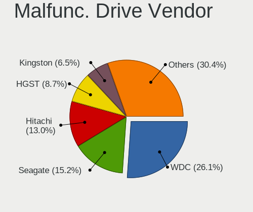

Devuan - Tested Hardware & Statistics
-------------------------------------

A project to collect tested hardware configurations for Devuan.

Anyone can contribute to this report by the [hw-probe](https://github.com/linuxhw/hw-probe) tool:

    sudo -E hw-probe -all -upload

Please contribute! Especially if your hardware is rare.

This is a report for all computer types. See also reports for [desktops](/Dist/Devuan/Desktop/README.md) and [notebooks](/Dist/Devuan/Notebook/README.md).

Contents
--------

* [ Test Cases ](#test-cases)

* [ System ](#system)
  - [ OS                       ](#os)
  - [ OS Family                ](#os-family)
  - [ Kernel                   ](#kernel)
  - [ Kernel Family            ](#kernel-family)
  - [ Kernel Major Ver.        ](#kernel-major-ver)
  - [ Arch                     ](#arch)
  - [ DE                       ](#de)
  - [ Display Server           ](#display-server)
  - [ Display Manager          ](#display-manager)
  - [ OS Lang                  ](#os-lang)
  - [ Boot Mode                ](#boot-mode)
  - [ Filesystem               ](#filesystem)
  - [ Part. scheme             ](#part-scheme)
  - [ Dual Boot with Linux/BSD ](#dual-boot-with-linuxbsd)
  - [ Dual Boot (Win)          ](#dual-boot-win)

* [ Board ](#board)
  - [ Vendor                   ](#vendor)
  - [ Model                    ](#model)
  - [ Model Family             ](#model-family)
  - [ MFG Year                 ](#mfg-year)
  - [ Form Factor              ](#form-factor)
  - [ Secure Boot              ](#secure-boot)
  - [ Coreboot                 ](#coreboot)
  - [ RAM Size                 ](#ram-size)
  - [ RAM Used                 ](#ram-used)
  - [ Total Drives             ](#total-drives)
  - [ Has CD-ROM               ](#has-cd-rom)
  - [ Has Ethernet             ](#has-ethernet)
  - [ Has WiFi                 ](#has-wifi)
  - [ Has Bluetooth            ](#has-bluetooth)

* [ Location ](#location)
  - [ Country                  ](#country)
  - [ City                     ](#city)

* [ Drives ](#drives)
  - [ Drive Vendor             ](#drive-vendor)
  - [ Drive Model              ](#drive-model)
  - [ HDD Vendor               ](#hdd-vendor)
  - [ SSD Vendor               ](#ssd-vendor)
  - [ Drive Kind               ](#drive-kind)
  - [ Drive Connector          ](#drive-connector)
  - [ Drive Size               ](#drive-size)
  - [ Space Total              ](#space-total)
  - [ Space Used               ](#space-used)
  - [ Malfunc. Drives          ](#malfunc-drives)
  - [ Malfunc. Drive Vendor    ](#malfunc-drive-vendor)
  - [ Malfunc. HDD Vendor      ](#malfunc-hdd-vendor)
  - [ Malfunc. Drive Kind      ](#malfunc-drive-kind)
  - [ Failed Drives            ](#failed-drives)
  - [ Failed Drive Vendor      ](#failed-drive-vendor)
  - [ Drive Status             ](#drive-status)

* [ Storage controller ](#storage-controller)
  - [ Storage Vendor           ](#storage-vendor)
  - [ Storage Model            ](#storage-model)
  - [ Storage Kind             ](#storage-kind)

* [ Processor ](#processor)
  - [ CPU Vendor               ](#cpu-vendor)
  - [ CPU Model                ](#cpu-model)
  - [ CPU Model Family         ](#cpu-model-family)
  - [ CPU Cores                ](#cpu-cores)
  - [ CPU Sockets              ](#cpu-sockets)
  - [ CPU Threads              ](#cpu-threads)
  - [ CPU Op-Modes             ](#cpu-op-modes)
  - [ CPU Microcode            ](#cpu-microcode)
  - [ CPU Microarch            ](#cpu-microarch)

* [ Graphics ](#graphics)
  - [ GPU Vendor               ](#gpu-vendor)
  - [ GPU Model                ](#gpu-model)
  - [ GPU Combo                ](#gpu-combo)
  - [ GPU Driver               ](#gpu-driver)
  - [ GPU Memory               ](#gpu-memory)

* [ Monitor ](#monitor)
  - [ Monitor Vendor           ](#monitor-vendor)
  - [ Monitor Model            ](#monitor-model)
  - [ Monitor Resolution       ](#monitor-resolution)
  - [ Monitor Diagonal         ](#monitor-diagonal)
  - [ Monitor Width            ](#monitor-width)
  - [ Aspect Ratio             ](#aspect-ratio)
  - [ Monitor Area             ](#monitor-area)
  - [ Pixel Density            ](#pixel-density)
  - [ Multiple Monitors        ](#multiple-monitors)

* [ Network ](#network)
  - [ Net Controller Vendor    ](#net-controller-vendor)
  - [ Net Controller Model     ](#net-controller-model)
  - [ Wireless Vendor          ](#wireless-vendor)
  - [ Wireless Model           ](#wireless-model)
  - [ Ethernet Vendor          ](#ethernet-vendor)
  - [ Ethernet Model           ](#ethernet-model)
  - [ Net Controller Kind      ](#net-controller-kind)
  - [ Used Controller          ](#used-controller)
  - [ NICs                     ](#nics)
  - [ IPv6                     ](#ipv6)

* [ Bluetooth ](#bluetooth)
  - [ Bluetooth Vendor         ](#bluetooth-vendor)
  - [ Bluetooth Model          ](#bluetooth-model)

* [ Sound ](#sound)
  - [ Sound Vendor             ](#sound-vendor)
  - [ Sound Model              ](#sound-model)

* [ Memory ](#memory)
  - [ Memory Vendor            ](#memory-vendor)
  - [ Memory Model             ](#memory-model)
  - [ Memory Kind              ](#memory-kind)
  - [ Memory Form Factor       ](#memory-form-factor)
  - [ Memory Size              ](#memory-size)
  - [ Memory Speed             ](#memory-speed)

* [ Printers & scanners ](#printers--scanners)
  - [ Printer Vendor           ](#printer-vendor)
  - [ Printer Model            ](#printer-model)
  - [ Scanner Vendor           ](#scanner-vendor)
  - [ Scanner Model            ](#scanner-model)

* [ Camera ](#camera)
  - [ Camera Vendor            ](#camera-vendor)
  - [ Camera Model             ](#camera-model)

* [ Security ](#security)
  - [ Fingerprint Vendor       ](#fingerprint-vendor)
  - [ Fingerprint Model        ](#fingerprint-model)
  - [ Chipcard Vendor          ](#chipcard-vendor)
  - [ Chipcard Model           ](#chipcard-model)

* [ Unsupported ](#unsupported)
  - [ Unsupported Devices      ](#unsupported-devices)
  - [ Unsupported Device Types ](#unsupported-device-types)

Test Cases
----------

Total: 320

| Vendor        | Model                       | Form-Factor | Probe                                                      | Date         |
|---------------|-----------------------------|-------------|------------------------------------------------------------|--------------|
| ASUSTek       | P5VD2-MX SE                 | Desktop     | [79f2dc1f44](https://linux-hardware.org/?probe=79f2dc1f44) | Jan 04, 2025 |
| Purism        | Librem 14                   | Notebook    | [5f54d4d304](https://linux-hardware.org/?probe=5f54d4d304) | Jan 01, 2025 |
| Medion        | MS-7800                     | Desktop     | [4d798c6151](https://linux-hardware.org/?probe=4d798c6151) | Dec 28, 2024 |
| Lenovo        | IdeaPad Y460                | Notebook    | [3c6931e293](https://linux-hardware.org/?probe=3c6931e293) | Dec 27, 2024 |
| ASUSTek       | PRIME H510M-R               | Desktop     | [3dd5eb18d7](https://linux-hardware.org/?probe=3dd5eb18d7) | Dec 04, 2024 |
| ASUSTek       | K50IE                       | Notebook    | [6b1d699417](https://linux-hardware.org/?probe=6b1d699417) | Nov 30, 2024 |
| Fujitsu       | D3313-B1 S26361-D3313-B1    | Desktop     | [37e2be7204](https://linux-hardware.org/?probe=37e2be7204) | Nov 29, 2024 |
| ASUSTek       | K50IE                       | Notebook    | [2b124f3ff4](https://linux-hardware.org/?probe=2b124f3ff4) | Nov 28, 2024 |
| Gigabyte      | B360M HD3                   | Desktop     | [47689d663d](https://linux-hardware.org/?probe=47689d663d) | Nov 26, 2024 |
| Lenovo        | ThinkServer TS440           | Desktop     | [32d727d9ed](https://linux-hardware.org/?probe=32d727d9ed) | Nov 23, 2024 |
| Dell          | Latitude E5500              | Notebook    | [872edd1a02](https://linux-hardware.org/?probe=872edd1a02) | Nov 15, 2024 |
| Gigabyte      | B360M HD3                   | Desktop     | [324609e537](https://linux-hardware.org/?probe=324609e537) | Nov 13, 2024 |
| Acer          | Aspire E5-576               | Notebook    | [a8438fb58b](https://linux-hardware.org/?probe=a8438fb58b) | Nov 13, 2024 |
| Lenovo        | ThinkPad X200 7459D12       | Notebook    | [a34523d690](https://linux-hardware.org/?probe=a34523d690) | Nov 05, 2024 |
| Gigabyte      | B360M HD3                   | Desktop     | [e0f9145a94](https://linux-hardware.org/?probe=e0f9145a94) | Oct 29, 2024 |
| Lenovo        | 3130 SDK0J40697 WIN 3305... | Mini pc     | [3f2770b9fe](https://linux-hardware.org/?probe=3f2770b9fe) | Oct 25, 2024 |
| Gigabyte      | B550 AORUS ELITE AX V2      | Desktop     | [08d5336ac6](https://linux-hardware.org/?probe=08d5336ac6) | Oct 23, 2024 |
| Notebook      | NV4XMB,ME,MZ                | Notebook    | [f32872a46b](https://linux-hardware.org/?probe=f32872a46b) | Oct 22, 2024 |
| Notebook      | NV4XMB,ME,MZ                | Notebook    | [d657be30d1](https://linux-hardware.org/?probe=d657be30d1) | Oct 22, 2024 |
| MSI           | 970A-G46                    | Desktop     | [7f5bf49bca](https://linux-hardware.org/?probe=7f5bf49bca) | Oct 08, 2024 |
| Packard Be... | IMEDIA S1300                | Desktop     | [169f7ca9c5](https://linux-hardware.org/?probe=169f7ca9c5) | Oct 07, 2024 |
| Gigabyte      | B360M HD3                   | Desktop     | [48012a37a7](https://linux-hardware.org/?probe=48012a37a7) | Oct 06, 2024 |
| Lenovo        | ThinkServer TS440           | Desktop     | [f632484903](https://linux-hardware.org/?probe=f632484903) | Sep 24, 2024 |
| Lenovo        | ThinkServer TS440           | Desktop     | [d6f3c76298](https://linux-hardware.org/?probe=d6f3c76298) | Sep 22, 2024 |
| HP            | Victus by Gaming Laptop ... | Notebook    | [6a8043a39f](https://linux-hardware.org/?probe=6a8043a39f) | Sep 21, 2024 |
| HP            | Victus by Gaming Laptop ... | Notebook    | [17fd2f1a0d](https://linux-hardware.org/?probe=17fd2f1a0d) | Sep 21, 2024 |
| Gigabyte      | B360M HD3                   | Desktop     | [467e17fa7f](https://linux-hardware.org/?probe=467e17fa7f) | Sep 15, 2024 |
| Gigabyte      | B360M HD3                   | Desktop     | [c481ebf3ab](https://linux-hardware.org/?probe=c481ebf3ab) | Sep 03, 2024 |
| Lenovo        | LOQ 15AHP9 83DX             | Notebook    | [b59950cf4a](https://linux-hardware.org/?probe=b59950cf4a) | Sep 03, 2024 |
| Nitrokey      | NitroPC                     | Desktop     | [9483c755b2](https://linux-hardware.org/?probe=9483c755b2) | Aug 30, 2024 |
| Lenovo        | ThinkPad X230 23259J6       | Notebook    | [3fee175541](https://linux-hardware.org/?probe=3fee175541) | Aug 27, 2024 |
| MSI           | X570-A PRO                  | Desktop     | [5d24c43a0f](https://linux-hardware.org/?probe=5d24c43a0f) | Aug 23, 2024 |
| Dell          | Latitude E6430              | Notebook    | [bdf4eb5fc6](https://linux-hardware.org/?probe=bdf4eb5fc6) | Jul 29, 2024 |
| Framework     | Laptop                      | Notebook    | [8436ce2126](https://linux-hardware.org/?probe=8436ce2126) | Jul 22, 2024 |
| ASUSTek       | M4A78LT-M-LE                | Desktop     | [f4985cfd49](https://linux-hardware.org/?probe=f4985cfd49) | Jul 21, 2024 |
| Raspberry ... | Raspberry Pi 2 Model B R... | Soc         | [545544cd2e](https://linux-hardware.org/?probe=545544cd2e) | Jul 18, 2024 |
| Gigabyte      | B360M HD3                   | Desktop     | [2afec4b13a](https://linux-hardware.org/?probe=2afec4b13a) | Jul 17, 2024 |
| Nitrokey      | NitroPC                     | Desktop     | [b6feebdb98](https://linux-hardware.org/?probe=b6feebdb98) | Jul 15, 2024 |
| ASUSTek       | TUF Gaming FX505GD          | Notebook    | [e269bf0952](https://linux-hardware.org/?probe=e269bf0952) | Jul 14, 2024 |
| Lenovo        | ThinkPad E15 Gen 4 21EDC... | Notebook    | [df123831be](https://linux-hardware.org/?probe=df123831be) | Jul 13, 2024 |
| Lenovo        | ThinkPad X230 4290EM6       | Notebook    | [ec3109a514](https://linux-hardware.org/?probe=ec3109a514) | Jul 13, 2024 |
| ASRock        | H310CM-HG4                  | Desktop     | [a7472ec4d0](https://linux-hardware.org/?probe=a7472ec4d0) | Jul 12, 2024 |
| ASUSTek       | M5A78L-M PLUS/USB3          | Desktop     | [59b443dc2a](https://linux-hardware.org/?probe=59b443dc2a) | Jul 12, 2024 |
| Gigabyte      | B360M HD3                   | Desktop     | [b8bdcd66a2](https://linux-hardware.org/?probe=b8bdcd66a2) | Jul 07, 2024 |
| Lenovo        | ThinkPad E14 Gen 5 21JR0... | Notebook    | [e482f45dc4](https://linux-hardware.org/?probe=e482f45dc4) | Jul 06, 2024 |
| Foxconn       | G31MXP FAB:1.1              | Desktop     | [6dc0514739](https://linux-hardware.org/?probe=6dc0514739) | Jul 05, 2024 |
| Gigabyte      | B360M HD3                   | Desktop     | [48d2c2f4d4](https://linux-hardware.org/?probe=48d2c2f4d4) | Jun 30, 2024 |
| Acer          | Aspire 5742Z                | Notebook    | [47307ae042](https://linux-hardware.org/?probe=47307ae042) | Jun 23, 2024 |
| Positivo      | POS-PIB150DT                | Desktop     | [0605d568ff](https://linux-hardware.org/?probe=0605d568ff) | Jun 18, 2024 |
| ASUSTek       | EB1037                      | Desktop     | [b138f78a44](https://linux-hardware.org/?probe=b138f78a44) | Jun 16, 2024 |
| ASUSTek       | PRIME H310M-E R2.0          | Desktop     | [8b81f887cb](https://linux-hardware.org/?probe=8b81f887cb) | Jun 15, 2024 |
| Intel         | NUC5CPYB H61145-410         | Mini pc     | [fcf83a3e56](https://linux-hardware.org/?probe=fcf83a3e56) | Jun 07, 2024 |
| AMI           | Aptio CRB                   | Mini pc     | [71ef9c5bc6](https://linux-hardware.org/?probe=71ef9c5bc6) | Jun 07, 2024 |
| Gigabyte      | H97N-WIFI                   | Desktop     | [f2859ff34a](https://linux-hardware.org/?probe=f2859ff34a) | Jun 07, 2024 |
| Shenzhen M... | ANSVK                       | Desktop     | [9d7782cbb6](https://linux-hardware.org/?probe=9d7782cbb6) | May 22, 2024 |
| Shenzhen M... | ANSVK                       | Desktop     | [70f87ebe01](https://linux-hardware.org/?probe=70f87ebe01) | May 22, 2024 |
| Acer          | Nitro AN515-42              | Notebook    | [090323c57b](https://linux-hardware.org/?probe=090323c57b) | May 20, 2024 |
| Gigabyte      | B360M HD3                   | Desktop     | [f637fbeb5a](https://linux-hardware.org/?probe=f637fbeb5a) | May 11, 2024 |
| Dell          | XPS 13 9360                 | Notebook    | [536f8ed319](https://linux-hardware.org/?probe=536f8ed319) | May 09, 2024 |
| System76      | Galago Pro                  | Notebook    | [06d9cca0d2](https://linux-hardware.org/?probe=06d9cca0d2) | Apr 27, 2024 |
| ASUSTek       | 1000H                       | Notebook    | [0463a4d88b](https://linux-hardware.org/?probe=0463a4d88b) | Apr 26, 2024 |
| Apple         | MacBookAir6,1               | Notebook    | [08ca3d5ea0](https://linux-hardware.org/?probe=08ca3d5ea0) | Apr 19, 2024 |
| Dell          | Studio 1558                 | Notebook    | [73fb46028c](https://linux-hardware.org/?probe=73fb46028c) | Apr 12, 2024 |
| Samsung       | DP515A2G-K02FR SAMSUNG_S... | All in one  | [b029695fa9](https://linux-hardware.org/?probe=b029695fa9) | Apr 06, 2024 |
| Fujitsu       | D3041-A1 S26361-D3041-A1    | Desktop     | [fec7c15063](https://linux-hardware.org/?probe=fec7c15063) | Apr 03, 2024 |
| Fujitsu       | D3041-A1 S26361-D3041-A1    | Desktop     | [7756c3e23b](https://linux-hardware.org/?probe=7756c3e23b) | Apr 01, 2024 |
| Gigabyte      | Z370 AORUS Gaming 7         | Desktop     | [63429edd54](https://linux-hardware.org/?probe=63429edd54) | Apr 01, 2024 |
| Acer          | Aspire A3SP14-31PT          | Convertible | [f886e7b907](https://linux-hardware.org/?probe=f886e7b907) | Mar 21, 2024 |
| Foxconn       | 2ABF                        | Desktop     | [0348bd12f8](https://linux-hardware.org/?probe=0348bd12f8) | Mar 15, 2024 |
| ASUSTek       | TUF B450-PRO GAMING         | Desktop     | [fbd2947969](https://linux-hardware.org/?probe=fbd2947969) | Mar 13, 2024 |
| ASUSTek       | TUF B450-PRO GAMING         | Desktop     | [3b35cebff6](https://linux-hardware.org/?probe=3b35cebff6) | Mar 12, 2024 |
| Gigabyte      | B360M HD3                   | Desktop     | [63a3f8ce29](https://linux-hardware.org/?probe=63a3f8ce29) | Mar 11, 2024 |
| Gigabyte      | B360M HD3                   | Desktop     | [aa06991c8c](https://linux-hardware.org/?probe=aa06991c8c) | Mar 11, 2024 |
| Gigabyte      | B360M HD3                   | Desktop     | [724f7885d0](https://linux-hardware.org/?probe=724f7885d0) | Mar 10, 2024 |
| Lenovo        | ThinkPad X1 Carbon Gen 1... | Notebook    | [2270faaf14](https://linux-hardware.org/?probe=2270faaf14) | Mar 07, 2024 |
| Lenovo        | ThinkPad X230 23252UU       | Notebook    | [7fb7bfaacd](https://linux-hardware.org/?probe=7fb7bfaacd) | Mar 05, 2024 |
| ASUSTek       | K55VJ                       | Notebook    | [88ee2dbed6](https://linux-hardware.org/?probe=88ee2dbed6) | Mar 03, 2024 |
| Gigabyte      | B760 GAMING X AX            | Desktop     | [bdd341c11c](https://linux-hardware.org/?probe=bdd341c11c) | Mar 02, 2024 |
| MACHENIKE     | T90-V                       | Notebook    | [01cb379c2e](https://linux-hardware.org/?probe=01cb379c2e) | Feb 24, 2024 |
| Lenovo        | Yoga 7 16IRL8 82YN          | Convertible | [3b4a6f9360](https://linux-hardware.org/?probe=3b4a6f9360) | Feb 19, 2024 |
| Dell          | 0NW6H5 A00                  | Desktop     | [5b29c953c3](https://linux-hardware.org/?probe=5b29c953c3) | Feb 17, 2024 |
| Acer          | Aspire A3SP14-31PT          | Convertible | [72820ef395](https://linux-hardware.org/?probe=72820ef395) | Feb 15, 2024 |
| Maibenben     | MaiBook M                   | Notebook    | [7f6b3c0f92](https://linux-hardware.org/?probe=7f6b3c0f92) | Feb 13, 2024 |
| ASUSTek       | TUF B450-PRO GAMING         | Desktop     | [348dffed6d](https://linux-hardware.org/?probe=348dffed6d) | Feb 09, 2024 |
| HP            | EliteBook 840 G6            | Notebook    | [6cac3b71e0](https://linux-hardware.org/?probe=6cac3b71e0) | Feb 01, 2024 |
| Dell          | OptiPlex 780                | Desktop     | [3c444c1e27](https://linux-hardware.org/?probe=3c444c1e27) | Jan 24, 2024 |
| ASUSTek       | Z170-P                      | Desktop     | [fc85634fb3](https://linux-hardware.org/?probe=fc85634fb3) | Jan 10, 2024 |
| Lenovo        | ThinkPad P1 20MDCTO1WW      | Notebook    | [b66d7c38c1](https://linux-hardware.org/?probe=b66d7c38c1) | Dec 31, 2023 |
| Dell          | 03GCPM A01                  | Server      | [7c11f33356](https://linux-hardware.org/?probe=7c11f33356) | Dec 27, 2023 |
| Gigabyte      | B550 GAMING X V2            | Desktop     | [ce4bc6f455](https://linux-hardware.org/?probe=ce4bc6f455) | Dec 21, 2023 |
| Notebook      | W94_95_97SU2,SUY,-C,-T      | Notebook    | [3834ee3d70](https://linux-hardware.org/?probe=3834ee3d70) | Dec 15, 2023 |
| HP            | ENVY x360 Convertible 15... | Convertible | [f170615f49](https://linux-hardware.org/?probe=f170615f49) | Dec 14, 2023 |
| HP            | ProBook 450 15.6 inch G9... | Notebook    | [7af6ecc981](https://linux-hardware.org/?probe=7af6ecc981) | Dec 12, 2023 |
| Dell          | Latitude E6400              | Notebook    | [c23aa9b02a](https://linux-hardware.org/?probe=c23aa9b02a) | Dec 10, 2023 |
| Lenovo        | ThinkPad T470 W10DG 20JN... | Notebook    | [c72f209121](https://linux-hardware.org/?probe=c72f209121) | Dec 05, 2023 |
| Dell          | Latitude E6430              | Notebook    | [8b68261a59](https://linux-hardware.org/?probe=8b68261a59) | Nov 30, 2023 |
| Dell          | XPS 13 9370                 | Notebook    | [2961332bce](https://linux-hardware.org/?probe=2961332bce) | Nov 26, 2023 |
| Lenovo        | ThinkPad T470s 20HGS1080... | Notebook    | [37c32a9af7](https://linux-hardware.org/?probe=37c32a9af7) | Nov 25, 2023 |
| ASRock        | G31M-S                      | Desktop     | [01866950a6](https://linux-hardware.org/?probe=01866950a6) | Nov 25, 2023 |
| HP            | G62                         | Notebook    | [9d6424c4cc](https://linux-hardware.org/?probe=9d6424c4cc) | Nov 24, 2023 |
| Acer          | Aspire A515-54G             | Notebook    | [8e8de2388b](https://linux-hardware.org/?probe=8e8de2388b) | Nov 21, 2023 |
| HP            | Presario C700               | Notebook    | [c8a9963f71](https://linux-hardware.org/?probe=c8a9963f71) | Nov 19, 2023 |
| HP            | Unknown                     | Notebook    | [3827b1fa19](https://linux-hardware.org/?probe=3827b1fa19) | Nov 16, 2023 |
| HP            | Unknown                     | Notebook    | [ef19087623](https://linux-hardware.org/?probe=ef19087623) | Nov 16, 2023 |
| Apple         | Mac-F2238BAE iMac11,3       | All in one  | [547a248361](https://linux-hardware.org/?probe=547a248361) | Nov 03, 2023 |
| ASUSTek       | M11BB                       | Desktop     | [21e7b53022](https://linux-hardware.org/?probe=21e7b53022) | Nov 02, 2023 |
| Lenovo        | ThinkPad X240 20AMS2EC00    | Notebook    | [820620d5c4](https://linux-hardware.org/?probe=820620d5c4) | Nov 01, 2023 |
| Intel         | X99                         | Desktop     | [8f60418655](https://linux-hardware.org/?probe=8f60418655) | Oct 30, 2023 |
| MSI           | 970A SLI Krait Edition      | Desktop     | [a54528c1ef](https://linux-hardware.org/?probe=a54528c1ef) | Oct 29, 2023 |
| Samsung       | N150P                       | Notebook    | [83f77d7896](https://linux-hardware.org/?probe=83f77d7896) | Oct 23, 2023 |
| ASUSTek       | STRIX Z270E GAMING          | Desktop     | [baacbfa91a](https://linux-hardware.org/?probe=baacbfa91a) | Oct 19, 2023 |
| Lenovo        | IdeaPad Gaming 3 15IAH7 ... | Notebook    | [cf522294f8](https://linux-hardware.org/?probe=cf522294f8) | Oct 18, 2023 |
| TUXEDO        | XP1610                      | Notebook    | [31be190f30](https://linux-hardware.org/?probe=31be190f30) | Oct 13, 2023 |
| Dell          | XPS M1530                   | Notebook    | [b24e393bbb](https://linux-hardware.org/?probe=b24e393bbb) | Sep 23, 2023 |
| Dell          | Inspiron 3583               | Notebook    | [56cd0e05e8](https://linux-hardware.org/?probe=56cd0e05e8) | Sep 22, 2023 |
| PC Special... | P7xxTM1                     | Notebook    | [2bdbc2f2e7](https://linux-hardware.org/?probe=2bdbc2f2e7) | Sep 12, 2023 |
| Apple         | MacBookPro8,2               | Notebook    | [f23bb97453](https://linux-hardware.org/?probe=f23bb97453) | Sep 11, 2023 |
| Sony          | VGN-FZ140E                  | Notebook    | [361226919e](https://linux-hardware.org/?probe=361226919e) | Sep 11, 2023 |
| Lenovo        | ThinkPad T14 Gen 3 21AHC... | Notebook    | [61906f4e91](https://linux-hardware.org/?probe=61906f4e91) | Sep 07, 2023 |
| Dell          | Inspiron 3585               | Notebook    | [89a0e93fd5](https://linux-hardware.org/?probe=89a0e93fd5) | Sep 05, 2023 |
| Intel         | powered classmate PC        | Notebook    | [f852524db2](https://linux-hardware.org/?probe=f852524db2) | Sep 01, 2023 |
| Lenovo        | ThinkPad T480 20L5CTO1WW    | Notebook    | [44e328b3a0](https://linux-hardware.org/?probe=44e328b3a0) | Aug 24, 2023 |
| Lenovo        | ThinkPad X390 20Q1A005CD    | Notebook    | [c299d4ad92](https://linux-hardware.org/?probe=c299d4ad92) | Aug 15, 2023 |
| Lenovo        | ThinkPad T560 20FJS1J200    | Notebook    | [f0d90b715d](https://linux-hardware.org/?probe=f0d90b715d) | Aug 15, 2023 |
| Dell          | 0GX297                      | Desktop     | [0fa81b620e](https://linux-hardware.org/?probe=0fa81b620e) | Aug 14, 2023 |
| Gigabyte      | F2A55M-HD2                  | Desktop     | [bed2e58bf4](https://linux-hardware.org/?probe=bed2e58bf4) | Aug 14, 2023 |
| ASUSTek       | T200TA                      | Notebook    | [affc999457](https://linux-hardware.org/?probe=affc999457) | Aug 12, 2023 |
| LORD ELECT... | LORD G4x 775 ICH7 8712 A... | Desktop     | [3e63b3dec0](https://linux-hardware.org/?probe=3e63b3dec0) | Aug 09, 2023 |
| LORD ELECT... | LORD G4x 775 ICH7 8712 A... | Desktop     | [a036ddad16](https://linux-hardware.org/?probe=a036ddad16) | Aug 09, 2023 |
| Supermicro    | X10SRG-F                    | Desktop     | [3bdaa7bfef](https://linux-hardware.org/?probe=3bdaa7bfef) | Aug 08, 2023 |
| Lenovo        | ThinkPad T14 Gen 3 21AHC... | Notebook    | [67febbf0c0](https://linux-hardware.org/?probe=67febbf0c0) | Jul 27, 2023 |
| MSI           | B450 GAMING PLUS MAX        | Desktop     | [606780c010](https://linux-hardware.org/?probe=606780c010) | Jul 24, 2023 |
| Samsung       | 550XDA                      | Notebook    | [c298263c6c](https://linux-hardware.org/?probe=c298263c6c) | Jul 22, 2023 |
| Dell          | Latitude E5500              | Notebook    | [03798c7840](https://linux-hardware.org/?probe=03798c7840) | Jul 10, 2023 |
| Nokia         | N900                        | Notebook    | [7728c85b90](https://linux-hardware.org/?probe=7728c85b90) | Jul 06, 2023 |
| HP            | EliteBook 840 G6            | Notebook    | [d072001450](https://linux-hardware.org/?probe=d072001450) | Jul 04, 2023 |
| Toshiba       | Satellite L300              | Notebook    | [8b04801d40](https://linux-hardware.org/?probe=8b04801d40) | Jun 27, 2023 |
| Lenovo        | ThinkPad T410 2537DA3       | Notebook    | [067b7f26a2](https://linux-hardware.org/?probe=067b7f26a2) | Jun 25, 2023 |
| HP            | EliteBook 840 G6            | Notebook    | [82c9c200bc](https://linux-hardware.org/?probe=82c9c200bc) | Jun 20, 2023 |
| Gigabyte      | H81M-S2H                    | Desktop     | [7a3f7dcd73](https://linux-hardware.org/?probe=7a3f7dcd73) | Jun 17, 2023 |
| MSI           | Bravo 15 A4DDR              | Notebook    | [0e9ccef97f](https://linux-hardware.org/?probe=0e9ccef97f) | May 27, 2023 |
| Lenovo        | ThinkPad T14 Gen 3 21AHC... | Notebook    | [54f07f7d96](https://linux-hardware.org/?probe=54f07f7d96) | May 12, 2023 |
| Lenovo        | 3138 SDK0J40697 WIN 3305... | Desktop     | [36022cb1ac](https://linux-hardware.org/?probe=36022cb1ac) | May 11, 2023 |
| Lenovo        | IdeaPad 530S-14ARR 81H1     | Notebook    | [0d2ac684c8](https://linux-hardware.org/?probe=0d2ac684c8) | May 08, 2023 |
| Lenovo        | IdeaPad 530S-14ARR 81H1     | Notebook    | [c67960852a](https://linux-hardware.org/?probe=c67960852a) | May 06, 2023 |
| HUAWEI        | HN-WX9X                     | Notebook    | [d07874c829](https://linux-hardware.org/?probe=d07874c829) | Apr 24, 2023 |
| MSI           | B450M PRO-VDH PLUS          | Desktop     | [5e6b796278](https://linux-hardware.org/?probe=5e6b796278) | Apr 24, 2023 |
| Lenovo        | S20-30 20421                | Notebook    | [b9846b05e7](https://linux-hardware.org/?probe=b9846b05e7) | Apr 22, 2023 |
| HP            | 212A                        | Desktop     | [178f3b9c05](https://linux-hardware.org/?probe=178f3b9c05) | Apr 17, 2023 |
| Lenovo        | ThinkPad T480 20L5CTO1WW    | Notebook    | [96e067f5c8](https://linux-hardware.org/?probe=96e067f5c8) | Apr 14, 2023 |
| Lenovo        | ThinkPad T14 Gen 3 21AHC... | Notebook    | [549f922cf6](https://linux-hardware.org/?probe=549f922cf6) | Apr 13, 2023 |
| Lenovo        | ThinkPad T14 Gen 3 21AHC... | Notebook    | [a9aa9ab39f](https://linux-hardware.org/?probe=a9aa9ab39f) | Apr 13, 2023 |
| Lenovo        | 3138 SDK0J40697 WIN 3305... | Desktop     | [491da3c2c2](https://linux-hardware.org/?probe=491da3c2c2) | Apr 10, 2023 |
| Google        | Cyan                        | Notebook    | [f32e15dfef](https://linux-hardware.org/?probe=f32e15dfef) | Apr 09, 2023 |
| MSI           | PH67A-C43                   | Desktop     | [8e7c8a3d67](https://linux-hardware.org/?probe=8e7c8a3d67) | Apr 03, 2023 |
| ASUSTek       | PRIME B360-PLUS             | Desktop     | [ec45a753a5](https://linux-hardware.org/?probe=ec45a753a5) | Apr 02, 2023 |
| Dell          | G5 5505                     | Notebook    | [2552b456b6](https://linux-hardware.org/?probe=2552b456b6) | Mar 29, 2023 |
| Gigabyte      | B650I AORUS ULTRA           | Desktop     | [a33a768662](https://linux-hardware.org/?probe=a33a768662) | Mar 29, 2023 |
| ASUSTek       | G750JM                      | Notebook    | [98ba3a9ce6](https://linux-hardware.org/?probe=98ba3a9ce6) | Mar 25, 2023 |
| Dell          | 0V52N7 A02                  | Server      | [f22446cb1d](https://linux-hardware.org/?probe=f22446cb1d) | Mar 16, 2023 |
| Google        | Bluebird                    | Notebook    | [2d18088551](https://linux-hardware.org/?probe=2d18088551) | Mar 15, 2023 |
| Dell          | Latitude E6230              | Notebook    | [49a9844be8](https://linux-hardware.org/?probe=49a9844be8) | Mar 15, 2023 |
| AMI           | Intel                       | Desktop     | [c2c28fa7e4](https://linux-hardware.org/?probe=c2c28fa7e4) | Mar 15, 2023 |
| Dell          | Latitude E6440              | Notebook    | [76a537c18e](https://linux-hardware.org/?probe=76a537c18e) | Mar 14, 2023 |
| Lenovo        | 3135 SDK0J40697 WIN 3305... | Mini pc     | [83dcd35e5f](https://linux-hardware.org/?probe=83dcd35e5f) | Mar 12, 2023 |
| Gigabyte      | P55A-UD3                    | Desktop     | [60cd9db1c5](https://linux-hardware.org/?probe=60cd9db1c5) | Feb 25, 2023 |
| Unknown       | Unknown                     | Notebook    | [1f89daceb8](https://linux-hardware.org/?probe=1f89daceb8) | Feb 20, 2023 |
| MSI           | A320M PRO-E                 | Desktop     | [3e441c86f1](https://linux-hardware.org/?probe=3e441c86f1) | Feb 20, 2023 |
| HP            | 829A                        | Mini pc     | [8791cd83c7](https://linux-hardware.org/?probe=8791cd83c7) | Feb 19, 2023 |
| HP            | ProBook 640 G1              | Notebook    | [d0319bdf17](https://linux-hardware.org/?probe=d0319bdf17) | Feb 09, 2023 |
| MSI           | H67MS-E43                   | Desktop     | [47a6655b3b](https://linux-hardware.org/?probe=47a6655b3b) | Feb 07, 2023 |
| Apple         | Mac-F22C86C8                | Mini pc     | [63ea9a161f](https://linux-hardware.org/?probe=63ea9a161f) | Jan 31, 2023 |
| Lenovo        | ThinkPad T560 20FJS1J200    | Notebook    | [de713cedce](https://linux-hardware.org/?probe=de713cedce) | Jan 21, 2023 |
| Acer          | Aspire E1-572G              | Notebook    | [360a177e77](https://linux-hardware.org/?probe=360a177e77) | Jan 14, 2023 |
| Dell          | Inspiron 15 3511            | Notebook    | [f4349052b8](https://linux-hardware.org/?probe=f4349052b8) | Jan 06, 2023 |
| Dell          | XPS 13 9370                 | Notebook    | [1f72002986](https://linux-hardware.org/?probe=1f72002986) | Dec 29, 2022 |
| HP            | Laptop 14-df0xxx            | Notebook    | [1d9edd6c97](https://linux-hardware.org/?probe=1d9edd6c97) | Dec 25, 2022 |
| Gigabyte      | B550I AORUS PRO AX          | Desktop     | [beeeff23a5](https://linux-hardware.org/?probe=beeeff23a5) | Dec 25, 2022 |
| HP            | 250 G8 Notebook PC          | Notebook    | [ed3886b135](https://linux-hardware.org/?probe=ed3886b135) | Dec 02, 2022 |
| Dell          | Latitude E6530              | Notebook    | [e40986d2fb](https://linux-hardware.org/?probe=e40986d2fb) | Nov 22, 2022 |
| Dell          | Latitude E6530              | Notebook    | [14debbe3e5](https://linux-hardware.org/?probe=14debbe3e5) | Nov 22, 2022 |
| Lenovo        | G50-30 80G0                 | Notebook    | [be4f638bc7](https://linux-hardware.org/?probe=be4f638bc7) | Nov 21, 2022 |
| ASUSTek       | ROG STRIX B550-A GAMING     | Desktop     | [de8b7d8220](https://linux-hardware.org/?probe=de8b7d8220) | Nov 19, 2022 |
| HP            | Laptop 15-bs2xx             | Notebook    | [7254534946](https://linux-hardware.org/?probe=7254534946) | Oct 20, 2022 |
| ASUSTek       | PRIME X399-A                | Desktop     | [304c12788b](https://linux-hardware.org/?probe=304c12788b) | Oct 06, 2022 |
| Lenovo        | ThinkPad T550 20CJS1VD01    | Notebook    | [97d1b5e6c5](https://linux-hardware.org/?probe=97d1b5e6c5) | Sep 30, 2022 |
| Lenovo        | ThinkPad T440p              | Notebook    | [270cf10219](https://linux-hardware.org/?probe=270cf10219) | Sep 25, 2022 |
| Lenovo        | ThinkPad T440p              | Notebook    | [bf397424f3](https://linux-hardware.org/?probe=bf397424f3) | Sep 18, 2022 |
| HP            | 1825                        | Desktop     | [bceae72004](https://linux-hardware.org/?probe=bceae72004) | Aug 15, 2022 |
| Lenovo        | ThinkPad T550 20CJS1VD01    | Notebook    | [1bcc13e6b4](https://linux-hardware.org/?probe=1bcc13e6b4) | Aug 15, 2022 |
| CCE           | Capella & IbexPeak-M Chi... | Notebook    | [defafd4f0b](https://linux-hardware.org/?probe=defafd4f0b) | Aug 10, 2022 |
| CCE           | Capella & IbexPeak-M Chi... | Notebook    | [389bef188c](https://linux-hardware.org/?probe=389bef188c) | Aug 10, 2022 |
| MSI           | X99S MPOWER                 | Desktop     | [a3c1523b6b](https://linux-hardware.org/?probe=a3c1523b6b) | Jul 27, 2022 |
| Sony          | VPCEE23FX                   | Notebook    | [b4108910d3](https://linux-hardware.org/?probe=b4108910d3) | Jul 25, 2022 |
| Toshiba       | Satellite Pro A50-C         | Notebook    | [a94461714d](https://linux-hardware.org/?probe=a94461714d) | Jul 18, 2022 |
| Lenovo        | V310-14ISK 80SX             | Notebook    | [6dcb934555](https://linux-hardware.org/?probe=6dcb934555) | Jul 17, 2022 |
| Dell          | Latitude 7280               | Notebook    | [75ce6d31bc](https://linux-hardware.org/?probe=75ce6d31bc) | Jul 14, 2022 |
| MSI           | Modern 15 A5M               | Notebook    | [40c6c77f2c](https://linux-hardware.org/?probe=40c6c77f2c) | Jul 13, 2022 |
| Dell          | Latitude E7240              | Notebook    | [045554b70c](https://linux-hardware.org/?probe=045554b70c) | Jul 08, 2022 |
| Dell          | 054KM3 A01                  | Desktop     | [407b210bfe](https://linux-hardware.org/?probe=407b210bfe) | Jul 05, 2022 |
| HP            | 18E7                        | Desktop     | [2fd690b3b4](https://linux-hardware.org/?probe=2fd690b3b4) | Jun 22, 2022 |
| Lenovo        | ThinkPad T430 2349I46       | Notebook    | [3a7df4ea17](https://linux-hardware.org/?probe=3a7df4ea17) | Jun 20, 2022 |
| ASUSTek       | ROG CROSSHAIR VII HERO      | Desktop     | [a698baa5f6](https://linux-hardware.org/?probe=a698baa5f6) | Jun 18, 2022 |
| HP            | Laptop 17-cp0xxx            | Notebook    | [001634b95b](https://linux-hardware.org/?probe=001634b95b) | Jun 17, 2022 |
| IP3 Tech      | GB3B                        | Mini pc     | [5da801634f](https://linux-hardware.org/?probe=5da801634f) | Jun 09, 2022 |
| Dell          | Latitude E6430              | Notebook    | [95b7617708](https://linux-hardware.org/?probe=95b7617708) | Jun 05, 2022 |
| Acer          | Aspire E5-553G              | Notebook    | [2d4c950e2f](https://linux-hardware.org/?probe=2d4c950e2f) | May 25, 2022 |
| Acer          | Aspire E5-553G              | Notebook    | [73139cdb17](https://linux-hardware.org/?probe=73139cdb17) | May 25, 2022 |
| Dell          | 0NC2VH A01                  | Desktop     | [f05a6e7d31](https://linux-hardware.org/?probe=f05a6e7d31) | May 03, 2022 |
| ASRock        | B450M-HDV R4.0              | Desktop     | [bce1bba9ff](https://linux-hardware.org/?probe=bce1bba9ff) | Apr 29, 2022 |
| Lenovo        | IdeaPad L340-15IRH Gamin... | Notebook    | [2717caa7f5](https://linux-hardware.org/?probe=2717caa7f5) | Apr 25, 2022 |
| HP            | Notebook                    | Notebook    | [966668f0c0](https://linux-hardware.org/?probe=966668f0c0) | Apr 17, 2022 |
| Dell          | 0D24M8 A01                  | Desktop     | [fe4bb32aa1](https://linux-hardware.org/?probe=fe4bb32aa1) | Apr 14, 2022 |
| Dell          | 014GRG A00                  | Desktop     | [1783efe96b](https://linux-hardware.org/?probe=1783efe96b) | Apr 14, 2022 |
| Lenovo        | ThinkPad T470s 20HGS00P0... | Notebook    | [2c9878c68b](https://linux-hardware.org/?probe=2c9878c68b) | Apr 13, 2022 |
| Chuwi         | Hi10 X                      | Tablet      | [1aa66a62c4](https://linux-hardware.org/?probe=1aa66a62c4) | Mar 26, 2022 |
| Dell          | Latitude E5540              | Notebook    | [0948114af7](https://linux-hardware.org/?probe=0948114af7) | Mar 03, 2022 |
| HP            | 1825                        | Desktop     | [a7ce5b6b11](https://linux-hardware.org/?probe=a7ce5b6b11) | Mar 03, 2022 |
| Lenovo        | ThinkPad T550 20CJS1VD01    | Notebook    | [a3aed9d375](https://linux-hardware.org/?probe=a3aed9d375) | Mar 03, 2022 |
| Lenovo        | ThinkPad X1 Tablet Gen 3... | Tablet      | [f92ae76fed](https://linux-hardware.org/?probe=f92ae76fed) | Feb 24, 2022 |
| MSI           | B450M PRO-M2 MAX            | Desktop     | [3f99c8072a](https://linux-hardware.org/?probe=3f99c8072a) | Feb 23, 2022 |
| ASUSTek       | PRIME H510M-A               | Desktop     | [7ab68e0043](https://linux-hardware.org/?probe=7ab68e0043) | Feb 17, 2022 |
| ASRock        | B450M-HDV R4.0              | Desktop     | [f2a65b8a5f](https://linux-hardware.org/?probe=f2a65b8a5f) | Feb 14, 2022 |
| Gigabyte      | P55A-UD3                    | Desktop     | [824dbdd8ad](https://linux-hardware.org/?probe=824dbdd8ad) | Jan 22, 2022 |
| Online Lab... | SR 42                       | Desktop     | [e3037eb087](https://linux-hardware.org/?probe=e3037eb087) | Jan 22, 2022 |
| Gigabyte      | H310M S2H x.x               | Desktop     | [9e14e04f7f](https://linux-hardware.org/?probe=9e14e04f7f) | Jan 22, 2022 |
| ASUSTek       | K55VJ                       | Notebook    | [562262b9eb](https://linux-hardware.org/?probe=562262b9eb) | Jan 22, 2022 |
| ASRock        | B450M-HDV R4.0              | Desktop     | [8e7267692b](https://linux-hardware.org/?probe=8e7267692b) | Jan 21, 2022 |
| ASUSTek       | X555LJ                      | Notebook    | [9fbdf4dfc2](https://linux-hardware.org/?probe=9fbdf4dfc2) | Jan 17, 2022 |
| Lenovo        | ThinkPad T420 4180AG3       | Notebook    | [2c3cd27ad2](https://linux-hardware.org/?probe=2c3cd27ad2) | Jan 16, 2022 |
| Notebook      | W230ST                      | Notebook    | [3dacf0aea8](https://linux-hardware.org/?probe=3dacf0aea8) | Jan 15, 2022 |
| Gigabyte      | MZGLKBP-00                  | Desktop     | [202ccac61c](https://linux-hardware.org/?probe=202ccac61c) | Dec 30, 2021 |
| Gigabyte      | B75M-D3V                    | Desktop     | [1c15b6b3c7](https://linux-hardware.org/?probe=1c15b6b3c7) | Dec 26, 2021 |
| Lenovo        | IdeaPad 130-15AST 81H5      | Notebook    | [899cb98778](https://linux-hardware.org/?probe=899cb98778) | Dec 06, 2021 |
| Fujitsu Si... | ESPRIMO Mobile V6535        | Notebook    | [d860ff9858](https://linux-hardware.org/?probe=d860ff9858) | Nov 30, 2021 |
| Fujitsu       | LIFEBOOK U7510              | Notebook    | [d43a6a6bb8](https://linux-hardware.org/?probe=d43a6a6bb8) | Nov 29, 2021 |
| HP            | 1495                        | Desktop     | [28835849f0](https://linux-hardware.org/?probe=28835849f0) | Oct 29, 2021 |
| Lenovo        | ThinkPad T550 20CJS1VD01    | Notebook    | [55689e67b3](https://linux-hardware.org/?probe=55689e67b3) | Oct 27, 2021 |
| Lenovo        | ThinkPad X230 2325DE0       | Notebook    | [991007e92a](https://linux-hardware.org/?probe=991007e92a) | Oct 13, 2021 |
| Lenovo        | IdeaPad 130-15AST 81H5      | Notebook    | [7f1b3371a9](https://linux-hardware.org/?probe=7f1b3371a9) | Oct 03, 2021 |
| ASUSTek       | PRIME Z490M-PLUS            | Desktop     | [5a7e6805d3](https://linux-hardware.org/?probe=5a7e6805d3) | Oct 02, 2021 |
| MSI           | B360M PRO-VD                | Desktop     | [06e625d98f](https://linux-hardware.org/?probe=06e625d98f) | Oct 02, 2021 |
| Toshiba       | Satellite M40X              | Notebook    | [61fea93e97](https://linux-hardware.org/?probe=61fea93e97) | Oct 01, 2021 |
| Acer          | Aspire 5250                 | Notebook    | [ae41600fd9](https://linux-hardware.org/?probe=ae41600fd9) | Sep 24, 2021 |
| IBM           | ThinkPad T41p 2373GHG       | Notebook    | [04747e3df4](https://linux-hardware.org/?probe=04747e3df4) | Sep 19, 2021 |
| IBM           | ThinkPad T41p 2373GHG       | Notebook    | [134b90f474](https://linux-hardware.org/?probe=134b90f474) | Sep 18, 2021 |
| HP            | Pavilion x360 Convertibl... | Convertible | [ffd8fa11af](https://linux-hardware.org/?probe=ffd8fa11af) | Sep 16, 2021 |
| Apple         | Mac-F22C86C8                | Mini pc     | [d65f9a48fd](https://linux-hardware.org/?probe=d65f9a48fd) | Sep 04, 2021 |
| Lenovo        | ThinkPad X200 74585FU       | Notebook    | [04256a6e0a](https://linux-hardware.org/?probe=04256a6e0a) | Aug 25, 2021 |
| Lenovo        | ThinkPad X200 74585FU       | Notebook    | [dffbcc492c](https://linux-hardware.org/?probe=dffbcc492c) | Aug 25, 2021 |
| ASUSTek       | K52F                        | Notebook    | [643e3cc4b3](https://linux-hardware.org/?probe=643e3cc4b3) | Aug 13, 2021 |
| MSI           | MS-1688                     | Notebook    | [0ae772d66b](https://linux-hardware.org/?probe=0ae772d66b) | Jul 30, 2021 |
| Lenovo        | ThinkPad X220 429053G       | Notebook    | [5f553465bf](https://linux-hardware.org/?probe=5f553465bf) | Jul 29, 2021 |
| Acer          | Extensa 215-51K             | Notebook    | [1c49c2f4d0](https://linux-hardware.org/?probe=1c49c2f4d0) | Jul 26, 2021 |
| Lenovo        | ThinkPad X250 20CLS7WY04    | Notebook    | [fc77801294](https://linux-hardware.org/?probe=fc77801294) | Jun 07, 2021 |
| HP            | 1825                        | Desktop     | [ff75be1ea3](https://linux-hardware.org/?probe=ff75be1ea3) | Jun 06, 2021 |
| Lenovo        | ThinkPad T550 20CJS1VD01    | Notebook    | [aef4e323e2](https://linux-hardware.org/?probe=aef4e323e2) | Jun 06, 2021 |
| ASUSTek       | P5G41T-M LX2/BR             | Desktop     | [8702580cb4](https://linux-hardware.org/?probe=8702580cb4) | May 26, 2021 |
| ASUSTek       | P5G41T-M LX2/BR             | Desktop     | [05f1d12390](https://linux-hardware.org/?probe=05f1d12390) | May 26, 2021 |
| Gigabyte      | H170-HD3-CF                 | Desktop     | [2ffdc89c2a](https://linux-hardware.org/?probe=2ffdc89c2a) | Apr 28, 2021 |
| Gigabyte      | Z390 GAMING SLI-CF          | Desktop     | [50f8ddb45c](https://linux-hardware.org/?probe=50f8ddb45c) | Apr 28, 2021 |
| ASUSTek       | K55VJ                       | Notebook    | [6fa86f9d25](https://linux-hardware.org/?probe=6fa86f9d25) | Apr 27, 2021 |
| Google        | Panther                     | Desktop     | [666794d603](https://linux-hardware.org/?probe=666794d603) | Apr 26, 2021 |
| ASUSTek       | K55VJ                       | Notebook    | [aef1b6c71f](https://linux-hardware.org/?probe=aef1b6c71f) | Apr 17, 2021 |
| ASUSTek       | F1A55-M LX                  | Desktop     | [630bbb748a](https://linux-hardware.org/?probe=630bbb748a) | Apr 17, 2021 |
| Gigabyte      | H170-HD3-CF                 | Desktop     | [f103eefd66](https://linux-hardware.org/?probe=f103eefd66) | Apr 17, 2021 |
| Gigabyte      | Z390 GAMING SLI-CF          | Desktop     | [e802fc9ff5](https://linux-hardware.org/?probe=e802fc9ff5) | Apr 17, 2021 |
| HP            | ProBook 6475b               | Notebook    | [74b0fa77b5](https://linux-hardware.org/?probe=74b0fa77b5) | Apr 14, 2021 |
| Sun Micros... | Ultra 24 50                 | Desktop     | [e4b76f9137](https://linux-hardware.org/?probe=e4b76f9137) | Apr 10, 2021 |
| Sun Micros... | Ultra 24 50                 | Desktop     | [15691fbc42](https://linux-hardware.org/?probe=15691fbc42) | Apr 10, 2021 |
| Fujitsu Si... | AMILO Xi 1546               | Notebook    | [22a53eeb74](https://linux-hardware.org/?probe=22a53eeb74) | Apr 03, 2021 |
| Chuwi         | Hi10 pro tablet             | Tablet      | [ee6bb68e8c](https://linux-hardware.org/?probe=ee6bb68e8c) | Mar 29, 2021 |
| ASUSTek       | A8R-MVP                     | Desktop     | [6daa2a372c](https://linux-hardware.org/?probe=6daa2a372c) | Mar 27, 2021 |
| ASRock        | K8A780LM                    | Desktop     | [b8f4c7c2cb](https://linux-hardware.org/?probe=b8f4c7c2cb) | Mar 22, 2021 |
| Gigabyte      | 970A-DS3P                   | Desktop     | [eeebc66137](https://linux-hardware.org/?probe=eeebc66137) | Mar 17, 2021 |
| Gigabyte      | 970A-DS3P                   | Desktop     | [fdf4e6d366](https://linux-hardware.org/?probe=fdf4e6d366) | Mar 17, 2021 |
| ASRock        | K8A780LM                    | Desktop     | [d95a56d80f](https://linux-hardware.org/?probe=d95a56d80f) | Mar 15, 2021 |
| ASRock        | H81M-ITX                    | Desktop     | [0f5f41e1ca](https://linux-hardware.org/?probe=0f5f41e1ca) | Mar 08, 2021 |
| ASRock        | H81M-ITX                    | Desktop     | [8599b883d6](https://linux-hardware.org/?probe=8599b883d6) | Mar 08, 2021 |
| Intel         | D815EEA AAA45884-401        | Desktop     | [248565d49c](https://linux-hardware.org/?probe=248565d49c) | Feb 20, 2021 |
| Intel         | D815EEA AAA45884-401        | Desktop     | [3acc2f0b1e](https://linux-hardware.org/?probe=3acc2f0b1e) | Feb 20, 2021 |
| Gigabyte      | GA-G41M-ES2L                | Desktop     | [592c995804](https://linux-hardware.org/?probe=592c995804) | Jan 30, 2021 |
| Acer          | F672CR R01-A4               | Desktop     | [8d41694165](https://linux-hardware.org/?probe=8d41694165) | Jan 25, 2021 |
| Teclast       | F6 Plus                     | Notebook    | [26ac25681a](https://linux-hardware.org/?probe=26ac25681a) | Jan 08, 2021 |
| Lenovo        | ThinkStation E20 4220CTO    | Desktop     | [f963a2e7f9](https://linux-hardware.org/?probe=f963a2e7f9) | Jan 06, 2021 |
| Dell          | 0GXM1W A04                  | Desktop     | [989f983b51](https://linux-hardware.org/?probe=989f983b51) | Dec 28, 2020 |
| Lenovo        | ThinkStation E20 4220CTO    | Desktop     | [aac28ba905](https://linux-hardware.org/?probe=aac28ba905) | Dec 19, 2020 |
| Dell          | Precision 7530              | Notebook    | [8e0ee186a3](https://linux-hardware.org/?probe=8e0ee186a3) | Dec 04, 2020 |
| AMI           | Aptio CRB                   | Mini pc     | [b708be8d9e](https://linux-hardware.org/?probe=b708be8d9e) | Nov 10, 2020 |
| Lenovo        | ThinkPad X60 1707YF8        | Notebook    | [bcdd451de1](https://linux-hardware.org/?probe=bcdd451de1) | Oct 31, 2020 |
| Intel         | HURONRIVER                  | Desktop     | [49bdd1a99d](https://linux-hardware.org/?probe=49bdd1a99d) | Oct 29, 2020 |
| ASUSTek       | Maximus V GENE              | Desktop     | [253b5aba98](https://linux-hardware.org/?probe=253b5aba98) | Oct 29, 2020 |
| Nokia         | N900                        | Notebook    | [7960cb48cc](https://linux-hardware.org/?probe=7960cb48cc) | Oct 05, 2020 |
| ASUSTek       | H81M-C                      | Desktop     | [cd136e059e](https://linux-hardware.org/?probe=cd136e059e) | Oct 05, 2020 |
| Lenovo        | ThinkPad X230 23247S0       | Notebook    | [f313b0bf1b](https://linux-hardware.org/?probe=f313b0bf1b) | Oct 01, 2020 |
| Dell          | Precision 7530              | Notebook    | [e6c6dd2734](https://linux-hardware.org/?probe=e6c6dd2734) | Sep 26, 2020 |
| Dell          | Precision 7530              | Notebook    | [81e9306141](https://linux-hardware.org/?probe=81e9306141) | Sep 26, 2020 |
| HP            | 1791                        | Desktop     | [f41fcdc019](https://linux-hardware.org/?probe=f41fcdc019) | Sep 26, 2020 |
| Lenovo        | ThinkPad X1 Carbon 7th 2... | Notebook    | [3d241c321f](https://linux-hardware.org/?probe=3d241c321f) | Sep 20, 2020 |
| Lenovo        | Yoga C640-13IML 81UE        | Convertible | [32b487459e](https://linux-hardware.org/?probe=32b487459e) | Sep 16, 2020 |
| ASUSTek       | K52F                        | Notebook    | [cef5147eeb](https://linux-hardware.org/?probe=cef5147eeb) | Aug 30, 2020 |
| Acer          | Aspire 5732Z                | Notebook    | [c4cb936b69](https://linux-hardware.org/?probe=c4cb936b69) | Aug 30, 2020 |
| Toshiba       | Satellite L655              | Notebook    | [6251a9111f](https://linux-hardware.org/?probe=6251a9111f) | Aug 30, 2020 |
| HP            | Pavilion 11 x360 PC         | Notebook    | [0c85729a27](https://linux-hardware.org/?probe=0c85729a27) | Aug 30, 2020 |
| ASUSTek       | EX-A320M-GAMING             | Desktop     | [4eb75f039b](https://linux-hardware.org/?probe=4eb75f039b) | Aug 17, 2020 |
| HP            | 1791                        | Desktop     | [5a21e91155](https://linux-hardware.org/?probe=5a21e91155) | Aug 15, 2020 |
| Gigabyte      | B450 AORUS ELITE            | Desktop     | [ff5143e508](https://linux-hardware.org/?probe=ff5143e508) | Aug 02, 2020 |
| Samsung       | 355V4C/355V4X/355V5C/355... | Notebook    | [358be6b820](https://linux-hardware.org/?probe=358be6b820) | Jul 28, 2020 |
| Lenovo        | IdeaPad Z370                | Notebook    | [51e3108708](https://linux-hardware.org/?probe=51e3108708) | Jun 28, 2020 |
| Dell          | Latitude 5501               | Notebook    | [94ec8d2a1d](https://linux-hardware.org/?probe=94ec8d2a1d) | Jun 28, 2020 |
| Lenovo        | IdeaPad Z370                | Notebook    | [76c985ed75](https://linux-hardware.org/?probe=76c985ed75) | Jun 27, 2020 |
| Dell          | Latitude E7250              | Notebook    | [c2ca61e7bf](https://linux-hardware.org/?probe=c2ca61e7bf) | Jun 23, 2020 |
| ASUSTek       | P5PE-VM                     | Desktop     | [298c1239dd](https://linux-hardware.org/?probe=298c1239dd) | May 20, 2020 |
| MSI           | B350 PC MATE                | Desktop     | [ff3852f02d](https://linux-hardware.org/?probe=ff3852f02d) | Mar 23, 2020 |
| Dell          | Inspiron 1564               | Notebook    | [b80e556643](https://linux-hardware.org/?probe=b80e556643) | Feb 02, 2020 |
| MTC           | Montara-GML                 | Notebook    | [227bf1ba1d](https://linux-hardware.org/?probe=227bf1ba1d) | Dec 07, 2019 |
| ASRock        | G31M-VS2                    | Desktop     | [b64547f948](https://linux-hardware.org/?probe=b64547f948) | Dec 06, 2019 |
| Gigabyte      | H170-HD3-CF                 | Desktop     | [338994bd66](https://linux-hardware.org/?probe=338994bd66) | Dec 02, 2019 |
| ASUSTek       | P5PE-VM                     | Desktop     | [6a89046dfb](https://linux-hardware.org/?probe=6a89046dfb) | Dec 02, 2019 |
| Microsoft     | Surface Pro 4               | Tablet      | [59ca47d9e7](https://linux-hardware.org/?probe=59ca47d9e7) | Apr 12, 2019 |

System
------

OS
--

Installed operating systems

| Name                    | Computers | Percent |
|-------------------------|-----------|---------|
| Devuan 5                | 95        | 36.26%  |
| Devuan 4                | 85        | 32.44%  |
| Devuan 3                | 31        | 11.83%  |
| Devuan 6                | 16        | 6.11%   |
| Devuan Testing/unstable | 15        | 5.73%   |
| Devuan                  | 9         | 3.44%   |
| Devuan 2.1              | 7         | 2.67%   |
| Devuan 9                | 1         | 0.38%   |
| Devuan 3.0              | 1         | 0.38%   |
| Devuan 2.0              | 1         | 0.38%   |
| Devuan 1.0.0            | 1         | 0.38%   |

OS Family
---------

OS without a version

| Name   | Computers | Percent |
|--------|-----------|---------|
| Devuan | 248       | 100%    |

Kernel
------

Version of the Linux kernel

| Version               | Computers | Percent |
|-----------------------|-----------|---------|
| 5.10.0-21-amd64       | 13        | 4.68%   |
| 6.1.0-13-amd64        | 11        | 3.96%   |
| 5.10.0-9-amd64        | 10        | 3.6%    |
| 6.1.0-10-amd64        | 8         | 2.88%   |
| 5.10.0-23-amd64       | 8         | 2.88%   |
| 6.1.0-18-amd64        | 7         | 2.52%   |
| 5.10.0-8-amd64        | 7         | 2.52%   |
| 5.10.0-16-amd64       | 6         | 2.16%   |
| 4.19.0-9-amd64        | 6         | 2.16%   |
| 4.19.0-14-amd64       | 6         | 2.16%   |
| 6.6.15-amd64          | 5         | 1.8%    |
| 6.1.0-26-amd64        | 5         | 1.8%    |
| 6.1.0-21-amd64        | 5         | 1.8%    |
| 6.1.0-17-amd64        | 5         | 1.8%    |
| 6.1.0-11-amd64        | 5         | 1.8%    |
| 5.10.0-19-amd64       | 5         | 1.8%    |
| 4.19.0-16-amd64       | 5         | 1.8%    |
| 6.1.0-28-amd64        | 4         | 1.44%   |
| 5.10.0-18-amd64       | 4         | 1.44%   |
| 5.10.0-13-amd64       | 4         | 1.44%   |
| 5.10.0-11-amd64       | 4         | 1.44%   |
| 5.10.0-10-amd64       | 4         | 1.44%   |
| 6.1.0-6-amd64         | 3         | 1.08%   |
| 6.1.0-22-amd64        | 3         | 1.08%   |
| 6.1.0-12-amd64        | 3         | 1.08%   |
| 5.7.0-2-amd64         | 3         | 1.08%   |
| 5.10.0-25-amd64       | 3         | 1.08%   |
| 5.10.0-20-amd64       | 3         | 1.08%   |
| 4.19.0-12-amd64       | 3         | 1.08%   |
| 4.19.0-10-amd64       | 3         | 1.08%   |
| 6.9.7-amd64           | 2         | 0.72%   |
| 6.5.0-0.deb12.4-amd64 | 2         | 0.72%   |
| 6.5.0-0.deb12.1-amd64 | 2         | 0.72%   |
| 6.10.6-amd64          | 2         | 0.72%   |
| 6.1.0-9-amd64         | 2         | 0.72%   |
| 6.1.0-16-amd64        | 2         | 0.72%   |
| 6.1.0-15-amd64        | 2         | 0.72%   |
| 6.1.0-0.deb11.7-amd64 | 2         | 0.72%   |
| 6.0.0-5-amd64         | 2         | 0.72%   |
| 5.7.0-0.bpo.2-amd64   | 2         | 0.72%   |

Kernel Family
-------------

Linux kernel without a distro release

| Version | Computers | Percent |
|---------|-----------|---------|
| 5.10.0  | 84        | 31.94%  |
| 6.1.0   | 70        | 26.62%  |
| 4.19.0  | 29        | 11.03%  |
| 4.9.0   | 10        | 3.8%    |
| 5.7.0   | 6         | 2.28%   |
| 6.6.15  | 5         | 1.9%    |
| 6.5.0   | 4         | 1.52%   |
| 6.0.0   | 4         | 1.52%   |
| 5.18.0  | 4         | 1.52%   |
| 5.15.0  | 3         | 1.14%   |
| 6.9.7   | 2         | 0.76%   |
| 6.3.0   | 2         | 0.76%   |
| 6.12.0  | 2         | 0.76%   |
| 6.10.6  | 2         | 0.76%   |
| 5.9.0   | 2         | 0.76%   |
| 5.8.0   | 2         | 0.76%   |
| 5.14.0  | 2         | 0.76%   |
| 6.9.0   | 1         | 0.38%   |
| 6.7.5   | 1         | 0.38%   |
| 6.6.13  | 1         | 0.38%   |
| 6.4.0   | 1         | 0.38%   |
| 6.2.12  | 1         | 0.38%   |
| 6.12.6  | 1         | 0.38%   |
| 6.11.4  | 1         | 0.38%   |
| 6.11.0  | 1         | 0.38%   |
| 6.10.9  | 1         | 0.38%   |
| 6.10.7  | 1         | 0.38%   |
| 6.10.11 | 1         | 0.38%   |
| 6.1.93  | 1         | 0.38%   |
| 6.1.9   | 1         | 0.38%   |
| 6.1.71  | 1         | 0.38%   |
| 6.1.7   | 1         | 0.38%   |
| 6.1.25  | 1         | 0.38%   |
| 5.7.19  | 1         | 0.38%   |
| 5.6.0   | 1         | 0.38%   |
| 5.19.0  | 1         | 0.38%   |
| 5.18.14 | 1         | 0.38%   |
| 5.18.11 | 1         | 0.38%   |
| 5.16.0  | 1         | 0.38%   |
| 5.15.5  | 1         | 0.38%   |

Kernel Major Ver.
-----------------

Linux kernel major version

| Version | Computers | Percent |
|---------|-----------|---------|
| 5.10    | 85        | 32.32%  |
| 6.1     | 75        | 28.52%  |
| 4.19    | 30        | 11.41%  |
| 4.9     | 10        | 3.8%    |
| 5.7     | 7         | 2.66%   |
| 6.6     | 6         | 2.28%   |
| 5.18    | 6         | 2.28%   |
| 6.10    | 5         | 1.9%    |
| 6.5     | 4         | 1.52%   |
| 6.0     | 4         | 1.52%   |
| 5.15    | 4         | 1.52%   |
| 6.9     | 3         | 1.14%   |
| 6.12    | 3         | 1.14%   |
| 6.3     | 2         | 0.76%   |
| 6.11    | 2         | 0.76%   |
| 5.9     | 2         | 0.76%   |
| 5.8     | 2         | 0.76%   |
| 5.14    | 2         | 0.76%   |
| 6.7     | 1         | 0.38%   |
| 6.4     | 1         | 0.38%   |
| 6.2     | 1         | 0.38%   |
| 5.6     | 1         | 0.38%   |
| 5.19    | 1         | 0.38%   |
| 5.16    | 1         | 0.38%   |
| 5.11    | 1         | 0.38%   |
| 5.1     | 1         | 0.38%   |
| 5.0     | 1         | 0.38%   |
| 4.4     | 1         | 0.38%   |
| 4.18    | 1         | 0.38%   |

Arch
----

OS architecture (x86_64, i586, etc.)

| Name   | Computers | Percent |
|--------|-----------|---------|
| x86_64 | 236       | 94.78%  |
| i686   | 10        | 4.02%   |
| armv7l | 3         | 1.2%    |

DE
--

Desktop Environment

| Name            | Computers | Percent |
|-----------------|-----------|---------|
| XFCE            | 118       | 45.91%  |
| KDE5            | 32        | 12.45%  |
| Unknown         | 32        | 12.45%  |
| MATE            | 30        | 11.67%  |
| LXDE            | 9         | 3.5%    |
| i3              | 8         | 3.11%   |
| GNOME           | 6         | 2.33%   |
| LXQt            | 5         | 1.95%   |
| Cinnamon        | 5         | 1.95%   |
| X-Cinnamon      | 2         | 0.78%   |
| Trinity         | 2         | 0.78%   |
| Enlightenment   | 2         | 0.78%   |
| awesome         | 2         | 0.78%   |
| sway            | 1         | 0.39%   |
| Openbox         | 1         | 0.39%   |
| GNOME Flashback | 1         | 0.39%   |
| Budgie          | 1         | 0.39%   |

Display Server
--------------

X11 or Wayland

| Name        | Computers | Percent |
|-------------|-----------|---------|
| X11         | 215       | 85.32%  |
| Tty         | 21        | 8.33%   |
| Wayland     | 8         | 3.17%   |
| Unknown     | 7         | 2.78%   |
| Unspecified | 1         | 0.4%    |

Display Manager
---------------

SDDM, LightDM, etc.

| Name    | Computers | Percent |
|---------|-----------|---------|
| SLiM    | 84        | 33.07%  |
| LightDM | 66        | 25.98%  |
| Unknown | 66        | 25.98%  |
| SDDM    | 19        | 7.48%   |
| NODM    | 5         | 1.97%   |
| GDM3    | 5         | 1.97%   |
| XDM     | 4         | 1.57%   |
| TDM     | 2         | 0.79%   |
| LXDM    | 2         | 0.79%   |
| Ly      | 1         | 0.39%   |

OS Lang
-------

Language

| Lang        | Computers | Percent |
|-------------|-----------|---------|
| en_US       | 96        | 37.8%   |
| en_GB       | 33        | 12.99%  |
| ru_RU       | 17        | 6.69%   |
| fr_FR       | 15        | 5.91%   |
| Unknown     | 12        | 4.72%   |
| pt_BR       | 11        | 4.33%   |
| es_ES       | 10        | 3.94%   |
| C           | 10        | 3.94%   |
| it_IT       | 8         | 3.15%   |
| de_DE       | 8         | 3.15%   |
| en_AU       | 4         | 1.57%   |
| de_AT       | 4         | 1.57%   |
| sk_SK       | 3         | 1.18%   |
| fr_BE       | 3         | 1.18%   |
| en_NZ       | 3         | 1.18%   |
| pl_PL       | 2         | 0.79%   |
| hu_HU       | 2         | 0.79%   |
| es_MX       | 2         | 0.79%   |
| en_ZA       | 2         | 0.79%   |
| ru_UA       | 1         | 0.39%   |
| ru_RU.utf-8 | 1         | 0.39%   |
| es_SV       | 1         | 0.39%   |
| es_AR       | 1         | 0.39%   |
| en_US.utf-8 | 1         | 0.39%   |
| en_SG       | 1         | 0.39%   |
| en_DK       | 1         | 0.39%   |
| en_CA       | 1         | 0.39%   |
| de_CH       | 1         | 0.39%   |

Boot Mode
---------

EFI or BIOS

| Mode | Computers | Percent |
|------|-----------|---------|
| BIOS | 131       | 52.4%   |
| EFI  | 119       | 47.6%   |

Filesystem
----------

Type of filesystem

| Type    | Computers | Percent |
|---------|-----------|---------|
| Ext4    | 210       | 84.34%  |
| Btrfs   | 14        | 5.62%   |
| Unknown | 9         | 3.61%   |
| Xfs     | 6         | 2.41%   |
| Overlay | 5         | 2.01%   |
| Ext3    | 2         | 0.8%    |
| Ext2    | 2         | 0.8%    |
| OveXlay | 1         | 0.4%    |

Part. scheme
------------

Scheme of partitioning

| Type    | Computers | Percent |
|---------|-----------|---------|
| GPT     | 136       | 53.54%  |
| MBR     | 79        | 31.1%   |
| Unknown | 39        | 15.35%  |

Dual Boot with Linux/BSD
------------------------

Hosting more than one Linux/BSD

| Dual boot | Computers | Percent |
|-----------|-----------|---------|
| No        | 200       | 79.68%  |
| Yes       | 51        | 20.32%  |

Dual Boot (Win)
---------------

Hosting Linux and Windows

| Dual boot | Computers | Percent |
|-----------|-----------|---------|
| No        | 199       | 79.92%  |
| Yes       | 50        | 20.08%  |

Board
-----

Vendor
------

Motherboard manufacturer

| Name                                 | Computers | Percent |
|--------------------------------------|-----------|---------|
| Lenovo                               | 47        | 18.95%  |
| Dell                                 | 33        | 13.31%  |
| ASUSTek Computer                     | 31        | 12.5%   |
| Hewlett-Packard                      | 22        | 8.87%   |
| Gigabyte Technology                  | 20        | 8.06%   |
| MSI                                  | 15        | 6.05%   |
| Acer                                 | 11        | 4.44%   |
| ASRock                               | 6         | 2.42%   |
| Intel                                | 5         | 2.02%   |
| Toshiba                              | 4         | 1.61%   |
| Samsung Electronics                  | 4         | 1.61%   |
| Apple                                | 4         | 1.61%   |
| Google                               | 3         | 1.21%   |
| Fujitsu                              | 3         | 1.21%   |
| AMI                                  | 3         | 1.21%   |
| Sony                                 | 2         | 0.81%   |
| Notebook                             | 2         | 0.81%   |
| Nokia                                | 2         | 0.81%   |
| Nitrokey                             | 2         | 0.81%   |
| Fujitsu Siemens                      | 2         | 0.81%   |
| Foxconn                              | 2         | 0.81%   |
| TUXEDO                               | 1         | 0.4%    |
| Teclast                              | 1         | 0.4%    |
| System76                             | 1         | 0.4%    |
| Supermicro                           | 1         | 0.4%    |
| Sun Microsystems                     | 1         | 0.4%    |
| Shenzhen Meigao Electronic Equipment | 1         | 0.4%    |
| Raspberry Pi Foundation              | 1         | 0.4%    |
| Purism                               | 1         | 0.4%    |
| Positivo                             | 1         | 0.4%    |
| PC Specialist                        | 1         | 0.4%    |
| Packard Bell                         | 1         | 0.4%    |
| Online Labs                          | 1         | 0.4%    |
| MTC                                  | 1         | 0.4%    |
| Microsoft                            | 1         | 0.4%    |
| Medion                               | 1         | 0.4%    |
| Maibenben                            | 1         | 0.4%    |
| MACHENIKE                            | 1         | 0.4%    |
| LORD ELECTRONICS                     | 1         | 0.4%    |
| IP3 Tech                             | 1         | 0.4%    |

Model
-----

Motherboard model

| Name                                                                                     | Computers | Percent |
|------------------------------------------------------------------------------------------|-----------|---------|
| Dell Latitude E6430                                                                      | 3         | 1.21%   |
| Nokia N900                                                                               | 2         | 0.81%   |
| Nitrokey NitroPC                                                                         | 2         | 0.81%   |
| MSI MS-7693                                                                              | 2         | 0.81%   |
| Lenovo 70AQ000JGE ThinkServer TS440                                                      | 2         | 0.81%   |
| Dell OptiPlex 7050                                                                       | 2         | 0.81%   |
| ASUS TUF B450-PRO GAMING                                                                 | 2         | 0.81%   |
| AMI Aptio CRB                                                                            | 2         | 0.81%   |
| Unknown                                                                                  | 2         | 0.81%   |
| TUXEDO XP1610                                                                            | 1         | 0.4%    |
| Toshiba Satellite Pro A50-C                                                              | 1         | 0.4%    |
| Toshiba Satellite M40X                                                                   | 1         | 0.4%    |
| Toshiba Satellite L655                                                                   | 1         | 0.4%    |
| Toshiba Satellite L300                                                                   | 1         | 0.4%    |
| Teclast F6 Plus                                                                          | 1         | 0.4%    |
| System76 Galago Pro                                                                      | 1         | 0.4%    |
| Supermicro SYS-1018GR-T                                                                  | 1         | 0.4%    |
| Sun Microsystems Ultra 24                                                                | 1         | 0.4%    |
| Sony VPCEE23FX                                                                           | 1         | 0.4%    |
| Sony VGN-FZ140E                                                                          | 1         | 0.4%    |
| Shenzhen Meigao Electronic Equipment Mercury Series                                      | 1         | 0.4%    |
| Samsung N150P                                                                            | 1         | 0.4%    |
| Samsung DP505/DM515                                                                      | 1         | 0.4%    |
| Samsung 550XDA                                                                           | 1         | 0.4%    |
| Samsung 355V4C/355V4X/355V5C/355V5X/356V4C/356V4X/356V5C/356V5X/3445VC/3445VX/3545VC/354 | 1         | 0.4%    |
| RPi Raspberry Pi 2 Model B Rev 1.1                                                       | 1         | 0.4%    |
| Purism Librem 14                                                                         | 1         | 0.4%    |
| Positivo Positivo Master D610                                                            | 1         | 0.4%    |
| PC Specialist P7xxTM1                                                                    | 1         | 0.4%    |
| Packard Bell IMEDIA S1300                                                                | 1         | 0.4%    |
| Online Labs SR                                                                           | 1         | 0.4%    |
| Notebook W230ST                                                                          | 1         | 0.4%    |
| Notebook NV4XMB,ME,MZ                                                                    | 1         | 0.4%    |
| MTC Montara-GML                                                                          | 1         | 0.4%    |
| MSI MS-7C37                                                                              | 1         | 0.4%    |
| MSI MS-7B86                                                                              | 1         | 0.4%    |
| MSI MS-7B84                                                                              | 1         | 0.4%    |
| MSI MS-7B53                                                                              | 1         | 0.4%    |
| MSI MS-7A38                                                                              | 1         | 0.4%    |
| MSI MS-7A36                                                                              | 1         | 0.4%    |

Model Family
------------

Motherboard model prefix

| Name                                         | Computers | Percent |
|----------------------------------------------|-----------|---------|
| Lenovo ThinkPad                              | 29        | 11.69%  |
| Dell Latitude                                | 13        | 5.24%   |
| Acer Aspire                                  | 9         | 3.63%   |
| Dell OptiPlex                                | 7         | 2.82%   |
| Lenovo IdeaPad                               | 6         | 2.42%   |
| ASUS PRIME                                   | 6         | 2.42%   |
| Toshiba Satellite                            | 4         | 1.61%   |
| Dell Inspiron                                | 4         | 1.61%   |
| Lenovo ThinkStation                          | 3         | 1.21%   |
| HP ProBook                                   | 3         | 1.21%   |
| HP Laptop                                    | 3         | 1.21%   |
| Dell XPS                                     | 3         | 1.21%   |
| ASUS TUF                                     | 3         | 1.21%   |
| Nokia N900                                   | 2         | 0.81%   |
| Nitrokey NitroPC                             | 2         | 0.81%   |
| MSI MS-7693                                  | 2         | 0.81%   |
| Lenovo Yoga                                  | 2         | 0.81%   |
| Lenovo 70AQ000JGE                            | 2         | 0.81%   |
| HP Pavilion                                  | 2         | 0.81%   |
| HP EliteDesk                                 | 2         | 0.81%   |
| Gigabyte B550                                | 2         | 0.81%   |
| Dell PowerEdge                               | 2         | 0.81%   |
| ASUS ROG                                     | 2         | 0.81%   |
| AMI Aptio                                    | 2         | 0.81%   |
| Unknown                                      | 2         | 0.81%   |
| TUXEDO XP1610                                | 1         | 0.4%    |
| Teclast F6                                   | 1         | 0.4%    |
| System76 Galago                              | 1         | 0.4%    |
| Supermicro SYS-1018GR-T                      | 1         | 0.4%    |
| Sun Microsystems Ultra                       | 1         | 0.4%    |
| Sony VPCEE23FX                               | 1         | 0.4%    |
| Sony VGN-FZ140E                              | 1         | 0.4%    |
| Shenzhen Meigao Electronic Equipment Mercury | 1         | 0.4%    |
| Samsung N150P                                | 1         | 0.4%    |
| Samsung DP505                                | 1         | 0.4%    |
| Samsung 550XDA                               | 1         | 0.4%    |
| Samsung 355V4C                               | 1         | 0.4%    |
| RPi Raspberry                                | 1         | 0.4%    |
| Purism Librem                                | 1         | 0.4%    |
| Positivo Positivo                            | 1         | 0.4%    |

MFG Year
--------

Motherboard manufacture year

| Year    | Computers | Percent |
|---------|-----------|---------|
| 2018    | 30        | 12.1%   |
| 2019    | 24        | 9.68%   |
| 2013    | 19        | 7.66%   |
| 2012    | 18        | 7.26%   |
| 2014    | 16        | 6.45%   |
| 2010    | 16        | 6.45%   |
| 2008    | 16        | 6.45%   |
| 2020    | 14        | 5.65%   |
| 2016    | 13        | 5.24%   |
| 2022    | 12        | 4.84%   |
| 2017    | 11        | 4.44%   |
| 2021    | 10        | 4.03%   |
| 2011    | 10        | 4.03%   |
| 2009    | 9         | 3.63%   |
| 2015    | 8         | 3.23%   |
| 2007    | 6         | 2.42%   |
| 2023    | 5         | 2.02%   |
| 2006    | 3         | 1.21%   |
| Unknown | 3         | 1.21%   |
| 2024    | 2         | 0.81%   |
| 2005    | 2         | 0.81%   |
| 2000    | 1         | 0.4%    |

Form Factor
-----------

Physical design of the computer

| Name           | Computers | Percent |
|----------------|-----------|---------|
| Notebook       | 129       | 52.02%  |
| Desktop        | 98        | 39.52%  |
| Mini pc        | 8         | 3.23%   |
| Convertible    | 5         | 2.02%   |
| Tablet         | 3         | 1.21%   |
| All in one     | 2         | 0.81%   |
| Server         | 2         | 0.81%   |
| System on chip | 1         | 0.4%    |

Secure Boot
-----------

Enabled or disabled

| State    | Computers | Percent |
|----------|-----------|---------|
| Disabled | 245       | 98.39%  |
| Enabled  | 4         | 1.61%   |

Coreboot
--------

Have coreboot on board

| Used | Computers | Percent |
|------|-----------|---------|
| No   | 236       | 95.16%  |
| Yes  | 12        | 4.84%   |

RAM Size
--------

Total RAM memory

| Size in GB  | Computers | Percent |
|-------------|-----------|---------|
| 16.01-24.0  | 55        | 22%     |
| 4.01-8.0    | 50        | 20%     |
| 8.01-16.0   | 48        | 19.2%   |
| 3.01-4.0    | 34        | 13.6%   |
| 32.01-64.0  | 24        | 9.6%    |
| 1.01-2.0    | 13        | 5.2%    |
| 64.01-256.0 | 12        | 4.8%    |
| 2.01-3.0    | 7         | 2.8%    |
| 0.01-0.5    | 4         | 1.6%    |
| 24.01-32.0  | 2         | 0.8%    |
| 0.51-1.0    | 1         | 0.4%    |

RAM Used
--------

Used RAM memory

| Used GB    | Computers | Percent |
|------------|-----------|---------|
| 1.01-2.0   | 93        | 34.32%  |
| 4.01-8.0   | 43        | 15.87%  |
| 2.01-3.0   | 39        | 14.39%  |
| 0.51-1.0   | 34        | 12.55%  |
| 3.01-4.0   | 28        | 10.33%  |
| 8.01-16.0  | 18        | 6.64%   |
| 0.01-0.5   | 11        | 4.06%   |
| 16.01-24.0 | 4         | 1.48%   |
| 32.01-64.0 | 1         | 0.37%   |

Total Drives
------------

Number of drives on board

| Drives | Computers | Percent |
|--------|-----------|---------|
| 1      | 154       | 61.85%  |
| 2      | 46        | 18.47%  |
| 3      | 25        | 10.04%  |
| 4      | 8         | 3.21%   |
| 5      | 6         | 2.41%   |
| 6      | 4         | 1.61%   |
| 7      | 3         | 1.2%    |
| 9      | 2         | 0.8%    |
| 0      | 1         | 0.4%    |

Has CD-ROM
----------

Has CD-ROM on board

| Presented | Computers | Percent |
|-----------|-----------|---------|
| No        | 166       | 66.67%  |
| Yes       | 83        | 33.33%  |

Has Ethernet
------------

Has Ethernet on board

| Presented | Computers | Percent |
|-----------|-----------|---------|
| Yes       | 229       | 91.97%  |
| No        | 20        | 8.03%   |

Has WiFi
--------

Has WiFi module

| Presented | Computers | Percent |
|-----------|-----------|---------|
| Yes       | 159       | 63.6%   |
| No        | 91        | 36.4%   |

Has Bluetooth
-------------

Has Bluetooth module

| Presented | Computers | Percent |
|-----------|-----------|---------|
| No        | 131       | 52.4%   |
| Yes       | 119       | 47.6%   |

Location
--------

Country
-------

Geographic location (country)

| Country         | Computers | Percent |
|-----------------|-----------|---------|
| USA             | 30        | 12.05%  |
| Russia          | 23        | 9.24%   |
| Germany         | 21        | 8.43%   |
| France          | 20        | 8.03%   |
| Brazil          | 17        | 6.83%   |
| Spain           | 11        | 4.42%   |
| Ukraine         | 9         | 3.61%   |
| Poland          | 9         | 3.61%   |
| Italy           | 9         | 3.61%   |
| Hungary         | 8         | 3.21%   |
| UK              | 7         | 2.81%   |
| Netherlands     | 7         | 2.81%   |
| Slovakia        | 5         | 2.01%   |
| Finland         | 5         | 2.01%   |
| Portugal        | 4         | 1.61%   |
| Mexico          | 4         | 1.61%   |
| Grenada         | 4         | 1.61%   |
| Georgia         | 4         | 1.61%   |
| Austria         | 4         | 1.61%   |
| Australia       | 4         | 1.61%   |
| Switzerland     | 3         | 1.2%    |
| New Zealand     | 3         | 1.2%    |
| Canada          | 3         | 1.2%    |
| Argentina       | 3         | 1.2%    |
| South Africa    | 2         | 0.8%    |
| Norway          | 2         | 0.8%    |
| Japan           | 2         | 0.8%    |
| Israel          | 2         | 0.8%    |
| Indonesia       | 2         | 0.8%    |
| Greece          | 2         | 0.8%    |
| Belgium         | 2         | 0.8%    |
| Vietnam         | 1         | 0.4%    |
| Tunisia         | 1         | 0.4%    |
| The Netherlands | 1         | 0.4%    |
| South Korea     | 1         | 0.4%    |
| Singapore       | 1         | 0.4%    |
| Serbia          | 1         | 0.4%    |
| Romania         | 1         | 0.4%    |
| Puerto Rico     | 1         | 0.4%    |
| Lithuania       | 1         | 0.4%    |

City
----

Geographic location (city)

| City           | Computers | Percent |
|----------------|-----------|---------|
| Wroclaw        | 6         | 2.39%   |
| Bratislava     | 5         | 1.99%   |
| Bagnolet       | 5         | 1.99%   |
| Tbilisi        | 4         | 1.59%   |
| Saint George's | 4         | 1.59%   |
| Paris          | 4         | 1.59%   |
| Munich         | 4         | 1.59%   |
| Budapest       | 4         | 1.59%   |
| Sao Paulo      | 3         | 1.2%    |
| Rio de Janeiro | 3         | 1.2%    |
| Moscow         | 3         | 1.2%    |
| Madrid         | 3         | 1.2%    |
| Amsterdam      | 3         | 1.2%    |
| Volzhskiy      | 2         | 0.8%    |
| Toronto        | 2         | 0.8%    |
| Thessaloniki   | 2         | 0.8%    |
| Tel Aviv       | 2         | 0.8%    |
| Szombathely    | 2         | 0.8%    |
| Sydney         | 2         | 0.8%    |
| St Petersburg  | 2         | 0.8%    |
| Roubaix        | 2         | 0.8%    |
| Palmyra        | 2         | 0.8%    |
| Oslo           | 2         | 0.8%    |
| Nadudvar       | 2         | 0.8%    |
| Milan          | 2         | 0.8%    |
| Lisbon         | 2         | 0.8%    |
| Kyiv           | 2         | 0.8%    |
| Krasnodar      | 2         | 0.8%    |
| Jyvskyl    | 2         | 0.8%    |
| Ft. Washington | 2         | 0.8%    |
| Buenos Aires   | 2         | 0.8%    |
| Auckland       | 2         | 0.8%    |
| Ypsilanti      | 1         | 0.4%    |
| Yoshkar-Ola    | 1         | 0.4%    |
| Yakutsk        | 1         | 0.4%    |
| Xiamen         | 1         | 0.4%    |
| Windisch       | 1         | 0.4%    |
| Willich        | 1         | 0.4%    |
| Wildberg       | 1         | 0.4%    |
| Whitby         | 1         | 0.4%    |

Drives
------

Drive Vendor
------------

Hard drive vendors

| Vendor              | Computers | Drives | Percent |
|---------------------|-----------|--------|---------|
| WDC                 | 59        | 94     | 16.16%  |
| Seagate             | 45        | 71     | 12.33%  |
| Samsung Electronics | 42        | 63     | 11.51%  |
| Kingston            | 27        | 40     | 7.4%    |
| Unknown             | 17        | 22     | 4.66%   |
| Toshiba             | 17        | 17     | 4.66%   |
| Crucial             | 16        | 20     | 4.38%   |
| SanDisk             | 15        | 15     | 4.11%   |
| Intel               | 14        | 16     | 3.84%   |
| Hitachi             | 10        | 10     | 2.74%   |
| SK hynix            | 7         | 7      | 1.92%   |
| HGST                | 7         | 7      | 1.92%   |
| PNY                 | 6         | 7      | 1.64%   |
| Micron Technology   | 5         | 6      | 1.37%   |
| China               | 5         | 5      | 1.37%   |
| Patriot             | 4         | 4      | 1.1%    |
| A-DATA Technology   | 4         | 4      | 1.1%    |
| Team                | 3         | 3      | 0.82%   |
| Netac               | 3         | 3      | 0.82%   |
| LITEON              | 3         | 6      | 0.82%   |
| Intenso             | 3         | 3      | 0.82%   |
| Fujitsu             | 3         | 3      | 0.82%   |
| Dogfish             | 3         | 3      | 0.82%   |
| SABRENT             | 2         | 3      | 0.55%   |
| Maxtor              | 2         | 2      | 0.55%   |
| LITEONIT            | 2         | 2      | 0.55%   |
| Lexar               | 2         | 2      | 0.55%   |
| Lenovo              | 2         | 2      | 0.55%   |
| IBM-D050            | 2         | 4      | 0.55%   |
| Hewlett-Packard     | 2         | 3      | 0.55%   |
| Emtec               | 2         | 2      | 0.55%   |
| Corsair             | 2         | 2      | 0.55%   |
| WD MediaMax         | 1         | 3      | 0.27%   |
| Verbatim            | 1         | 1      | 0.27%   |
| Union Memory        | 1         | 2      | 0.27%   |
| UMIS                | 1         | 1      | 0.27%   |
| Transcend           | 1         | 2      | 0.27%   |
| Teclast             | 1         | 1      | 0.27%   |
| Supermicro          | 1         | 1      | 0.27%   |
| SSSTC               | 1         | 1      | 0.27%   |

Drive Model
-----------

Hard drive models

| Model                            | Computers | Percent |
|----------------------------------|-----------|---------|
| Kingston SA400S37480G 480GB SSD  | 6         | 1.48%   |
| Unknown MMC Card  32GB           | 5         | 1.23%   |
| Toshiba MQ04ABF100 1TB           | 5         | 1.23%   |
| Kingston SA400S37240G 240GB SSD  | 5         | 1.23%   |
| Kingston SA400S37120G 120GB SSD  | 5         | 1.23%   |
| PNY CS900 240GB SSD              | 4         | 0.99%   |
| WDC WD10EZEX-08WN4A0 1TB         | 3         | 0.74%   |
| WDC WD10EZEX-00BBHA0 1TB         | 3         | 0.74%   |
| Unknown MMC Card  128GB          | 3         | 0.74%   |
| Samsung SSD 870 EVO 1TB          | 3         | 0.74%   |
| Samsung SSD 860 EVO 500GB        | 3         | 0.74%   |
| Samsung SSD 850 EVO 500GB        | 3         | 0.74%   |
| Samsung SSD 850 EVO 250GB        | 3         | 0.74%   |
| Kingston SA2000M8250G 250GB      | 3         | 0.74%   |
| Intel SSDPEKKF256G8L 256GB       | 3         | 0.74%   |
| HGST HTS545050A7E680 500GB       | 3         | 0.74%   |
| Crucial CT1000MX500SSD1 1TB      | 3         | 0.74%   |
| WDC WDS500G2B0A-00SM50 500GB SSD | 2         | 0.49%   |
| WDC WD5000BPVT-24HXZT3 500GB     | 2         | 0.49%   |
| WDC WD30EFRX-68EUZN0 3TB         | 2         | 0.49%   |
| WDC WD20EFRX-68EUZN0 2TB         | 2         | 0.49%   |
| WDC WD10EARX-00N0YB0 1TB         | 2         | 0.49%   |
| Seagate ST9250410AS 250GB        | 2         | 0.49%   |
| Seagate ST500LM021-1KJ152 500GB  | 2         | 0.49%   |
| Seagate ST4000NM0023 4TB         | 2         | 0.49%   |
| Seagate ST3500418AS 500GB        | 2         | 0.49%   |
| Seagate ST2000DX002-2DV164 2TB   | 2         | 0.49%   |
| Seagate ST2000DM008-2UB102 2TB   | 2         | 0.49%   |
| Seagate ST2000DM008-2FR102 2TB   | 2         | 0.49%   |
| Seagate ST1000LM035-1RK172 1TB   | 2         | 0.49%   |
| SanDisk SDSSDX240GG25 240GB      | 2         | 0.49%   |
| Samsung SSD 980 PRO 1TB          | 2         | 0.49%   |
| Samsung SSD 980 1TB              | 2         | 0.49%   |
| Samsung SSD 970 EVO Plus 500GB   | 2         | 0.49%   |
| Samsung SSD 860 EVO 250GB        | 2         | 0.49%   |
| Samsung SSD 860 EVO 1TB          | 2         | 0.49%   |
| Samsung MZVLW512HMJP-000L7 512GB | 2         | 0.49%   |
| SABRENT Disk 2TB                 | 2         | 0.49%   |
| Patriot Burst 960GB SSD          | 2         | 0.49%   |
| Patriot Burst 120GB SSD          | 2         | 0.49%   |

HDD Vendor
----------

Hard disk drive vendors

| Vendor              | Computers | Drives | Percent |
|---------------------|-----------|--------|---------|
| WDC                 | 49        | 81     | 35.25%  |
| Seagate             | 44        | 70     | 31.65%  |
| Toshiba             | 13        | 13     | 9.35%   |
| Hitachi             | 10        | 10     | 7.19%   |
| HGST                | 7         | 7      | 5.04%   |
| Samsung Electronics | 3         | 4      | 2.16%   |
| Fujitsu             | 3         | 3      | 2.16%   |
| SABRENT             | 2         | 3      | 1.44%   |
| Maxtor              | 2         | 2      | 1.44%   |
| IBM-D050            | 2         | 4      | 1.44%   |
| Unknown             | 1         | 1      | 0.72%   |
| IBM/Hitachi         | 1         | 1      | 0.72%   |
| HPE                 | 1         | 2      | 0.72%   |
| Hewlett-Packard     | 1         | 2      | 0.72%   |

SSD Vendor
----------

Solid state drive vendors

| Vendor              | Computers | Drives | Percent |
|---------------------|-----------|--------|---------|
| Samsung Electronics | 26        | 29     | 19.4%   |
| Kingston            | 20        | 29     | 14.93%  |
| SanDisk             | 8         | 8      | 5.97%   |
| Intel               | 7         | 9      | 5.22%   |
| Crucial             | 7         | 10     | 5.22%   |
| WDC                 | 6         | 7      | 4.48%   |
| PNY                 | 6         | 7      | 4.48%   |
| China               | 5         | 5      | 3.73%   |
| Patriot             | 4         | 4      | 2.99%   |
| Team                | 3         | 3      | 2.24%   |
| SK hynix            | 3         | 3      | 2.24%   |
| Netac               | 3         | 3      | 2.24%   |
| Micron Technology   | 3         | 3      | 2.24%   |
| Dogfish             | 3         | 3      | 2.24%   |
| A-DATA Technology   | 3         | 3      | 2.24%   |
| LITEONIT            | 2         | 2      | 1.49%   |
| LITEON              | 2         | 5      | 1.49%   |
| Intenso             | 2         | 2      | 1.49%   |
| Emtec               | 2         | 2      | 1.49%   |
| Verbatim            | 1         | 1      | 0.75%   |
| Union Memory        | 1         | 2      | 0.75%   |
| Transcend           | 1         | 2      | 0.75%   |
| Teclast             | 1         | 1      | 0.75%   |
| Supermicro          | 1         | 1      | 0.75%   |
| Smart               | 1         | 1      | 0.75%   |
| Plextor             | 1         | 1      | 0.75%   |
| Mushkin             | 1         | 1      | 0.75%   |
| Lexar               | 1         | 1      | 0.75%   |
| Kston               | 1         | 1      | 0.75%   |
| KingDian            | 1         | 1      | 0.75%   |
| HXY                 | 1         | 1      | 0.75%   |
| HUSKY               | 1         | 1      | 0.75%   |
| Hewlett-Packard     | 1         | 1      | 0.75%   |
| GOODRAM             | 1         | 1      | 0.75%   |
| Corsair             | 1         | 1      | 0.75%   |
| Apple               | 1         | 1      | 0.75%   |
| Apacer              | 1         | 1      | 0.75%   |
| AGI                 | 1         | 1      | 0.75%   |

Drive Kind
----------

HDD or SSD

| Kind    | Computers | Drives | Percent |
|---------|-----------|--------|---------|
| SSD     | 119       | 158    | 36.06%  |
| HDD     | 116       | 203    | 35.15%  |
| NVMe    | 75        | 97     | 22.73%  |
| MMC     | 15        | 19     | 4.55%   |
| Unknown | 5         | 8      | 1.52%   |

Drive Connector
---------------

SATA, SAS, NVMe, etc.

| Type | Computers | Drives | Percent |
|------|-----------|--------|---------|
| SATA | 188       | 354    | 65.28%  |
| NVMe | 75        | 96     | 26.04%  |
| MMC  | 15        | 19     | 5.21%   |
| SAS  | 10        | 16     | 3.47%   |

Drive Size
----------

Size of hard drive

| Size in TB | Computers | Drives | Percent |
|------------|-----------|--------|---------|
| 0.01-0.5   | 143       | 200    | 59.09%  |
| 0.51-1.0   | 55        | 84     | 22.73%  |
| 1.01-2.0   | 23        | 42     | 9.5%    |
| 3.01-4.0   | 12        | 24     | 4.96%   |
| 4.01-10.0  | 5         | 5      | 2.07%   |
| 2.01-3.0   | 4         | 6      | 1.65%   |

Space Total
-----------

Amount of disk space available on the file system

| Size in GB     | Computers | Percent |
|----------------|-----------|---------|
| 101-250        | 56        | 21.79%  |
| 251-500        | 50        | 19.46%  |
| 501-1000       | 43        | 16.73%  |
| 51-100         | 24        | 9.34%   |
| 1001-2000      | 22        | 8.56%   |
| More than 3000 | 21        | 8.17%   |
| 21-50          | 15        | 5.84%   |
| Unknown        | 10        | 3.89%   |
| 2001-3000      | 8         | 3.11%   |
| 1-20           | 8         | 3.11%   |

Space Used
----------

Amount of used disk space

| Used GB        | Computers | Percent |
|----------------|-----------|---------|
| 1-20           | 80        | 30.77%  |
| 101-250        | 45        | 17.31%  |
| 21-50          | 30        | 11.54%  |
| 51-100         | 27        | 10.38%  |
| 251-500        | 26        | 10%     |
| 501-1000       | 14        | 5.38%   |
| 1001-2000      | 13        | 5%      |
| Unknown        | 10        | 3.85%   |
| More than 3000 | 9         | 3.46%   |
| 2001-3000      | 6         | 2.31%   |

Malfunc. Drives
---------------

Drive models with a malfunction

| Model                                 | Computers | Drives | Percent |
|---------------------------------------|-----------|--------|---------|
| HGST HTS545050A7E680 500GB            | 3         | 3      | 6.25%   |
| WDC WD5000BPVT-24HXZT3 500GB          | 2         | 2      | 4.17%   |
| Seagate ST500LM021-1KJ152 500GB       | 2         | 2      | 4.17%   |
| Hitachi HDS721616PLA380 160GB         | 2         | 2      | 4.17%   |
| China SSD 256GB                       | 2         | 2      | 4.17%   |
| WDC WD5000LPVX-00V0TT0 500GB          | 1         | 1      | 2.08%   |
| WDC WD5000LPCX-24C6HT0 500GB          | 1         | 1      | 2.08%   |
| WDC WD5000AAKX-60U6AA0 500GB          | 1         | 1      | 2.08%   |
| WDC WD5000AAKS-08V0A0 500GB           | 1         | 1      | 2.08%   |
| WDC WD3200BEVT-22A23T0 320GB          | 1         | 1      | 2.08%   |
| WDC WD30EFRX-68EUZN0 3TB              | 1         | 2      | 2.08%   |
| WDC WD20EFRX-68EUZN0 2TB              | 1         | 3      | 2.08%   |
| WDC WD1600BEVT-75A23T0 160GB          | 1         | 1      | 2.08%   |
| WDC WD1502FAEX-007BA0 1TB             | 1         | 1      | 2.08%   |
| WDC WD10JPCX-24UE4T0 1TB              | 1         | 1      | 2.08%   |
| WDC WD10EARX-00N0YB0 1TB              | 1         | 1      | 2.08%   |
| Toshiba MQ04ABF100 1TB                | 1         | 1      | 2.08%   |
| Toshiba MQ02ABF100 1TB                | 1         | 1      | 2.08%   |
| SK hynix SH920 mSATA 128GB SSD        | 1         | 1      | 2.08%   |
| Seagate ST9200420ASG 200GB            | 1         | 1      | 2.08%   |
| Seagate ST8000AS0002-1NA17Z 8TB       | 1         | 1      | 2.08%   |
| Seagate ST3500418AS 500GB             | 1         | 1      | 2.08%   |
| Seagate ST320LT020-9YG142 320GB       | 1         | 1      | 2.08%   |
| Seagate ST320LT007-9ZV142 320GB       | 1         | 1      | 2.08%   |
| Samsung Electronics SSD 970 EVO 500GB | 1         | 1      | 2.08%   |
| Samsung Electronics SP2504C 250GB     | 1         | 1      | 2.08%   |
| Samsung Electronics HD160JJ 160GB     | 1         | 1      | 2.08%   |
| Maxtor 6E040L0 41GB                   | 1         | 1      | 2.08%   |
| Kingston SMS200S3120G 120GB SSD       | 1         | 1      | 2.08%   |
| Kingston SA400S37240G 240GB SSD       | 1         | 1      | 2.08%   |
| Kingston SA400S37120G 120GB SSD       | 1         | 1      | 2.08%   |
| Intel SSDSC2KF256H6 SATA 256GB        | 1         | 1      | 2.08%   |
| Intel SSDSC2BF120A5 120GB             | 1         | 3      | 2.08%   |
| HPE MB4000GEFNA 4TB                   | 1         | 2      | 2.08%   |
| Hitachi HTS727575A9E364 752GB         | 1         | 1      | 2.08%   |
| Hitachi HTS726060M9AT00 56GB          | 1         | 1      | 2.08%   |
| Hitachi HTS541680J9SA00 80GB          | 1         | 1      | 2.08%   |
| Hitachi HDT722525DLA380 250GB         | 1         | 1      | 2.08%   |
| HGST HTE721010A9E630 1TB              | 1         | 1      | 2.08%   |
| Hewlett-Packard VB0250EAVER 250GB     | 1         | 2      | 2.08%   |

Malfunc. Drive Vendor
---------------------

Vendors of faulty drives

| Vendor              | Computers | Drives | Percent |
|---------------------|-----------|--------|---------|
| WDC                 | 12        | 16     | 26.09%  |
| Seagate             | 7         | 7      | 15.22%  |
| Hitachi             | 6         | 6      | 13.04%  |
| HGST                | 4         | 4      | 8.7%    |
| Kingston            | 3         | 3      | 6.52%   |
| China               | 3         | 3      | 6.52%   |
| Toshiba             | 2         | 2      | 4.35%   |
| Samsung Electronics | 2         | 3      | 4.35%   |
| Intel               | 2         | 4      | 4.35%   |
| SK hynix            | 1         | 1      | 2.17%   |
| Maxtor              | 1         | 1      | 2.17%   |
| HPE                 | 1         | 2      | 2.17%   |
| Hewlett-Packard     | 1         | 2      | 2.17%   |
| Fujitsu             | 1         | 1      | 2.17%   |

Malfunc. HDD Vendor
-------------------

Vendors of faulty HDD drives

| Vendor              | Computers | Drives | Percent |
|---------------------|-----------|--------|---------|
| WDC                 | 12        | 16     | 33.33%  |
| Seagate             | 7         | 7      | 19.44%  |
| Hitachi             | 6         | 6      | 16.67%  |
| HGST                | 4         | 4      | 11.11%  |
| Toshiba             | 2         | 2      | 5.56%   |
| Samsung Electronics | 1         | 2      | 2.78%   |
| Maxtor              | 1         | 1      | 2.78%   |
| HPE                 | 1         | 2      | 2.78%   |
| Hewlett-Packard     | 1         | 2      | 2.78%   |
| Fujitsu             | 1         | 1      | 2.78%   |

Malfunc. Drive Kind
-------------------

Kinds of faulty drives

| Kind | Computers | Drives | Percent |
|------|-----------|--------|---------|
| HDD  | 36        | 43     | 78.26%  |
| SSD  | 9         | 11     | 19.57%  |
| NVMe | 1         | 1      | 2.17%   |

Failed Drives
-------------

Failed drive models

Zero info for selected period =(

Failed Drive Vendor
-------------------

Failed drive vendors

Zero info for selected period =(

Drive Status
------------

Number of failed and malfunc. drives

| Status   | Computers | Drives | Percent |
|----------|-----------|--------|---------|
| Works    | 174       | 326    | 61.7%   |
| Detected | 64        | 104    | 22.7%   |
| Malfunc  | 44        | 55     | 15.6%   |

Storage controller
------------------

Storage Vendor
--------------

Storage controller vendors

| Vendor                           | Computers | Percent |
|----------------------------------|-----------|---------|
| Intel                            | 163       | 54.33%  |
| AMD                              | 43        | 14.33%  |
| Samsung Electronics              | 19        | 6.33%   |
| Sandisk                          | 12        | 4%      |
| Kingston Technology Company      | 9         | 3%      |
| Micron/Crucial Technology        | 8         | 2.67%   |
| Toshiba America Info Systems     | 4         | 1.33%   |
| SK hynix                         | 4         | 1.33%   |
| Marvell Technology Group         | 4         | 1.33%   |
| Nvidia                           | 3         | 1%      |
| Micron Technology                | 3         | 1%      |
| LSI Logic / Symbios Logic        | 3         | 1%      |
| VIA Technologies                 | 2         | 0.67%   |
| Silicon Motion                   | 2         | 0.67%   |
| Lenovo                           | 2         | 0.67%   |
| Broadcom / LSI                   | 2         | 0.67%   |
| ASMedia Technology               | 2         | 0.67%   |
| ADATA Technology                 | 2         | 0.67%   |
| Union Memory (Shenzhen)          | 1         | 0.33%   |
| Solidigm                         | 1         | 0.33%   |
| Solid State Storage Technology   | 1         | 0.33%   |
| Silicon Integrated Systems [SiS] | 1         | 0.33%   |
| Shenzhen Longsys Electronics     | 1         | 0.33%   |
| Phison Electronics               | 1         | 0.33%   |
| MAXIO Technology (Hangzhou)      | 1         | 0.33%   |
| Lite-On Technology               | 1         | 0.33%   |
| KIOXIA                           | 1         | 0.33%   |
| Integrated Technology Express    | 1         | 0.33%   |
| HighPoint Technologies           | 1         | 0.33%   |
| Chelsio Communications           | 1         | 0.33%   |
| Adaptec                          | 1         | 0.33%   |

Storage Model
-------------

Storage controller models

| Model                                                                          | Computers | Percent |
|--------------------------------------------------------------------------------|-----------|---------|
| AMD FCH SATA Controller [AHCI mode]                                            | 27        | 7.71%   |
| Intel 8 Series/C220 Series Chipset Family 6-port SATA Controller 1 [AHCI mode] | 11        | 3.14%   |
| Intel 7 Series Chipset Family 6-port SATA Controller [AHCI mode]               | 11        | 3.14%   |
| Intel 82801G (ICH7 Family) IDE Controller                                      | 8         | 2.29%   |
| Intel 200 Series PCH SATA controller [AHCI mode]                               | 8         | 2.29%   |
| AMD 400 Series Chipset SATA Controller                                         | 8         | 2.29%   |
| Samsung NVMe SSD Controller SM981/PM981/PM983                                  | 7         | 2%      |
| Intel NM10/ICH7 Family SATA Controller [IDE mode]                              | 7         | 2%      |
| Intel Cannon Lake PCH SATA AHCI Controller                                     | 7         | 2%      |
| Intel 82801IBM/IEM (ICH9M/ICH9M-E) 4 port SATA Controller [AHCI mode]          | 7         | 2%      |
| Intel 5 Series/3400 Series Chipset 4 port SATA AHCI Controller                 | 7         | 2%      |
| AMD SB7x0/SB8x0/SB9x0 SATA Controller [AHCI mode]                              | 7         | 2%      |
| Micron/Crucial P2 [Nick P2] / P3 / P3 Plus NVMe PCIe SSD (DRAM-less)           | 6         | 1.71%   |
| Intel Sunrise Point-LP SATA Controller [AHCI mode]                             | 6         | 1.71%   |
| Intel 82801 Mobile SATA Controller [RAID mode]                                 | 6         | 1.71%   |
| Intel 5 Series/3400 Series Chipset 6 port SATA AHCI Controller                 | 6         | 1.71%   |
| Intel Cannon Lake Mobile PCH SATA AHCI Controller                              | 5         | 1.43%   |
| Intel Atom Processor E3800 Series SATA AHCI Controller                         | 5         | 1.43%   |
| AMD SB7x0/SB8x0/SB9x0 IDE Controller                                           | 5         | 1.43%   |
| Samsung NVMe SSD Controller SM961/PM961/SM963                                  | 4         | 1.14%   |
| Samsung NVMe SSD Controller PM9A1/PM9A3/980PRO                                 | 4         | 1.14%   |
| Kingston Company A2000 NVMe SSD [SM2263EN]                                     | 4         | 1.14%   |
| Intel Wildcat Point-LP SATA Controller [AHCI Mode]                             | 4         | 1.14%   |
| Intel SSD DC P4101/Pro 7600p/760p/E 6100p Series                               | 4         | 1.14%   |
| Intel SATA Controller [RAID mode]                                              | 4         | 1.14%   |
| Intel Comet Lake SATA AHCI Controller                                          | 4         | 1.14%   |
| Intel Celeron/Pentium Silver Processor SATA Controller                         | 4         | 1.14%   |
| Intel C610/X99 series chipset sSATA Controller [AHCI mode]                     | 4         | 1.14%   |
| Intel C610/X99 series chipset 6-Port SATA Controller [AHCI mode]               | 4         | 1.14%   |
| Intel 82801HM/HEM (ICH8M/ICH8M-E) SATA Controller [AHCI mode]                  | 4         | 1.14%   |
| Intel 82801HM/HEM (ICH8M/ICH8M-E) IDE Controller                               | 4         | 1.14%   |
| Intel 8 Series SATA Controller 1 [AHCI mode]                                   | 4         | 1.14%   |
| Intel 6 Series/C200 Series Chipset Family 6 port Mobile SATA AHCI Controller   | 4         | 1.14%   |
| AMD 500 Series Chipset SATA Controller                                         | 4         | 1.14%   |
| SanDisk WD PC SN540 / Green SN350 NVMe SSD 1 TB (DRAM-less)                    | 3         | 0.86%   |
| Samsung NVMe SSD Controller 980 (DRAM-less)                                    | 3         | 0.86%   |
| LSI Logic / Symbios Logic MegaRAID SAS 2108 [Liberator]                        | 3         | 0.86%   |
| Intel Tiger Lake-LP SATA Controller                                            | 3         | 0.86%   |
| Intel Q170/Q150/B150/H170/H110/Z170/CM236 Chipset SATA Controller [AHCI Mode]  | 3         | 0.86%   |
| Intel 7 Series/C210 Series Chipset Family 6-port SATA Controller [AHCI mode]   | 3         | 0.86%   |

Storage Kind
------------

Kind of storage controller (IDE, SATA, NVMe, SAS, ...)

| Kind | Computers | Percent |
|------|-----------|---------|
| SATA | 171       | 55.88%  |
| NVMe | 75        | 24.51%  |
| IDE  | 41        | 13.4%   |
| RAID | 17        | 5.56%   |
| SCSI | 2         | 0.65%   |

Processor
---------

CPU Vendor
----------

Processor vendors

| Vendor | Computers | Percent |
|--------|-----------|---------|
| Intel  | 193       | 77.82%  |
| AMD    | 52        | 20.97%  |
| ARM    | 3         | 1.21%   |

CPU Model
---------

Processor models

| Model                                         | Computers | Percent |
|-----------------------------------------------|-----------|---------|
| Intel Core i5-3320M CPU @ 2.60GHz             | 6         | 2.41%   |
| Intel Core i7-8550U CPU @ 1.80GHz             | 4         | 1.61%   |
| Intel Core i5-6300U CPU @ 2.40GHz             | 4         | 1.61%   |
| Intel Core i5-5300U CPU @ 2.30GHz             | 3         | 1.2%    |
| Intel Core i3 CPU M 330 @ 2.13GHz             | 3         | 1.2%    |
| Intel 11th Gen Core i7-1165G7 @ 2.80GHz       | 3         | 1.2%    |
| AMD FX-8300 Eight-Core Processor              | 3         | 1.2%    |
| Intel Xeon CPU E3-1245 v3 @ 3.40GHz           | 2         | 0.8%    |
| Intel Pentium CPU P6100 @ 2.00GHz             | 2         | 0.8%    |
| Intel Core i7-8700 CPU @ 3.20GHz              | 2         | 0.8%    |
| Intel Core i7-7600U CPU @ 2.80GHz             | 2         | 0.8%    |
| Intel Core i7-10610U CPU @ 1.80GHz            | 2         | 0.8%    |
| Intel Core i5-9400F CPU @ 2.90GHz             | 2         | 0.8%    |
| Intel Core i5-8500 CPU @ 3.00GHz              | 2         | 0.8%    |
| Intel Core i5-8265U CPU @ 1.60GHz             | 2         | 0.8%    |
| Intel Core i5-6400 CPU @ 2.70GHz              | 2         | 0.8%    |
| Intel Core i5-3470 CPU @ 3.20GHz              | 2         | 0.8%    |
| Intel Core 2 Quad CPU Q9550 @ 2.83GHz         | 2         | 0.8%    |
| Intel Core 2 Duo CPU P8400 @ 2.26GHz          | 2         | 0.8%    |
| Intel Core 2 Duo CPU E8400 @ 3.00GHz          | 2         | 0.8%    |
| Intel Celeron CPU J1900 @ 1.99GHz             | 2         | 0.8%    |
| Intel Atom x5-Z8350 CPU @ 1.44GHz             | 2         | 0.8%    |
| Intel 12th Gen Core i5-12500H                 | 2         | 0.8%    |
| ARM Nokia RX-51 board Processor               | 2         | 0.8%    |
| AMD Ryzen 7 5700X 8-Core Processor            | 2         | 0.8%    |
| AMD Ryzen 7 2700X Eight-Core Processor        | 2         | 0.8%    |
| AMD Ryzen 5 5500U with Radeon Graphics        | 2         | 0.8%    |
| AMD Ryzen 5 4600H with Radeon Graphics        | 2         | 0.8%    |
| AMD Ryzen 5 2500U with Radeon Vega Mobile Gfx | 2         | 0.8%    |
| AMD Ryzen 5 1600 Six-Core Processor           | 2         | 0.8%    |
| Intel Xeon CPU X3460 @ 2.80GHz                | 1         | 0.4%    |
| Intel Xeon CPU X3430 @ 2.40GHz                | 1         | 0.4%    |
| Intel Xeon CPU E5-2670 v3 @ 2.30GHz           | 1         | 0.4%    |
| Intel Xeon CPU E5-2643 v3 @ 3.40GHz           | 1         | 0.4%    |
| Intel Xeon CPU E5-2609 0 @ 2.40GHz            | 1         | 0.4%    |
| Intel Xeon CPU E5-2603 v4 @ 1.70GHz           | 1         | 0.4%    |
| Intel Xeon CPU E3-1270 V2 @ 3.50GHz           | 1         | 0.4%    |
| Intel Xeon CPU E3-1226 v3 @ 3.30GHz           | 1         | 0.4%    |
| Intel Pentium Silver J5005 CPU @ 1.50GHz      | 1         | 0.4%    |
| Intel Pentium M processor 1700MHz             | 1         | 0.4%    |

CPU Model Family
----------------

Processor model prefix

| Model                   | Computers | Percent |
|-------------------------|-----------|---------|
| Intel Core i5           | 47        | 18.88%  |
| Intel Core i7           | 42        | 16.87%  |
| Intel Core i3           | 19        | 7.63%   |
| Intel Celeron           | 18        | 7.23%   |
| Other                   | 15        | 6.02%   |
| AMD Ryzen 5             | 15        | 6.02%   |
| Intel Core 2 Duo        | 11        | 4.42%   |
| AMD Ryzen 7             | 11        | 4.42%   |
| Intel Xeon              | 10        | 4.02%   |
| Intel Atom              | 7         | 2.81%   |
| Intel Pentium Dual-Core | 4         | 1.61%   |
| Intel Pentium           | 4         | 1.61%   |
| AMD FX                  | 4         | 1.61%   |
| AMD A10                 | 4         | 1.61%   |
| Intel Pentium Dual      | 3         | 1.2%    |
| Intel Core i9           | 3         | 1.2%    |
| Intel Core 2 Quad       | 3         | 1.2%    |
| Intel Core 2            | 3         | 1.2%    |
| Intel Pentium M         | 2         | 0.8%    |
| AMD Ryzen 3             | 2         | 0.8%    |
| AMD Athlon II           | 2         | 0.8%    |
| AMD A6                  | 2         | 0.8%    |
| Intel Pentium Silver    | 1         | 0.4%    |
| Intel Pentium Gold      | 1         | 0.4%    |
| Intel Pentium D         | 1         | 0.4%    |
| Intel Pentium 4         | 1         | 0.4%    |
| Intel Genuine           | 1         | 0.4%    |
| Intel Celeron M         | 1         | 0.4%    |
| ARM BCM                 | 1         | 0.4%    |
| AMD Sempron             | 1         | 0.4%    |
| AMD Ryzen Threadripper  | 1         | 0.4%    |
| AMD Ryzen 7 PRO         | 1         | 0.4%    |
| AMD Ryzen 5 PRO         | 1         | 0.4%    |
| AMD Phenom II X4        | 1         | 0.4%    |
| AMD GX                  | 1         | 0.4%    |
| AMD E2                  | 1         | 0.4%    |
| AMD E                   | 1         | 0.4%    |
| AMD Athlon              | 1         | 0.4%    |
| AMD A8                  | 1         | 0.4%    |
| AMD A4                  | 1         | 0.4%    |

CPU Cores
---------

Number of processor cores

| Number | Computers | Percent |
|--------|-----------|---------|
| 2      | 98        | 39.52%  |
| 4      | 78        | 31.45%  |
| 6      | 32        | 12.9%   |
| 8      | 15        | 6.05%   |
| 1      | 15        | 6.05%   |
| 10     | 5         | 2.02%   |
| 12     | 4         | 1.61%   |
| 24     | 1         | 0.4%    |

CPU Sockets
-----------

Number of sockets

| Number | Computers | Percent |
|--------|-----------|---------|
| 1      | 247       | 99.6%   |
| 2      | 1         | 0.4%    |

CPU Threads
-----------

Threads per core (Hyper-Threading)

| Number | Computers | Percent |
|--------|-----------|---------|
| 2      | 147       | 59.04%  |
| 1      | 102       | 40.96%  |

CPU Op-Modes
------------

CPU Operation Modes (32-bit, 64-bit)

| Op mode        | Computers | Percent |
|----------------|-----------|---------|
| 32-bit, 64-bit | 238       | 95.97%  |
| 32-bit         | 5         | 2.02%   |
| Unknown        | 5         | 2.02%   |

CPU Microcode
-------------

Microcode number

| Number     | Computers | Percent |
|------------|-----------|---------|
| Unknown    | 88        | 34.24%  |
| 0x306a9    | 12        | 4.67%   |
| 0x306c3    | 11        | 4.28%   |
| 0x906ea    | 10        | 3.89%   |
| 0x1067a    | 9         | 3.5%    |
| 0x806ec    | 8         | 3.11%   |
| 0x206a7    | 8         | 3.11%   |
| 0x406e3    | 7         | 2.72%   |
| 0x20655    | 6         | 2.33%   |
| 0x806ea    | 4         | 1.56%   |
| 0x6fd      | 4         | 1.56%   |
| 0x506e3    | 4         | 1.56%   |
| 0x406c4    | 4         | 1.56%   |
| 0x40651    | 4         | 1.56%   |
| 0x30678    | 4         | 1.56%   |
| 0x806c1    | 3         | 1.17%   |
| 0x706a1    | 3         | 1.17%   |
| 0x306d4    | 3         | 1.17%   |
| 0x08701021 | 3         | 1.17%   |
| 0x0800820d | 3         | 1.17%   |
| 0xa0653    | 2         | 0.78%   |
| 0x906ed    | 2         | 0.78%   |
| 0x906e9    | 2         | 0.78%   |
| 0x906a3    | 2         | 0.78%   |
| 0x706a8    | 2         | 0.78%   |
| 0x6f6      | 2         | 0.78%   |
| 0x20652    | 2         | 0.78%   |
| 0x106e5    | 2         | 0.78%   |
| 0x10676    | 2         | 0.78%   |
| 0x0a20120a | 2         | 0.78%   |
| 0x08608103 | 2         | 0.78%   |
| 0x0810100b | 2         | 0.78%   |
| 0xf49      | 1         | 0.39%   |
| 0xb06a3    | 1         | 0.39%   |
| 0xa0655    | 1         | 0.39%   |
| 0x906a4    | 1         | 0.39%   |
| 0x6d8      | 1         | 0.39%   |
| 0x695      | 1         | 0.39%   |
| 0x686      | 1         | 0.39%   |
| 0x506c9    | 1         | 0.39%   |

CPU Microarch
-------------

Microarchitecture

| Name             | Computers | Percent |
|------------------|-----------|---------|
| KabyLake         | 40        | 16.06%  |
| Haswell          | 23        | 9.24%   |
| IvyBridge        | 16        | 6.43%   |
| Penryn           | 15        | 6.02%   |
| Skylake          | 12        | 4.82%   |
| Silvermont       | 12        | 4.82%   |
| Core             | 12        | 4.82%   |
| Unknown          | 12        | 4.82%   |
| Westmere         | 10        | 4.02%   |
| SandyBridge      | 10        | 4.02%   |
| Zen 2            | 8         | 3.21%   |
| Zen              | 8         | 3.21%   |
| Piledriver       | 8         | 3.21%   |
| Zen+             | 6         | 2.41%   |
| Zen 3            | 5         | 2.01%   |
| TigerLake        | 5         | 2.01%   |
| Goldmont plus    | 5         | 2.01%   |
| CometLake        | 5         | 2.01%   |
| Broadwell        | 5         | 2.01%   |
| Alderlake Hybrid | 5         | 2.01%   |
| P6               | 4         | 1.61%   |
| Nehalem          | 4         | 1.61%   |
| K10              | 3         | 1.2%    |
| Bonnell          | 3         | 1.2%    |
| NetBurst         | 2         | 0.8%    |
| Jaguar           | 2         | 0.8%    |
| Excavator        | 2         | 0.8%    |
| Bobcat           | 2         | 0.8%    |
| Puma             | 1         | 0.4%    |
| K8 Hammer        | 1         | 0.4%    |
| K10 Llano        | 1         | 0.4%    |
| Gracemont        | 1         | 0.4%    |
| Goldmont         | 1         | 0.4%    |

Graphics
--------

GPU Vendor
----------

Vendors of graphics cards

| Vendor                           | Computers | Percent |
|----------------------------------|-----------|---------|
| Intel                            | 149       | 55.19%  |
| AMD                              | 61        | 22.59%  |
| Nvidia                           | 56        | 20.74%  |
| VIA Technologies                 | 1         | 0.37%   |
| Silicon Integrated Systems [SiS] | 1         | 0.37%   |
| Matrox Electronics Systems       | 1         | 0.37%   |
| ASPEED Technology                | 1         | 0.37%   |

GPU Model
---------

Graphics card models

| Model                                                                                    | Computers | Percent |
|------------------------------------------------------------------------------------------|-----------|---------|
| Intel 3rd Gen Core processor Graphics Controller                                         | 11        | 3.9%    |
| Intel Mobile 4 Series Chipset Integrated Graphics Controller                             | 8         | 2.84%   |
| Intel Core Processor Integrated Graphics Controller                                      | 8         | 2.84%   |
| Intel Skylake GT2 [HD Graphics 520]                                                      | 6         | 2.13%   |
| Intel Haswell-ULT Integrated Graphics Controller                                         | 6         | 2.13%   |
| Intel CometLake-U GT2 [UHD Graphics]                                                     | 6         | 2.13%   |
| Intel Atom Processor Z36xxx/Z37xxx Series Graphics & Display                             | 6         | 2.13%   |
| Intel 2nd Generation Core Processor Family Integrated Graphics Controller                | 6         | 2.13%   |
| Intel Xeon E3-1200 v3/4th Gen Core Processor Integrated Graphics Controller              | 5         | 1.77%   |
| Intel UHD Graphics 620                                                                   | 5         | 1.77%   |
| Intel CoffeeLake-S GT2 [UHD Graphics 630]                                                | 5         | 1.77%   |
| Intel CoffeeLake-H GT2 [UHD Graphics 630]                                                | 5         | 1.77%   |
| Intel Atom/Celeron/Pentium Processor x5-E8000/J3xxx/N3xxx Integrated Graphics Controller | 5         | 1.77%   |
| Intel 4th Gen Core Processor Integrated Graphics Controller                              | 5         | 1.77%   |
| Intel WhiskeyLake-U GT2 [UHD Graphics 620]                                               | 4         | 1.42%   |
| Intel TigerLake-LP GT2 [Iris Xe Graphics]                                                | 4         | 1.42%   |
| Intel HD Graphics 620                                                                    | 4         | 1.42%   |
| Intel HD Graphics 5500                                                                   | 4         | 1.42%   |
| Intel GeminiLake [UHD Graphics 600]                                                      | 4         | 1.42%   |
| AMD Raven Ridge [Radeon Vega Series / Radeon Vega Mobile Series]                         | 4         | 1.42%   |
| AMD Ellesmere [Radeon RX 470/480/570/570X/580/580X/590]                                  | 4         | 1.42%   |
| Nvidia GP107 [GeForce GTX 1050 Ti]                                                       | 3         | 1.06%   |
| Nvidia GP106 [GeForce GTX 1060 3GB]                                                      | 3         | 1.06%   |
| Nvidia GK208B [GeForce GT 710]                                                           | 3         | 1.06%   |
| Intel Alder Lake-P GT2 [Iris Xe Graphics]                                                | 3         | 1.06%   |
| Intel 4 Series Chipset Integrated Graphics Controller                                    | 3         | 1.06%   |
| AMD Renoir [Radeon Vega Series / Radeon Vega Mobile Series]                              | 3         | 1.06%   |
| AMD Lucienne                                                                             | 3         | 1.06%   |
| AMD Cedar [Radeon HD 5000/6000/7350/8350 Series]                                         | 3         | 1.06%   |
| Nvidia TU117M [GeForce GTX 1650 Mobile / Max-Q]                                          | 2         | 0.71%   |
| Nvidia GT218 [GeForce 210]                                                               | 2         | 0.71%   |
| Nvidia GP106 [GeForce GTX 1060 6GB]                                                      | 2         | 0.71%   |
| Nvidia GP104 [GeForce GTX 1080]                                                          | 2         | 0.71%   |
| Nvidia GF117M [GeForce 610M/710M/810M/820M / GT 620M/625M/630M/720M]                     | 2         | 0.71%   |
| Nvidia GF108GLM [NVS 5200M]                                                              | 2         | 0.71%   |
| Nvidia GF108 [GeForce GT 430]                                                            | 2         | 0.71%   |
| Nvidia GA104 [GeForce RTX 3060 Ti]                                                       | 2         | 0.71%   |
| Nvidia G96CGL [Quadro FX 580]                                                            | 2         | 0.71%   |
| Intel Xeon E3-1200 v3 Processor Integrated Graphics Controller                           | 2         | 0.71%   |
| Intel Xeon E3-1200 v2/3rd Gen Core processor Graphics Controller                         | 2         | 0.71%   |

GPU Combo
---------

Combinations of graphics cards

| Name           | Computers | Percent |
|----------------|-----------|---------|
| 1 x Intel      | 117       | 46.99%  |
| 1 x AMD        | 49        | 19.68%  |
| 1 x Nvidia     | 36        | 14.46%  |
| Intel + Nvidia | 19        | 7.63%   |
| Other          | 6         | 2.41%   |
| 2 x Intel      | 6         | 2.41%   |
| 2 x AMD        | 6         | 2.41%   |
| Intel + AMD    | 5         | 2.01%   |
| 1 x VIA        | 1         | 0.4%    |
| 1 x SiS        | 1         | 0.4%    |
| 1 x Matrox     | 1         | 0.4%    |
| 1 x ASPEED     | 1         | 0.4%    |
| AMD + Nvidia   | 1         | 0.4%    |

GPU Driver
----------

Free vs proprietary

| Driver      | Computers | Percent |
|-------------|-----------|---------|
| Free        | 208       | 83.53%  |
| Proprietary | 27        | 10.84%  |
| Unknown     | 14        | 5.62%   |

GPU Memory
----------

Total video memory

| Size in GB | Computers | Percent |
|------------|-----------|---------|
| Unknown    | 170       | 67.19%  |
| 0.01-0.5   | 21        | 8.3%    |
| 0.51-1.0   | 18        | 7.11%   |
| 7.01-8.0   | 13        | 5.14%   |
| 3.01-4.0   | 12        | 4.74%   |
| 1.01-2.0   | 10        | 3.95%   |
| 5.01-6.0   | 6         | 2.37%   |
| 2.01-3.0   | 3         | 1.19%   |

Monitor
-------

Monitor Vendor
--------------

Monitor vendors

| Vendor                  | Computers | Percent |
|-------------------------|-----------|---------|
| Samsung Electronics     | 35        | 13.11%  |
| AU Optronics            | 26        | 9.74%   |
| LG Display              | 24        | 8.99%   |
| BOE                     | 22        | 8.24%   |
| Chimei Innolux          | 17        | 6.37%   |
| Dell                    | 16        | 5.99%   |
| Hewlett-Packard         | 12        | 4.49%   |
| Acer                    | 12        | 4.49%   |
| Philips                 | 11        | 4.12%   |
| Goldstar                | 11        | 4.12%   |
| Lenovo                  | 9         | 3.37%   |
| Ancor Communications    | 8         | 3%      |
| AOC                     | 6         | 2.25%   |
| Unknown                 | 5         | 1.87%   |
| PANDA                   | 5         | 1.87%   |
| Iiyama                  | 5         | 1.87%   |
| Chi Mei Optoelectronics | 5         | 1.87%   |
| Apple                   | 3         | 1.12%   |
| Sony                    | 2         | 0.75%   |
| Sharp                   | 2         | 0.75%   |
| MStar                   | 2         | 0.75%   |
| InnoLux Display         | 2         | 0.75%   |
| BenQ                    | 2         | 0.75%   |
| ___                     | 1         | 0.37%   |
| ZLX                     | 1         | 0.37%   |
| ViewSonic               | 1         | 0.37%   |
| Toshiba                 | 1         | 0.37%   |
| STD                     | 1         | 0.37%   |
| Sceptre Tech            | 1         | 0.37%   |
| PCT                     | 1         | 0.37%   |
| Packard Bell            | 1         | 0.37%   |
| MSI                     | 1         | 0.37%   |
| MiTAC                   | 1         | 0.37%   |
| Lenovo Group Limited    | 1         | 0.37%   |
| InfoVision              | 1         | 0.37%   |
| HJW                     | 1         | 0.37%   |
| Hisense                 | 1         | 0.37%   |
| HannStar                | 1         | 0.37%   |
| Grundig                 | 1         | 0.37%   |
| GDH                     | 1         | 0.37%   |

Monitor Model
-------------

Monitor models

| Model                                                                  | Computers | Percent |
|------------------------------------------------------------------------|-----------|---------|
| Unknown LCD Monitor FFFF 2288x1287 2550x2550mm 142.0-inch              | 3         | 1.09%   |
| Samsung Electronics SyncMaster SAM0091 1600x1200 432x324mm 21.3-inch   | 2         | 0.73%   |
| Samsung Electronics SME1920N SAM06A3 1366x768 410x230mm 18.5-inch      | 2         | 0.73%   |
| Samsung Electronics S24D340 SAM0BBB 1920x1080 531x299mm 24.0-inch      | 2         | 0.73%   |
| Samsung Electronics LCD Monitor SAM0902 1920x1080 700x390mm 31.5-inch  | 2         | 0.73%   |
| Philips 17S PHL0877 1280x1024 337x270mm 17.0-inch                      | 2         | 0.73%   |
| MStar Demo MST0030 1920x1080 708x398mm 32.0-inch                       | 2         | 0.73%   |
| LG Display LCD Monitor LGD02D8 1366x768 277x156mm 12.5-inch            | 2         | 0.73%   |
| Lenovo LCD Monitor LEN4010 1280x800 261x163mm 12.1-inch                | 2         | 0.73%   |
| InnoLux Display LCD Monitor INL000A 1366x768 344x194mm 15.5-inch       | 2         | 0.73%   |
| Hewlett-Packard 22m HPN3575 1920x1080 476x268mm 21.5-inch              | 2         | 0.73%   |
| Goldstar FULL HD GSM5B55 1920x1080 480x270mm 21.7-inch                 | 2         | 0.73%   |
| Dell P2717H DEL40F7 1920x1080 598x336mm 27.0-inch                      | 2         | 0.73%   |
| AU Optronics LCD Monitor AUO71EC 1366x768 344x193mm 15.5-inch          | 2         | 0.73%   |
| AU Optronics LCD Monitor AUO403D 1920x1080 309x174mm 14.0-inch         | 2         | 0.73%   |
| AU Optronics LCD Monitor AUO22EC 1366x768 344x193mm 15.5-inch          | 2         | 0.73%   |
| AU Optronics LCD Monitor AUO106C 1366x768 277x156mm 12.5-inch          | 2         | 0.73%   |
| Acer AL1716A ACRAD46 1280x1024 338x270mm 17.0-inch                     | 2         | 0.73%   |
| ___ LCD TV ___9000 1360x768                                            | 1         | 0.36%   |
| ZLX Dummy display ZLX0301 1920x1080 480x270mm 21.7-inch                | 1         | 0.36%   |
| ViewSonic VA2261 Series VSC0F30 1920x1080 477x268mm 21.5-inch          | 1         | 0.36%   |
| Unknown LCD TV 9000 1360x768 1600x900mm 72.3-inch                      | 1         | 0.36%   |
| Unknown LCD Monitor hp L1702 1280x1024                                 | 1         | 0.36%   |
| Toshiba TV TSB0209 1920x1080 1594x900mm 72.1-inch                      | 1         | 0.36%   |
| STD HDMI TV STD00C7 1920x1080 698x392mm 31.5-inch                      | 1         | 0.36%   |
| Sony TV SNY3002 1920x1080 886x498mm 40.0-inch                          | 1         | 0.36%   |
| Sony SDM-HS95 SNY2700 1280x1024 380x300mm 19.1-inch                    | 1         | 0.36%   |
| Sharp LCD Monitor SHP1484 1920x1080 294x165mm 13.3-inch                | 1         | 0.36%   |
| Sharp LCD Monitor SHP144A 3200x1800 294x165mm 13.3-inch                | 1         | 0.36%   |
| Sceptre Tech Sceptre F22 SPT08E3 1920x1080 475x267mm 21.5-inch         | 1         | 0.36%   |
| Samsung Electronics T24B301 SAM098E 1920x1080 521x293mm 23.5-inch      | 1         | 0.36%   |
| Samsung Electronics SyncMaster SAM05CD 1920x1080                       | 1         | 0.36%   |
| Samsung Electronics SyncMaster SAM0473 2048x1152 510x290mm 23.1-inch   | 1         | 0.36%   |
| Samsung Electronics SyncMaster SAM0226 1440x900 410x257mm 19.1-inch    | 1         | 0.36%   |
| Samsung Electronics SyncMaster SAM0029 2048x1536 312x234mm 15.4-inch   | 1         | 0.36%   |
| Samsung Electronics SMS24A850 SAM0825 1920x1200 518x324mm 24.1-inch    | 1         | 0.36%   |
| Samsung Electronics S24D330 SAM0D92 1920x1080 531x299mm 24.0-inch      | 1         | 0.36%   |
| Samsung Electronics S24D300 SAM0B43 1920x1080 531x299mm 24.0-inch      | 1         | 0.36%   |
| Samsung Electronics S24B300 SAM08B3 1920x1080 521x293mm 23.5-inch      | 1         | 0.36%   |
| Samsung Electronics S/T 77/76BDF STN0007 1792x1344 312x234mm 15.4-inch | 1         | 0.36%   |

Monitor Resolution
------------------

Monitor screen resolution

| Resolution         | Computers | Percent |
|--------------------|-----------|---------|
| 1920x1080 (FHD)    | 108       | 42.19%  |
| 1366x768 (WXGA)    | 55        | 21.48%  |
| 3840x2160 (4K)     | 12        | 4.69%   |
| 1920x1200 (WUXGA)  | 11        | 4.3%    |
| 1280x1024 (SXGA)   | 11        | 4.3%    |
| 2560x1440 (QHD)    | 8         | 3.13%   |
| 1600x900 (HD+)     | 8         | 3.13%   |
| 1440x900 (WXGA+)   | 8         | 3.13%   |
| 1280x800 (WXGA)    | 6         | 2.34%   |
| 1680x1050 (WSXGA+) | 4         | 1.56%   |
| Unknown            | 4         | 1.56%   |
| 2288x1287          | 3         | 1.17%   |
| 5760x1080          | 2         | 0.78%   |
| 3440x1440          | 2         | 0.78%   |
| 1600x1200          | 2         | 0.78%   |
| 1024x600           | 2         | 0.78%   |
| 4480x1440          | 1         | 0.39%   |
| 3200x1800 (QHD+)   | 1         | 0.39%   |
| 3000x2000          | 1         | 0.39%   |
| 2736x1824          | 1         | 0.39%   |
| 2256x1504          | 1         | 0.39%   |
| 2160x1440          | 1         | 0.39%   |
| 2048x1152          | 1         | 0.39%   |
| 1920x540           | 1         | 0.39%   |
| 1360x768           | 1         | 0.39%   |
| 1024x768 (XGA)     | 1         | 0.39%   |

Monitor Diagonal
----------------

Diagonal size in inches

| Inches  | Computers | Percent |
|---------|-----------|---------|
| 15      | 56        | 21.29%  |
| 24      | 25        | 9.51%   |
| 21      | 23        | 8.75%   |
| 14      | 22        | 8.37%   |
| 13      | 18        | 6.84%   |
| 27      | 15        | 5.7%    |
| 12      | 15        | 5.7%    |
| Unknown | 12        | 4.56%   |
| 23      | 10        | 3.8%    |
| 17      | 10        | 3.8%    |
| 19      | 9         | 3.42%   |
| 31      | 6         | 2.28%   |
| 18      | 6         | 2.28%   |
| 11      | 6         | 2.28%   |
| 52      | 4         | 1.52%   |
| 142     | 3         | 1.14%   |
| 54      | 3         | 1.14%   |
| 22      | 3         | 1.14%   |
| 72      | 2         | 0.76%   |
| 34      | 2         | 0.76%   |
| 32      | 2         | 0.76%   |
| 25      | 2         | 0.76%   |
| 16      | 2         | 0.76%   |
| 10      | 2         | 0.76%   |
| 84      | 1         | 0.38%   |
| 46      | 1         | 0.38%   |
| 40      | 1         | 0.38%   |
| 26      | 1         | 0.38%   |
| 20      | 1         | 0.38%   |

Monitor Width
-------------

Physical width

| Width in mm    | Computers | Percent |
|----------------|-----------|---------|
| 301-350        | 91        | 35.69%  |
| 501-600        | 50        | 19.61%  |
| 401-500        | 34        | 13.33%  |
| 201-300        | 33        | 12.94%  |
| Unknown        | 12        | 4.71%   |
| 351-400        | 10        | 3.92%   |
| 1001-1500      | 8         | 3.14%   |
| 601-700        | 6         | 2.35%   |
| 701-800        | 4         | 1.57%   |
| More than 2000 | 3         | 1.18%   |
| 1501-2000      | 3         | 1.18%   |
| 801-900        | 1         | 0.39%   |

Aspect Ratio
------------

Proportional relationship between the width and the height

| Ratio   | Computers | Percent |
|---------|-----------|---------|
| 16/9    | 176       | 74.26%  |
| 16/10   | 29        | 12.24%  |
| Unknown | 9         | 3.8%    |
| 5/4     | 8         | 3.38%   |
| 4/3     | 4         | 1.69%   |
| 3/2     | 4         | 1.69%   |
| 1.00    | 3         | 1.27%   |
| 6/5     | 2         | 0.84%   |
| 21/9    | 2         | 0.84%   |

Monitor Area
------------

Area in inch

| Area in inch | Computers | Percent |
|----------------|-----------|---------|
| 101-110        | 54        | 20.85%  |
| 201-250        | 45        | 17.37%  |
| 81-90          | 31        | 11.97%  |
| 61-70          | 15        | 5.79%   |
| 301-350        | 15        | 5.79%   |
| 151-200        | 15        | 5.79%   |
| More than 1000 | 13        | 5.02%   |
| Unknown        | 12        | 4.63%   |
| 251-300        | 11        | 4.25%   |
| 141-150        | 11        | 4.25%   |
| 351-500        | 10        | 3.86%   |
| 71-80          | 9         | 3.47%   |
| 51-60          | 6         | 2.32%   |
| 111-120        | 4         | 1.54%   |
| 121-130        | 3         | 1.16%   |
| 41-50          | 2         | 0.77%   |
| 501-1000       | 2         | 0.77%   |
| 131-140        | 1         | 0.39%   |

Pixel Density
-------------

Pixels per inch

| Density       | Computers | Percent |
|---------------|-----------|---------|
| 51-100        | 83        | 32.68%  |
| 101-120       | 66        | 25.98%  |
| 121-160       | 62        | 24.41%  |
| 161-240       | 15        | 5.91%   |
| 1-50          | 12        | 4.72%   |
| Unknown       | 12        | 4.72%   |
| More than 240 | 4         | 1.57%   |

Multiple Monitors
-----------------

Total monitors connected

| Total | Computers | Percent |
|-------|-----------|---------|
| 1     | 199       | 77.73%  |
| 2     | 37        | 14.45%  |
| 0     | 11        | 4.3%    |
| 3     | 9         | 3.52%   |

Network
-------

Net Controller Vendor
---------------------

Controller vendors

| Vendor                           | Computers | Percent |
|----------------------------------|-----------|---------|
| Realtek Semiconductor            | 128       | 34.32%  |
| Intel                            | 111       | 29.76%  |
| Qualcomm Atheros                 | 46        | 12.33%  |
| Broadcom                         | 14        | 3.75%   |
| MediaTek                         | 9         | 2.41%   |
| Marvell Technology Group         | 8         | 2.14%   |
| Ralink Technology                | 6         | 1.61%   |
| Broadcom Limited                 | 6         | 1.61%   |
| Samsung Electronics              | 4         | 1.07%   |
| NetGear                          | 4         | 1.07%   |
| TP-Link                          | 3         | 0.8%    |
| Sierra Wireless                  | 3         | 0.8%    |
| ICS Advent                       | 3         | 0.8%    |
| ASIX Electronics                 | 3         | 0.8%    |
| VIA Technologies                 | 2         | 0.54%   |
| Ralink                           | 2         | 0.54%   |
| Nvidia                           | 2         | 0.54%   |
| JMicron Technology               | 2         | 0.54%   |
| D-Link System                    | 2         | 0.54%   |
| ZTE WCDMA Technologies MSM       | 1         | 0.27%   |
| Xiaomi                           | 1         | 0.27%   |
| STMicroelectronics               | 1         | 0.27%   |
| Solarflare Communications        | 1         | 0.27%   |
| Silicon Integrated Systems [SiS] | 1         | 0.27%   |
| Seiko Epson                      | 1         | 0.27%   |
| Qualcomm                         | 1         | 0.27%   |
| Motorola PCS                     | 1         | 0.27%   |
| Microchip Technology             | 1         | 0.27%   |
| Huawei Technologies              | 1         | 0.27%   |
| Espressif                        | 1         | 0.27%   |
| Edimax Technology                | 1         | 0.27%   |
| DisplayLink                      | 1         | 0.27%   |
| Dell                             | 1         | 0.27%   |
| Chelsio Communications           | 1         | 0.27%   |

Net Controller Model
--------------------

Controller models

| Model                                                                  | Computers | Percent |
|------------------------------------------------------------------------|-----------|---------|
| Realtek RTL8111/8168/8211/8411 PCI Express Gigabit Ethernet Controller | 97        | 22.2%   |
| Intel 82579LM Gigabit Network Connection (Lewisville)                  | 16        | 3.66%   |
| Realtek RTL810xE PCI Express Fast Ethernet controller                  | 15        | 3.43%   |
| Intel Centrino Advanced-N 6205 [Taylor Peak]                           | 9         | 2.06%   |
| Qualcomm Atheros QCA9377 802.11ac Wireless Network Adapter             | 8         | 1.83%   |
| Intel Wi-Fi 6 AX200                                                    | 7         | 1.6%    |
| Intel Ethernet Connection I217-LM                                      | 7         | 1.6%    |
| Qualcomm Atheros AR9285 Wireless Network Adapter (PCI-Express)         | 6         | 1.37%   |
| Intel Wireless 8265 / 8275                                             | 6         | 1.37%   |
| Intel Wireless 7260                                                    | 6         | 1.37%   |
| Intel Ethernet Connection (7) I219-LM                                  | 6         | 1.37%   |
| Qualcomm Atheros QCA9565 / AR9565 Wireless Network Adapter             | 5         | 1.14%   |
| Qualcomm Atheros QCA6174 802.11ac Wireless Network Adapter             | 5         | 1.14%   |
| Intel Wireless 7265                                                    | 5         | 1.14%   |
| Samsung Galaxy series, misc. (tethering mode)                          | 4         | 0.92%   |
| Realtek RTL8821CE 802.11ac PCIe Wireless Network Adapter               | 4         | 0.92%   |
| Realtek RTL8153 Gigabit Ethernet Adapter                               | 4         | 0.92%   |
| Qualcomm Atheros AR9485 Wireless Network Adapter                       | 4         | 0.92%   |
| Intel Wireless 8260                                                    | 4         | 0.92%   |
| Sierra Wireless EM7455                                                 | 3         | 0.69%   |
| Realtek RTL8822CE 802.11ac PCIe Wireless Network Adapter               | 3         | 0.69%   |
| Realtek RTL8188CE 802.11b/g/n WiFi Adapter                             | 3         | 0.69%   |
| Realtek RTL8125 2.5GbE Controller                                      | 3         | 0.69%   |
| Realtek RTL-8100/8101L/8139 PCI Fast Ethernet Adapter                  | 3         | 0.69%   |
| Qualcomm Atheros AR928X Wireless Network Adapter (PCI-Express)         | 3         | 0.69%   |
| MediaTek MT7921K (RZ608) Wi-Fi 6E 80MHz                                | 3         | 0.69%   |
| MediaTek MT7921 802.11ax PCI Express Wireless Network Adapter          | 3         | 0.69%   |
| Intel Ethernet Controller I225-V                                       | 3         | 0.69%   |
| Intel Ethernet Connection (6) I219-V                                   | 3         | 0.69%   |
| Intel Ethernet Connection (5) I219-LM                                  | 3         | 0.69%   |
| Intel Ethernet Connection (4) I219-LM                                  | 3         | 0.69%   |
| Intel Ethernet Connection (3) I218-LM                                  | 3         | 0.69%   |
| Intel Comet Lake PCH-LP CNVi WiFi                                      | 3         | 0.69%   |
| Intel 82567LM Gigabit Network Connection                               | 3         | 0.69%   |
| ICS Advent USB 10/100 LAN                                              | 3         | 0.69%   |
| Broadcom Limited BCM4312 802.11b/g LP-PHY                              | 3         | 0.69%   |
| Realtek RTL8852BE PCIe 802.11ax Wireless Network Controller            | 2         | 0.46%   |
| Ralink MT7601U Wireless Adapter                                        | 2         | 0.46%   |
| Qualcomm Atheros QCA8171 Gigabit Ethernet                              | 2         | 0.46%   |
| Qualcomm Atheros Killer E2500 Gigabit Ethernet Controller              | 2         | 0.46%   |

Wireless Vendor
---------------

Wireless vendors

| Vendor                   | Computers | Percent |
|--------------------------|-----------|---------|
| Intel                    | 65        | 38.69%  |
| Qualcomm Atheros         | 39        | 23.21%  |
| Realtek Semiconductor    | 24        | 14.29%  |
| MediaTek                 | 8         | 4.76%   |
| Broadcom                 | 7         | 4.17%   |
| Ralink Technology        | 6         | 3.57%   |
| Broadcom Limited         | 5         | 2.98%   |
| NetGear                  | 4         | 2.38%   |
| Sierra Wireless          | 3         | 1.79%   |
| TP-Link                  | 2         | 1.19%   |
| Ralink                   | 2         | 1.19%   |
| Marvell Technology Group | 1         | 0.6%    |
| Edimax Technology        | 1         | 0.6%    |
| Dell                     | 1         | 0.6%    |

Wireless Model
--------------

Wireless models

| Model                                                                   | Computers | Percent |
|-------------------------------------------------------------------------|-----------|---------|
| Intel Centrino Advanced-N 6205 [Taylor Peak]                            | 9         | 5.36%   |
| Qualcomm Atheros QCA9377 802.11ac Wireless Network Adapter              | 8         | 4.76%   |
| Intel Wi-Fi 6 AX200                                                     | 7         | 4.17%   |
| Qualcomm Atheros AR9285 Wireless Network Adapter (PCI-Express)          | 6         | 3.57%   |
| Intel Wireless 8265 / 8275                                              | 6         | 3.57%   |
| Intel Wireless 7260                                                     | 6         | 3.57%   |
| Qualcomm Atheros QCA9565 / AR9565 Wireless Network Adapter              | 5         | 2.98%   |
| Qualcomm Atheros QCA6174 802.11ac Wireless Network Adapter              | 5         | 2.98%   |
| Intel Wireless 7265                                                     | 5         | 2.98%   |
| Realtek RTL8821CE 802.11ac PCIe Wireless Network Adapter                | 4         | 2.38%   |
| Qualcomm Atheros AR9485 Wireless Network Adapter                        | 4         | 2.38%   |
| Intel Wireless 8260                                                     | 4         | 2.38%   |
| Sierra Wireless EM7455                                                  | 3         | 1.79%   |
| Realtek RTL8822CE 802.11ac PCIe Wireless Network Adapter                | 3         | 1.79%   |
| Realtek RTL8188CE 802.11b/g/n WiFi Adapter                              | 3         | 1.79%   |
| Qualcomm Atheros AR928X Wireless Network Adapter (PCI-Express)          | 3         | 1.79%   |
| MediaTek MT7921K (RZ608) Wi-Fi 6E 80MHz                                 | 3         | 1.79%   |
| MediaTek MT7921 802.11ax PCI Express Wireless Network Adapter           | 3         | 1.79%   |
| Intel Comet Lake PCH-LP CNVi WiFi                                       | 3         | 1.79%   |
| Broadcom Limited BCM4312 802.11b/g LP-PHY                               | 3         | 1.79%   |
| Realtek RTL8852BE PCIe 802.11ax Wireless Network Controller             | 2         | 1.19%   |
| Ralink MT7601U Wireless Adapter                                         | 2         | 1.19%   |
| Qualcomm Atheros AR9462 Wireless Network Adapter                        | 2         | 1.19%   |
| Qualcomm Atheros AR5212 802.11abg NIC                                   | 2         | 1.19%   |
| Qualcomm Atheros AR242x / AR542x Wireless Network Adapter (PCI-Express) | 2         | 1.19%   |
| NetGear WNA3100M(v1) Wireless-N 300 [Realtek RTL8192CU]                 | 2         | 1.19%   |
| NetGear WG111v3 54 Mbps Wireless [realtek RTL8187B]                     | 2         | 1.19%   |
| Intel Wi-Fi 5(802.11ac) Wireless-AC 9x6x [Thunder Peak]                 | 2         | 1.19%   |
| Intel PRO/Wireless 4965 AG or AGN [Kedron] Network Connection           | 2         | 1.19%   |
| Intel Gemini Lake PCH CNVi WiFi                                         | 2         | 1.19%   |
| Intel Centrino Advanced-N 6235                                          | 2         | 1.19%   |
| Intel Centrino Advanced-N 6200                                          | 2         | 1.19%   |
| Intel Cannon Point-LP CNVi [Wireless-AC]                                | 2         | 1.19%   |
| Intel Cannon Lake PCH CNVi WiFi                                         | 2         | 1.19%   |
| Intel Alder Lake-P PCH CNVi WiFi                                        | 2         | 1.19%   |
| Broadcom BCM43142 802.11b/g/n                                           | 2         | 1.19%   |
| TP-Link TL-WN821N v5/v6 [RTL8192EU]                                     | 1         | 0.6%    |
| TP-Link TL-WN722N v2/v3 [Realtek RTL8188EUS]                            | 1         | 0.6%    |
| Realtek RTL88x2bu [AC1200 Techkey]                                      | 1         | 0.6%    |
| Realtek RTL8852CE PCIe 802.11ax Wireless Network Controller             | 1         | 0.6%    |

Ethernet Vendor
---------------

Ethernet vendors

| Vendor                           | Computers | Percent |
|----------------------------------|-----------|---------|
| Realtek Semiconductor            | 120       | 47.24%  |
| Intel                            | 79        | 31.1%   |
| Qualcomm Atheros                 | 9         | 3.54%   |
| Broadcom                         | 8         | 3.15%   |
| Marvell Technology Group         | 7         | 2.76%   |
| Samsung Electronics              | 4         | 1.57%   |
| ICS Advent                       | 3         | 1.18%   |
| ASIX Electronics                 | 3         | 1.18%   |
| VIA Technologies                 | 2         | 0.79%   |
| Nvidia                           | 2         | 0.79%   |
| JMicron Technology               | 2         | 0.79%   |
| D-Link System                    | 2         | 0.79%   |
| Xiaomi                           | 1         | 0.39%   |
| TP-Link                          | 1         | 0.39%   |
| Solarflare Communications        | 1         | 0.39%   |
| Silicon Integrated Systems [SiS] | 1         | 0.39%   |
| Seiko Epson                      | 1         | 0.39%   |
| Qualcomm                         | 1         | 0.39%   |
| Motorola PCS                     | 1         | 0.39%   |
| Microchip Technology             | 1         | 0.39%   |
| MediaTek                         | 1         | 0.39%   |
| Huawei Technologies              | 1         | 0.39%   |
| DisplayLink                      | 1         | 0.39%   |
| Chelsio Communications           | 1         | 0.39%   |
| Broadcom Limited                 | 1         | 0.39%   |

Ethernet Model
--------------

Ethernet models

| Model                                                                  | Computers | Percent |
|------------------------------------------------------------------------|-----------|---------|
| Realtek RTL8111/8168/8211/8411 PCI Express Gigabit Ethernet Controller | 97        | 36.88%  |
| Intel 82579LM Gigabit Network Connection (Lewisville)                  | 16        | 6.08%   |
| Realtek RTL810xE PCI Express Fast Ethernet controller                  | 15        | 5.7%    |
| Intel Ethernet Connection I217-LM                                      | 7         | 2.66%   |
| Intel Ethernet Connection (7) I219-LM                                  | 6         | 2.28%   |
| Samsung Galaxy series, misc. (tethering mode)                          | 4         | 1.52%   |
| Realtek RTL8153 Gigabit Ethernet Adapter                               | 4         | 1.52%   |
| Realtek RTL8125 2.5GbE Controller                                      | 3         | 1.14%   |
| Realtek RTL-8100/8101L/8139 PCI Fast Ethernet Adapter                  | 3         | 1.14%   |
| Intel Ethernet Controller I225-V                                       | 3         | 1.14%   |
| Intel Ethernet Connection (6) I219-V                                   | 3         | 1.14%   |
| Intel Ethernet Connection (5) I219-LM                                  | 3         | 1.14%   |
| Intel Ethernet Connection (4) I219-LM                                  | 3         | 1.14%   |
| Intel Ethernet Connection (3) I218-LM                                  | 3         | 1.14%   |
| Intel 82567LM Gigabit Network Connection                               | 3         | 1.14%   |
| ICS Advent USB 10/100 LAN                                              | 3         | 1.14%   |
| Qualcomm Atheros QCA8171 Gigabit Ethernet                              | 2         | 0.76%   |
| Qualcomm Atheros Killer E2500 Gigabit Ethernet Controller              | 2         | 0.76%   |
| Marvell Group 88E8040 PCI-E Fast Ethernet Controller                   | 2         | 0.76%   |
| JMicron JMC250 PCI Express Gigabit Ethernet Controller                 | 2         | 0.76%   |
| Intel I350 Gigabit Network Connection                                  | 2         | 0.76%   |
| Intel I210 Gigabit Network Connection                                  | 2         | 0.76%   |
| Intel Ethernet Controller I226-V                                       | 2         | 0.76%   |
| Intel Ethernet Connection I219-LM                                      | 2         | 0.76%   |
| Intel Ethernet Connection I218-LM                                      | 2         | 0.76%   |
| Intel Ethernet Connection I217-V                                       | 2         | 0.76%   |
| Intel Ethernet Connection (2) I219-V                                   | 2         | 0.76%   |
| Broadcom NetLink BCM57780 Gigabit Ethernet PCIe                        | 2         | 0.76%   |
| ASIX AX88179 Gigabit Ethernet                                          | 2         | 0.76%   |
| Xiaomi Mi/Redmi series (RNDIS)                                         | 1         | 0.38%   |
| VIA VT6105/VT6106S [Rhine-III]                                         | 1         | 0.38%   |
| VIA VT6102/VT6103 [Rhine-II]                                           | 1         | 0.38%   |
| TP-Link UE300 10/100/1000 LAN (ethernet mode) [Realtek RTL8153]        | 1         | 0.38%   |
| Solarflare SFC9020 10G Ethernet Controller                             | 1         | 0.38%   |
| Silicon Integrated Systems [SiS] 191 Gigabit Ethernet Adapter          | 1         | 0.38%   |
| Seiko Epson ELPAP02 Ethernet unit                                      | 1         | 0.38%   |
| Realtek USB 10/100/1G/2.5G LAN                                         | 1         | 0.38%   |
| Realtek RTL8169 PCI Gigabit Ethernet Controller                        | 1         | 0.38%   |
| Realtek RTL8152 Fast Ethernet Adapter                                  | 1         | 0.38%   |
| Qualcomm POCO F3                                                       | 1         | 0.38%   |

Net Controller Kind
-------------------

Ethernet, WiFi or modem

| Kind     | Computers | Percent |
|----------|-----------|---------|
| Ethernet | 229       | 58.12%  |
| WiFi     | 159       | 40.36%  |
| Modem    | 6         | 1.52%   |

Used Controller
---------------

Currently used network controller

| Kind     | Computers | Percent |
|----------|-----------|---------|
| Ethernet | 136       | 53.75%  |
| WiFi     | 116       | 45.85%  |
| Modem    | 1         | 0.4%    |

NICs
----

Total network controllers on board

| Total | Computers | Percent |
|-------|-----------|---------|
| 2     | 134       | 53.6%   |
| 1     | 100       | 40%     |
| 0     | 8         | 3.2%    |
| 3     | 4         | 1.6%    |
| 4     | 2         | 0.8%    |
| 7     | 1         | 0.4%    |
| 5     | 1         | 0.4%    |

IPv6
----

IPv6 vs IPv4

| Used | Computers | Percent |
|------|-----------|---------|
| No   | 207       | 83.47%  |
| Yes  | 41        | 16.53%  |

Bluetooth
---------

Bluetooth Vendor
----------------

Controller vendors

| Vendor                          | Computers | Percent |
|---------------------------------|-----------|---------|
| Intel                           | 46        | 37.4%   |
| Qualcomm Atheros Communications | 13        | 10.57%  |
| Realtek Semiconductor           | 10        | 8.13%   |
| Broadcom                        | 9         | 7.32%   |
| Cambridge Silicon Radio         | 7         | 5.69%   |
| Lite-On Technology              | 5         | 4.07%   |
| IMC Networks                    | 5         | 4.07%   |
| Dell                            | 5         | 4.07%   |
| ASUSTek Computer                | 5         | 4.07%   |
| Foxconn / Hon Hai               | 4         | 3.25%   |
| MediaTek                        | 3         | 2.44%   |
| Apple                           | 3         | 2.44%   |
| Foxconn International           | 2         | 1.63%   |
| TP-Link                         | 1         | 0.81%   |
| Realtek                         | 1         | 0.81%   |
| Ralink                          | 1         | 0.81%   |
| Marvell Semiconductor           | 1         | 0.81%   |
| Hewlett-Packard                 | 1         | 0.81%   |
| Fujitsu                         | 1         | 0.81%   |

Bluetooth Model
---------------

Controller models

| Model                                               | Computers | Percent |
|-----------------------------------------------------|-----------|---------|
| Intel Bluetooth wireless interface                  | 20        | 16.26%  |
| Realtek Bluetooth Radio                             | 10        | 8.13%   |
| Intel Bluetooth 9460/9560 Jefferson Peak (JfP)      | 10        | 8.13%   |
| Qualcomm Atheros  Bluetooth Device                  | 9         | 7.32%   |
| Intel AX200 Bluetooth                               | 7         | 5.69%   |
| Cambridge Silicon Radio Bluetooth Dongle (HCI mode) | 7         | 5.69%   |
| Broadcom BCM20702 Bluetooth 4.0 [ThinkPad]          | 5         | 4.07%   |
| Dell BCM20702A0 Bluetooth Module                    | 4         | 3.25%   |
| MediaTek Wireless_Device                            | 3         | 2.44%   |
| Lite-On Qualcomm Atheros QCA9377 Bluetooth          | 3         | 2.44%   |
| Qualcomm Atheros AR3012 Bluetooth 4.0               | 2         | 1.63%   |
| Intel Wireless-AC 9260 Bluetooth Adapter            | 2         | 1.63%   |
| Intel Centrino Bluetooth Wireless Transceiver       | 2         | 1.63%   |
| Intel AX211 Bluetooth                               | 2         | 1.63%   |
| Intel AX201 Bluetooth                               | 2         | 1.63%   |
| IMC Networks Bluetooth Device                       | 2         | 1.63%   |
| Foxconn International BCM43142A0 Bluetooth module   | 2         | 1.63%   |
| Foxconn / Hon Hai MediaTek Bluetooth Adapter        | 2         | 1.63%   |
| Broadcom BCM2045B (BDC-2.1)                         | 2         | 1.63%   |
| ASUS ASUS USB-BT500                                 | 2         | 1.63%   |
| Apple Bluetooth USB Host Controller                 | 2         | 1.63%   |
| TP-Link TP-Link Bluetooth USB Adapter               | 1         | 0.81%   |
| Realtek Bluetooth Radio                             | 1         | 0.81%   |
| Ralink RT3290 Bluetooth                             | 1         | 0.81%   |
| Qualcomm Atheros QCA61x4 Bluetooth 4.0              | 1         | 0.81%   |
| Qualcomm Atheros AR3011 Bluetooth                   | 1         | 0.81%   |
| Marvell Bluetooth and Wireless LAN Composite        | 1         | 0.81%   |
| Lite-On Bluetooth Device                            | 1         | 0.81%   |
| Lite-On Atheros AR3012 Bluetooth                    | 1         | 0.81%   |
| Intel Wireless-AC 3168 Bluetooth                    | 1         | 0.81%   |
| IMC Networks Wireless_Device                        | 1         | 0.81%   |
| IMC Networks BCM20702A0                             | 1         | 0.81%   |
| IMC Networks Atheros AR3012 Bluetooth 4.0 Adapter   | 1         | 0.81%   |
| HP Broadcom 2070 Bluetooth Combo                    | 1         | 0.81%   |
| Fujitsu Bluetooth Device                            | 1         | 0.81%   |
| Foxconn / Hon Hai BT                                | 1         | 0.81%   |
| Foxconn / Hon Hai Bluetooth Device                  | 1         | 0.81%   |
| Dell Wireless 370 Bluetooth Mini-card               | 1         | 0.81%   |
| Broadcom BCM2070 Bluetooth Device                   | 1         | 0.81%   |
| Broadcom BCM2045B (BDC-2.1) [Bluetooth Controller]  | 1         | 0.81%   |

Sound
-----

Sound Vendor
------------

Sound card vendors

| Vendor                           | Computers | Percent |
|----------------------------------|-----------|---------|
| Intel                            | 179       | 54.74%  |
| AMD                              | 61        | 18.65%  |
| Nvidia                           | 46        | 14.07%  |
| Creative Labs                    | 6         | 1.83%   |
| C-Media Electronics              | 4         | 1.22%   |
| Texas Instruments                | 3         | 0.92%   |
| Plantronics                      | 3         | 0.92%   |
| Logitech                         | 2         | 0.61%   |
| VIA Technologies                 | 1         | 0.31%   |
| TEAC                             | 1         | 0.31%   |
| Silicon Integrated Systems [SiS] | 1         | 0.31%   |
| Samsung Electronics              | 1         | 0.31%   |
| Realtek Semiconductor            | 1         | 0.31%   |
| Nordic Semiconductor ASA         | 1         | 0.31%   |
| Medeli Electronics               | 1         | 0.31%   |
| M-Audio                          | 1         | 0.31%   |
| KTMicro                          | 1         | 0.31%   |
| KORG                             | 1         | 0.31%   |
| JMTek                            | 1         | 0.31%   |
| GYROCOM C&C                      | 1         | 0.31%   |
| GN Netcom                        | 1         | 0.31%   |
| Giga-Byte Technology             | 1         | 0.31%   |
| Generalplus Technology           | 1         | 0.31%   |
| Focusrite-Novation               | 1         | 0.31%   |
| FIFINE Microphones               | 1         | 0.31%   |
| Elite Silicon                    | 1         | 0.31%   |
| DSEA A/S                         | 1         | 0.31%   |
| Cirrus Logic                     | 1         | 0.31%   |
| Blue Microphones                 | 1         | 0.31%   |
| Avance Logic                     | 1         | 0.31%   |
| ASUSTek Computer                 | 1         | 0.31%   |

Sound Model
-----------

Sound card models

| Model                                                                      | Computers | Percent |
|----------------------------------------------------------------------------|-----------|---------|
| AMD Family 17h/19h/1ah HD Audio Controller                                 | 17        | 4.33%   |
| Intel Sunrise Point-LP HD Audio                                            | 16        | 4.07%   |
| Intel 7 Series/C216 Chipset Family High Definition Audio Controller        | 16        | 4.07%   |
| Intel 5 Series/3400 Series Chipset High Definition Audio                   | 13        | 3.31%   |
| Intel NM10/ICH7 Family High Definition Audio Controller                    | 12        | 3.05%   |
| Intel Cannon Lake PCH cAVS                                                 | 12        | 3.05%   |
| Intel Xeon E3-1200 v3/4th Gen Core Processor HD Audio Controller           | 11        | 2.8%    |
| Intel 8 Series/C220 Series Chipset High Definition Audio Controller        | 11        | 2.8%    |
| Intel 82801I (ICH9 Family) HD Audio Controller                             | 9         | 2.29%   |
| Intel 6 Series/C200 Series Chipset Family High Definition Audio Controller | 9         | 2.29%   |
| Intel 200 Series PCH HD Audio                                              | 9         | 2.29%   |
| AMD FCH Azalia Controller                                                  | 9         | 2.29%   |
| AMD Starship/Matisse HD Audio Controller                                   | 8         | 2.04%   |
| AMD SBx00 Azalia (Intel HDA)                                               | 8         | 2.04%   |
| Intel Comet Lake PCH-LP cAVS                                               | 7         | 1.78%   |
| AMD Renoir Radeon High Definition Audio Controller                         | 7         | 1.78%   |
| Nvidia GF108 High Definition Audio Controller                              | 6         | 1.53%   |
| Intel Haswell-ULT HD Audio Controller                                      | 6         | 1.53%   |
| Intel 8 Series HD Audio Controller                                         | 6         | 1.53%   |
| AMD Raven/Raven2/Fenghuang HDMI/DP Audio Controller                        | 6         | 1.53%   |
| AMD Family 17h (Models 00h-0fh) HD Audio Controller                        | 6         | 1.53%   |
| Nvidia High Definition Audio Controller                                    | 5         | 1.27%   |
| Nvidia GP107GL High Definition Audio Controller                            | 5         | 1.27%   |
| Nvidia GP106 High Definition Audio Controller                              | 5         | 1.27%   |
| Nvidia GK208 HDMI/DP Audio Controller                                      | 5         | 1.27%   |
| Intel Tiger Lake-LP Smart Sound Technology Audio Controller                | 5         | 1.27%   |
| Intel Celeron/Pentium Silver Processor High Definition Audio               | 5         | 1.27%   |
| Intel Atom Processor Z36xxx/Z37xxx Series High Definition Audio Controller | 5         | 1.27%   |
| Intel Alder Lake PCH-P High Definition Audio Controller                    | 5         | 1.27%   |
| Intel 82801H (ICH8 Family) HD Audio Controller                             | 5         | 1.27%   |
| Nvidia GP104 High Definition Audio Controller                              | 4         | 1.02%   |
| Intel Wildcat Point-LP High Definition Audio Controller                    | 4         | 1.02%   |
| Intel Cannon Point-LP High Definition Audio Controller                     | 4         | 1.02%   |
| Intel Broadwell-U Audio Controller                                         | 4         | 1.02%   |
| AMD Kabini HDMI/DP Audio                                                   | 4         | 1.02%   |
| AMD Ellesmere HDMI Audio [Radeon RX 470/480 / 570/580/590]                 | 4         | 1.02%   |
| AMD Cedar HDMI Audio [Radeon HD 5400/6300/7300 Series]                     | 4         | 1.02%   |
| AMD Baffin HDMI/DP Audio [Radeon RX 550 640SP / RX 560/560X]               | 4         | 1.02%   |
| Plantronics HD1                                                            | 3         | 0.76%   |
| Nvidia TU107 GeForce GTX 1650 High Definition Audio Controller             | 3         | 0.76%   |

Memory
------

Memory Vendor
-------------

Memory module vendors

| Vendor                       | Computers | Percent |
|------------------------------|-----------|---------|
| Samsung Electronics          | 51        | 20.82%  |
| Kingston                     | 36        | 14.69%  |
| SK hynix                     | 34        | 13.88%  |
| Unknown                      | 30        | 12.24%  |
| Corsair                      | 19        | 7.76%   |
| Micron Technology            | 17        | 6.94%   |
| Crucial                      | 12        | 4.9%    |
| G.Skill                      | 8         | 3.27%   |
| A-DATA Technology            | 8         | 3.27%   |
| Nanya Technology             | 4         | 1.63%   |
| Unknown                      | 4         | 1.63%   |
| Unknown (ABCD)               | 3         | 1.22%   |
| Transcend                    | 2         | 0.82%   |
| Ramaxel Technology           | 2         | 0.82%   |
| Unknown (F785)               | 1         | 0.41%   |
| Unknown (130B)               | 1         | 0.41%   |
| Team                         | 1         | 0.41%   |
| Smart                        | 1         | 0.41%   |
| Silicon Power                | 1         | 0.41%   |
| Patriot Memory (PDP Systems) | 1         | 0.41%   |
| Patriot                      | 1         | 0.41%   |
| GOODRAM                      | 1         | 0.41%   |
| Goldkey                      | 1         | 0.41%   |
| Elpida                       | 1         | 0.41%   |
| Avant                        | 1         | 0.41%   |
| Apacer                       | 1         | 0.41%   |
| A Force                      | 1         | 0.41%   |
| 4ea5                         | 1         | 0.41%   |
| 48spaces                     | 1         | 0.41%   |

Memory Model
------------

Memory module models

| Model                                                         | Computers | Percent |
|---------------------------------------------------------------|-----------|---------|
| Unknown                                                       | 4         | 1.48%   |
| Samsung RAM M471B1G73EB0-YK0 8GB SODIMM DDR3 1600MT/s         | 3         | 1.11%   |
| Samsung RAM M471A5244CB0-CTD 4GB SODIMM DDR4 3266MT/s         | 3         | 1.11%   |
| Samsung RAM M471A1G44BB0-CWE 8GB SODIMM DDR4 3200MT/s         | 3         | 1.11%   |
| Corsair RAM CMK32GX4M2B3200C16 16GB DIMM DDR4 3800MT/s        | 3         | 1.11%   |
| Unknown RAM Module 2048MB SODIMM DDR2                         | 2         | 0.74%   |
| Unknown RAM Module 1024MB SODIMM DDR                          | 2         | 0.74%   |
| Unknown (ABCD) RAM 123456789012345678 2GB DIMM DDR3 2400MT/s  | 2         | 0.74%   |
| SK hynix RAM HMT451U7AFR8A-PB 4GB DIMM DDR3 1600MT/s          | 2         | 0.74%   |
| SK hynix RAM HMT451U6AFR8A-PB 4GB DIMM DDR3 1600MT/s          | 2         | 0.74%   |
| SK hynix RAM HMT41GS6DFR8A-PB 8GB SODIMM DDR3 1600MT/s        | 2         | 0.74%   |
| SK hynix RAM HMAA1GS6CJR6N-XN 8GB SODIMM DDR4 3200MT/s        | 2         | 0.74%   |
| SK hynix RAM HMA81GS6DJR8N-XN 8GB SODIMM DDR4 3200MT/s        | 2         | 0.74%   |
| SK hynix RAM HMA81GS6AFR8N-UH 8GB SODIMM DDR4 2667MT/s        | 2         | 0.74%   |
| Samsung RAM M471B5173DB0-YK0 4GB SODIMM DDR3 1600MT/s         | 2         | 0.74%   |
| Samsung RAM M471B5173CB0-YK0 4GB SODIMM DDR3 1600MT/s         | 2         | 0.74%   |
| Samsung RAM M471B1G73QH0-YK0 8GB SODIMM DDR3 1600MT/s         | 2         | 0.74%   |
| Samsung RAM M471B1G73DB0-YK0 8GB SODIMM DDR3 1600MT/s         | 2         | 0.74%   |
| Samsung RAM M471A1K43DB1-CWE 8GB SODIMM DDR4 3200MT/s         | 2         | 0.74%   |
| Samsung RAM M471A1K43DB1-CTD 8GB SODIMM DDR4 2667MT/s         | 2         | 0.74%   |
| Samsung RAM M471A1K43CB1-CRC 8GB SODIMM DDR4 2667MT/s         | 2         | 0.74%   |
| Samsung RAM M471A1K43BB1-CRC 8GB SODIMM DDR4 2667MT/s         | 2         | 0.74%   |
| Samsung RAM M471A1G44AB0-CTD 8GB SODIMM DDR4 2667MT/s         | 2         | 0.74%   |
| Micron RAM MT62F1G32D4DR-031 2GB Row Of Chips LPDDR5 6400MT/s | 2         | 0.74%   |
| Kingston RAM 99U5471-054.A00LF 8GB DIMM DDR3 1600MT/s         | 2         | 0.74%   |
| Kingston RAM 9965432-089.A00LF 4GB DIMM DDR3 1600MT/s         | 2         | 0.74%   |
| Crucial RAM CT32G4SFD832A.M16FF 32GB SODIMM DDR4 3200MT/s     | 2         | 0.74%   |
| Crucial RAM CT102464BF160B.M16 8GB SODIMM DDR3 1600MT/s       | 2         | 0.74%   |
| Corsair RAM CMK32GX4M4A2666C16 8GB DIMM DDR4 3000MT/s         | 2         | 0.74%   |
| Corsair RAM CMK16GX4M2B3200C16 8GB DIMM DDR4 3600MT/s         | 2         | 0.74%   |
| Unknown RAM SM3S320SD0488CABC 8192MB SODIMM DDR3 1600MT/s     | 1         | 0.37%   |
| Unknown RAM Module 8GB SODIMM DDR3 1600MT/s                   | 1         | 0.37%   |
| Unknown RAM Module 8GB DIMM DDR3 1600MT/s                     | 1         | 0.37%   |
| Unknown RAM Module 8GB DIMM DDR3 1333MT/s                     | 1         | 0.37%   |
| Unknown RAM Module 8192MB DIMM DDR3 800MT/s                   | 1         | 0.37%   |
| Unknown RAM Module 64MB DIMM DRAM 100MT/s                     | 1         | 0.37%   |
| Unknown RAM Module 512MB SODIMM DDR                           | 1         | 0.37%   |
| Unknown RAM Module 4GB SODIMM DDR3 1067MT/s                   | 1         | 0.37%   |
| Unknown RAM Module 4GB SODIMM DDR3                            | 1         | 0.37%   |
| Unknown RAM Module 4GB DIMM DDR3 800MT/s                      | 1         | 0.37%   |

Memory Kind
-----------

Memory module kinds

| Kind    | Computers | Percent |
|---------|-----------|---------|
| DDR4    | 90        | 42.86%  |
| DDR3    | 80        | 38.1%   |
| DDR2    | 9         | 4.29%   |
| SDRAM   | 6         | 2.86%   |
| LPDDR3  | 5         | 2.38%   |
| DDR     | 5         | 2.38%   |
| LPDDR5  | 4         | 1.9%    |
| LPDDR4  | 4         | 1.9%    |
| DDR5    | 3         | 1.43%   |
| Unknown | 3         | 1.43%   |
| DRAM    | 1         | 0.48%   |

Memory Form Factor
------------------

Physical design of the memory module

| Name         | Computers | Percent |
|--------------|-----------|---------|
| SODIMM       | 117       | 56.8%   |
| DIMM         | 78        | 37.86%  |
| Row Of Chips | 9         | 4.37%   |
| Chip         | 1         | 0.49%   |
| Unknown      | 1         | 0.49%   |

Memory Size
-----------

Memory module size

| Size  | Computers | Percent |
|-------|-----------|---------|
| 8192  | 83        | 35.17%  |
| 4096  | 59        | 25%     |
| 16384 | 40        | 16.95%  |
| 2048  | 31        | 13.14%  |
| 32768 | 10        | 4.24%   |
| 1024  | 9         | 3.81%   |
| 512   | 1         | 0.42%   |
| 256   | 1         | 0.42%   |
| 128   | 1         | 0.42%   |
| 64    | 1         | 0.42%   |

Memory Speed
------------

Memory module speed

| Speed   | Computers | Percent |
|---------|-----------|---------|
| 1600    | 52        | 22.81%  |
| 2667    | 29        | 12.72%  |
| 3200    | 25        | 10.96%  |
| 2400    | 17        | 7.46%   |
| 1333    | 11        | 4.82%   |
| 2133    | 10        | 4.39%   |
| Unknown | 9         | 3.95%   |
| 3600    | 8         | 3.51%   |
| 667     | 7         | 3.07%   |
| 800     | 6         | 2.63%   |
| 1334    | 5         | 2.19%   |
| 1067    | 5         | 2.19%   |
| 3800    | 4         | 1.75%   |
| 1867    | 4         | 1.75%   |
| 6400    | 3         | 1.32%   |
| 3266    | 3         | 1.32%   |
| 2933    | 3         | 1.32%   |
| 1800    | 3         | 1.32%   |
| 1066    | 3         | 1.32%   |
| 5600    | 2         | 0.88%   |
| 4800    | 2         | 0.88%   |
| 4199    | 2         | 0.88%   |
| 3000    | 2         | 0.88%   |
| 1866    | 2         | 0.88%   |
| 3666    | 1         | 0.44%   |
| 3534    | 1         | 0.44%   |
| 3400    | 1         | 0.44%   |
| 3066    | 1         | 0.44%   |
| 2666    | 1         | 0.44%   |
| 2448    | 1         | 0.44%   |
| 1632    | 1         | 0.44%   |
| 1200    | 1         | 0.44%   |
| 975     | 1         | 0.44%   |
| 400     | 1         | 0.44%   |
| 100     | 1         | 0.44%   |

Printers & scanners
-------------------

Printer Vendor
--------------

Printer device vendors

| Vendor                 | Computers | Percent |
|------------------------|-----------|---------|
| Hewlett-Packard        | 4         | 36.36%  |
| QinHeng Electronics    | 2         | 18.18%  |
| Brother Industries     | 2         | 18.18%  |
| Samsung Electronics    | 1         | 9.09%   |
| Custom Engineering SPA | 1         | 9.09%   |
| Canon                  | 1         | 9.09%   |

Printer Model
-------------

Printer device models

| Model                           | Computers | Percent |
|---------------------------------|-----------|---------|
| QinHeng CH340S                  | 2         | 18.18%  |
| Samsung SCX-4600 Series         | 1         | 9.09%   |
| HP ENVY 5000 series             | 1         | 9.09%   |
| HP DeskJet F4200 series         | 1         | 9.09%   |
| HP Deskjet 1510                 | 1         | 9.09%   |
| HP Deskjet 1050 J410            | 1         | 9.09%   |
| Custom Engineering SPA KUBE USB | 1         | 9.09%   |
| Canon G1010 series              | 1         | 9.09%   |
| Brother MFC-J460DW              | 1         | 9.09%   |
| Brother HL-L2375DW series       | 1         | 9.09%   |

Scanner Vendor
--------------

Scanner device vendors

| Vendor             | Computers | Percent |
|--------------------|-----------|---------|
| Ultima Electronics | 1         | 100%    |

Scanner Model
-------------

Scanner device models

| Model                                                                                 | Computers | Percent |
|---------------------------------------------------------------------------------------|-----------|---------|
| Ultima Artec Ultima 2000 (GT6801 based)/Lifetec LT9385/ScanMagic 1200 UB Plus Scanner | 1         | 100%    |

Camera
------

Camera Vendor
-------------

Camera device vendors

| Vendor                                 | Computers | Percent |
|----------------------------------------|-----------|---------|
| Chicony Electronics                    | 36        | 28.35%  |
| Microdia                               | 10        | 7.87%   |
| Bison Electronics                      | 9         | 7.09%   |
| Logitech                               | 8         | 6.3%    |
| Sunplus Innovation Technology          | 6         | 4.72%   |
| Realtek Semiconductor                  | 6         | 4.72%   |
| Quanta                                 | 6         | 4.72%   |
| Acer                                   | 6         | 4.72%   |
| IMC Networks                           | 5         | 3.94%   |
| Suyin                                  | 4         | 3.15%   |
| Cheng Uei Precision Industry (Foxlink) | 4         | 3.15%   |
| Luxvisions Innotech Limited            | 3         | 2.36%   |
| Lite-On Technology                     | 3         | 2.36%   |
| Z-Star Microelectronics                | 2         | 1.57%   |
| Silicon Motion                         | 2         | 1.57%   |
| KYE Systems (Mouse Systems)            | 2         | 1.57%   |
| Cubeternet                             | 2         | 1.57%   |
| Softkinetic                            | 1         | 0.79%   |
| Samsung Electronics                    | 1         | 0.79%   |
| OmniVision Technologies                | 1         | 0.79%   |
| Mustek Systems                         | 1         | 0.79%   |
| Microsoft                              | 1         | 0.79%   |
| MacroSilicon                           | 1         | 0.79%   |
| LG Electronics                         | 1         | 0.79%   |
| Lenovo                                 | 1         | 0.79%   |
| kingcome                               | 1         | 0.79%   |
| Hauppauge                              | 1         | 0.79%   |
| Genesys Logic                          | 1         | 0.79%   |
| GEMBIRD                                | 1         | 0.79%   |
| Apple                                  | 1         | 0.79%   |

Camera Model
------------

Camera device models

| Model                                                       | Computers | Percent |
|-------------------------------------------------------------|-----------|---------|
| Chicony Integrated Camera                                   | 13        | 10.24%  |
| Chicony HD WebCam                                           | 4         | 3.15%   |
| Logitech Webcam C270                                        | 3         | 2.36%   |
| Logitech HD Pro Webcam C920                                 | 3         | 2.36%   |
| Acer BisonCam,NB Pro                                        | 3         | 2.36%   |
| Realtek Integrated_Webcam_HD                                | 2         | 1.57%   |
| Microdia Integrated Webcam                                  | 2         | 1.57%   |
| IMC Networks Integrated Camera                              | 2         | 1.57%   |
| Cubeternet GL-UPC822 UVC WebCam                             | 2         | 1.57%   |
| Chicony HP TrueVision HD Camera                             | 2         | 1.57%   |
| Chicony EasyCamera                                          | 2         | 1.57%   |
| Bison ThinkPad Integrated Camera                            | 2         | 1.57%   |
| Bison Integrated RGB Camera                                 | 2         | 1.57%   |
| Bison BisonCam, NB Pro                                      | 2         | 1.57%   |
| Z-Star Webcam                                               | 1         | 0.79%   |
| Z-Star Vimicro USB Camera (Altair)                          | 1         | 0.79%   |
| Suyin Lenovo EasyCamera Integrated Webcam                   | 1         | 0.79%   |
| Suyin Acer/Lenovo Webcam [CN0316]                           | 1         | 0.79%   |
| Suyin Acer/HP Integrated Webcam [CN0314]                    | 1         | 0.79%   |
| Suyin 1.3M WebCam (notebook emachines E730, Acer sub-brand) | 1         | 0.79%   |
| Sunplus Laptop Integrated Webcam HD                         | 1         | 0.79%   |
| Sunplus Integrated_Webcam_HD                                | 1         | 0.79%   |
| Sunplus DICOTA 4K                                           | 1         | 0.79%   |
| Sunplus Dell Integrated Webcam                              | 1         | 0.79%   |
| Sunplus Asus Webcam                                         | 1         | 0.79%   |
| Sunplus 720p HD Camera                                      | 1         | 0.79%   |
| Softkinetic DepthSense 325                                  | 1         | 0.79%   |
| Silicon Motion WebCam SC-10IRR13340N                        | 1         | 0.79%   |
| Silicon Motion HP Webcam-101                                | 1         | 0.79%   |
| Samsung Galaxy series, misc. (MTP mode)                     | 1         | 0.79%   |
| Realtek Lenovo EasyCamera                                   | 1         | 0.79%   |
| Realtek Laptop Camera                                       | 1         | 0.79%   |
| Realtek Integrated Webcam_HD                                | 1         | 0.79%   |
| Realtek HD 720P Webcam                                      | 1         | 0.79%   |
| Quanta USB webcam                                           | 1         | 0.79%   |
| Quanta Sony Visual Communication Camera                     | 1         | 0.79%   |
| Quanta HP HD Camera                                         | 1         | 0.79%   |
| Quanta HD Webcam                                            | 1         | 0.79%   |
| Quanta HD User Facing                                       | 1         | 0.79%   |
| Quanta ACER HD User Facing                                  | 1         | 0.79%   |

Security
--------

Fingerprint Vendor
------------------

Fingerprint sensor vendors

| Vendor                     | Computers | Percent |
|----------------------------|-----------|---------|
| Synaptics                  | 7         | 43.75%  |
| Validity Sensors           | 3         | 18.75%  |
| STMicroelectronics         | 2         | 12.5%   |
| Shenzhen Goodix Technology | 2         | 12.5%   |
| Upek                       | 1         | 6.25%   |
| AuthenTec                  | 1         | 6.25%   |

Fingerprint Model
-----------------

Fingerprint sensor models

| Model                                                  | Computers | Percent |
|--------------------------------------------------------|-----------|---------|
| Validity Sensors Synaptics WBDI                        | 2         | 12.5%   |
| Synaptics Prometheus MIS Touch Fingerprint Reader      | 2         | 12.5%   |
| STMicroelectronics Fingerprint Reader                  | 2         | 12.5%   |
| Shenzhen Goodix Fingerprint Reader                     | 2         | 12.5%   |
| Validity Sensors VFS 5011 fingerprint sensor           | 1         | 6.25%   |
| Upek Biometric Touchchip/Touchstrip Fingerprint Sensor | 1         | 6.25%   |
| Synaptics WBDI Device                                  | 1         | 6.25%   |
| Synaptics UWP WBDI                                     | 1         | 6.25%   |
| Synaptics TouchPad                                     | 1         | 6.25%   |
| Synaptics Fingerprint scanner                          | 1         | 6.25%   |
| Synaptics Fingerprint reader [HP G6]                   | 1         | 6.25%   |
| AuthenTec AES2810                                      | 1         | 6.25%   |

Chipcard Vendor
---------------

Chipcard module vendors

| Vendor      | Computers | Percent |
|-------------|-----------|---------|
| Broadcom    | 11        | 52.38%  |
| Alcor Micro | 7         | 33.33%  |
| Upek        | 2         | 9.52%   |
| Lenovo      | 1         | 4.76%   |

Chipcard Model
--------------

Chipcard module models

| Model                                                                        | Computers | Percent |
|------------------------------------------------------------------------------|-----------|---------|
| Alcor Micro AU9540 Smartcard Reader                                          | 7         | 33.33%  |
| Broadcom BCM5880 Secure Applications Processor with fingerprint swipe sensor | 4         | 19.05%  |
| Broadcom BCM5880 Secure Applications Processor                               | 4         | 19.05%  |
| Upek TouchChip Fingerprint Coprocessor (WBF advanced mode)                   | 2         | 9.52%   |
| Broadcom 5880                                                                | 2         | 9.52%   |
| Lenovo Integrated Smart Card Reader                                          | 1         | 4.76%   |
| Broadcom 58200                                                               | 1         | 4.76%   |

Unsupported
-----------

Unsupported Devices
-------------------

Total unsupported devices on board

| Total | Computers | Percent |
|-------|-----------|---------|
| 0     | 176       | 69.29%  |
| 1     | 57        | 22.44%  |
| 2     | 16        | 6.3%    |
| 3     | 3         | 1.18%   |
| 5     | 1         | 0.39%   |
| 4     | 1         | 0.39%   |

Unsupported Device Types
------------------------

Types of unsupported devices

| Type                     | Computers | Percent |
|--------------------------|-----------|---------|
| Graphics card            | 24        | 25.81%  |
| Fingerprint reader       | 16        | 17.2%   |
| Chipcard                 | 16        | 17.2%   |
| Net/wireless             | 8         | 8.6%    |
| Communication controller | 6         | 6.45%   |
| Camera                   | 5         | 5.38%   |
| Unassigned class         | 4         | 4.3%    |
| Multimedia controller    | 4         | 4.3%    |
| Bluetooth                | 3         | 3.23%   |
| Net/ethernet             | 2         | 2.15%   |
| Storage/raid             | 1         | 1.08%   |
| Storage                  | 1         | 1.08%   |
| Sound                    | 1         | 1.08%   |
| Firewire controller      | 1         | 1.08%   |
| Card reader              | 1         | 1.08%   |

