Elementary - Tested Hardware & Statistics
-----------------------------------------

A project to collect tested hardware configurations for Elementary.

Anyone can contribute to this report by the [hw-probe](https://github.com/linuxhw/hw-probe) tool:

    sudo -E hw-probe -all -upload

Please contribute! Especially if your hardware is rare.

This is a report for all computer types. See also reports for [desktops](/Dist/Elementary/Desktop/README.md) and [notebooks](/Dist/Elementary/Notebook/README.md).

Contents
--------

* [ Test Cases ](#test-cases)

* [ System ](#system)
  - [ OS                       ](#os)
  - [ OS Family                ](#os-family)
  - [ Kernel                   ](#kernel)
  - [ Kernel Family            ](#kernel-family)
  - [ Kernel Major Ver.        ](#kernel-major-ver)
  - [ Arch                     ](#arch)
  - [ DE                       ](#de)
  - [ Display Server           ](#display-server)
  - [ Display Manager          ](#display-manager)
  - [ OS Lang                  ](#os-lang)
  - [ Boot Mode                ](#boot-mode)
  - [ Filesystem               ](#filesystem)
  - [ Part. scheme             ](#part-scheme)
  - [ Dual Boot with Linux/BSD ](#dual-boot-with-linuxbsd)
  - [ Dual Boot (Win)          ](#dual-boot-win)

* [ Board ](#board)
  - [ Vendor                   ](#vendor)
  - [ Model                    ](#model)
  - [ Model Family             ](#model-family)
  - [ MFG Year                 ](#mfg-year)
  - [ Form Factor              ](#form-factor)
  - [ Secure Boot              ](#secure-boot)
  - [ Coreboot                 ](#coreboot)
  - [ RAM Size                 ](#ram-size)
  - [ RAM Used                 ](#ram-used)
  - [ Total Drives             ](#total-drives)
  - [ Has CD-ROM               ](#has-cd-rom)
  - [ Has Ethernet             ](#has-ethernet)
  - [ Has WiFi                 ](#has-wifi)
  - [ Has Bluetooth            ](#has-bluetooth)

* [ Location ](#location)
  - [ Country                  ](#country)
  - [ City                     ](#city)

* [ Drives ](#drives)
  - [ Drive Vendor             ](#drive-vendor)
  - [ Drive Model              ](#drive-model)
  - [ HDD Vendor               ](#hdd-vendor)
  - [ SSD Vendor               ](#ssd-vendor)
  - [ Drive Kind               ](#drive-kind)
  - [ Drive Connector          ](#drive-connector)
  - [ Drive Size               ](#drive-size)
  - [ Space Total              ](#space-total)
  - [ Space Used               ](#space-used)
  - [ Malfunc. Drives          ](#malfunc-drives)
  - [ Malfunc. Drive Vendor    ](#malfunc-drive-vendor)
  - [ Malfunc. HDD Vendor      ](#malfunc-hdd-vendor)
  - [ Malfunc. Drive Kind      ](#malfunc-drive-kind)
  - [ Failed Drives            ](#failed-drives)
  - [ Failed Drive Vendor      ](#failed-drive-vendor)
  - [ Drive Status             ](#drive-status)

* [ Storage controller ](#storage-controller)
  - [ Storage Vendor           ](#storage-vendor)
  - [ Storage Model            ](#storage-model)
  - [ Storage Kind             ](#storage-kind)

* [ Processor ](#processor)
  - [ CPU Vendor               ](#cpu-vendor)
  - [ CPU Model                ](#cpu-model)
  - [ CPU Model Family         ](#cpu-model-family)
  - [ CPU Cores                ](#cpu-cores)
  - [ CPU Sockets              ](#cpu-sockets)
  - [ CPU Threads              ](#cpu-threads)
  - [ CPU Op-Modes             ](#cpu-op-modes)
  - [ CPU Microcode            ](#cpu-microcode)
  - [ CPU Microarch            ](#cpu-microarch)

* [ Graphics ](#graphics)
  - [ GPU Vendor               ](#gpu-vendor)
  - [ GPU Model                ](#gpu-model)
  - [ GPU Combo                ](#gpu-combo)
  - [ GPU Driver               ](#gpu-driver)
  - [ GPU Memory               ](#gpu-memory)

* [ Monitor ](#monitor)
  - [ Monitor Vendor           ](#monitor-vendor)
  - [ Monitor Model            ](#monitor-model)
  - [ Monitor Resolution       ](#monitor-resolution)
  - [ Monitor Diagonal         ](#monitor-diagonal)
  - [ Monitor Width            ](#monitor-width)
  - [ Aspect Ratio             ](#aspect-ratio)
  - [ Monitor Area             ](#monitor-area)
  - [ Pixel Density            ](#pixel-density)
  - [ Multiple Monitors        ](#multiple-monitors)

* [ Network ](#network)
  - [ Net Controller Vendor    ](#net-controller-vendor)
  - [ Net Controller Model     ](#net-controller-model)
  - [ Wireless Vendor          ](#wireless-vendor)
  - [ Wireless Model           ](#wireless-model)
  - [ Ethernet Vendor          ](#ethernet-vendor)
  - [ Ethernet Model           ](#ethernet-model)
  - [ Net Controller Kind      ](#net-controller-kind)
  - [ Used Controller          ](#used-controller)
  - [ NICs                     ](#nics)
  - [ IPv6                     ](#ipv6)

* [ Bluetooth ](#bluetooth)
  - [ Bluetooth Vendor         ](#bluetooth-vendor)
  - [ Bluetooth Model          ](#bluetooth-model)

* [ Sound ](#sound)
  - [ Sound Vendor             ](#sound-vendor)
  - [ Sound Model              ](#sound-model)

* [ Memory ](#memory)
  - [ Memory Vendor            ](#memory-vendor)
  - [ Memory Model             ](#memory-model)
  - [ Memory Kind              ](#memory-kind)
  - [ Memory Form Factor       ](#memory-form-factor)
  - [ Memory Size              ](#memory-size)
  - [ Memory Speed             ](#memory-speed)

* [ Printers & scanners ](#printers--scanners)
  - [ Printer Vendor           ](#printer-vendor)
  - [ Printer Model            ](#printer-model)
  - [ Scanner Vendor           ](#scanner-vendor)
  - [ Scanner Model            ](#scanner-model)

* [ Camera ](#camera)
  - [ Camera Vendor            ](#camera-vendor)
  - [ Camera Model             ](#camera-model)

* [ Security ](#security)
  - [ Fingerprint Vendor       ](#fingerprint-vendor)
  - [ Fingerprint Model        ](#fingerprint-model)
  - [ Chipcard Vendor          ](#chipcard-vendor)
  - [ Chipcard Model           ](#chipcard-model)

* [ Unsupported ](#unsupported)
  - [ Unsupported Devices      ](#unsupported-devices)
  - [ Unsupported Device Types ](#unsupported-device-types)

Test Cases
----------

Total: 2381

| Vendor        | Model                       | Form-Factor | Probe                                                      | Date         |
|---------------|-----------------------------|-------------|------------------------------------------------------------|--------------|
| Dell          | Latitude E7270              | Notebook    | [bf1def4fc3](https://linux-hardware.org/?probe=bf1def4fc3) | Oct 01, 2023 |
| Gigabyte      | H110M-S2H-CF                | Desktop     | [3513d5bcf3](https://linux-hardware.org/?probe=3513d5bcf3) | Sep 28, 2023 |
| Apple         | MacBookAir7,2               | Notebook    | [0a667d66b7](https://linux-hardware.org/?probe=0a667d66b7) | Sep 26, 2023 |
| Apple         | MacBookAir7,2               | Notebook    | [15f8d0107f](https://linux-hardware.org/?probe=15f8d0107f) | Sep 26, 2023 |
| Acer          | Aspire R3-131T              | Notebook    | [c643f10970](https://linux-hardware.org/?probe=c643f10970) | Sep 24, 2023 |
| Gigabyte      | GA-MA790XT-UD4P             | Desktop     | [945e2bc260](https://linux-hardware.org/?probe=945e2bc260) | Sep 24, 2023 |
| Apple         | MacBookPro11,1              | Notebook    | [e9478deeae](https://linux-hardware.org/?probe=e9478deeae) | Sep 23, 2023 |
| Dell          | Latitude E7270              | Notebook    | [874b8a2ad5](https://linux-hardware.org/?probe=874b8a2ad5) | Sep 23, 2023 |
| Apple         | Mac-AA95B1DDAB278B95 iMa... | All in one  | [9229686681](https://linux-hardware.org/?probe=9229686681) | Sep 23, 2023 |
| HP            | EliteBook 8570p             | Notebook    | [ca346761d3](https://linux-hardware.org/?probe=ca346761d3) | Sep 23, 2023 |
| HP            | Laptop 17-by4xxx            | Notebook    | [dd1d978c67](https://linux-hardware.org/?probe=dd1d978c67) | Sep 22, 2023 |
| HP            | 2ADC                        | Desktop     | [b4794f247b](https://linux-hardware.org/?probe=b4794f247b) | Sep 21, 2023 |
| HP            | 2ADC                        | Desktop     | [7e9eb06b31](https://linux-hardware.org/?probe=7e9eb06b31) | Sep 21, 2023 |
| ASUSTek       | TUF Gaming FX505GT_FX505... | Notebook    | [c8bbae1068](https://linux-hardware.org/?probe=c8bbae1068) | Sep 20, 2023 |
| ASUSTek       | PRIME X370-PRO              | Desktop     | [603ddfc4cf](https://linux-hardware.org/?probe=603ddfc4cf) | Sep 18, 2023 |
| ASUSTek       | VM42                        | Desktop     | [ca9a3b42d0](https://linux-hardware.org/?probe=ca9a3b42d0) | Sep 17, 2023 |
| Dell          | Latitude E6410              | Notebook    | [3a9273fd3e](https://linux-hardware.org/?probe=3a9273fd3e) | Sep 17, 2023 |
| Apple         | MacBookAir7,2               | Notebook    | [3941e3e259](https://linux-hardware.org/?probe=3941e3e259) | Sep 16, 2023 |
| ASUSTek       | PN50-E1                     | Mini pc     | [f76358580b](https://linux-hardware.org/?probe=f76358580b) | Sep 15, 2023 |
| ASUSTek       | M3A78-CM                    | Desktop     | [5a47ad5c25](https://linux-hardware.org/?probe=5a47ad5c25) | Sep 15, 2023 |
| ASUSTek       | M3A78-CM                    | Desktop     | [876175ae24](https://linux-hardware.org/?probe=876175ae24) | Sep 15, 2023 |
| Apple         | MacBookAir7,2               | Notebook    | [1ea319e72e](https://linux-hardware.org/?probe=1ea319e72e) | Sep 15, 2023 |
| Apple         | MacBook6,1                  | Notebook    | [8db6f2c947](https://linux-hardware.org/?probe=8db6f2c947) | Sep 14, 2023 |
| HP            | 339A                        | Desktop     | [a9eaaaeeb0](https://linux-hardware.org/?probe=a9eaaaeeb0) | Sep 12, 2023 |
| ASUSTek       | PRIME B660-PLUS D4          | Desktop     | [b4c93a8e2e](https://linux-hardware.org/?probe=b4c93a8e2e) | Sep 12, 2023 |
| Lenovo        | NO DPK                      | Desktop     | [0a25a3d2af](https://linux-hardware.org/?probe=0a25a3d2af) | Sep 12, 2023 |
| HP            | 339A                        | Desktop     | [18bb44efa6](https://linux-hardware.org/?probe=18bb44efa6) | Sep 10, 2023 |
| Gigabyte      | 970A-DS3P                   | Desktop     | [ef1d9bfdab](https://linux-hardware.org/?probe=ef1d9bfdab) | Sep 08, 2023 |
| Apple         | MacBookPro11,2              | Notebook    | [d3996a81e2](https://linux-hardware.org/?probe=d3996a81e2) | Sep 07, 2023 |
| Gigabyte      | 970A-DS3P                   | Desktop     | [2ce7b78a76](https://linux-hardware.org/?probe=2ce7b78a76) | Sep 06, 2023 |
| Dell          | Latitude E5570              | Notebook    | [10d8ad7a3d](https://linux-hardware.org/?probe=10d8ad7a3d) | Sep 05, 2023 |
| Lenovo        | IdeaPad Pro 5 14APH8 83A... | Notebook    | [7a27c6dd8d](https://linux-hardware.org/?probe=7a27c6dd8d) | Sep 03, 2023 |
| Timi          | TM1613                      | Notebook    | [6acee9a858](https://linux-hardware.org/?probe=6acee9a858) | Sep 03, 2023 |
| Dell          | Latitude E6410              | Notebook    | [bd6242d5b8](https://linux-hardware.org/?probe=bd6242d5b8) | Sep 02, 2023 |
| Dell          | Latitude E6410              | Notebook    | [9e2aa5e0e5](https://linux-hardware.org/?probe=9e2aa5e0e5) | Sep 02, 2023 |
| Apple         | MacBookAir6,2               | Notebook    | [783d0f51f5](https://linux-hardware.org/?probe=783d0f51f5) | Aug 31, 2023 |
| Medion        | E15301                      | Notebook    | [7f6c4eb814](https://linux-hardware.org/?probe=7f6c4eb814) | Aug 31, 2023 |
| Lenovo        | IdeaPad 3 14ALC6 82KT       | Notebook    | [24ad5e2b06](https://linux-hardware.org/?probe=24ad5e2b06) | Aug 31, 2023 |
| HP            | EliteBook 840 G3            | Notebook    | [b8492993cf](https://linux-hardware.org/?probe=b8492993cf) | Aug 30, 2023 |
| HP            | 350 G1                      | Notebook    | [1e317e5a51](https://linux-hardware.org/?probe=1e317e5a51) | Aug 30, 2023 |
| Dell          | 0J3C2F A00                  | Desktop     | [9374424bbd](https://linux-hardware.org/?probe=9374424bbd) | Aug 30, 2023 |
| MSI           | B450 TOMAHAWK MAX II        | Desktop     | [2a2adfdc2e](https://linux-hardware.org/?probe=2a2adfdc2e) | Aug 30, 2023 |
| Digma         | EVE 11 C421Y ES1067EW       | Notebook    | [22e88dc9a5](https://linux-hardware.org/?probe=22e88dc9a5) | Aug 29, 2023 |
| LG Electro... | V720                        | All in one  | [28f525b5a1](https://linux-hardware.org/?probe=28f525b5a1) | Aug 29, 2023 |
| LG Electro... | V720                        | All in one  | [7fdfb84d04](https://linux-hardware.org/?probe=7fdfb84d04) | Aug 29, 2023 |
| Apple         | MacBookAir6,2               | Notebook    | [7c208705e5](https://linux-hardware.org/?probe=7c208705e5) | Aug 29, 2023 |
| Lenovo        | G570 20079                  | Notebook    | [8741a9bb96](https://linux-hardware.org/?probe=8741a9bb96) | Aug 29, 2023 |
| Lenovo        | G570 20079                  | Notebook    | [7efcdba9ef](https://linux-hardware.org/?probe=7efcdba9ef) | Aug 29, 2023 |
| HP            | 350 G1                      | Notebook    | [d800790bce](https://linux-hardware.org/?probe=d800790bce) | Aug 28, 2023 |
| Unknown       | IPMSB-H61                   | Desktop     | [c104b6462e](https://linux-hardware.org/?probe=c104b6462e) | Aug 26, 2023 |
| Lenovo        | Legion Y530-15ICH 81FV      | Notebook    | [627068909d](https://linux-hardware.org/?probe=627068909d) | Aug 25, 2023 |
| Apple         | Mac-F2268CC8                | All in one  | [ac61c512ef](https://linux-hardware.org/?probe=ac61c512ef) | Aug 25, 2023 |
| Lenovo        | ThinkPad T470 20JNS08H00    | Notebook    | [5c956051fb](https://linux-hardware.org/?probe=5c956051fb) | Aug 24, 2023 |
| Dell          | Inspiron 15 3511            | Notebook    | [744be89da4](https://linux-hardware.org/?probe=744be89da4) | Aug 24, 2023 |
| Google        | Eldrid                      | Notebook    | [e451d840cf](https://linux-hardware.org/?probe=e451d840cf) | Aug 24, 2023 |
| ASRock        | X370 Pro4                   | Desktop     | [190a0f1eee](https://linux-hardware.org/?probe=190a0f1eee) | Aug 23, 2023 |
| Apple         | Mac-8ED6AF5B48C039E1 Mac... | Mini pc     | [0112053569](https://linux-hardware.org/?probe=0112053569) | Aug 23, 2023 |
| HP            | 18E7                        | Desktop     | [0bd07157fb](https://linux-hardware.org/?probe=0bd07157fb) | Aug 20, 2023 |
| HUAWEI        | KLVD-WXX9                   | Notebook    | [8d8d50eabc](https://linux-hardware.org/?probe=8d8d50eabc) | Aug 20, 2023 |
| Lenovo        | ThinkPad T470 20JNS08H00    | Notebook    | [01a44fbb3b](https://linux-hardware.org/?probe=01a44fbb3b) | Aug 20, 2023 |
| Apple         | MacBookPro9,2               | Notebook    | [551dc38c00](https://linux-hardware.org/?probe=551dc38c00) | Aug 19, 2023 |
| Apple         | MacBookPro9,2               | Notebook    | [0bbf9ab6c2](https://linux-hardware.org/?probe=0bbf9ab6c2) | Aug 19, 2023 |
| Lenovo        | Yoga 530-14ARR 81H9         | Convertible | [054a5a44ad](https://linux-hardware.org/?probe=054a5a44ad) | Aug 18, 2023 |
| Lenovo        | ThinkPad T540p 20BFS02S0... | Notebook    | [2f59ec7141](https://linux-hardware.org/?probe=2f59ec7141) | Aug 18, 2023 |
| ASUSTek       | P8Z68-V PRO GEN3            | Desktop     | [d05585906d](https://linux-hardware.org/?probe=d05585906d) | Aug 18, 2023 |
| Dell          | 0KP561                      | Desktop     | [2b6a6b6139](https://linux-hardware.org/?probe=2b6a6b6139) | Aug 17, 2023 |
| Gateway       | ZX4931                      | All in one  | [953740388e](https://linux-hardware.org/?probe=953740388e) | Aug 17, 2023 |
| HP            | Pavilion Laptop 15-eg0xx... | Notebook    | [8298417da7](https://linux-hardware.org/?probe=8298417da7) | Aug 16, 2023 |
| Apple         | Mac-942B5BF58194151B        | All in one  | [fafbb2dbc0](https://linux-hardware.org/?probe=fafbb2dbc0) | Aug 16, 2023 |
| Apple         | Mac-942B5BF58194151B        | All in one  | [9825a49641](https://linux-hardware.org/?probe=9825a49641) | Aug 15, 2023 |
| Apple         | Mac-F226BEC8 PVT            | All in one  | [25aaeea069](https://linux-hardware.org/?probe=25aaeea069) | Aug 15, 2023 |
| HP            | ZBook 15                    | Notebook    | [97923a8762](https://linux-hardware.org/?probe=97923a8762) | Aug 15, 2023 |
| Apple         | Mac-F4238CC8 PVT            | All in one  | [ce1ba9dce0](https://linux-hardware.org/?probe=ce1ba9dce0) | Aug 15, 2023 |
| Apple         | MacBookPro5,5               | Notebook    | [dc696b572c](https://linux-hardware.org/?probe=dc696b572c) | Aug 14, 2023 |
| Apple         | MacBookPro5,5               | Notebook    | [5d7e68e3ae](https://linux-hardware.org/?probe=5d7e68e3ae) | Aug 14, 2023 |
| Acer          | Swift SF515-51T             | Notebook    | [9271029425](https://linux-hardware.org/?probe=9271029425) | Aug 13, 2023 |
| Apple         | MacBookPro6,2               | Notebook    | [7c62a05800](https://linux-hardware.org/?probe=7c62a05800) | Aug 12, 2023 |
| Acer          | TravelMate B113             | Notebook    | [5d3d27c8bb](https://linux-hardware.org/?probe=5d3d27c8bb) | Aug 12, 2023 |
| HP            | EliteBook 2560p             | Notebook    | [0b5cf409d8](https://linux-hardware.org/?probe=0b5cf409d8) | Aug 11, 2023 |
| ASUSTek       | VivoBook_ASUSLaptop M150... | Notebook    | [80f2f711d8](https://linux-hardware.org/?probe=80f2f711d8) | Aug 10, 2023 |
| HP            | ProBook 4310s               | Notebook    | [ac0c1be078](https://linux-hardware.org/?probe=ac0c1be078) | Aug 09, 2023 |
| HP            | EliteBook 850 G3            | Notebook    | [04a319c904](https://linux-hardware.org/?probe=04a319c904) | Aug 09, 2023 |
| Apple         | MacBookPro8,1               | Notebook    | [6165a2d50e](https://linux-hardware.org/?probe=6165a2d50e) | Aug 08, 2023 |
| Gigabyte      | B560M H                     | Desktop     | [663f9e62db](https://linux-hardware.org/?probe=663f9e62db) | Aug 08, 2023 |
| Acer          | Aspire TC-710 V:1.1         | Desktop     | [f6af1382fd](https://linux-hardware.org/?probe=f6af1382fd) | Aug 08, 2023 |
| HP            | G60                         | Notebook    | [7f3b9aec85](https://linux-hardware.org/?probe=7f3b9aec85) | Aug 07, 2023 |
| Lenovo        | ThinkPad X201 Tablet 298... | Notebook    | [7132bbeb85](https://linux-hardware.org/?probe=7132bbeb85) | Aug 06, 2023 |
| Dell          | 0NKW6Y A02                  | Desktop     | [09ae57bb9a](https://linux-hardware.org/?probe=09ae57bb9a) | Aug 05, 2023 |
| Dell          | 0NKW6Y A02                  | Desktop     | [21460cac53](https://linux-hardware.org/?probe=21460cac53) | Aug 05, 2023 |
| Pegatron      | 2A94h                       | Desktop     | [9d5490fb82](https://linux-hardware.org/?probe=9d5490fb82) | Aug 04, 2023 |
| ASUSTek       | VivoBook_ASUSLaptop X515... | Notebook    | [2b8f90f79d](https://linux-hardware.org/?probe=2b8f90f79d) | Aug 03, 2023 |
| Packard Be... | EasyNote LS11HR             | Notebook    | [6e79cf1bf0](https://linux-hardware.org/?probe=6e79cf1bf0) | Aug 03, 2023 |
| Acer          | Predator G3-571             | Notebook    | [fc950e8651](https://linux-hardware.org/?probe=fc950e8651) | Aug 02, 2023 |
| Lenovo        | ThinkPad Edge E330 33542... | Notebook    | [73e1dd94b2](https://linux-hardware.org/?probe=73e1dd94b2) | Aug 02, 2023 |
| ASUSTek       | VivoBook_ASUSLaptop X515... | Notebook    | [2f4ed3cb1f](https://linux-hardware.org/?probe=2f4ed3cb1f) | Aug 02, 2023 |
| Lenovo        | ThinkPad Edge E330 33542... | Notebook    | [a13fd4044e](https://linux-hardware.org/?probe=a13fd4044e) | Aug 01, 2023 |
| SHENZHEN Y... | A8S PRO                     | Notebook    | [829a4178a5](https://linux-hardware.org/?probe=829a4178a5) | Jul 30, 2023 |
| Acer          | Spin SP314-53GN             | Convertible | [92acef890a](https://linux-hardware.org/?probe=92acef890a) | Jul 30, 2023 |
| Apple         | MacBookPro11,3              | Notebook    | [c7572ce663](https://linux-hardware.org/?probe=c7572ce663) | Jul 30, 2023 |
| Apple         | MacBookPro11,3              | Notebook    | [8ac9af1db8](https://linux-hardware.org/?probe=8ac9af1db8) | Jul 29, 2023 |
| Wortmann      | 1220624_1470150             | Notebook    | [b68bd8a80c](https://linux-hardware.org/?probe=b68bd8a80c) | Jul 29, 2023 |
| MSI           | A320M-A PRO MAX             | Desktop     | [36dda4bbfa](https://linux-hardware.org/?probe=36dda4bbfa) | Jul 28, 2023 |
| MSI           | A320M-A PRO MAX             | Desktop     | [10fa87c167](https://linux-hardware.org/?probe=10fa87c167) | Jul 28, 2023 |
| SHENZHEN Y... | A8S PRO                     | Notebook    | [08a6feda0e](https://linux-hardware.org/?probe=08a6feda0e) | Jul 28, 2023 |
| ASRock        | X570 Extreme4               | Desktop     | [5b1a74fc68](https://linux-hardware.org/?probe=5b1a74fc68) | Jul 27, 2023 |
| HP            | 255 G8 Notebook PC          | Notebook    | [c2e02d1490](https://linux-hardware.org/?probe=c2e02d1490) | Jul 24, 2023 |
| Apple         | Mac-F2238BAE iMac11,3       | All in one  | [67585d0d00](https://linux-hardware.org/?probe=67585d0d00) | Jul 24, 2023 |
| Apple         | Mac-F2238BAE iMac11,3       | All in one  | [684aa3a397](https://linux-hardware.org/?probe=684aa3a397) | Jul 23, 2023 |
| Apple         | Mac-031AEE4D24BFF0B1 Mac... | Mini pc     | [20ec4f50dc](https://linux-hardware.org/?probe=20ec4f50dc) | Jul 22, 2023 |
| HP            | Pavilion dv7                | Notebook    | [a74719eac2](https://linux-hardware.org/?probe=a74719eac2) | Jul 21, 2023 |
| ASUSTek       | VivoBook_ASUSLaptop X515... | Notebook    | [a5359c62e0](https://linux-hardware.org/?probe=a5359c62e0) | Jul 20, 2023 |
| HP            | ENVY x360 Convertible       | Convertible | [6c258335bb](https://linux-hardware.org/?probe=6c258335bb) | Jul 20, 2023 |
| Alienware     | m15 R6                      | Notebook    | [93d5e98358](https://linux-hardware.org/?probe=93d5e98358) | Jul 20, 2023 |
| HP            | Notebook                    | Notebook    | [2ccf016245](https://linux-hardware.org/?probe=2ccf016245) | Jul 19, 2023 |
| HP            | ENVY x360 Convertible       | Convertible | [a7dc2996b6](https://linux-hardware.org/?probe=a7dc2996b6) | Jul 18, 2023 |
| Apple         | MacBookPro8,1               | Notebook    | [7dd13cea49](https://linux-hardware.org/?probe=7dd13cea49) | Jul 17, 2023 |
| Acer          | Aspire 7750G                | Notebook    | [c7d69d227a](https://linux-hardware.org/?probe=c7d69d227a) | Jul 17, 2023 |
| Google        | Phaser360                   | Notebook    | [1e66458514](https://linux-hardware.org/?probe=1e66458514) | Jul 17, 2023 |
| HP            | ENVY 15                     | Notebook    | [a173db4ea1](https://linux-hardware.org/?probe=a173db4ea1) | Jul 17, 2023 |
| Lenovo        | ThinkPad T420 4180AQ3       | Notebook    | [2c05f1a964](https://linux-hardware.org/?probe=2c05f1a964) | Jul 16, 2023 |
| Acer          | Aspire A315-32              | Notebook    | [7044de848c](https://linux-hardware.org/?probe=7044de848c) | Jul 15, 2023 |
| Acer          | Aspire TC-380               | Desktop     | [94f5f10ff2](https://linux-hardware.org/?probe=94f5f10ff2) | Jul 14, 2023 |
| Lenovo        | Yoga 530-14ARR 81H9         | Convertible | [f0736c39fe](https://linux-hardware.org/?probe=f0736c39fe) | Jul 13, 2023 |
| Wortmann      | TERRA_PC                    | Desktop     | [60ece53188](https://linux-hardware.org/?probe=60ece53188) | Jul 13, 2023 |
| Apple         | MacBookPro8,1               | Notebook    | [74420b09b7](https://linux-hardware.org/?probe=74420b09b7) | Jul 12, 2023 |
| ASUSTek       | Zenbook UX3402ZA_UX3402Z... | Convertible | [3532802c06](https://linux-hardware.org/?probe=3532802c06) | Jul 12, 2023 |
| ASRock        | X370 Pro4                   | Desktop     | [4e8926a95b](https://linux-hardware.org/?probe=4e8926a95b) | Jul 11, 2023 |
| ASUSTek       | VivoBook_ASUSLaptop X515... | Notebook    | [1a0add8887](https://linux-hardware.org/?probe=1a0add8887) | Jul 11, 2023 |
| HP            | ENVY 15                     | Notebook    | [3ccdaf4d4e](https://linux-hardware.org/?probe=3ccdaf4d4e) | Jul 10, 2023 |
| Lenovo        | 3106 SDK0J40697 WIN 3305... | Desktop     | [784f886357](https://linux-hardware.org/?probe=784f886357) | Jul 10, 2023 |
| Apple         | Mac-F221BEC8                | Desktop     | [881754a433](https://linux-hardware.org/?probe=881754a433) | Jul 09, 2023 |
| Apple         | MacBookPro12,1              | Notebook    | [8877b51b89](https://linux-hardware.org/?probe=8877b51b89) | Jul 08, 2023 |
| HP            | Laptop 14-dq0xxx            | Notebook    | [bb065938a5](https://linux-hardware.org/?probe=bb065938a5) | Jul 07, 2023 |
| Apple         | MacBookPro8,1               | Notebook    | [ee299280f8](https://linux-hardware.org/?probe=ee299280f8) | Jul 07, 2023 |
| Dell          | Latitude E7270              | Notebook    | [406e4a918b](https://linux-hardware.org/?probe=406e4a918b) | Jul 06, 2023 |
| Intel Clie... | LAPBC710                    | Notebook    | [fd97a27365](https://linux-hardware.org/?probe=fd97a27365) | Jul 06, 2023 |
| Alienware     | 07HV66 A00                  | Desktop     | [41d4d9ae84](https://linux-hardware.org/?probe=41d4d9ae84) | Jul 05, 2023 |
| Alienware     | 07HV66 A00                  | Desktop     | [2712110727](https://linux-hardware.org/?probe=2712110727) | Jul 05, 2023 |
| Apple         | Mac-F2238AC8                | All in one  | [9c0f0d40b9](https://linux-hardware.org/?probe=9c0f0d40b9) | Jul 05, 2023 |
| HUAWEI        | BOHB-WAX9                   | Notebook    | [2e4a653435](https://linux-hardware.org/?probe=2e4a653435) | Jul 04, 2023 |
| HP            | Pavilion dv7                | Notebook    | [09627980f5](https://linux-hardware.org/?probe=09627980f5) | Jul 04, 2023 |
| Apple         | MacBookPro9,2               | Notebook    | [f7a7db0702](https://linux-hardware.org/?probe=f7a7db0702) | Jul 04, 2023 |
| GPD           | MicroPC                     | Notebook    | [f666f4c574](https://linux-hardware.org/?probe=f666f4c574) | Jul 03, 2023 |
| Lenovo        | ThinkPad X230 23254W5       | Notebook    | [5842896b76](https://linux-hardware.org/?probe=5842896b76) | Jul 03, 2023 |
| Lenovo        | Yoga 530-14ARR 81H9         | Convertible | [6e52890194](https://linux-hardware.org/?probe=6e52890194) | Jul 02, 2023 |
| Acer          | Aspire 7750G                | Notebook    | [ec3012e08e](https://linux-hardware.org/?probe=ec3012e08e) | Jul 01, 2023 |
| HP            | Laptop 17-by3xxx            | Notebook    | [8bfe14749f](https://linux-hardware.org/?probe=8bfe14749f) | Jun 30, 2023 |
| HP            | 0B54h D                     | Desktop     | [c13f21ea22](https://linux-hardware.org/?probe=c13f21ea22) | Jun 29, 2023 |
| Lenovo        | ThinkPad T430 2349OB6       | Notebook    | [f2f66bb9d0](https://linux-hardware.org/?probe=f2f66bb9d0) | Jun 29, 2023 |
| Apple         | Mac-F2238AC8                | All in one  | [d73388baab](https://linux-hardware.org/?probe=d73388baab) | Jun 28, 2023 |
| Dell          | Inspiron 3501               | Notebook    | [afc9f56d8d](https://linux-hardware.org/?probe=afc9f56d8d) | Jun 28, 2023 |
| Dell          | Precision M6600             | Notebook    | [bcc4817c8b](https://linux-hardware.org/?probe=bcc4817c8b) | Jun 27, 2023 |
| Dell          | Inspiron 15-3567            | Notebook    | [614687bba4](https://linux-hardware.org/?probe=614687bba4) | Jun 25, 2023 |
| Dell          | Latitude E5470              | Notebook    | [e10153b4c9](https://linux-hardware.org/?probe=e10153b4c9) | Jun 23, 2023 |
| Gigabyte      | H81M-S2V                    | Desktop     | [38ae545c1c](https://linux-hardware.org/?probe=38ae545c1c) | Jun 23, 2023 |
| Toshiba       | TECRA R850                  | Notebook    | [a75e6d35da](https://linux-hardware.org/?probe=a75e6d35da) | Jun 21, 2023 |
| MSI           | B450M PRO-M2 V2             | Desktop     | [4f5e2f9201](https://linux-hardware.org/?probe=4f5e2f9201) | Jun 21, 2023 |
| Lenovo        | IdeaPad 3 15IGL05 81WQ      | Notebook    | [293b8783a3](https://linux-hardware.org/?probe=293b8783a3) | Jun 20, 2023 |
| Lenovo        | IdeaPad 3 15IGL05 81WQ      | Notebook    | [2f452cfce0](https://linux-hardware.org/?probe=2f452cfce0) | Jun 20, 2023 |
| Lenovo        | ThinkPad Edge E330 3354A... | Notebook    | [f49534dfa4](https://linux-hardware.org/?probe=f49534dfa4) | Jun 19, 2023 |
| ASUSTek       | X555LA                      | Notebook    | [a57885e16c](https://linux-hardware.org/?probe=a57885e16c) | Jun 18, 2023 |
| Pegatron      | IPMIP-GS                    | Desktop     | [fb51893272](https://linux-hardware.org/?probe=fb51893272) | Jun 15, 2023 |
| ASUSTek       | X555LA                      | Notebook    | [782fa74afe](https://linux-hardware.org/?probe=782fa74afe) | Jun 14, 2023 |
| Razer         | Blade Stealth               | Notebook    | [f218e04a1c](https://linux-hardware.org/?probe=f218e04a1c) | Jun 14, 2023 |
| Dell          | Latitude 5590               | Notebook    | [56f8f9bbaf](https://linux-hardware.org/?probe=56f8f9bbaf) | Jun 14, 2023 |
| Dell          | Latitude 5590               | Notebook    | [f6347f5d6b](https://linux-hardware.org/?probe=f6347f5d6b) | Jun 11, 2023 |
| Apple         | Mac-F4238CC8 PVT            | All in one  | [d675395634](https://linux-hardware.org/?probe=d675395634) | Jun 11, 2023 |
| ECS           | G41T-M                      | Desktop     | [2c148573fc](https://linux-hardware.org/?probe=2c148573fc) | Jun 11, 2023 |
| Acer          | Veriton X2631G V:1.0        | Desktop     | [99f3070065](https://linux-hardware.org/?probe=99f3070065) | Jun 11, 2023 |
| ASUSTek       | ROG STRIX B350-F GAMING     | Desktop     | [08114e8a97](https://linux-hardware.org/?probe=08114e8a97) | Jun 10, 2023 |
| ASUSTek       | PRIME B450-PLUS             | Desktop     | [93555cfd25](https://linux-hardware.org/?probe=93555cfd25) | Jun 10, 2023 |
| ASUSTek       | PRIME B450-PLUS             | Desktop     | [2e6d82c14f](https://linux-hardware.org/?probe=2e6d82c14f) | Jun 10, 2023 |
| Apple         | Mac-F65AE981FFA204ED Mac... | Mini pc     | [604f40e700](https://linux-hardware.org/?probe=604f40e700) | Jun 09, 2023 |
| Apple         | Mac-F65AE981FFA204ED Mac... | Mini pc     | [d001c4cf1c](https://linux-hardware.org/?probe=d001c4cf1c) | Jun 09, 2023 |
| Gigabyte      | B450M GAMING                | Desktop     | [8ab2ec8df4](https://linux-hardware.org/?probe=8ab2ec8df4) | Jun 09, 2023 |
| Apple         | MacBookPro8,1               | Notebook    | [d487214e2a](https://linux-hardware.org/?probe=d487214e2a) | Jun 08, 2023 |
| MSI           | MPG Z390 GAMING PRO CARB... | Desktop     | [ddefeff960](https://linux-hardware.org/?probe=ddefeff960) | Jun 08, 2023 |
| Apple         | MacBookPro11,1              | Notebook    | [6c62565787](https://linux-hardware.org/?probe=6c62565787) | Jun 07, 2023 |
| ASUSTek       | G750JM                      | Notebook    | [b2281ad2cb](https://linux-hardware.org/?probe=b2281ad2cb) | Jun 06, 2023 |
| MSI           | MPG Z390 GAMING PRO CARB... | Desktop     | [77fe6db865](https://linux-hardware.org/?probe=77fe6db865) | Jun 06, 2023 |
| Toshiba       | TECRA Z40-C                 | Notebook    | [1ebf23281e](https://linux-hardware.org/?probe=1ebf23281e) | Jun 04, 2023 |
| Apple         | MacBookAir7,2               | Notebook    | [274b78cda3](https://linux-hardware.org/?probe=274b78cda3) | Jun 03, 2023 |
| Apple         | MacBookAir7,2               | Notebook    | [119fd5249f](https://linux-hardware.org/?probe=119fd5249f) | Jun 03, 2023 |
| HUAWEI        | BOD-WXX9                    | Notebook    | [532dea434a](https://linux-hardware.org/?probe=532dea434a) | Jun 02, 2023 |
| HP            | G62                         | Notebook    | [f2600c2f4b](https://linux-hardware.org/?probe=f2600c2f4b) | Jun 01, 2023 |
| Lenovo        | ThinkPad T460 20FMS08H00    | Notebook    | [71208c2344](https://linux-hardware.org/?probe=71208c2344) | Jun 01, 2023 |
| Dell          | Latitude E5540              | Notebook    | [83d7c0065d](https://linux-hardware.org/?probe=83d7c0065d) | Jun 01, 2023 |
| Lenovo        | ThinkBook 13s G3 ACN 20Y... | Notebook    | [827e0203ac](https://linux-hardware.org/?probe=827e0203ac) | May 31, 2023 |
| Gigabyte      | GA-E6010N                   | Desktop     | [563074319d](https://linux-hardware.org/?probe=563074319d) | May 31, 2023 |
| Lenovo        | 3106 SDK0J40697 WIN 3305... | Desktop     | [01076d8e8b](https://linux-hardware.org/?probe=01076d8e8b) | May 30, 2023 |
| ASUSTek       | X550WA                      | Notebook    | [864236b0c9](https://linux-hardware.org/?probe=864236b0c9) | May 29, 2023 |
| HP            | Pavilion Laptop 14-ce3xx... | Notebook    | [62764248cb](https://linux-hardware.org/?probe=62764248cb) | May 29, 2023 |
| PCBOX         | Kant                        | Notebook    | [1e2f772d05](https://linux-hardware.org/?probe=1e2f772d05) | May 29, 2023 |
| ASUSTek       | ROG STRIX B350-F GAMING     | Desktop     | [16b9dfbbe0](https://linux-hardware.org/?probe=16b9dfbbe0) | May 29, 2023 |
| HP            | ProBook 440 G6              | Notebook    | [35d14ed328](https://linux-hardware.org/?probe=35d14ed328) | May 29, 2023 |
| HP            | ProBook 440 G6              | Notebook    | [36a3563566](https://linux-hardware.org/?probe=36a3563566) | May 29, 2023 |
| Lenovo        | 3111 NOK                    | Mini pc     | [00e1812234](https://linux-hardware.org/?probe=00e1812234) | May 28, 2023 |
| Chuwi         | UBook Pro                   | Tablet      | [190fe84e14](https://linux-hardware.org/?probe=190fe84e14) | May 27, 2023 |
| Lenovo        | G580 20150                  | Notebook    | [146383f227](https://linux-hardware.org/?probe=146383f227) | May 27, 2023 |
| ASUSTek       | PRIME B450-PLUS             | Desktop     | [e29fb14e81](https://linux-hardware.org/?probe=e29fb14e81) | May 26, 2023 |
| ASUSTek       | PRIME B450-PLUS             | Desktop     | [84d0d9807f](https://linux-hardware.org/?probe=84d0d9807f) | May 26, 2023 |
| HP            | ProBook 4540s               | Notebook    | [124c8183a8](https://linux-hardware.org/?probe=124c8183a8) | May 26, 2023 |
| Acer          | Aspire 7750G                | Notebook    | [1ddb5fe9a0](https://linux-hardware.org/?probe=1ddb5fe9a0) | May 26, 2023 |
| Dell          | Precision 5530              | Notebook    | [702b4d7914](https://linux-hardware.org/?probe=702b4d7914) | May 26, 2023 |
| Dell          | Latitude E5470              | Notebook    | [6054d2ee2b](https://linux-hardware.org/?probe=6054d2ee2b) | May 25, 2023 |
| Unknown       | Unknown                     | Tablet      | [8a83b799d5](https://linux-hardware.org/?probe=8a83b799d5) | May 24, 2023 |
| Acer          | Aspire 7750G                | Notebook    | [4ddad1d733](https://linux-hardware.org/?probe=4ddad1d733) | May 24, 2023 |
| HP            | ProBook 4310s               | Notebook    | [1a32d434c0](https://linux-hardware.org/?probe=1a32d434c0) | May 21, 2023 |
| Acer          | Aspire 7750G                | Notebook    | [61ebf173dc](https://linux-hardware.org/?probe=61ebf173dc) | May 21, 2023 |
| HP            | Laptop 17-by3xxx            | Notebook    | [7f15c1b9e3](https://linux-hardware.org/?probe=7f15c1b9e3) | May 21, 2023 |
| ASUSTek       | ZenBook UX325EA_UX325EA     | Notebook    | [ff730fcbf6](https://linux-hardware.org/?probe=ff730fcbf6) | May 20, 2023 |
| HP            | Pavilion Notebook           | Notebook    | [73d62695e4](https://linux-hardware.org/?probe=73d62695e4) | May 18, 2023 |
| HP            | Pavilion Notebook           | Notebook    | [56aa17165e](https://linux-hardware.org/?probe=56aa17165e) | May 18, 2023 |
| HP            | ProBook 4310s               | Notebook    | [dfcb51e697](https://linux-hardware.org/?probe=dfcb51e697) | May 17, 2023 |
| HP            | EliteBook 840 14 inch G9... | Notebook    | [004f548439](https://linux-hardware.org/?probe=004f548439) | May 17, 2023 |
| Lenovo        | IdeaPad 3 15ALC6 82KU       | Notebook    | [8fb1a89166](https://linux-hardware.org/?probe=8fb1a89166) | May 17, 2023 |
| ASUSTek       | P8H61-MX R2.0               | Desktop     | [3776285fc1](https://linux-hardware.org/?probe=3776285fc1) | May 16, 2023 |
| Samsung       | 300E4A/300E5A/300E7A/343... | Notebook    | [155b921e10](https://linux-hardware.org/?probe=155b921e10) | May 13, 2023 |
| HP            | 1998                        | Desktop     | [b806151d9f](https://linux-hardware.org/?probe=b806151d9f) | May 12, 2023 |
| Multilaser    | PC150                       | Notebook    | [0a59946a8f](https://linux-hardware.org/?probe=0a59946a8f) | May 12, 2023 |
| Microsoft     | Surface Pro 7               | Tablet      | [81e3161a34](https://linux-hardware.org/?probe=81e3161a34) | May 11, 2023 |
| Alienware     | m15 R6                      | Notebook    | [bfa28cc7bd](https://linux-hardware.org/?probe=bfa28cc7bd) | May 11, 2023 |
| HUAWEI        | KLVL-WXX9                   | Notebook    | [68720e9d6b](https://linux-hardware.org/?probe=68720e9d6b) | May 10, 2023 |
| Acer          | Aspire E3-111               | Notebook    | [1060697095](https://linux-hardware.org/?probe=1060697095) | May 10, 2023 |
| HP            | 225E                        | Desktop     | [06c72d2ecd](https://linux-hardware.org/?probe=06c72d2ecd) | May 10, 2023 |
| Dell          | Inspiron 15 5510            | Notebook    | [174505e46f](https://linux-hardware.org/?probe=174505e46f) | May 10, 2023 |
| HP            | Laptop 15s-eq0xxx           | Notebook    | [58000b3a57](https://linux-hardware.org/?probe=58000b3a57) | May 09, 2023 |
| HUAWEI        | NBLB-WAX9N                  | Notebook    | [1b0786ec5e](https://linux-hardware.org/?probe=1b0786ec5e) | May 07, 2023 |
| HONOR         | BMH-WCX9                    | Notebook    | [ea0b55ed61](https://linux-hardware.org/?probe=ea0b55ed61) | May 07, 2023 |
| HONOR         | BMH-WCX9                    | Notebook    | [df06b3c5b3](https://linux-hardware.org/?probe=df06b3c5b3) | May 07, 2023 |
| MSI           | GE62VR 6RF                  | Notebook    | [bac71eb24d](https://linux-hardware.org/?probe=bac71eb24d) | May 06, 2023 |
| Lenovo        | ThinkPad P51s 20HB001TUS    | Notebook    | [eac4ebdef0](https://linux-hardware.org/?probe=eac4ebdef0) | May 06, 2023 |
| Lenovo        | IdeaPad 320-15IKB 80XL      | Notebook    | [834d2304aa](https://linux-hardware.org/?probe=834d2304aa) | May 06, 2023 |
| Intel         | JSL MRD                     | Desktop     | [76ff5c3bd7](https://linux-hardware.org/?probe=76ff5c3bd7) | May 05, 2023 |
| Clevo         | NL41MU2                     | Notebook    | [6a80029392](https://linux-hardware.org/?probe=6a80029392) | May 05, 2023 |
| ASUSTek       | VivoBook_ASUSLaptop X510... | Notebook    | [fe61386871](https://linux-hardware.org/?probe=fe61386871) | May 05, 2023 |
| ASUSTek       | VivoBook_ASUSLaptop X510... | Notebook    | [764f38bb65](https://linux-hardware.org/?probe=764f38bb65) | May 05, 2023 |
| Dell          | 02N3WF A02                  | Desktop     | [3f10b3ca43](https://linux-hardware.org/?probe=3f10b3ca43) | May 04, 2023 |
| HP            | ProBook 450 G6              | Notebook    | [c5927045a3](https://linux-hardware.org/?probe=c5927045a3) | May 04, 2023 |
| HP            | 1998                        | Desktop     | [6f816ac95a](https://linux-hardware.org/?probe=6f816ac95a) | Apr 29, 2023 |
| MSI           | GE62VR 6RF                  | Notebook    | [97acececd3](https://linux-hardware.org/?probe=97acececd3) | Apr 28, 2023 |
| HP            | Pavilion dv7                | Notebook    | [346cbe0e48](https://linux-hardware.org/?probe=346cbe0e48) | Apr 28, 2023 |
| HP            | Pavilion dv7                | Notebook    | [afafdbce36](https://linux-hardware.org/?probe=afafdbce36) | Apr 28, 2023 |
| Apple         | MacBookPro5,2               | Notebook    | [c188ae4d7d](https://linux-hardware.org/?probe=c188ae4d7d) | Apr 28, 2023 |
| HP            | Pavilion Laptop 15-cw1xx... | Notebook    | [7aa3832621](https://linux-hardware.org/?probe=7aa3832621) | Apr 28, 2023 |
| MSI           | GE62VR 6RF                  | Notebook    | [2a9fcae8c3](https://linux-hardware.org/?probe=2a9fcae8c3) | Apr 28, 2023 |
| HUAWEI        | BOD-WXX9                    | Notebook    | [0f8543fc85](https://linux-hardware.org/?probe=0f8543fc85) | Apr 27, 2023 |
| HP            | EliteBook 2560p             | Notebook    | [ce35b62e32](https://linux-hardware.org/?probe=ce35b62e32) | Apr 27, 2023 |
| ASUSTek       | ASUS TUF Gaming A15 FA50... | Notebook    | [6704ecd3d3](https://linux-hardware.org/?probe=6704ecd3d3) | Apr 27, 2023 |
| ASUSTek       | ASUS TUF Gaming A15 FA50... | Notebook    | [4e8b00c534](https://linux-hardware.org/?probe=4e8b00c534) | Apr 27, 2023 |
| MSI           | PE70 6QE                    | Notebook    | [87c8761eff](https://linux-hardware.org/?probe=87c8761eff) | Apr 27, 2023 |
| HP            | 250 G8 Notebook PC          | Notebook    | [b03cd2f2d2](https://linux-hardware.org/?probe=b03cd2f2d2) | Apr 26, 2023 |
| MSI           | PE70 6QE                    | Notebook    | [53dd8334ac](https://linux-hardware.org/?probe=53dd8334ac) | Apr 26, 2023 |
| HP            | 8055                        | Desktop     | [a897208085](https://linux-hardware.org/?probe=a897208085) | Apr 26, 2023 |
| Lenovo        | G580 20150                  | Notebook    | [5d8b07dbbd](https://linux-hardware.org/?probe=5d8b07dbbd) | Apr 25, 2023 |
| ASRock        | B660M-C                     | Desktop     | [849fc5d462](https://linux-hardware.org/?probe=849fc5d462) | Apr 25, 2023 |
| HP            | Pavilion dv7                | Notebook    | [e8318168c4](https://linux-hardware.org/?probe=e8318168c4) | Apr 25, 2023 |
| Gigabyte      | H410M H V3                  | Desktop     | [8fd18554d1](https://linux-hardware.org/?probe=8fd18554d1) | Apr 24, 2023 |
| MACHINIST     | E5-MR9A PRO V1.1            | Desktop     | [eebce73217](https://linux-hardware.org/?probe=eebce73217) | Apr 23, 2023 |
| HP            | Pavilion dv7                | Notebook    | [8b90982317](https://linux-hardware.org/?probe=8b90982317) | Apr 23, 2023 |
| Lenovo        | V17 G2 ITL 82NX             | Notebook    | [241411df47](https://linux-hardware.org/?probe=241411df47) | Apr 23, 2023 |
| Dell          | Latitude E4300              | Notebook    | [f58f44d242](https://linux-hardware.org/?probe=f58f44d242) | Apr 22, 2023 |
| Lenovo        | V14 G2 ITL 82KA             | Notebook    | [763953fb60](https://linux-hardware.org/?probe=763953fb60) | Apr 22, 2023 |
| ASUSTek       | PRIME Z390-A                | Desktop     | [50a18b5e94](https://linux-hardware.org/?probe=50a18b5e94) | Apr 19, 2023 |
| Foxconn       | A76GMV                      | Desktop     | [bafa62c759](https://linux-hardware.org/?probe=bafa62c759) | Apr 18, 2023 |
| Foxconn       | A76GMV                      | Desktop     | [f129cb2de1](https://linux-hardware.org/?probe=f129cb2de1) | Apr 18, 2023 |
| HP            | Pavilion g6                 | Notebook    | [4d60e2b7da](https://linux-hardware.org/?probe=4d60e2b7da) | Apr 17, 2023 |
| Dell          | XPS 15 9510                 | Notebook    | [94bf014457](https://linux-hardware.org/?probe=94bf014457) | Apr 17, 2023 |
| Dell          | XPS 15 9510                 | Notebook    | [2ebc6a2f61](https://linux-hardware.org/?probe=2ebc6a2f61) | Apr 17, 2023 |
| Apple         | MacBookAir7,1               | Notebook    | [f4b3f86485](https://linux-hardware.org/?probe=f4b3f86485) | Apr 16, 2023 |
| Apple         | MacBookPro9,2               | Notebook    | [ff6dbdcc10](https://linux-hardware.org/?probe=ff6dbdcc10) | Apr 15, 2023 |
| Apple         | Mac-942B5BF58194151B        | All in one  | [845e7bfdd1](https://linux-hardware.org/?probe=845e7bfdd1) | Apr 15, 2023 |
| MSI           | PE70 6QE                    | Notebook    | [936a7d1fe3](https://linux-hardware.org/?probe=936a7d1fe3) | Apr 15, 2023 |
| Dell          | Latitude 5420               | Notebook    | [4c6427b3fc](https://linux-hardware.org/?probe=4c6427b3fc) | Apr 14, 2023 |
| ASUSTek       | PRIME Z390-A                | Desktop     | [e311d21def](https://linux-hardware.org/?probe=e311d21def) | Apr 13, 2023 |
| Lenovo        | 36F7 SDK0J40700 WIN 3258... | Desktop     | [8e05a5e529](https://linux-hardware.org/?probe=8e05a5e529) | Apr 13, 2023 |
| Gigabyte      | Z270-Gaming K3              | Desktop     | [0c03014734](https://linux-hardware.org/?probe=0c03014734) | Apr 12, 2023 |
| Apple         | MacBookAir3,2               | Notebook    | [c750ece414](https://linux-hardware.org/?probe=c750ece414) | Apr 12, 2023 |
| Notebook      | NLx0MU                      | Notebook    | [6d04c51285](https://linux-hardware.org/?probe=6d04c51285) | Apr 11, 2023 |
| Dell          | Latitude E5570              | Notebook    | [81eaf54f19](https://linux-hardware.org/?probe=81eaf54f19) | Apr 07, 2023 |
| HP            | 0B54h D                     | Desktop     | [59e9cd0741](https://linux-hardware.org/?probe=59e9cd0741) | Apr 06, 2023 |
| Lenovo        | Aptio CRB SDK0F82993 WIN    | Mini pc     | [5c12ed53b7](https://linux-hardware.org/?probe=5c12ed53b7) | Apr 05, 2023 |
| Lenovo        | Aptio CRB SDK0F82993 WIN    | Mini pc     | [6896e5d9e2](https://linux-hardware.org/?probe=6896e5d9e2) | Apr 05, 2023 |
| Apple         | MacBookPro10,1              | Notebook    | [473a8c1d7b](https://linux-hardware.org/?probe=473a8c1d7b) | Apr 05, 2023 |
| Apple         | MacBookPro10,1              | Notebook    | [56079f49e3](https://linux-hardware.org/?probe=56079f49e3) | Apr 04, 2023 |
| HUAWEI        | BOD-WXX9                    | Notebook    | [3f9238067d](https://linux-hardware.org/?probe=3f9238067d) | Apr 04, 2023 |
| HP            | Pavilion 15                 | Notebook    | [1a3e968dff](https://linux-hardware.org/?probe=1a3e968dff) | Apr 03, 2023 |
| Apple         | Mac-F227BEC8 PVT            | All in one  | [d3bd81c4fd](https://linux-hardware.org/?probe=d3bd81c4fd) | Apr 02, 2023 |
| Lenovo        | ThinkPad X1 Carbon 3rd 2... | Notebook    | [f7f207f61c](https://linux-hardware.org/?probe=f7f207f61c) | Apr 02, 2023 |
| Multilaser    | PC150                       | Notebook    | [0bcb0ca7ba](https://linux-hardware.org/?probe=0bcb0ca7ba) | Apr 02, 2023 |
| HP            | 255 G7 Notebook PC          | Notebook    | [e06d57c27a](https://linux-hardware.org/?probe=e06d57c27a) | Apr 01, 2023 |
| HUAWEI        | NBD-WXX9                    | Notebook    | [d4c718bdab](https://linux-hardware.org/?probe=d4c718bdab) | Apr 01, 2023 |
| MSI           | B450M PRO-M2 MAX            | Desktop     | [5a83c18a3e](https://linux-hardware.org/?probe=5a83c18a3e) | Apr 01, 2023 |
| MSI           | B450M PRO-M2 MAX            | Desktop     | [94f75ee798](https://linux-hardware.org/?probe=94f75ee798) | Apr 01, 2023 |
| ASUSTek       | Zenbook UN5401QAB_UN5401... | Convertible | [448d1a491c](https://linux-hardware.org/?probe=448d1a491c) | Mar 31, 2023 |
| HP            | Pavilion Laptop 15-eh0xx... | Notebook    | [a967e73159](https://linux-hardware.org/?probe=a967e73159) | Mar 30, 2023 |
| Dell          | Latitude E7440              | Notebook    | [1159c854cd](https://linux-hardware.org/?probe=1159c854cd) | Mar 29, 2023 |
| HP            | 255 G7 Notebook PC          | Notebook    | [a9a8004509](https://linux-hardware.org/?probe=a9a8004509) | Mar 29, 2023 |
| HP            | 255 G7 Notebook PC          | Notebook    | [1dccfbe9f4](https://linux-hardware.org/?probe=1dccfbe9f4) | Mar 29, 2023 |
| Dell          | Latitude 5420               | Notebook    | [d714c46c4f](https://linux-hardware.org/?probe=d714c46c4f) | Mar 29, 2023 |
| Unknown       | Unknown                     | Desktop     | [fb22157f03](https://linux-hardware.org/?probe=fb22157f03) | Mar 28, 2023 |
| Apple         | Mac-F2218EA9                | All in one  | [5590ec1365](https://linux-hardware.org/?probe=5590ec1365) | Mar 28, 2023 |
| AZW           | U59                         | Desktop     | [7674bb8dc9](https://linux-hardware.org/?probe=7674bb8dc9) | Mar 27, 2023 |
| HP            | Laptop 15-bs2xx             | Notebook    | [b6160f7688](https://linux-hardware.org/?probe=b6160f7688) | Mar 27, 2023 |
| HP            | Laptop 15-bs2xx             | Notebook    | [85966e5691](https://linux-hardware.org/?probe=85966e5691) | Mar 27, 2023 |
| Lenovo        | V510-15IKB 80WQ             | Notebook    | [8df3d7641e](https://linux-hardware.org/?probe=8df3d7641e) | Mar 26, 2023 |
| Toshiba       | TECRA Z40-C                 | Notebook    | [39995c1c00](https://linux-hardware.org/?probe=39995c1c00) | Mar 24, 2023 |
| Dell          | Latitude E7440              | Notebook    | [1a986dbeb8](https://linux-hardware.org/?probe=1a986dbeb8) | Mar 24, 2023 |
| Lenovo        | G580 20150                  | Notebook    | [489b8775b6](https://linux-hardware.org/?probe=489b8775b6) | Mar 22, 2023 |
| HONOR         | HYM-WXX                     | Notebook    | [df318ed208](https://linux-hardware.org/?probe=df318ed208) | Mar 21, 2023 |
| Lenovo        | V17 G2 ITL 82NX             | Notebook    | [0365bfc4ca](https://linux-hardware.org/?probe=0365bfc4ca) | Mar 20, 2023 |
| Fujitsu       | LIFEBOOK AH530              | Notebook    | [e40cf4f577](https://linux-hardware.org/?probe=e40cf4f577) | Mar 18, 2023 |
| Dell          | Latitude E5570              | Notebook    | [a15d1b43ca](https://linux-hardware.org/?probe=a15d1b43ca) | Mar 17, 2023 |
| Dell          | Latitude E5570              | Notebook    | [dd07b0c3b3](https://linux-hardware.org/?probe=dd07b0c3b3) | Mar 17, 2023 |
| ASUSTek       | ROG Zephyrus M16 GU603HE... | Notebook    | [421f6945e6](https://linux-hardware.org/?probe=421f6945e6) | Mar 16, 2023 |
| Dell          | G3 3590                     | Notebook    | [9ef42643d8](https://linux-hardware.org/?probe=9ef42643d8) | Mar 16, 2023 |
| ASUSTek       | M4A785TD-V EVO              | Desktop     | [1674c37cf9](https://linux-hardware.org/?probe=1674c37cf9) | Mar 16, 2023 |
| Fujitsu       | LIFEBOOK E744               | Notebook    | [03e5d43f27](https://linux-hardware.org/?probe=03e5d43f27) | Mar 15, 2023 |
| Fujitsu       | LIFEBOOK E744               | Notebook    | [4c49d73583](https://linux-hardware.org/?probe=4c49d73583) | Mar 15, 2023 |
| Apple         | MacBookPro5,5               | Notebook    | [c6ff6d14a0](https://linux-hardware.org/?probe=c6ff6d14a0) | Mar 15, 2023 |
| Acer          | Aspire V3-771               | Notebook    | [28f8273eb5](https://linux-hardware.org/?probe=28f8273eb5) | Mar 15, 2023 |
| HP            | 805A                        | Desktop     | [5401e12606](https://linux-hardware.org/?probe=5401e12606) | Mar 14, 2023 |
| HP            | 3033h                       | Desktop     | [ab5e388ea9](https://linux-hardware.org/?probe=ab5e388ea9) | Mar 14, 2023 |
| HP            | 3033h                       | Desktop     | [38ac77726b](https://linux-hardware.org/?probe=38ac77726b) | Mar 13, 2023 |
| MSI           | B450 TOMAHAWK MAX           | Desktop     | [39d0e8595c](https://linux-hardware.org/?probe=39d0e8595c) | Mar 12, 2023 |
| MSI           | GT72 2QE                    | Notebook    | [b3c4766473](https://linux-hardware.org/?probe=b3c4766473) | Mar 12, 2023 |
| Dell          | 0T7D40 A01                  | Desktop     | [c2174a1837](https://linux-hardware.org/?probe=c2174a1837) | Mar 12, 2023 |
| Lenovo        | ThinkPad X240 20AMS0XP0S    | Notebook    | [a2ee9a2818](https://linux-hardware.org/?probe=a2ee9a2818) | Mar 12, 2023 |
| MSI           | B365M PRO-VH                | Desktop     | [023f42d6d1](https://linux-hardware.org/?probe=023f42d6d1) | Mar 12, 2023 |
| Fujitsu       | LIFEBOOK A359               | Notebook    | [0fa1ebbc11](https://linux-hardware.org/?probe=0fa1ebbc11) | Mar 11, 2023 |
| Fujitsu       | LIFEBOOK A359               | Notebook    | [f977012127](https://linux-hardware.org/?probe=f977012127) | Mar 11, 2023 |
| HUAWEI        | KLVL-WXX9                   | Notebook    | [44db3bc5ec](https://linux-hardware.org/?probe=44db3bc5ec) | Mar 11, 2023 |
| Apple         | MacBookPro11,2              | Notebook    | [fce6120754](https://linux-hardware.org/?probe=fce6120754) | Mar 11, 2023 |
| Acer          | Aspire A715-72G             | Notebook    | [32b2d1b194](https://linux-hardware.org/?probe=32b2d1b194) | Mar 11, 2023 |
| Lenovo        | Legion 5 15ARH05H 82B1      | Notebook    | [82b5297ab8](https://linux-hardware.org/?probe=82b5297ab8) | Mar 11, 2023 |
| Toshiba       | TECRA Z40-C                 | Notebook    | [a4ba2ff90e](https://linux-hardware.org/?probe=a4ba2ff90e) | Mar 10, 2023 |
| MSI           | CX61 2PC                    | Notebook    | [cb9f5fa992](https://linux-hardware.org/?probe=cb9f5fa992) | Mar 10, 2023 |
| Acer          | Aspire TC-380               | Desktop     | [563bd52487](https://linux-hardware.org/?probe=563bd52487) | Mar 10, 2023 |
| Sony          | VPCEH2C5E                   | Notebook    | [adf4a69310](https://linux-hardware.org/?probe=adf4a69310) | Mar 07, 2023 |
| Sony          | VPCEH2C5E                   | Notebook    | [9e5b625dda](https://linux-hardware.org/?probe=9e5b625dda) | Mar 07, 2023 |
| Microsoft     | Surface Pro 7               | Tablet      | [3547dd712b](https://linux-hardware.org/?probe=3547dd712b) | Mar 07, 2023 |
| Inventec      | Z CLASS A02                 | Desktop     | [c45e770987](https://linux-hardware.org/?probe=c45e770987) | Mar 06, 2023 |
| ASUSTek       | K55A                        | Notebook    | [15899be9a8](https://linux-hardware.org/?probe=15899be9a8) | Mar 06, 2023 |
| Microsoft     | Surface Pro 7               | Tablet      | [4ecfeecd31](https://linux-hardware.org/?probe=4ecfeecd31) | Mar 06, 2023 |
| GPU Compan... | GWTN156-11                  | Notebook    | [5afd8e3f42](https://linux-hardware.org/?probe=5afd8e3f42) | Mar 04, 2023 |
| Lenovo        | IdeaPad 330S-15ARR 81FB     | Notebook    | [fe903be37c](https://linux-hardware.org/?probe=fe903be37c) | Mar 04, 2023 |
| Microsoft     | Surface Book                | Tablet      | [cc3ad3e0d2](https://linux-hardware.org/?probe=cc3ad3e0d2) | Mar 02, 2023 |
| ASUSTek       | ZenBook UX425EA_UX425EA     | Notebook    | [817b72f78f](https://linux-hardware.org/?probe=817b72f78f) | Mar 02, 2023 |
| ASUSTek       | ZenBook S UX391UA           | Notebook    | [053c6d5368](https://linux-hardware.org/?probe=053c6d5368) | Mar 02, 2023 |
| Acer          | Aspire A315-32              | Notebook    | [5203ce8a41](https://linux-hardware.org/?probe=5203ce8a41) | Mar 02, 2023 |
| Microsoft     | Surface Book                | Tablet      | [d58385d1e6](https://linux-hardware.org/?probe=d58385d1e6) | Mar 01, 2023 |
| Lenovo        | ThinkPad X13 Gen 1 20T3S... | Notebook    | [fa757fb12a](https://linux-hardware.org/?probe=fa757fb12a) | Mar 01, 2023 |
| HP            | ProBook 450 15.6 inch G9... | Notebook    | [1025a9748f](https://linux-hardware.org/?probe=1025a9748f) | Mar 01, 2023 |
| ASUSTek       | BT6130                      | Desktop     | [dabd3e0232](https://linux-hardware.org/?probe=dabd3e0232) | Mar 01, 2023 |
| GPU Compan... | GWTN156-11                  | Notebook    | [e189c60b09](https://linux-hardware.org/?probe=e189c60b09) | Mar 01, 2023 |
| GPU Compan... | GWTN156-11                  | Notebook    | [3883ba28c7](https://linux-hardware.org/?probe=3883ba28c7) | Mar 01, 2023 |
| Unknown       | Unknown                     | Desktop     | [1c5f8fef49](https://linux-hardware.org/?probe=1c5f8fef49) | Feb 28, 2023 |
| ASUSTek       | ROG STRIX Z690-A GAMING ... | Desktop     | [216ad20179](https://linux-hardware.org/?probe=216ad20179) | Feb 28, 2023 |
| Apple         | MacBookAir3,1               | Notebook    | [573644760d](https://linux-hardware.org/?probe=573644760d) | Feb 28, 2023 |
| Apple         | Mac-942B5BF58194151B        | All in one  | [371a95fb3d](https://linux-hardware.org/?probe=371a95fb3d) | Feb 28, 2023 |
| Fujitsu       | LIFEBOOK E744               | Notebook    | [e331c5e257](https://linux-hardware.org/?probe=e331c5e257) | Feb 27, 2023 |
| Acer          | Predator G3620              | Desktop     | [72f3382b60](https://linux-hardware.org/?probe=72f3382b60) | Feb 27, 2023 |
| Gigabyte      | Z77X-UD5H                   | Desktop     | [2071bc50ce](https://linux-hardware.org/?probe=2071bc50ce) | Feb 27, 2023 |
| Gigabyte      | Z77X-UD5H                   | Desktop     | [472c035387](https://linux-hardware.org/?probe=472c035387) | Feb 27, 2023 |
| Dell          | 0J584C                      | Desktop     | [5f16a97f99](https://linux-hardware.org/?probe=5f16a97f99) | Feb 27, 2023 |
| Dell          | 07PR60 A01                  | Desktop     | [c071b7ef1c](https://linux-hardware.org/?probe=c071b7ef1c) | Feb 27, 2023 |
| Acer          | Aspire E5-771               | Notebook    | [73c974942f](https://linux-hardware.org/?probe=73c974942f) | Feb 26, 2023 |
| ASUSTek       | VivoBook_ASUSLaptop X513... | Notebook    | [a66f75c107](https://linux-hardware.org/?probe=a66f75c107) | Feb 26, 2023 |
| ASUSTek       | TUF X470-PLUS GAMING        | Desktop     | [ce9dda227f](https://linux-hardware.org/?probe=ce9dda227f) | Feb 25, 2023 |
| Gigabyte      | Z77MX-D3H                   | Desktop     | [bfd1042a82](https://linux-hardware.org/?probe=bfd1042a82) | Feb 25, 2023 |
| ASUSTek       | ZenBook UX425EA_UX425EA     | Notebook    | [50a16e7924](https://linux-hardware.org/?probe=50a16e7924) | Feb 25, 2023 |
| HP            | ProBook 430 G4              | Notebook    | [b815c24c07](https://linux-hardware.org/?probe=b815c24c07) | Feb 24, 2023 |
| HP            | ProBook 430 G4              | Notebook    | [e578b951f9](https://linux-hardware.org/?probe=e578b951f9) | Feb 24, 2023 |
| HP            | ProBook 430 G4              | Notebook    | [0dc5add67b](https://linux-hardware.org/?probe=0dc5add67b) | Feb 24, 2023 |
| Lenovo        | ThinkPad T400s 2808D9G      | Notebook    | [b101883e65](https://linux-hardware.org/?probe=b101883e65) | Feb 24, 2023 |
| Dell          | 0GDJXY A00                  | All in one  | [6db3a90234](https://linux-hardware.org/?probe=6db3a90234) | Feb 24, 2023 |
| Lenovo        | V14 G2 ITL 82KA             | Notebook    | [0a3d750f36](https://linux-hardware.org/?probe=0a3d750f36) | Feb 23, 2023 |
| Dell          | 0J584C                      | Desktop     | [f0c7703e3c](https://linux-hardware.org/?probe=f0c7703e3c) | Feb 23, 2023 |
| Dell          | 0J584C                      | Desktop     | [003da08b72](https://linux-hardware.org/?probe=003da08b72) | Feb 22, 2023 |
| ASUSTek       | ZenBook UX425EA_UX425EA     | Notebook    | [ddd8c34644](https://linux-hardware.org/?probe=ddd8c34644) | Feb 22, 2023 |
| Gigabyte      | GA-880GMA-UD2H              | Desktop     | [c1936488f5](https://linux-hardware.org/?probe=c1936488f5) | Feb 20, 2023 |
| Toshiba       | Satellite C50D-A            | Notebook    | [3e9201a0fe](https://linux-hardware.org/?probe=3e9201a0fe) | Feb 20, 2023 |
| Lenovo        | ThinkPad T440p 20AWS38H0... | Notebook    | [c79a8f48f9](https://linux-hardware.org/?probe=c79a8f48f9) | Feb 20, 2023 |
| Lenovo        | V14 G2 ITL 82KA             | Notebook    | [7ee9e59831](https://linux-hardware.org/?probe=7ee9e59831) | Feb 20, 2023 |
| Gigabyte      | B550 AORUS ELITE            | Desktop     | [13a132516b](https://linux-hardware.org/?probe=13a132516b) | Feb 18, 2023 |
| HP            | OMEN by Laptop 17-ck0xxx    | Notebook    | [2751aac3e0](https://linux-hardware.org/?probe=2751aac3e0) | Feb 16, 2023 |
| ASUSTek       | TUF X470-PLUS GAMING        | Desktop     | [76ab936a75](https://linux-hardware.org/?probe=76ab936a75) | Feb 16, 2023 |
| ASUSTek       | H110M-A/M.2                 | Desktop     | [68f0415788](https://linux-hardware.org/?probe=68f0415788) | Feb 16, 2023 |
| ASUSTek       | H110M-A/M.2                 | Desktop     | [2560ba7644](https://linux-hardware.org/?probe=2560ba7644) | Feb 16, 2023 |
| Foxconn       | 2ADA                        | Desktop     | [e0f89bbca1](https://linux-hardware.org/?probe=e0f89bbca1) | Feb 16, 2023 |
| Lenovo        | ThinkPad E560 20EV003DSP    | Notebook    | [535eda0feb](https://linux-hardware.org/?probe=535eda0feb) | Feb 16, 2023 |
| HP            | 550                         | Notebook    | [81b67f211d](https://linux-hardware.org/?probe=81b67f211d) | Feb 15, 2023 |
| Dell          | XPS 15 9560                 | Notebook    | [150c1de326](https://linux-hardware.org/?probe=150c1de326) | Feb 15, 2023 |
| Apple         | MacBook4,1                  | Notebook    | [e8a460c42c](https://linux-hardware.org/?probe=e8a460c42c) | Feb 15, 2023 |
| Apple         | MacBook4,1                  | Notebook    | [a92df0196e](https://linux-hardware.org/?probe=a92df0196e) | Feb 15, 2023 |
| HP            | EliteBook 8460p             | Notebook    | [92ab9b2e0d](https://linux-hardware.org/?probe=92ab9b2e0d) | Feb 14, 2023 |
| HP            | 805D                        | Desktop     | [217784712c](https://linux-hardware.org/?probe=217784712c) | Feb 14, 2023 |
| Acer          | Aspire V3-771               | Notebook    | [f22c83d683](https://linux-hardware.org/?probe=f22c83d683) | Feb 14, 2023 |
| HP            | EliteBook 8760w             | Notebook    | [456d7c61ce](https://linux-hardware.org/?probe=456d7c61ce) | Feb 14, 2023 |
| HP            | OMEN by Laptop 17-ck0xxx    | Notebook    | [12431d8083](https://linux-hardware.org/?probe=12431d8083) | Feb 14, 2023 |
| MSI           | B85-G43 GAMING              | Desktop     | [b2b66e40e1](https://linux-hardware.org/?probe=b2b66e40e1) | Feb 14, 2023 |
| ASUSTek       | TUF X470-PLUS GAMING        | Desktop     | [f0899499e5](https://linux-hardware.org/?probe=f0899499e5) | Feb 13, 2023 |
| HP            | G62                         | Notebook    | [e32c4fdd93](https://linux-hardware.org/?probe=e32c4fdd93) | Feb 13, 2023 |
| Lenovo        | Yoga 6 13ALC7 82UD          | Convertible | [537d29b0d5](https://linux-hardware.org/?probe=537d29b0d5) | Feb 12, 2023 |
| Acer          | Extensa 5230                | Notebook    | [f27f478fa5](https://linux-hardware.org/?probe=f27f478fa5) | Feb 12, 2023 |
| Lenovo        | ThinkPad E560 20EV003DSP    | Notebook    | [97bf2aa6a5](https://linux-hardware.org/?probe=97bf2aa6a5) | Feb 12, 2023 |
| ASUSTek       | ZenBook UX434FAC_UX434FA... | Notebook    | [a1d85b3098](https://linux-hardware.org/?probe=a1d85b3098) | Feb 10, 2023 |
| ASUSTek       | H110M-A/M.2                 | Desktop     | [76711a4e32](https://linux-hardware.org/?probe=76711a4e32) | Feb 10, 2023 |
| Lenovo        | IdeaPad 320-15ABR 80XS      | Notebook    | [9de542dff7](https://linux-hardware.org/?probe=9de542dff7) | Feb 09, 2023 |
| ASUSTek       | ZenBook UX434FAC_UX434FA... | Notebook    | [6e8ed5d5d6](https://linux-hardware.org/?probe=6e8ed5d5d6) | Feb 09, 2023 |
| Lenovo        | ThinkPad E560 20EV003DSP    | Notebook    | [27731362e2](https://linux-hardware.org/?probe=27731362e2) | Feb 09, 2023 |
| ASUSTek       | M4A785TD-V EVO              | Desktop     | [aaa509fed7](https://linux-hardware.org/?probe=aaa509fed7) | Feb 09, 2023 |
| HP            | Laptop 15-dy2xxx            | Notebook    | [b906f960a0](https://linux-hardware.org/?probe=b906f960a0) | Feb 08, 2023 |
| Unknown       | Unknown                     | Notebook    | [af50508abe](https://linux-hardware.org/?probe=af50508abe) | Feb 07, 2023 |
| Apple         | Mac-F42386C8 PVT            | All in one  | [1e6a345b00](https://linux-hardware.org/?probe=1e6a345b00) | Feb 07, 2023 |
| HP            | Laptop 14-bs0xx             | Notebook    | [c3607bb4c2](https://linux-hardware.org/?probe=c3607bb4c2) | Feb 07, 2023 |
| ASUSTek       | H110M-A/M.2                 | Desktop     | [73b3c1c661](https://linux-hardware.org/?probe=73b3c1c661) | Feb 06, 2023 |
| HP            | Laptop 17-by3xxx            | Notebook    | [07ea9d3c2f](https://linux-hardware.org/?probe=07ea9d3c2f) | Feb 06, 2023 |
| Dell          | Latitude E6400              | Notebook    | [61e0a7ffe7](https://linux-hardware.org/?probe=61e0a7ffe7) | Feb 05, 2023 |
| Gigabyte      | F2A88XM-DS2                 | Desktop     | [d9313ff1c1](https://linux-hardware.org/?probe=d9313ff1c1) | Feb 05, 2023 |
| Acer          | Aspire E5-575G              | Notebook    | [30e2a88930](https://linux-hardware.org/?probe=30e2a88930) | Feb 05, 2023 |
| Acer          | Aspire 8935G                | Notebook    | [10f8560601](https://linux-hardware.org/?probe=10f8560601) | Feb 05, 2023 |
| Acer          | Aspire 8935G                | Notebook    | [be37cc70f5](https://linux-hardware.org/?probe=be37cc70f5) | Feb 05, 2023 |
| Toshiba       | Satellite C660              | Notebook    | [8d67e1438d](https://linux-hardware.org/?probe=8d67e1438d) | Feb 05, 2023 |
| Apple         | MacBookPro11,3              | Notebook    | [8bdb86b164](https://linux-hardware.org/?probe=8bdb86b164) | Feb 04, 2023 |
| ASUSTek       | P7P55 LX                    | Desktop     | [3786e7a211](https://linux-hardware.org/?probe=3786e7a211) | Feb 04, 2023 |
| Apple         | MacBookPro8,3               | Notebook    | [9d397c2187](https://linux-hardware.org/?probe=9d397c2187) | Feb 04, 2023 |
| Apple         | MacBookPro8,3               | Notebook    | [7b676dec23](https://linux-hardware.org/?probe=7b676dec23) | Feb 04, 2023 |
| Dell          | Vostro 3460                 | Notebook    | [8aa57f1d6d](https://linux-hardware.org/?probe=8aa57f1d6d) | Feb 03, 2023 |
| Dell          | Vostro 3460                 | Notebook    | [78919f6127](https://linux-hardware.org/?probe=78919f6127) | Feb 03, 2023 |
| Alienware     | x17 R2                      | Notebook    | [474a70c148](https://linux-hardware.org/?probe=474a70c148) | Feb 03, 2023 |
| Unknown       | IPMSB-H61                   | Desktop     | [7e13c996bd](https://linux-hardware.org/?probe=7e13c996bd) | Feb 02, 2023 |
| Apple         | Mac-AA95B1DDAB278B95 iMa... | All in one  | [42c3899a37](https://linux-hardware.org/?probe=42c3899a37) | Feb 02, 2023 |
| Sony          | SVF1521O4E                  | Notebook    | [e2d47879d4](https://linux-hardware.org/?probe=e2d47879d4) | Feb 02, 2023 |
| Dell          | XPS 13 7390 2-in-1          | Convertible | [fdf7b5e80e](https://linux-hardware.org/?probe=fdf7b5e80e) | Feb 02, 2023 |
| Acer          | Aspire one 1-132            | Notebook    | [d66a972aa9](https://linux-hardware.org/?probe=d66a972aa9) | Feb 02, 2023 |
| Lenovo        | ThinkPad X230 23259S9       | Notebook    | [3d9e74535f](https://linux-hardware.org/?probe=3d9e74535f) | Feb 01, 2023 |
| Apple         | MacBookAir6,2               | Notebook    | [2261a77abb](https://linux-hardware.org/?probe=2261a77abb) | Feb 01, 2023 |
| Dell          | 0GDJXY A00                  | All in one  | [1ce7db78c1](https://linux-hardware.org/?probe=1ce7db78c1) | Feb 01, 2023 |
| BESSTAR Te... | UM350                       | Desktop     | [ee1ba0e588](https://linux-hardware.org/?probe=ee1ba0e588) | Jan 30, 2023 |
| Dell          | XPS 13 9360                 | Notebook    | [9037e30b54](https://linux-hardware.org/?probe=9037e30b54) | Jan 30, 2023 |
| Apple         | MacBookPro11,3              | Notebook    | [b7cec06bcb](https://linux-hardware.org/?probe=b7cec06bcb) | Jan 30, 2023 |
| ASUSTek       | Z170 PRO GAMING             | Desktop     | [c2a4529e33](https://linux-hardware.org/?probe=c2a4529e33) | Jan 30, 2023 |
| Gigabyte      | B450 AORUS ELITE            | Desktop     | [e5f6f546d4](https://linux-hardware.org/?probe=e5f6f546d4) | Jan 29, 2023 |
| Sony          | VPCSB11FX                   | Notebook    | [7659c1ba93](https://linux-hardware.org/?probe=7659c1ba93) | Jan 29, 2023 |
| EVGA          | E689 $                      | Desktop     | [9d4b1aeaa9](https://linux-hardware.org/?probe=9d4b1aeaa9) | Jan 29, 2023 |
| HUAWEI        | MACHD-WXX9                  | Notebook    | [cac5b8faa5](https://linux-hardware.org/?probe=cac5b8faa5) | Jan 29, 2023 |
| EVGA          | E689 $                      | Desktop     | [be99ae882b](https://linux-hardware.org/?probe=be99ae882b) | Jan 28, 2023 |
| Lenovo        | ThinkPad T14 Gen 1 20S1S... | Notebook    | [c5168e6b33](https://linux-hardware.org/?probe=c5168e6b33) | Jan 27, 2023 |
| Sony          | SVE1711C5E                  | Notebook    | [73977968f5](https://linux-hardware.org/?probe=73977968f5) | Jan 27, 2023 |
| Sony          | SVE1711C5E                  | Notebook    | [d526ae42aa](https://linux-hardware.org/?probe=d526ae42aa) | Jan 27, 2023 |
| Apple         | Mac-F2238BAE iMac11,3       | All in one  | [f83ff94df6](https://linux-hardware.org/?probe=f83ff94df6) | Jan 27, 2023 |
| Gigabyte      | GA-990FXA-UD3               | Desktop     | [6e5884ec0c](https://linux-hardware.org/?probe=6e5884ec0c) | Jan 26, 2023 |
| HP            | EliteBook 2560p             | Notebook    | [d5eae98224](https://linux-hardware.org/?probe=d5eae98224) | Jan 25, 2023 |
| ASUSTek       | Z87-A                       | Desktop     | [755bed02ff](https://linux-hardware.org/?probe=755bed02ff) | Jan 25, 2023 |
| ASUSTek       | Z87-A                       | Desktop     | [6ccfafe0d6](https://linux-hardware.org/?probe=6ccfafe0d6) | Jan 24, 2023 |
| Dell          | 0G261D A00                  | Desktop     | [ac4e94394e](https://linux-hardware.org/?probe=ac4e94394e) | Jan 24, 2023 |
| Unknown       | G41T-M7                     | Desktop     | [026810c423](https://linux-hardware.org/?probe=026810c423) | Jan 22, 2023 |
| Gigabyte      | Z77MX-D3H                   | Desktop     | [2142d5e771](https://linux-hardware.org/?probe=2142d5e771) | Jan 22, 2023 |
| Gigabyte      | Z77MX-D3H                   | Desktop     | [80d8c352b9](https://linux-hardware.org/?probe=80d8c352b9) | Jan 22, 2023 |
| Dell          | G3 3500                     | Notebook    | [e81b4d5e46](https://linux-hardware.org/?probe=e81b4d5e46) | Jan 22, 2023 |
| ASUSTek       | X540UA                      | Notebook    | [dda62597f7](https://linux-hardware.org/?probe=dda62597f7) | Jan 21, 2023 |
| Acer          | TravelMate 5735Z            | Notebook    | [712fdb1fa7](https://linux-hardware.org/?probe=712fdb1fa7) | Jan 20, 2023 |
| Acer          | TravelMate 5735Z            | Notebook    | [5b1b812b6e](https://linux-hardware.org/?probe=5b1b812b6e) | Jan 20, 2023 |
| Lenovo        | IdeaPad 330-15IKB 81FE      | Notebook    | [032ac1d52e](https://linux-hardware.org/?probe=032ac1d52e) | Jan 18, 2023 |
| Apple         | MacBookPro8,2               | Notebook    | [271f6a7e85](https://linux-hardware.org/?probe=271f6a7e85) | Jan 17, 2023 |
| Apple         | Mac-031B6874CF7F642A iMa... | All in one  | [0fe4db1f37](https://linux-hardware.org/?probe=0fe4db1f37) | Jan 16, 2023 |
| Apple         | Mac-031B6874CF7F642A iMa... | All in one  | [20e990e236](https://linux-hardware.org/?probe=20e990e236) | Jan 16, 2023 |
| HP            | ProBook 455R G6             | Notebook    | [6ca9f4f6c0](https://linux-hardware.org/?probe=6ca9f4f6c0) | Jan 15, 2023 |
| Apple         | MacBookAir6,2               | Notebook    | [2931eab7f7](https://linux-hardware.org/?probe=2931eab7f7) | Jan 15, 2023 |
| Star Labs     | StarBook                    | Notebook    | [784ae24356](https://linux-hardware.org/?probe=784ae24356) | Jan 15, 2023 |
| Chuwi         | AeroBook Pro                | Notebook    | [13da35b0f7](https://linux-hardware.org/?probe=13da35b0f7) | Jan 15, 2023 |
| Lenovo        | Y50-70 20378                | Notebook    | [64ec4b6816](https://linux-hardware.org/?probe=64ec4b6816) | Jan 12, 2023 |
| Gigabyte      | A320M-S2H V2-CF             | Desktop     | [b8df2d6479](https://linux-hardware.org/?probe=b8df2d6479) | Jan 11, 2023 |
| Intel         | JSL MRD                     | Desktop     | [d1b9dbaae0](https://linux-hardware.org/?probe=d1b9dbaae0) | Jan 11, 2023 |
| Lenovo        | Y50-70 20378                | Notebook    | [9cd68b4513](https://linux-hardware.org/?probe=9cd68b4513) | Jan 11, 2023 |
| HP            | ProBook 650 G1              | Notebook    | [1dba72668b](https://linux-hardware.org/?probe=1dba72668b) | Jan 10, 2023 |
| HP            | ProBook 650 G1              | Notebook    | [e6d3982bc0](https://linux-hardware.org/?probe=e6d3982bc0) | Jan 10, 2023 |
| Avell High... | B.ON                        | Notebook    | [23b5b8565e](https://linux-hardware.org/?probe=23b5b8565e) | Jan 10, 2023 |
| HP            | Spectre x360 Convertible... | Convertible | [9c799200b1](https://linux-hardware.org/?probe=9c799200b1) | Jan 09, 2023 |
| Notebook      | NLx0MU                      | Notebook    | [69b46423cb](https://linux-hardware.org/?probe=69b46423cb) | Jan 08, 2023 |
| Notebook      | NLx0MU                      | Notebook    | [e43de3e94e](https://linux-hardware.org/?probe=e43de3e94e) | Jan 08, 2023 |
| HUAWEI        | MACHD-WXX9                  | Notebook    | [3e870855db](https://linux-hardware.org/?probe=3e870855db) | Jan 08, 2023 |
| HP            | 8643 SMVB                   | Desktop     | [5187413460](https://linux-hardware.org/?probe=5187413460) | Jan 07, 2023 |
| Acer          | Veriton M2631G V:1.0        | Desktop     | [ebbcc0dda8](https://linux-hardware.org/?probe=ebbcc0dda8) | Jan 07, 2023 |
| Lenovo        | IdeaPad S145-14AST 81ST     | Notebook    | [b8e1b2ec8e](https://linux-hardware.org/?probe=b8e1b2ec8e) | Jan 07, 2023 |
| Dell          | XPS 15 9510                 | Notebook    | [1893fb2388](https://linux-hardware.org/?probe=1893fb2388) | Jan 06, 2023 |
| Dell          | XPS 15 9510                 | Notebook    | [c3fbbaf7de](https://linux-hardware.org/?probe=c3fbbaf7de) | Jan 06, 2023 |
| Apple         | MacBookPro8,1               | Notebook    | [4641833cab](https://linux-hardware.org/?probe=4641833cab) | Jan 06, 2023 |
| Unknown       | HX90                        | Desktop     | [af144f98b6](https://linux-hardware.org/?probe=af144f98b6) | Jan 05, 2023 |
| HP            | ProLiant DL380p Gen8        | Server      | [790f459294](https://linux-hardware.org/?probe=790f459294) | Jan 05, 2023 |
| Lenovo        | ThinkPad T480 20L5000YUS    | Notebook    | [4c735329b6](https://linux-hardware.org/?probe=4c735329b6) | Jan 05, 2023 |
| Lenovo        | IdeaPad 110-15ACL 80TJ      | Notebook    | [3a3164f63f](https://linux-hardware.org/?probe=3a3164f63f) | Jan 04, 2023 |
| Lenovo        | ThinkPad E14 Gen 2 20TA0... | Notebook    | [2c6b6c2558](https://linux-hardware.org/?probe=2c6b6c2558) | Jan 04, 2023 |
| Lenovo        | V14 G2 ALC 82KC             | Notebook    | [c7d37a7616](https://linux-hardware.org/?probe=c7d37a7616) | Jan 04, 2023 |
| Apple         | Mac-77EB7D7DAF985301 iMa... | All in one  | [a7563dd7b2](https://linux-hardware.org/?probe=a7563dd7b2) | Jan 04, 2023 |
| Apple         | Mac-77EB7D7DAF985301 iMa... | All in one  | [f01e4b79c2](https://linux-hardware.org/?probe=f01e4b79c2) | Jan 03, 2023 |
| Acer          | TravelMate 5735Z            | Notebook    | [9fa5978af4](https://linux-hardware.org/?probe=9fa5978af4) | Jan 01, 2023 |
| Dell          | System XPS L702X            | Notebook    | [7030c340cc](https://linux-hardware.org/?probe=7030c340cc) | Dec 31, 2022 |
| Apple         | Mac-F226BEC8 PVT            | All in one  | [e7ac43e8c3](https://linux-hardware.org/?probe=e7ac43e8c3) | Dec 31, 2022 |
| Apple         | Mac-F226BEC8 PVT            | All in one  | [4d613961a4](https://linux-hardware.org/?probe=4d613961a4) | Dec 31, 2022 |
| Chuwi         | HeroBook                    | Notebook    | [1664994b07](https://linux-hardware.org/?probe=1664994b07) | Dec 30, 2022 |
| HP            | ProBook 455R G6             | Notebook    | [71c9651ee2](https://linux-hardware.org/?probe=71c9651ee2) | Dec 30, 2022 |
| ASRock        | H110 Pro BTC+               | Desktop     | [a7ccef79ad](https://linux-hardware.org/?probe=a7ccef79ad) | Dec 30, 2022 |
| AMI           | F3C2                        | Notebook    | [ed7d4a2a13](https://linux-hardware.org/?probe=ed7d4a2a13) | Dec 30, 2022 |
| Apple         | Mac-F226BEC8 PVT            | All in one  | [1780cf9c13](https://linux-hardware.org/?probe=1780cf9c13) | Dec 29, 2022 |
| Lenovo        | V17 G2 ITL 82NX             | Notebook    | [5e094b34a5](https://linux-hardware.org/?probe=5e094b34a5) | Dec 29, 2022 |
| Acer          | Aspire A315-53              | Notebook    | [9c28036440](https://linux-hardware.org/?probe=9c28036440) | Dec 29, 2022 |
| Gigabyte      | H61M-S2V-B3                 | Desktop     | [b3970a8e5a](https://linux-hardware.org/?probe=b3970a8e5a) | Dec 29, 2022 |
| Apple         | Mac-F226BEC8 PVT            | All in one  | [c93684da4d](https://linux-hardware.org/?probe=c93684da4d) | Dec 29, 2022 |
| Apple         | MacBookPro8,1               | Notebook    | [7b03f438db](https://linux-hardware.org/?probe=7b03f438db) | Dec 28, 2022 |
| Apple         | Mac-F226BEC8 PVT            | All in one  | [5c9cadd190](https://linux-hardware.org/?probe=5c9cadd190) | Dec 28, 2022 |
| Lenovo        | ThinkBook 13s G3 ACN 20Y... | Notebook    | [f5c5147826](https://linux-hardware.org/?probe=f5c5147826) | Dec 28, 2022 |
| Lenovo        | ThinkBook 13s G3 ACN 20Y... | Notebook    | [8dfcf5860f](https://linux-hardware.org/?probe=8dfcf5860f) | Dec 28, 2022 |
| Lenovo        | ThinkPad T430 23448AG       | Notebook    | [00ba06cfd1](https://linux-hardware.org/?probe=00ba06cfd1) | Dec 28, 2022 |
| Lenovo        | IdeaPad 3 14ITL6 82H7       | Notebook    | [b6413f9cf2](https://linux-hardware.org/?probe=b6413f9cf2) | Dec 28, 2022 |
| Lenovo        | IdeaPad 3 14ITL6 82H7       | Notebook    | [4ddf1fecb8](https://linux-hardware.org/?probe=4ddf1fecb8) | Dec 28, 2022 |
| Lenovo        | ThinkPad T430 23448AG       | Notebook    | [a570034bbc](https://linux-hardware.org/?probe=a570034bbc) | Dec 27, 2022 |
| ASUSTek       | ROG STRIX B550-A GAMING     | Desktop     | [bc58be5546](https://linux-hardware.org/?probe=bc58be5546) | Dec 27, 2022 |
| ASUSTek       | ROG STRIX B550-A GAMING     | Desktop     | [f9bde62142](https://linux-hardware.org/?probe=f9bde62142) | Dec 27, 2022 |
| Lenovo        | V310-14ISK 80SX             | Notebook    | [a1e4dd02b2](https://linux-hardware.org/?probe=a1e4dd02b2) | Dec 27, 2022 |
| Lenovo        | V310-14ISK 80SX             | Notebook    | [cedf39754e](https://linux-hardware.org/?probe=cedf39754e) | Dec 27, 2022 |
| Acer          | Aspire 7741                 | Notebook    | [5ef8e01957](https://linux-hardware.org/?probe=5ef8e01957) | Dec 27, 2022 |
| HP            | Pavilion x360 Convertibl... | Convertible | [e979df032a](https://linux-hardware.org/?probe=e979df032a) | Dec 26, 2022 |
| Apple         | Mac-F226BEC8 PVT            | All in one  | [5ea84f62cb](https://linux-hardware.org/?probe=5ea84f62cb) | Dec 25, 2022 |
| Gigabyte      | AB350-Gaming 3-CF           | Desktop     | [c545cf1f08](https://linux-hardware.org/?probe=c545cf1f08) | Dec 25, 2022 |
| Apple         | Mac-F226BEC8 PVT            | All in one  | [3fc3ad1b46](https://linux-hardware.org/?probe=3fc3ad1b46) | Dec 25, 2022 |
| GMKtec        | NucBox8                     | Server      | [abc999a1a4](https://linux-hardware.org/?probe=abc999a1a4) | Dec 24, 2022 |
| Lenovo        | ThinkPad T495 20NKS01W02    | Notebook    | [cc7b02033a](https://linux-hardware.org/?probe=cc7b02033a) | Dec 24, 2022 |
| Lenovo        | IdeaPad 5 14ALC05 82LM      | Notebook    | [6de981f1fc](https://linux-hardware.org/?probe=6de981f1fc) | Dec 24, 2022 |
| Apple         | Mac-F226BEC8 PVT            | All in one  | [afb738446f](https://linux-hardware.org/?probe=afb738446f) | Dec 24, 2022 |
| Avell High... | B.ON                        | Notebook    | [ea8a4babbf](https://linux-hardware.org/?probe=ea8a4babbf) | Dec 24, 2022 |
| Apple         | Mac-F226BEC8 PVT            | All in one  | [d1e21fd9ca](https://linux-hardware.org/?probe=d1e21fd9ca) | Dec 23, 2022 |
| Lenovo        | ThinkCentre M71e 3129C3G    | Desktop     | [cb9f99f1cf](https://linux-hardware.org/?probe=cb9f99f1cf) | Dec 23, 2022 |
| Microsoft     | Surface Pro 2               | Tablet      | [3237ff6784](https://linux-hardware.org/?probe=3237ff6784) | Dec 22, 2022 |
| Apple         | Mac-F226BEC8 PVT            | All in one  | [91a9d07c9f](https://linux-hardware.org/?probe=91a9d07c9f) | Dec 22, 2022 |
| Lenovo        | ThinkPad X201 3680HB1       | Notebook    | [41e1719d61](https://linux-hardware.org/?probe=41e1719d61) | Dec 22, 2022 |
| Lenovo        | ThinkPad X201 3680HB1       | Notebook    | [01e9dfa8b8](https://linux-hardware.org/?probe=01e9dfa8b8) | Dec 22, 2022 |
| Positivo      | S14SL01                     | Notebook    | [476e8a784c](https://linux-hardware.org/?probe=476e8a784c) | Dec 21, 2022 |
| Positivo      | S14SL01                     | Notebook    | [08e3a4d7f2](https://linux-hardware.org/?probe=08e3a4d7f2) | Dec 21, 2022 |
| HP            | EliteBook Folio 1040 G3     | Notebook    | [3d89cf5c71](https://linux-hardware.org/?probe=3d89cf5c71) | Dec 21, 2022 |
| Acidanther... | Mac-CFF7D910A743CAAF iMa... | All in one  | [4efe19137d](https://linux-hardware.org/?probe=4efe19137d) | Dec 21, 2022 |
| Lenovo        | V17 G2 ITL 82NX             | Notebook    | [a285792280](https://linux-hardware.org/?probe=a285792280) | Dec 20, 2022 |
| Apple         | Mac-F226BEC8 PVT            | All in one  | [660c9e5023](https://linux-hardware.org/?probe=660c9e5023) | Dec 20, 2022 |
| Apple         | Mac-FFE5EF870D7BA81A iMa... | All in one  | [d854f4c5ad](https://linux-hardware.org/?probe=d854f4c5ad) | Dec 20, 2022 |
| Apple         | Mac-F226BEC8 PVT            | All in one  | [54fbda3732](https://linux-hardware.org/?probe=54fbda3732) | Dec 20, 2022 |
| Apple         | Mac-63001698E7A34814 iMa... | All in one  | [6fdcb5b8b4](https://linux-hardware.org/?probe=6fdcb5b8b4) | Dec 20, 2022 |
| Fujitsu       | D3041-A1 S26361-D3041-A1    | Desktop     | [2fa8510855](https://linux-hardware.org/?probe=2fa8510855) | Dec 19, 2022 |
| Apple         | Mac-F226BEC8 PVT            | All in one  | [da494e2be3](https://linux-hardware.org/?probe=da494e2be3) | Dec 19, 2022 |
| Foxconn       | 2ABF                        | Desktop     | [10e579b77e](https://linux-hardware.org/?probe=10e579b77e) | Dec 18, 2022 |
| Apple         | Mac-F226BEC8 PVT            | All in one  | [1bd00059e2](https://linux-hardware.org/?probe=1bd00059e2) | Dec 17, 2022 |
| Lenovo        | V17 G2 ITL 82NX             | Notebook    | [f777de4f53](https://linux-hardware.org/?probe=f777de4f53) | Dec 17, 2022 |
| Apple         | Mac-F226BEC8 PVT            | All in one  | [7236ad8a5d](https://linux-hardware.org/?probe=7236ad8a5d) | Dec 17, 2022 |
| Apple         | Mac-F226BEC8 PVT            | All in one  | [2991f8736b](https://linux-hardware.org/?probe=2991f8736b) | Dec 16, 2022 |
| Apple         | Mac-F226BEC8 PVT            | All in one  | [69776fdb13](https://linux-hardware.org/?probe=69776fdb13) | Dec 16, 2022 |
| HP            | Pavilion g6                 | Notebook    | [d1bfb26644](https://linux-hardware.org/?probe=d1bfb26644) | Dec 16, 2022 |
| HUAWEI        | NBM-WXX9                    | Notebook    | [a9f5b0866f](https://linux-hardware.org/?probe=a9f5b0866f) | Dec 16, 2022 |
| Lenovo        | V17 G2 ITL 82NX             | Notebook    | [4f1aa7401d](https://linux-hardware.org/?probe=4f1aa7401d) | Dec 15, 2022 |
| Apple         | Mac-F226BEC8 PVT            | All in one  | [09c89a9bef](https://linux-hardware.org/?probe=09c89a9bef) | Dec 15, 2022 |
| ASUSTek       | TUF Gaming FX505DT_FX505... | Notebook    | [35d2e25287](https://linux-hardware.org/?probe=35d2e25287) | Dec 15, 2022 |
| ASUSTek       | ASUS TUF Gaming A15 FA50... | Notebook    | [615d3e1599](https://linux-hardware.org/?probe=615d3e1599) | Dec 14, 2022 |
| Apple         | Mac-F226BEC8 PVT            | All in one  | [ed707b6698](https://linux-hardware.org/?probe=ed707b6698) | Dec 13, 2022 |
| Dell          | 08WKV3 A00                  | Desktop     | [f58a0ffbc3](https://linux-hardware.org/?probe=f58a0ffbc3) | Dec 13, 2022 |
| MSI           | GF63 Thin 10SC              | Notebook    | [ed86ad34cf](https://linux-hardware.org/?probe=ed86ad34cf) | Dec 13, 2022 |
| MSI           | GF63 Thin 10SC              | Notebook    | [18c3d0d050](https://linux-hardware.org/?probe=18c3d0d050) | Dec 13, 2022 |
| HP            | Laptop 17-ca0xxx            | Notebook    | [0a7b9bd226](https://linux-hardware.org/?probe=0a7b9bd226) | Dec 12, 2022 |
| HP            | Laptop 17-ca0xxx            | Notebook    | [e2d976c5f4](https://linux-hardware.org/?probe=e2d976c5f4) | Dec 11, 2022 |
| MSI           | B350 TOMAHAWK               | Desktop     | [0ce6563922](https://linux-hardware.org/?probe=0ce6563922) | Dec 11, 2022 |
| Apple         | Mac-F226BEC8 PVT            | All in one  | [c91212b8ed](https://linux-hardware.org/?probe=c91212b8ed) | Dec 11, 2022 |
| ASUSTek       | Zenbook UP5401EA_UP5401E... | Convertible | [6b999f972f](https://linux-hardware.org/?probe=6b999f972f) | Dec 10, 2022 |
| ASUSTek       | Zenbook UP5401EA_UP5401E... | Convertible | [c415ea37d7](https://linux-hardware.org/?probe=c415ea37d7) | Dec 10, 2022 |
| Lenovo        | ThinkPad X390 20Q0CTO1WW    | Notebook    | [52546b1dd0](https://linux-hardware.org/?probe=52546b1dd0) | Dec 10, 2022 |
| ASUSTek       | Z170-P                      | Desktop     | [5180b907e3](https://linux-hardware.org/?probe=5180b907e3) | Dec 10, 2022 |
| LORD ELECT... | LORD G4x 775 ICH7 8712 A... | Desktop     | [5ca8db90bb](https://linux-hardware.org/?probe=5ca8db90bb) | Dec 10, 2022 |
| HP            | ProBook 650 G1              | Notebook    | [46d77ce0b4](https://linux-hardware.org/?probe=46d77ce0b4) | Dec 09, 2022 |
| Apple         | Mac-942B5BF58194151B        | All in one  | [5d462a147a](https://linux-hardware.org/?probe=5d462a147a) | Dec 08, 2022 |
| Apple         | Mac-942B5BF58194151B        | All in one  | [30457468d5](https://linux-hardware.org/?probe=30457468d5) | Dec 08, 2022 |
| Jumper        | EZpad                       | Tablet      | [68b8181601](https://linux-hardware.org/?probe=68b8181601) | Dec 07, 2022 |
| Apple         | Mac-F226BEC8 PVT            | All in one  | [88196a712d](https://linux-hardware.org/?probe=88196a712d) | Dec 07, 2022 |
| ASUSTek       | PRIME H310M-E R2.0          | Desktop     | [906e4966a6](https://linux-hardware.org/?probe=906e4966a6) | Dec 07, 2022 |
| Lenovo        | IdeaPad 330-15IGM 81D1      | Notebook    | [1a1f2b375d](https://linux-hardware.org/?probe=1a1f2b375d) | Dec 05, 2022 |
| ASRock        | H55M-LE                     | Desktop     | [9d2066a479](https://linux-hardware.org/?probe=9d2066a479) | Dec 03, 2022 |
| Fujitsu       | D3602-A1 S26361-D3602-A1    | Desktop     | [6f57ed994c](https://linux-hardware.org/?probe=6f57ed994c) | Dec 03, 2022 |
| LORD ELECT... | LORD G4x 775 ICH7 8712 A... | Desktop     | [62b19626ce](https://linux-hardware.org/?probe=62b19626ce) | Dec 03, 2022 |
| ASUSTek       | PRIME H310M-E R2.0          | Desktop     | [19d93a0122](https://linux-hardware.org/?probe=19d93a0122) | Dec 03, 2022 |
| Apple         | Mac-F226BEC8 PVT            | All in one  | [080e04d17d](https://linux-hardware.org/?probe=080e04d17d) | Dec 02, 2022 |
| Lenovo        | ThinkPad T470p 20J60018M... | Notebook    | [994d8e4b1d](https://linux-hardware.org/?probe=994d8e4b1d) | Dec 01, 2022 |
| HP            | 250 G7 Notebook PC          | Notebook    | [1002df8858](https://linux-hardware.org/?probe=1002df8858) | Dec 01, 2022 |
| Lenovo        | ThinkCentre M70e 0809D1Y    | Desktop     | [0cd85fa9f3](https://linux-hardware.org/?probe=0cd85fa9f3) | Nov 30, 2022 |
| Apple         | Mac-F226BEC8 PVT            | All in one  | [c4ae439087](https://linux-hardware.org/?probe=c4ae439087) | Nov 30, 2022 |
| Samsung       | 530U3C/530U4C/532U3C        | Notebook    | [d95adc01a7](https://linux-hardware.org/?probe=d95adc01a7) | Nov 30, 2022 |
| Dell          | 0TP406                      | Desktop     | [3eceea61d2](https://linux-hardware.org/?probe=3eceea61d2) | Nov 30, 2022 |
| Dell          | 0TP406                      | Desktop     | [d22689331c](https://linux-hardware.org/?probe=d22689331c) | Nov 30, 2022 |
| Apple         | Mac-77F17D7DA9285301 iMa... | All in one  | [a74a067f14](https://linux-hardware.org/?probe=a74a067f14) | Nov 29, 2022 |
| Lenovo        | ThinkPad X1 Yoga 3rd 20L... | Convertible | [bb49870780](https://linux-hardware.org/?probe=bb49870780) | Nov 28, 2022 |
| Lenovo        | ThinkPad T470p 20J60018M... | Notebook    | [c5f7049b04](https://linux-hardware.org/?probe=c5f7049b04) | Nov 28, 2022 |
| MSI           | IONA                        | Desktop     | [255f7f8dc4](https://linux-hardware.org/?probe=255f7f8dc4) | Nov 28, 2022 |
| MSI           | IONA                        | Desktop     | [94841f2b61](https://linux-hardware.org/?probe=94841f2b61) | Nov 28, 2022 |
| Apple         | Mac-F227BEC8 PVT            | All in one  | [33e4e585ab](https://linux-hardware.org/?probe=33e4e585ab) | Nov 27, 2022 |
| Apple         | Mac-F226BEC8 PVT            | All in one  | [5c395ef8a4](https://linux-hardware.org/?probe=5c395ef8a4) | Nov 26, 2022 |
| Apple         | Mac-7DF2A3B5E5D671ED iMa... | All in one  | [ad4f43c154](https://linux-hardware.org/?probe=ad4f43c154) | Nov 26, 2022 |
| Apple         | Mac-7DF2A3B5E5D671ED iMa... | All in one  | [82059a1b51](https://linux-hardware.org/?probe=82059a1b51) | Nov 26, 2022 |
| LattePanda    | Alpha                       | Desktop     | [be819160d5](https://linux-hardware.org/?probe=be819160d5) | Nov 26, 2022 |
| LattePanda    | Alpha                       | Desktop     | [b3c831db4d](https://linux-hardware.org/?probe=b3c831db4d) | Nov 26, 2022 |
| Lenovo        | ThinkPad T430 2349IF8       | Notebook    | [4d8bd1760a](https://linux-hardware.org/?probe=4d8bd1760a) | Nov 25, 2022 |
| Apple         | MacBook3,1                  | Notebook    | [404821c7d6](https://linux-hardware.org/?probe=404821c7d6) | Nov 25, 2022 |
| HUAWEI        | KLVL-WXX9                   | Notebook    | [408158ed97](https://linux-hardware.org/?probe=408158ed97) | Nov 24, 2022 |
| HUAWEI        | KLVL-WXX9                   | Notebook    | [dce27f6d43](https://linux-hardware.org/?probe=dce27f6d43) | Nov 24, 2022 |
| ASUSTek       | 1001PX                      | Notebook    | [9626b2b4c5](https://linux-hardware.org/?probe=9626b2b4c5) | Nov 24, 2022 |
| Apple         | Mac-F22C86C8                | Mini pc     | [d12ab91769](https://linux-hardware.org/?probe=d12ab91769) | Nov 24, 2022 |
| Apple         | MacBookPro11,3              | Notebook    | [476415b4e4](https://linux-hardware.org/?probe=476415b4e4) | Nov 22, 2022 |
| Apple         | Mac-F226BEC8 PVT            | All in one  | [587e23a674](https://linux-hardware.org/?probe=587e23a674) | Nov 22, 2022 |
| MSI           | IONA                        | Desktop     | [280083cfa1](https://linux-hardware.org/?probe=280083cfa1) | Nov 22, 2022 |
| Dell          | Latitude E6520              | Notebook    | [1801edca03](https://linux-hardware.org/?probe=1801edca03) | Nov 22, 2022 |
| Acer          | Aspire A315-51              | Notebook    | [3d8ef86616](https://linux-hardware.org/?probe=3d8ef86616) | Nov 21, 2022 |
| Lenovo        | G50-45 80E3                 | Notebook    | [680aac00bd](https://linux-hardware.org/?probe=680aac00bd) | Nov 21, 2022 |
| Apple         | Mac-AA95B1DDAB278B95 iMa... | All in one  | [1e74aa696f](https://linux-hardware.org/?probe=1e74aa696f) | Nov 20, 2022 |
| LORD ELECT... | LORD G4x 775 ICH7 8712 A... | Desktop     | [4f230635de](https://linux-hardware.org/?probe=4f230635de) | Nov 19, 2022 |
| Apple         | Mac-F226BEC8 PVT            | All in one  | [a4ac6dbf9b](https://linux-hardware.org/?probe=a4ac6dbf9b) | Nov 17, 2022 |
| Apple         | MacBookPro12,1              | Notebook    | [9e16721568](https://linux-hardware.org/?probe=9e16721568) | Nov 17, 2022 |
| Dell          | Inspiron 5584               | Notebook    | [f11ce2dd6c](https://linux-hardware.org/?probe=f11ce2dd6c) | Nov 16, 2022 |
| Dell          | 0RW199                      | Desktop     | [df40ccbcdb](https://linux-hardware.org/?probe=df40ccbcdb) | Nov 15, 2022 |
| Apple         | Mac-F226BEC8 PVT            | All in one  | [11dbbdfcc1](https://linux-hardware.org/?probe=11dbbdfcc1) | Nov 15, 2022 |
| Lenovo        | ThinkPad T14 Gen 1 20S1S... | Notebook    | [d07cacacde](https://linux-hardware.org/?probe=d07cacacde) | Nov 15, 2022 |
| Apple         | Mac-F226BEC8 PVT            | All in one  | [02aab6ab70](https://linux-hardware.org/?probe=02aab6ab70) | Nov 15, 2022 |
| Lenovo        | ThinkPad T430 2349IF8       | Notebook    | [b6e353af2b](https://linux-hardware.org/?probe=b6e353af2b) | Nov 14, 2022 |
| Lenovo        | ThinkPad T430 2349IF8       | Notebook    | [c642a76e3e](https://linux-hardware.org/?probe=c642a76e3e) | Nov 14, 2022 |
| ASUSTek       | ZenBook S UX391UA           | Notebook    | [32e8c529f0](https://linux-hardware.org/?probe=32e8c529f0) | Nov 14, 2022 |
| Medion        | E7220                       | Notebook    | [7d3df30772](https://linux-hardware.org/?probe=7d3df30772) | Nov 13, 2022 |
| ASUSTek       | ROG Strix G512LV_G512LV     | Notebook    | [fef97563a0](https://linux-hardware.org/?probe=fef97563a0) | Nov 13, 2022 |
| Apple         | Mac-F60DEB81FF30ACF6 Mac... | Desktop     | [4629fb5e08](https://linux-hardware.org/?probe=4629fb5e08) | Nov 13, 2022 |
| Apple         | MacBook3,1                  | Notebook    | [3bafc2796b](https://linux-hardware.org/?probe=3bafc2796b) | Nov 11, 2022 |
| Apple         | MacBookPro6,2               | Notebook    | [3c63d3fb1e](https://linux-hardware.org/?probe=3c63d3fb1e) | Nov 11, 2022 |
| Apple         | Mac-63001698E7A34814 iMa... | All in one  | [e0aaa027a0](https://linux-hardware.org/?probe=e0aaa027a0) | Nov 11, 2022 |
| Apple         | Mac-F226BEC8 PVT            | All in one  | [74a1e6875a](https://linux-hardware.org/?probe=74a1e6875a) | Nov 09, 2022 |
| Alienware     | m15 R6                      | Notebook    | [63b53e81ed](https://linux-hardware.org/?probe=63b53e81ed) | Nov 08, 2022 |
| Alienware     | m15 R6                      | Notebook    | [22b8b36df5](https://linux-hardware.org/?probe=22b8b36df5) | Nov 08, 2022 |
| Alienware     | m15 R6                      | Notebook    | [3e808157a3](https://linux-hardware.org/?probe=3e808157a3) | Nov 08, 2022 |
| Microsoft     | Surface Laptop 2            | Tablet      | [43bf170205](https://linux-hardware.org/?probe=43bf170205) | Nov 08, 2022 |
| Apple         | Mac-F226BEC8 PVT            | All in one  | [c03daa3621](https://linux-hardware.org/?probe=c03daa3621) | Nov 08, 2022 |
| Apple         | MacBookPro9,2               | Notebook    | [e9389bc87e](https://linux-hardware.org/?probe=e9389bc87e) | Nov 08, 2022 |
| Dell          | Studio 1558                 | Notebook    | [8be31a4335](https://linux-hardware.org/?probe=8be31a4335) | Nov 07, 2022 |
| Microsoft     | Surface Laptop 2            | Tablet      | [27acb96a8f](https://linux-hardware.org/?probe=27acb96a8f) | Nov 07, 2022 |
| ASUSTek       | P8H61-M LX R2.0             | Desktop     | [ddca3f4758](https://linux-hardware.org/?probe=ddca3f4758) | Nov 06, 2022 |
| Apple         | Mac-77F17D7DA9285301 iMa... | All in one  | [5e4f330840](https://linux-hardware.org/?probe=5e4f330840) | Nov 06, 2022 |
| Dell          | Inspiron 15-3567            | Notebook    | [390f51010e](https://linux-hardware.org/?probe=390f51010e) | Nov 06, 2022 |
| Packard Be... | EasyNote LS44HR             | Notebook    | [375b78c3f3](https://linux-hardware.org/?probe=375b78c3f3) | Nov 06, 2022 |
| Apple         | Mac-77F17D7DA9285301 iMa... | All in one  | [c4f305b310](https://linux-hardware.org/?probe=c4f305b310) | Nov 06, 2022 |
| Wortmann      | 1220624_1470150             | Notebook    | [2782ad2c3e](https://linux-hardware.org/?probe=2782ad2c3e) | Nov 05, 2022 |
| Apple         | Mac-F2238BAE iMac11,3       | All in one  | [22bf532b1a](https://linux-hardware.org/?probe=22bf532b1a) | Nov 04, 2022 |
| Lenovo        | IdeaPad 330S-15ARR 81FB     | Notebook    | [505b2c2b5d](https://linux-hardware.org/?probe=505b2c2b5d) | Nov 04, 2022 |
| Sony          | VPCEA1S1R                   | Notebook    | [9dfb83587b](https://linux-hardware.org/?probe=9dfb83587b) | Nov 04, 2022 |
| Lenovo        | IdeaPad 330S-15ARR 81FB     | Notebook    | [f8685beefa](https://linux-hardware.org/?probe=f8685beefa) | Nov 04, 2022 |
| Lenovo        | IdeaPad 5 15ALC05 82LN      | Notebook    | [7d6d6c3c3a](https://linux-hardware.org/?probe=7d6d6c3c3a) | Nov 04, 2022 |
| Gigabyte      | H310M S2H                   | Desktop     | [521297d21c](https://linux-hardware.org/?probe=521297d21c) | Nov 03, 2022 |
| Apple         | Mac-F226BEC8 PVT            | All in one  | [a5700bebdf](https://linux-hardware.org/?probe=a5700bebdf) | Nov 03, 2022 |
| Apple         | Mac-F226BEC8 PVT            | All in one  | [5d89464b05](https://linux-hardware.org/?probe=5d89464b05) | Nov 02, 2022 |
| Apple         | Mac-F226BEC8 PVT            | All in one  | [a4354f496c](https://linux-hardware.org/?probe=a4354f496c) | Nov 02, 2022 |
| Apple         | Mac-F226BEC8 PVT            | All in one  | [5cf615d5b2](https://linux-hardware.org/?probe=5cf615d5b2) | Nov 02, 2022 |
| Lenovo        | ThinkPad T495 20NKS01W02    | Notebook    | [e4d29df724](https://linux-hardware.org/?probe=e4d29df724) | Nov 02, 2022 |
| HP            | Pavilion dv5                | Notebook    | [fb23cec1a6](https://linux-hardware.org/?probe=fb23cec1a6) | Nov 01, 2022 |
| Lenovo        | IdeaPad 5 Pro 14ACN6 82L... | Notebook    | [f5060f0a8d](https://linux-hardware.org/?probe=f5060f0a8d) | Nov 01, 2022 |
| HP            | Laptop 17-ca3xxx            | Notebook    | [2c42913712](https://linux-hardware.org/?probe=2c42913712) | Oct 31, 2022 |
| MSI           | Modern 14 B10MW             | Notebook    | [cf2b620a60](https://linux-hardware.org/?probe=cf2b620a60) | Oct 31, 2022 |
| ASUSTek       | TUF Gaming B550M-PLUS       | Desktop     | [919fad100f](https://linux-hardware.org/?probe=919fad100f) | Oct 31, 2022 |
| Toshiba       | TECRA A11                   | Notebook    | [10d2346f7c](https://linux-hardware.org/?probe=10d2346f7c) | Oct 30, 2022 |
| ASUSTek       | ZenBook S UX391UA           | Notebook    | [f4c2d5224b](https://linux-hardware.org/?probe=f4c2d5224b) | Oct 30, 2022 |
| Lenovo        | ThinkPad X1 Carbon 2nd 2... | Notebook    | [512acddb70](https://linux-hardware.org/?probe=512acddb70) | Oct 30, 2022 |
| Toshiba       | TECRA A11                   | Notebook    | [1af8ca0ac9](https://linux-hardware.org/?probe=1af8ca0ac9) | Oct 27, 2022 |
| Lenovo        | ThinkPad E14 Gen 3 20YDC... | Notebook    | [9b90ea1d4d](https://linux-hardware.org/?probe=9b90ea1d4d) | Oct 27, 2022 |
| ASUSTek       | PRIME X570-PRO              | Desktop     | [6d4b1d0bb3](https://linux-hardware.org/?probe=6d4b1d0bb3) | Oct 25, 2022 |
| ASUSTek       | ZenBook S UX391UA           | Notebook    | [13873c81b2](https://linux-hardware.org/?probe=13873c81b2) | Oct 24, 2022 |
| HP            | Laptop 15-bw0xx             | Notebook    | [cdd4d21000](https://linux-hardware.org/?probe=cdd4d21000) | Oct 24, 2022 |
| ASUSTek       | UX31A                       | Notebook    | [4b7e610e25](https://linux-hardware.org/?probe=4b7e610e25) | Oct 24, 2022 |
| Toshiba       | TECRA A11                   | Notebook    | [de0b3e96fa](https://linux-hardware.org/?probe=de0b3e96fa) | Oct 23, 2022 |
| Toshiba       | TECRA A11                   | Notebook    | [b91eedb26a](https://linux-hardware.org/?probe=b91eedb26a) | Oct 23, 2022 |
| HP            | 805D                        | Desktop     | [916b6f09ac](https://linux-hardware.org/?probe=916b6f09ac) | Oct 23, 2022 |
| ASUSTek       | ZenBook S UX391UA           | Notebook    | [4a6e283158](https://linux-hardware.org/?probe=4a6e283158) | Oct 22, 2022 |
| Apple         | MacBookPro10,1              | Notebook    | [6354f13944](https://linux-hardware.org/?probe=6354f13944) | Oct 21, 2022 |
| ASUSTek       | VivoBook_ASUSLaptop X512... | Notebook    | [484cb84d6b](https://linux-hardware.org/?probe=484cb84d6b) | Oct 18, 2022 |
| Lenovo        | IdeaPad S340-15IIL 81VW     | Notebook    | [2dd84a41e8](https://linux-hardware.org/?probe=2dd84a41e8) | Oct 17, 2022 |
| Lenovo        | IdeaPad 3 15ITL05 81X8      | Notebook    | [c5b6ba786e](https://linux-hardware.org/?probe=c5b6ba786e) | Oct 16, 2022 |
| MSI           | Z370 GAMING PLUS            | Desktop     | [ce623178a2](https://linux-hardware.org/?probe=ce623178a2) | Oct 16, 2022 |
| Dell          | 0D28YY A00                  | Desktop     | [435831fd5b](https://linux-hardware.org/?probe=435831fd5b) | Oct 15, 2022 |
| Lenovo        | ThinkPad E14 20RA004VPH     | Notebook    | [23adba19e0](https://linux-hardware.org/?probe=23adba19e0) | Oct 15, 2022 |
| Dell          | Inspiron 15-3567            | Notebook    | [2b00bd7a92](https://linux-hardware.org/?probe=2b00bd7a92) | Oct 15, 2022 |
| HP            | Pavilion dv7                | Notebook    | [44ae8ac465](https://linux-hardware.org/?probe=44ae8ac465) | Oct 14, 2022 |
| Lenovo        | ThinkPad T420 4236JY2       | Notebook    | [fd260f87a9](https://linux-hardware.org/?probe=fd260f87a9) | Oct 14, 2022 |
| ASUSTek       | ZenBook S UX391UA           | Notebook    | [64cbdc6e2a](https://linux-hardware.org/?probe=64cbdc6e2a) | Oct 13, 2022 |
| Kraftway      | KWQ67                       | Desktop     | [8346fc15e3](https://linux-hardware.org/?probe=8346fc15e3) | Oct 13, 2022 |
| MSI           | GE70 2QE                    | Notebook    | [2825343a52](https://linux-hardware.org/?probe=2825343a52) | Oct 13, 2022 |
| Kraftway      | KWQ67                       | Desktop     | [d57d34be64](https://linux-hardware.org/?probe=d57d34be64) | Oct 13, 2022 |
| ASUSTek       | TUF Z390-PLUS GAMING        | Desktop     | [88772ad191](https://linux-hardware.org/?probe=88772ad191) | Oct 11, 2022 |
| Lenovo        | ThinkPad T470 20JNS08H00    | Notebook    | [8926251d64](https://linux-hardware.org/?probe=8926251d64) | Oct 11, 2022 |
| ASUSTek       | Vivobook Slate T3300KA_T... | Tablet      | [cf1735bf9e](https://linux-hardware.org/?probe=cf1735bf9e) | Oct 11, 2022 |
| Lenovo        | IdeaPad 510-15IKB 80SV      | Notebook    | [db3419c5de](https://linux-hardware.org/?probe=db3419c5de) | Oct 09, 2022 |
| Lenovo        | Yoga 530-14ARR 81H9         | Convertible | [d19b3b23b5](https://linux-hardware.org/?probe=d19b3b23b5) | Oct 08, 2022 |
| Fanless Mi... | Rev JSL1                    | Mini pc     | [7f59512d7b](https://linux-hardware.org/?probe=7f59512d7b) | Oct 08, 2022 |
| Lenovo        | Legion 5 15IMH05H 81Y6      | Notebook    | [f06f54475b](https://linux-hardware.org/?probe=f06f54475b) | Oct 08, 2022 |
| HUAWEI        | NBLK-WAX9X                  | Notebook    | [84aa1dcbb2](https://linux-hardware.org/?probe=84aa1dcbb2) | Oct 07, 2022 |
| Lenovo        | ThinkPad E14 Gen 3 20YDC... | Notebook    | [20ea012e04](https://linux-hardware.org/?probe=20ea012e04) | Oct 06, 2022 |
| Toshiba       | Satellite C855-1WX          | Notebook    | [78c5bb7120](https://linux-hardware.org/?probe=78c5bb7120) | Oct 06, 2022 |
| Lenovo        | V130-15IKB 81HN             | Notebook    | [823a068620](https://linux-hardware.org/?probe=823a068620) | Oct 03, 2022 |
| ASUSTek       | ROG Zephyrus M16 GU603HE... | Notebook    | [c086a688f1](https://linux-hardware.org/?probe=c086a688f1) | Oct 02, 2022 |
| HUAWEI        | HVY-WXX9                    | Notebook    | [4ce296ba38](https://linux-hardware.org/?probe=4ce296ba38) | Sep 30, 2022 |
| ASRock        | X370 Taichi                 | Desktop     | [d86c708401](https://linux-hardware.org/?probe=d86c708401) | Sep 30, 2022 |
| Dell          | Vostro 5402                 | Notebook    | [57995ec944](https://linux-hardware.org/?probe=57995ec944) | Sep 30, 2022 |
| Google        | Blooglet                    | Notebook    | [44a9c6559f](https://linux-hardware.org/?probe=44a9c6559f) | Sep 29, 2022 |
| Medion        | Akoya E6422 MD99680         | Notebook    | [52c1708200](https://linux-hardware.org/?probe=52c1708200) | Sep 28, 2022 |
| Lenovo        | IdeaPad 510-15IKB 80SV      | Notebook    | [18ee2cafd6](https://linux-hardware.org/?probe=18ee2cafd6) | Sep 27, 2022 |
| Lenovo        | IdeaPad 510-15IKB 80SV      | Notebook    | [ffc2811bfe](https://linux-hardware.org/?probe=ffc2811bfe) | Sep 27, 2022 |
| Gigabyte      | G41MT-S2                    | Desktop     | [c0b1c8ad8f](https://linux-hardware.org/?probe=c0b1c8ad8f) | Sep 27, 2022 |
| Dell          | Latitude E6540              | Notebook    | [b2abaca929](https://linux-hardware.org/?probe=b2abaca929) | Sep 26, 2022 |
| Dell          | Latitude E5450              | Notebook    | [8738ac7280](https://linux-hardware.org/?probe=8738ac7280) | Sep 26, 2022 |
| Apple         | MacBookAir6,2               | Notebook    | [8ee663c695](https://linux-hardware.org/?probe=8ee663c695) | Sep 26, 2022 |
| Dell          | Inspiron 3493               | Notebook    | [b1f8d22e3e](https://linux-hardware.org/?probe=b1f8d22e3e) | Sep 25, 2022 |
| Apple         | MacBookAir6,2               | Notebook    | [36a7fc8903](https://linux-hardware.org/?probe=36a7fc8903) | Sep 24, 2022 |
| Packard Be... | IMEDIA S1300                | Desktop     | [13b1f0e28e](https://linux-hardware.org/?probe=13b1f0e28e) | Sep 24, 2022 |
| Lenovo        | ThinkPad X270 W10DG 20K5... | Notebook    | [36c369745a](https://linux-hardware.org/?probe=36c369745a) | Sep 23, 2022 |
| ASUSTek       | VivoBook_ASUSLaptop X512... | Notebook    | [6a0c80f635](https://linux-hardware.org/?probe=6a0c80f635) | Sep 22, 2022 |
| Acer          | Nitro AN515-54              | Notebook    | [7cf2d6a810](https://linux-hardware.org/?probe=7cf2d6a810) | Sep 20, 2022 |
| ASUSTek       | X555LAB                     | Notebook    | [71339e0cfb](https://linux-hardware.org/?probe=71339e0cfb) | Sep 19, 2022 |
| ASUSTek       | X555LAB                     | Notebook    | [a0acb674df](https://linux-hardware.org/?probe=a0acb674df) | Sep 19, 2022 |
| Packard Be... | IMEDIA S1300                | Desktop     | [fae2bea6f3](https://linux-hardware.org/?probe=fae2bea6f3) | Sep 19, 2022 |
| Intel         | NUC11PABi5 K90634-305       | Mini pc     | [573e0dd8fd](https://linux-hardware.org/?probe=573e0dd8fd) | Sep 19, 2022 |
| Fanless Mi... | Rev JSL1                    | Mini pc     | [3f3cb3be79](https://linux-hardware.org/?probe=3f3cb3be79) | Sep 19, 2022 |
| HP            | Laptop 15-bw0xx             | Notebook    | [94baca564e](https://linux-hardware.org/?probe=94baca564e) | Sep 19, 2022 |
| ASUSTek       | X555DG                      | Notebook    | [c46c229dfb](https://linux-hardware.org/?probe=c46c229dfb) | Sep 16, 2022 |
| Intel         | NUC11PABi5 K90634-305       | Mini pc     | [db48d27324](https://linux-hardware.org/?probe=db48d27324) | Sep 16, 2022 |
| ASUSTek       | X555DG                      | Notebook    | [e39d4a8247](https://linux-hardware.org/?probe=e39d4a8247) | Sep 16, 2022 |
| Clevo         | W54xEU                      | Notebook    | [bd0c5962bd](https://linux-hardware.org/?probe=bd0c5962bd) | Sep 15, 2022 |
| Lenovo        | Legion Y540-15IRH 81SX      | Notebook    | [7861fa17bf](https://linux-hardware.org/?probe=7861fa17bf) | Sep 14, 2022 |
| MSI           | PS63 Modern 8RD             | Notebook    | [8fa2ea42ed](https://linux-hardware.org/?probe=8fa2ea42ed) | Sep 14, 2022 |
| Apple         | Mac-F226BEC8 PVT            | All in one  | [c54a63e1a3](https://linux-hardware.org/?probe=c54a63e1a3) | Sep 13, 2022 |
| Lenovo        | ThinkPad E15 Gen 2 20TDS... | Notebook    | [2b12cc11f2](https://linux-hardware.org/?probe=2b12cc11f2) | Sep 13, 2022 |
| Apple         | Mac-F221BEC8                | Desktop     | [b5f851bd15](https://linux-hardware.org/?probe=b5f851bd15) | Sep 12, 2022 |
| Dell          | Inspiron 5458               | Notebook    | [bd26475724](https://linux-hardware.org/?probe=bd26475724) | Sep 12, 2022 |
| Intel         | NUC11PABi5 K90634-305       | Mini pc     | [4673830cd8](https://linux-hardware.org/?probe=4673830cd8) | Sep 12, 2022 |
| Toshiba       | PORTEGE Z30-B               | Notebook    | [6b1829aad1](https://linux-hardware.org/?probe=6b1829aad1) | Sep 12, 2022 |
| Toshiba       | PORTEGE Z30-B               | Notebook    | [9ef29f2258](https://linux-hardware.org/?probe=9ef29f2258) | Sep 12, 2022 |
| IceWhale T... | ZimaBoard 832 ZMB           | Desktop     | [335a8a059b](https://linux-hardware.org/?probe=335a8a059b) | Sep 12, 2022 |
| HP            | ENVY m6                     | Notebook    | [b9de3b6e35](https://linux-hardware.org/?probe=b9de3b6e35) | Sep 11, 2022 |
| Gigabyte      | F2A88XM-D3HP                | Desktop     | [3d269171e7](https://linux-hardware.org/?probe=3d269171e7) | Sep 11, 2022 |
| Apple         | Mac-F226BEC8 PVT            | All in one  | [e2d13711aa](https://linux-hardware.org/?probe=e2d13711aa) | Sep 10, 2022 |
| Lenovo        | ThinkPad T460 20FMS271BR    | Notebook    | [f2f2786b99](https://linux-hardware.org/?probe=f2f2786b99) | Sep 10, 2022 |
| Apple         | Mac-4BC72D62AD45599E Mac... | Mini pc     | [1d9611ecf1](https://linux-hardware.org/?probe=1d9611ecf1) | Sep 09, 2022 |
| Apple         | Mac-35C5E08120C7EEAF Mac... | Mini pc     | [d2ad94ce21](https://linux-hardware.org/?probe=d2ad94ce21) | Sep 09, 2022 |
| Apple         | MacBookPro11,2              | Notebook    | [47708e7772](https://linux-hardware.org/?probe=47708e7772) | Sep 09, 2022 |
| Apple         | MacBookPro11,4              | Notebook    | [c5d5b88740](https://linux-hardware.org/?probe=c5d5b88740) | Sep 09, 2022 |
| ASUSTek       | GL702VSK                    | Notebook    | [5001a76a0e](https://linux-hardware.org/?probe=5001a76a0e) | Sep 09, 2022 |
| Lenovo        | IdeaPad 3 15ITL05 81X8      | Notebook    | [3932661b8e](https://linux-hardware.org/?probe=3932661b8e) | Sep 07, 2022 |
| ASUSTek       | P8H77-V LE                  | Desktop     | [ae533c2bdf](https://linux-hardware.org/?probe=ae533c2bdf) | Sep 07, 2022 |
| Lenovo        | MIIX 510-12IKB 80XE         | Tablet      | [29b2041a5b](https://linux-hardware.org/?probe=29b2041a5b) | Sep 05, 2022 |
| Acer          | Aspire V5-552               | Notebook    | [031439a681](https://linux-hardware.org/?probe=031439a681) | Sep 04, 2022 |
| Apple         | MacBookPro8,2               | Notebook    | [b37d844ab3](https://linux-hardware.org/?probe=b37d844ab3) | Sep 04, 2022 |
| TUXEDO        | Book XP14 Gen12             | Notebook    | [cfb0fb9451](https://linux-hardware.org/?probe=cfb0fb9451) | Sep 04, 2022 |
| Acer          | Aspire X1420G               | Desktop     | [e48b081560](https://linux-hardware.org/?probe=e48b081560) | Sep 04, 2022 |
| Timi          | TM1701                      | Notebook    | [f23c551375](https://linux-hardware.org/?probe=f23c551375) | Sep 03, 2022 |
| ASUSTek       | TUF Gaming Z490-PLUS        | Desktop     | [3a8803f198](https://linux-hardware.org/?probe=3a8803f198) | Sep 01, 2022 |
| Microsoft     | Surface Pro                 | Tablet      | [b6cc2513ff](https://linux-hardware.org/?probe=b6cc2513ff) | Aug 31, 2022 |
| Microsoft     | Surface Pro                 | Tablet      | [e8b26fc530](https://linux-hardware.org/?probe=e8b26fc530) | Aug 31, 2022 |
| Notebook      | NLx0MU                      | Notebook    | [90c9b01136](https://linux-hardware.org/?probe=90c9b01136) | Aug 31, 2022 |
| Notebook      | NLx0MU                      | Notebook    | [77d4b4ff99](https://linux-hardware.org/?probe=77d4b4ff99) | Aug 31, 2022 |
| Apple         | MacBookPro8,1               | Notebook    | [f65d685d05](https://linux-hardware.org/?probe=f65d685d05) | Aug 30, 2022 |
| Apple         | Mac-F2208EC8                | Mini pc     | [f262848655](https://linux-hardware.org/?probe=f262848655) | Aug 30, 2022 |
| Apple         | MacBookPro5,2               | Notebook    | [7f66ca2cc7](https://linux-hardware.org/?probe=7f66ca2cc7) | Aug 29, 2022 |
| HP            | Spectre x360 Convertible... | Convertible | [0da338038e](https://linux-hardware.org/?probe=0da338038e) | Aug 29, 2022 |
| Standard      | Unknown                     | Notebook    | [62e0164e5b](https://linux-hardware.org/?probe=62e0164e5b) | Aug 29, 2022 |
| Gigabyte      | H370 AORUS GAMING 3 WIFI... | Desktop     | [413bd5a721](https://linux-hardware.org/?probe=413bd5a721) | Aug 29, 2022 |
| Lenovo        | MAHOBAY NO DPK              | Desktop     | [9274f5e876](https://linux-hardware.org/?probe=9274f5e876) | Aug 29, 2022 |
| Apple         | Mac-F4238CC8 PVT            | All in one  | [155267063a](https://linux-hardware.org/?probe=155267063a) | Aug 28, 2022 |
| ASUSTek       | M2N68-AM SE2                | Desktop     | [0f71a52e11](https://linux-hardware.org/?probe=0f71a52e11) | Aug 28, 2022 |
| HP            | Laptop 15-db0xxx            | Notebook    | [d67f262815](https://linux-hardware.org/?probe=d67f262815) | Aug 28, 2022 |
| ASUSTek       | X542UA                      | Notebook    | [0bf776cdc1](https://linux-hardware.org/?probe=0bf776cdc1) | Aug 28, 2022 |
| Gigabyte      | H61M-S1                     | Desktop     | [6bf1dafdbc](https://linux-hardware.org/?probe=6bf1dafdbc) | Aug 27, 2022 |
| HP            | 240 G7 Notebook PC          | Notebook    | [af418375d3](https://linux-hardware.org/?probe=af418375d3) | Aug 27, 2022 |
| Apple         | Mac-BE088AF8C5EB4FA2 iMa... | All in one  | [68248e8ec4](https://linux-hardware.org/?probe=68248e8ec4) | Aug 26, 2022 |
| Complet       | MY8312                      | Notebook    | [4db1527bde](https://linux-hardware.org/?probe=4db1527bde) | Aug 26, 2022 |
| Dell          | Inspiron 5537               | Notebook    | [d05888c5bc](https://linux-hardware.org/?probe=d05888c5bc) | Aug 25, 2022 |
| Dell          | Latitude E7250              | Notebook    | [98f4886ef7](https://linux-hardware.org/?probe=98f4886ef7) | Aug 25, 2022 |
| Lenovo        | ThinkPad T480 20L6S9WY00    | Notebook    | [dfb0ad63df](https://linux-hardware.org/?probe=dfb0ad63df) | Aug 25, 2022 |
| Apple         | Mac-F221BEC8                | Desktop     | [9ffe8ee96e](https://linux-hardware.org/?probe=9ffe8ee96e) | Aug 24, 2022 |
| Apple         | Mac-F221BEC8                | Desktop     | [4709584652](https://linux-hardware.org/?probe=4709584652) | Aug 24, 2022 |
| MSI           | MEG Z490I UNIFY             | Desktop     | [34d2d4f66e](https://linux-hardware.org/?probe=34d2d4f66e) | Aug 24, 2022 |
| Foxconn       | 2ABF                        | Desktop     | [6d7ce1962d](https://linux-hardware.org/?probe=6d7ce1962d) | Aug 24, 2022 |
| ASRock        | N68-VGS3 FX                 | Desktop     | [1d2367ccf7](https://linux-hardware.org/?probe=1d2367ccf7) | Aug 23, 2022 |
| ASUSTek       | TUF Gaming B550M-PLUS       | Desktop     | [595bf9c8a7](https://linux-hardware.org/?probe=595bf9c8a7) | Aug 23, 2022 |
| Apple         | MacBookAir7,1               | Notebook    | [079a951d65](https://linux-hardware.org/?probe=079a951d65) | Aug 23, 2022 |
| Apple         | Mac-F2208EC8                | Mini pc     | [364b450a4f](https://linux-hardware.org/?probe=364b450a4f) | Aug 23, 2022 |
| Apple         | MacBookAir6,2               | Notebook    | [b3fcba32bd](https://linux-hardware.org/?probe=b3fcba32bd) | Aug 22, 2022 |
| Lenovo        | IdeaPad 5 14ALC05 82LM      | Notebook    | [7169cd34ab](https://linux-hardware.org/?probe=7169cd34ab) | Aug 22, 2022 |
| ASUSTek       | K52F                        | Notebook    | [cafd25a659](https://linux-hardware.org/?probe=cafd25a659) | Aug 21, 2022 |
| Lenovo        | Legion Y540-15IRH 81SX      | Notebook    | [08d6e2e6e8](https://linux-hardware.org/?probe=08d6e2e6e8) | Aug 21, 2022 |
| Apple         | MacBookPro8,2               | Notebook    | [b01d72c341](https://linux-hardware.org/?probe=b01d72c341) | Aug 20, 2022 |
| ASUSTek       | P7H55-M LX                  | Desktop     | [b545a0cf4f](https://linux-hardware.org/?probe=b545a0cf4f) | Aug 19, 2022 |
| Lenovo        | Yoga 530-14ARR 81H9         | Convertible | [f8675baa98](https://linux-hardware.org/?probe=f8675baa98) | Aug 18, 2022 |
| HP            | 240 G7 Notebook PC          | Notebook    | [ffa5707dc9](https://linux-hardware.org/?probe=ffa5707dc9) | Aug 17, 2022 |
| Lenovo        | ThinkPad T460 20FMS271BR    | Notebook    | [a2c5089e9a](https://linux-hardware.org/?probe=a2c5089e9a) | Aug 16, 2022 |
| Gigabyte      | H81M-DS2                    | Desktop     | [e0abb12052](https://linux-hardware.org/?probe=e0abb12052) | Aug 16, 2022 |
| ASUSTek       | PRIME B450M-A               | Desktop     | [59456f2a25](https://linux-hardware.org/?probe=59456f2a25) | Aug 16, 2022 |
| HP            | 2AF7                        | Desktop     | [ca8820daa4](https://linux-hardware.org/?probe=ca8820daa4) | Aug 16, 2022 |
| Microsoft     | Surface Pro 4               | Tablet      | [fb8a250b12](https://linux-hardware.org/?probe=fb8a250b12) | Aug 15, 2022 |
| ASUSTek       | P5B                         | Desktop     | [1c5cafd185](https://linux-hardware.org/?probe=1c5cafd185) | Aug 15, 2022 |
| Gigabyte      | H81M-DS2                    | Desktop     | [5ae2bc3c12](https://linux-hardware.org/?probe=5ae2bc3c12) | Aug 14, 2022 |
| Acer          | Aspire V5-552G              | Notebook    | [f51f3093d9](https://linux-hardware.org/?probe=f51f3093d9) | Aug 12, 2022 |
| ASUSTek       | K43E                        | Notebook    | [fc2d9e330c](https://linux-hardware.org/?probe=fc2d9e330c) | Aug 11, 2022 |
| Dell          | Inspiron 5570               | Notebook    | [b94818059a](https://linux-hardware.org/?probe=b94818059a) | Aug 10, 2022 |
| Toshiba       | Satellite L875-11M          | Notebook    | [5a01928c94](https://linux-hardware.org/?probe=5a01928c94) | Aug 10, 2022 |
| Lenovo        | IdeaPad Gaming 3 15IMH05... | Notebook    | [72cfcef1a6](https://linux-hardware.org/?probe=72cfcef1a6) | Aug 10, 2022 |
| Dell          | Latitude D630               | Notebook    | [5f682c6798](https://linux-hardware.org/?probe=5f682c6798) | Aug 09, 2022 |
| Toshiba       | Satellite L875-11M          | Notebook    | [1b423f639e](https://linux-hardware.org/?probe=1b423f639e) | Aug 09, 2022 |
| Lenovo        | ThinkBook 14-IML 20RV       | Notebook    | [b719fff96d](https://linux-hardware.org/?probe=b719fff96d) | Aug 08, 2022 |
| Apple         | Mac-8ED6AF5B48C039E1 Mac... | Mini pc     | [0f4b093f48](https://linux-hardware.org/?probe=0f4b093f48) | Aug 07, 2022 |
| HP            | Pavilion 17                 | Notebook    | [f06bb8d9ab](https://linux-hardware.org/?probe=f06bb8d9ab) | Aug 07, 2022 |
| HP            | Pavilion 17                 | Notebook    | [9c47c2e4f4](https://linux-hardware.org/?probe=9c47c2e4f4) | Aug 07, 2022 |
| TrekStor      | Notebook Slim S130          | Notebook    | [ba73d094e7](https://linux-hardware.org/?probe=ba73d094e7) | Aug 06, 2022 |
| Sony          | VPCEB16FG                   | Notebook    | [6baf989163](https://linux-hardware.org/?probe=6baf989163) | Aug 06, 2022 |
| Sony          | SVS15117FLB                 | Notebook    | [2729210175](https://linux-hardware.org/?probe=2729210175) | Aug 06, 2022 |
| Lenovo        | ThinkPad E470 20H2A02NBR    | Notebook    | [6e4a76904c](https://linux-hardware.org/?probe=6e4a76904c) | Aug 06, 2022 |
| Lenovo        | ThinkPad X230 Tablet 343... | Notebook    | [7594659719](https://linux-hardware.org/?probe=7594659719) | Aug 05, 2022 |
| MSI           | Creator 15 A10SET           | Notebook    | [45d9d06fb8](https://linux-hardware.org/?probe=45d9d06fb8) | Aug 05, 2022 |
| Medion        | Akoya E6422 MD99680         | Notebook    | [86cd2f6a0a](https://linux-hardware.org/?probe=86cd2f6a0a) | Aug 05, 2022 |
| Apple         | Mac-8ED6AF5B48C039E1 Mac... | Mini pc     | [fc8e3b6a3b](https://linux-hardware.org/?probe=fc8e3b6a3b) | Aug 05, 2022 |
| Apple         | Mac-AA95B1DDAB278B95 iMa... | All in one  | [73488d7a09](https://linux-hardware.org/?probe=73488d7a09) | Aug 05, 2022 |
| Sony          | SVS15117FLB                 | Notebook    | [1f64d30f2f](https://linux-hardware.org/?probe=1f64d30f2f) | Aug 05, 2022 |
| Dell          | Latitude 3190               | Notebook    | [7a0956e5f8](https://linux-hardware.org/?probe=7a0956e5f8) | Aug 04, 2022 |
| ASUSTek       | K43E                        | Notebook    | [373d77aec0](https://linux-hardware.org/?probe=373d77aec0) | Aug 04, 2022 |
| ASUSTek       | ZenBook Pro Duo UX581LV_... | Notebook    | [764d4ebd1b](https://linux-hardware.org/?probe=764d4ebd1b) | Aug 04, 2022 |
| ASUSTek       | ZenBook Pro Duo UX581LV_... | Notebook    | [5dab148c3e](https://linux-hardware.org/?probe=5dab148c3e) | Aug 04, 2022 |
| Dell          | Latitude E6400              | Notebook    | [54db9ae43d](https://linux-hardware.org/?probe=54db9ae43d) | Aug 04, 2022 |
| HP            | Pavilion dv6                | Notebook    | [b921b586f6](https://linux-hardware.org/?probe=b921b586f6) | Aug 02, 2022 |
| Dell          | XPS 13 7390 2-in-1          | Convertible | [e430a435bf](https://linux-hardware.org/?probe=e430a435bf) | Aug 02, 2022 |
| HP            | 431                         | Notebook    | [2f6caa3d47](https://linux-hardware.org/?probe=2f6caa3d47) | Aug 02, 2022 |
| HP            | 431                         | Notebook    | [68fa0d3ebc](https://linux-hardware.org/?probe=68fa0d3ebc) | Aug 02, 2022 |
| Apple         | Mac-F2238BAE iMac11,3       | All in one  | [4a6d0213a4](https://linux-hardware.org/?probe=4a6d0213a4) | Aug 02, 2022 |
| Acer          | Aspire X1420G               | Desktop     | [7be7ab2e7e](https://linux-hardware.org/?probe=7be7ab2e7e) | Jul 31, 2022 |
| Dell          | Latitude E6320              | Notebook    | [34270898c6](https://linux-hardware.org/?probe=34270898c6) | Jul 30, 2022 |
| Apple         | MacBookPro11,5              | Notebook    | [04487d99ff](https://linux-hardware.org/?probe=04487d99ff) | Jul 30, 2022 |
| Casper        | NIRVANA NOTEBOOK            | Notebook    | [c291b32941](https://linux-hardware.org/?probe=c291b32941) | Jul 29, 2022 |
| Apple         | Mac-F2238AC8                | All in one  | [dca4c898f8](https://linux-hardware.org/?probe=dca4c898f8) | Jul 29, 2022 |
| Lenovo        | ThinkPad T480 20L6S9WY00    | Notebook    | [af8fd9ae70](https://linux-hardware.org/?probe=af8fd9ae70) | Jul 29, 2022 |
| ASUSTek       | ROG STRIX B450-F GAMING     | Desktop     | [e99805635f](https://linux-hardware.org/?probe=e99805635f) | Jul 29, 2022 |
| ASUSTek       | K43E                        | Notebook    | [f6d8225dd6](https://linux-hardware.org/?probe=f6d8225dd6) | Jul 28, 2022 |
| Dell          | Latitude D630               | Notebook    | [a14838d1ef](https://linux-hardware.org/?probe=a14838d1ef) | Jul 28, 2022 |
| MSI           | B450M PRO-M2 MAX            | Desktop     | [ab8af10726](https://linux-hardware.org/?probe=ab8af10726) | Jul 28, 2022 |
| Dell          | Latitude E6320              | Notebook    | [a5b77aa0e9](https://linux-hardware.org/?probe=a5b77aa0e9) | Jul 28, 2022 |
| Dell          | Latitude 3190               | Notebook    | [36027c80d2](https://linux-hardware.org/?probe=36027c80d2) | Jul 28, 2022 |
| Apple         | MacBook4,1                  | Notebook    | [b72463cb79](https://linux-hardware.org/?probe=b72463cb79) | Jul 28, 2022 |
| Lenovo        | IdeaPad Yoga 13 20175       | Notebook    | [d9a5e0b7e6](https://linux-hardware.org/?probe=d9a5e0b7e6) | Jul 27, 2022 |
| HP            | Pavilion g4                 | Notebook    | [c9aa5e235c](https://linux-hardware.org/?probe=c9aa5e235c) | Jul 27, 2022 |
| HP            | 255 G7 Notebook PC          | Notebook    | [8173942fbb](https://linux-hardware.org/?probe=8173942fbb) | Jul 25, 2022 |
| Dell          | XPS 13 9360                 | Notebook    | [f4026901c2](https://linux-hardware.org/?probe=f4026901c2) | Jul 25, 2022 |
| Gigabyte      | GA-78LMT-USB3               | Desktop     | [d0a69fba02](https://linux-hardware.org/?probe=d0a69fba02) | Jul 23, 2022 |
| HP            | Pavilion g6                 | Notebook    | [73061b2ed5](https://linux-hardware.org/?probe=73061b2ed5) | Jul 23, 2022 |
| Dell          | 0GM819                      | Desktop     | [373772e538](https://linux-hardware.org/?probe=373772e538) | Jul 21, 2022 |
| Dell          | 00V62H A01                  | Desktop     | [ae809bb317](https://linux-hardware.org/?probe=ae809bb317) | Jul 19, 2022 |
| Lenovo        | IdeaPad S540-14API 81NH     | Notebook    | [810b379dac](https://linux-hardware.org/?probe=810b379dac) | Jul 19, 2022 |
| HUAWEI        | HLYL-WXX9                   | Notebook    | [3831dd717e](https://linux-hardware.org/?probe=3831dd717e) | Jul 19, 2022 |
| Apple         | MacBookPro8,1               | Notebook    | [d5b50db42e](https://linux-hardware.org/?probe=d5b50db42e) | Jul 19, 2022 |
| Sony          | VPCYB20AL                   | Notebook    | [17169107a8](https://linux-hardware.org/?probe=17169107a8) | Jul 19, 2022 |
| Acer          | Aspire A315-32              | Notebook    | [ec022ec507](https://linux-hardware.org/?probe=ec022ec507) | Jul 18, 2022 |
| HP            | EliteBook 845 G8 Noteboo... | Notebook    | [54152fdf16](https://linux-hardware.org/?probe=54152fdf16) | Jul 18, 2022 |
| Sony          | SVF1521F6EW                 | Notebook    | [3f359d9763](https://linux-hardware.org/?probe=3f359d9763) | Jul 17, 2022 |
| Apple         | MacBookPro8,1               | Notebook    | [21c49763f5](https://linux-hardware.org/?probe=21c49763f5) | Jul 17, 2022 |
| HP            | ProBook 430 G2              | Notebook    | [0be149d703](https://linux-hardware.org/?probe=0be149d703) | Jul 16, 2022 |
| ASUSTek       | ROG STRIX B360-H GAMING     | Desktop     | [4cc1f4384c](https://linux-hardware.org/?probe=4cc1f4384c) | Jul 12, 2022 |
| HP            | EliteBook 8460p             | Notebook    | [b1c5cb2096](https://linux-hardware.org/?probe=b1c5cb2096) | Jul 12, 2022 |
| Acer          | Aspire X1420G               | Desktop     | [0b7a9cbc2a](https://linux-hardware.org/?probe=0b7a9cbc2a) | Jul 12, 2022 |
| HP            | Notebook                    | Notebook    | [afaaed48c7](https://linux-hardware.org/?probe=afaaed48c7) | Jul 10, 2022 |
| Acer          | Aspire 1830T                | Notebook    | [d2ff08ade8](https://linux-hardware.org/?probe=d2ff08ade8) | Jul 10, 2022 |
| Acer          | Aspire AV15-51              | Notebook    | [1a880a89af](https://linux-hardware.org/?probe=1a880a89af) | Jul 09, 2022 |
| ASUSTek       | P8H61-M LX R2.0             | Desktop     | [3db9c636d0](https://linux-hardware.org/?probe=3db9c636d0) | Jul 09, 2022 |
| MSI           | B450M PRO-VDH MAX           | Desktop     | [b8c450d5fa](https://linux-hardware.org/?probe=b8c450d5fa) | Jul 08, 2022 |
| Acer          | Aspire V3-771               | Notebook    | [e8488fb0e2](https://linux-hardware.org/?probe=e8488fb0e2) | Jul 07, 2022 |
| Intel         | X79Turbo V1.x               | Desktop     | [e4b17550d0](https://linux-hardware.org/?probe=e4b17550d0) | Jul 06, 2022 |
| HP            | Notebook                    | Notebook    | [2bf65688ab](https://linux-hardware.org/?probe=2bf65688ab) | Jul 05, 2022 |
| Dell          | Inspiron 3593               | Notebook    | [d34d56c473](https://linux-hardware.org/?probe=d34d56c473) | Jul 05, 2022 |
| Apple         | Mac-F4238CC8 PVT            | All in one  | [2919feb689](https://linux-hardware.org/?probe=2919feb689) | Jul 05, 2022 |
| Apple         | Mac-F4238CC8 PVT            | All in one  | [2933dddc75](https://linux-hardware.org/?probe=2933dddc75) | Jul 04, 2022 |
| HP            | Laptop 15-dy1xxx            | Notebook    | [3fcdd6c039](https://linux-hardware.org/?probe=3fcdd6c039) | Jul 03, 2022 |
| Dell          | XPS 15 9500                 | Notebook    | [7df8533350](https://linux-hardware.org/?probe=7df8533350) | Jul 03, 2022 |
| Gigabyte      | Z87X-OC-CF                  | Desktop     | [654459e245](https://linux-hardware.org/?probe=654459e245) | Jul 03, 2022 |
| ASUSTek       | N56VB                       | Notebook    | [88d34c06f3](https://linux-hardware.org/?probe=88d34c06f3) | Jul 02, 2022 |
| ASUSTek       | VivoBook_ASUSLaptop X509... | Notebook    | [1a03301817](https://linux-hardware.org/?probe=1a03301817) | Jul 02, 2022 |
| ASUSTek       | VivoBook_ASUSLaptop X509... | Notebook    | [859145be97](https://linux-hardware.org/?probe=859145be97) | Jul 02, 2022 |
| Lenovo        | IdeaPad Gaming 3 15IHU6 ... | Notebook    | [e13cada6ae](https://linux-hardware.org/?probe=e13cada6ae) | Jul 02, 2022 |
| ASUSTek       | TUF X470-PLUS GAMING        | Desktop     | [80a981f992](https://linux-hardware.org/?probe=80a981f992) | Jul 01, 2022 |
| ASUSTek       | X553MA                      | Notebook    | [804bbd8147](https://linux-hardware.org/?probe=804bbd8147) | Jun 30, 2022 |
| ASUSTek       | X553MA                      | Notebook    | [9fe936cec8](https://linux-hardware.org/?probe=9fe936cec8) | Jun 30, 2022 |
| Dell          | Inspiron 5537               | Notebook    | [9758b4dcff](https://linux-hardware.org/?probe=9758b4dcff) | Jun 30, 2022 |
| Lenovo        | ThinkPad E14 Gen 3 20YDS... | Notebook    | [579410b791](https://linux-hardware.org/?probe=579410b791) | Jun 28, 2022 |
| Lenovo        | V15-IIL 82C5                | Notebook    | [1023ca742e](https://linux-hardware.org/?probe=1023ca742e) | Jun 27, 2022 |
| Toshiba       | Satellite C870-1H2          | Notebook    | [edc5098a6f](https://linux-hardware.org/?probe=edc5098a6f) | Jun 27, 2022 |
| HP            | Pavilion dv5                | Notebook    | [4d0e23962a](https://linux-hardware.org/?probe=4d0e23962a) | Jun 27, 2022 |
| Apple         | MacBookPro14,2              | Notebook    | [7fe621e5a7](https://linux-hardware.org/?probe=7fe621e5a7) | Jun 27, 2022 |
| Compaq        | Presario CQ-23              | Notebook    | [f55fd14f61](https://linux-hardware.org/?probe=f55fd14f61) | Jun 26, 2022 |
| Gigabyte      | Z690 AORUS MASTER           | Desktop     | [a8073316f6](https://linux-hardware.org/?probe=a8073316f6) | Jun 26, 2022 |
| Apple         | Mac-F227BEC8 PVT            | All in one  | [90c166f77b](https://linux-hardware.org/?probe=90c166f77b) | Jun 25, 2022 |
| ASRock        | Z490 Pro4                   | Desktop     | [f84c8a756c](https://linux-hardware.org/?probe=f84c8a756c) | Jun 25, 2022 |
| MSI           | B85I                        | Desktop     | [886f971d22](https://linux-hardware.org/?probe=886f971d22) | Jun 25, 2022 |
| HP            | 339A                        | Desktop     | [822467af7f](https://linux-hardware.org/?probe=822467af7f) | Jun 25, 2022 |
| ASUSTek       | UX303LAB                    | Notebook    | [ae3becae01](https://linux-hardware.org/?probe=ae3becae01) | Jun 24, 2022 |
| HP            | Pavilion g4                 | Notebook    | [d0c8c06219](https://linux-hardware.org/?probe=d0c8c06219) | Jun 24, 2022 |
| Apple         | Mac-F226BEC8 PVT            | All in one  | [50e049e6fb](https://linux-hardware.org/?probe=50e049e6fb) | Jun 23, 2022 |
| Microsoft     | Surface Pro 2               | Tablet      | [07506542b5](https://linux-hardware.org/?probe=07506542b5) | Jun 21, 2022 |
| Alienware     | m17 R3                      | Notebook    | [ea3305a8af](https://linux-hardware.org/?probe=ea3305a8af) | Jun 20, 2022 |
| Dell          | Latitude E5510              | Notebook    | [1f6cc92f98](https://linux-hardware.org/?probe=1f6cc92f98) | Jun 18, 2022 |
| T-bao         | MINI PC                     | Desktop     | [6b18c66487](https://linux-hardware.org/?probe=6b18c66487) | Jun 18, 2022 |
| HP            | EliteBook 2170p             | Notebook    | [6c7391f201](https://linux-hardware.org/?probe=6c7391f201) | Jun 17, 2022 |
| HP            | ProBook 455R G6             | Notebook    | [31b94c71c7](https://linux-hardware.org/?probe=31b94c71c7) | Jun 16, 2022 |
| HP            | ProBook 455R G6             | Notebook    | [39d04d1188](https://linux-hardware.org/?probe=39d04d1188) | Jun 16, 2022 |
| Pegatron      | 2ACD                        | Desktop     | [8c8275099b](https://linux-hardware.org/?probe=8c8275099b) | Jun 16, 2022 |
| Apple         | Mac-8ED6AF5B48C039E1 Mac... | Mini pc     | [c1efcc5411](https://linux-hardware.org/?probe=c1efcc5411) | Jun 16, 2022 |
| Samsung       | Lumpy                       | Notebook    | [50dad22fb3](https://linux-hardware.org/?probe=50dad22fb3) | Jun 15, 2022 |
| ASUSTek       | GR8                         | Notebook    | [3cdc341eda](https://linux-hardware.org/?probe=3cdc341eda) | Jun 15, 2022 |
| Lenovo        | V15-IIL 82C5                | Notebook    | [47f52294bb](https://linux-hardware.org/?probe=47f52294bb) | Jun 14, 2022 |
| Samsung       | Lumpy                       | Notebook    | [4137bf9757](https://linux-hardware.org/?probe=4137bf9757) | Jun 14, 2022 |
| ASUSTek       | PRIME B550-PLUS             | Desktop     | [5b8ae292bf](https://linux-hardware.org/?probe=5b8ae292bf) | Jun 14, 2022 |
| Acer          | TravelMate 5760             | Notebook    | [90e189c067](https://linux-hardware.org/?probe=90e189c067) | Jun 13, 2022 |
| Apple         | MacBook4,1                  | Notebook    | [83cac56441](https://linux-hardware.org/?probe=83cac56441) | Jun 13, 2022 |
| HP            | ProBook 4540s               | Notebook    | [6688afd4f5](https://linux-hardware.org/?probe=6688afd4f5) | Jun 11, 2022 |
| Acer          | Aspire A315-21              | Notebook    | [9840a70112](https://linux-hardware.org/?probe=9840a70112) | Jun 11, 2022 |
| ASUSTek       | SABERTOOTH X58              | Desktop     | [4cc4a7c1b3](https://linux-hardware.org/?probe=4cc4a7c1b3) | Jun 11, 2022 |
| ASUSTek       | ROG Zephyrus G14 GA401IH... | Notebook    | [0ec841e188](https://linux-hardware.org/?probe=0ec841e188) | Jun 11, 2022 |
| ASUSTek       | ROG Zephyrus G14 GA401IH... | Notebook    | [5768dfe23f](https://linux-hardware.org/?probe=5768dfe23f) | Jun 11, 2022 |
| HP            | 2B43                        | Desktop     | [6f36772b0c](https://linux-hardware.org/?probe=6f36772b0c) | Jun 10, 2022 |
| HP            | Stream Laptop 14-cb1xxx     | Notebook    | [c76f63fb68](https://linux-hardware.org/?probe=c76f63fb68) | Jun 10, 2022 |
| HP            | ProBook 4540s               | Notebook    | [d0a6dcaa92](https://linux-hardware.org/?probe=d0a6dcaa92) | Jun 09, 2022 |
| Acer          | Aspire A315-21              | Notebook    | [224023dfd2](https://linux-hardware.org/?probe=224023dfd2) | Jun 08, 2022 |
| Gigabyte      | B450 AORUS ELITE            | Desktop     | [9756188040](https://linux-hardware.org/?probe=9756188040) | Jun 07, 2022 |
| HP            | Notebook                    | Notebook    | [f07183fab5](https://linux-hardware.org/?probe=f07183fab5) | Jun 06, 2022 |
| Toshiba       | Satellite T130              | Notebook    | [b5ba2dac2a](https://linux-hardware.org/?probe=b5ba2dac2a) | Jun 06, 2022 |
| Toshiba       | Satellite T130              | Notebook    | [3fe154a2ce](https://linux-hardware.org/?probe=3fe154a2ce) | Jun 06, 2022 |
| MSI           | MPG X570S CARBON MAX WIF... | Desktop     | [0d57c069a8](https://linux-hardware.org/?probe=0d57c069a8) | Jun 05, 2022 |
| HP            | ProBook 4540s               | Notebook    | [b74c4304e9](https://linux-hardware.org/?probe=b74c4304e9) | Jun 05, 2022 |
| Lenovo        | 3098 SDK0E50510 WIN 2625... | Desktop     | [16f3fff6ad](https://linux-hardware.org/?probe=16f3fff6ad) | Jun 05, 2022 |
| Dell          | 0T7D40 A01                  | Desktop     | [812b41fe55](https://linux-hardware.org/?probe=812b41fe55) | Jun 04, 2022 |
| Lenovo        | 3098 SDK0E50510 WIN 2625... | Desktop     | [b3d970d061](https://linux-hardware.org/?probe=b3d970d061) | Jun 04, 2022 |
| Apple         | MacBookAir7,2               | Notebook    | [9de74ba486](https://linux-hardware.org/?probe=9de74ba486) | Jun 04, 2022 |
| Apple         | MacBookAir7,2               | Notebook    | [eb704f99ee](https://linux-hardware.org/?probe=eb704f99ee) | Jun 04, 2022 |
| MSI           | B85I                        | Desktop     | [5f29683d93](https://linux-hardware.org/?probe=5f29683d93) | Jun 03, 2022 |
| Apple         | MacBookAir4,2               | Notebook    | [86902cb11f](https://linux-hardware.org/?probe=86902cb11f) | Jun 02, 2022 |
| ASUSTek       | PRIME A320M-K/BR            | Desktop     | [9f4aa60f60](https://linux-hardware.org/?probe=9f4aa60f60) | Jun 02, 2022 |
| HP            | ProBook 4540s               | Notebook    | [da53c77e1a](https://linux-hardware.org/?probe=da53c77e1a) | Jun 02, 2022 |
| Samsung       | 300E5M/300E5L               | Notebook    | [baa12d722c](https://linux-hardware.org/?probe=baa12d722c) | Jun 01, 2022 |
| ASUSTek       | P5B                         | Desktop     | [12554af571](https://linux-hardware.org/?probe=12554af571) | May 31, 2022 |
| Dell          | XPS 13 9343                 | Notebook    | [5881b6ea1b](https://linux-hardware.org/?probe=5881b6ea1b) | May 28, 2022 |
| Lenovo        | ThinkPad T400 6474ES3       | Notebook    | [cf8b67714d](https://linux-hardware.org/?probe=cf8b67714d) | May 27, 2022 |
| HUAWEI        | MACHD-WXX9                  | Notebook    | [6cc36ec0ae](https://linux-hardware.org/?probe=6cc36ec0ae) | May 27, 2022 |
| MSI           | MPG X570S CARBON MAX WIF... | Desktop     | [a4f2a9b24b](https://linux-hardware.org/?probe=a4f2a9b24b) | May 27, 2022 |
| MSI           | MPG X570S CARBON MAX WIF... | Desktop     | [3143793e8f](https://linux-hardware.org/?probe=3143793e8f) | May 27, 2022 |
| HP            | Stream Laptop 14-cb1xxx     | Notebook    | [50f70bc9af](https://linux-hardware.org/?probe=50f70bc9af) | May 27, 2022 |
| Intel         | NUC6i7KYB H90766-405        | Mini pc     | [fc581d0fb4](https://linux-hardware.org/?probe=fc581d0fb4) | May 26, 2022 |
| Intel         | NUC8BEB J72692-303          | Mini pc     | [94796b9e96](https://linux-hardware.org/?probe=94796b9e96) | May 26, 2022 |
| ASUSTek       | X550CA                      | Notebook    | [6789d8dad5](https://linux-hardware.org/?probe=6789d8dad5) | May 26, 2022 |
| AMI           | Intel                       | Notebook    | [ee3b1abf63](https://linux-hardware.org/?probe=ee3b1abf63) | May 25, 2022 |
| ASUSTek       | P5KPL-VM/S                  | Desktop     | [66223d6ef0](https://linux-hardware.org/?probe=66223d6ef0) | May 25, 2022 |
| ASUSTek       | P5KPL-VM/S                  | Desktop     | [d44e9d6290](https://linux-hardware.org/?probe=d44e9d6290) | May 25, 2022 |
| ASUSTek       | P8H61                       | Desktop     | [5514e95c95](https://linux-hardware.org/?probe=5514e95c95) | May 24, 2022 |
| ASUSTek       | P8H61                       | Desktop     | [873dd31f8e](https://linux-hardware.org/?probe=873dd31f8e) | May 23, 2022 |
| Acer          | Swift SF114-32              | Notebook    | [601f82b2dd](https://linux-hardware.org/?probe=601f82b2dd) | May 23, 2022 |
| MSI           | H97M-P35                    | Desktop     | [2b5866b09d](https://linux-hardware.org/?probe=2b5866b09d) | May 23, 2022 |
| LORD ELECT... | LORD G4x 775 ICH7 8712 A... | Desktop     | [2e27b6fac9](https://linux-hardware.org/?probe=2e27b6fac9) | May 23, 2022 |
| Lenovo        | ThinkBook 14s Yoga ITL 2... | Convertible | [8cd4fba0ca](https://linux-hardware.org/?probe=8cd4fba0ca) | May 22, 2022 |
| Apple         | MacBook4,1                  | Notebook    | [27f751618e](https://linux-hardware.org/?probe=27f751618e) | May 22, 2022 |
| HP            | ProBook 6550b               | Notebook    | [5a80f0ac5d](https://linux-hardware.org/?probe=5a80f0ac5d) | May 21, 2022 |
| Toshiba       | PORTEGE Z830                | Notebook    | [9a4ebfe8cf](https://linux-hardware.org/?probe=9a4ebfe8cf) | May 21, 2022 |
| Biostar       | GF8200C M2+                 | Desktop     | [b80588cbea](https://linux-hardware.org/?probe=b80588cbea) | May 21, 2022 |
| AMI           | Intel                       | Notebook    | [6c571e79d0](https://linux-hardware.org/?probe=6c571e79d0) | May 21, 2022 |
| eMachines     | E525                        | Notebook    | [ca296b06c9](https://linux-hardware.org/?probe=ca296b06c9) | May 21, 2022 |
| ASUSTek       | P8H61-M LE/USB3             | Desktop     | [6f6a104d35](https://linux-hardware.org/?probe=6f6a104d35) | May 21, 2022 |
| Toshiba       | PORTEGE Z830                | Notebook    | [8d4eb653b6](https://linux-hardware.org/?probe=8d4eb653b6) | May 19, 2022 |
| MSI           | B85I                        | Desktop     | [c822196290](https://linux-hardware.org/?probe=c822196290) | May 18, 2022 |
| Sony          | VPCEB23FM                   | Notebook    | [4d73e73cf8](https://linux-hardware.org/?probe=4d73e73cf8) | May 17, 2022 |
| Sony          | VPCEB23FM                   | Notebook    | [07d2cadefb](https://linux-hardware.org/?probe=07d2cadefb) | May 17, 2022 |
| Samsung       | Lumpy                       | Notebook    | [84a78226dd](https://linux-hardware.org/?probe=84a78226dd) | May 16, 2022 |
| HP            | ENVY 14                     | Notebook    | [9fe635b800](https://linux-hardware.org/?probe=9fe635b800) | May 15, 2022 |
| MSI           | MEG X570 UNIFY              | Desktop     | [4d00452dcb](https://linux-hardware.org/?probe=4d00452dcb) | May 15, 2022 |
| ASUSTek       | K55A                        | Notebook    | [3391d004a7](https://linux-hardware.org/?probe=3391d004a7) | May 15, 2022 |
| HP            | ENVY x360 Convertible       | Convertible | [4521ae6617](https://linux-hardware.org/?probe=4521ae6617) | May 14, 2022 |
| HP            | ENVY x360 Convertible       | Convertible | [513d1e2c73](https://linux-hardware.org/?probe=513d1e2c73) | May 14, 2022 |
| HP            | Stream Laptop 14-cb1xxx     | Notebook    | [c0e150d349](https://linux-hardware.org/?probe=c0e150d349) | May 13, 2022 |
| HP            | Stream Laptop 14-cb1xxx     | Notebook    | [919200b122](https://linux-hardware.org/?probe=919200b122) | May 13, 2022 |
| ASUSTek       | UX310UQK                    | Notebook    | [1af1efeb46](https://linux-hardware.org/?probe=1af1efeb46) | May 11, 2022 |
| HUAWEI        | NBLK-WAX9X                  | Notebook    | [d5df500fa3](https://linux-hardware.org/?probe=d5df500fa3) | May 10, 2022 |
| HP            | EliteBook 840 G7 Noteboo... | Notebook    | [1b52e22774](https://linux-hardware.org/?probe=1b52e22774) | May 10, 2022 |
| HP            | ProBook 4510s               | Notebook    | [1464ea43d3](https://linux-hardware.org/?probe=1464ea43d3) | May 09, 2022 |
| ASUSTek       | SABERTOOTH X58              | Desktop     | [c276639676](https://linux-hardware.org/?probe=c276639676) | May 08, 2022 |
| ASUSTek       | VivoBook 15 ASUS Laptop ... | Notebook    | [b726ded078](https://linux-hardware.org/?probe=b726ded078) | May 08, 2022 |
| HP            | ZBook 15                    | Notebook    | [bd8e2ed626](https://linux-hardware.org/?probe=bd8e2ed626) | May 07, 2022 |
| Apple         | MacBookPro8,2               | Notebook    | [2eb968b190](https://linux-hardware.org/?probe=2eb968b190) | May 07, 2022 |
| ASUSTek       | H81M-K                      | Desktop     | [753c7be679](https://linux-hardware.org/?probe=753c7be679) | May 05, 2022 |
| HP            | EliteBook 8470p             | Notebook    | [d7223d4b03](https://linux-hardware.org/?probe=d7223d4b03) | May 05, 2022 |
| ASRock        | X570 Extreme4               | Desktop     | [98e5f20999](https://linux-hardware.org/?probe=98e5f20999) | May 04, 2022 |
| eMachines     | E525                        | Notebook    | [dfc36c2ea0](https://linux-hardware.org/?probe=dfc36c2ea0) | May 04, 2022 |
| HP            | EliteBook 840 G7 Noteboo... | Notebook    | [0295d9e820](https://linux-hardware.org/?probe=0295d9e820) | May 04, 2022 |
| Gigabyte      | GA-880GMA-UD2H              | Desktop     | [09d9f58ee7](https://linux-hardware.org/?probe=09d9f58ee7) | May 02, 2022 |
| Dell          | Inspiron 7720               | Notebook    | [a2d8358964](https://linux-hardware.org/?probe=a2d8358964) | May 02, 2022 |
| HP            | Pavilion 17                 | Notebook    | [3958b61eff](https://linux-hardware.org/?probe=3958b61eff) | May 02, 2022 |
| HP            | ENVY x360 Convertible 13... | Convertible | [271a0aaed2](https://linux-hardware.org/?probe=271a0aaed2) | May 01, 2022 |
| ASUSTek       | X202E                       | Notebook    | [37ad2923f5](https://linux-hardware.org/?probe=37ad2923f5) | May 01, 2022 |

...

See full list of test cases in the file [Test_Cases.md](</Dist/Elementary/All/Test_Cases.md>).

System
------

OS
--

Installed operating systems

| Name             | Computers | Percent |
|------------------|-----------|---------|
| Elementary 6.1   | 728       | 42.67%  |
| Elementary 7     | 248       | 14.54%  |
| Elementary 5.1.7 | 235       | 13.77%  |
| Elementary 6     | 233       | 13.66%  |
| Elementary 5.0   | 55        | 3.22%   |
| Elementary 5.1   | 46        | 2.7%    |
| Elementary 5.1.6 | 35        | 2.05%   |
| Elementary 5.1.4 | 33        | 1.93%   |
| Elementary 5.1.2 | 29        | 1.7%    |
| Elementary 5.1.3 | 23        | 1.35%   |
| Elementary 0.4.1 | 17        | 1%      |
| Elementary 5.1.5 | 11        | 0.64%   |
| Elementary 6.0   | 7         | 0.41%   |
| Elementary 7.1   | 6         | 0.35%   |

OS Family
---------

OS without a version

| Name       | Computers | Percent |
|------------|-----------|---------|
| Elementary | 1636      | 100%    |

Kernel
------

Version of the Linux kernel

| Version           | Computers | Percent |
|-------------------|-----------|---------|
| 5.11.0-43-generic | 136       | 7.39%   |
| 5.15.0-58-generic | 86        | 4.67%   |
| 5.11.0-40-generic | 57        | 3.1%    |
| 5.15.0-46-generic | 55        | 2.99%   |
| 5.13.0-28-generic | 54        | 2.93%   |
| 5.11.0-41-generic | 52        | 2.83%   |
| 5.15.0-56-generic | 45        | 2.45%   |
| 5.11.0-27-generic | 40        | 2.17%   |
| 5.13.0-30-generic | 38        | 2.07%   |
| 5.13.0-39-generic | 36        | 1.96%   |
| 5.13.0-27-generic | 36        | 1.96%   |
| 5.4.0-42-generic  | 32        | 1.74%   |
| 5.15.0-52-generic | 29        | 1.58%   |
| 5.11.0-38-generic | 27        | 1.47%   |
| 5.15.0-41-generic | 26        | 1.41%   |
| 5.13.0-40-generic | 26        | 1.41%   |
| 5.11.0-37-generic | 25        | 1.36%   |
| 5.0.0-37-generic  | 25        | 1.36%   |
| 6.2.0-26-generic  | 23        | 1.25%   |
| 5.19.0-41-generic | 23        | 1.25%   |
| 5.19.0-35-generic | 23        | 1.25%   |
| 5.15.0-48-generic | 23        | 1.25%   |
| 5.13.0-35-generic | 23        | 1.25%   |
| 5.19.0-46-generic | 22        | 1.2%    |
| 5.19.0-32-generic | 22        | 1.2%    |
| 5.3.0-62-generic  | 21        | 1.14%   |
| 5.15.0-53-generic | 20        | 1.09%   |
| 5.13.0-37-generic | 20        | 1.09%   |
| 5.11.0-44-generic | 18        | 0.98%   |
| 5.11.0-25-generic | 18        | 0.98%   |
| 5.4.0-65-generic  | 17        | 0.92%   |
| 5.3.0-53-generic  | 16        | 0.87%   |
| 5.19.0-38-generic | 16        | 0.87%   |
| 5.13.0-52-generic | 16        | 0.87%   |
| 5.13.0-51-generic | 16        | 0.87%   |
| 5.4.0-58-generic  | 15        | 0.82%   |
| 5.3.0-51-generic  | 14        | 0.76%   |
| 5.15.0-43-generic | 14        | 0.76%   |
| 5.13.0-41-generic | 14        | 0.76%   |
| 5.11.0-34-generic | 14        | 0.76%   |

Kernel Family
-------------

Linux kernel without a distro release

| Version | Computers | Percent |
|---------|-----------|---------|
| 5.11.0  | 389       | 22.67%  |
| 5.15.0  | 332       | 19.35%  |
| 5.13.0  | 285       | 16.61%  |
| 5.4.0   | 219       | 12.76%  |
| 5.19.0  | 132       | 7.69%   |
| 5.3.0   | 111       | 6.47%   |
| 4.15.0  | 85        | 4.95%   |
| 6.2.0   | 41        | 2.39%   |
| 5.0.0   | 32        | 1.86%   |
| 5.8.0   | 14        | 0.82%   |
| 5.14.0  | 4         | 0.23%   |
| 4.18.0  | 4         | 0.23%   |
| 4.13.0  | 4         | 0.23%   |
| 5.10.0  | 3         | 0.17%   |
| 4.4.0   | 3         | 0.17%   |
| 5.15.5  | 2         | 0.12%   |
| 5.15.36 | 2         | 0.12%   |
| 5.15.12 | 2         | 0.12%   |
| 4.10.0  | 2         | 0.12%   |
| 6.4.5   | 1         | 0.06%   |
| 6.2.8   | 1         | 0.06%   |
| 6.2.7   | 1         | 0.06%   |
| 6.2.2   | 1         | 0.06%   |
| 6.2.14  | 1         | 0.06%   |
| 6.1.9   | 1         | 0.06%   |
| 6.1.8   | 1         | 0.06%   |
| 6.1.6   | 1         | 0.06%   |
| 6.1.0   | 1         | 0.06%   |
| 6.0.8   | 1         | 0.06%   |
| 6.0.0   | 1         | 0.06%   |
| 5.9.1   | 1         | 0.06%   |
| 5.8.5   | 1         | 0.06%   |
| 5.8.13  | 1         | 0.06%   |
| 5.7.0   | 1         | 0.06%   |
| 5.6.2   | 1         | 0.06%   |
| 5.6.19  | 1         | 0.06%   |
| 5.6.14  | 1         | 0.06%   |
| 5.5.8   | 1         | 0.06%   |
| 5.5.6   | 1         | 0.06%   |
| 5.4.78  | 1         | 0.06%   |

Kernel Major Ver.
-----------------

Linux kernel major version

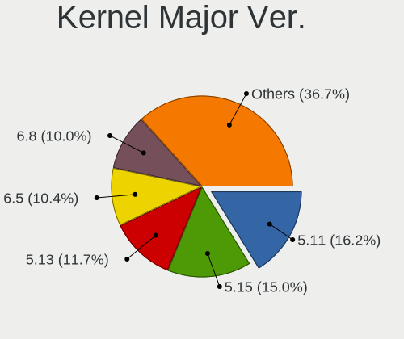

| Version | Computers | Percent |
|---------|-----------|---------|
| 5.11    | 389       | 22.72%  |
| 5.15    | 345       | 20.15%  |
| 5.13    | 285       | 16.65%  |
| 5.4     | 221       | 12.91%  |
| 5.19    | 136       | 7.94%   |
| 5.3     | 113       | 6.6%    |
| 4.15    | 85        | 4.96%   |
| 6.2     | 44        | 2.57%   |
| 5.0     | 33        | 1.93%   |
| 5.8     | 16        | 0.93%   |
| 5.14    | 8         | 0.47%   |
| 6.1     | 4         | 0.23%   |
| 5.16    | 4         | 0.23%   |
| 5.10    | 4         | 0.23%   |
| 4.18    | 4         | 0.23%   |
| 4.13    | 4         | 0.23%   |
| 4.4     | 3         | 0.18%   |
| 6.0     | 2         | 0.12%   |
| 5.5     | 2         | 0.12%   |
| 5.17    | 2         | 0.12%   |
| 4.10    | 2         | 0.12%   |
| 6.4     | 1         | 0.06%   |
| 5.9     | 1         | 0.06%   |
| 5.7     | 1         | 0.06%   |
| 5.6     | 1         | 0.06%   |
| 5.2     | 1         | 0.06%   |
| 5.18    | 1         | 0.06%   |

Arch
----

OS architecture (x86_64, i586, etc.)

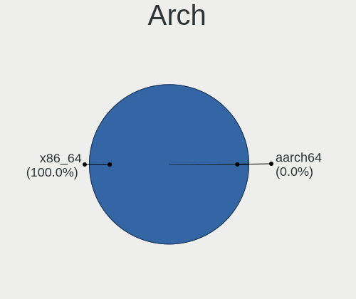

| Name    | Computers | Percent |
|---------|-----------|---------|
| x86_64  | 1635      | 99.94%  |
| aarch64 | 1         | 0.06%   |

DE
--

Desktop Environment

| Name          | Computers | Percent |
|---------------|-----------|---------|
| Pantheon      | 1528      | 92.33%  |
| Unknown       | 103       | 6.22%   |
| GNOME         | 14        | 0.85%   |
| X-Cinnamon    | 4         | 0.24%   |
| XFCE          | 1         | 0.06%   |
| Unity         | 1         | 0.06%   |
| MATE          | 1         | 0.06%   |
| KDE5          | 1         | 0.06%   |
| GNOME Classic | 1         | 0.06%   |
| Budgie        | 1         | 0.06%   |

Display Server
--------------

X11 or Wayland

| Name    | Computers | Percent |
|---------|-----------|---------|
| X11     | 1635      | 99.82%  |
| Unknown | 2         | 0.12%   |
| Tty     | 1         | 0.06%   |

Display Manager
---------------

SDDM, LightDM, etc.

| Name    | Computers | Percent |
|---------|-----------|---------|
| Unknown | 1307      | 78.88%  |
| LightDM | 273       | 16.48%  |
| TDM     | 69        | 4.16%   |
| GDM     | 5         | 0.3%    |
| GDM3    | 2         | 0.12%   |
| SDDM    | 1         | 0.06%   |

OS Lang
-------

Language

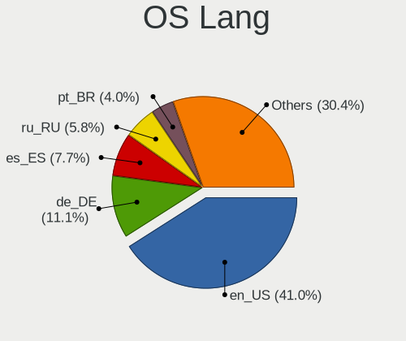

| Lang    | Computers | Percent |
|---------|-----------|---------|
| en_US   | 694       | 41.88%  |
| de_DE   | 168       | 10.14%  |
| es_ES   | 110       | 6.64%   |
| ru_RU   | 85        | 5.13%   |
| en_GB   | 74        | 4.47%   |
| pt_BR   | 69        | 4.16%   |
| Unknown | 64        | 3.86%   |
| fr_FR   | 60        | 3.62%   |
| it_IT   | 46        | 2.78%   |
| pl_PL   | 30        | 1.81%   |
| en_CA   | 29        | 1.75%   |
| en_AU   | 28        | 1.69%   |
| nl_NL   | 18        | 1.09%   |
| pt_PT   | 17        | 1.03%   |
| tr_TR   | 16        | 0.97%   |
| en_IN   | 11        | 0.66%   |
| hu_HU   | 10        | 0.6%    |
| sv_SE   | 9         | 0.54%   |
| es_MX   | 9         | 0.54%   |
| zh_CN   | 8         | 0.48%   |
| de_CH   | 8         | 0.48%   |
| cs_CZ   | 7         | 0.42%   |
| nb_NO   | 6         | 0.36%   |
| fi_FI   | 5         | 0.3%    |
| el_GR   | 5         | 0.3%    |
| uk_UA   | 4         | 0.24%   |
| id_ID   | 4         | 0.24%   |
| fr_CA   | 4         | 0.24%   |
| es_EC   | 4         | 0.24%   |
| en_ZA   | 4         | 0.24%   |
| ca_ES   | 4         | 0.24%   |
| ja_JP   | 3         | 0.18%   |
| hr_HR   | 3         | 0.18%   |
| da_DK   | 3         | 0.18%   |
| C       | 3         | 0.18%   |
| zh_TW   | 2         | 0.12%   |
| gl_ES   | 2         | 0.12%   |
| fr_BE   | 2         | 0.12%   |
| es_CL   | 2         | 0.12%   |
| es_AR   | 2         | 0.12%   |

Boot Mode
---------

EFI or BIOS

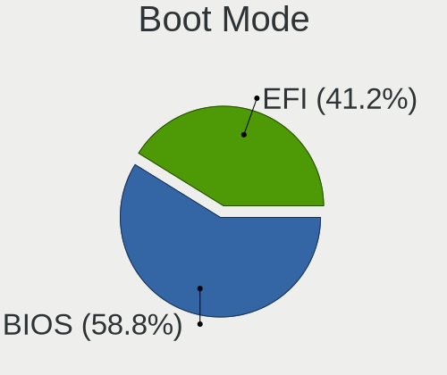

| Mode | Computers | Percent |
|------|-----------|---------|
| EFI  | 894       | 53.66%  |
| BIOS | 772       | 46.34%  |

Filesystem
----------

Type of filesystem

| Type     | Computers | Percent |
|----------|-----------|---------|
| Ext4     | 1545      | 93.92%  |
| Btrfs    | 31        | 1.88%   |
| Overlay  | 24        | 1.46%   |
| Unknown  | 21        | 1.28%   |
| Tmpfs    | 15        | 0.91%   |
| Xfs      | 7         | 0.43%   |
| Reiserfs | 1         | 0.06%   |
| Ext3     | 1         | 0.06%   |

Part. scheme
------------

Scheme of partitioning

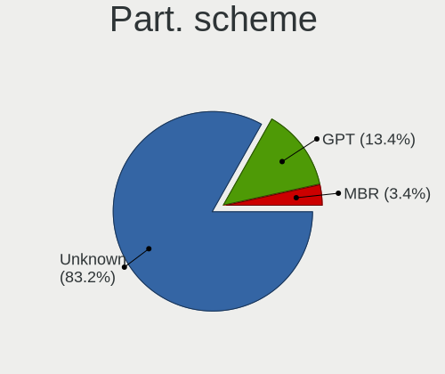

| Type    | Computers | Percent |
|---------|-----------|---------|
| Unknown | 1354      | 81.86%  |
| GPT     | 237       | 14.33%  |
| MBR     | 63        | 3.81%   |

Dual Boot with Linux/BSD
------------------------

Hosting more than one Linux/BSD

| Dual boot | Computers | Percent |
|-----------|-----------|---------|
| No        | 1564      | 95.48%  |
| Yes       | 74        | 4.52%   |

Dual Boot (Win)
---------------

Hosting Linux and Windows

| Dual boot | Computers | Percent |
|-----------|-----------|---------|
| No        | 1453      | 88.22%  |
| Yes       | 194       | 11.78%  |

Board
-----

Vendor
------

Motherboard manufacturer

| Name                | Computers | Percent |
|---------------------|-----------|---------|
| Hewlett-Packard     | 250       | 15.28%  |
| Lenovo              | 238       | 14.55%  |
| ASUSTek Computer    | 218       | 13.33%  |
| Apple               | 172       | 10.51%  |
| Dell                | 171       | 10.45%  |
| Acer                | 99        | 6.05%   |
| Gigabyte Technology | 79        | 4.83%   |
| MSI                 | 65        | 3.97%   |
| Toshiba             | 32        | 1.96%   |
| ASRock              | 31        | 1.89%   |
| HUAWEI              | 25        | 1.53%   |
| Samsung Electronics | 19        | 1.16%   |
| Sony                | 18        | 1.1%    |
| Intel               | 18        | 1.1%    |
| Microsoft           | 12        | 0.73%   |
| Fujitsu             | 11        | 0.67%   |
| Unknown             | 11        | 0.67%   |
| Biostar             | 9         | 0.55%   |
| Google              | 8         | 0.49%   |
| Pegatron            | 7         | 0.43%   |
| Foxconn             | 7         | 0.43%   |
| Packard Bell        | 6         | 0.37%   |
| LG Electronics      | 6         | 0.37%   |
| Star Labs           | 5         | 0.31%   |
| Notebook            | 5         | 0.31%   |
| Medion              | 5         | 0.31%   |
| Chuwi               | 5         | 0.31%   |
| Alienware           | 5         | 0.31%   |
| ECS                 | 4         | 0.24%   |
| AMI                 | 4         | 0.24%   |
| Wortmann AG         | 3         | 0.18%   |
| TUXEDO              | 3         | 0.18%   |
| Timi                | 3         | 0.18%   |
| Teclast             | 3         | 0.18%   |
| Razer               | 3         | 0.18%   |
| eMachines           | 3         | 0.18%   |
| Compaq              | 3         | 0.18%   |
| Clevo               | 3         | 0.18%   |
| Acidanthera         | 3         | 0.18%   |
| Wibtek              | 2         | 0.12%   |

Model
-----

Motherboard model

| Name                          | Computers | Percent |
|-------------------------------|-----------|---------|
| Unknown                       | 13        | 0.79%   |
| ASUS All Series               | 9         | 0.55%   |
| Apple MacBookPro8,1           | 8         | 0.49%   |
| Apple MacBookAir7,2           | 8         | 0.49%   |
| HP Notebook                   | 7         | 0.43%   |
| Apple MacBookPro9,2           | 7         | 0.43%   |
| Apple MacBookAir6,2           | 7         | 0.43%   |
| Apple iMac8,1                 | 7         | 0.43%   |
| Apple MacBookPro8,2           | 6         | 0.37%   |
| Apple iMac7,1                 | 6         | 0.37%   |
| Apple iMac12,1                | 6         | 0.37%   |
| Apple iMac11,3                | 6         | 0.37%   |
| Lenovo G50-45 80E3            | 5         | 0.31%   |
| HUAWEI MACHD-WXX9             | 5         | 0.31%   |
| HP Pavilion g6                | 5         | 0.31%   |
| Dell Inspiron 15-3567         | 5         | 0.31%   |
| ASUS ZenBook UX425EA_UX425EA  | 5         | 0.31%   |
| Apple MacBookPro5,5           | 5         | 0.31%   |
| Apple MacBookPro11,2          | 5         | 0.31%   |
| MSI MS-7C02                   | 4         | 0.24%   |
| HP ProBook 4540s              | 4         | 0.24%   |
| HP Pavilion Notebook          | 4         | 0.24%   |
| HP Pavilion dv7               | 4         | 0.24%   |
| HP Laptop 15-bs0xx            | 4         | 0.24%   |
| HP EliteBook 840 G3           | 4         | 0.24%   |
| Dell OptiPlex 790             | 4         | 0.24%   |
| Dell Latitude E6400           | 4         | 0.24%   |
| ASUS P8H61-M LX3 R2.0         | 4         | 0.24%   |
| Apple Macmini5,1              | 4         | 0.24%   |
| Apple MacBookPro6,2           | 4         | 0.24%   |
| Apple MacBookAir4,2           | 4         | 0.24%   |
| Apple MacBook5,1              | 4         | 0.24%   |
| Apple MacBook4,1              | 4         | 0.24%   |
| Apple iMac9,1                 | 4         | 0.24%   |
| Star Labs StarBook            | 3         | 0.18%   |
| Samsung 530U3C/530U4C/532U3C  | 3         | 0.18%   |
| MSI MS-7B84                   | 3         | 0.18%   |
| Lenovo IdeaPad 330-15IKB 81FE | 3         | 0.18%   |
| HUAWEI NBLK-WAX9X             | 3         | 0.18%   |
| HUAWEI NBLB-WAX9N             | 3         | 0.18%   |

Model Family
------------

Motherboard model prefix

| Name               | Computers | Percent |
|--------------------|-----------|---------|
| Lenovo ThinkPad    | 104       | 6.36%   |
| Acer Aspire        | 67        | 4.1%    |
| Lenovo IdeaPad     | 65        | 3.97%   |
| HP Pavilion        | 50        | 3.06%   |
| Dell Inspiron      | 47        | 2.87%   |
| Dell Latitude      | 46        | 2.81%   |
| HP ProBook         | 34        | 2.08%   |
| HP Laptop          | 32        | 1.96%   |
| HP EliteBook       | 30        | 1.83%   |
| Toshiba Satellite  | 24        | 1.47%   |
| ASUS PRIME         | 22        | 1.34%   |
| Dell XPS           | 21        | 1.28%   |
| Dell OptiPlex      | 21        | 1.28%   |
| ASUS ZenBook       | 19        | 1.16%   |
| ASUS VivoBook      | 19        | 1.16%   |
| ASUS ROG           | 19        | 1.16%   |
| Apple MacBookPro8  | 16        | 0.98%   |
| HP ENVY            | 15        | 0.92%   |
| Dell Precision     | 14        | 0.86%   |
| ASUS TUF           | 13        | 0.79%   |
| Apple MacBookPro11 | 13        | 0.79%   |
| Unknown            | 13        | 0.79%   |
| Microsoft Surface  | 12        | 0.73%   |
| Dell Vostro        | 12        | 0.73%   |
| Acer Swift         | 12        | 0.73%   |
| Lenovo ThinkCentre | 11        | 0.67%   |
| HP Compaq          | 10        | 0.61%   |
| Apple MacBookPro9  | 10        | 0.61%   |
| Apple MacBookAir7  | 10        | 0.61%   |
| Apple iMac11       | 10        | 0.61%   |
| ASUS All           | 9         | 0.55%   |
| Apple MacBookAir6  | 9         | 0.55%   |
| Lenovo Yoga        | 8         | 0.49%   |
| Apple MacBookPro5  | 8         | 0.49%   |
| Lenovo Legion      | 7         | 0.43%   |
| HP Notebook        | 7         | 0.43%   |
| Fujitsu LIFEBOOK   | 7         | 0.43%   |
| Apple iMac8        | 7         | 0.43%   |
| HP 250             | 6         | 0.37%   |
| ASUS P8H61-M       | 6         | 0.37%   |

MFG Year
--------

Motherboard manufacture year

| Year    | Computers | Percent |
|---------|-----------|---------|
| 2018    | 160       | 9.78%   |
| 2012    | 154       | 9.41%   |
| 2020    | 139       | 8.5%    |
| 2019    | 137       | 8.37%   |
| 2013    | 134       | 8.19%   |
| 2011    | 121       | 7.4%    |
| 2015    | 106       | 6.48%   |
| 2017    | 103       | 6.3%    |
| 2010    | 102       | 6.23%   |
| 2021    | 100       | 6.11%   |
| 2016    | 100       | 6.11%   |
| 2014    | 95        | 5.81%   |
| 2009    | 65        | 3.97%   |
| 2008    | 61        | 3.73%   |
| 2022    | 26        | 1.59%   |
| 2007    | 20        | 1.22%   |
| 2023    | 5         | 0.31%   |
| 2006    | 5         | 0.31%   |
| Unknown | 2         | 0.12%   |
| 2005    | 1         | 0.06%   |

Form Factor
-----------

Physical design of the computer

| Name           | Computers | Percent |
|----------------|-----------|---------|
| Notebook       | 1036      | 63.33%  |
| Desktop        | 436       | 26.65%  |
| All in one     | 66        | 4.03%   |
| Convertible    | 41        | 2.51%   |
| Tablet         | 26        | 1.59%   |
| Mini pc        | 25        | 1.53%   |
| Server         | 5         | 0.31%   |
| System on chip | 1         | 0.06%   |

Secure Boot
-----------

Enabled or disabled

| State    | Computers | Percent |
|----------|-----------|---------|
| Disabled | 1478      | 89.85%  |
| Enabled  | 167       | 10.15%  |

Coreboot
--------

Have coreboot on board

| Used | Computers | Percent |
|------|-----------|---------|
| No   | 1622      | 99.14%  |
| Yes  | 14        | 0.86%   |

RAM Size
--------

Total RAM memory

| Size in GB  | Computers | Percent |
|-------------|-----------|---------|
| 4.01-8.0    | 471       | 28.56%  |
| 3.01-4.0    | 330       | 20.01%  |
| 8.01-16.0   | 314       | 19.04%  |
| 16.01-24.0  | 307       | 18.62%  |
| 32.01-64.0  | 119       | 7.22%   |
| 1.01-2.0    | 56        | 3.4%    |
| 64.01-256.0 | 18        | 1.09%   |
| 24.01-32.0  | 16        | 0.97%   |
| 2.01-3.0    | 16        | 0.97%   |
| 0.51-1.0    | 2         | 0.12%   |

RAM Used
--------

Used RAM memory

| Used GB    | Computers | Percent |
|------------|-----------|---------|
| 1.01-2.0   | 641       | 36.01%  |
| 2.01-3.0   | 543       | 30.51%  |
| 3.01-4.0   | 279       | 15.67%  |
| 4.01-8.0   | 216       | 12.13%  |
| 8.01-16.0  | 49        | 2.75%   |
| 0.51-1.0   | 48        | 2.7%    |
| 16.01-24.0 | 2         | 0.11%   |
| 32.01-64.0 | 1         | 0.06%   |
| 24.01-32.0 | 1         | 0.06%   |

Total Drives
------------

Number of drives on board

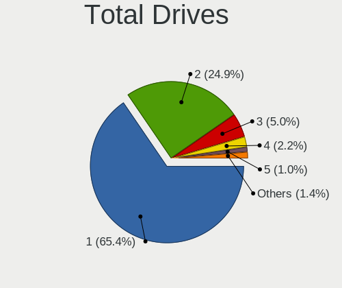

| Drives  | Computers | Percent |
|---------|-----------|---------|
| 1       | 1070      | 64.34%  |
| 2       | 429       | 25.8%   |
| 3       | 79        | 4.75%   |
| 4       | 40        | 2.41%   |
| 5       | 21        | 1.26%   |
| 0       | 11        | 0.66%   |
| 6       | 7         | 0.42%   |
| 7       | 4         | 0.24%   |
| 8       | 1         | 0.06%   |
| Unknown | 1         | 0.06%   |

Has CD-ROM
----------

Has CD-ROM on board

| Presented | Computers | Percent |
|-----------|-----------|---------|
| No        | 1046      | 63.39%  |
| Yes       | 604       | 36.61%  |

Has Ethernet
------------

Has Ethernet on board

| Presented | Computers | Percent |
|-----------|-----------|---------|
| Yes       | 1340      | 81.91%  |
| No        | 296       | 18.09%  |

Has WiFi
--------

Has WiFi module

| Presented | Computers | Percent |
|-----------|-----------|---------|
| Yes       | 1388      | 84.43%  |
| No        | 256       | 15.57%  |

Has Bluetooth
-------------

Has Bluetooth module

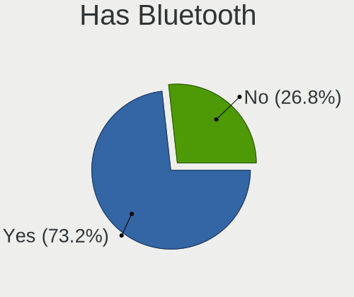

| Presented | Computers | Percent |
|-----------|-----------|---------|
| Yes       | 1188      | 72.09%  |
| No        | 460       | 27.91%  |

Location
--------

Country
-------

Geographic location (country)

| Country      | Computers | Percent |
|--------------|-----------|---------|
| USA          | 237       | 14.44%  |
| Germany      | 172       | 10.48%  |
| Brazil       | 103       | 6.28%   |
| Russia       | 96        | 5.85%   |
| UK           | 77        | 4.69%   |
| Italy        | 63        | 3.84%   |
| Spain        | 58        | 3.53%   |
| India        | 58        | 3.53%   |
| France       | 52        | 3.17%   |
| Canada       | 52        | 3.17%   |
| Mexico       | 40        | 2.44%   |
| Indonesia    | 40        | 2.44%   |
| Australia    | 40        | 2.44%   |
| Poland       | 35        | 2.13%   |
| Turkey       | 30        | 1.83%   |
| Netherlands  | 30        | 1.83%   |
| Argentina    | 25        | 1.52%   |
| Austria      | 22        | 1.34%   |
| Portugal     | 21        | 1.28%   |
| Belgium      | 21        | 1.28%   |
| Sweden       | 17        | 1.04%   |
| Switzerland  | 16        | 0.98%   |
| Ukraine      | 15        | 0.91%   |
| Czechia      | 14        | 0.85%   |
| Chile        | 13        | 0.79%   |
| Norway       | 12        | 0.73%   |
| Greece       | 12        | 0.73%   |
| Malaysia     | 11        | 0.67%   |
| Hungary      | 11        | 0.67%   |
| Colombia     | 11        | 0.67%   |
| South Africa | 10        | 0.61%   |
| Romania      | 10        | 0.61%   |
| Ireland      | 10        | 0.61%   |
| China        | 10        | 0.61%   |
| Finland      | 9         | 0.55%   |
| New Zealand  | 8         | 0.49%   |
| Denmark      | 7         | 0.43%   |
| Venezuela    | 6         | 0.37%   |
| Philippines  | 6         | 0.37%   |
| Japan        | 6         | 0.37%   |

City
----

Geographic location (city)

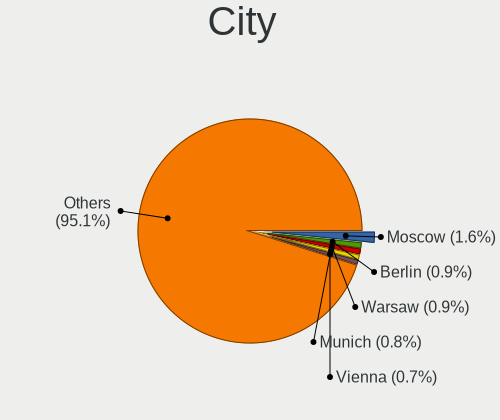

| City           | Computers | Percent |
|----------------|-----------|---------|
| Moscow         | 29        | 1.68%   |
| Berlin         | 15        | 0.87%   |
| Vienna         | 14        | 0.81%   |
| Sydney         | 14        | 0.81%   |
| Warsaw         | 13        | 0.75%   |
| Istanbul       | 12        | 0.7%    |
| Hamburg        | 12        | 0.7%    |
| St Petersburg  | 11        | 0.64%   |
| Sao Paulo      | 11        | 0.64%   |
| Munich         | 11        | 0.64%   |
| Milan          | 11        | 0.64%   |
| Madrid         | 11        | 0.64%   |
| Perth          | 9         | 0.52%   |
| Paris          | 9         | 0.52%   |
| Fortaleza      | 9         | 0.52%   |
| Rio de Janeiro | 8         | 0.46%   |
| Mexico City    | 8         | 0.46%   |
| Jakarta        | 8         | 0.46%   |
| Stuttgart      | 7         | 0.41%   |
| Novosibirsk    | 7         | 0.41%   |
| Melbourne      | 7         | 0.41%   |
| Dublin         | 7         | 0.41%   |
| Delhi          | 7         | 0.41%   |
| The Hague      | 6         | 0.35%   |
| Rome           | 6         | 0.35%   |
| Montreal       | 6         | 0.35%   |
| Los Angeles    | 6         | 0.35%   |
| Crdoba       | 6         | 0.35%   |
| Valencia       | 5         | 0.29%   |
| Surabaya       | 5         | 0.29%   |
| Nairobi        | 5         | 0.29%   |
| Mumbai         | 5         | 0.29%   |
| Dresden        | 5         | 0.29%   |
| Cologne        | 5         | 0.29%   |
| Brisbane       | 5         | 0.29%   |
| Bogor          | 5         | 0.29%   |
| Zagreb         | 4         | 0.23%   |
| Tucson         | 4         | 0.23%   |
| Toronto        | 4         | 0.23%   |
| Sofia          | 4         | 0.23%   |

Drives
------

Drive Vendor
------------

Hard drive vendors

| Vendor                      | Computers | Drives | Percent |
|-----------------------------|-----------|--------|---------|
| Samsung Electronics         | 305       | 420    | 13.56%  |
| WDC                         | 295       | 396    | 13.11%  |
| Seagate                     | 263       | 344    | 11.69%  |
| Toshiba                     | 160       | 203    | 7.11%   |
| Sandisk                     | 147       | 169    | 6.53%   |
| Kingston                    | 130       | 168    | 5.78%   |
| Unknown                     | 108       | 135    | 4.8%    |
| Crucial                     | 96        | 118    | 4.27%   |
| Hitachi                     | 72        | 78     | 3.2%    |
| Apple                       | 63        | 72     | 2.8%    |
| Intel                       | 52        | 66     | 2.31%   |
| HGST                        | 52        | 64     | 2.31%   |
| SK hynix                    | 47        | 57     | 2.09%   |
| A-DATA Technology           | 37        | 43     | 1.64%   |
| Micron Technology           | 29        | 32     | 1.29%   |
| China                       | 24        | 26     | 1.07%   |
| PNY                         | 19        | 26     | 0.84%   |
| KIOXIA                      | 18        | 28     | 0.8%    |
| Phison                      | 17        | 19     | 0.76%   |
| Fujitsu                     | 13        | 15     | 0.58%   |
| Micron/Crucial Technology   | 12        | 18     | 0.53%   |
| Unknown                     | 11        | 13     | 0.49%   |
| Transcend                   | 10        | 12     | 0.44%   |
| OCZ                         | 10        | 16     | 0.44%   |
| SPCC                        | 9         | 9      | 0.4%    |
| Silicon Motion              | 9         | 10     | 0.4%    |
| LITEON                      | 9         | 9      | 0.4%    |
| JMicron Technology          | 9         | 9      | 0.4%    |
| Intenso                     | 9         | 11     | 0.4%    |
| Team                        | 7         | 10     | 0.31%   |
| Patriot                     | 7         | 9      | 0.31%   |
| Corsair                     | 7         | 7      | 0.31%   |
| Apacer                      | 7         | 9      | 0.31%   |
| Phison Electronics          | 6         | 6      | 0.27%   |
| Netac                       | 6         | 7      | 0.27%   |
| KingDian                    | 6         | 10     | 0.27%   |
| Hewlett-Packard             | 6         | 7      | 0.27%   |
| Realtek Semiconductor       | 5         | 8      | 0.22%   |
| Kingston Technology Company | 5         | 5      | 0.22%   |
| Gigabyte Technology         | 5         | 5      | 0.22%   |

Drive Model
-----------

Hard drive models

| Model                                               | Computers | Percent |
|-----------------------------------------------------|-----------|---------|
| Kingston SA400S37240G 240GB SSD                     | 39        | 1.62%   |
| Toshiba MQ01ABD100 1TB                              | 27        | 1.12%   |
| Unknown MMC Card  32GB                              | 26        | 1.08%   |
| Samsung NVMe SSD Drive 512GB                        | 22        | 0.91%   |
| Samsung PM963 2.5" NVMe PCIe SSD 256GB              | 21        | 0.87%   |
| Samsung SSD 850 EVO 250GB                           | 20        | 0.83%   |
| Unknown MMC Card  64GB                              | 19        | 0.79%   |
| Seagate ST1000LM035-1RK172 1TB                      | 18        | 0.75%   |
| Kingston SA400S37120G 120GB SSD                     | 18        | 0.75%   |
| SanDisk NVMe SSD Drive 512GB                        | 16        | 0.67%   |
| Samsung NVMe SSD Drive 500GB                        | 16        | 0.67%   |
| Seagate ST500LT012-1DG142 500GB                     | 15        | 0.62%   |
| HGST HTS721010A9E630 1TB                            | 15        | 0.62%   |
| WDC WDS240G2G0A-00JH30 240GB SSD                    | 14        | 0.58%   |
| Unknown MMC Card  128GB                             | 14        | 0.58%   |
| Toshiba MQ04ABF100 1TB                              | 14        | 0.58%   |
| WDC WD10EZEX-08WN4A0 1TB                            | 13        | 0.54%   |
| Seagate ST1000LM024 HN-M101MBB 1TB                  | 13        | 0.54%   |
| Samsung SSD 860 EVO 500GB                           | 13        | 0.54%   |
| Samsung SSD 860 EVO 250GB                           | 13        | 0.54%   |
| Samsung NVMe SSD Controller SM981/PM981/PM983 256GB | 13        | 0.54%   |
| Crucial CT240BX500SSD1 240GB                        | 13        | 0.54%   |
| Toshiba MQ01ABF050 500GB                            | 12        | 0.5%    |
| Intel NVMe SSD Drive 512GB                          | 12        | 0.5%    |
| Crucial CT500MX500SSD1 500GB                        | 12        | 0.5%    |
| Samsung SSD 860 EVO 1TB                             | 11        | 0.46%   |
| Samsung NVMe SSD Drive 1TB                          | 11        | 0.46%   |
| Kingston SV300S37A120G 120GB SSD                    | 11        | 0.46%   |
| Unknown                                             | 11        | 0.46%   |
| SK hynix NVMe SSD Drive 512GB                       | 10        | 0.42%   |
| Seagate ST500DM002-1BD142 500GB                     | 10        | 0.42%   |
| Samsung SSD 850 EVO 500GB                           | 10        | 0.42%   |
| HGST HTS545050A7E680 500GB                          | 10        | 0.42%   |
| Unknown MMC Card  16GB                              | 9         | 0.37%   |
| Toshiba KBG30ZMS128G 128GB NVMe SSD                 | 9         | 0.37%   |
| Toshiba DT01ACA050 500GB                            | 9         | 0.37%   |
| Seagate ST3500418AS 500GB                           | 9         | 0.37%   |
| Samsung SSD 840 EVO 250GB                           | 9         | 0.37%   |
| Crucial CT1000MX500SSD1 1TB                         | 9         | 0.37%   |
| WDC WDS500G2B0A-00SM50 500GB SSD                    | 8         | 0.33%   |

HDD Vendor
----------

Hard disk drive vendors

| Vendor              | Computers | Drives | Percent |
|---------------------|-----------|--------|---------|
| Seagate             | 257       | 331    | 31.81%  |
| WDC                 | 226       | 302    | 27.97%  |
| Toshiba             | 127       | 159    | 15.72%  |
| Hitachi             | 72        | 78     | 8.91%   |
| HGST                | 52        | 64     | 6.44%   |
| Samsung Electronics | 28        | 33     | 3.47%   |
| Apple               | 17        | 18     | 2.1%    |
| Fujitsu             | 13        | 15     | 1.61%   |
| Unknown             | 5         | 6      | 0.62%   |
| Maxtor              | 2         | 2      | 0.25%   |
| ASMT                | 2         | 2      | 0.25%   |
| StoreJet            | 1         | 1      | 0.12%   |
| SSK                 | 1         | 1      | 0.12%   |
| SABRENT             | 1         | 1      | 0.12%   |
| Hewlett-Packard     | 1         | 1      | 0.12%   |
| Generic-            | 1         | 1      | 0.12%   |
| External            | 1         | 1      | 0.12%   |
| Ext Hard            | 1         | 1      | 0.12%   |

SSD Vendor
----------

Solid state drive vendors

| Vendor              | Computers | Drives | Percent |
|---------------------|-----------|--------|---------|
| Samsung Electronics | 160       | 212    | 18.43%  |
| Kingston            | 111       | 130    | 12.79%  |
| Crucial             | 95        | 116    | 10.94%  |
| SanDisk             | 88        | 102    | 10.14%  |
| WDC                 | 50        | 62     | 5.76%   |
| Apple               | 45        | 49     | 5.18%   |
| A-DATA Technology   | 33        | 38     | 3.8%    |
| China               | 24        | 26     | 2.76%   |
| PNY                 | 19        | 26     | 2.19%   |
| Intel               | 19        | 20     | 2.19%   |
| Micron Technology   | 15        | 17     | 1.73%   |
| Toshiba             | 14        | 18     | 1.61%   |
| Transcend           | 10        | 12     | 1.15%   |
| OCZ                 | 10        | 16     | 1.15%   |
| SPCC                | 9         | 9      | 1.04%   |
| LITEON              | 9         | 9      | 1.04%   |
| SK hynix            | 8         | 8      | 0.92%   |
| Intenso             | 8         | 10     | 0.92%   |
| Team                | 7         | 10     | 0.81%   |
| Patriot             | 7         | 9      | 0.81%   |
| Corsair             | 7         | 7      | 0.81%   |
| Apacer              | 7         | 9      | 0.81%   |
| KingDian            | 5         | 8      | 0.58%   |
| Hewlett-Packard     | 5         | 6      | 0.58%   |
| Plextor             | 4         | 5      | 0.46%   |
| Netac               | 4         | 4      | 0.46%   |
| JMicron Technology  | 4         | 4      | 0.46%   |
| TO Exter            | 3         | 3      | 0.35%   |
| NGFF                | 3         | 3      | 0.35%   |
| LITEONIT            | 3         | 3      | 0.35%   |
| Lexar               | 3         | 3      | 0.35%   |
| HUSKY               | 3         | 4      | 0.35%   |
| GOODRAM             | 3         | 6      | 0.35%   |
| Gigabyte Technology | 3         | 3      | 0.35%   |
| FORESEE             | 3         | 3      | 0.35%   |
| Unknown             | 3         | 3      | 0.35%   |
| VISIPRO             | 2         | 2      | 0.23%   |
| V-GeN               | 2         | 2      | 0.23%   |
| Teclast             | 2         | 2      | 0.23%   |
| Star                | 2         | 2      | 0.23%   |

Drive Kind
----------

HDD or SSD

| Kind    | Computers | Drives | Percent |
|---------|-----------|--------|---------|
| SSD     | 781       | 1043   | 37.39%  |
| HDD     | 726       | 1017   | 34.75%  |
| NVMe    | 431       | 586    | 20.63%  |
| MMC     | 99        | 117    | 4.74%   |
| Unknown | 52        | 69     | 2.49%   |

Drive Connector
---------------

SATA, SAS, NVMe, etc.

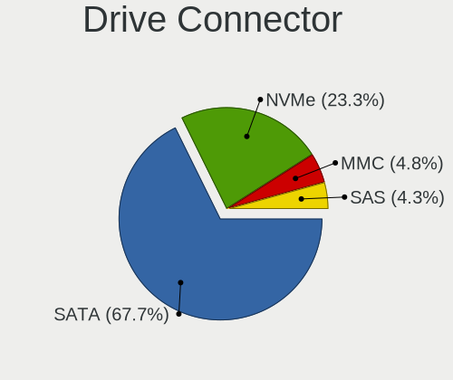

| Type | Computers | Drives | Percent |
|------|-----------|--------|---------|
| SATA | 1277      | 2028   | 67.75%  |
| NVMe | 431       | 586    | 22.86%  |
| MMC  | 99        | 117    | 5.25%   |
| SAS  | 78        | 101    | 4.14%   |

Drive Size
----------

Size of hard drive

| Size in TB | Computers | Drives | Percent |
|------------|-----------|--------|---------|
| 0.01-0.5   | 984       | 1378   | 65.82%  |
| 0.51-1.0   | 400       | 528    | 26.76%  |
| 1.01-2.0   | 67        | 87     | 4.48%   |
| 2.01-3.0   | 19        | 37     | 1.27%   |
| 3.01-4.0   | 15        | 16     | 1%      |
| 4.01-10.0  | 10        | 14     | 0.67%   |

Space Total
-----------

Amount of disk space available on the file system

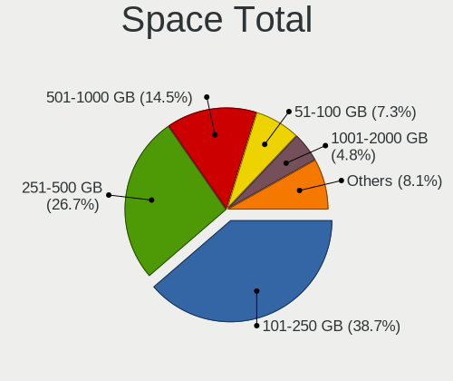

| Size in GB     | Computers | Percent |
|----------------|-----------|---------|
| 101-250        | 634       | 37.58%  |
| 251-500        | 436       | 25.84%  |
| 501-1000       | 250       | 14.82%  |
| 51-100         | 124       | 7.35%   |
| 1001-2000      | 87        | 5.16%   |
| 21-50          | 74        | 4.39%   |
| More than 3000 | 28        | 1.66%   |
| 2001-3000      | 26        | 1.54%   |
| 1-20           | 23        | 1.36%   |
| Unknown        | 5         | 0.3%    |

Space Used
----------

Amount of used disk space

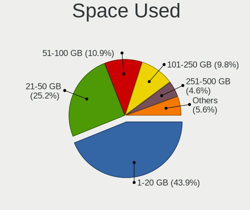

| Used GB        | Computers | Percent |
|----------------|-----------|---------|
| 1-20           | 747       | 42.28%  |
| 21-50          | 419       | 23.71%  |
| 51-100         | 217       | 12.28%  |
| 101-250        | 186       | 10.53%  |
| 251-500        | 90        | 5.09%   |
| 501-1000       | 57        | 3.23%   |
| 1001-2000      | 29        | 1.64%   |
| 2001-3000      | 9         | 0.51%   |
| More than 3000 | 8         | 0.45%   |
| Unknown        | 5         | 0.28%   |

Malfunc. Drives
---------------

Drive models with a malfunction

| Model                                   | Computers | Drives | Percent |
|-----------------------------------------|-----------|--------|---------|
| WDC WDS240G2G0B-00EPW0 240GB SSD        | 1         | 1      | 1.92%   |
| WDC WD5000BPKT-75PK4T0 500GB            | 1         | 1      | 1.92%   |
| WDC WD5000AAKX-22ERMA0 500GB            | 1         | 1      | 1.92%   |
| WDC WD5000AAKX-221CA1 500GB             | 1         | 1      | 1.92%   |
| WDC WD5000AAKX-00ERMA0 500GB            | 1         | 1      | 1.92%   |
| WDC WD5000AAKS-00UU3A0 500GB            | 1         | 1      | 1.92%   |
| WDC WD3200AAJS-56B4A0 320GB             | 1         | 1      | 1.92%   |
| WDC WD10SPZX-24Z10 1TB                  | 1         | 1      | 1.92%   |
| WDC WD10EZEX-00KUWA0 1TB                | 1         | 1      | 1.92%   |
| WDC WD1003FZEX-00MK2A0 1TB              | 1         | 1      | 1.92%   |
| Toshiba MQ01ABD100 1TB                  | 1         | 1      | 1.92%   |
| Toshiba MK3259GSXP 320GB                | 1         | 1      | 1.92%   |
| Toshiba KBG30ZPZ128G 128GB              | 1         | 1      | 1.92%   |
| Seagate ST500LT012-9WS142 500GB         | 1         | 1      | 1.92%   |
| Seagate ST500LM030-2E717D 500GB         | 1         | 1      | 1.92%   |
| Seagate ST500DM002-1BD142 500GB         | 1         | 1      | 1.92%   |
| Seagate ST3500414CS 500GB               | 1         | 2      | 1.92%   |
| Seagate ST3500312CS 500GB               | 1         | 1      | 1.92%   |
| Seagate ST3320613AS 320GB               | 1         | 1      | 1.92%   |
| Seagate ST320LT020-9YG142 320GB         | 1         | 1      | 1.92%   |
| Seagate ST3160813AS 160GB               | 1         | 1      | 1.92%   |
| Seagate ST2000DM006-2DM164 2TB          | 1         | 1      | 1.92%   |
| Seagate ST1000LX015-1U7172-SSHD 1TB     | 1         | 1      | 1.92%   |
| Seagate ST1000LM024 HN-M101MBB 1TB      | 1         | 1      | 1.92%   |
| SanDisk SSD PLUS 240GB                  | 1         | 1      | 1.92%   |
| SanDisk SD9SN8W-128G-1006 128GB SSD     | 1         | 1      | 1.92%   |
| SanDisk SD7SB3Q256G1002 256GB SSD       | 1         | 1      | 1.92%   |
| Samsung Electronics HD322GJ 320GB       | 1         | 1      | 1.92%   |
| Samsung Electronics HD204UI 2TB         | 1         | 1      | 1.92%   |
| Samsung Electronics HD160JJ/ 160GB      | 1         | 1      | 1.92%   |
| OCZ VECTOR150 240GB SSD                 | 1         | 1      | 1.92%   |
| Kingston SV300S37A240G 240GB SSD        | 1         | 1      | 1.92%   |
| Kingston SUV400S37480G 480GB SSD        | 1         | 1      | 1.92%   |
| Kingston SA400S37120G 120GB SSD         | 1         | 1      | 1.92%   |
| Kingston RBU-SNS8350DES3128GP 128GB SSD | 1         | 1      | 1.92%   |
| Hitachi HTS725050A7E630 500GB           | 1         | 1      | 1.92%   |
| Hitachi HTS547564A9E384 640GB           | 1         | 1      | 1.92%   |
| Hitachi HTS542525K9SA00 250GB           | 1         | 1      | 1.92%   |
| Hitachi HDT721064SLA360 640GB           | 1         | 1      | 1.92%   |
| Hitachi HDS721010CLA332 1TB             | 1         | 1      | 1.92%   |

Malfunc. Drive Vendor
---------------------

Vendors of faulty drives

| Vendor              | Computers | Drives | Percent |
|---------------------|-----------|--------|---------|
| Seagate             | 11        | 12     | 21.15%  |
| WDC                 | 10        | 10     | 19.23%  |
| Hitachi             | 5         | 5      | 9.62%   |
| HGST                | 5         | 5      | 9.62%   |
| Kingston            | 4         | 4      | 7.69%   |
| Toshiba             | 3         | 3      | 5.77%   |
| SanDisk             | 3         | 3      | 5.77%   |
| Samsung Electronics | 3         | 3      | 5.77%   |
| Crucial             | 2         | 2      | 3.85%   |
| Apple               | 2         | 2      | 3.85%   |
| OCZ                 | 1         | 1      | 1.92%   |
| Fujitsu             | 1         | 2      | 1.92%   |
| China               | 1         | 1      | 1.92%   |
| A-DATA Technology   | 1         | 1      | 1.92%   |

Malfunc. HDD Vendor
-------------------

Vendors of faulty HDD drives

| Vendor              | Computers | Drives | Percent |
|---------------------|-----------|--------|---------|
| Seagate             | 11        | 12     | 29.73%  |
| WDC                 | 9         | 9      | 24.32%  |
| Hitachi             | 5         | 5      | 13.51%  |
| HGST                | 5         | 5      | 13.51%  |
| Samsung Electronics | 3         | 3      | 8.11%   |
| Toshiba             | 2         | 2      | 5.41%   |
| Fujitsu             | 1         | 2      | 2.7%    |
| Apple               | 1         | 1      | 2.7%    |

Malfunc. Drive Kind
-------------------

Kinds of faulty drives

| Kind | Computers | Drives | Percent |
|------|-----------|--------|---------|
| HDD  | 34        | 39     | 69.39%  |
| SSD  | 14        | 14     | 28.57%  |
| NVMe | 1         | 1      | 2.04%   |

Failed Drives
-------------

Failed drive models

| Model                    | Computers | Drives | Percent |
|--------------------------|-----------|--------|---------|
| WDC WD10SPZX-75Z10T1 1TB | 1         | 1      | 100%    |

Failed Drive Vendor
-------------------

Failed drive vendors

| Vendor | Computers | Drives | Percent |
|--------|-----------|--------|---------|
| WDC    | 1         | 1      | 100%    |

Drive Status
------------

Number of failed and malfunc. drives

| Status   | Computers | Drives | Percent |
|----------|-----------|--------|---------|
| Detected | 1409      | 2431   | 82.98%  |
| Works    | 240       | 346    | 14.13%  |
| Malfunc  | 48        | 54     | 2.83%   |
| Failed   | 1         | 1      | 0.06%   |

Storage controller
------------------

Storage Vendor
--------------

Storage controller vendors

| Vendor                         | Computers | Percent |
|--------------------------------|-----------|---------|
| Intel                          | 1155      | 59.11%  |
| AMD                            | 239       | 12.23%  |
| Samsung Electronics            | 167       | 8.55%   |
| SanDisk                        | 79        | 4.04%   |
| Nvidia                         | 45        | 2.3%    |
| SK hynix                       | 38        | 1.94%   |
| Kingston Technology Company    | 26        | 1.33%   |
| Phison Electronics             | 25        | 1.28%   |
| Marvell Technology Group       | 23        | 1.18%   |
| Toshiba America Info Systems   | 22        | 1.13%   |
| ASMedia Technology             | 19        | 0.97%   |
| KIOXIA                         | 17        | 0.87%   |
| Micron Technology              | 14        | 0.72%   |
| Micron/Crucial Technology      | 13        | 0.67%   |
| JMicron Technology             | 12        | 0.61%   |
| Silicon Motion                 | 9         | 0.46%   |
| ADATA Technology               | 8         | 0.41%   |
| Union Memory (Shenzhen)        | 7         | 0.36%   |
| Realtek Semiconductor          | 7         | 0.36%   |
| Lite-On Technology             | 4         | 0.2%    |
| Solid State Storage Technology | 3         | 0.15%   |
| Seagate Technology             | 3         | 0.15%   |
| LSI Logic / Symbios Logic      | 3         | 0.15%   |
| Yangtze Memory Technologies    | 2         | 0.1%    |
| Shenzhen Longsys Electronics   | 2         | 0.1%    |
| Hewlett-Packard                | 2         | 0.1%    |
| Broadcom / LSI                 | 2         | 0.1%    |
| Biwin Storage Technology       | 2         | 0.1%    |
| Apple                          | 2         | 0.1%    |
| VIA Technologies               | 1         | 0.05%   |
| Silicon Image                  | 1         | 0.05%   |
| MAXIO Technology (Hangzhou)    | 1         | 0.05%   |
| INNOGRIT                       | 1         | 0.05%   |

Storage Model
-------------

Storage controller models

| Model                                                                                   | Computers | Percent |
|-----------------------------------------------------------------------------------------|-----------|---------|
| AMD FCH SATA Controller [AHCI mode]                                                     | 186       | 8.48%   |
| Intel Sunrise Point-LP SATA Controller [AHCI mode]                                      | 113       | 5.15%   |
| Intel 7 Series Chipset Family 6-port SATA Controller [AHCI mode]                        | 108       | 4.92%   |
| Intel 6 Series/C200 Series Chipset Family 6 port Mobile SATA AHCI Controller            | 79        | 3.6%    |
| Intel 8 Series/C220 Series Chipset Family 6-port SATA Controller 1 [AHCI mode]          | 73        | 3.33%   |
| Samsung NVMe SSD Controller SM981/PM981/PM983                                           | 62        | 2.83%   |
| Intel 82801 Mobile SATA Controller [RAID mode]                                          | 61        | 2.78%   |
| Intel 8 Series SATA Controller 1 [AHCI mode]                                            | 49        | 2.23%   |
| Intel 6 Series/C200 Series Chipset Family 6 port Desktop SATA AHCI Controller           | 44        | 2.01%   |
| Intel Celeron/Pentium Silver Processor SATA Controller                                  | 37        | 1.69%   |
| Samsung NVMe SSD Controller 980                                                         | 35        | 1.6%    |
| Intel Volume Management Device NVMe RAID Controller                                     | 35        | 1.6%    |
| Intel 82801IBM/IEM (ICH9M/ICH9M-E) 4 port SATA Controller [AHCI mode]                   | 33        | 1.5%    |
| AMD 400 Series Chipset SATA Controller                                                  | 31        | 1.41%   |
| Intel 5 Series/3400 Series Chipset 6 port SATA AHCI Controller                          | 29        | 1.32%   |
| Intel Wildcat Point-LP SATA Controller [AHCI Mode]                                      | 28        | 1.28%   |
| Intel Cannon Lake PCH SATA AHCI Controller                                              | 28        | 1.28%   |
| Intel 5 Series/3400 Series Chipset 4 port SATA AHCI Controller                          | 27        | 1.23%   |
| Intel Q170/Q150/B150/H170/H110/Z170/CM236 Chipset SATA Controller [AHCI Mode]           | 26        | 1.19%   |
| Intel Comet Lake SATA AHCI Controller                                                   | 24        | 1.09%   |
| Intel 82801HM/HEM (ICH8M/ICH8M-E) SATA Controller [AHCI mode]                           | 24        | 1.09%   |
| Intel 82801HM/HEM (ICH8M/ICH8M-E) IDE Controller                                        | 24        | 1.09%   |
| Intel 200 Series PCH SATA controller [AHCI mode]                                        | 23        | 1.05%   |
| Intel Cannon Lake Mobile PCH SATA AHCI Controller                                       | 22        | 1%      |
| Nvidia MCP79 AHCI Controller                                                            | 21        | 0.96%   |
| Intel SATA Controller [RAID mode]                                                       | 21        | 0.96%   |
| Intel 7 Series/C210 Series Chipset Family 6-port SATA Controller [AHCI mode]            | 21        | 0.96%   |
| AMD SB7x0/SB8x0/SB9x0 SATA Controller [AHCI mode]                                       | 21        | 0.96%   |
| Intel 6 Series/C200 Series Chipset Family Desktop SATA Controller (IDE mode, ports 4-5) | 20        | 0.91%   |
| Intel 6 Series/C200 Series Chipset Family Desktop SATA Controller (IDE mode, ports 0-3) | 20        | 0.91%   |
| SanDisk WD Blue SN550 NVMe SSD                                                          | 19        | 0.87%   |
| ASMedia ASM1062 Serial ATA Controller                                                   | 18        | 0.82%   |
| AMD SB7x0/SB8x0/SB9x0 IDE Controller                                                    | 18        | 0.82%   |
| Samsung NVMe SSD Controller PM9A1/PM9A3/980PRO                                          | 17        | 0.77%   |
| Intel SSD 660P Series                                                                   | 17        | 0.77%   |
| Intel Atom Processor E3800 Series SATA AHCI Controller                                  | 17        | 0.77%   |
| Intel Tiger Lake-LP SATA Controller                                                     | 16        | 0.73%   |
| Intel Atom/Celeron/Pentium Processor x5-E8000/J3xxx/N3xxx Series SATA Controller        | 16        | 0.73%   |
| SanDisk WD Black SN750 / PC SN730 NVMe SSD                                              | 15        | 0.68%   |
| Samsung NVMe SSD Controller SM961/PM961/SM963                                           | 15        | 0.68%   |

Storage Kind
------------

Kind of storage controller (IDE, SATA, NVMe, SAS, ...)

| Kind | Computers | Percent |
|------|-----------|---------|
| SATA | 1243      | 62.62%  |
| NVMe | 429       | 21.61%  |
| IDE  | 175       | 8.82%   |
| RAID | 133       | 6.7%    |
| SAS  | 3         | 0.15%   |
| SCSI | 2         | 0.1%    |

Processor
---------

CPU Vendor
----------

Processor vendors

| Vendor | Computers | Percent |
|--------|-----------|---------|
| Intel  | 1333      | 81.48%  |
| AMD    | 302       | 18.46%  |
| ARM    | 1         | 0.06%   |

CPU Model
---------

Processor models

| Model                                         | Computers | Percent |
|-----------------------------------------------|-----------|---------|
| Intel Core i5-7200U CPU @ 2.50GHz             | 24        | 1.47%   |
| Intel 11th Gen Core i7-1165G7 @ 2.80GHz       | 22        | 1.34%   |
| Intel 11th Gen Core i5-1135G7 @ 2.40GHz       | 22        | 1.34%   |
| Intel Core i7-8550U CPU @ 1.80GHz             | 18        | 1.1%    |
| Intel Core i5-3210M CPU @ 2.50GHz             | 18        | 1.1%    |
| Intel Core i5-2520M CPU @ 2.50GHz             | 17        | 1.04%   |
| Intel Core i5-6300U CPU @ 2.40GHz             | 16        | 0.98%   |
| Intel Core i7-7500U CPU @ 2.70GHz             | 15        | 0.92%   |
| Intel Core i5-6200U CPU @ 2.30GHz             | 15        | 0.92%   |
| Intel Core i5-8250U CPU @ 1.60GHz             | 13        | 0.79%   |
| Intel Core i5-10210U CPU @ 1.60GHz            | 13        | 0.79%   |
| Intel Core i7-8565U CPU @ 1.80GHz             | 12        | 0.73%   |
| Intel Core i5-8265U CPU @ 1.60GHz             | 12        | 0.73%   |
| Intel Core i5-4300U CPU @ 1.90GHz             | 12        | 0.73%   |
| Intel Core i5-2400 CPU @ 3.10GHz              | 12        | 0.73%   |
| Intel Core i7-10510U CPU @ 1.80GHz            | 11        | 0.67%   |
| Intel Core i5 CPU M 520 @ 2.40GHz             | 11        | 0.67%   |
| AMD Ryzen 5 3600 6-Core Processor             | 11        | 0.67%   |
| Intel Core i7-7700HQ CPU @ 2.80GHz            | 10        | 0.61%   |
| Intel Core 2 Duo CPU P8600 @ 2.40GHz          | 10        | 0.61%   |
| AMD Ryzen 5 3500U with Radeon Vega Mobile Gfx | 10        | 0.61%   |
| AMD Ryzen 5 2500U with Radeon Vega Mobile Gfx | 10        | 0.61%   |
| Intel Core i5-4210U CPU @ 1.70GHz             | 9         | 0.55%   |
| Intel Core i5-3320M CPU @ 2.60GHz             | 9         | 0.55%   |
| Intel Core i3-6006U CPU @ 2.00GHz             | 9         | 0.55%   |
| Intel Core i3-2310M CPU @ 2.10GHz             | 9         | 0.55%   |
| Intel Celeron N4020 CPU @ 1.10GHz             | 9         | 0.55%   |
| AMD Ryzen 5 5500U with Radeon Graphics        | 9         | 0.55%   |
| Intel Core i9-9900K CPU @ 3.60GHz             | 8         | 0.49%   |
| Intel Core i7-9750H CPU @ 2.60GHz             | 8         | 0.49%   |
| Intel Core i5-5200U CPU @ 2.20GHz             | 8         | 0.49%   |
| Intel Core i5-2450M CPU @ 2.50GHz             | 8         | 0.49%   |
| Intel Core i5-1035G1 CPU @ 1.00GHz            | 8         | 0.49%   |
| Intel Core i3-10110U CPU @ 2.10GHz            | 8         | 0.49%   |
| Intel 11th Gen Core i3-1115G4 @ 3.00GHz       | 8         | 0.49%   |
| AMD Ryzen 7 4700U with Radeon Graphics        | 8         | 0.49%   |
| AMD Ryzen 7 3700X 8-Core Processor            | 8         | 0.49%   |
| Intel Pentium Silver N5000 CPU @ 1.10GHz      | 7         | 0.43%   |
| Intel Core i7-4510U CPU @ 2.00GHz             | 7         | 0.43%   |
| Intel Core i7-3520M CPU @ 2.90GHz             | 7         | 0.43%   |

CPU Model Family
----------------

Processor model prefix

| Model                   | Computers | Percent |
|-------------------------|-----------|---------|
| Intel Core i5           | 421       | 25.73%  |
| Intel Core i7           | 324       | 19.8%   |
| Intel Core i3           | 152       | 9.29%   |
| Intel Celeron           | 98        | 5.99%   |
| Other                   | 92        | 5.62%   |
| Intel Core 2 Duo        | 86        | 5.26%   |
| AMD Ryzen 5             | 83        | 5.07%   |
| AMD Ryzen 7             | 49        | 3%      |
| Intel Pentium           | 36        | 2.2%    |
| Intel Xeon              | 30        | 1.83%   |
| Intel Atom              | 22        | 1.34%   |
| Intel Pentium Dual-Core | 21        | 1.28%   |
| AMD Ryzen 3             | 18        | 1.1%    |
| AMD A8                  | 18        | 1.1%    |
| Intel Core 2 Quad       | 13        | 0.79%   |
| AMD FX                  | 13        | 0.79%   |
| AMD A6                  | 13        | 0.79%   |
| Intel Pentium Silver    | 12        | 0.73%   |
| AMD Ryzen 9             | 11        | 0.67%   |
| AMD A4                  | 11        | 0.67%   |
| AMD A10                 | 11        | 0.67%   |
| Intel Core i9           | 9         | 0.55%   |
| AMD Phenom II X4        | 9         | 0.55%   |
| Intel Core 2            | 7         | 0.43%   |
| AMD E1                  | 6         | 0.37%   |
| AMD Athlon              | 6         | 0.37%   |
| AMD A12                 | 6         | 0.37%   |
| Intel Core m3           | 5         | 0.31%   |
| AMD Ryzen 5 PRO         | 5         | 0.31%   |
| AMD Ryzen 7 PRO         | 4         | 0.24%   |
| AMD Athlon II X4        | 4         | 0.24%   |
| AMD Athlon II X2        | 4         | 0.24%   |
| Intel Pentium Dual      | 3         | 0.18%   |
| Intel Genuine           | 3         | 0.18%   |
| Intel Celeron Dual-Core | 3         | 0.18%   |
| Intel Core m5           | 2         | 0.12%   |
| AMD Phenom II           | 2         | 0.12%   |
| AMD Phenom              | 2         | 0.12%   |
| AMD G                   | 2         | 0.12%   |
| AMD E                   | 2         | 0.12%   |

CPU Cores
---------

Number of processor cores

| Number | Computers | Percent |
|--------|-----------|---------|
| 2      | 776       | 47.35%  |
| 4      | 609       | 37.16%  |
| 6      | 112       | 6.83%   |
| 8      | 87        | 5.31%   |
| 1      | 20        | 1.22%   |
| 12     | 16        | 0.98%   |
| 3      | 8         | 0.49%   |
| 16     | 4         | 0.24%   |
| 10     | 4         | 0.24%   |
| 5      | 2         | 0.12%   |
| 14     | 1         | 0.06%   |

CPU Sockets
-----------

Number of sockets

| Number | Computers | Percent |
|--------|-----------|---------|
| 1      | 1626      | 99.39%  |
| 2      | 10        | 0.61%   |

CPU Threads
-----------

Threads per core (Hyper-Threading)

| Number | Computers | Percent |
|--------|-----------|---------|
| 2      | 1107      | 67.54%  |
| 1      | 532       | 32.46%  |

CPU Op-Modes
------------

CPU Operation Modes (32-bit, 64-bit)

| Op mode        | Computers | Percent |
|----------------|-----------|---------|
| 32-bit, 64-bit | 1625      | 99.27%  |
| Unknown        | 11        | 0.67%   |
| 64-bit         | 1         | 0.06%   |

CPU Microcode
-------------

Microcode number

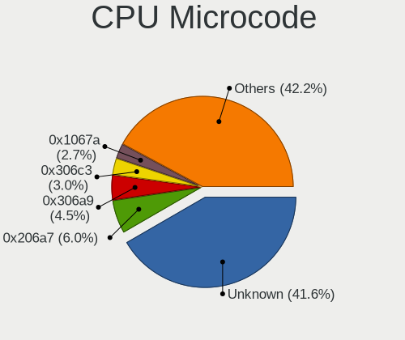

| Number     | Computers | Percent |
|------------|-----------|---------|
| Unknown    | 336       | 20.02%  |
| 0x206a7    | 139       | 8.28%   |
| 0x306a9    | 106       | 6.32%   |
| 0x306c3    | 70        | 4.17%   |
| 0x1067a    | 62        | 3.69%   |
| 0x40651    | 52        | 3.1%    |
| 0x806e9    | 43        | 2.56%   |
| 0x806c1    | 43        | 2.56%   |
| 0x406e3    | 42        | 2.5%    |
| 0x806ea    | 40        | 2.38%   |
| 0x806ec    | 39        | 2.32%   |
| 0x306d4    | 34        | 2.03%   |
| 0x20655    | 30        | 1.79%   |
| 0x906ea    | 28        | 1.67%   |
| 0x906e9    | 28        | 1.67%   |
| 0x20652    | 22        | 1.31%   |
| 0x10676    | 22        | 1.31%   |
| 0x08108109 | 22        | 1.31%   |
| 0x706a1    | 19        | 1.13%   |
| 0x30678    | 19        | 1.13%   |
| 0x706e5    | 18        | 1.07%   |
| 0x506e3    | 17        | 1.01%   |
| 0x08701021 | 17        | 1.01%   |
| 0x806eb    | 15        | 0.89%   |
| 0x406c3    | 14        | 0.83%   |
| 0x106e5    | 14        | 0.83%   |
| 0x06006705 | 14        | 0.83%   |
| 0x706a8    | 13        | 0.77%   |
| 0x506c9    | 13        | 0.77%   |
| 0x08600106 | 13        | 0.77%   |
| 0xa0652    | 12        | 0.72%   |
| 0x6fb      | 12        | 0.72%   |
| 0x906ed    | 11        | 0.66%   |
| 0x406c4    | 11        | 0.66%   |
| 0x0800820d | 11        | 0.66%   |
| 0x010000c8 | 11        | 0.66%   |
| 0x40661    | 10        | 0.6%    |
| 0x0a50000c | 10        | 0.6%    |
| 0x06001119 | 10        | 0.6%    |
| 0x906eb    | 9         | 0.54%   |

CPU Microarch
-------------

Microarchitecture

| Name             | Computers | Percent |
|------------------|-----------|---------|
| KabyLake         | 264       | 16.13%  |
| SandyBridge      | 164       | 10.02%  |
| Haswell          | 164       | 10.02%  |
| IvyBridge        | 137       | 8.37%   |
| Penryn           | 102       | 6.23%   |
| Skylake          | 81        | 4.95%   |
| Westmere         | 64        | 3.91%   |
| TigerLake        | 61        | 3.73%   |
| Silvermont       | 56        | 3.42%   |
| Zen+             | 54        | 3.3%    |
| Zen 2            | 54        | 3.3%    |
| Broadwell        | 45        | 2.75%   |
| Goldmont plus    | 42        | 2.57%   |
| Core             | 40        | 2.44%   |
| Excavator        | 34        | 2.08%   |
| Zen              | 31        | 1.89%   |
| Icelake          | 31        | 1.89%   |
| Unknown          | 28        | 1.71%   |
| K10              | 25        | 1.53%   |
| CometLake        | 23        | 1.41%   |
| Zen 3            | 22        | 1.34%   |
| Piledriver       | 21        | 1.28%   |
| Nehalem          | 21        | 1.28%   |
| Puma             | 14        | 0.86%   |
| Goldmont         | 13        | 0.79%   |
| Bobcat           | 9         | 0.55%   |
| Steamroller      | 7         | 0.43%   |
| Jaguar           | 6         | 0.37%   |
| Tremont          | 5         | 0.31%   |
| Bulldozer        | 4         | 0.24%   |
| Bonnell          | 4         | 0.24%   |
| Alderlake Hybrid | 4         | 0.24%   |
| NetBurst         | 2         | 0.12%   |
| K8 Hammer        | 2         | 0.12%   |
| K10 Llano        | 2         | 0.12%   |
| K8 & K10 hybrid  | 1         | 0.06%   |

Graphics
--------

GPU Vendor
----------

Vendors of graphics cards

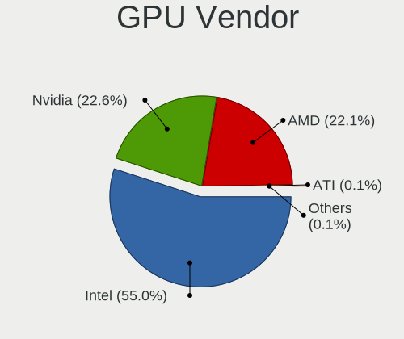

| Vendor                     | Computers | Percent |
|----------------------------|-----------|---------|
| Intel                      | 1048      | 54.75%  |
| AMD                        | 435       | 22.73%  |
| Nvidia                     | 426       | 22.26%  |
| Matrox Electronics Systems | 2         | 0.1%    |
| ATI Technologies           | 2         | 0.1%    |
| Conexant Systems           | 1         | 0.05%   |

GPU Model
---------

Graphics card models

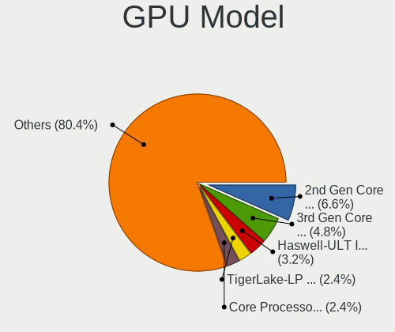

| Model                                                                                    | Computers | Percent |
|------------------------------------------------------------------------------------------|-----------|---------|
| Intel 2nd Generation Core Processor Family Integrated Graphics Controller                | 121       | 6.14%   |
| Intel 3rd Gen Core processor Graphics Controller                                         | 92        | 4.67%   |
| Intel Haswell-ULT Integrated Graphics Controller                                         | 63        | 3.2%    |
| Intel TigerLake-LP GT2 [Iris Xe Graphics]                                                | 53        | 2.69%   |
| Intel HD Graphics 620                                                                    | 49        | 2.49%   |
| Intel Skylake GT2 [HD Graphics 520]                                                      | 47        | 2.38%   |
| Intel Core Processor Integrated Graphics Controller                                      | 45        | 2.28%   |
| Intel UHD Graphics 620                                                                   | 42        | 2.13%   |
| AMD Picasso/Raven 2 [Radeon Vega Series / Radeon Vega Mobile Series]                     | 38        | 1.93%   |
| Intel Mobile 4 Series Chipset Integrated Graphics Controller                             | 35        | 1.78%   |
| Intel CometLake-U GT2 [UHD Graphics]                                                     | 34        | 1.73%   |
| AMD Ellesmere [Radeon RX 470/480/570/570X/580/580X/590]                                  | 32        | 1.62%   |
| Intel GeminiLake [UHD Graphics 600]                                                      | 31        | 1.57%   |
| Intel Atom/Celeron/Pentium Processor x5-E8000/J3xxx/N3xxx Integrated Graphics Controller | 30        | 1.52%   |
| Intel HD Graphics 5500                                                                   | 29        | 1.47%   |
| Intel 4th Gen Core Processor Integrated Graphics Controller                              | 29        | 1.47%   |
| AMD Renoir                                                                               | 29        | 1.47%   |
| Intel WhiskeyLake-U GT2 [UHD Graphics 620]                                               | 28        | 1.42%   |
| Intel Atom Processor Z36xxx/Z37xxx Series Graphics & Display                             | 25        | 1.27%   |
| Intel Xeon E3-1200 v3/4th Gen Core Processor Integrated Graphics Controller              | 24        | 1.22%   |
| Intel HD Graphics 630                                                                    | 21        | 1.07%   |
| Intel CoffeeLake-H GT2 [UHD Graphics 630]                                                | 21        | 1.07%   |
| AMD Stoney [Radeon R2/R3/R4/R5 Graphics]                                                 | 20        | 1.01%   |
| AMD Raven Ridge [Radeon Vega Series / Radeon Vega Mobile Series]                         | 19        | 0.96%   |
| Intel CoffeeLake-S GT2 [UHD Graphics 630]                                                | 17        | 0.86%   |
| Intel HD Graphics 530                                                                    | 15        | 0.76%   |
| AMD Lucienne                                                                             | 15        | 0.76%   |
| AMD Cezanne [Radeon Vega Series / Radeon Vega Mobile Series]                             | 15        | 0.76%   |
| Nvidia C79 [GeForce 9400M]                                                               | 14        | 0.71%   |
| AMD Sun XT [Radeon HD 8670A/8670M/8690M / R5 M330 / M430 / Radeon 520 Mobile]            | 14        | 0.71%   |
| Intel Mobile GM965/GL960 Integrated Graphics Controller (secondary)                      | 13        | 0.66%   |
| Intel Mobile GM965/GL960 Integrated Graphics Controller (primary)                        | 13        | 0.66%   |
| AMD Wani [Radeon R5/R6/R7 Graphics]                                                      | 13        | 0.66%   |
| Nvidia GP107M [GeForce GTX 1050 Mobile]                                                  | 12        | 0.61%   |
| Intel Xeon E3-1200 v2/3rd Gen Core processor Graphics Controller                         | 12        | 0.61%   |
| Intel Iris Plus Graphics G1 (Ice Lake)                                                   | 12        | 0.61%   |
| AMD Topaz XT [Radeon R7 M260/M265 / M340/M360 / M440/M445 / 530/535 / 620/625 Mobile]    | 12        | 0.61%   |
| AMD Seymour [Radeon HD 6400M/7400M Series]                                               | 12        | 0.61%   |
| AMD Mullins [Radeon R4/R5 Graphics]                                                      | 12        | 0.61%   |
| Intel GeminiLake [UHD Graphics 605]                                                      | 11        | 0.56%   |

GPU Combo
---------

Combinations of graphics cards

| Name                           | Computers | Percent |
|--------------------------------|-----------|---------|
| 1 x Intel                      | 784       | 47.83%  |
| 1 x AMD                        | 340       | 20.74%  |
| 1 x Nvidia                     | 220       | 13.42%  |
| Intel + Nvidia                 | 186       | 11.35%  |
| Intel + AMD                    | 54        | 3.29%   |
| 2 x AMD                        | 30        | 1.83%   |
| AMD + Nvidia                   | 10        | 0.61%   |
| 2 x Nvidia                     | 7         | 0.43%   |
| Other                          | 3         | 0.18%   |
| 1 x Matrox                     | 2         | 0.12%   |
| Intel + 2 x AMD                | 2         | 0.12%   |
| 2 x AMD + 1 x Conexant Systems | 1         | 0.06%   |

GPU Driver
----------

Free vs proprietary

| Driver      | Computers | Percent |
|-------------|-----------|---------|
| Free        | 1417      | 86.09%  |
| Proprietary | 204       | 12.39%  |
| Unknown     | 25        | 1.52%   |

GPU Memory
----------

Total video memory

| Size in GB | Computers | Percent |
|------------|-----------|---------|
| Unknown    | 964       | 57.86%  |
| 1.01-2.0   | 222       | 13.33%  |
| 0.01-0.5   | 165       | 9.9%    |
| 0.51-1.0   | 130       | 7.8%    |
| 3.01-4.0   | 89        | 5.34%   |
| 7.01-8.0   | 49        | 2.94%   |
| 5.01-6.0   | 29        | 1.74%   |
| 8.01-16.0  | 10        | 0.6%    |
| 2.01-3.0   | 8         | 0.48%   |

Monitor
-------

Monitor Vendor
--------------

Monitor vendors

| Vendor                  | Computers | Percent |
|-------------------------|-----------|---------|
| AU Optronics            | 221       | 12.44%  |
| Samsung Electronics     | 189       | 10.64%  |
| LG Display              | 170       | 9.57%   |
| BOE                     | 168       | 9.45%   |
| Chimei Innolux          | 159       | 8.95%   |
| Apple                   | 158       | 8.89%   |
| Dell                    | 83        | 4.67%   |
| Goldstar                | 68        | 3.83%   |
| Hewlett-Packard         | 61        | 3.43%   |
| Acer                    | 47        | 2.64%   |
| Sharp                   | 40        | 2.25%   |
| AOC                     | 39        | 2.19%   |
| Lenovo                  | 36        | 2.03%   |
| BenQ                    | 31        | 1.74%   |
| Philips                 | 24        | 1.35%   |
| Chi Mei Optoelectronics | 23        | 1.29%   |
| Ancor Communications    | 23        | 1.29%   |
| PANDA                   | 19        | 1.07%   |
| LG Electronics          | 17        | 0.96%   |
| ViewSonic               | 14        | 0.79%   |
| Unknown                 | 10        | 0.56%   |
| Vizio                   | 9         | 0.51%   |
| Sony                    | 9         | 0.51%   |
| InfoVision              | 9         | 0.51%   |
| CSO                     | 8         | 0.45%   |
| Panasonic               | 7         | 0.39%   |
| Fujitsu Siemens         | 7         | 0.39%   |
| NEC Computers           | 6         | 0.34%   |
| Toshiba                 | 5         | 0.28%   |
| CPT                     | 5         | 0.28%   |
| ___                     | 4         | 0.23%   |
| LG Philips              | 4         | 0.23%   |
| Iiyama                  | 4         | 0.23%   |
| HannStar                | 4         | 0.23%   |
| Eizo                    | 4         | 0.23%   |
| ASUSTek Computer        | 4         | 0.23%   |
| MSI                     | 3         | 0.17%   |
| HPN                     | 3         | 0.17%   |
| Hitachi                 | 3         | 0.17%   |
| AUS                     | 3         | 0.17%   |

Monitor Model
-------------

Monitor models

| Model                                                                | Computers | Percent |
|----------------------------------------------------------------------|-----------|---------|
| Chimei Innolux LCD Monitor CMN14D4 1920x1080 309x173mm 13.9-inch     | 14        | 0.77%   |
| Chimei Innolux LCD Monitor CMN15DB 1366x768 344x193mm 15.5-inch      | 11        | 0.6%    |
| AU Optronics LCD Monitor AUO38ED 1920x1080 344x193mm 15.5-inch       | 11        | 0.6%    |
| Apple Color LCD APP9CF0 1440x900 290x180mm 13.4-inch                 | 10        | 0.55%   |
| Apple Color LCD APP9CDF 1440x900 286x179mm 13.3-inch                 | 10        | 0.55%   |
| AU Optronics LCD Monitor AUO403D 1920x1080 309x173mm 13.9-inch       | 9         | 0.49%   |
| AU Optronics LCD Monitor AUO21ED 1920x1080 344x194mm 15.5-inch       | 9         | 0.49%   |
| LG Display LCD Monitor LGD02DC 1366x768 344x194mm 15.5-inch          | 8         | 0.44%   |
| Samsung Electronics LCD Monitor SEC5441 1366x768 344x194mm 15.5-inch | 7         | 0.38%   |
| Chimei Innolux LCD Monitor CMN15E6 1366x768 344x193mm 15.5-inch      | 7         | 0.38%   |
| BOE LCD Monitor BOE0877 1920x1080 309x173mm 13.9-inch                | 7         | 0.38%   |
| AU Optronics LCD Monitor AUO22EC 1366x768 344x193mm 15.5-inch        | 7         | 0.38%   |
| Apple Color LCD APP9CC7 1280x800 286x179mm 13.3-inch                 | 7         | 0.38%   |
| Apple Color LCD APP9C6B 1680x1050 433x270mm 20.1-inch                | 7         | 0.38%   |
| LG Display LCD Monitor LGD033A 1366x768 344x194mm 15.5-inch          | 6         | 0.33%   |
| Goldstar IPS FULLHD GSM5AB8 1920x1080 480x270mm 21.7-inch            | 6         | 0.33%   |
| Chimei Innolux LCD Monitor CMN14D5 1920x1080 309x173mm 13.9-inch     | 6         | 0.33%   |
| BOE LCD Monitor BOE0687 1920x1080 344x193mm 15.5-inch                | 6         | 0.33%   |
| Apple LCD Monitor APP9C5F 1280x800 286x179mm 13.3-inch               | 6         | 0.33%   |
| Apple iMac APPA00C 1920x1080 475x267mm 21.5-inch                     | 6         | 0.33%   |
| Apple Color LCD APP9CA4 1440x900 331x207mm 15.4-inch                 | 6         | 0.33%   |
| Samsung Electronics C24F390 SAM0D2C 1920x1080 521x293mm 23.5-inch    | 5         | 0.27%   |
| Panasonic LCD Monitor MEI96A2 2880x1620 344x193mm 15.5-inch          | 5         | 0.27%   |
| LG Display LCD Monitor LGD05E5 1920x1080 344x194mm 15.5-inch         | 5         | 0.27%   |
| LG Display LCD Monitor LGD04A7 1920x1080 344x194mm 15.5-inch         | 5         | 0.27%   |
| LG Display LCD Monitor LGD0456 1366x768 344x194mm 15.5-inch          | 5         | 0.27%   |
| Lenovo LCD Monitor LEN4011 1280x800 261x163mm 12.1-inch              | 5         | 0.27%   |
| Chimei Innolux LCD Monitor CMN15F5 1920x1080 344x193mm 15.5-inch     | 5         | 0.27%   |
| Chimei Innolux LCD Monitor CMN15D5 1920x1080 344x193mm 15.5-inch     | 5         | 0.27%   |
| Chimei Innolux LCD Monitor CMN15B7 1366x768 344x193mm 15.5-inch      | 5         | 0.27%   |
| Chimei Innolux LCD Monitor CMN14C3 1366x768 309x173mm 13.9-inch      | 5         | 0.27%   |
| BOE LCD Monitor BOE06A5 1366x768 344x194mm 15.5-inch                 | 5         | 0.27%   |
| BOE LCD Monitor BOE0675 1366x768 344x194mm 15.5-inch                 | 5         | 0.27%   |
| AU Optronics LCD Monitor AUO235C 1366x768 256x144mm 11.6-inch        | 5         | 0.27%   |
| AU Optronics LCD Monitor AUO139E 1600x900 382x214mm 17.2-inch        | 5         | 0.27%   |
| AU Optronics LCD Monitor AUO106C 1366x768 277x156mm 12.5-inch        | 5         | 0.27%   |
| Apple iMac APPA012 1920x1080 475x267mm 21.5-inch                     | 5         | 0.27%   |
| Samsung Electronics S24D300 SAM0B43 1920x1080 531x299mm 24.0-inch    | 4         | 0.22%   |
| PANDA LCD Monitor NCP004D 1920x1080 344x194mm 15.5-inch              | 4         | 0.22%   |
| LG Display LCD Monitor LGD0521 1920x1080 309x174mm 14.0-inch         | 4         | 0.22%   |

Monitor Resolution
------------------

Monitor screen resolution

| Resolution         | Computers | Percent |
|--------------------|-----------|---------|
| 1920x1080 (FHD)    | 692       | 40.3%   |
| 1366x768 (WXGA)    | 391       | 22.77%  |
| 3840x2160 (4K)     | 88        | 5.13%   |
| 1600x900 (HD+)     | 81        | 4.72%   |
| 2560x1440 (QHD)    | 71        | 4.14%   |
| 1280x800 (WXGA)    | 66        | 3.84%   |
| 1680x1050 (WSXGA+) | 54        | 3.15%   |
| 1440x900 (WXGA+)   | 53        | 3.09%   |
| 1920x1200 (WUXGA)  | 32        | 1.86%   |
| 1280x1024 (SXGA)   | 30        | 1.75%   |
| 2880x1800          | 20        | 1.16%   |
| Unknown            | 18        | 1.05%   |
| 2560x1600          | 15        | 0.87%   |
| 2560x1080          | 11        | 0.64%   |
| 1360x768           | 11        | 0.64%   |
| 3840x1080          | 10        | 0.58%   |
| 3440x1440          | 8         | 0.47%   |
| 3000x2000          | 7         | 0.41%   |
| 1600x1200          | 5         | 0.29%   |
| 3840x2400          | 4         | 0.23%   |
| 2736x1824          | 4         | 0.23%   |
| 1920x1280          | 4         | 0.23%   |
| 1024x600           | 4         | 0.23%   |
| 5120x1440          | 3         | 0.17%   |
| 3200x1800 (QHD+)   | 3         | 0.17%   |
| 2160x1440          | 3         | 0.17%   |
| 1920x540           | 3         | 0.17%   |
| 2880x1920          | 2         | 0.12%   |
| 2048x1152          | 2         | 0.12%   |
| 7680x2160          | 1         | 0.06%   |
| 7680x1600          | 1         | 0.06%   |
| 5760x2160          | 1         | 0.06%   |
| 5760x1080          | 1         | 0.06%   |
| 4480x1440          | 1         | 0.06%   |
| 4240x1080          | 1         | 0.06%   |
| 3968x1280          | 1         | 0.06%   |
| 3840x1600          | 1         | 0.06%   |
| 3840x1200          | 1         | 0.06%   |
| 3840x1100          | 1         | 0.06%   |
| 3600x1080          | 1         | 0.06%   |

Monitor Diagonal
----------------

Diagonal size in inches

| Inches  | Computers | Percent |
|---------|-----------|---------|
| 15      | 455       | 25.59%  |
| 13      | 256       | 14.4%   |
| 14      | 159       | 8.94%   |
| Unknown | 105       | 5.91%   |
| 27      | 99        | 5.57%   |
| 24      | 94        | 5.29%   |
| 21      | 90        | 5.06%   |
| 17      | 88        | 4.95%   |
| 23      | 75        | 4.22%   |
| 11      | 38        | 2.14%   |
| 20      | 36        | 2.02%   |
| 19      | 35        | 1.97%   |
| 12      | 35        | 1.97%   |
| 31      | 28        | 1.57%   |
| 22      | 28        | 1.57%   |
| 18      | 27        | 1.52%   |
| 84      | 13        | 0.73%   |
| 34      | 13        | 0.73%   |
| 72      | 10        | 0.56%   |
| 32      | 10        | 0.56%   |
| 10      | 10        | 0.56%   |
| 25      | 8         | 0.45%   |
| 16      | 8         | 0.45%   |
| 54      | 6         | 0.34%   |
| 36      | 5         | 0.28%   |
| 48      | 4         | 0.22%   |
| 33      | 4         | 0.22%   |
| 29      | 4         | 0.22%   |
| 65      | 3         | 0.17%   |
| 60      | 3         | 0.17%   |
| 40      | 3         | 0.17%   |
| 28      | 3         | 0.17%   |
| 26      | 3         | 0.17%   |
| 52      | 2         | 0.11%   |
| 49      | 2         | 0.11%   |
| 43      | 2         | 0.11%   |
| 42      | 2         | 0.11%   |
| 39      | 2         | 0.11%   |
| 38      | 2         | 0.11%   |
| 37      | 2         | 0.11%   |

Monitor Width
-------------

Physical width

| Width in mm | Computers | Percent |
|-------------|-----------|---------|
| 301-350     | 718       | 41.12%  |
| 501-600     | 251       | 14.38%  |
| 201-300     | 237       | 13.57%  |
| 401-500     | 193       | 11.05%  |
| Unknown     | 105       | 6.01%   |
| 351-400     | 104       | 5.96%   |
| 601-700     | 45        | 2.58%   |
| 701-800     | 31        | 1.78%   |
| 1501-2000   | 25        | 1.43%   |
| 1001-1500   | 23        | 1.32%   |
| 801-900     | 10        | 0.57%   |
| 901-1000    | 4         | 0.23%   |

Aspect Ratio
------------

Proportional relationship between the width and the height

| Ratio   | Computers | Percent |
|---------|-----------|---------|
| 16/9    | 1192      | 73.67%  |
| 16/10   | 238       | 14.71%  |
| Unknown | 96        | 5.93%   |
| 3/2     | 32        | 1.98%   |
| 5/4     | 25        | 1.55%   |
| 21/9    | 18        | 1.11%   |
| 4/3     | 8         | 0.49%   |
| 32/9    | 3         | 0.19%   |
| 6/5     | 2         | 0.12%   |
| 3.73    | 1         | 0.06%   |
| 3.40    | 1         | 0.06%   |
| 1.96    | 1         | 0.06%   |
| 0.56    | 1         | 0.06%   |

Monitor Area
------------

Area in inch

| Area in inch | Computers | Percent |
|----------------|-----------|---------|
| 101-110        | 454       | 25.77%  |
| 81-90          | 312       | 17.71%  |
| 201-250        | 218       | 12.37%  |
| Unknown        | 105       | 5.96%   |
| 71-80          | 104       | 5.9%    |
| 301-350        | 101       | 5.73%   |
| 151-200        | 93        | 5.28%   |
| 121-130        | 61        | 3.46%   |
| 351-500        | 59        | 3.35%   |
| 251-300        | 46        | 2.61%   |
| More than 1000 | 44        | 2.5%    |
| 51-60          | 39        | 2.21%   |
| 141-150        | 38        | 2.16%   |
| 61-70          | 32        | 1.82%   |
| 501-1000       | 22        | 1.25%   |
| 131-140        | 14        | 0.79%   |
| 41-50          | 10        | 0.57%   |
| 111-120        | 8         | 0.45%   |
| 91-100         | 2         | 0.11%   |

Pixel Density
-------------

Pixels per inch

| Density       | Computers | Percent |
|---------------|-----------|---------|
| 101-120       | 529       | 30.83%  |
| 121-160       | 480       | 27.97%  |
| 51-100        | 414       | 24.13%  |
| 161-240       | 108       | 6.29%   |
| Unknown       | 105       | 6.12%   |
| More than 240 | 42        | 2.45%   |
| 1-50          | 38        | 2.21%   |

Multiple Monitors
-----------------

Total monitors connected

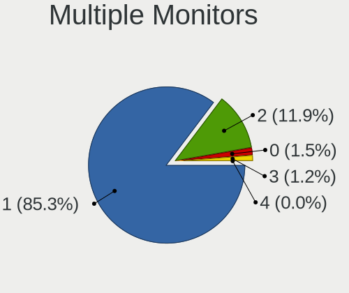

| Total | Computers | Percent |
|-------|-----------|---------|
| 1     | 1402      | 84.36%  |
| 2     | 210       | 12.64%  |
| 3     | 25        | 1.5%    |
| 0     | 24        | 1.44%   |
| 4     | 1         | 0.06%   |

Network
-------

Net Controller Vendor
---------------------

Controller vendors

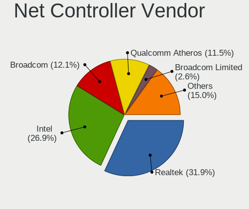

| Vendor                            | Computers | Percent |
|-----------------------------------|-----------|---------|
| Realtek Semiconductor             | 817       | 32.78%  |
| Intel                             | 698       | 28.01%  |
| Qualcomm Atheros                  | 304       | 12.2%   |
| Broadcom                          | 259       | 10.39%  |
| Broadcom Limited                  | 53        | 2.13%   |
| Marvell Technology Group          | 47        | 1.89%   |
| Nvidia                            | 37        | 1.48%   |
| TP-Link                           | 35        | 1.4%    |
| Ralink Technology                 | 29        | 1.16%   |
| Ralink                            | 21        | 0.84%   |
| Samsung Electronics               | 19        | 0.76%   |
| Xiaomi                            | 15        | 0.6%    |
| MediaTek                          | 14        | 0.56%   |
| Huawei Technologies               | 12        | 0.48%   |
| ASIX Electronics                  | 12        | 0.48%   |
| D-Link                            | 10        | 0.4%    |
| Sierra Wireless                   | 9         | 0.36%   |
| Qualcomm                          | 7         | 0.28%   |
| OPPO Electronics                  | 7         | 0.28%   |
| Qualcomm Atheros Communications   | 6         | 0.24%   |
| Linksys                           | 5         | 0.2%    |
| Hewlett-Packard                   | 5         | 0.2%    |
| Ericsson Business Mobile Networks | 5         | 0.2%    |
| D-Link System                     | 5         | 0.2%    |
| Microsoft                         | 4         | 0.16%   |
| Google                            | 4         | 0.16%   |
| Dell                              | 4         | 0.16%   |
| NetGear                           | 3         | 0.12%   |
| Lenovo                            | 3         | 0.12%   |
| ASUSTek Computer                  | 3         | 0.12%   |
| ZTE WCDMA Technologies MSM        | 2         | 0.08%   |
| TRENDnet                          | 2         | 0.08%   |
| Motorola PCS                      | 2         | 0.08%   |
| LG Electronics                    | 2         | 0.08%   |
| JMicron Technology                | 2         | 0.08%   |
| Fibocom                           | 2         | 0.08%   |
| Edimax Technology                 | 2         | 0.08%   |
| Apple                             | 2         | 0.08%   |
| ZyXEL Communications              | 1         | 0.04%   |
| vivo                              | 1         | 0.04%   |

Net Controller Model
--------------------

Controller models

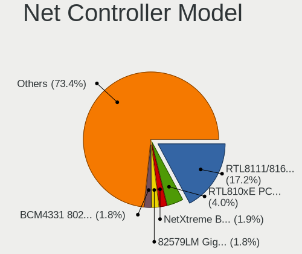

| Model                                                             | Computers | Percent |
|-------------------------------------------------------------------|-----------|---------|
| Realtek RTL8111/8168/8411 PCI Express Gigabit Ethernet Controller | 541       | 18.38%  |
| Realtek RTL810xE PCI Express Fast Ethernet controller             | 117       | 3.97%   |
| Intel 82579LM Gigabit Network Connection (Lewisville)             | 60        | 2.04%   |
| Qualcomm Atheros QCA9377 802.11ac Wireless Network Adapter        | 55        | 1.87%   |
| Intel Wireless 8260                                               | 50        | 1.7%    |
| Intel Wi-Fi 6 AX200                                               | 50        | 1.7%    |
| Intel Wi-Fi 6 AX201                                               | 48        | 1.63%   |
| Realtek RTL8821CE 802.11ac PCIe Wireless Network Adapter          | 45        | 1.53%   |
| Qualcomm Atheros QCA9565 / AR9565 Wireless Network Adapter        | 43        | 1.46%   |
| Qualcomm Atheros AR9485 Wireless Network Adapter                  | 43        | 1.46%   |
| Broadcom NetXtreme BCM57765 Gigabit Ethernet PCIe                 | 38        | 1.29%   |
| Intel Wireless 8265 / 8275                                        | 36        | 1.22%   |
| Intel Wireless 7265                                               | 34        | 1.15%   |
| Intel Wireless 7260                                               | 33        | 1.12%   |
| Broadcom BCM4331 802.11a/b/g/n                                    | 33        | 1.12%   |
| Qualcomm Atheros AR9285 Wireless Network Adapter (PCI-Express)    | 32        | 1.09%   |
| Intel Comet Lake PCH-LP CNVi WiFi                                 | 32        | 1.09%   |
| Realtek RTL8822CE 802.11ac PCIe Wireless Network Adapter          | 30        | 1.02%   |
| Intel Centrino Advanced-N 6205 [Taylor Peak]                      | 28        | 0.95%   |
| Qualcomm Atheros QCA6174 802.11ac Wireless Network Adapter        | 26        | 0.88%   |
| Intel Wireless 3165                                               | 25        | 0.85%   |
| Broadcom Limited BCM4360 802.11ac Wireless Network Adapter        | 24        | 0.82%   |
| Realtek RTL8723BE PCIe Wireless Network Adapter                   | 23        | 0.78%   |
| Realtek RTL8153 Gigabit Ethernet Adapter                          | 23        | 0.78%   |
| Intel I211 Gigabit Network Connection                             | 23        | 0.78%   |
| Nvidia MCP79 Ethernet                                             | 22        | 0.75%   |
| Broadcom BCM4322 802.11a/b/g/n Wireless LAN Controller            | 22        | 0.75%   |
| Broadcom BCM4321 802.11a/b/g/n                                    | 21        | 0.71%   |
| Intel Cannon Point-LP CNVi [Wireless-AC]                          | 20        | 0.68%   |
| Broadcom BCM4360 802.11ac Wireless Network Adapter                | 20        | 0.68%   |
| Marvell Group 88E8058 PCI-E Gigabit Ethernet Controller           | 19        | 0.65%   |
| Intel Cannon Lake PCH CNVi WiFi                                   | 19        | 0.65%   |
| Broadcom BCM43224 802.11a/b/g/n                                   | 19        | 0.65%   |
| Broadcom BCM43142 802.11b/g/n                                     | 19        | 0.65%   |
| Qualcomm Atheros AR8151 v2.0 Gigabit Ethernet                     | 18        | 0.61%   |
| Intel Ethernet Connection I217-LM                                 | 18        | 0.61%   |
| Intel Ethernet Connection (2) I219-V                              | 18        | 0.61%   |
| Broadcom BCM4313 802.11bgn Wireless Network Adapter               | 18        | 0.61%   |
| Realtek RTL8822BE 802.11a/b/g/n/ac WiFi adapter                   | 17        | 0.58%   |
| Intel Ethernet Connection I219-LM                                 | 17        | 0.58%   |

Wireless Vendor
---------------

Wireless vendors

| Vendor                          | Computers | Percent |
|---------------------------------|-----------|---------|
| Intel                           | 562       | 38.05%  |
| Qualcomm Atheros                | 254       | 17.2%   |
| Realtek Semiconductor           | 246       | 16.66%  |
| Broadcom                        | 206       | 13.95%  |
| Broadcom Limited                | 46        | 3.11%   |
| TP-Link                         | 34        | 2.3%    |
| Ralink Technology               | 29        | 1.96%   |
| Ralink                          | 21        | 1.42%   |
| Marvell Technology Group        | 10        | 0.68%   |
| Sierra Wireless                 | 9         | 0.61%   |
| MediaTek                        | 9         | 0.61%   |
| D-Link                          | 8         | 0.54%   |
| Qualcomm Atheros Communications | 6         | 0.41%   |
| Microsoft                       | 4         | 0.27%   |
| Linksys                         | 4         | 0.27%   |
| D-Link System                   | 4         | 0.27%   |
| Qualcomm                        | 3         | 0.2%    |
| ASUSTek Computer                | 3         | 0.2%    |
| TRENDnet                        | 2         | 0.14%   |
| NetGear                         | 2         | 0.14%   |
| Fibocom                         | 2         | 0.14%   |
| Edimax Technology               | 2         | 0.14%   |
| Dell                            | 2         | 0.14%   |
| ZyXEL Communications            | 1         | 0.07%   |
| Sitecom Europe                  | 1         | 0.07%   |
| Mercucys                        | 1         | 0.07%   |
| LG Electronics                  | 1         | 0.07%   |
| BUFFALO                         | 1         | 0.07%   |
| AVM                             | 1         | 0.07%   |
| AirTies Wireless Networks       | 1         | 0.07%   |
| Accton Technology               | 1         | 0.07%   |
| AboCom Systems                  | 1         | 0.07%   |

Wireless Model
--------------

Wireless models

| Model                                                          | Computers | Percent |
|----------------------------------------------------------------|-----------|---------|
| Qualcomm Atheros QCA9377 802.11ac Wireless Network Adapter     | 55        | 3.69%   |
| Intel Wireless 8260                                            | 50        | 3.36%   |
| Intel Wi-Fi 6 AX200                                            | 50        | 3.36%   |
| Intel Wi-Fi 6 AX201                                            | 48        | 3.22%   |
| Realtek RTL8821CE 802.11ac PCIe Wireless Network Adapter       | 45        | 3.02%   |
| Qualcomm Atheros QCA9565 / AR9565 Wireless Network Adapter     | 43        | 2.89%   |
| Qualcomm Atheros AR9485 Wireless Network Adapter               | 43        | 2.89%   |
| Intel Wireless 8265 / 8275                                     | 36        | 2.42%   |
| Intel Wireless 7265                                            | 34        | 2.28%   |
| Intel Wireless 7260                                            | 33        | 2.22%   |
| Broadcom BCM4331 802.11a/b/g/n                                 | 33        | 2.22%   |
| Qualcomm Atheros AR9285 Wireless Network Adapter (PCI-Express) | 32        | 2.15%   |
| Intel Comet Lake PCH-LP CNVi WiFi                              | 32        | 2.15%   |
| Realtek RTL8822CE 802.11ac PCIe Wireless Network Adapter       | 30        | 2.01%   |
| Intel Centrino Advanced-N 6205 [Taylor Peak]                   | 28        | 1.88%   |
| Qualcomm Atheros QCA6174 802.11ac Wireless Network Adapter     | 26        | 1.75%   |
| Intel Wireless 3165                                            | 25        | 1.68%   |
| Broadcom Limited BCM4360 802.11ac Wireless Network Adapter     | 24        | 1.61%   |
| Realtek RTL8723BE PCIe Wireless Network Adapter                | 23        | 1.54%   |
| Broadcom BCM4322 802.11a/b/g/n Wireless LAN Controller         | 22        | 1.48%   |
| Broadcom BCM4321 802.11a/b/g/n                                 | 21        | 1.41%   |
| Intel Cannon Point-LP CNVi [Wireless-AC]                       | 20        | 1.34%   |
| Broadcom BCM4360 802.11ac Wireless Network Adapter             | 20        | 1.34%   |
| Intel Cannon Lake PCH CNVi WiFi                                | 19        | 1.28%   |
| Broadcom BCM43224 802.11a/b/g/n                                | 19        | 1.28%   |
| Broadcom BCM43142 802.11b/g/n                                  | 19        | 1.28%   |
| Broadcom BCM4313 802.11bgn Wireless Network Adapter            | 18        | 1.21%   |
| Realtek RTL8822BE 802.11a/b/g/n/ac WiFi adapter                | 17        | 1.14%   |
| Ralink MT7601U Wireless Adapter                                | 15        | 1.01%   |
| Qualcomm Atheros AR928X Wireless Network Adapter (PCI-Express) | 15        | 1.01%   |
| Broadcom BCM43602 802.11ac Wireless LAN SoC                    | 15        | 1.01%   |
| Intel Dual Band Wireless-AC 3165 Plus Bluetooth                | 14        | 0.94%   |
| Intel Comet Lake PCH CNVi WiFi                                 | 14        | 0.94%   |
| Intel Centrino Advanced-N 6235                                 | 14        | 0.94%   |
| Realtek RTL8188EUS 802.11n Wireless Network Adapter            | 13        | 0.87%   |
| Realtek 802.11ac NIC                                           | 13        | 0.87%   |
| Intel Wireless 3160                                            | 13        | 0.87%   |
| Intel Ice Lake-LP PCH CNVi WiFi                                | 13        | 0.87%   |
| Intel Gemini Lake PCH CNVi WiFi                                | 13        | 0.87%   |
| Realtek RTL8723DE Wireless Network Adapter                     | 12        | 0.81%   |

Ethernet Vendor
---------------

Ethernet vendors

| Vendor                            | Computers | Percent |
|-----------------------------------|-----------|---------|
| Realtek Semiconductor             | 712       | 50.21%  |
| Intel                             | 326       | 22.99%  |
| Broadcom                          | 114       | 8.04%   |
| Qualcomm Atheros                  | 80        | 5.64%   |
| Nvidia                            | 37        | 2.61%   |
| Marvell Technology Group          | 37        | 2.61%   |
| Samsung Electronics               | 19        | 1.34%   |
| Xiaomi                            | 15        | 1.06%   |
| ASIX Electronics                  | 12        | 0.85%   |
| Huawei Technologies               | 9         | 0.63%   |
| Broadcom Limited                  | 8         | 0.56%   |
| OPPO Electronics                  | 7         | 0.49%   |
| MediaTek                          | 5         | 0.35%   |
| Qualcomm                          | 4         | 0.28%   |
| Google                            | 4         | 0.28%   |
| Lenovo                            | 3         | 0.21%   |
| ZTE WCDMA Technologies MSM        | 2         | 0.14%   |
| JMicron Technology                | 2         | 0.14%   |
| Hewlett-Packard                   | 2         | 0.14%   |
| D-Link                            | 2         | 0.14%   |
| Apple                             | 2         | 0.14%   |
| vivo                              | 1         | 0.07%   |
| VIA Technologies                  | 1         | 0.07%   |
| TP-Link                           | 1         | 0.07%   |
| Sundance Technology Inc / IC Plus | 1         | 0.07%   |
| NetGear                           | 1         | 0.07%   |
| Motorola PCS                      | 1         | 0.07%   |
| LSI                               | 1         | 0.07%   |
| Linksys                           | 1         | 0.07%   |
| LG Electronics                    | 1         | 0.07%   |
| ICS Advent                        | 1         | 0.07%   |
| HMD Global                        | 1         | 0.07%   |
| DisplayLink                       | 1         | 0.07%   |
| D-Link System                     | 1         | 0.07%   |
| Attansic Technology               | 1         | 0.07%   |
| Aquantia                          | 1         | 0.07%   |
| ADMtek                            | 1         | 0.07%   |

Ethernet Model
--------------

Ethernet models

| Model                                                             | Computers | Percent |
|-------------------------------------------------------------------|-----------|---------|
| Realtek RTL8111/8168/8411 PCI Express Gigabit Ethernet Controller | 541       | 37.7%   |
| Realtek RTL810xE PCI Express Fast Ethernet controller             | 117       | 8.15%   |
| Intel 82579LM Gigabit Network Connection (Lewisville)             | 60        | 4.18%   |
| Broadcom NetXtreme BCM57765 Gigabit Ethernet PCIe                 | 38        | 2.65%   |
| Realtek RTL8153 Gigabit Ethernet Adapter                          | 23        | 1.6%    |
| Intel I211 Gigabit Network Connection                             | 23        | 1.6%    |
| Nvidia MCP79 Ethernet                                             | 22        | 1.53%   |
| Marvell Group 88E8058 PCI-E Gigabit Ethernet Controller           | 19        | 1.32%   |
| Qualcomm Atheros AR8151 v2.0 Gigabit Ethernet                     | 18        | 1.25%   |
| Intel Ethernet Connection I217-LM                                 | 18        | 1.25%   |
| Intel Ethernet Connection (2) I219-V                              | 18        | 1.25%   |
| Intel Ethernet Connection I219-LM                                 | 17        | 1.18%   |
| Broadcom NetXtreme BCM57766 Gigabit Ethernet PCIe                 | 17        | 1.18%   |
| Broadcom NetXtreme BCM5764M Gigabit Ethernet PCIe                 | 17        | 1.18%   |
| Realtek RTL8125 2.5GbE Controller                                 | 16        | 1.11%   |
| Intel 82577LM Gigabit Network Connection                          | 14        | 0.98%   |
| Intel Ethernet Connection I218-LM                                 | 13        | 0.91%   |
| Intel Ethernet Connection (7) I219-V                              | 13        | 0.91%   |
| Intel 82579V Gigabit Network Connection                           | 13        | 0.91%   |
| Xiaomi Mi/Redmi series (RNDIS)                                    | 12        | 0.84%   |
| Intel Ethernet Connection (4) I219-V                              | 12        | 0.84%   |
| Samsung GT-I9070 (network tethering, USB debugging enabled)       | 11        | 0.77%   |
| Qualcomm Atheros AR8161 Gigabit Ethernet                          | 11        | 0.77%   |
| Intel Ethernet Controller I225-V                                  | 11        | 0.77%   |
| Intel Ethernet Connection I217-V                                  | 10        | 0.7%    |
| Intel 82567LM Gigabit Network Connection                          | 10        | 0.7%    |
| Intel Ethernet Connection (3) I218-LM                             | 9         | 0.63%   |
| Intel 82574L Gigabit Network Connection                           | 9         | 0.63%   |
| Samsung Galaxy series, misc. (tethering mode)                     | 8         | 0.56%   |
| Realtek RTL8152 Fast Ethernet Adapter                             | 8         | 0.56%   |
| Intel Ethernet Connection I219-V                                  | 8         | 0.56%   |
| Qualcomm Atheros Killer E220x Gigabit Ethernet Controller         | 7         | 0.49%   |
| Qualcomm Atheros AR8131 Gigabit Ethernet                          | 7         | 0.49%   |
| Nvidia MCP61 Ethernet                                             | 7         | 0.49%   |
| Intel Ethernet Connection (2) I219-LM                             | 7         | 0.49%   |
| Huawei JKM-LX1                                                    | 7         | 0.49%   |
| Broadcom NetXtreme BCM57786 Gigabit Ethernet PCIe                 | 7         | 0.49%   |
| Broadcom NetLink BCM57785 Gigabit Ethernet PCIe                   | 7         | 0.49%   |
| ASIX AX88179 Gigabit Ethernet                                     | 7         | 0.49%   |
| OPPO 8                                                            | 6         | 0.42%   |

Net Controller Kind
-------------------

Ethernet, WiFi or modem

| Kind     | Computers | Percent |
|----------|-----------|---------|
| WiFi     | 1392      | 50.6%   |
| Ethernet | 1339      | 48.67%  |
| Modem    | 17        | 0.62%   |
| Unknown  | 3         | 0.11%   |

Used Controller
---------------

Currently used network controller

| Kind     | Computers | Percent |
|----------|-----------|---------|
| WiFi     | 1098      | 66.63%  |
| Ethernet | 550       | 33.37%  |

NICs
----

Total network controllers on board

| Total | Computers | Percent |
|-------|-----------|---------|
| 2     | 959       | 58.44%  |
| 1     | 620       | 37.78%  |
| 0     | 33        | 2.01%   |
| 3     | 25        | 1.52%   |
| 4     | 3         | 0.18%   |
| 5     | 1         | 0.06%   |

IPv6
----

IPv6 vs IPv4

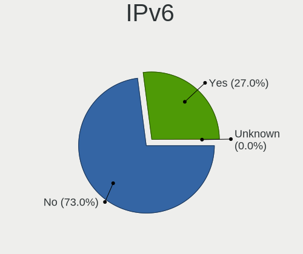

| Used    | Computers | Percent |
|---------|-----------|---------|
| No      | 1264      | 76.37%  |
| Yes     | 390       | 23.56%  |
| Unknown | 1         | 0.06%   |

Bluetooth
---------

Bluetooth Vendor
----------------

Controller vendors

| Vendor                          | Computers | Percent |
|---------------------------------|-----------|---------|
| Intel                           | 474       | 39.43%  |
| Apple                           | 170       | 14.14%  |
| Realtek Semiconductor           | 127       | 10.57%  |
| Qualcomm Atheros Communications | 97        | 8.07%   |
| Cambridge Silicon Radio         | 61        | 5.07%   |
| Broadcom                        | 60        | 4.99%   |
| Lite-On Technology              | 47        | 3.91%   |
| Foxconn / Hon Hai               | 38        | 3.16%   |
| IMC Networks                    | 30        | 2.5%    |
| Toshiba                         | 15        | 1.25%   |
| Hewlett-Packard                 | 14        | 1.16%   |
| Dell                            | 13        | 1.08%   |
| Ralink                          | 12        | 1%      |
| ASUSTek Computer                | 12        | 1%      |
| Marvell Semiconductor           | 9         | 0.75%   |
| Realtek                         | 8         | 0.67%   |
| Qcom                            | 3         | 0.25%   |
| Belkin Components               | 2         | 0.17%   |
| Taiyo Yuden                     | 1         | 0.08%   |
| Smart Modular Technologies      | 1         | 0.08%   |
| MediaTek                        | 1         | 0.08%   |
| Logitech                        | 1         | 0.08%   |
| Fujitsu                         | 1         | 0.08%   |
| Foxconn International           | 1         | 0.08%   |
| Edimax Technology               | 1         | 0.08%   |
| Askey Computer                  | 1         | 0.08%   |
| 3Com                            | 1         | 0.08%   |
| Unknown                         | 1         | 0.08%   |

Bluetooth Model
---------------

Controller models

| Model                                                                               | Computers | Percent |
|-------------------------------------------------------------------------------------|-----------|---------|
| Intel Bluetooth wireless interface                                                  | 194       | 16.14%  |
| Intel AX201 Bluetooth                                                               | 89        | 7.4%    |
| Intel Bluetooth 9460/9560 Jefferson Peak (JfP)                                      | 78        | 6.49%   |
| Apple Bluetooth Host Controller                                                     | 72        | 5.99%   |
| Realtek Bluetooth Radio                                                             | 66        | 5.49%   |
| Cambridge Silicon Radio Bluetooth Dongle (HCI mode)                                 | 61        | 5.07%   |
| Qualcomm Atheros  Bluetooth Device                                                  | 55        | 4.58%   |
| Intel AX200 Bluetooth                                                               | 49        | 4.08%   |
| Apple Bluetooth USB Host Controller                                                 | 45        | 3.74%   |
| Realtek  Bluetooth 4.2 Adapter                                                      | 43        | 3.58%   |
| Apple Built-in Bluetooth 2.0+EDR HCI                                                | 29        | 2.41%   |
| Apple Bluetooth HCI                                                                 | 24        | 2%      |
| Intel Centrino Bluetooth Wireless Transceiver                                       | 21        | 1.75%   |
| Qualcomm Atheros AR3011 Bluetooth                                                   | 19        | 1.58%   |
| Lite-On Qualcomm Atheros QCA9377 Bluetooth                                          | 15        | 1.25%   |
| Foxconn / Hon Hai Bluetooth Device                                                  | 15        | 1.25%   |
| Lite-On Bluetooth Device                                                            | 13        | 1.08%   |
| HP Broadcom 2070 Bluetooth Combo                                                    | 13        | 1.08%   |
| Ralink RT3290 Bluetooth                                                             | 12        | 1%      |
| Intel Wireless-AC 3168 Bluetooth                                                    | 12        | 1%      |
| Intel AX210 Bluetooth                                                               | 12        | 1%      |
| Broadcom BCM20702 Bluetooth 4.0 [ThinkPad]                                          | 12        | 1%      |
| Broadcom BCM2045B (BDC-2.1)                                                         | 11        | 0.92%   |
| IMC Networks Bluetooth Radio                                                        | 10        | 0.83%   |
| Qualcomm Atheros AR3012 Bluetooth 4.0                                               | 9         | 0.75%   |
| Lite-On Atheros AR3012 Bluetooth                                                    | 9         | 0.75%   |
| Realtek Bluetooth Radio                                                             | 8         | 0.67%   |
| Qualcomm Atheros QCA61x4 Bluetooth 4.0                                              | 8         | 0.67%   |
| Intel Wireless-AC 9260 Bluetooth Adapter                                            | 8         | 0.67%   |
| Broadcom BCM43142A0 Bluetooth 4.0                                                   | 8         | 0.67%   |
| Realtek RTL8821A Bluetooth                                                          | 7         | 0.58%   |
| Intel Centrino Advanced-N 6230 Bluetooth adapter                                    | 7         | 0.58%   |
| Dell DW375 Bluetooth Module                                                         | 7         | 0.58%   |
| Realtek RTL8723B Bluetooth                                                          | 6         | 0.5%    |
| Marvell Bluetooth and Wireless LAN Composite                                        | 6         | 0.5%    |
| IMC Networks Bluetooth Device                                                       | 6         | 0.5%    |
| Realtek RTL8822BE Bluetooth 4.2 Adapter                                             | 5         | 0.42%   |
| Foxconn / Hon Hai Foxconn T77H114 BCM2070 [Single-Chip Bluetooth 2.1 + EDR Adapter] | 5         | 0.42%   |
| Foxconn / Hon Hai Bluetooth USB Host Controller                                     | 5         | 0.42%   |
| ASUS Broadcom BCM20702A0 Bluetooth                                                  | 5         | 0.42%   |

Sound
-----

Sound Vendor
------------

Sound card vendors

| Vendor                               | Computers | Percent |
|--------------------------------------|-----------|---------|
| Intel                                | 1270      | 58.69%  |
| AMD                                  | 419       | 19.36%  |
| Nvidia                               | 300       | 13.86%  |
| C-Media Electronics                  | 46        | 2.13%   |
| Logitech                             | 19        | 0.88%   |
| Creative Labs                        | 12        | 0.55%   |
| Generalplus Technology               | 10        | 0.46%   |
| JMTek                                | 7         | 0.32%   |
| Realtek Semiconductor                | 5         | 0.23%   |
| GN Netcom                            | 5         | 0.23%   |
| Texas Instruments                    | 4         | 0.18%   |
| Razer USA                            | 4         | 0.18%   |
| Creative Technology                  | 4         | 0.18%   |
| BEHRINGER International              | 4         | 0.18%   |
| Dell                                 | 3         | 0.14%   |
| Corsair                              | 3         | 0.14%   |
| ASUSTek Computer                     | 3         | 0.14%   |
| Sony                                 | 2         | 0.09%   |
| Plantronics                          | 2         | 0.09%   |
| Native Instruments                   | 2         | 0.09%   |
| Microsoft                            | 2         | 0.09%   |
| Hewlett-Packard                      | 2         | 0.09%   |
| Goldvish                             | 2         | 0.09%   |
| Focusrite-Novation                   | 2         | 0.09%   |
| ESS Technology                       | 2         | 0.09%   |
| BR23                                 | 2         | 0.09%   |
| YUAN High-Tech Development           | 1         | 0.05%   |
| VIA Technologies                     | 1         | 0.05%   |
| Unknown                              | 1         | 0.05%   |
| Trust                                | 1         | 0.05%   |
| Thesycon Systemsoftware & Consulting | 1         | 0.05%   |
| Tenx Technology                      | 1         | 0.05%   |
| TEAC                                 | 1         | 0.05%   |
| SteelSeries ApS                      | 1         | 0.05%   |
| Samson Technologies                  | 1         | 0.05%   |
| PreSonus Audio Electronics           | 1         | 0.05%   |
| Philips Speech Processing            | 1         | 0.05%   |
| Nordic Semiconductor ASA             | 1         | 0.05%   |
| No brand                             | 1         | 0.05%   |
| Midiplus                             | 1         | 0.05%   |

Sound Model
-----------

Sound card models

| Model                                                                                             | Computers | Percent |
|---------------------------------------------------------------------------------------------------|-----------|---------|
| Intel 6 Series/C200 Series Chipset Family High Definition Audio Controller                        | 155       | 5.99%   |
| Intel Sunrise Point-LP HD Audio                                                                   | 153       | 5.92%   |
| Intel 7 Series/C216 Chipset Family High Definition Audio Controller                               | 134       | 5.18%   |
| AMD Family 17h/19h HD Audio Controller                                                            | 116       | 4.49%   |
| Intel 8 Series/C220 Series Chipset High Definition Audio Controller                               | 89        | 3.44%   |
| Intel 5 Series/3400 Series Chipset High Definition Audio                                          | 76        | 2.94%   |
| Intel Haswell-ULT HD Audio Controller                                                             | 64        | 2.47%   |
| Intel 8 Series HD Audio Controller                                                                | 64        | 2.47%   |
| Intel Tiger Lake-LP Smart Sound Technology Audio Controller                                       | 61        | 2.36%   |
| AMD Renoir Radeon High Definition Audio Controller                                                | 58        | 2.24%   |
| Intel Xeon E3-1200 v3/4th Gen Core Processor HD Audio Controller                                  | 54        | 2.09%   |
| Intel Cannon Lake PCH cAVS                                                                        | 54        | 2.09%   |
| AMD Raven/Raven2/Fenghuang HDMI/DP Audio Controller                                               | 54        | 2.09%   |
| Intel 82801I (ICH9 Family) HD Audio Controller                                                    | 49        | 1.89%   |
| Intel Broadwell-U Audio Controller                                                                | 45        | 1.74%   |
| AMD FCH Azalia Controller                                                                         | 45        | 1.74%   |
| Intel Wildcat Point-LP High Definition Audio Controller                                           | 42        | 1.62%   |
| Intel Celeron/Pentium Silver Processor High Definition Audio                                      | 42        | 1.62%   |
| Intel Comet Lake PCH-LP cAVS                                                                      | 36        | 1.39%   |
| AMD SBx00 Azalia (Intel HDA)                                                                      | 33        | 1.28%   |
| AMD Family 15h (Models 60h-6fh) Audio Controller                                                  | 33        | 1.28%   |
| AMD Ellesmere HDMI Audio [Radeon RX 470/480 / 570/580/590]                                        | 33        | 1.28%   |
| AMD Kabini HDMI/DP Audio                                                                          | 32        | 1.24%   |
| Intel Cannon Point-LP High Definition Audio Controller                                            | 30        | 1.16%   |
| Intel 82801H (ICH8 Family) HD Audio Controller                                                    | 30        | 1.16%   |
| Intel 100 Series/C230 Series Chipset Family HD Audio Controller                                   | 30        | 1.16%   |
| AMD Starship/Matisse HD Audio Controller                                                          | 29        | 1.12%   |
| Nvidia GP107GL High Definition Audio Controller                                                   | 26        | 1.01%   |
| Intel NM10/ICH7 Family High Definition Audio Controller                                           | 25        | 0.97%   |
| AMD Turks HDMI Audio [Radeon HD 6500/6600 / 6700M Series]                                         | 25        | 0.97%   |
| AMD Family 17h (Models 00h-0fh) HD Audio Controller                                               | 24        | 0.93%   |
| Intel Ice Lake-LP Smart Sound Technology Audio Controller                                         | 23        | 0.89%   |
| Intel 200 Series PCH HD Audio                                                                     | 23        | 0.89%   |
| Nvidia MCP79 High Definition Audio                                                                | 22        | 0.85%   |
| Nvidia GM107 High Definition Audio Controller [GeForce 940MX]                                     | 22        | 0.85%   |
| Intel Atom/Celeron/Pentium Processor x5-E8000/J3xxx/N3xxx Series High Definition Audio Controller | 20        | 0.77%   |
| Intel Atom Processor Z36xxx/Z37xxx Series High Definition Audio Controller                        | 20        | 0.77%   |
| AMD High Definition Audio Controller                                                              | 20        | 0.77%   |
| Nvidia GF108 High Definition Audio Controller                                                     | 19        | 0.73%   |
| Nvidia TU106 High Definition Audio Controller                                                     | 18        | 0.7%    |

Memory
------

Memory Vendor
-------------

Memory module vendors

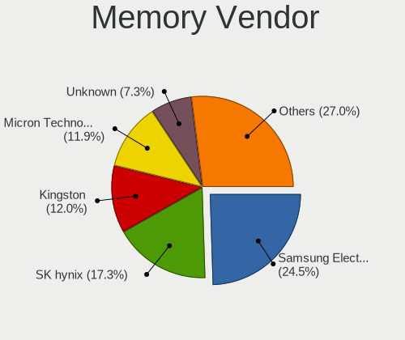

| Vendor              | Computers | Percent |
|---------------------|-----------|---------|
| Samsung Electronics | 133       | 24.68%  |
| SK hynix            | 96        | 17.81%  |
| Micron Technology   | 63        | 11.69%  |
| Kingston            | 62        | 11.5%   |
| Unknown             | 40        | 7.42%   |
| Crucial             | 24        | 4.45%   |
| Elpida              | 15        | 2.78%   |
| Corsair             | 13        | 2.41%   |
| G.Skill             | 12        | 2.23%   |
| A-DATA Technology   | 12        | 2.23%   |
| Unknown (ABCD)      | 11        | 2.04%   |
| Ramaxel Technology  | 8         | 1.48%   |
| Patriot             | 4         | 0.74%   |
| Nanya Technology    | 4         | 0.74%   |
| Unknown             | 4         | 0.74%   |
| Transcend           | 3         | 0.56%   |
| Smart               | 3         | 0.56%   |
| GSkill              | 3         | 0.56%   |
| Apacer              | 3         | 0.56%   |
| Team                | 2         | 0.37%   |
| PNY                 | 2         | 0.37%   |
| Multilaser          | 2         | 0.37%   |
| Unknown (82B5)      | 1         | 0.19%   |
| Unknown (0x5846)    | 1         | 0.19%   |
| Unknown (0x198)     | 1         | 0.19%   |
| Unknown (0x038A)    | 1         | 0.19%   |
| Toshiba             | 1         | 0.19%   |
| Timetec             | 1         | 0.19%   |
| Smart Brazil        | 1         | 0.19%   |
| SHARETRONIC         | 1         | 0.19%   |
| Qimonda             | 1         | 0.19%   |
| pqi                 | 1         | 0.19%   |
| Neo Forza           | 1         | 0.19%   |
| Melco               | 1         | 0.19%   |
| Magnum Tech         | 1         | 0.19%   |
| Kllisre             | 1         | 0.19%   |
| Hewlett-Packard     | 1         | 0.19%   |
| CSX                 | 1         | 0.19%   |
| Avant               | 1         | 0.19%   |
| AMD                 | 1         | 0.19%   |

Memory Model
------------

Memory module models

| Model                                                            | Computers | Percent |
|------------------------------------------------------------------|-----------|---------|
| Unknown (ABCD) RAM 123456789012345678 1GB SODIMM LPDDR4 2400MT/s | 9         | 1.58%   |
| Samsung RAM M471B5173DB0-YK0 4GB SODIMM DDR3 1600MT/s            | 9         | 1.58%   |
| Samsung RAM M471B1G73DB0-YK0 8GB SODIMM DDR3 1600MT/s            | 8         | 1.41%   |
| Samsung RAM M471A5244CB0-CRC 4GB SODIMM DDR4 2667MT/s            | 6         | 1.06%   |
| SK hynix RAM Module 8192MB SODIMM DDR3 1600MT/s                  | 4         | 0.7%    |
| Samsung RAM Module 8192MB SODIMM DDR4 2133MT/s                   | 4         | 0.7%    |
| Samsung RAM M471B5273DH0-CH9 4GB SODIMM DDR3 1334MT/s            | 4         | 0.7%    |
| Samsung RAM M471B1G73QH0-YK0 8GB SODIMM DDR3 1867MT/s            | 4         | 0.7%    |
| Samsung RAM M471A5244CB0-CTD 4GB SODIMM DDR4 3266MT/s            | 4         | 0.7%    |
| Samsung RAM M471A1G44AB0-CWE 8GB SODIMM DDR4 3200MT/s            | 4         | 0.7%    |
| Micron RAM 8KTF51264HZ-1G6E1 4096MB SODIMM DDR3 1600MT/s         | 4         | 0.7%    |
| Unknown                                                          | 4         | 0.7%    |
| Unknown RAM Module 2048MB SODIMM DDR3 1066MT/s                   | 3         | 0.53%   |
| SK hynix RAM HMT451S6BFR8A-PB 4GB SODIMM DDR3 1600MT/s           | 3         | 0.53%   |
| SK hynix RAM HMT41GS6BFR8A-PB 8GB SODIMM DDR3 1600MT/s           | 3         | 0.53%   |
| SK hynix RAM HMA851S6CJR6N-VK 4096MB SODIMM DDR4 2667MT/s        | 3         | 0.53%   |
| SK hynix RAM HMA851S6AFR6N-UH 4GB SODIMM DDR4 2667MT/s           | 3         | 0.53%   |
| SK hynix RAM HMA81GS6DJR8N-XN 8192MB SODIMM DDR4 3200MT/s        | 3         | 0.53%   |
| SK hynix RAM HMA81GS6CJR8N-VK 8GB SODIMM DDR4 2667MT/s           | 3         | 0.53%   |
| SK hynix RAM HMA81GS6AFR8N-UH 8GB SODIMM DDR4 2667MT/s           | 3         | 0.53%   |
| Samsung RAM UBE3D4AA-MGCR 2048MB Row Of Chips LPDDR4 4267MT/s    | 3         | 0.53%   |
| Samsung RAM U6E3S4AA-MGCR 1GB Row Of Chips LPDDR4 4267MT/s       | 3         | 0.53%   |
| Samsung RAM M471B5673FH0-CF8 2GB SODIMM DDR3 1067MT/s            | 3         | 0.53%   |
| Samsung RAM M471B5273CH0-CH9 4GB SODIMM DDR3 1334MT/s            | 3         | 0.53%   |
| Samsung RAM M471B5173QH0-YK0 4GB SODIMM DDR3 1600MT/s            | 3         | 0.53%   |
| Samsung RAM M471A5143EB0-CPB 4GB SODIMM DDR4 2133MT/s            | 3         | 0.53%   |
| Samsung RAM M471A2K43CB1-CTD 16GB SODIMM DDR4 8400MT/s           | 3         | 0.53%   |
| Samsung RAM M471A1K43CB1-CTD 8GB SODIMM DDR4 2667MT/s            | 3         | 0.53%   |
| Samsung RAM M471A1K43CB1-CRC 8GB SODIMM DDR4 2667MT/s            | 3         | 0.53%   |
| Samsung RAM M471A1K43BB1-CRC 8GB SODIMM DDR4 2667MT/s            | 3         | 0.53%   |
| Micron RAM MT52L1G32D4PG-093 8GB Row Of Chips LPDDR3 2133MT/s    | 3         | 0.53%   |
| Micron RAM 8KTF51264HZ-1G6N1 4096MB SODIMM DDR3 1600MT/s         | 3         | 0.53%   |
| Micron RAM 8ATF1G64HZ-2G6E1 8GB SODIMM DDR4 2667MT/s             | 3         | 0.53%   |
| Micron RAM 4ATF51264HZ-2G6E1 4GB SODIMM DDR4 2667MT/s            | 3         | 0.53%   |
| Micron RAM 4ATF51264HZ-2G3AZ 4GB SODIMM DDR4 2133MT/s            | 3         | 0.53%   |
| Elpida RAM Module 4096MB SODIMM DDR3 1600MT/s                    | 3         | 0.53%   |
| Unknown RAM Module 8GB DIMM 1333MT/s                             | 2         | 0.35%   |
| Unknown RAM Module 4GB DIMM 1333MT/s                             | 2         | 0.35%   |
| Unknown RAM Module 4096MB SODIMM DDR3 1333MT/s                   | 2         | 0.35%   |
| Unknown RAM Module 2GB SODIMM DDR3 1333MT/s                      | 2         | 0.35%   |

Memory Kind
-----------

Memory module kinds

| Kind    | Computers | Percent |
|---------|-----------|---------|
| DDR3    | 184       | 41.07%  |
| DDR4    | 173       | 38.62%  |
| LPDDR4  | 34        | 7.59%   |
| DDR2    | 24        | 5.36%   |
| LPDDR3  | 13        | 2.9%    |
| SDRAM   | 10        | 2.23%   |
| Unknown | 8         | 1.79%   |
| DDR5    | 1         | 0.22%   |
| DDR     | 1         | 0.22%   |

Memory Form Factor
------------------

Physical design of the memory module

| Name         | Computers | Percent |
|--------------|-----------|---------|
| SODIMM       | 314       | 69.78%  |
| DIMM         | 92        | 20.44%  |
| Row Of Chips | 38        | 8.44%   |
| Chip         | 4         | 0.89%   |
| FB-DIMM      | 1         | 0.22%   |
| Unknown      | 1         | 0.22%   |

Memory Size
-----------

Memory module size

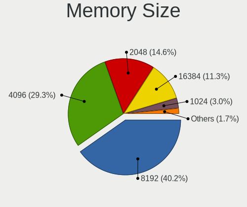

| Size  | Computers | Percent |
|-------|-----------|---------|
| 8192  | 207       | 40.67%  |
| 4096  | 151       | 29.67%  |
| 2048  | 78        | 15.32%  |
| 16384 | 50        | 9.82%   |
| 1024  | 14        | 2.75%   |
| 32768 | 8         | 1.57%   |
| 512   | 1         | 0.2%    |

Memory Speed
------------

Memory module speed

| Speed   | Computers | Percent |
|---------|-----------|---------|
| 1600    | 116       | 23.34%  |
| 2667    | 80        | 16.1%   |
| 3200    | 52        | 10.46%  |
| 1333    | 40        | 8.05%   |
| 2400    | 37        | 7.44%   |
| 2133    | 30        | 6.04%   |
| 1334    | 17        | 3.42%   |
| 4267    | 14        | 2.82%   |
| 667     | 14        | 2.82%   |
| 800     | 13        | 2.62%   |
| 1867    | 12        | 2.41%   |
| 1066    | 10        | 2.01%   |
| 1067    | 9         | 1.81%   |
| 3600    | 6         | 1.21%   |
| 3266    | 6         | 1.21%   |
| 8400    | 3         | 0.6%    |
| 4199    | 3         | 0.6%    |
| 3733    | 3         | 0.6%    |
| 2800    | 3         | 0.6%    |
| 1800    | 3         | 0.6%    |
| 4800    | 2         | 0.4%    |
| 4266    | 2         | 0.4%    |
| 3466    | 2         | 0.4%    |
| 1866    | 2         | 0.4%    |
| Unknown | 2         | 0.4%    |
| 3533    | 1         | 0.2%    |
| 3400    | 1         | 0.2%    |
| 3334    | 1         | 0.2%    |
| 3007    | 1         | 0.2%    |
| 3000    | 1         | 0.2%    |
| 2934    | 1         | 0.2%    |
| 2933    | 1         | 0.2%    |
| 2733    | 1         | 0.2%    |
| 2666    | 1         | 0.2%    |
| 2200    | 1         | 0.2%    |
| 2048    | 1         | 0.2%    |
| 2000    | 1         | 0.2%    |
| 1639    | 1         | 0.2%    |
| 975     | 1         | 0.2%    |
| 533     | 1         | 0.2%    |

Printers & scanners
-------------------

Printer Vendor
--------------

Printer device vendors

| Vendor                          | Computers | Percent |
|---------------------------------|-----------|---------|
| Hewlett-Packard                 | 12        | 31.58%  |
| Brother Industries              | 7         | 18.42%  |
| Canon                           | 6         | 15.79%  |
| Samsung Electronics             | 4         | 10.53%  |
| Seiko Epson                     | 3         | 7.89%   |
| Xerox                           | 2         | 5.26%   |
| Prolific Technology             | 1         | 2.63%   |
| Lexmark International           | 1         | 2.63%   |
| Dymo-CoStar                     | 1         | 2.63%   |
| cab Produkttechnik GmbH & Co KG | 1         | 2.63%   |

Printer Model
-------------

Printer device models

| Model                                    | Computers | Percent |
|------------------------------------------|-----------|---------|
| Samsung M2020 Series                     | 3         | 7.89%   |
| Xerox Phaser 3610                        | 1         | 2.63%   |
| Xerox Phaser 3040                        | 1         | 2.63%   |
| Seiko Epson XP-200 Series                | 1         | 2.63%   |
| Seiko Epson L396 Series                  | 1         | 2.63%   |
| Seiko Epson L355 Series                  | 1         | 2.63%   |
| Samsung C48x Series                      | 1         | 2.63%   |
| Prolific PL2305 Parallel Port            | 1         | 2.63%   |
| Lexmark International Laser Printer E210 | 1         | 2.63%   |
| HP Smart Tank 580-590 series             | 1         | 2.63%   |
| HP Printing Support                      | 1         | 2.63%   |
| HP OfficeJet 5200 series                 | 1         | 2.63%   |
| HP LaserJet Pro M201dw                   | 1         | 2.63%   |
| HP LaserJet M101-M106                    | 1         | 2.63%   |
| HP LaserJet 1320                         | 1         | 2.63%   |
| HP LaserJet 1300                         | 1         | 2.63%   |
| HP Ink Tank 110 series                   | 1         | 2.63%   |
| HP Deskjet F4500 series                  | 1         | 2.63%   |
| HP DeskJet 2600 series                   | 1         | 2.63%   |
| HP Deskjet 2050 J510                     | 1         | 2.63%   |
| HP Deskjet 1000 J110 series              | 1         | 2.63%   |
| Dymo-CoStar LabelWriter 450              | 1         | 2.63%   |
| Canon TR8500 series                      | 1         | 2.63%   |
| Canon PIXMA MX390 Series                 | 1         | 2.63%   |
| Canon PIXMA MG3600 Series                | 1         | 2.63%   |
| Canon PIXMA MG2500 Series                | 1         | 2.63%   |
| Canon MF4320-4350                        | 1         | 2.63%   |
| Canon G3000 series                       | 1         | 2.63%   |
| cab Produkttechnik GmbH & Co KG EOS2/300 | 1         | 2.63%   |
| Brother MFC-T910DW                       | 1         | 2.63%   |
| Brother MFC-T800W                        | 1         | 2.63%   |
| Brother MFC-L2750DW series               | 1         | 2.63%   |
| Brother MFC-J5335DW                      | 1         | 2.63%   |
| Brother MFC-J5330DW                      | 1         | 2.63%   |
| Brother HL-4140CN series                 | 1         | 2.63%   |
| Brother DCP-L2550DN series               | 1         | 2.63%   |

Scanner Vendor
--------------

Scanner device vendors

| Vendor      | Computers | Percent |
|-------------|-----------|---------|
| Canon       | 3         | 60%     |
| Seiko Epson | 2         | 40%     |

Scanner Model
-------------

Scanner device models

| Model                                                   | Computers | Percent |
|---------------------------------------------------------|-----------|---------|
| Seiko Epson GT-F720 [GT-S620/Perfection V30/V300 Photo] | 1         | 20%     |
| Seiko Epson ES-H300 [GT-2500]                           | 1         | 20%     |
| Canon CanoScan LIDE 25                                  | 1         | 20%     |
| Canon CanoScan LiDE 110                                 | 1         | 20%     |
| Canon CanoScan LiDE 100                                 | 1         | 20%     |

Camera
------

Camera Vendor
-------------

Camera device vendors

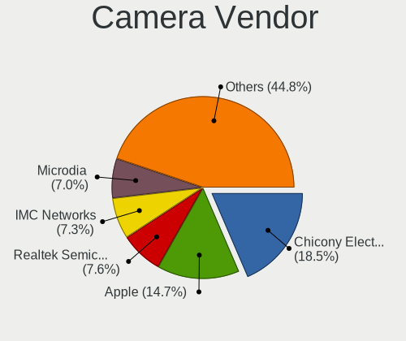

| Vendor                                 | Computers | Percent |
|----------------------------------------|-----------|---------|
| Chicony Electronics                    | 240       | 21.02%  |
| Apple                                  | 130       | 11.38%  |
| Realtek Semiconductor                  | 98        | 8.58%   |
| IMC Networks                           | 90        | 7.88%   |
| Microdia                               | 75        | 6.57%   |
| Quanta                                 | 61        | 5.34%   |
| Sunplus Innovation Technology          | 56        | 4.9%    |
| Bison Electronics                      | 53        | 4.64%   |
| Cheng Uei Precision Industry (Foxlink) | 46        | 4.03%   |
| Suyin                                  | 32        | 2.8%    |
| Logitech                               | 32        | 2.8%    |
| Syntek                                 | 31        | 2.71%   |
| Alcor Micro                            | 22        | 1.93%   |
| Silicon Motion                         | 21        | 1.84%   |
| Lite-On Technology                     | 21        | 1.84%   |
| Acer                                   | 17        | 1.49%   |
| Microsoft                              | 12        | 1.05%   |
| Luxvisions Innotech Limited            | 11        | 0.96%   |
| Lenovo                                 | 11        | 0.96%   |
| Ricoh                                  | 7         | 0.61%   |
| Generalplus Technology                 | 7         | 0.61%   |
| Samsung Electronics                    | 6         | 0.53%   |
| Importek                               | 6         | 0.53%   |
| Z-Star Microelectronics                | 4         | 0.35%   |
| LG Electronics                         | 4         | 0.35%   |
| KYE Systems (Mouse Systems)            | 4         | 0.35%   |
| Cubeternet                             | 4         | 0.35%   |
| ALi                                    | 4         | 0.35%   |
| SunplusIT                              | 3         | 0.26%   |
| Primax Electronics                     | 3         | 0.26%   |
| Y Media                                | 2         | 0.18%   |
| Sonix Technology                       | 2         | 0.18%   |
| Jieli Technology                       | 2         | 0.18%   |
| icSpring                               | 2         | 0.18%   |
| Foxconn / Hon Hai                      | 2         | 0.18%   |
| webcamvendor                           | 1         | 0.09%   |
| Teslong Camera                         | 1         | 0.09%   |
| Sunplus Technology                     | 1         | 0.09%   |
| Sony                                   | 1         | 0.09%   |
| Shine-optics                           | 1         | 0.09%   |

Camera Model
------------

Camera device models

| Model                                   | Computers | Percent |
|-----------------------------------------|-----------|---------|
| Chicony Integrated Camera               | 50        | 4.34%   |
| Apple Built-in iSight                   | 50        | 4.34%   |
| Realtek Integrated_Webcam_HD            | 30        | 2.61%   |
| IMC Networks USB2.0 HD UVC WebCam       | 27        | 2.35%   |
| Apple FaceTime HD Camera                | 26        | 2.26%   |
| Apple FaceTime HD Camera (Built-in)     | 25        | 2.17%   |
| IMC Networks Integrated Camera          | 24        | 2.09%   |
| Chicony HD WebCam                       | 24        | 2.09%   |
| Microdia Integrated_Webcam_HD           | 20        | 1.74%   |
| Apple iPhone 5/5C/5S/6/SE/7/8/X/XR      | 19        | 1.65%   |
| Sunplus Integrated_Webcam_HD            | 16        | 1.39%   |
| Syntek Integrated Camera                | 15        | 1.3%    |
| Lite-On Integrated Camera               | 11        | 0.96%   |
| Quanta HP Webcam                        | 10        | 0.87%   |
| Quanta HP TrueVision HD Camera          | 10        | 0.87%   |
| Chicony HP HD Webcam [Fixed]            | 10        | 0.87%   |
| Sunplus HD WebCam                       | 9         | 0.78%   |
| Realtek USB2.0 HD UVC WebCam            | 9         | 0.78%   |
| Realtek USB Camera                      | 9         | 0.78%   |
| Microdia Integrated Webcam              | 9         | 0.78%   |
| IMC Networks USB2.0 VGA UVC WebCam      | 9         | 0.78%   |
| Bison Integrated Camera                 | 9         | 0.78%   |
| Syntek EasyCamera                       | 8         | 0.7%    |
| Realtek Integrated Webcam               | 8         | 0.7%    |
| Logitech HD Pro Webcam C920             | 8         | 0.7%    |
| Chicony USB 2.0 Camera                  | 8         | 0.7%    |
| Chicony HP Truevision HD                | 8         | 0.7%    |
| Chicony HP HD Camera                    | 8         | 0.7%    |
| Chicony EasyCamera                      | 8         | 0.7%    |
| Syntek Lenovo EasyCamera                | 7         | 0.61%   |
| Microdia USB 2.0 Camera                 | 7         | 0.61%   |
| Chicony VGA WebCam                      | 7         | 0.61%   |
| Chicony HP Wide Vision HD Camera        | 7         | 0.61%   |
| Chicony HP TrueVision HD Camera         | 7         | 0.61%   |
| Chicony HP HD Webcam                    | 7         | 0.61%   |
| Bison Lenovo EasyCamera                 | 7         | 0.61%   |
| Apple FaceTime Camera                   | 7         | 0.61%   |
| Alcor Micro USB 2.0 Web Camera          | 7         | 0.61%   |
| Sunplus Laptop_Integrated_Webcam_HD     | 6         | 0.52%   |
| Samsung Galaxy series, misc. (MTP mode) | 6         | 0.52%   |

Security
--------

Fingerprint Vendor
------------------

Fingerprint sensor vendors

| Vendor                     | Computers | Percent |
|----------------------------|-----------|---------|
| Validity Sensors           | 73        | 36.68%  |
| Synaptics                  | 48        | 24.12%  |
| Shenzhen Goodix Technology | 31        | 15.58%  |
| LighTuning Technology      | 16        | 8.04%   |
| Elan Microelectronics      | 11        | 5.53%   |
| Upek                       | 10        | 5.03%   |
| AuthenTec                  | 7         | 3.52%   |
| STMicroelectronics         | 2         | 1.01%   |
| Focal-systems.Corp         | 1         | 0.5%    |

Fingerprint Model
-----------------

Fingerprint sensor models

| Model                                                                      | Computers | Percent |
|----------------------------------------------------------------------------|-----------|---------|
| Shenzhen Goodix  Fingerprint Device                                        | 23        | 11.56%  |
| Validity Sensors VFS495 Fingerprint Reader                                 | 15        | 7.54%   |
| LighTuning EgisTec Touch Fingerprint Sensor                                | 12        | 6.03%   |
| Synaptics Prometheus MIS Touch Fingerprint Reader                          | 11        | 5.53%   |
| Upek Biometric Touchchip/Touchstrip Fingerprint Sensor                     | 10        | 5.03%   |
| Validity Sensors VFS 5011 fingerprint sensor                               | 9         | 4.52%   |
| Synaptics Metallica MIS Touch Fingerprint Reader                           | 9         | 4.52%   |
| Validity Sensors VFS471 Fingerprint Reader                                 | 8         | 4.02%   |
| Validity Sensors VFS5011 Fingerprint Reader                                | 7         | 3.52%   |
| Validity Sensors VFS491                                                    | 6         | 3.02%   |
| Synaptics UWP WBDI                                                         | 6         | 3.02%   |
| Validity Sensors Synaptics WBDI                                            | 5         | 2.51%   |
| Shenzhen Goodix Fingerprint Reader                                         | 5         | 2.51%   |
| Validity Sensors VFS7500 Touch Fingerprint Sensor                          | 4         | 2.01%   |
| Validity Sensors Synaptics VFS7552 Touch Fingerprint Sensor with PurePrint | 4         | 2.01%   |
| Validity Sensors Swipe Fingerprint Sensor                                  | 4         | 2.01%   |
| Synaptics WBDI Fingerprint Reader USB 086                                  | 4         | 2.01%   |
| Synaptics  FS7604 Touch Fingerprint Sensor with PurePrint                  | 4         | 2.01%   |
| Elan ELAN:Fingerprint                                                      | 4         | 2.01%   |
| Elan ELAN:ARM-M4                                                           | 4         | 2.01%   |
| AuthenTec Fingerprint Sensor                                               | 4         | 2.01%   |
| Validity Sensors Fingerprint scanner                                       | 3         | 1.51%   |
| Synaptics WBDI                                                             | 3         | 1.51%   |
| Synaptics  WBDI                                                            | 3         | 1.51%   |
| Synaptics Fingerprint reader [HP G6]                                       | 3         | 1.51%   |
| Shenzhen Goodix FingerPrint                                                | 3         | 1.51%   |
| Elan WBF Fingerprint Sensor                                                | 3         | 1.51%   |
| Validity Sensors VFS451 Fingerprint Reader                                 | 2         | 1.01%   |
| Validity Sensors VFS301 Fingerprint Reader                                 | 2         | 1.01%   |
| Validity Sensors VFS Fingerprint sensor                                    | 2         | 1.01%   |
| Synaptics Metallica MOH Touch Fingerprint Reader                           | 2         | 1.01%   |
| STMicroelectronics Fingerprint Reader                                      | 2         | 1.01%   |
| LighTuning ES603 Swipe Fingerprint Sensor                                  | 2         | 1.01%   |
| Validity Sensors VFS7552 Touch Fingerprint Sensor                          | 1         | 0.5%    |
| Validity Sensors VFS101 Fingerprint Reader                                 | 1         | 0.5%    |
| Synaptics  WBDI Fingerprint Reader - USB 052                               | 1         | 0.5%    |
| Synaptics FS7604 Touch Fingerprint Sensor with PurePrint                   | 1         | 0.5%    |
| LighTuning Fingerprint Sensor                                              | 1         | 0.5%    |
| LighTuning Fingerprint Reader                                              | 1         | 0.5%    |
| Focal-systems.Corp FT9201Fingerprint.                                      | 1         | 0.5%    |

Chipcard Vendor
---------------

Chipcard module vendors

| Vendor                            | Computers | Percent |
|-----------------------------------|-----------|---------|
| Broadcom                          | 29        | 43.28%  |
| Alcor Micro                       | 18        | 26.87%  |
| O2 Micro                          | 6         | 8.96%   |
| Upek                              | 5         | 7.46%   |
| Lenovo                            | 5         | 7.46%   |
| VASCO Data Security International | 1         | 1.49%   |
| OmniKey                           | 1         | 1.49%   |
| Gemalto (was Gemplus)             | 1         | 1.49%   |
| Chicony Electronics               | 1         | 1.49%   |

Chipcard Model
--------------

Chipcard module models

| Model                                                                        | Computers | Percent |
|------------------------------------------------------------------------------|-----------|---------|
| Alcor Micro AU9540 Smartcard Reader                                          | 18        | 26.87%  |
| Broadcom BCM5880 Secure Applications Processor                               | 15        | 22.39%  |
| Broadcom BCM5880 Secure Applications Processor with fingerprint swipe sensor | 7         | 10.45%  |
| Upek TouchChip Fingerprint Coprocessor (WBF advanced mode)                   | 5         | 7.46%   |
| O2 Micro OZ776 CCID Smartcard Reader                                         | 5         | 7.46%   |
| Lenovo Integrated Smart Card Reader                                          | 5         | 7.46%   |
| Broadcom 5880                                                                | 4         | 5.97%   |
| Broadcom 58200                                                               | 3         | 4.48%   |
| VASCO Data Security International Digipass 905 SmartCard Reader              | 1         | 1.49%   |
| OmniKey CardMan 3121 (HID Technologies)                                      | 1         | 1.49%   |
| O2 Micro Oz776 SmartCard Reader                                              | 1         | 1.49%   |
| Gemalto (was Gemplus) Compact Smart Card Reader Writer                       | 1         | 1.49%   |
| Chicony Electronics HP Skylab USB Smartcard Keyboard                         | 1         | 1.49%   |

Unsupported
-----------

Unsupported Devices
-------------------

Total unsupported devices on board

| Total | Computers | Percent |
|-------|-----------|---------|
| 0     | 1175      | 70.87%  |
| 1     | 381       | 22.98%  |
| 2     | 88        | 5.31%   |
| 3     | 11        | 0.66%   |
| 4     | 2         | 0.12%   |
| 8     | 1         | 0.06%   |

Unsupported Device Types
------------------------

Types of unsupported devices

| Type                     | Computers | Percent |
|--------------------------|-----------|---------|
| Fingerprint reader       | 197       | 33.33%  |
| Net/wireless             | 109       | 18.44%  |
| Graphics card            | 85        | 14.38%  |
| Multimedia controller    | 64        | 10.83%  |
| Chipcard                 | 63        | 10.66%  |
| Bluetooth                | 14        | 2.37%   |
| Camera                   | 11        | 1.86%   |
| Sound                    | 9         | 1.52%   |
| Storage                  | 8         | 1.35%   |
| Net/ethernet             | 8         | 1.35%   |
| Communication controller | 7         | 1.18%   |
| Card reader              | 6         | 1.02%   |
| Network                  | 4         | 0.68%   |
| Unassigned class         | 3         | 0.51%   |
| Storage/raid             | 2         | 0.34%   |
| Storage/ide              | 1         | 0.17%   |

