Elementary - Tested Hardware & Statistics
-----------------------------------------

A project to collect tested hardware configurations for Elementary.

Anyone can contribute to this report by the [hw-probe](https://github.com/linuxhw/hw-probe) tool:

    sudo -E hw-probe -all -upload

Please contribute! Especially if your hardware is rare.

This is a report for all computer types. See also reports for [desktops](/Dist/Elementary/Desktop/README.md) and [notebooks](/Dist/Elementary/Notebook/README.md).

Contents
--------

* [ Test Cases ](#test-cases)

* [ System ](#system)
  - [ OS                       ](#os)
  - [ OS Family                ](#os-family)
  - [ Kernel                   ](#kernel)
  - [ Kernel Family            ](#kernel-family)
  - [ Kernel Major Ver.        ](#kernel-major-ver)
  - [ Arch                     ](#arch)
  - [ DE                       ](#de)
  - [ Display Server           ](#display-server)
  - [ Display Manager          ](#display-manager)
  - [ OS Lang                  ](#os-lang)
  - [ Boot Mode                ](#boot-mode)
  - [ Filesystem               ](#filesystem)
  - [ Part. scheme             ](#part-scheme)
  - [ Dual Boot with Linux/BSD ](#dual-boot-with-linuxbsd)
  - [ Dual Boot (Win)          ](#dual-boot-win)

* [ Board ](#board)
  - [ Vendor                   ](#vendor)
  - [ Model                    ](#model)
  - [ Model Family             ](#model-family)
  - [ MFG Year                 ](#mfg-year)
  - [ Form Factor              ](#form-factor)
  - [ Secure Boot              ](#secure-boot)
  - [ Coreboot                 ](#coreboot)
  - [ RAM Size                 ](#ram-size)
  - [ RAM Used                 ](#ram-used)
  - [ Total Drives             ](#total-drives)
  - [ Has CD-ROM               ](#has-cd-rom)
  - [ Has Ethernet             ](#has-ethernet)
  - [ Has WiFi                 ](#has-wifi)
  - [ Has Bluetooth            ](#has-bluetooth)

* [ Location ](#location)
  - [ Country                  ](#country)
  - [ City                     ](#city)

* [ Drives ](#drives)
  - [ Drive Vendor             ](#drive-vendor)
  - [ Drive Model              ](#drive-model)
  - [ HDD Vendor               ](#hdd-vendor)
  - [ SSD Vendor               ](#ssd-vendor)
  - [ Drive Kind               ](#drive-kind)
  - [ Drive Connector          ](#drive-connector)
  - [ Drive Size               ](#drive-size)
  - [ Space Total              ](#space-total)
  - [ Space Used               ](#space-used)
  - [ Malfunc. Drives          ](#malfunc-drives)
  - [ Malfunc. Drive Vendor    ](#malfunc-drive-vendor)
  - [ Malfunc. HDD Vendor      ](#malfunc-hdd-vendor)
  - [ Malfunc. Drive Kind      ](#malfunc-drive-kind)
  - [ Failed Drives            ](#failed-drives)
  - [ Failed Drive Vendor      ](#failed-drive-vendor)
  - [ Drive Status             ](#drive-status)

* [ Storage controller ](#storage-controller)
  - [ Storage Vendor           ](#storage-vendor)
  - [ Storage Model            ](#storage-model)
  - [ Storage Kind             ](#storage-kind)

* [ Processor ](#processor)
  - [ CPU Vendor               ](#cpu-vendor)
  - [ CPU Model                ](#cpu-model)
  - [ CPU Model Family         ](#cpu-model-family)
  - [ CPU Cores                ](#cpu-cores)
  - [ CPU Sockets              ](#cpu-sockets)
  - [ CPU Threads              ](#cpu-threads)
  - [ CPU Op-Modes             ](#cpu-op-modes)
  - [ CPU Microcode            ](#cpu-microcode)
  - [ CPU Microarch            ](#cpu-microarch)

* [ Graphics ](#graphics)
  - [ GPU Vendor               ](#gpu-vendor)
  - [ GPU Model                ](#gpu-model)
  - [ GPU Combo                ](#gpu-combo)
  - [ GPU Driver               ](#gpu-driver)
  - [ GPU Memory               ](#gpu-memory)

* [ Monitor ](#monitor)
  - [ Monitor Vendor           ](#monitor-vendor)
  - [ Monitor Model            ](#monitor-model)
  - [ Monitor Resolution       ](#monitor-resolution)
  - [ Monitor Diagonal         ](#monitor-diagonal)
  - [ Monitor Width            ](#monitor-width)
  - [ Aspect Ratio             ](#aspect-ratio)
  - [ Monitor Area             ](#monitor-area)
  - [ Pixel Density            ](#pixel-density)
  - [ Multiple Monitors        ](#multiple-monitors)

* [ Network ](#network)
  - [ Net Controller Vendor    ](#net-controller-vendor)
  - [ Net Controller Model     ](#net-controller-model)
  - [ Wireless Vendor          ](#wireless-vendor)
  - [ Wireless Model           ](#wireless-model)
  - [ Ethernet Vendor          ](#ethernet-vendor)
  - [ Ethernet Model           ](#ethernet-model)
  - [ Net Controller Kind      ](#net-controller-kind)
  - [ Used Controller          ](#used-controller)
  - [ NICs                     ](#nics)
  - [ IPv6                     ](#ipv6)

* [ Bluetooth ](#bluetooth)
  - [ Bluetooth Vendor         ](#bluetooth-vendor)
  - [ Bluetooth Model          ](#bluetooth-model)

* [ Sound ](#sound)
  - [ Sound Vendor             ](#sound-vendor)
  - [ Sound Model              ](#sound-model)

* [ Memory ](#memory)
  - [ Memory Vendor            ](#memory-vendor)
  - [ Memory Model             ](#memory-model)
  - [ Memory Kind              ](#memory-kind)
  - [ Memory Form Factor       ](#memory-form-factor)
  - [ Memory Size              ](#memory-size)
  - [ Memory Speed             ](#memory-speed)

* [ Printers & scanners ](#printers--scanners)
  - [ Printer Vendor           ](#printer-vendor)
  - [ Printer Model            ](#printer-model)
  - [ Scanner Vendor           ](#scanner-vendor)
  - [ Scanner Model            ](#scanner-model)

* [ Camera ](#camera)
  - [ Camera Vendor            ](#camera-vendor)
  - [ Camera Model             ](#camera-model)

* [ Security ](#security)
  - [ Fingerprint Vendor       ](#fingerprint-vendor)
  - [ Fingerprint Model        ](#fingerprint-model)
  - [ Chipcard Vendor          ](#chipcard-vendor)
  - [ Chipcard Model           ](#chipcard-model)

* [ Unsupported ](#unsupported)
  - [ Unsupported Devices      ](#unsupported-devices)
  - [ Unsupported Device Types ](#unsupported-device-types)

Test Cases
----------

Total: 1631

| Vendor        | Model                       | Form-Factor | Probe                                                      | Date         |
|---------------|-----------------------------|-------------|------------------------------------------------------------|--------------|
| ASUSTek       | TUF Gaming Z490-PLUS        | Desktop     | [3a8803f198](https://linux-hardware.org/?probe=3a8803f198) | Sep 01, 2022 |
| Microsoft     | Surface Pro                 | Tablet      | [b6cc2513ff](https://linux-hardware.org/?probe=b6cc2513ff) | Aug 31, 2022 |
| Microsoft     | Surface Pro                 | Tablet      | [e8b26fc530](https://linux-hardware.org/?probe=e8b26fc530) | Aug 31, 2022 |
| Notebook      | NLx0MU                      | Notebook    | [90c9b01136](https://linux-hardware.org/?probe=90c9b01136) | Aug 31, 2022 |
| Notebook      | NLx0MU                      | Notebook    | [77d4b4ff99](https://linux-hardware.org/?probe=77d4b4ff99) | Aug 31, 2022 |
| Apple         | MacBookPro8,1               | Notebook    | [f65d685d05](https://linux-hardware.org/?probe=f65d685d05) | Aug 30, 2022 |
| Apple         | Mac-F2208EC8                | Mini pc     | [f262848655](https://linux-hardware.org/?probe=f262848655) | Aug 30, 2022 |
| Apple         | MacBookPro5,2               | Notebook    | [7f66ca2cc7](https://linux-hardware.org/?probe=7f66ca2cc7) | Aug 29, 2022 |
| HP            | Spectre x360 Convertible... | Convertible | [0da338038e](https://linux-hardware.org/?probe=0da338038e) | Aug 29, 2022 |
| Standard      | Unknown                     | Notebook    | [62e0164e5b](https://linux-hardware.org/?probe=62e0164e5b) | Aug 29, 2022 |
| Gigabyte      | H370 AORUS GAMING 3 WIFI... | Desktop     | [413bd5a721](https://linux-hardware.org/?probe=413bd5a721) | Aug 29, 2022 |
| Lenovo        | MAHOBAY NO DPK              | Desktop     | [9274f5e876](https://linux-hardware.org/?probe=9274f5e876) | Aug 29, 2022 |
| Apple         | Mac-F4238CC8 PVT            | All in one  | [155267063a](https://linux-hardware.org/?probe=155267063a) | Aug 28, 2022 |
| ASUSTek       | M2N68-AM SE2                | Desktop     | [0f71a52e11](https://linux-hardware.org/?probe=0f71a52e11) | Aug 28, 2022 |
| HP            | Laptop 15-db0xxx            | Notebook    | [d67f262815](https://linux-hardware.org/?probe=d67f262815) | Aug 28, 2022 |
| ASUSTek       | X542UA                      | Notebook    | [0bf776cdc1](https://linux-hardware.org/?probe=0bf776cdc1) | Aug 28, 2022 |
| Gigabyte      | H61M-S1                     | Desktop     | [6bf1dafdbc](https://linux-hardware.org/?probe=6bf1dafdbc) | Aug 27, 2022 |
| HP            | 240 G7 Notebook PC          | Notebook    | [af418375d3](https://linux-hardware.org/?probe=af418375d3) | Aug 27, 2022 |
| Apple         | Mac-BE088AF8C5EB4FA2 iMa... | All in one  | [68248e8ec4](https://linux-hardware.org/?probe=68248e8ec4) | Aug 26, 2022 |
| Complet       | MY8312                      | Notebook    | [4db1527bde](https://linux-hardware.org/?probe=4db1527bde) | Aug 26, 2022 |
| Dell          | Inspiron 5537               | Notebook    | [d05888c5bc](https://linux-hardware.org/?probe=d05888c5bc) | Aug 25, 2022 |
| Dell          | Latitude E7250              | Notebook    | [98f4886ef7](https://linux-hardware.org/?probe=98f4886ef7) | Aug 25, 2022 |
| Lenovo        | ThinkPad T480 20L6S9WY00    | Notebook    | [dfb0ad63df](https://linux-hardware.org/?probe=dfb0ad63df) | Aug 25, 2022 |
| Apple         | Mac-F221BEC8                | Desktop     | [9ffe8ee96e](https://linux-hardware.org/?probe=9ffe8ee96e) | Aug 24, 2022 |
| Apple         | Mac-F221BEC8                | Desktop     | [4709584652](https://linux-hardware.org/?probe=4709584652) | Aug 24, 2022 |
| MSI           | MEG Z490I UNIFY             | Desktop     | [34d2d4f66e](https://linux-hardware.org/?probe=34d2d4f66e) | Aug 24, 2022 |
| Foxconn       | 2ABF                        | Desktop     | [6d7ce1962d](https://linux-hardware.org/?probe=6d7ce1962d) | Aug 24, 2022 |
| ASRock        | N68-VGS3 FX                 | Desktop     | [1d2367ccf7](https://linux-hardware.org/?probe=1d2367ccf7) | Aug 23, 2022 |
| ASUSTek       | TUF Gaming B550M-PLUS       | Desktop     | [595bf9c8a7](https://linux-hardware.org/?probe=595bf9c8a7) | Aug 23, 2022 |
| Apple         | MacBookAir7,1               | Notebook    | [079a951d65](https://linux-hardware.org/?probe=079a951d65) | Aug 23, 2022 |
| Apple         | Mac-F2208EC8                | Mini pc     | [364b450a4f](https://linux-hardware.org/?probe=364b450a4f) | Aug 23, 2022 |
| Apple         | MacBookAir6,2               | Notebook    | [b3fcba32bd](https://linux-hardware.org/?probe=b3fcba32bd) | Aug 22, 2022 |
| Lenovo        | IdeaPad 5 14ALC05 82LM      | Notebook    | [7169cd34ab](https://linux-hardware.org/?probe=7169cd34ab) | Aug 22, 2022 |
| ASUSTek       | K52F                        | Notebook    | [cafd25a659](https://linux-hardware.org/?probe=cafd25a659) | Aug 21, 2022 |
| Lenovo        | Legion Y540-15IRH 81SX      | Notebook    | [08d6e2e6e8](https://linux-hardware.org/?probe=08d6e2e6e8) | Aug 21, 2022 |
| Apple         | MacBookPro8,2               | Notebook    | [b01d72c341](https://linux-hardware.org/?probe=b01d72c341) | Aug 20, 2022 |
| HP            | 805D                        | Desktop     | [6748d722e7](https://linux-hardware.org/?probe=6748d722e7) | Aug 19, 2022 |
| ASUSTek       | P7H55-M LX                  | Desktop     | [b545a0cf4f](https://linux-hardware.org/?probe=b545a0cf4f) | Aug 19, 2022 |
| Lenovo        | Yoga 530-14ARR 81H9         | Convertible | [f8675baa98](https://linux-hardware.org/?probe=f8675baa98) | Aug 18, 2022 |
| HP            | 240 G7 Notebook PC          | Notebook    | [ffa5707dc9](https://linux-hardware.org/?probe=ffa5707dc9) | Aug 17, 2022 |
| Lenovo        | ThinkPad T460 20FMS271BR    | Notebook    | [a2c5089e9a](https://linux-hardware.org/?probe=a2c5089e9a) | Aug 16, 2022 |
| Gigabyte      | H81M-DS2                    | Desktop     | [e0abb12052](https://linux-hardware.org/?probe=e0abb12052) | Aug 16, 2022 |
| ASUSTek       | PRIME B450M-A               | Desktop     | [59456f2a25](https://linux-hardware.org/?probe=59456f2a25) | Aug 16, 2022 |
| HP            | 2AF7                        | Desktop     | [ca8820daa4](https://linux-hardware.org/?probe=ca8820daa4) | Aug 16, 2022 |
| Microsoft     | Surface Pro 4               | Tablet      | [fb8a250b12](https://linux-hardware.org/?probe=fb8a250b12) | Aug 15, 2022 |
| ASUSTek       | P5B                         | Desktop     | [1c5cafd185](https://linux-hardware.org/?probe=1c5cafd185) | Aug 15, 2022 |
| Gigabyte      | H81M-DS2                    | Desktop     | [5ae2bc3c12](https://linux-hardware.org/?probe=5ae2bc3c12) | Aug 14, 2022 |
| Acer          | Aspire V5-552G              | Notebook    | [f51f3093d9](https://linux-hardware.org/?probe=f51f3093d9) | Aug 12, 2022 |
| ASUSTek       | K43E                        | Notebook    | [fc2d9e330c](https://linux-hardware.org/?probe=fc2d9e330c) | Aug 11, 2022 |
| Dell          | Inspiron 5570               | Notebook    | [b94818059a](https://linux-hardware.org/?probe=b94818059a) | Aug 10, 2022 |
| Toshiba       | Satellite L875-11M          | Notebook    | [5a01928c94](https://linux-hardware.org/?probe=5a01928c94) | Aug 10, 2022 |
| Lenovo        | IdeaPad Gaming 3 15IMH05... | Notebook    | [72cfcef1a6](https://linux-hardware.org/?probe=72cfcef1a6) | Aug 10, 2022 |
| Dell          | Latitude D630               | Notebook    | [5f682c6798](https://linux-hardware.org/?probe=5f682c6798) | Aug 09, 2022 |
| Toshiba       | Satellite L875-11M          | Notebook    | [1b423f639e](https://linux-hardware.org/?probe=1b423f639e) | Aug 09, 2022 |
| Lenovo        | ThinkBook 14-IML 20RV       | Notebook    | [b719fff96d](https://linux-hardware.org/?probe=b719fff96d) | Aug 08, 2022 |
| Apple         | Mac-8ED6AF5B48C039E1 Mac... | Mini pc     | [0f4b093f48](https://linux-hardware.org/?probe=0f4b093f48) | Aug 07, 2022 |
| HP            | Pavilion 17                 | Notebook    | [f06bb8d9ab](https://linux-hardware.org/?probe=f06bb8d9ab) | Aug 07, 2022 |
| HP            | Pavilion 17                 | Notebook    | [9c47c2e4f4](https://linux-hardware.org/?probe=9c47c2e4f4) | Aug 07, 2022 |
| TrekStor      | Notebook Slim S130          | Notebook    | [ba73d094e7](https://linux-hardware.org/?probe=ba73d094e7) | Aug 06, 2022 |
| Sony          | VPCEB16FG                   | Notebook    | [6baf989163](https://linux-hardware.org/?probe=6baf989163) | Aug 06, 2022 |
| Sony          | SVS15117FLB                 | Notebook    | [2729210175](https://linux-hardware.org/?probe=2729210175) | Aug 06, 2022 |
| Lenovo        | ThinkPad E470 20H2A02NBR    | Notebook    | [6e4a76904c](https://linux-hardware.org/?probe=6e4a76904c) | Aug 06, 2022 |
| Lenovo        | ThinkPad X230 Tablet 343... | Notebook    | [7594659719](https://linux-hardware.org/?probe=7594659719) | Aug 05, 2022 |
| MSI           | Creator 15 A10SET           | Notebook    | [45d9d06fb8](https://linux-hardware.org/?probe=45d9d06fb8) | Aug 05, 2022 |
| Medion        | Akoya E6422 MD99680         | Notebook    | [86cd2f6a0a](https://linux-hardware.org/?probe=86cd2f6a0a) | Aug 05, 2022 |
| Apple         | Mac-8ED6AF5B48C039E1 Mac... | Mini pc     | [fc8e3b6a3b](https://linux-hardware.org/?probe=fc8e3b6a3b) | Aug 05, 2022 |
| Apple         | Mac-AA95B1DDAB278B95 iMa... | All in one  | [73488d7a09](https://linux-hardware.org/?probe=73488d7a09) | Aug 05, 2022 |
| Sony          | SVS15117FLB                 | Notebook    | [1f64d30f2f](https://linux-hardware.org/?probe=1f64d30f2f) | Aug 05, 2022 |
| Dell          | Latitude 3190               | Notebook    | [7a0956e5f8](https://linux-hardware.org/?probe=7a0956e5f8) | Aug 04, 2022 |
| ASUSTek       | K43E                        | Notebook    | [373d77aec0](https://linux-hardware.org/?probe=373d77aec0) | Aug 04, 2022 |
| ASUSTek       | ZenBook Pro Duo UX581LV_... | Notebook    | [764d4ebd1b](https://linux-hardware.org/?probe=764d4ebd1b) | Aug 04, 2022 |
| ASUSTek       | ZenBook Pro Duo UX581LV_... | Notebook    | [5dab148c3e](https://linux-hardware.org/?probe=5dab148c3e) | Aug 04, 2022 |
| Dell          | Latitude E6400              | Notebook    | [54db9ae43d](https://linux-hardware.org/?probe=54db9ae43d) | Aug 04, 2022 |
| HP            | Pavilion dv6                | Notebook    | [b921b586f6](https://linux-hardware.org/?probe=b921b586f6) | Aug 02, 2022 |
| Dell          | XPS 13 7390 2-in-1          | Convertible | [e430a435bf](https://linux-hardware.org/?probe=e430a435bf) | Aug 02, 2022 |
| HP            | 431                         | Notebook    | [2f6caa3d47](https://linux-hardware.org/?probe=2f6caa3d47) | Aug 02, 2022 |
| HP            | 431                         | Notebook    | [68fa0d3ebc](https://linux-hardware.org/?probe=68fa0d3ebc) | Aug 02, 2022 |
| Apple         | Mac-F2238BAE iMac11,3       | All in one  | [4a6d0213a4](https://linux-hardware.org/?probe=4a6d0213a4) | Aug 02, 2022 |
| Acer          | Aspire X1420G               | Desktop     | [7be7ab2e7e](https://linux-hardware.org/?probe=7be7ab2e7e) | Jul 31, 2022 |
| Dell          | Latitude E6320              | Notebook    | [34270898c6](https://linux-hardware.org/?probe=34270898c6) | Jul 30, 2022 |
| Apple         | MacBookPro11,5              | Notebook    | [04487d99ff](https://linux-hardware.org/?probe=04487d99ff) | Jul 30, 2022 |
| Casper        | NIRVANA NOTEBOOK            | Notebook    | [c291b32941](https://linux-hardware.org/?probe=c291b32941) | Jul 29, 2022 |
| Dell          | Latitude D630               | Notebook    | [37250474ae](https://linux-hardware.org/?probe=37250474ae) | Jul 29, 2022 |
| Apple         | Mac-F2238AC8                | All in one  | [dca4c898f8](https://linux-hardware.org/?probe=dca4c898f8) | Jul 29, 2022 |
| Lenovo        | ThinkPad T480 20L6S9WY00    | Notebook    | [af8fd9ae70](https://linux-hardware.org/?probe=af8fd9ae70) | Jul 29, 2022 |
| ASUSTek       | ROG STRIX B450-F GAMING     | Desktop     | [e99805635f](https://linux-hardware.org/?probe=e99805635f) | Jul 29, 2022 |
| ASUSTek       | K43E                        | Notebook    | [f6d8225dd6](https://linux-hardware.org/?probe=f6d8225dd6) | Jul 28, 2022 |
| Dell          | Latitude D630               | Notebook    | [a14838d1ef](https://linux-hardware.org/?probe=a14838d1ef) | Jul 28, 2022 |
| MSI           | B450M PRO-M2 MAX            | Desktop     | [ab8af10726](https://linux-hardware.org/?probe=ab8af10726) | Jul 28, 2022 |
| Dell          | Latitude E6320              | Notebook    | [a5b77aa0e9](https://linux-hardware.org/?probe=a5b77aa0e9) | Jul 28, 2022 |
| Dell          | Latitude 3190               | Notebook    | [36027c80d2](https://linux-hardware.org/?probe=36027c80d2) | Jul 28, 2022 |
| Apple         | MacBook4,1                  | Notebook    | [b72463cb79](https://linux-hardware.org/?probe=b72463cb79) | Jul 28, 2022 |
| Lenovo        | IdeaPad Yoga 13 20175       | Notebook    | [d9a5e0b7e6](https://linux-hardware.org/?probe=d9a5e0b7e6) | Jul 27, 2022 |
| HP            | Pavilion g4                 | Notebook    | [c9aa5e235c](https://linux-hardware.org/?probe=c9aa5e235c) | Jul 27, 2022 |
| HP            | 255 G7 Notebook PC          | Notebook    | [8173942fbb](https://linux-hardware.org/?probe=8173942fbb) | Jul 25, 2022 |
| Dell          | XPS 13 9360                 | Notebook    | [f4026901c2](https://linux-hardware.org/?probe=f4026901c2) | Jul 25, 2022 |
| Gigabyte      | GA-78LMT-USB3               | Desktop     | [d0a69fba02](https://linux-hardware.org/?probe=d0a69fba02) | Jul 23, 2022 |
| HP            | Pavilion g6                 | Notebook    | [73061b2ed5](https://linux-hardware.org/?probe=73061b2ed5) | Jul 23, 2022 |
| Dell          | 0GM819                      | Desktop     | [373772e538](https://linux-hardware.org/?probe=373772e538) | Jul 21, 2022 |
| Dell          | 00V62H A01                  | Desktop     | [ae809bb317](https://linux-hardware.org/?probe=ae809bb317) | Jul 19, 2022 |
| Lenovo        | IdeaPad S540-14API 81NH     | Notebook    | [810b379dac](https://linux-hardware.org/?probe=810b379dac) | Jul 19, 2022 |
| HUAWEI        | HLYL-WXX9                   | Notebook    | [3831dd717e](https://linux-hardware.org/?probe=3831dd717e) | Jul 19, 2022 |
| Apple         | MacBookPro8,1               | Notebook    | [d5b50db42e](https://linux-hardware.org/?probe=d5b50db42e) | Jul 19, 2022 |
| Sony          | VPCYB20AL                   | Notebook    | [17169107a8](https://linux-hardware.org/?probe=17169107a8) | Jul 19, 2022 |
| Acer          | Aspire A315-32              | Notebook    | [ec022ec507](https://linux-hardware.org/?probe=ec022ec507) | Jul 18, 2022 |
| HP            | EliteBook 845 G8 Noteboo... | Notebook    | [54152fdf16](https://linux-hardware.org/?probe=54152fdf16) | Jul 18, 2022 |
| Sony          | SVF1521F6EW                 | Notebook    | [3f359d9763](https://linux-hardware.org/?probe=3f359d9763) | Jul 17, 2022 |
| Apple         | MacBookPro8,1               | Notebook    | [21c49763f5](https://linux-hardware.org/?probe=21c49763f5) | Jul 17, 2022 |
| HP            | ProBook 430 G2              | Notebook    | [0be149d703](https://linux-hardware.org/?probe=0be149d703) | Jul 16, 2022 |
| ASUSTek       | ROG STRIX B360-H GAMING     | Desktop     | [4cc1f4384c](https://linux-hardware.org/?probe=4cc1f4384c) | Jul 12, 2022 |
| HP            | EliteBook 8460p             | Notebook    | [b1c5cb2096](https://linux-hardware.org/?probe=b1c5cb2096) | Jul 12, 2022 |
| Acer          | Aspire X1420G               | Desktop     | [0b7a9cbc2a](https://linux-hardware.org/?probe=0b7a9cbc2a) | Jul 12, 2022 |
| HP            | Notebook                    | Notebook    | [afaaed48c7](https://linux-hardware.org/?probe=afaaed48c7) | Jul 10, 2022 |
| Acer          | Aspire 1830T                | Notebook    | [d2ff08ade8](https://linux-hardware.org/?probe=d2ff08ade8) | Jul 10, 2022 |
| Acer          | Aspire AV15-51              | Notebook    | [1a880a89af](https://linux-hardware.org/?probe=1a880a89af) | Jul 09, 2022 |
| ASUSTek       | P8H61-M LX R2.0             | Desktop     | [3db9c636d0](https://linux-hardware.org/?probe=3db9c636d0) | Jul 09, 2022 |
| MSI           | B450M PRO-VDH MAX           | Desktop     | [b8c450d5fa](https://linux-hardware.org/?probe=b8c450d5fa) | Jul 08, 2022 |
| Acer          | Aspire V3-771               | Notebook    | [e8488fb0e2](https://linux-hardware.org/?probe=e8488fb0e2) | Jul 07, 2022 |
| Intel         | X79Turbo V1.x               | Desktop     | [e4b17550d0](https://linux-hardware.org/?probe=e4b17550d0) | Jul 06, 2022 |
| Intel         | X79Turbo V1.x               | Desktop     | [d07e96a623](https://linux-hardware.org/?probe=d07e96a623) | Jul 06, 2022 |
| HP            | Notebook                    | Notebook    | [2bf65688ab](https://linux-hardware.org/?probe=2bf65688ab) | Jul 05, 2022 |
| Dell          | Inspiron 3593               | Notebook    | [d34d56c473](https://linux-hardware.org/?probe=d34d56c473) | Jul 05, 2022 |
| Apple         | Mac-F4238CC8 PVT            | All in one  | [2919feb689](https://linux-hardware.org/?probe=2919feb689) | Jul 05, 2022 |
| Apple         | Mac-F4238CC8 PVT            | All in one  | [2933dddc75](https://linux-hardware.org/?probe=2933dddc75) | Jul 04, 2022 |
| HP            | Laptop 15-dy1xxx            | Notebook    | [3fcdd6c039](https://linux-hardware.org/?probe=3fcdd6c039) | Jul 03, 2022 |
| Dell          | XPS 15 9500                 | Notebook    | [7df8533350](https://linux-hardware.org/?probe=7df8533350) | Jul 03, 2022 |
| Gigabyte      | Z87X-OC-CF                  | Desktop     | [654459e245](https://linux-hardware.org/?probe=654459e245) | Jul 03, 2022 |
| ASUSTek       | N56VB                       | Notebook    | [88d34c06f3](https://linux-hardware.org/?probe=88d34c06f3) | Jul 02, 2022 |
| ASUSTek       | VivoBook_ASUSLaptop X509... | Notebook    | [1a03301817](https://linux-hardware.org/?probe=1a03301817) | Jul 02, 2022 |
| ASUSTek       | VivoBook_ASUSLaptop X509... | Notebook    | [859145be97](https://linux-hardware.org/?probe=859145be97) | Jul 02, 2022 |
| Lenovo        | IdeaPad Gaming 3 15IHU6 ... | Notebook    | [e13cada6ae](https://linux-hardware.org/?probe=e13cada6ae) | Jul 02, 2022 |
| ASUSTek       | TUF X470-PLUS GAMING        | Desktop     | [80a981f992](https://linux-hardware.org/?probe=80a981f992) | Jul 01, 2022 |
| ASUSTek       | X553MA                      | Notebook    | [804bbd8147](https://linux-hardware.org/?probe=804bbd8147) | Jun 30, 2022 |
| ASUSTek       | X553MA                      | Notebook    | [9fe936cec8](https://linux-hardware.org/?probe=9fe936cec8) | Jun 30, 2022 |
| Dell          | Inspiron 5537               | Notebook    | [9758b4dcff](https://linux-hardware.org/?probe=9758b4dcff) | Jun 30, 2022 |
| Lenovo        | ThinkPad E14 Gen 3 20YDS... | Notebook    | [579410b791](https://linux-hardware.org/?probe=579410b791) | Jun 28, 2022 |
| Lenovo        | V15-IIL 82C5                | Notebook    | [1023ca742e](https://linux-hardware.org/?probe=1023ca742e) | Jun 27, 2022 |
| Toshiba       | Satellite C870-1H2          | Notebook    | [edc5098a6f](https://linux-hardware.org/?probe=edc5098a6f) | Jun 27, 2022 |
| HP            | Pavilion dv5                | Notebook    | [4d0e23962a](https://linux-hardware.org/?probe=4d0e23962a) | Jun 27, 2022 |
| Apple         | MacBookPro14,2              | Notebook    | [7fe621e5a7](https://linux-hardware.org/?probe=7fe621e5a7) | Jun 27, 2022 |
| Compaq        | Presario CQ-23              | Notebook    | [f55fd14f61](https://linux-hardware.org/?probe=f55fd14f61) | Jun 26, 2022 |
| Gigabyte      | Z690 AORUS MASTER           | Desktop     | [a8073316f6](https://linux-hardware.org/?probe=a8073316f6) | Jun 26, 2022 |
| Apple         | Mac-F227BEC8 PVT            | All in one  | [90c166f77b](https://linux-hardware.org/?probe=90c166f77b) | Jun 25, 2022 |
| ASRock        | Z490 Pro4                   | Desktop     | [f84c8a756c](https://linux-hardware.org/?probe=f84c8a756c) | Jun 25, 2022 |
| MSI           | B85I                        | Desktop     | [886f971d22](https://linux-hardware.org/?probe=886f971d22) | Jun 25, 2022 |
| HP            | 339A                        | Desktop     | [822467af7f](https://linux-hardware.org/?probe=822467af7f) | Jun 25, 2022 |
| ASUSTek       | UX303LAB                    | Notebook    | [ae3becae01](https://linux-hardware.org/?probe=ae3becae01) | Jun 24, 2022 |
| HP            | Pavilion g4                 | Notebook    | [d0c8c06219](https://linux-hardware.org/?probe=d0c8c06219) | Jun 24, 2022 |
| Apple         | Mac-F226BEC8 PVT            | All in one  | [50e049e6fb](https://linux-hardware.org/?probe=50e049e6fb) | Jun 23, 2022 |
| Microsoft     | Surface Pro 2               | Tablet      | [07506542b5](https://linux-hardware.org/?probe=07506542b5) | Jun 21, 2022 |
| Alienware     | m17 R3                      | Notebook    | [ea3305a8af](https://linux-hardware.org/?probe=ea3305a8af) | Jun 20, 2022 |
| Dell          | Latitude E5510              | Notebook    | [1f6cc92f98](https://linux-hardware.org/?probe=1f6cc92f98) | Jun 18, 2022 |
| T-bao         | MINI PC                     | Desktop     | [6b18c66487](https://linux-hardware.org/?probe=6b18c66487) | Jun 18, 2022 |
| HP            | EliteBook 2170p             | Notebook    | [6c7391f201](https://linux-hardware.org/?probe=6c7391f201) | Jun 17, 2022 |
| HP            | ProBook 455R G6             | Notebook    | [31b94c71c7](https://linux-hardware.org/?probe=31b94c71c7) | Jun 16, 2022 |
| HP            | ProBook 455R G6             | Notebook    | [39d04d1188](https://linux-hardware.org/?probe=39d04d1188) | Jun 16, 2022 |
| Pegatron      | 2ACD                        | Desktop     | [8c8275099b](https://linux-hardware.org/?probe=8c8275099b) | Jun 16, 2022 |
| Apple         | Mac-8ED6AF5B48C039E1 Mac... | Mini pc     | [c1efcc5411](https://linux-hardware.org/?probe=c1efcc5411) | Jun 16, 2022 |
| Samsung       | Lumpy                       | Notebook    | [50dad22fb3](https://linux-hardware.org/?probe=50dad22fb3) | Jun 15, 2022 |
| ASUSTek       | GR8                         | Notebook    | [3cdc341eda](https://linux-hardware.org/?probe=3cdc341eda) | Jun 15, 2022 |
| Lenovo        | V15-IIL 82C5                | Notebook    | [47f52294bb](https://linux-hardware.org/?probe=47f52294bb) | Jun 14, 2022 |
| Samsung       | Lumpy                       | Notebook    | [4137bf9757](https://linux-hardware.org/?probe=4137bf9757) | Jun 14, 2022 |
| ASUSTek       | PRIME B550-PLUS             | Desktop     | [5b8ae292bf](https://linux-hardware.org/?probe=5b8ae292bf) | Jun 14, 2022 |
| Acer          | TravelMate 5760             | Notebook    | [90e189c067](https://linux-hardware.org/?probe=90e189c067) | Jun 13, 2022 |
| Apple         | MacBook4,1                  | Notebook    | [83cac56441](https://linux-hardware.org/?probe=83cac56441) | Jun 13, 2022 |
| HP            | ProBook 4540s               | Notebook    | [6688afd4f5](https://linux-hardware.org/?probe=6688afd4f5) | Jun 11, 2022 |
| Acer          | Aspire A315-21              | Notebook    | [9840a70112](https://linux-hardware.org/?probe=9840a70112) | Jun 11, 2022 |
| ASUSTek       | SABERTOOTH X58              | Desktop     | [4cc4a7c1b3](https://linux-hardware.org/?probe=4cc4a7c1b3) | Jun 11, 2022 |
| ASUSTek       | SABERTOOTH X58              | Desktop     | [25a8936801](https://linux-hardware.org/?probe=25a8936801) | Jun 11, 2022 |
| ASUSTek       | ROG Zephyrus G14 GA401IH... | Notebook    | [0ec841e188](https://linux-hardware.org/?probe=0ec841e188) | Jun 11, 2022 |
| ASUSTek       | ROG Zephyrus G14 GA401IH... | Notebook    | [5768dfe23f](https://linux-hardware.org/?probe=5768dfe23f) | Jun 11, 2022 |
| HP            | 2B43                        | Desktop     | [6f36772b0c](https://linux-hardware.org/?probe=6f36772b0c) | Jun 10, 2022 |
| HP            | Stream Laptop 14-cb1xxx     | Notebook    | [c76f63fb68](https://linux-hardware.org/?probe=c76f63fb68) | Jun 10, 2022 |
| HP            | ProBook 4540s               | Notebook    | [d0a6dcaa92](https://linux-hardware.org/?probe=d0a6dcaa92) | Jun 09, 2022 |
| Acer          | Aspire A315-21              | Notebook    | [224023dfd2](https://linux-hardware.org/?probe=224023dfd2) | Jun 08, 2022 |
| Gigabyte      | B450 AORUS ELITE            | Desktop     | [9756188040](https://linux-hardware.org/?probe=9756188040) | Jun 07, 2022 |
| HP            | Notebook                    | Notebook    | [f07183fab5](https://linux-hardware.org/?probe=f07183fab5) | Jun 06, 2022 |
| Toshiba       | Satellite T130              | Notebook    | [b5ba2dac2a](https://linux-hardware.org/?probe=b5ba2dac2a) | Jun 06, 2022 |
| Toshiba       | Satellite T130              | Notebook    | [3fe154a2ce](https://linux-hardware.org/?probe=3fe154a2ce) | Jun 06, 2022 |
| MSI           | MPG X570S CARBON MAX WIF... | Desktop     | [0d57c069a8](https://linux-hardware.org/?probe=0d57c069a8) | Jun 05, 2022 |
| HP            | ProBook 4540s               | Notebook    | [b74c4304e9](https://linux-hardware.org/?probe=b74c4304e9) | Jun 05, 2022 |
| Lenovo        | 3098 SDK0E50510 WIN 2625... | Desktop     | [16f3fff6ad](https://linux-hardware.org/?probe=16f3fff6ad) | Jun 05, 2022 |
| Dell          | 0T7D40 A01                  | Desktop     | [812b41fe55](https://linux-hardware.org/?probe=812b41fe55) | Jun 04, 2022 |
| Lenovo        | 3098 SDK0E50510 WIN 2625... | Desktop     | [b3d970d061](https://linux-hardware.org/?probe=b3d970d061) | Jun 04, 2022 |
| Apple         | MacBookAir7,2               | Notebook    | [9de74ba486](https://linux-hardware.org/?probe=9de74ba486) | Jun 04, 2022 |
| Apple         | MacBookAir7,2               | Notebook    | [eb704f99ee](https://linux-hardware.org/?probe=eb704f99ee) | Jun 04, 2022 |
| MSI           | B85I                        | Desktop     | [5f29683d93](https://linux-hardware.org/?probe=5f29683d93) | Jun 03, 2022 |
| Apple         | MacBookAir4,2               | Notebook    | [86902cb11f](https://linux-hardware.org/?probe=86902cb11f) | Jun 02, 2022 |
| ASUSTek       | PRIME A320M-K/BR            | Desktop     | [9f4aa60f60](https://linux-hardware.org/?probe=9f4aa60f60) | Jun 02, 2022 |
| HP            | ProBook 4540s               | Notebook    | [da53c77e1a](https://linux-hardware.org/?probe=da53c77e1a) | Jun 02, 2022 |
| Samsung       | 300E5M/300E5L               | Notebook    | [baa12d722c](https://linux-hardware.org/?probe=baa12d722c) | Jun 01, 2022 |
| ASUSTek       | P5B                         | Desktop     | [12554af571](https://linux-hardware.org/?probe=12554af571) | May 31, 2022 |
| ASUSTek       | P5B                         | Desktop     | [845c2f114b](https://linux-hardware.org/?probe=845c2f114b) | May 31, 2022 |
| Dell          | XPS 13 9343                 | Notebook    | [5881b6ea1b](https://linux-hardware.org/?probe=5881b6ea1b) | May 28, 2022 |
| Lenovo        | ThinkPad T400 6474ES3       | Notebook    | [cf8b67714d](https://linux-hardware.org/?probe=cf8b67714d) | May 27, 2022 |
| HUAWEI        | MACHD-WXX9                  | Notebook    | [6cc36ec0ae](https://linux-hardware.org/?probe=6cc36ec0ae) | May 27, 2022 |
| MSI           | MPG X570S CARBON MAX WIF... | Desktop     | [a4f2a9b24b](https://linux-hardware.org/?probe=a4f2a9b24b) | May 27, 2022 |
| MSI           | MPG X570S CARBON MAX WIF... | Desktop     | [3143793e8f](https://linux-hardware.org/?probe=3143793e8f) | May 27, 2022 |
| HP            | Stream Laptop 14-cb1xxx     | Notebook    | [50f70bc9af](https://linux-hardware.org/?probe=50f70bc9af) | May 27, 2022 |
| Intel         | NUC6i7KYB H90766-405        | Mini pc     | [fc581d0fb4](https://linux-hardware.org/?probe=fc581d0fb4) | May 26, 2022 |
| Intel         | NUC8BEB J72692-303          | Mini pc     | [94796b9e96](https://linux-hardware.org/?probe=94796b9e96) | May 26, 2022 |
| ASUSTek       | X550CA                      | Notebook    | [6789d8dad5](https://linux-hardware.org/?probe=6789d8dad5) | May 26, 2022 |
| AMI           | Intel                       | Notebook    | [ee3b1abf63](https://linux-hardware.org/?probe=ee3b1abf63) | May 25, 2022 |
| ASUSTek       | P5KPL-VM/S                  | Desktop     | [66223d6ef0](https://linux-hardware.org/?probe=66223d6ef0) | May 25, 2022 |
| ASUSTek       | P5KPL-VM/S                  | Desktop     | [d44e9d6290](https://linux-hardware.org/?probe=d44e9d6290) | May 25, 2022 |
| ASUSTek       | P8H61                       | Desktop     | [5514e95c95](https://linux-hardware.org/?probe=5514e95c95) | May 24, 2022 |
| ASUSTek       | P8H61                       | Desktop     | [873dd31f8e](https://linux-hardware.org/?probe=873dd31f8e) | May 23, 2022 |
| Acer          | Swift SF114-32              | Notebook    | [601f82b2dd](https://linux-hardware.org/?probe=601f82b2dd) | May 23, 2022 |
| MSI           | H97M-P35                    | Desktop     | [2b5866b09d](https://linux-hardware.org/?probe=2b5866b09d) | May 23, 2022 |
| LORD ELECT... | LORD G4x 775 ICH7 8712 A... | Desktop     | [2e27b6fac9](https://linux-hardware.org/?probe=2e27b6fac9) | May 23, 2022 |
| Lenovo        | ThinkBook 14s Yoga ITL 2... | Convertible | [8cd4fba0ca](https://linux-hardware.org/?probe=8cd4fba0ca) | May 22, 2022 |
| Apple         | MacBook4,1                  | Notebook    | [27f751618e](https://linux-hardware.org/?probe=27f751618e) | May 22, 2022 |
| HP            | ProBook 6550b               | Notebook    | [5a80f0ac5d](https://linux-hardware.org/?probe=5a80f0ac5d) | May 21, 2022 |
| Toshiba       | PORTEGE Z830                | Notebook    | [9a4ebfe8cf](https://linux-hardware.org/?probe=9a4ebfe8cf) | May 21, 2022 |
| Biostar       | GF8200C M2+                 | Desktop     | [b80588cbea](https://linux-hardware.org/?probe=b80588cbea) | May 21, 2022 |
| AMI           | Intel                       | Notebook    | [6c571e79d0](https://linux-hardware.org/?probe=6c571e79d0) | May 21, 2022 |
| eMachines     | E525                        | Notebook    | [ca296b06c9](https://linux-hardware.org/?probe=ca296b06c9) | May 21, 2022 |
| ASUSTek       | P8H61-M LE/USB3             | Desktop     | [6f6a104d35](https://linux-hardware.org/?probe=6f6a104d35) | May 21, 2022 |
| Toshiba       | PORTEGE Z830                | Notebook    | [8d4eb653b6](https://linux-hardware.org/?probe=8d4eb653b6) | May 19, 2022 |
| MSI           | B85I                        | Desktop     | [c822196290](https://linux-hardware.org/?probe=c822196290) | May 18, 2022 |
| Sony          | VPCEB23FM                   | Notebook    | [4d73e73cf8](https://linux-hardware.org/?probe=4d73e73cf8) | May 17, 2022 |
| Sony          | VPCEB23FM                   | Notebook    | [07d2cadefb](https://linux-hardware.org/?probe=07d2cadefb) | May 17, 2022 |
| Samsung       | Lumpy                       | Notebook    | [84a78226dd](https://linux-hardware.org/?probe=84a78226dd) | May 16, 2022 |
| HP            | ENVY 14                     | Notebook    | [9fe635b800](https://linux-hardware.org/?probe=9fe635b800) | May 15, 2022 |
| MSI           | MEG X570 UNIFY              | Desktop     | [4d00452dcb](https://linux-hardware.org/?probe=4d00452dcb) | May 15, 2022 |
| ASUSTek       | K55A                        | Notebook    | [3391d004a7](https://linux-hardware.org/?probe=3391d004a7) | May 15, 2022 |
| HP            | ENVY x360 Convertible       | Convertible | [4521ae6617](https://linux-hardware.org/?probe=4521ae6617) | May 14, 2022 |
| HP            | ENVY x360 Convertible       | Convertible | [513d1e2c73](https://linux-hardware.org/?probe=513d1e2c73) | May 14, 2022 |
| HP            | Stream Laptop 14-cb1xxx     | Notebook    | [c0e150d349](https://linux-hardware.org/?probe=c0e150d349) | May 13, 2022 |
| HP            | Stream Laptop 14-cb1xxx     | Notebook    | [919200b122](https://linux-hardware.org/?probe=919200b122) | May 13, 2022 |
| ASUSTek       | UX310UQK                    | Notebook    | [1af1efeb46](https://linux-hardware.org/?probe=1af1efeb46) | May 11, 2022 |
| HUAWEI        | NBLK-WAX9X                  | Notebook    | [d5df500fa3](https://linux-hardware.org/?probe=d5df500fa3) | May 10, 2022 |
| HP            | EliteBook 840 G7 Noteboo... | Notebook    | [1b52e22774](https://linux-hardware.org/?probe=1b52e22774) | May 10, 2022 |
| HP            | ProBook 4510s               | Notebook    | [1464ea43d3](https://linux-hardware.org/?probe=1464ea43d3) | May 09, 2022 |
| ASUSTek       | SABERTOOTH X58              | Desktop     | [c276639676](https://linux-hardware.org/?probe=c276639676) | May 08, 2022 |
| ASUSTek       | VivoBook 15 ASUS Laptop ... | Notebook    | [b726ded078](https://linux-hardware.org/?probe=b726ded078) | May 08, 2022 |
| HP            | ZBook 15                    | Notebook    | [bd8e2ed626](https://linux-hardware.org/?probe=bd8e2ed626) | May 07, 2022 |
| Apple         | MacBookPro8,2               | Notebook    | [2eb968b190](https://linux-hardware.org/?probe=2eb968b190) | May 07, 2022 |
| ASUSTek       | H81M-K                      | Desktop     | [753c7be679](https://linux-hardware.org/?probe=753c7be679) | May 05, 2022 |
| HP            | EliteBook 8470p             | Notebook    | [d7223d4b03](https://linux-hardware.org/?probe=d7223d4b03) | May 05, 2022 |
| ASRock        | X570 Extreme4               | Desktop     | [98e5f20999](https://linux-hardware.org/?probe=98e5f20999) | May 04, 2022 |
| eMachines     | E525                        | Notebook    | [dfc36c2ea0](https://linux-hardware.org/?probe=dfc36c2ea0) | May 04, 2022 |
| HP            | EliteBook 840 G7 Noteboo... | Notebook    | [0295d9e820](https://linux-hardware.org/?probe=0295d9e820) | May 04, 2022 |
| Gigabyte      | GA-880GMA-UD2H              | Desktop     | [09d9f58ee7](https://linux-hardware.org/?probe=09d9f58ee7) | May 02, 2022 |
| Dell          | Inspiron 7720               | Notebook    | [a2d8358964](https://linux-hardware.org/?probe=a2d8358964) | May 02, 2022 |
| HP            | Pavilion 17                 | Notebook    | [3958b61eff](https://linux-hardware.org/?probe=3958b61eff) | May 02, 2022 |
| HP            | ENVY x360 Convertible 13... | Convertible | [271a0aaed2](https://linux-hardware.org/?probe=271a0aaed2) | May 01, 2022 |
| ASUSTek       | X202E                       | Notebook    | [37ad2923f5](https://linux-hardware.org/?probe=37ad2923f5) | May 01, 2022 |
| HP            | 0B48h                       | Desktop     | [4c6e5824f2](https://linux-hardware.org/?probe=4c6e5824f2) | Apr 30, 2022 |
| Acer          | Aspire E5-411G              | Notebook    | [0629e76746](https://linux-hardware.org/?probe=0629e76746) | Apr 30, 2022 |
| Avell High... | B.ON                        | Notebook    | [eb3d4d0f78](https://linux-hardware.org/?probe=eb3d4d0f78) | Apr 29, 2022 |
| ASUSTek       | P8Z77-V                     | Desktop     | [b3506ef75d](https://linux-hardware.org/?probe=b3506ef75d) | Apr 29, 2022 |
| HP            | Pavilion 17                 | Notebook    | [6de5e5677f](https://linux-hardware.org/?probe=6de5e5677f) | Apr 29, 2022 |
| Lenovo        | IdeaPad 3 15IGL05 81WQ      | Notebook    | [c12f5ae663](https://linux-hardware.org/?probe=c12f5ae663) | Apr 28, 2022 |
| Dell          | 0J3C2F A00                  | Desktop     | [464c70eb8d](https://linux-hardware.org/?probe=464c70eb8d) | Apr 27, 2022 |
| HP            | EliteBook 840 G1            | Notebook    | [74c6e22c86](https://linux-hardware.org/?probe=74c6e22c86) | Apr 27, 2022 |
| ASUSTek       | ROG CROSSHAIR VIII HERO     | Desktop     | [1f10d820f8](https://linux-hardware.org/?probe=1f10d820f8) | Apr 27, 2022 |
| ASUSTek       | ROG CROSSHAIR VIII HERO     | Desktop     | [dfadead480](https://linux-hardware.org/?probe=dfadead480) | Apr 27, 2022 |
| Lenovo        | ThinkPad X270 W10DG 20K5... | Notebook    | [06a00cfce7](https://linux-hardware.org/?probe=06a00cfce7) | Apr 25, 2022 |
| Dell          | 05R2TK A01                  | All in one  | [317f2966c3](https://linux-hardware.org/?probe=317f2966c3) | Apr 25, 2022 |
| Gigabyte      | B150N Phoenix-WIFI-CF       | Desktop     | [dbaaf867f6](https://linux-hardware.org/?probe=dbaaf867f6) | Apr 25, 2022 |
| ASUSTek       | ROG STRIX Z590-F GAMING ... | Desktop     | [1b0a41c232](https://linux-hardware.org/?probe=1b0a41c232) | Apr 25, 2022 |
| Lenovo        | ThinkPad T420 41786VU       | Notebook    | [e2b4c2327b](https://linux-hardware.org/?probe=e2b4c2327b) | Apr 25, 2022 |
| AZW           | GTi                         | Desktop     | [e2d4a0da2e](https://linux-hardware.org/?probe=e2d4a0da2e) | Apr 23, 2022 |
| AZW           | GTi                         | Desktop     | [cde74551bf](https://linux-hardware.org/?probe=cde74551bf) | Apr 23, 2022 |
| ASUSTek       | ZenBook UX425EA_UX425EA     | Notebook    | [6162231453](https://linux-hardware.org/?probe=6162231453) | Apr 23, 2022 |
| Dell          | Latitude 3120               | Notebook    | [78f0703e75](https://linux-hardware.org/?probe=78f0703e75) | Apr 23, 2022 |
| ASUSTek       | ZenBook UX425EA_UX425EA     | Notebook    | [9146df4426](https://linux-hardware.org/?probe=9146df4426) | Apr 23, 2022 |
| Lenovo        | IdeaPad 3 15IGL05 81WQ      | Notebook    | [2f497982cd](https://linux-hardware.org/?probe=2f497982cd) | Apr 22, 2022 |
| HP            | 250 G7 Notebook PC          | Notebook    | [e7f7e1188e](https://linux-hardware.org/?probe=e7f7e1188e) | Apr 21, 2022 |
| HP            | Pavilion g6                 | Notebook    | [63f6b73d50](https://linux-hardware.org/?probe=63f6b73d50) | Apr 21, 2022 |
| ECS           | H61H2-MV                    | Desktop     | [939f87564f](https://linux-hardware.org/?probe=939f87564f) | Apr 21, 2022 |
| AMI           | Aptio CRB                   | Mini pc     | [b720cd5fc5](https://linux-hardware.org/?probe=b720cd5fc5) | Apr 20, 2022 |
| Samsung       | 950XDB/951XDB/950XDY        | Notebook    | [336a67fbee](https://linux-hardware.org/?probe=336a67fbee) | Apr 19, 2022 |
| MSI           | X99A SLI PLUS               | Desktop     | [0b935aadb3](https://linux-hardware.org/?probe=0b935aadb3) | Apr 19, 2022 |
| Inventec      | D CLASS A02                 | Desktop     | [d00d37285b](https://linux-hardware.org/?probe=d00d37285b) | Apr 19, 2022 |
| ASUSTek       | ZenBook UX325SA_UM325SA     | Notebook    | [d3d2e2fe8a](https://linux-hardware.org/?probe=d3d2e2fe8a) | Apr 18, 2022 |
| HP            | ProBook 6440b               | Notebook    | [54a85fc99d](https://linux-hardware.org/?probe=54a85fc99d) | Apr 18, 2022 |
| ASRock        | Z490 Pro4                   | Desktop     | [67071d11a1](https://linux-hardware.org/?probe=67071d11a1) | Apr 18, 2022 |
| Dell          | 0KV62T A01                  | Desktop     | [0c6e50ed20](https://linux-hardware.org/?probe=0c6e50ed20) | Apr 17, 2022 |
| Dell          | 0KV62T A01                  | Desktop     | [7bed7782c4](https://linux-hardware.org/?probe=7bed7782c4) | Apr 17, 2022 |
| MSI           | B450M PRO-VDH MAX           | Desktop     | [e28ee0bd42](https://linux-hardware.org/?probe=e28ee0bd42) | Apr 16, 2022 |
| HP            | 1494                        | Desktop     | [6ad3ca1745](https://linux-hardware.org/?probe=6ad3ca1745) | Apr 16, 2022 |
| Gigabyte      | H61M-D2H-USB3               | Desktop     | [016243a675](https://linux-hardware.org/?probe=016243a675) | Apr 15, 2022 |
| Lenovo        | ThinkPad X201 Tablet 311... | Notebook    | [e3ab162648](https://linux-hardware.org/?probe=e3ab162648) | Apr 15, 2022 |
| Apple         | MacBookPro10,1              | Notebook    | [0d7edf2aa9](https://linux-hardware.org/?probe=0d7edf2aa9) | Apr 15, 2022 |
| Lenovo        | ThinkPad W541 20EGS0UB03    | Notebook    | [f566cb7f4c](https://linux-hardware.org/?probe=f566cb7f4c) | Apr 14, 2022 |
| Fujitsu       | D3531-A1 S26361-D3531-A1    | Desktop     | [46dd533a5e](https://linux-hardware.org/?probe=46dd533a5e) | Apr 14, 2022 |
| Dell          | Latitude 3550               | Notebook    | [6947850074](https://linux-hardware.org/?probe=6947850074) | Apr 14, 2022 |
| ASUSTek       | B85M-G                      | Desktop     | [c6dd82e724](https://linux-hardware.org/?probe=c6dd82e724) | Apr 14, 2022 |
| Gigabyte      | B450 AORUS ELITE            | Desktop     | [dff6de5032](https://linux-hardware.org/?probe=dff6de5032) | Apr 14, 2022 |
| ASUSTek       | B85M-G                      | Desktop     | [e525a26ca8](https://linux-hardware.org/?probe=e525a26ca8) | Apr 14, 2022 |
| Gigabyte      | B450 AORUS ELITE            | Desktop     | [6a2c5f12fd](https://linux-hardware.org/?probe=6a2c5f12fd) | Apr 13, 2022 |
| Dell          | 0K240Y A01                  | Desktop     | [76d4fbf0a6](https://linux-hardware.org/?probe=76d4fbf0a6) | Apr 13, 2022 |
| HP            | ProBook 440 G7              | Notebook    | [7c6efad935](https://linux-hardware.org/?probe=7c6efad935) | Apr 13, 2022 |
| Panasonic     | CF-31SBLJGDM                | Notebook    | [60a1068658](https://linux-hardware.org/?probe=60a1068658) | Apr 13, 2022 |
| ASUSTek       | TUF X470-PLUS GAMING        | Desktop     | [3440d2dd8c](https://linux-hardware.org/?probe=3440d2dd8c) | Apr 12, 2022 |
| Acer          | Aspire E5-575G              | Notebook    | [07bdcd6978](https://linux-hardware.org/?probe=07bdcd6978) | Apr 12, 2022 |
| MSI           | Prestige 15 A11UC           | Notebook    | [20517e7efc](https://linux-hardware.org/?probe=20517e7efc) | Apr 11, 2022 |
| MSI           | Prestige 15 A11UC           | Notebook    | [3f8b7b11a5](https://linux-hardware.org/?probe=3f8b7b11a5) | Apr 11, 2022 |
| Lenovo        | 3178 SDK0J40700 WIN 3258... | Desktop     | [637023ab6d](https://linux-hardware.org/?probe=637023ab6d) | Apr 11, 2022 |
| ASUSTek       | PRIME Z390-A                | Desktop     | [21767e12e4](https://linux-hardware.org/?probe=21767e12e4) | Apr 11, 2022 |
| ASUSTek       | ZenBook UX425EA_UX425EA     | Notebook    | [379db407c7](https://linux-hardware.org/?probe=379db407c7) | Apr 10, 2022 |
| Pegatron      | IPMH61P1                    | Desktop     | [1adcf74c4f](https://linux-hardware.org/?probe=1adcf74c4f) | Apr 10, 2022 |
| ASUSTek       | H110I-PLUS                  | Desktop     | [e367ac99ce](https://linux-hardware.org/?probe=e367ac99ce) | Apr 10, 2022 |
| HP            | Pavilion 13 x360 PC         | Notebook    | [3abf9847e4](https://linux-hardware.org/?probe=3abf9847e4) | Apr 10, 2022 |
| ASUSTek       | N56DY                       | Notebook    | [aff377f6ed](https://linux-hardware.org/?probe=aff377f6ed) | Apr 09, 2022 |
| Lenovo        | IdeaPad-510-15IKB 80SV      | Notebook    | [840239190e](https://linux-hardware.org/?probe=840239190e) | Apr 09, 2022 |
| Apple         | MacBookAir6,2               | Notebook    | [84c694e881](https://linux-hardware.org/?probe=84c694e881) | Apr 08, 2022 |
| ASUSTek       | P8H61-M LX3 R2.0            | Desktop     | [1c357065cb](https://linux-hardware.org/?probe=1c357065cb) | Apr 07, 2022 |
| ASRock        | C226 WS                     | Desktop     | [7c11c1ec43](https://linux-hardware.org/?probe=7c11c1ec43) | Apr 07, 2022 |
| ASUSTek       | STRIKER II FORMULA          | Desktop     | [5dfea21930](https://linux-hardware.org/?probe=5dfea21930) | Apr 07, 2022 |
| ASUSTek       | STRIKER II FORMULA          | Desktop     | [040990b3fc](https://linux-hardware.org/?probe=040990b3fc) | Apr 07, 2022 |
| Lenovo        | ThinkPad E15 Gen 2 20TDS... | Notebook    | [0626d13541](https://linux-hardware.org/?probe=0626d13541) | Apr 07, 2022 |
| Gigabyte      | B450M DS3H-CF               | Desktop     | [0bc837ffef](https://linux-hardware.org/?probe=0bc837ffef) | Apr 06, 2022 |
| Samsung       | RV411/RV511/E3511/S3511/... | Notebook    | [fd62bf7f91](https://linux-hardware.org/?probe=fd62bf7f91) | Apr 05, 2022 |
| Dell          | Latitude 5410               | Notebook    | [9d03bb6cad](https://linux-hardware.org/?probe=9d03bb6cad) | Apr 05, 2022 |
| HP            | Stream Laptop 14-ax1xxx     | Notebook    | [a25b973df6](https://linux-hardware.org/?probe=a25b973df6) | Apr 05, 2022 |
| HP            | Stream Laptop 14-ax1xxx     | Notebook    | [4228c17983](https://linux-hardware.org/?probe=4228c17983) | Apr 05, 2022 |
| Apple         | MacBookAir6,2               | Notebook    | [656e7d1b73](https://linux-hardware.org/?probe=656e7d1b73) | Apr 04, 2022 |
| Lenovo        | ThinkPad X260 20F5S84400    | Notebook    | [69e1c25b4c](https://linux-hardware.org/?probe=69e1c25b4c) | Apr 03, 2022 |
| Apple         | MacBookPro10,1              | Notebook    | [d1c62a1f93](https://linux-hardware.org/?probe=d1c62a1f93) | Apr 03, 2022 |
| ASUSTek       | TUF Gaming B460M-PLUS       | Desktop     | [7419ad6a76](https://linux-hardware.org/?probe=7419ad6a76) | Apr 02, 2022 |
| HP            | Notebook                    | Notebook    | [f46a05a044](https://linux-hardware.org/?probe=f46a05a044) | Apr 02, 2022 |
| Lenovo        | ThinkPad X201 Tablet 311... | Notebook    | [7f48dd5612](https://linux-hardware.org/?probe=7f48dd5612) | Apr 02, 2022 |
| Dell          | Inspiron 5481               | Convertible | [e364cee660](https://linux-hardware.org/?probe=e364cee660) | Apr 02, 2022 |
| Lenovo        | ThinkPad T410s 2912BR7      | Notebook    | [04098ae404](https://linux-hardware.org/?probe=04098ae404) | Apr 02, 2022 |
| Apple         | MacBookAir4,2               | Notebook    | [7fc2cd808d](https://linux-hardware.org/?probe=7fc2cd808d) | Apr 02, 2022 |
| Dell          | Vostro A860                 | Notebook    | [15ce9e1f63](https://linux-hardware.org/?probe=15ce9e1f63) | Apr 01, 2022 |
| HP            | Pavilion Notebook           | Notebook    | [9375dd090a](https://linux-hardware.org/?probe=9375dd090a) | Apr 01, 2022 |
| HP            | Pavilion Notebook           | Notebook    | [ab016f94d5](https://linux-hardware.org/?probe=ab016f94d5) | Apr 01, 2022 |
| HP            | EliteBook 8730w             | Notebook    | [caade8e7ff](https://linux-hardware.org/?probe=caade8e7ff) | Mar 31, 2022 |
| ASUSTek       | UL80VT                      | Notebook    | [bd7c5c01e6](https://linux-hardware.org/?probe=bd7c5c01e6) | Mar 31, 2022 |
| Lenovo        | ThinkCentre M58 6258D3G     | Desktop     | [b67f1750b8](https://linux-hardware.org/?probe=b67f1750b8) | Mar 31, 2022 |
| Lenovo        | ThinkCentre M58 6258D3G     | Desktop     | [1cd22c83f1](https://linux-hardware.org/?probe=1cd22c83f1) | Mar 31, 2022 |
| MSI           | H97 GAMING 3                | Desktop     | [97f38615e3](https://linux-hardware.org/?probe=97f38615e3) | Mar 31, 2022 |
| MSI           | MEG X570 ACE                | Desktop     | [55572b8a7e](https://linux-hardware.org/?probe=55572b8a7e) | Mar 31, 2022 |
| Lenovo        | IdeaPad S145-15IWL 81MV     | Notebook    | [513f01a83f](https://linux-hardware.org/?probe=513f01a83f) | Mar 30, 2022 |
| Acer          | Aspire ES1-531              | Notebook    | [e617f1e49b](https://linux-hardware.org/?probe=e617f1e49b) | Mar 30, 2022 |
| HUAWEI        | NBLB-WAX9N                  | Notebook    | [5eb56f360e](https://linux-hardware.org/?probe=5eb56f360e) | Mar 29, 2022 |
| HP            | ENVY x360 Convertible 13... | Convertible | [01f1ca7f9d](https://linux-hardware.org/?probe=01f1ca7f9d) | Mar 29, 2022 |
| HP            | ENVY x360 Convertible 13... | Convertible | [d299b01a23](https://linux-hardware.org/?probe=d299b01a23) | Mar 29, 2022 |
| HP            | ENVY x360 Convertible 13... | Convertible | [1b9e12b8fb](https://linux-hardware.org/?probe=1b9e12b8fb) | Mar 29, 2022 |
| HP            | 18E7                        | Desktop     | [ead4fcc358](https://linux-hardware.org/?probe=ead4fcc358) | Mar 29, 2022 |
| ASUSTek       | Rampage IV GENE             | Desktop     | [c067a4d0e7](https://linux-hardware.org/?probe=c067a4d0e7) | Mar 29, 2022 |
| Acer          | Aspire ES1-520              | Notebook    | [95df1e3190](https://linux-hardware.org/?probe=95df1e3190) | Mar 28, 2022 |
| Lenovo        | ThinkBook 16p Gen 2 20YM    | Notebook    | [677a8dfae3](https://linux-hardware.org/?probe=677a8dfae3) | Mar 28, 2022 |
| Lenovo        | ThinkBook 16p Gen 2 20YM    | Notebook    | [2f7a9a8ab0](https://linux-hardware.org/?probe=2f7a9a8ab0) | Mar 28, 2022 |
| LG Electro... | 17Z95P-K.AAE8U1             | Notebook    | [0a3f06a9e5](https://linux-hardware.org/?probe=0a3f06a9e5) | Mar 28, 2022 |
| Dell          | Latitude 5520               | Notebook    | [ca6e0db25d](https://linux-hardware.org/?probe=ca6e0db25d) | Mar 27, 2022 |
| LG Electro... | P1-JSUVT                    | Notebook    | [b0e2f9e53c](https://linux-hardware.org/?probe=b0e2f9e53c) | Mar 27, 2022 |
| Lenovo        | ThinkBook 16p Gen 2 20YM    | Notebook    | [ac055e5e8a](https://linux-hardware.org/?probe=ac055e5e8a) | Mar 27, 2022 |
| Dell          | Inspiron 1545               | Notebook    | [0521ab3bd7](https://linux-hardware.org/?probe=0521ab3bd7) | Mar 27, 2022 |
| Sony          | VPCCA4E1E                   | Notebook    | [95fc0956c8](https://linux-hardware.org/?probe=95fc0956c8) | Mar 27, 2022 |
| Lenovo        | IdeaPad S145-14AST 81ST     | Notebook    | [9e39c749a1](https://linux-hardware.org/?probe=9e39c749a1) | Mar 27, 2022 |
| Samsung       | 530U3C/530U4C/532U3C        | Notebook    | [1c30077d94](https://linux-hardware.org/?probe=1c30077d94) | Mar 26, 2022 |
| Toshiba       | Satellite C70D-A            | Notebook    | [c8b872d005](https://linux-hardware.org/?probe=c8b872d005) | Mar 26, 2022 |
| Dell          | 0C522T A00                  | Desktop     | [33ae998152](https://linux-hardware.org/?probe=33ae998152) | Mar 26, 2022 |
| Dell          | 0C522T A00                  | Desktop     | [90242bb090](https://linux-hardware.org/?probe=90242bb090) | Mar 26, 2022 |
| Acer          | Nitro AN515-55              | Notebook    | [7ca2f5d5cb](https://linux-hardware.org/?probe=7ca2f5d5cb) | Mar 26, 2022 |
| MSI           | MPG B550 GAMING EDGE WIF... | Desktop     | [7577679057](https://linux-hardware.org/?probe=7577679057) | Mar 25, 2022 |
| Toshiba       | Satellite L50D-C            | Notebook    | [2782b13510](https://linux-hardware.org/?probe=2782b13510) | Mar 25, 2022 |
| Toshiba       | Satellite L50D-C            | Notebook    | [a0c9b5a952](https://linux-hardware.org/?probe=a0c9b5a952) | Mar 25, 2022 |
| MSI           | Modern 14 B4MW              | Notebook    | [744a69ec7d](https://linux-hardware.org/?probe=744a69ec7d) | Mar 25, 2022 |
| Gigabyte      | A320M-S2H-CF                | Desktop     | [a237859a86](https://linux-hardware.org/?probe=a237859a86) | Mar 24, 2022 |
| Intel         | X79Turbo V1.x               | Desktop     | [18b126a753](https://linux-hardware.org/?probe=18b126a753) | Mar 24, 2022 |
| Dell          | Inspiron MM061              | Notebook    | [1535349482](https://linux-hardware.org/?probe=1535349482) | Mar 24, 2022 |
| HP            | 250 G7 Notebook PC          | Notebook    | [552f06718c](https://linux-hardware.org/?probe=552f06718c) | Mar 23, 2022 |
| Dell          | Inspiron MM061              | Notebook    | [dd34f9d506](https://linux-hardware.org/?probe=dd34f9d506) | Mar 23, 2022 |
| AMI           | Cherry Trail CR             | Desktop     | [bbea34ce64](https://linux-hardware.org/?probe=bbea34ce64) | Mar 22, 2022 |
| Lenovo        | MIIX 310-10ICR 80SG         | Tablet      | [552d30ae49](https://linux-hardware.org/?probe=552d30ae49) | Mar 22, 2022 |
| Sony          | SVP1321B4E                  | Notebook    | [b539c23011](https://linux-hardware.org/?probe=b539c23011) | Mar 21, 2022 |
| Acer          | Swift SF314-52              | Notebook    | [2d8ab46eed](https://linux-hardware.org/?probe=2d8ab46eed) | Mar 21, 2022 |
| Acer          | Swift SF314-52              | Notebook    | [b1bdc8c7d4](https://linux-hardware.org/?probe=b1bdc8c7d4) | Mar 21, 2022 |
| Raspberry ... | Raspberry Pi 400 Rev 1.0    | Soc         | [2b39b0fda2](https://linux-hardware.org/?probe=2b39b0fda2) | Mar 21, 2022 |
| LG Electro... | A410-G.BC51P1               | Notebook    | [9054ee5a3d](https://linux-hardware.org/?probe=9054ee5a3d) | Mar 20, 2022 |
| Apple         | Mac-27ADBB7B4CEE8E61 iMa... | All in one  | [78df63a35f](https://linux-hardware.org/?probe=78df63a35f) | Mar 20, 2022 |
| AMI           | Cherry Trail CR             | Desktop     | [bc5a34ef7e](https://linux-hardware.org/?probe=bc5a34ef7e) | Mar 20, 2022 |
| Dell          | Vostro 15 3515              | Notebook    | [6806f47a62](https://linux-hardware.org/?probe=6806f47a62) | Mar 19, 2022 |
| Apple         | Mac-F2238BAE iMac11,3       | All in one  | [1268effe7d](https://linux-hardware.org/?probe=1268effe7d) | Mar 17, 2022 |
| ASUSTek       | Rampage IV GENE             | Desktop     | [7f5053b061](https://linux-hardware.org/?probe=7f5053b061) | Mar 16, 2022 |
| Apple         | MacBookAir7,1               | Notebook    | [7b2fa4b8e8](https://linux-hardware.org/?probe=7b2fa4b8e8) | Mar 16, 2022 |
| ASUSTek       | Rampage IV GENE             | Desktop     | [7ff55a3ca6](https://linux-hardware.org/?probe=7ff55a3ca6) | Mar 16, 2022 |
| Dell          | Inspiron 5593               | Notebook    | [f4d49b97ec](https://linux-hardware.org/?probe=f4d49b97ec) | Mar 15, 2022 |
| Dell          | Latitude E6220              | Notebook    | [e2c9477eb3](https://linux-hardware.org/?probe=e2c9477eb3) | Mar 15, 2022 |
| ASUSTek       | VivoBook_ASUS Laptop E41... | Notebook    | [a10cf12536](https://linux-hardware.org/?probe=a10cf12536) | Mar 15, 2022 |
| ASUSTek       | P8H61-M LX3 R2.0            | Desktop     | [eda8848760](https://linux-hardware.org/?probe=eda8848760) | Mar 15, 2022 |
| Lenovo        | IdeaPad S145-15IIL 82DJ     | Notebook    | [c95c5598af](https://linux-hardware.org/?probe=c95c5598af) | Mar 15, 2022 |
| AOpen         | D1009 A1A4                  | Desktop     | [a7375d4581](https://linux-hardware.org/?probe=a7375d4581) | Mar 13, 2022 |
| Dell          | Latitude 3550               | Notebook    | [947e147577](https://linux-hardware.org/?probe=947e147577) | Mar 13, 2022 |
| Dell          | Latitude 3550               | Notebook    | [afffe18667](https://linux-hardware.org/?probe=afffe18667) | Mar 13, 2022 |
| Acer          | Aspire A315-21G             | Notebook    | [4e85fcd677](https://linux-hardware.org/?probe=4e85fcd677) | Mar 13, 2022 |
| Apple         | Mac-F2218FC8                | All in one  | [9eb7577acd](https://linux-hardware.org/?probe=9eb7577acd) | Mar 12, 2022 |
| Samsung       | RV411/RV511/E3511/S3511/... | Notebook    | [7f9721781e](https://linux-hardware.org/?probe=7f9721781e) | Mar 12, 2022 |
| Lenovo        | ThinkPad T420 4236JY2       | Notebook    | [bc5d95b759](https://linux-hardware.org/?probe=bc5d95b759) | Mar 12, 2022 |
| MSI           | B85I                        | Desktop     | [d134c8451b](https://linux-hardware.org/?probe=d134c8451b) | Mar 12, 2022 |
| Teclast       | F15S                        | Notebook    | [a92a5510ef](https://linux-hardware.org/?probe=a92a5510ef) | Mar 11, 2022 |
| ASRock        | B450M Pro4                  | Desktop     | [12459fc7ea](https://linux-hardware.org/?probe=12459fc7ea) | Mar 11, 2022 |
| ASUSTek       | X200CA                      | Notebook    | [85c103c654](https://linux-hardware.org/?probe=85c103c654) | Mar 10, 2022 |
| ASUSTek       | X200CA                      | Notebook    | [25518274da](https://linux-hardware.org/?probe=25518274da) | Mar 10, 2022 |
| Gigabyte      | B150N Phoenix-WIFI-CF       | Desktop     | [a64818ccea](https://linux-hardware.org/?probe=a64818ccea) | Mar 10, 2022 |
| Biostar       | N68S3B                      | Desktop     | [aa1e6a4c82](https://linux-hardware.org/?probe=aa1e6a4c82) | Mar 10, 2022 |
| Lenovo        | IdeaPad 330S-15ARR 81FB     | Notebook    | [b950d195ce](https://linux-hardware.org/?probe=b950d195ce) | Mar 10, 2022 |
| HP            | Laptop 15-db0xxx            | Notebook    | [1064e67665](https://linux-hardware.org/?probe=1064e67665) | Mar 10, 2022 |
| Lenovo        | IdeaPad S340-15API 81NC     | Notebook    | [83dc415e28](https://linux-hardware.org/?probe=83dc415e28) | Mar 09, 2022 |
| Lenovo        | IdeaPad 310-15IKB 80TV      | Notebook    | [e6a6f71bb5](https://linux-hardware.org/?probe=e6a6f71bb5) | Mar 09, 2022 |
| Lenovo        | ThinkPad P14s Gen 1 20S4... | Notebook    | [ee3693d6a7](https://linux-hardware.org/?probe=ee3693d6a7) | Mar 09, 2022 |
| Dell          | 0HMX8D A01                  | Desktop     | [cfff92df80](https://linux-hardware.org/?probe=cfff92df80) | Mar 09, 2022 |
| ASUSTek       | M11AD                       | Desktop     | [8bb5baaa5a](https://linux-hardware.org/?probe=8bb5baaa5a) | Mar 09, 2022 |
| Dell          | Inspiron 15-3567            | Notebook    | [fc064cce68](https://linux-hardware.org/?probe=fc064cce68) | Mar 09, 2022 |
| Microsoft     | Surface Laptop 3            | Tablet      | [d55f23484e](https://linux-hardware.org/?probe=d55f23484e) | Mar 09, 2022 |
| MSI           | Modern 14 B10MW             | Notebook    | [661d068b83](https://linux-hardware.org/?probe=661d068b83) | Mar 08, 2022 |
| Biostar       | H61MLV2                     | Desktop     | [d5c330bad8](https://linux-hardware.org/?probe=d5c330bad8) | Mar 08, 2022 |
| HP            | 2ADC                        | Desktop     | [ed0714a64a](https://linux-hardware.org/?probe=ed0714a64a) | Mar 07, 2022 |
| MSI           | B85I                        | Desktop     | [39926596b7](https://linux-hardware.org/?probe=39926596b7) | Mar 07, 2022 |
| Lenovo        | ThinkPad L470 20J4002FMX    | Notebook    | [c3e1baf45a](https://linux-hardware.org/?probe=c3e1baf45a) | Mar 06, 2022 |
| Lenovo        | ThinkPad T420 4236JY2       | Notebook    | [caa5c3eef1](https://linux-hardware.org/?probe=caa5c3eef1) | Mar 06, 2022 |
| Dell          | 0PU052                      | Desktop     | [766b0e4665](https://linux-hardware.org/?probe=766b0e4665) | Mar 06, 2022 |
| Dell          | 0PU052                      | Desktop     | [a8e19bd112](https://linux-hardware.org/?probe=a8e19bd112) | Mar 06, 2022 |
| Lenovo        | ThinkPad X230 2325ND9       | Notebook    | [02818352e0](https://linux-hardware.org/?probe=02818352e0) | Mar 06, 2022 |
| iOTA          | IOTA2320                    | Notebook    | [6cf7733a53](https://linux-hardware.org/?probe=6cf7733a53) | Mar 06, 2022 |
| Lenovo        | ThinkPad X230 2325ND9       | Notebook    | [24a601d3aa](https://linux-hardware.org/?probe=24a601d3aa) | Mar 06, 2022 |
| Lenovo        | IdeaPad Y580                | Notebook    | [26ea7d1cff](https://linux-hardware.org/?probe=26ea7d1cff) | Mar 06, 2022 |
| Acer          | Nitro AN515-55              | Notebook    | [7e967f4daa](https://linux-hardware.org/?probe=7e967f4daa) | Mar 06, 2022 |
| Acer          | Nitro AN515-55              | Notebook    | [db5f524190](https://linux-hardware.org/?probe=db5f524190) | Mar 06, 2022 |
| HP            | 1589                        | Desktop     | [88876808e9](https://linux-hardware.org/?probe=88876808e9) | Mar 05, 2022 |
| Acer          | Nitro AN517-52              | Notebook    | [4576110ce4](https://linux-hardware.org/?probe=4576110ce4) | Mar 05, 2022 |
| HUAWEI        | MACHD-WXX9                  | Notebook    | [707b59278e](https://linux-hardware.org/?probe=707b59278e) | Mar 05, 2022 |
| HP            | 802E                        | Desktop     | [14c73a40e0](https://linux-hardware.org/?probe=14c73a40e0) | Mar 05, 2022 |
| Apple         | MacBookPro6,2               | Notebook    | [a2f1d82d9c](https://linux-hardware.org/?probe=a2f1d82d9c) | Mar 05, 2022 |
| ASRock        | FM2A58M-DG3+                | Desktop     | [0b7875b1b5](https://linux-hardware.org/?probe=0b7875b1b5) | Mar 05, 2022 |
| Acer          | Aspire A315-42G             | Notebook    | [d08f8cbc35](https://linux-hardware.org/?probe=d08f8cbc35) | Mar 05, 2022 |
| Lenovo        | IdeaPad S340-15API 81NC     | Notebook    | [4fc1001606](https://linux-hardware.org/?probe=4fc1001606) | Mar 02, 2022 |
| Lenovo        | ThinkPad T400s 2808D9G      | Notebook    | [6a5d0584bd](https://linux-hardware.org/?probe=6a5d0584bd) | Mar 02, 2022 |
| Dell          | Latitude 5290 2-in-1        | Tablet      | [9cfd9c7142](https://linux-hardware.org/?probe=9cfd9c7142) | Mar 02, 2022 |
| Dell          | Latitude 5290 2-in-1        | Tablet      | [a93699018b](https://linux-hardware.org/?probe=a93699018b) | Mar 02, 2022 |
| HP            | 805D                        | Desktop     | [2a09665009](https://linux-hardware.org/?probe=2a09665009) | Mar 02, 2022 |
| HP            | ProBook 450 G7              | Notebook    | [a73f7ae919](https://linux-hardware.org/?probe=a73f7ae919) | Feb 28, 2022 |
| ASUSTek       | M4N72-E                     | Desktop     | [c3fe570b4d](https://linux-hardware.org/?probe=c3fe570b4d) | Feb 28, 2022 |
| ASUSTek       | H81-PLUS                    | Desktop     | [e8956dc4ec](https://linux-hardware.org/?probe=e8956dc4ec) | Feb 27, 2022 |
| ASUSTek       | VivoBook_ASUSLaptop X510... | Notebook    | [d7b815d3d6](https://linux-hardware.org/?probe=d7b815d3d6) | Feb 27, 2022 |
| Samsung       | 870Z5E/880Z5E/680Z5E        | Notebook    | [d04715f0dc](https://linux-hardware.org/?probe=d04715f0dc) | Feb 26, 2022 |
| ASUSTek       | H81-PLUS                    | Desktop     | [9c68dfb511](https://linux-hardware.org/?probe=9c68dfb511) | Feb 26, 2022 |
| Gigabyte      | X470 AORUS ULTRA GAMING-... | Desktop     | [a6d5cc0368](https://linux-hardware.org/?probe=a6d5cc0368) | Feb 26, 2022 |
| HP            | Laptop 17-by0xxx            | Notebook    | [745fa98d2e](https://linux-hardware.org/?probe=745fa98d2e) | Feb 26, 2022 |
| Acer          | Aspire A315-42G             | Notebook    | [75830af7ff](https://linux-hardware.org/?probe=75830af7ff) | Feb 25, 2022 |
| ASUSTek       | K50IJ                       | Notebook    | [97284dc322](https://linux-hardware.org/?probe=97284dc322) | Feb 25, 2022 |
| HP            | EliteBook 840 G1            | Notebook    | [a8b2cacac9](https://linux-hardware.org/?probe=a8b2cacac9) | Feb 25, 2022 |
| HP            | Pavilion Laptop 15-cd0xx    | Notebook    | [eeaed94df7](https://linux-hardware.org/?probe=eeaed94df7) | Feb 23, 2022 |
| Gigabyte      | Z390 UD                     | Desktop     | [7ea66813f3](https://linux-hardware.org/?probe=7ea66813f3) | Feb 23, 2022 |
| Dell          | Inspiron N5050              | Notebook    | [88c13620a2](https://linux-hardware.org/?probe=88c13620a2) | Feb 23, 2022 |
| ASUSTek       | ZenBook UX325EA_UX325EA     | Notebook    | [7a8aaaa5a6](https://linux-hardware.org/?probe=7a8aaaa5a6) | Feb 23, 2022 |
| ASUSTek       | ZenBook UX325EA_UX325EA     | Notebook    | [849ceb3653](https://linux-hardware.org/?probe=849ceb3653) | Feb 23, 2022 |
| Microsoft     | Surface with Windows 8 P... | Tablet      | [1f32b0aa84](https://linux-hardware.org/?probe=1f32b0aa84) | Feb 23, 2022 |
| Microsoft     | Surface with Windows 8 P... | Tablet      | [ef94f0dd4d](https://linux-hardware.org/?probe=ef94f0dd4d) | Feb 23, 2022 |
| MSI           | Modern 14 B4MW              | Notebook    | [1527f67c84](https://linux-hardware.org/?probe=1527f67c84) | Feb 23, 2022 |
| Samsung       | 500R4K/500R5H/5400RK/501... | Notebook    | [1391579931](https://linux-hardware.org/?probe=1391579931) | Feb 21, 2022 |
| ASUSTek       | PRIME B450M-GAMING/BR       | Desktop     | [73b31ddab0](https://linux-hardware.org/?probe=73b31ddab0) | Feb 20, 2022 |
| ASUSTek       | GL753VE                     | Notebook    | [25f1ab36fc](https://linux-hardware.org/?probe=25f1ab36fc) | Feb 20, 2022 |
| Apple         | MacBookAir3,1               | Notebook    | [48dcaa8622](https://linux-hardware.org/?probe=48dcaa8622) | Feb 20, 2022 |
| ASUSTek       | E402SA                      | Notebook    | [b9796e46de](https://linux-hardware.org/?probe=b9796e46de) | Feb 20, 2022 |
| ASUSTek       | K75VJ                       | Notebook    | [e0c07cf9d2](https://linux-hardware.org/?probe=e0c07cf9d2) | Feb 20, 2022 |
| Apple         | MacBook5,1                  | Notebook    | [3503d61993](https://linux-hardware.org/?probe=3503d61993) | Feb 19, 2022 |
| HP            | Pavilion Laptop 14-ce0xx... | Notebook    | [44210b95fe](https://linux-hardware.org/?probe=44210b95fe) | Feb 19, 2022 |
| Intel         | DH61BE AAG14062-210         | Desktop     | [00566bb73f](https://linux-hardware.org/?probe=00566bb73f) | Feb 19, 2022 |
| Lenovo        | IdeaPad 5 15ARE05 81YQ      | Notebook    | [da54df3fd4](https://linux-hardware.org/?probe=da54df3fd4) | Feb 19, 2022 |
| Lenovo        | IdeaPad 5 15ARE05 81YQ      | Notebook    | [05cb921db2](https://linux-hardware.org/?probe=05cb921db2) | Feb 19, 2022 |
| ASUSTek       | M11AD                       | Desktop     | [035887c4ab](https://linux-hardware.org/?probe=035887c4ab) | Feb 18, 2022 |
| MSI           | Modern 14 B10MW             | Notebook    | [beb5ff195a](https://linux-hardware.org/?probe=beb5ff195a) | Feb 18, 2022 |
| ASUSTek       | P5B                         | Desktop     | [fa4c095fd7](https://linux-hardware.org/?probe=fa4c095fd7) | Feb 17, 2022 |
| Intel         | H61                         | Desktop     | [a70c59ad0e](https://linux-hardware.org/?probe=a70c59ad0e) | Feb 17, 2022 |
| Packard Be... | EasyNote LS11HR             | Notebook    | [d8b9f8edb0](https://linux-hardware.org/?probe=d8b9f8edb0) | Feb 17, 2022 |
| HP            | EliteBook 8460p             | Notebook    | [03dfc41744](https://linux-hardware.org/?probe=03dfc41744) | Feb 16, 2022 |
| ASUSTek       | PRIME Z590-A                | Desktop     | [6beda6e2da](https://linux-hardware.org/?probe=6beda6e2da) | Feb 16, 2022 |
| Biostar       | A68MD PRO                   | Desktop     | [da42cc4da7](https://linux-hardware.org/?probe=da42cc4da7) | Feb 16, 2022 |
| Lenovo        | ThinkPad T470 20JNS08H00    | Notebook    | [f97643f94c](https://linux-hardware.org/?probe=f97643f94c) | Feb 16, 2022 |
| Acer          | Aspire A315-35              | Notebook    | [9986615814](https://linux-hardware.org/?probe=9986615814) | Feb 15, 2022 |
| Acer          | Swift SF314-56              | Notebook    | [a6c7102b14](https://linux-hardware.org/?probe=a6c7102b14) | Feb 14, 2022 |
| ASUSTek       | PRIME B250-PRO              | Desktop     | [be377c733e](https://linux-hardware.org/?probe=be377c733e) | Feb 14, 2022 |
| ASUSTek       | PRIME Z590-A                | Desktop     | [825734953d](https://linux-hardware.org/?probe=825734953d) | Feb 13, 2022 |
| ASUSTek       | X540SA                      | Notebook    | [eba09c169c](https://linux-hardware.org/?probe=eba09c169c) | Feb 13, 2022 |
| HUAWEI        | MACHD-WXX9                  | Notebook    | [45c9189643](https://linux-hardware.org/?probe=45c9189643) | Feb 13, 2022 |
| ASUSTek       | E402NA                      | Notebook    | [ec217b7bd1](https://linux-hardware.org/?probe=ec217b7bd1) | Feb 13, 2022 |
| MSI           | B85I                        | Desktop     | [898dced271](https://linux-hardware.org/?probe=898dced271) | Feb 13, 2022 |
| Dell          | Precision 7720              | Notebook    | [e5c37c787f](https://linux-hardware.org/?probe=e5c37c787f) | Feb 13, 2022 |
| Gigabyte      | F2A68HM-H                   | Desktop     | [a2a41e039c](https://linux-hardware.org/?probe=a2a41e039c) | Feb 13, 2022 |
| Google        | Lulu                        | Notebook    | [5b81b703ea](https://linux-hardware.org/?probe=5b81b703ea) | Feb 13, 2022 |
| Gigabyte      | F2A68HM-H                   | Desktop     | [2f3941c9cb](https://linux-hardware.org/?probe=2f3941c9cb) | Feb 12, 2022 |
| Sony          | SVE15115EN                  | Notebook    | [facd08033e](https://linux-hardware.org/?probe=facd08033e) | Feb 12, 2022 |
| ASUSTek       | PRIME A320M-K               | Desktop     | [5f4de1e2b0](https://linux-hardware.org/?probe=5f4de1e2b0) | Feb 12, 2022 |
| ASUSTek       | X550CA                      | Notebook    | [4fc3af48e2](https://linux-hardware.org/?probe=4fc3af48e2) | Feb 12, 2022 |
| HP            | ProBook 640 G1              | Notebook    | [1aeb3957c5](https://linux-hardware.org/?probe=1aeb3957c5) | Feb 12, 2022 |
| HP            | 255 G8 Notebook PC          | Notebook    | [aac284c4db](https://linux-hardware.org/?probe=aac284c4db) | Feb 12, 2022 |
| Dell          | Inspiron 1764               | Notebook    | [3b22e2edbb](https://linux-hardware.org/?probe=3b22e2edbb) | Feb 11, 2022 |
| Apple         | MacBookAir7,1               | Notebook    | [39d4765770](https://linux-hardware.org/?probe=39d4765770) | Feb 11, 2022 |
| Apple         | MacBookAir4,2               | Notebook    | [113add3cba](https://linux-hardware.org/?probe=113add3cba) | Feb 10, 2022 |
| BANGHO        | Suma 1025                   | Tablet      | [585ea8c657](https://linux-hardware.org/?probe=585ea8c657) | Feb 10, 2022 |
| ASUSTek       | PRIME B360M-K               | Desktop     | [698e174402](https://linux-hardware.org/?probe=698e174402) | Feb 09, 2022 |
| Apple         | MacBookAir4,2               | Notebook    | [accb1d4232](https://linux-hardware.org/?probe=accb1d4232) | Feb 09, 2022 |
| ASUSTek       | H110M-C                     | Desktop     | [82f3d6edf9](https://linux-hardware.org/?probe=82f3d6edf9) | Feb 09, 2022 |
| Timi          | TM1613                      | Notebook    | [737c2fcb2f](https://linux-hardware.org/?probe=737c2fcb2f) | Feb 09, 2022 |
| MSI           | B450I GAMING PLUS AC        | Desktop     | [a2af859752](https://linux-hardware.org/?probe=a2af859752) | Feb 09, 2022 |
| Dell          | Inspiron 5481               | Convertible | [1f266a5183](https://linux-hardware.org/?probe=1f266a5183) | Feb 08, 2022 |
| ECS           | H55H-M                      | Desktop     | [856a42d74b](https://linux-hardware.org/?probe=856a42d74b) | Feb 07, 2022 |
| Lenovo        | ThinkPad T440p 20AN006NU... | Notebook    | [d4fccf53c8](https://linux-hardware.org/?probe=d4fccf53c8) | Feb 07, 2022 |
| ASUSTek       | VivoBook_ASUSLaptop X409... | Notebook    | [87954474ed](https://linux-hardware.org/?probe=87954474ed) | Feb 07, 2022 |
| Apple         | MacBook5,1                  | Notebook    | [baa251b3db](https://linux-hardware.org/?probe=baa251b3db) | Feb 07, 2022 |
| ASUSTek       | ROG STRIX B360-H GAMING     | Desktop     | [92d9fdcc97](https://linux-hardware.org/?probe=92d9fdcc97) | Feb 07, 2022 |
| Lenovo        | ThinkPad E550 20DF0040US    | Notebook    | [ca4c420e00](https://linux-hardware.org/?probe=ca4c420e00) | Feb 07, 2022 |
| Lenovo        | NO DPK                      | Desktop     | [4bb7cedbd8](https://linux-hardware.org/?probe=4bb7cedbd8) | Feb 06, 2022 |
| Apple         | MacBookPro6,2               | Notebook    | [b298d77ce8](https://linux-hardware.org/?probe=b298d77ce8) | Feb 06, 2022 |
| Timi          | TM1613                      | Notebook    | [8d16a0555c](https://linux-hardware.org/?probe=8d16a0555c) | Feb 06, 2022 |
| Apple         | Mac-942B5BF58194151B        | All in one  | [f7500c309c](https://linux-hardware.org/?probe=f7500c309c) | Feb 06, 2022 |
| Acer          | Aspire V5-573PG             | Notebook    | [0edb115ff8](https://linux-hardware.org/?probe=0edb115ff8) | Feb 05, 2022 |
| Acer          | Aspire V5-573PG             | Notebook    | [68595aad84](https://linux-hardware.org/?probe=68595aad84) | Feb 05, 2022 |
| Lenovo        | G550 2958                   | Notebook    | [e23451d062](https://linux-hardware.org/?probe=e23451d062) | Feb 05, 2022 |
| HP            | 802E                        | Desktop     | [31e2fe159c](https://linux-hardware.org/?probe=31e2fe159c) | Feb 05, 2022 |
| HUAWEI        | HVY-WXX9                    | Notebook    | [7b1b45a8ed](https://linux-hardware.org/?probe=7b1b45a8ed) | Feb 05, 2022 |
| HP            | 240 G4                      | Notebook    | [9e7ffa0cf2](https://linux-hardware.org/?probe=9e7ffa0cf2) | Feb 04, 2022 |
| ASUSTek       | H110M-C                     | Desktop     | [6ba127c715](https://linux-hardware.org/?probe=6ba127c715) | Feb 04, 2022 |
| ASUSTek       | P5B                         | Desktop     | [9b661f64dd](https://linux-hardware.org/?probe=9b661f64dd) | Feb 04, 2022 |
| Intel         | NUC8BEB J72692-309          | Mini pc     | [85d07f0cc8](https://linux-hardware.org/?probe=85d07f0cc8) | Feb 03, 2022 |
| Intel         | NUC8BEB J72692-309          | Mini pc     | [f3e2292b52](https://linux-hardware.org/?probe=f3e2292b52) | Feb 03, 2022 |
| Panasonic     | CF-31SBLJGDM                | Notebook    | [488b80a942](https://linux-hardware.org/?probe=488b80a942) | Feb 03, 2022 |
| Foxconn       | NETBOX nT-435/535 Ver       | Desktop     | [c7d50db62b](https://linux-hardware.org/?probe=c7d50db62b) | Feb 03, 2022 |
| Foxconn       | NETBOX nT-435/535 Ver       | Desktop     | [2ee2be7ccf](https://linux-hardware.org/?probe=2ee2be7ccf) | Feb 03, 2022 |
| HP            | 82A5                        | Mini pc     | [c47d9b3ae0](https://linux-hardware.org/?probe=c47d9b3ae0) | Feb 03, 2022 |
| Dell          | Inspiron 15-3567            | Notebook    | [7e21d67fa5](https://linux-hardware.org/?probe=7e21d67fa5) | Feb 03, 2022 |
| HP            | ProLiant ML110 G7           | Desktop     | [2e1dcafe6c](https://linux-hardware.org/?probe=2e1dcafe6c) | Feb 03, 2022 |
| Lenovo        | ThinkPad P14s Gen 1 20Y1... | Notebook    | [1837325ca2](https://linux-hardware.org/?probe=1837325ca2) | Feb 03, 2022 |
| HP            | 339A                        | Desktop     | [cf9dca84ff](https://linux-hardware.org/?probe=cf9dca84ff) | Feb 02, 2022 |
| ASUSTek       | K95VJ                       | Notebook    | [ebff9950e3](https://linux-hardware.org/?probe=ebff9950e3) | Feb 02, 2022 |
| Apple         | MacBookAir6,2               | Notebook    | [7b7a2f85e0](https://linux-hardware.org/?probe=7b7a2f85e0) | Feb 02, 2022 |
| Acer          | Aspire S3-391               | Notebook    | [87788239d2](https://linux-hardware.org/?probe=87788239d2) | Feb 02, 2022 |
| Lenovo        | ThinkPad X1 Carbon 6th 2... | Notebook    | [2a4563231b](https://linux-hardware.org/?probe=2a4563231b) | Feb 02, 2022 |
| Toshiba       | Satellite L850D-BJS         | Notebook    | [d3897cf605](https://linux-hardware.org/?probe=d3897cf605) | Feb 02, 2022 |
| HP            | Pavilion 13 x360 PC         | Notebook    | [d2bcb368c1](https://linux-hardware.org/?probe=d2bcb368c1) | Feb 02, 2022 |
| PIPO          | Cherry Trail CR             | Notebook    | [eb92e7ef7f](https://linux-hardware.org/?probe=eb92e7ef7f) | Feb 01, 2022 |
| Unknown       | Unknown                     | Desktop     | [629972c689](https://linux-hardware.org/?probe=629972c689) | Feb 01, 2022 |
| Acer          | Swift SF114-32              | Notebook    | [1a0b7da0df](https://linux-hardware.org/?probe=1a0b7da0df) | Feb 01, 2022 |
| HP            | 805D                        | Desktop     | [19295e5827](https://linux-hardware.org/?probe=19295e5827) | Feb 01, 2022 |
| Acer          | Swift SF114-32              | Notebook    | [ce9e5f5d44](https://linux-hardware.org/?probe=ce9e5f5d44) | Feb 01, 2022 |
| ASUSTek       | H110I-PLUS                  | Desktop     | [ebeaf681e3](https://linux-hardware.org/?probe=ebeaf681e3) | Feb 01, 2022 |
| Gigabyte      | B75M-D3H                    | Desktop     | [18717f0712](https://linux-hardware.org/?probe=18717f0712) | Feb 01, 2022 |
| Lenovo        | IdeaPad 330-15ARR 81D2      | Notebook    | [b86eb71aa1](https://linux-hardware.org/?probe=b86eb71aa1) | Jan 31, 2022 |
| Lenovo        | ThinkPad X270 W10DG 20K5... | Notebook    | [1f2faf4487](https://linux-hardware.org/?probe=1f2faf4487) | Jan 31, 2022 |
| Lenovo        | ThinkPad X270 W10DG 20K5... | Notebook    | [03cb9013e4](https://linux-hardware.org/?probe=03cb9013e4) | Jan 31, 2022 |
| Apple         | MacBookPro5,5               | Notebook    | [34a7deb292](https://linux-hardware.org/?probe=34a7deb292) | Jan 30, 2022 |
| Apple         | MacBookPro5,5               | Notebook    | [add488b5fe](https://linux-hardware.org/?probe=add488b5fe) | Jan 30, 2022 |
| HP            | Elite x2 1012 G1            | Notebook    | [13b478195a](https://linux-hardware.org/?probe=13b478195a) | Jan 30, 2022 |
| Dell          | XPS 15 9500                 | Notebook    | [ac78806c22](https://linux-hardware.org/?probe=ac78806c22) | Jan 30, 2022 |
| Dell          | XPS 15 9500                 | Notebook    | [657fbc0f6d](https://linux-hardware.org/?probe=657fbc0f6d) | Jan 30, 2022 |
| Lenovo        | IdeaPad Gaming 3 15IMH05... | Notebook    | [479381fba6](https://linux-hardware.org/?probe=479381fba6) | Jan 29, 2022 |
| Acer          | Swift SF314-59              | Notebook    | [697f73bc7c](https://linux-hardware.org/?probe=697f73bc7c) | Jan 29, 2022 |
| Lenovo        | IdeaPad 130-15AST 81H5      | Notebook    | [7ab82cc23a](https://linux-hardware.org/?probe=7ab82cc23a) | Jan 29, 2022 |
| Lenovo        | IdeaPad 130-15AST 81H5      | Notebook    | [a015de4156](https://linux-hardware.org/?probe=a015de4156) | Jan 29, 2022 |
| Teclast       | X6 plus                     | Tablet      | [a84fba541b](https://linux-hardware.org/?probe=a84fba541b) | Jan 29, 2022 |
| Apple         | MacBookPro9,1               | Notebook    | [857a74feaa](https://linux-hardware.org/?probe=857a74feaa) | Jan 28, 2022 |
| ASUSTek       | X550CA                      | Notebook    | [81cfc7fba7](https://linux-hardware.org/?probe=81cfc7fba7) | Jan 28, 2022 |
| HUAWEI        | NBLK-WAX9X                  | Notebook    | [61d5b0014e](https://linux-hardware.org/?probe=61d5b0014e) | Jan 28, 2022 |
| Acer          | Aspire E5-571G              | Notebook    | [a29ec0cc55](https://linux-hardware.org/?probe=a29ec0cc55) | Jan 28, 2022 |
| MSI           | Z270 KRAIT GAMING           | Desktop     | [17ccbf9c76](https://linux-hardware.org/?probe=17ccbf9c76) | Jan 28, 2022 |
| Razer         | Blade Stealth               | Notebook    | [6a4fbb1374](https://linux-hardware.org/?probe=6a4fbb1374) | Jan 27, 2022 |
| Gigabyte      | H61M-DS2                    | Desktop     | [e800b95c58](https://linux-hardware.org/?probe=e800b95c58) | Jan 26, 2022 |
| Microsoft     | Surface Go                  | Tablet      | [124dcb4c34](https://linux-hardware.org/?probe=124dcb4c34) | Jan 26, 2022 |
| HP            | Pavilion dv5                | Notebook    | [62a18fa26b](https://linux-hardware.org/?probe=62a18fa26b) | Jan 26, 2022 |
| Microsoft     | Surface Go                  | Tablet      | [804f9dbb94](https://linux-hardware.org/?probe=804f9dbb94) | Jan 26, 2022 |
| ASUSTek       | X555LN                      | Notebook    | [8c1e438e47](https://linux-hardware.org/?probe=8c1e438e47) | Jan 26, 2022 |
| Apple         | MacBookAir1,1               | Notebook    | [dfbdc8f20b](https://linux-hardware.org/?probe=dfbdc8f20b) | Jan 25, 2022 |
| HP            | Laptop 15-ef2xxx            | Notebook    | [8394958e0e](https://linux-hardware.org/?probe=8394958e0e) | Jan 25, 2022 |
| ASRock        | H61M-HVS                    | Desktop     | [8fdf1980ee](https://linux-hardware.org/?probe=8fdf1980ee) | Jan 25, 2022 |
| ASRock        | H61M-HVS                    | Desktop     | [5d19dff1e4](https://linux-hardware.org/?probe=5d19dff1e4) | Jan 25, 2022 |
| Acer          | ConceptD CM100-51A V:1.1    | Desktop     | [663bbd709d](https://linux-hardware.org/?probe=663bbd709d) | Jan 24, 2022 |
| Dell          | Latitude 5420               | Notebook    | [3aad8f46c6](https://linux-hardware.org/?probe=3aad8f46c6) | Jan 24, 2022 |
| Lenovo        | G550 20023                  | Notebook    | [9432cdb859](https://linux-hardware.org/?probe=9432cdb859) | Jan 24, 2022 |
| Apple         | MacBook5,1                  | Notebook    | [79cf3b66a3](https://linux-hardware.org/?probe=79cf3b66a3) | Jan 24, 2022 |
| Lenovo        | G550 2958                   | Notebook    | [fd2872d2d8](https://linux-hardware.org/?probe=fd2872d2d8) | Jan 24, 2022 |
| Apple         | MacBookPro8,2               | Notebook    | [d1e0923b7a](https://linux-hardware.org/?probe=d1e0923b7a) | Jan 24, 2022 |
| HP            | EliteBook Folio 1040 G2     | Notebook    | [4e3ef7a5a7](https://linux-hardware.org/?probe=4e3ef7a5a7) | Jan 23, 2022 |
| HP            | EliteBook 840 G1            | Notebook    | [37e7b98af1](https://linux-hardware.org/?probe=37e7b98af1) | Jan 23, 2022 |
| Apple         | MacBookPro9,2               | Notebook    | [a5a4652304](https://linux-hardware.org/?probe=a5a4652304) | Jan 23, 2022 |
| ASUSTek       | ZenBook UX425UG_Q408UG      | Notebook    | [92991c028e](https://linux-hardware.org/?probe=92991c028e) | Jan 22, 2022 |
| Apple         | MacBookPro8,3               | Notebook    | [fb5a640b14](https://linux-hardware.org/?probe=fb5a640b14) | Jan 22, 2022 |
| FIRICH        | J1900                       | Desktop     | [937e24af64](https://linux-hardware.org/?probe=937e24af64) | Jan 22, 2022 |
| Lenovo        | ThinkPad T470 20JNS08H00    | Notebook    | [5007cce576](https://linux-hardware.org/?probe=5007cce576) | Jan 21, 2022 |
| ASUSTek       | ROG STRIX B360-H GAMING     | Desktop     | [d1505fe489](https://linux-hardware.org/?probe=d1505fe489) | Jan 21, 2022 |
| HP            | Pavilion Laptop 15-eh0xx... | Notebook    | [db0cc3978c](https://linux-hardware.org/?probe=db0cc3978c) | Jan 21, 2022 |
| ASUSTek       | VivoBook_ASUSLaptop X512... | Notebook    | [7fd85b85b8](https://linux-hardware.org/?probe=7fd85b85b8) | Jan 21, 2022 |
| ASUSTek       | VivoBook_ASUSLaptop X512... | Notebook    | [2c01bf53cb](https://linux-hardware.org/?probe=2c01bf53cb) | Jan 21, 2022 |
| Dell          | Vostro 3500                 | Notebook    | [3bf6b408ee](https://linux-hardware.org/?probe=3bf6b408ee) | Jan 21, 2022 |
| Fujitsu       | LIFEBOOK S760               | Notebook    | [f2de9fb609](https://linux-hardware.org/?probe=f2de9fb609) | Jan 20, 2022 |
| Fujitsu       | LIFEBOOK S760               | Notebook    | [0fdf944115](https://linux-hardware.org/?probe=0fdf944115) | Jan 20, 2022 |
| Apple         | MacBookPro11,5              | Notebook    | [0a8fb964eb](https://linux-hardware.org/?probe=0a8fb964eb) | Jan 20, 2022 |
| ASUSTek       | ROG STRIX X570-E GAMING     | Desktop     | [75d67cd8a4](https://linux-hardware.org/?probe=75d67cd8a4) | Jan 20, 2022 |
| ASUSTek       | TUF Gaming B550M-PLUS       | Desktop     | [7a14d864d4](https://linux-hardware.org/?probe=7a14d864d4) | Jan 20, 2022 |
| HP            | ProBook 4540s               | Notebook    | [16794fee23](https://linux-hardware.org/?probe=16794fee23) | Jan 20, 2022 |
| ASUSTek       | VivoBook_ASUSLaptop X513... | Notebook    | [3dd4035494](https://linux-hardware.org/?probe=3dd4035494) | Jan 19, 2022 |
| HUAWEI        | MACHD-WXX9                  | Notebook    | [df4c38dba6](https://linux-hardware.org/?probe=df4c38dba6) | Jan 19, 2022 |
| Lenovo        | IdeaPad 5 14ARE05 81YM      | Notebook    | [3088724103](https://linux-hardware.org/?probe=3088724103) | Jan 19, 2022 |
| ASUSTek       | TUF B365M-PLUS GAMING       | Desktop     | [ec51f5ca3e](https://linux-hardware.org/?probe=ec51f5ca3e) | Jan 19, 2022 |
| MSI           | B450 TOMAHAWK MAX II        | Desktop     | [488d339e77](https://linux-hardware.org/?probe=488d339e77) | Jan 19, 2022 |
| ASUSTek       | VivoBook_ASUSLaptop X513... | Notebook    | [377afa98c8](https://linux-hardware.org/?probe=377afa98c8) | Jan 19, 2022 |
| Apple         | MacBookPro8,2               | Notebook    | [744cfeb340](https://linux-hardware.org/?probe=744cfeb340) | Jan 17, 2022 |
| ASUSTek       | X555LN                      | Notebook    | [6fba3bb5aa](https://linux-hardware.org/?probe=6fba3bb5aa) | Jan 17, 2022 |
| MSI           | B450M-A PRO MAX             | Desktop     | [e7225dad8e](https://linux-hardware.org/?probe=e7225dad8e) | Jan 17, 2022 |
| Dell          | Latitude E5400              | Notebook    | [1303d72d3b](https://linux-hardware.org/?probe=1303d72d3b) | Jan 17, 2022 |
| Acer          | Swift SF315-52              | Notebook    | [1a6e0815fc](https://linux-hardware.org/?probe=1a6e0815fc) | Jan 16, 2022 |
| Lenovo        | ThinkPad T430 2347JC2       | Notebook    | [cac66153bc](https://linux-hardware.org/?probe=cac66153bc) | Jan 16, 2022 |
| ASUSTek       | X541NA                      | Notebook    | [89459685e9](https://linux-hardware.org/?probe=89459685e9) | Jan 16, 2022 |
| ASUSTek       | VivoBook_ASUSLaptop X513... | Notebook    | [5248d37c26](https://linux-hardware.org/?probe=5248d37c26) | Jan 15, 2022 |
| ASUSTek       | ZenBook UX425EA_UX425EA     | Notebook    | [ff75719a4e](https://linux-hardware.org/?probe=ff75719a4e) | Jan 15, 2022 |
| ASUSTek       | P8H61-M LX3 R2.0            | Desktop     | [a76b9e67bb](https://linux-hardware.org/?probe=a76b9e67bb) | Jan 14, 2022 |
| HP            | ProBook 4430s               | Notebook    | [e2103ef2d8](https://linux-hardware.org/?probe=e2103ef2d8) | Jan 14, 2022 |
| ASUSTek       | H61M-CS                     | Desktop     | [8855875fbd](https://linux-hardware.org/?probe=8855875fbd) | Jan 14, 2022 |
| HUAWEI        | MACHD-WXX9                  | Notebook    | [ebdb392f57](https://linux-hardware.org/?probe=ebdb392f57) | Jan 14, 2022 |
| Unknown       | T3 MRD                      | Desktop     | [33392a90ce](https://linux-hardware.org/?probe=33392a90ce) | Jan 13, 2022 |
| MSI           | X470 GAMING PLUS MAX        | Desktop     | [00a00c3cac](https://linux-hardware.org/?probe=00a00c3cac) | Jan 13, 2022 |
| MSI           | GE60 2PE                    | Notebook    | [d74dcddae6](https://linux-hardware.org/?probe=d74dcddae6) | Jan 13, 2022 |
| ASUSTek       | M5A78L-M LX3                | Desktop     | [39f3687349](https://linux-hardware.org/?probe=39f3687349) | Jan 12, 2022 |
| Lenovo        | IdeaPad 310-15IKB 80TV      | Notebook    | [d8c919f740](https://linux-hardware.org/?probe=d8c919f740) | Jan 12, 2022 |
| ASUSTek       | GL502VS                     | Notebook    | [feb64c0933](https://linux-hardware.org/?probe=feb64c0933) | Jan 12, 2022 |
| Foxconn       | 2AB1                        | Desktop     | [07faf9a309](https://linux-hardware.org/?probe=07faf9a309) | Jan 12, 2022 |
| Apple         | MacBook3,1                  | Notebook    | [c670d007f3](https://linux-hardware.org/?probe=c670d007f3) | Jan 11, 2022 |
| HP            | Pavilion Laptop 15-eh0xx... | Notebook    | [66d12682ac](https://linux-hardware.org/?probe=66d12682ac) | Jan 10, 2022 |
| ASUSTek       | H110M-C                     | Desktop     | [be4291793d](https://linux-hardware.org/?probe=be4291793d) | Jan 10, 2022 |
| ASUSTek       | UX31A                       | Notebook    | [afe25bb395](https://linux-hardware.org/?probe=afe25bb395) | Jan 10, 2022 |
| Apple         | MacBook5,1                  | Notebook    | [6a8c354065](https://linux-hardware.org/?probe=6a8c354065) | Jan 10, 2022 |
| Gigabyte      | X570 AORUS ELITE            | Desktop     | [7ce29e0c54](https://linux-hardware.org/?probe=7ce29e0c54) | Jan 09, 2022 |
| Lenovo        | ThinkPad E14 20RAS0EQ00     | Notebook    | [ea22270511](https://linux-hardware.org/?probe=ea22270511) | Jan 09, 2022 |
| Lenovo        | G50-80 80E5                 | Notebook    | [9d29b20f2d](https://linux-hardware.org/?probe=9d29b20f2d) | Jan 08, 2022 |
| HP            | 8597                        | Desktop     | [09ed815dd0](https://linux-hardware.org/?probe=09ed815dd0) | Jan 08, 2022 |
| HUAWEI        | MACHD-WXX9                  | Notebook    | [72b280602e](https://linux-hardware.org/?probe=72b280602e) | Jan 07, 2022 |
| Lenovo        | ThinkPad T460s 20F9CTO1W... | Notebook    | [7ba01d7327](https://linux-hardware.org/?probe=7ba01d7327) | Jan 07, 2022 |
| Sony          | VPCEA3S1E                   | Notebook    | [670b7a5d31](https://linux-hardware.org/?probe=670b7a5d31) | Jan 07, 2022 |
| Gigabyte      | GA-970A-D3                  | Desktop     | [b1c9832ce6](https://linux-hardware.org/?probe=b1c9832ce6) | Jan 07, 2022 |
| Dell          | Inspiron N5110              | Notebook    | [172b005a76](https://linux-hardware.org/?probe=172b005a76) | Jan 07, 2022 |
| Dell          | Latitude 5420               | Notebook    | [ab3973e74b](https://linux-hardware.org/?probe=ab3973e74b) | Jan 07, 2022 |
| Dell          | Latitude 5420               | Notebook    | [517adf10a8](https://linux-hardware.org/?probe=517adf10a8) | Jan 06, 2022 |
| ASRock        | Z370 Pro4                   | Desktop     | [51cba69624](https://linux-hardware.org/?probe=51cba69624) | Jan 06, 2022 |
| Star Labs     | StarBook                    | Notebook    | [bd2b8ba939](https://linux-hardware.org/?probe=bd2b8ba939) | Jan 06, 2022 |
| Apple         | MacBookPro16,1              | Notebook    | [864ecfe029](https://linux-hardware.org/?probe=864ecfe029) | Jan 06, 2022 |
| Notebook      | W65_67SJ                    | Notebook    | [606e2587dd](https://linux-hardware.org/?probe=606e2587dd) | Jan 06, 2022 |
| Lenovo        | ThinkPad X1 Carbon Gen 9... | Notebook    | [590907f437](https://linux-hardware.org/?probe=590907f437) | Jan 06, 2022 |
| ASRock        | B450M-HDV R4.0              | Desktop     | [20dfc25b62](https://linux-hardware.org/?probe=20dfc25b62) | Jan 05, 2022 |
| Dell          | Inspiron N5110              | Notebook    | [a0a13869ab](https://linux-hardware.org/?probe=a0a13869ab) | Jan 05, 2022 |
| Apple         | Mac-F2218EA9                | All in one  | [27756cb751](https://linux-hardware.org/?probe=27756cb751) | Jan 05, 2022 |
| MSI           | GF63 Thin 9SCSR             | Notebook    | [21f2a5e1b9](https://linux-hardware.org/?probe=21f2a5e1b9) | Jan 05, 2022 |
| Apple         | MacBookPro5,5               | Notebook    | [a03baba93d](https://linux-hardware.org/?probe=a03baba93d) | Jan 05, 2022 |
| Lenovo        | ThinkPad T470 W10DG 20JN... | Notebook    | [fbb0e6d1d5](https://linux-hardware.org/?probe=fbb0e6d1d5) | Jan 05, 2022 |
| Lenovo        | Legion Y530-15ICH 81FV      | Notebook    | [6eab59bbbf](https://linux-hardware.org/?probe=6eab59bbbf) | Jan 05, 2022 |
| Lenovo        | ThinkPad X1 Carbon 6th 2... | Notebook    | [5496b24a51](https://linux-hardware.org/?probe=5496b24a51) | Jan 05, 2022 |
| Samsung       | 900X3C/900X3D/900X3E/900... | Notebook    | [520ced18c4](https://linux-hardware.org/?probe=520ced18c4) | Jan 05, 2022 |
| HP            | Laptop 15s-eq1xxx           | Notebook    | [ae2f1bc63c](https://linux-hardware.org/?probe=ae2f1bc63c) | Jan 05, 2022 |
| HUAWEI        | MACHC-WAX9                  | Notebook    | [b0df1464a1](https://linux-hardware.org/?probe=b0df1464a1) | Jan 05, 2022 |
| ASRock        | H97M Pro4                   | Desktop     | [92a6f429b5](https://linux-hardware.org/?probe=92a6f429b5) | Jan 05, 2022 |
| Sony          | SVE14A390X                  | Notebook    | [3b11d123cf](https://linux-hardware.org/?probe=3b11d123cf) | Jan 04, 2022 |
| HP            | ProBook 4430s               | Notebook    | [aafb807fc2](https://linux-hardware.org/?probe=aafb807fc2) | Jan 04, 2022 |
| HP            | ProBook 4430s               | Notebook    | [f534b0dd91](https://linux-hardware.org/?probe=f534b0dd91) | Jan 04, 2022 |
| Lenovo        | ThinkPad W541 20EGS1VV00    | Notebook    | [5d88eb323c](https://linux-hardware.org/?probe=5d88eb323c) | Jan 04, 2022 |
| Apple         | MacBookPro9,2               | Notebook    | [a1c3f24aab](https://linux-hardware.org/?probe=a1c3f24aab) | Jan 04, 2022 |
| Lenovo        | ThinkPad P14s Gen 1 20Y1... | Notebook    | [71e992725f](https://linux-hardware.org/?probe=71e992725f) | Jan 04, 2022 |
| Lenovo        | ThinkPad P14s Gen 1 20Y1... | Notebook    | [8087320623](https://linux-hardware.org/?probe=8087320623) | Jan 04, 2022 |
| Acer          | Aspire XXXX                 | Notebook    | [d52d9dc2bd](https://linux-hardware.org/?probe=d52d9dc2bd) | Jan 04, 2022 |
| Lenovo        | Yoga 300-11IBR 80M1         | Notebook    | [b18501f890](https://linux-hardware.org/?probe=b18501f890) | Jan 04, 2022 |
| Star Labs     | LabTop                      | Notebook    | [043cd26c60](https://linux-hardware.org/?probe=043cd26c60) | Jan 04, 2022 |
| HP            | ProLiant DL380p Gen8        | Server      | [1172390e59](https://linux-hardware.org/?probe=1172390e59) | Jan 04, 2022 |
| HUAWEI        | KPL-W0X                     | Notebook    | [9d633f7bdb](https://linux-hardware.org/?probe=9d633f7bdb) | Jan 04, 2022 |
| Lenovo        | ThinkPad L390 Yoga 20NT0... | Convertible | [c91feb11a8](https://linux-hardware.org/?probe=c91feb11a8) | Jan 04, 2022 |
| Lenovo        | ThinkPad E495 20NE001RTX    | Notebook    | [79e95e3cb6](https://linux-hardware.org/?probe=79e95e3cb6) | Jan 04, 2022 |
| Dell          | Precision 5530              | Notebook    | [b385c0a16e](https://linux-hardware.org/?probe=b385c0a16e) | Jan 04, 2022 |
| Lenovo        | IdeaPad 310-15ISK 80SM      | Notebook    | [023df04f60](https://linux-hardware.org/?probe=023df04f60) | Jan 04, 2022 |
| Monster       | ABRA A5 V13.2               | Notebook    | [6d8d622050](https://linux-hardware.org/?probe=6d8d622050) | Jan 04, 2022 |
| Acer          | Aspire XXXX                 | Notebook    | [b5d8962bbc](https://linux-hardware.org/?probe=b5d8962bbc) | Jan 04, 2022 |
| MSI           | PS63 Modern 8RD             | Notebook    | [1cd435c54f](https://linux-hardware.org/?probe=1cd435c54f) | Jan 04, 2022 |
| Lenovo        | Legion Y530-15ICH 81GT      | Notebook    | [c694c358f9](https://linux-hardware.org/?probe=c694c358f9) | Jan 04, 2022 |
| Lenovo        | 371C No DPK                 | All in one  | [6c4714d241](https://linux-hardware.org/?probe=6c4714d241) | Jan 04, 2022 |
| Lenovo        | ThinkPad X13 Gen 1 20UFS... | Notebook    | [c61ed9ea15](https://linux-hardware.org/?probe=c61ed9ea15) | Jan 04, 2022 |
| ASRock        | AB350M Pro4                 | Desktop     | [2886b84cc0](https://linux-hardware.org/?probe=2886b84cc0) | Jan 04, 2022 |
| HUAWEI        | KPL-W0X                     | Notebook    | [1015862a37](https://linux-hardware.org/?probe=1015862a37) | Jan 04, 2022 |
| Acidanther... | Mac-42FD25EABCABB274 iMa... | All in one  | [545dd570a9](https://linux-hardware.org/?probe=545dd570a9) | Jan 04, 2022 |
| Timi          | TM1613                      | Notebook    | [6761bd1e12](https://linux-hardware.org/?probe=6761bd1e12) | Jan 04, 2022 |
| Gigabyte      | B85M-DS3H-A                 | Desktop     | [cd6abb9f49](https://linux-hardware.org/?probe=cd6abb9f49) | Jan 03, 2022 |
| ASUSTek       | E202SA                      | Notebook    | [d721e131f4](https://linux-hardware.org/?probe=d721e131f4) | Jan 02, 2022 |
| Lenovo        | ThinkPad T470 W10DG 20JN... | Notebook    | [440d6a1b59](https://linux-hardware.org/?probe=440d6a1b59) | Jan 02, 2022 |
| Apple         | MacBookPro5,1               | Notebook    | [6c7a3affdb](https://linux-hardware.org/?probe=6c7a3affdb) | Jan 02, 2022 |
| Dell          | Vostro 15 3515              | Notebook    | [45b6bf0410](https://linux-hardware.org/?probe=45b6bf0410) | Jan 01, 2022 |
| HP            | Pavilion Laptop 15-cs0xx... | Notebook    | [fb332a2529](https://linux-hardware.org/?probe=fb332a2529) | Jan 01, 2022 |
| Acer          | Aspire A315-42              | Notebook    | [d44b06ec61](https://linux-hardware.org/?probe=d44b06ec61) | Jan 01, 2022 |
| HP            | EliteBook 8460p             | Notebook    | [f215102713](https://linux-hardware.org/?probe=f215102713) | Dec 31, 2021 |
| MSI           | 2A9C                        | Desktop     | [8d08f7f383](https://linux-hardware.org/?probe=8d08f7f383) | Dec 31, 2021 |
| Notebook      | P65xHP                      | Notebook    | [37db5af302](https://linux-hardware.org/?probe=37db5af302) | Dec 31, 2021 |
| HP            | EliteBook 8460p             | Notebook    | [e060f00ff8](https://linux-hardware.org/?probe=e060f00ff8) | Dec 31, 2021 |
| Notebook      | P65xHP                      | Notebook    | [fc81fedcf3](https://linux-hardware.org/?probe=fc81fedcf3) | Dec 31, 2021 |
| Teclast       | F7                          | Notebook    | [44bba02dee](https://linux-hardware.org/?probe=44bba02dee) | Dec 31, 2021 |
| HP            | 3397                        | Desktop     | [323dc8992b](https://linux-hardware.org/?probe=323dc8992b) | Dec 31, 2021 |
| ASUSTek       | X79-DELUXE                  | Desktop     | [00b9dd3788](https://linux-hardware.org/?probe=00b9dd3788) | Dec 30, 2021 |
| Wortmann      | 1220729_1470271             | Notebook    | [018071ac3e](https://linux-hardware.org/?probe=018071ac3e) | Dec 30, 2021 |
| HP            | 1589                        | Desktop     | [d123a8de64](https://linux-hardware.org/?probe=d123a8de64) | Dec 30, 2021 |
| Foxconn       | 2AB1                        | Desktop     | [bcd6fc46cc](https://linux-hardware.org/?probe=bcd6fc46cc) | Dec 30, 2021 |
| Acer          | Aspire 7750G                | Notebook    | [3a24dba335](https://linux-hardware.org/?probe=3a24dba335) | Dec 28, 2021 |
| Acer          | Aspire 7750G                | Notebook    | [516cb4e250](https://linux-hardware.org/?probe=516cb4e250) | Dec 28, 2021 |
| ASUSTek       | X555UB                      | Notebook    | [e0844450ac](https://linux-hardware.org/?probe=e0844450ac) | Dec 28, 2021 |
| ASUSTek       | TUF Gaming B550M-PLUS       | Desktop     | [5f67c759fe](https://linux-hardware.org/?probe=5f67c759fe) | Dec 28, 2021 |
| Lenovo        | IdeaPad 330-15IKB 81DE      | Notebook    | [fa46d4f41a](https://linux-hardware.org/?probe=fa46d4f41a) | Dec 28, 2021 |
| Apple         | Mac-F4238CC8 PVT            | All in one  | [829dc5243a](https://linux-hardware.org/?probe=829dc5243a) | Dec 28, 2021 |
| Lenovo        | IdeaPad 330-15IKB 81DE      | Notebook    | [22fb358e03](https://linux-hardware.org/?probe=22fb358e03) | Dec 28, 2021 |
| Dell          | Latitude 3580               | Notebook    | [f243f4c09e](https://linux-hardware.org/?probe=f243f4c09e) | Dec 27, 2021 |
| Apple         | Mac-F4238CC8 PVT            | All in one  | [5d91acd13d](https://linux-hardware.org/?probe=5d91acd13d) | Dec 27, 2021 |
| Lenovo        | ThinkPad T430 23501M2       | Notebook    | [2645817d64](https://linux-hardware.org/?probe=2645817d64) | Dec 26, 2021 |
| Gigabyte      | Z390 UD                     | Desktop     | [2399fa64ba](https://linux-hardware.org/?probe=2399fa64ba) | Dec 26, 2021 |
| HP            | EliteBook 850 G2            | Notebook    | [a71c970cbf](https://linux-hardware.org/?probe=a71c970cbf) | Dec 25, 2021 |
| Apple         | MacBookAir7,2               | Notebook    | [99bea5df6c](https://linux-hardware.org/?probe=99bea5df6c) | Dec 25, 2021 |
| Lenovo        | IdeaPad 320-14AST 80XU      | Notebook    | [80c8feb8bf](https://linux-hardware.org/?probe=80c8feb8bf) | Dec 25, 2021 |
| Dell          | Inspiron N5050              | Notebook    | [211b723554](https://linux-hardware.org/?probe=211b723554) | Dec 24, 2021 |
| LG Electro... | A410-G.BC51P1               | Notebook    | [b231405a63](https://linux-hardware.org/?probe=b231405a63) | Dec 24, 2021 |
| ASRock        | Z590 Phantom Gaming 4/ac    | Desktop     | [b52ca671f7](https://linux-hardware.org/?probe=b52ca671f7) | Dec 24, 2021 |
| Microsoft     | Surface Book 2              | Tablet      | [730558c6bd](https://linux-hardware.org/?probe=730558c6bd) | Dec 24, 2021 |
| Acer          | TravelMate 5760             | Notebook    | [71526c7767](https://linux-hardware.org/?probe=71526c7767) | Dec 23, 2021 |
| Apple         | Mac-F42C88C8 Proto1         | Desktop     | [783618fe4b](https://linux-hardware.org/?probe=783618fe4b) | Dec 23, 2021 |
| Lenovo        | Flex 2-14D 20376            | Notebook    | [d950a63316](https://linux-hardware.org/?probe=d950a63316) | Dec 23, 2021 |
| Dell          | Inspiron 3542               | Notebook    | [277f97ef07](https://linux-hardware.org/?probe=277f97ef07) | Dec 23, 2021 |
| Dell          | XPS 13 9343                 | Notebook    | [dfbdb618f1](https://linux-hardware.org/?probe=dfbdb618f1) | Dec 23, 2021 |
| ASUSTek       | H97-PLUS                    | Desktop     | [cba91c2ad2](https://linux-hardware.org/?probe=cba91c2ad2) | Dec 22, 2021 |
| ASUSTek       | VivoBook_ASUSLaptop X512... | Notebook    | [f74c2da103](https://linux-hardware.org/?probe=f74c2da103) | Dec 22, 2021 |
| Dell          | Precision M3800             | Notebook    | [ed44d9ac8c](https://linux-hardware.org/?probe=ed44d9ac8c) | Dec 21, 2021 |
| Apple         | MacBook2,1                  | Notebook    | [82483b42e2](https://linux-hardware.org/?probe=82483b42e2) | Dec 21, 2021 |
| Apple         | MacBook2,1                  | Notebook    | [197a4e0280](https://linux-hardware.org/?probe=197a4e0280) | Dec 21, 2021 |
| Dell          | Inspiron 7405 2n1           | Convertible | [64d2a0328e](https://linux-hardware.org/?probe=64d2a0328e) | Dec 21, 2021 |
| Apple         | MacBookAir6,1               | Notebook    | [b2e3490378](https://linux-hardware.org/?probe=b2e3490378) | Dec 21, 2021 |
| Dell          | Precision M6500             | Notebook    | [931f365c60](https://linux-hardware.org/?probe=931f365c60) | Dec 20, 2021 |
| MSI           | B450-A PRO MAX              | Desktop     | [f14eef1ae6](https://linux-hardware.org/?probe=f14eef1ae6) | Dec 20, 2021 |
| Gigabyte      | H310M S2P                   | Desktop     | [a931eb10f0](https://linux-hardware.org/?probe=a931eb10f0) | Dec 19, 2021 |
| Dell          | Inspiron 5555               | Notebook    | [09d45f017d](https://linux-hardware.org/?probe=09d45f017d) | Dec 18, 2021 |
| Foxconn       | 2AB1                        | Desktop     | [b789981cc4](https://linux-hardware.org/?probe=b789981cc4) | Dec 17, 2021 |
| Lenovo        | V14-ADA 82C6                | Notebook    | [a45f76da28](https://linux-hardware.org/?probe=a45f76da28) | Dec 17, 2021 |
| Lenovo        | IdeaPad 5 Pro 16ACH6 82L... | Notebook    | [5627f53d66](https://linux-hardware.org/?probe=5627f53d66) | Dec 17, 2021 |
| ASUSTek       | UX410UAK                    | Notebook    | [39dcbe0f57](https://linux-hardware.org/?probe=39dcbe0f57) | Dec 17, 2021 |
| Monster       | MARKUT M7 V1.x              | Notebook    | [2d2ed2143e](https://linux-hardware.org/?probe=2d2ed2143e) | Dec 17, 2021 |
| Gigabyte      | Z590 AORUS ELITE AX         | Desktop     | [c068e358e8](https://linux-hardware.org/?probe=c068e358e8) | Dec 16, 2021 |
| Intel         | NUC10i3FNB K61362-305       | Mini pc     | [3371572aa9](https://linux-hardware.org/?probe=3371572aa9) | Dec 16, 2021 |
| Monster       | MARKUT M7 V1.x              | Notebook    | [2390550c49](https://linux-hardware.org/?probe=2390550c49) | Dec 15, 2021 |
| ASUSTek       | M5A78L-M LX3                | Desktop     | [720cc7a45f](https://linux-hardware.org/?probe=720cc7a45f) | Dec 15, 2021 |
| Apple         | MacBook4,1                  | Notebook    | [661e7dae0c](https://linux-hardware.org/?probe=661e7dae0c) | Dec 15, 2021 |
| Apple         | MacBook4,1                  | Notebook    | [b682cee818](https://linux-hardware.org/?probe=b682cee818) | Dec 15, 2021 |
| Apple         | MacBook5,2                  | Notebook    | [5dcbdab7ca](https://linux-hardware.org/?probe=5dcbdab7ca) | Dec 15, 2021 |
| Apple         | Mac-FFE5EF870D7BA81A iMa... | All in one  | [7b3efc8cd8](https://linux-hardware.org/?probe=7b3efc8cd8) | Dec 14, 2021 |
| Pegatron      | IPMH61P1                    | Desktop     | [1ba6ea2ee9](https://linux-hardware.org/?probe=1ba6ea2ee9) | Dec 14, 2021 |
| Acer          | ConceptD CM100-51A V:1.1    | Desktop     | [0b3e5753fc](https://linux-hardware.org/?probe=0b3e5753fc) | Dec 13, 2021 |
| Dell          | Inspiron 1764               | Notebook    | [a8abf45979](https://linux-hardware.org/?probe=a8abf45979) | Dec 13, 2021 |
| Lenovo        | IdeaPad 120S-14IAP 81A5     | Notebook    | [8280287583](https://linux-hardware.org/?probe=8280287583) | Dec 12, 2021 |
| Lenovo        | IdeaPad 120S-14IAP 81A5     | Notebook    | [6f114c2528](https://linux-hardware.org/?probe=6f114c2528) | Dec 12, 2021 |
| Dell          | XPS 15 9510                 | Notebook    | [da1818e0c5](https://linux-hardware.org/?probe=da1818e0c5) | Dec 12, 2021 |
| Dell          | XPS 15 9570                 | Notebook    | [40b1d83a44](https://linux-hardware.org/?probe=40b1d83a44) | Dec 11, 2021 |
| Star Labs     | StarBook                    | Notebook    | [e9414e6bc4](https://linux-hardware.org/?probe=e9414e6bc4) | Dec 09, 2021 |
| Lenovo        | ThinkPad X201 Tablet 311... | Notebook    | [31e281d91b](https://linux-hardware.org/?probe=31e281d91b) | Dec 09, 2021 |
| Lenovo        | IdeaPad 320S-14IKB 81BN     | Notebook    | [d6be9fac19](https://linux-hardware.org/?probe=d6be9fac19) | Dec 09, 2021 |
| ASUSTek       | TUF Gaming B560M-PLUS       | Desktop     | [5c0550c1e8](https://linux-hardware.org/?probe=5c0550c1e8) | Dec 09, 2021 |
| ASUSTek       | PRIME A320M-K               | Desktop     | [fc49eed81d](https://linux-hardware.org/?probe=fc49eed81d) | Dec 09, 2021 |
| Lenovo        | ThinkPad SL400 2743A37      | Notebook    | [d32c954439](https://linux-hardware.org/?probe=d32c954439) | Dec 09, 2021 |
| ASUSTek       | H81M-C                      | Desktop     | [0b0241baf7](https://linux-hardware.org/?probe=0b0241baf7) | Dec 08, 2021 |
| Dell          | 0MGK50 A02                  | Desktop     | [df4bb96e67](https://linux-hardware.org/?probe=df4bb96e67) | Dec 08, 2021 |
| Apple         | Mac-F226BEC8 PVT            | All in one  | [cd20a94e3e](https://linux-hardware.org/?probe=cd20a94e3e) | Dec 08, 2021 |
| Apple         | Mac-F226BEC8 PVT            | All in one  | [fa1e8b87a6](https://linux-hardware.org/?probe=fa1e8b87a6) | Dec 08, 2021 |
| Google        | Cyan                        | Notebook    | [f49c895086](https://linux-hardware.org/?probe=f49c895086) | Dec 08, 2021 |
| ASUSTek       | M5A78L-M LX/BR              | Desktop     | [5c46f5e832](https://linux-hardware.org/?probe=5c46f5e832) | Dec 07, 2021 |
| Dell          | Latitude E5420              | Notebook    | [e9fdf365b6](https://linux-hardware.org/?probe=e9fdf365b6) | Dec 07, 2021 |
| Gigabyte      | AX370-Gaming-CF se1         | Desktop     | [7cb1ebd6c9](https://linux-hardware.org/?probe=7cb1ebd6c9) | Dec 07, 2021 |
| Gigabyte      | X570 AORUS PRO WIFI         | Desktop     | [a8e4016566](https://linux-hardware.org/?probe=a8e4016566) | Dec 06, 2021 |
| Gigabyte      | X570 AORUS PRO WIFI         | Desktop     | [ebfed157e7](https://linux-hardware.org/?probe=ebfed157e7) | Dec 06, 2021 |
| Microsoft     | Surface Pro 3               | Tablet      | [73f375d3ac](https://linux-hardware.org/?probe=73f375d3ac) | Dec 06, 2021 |
| Lenovo        | ThinkPad T14 Gen 1 20UES... | Notebook    | [ed493cd76f](https://linux-hardware.org/?probe=ed493cd76f) | Dec 05, 2021 |
| Acer          | Aspire X3990                | Desktop     | [e291d06394](https://linux-hardware.org/?probe=e291d06394) | Dec 05, 2021 |
| HUAWEI        | MACHD-WXX9                  | Notebook    | [970669192e](https://linux-hardware.org/?probe=970669192e) | Dec 05, 2021 |
| HP            | G62                         | Notebook    | [6e055d5b6b](https://linux-hardware.org/?probe=6e055d5b6b) | Dec 05, 2021 |
| ASUSTek       | ASUS TUF Dash F15 FX516P... | Notebook    | [9143857ca7](https://linux-hardware.org/?probe=9143857ca7) | Dec 05, 2021 |
| ASUSTek       | FX503VD                     | Notebook    | [6b5bd7a6d3](https://linux-hardware.org/?probe=6b5bd7a6d3) | Dec 05, 2021 |
| MSI           | Z370 KRAIT GAMING           | Desktop     | [b213dc07b8](https://linux-hardware.org/?probe=b213dc07b8) | Dec 04, 2021 |
| HP            | ENVY x360 Convertible       | Convertible | [bc5923cefe](https://linux-hardware.org/?probe=bc5923cefe) | Dec 04, 2021 |
| HP            | ENVY x360 Convertible       | Convertible | [f8ed9dbcf4](https://linux-hardware.org/?probe=f8ed9dbcf4) | Dec 04, 2021 |
| MSI           | Z370 KRAIT GAMING           | Desktop     | [b562e90f75](https://linux-hardware.org/?probe=b562e90f75) | Dec 04, 2021 |
| Acer          | Aspire R3-131T              | Notebook    | [3fd499b264](https://linux-hardware.org/?probe=3fd499b264) | Dec 04, 2021 |
| ASRock        | Z370 Pro4                   | Desktop     | [4ada22b406](https://linux-hardware.org/?probe=4ada22b406) | Dec 04, 2021 |
| Packard Be... | EasyNote LS11HR             | Notebook    | [d58c199fda](https://linux-hardware.org/?probe=d58c199fda) | Dec 04, 2021 |
| Intel         | NUC7i3BNB J22859-313        | Mini pc     | [c9fe8f5431](https://linux-hardware.org/?probe=c9fe8f5431) | Dec 03, 2021 |
| HP            | ZBook 15 G5                 | Notebook    | [b42c2359f4](https://linux-hardware.org/?probe=b42c2359f4) | Dec 03, 2021 |
| HP            | 2B07                        | All in one  | [b6cf0a1651](https://linux-hardware.org/?probe=b6cf0a1651) | Dec 03, 2021 |
| Lenovo        | ThinkPad T410s 292494G      | Notebook    | [f43363fde0](https://linux-hardware.org/?probe=f43363fde0) | Dec 03, 2021 |
| Pegatron      | Benicia                     | Desktop     | [51dae15bcd](https://linux-hardware.org/?probe=51dae15bcd) | Dec 03, 2021 |
| Gigabyte      | AX370-Gaming-CF se1         | Desktop     | [313d4d0bd8](https://linux-hardware.org/?probe=313d4d0bd8) | Dec 03, 2021 |
| HP            | EliteBook 820 G2            | Notebook    | [03bb5ecc6a](https://linux-hardware.org/?probe=03bb5ecc6a) | Dec 03, 2021 |
| HP            | 8653 A                      | Desktop     | [85d1730019](https://linux-hardware.org/?probe=85d1730019) | Dec 01, 2021 |
| Lenovo        | ThinkPad E14 Gen 3 20Y70... | Notebook    | [68fffd46cf](https://linux-hardware.org/?probe=68fffd46cf) | Dec 01, 2021 |
| Gigabyte      | B85M-DS3H-A                 | Desktop     | [fbe4820444](https://linux-hardware.org/?probe=fbe4820444) | Dec 01, 2021 |
| ASUSTek       | ROG STRIX Z490-F GAMING     | Desktop     | [500f9c8851](https://linux-hardware.org/?probe=500f9c8851) | Dec 01, 2021 |
| Acer          | Aspire 5750G                | Notebook    | [0131556200](https://linux-hardware.org/?probe=0131556200) | Dec 01, 2021 |
| Samsung       | 550XDA                      | Notebook    | [30c24b17f4](https://linux-hardware.org/?probe=30c24b17f4) | Dec 01, 2021 |
| HP            | EliteBook 2760p             | Notebook    | [d13f27ae75](https://linux-hardware.org/?probe=d13f27ae75) | Nov 30, 2021 |
| ASUSTek       | ASUS TUF Dash F15 FX516P... | Notebook    | [5052f33272](https://linux-hardware.org/?probe=5052f33272) | Nov 30, 2021 |
| ASUSTek       | PRIME B365M-A               | Desktop     | [c7cbb50843](https://linux-hardware.org/?probe=c7cbb50843) | Nov 30, 2021 |
| Lenovo        | ThinkPad T440p 20AWS1HK0... | Notebook    | [416712d76f](https://linux-hardware.org/?probe=416712d76f) | Nov 30, 2021 |
| Lenovo        | ThinkPad T440p 20AWS1HK0... | Notebook    | [c4e34dbb1c](https://linux-hardware.org/?probe=c4e34dbb1c) | Nov 30, 2021 |
| Google        | Kip                         | Notebook    | [958c198a17](https://linux-hardware.org/?probe=958c198a17) | Nov 29, 2021 |
| Lenovo        | ThinkPad SL400 2743A37      | Notebook    | [26cba9b931](https://linux-hardware.org/?probe=26cba9b931) | Nov 29, 2021 |
| Chuwi         | LarkBox Pro                 | Mini pc     | [4af62a6057](https://linux-hardware.org/?probe=4af62a6057) | Nov 29, 2021 |
| Biostar       | TH55XE                      | Desktop     | [9e420cc495](https://linux-hardware.org/?probe=9e420cc495) | Nov 28, 2021 |
| Toshiba       | Satellite L750              | Notebook    | [0a4f8ff5f1](https://linux-hardware.org/?probe=0a4f8ff5f1) | Nov 28, 2021 |
| HP            | Laptop 15s-fq0xxx           | Notebook    | [8b1d090289](https://linux-hardware.org/?probe=8b1d090289) | Nov 28, 2021 |
| MSI           | H81M-P33                    | Desktop     | [8812103632](https://linux-hardware.org/?probe=8812103632) | Nov 28, 2021 |
| HP            | 1497                        | Desktop     | [6f042fb99c](https://linux-hardware.org/?probe=6f042fb99c) | Nov 28, 2021 |
| HP            | Pavilion dm4                | Notebook    | [e2c582f687](https://linux-hardware.org/?probe=e2c582f687) | Nov 28, 2021 |
| HP            | ProBook 4540s               | Notebook    | [b6762448da](https://linux-hardware.org/?probe=b6762448da) | Nov 28, 2021 |
| ASUSTek       | PRIME X470-PRO              | Desktop     | [2845eaa223](https://linux-hardware.org/?probe=2845eaa223) | Nov 27, 2021 |
| Acer          | Aspire X3990                | Desktop     | [5559b2d988](https://linux-hardware.org/?probe=5559b2d988) | Nov 27, 2021 |
| Notebook      | L140CU                      | Notebook    | [59021b2a31](https://linux-hardware.org/?probe=59021b2a31) | Nov 27, 2021 |
| Toshiba       | Satellite L840              | Notebook    | [6c29b0fc8d](https://linux-hardware.org/?probe=6c29b0fc8d) | Nov 27, 2021 |
| Acer          | Iconia Tab W500             | Tablet      | [5984a91751](https://linux-hardware.org/?probe=5984a91751) | Nov 27, 2021 |
| Foxconn       | 2AB1                        | Desktop     | [09a8a91f9e](https://linux-hardware.org/?probe=09a8a91f9e) | Nov 26, 2021 |
| TUXEDO        | Pulse 15 Gen1               | Notebook    | [c8a72fc7e2](https://linux-hardware.org/?probe=c8a72fc7e2) | Nov 26, 2021 |
| HP            | 1825                        | Desktop     | [3648c360a9](https://linux-hardware.org/?probe=3648c360a9) | Nov 26, 2021 |
| HP            | EliteBook Folio 1040 G3     | Notebook    | [0004bab911](https://linux-hardware.org/?probe=0004bab911) | Nov 26, 2021 |
| HP            | EliteBook Folio 1040 G3     | Notebook    | [2ef4f4f273](https://linux-hardware.org/?probe=2ef4f4f273) | Nov 26, 2021 |
| Dell          | Inspiron 15-3573            | Notebook    | [04dc1956ff](https://linux-hardware.org/?probe=04dc1956ff) | Nov 26, 2021 |
| Gigabyte      | B450 I AORUS PRO WIFI-CF    | Desktop     | [ee1387e206](https://linux-hardware.org/?probe=ee1387e206) | Nov 26, 2021 |
| Lenovo        | ThinkPad SL400 2743A37      | Notebook    | [cd408c48d0](https://linux-hardware.org/?probe=cd408c48d0) | Nov 25, 2021 |
| HP            | Pavilion dv7                | Notebook    | [073367afb1](https://linux-hardware.org/?probe=073367afb1) | Nov 25, 2021 |
| Gigabyte      | Z390 GAMING X-CF            | Desktop     | [34e71f1e27](https://linux-hardware.org/?probe=34e71f1e27) | Nov 25, 2021 |
| Lenovo        | ThinkPad X140e 20BLS0040... | Notebook    | [94b3c73b50](https://linux-hardware.org/?probe=94b3c73b50) | Nov 25, 2021 |
| Gigabyte      | B450M DS3H-CF               | Desktop     | [0fccfea38c](https://linux-hardware.org/?probe=0fccfea38c) | Nov 25, 2021 |
| Apple         | MacBookPro11,2              | Notebook    | [07931c8e7b](https://linux-hardware.org/?probe=07931c8e7b) | Nov 24, 2021 |
| Dell          | System Inspiron N7110       | Notebook    | [fe6a145b19](https://linux-hardware.org/?probe=fe6a145b19) | Nov 24, 2021 |
| Medion        | E7218                       | Notebook    | [e4a790a38d](https://linux-hardware.org/?probe=e4a790a38d) | Nov 23, 2021 |
| Lenovo        | Yoga 300-11IBR 80M1         | Notebook    | [1bfd5fb612](https://linux-hardware.org/?probe=1bfd5fb612) | Nov 23, 2021 |
| HP            | Laptop 15s-du1xxx           | Notebook    | [d4cf81aaa5](https://linux-hardware.org/?probe=d4cf81aaa5) | Nov 23, 2021 |
| HP            | Laptop 15s-du1xxx           | Notebook    | [0368cfb8e2](https://linux-hardware.org/?probe=0368cfb8e2) | Nov 23, 2021 |
| Apple         | MacBookPro12,1              | Notebook    | [4f694a8ba3](https://linux-hardware.org/?probe=4f694a8ba3) | Nov 23, 2021 |
| HUAWEI        | BOHK-WAX9X                  | Notebook    | [945f4c9b1d](https://linux-hardware.org/?probe=945f4c9b1d) | Nov 22, 2021 |
| ASUSTek       | P8H61-MX R2.0               | Desktop     | [1e15277ce2](https://linux-hardware.org/?probe=1e15277ce2) | Nov 22, 2021 |
| Biostar       | TA790GXE 128M               | Desktop     | [93ff10a9c2](https://linux-hardware.org/?probe=93ff10a9c2) | Nov 21, 2021 |
| MSI           | GF72 7RE                    | Notebook    | [8e48a382b9](https://linux-hardware.org/?probe=8e48a382b9) | Nov 21, 2021 |
| Gigabyte      | B85M-D3V-A                  | Desktop     | [12bcc06e6e](https://linux-hardware.org/?probe=12bcc06e6e) | Nov 21, 2021 |
| Alienware     | 17                          | Notebook    | [d3460bdfd1](https://linux-hardware.org/?probe=d3460bdfd1) | Nov 20, 2021 |
| Intel         | NUC7i3BNB J22859-313        | Mini pc     | [e7e27b16de](https://linux-hardware.org/?probe=e7e27b16de) | Nov 20, 2021 |
| Dell          | Vostro 3300                 | Notebook    | [04fc886be3](https://linux-hardware.org/?probe=04fc886be3) | Nov 20, 2021 |
| MSI           | X470 GAMING PLUS MAX        | Desktop     | [9e7d926319](https://linux-hardware.org/?probe=9e7d926319) | Nov 19, 2021 |
| HP            | ProBook 4730s               | Notebook    | [ffaa64e329](https://linux-hardware.org/?probe=ffaa64e329) | Nov 19, 2021 |
| HP            | 0AECh D                     | Desktop     | [c81bcc92ca](https://linux-hardware.org/?probe=c81bcc92ca) | Nov 19, 2021 |
| Schenker      | X170KM-G                    | Notebook    | [79bb8af2a1](https://linux-hardware.org/?probe=79bb8af2a1) | Nov 19, 2021 |
| HP            | Laptop 15-dy2xxx            | Notebook    | [e49d63158f](https://linux-hardware.org/?probe=e49d63158f) | Nov 19, 2021 |
| Foxconn       | 2AB1                        | Desktop     | [f965bf0bd8](https://linux-hardware.org/?probe=f965bf0bd8) | Nov 18, 2021 |
| HP            | ENVY x360 Convertible       | Convertible | [d998144d2e](https://linux-hardware.org/?probe=d998144d2e) | Nov 18, 2021 |
| ASUSTek       | ZenBook UX425EA_UX425EA     | Notebook    | [38d8d7827f](https://linux-hardware.org/?probe=38d8d7827f) | Nov 18, 2021 |
| Apple         | Mac-F4208DC8 PVT            | Desktop     | [3369764322](https://linux-hardware.org/?probe=3369764322) | Nov 17, 2021 |
| Dell          | Inspiron 7506 2n1           | Convertible | [078e3be7c3](https://linux-hardware.org/?probe=078e3be7c3) | Nov 17, 2021 |
| HP            | Compaq 6710b (GB893EA#AB... | Notebook    | [47a6a7a44f](https://linux-hardware.org/?probe=47a6a7a44f) | Nov 17, 2021 |
| Unknown       | Unknown                     | Notebook    | [7027abd4e6](https://linux-hardware.org/?probe=7027abd4e6) | Nov 17, 2021 |
| Acer          | Aspire 5733Z                | Notebook    | [324f0d898e](https://linux-hardware.org/?probe=324f0d898e) | Nov 16, 2021 |
| Acer          | Aspire ES1-571              | Notebook    | [60fef7922d](https://linux-hardware.org/?probe=60fef7922d) | Nov 16, 2021 |
| Dell          | 0F2A20 A00                  | All in one  | [e98616633d](https://linux-hardware.org/?probe=e98616633d) | Nov 16, 2021 |
| Gigabyte      | EP43T-USB3                  | Desktop     | [a24bb09910](https://linux-hardware.org/?probe=a24bb09910) | Nov 15, 2021 |
| Dell          | XPS 15 9570                 | Notebook    | [74e99a032e](https://linux-hardware.org/?probe=74e99a032e) | Nov 15, 2021 |
| Lenovo        | IdeaPad 5 14ARE05 81YM      | Notebook    | [58edd5c8e6](https://linux-hardware.org/?probe=58edd5c8e6) | Nov 14, 2021 |
| Gigabyte      | H81M-H                      | Desktop     | [a895ed29e0](https://linux-hardware.org/?probe=a895ed29e0) | Nov 14, 2021 |
| ASRock        | X570 Extreme4               | Desktop     | [e49fdf2db4](https://linux-hardware.org/?probe=e49fdf2db4) | Nov 13, 2021 |
| Lenovo        | ThinkPad T460s 20F90042M... | Notebook    | [76ba8c7144](https://linux-hardware.org/?probe=76ba8c7144) | Nov 13, 2021 |
| Apple         | Mac-031B6874CF7F642A iMa... | All in one  | [197f5e1565](https://linux-hardware.org/?probe=197f5e1565) | Nov 12, 2021 |
| Sony          | SVE15115EN                  | Notebook    | [03cbf5ac5a](https://linux-hardware.org/?probe=03cbf5ac5a) | Nov 11, 2021 |
| HP            | Laptop 17-by3xxx            | Notebook    | [beba4da01c](https://linux-hardware.org/?probe=beba4da01c) | Nov 09, 2021 |
| MSI           | 970A-G43                    | Desktop     | [19714dd1a0](https://linux-hardware.org/?probe=19714dd1a0) | Nov 08, 2021 |
| Gigabyte      | Z270X-Gaming 5              | Desktop     | [5244244701](https://linux-hardware.org/?probe=5244244701) | Nov 08, 2021 |
| Dell          | 05R2TK A01                  | All in one  | [0b728f2263](https://linux-hardware.org/?probe=0b728f2263) | Nov 07, 2021 |
| ASUSTek       | ROG Strix G512LI_G512LI     | Notebook    | [e43a236a2c](https://linux-hardware.org/?probe=e43a236a2c) | Nov 06, 2021 |
| Quanta        | TW9/SW9                     | Notebook    | [86643edf2a](https://linux-hardware.org/?probe=86643edf2a) | Nov 06, 2021 |
| HP            | Pavilion x360 Convertibl... | Convertible | [66109af766](https://linux-hardware.org/?probe=66109af766) | Nov 05, 2021 |
| ASUSTek       | E502SA                      | Notebook    | [28d4f5e427](https://linux-hardware.org/?probe=28d4f5e427) | Nov 04, 2021 |
| Intel         | DG35EC AAE29266-205         | Desktop     | [89c665e43d](https://linux-hardware.org/?probe=89c665e43d) | Nov 02, 2021 |
| Intel         | DG35EC AAE29266-205         | Desktop     | [1046b28a41](https://linux-hardware.org/?probe=1046b28a41) | Nov 02, 2021 |
| ASUSTek       | K75VJ                       | Notebook    | [9c0bccf601](https://linux-hardware.org/?probe=9c0bccf601) | Nov 01, 2021 |
| HCL Infosy... | HCL ME LAPTOP               | Notebook    | [0db069b4f1](https://linux-hardware.org/?probe=0db069b4f1) | Nov 01, 2021 |
| Fujitsu       | LIFEBOOK U747               | Notebook    | [2b68c16c68](https://linux-hardware.org/?probe=2b68c16c68) | Nov 01, 2021 |
| Dell          | Latitude E6410              | Notebook    | [ba51fc9216](https://linux-hardware.org/?probe=ba51fc9216) | Oct 30, 2021 |
| Dell          | 0KFKMF A00                  | All in one  | [81af87f00c](https://linux-hardware.org/?probe=81af87f00c) | Oct 29, 2021 |
| ASRock        | P67 Extreme4                | Desktop     | [a70eb2d3f8](https://linux-hardware.org/?probe=a70eb2d3f8) | Oct 29, 2021 |
| ASRock        | P67 Extreme4                | Desktop     | [0a07f4c735](https://linux-hardware.org/?probe=0a07f4c735) | Oct 29, 2021 |
| MSI           | 2A9Ch                       | Desktop     | [2f752a1a3e](https://linux-hardware.org/?probe=2f752a1a3e) | Oct 28, 2021 |
| Lenovo        | ThinkPad X230 23259L3       | Notebook    | [801c1d8af3](https://linux-hardware.org/?probe=801c1d8af3) | Oct 27, 2021 |
| HP            | Pavilion x360 Convertibl... | Convertible | [6461bfc243](https://linux-hardware.org/?probe=6461bfc243) | Oct 26, 2021 |
| MSI           | Modern 14 B4MW              | Notebook    | [a904daf48d](https://linux-hardware.org/?probe=a904daf48d) | Oct 26, 2021 |
| HP            | 84EE 1100                   | All in one  | [225f3ee57b](https://linux-hardware.org/?probe=225f3ee57b) | Oct 26, 2021 |
| Foxconn       | 2AB1                        | Desktop     | [49aef5b72e](https://linux-hardware.org/?probe=49aef5b72e) | Oct 26, 2021 |
| HP            | ProBook 6460b               | Notebook    | [18f27d1f5c](https://linux-hardware.org/?probe=18f27d1f5c) | Oct 25, 2021 |
| Lenovo        | ThinkPad T470 20HD004AUS    | Notebook    | [80fb4514c5](https://linux-hardware.org/?probe=80fb4514c5) | Oct 23, 2021 |
| ASUSTek       | VivoBook 15_ASUS Laptop ... | Notebook    | [5c95c74b6c](https://linux-hardware.org/?probe=5c95c74b6c) | Oct 21, 2021 |
| ASUSTek       | VivoBook 15_ASUS Laptop ... | Notebook    | [f48a449c7a](https://linux-hardware.org/?probe=f48a449c7a) | Oct 21, 2021 |
| HP            | 158B                        | Desktop     | [24399f4e69](https://linux-hardware.org/?probe=24399f4e69) | Oct 20, 2021 |
| Apple         | MacBookAir7,2               | Notebook    | [4ce4f8ba78](https://linux-hardware.org/?probe=4ce4f8ba78) | Oct 20, 2021 |
| Google        | Setzer                      | Notebook    | [e9536ccbfb](https://linux-hardware.org/?probe=e9536ccbfb) | Oct 19, 2021 |
| Google        | Setzer                      | Notebook    | [3ba49636ef](https://linux-hardware.org/?probe=3ba49636ef) | Oct 19, 2021 |
| HP            | 339A                        | Desktop     | [d9c6208191](https://linux-hardware.org/?probe=d9c6208191) | Oct 16, 2021 |
| Apple         | MacBookAir7,2               | Notebook    | [370b129f3f](https://linux-hardware.org/?probe=370b129f3f) | Oct 16, 2021 |
| Lenovo        | ThinkPad E470 20H10052IG    | Notebook    | [1342d4ce00](https://linux-hardware.org/?probe=1342d4ce00) | Oct 15, 2021 |
| HP            | Pavilion dv6500             | Notebook    | [dd3c7ef3e7](https://linux-hardware.org/?probe=dd3c7ef3e7) | Oct 14, 2021 |
| HP            | Pavilion dv6500             | Notebook    | [c1c77cf91a](https://linux-hardware.org/?probe=c1c77cf91a) | Oct 14, 2021 |
| HP            | 2B42                        | All in one  | [42d66aed80](https://linux-hardware.org/?probe=42d66aed80) | Oct 14, 2021 |
| Dell          | 0M9KCM A02                  | Desktop     | [a925b0f3d1](https://linux-hardware.org/?probe=a925b0f3d1) | Oct 12, 2021 |
| Acer          | Aspire ES1-311              | Notebook    | [8f1dd3ce3a](https://linux-hardware.org/?probe=8f1dd3ce3a) | Oct 12, 2021 |
| Acer          | Aspire ES1-311              | Notebook    | [df266accf1](https://linux-hardware.org/?probe=df266accf1) | Oct 12, 2021 |
| Apple         | MacBookAir6,1               | Notebook    | [66f91918dc](https://linux-hardware.org/?probe=66f91918dc) | Oct 12, 2021 |
| Apple         | MacBookAir6,1               | Notebook    | [87403edfc9](https://linux-hardware.org/?probe=87403edfc9) | Oct 11, 2021 |
| HP            | 2B42                        | All in one  | [c1224ad1ab](https://linux-hardware.org/?probe=c1224ad1ab) | Oct 11, 2021 |
| ASUSTek       | 1215B                       | Notebook    | [7b3bf2ca14](https://linux-hardware.org/?probe=7b3bf2ca14) | Oct 11, 2021 |
| HP            | EliteBook 8440p             | Notebook    | [e5071e6c43](https://linux-hardware.org/?probe=e5071e6c43) | Oct 10, 2021 |
| Gigabyte      | AB350-Gaming 3-CF           | Desktop     | [f6e75d0258](https://linux-hardware.org/?probe=f6e75d0258) | Oct 09, 2021 |
| HP            | ProBook 4530s               | Notebook    | [0a725a0b81](https://linux-hardware.org/?probe=0a725a0b81) | Oct 07, 2021 |
| Apple         | MacBookPro7,1               | Notebook    | [644b3b5b60](https://linux-hardware.org/?probe=644b3b5b60) | Oct 04, 2021 |
| MSI           | B460M PRO-VDH WIFI          | Desktop     | [05711b548f](https://linux-hardware.org/?probe=05711b548f) | Oct 03, 2021 |
| ASUSTek       | TUF Gaming B560M-PLUS       | Desktop     | [de0f051658](https://linux-hardware.org/?probe=de0f051658) | Oct 02, 2021 |
| Shuttle       | FS61                        | Desktop     | [b25047a516](https://linux-hardware.org/?probe=b25047a516) | Oct 01, 2021 |
| Panasonic     | FZ-G1ASH39E3                | Tablet      | [06f11c0449](https://linux-hardware.org/?probe=06f11c0449) | Sep 30, 2021 |
| Panasonic     | FZ-G1ASH39E3                | Tablet      | [961d53afb6](https://linux-hardware.org/?probe=961d53afb6) | Sep 30, 2021 |
| Lenovo        | ThinkPad T430 2342A19       | Notebook    | [32c58fa2f6](https://linux-hardware.org/?probe=32c58fa2f6) | Sep 30, 2021 |
| Dell          | XPS 13 9350                 | Notebook    | [c1dc59d33f](https://linux-hardware.org/?probe=c1dc59d33f) | Sep 29, 2021 |
| Gigabyte      | H67A-USB3-B3                | Desktop     | [9440c234ae](https://linux-hardware.org/?probe=9440c234ae) | Sep 28, 2021 |
| Apple         | Mac-F221BEC8                | Desktop     | [1754c64091](https://linux-hardware.org/?probe=1754c64091) | Sep 27, 2021 |
| Lenovo        | IdeaPad 5 15ARE05 81YQ      | Notebook    | [c28700cfda](https://linux-hardware.org/?probe=c28700cfda) | Sep 26, 2021 |
| Lenovo        | Yoga 300-11IBR 80M1         | Notebook    | [fbcf277174](https://linux-hardware.org/?probe=fbcf277174) | Sep 26, 2021 |
| Lenovo        | G50-45 80E3                 | Notebook    | [59224ec754](https://linux-hardware.org/?probe=59224ec754) | Sep 26, 2021 |
| ASUSTek       | P7H55-M                     | Desktop     | [3367bc011a](https://linux-hardware.org/?probe=3367bc011a) | Sep 25, 2021 |
| Dell          | 0Y5DDC A00                  | Desktop     | [df95ea94b8](https://linux-hardware.org/?probe=df95ea94b8) | Sep 25, 2021 |
| Dell          | 0Y5DDC A00                  | Desktop     | [10ee1abc07](https://linux-hardware.org/?probe=10ee1abc07) | Sep 25, 2021 |
| Apple         | MacBookPro10,2              | Notebook    | [25c8a26c00](https://linux-hardware.org/?probe=25c8a26c00) | Sep 24, 2021 |
| ASRock        | M3A790GXH/128M              | Desktop     | [818ec10ec8](https://linux-hardware.org/?probe=818ec10ec8) | Sep 24, 2021 |
| Gigabyte      | H67A-USB3-B3                | Desktop     | [0aab60dbc8](https://linux-hardware.org/?probe=0aab60dbc8) | Sep 24, 2021 |
| Toshiba       | Satellite C870-1H2          | Notebook    | [73615204f8](https://linux-hardware.org/?probe=73615204f8) | Sep 23, 2021 |
| Lenovo        | IdeaPad S145-15AST 81N3     | Notebook    | [c1b8f22fa6](https://linux-hardware.org/?probe=c1b8f22fa6) | Sep 22, 2021 |
| Intel         | X79 V1.x                    | Desktop     | [19223e911c](https://linux-hardware.org/?probe=19223e911c) | Sep 22, 2021 |
| Dell          | Precision M4800             | Notebook    | [736b482dc3](https://linux-hardware.org/?probe=736b482dc3) | Sep 22, 2021 |
| Gigabyte      | H67A-USB3-B3                | Desktop     | [772b49f342](https://linux-hardware.org/?probe=772b49f342) | Sep 21, 2021 |
| eMachines     | G525                        | Notebook    | [8e8d037369](https://linux-hardware.org/?probe=8e8d037369) | Sep 21, 2021 |
| ASUSTek       | M4N78-AM                    | Desktop     | [3d8e0efc00](https://linux-hardware.org/?probe=3d8e0efc00) | Sep 21, 2021 |
| HUAWEI        | NBLB-WAX9N                  | Notebook    | [9d25d0c5c7](https://linux-hardware.org/?probe=9d25d0c5c7) | Sep 21, 2021 |
| Lenovo        | ThinkPad W700 2758MVG       | Notebook    | [66c8ecbaa1](https://linux-hardware.org/?probe=66c8ecbaa1) | Sep 20, 2021 |
| Dell          | XPS 13 9350                 | Notebook    | [b01438543e](https://linux-hardware.org/?probe=b01438543e) | Sep 20, 2021 |
| Apple         | MacBookPro10,2              | Notebook    | [0e44f5011a](https://linux-hardware.org/?probe=0e44f5011a) | Sep 20, 2021 |
| Lenovo        | ThinkPad X1 Carbon 3448B... | Notebook    | [2bec640695](https://linux-hardware.org/?probe=2bec640695) | Sep 20, 2021 |
| Lenovo        | IdeaPad 5 15ARE05 81YQ      | Notebook    | [d2511347b4](https://linux-hardware.org/?probe=d2511347b4) | Sep 19, 2021 |
| HP            | ENVY 15                     | Notebook    | [ba9a8e1d7a](https://linux-hardware.org/?probe=ba9a8e1d7a) | Sep 19, 2021 |
| Lenovo        | V330-15IKB 81AX             | Notebook    | [9d10bffde2](https://linux-hardware.org/?probe=9d10bffde2) | Sep 18, 2021 |
| Lenovo        | ThinkPad X250 20CLS32H00    | Notebook    | [15981e12f3](https://linux-hardware.org/?probe=15981e12f3) | Sep 18, 2021 |
| Lenovo        | ThinkPad X250 20CLS32H00    | Notebook    | [bcdb4d552d](https://linux-hardware.org/?probe=bcdb4d552d) | Sep 18, 2021 |
| HP            | ENVY 15                     | Notebook    | [d2d607895f](https://linux-hardware.org/?probe=d2d607895f) | Sep 18, 2021 |
| ASRock        | A320M-HDV                   | Desktop     | [24bb7c7d18](https://linux-hardware.org/?probe=24bb7c7d18) | Sep 17, 2021 |
| Alienware     | 17                          | Notebook    | [c97b201719](https://linux-hardware.org/?probe=c97b201719) | Sep 17, 2021 |
| Acer          | Aspire V3-572G              | Notebook    | [addf12cb05](https://linux-hardware.org/?probe=addf12cb05) | Sep 16, 2021 |
| TUXEDO        | InfinityBook S 14 Gen6      | Notebook    | [0c206818b9](https://linux-hardware.org/?probe=0c206818b9) | Sep 15, 2021 |
| Acer          | Aspire VX5-591G             | Notebook    | [c7d5407b29](https://linux-hardware.org/?probe=c7d5407b29) | Sep 15, 2021 |
| Dell          | Latitude E7440              | Notebook    | [fc9f25eecb](https://linux-hardware.org/?probe=fc9f25eecb) | Sep 14, 2021 |
| Gigabyte      | Z68P-DS3                    | Desktop     | [1ddd2fcf1d](https://linux-hardware.org/?probe=1ddd2fcf1d) | Sep 14, 2021 |
| Lenovo        | Flex 6-11IGM 81A7           | Convertible | [17e78af479](https://linux-hardware.org/?probe=17e78af479) | Sep 14, 2021 |
| Toshiba       | Satellite P100              | Notebook    | [bc5b605920](https://linux-hardware.org/?probe=bc5b605920) | Sep 13, 2021 |
| HP            | Pavilion Notebook           | Notebook    | [591ba7a77c](https://linux-hardware.org/?probe=591ba7a77c) | Sep 12, 2021 |
| Dell          | Inspiron 3583               | Notebook    | [49b4db94c6](https://linux-hardware.org/?probe=49b4db94c6) | Sep 12, 2021 |
| Acer          | Aspire R3-131T              | Notebook    | [e872ba288e](https://linux-hardware.org/?probe=e872ba288e) | Sep 12, 2021 |
| Lenovo        | 371C No DPK                 | All in one  | [cd0d01d653](https://linux-hardware.org/?probe=cd0d01d653) | Sep 11, 2021 |
| ASUSTek       | UX303LA                     | Notebook    | [1a67d956de](https://linux-hardware.org/?probe=1a67d956de) | Sep 11, 2021 |
| Intel         | H61                         | Desktop     | [0010dbcb5e](https://linux-hardware.org/?probe=0010dbcb5e) | Sep 10, 2021 |
| HP            | Pavilion Notebook           | Notebook    | [f373a049e2](https://linux-hardware.org/?probe=f373a049e2) | Sep 10, 2021 |
| HP            | 8767 A                      | Desktop     | [7f022c67ac](https://linux-hardware.org/?probe=7f022c67ac) | Sep 09, 2021 |
| HP            | Pavilion Notebook           | Notebook    | [6e97abfd44](https://linux-hardware.org/?probe=6e97abfd44) | Sep 09, 2021 |
| Lenovo        | ThinkPad X201 3249CTO       | Notebook    | [7b3432fcf6](https://linux-hardware.org/?probe=7b3432fcf6) | Sep 08, 2021 |
| HP            | Laptop 14-dq1xxx            | Notebook    | [0614925ee7](https://linux-hardware.org/?probe=0614925ee7) | Sep 08, 2021 |
| Gateway       | NV54 Series                 | Notebook    | [fcf57528ed](https://linux-hardware.org/?probe=fcf57528ed) | Sep 08, 2021 |
| HP            | ENVY x360 Convertible 13... | Convertible | [dfb9789af2](https://linux-hardware.org/?probe=dfb9789af2) | Sep 07, 2021 |
| Sony          | Serie VJC14                 | Notebook    | [27828e1dfb](https://linux-hardware.org/?probe=27828e1dfb) | Sep 07, 2021 |
| Sony          | Serie VJC14                 | Notebook    | [4c1200e7cf](https://linux-hardware.org/?probe=4c1200e7cf) | Sep 07, 2021 |
| Lenovo        | V330-15IKB 81AX             | Notebook    | [797db05baf](https://linux-hardware.org/?probe=797db05baf) | Sep 06, 2021 |
| Microsoft     | Surface Laptop Go           | Tablet      | [ebd997cb1a](https://linux-hardware.org/?probe=ebd997cb1a) | Sep 05, 2021 |
| Microsoft     | Surface Laptop Go           | Tablet      | [a5d7b5a10e](https://linux-hardware.org/?probe=a5d7b5a10e) | Sep 05, 2021 |
| HP            | Laptop 15-bs1xx             | Notebook    | [91ecd39f66](https://linux-hardware.org/?probe=91ecd39f66) | Sep 05, 2021 |
| Gigabyte      | B450M DS3H V2               | Desktop     | [633441bc2b](https://linux-hardware.org/?probe=633441bc2b) | Sep 05, 2021 |
| Medion        | Akoya THE TOUCH 10          | Notebook    | [d49d62a2f5](https://linux-hardware.org/?probe=d49d62a2f5) | Sep 04, 2021 |
| Dell          | Vostro 15-3568              | Notebook    | [9460412d4d](https://linux-hardware.org/?probe=9460412d4d) | Sep 04, 2021 |
| ASUSTek       | ROG STRIX Z590-F GAMING ... | Desktop     | [c9476d5d06](https://linux-hardware.org/?probe=c9476d5d06) | Sep 02, 2021 |
| Apple         | MacBookPro8,1               | Notebook    | [da332ba09e](https://linux-hardware.org/?probe=da332ba09e) | Sep 01, 2021 |
| HP            | 86ED A01                    | All in one  | [78778f22a2](https://linux-hardware.org/?probe=78778f22a2) | Sep 01, 2021 |
| HP            | EliteBook Folio 9470m       | Notebook    | [adbb6a690a](https://linux-hardware.org/?probe=adbb6a690a) | Sep 01, 2021 |
| Dell          | Latitude 3580               | Notebook    | [2befbbba9e](https://linux-hardware.org/?probe=2befbbba9e) | Aug 31, 2021 |
| HP            | Pavilion g6                 | Notebook    | [7dba3c201c](https://linux-hardware.org/?probe=7dba3c201c) | Aug 31, 2021 |
| HP            | Pavilion Laptop 15-cw0xx... | Notebook    | [cf69bd4423](https://linux-hardware.org/?probe=cf69bd4423) | Aug 31, 2021 |
| Gigabyte      | F2A55M-HD2                  | Desktop     | [0c05ab5b21](https://linux-hardware.org/?probe=0c05ab5b21) | Aug 30, 2021 |
| HP            | Pavilion Aero Laptop 13-... | Notebook    | [48c720456a](https://linux-hardware.org/?probe=48c720456a) | Aug 30, 2021 |
| ASRock        | H81TM-ITX R2.0              | Desktop     | [4f04e7309e](https://linux-hardware.org/?probe=4f04e7309e) | Aug 30, 2021 |
| Acer          | Aspire E5-573G              | Notebook    | [8c61841633](https://linux-hardware.org/?probe=8c61841633) | Aug 30, 2021 |
| HP            | ProBook 4320s               | Notebook    | [94f189cea1](https://linux-hardware.org/?probe=94f189cea1) | Aug 29, 2021 |
| eMachines     | G525                        | Notebook    | [d64e29475f](https://linux-hardware.org/?probe=d64e29475f) | Aug 29, 2021 |
| Microsoft     | Surface Pro 4               | Tablet      | [aeec497ed8](https://linux-hardware.org/?probe=aeec497ed8) | Aug 28, 2021 |
| Lenovo        | ThinkPad X201 3249CTO       | Notebook    | [0a9bdb4827](https://linux-hardware.org/?probe=0a9bdb4827) | Aug 27, 2021 |
| Acer          | Aspire A515-51G             | Notebook    | [df0d3e8ac4](https://linux-hardware.org/?probe=df0d3e8ac4) | Aug 26, 2021 |
| HP            | Laptop 17-by3xxx            | Notebook    | [84aa134848](https://linux-hardware.org/?probe=84aa134848) | Aug 25, 2021 |
| ASUSTek       | M5A78L-M LX/BR              | Desktop     | [d0ff1c6977](https://linux-hardware.org/?probe=d0ff1c6977) | Aug 25, 2021 |
| HP            | 86ED A01                    | All in one  | [402a8e492c](https://linux-hardware.org/?probe=402a8e492c) | Aug 24, 2021 |
| Lenovo        | G500 20236                  | Notebook    | [a23cf0d12d](https://linux-hardware.org/?probe=a23cf0d12d) | Aug 22, 2021 |
| ASUSTek       | P6X58D-E                    | Desktop     | [db1ef28e92](https://linux-hardware.org/?probe=db1ef28e92) | Aug 20, 2021 |
| HP            | Laptop 15-bs0xx             | Notebook    | [fae546f5cb](https://linux-hardware.org/?probe=fae546f5cb) | Aug 20, 2021 |
| HP            | Laptop 17-by3xxx            | Notebook    | [674068cb21](https://linux-hardware.org/?probe=674068cb21) | Aug 19, 2021 |
| Apple         | MacBookPro9,1               | Notebook    | [e9bec90506](https://linux-hardware.org/?probe=e9bec90506) | Aug 19, 2021 |
| MSI           | X470 GAMING PLUS MAX        | Desktop     | [1176a287c7](https://linux-hardware.org/?probe=1176a287c7) | Aug 19, 2021 |
| Acer          | Aspire F5-573G              | Notebook    | [9d7628068c](https://linux-hardware.org/?probe=9d7628068c) | Aug 19, 2021 |
| Dell          | System XPS L321X            | Notebook    | [34d7fb6cbb](https://linux-hardware.org/?probe=34d7fb6cbb) | Aug 18, 2021 |
| HP            | ProBook 450 G8 Notebook ... | Notebook    | [f30480d463](https://linux-hardware.org/?probe=f30480d463) | Aug 17, 2021 |
| HP            | Notebook                    | Notebook    | [a3058005e3](https://linux-hardware.org/?probe=a3058005e3) | Aug 16, 2021 |
| HP            | Notebook                    | Notebook    | [7800ef9623](https://linux-hardware.org/?probe=7800ef9623) | Aug 16, 2021 |
| Lenovo        | IdeaPad 330-15IKB 81FE      | Notebook    | [fa6c69671f](https://linux-hardware.org/?probe=fa6c69671f) | Aug 16, 2021 |
| ASUSTek       | TUF Gaming B450M-PRO II     | Desktop     | [73beb900ea](https://linux-hardware.org/?probe=73beb900ea) | Aug 15, 2021 |
| Acidanther... | Mac-7BA5B2D9E42DDD94 iMa... | All in one  | [a8d4959fde](https://linux-hardware.org/?probe=a8d4959fde) | Aug 14, 2021 |
| Lenovo        | IdeaPadFlex 14 20308        | Notebook    | [54f7c9deec](https://linux-hardware.org/?probe=54f7c9deec) | Aug 14, 2021 |
| Apple         | MacBookPro9,1               | Notebook    | [a6b2c12401](https://linux-hardware.org/?probe=a6b2c12401) | Aug 14, 2021 |
| Dell          | Precision 5760              | Notebook    | [824e5e7dad](https://linux-hardware.org/?probe=824e5e7dad) | Aug 14, 2021 |
| Gigabyte      | X570 I AORUS PRO WIFI       | Desktop     | [e302074e5e](https://linux-hardware.org/?probe=e302074e5e) | Aug 14, 2021 |
| Acer          | Aspire A514-54              | Notebook    | [dcfc87a32f](https://linux-hardware.org/?probe=dcfc87a32f) | Aug 14, 2021 |
| Acer          | Aspire A514-54              | Notebook    | [e354646c04](https://linux-hardware.org/?probe=e354646c04) | Aug 13, 2021 |
| Gigabyte      | H310M M.2 x.x               | Desktop     | [69e2e83b95](https://linux-hardware.org/?probe=69e2e83b95) | Aug 10, 2021 |
| Gigabyte      | H310M M.2 x.x               | Desktop     | [86d69a15b9](https://linux-hardware.org/?probe=86d69a15b9) | Aug 10, 2021 |
| Acer          | Aspire 3810TZ               | Notebook    | [6b7176e5ed](https://linux-hardware.org/?probe=6b7176e5ed) | Aug 10, 2021 |
| HP            | Pavilion Gaming Laptop 1... | Notebook    | [4e6f050b43](https://linux-hardware.org/?probe=4e6f050b43) | Aug 10, 2021 |
| Lenovo        | ThinkPad X201 3249CTO       | Notebook    | [9b9cd9a995](https://linux-hardware.org/?probe=9b9cd9a995) | Aug 10, 2021 |
| Acer          | Aspire E5-573G              | Notebook    | [caa41076f3](https://linux-hardware.org/?probe=caa41076f3) | Aug 07, 2021 |
| HP            | EliteBook 2570p             | Notebook    | [53c721a204](https://linux-hardware.org/?probe=53c721a204) | Aug 01, 2021 |
| Acer          | Aspire XC-603G              | Desktop     | [8a37f28ecc](https://linux-hardware.org/?probe=8a37f28ecc) | Jul 31, 2021 |
| Lenovo        | ThinkPad P50 20ENA00PLM     | Notebook    | [3b6f4346e5](https://linux-hardware.org/?probe=3b6f4346e5) | Jul 29, 2021 |
| Toshiba       | Satellite C850D-119         | Notebook    | [bb3f1b4afa](https://linux-hardware.org/?probe=bb3f1b4afa) | Jul 29, 2021 |
| Toshiba       | Satellite L500              | Notebook    | [76a8d2c20a](https://linux-hardware.org/?probe=76a8d2c20a) | Jul 29, 2021 |
| TUXEDO        | InfinityBook S 14 Gen6      | Notebook    | [75ff3dac2c](https://linux-hardware.org/?probe=75ff3dac2c) | Jul 28, 2021 |
| Dell          | Inspiron 7506 2n1           | Convertible | [4a7e9569e4](https://linux-hardware.org/?probe=4a7e9569e4) | Jul 28, 2021 |
| Dell          | Latitude E5470              | Notebook    | [f26e3c7b39](https://linux-hardware.org/?probe=f26e3c7b39) | Jul 26, 2021 |
| Google        | Cave                        | Notebook    | [e2617f0c2d](https://linux-hardware.org/?probe=e2617f0c2d) | Jul 25, 2021 |
| Dell          | 0KFKMF A00                  | All in one  | [f09adc9f37](https://linux-hardware.org/?probe=f09adc9f37) | Jul 25, 2021 |
| Dell          | Vostro 3446                 | Notebook    | [566fe43065](https://linux-hardware.org/?probe=566fe43065) | Jul 25, 2021 |
| Dell          | Vostro 3446                 | Notebook    | [9a984d5856](https://linux-hardware.org/?probe=9a984d5856) | Jul 25, 2021 |
| Dell          | Vostro 15-3568              | Notebook    | [9951dfaa86](https://linux-hardware.org/?probe=9951dfaa86) | Jul 24, 2021 |
| ASUSTek       | P5KPL-AM SE                 | Desktop     | [a97fc63d3d](https://linux-hardware.org/?probe=a97fc63d3d) | Jul 23, 2021 |
| Biostar       | H61MH                       | Desktop     | [adca68749a](https://linux-hardware.org/?probe=adca68749a) | Jul 23, 2021 |
| Biostar       | H61MH                       | Desktop     | [2c690e433f](https://linux-hardware.org/?probe=2c690e433f) | Jul 23, 2021 |
| Toshiba       | Satellite L500              | Notebook    | [7124417642](https://linux-hardware.org/?probe=7124417642) | Jul 22, 2021 |
| 3E            | Education PC by             | Tablet      | [4997e0ca93](https://linux-hardware.org/?probe=4997e0ca93) | Jul 14, 2021 |
| 3E            | Education PC by             | Tablet      | [9719e5e012](https://linux-hardware.org/?probe=9719e5e012) | Jul 14, 2021 |
| ASUSTek       | ROG STRIX Z390-H GAMING     | Desktop     | [9e27318e84](https://linux-hardware.org/?probe=9e27318e84) | Jul 14, 2021 |
| Acer          | Aspire E5-573G              | Notebook    | [a01b8bbea0](https://linux-hardware.org/?probe=a01b8bbea0) | Jul 07, 2021 |
| Google        | Banjo                       | Notebook    | [d451dcd617](https://linux-hardware.org/?probe=d451dcd617) | Jul 02, 2021 |
| HP            | Stream Laptop 14-cb1xxx     | Notebook    | [0447155931](https://linux-hardware.org/?probe=0447155931) | Jul 02, 2021 |
| Acer          | Swift SF314-55G             | Notebook    | [c371b46cbe](https://linux-hardware.org/?probe=c371b46cbe) | Jun 30, 2021 |
| HP            | Pavilion 14                 | Notebook    | [01491528b1](https://linux-hardware.org/?probe=01491528b1) | Jun 28, 2021 |
| Acer          | Aspire E1-570G              | Notebook    | [e72de97e18](https://linux-hardware.org/?probe=e72de97e18) | Jun 25, 2021 |
| ASUSTek       | ZenBook UX481FA_UX481FA     | Notebook    | [675397a7db](https://linux-hardware.org/?probe=675397a7db) | Jun 19, 2021 |
| Acer          | Swift SF315-41              | Notebook    | [8df5e13fc0](https://linux-hardware.org/?probe=8df5e13fc0) | Jun 18, 2021 |
| ASRock        | B450 Pro4                   | Desktop     | [c5d0611f79](https://linux-hardware.org/?probe=c5d0611f79) | Jun 13, 2021 |
| Acer          | Swift SF314-55G             | Notebook    | [4e5cf8aa1e](https://linux-hardware.org/?probe=4e5cf8aa1e) | Jun 13, 2021 |
| Clevo         | W240EU/W250EUQ/W270EUQ      | Notebook    | [82e660e88d](https://linux-hardware.org/?probe=82e660e88d) | Jun 12, 2021 |
| Toshiba       | Satellite L500              | Notebook    | [e8589abc23](https://linux-hardware.org/?probe=e8589abc23) | Jun 10, 2021 |
| Toshiba       | Satellite L500              | Notebook    | [b65c50aaf8](https://linux-hardware.org/?probe=b65c50aaf8) | Jun 09, 2021 |
| ASUSTek       | PRIME A320M-K               | Desktop     | [5e0580b431](https://linux-hardware.org/?probe=5e0580b431) | Jun 08, 2021 |
| Toshiba       | Satellite L500              | Notebook    | [6b941d232d](https://linux-hardware.org/?probe=6b941d232d) | Jun 04, 2021 |
| ASUSTek       | VivoBook_ASUSLaptop X421... | Notebook    | [3f8470a641](https://linux-hardware.org/?probe=3f8470a641) | Jun 02, 2021 |
| Lenovo        | ThinkPad X240 20AMA0XK00    | Notebook    | [8b7ecca1b8](https://linux-hardware.org/?probe=8b7ecca1b8) | Jun 02, 2021 |
| HP            | Presario CQ56               | Notebook    | [70a720b401](https://linux-hardware.org/?probe=70a720b401) | May 31, 2021 |
| ASUSTek       | H81M-K                      | Desktop     | [52fa7c5a31](https://linux-hardware.org/?probe=52fa7c5a31) | May 30, 2021 |
| HP            | Pavilion g7                 | Notebook    | [6607d7bfd4](https://linux-hardware.org/?probe=6607d7bfd4) | May 28, 2021 |
| HP            | Laptop 17-by3xxx            | Notebook    | [94e12db274](https://linux-hardware.org/?probe=94e12db274) | May 28, 2021 |
| Toshiba       | Satellite L500              | Notebook    | [7bcdcd125f](https://linux-hardware.org/?probe=7bcdcd125f) | May 24, 2021 |
| Toshiba       | Satellite L500              | Notebook    | [c812470c98](https://linux-hardware.org/?probe=c812470c98) | May 22, 2021 |
| ASUSTek       | TUF Gaming B550M-PLUS       | Desktop     | [63da02a979](https://linux-hardware.org/?probe=63da02a979) | May 19, 2021 |
| Acer          | ConceptD CN315-71P          | Notebook    | [5ecea84320](https://linux-hardware.org/?probe=5ecea84320) | May 15, 2021 |
| HUAWEI        | HLY-WX9XX                   | Notebook    | [96c74bb052](https://linux-hardware.org/?probe=96c74bb052) | May 14, 2021 |
| Dell          | Latitude E6400              | Notebook    | [28c0f73a83](https://linux-hardware.org/?probe=28c0f73a83) | May 12, 2021 |
| LG Electro... | A410-K.BE43P1               | Notebook    | [dd6a1734a8](https://linux-hardware.org/?probe=dd6a1734a8) | May 09, 2021 |
| Lenovo        | ThinkPad T440 20B7S0JF0L    | Notebook    | [dc9c7088dd](https://linux-hardware.org/?probe=dc9c7088dd) | May 08, 2021 |
| Lenovo        | ThinkPad T440 20B7S0JF0L    | Notebook    | [9cf4893825](https://linux-hardware.org/?probe=9cf4893825) | May 08, 2021 |
| ASUSTek       | TUF Gaming B550M-PLUS       | Desktop     | [223234378e](https://linux-hardware.org/?probe=223234378e) | May 04, 2021 |
| Acer          | One S1003                   | Tablet      | [23e45b2b8e](https://linux-hardware.org/?probe=23e45b2b8e) | May 03, 2021 |
| Acer          | One S1003                   | Tablet      | [38a4af836c](https://linux-hardware.org/?probe=38a4af836c) | May 03, 2021 |
| HP            | ENVY x360 Convertible 15... | Convertible | [e177523d81](https://linux-hardware.org/?probe=e177523d81) | May 03, 2021 |
| ASUSTek       | K45VD                       | Notebook    | [67e6985b08](https://linux-hardware.org/?probe=67e6985b08) | May 02, 2021 |
| ASUSTek       | ROG STRIX B450-I GAMING     | Desktop     | [a208e8a358](https://linux-hardware.org/?probe=a208e8a358) | May 01, 2021 |
| ASUSTek       | K45VD                       | Notebook    | [8624f1c148](https://linux-hardware.org/?probe=8624f1c148) | Apr 30, 2021 |
| Acer          | Aspire F5-573G              | Notebook    | [fdabc1d291](https://linux-hardware.org/?probe=fdabc1d291) | Apr 28, 2021 |
| Acer          | Aspire F5-573G              | Notebook    | [2e2cc93814](https://linux-hardware.org/?probe=2e2cc93814) | Apr 28, 2021 |
| HP            | ENVY x360 Convertible 15... | Convertible | [b35c15fb6b](https://linux-hardware.org/?probe=b35c15fb6b) | Apr 25, 2021 |
| ASUSTek       | X205TAW                     | Notebook    | [91e8c10d9e](https://linux-hardware.org/?probe=91e8c10d9e) | Apr 25, 2021 |
| Acer          | Aspire R3-131T              | Notebook    | [1d52101f3a](https://linux-hardware.org/?probe=1d52101f3a) | Apr 23, 2021 |
| Positivo      | S14SL01                     | Notebook    | [f1cc01bb29](https://linux-hardware.org/?probe=f1cc01bb29) | Apr 22, 2021 |
| Lenovo        | ThinkPad T460 20FMS6C200    | Notebook    | [7f900f8923](https://linux-hardware.org/?probe=7f900f8923) | Apr 20, 2021 |
| Lenovo        | V15-ADA 82C7                | Notebook    | [9065c52996](https://linux-hardware.org/?probe=9065c52996) | Apr 17, 2021 |
| Gigabyte      | AB350M-DS3H V2-CF           | Desktop     | [98d6e8f2d2](https://linux-hardware.org/?probe=98d6e8f2d2) | Apr 15, 2021 |
| Lenovo        | ThinkPad R61e/R61i 76508... | Notebook    | [e3b2bd3e3a](https://linux-hardware.org/?probe=e3b2bd3e3a) | Apr 14, 2021 |
| Dell          | Inspiron 5482               | Convertible | [c6692154a1](https://linux-hardware.org/?probe=c6692154a1) | Apr 14, 2021 |
| HP            | Elite x2 1012 G1            | Notebook    | [09240a2a3f](https://linux-hardware.org/?probe=09240a2a3f) | Apr 13, 2021 |
| ASUSTek       | SABERTOOTH Z87              | Desktop     | [542d0b7163](https://linux-hardware.org/?probe=542d0b7163) | Apr 13, 2021 |
| Lenovo        | IdeaPad 330-15AST 81D6      | Notebook    | [9749184629](https://linux-hardware.org/?probe=9749184629) | Apr 12, 2021 |
| ASUSTek       | K53SC                       | Notebook    | [7cd834c7b9](https://linux-hardware.org/?probe=7cd834c7b9) | Apr 11, 2021 |
| Positivo      | C14CR21                     | Notebook    | [b4ed03e23e](https://linux-hardware.org/?probe=b4ed03e23e) | Apr 11, 2021 |
| Dell          | 06NWYK A01                  | Desktop     | [304541ce36](https://linux-hardware.org/?probe=304541ce36) | Apr 08, 2021 |
| Dell          | Inspiron 5458               | Notebook    | [90eb8e7cc2](https://linux-hardware.org/?probe=90eb8e7cc2) | Apr 08, 2021 |
| Dell          | 06NWYK A01                  | Desktop     | [47766de8d9](https://linux-hardware.org/?probe=47766de8d9) | Apr 07, 2021 |
| MSI           | H61M-P31                    | Desktop     | [867b109a0b](https://linux-hardware.org/?probe=867b109a0b) | Apr 07, 2021 |
| Lenovo        | ThinkPad W540 20BHS1MX00    | Notebook    | [47cc5eb719](https://linux-hardware.org/?probe=47cc5eb719) | Apr 07, 2021 |
| HP            | 843F                        | Desktop     | [d5b68ba3fb](https://linux-hardware.org/?probe=d5b68ba3fb) | Apr 07, 2021 |
| HP            | Pavilion 15                 | Notebook    | [e2bbdc0f8a](https://linux-hardware.org/?probe=e2bbdc0f8a) | Mar 26, 2021 |
| Fujitsu       | LIFEBOOK AH544              | Notebook    | [60600f6f0c](https://linux-hardware.org/?probe=60600f6f0c) | Mar 26, 2021 |
| Lenovo        | ThinkPad T530 2429JB5       | Notebook    | [b3eee9be3e](https://linux-hardware.org/?probe=b3eee9be3e) | Mar 23, 2021 |
| Lenovo        | ThinkPad T530 2429JB5       | Notebook    | [e04914d4de](https://linux-hardware.org/?probe=e04914d4de) | Mar 23, 2021 |
| MSI           | B450M PRO-VDH MAX           | Desktop     | [9a1463fd59](https://linux-hardware.org/?probe=9a1463fd59) | Mar 22, 2021 |
| Toshiba       | QOSMIO G55                  | Notebook    | [be88551910](https://linux-hardware.org/?probe=be88551910) | Mar 22, 2021 |
| Gigabyte      | H61M-S2PV                   | Desktop     | [bbe4962b33](https://linux-hardware.org/?probe=bbe4962b33) | Mar 22, 2021 |
| HP            | ProBook 430 G6              | Notebook    | [29ef42ccfc](https://linux-hardware.org/?probe=29ef42ccfc) | Mar 20, 2021 |
| Toshiba       | QOSMIO G55                  | Notebook    | [35fcfae27e](https://linux-hardware.org/?probe=35fcfae27e) | Mar 19, 2021 |
| Apple         | MacBookPro8,2               | Notebook    | [e87a073ae8](https://linux-hardware.org/?probe=e87a073ae8) | Mar 18, 2021 |
| HP            | EliteBook 840 G3            | Notebook    | [1e31858e51](https://linux-hardware.org/?probe=1e31858e51) | Mar 09, 2021 |
| HP            | 843F                        | Desktop     | [a4fc49c430](https://linux-hardware.org/?probe=a4fc49c430) | Mar 09, 2021 |
| MSI           | B450M PRO-VDH MAX           | Desktop     | [65c7806bad](https://linux-hardware.org/?probe=65c7806bad) | Mar 09, 2021 |
| HP            | 250 G6 Notebook PC          | Notebook    | [0fadf2dbc1](https://linux-hardware.org/?probe=0fadf2dbc1) | Mar 08, 2021 |
| Apple         | MacBookPro5,5               | Notebook    | [9e67aa8a54](https://linux-hardware.org/?probe=9e67aa8a54) | Mar 02, 2021 |
| MSI           | B450M PRO-VDH MAX           | Desktop     | [e1289a40a1](https://linux-hardware.org/?probe=e1289a40a1) | Feb 28, 2021 |
| HP            | Notebook                    | Notebook    | [201023370e](https://linux-hardware.org/?probe=201023370e) | Feb 28, 2021 |
| HP            | Notebook                    | Notebook    | [a1f9deaebe](https://linux-hardware.org/?probe=a1f9deaebe) | Feb 28, 2021 |
| Lenovo        | G50-45 80E3                 | Notebook    | [686e15d925](https://linux-hardware.org/?probe=686e15d925) | Feb 27, 2021 |
| HP            | ProBook 430 G7              | Notebook    | [b4b70424b9](https://linux-hardware.org/?probe=b4b70424b9) | Feb 27, 2021 |
| Lenovo        | ThinkPad E14 20RBS6MD00     | Notebook    | [32fced07f8](https://linux-hardware.org/?probe=32fced07f8) | Feb 25, 2021 |
| Dell          | Vostro 14 5401              | Notebook    | [e6e3289d55](https://linux-hardware.org/?probe=e6e3289d55) | Feb 25, 2021 |
| Lenovo        | MAHOBAY NOK                 | Desktop     | [e3c14a6397](https://linux-hardware.org/?probe=e3c14a6397) | Feb 25, 2021 |
| HP            | ProBook 5330m               | Notebook    | [4a66a57a41](https://linux-hardware.org/?probe=4a66a57a41) | Feb 23, 2021 |
| Compaq        | Presario CQ-23              | Notebook    | [2266878950](https://linux-hardware.org/?probe=2266878950) | Feb 21, 2021 |
| Acer          | V5-131                      | Notebook    | [fb508c9cd9](https://linux-hardware.org/?probe=fb508c9cd9) | Feb 14, 2021 |
| Toshiba       | Satellite P750              | Notebook    | [65db006d0a](https://linux-hardware.org/?probe=65db006d0a) | Feb 12, 2021 |
| ASUSTek       | ROG STRIX B350-F GAMING     | Desktop     | [268b9f895a](https://linux-hardware.org/?probe=268b9f895a) | Feb 10, 2021 |
| Apple         | Mac-8ED6AF5B48C039E1 Mac... | Mini pc     | [6271486e7b](https://linux-hardware.org/?probe=6271486e7b) | Feb 10, 2021 |
| Apple         | Mac-8ED6AF5B48C039E1 Mac... | Mini pc     | [bc4bed1cdf](https://linux-hardware.org/?probe=bc4bed1cdf) | Feb 10, 2021 |
| Compaq        | Presario CQ-23              | Notebook    | [0303913f3a](https://linux-hardware.org/?probe=0303913f3a) | Feb 10, 2021 |
| Gigabyte      | Z77-DS3H                    | Desktop     | [a5a556b691](https://linux-hardware.org/?probe=a5a556b691) | Feb 09, 2021 |
| Gigabyte      | A320M-S2H V2-CF             | Desktop     | [ea93e4d3cd](https://linux-hardware.org/?probe=ea93e4d3cd) | Feb 09, 2021 |
| MSI           | B450M PRO-VDH MAX           | Desktop     | [895ec88c20](https://linux-hardware.org/?probe=895ec88c20) | Feb 08, 2021 |
| Acer          | Aspire A515-54              | Notebook    | [878b85cbc6](https://linux-hardware.org/?probe=878b85cbc6) | Feb 06, 2021 |
| Apple         | Mac-65CE76090165799A iMa... | All in one  | [f04da4053d](https://linux-hardware.org/?probe=f04da4053d) | Feb 05, 2021 |
| Apple         | Mac-65CE76090165799A iMa... | All in one  | [c53cdbd363](https://linux-hardware.org/?probe=c53cdbd363) | Feb 05, 2021 |
| Lenovo        | 3000 G530 4151/200          | Notebook    | [9bccdfbc03](https://linux-hardware.org/?probe=9bccdfbc03) | Feb 05, 2021 |
| Apple         | MacBook7,1                  | Notebook    | [8b201eef4f](https://linux-hardware.org/?probe=8b201eef4f) | Feb 05, 2021 |
| Dell          | XPS 13 7390                 | Notebook    | [69d8376e50](https://linux-hardware.org/?probe=69d8376e50) | Feb 03, 2021 |
| ASRock        | Z75 Pro3                    | Desktop     | [f2d919b5c5](https://linux-hardware.org/?probe=f2d919b5c5) | Feb 03, 2021 |
| Sony          | VPCF23JFX                   | Notebook    | [6fffecad4a](https://linux-hardware.org/?probe=6fffecad4a) | Feb 02, 2021 |
| Biostar       | Hi-Fi A70U3P                | Desktop     | [c2727e98b9](https://linux-hardware.org/?probe=c2727e98b9) | Feb 02, 2021 |
| Biostar       | Hi-Fi A70U3P                | Desktop     | [2c11d020c7](https://linux-hardware.org/?probe=2c11d020c7) | Feb 02, 2021 |
| HP            | EliteBook 840 G3            | Notebook    | [2ee3bd8ca9](https://linux-hardware.org/?probe=2ee3bd8ca9) | Jan 30, 2021 |
| Lenovo        | IdeaPad S145-15IKB 81XM     | Notebook    | [4ce7ac1cce](https://linux-hardware.org/?probe=4ce7ac1cce) | Jan 30, 2021 |
| Acer          | AOD255E                     | Notebook    | [b346230927](https://linux-hardware.org/?probe=b346230927) | Jan 27, 2021 |
| Lenovo        | ThinkPad X13 Gen 1 20UF0... | Notebook    | [c259d42e53](https://linux-hardware.org/?probe=c259d42e53) | Jan 16, 2021 |
| MSI           | B450M PRO-VDH MAX           | Desktop     | [98cc7a4bca](https://linux-hardware.org/?probe=98cc7a4bca) | Jan 15, 2021 |
| Gigabyte      | GA-MA78GM-S2H               | Desktop     | [d40272076d](https://linux-hardware.org/?probe=d40272076d) | Jan 13, 2021 |
| Gigabyte      | GA-MA78GM-S2H               | Desktop     | [d31c109973](https://linux-hardware.org/?probe=d31c109973) | Jan 13, 2021 |
| Dell          | G3 3579                     | Notebook    | [888385f26b](https://linux-hardware.org/?probe=888385f26b) | Jan 13, 2021 |
| Dell          | Latitude E6500              | Notebook    | [81ffedd992](https://linux-hardware.org/?probe=81ffedd992) | Jan 13, 2021 |
| Acer          | Swift SF314-54              | Notebook    | [b4bd0c4eec](https://linux-hardware.org/?probe=b4bd0c4eec) | Jan 12, 2021 |
| EVGA          | 132-CK-NF79 2               | Desktop     | [44c54ae3df](https://linux-hardware.org/?probe=44c54ae3df) | Jan 09, 2021 |
| MSI           | P35 Platinum                | Desktop     | [105ebcfc8d](https://linux-hardware.org/?probe=105ebcfc8d) | Jan 08, 2021 |
| Gigabyte      | G31M-ES2L                   | Desktop     | [4e7d5b4879](https://linux-hardware.org/?probe=4e7d5b4879) | Jan 07, 2021 |
| Dell          | XPS 13 9300                 | Notebook    | [4a241f61c6](https://linux-hardware.org/?probe=4a241f61c6) | Jan 05, 2021 |
| HP            | Laptop 17-by3xxx            | Notebook    | [84272dcaa9](https://linux-hardware.org/?probe=84272dcaa9) | Jan 05, 2021 |
| Lenovo        | ThinkPad E580 20KSCTO1WW    | Notebook    | [21c0963f18](https://linux-hardware.org/?probe=21c0963f18) | Jan 03, 2021 |
| ASUSTek       | M5A97                       | Desktop     | [0f975cd5e6](https://linux-hardware.org/?probe=0f975cd5e6) | Jan 03, 2021 |
| ASUSTek       | CM6330_CM6630_CM6730_CM6... | Desktop     | [721dd0a694](https://linux-hardware.org/?probe=721dd0a694) | Jan 03, 2021 |
| Star Labs     | Lite                        | Notebook    | [02fa9d26a2](https://linux-hardware.org/?probe=02fa9d26a2) | Jan 03, 2021 |
| Lenovo        | ThinkPad X240 20AMS0XP0S    | Notebook    | [7f209f6d03](https://linux-hardware.org/?probe=7f209f6d03) | Dec 31, 2020 |
| MSI           | B450M PRO-VDH MAX           | Desktop     | [7197a45b8a](https://linux-hardware.org/?probe=7197a45b8a) | Dec 30, 2020 |
| Dell          | 0T656F A02                  | Desktop     | [1830ce642b](https://linux-hardware.org/?probe=1830ce642b) | Dec 29, 2020 |
| Acer          | Aspire R3-131T              | Notebook    | [934454c9c1](https://linux-hardware.org/?probe=934454c9c1) | Dec 29, 2020 |
| ASUSTek       | M5A97                       | Desktop     | [800aa16703](https://linux-hardware.org/?probe=800aa16703) | Dec 29, 2020 |
| HP            | 18EA                        | Desktop     | [67e2e927b6](https://linux-hardware.org/?probe=67e2e927b6) | Dec 27, 2020 |
| Lenovo        | ThinkPad T420 4236M37       | Notebook    | [da2b217109](https://linux-hardware.org/?probe=da2b217109) | Dec 27, 2020 |
| MSI           | B450M PRO-VDH MAX           | Desktop     | [803e6b6194](https://linux-hardware.org/?probe=803e6b6194) | Dec 25, 2020 |
| HP            | EliteBook Folio 9470m       | Notebook    | [013db2cd8e](https://linux-hardware.org/?probe=013db2cd8e) | Dec 25, 2020 |
| Apple         | MacBook7,1                  | Notebook    | [8f63e2a0d9](https://linux-hardware.org/?probe=8f63e2a0d9) | Dec 25, 2020 |
| HP            | G42                         | Notebook    | [c2046377dc](https://linux-hardware.org/?probe=c2046377dc) | Dec 25, 2020 |
| Dell          | Latitude E6520              | Notebook    | [01048967fe](https://linux-hardware.org/?probe=01048967fe) | Dec 24, 2020 |
| Apple         | MacBook7,1                  | Notebook    | [5e92b317ef](https://linux-hardware.org/?probe=5e92b317ef) | Dec 24, 2020 |
| ASUSTek       | M5A99X EVO R2.0             | Desktop     | [f7d949f5a7](https://linux-hardware.org/?probe=f7d949f5a7) | Dec 23, 2020 |
| Biostar       | TA785G3 HD                  | Desktop     | [ed91ded9e9](https://linux-hardware.org/?probe=ed91ded9e9) | Dec 23, 2020 |
| ASRock        | Z87E-ITX                    | Desktop     | [861b40ea1d](https://linux-hardware.org/?probe=861b40ea1d) | Dec 21, 2020 |
| Dell          | 0GN723                      | Desktop     | [a952bf5fa6](https://linux-hardware.org/?probe=a952bf5fa6) | Dec 20, 2020 |
| Apple         | MacBook2,1                  | Notebook    | [1bae958a19](https://linux-hardware.org/?probe=1bae958a19) | Dec 17, 2020 |
| LG Electro... | R490-G.ARL5RE2              | Notebook    | [58f0c96534](https://linux-hardware.org/?probe=58f0c96534) | Dec 16, 2020 |
| Fujitsu Si... | LIFEBOOK S6410              | Notebook    | [ec54395d4b](https://linux-hardware.org/?probe=ec54395d4b) | Dec 15, 2020 |
| Fujitsu Si... | LIFEBOOK S6410              | Notebook    | [344504a10b](https://linux-hardware.org/?probe=344504a10b) | Dec 15, 2020 |
| Chuwi         | LapBook Pro                 | Notebook    | [602060bbe9](https://linux-hardware.org/?probe=602060bbe9) | Dec 13, 2020 |
| HP            | Pavilion dv7                | Notebook    | [fee310f330](https://linux-hardware.org/?probe=fee310f330) | Dec 13, 2020 |
| Toshiba       | Satellite R630              | Notebook    | [816b966aa8](https://linux-hardware.org/?probe=816b966aa8) | Dec 11, 2020 |
| HP            | 8433 11                     | Desktop     | [691ef58a05](https://linux-hardware.org/?probe=691ef58a05) | Dec 09, 2020 |
| HP            | 250 G7 Notebook PC          | Notebook    | [0e95ec9f75](https://linux-hardware.org/?probe=0e95ec9f75) | Dec 08, 2020 |
| Unknown       | 1.0                         | Notebook    | [05b0ad54c9](https://linux-hardware.org/?probe=05b0ad54c9) | Dec 07, 2020 |
| HP            | Pavilion dv7                | Notebook    | [332576610a](https://linux-hardware.org/?probe=332576610a) | Dec 06, 2020 |
| WeiBu         | rev1.0                      | All in one  | [ddf6e5a3f7](https://linux-hardware.org/?probe=ddf6e5a3f7) | Dec 05, 2020 |
| ASUSTek       | PRIME H310M-E R2.0          | Desktop     | [3070faaf5e](https://linux-hardware.org/?probe=3070faaf5e) | Dec 03, 2020 |
| Acer          | Aspire E5-411               | Notebook    | [2513d28117](https://linux-hardware.org/?probe=2513d28117) | Dec 02, 2020 |
| Gigabyte      | H61M-DS2                    | Desktop     | [49263df7ee](https://linux-hardware.org/?probe=49263df7ee) | Dec 02, 2020 |
| HP            | Pavilion Notebook 15-bc5... | Notebook    | [0ef0b89d48](https://linux-hardware.org/?probe=0ef0b89d48) | Dec 01, 2020 |
| HP            | 304Bh                       | Desktop     | [d30d065810](https://linux-hardware.org/?probe=d30d065810) | Nov 30, 2020 |
| ASUSTek       | ZenBook UX431DA_UM431DA     | Notebook    | [177a2353e0](https://linux-hardware.org/?probe=177a2353e0) | Nov 26, 2020 |
| Apple         | MacBookAir7,2               | Notebook    | [04def4b8c8](https://linux-hardware.org/?probe=04def4b8c8) | Nov 25, 2020 |
| Dell          | Inspiron 3542               | Notebook    | [d7a6b8524d](https://linux-hardware.org/?probe=d7a6b8524d) | Nov 23, 2020 |
| ASUSTek       | X200CA                      | Notebook    | [73a317dd32](https://linux-hardware.org/?probe=73a317dd32) | Nov 21, 2020 |
| ASUSTek       | X200CA                      | Notebook    | [2a86994bf7](https://linux-hardware.org/?probe=2a86994bf7) | Nov 21, 2020 |
| Gigabyte      | Z77M-D3H                    | Desktop     | [47c75561ac](https://linux-hardware.org/?probe=47c75561ac) | Nov 21, 2020 |
| HP            | EliteBook 840 G3            | Notebook    | [b0504dfd39](https://linux-hardware.org/?probe=b0504dfd39) | Nov 21, 2020 |
| ASUSTek       | U31SD                       | Notebook    | [0454faa58e](https://linux-hardware.org/?probe=0454faa58e) | Nov 20, 2020 |
| ASUSTek       | TUF Gaming X570-PLUS        | Desktop     | [10e9d31bdb](https://linux-hardware.org/?probe=10e9d31bdb) | Nov 20, 2020 |
| Lenovo        | IdeaPad 320-14AST 80XU      | Notebook    | [25abf7a587](https://linux-hardware.org/?probe=25abf7a587) | Nov 19, 2020 |
| ASUSTek       | PRIME Z270-A                | Desktop     | [d47493ecae](https://linux-hardware.org/?probe=d47493ecae) | Nov 16, 2020 |
| Samsung       | 350V5C/351V5C/3540VC/344... | Notebook    | [7132bcc66d](https://linux-hardware.org/?probe=7132bcc66d) | Nov 15, 2020 |
| Gigabyte      | H81M-S2H                    | Desktop     | [54fd3c5678](https://linux-hardware.org/?probe=54fd3c5678) | Nov 15, 2020 |
| HP            | Laptop 17-by3xxx            | Notebook    | [4b3fbfd552](https://linux-hardware.org/?probe=4b3fbfd552) | Nov 12, 2020 |
| Lenovo        | ThinkPad T480 20L50007RT    | Notebook    | [284c6ccc22](https://linux-hardware.org/?probe=284c6ccc22) | Nov 10, 2020 |
| Acer          | Aspire E5-475G              | Notebook    | [1d195bfc21](https://linux-hardware.org/?probe=1d195bfc21) | Nov 10, 2020 |
| Apple         | MacBookPro11,2              | Notebook    | [aaa025e278](https://linux-hardware.org/?probe=aaa025e278) | Nov 09, 2020 |
| Acer          | Aspire F5-573G              | Notebook    | [dec186ab5a](https://linux-hardware.org/?probe=dec186ab5a) | Nov 08, 2020 |
| MSI           | B450M PRO-M2 MAX            | Desktop     | [f2face0a01](https://linux-hardware.org/?probe=f2face0a01) | Nov 07, 2020 |
| ASUSTek       | PRIME A320I-K               | Desktop     | [6bfc04099a](https://linux-hardware.org/?probe=6bfc04099a) | Nov 06, 2020 |
| HP            | ENVY x360 Convertible 13... | Convertible | [3b48bb4088](https://linux-hardware.org/?probe=3b48bb4088) | Nov 04, 2020 |
| Apple         | MacBookPro11,2              | Notebook    | [c9674438eb](https://linux-hardware.org/?probe=c9674438eb) | Nov 04, 2020 |
| Acer          | AOD255E                     | Notebook    | [b64297fa62](https://linux-hardware.org/?probe=b64297fa62) | Nov 04, 2020 |
| Acer          | AOD255E                     | Notebook    | [3ef6628882](https://linux-hardware.org/?probe=3ef6628882) | Nov 04, 2020 |
| Dell          | Inspiron N5110              | Notebook    | [1a5aef928b](https://linux-hardware.org/?probe=1a5aef928b) | Nov 01, 2020 |
| eMachines     | EL1358G                     | Desktop     | [9aabea4465](https://linux-hardware.org/?probe=9aabea4465) | Oct 28, 2020 |
| Toshiba       | Satellite L855              | Notebook    | [4b4e294b37](https://linux-hardware.org/?probe=4b4e294b37) | Oct 28, 2020 |
| Lenovo        | ThinkPad L480 20LSS0GL00    | Notebook    | [7401cec82c](https://linux-hardware.org/?probe=7401cec82c) | Oct 28, 2020 |
| Lenovo        | ThinkPad L480 20LSS0GL00    | Notebook    | [70d33d80bb](https://linux-hardware.org/?probe=70d33d80bb) | Oct 27, 2020 |
| Dell          | MXG061                      | Notebook    | [d3495d4c8b](https://linux-hardware.org/?probe=d3495d4c8b) | Oct 24, 2020 |
| Lenovo        | IdeaPad 330-14AST 81D5      | Notebook    | [3b60701957](https://linux-hardware.org/?probe=3b60701957) | Oct 23, 2020 |
| Dell          | XPS 13 9370                 | Notebook    | [565653d844](https://linux-hardware.org/?probe=565653d844) | Oct 21, 2020 |
| HP            | Laptop 17-by3xxx            | Notebook    | [2c0288dadd](https://linux-hardware.org/?probe=2c0288dadd) | Oct 20, 2020 |
| HP            | Laptop 17-by3xxx            | Notebook    | [72d9d5cf88](https://linux-hardware.org/?probe=72d9d5cf88) | Oct 20, 2020 |
| HP            | 8433 11                     | Desktop     | [670028bf54](https://linux-hardware.org/?probe=670028bf54) | Oct 16, 2020 |
| MSI           | P35 Platinum                | Desktop     | [232a14759f](https://linux-hardware.org/?probe=232a14759f) | Oct 14, 2020 |
| MSI           | MAG B550M MORTAR            | Desktop     | [653a4a9f6e](https://linux-hardware.org/?probe=653a4a9f6e) | Oct 11, 2020 |
| Apple         | MacBook5,2                  | Notebook    | [743c634d73](https://linux-hardware.org/?probe=743c634d73) | Oct 10, 2020 |
| HP            | 304Ah                       | Desktop     | [5143880fd9](https://linux-hardware.org/?probe=5143880fd9) | Oct 09, 2020 |
| ASUSTek       | PRIME A320M-K               | Desktop     | [55e4fca971](https://linux-hardware.org/?probe=55e4fca971) | Oct 08, 2020 |
| Apple         | MacBookPro8,1               | Notebook    | [bdcba0b93e](https://linux-hardware.org/?probe=bdcba0b93e) | Oct 08, 2020 |
| ASUSTek       | TUF B360-PLUS GAMING        | Desktop     | [1779589a19](https://linux-hardware.org/?probe=1779589a19) | Oct 08, 2020 |
| Samsung       | 300E5EV/300E4EV/270E5EV/... | Notebook    | [ba00de031e](https://linux-hardware.org/?probe=ba00de031e) | Oct 05, 2020 |
| Gigabyte      | Z390 DESIGNARE-CF           | Desktop     | [f304a2629f](https://linux-hardware.org/?probe=f304a2629f) | Oct 04, 2020 |
| Acer          | WMCP78M                     | Desktop     | [2510b2bc49](https://linux-hardware.org/?probe=2510b2bc49) | Oct 02, 2020 |
| HP            | Pavilion x2 Detachable      | Notebook    | [d4078124eb](https://linux-hardware.org/?probe=d4078124eb) | Sep 30, 2020 |
| Lenovo        | IdeaPad 3 14IML05 81WA      | Notebook    | [ab392f30cb](https://linux-hardware.org/?probe=ab392f30cb) | Sep 30, 2020 |
| Intel         | DG41RQ AAE54511-204         | Desktop     | [651cef3c94](https://linux-hardware.org/?probe=651cef3c94) | Sep 29, 2020 |
| MSI           | FM2-A55M-E33                | Desktop     | [50d8cc3e2d](https://linux-hardware.org/?probe=50d8cc3e2d) | Sep 28, 2020 |
| Samsung       | 850XBD                      | Notebook    | [0f37b12bcf](https://linux-hardware.org/?probe=0f37b12bcf) | Sep 25, 2020 |
| Samsung       | 850XBD                      | Notebook    | [6d3aecebe1](https://linux-hardware.org/?probe=6d3aecebe1) | Sep 25, 2020 |
| Dell          | Latitude E5440              | Notebook    | [ce030d4ddf](https://linux-hardware.org/?probe=ce030d4ddf) | Sep 21, 2020 |
| Lenovo        | Yoga 710-14IKB 80V4         | Convertible | [d8a5d97d41](https://linux-hardware.org/?probe=d8a5d97d41) | Sep 18, 2020 |
| Toshiba       | Satellite C55t-A            | Notebook    | [74cf1c0699](https://linux-hardware.org/?probe=74cf1c0699) | Sep 16, 2020 |
| ASUSTek       | Z170-DELUXE                 | Desktop     | [8eef95cd00](https://linux-hardware.org/?probe=8eef95cd00) | Sep 12, 2020 |
| MSI           | B450 TOMAHAWK MAX           | Desktop     | [73d7e76e09](https://linux-hardware.org/?probe=73d7e76e09) | Sep 11, 2020 |
| Dell          | 0Y958C A00                  | Desktop     | [253e97e06c](https://linux-hardware.org/?probe=253e97e06c) | Sep 10, 2020 |
| ASUSTek       | X550JX                      | Notebook    | [73576f6c41](https://linux-hardware.org/?probe=73576f6c41) | Sep 09, 2020 |
| Gigabyte      | F2A88XN-WIFI                | Desktop     | [3b51467541](https://linux-hardware.org/?probe=3b51467541) | Sep 06, 2020 |
| HP            | ProBook 6460b               | Notebook    | [dd1da16f74](https://linux-hardware.org/?probe=dd1da16f74) | Sep 06, 2020 |
| Dell          | Inspiron 5565               | Notebook    | [61e0f4dfb2](https://linux-hardware.org/?probe=61e0f4dfb2) | Sep 05, 2020 |
| Lenovo        | ThinkPad X1 Carbon 5th 2... | Notebook    | [e5e4260a64](https://linux-hardware.org/?probe=e5e4260a64) | Sep 04, 2020 |
| Lenovo        | ThinkPad T480 20L50018US    | Notebook    | [3e3f5cb909](https://linux-hardware.org/?probe=3e3f5cb909) | Sep 04, 2020 |
| Dell          | Latitude E5540              | Notebook    | [7f237410a4](https://linux-hardware.org/?probe=7f237410a4) | Sep 03, 2020 |
| ASUSTek       | X441BA                      | Notebook    | [e244d30598](https://linux-hardware.org/?probe=e244d30598) | Sep 03, 2020 |
| ASUSTek       | VivoBook_ASUSLaptop X512... | Notebook    | [51aa00a8f0](https://linux-hardware.org/?probe=51aa00a8f0) | Sep 03, 2020 |
| Lenovo        | MAHOBAY NOK                 | Desktop     | [d95b985658](https://linux-hardware.org/?probe=d95b985658) | Sep 01, 2020 |
| Acer          | Swift SF313-52              | Notebook    | [c03f9b4cc4](https://linux-hardware.org/?probe=c03f9b4cc4) | Aug 30, 2020 |
| ASUSTek       | CM6330_CM6630_CM6730_CM6... | Desktop     | [78ec970ee1](https://linux-hardware.org/?probe=78ec970ee1) | Aug 29, 2020 |
| ASUSTek       | STRIX Z270H GAMING          | Desktop     | [ce54993f5d](https://linux-hardware.org/?probe=ce54993f5d) | Aug 29, 2020 |
| Dell          | Inspiron 3585               | Notebook    | [4c1c8da34d](https://linux-hardware.org/?probe=4c1c8da34d) | Aug 28, 2020 |
| ASUSTek       | M5A78L-M PLUS/USB3          | Desktop     | [40f5f91c4e](https://linux-hardware.org/?probe=40f5f91c4e) | Aug 26, 2020 |
| HP            | Pavilion Laptop 15-cs0xx... | Notebook    | [776a4390b7](https://linux-hardware.org/?probe=776a4390b7) | Aug 26, 2020 |
| HP            | ProBook 650 G2              | Notebook    | [ad27d76a1a](https://linux-hardware.org/?probe=ad27d76a1a) | Aug 25, 2020 |
| Dell          | Latitude E6400              | Notebook    | [097649e115](https://linux-hardware.org/?probe=097649e115) | Aug 25, 2020 |
| Apple         | Mac-F2268DAE                | All in one  | [1e6aa82545](https://linux-hardware.org/?probe=1e6aa82545) | Aug 25, 2020 |
| Hampoo        | Cherry Trail CR             | Notebook    | [adcbc1af5f](https://linux-hardware.org/?probe=adcbc1af5f) | Aug 25, 2020 |
| Hampoo        | Cherry Trail CR             | Notebook    | [b2a99bdee8](https://linux-hardware.org/?probe=b2a99bdee8) | Aug 25, 2020 |
| Apple         | Mac-F2268DAE                | All in one  | [fbcb7cfb48](https://linux-hardware.org/?probe=fbcb7cfb48) | Aug 24, 2020 |
| HP            | 81B4                        | Desktop     | [6747078a67](https://linux-hardware.org/?probe=6747078a67) | Aug 24, 2020 |
| ASUSTek       | X501U                       | Notebook    | [11b77977b4](https://linux-hardware.org/?probe=11b77977b4) | Aug 23, 2020 |
| Dell          | 05WNJ2 A02                  | Server      | [3514f18d29](https://linux-hardware.org/?probe=3514f18d29) | Aug 22, 2020 |
| Lenovo        | ThinkPad X1 Carbon 7th 2... | Notebook    | [4dc08dfc6f](https://linux-hardware.org/?probe=4dc08dfc6f) | Aug 22, 2020 |
| HP            | ProBook 450 G7              | Notebook    | [caa355d2ed](https://linux-hardware.org/?probe=caa355d2ed) | Aug 21, 2020 |
| HP            | 250 G4                      | Notebook    | [24615bedce](https://linux-hardware.org/?probe=24615bedce) | Aug 19, 2020 |
| HP            | 81B4                        | Desktop     | [ff66e031e4](https://linux-hardware.org/?probe=ff66e031e4) | Aug 18, 2020 |
| HP            | 250 G4                      | Notebook    | [bdadaddd2d](https://linux-hardware.org/?probe=bdadaddd2d) | Aug 18, 2020 |
| Apple         | MacBook2,1                  | Notebook    | [86447b8ed9](https://linux-hardware.org/?probe=86447b8ed9) | Aug 17, 2020 |
| Apple         | MacBook2,1                  | Notebook    | [e623d56bad](https://linux-hardware.org/?probe=e623d56bad) | Aug 17, 2020 |
| ASUSTek       | SABERTOOTH Z87              | Desktop     | [86ff4005e2](https://linux-hardware.org/?probe=86ff4005e2) | Aug 15, 2020 |
| Gigabyte      | AERO 15-WA                  | Notebook    | [1843d38083](https://linux-hardware.org/?probe=1843d38083) | Aug 10, 2020 |
| Apple         | MacBook6,1                  | Notebook    | [8ae138eceb](https://linux-hardware.org/?probe=8ae138eceb) | Aug 10, 2020 |
| Samsung       | 550XBE/350XBE               | Notebook    | [966babe773](https://linux-hardware.org/?probe=966babe773) | Aug 09, 2020 |
| MSI           | B450M PRO-VDH MAX           | Desktop     | [ae51610784](https://linux-hardware.org/?probe=ae51610784) | Aug 09, 2020 |
| Multilaser    | Legacy                      | Notebook    | [6b7b785276](https://linux-hardware.org/?probe=6b7b785276) | Aug 07, 2020 |
| Lenovo        | ThinkPad L480 20LSS0GL00    | Notebook    | [46ce32a2fc](https://linux-hardware.org/?probe=46ce32a2fc) | Aug 07, 2020 |
| ASUSTek       | H81I-PLUS                   | Desktop     | [7259e07174](https://linux-hardware.org/?probe=7259e07174) | Aug 07, 2020 |
| HP            | Laptop 14-cm1xxx            | Notebook    | [95f6d41901](https://linux-hardware.org/?probe=95f6d41901) | Aug 07, 2020 |
| HP            | Laptop 15-bw0xx             | Notebook    | [2b5e91485d](https://linux-hardware.org/?probe=2b5e91485d) | Aug 06, 2020 |
| SYS           | H310CH5-TI2                 | Desktop     | [fb33742784](https://linux-hardware.org/?probe=fb33742784) | Aug 06, 2020 |
| Gigabyte      | Z97-D3H-CF                  | Desktop     | [fd308ae7e8](https://linux-hardware.org/?probe=fd308ae7e8) | Aug 03, 2020 |
| Compaq        | Presario CQ-17              | Notebook    | [ac398d9c97](https://linux-hardware.org/?probe=ac398d9c97) | Aug 03, 2020 |
| SLIMBOOK      | PROX14                      | Notebook    | [0044fa027b](https://linux-hardware.org/?probe=0044fa027b) | Jul 30, 2020 |
| SLIMBOOK      | PROX14                      | Notebook    | [397ee22840](https://linux-hardware.org/?probe=397ee22840) | Jul 30, 2020 |
| HP            | Pavilion dv4                | Notebook    | [d766e1beec](https://linux-hardware.org/?probe=d766e1beec) | Jul 29, 2020 |
| Samsung       | 300E5M/300E5L               | Notebook    | [a0e2021c07](https://linux-hardware.org/?probe=a0e2021c07) | Jul 28, 2020 |
| Samsung       | RV415                       | Notebook    | [caa13c3be0](https://linux-hardware.org/?probe=caa13c3be0) | Jul 28, 2020 |
| Samsung       | 550P5C/550P7C               | Notebook    | [3a0c368ada](https://linux-hardware.org/?probe=3a0c368ada) | Jul 28, 2020 |
| Samsung       | 550P5C/550P7C               | Notebook    | [edae61756b](https://linux-hardware.org/?probe=edae61756b) | Jul 28, 2020 |
| Samsung       | 550XBE/350XBE               | Notebook    | [9c88ea6dd3](https://linux-hardware.org/?probe=9c88ea6dd3) | Jul 26, 2020 |
| Dell          | Inspiron 1545               | Notebook    | [07f680bbe7](https://linux-hardware.org/?probe=07f680bbe7) | Jul 25, 2020 |
| ASUSTek       | P8H61-M LX3 R2.0            | Desktop     | [6cf9ba1da5](https://linux-hardware.org/?probe=6cf9ba1da5) | Jul 24, 2020 |
| ASUSTek       | P8H61-M LX3 R2.0            | Desktop     | [9372988884](https://linux-hardware.org/?probe=9372988884) | Jul 24, 2020 |
| Lenovo        | ThinkPad T460s 20FAS07N0... | Notebook    | [ff0675addc](https://linux-hardware.org/?probe=ff0675addc) | Jul 24, 2020 |
| Lenovo        | IdeaPad 730S-13IWL 81JB     | Notebook    | [cabb74d082](https://linux-hardware.org/?probe=cabb74d082) | Jul 24, 2020 |
| Dell          | 08NPPY A00                  | Desktop     | [ca6080756b](https://linux-hardware.org/?probe=ca6080756b) | Jul 24, 2020 |
| Dell          | 08NPPY A00                  | Desktop     | [41e1632a84](https://linux-hardware.org/?probe=41e1632a84) | Jul 24, 2020 |
| Lenovo        | IdeaPad 330-15IKB 81FE      | Notebook    | [f9c334513e](https://linux-hardware.org/?probe=f9c334513e) | Jul 24, 2020 |
| Lenovo        | IdeaPad 330-15IKB 81FE      | Notebook    | [76b07c718b](https://linux-hardware.org/?probe=76b07c718b) | Jul 24, 2020 |
| Acer          | Aspire 5920                 | Notebook    | [ff4b657f4b](https://linux-hardware.org/?probe=ff4b657f4b) | Jul 24, 2020 |
| Lenovo        | IdeaPad 730S-13IWL 81JB     | Notebook    | [c9dfec1937](https://linux-hardware.org/?probe=c9dfec1937) | Jul 23, 2020 |
| Apple         | MacBookPro9,2               | Notebook    | [5315a57ecb](https://linux-hardware.org/?probe=5315a57ecb) | Jul 22, 2020 |
| Lenovo        | ThinkPad T430s 2355A17      | Notebook    | [7f15513957](https://linux-hardware.org/?probe=7f15513957) | Jul 22, 2020 |
| Apple         | MacBookPro9,2               | Notebook    | [f8accd81ff](https://linux-hardware.org/?probe=f8accd81ff) | Jul 22, 2020 |
| Apple         | MacBookPro9,2               | Notebook    | [0b515cda0c](https://linux-hardware.org/?probe=0b515cda0c) | Jul 22, 2020 |
| HP            | Laptop 14-bs0xx             | Notebook    | [be0c3117b4](https://linux-hardware.org/?probe=be0c3117b4) | Jul 20, 2020 |
| Sony          | VPCEJ2L1E                   | Notebook    | [2497ad55e0](https://linux-hardware.org/?probe=2497ad55e0) | Jul 17, 2020 |
| ASUSTek       | VivoBook_ASUSLaptop X530... | Notebook    | [a6c67b0097](https://linux-hardware.org/?probe=a6c67b0097) | Jul 16, 2020 |
| Dell          | G3 3779                     | Notebook    | [ae6f801440](https://linux-hardware.org/?probe=ae6f801440) | Jul 15, 2020 |
| ASUSTek       | VivoBook_ASUSLaptop X530... | Notebook    | [0c9962d0a7](https://linux-hardware.org/?probe=0c9962d0a7) | Jul 15, 2020 |
| Dell          | Studio 1537                 | Notebook    | [f31c6c9d6d](https://linux-hardware.org/?probe=f31c6c9d6d) | Jul 12, 2020 |
| HP            | Pavilion Gaming Laptop 1... | Notebook    | [38242e89d2](https://linux-hardware.org/?probe=38242e89d2) | Jul 12, 2020 |
| HP            | Pavilion Gaming Laptop 1... | Notebook    | [c4e21ddab2](https://linux-hardware.org/?probe=c4e21ddab2) | Jul 12, 2020 |
| HP            | EliteBook 840 G2            | Notebook    | [c560a5a1db](https://linux-hardware.org/?probe=c560a5a1db) | Jul 10, 2020 |
| Toshiba       | Satellite Pro A30t-C        | Notebook    | [02a72184b0](https://linux-hardware.org/?probe=02a72184b0) | Jul 09, 2020 |
| Lenovo        | Yoga Slim 7 14ARE05 82A2    | Notebook    | [323451d34a](https://linux-hardware.org/?probe=323451d34a) | Jul 07, 2020 |
| Dell          | Inspiron 7460               | Notebook    | [8bcd57a067](https://linux-hardware.org/?probe=8bcd57a067) | Jul 07, 2020 |
| Gigabyte      | AERO 15-WA                  | Notebook    | [450d69870f](https://linux-hardware.org/?probe=450d69870f) | Jul 05, 2020 |
| HP            | Notebook                    | Notebook    | [00ea6d48b8](https://linux-hardware.org/?probe=00ea6d48b8) | Jul 05, 2020 |
| HP            | ProBook 4440s               | Notebook    | [48a7e1a88c](https://linux-hardware.org/?probe=48a7e1a88c) | Jul 05, 2020 |
| Dell          | Inspiron 15-3567            | Notebook    | [43bb18a0ac](https://linux-hardware.org/?probe=43bb18a0ac) | Jul 02, 2020 |
| Acer          | Aspire V5-561G              | Notebook    | [81b19839f7](https://linux-hardware.org/?probe=81b19839f7) | Jul 02, 2020 |
| HP            | 2ADC                        | Desktop     | [2faf91f855](https://linux-hardware.org/?probe=2faf91f855) | Jul 02, 2020 |
| MSI           | B450M PRO-VDH MAX           | Desktop     | [9159f538a0](https://linux-hardware.org/?probe=9159f538a0) | Jun 28, 2020 |
| Lenovo        | B560 43308JG                | Notebook    | [49c13f41dc](https://linux-hardware.org/?probe=49c13f41dc) | Jun 27, 2020 |
| HP            | EliteBook 840 G3            | Notebook    | [b0b718f600](https://linux-hardware.org/?probe=b0b718f600) | Jun 24, 2020 |
| ASUSTek       | CM6330_CM6630_CM6730_CM6... | Desktop     | [f7a297ae2c](https://linux-hardware.org/?probe=f7a297ae2c) | Jun 23, 2020 |
| HP            | Presario CQ42               | Notebook    | [0c42983259](https://linux-hardware.org/?probe=0c42983259) | Jun 20, 2020 |
| HP            | Presario CQ42               | Notebook    | [2f4879822f](https://linux-hardware.org/?probe=2f4879822f) | Jun 20, 2020 |
| Dell          | Latitude E6410              | Notebook    | [c7dbb9d3b1](https://linux-hardware.org/?probe=c7dbb9d3b1) | Jun 18, 2020 |
| Fujitsu       | LIFEBOOK AH544              | Notebook    | [f897dd388f](https://linux-hardware.org/?probe=f897dd388f) | Jun 17, 2020 |
| Toshiba       | PORTEGE R600                | Notebook    | [42ccc035f6](https://linux-hardware.org/?probe=42ccc035f6) | Jun 13, 2020 |
| ASUSTek       | UX360CA                     | Notebook    | [9d6a79d7ac](https://linux-hardware.org/?probe=9d6a79d7ac) | Jun 11, 2020 |
| ASUSTek       | UX360CA                     | Notebook    | [24742e9ec9](https://linux-hardware.org/?probe=24742e9ec9) | Jun 11, 2020 |
| HP            | Unknown                     | Notebook    | [b103113bbd](https://linux-hardware.org/?probe=b103113bbd) | Jun 10, 2020 |
| Lenovo        | Yoga 910-13IKB 80VF         | Convertible | [2c0b3072ac](https://linux-hardware.org/?probe=2c0b3072ac) | Jun 09, 2020 |
| ASUSTek       | GL553VD                     | Notebook    | [aa6d4f78a1](https://linux-hardware.org/?probe=aa6d4f78a1) | Jun 09, 2020 |
| ASUSTek       | GL553VD                     | Notebook    | [cc19d86c6b](https://linux-hardware.org/?probe=cc19d86c6b) | Jun 09, 2020 |
| ASUSTek       | T100TAL                     | Notebook    | [5ae7673d2d](https://linux-hardware.org/?probe=5ae7673d2d) | Jun 07, 2020 |
| Apple         | Mac-35C5E08120C7EEAF Mac... | Mini pc     | [d1ea8f810e](https://linux-hardware.org/?probe=d1ea8f810e) | Jun 06, 2020 |
| HP            | ProBook 4440s               | Notebook    | [730e093bc4](https://linux-hardware.org/?probe=730e093bc4) | Jun 05, 2020 |
| Dell          | Latitude E6420              | Notebook    | [8e9e3e2ffd](https://linux-hardware.org/?probe=8e9e3e2ffd) | Jun 03, 2020 |
| Acer          | Aspire 5750                 | Notebook    | [77efcb16de](https://linux-hardware.org/?probe=77efcb16de) | Jun 03, 2020 |
| Apple         | Mac-35C5E08120C7EEAF Mac... | Mini pc     | [14f073f3c9](https://linux-hardware.org/?probe=14f073f3c9) | Jun 01, 2020 |
| Apple         | Mac-35C5E08120C7EEAF Mac... | Mini pc     | [d16792eb95](https://linux-hardware.org/?probe=d16792eb95) | Jun 01, 2020 |
| HP            | CQ40-713BR                  | Notebook    | [6e25b0216f](https://linux-hardware.org/?probe=6e25b0216f) | Jun 01, 2020 |
| Acer          | Aspire E1-571               | Notebook    | [25ca966875](https://linux-hardware.org/?probe=25ca966875) | Jun 01, 2020 |
| Lenovo        | Yoga 910-13IKB 80VF         | Convertible | [d77566be76](https://linux-hardware.org/?probe=d77566be76) | May 31, 2020 |
| Microsoft     | Surface Book                | Tablet      | [aba782a2cb](https://linux-hardware.org/?probe=aba782a2cb) | May 31, 2020 |
| Microsoft     | Surface Book                | Tablet      | [f08123dacb](https://linux-hardware.org/?probe=f08123dacb) | May 31, 2020 |
| HP            | CQ40-713BR                  | Notebook    | [2a645050a9](https://linux-hardware.org/?probe=2a645050a9) | May 31, 2020 |
| Acer          | Aspire 5750                 | Notebook    | [1c25cbd3cb](https://linux-hardware.org/?probe=1c25cbd3cb) | May 30, 2020 |
| Toshiba       | Satellite P755              | Notebook    | [0b0c292ffe](https://linux-hardware.org/?probe=0b0c292ffe) | May 29, 2020 |
| HP            | ENVY m6-1188ca              | Notebook    | [311d1824f0](https://linux-hardware.org/?probe=311d1824f0) | May 28, 2020 |
| ASUSTek       | T100TAL                     | Notebook    | [736af31ad7](https://linux-hardware.org/?probe=736af31ad7) | May 27, 2020 |
| Gigabyte      | AERO 15-WA                  | Notebook    | [89c6700e0b](https://linux-hardware.org/?probe=89c6700e0b) | May 27, 2020 |
| Gigabyte      | G31M-ES2L                   | Desktop     | [f9f7ec4c96](https://linux-hardware.org/?probe=f9f7ec4c96) | May 27, 2020 |
| ASUSTek       | P8Z77-V LX                  | Desktop     | [aa53a3eba5](https://linux-hardware.org/?probe=aa53a3eba5) | May 26, 2020 |
| Lenovo        | IdeaPad Yoga 11S 20246      | Notebook    | [495fcf6c3f](https://linux-hardware.org/?probe=495fcf6c3f) | May 26, 2020 |
| MSI           | B450M PRO-VDH MAX           | Desktop     | [0e7c8d0cdc](https://linux-hardware.org/?probe=0e7c8d0cdc) | May 25, 2020 |
| Dell          | Inspiron 13-7378            | Notebook    | [c7d7c0c9d8](https://linux-hardware.org/?probe=c7d7c0c9d8) | May 24, 2020 |
| ASUSTek       | T100TAL                     | Notebook    | [886a3d75b1](https://linux-hardware.org/?probe=886a3d75b1) | May 24, 2020 |
| Acer          | EQ45M                       | Desktop     | [a682473a39](https://linux-hardware.org/?probe=a682473a39) | May 23, 2020 |
| Dell          | XPS 13 9370                 | Notebook    | [297a1f1aa3](https://linux-hardware.org/?probe=297a1f1aa3) | May 23, 2020 |
| ASUSTek       | PRIME A320M-K               | Desktop     | [14dfb9eb8c](https://linux-hardware.org/?probe=14dfb9eb8c) | May 22, 2020 |
| ASUSTek       | PRIME A320M-K               | Desktop     | [299eb96cce](https://linux-hardware.org/?probe=299eb96cce) | May 22, 2020 |
| System76      | Galago Pro                  | Notebook    | [803f23bf1e](https://linux-hardware.org/?probe=803f23bf1e) | May 22, 2020 |
| Dell          | Inspiron 13-7359            | Notebook    | [f99d32f311](https://linux-hardware.org/?probe=f99d32f311) | May 22, 2020 |
| Lenovo        | G50-70 20351                | Notebook    | [cf47f460a0](https://linux-hardware.org/?probe=cf47f460a0) | May 19, 2020 |
| Toshiba       | Satellite Z30-A             | Notebook    | [cd39a1dc41](https://linux-hardware.org/?probe=cd39a1dc41) | May 18, 2020 |
| HP            | ProBook 450 G3              | Notebook    | [13a231b2db](https://linux-hardware.org/?probe=13a231b2db) | May 17, 2020 |
| ASUSTek       | CM6330_CM6630_CM6730_CM6... | Desktop     | [cb10b79124](https://linux-hardware.org/?probe=cb10b79124) | May 16, 2020 |
| ASUSTek       | CM6330_CM6630_CM6730_CM6... | Desktop     | [592e93d734](https://linux-hardware.org/?probe=592e93d734) | May 16, 2020 |
| Lenovo        | 3000 G530 4151/200          | Notebook    | [be2cf964e4](https://linux-hardware.org/?probe=be2cf964e4) | May 15, 2020 |
| MSI           | GF615M-P33 V2               | Desktop     | [e6c02461aa](https://linux-hardware.org/?probe=e6c02461aa) | May 14, 2020 |
| Lenovo        | ThinkPad X240 20AMS0B400    | Notebook    | [2df726cfbe](https://linux-hardware.org/?probe=2df726cfbe) | May 12, 2020 |
| HP            | Laptop 15-da0xxx            | Notebook    | [3897071746](https://linux-hardware.org/?probe=3897071746) | May 12, 2020 |
| SNS Networ... | JOI Book 150                | Notebook    | [3d61c3722c](https://linux-hardware.org/?probe=3d61c3722c) | May 11, 2020 |
| Toshiba       | Satellite L735              | Notebook    | [1619820d09](https://linux-hardware.org/?probe=1619820d09) | May 11, 2020 |
| Mediacom      | WinPad 11,6 FullHD- WPU1... | Notebook    | [a5fd789088](https://linux-hardware.org/?probe=a5fd789088) | May 10, 2020 |
| HP            | EliteBook x360 830 G6       | Convertible | [b76f595906](https://linux-hardware.org/?probe=b76f595906) | May 07, 2020 |
| ASRock        | B450M-HDV R4.0              | Desktop     | [484cc8fd5a](https://linux-hardware.org/?probe=484cc8fd5a) | May 07, 2020 |
| ASRock        | B450M-HDV R4.0              | Desktop     | [dbbea9cdaf](https://linux-hardware.org/?probe=dbbea9cdaf) | May 07, 2020 |
| Dell          | Inspiron 5482               | Convertible | [191f1d5b95](https://linux-hardware.org/?probe=191f1d5b95) | May 07, 2020 |
| Lenovo        | IdeaPad 130-15AST 81H5      | Notebook    | [927efeb75f](https://linux-hardware.org/?probe=927efeb75f) | May 06, 2020 |
| Acer          | Aspire A315-42              | Notebook    | [c8ad593834](https://linux-hardware.org/?probe=c8ad593834) | May 05, 2020 |
| Intel         | DG33FB AAD81072-306         | Desktop     | [2c0b3102ba](https://linux-hardware.org/?probe=2c0b3102ba) | May 01, 2020 |
| Lenovo        | IdeaPad 320-15IKB 80YH      | Notebook    | [8f04d8930a](https://linux-hardware.org/?probe=8f04d8930a) | Apr 30, 2020 |
| Notebook      | W65_67SR                    | Notebook    | [39f0dfaf9f](https://linux-hardware.org/?probe=39f0dfaf9f) | Apr 29, 2020 |
| Beelink       | SII                         | Mini pc     | [d7f3847687](https://linux-hardware.org/?probe=d7f3847687) | Apr 28, 2020 |
| Timi          | TM1604                      | Notebook    | [364f18ae11](https://linux-hardware.org/?probe=364f18ae11) | Apr 27, 2020 |
| GEO           | GeoBook1M                   | Notebook    | [e04e7a7e9e](https://linux-hardware.org/?probe=e04e7a7e9e) | Apr 27, 2020 |
| ASUSTek       | CM6330_CM6630_CM6730_CM6... | Desktop     | [7a18707ff5](https://linux-hardware.org/?probe=7a18707ff5) | Apr 26, 2020 |
| Gigabyte      | AERO 15-WA                  | Notebook    | [c1aae28c2e](https://linux-hardware.org/?probe=c1aae28c2e) | Apr 25, 2020 |
| HP            | 15                          | Notebook    | [525101697d](https://linux-hardware.org/?probe=525101697d) | Apr 23, 2020 |
| Acer          | EQ45M                       | Desktop     | [03e154e2dc](https://linux-hardware.org/?probe=03e154e2dc) | Apr 21, 2020 |
| HP            | Presario F500 (GH835EA#A... | Notebook    | [9e0244765a](https://linux-hardware.org/?probe=9e0244765a) | Apr 21, 2020 |
| Acer          | AO521                       | Notebook    | [1cca471c9c](https://linux-hardware.org/?probe=1cca471c9c) | Apr 21, 2020 |
| Acer          | AO521                       | Notebook    | [d1d3ad78cc](https://linux-hardware.org/?probe=d1d3ad78cc) | Apr 21, 2020 |
| eMachines     | EL1358G                     | Desktop     | [0ec6f0c0df](https://linux-hardware.org/?probe=0ec6f0c0df) | Apr 20, 2020 |
| ASUSTek       | T100TAM                     | Notebook    | [74729a8859](https://linux-hardware.org/?probe=74729a8859) | Apr 19, 2020 |
| ASUSTek       | ROG STRIX B360-I GAMING     | Desktop     | [7fa6504e44](https://linux-hardware.org/?probe=7fa6504e44) | Apr 18, 2020 |
| Packard Be... | EasyNote TJ65               | Notebook    | [150968da88](https://linux-hardware.org/?probe=150968da88) | Apr 18, 2020 |
| Navigator     | ImPad W1102                 | Notebook    | [5cdf6f0873](https://linux-hardware.org/?probe=5cdf6f0873) | Apr 17, 2020 |
| Unknown       | 1.0                         | All in one  | [cb6d3b830b](https://linux-hardware.org/?probe=cb6d3b830b) | Apr 17, 2020 |
| ASUSTek       | ROG STRIX B350-F GAMING     | Desktop     | [21eac3f5ab](https://linux-hardware.org/?probe=21eac3f5ab) | Apr 14, 2020 |
| Lenovo        | G50-45 80E3                 | Notebook    | [cf8e5f7bde](https://linux-hardware.org/?probe=cf8e5f7bde) | Apr 13, 2020 |
| Gigabyte      | AERO 15-WA                  | Notebook    | [e85bbe39b6](https://linux-hardware.org/?probe=e85bbe39b6) | Apr 13, 2020 |
| Dell          | Latitude E5450              | Notebook    | [7991e0a25d](https://linux-hardware.org/?probe=7991e0a25d) | Apr 12, 2020 |
| Apple         | Mac-F2218EA9                | All in one  | [03cf8afd27](https://linux-hardware.org/?probe=03cf8afd27) | Apr 12, 2020 |
| MSI           | H110M PRO-VD                | Desktop     | [a69e76d844](https://linux-hardware.org/?probe=a69e76d844) | Apr 11, 2020 |
| ASUSTek       | TUF B365M-PLUS GAMING       | Desktop     | [fb24b9471a](https://linux-hardware.org/?probe=fb24b9471a) | Apr 08, 2020 |
| ASUSTek       | TUF B365M-PLUS GAMING       | Desktop     | [9ba07d6518](https://linux-hardware.org/?probe=9ba07d6518) | Apr 08, 2020 |
| Lenovo        | IdeaPad 330-15IKB 81DE      | Notebook    | [7ccb2aea23](https://linux-hardware.org/?probe=7ccb2aea23) | Apr 06, 2020 |
| Lenovo        | IdeaPad 330-15IKB 81DE      | Notebook    | [85d1035d69](https://linux-hardware.org/?probe=85d1035d69) | Apr 06, 2020 |
| Lenovo        | IdeaPad 330-15IKB 81DE      | Notebook    | [ec40bcd2c3](https://linux-hardware.org/?probe=ec40bcd2c3) | Apr 06, 2020 |
| HP            | Laptop 17-ca0xxx            | Notebook    | [574bc0dfd9](https://linux-hardware.org/?probe=574bc0dfd9) | Apr 05, 2020 |
| Lenovo        | IdeaPad Flex-14IWL 81SQ     | Convertible | [5e14a263ba](https://linux-hardware.org/?probe=5e14a263ba) | Apr 05, 2020 |
| ASUSTek       | P5K                         | Desktop     | [60860911b6](https://linux-hardware.org/?probe=60860911b6) | Apr 03, 2020 |
| Toshiba       | Satellite C870-1H2          | Notebook    | [19db407f04](https://linux-hardware.org/?probe=19db407f04) | Apr 03, 2020 |
| Acer          | Aspire A315-21              | Notebook    | [e75b2ed51a](https://linux-hardware.org/?probe=e75b2ed51a) | Apr 03, 2020 |
| MSI           | MPG Z390 GAMING PRO CARB... | Desktop     | [d69e7b9642](https://linux-hardware.org/?probe=d69e7b9642) | Apr 02, 2020 |
| ECS           | H55H-M                      | Desktop     | [1673d5808e](https://linux-hardware.org/?probe=1673d5808e) | Mar 31, 2020 |
| Lenovo        | ThinkPad T410 2537M82       | Notebook    | [7c71cd5a53](https://linux-hardware.org/?probe=7c71cd5a53) | Mar 30, 2020 |
| Razer         | Blade 15 Mid 2019-Base      | Notebook    | [92973a6d2a](https://linux-hardware.org/?probe=92973a6d2a) | Mar 27, 2020 |
| ASUSTek       | UX305CA                     | Notebook    | [c3ef67f0ed](https://linux-hardware.org/?probe=c3ef67f0ed) | Mar 25, 2020 |
| ASUSTek       | UX305CA                     | Notebook    | [624e23640a](https://linux-hardware.org/?probe=624e23640a) | Mar 24, 2020 |
| Timi          | TM1604                      | Notebook    | [c6ed356cc3](https://linux-hardware.org/?probe=c6ed356cc3) | Mar 24, 2020 |
| Timi          | TM1604                      | Notebook    | [58e14fb67f](https://linux-hardware.org/?probe=58e14fb67f) | Mar 24, 2020 |
| ASUSTek       | UX305CA                     | Notebook    | [029a5e5e9e](https://linux-hardware.org/?probe=029a5e5e9e) | Mar 23, 2020 |
| HP            | ENVY m6-1188ca              | Notebook    | [9b5037aad7](https://linux-hardware.org/?probe=9b5037aad7) | Mar 22, 2020 |
| Dell          | Latitude E5510              | Notebook    | [57ddf19e97](https://linux-hardware.org/?probe=57ddf19e97) | Mar 21, 2020 |
| ASRock        | Z77 Extreme4                | Desktop     | [1ea076e57b](https://linux-hardware.org/?probe=1ea076e57b) | Mar 19, 2020 |
| MSI           | B450 GAMING PLUS MAX        | Desktop     | [642694d59f](https://linux-hardware.org/?probe=642694d59f) | Mar 19, 2020 |
| ASUSTek       | ZenBook UX562FAC_UX562FA    | Convertible | [c5079022a9](https://linux-hardware.org/?probe=c5079022a9) | Mar 18, 2020 |
| ASUSTek       | P5K                         | Desktop     | [64c435a307](https://linux-hardware.org/?probe=64c435a307) | Mar 17, 2020 |
| ASUSTek       | P5K                         | Desktop     | [d532983f25](https://linux-hardware.org/?probe=d532983f25) | Mar 17, 2020 |
| MSI           | B450 GAMING PLUS MAX        | Desktop     | [86896f4c65](https://linux-hardware.org/?probe=86896f4c65) | Mar 17, 2020 |
| ASRock        | Z77 Extreme4                | Desktop     | [847badc92c](https://linux-hardware.org/?probe=847badc92c) | Mar 17, 2020 |
| Acer          | Aspire V3-112P              | Notebook    | [bae212206d](https://linux-hardware.org/?probe=bae212206d) | Mar 14, 2020 |
| Acer          | Aspire V3-112P              | Notebook    | [6636645055](https://linux-hardware.org/?probe=6636645055) | Mar 14, 2020 |
| Toshiba       | Satellite C870-1H2          | Notebook    | [82ccb1451b](https://linux-hardware.org/?probe=82ccb1451b) | Mar 12, 2020 |
| ASRock        | B85M Pro3                   | Desktop     | [765094a989](https://linux-hardware.org/?probe=765094a989) | Mar 10, 2020 |
| ASUSTek       | ZenBook UX562FAC_UX562FA    | Convertible | [c467a631fd](https://linux-hardware.org/?probe=c467a631fd) | Mar 10, 2020 |
| MSI           | Z170A PC MATE               | Desktop     | [201d14e45c](https://linux-hardware.org/?probe=201d14e45c) | Mar 09, 2020 |
| Dell          | Latitude E6510              | Notebook    | [bc7b29779f](https://linux-hardware.org/?probe=bc7b29779f) | Mar 08, 2020 |
| HP            | 15                          | Notebook    | [cb0cf73a5d](https://linux-hardware.org/?probe=cb0cf73a5d) | Mar 04, 2020 |
| HP            | 15                          | Notebook    | [687592ff11](https://linux-hardware.org/?probe=687592ff11) | Mar 04, 2020 |
| Dell          | Latitude 7490               | Notebook    | [d03108116d](https://linux-hardware.org/?probe=d03108116d) | Mar 02, 2020 |
| Lenovo        | IdeaPad L340-15API 81LW     | Notebook    | [853d6382c5](https://linux-hardware.org/?probe=853d6382c5) | Feb 27, 2020 |
| TrekStor      | Primebook P14B              | Notebook    | [b0e6a6c575](https://linux-hardware.org/?probe=b0e6a6c575) | Feb 26, 2020 |
| TrekStor      | Primebook P14B              | Notebook    | [05cd115963](https://linux-hardware.org/?probe=05cd115963) | Feb 26, 2020 |
| Lenovo        | ThinkPad T61 646065G        | Notebook    | [16239c655f](https://linux-hardware.org/?probe=16239c655f) | Feb 25, 2020 |
| Lenovo        | ThinkPad T61 646065G        | Notebook    | [0fccb54722](https://linux-hardware.org/?probe=0fccb54722) | Feb 25, 2020 |
| ASUSTek       | P8B75-M                     | Desktop     | [56ae5142e3](https://linux-hardware.org/?probe=56ae5142e3) | Feb 24, 2020 |
| Dell          | XPS 15 9575                 | Convertible | [888b20ce86](https://linux-hardware.org/?probe=888b20ce86) | Feb 24, 2020 |
| Lenovo        | Y50-70 20378                | Notebook    | [d4389ea7a1](https://linux-hardware.org/?probe=d4389ea7a1) | Feb 23, 2020 |
| ASUSTek       | SABERTOOTH 990FX/GEN3 R2... | Desktop     | [9c21c6ca8e](https://linux-hardware.org/?probe=9c21c6ca8e) | Feb 17, 2020 |
| ASUSTek       | SABERTOOTH 990FX/GEN3 R2... | Desktop     | [8eb7f19502](https://linux-hardware.org/?probe=8eb7f19502) | Feb 17, 2020 |
| Dell          | Latitude 7490               | Notebook    | [39de737132](https://linux-hardware.org/?probe=39de737132) | Feb 16, 2020 |
| ASUSTek       | Maximus V FORMULA           | Desktop     | [713f5c5aaf](https://linux-hardware.org/?probe=713f5c5aaf) | Feb 14, 2020 |
| Acer          | Swift SF314-52              | Notebook    | [a94a904626](https://linux-hardware.org/?probe=a94a904626) | Feb 06, 2020 |
| Acer          | Swift SF314-52              | Notebook    | [3a36b26c95](https://linux-hardware.org/?probe=3a36b26c95) | Feb 05, 2020 |
| Acer          | Aspire E1-572G              | Notebook    | [8666044892](https://linux-hardware.org/?probe=8666044892) | Feb 02, 2020 |
| Gigabyte      | H67M-D2-B3                  | Desktop     | [8b9d4bcb86](https://linux-hardware.org/?probe=8b9d4bcb86) | Feb 01, 2020 |
| Lenovo        | IdeaPad Y580                | Notebook    | [3bfc93b571](https://linux-hardware.org/?probe=3bfc93b571) | Feb 01, 2020 |
| Gigabyte      | GA-990X-Gaming SLI-CF       | Desktop     | [03eef2b7d3](https://linux-hardware.org/?probe=03eef2b7d3) | Feb 01, 2020 |
| Acer          | Aspire E1-572G              | Notebook    | [97afa5904a](https://linux-hardware.org/?probe=97afa5904a) | Jan 30, 2020 |
| Gigabyte      | GA-990X-Gaming SLI-CF       | Desktop     | [cd4d0236ad](https://linux-hardware.org/?probe=cd4d0236ad) | Jan 30, 2020 |
| Dell          | Latitude E5470              | Notebook    | [65eddceddf](https://linux-hardware.org/?probe=65eddceddf) | Jan 29, 2020 |
| Dell          | Latitude E5470              | Notebook    | [f0a1120a51](https://linux-hardware.org/?probe=f0a1120a51) | Jan 27, 2020 |
| Lenovo        | IdeaPad C340-14IWL 81N4     | Convertible | [a0cc950558](https://linux-hardware.org/?probe=a0cc950558) | Jan 25, 2020 |
| MSI           | FM2-A55M-E33                | Desktop     | [4587ab8edd](https://linux-hardware.org/?probe=4587ab8edd) | Jan 25, 2020 |
| MSI           | FM2-A55M-E33                | Desktop     | [93fb1697b5](https://linux-hardware.org/?probe=93fb1697b5) | Jan 25, 2020 |
| Dell          | Latitude E5470              | Notebook    | [6fb212c97d](https://linux-hardware.org/?probe=6fb212c97d) | Jan 24, 2020 |
| Lenovo        | IdeaPad 310-15ABR 80ST      | Notebook    | [96c7b6a60e](https://linux-hardware.org/?probe=96c7b6a60e) | Jan 22, 2020 |
| Lenovo        | IdeaPad 310-15ABR 80ST      | Notebook    | [0c80291a35](https://linux-hardware.org/?probe=0c80291a35) | Jan 22, 2020 |
| HP            | 15                          | Notebook    | [48a1f927b8](https://linux-hardware.org/?probe=48a1f927b8) | Jan 20, 2020 |
| Positivo      | C14CR01                     | Notebook    | [720ae73c63](https://linux-hardware.org/?probe=720ae73c63) | Jan 19, 2020 |
| Gigabyte      | H97-HD3                     | Desktop     | [80245136bd](https://linux-hardware.org/?probe=80245136bd) | Jan 18, 2020 |
| ASRock        | Z87 Extreme6                | Desktop     | [ffb3f65bcd](https://linux-hardware.org/?probe=ffb3f65bcd) | Jan 18, 2020 |
| Dell          | 0KWVT8 A00                  | Desktop     | [55b5255c24](https://linux-hardware.org/?probe=55b5255c24) | Jan 18, 2020 |
| Apple         | MacBookAir6,1               | Notebook    | [aa7d2e0bde](https://linux-hardware.org/?probe=aa7d2e0bde) | Jan 18, 2020 |
| Apple         | MacBookAir6,1               | Notebook    | [f68a0740d7](https://linux-hardware.org/?probe=f68a0740d7) | Jan 18, 2020 |
| Lenovo        | V330-15IKB 81AX             | Notebook    | [701f52dd25](https://linux-hardware.org/?probe=701f52dd25) | Jan 17, 2020 |
| Lenovo        | ThinkPad T410 2537CF3       | Notebook    | [15afc8ae52](https://linux-hardware.org/?probe=15afc8ae52) | Jan 15, 2020 |
| ASRock        | N68-GS4/USB3 FX R2.0        | Desktop     | [1a903c9d61](https://linux-hardware.org/?probe=1a903c9d61) | Jan 14, 2020 |
| MSI           | GF72 8RE                    | Notebook    | [11ba6c28b8](https://linux-hardware.org/?probe=11ba6c28b8) | Jan 13, 2020 |
| Lenovo        | ThinkPad T480s 20L7001PM... | Notebook    | [3413d9a371](https://linux-hardware.org/?probe=3413d9a371) | Jan 09, 2020 |
| MSI           | GF72 8RE                    | Notebook    | [ff9ee83e94](https://linux-hardware.org/?probe=ff9ee83e94) | Jan 09, 2020 |
| Pegatron      | IPMH61P1                    | Desktop     | [2a47818e18](https://linux-hardware.org/?probe=2a47818e18) | Jan 06, 2020 |
| HP            | Laptop 15-db0xxx            | Notebook    | [89b485856c](https://linux-hardware.org/?probe=89b485856c) | Jan 04, 2020 |
| Lenovo        | IdeaPad 300-15ISK 80Q7      | Notebook    | [1a2b9c2648](https://linux-hardware.org/?probe=1a2b9c2648) | Jan 03, 2020 |
| Apple         | MacBookAir4,2               | Notebook    | [6dd7d2ef7f](https://linux-hardware.org/?probe=6dd7d2ef7f) | Dec 30, 2019 |
| Lenovo        | G50-45 80E3                 | Notebook    | [afbbbaba46](https://linux-hardware.org/?probe=afbbbaba46) | Dec 27, 2019 |
| Lenovo        | MIIX 300-10IBY 80NR         | Tablet      | [f8ee24509d](https://linux-hardware.org/?probe=f8ee24509d) | Dec 27, 2019 |
| ASRock        | H87M Pro4                   | Desktop     | [40dee920a9](https://linux-hardware.org/?probe=40dee920a9) | Dec 25, 2019 |
| Gigabyte      | Z390 GAMING SLI-CF          | Desktop     | [41795f04de](https://linux-hardware.org/?probe=41795f04de) | Dec 24, 2019 |
| Acer          | Aspire E5-571               | Notebook    | [3fd761163b](https://linux-hardware.org/?probe=3fd761163b) | Dec 23, 2019 |
| HP            | G60                         | Notebook    | [afceab74ce](https://linux-hardware.org/?probe=afceab74ce) | Dec 22, 2019 |
| HP            | Laptop 15-db0xxx            | Notebook    | [b3be7a7a95](https://linux-hardware.org/?probe=b3be7a7a95) | Dec 20, 2019 |
| MSI           | A320M PRO-VD PLUS           | Desktop     | [805e960aa9](https://linux-hardware.org/?probe=805e960aa9) | Dec 18, 2019 |
| ASRock        | X399 Phantom Gaming 6       | Desktop     | [b89b031eb9](https://linux-hardware.org/?probe=b89b031eb9) | Dec 14, 2019 |
| HP            | 2AFC                        | All in one  | [346458f274](https://linux-hardware.org/?probe=346458f274) | Dec 13, 2019 |
| MSI           | B150M BAZOOKA               | Desktop     | [3afe42946d](https://linux-hardware.org/?probe=3afe42946d) | Dec 12, 2019 |
| Gigabyte      | H61M-S1                     | Desktop     | [2302b497cc](https://linux-hardware.org/?probe=2302b497cc) | Dec 11, 2019 |
| Intel         | DH67BL AAG10189-208         | Desktop     | [c9400c1fcb](https://linux-hardware.org/?probe=c9400c1fcb) | Dec 11, 2019 |
| Intel         | DH67BL AAG10189-208         | Desktop     | [18d758491c](https://linux-hardware.org/?probe=18d758491c) | Dec 11, 2019 |
| Gigabyte      | H61M-S1                     | Desktop     | [cfbe6b0f33](https://linux-hardware.org/?probe=cfbe6b0f33) | Dec 11, 2019 |
| Gigabyte      | H61M-S1                     | Desktop     | [c5b3e3f258](https://linux-hardware.org/?probe=c5b3e3f258) | Dec 11, 2019 |
| Toshiba       | Satellite R840              | Notebook    | [be4d675b79](https://linux-hardware.org/?probe=be4d675b79) | Dec 10, 2019 |
| Lenovo        | G40-45 80E1                 | Notebook    | [a89268fd79](https://linux-hardware.org/?probe=a89268fd79) | Dec 10, 2019 |
| ASUSTek       | ROG STRIX Z390-F GAMING     | Desktop     | [a548b448e7](https://linux-hardware.org/?probe=a548b448e7) | Dec 09, 2019 |
| Lenovo        | ThinkPad T410 2537CF3       | Notebook    | [eae67b72a2](https://linux-hardware.org/?probe=eae67b72a2) | Dec 07, 2019 |
| Acer          | Aspire E1-531               | Notebook    | [d67f2346ca](https://linux-hardware.org/?probe=d67f2346ca) | Dec 07, 2019 |
| MSI           | PH67A-C43                   | Desktop     | [35ffc61791](https://linux-hardware.org/?probe=35ffc61791) | Dec 06, 2019 |
| Dell          | Latitude E5500              | Notebook    | [d16bf3353e](https://linux-hardware.org/?probe=d16bf3353e) | Dec 06, 2019 |
| MSI           | PH67A-C43                   | Desktop     | [1a5faa8a98](https://linux-hardware.org/?probe=1a5faa8a98) | Dec 05, 2019 |
| Lenovo        | ThinkCentre M55E 9632BU8    | Desktop     | [209a9171b1](https://linux-hardware.org/?probe=209a9171b1) | Dec 04, 2019 |
| Toshiba       | Satellite C850-D2K          | Notebook    | [af0c1d5f3c](https://linux-hardware.org/?probe=af0c1d5f3c) | Dec 03, 2019 |
| ASUSTek       | K55N                        | Notebook    | [fc6e592fb1](https://linux-hardware.org/?probe=fc6e592fb1) | Nov 29, 2019 |
| ASUSTek       | K55N                        | Notebook    | [ada45cb0c7](https://linux-hardware.org/?probe=ada45cb0c7) | Nov 29, 2019 |
| Dell          | Inspiron 1545               | Notebook    | [38cd75718a](https://linux-hardware.org/?probe=38cd75718a) | Nov 29, 2019 |
| Dell          | Inspiron 1545               | Notebook    | [ad80176b34](https://linux-hardware.org/?probe=ad80176b34) | Nov 28, 2019 |
| ASUSTek       | Q502LAB                     | Notebook    | [91c42fa3df](https://linux-hardware.org/?probe=91c42fa3df) | Nov 28, 2019 |
| Dell          | Inspiron 7460               | Notebook    | [ec8eee00c2](https://linux-hardware.org/?probe=ec8eee00c2) | Nov 18, 2019 |
| Fujitsu       | LIFEBOOK P702               | Notebook    | [52882927f1](https://linux-hardware.org/?probe=52882927f1) | Nov 14, 2019 |
| Dell          | Latitude E7240              | Notebook    | [762e161656](https://linux-hardware.org/?probe=762e161656) | Nov 11, 2019 |
| HP            | 18EA                        | Desktop     | [101b838d0e](https://linux-hardware.org/?probe=101b838d0e) | Nov 10, 2019 |
| Packard Be... | EasyNote TS11HR             | Notebook    | [d5a8ff7ad1](https://linux-hardware.org/?probe=d5a8ff7ad1) | Nov 09, 2019 |
| Dell          | Vostro 5370                 | Notebook    | [0309425daf](https://linux-hardware.org/?probe=0309425daf) | Nov 04, 2019 |
| HP            | ProBook 640 G1              | Notebook    | [a5379b40dd](https://linux-hardware.org/?probe=a5379b40dd) | Oct 17, 2019 |
| HP            | ZBook Studio G5             | Notebook    | [a6d0cc5da1](https://linux-hardware.org/?probe=a6d0cc5da1) | Oct 12, 2019 |
| Acer          | Aspire ES1-731              | Notebook    | [54afc9d7e6](https://linux-hardware.org/?probe=54afc9d7e6) | Oct 09, 2019 |
| ASUSTek       | SABERTOOTH Z77              | Desktop     | [889648300b](https://linux-hardware.org/?probe=889648300b) | Oct 04, 2019 |
| ASUSTek       | SABERTOOTH Z77              | Desktop     | [28d0871f17](https://linux-hardware.org/?probe=28d0871f17) | Oct 02, 2019 |
| ASUSTek       | SABERTOOTH Z77              | Desktop     | [22a74597d5](https://linux-hardware.org/?probe=22a74597d5) | Oct 02, 2019 |
| ASUSTek       | SABERTOOTH Z77              | Desktop     | [31f72c0672](https://linux-hardware.org/?probe=31f72c0672) | Oct 02, 2019 |
| Dell          | Latitude E5450              | Notebook    | [001f6a7015](https://linux-hardware.org/?probe=001f6a7015) | Sep 26, 2019 |
| Dell          | Latitude E5450              | Notebook    | [116078fd22](https://linux-hardware.org/?probe=116078fd22) | Sep 26, 2019 |
| Dell          | Latitude E5450              | Notebook    | [6fef8c47b3](https://linux-hardware.org/?probe=6fef8c47b3) | Sep 26, 2019 |
| Dell          | 048DY8 A00                  | Desktop     | [500dc4f9f5](https://linux-hardware.org/?probe=500dc4f9f5) | Sep 11, 2019 |
| Lenovo        | ThinkPad T440 20B7S1EN01    | Notebook    | [a70466fb78](https://linux-hardware.org/?probe=a70466fb78) | Sep 09, 2019 |
| ASRock        | H97M Pro4                   | Desktop     | [168644ddd0](https://linux-hardware.org/?probe=168644ddd0) | Sep 04, 2019 |
| Packard Be... | ONETWO M3700                | All in one  | [19fbb5d44c](https://linux-hardware.org/?probe=19fbb5d44c) | Sep 02, 2019 |
| Gigabyte      | H310M S2P                   | Desktop     | [6fffbe0439](https://linux-hardware.org/?probe=6fffbe0439) | Sep 02, 2019 |
| Lenovo        | IdeaPad Yoga 11S 20246      | Notebook    | [57373d8657](https://linux-hardware.org/?probe=57373d8657) | Aug 27, 2019 |
| ASUSTek       | X555LD                      | Notebook    | [8a2f7ccba0](https://linux-hardware.org/?probe=8a2f7ccba0) | Aug 15, 2019 |
| Packard Be... | ONETWO M3700                | All in one  | [dc0da982f7](https://linux-hardware.org/?probe=dc0da982f7) | Aug 03, 2019 |
| Lenovo        | G500 20236                  | Notebook    | [b278211264](https://linux-hardware.org/?probe=b278211264) | Jul 30, 2019 |
| LG Electro... | 22V280 FAB1                 | All in one  | [530346da62](https://linux-hardware.org/?probe=530346da62) | Jul 29, 2019 |
| HUAWEI        | MACH-WX9                    | Notebook    | [5f7a70586e](https://linux-hardware.org/?probe=5f7a70586e) | Jul 27, 2019 |
| Lenovo        | IdeaPad 110-15ISK 80UD      | Notebook    | [3e47232411](https://linux-hardware.org/?probe=3e47232411) | Jul 26, 2019 |
| MSI           | Z97A GAMING 6               | Desktop     | [6a9086bf86](https://linux-hardware.org/?probe=6a9086bf86) | Jul 06, 2019 |
| ASUSTek       | PRIME A320M-K               | Desktop     | [0f2ef33214](https://linux-hardware.org/?probe=0f2ef33214) | Jun 27, 2019 |
| Dell          | 09KPNV A00                  | Desktop     | [b1769092a2](https://linux-hardware.org/?probe=b1769092a2) | Jun 22, 2019 |
| Dell          | 01TKCC A01                  | Desktop     | [c133935d4f](https://linux-hardware.org/?probe=c133935d4f) | Jun 19, 2019 |
| Apple         | MacBookPro9,2               | Notebook    | [7c3288572e](https://linux-hardware.org/?probe=7c3288572e) | Jun 09, 2019 |
| Fujitsu       | D2709 S26361-D2709-A13 W... | Server      | [c7e9d74c3d](https://linux-hardware.org/?probe=c7e9d74c3d) | Jun 01, 2019 |
| ASUSTek       | STRIKER II NSE              | Desktop     | [13d6ead175](https://linux-hardware.org/?probe=13d6ead175) | May 22, 2019 |
| ASUSTek       | K45A                        | Notebook    | [3efe65fa87](https://linux-hardware.org/?probe=3efe65fa87) | May 21, 2019 |
| ASUSTek       | K45A                        | Notebook    | [c0865d5ecf](https://linux-hardware.org/?probe=c0865d5ecf) | May 21, 2019 |
| ASRock        | H97M Pro4                   | Desktop     | [410a594809](https://linux-hardware.org/?probe=410a594809) | May 21, 2019 |
| Lenovo        | ThinkPad X131e 3367A67      | Notebook    | [397d29d2f2](https://linux-hardware.org/?probe=397d29d2f2) | May 21, 2019 |
| ASUSTek       | ROG Maximus X HERO          | Desktop     | [d7d3d4f56b](https://linux-hardware.org/?probe=d7d3d4f56b) | May 19, 2019 |
| MSI           | B450 TOMAHAWK               | Desktop     | [336d0df071](https://linux-hardware.org/?probe=336d0df071) | May 03, 2019 |
| Acer          | Aspire VN7-793G             | Notebook    | [ae7c6abcd2](https://linux-hardware.org/?probe=ae7c6abcd2) | May 01, 2019 |
| Acer          | Aspire VN7-793G             | Notebook    | [39fa8c8805](https://linux-hardware.org/?probe=39fa8c8805) | May 01, 2019 |
| Intel         | DG35EC AAE29266-205         | Desktop     | [1ddb0e459f](https://linux-hardware.org/?probe=1ddb0e459f) | Apr 26, 2019 |
| Intel         | SHARKBAY                    | Desktop     | [d411643b19](https://linux-hardware.org/?probe=d411643b19) | Apr 23, 2019 |
| HP            | ProBook 470 G4              | Notebook    | [5e83946400](https://linux-hardware.org/?probe=5e83946400) | Apr 12, 2019 |
| Dell          | 01TKCC A01                  | Desktop     | [3cfa230457](https://linux-hardware.org/?probe=3cfa230457) | Apr 12, 2019 |
| Dell          | 01TKCC A01                  | Desktop     | [94e2e60839](https://linux-hardware.org/?probe=94e2e60839) | Apr 11, 2019 |
| MSI           | Z87M-G43                    | Desktop     | [cbb0c4be39](https://linux-hardware.org/?probe=cbb0c4be39) | Apr 11, 2019 |
| MSI           | Z87M-G43                    | Desktop     | [6fb3422b8b](https://linux-hardware.org/?probe=6fb3422b8b) | Apr 11, 2019 |
| HP            | 158A                        | Desktop     | [61be039d0f](https://linux-hardware.org/?probe=61be039d0f) | Apr 02, 2019 |
| ASUSTek       | X555LD                      | Notebook    | [b2aa64a2fd](https://linux-hardware.org/?probe=b2aa64a2fd) | Apr 01, 2019 |
| Samsung       | 300E5K/300E5Q               | Notebook    | [127747c133](https://linux-hardware.org/?probe=127747c133) | Mar 26, 2019 |
| HP            | Laptop 15-bs0xx             | Notebook    | [c6e8248665](https://linux-hardware.org/?probe=c6e8248665) | Mar 23, 2019 |
| HP            | Laptop 15-bs0xx             | Notebook    | [b963a27bbd](https://linux-hardware.org/?probe=b963a27bbd) | Mar 21, 2019 |
| HP            | Laptop 15-bs0xx             | Notebook    | [622f822b31](https://linux-hardware.org/?probe=622f822b31) | Mar 21, 2019 |
| HP            | Laptop 15-bs0xx             | Notebook    | [6441814822](https://linux-hardware.org/?probe=6441814822) | Mar 21, 2019 |
| Samsung       | 530U3C/530U4C/532U3C        | Notebook    | [0802f0777e](https://linux-hardware.org/?probe=0802f0777e) | Mar 09, 2019 |
| Apple         | Mac-F2238BAE iMac11,3       | All in one  | [3f13e4abcb](https://linux-hardware.org/?probe=3f13e4abcb) | Feb 25, 2019 |
| Apple         | Mac-F2238BAE iMac11,3       | All in one  | [18bd723c6a](https://linux-hardware.org/?probe=18bd723c6a) | Feb 25, 2019 |
| Intel         | DH55HC AAE70933-502         | Desktop     | [8f109c807c](https://linux-hardware.org/?probe=8f109c807c) | Feb 15, 2019 |
| Intel         | DH55HC AAE70933-502         | Desktop     | [be7548c062](https://linux-hardware.org/?probe=be7548c062) | Feb 15, 2019 |
| Wibtek        | H61-M HDMI2                 | Desktop     | [6f082a4f2d](https://linux-hardware.org/?probe=6f082a4f2d) | Feb 12, 2019 |
| Wibtek        | H61-M HDMI2                 | Desktop     | [3a44341e10](https://linux-hardware.org/?probe=3a44341e10) | Feb 12, 2019 |
| ECS           | H61H2-M2                    | Desktop     | [ed1e345718](https://linux-hardware.org/?probe=ed1e345718) | Feb 02, 2019 |
| ECS           | H61H2-M2                    | Desktop     | [554a16077e](https://linux-hardware.org/?probe=554a16077e) | Feb 01, 2019 |
| Gigabyte      | G31M-ES2L                   | Desktop     | [8531feefb2](https://linux-hardware.org/?probe=8531feefb2) | Jan 07, 2019 |
| Dell          | Inspiron 5567               | Notebook    | [18266bd48a](https://linux-hardware.org/?probe=18266bd48a) | Jan 06, 2019 |
| Lenovo        | IdeaPad G500                | Notebook    | [c50257173c](https://linux-hardware.org/?probe=c50257173c) | Jan 02, 2019 |
| HP            | Pavilion Notebook           | Notebook    | [a0258a201c](https://linux-hardware.org/?probe=a0258a201c) | Nov 27, 2018 |
| Gigabyte      | A320M-S2H-CF                | Desktop     | [a72d5458ff](https://linux-hardware.org/?probe=a72d5458ff) | Nov 23, 2018 |
| Alienware     | 17 R5                       | Notebook    | [e53cebefbb](https://linux-hardware.org/?probe=e53cebefbb) | Nov 18, 2018 |
| Toshiba       | Satellite-L845              | Notebook    | [73e593cc58](https://linux-hardware.org/?probe=73e593cc58) | Nov 16, 2018 |
| Toshiba       | Satellite-L845              | Notebook    | [5bd2c5bdb7](https://linux-hardware.org/?probe=5bd2c5bdb7) | Nov 16, 2018 |
| Pegatron      | BYT-U1                      | All in one  | [e745e03926](https://linux-hardware.org/?probe=e745e03926) | Oct 15, 2018 |
| Gigabyte      | B85M-D3H                    | Desktop     | [d206454b5f](https://linux-hardware.org/?probe=d206454b5f) | Aug 27, 2018 |
| ASUSTek       | P5GD1 PRO                   | Desktop     | [7f52004043](https://linux-hardware.org/?probe=7f52004043) | Aug 02, 2018 |
| Lenovo        | IdeaPad Y700-17ISK 80Q0     | Notebook    | [8343c0979f](https://linux-hardware.org/?probe=8343c0979f) | Jul 01, 2018 |
| Lenovo        | IdeaPad Y700-17ISK 80Q0     | Notebook    | [e99b910234](https://linux-hardware.org/?probe=e99b910234) | Jul 01, 2018 |
| ASUSTek       | G550JK                      | Notebook    | [af5510f93b](https://linux-hardware.org/?probe=af5510f93b) | Jun 19, 2018 |
| ECS           | H61H2-M2                    | Desktop     | [765806fe73](https://linux-hardware.org/?probe=765806fe73) | Jun 01, 2018 |
| ASUSTek       | S451LB                      | Notebook    | [ba8f3b9a74](https://linux-hardware.org/?probe=ba8f3b9a74) | May 17, 2018 |
| Lenovo        | ThinkPad X1 Yoga 2nd 20J... | Convertible | [1d52b52b65](https://linux-hardware.org/?probe=1d52b52b65) | Feb 28, 2018 |
| Gigabyte      | GA-990FXA-UD3               | Desktop     | [2e67236dbb](https://linux-hardware.org/?probe=2e67236dbb) | Feb 23, 2018 |

...

See full list of test cases in the file [Test_Cases.md](</Dist/Elementary/All/Test_Cases.md>).

System
------

OS
--

Installed operating systems

| Name             | Computers | Percent |
|------------------|-----------|---------|
| Elementary 6.1   | 513       | 41.78%  |
| Elementary 6     | 233       | 18.97%  |
| Elementary 5.1.7 | 227       | 18.49%  |
| Elementary 5.0   | 55        | 4.48%   |
| Elementary 5.1   | 46        | 3.75%   |
| Elementary 5.1.6 | 35        | 2.85%   |
| Elementary 5.1.4 | 33        | 2.69%   |
| Elementary 5.1.2 | 29        | 2.36%   |
| Elementary 5.1.3 | 23        | 1.87%   |
| Elementary 0.4.1 | 16        | 1.3%    |
| Elementary 5.1.5 | 11        | 0.9%    |
| Elementary 6.0   | 7         | 0.57%   |

OS Family
---------

OS without a version

| Name       | Computers | Percent |
|------------|-----------|---------|
| Elementary | 1179      | 100%    |

Kernel
------

Version of the Linux kernel

| Version            | Computers | Percent |
|--------------------|-----------|---------|
| 5.11.0-43-generic  | 110       | 8.43%   |
| 5.11.0-40-generic  | 56        | 4.29%   |
| 5.13.0-28-generic  | 54        | 4.14%   |
| 5.11.0-41-generic  | 52        | 3.98%   |
| 5.13.0-30-generic  | 40        | 3.07%   |
| 5.11.0-27-generic  | 40        | 3.07%   |
| 5.13.0-39-generic  | 35        | 2.68%   |
| 5.13.0-27-generic  | 35        | 2.68%   |
| 5.4.0-42-generic   | 32        | 2.45%   |
| 5.15.0-46-generic  | 28        | 2.15%   |
| 5.11.0-38-generic  | 27        | 2.07%   |
| 5.15.0-41-generic  | 26        | 1.99%   |
| 5.13.0-40-generic  | 25        | 1.92%   |
| 5.11.0-37-generic  | 25        | 1.92%   |
| 5.0.0-37-generic   | 25        | 1.92%   |
| 5.13.0-35-generic  | 23        | 1.76%   |
| 5.3.0-62-generic   | 21        | 1.61%   |
| 5.13.0-37-generic  | 19        | 1.46%   |
| 5.11.0-25-generic  | 18        | 1.38%   |
| 5.4.0-65-generic   | 17        | 1.3%    |
| 5.11.0-44-generic  | 17        | 1.3%    |
| 5.3.0-53-generic   | 16        | 1.23%   |
| 5.13.0-52-generic  | 16        | 1.23%   |
| 5.13.0-51-generic  | 16        | 1.23%   |
| 5.4.0-58-generic   | 15        | 1.15%   |
| 5.3.0-51-generic   | 14        | 1.07%   |
| 5.13.0-41-generic  | 14        | 1.07%   |
| 5.11.0-34-generic  | 14        | 1.07%   |
| 5.4.0-52-generic   | 13        | 1%      |
| 5.4.0-48-generic   | 13        | 1%      |
| 5.15.0-43-generic  | 13        | 1%      |
| 5.13.0-44-generic  | 13        | 1%      |
| 5.3.0-46-generic   | 12        | 0.92%   |
| 5.3.0-40-generic   | 12        | 0.92%   |
| 5.11.0-46-generic  | 12        | 0.92%   |
| 5.4.0-56-generic   | 10        | 0.77%   |
| 5.4.0-80-generic   | 9         | 0.69%   |
| 5.4.0-54-generic   | 9         | 0.69%   |
| 5.3.0-45-generic   | 9         | 0.69%   |
| 5.13.0-48-generic  | 9         | 0.69%   |
| 5.4.0-73-generic   | 8         | 0.61%   |
| 5.3.0-42-generic   | 8         | 0.61%   |
| 5.3.0-28-generic   | 8         | 0.61%   |
| 5.4.0-72-generic   | 7         | 0.54%   |
| 5.4.0-47-generic   | 7         | 0.54%   |
| 5.3.0-26-generic   | 7         | 0.54%   |
| 5.8.0-50-generic   | 6         | 0.46%   |
| 5.4.0-70-generic   | 6         | 0.46%   |
| 5.4.0-66-generic   | 6         | 0.46%   |
| 5.3.0-59-generic   | 6         | 0.46%   |
| 5.4.0-81-generic   | 5         | 0.38%   |
| 5.4.0-60-generic   | 5         | 0.38%   |
| 4.15.0-66-generic  | 5         | 0.38%   |
| 4.15.0-36-generic  | 5         | 0.38%   |
| 4.15.0-112-generic | 5         | 0.38%   |
| 5.4.0-90-generic   | 4         | 0.31%   |
| 5.4.0-77-generic   | 4         | 0.31%   |
| 5.4.0-74-generic   | 4         | 0.31%   |
| 5.4.0-67-generic   | 4         | 0.31%   |
| 5.4.0-53-generic   | 4         | 0.31%   |

Kernel Family
-------------

Linux kernel without a distro release

| Version | Computers | Percent |
|---------|-----------|---------|
| 5.11.0  | 361       | 29.59%  |
| 5.13.0  | 281       | 23.03%  |
| 5.4.0   | 210       | 17.21%  |
| 5.3.0   | 111       | 9.1%    |
| 4.15.0  | 84        | 6.89%   |
| 5.15.0  | 65        | 5.33%   |
| 5.0.0   | 32        | 2.62%   |
| 5.8.0   | 14        | 1.15%   |
| 5.14.0  | 4         | 0.33%   |
| 4.18.0  | 4         | 0.33%   |
| 4.13.0  | 4         | 0.33%   |
| 5.10.0  | 3         | 0.25%   |
| 4.4.0   | 3         | 0.25%   |
| 5.15.5  | 2         | 0.16%   |
| 5.15.36 | 2         | 0.16%   |
| 5.15.12 | 2         | 0.16%   |
| 4.10.0  | 2         | 0.16%   |
| 5.9.1   | 1         | 0.08%   |
| 5.8.5   | 1         | 0.08%   |
| 5.8.13  | 1         | 0.08%   |
| 5.7.0   | 1         | 0.08%   |
| 5.6.2   | 1         | 0.08%   |
| 5.6.19  | 1         | 0.08%   |
| 5.6.14  | 1         | 0.08%   |
| 5.5.8   | 1         | 0.08%   |
| 5.5.6   | 1         | 0.08%   |
| 5.4.78  | 1         | 0.08%   |
| 5.4.1   | 1         | 0.08%   |
| 5.3.6   | 1         | 0.08%   |
| 5.3.11  | 1         | 0.08%   |
| 5.2.11  | 1         | 0.08%   |
| 5.19.4  | 1         | 0.08%   |
| 5.19.3  | 1         | 0.08%   |
| 5.18.3  | 1         | 0.08%   |
| 5.17.3  | 1         | 0.08%   |
| 5.17.0  | 1         | 0.08%   |
| 5.16.16 | 1         | 0.08%   |
| 5.16.11 | 1         | 0.08%   |
| 5.16.10 | 1         | 0.08%   |
| 5.16.0  | 1         | 0.08%   |
| 5.15.6  | 1         | 0.08%   |
| 5.15.3  | 1         | 0.08%   |
| 5.15.21 | 1         | 0.08%   |
| 5.15.13 | 1         | 0.08%   |
| 5.15.11 | 1         | 0.08%   |
| 5.15.10 | 1         | 0.08%   |
| 5.15.1  | 1         | 0.08%   |
| 5.14.9  | 1         | 0.08%   |
| 5.14.7  | 1         | 0.08%   |
| 5.14.14 | 1         | 0.08%   |
| 5.14.10 | 1         | 0.08%   |
| 5.10.4  | 1         | 0.08%   |
| 5.0.11  | 1         | 0.08%   |

Kernel Major Ver.
-----------------

Linux kernel major version

| Version | Computers | Percent |
|---------|-----------|---------|
| 5.11    | 361       | 29.66%  |
| 5.13    | 281       | 23.09%  |
| 5.4     | 212       | 17.42%  |
| 5.3     | 113       | 9.29%   |
| 4.15    | 84        | 6.9%    |
| 5.15    | 78        | 6.41%   |
| 5.0     | 33        | 2.71%   |
| 5.8     | 16        | 1.31%   |
| 5.14    | 8         | 0.66%   |
| 5.10    | 4         | 0.33%   |
| 4.18    | 4         | 0.33%   |
| 4.13    | 4         | 0.33%   |
| 5.16    | 3         | 0.25%   |
| 4.4     | 3         | 0.25%   |
| 5.5     | 2         | 0.16%   |
| 5.19    | 2         | 0.16%   |
| 5.17    | 2         | 0.16%   |
| 4.10    | 2         | 0.16%   |
| 5.9     | 1         | 0.08%   |
| 5.7     | 1         | 0.08%   |
| 5.6     | 1         | 0.08%   |
| 5.2     | 1         | 0.08%   |
| 5.18    | 1         | 0.08%   |

Arch
----

OS architecture (x86_64, i586, etc.)

| Name    | Computers | Percent |
|---------|-----------|---------|
| x86_64  | 1178      | 99.92%  |
| aarch64 | 1         | 0.08%   |

DE
--

Desktop Environment

| Name          | Computers | Percent |
|---------------|-----------|---------|
| Pantheon      | 1073      | 89.94%  |
| Unknown       | 98        | 8.21%   |
| GNOME         | 12        | 1.01%   |
| X-Cinnamon    | 4         | 0.34%   |
| XFCE          | 1         | 0.08%   |
| Unity         | 1         | 0.08%   |
| MATE          | 1         | 0.08%   |
| KDE5          | 1         | 0.08%   |
| GNOME Classic | 1         | 0.08%   |
| Budgie        | 1         | 0.08%   |

Display Server
--------------

X11 or Wayland

| Name    | Computers | Percent |
|---------|-----------|---------|
| X11     | 1177      | 99.83%  |
| Unknown | 2         | 0.17%   |

Display Manager
---------------

SDDM, LightDM, etc.

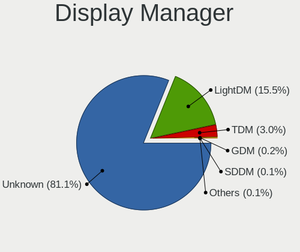

| Name    | Computers | Percent |
|---------|-----------|---------|
| Unknown | 944       | 79.19%  |
| LightDM | 171       | 14.35%  |
| TDM     | 69        | 5.79%   |
| GDM     | 5         | 0.42%   |
| GDM3    | 2         | 0.17%   |
| SDDM    | 1         | 0.08%   |

OS Lang
-------

Language

| Lang    | Computers | Percent |
|---------|-----------|---------|
| en_US   | 491       | 41.19%  |
| de_DE   | 112       | 9.4%    |
| es_ES   | 77        | 6.46%   |
| Unknown | 64        | 5.37%   |
| en_GB   | 60        | 5.03%   |
| pt_BR   | 55        | 4.61%   |
| ru_RU   | 50        | 4.19%   |
| fr_FR   | 40        | 3.36%   |
| it_IT   | 31        | 2.6%    |
| pl_PL   | 23        | 1.93%   |
| en_CA   | 22        | 1.85%   |
| en_AU   | 20        | 1.68%   |
| tr_TR   | 11        | 0.92%   |
| pt_PT   | 11        | 0.92%   |
| en_IN   | 11        | 0.92%   |
| nl_NL   | 9         | 0.76%   |
| es_MX   | 8         | 0.67%   |
| hu_HU   | 7         | 0.59%   |
| zh_CN   | 6         | 0.5%    |
| de_CH   | 6         | 0.5%    |
| cs_CZ   | 6         | 0.5%    |
| es_EC   | 4         | 0.34%   |
| en_ZA   | 4         | 0.34%   |
| uk_UA   | 3         | 0.25%   |
| sv_SE   | 3         | 0.25%   |
| nb_NO   | 3         | 0.25%   |
| id_ID   | 3         | 0.25%   |
| hr_HR   | 3         | 0.25%   |
| fi_FI   | 3         | 0.25%   |
| ca_ES   | 3         | 0.25%   |
| zh_TW   | 2         | 0.17%   |
| ja_JP   | 2         | 0.17%   |
| gl_ES   | 2         | 0.17%   |
| fr_CA   | 2         | 0.17%   |
| fr_BE   | 2         | 0.17%   |
| es_CL   | 2         | 0.17%   |
| es_AR   | 2         | 0.17%   |
| en_PH   | 2         | 0.17%   |
| el_GR   | 2         | 0.17%   |
| de_AT   | 2         | 0.17%   |
| da_DK   | 2         | 0.17%   |
| C       | 2         | 0.17%   |
| vi_VN   | 1         | 0.08%   |
| sr_RS   | 1         | 0.08%   |
| ru_UA   | 1         | 0.08%   |
| ro_RO   | 1         | 0.08%   |
| lt_LT   | 1         | 0.08%   |
| fr_CH   | 1         | 0.08%   |
| et_EE   | 1         | 0.08%   |
| es_VE   | 1         | 0.08%   |
| es_UY   | 1         | 0.08%   |
| es_US   | 1         | 0.08%   |
| es_SV   | 1         | 0.08%   |
| es_PE   | 1         | 0.08%   |
| es_PA   | 1         | 0.08%   |
| es_CO   | 1         | 0.08%   |
| en_IE   | 1         | 0.08%   |
| en_HK   | 1         | 0.08%   |
| de_IT   | 1         | 0.08%   |
| bg_BG   | 1         | 0.08%   |

Boot Mode
---------

EFI or BIOS

| Mode | Computers | Percent |
|------|-----------|---------|
| EFI  | 728       | 61.07%  |
| BIOS | 464       | 38.93%  |

Filesystem
----------

Type of filesystem

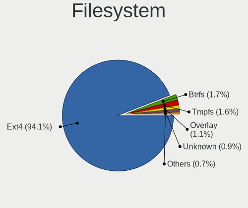

| Type    | Computers | Percent |
|---------|-----------|---------|
| Ext4    | 1115      | 94.17%  |
| Btrfs   | 25        | 2.11%   |
| Unknown | 21        | 1.77%   |
| Overlay | 18        | 1.52%   |
| Xfs     | 4         | 0.34%   |
| Ext3    | 1         | 0.08%   |

Part. scheme
------------

Scheme of partitioning

| Type    | Computers | Percent |
|---------|-----------|---------|
| Unknown | 992       | 83.64%  |
| GPT     | 150       | 12.65%  |
| MBR     | 44        | 3.71%   |

Dual Boot with Linux/BSD
------------------------

Hosting more than one Linux/BSD

| Dual boot | Computers | Percent |
|-----------|-----------|---------|
| No        | 1117      | 94.58%  |
| Yes       | 64        | 5.42%   |

Dual Boot (Win)
---------------

Hosting Linux and Windows

| Dual boot | Computers | Percent |
|-----------|-----------|---------|
| No        | 1021      | 86.16%  |
| Yes       | 164       | 13.84%  |

Board
-----

Vendor
------

Motherboard manufacturer

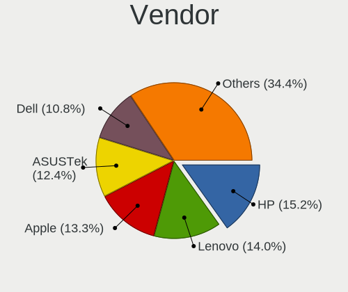

| Name                    | Computers | Percent |
|-------------------------|-----------|---------|
| Hewlett-Packard         | 190       | 16.12%  |
| ASUSTek Computer        | 168       | 14.25%  |
| Lenovo                  | 167       | 14.16%  |
| Dell                    | 128       | 10.86%  |
| Apple                   | 95        | 8.06%   |
| Acer                    | 75        | 6.36%   |
| Gigabyte Technology     | 59        | 5%      |
| MSI                     | 50        | 4.24%   |
| ASRock                  | 26        | 2.21%   |
| Toshiba                 | 25        | 2.12%   |
| Samsung Electronics     | 17        | 1.44%   |
| Intel                   | 15        | 1.27%   |
| Sony                    | 13        | 1.1%    |
| HUAWEI                  | 13        | 1.1%    |
| Microsoft               | 10        | 0.85%   |
| Biostar                 | 9         | 0.76%   |
| Fujitsu                 | 6         | 0.51%   |
| Pegatron                | 5         | 0.42%   |
| Notebook                | 5         | 0.42%   |
| LG Electronics          | 5         | 0.42%   |
| Google                  | 5         | 0.42%   |
| Unknown                 | 5         | 0.42%   |
| Star Labs               | 4         | 0.34%   |
| Packard Bell            | 4         | 0.34%   |
| Foxconn                 | 4         | 0.34%   |
| Timi                    | 3         | 0.25%   |
| Teclast                 | 3         | 0.25%   |
| Medion                  | 3         | 0.25%   |
| eMachines               | 3         | 0.25%   |
| ECS                     | 3         | 0.25%   |
| Compaq                  | 3         | 0.25%   |
| AMI                     | 3         | 0.25%   |
| Wibtek                  | 2         | 0.17%   |
| TUXEDO                  | 2         | 0.17%   |
| TrekStor                | 2         | 0.17%   |
| Razer                   | 2         | 0.17%   |
| Positivo                | 2         | 0.17%   |
| Panasonic               | 2         | 0.17%   |
| Monster                 | 2         | 0.17%   |
| Chuwi                   | 2         | 0.17%   |
| Alienware               | 2         | 0.17%   |
| Acidanthera             | 2         | 0.17%   |
| Wortmann AG             | 1         | 0.08%   |
| WeiBu                   | 1         | 0.08%   |
| T-bao                   | 1         | 0.08%   |
| System76                | 1         | 0.08%   |
| SYS                     | 1         | 0.08%   |
| Standard                | 1         | 0.08%   |
| SNS Network (M)         | 1         | 0.08%   |
| SLIMBOOK                | 1         | 0.08%   |
| Shuttle                 | 1         | 0.08%   |
| Schenker                | 1         | 0.08%   |
| Raspberry Pi Foundation | 1         | 0.08%   |
| Quanta                  | 1         | 0.08%   |
| PIPO                    | 1         | 0.08%   |
| Navigator               | 1         | 0.08%   |
| Multilaser              | 1         | 0.08%   |
| Mediacom                | 1         | 0.08%   |
| LORD ELECTRONICS        | 1         | 0.08%   |
| iOTA                    | 1         | 0.08%   |

Model
-----

Motherboard model

| Name                               | Computers | Percent |
|------------------------------------|-----------|---------|
| ASUS All Series                    | 8         | 0.68%   |
| Unknown                            | 7         | 0.59%   |
| HP Notebook                        | 6         | 0.51%   |
| Apple MacBookPro8,2                | 5         | 0.42%   |
| Apple MacBookAir7,2                | 5         | 0.42%   |
| Lenovo G50-45 80E3                 | 4         | 0.34%   |
| HP Laptop 15-bs0xx                 | 4         | 0.34%   |
| ASUS ZenBook UX425EA_UX425EA       | 4         | 0.34%   |
| ASUS P8H61-M LX3 R2.0              | 4         | 0.34%   |
| Apple MacBookPro8,1                | 4         | 0.34%   |
| Apple MacBookAir4,2                | 4         | 0.34%   |
| Apple MacBook5,1                   | 4         | 0.34%   |
| MSI MS-7C02                        | 3         | 0.25%   |
| HUAWEI MACHD-WXX9                  | 3         | 0.25%   |
| HP ProBook 4540s                   | 3         | 0.25%   |
| HP Pavilion Notebook               | 3         | 0.25%   |
| HP Pavilion g6                     | 3         | 0.25%   |
| HP Laptop 15-db0xxx                | 3         | 0.25%   |
| HP ENVY x360 Convertible 13-ay0xxx | 3         | 0.25%   |
| HP EliteBook 840 G3                | 3         | 0.25%   |
| HP 15                              | 3         | 0.25%   |
| Dell Latitude E6400                | 3         | 0.25%   |
| Dell Inspiron N5110                | 3         | 0.25%   |
| Dell Inspiron 1545                 | 3         | 0.25%   |
| Dell Inspiron 15-3567              | 3         | 0.25%   |
| ASUS X550CA                        | 3         | 0.25%   |
| ASUS PRIME A320M-K                 | 3         | 0.25%   |
| Apple Macmini5,1                   | 3         | 0.25%   |
| Apple MacBookPro9,2                | 3         | 0.25%   |
| Apple MacBookPro9,1                | 3         | 0.25%   |
| Apple MacBookPro5,5                | 3         | 0.25%   |
| Apple MacBook4,1                   | 3         | 0.25%   |
| Apple MacBook2,1                   | 3         | 0.25%   |
| Apple iMac9,1                      | 3         | 0.25%   |
| Apple iMac8,1                      | 3         | 0.25%   |
| Apple iMac7,1                      | 3         | 0.25%   |
| Apple iMac11,3                     | 3         | 0.25%   |
| Wibtek H61-M HDMI2                 | 2         | 0.17%   |
| Timi TM1613                        | 2         | 0.17%   |
| Star Labs StarBook                 | 2         | 0.17%   |
| Samsung 530U3C/530U4C/532U3C       | 2         | 0.17%   |
| Samsung 300E5M/300E5L              | 2         | 0.17%   |
| Pegatron IPMH61P1                  | 2         | 0.17%   |
| MSI Prestige 15 A11UC              | 2         | 0.17%   |
| MSI MS-7C35                        | 2         | 0.17%   |
| MSI MS-7B86                        | 2         | 0.17%   |
| MSI MS-7B84                        | 2         | 0.17%   |
| MSI MS-7817                        | 2         | 0.17%   |
| MSI MS-7721                        | 2         | 0.17%   |
| Microsoft Surface Pro 4            | 2         | 0.17%   |
| Lenovo Yoga 300-11IBR 80M1         | 2         | 0.17%   |
| Lenovo V330-15IKB 81AX             | 2         | 0.17%   |
| Lenovo IdeaPad Yoga 11S 20246      | 2         | 0.17%   |
| Lenovo IdeaPad Y580                | 2         | 0.17%   |
| Lenovo IdeaPad 5 14ARE05 81YM      | 2         | 0.17%   |
| Lenovo IdeaPad 330-15IKB 81FE      | 2         | 0.17%   |
| Lenovo IdeaPad 330-15IKB 81DE      | 2         | 0.17%   |
| Lenovo IdeaPad 320-14AST 80XU      | 2         | 0.17%   |
| Lenovo IdeaPad 310-15IKB 80TV      | 2         | 0.17%   |
| Lenovo IdeaPad 130-15AST 81H5      | 2         | 0.17%   |

Model Family
------------

Motherboard model prefix

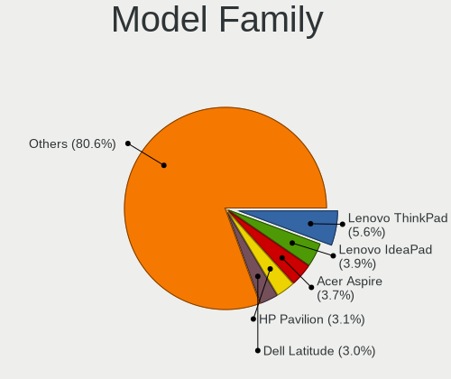

| Name                  | Computers | Percent |
|-----------------------|-----------|---------|
| Lenovo ThinkPad       | 77        | 6.53%   |
| Acer Aspire           | 52        | 4.41%   |
| Lenovo IdeaPad        | 47        | 3.99%   |
| HP Pavilion           | 38        | 3.22%   |
| Dell Inspiron         | 38        | 3.22%   |
| Dell Latitude         | 33        | 2.8%    |
| HP ProBook            | 27        | 2.29%   |
| HP Laptop             | 23        | 1.95%   |
| HP EliteBook          | 23        | 1.95%   |
| Toshiba Satellite     | 21        | 1.78%   |
| Dell XPS              | 17        | 1.44%   |
| ASUS PRIME            | 16        | 1.36%   |
| Dell OptiPlex         | 14        | 1.19%   |
| ASUS ROG              | 14        | 1.19%   |
| HP ENVY               | 12        | 1.02%   |
| ASUS ZenBook          | 12        | 1.02%   |
| ASUS VivoBook         | 12        | 1.02%   |
| Dell Precision        | 11        | 0.93%   |
| Acer Swift            | 11        | 0.93%   |
| Microsoft Surface     | 10        | 0.85%   |
| ASUS TUF              | 10        | 0.85%   |
| Apple MacBookPro8     | 10        | 0.85%   |
| Dell Vostro           | 9         | 0.76%   |
| HP Compaq             | 8         | 0.68%   |
| ASUS All              | 8         | 0.68%   |
| Apple MacBookAir7     | 7         | 0.59%   |
| Unknown               | 7         | 0.59%   |
| Lenovo Yoga           | 6         | 0.51%   |
| Lenovo ThinkCentre    | 6         | 0.51%   |
| HP Notebook           | 6         | 0.51%   |
| ASUS P8H61-M          | 6         | 0.51%   |
| Apple MacBookPro9     | 6         | 0.51%   |
| Apple MacBook5        | 6         | 0.51%   |
| Gigabyte Z390         | 5         | 0.42%   |
| Apple MacBookPro5     | 5         | 0.42%   |
| Apple iMac11          | 5         | 0.42%   |
| Lenovo G50-45         | 4         | 0.34%   |
| HP ProDesk            | 4         | 0.34%   |
| HP 250                | 4         | 0.34%   |
| Fujitsu LIFEBOOK      | 4         | 0.34%   |
| Apple MacBookPro11    | 4         | 0.34%   |
| Apple MacBookAir6     | 4         | 0.34%   |
| Apple MacBookAir4     | 4         | 0.34%   |
| Packard Bell EasyNote | 3         | 0.25%   |
| MSI MS-7C02           | 3         | 0.25%   |
| Lenovo ThinkBook      | 3         | 0.25%   |
| Lenovo Legion         | 3         | 0.25%   |
| HUAWEI MACHD-WXX9     | 3         | 0.25%   |
| HP ZBook              | 3         | 0.25%   |
| HP Stream             | 3         | 0.25%   |
| HP Presario           | 3         | 0.25%   |
| HP 15                 | 3         | 0.25%   |
| Gigabyte X570         | 3         | 0.25%   |
| Compaq Presario       | 3         | 0.25%   |
| ASUS X550CA           | 3         | 0.25%   |
| ASUS SABERTOOTH       | 3         | 0.25%   |
| ASUS M5A78L-M         | 3         | 0.25%   |
| Apple Macmini5        | 3         | 0.25%   |
| Apple MacBookPro10    | 3         | 0.25%   |
| Apple MacBook4        | 3         | 0.25%   |

MFG Year
--------

Motherboard manufacture year

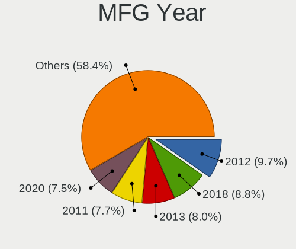

| Year    | Computers | Percent |
|---------|-----------|---------|
| 2018    | 126       | 10.69%  |
| 2012    | 109       | 9.25%   |
| 2020    | 103       | 8.74%   |
| 2019    | 102       | 8.65%   |
| 2013    | 100       | 8.48%   |
| 2011    | 90        | 7.63%   |
| 2015    | 81        | 6.87%   |
| 2017    | 77        | 6.53%   |
| 2016    | 76        | 6.45%   |
| 2010    | 72        | 6.11%   |
| 2014    | 69        | 5.85%   |
| 2021    | 58        | 4.92%   |
| 2009    | 47        | 3.99%   |
| 2008    | 41        | 3.48%   |
| 2007    | 16        | 1.36%   |
| 2006    | 5         | 0.42%   |
| 2022    | 4         | 0.34%   |
| Unknown | 2         | 0.17%   |
| 2005    | 1         | 0.08%   |

Form Factor
-----------

Physical design of the computer

| Name           | Computers | Percent |
|----------------|-----------|---------|
| Notebook       | 753       | 63.87%  |
| Desktop        | 323       | 27.4%   |
| All in one     | 36        | 3.05%   |
| Convertible    | 30        | 2.54%   |
| Tablet         | 19        | 1.61%   |
| Mini pc        | 14        | 1.19%   |
| Server         | 3         | 0.25%   |
| System on chip | 1         | 0.08%   |

Secure Boot
-----------

Enabled or disabled

| State    | Computers | Percent |
|----------|-----------|---------|
| Disabled | 1049      | 88.75%  |
| Enabled  | 133       | 11.25%  |

Coreboot
--------

Have coreboot on board

| Used | Computers | Percent |
|------|-----------|---------|
| No   | 1169      | 99.15%  |
| Yes  | 10        | 0.85%   |

RAM Size
--------

Total RAM memory

| Size in GB  | Computers | Percent |
|-------------|-----------|---------|
| 4.01-8.0    | 331       | 27.93%  |
| 3.01-4.0    | 249       | 21.01%  |
| 8.01-16.0   | 218       | 18.4%   |
| 16.01-24.0  | 215       | 18.14%  |
| 32.01-64.0  | 88        | 7.43%   |
| 1.01-2.0    | 46        | 3.88%   |
| 2.01-3.0    | 13        | 1.1%    |
| 64.01-256.0 | 12        | 1.01%   |
| 24.01-32.0  | 11        | 0.93%   |
| 0.51-1.0    | 2         | 0.17%   |

RAM Used
--------

Used RAM memory

| Used GB    | Computers | Percent |
|------------|-----------|---------|
| 1.01-2.0   | 499       | 39.17%  |
| 2.01-3.0   | 360       | 28.26%  |
| 3.01-4.0   | 194       | 15.23%  |
| 4.01-8.0   | 149       | 11.7%   |
| 0.51-1.0   | 39        | 3.06%   |
| 8.01-16.0  | 30        | 2.35%   |
| 32.01-64.0 | 1         | 0.08%   |
| 24.01-32.0 | 1         | 0.08%   |
| 16.01-24.0 | 1         | 0.08%   |

Total Drives
------------

Number of drives on board

| Drives  | Computers | Percent |
|---------|-----------|---------|
| 1       | 752       | 62.88%  |
| 2       | 323       | 27.01%  |
| 3       | 56        | 4.68%   |
| 4       | 28        | 2.34%   |
| 5       | 17        | 1.42%   |
| 6       | 7         | 0.59%   |
| 0       | 7         | 0.59%   |
| 7       | 4         | 0.33%   |
| 8       | 1         | 0.08%   |
| Unknown | 1         | 0.08%   |

Has CD-ROM
----------

Has CD-ROM on board

| Presented | Computers | Percent |
|-----------|-----------|---------|
| No        | 744       | 62.47%  |
| Yes       | 447       | 37.53%  |

Has Ethernet
------------

Has Ethernet on board

| Presented | Computers | Percent |
|-----------|-----------|---------|
| Yes       | 963       | 81.68%  |
| No        | 216       | 18.32%  |

Has WiFi
--------

Has WiFi module

| Presented | Computers | Percent |
|-----------|-----------|---------|
| Yes       | 994       | 83.88%  |
| No        | 191       | 16.12%  |

Has Bluetooth
-------------

Has Bluetooth module

| Presented | Computers | Percent |
|-----------|-----------|---------|
| Yes       | 841       | 70.73%  |
| No        | 348       | 29.27%  |

Location
--------

Country
-------

Geographic location (country)

| Country      | Computers | Percent |
|--------------|-----------|---------|
| USA          | 155       | 13.12%  |
| Germany      | 115       | 9.74%   |
| Brazil       | 81        | 6.86%   |
| UK           | 64        | 5.42%   |
| Russia       | 59        | 5%      |
| India        | 49        | 4.15%   |
| Spain        | 44        | 3.73%   |
| Italy        | 40        | 3.39%   |
| Canada       | 39        | 3.3%    |
| France       | 35        | 2.96%   |
| Indonesia    | 32        | 2.71%   |
| Mexico       | 31        | 2.62%   |
| Australia    | 29        | 2.46%   |
| Poland       | 27        | 2.29%   |
| Turkey       | 23        | 1.95%   |
| Argentina    | 21        | 1.78%   |
| Netherlands  | 20        | 1.69%   |
| Austria      | 17        | 1.44%   |
| Ukraine      | 14        | 1.19%   |
| Portugal     | 13        | 1.1%    |
| Belgium      | 13        | 1.1%    |
| Switzerland  | 12        | 1.02%   |
| Czechia      | 11        | 0.93%   |
| Sweden       | 10        | 0.85%   |
| Chile        | 10        | 0.85%   |
| Malaysia     | 9         | 0.76%   |
| Romania      | 8         | 0.68%   |
| Norway       | 8         | 0.68%   |
| New Zealand  | 8         | 0.68%   |
| Hungary      | 8         | 0.68%   |
| South Africa | 7         | 0.59%   |
| Ireland      | 7         | 0.59%   |
| Finland      | 7         | 0.59%   |
| Colombia     | 7         | 0.59%   |
| China        | 7         | 0.59%   |
| Greece       | 6         | 0.51%   |
| Denmark      | 6         | 0.51%   |
| Philippines  | 5         | 0.42%   |
| Kenya        | 5         | 0.42%   |
| Japan        | 5         | 0.42%   |
| Egypt        | 5         | 0.42%   |
| Croatia      | 5         | 0.42%   |
| Bulgaria     | 5         | 0.42%   |
| Belarus      | 5         | 0.42%   |
| Vietnam      | 4         | 0.34%   |
| Peru         | 4         | 0.34%   |
| Iran         | 4         | 0.34%   |
| Hong Kong    | 4         | 0.34%   |
| Estonia      | 4         | 0.34%   |
| Ecuador      | 4         | 0.34%   |
| Venezuela    | 3         | 0.25%   |
| Thailand     | 3         | 0.25%   |
| Serbia       | 3         | 0.25%   |
| Nicaragua    | 3         | 0.25%   |
| Lithuania    | 3         | 0.25%   |
| Latvia       | 3         | 0.25%   |
| Israel       | 3         | 0.25%   |
| Uruguay      | 2         | 0.17%   |
| Sri Lanka    | 2         | 0.17%   |
| Paraguay     | 2         | 0.17%   |

City
----

Geographic location (city)

| City              | Computers | Percent |
|-------------------|-----------|---------|
| Moscow            | 14        | 1.14%   |
| Warsaw            | 11        | 0.9%    |
| Sydney            | 11        | 0.9%    |
| Berlin            | 10        | 0.81%   |
| Vienna            | 9         | 0.73%   |
| Hamburg           | 9         | 0.73%   |
| Sao Paulo         | 8         | 0.65%   |
| Rio de Janeiro    | 8         | 0.65%   |
| Paris             | 8         | 0.65%   |
| Milan             | 8         | 0.65%   |
| Istanbul          | 8         | 0.65%   |
| Munich            | 7         | 0.57%   |
| Mexico City       | 7         | 0.57%   |
| Madrid            | 7         | 0.57%   |
| Montreal          | 6         | 0.49%   |
| Jakarta           | 6         | 0.49%   |
| Fortaleza         | 6         | 0.49%   |
| Dublin            | 6         | 0.49%   |
| The Hague         | 5         | 0.41%   |
| St Petersburg     | 5         | 0.41%   |
| Perth             | 5         | 0.41%   |
| Nairobi           | 5         | 0.41%   |
| Brisbane          | 5         | 0.41%   |
| Zagreb            | 4         | 0.33%   |
| Valencia          | 4         | 0.33%   |
| Surabaya          | 4         | 0.33%   |
| Sofia             | 4         | 0.33%   |
| Santo Andr      | 4         | 0.33%   |
| Rome              | 4         | 0.33%   |
| Novosibirsk       | 4         | 0.33%   |
| Mumbai            | 4         | 0.33%   |
| Kolkata           | 4         | 0.33%   |
| Dresden           | 4         | 0.33%   |
| Delhi             | 4         | 0.33%   |
| Crdoba          | 4         | 0.33%   |
| Cairo             | 4         | 0.33%   |
| Bogor             | 4         | 0.33%   |
| Vernon            | 3         | 0.24%   |
| Tucson            | 3         | 0.24%   |
| Toronto           | 3         | 0.24%   |
| Tangerang         | 3         | 0.24%   |
| Sassnitz          | 3         | 0.24%   |
| Santiago          | 3         | 0.24%   |
| Prague            | 3         | 0.24%   |
| Porto             | 3         | 0.24%   |
| Morelia           | 3         | 0.24%   |
| Minsk             | 3         | 0.24%   |
| Melbourne         | 3         | 0.24%   |
| Managua           | 3         | 0.24%   |
| Louisville        | 3         | 0.24%   |
| Los Angeles       | 3         | 0.24%   |
| Landing           | 3         | 0.24%   |
| Kyiv              | 3         | 0.24%   |
| Krakow            | 3         | 0.24%   |
| Jaipur            | 3         | 0.24%   |
| Frankfurt am Main | 3         | 0.24%   |
| Essen             | 3         | 0.24%   |
| Denver            | 3         | 0.24%   |
| Chelyabinsk       | 3         | 0.24%   |
| Central           | 3         | 0.24%   |

Drives
------

Drive Vendor
------------

Hard drive vendors

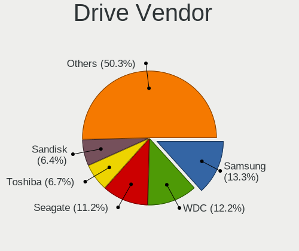

| Vendor                    | Computers | Drives | Percent |
|---------------------------|-----------|--------|---------|
| Samsung Electronics       | 228       | 316    | 14%     |
| WDC                       | 217       | 293    | 13.32%  |
| Seagate                   | 213       | 270    | 13.08%  |
| Toshiba                   | 126       | 158    | 7.73%   |
| SanDisk                   | 107       | 116    | 6.57%   |
| Kingston                  | 105       | 137    | 6.45%   |
| Unknown                   | 82        | 104    | 5.03%   |
| Crucial                   | 67        | 82     | 4.11%   |
| Hitachi                   | 52        | 54     | 3.19%   |
| HGST                      | 44        | 55     | 2.7%    |
| Intel                     | 37        | 44     | 2.27%   |
| Apple                     | 33        | 36     | 2.03%   |
| SK hynix                  | 32        | 34     | 1.96%   |
| A-DATA Technology         | 25        | 28     | 1.53%   |
| Micron Technology         | 21        | 24     | 1.29%   |
| Phison                    | 14        | 15     | 0.86%   |
| KIOXIA                    | 14        | 20     | 0.86%   |
| China                     | 13        | 13     | 0.8%    |
| PNY                       | 10        | 17     | 0.61%   |
| Fujitsu                   | 9         | 10     | 0.55%   |
| Transcend                 | 8         | 9      | 0.49%   |
| OCZ                       | 8         | 12     | 0.49%   |
| Micron/Crucial Technology | 7         | 12     | 0.43%   |
| LITEON                    | 7         | 7      | 0.43%   |
| Silicon Motion            | 6         | 7      | 0.37%   |
| Patriot                   | 6         | 8      | 0.37%   |
| JMicron Technology        | 6         | 6      | 0.37%   |
| Gigabyte Technology       | 5         | 5      | 0.31%   |
| Team                      | 4         | 5      | 0.25%   |
| Plextor                   | 4         | 5      | 0.25%   |
| Lite-On                   | 4         | 4      | 0.25%   |
| Hewlett-Packard           | 4         | 4      | 0.25%   |
| Corsair                   | 4         | 4      | 0.25%   |
| Unknown                   | 4         | 5      | 0.25%   |
| TO Exter                  | 3         | 3      | 0.18%   |
| SPCC                      | 3         | 3      | 0.18%   |
| Netac                     | 3         | 3      | 0.18%   |
| Maxtor                    | 3         | 3      | 0.18%   |
| Leven                     | 3         | 3      | 0.18%   |
| KingFast                  | 3         | 3      | 0.18%   |
| KingDian                  | 3         | 4      | 0.18%   |
| Intenso                   | 3         | 3      | 0.18%   |
| GOODRAM                   | 3         | 6      | 0.18%   |
| FORESEE                   | 3         | 3      | 0.18%   |
| ASMT                      | 3         | 3      | 0.18%   |
| Apacer                    | 3         | 3      | 0.18%   |
| XPG                       | 2         | 2      | 0.12%   |
| V-GeN                     | 2         | 2      | 0.12%   |
| Teclast                   | 2         | 2      | 0.12%   |
| Star Drive                | 2         | 2      | 0.12%   |
| Star                      | 2         | 2      | 0.12%   |
| Realtek Semiconductor     | 2         | 2      | 0.12%   |
| NGFF                      | 2         | 2      | 0.12%   |
| LITEONIT                  | 2         | 2      | 0.12%   |
| KingSpec                  | 2         | 2      | 0.12%   |
| EYOTA                     | 2         | 2      | 0.12%   |
| Dogfish                   | 2         | 3      | 0.12%   |
| ZTE                       | 1         | 1      | 0.06%   |
| WDC WDS                   | 1         | 1      | 0.06%   |
| VT                        | 1         | 1      | 0.06%   |

Drive Model
-----------

Hard drive models

| Model                               | Computers | Percent |
|-------------------------------------|-----------|---------|
| Kingston SA400S37240G 240GB SSD     | 30        | 1.72%   |
| Samsung NVMe SSD Drive 512GB        | 22        | 1.26%   |
| Toshiba MQ01ABD100 1TB              | 21        | 1.2%    |
| Samsung NVMe SSD Drive 256GB        | 20        | 1.15%   |
| Unknown MMC Card  32GB              | 19        | 1.09%   |
| Unknown MMC Card  64GB              | 16        | 0.92%   |
| SanDisk NVMe SSD Drive 512GB        | 16        | 0.92%   |
| Samsung NVMe SSD Drive 500GB        | 16        | 0.92%   |
| Samsung SSD 850 EVO 250GB           | 15        | 0.86%   |
| Kingston SA400S37120G 120GB SSD     | 15        | 0.86%   |
| Seagate ST1000LM035-1RK172 1TB      | 14        | 0.8%    |
| Toshiba MQ04ABF100 1TB              | 13        | 0.75%   |
| Seagate ST500LT012-1DG142 500GB     | 13        | 0.75%   |
| Seagate ST1000LM024 HN-M101MBB 1TB  | 12        | 0.69%   |
| Samsung SSD 860 EVO 250GB           | 12        | 0.69%   |
| Intel NVMe SSD Drive 512GB          | 12        | 0.69%   |
| HGST HTS721010A9E630 1TB            | 12        | 0.69%   |
| Unknown MMC Card  128GB             | 11        | 0.63%   |
| Toshiba KBG30ZMS128G 128GB NVMe SSD | 11        | 0.63%   |
| Kingston SV300S37A120G 120GB SSD    | 11        | 0.63%   |
| WDC WDS240G2G0A-00JH30 240GB SSD    | 10        | 0.57%   |
| SK hynix NVMe SSD Drive 512GB       | 10        | 0.57%   |
| Samsung SSD 860 EVO 500GB           | 10        | 0.57%   |
| Samsung NVMe SSD Drive 1TB          | 10        | 0.57%   |
| WDC WD10EZEX-08WN4A0 1TB            | 9         | 0.52%   |
| Toshiba MQ01ABF050 500GB            | 9         | 0.52%   |
| Crucial CT240BX500SSD1 240GB        | 9         | 0.52%   |
| SK hynix NVMe SSD Drive 256GB       | 8         | 0.46%   |
| Seagate ST500DM002-1BD142 500GB     | 8         | 0.46%   |
| SanDisk NVMe SSD Drive 256GB        | 8         | 0.46%   |
| Samsung SSD 860 EVO 1TB             | 8         | 0.46%   |
| Samsung SSD 850 EVO 500GB           | 8         | 0.46%   |
| HGST HTS545050A7E680 500GB          | 8         | 0.46%   |
| Toshiba DT01ACA100 1TB              | 7         | 0.4%    |
| Toshiba DT01ACA050 500GB            | 7         | 0.4%    |
| Seagate ST1000DM003-1ER162 1TB      | 7         | 0.4%    |
| Samsung SSD 840 EVO 250GB           | 7         | 0.4%    |
| HGST HTS541010A9E680 1TB            | 7         | 0.4%    |
| Crucial CT1000MX500SSD1 1TB         | 7         | 0.4%    |
| WDC WDS500G2B0A-00SM50 500GB SSD    | 6         | 0.34%   |
| Unknown MMC Card  16GB              | 6         | 0.34%   |
| Toshiba NVMe SSD Drive 512GB        | 6         | 0.34%   |
| Seagate ST3500418AS 500GB           | 6         | 0.34%   |
| Seagate ST1000DM010-2EP102 1TB      | 6         | 0.34%   |
| SanDisk SSD PLUS 480GB              | 6         | 0.34%   |
| SanDisk NVMe SSD Drive 500GB        | 6         | 0.34%   |
| Samsung SSD 840 EVO 120GB           | 6         | 0.34%   |
| Phison NVMe SSD Drive 1TB           | 6         | 0.34%   |
| HGST HTS725050A7E630 500GB          | 6         | 0.34%   |
| Crucial CT480BX500SSD1 480GB        | 6         | 0.34%   |
| Crucial CT120BX500SSD1 120GB        | 6         | 0.34%   |
| A-DATA SU650 120GB SSD              | 6         | 0.34%   |
| WDC WD5000LPVX-22V0TT0 500GB        | 5         | 0.29%   |
| WDC WD10JPVX-22JC3T0 1TB            | 5         | 0.29%   |
| WDC WD10JPCX-24UE4T0 1TB            | 5         | 0.29%   |
| WDC WD10EZEX-00BN5A0 1TB            | 5         | 0.29%   |
| Seagate ST9500325AS 500GB           | 5         | 0.29%   |
| Seagate ST31000528AS 1TB            | 5         | 0.29%   |
| SanDisk SSD PLUS 240GB              | 5         | 0.29%   |
| Samsung SSD 860 QVO 1TB             | 5         | 0.29%   |

HDD Vendor
----------

Hard disk drive vendors

| Vendor              | Computers | Drives | Percent |
|---------------------|-----------|--------|---------|
| Seagate             | 209       | 262    | 33.39%  |
| WDC                 | 171       | 228    | 27.32%  |
| Toshiba             | 100       | 129    | 15.97%  |
| Hitachi             | 52        | 54     | 8.31%   |
| HGST                | 44        | 55     | 7.03%   |
| Samsung Electronics | 22        | 25     | 3.51%   |
| Fujitsu             | 9         | 10     | 1.44%   |
| Apple               | 8         | 8      | 1.28%   |
| Unknown             | 3         | 4      | 0.48%   |
| ASMT                | 3         | 3      | 0.48%   |
| Maxtor              | 2         | 2      | 0.32%   |
| SABRENT             | 1         | 1      | 0.16%   |
| Hewlett-Packard     | 1         | 1      | 0.16%   |
| Ext Hard            | 1         | 1      | 0.16%   |

SSD Vendor
----------

Solid state drive vendors

| Vendor              | Computers | Drives | Percent |
|---------------------|-----------|--------|---------|
| Samsung Electronics | 131       | 170    | 21.06%  |
| Kingston            | 88        | 102    | 14.15%  |
| SanDisk             | 67        | 73     | 10.77%  |
| Crucial             | 66        | 80     | 10.61%  |
| WDC                 | 37        | 46     | 5.95%   |
| Apple               | 24        | 25     | 3.86%   |
| A-DATA Technology   | 23        | 26     | 3.7%    |
| Intel               | 16        | 16     | 2.57%   |
| Micron Technology   | 13        | 15     | 2.09%   |
| China               | 13        | 13     | 2.09%   |
| Toshiba             | 10        | 10     | 1.61%   |
| PNY                 | 10        | 17     | 1.61%   |
| Transcend           | 8         | 9      | 1.29%   |
| OCZ                 | 8         | 12     | 1.29%   |
| LITEON              | 7         | 7      | 1.13%   |
| SK hynix            | 6         | 6      | 0.96%   |
| Patriot             | 6         | 8      | 0.96%   |
| Team                | 4         | 5      | 0.64%   |
| Plextor             | 4         | 5      | 0.64%   |
| Corsair             | 4         | 4      | 0.64%   |
| TO Exter            | 3         | 3      | 0.48%   |
| SPCC                | 3         | 3      | 0.48%   |
| Intenso             | 3         | 3      | 0.48%   |
| Hewlett-Packard     | 3         | 3      | 0.48%   |
| GOODRAM             | 3         | 6      | 0.48%   |
| Gigabyte Technology | 3         | 3      | 0.48%   |
| FORESEE             | 3         | 3      | 0.48%   |
| Apacer              | 3         | 3      | 0.48%   |
| Teclast             | 2         | 2      | 0.32%   |
| Star                | 2         | 2      | 0.32%   |
| NGFF                | 2         | 2      | 0.32%   |
| Netac               | 2         | 2      | 0.32%   |
| LITEONIT            | 2         | 2      | 0.32%   |
| Leven               | 2         | 2      | 0.32%   |
| KingSpec            | 2         | 2      | 0.32%   |
| KingDian            | 2         | 3      | 0.32%   |
| JMicron Technology  | 2         | 2      | 0.32%   |
| Dogfish             | 2         | 3      | 0.32%   |
| WDC WDS             | 1         | 1      | 0.16%   |
| VT                  | 1         | 1      | 0.16%   |
| V-GeN               | 1         | 1      | 0.16%   |
| TSA                 | 1         | 1      | 0.16%   |
| TrekStor            | 1         | 1      | 0.16%   |
| tigo                | 1         | 1      | 0.16%   |
| Super Talent        | 1         | 1      | 0.16%   |
| StoreJet            | 1         | 1      | 0.16%   |
| Smartbuy            | 1         | 1      | 0.16%   |
| Seagate             | 1         | 2      | 0.16%   |
| ROG                 | 1         | 1      | 0.16%   |
| Pichau              | 1         | 1      | 0.16%   |
| Phison              | 1         | 1      | 0.16%   |
| OWC                 | 1         | 1      | 0.16%   |
| OCZ-VERTEX3         | 1         | 1      | 0.16%   |
| OCZ-VERTEX2         | 1         | 2      | 0.16%   |
| MidasForce          | 1         | 1      | 0.16%   |
| Mercury             | 1         | 1      | 0.16%   |
| MENGMI              | 1         | 1      | 0.16%   |
| Maxtor              | 1         | 1      | 0.16%   |
| LS                  | 1         | 1      | 0.16%   |
| Lexar               | 1         | 1      | 0.16%   |

Drive Kind
----------

HDD or SSD

| Kind    | Computers | Drives | Percent |
|---------|-----------|--------|---------|
| HDD     | 563       | 783    | 37.28%  |
| SSD     | 554       | 733    | 36.69%  |
| NVMe    | 286       | 382    | 18.94%  |
| MMC     | 72        | 84     | 4.77%   |
| Unknown | 35        | 47     | 2.32%   |

Drive Connector
---------------

SATA, SAS, NVMe, etc.

| Type | Computers | Drives | Percent |
|------|-----------|--------|---------|
| SATA | 942       | 1494   | 69.67%  |
| NVMe | 286       | 382    | 21.15%  |
| MMC  | 72        | 84     | 5.33%   |
| SAS  | 52        | 69     | 3.85%   |

Drive Size
----------

Size of hard drive

| Size in TB | Computers | Drives | Percent |
|------------|-----------|--------|---------|
| 0.01-0.5   | 730       | 1012   | 65.65%  |
| 0.51-1.0   | 299       | 385    | 26.89%  |
| 1.01-2.0   | 46        | 61     | 4.14%   |
| 2.01-3.0   | 16        | 33     | 1.44%   |
| 3.01-4.0   | 11        | 13     | 0.99%   |
| 4.01-10.0  | 10        | 12     | 0.9%    |

Space Total
-----------

Amount of disk space available on the file system

| Size in GB     | Computers | Percent |
|----------------|-----------|---------|
| 101-250        | 436       | 36%     |
| 251-500        | 314       | 25.93%  |
| 501-1000       | 173       | 14.29%  |
| 51-100         | 94        | 7.76%   |
| 1001-2000      | 70        | 5.78%   |
| 21-50          | 62        | 5.12%   |
| More than 3000 | 24        | 1.98%   |
| 1-20           | 17        | 1.4%    |
| 2001-3000      | 16        | 1.32%   |
| Unknown        | 5         | 0.41%   |

Space Used
----------

Amount of used disk space

| Used GB        | Computers | Percent |
|----------------|-----------|---------|
| 1-20           | 534       | 42.41%  |
| 21-50          | 281       | 22.32%  |
| 51-100         | 154       | 12.23%  |
| 101-250        | 136       | 10.8%   |
| 251-500        | 66        | 5.24%   |
| 501-1000       | 49        | 3.89%   |
| 1001-2000      | 20        | 1.59%   |
| More than 3000 | 7         | 0.56%   |
| 2001-3000      | 7         | 0.56%   |
| Unknown        | 5         | 0.4%    |

Malfunc. Drives
---------------

Drive models with a malfunction

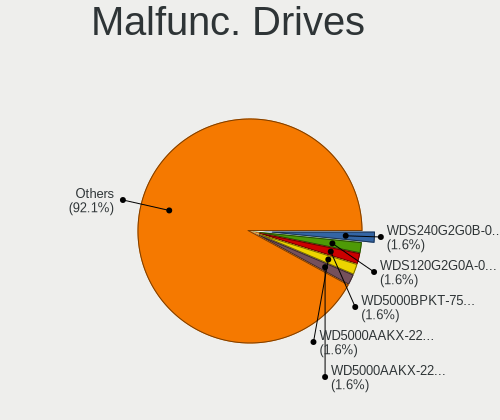

| Model                                   | Computers | Drives | Percent |
|-----------------------------------------|-----------|--------|---------|
| WDC WDS240G2G0B-00EPW0 240GB SSD        | 1         | 1      | 2.13%   |
| WDC WD5000BPKT-75PK4T0 500GB            | 1         | 1      | 2.13%   |
| WDC WD5000AAKX-22ERMA0 500GB            | 1         | 1      | 2.13%   |
| WDC WD5000AAKX-221CA1 500GB             | 1         | 1      | 2.13%   |
| WDC WD5000AAKX-00ERMA0 500GB            | 1         | 1      | 2.13%   |
| WDC WD5000AAKS-00UU3A0 500GB            | 1         | 1      | 2.13%   |
| WDC WD3200AAJS-56B4A0 320GB             | 1         | 1      | 2.13%   |
| WDC WD10SPZX-24Z10 1TB                  | 1         | 1      | 2.13%   |
| WDC WD10EZEX-00KUWA0 1TB                | 1         | 1      | 2.13%   |
| WDC WD1003FZEX-00MK2A0 1TB              | 1         | 1      | 2.13%   |
| Toshiba MQ01ABD100 1TB                  | 1         | 1      | 2.13%   |
| Toshiba MK3259GSXP 320GB                | 1         | 1      | 2.13%   |
| Toshiba KBG30ZPZ128G 128GB              | 1         | 1      | 2.13%   |
| Seagate ST500LT012-9WS142 500GB         | 1         | 1      | 2.13%   |
| Seagate ST500LM030-2E717D 500GB         | 1         | 1      | 2.13%   |
| Seagate ST500DM002-1BD142 500GB         | 1         | 1      | 2.13%   |
| Seagate ST3500414CS 500GB               | 1         | 2      | 2.13%   |
| Seagate ST3500312CS 500GB               | 1         | 1      | 2.13%   |
| Seagate ST3320613AS 320GB               | 1         | 1      | 2.13%   |
| Seagate ST320LT020-9YG142 320GB         | 1         | 1      | 2.13%   |
| Seagate ST3160813AS 160GB               | 1         | 1      | 2.13%   |
| Seagate ST2000DM006-2DM164 2TB          | 1         | 1      | 2.13%   |
| Seagate ST1000LX015-1U7172-SSHD 1TB     | 1         | 1      | 2.13%   |
| Seagate ST1000LM024 HN-M101MBB 1TB      | 1         | 1      | 2.13%   |
| SanDisk SSD PLUS 240GB                  | 1         | 1      | 2.13%   |
| SanDisk SD9SN8W-128G-1006 128GB SSD     | 1         | 1      | 2.13%   |
| SanDisk SD7SB3Q256G1002 256GB SSD       | 1         | 1      | 2.13%   |
| Samsung Electronics HD322GJ 320GB       | 1         | 1      | 2.13%   |
| Samsung Electronics HD204UI 2TB         | 1         | 1      | 2.13%   |
| Samsung Electronics HD160JJ 160GB       | 1         | 1      | 2.13%   |
| Kingston SV300S37A240G 240GB SSD        | 1         | 1      | 2.13%   |
| Kingston SUV400S37480G 480GB SSD        | 1         | 1      | 2.13%   |
| Kingston SA400S37120G 120GB SSD         | 1         | 1      | 2.13%   |
| Kingston RBU-SNS8350DES3128GP 128GB SSD | 1         | 1      | 2.13%   |
| Hitachi HTS542525K9SA00 250GB           | 1         | 1      | 2.13%   |
| Hitachi HDT721064SLA360 640GB           | 1         | 1      | 2.13%   |
| Hitachi HDS721010CLA332 1TB             | 1         | 1      | 2.13%   |
| HGST HUS724030ALA640 3TB                | 1         | 1      | 2.13%   |
| HGST HTS725050A7E630 500GB              | 1         | 1      | 2.13%   |
| HGST HTS721010A9E630 1TB                | 1         | 1      | 2.13%   |
| HGST HTS541010A9E680 1TB                | 1         | 1      | 2.13%   |
| Fujitsu MHZ2160BH G2 160GB              | 1         | 2      | 2.13%   |
| Crucial CT512M550SSD3 512GB             | 1         | 1      | 2.13%   |
| Crucial CT256M550SSD1 256GB             | 1         | 1      | 2.13%   |
| Apple SSD SM256C 256GB                  | 1         | 1      | 2.13%   |
| Apple HDD HTS541010A9E662 1TB           | 1         | 1      | 2.13%   |
| A-DATA Technology SP900NS38 128GB SSD   | 1         | 1      | 2.13%   |

Malfunc. Drive Vendor
---------------------

Vendors of faulty drives

| Vendor              | Computers | Drives | Percent |
|---------------------|-----------|--------|---------|
| Seagate             | 11        | 12     | 23.4%   |
| WDC                 | 10        | 10     | 21.28%  |
| Kingston            | 4         | 4      | 8.51%   |
| HGST                | 4         | 4      | 8.51%   |
| Toshiba             | 3         | 3      | 6.38%   |
| SanDisk             | 3         | 3      | 6.38%   |
| Samsung Electronics | 3         | 3      | 6.38%   |
| Hitachi             | 3         | 3      | 6.38%   |
| Crucial             | 2         | 2      | 4.26%   |
| Apple               | 2         | 2      | 4.26%   |
| Fujitsu             | 1         | 2      | 2.13%   |
| A-DATA Technology   | 1         | 1      | 2.13%   |

Malfunc. HDD Vendor
-------------------

Vendors of faulty HDD drives

| Vendor              | Computers | Drives | Percent |
|---------------------|-----------|--------|---------|
| Seagate             | 11        | 12     | 32.35%  |
| WDC                 | 9         | 9      | 26.47%  |
| HGST                | 4         | 4      | 11.76%  |
| Samsung Electronics | 3         | 3      | 8.82%   |
| Hitachi             | 3         | 3      | 8.82%   |
| Toshiba             | 2         | 2      | 5.88%   |
| Fujitsu             | 1         | 2      | 2.94%   |
| Apple               | 1         | 1      | 2.94%   |

Malfunc. Drive Kind
-------------------

Kinds of faulty drives

| Kind | Computers | Drives | Percent |
|------|-----------|--------|---------|
| HDD  | 31        | 36     | 70.45%  |
| SSD  | 12        | 12     | 27.27%  |
| NVMe | 1         | 1      | 2.27%   |

Failed Drives
-------------

Failed drive models

| Model                    | Computers | Drives | Percent |
|--------------------------|-----------|--------|---------|
| WDC WD10SPZX-75Z10T1 1TB | 1         | 1      | 100%    |

Failed Drive Vendor
-------------------

Failed drive vendors

| Vendor | Computers | Drives | Percent |
|--------|-----------|--------|---------|
| WDC    | 1         | 1      | 100%    |

Drive Status
------------

Number of failed and malfunc. drives

| Status   | Computers | Drives | Percent |
|----------|-----------|--------|---------|
| Detected | 1006      | 1715   | 82.06%  |
| Works    | 176       | 264    | 14.36%  |
| Malfunc  | 43        | 49     | 3.51%   |
| Failed   | 1         | 1      | 0.08%   |

Storage controller
------------------

Storage Vendor
--------------

Storage controller vendors

| Vendor                         | Computers | Percent |
|--------------------------------|-----------|---------|
| Intel                          | 844       | 60.37%  |
| AMD                            | 174       | 12.45%  |
| Samsung Electronics            | 110       | 7.87%   |
| SanDisk                        | 53        | 3.79%   |
| Nvidia                         | 35        | 2.5%    |
| SK hynix                       | 26        | 1.86%   |
| Kingston Technology Company    | 20        | 1.43%   |
| Toshiba America Info Systems   | 18        | 1.29%   |
| Phison Electronics             | 16        | 1.14%   |
| Marvell Technology Group       | 14        | 1%      |
| ASMedia Technology             | 14        | 1%      |
| KIOXIA                         | 13        | 0.93%   |
| JMicron Technology             | 9         | 0.64%   |
| Micron/Crucial Technology      | 8         | 0.57%   |
| Micron Technology              | 8         | 0.57%   |
| Silicon Motion                 | 6         | 0.43%   |
| ADATA Technology               | 6         | 0.43%   |
| Realtek Semiconductor          | 4         | 0.29%   |
| Lite-On Technology             | 4         | 0.29%   |
| Seagate Technology             | 3         | 0.21%   |
| Union Memory (Shenzhen)        | 2         | 0.14%   |
| LSI Logic / Symbios Logic      | 2         | 0.14%   |
| Broadcom / LSI                 | 2         | 0.14%   |
| Apple                          | 2         | 0.14%   |
| VIA Technologies               | 1         | 0.07%   |
| Solid State Storage Technology | 1         | 0.07%   |
| Silicon Image                  | 1         | 0.07%   |
| Hewlett-Packard                | 1         | 0.07%   |
| Biwin Storage Technology       | 1         | 0.07%   |

Storage Model
-------------

Storage controller models

| Model                                                                                   | Computers | Percent |
|-----------------------------------------------------------------------------------------|-----------|---------|
| AMD FCH SATA Controller [AHCI mode]                                                     | 134       | 8.54%   |
| Intel Sunrise Point-LP SATA Controller [AHCI mode]                                      | 89        | 5.67%   |
| Intel 7 Series Chipset Family 6-port SATA Controller [AHCI mode]                        | 78        | 4.97%   |
| Intel 6 Series/C200 Series Chipset Family 6 port Mobile SATA AHCI Controller            | 61        | 3.89%   |
| Intel 8 Series/C220 Series Chipset Family 6-port SATA Controller 1 [AHCI mode]          | 53        | 3.38%   |
| Samsung NVMe SSD Controller SM981/PM981/PM983                                           | 46        | 2.93%   |
| Intel 82801 Mobile SATA Controller [RAID mode]                                          | 45        | 2.87%   |
| Intel 8 Series SATA Controller 1 [AHCI mode]                                            | 40        | 2.55%   |
| Intel 82801IBM/IEM (ICH9M/ICH9M-E) 4 port SATA Controller [AHCI mode]                   | 29        | 1.85%   |
| Intel 6 Series/C200 Series Chipset Family 6 port Desktop SATA AHCI Controller           | 27        | 1.72%   |
| AMD 400 Series Chipset SATA Controller                                                  | 26        | 1.66%   |
| Samsung NVMe SSD Controller 980                                                         | 23        | 1.47%   |
| Intel Celeron/Pentium Silver Processor SATA Controller                                  | 23        | 1.47%   |
| Intel Wildcat Point-LP SATA Controller [AHCI Mode]                                      | 22        | 1.4%    |
| Intel 5 Series/3400 Series Chipset 6 port SATA AHCI Controller                          | 22        | 1.4%    |
| Intel Comet Lake SATA AHCI Controller                                                   | 21        | 1.34%   |
| Intel Cannon Lake PCH SATA AHCI Controller                                              | 20        | 1.27%   |
| Intel 6 Series/C200 Series Chipset Family Desktop SATA Controller (IDE mode, ports 4-5) | 18        | 1.15%   |
| Intel 6 Series/C200 Series Chipset Family Desktop SATA Controller (IDE mode, ports 0-3) | 18        | 1.15%   |
| Intel 5 Series/3400 Series Chipset 4 port SATA AHCI Controller                          | 18        | 1.15%   |
| AMD SB7x0/SB8x0/SB9x0 SATA Controller [AHCI mode]                                       | 18        | 1.15%   |
| Intel SATA Controller [RAID mode]                                                       | 17        | 1.08%   |
| Intel Q170/Q150/B150/H170/H110/Z170/CM236 Chipset SATA Controller [AHCI Mode]           | 17        | 1.08%   |
| Intel Volume Management Device NVMe RAID Controller                                     | 16        | 1.02%   |
| Intel 200 Series PCH SATA controller [AHCI mode]                                        | 16        | 1.02%   |
| Intel Cannon Lake Mobile PCH SATA AHCI Controller                                       | 15        | 0.96%   |
| Intel 7 Series/C210 Series Chipset Family 6-port SATA Controller [AHCI mode]            | 15        | 0.96%   |
| Nvidia MCP79 AHCI Controller                                                            | 14        | 0.89%   |
| Intel Atom Processor E3800 Series SATA AHCI Controller                                  | 14        | 0.89%   |
| Intel Atom/Celeron/Pentium Processor x5-E8000/J3xxx/N3xxx Series SATA Controller        | 13        | 0.83%   |
| Intel 82801HM/HEM (ICH8M/ICH8M-E) SATA Controller [AHCI mode]                           | 13        | 0.83%   |
| Intel 82801HM/HEM (ICH8M/ICH8M-E) IDE Controller                                        | 13        | 0.83%   |
| ASMedia ASM1062 Serial ATA Controller                                                   | 13        | 0.83%   |
| Samsung NVMe SSD Controller SM951/PM951                                                 | 12        | 0.76%   |
| KIOXIA NVMe SSD Controller BG4                                                          | 12        | 0.76%   |
| Intel SSD 660P Series                                                                   | 12        | 0.76%   |
| AMD SB7x0/SB8x0/SB9x0 IDE Controller                                                    | 12        | 0.76%   |
| SanDisk WD Blue SN550 NVMe SSD                                                          | 11        | 0.7%    |
| SanDisk WD Black SN750 / PC SN730 NVMe SSD                                              | 10        | 0.64%   |
| Samsung NVMe SSD Controller SM961/PM961/SM963                                           | 10        | 0.64%   |
| Intel Celeron N3350/Pentium N4200/Atom E3900 Series SATA AHCI Controller                | 10        | 0.64%   |
| Intel Cannon Point-LP SATA Controller [AHCI Mode]                                       | 10        | 0.64%   |
| Intel 82801G (ICH7 Family) IDE Controller                                               | 10        | 0.64%   |
| SanDisk WD Blue SN500 / PC SN520 NVMe SSD                                               | 9         | 0.57%   |
| Samsung Electronics SATA controller                                                     | 9         | 0.57%   |
| Intel NM10/ICH7 Family SATA Controller [IDE mode]                                       | 9         | 0.57%   |
| Intel 5 Series/3400 Series Chipset 4 port SATA IDE Controller                           | 9         | 0.57%   |
| AMD FCH SATA Controller D                                                               | 9         | 0.57%   |
| SK hynix Gold P31 SSD                                                                   | 8         | 0.51%   |
| SK hynix BC501 NVMe Solid State Drive                                                   | 8         | 0.51%   |
| SanDisk WD Black 2018/SN750 / PC SN720 NVMe SSD                                         | 8         | 0.51%   |
| SanDisk Non-Volatile memory controller                                                  | 8         | 0.51%   |
| Samsung NVMe SSD Controller PM9A1/PM9A3/980PRO                                          | 8         | 0.51%   |
| Micron Non-Volatile memory controller                                                   | 8         | 0.51%   |
| Intel HM170/QM170 Chipset SATA Controller [AHCI Mode]                                   | 8         | 0.51%   |
| Intel 9 Series Chipset Family SATA Controller [AHCI Mode]                               | 8         | 0.51%   |
| Intel 5 Series/3400 Series Chipset 2 port SATA IDE Controller                           | 8         | 0.51%   |
| AMD SB7x0/SB8x0/SB9x0 SATA Controller [IDE mode]                                        | 8         | 0.51%   |
| AMD 300 Series Chipset SATA Controller                                                  | 8         | 0.51%   |
| Toshiba America Info Systems BG3 NVMe SSD Controller                                    | 7         | 0.45%   |

Storage Kind
------------

Kind of storage controller (IDE, SATA, NVMe, SAS, ...)

| Kind | Computers | Percent |
|------|-----------|---------|
| SATA | 893       | 63.33%  |
| NVMe | 288       | 20.43%  |
| IDE  | 133       | 9.43%   |
| RAID | 92        | 6.52%   |
| SAS  | 3         | 0.21%   |
| SCSI | 1         | 0.07%   |

Processor
---------

CPU Vendor
----------

Processor vendors

| Vendor | Computers | Percent |
|--------|-----------|---------|
| Intel  | 961       | 81.51%  |
| AMD    | 217       | 18.41%  |
| ARM    | 1         | 0.08%   |

CPU Model
---------

Processor models

| Model                                         | Computers | Percent |
|-----------------------------------------------|-----------|---------|
| Intel Core i5-7200U CPU @ 2.50GHz             | 19        | 1.61%   |
| Intel Core i7-8550U CPU @ 1.80GHz             | 15        | 1.27%   |
| Intel 11th Gen Core i7-1165G7 @ 2.80GHz       | 15        | 1.27%   |
| Intel Core i5-6200U CPU @ 2.30GHz             | 13        | 1.1%    |
| Intel Core i5-2520M CPU @ 2.50GHz             | 13        | 1.1%    |
| Intel Core i7-7500U CPU @ 2.70GHz             | 12        | 1.02%   |
| Intel Core i5-6300U CPU @ 2.40GHz             | 12        | 1.02%   |
| Intel Core i5-4300U CPU @ 1.90GHz             | 12        | 1.02%   |
| Intel Core i5-10210U CPU @ 1.60GHz            | 12        | 1.02%   |
| Intel Core i7-8565U CPU @ 1.80GHz             | 10        | 0.85%   |
| Intel Core i5-2400 CPU @ 3.10GHz              | 10        | 0.85%   |
| Intel Core 2 Duo CPU P8600 @ 2.40GHz          | 10        | 0.85%   |
| Intel 11th Gen Core i5-1135G7 @ 2.40GHz       | 10        | 0.85%   |
| Intel Core i5-8250U CPU @ 1.60GHz             | 9         | 0.76%   |
| Intel Core i5-3210M CPU @ 2.50GHz             | 9         | 0.76%   |
| Intel Core i5 CPU M 520 @ 2.40GHz             | 9         | 0.76%   |
| AMD Ryzen 5 3600 6-Core Processor             | 9         | 0.76%   |
| Intel Core i7-10510U CPU @ 1.80GHz            | 8         | 0.68%   |
| Intel Core i5-4210U CPU @ 1.70GHz             | 8         | 0.68%   |
| Intel Core i3-2310M CPU @ 2.10GHz             | 8         | 0.68%   |
| AMD Ryzen 5 2500U with Radeon Vega Mobile Gfx | 8         | 0.68%   |
| Intel Core i7-7700HQ CPU @ 2.80GHz            | 7         | 0.59%   |
| Intel Core i7-3520M CPU @ 2.90GHz             | 7         | 0.59%   |
| Intel Core i5-8265U CPU @ 1.60GHz             | 7         | 0.59%   |
| Intel Core i5-5200U CPU @ 2.20GHz             | 7         | 0.59%   |
| Intel Core i3-6006U CPU @ 2.00GHz             | 7         | 0.59%   |
| AMD Ryzen 7 4700U with Radeon Graphics        | 7         | 0.59%   |
| AMD Ryzen 7 3700X 8-Core Processor            | 7         | 0.59%   |
| Intel Core i7-9750H CPU @ 2.60GHz             | 6         | 0.51%   |
| Intel Core i7-4510U CPU @ 2.00GHz             | 6         | 0.51%   |
| Intel Core i7-2670QM CPU @ 2.20GHz            | 6         | 0.51%   |
| Intel Core i5-2450M CPU @ 2.50GHz             | 6         | 0.51%   |
| Intel Core i3-3217U CPU @ 1.80GHz             | 6         | 0.51%   |
| Intel Celeron CPU N3050 @ 1.60GHz             | 6         | 0.51%   |
| AMD Ryzen 5 3500U with Radeon Vega Mobile Gfx | 6         | 0.51%   |
| Intel Pentium Silver N5000 CPU @ 1.10GHz      | 5         | 0.42%   |
| Intel Core i7-8750H CPU @ 2.20GHz             | 5         | 0.42%   |
| Intel Core i7-5500U CPU @ 2.40GHz             | 5         | 0.42%   |
| Intel Core i7-4790K CPU @ 4.00GHz             | 5         | 0.42%   |
| Intel Core i7-4770 CPU @ 3.40GHz              | 5         | 0.42%   |
| Intel Core i7-10750H CPU @ 2.60GHz            | 5         | 0.42%   |
| Intel Core i7-1065G7 CPU @ 1.30GHz            | 5         | 0.42%   |
| Intel Core i5-5250U CPU @ 1.60GHz             | 5         | 0.42%   |
| Intel Core i5-4200U CPU @ 1.60GHz             | 5         | 0.42%   |
| Intel Core i5-3320M CPU @ 2.60GHz             | 5         | 0.42%   |
| Intel Core i5-1035G1 CPU @ 1.00GHz            | 5         | 0.42%   |
| Intel Core i3-8130U CPU @ 2.20GHz             | 5         | 0.42%   |
| Intel Core i3-3110M CPU @ 2.40GHz             | 5         | 0.42%   |
| Intel Core i3-10110U CPU @ 2.10GHz            | 5         | 0.42%   |
| Intel Core i3 CPU M 350 @ 2.27GHz             | 5         | 0.42%   |
| Intel Celeron N4100 CPU @ 1.10GHz             | 5         | 0.42%   |
| Intel Celeron N4020 CPU @ 1.10GHz             | 5         | 0.42%   |
| Intel Celeron N4000 CPU @ 1.10GHz             | 5         | 0.42%   |
| Intel Atom x5-Z8300 CPU @ 1.44GHz             | 5         | 0.42%   |
| AMD Ryzen 5 5500U with Radeon Graphics        | 5         | 0.42%   |
| AMD Ryzen 5 2600 Six-Core Processor           | 5         | 0.42%   |
| Intel Pentium Dual-Core CPU T4400 @ 2.20GHz   | 4         | 0.34%   |
| Intel Pentium CPU N4200 @ 1.10GHz             | 4         | 0.34%   |
| Intel Pentium CPU N3700 @ 1.60GHz             | 4         | 0.34%   |
| Intel Core i9-9900K CPU @ 3.60GHz             | 4         | 0.34%   |

CPU Model Family
----------------

Processor model prefix

| Model                                | Computers | Percent |
|--------------------------------------|-----------|---------|
| Intel Core i5                        | 301       | 25.53%  |
| Intel Core i7                        | 246       | 20.87%  |
| Intel Core i3                        | 113       | 9.58%   |
| Intel Celeron                        | 71        | 6.02%   |
| Intel Core 2 Duo                     | 61        | 5.17%   |
| AMD Ryzen 5                          | 56        | 4.75%   |
| Other                                | 48        | 4.07%   |
| AMD Ryzen 7                          | 35        | 2.97%   |
| Intel Pentium                        | 27        | 2.29%   |
| Intel Xeon                           | 24        | 2.04%   |
| Intel Atom                           | 18        | 1.53%   |
| AMD Ryzen 3                          | 14        | 1.19%   |
| Intel Pentium Dual-Core              | 13        | 1.1%    |
| AMD A8                               | 12        | 1.02%   |
| AMD FX                               | 11        | 0.93%   |
| AMD A6                               | 11        | 0.93%   |
| Intel Core 2 Quad                    | 10        | 0.85%   |
| AMD Ryzen 9                          | 8         | 0.68%   |
| AMD Phenom II X4                     | 8         | 0.68%   |
| AMD A4                               | 8         | 0.68%   |
| Intel Pentium Silver                 | 7         | 0.59%   |
| Intel Core 2                         | 7         | 0.59%   |
| AMD A10                              | 7         | 0.59%   |
| Intel Core i9                        | 5         | 0.42%   |
| AMD Ryzen 7 PRO                      | 4         | 0.34%   |
| AMD E1                               | 4         | 0.34%   |
| AMD Athlon II X4                     | 4         | 0.34%   |
| AMD A12                              | 4         | 0.34%   |
| Intel Genuine                        | 3         | 0.25%   |
| Intel Core m3                        | 3         | 0.25%   |
| Intel Celeron Dual-Core              | 3         | 0.25%   |
| AMD Ryzen 5 PRO                      | 3         | 0.25%   |
| AMD Athlon II X2                     | 3         | 0.25%   |
| AMD Athlon                           | 3         | 0.25%   |
| Intel Pentium Dual                   | 2         | 0.17%   |
| Intel Core m5                        | 2         | 0.17%   |
| AMD Phenom                           | 2         | 0.17%   |
| AMD E                                | 2         | 0.17%   |
| AMD C-60                             | 2         | 0.17%   |
| Intel Xeon Silver                    | 1         | 0.08%   |
| Intel Pentium D                      | 1         | 0.08%   |
| Intel Pentium 4                      | 1         | 0.08%   |
| Intel Celeron M                      | 1         | 0.08%   |
| AMD Turion X2 Ultra Dual-Core Mobile | 1         | 0.08%   |
| AMD Ryzen Threadripper               | 1         | 0.08%   |
| AMD Phenom II                        | 1         | 0.08%   |
| AMD G                                | 1         | 0.08%   |
| AMD E2                               | 1         | 0.08%   |
| AMD C-50                             | 1         | 0.08%   |
| AMD Athlon X4                        | 1         | 0.08%   |
| AMD Athlon II X3                     | 1         | 0.08%   |
| AMD Athlon II Neo                    | 1         | 0.08%   |
| AMD Athlon 64 X2                     | 1         | 0.08%   |

CPU Cores
---------

Number of processor cores

| Number | Computers | Percent |
|--------|-----------|---------|
| 2      | 569       | 48.18%  |
| 4      | 432       | 36.58%  |
| 6      | 82        | 6.94%   |
| 8      | 61        | 5.17%   |
| 1      | 14        | 1.19%   |
| 12     | 10        | 0.85%   |
| 3      | 8         | 0.68%   |
| 16     | 3         | 0.25%   |
| 10     | 2         | 0.17%   |

CPU Sockets
-----------

Number of sockets

| Number | Computers | Percent |
|--------|-----------|---------|
| 1      | 1171      | 99.32%  |
| 2      | 8         | 0.68%   |

CPU Threads
-----------

Threads per core (Hyper-Threading)

| Number | Computers | Percent |
|--------|-----------|---------|
| 2      | 790       | 66.95%  |
| 1      | 390       | 33.05%  |

CPU Op-Modes
------------

CPU Operation Modes (32-bit, 64-bit)

| Op mode        | Computers | Percent |
|----------------|-----------|---------|
| 32-bit, 64-bit | 1168      | 98.98%  |
| Unknown        | 11        | 0.93%   |
| 64-bit         | 1         | 0.08%   |

CPU Microcode
-------------

Microcode number

| Number     | Computers | Percent |
|------------|-----------|---------|
| 0x206a7    | 110       | 9.18%   |
| Unknown    | 106       | 8.85%   |
| 0x306a9    | 93        | 7.76%   |
| 0x306c3    | 59        | 4.92%   |
| 0x1067a    | 53        | 4.42%   |
| 0x40651    | 44        | 3.67%   |
| 0x406e3    | 39        | 3.26%   |
| 0x806e9    | 35        | 2.92%   |
| 0x306d4    | 31        | 2.59%   |
| 0x806ec    | 30        | 2.5%    |
| 0x806ea    | 30        | 2.5%    |
| 0x806c1    | 29        | 2.42%   |
| 0x20655    | 26        | 2.17%   |
| 0x906ea    | 24        | 2%      |
| 0x906e9    | 20        | 1.67%   |
| 0x20652    | 20        | 1.67%   |
| 0x30678    | 19        | 1.59%   |
| 0x506e3    | 17        | 1.42%   |
| 0x08108109 | 17        | 1.42%   |
| 0x10676    | 16        | 1.34%   |
| 0x08701021 | 16        | 1.34%   |
| 0x706e5    | 14        | 1.17%   |
| 0x706a1    | 14        | 1.17%   |
| 0x406c3    | 13        | 1.09%   |
| 0x806eb    | 12        | 1%      |
| 0x706a8    | 11        | 0.92%   |
| 0x06006705 | 11        | 0.92%   |
| 0xa0652    | 10        | 0.83%   |
| 0x506c9    | 10        | 0.83%   |
| 0x906ed    | 9         | 0.75%   |
| 0x106e5    | 9         | 0.75%   |
| 0x08600106 | 9         | 0.75%   |
| 0x0800820d | 9         | 0.75%   |
| 0x010000c8 | 9         | 0.75%   |
| 0x6fd      | 8         | 0.67%   |
| 0x6fb      | 8         | 0.67%   |
| 0x406c4    | 8         | 0.67%   |
| 0x08108102 | 8         | 0.67%   |
| 0x06001119 | 8         | 0.67%   |
| 0x906eb    | 7         | 0.58%   |
| 0x0810100b | 7         | 0.58%   |
| 0x07030105 | 7         | 0.58%   |
| 0x06000852 | 7         | 0.58%   |
| 0x6f6      | 6         | 0.5%    |
| 0x206d7    | 6         | 0.5%    |
| 0x0a50000c | 6         | 0.5%    |
| 0x08608103 | 6         | 0.5%    |
| 0x08600104 | 6         | 0.5%    |
| 0xa0671    | 5         | 0.42%   |
| 0x6fa      | 5         | 0.42%   |
| 0x40661    | 5         | 0.42%   |
| 0x106a5    | 5         | 0.42%   |
| 0x08701013 | 5         | 0.42%   |
| 0x08101007 | 5         | 0.42%   |
| 0x0700010f | 5         | 0.42%   |
| 0x0600611a | 5         | 0.42%   |
| 0x05000119 | 5         | 0.42%   |
| 0xa0655    | 4         | 0.33%   |
| 0xa0653    | 4         | 0.33%   |
| 0x08001138 | 4         | 0.33%   |

CPU Microarch
-------------

Microarchitecture

| Name             | Computers | Percent |
|------------------|-----------|---------|
| KabyLake         | 195       | 16.54%  |
| SandyBridge      | 122       | 10.35%  |
| Haswell          | 117       | 9.92%   |
| IvyBridge        | 100       | 8.48%   |
| Penryn           | 72        | 6.11%   |
| Skylake          | 63        | 5.34%   |
| Westmere         | 48        | 4.07%   |
| Silvermont       | 48        | 4.07%   |
| Zen 2            | 42        | 3.56%   |
| Zen+             | 39        | 3.31%   |
| TigerLake        | 34        | 2.88%   |
| Broadwell        | 33        | 2.8%    |
| Core             | 31        | 2.63%   |
| Goldmont plus    | 26        | 2.21%   |
| Zen              | 24        | 2.04%   |
| Excavator        | 24        | 2.04%   |
| Icelake          | 21        | 1.78%   |
| K10              | 20        | 1.7%    |
| CometLake        | 19        | 1.61%   |
| Piledriver       | 16        | 1.36%   |
| Nehalem          | 14        | 1.19%   |
| Zen 3            | 12        | 1.02%   |
| Goldmont         | 10        | 0.85%   |
| Puma             | 9         | 0.76%   |
| Unknown          | 9         | 0.76%   |
| Bobcat           | 7         | 0.59%   |
| Jaguar           | 6         | 0.51%   |
| Bulldozer        | 4         | 0.34%   |
| Steamroller      | 3         | 0.25%   |
| Bonnell          | 3         | 0.25%   |
| NetBurst         | 2         | 0.17%   |
| K10 Llano        | 2         | 0.17%   |
| Tremont          | 1         | 0.08%   |
| K8 Hammer        | 1         | 0.08%   |
| K8 & K10 hybrid  | 1         | 0.08%   |
| Alderlake Hybrid | 1         | 0.08%   |

Graphics
--------

GPU Vendor
----------

Vendors of graphics cards

| Vendor                     | Computers | Percent |
|----------------------------|-----------|---------|
| Intel                      | 761       | 54.99%  |
| Nvidia                     | 315       | 22.76%  |
| AMD                        | 304       | 21.97%  |
| ATI Technologies           | 2         | 0.14%   |
| Matrox Electronics Systems | 1         | 0.07%   |
| Conexant Systems           | 1         | 0.07%   |

GPU Model
---------

Graphics card models

| Model                                                                                    | Computers | Percent |
|------------------------------------------------------------------------------------------|-----------|---------|
| Intel 2nd Generation Core Processor Family Integrated Graphics Controller                | 90        | 6.33%   |
| Intel 3rd Gen Core processor Graphics Controller                                         | 66        | 4.64%   |
| Intel Haswell-ULT Integrated Graphics Controller                                         | 46        | 3.23%   |
| Intel Skylake GT2 [HD Graphics 520]                                                      | 38        | 2.67%   |
| Intel HD Graphics 620                                                                    | 38        | 2.67%   |
| Intel Core Processor Integrated Graphics Controller                                      | 36        | 2.53%   |
| Intel UHD Graphics 620                                                                   | 34        | 2.39%   |
| Intel TigerLake-LP GT2 [Iris Xe Graphics]                                                | 32        | 2.25%   |
| Intel Mobile 4 Series Chipset Integrated Graphics Controller                             | 31        | 2.18%   |
| AMD Picasso/Raven 2 [Radeon Vega Series / Radeon Vega Mobile Series]                     | 26        | 1.83%   |
| Intel CometLake-U GT2 [UHD Graphics]                                                     | 25        | 1.76%   |
| Intel Atom/Celeron/Pentium Processor x5-E8000/J3xxx/N3xxx Integrated Graphics Controller | 25        | 1.76%   |
| AMD Ellesmere [Radeon RX 470/480/570/570X/580/580X/590]                                  | 25        | 1.76%   |
| Intel HD Graphics 5500                                                                   | 23        | 1.62%   |
| Intel Atom Processor Z36xxx/Z37xxx Series Graphics & Display                             | 23        | 1.62%   |
| Intel Xeon E3-1200 v3/4th Gen Core Processor Integrated Graphics Controller              | 21        | 1.48%   |
| Intel WhiskeyLake-U GT2 [UHD Graphics 620]                                               | 21        | 1.48%   |
| AMD Renoir                                                                               | 21        | 1.48%   |
| Intel GeminiLake [UHD Graphics 600]                                                      | 19        | 1.34%   |
| Intel 4th Gen Core Processor Integrated Graphics Controller                              | 18        | 1.27%   |
| AMD Raven Ridge [Radeon Vega Series / Radeon Vega Mobile Series]                         | 16        | 1.13%   |
| Intel CoffeeLake-H GT2 [UHD Graphics 630]                                                | 15        | 1.05%   |
| AMD Stoney [Radeon R2/R3/R4/R5 Graphics]                                                 | 15        | 1.05%   |
| Intel HD Graphics 630                                                                    | 14        | 0.98%   |
| Intel CoffeeLake-S GT2 [UHD Graphics 630]                                                | 12        | 0.84%   |
| Nvidia C79 [GeForce 9400M]                                                               | 10        | 0.7%    |
| Intel Xeon E3-1200 v2/3rd Gen Core processor Graphics Controller                         | 10        | 0.7%    |
| Intel Mobile GM965/GL960 Integrated Graphics Controller (secondary)                      | 10        | 0.7%    |
| Intel Mobile GM965/GL960 Integrated Graphics Controller (primary)                        | 10        | 0.7%    |
| Intel HD Graphics 530                                                                    | 10        | 0.7%    |
| Intel CometLake-H GT2 [UHD Graphics]                                                     | 10        | 0.7%    |
| AMD Seymour [Radeon HD 6400M/7400M Series]                                               | 10        | 0.7%    |
| Nvidia GP107M [GeForce GTX 1050 Mobile]                                                  | 9         | 0.63%   |
| AMD Sun XT [Radeon HD 8670A/8670M/8690M / R5 M330 / M430 / Radeon 520 Mobile]            | 9         | 0.63%   |
| AMD Mullins [Radeon R4/R5 Graphics]                                                      | 9         | 0.63%   |
| Nvidia GP108M [GeForce MX150]                                                            | 8         | 0.56%   |
| AMD Wani [Radeon R5/R6/R7 Graphics]                                                      | 8         | 0.56%   |
| Nvidia GM107 [GeForce GTX 750 Ti]                                                        | 7         | 0.49%   |
| Nvidia GF117M [GeForce 610M/710M/810M/820M / GT 620M/625M/630M/720M]                     | 7         | 0.49%   |
| Intel Iris Plus Graphics G1 (Ice Lake)                                                   | 7         | 0.49%   |
| Intel HD Graphics 6000                                                                   | 7         | 0.49%   |
| Intel GeminiLake [UHD Graphics 605]                                                      | 7         | 0.49%   |
| AMD Topaz XT [Radeon R7 M260/M265 / M340/M360 / M440/M445 / 530/535 / 620/625 Mobile]    | 7         | 0.49%   |
| AMD Thames [Radeon HD 7500M/7600M Series]                                                | 7         | 0.49%   |
| AMD Lucienne                                                                             | 7         | 0.49%   |
| AMD Cezanne                                                                              | 7         | 0.49%   |
| Nvidia GM204 [GeForce GTX 970]                                                           | 6         | 0.42%   |
| Nvidia GM108M [GeForce 940MX]                                                            | 6         | 0.42%   |
| Intel HD Graphics 500                                                                    | 6         | 0.42%   |
| Nvidia TU106M [GeForce RTX 2060 Mobile]                                                  | 5         | 0.35%   |
| Nvidia MCP89 [GeForce 320M]                                                              | 5         | 0.35%   |
| Nvidia GT218 [GeForce 210]                                                               | 5         | 0.35%   |
| Nvidia GP107M [GeForce GTX 1050 Ti Mobile]                                               | 5         | 0.35%   |
| Nvidia GP107 [GeForce GTX 1050 Ti]                                                       | 5         | 0.35%   |
| Nvidia GP106 [GeForce GTX 1060 6GB]                                                      | 5         | 0.35%   |
| Nvidia GM107 [GeForce GTX 750]                                                           | 5         | 0.35%   |
| Intel Iris Plus Graphics G7                                                              | 5         | 0.35%   |
| Intel HD Graphics 515                                                                    | 5         | 0.35%   |
| Intel 4th Generation Core Processor Family Integrated Graphics Controller                | 5         | 0.35%   |
| AMD RV630/M76 [Mobility Radeon HD 2600 XT/2700]                                          | 5         | 0.35%   |

GPU Combo
---------

Combinations of graphics cards

| Name                           | Computers | Percent |
|--------------------------------|-----------|---------|
| 1 x Intel                      | 567       | 47.97%  |
| 1 x AMD                        | 238       | 20.14%  |
| 1 x Nvidia                     | 165       | 13.96%  |
| Intel + Nvidia                 | 139       | 11.76%  |
| Intel + AMD                    | 42        | 3.55%   |
| 2 x AMD                        | 18        | 1.52%   |
| AMD + Nvidia                   | 6         | 0.51%   |
| 2 x Nvidia                     | 3         | 0.25%   |
| Other                          | 1         | 0.08%   |
| 2 x AMD + 1 x Conexant Systems | 1         | 0.08%   |
| 1 x Matrox                     | 1         | 0.08%   |
| Intel + 2 x AMD                | 1         | 0.08%   |

GPU Driver
----------

Free vs proprietary

| Driver      | Computers | Percent |
|-------------|-----------|---------|
| Free        | 997       | 84.06%  |
| Proprietary | 169       | 14.25%  |
| Unknown     | 20        | 1.69%   |

GPU Memory
----------

Total video memory

| Size in GB | Computers | Percent |
|------------|-----------|---------|
| Unknown    | 612       | 51.21%  |
| 1.01-2.0   | 187       | 15.65%  |
| 0.01-0.5   | 135       | 11.3%   |
| 0.51-1.0   | 104       | 8.7%    |
| 3.01-4.0   | 83        | 6.95%   |
| 7.01-8.0   | 38        | 3.18%   |
| 5.01-6.0   | 24        | 2.01%   |
| 2.01-3.0   | 6         | 0.5%    |
| 8.01-16.0  | 6         | 0.5%    |

Monitor
-------

Monitor Vendor
--------------

Monitor vendors

| Vendor                  | Computers | Percent |
|-------------------------|-----------|---------|
| AU Optronics            | 163       | 12.6%   |
| Samsung Electronics     | 149       | 11.51%  |
| LG Display              | 132       | 10.2%   |
| Chimei Innolux          | 120       | 9.27%   |
| BOE                     | 111       | 8.58%   |
| Apple                   | 90        | 6.96%   |
| Dell                    | 58        | 4.48%   |
| Hewlett-Packard         | 48        | 3.71%   |
| Goldstar                | 48        | 3.71%   |
| Acer                    | 36        | 2.78%   |
| Sharp                   | 30        | 2.32%   |
| AOC                     | 29        | 2.24%   |
| Lenovo                  | 28        | 2.16%   |
| BenQ                    | 22        | 1.7%    |
| Ancor Communications    | 22        | 1.7%    |
| Chi Mei Optoelectronics | 20        | 1.55%   |
| Philips                 | 19        | 1.47%   |
| LG Electronics          | 15        | 1.16%   |
| PANDA                   | 12        | 0.93%   |
| ViewSonic               | 9         | 0.7%    |
| Unknown                 | 9         | 0.7%    |
| InfoVision              | 8         | 0.62%   |
| Sony                    | 7         | 0.54%   |
| Vizio                   | 6         | 0.46%   |
| Panasonic               | 6         | 0.46%   |
| Fujitsu Siemens         | 5         | 0.39%   |
| CSO                     | 5         | 0.39%   |
| Toshiba                 | 4         | 0.31%   |
| NEC Computers           | 4         | 0.31%   |
| CPT                     | 4         | 0.31%   |
| ___                     | 3         | 0.23%   |
| LG Philips              | 3         | 0.23%   |
| Iiyama                  | 3         | 0.23%   |
| HPN                     | 3         | 0.23%   |
| AUS                     | 3         | 0.23%   |
| Unknown                 | 3         | 0.23%   |
| Onkyo                   | 2         | 0.15%   |
| MSI                     | 2         | 0.15%   |
| LGD                     | 2         | 0.15%   |
| JDI                     | 2         | 0.15%   |
| IBM                     | 2         | 0.15%   |
| HKC                     | 2         | 0.15%   |
| Hitachi                 | 2         | 0.15%   |
| HannStar                | 2         | 0.15%   |
| Grundig                 | 2         | 0.15%   |
| CHR                     | 2         | 0.15%   |
| Vestel Elektronik       | 1         | 0.08%   |
| Vestel                  | 1         | 0.08%   |
| TMX                     | 1         | 0.08%   |
| TBD                     | 1         | 0.08%   |
| SPC                     | 1         | 0.08%   |
| SKY                     | 1         | 0.08%   |
| Seiko/Epson             | 1         | 0.08%   |
| SANYO                   | 1         | 0.08%   |
| SAC                     | 1         | 0.08%   |
| Ruijiang                | 1         | 0.08%   |
| RTK                     | 1         | 0.08%   |
| Plain Tree Systems      | 1         | 0.08%   |
| PDA                     | 1         | 0.08%   |
| PAR                     | 1         | 0.08%   |

Monitor Model
-------------

Monitor models

| Model                                                                    | Computers | Percent |
|--------------------------------------------------------------------------|-----------|---------|
| Chimei Innolux LCD Monitor CMN14D4 1920x1080 309x173mm 13.9-inch         | 10        | 0.75%   |
| LG Display LCD Monitor LGD02DC 1366x768 344x194mm 15.5-inch              | 8         | 0.6%    |
| AU Optronics LCD Monitor AUO38ED 1920x1080 344x193mm 15.5-inch           | 8         | 0.6%    |
| Samsung Electronics LCD Monitor SEC5441 1366x768 344x194mm 15.5-inch     | 6         | 0.45%   |
| Chimei Innolux LCD Monitor CMN15E6 1366x768 344x193mm 15.5-inch          | 6         | 0.45%   |
| Chimei Innolux LCD Monitor CMN15DB 1366x768 344x193mm 15.5-inch          | 6         | 0.45%   |
| Chimei Innolux LCD Monitor CMN14D5 1920x1080 309x173mm 13.9-inch         | 6         | 0.45%   |
| AU Optronics LCD Monitor AUO22EC 1366x768 344x193mm 15.5-inch            | 6         | 0.45%   |
| Apple Color LCD APP9CDF 1440x900 286x179mm 13.3-inch                     | 6         | 0.45%   |
| LG Display LCD Monitor LGD0456 1366x768 344x194mm 15.5-inch              | 5         | 0.38%   |
| Chimei Innolux LCD Monitor CMN15F5 1920x1080 344x193mm 15.5-inch         | 5         | 0.38%   |
| Chimei Innolux LCD Monitor CMN15D5 1920x1080 344x193mm 15.5-inch         | 5         | 0.38%   |
| AU Optronics LCD Monitor AUO403D 1920x1080 309x173mm 13.9-inch           | 5         | 0.38%   |
| AU Optronics LCD Monitor AUO235C 1366x768 256x144mm 11.6-inch            | 5         | 0.38%   |
| AU Optronics LCD Monitor AUO21ED 1920x1080 344x193mm 15.5-inch           | 5         | 0.38%   |
| Apple LCD Monitor APP9C5F 1280x800 286x179mm 13.3-inch                   | 5         | 0.38%   |
| Apple Color LCD APP9CF0 1440x900 290x180mm 13.4-inch                     | 5         | 0.38%   |
| Apple Color LCD APP9CA4 1440x900 331x207mm 15.4-inch                     | 5         | 0.38%   |
| Samsung Electronics S24D300 SAM0B43 1920x1080 531x299mm 24.0-inch        | 4         | 0.3%    |
| Samsung Electronics C24F390 SAM0D2C 1920x1080 520x290mm 23.4-inch        | 4         | 0.3%    |
| Panasonic LCD Monitor MEI96A2 3840x2160 382x215mm 17.3-inch              | 4         | 0.3%    |
| LG Display LCD Monitor LGD05E5 1920x1080 344x194mm 15.5-inch             | 4         | 0.3%    |
| LG Display LCD Monitor LGD0521 1920x1080 309x174mm 14.0-inch             | 4         | 0.3%    |
| LG Display LCD Monitor LGD033A 1366x768 344x194mm 15.5-inch              | 4         | 0.3%    |
| Lenovo LCD Monitor LEN4036 1440x900 304x190mm 14.1-inch                  | 4         | 0.3%    |
| Goldstar LCD Monitor GSM5AB8 1920x1080 480x270mm 21.7-inch               | 4         | 0.3%    |
| Goldstar 20EN33 GSM4EE1 1600x900 443x249mm 20.0-inch                     | 4         | 0.3%    |
| Chimei Innolux LCD Monitor CMN15B7 1366x768 344x193mm 15.5-inch          | 4         | 0.3%    |
| Chimei Innolux LCD Monitor CMN14C4 1366x768 309x173mm 13.9-inch          | 4         | 0.3%    |
| Chi Mei Optoelectronics LCD Monitor CMO15A1 1366x768 344x193mm 15.5-inch | 4         | 0.3%    |
| BOE LCD Monitor BOE0877 1920x1080 309x173mm 13.9-inch                    | 4         | 0.3%    |
| BOE LCD Monitor BOE0812 1920x1080 344x194mm 15.5-inch                    | 4         | 0.3%    |
| BOE LCD Monitor BOE0696 1366x768 309x173mm 13.9-inch                     | 4         | 0.3%    |
| BOE LCD Monitor BOE0687 1920x1080 344x193mm 15.5-inch                    | 4         | 0.3%    |
| AU Optronics LCD Monitor AUO106C 1366x768 277x156mm 12.5-inch            | 4         | 0.3%    |
| Apple Color LCD APP9CC7 1280x800 286x179mm 13.3-inch                     | 4         | 0.3%    |
| Sharp LCD Monitor SHP148D 3840x2160 344x194mm 15.5-inch                  | 3         | 0.23%   |
| Samsung Electronics SyncMaster SAM03E5 1680x1050 474x296mm 22.0-inch     | 3         | 0.23%   |
| LG Display LCD Monitor LGD02E9 1366x768 309x174mm 14.0-inch              | 3         | 0.23%   |
| Lenovo LCD Monitor LEN4011 1280x800 261x163mm 12.1-inch                  | 3         | 0.23%   |
| Hewlett-Packard All-in-One HWP4211 1920x1080 509x286mm 23.0-inch         | 3         | 0.23%   |
| Goldstar FULL HD GSM5B55 1920x1080 480x270mm 21.7-inch                   | 3         | 0.23%   |
| CSO LCD Monitor CSO1309 3000x2000 293x195mm 13.9-inch                    | 3         | 0.23%   |
| Chimei Innolux LCD Monitor CMN15DC 1366x768 344x193mm 15.5-inch          | 3         | 0.23%   |
| Chimei Innolux LCD Monitor CMN14F2 1920x1080 309x173mm 13.9-inch         | 3         | 0.23%   |
| Chimei Innolux LCD Monitor CMN14C3 1366x768 309x173mm 13.9-inch          | 3         | 0.23%   |
| BOE LCD Monitor BOE06DF 1920x1080 309x173mm 13.9-inch                    | 3         | 0.23%   |
| BOE LCD Monitor BOE06B3 1366x768 309x173mm 13.9-inch                     | 3         | 0.23%   |
| BOE LCD Monitor BOE06A5 1366x768 344x194mm 15.5-inch                     | 3         | 0.23%   |
| BOE LCD Monitor BOE0697 1366x768 309x173mm 13.9-inch                     | 3         | 0.23%   |
| BOE LCD Monitor BOE0675 1366x768 344x194mm 15.5-inch                     | 3         | 0.23%   |
| BOE LCD Monitor BOE0672 1366x768 344x194mm 15.5-inch                     | 3         | 0.23%   |
| AU Optronics LCD Monitor AUO61ED 1920x1080 344x193mm 15.5-inch           | 3         | 0.23%   |
| AU Optronics LCD Monitor AUO45EC 1366x768 344x193mm 15.5-inch            | 3         | 0.23%   |
| AU Optronics LCD Monitor AUO323C 1366x768 309x173mm 13.9-inch            | 3         | 0.23%   |
| AU Optronics LCD Monitor AUO313C 1366x768 309x173mm 13.9-inch            | 3         | 0.23%   |
| AU Optronics LCD Monitor AUO305C 1366x768 256x144mm 11.6-inch            | 3         | 0.23%   |
| AU Optronics LCD Monitor AUO272D 1920x1080 293x165mm 13.2-inch           | 3         | 0.23%   |
| AU Optronics LCD Monitor AUO213E 1600x900 309x174mm 14.0-inch            | 3         | 0.23%   |
| AU Optronics LCD Monitor AUO10EC 1366x768 344x193mm 15.5-inch            | 3         | 0.23%   |

Monitor Resolution
------------------

Monitor screen resolution

| Resolution         | Computers | Percent |
|--------------------|-----------|---------|
| 1920x1080 (FHD)    | 488       | 39.07%  |
| 1366x768 (WXGA)    | 305       | 24.42%  |
| 3840x2160 (4K)     | 66        | 5.28%   |
| 1600x900 (HD+)     | 64        | 5.12%   |
| 2560x1440 (QHD)    | 50        | 4%      |
| 1280x800 (WXGA)    | 47        | 3.76%   |
| 1440x900 (WXGA+)   | 40        | 3.2%    |
| 1680x1050 (WSXGA+) | 39        | 3.12%   |
| 1920x1200 (WUXGA)  | 20        | 1.6%    |
| 1280x1024 (SXGA)   | 19        | 1.52%   |
| Unknown            | 16        | 1.28%   |
| 3840x1080          | 9         | 0.72%   |
| 2560x1600          | 9         | 0.72%   |
| 2560x1080          | 7         | 0.56%   |
| 1360x768           | 7         | 0.56%   |
| 2880x1800          | 6         | 0.48%   |
| 3440x1440          | 5         | 0.4%    |
| 3000x2000          | 5         | 0.4%    |
| 1600x1200          | 4         | 0.32%   |
| 5120x1440          | 3         | 0.24%   |
| 3840x2400          | 3         | 0.24%   |
| 2736x1824          | 3         | 0.24%   |
| 1920x540           | 3         | 0.24%   |
| 1920x1280          | 3         | 0.24%   |
| 1024x600           | 3         | 0.24%   |
| 3200x1800 (QHD+)   | 2         | 0.16%   |
| 7680x2160          | 1         | 0.08%   |
| 7680x1600          | 1         | 0.08%   |
| 5760x2160          | 1         | 0.08%   |
| 5760x1080          | 1         | 0.08%   |
| 4480x1440          | 1         | 0.08%   |
| 3968x1280          | 1         | 0.08%   |
| 3840x1600          | 1         | 0.08%   |
| 3840x1200          | 1         | 0.08%   |
| 3840x1100          | 1         | 0.08%   |
| 3600x1080          | 1         | 0.08%   |
| 3072x1920          | 1         | 0.08%   |
| 2880x1920          | 1         | 0.08%   |
| 2496x1664          | 1         | 0.08%   |
| 2288x1287          | 1         | 0.08%   |
| 2256x1504          | 1         | 0.08%   |
| 2160x1440          | 1         | 0.08%   |
| 2048x1152          | 1         | 0.08%   |
| 1920x515           | 1         | 0.08%   |
| 1800x1200          | 1         | 0.08%   |
| 1680x945           | 1         | 0.08%   |
| 1400x1050          | 1         | 0.08%   |
| 1280x720 (HD)      | 1         | 0.08%   |
| 1024x768 (XGA)     | 1         | 0.08%   |

Monitor Diagonal
----------------

Diagonal size in inches

| Inches  | Computers | Percent |
|---------|-----------|---------|
| 15      | 325       | 25.17%  |
| 13      | 187       | 14.48%  |
| 14      | 121       | 9.37%   |
| Unknown | 92        | 7.13%   |
| 27      | 66        | 5.11%   |
| 24      | 63        | 4.88%   |
| 23      | 60        | 4.65%   |
| 17      | 60        | 4.65%   |
| 21      | 56        | 4.34%   |
| 11      | 31        | 2.4%    |
| 20      | 27        | 2.09%   |
| 19      | 25        | 1.94%   |
| 12      | 25        | 1.94%   |
| 31      | 21        | 1.63%   |
| 22      | 21        | 1.63%   |
| 18      | 18        | 1.39%   |
| 84      | 9         | 0.7%    |
| 72      | 9         | 0.7%    |
| 10      | 9         | 0.7%    |
| 34      | 8         | 0.62%   |
| 32      | 8         | 0.62%   |
| 25      | 7         | 0.54%   |
| 16      | 6         | 0.46%   |
| 54      | 4         | 0.31%   |
| 33      | 3         | 0.23%   |
| 29      | 3         | 0.23%   |
| 26      | 3         | 0.23%   |
| 65      | 2         | 0.15%   |
| 52      | 2         | 0.15%   |
| 49      | 2         | 0.15%   |
| 48      | 2         | 0.15%   |
| 43      | 2         | 0.15%   |
| 40      | 2         | 0.15%   |
| 37      | 2         | 0.15%   |
| 28      | 2         | 0.15%   |
| 74      | 1         | 0.08%   |
| 69      | 1         | 0.08%   |
| 57      | 1         | 0.08%   |
| 55      | 1         | 0.08%   |
| 47      | 1         | 0.08%   |
| 39      | 1         | 0.08%   |
| 38      | 1         | 0.08%   |
| 36      | 1         | 0.08%   |

Monitor Width
-------------

Physical width

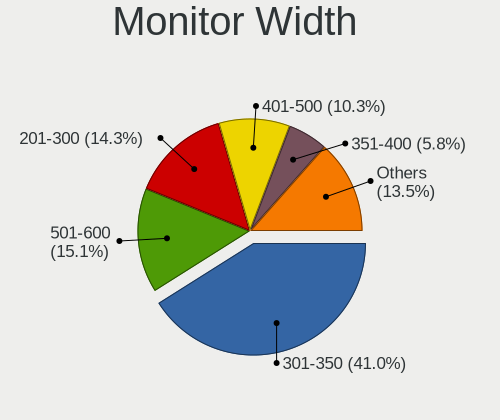

| Width in mm | Computers | Percent |
|-------------|-----------|---------|
| 301-350     | 530       | 41.9%   |
| 501-600     | 173       | 13.68%  |
| 201-300     | 169       | 13.36%  |
| 401-500     | 133       | 10.51%  |
| Unknown     | 92        | 7.27%   |
| 351-400     | 68        | 5.38%   |
| 601-700     | 37        | 2.92%   |
| 701-800     | 20        | 1.58%   |
| 1501-2000   | 20        | 1.58%   |
| 1001-1500   | 15        | 1.19%   |
| 801-900     | 6         | 0.47%   |
| 901-1000    | 2         | 0.16%   |

Aspect Ratio
------------

Proportional relationship between the width and the height

| Ratio   | Computers | Percent |
|---------|-----------|---------|
| 16/9    | 864       | 73.97%  |
| 16/10   | 159       | 13.61%  |
| Unknown | 85        | 7.28%   |
| 3/2     | 22        | 1.88%   |
| 5/4     | 17        | 1.46%   |
| 21/9    | 11        | 0.94%   |
| 4/3     | 5         | 0.43%   |
| 32/9    | 2         | 0.17%   |
| 3.73    | 1         | 0.09%   |
| 3.40    | 1         | 0.09%   |
| 1.96    | 1         | 0.09%   |

Monitor Area
------------

Area in inch

| Area in inch | Computers | Percent |
|----------------|-----------|---------|
| 101-110        | 324       | 25.37%  |
| 81-90          | 234       | 18.32%  |
| 201-250        | 152       | 11.9%   |
| Unknown        | 92        | 7.2%    |
| 71-80          | 75        | 5.87%   |
| 301-350        | 68        | 5.32%   |
| 151-200        | 65        | 5.09%   |
| 351-500        | 42        | 3.29%   |
| 121-130        | 40        | 3.13%   |
| 251-300        | 33        | 2.58%   |
| 51-60          | 32        | 2.51%   |
| More than 1000 | 31        | 2.43%   |
| 141-150        | 27        | 2.11%   |
| 61-70          | 23        | 1.8%    |
| 501-1000       | 13        | 1.02%   |
| 131-140        | 10        | 0.78%   |
| 41-50          | 9         | 0.7%    |
| 111-120        | 5         | 0.39%   |
| 91-100         | 2         | 0.16%   |

Pixel Density
-------------

Pixels per inch

| Density       | Computers | Percent |
|---------------|-----------|---------|
| 101-120       | 393       | 31.59%  |
| 121-160       | 340       | 27.33%  |
| 51-100        | 294       | 23.63%  |
| Unknown       | 92        | 7.4%    |
| 161-240       | 68        | 5.47%   |
| More than 240 | 30        | 2.41%   |
| 1-50          | 27        | 2.17%   |

Multiple Monitors
-----------------

Total monitors connected

| Total | Computers | Percent |
|-------|-----------|---------|
| 1     | 1002      | 83.64%  |
| 2     | 154       | 12.85%  |
| 3     | 22        | 1.84%   |
| 0     | 19        | 1.59%   |
| 4     | 1         | 0.08%   |

Network
-------

Net Controller Vendor
---------------------

Controller vendors

| Vendor                            | Computers | Percent |
|-----------------------------------|-----------|---------|
| Realtek Semiconductor             | 603       | 33.71%  |
| Intel                             | 510       | 28.51%  |
| Qualcomm Atheros                  | 225       | 12.58%  |
| Broadcom                          | 170       | 9.5%    |
| Marvell Technology Group          | 30        | 1.68%   |
| Broadcom Limited                  | 30        | 1.68%   |
| Nvidia                            | 29        | 1.62%   |
| TP-Link                           | 25        | 1.4%    |
| Ralink Technology                 | 21        | 1.17%   |
| Ralink                            | 18        | 1.01%   |
| Xiaomi                            | 10        | 0.56%   |
| Samsung Electronics               | 10        | 0.56%   |
| Huawei Technologies               | 9         | 0.5%    |
| D-Link                            | 8         | 0.45%   |
| ASIX Electronics                  | 7         | 0.39%   |
| Sierra Wireless                   | 6         | 0.34%   |
| MediaTek                          | 6         | 0.34%   |
| Qualcomm Atheros Communications   | 4         | 0.22%   |
| Qualcomm                          | 4         | 0.22%   |
| Linksys                           | 4         | 0.22%   |
| Hewlett-Packard                   | 4         | 0.22%   |
| Google                            | 4         | 0.22%   |
| Ericsson Business Mobile Networks | 4         | 0.22%   |
| D-Link System                     | 4         | 0.22%   |
| Realtek                           | 3         | 0.17%   |
| OPPO Electronics                  | 3         | 0.17%   |
| Microsoft                         | 3         | 0.17%   |
| TRENDnet                          | 2         | 0.11%   |
| LG Electronics                    | 2         | 0.11%   |
| Lenovo                            | 2         | 0.11%   |
| JMicron Technology                | 2         | 0.11%   |
| ASUSTek Computer                  | 2         | 0.11%   |
| Apple                             | 2         | 0.11%   |
| ZTE WCDMA Technologies MSM        | 1         | 0.06%   |
| vivo                              | 1         | 0.06%   |
| VIA Technologies                  | 1         | 0.06%   |
| Toshiba                           | 1         | 0.06%   |
| Sitecom Europe                    | 1         | 0.06%   |
| OnePlus Technology (Shenzhen)     | 1         | 0.06%   |
| NetGear                           | 1         | 0.06%   |
| NEC Computers                     | 1         | 0.06%   |
| Motorola PCS                      | 1         | 0.06%   |
| Mercucys                          | 1         | 0.06%   |
| LSI                               | 1         | 0.06%   |
| Input Club                        | 1         | 0.06%   |
| ICS Advent                        | 1         | 0.06%   |
| HMD Global                        | 1         | 0.06%   |
| Fibocom                           | 1         | 0.06%   |
| Edimax Technology                 | 1         | 0.06%   |
| DisplayLink                       | 1         | 0.06%   |
| BUFFALO                           | 1         | 0.06%   |
| AVM                               | 1         | 0.06%   |
| Attansic Technology               | 1         | 0.06%   |
| Arduino SA                        | 1         | 0.06%   |
| Aquantia                          | 1         | 0.06%   |
| AboCom Systems                    | 1         | 0.06%   |

Net Controller Model
--------------------

Controller models

| Model                                                             | Computers | Percent |
|-------------------------------------------------------------------|-----------|---------|
| Realtek RTL8111/8168/8411 PCI Express Gigabit Ethernet Controller | 397       | 18.86%  |
| Realtek RTL810xE PCI Express Fast Ethernet controller             | 96        | 4.56%   |
| Intel 82579LM Gigabit Network Connection (Lewisville)             | 43        | 2.04%   |
| Qualcomm Atheros QCA9377 802.11ac Wireless Network Adapter        | 41        | 1.95%   |
| Intel Wi-Fi 6 AX200                                               | 40        | 1.9%    |
| Qualcomm Atheros AR9485 Wireless Network Adapter                  | 38        | 1.81%   |
| Intel Wireless 8260                                               | 37        | 1.76%   |
| Qualcomm Atheros QCA9565 / AR9565 Wireless Network Adapter        | 35        | 1.66%   |
| Realtek RTL8821CE 802.11ac PCIe Wireless Network Adapter          | 29        | 1.38%   |
| Qualcomm Atheros AR9285 Wireless Network Adapter (PCI-Express)    | 27        | 1.28%   |
| Intel Wireless 8265 / 8275                                        | 26        | 1.24%   |
| Intel Wi-Fi 6 AX201                                               | 26        | 1.24%   |
| Intel Wireless 7265                                               | 25        | 1.19%   |
| Intel Wireless 7260                                               | 25        | 1.19%   |
| Intel Comet Lake PCH-LP CNVi WiFi                                 | 23        | 1.09%   |
| Intel Centrino Advanced-N 6205 [Taylor Peak]                      | 21        | 1%      |
| Broadcom NetXtreme BCM57765 Gigabit Ethernet PCIe                 | 21        | 1%      |
| Realtek RTL8822CE 802.11ac PCIe Wireless Network Adapter          | 20        | 0.95%   |
| Broadcom BCM4331 802.11a/b/g/n                                    | 20        | 0.95%   |
| Intel I211 Gigabit Network Connection                             | 19        | 0.9%    |
| Realtek RTL8723BE PCIe Wireless Network Adapter                   | 18        | 0.86%   |
| Intel Wireless 3165                                               | 18        | 0.86%   |
| Broadcom BCM4322 802.11a/b/g/n Wireless LAN Controller            | 17        | 0.81%   |
| Realtek RTL8822BE 802.11a/b/g/n/ac WiFi adapter                   | 15        | 0.71%   |
| Qualcomm Atheros QCA6174 802.11ac Wireless Network Adapter        | 15        | 0.71%   |
| Nvidia MCP79 Ethernet                                             | 15        | 0.71%   |
| Intel Cannon Point-LP CNVi [Wireless-AC]                          | 15        | 0.71%   |
| Intel Cannon Lake PCH CNVi WiFi                                   | 15        | 0.71%   |
| Broadcom BCM43224 802.11a/b/g/n                                   | 14        | 0.67%   |
| Broadcom BCM43142 802.11b/g/n                                     | 14        | 0.67%   |
| Realtek RTL8153 Gigabit Ethernet Adapter                          | 13        | 0.62%   |
| Realtek RTL8125 2.5GbE Controller                                 | 13        | 0.62%   |
| Ralink MT7601U Wireless Adapter                                   | 13        | 0.62%   |
| Qualcomm Atheros AR8151 v2.0 Gigabit Ethernet                     | 13        | 0.62%   |
| Broadcom Limited BCM4360 802.11ac Wireless Network Adapter        | 13        | 0.62%   |
| Broadcom BCM4313 802.11bgn Wireless Network Adapter               | 13        | 0.62%   |
| Intel Ethernet Connection I217-LM                                 | 12        | 0.57%   |
| Intel Ethernet Connection (2) I219-V                              | 12        | 0.57%   |
| Intel Dual Band Wireless-AC 3165 Plus Bluetooth                   | 12        | 0.57%   |
| Intel Comet Lake PCH CNVi WiFi                                    | 12        | 0.57%   |
| Intel Centrino Advanced-N 6235                                    | 12        | 0.57%   |
| Intel 82577LM Gigabit Network Connection                          | 12        | 0.57%   |
| Ralink RT3290 Wireless 802.11n 1T/1R PCIe                         | 11        | 0.52%   |
| Intel Wireless 3160                                               | 11        | 0.52%   |
| Intel Ethernet Connection I219-LM                                 | 11        | 0.52%   |
| Intel Ethernet Connection I218-LM                                 | 11        | 0.52%   |
| Intel Dual Band Wireless-AC 3168NGW [Stone Peak]                  | 11        | 0.52%   |
| Intel 82579V Gigabit Network Connection                           | 11        | 0.52%   |
| Broadcom BCM4321 802.11a/b/g/n                                    | 11        | 0.52%   |
| Broadcom BCM4312 802.11b/g LP-PHY                                 | 11        | 0.52%   |
| Realtek RTL8188EUS 802.11n Wireless Network Adapter               | 10        | 0.48%   |
| Intel Ethernet Connection (7) I219-V                              | 10        | 0.48%   |
| Broadcom BCM4360 802.11ac Wireless Network Adapter                | 10        | 0.48%   |
| Broadcom BCM43228 802.11a/b/g/n                                   | 10        | 0.48%   |
| Realtek RTL8723DE Wireless Network Adapter                        | 9         | 0.43%   |
| Marvell Group 88E8058 PCI-E Gigabit Ethernet Controller           | 9         | 0.43%   |
| Intel Gemini Lake PCH CNVi WiFi                                   | 9         | 0.43%   |
| Intel Ethernet Connection (4) I219-V                              | 9         | 0.43%   |
| Intel Centrino Advanced-N 6200                                    | 9         | 0.43%   |
| Broadcom NetXtreme BCM5764M Gigabit Ethernet PCIe                 | 9         | 0.43%   |

Wireless Vendor
---------------

Wireless vendors

| Vendor                            | Computers | Percent |
|-----------------------------------|-----------|---------|
| Intel                             | 408       | 38.6%   |
| Qualcomm Atheros                  | 190       | 17.98%  |
| Realtek Semiconductor             | 175       | 16.56%  |
| Broadcom                          | 139       | 13.15%  |
| Broadcom Limited                  | 26        | 2.46%   |
| TP-Link                           | 25        | 2.37%   |
| Ralink Technology                 | 21        | 1.99%   |
| Ralink                            | 18        | 1.7%    |
| Marvell Technology Group          | 7         | 0.66%   |
| Sierra Wireless                   | 6         | 0.57%   |
| D-Link                            | 6         | 0.57%   |
| Qualcomm Atheros Communications   | 4         | 0.38%   |
| Realtek                           | 3         | 0.28%   |
| Microsoft                         | 3         | 0.28%   |
| MediaTek                          | 3         | 0.28%   |
| Linksys                           | 3         | 0.28%   |
| Ericsson Business Mobile Networks | 3         | 0.28%   |
| D-Link System                     | 3         | 0.28%   |
| TRENDnet                          | 2         | 0.19%   |
| ASUSTek Computer                  | 2         | 0.19%   |
| Sitecom Europe                    | 1         | 0.09%   |
| Qualcomm                          | 1         | 0.09%   |
| NetGear                           | 1         | 0.09%   |
| Mercucys                          | 1         | 0.09%   |
| LG Electronics                    | 1         | 0.09%   |
| Fibocom                           | 1         | 0.09%   |
| Edimax Technology                 | 1         | 0.09%   |
| BUFFALO                           | 1         | 0.09%   |
| AVM                               | 1         | 0.09%   |
| AboCom Systems                    | 1         | 0.09%   |

Wireless Model
--------------

Wireless models

| Model                                                                                 | Computers | Percent |
|---------------------------------------------------------------------------------------|-----------|---------|
| Qualcomm Atheros QCA9377 802.11ac Wireless Network Adapter                            | 41        | 3.85%   |
| Intel Wi-Fi 6 AX200                                                                   | 40        | 3.76%   |
| Qualcomm Atheros AR9485 Wireless Network Adapter                                      | 38        | 3.57%   |
| Intel Wireless 8260                                                                   | 37        | 3.48%   |
| Qualcomm Atheros QCA9565 / AR9565 Wireless Network Adapter                            | 35        | 3.29%   |
| Realtek RTL8821CE 802.11ac PCIe Wireless Network Adapter                              | 29        | 2.73%   |
| Qualcomm Atheros AR9285 Wireless Network Adapter (PCI-Express)                        | 27        | 2.54%   |
| Intel Wireless 8265 / 8275                                                            | 26        | 2.44%   |
| Intel Wi-Fi 6 AX201                                                                   | 26        | 2.44%   |
| Intel Wireless 7265                                                                   | 25        | 2.35%   |
| Intel Wireless 7260                                                                   | 25        | 2.35%   |
| Intel Comet Lake PCH-LP CNVi WiFi                                                     | 23        | 2.16%   |
| Intel Centrino Advanced-N 6205 [Taylor Peak]                                          | 21        | 1.97%   |
| Realtek RTL8822CE 802.11ac PCIe Wireless Network Adapter                              | 20        | 1.88%   |
| Broadcom BCM4331 802.11a/b/g/n                                                        | 20        | 1.88%   |
| Realtek RTL8723BE PCIe Wireless Network Adapter                                       | 18        | 1.69%   |
| Intel Wireless 3165                                                                   | 18        | 1.69%   |
| Broadcom BCM4322 802.11a/b/g/n Wireless LAN Controller                                | 17        | 1.6%    |
| Realtek RTL8822BE 802.11a/b/g/n/ac WiFi adapter                                       | 15        | 1.41%   |
| Qualcomm Atheros QCA6174 802.11ac Wireless Network Adapter                            | 15        | 1.41%   |
| Intel Cannon Point-LP CNVi [Wireless-AC]                                              | 15        | 1.41%   |
| Intel Cannon Lake PCH CNVi WiFi                                                       | 15        | 1.41%   |
| Broadcom BCM43224 802.11a/b/g/n                                                       | 14        | 1.32%   |
| Broadcom BCM43142 802.11b/g/n                                                         | 14        | 1.32%   |
| Ralink MT7601U Wireless Adapter                                                       | 13        | 1.22%   |
| Broadcom Limited BCM4360 802.11ac Wireless Network Adapter                            | 13        | 1.22%   |
| Broadcom BCM4313 802.11bgn Wireless Network Adapter                                   | 13        | 1.22%   |
| Intel Dual Band Wireless-AC 3165 Plus Bluetooth                                       | 12        | 1.13%   |
| Intel Comet Lake PCH CNVi WiFi                                                        | 12        | 1.13%   |
| Intel Centrino Advanced-N 6235                                                        | 12        | 1.13%   |
| Ralink RT3290 Wireless 802.11n 1T/1R PCIe                                             | 11        | 1.03%   |
| Intel Wireless 3160                                                                   | 11        | 1.03%   |
| Intel Dual Band Wireless-AC 3168NGW [Stone Peak]                                      | 11        | 1.03%   |
| Broadcom BCM4321 802.11a/b/g/n                                                        | 11        | 1.03%   |
| Broadcom BCM4312 802.11b/g LP-PHY                                                     | 11        | 1.03%   |
| Realtek RTL8188EUS 802.11n Wireless Network Adapter                                   | 10        | 0.94%   |
| Broadcom BCM4360 802.11ac Wireless Network Adapter                                    | 10        | 0.94%   |
| Broadcom BCM43228 802.11a/b/g/n                                                       | 10        | 0.94%   |
| Realtek RTL8723DE Wireless Network Adapter                                            | 9         | 0.85%   |
| Intel Gemini Lake PCH CNVi WiFi                                                       | 9         | 0.85%   |
| Intel Centrino Advanced-N 6200                                                        | 9         | 0.85%   |
| Broadcom BCM43602 802.11ac Wireless LAN SoC                                           | 9         | 0.85%   |
| Realtek 802.11ac NIC                                                                  | 8         | 0.75%   |
| Qualcomm Atheros AR9462 Wireless Network Adapter                                      | 8         | 0.75%   |
| Qualcomm Atheros AR928X Wireless Network Adapter (PCI-Express)                        | 8         | 0.75%   |
| Intel Ice Lake-LP PCH CNVi WiFi                                                       | 8         | 0.75%   |
| TP-Link TL-WN722N v2                                                                  | 6         | 0.56%   |
| TP-Link AC600 wireless Realtek RTL8811AU [Archer T2U Nano]                            | 6         | 0.56%   |
| Realtek RTL8821AE 802.11ac PCIe Wireless Network Adapter                              | 6         | 0.56%   |
| Realtek RTL8188EE Wireless Network Adapter                                            | 6         | 0.56%   |
| Realtek RTL8188CUS 802.11n WLAN Adapter                                               | 6         | 0.56%   |
| Marvell Group 88W8897 [AVASTAR] 802.11ac Wireless                                     | 6         | 0.56%   |
| Intel Wireless-AC 9260                                                                | 6         | 0.56%   |
| Realtek RTL88x2bu [AC1200 Techkey]                                                    | 5         | 0.47%   |
| Realtek RTL8191SEvB Wireless LAN Controller                                           | 5         | 0.47%   |
| Qualcomm Atheros AR9287 Wireless Network Adapter (PCI-Express)                        | 5         | 0.47%   |
| Qualcomm Atheros AR5418 Wireless Network Adapter [AR5008E 802.11(a)bgn] (PCI-Express) | 5         | 0.47%   |
| Intel WiFi Link 5100                                                                  | 5         | 0.47%   |
| Intel Ultimate N WiFi Link 5300                                                       | 5         | 0.47%   |
| Intel PRO/Wireless 3945ABG [Golan] Network Connection                                 | 5         | 0.47%   |

Ethernet Vendor
---------------

Ethernet vendors

| Vendor                   | Computers | Percent |
|--------------------------|-----------|---------|
| Realtek Semiconductor    | 530       | 52.22%  |
| Intel                    | 236       | 23.25%  |
| Broadcom                 | 67        | 6.6%    |
| Qualcomm Atheros         | 57        | 5.62%   |
| Nvidia                   | 29        | 2.86%   |
| Marvell Technology Group | 23        | 2.27%   |
| Xiaomi                   | 10        | 0.99%   |
| Samsung Electronics      | 10        | 0.99%   |
| ASIX Electronics         | 7         | 0.69%   |
| Huawei Technologies      | 6         | 0.59%   |
| Broadcom Limited         | 5         | 0.49%   |
| Google                   | 4         | 0.39%   |
| Qualcomm                 | 3         | 0.3%    |
| OPPO Electronics         | 3         | 0.3%    |
| MediaTek                 | 3         | 0.3%    |
| Lenovo                   | 2         | 0.2%    |
| JMicron Technology       | 2         | 0.2%    |
| Hewlett-Packard          | 2         | 0.2%    |
| D-Link                   | 2         | 0.2%    |
| Apple                    | 2         | 0.2%    |
| vivo                     | 1         | 0.1%    |
| VIA Technologies         | 1         | 0.1%    |
| Motorola PCS             | 1         | 0.1%    |
| LSI                      | 1         | 0.1%    |
| Linksys                  | 1         | 0.1%    |
| LG Electronics           | 1         | 0.1%    |
| ICS Advent               | 1         | 0.1%    |
| HMD Global               | 1         | 0.1%    |
| DisplayLink              | 1         | 0.1%    |
| D-Link System            | 1         | 0.1%    |
| Attansic Technology      | 1         | 0.1%    |
| Aquantia                 | 1         | 0.1%    |

Ethernet Model
--------------

Ethernet models

| Model                                                                          | Computers | Percent |
|--------------------------------------------------------------------------------|-----------|---------|
| Realtek RTL8111/8168/8411 PCI Express Gigabit Ethernet Controller              | 397       | 38.58%  |
| Realtek RTL810xE PCI Express Fast Ethernet controller                          | 96        | 9.33%   |
| Intel 82579LM Gigabit Network Connection (Lewisville)                          | 43        | 4.18%   |
| Broadcom NetXtreme BCM57765 Gigabit Ethernet PCIe                              | 21        | 2.04%   |
| Intel I211 Gigabit Network Connection                                          | 19        | 1.85%   |
| Nvidia MCP79 Ethernet                                                          | 15        | 1.46%   |
| Realtek RTL8153 Gigabit Ethernet Adapter                                       | 13        | 1.26%   |
| Realtek RTL8125 2.5GbE Controller                                              | 13        | 1.26%   |
| Qualcomm Atheros AR8151 v2.0 Gigabit Ethernet                                  | 13        | 1.26%   |
| Intel Ethernet Connection I217-LM                                              | 12        | 1.17%   |
| Intel Ethernet Connection (2) I219-V                                           | 12        | 1.17%   |
| Intel 82577LM Gigabit Network Connection                                       | 12        | 1.17%   |
| Intel Ethernet Connection I219-LM                                              | 11        | 1.07%   |
| Intel Ethernet Connection I218-LM                                              | 11        | 1.07%   |
| Intel 82579V Gigabit Network Connection                                        | 11        | 1.07%   |
| Intel Ethernet Connection (7) I219-V                                           | 10        | 0.97%   |
| Marvell Group 88E8058 PCI-E Gigabit Ethernet Controller                        | 9         | 0.87%   |
| Intel Ethernet Connection (4) I219-V                                           | 9         | 0.87%   |
| Broadcom NetXtreme BCM5764M Gigabit Ethernet PCIe                              | 9         | 0.87%   |
| Xiaomi Mi/Redmi series (RNDIS)                                                 | 8         | 0.78%   |
| Qualcomm Atheros AR8161 Gigabit Ethernet                                       | 8         | 0.78%   |
| Intel 82567LM Gigabit Network Connection                                       | 8         | 0.78%   |
| Samsung GT-I9070 (network tethering, USB debugging enabled)                    | 7         | 0.68%   |
| Qualcomm Atheros AR8131 Gigabit Ethernet                                       | 7         | 0.68%   |
| Intel Ethernet Connection I217-V                                               | 7         | 0.68%   |
| Intel Ethernet Connection (3) I218-LM                                          | 7         | 0.68%   |
| Intel 82574L Gigabit Network Connection                                        | 7         | 0.68%   |
| Nvidia MCP61 Ethernet                                                          | 6         | 0.58%   |
| Broadcom NetXtreme BCM57766 Gigabit Ethernet PCIe                              | 6         | 0.58%   |
| Broadcom NetLink BCM57785 Gigabit Ethernet PCIe                                | 6         | 0.58%   |
| Realtek RTL8152 Fast Ethernet Adapter                                          | 5         | 0.49%   |
| Qualcomm Atheros QCA8172 Fast Ethernet                                         | 5         | 0.49%   |
| Intel Ethernet Controller I225-V                                               | 5         | 0.49%   |
| Intel Ethernet Connection I219-V                                               | 5         | 0.49%   |
| Intel Ethernet Connection (4) I219-LM                                          | 5         | 0.49%   |
| Intel Ethernet Connection (2) I219-LM                                          | 5         | 0.49%   |
| Huawei JNY-LX1                                                                 | 5         | 0.49%   |
| Broadcom NetXtreme BCM57786 Gigabit Ethernet PCIe                              | 5         | 0.49%   |
| Realtek RTL-8100/8101L/8139 PCI Fast Ethernet Adapter                          | 4         | 0.39%   |
| Qualcomm Atheros Killer E220x Gigabit Ethernet Controller                      | 4         | 0.39%   |
| Qualcomm Atheros AR8152 v2.0 Fast Ethernet                                     | 4         | 0.39%   |
| Marvell Group 88E8053 PCI-E Gigabit Ethernet Controller                        | 4         | 0.39%   |
| Intel 82578DM Gigabit Network Connection                                       | 4         | 0.39%   |
| Google Nexus/Pixel Device (tether)                                             | 4         | 0.39%   |
| Broadcom NetLink BCM5784M Gigabit Ethernet PCIe                                | 4         | 0.39%   |
| ASIX AX88179 Gigabit Ethernet                                                  | 4         | 0.39%   |
| Samsung Galaxy series, misc. (tethering mode)                                  | 3         | 0.29%   |
| Realtek Killer E2600 Gigabit Ethernet Controller                               | 3         | 0.29%   |
| Qualcomm Atheros Killer E2400 Gigabit Ethernet Controller                      | 3         | 0.29%   |
| Qualcomm Atheros AR8132 Fast Ethernet                                          | 3         | 0.29%   |
| OPPO 9R                                                                        | 3         | 0.29%   |
| Nvidia MCP77 Ethernet                                                          | 3         | 0.29%   |
| MediaTek moto e6s                                                              | 3         | 0.29%   |
| Marvell Group Yukon Optima 88E8059 [PCIe Gigabit Ethernet Controller with AVB] | 3         | 0.29%   |
| Marvell Group 88E8040 PCI-E Fast Ethernet Controller                           | 3         | 0.29%   |
| Intel I210 Gigabit Network Connection                                          | 3         | 0.29%   |
| Intel Ethernet Connection (6) I219-V                                           | 3         | 0.29%   |
| Intel Ethernet Connection (2) I218-V                                           | 3         | 0.29%   |
| Intel Ethernet Connection (10) I219-V                                          | 3         | 0.29%   |
| Intel 82567LM-3 Gigabit Network Connection                                     | 3         | 0.29%   |

Net Controller Kind
-------------------

Ethernet, WiFi or modem

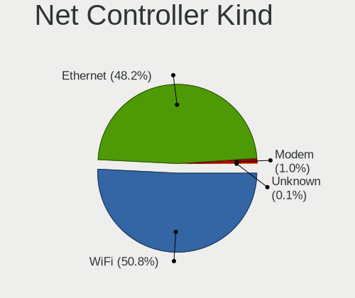

| Kind     | Computers | Percent |
|----------|-----------|---------|
| WiFi     | 997       | 50.58%  |
| Ethernet | 962       | 48.81%  |
| Modem    | 10        | 0.51%   |
| Unknown  | 2         | 0.1%    |

Used Controller
---------------

Currently used network controller

| Kind     | Computers | Percent |
|----------|-----------|---------|
| WiFi     | 802       | 67.74%  |
| Ethernet | 382       | 32.26%  |

NICs
----

Total network controllers on board

| Total | Computers | Percent |
|-------|-----------|---------|
| 2     | 685       | 57.9%   |
| 1     | 451       | 38.12%  |
| 0     | 25        | 2.11%   |
| 3     | 19        | 1.61%   |
| 4     | 2         | 0.17%   |
| 5     | 1         | 0.08%   |

IPv6
----

IPv6 vs IPv4

| Used    | Computers | Percent |
|---------|-----------|---------|
| No      | 945       | 79.55%  |
| Yes     | 242       | 20.37%  |
| Unknown | 1         | 0.08%   |

Bluetooth
---------

Bluetooth Vendor
----------------

Controller vendors

| Vendor                          | Computers | Percent |
|---------------------------------|-----------|---------|
| Intel                           | 338       | 39.62%  |
| Apple                           | 96        | 11.25%  |
| Realtek Semiconductor           | 91        | 10.67%  |
| Qualcomm Atheros Communications | 72        | 8.44%   |
| Cambridge Silicon Radio         | 51        | 5.98%   |
| Broadcom                        | 49        | 5.74%   |
| Lite-On Technology              | 35        | 4.1%    |
| Foxconn / Hon Hai               | 26        | 3.05%   |
| IMC Networks                    | 21        | 2.46%   |
| Toshiba                         | 11        | 1.29%   |
| Ralink                          | 11        | 1.29%   |
| Hewlett-Packard                 | 10        | 1.17%   |
| Dell                            | 9         | 1.06%   |
| ASUSTek Computer                | 9         | 1.06%   |
| Marvell Semiconductor           | 8         | 0.94%   |
| Realtek                         | 5         | 0.59%   |
| Qcom                            | 3         | 0.35%   |
| Belkin Components               | 2         | 0.23%   |
| Unknown                         | 1         | 0.12%   |
| Taiyo Yuden                     | 1         | 0.12%   |
| Logitech                        | 1         | 0.12%   |
| Fujitsu                         | 1         | 0.12%   |
| Foxconn International           | 1         | 0.12%   |
| Edimax Technology               | 1         | 0.12%   |

Bluetooth Model
---------------

Controller models

| Model                                                                               | Computers | Percent |
|-------------------------------------------------------------------------------------|-----------|---------|
| Intel Bluetooth wireless interface                                                  | 145       | 17%     |
| Intel AX201 Bluetooth                                                               | 57        | 6.68%   |
| Intel Bluetooth 9460/9560 Jefferson Peak (JfP)                                      | 54        | 6.33%   |
| Cambridge Silicon Radio Bluetooth Dongle (HCI mode)                                 | 51        | 5.98%   |
| Realtek Bluetooth Radio                                                             | 47        | 5.51%   |
| Qualcomm Atheros  Bluetooth Device                                                  | 39        | 4.57%   |
| Intel AX200 Bluetooth                                                               | 39        | 4.57%   |
| Apple Bluetooth Host Controller                                                     | 38        | 4.45%   |
| Realtek  Bluetooth 4.2 Adapter                                                      | 30        | 3.52%   |
| Apple Bluetooth USB Host Controller                                                 | 28        | 3.28%   |
| Qualcomm Atheros AR3011 Bluetooth                                                   | 17        | 1.99%   |
| Intel Centrino Bluetooth Wireless Transceiver                                       | 16        | 1.88%   |
| Apple Built-in Bluetooth 2.0+EDR HCI                                                | 16        | 1.88%   |
| Apple Bluetooth HCI                                                                 | 14        | 1.64%   |
| Ralink RT3290 Bluetooth                                                             | 11        | 1.29%   |
| Lite-On Qualcomm Atheros QCA9377 Bluetooth                                          | 11        | 1.29%   |
| Intel Wireless-AC 3168 Bluetooth                                                    | 11        | 1.29%   |
| Foxconn / Hon Hai Bluetooth Device                                                  | 11        | 1.29%   |
| Lite-On Atheros AR3012 Bluetooth                                                    | 9         | 1.06%   |
| HP Broadcom 2070 Bluetooth Combo                                                    | 9         | 1.06%   |
| Broadcom BCM20702 Bluetooth 4.0 [ThinkPad]                                          | 9         | 1.06%   |
| Broadcom BCM2045B (BDC-2.1)                                                         | 9         | 1.06%   |
| Qualcomm Atheros AR3012 Bluetooth 4.0                                               | 8         | 0.94%   |
| Lite-On Bluetooth Device                                                            | 8         | 0.94%   |
| Broadcom BCM43142A0 Bluetooth 4.0                                                   | 8         | 0.94%   |
| Intel Wireless-AC 9260 Bluetooth Adapter                                            | 6         | 0.7%    |
| IMC Networks Bluetooth Radio                                                        | 6         | 0.7%    |
| Realtek RTL8822BE Bluetooth 4.2 Adapter                                             | 5         | 0.59%   |
| Realtek RTL8723B Bluetooth                                                          | 5         | 0.59%   |
| Realtek Bluetooth Radio                                                             | 5         | 0.59%   |
| Marvell Bluetooth and Wireless LAN Composite                                        | 5         | 0.59%   |
| Intel AX210 Bluetooth                                                               | 5         | 0.59%   |
| IMC Networks Bluetooth Device                                                       | 5         | 0.59%   |
| Dell DW375 Bluetooth Module                                                         | 5         | 0.59%   |
| Realtek RTL8821A Bluetooth                                                          | 4         | 0.47%   |
| Qualcomm Atheros AR9462 Bluetooth                                                   | 4         | 0.47%   |
| Lite-On Atheros Bluetooth                                                           | 4         | 0.47%   |
| Intel Centrino Advanced-N 6230 Bluetooth adapter                                    | 4         | 0.47%   |
| IMC Networks Atheros AR3012 Bluetooth 4.0 Adapter                                   | 4         | 0.47%   |
| Foxconn / Hon Hai Bluetooth USB Host Controller                                     | 4         | 0.47%   |
| Broadcom BCM20702A0 Bluetooth 4.0                                                   | 4         | 0.47%   |
| Broadcom BCM2045B (BDC-2.1) [Bluetooth Controller]                                  | 4         | 0.47%   |
| ASUS Broadcom BCM20702A0 Bluetooth                                                  | 4         | 0.47%   |
| Toshiba RT Bluetooth Radio                                                          | 3         | 0.35%   |
| Toshiba Bluetooth USB Host Controller                                               | 3         | 0.35%   |
| Qualcomm Atheros QCA61x4 Bluetooth 4.0                                              | 3         | 0.35%   |
| Marvell Bluetooth and Wireless LAN Composite Device                                 | 3         | 0.35%   |
| IMC Networks BCM20702A0                                                             | 3         | 0.35%   |
| Foxconn / Hon Hai Foxconn T77H114 BCM2070 [Single-Chip Bluetooth 2.1 + EDR Adapter] | 3         | 0.35%   |
| Foxconn / Hon Hai BCM20702A0                                                        | 3         | 0.35%   |
| Qcom Broadcom Bluetooth USB                                                         | 2         | 0.23%   |
| IMC Networks Wireless_Device                                                        | 2         | 0.23%   |
| Broadcom HP Portable Bumble Bee                                                     | 2         | 0.23%   |
| Broadcom BCM2070 Bluetooth 2.1 + EDR                                                | 2         | 0.23%   |
| Broadcom BCM2045B (BDC-2) [Bluetooth Controller]                                    | 2         | 0.23%   |
| Belkin Components Bluetooth Mini Dongle                                             | 2         | 0.23%   |
| ASUS BCM20702A0                                                                     | 2         | 0.23%   |
| Unknown Bluetooth Device                                                            | 1         | 0.12%   |
| Toshiba Integrated Bluetooth HCI                                                    | 1         | 0.12%   |
| Toshiba Bluetooth Radio                                                             | 1         | 0.12%   |

Sound
-----

Sound Vendor
------------

Sound card vendors

| Vendor                               | Computers | Percent |
|--------------------------------------|-----------|---------|
| Intel                                | 911       | 58.89%  |
| AMD                                  | 293       | 18.94%  |
| Nvidia                               | 221       | 14.29%  |
| C-Media Electronics                  | 32        | 2.07%   |
| Logitech                             | 13        | 0.84%   |
| Creative Labs                        | 12        | 0.78%   |
| Generalplus Technology               | 8         | 0.52%   |
| JMTek                                | 5         | 0.32%   |
| GN Netcom                            | 4         | 0.26%   |
| Creative Technology                  | 4         | 0.26%   |
| BEHRINGER International              | 4         | 0.26%   |
| Texas Instruments                    | 3         | 0.19%   |
| Razer USA                            | 3         | 0.19%   |
| Corsair                              | 3         | 0.19%   |
| Realtek Semiconductor                | 2         | 0.13%   |
| Plantronics                          | 2         | 0.13%   |
| Native Instruments                   | 2         | 0.13%   |
| Focusrite-Novation                   | 2         | 0.13%   |
| ESS Technology                       | 2         | 0.13%   |
| Dell                                 | 2         | 0.13%   |
| YUAN High-Tech Development           | 1         | 0.06%   |
| Unknown                              | 1         | 0.06%   |
| Thesycon Systemsoftware & Consulting | 1         | 0.06%   |
| TEAC                                 | 1         | 0.06%   |
| SteelSeries ApS                      | 1         | 0.06%   |
| Sennheiser Communications            | 1         | 0.06%   |
| PreSonus Audio Electronics           | 1         | 0.06%   |
| No brand                             | 1         | 0.06%   |
| Microsoft                            | 1         | 0.06%   |
| Micro Star International             | 1         | 0.06%   |
| Hewlett-Packard                      | 1         | 0.06%   |
| Fry's Electronics                    | 1         | 0.06%   |
| Fortemedia                           | 1         | 0.06%   |
| Edifier Technology                   | 1         | 0.06%   |
| BY EDIFIER                           | 1         | 0.06%   |
| ATI Technologies                     | 1         | 0.06%   |
| ASUSTek Computer                     | 1         | 0.06%   |
| Astro Gaming                         | 1         | 0.06%   |
| Apple                                | 1         | 0.06%   |

Sound Model
-----------

Sound card models

| Model                                                                                             | Computers | Percent |
|---------------------------------------------------------------------------------------------------|-----------|---------|
| Intel Sunrise Point-LP HD Audio                                                                   | 121       | 6.55%   |
| Intel 6 Series/C200 Series Chipset Family High Definition Audio Controller                        | 114       | 6.17%   |
| Intel 7 Series/C216 Chipset Family High Definition Audio Controller                               | 98        | 5.3%    |
| AMD Family 17h/19h HD Audio Controller                                                            | 77        | 4.17%   |
| Intel 8 Series/C220 Series Chipset High Definition Audio Controller                               | 59        | 3.19%   |
| Intel 5 Series/3400 Series Chipset High Definition Audio                                          | 55        | 2.98%   |
| Intel Haswell-ULT HD Audio Controller                                                             | 47        | 2.54%   |
| Intel 8 Series HD Audio Controller                                                                | 47        | 2.54%   |
| Intel 82801I (ICH9 Family) HD Audio Controller                                                    | 41        | 2.22%   |
| AMD Raven/Raven2/Fenghuang HDMI/DP Audio Controller                                               | 40        | 2.16%   |
| Intel Xeon E3-1200 v3/4th Gen Core Processor HD Audio Controller                                  | 38        | 2.06%   |
| Intel Cannon Lake PCH cAVS                                                                        | 38        | 2.06%   |
| Intel Tiger Lake-LP Smart Sound Technology Audio Controller                                       | 34        | 1.84%   |
| AMD Renoir Radeon High Definition Audio Controller                                                | 34        | 1.84%   |
| Intel Broadwell-U Audio Controller                                                                | 33        | 1.79%   |
| AMD FCH Azalia Controller                                                                         | 32        | 1.73%   |
| Intel Wildcat Point-LP High Definition Audio Controller                                           | 31        | 1.68%   |
| Intel Comet Lake PCH-LP cAVS                                                                      | 27        | 1.46%   |
| Intel Celeron/Pentium Silver Processor High Definition Audio                                      | 26        | 1.41%   |
| AMD Ellesmere HDMI Audio [Radeon RX 470/480 / 570/580/590]                                        | 26        | 1.41%   |
| AMD SBx00 Azalia (Intel HDA)                                                                      | 25        | 1.35%   |
| AMD Starship/Matisse HD Audio Controller                                                          | 24        | 1.3%    |
| Intel Cannon Point-LP High Definition Audio Controller                                            | 23        | 1.24%   |
| AMD Family 15h (Models 60h-6fh) Audio Controller                                                  | 23        | 1.24%   |
| AMD Kabini HDMI/DP Audio                                                                          | 22        | 1.19%   |
| Nvidia GP107GL High Definition Audio Controller                                                   | 20        | 1.08%   |
| Nvidia GM107 High Definition Audio Controller [GeForce 940MX]                                     | 20        | 1.08%   |
| Intel 82801H (ICH8 Family) HD Audio Controller                                                    | 19        | 1.03%   |
| Intel 100 Series/C230 Series Chipset Family HD Audio Controller                                   | 19        | 1.03%   |
| Intel NM10/ICH7 Family High Definition Audio Controller                                           | 18        | 0.97%   |
| AMD Family 17h (Models 00h-0fh) HD Audio Controller                                               | 18        | 0.97%   |
| Intel Atom Processor Z36xxx/Z37xxx Series High Definition Audio Controller                        | 17        | 0.92%   |
| Nvidia GF108 High Definition Audio Controller                                                     | 16        | 0.87%   |
| Intel Atom/Celeron/Pentium Processor x5-E8000/J3xxx/N3xxx Series High Definition Audio Controller | 16        | 0.87%   |
| Intel 200 Series PCH HD Audio                                                                     | 16        | 0.87%   |
| Nvidia MCP79 High Definition Audio                                                                | 15        | 0.81%   |
| Intel Ice Lake-LP Smart Sound Technology Audio Controller                                         | 15        | 0.81%   |
| Intel Comet Lake PCH cAVS                                                                         | 15        | 0.81%   |
| AMD Oland/Hainan/Cape Verde/Pitcairn HDMI Audio [Radeon HD 7000 Series]                           | 15        | 0.81%   |
| AMD High Definition Audio Controller                                                              | 15        | 0.81%   |
| AMD Baffin HDMI/DP Audio [Radeon RX 550 640SP / RX 560/560X]                                      | 14        | 0.76%   |
| AMD Turks HDMI Audio [Radeon HD 6500/6600 / 6700M Series]                                         | 13        | 0.7%    |
| AMD Caicos HDMI Audio [Radeon HD 6450 / 7450/8450/8490 OEM / R5 230/235/235X OEM]                 | 12        | 0.65%   |
| Nvidia TU107 GeForce GTX 1650 High Definition Audio Controller                                    | 11        | 0.6%    |
| Nvidia High Definition Audio Controller                                                           | 11        | 0.6%    |
| Nvidia GP106 High Definition Audio Controller                                                     | 11        | 0.6%    |
| C-Media Electronics Audio Adapter (Unitek Y-247A)                                                 | 11        | 0.6%    |
| Nvidia TU106 High Definition Audio Controller                                                     | 10        | 0.54%   |
| Intel CM238 HD Audio Controller                                                                   | 10        | 0.54%   |
| Intel Celeron N3350/Pentium N4200/Atom E3900 Series Audio Cluster                                 | 10        | 0.54%   |
| Nvidia TU116 High Definition Audio Controller                                                     | 9         | 0.49%   |
| Nvidia GK208 HDMI/DP Audio Controller                                                             | 9         | 0.49%   |
| Nvidia GK107 HDMI Audio Controller                                                                | 8         | 0.43%   |
| Nvidia GF119 HDMI Audio Controller                                                                | 8         | 0.43%   |
| Intel 9 Series Chipset Family HD Audio Controller                                                 | 8         | 0.43%   |
| Generalplus Technology USB Audio Device                                                           | 8         | 0.43%   |
| AMD Trinity HDMI Audio Controller                                                                 | 8         | 0.43%   |
| Nvidia MCP61 High Definition Audio                                                                | 7         | 0.38%   |
| Nvidia GP104 High Definition Audio Controller                                                     | 7         | 0.38%   |
| Intel Tiger Lake-H HD Audio Controller                                                            | 7         | 0.38%   |

Memory
------

Memory Vendor
-------------

Memory module vendors

| Vendor              | Computers | Percent |
|---------------------|-----------|---------|
| Samsung Electronics | 102       | 24.29%  |
| SK hynix            | 78        | 18.57%  |
| Kingston            | 51        | 12.14%  |
| Micron Technology   | 42        | 10%     |
| Unknown             | 36        | 8.57%   |
| Crucial             | 19        | 4.52%   |
| Corsair             | 12        | 2.86%   |
| Elpida              | 11        | 2.62%   |
| G.Skill             | 10        | 2.38%   |
| A-DATA Technology   | 8         | 1.9%    |
| Unknown (ABCD)      | 7         | 1.67%   |
| Ramaxel Technology  | 6         | 1.43%   |
| Patriot             | 4         | 0.95%   |
| Nanya Technology    | 4         | 0.95%   |
| Smart               | 3         | 0.71%   |
| Transcend           | 2         | 0.48%   |
| PNY                 | 2         | 0.48%   |
| GSkill              | 2         | 0.48%   |
| Apacer              | 2         | 0.48%   |
| Unknown (82B5)      | 1         | 0.24%   |
| Unknown (0x198)     | 1         | 0.24%   |
| Unknown (0x038A)    | 1         | 0.24%   |
| Toshiba             | 1         | 0.24%   |
| Timetec             | 1         | 0.24%   |
| Team                | 1         | 0.24%   |
| Smart Brazil        | 1         | 0.24%   |
| SHARETRONIC         | 1         | 0.24%   |
| Qimonda             | 1         | 0.24%   |
| Neo Forza           | 1         | 0.24%   |
| Multilaser          | 1         | 0.24%   |
| Magnum Tech         | 1         | 0.24%   |
| Kllisre             | 1         | 0.24%   |
| Hewlett-Packard     | 1         | 0.24%   |
| Avant               | 1         | 0.24%   |
| AMD                 | 1         | 0.24%   |
| Aeneon              | 1         | 0.24%   |
| A Force             | 1         | 0.24%   |
| Unknown             | 1         | 0.24%   |

Memory Model
------------

Memory module models

| Model                                                               | Computers | Percent |
|---------------------------------------------------------------------|-----------|---------|
| Samsung RAM M471B5173DB0-YK0 4096MB SODIMM DDR3 1600MT/s            | 9         | 2.01%   |
| Unknown (ABCD) RAM 123456789012345678 2048MB SODIMM LPDDR4 2400MT/s | 6         | 1.34%   |
| Samsung RAM M471B1G73DB0-YK0 8GB SODIMM DDR3 1600MT/s               | 6         | 1.34%   |
| SK hynix RAM HMA851S6CJR6N-VK 4GB SODIMM DDR4 2667MT/s              | 5         | 1.12%   |
| SK hynix RAM HMA81GS6DJR8N-XN 8GB SODIMM DDR4 3200MT/s              | 4         | 0.89%   |
| Samsung RAM Module 8192MB SODIMM DDR4 2133MT/s                      | 4         | 0.89%   |
| Samsung RAM M471B5273DH0-CH9 4096MB SODIMM DDR3 1334MT/s            | 4         | 0.89%   |
| Samsung RAM M471A5244CB0-CTD 4096MB SODIMM DDR4 3266MT/s            | 4         | 0.89%   |
| Samsung RAM M471A5244CB0-CRC 4GB SODIMM DDR4 2667MT/s               | 4         | 0.89%   |
| Micron RAM 8KTF51264HZ-1G6E1 4096MB SODIMM DDR3 1600MT/s            | 4         | 0.89%   |
| SK hynix RAM HMT451S6BFR8A-PB 4GB SODIMM DDR3 1600MT/s              | 3         | 0.67%   |
| SK hynix RAM HMT41GS6BFR8A-PB 8GB SODIMM DDR3 1600MT/s              | 3         | 0.67%   |
| SK hynix RAM HMA81GS6AFR8N-UH 8GB SODIMM DDR4 2667MT/s              | 3         | 0.67%   |
| Samsung RAM M471B5673FH0-CF8 2048MB SODIMM DDR3 1067MT/s            | 3         | 0.67%   |
| Samsung RAM M471B5273CH0-CH9 4096MB SODIMM DDR3 1334MT/s            | 3         | 0.67%   |
| Samsung RAM M471A5143EB0-CPB 4GB SODIMM DDR4 2133MT/s               | 3         | 0.67%   |
| Samsung RAM M471A2K43CB1-CTD 16GB SODIMM DDR4 8400MT/s              | 3         | 0.67%   |
| Samsung RAM M471A1K43BB1-CRC 8GB SODIMM DDR4 2667MT/s               | 3         | 0.67%   |
| Samsung RAM M471A1G44AB0-CWE 8GB SODIMM DDR4 3200MT/s               | 3         | 0.67%   |
| Micron RAM MT52L1G32D4PG-093 8GB Row Of Chips LPDDR3 2133MT/s       | 3         | 0.67%   |
| Micron RAM 8KTF51264HZ-1G6N1 4GB SODIMM DDR3 1600MT/s               | 3         | 0.67%   |
| Micron RAM 4ATF51264HZ-2G6E1 4GB SODIMM DDR4 2667MT/s               | 3         | 0.67%   |
| Unknown RAM Module 4GB DIMM 1333MT/s                                | 2         | 0.45%   |
| Unknown RAM Module 4096MB SODIMM DDR3 1333MT/s                      | 2         | 0.45%   |
| Unknown RAM Module 2GB SODIMM DDR3 1333MT/s                         | 2         | 0.45%   |
| Unknown RAM Module 2048MB SODIMM DDR3 1066MT/s                      | 2         | 0.45%   |
| Unknown RAM Module 2048MB DIMM DDR2 667MT/s                         | 2         | 0.45%   |
| Smart RAM SG564568FG8NWKF-Z1 2GB SODIMM DDR2 800MT/s                | 2         | 0.45%   |
| Smart RAM SG564283FG8NWKF-Z1 1024MB SODIMM DDR2 800MT/s             | 2         | 0.45%   |
| SK hynix RAM HMT351S6CFR8C-PB 4GB SODIMM DDR3 1600MT/s              | 2         | 0.45%   |
| SK hynix RAM HMT351S6BFR8C-H9 4GB SODIMM DDR3 1333MT/s              | 2         | 0.45%   |
| SK hynix RAM HMT31GR7BFR4C-H9 8GB DIMM DDR3 1333MT/s                | 2         | 0.45%   |
| SK hynix RAM HMA851S6AFR6N-UH 4GB SODIMM DDR4 2667MT/s              | 2         | 0.45%   |
| Samsung RAM Module 16384MB SODIMM DDR4 2667MT/s                     | 2         | 0.45%   |
| Samsung RAM M471B5673FH0-CH9 2GB SODIMM DDR3 1334MT/s               | 2         | 0.45%   |
| Samsung RAM M471B5173QH0-YK0 4GB SODIMM DDR3 1600MT/s               | 2         | 0.45%   |
| Samsung RAM M471B5173EB0-YK0 4GB SODIMM DDR3 1600MT/s               | 2         | 0.45%   |
| Samsung RAM M471B1G73QH0-YK0 8GB SODIMM DDR3 1600MT/s               | 2         | 0.45%   |
| Samsung RAM M471B1G73EB0-YK0 8GB SODIMM DDR3 1600MT/s               | 2         | 0.45%   |
| Samsung RAM M471A2G43AB2-CWE 16384MB SODIMM DDR4 3200MT/s           | 2         | 0.45%   |
| Samsung RAM M471A1K43DB1-CWE 8GB SODIMM DDR4 3200MT/s               | 2         | 0.45%   |
| Samsung RAM M471A1K43CB1-CTD 8GB SODIMM DDR4 2667MT/s               | 2         | 0.45%   |
| Samsung RAM M471A1K43CB1-CRC 8GB SODIMM DDR4 2667MT/s               | 2         | 0.45%   |
| Samsung RAM M471A1K43BB0-CPB 8GB SODIMM DDR4 2133MT/s               | 2         | 0.45%   |
| Samsung RAM M471A1G43DB0-CPB 8GB SODIMM DDR4 2400MT/s               | 2         | 0.45%   |
| Micron RAM 8ATF1G64HZ-2G6E1 8GB SODIMM DDR4 2667MT/s                | 2         | 0.45%   |
| Micron RAM 4ATF51264HZ-2G3B1 4GB SODIMM DDR4 2400MT/s               | 2         | 0.45%   |
| Micron RAM 4ATF51264HZ-2G3AZ 4GB SODIMM DDR4 2133MT/s               | 2         | 0.45%   |
| Micron RAM 16JSF25664HZ-1G4F1 2GB SODIMM 1334MT/s                   | 2         | 0.45%   |
| Kingston RAM Module 8192MB SODIMM DDR3 1600MT/s                     | 2         | 0.45%   |
| Kingston RAM KHX1866C10D3/4G 4096MB DIMM DDR3 1867MT/s              | 2         | 0.45%   |
| Kingston RAM ACR16D3LFS1KBG/2G 2GB SODIMM DDR3 1600MT/s             | 2         | 0.45%   |
| GSkill RAM F4-3200C22-8GRS 8192MB SODIMM DDR4 3200MT/s              | 2         | 0.45%   |
| Elpida RAM Module 4096MB SODIMM DDR3 1600MT/s                       | 2         | 0.45%   |
| Elpida RAM EBJ21UE8BDS0-DJ-F 2GB SODIMM DDR3 1334MT/s               | 2         | 0.45%   |
| Crucial RAM CT16G4SFD824A.C16FDD 16GB SODIMM DDR4 2400MT/s          | 2         | 0.45%   |
| Unknown RAM Module 8GB SODIMM DDR3 1067MT/s                         | 1         | 0.22%   |
| Unknown RAM Module 8GB DIMM DDR3 1066MT/s                           | 1         | 0.22%   |
| Unknown RAM Module 8GB DIMM 1333MT/s                                | 1         | 0.22%   |
| Unknown RAM Module 8192MB SODIMM DDR4 2133MT/s                      | 1         | 0.22%   |

Memory Kind
-----------

Memory module kinds

| Kind    | Computers | Percent |
|---------|-----------|---------|
| DDR3    | 152       | 43.68%  |
| DDR4    | 131       | 37.64%  |
| DDR2    | 21        | 6.03%   |
| LPDDR4  | 19        | 5.46%   |
| LPDDR3  | 11        | 3.16%   |
| SDRAM   | 7         | 2.01%   |
| Unknown | 6         | 1.72%   |
| DDR     | 1         | 0.29%   |

Memory Form Factor
------------------

Physical design of the memory module

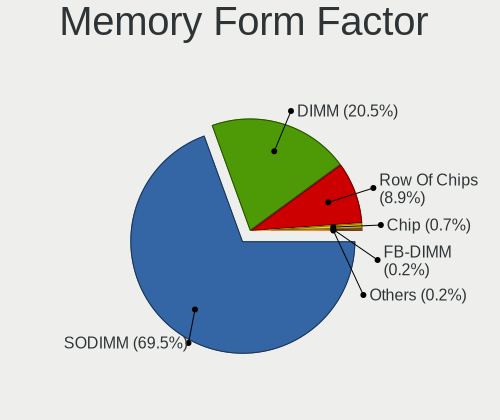

| Name         | Computers | Percent |
|--------------|-----------|---------|
| SODIMM       | 247       | 70.57%  |
| DIMM         | 77        | 22%     |
| Row Of Chips | 20        | 5.71%   |
| Chip         | 4         | 1.14%   |
| FB-DIMM      | 1         | 0.29%   |
| Unknown      | 1         | 0.29%   |

Memory Size
-----------

Memory module size

| Size  | Computers | Percent |
|-------|-----------|---------|
| 8192  | 146       | 36.5%   |
| 4096  | 133       | 33.25%  |
| 2048  | 65        | 16.25%  |
| 16384 | 38        | 9.5%    |
| 1024  | 14        | 3.5%    |
| 32768 | 3         | 0.75%   |
| 512   | 1         | 0.25%   |

Memory Speed
------------

Memory module speed

| Speed   | Computers | Percent |
|---------|-----------|---------|
| 1600    | 94        | 24.35%  |
| 2667    | 56        | 14.51%  |
| 1333    | 37        | 9.59%   |
| 3200    | 33        | 8.55%   |
| 2400    | 29        | 7.51%   |
| 2133    | 27        | 6.99%   |
| 1334    | 16        | 4.15%   |
| 667     | 12        | 3.11%   |
| 800     | 10        | 2.59%   |
| 1867    | 9         | 2.33%   |
| 1067    | 8         | 2.07%   |
| 1066    | 8         | 2.07%   |
| 4267    | 5         | 1.3%    |
| 3600    | 4         | 1.04%   |
| 3266    | 4         | 1.04%   |
| 8400    | 3         | 0.78%   |
| 3466    | 3         | 0.78%   |
| 1800    | 3         | 0.78%   |
| 4266    | 2         | 0.52%   |
| 4199    | 2         | 0.52%   |
| 3733    | 2         | 0.52%   |
| 3000    | 2         | 0.52%   |
| 2933    | 2         | 0.52%   |
| 1866    | 2         | 0.52%   |
| Unknown | 2         | 0.52%   |
| 4800    | 1         | 0.26%   |
| 3334    | 1         | 0.26%   |
| 3007    | 1         | 0.26%   |
| 2934    | 1         | 0.26%   |
| 2800    | 1         | 0.26%   |
| 2666    | 1         | 0.26%   |
| 2200    | 1         | 0.26%   |
| 2048    | 1         | 0.26%   |
| 1639    | 1         | 0.26%   |
| 975     | 1         | 0.26%   |
| 133     | 1         | 0.26%   |

Printers & scanners
-------------------

Printer Vendor
--------------

Printer device vendors

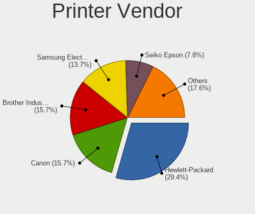

| Vendor                          | Computers | Percent |
|---------------------------------|-----------|---------|
| Hewlett-Packard                 | 9         | 33.33%  |
| Brother Industries              | 6         | 22.22%  |
| Canon                           | 4         | 14.81%  |
| Seiko Epson                     | 2         | 7.41%   |
| Samsung Electronics             | 2         | 7.41%   |
| Xerox                           | 1         | 3.7%    |
| Prolific Technology             | 1         | 3.7%    |
| Dymo-CoStar                     | 1         | 3.7%    |
| cab Produkttechnik GmbH & Co KG | 1         | 3.7%    |

Printer Model
-------------

Printer device models

| Model                                    | Computers | Percent |
|------------------------------------------|-----------|---------|
| Samsung M2020 Series                     | 2         | 7.41%   |
| Xerox Phaser 3040                        | 1         | 3.7%    |
| Seiko Epson XP-202 203 206 Series        | 1         | 3.7%    |
| Seiko Epson L395 Series                  | 1         | 3.7%    |
| Prolific PL2305 Parallel Port            | 1         | 3.7%    |
| HP Printing Support                      | 1         | 3.7%    |
| HP OfficeJet 5200 series                 | 1         | 3.7%    |
| HP LaserJet Pro M202dw                   | 1         | 3.7%    |
| HP LaserJet M101-M106                    | 1         | 3.7%    |
| HP LaserJet 1320                         | 1         | 3.7%    |
| HP Ink Tank 110 series                   | 1         | 3.7%    |
| HP Deskjet F4500 series                  | 1         | 3.7%    |
| HP Deskjet 2050 J510                     | 1         | 3.7%    |
| HP Deskjet 1000 J110 series              | 1         | 3.7%    |
| Dymo-CoStar LabelWriter 450              | 1         | 3.7%    |
| Canon TR8500 series                      | 1         | 3.7%    |
| Canon PIXMA MG3600 Series                | 1         | 3.7%    |
| Canon PIXMA MG2500 Series                | 1         | 3.7%    |
| Canon G3000 series                       | 1         | 3.7%    |
| cab Produkttechnik GmbH & Co KG EOS2/300 | 1         | 3.7%    |
| Brother MFC-T910DW                       | 1         | 3.7%    |
| Brother MFC-T800W                        | 1         | 3.7%    |
| Brother MFC-L2750DW series               | 1         | 3.7%    |
| Brother MFC-J5335DW                      | 1         | 3.7%    |
| Brother HL-4140CN series                 | 1         | 3.7%    |
| Brother DCP-L2550DN series               | 1         | 3.7%    |

Scanner Vendor
--------------

Scanner device vendors

| Vendor      | Computers | Percent |
|-------------|-----------|---------|
| Seiko Epson | 1         | 50%     |
| Canon       | 1         | 50%     |

Scanner Model
-------------

Scanner device models

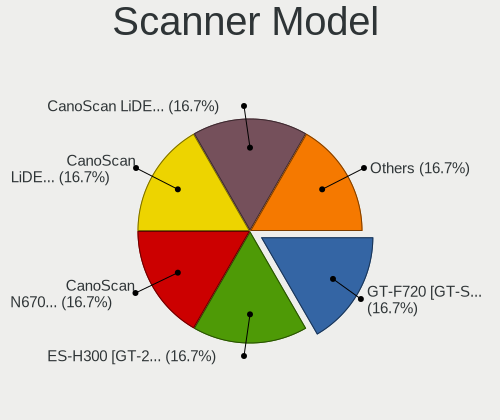

| Model                                                   | Computers | Percent |
|---------------------------------------------------------|-----------|---------|
| Seiko Epson GT-F720 [GT-S620/Perfection V30/V300 Photo] | 1         | 50%     |
| Canon CanoScan LiDE 110                                 | 1         | 50%     |

Camera
------

Camera Vendor
-------------

Camera device vendors

| Vendor                                 | Computers | Percent |
|----------------------------------------|-----------|---------|
| Chicony Electronics                    | 183       | 22%     |
| Realtek Semiconductor                  | 79        | 9.5%    |
| Apple                                  | 77        | 9.25%   |
| IMC Networks                           | 66        | 7.93%   |
| Microdia                               | 53        | 6.37%   |
| Sunplus Innovation Technology          | 46        | 5.53%   |
| Acer                                   | 45        | 5.41%   |
| Quanta                                 | 39        | 4.69%   |
| Cheng Uei Precision Industry (Foxlink) | 32        | 3.85%   |
| Logitech                               | 28        | 3.37%   |
| Suyin                                  | 26        | 3.13%   |
| Syntek                                 | 23        | 2.76%   |
| Alcor Micro                            | 19        | 2.28%   |
| Silicon Motion                         | 17        | 2.04%   |
| Lite-On Technology                     | 15        | 1.8%    |
| Microsoft                              | 11        | 1.32%   |
| Lenovo                                 | 10        | 1.2%    |
| Luxvisions Innotech Limited            | 7         | 0.84%   |
| Ricoh                                  | 6         | 0.72%   |
| Importek                               | 5         | 0.6%    |
| Z-Star Microelectronics                | 4         | 0.48%   |
| LG Electronics                         | 4         | 0.48%   |
| Samsung Electronics                    | 3         | 0.36%   |
| Primax Electronics                     | 3         | 0.36%   |
| KYE Systems (Mouse Systems)            | 3         | 0.36%   |
| Generalplus Technology                 | 3         | 0.36%   |
| Cubeternet                             | 3         | 0.36%   |
| ALi                                    | 3         | 0.36%   |
| Jieli Technology                       | 2         | 0.24%   |
| Foxconn / Hon Hai                      | 2         | 0.24%   |
| Y Media                                | 1         | 0.12%   |
| webcam                                 | 1         | 0.12%   |
| Vimicro                                | 1         | 0.12%   |
| Unknown                                | 1         | 0.12%   |
| Teslong Camera                         | 1         | 0.12%   |
| SunplusIT                              | 1         | 0.12%   |
| Sony                                   | 1         | 0.12%   |
| Razer USA                              | 1         | 0.12%   |
| kingcome                               | 1         | 0.12%   |
| icSpring                               | 1         | 0.12%   |
| Hewlett-Packard                        | 1         | 0.12%   |
| Guillemot                              | 1         | 0.12%   |
| Google                                 | 1         | 0.12%   |
| Creative Technology                    | 1         | 0.12%   |
| ANYKA                                  | 1         | 0.12%   |

Camera Model
------------

Camera device models

| Model                                                                      | Computers | Percent |
|----------------------------------------------------------------------------|-----------|---------|
| Chicony Integrated Camera                                                  | 34        | 4.05%   |
| Apple Built-in iSight                                                      | 30        | 3.58%   |
| Realtek Integrated_Webcam_HD                                               | 25        | 2.98%   |
| Chicony HD Webcam                                                          | 24        | 2.86%   |
| IMC Networks Integrated Camera                                             | 19        | 2.26%   |
| IMC Networks USB2.0 HD UVC WebCam                                          | 17        | 2.03%   |
| Apple FaceTime HD Camera                                                   | 16        | 1.91%   |
| Syntek Integrated Camera                                                   | 13        | 1.55%   |
| Microdia Integrated_Webcam_HD                                              | 13        | 1.55%   |
| Apple iPhone 5/5C/5S/6/SE                                                  | 13        | 1.55%   |
| Sunplus Integrated_Webcam_HD                                               | 11        | 1.31%   |
| Apple FaceTime HD Camera (Built-in)                                        | 10        | 1.19%   |
| Realtek USB2.0 HD UVC WebCam                                               | 9         | 1.07%   |
| Chicony HP HD Webcam [Fixed]                                               | 9         | 1.07%   |
| Realtek USB Camera                                                         | 8         | 0.95%   |
| Quanta HP TrueVision HD Camera                                             | 8         | 0.95%   |
| IMC Networks USB2.0 VGA UVC WebCam                                         | 8         | 0.95%   |
| Chicony USB 2.0 Camera                                                     | 8         | 0.95%   |
| Acer Lenovo EasyCamera                                                     | 8         | 0.95%   |
| Sunplus HD WebCam                                                          | 7         | 0.83%   |
| Realtek Integrated Webcam                                                  | 7         | 0.83%   |
| Quanta HP Webcam                                                           | 7         | 0.83%   |
| Logitech HD Pro Webcam C920                                                | 7         | 0.83%   |
| Lite-On Integrated Camera                                                  | 7         | 0.83%   |
| Chicony HP HD Camera                                                       | 7         | 0.83%   |
| Sunplus Laptop_Integrated_Webcam_HD                                        | 6         | 0.72%   |
| Realtek HD WebCam                                                          | 6         | 0.72%   |
| Chicony VGA WebCam                                                         | 6         | 0.72%   |
| Chicony HP Wide Vision HD Camera                                           | 6         | 0.72%   |
| Chicony HP High Definition 1MP Webcam                                      | 6         | 0.72%   |
| Chicony EasyCamera                                                         | 6         | 0.72%   |
| Alcor Micro USB 2.0 PC Camera                                              | 6         | 0.72%   |
| Acer EasyCamera                                                            | 6         | 0.72%   |
| Syntek Lenovo EasyCamera                                                   | 5         | 0.6%    |
| Silicon Motion Web Camera                                                  | 5         | 0.6%    |
| Quanta VGA WebCam                                                          | 5         | 0.6%    |
| Quanta HD User Facing                                                      | 5         | 0.6%    |
| Lenovo Integrated Webcam [R5U877]                                          | 5         | 0.6%    |
| IMC Networks USB2.0 UVC HD Webcam                                          | 5         | 0.6%    |
| Chicony TOSHIBA Web Camera - HD                                            | 5         | 0.6%    |
| Chicony HP TrueVision HD                                                   | 5         | 0.6%    |
| Chicony HP HD Webcam                                                       | 5         | 0.6%    |
| Apple FaceTime Camera                                                      | 5         | 0.6%    |
| Alcor Micro USB 2.0 Camera                                                 | 5         | 0.6%    |
| Syntek EasyCamera                                                          | 4         | 0.48%   |
| Sunplus HP TrueVision HD Camera                                            | 4         | 0.48%   |
| Microdia Webcam Vitade AF                                                  | 4         | 0.48%   |
| Microdia USB 2.0 Camera                                                    | 4         | 0.48%   |
| Microdia Integrated Webcam                                                 | 4         | 0.48%   |
| Logitech Webcam C270                                                       | 4         | 0.48%   |
| Lenovo Integrated Webcam                                                   | 4         | 0.48%   |
| IMC Networks EasyCamera                                                    | 4         | 0.48%   |
| Chicony USB2.0 VGA UVC WebCam                                              | 4         | 0.48%   |
| Chicony Lenovo EasyCamera                                                  | 4         | 0.48%   |
| Cheng Uei Precision Industry (Foxlink) HP Wide Vision HD Integrated Webcam | 4         | 0.48%   |
| Acer ThinkPad Integrated Camera                                            | 4         | 0.48%   |
| Acer HD Webcam                                                             | 4         | 0.48%   |
| Acer BisonCam, NB Pro                                                      | 4         | 0.48%   |
| Suyin HP Truevision HD                                                     | 3         | 0.36%   |
| Suyin Acer/HP Integrated Webcam [CN0314]                                   | 3         | 0.36%   |

Security
--------

Fingerprint Vendor
------------------

Fingerprint sensor vendors

| Vendor                     | Computers | Percent |
|----------------------------|-----------|---------|
| Validity Sensors           | 51        | 35.92%  |
| Synaptics                  | 39        | 27.46%  |
| Shenzhen Goodix Technology | 14        | 9.86%   |
| LighTuning Technology      | 14        | 9.86%   |
| Upek                       | 9         | 6.34%   |
| Elan Microelectronics      | 7         | 4.93%   |
| AuthenTec                  | 5         | 3.52%   |
| STMicroelectronics         | 2         | 1.41%   |
| Focal-systems.Corp         | 1         | 0.7%    |

Fingerprint Model
-----------------

Fingerprint sensor models

| Model                                                                      | Computers | Percent |
|----------------------------------------------------------------------------|-----------|---------|
| Unknown                                                                    | 13        | 9.15%   |
| Validity Sensors VFS495 Fingerprint Reader                                 | 12        | 8.45%   |
| LighTuning EgisTec Touch Fingerprint Sensor                                | 11        | 7.75%   |
| Upek Biometric Touchchip/Touchstrip Fingerprint Sensor                     | 9         | 6.34%   |
| Shenzhen Goodix  FingerPrint Device                                        | 8         | 5.63%   |
| Synaptics Prometheus MIS Touch Fingerprint Reader                          | 7         | 4.93%   |
| Synaptics Metallica MIS Touch Fingerprint Reader                           | 7         | 4.93%   |
| Validity Sensors VFS491                                                    | 6         | 4.23%   |
| Validity Sensors VFS471 Fingerprint Reader                                 | 5         | 3.52%   |
| Validity Sensors VFS 5011 fingerprint sensor                               | 5         | 3.52%   |
| Elan ELAN:Fingerprint                                                      | 5         | 3.52%   |
| Validity Sensors VFS7500 Touch Fingerprint Sensor                          | 4         | 2.82%   |
| Validity Sensors VFS5011 Fingerprint Reader                                | 4         | 2.82%   |
| Validity Sensors Synaptics WBDI                                            | 4         | 2.82%   |
| Synaptics  FS7604 Touch Fingerprint Sensor with PurePrint                  | 4         | 2.82%   |
| Validity Sensors Synaptics VFS7552 Touch Fingerprint Sensor with PurePrint | 3         | 2.11%   |
| Validity Sensors Fingerprint scanner                                       | 3         | 2.11%   |
| Synaptics  WBDI                                                            | 3         | 2.11%   |
| Shenzhen Goodix Fingerprint Reader                                         | 3         | 2.11%   |
| Shenzhen Goodix FingerPrint                                                | 3         | 2.11%   |
| Validity Sensors VFS451 Fingerprint Reader                                 | 2         | 1.41%   |
| Validity Sensors Swipe Fingerprint Sensor                                  | 2         | 1.41%   |
| Synaptics  VFS7552 Touch Fingerprint Sensor with PurePrint                 | 2         | 1.41%   |
| Synaptics Metallica MOH Touch Fingerprint Reader                           | 2         | 1.41%   |
| STMicroelectronics Fingerprint Reader                                      | 2         | 1.41%   |
| LighTuning ES603 Swipe Fingerprint Sensor                                  | 2         | 1.41%   |
| Elan ELAN:ARM-M4                                                           | 2         | 1.41%   |
| AuthenTec Fingerprint Sensor                                               | 2         | 1.41%   |
| Validity Sensors VFS101 Fingerprint Reader                                 | 1         | 0.7%    |
| Synaptics  WBDI Fingerprint Reader - USB 052                               | 1         | 0.7%    |
| LighTuning Fingerprint Sensor                                              | 1         | 0.7%    |
| Focal-systems.Corp FT9201Fingerprint.                                      | 1         | 0.7%    |
| AuthenTec AES2810                                                          | 1         | 0.7%    |
| AuthenTec AES2501 Fingerprint Sensor                                       | 1         | 0.7%    |
| AuthenTec AES1600                                                          | 1         | 0.7%    |

Chipcard Vendor
---------------

Chipcard module vendors

| Vendor                            | Computers | Percent |
|-----------------------------------|-----------|---------|
| Broadcom                          | 21        | 44.68%  |
| Alcor Micro                       | 14        | 29.79%  |
| O2 Micro                          | 4         | 8.51%   |
| Lenovo                            | 3         | 6.38%   |
| Upek                              | 2         | 4.26%   |
| VASCO Data Security International | 1         | 2.13%   |
| Gemalto (was Gemplus)             | 1         | 2.13%   |
| Chicony Electronics               | 1         | 2.13%   |

Chipcard Model
--------------

Chipcard module models

| Model                                                                        | Computers | Percent |
|------------------------------------------------------------------------------|-----------|---------|
| Alcor Micro AU9540 Smartcard Reader                                          | 14        | 29.79%  |
| Broadcom BCM5880 Secure Applications Processor                               | 11        | 23.4%   |
| Broadcom BCM5880 Secure Applications Processor with fingerprint swipe sensor | 4         | 8.51%   |
| O2 Micro OZ776 CCID Smartcard Reader                                         | 3         | 6.38%   |
| Lenovo Integrated Smart Card Reader                                          | 3         | 6.38%   |
| Broadcom 5880                                                                | 3         | 6.38%   |
| Broadcom 58200                                                               | 3         | 6.38%   |
| Upek TouchChip Fingerprint Coprocessor (WBF advanced mode)                   | 2         | 4.26%   |
| VASCO Data Security International Digipass 905 SmartCard Reader              | 1         | 2.13%   |
| O2 Micro Oz776 SmartCard Reader                                              | 1         | 2.13%   |
| Gemalto (was Gemplus) Compact Smart Card Reader Writer                       | 1         | 2.13%   |
| Chicony Electronics HP Skylab USB Smartcard Keyboard                         | 1         | 2.13%   |

Unsupported
-----------

Unsupported Devices
-------------------

Total unsupported devices on board

| Total | Computers | Percent |
|-------|-----------|---------|
| 0     | 876       | 73.31%  |
| 1     | 256       | 21.42%  |
| 2     | 53        | 4.44%   |
| 3     | 8         | 0.67%   |
| 7     | 1         | 0.08%   |
| 4     | 1         | 0.08%   |

Unsupported Device Types
------------------------

Types of unsupported devices

| Type                     | Computers | Percent |
|--------------------------|-----------|---------|
| Fingerprint reader       | 141       | 36.25%  |
| Net/wireless             | 68        | 17.48%  |
| Graphics card            | 50        | 12.85%  |
| Chipcard                 | 44        | 11.31%  |
| Multimedia controller    | 28        | 7.2%    |
| Bluetooth                | 13        | 3.34%   |
| Camera                   | 11        | 2.83%   |
| Sound                    | 7         | 1.8%    |
| Storage                  | 5         | 1.29%   |
| Net/ethernet             | 5         | 1.29%   |
| Card reader              | 5         | 1.29%   |
| Communication controller | 4         | 1.03%   |
| Unassigned class         | 3         | 0.77%   |
| Storage/raid             | 2         | 0.51%   |
| Network                  | 2         | 0.51%   |
| Storage/ide              | 1         | 0.26%   |

