Elementary - Tested Hardware & Statistics (Desktops)
----------------------------------------------------

A project to collect tested hardware configurations for Elementary.

Anyone can contribute to this report by the [hw-probe](https://github.com/linuxhw/hw-probe) tool:

    sudo -E hw-probe -all -upload

Please contribute! Especially if your hardware is rare.

Contents
--------

* [ Test Cases ](#test-cases)

* [ System ](#system)
  - [ OS                       ](#os)
  - [ OS Family                ](#os-family)
  - [ Kernel                   ](#kernel)
  - [ Kernel Family            ](#kernel-family)
  - [ Kernel Major Ver.        ](#kernel-major-ver)
  - [ Arch                     ](#arch)
  - [ DE                       ](#de)
  - [ Display Server           ](#display-server)
  - [ Display Manager          ](#display-manager)
  - [ OS Lang                  ](#os-lang)
  - [ Boot Mode                ](#boot-mode)
  - [ Filesystem               ](#filesystem)
  - [ Part. scheme             ](#part-scheme)
  - [ Dual Boot with Linux/BSD ](#dual-boot-with-linuxbsd)
  - [ Dual Boot (Win)          ](#dual-boot-win)

* [ Board ](#board)
  - [ Vendor                   ](#vendor)
  - [ Model                    ](#model)
  - [ Model Family             ](#model-family)
  - [ MFG Year                 ](#mfg-year)
  - [ Form Factor              ](#form-factor)
  - [ Secure Boot              ](#secure-boot)
  - [ Coreboot                 ](#coreboot)
  - [ RAM Size                 ](#ram-size)
  - [ RAM Used                 ](#ram-used)
  - [ Total Drives             ](#total-drives)
  - [ Has CD-ROM               ](#has-cd-rom)
  - [ Has Ethernet             ](#has-ethernet)
  - [ Has WiFi                 ](#has-wifi)
  - [ Has Bluetooth            ](#has-bluetooth)

* [ Location ](#location)
  - [ Country                  ](#country)
  - [ City                     ](#city)

* [ Drives ](#drives)
  - [ Drive Vendor             ](#drive-vendor)
  - [ Drive Model              ](#drive-model)
  - [ HDD Vendor               ](#hdd-vendor)
  - [ SSD Vendor               ](#ssd-vendor)
  - [ Drive Kind               ](#drive-kind)
  - [ Drive Connector          ](#drive-connector)
  - [ Drive Size               ](#drive-size)
  - [ Space Total              ](#space-total)
  - [ Space Used               ](#space-used)
  - [ Malfunc. Drives          ](#malfunc-drives)
  - [ Malfunc. Drive Vendor    ](#malfunc-drive-vendor)
  - [ Malfunc. HDD Vendor      ](#malfunc-hdd-vendor)
  - [ Malfunc. Drive Kind      ](#malfunc-drive-kind)
  - [ Failed Drives            ](#failed-drives)
  - [ Failed Drive Vendor      ](#failed-drive-vendor)
  - [ Drive Status             ](#drive-status)

* [ Storage controller ](#storage-controller)
  - [ Storage Vendor           ](#storage-vendor)
  - [ Storage Model            ](#storage-model)
  - [ Storage Kind             ](#storage-kind)

* [ Processor ](#processor)
  - [ CPU Vendor               ](#cpu-vendor)
  - [ CPU Model                ](#cpu-model)
  - [ CPU Model Family         ](#cpu-model-family)
  - [ CPU Cores                ](#cpu-cores)
  - [ CPU Sockets              ](#cpu-sockets)
  - [ CPU Threads              ](#cpu-threads)
  - [ CPU Op-Modes             ](#cpu-op-modes)
  - [ CPU Microcode            ](#cpu-microcode)
  - [ CPU Microarch            ](#cpu-microarch)

* [ Graphics ](#graphics)
  - [ GPU Vendor               ](#gpu-vendor)
  - [ GPU Model                ](#gpu-model)
  - [ GPU Combo                ](#gpu-combo)
  - [ GPU Driver               ](#gpu-driver)
  - [ GPU Memory               ](#gpu-memory)

* [ Monitor ](#monitor)
  - [ Monitor Vendor           ](#monitor-vendor)
  - [ Monitor Model            ](#monitor-model)
  - [ Monitor Resolution       ](#monitor-resolution)
  - [ Monitor Diagonal         ](#monitor-diagonal)
  - [ Monitor Width            ](#monitor-width)
  - [ Aspect Ratio             ](#aspect-ratio)
  - [ Monitor Area             ](#monitor-area)
  - [ Pixel Density            ](#pixel-density)
  - [ Multiple Monitors        ](#multiple-monitors)

* [ Network ](#network)
  - [ Net Controller Vendor    ](#net-controller-vendor)
  - [ Net Controller Model     ](#net-controller-model)
  - [ Wireless Vendor          ](#wireless-vendor)
  - [ Wireless Model           ](#wireless-model)
  - [ Ethernet Vendor          ](#ethernet-vendor)
  - [ Ethernet Model           ](#ethernet-model)
  - [ Net Controller Kind      ](#net-controller-kind)
  - [ Used Controller          ](#used-controller)
  - [ NICs                     ](#nics)
  - [ IPv6                     ](#ipv6)

* [ Bluetooth ](#bluetooth)
  - [ Bluetooth Vendor         ](#bluetooth-vendor)
  - [ Bluetooth Model          ](#bluetooth-model)

* [ Sound ](#sound)
  - [ Sound Vendor             ](#sound-vendor)
  - [ Sound Model              ](#sound-model)

* [ Memory ](#memory)
  - [ Memory Vendor            ](#memory-vendor)
  - [ Memory Model             ](#memory-model)
  - [ Memory Kind              ](#memory-kind)
  - [ Memory Form Factor       ](#memory-form-factor)
  - [ Memory Size              ](#memory-size)
  - [ Memory Speed             ](#memory-speed)

* [ Printers & scanners ](#printers--scanners)
  - [ Printer Vendor           ](#printer-vendor)
  - [ Printer Model            ](#printer-model)
  - [ Scanner Vendor           ](#scanner-vendor)
  - [ Scanner Model            ](#scanner-model)

* [ Camera ](#camera)
  - [ Camera Vendor            ](#camera-vendor)
  - [ Camera Model             ](#camera-model)

* [ Security ](#security)
  - [ Fingerprint Vendor       ](#fingerprint-vendor)
  - [ Fingerprint Model        ](#fingerprint-model)
  - [ Chipcard Vendor          ](#chipcard-vendor)
  - [ Chipcard Model           ](#chipcard-model)

* [ Unsupported ](#unsupported)
  - [ Unsupported Devices      ](#unsupported-devices)
  - [ Unsupported Device Types ](#unsupported-device-types)

Test Cases
----------

Total: 533

| Vendor        | Model                       | Probe                                                      | Date         |
|---------------|-----------------------------|------------------------------------------------------------|--------------|
| BESSTAR Te... | UM350                       | [ee1ba0e588](https://linux-hardware.org/?probe=ee1ba0e588) | Jan 30, 2023 |
| ASUSTek       | Z170 PRO GAMING             | [c2a4529e33](https://linux-hardware.org/?probe=c2a4529e33) | Jan 30, 2023 |
| Gigabyte      | B450 AORUS ELITE            | [e5f6f546d4](https://linux-hardware.org/?probe=e5f6f546d4) | Jan 29, 2023 |
| EVGA          | E689 $                      | [9d4b1aeaa9](https://linux-hardware.org/?probe=9d4b1aeaa9) | Jan 29, 2023 |
| EVGA          | E689 $                      | [be99ae882b](https://linux-hardware.org/?probe=be99ae882b) | Jan 28, 2023 |
| Gigabyte      | GA-990FXA-UD3               | [6e5884ec0c](https://linux-hardware.org/?probe=6e5884ec0c) | Jan 26, 2023 |
| ASUSTek       | Z87-A                       | [755bed02ff](https://linux-hardware.org/?probe=755bed02ff) | Jan 25, 2023 |
| ASUSTek       | Z87-A                       | [6ccfafe0d6](https://linux-hardware.org/?probe=6ccfafe0d6) | Jan 24, 2023 |
| Dell          | 0G261D A00                  | [ac4e94394e](https://linux-hardware.org/?probe=ac4e94394e) | Jan 24, 2023 |
| Unknown       | G41T-M7                     | [026810c423](https://linux-hardware.org/?probe=026810c423) | Jan 22, 2023 |
| Gigabyte      | Z77MX-D3H                   | [2142d5e771](https://linux-hardware.org/?probe=2142d5e771) | Jan 22, 2023 |
| Gigabyte      | Z77MX-D3H                   | [80d8c352b9](https://linux-hardware.org/?probe=80d8c352b9) | Jan 22, 2023 |
| Gigabyte      | A320M-S2H V2-CF             | [b8df2d6479](https://linux-hardware.org/?probe=b8df2d6479) | Jan 11, 2023 |
| Intel         | JSL MRD                     | [d1b9dbaae0](https://linux-hardware.org/?probe=d1b9dbaae0) | Jan 11, 2023 |
| HP            | 8643 SMVB                   | [5187413460](https://linux-hardware.org/?probe=5187413460) | Jan 07, 2023 |
| Acer          | Veriton M2631G V:1.0        | [ebbcc0dda8](https://linux-hardware.org/?probe=ebbcc0dda8) | Jan 07, 2023 |
| Unknown       | HX90                        | [af144f98b6](https://linux-hardware.org/?probe=af144f98b6) | Jan 05, 2023 |
| ASRock        | H110 Pro BTC+               | [a7ccef79ad](https://linux-hardware.org/?probe=a7ccef79ad) | Dec 30, 2022 |
| Gigabyte      | H61M-S2V-B3                 | [b3970a8e5a](https://linux-hardware.org/?probe=b3970a8e5a) | Dec 29, 2022 |
| ASUSTek       | ROG STRIX B550-A GAMING     | [bc58be5546](https://linux-hardware.org/?probe=bc58be5546) | Dec 27, 2022 |
| ASUSTek       | ROG STRIX B550-A GAMING     | [f9bde62142](https://linux-hardware.org/?probe=f9bde62142) | Dec 27, 2022 |
| Gigabyte      | AB350-Gaming 3-CF           | [c545cf1f08](https://linux-hardware.org/?probe=c545cf1f08) | Dec 25, 2022 |
| Lenovo        | ThinkCentre M71e 3129C3G    | [cb9f99f1cf](https://linux-hardware.org/?probe=cb9f99f1cf) | Dec 23, 2022 |
| Fujitsu       | D3041-A1 S26361-D3041-A1    | [2fa8510855](https://linux-hardware.org/?probe=2fa8510855) | Dec 19, 2022 |
| Foxconn       | 2ABF                        | [10e579b77e](https://linux-hardware.org/?probe=10e579b77e) | Dec 18, 2022 |
| Dell          | 08WKV3 A00                  | [f58a0ffbc3](https://linux-hardware.org/?probe=f58a0ffbc3) | Dec 13, 2022 |
| MSI           | B350 TOMAHAWK               | [0ce6563922](https://linux-hardware.org/?probe=0ce6563922) | Dec 11, 2022 |
| ASUSTek       | Z170-P                      | [5180b907e3](https://linux-hardware.org/?probe=5180b907e3) | Dec 10, 2022 |
| LORD ELECT... | LORD G4x 775 ICH7 8712 A... | [5ca8db90bb](https://linux-hardware.org/?probe=5ca8db90bb) | Dec 10, 2022 |
| ASUSTek       | PRIME H310M-E R2.0          | [906e4966a6](https://linux-hardware.org/?probe=906e4966a6) | Dec 07, 2022 |
| ASRock        | H55M-LE                     | [9d2066a479](https://linux-hardware.org/?probe=9d2066a479) | Dec 03, 2022 |
| Fujitsu       | D3602-A1 S26361-D3602-A1    | [6f57ed994c](https://linux-hardware.org/?probe=6f57ed994c) | Dec 03, 2022 |
| LORD ELECT... | LORD G4x 775 ICH7 8712 A... | [62b19626ce](https://linux-hardware.org/?probe=62b19626ce) | Dec 03, 2022 |
| ASUSTek       | PRIME H310M-E R2.0          | [19d93a0122](https://linux-hardware.org/?probe=19d93a0122) | Dec 03, 2022 |
| Lenovo        | ThinkCentre M70e 0809D1Y    | [0cd85fa9f3](https://linux-hardware.org/?probe=0cd85fa9f3) | Nov 30, 2022 |
| Dell          | 0TP406                      | [3eceea61d2](https://linux-hardware.org/?probe=3eceea61d2) | Nov 30, 2022 |
| Dell          | 0TP406                      | [d22689331c](https://linux-hardware.org/?probe=d22689331c) | Nov 30, 2022 |
| MSI           | IONA                        | [255f7f8dc4](https://linux-hardware.org/?probe=255f7f8dc4) | Nov 28, 2022 |
| MSI           | IONA                        | [94841f2b61](https://linux-hardware.org/?probe=94841f2b61) | Nov 28, 2022 |
| LattePanda    | Alpha                       | [be819160d5](https://linux-hardware.org/?probe=be819160d5) | Nov 26, 2022 |
| LattePanda    | Alpha                       | [b3c831db4d](https://linux-hardware.org/?probe=b3c831db4d) | Nov 26, 2022 |
| MSI           | IONA                        | [280083cfa1](https://linux-hardware.org/?probe=280083cfa1) | Nov 22, 2022 |
| LORD ELECT... | LORD G4x 775 ICH7 8712 A... | [4f230635de](https://linux-hardware.org/?probe=4f230635de) | Nov 19, 2022 |
| Dell          | 0RW199                      | [df40ccbcdb](https://linux-hardware.org/?probe=df40ccbcdb) | Nov 15, 2022 |
| Apple         | Mac-F60DEB81FF30ACF6 Mac... | [4629fb5e08](https://linux-hardware.org/?probe=4629fb5e08) | Nov 13, 2022 |
| ASUSTek       | P8H61-M LX R2.0             | [ddca3f4758](https://linux-hardware.org/?probe=ddca3f4758) | Nov 06, 2022 |
| Gigabyte      | H310M S2H                   | [521297d21c](https://linux-hardware.org/?probe=521297d21c) | Nov 03, 2022 |
| ASUSTek       | TUF Gaming B550M-PLUS       | [919fad100f](https://linux-hardware.org/?probe=919fad100f) | Oct 31, 2022 |
| ASUSTek       | PRIME X570-PRO              | [6d4b1d0bb3](https://linux-hardware.org/?probe=6d4b1d0bb3) | Oct 25, 2022 |
| HP            | 805D                        | [916b6f09ac](https://linux-hardware.org/?probe=916b6f09ac) | Oct 23, 2022 |
| MSI           | Z370 GAMING PLUS            | [ce623178a2](https://linux-hardware.org/?probe=ce623178a2) | Oct 16, 2022 |
| Dell          | 0D28YY A00                  | [435831fd5b](https://linux-hardware.org/?probe=435831fd5b) | Oct 15, 2022 |
| Kraftway      | KWQ67                       | [8346fc15e3](https://linux-hardware.org/?probe=8346fc15e3) | Oct 13, 2022 |
| Kraftway      | KWQ67                       | [d57d34be64](https://linux-hardware.org/?probe=d57d34be64) | Oct 13, 2022 |
| ASUSTek       | TUF Z390-PLUS GAMING        | [88772ad191](https://linux-hardware.org/?probe=88772ad191) | Oct 11, 2022 |
| ASRock        | X370 Taichi                 | [d86c708401](https://linux-hardware.org/?probe=d86c708401) | Sep 30, 2022 |
| Gigabyte      | G41MT-S2                    | [c0b1c8ad8f](https://linux-hardware.org/?probe=c0b1c8ad8f) | Sep 27, 2022 |
| Packard Be... | IMEDIA S1300                | [13b1f0e28e](https://linux-hardware.org/?probe=13b1f0e28e) | Sep 24, 2022 |
| Packard Be... | IMEDIA S1300                | [fae2bea6f3](https://linux-hardware.org/?probe=fae2bea6f3) | Sep 19, 2022 |
| Apple         | Mac-F221BEC8                | [b5f851bd15](https://linux-hardware.org/?probe=b5f851bd15) | Sep 12, 2022 |
| IceWhale T... | ZimaBoard 832 ZMB           | [335a8a059b](https://linux-hardware.org/?probe=335a8a059b) | Sep 12, 2022 |
| Gigabyte      | F2A88XM-D3HP                | [3d269171e7](https://linux-hardware.org/?probe=3d269171e7) | Sep 11, 2022 |
| ASUSTek       | P8H77-V LE                  | [ae533c2bdf](https://linux-hardware.org/?probe=ae533c2bdf) | Sep 07, 2022 |
| Acer          | Aspire X1420G               | [e48b081560](https://linux-hardware.org/?probe=e48b081560) | Sep 04, 2022 |
| ASUSTek       | TUF Gaming Z490-PLUS        | [3a8803f198](https://linux-hardware.org/?probe=3a8803f198) | Sep 01, 2022 |
| Gigabyte      | H370 AORUS GAMING 3 WIFI... | [413bd5a721](https://linux-hardware.org/?probe=413bd5a721) | Aug 29, 2022 |
| Lenovo        | MAHOBAY NO DPK              | [9274f5e876](https://linux-hardware.org/?probe=9274f5e876) | Aug 29, 2022 |
| ASUSTek       | M2N68-AM SE2                | [0f71a52e11](https://linux-hardware.org/?probe=0f71a52e11) | Aug 28, 2022 |
| Gigabyte      | H61M-S1                     | [6bf1dafdbc](https://linux-hardware.org/?probe=6bf1dafdbc) | Aug 27, 2022 |
| Apple         | Mac-F221BEC8                | [9ffe8ee96e](https://linux-hardware.org/?probe=9ffe8ee96e) | Aug 24, 2022 |
| Apple         | Mac-F221BEC8                | [4709584652](https://linux-hardware.org/?probe=4709584652) | Aug 24, 2022 |
| MSI           | MEG Z490I UNIFY             | [34d2d4f66e](https://linux-hardware.org/?probe=34d2d4f66e) | Aug 24, 2022 |
| Foxconn       | 2ABF                        | [6d7ce1962d](https://linux-hardware.org/?probe=6d7ce1962d) | Aug 24, 2022 |
| ASRock        | N68-VGS3 FX                 | [1d2367ccf7](https://linux-hardware.org/?probe=1d2367ccf7) | Aug 23, 2022 |
| ASUSTek       | TUF Gaming B550M-PLUS       | [595bf9c8a7](https://linux-hardware.org/?probe=595bf9c8a7) | Aug 23, 2022 |
| ASUSTek       | P7H55-M LX                  | [b545a0cf4f](https://linux-hardware.org/?probe=b545a0cf4f) | Aug 19, 2022 |
| Gigabyte      | H81M-DS2                    | [e0abb12052](https://linux-hardware.org/?probe=e0abb12052) | Aug 16, 2022 |
| ASUSTek       | PRIME B450M-A               | [59456f2a25](https://linux-hardware.org/?probe=59456f2a25) | Aug 16, 2022 |
| HP            | 2AF7                        | [ca8820daa4](https://linux-hardware.org/?probe=ca8820daa4) | Aug 16, 2022 |
| ASUSTek       | P5B                         | [1c5cafd185](https://linux-hardware.org/?probe=1c5cafd185) | Aug 15, 2022 |
| Gigabyte      | H81M-DS2                    | [5ae2bc3c12](https://linux-hardware.org/?probe=5ae2bc3c12) | Aug 14, 2022 |
| Acer          | Aspire X1420G               | [7be7ab2e7e](https://linux-hardware.org/?probe=7be7ab2e7e) | Jul 31, 2022 |
| ASUSTek       | ROG STRIX B450-F GAMING     | [e99805635f](https://linux-hardware.org/?probe=e99805635f) | Jul 29, 2022 |
| MSI           | B450M PRO-M2 MAX            | [ab8af10726](https://linux-hardware.org/?probe=ab8af10726) | Jul 28, 2022 |
| Gigabyte      | GA-78LMT-USB3               | [d0a69fba02](https://linux-hardware.org/?probe=d0a69fba02) | Jul 23, 2022 |
| Dell          | 0GM819                      | [373772e538](https://linux-hardware.org/?probe=373772e538) | Jul 21, 2022 |
| Dell          | 00V62H A01                  | [ae809bb317](https://linux-hardware.org/?probe=ae809bb317) | Jul 19, 2022 |
| ASUSTek       | ROG STRIX B360-H GAMING     | [4cc1f4384c](https://linux-hardware.org/?probe=4cc1f4384c) | Jul 12, 2022 |
| Acer          | Aspire X1420G               | [0b7a9cbc2a](https://linux-hardware.org/?probe=0b7a9cbc2a) | Jul 12, 2022 |
| ASUSTek       | P8H61-M LX R2.0             | [3db9c636d0](https://linux-hardware.org/?probe=3db9c636d0) | Jul 09, 2022 |
| MSI           | B450M PRO-VDH MAX           | [b8c450d5fa](https://linux-hardware.org/?probe=b8c450d5fa) | Jul 08, 2022 |
| Intel         | X79Turbo V1.x               | [e4b17550d0](https://linux-hardware.org/?probe=e4b17550d0) | Jul 06, 2022 |
| Gigabyte      | Z87X-OC-CF                  | [654459e245](https://linux-hardware.org/?probe=654459e245) | Jul 03, 2022 |
| ASUSTek       | TUF X470-PLUS GAMING        | [80a981f992](https://linux-hardware.org/?probe=80a981f992) | Jul 01, 2022 |
| Gigabyte      | Z690 AORUS MASTER           | [a8073316f6](https://linux-hardware.org/?probe=a8073316f6) | Jun 26, 2022 |
| ASRock        | Z490 Pro4                   | [f84c8a756c](https://linux-hardware.org/?probe=f84c8a756c) | Jun 25, 2022 |
| MSI           | B85I                        | [886f971d22](https://linux-hardware.org/?probe=886f971d22) | Jun 25, 2022 |
| HP            | 339A                        | [822467af7f](https://linux-hardware.org/?probe=822467af7f) | Jun 25, 2022 |
| T-bao         | MINI PC                     | [6b18c66487](https://linux-hardware.org/?probe=6b18c66487) | Jun 18, 2022 |
| Pegatron      | 2ACD                        | [8c8275099b](https://linux-hardware.org/?probe=8c8275099b) | Jun 16, 2022 |
| ASUSTek       | PRIME B550-PLUS             | [5b8ae292bf](https://linux-hardware.org/?probe=5b8ae292bf) | Jun 14, 2022 |
| ASUSTek       | SABERTOOTH X58              | [4cc4a7c1b3](https://linux-hardware.org/?probe=4cc4a7c1b3) | Jun 11, 2022 |
| HP            | 2B43                        | [6f36772b0c](https://linux-hardware.org/?probe=6f36772b0c) | Jun 10, 2022 |
| Gigabyte      | B450 AORUS ELITE            | [9756188040](https://linux-hardware.org/?probe=9756188040) | Jun 07, 2022 |
| MSI           | MPG X570S CARBON MAX WIF... | [0d57c069a8](https://linux-hardware.org/?probe=0d57c069a8) | Jun 05, 2022 |
| Lenovo        | 3098 SDK0E50510 WIN 2625... | [16f3fff6ad](https://linux-hardware.org/?probe=16f3fff6ad) | Jun 05, 2022 |
| Dell          | 0T7D40 A01                  | [812b41fe55](https://linux-hardware.org/?probe=812b41fe55) | Jun 04, 2022 |
| Lenovo        | 3098 SDK0E50510 WIN 2625... | [b3d970d061](https://linux-hardware.org/?probe=b3d970d061) | Jun 04, 2022 |
| MSI           | B85I                        | [5f29683d93](https://linux-hardware.org/?probe=5f29683d93) | Jun 03, 2022 |
| ASUSTek       | PRIME A320M-K/BR            | [9f4aa60f60](https://linux-hardware.org/?probe=9f4aa60f60) | Jun 02, 2022 |
| ASUSTek       | P5B                         | [12554af571](https://linux-hardware.org/?probe=12554af571) | May 31, 2022 |
| MSI           | MPG X570S CARBON MAX WIF... | [a4f2a9b24b](https://linux-hardware.org/?probe=a4f2a9b24b) | May 27, 2022 |
| MSI           | MPG X570S CARBON MAX WIF... | [3143793e8f](https://linux-hardware.org/?probe=3143793e8f) | May 27, 2022 |
| ASUSTek       | P5KPL-VM/S                  | [66223d6ef0](https://linux-hardware.org/?probe=66223d6ef0) | May 25, 2022 |
| ASUSTek       | P5KPL-VM/S                  | [d44e9d6290](https://linux-hardware.org/?probe=d44e9d6290) | May 25, 2022 |
| ASUSTek       | P8H61                       | [5514e95c95](https://linux-hardware.org/?probe=5514e95c95) | May 24, 2022 |
| ASUSTek       | P8H61                       | [873dd31f8e](https://linux-hardware.org/?probe=873dd31f8e) | May 23, 2022 |
| MSI           | H97M-P35                    | [2b5866b09d](https://linux-hardware.org/?probe=2b5866b09d) | May 23, 2022 |
| LORD ELECT... | LORD G4x 775 ICH7 8712 A... | [2e27b6fac9](https://linux-hardware.org/?probe=2e27b6fac9) | May 23, 2022 |
| Biostar       | GF8200C M2+                 | [b80588cbea](https://linux-hardware.org/?probe=b80588cbea) | May 21, 2022 |
| ASUSTek       | P8H61-M LE/USB3             | [6f6a104d35](https://linux-hardware.org/?probe=6f6a104d35) | May 21, 2022 |
| MSI           | B85I                        | [c822196290](https://linux-hardware.org/?probe=c822196290) | May 18, 2022 |
| MSI           | MEG X570 UNIFY              | [4d00452dcb](https://linux-hardware.org/?probe=4d00452dcb) | May 15, 2022 |
| ASUSTek       | SABERTOOTH X58              | [c276639676](https://linux-hardware.org/?probe=c276639676) | May 08, 2022 |
| ASUSTek       | H81M-K                      | [753c7be679](https://linux-hardware.org/?probe=753c7be679) | May 05, 2022 |
| ASRock        | X570 Extreme4               | [98e5f20999](https://linux-hardware.org/?probe=98e5f20999) | May 04, 2022 |
| Gigabyte      | GA-880GMA-UD2H              | [09d9f58ee7](https://linux-hardware.org/?probe=09d9f58ee7) | May 02, 2022 |
| HP            | 0B48h                       | [4c6e5824f2](https://linux-hardware.org/?probe=4c6e5824f2) | Apr 30, 2022 |
| ASUSTek       | P8Z77-V                     | [b3506ef75d](https://linux-hardware.org/?probe=b3506ef75d) | Apr 29, 2022 |
| Dell          | 0J3C2F A00                  | [464c70eb8d](https://linux-hardware.org/?probe=464c70eb8d) | Apr 27, 2022 |
| ASUSTek       | ROG CROSSHAIR VIII HERO     | [1f10d820f8](https://linux-hardware.org/?probe=1f10d820f8) | Apr 27, 2022 |
| ASUSTek       | ROG CROSSHAIR VIII HERO     | [dfadead480](https://linux-hardware.org/?probe=dfadead480) | Apr 27, 2022 |
| Gigabyte      | B150N Phoenix-WIFI-CF       | [dbaaf867f6](https://linux-hardware.org/?probe=dbaaf867f6) | Apr 25, 2022 |
| ASUSTek       | ROG STRIX Z590-F GAMING ... | [1b0a41c232](https://linux-hardware.org/?probe=1b0a41c232) | Apr 25, 2022 |
| AZW           | GTi                         | [e2d4a0da2e](https://linux-hardware.org/?probe=e2d4a0da2e) | Apr 23, 2022 |
| AZW           | GTi                         | [cde74551bf](https://linux-hardware.org/?probe=cde74551bf) | Apr 23, 2022 |
| ECS           | H61H2-MV                    | [939f87564f](https://linux-hardware.org/?probe=939f87564f) | Apr 21, 2022 |
| MSI           | X99A SLI PLUS               | [0b935aadb3](https://linux-hardware.org/?probe=0b935aadb3) | Apr 19, 2022 |
| Inventec      | D CLASS A02                 | [d00d37285b](https://linux-hardware.org/?probe=d00d37285b) | Apr 19, 2022 |
| ASRock        | Z490 Pro4                   | [67071d11a1](https://linux-hardware.org/?probe=67071d11a1) | Apr 18, 2022 |
| Dell          | 0KV62T A01                  | [0c6e50ed20](https://linux-hardware.org/?probe=0c6e50ed20) | Apr 17, 2022 |
| Dell          | 0KV62T A01                  | [7bed7782c4](https://linux-hardware.org/?probe=7bed7782c4) | Apr 17, 2022 |
| MSI           | B450M PRO-VDH MAX           | [e28ee0bd42](https://linux-hardware.org/?probe=e28ee0bd42) | Apr 16, 2022 |
| HP            | 1494                        | [6ad3ca1745](https://linux-hardware.org/?probe=6ad3ca1745) | Apr 16, 2022 |
| Gigabyte      | H61M-D2H-USB3               | [016243a675](https://linux-hardware.org/?probe=016243a675) | Apr 15, 2022 |
| Fujitsu       | D3531-A1 S26361-D3531-A1    | [46dd533a5e](https://linux-hardware.org/?probe=46dd533a5e) | Apr 14, 2022 |
| ASUSTek       | B85M-G                      | [c6dd82e724](https://linux-hardware.org/?probe=c6dd82e724) | Apr 14, 2022 |
| Gigabyte      | B450 AORUS ELITE            | [dff6de5032](https://linux-hardware.org/?probe=dff6de5032) | Apr 14, 2022 |
| ASUSTek       | B85M-G                      | [e525a26ca8](https://linux-hardware.org/?probe=e525a26ca8) | Apr 14, 2022 |
| Gigabyte      | B450 AORUS ELITE            | [6a2c5f12fd](https://linux-hardware.org/?probe=6a2c5f12fd) | Apr 13, 2022 |
| Dell          | 0K240Y A01                  | [76d4fbf0a6](https://linux-hardware.org/?probe=76d4fbf0a6) | Apr 13, 2022 |
| ASUSTek       | TUF X470-PLUS GAMING        | [3440d2dd8c](https://linux-hardware.org/?probe=3440d2dd8c) | Apr 12, 2022 |
| Lenovo        | 3178 SDK0J40700 WIN 3258... | [637023ab6d](https://linux-hardware.org/?probe=637023ab6d) | Apr 11, 2022 |
| ASUSTek       | PRIME Z390-A                | [21767e12e4](https://linux-hardware.org/?probe=21767e12e4) | Apr 11, 2022 |
| Pegatron      | IPMH61P1                    | [1adcf74c4f](https://linux-hardware.org/?probe=1adcf74c4f) | Apr 10, 2022 |
| ASUSTek       | H110I-PLUS                  | [e367ac99ce](https://linux-hardware.org/?probe=e367ac99ce) | Apr 10, 2022 |
| ASUSTek       | P8H61-M LX3 R2.0            | [1c357065cb](https://linux-hardware.org/?probe=1c357065cb) | Apr 07, 2022 |
| ASRock        | C226 WS                     | [7c11c1ec43](https://linux-hardware.org/?probe=7c11c1ec43) | Apr 07, 2022 |
| ASUSTek       | STRIKER II FORMULA          | [5dfea21930](https://linux-hardware.org/?probe=5dfea21930) | Apr 07, 2022 |
| ASUSTek       | STRIKER II FORMULA          | [040990b3fc](https://linux-hardware.org/?probe=040990b3fc) | Apr 07, 2022 |
| Gigabyte      | B450M DS3H-CF               | [0bc837ffef](https://linux-hardware.org/?probe=0bc837ffef) | Apr 06, 2022 |
| ASUSTek       | TUF Gaming B460M-PLUS       | [7419ad6a76](https://linux-hardware.org/?probe=7419ad6a76) | Apr 02, 2022 |
| Lenovo        | ThinkCentre M58 6258D3G     | [b67f1750b8](https://linux-hardware.org/?probe=b67f1750b8) | Mar 31, 2022 |
| Lenovo        | ThinkCentre M58 6258D3G     | [1cd22c83f1](https://linux-hardware.org/?probe=1cd22c83f1) | Mar 31, 2022 |
| MSI           | H97 GAMING 3                | [97f38615e3](https://linux-hardware.org/?probe=97f38615e3) | Mar 31, 2022 |
| MSI           | MEG X570 ACE                | [55572b8a7e](https://linux-hardware.org/?probe=55572b8a7e) | Mar 31, 2022 |
| HP            | 18E7                        | [ead4fcc358](https://linux-hardware.org/?probe=ead4fcc358) | Mar 29, 2022 |
| ASUSTek       | Rampage IV GENE             | [c067a4d0e7](https://linux-hardware.org/?probe=c067a4d0e7) | Mar 29, 2022 |
| Dell          | 0C522T A00                  | [33ae998152](https://linux-hardware.org/?probe=33ae998152) | Mar 26, 2022 |
| Dell          | 0C522T A00                  | [90242bb090](https://linux-hardware.org/?probe=90242bb090) | Mar 26, 2022 |
| MSI           | MPG B550 GAMING EDGE WIF... | [7577679057](https://linux-hardware.org/?probe=7577679057) | Mar 25, 2022 |
| Gigabyte      | A320M-S2H-CF                | [a237859a86](https://linux-hardware.org/?probe=a237859a86) | Mar 24, 2022 |
| Intel         | X79Turbo V1.x               | [18b126a753](https://linux-hardware.org/?probe=18b126a753) | Mar 24, 2022 |
| AMI           | Cherry Trail CR             | [bbea34ce64](https://linux-hardware.org/?probe=bbea34ce64) | Mar 22, 2022 |
| AMI           | Cherry Trail CR             | [bc5a34ef7e](https://linux-hardware.org/?probe=bc5a34ef7e) | Mar 20, 2022 |
| ASUSTek       | Rampage IV GENE             | [7f5053b061](https://linux-hardware.org/?probe=7f5053b061) | Mar 16, 2022 |
| ASUSTek       | Rampage IV GENE             | [7ff55a3ca6](https://linux-hardware.org/?probe=7ff55a3ca6) | Mar 16, 2022 |
| ASUSTek       | P8H61-M LX3 R2.0            | [eda8848760](https://linux-hardware.org/?probe=eda8848760) | Mar 15, 2022 |
| AOpen         | D1009 A1A4                  | [a7375d4581](https://linux-hardware.org/?probe=a7375d4581) | Mar 13, 2022 |
| MSI           | B85I                        | [d134c8451b](https://linux-hardware.org/?probe=d134c8451b) | Mar 12, 2022 |
| ASRock        | B450M Pro4                  | [12459fc7ea](https://linux-hardware.org/?probe=12459fc7ea) | Mar 11, 2022 |
| Gigabyte      | B150N Phoenix-WIFI-CF       | [a64818ccea](https://linux-hardware.org/?probe=a64818ccea) | Mar 10, 2022 |
| Biostar       | N68S3B                      | [aa1e6a4c82](https://linux-hardware.org/?probe=aa1e6a4c82) | Mar 10, 2022 |
| Dell          | 0HMX8D A01                  | [cfff92df80](https://linux-hardware.org/?probe=cfff92df80) | Mar 09, 2022 |
| ASUSTek       | M11AD                       | [8bb5baaa5a](https://linux-hardware.org/?probe=8bb5baaa5a) | Mar 09, 2022 |
| Biostar       | H61MLV2                     | [d5c330bad8](https://linux-hardware.org/?probe=d5c330bad8) | Mar 08, 2022 |
| HP            | 2ADC                        | [ed0714a64a](https://linux-hardware.org/?probe=ed0714a64a) | Mar 07, 2022 |
| MSI           | B85I                        | [39926596b7](https://linux-hardware.org/?probe=39926596b7) | Mar 07, 2022 |
| Dell          | 0PU052                      | [766b0e4665](https://linux-hardware.org/?probe=766b0e4665) | Mar 06, 2022 |
| Dell          | 0PU052                      | [a8e19bd112](https://linux-hardware.org/?probe=a8e19bd112) | Mar 06, 2022 |
| HP            | 1589                        | [88876808e9](https://linux-hardware.org/?probe=88876808e9) | Mar 05, 2022 |
| HP            | 802E                        | [14c73a40e0](https://linux-hardware.org/?probe=14c73a40e0) | Mar 05, 2022 |
| ASRock        | FM2A58M-DG3+                | [0b7875b1b5](https://linux-hardware.org/?probe=0b7875b1b5) | Mar 05, 2022 |
| ASUSTek       | M4N72-E                     | [c3fe570b4d](https://linux-hardware.org/?probe=c3fe570b4d) | Feb 28, 2022 |
| ASUSTek       | H81-PLUS                    | [e8956dc4ec](https://linux-hardware.org/?probe=e8956dc4ec) | Feb 27, 2022 |
| ASUSTek       | H81-PLUS                    | [9c68dfb511](https://linux-hardware.org/?probe=9c68dfb511) | Feb 26, 2022 |
| Gigabyte      | X470 AORUS ULTRA GAMING-... | [a6d5cc0368](https://linux-hardware.org/?probe=a6d5cc0368) | Feb 26, 2022 |
| Gigabyte      | Z390 UD                     | [7ea66813f3](https://linux-hardware.org/?probe=7ea66813f3) | Feb 23, 2022 |
| ASUSTek       | PRIME B450M-GAMING/BR       | [73b31ddab0](https://linux-hardware.org/?probe=73b31ddab0) | Feb 20, 2022 |
| Intel         | DH61BE AAG14062-210         | [00566bb73f](https://linux-hardware.org/?probe=00566bb73f) | Feb 19, 2022 |
| ASUSTek       | M11AD                       | [035887c4ab](https://linux-hardware.org/?probe=035887c4ab) | Feb 18, 2022 |
| ASUSTek       | P5B                         | [fa4c095fd7](https://linux-hardware.org/?probe=fa4c095fd7) | Feb 17, 2022 |
| Intel         | H61                         | [a70c59ad0e](https://linux-hardware.org/?probe=a70c59ad0e) | Feb 17, 2022 |
| ASUSTek       | PRIME Z590-A                | [6beda6e2da](https://linux-hardware.org/?probe=6beda6e2da) | Feb 16, 2022 |
| Biostar       | A68MD PRO                   | [da42cc4da7](https://linux-hardware.org/?probe=da42cc4da7) | Feb 16, 2022 |
| ASUSTek       | PRIME B250-PRO              | [be377c733e](https://linux-hardware.org/?probe=be377c733e) | Feb 14, 2022 |
| ASUSTek       | PRIME Z590-A                | [825734953d](https://linux-hardware.org/?probe=825734953d) | Feb 13, 2022 |
| MSI           | B85I                        | [898dced271](https://linux-hardware.org/?probe=898dced271) | Feb 13, 2022 |
| Gigabyte      | F2A68HM-H                   | [a2a41e039c](https://linux-hardware.org/?probe=a2a41e039c) | Feb 13, 2022 |
| Gigabyte      | F2A68HM-H                   | [2f3941c9cb](https://linux-hardware.org/?probe=2f3941c9cb) | Feb 12, 2022 |
| ASUSTek       | PRIME A320M-K               | [5f4de1e2b0](https://linux-hardware.org/?probe=5f4de1e2b0) | Feb 12, 2022 |
| ASUSTek       | PRIME B360M-K               | [698e174402](https://linux-hardware.org/?probe=698e174402) | Feb 09, 2022 |
| ASUSTek       | H110M-C                     | [82f3d6edf9](https://linux-hardware.org/?probe=82f3d6edf9) | Feb 09, 2022 |
| MSI           | B450I GAMING PLUS AC        | [a2af859752](https://linux-hardware.org/?probe=a2af859752) | Feb 09, 2022 |
| ECS           | H55H-M                      | [856a42d74b](https://linux-hardware.org/?probe=856a42d74b) | Feb 07, 2022 |
| Lenovo        | NO DPK                      | [4bb7cedbd8](https://linux-hardware.org/?probe=4bb7cedbd8) | Feb 06, 2022 |
| HP            | 802E                        | [31e2fe159c](https://linux-hardware.org/?probe=31e2fe159c) | Feb 05, 2022 |
| ASUSTek       | H110M-C                     | [6ba127c715](https://linux-hardware.org/?probe=6ba127c715) | Feb 04, 2022 |
| ASUSTek       | P5B                         | [9b661f64dd](https://linux-hardware.org/?probe=9b661f64dd) | Feb 04, 2022 |
| Foxconn       | NETBOX nT-435/535 Ver       | [c7d50db62b](https://linux-hardware.org/?probe=c7d50db62b) | Feb 03, 2022 |
| Foxconn       | NETBOX nT-435/535 Ver       | [2ee2be7ccf](https://linux-hardware.org/?probe=2ee2be7ccf) | Feb 03, 2022 |
| HP            | ProLiant ML110 G7           | [2e1dcafe6c](https://linux-hardware.org/?probe=2e1dcafe6c) | Feb 03, 2022 |
| HP            | 339A                        | [cf9dca84ff](https://linux-hardware.org/?probe=cf9dca84ff) | Feb 02, 2022 |
| Unknown       | Unknown                     | [629972c689](https://linux-hardware.org/?probe=629972c689) | Feb 01, 2022 |
| HP            | 805D                        | [19295e5827](https://linux-hardware.org/?probe=19295e5827) | Feb 01, 2022 |
| ASUSTek       | H110I-PLUS                  | [ebeaf681e3](https://linux-hardware.org/?probe=ebeaf681e3) | Feb 01, 2022 |
| Gigabyte      | B75M-D3H                    | [18717f0712](https://linux-hardware.org/?probe=18717f0712) | Feb 01, 2022 |
| MSI           | Z270 KRAIT GAMING           | [17ccbf9c76](https://linux-hardware.org/?probe=17ccbf9c76) | Jan 28, 2022 |
| Gigabyte      | H61M-DS2                    | [e800b95c58](https://linux-hardware.org/?probe=e800b95c58) | Jan 26, 2022 |
| ASRock        | H61M-HVS                    | [8fdf1980ee](https://linux-hardware.org/?probe=8fdf1980ee) | Jan 25, 2022 |
| ASRock        | H61M-HVS                    | [5d19dff1e4](https://linux-hardware.org/?probe=5d19dff1e4) | Jan 25, 2022 |
| Acer          | ConceptD CM100-51A V:1.1    | [663bbd709d](https://linux-hardware.org/?probe=663bbd709d) | Jan 24, 2022 |
| FIRICH        | J1900                       | [937e24af64](https://linux-hardware.org/?probe=937e24af64) | Jan 22, 2022 |
| ASUSTek       | ROG STRIX B360-H GAMING     | [d1505fe489](https://linux-hardware.org/?probe=d1505fe489) | Jan 21, 2022 |
| ASUSTek       | ROG STRIX X570-E GAMING     | [75d67cd8a4](https://linux-hardware.org/?probe=75d67cd8a4) | Jan 20, 2022 |
| ASUSTek       | TUF Gaming B550M-PLUS       | [7a14d864d4](https://linux-hardware.org/?probe=7a14d864d4) | Jan 20, 2022 |
| ASUSTek       | TUF B365M-PLUS GAMING       | [ec51f5ca3e](https://linux-hardware.org/?probe=ec51f5ca3e) | Jan 19, 2022 |
| MSI           | B450 TOMAHAWK MAX II        | [488d339e77](https://linux-hardware.org/?probe=488d339e77) | Jan 19, 2022 |
| MSI           | B450M-A PRO MAX             | [e7225dad8e](https://linux-hardware.org/?probe=e7225dad8e) | Jan 17, 2022 |
| ASUSTek       | P8H61-M LX3 R2.0            | [a76b9e67bb](https://linux-hardware.org/?probe=a76b9e67bb) | Jan 14, 2022 |
| ASUSTek       | H61M-CS                     | [8855875fbd](https://linux-hardware.org/?probe=8855875fbd) | Jan 14, 2022 |
| Unknown       | T3 MRD                      | [33392a90ce](https://linux-hardware.org/?probe=33392a90ce) | Jan 13, 2022 |
| MSI           | X470 GAMING PLUS MAX        | [00a00c3cac](https://linux-hardware.org/?probe=00a00c3cac) | Jan 13, 2022 |
| ASUSTek       | M5A78L-M LX3                | [39f3687349](https://linux-hardware.org/?probe=39f3687349) | Jan 12, 2022 |
| Foxconn       | 2AB1                        | [07faf9a309](https://linux-hardware.org/?probe=07faf9a309) | Jan 12, 2022 |
| ASUSTek       | H110M-C                     | [be4291793d](https://linux-hardware.org/?probe=be4291793d) | Jan 10, 2022 |
| Gigabyte      | X570 AORUS ELITE            | [7ce29e0c54](https://linux-hardware.org/?probe=7ce29e0c54) | Jan 09, 2022 |
| HP            | 8597                        | [09ed815dd0](https://linux-hardware.org/?probe=09ed815dd0) | Jan 08, 2022 |
| Gigabyte      | GA-970A-D3                  | [b1c9832ce6](https://linux-hardware.org/?probe=b1c9832ce6) | Jan 07, 2022 |
| ASRock        | Z370 Pro4                   | [51cba69624](https://linux-hardware.org/?probe=51cba69624) | Jan 06, 2022 |
| ASRock        | B450M-HDV R4.0              | [20dfc25b62](https://linux-hardware.org/?probe=20dfc25b62) | Jan 05, 2022 |
| ASRock        | H97M Pro4                   | [92a6f429b5](https://linux-hardware.org/?probe=92a6f429b5) | Jan 05, 2022 |
| ASRock        | AB350M Pro4                 | [2886b84cc0](https://linux-hardware.org/?probe=2886b84cc0) | Jan 04, 2022 |
| Gigabyte      | B85M-DS3H-A                 | [cd6abb9f49](https://linux-hardware.org/?probe=cd6abb9f49) | Jan 03, 2022 |
| MSI           | 2A9C                        | [8d08f7f383](https://linux-hardware.org/?probe=8d08f7f383) | Dec 31, 2021 |
| HP            | 3397                        | [323dc8992b](https://linux-hardware.org/?probe=323dc8992b) | Dec 31, 2021 |
| ASUSTek       | X79-DELUXE                  | [00b9dd3788](https://linux-hardware.org/?probe=00b9dd3788) | Dec 30, 2021 |
| HP            | 1589                        | [d123a8de64](https://linux-hardware.org/?probe=d123a8de64) | Dec 30, 2021 |
| Foxconn       | 2AB1                        | [bcd6fc46cc](https://linux-hardware.org/?probe=bcd6fc46cc) | Dec 30, 2021 |
| ASUSTek       | TUF Gaming B550M-PLUS       | [5f67c759fe](https://linux-hardware.org/?probe=5f67c759fe) | Dec 28, 2021 |
| Gigabyte      | Z390 UD                     | [2399fa64ba](https://linux-hardware.org/?probe=2399fa64ba) | Dec 26, 2021 |
| ASRock        | Z590 Phantom Gaming 4/ac    | [b52ca671f7](https://linux-hardware.org/?probe=b52ca671f7) | Dec 24, 2021 |
| Apple         | Mac-F42C88C8 Proto1         | [783618fe4b](https://linux-hardware.org/?probe=783618fe4b) | Dec 23, 2021 |
| ASUSTek       | H97-PLUS                    | [cba91c2ad2](https://linux-hardware.org/?probe=cba91c2ad2) | Dec 22, 2021 |
| MSI           | B450-A PRO MAX              | [f14eef1ae6](https://linux-hardware.org/?probe=f14eef1ae6) | Dec 20, 2021 |
| Gigabyte      | H310M S2P                   | [a931eb10f0](https://linux-hardware.org/?probe=a931eb10f0) | Dec 19, 2021 |
| Foxconn       | 2AB1                        | [b789981cc4](https://linux-hardware.org/?probe=b789981cc4) | Dec 17, 2021 |
| Gigabyte      | Z590 AORUS ELITE AX         | [c068e358e8](https://linux-hardware.org/?probe=c068e358e8) | Dec 16, 2021 |
| ASUSTek       | M5A78L-M LX3                | [720cc7a45f](https://linux-hardware.org/?probe=720cc7a45f) | Dec 15, 2021 |
| Pegatron      | IPMH61P1                    | [1ba6ea2ee9](https://linux-hardware.org/?probe=1ba6ea2ee9) | Dec 14, 2021 |
| Acer          | ConceptD CM100-51A V:1.1    | [0b3e5753fc](https://linux-hardware.org/?probe=0b3e5753fc) | Dec 13, 2021 |
| ASUSTek       | TUF Gaming B560M-PLUS       | [5c0550c1e8](https://linux-hardware.org/?probe=5c0550c1e8) | Dec 09, 2021 |
| ASUSTek       | PRIME A320M-K               | [fc49eed81d](https://linux-hardware.org/?probe=fc49eed81d) | Dec 09, 2021 |
| ASUSTek       | H81M-C                      | [0b0241baf7](https://linux-hardware.org/?probe=0b0241baf7) | Dec 08, 2021 |
| Dell          | 0MGK50 A02                  | [df4bb96e67](https://linux-hardware.org/?probe=df4bb96e67) | Dec 08, 2021 |
| ASUSTek       | M5A78L-M LX/BR              | [5c46f5e832](https://linux-hardware.org/?probe=5c46f5e832) | Dec 07, 2021 |
| Gigabyte      | AX370-Gaming-CF se1         | [7cb1ebd6c9](https://linux-hardware.org/?probe=7cb1ebd6c9) | Dec 07, 2021 |
| Gigabyte      | X570 AORUS PRO WIFI         | [a8e4016566](https://linux-hardware.org/?probe=a8e4016566) | Dec 06, 2021 |
| Gigabyte      | X570 AORUS PRO WIFI         | [ebfed157e7](https://linux-hardware.org/?probe=ebfed157e7) | Dec 06, 2021 |
| Acer          | Aspire X3990                | [e291d06394](https://linux-hardware.org/?probe=e291d06394) | Dec 05, 2021 |
| MSI           | Z370 KRAIT GAMING           | [b213dc07b8](https://linux-hardware.org/?probe=b213dc07b8) | Dec 04, 2021 |
| MSI           | Z370 KRAIT GAMING           | [b562e90f75](https://linux-hardware.org/?probe=b562e90f75) | Dec 04, 2021 |
| ASRock        | Z370 Pro4                   | [4ada22b406](https://linux-hardware.org/?probe=4ada22b406) | Dec 04, 2021 |
| Pegatron      | Benicia                     | [51dae15bcd](https://linux-hardware.org/?probe=51dae15bcd) | Dec 03, 2021 |
| Gigabyte      | AX370-Gaming-CF se1         | [313d4d0bd8](https://linux-hardware.org/?probe=313d4d0bd8) | Dec 03, 2021 |
| HP            | 8653 A                      | [85d1730019](https://linux-hardware.org/?probe=85d1730019) | Dec 01, 2021 |
| Gigabyte      | B85M-DS3H-A                 | [fbe4820444](https://linux-hardware.org/?probe=fbe4820444) | Dec 01, 2021 |
| ASUSTek       | ROG STRIX Z490-F GAMING     | [500f9c8851](https://linux-hardware.org/?probe=500f9c8851) | Dec 01, 2021 |
| ASUSTek       | PRIME B365M-A               | [c7cbb50843](https://linux-hardware.org/?probe=c7cbb50843) | Nov 30, 2021 |
| Biostar       | TH55XE                      | [9e420cc495](https://linux-hardware.org/?probe=9e420cc495) | Nov 28, 2021 |
| MSI           | H81M-P33                    | [8812103632](https://linux-hardware.org/?probe=8812103632) | Nov 28, 2021 |
| HP            | 1497                        | [6f042fb99c](https://linux-hardware.org/?probe=6f042fb99c) | Nov 28, 2021 |
| ASUSTek       | PRIME X470-PRO              | [2845eaa223](https://linux-hardware.org/?probe=2845eaa223) | Nov 27, 2021 |
| Acer          | Aspire X3990                | [5559b2d988](https://linux-hardware.org/?probe=5559b2d988) | Nov 27, 2021 |
| Foxconn       | 2AB1                        | [09a8a91f9e](https://linux-hardware.org/?probe=09a8a91f9e) | Nov 26, 2021 |
| HP            | 1825                        | [3648c360a9](https://linux-hardware.org/?probe=3648c360a9) | Nov 26, 2021 |
| Gigabyte      | B450 I AORUS PRO WIFI-CF    | [ee1387e206](https://linux-hardware.org/?probe=ee1387e206) | Nov 26, 2021 |
| Gigabyte      | Z390 GAMING X-CF            | [34e71f1e27](https://linux-hardware.org/?probe=34e71f1e27) | Nov 25, 2021 |
| Gigabyte      | B450M DS3H-CF               | [0fccfea38c](https://linux-hardware.org/?probe=0fccfea38c) | Nov 25, 2021 |
| ASUSTek       | P8H61-MX R2.0               | [1e15277ce2](https://linux-hardware.org/?probe=1e15277ce2) | Nov 22, 2021 |
| Biostar       | TA790GXE 128M               | [93ff10a9c2](https://linux-hardware.org/?probe=93ff10a9c2) | Nov 21, 2021 |
| Gigabyte      | B85M-D3V-A                  | [12bcc06e6e](https://linux-hardware.org/?probe=12bcc06e6e) | Nov 21, 2021 |
| MSI           | X470 GAMING PLUS MAX        | [9e7d926319](https://linux-hardware.org/?probe=9e7d926319) | Nov 19, 2021 |
| HP            | 0AECh D                     | [c81bcc92ca](https://linux-hardware.org/?probe=c81bcc92ca) | Nov 19, 2021 |
| Foxconn       | 2AB1                        | [f965bf0bd8](https://linux-hardware.org/?probe=f965bf0bd8) | Nov 18, 2021 |
| Apple         | Mac-F4208DC8 PVT            | [3369764322](https://linux-hardware.org/?probe=3369764322) | Nov 17, 2021 |
| Gigabyte      | EP43T-USB3                  | [a24bb09910](https://linux-hardware.org/?probe=a24bb09910) | Nov 15, 2021 |
| Gigabyte      | H81M-H                      | [a895ed29e0](https://linux-hardware.org/?probe=a895ed29e0) | Nov 14, 2021 |
| ASRock        | X570 Extreme4               | [e49fdf2db4](https://linux-hardware.org/?probe=e49fdf2db4) | Nov 13, 2021 |
| MSI           | 970A-G43                    | [19714dd1a0](https://linux-hardware.org/?probe=19714dd1a0) | Nov 08, 2021 |
| Gigabyte      | Z270X-Gaming 5              | [5244244701](https://linux-hardware.org/?probe=5244244701) | Nov 08, 2021 |
| Intel         | DG35EC AAE29266-205         | [89c665e43d](https://linux-hardware.org/?probe=89c665e43d) | Nov 02, 2021 |
| Intel         | DG35EC AAE29266-205         | [1046b28a41](https://linux-hardware.org/?probe=1046b28a41) | Nov 02, 2021 |
| ASRock        | P67 Extreme4                | [a70eb2d3f8](https://linux-hardware.org/?probe=a70eb2d3f8) | Oct 29, 2021 |
| ASRock        | P67 Extreme4                | [0a07f4c735](https://linux-hardware.org/?probe=0a07f4c735) | Oct 29, 2021 |
| MSI           | 2A9Ch                       | [2f752a1a3e](https://linux-hardware.org/?probe=2f752a1a3e) | Oct 28, 2021 |
| Foxconn       | 2AB1                        | [49aef5b72e](https://linux-hardware.org/?probe=49aef5b72e) | Oct 26, 2021 |
| HP            | 158B                        | [24399f4e69](https://linux-hardware.org/?probe=24399f4e69) | Oct 20, 2021 |
| HP            | 339A                        | [d9c6208191](https://linux-hardware.org/?probe=d9c6208191) | Oct 16, 2021 |
| Dell          | 0M9KCM A02                  | [a925b0f3d1](https://linux-hardware.org/?probe=a925b0f3d1) | Oct 12, 2021 |
| Gigabyte      | AB350-Gaming 3-CF           | [f6e75d0258](https://linux-hardware.org/?probe=f6e75d0258) | Oct 09, 2021 |
| MSI           | B460M PRO-VDH WIFI          | [05711b548f](https://linux-hardware.org/?probe=05711b548f) | Oct 03, 2021 |
| ASUSTek       | TUF Gaming B560M-PLUS       | [de0f051658](https://linux-hardware.org/?probe=de0f051658) | Oct 02, 2021 |
| Shuttle       | FS61                        | [b25047a516](https://linux-hardware.org/?probe=b25047a516) | Oct 01, 2021 |
| Gigabyte      | H67A-USB3-B3                | [9440c234ae](https://linux-hardware.org/?probe=9440c234ae) | Sep 28, 2021 |
| Apple         | Mac-F221BEC8                | [1754c64091](https://linux-hardware.org/?probe=1754c64091) | Sep 27, 2021 |
| ASUSTek       | P7H55-M                     | [3367bc011a](https://linux-hardware.org/?probe=3367bc011a) | Sep 25, 2021 |
| Dell          | 0Y5DDC A00                  | [df95ea94b8](https://linux-hardware.org/?probe=df95ea94b8) | Sep 25, 2021 |
| Dell          | 0Y5DDC A00                  | [10ee1abc07](https://linux-hardware.org/?probe=10ee1abc07) | Sep 25, 2021 |
| ASRock        | M3A790GXH/128M              | [818ec10ec8](https://linux-hardware.org/?probe=818ec10ec8) | Sep 24, 2021 |
| Gigabyte      | H67A-USB3-B3                | [0aab60dbc8](https://linux-hardware.org/?probe=0aab60dbc8) | Sep 24, 2021 |
| Intel         | X79 V1.x                    | [19223e911c](https://linux-hardware.org/?probe=19223e911c) | Sep 22, 2021 |
| Gigabyte      | H67A-USB3-B3                | [772b49f342](https://linux-hardware.org/?probe=772b49f342) | Sep 21, 2021 |
| ASUSTek       | M4N78-AM                    | [3d8e0efc00](https://linux-hardware.org/?probe=3d8e0efc00) | Sep 21, 2021 |
| ASRock        | A320M-HDV                   | [24bb7c7d18](https://linux-hardware.org/?probe=24bb7c7d18) | Sep 17, 2021 |
| Gigabyte      | Z68P-DS3                    | [1ddd2fcf1d](https://linux-hardware.org/?probe=1ddd2fcf1d) | Sep 14, 2021 |
| Intel         | H61                         | [0010dbcb5e](https://linux-hardware.org/?probe=0010dbcb5e) | Sep 10, 2021 |
| HP            | 8767 A                      | [7f022c67ac](https://linux-hardware.org/?probe=7f022c67ac) | Sep 09, 2021 |
| Gigabyte      | B450M DS3H V2               | [633441bc2b](https://linux-hardware.org/?probe=633441bc2b) | Sep 05, 2021 |
| ASUSTek       | ROG STRIX Z590-F GAMING ... | [c9476d5d06](https://linux-hardware.org/?probe=c9476d5d06) | Sep 02, 2021 |
| Gigabyte      | F2A55M-HD2                  | [0c05ab5b21](https://linux-hardware.org/?probe=0c05ab5b21) | Aug 30, 2021 |
| ASRock        | H81TM-ITX R2.0              | [4f04e7309e](https://linux-hardware.org/?probe=4f04e7309e) | Aug 30, 2021 |
| ASUSTek       | M5A78L-M LX/BR              | [d0ff1c6977](https://linux-hardware.org/?probe=d0ff1c6977) | Aug 25, 2021 |
| ASUSTek       | P6X58D-E                    | [db1ef28e92](https://linux-hardware.org/?probe=db1ef28e92) | Aug 20, 2021 |
| MSI           | X470 GAMING PLUS MAX        | [1176a287c7](https://linux-hardware.org/?probe=1176a287c7) | Aug 19, 2021 |
| ASUSTek       | TUF Gaming B450M-PRO II     | [73beb900ea](https://linux-hardware.org/?probe=73beb900ea) | Aug 15, 2021 |
| Gigabyte      | X570 I AORUS PRO WIFI       | [e302074e5e](https://linux-hardware.org/?probe=e302074e5e) | Aug 14, 2021 |
| Gigabyte      | H310M M.2 x.x               | [69e2e83b95](https://linux-hardware.org/?probe=69e2e83b95) | Aug 10, 2021 |
| Gigabyte      | H310M M.2 x.x               | [86d69a15b9](https://linux-hardware.org/?probe=86d69a15b9) | Aug 10, 2021 |
| Acer          | Aspire XC-603G              | [8a37f28ecc](https://linux-hardware.org/?probe=8a37f28ecc) | Jul 31, 2021 |
| ASUSTek       | P5KPL-AM SE                 | [a97fc63d3d](https://linux-hardware.org/?probe=a97fc63d3d) | Jul 23, 2021 |
| Biostar       | H61MH                       | [adca68749a](https://linux-hardware.org/?probe=adca68749a) | Jul 23, 2021 |
| Biostar       | H61MH                       | [2c690e433f](https://linux-hardware.org/?probe=2c690e433f) | Jul 23, 2021 |
| ASUSTek       | ROG STRIX Z390-H GAMING     | [9e27318e84](https://linux-hardware.org/?probe=9e27318e84) | Jul 14, 2021 |
| ASRock        | B450 Pro4                   | [c5d0611f79](https://linux-hardware.org/?probe=c5d0611f79) | Jun 13, 2021 |
| ASUSTek       | PRIME A320M-K               | [5e0580b431](https://linux-hardware.org/?probe=5e0580b431) | Jun 08, 2021 |
| ASUSTek       | H81M-K                      | [52fa7c5a31](https://linux-hardware.org/?probe=52fa7c5a31) | May 30, 2021 |
| ASUSTek       | TUF Gaming B550M-PLUS       | [63da02a979](https://linux-hardware.org/?probe=63da02a979) | May 19, 2021 |
| ASUSTek       | TUF Gaming B550M-PLUS       | [223234378e](https://linux-hardware.org/?probe=223234378e) | May 04, 2021 |
| ASUSTek       | ROG STRIX B450-I GAMING     | [a208e8a358](https://linux-hardware.org/?probe=a208e8a358) | May 01, 2021 |
| Gigabyte      | AB350M-DS3H V2-CF           | [98d6e8f2d2](https://linux-hardware.org/?probe=98d6e8f2d2) | Apr 15, 2021 |
| ASUSTek       | SABERTOOTH Z87              | [542d0b7163](https://linux-hardware.org/?probe=542d0b7163) | Apr 13, 2021 |
| Dell          | 06NWYK A01                  | [304541ce36](https://linux-hardware.org/?probe=304541ce36) | Apr 08, 2021 |
| Dell          | 06NWYK A01                  | [47766de8d9](https://linux-hardware.org/?probe=47766de8d9) | Apr 07, 2021 |
| MSI           | H61M-P31                    | [867b109a0b](https://linux-hardware.org/?probe=867b109a0b) | Apr 07, 2021 |
| HP            | 843F                        | [d5b68ba3fb](https://linux-hardware.org/?probe=d5b68ba3fb) | Apr 07, 2021 |
| MSI           | B450M PRO-VDH MAX           | [9a1463fd59](https://linux-hardware.org/?probe=9a1463fd59) | Mar 22, 2021 |
| Gigabyte      | H61M-S2PV                   | [bbe4962b33](https://linux-hardware.org/?probe=bbe4962b33) | Mar 22, 2021 |
| HP            | 843F                        | [a4fc49c430](https://linux-hardware.org/?probe=a4fc49c430) | Mar 09, 2021 |
| MSI           | B450M PRO-VDH MAX           | [65c7806bad](https://linux-hardware.org/?probe=65c7806bad) | Mar 09, 2021 |
| MSI           | B450M PRO-VDH MAX           | [e1289a40a1](https://linux-hardware.org/?probe=e1289a40a1) | Feb 28, 2021 |
| Lenovo        | MAHOBAY NOK                 | [e3c14a6397](https://linux-hardware.org/?probe=e3c14a6397) | Feb 25, 2021 |
| ASUSTek       | ROG STRIX B350-F GAMING     | [268b9f895a](https://linux-hardware.org/?probe=268b9f895a) | Feb 10, 2021 |
| Gigabyte      | Z77-DS3H                    | [a5a556b691](https://linux-hardware.org/?probe=a5a556b691) | Feb 09, 2021 |
| Gigabyte      | A320M-S2H V2-CF             | [ea93e4d3cd](https://linux-hardware.org/?probe=ea93e4d3cd) | Feb 09, 2021 |
| MSI           | B450M PRO-VDH MAX           | [895ec88c20](https://linux-hardware.org/?probe=895ec88c20) | Feb 08, 2021 |
| ASRock        | Z75 Pro3                    | [f2d919b5c5](https://linux-hardware.org/?probe=f2d919b5c5) | Feb 03, 2021 |
| Biostar       | Hi-Fi A70U3P                | [c2727e98b9](https://linux-hardware.org/?probe=c2727e98b9) | Feb 02, 2021 |
| Biostar       | Hi-Fi A70U3P                | [2c11d020c7](https://linux-hardware.org/?probe=2c11d020c7) | Feb 02, 2021 |
| MSI           | B450M PRO-VDH MAX           | [98cc7a4bca](https://linux-hardware.org/?probe=98cc7a4bca) | Jan 15, 2021 |
| Gigabyte      | GA-MA78GM-S2H               | [d40272076d](https://linux-hardware.org/?probe=d40272076d) | Jan 13, 2021 |
| Gigabyte      | GA-MA78GM-S2H               | [d31c109973](https://linux-hardware.org/?probe=d31c109973) | Jan 13, 2021 |
| EVGA          | 132-CK-NF79 2               | [44c54ae3df](https://linux-hardware.org/?probe=44c54ae3df) | Jan 09, 2021 |
| MSI           | P35 Platinum                | [105ebcfc8d](https://linux-hardware.org/?probe=105ebcfc8d) | Jan 08, 2021 |
| Gigabyte      | G31M-ES2L                   | [4e7d5b4879](https://linux-hardware.org/?probe=4e7d5b4879) | Jan 07, 2021 |
| ASUSTek       | M5A97                       | [0f975cd5e6](https://linux-hardware.org/?probe=0f975cd5e6) | Jan 03, 2021 |
| ASUSTek       | CM6330_CM6630_CM6730_CM6... | [721dd0a694](https://linux-hardware.org/?probe=721dd0a694) | Jan 03, 2021 |
| MSI           | B450M PRO-VDH MAX           | [7197a45b8a](https://linux-hardware.org/?probe=7197a45b8a) | Dec 30, 2020 |
| Dell          | 0T656F A02                  | [1830ce642b](https://linux-hardware.org/?probe=1830ce642b) | Dec 29, 2020 |
| ASUSTek       | M5A97                       | [800aa16703](https://linux-hardware.org/?probe=800aa16703) | Dec 29, 2020 |
| HP            | 18EA                        | [67e2e927b6](https://linux-hardware.org/?probe=67e2e927b6) | Dec 27, 2020 |
| MSI           | B450M PRO-VDH MAX           | [803e6b6194](https://linux-hardware.org/?probe=803e6b6194) | Dec 25, 2020 |
| ASUSTek       | M5A99X EVO R2.0             | [f7d949f5a7](https://linux-hardware.org/?probe=f7d949f5a7) | Dec 23, 2020 |
| Biostar       | TA785G3 HD                  | [ed91ded9e9](https://linux-hardware.org/?probe=ed91ded9e9) | Dec 23, 2020 |
| ASRock        | Z87E-ITX                    | [861b40ea1d](https://linux-hardware.org/?probe=861b40ea1d) | Dec 21, 2020 |
| Dell          | 0GN723                      | [a952bf5fa6](https://linux-hardware.org/?probe=a952bf5fa6) | Dec 20, 2020 |
| HP            | 8433 11                     | [691ef58a05](https://linux-hardware.org/?probe=691ef58a05) | Dec 09, 2020 |
| ASUSTek       | PRIME H310M-E R2.0          | [3070faaf5e](https://linux-hardware.org/?probe=3070faaf5e) | Dec 03, 2020 |
| Gigabyte      | H61M-DS2                    | [49263df7ee](https://linux-hardware.org/?probe=49263df7ee) | Dec 02, 2020 |
| HP            | 304Bh                       | [d30d065810](https://linux-hardware.org/?probe=d30d065810) | Nov 30, 2020 |
| Gigabyte      | Z77M-D3H                    | [47c75561ac](https://linux-hardware.org/?probe=47c75561ac) | Nov 21, 2020 |
| ASUSTek       | TUF Gaming X570-PLUS        | [10e9d31bdb](https://linux-hardware.org/?probe=10e9d31bdb) | Nov 20, 2020 |
| ASUSTek       | PRIME Z270-A                | [d47493ecae](https://linux-hardware.org/?probe=d47493ecae) | Nov 16, 2020 |
| Gigabyte      | H81M-S2H                    | [54fd3c5678](https://linux-hardware.org/?probe=54fd3c5678) | Nov 15, 2020 |
| MSI           | B450M PRO-M2 MAX            | [f2face0a01](https://linux-hardware.org/?probe=f2face0a01) | Nov 07, 2020 |
| ASUSTek       | PRIME A320I-K               | [6bfc04099a](https://linux-hardware.org/?probe=6bfc04099a) | Nov 06, 2020 |
| eMachines     | EL1358G                     | [9aabea4465](https://linux-hardware.org/?probe=9aabea4465) | Oct 28, 2020 |
| HP            | 8433 11                     | [670028bf54](https://linux-hardware.org/?probe=670028bf54) | Oct 16, 2020 |
| MSI           | P35 Platinum                | [232a14759f](https://linux-hardware.org/?probe=232a14759f) | Oct 14, 2020 |
| MSI           | MAG B550M MORTAR            | [653a4a9f6e](https://linux-hardware.org/?probe=653a4a9f6e) | Oct 11, 2020 |
| HP            | 304Ah                       | [5143880fd9](https://linux-hardware.org/?probe=5143880fd9) | Oct 09, 2020 |
| ASUSTek       | PRIME A320M-K               | [55e4fca971](https://linux-hardware.org/?probe=55e4fca971) | Oct 08, 2020 |
| ASUSTek       | TUF B360-PLUS GAMING        | [1779589a19](https://linux-hardware.org/?probe=1779589a19) | Oct 08, 2020 |
| Gigabyte      | Z390 DESIGNARE-CF           | [f304a2629f](https://linux-hardware.org/?probe=f304a2629f) | Oct 04, 2020 |
| Acer          | WMCP78M                     | [2510b2bc49](https://linux-hardware.org/?probe=2510b2bc49) | Oct 02, 2020 |
| Intel         | DG41RQ AAE54511-204         | [651cef3c94](https://linux-hardware.org/?probe=651cef3c94) | Sep 29, 2020 |
| MSI           | FM2-A55M-E33                | [50d8cc3e2d](https://linux-hardware.org/?probe=50d8cc3e2d) | Sep 28, 2020 |
| ASUSTek       | Z170-DELUXE                 | [8eef95cd00](https://linux-hardware.org/?probe=8eef95cd00) | Sep 12, 2020 |
| MSI           | B450 TOMAHAWK MAX           | [73d7e76e09](https://linux-hardware.org/?probe=73d7e76e09) | Sep 11, 2020 |
| Dell          | 0Y958C A00                  | [253e97e06c](https://linux-hardware.org/?probe=253e97e06c) | Sep 10, 2020 |
| Gigabyte      | F2A88XN-WIFI                | [3b51467541](https://linux-hardware.org/?probe=3b51467541) | Sep 06, 2020 |
| Lenovo        | MAHOBAY NOK                 | [d95b985658](https://linux-hardware.org/?probe=d95b985658) | Sep 01, 2020 |
| ASUSTek       | CM6330_CM6630_CM6730_CM6... | [78ec970ee1](https://linux-hardware.org/?probe=78ec970ee1) | Aug 29, 2020 |
| ASUSTek       | STRIX Z270H GAMING          | [ce54993f5d](https://linux-hardware.org/?probe=ce54993f5d) | Aug 29, 2020 |
| ASUSTek       | M5A78L-M PLUS/USB3          | [40f5f91c4e](https://linux-hardware.org/?probe=40f5f91c4e) | Aug 26, 2020 |
| HP            | 81B4                        | [6747078a67](https://linux-hardware.org/?probe=6747078a67) | Aug 24, 2020 |
| HP            | 81B4                        | [ff66e031e4](https://linux-hardware.org/?probe=ff66e031e4) | Aug 18, 2020 |
| ASUSTek       | SABERTOOTH Z87              | [86ff4005e2](https://linux-hardware.org/?probe=86ff4005e2) | Aug 15, 2020 |
| MSI           | B450M PRO-VDH MAX           | [ae51610784](https://linux-hardware.org/?probe=ae51610784) | Aug 09, 2020 |
| ASUSTek       | H81I-PLUS                   | [7259e07174](https://linux-hardware.org/?probe=7259e07174) | Aug 07, 2020 |
| SYS           | H310CH5-TI2                 | [fb33742784](https://linux-hardware.org/?probe=fb33742784) | Aug 06, 2020 |
| Gigabyte      | Z97-D3H-CF                  | [fd308ae7e8](https://linux-hardware.org/?probe=fd308ae7e8) | Aug 03, 2020 |
| ASUSTek       | P8H61-M LX3 R2.0            | [6cf9ba1da5](https://linux-hardware.org/?probe=6cf9ba1da5) | Jul 24, 2020 |
| ASUSTek       | P8H61-M LX3 R2.0            | [9372988884](https://linux-hardware.org/?probe=9372988884) | Jul 24, 2020 |
| Dell          | 08NPPY A00                  | [ca6080756b](https://linux-hardware.org/?probe=ca6080756b) | Jul 24, 2020 |
| Dell          | 08NPPY A00                  | [41e1632a84](https://linux-hardware.org/?probe=41e1632a84) | Jul 24, 2020 |
| HP            | 2ADC                        | [2faf91f855](https://linux-hardware.org/?probe=2faf91f855) | Jul 02, 2020 |
| MSI           | B450M PRO-VDH MAX           | [9159f538a0](https://linux-hardware.org/?probe=9159f538a0) | Jun 28, 2020 |
| ASUSTek       | CM6330_CM6630_CM6730_CM6... | [f7a297ae2c](https://linux-hardware.org/?probe=f7a297ae2c) | Jun 23, 2020 |
| Gigabyte      | G31M-ES2L                   | [f9f7ec4c96](https://linux-hardware.org/?probe=f9f7ec4c96) | May 27, 2020 |
| ASUSTek       | P8Z77-V LX                  | [aa53a3eba5](https://linux-hardware.org/?probe=aa53a3eba5) | May 26, 2020 |
| MSI           | B450M PRO-VDH MAX           | [0e7c8d0cdc](https://linux-hardware.org/?probe=0e7c8d0cdc) | May 25, 2020 |
| Acer          | EQ45M                       | [a682473a39](https://linux-hardware.org/?probe=a682473a39) | May 23, 2020 |
| ASUSTek       | PRIME A320M-K               | [14dfb9eb8c](https://linux-hardware.org/?probe=14dfb9eb8c) | May 22, 2020 |
| ASUSTek       | PRIME A320M-K               | [299eb96cce](https://linux-hardware.org/?probe=299eb96cce) | May 22, 2020 |
| ASUSTek       | CM6330_CM6630_CM6730_CM6... | [cb10b79124](https://linux-hardware.org/?probe=cb10b79124) | May 16, 2020 |
| ASUSTek       | CM6330_CM6630_CM6730_CM6... | [592e93d734](https://linux-hardware.org/?probe=592e93d734) | May 16, 2020 |
| MSI           | GF615M-P33 V2               | [e6c02461aa](https://linux-hardware.org/?probe=e6c02461aa) | May 14, 2020 |
| ASRock        | B450M-HDV R4.0              | [484cc8fd5a](https://linux-hardware.org/?probe=484cc8fd5a) | May 07, 2020 |
| ASRock        | B450M-HDV R4.0              | [dbbea9cdaf](https://linux-hardware.org/?probe=dbbea9cdaf) | May 07, 2020 |
| Intel         | DG33FB AAD81072-306         | [2c0b3102ba](https://linux-hardware.org/?probe=2c0b3102ba) | May 01, 2020 |
| ASUSTek       | CM6330_CM6630_CM6730_CM6... | [7a18707ff5](https://linux-hardware.org/?probe=7a18707ff5) | Apr 26, 2020 |
| Acer          | EQ45M                       | [03e154e2dc](https://linux-hardware.org/?probe=03e154e2dc) | Apr 21, 2020 |
| eMachines     | EL1358G                     | [0ec6f0c0df](https://linux-hardware.org/?probe=0ec6f0c0df) | Apr 20, 2020 |
| ASUSTek       | ROG STRIX B360-I GAMING     | [7fa6504e44](https://linux-hardware.org/?probe=7fa6504e44) | Apr 18, 2020 |
| ASUSTek       | ROG STRIX B350-F GAMING     | [21eac3f5ab](https://linux-hardware.org/?probe=21eac3f5ab) | Apr 14, 2020 |
| MSI           | H110M PRO-VD                | [a69e76d844](https://linux-hardware.org/?probe=a69e76d844) | Apr 11, 2020 |
| ASUSTek       | TUF B365M-PLUS GAMING       | [fb24b9471a](https://linux-hardware.org/?probe=fb24b9471a) | Apr 08, 2020 |
| ASUSTek       | TUF B365M-PLUS GAMING       | [9ba07d6518](https://linux-hardware.org/?probe=9ba07d6518) | Apr 08, 2020 |
| ASUSTek       | P5K                         | [60860911b6](https://linux-hardware.org/?probe=60860911b6) | Apr 03, 2020 |
| MSI           | MPG Z390 GAMING PRO CARB... | [d69e7b9642](https://linux-hardware.org/?probe=d69e7b9642) | Apr 02, 2020 |
| ECS           | H55H-M                      | [1673d5808e](https://linux-hardware.org/?probe=1673d5808e) | Mar 31, 2020 |
| ASRock        | Z77 Extreme4                | [1ea076e57b](https://linux-hardware.org/?probe=1ea076e57b) | Mar 19, 2020 |
| MSI           | B450 GAMING PLUS MAX        | [642694d59f](https://linux-hardware.org/?probe=642694d59f) | Mar 19, 2020 |
| ASUSTek       | P5K                         | [64c435a307](https://linux-hardware.org/?probe=64c435a307) | Mar 17, 2020 |
| ASUSTek       | P5K                         | [d532983f25](https://linux-hardware.org/?probe=d532983f25) | Mar 17, 2020 |
| MSI           | B450 GAMING PLUS MAX        | [86896f4c65](https://linux-hardware.org/?probe=86896f4c65) | Mar 17, 2020 |
| ASRock        | Z77 Extreme4                | [847badc92c](https://linux-hardware.org/?probe=847badc92c) | Mar 17, 2020 |
| ASRock        | B85M Pro3                   | [765094a989](https://linux-hardware.org/?probe=765094a989) | Mar 10, 2020 |
| MSI           | Z170A PC MATE               | [201d14e45c](https://linux-hardware.org/?probe=201d14e45c) | Mar 09, 2020 |
| ASUSTek       | P8B75-M                     | [56ae5142e3](https://linux-hardware.org/?probe=56ae5142e3) | Feb 24, 2020 |
| ASUSTek       | SABERTOOTH 990FX/GEN3 R2... | [9c21c6ca8e](https://linux-hardware.org/?probe=9c21c6ca8e) | Feb 17, 2020 |
| ASUSTek       | SABERTOOTH 990FX/GEN3 R2... | [8eb7f19502](https://linux-hardware.org/?probe=8eb7f19502) | Feb 17, 2020 |
| ASUSTek       | Maximus V FORMULA           | [713f5c5aaf](https://linux-hardware.org/?probe=713f5c5aaf) | Feb 14, 2020 |
| Gigabyte      | H67M-D2-B3                  | [8b9d4bcb86](https://linux-hardware.org/?probe=8b9d4bcb86) | Feb 01, 2020 |
| Gigabyte      | GA-990X-Gaming SLI-CF       | [03eef2b7d3](https://linux-hardware.org/?probe=03eef2b7d3) | Feb 01, 2020 |
| Gigabyte      | GA-990X-Gaming SLI-CF       | [cd4d0236ad](https://linux-hardware.org/?probe=cd4d0236ad) | Jan 30, 2020 |
| MSI           | FM2-A55M-E33                | [4587ab8edd](https://linux-hardware.org/?probe=4587ab8edd) | Jan 25, 2020 |
| MSI           | FM2-A55M-E33                | [93fb1697b5](https://linux-hardware.org/?probe=93fb1697b5) | Jan 25, 2020 |
| Gigabyte      | H97-HD3                     | [80245136bd](https://linux-hardware.org/?probe=80245136bd) | Jan 18, 2020 |
| ASRock        | Z87 Extreme6                | [ffb3f65bcd](https://linux-hardware.org/?probe=ffb3f65bcd) | Jan 18, 2020 |
| Dell          | 0KWVT8 A00                  | [55b5255c24](https://linux-hardware.org/?probe=55b5255c24) | Jan 18, 2020 |
| ASRock        | N68-GS4/USB3 FX R2.0        | [1a903c9d61](https://linux-hardware.org/?probe=1a903c9d61) | Jan 14, 2020 |
| Pegatron      | IPMH61P1                    | [2a47818e18](https://linux-hardware.org/?probe=2a47818e18) | Jan 06, 2020 |
| ASRock        | H87M Pro4                   | [40dee920a9](https://linux-hardware.org/?probe=40dee920a9) | Dec 25, 2019 |
| Gigabyte      | Z390 GAMING SLI-CF          | [41795f04de](https://linux-hardware.org/?probe=41795f04de) | Dec 24, 2019 |
| MSI           | A320M PRO-VD PLUS           | [805e960aa9](https://linux-hardware.org/?probe=805e960aa9) | Dec 18, 2019 |
| ASRock        | X399 Phantom Gaming 6       | [b89b031eb9](https://linux-hardware.org/?probe=b89b031eb9) | Dec 14, 2019 |
| MSI           | B150M BAZOOKA               | [3afe42946d](https://linux-hardware.org/?probe=3afe42946d) | Dec 12, 2019 |
| Gigabyte      | H61M-S1                     | [2302b497cc](https://linux-hardware.org/?probe=2302b497cc) | Dec 11, 2019 |
| Intel         | DH67BL AAG10189-208         | [c9400c1fcb](https://linux-hardware.org/?probe=c9400c1fcb) | Dec 11, 2019 |
| Intel         | DH67BL AAG10189-208         | [18d758491c](https://linux-hardware.org/?probe=18d758491c) | Dec 11, 2019 |
| Gigabyte      | H61M-S1                     | [cfbe6b0f33](https://linux-hardware.org/?probe=cfbe6b0f33) | Dec 11, 2019 |
| Gigabyte      | H61M-S1                     | [c5b3e3f258](https://linux-hardware.org/?probe=c5b3e3f258) | Dec 11, 2019 |
| ASUSTek       | ROG STRIX Z390-F GAMING     | [a548b448e7](https://linux-hardware.org/?probe=a548b448e7) | Dec 09, 2019 |
| MSI           | PH67A-C43                   | [35ffc61791](https://linux-hardware.org/?probe=35ffc61791) | Dec 06, 2019 |
| MSI           | PH67A-C43                   | [1a5faa8a98](https://linux-hardware.org/?probe=1a5faa8a98) | Dec 05, 2019 |
| Lenovo        | ThinkCentre M55E 9632BU8    | [209a9171b1](https://linux-hardware.org/?probe=209a9171b1) | Dec 04, 2019 |
| HP            | 18EA                        | [101b838d0e](https://linux-hardware.org/?probe=101b838d0e) | Nov 10, 2019 |
| ASUSTek       | SABERTOOTH Z77              | [889648300b](https://linux-hardware.org/?probe=889648300b) | Oct 04, 2019 |
| ASUSTek       | SABERTOOTH Z77              | [28d0871f17](https://linux-hardware.org/?probe=28d0871f17) | Oct 02, 2019 |
| ASUSTek       | SABERTOOTH Z77              | [22a74597d5](https://linux-hardware.org/?probe=22a74597d5) | Oct 02, 2019 |
| ASUSTek       | SABERTOOTH Z77              | [31f72c0672](https://linux-hardware.org/?probe=31f72c0672) | Oct 02, 2019 |
| Dell          | 048DY8 A00                  | [500dc4f9f5](https://linux-hardware.org/?probe=500dc4f9f5) | Sep 11, 2019 |
| ASRock        | H97M Pro4                   | [168644ddd0](https://linux-hardware.org/?probe=168644ddd0) | Sep 04, 2019 |
| Gigabyte      | H310M S2P                   | [6fffbe0439](https://linux-hardware.org/?probe=6fffbe0439) | Sep 02, 2019 |
| MSI           | Z97A GAMING 6               | [6a9086bf86](https://linux-hardware.org/?probe=6a9086bf86) | Jul 06, 2019 |
| ASUSTek       | PRIME A320M-K               | [0f2ef33214](https://linux-hardware.org/?probe=0f2ef33214) | Jun 27, 2019 |
| Dell          | 09KPNV A00                  | [b1769092a2](https://linux-hardware.org/?probe=b1769092a2) | Jun 22, 2019 |
| Dell          | 01TKCC A01                  | [c133935d4f](https://linux-hardware.org/?probe=c133935d4f) | Jun 19, 2019 |
| ASUSTek       | STRIKER II NSE              | [13d6ead175](https://linux-hardware.org/?probe=13d6ead175) | May 22, 2019 |
| ASRock        | H97M Pro4                   | [410a594809](https://linux-hardware.org/?probe=410a594809) | May 21, 2019 |
| ASUSTek       | ROG Maximus X HERO          | [d7d3d4f56b](https://linux-hardware.org/?probe=d7d3d4f56b) | May 19, 2019 |
| MSI           | B450 TOMAHAWK               | [336d0df071](https://linux-hardware.org/?probe=336d0df071) | May 03, 2019 |
| Intel         | DG35EC AAE29266-205         | [1ddb0e459f](https://linux-hardware.org/?probe=1ddb0e459f) | Apr 26, 2019 |
| Intel         | SHARKBAY                    | [d411643b19](https://linux-hardware.org/?probe=d411643b19) | Apr 23, 2019 |
| Dell          | 01TKCC A01                  | [3cfa230457](https://linux-hardware.org/?probe=3cfa230457) | Apr 12, 2019 |
| Dell          | 01TKCC A01                  | [94e2e60839](https://linux-hardware.org/?probe=94e2e60839) | Apr 11, 2019 |
| MSI           | Z87M-G43                    | [cbb0c4be39](https://linux-hardware.org/?probe=cbb0c4be39) | Apr 11, 2019 |
| MSI           | Z87M-G43                    | [6fb3422b8b](https://linux-hardware.org/?probe=6fb3422b8b) | Apr 11, 2019 |
| HP            | 158A                        | [61be039d0f](https://linux-hardware.org/?probe=61be039d0f) | Apr 02, 2019 |
| Intel         | DH55HC AAE70933-502         | [8f109c807c](https://linux-hardware.org/?probe=8f109c807c) | Feb 15, 2019 |
| Intel         | DH55HC AAE70933-502         | [be7548c062](https://linux-hardware.org/?probe=be7548c062) | Feb 15, 2019 |
| Wibtek        | H61-M HDMI2                 | [6f082a4f2d](https://linux-hardware.org/?probe=6f082a4f2d) | Feb 12, 2019 |
| Wibtek        | H61-M HDMI2                 | [3a44341e10](https://linux-hardware.org/?probe=3a44341e10) | Feb 12, 2019 |
| ECS           | H61H2-M2                    | [ed1e345718](https://linux-hardware.org/?probe=ed1e345718) | Feb 02, 2019 |
| ECS           | H61H2-M2                    | [554a16077e](https://linux-hardware.org/?probe=554a16077e) | Feb 01, 2019 |
| Gigabyte      | G31M-ES2L                   | [8531feefb2](https://linux-hardware.org/?probe=8531feefb2) | Jan 07, 2019 |
| Gigabyte      | A320M-S2H-CF                | [a72d5458ff](https://linux-hardware.org/?probe=a72d5458ff) | Nov 23, 2018 |
| Gigabyte      | B85M-D3H                    | [d206454b5f](https://linux-hardware.org/?probe=d206454b5f) | Aug 27, 2018 |
| ASUSTek       | P5GD1 PRO                   | [7f52004043](https://linux-hardware.org/?probe=7f52004043) | Aug 02, 2018 |
| ECS           | H61H2-M2                    | [765806fe73](https://linux-hardware.org/?probe=765806fe73) | Jun 01, 2018 |
| Gigabyte      | GA-990FXA-UD3               | [2e67236dbb](https://linux-hardware.org/?probe=2e67236dbb) | Feb 23, 2018 |

...

See full list of test cases in the file [Test_Cases.md](</Dist/Elementary/Desktop/Test_Cases.md>).

System
------

OS
--

Installed operating systems

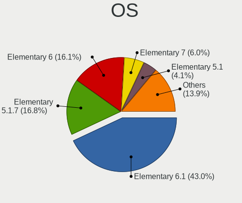

| Name             | Desktops | Percent |
|------------------|----------|---------|
| Elementary 6.1   | 175      | 44.99%  |
| Elementary 5.1.7 | 70       | 17.99%  |
| Elementary 6     | 67       | 17.22%  |
| Elementary 5.1   | 17       | 4.37%   |
| Elementary 5.0   | 17       | 4.37%   |
| Elementary 5.1.2 | 10       | 2.57%   |
| Elementary 5.1.4 | 7        | 1.8%    |
| Elementary 5.1.3 | 7        | 1.8%    |
| Elementary 0.4.1 | 7        | 1.8%    |
| Elementary 5.1.6 | 6        | 1.54%   |
| Elementary 7     | 2        | 0.51%   |
| Elementary 6.0   | 2        | 0.51%   |
| Elementary 5.1.5 | 2        | 0.51%   |

OS Family
---------

OS without a version

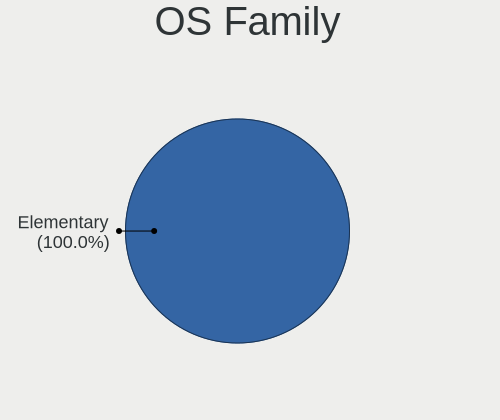

| Name       | Desktops | Percent |
|------------|----------|---------|
| Elementary | 367      | 100%    |

Kernel
------

Version of the Linux kernel

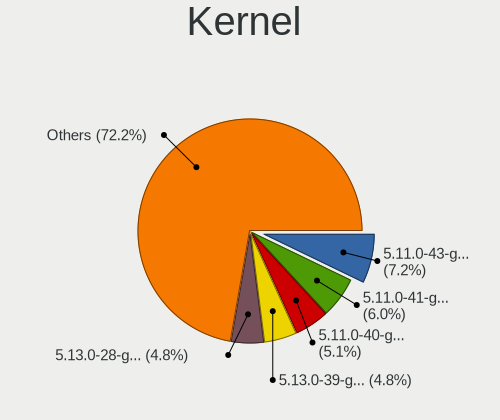

| Version           | Desktops | Percent |
|-------------------|----------|---------|
| 5.11.0-43-generic | 35       | 8.14%   |
| 5.11.0-41-generic | 20       | 4.65%   |
| 5.13.0-39-generic | 17       | 3.95%   |
| 5.11.0-40-generic | 17       | 3.95%   |
| 5.13.0-28-generic | 16       | 3.72%   |
| 5.15.0-46-generic | 14       | 3.26%   |
| 5.0.0-37-generic  | 11       | 2.56%   |
| 5.13.0-27-generic | 10       | 2.33%   |
| 5.11.0-27-generic | 10       | 2.33%   |
| 5.4.0-42-generic  | 9        | 2.09%   |
| 5.13.0-40-generic | 9        | 2.09%   |
| 5.13.0-30-generic | 9        | 2.09%   |
| 5.4.0-48-generic  | 8        | 1.86%   |
| 5.15.0-56-generic | 8        | 1.86%   |
| 5.13.0-35-generic | 7        | 1.63%   |
| 5.11.0-37-generic | 7        | 1.63%   |
| 5.4.0-65-generic  | 6        | 1.4%    |
| 5.4.0-58-generic  | 6        | 1.4%    |
| 5.11.0-25-generic | 6        | 1.4%    |
| 5.4.0-54-generic  | 5        | 1.16%   |
| 5.3.0-46-generic  | 5        | 1.16%   |
| 5.3.0-40-generic  | 5        | 1.16%   |
| 5.13.0-52-generic | 5        | 1.16%   |
| 5.13.0-51-generic | 5        | 1.16%   |
| 5.13.0-37-generic | 5        | 1.16%   |
| 5.11.0-38-generic | 5        | 1.16%   |
| 5.15.0-58-generic | 4        | 0.93%   |
| 5.15.0-53-generic | 4        | 0.93%   |
| 5.15.0-52-generic | 4        | 0.93%   |
| 5.15.0-41-generic | 4        | 0.93%   |
| 5.13.0-44-generic | 4        | 0.93%   |
| 5.11.0-44-generic | 4        | 0.93%   |
| 5.8.0-50-generic  | 3        | 0.7%    |
| 5.4.0-56-generic  | 3        | 0.7%    |
| 5.4.0-52-generic  | 3        | 0.7%    |
| 5.4.0-47-generic  | 3        | 0.7%    |
| 5.3.0-53-generic  | 3        | 0.7%    |
| 5.3.0-28-generic  | 3        | 0.7%    |
| 5.15.0-57-generic | 3        | 0.7%    |
| 5.15.0-50-generic | 3        | 0.7%    |

Kernel Family
-------------

Linux kernel without a distro release

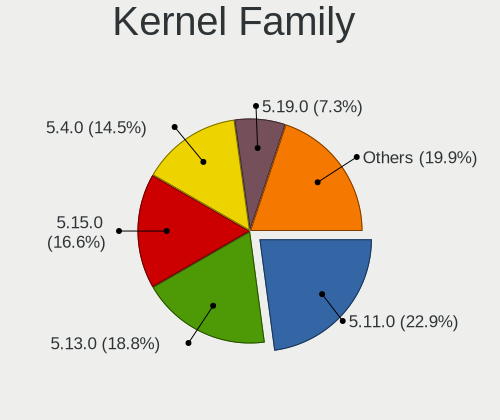

| Version | Desktops | Percent |
|---------|----------|---------|
| 5.11.0  | 105      | 27.13%  |
| 5.13.0  | 86       | 22.22%  |
| 5.4.0   | 67       | 17.31%  |
| 5.15.0  | 46       | 11.89%  |
| 5.3.0   | 24       | 6.2%    |
| 4.15.0  | 23       | 5.94%   |
| 5.0.0   | 15       | 3.88%   |
| 5.8.0   | 5        | 1.29%   |
| 4.18.0  | 3        | 0.78%   |
| 4.4.0   | 2        | 0.52%   |
| 6.1.8   | 1        | 0.26%   |
| 5.2.11  | 1        | 0.26%   |
| 5.17.3  | 1        | 0.26%   |
| 5.17.0  | 1        | 0.26%   |
| 5.16.15 | 1        | 0.26%   |
| 5.15.36 | 1        | 0.26%   |
| 5.15.12 | 1        | 0.26%   |
| 5.15.1  | 1        | 0.26%   |
| 5.14.0  | 1        | 0.26%   |
| 5.0.11  | 1        | 0.26%   |
| 4.10.0  | 1        | 0.26%   |

Kernel Major Ver.
-----------------

Linux kernel major version

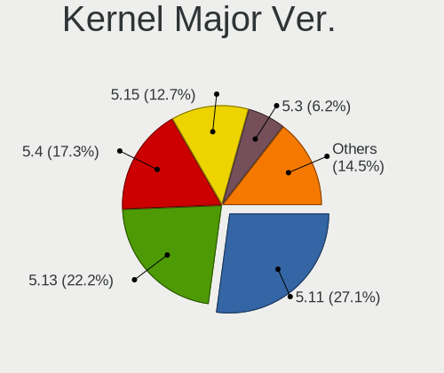

| Version | Desktops | Percent |
|---------|----------|---------|
| 5.11    | 105      | 27.13%  |
| 5.13    | 86       | 22.22%  |
| 5.4     | 67       | 17.31%  |
| 5.15    | 49       | 12.66%  |
| 5.3     | 24       | 6.2%    |
| 4.15    | 23       | 5.94%   |
| 5.0     | 16       | 4.13%   |
| 5.8     | 5        | 1.29%   |
| 4.18    | 3        | 0.78%   |
| 5.17    | 2        | 0.52%   |
| 4.4     | 2        | 0.52%   |
| 6.1     | 1        | 0.26%   |
| 5.2     | 1        | 0.26%   |
| 5.16    | 1        | 0.26%   |
| 5.14    | 1        | 0.26%   |
| 4.10    | 1        | 0.26%   |

Arch
----

OS architecture (x86_64, i586, etc.)

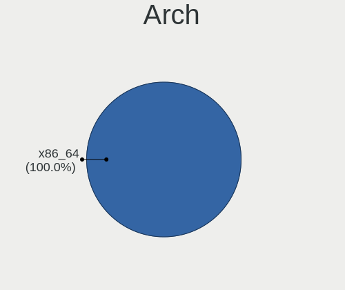

| Name   | Desktops | Percent |
|--------|----------|---------|
| x86_64 | 367      | 100%    |

DE
--

Desktop Environment

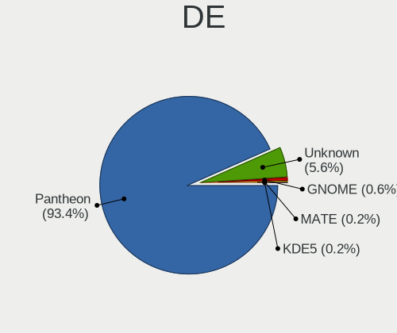

| Name     | Desktops | Percent |
|----------|----------|---------|
| Pantheon | 343      | 91.96%  |
| Unknown  | 26       | 6.97%   |
| GNOME    | 2        | 0.54%   |
| MATE     | 1        | 0.27%   |
| KDE5     | 1        | 0.27%   |

Display Server
--------------

X11 or Wayland

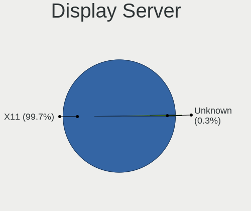

| Name    | Desktops | Percent |
|---------|----------|---------|
| X11     | 366      | 99.73%  |
| Unknown | 1        | 0.27%   |

Display Manager
---------------

SDDM, LightDM, etc.

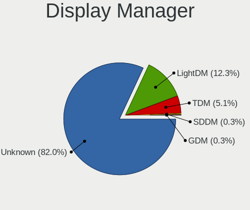

| Name    | Desktops | Percent |
|---------|----------|---------|
| Unknown | 307      | 82.09%  |
| LightDM | 49       | 13.1%   |
| TDM     | 16       | 4.28%   |
| SDDM    | 1        | 0.27%   |
| GDM     | 1        | 0.27%   |

OS Lang
-------

Language

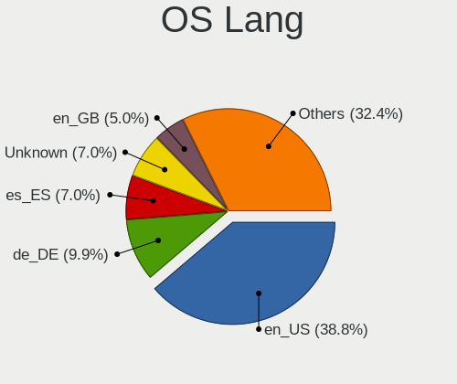

| Lang    | Desktops | Percent |
|---------|----------|---------|
| en_US   | 145      | 38.46%  |
| de_DE   | 37       | 9.81%   |
| es_ES   | 26       | 6.9%    |
| Unknown | 24       | 6.37%   |
| ru_RU   | 18       | 4.77%   |
| fr_FR   | 17       | 4.51%   |
| en_GB   | 17       | 4.51%   |
| pt_BR   | 14       | 3.71%   |
| it_IT   | 10       | 2.65%   |
| en_CA   | 10       | 2.65%   |
| pl_PL   | 7        | 1.86%   |
| tr_TR   | 5        | 1.33%   |
| en_AU   | 4        | 1.06%   |
| pt_PT   | 3        | 0.8%    |
| es_MX   | 3        | 0.8%    |
| de_CH   | 3        | 0.8%    |
| zh_CN   | 2        | 0.53%   |
| nl_NL   | 2        | 0.53%   |
| ja_JP   | 2        | 0.53%   |
| en_IN   | 2        | 0.53%   |
| zh_TW   | 1        | 0.27%   |
| uk_UA   | 1        | 0.27%   |
| sv_SE   | 1        | 0.27%   |
| sr_RS   | 1        | 0.27%   |
| nb_NO   | 1        | 0.27%   |
| id_ID   | 1        | 0.27%   |
| hu_HU   | 1        | 0.27%   |
| hr_HR   | 1        | 0.27%   |
| gl_ES   | 1        | 0.27%   |
| fr_CA   | 1        | 0.27%   |
| fr_BE   | 1        | 0.27%   |
| fi_FI   | 1        | 0.27%   |
| es_VE   | 1        | 0.27%   |
| es_SV   | 1        | 0.27%   |
| es_PA   | 1        | 0.27%   |
| es_EC   | 1        | 0.27%   |
| en_ZA   | 1        | 0.27%   |
| en_PH   | 1        | 0.27%   |
| en_IE   | 1        | 0.27%   |
| en_HK   | 1        | 0.27%   |

Boot Mode
---------

EFI or BIOS

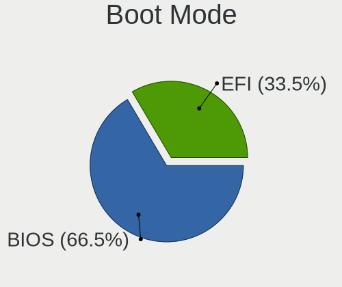

| Mode | Desktops | Percent |
|------|----------|---------|
| BIOS | 189      | 50.53%  |
| EFI  | 185      | 49.47%  |

Filesystem
----------

Type of filesystem

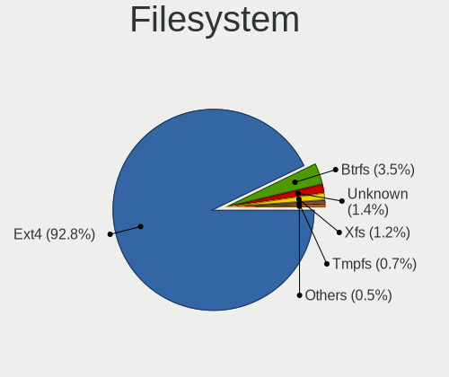

| Type    | Desktops | Percent |
|---------|----------|---------|
| Ext4    | 346      | 93.26%  |
| Btrfs   | 13       | 3.5%    |
| Unknown | 6        | 1.62%   |
| Xfs     | 5        | 1.35%   |
| Overlay | 1        | 0.27%   |

Part. scheme
------------

Scheme of partitioning

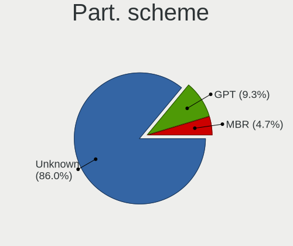

| Type    | Desktops | Percent |
|---------|----------|---------|
| Unknown | 319      | 85.98%  |
| GPT     | 34       | 9.16%   |
| MBR     | 18       | 4.85%   |

Dual Boot with Linux/BSD
------------------------

Hosting more than one Linux/BSD

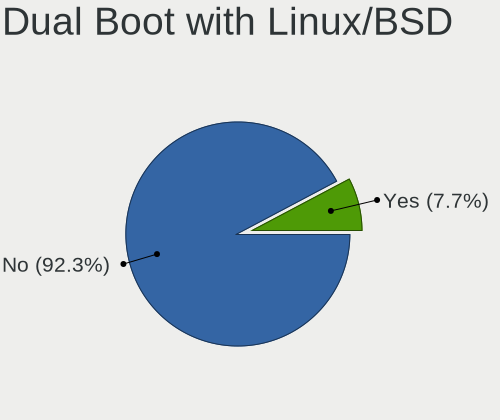

| Dual boot | Desktops | Percent |
|-----------|----------|---------|
| No        | 340      | 92.14%  |
| Yes       | 29       | 7.86%   |

Dual Boot (Win)
---------------

Hosting Linux and Windows

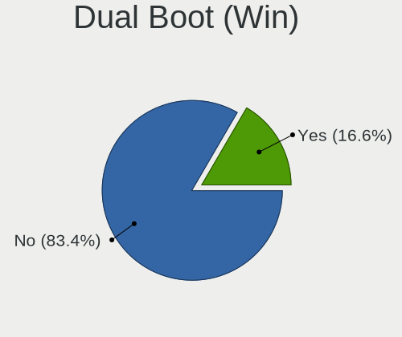

| Dual boot | Desktops | Percent |
|-----------|----------|---------|
| No        | 313      | 84.82%  |
| Yes       | 56       | 15.18%  |

Board
-----

Vendor
------

Motherboard manufacturer

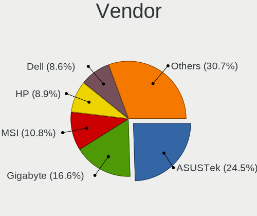

| Name                | Desktops | Percent |
|---------------------|----------|---------|
| ASUSTek Computer    | 95       | 25.89%  |
| Gigabyte Technology | 66       | 17.98%  |
| MSI                 | 43       | 11.72%  |
| Hewlett-Packard     | 30       | 8.17%   |
| ASRock              | 29       | 7.9%    |
| Dell                | 25       | 6.81%   |
| Intel               | 11       | 3%      |
| Lenovo              | 9        | 2.45%   |
| Biostar             | 9        | 2.45%   |
| Acer                | 7        | 1.91%   |
| Foxconn             | 5        | 1.36%   |
| Apple               | 5        | 1.36%   |
| Pegatron            | 4        | 1.09%   |
| Unknown             | 4        | 1.09%   |
| Fujitsu             | 3        | 0.82%   |
| ECS                 | 3        | 0.82%   |
| Wibtek              | 2        | 0.54%   |
| EVGA                | 2        | 0.54%   |
| T-bao               | 1        | 0.27%   |
| SYS                 | 1        | 0.27%   |
| Shuttle             | 1        | 0.27%   |
| Packard Bell        | 1        | 0.27%   |
| LORD ELECTRONICS    | 1        | 0.27%   |
| LattePanda          | 1        | 0.27%   |
| Kraftway            | 1        | 0.27%   |
| Inventec            | 1        | 0.27%   |
| IceWhale Technology | 1        | 0.27%   |
| FIRICH              | 1        | 0.27%   |
| eMachines           | 1        | 0.27%   |
| BESSTAR Tech        | 1        | 0.27%   |
| AZW                 | 1        | 0.27%   |
| AOpen               | 1        | 0.27%   |
| AMI                 | 1        | 0.27%   |

Model
-----

Motherboard model

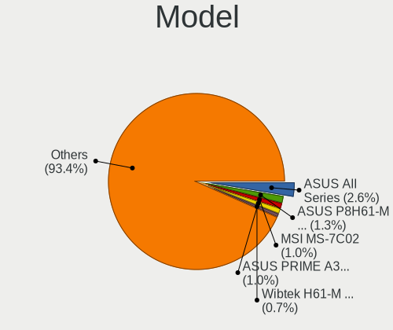

| Name                         | Desktops | Percent |
|------------------------------|----------|---------|
| ASUS All Series              | 9        | 2.45%   |
| ASUS P8H61-M LX3 R2.0        | 4        | 1.09%   |
| Unknown                      | 4        | 1.09%   |
| MSI MS-7C02                  | 3        | 0.82%   |
| ASUS PRIME A320M-K           | 3        | 0.82%   |
| Wibtek H61-M HDMI2           | 2        | 0.54%   |
| Pegatron IPMH61P1            | 2        | 0.54%   |
| MSI MS-7C35                  | 2        | 0.54%   |
| MSI MS-7B86                  | 2        | 0.54%   |
| MSI MS-7B84                  | 2        | 0.54%   |
| MSI MS-7817                  | 2        | 0.54%   |
| MSI MS-7721                  | 2        | 0.54%   |
| Intel H61                    | 2        | 0.54%   |
| HP Compaq Pro 6300 MT        | 2        | 0.54%   |
| Gigabyte Z390 UD             | 2        | 0.54%   |
| Gigabyte H61M-S1             | 2        | 0.54%   |
| Gigabyte H61M-DS2            | 2        | 0.54%   |
| Gigabyte GA-990FXA-UD3       | 2        | 0.54%   |
| Gigabyte AB350-Gaming 3      | 2        | 0.54%   |
| Gigabyte A320M-S2H V2        | 2        | 0.54%   |
| ECS H55H-M                   | 2        | 0.54%   |
| Dell OptiPlex 960            | 2        | 0.54%   |
| Dell OptiPlex 9010           | 2        | 0.54%   |
| Dell OptiPlex 790            | 2        | 0.54%   |
| ASUS TUF Gaming B550M-PLUS   | 2        | 0.54%   |
| ASUS ROG STRIX B350-F GAMING | 2        | 0.54%   |
| ASUS PRIME H310M-E R2.0      | 2        | 0.54%   |
| ASRock B450M-HDV R4.0        | 2        | 0.54%   |
| Apple MacPro5,1              | 2        | 0.54%   |
| T-bao MINI PC                | 1        | 0.27%   |
| SYS H310CH5-TI2              | 1        | 0.27%   |
| Shuttle DS61                 | 1        | 0.27%   |
| Pegatron p7-1174             | 1        | 0.27%   |
| Pegatron KJ379AA-ABA a6400f  | 1        | 0.27%   |
| Packard Bell IMEDIA S1300    | 1        | 0.27%   |
| MSI VT564AA-ABG HPE-180a     | 1        | 0.27%   |
| MSI PPPPP-CCC#MMMMMMMM       | 1        | 0.27%   |
| MSI P35 Platinum(MS-7345)    | 1        | 0.27%   |
| MSI MS-7D52                  | 1        | 0.27%   |
| MSI MS-7C94                  | 1        | 0.27%   |

Model Family
------------

Motherboard model prefix

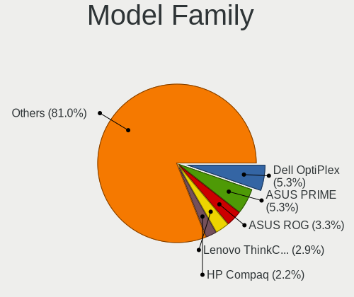

| Name                   | Desktops | Percent |
|------------------------|----------|---------|
| ASUS PRIME             | 18       | 4.9%    |
| Dell OptiPlex          | 17       | 4.63%   |
| ASUS ROG               | 13       | 3.54%   |
| ASUS TUF               | 11       | 3%      |
| ASUS All               | 9        | 2.45%   |
| Lenovo ThinkCentre     | 8        | 2.18%   |
| HP Compaq              | 7        | 1.91%   |
| ASUS P8H61-M           | 6        | 1.63%   |
| Gigabyte Z390          | 5        | 1.36%   |
| Dell Precision         | 5        | 1.36%   |
| Acer Aspire            | 4        | 1.09%   |
| Unknown                | 4        | 1.09%   |
| MSI MS-7C02            | 3        | 0.82%   |
| HP ProDesk             | 3        | 0.82%   |
| HP Pavilion            | 3        | 0.82%   |
| Gigabyte X570          | 3        | 0.82%   |
| Gigabyte H310M         | 3        | 0.82%   |
| Gigabyte A320M-S2H     | 3        | 0.82%   |
| Fujitsu ESPRIMO        | 3        | 0.82%   |
| ASUS SABERTOOTH        | 3        | 0.82%   |
| ASUS M5A78L-M          | 3        | 0.82%   |
| Wibtek H61-M           | 2        | 0.54%   |
| Pegatron IPMH61P1      | 2        | 0.54%   |
| MSI MS-7C35            | 2        | 0.54%   |
| MSI MS-7B86            | 2        | 0.54%   |
| MSI MS-7B84            | 2        | 0.54%   |
| MSI MS-7817            | 2        | 0.54%   |
| MSI MS-7721            | 2        | 0.54%   |
| Intel H61              | 2        | 0.54%   |
| Gigabyte H61M-S1       | 2        | 0.54%   |
| Gigabyte H61M-DS2      | 2        | 0.54%   |
| Gigabyte GA-990FXA-UD3 | 2        | 0.54%   |
| Gigabyte B450M         | 2        | 0.54%   |
| Gigabyte B450          | 2        | 0.54%   |
| Gigabyte AB350-Gaming  | 2        | 0.54%   |
| ECS H55H-M             | 2        | 0.54%   |
| ASUS STRIKER           | 2        | 0.54%   |
| ASUS P8Z77-V           | 2        | 0.54%   |
| ASUS P7H55-M           | 2        | 0.54%   |
| ASRock B450M-HDV       | 2        | 0.54%   |

MFG Year
--------

Motherboard manufacture year

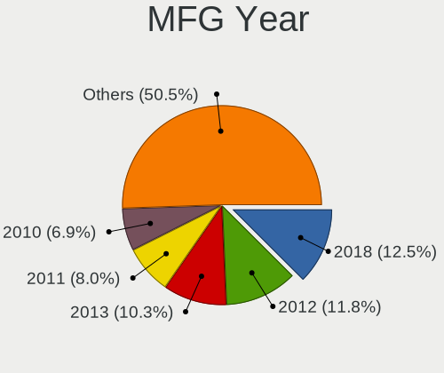

| Year | Desktops | Percent |
|------|----------|---------|
| 2012 | 45       | 12.26%  |
| 2018 | 43       | 11.72%  |
| 2013 | 37       | 10.08%  |
| 2011 | 32       | 8.72%   |
| 2019 | 29       | 7.9%    |
| 2010 | 29       | 7.9%    |
| 2017 | 24       | 6.54%   |
| 2020 | 22       | 5.99%   |
| 2015 | 20       | 5.45%   |
| 2014 | 20       | 5.45%   |
| 2009 | 16       | 4.36%   |
| 2016 | 13       | 3.54%   |
| 2008 | 13       | 3.54%   |
| 2021 | 12       | 3.27%   |
| 2022 | 5        | 1.36%   |
| 2007 | 4        | 1.09%   |
| 2006 | 2        | 0.54%   |
| 2005 | 1        | 0.27%   |

Form Factor
-----------

Physical design of the computer

| Name    | Desktops | Percent |
|---------|----------|---------|
| Desktop | 367      | 100%    |

Secure Boot
-----------

Enabled or disabled

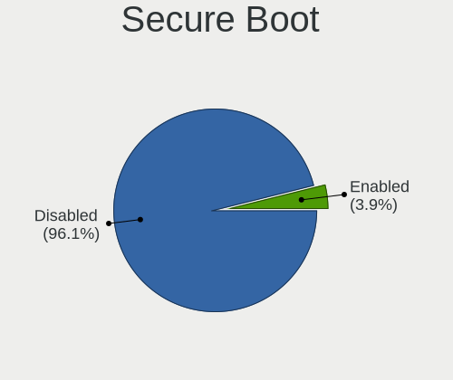

| State    | Desktops | Percent |
|----------|----------|---------|
| Disabled | 352      | 95.91%  |
| Enabled  | 15       | 4.09%   |

Coreboot
--------

Have coreboot on board

| Used | Desktops | Percent |
|------|----------|---------|
| No   | 367      | 100%    |

RAM Size
--------

Total RAM memory

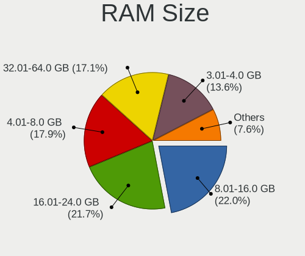

| Size in GB  | Desktops | Percent |
|-------------|----------|---------|
| 8.01-16.0   | 81       | 22.01%  |
| 16.01-24.0  | 80       | 21.74%  |
| 4.01-8.0    | 66       | 17.93%  |
| 32.01-64.0  | 63       | 17.12%  |
| 3.01-4.0    | 50       | 13.59%  |
| 64.01-256.0 | 10       | 2.72%   |
| 24.01-32.0  | 7        | 1.9%    |
| 1.01-2.0    | 7        | 1.9%    |
| 2.01-3.0    | 4        | 1.09%   |

RAM Used
--------

Used RAM memory

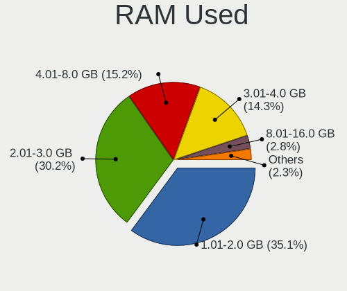

| Used GB    | Desktops | Percent |
|------------|----------|---------|
| 1.01-2.0   | 147      | 35.85%  |
| 2.01-3.0   | 117      | 28.54%  |
| 4.01-8.0   | 64       | 15.61%  |
| 3.01-4.0   | 60       | 14.63%  |
| 8.01-16.0  | 12       | 2.93%   |
| 0.51-1.0   | 9        | 2.2%    |
| 32.01-64.0 | 1        | 0.24%   |

Total Drives
------------

Number of drives on board

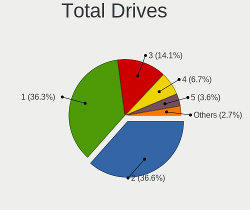

| Drives | Desktops | Percent |
|--------|----------|---------|
| 1      | 135      | 35.81%  |
| 2      | 132      | 35.01%  |
| 3      | 53       | 14.06%  |
| 4      | 30       | 7.96%   |
| 5      | 14       | 3.71%   |
| 6      | 6        | 1.59%   |
| 7      | 4        | 1.06%   |
| 0      | 2        | 0.53%   |
| 8      | 1        | 0.27%   |

Has CD-ROM
----------

Has CD-ROM on board

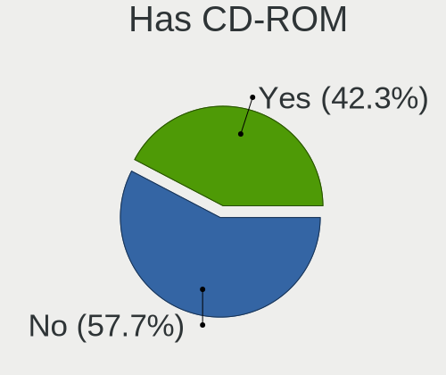

| Presented | Desktops | Percent |
|-----------|----------|---------|
| No        | 209      | 55.88%  |
| Yes       | 165      | 44.12%  |

Has Ethernet
------------

Has Ethernet on board

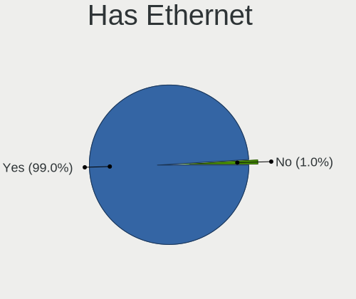

| Presented | Desktops | Percent |
|-----------|----------|---------|
| Yes       | 364      | 99.18%  |
| No        | 3        | 0.82%   |

Has WiFi
--------

Has WiFi module

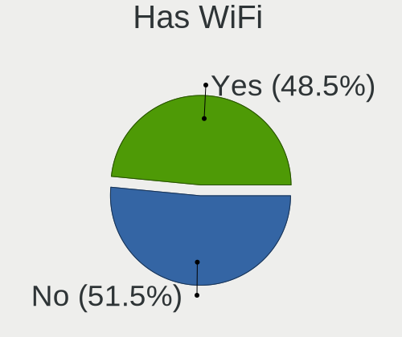

| Presented | Desktops | Percent |
|-----------|----------|---------|
| No        | 191      | 51.21%  |
| Yes       | 182      | 48.79%  |

Has Bluetooth
-------------

Has Bluetooth module

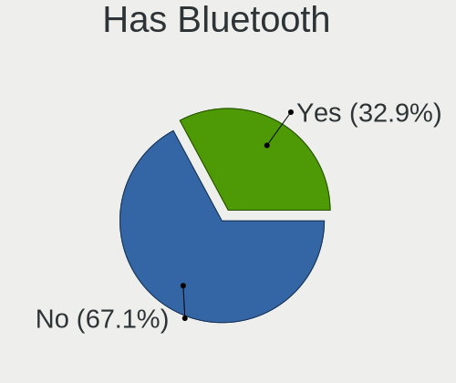

| Presented | Desktops | Percent |
|-----------|----------|---------|
| No        | 238      | 64.32%  |
| Yes       | 132      | 35.68%  |

Location
--------

Country
-------

Geographic location (country)

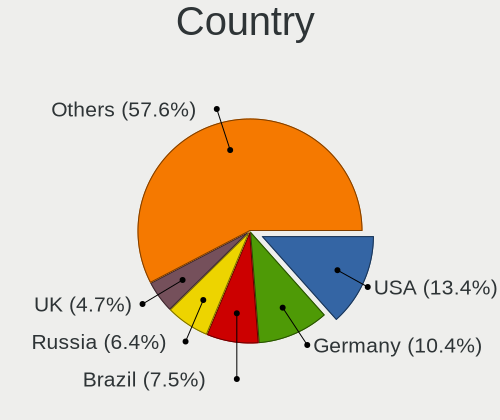

| Country     | Desktops | Percent |
|-------------|----------|---------|
| USA         | 47       | 12.77%  |
| Germany     | 35       | 9.51%   |
| Brazil      | 27       | 7.34%   |
| Russia      | 23       | 6.25%   |
| UK          | 20       | 5.43%   |
| Canada      | 17       | 4.62%   |
| Spain       | 16       | 4.35%   |
| France      | 15       | 4.08%   |
| Italy       | 11       | 2.99%   |
| Indonesia   | 11       | 2.99%   |
| Poland      | 8        | 2.17%   |
| Mexico      | 8        | 2.17%   |
| Turkey      | 7        | 1.9%    |
| India       | 7        | 1.9%    |
| Argentina   | 7        | 1.9%    |
| Netherlands | 6        | 1.63%   |
| Austria     | 6        | 1.63%   |
| Australia   | 6        | 1.63%   |
| Switzerland | 5        | 1.36%   |
| Sweden      | 4        | 1.09%   |
| Egypt       | 4        | 1.09%   |
| Colombia    | 4        | 1.09%   |
| Ukraine     | 3        | 0.82%   |
| Malaysia    | 3        | 0.82%   |
| Japan       | 3        | 0.82%   |
| Hong Kong   | 3        | 0.82%   |
| Greece      | 3        | 0.82%   |
| Finland     | 3        | 0.82%   |
| Czechia     | 3        | 0.82%   |
| Bulgaria    | 3        | 0.82%   |
| Venezuela   | 2        | 0.54%   |
| Thailand    | 2        | 0.54%   |
| Romania     | 2        | 0.54%   |
| Portugal    | 2        | 0.54%   |
| Philippines | 2        | 0.54%   |
| Norway      | 2        | 0.54%   |
| Kenya       | 2        | 0.54%   |
| Ireland     | 2        | 0.54%   |
| Iran        | 2        | 0.54%   |
| Costa Rica  | 2        | 0.54%   |

City
----

Geographic location (city)

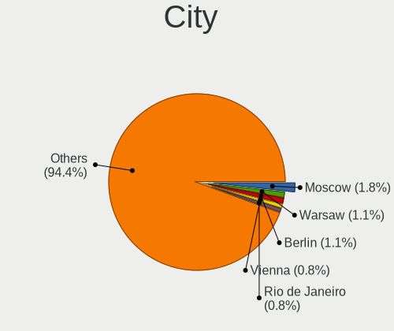

| City             | Desktops | Percent |
|------------------|----------|---------|
| Moscow           | 5        | 1.28%   |
| Warsaw           | 4        | 1.02%   |
| Vienna           | 4        | 1.02%   |
| Rio de Janeiro   | 4        | 1.02%   |
| Paris            | 4        | 1.02%   |
| Fortaleza        | 4        | 1.02%   |
| Berlin           | 4        | 1.02%   |
| Sofia            | 3        | 0.77%   |
| Sao Paulo        | 3        | 0.77%   |
| Novosibirsk      | 3        | 0.77%   |
| Montreal         | 3        | 0.77%   |
| Istanbul         | 3        | 0.77%   |
| Hamburg          | 3        | 0.77%   |
| Caslano          | 3        | 0.77%   |
| Brisbane         | 3        | 0.77%   |
| Toronto          | 2        | 0.51%   |
| Tangerang        | 2        | 0.51%   |
| Sydney           | 2        | 0.51%   |
| Stuttgart        | 2        | 0.51%   |
| Nairobi          | 2        | 0.51%   |
| Morelia          | 2        | 0.51%   |
| Montenegro       | 2        | 0.51%   |
| Milan            | 2        | 0.51%   |
| Mexico City      | 2        | 0.51%   |
| Los Angeles      | 2        | 0.51%   |
| Kazan’         | 2        | 0.51%   |
| George Town      | 2        | 0.51%   |
| Dublin           | 2        | 0.51%   |
| Denver           | 2        | 0.51%   |
| Central          | 2        | 0.51%   |
| Cairo            | 2        | 0.51%   |
| Bogor            | 2        | 0.51%   |
| Bandung          | 2        | 0.51%   |
| Zagreb           | 1        | 0.26%   |
| Zabrze           | 1        | 0.26%   |
| Yucca Valley     | 1        | 0.26%   |
| Yokohama         | 1        | 0.26%   |
| Yarang           | 1        | 0.26%   |
| Xicheng District | 1        | 0.26%   |
| Wroclaw          | 1        | 0.26%   |

Drives
------

Drive Vendor
------------

Hard drive vendors

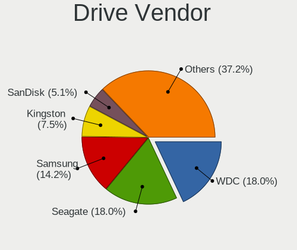

| Vendor                    | Desktops | Drives | Percent |
|---------------------------|----------|--------|---------|
| Seagate                   | 119      | 171    | 18.06%  |
| WDC                       | 118      | 180    | 17.91%  |
| Samsung Electronics       | 95       | 162    | 14.42%  |
| Kingston                  | 51       | 77     | 7.74%   |
| SanDisk                   | 33       | 37     | 5.01%   |
| Toshiba                   | 32       | 55     | 4.86%   |
| Crucial                   | 29       | 38     | 4.4%    |
| Hitachi                   | 19       | 21     | 2.88%   |
| Unknown                   | 11       | 21     | 1.67%   |
| Intel                     | 11       | 11     | 1.67%   |
| A-DATA Technology         | 10       | 11     | 1.52%   |
| PNY                       | 8        | 13     | 1.21%   |
| China                     | 8        | 10     | 1.21%   |
| Phison                    | 7        | 8      | 1.06%   |
| OCZ                       | 7        | 11     | 1.06%   |
| HGST                      | 7        | 11     | 1.06%   |
| Micron/Crucial Technology | 6        | 12     | 0.91%   |
| Transcend                 | 5        | 5      | 0.76%   |
| Micron Technology         | 5        | 6      | 0.76%   |
| Corsair                   | 5        | 5      | 0.76%   |
| Team                      | 4        | 6      | 0.61%   |
| SPCC                      | 4        | 4      | 0.61%   |
| Patriot                   | 4        | 4      | 0.61%   |
| Plextor                   | 3        | 4      | 0.46%   |
| Maxtor                    | 3        | 3      | 0.46%   |
| LITEON                    | 3        | 3      | 0.46%   |
| JMicron Technology        | 3        | 3      | 0.46%   |
| Intenso                   | 3        | 3      | 0.46%   |
| ASMT                      | 3        | 3      | 0.46%   |
| SK hynix                  | 2        | 2      | 0.3%    |
| Silicon Motion            | 2        | 2      | 0.3%    |
| Realtek Semiconductor     | 2        | 2      | 0.3%    |
| KingFast                  | 2        | 2      | 0.3%    |
| HUSKY                     | 2        | 2      | 0.3%    |
| HS-SSD-C100               | 2        | 2      | 0.3%    |
| GOODRAM                   | 2        | 5      | 0.3%    |
| Gigabyte Technology       | 2        | 2      | 0.3%    |
| Apacer                    | 2        | 2      | 0.3%    |
| XPG                       | 1        | 1      | 0.15%   |
| WDC WDS                   | 1        | 1      | 0.15%   |

Drive Model
-----------

Hard drive models

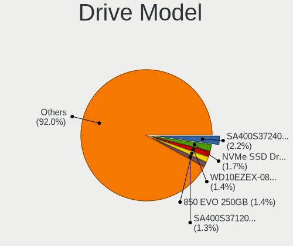

| Model                             | Desktops | Percent |
|-----------------------------------|----------|---------|
| Kingston SA400S37240G 240GB SSD   | 15       | 1.98%   |
| Samsung NVMe SSD Drive 500GB      | 12       | 1.59%   |
| Samsung SSD 850 EVO 250GB         | 11       | 1.45%   |
| WDC WD10EZEX-08WN4A0 1TB          | 10       | 1.32%   |
| Seagate ST500DM002-1BD142 500GB   | 8        | 1.06%   |
| Seagate ST1000DM003-1ER162 1TB    | 8        | 1.06%   |
| Samsung SSD 860 EVO 1TB           | 8        | 1.06%   |
| Kingston SV300S37A120G 120GB SSD  | 8        | 1.06%   |
| Kingston SA400S37120G 120GB SSD   | 8        | 1.06%   |
| Toshiba DT01ACA100 1TB            | 7        | 0.92%   |
| Toshiba DT01ACA050 500GB          | 7        | 0.92%   |
| Samsung NVMe SSD Drive 1TB        | 7        | 0.92%   |
| Seagate ST1000DM010-2EP102 1TB    | 6        | 0.79%   |
| Samsung SSD 860 EVO 250GB         | 6        | 0.79%   |
| Crucial CT240BX500SSD1 240GB      | 6        | 0.79%   |
| WDC WD5000AAKX-00ERMA0 500GB      | 5        | 0.66%   |
| Seagate ST3500418AS 500GB         | 5        | 0.66%   |
| Seagate ST31000528AS 1TB          | 5        | 0.66%   |
| Samsung SSD 860 EVO 500GB         | 5        | 0.66%   |
| Samsung SSD 850 EVO 500GB         | 5        | 0.66%   |
| Samsung SSD 840 EVO 250GB         | 5        | 0.66%   |
| WDC WD5000AAKX-001CA0 500GB       | 4        | 0.53%   |
| WDC WD10EZEX-00BN5A0 1TB          | 4        | 0.53%   |
| Unknown SD/MMC 2GB                | 4        | 0.53%   |
| Unknown M.S./M.S.Pro/HG 16GB      | 4        | 0.53%   |
| Seagate ST3500312CS 500GB         | 4        | 0.53%   |
| Seagate ST3160815AS 160GB         | 4        | 0.53%   |
| Seagate ST2000DM008-2FR102 2TB    | 4        | 0.53%   |
| Seagate ST1000DM003-1CH162 1TB    | 4        | 0.53%   |
| SanDisk SSD PLUS 480GB            | 4        | 0.53%   |
| SanDisk NVMe SSD Drive 500GB      | 4        | 0.53%   |
| Samsung SSD 850 PRO 256GB         | 4        | 0.53%   |
| Samsung SSD 840 EVO 120GB         | 4        | 0.53%   |
| Phison NVMe SSD Drive 1TB         | 4        | 0.53%   |
| Micron/Crucial NVMe SSD Drive 1TB | 4        | 0.53%   |
| Kingston SA400S37480G 480GB SSD   | 4        | 0.53%   |
| Intel NVMe SSD Drive 512GB        | 4        | 0.53%   |
| WDC WD5000AAKS-00UU3A0 500GB      | 3        | 0.4%    |
| WDC WD5000AAKS-00A7B2 500GB       | 3        | 0.4%    |
| WDC WD10EZEX-60WN4A0 1TB          | 3        | 0.4%    |

HDD Vendor
----------

Hard disk drive vendors

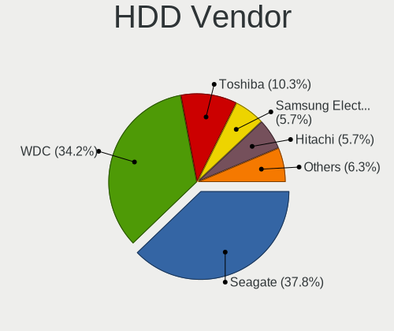

| Vendor              | Desktops | Drives | Percent |
|---------------------|----------|--------|---------|
| Seagate             | 116      | 165    | 38.16%  |
| WDC                 | 103      | 150    | 33.88%  |
| Toshiba             | 31       | 54     | 10.2%   |
| Samsung Electronics | 19       | 21     | 6.25%   |
| Hitachi             | 19       | 21     | 6.25%   |
| HGST                | 7        | 11     | 2.3%    |
| Unknown             | 2        | 3      | 0.66%   |
| Maxtor              | 2        | 2      | 0.66%   |
| ASMT                | 2        | 2      | 0.66%   |
| Hewlett-Packard     | 1        | 1      | 0.33%   |
| Fujitsu             | 1        | 1      | 0.33%   |
| Apple               | 1        | 1      | 0.33%   |

SSD Vendor
----------

Solid state drive vendors

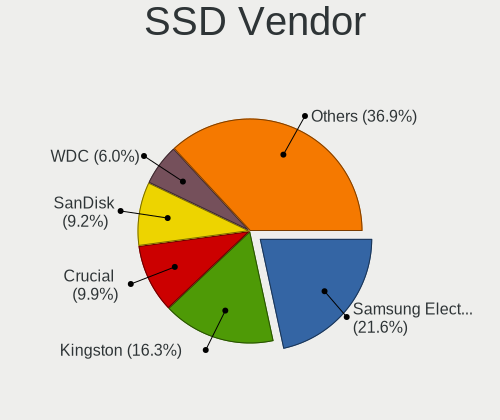

| Vendor              | Desktops | Drives | Percent |
|---------------------|----------|--------|---------|
| Samsung Electronics | 59       | 92     | 21.69%  |
| Kingston            | 45       | 57     | 16.54%  |
| Crucial             | 28       | 36     | 10.29%  |
| SanDisk             | 26       | 28     | 9.56%   |
| WDC                 | 15       | 23     | 5.51%   |
| A-DATA Technology   | 9        | 10     | 3.31%   |
| PNY                 | 8        | 13     | 2.94%   |
| China               | 8        | 10     | 2.94%   |
| OCZ                 | 7        | 11     | 2.57%   |
| Transcend           | 5        | 5      | 1.84%   |
| Intel               | 5        | 5      | 1.84%   |
| Corsair             | 5        | 5      | 1.84%   |
| Team                | 4        | 6      | 1.47%   |
| SPCC                | 4        | 4      | 1.47%   |
| Patriot             | 4        | 4      | 1.47%   |
| Plextor             | 3        | 4      | 1.1%    |
| LITEON              | 3        | 3      | 1.1%    |
| Intenso             | 3        | 3      | 1.1%    |
| Micron Technology   | 2        | 2      | 0.74%   |
| HUSKY               | 2        | 2      | 0.74%   |
| GOODRAM             | 2        | 5      | 0.74%   |
| Apacer              | 2        | 2      | 0.74%   |
| WDC WDS             | 1        | 1      | 0.37%   |
| Toshiba             | 1        | 1      | 0.37%   |
| tigo                | 1        | 1      | 0.37%   |
| SK hynix            | 1        | 1      | 0.37%   |
| Seagate             | 1        | 2      | 0.37%   |
| ROG                 | 1        | 1      | 0.37%   |
| OWC                 | 1        | 1      | 0.37%   |
| OCZ-VERTEX3         | 1        | 1      | 0.37%   |
| OCZ-VERTEX2         | 1        | 2      | 0.37%   |
| MidasForce          | 1        | 1      | 0.37%   |
| Maxtor              | 1        | 1      | 0.37%   |
| Lexar               | 1        | 1      | 0.37%   |
| Leven               | 1        | 1      | 0.37%   |
| KingSpec            | 1        | 1      | 0.37%   |
| Kingmax             | 1        | 1      | 0.37%   |
| JMicron Technology  | 1        | 1      | 0.37%   |
| HS-SSD-C100         | 1        | 1      | 0.37%   |
| Hikvision           | 1        | 1      | 0.37%   |

Drive Kind
----------

HDD or SSD

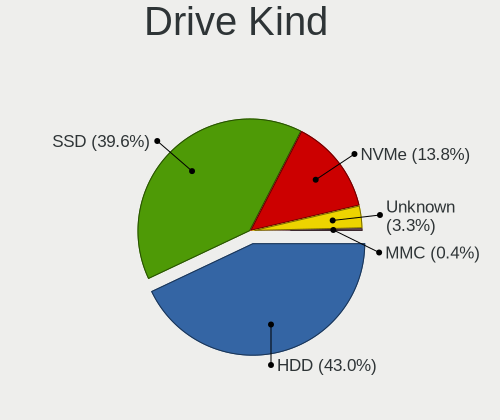

| Kind    | Desktops | Drives | Percent |
|---------|----------|--------|---------|
| HDD     | 244      | 432    | 43.42%  |
| SSD     | 221      | 355    | 39.32%  |
| NVMe    | 78       | 128    | 13.88%  |
| Unknown | 16       | 28     | 2.85%   |
| MMC     | 3        | 3      | 0.53%   |

Drive Connector
---------------

SATA, SAS, NVMe, etc.

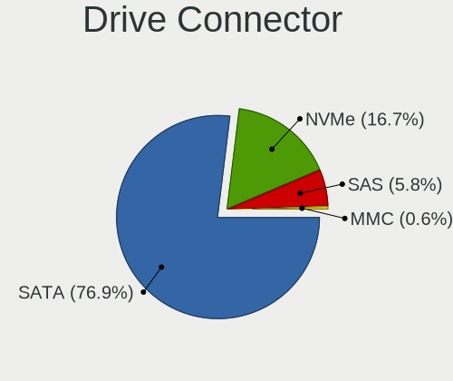

| Type | Desktops | Drives | Percent |
|------|----------|--------|---------|
| SATA | 341      | 775    | 76.12%  |
| NVMe | 78       | 128    | 17.41%  |
| SAS  | 26       | 40     | 5.8%    |
| MMC  | 3        | 3      | 0.67%   |

Drive Size
----------

Size of hard drive

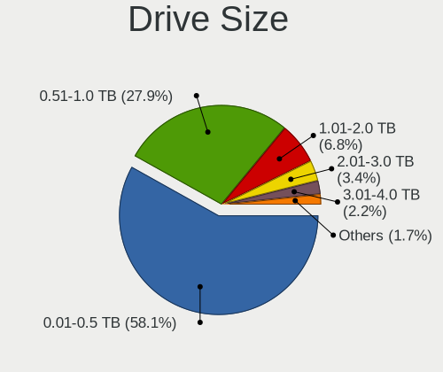

| Size in TB | Desktops | Drives | Percent |
|------------|----------|--------|---------|
| 0.01-0.5   | 276      | 486    | 58.85%  |
| 0.51-1.0   | 127      | 201    | 27.08%  |
| 1.01-2.0   | 29       | 41     | 6.18%   |
| 2.01-3.0   | 17       | 34     | 3.62%   |
| 3.01-4.0   | 10       | 11     | 2.13%   |
| 4.01-10.0  | 10       | 14     | 2.13%   |

Space Total
-----------

Amount of disk space available on the file system

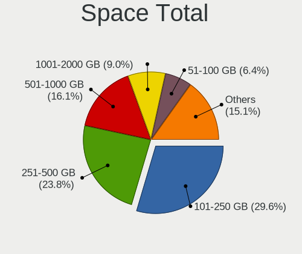

| Size in GB     | Desktops | Percent |
|----------------|----------|---------|
| 101-250        | 121      | 31.27%  |
| 251-500        | 86       | 22.22%  |
| 501-1000       | 67       | 17.31%  |
| 1001-2000      | 37       | 9.56%   |
| 51-100         | 24       | 6.2%    |
| More than 3000 | 19       | 4.91%   |
| 21-50          | 19       | 4.91%   |
| 2001-3000      | 12       | 3.1%    |
| 1-20           | 2        | 0.52%   |

Space Used
----------

Amount of used disk space

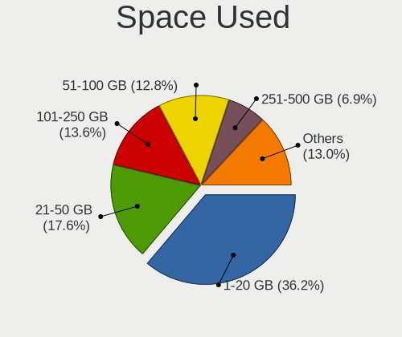

| Used GB        | Desktops | Percent |
|----------------|----------|---------|
| 1-20           | 149      | 36.25%  |
| 21-50          | 74       | 18%     |
| 101-250        | 56       | 13.63%  |
| 51-100         | 53       | 12.9%   |
| 251-500        | 28       | 6.81%   |
| 501-1000       | 25       | 6.08%   |
| 1001-2000      | 15       | 3.65%   |
| More than 3000 | 7        | 1.7%    |
| 2001-3000      | 4        | 0.97%   |

Malfunc. Drives
---------------

Drive models with a malfunction

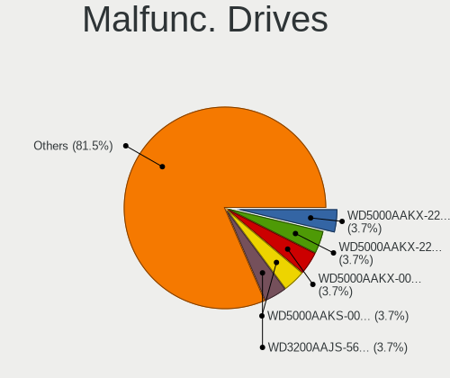

| Model                             | Desktops | Drives | Percent |
|-----------------------------------|----------|--------|---------|
| WDC WD5000AAKX-22ERMA0 500GB      | 1        | 1      | 4.17%   |
| WDC WD5000AAKX-221CA1 500GB       | 1        | 1      | 4.17%   |
| WDC WD5000AAKX-00ERMA0 500GB      | 1        | 1      | 4.17%   |
| WDC WD5000AAKS-00UU3A0 500GB      | 1        | 1      | 4.17%   |
| WDC WD3200AAJS-56B4A0 320GB       | 1        | 1      | 4.17%   |
| WDC WD10EZEX-00KUWA0 1TB          | 1        | 1      | 4.17%   |
| WDC WD1003FZEX-00MK2A0 1TB        | 1        | 1      | 4.17%   |
| Seagate ST500DM002-1BD142 500GB   | 1        | 1      | 4.17%   |
| Seagate ST3500414CS 500GB         | 1        | 2      | 4.17%   |
| Seagate ST3500312CS 500GB         | 1        | 1      | 4.17%   |
| Seagate ST3320613AS 320GB         | 1        | 1      | 4.17%   |
| Seagate ST3160813AS 160GB         | 1        | 1      | 4.17%   |
| Seagate ST2000DM006-2DM164 2TB    | 1        | 1      | 4.17%   |
| SanDisk SSD PLUS 240GB            | 1        | 1      | 4.17%   |
| Samsung Electronics HD322GJ 320GB | 1        | 1      | 4.17%   |
| Samsung Electronics HD204UI 2TB   | 1        | 1      | 4.17%   |
| Samsung Electronics HD160JJ 160GB | 1        | 1      | 4.17%   |
| OCZ VECTOR150 240GB SSD           | 1        | 1      | 4.17%   |
| Kingston SA400S37120G 120GB SSD   | 1        | 1      | 4.17%   |
| Hitachi HTS542525K9SA00 250GB     | 1        | 1      | 4.17%   |
| Hitachi HDT721064SLA360 640GB     | 1        | 1      | 4.17%   |
| Hitachi HDS721010CLA332 1TB       | 1        | 1      | 4.17%   |
| HGST HUS724030ALA640 3TB          | 1        | 1      | 4.17%   |
| Crucial CT256M550SSD1 256GB       | 1        | 1      | 4.17%   |

Malfunc. Drive Vendor
---------------------

Vendors of faulty drives

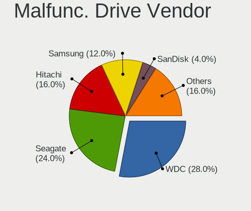

| Vendor              | Desktops | Drives | Percent |
|---------------------|----------|--------|---------|
| WDC                 | 7        | 7      | 29.17%  |
| Seagate             | 6        | 7      | 25%     |
| Samsung Electronics | 3        | 3      | 12.5%   |
| Hitachi             | 3        | 3      | 12.5%   |
| SanDisk             | 1        | 1      | 4.17%   |
| OCZ                 | 1        | 1      | 4.17%   |
| Kingston            | 1        | 1      | 4.17%   |
| HGST                | 1        | 1      | 4.17%   |
| Crucial             | 1        | 1      | 4.17%   |

Malfunc. HDD Vendor
-------------------

Vendors of faulty HDD drives

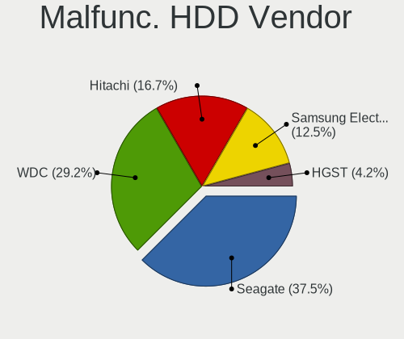

| Vendor              | Desktops | Drives | Percent |
|---------------------|----------|--------|---------|
| WDC                 | 7        | 7      | 35%     |
| Seagate             | 6        | 7      | 30%     |
| Samsung Electronics | 3        | 3      | 15%     |
| Hitachi             | 3        | 3      | 15%     |
| HGST                | 1        | 1      | 5%      |

Malfunc. Drive Kind
-------------------

Kinds of faulty drives

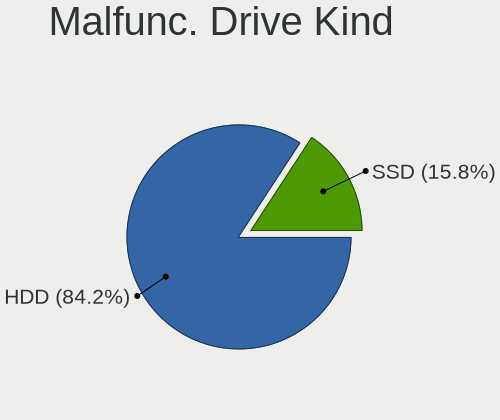

| Kind | Desktops | Drives | Percent |
|------|----------|--------|---------|
| HDD  | 17       | 21     | 80.95%  |
| SSD  | 4        | 4      | 19.05%  |

Failed Drives
-------------

Failed drive models

Zero info for selected period =(

Failed Drive Vendor
-------------------

Failed drive vendors

Zero info for selected period =(

Drive Status
------------

Number of failed and malfunc. drives

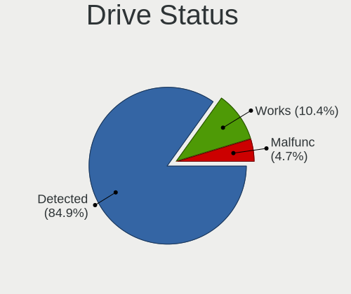

| Status   | Desktops | Drives | Percent |
|----------|----------|--------|---------|
| Detected | 325      | 824    | 83.98%  |
| Works    | 42       | 97     | 10.85%  |
| Malfunc  | 20       | 25     | 5.17%   |

Storage controller
------------------

Storage Vendor
--------------

Storage controller vendors

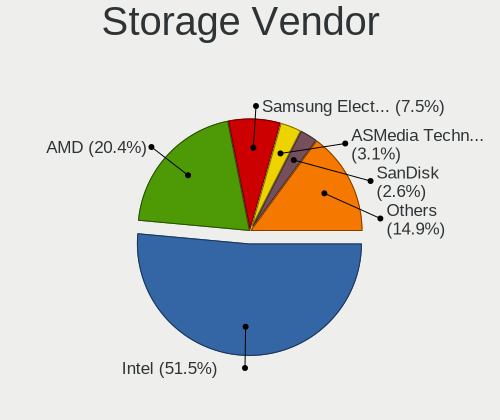

| Vendor                      | Desktops | Percent |
|-----------------------------|----------|---------|
| Intel                       | 252      | 51.12%  |
| AMD                         | 98       | 19.88%  |
| Samsung Electronics         | 39       | 7.91%   |
| Nvidia                      | 15       | 3.04%   |
| ASMedia Technology          | 15       | 3.04%   |
| SanDisk                     | 11       | 2.23%   |
| JMicron Technology          | 11       | 2.23%   |
| Marvell Technology Group    | 10       | 2.03%   |
| Phison Electronics          | 8        | 1.62%   |
| Kingston Technology Company | 8        | 1.62%   |
| Micron/Crucial Technology   | 7        | 1.42%   |
| Realtek Semiconductor       | 3        | 0.61%   |
| Micron Technology           | 3        | 0.61%   |
| LSI Logic / Symbios Logic   | 3        | 0.61%   |
| Silicon Motion              | 2        | 0.41%   |
| Seagate Technology          | 2        | 0.41%   |
| ADATA Technology            | 2        | 0.41%   |
| VIA Technologies            | 1        | 0.2%    |
| SK hynix                    | 1        | 0.2%    |
| Silicon Image               | 1        | 0.2%    |
| Broadcom / LSI              | 1        | 0.2%    |

Storage Model
-------------

Storage controller models

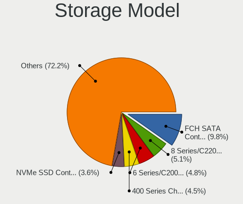

| Model                                                                                   | Desktops | Percent |
|-----------------------------------------------------------------------------------------|----------|---------|
| AMD FCH SATA Controller [AHCI mode]                                                     | 63       | 10%     |
| Intel 8 Series/C220 Series Chipset Family 6-port SATA Controller 1 [AHCI mode]          | 33       | 5.24%   |
| Intel 6 Series/C200 Series Chipset Family 6 port Desktop SATA AHCI Controller           | 31       | 4.92%   |
| AMD 400 Series Chipset SATA Controller                                                  | 27       | 4.29%   |
| Samsung NVMe SSD Controller SM981/PM981/PM983                                           | 22       | 3.49%   |
| Intel Cannon Lake PCH SATA AHCI Controller                                              | 21       | 3.33%   |
| Intel 6 Series/C200 Series Chipset Family Desktop SATA Controller (IDE mode, ports 4-5) | 19       | 3.02%   |
| Intel 6 Series/C200 Series Chipset Family Desktop SATA Controller (IDE mode, ports 0-3) | 19       | 3.02%   |
| Intel SATA Controller [RAID mode]                                                       | 18       | 2.86%   |
| Intel 7 Series/C210 Series Chipset Family 6-port SATA Controller [AHCI mode]            | 17       | 2.7%    |
| Intel 200 Series PCH SATA controller [AHCI mode]                                        | 17       | 2.7%    |
| Intel Q170/Q150/B150/H170/H110/Z170/CM236 Chipset SATA Controller [AHCI Mode]           | 14       | 2.22%   |
| ASMedia ASM1062 Serial ATA Controller                                                   | 14       | 2.22%   |
| Intel NM10/ICH7 Family SATA Controller [IDE mode]                                       | 13       | 2.06%   |
| AMD SB7x0/SB8x0/SB9x0 IDE Controller                                                    | 12       | 1.9%    |
| AMD SB7x0/SB8x0/SB9x0 SATA Controller [AHCI mode]                                       | 11       | 1.75%   |
| AMD 300 Series Chipset SATA Controller                                                  | 10       | 1.59%   |
| Nvidia MCP61 SATA Controller                                                            | 8        | 1.27%   |
| Intel 82801G (ICH7 Family) IDE Controller                                               | 8        | 1.27%   |
| AMD SB7x0/SB8x0/SB9x0 SATA Controller [IDE mode]                                        | 8        | 1.27%   |
| AMD FCH SATA Controller D                                                               | 8        | 1.27%   |
| Samsung NVMe SSD Controller PM9A1/PM9A3/980PRO                                          | 7        | 1.11%   |
| Intel 9 Series Chipset Family SATA Controller [AHCI Mode]                               | 7        | 1.11%   |
| Micron/Crucial P2 NVMe PCIe SSD                                                         | 6        | 0.95%   |
| Kingston Company A2000 NVMe SSD                                                         | 6        | 0.95%   |
| JMicron JMB368 IDE controller                                                           | 6        | 0.95%   |
| AMD 500 Series Chipset SATA Controller                                                  | 6        | 0.95%   |
| Samsung NVMe SSD Controller 980                                                         | 5        | 0.79%   |
| JMicron JMB363 SATA/IDE Controller                                                      | 5        | 0.79%   |
| Intel SSD 660P Series                                                                   | 5        | 0.79%   |
| Intel 82801JI (ICH10 Family) 4 port SATA IDE Controller #1                              | 5        | 0.79%   |
| Intel 82801JI (ICH10 Family) 2 port SATA IDE Controller #2                              | 5        | 0.79%   |
| Intel 500 Series Chipset Family SATA AHCI Controller                                    | 5        | 0.79%   |
| Intel 5 Series/3400 Series Chipset 6 port SATA AHCI Controller                          | 5        | 0.79%   |
| Intel 5 Series/3400 Series Chipset 4 port SATA IDE Controller                           | 5        | 0.79%   |
| Intel 5 Series/3400 Series Chipset 2 port SATA IDE Controller                           | 5        | 0.79%   |
| Nvidia MCP61 IDE                                                                        | 4        | 0.63%   |
| AMD FCH SATA Controller [IDE mode]                                                      | 4        | 0.63%   |
| SanDisk WD Blue SN550 NVMe SSD                                                          | 3        | 0.48%   |
| Samsung NVMe SSD Controller SM961/PM961/SM963                                           | 3        | 0.48%   |

Storage Kind
------------

Kind of storage controller (IDE, SATA, NVMe, SAS, ...)

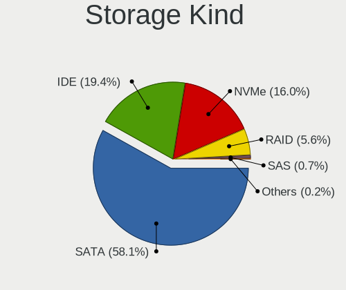

| Kind | Desktops | Percent |
|------|----------|---------|
| SATA | 279      | 57.41%  |
| IDE  | 95       | 19.55%  |
| NVMe | 80       | 16.46%  |
| RAID | 27       | 5.56%   |
| SAS  | 3        | 0.62%   |
| SCSI | 2        | 0.41%   |

Processor
---------

CPU Vendor
----------

Processor vendors

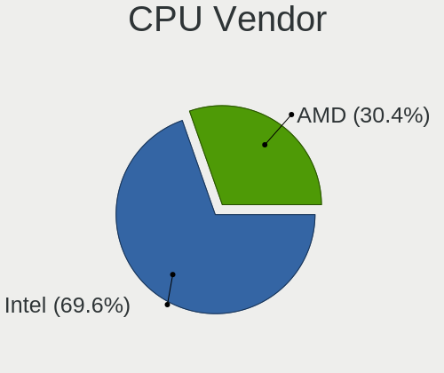

| Vendor | Desktops | Percent |
|--------|----------|---------|
| Intel  | 256      | 69.75%  |
| AMD    | 111      | 30.25%  |

CPU Model
---------

Processor models

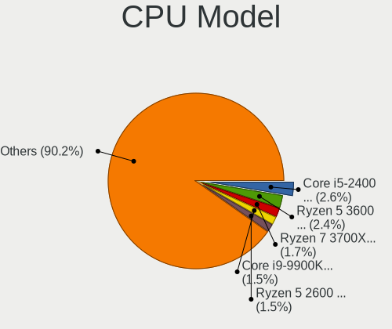

| Model                                       | Desktops | Percent |
|---------------------------------------------|----------|---------|
| Intel Core i5-2400 CPU @ 3.10GHz            | 10       | 2.72%   |
| AMD Ryzen 5 3600 6-Core Processor           | 10       | 2.72%   |
| AMD Ryzen 7 3700X 8-Core Processor          | 7        | 1.91%   |
| AMD Ryzen 5 2600 Six-Core Processor         | 7        | 1.91%   |
| Intel Core i9-9900K CPU @ 3.60GHz           | 5        | 1.36%   |
| Intel Core i7-4790K CPU @ 4.00GHz           | 5        | 1.36%   |
| Intel Core i7-4770 CPU @ 3.40GHz            | 5        | 1.36%   |
| Intel Pentium Dual-Core CPU E5700 @ 3.00GHz | 4        | 1.09%   |
| Intel Core i7-6700K CPU @ 4.00GHz           | 4        | 1.09%   |
| Intel Core i5-4570 CPU @ 3.20GHz            | 4        | 1.09%   |
| Intel Core i5-3470 CPU @ 3.20GHz            | 4        | 1.09%   |
| Intel Core i5-3330S CPU @ 2.70GHz           | 4        | 1.09%   |
| Intel Core i5-2500K CPU @ 3.30GHz           | 4        | 1.09%   |
| Intel Core i3-2100 CPU @ 3.10GHz            | 4        | 1.09%   |
| Intel Core i3 CPU 530 @ 2.93GHz             | 4        | 1.09%   |
| AMD Ryzen 9 3900X 12-Core Processor         | 4        | 1.09%   |
| AMD Ryzen 5 1600 Six-Core Processor         | 4        | 1.09%   |
| Intel Pentium Dual-Core CPU E5300 @ 2.60GHz | 3        | 0.82%   |
| Intel Core i7-9700 CPU @ 3.00GHz            | 3        | 0.82%   |
| Intel Core i7-8700 CPU @ 3.20GHz            | 3        | 0.82%   |
| Intel Core i7-7700K CPU @ 4.20GHz           | 3        | 0.82%   |
| Intel Core i7-4790 CPU @ 3.60GHz            | 3        | 0.82%   |
| Intel Core i7-3770 CPU @ 3.40GHz            | 3        | 0.82%   |
| Intel Core i7-2600 CPU @ 3.40GHz            | 3        | 0.82%   |
| Intel Core i5-8400 CPU @ 2.80GHz            | 3        | 0.82%   |
| Intel Core i5-7400 CPU @ 3.00GHz            | 3        | 0.82%   |
| Intel Core i5-4460 CPU @ 3.20GHz            | 3        | 0.82%   |
| Intel Core i5-3330 CPU @ 3.00GHz            | 3        | 0.82%   |
| Intel Core i3-9100 CPU @ 3.60GHz            | 3        | 0.82%   |
| Intel Core i3-2120 CPU @ 3.30GHz            | 3        | 0.82%   |
| Intel Core 2 Quad CPU Q6600 @ 2.40GHz       | 3        | 0.82%   |
| Intel Core 2 Duo CPU E6550 @ 2.33GHz        | 3        | 0.82%   |
| Intel 11th Gen Core i7-11700K @ 3.60GHz     | 3        | 0.82%   |
| AMD Ryzen 9 5900X 12-Core Processor         | 3        | 0.82%   |
| AMD Ryzen 5 2600X Six-Core Processor        | 3        | 0.82%   |
| AMD Ryzen 3 3200G with Radeon Vega Graphics | 3        | 0.82%   |
| AMD FX-8350 Eight-Core Processor            | 3        | 0.82%   |
| AMD FX-6100 Six-Core Processor              | 3        | 0.82%   |
| Intel Core i7-9700K CPU @ 3.60GHz           | 2        | 0.54%   |
| Intel Core i7-8700K CPU @ 3.70GHz           | 2        | 0.54%   |

CPU Model Family
----------------

Processor model prefix

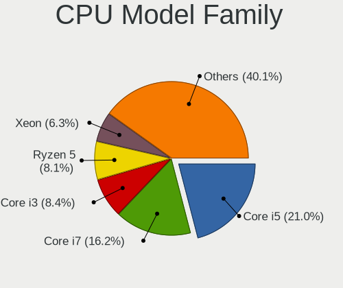

| Model                   | Desktops | Percent |
|-------------------------|----------|---------|
| Intel Core i5           | 77       | 20.98%  |
| Intel Core i7           | 59       | 16.08%  |
| AMD Ryzen 5             | 32       | 8.72%   |
| Intel Core i3           | 31       | 8.45%   |
| Intel Xeon              | 23       | 6.27%   |
| AMD Ryzen 7             | 16       | 4.36%   |
| Intel Celeron           | 14       | 3.81%   |
| AMD FX                  | 12       | 3.27%   |
| Intel Core 2 Quad       | 11       | 3%      |
| AMD Ryzen 9             | 9        | 2.45%   |
| Intel Core 2 Duo        | 8        | 2.18%   |
| AMD Phenom II X4        | 8        | 2.18%   |
| Intel Pentium Dual-Core | 7        | 1.91%   |
| Intel Pentium           | 7        | 1.91%   |
| AMD Ryzen 3             | 7        | 1.91%   |
| Other                   | 6        | 1.63%   |
| Intel Core i9           | 5        | 1.36%   |
| AMD Athlon II X4        | 4        | 1.09%   |
| AMD Athlon II X2        | 4        | 1.09%   |
| AMD A8                  | 4        | 1.09%   |
| Intel Atom              | 3        | 0.82%   |
| AMD A4                  | 3        | 0.82%   |
| AMD A10                 | 3        | 0.82%   |
| AMD Phenom              | 2        | 0.54%   |
| AMD Athlon              | 2        | 0.54%   |
| Intel Pentium Gold      | 1        | 0.27%   |
| Intel Pentium Dual      | 1        | 0.27%   |
| Intel Pentium D         | 1        | 0.27%   |
| Intel Pentium 4         | 1        | 0.27%   |
| Intel Core m3           | 1        | 0.27%   |
| AMD Ryzen Threadripper  | 1        | 0.27%   |
| AMD G                   | 1        | 0.27%   |
| AMD Athlon X4           | 1        | 0.27%   |
| AMD Athlon II X3        | 1        | 0.27%   |
| AMD A6                  | 1        | 0.27%   |

CPU Cores
---------

Number of processor cores

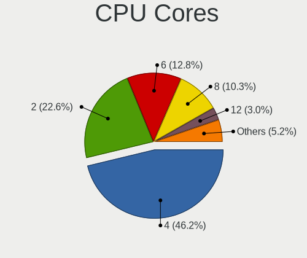

| Number | Desktops | Percent |
|--------|----------|---------|
| 4      | 173      | 46.88%  |
| 2      | 79       | 21.41%  |
| 6      | 49       | 13.28%  |
| 8      | 39       | 10.57%  |
| 12     | 10       | 2.71%   |
| 3      | 8        | 2.17%   |
| 1      | 7        | 1.9%    |
| 16     | 3        | 0.81%   |
| 10     | 1        | 0.27%   |

CPU Sockets
-----------

Number of sockets

| Number | Desktops | Percent |
|--------|----------|---------|
| 1      | 361      | 98.37%  |
| 2      | 6        | 1.63%   |

CPU Threads
-----------

Threads per core (Hyper-Threading)

| Number | Desktops | Percent |
|--------|----------|---------|
| 2      | 199      | 54.08%  |
| 1      | 169      | 45.92%  |

CPU Op-Modes
------------

CPU Operation Modes (32-bit, 64-bit)

| Op mode        | Desktops | Percent |
|----------------|----------|---------|
| 32-bit, 64-bit | 363      | 98.64%  |
| Unknown        | 5        | 1.36%   |

CPU Microcode
-------------

Microcode number

| Number     | Desktops | Percent |
|------------|----------|---------|
| 0x206a7    | 42       | 11.2%   |
| 0x306c3    | 41       | 10.93%  |
| 0x306a9    | 27       | 7.2%    |
| Unknown    | 25       | 6.67%   |
| 0x08701021 | 17       | 4.53%   |
| 0x1067a    | 14       | 3.73%   |
| 0x906ea    | 13       | 3.47%   |
| 0x906e9    | 11       | 2.93%   |
| 0x0800820d | 11       | 2.93%   |
| 0x906ed    | 9        | 2.4%    |
| 0x506e3    | 9        | 2.4%    |
| 0x906eb    | 8        | 2.13%   |
| 0x06000852 | 8        | 2.13%   |
| 0x08108109 | 7        | 1.87%   |
| 0x010000c8 | 7        | 1.87%   |
| 0x6fb      | 6        | 1.6%    |
| 0x106e5    | 6        | 1.6%    |
| 0x206d7    | 5        | 1.33%   |
| 0x20652    | 5        | 1.33%   |
| 0x10676    | 5        | 1.33%   |
| 0x0a201016 | 5        | 1.33%   |
| 0x08701013 | 5        | 1.33%   |
| 0xa0671    | 4        | 1.07%   |
| 0xa0655    | 4        | 1.07%   |
| 0x106a5    | 4        | 1.07%   |
| 0x08001138 | 4        | 1.07%   |
| 0x06003106 | 4        | 1.07%   |
| 0x06001119 | 4        | 1.07%   |
| 0x0600063e | 4        | 1.07%   |
| 0x010000db | 4        | 1.07%   |
| 0xa0653    | 3        | 0.8%    |
| 0x306e4    | 3        | 0.8%    |
| 0x20655    | 3        | 0.8%    |
| 0x0600611a | 3        | 0.8%    |
| 0x906ec    | 2        | 0.53%   |
| 0x406c4    | 2        | 0.53%   |
| 0x206c2    | 2        | 0.53%   |
| 0x0a50000c | 2        | 0.53%   |
| 0x08101016 | 2        | 0.53%   |
| 0x0810100b | 2        | 0.53%   |

CPU Microarch
-------------

Microarchitecture

| Name             | Desktops | Percent |
|------------------|----------|---------|
| SandyBridge      | 49       | 13.35%  |
| KabyLake         | 47       | 12.81%  |
| Haswell          | 46       | 12.53%  |
| IvyBridge        | 30       | 8.17%   |
| Zen 2            | 22       | 5.99%   |
| Zen+             | 21       | 5.72%   |
| Penryn           | 20       | 5.45%   |
| K10              | 19       | 5.18%   |
| Zen              | 14       | 3.81%   |
| Piledriver       | 12       | 3.27%   |
| Zen 3            | 10       | 2.72%   |
| Westmere         | 10       | 2.72%   |
| Skylake          | 10       | 2.72%   |
| Nehalem          | 10       | 2.72%   |
| Core             | 10       | 2.72%   |
| CometLake        | 7        | 1.91%   |
| Steamroller      | 4        | 1.09%   |
| Silvermont       | 4        | 1.09%   |
| Icelake          | 4        | 1.09%   |
| Bulldozer        | 4        | 1.09%   |
| Excavator        | 3        | 0.82%   |
| NetBurst         | 2        | 0.54%   |
| Tremont          | 1        | 0.27%   |
| TigerLake        | 1        | 0.27%   |
| K10 Llano        | 1        | 0.27%   |
| Goldmont plus    | 1        | 0.27%   |
| Goldmont         | 1        | 0.27%   |
| Broadwell        | 1        | 0.27%   |
| Bonnell          | 1        | 0.27%   |
| Bobcat           | 1        | 0.27%   |
| Alderlake Hybrid | 1        | 0.27%   |

Graphics
--------

GPU Vendor
----------

Vendors of graphics cards

| Vendor           | Desktops | Percent |
|------------------|----------|---------|
| Nvidia           | 149      | 37.53%  |
| AMD              | 131      | 33%     |
| Intel            | 115      | 28.97%  |
| Conexant Systems | 1        | 0.25%   |
| ATI Technologies | 1        | 0.25%   |

GPU Model
---------

Graphics card models

| Model                                                                       | Desktops | Percent |
|-----------------------------------------------------------------------------|----------|---------|
| AMD Ellesmere [Radeon RX 470/480/570/570X/580/580X/590]                     | 26       | 6.37%   |
| Intel 2nd Generation Core Processor Family Integrated Graphics Controller   | 22       | 5.39%   |
| Intel Xeon E3-1200 v3/4th Gen Core Processor Integrated Graphics Controller | 20       | 4.9%    |
| Intel CoffeeLake-S GT2 [UHD Graphics 630]                                   | 14       | 3.43%   |
| Intel Xeon E3-1200 v2/3rd Gen Core processor Graphics Controller            | 10       | 2.45%   |
| Intel 4 Series Chipset Integrated Graphics Controller                       | 8        | 1.96%   |
| Nvidia GM107 [GeForce GTX 750 Ti]                                           | 7        | 1.72%   |
| Nvidia GM204 [GeForce GTX 970]                                              | 6        | 1.47%   |
| Intel HD Graphics 530                                                       | 6        | 1.47%   |
| AMD Picasso/Raven 2 [Radeon Vega Series / Radeon Vega Mobile Series]        | 6        | 1.47%   |
| Nvidia TU117 [GeForce GTX 1650]                                             | 5        | 1.23%   |
| Nvidia GT218 [GeForce 210]                                                  | 5        | 1.23%   |
| Nvidia GP107 [GeForce GTX 1050]                                             | 5        | 1.23%   |
| Nvidia GP107 [GeForce GTX 1050 Ti]                                          | 5        | 1.23%   |
| Nvidia GP106 [GeForce GTX 1060 6GB]                                         | 5        | 1.23%   |
| Nvidia GM107 [GeForce GTX 750]                                              | 5        | 1.23%   |
| Intel 4th Generation Core Processor Family Integrated Graphics Controller   | 5        | 1.23%   |
| AMD Raven Ridge [Radeon Vega Series / Radeon Vega Mobile Series]            | 5        | 1.23%   |
| AMD Caicos [Radeon HD 6450/7450/8450 / R5 230 OEM]                          | 5        | 1.23%   |
| AMD Baffin [Radeon RX 460/560D / Pro 450/455/460/555/555X/560/560X]         | 5        | 1.23%   |
| Nvidia TU116 [GeForce GTX 1660]                                             | 4        | 0.98%   |
| Nvidia GP108 [GeForce GT 1030]                                              | 4        | 0.98%   |
| Nvidia GP104 [GeForce GTX 1070]                                             | 4        | 0.98%   |
| Nvidia GP102 [GeForce GTX 1080 Ti]                                          | 4        | 0.98%   |
| Nvidia GK208B [GeForce GT 710]                                              | 4        | 0.98%   |
| Intel IvyBridge GT2 [HD Graphics 4000]                                      | 4        | 0.98%   |
| Intel HD Graphics 630                                                       | 4        | 0.98%   |
| AMD Lexa PRO [Radeon 540/540X/550/550X / RX 540X/550/550X]                  | 4        | 0.98%   |
| AMD Kaveri [Radeon R7 Graphics]                                             | 4        | 0.98%   |
| Nvidia TU116 [GeForce GTX 1660 SUPER]                                       | 3        | 0.74%   |
| Nvidia TU106 [GeForce RTX 2060 Rev. A]                                      | 3        | 0.74%   |
| Nvidia GP106 [GeForce GTX 1060 3GB]                                         | 3        | 0.74%   |
| Nvidia GP104 [GeForce GTX 1080]                                             | 3        | 0.74%   |
| Nvidia GM206 [GeForce GTX 960]                                              | 3        | 0.74%   |
| Nvidia GK208B [GeForce GT 730]                                              | 3        | 0.74%   |
| Nvidia GF119 [GeForce GT 610]                                               | 3        | 0.74%   |
| Nvidia GF108 [GeForce GT 730]                                               | 3        | 0.74%   |
| Nvidia GF108 [GeForce GT 430]                                               | 3        | 0.74%   |
| Nvidia GA102 [GeForce RTX 3080 Lite Hash Rate]                              | 3        | 0.74%   |
| Nvidia G96C [GeForce 9500 GT]                                               | 3        | 0.74%   |

GPU Combo
---------

Combinations of graphics cards

| Name                           | Desktops | Percent |
|--------------------------------|----------|---------|
| 1 x Nvidia                     | 136      | 36.76%  |
| 1 x AMD                        | 118      | 31.89%  |
| 1 x Intel                      | 92       | 24.86%  |
| Intel + Nvidia                 | 7        | 1.89%   |
| 2 x AMD                        | 6        | 1.62%   |
| Intel + AMD                    | 4        | 1.08%   |
| 2 x Nvidia                     | 3        | 0.81%   |
| AMD + Nvidia                   | 2        | 0.54%   |
| 2 x AMD + 1 x Conexant Systems | 1        | 0.27%   |
| Intel + 2 x AMD                | 1        | 0.27%   |

GPU Driver
----------

Free vs proprietary

| Driver      | Desktops | Percent |
|-------------|----------|---------|
| Free        | 269      | 72.51%  |
| Proprietary | 96       | 25.88%  |
| Unknown     | 6        | 1.62%   |

GPU Memory
----------

Total video memory

| Size in GB | Desktops | Percent |
|------------|----------|---------|
| Unknown    | 105      | 27.93%  |
| 1.01-2.0   | 74       | 19.68%  |
| 0.51-1.0   | 51       | 13.56%  |
| 3.01-4.0   | 44       | 11.7%   |
| 7.01-8.0   | 39       | 10.37%  |
| 0.01-0.5   | 29       | 7.71%   |
| 5.01-6.0   | 18       | 4.79%   |
| 8.01-16.0  | 10       | 2.66%   |
| 2.01-3.0   | 6        | 1.6%    |

Monitor
-------

Monitor Vendor
--------------

Monitor vendors

| Vendor               | Desktops | Percent |
|----------------------|----------|---------|
| Samsung Electronics  | 67       | 16.67%  |
| Goldstar             | 43       | 10.7%   |
| Dell                 | 39       | 9.7%    |
| Hewlett-Packard      | 37       | 9.2%    |
| Acer                 | 32       | 7.96%   |
| AOC                  | 27       | 6.72%   |
| BenQ                 | 18       | 4.48%   |
| Ancor Communications | 18       | 4.48%   |
| Philips              | 17       | 4.23%   |
| LG Electronics       | 16       | 3.98%   |
| Lenovo               | 8        | 1.99%   |
| ViewSonic            | 6        | 1.49%   |
| Unknown              | 6        | 1.49%   |
| Vizio                | 5        | 1.24%   |
| NEC Computers        | 3        | 0.75%   |
| Iiyama               | 3        | 0.75%   |
| HPN                  | 3        | 0.75%   |
| Fujitsu Siemens      | 3        | 0.75%   |
| AUS                  | 3        | 0.75%   |
| Apple                | 3        | 0.75%   |
| ___                  | 2        | 0.5%    |
| Vestel               | 2        | 0.5%    |
| Sony                 | 2        | 0.5%    |
| Sharp                | 2        | 0.5%    |
| HKC                  | 2        | 0.5%    |
| Grundig              | 2        | 0.5%    |
| CHR                  | 2        | 0.5%    |
| Unknown              | 2        | 0.5%    |
| TBD                  | 1        | 0.25%   |
| SPC                  | 1        | 0.25%   |
| SKY                  | 1        | 0.25%   |
| SAC                  | 1        | 0.25%   |
| Ruijiang             | 1        | 0.25%   |
| PDA                  | 1        | 0.25%   |
| Onkyo                | 1        | 0.25%   |
| MSI                  | 1        | 0.25%   |
| Mi                   | 1        | 0.25%   |
| LLP                  | 1        | 0.25%   |
| LLL                  | 1        | 0.25%   |
| Lenovo Group Limited | 1        | 0.25%   |

Monitor Model
-------------

Monitor models

| Model                                                                 | Desktops | Percent |
|-----------------------------------------------------------------------|----------|---------|
| Goldstar 20EN33 GSM4EE1 1600x900 443x249mm 20.0-inch                  | 4        | 0.94%   |
| Samsung Electronics SyncMaster SAM03E5 1680x1050 474x296mm 22.0-inch  | 3        | 0.7%    |
| Samsung Electronics S24D300 SAM0B43 1920x1080 531x299mm 24.0-inch     | 3        | 0.7%    |
| Samsung Electronics C24F390 SAM0D2C 1920x1080 521x293mm 23.5-inch     | 3        | 0.7%    |
| Goldstar IPS FULLHD GSM5AB8 1920x1080 480x270mm 21.7-inch             | 3        | 0.7%    |
| Goldstar FULL HD GSM5B55 1920x1080 480x270mm 21.7-inch                | 3        | 0.7%    |
| AOC 27G2G4 AOC2702 1920x1080 598x336mm 27.0-inch                      | 3        | 0.7%    |
| AOC 2369M AOC2369 1920x1080 509x286mm 23.0-inch                       | 3        | 0.7%    |
| Ancor Communications ASUS VS247 ACI249A 1920x1080 520x290mm 23.4-inch | 3        | 0.7%    |
| Vizio E280i-B1 VIZ1002 1360x768 607x345mm 27.5-inch                   | 2        | 0.47%   |
| Unknown LCD Monitor SAMSUNG 1920x1080                                 | 2        | 0.47%   |
| Samsung Electronics SA300/SA350 SAM078B 1600x900 443x249mm 20.0-inch  | 2        | 0.47%   |
| Samsung Electronics LCD Monitor C32F391 1920x1080                     | 2        | 0.47%   |
| Philips LCD Monitor PHL 276E8V 3840x2160                              | 2        | 0.47%   |
| LG Electronics LCD Monitor LG FULL HD 1920x1080                       | 2        | 0.47%   |
| Hewlett-Packard w2207 HWP26A9 1680x1050 473x296mm 22.0-inch           | 2        | 0.47%   |
| Hewlett-Packard All-in-One HWP4211 1920x1080 509x286mm 23.0-inch      | 2        | 0.47%   |
| Hewlett-Packard 2010 HWP2889 1600x900 443x250mm 20.0-inch             | 2        | 0.47%   |
| Grundig WXGA GRU4448 1600x1200                                        | 2        | 0.47%   |
| Goldstar W1943 GSM4BAD 1360x768 406x229mm 18.4-inch                   | 2        | 0.47%   |
| Goldstar LG ULTRAWIDE GSM59F1 2560x1080 670x280mm 28.6-inch           | 2        | 0.47%   |
| Goldstar E2211 GSM5838 1920x1080 477x268mm 21.5-inch                  | 2        | 0.47%   |
| Goldstar 25UM58G GSM5B98 2560x1080 670x280mm 28.6-inch                | 2        | 0.47%   |
| Goldstar 22EN33 GSM597C 1920x1080 480x270mm 21.7-inch                 | 2        | 0.47%   |
| Dell U3415W DELA0A7 3440x1440 798x335mm 34.1-inch                     | 2        | 0.47%   |
| Dell U2417H DEL40E7 1920x1080 527x296mm 23.8-inch                     | 2        | 0.47%   |
| Dell P2214H DELA098 1920x1080 477x268mm 21.5-inch                     | 2        | 0.47%   |
| Dell 1704FPV DEL3016 1280x1024 338x270mm 17.0-inch                    | 2        | 0.47%   |
| CHR CH7511B CHR7511 1920x1080 519x324mm 24.1-inch                     | 2        | 0.47%   |
| BenQ EL2870U BNQ7949 3840x2160 621x341mm 27.9-inch                    | 2        | 0.47%   |
| AOC Q3279WG5B AOC3279 2560x1440 725x428mm 33.1-inch                   | 2        | 0.47%   |
| AOC 24B1W1G5 AOC2401 1920x1080 527x296mm 23.8-inch                    | 2        | 0.47%   |
| AOC 2470W AOC2470 1920x1080 521x293mm 23.5-inch                       | 2        | 0.47%   |
| Acer V226HQL ACR032D 1920x1080 477x268mm 21.5-inch                    | 2        | 0.47%   |
| Unknown                                                               | 2        | 0.47%   |
| ___ LCDTV16 ___0101 1360x768                                          | 1        | 0.23%   |
| ___ LCD TV ___9000 1360x768                                           | 1        | 0.23%   |
| Vizio VW32L HDTV40A VIZ0035 1280x720 700x390mm 31.5-inch              | 1        | 0.23%   |
| Vizio E320VT VIZ0067 1920x1080 698x392mm 31.5-inch                    | 1        | 0.23%   |
| Vizio E241i-A1 VIZ1005 1920x1080 521x293mm 23.5-inch                  | 1        | 0.23%   |

Monitor Resolution
------------------

Monitor screen resolution

| Resolution         | Desktops | Percent |
|--------------------|----------|---------|
| 1920x1080 (FHD)    | 171      | 43.29%  |
| 3840x2160 (4K)     | 31       | 7.85%   |
| 2560x1440 (QHD)    | 28       | 7.09%   |
| 1680x1050 (WSXGA+) | 27       | 6.84%   |
| 1600x900 (HD+)     | 22       | 5.57%   |
| 1280x1024 (SXGA)   | 21       | 5.32%   |
| 1366x768 (WXGA)    | 19       | 4.81%   |
| Unknown            | 15       | 3.8%    |
| 1440x900 (WXGA+)   | 10       | 2.53%   |
| 3840x1080          | 9        | 2.28%   |
| 2560x1080          | 6        | 1.52%   |
| 1920x1200 (WUXGA)  | 6        | 1.52%   |
| 1360x768           | 6        | 1.52%   |
| 3440x1440          | 5        | 1.27%   |
| 5120x1440          | 3        | 0.76%   |
| 2560x1600          | 2        | 0.51%   |
| 1600x1200          | 2        | 0.51%   |
| 7680x2160          | 1        | 0.25%   |
| 7680x1600          | 1        | 0.25%   |
| 5760x2160          | 1        | 0.25%   |
| 5760x1080          | 1        | 0.25%   |
| 4480x1440          | 1        | 0.25%   |
| 3968x1280          | 1        | 0.25%   |
| 3840x1600          | 1        | 0.25%   |
| 3840x1200          | 1        | 0.25%   |
| 3600x1080          | 1        | 0.25%   |
| 2288x1287          | 1        | 0.25%   |
| 2048x1152          | 1        | 0.25%   |
| 1024x768 (XGA)     | 1        | 0.25%   |

Monitor Diagonal
----------------

Diagonal size in inches

| Inches  | Desktops | Percent |
|---------|----------|---------|
| Unknown | 82       | 20.65%  |
| 27      | 41       | 10.33%  |
| 24      | 41       | 10.33%  |
| 23      | 39       | 9.82%   |
| 21      | 39       | 9.82%   |
| 19      | 22       | 5.54%   |
| 22      | 19       | 4.79%   |
| 20      | 16       | 4.03%   |
| 18      | 14       | 3.53%   |
| 31      | 13       | 3.27%   |
| 17      | 12       | 3.02%   |
| 32      | 8        | 2.02%   |
| 34      | 7        | 1.76%   |
| 84      | 4        | 1.01%   |
| 72      | 4        | 1.01%   |
| 54      | 4        | 1.01%   |
| 15      | 4        | 1.01%   |
| 29      | 3        | 0.76%   |
| 49      | 2        | 0.5%    |
| 48      | 2        | 0.5%    |
| 39      | 2        | 0.5%    |
| 38      | 2        | 0.5%    |
| 36      | 2        | 0.5%    |
| 33      | 2        | 0.5%    |
| 28      | 2        | 0.5%    |
| 25      | 2        | 0.5%    |
| 65      | 1        | 0.25%   |
| 60      | 1        | 0.25%   |
| 57      | 1        | 0.25%   |
| 55      | 1        | 0.25%   |
| 43      | 1        | 0.25%   |
| 40      | 1        | 0.25%   |
| 37      | 1        | 0.25%   |
| 26      | 1        | 0.25%   |
| 16      | 1        | 0.25%   |

Monitor Width
-------------

Physical width

| Width in mm | Desktops | Percent |
|-------------|----------|---------|
| 501-600     | 108      | 28.27%  |
| 401-500     | 97       | 25.39%  |
| Unknown     | 82       | 21.47%  |
| 601-700     | 24       | 6.28%   |
| 701-800     | 19       | 4.97%   |
| 301-350     | 15       | 3.93%   |
| 1001-1500   | 12       | 3.14%   |
| 351-400     | 10       | 2.62%   |
| 1501-2000   | 8        | 2.09%   |
| 801-900     | 6        | 1.57%   |
| 901-1000    | 1        | 0.26%   |

Aspect Ratio
------------

Proportional relationship between the width and the height

| Ratio   | Desktops | Percent |
|---------|----------|---------|
| 16/9    | 206      | 56.91%  |
| Unknown | 77       | 21.27%  |
| 16/10   | 42       | 11.6%   |
| 5/4     | 18       | 4.97%   |
| 21/9    | 10       | 2.76%   |
| 32/9    | 3        | 0.83%   |
| 3/2     | 3        | 0.83%   |
| 4/3     | 2        | 0.55%   |
| 6/5     | 1        | 0.28%   |

Monitor Area
------------

Area in inch²

| Area in inch² | Desktops | Percent |
|----------------|----------|---------|
| 201-250        | 107      | 27.72%  |
| Unknown        | 82       | 21.24%  |
| 151-200        | 46       | 11.92%  |
| 301-350        | 42       | 10.88%  |
| 351-500        | 32       | 8.29%   |
| 141-150        | 23       | 5.96%   |
| 251-300        | 19       | 4.92%   |
| More than 1000 | 17       | 4.4%    |
| 501-1000       | 12       | 3.11%   |
| 101-110        | 3        | 0.78%   |
| 131-140        | 1        | 0.26%   |
| 111-120        | 1        | 0.26%   |
| 91-100         | 1        | 0.26%   |

Pixel Density
-------------

Pixels per inch

| Density | Desktops | Percent |
|---------|----------|---------|
| 51-100  | 200      | 53.91%  |
| Unknown | 82       | 22.1%   |
| 101-120 | 61       | 16.44%  |
| 1-50    | 15       | 4.04%   |
| 121-160 | 12       | 3.23%   |
| 161-240 | 1        | 0.27%   |

Multiple Monitors
-----------------

Total monitors connected

| Total | Desktops | Percent |
|-------|----------|---------|
| 1     | 299      | 79.95%  |
| 2     | 57       | 15.24%  |
| 3     | 11       | 2.94%   |
| 0     | 7        | 1.87%   |

Network
-------

Net Controller Vendor
---------------------

Controller vendors

| Vendor                            | Desktops | Percent |
|-----------------------------------|----------|---------|
| Realtek Semiconductor             | 229      | 42.49%  |
| Intel                             | 142      | 26.35%  |
| Qualcomm Atheros                  | 27       | 5.01%   |
| Broadcom                          | 24       | 4.45%   |
| TP-Link                           | 20       | 3.71%   |
| Ralink Technology                 | 16       | 2.97%   |
| Nvidia                            | 12       | 2.23%   |
| Samsung Electronics               | 10       | 1.86%   |
| Xiaomi                            | 6        | 1.11%   |
| Ralink                            | 5        | 0.93%   |
| Marvell Technology Group          | 5        | 0.93%   |
| Qualcomm Atheros Communications   | 4        | 0.74%   |
| Microsoft                         | 4        | 0.74%   |
| Linksys                           | 3        | 0.56%   |
| D-Link System                     | 3        | 0.56%   |
| Broadcom Limited                  | 3        | 0.56%   |
| MediaTek                          | 2        | 0.37%   |
| Huawei Technologies               | 2        | 0.37%   |
| D-Link                            | 2        | 0.37%   |
| ASUSTek Computer                  | 2        | 0.37%   |
| ZyXEL Communications              | 1        | 0.19%   |
| vivo                              | 1        | 0.19%   |
| VIA Technologies                  | 1        | 0.19%   |
| TRENDnet                          | 1        | 0.19%   |
| Sundance Technology Inc / IC Plus | 1        | 0.19%   |
| OPPO Electronics                  | 1        | 0.19%   |
| NetGear                           | 1        | 0.19%   |
| Motorola PCS                      | 1        | 0.19%   |
| Mercucys                          | 1        | 0.19%   |
| LG Electronics                    | 1        | 0.19%   |
| Input Club                        | 1        | 0.19%   |
| Exar                              | 1        | 0.19%   |
| Edimax Technology                 | 1        | 0.19%   |
| BUFFALO                           | 1        | 0.19%   |
| AVM                               | 1        | 0.19%   |
| Aquantia                          | 1        | 0.19%   |
| AirTies Wireless Networks         | 1        | 0.19%   |
| AboCom Systems                    | 1        | 0.19%   |

Net Controller Model
--------------------

Controller models

| Model                                                             | Desktops | Percent |
|-------------------------------------------------------------------|----------|---------|
| Realtek RTL8111/8168/8411 PCI Express Gigabit Ethernet Controller | 181      | 29.62%  |
| Intel I211 Gigabit Network Connection                             | 21       | 3.44%   |
| Intel 82579LM Gigabit Network Connection (Lewisville)             | 18       | 2.95%   |
| Intel Wi-Fi 6 AX200                                               | 15       | 2.45%   |
| Intel Ethernet Connection (2) I219-V                              | 15       | 2.45%   |
| Realtek RTL8125 2.5GbE Controller                                 | 13       | 2.13%   |
| Realtek RTL810xE PCI Express Fast Ethernet controller             | 12       | 1.96%   |
| Intel Ethernet Connection (7) I219-V                              | 11       | 1.8%    |
| Ralink MT7601U Wireless Adapter                                   | 10       | 1.64%   |
| Realtek RTL8188EUS 802.11n Wireless Network Adapter               | 9        | 1.47%   |
| Realtek 802.11ac NIC                                              | 8        | 1.31%   |
| Intel 82579V Gigabit Network Connection                           | 8        | 1.31%   |
| Nvidia MCP61 Ethernet                                             | 7        | 1.15%   |
| Intel Ethernet Controller I225-V                                  | 7        | 1.15%   |
| Intel Ethernet Connection I217-LM                                 | 7        | 1.15%   |
| Intel 82574L Gigabit Network Connection                           | 7        | 1.15%   |
| Xiaomi Mi/Redmi series (RNDIS)                                    | 6        | 0.98%   |
| Samsung GT-I9070 (network tethering, USB debugging enabled)       | 6        | 0.98%   |
| Qualcomm Atheros AR9485 Wireless Network Adapter                  | 6        | 0.98%   |
| Broadcom BCM4360 802.11ac Wireless Network Adapter                | 6        | 0.98%   |
| Realtek RTL88x2bu [AC1200 Techkey]                                | 5        | 0.82%   |
| Realtek RTL8821CE 802.11ac PCIe Wireless Network Adapter          | 5        | 0.82%   |
| Intel Ethernet Connection I217-V                                  | 5        | 0.82%   |
| Intel Cannon Lake PCH CNVi WiFi                                   | 5        | 0.82%   |
| TP-Link TL-WN821N v5/v6 [RTL8192EU]                               | 4        | 0.65%   |
| Samsung Galaxy series, misc. (tethering mode)                     | 4        | 0.65%   |
| Realtek RTL-8100/8101L/8139 PCI Fast Ethernet Adapter             | 4        | 0.65%   |
| Qualcomm Atheros AR9271 802.11n                                   | 4        | 0.65%   |
| Qualcomm Atheros AR8161 Gigabit Ethernet                          | 4        | 0.65%   |
| Intel Wireless-AC 9260                                            | 4        | 0.65%   |
| Intel Wi-Fi 6 AX210/AX211/AX411 160MHz                            | 4        | 0.65%   |
| Intel Dual Band Wireless-AC 3168NGW [Stone Peak]                  | 4        | 0.65%   |
| Intel 82578DM Gigabit Network Connection                          | 4        | 0.65%   |
| Intel 82567LM-3 Gigabit Network Connection                        | 4        | 0.65%   |
| Broadcom BCM43228 802.11a/b/g/n                                   | 4        | 0.65%   |
| TP-Link TL-WN722N v2/v3 [Realtek RTL8188EUS]                      | 3        | 0.49%   |
| TP-Link AC600 wireless Realtek RTL8811AU [Archer T2U Nano]        | 3        | 0.49%   |
| TP-Link 802.11ac NIC                                              | 3        | 0.49%   |
| Realtek RTL8192EU 802.11b/g/n WLAN Adapter                        | 3        | 0.49%   |
| Nvidia MCP77 Ethernet                                             | 3        | 0.49%   |

Wireless Vendor
---------------

Wireless vendors

| Vendor                          | Desktops | Percent |
|---------------------------------|----------|---------|
| Intel                           | 50       | 24.88%  |
| Realtek Semiconductor           | 49       | 24.38%  |
| TP-Link                         | 20       | 9.95%   |
| Broadcom                        | 17       | 8.46%   |
| Ralink Technology               | 16       | 7.96%   |
| Qualcomm Atheros                | 12       | 5.97%   |
| Ralink                          | 5        | 2.49%   |
| Qualcomm Atheros Communications | 4        | 1.99%   |
| Microsoft                       | 4        | 1.99%   |
| Linksys                         | 3        | 1.49%   |
| Broadcom Limited                | 3        | 1.49%   |
| D-Link System                   | 2        | 1%      |
| D-Link                          | 2        | 1%      |
| ASUSTek Computer                | 2        | 1%      |
| ZyXEL Communications            | 1        | 0.5%    |
| TRENDnet                        | 1        | 0.5%    |
| NetGear                         | 1        | 0.5%    |
| Mercucys                        | 1        | 0.5%    |
| MediaTek                        | 1        | 0.5%    |
| Marvell Technology Group        | 1        | 0.5%    |
| LG Electronics                  | 1        | 0.5%    |
| Edimax Technology               | 1        | 0.5%    |
| BUFFALO                         | 1        | 0.5%    |
| AVM                             | 1        | 0.5%    |
| AirTies Wireless Networks       | 1        | 0.5%    |
| AboCom Systems                  | 1        | 0.5%    |

Wireless Model
--------------

Wireless models

| Model                                                                             | Desktops | Percent |
|-----------------------------------------------------------------------------------|----------|---------|
| Intel Wi-Fi 6 AX200                                                               | 15       | 7.35%   |
| Ralink MT7601U Wireless Adapter                                                   | 10       | 4.9%    |
| Realtek RTL8188EUS 802.11n Wireless Network Adapter                               | 9        | 4.41%   |
| Realtek 802.11ac NIC                                                              | 8        | 3.92%   |
| Qualcomm Atheros AR9485 Wireless Network Adapter                                  | 6        | 2.94%   |
| Broadcom BCM4360 802.11ac Wireless Network Adapter                                | 6        | 2.94%   |
| Realtek RTL88x2bu [AC1200 Techkey]                                                | 5        | 2.45%   |
| Realtek RTL8821CE 802.11ac PCIe Wireless Network Adapter                          | 5        | 2.45%   |
| Intel Cannon Lake PCH CNVi WiFi                                                   | 5        | 2.45%   |
| TP-Link TL-WN821N v5/v6 [RTL8192EU]                                               | 4        | 1.96%   |
| Qualcomm Atheros AR9271 802.11n                                                   | 4        | 1.96%   |
| Intel Wireless-AC 9260                                                            | 4        | 1.96%   |
| Intel Wi-Fi 6 AX210/AX211/AX411 160MHz                                            | 4        | 1.96%   |
| Intel Dual Band Wireless-AC 3168NGW [Stone Peak]                                  | 4        | 1.96%   |
| Broadcom BCM43228 802.11a/b/g/n                                                   | 4        | 1.96%   |
| TP-Link TL-WN722N v2/v3 [Realtek RTL8188EUS]                                      | 3        | 1.47%   |
| TP-Link AC600 wireless Realtek RTL8811AU [Archer T2U Nano]                        | 3        | 1.47%   |
| TP-Link 802.11ac NIC                                                              | 3        | 1.47%   |
| Realtek RTL8192EU 802.11b/g/n WLAN Adapter                                        | 3        | 1.47%   |
| Microsoft Xbox 360 Wireless Adapter                                               | 3        | 1.47%   |
| Intel Comet Lake PCH CNVi WiFi                                                    | 3        | 1.47%   |
| Broadcom BCM4352 802.11ac Wireless Network Adapter                                | 3        | 1.47%   |
| TP-Link TL-WN823N v2/v3 [Realtek RTL8192EU]                                       | 2        | 0.98%   |
| TP-Link 802.11ac WLAN Adapter                                                     | 2        | 0.98%   |
| Realtek RTL8812AE 802.11ac PCIe Wireless Network Adapter                          | 2        | 0.98%   |
| Realtek RTL8192EE PCIe Wireless Network Adapter                                   | 2        | 0.98%   |
| Realtek RTL8187 Wireless Adapter                                                  | 2        | 0.98%   |
| Ralink RT5372 Wireless Adapter                                                    | 2        | 0.98%   |
| Intel Wireless 8260                                                               | 2        | 0.98%   |
| Intel Wireless 7260                                                               | 2        | 0.98%   |
| Intel Wireless 3165                                                               | 2        | 0.98%   |
| Intel Tiger Lake PCH CNVi WiFi                                                    | 2        | 0.98%   |
| ZyXEL NWD2205 802.11n Wireless N Adapter [Realtek RTL8192CU]                      | 1        | 0.49%   |
| TRENDnet TEW-648UBM 802.11n 150Mbps Micro Wireless N Adapter [Realtek RTL8188CUS] | 1        | 0.49%   |
| TP-Link TL-WN822N Version 4 RTL8192EU                                             | 1        | 0.49%   |
| TP-Link Archer T4U ver.3                                                          | 1        | 0.49%   |
| TP-Link Archer T4U v2 [Realtek RTL8812AU]                                         | 1        | 0.49%   |
| Realtek RTL8822CE 802.11ac PCIe Wireless Network Adapter                          | 1        | 0.49%   |
| Realtek RTL8822BE 802.11a/b/g/n/ac WiFi adapter                                   | 1        | 0.49%   |
| Realtek RTL8821AE 802.11ac PCIe Wireless Network Adapter                          | 1        | 0.49%   |

Ethernet Vendor
---------------

Ethernet vendors

| Vendor                            | Desktops | Percent |
|-----------------------------------|----------|---------|
| Realtek Semiconductor             | 212      | 53.4%   |
| Intel                             | 119      | 29.97%  |
| Qualcomm Atheros                  | 16       | 4.03%   |
| Nvidia                            | 12       | 3.02%   |
| Samsung Electronics               | 10       | 2.52%   |
| Broadcom                          | 8        | 2.02%   |
| Xiaomi                            | 6        | 1.51%   |
| Marvell Technology Group          | 4        | 1.01%   |
| Huawei Technologies               | 2        | 0.5%    |
| vivo                              | 1        | 0.25%   |
| VIA Technologies                  | 1        | 0.25%   |
| Sundance Technology Inc / IC Plus | 1        | 0.25%   |
| OPPO Electronics                  | 1        | 0.25%   |
| Motorola PCS                      | 1        | 0.25%   |
| MediaTek                          | 1        | 0.25%   |
| D-Link System                     | 1        | 0.25%   |
| Aquantia                          | 1        | 0.25%   |

Ethernet Model
--------------

Ethernet models

| Model                                                                      | Desktops | Percent |
|----------------------------------------------------------------------------|----------|---------|
| Realtek RTL8111/8168/8411 PCI Express Gigabit Ethernet Controller          | 181      | 44.69%  |
| Intel I211 Gigabit Network Connection                                      | 21       | 5.19%   |
| Intel 82579LM Gigabit Network Connection (Lewisville)                      | 18       | 4.44%   |
| Intel Ethernet Connection (2) I219-V                                       | 15       | 3.7%    |
| Realtek RTL8125 2.5GbE Controller                                          | 13       | 3.21%   |
| Realtek RTL810xE PCI Express Fast Ethernet controller                      | 12       | 2.96%   |
| Intel Ethernet Connection (7) I219-V                                       | 11       | 2.72%   |
| Intel 82579V Gigabit Network Connection                                    | 8        | 1.98%   |
| Nvidia MCP61 Ethernet                                                      | 7        | 1.73%   |
| Intel Ethernet Controller I225-V                                           | 7        | 1.73%   |
| Intel Ethernet Connection I217-LM                                          | 7        | 1.73%   |
| Intel 82574L Gigabit Network Connection                                    | 7        | 1.73%   |
| Xiaomi Mi/Redmi series (RNDIS)                                             | 6        | 1.48%   |
| Samsung GT-I9070 (network tethering, USB debugging enabled)                | 6        | 1.48%   |
| Intel Ethernet Connection I217-V                                           | 5        | 1.23%   |
| Samsung Galaxy series, misc. (tethering mode)                              | 4        | 0.99%   |
| Realtek RTL-8100/8101L/8139 PCI Fast Ethernet Adapter                      | 4        | 0.99%   |
| Qualcomm Atheros AR8161 Gigabit Ethernet                                   | 4        | 0.99%   |
| Intel 82578DM Gigabit Network Connection                                   | 4        | 0.99%   |
| Intel 82567LM-3 Gigabit Network Connection                                 | 4        | 0.99%   |
| Nvidia MCP77 Ethernet                                                      | 3        | 0.74%   |
| Intel Ethernet Connection (2) I218-V                                       | 3        | 0.74%   |
| Qualcomm Atheros Killer E220x Gigabit Ethernet Controller                  | 2        | 0.49%   |
| Qualcomm Atheros Attansic L1 Gigabit Ethernet                              | 2        | 0.49%   |
| Qualcomm Atheros AR8151 v2.0 Gigabit Ethernet                              | 2        | 0.49%   |
| Qualcomm Atheros AR8131 Gigabit Ethernet                                   | 2        | 0.49%   |
| Nvidia MCP55 Ethernet                                                      | 2        | 0.49%   |
| Marvell Group 88E8057 PCI-E Gigabit Ethernet Controller                    | 2        | 0.49%   |
| Intel Ethernet Connection (7) I219-LM                                      | 2        | 0.49%   |
| Intel Ethernet Connection (2) I219-LM                                      | 2        | 0.49%   |
| Intel Ethernet Connection (11) I219-V                                      | 2        | 0.49%   |
| Intel 80003ES2LAN Gigabit Ethernet Controller (Copper)                     | 2        | 0.49%   |
| Huawei ELS-NX9                                                             | 2        | 0.49%   |
| vivo 1806                                                                  | 1        | 0.25%   |
| VIA VT6105/VT6106S [Rhine-III]                                             | 1        | 0.25%   |
| Sundance Inc / IC Plus IC Plus IP100A Integrated 10/100 Ethernet MAC + PHY | 1        | 0.25%   |
| Realtek RTL8169 PCI Gigabit Ethernet Controller                            | 1        | 0.25%   |
| Realtek RTL8153 Gigabit Ethernet Adapter                                   | 1        | 0.25%   |
| Realtek RTL-8110SC/8169SC Gigabit Ethernet                                 | 1        | 0.25%   |
| Qualcomm Atheros QCA8171 Gigabit Ethernet                                  | 1        | 0.25%   |

Net Controller Kind
-------------------

Ethernet, WiFi or modem

| Kind     | Desktops | Percent |
|----------|----------|---------|
| Ethernet | 364      | 66.18%  |
| WiFi     | 184      | 33.45%  |
| Modem    | 2        | 0.36%   |

Used Controller
---------------

Currently used network controller

| Kind     | Desktops | Percent |
|----------|----------|---------|
| Ethernet | 271      | 72.85%  |
| WiFi     | 101      | 27.15%  |

NICs
----

Total network controllers on board

| Total | Desktops | Percent |
|-------|----------|---------|
| 1     | 243      | 65.85%  |
| 2     | 105      | 28.46%  |
| 3     | 16       | 4.34%   |
| 0     | 4        | 1.08%   |
| 4     | 1        | 0.27%   |

IPv6
----

IPv6 vs IPv4

| Used | Desktops | Percent |
|------|----------|---------|
| No   | 294      | 79.25%  |
| Yes  | 77       | 20.75%  |

Bluetooth
---------

Bluetooth Vendor
----------------

Controller vendors

| Vendor                          | Desktops | Percent |
|---------------------------------|----------|---------|
| Intel                           | 48       | 35.29%  |
| Cambridge Silicon Radio         | 42       | 30.88%  |
| Realtek Semiconductor           | 12       | 8.82%   |
| Broadcom                        | 9        | 6.62%   |
| ASUSTek Computer                | 8        | 5.88%   |
| Apple                           | 7        | 5.15%   |
| IMC Networks                    | 2        | 1.47%   |
| Belkin Components               | 2        | 1.47%   |
| Ralink                          | 1        | 0.74%   |
| Qualcomm Atheros Communications | 1        | 0.74%   |
| Qcom                            | 1        | 0.74%   |
| MediaTek                        | 1        | 0.74%   |
| Edimax Technology               | 1        | 0.74%   |
| 3Com                            | 1        | 0.74%   |

Bluetooth Model
---------------

Controller models

| Model                                                 | Desktops | Percent |
|-------------------------------------------------------|----------|---------|
| Cambridge Silicon Radio Bluetooth Dongle (HCI mode)   | 42       | 30.88%  |
| Intel AX200 Bluetooth                                 | 14       | 10.29%  |
| Realtek Bluetooth Radio                               | 9        | 6.62%   |
| Intel Bluetooth wireless interface                    | 9        | 6.62%   |
| Intel Bluetooth Device                                | 6        | 4.41%   |
| Intel Bluetooth 9460/9560 Jefferson Peak (JfP)        | 6        | 4.41%   |
| Intel AX210 Bluetooth                                 | 5        | 3.68%   |
| Intel Wireless-AC 9260 Bluetooth Adapter              | 4        | 2.94%   |
| Intel Wireless-AC 3168 Bluetooth                      | 4        | 2.94%   |
| Apple Bluetooth USB Host Controller                   | 4        | 2.94%   |
| Realtek  Bluetooth 4.2 Adapter                        | 3        | 2.21%   |
| Broadcom BCM20702A0 Bluetooth 4.0                     | 3        | 2.21%   |
| ASUS Broadcom BCM20702A0 Bluetooth                    | 3        | 2.21%   |
| IMC Networks BCM20702A0                               | 2        | 1.47%   |
| Broadcom HP Portable Bumble Bee                       | 2        | 1.47%   |
| Belkin Components Bluetooth Mini Dongle               | 2        | 1.47%   |
| ASUS BCM20702A0                                       | 2        | 1.47%   |
| Apple Built-in Bluetooth 2.0+EDR HCI                  | 2        | 1.47%   |
| Ralink RT3290 Bluetooth                               | 1        | 0.74%   |
| Qualcomm Atheros Bluetooth USB Host Controller        | 1        | 0.74%   |
| Qcom Bluetooth USB                                    | 1        | 0.74%   |
| MediaTek Wireless_Device                              | 1        | 0.74%   |
| Edimax Bluetooth Adapter                              | 1        | 0.74%   |
| Broadcom Bluetooth dongle                             | 1        | 0.74%   |
| Broadcom Bluetooth 3.0 USB Dongle                     | 1        | 0.74%   |
| Broadcom BCM92046DG-CL1ROM Bluetooth 2.1 Adapter      | 1        | 0.74%   |
| Broadcom BCM43142A0 Bluetooth 4.0                     | 1        | 0.74%   |
| ASUS Broadcom BCM20702 Single-Chip Bluetooth 4.0 + LE | 1        | 0.74%   |
| ASUS Bluetooth Radio                                  | 1        | 0.74%   |
| ASUS ASUS USB-BT500                                   | 1        | 0.74%   |
| Apple Bluetooth HCI                                   | 1        | 0.74%   |
| 3Com 3CREB96 Bluetooth Adapter                        | 1        | 0.74%   |

Sound
-----

Sound Vendor
------------

Sound card vendors

| Vendor                               | Desktops | Percent |
|--------------------------------------|----------|---------|
| Intel                                | 240      | 37.09%  |
| AMD                                  | 162      | 25.04%  |
| Nvidia                               | 146      | 22.57%  |
| C-Media Electronics                  | 30       | 4.64%   |
| Creative Labs                        | 12       | 1.85%   |
| Logitech                             | 8        | 1.24%   |
| Generalplus Technology               | 6        | 0.93%   |
| JMTek                                | 5        | 0.77%   |
| Creative Technology                  | 4        | 0.62%   |
| Razer USA                            | 3        | 0.46%   |
| Texas Instruments                    | 2        | 0.31%   |
| Jieli Technology                     | 2        | 0.31%   |
| GN Netcom                            | 2        | 0.31%   |
| Focusrite-Novation                   | 2        | 0.31%   |
| Corsair                              | 2        | 0.31%   |
| BEHRINGER International              | 2        | 0.31%   |
| ASUSTek Computer                     | 2        | 0.31%   |
| Thesycon Systemsoftware & Consulting | 1        | 0.15%   |
| Tenx Technology                      | 1        | 0.15%   |
| Sony                                 | 1        | 0.15%   |
| Realtek Semiconductor                | 1        | 0.15%   |
| PreSonus Audio Electronics           | 1        | 0.15%   |
| Plantronics                          | 1        | 0.15%   |
| Philips Speech Processing            | 1        | 0.15%   |
| Native Instruments                   | 1        | 0.15%   |
| Microsoft                            | 1        | 0.15%   |
| Micro Star International             | 1        | 0.15%   |
| iCreate Technologies                 | 1        | 0.15%   |
| Hewlett-Packard                      | 1        | 0.15%   |
| Fortemedia                           | 1        | 0.15%   |
| Edifier Technology                   | 1        | 0.15%   |
| BY EDIFIER                           | 1        | 0.15%   |
| ATI Technologies                     | 1        | 0.15%   |
| Astro Gaming                         | 1        | 0.15%   |

Sound Model
-----------

Sound card models

| Model                                                                             | Desktops | Percent |
|-----------------------------------------------------------------------------------|----------|---------|
| Intel 6 Series/C200 Series Chipset Family High Definition Audio Controller        | 51       | 6.88%   |
| Intel 8 Series/C220 Series Chipset High Definition Audio Controller               | 35       | 4.72%   |
| AMD Starship/Matisse HD Audio Controller                                          | 27       | 3.64%   |
| AMD Ellesmere HDMI Audio [Radeon RX 470/480 / 570/580/590]                        | 26       | 3.51%   |
| Intel Cannon Lake PCH cAVS                                                        | 22       | 2.97%   |
| AMD Family 17h (Models 00h-0fh) HD Audio Controller                               | 21       | 2.83%   |
| Intel Xeon E3-1200 v3/4th Gen Core Processor HD Audio Controller                  | 20       | 2.7%    |
| Intel 7 Series/C216 Chipset Family High Definition Audio Controller               | 19       | 2.56%   |
| AMD SBx00 Azalia (Intel HDA)                                                      | 19       | 2.56%   |
| Intel 200 Series PCH HD Audio                                                     | 17       | 2.29%   |
| AMD Family 17h/19h HD Audio Controller                                            | 15       | 2.02%   |
| Nvidia GM107 High Definition Audio Controller [GeForce 940MX]                     | 14       | 1.89%   |
| Intel 5 Series/3400 Series Chipset High Definition Audio                          | 14       | 1.89%   |
| AMD Baffin HDMI/DP Audio [Radeon RX 550 640SP / RX 560/560X]                      | 14       | 1.89%   |
| Intel NM10/ICH7 Family High Definition Audio Controller                           | 13       | 1.75%   |
| Intel 100 Series/C230 Series Chipset Family HD Audio Controller                   | 13       | 1.75%   |
| AMD Oland/Hainan/Cape Verde/Pitcairn HDMI Audio [Radeon HD 7000 Series]           | 13       | 1.75%   |
| Nvidia GP107GL High Definition Audio Controller                                   | 12       | 1.62%   |
| Nvidia GF108 High Definition Audio Controller                                     | 11       | 1.48%   |
| AMD Raven/Raven2/Fenghuang HDMI/DP Audio Controller                               | 11       | 1.48%   |
| AMD FCH Azalia Controller                                                         | 10       | 1.35%   |
| C-Media Electronics Audio Adapter (Unitek Y-247A)                                 | 9        | 1.21%   |
| Nvidia TU116 High Definition Audio Controller                                     | 8        | 1.08%   |
| Nvidia MCP61 High Definition Audio                                                | 8        | 1.08%   |
| Nvidia GP106 High Definition Audio Controller                                     | 8        | 1.08%   |
| Nvidia TU106 High Definition Audio Controller                                     | 7        | 0.94%   |
| Nvidia GP104 High Definition Audio Controller                                     | 7        | 0.94%   |
| Nvidia GK208 HDMI/DP Audio Controller                                             | 7        | 0.94%   |
| Intel C600/X79 series chipset High Definition Audio Controller                    | 7        | 0.94%   |
| Intel 9 Series Chipset Family HD Audio Controller                                 | 7        | 0.94%   |
| AMD Caicos HDMI Audio [Radeon HD 6450 / 7450/8450/8490 OEM / R5 230/235/235X OEM] | 7        | 0.94%   |
| Nvidia TU104 HD Audio Controller                                                  | 6        | 0.81%   |
| Nvidia High Definition Audio Controller                                           | 6        | 0.81%   |
| Nvidia GM204 High Definition Audio Controller                                     | 6        | 0.81%   |
| Intel 82801JI (ICH10 Family) HD Audio Controller                                  | 6        | 0.81%   |
| Intel 82801I (ICH9 Family) HD Audio Controller                                    | 6        | 0.81%   |
| Generalplus Technology USB Audio Device                                           | 6        | 0.81%   |
| Nvidia TU107 GeForce GTX 1650 High Definition Audio Controller                    | 5        | 0.67%   |
| Nvidia GK104 HDMI Audio Controller                                                | 5        | 0.67%   |
| Nvidia GA102 High Definition Audio Controller                                     | 5        | 0.67%   |

Memory
------

Memory Vendor
-------------

Memory module vendors

| Vendor              | Desktops | Percent |
|---------------------|----------|---------|
| Kingston            | 27       | 25.47%  |
| Unknown             | 13       | 12.26%  |
| Samsung Electronics | 12       | 11.32%  |
| SK hynix            | 9        | 8.49%   |
| G.Skill             | 9        | 8.49%   |
| Corsair             | 9        | 8.49%   |
| Crucial             | 7        | 6.6%    |
| Patriot             | 3        | 2.83%   |
| Micron Technology   | 3        | 2.83%   |
| Ramaxel Technology  | 2        | 1.89%   |
| Nanya Technology    | 2        | 1.89%   |
| A-DATA Technology   | 2        | 1.89%   |
| Unknown (82B5)      | 1        | 0.94%   |
| Unknown (0x038A)    | 1        | 0.94%   |
| Transcend           | 1        | 0.94%   |
| Team                | 1        | 0.94%   |
| PNY                 | 1        | 0.94%   |
| Neo Forza           | 1        | 0.94%   |
| Apacer              | 1        | 0.94%   |
| Unknown             | 1        | 0.94%   |

Memory Model
------------

Memory module models

| Model                                                           | Desktops | Percent |
|-----------------------------------------------------------------|----------|---------|
| Unknown RAM Module 8GB DIMM 1333MT/s                            | 2        | 1.79%   |
| Unknown RAM Module 4GB DIMM 1333MT/s                            | 2        | 1.79%   |
| Unknown RAM Module 2048MB DIMM DDR2 667MT/s                     | 2        | 1.79%   |
| SK hynix RAM HMT31GR7BFR4C-H9 8GB DIMM DDR3 1333MT/s            | 2        | 1.79%   |
| Samsung RAM M471B5173DB0-YK0 4GB SODIMM DDR3 1600MT/s           | 2        | 1.79%   |
| Kingston RAM KHX1866C10D3/4G 4GB DIMM DDR3 1867MT/s             | 2        | 1.79%   |
| Unknown RAM Module 8GB DIMM DDR3 1066MT/s                       | 1        | 0.89%   |
| Unknown RAM Module 8192MB DIMM DDR3 1066MT/s                    | 1        | 0.89%   |
| Unknown RAM Module 8192MB DIMM 1333MT/s                         | 1        | 0.89%   |
| Unknown RAM Module 8192MB DIMM 1066MT/s                         | 1        | 0.89%   |
| Unknown RAM Module 512MB DIMM SDRAM                             | 1        | 0.89%   |
| Unknown RAM Module 4GB DIMM DDR3 1066MT/s                       | 1        | 0.89%   |
| Unknown RAM Module 4096MB DIMM DDR3 1333MT/s                    | 1        | 0.89%   |
| Unknown RAM Module 2GB DIMM 1333MT/s                            | 1        | 0.89%   |
| Unknown RAM Module 2048MB DIMM DDR2 800MT/s                     | 1        | 0.89%   |
| Unknown RAM Module 2048MB DIMM DDR 133MT/s                      | 1        | 0.89%   |
| Unknown RAM Module 1024MB DIMM SDRAM                            | 1        | 0.89%   |
| Unknown RAM Module 1024MB DIMM DDR2 667MT/s                     | 1        | 0.89%   |
| Unknown (82B5) RAM OP 117100 05/14 2M 4096MB DIMM DDR3 1333MT/s | 1        | 0.89%   |
| Unknown (0x038A) RAM Module 4GB DIMM DDR3 1066MT/s              | 1        | 0.89%   |
| Transcend RAM JM1333KLN-2G 2GB DIMM DDR3 1333MT/s               | 1        | 0.89%   |
| Team RAM TEAMGROUP-UD3-1600 4GB DIMM DDR3 1600MT/s              | 1        | 0.89%   |
| SK hynix RAM HYMP112U64CP8-Y5 1024MB DIMM DDR2 1639MT/s         | 1        | 0.89%   |
| SK hynix RAM HMT42GR7BMR4C 16384MB DIMM DDR3 1066MT/s           | 1        | 0.89%   |
| SK hynix RAM HMT351U6EFR8C-PB 4GB DIMM DDR3 1800MT/s            | 1        | 0.89%   |
| SK hynix RAM HMT351U6CFR8C-PB 4GB DIMM DDR3 1800MT/s            | 1        | 0.89%   |
| SK hynix RAM HMT351U6BFR8C-H9 4GB DIMM DDR3 1333MT/s            | 1        | 0.89%   |
| SK hynix RAM HMT351S6CFR8C-PB 4GB SODIMM DDR3 1600MT/s          | 1        | 0.89%   |
| SK hynix RAM HMA81GU6AFR8N-UH 8192MB DIMM DDR4 2400MT/s         | 1        | 0.89%   |
| Samsung RAM Module 8192MB Row Of Chips LPDDR4 3733MT/s          | 1        | 0.89%   |
| Samsung RAM Module 8192MB DIMM DDR4 2666MT/s                    | 1        | 0.89%   |
| Samsung RAM M471B5173EB0-YK0 4GB SODIMM DDR3 1600MT/s           | 1        | 0.89%   |
| Samsung RAM M471B1G73EB0-YK0 8GB SODIMM DDR3 1600MT/s           | 1        | 0.89%   |
| Samsung RAM M393B2K70DM0 16384MB DIMM DDR3 1066MT/s             | 1        | 0.89%   |
| Samsung RAM M393B1K70CHD-CH9 8GB DIMM DDR3 1333MT/s             | 1        | 0.89%   |
| Samsung RAM M378B5673EH1-CH9 2GB DIMM 1333MT/s                  | 1        | 0.89%   |
| Samsung RAM M378B5273DH0-CK0 4GB DIMM DDR3 2200MT/s             | 1        | 0.89%   |
| Samsung RAM M378A5244CB0-CTD 4GB DIMM DDR4 3334MT/s             | 1        | 0.89%   |
| Samsung RAM M378A1K43CB2-CTD 8GB DIMM DDR4 3200MT/s             | 1        | 0.89%   |
| Ramaxel RAM RMUA5090KB78HAF2133 8GB DIMM DDR4 2133MT/s          | 1        | 0.89%   |

Memory Kind
-----------

Memory module kinds

| Kind    | Desktops | Percent |
|---------|----------|---------|
| DDR3    | 38       | 45.24%  |
| DDR4    | 26       | 30.95%  |
| DDR2    | 7        | 8.33%   |
| Unknown | 6        | 7.14%   |
| SDRAM   | 5        | 5.95%   |
| LPDDR4  | 1        | 1.19%   |
| DDR     | 1        | 1.19%   |

Memory Form Factor
------------------

Physical design of the memory module

| Name         | Desktops | Percent |
|--------------|----------|---------|
| DIMM         | 76       | 91.57%  |
| SODIMM       | 5        | 6.02%   |
| Row Of Chips | 1        | 1.2%    |
| FB-DIMM      | 1        | 1.2%    |

Memory Size
-----------

Memory module size

| Size  | Desktops | Percent |
|-------|----------|---------|
| 8192  | 39       | 40.63%  |
| 4096  | 24       | 25%     |
| 2048  | 14       | 14.58%  |
| 16384 | 12       | 12.5%   |
| 1024  | 4        | 4.17%   |
| 32768 | 2        | 2.08%   |
| 512   | 1        | 1.04%   |

Memory Speed
------------

Memory module speed

| Speed   | Desktops | Percent |
|---------|----------|---------|
| 1600    | 18       | 18.75%  |
| 1333    | 18       | 18.75%  |
| 3600    | 5        | 5.21%   |
| 3200    | 5        | 5.21%   |
| 2400    | 5        | 5.21%   |
| 667     | 5        | 5.21%   |
| 1867    | 4        | 4.17%   |
| 1066    | 4        | 4.17%   |
| 800     | 4        | 4.17%   |
| 3466    | 3        | 3.13%   |
| 2133    | 3        | 3.13%   |
| 1800    | 3        | 3.13%   |
| 3000    | 2        | 2.08%   |
| 1866    | 2        | 2.08%   |
| 4800    | 1        | 1.04%   |
| 3733    | 1        | 1.04%   |
| 3400    | 1        | 1.04%   |
| 3334    | 1        | 1.04%   |
| 3266    | 1        | 1.04%   |
| 3007    | 1        | 1.04%   |
| 2934    | 1        | 1.04%   |
| 2933    | 1        | 1.04%   |
| 2800    | 1        | 1.04%   |
| 2667    | 1        | 1.04%   |
| 2666    | 1        | 1.04%   |
| 2200    | 1        | 1.04%   |
| 1639    | 1        | 1.04%   |
| 133     | 1        | 1.04%   |
| Unknown | 1        | 1.04%   |

Printers & scanners
-------------------

Printer Vendor
--------------

Printer device vendors

| Vendor             | Desktops | Percent |
|--------------------|----------|---------|
| Hewlett-Packard    | 8        | 50%     |
| Brother Industries | 4        | 25%     |
| Canon              | 3        | 18.75%  |
| Dymo-CoStar        | 1        | 6.25%   |

Printer Model
-------------

Printer device models

| Model                       | Desktops | Percent |
|-----------------------------|----------|---------|
| HP Printing Support         | 1        | 6.25%   |
| HP OfficeJet 5200 series    | 1        | 6.25%   |
| HP LaserJet Pro M202dw      | 1        | 6.25%   |
| HP LaserJet M101-M106       | 1        | 6.25%   |
| HP LaserJet 1320            | 1        | 6.25%   |
| HP Ink Tank 110 series      | 1        | 6.25%   |
| HP Deskjet 2050 J510        | 1        | 6.25%   |
| HP Deskjet 1000 J110 series | 1        | 6.25%   |
| Dymo-CoStar LabelWriter 450 | 1        | 6.25%   |
| Canon TR8500 series         | 1        | 6.25%   |
| Canon PIXMA MX390 Series    | 1        | 6.25%   |
| Canon PIXMA MG3600 Series   | 1        | 6.25%   |
| Brother MFC-T910DW          | 1        | 6.25%   |
| Brother MFC-J5335DW         | 1        | 6.25%   |
| Brother HL-4140CN series    | 1        | 6.25%   |
| Brother DCP-L2550DN series  | 1        | 6.25%   |

Scanner Vendor
--------------

Scanner device vendors

Zero info for selected period =(

Scanner Model
-------------

Scanner device models

Zero info for selected period =(

Camera
------

Camera Vendor
-------------

Camera device vendors

| Vendor                        | Desktops | Percent |
|-------------------------------|----------|---------|
| Logitech                      | 25       | 32.47%  |
| Microdia                      | 9        | 11.69%  |
| Microsoft                     | 7        | 9.09%   |
| Chicony Electronics           | 5        | 6.49%   |
| Apple                         | 4        | 5.19%   |
| Z-Star Microelectronics       | 3        | 3.9%    |
| Sunplus Innovation Technology | 3        | 3.9%    |
| Generalplus Technology        | 2        | 2.6%    |
| Cubeternet                    | 2        | 2.6%    |
| Alcor Micro                   | 2        | 2.6%    |
| Unknown                       | 1        | 1.3%    |
| Teslong Camera                | 1        | 1.3%    |
| SunplusIT                     | 1        | 1.3%    |
| Silicon Motion                | 1        | 1.3%    |
| Samsung Electronics           | 1        | 1.3%    |
| Realtek Semiconductor         | 1        | 1.3%    |
| Razer USA                     | 1        | 1.3%    |
| OmniVision Technologies       | 1        | 1.3%    |
| LG Electronics                | 1        | 1.3%    |
| KYE Systems (Mouse Systems)   | 1        | 1.3%    |
| Hewlett-Packard               | 1        | 1.3%    |
| HD USB Camera                 | 1        | 1.3%    |
| Guillemot                     | 1        | 1.3%    |
| Creative Technology           | 1        | 1.3%    |
| ANYKA                         | 1        | 1.3%    |

Camera Model
------------

Camera device models

| Model                                 | Desktops | Percent |
|---------------------------------------|----------|---------|
| Logitech HD Pro Webcam C920           | 6        | 7.79%   |
| Logitech Webcam C270                  | 4        | 5.19%   |
| Microsoft LifeCam HD-3000             | 3        | 3.9%    |
| Microdia USB 2.0 Camera               | 3        | 3.9%    |
| Microdia Laptop_Integrated_Webcam_FHD | 3        | 3.9%    |
| Logitech HD Webcam C615               | 3        | 3.9%    |
| Chicony HP High Definition 1MP Webcam | 3        | 3.9%    |
| Apple iPhone 5/5C/5S/6/SE             | 3        | 3.9%    |
| Sunplus FHD Camera Microphone         | 2        | 2.6%    |
| Logitech BRIO 4K Stream Edition       | 2        | 2.6%    |
| Logitech B525 HD Webcam               | 2        | 2.6%    |
| Generalplus GENERAL WEBCAM            | 2        | 2.6%    |
| Cubeternet GL-UPC822 UVC WebCam       | 2        | 2.6%    |
| Z-Star Venus USB2.0 Camera            | 1        | 1.3%    |
| Z-Star Vega USB 2.0 Camera            | 1        | 1.3%    |
| Z-Star Sirius USB2.0 Camera           | 1        | 1.3%    |
| Unknown Integrated RGB Camera         | 1        | 1.3%    |
| Teslong Camera                        | 1        | 1.3%    |
| SunplusIT USB 2.0 Camera              | 1        | 1.3%    |
| Sunplus Aukey-PC-LM1E Camera          | 1        | 1.3%    |
| Silicon Motion Silicon Motion Camera  | 1        | 1.3%    |
| Samsung Galaxy A5 (MTP)               | 1        | 1.3%    |
| Realtek Full HD webcam                | 1        | 1.3%    |
| Razer USA Razer Kiyo Pro              | 1        | 1.3%    |
| OmniVision Monitor Webcam             | 1        | 1.3%    |
| Microsoft Xbox NUI Camera             | 1        | 1.3%    |
| Microsoft LifeCam VX-800              | 1        | 1.3%    |
| Microsoft LifeCam VX-2000             | 1        | 1.3%    |
| Microsoft LifeCam HD-5000             | 1        | 1.3%    |
| Microdia Webcam Vitade AF             | 1        | 1.3%    |
| Microdia Sonix USB 2.0 Camera         | 1        | 1.3%    |
| Microdia Camera                       | 1        | 1.3%    |
| Logitech Webcam C925e                 | 1        | 1.3%    |
| Logitech Webcam C310                  | 1        | 1.3%    |
| Logitech Webcam C250                  | 1        | 1.3%    |
| Logitech QuickCam Communicate Deluxe  | 1        | 1.3%    |
| Logitech HD Webcam C910               | 1        | 1.3%    |
| Logitech C922 Pro Stream Webcam       | 1        | 1.3%    |
| Logitech C505 HD Webcam               | 1        | 1.3%    |
| Logitech BCC950 ConferenceCam         | 1        | 1.3%    |

Security
--------

Fingerprint Vendor
------------------

Fingerprint sensor vendors

| Vendor                | Desktops | Percent |
|-----------------------|----------|---------|
| LighTuning Technology | 1        | 100%    |

Fingerprint Model
-----------------

Fingerprint sensor models

| Model                         | Desktops | Percent |
|-------------------------------|----------|---------|
| LighTuning Fingerprint Sensor | 1        | 100%    |

Chipcard Vendor
---------------

Chipcard module vendors

| Vendor              | Desktops | Percent |
|---------------------|----------|---------|
| Chicony Electronics | 1        | 100%    |

Chipcard Model
--------------

Chipcard module models

| Model                                                | Desktops | Percent |
|------------------------------------------------------|----------|---------|
| Chicony Electronics HP Skylab USB Smartcard Keyboard | 1        | 100%    |

Unsupported
-----------

Unsupported Devices
-------------------

Total unsupported devices on board

| Total | Desktops | Percent |
|-------|----------|---------|
| 0     | 324      | 86.17%  |
| 1     | 43       | 11.44%  |
| 2     | 6        | 1.6%    |
| 4     | 2        | 0.53%   |
| 3     | 1        | 0.27%   |

Unsupported Device Types
------------------------

Types of unsupported devices

| Type                     | Desktops | Percent |
|--------------------------|----------|---------|
| Net/wireless             | 28       | 48.28%  |
| Graphics card            | 9        | 15.52%  |
| Sound                    | 5        | 8.62%   |
| Bluetooth                | 3        | 5.17%   |
| Unassigned class         | 2        | 3.45%   |
| Network                  | 2        | 3.45%   |
| Multimedia controller    | 2        | 3.45%   |
| Communication controller | 2        | 3.45%   |
| Camera                   | 2        | 3.45%   |
| Storage/ide              | 1        | 1.72%   |
| Fingerprint reader       | 1        | 1.72%   |
| Card reader              | 1        | 1.72%   |

