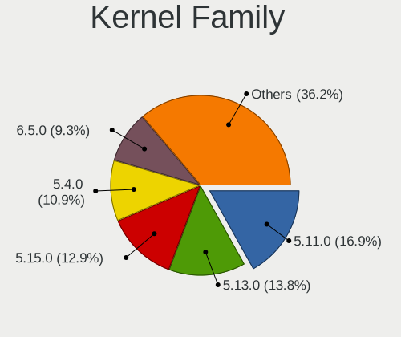
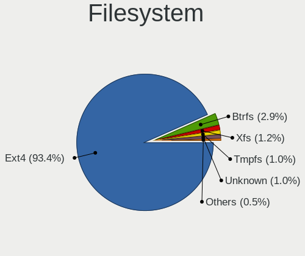
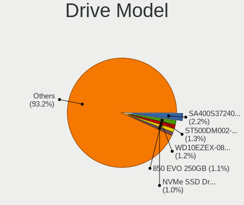
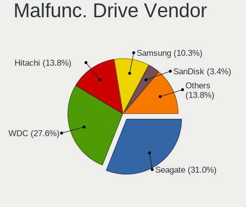
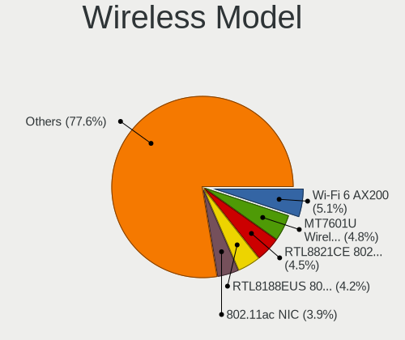
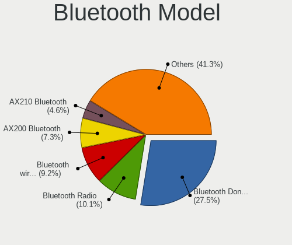
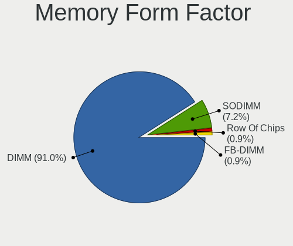

Elementary - Tested Hardware & Statistics (Desktops)
----------------------------------------------------

A project to collect tested hardware configurations for Elementary.

Anyone can contribute to this report by the [hw-probe](https://github.com/linuxhw/hw-probe) tool:

    sudo -E hw-probe -all -upload

Please contribute! Especially if your hardware is rare.

Full-feature report is available here: https://linux-hardware.org/?view=trends

Contents
--------

* [ Test Cases ](#test-cases)

* [ System ](#system)
  - [ OS                       ](#os)
  - [ OS Family                ](#os-family)
  - [ Kernel                   ](#kernel)
  - [ Kernel Family            ](#kernel-family)
  - [ Kernel Major Ver.        ](#kernel-major-ver)
  - [ Arch                     ](#arch)
  - [ DE                       ](#de)
  - [ Display Server           ](#display-server)
  - [ Display Manager          ](#display-manager)
  - [ OS Lang                  ](#os-lang)
  - [ Boot Mode                ](#boot-mode)
  - [ Filesystem               ](#filesystem)
  - [ Part. scheme             ](#part-scheme)
  - [ Dual Boot with Linux/BSD ](#dual-boot-with-linuxbsd)
  - [ Dual Boot (Win)          ](#dual-boot-win)

* [ Board ](#board)
  - [ Vendor                   ](#vendor)
  - [ Model                    ](#model)
  - [ Model Family             ](#model-family)
  - [ MFG Year                 ](#mfg-year)
  - [ Form Factor              ](#form-factor)
  - [ Secure Boot              ](#secure-boot)
  - [ Coreboot                 ](#coreboot)
  - [ RAM Size                 ](#ram-size)
  - [ RAM Used                 ](#ram-used)
  - [ Total Drives             ](#total-drives)
  - [ Has CD-ROM               ](#has-cd-rom)
  - [ Has Ethernet             ](#has-ethernet)
  - [ Has WiFi                 ](#has-wifi)
  - [ Has Bluetooth            ](#has-bluetooth)

* [ Location ](#location)
  - [ Country                  ](#country)
  - [ City                     ](#city)

* [ Drives ](#drives)
  - [ Drive Vendor             ](#drive-vendor)
  - [ Drive Model              ](#drive-model)
  - [ HDD Vendor               ](#hdd-vendor)
  - [ SSD Vendor               ](#ssd-vendor)
  - [ Drive Kind               ](#drive-kind)
  - [ Drive Connector          ](#drive-connector)
  - [ Drive Size               ](#drive-size)
  - [ Space Total              ](#space-total)
  - [ Space Used               ](#space-used)
  - [ Malfunc. Drives          ](#malfunc-drives)
  - [ Malfunc. Drive Vendor    ](#malfunc-drive-vendor)
  - [ Malfunc. HDD Vendor      ](#malfunc-hdd-vendor)
  - [ Malfunc. Drive Kind      ](#malfunc-drive-kind)
  - [ Failed Drives            ](#failed-drives)
  - [ Failed Drive Vendor      ](#failed-drive-vendor)
  - [ Drive Status             ](#drive-status)

* [ Storage controller ](#storage-controller)
  - [ Storage Vendor           ](#storage-vendor)
  - [ Storage Model            ](#storage-model)
  - [ Storage Kind             ](#storage-kind)

* [ Processor ](#processor)
  - [ CPU Vendor               ](#cpu-vendor)
  - [ CPU Model                ](#cpu-model)
  - [ CPU Model Family         ](#cpu-model-family)
  - [ CPU Cores                ](#cpu-cores)
  - [ CPU Sockets              ](#cpu-sockets)
  - [ CPU Threads              ](#cpu-threads)
  - [ CPU Op-Modes             ](#cpu-op-modes)
  - [ CPU Microcode            ](#cpu-microcode)
  - [ CPU Microarch            ](#cpu-microarch)

* [ Graphics ](#graphics)
  - [ GPU Vendor               ](#gpu-vendor)
  - [ GPU Model                ](#gpu-model)
  - [ GPU Combo                ](#gpu-combo)
  - [ GPU Driver               ](#gpu-driver)
  - [ GPU Memory               ](#gpu-memory)

* [ Monitor ](#monitor)
  - [ Monitor Vendor           ](#monitor-vendor)
  - [ Monitor Model            ](#monitor-model)
  - [ Monitor Resolution       ](#monitor-resolution)
  - [ Monitor Diagonal         ](#monitor-diagonal)
  - [ Monitor Width            ](#monitor-width)
  - [ Aspect Ratio             ](#aspect-ratio)
  - [ Monitor Area             ](#monitor-area)
  - [ Pixel Density            ](#pixel-density)
  - [ Multiple Monitors        ](#multiple-monitors)

* [ Network ](#network)
  - [ Net Controller Vendor    ](#net-controller-vendor)
  - [ Net Controller Model     ](#net-controller-model)
  - [ Wireless Vendor          ](#wireless-vendor)
  - [ Wireless Model           ](#wireless-model)
  - [ Ethernet Vendor          ](#ethernet-vendor)
  - [ Ethernet Model           ](#ethernet-model)
  - [ Net Controller Kind      ](#net-controller-kind)
  - [ Used Controller          ](#used-controller)
  - [ NICs                     ](#nics)
  - [ IPv6                     ](#ipv6)

* [ Bluetooth ](#bluetooth)
  - [ Bluetooth Vendor         ](#bluetooth-vendor)
  - [ Bluetooth Model          ](#bluetooth-model)

* [ Sound ](#sound)
  - [ Sound Vendor             ](#sound-vendor)
  - [ Sound Model              ](#sound-model)

* [ Memory ](#memory)
  - [ Memory Vendor            ](#memory-vendor)
  - [ Memory Model             ](#memory-model)
  - [ Memory Kind              ](#memory-kind)
  - [ Memory Form Factor       ](#memory-form-factor)
  - [ Memory Size              ](#memory-size)
  - [ Memory Speed             ](#memory-speed)

* [ Printers & scanners ](#printers--scanners)
  - [ Printer Vendor           ](#printer-vendor)
  - [ Printer Model            ](#printer-model)
  - [ Scanner Vendor           ](#scanner-vendor)
  - [ Scanner Model            ](#scanner-model)

* [ Camera ](#camera)
  - [ Camera Vendor            ](#camera-vendor)
  - [ Camera Model             ](#camera-model)

* [ Security ](#security)
  - [ Fingerprint Vendor       ](#fingerprint-vendor)
  - [ Fingerprint Model        ](#fingerprint-model)
  - [ Chipcard Vendor          ](#chipcard-vendor)
  - [ Chipcard Model           ](#chipcard-model)

* [ Unsupported ](#unsupported)
  - [ Unsupported Devices      ](#unsupported-devices)
  - [ Unsupported Device Types ](#unsupported-device-types)

Test Cases
----------

Total: 409

| Vendor    | Model                       | Probe                                                      | Date         |
|-----------|-----------------------------|------------------------------------------------------------|--------------|
| MSI       | B450M PRO-VDH MAX           | [e28ee0bd42](https://linux-hardware.org/?probe=e28ee0bd42) | Apr 16, 2022 |
| HP        | 1494                        | [6ad3ca1745](https://linux-hardware.org/?probe=6ad3ca1745) | Apr 16, 2022 |
| Gigabyte  | H61M-D2H-USB3               | [016243a675](https://linux-hardware.org/?probe=016243a675) | Apr 15, 2022 |
| Fujitsu   | D3531-A1 S26361-D3531-A1    | [46dd533a5e](https://linux-hardware.org/?probe=46dd533a5e) | Apr 14, 2022 |
| ASUSTek   | B85M-G                      | [c6dd82e724](https://linux-hardware.org/?probe=c6dd82e724) | Apr 14, 2022 |
| Gigabyte  | B450 AORUS ELITE            | [dff6de5032](https://linux-hardware.org/?probe=dff6de5032) | Apr 14, 2022 |
| ASUSTek   | B85M-G                      | [e525a26ca8](https://linux-hardware.org/?probe=e525a26ca8) | Apr 14, 2022 |
| Gigabyte  | B450 AORUS ELITE            | [6a2c5f12fd](https://linux-hardware.org/?probe=6a2c5f12fd) | Apr 13, 2022 |
| Dell      | 0K240Y A01                  | [76d4fbf0a6](https://linux-hardware.org/?probe=76d4fbf0a6) | Apr 13, 2022 |
| ASUSTek   | TUF X470-PLUS GAMING        | [3440d2dd8c](https://linux-hardware.org/?probe=3440d2dd8c) | Apr 12, 2022 |
| Lenovo    | 3178 SDK0J40700 WIN 3258... | [637023ab6d](https://linux-hardware.org/?probe=637023ab6d) | Apr 11, 2022 |
| ASUSTek   | PRIME Z390-A                | [21767e12e4](https://linux-hardware.org/?probe=21767e12e4) | Apr 11, 2022 |
| Pegatron  | IPMH61P1                    | [1adcf74c4f](https://linux-hardware.org/?probe=1adcf74c4f) | Apr 10, 2022 |
| ASUSTek   | H110I-PLUS                  | [e367ac99ce](https://linux-hardware.org/?probe=e367ac99ce) | Apr 10, 2022 |
| ASUSTek   | P8H61-M LX3 R2.0            | [1c357065cb](https://linux-hardware.org/?probe=1c357065cb) | Apr 07, 2022 |
| ASRock    | C226 WS                     | [7c11c1ec43](https://linux-hardware.org/?probe=7c11c1ec43) | Apr 07, 2022 |
| ASUSTek   | STRIKER II FORMULA          | [5dfea21930](https://linux-hardware.org/?probe=5dfea21930) | Apr 07, 2022 |
| ASUSTek   | STRIKER II FORMULA          | [040990b3fc](https://linux-hardware.org/?probe=040990b3fc) | Apr 07, 2022 |
| Gigabyte  | B450M DS3H-CF               | [0bc837ffef](https://linux-hardware.org/?probe=0bc837ffef) | Apr 06, 2022 |
| ASUSTek   | TUF Gaming B460M-PLUS       | [7419ad6a76](https://linux-hardware.org/?probe=7419ad6a76) | Apr 02, 2022 |
| Lenovo    | ThinkCentre M58 6258D3G     | [b67f1750b8](https://linux-hardware.org/?probe=b67f1750b8) | Mar 31, 2022 |
| Lenovo    | ThinkCentre M58 6258D3G     | [1cd22c83f1](https://linux-hardware.org/?probe=1cd22c83f1) | Mar 31, 2022 |
| MSI       | H97 GAMING 3                | [97f38615e3](https://linux-hardware.org/?probe=97f38615e3) | Mar 31, 2022 |
| MSI       | MEG X570 ACE                | [55572b8a7e](https://linux-hardware.org/?probe=55572b8a7e) | Mar 31, 2022 |
| HP        | 18E7                        | [ead4fcc358](https://linux-hardware.org/?probe=ead4fcc358) | Mar 29, 2022 |
| ASUSTek   | Rampage IV GENE             | [c067a4d0e7](https://linux-hardware.org/?probe=c067a4d0e7) | Mar 29, 2022 |
| Dell      | 0C522T A00                  | [33ae998152](https://linux-hardware.org/?probe=33ae998152) | Mar 26, 2022 |
| Dell      | 0C522T A00                  | [90242bb090](https://linux-hardware.org/?probe=90242bb090) | Mar 26, 2022 |
| MSI       | MPG B550 GAMING EDGE WIF... | [7577679057](https://linux-hardware.org/?probe=7577679057) | Mar 25, 2022 |
| Gigabyte  | A320M-S2H-CF                | [a237859a86](https://linux-hardware.org/?probe=a237859a86) | Mar 24, 2022 |
| Intel     | X79Turbo V1.x               | [18b126a753](https://linux-hardware.org/?probe=18b126a753) | Mar 24, 2022 |
| AMI       | Cherry Trail CR             | [bbea34ce64](https://linux-hardware.org/?probe=bbea34ce64) | Mar 22, 2022 |
| AMI       | Cherry Trail CR             | [bc5a34ef7e](https://linux-hardware.org/?probe=bc5a34ef7e) | Mar 20, 2022 |
| ASUSTek   | Rampage IV GENE             | [7f5053b061](https://linux-hardware.org/?probe=7f5053b061) | Mar 16, 2022 |
| ASUSTek   | Rampage IV GENE             | [7ff55a3ca6](https://linux-hardware.org/?probe=7ff55a3ca6) | Mar 16, 2022 |
| ASUSTek   | P8H61-M LX3 R2.0            | [eda8848760](https://linux-hardware.org/?probe=eda8848760) | Mar 15, 2022 |
| AOpen     | D1009 A1A4                  | [a7375d4581](https://linux-hardware.org/?probe=a7375d4581) | Mar 13, 2022 |
| MSI       | B85I                        | [d134c8451b](https://linux-hardware.org/?probe=d134c8451b) | Mar 12, 2022 |
| ASRock    | B450M Pro4                  | [12459fc7ea](https://linux-hardware.org/?probe=12459fc7ea) | Mar 11, 2022 |
| Gigabyte  | B150N Phoenix-WIFI-CF       | [a64818ccea](https://linux-hardware.org/?probe=a64818ccea) | Mar 10, 2022 |
| Biostar   | N68S3B                      | [aa1e6a4c82](https://linux-hardware.org/?probe=aa1e6a4c82) | Mar 10, 2022 |
| Dell      | 0HMX8D A01                  | [cfff92df80](https://linux-hardware.org/?probe=cfff92df80) | Mar 09, 2022 |
| ASUSTek   | M11AD                       | [8bb5baaa5a](https://linux-hardware.org/?probe=8bb5baaa5a) | Mar 09, 2022 |
| Biostar   | H61MLV2                     | [d5c330bad8](https://linux-hardware.org/?probe=d5c330bad8) | Mar 08, 2022 |
| HP        | 2ADC                        | [ed0714a64a](https://linux-hardware.org/?probe=ed0714a64a) | Mar 07, 2022 |
| MSI       | B85I                        | [39926596b7](https://linux-hardware.org/?probe=39926596b7) | Mar 07, 2022 |
| Dell      | 0PU052                      | [766b0e4665](https://linux-hardware.org/?probe=766b0e4665) | Mar 06, 2022 |
| Dell      | 0PU052                      | [a8e19bd112](https://linux-hardware.org/?probe=a8e19bd112) | Mar 06, 2022 |
| HP        | 1589                        | [88876808e9](https://linux-hardware.org/?probe=88876808e9) | Mar 05, 2022 |
| HP        | 802E                        | [14c73a40e0](https://linux-hardware.org/?probe=14c73a40e0) | Mar 05, 2022 |
| ASRock    | FM2A58M-DG3+                | [0b7875b1b5](https://linux-hardware.org/?probe=0b7875b1b5) | Mar 05, 2022 |
| HP        | 805D                        | [2a09665009](https://linux-hardware.org/?probe=2a09665009) | Mar 02, 2022 |
| ASUSTek   | M4N72-E                     | [c3fe570b4d](https://linux-hardware.org/?probe=c3fe570b4d) | Feb 28, 2022 |
| ASUSTek   | H81-PLUS                    | [e8956dc4ec](https://linux-hardware.org/?probe=e8956dc4ec) | Feb 27, 2022 |
| ASUSTek   | H81-PLUS                    | [9c68dfb511](https://linux-hardware.org/?probe=9c68dfb511) | Feb 26, 2022 |
| Gigabyte  | X470 AORUS ULTRA GAMING-... | [a6d5cc0368](https://linux-hardware.org/?probe=a6d5cc0368) | Feb 26, 2022 |
| Gigabyte  | Z390 UD                     | [7ea66813f3](https://linux-hardware.org/?probe=7ea66813f3) | Feb 23, 2022 |
| ASUSTek   | PRIME B450M-GAMING/BR       | [73b31ddab0](https://linux-hardware.org/?probe=73b31ddab0) | Feb 20, 2022 |
| MSI       | B85I                        | [24674e9e3a](https://linux-hardware.org/?probe=24674e9e3a) | Feb 20, 2022 |
| Intel     | DH61BE AAG14062-210         | [00566bb73f](https://linux-hardware.org/?probe=00566bb73f) | Feb 19, 2022 |
| MSI       | B85I                        | [633f6bf495](https://linux-hardware.org/?probe=633f6bf495) | Feb 19, 2022 |
| ASUSTek   | M11AD                       | [035887c4ab](https://linux-hardware.org/?probe=035887c4ab) | Feb 18, 2022 |
| ASUSTek   | P5B                         | [fa4c095fd7](https://linux-hardware.org/?probe=fa4c095fd7) | Feb 17, 2022 |
| Intel     | H61                         | [a70c59ad0e](https://linux-hardware.org/?probe=a70c59ad0e) | Feb 17, 2022 |
| ASUSTek   | PRIME Z590-A                | [6beda6e2da](https://linux-hardware.org/?probe=6beda6e2da) | Feb 16, 2022 |
| Biostar   | A68MD PRO                   | [da42cc4da7](https://linux-hardware.org/?probe=da42cc4da7) | Feb 16, 2022 |
| ASUSTek   | PRIME B250-PRO              | [be377c733e](https://linux-hardware.org/?probe=be377c733e) | Feb 14, 2022 |
| MSI       | B85I                        | [28c1f1b8ae](https://linux-hardware.org/?probe=28c1f1b8ae) | Feb 13, 2022 |
| ASUSTek   | PRIME Z590-A                | [825734953d](https://linux-hardware.org/?probe=825734953d) | Feb 13, 2022 |
| MSI       | B85I                        | [898dced271](https://linux-hardware.org/?probe=898dced271) | Feb 13, 2022 |
| Gigabyte  | F2A68HM-H                   | [a2a41e039c](https://linux-hardware.org/?probe=a2a41e039c) | Feb 13, 2022 |
| Gigabyte  | F2A68HM-H                   | [2f3941c9cb](https://linux-hardware.org/?probe=2f3941c9cb) | Feb 12, 2022 |
| ASUSTek   | PRIME A320M-K               | [5f4de1e2b0](https://linux-hardware.org/?probe=5f4de1e2b0) | Feb 12, 2022 |
| ASUSTek   | PRIME B360M-K               | [698e174402](https://linux-hardware.org/?probe=698e174402) | Feb 09, 2022 |
| ASUSTek   | H110M-C                     | [82f3d6edf9](https://linux-hardware.org/?probe=82f3d6edf9) | Feb 09, 2022 |
| MSI       | B450I GAMING PLUS AC        | [a2af859752](https://linux-hardware.org/?probe=a2af859752) | Feb 09, 2022 |
| ECS       | H55H-M                      | [856a42d74b](https://linux-hardware.org/?probe=856a42d74b) | Feb 07, 2022 |
| ASUSTek   | ROG STRIX B360-H GAMING     | [92d9fdcc97](https://linux-hardware.org/?probe=92d9fdcc97) | Feb 07, 2022 |
| Lenovo    | NO DPK                      | [4bb7cedbd8](https://linux-hardware.org/?probe=4bb7cedbd8) | Feb 06, 2022 |
| HP        | 802E                        | [31e2fe159c](https://linux-hardware.org/?probe=31e2fe159c) | Feb 05, 2022 |
| ASUSTek   | H110M-C                     | [6ba127c715](https://linux-hardware.org/?probe=6ba127c715) | Feb 04, 2022 |
| ASUSTek   | P5B                         | [9b661f64dd](https://linux-hardware.org/?probe=9b661f64dd) | Feb 04, 2022 |
| Foxconn   | NETBOX nT-435/535 Ver       | [c7d50db62b](https://linux-hardware.org/?probe=c7d50db62b) | Feb 03, 2022 |
| Foxconn   | NETBOX nT-435/535 Ver       | [2ee2be7ccf](https://linux-hardware.org/?probe=2ee2be7ccf) | Feb 03, 2022 |
| HP        | ProLiant ML110 G7           | [2e1dcafe6c](https://linux-hardware.org/?probe=2e1dcafe6c) | Feb 03, 2022 |
| ASUSTek   | H110M-C                     | [4d2233f824](https://linux-hardware.org/?probe=4d2233f824) | Feb 03, 2022 |
| HP        | 339A                        | [cf9dca84ff](https://linux-hardware.org/?probe=cf9dca84ff) | Feb 02, 2022 |
| Unknown   | Unknown                     | [629972c689](https://linux-hardware.org/?probe=629972c689) | Feb 01, 2022 |
| HP        | 805D                        | [19295e5827](https://linux-hardware.org/?probe=19295e5827) | Feb 01, 2022 |
| ASUSTek   | H110I-PLUS                  | [ebeaf681e3](https://linux-hardware.org/?probe=ebeaf681e3) | Feb 01, 2022 |
| Gigabyte  | B75M-D3H                    | [18717f0712](https://linux-hardware.org/?probe=18717f0712) | Feb 01, 2022 |
| MSI       | Z270 KRAIT GAMING           | [17ccbf9c76](https://linux-hardware.org/?probe=17ccbf9c76) | Jan 28, 2022 |
| Gigabyte  | H61M-DS2                    | [e800b95c58](https://linux-hardware.org/?probe=e800b95c58) | Jan 26, 2022 |
| ASRock    | H61M-HVS                    | [8fdf1980ee](https://linux-hardware.org/?probe=8fdf1980ee) | Jan 25, 2022 |
| ASRock    | H61M-HVS                    | [5d19dff1e4](https://linux-hardware.org/?probe=5d19dff1e4) | Jan 25, 2022 |
| Acer      | ConceptD CM100-51A V:1.1    | [663bbd709d](https://linux-hardware.org/?probe=663bbd709d) | Jan 24, 2022 |
| FIRICH    | J1900                       | [937e24af64](https://linux-hardware.org/?probe=937e24af64) | Jan 22, 2022 |
| ASUSTek   | ROG STRIX B360-H GAMING     | [d1505fe489](https://linux-hardware.org/?probe=d1505fe489) | Jan 21, 2022 |
| ASUSTek   | ROG STRIX X570-E GAMING     | [75d67cd8a4](https://linux-hardware.org/?probe=75d67cd8a4) | Jan 20, 2022 |
| ASUSTek   | TUF GAMING B550M-PLUS       | [7a14d864d4](https://linux-hardware.org/?probe=7a14d864d4) | Jan 20, 2022 |
| ASUSTek   | TUF B365M-PLUS GAMING       | [ec51f5ca3e](https://linux-hardware.org/?probe=ec51f5ca3e) | Jan 19, 2022 |
| MSI       | B450 TOMAHAWK MAX II        | [488d339e77](https://linux-hardware.org/?probe=488d339e77) | Jan 19, 2022 |
| MSI       | B450M-A PRO MAX             | [e7225dad8e](https://linux-hardware.org/?probe=e7225dad8e) | Jan 17, 2022 |
| ASUSTek   | P8H61-M LX3 R2.0            | [a76b9e67bb](https://linux-hardware.org/?probe=a76b9e67bb) | Jan 14, 2022 |
| ASUSTek   | H61M-CS                     | [8855875fbd](https://linux-hardware.org/?probe=8855875fbd) | Jan 14, 2022 |
| Unknown   | T3 MRD                      | [33392a90ce](https://linux-hardware.org/?probe=33392a90ce) | Jan 13, 2022 |
| MSI       | X470 GAMING PLUS MAX        | [00a00c3cac](https://linux-hardware.org/?probe=00a00c3cac) | Jan 13, 2022 |
| ASUSTek   | M5A78L-M LX3                | [39f3687349](https://linux-hardware.org/?probe=39f3687349) | Jan 12, 2022 |
| Foxconn   | 2AB1                        | [07faf9a309](https://linux-hardware.org/?probe=07faf9a309) | Jan 12, 2022 |
| Foxconn   | 2AB1                        | [de61623232](https://linux-hardware.org/?probe=de61623232) | Jan 11, 2022 |
| ASUSTek   | H110M-C                     | [be4291793d](https://linux-hardware.org/?probe=be4291793d) | Jan 10, 2022 |
| Gigabyte  | X570 AORUS ELITE            | [7ce29e0c54](https://linux-hardware.org/?probe=7ce29e0c54) | Jan 09, 2022 |
| HP        | 8597                        | [09ed815dd0](https://linux-hardware.org/?probe=09ed815dd0) | Jan 08, 2022 |
| Gigabyte  | GA-970A-D3                  | [b1c9832ce6](https://linux-hardware.org/?probe=b1c9832ce6) | Jan 07, 2022 |
| ASRock    | Z370 Pro4                   | [51cba69624](https://linux-hardware.org/?probe=51cba69624) | Jan 06, 2022 |
| ASRock    | B450M-HDV R4.0              | [20dfc25b62](https://linux-hardware.org/?probe=20dfc25b62) | Jan 05, 2022 |
| ASRock    | H97M Pro4                   | [92a6f429b5](https://linux-hardware.org/?probe=92a6f429b5) | Jan 05, 2022 |
| ASRock    | AB350M Pro4                 | [2886b84cc0](https://linux-hardware.org/?probe=2886b84cc0) | Jan 04, 2022 |
| Gigabyte  | B85M-DS3H-A                 | [cd6abb9f49](https://linux-hardware.org/?probe=cd6abb9f49) | Jan 03, 2022 |
| MSI       | 2A9C                        | [8d08f7f383](https://linux-hardware.org/?probe=8d08f7f383) | Dec 31, 2021 |
| HP        | 3397                        | [323dc8992b](https://linux-hardware.org/?probe=323dc8992b) | Dec 31, 2021 |
| ASUSTek   | X79-DELUXE                  | [00b9dd3788](https://linux-hardware.org/?probe=00b9dd3788) | Dec 30, 2021 |
| HP        | 1589                        | [d123a8de64](https://linux-hardware.org/?probe=d123a8de64) | Dec 30, 2021 |
| Foxconn   | 2AB1                        | [bcd6fc46cc](https://linux-hardware.org/?probe=bcd6fc46cc) | Dec 30, 2021 |
| ASUSTek   | TUF GAMING B550M-PLUS       | [5f67c759fe](https://linux-hardware.org/?probe=5f67c759fe) | Dec 28, 2021 |
| Gigabyte  | Z390 UD                     | [2399fa64ba](https://linux-hardware.org/?probe=2399fa64ba) | Dec 26, 2021 |
| ASRock    | Z590 Phantom Gaming 4/ac    | [b52ca671f7](https://linux-hardware.org/?probe=b52ca671f7) | Dec 24, 2021 |
| Apple     | Mac-F42C88C8 Proto1         | [783618fe4b](https://linux-hardware.org/?probe=783618fe4b) | Dec 23, 2021 |
| ASUSTek   | H97-PLUS                    | [cba91c2ad2](https://linux-hardware.org/?probe=cba91c2ad2) | Dec 22, 2021 |
| MSI       | B450-A PRO MAX              | [f14eef1ae6](https://linux-hardware.org/?probe=f14eef1ae6) | Dec 20, 2021 |
| Gigabyte  | H310M S2P                   | [a931eb10f0](https://linux-hardware.org/?probe=a931eb10f0) | Dec 19, 2021 |
| Foxconn   | 2AB1                        | [d9077a5d94](https://linux-hardware.org/?probe=d9077a5d94) | Dec 18, 2021 |
| Foxconn   | 2AB1                        | [b789981cc4](https://linux-hardware.org/?probe=b789981cc4) | Dec 17, 2021 |
| Gigabyte  | Z590 AORUS ELITE AX         | [c068e358e8](https://linux-hardware.org/?probe=c068e358e8) | Dec 16, 2021 |
| ASUSTek   | M5A78L-M LX3                | [720cc7a45f](https://linux-hardware.org/?probe=720cc7a45f) | Dec 15, 2021 |
| Pegatron  | IPMH61P1                    | [1ba6ea2ee9](https://linux-hardware.org/?probe=1ba6ea2ee9) | Dec 14, 2021 |
| Acer      | ConceptD CM100-51A V:1.1    | [0b3e5753fc](https://linux-hardware.org/?probe=0b3e5753fc) | Dec 13, 2021 |
| ASUSTek   | TUF GAMING B560M-PLUS       | [5c0550c1e8](https://linux-hardware.org/?probe=5c0550c1e8) | Dec 09, 2021 |
| ASUSTek   | PRIME A320M-K               | [fc49eed81d](https://linux-hardware.org/?probe=fc49eed81d) | Dec 09, 2021 |
| ASUSTek   | H81M-C                      | [0b0241baf7](https://linux-hardware.org/?probe=0b0241baf7) | Dec 08, 2021 |
| Dell      | 0MGK50 A02                  | [df4bb96e67](https://linux-hardware.org/?probe=df4bb96e67) | Dec 08, 2021 |
| ASUSTek   | M5A78L-M LX/BR              | [5c46f5e832](https://linux-hardware.org/?probe=5c46f5e832) | Dec 07, 2021 |
| Gigabyte  | AX370-Gaming-CF se1         | [7cb1ebd6c9](https://linux-hardware.org/?probe=7cb1ebd6c9) | Dec 07, 2021 |
| Gigabyte  | X570 AORUS PRO WIFI         | [a8e4016566](https://linux-hardware.org/?probe=a8e4016566) | Dec 06, 2021 |
| Gigabyte  | X570 AORUS PRO WIFI         | [ebfed157e7](https://linux-hardware.org/?probe=ebfed157e7) | Dec 06, 2021 |
| Acer      | Aspire X3990                | [e291d06394](https://linux-hardware.org/?probe=e291d06394) | Dec 05, 2021 |
| MSI       | Z370 KRAIT GAMING           | [b213dc07b8](https://linux-hardware.org/?probe=b213dc07b8) | Dec 04, 2021 |
| MSI       | Z370 KRAIT GAMING           | [b562e90f75](https://linux-hardware.org/?probe=b562e90f75) | Dec 04, 2021 |
| ASRock    | Z370 Pro4                   | [4ada22b406](https://linux-hardware.org/?probe=4ada22b406) | Dec 04, 2021 |
| Pegatron  | Benicia                     | [51dae15bcd](https://linux-hardware.org/?probe=51dae15bcd) | Dec 03, 2021 |
| Gigabyte  | AX370-Gaming-CF se1         | [313d4d0bd8](https://linux-hardware.org/?probe=313d4d0bd8) | Dec 03, 2021 |
| HP        | 8653 A                      | [85d1730019](https://linux-hardware.org/?probe=85d1730019) | Dec 01, 2021 |
| Gigabyte  | B85M-DS3H-A                 | [fbe4820444](https://linux-hardware.org/?probe=fbe4820444) | Dec 01, 2021 |
| ASUSTek   | ROG STRIX Z490-F GAMING     | [500f9c8851](https://linux-hardware.org/?probe=500f9c8851) | Dec 01, 2021 |
| ASUSTek   | PRIME B365M-A               | [c7cbb50843](https://linux-hardware.org/?probe=c7cbb50843) | Nov 30, 2021 |
| Chuwi     | LarkBox Pro                 | [4af62a6057](https://linux-hardware.org/?probe=4af62a6057) | Nov 29, 2021 |
| Biostar   | TH55XE                      | [9e420cc495](https://linux-hardware.org/?probe=9e420cc495) | Nov 28, 2021 |
| MSI       | H81M-P33                    | [8812103632](https://linux-hardware.org/?probe=8812103632) | Nov 28, 2021 |
| HP        | 1497                        | [6f042fb99c](https://linux-hardware.org/?probe=6f042fb99c) | Nov 28, 2021 |
| ASUSTek   | PRIME X470-PRO              | [2845eaa223](https://linux-hardware.org/?probe=2845eaa223) | Nov 27, 2021 |
| Acer      | Aspire X3990                | [5559b2d988](https://linux-hardware.org/?probe=5559b2d988) | Nov 27, 2021 |
| Foxconn   | 2AB1                        | [09a8a91f9e](https://linux-hardware.org/?probe=09a8a91f9e) | Nov 26, 2021 |
| HP        | 1825                        | [3648c360a9](https://linux-hardware.org/?probe=3648c360a9) | Nov 26, 2021 |
| Gigabyte  | B450 I AORUS PRO WIFI-CF    | [ee1387e206](https://linux-hardware.org/?probe=ee1387e206) | Nov 26, 2021 |
| Gigabyte  | Z390 GAMING X-CF            | [34e71f1e27](https://linux-hardware.org/?probe=34e71f1e27) | Nov 25, 2021 |
| Gigabyte  | B450M DS3H-CF               | [0fccfea38c](https://linux-hardware.org/?probe=0fccfea38c) | Nov 25, 2021 |
| ASUSTek   | P8H61-MX R2.0               | [1e15277ce2](https://linux-hardware.org/?probe=1e15277ce2) | Nov 22, 2021 |
| Biostar   | TA790GXE 128M               | [93ff10a9c2](https://linux-hardware.org/?probe=93ff10a9c2) | Nov 21, 2021 |
| Gigabyte  | B85M-D3V-A                  | [12bcc06e6e](https://linux-hardware.org/?probe=12bcc06e6e) | Nov 21, 2021 |
| MSI       | X470 GAMING PLUS MAX        | [9e7d926319](https://linux-hardware.org/?probe=9e7d926319) | Nov 19, 2021 |
| HP        | 0AECh D                     | [c81bcc92ca](https://linux-hardware.org/?probe=c81bcc92ca) | Nov 19, 2021 |
| Foxconn   | 2AB1                        | [f965bf0bd8](https://linux-hardware.org/?probe=f965bf0bd8) | Nov 18, 2021 |
| Apple     | Mac-F4208DC8 PVT            | [3369764322](https://linux-hardware.org/?probe=3369764322) | Nov 17, 2021 |
| Gigabyte  | EP43T-USB3                  | [a24bb09910](https://linux-hardware.org/?probe=a24bb09910) | Nov 15, 2021 |
| Gigabyte  | H81M-H                      | [a895ed29e0](https://linux-hardware.org/?probe=a895ed29e0) | Nov 14, 2021 |
| ASRock    | X570 Extreme4               | [e49fdf2db4](https://linux-hardware.org/?probe=e49fdf2db4) | Nov 13, 2021 |
| MSI       | 970A-G43                    | [19714dd1a0](https://linux-hardware.org/?probe=19714dd1a0) | Nov 08, 2021 |
| Gigabyte  | Z270X-Gaming 5              | [5244244701](https://linux-hardware.org/?probe=5244244701) | Nov 08, 2021 |
| Intel     | DG35EC AAE29266-205         | [89c665e43d](https://linux-hardware.org/?probe=89c665e43d) | Nov 02, 2021 |
| Intel     | DG35EC AAE29266-205         | [1046b28a41](https://linux-hardware.org/?probe=1046b28a41) | Nov 02, 2021 |
| ASRock    | P67 Extreme4                | [a70eb2d3f8](https://linux-hardware.org/?probe=a70eb2d3f8) | Oct 29, 2021 |
| ASRock    | P67 Extreme4                | [0a07f4c735](https://linux-hardware.org/?probe=0a07f4c735) | Oct 29, 2021 |
| MSI       | 2A9Ch                       | [2f752a1a3e](https://linux-hardware.org/?probe=2f752a1a3e) | Oct 28, 2021 |
| Foxconn   | 2AB1                        | [49aef5b72e](https://linux-hardware.org/?probe=49aef5b72e) | Oct 26, 2021 |
| HP        | 158B                        | [24399f4e69](https://linux-hardware.org/?probe=24399f4e69) | Oct 20, 2021 |
| HP        | 339A                        | [d9c6208191](https://linux-hardware.org/?probe=d9c6208191) | Oct 16, 2021 |
| Dell      | 0M9KCM A02                  | [a925b0f3d1](https://linux-hardware.org/?probe=a925b0f3d1) | Oct 12, 2021 |
| Gigabyte  | AB350-Gaming 3-CF           | [f6e75d0258](https://linux-hardware.org/?probe=f6e75d0258) | Oct 09, 2021 |
| MSI       | B460M PRO-VDH WIFI          | [05711b548f](https://linux-hardware.org/?probe=05711b548f) | Oct 03, 2021 |
| ASUSTek   | TUF GAMING B560M-PLUS       | [de0f051658](https://linux-hardware.org/?probe=de0f051658) | Oct 02, 2021 |
| Shuttle   | FS61                        | [b25047a516](https://linux-hardware.org/?probe=b25047a516) | Oct 01, 2021 |
| Gigabyte  | H67A-USB3-B3                | [9440c234ae](https://linux-hardware.org/?probe=9440c234ae) | Sep 28, 2021 |
| Gigabyte  | H67A-USB3-B3                | [aaabb5b80f](https://linux-hardware.org/?probe=aaabb5b80f) | Sep 28, 2021 |
| Apple     | Mac-F221BEC8                | [1754c64091](https://linux-hardware.org/?probe=1754c64091) | Sep 27, 2021 |
| ASUSTek   | P7H55-M                     | [3367bc011a](https://linux-hardware.org/?probe=3367bc011a) | Sep 25, 2021 |
| Dell      | 0Y5DDC A00                  | [df95ea94b8](https://linux-hardware.org/?probe=df95ea94b8) | Sep 25, 2021 |
| Dell      | 0Y5DDC A00                  | [10ee1abc07](https://linux-hardware.org/?probe=10ee1abc07) | Sep 25, 2021 |
| ASRock    | M3A790GXH/128M              | [818ec10ec8](https://linux-hardware.org/?probe=818ec10ec8) | Sep 24, 2021 |
| Gigabyte  | H67A-USB3-B3                | [0aab60dbc8](https://linux-hardware.org/?probe=0aab60dbc8) | Sep 24, 2021 |
| Intel     | X79 V1.x                    | [19223e911c](https://linux-hardware.org/?probe=19223e911c) | Sep 22, 2021 |
| Gigabyte  | H67A-USB3-B3                | [772b49f342](https://linux-hardware.org/?probe=772b49f342) | Sep 21, 2021 |
| ASUSTek   | M4N78-AM                    | [3d8e0efc00](https://linux-hardware.org/?probe=3d8e0efc00) | Sep 21, 2021 |
| ASRock    | A320M-HDV                   | [24bb7c7d18](https://linux-hardware.org/?probe=24bb7c7d18) | Sep 17, 2021 |
| Gigabyte  | Z68P-DS3                    | [1ddd2fcf1d](https://linux-hardware.org/?probe=1ddd2fcf1d) | Sep 14, 2021 |
| Intel     | H61                         | [0010dbcb5e](https://linux-hardware.org/?probe=0010dbcb5e) | Sep 10, 2021 |
| HP        | 8767 A                      | [7f022c67ac](https://linux-hardware.org/?probe=7f022c67ac) | Sep 09, 2021 |
| Gigabyte  | B450M DS3H V2               | [633441bc2b](https://linux-hardware.org/?probe=633441bc2b) | Sep 05, 2021 |
| ASUSTek   | ROG STRIX Z590-F GAMING ... | [c9476d5d06](https://linux-hardware.org/?probe=c9476d5d06) | Sep 02, 2021 |
| Gigabyte  | F2A55M-HD2                  | [0c05ab5b21](https://linux-hardware.org/?probe=0c05ab5b21) | Aug 30, 2021 |
| ASRock    | H81TM-ITX R2.0              | [4f04e7309e](https://linux-hardware.org/?probe=4f04e7309e) | Aug 30, 2021 |
| ASUSTek   | M5A78L-M LX/BR              | [d0ff1c6977](https://linux-hardware.org/?probe=d0ff1c6977) | Aug 25, 2021 |
| ASUSTek   | P6X58D-E                    | [db1ef28e92](https://linux-hardware.org/?probe=db1ef28e92) | Aug 20, 2021 |
| MSI       | X470 GAMING PLUS MAX        | [1176a287c7](https://linux-hardware.org/?probe=1176a287c7) | Aug 19, 2021 |
| ASUSTek   | TUF GAMING B450M-PRO II     | [73beb900ea](https://linux-hardware.org/?probe=73beb900ea) | Aug 15, 2021 |
| Gigabyte  | X570 I AORUS PRO WIFI       | [e302074e5e](https://linux-hardware.org/?probe=e302074e5e) | Aug 14, 2021 |
| Gigabyte  | H310M M.2 x.x               | [69e2e83b95](https://linux-hardware.org/?probe=69e2e83b95) | Aug 10, 2021 |
| Gigabyte  | H310M M.2 x.x               | [86d69a15b9](https://linux-hardware.org/?probe=86d69a15b9) | Aug 10, 2021 |
| Acer      | Aspire XC-603G              | [8a37f28ecc](https://linux-hardware.org/?probe=8a37f28ecc) | Jul 31, 2021 |
| ASUSTek   | P5KPL-AM SE                 | [a97fc63d3d](https://linux-hardware.org/?probe=a97fc63d3d) | Jul 23, 2021 |
| Biostar   | H61MH                       | [adca68749a](https://linux-hardware.org/?probe=adca68749a) | Jul 23, 2021 |
| Biostar   | H61MH                       | [2c690e433f](https://linux-hardware.org/?probe=2c690e433f) | Jul 23, 2021 |
| ASUSTek   | ROG STRIX Z390-H GAMING     | [9e27318e84](https://linux-hardware.org/?probe=9e27318e84) | Jul 14, 2021 |
| ASRock    | B450 Pro4                   | [c5d0611f79](https://linux-hardware.org/?probe=c5d0611f79) | Jun 13, 2021 |
| ASUSTek   | PRIME A320M-K               | [5e0580b431](https://linux-hardware.org/?probe=5e0580b431) | Jun 08, 2021 |
| ASUSTek   | H81M-K                      | [52fa7c5a31](https://linux-hardware.org/?probe=52fa7c5a31) | May 30, 2021 |
| ASUSTek   | TUF GAMING B550M-PLUS       | [63da02a979](https://linux-hardware.org/?probe=63da02a979) | May 19, 2021 |
| ASUSTek   | TUF GAMING B550M-PLUS       | [223234378e](https://linux-hardware.org/?probe=223234378e) | May 04, 2021 |
| ASUSTek   | ROG STRIX B450-I GAMING     | [a208e8a358](https://linux-hardware.org/?probe=a208e8a358) | May 01, 2021 |
| Gigabyte  | AB350M-DS3H V2-CF           | [98d6e8f2d2](https://linux-hardware.org/?probe=98d6e8f2d2) | Apr 15, 2021 |
| ASUSTek   | SABERTOOTH Z87              | [542d0b7163](https://linux-hardware.org/?probe=542d0b7163) | Apr 13, 2021 |
| Dell      | 06NWYK A01                  | [304541ce36](https://linux-hardware.org/?probe=304541ce36) | Apr 08, 2021 |
| Dell      | 06NWYK A01                  | [47766de8d9](https://linux-hardware.org/?probe=47766de8d9) | Apr 07, 2021 |
| MSI       | H61M-P31                    | [867b109a0b](https://linux-hardware.org/?probe=867b109a0b) | Apr 07, 2021 |
| HP        | 843F                        | [d5b68ba3fb](https://linux-hardware.org/?probe=d5b68ba3fb) | Apr 07, 2021 |
| MSI       | B450M PRO-VDH MAX           | [9a1463fd59](https://linux-hardware.org/?probe=9a1463fd59) | Mar 22, 2021 |
| HP        | 843F                        | [de77cd09ab](https://linux-hardware.org/?probe=de77cd09ab) | Mar 22, 2021 |
| Gigabyte  | H61M-S2PV                   | [bbe4962b33](https://linux-hardware.org/?probe=bbe4962b33) | Mar 22, 2021 |
| HP        | 843F                        | [a4fc49c430](https://linux-hardware.org/?probe=a4fc49c430) | Mar 09, 2021 |
| MSI       | B450M PRO-VDH MAX           | [65c7806bad](https://linux-hardware.org/?probe=65c7806bad) | Mar 09, 2021 |
| MSI       | B450M PRO-VDH MAX           | [e1289a40a1](https://linux-hardware.org/?probe=e1289a40a1) | Feb 28, 2021 |
| Lenovo    | MAHOBAY NOK                 | [e3c14a6397](https://linux-hardware.org/?probe=e3c14a6397) | Feb 25, 2021 |
| MSI       | B450M PRO-VDH MAX           | [d152990d34](https://linux-hardware.org/?probe=d152990d34) | Feb 13, 2021 |
| ASUSTek   | ROG STRIX B350-F GAMING     | [268b9f895a](https://linux-hardware.org/?probe=268b9f895a) | Feb 10, 2021 |
| Gigabyte  | Z77-DS3H                    | [a5a556b691](https://linux-hardware.org/?probe=a5a556b691) | Feb 09, 2021 |
| Gigabyte  | A320M-S2H V2-CF             | [ea93e4d3cd](https://linux-hardware.org/?probe=ea93e4d3cd) | Feb 09, 2021 |
| MSI       | B450M PRO-VDH MAX           | [895ec88c20](https://linux-hardware.org/?probe=895ec88c20) | Feb 08, 2021 |
| MSI       | B450M PRO-VDH MAX           | [458481448c](https://linux-hardware.org/?probe=458481448c) | Feb 07, 2021 |
| ASRock    | Z75 Pro3                    | [f2d919b5c5](https://linux-hardware.org/?probe=f2d919b5c5) | Feb 03, 2021 |
| Biostar   | Hi-Fi A70U3P                | [c2727e98b9](https://linux-hardware.org/?probe=c2727e98b9) | Feb 02, 2021 |
| Biostar   | Hi-Fi A70U3P                | [2c11d020c7](https://linux-hardware.org/?probe=2c11d020c7) | Feb 02, 2021 |
| MSI       | B450M PRO-VDH MAX           | [98cc7a4bca](https://linux-hardware.org/?probe=98cc7a4bca) | Jan 15, 2021 |
| Gigabyte  | GA-MA78GM-S2H               | [d40272076d](https://linux-hardware.org/?probe=d40272076d) | Jan 13, 2021 |
| Gigabyte  | GA-MA78GM-S2H               | [d31c109973](https://linux-hardware.org/?probe=d31c109973) | Jan 13, 2021 |
| EVGA      | 132-CK-NF79 2               | [44c54ae3df](https://linux-hardware.org/?probe=44c54ae3df) | Jan 09, 2021 |
| MSI       | P35 Platinum                | [105ebcfc8d](https://linux-hardware.org/?probe=105ebcfc8d) | Jan 08, 2021 |
| Gigabyte  | G31M-ES2L                   | [4e7d5b4879](https://linux-hardware.org/?probe=4e7d5b4879) | Jan 07, 2021 |
| ASUSTek   | M5A97                       | [0f975cd5e6](https://linux-hardware.org/?probe=0f975cd5e6) | Jan 03, 2021 |
| ASUSTek   | CM6330_CM6630_CM6730_CM6... | [721dd0a694](https://linux-hardware.org/?probe=721dd0a694) | Jan 03, 2021 |
| MSI       | B450M PRO-VDH MAX           | [7197a45b8a](https://linux-hardware.org/?probe=7197a45b8a) | Dec 30, 2020 |
| Dell      | 0T656F A02                  | [1830ce642b](https://linux-hardware.org/?probe=1830ce642b) | Dec 29, 2020 |
| ASUSTek   | M5A97                       | [800aa16703](https://linux-hardware.org/?probe=800aa16703) | Dec 29, 2020 |
| MSI       | B450M PRO-VDH MAX           | [803e6b6194](https://linux-hardware.org/?probe=803e6b6194) | Dec 25, 2020 |
| ASUSTek   | M5A99X EVO R2.0             | [f7d949f5a7](https://linux-hardware.org/?probe=f7d949f5a7) | Dec 23, 2020 |
| Biostar   | TA785G3 HD                  | [ed91ded9e9](https://linux-hardware.org/?probe=ed91ded9e9) | Dec 23, 2020 |
| ASRock    | Z87E-ITX                    | [861b40ea1d](https://linux-hardware.org/?probe=861b40ea1d) | Dec 21, 2020 |
| Dell      | 0GN723                      | [a952bf5fa6](https://linux-hardware.org/?probe=a952bf5fa6) | Dec 20, 2020 |
| HP        | 8433 11                     | [691ef58a05](https://linux-hardware.org/?probe=691ef58a05) | Dec 09, 2020 |
| ASUSTek   | PRIME H310M-E R2.0          | [3070faaf5e](https://linux-hardware.org/?probe=3070faaf5e) | Dec 03, 2020 |
| Gigabyte  | H61M-DS2                    | [49263df7ee](https://linux-hardware.org/?probe=49263df7ee) | Dec 02, 2020 |
| HP        | 304Bh                       | [d30d065810](https://linux-hardware.org/?probe=d30d065810) | Nov 30, 2020 |
| Gigabyte  | Z77M-D3H                    | [47c75561ac](https://linux-hardware.org/?probe=47c75561ac) | Nov 21, 2020 |
| ASUSTek   | TUF GAMING X570-PLUS        | [10e9d31bdb](https://linux-hardware.org/?probe=10e9d31bdb) | Nov 20, 2020 |
| MSI       | B450M PRO-VDH MAX           | [29e128bea9](https://linux-hardware.org/?probe=29e128bea9) | Nov 20, 2020 |
| ASUSTek   | PRIME Z270-A                | [d47493ecae](https://linux-hardware.org/?probe=d47493ecae) | Nov 16, 2020 |
| Gigabyte  | H81M-S2H                    | [54fd3c5678](https://linux-hardware.org/?probe=54fd3c5678) | Nov 15, 2020 |
| MSI       | B450M PRO-M2 MAX            | [f2face0a01](https://linux-hardware.org/?probe=f2face0a01) | Nov 07, 2020 |
| ASUSTek   | PRIME A320I-K               | [6bfc04099a](https://linux-hardware.org/?probe=6bfc04099a) | Nov 06, 2020 |
| eMachines | EL1358G                     | [9aabea4465](https://linux-hardware.org/?probe=9aabea4465) | Oct 28, 2020 |
| HP        | 8433 11                     | [670028bf54](https://linux-hardware.org/?probe=670028bf54) | Oct 16, 2020 |
| MSI       | P35 Platinum                | [232a14759f](https://linux-hardware.org/?probe=232a14759f) | Oct 14, 2020 |
| MSI       | MAG B550M MORTAR            | [653a4a9f6e](https://linux-hardware.org/?probe=653a4a9f6e) | Oct 11, 2020 |
| HP        | 304Ah                       | [5143880fd9](https://linux-hardware.org/?probe=5143880fd9) | Oct 09, 2020 |
| ASUSTek   | PRIME A320M-K               | [55e4fca971](https://linux-hardware.org/?probe=55e4fca971) | Oct 08, 2020 |
| ASUSTek   | TUF B360-PLUS GAMING        | [1779589a19](https://linux-hardware.org/?probe=1779589a19) | Oct 08, 2020 |
| Gigabyte  | Z390 DESIGNARE-CF           | [f304a2629f](https://linux-hardware.org/?probe=f304a2629f) | Oct 04, 2020 |
| Acer      | WMCP78M                     | [2510b2bc49](https://linux-hardware.org/?probe=2510b2bc49) | Oct 02, 2020 |
| Intel     | DG41RQ AAE54511-204         | [651cef3c94](https://linux-hardware.org/?probe=651cef3c94) | Sep 29, 2020 |
| MSI       | FM2-A55M-E33                | [50d8cc3e2d](https://linux-hardware.org/?probe=50d8cc3e2d) | Sep 28, 2020 |
| ASUSTek   | Z170-DELUXE                 | [8eef95cd00](https://linux-hardware.org/?probe=8eef95cd00) | Sep 12, 2020 |
| MSI       | B450 TOMAHAWK MAX           | [73d7e76e09](https://linux-hardware.org/?probe=73d7e76e09) | Sep 11, 2020 |
| Dell      | 0Y958C A00                  | [253e97e06c](https://linux-hardware.org/?probe=253e97e06c) | Sep 10, 2020 |
| Gigabyte  | F2A88XN-WIFI                | [3b51467541](https://linux-hardware.org/?probe=3b51467541) | Sep 06, 2020 |
| Lenovo    | MAHOBAY NOK                 | [d95b985658](https://linux-hardware.org/?probe=d95b985658) | Sep 01, 2020 |
| ASUSTek   | CM6330_CM6630_CM6730_CM6... | [78ec970ee1](https://linux-hardware.org/?probe=78ec970ee1) | Aug 29, 2020 |
| ASUSTek   | STRIX Z270H GAMING          | [ce54993f5d](https://linux-hardware.org/?probe=ce54993f5d) | Aug 29, 2020 |
| ASUSTek   | M5A78L-M PLUS/USB3          | [40f5f91c4e](https://linux-hardware.org/?probe=40f5f91c4e) | Aug 26, 2020 |
| HP        | 81B4                        | [6747078a67](https://linux-hardware.org/?probe=6747078a67) | Aug 24, 2020 |
| HP        | 81B4                        | [ff66e031e4](https://linux-hardware.org/?probe=ff66e031e4) | Aug 18, 2020 |
| ASUSTek   | SABERTOOTH Z87              | [86ff4005e2](https://linux-hardware.org/?probe=86ff4005e2) | Aug 15, 2020 |
| MSI       | B450M PRO-VDH MAX           | [ae51610784](https://linux-hardware.org/?probe=ae51610784) | Aug 09, 2020 |
| ASUSTek   | H81I-PLUS                   | [7259e07174](https://linux-hardware.org/?probe=7259e07174) | Aug 07, 2020 |
| SYS       | H310CH5-TI2                 | [fb33742784](https://linux-hardware.org/?probe=fb33742784) | Aug 06, 2020 |
| Gigabyte  | Z97-D3H-CF                  | [fd308ae7e8](https://linux-hardware.org/?probe=fd308ae7e8) | Aug 03, 2020 |
| ASUSTek   | P8H61-M LX3 R2.0            | [6cf9ba1da5](https://linux-hardware.org/?probe=6cf9ba1da5) | Jul 24, 2020 |
| ASUSTek   | P8H61-M LX3 R2.0            | [9372988884](https://linux-hardware.org/?probe=9372988884) | Jul 24, 2020 |
| Dell      | 08NPPY A00                  | [ca6080756b](https://linux-hardware.org/?probe=ca6080756b) | Jul 24, 2020 |
| Dell      | 08NPPY A00                  | [41e1632a84](https://linux-hardware.org/?probe=41e1632a84) | Jul 24, 2020 |
| HP        | 2ADC                        | [2faf91f855](https://linux-hardware.org/?probe=2faf91f855) | Jul 02, 2020 |
| MSI       | B450M PRO-VDH MAX           | [9159f538a0](https://linux-hardware.org/?probe=9159f538a0) | Jun 28, 2020 |
| ASUSTek   | CM6330_CM6630_CM6730_CM6... | [f7a297ae2c](https://linux-hardware.org/?probe=f7a297ae2c) | Jun 23, 2020 |
| Gigabyte  | G31M-ES2L                   | [f9f7ec4c96](https://linux-hardware.org/?probe=f9f7ec4c96) | May 27, 2020 |
| ASUSTek   | P8Z77-V LX                  | [aa53a3eba5](https://linux-hardware.org/?probe=aa53a3eba5) | May 26, 2020 |
| MSI       | B450M PRO-VDH MAX           | [0e7c8d0cdc](https://linux-hardware.org/?probe=0e7c8d0cdc) | May 25, 2020 |
| Acer      | EQ45M                       | [a682473a39](https://linux-hardware.org/?probe=a682473a39) | May 23, 2020 |
| ASUSTek   | PRIME A320M-K               | [14dfb9eb8c](https://linux-hardware.org/?probe=14dfb9eb8c) | May 22, 2020 |
| ASUSTek   | PRIME A320M-K               | [299eb96cce](https://linux-hardware.org/?probe=299eb96cce) | May 22, 2020 |
| ASUSTek   | CM6330_CM6630_CM6730_CM6... | [cb10b79124](https://linux-hardware.org/?probe=cb10b79124) | May 16, 2020 |
| ASUSTek   | CM6330_CM6630_CM6730_CM6... | [592e93d734](https://linux-hardware.org/?probe=592e93d734) | May 16, 2020 |
| MSI       | GF615M-P33 V2               | [e6c02461aa](https://linux-hardware.org/?probe=e6c02461aa) | May 14, 2020 |
| ASRock    | B450M-HDV R4.0              | [484cc8fd5a](https://linux-hardware.org/?probe=484cc8fd5a) | May 07, 2020 |
| ASRock    | B450M-HDV R4.0              | [dbbea9cdaf](https://linux-hardware.org/?probe=dbbea9cdaf) | May 07, 2020 |
| Intel     | DG33FB AAD81072-306         | [2c0b3102ba](https://linux-hardware.org/?probe=2c0b3102ba) | May 01, 2020 |
| ASUSTek   | CM6330_CM6630_CM6730_CM6... | [7a18707ff5](https://linux-hardware.org/?probe=7a18707ff5) | Apr 26, 2020 |
| Acer      | EQ45M                       | [03e154e2dc](https://linux-hardware.org/?probe=03e154e2dc) | Apr 21, 2020 |
| eMachines | EL1358G                     | [0ec6f0c0df](https://linux-hardware.org/?probe=0ec6f0c0df) | Apr 20, 2020 |
| ASUSTek   | ROG STRIX B360-I GAMING     | [7fa6504e44](https://linux-hardware.org/?probe=7fa6504e44) | Apr 18, 2020 |
| ASUSTek   | ROG STRIX B350-F GAMING     | [21eac3f5ab](https://linux-hardware.org/?probe=21eac3f5ab) | Apr 14, 2020 |
| MSI       | H110M PRO-VD                | [a69e76d844](https://linux-hardware.org/?probe=a69e76d844) | Apr 11, 2020 |
| ASUSTek   | TUF B365M-PLUS GAMING       | [fb24b9471a](https://linux-hardware.org/?probe=fb24b9471a) | Apr 08, 2020 |
| ASUSTek   | TUF B365M-PLUS GAMING       | [9ba07d6518](https://linux-hardware.org/?probe=9ba07d6518) | Apr 08, 2020 |
| ASUSTek   | P5K                         | [60860911b6](https://linux-hardware.org/?probe=60860911b6) | Apr 03, 2020 |
| MSI       | MPG Z390 GAMING PRO CARB... | [d69e7b9642](https://linux-hardware.org/?probe=d69e7b9642) | Apr 02, 2020 |
| ECS       | H55H-M                      | [1673d5808e](https://linux-hardware.org/?probe=1673d5808e) | Mar 31, 2020 |
| ASRock    | Z77 Extreme4                | [1ea076e57b](https://linux-hardware.org/?probe=1ea076e57b) | Mar 19, 2020 |
| MSI       | B450 GAMING PLUS MAX        | [642694d59f](https://linux-hardware.org/?probe=642694d59f) | Mar 19, 2020 |
| ASUSTek   | P5K                         | [64c435a307](https://linux-hardware.org/?probe=64c435a307) | Mar 17, 2020 |
| ASUSTek   | P5K                         | [d532983f25](https://linux-hardware.org/?probe=d532983f25) | Mar 17, 2020 |
| MSI       | B450 GAMING PLUS MAX        | [86896f4c65](https://linux-hardware.org/?probe=86896f4c65) | Mar 17, 2020 |
| ASRock    | Z77 Extreme4                | [847badc92c](https://linux-hardware.org/?probe=847badc92c) | Mar 17, 2020 |
| ASRock    | B85M Pro3                   | [765094a989](https://linux-hardware.org/?probe=765094a989) | Mar 10, 2020 |
| MSI       | Z170A PC MATE               | [201d14e45c](https://linux-hardware.org/?probe=201d14e45c) | Mar 09, 2020 |
| ASUSTek   | P8B75-M                     | [56ae5142e3](https://linux-hardware.org/?probe=56ae5142e3) | Feb 24, 2020 |
| ASUSTek   | SABERTOOTH 990FX/GEN3 R2... | [9c21c6ca8e](https://linux-hardware.org/?probe=9c21c6ca8e) | Feb 17, 2020 |
| ASUSTek   | SABERTOOTH 990FX/GEN3 R2... | [fa7ad30945](https://linux-hardware.org/?probe=fa7ad30945) | Feb 17, 2020 |
| ASUSTek   | SABERTOOTH 990FX/GEN3 R2... | [8eb7f19502](https://linux-hardware.org/?probe=8eb7f19502) | Feb 17, 2020 |
| ASUSTek   | Maximus V FORMULA           | [713f5c5aaf](https://linux-hardware.org/?probe=713f5c5aaf) | Feb 14, 2020 |
| Gigabyte  | H67M-D2-B3                  | [8b9d4bcb86](https://linux-hardware.org/?probe=8b9d4bcb86) | Feb 01, 2020 |
| Gigabyte  | GA-990X-Gaming SLI-CF       | [03eef2b7d3](https://linux-hardware.org/?probe=03eef2b7d3) | Feb 01, 2020 |
| Gigabyte  | GA-990X-Gaming SLI-CF       | [d0ec134fe1](https://linux-hardware.org/?probe=d0ec134fe1) | Jan 31, 2020 |
| Gigabyte  | GA-990X-Gaming SLI-CF       | [cd4d0236ad](https://linux-hardware.org/?probe=cd4d0236ad) | Jan 30, 2020 |
| MSI       | FM2-A55M-E33                | [4587ab8edd](https://linux-hardware.org/?probe=4587ab8edd) | Jan 25, 2020 |
| MSI       | FM2-A55M-E33                | [93fb1697b5](https://linux-hardware.org/?probe=93fb1697b5) | Jan 25, 2020 |
| Gigabyte  | H97-HD3                     | [80245136bd](https://linux-hardware.org/?probe=80245136bd) | Jan 18, 2020 |
| ASRock    | Z87 Extreme6                | [ffb3f65bcd](https://linux-hardware.org/?probe=ffb3f65bcd) | Jan 18, 2020 |
| Dell      | 0KWVT8 A00                  | [55b5255c24](https://linux-hardware.org/?probe=55b5255c24) | Jan 18, 2020 |
| ASRock    | N68-GS4/USB3 FX R2.0        | [1a903c9d61](https://linux-hardware.org/?probe=1a903c9d61) | Jan 14, 2020 |
| Pegatron  | IPMH61P1                    | [2a47818e18](https://linux-hardware.org/?probe=2a47818e18) | Jan 06, 2020 |
| ASRock    | H87M Pro4                   | [40dee920a9](https://linux-hardware.org/?probe=40dee920a9) | Dec 25, 2019 |
| Gigabyte  | Z390 GAMING SLI-CF          | [41795f04de](https://linux-hardware.org/?probe=41795f04de) | Dec 24, 2019 |
| MSI       | A320M PRO-VD PLUS           | [805e960aa9](https://linux-hardware.org/?probe=805e960aa9) | Dec 18, 2019 |
| ASRock    | X399 Phantom Gaming 6       | [b89b031eb9](https://linux-hardware.org/?probe=b89b031eb9) | Dec 14, 2019 |
| MSI       | B150M BAZOOKA               | [3afe42946d](https://linux-hardware.org/?probe=3afe42946d) | Dec 12, 2019 |
| Gigabyte  | H61M-S1                     | [2302b497cc](https://linux-hardware.org/?probe=2302b497cc) | Dec 11, 2019 |
| Intel     | DH67BL AAG10189-208         | [c9400c1fcb](https://linux-hardware.org/?probe=c9400c1fcb) | Dec 11, 2019 |
| Intel     | DH67BL AAG10189-208         | [18d758491c](https://linux-hardware.org/?probe=18d758491c) | Dec 11, 2019 |
| Gigabyte  | H61M-S1                     | [cfbe6b0f33](https://linux-hardware.org/?probe=cfbe6b0f33) | Dec 11, 2019 |
| Gigabyte  | H61M-S1                     | [c5b3e3f258](https://linux-hardware.org/?probe=c5b3e3f258) | Dec 11, 2019 |
| ASUSTek   | ROG STRIX Z390-F GAMING     | [a548b448e7](https://linux-hardware.org/?probe=a548b448e7) | Dec 09, 2019 |
| MSI       | PH67A-C43                   | [35ffc61791](https://linux-hardware.org/?probe=35ffc61791) | Dec 06, 2019 |
| MSI       | PH67A-C43                   | [1a5faa8a98](https://linux-hardware.org/?probe=1a5faa8a98) | Dec 05, 2019 |
| Lenovo    | Board                       | [209a9171b1](https://linux-hardware.org/?probe=209a9171b1) | Dec 04, 2019 |
| ASUSTek   | SABERTOOTH Z77              | [889648300b](https://linux-hardware.org/?probe=889648300b) | Oct 04, 2019 |
| ASUSTek   | SABERTOOTH Z77              | [28d0871f17](https://linux-hardware.org/?probe=28d0871f17) | Oct 02, 2019 |
| ASUSTek   | SABERTOOTH Z77              | [1233b680f5](https://linux-hardware.org/?probe=1233b680f5) | Oct 02, 2019 |
| ASUSTek   | SABERTOOTH Z77              | [22a74597d5](https://linux-hardware.org/?probe=22a74597d5) | Oct 02, 2019 |
| ASUSTek   | SABERTOOTH Z77              | [31f72c0672](https://linux-hardware.org/?probe=31f72c0672) | Oct 02, 2019 |
| Dell      | 048DY8 A00                  | [500dc4f9f5](https://linux-hardware.org/?probe=500dc4f9f5) | Sep 11, 2019 |
| ASRock    | H97M Pro4                   | [168644ddd0](https://linux-hardware.org/?probe=168644ddd0) | Sep 04, 2019 |
| Gigabyte  | H310M S2P                   | [6fffbe0439](https://linux-hardware.org/?probe=6fffbe0439) | Sep 02, 2019 |
| MSI       | Z97A GAMING 6               | [6a9086bf86](https://linux-hardware.org/?probe=6a9086bf86) | Jul 06, 2019 |
| ASUSTek   | PRIME A320M-K               | [0f2ef33214](https://linux-hardware.org/?probe=0f2ef33214) | Jun 27, 2019 |
| Dell      | 09KPNV A00                  | [b1769092a2](https://linux-hardware.org/?probe=b1769092a2) | Jun 22, 2019 |
| Dell      | 01TKCC A01                  | [c133935d4f](https://linux-hardware.org/?probe=c133935d4f) | Jun 19, 2019 |
| ASUSTek   | STRIKER II NSE              | [13d6ead175](https://linux-hardware.org/?probe=13d6ead175) | May 22, 2019 |
| ASRock    | H97M Pro4                   | [410a594809](https://linux-hardware.org/?probe=410a594809) | May 21, 2019 |
| ASUSTek   | ROG Maximus X HERO          | [d7d3d4f56b](https://linux-hardware.org/?probe=d7d3d4f56b) | May 19, 2019 |
| MSI       | B450 TOMAHAWK               | [336d0df071](https://linux-hardware.org/?probe=336d0df071) | May 03, 2019 |
| Intel     | DG35EC AAE29266-205         | [1ddb0e459f](https://linux-hardware.org/?probe=1ddb0e459f) | Apr 26, 2019 |
| Intel     | SHARKBAY                    | [d411643b19](https://linux-hardware.org/?probe=d411643b19) | Apr 23, 2019 |
| Dell      | 01TKCC A01                  | [3cfa230457](https://linux-hardware.org/?probe=3cfa230457) | Apr 12, 2019 |
| Dell      | 01TKCC A01                  | [94e2e60839](https://linux-hardware.org/?probe=94e2e60839) | Apr 11, 2019 |
| MSI       | Z87M-G43                    | [cbb0c4be39](https://linux-hardware.org/?probe=cbb0c4be39) | Apr 11, 2019 |
| MSI       | Z87M-G43                    | [6fb3422b8b](https://linux-hardware.org/?probe=6fb3422b8b) | Apr 11, 2019 |
| Gigabyte  | G31M-ES2L                   | [2344aec798](https://linux-hardware.org/?probe=2344aec798) | Apr 04, 2019 |
| HP        | 158A                        | [61be039d0f](https://linux-hardware.org/?probe=61be039d0f) | Apr 02, 2019 |
| Intel     | DH55HC AAE70933-502         | [8f109c807c](https://linux-hardware.org/?probe=8f109c807c) | Feb 15, 2019 |
| Intel     | DH55HC AAE70933-502         | [be7548c062](https://linux-hardware.org/?probe=be7548c062) | Feb 15, 2019 |
| Wibtek    | H61-M HDMI2                 | [6f082a4f2d](https://linux-hardware.org/?probe=6f082a4f2d) | Feb 12, 2019 |
| Wibtek    | H61-M HDMI2                 | [3a44341e10](https://linux-hardware.org/?probe=3a44341e10) | Feb 12, 2019 |
| ECS       | H61H2-M2                    | [ed1e345718](https://linux-hardware.org/?probe=ed1e345718) | Feb 02, 2019 |
| ECS       | H61H2-M2                    | [554a16077e](https://linux-hardware.org/?probe=554a16077e) | Feb 01, 2019 |
| Gigabyte  | G31M-ES2L                   | [d69a897cf8](https://linux-hardware.org/?probe=d69a897cf8) | Jan 07, 2019 |
| Gigabyte  | G31M-ES2L                   | [75827661a7](https://linux-hardware.org/?probe=75827661a7) | Jan 07, 2019 |
| Gigabyte  | G31M-ES2L                   | [8531feefb2](https://linux-hardware.org/?probe=8531feefb2) | Jan 07, 2019 |
| Gigabyte  | A320M-S2H-CF                | [a72d5458ff](https://linux-hardware.org/?probe=a72d5458ff) | Nov 23, 2018 |
| Gigabyte  | B85M-D3H                    | [d206454b5f](https://linux-hardware.org/?probe=d206454b5f) | Aug 27, 2018 |
| ASUSTek   | P5GD1 PRO                   | [7f52004043](https://linux-hardware.org/?probe=7f52004043) | Aug 02, 2018 |
| ECS       | H61H2-M2                    | [765806fe73](https://linux-hardware.org/?probe=765806fe73) | Jun 01, 2018 |
| Gigabyte  | GA-990FXA-UD3               | [2e67236dbb](https://linux-hardware.org/?probe=2e67236dbb) | Feb 23, 2018 |

System
------

OS
--

Installed operating systems

| Name             | Desktops | Percent |
|------------------|----------|---------|
| Elementary 6.1   | 91       | 31.06%  |
| Elementary 6     | 67       | 22.87%  |
| Elementary 5.1.7 | 62       | 21.16%  |
| Elementary 5.1   | 17       | 5.8%    |
| Elementary 5.0   | 16       | 5.46%   |
| Elementary 5.1.2 | 10       | 3.41%   |
| Elementary 5.1.4 | 7        | 2.39%   |
| Elementary 5.1.3 | 7        | 2.39%   |
| Elementary 5.1.6 | 6        | 2.05%   |
| Elementary 0.4.1 | 6        | 2.05%   |
| Elementary 6.0   | 2        | 0.68%   |
| Elementary 5.1.5 | 2        | 0.68%   |

OS Family
---------

OS without a version

| Name       | Desktops | Percent |
|------------|----------|---------|
| Elementary | 274      | 100%    |

Kernel
------

Version of the Linux kernel

| Version            | Desktops | Percent |
|--------------------|----------|---------|
| 5.11.0-43-generic  | 23       | 7.12%   |
| 5.11.0-41-generic  | 19       | 5.88%   |
| 5.11.0-40-generic  | 17       | 5.26%   |
| 5.13.0-28-generic  | 16       | 4.95%   |
| 5.13.0-39-generic  | 14       | 4.33%   |
| 5.0.0-37-generic   | 11       | 3.41%   |
| 5.13.0-30-generic  | 10       | 3.1%    |
| 5.11.0-27-generic  | 10       | 3.1%    |
| 5.4.0-42-generic   | 9        | 2.79%   |
| 5.4.0-48-generic   | 8        | 2.48%   |
| 5.13.0-27-generic  | 8        | 2.48%   |
| 5.13.0-35-generic  | 7        | 2.17%   |
| 5.11.0-37-generic  | 7        | 2.17%   |
| 5.4.0-65-generic   | 6        | 1.86%   |
| 5.4.0-54-generic   | 6        | 1.86%   |
| 5.11.0-25-generic  | 6        | 1.86%   |
| 5.4.0-58-generic   | 5        | 1.55%   |
| 5.3.0-46-generic   | 5        | 1.55%   |
| 5.3.0-40-generic   | 5        | 1.55%   |
| 5.11.0-38-generic  | 5        | 1.55%   |
| 5.13.0-37-generic  | 4        | 1.24%   |
| 5.11.0-44-generic  | 4        | 1.24%   |
| 5.8.0-50-generic   | 3        | 0.93%   |
| 5.4.0-56-generic   | 3        | 0.93%   |
| 5.4.0-52-generic   | 3        | 0.93%   |
| 5.4.0-47-generic   | 3        | 0.93%   |
| 5.3.0-53-generic   | 3        | 0.93%   |
| 5.3.0-28-generic   | 3        | 0.93%   |
| 4.15.0-51-generic  | 3        | 0.93%   |
| 4.15.0-47-generic  | 3        | 0.93%   |
| 5.4.0-90-generic   | 2        | 0.62%   |
| 5.4.0-80-generic   | 2        | 0.62%   |
| 5.4.0-71-generic   | 2        | 0.62%   |
| 5.4.0-70-generic   | 2        | 0.62%   |
| 5.4.0-60-generic   | 2        | 0.62%   |
| 5.4.0-53-generic   | 2        | 0.62%   |
| 5.3.0-62-generic   | 2        | 0.62%   |
| 5.3.0-51-generic   | 2        | 0.62%   |
| 5.3.0-45-generic   | 2        | 0.62%   |
| 5.3.0-42-generic   | 2        | 0.62%   |
| 5.3.0-26-generic   | 2        | 0.62%   |
| 5.13.0-25-generic  | 2        | 0.62%   |
| 5.11.0-46-generic  | 2        | 0.62%   |
| 5.11.0-36-generic  | 2        | 0.62%   |
| 5.11.0-34-generic  | 2        | 0.62%   |
| 4.15.0-96-generic  | 2        | 0.62%   |
| 4.15.0-45-generic  | 2        | 0.62%   |
| 4.15.0-161-generic | 2        | 0.62%   |
| 4.15.0-128-generic | 2        | 0.62%   |
| 4.15.0-112-generic | 2        | 0.62%   |
| 5.8.0-63-generic   | 1        | 0.31%   |
| 5.8.0-55-generic   | 1        | 0.31%   |
| 5.4.0-94-generic   | 1        | 0.31%   |
| 5.4.0-91-generic   | 1        | 0.31%   |
| 5.4.0-84-generic   | 1        | 0.31%   |
| 5.4.0-77-generic   | 1        | 0.31%   |
| 5.4.0-74-generic   | 1        | 0.31%   |
| 5.4.0-73-generic   | 1        | 0.31%   |
| 5.4.0-67-generic   | 1        | 0.31%   |
| 5.4.0-66-generic   | 1        | 0.31%   |

Kernel Family
-------------

Linux kernel without a distro release

| Version | Desktops | Percent |
|---------|----------|---------|
| 5.11.0  | 92       | 32.28%  |
| 5.4.0   | 59       | 20.7%   |
| 5.13.0  | 58       | 20.35%  |
| 5.3.0   | 24       | 8.42%   |
| 4.15.0  | 22       | 7.72%   |
| 5.0.0   | 14       | 4.91%   |
| 5.8.0   | 5        | 1.75%   |
| 4.18.0  | 3        | 1.05%   |
| 4.4.0   | 2        | 0.7%    |
| 5.2.11  | 1        | 0.35%   |
| 5.17.0  | 1        | 0.35%   |
| 5.15.12 | 1        | 0.35%   |
| 5.15.1  | 1        | 0.35%   |
| 5.0.11  | 1        | 0.35%   |
| 4.10.0  | 1        | 0.35%   |

Kernel Major Ver.
-----------------

Linux kernel major version

| Version | Desktops | Percent |
|---------|----------|---------|
| 5.11    | 92       | 32.28%  |
| 5.4     | 59       | 20.7%   |
| 5.13    | 58       | 20.35%  |
| 5.3     | 24       | 8.42%   |
| 4.15    | 22       | 7.72%   |
| 5.0     | 15       | 5.26%   |
| 5.8     | 5        | 1.75%   |
| 4.18    | 3        | 1.05%   |
| 5.15    | 2        | 0.7%    |
| 4.4     | 2        | 0.7%    |
| 5.2     | 1        | 0.35%   |
| 5.17    | 1        | 0.35%   |
| 4.10    | 1        | 0.35%   |

Arch
----

OS architecture (x86_64, i586, etc.)

| Name   | Desktops | Percent |
|--------|----------|---------|
| x86_64 | 274      | 100%    |

DE
--

Desktop Environment

| Name     | Desktops | Percent |
|----------|----------|---------|
| Pantheon | 251      | 89.64%  |
| Unknown  | 26       | 9.29%   |
| GNOME    | 2        | 0.71%   |
| MATE     | 1        | 0.36%   |

Display Server
--------------

X11 or Wayland

| Name    | Desktops | Percent |
|---------|----------|---------|
| X11     | 273      | 99.64%  |
| Unknown | 1        | 0.36%   |

Display Manager
---------------

SDDM, LightDM, etc.

| Name    | Desktops | Percent |
|---------|----------|---------|
| Unknown | 231      | 83.09%  |
| LightDM | 30       | 10.79%  |
| TDM     | 15       | 5.4%    |
| SDDM    | 1        | 0.36%   |
| GDM     | 1        | 0.36%   |

OS Lang
-------

Language

| Lang    | Desktops | Percent |
|---------|----------|---------|
| en_US   | 105      | 37.5%   |
| de_DE   | 29       | 10.36%  |
| Unknown | 23       | 8.21%   |
| es_ES   | 21       | 7.5%    |
| en_GB   | 15       | 5.36%   |
| ru_RU   | 10       | 3.57%   |
| fr_FR   | 10       | 3.57%   |
| pt_BR   | 9        | 3.21%   |
| en_CA   | 7        | 2.5%    |
| it_IT   | 6        | 2.14%   |
| tr_TR   | 5        | 1.79%   |
| pl_PL   | 5        | 1.79%   |
| es_MX   | 3        | 1.07%   |
| en_AU   | 3        | 1.07%   |
| pt_PT   | 2        | 0.71%   |
| en_IN   | 2        | 0.71%   |
| de_CH   | 2        | 0.71%   |
| zh_CN   | 1        | 0.36%   |
| uk_UA   | 1        | 0.36%   |
| sv_SE   | 1        | 0.36%   |
| sr_RS   | 1        | 0.36%   |
| nl_NL   | 1        | 0.36%   |
| ja_JP   | 1        | 0.36%   |
| hu_HU   | 1        | 0.36%   |
| gl_ES   | 1        | 0.36%   |
| fr_CA   | 1        | 0.36%   |
| fr_BE   | 1        | 0.36%   |
| fi_FI   | 1        | 0.36%   |
| es_VE   | 1        | 0.36%   |
| es_SV   | 1        | 0.36%   |
| es_PA   | 1        | 0.36%   |
| es_EC   | 1        | 0.36%   |
| en_PH   | 1        | 0.36%   |
| en_IE   | 1        | 0.36%   |
| en_HK   | 1        | 0.36%   |
| el_GR   | 1        | 0.36%   |
| de_AT   | 1        | 0.36%   |
| cs_CZ   | 1        | 0.36%   |
| ca_ES   | 1        | 0.36%   |
| ar_EG   | 1        | 0.36%   |

Boot Mode
---------

EFI or BIOS

| Mode | Desktops | Percent |
|------|----------|---------|
| EFI  | 140      | 50.36%  |
| BIOS | 138      | 49.64%  |

Filesystem
----------

Type of filesystem

| Type    | Desktops | Percent |
|---------|----------|---------|
| Ext4    | 259      | 93.17%  |
| Btrfs   | 10       | 3.6%    |
| Unknown | 6        | 2.16%   |
| Xfs     | 3        | 1.08%   |

Part. scheme
------------

Scheme of partitioning

| Type    | Desktops | Percent |
|---------|----------|---------|
| Unknown | 242      | 87.36%  |
| GPT     | 21       | 7.58%   |
| MBR     | 14       | 5.05%   |

Dual Boot with Linux/BSD
------------------------

Hosting more than one Linux/BSD

| Dual boot | Desktops | Percent |
|-----------|----------|---------|
| No        | 253      | 92.34%  |
| Yes       | 21       | 7.66%   |

Dual Boot (Win)
---------------

Hosting Linux and Windows

| Dual boot | Desktops | Percent |
|-----------|----------|---------|
| No        | 227      | 82.55%  |
| Yes       | 48       | 17.45%  |

Board
-----

Vendor
------

Motherboard manufacturer

| Name                | Desktops | Percent |
|---------------------|----------|---------|
| ASUSTek Computer    | 73       | 26.64%  |
| Gigabyte Technology | 51       | 18.61%  |
| MSI                 | 34       | 12.41%  |
| Hewlett-Packard     | 24       | 8.76%   |
| ASRock              | 24       | 8.76%   |
| Dell                | 16       | 5.84%   |
| Intel               | 10       | 3.65%   |
| Biostar             | 8        | 2.92%   |
| Lenovo              | 5        | 1.82%   |
| Acer                | 5        | 1.82%   |
| Pegatron            | 3        | 1.09%   |
| Foxconn             | 3        | 1.09%   |
| Apple               | 3        | 1.09%   |
| Wibtek              | 2        | 0.73%   |
| ECS                 | 2        | 0.73%   |
| Unknown             | 2        | 0.73%   |
| SYS                 | 1        | 0.36%   |
| Shuttle             | 1        | 0.36%   |
| Fujitsu             | 1        | 0.36%   |
| FIRICH              | 1        | 0.36%   |
| EVGA                | 1        | 0.36%   |
| eMachines           | 1        | 0.36%   |
| Chuwi               | 1        | 0.36%   |
| AOpen               | 1        | 0.36%   |
| AMI                 | 1        | 0.36%   |

Model
-----

Motherboard model

| Name                                    | Desktops | Percent |
|-----------------------------------------|----------|---------|
| ASUS All Series                         | 7        | 2.55%   |
| ASUS P8H61-M LX3 R2.0                   | 4        | 1.46%   |
| MSI MS-7C02                             | 3        | 1.09%   |
| ASUS PRIME A320M-K                      | 3        | 1.09%   |
| Wibtek H61-M HDMI2                      | 2        | 0.73%   |
| Pegatron IPMH61P1                       | 2        | 0.73%   |
| MSI MS-7B86                             | 2        | 0.73%   |
| MSI MS-7721                             | 2        | 0.73%   |
| Intel H61                               | 2        | 0.73%   |
| Gigabyte Z390 UD                        | 2        | 0.73%   |
| Gigabyte H61M-DS2                       | 2        | 0.73%   |
| ECS H55H-M                              | 2        | 0.73%   |
| ASUS TUF GAMING B550M-PLUS              | 2        | 0.73%   |
| ASUS ROG STRIX B350-F GAMING            | 2        | 0.73%   |
| ASRock B450M-HDV R4.0                   | 2        | 0.73%   |
| Unknown                                 | 2        | 0.73%   |
| SYS H310CH5-TI2                         | 1        | 0.36%   |
| Shuttle DS61                            | 1        | 0.36%   |
| Pegatron KJ379AA-ABA a6400f             | 1        | 0.36%   |
| MSI PPPPP-CCC#MMMMMMMM                  | 1        | 0.36%   |
| MSI P35 Platinum(MS-7345)               | 1        | 0.36%   |
| MSI MS-7C94                             | 1        | 0.36%   |
| MSI MS-7C91                             | 1        | 0.36%   |
| MSI MS-7C83                             | 1        | 0.36%   |
| MSI MS-7C52                             | 1        | 0.36%   |
| MSI MS-7C35                             | 1        | 0.36%   |
| MSI MS-7B84                             | 1        | 0.36%   |
| MSI MS-7B79                             | 1        | 0.36%   |
| MSI MS-7B46                             | 1        | 0.36%   |
| MSI MS-7B38                             | 1        | 0.36%   |
| MSI MS-7B17                             | 1        | 0.36%   |
| MSI MS-7A59                             | 1        | 0.36%   |
| MSI MS-7A40                             | 1        | 0.36%   |
| MSI MS-7A38                             | 1        | 0.36%   |
| MSI MS-7996                             | 1        | 0.36%   |
| MSI MS-7971                             | 1        | 0.36%   |
| MSI MS-7918                             | 1        | 0.36%   |
| MSI MS-7917                             | 1        | 0.36%   |
| MSI MS-7851                             | 1        | 0.36%   |
| MSI MS-7823                             | 1        | 0.36%   |
| MSI MS-7817                             | 1        | 0.36%   |
| MSI MS-7788                             | 1        | 0.36%   |
| MSI MS-7693                             | 1        | 0.36%   |
| MSI MS-7673                             | 1        | 0.36%   |
| MSI MS-7597                             | 1        | 0.36%   |
| MSI Elite 7100 Microtower PC            | 1        | 0.36%   |
| Lenovo ThinkCentre M92p 3227D13         | 1        | 0.36%   |
| Lenovo ThinkCentre M72e 3664AD7         | 1        | 0.36%   |
| Lenovo ThinkCentre M58 6258D3G          | 1        | 0.36%   |
| Lenovo ThinkCentre M55E 9632BU8         | 1        | 0.36%   |
| Lenovo IdeaCentre 510S-07ICK 90LX006TGE | 1        | 0.36%   |
| Intel X79                               | 1        | 0.36%   |
| Intel X64                               | 1        | 0.36%   |
| Intel SHARKBAY                          | 1        | 0.36%   |
| Intel DH67BL AAG10189-208               | 1        | 0.36%   |
| Intel DH61BE AAG14062-210               | 1        | 0.36%   |
| Intel DH55HC AAE70933-502               | 1        | 0.36%   |
| Intel DG41RQ AAE54511-204               | 1        | 0.36%   |
| Intel DG35EC AAE29266-205               | 1        | 0.36%   |
| HP Z820 Workstation                     | 1        | 0.36%   |

Model Family
------------

Motherboard model prefix

| Name                   | Desktops | Percent |
|------------------------|----------|---------|
| ASUS PRIME             | 13       | 4.74%   |
| Dell OptiPlex          | 10       | 3.65%   |
| ASUS ROG               | 10       | 3.65%   |
| ASUS TUF               | 9        | 3.28%   |
| ASUS All               | 7        | 2.55%   |
| HP Compaq              | 6        | 2.19%   |
| Gigabyte Z390          | 5        | 1.82%   |
| Lenovo ThinkCentre     | 4        | 1.46%   |
| Dell Precision         | 4        | 1.46%   |
| ASUS P8H61-M           | 4        | 1.46%   |
| MSI MS-7C02            | 3        | 1.09%   |
| HP ProDesk             | 3        | 1.09%   |
| Gigabyte X570          | 3        | 1.09%   |
| ASUS M5A78L-M          | 3        | 1.09%   |
| Acer Aspire            | 3        | 1.09%   |
| Wibtek H61-M           | 2        | 0.73%   |
| Pegatron IPMH61P1      | 2        | 0.73%   |
| MSI MS-7B86            | 2        | 0.73%   |
| MSI MS-7721            | 2        | 0.73%   |
| Intel H61              | 2        | 0.73%   |
| HP Pavilion            | 2        | 0.73%   |
| Gigabyte H61M-DS2      | 2        | 0.73%   |
| Gigabyte H310M         | 2        | 0.73%   |
| Gigabyte B450M         | 2        | 0.73%   |
| Gigabyte B450          | 2        | 0.73%   |
| Gigabyte A320M-S2H     | 2        | 0.73%   |
| ECS H55H-M             | 2        | 0.73%   |
| ASUS STRIKER           | 2        | 0.73%   |
| ASUS SABERTOOTH        | 2        | 0.73%   |
| ASRock B450M-HDV       | 2        | 0.73%   |
| Unknown                | 2        | 0.73%   |
| SYS H310CH5-TI2        | 1        | 0.36%   |
| Shuttle DS61           | 1        | 0.36%   |
| Pegatron KJ379AA-ABA   | 1        | 0.36%   |
| MSI PPPPP-CCC#MMMMMMMM | 1        | 0.36%   |
| MSI P35                | 1        | 0.36%   |
| MSI MS-7C94            | 1        | 0.36%   |
| MSI MS-7C91            | 1        | 0.36%   |
| MSI MS-7C83            | 1        | 0.36%   |
| MSI MS-7C52            | 1        | 0.36%   |
| MSI MS-7C35            | 1        | 0.36%   |
| MSI MS-7B84            | 1        | 0.36%   |
| MSI MS-7B79            | 1        | 0.36%   |
| MSI MS-7B46            | 1        | 0.36%   |
| MSI MS-7B38            | 1        | 0.36%   |
| MSI MS-7B17            | 1        | 0.36%   |
| MSI MS-7A59            | 1        | 0.36%   |
| MSI MS-7A40            | 1        | 0.36%   |
| MSI MS-7A38            | 1        | 0.36%   |
| MSI MS-7996            | 1        | 0.36%   |
| MSI MS-7971            | 1        | 0.36%   |
| MSI MS-7918            | 1        | 0.36%   |
| MSI MS-7917            | 1        | 0.36%   |
| MSI MS-7851            | 1        | 0.36%   |
| MSI MS-7823            | 1        | 0.36%   |
| MSI MS-7817            | 1        | 0.36%   |
| MSI MS-7788            | 1        | 0.36%   |
| MSI MS-7693            | 1        | 0.36%   |
| MSI MS-7673            | 1        | 0.36%   |
| MSI MS-7597            | 1        | 0.36%   |

MFG Year
--------

Motherboard manufacture year

| Year | Desktops | Percent |
|------|----------|---------|
| 2018 | 35       | 12.77%  |
| 2012 | 35       | 12.77%  |
| 2013 | 27       | 9.85%   |
| 2019 | 25       | 9.12%   |
| 2011 | 25       | 9.12%   |
| 2017 | 18       | 6.57%   |
| 2010 | 18       | 6.57%   |
| 2020 | 15       | 5.47%   |
| 2014 | 15       | 5.47%   |
| 2015 | 14       | 5.11%   |
| 2016 | 11       | 4.01%   |
| 2008 | 11       | 4.01%   |
| 2009 | 10       | 3.65%   |
| 2021 | 9        | 3.28%   |
| 2007 | 4        | 1.46%   |
| 2006 | 1        | 0.36%   |
| 2005 | 1        | 0.36%   |

Form Factor
-----------

Physical design of the computer

| Name    | Desktops | Percent |
|---------|----------|---------|
| Desktop | 274      | 100%    |

Secure Boot
-----------

Enabled or disabled

| State    | Desktops | Percent |
|----------|----------|---------|
| Disabled | 263      | 95.99%  |
| Enabled  | 11       | 4.01%   |

Coreboot
--------

Have coreboot on board

| Used | Desktops | Percent |
|------|----------|---------|
| No   | 274      | 100%    |

RAM Size
--------

Total RAM memory

| Size in GB  | Desktops | Percent |
|-------------|----------|---------|
| 16.01-24.0  | 64       | 23.27%  |
| 8.01-16.0   | 59       | 21.45%  |
| 4.01-8.0    | 52       | 18.91%  |
| 32.01-64.0  | 47       | 17.09%  |
| 3.01-4.0    | 33       | 12%     |
| 64.01-256.0 | 7        | 2.55%   |
| 24.01-32.0  | 5        | 1.82%   |
| 1.01-2.0    | 5        | 1.82%   |
| 2.01-3.0    | 3        | 1.09%   |

RAM Used
--------

Used RAM memory

| Used GB    | Desktops | Percent |
|------------|----------|---------|
| 1.01-2.0   | 117      | 37.99%  |
| 2.01-3.0   | 87       | 28.25%  |
| 3.01-4.0   | 45       | 14.61%  |
| 4.01-8.0   | 44       | 14.29%  |
| 8.01-16.0  | 8        | 2.6%    |
| 0.51-1.0   | 6        | 1.95%   |
| 32.01-64.0 | 1        | 0.32%   |

Total Drives
------------

Number of drives on board

| Drives | Desktops | Percent |
|--------|----------|---------|
| 2      | 102      | 36.04%  |
| 1      | 102      | 36.04%  |
| 3      | 34       | 12.01%  |
| 4      | 23       | 8.13%   |
| 5      | 12       | 4.24%   |
| 7      | 4        | 1.41%   |
| 6      | 4        | 1.41%   |
| 8      | 1        | 0.35%   |
| 0      | 1        | 0.35%   |

Has CD-ROM
----------

Has CD-ROM on board

| Presented | Desktops | Percent |
|-----------|----------|---------|
| No        | 162      | 57.65%  |
| Yes       | 119      | 42.35%  |

Has Ethernet
------------

Has Ethernet on board

| Presented | Desktops | Percent |
|-----------|----------|---------|
| Yes       | 270      | 98.54%  |
| No        | 4        | 1.46%   |

Has WiFi
--------

Has WiFi module

| Presented | Desktops | Percent |
|-----------|----------|---------|
| No        | 143      | 51.62%  |
| Yes       | 134      | 48.38%  |

Has Bluetooth
-------------

Has Bluetooth module

| Presented | Desktops | Percent |
|-----------|----------|---------|
| No        | 186      | 67.39%  |
| Yes       | 90       | 32.61%  |

Location
--------

Country
-------

Geographic location (country)

| Country      | Desktops | Percent |
|--------------|----------|---------|
| Germany      | 29       | 10.55%  |
| USA          | 27       | 9.82%   |
| Brazil       | 20       | 7.27%   |
| UK           | 18       | 6.55%   |
| Spain        | 15       | 5.45%   |
| Russia       | 14       | 5.09%   |
| Canada       | 13       | 4.73%   |
| France       | 10       | 3.64%   |
| Mexico       | 8        | 2.91%   |
| Indonesia    | 8        | 2.91%   |
| Poland       | 7        | 2.55%   |
| Italy        | 7        | 2.55%   |
| Turkey       | 6        | 2.18%   |
| India        | 6        | 2.18%   |
| Argentina    | 6        | 2.18%   |
| Australia    | 5        | 1.82%   |
| Sweden       | 4        | 1.45%   |
| Netherlands  | 4        | 1.45%   |
| Egypt        | 4        | 1.45%   |
| Austria      | 4        | 1.45%   |
| Ukraine      | 3        | 1.09%   |
| Malaysia     | 3        | 1.09%   |
| Greece       | 3        | 1.09%   |
| Finland      | 3        | 1.09%   |
| Czechia      | 3        | 1.09%   |
| Bulgaria     | 3        | 1.09%   |
| Venezuela    | 2        | 0.73%   |
| Romania      | 2        | 0.73%   |
| Philippines  | 2        | 0.73%   |
| Iran         | 2        | 0.73%   |
| Hong Kong    | 2        | 0.73%   |
| Costa Rica   | 2        | 0.73%   |
| Belgium      | 2        | 0.73%   |
| Vietnam      | 1        | 0.36%   |
| Thailand     | 1        | 0.36%   |
| Switzerland  | 1        | 0.36%   |
| Sri Lanka    | 1        | 0.36%   |
| South Africa | 1        | 0.36%   |
| Sint Maarten | 1        | 0.36%   |
| Serbia       | 1        | 0.36%   |
| Portugal     | 1        | 0.36%   |
| Panama       | 1        | 0.36%   |
| Norway       | 1        | 0.36%   |
| New Zealand  | 1        | 0.36%   |
| Luxembourg   | 1        | 0.36%   |
| Lithuania    | 1        | 0.36%   |
| Kosovo       | 1        | 0.36%   |
| Kenya        | 1        | 0.36%   |
| Japan        | 1        | 0.36%   |
| Ireland      | 1        | 0.36%   |
| Hungary      | 1        | 0.36%   |
| Estonia      | 1        | 0.36%   |
| El Salvador  | 1        | 0.36%   |
| Ecuador      | 1        | 0.36%   |
| Denmark      | 1        | 0.36%   |
| Colombia     | 1        | 0.36%   |
| China        | 1        | 0.36%   |
| Chile        | 1        | 0.36%   |
| Belarus      | 1        | 0.36%   |
| Bangladesh   | 1        | 0.36%   |

City
----

Geographic location (city)

| City                      | Desktops | Percent |
|---------------------------|----------|---------|
| Fortaleza                 | 4        | 1.37%   |
| Berlin                    | 4        | 1.37%   |
| Vienna                    | 3        | 1.02%   |
| Sofia                     | 3        | 1.02%   |
| Rio de Janeiro            | 3        | 1.02%   |
| Paris                     | 3        | 1.02%   |
| Montreal                  | 3        | 1.02%   |
| Hamburg                   | 3        | 1.02%   |
| Brisbane                  | 3        | 1.02%   |
| Warsaw                    | 2        | 0.68%   |
| Sao Paulo                 | 2        | 0.68%   |
| Novosibirsk               | 2        | 0.68%   |
| Moscow                    | 2        | 0.68%   |
| Morelia                   | 2        | 0.68%   |
| Montenegro                | 2        | 0.68%   |
| Milan                     | 2        | 0.68%   |
| Mexico City               | 2        | 0.68%   |
| Istanbul                  | 2        | 0.68%   |
| Giza                      | 2        | 0.68%   |
| Central                   | 2        | 0.68%   |
| Caracas                   | 2        | 0.68%   |
| Cairo                     | 2        | 0.68%   |
| Znojmo                    | 1        | 0.34%   |
| Zabrze                    | 1        | 0.34%   |
| Xicheng District          | 1        | 0.34%   |
| Wroclaw                   | 1        | 0.34%   |
| Wriezen                   | 1        | 0.34%   |
| Woolloongabba             | 1        | 0.34%   |
| Wolgast                   | 1        | 0.34%   |
| Wigan                     | 1        | 0.34%   |
| Whiting Bay               | 1        | 0.34%   |
| Wattala                   | 1        | 0.34%   |
| Vitria                | 1        | 0.34%   |
| Vinhedo                   | 1        | 0.34%   |
| Vilvoorde                 | 1        | 0.34%   |
| Villahermosa              | 1        | 0.34%   |
| Vilanova i la Geltr   | 1        | 0.34%   |
| Vantaa                    | 1        | 0.34%   |
| Vannes                    | 1        | 0.34%   |
| Vancouver                 | 1        | 0.34%   |
| Vaenersborg               | 1        | 0.34%   |
| Uppsala                   | 1        | 0.34%   |
| Ullastrell                | 1        | 0.34%   |
| Tucson                    | 1        | 0.34%   |
| Tseung Kwan O             | 1        | 0.34%   |
| Trivandrum                | 1        | 0.34%   |
| Tournus                   | 1        | 0.34%   |
| Toronto                   | 1        | 0.34%   |
| Tolyatti                  | 1        | 0.34%   |
| Toluca                    | 1        | 0.34%   |
| Thrissur                  | 1        | 0.34%   |
| Thessaloniki              | 1        | 0.34%   |
| Tehran                    | 1        | 0.34%   |
| Tangerang                 | 1        | 0.34%   |
| Tampere                   | 1        | 0.34%   |
| Tallinn                   | 1        | 0.34%   |
| So Jos dos Campos | 1        | 0.34%   |
| Sydney                    | 1        | 0.34%   |
| Surgut                    | 1        | 0.34%   |
| Suresnes                  | 1        | 0.34%   |

Drives
------

Drive Vendor
------------

Hard drive vendors

| Vendor                    | Desktops | Drives | Percent |
|---------------------------|----------|--------|---------|
| Seagate                   | 91       | 128    | 18.38%  |
| WDC                       | 88       | 130    | 17.78%  |
| Samsung Electronics       | 74       | 121    | 14.95%  |
| Kingston                  | 44       | 65     | 8.89%   |
| SanDisk                   | 26       | 29     | 5.25%   |
| Crucial                   | 26       | 34     | 5.25%   |
| Toshiba                   | 22       | 42     | 4.44%   |
| Hitachi                   | 15       | 16     | 3.03%   |
| Unknown                   | 10       | 19     | 2.02%   |
| Intel                     | 9        | 9      | 1.82%   |
| A-DATA Technology         | 9        | 10     | 1.82%   |
| Phison                    | 5        | 6      | 1.01%   |
| OCZ                       | 5        | 7      | 1.01%   |
| Transcend                 | 4        | 4      | 0.81%   |
| PNY                       | 4        | 7      | 0.81%   |
| Micron Technology         | 4        | 4      | 0.81%   |
| HGST                      | 4        | 8      | 0.81%   |
| Corsair                   | 4        | 4      | 0.81%   |
| China                     | 4        | 4      | 0.81%   |
| Team                      | 3        | 3      | 0.61%   |
| Patriot                   | 3        | 3      | 0.61%   |
| Micron/Crucial Technology | 3        | 5      | 0.61%   |
| ASMT                      | 3        | 3      | 0.61%   |
| PLEXTOR                   | 2        | 2      | 0.4%    |
| MAXTOR                    | 2        | 2      | 0.4%    |
| LITEON                    | 2        | 2      | 0.4%    |
| Intenso                   | 2        | 2      | 0.4%    |
| GOODRAM                   | 2        | 6      | 0.4%    |
| Gigabyte Technology       | 2        | 2      | 0.4%    |
| XPG                       | 1        | 1      | 0.2%    |
| WDC WDS                   | 1        | 1      | 0.2%    |
| USB3.1                    | 1        | 1      | 0.2%    |
| SPCC                      | 1        | 1      | 0.2%    |
| SK Hynix                  | 1        | 1      | 0.2%    |
| ROG                       | 1        | 1      | 0.2%    |
| Realtek Semiconductor     | 1        | 1      | 0.2%    |
| OWC                       | 1        | 1      | 0.2%    |
| OCZ-VERTEX3               | 1        | 1      | 0.2%    |
| OCZ-VERTEX2               | 1        | 1      | 0.2%    |
| Netac                     | 1        | 1      | 0.2%    |
| MidasForce                | 1        | 1      | 0.2%    |
| Leven                     | 1        | 1      | 0.2%    |
| KingSpec                  | 1        | 1      | 0.2%    |
| Kingmax                   | 1        | 1      | 0.2%    |
| JMicron                   | 1        | 1      | 0.2%    |
| HS-SSD-C100               | 1        | 1      | 0.2%    |
| Hikvision                 | 1        | 1      | 0.2%    |
| Hewlett-Packard           | 1        | 1      | 0.2%    |
| GeIL                      | 1        | 1      | 0.2%    |
| GALAX                     | 1        | 1      | 0.2%    |
| Apple                     | 1        | 1      | 0.2%    |
| Apacer                    | 1        | 1      | 0.2%    |

Drive Model
-----------

Hard drive models

| Model                                  | Desktops | Percent |
|----------------------------------------|----------|---------|
| Kingston SA400S37240G 240GB SSD        | 14       | 2.48%   |
| Samsung NVMe SSD Drive 500GB           | 10       | 1.77%   |
| Samsung SSD 850 EVO 250GB              | 9        | 1.59%   |
| WDC WD10EZEX-08WN4A0 1TB               | 8        | 1.42%   |
| Kingston SA400S37120G 120GB SSD        | 8        | 1.42%   |
| Samsung NVMe SSD Drive 1TB             | 7        | 1.24%   |
| Kingston SV300S37A120G 120GB SSD       | 7        | 1.24%   |
| Toshiba DT01ACA100 1TB                 | 5        | 0.88%   |
| Toshiba DT01ACA050 500GB               | 5        | 0.88%   |
| Seagate ST500DM002-1BD142 500GB        | 5        | 0.88%   |
| Seagate ST3500418AS 500GB              | 5        | 0.88%   |
| Seagate ST1000DM010-2EP102 1TB         | 5        | 0.88%   |
| Seagate ST1000DM003-1ER162 1TB         | 5        | 0.88%   |
| Samsung SSD 860 EVO 250GB              | 5        | 0.88%   |
| Samsung SSD 860 EVO 1TB                | 5        | 0.88%   |
| Crucial CT240BX500SSD1 240GB           | 5        | 0.88%   |
| Seagate ST3500312CS 500GB              | 4        | 0.71%   |
| SanDisk SSD PLUS 480GB                 | 4        | 0.71%   |
| Sandisk NVMe SSD Drive 500GB           | 4        | 0.71%   |
| Samsung SSD 860 EVO 500GB              | 4        | 0.71%   |
| Samsung SSD 850 EVO 500GB              | 4        | 0.71%   |
| Samsung SSD 840 EVO 120GB              | 4        | 0.71%   |
| WDC WD5000AAKX-00ERMA0 500GB           | 3        | 0.53%   |
| WDC WD5000AAKX-001CA0 500GB            | 3        | 0.53%   |
| WDC WD5000AAKS-00A7B2 500GB            | 3        | 0.53%   |
| WDC WD10EZEX-00BN5A0 1TB               | 3        | 0.53%   |
| Unknown SD/MMC 16GB                    | 3        | 0.53%   |
| Unknown M.S./M.S.Pro/HG 16GB           | 3        | 0.53%   |
| Toshiba HDWD110 1TB                    | 3        | 0.53%   |
| Seagate ST3250310AS 250GB              | 3        | 0.53%   |
| Seagate ST31000528AS 1TB               | 3        | 0.53%   |
| Seagate ST2000DM008-2FR102 2TB         | 3        | 0.53%   |
| Seagate ST1000DM003-1CH162 1TB         | 3        | 0.53%   |
| SanDisk SSD PLUS 240GB                 | 3        | 0.53%   |
| Samsung SSD 870 QVO 1TB                | 3        | 0.53%   |
| Samsung SSD 850 PRO 256GB              | 3        | 0.53%   |
| Samsung SSD 840 EVO 500GB              | 3        | 0.53%   |
| Samsung SSD 840 EVO 250GB              | 3        | 0.53%   |
| Samsung PM963 2.5" NVMe PCIe SSD 256GB | 3        | 0.53%   |
| Phison NVMe SSD Drive 1TB              | 3        | 0.53%   |
| Kingston SA400S37480G 480GB SSD        | 3        | 0.53%   |
| Intel NVMe SSD Drive 512GB             | 3        | 0.53%   |
| Crucial CT240BX200SSD1 240GB           | 3        | 0.53%   |
| Crucial CT120BX300SSD1 120GB           | 3        | 0.53%   |
| Crucial CT1000MX500SSD1 1TB            | 3        | 0.53%   |
| WDC WDS240G2G0A-00JH30 240GB SSD       | 2        | 0.35%   |
| WDC WD5000AAKX-003CA0 500GB            | 2        | 0.35%   |
| WDC WD5000AAKS-00UU3A0 500GB           | 2        | 0.35%   |
| WDC WD40EFRX-68N32N0 4TB               | 2        | 0.35%   |
| WDC WD20EARX-00PASB0 2TB               | 2        | 0.35%   |
| WDC WD10EZEX-60WN4A0 1TB               | 2        | 0.35%   |
| WDC WD10EZEX-22MFCA0 1TB               | 2        | 0.35%   |
| WDC WD10EZEX-08M2NA0 1TB               | 2        | 0.35%   |
| WDC WD10EURX-63UY4Y0 1TB               | 2        | 0.35%   |
| Unknown SD/MMC/MS PRO 394GB            | 2        | 0.35%   |
| Toshiba DT01ACA300 3TB                 | 2        | 0.35%   |
| Seagate ST3160815AS 160GB              | 2        | 0.35%   |
| Seagate ST250DM000-1BD141 250GB        | 2        | 0.35%   |
| Seagate ST2000DX002-2DV164 2TB         | 2        | 0.35%   |
| Seagate ST2000DX001-1CM164 2TB         | 2        | 0.35%   |

HDD Vendor
----------

Hard disk drive vendors

| Vendor              | Desktops | Drives | Percent |
|---------------------|----------|--------|---------|
| Seagate             | 88       | 124    | 39.11%  |
| WDC                 | 76       | 107    | 33.78%  |
| Toshiba             | 21       | 41     | 9.33%   |
| Hitachi             | 15       | 16     | 6.67%   |
| Samsung Electronics | 14       | 16     | 6.22%   |
| HGST                | 4        | 8      | 1.78%   |
| Unknown             | 2        | 3      | 0.89%   |
| ASMT                | 2        | 2      | 0.89%   |
| MAXTOR              | 1        | 1      | 0.44%   |
| Hewlett-Packard     | 1        | 1      | 0.44%   |
| Apple               | 1        | 1      | 0.44%   |

SSD Vendor
----------

Solid state drive vendors

| Vendor              | Desktops | Drives | Percent |
|---------------------|----------|--------|---------|
| Samsung Electronics | 49       | 70     | 22.58%  |
| Kingston            | 40       | 49     | 18.43%  |
| Crucial             | 26       | 34     | 11.98%  |
| SanDisk             | 20       | 21     | 9.22%   |
| WDC                 | 13       | 20     | 5.99%   |
| A-DATA Technology   | 8        | 9      | 3.69%   |
| OCZ                 | 5        | 7      | 2.3%    |
| Transcend           | 4        | 4      | 1.84%   |
| PNY                 | 4        | 7      | 1.84%   |
| Intel               | 4        | 4      | 1.84%   |
| Corsair             | 4        | 4      | 1.84%   |
| China               | 4        | 4      | 1.84%   |
| Team                | 3        | 3      | 1.38%   |
| Patriot             | 3        | 3      | 1.38%   |
| PLEXTOR             | 2        | 2      | 0.92%   |
| Micron Technology   | 2        | 2      | 0.92%   |
| LITEON              | 2        | 2      | 0.92%   |
| Intenso             | 2        | 2      | 0.92%   |
| GOODRAM             | 2        | 6      | 0.92%   |
| WDC WDS             | 1        | 1      | 0.46%   |
| Toshiba             | 1        | 1      | 0.46%   |
| SPCC                | 1        | 1      | 0.46%   |
| SK Hynix            | 1        | 1      | 0.46%   |
| Seagate             | 1        | 1      | 0.46%   |
| ROG                 | 1        | 1      | 0.46%   |
| OWC                 | 1        | 1      | 0.46%   |
| OCZ-VERTEX3         | 1        | 1      | 0.46%   |
| OCZ-VERTEX2         | 1        | 1      | 0.46%   |
| MidasForce          | 1        | 1      | 0.46%   |
| MAXTOR              | 1        | 1      | 0.46%   |
| Leven               | 1        | 1      | 0.46%   |
| KingSpec            | 1        | 1      | 0.46%   |
| Kingmax             | 1        | 1      | 0.46%   |
| HS-SSD-C100         | 1        | 1      | 0.46%   |
| Hikvision           | 1        | 1      | 0.46%   |
| Gigabyte Technology | 1        | 1      | 0.46%   |
| GeIL                | 1        | 1      | 0.46%   |
| GALAX               | 1        | 1      | 0.46%   |
| Apacer              | 1        | 1      | 0.46%   |

Drive Kind
----------

HDD or SSD

| Kind    | Desktops | Drives | Percent |
|---------|----------|--------|---------|
| HDD     | 181      | 320    | 42.89%  |
| SSD     | 174      | 273    | 41.23%  |
| NVMe    | 54       | 86     | 12.8%   |
| Unknown | 10       | 18     | 2.37%   |
| MMC     | 3        | 3      | 0.71%   |

Drive Connector
---------------

SATA, SAS, NVMe, etc.

| Type | Desktops | Drives | Percent |
|------|----------|--------|---------|
| SATA | 257      | 580    | 77.18%  |
| NVMe | 54       | 86     | 16.22%  |
| SAS  | 19       | 31     | 5.71%   |
| MMC  | 3        | 3      | 0.9%    |

Drive Size
----------

Size of hard drive

| Size in TB | Desktops | Drives | Percent |
|------------|----------|--------|---------|
| 0.01-0.5   | 214      | 378    | 59.94%  |
| 0.51-1.0   | 94       | 142    | 26.33%  |
| 1.01-2.0   | 21       | 30     | 5.88%   |
| 2.01-3.0   | 11       | 23     | 3.08%   |
| 3.01-4.0   | 10       | 11     | 2.8%    |
| 4.01-10.0  | 7        | 9      | 1.96%   |

Space Total
-----------

Amount of disk space available on the file system

| Size in GB     | Desktops | Percent |
|----------------|----------|---------|
| 101-250        | 87       | 30%     |
| 251-500        | 68       | 23.45%  |
| 501-1000       | 48       | 16.55%  |
| 1001-2000      | 26       | 8.97%   |
| 51-100         | 18       | 6.21%   |
| More than 3000 | 17       | 5.86%   |
| 21-50          | 16       | 5.52%   |
| 2001-3000      | 8        | 2.76%   |
| 1-20           | 2        | 0.69%   |

Space Used
----------

Amount of used disk space

| Used GB        | Desktops | Percent |
|----------------|----------|---------|
| 1-20           | 110      | 36.07%  |
| 21-50          | 56       | 18.36%  |
| 101-250        | 39       | 12.79%  |
| 51-100         | 36       | 11.8%   |
| 251-500        | 22       | 7.21%   |
| 501-1000       | 20       | 6.56%   |
| 1001-2000      | 13       | 4.26%   |
| More than 3000 | 5        | 1.64%   |
| 2001-3000      | 4        | 1.31%   |

Malfunc. Drives
---------------

Drive models with a malfunction

| Model                             | Desktops | Drives | Percent |
|-----------------------------------|----------|--------|---------|
| WDC WD5000AAKX-22ERMA0 500GB      | 1        | 1      | 4.55%   |
| WDC WD5000AAKX-221CA1 500GB       | 1        | 1      | 4.55%   |
| WDC WD5000AAKX-00ERMA0 500GB      | 1        | 1      | 4.55%   |
| WDC WD3200AAJS-56B4A0 320GB       | 1        | 1      | 4.55%   |
| WDC WD10EZEX-00KUWA0 1TB          | 1        | 1      | 4.55%   |
| WDC WD1003FZEX-00MK2A0 1TB        | 1        | 1      | 4.55%   |
| Seagate ST500DM002-1BD142 500GB   | 1        | 1      | 4.55%   |
| Seagate ST3500414CS 500GB         | 1        | 2      | 4.55%   |
| Seagate ST3500312CS 500GB         | 1        | 1      | 4.55%   |
| Seagate ST3320613AS 320GB         | 1        | 1      | 4.55%   |
| Seagate ST3160813AS 160GB         | 1        | 1      | 4.55%   |
| Seagate ST2000DM006-2DM164 2TB    | 1        | 1      | 4.55%   |
| SanDisk SSD PLUS 240GB            | 1        | 1      | 4.55%   |
| Samsung Electronics HD322GJ 320GB | 1        | 1      | 4.55%   |
| Samsung Electronics HD204UI 2TB   | 1        | 1      | 4.55%   |
| Samsung Electronics HD160JJ 160GB | 1        | 1      | 4.55%   |
| Kingston SA400S37120G 120GB SSD   | 1        | 1      | 4.55%   |
| Hitachi HTS542525K9SA00 250GB     | 1        | 1      | 4.55%   |
| Hitachi HDT721064SLA360 640GB     | 1        | 1      | 4.55%   |
| Hitachi HDS721010CLA332 1TB       | 1        | 1      | 4.55%   |
| HGST HUS724030ALA640 3TB          | 1        | 1      | 4.55%   |
| Crucial CT256M550SSD1 256GB       | 1        | 1      | 4.55%   |

Malfunc. Drive Vendor
---------------------

Vendors of faulty drives

| Vendor              | Desktops | Drives | Percent |
|---------------------|----------|--------|---------|
| WDC                 | 6        | 6      | 27.27%  |
| Seagate             | 6        | 7      | 27.27%  |
| Samsung Electronics | 3        | 3      | 13.64%  |
| Hitachi             | 3        | 3      | 13.64%  |
| SanDisk             | 1        | 1      | 4.55%   |
| Kingston            | 1        | 1      | 4.55%   |
| HGST                | 1        | 1      | 4.55%   |
| Crucial             | 1        | 1      | 4.55%   |

Malfunc. HDD Vendor
-------------------

Vendors of faulty HDD drives

| Vendor              | Desktops | Drives | Percent |
|---------------------|----------|--------|---------|
| WDC                 | 6        | 6      | 31.58%  |
| Seagate             | 6        | 7      | 31.58%  |
| Samsung Electronics | 3        | 3      | 15.79%  |
| Hitachi             | 3        | 3      | 15.79%  |
| HGST                | 1        | 1      | 5.26%   |

Malfunc. Drive Kind
-------------------

Kinds of faulty drives

| Kind | Desktops | Drives | Percent |
|------|----------|--------|---------|
| HDD  | 16       | 20     | 84.21%  |
| SSD  | 3        | 3      | 15.79%  |

Failed Drives
-------------

Failed drive models

Zero info for selected period =(

Failed Drive Vendor
-------------------

Failed drive vendors

Zero info for selected period =(

Drive Status
------------

Number of failed and malfunc. drives

| Status   | Desktops | Drives | Percent |
|----------|----------|--------|---------|
| Detected | 243      | 607    | 83.51%  |
| Works    | 30       | 70     | 10.31%  |
| Malfunc  | 18       | 23     | 6.19%   |

Storage controller
------------------

Storage Vendor
--------------

Storage controller vendors

| Vendor                      | Desktops | Percent |
|-----------------------------|----------|---------|
| Intel                       | 189      | 51.78%  |
| AMD                         | 74       | 20.27%  |
| Samsung Electronics         | 29       | 7.95%   |
| ASMedia Technology          | 13       | 3.56%   |
| Nvidia                      | 10       | 2.74%   |
| Sandisk                     | 9        | 2.47%   |
| Marvell Technology Group    | 8        | 2.19%   |
| JMicron Technology          | 7        | 1.92%   |
| Kingston Technology Company | 6        | 1.64%   |
| Phison Electronics          | 5        | 1.37%   |
| Micron/Crucial Technology   | 3        | 0.82%   |
| Seagate Technology          | 2        | 0.55%   |
| Realtek Semiconductor       | 2        | 0.55%   |
| Micron Technology           | 2        | 0.55%   |
| ADATA Technology            | 2        | 0.55%   |
| VIA Technologies            | 1        | 0.27%   |
| Silicon Image               | 1        | 0.27%   |
| LSI Logic / Symbios Logic   | 1        | 0.27%   |
| Broadcom / LSI              | 1        | 0.27%   |

Storage Model
-------------

Storage controller models

| Model                                                                                   | Desktops | Percent |
|-----------------------------------------------------------------------------------------|----------|---------|
| AMD FCH SATA Controller [AHCI mode]                                                     | 46       | 9.77%   |
| Intel 8 Series/C220 Series Chipset Family 6-port SATA Controller 1 [AHCI mode]          | 23       | 4.88%   |
| Intel 6 Series/C200 Series Chipset Family 6 port Desktop SATA AHCI Controller           | 23       | 4.88%   |
| AMD 400 Series Chipset SATA Controller                                                  | 23       | 4.88%   |
| Samsung NVMe SSD Controller SM981/PM981/PM983                                           | 18       | 3.82%   |
| Intel Cannon Lake PCH SATA AHCI Controller                                              | 18       | 3.82%   |
| Intel 6 Series/C200 Series Chipset Family Desktop SATA Controller (IDE mode, ports 4-5) | 15       | 3.18%   |
| Intel 6 Series/C200 Series Chipset Family Desktop SATA Controller (IDE mode, ports 0-3) | 15       | 3.18%   |
| Intel 200 Series PCH SATA controller [AHCI mode]                                        | 15       | 3.18%   |
| Intel SATA Controller [RAID mode]                                                       | 14       | 2.97%   |
| ASMedia ASM1062 Serial ATA Controller                                                   | 12       | 2.55%   |
| Intel 7 Series/C210 Series Chipset Family 6-port SATA Controller [AHCI mode]            | 11       | 2.34%   |
| Intel Q170/Q150/B150/H170/H110/Z170/CM236 Chipset SATA Controller [AHCI Mode]           | 10       | 2.12%   |
| AMD SB7x0/SB8x0/SB9x0 SATA Controller [AHCI mode]                                       | 9        | 1.91%   |
| AMD SB7x0/SB8x0/SB9x0 IDE Controller                                                    | 9        | 1.91%   |
| Intel NM10/ICH7 Family SATA Controller [IDE mode]                                       | 7        | 1.49%   |
| AMD SB7x0/SB8x0/SB9x0 SATA Controller [IDE mode]                                        | 7        | 1.49%   |
| AMD FCH SATA Controller D                                                               | 7        | 1.49%   |
| AMD 300 Series Chipset SATA Controller                                                  | 7        | 1.49%   |
| Intel 9 Series Chipset Family SATA Controller [AHCI Mode]                               | 6        | 1.27%   |
| Kingston Company A2000 NVMe SSD                                                         | 5        | 1.06%   |
| Intel 500 Series Chipset Family SATA AHCI Controller                                    | 5        | 1.06%   |
| Intel 5 Series/3400 Series Chipset 6 port SATA AHCI Controller                          | 5        | 1.06%   |
| Samsung NVMe SSD Controller 980                                                         | 4        | 0.85%   |
| Nvidia MCP61 SATA Controller                                                            | 4        | 0.85%   |
| JMicron JMB363 SATA/IDE Controller                                                      | 4        | 0.85%   |
| Intel SSD 660P Series                                                                   | 4        | 0.85%   |
| Intel 82801JI (ICH10 Family) 4 port SATA IDE Controller #1                              | 4        | 0.85%   |
| Intel 82801JI (ICH10 Family) 2 port SATA IDE Controller #2                              | 4        | 0.85%   |
| Intel 82801G (ICH7 Family) IDE Controller                                               | 4        | 0.85%   |
| AMD FCH SATA Controller [IDE mode]                                                      | 4        | 0.85%   |
| AMD 500 Series Chipset SATA Controller                                                  | 4        | 0.85%   |
| Samsung NVMe SSD Controller SM951/PM951                                                 | 3        | 0.64%   |
| Samsung NVMe SSD Controller PM9A1/PM9A3/980PRO                                          | 3        | 0.64%   |
| Phison E16 PCIe4 NVMe Controller                                                        | 3        | 0.64%   |
| Nvidia MCP78S [GeForce 8200] AHCI Controller                                            | 3        | 0.64%   |
| Nvidia MCP55 SATA Controller                                                            | 3        | 0.64%   |
| Nvidia MCP55 IDE                                                                        | 3        | 0.64%   |
| Micron/Crucial P2 NVMe PCIe SSD                                                         | 3        | 0.64%   |
| Marvell Group 88SE9172 SATA 6Gb/s Controller                                            | 3        | 0.64%   |
| JMicron JMB368 IDE controller                                                           | 3        | 0.64%   |
| Intel C602 chipset 4-Port SATA Storage Control Unit                                     | 3        | 0.64%   |
| Intel C600/X79 series chipset SATA RAID Controller                                      | 3        | 0.64%   |
| Intel C600/X79 series chipset 6-Port SATA AHCI Controller                               | 3        | 0.64%   |
| Intel 5 Series/3400 Series Chipset 4 port SATA IDE Controller                           | 3        | 0.64%   |
| Intel 5 Series/3400 Series Chipset 2 port SATA IDE Controller                           | 3        | 0.64%   |
| Sandisk WD Blue SN550 NVMe SSD                                                          | 2        | 0.42%   |
| Sandisk WD Black SN750 / PC SN730 NVMe SSD                                              | 2        | 0.42%   |
| Sandisk WD Black 2018/SN750 / PC SN720 NVMe SSD                                         | 2        | 0.42%   |
| Sandisk Non-Volatile memory controller                                                  | 2        | 0.42%   |
| Samsung NVMe SSD Controller SM961/PM961/SM963                                           | 2        | 0.42%   |
| Nvidia MCP78S [GeForce 8200] IDE                                                        | 2        | 0.42%   |
| Nvidia MCP61 IDE                                                                        | 2        | 0.42%   |
| Micron Non-Volatile memory controller                                                   | 2        | 0.42%   |
| Marvell Group 88SE9230 PCIe 2.0 x2 4-port SATA 6 Gb/s RAID Controller                   | 2        | 0.42%   |
| Intel Celeron/Pentium Silver Processor SATA Controller                                  | 2        | 0.42%   |
| Intel C600/X79 series chipset IDE-r Controller                                          | 2        | 0.42%   |
| Intel Atom Processor E3800 Series SATA AHCI Controller                                  | 2        | 0.42%   |
| Intel 82801JD/DO (ICH10 Family) SATA AHCI Controller                                    | 2        | 0.42%   |
| Intel 82801IR/IO/IH (ICH9R/DO/DH) 4 port SATA Controller [IDE mode]                     | 2        | 0.42%   |

Storage Kind
------------

Kind of storage controller (IDE, SATA, NVMe, SAS, ...)

| Kind | Desktops | Percent |
|------|----------|---------|
| SATA | 211      | 58.77%  |
| IDE  | 69       | 19.22%  |
| NVMe | 56       | 15.6%   |
| RAID | 19       | 5.29%   |
| SAS  | 3        | 0.84%   |
| SCSI | 1        | 0.28%   |

Processor
---------

CPU Vendor
----------

Processor vendors

| Vendor | Desktops | Percent |
|--------|----------|---------|
| Intel  | 192      | 70.07%  |
| AMD    | 82       | 29.93%  |

CPU Model
---------

Processor models

| Model                                       | Desktops | Percent |
|---------------------------------------------|----------|---------|
| Intel Core i5-2400 CPU @ 3.10GHz            | 9        | 3.28%   |
| AMD Ryzen 5 3600 6-Core Processor           | 8        | 2.92%   |
| AMD Ryzen 7 3700X 8-Core Processor          | 6        | 2.19%   |
| Intel Core i7-4790K CPU @ 4.00GHz           | 5        | 1.82%   |
| AMD Ryzen 5 2600 Six-Core Processor         | 5        | 1.82%   |
| Intel Core i9-9900K CPU @ 3.60GHz           | 4        | 1.46%   |
| Intel Core i5-4570 CPU @ 3.20GHz            | 4        | 1.46%   |
| Intel Core i5-3470 CPU @ 3.20GHz            | 4        | 1.46%   |
| Intel Core i5-3330S CPU @ 2.70GHz           | 4        | 1.46%   |
| Intel Core i5-2500K CPU @ 3.30GHz           | 4        | 1.46%   |
| Intel Core i3 CPU 530 @ 2.93GHz             | 4        | 1.46%   |
| AMD Ryzen 9 3900X 12-Core Processor         | 4        | 1.46%   |
| AMD Ryzen 5 1600 Six-Core Processor         | 4        | 1.46%   |
| Intel Core i7-7700K CPU @ 4.20GHz           | 3        | 1.09%   |
| Intel Core i7-6700K CPU @ 4.00GHz           | 3        | 1.09%   |
| Intel Core i5-8400 CPU @ 2.80GHz            | 3        | 1.09%   |
| Intel Core i3-9100 CPU @ 3.60GHz            | 3        | 1.09%   |
| Intel Core i3-2120 CPU @ 3.30GHz            | 3        | 1.09%   |
| Intel 11th Gen Core i7-11700K @ 3.60GHz     | 3        | 1.09%   |
| AMD Ryzen 5 2600X Six-Core Processor        | 3        | 1.09%   |
| AMD Ryzen 3 3200G with Radeon Vega Graphics | 3        | 1.09%   |
| AMD FX-6100 Six-Core Processor              | 3        | 1.09%   |
| Intel Pentium Dual-Core CPU E5300 @ 2.60GHz | 2        | 0.73%   |
| Intel Core i7-9700K CPU @ 3.60GHz           | 2        | 0.73%   |
| Intel Core i7-9700 CPU @ 3.00GHz            | 2        | 0.73%   |
| Intel Core i7-8700K CPU @ 3.70GHz           | 2        | 0.73%   |
| Intel Core i7-8700 CPU @ 3.20GHz            | 2        | 0.73%   |
| Intel Core i7-7700 CPU @ 3.60GHz            | 2        | 0.73%   |
| Intel Core i7-4790 CPU @ 3.60GHz            | 2        | 0.73%   |
| Intel Core i7-4770K CPU @ 3.50GHz           | 2        | 0.73%   |
| Intel Core i7-4770 CPU @ 3.40GHz            | 2        | 0.73%   |
| Intel Core i5-9600K CPU @ 3.70GHz           | 2        | 0.73%   |
| Intel Core i5-9400F CPU @ 2.90GHz           | 2        | 0.73%   |
| Intel Core i5-9400 CPU @ 2.90GHz            | 2        | 0.73%   |
| Intel Core i5-7400 CPU @ 3.00GHz            | 2        | 0.73%   |
| Intel Core i5-4460 CPU @ 3.20GHz            | 2        | 0.73%   |
| Intel Core i5-3570K CPU @ 3.40GHz           | 2        | 0.73%   |
| Intel Core i5-3330 CPU @ 3.00GHz            | 2        | 0.73%   |
| Intel Core i5-2500 CPU @ 3.30GHz            | 2        | 0.73%   |
| Intel Core i5-2320 CPU @ 3.00GHz            | 2        | 0.73%   |
| Intel Core i3-4130 CPU @ 3.40GHz            | 2        | 0.73%   |
| Intel Core 2 Quad CPU Q8400 @ 2.66GHz       | 2        | 0.73%   |
| Intel Core 2 Quad CPU Q6600 @ 2.40GHz       | 2        | 0.73%   |
| Intel Core 2 Duo CPU E6550 @ 2.33GHz        | 2        | 0.73%   |
| Intel Celeron J4125 CPU @ 2.00GHz           | 2        | 0.73%   |
| Intel Celeron CPU J1900 @ 1.99GHz           | 2        | 0.73%   |
| Intel Celeron CPU G530 @ 2.40GHz            | 2        | 0.73%   |
| Intel Atom x5-Z8350 CPU @ 1.44GHz           | 2        | 0.73%   |
| AMD Ryzen 7 2700 Eight-Core Processor       | 2        | 0.73%   |
| AMD Ryzen 5 2400G with Radeon Vega Graphics | 2        | 0.73%   |
| AMD Ryzen 3 2200G with Radeon Vega Graphics | 2        | 0.73%   |
| AMD Phenom II X4 965 Processor              | 2        | 0.73%   |
| AMD Phenom II X4 955 Processor              | 2        | 0.73%   |
| AMD FX-8350 Eight-Core Processor            | 2        | 0.73%   |
| AMD A4-5300 APU with Radeon HD Graphics     | 2        | 0.73%   |
| Intel Xeon CPU X5660 @ 2.80GHz              | 1        | 0.36%   |
| Intel Xeon CPU W3505 @ 2.53GHz              | 1        | 0.36%   |
| Intel Xeon CPU E5520 @ 2.27GHz              | 1        | 0.36%   |
| Intel Xeon CPU E5462 @ 2.80GHz              | 1        | 0.36%   |
| Intel Xeon CPU E5-2690 v2 @ 3.00GHz         | 1        | 0.36%   |

CPU Model Family
----------------

Processor model prefix

| Model                   | Desktops | Percent |
|-------------------------|----------|---------|
| Intel Core i5           | 61       | 22.26%  |
| Intel Core i7           | 40       | 14.6%   |
| AMD Ryzen 5             | 24       | 8.76%   |
| Intel Core i3           | 23       | 8.39%   |
| Intel Xeon              | 18       | 6.57%   |
| Intel Celeron           | 13       | 4.74%   |
| AMD Ryzen 7             | 11       | 4.01%   |
| Intel Core 2 Quad       | 9        | 3.28%   |
| AMD FX                  | 9        | 3.28%   |
| Intel Core 2 Duo        | 7        | 2.55%   |
| AMD Phenom II X4        | 7        | 2.55%   |
| AMD Ryzen 3             | 6        | 2.19%   |
| Intel Pentium           | 5        | 1.82%   |
| AMD Ryzen 9             | 5        | 1.82%   |
| Other                   | 4        | 1.46%   |
| Intel Core i9           | 4        | 1.46%   |
| Intel Atom              | 3        | 1.09%   |
| AMD Athlon II X4        | 3        | 1.09%   |
| AMD A8                  | 3        | 1.09%   |
| AMD A4                  | 3        | 1.09%   |
| Intel Pentium Dual-Core | 2        | 0.73%   |
| AMD Phenom              | 2        | 0.73%   |
| AMD Athlon              | 2        | 0.73%   |
| AMD A10                 | 2        | 0.73%   |
| Intel Pentium Dual      | 1        | 0.36%   |
| Intel Pentium D         | 1        | 0.36%   |
| Intel Pentium 4         | 1        | 0.36%   |
| AMD Ryzen Threadripper  | 1        | 0.36%   |
| AMD Athlon X4           | 1        | 0.36%   |
| AMD Athlon II X3        | 1        | 0.36%   |
| AMD Athlon II X2        | 1        | 0.36%   |
| AMD A6                  | 1        | 0.36%   |

CPU Cores
---------

Number of processor cores

| Number | Desktops | Percent |
|--------|----------|---------|
| 4      | 126      | 45.99%  |
| 2      | 57       | 20.8%   |
| 6      | 40       | 14.6%   |
| 8      | 30       | 10.95%  |
| 12     | 7        | 2.55%   |
| 3      | 6        | 2.19%   |
| 1      | 6        | 2.19%   |
| 16     | 1        | 0.36%   |
| 10     | 1        | 0.36%   |

CPU Sockets
-----------

Number of sockets

| Number | Desktops | Percent |
|--------|----------|---------|
| 1      | 269      | 98.18%  |
| 2      | 5        | 1.82%   |

CPU Threads
-----------

Threads per core (Hyper-Threading)

| Number | Desktops | Percent |
|--------|----------|---------|
| 2      | 144      | 52.55%  |
| 1      | 130      | 47.45%  |

CPU Op-Modes
------------

CPU Operation Modes (32-bit, 64-bit)

| Op mode        | Desktops | Percent |
|----------------|----------|---------|
| 32-bit, 64-bit | 270      | 98.18%  |
| Unknown        | 5        | 1.82%   |

CPU Microcode
-------------

Microcode number

| Number     | Desktops | Percent |
|------------|----------|---------|
| 0x206a7    | 32       | 11.47%  |
| 0x306c3    | 30       | 10.75%  |
| 0x306a9    | 20       | 7.17%   |
| Unknown    | 16       | 5.73%   |
| 0x08701021 | 15       | 5.38%   |
| 0x906ea    | 10       | 3.58%   |
| 0x906e9    | 9        | 3.23%   |
| 0x506e3    | 8        | 2.87%   |
| 0x1067a    | 8        | 2.87%   |
| 0x0800820d | 8        | 2.87%   |
| 0x906ed    | 7        | 2.51%   |
| 0x906eb    | 7        | 2.51%   |
| 0x010000c8 | 6        | 2.15%   |
| 0x206d7    | 5        | 1.79%   |
| 0x20652    | 5        | 1.79%   |
| 0x08108109 | 5        | 1.79%   |
| 0x06000852 | 5        | 1.79%   |
| 0xa0671    | 4        | 1.43%   |
| 0x6fb      | 4        | 1.43%   |
| 0x10676    | 4        | 1.43%   |
| 0x08701013 | 4        | 1.43%   |
| 0x06001119 | 4        | 1.43%   |
| 0x0600063e | 4        | 1.43%   |
| 0x106e5    | 3        | 1.08%   |
| 0x106a5    | 3        | 1.08%   |
| 0x08001138 | 3        | 1.08%   |
| 0x0600611a | 3        | 1.08%   |
| 0x06003106 | 3        | 1.08%   |
| 0x010000db | 3        | 1.08%   |
| 0xa0655    | 2        | 0.72%   |
| 0xa0653    | 2        | 0.72%   |
| 0x906ec    | 2        | 0.72%   |
| 0x706a8    | 2        | 0.72%   |
| 0x406c4    | 2        | 0.72%   |
| 0x306e4    | 2        | 0.72%   |
| 0x20655    | 2        | 0.72%   |
| 0x08101016 | 2        | 0.72%   |
| 0x0810100b | 2        | 0.72%   |
| 0x0800820b | 2        | 0.72%   |
| 0xf47      | 1        | 0.36%   |
| 0xf43      | 1        | 0.36%   |
| 0x6fd      | 1        | 0.36%   |
| 0x6f7      | 1        | 0.36%   |
| 0x6f6      | 1        | 0.36%   |
| 0x306f2    | 1        | 0.36%   |
| 0x30678    | 1        | 0.36%   |
| 0x30673    | 1        | 0.36%   |
| 0x206c2    | 1        | 0.36%   |
| 0x106ca    | 1        | 0.36%   |
| 0x10677    | 1        | 0.36%   |
| 0x0a50000c | 1        | 0.36%   |
| 0x0a201016 | 1        | 0.36%   |
| 0x0a201009 | 1        | 0.36%   |
| 0x08101007 | 1        | 0.36%   |
| 0x08001137 | 1        | 0.36%   |
| 0x08001129 | 1        | 0.36%   |
| 0x0800111c | 1        | 0.36%   |
| 0x010000c7 | 1        | 0.36%   |
| 0x01000095 | 1        | 0.36%   |
| 0x01000083 | 1        | 0.36%   |

CPU Microarch
-------------

Microarchitecture

| Name          | Desktops | Percent |
|---------------|----------|---------|
| SandyBridge   | 38       | 13.87%  |
| KabyLake      | 38       | 13.87%  |
| Haswell       | 34       | 12.41%  |
| IvyBridge     | 22       | 8.03%   |
| Zen 2         | 19       | 6.93%   |
| Zen+          | 16       | 5.84%   |
| K10           | 14       | 5.11%   |
| Penryn        | 13       | 4.74%   |
| Zen           | 11       | 4.01%   |
| Piledriver    | 9        | 3.28%   |
| Westmere      | 8        | 2.92%   |
| Skylake       | 8        | 2.92%   |
| Core          | 8        | 2.92%   |
| Nehalem       | 6        | 2.19%   |
| Silvermont    | 4        | 1.46%   |
| Icelake       | 4        | 1.46%   |
| CometLake     | 4        | 1.46%   |
| Bulldozer     | 4        | 1.46%   |
| Zen 3         | 3        | 1.09%   |
| Steamroller   | 3        | 1.09%   |
| Excavator     | 3        | 1.09%   |
| NetBurst      | 2        | 0.73%   |
| Goldmont plus | 2        | 0.73%   |
| Bonnell       | 1        | 0.36%   |

Graphics
--------

GPU Vendor
----------

Vendors of graphics cards

| Vendor           | Desktops | Percent |
|------------------|----------|---------|
| Nvidia           | 118      | 39.6%   |
| AMD              | 93       | 31.21%  |
| Intel            | 85       | 28.52%  |
| Conexant Systems | 1        | 0.34%   |
| ATI Technologies | 1        | 0.34%   |

GPU Model
---------

Graphics card models

| Model                                                                                    | Desktops | Percent |
|------------------------------------------------------------------------------------------|----------|---------|
| AMD Ellesmere [Radeon RX 470/480/570/570X/580/580X/590]                                  | 20       | 6.54%   |
| Intel 2nd Generation Core Processor Family Integrated Graphics Controller                | 15       | 4.9%    |
| Intel Xeon E3-1200 v3/4th Gen Core Processor Integrated Graphics Controller              | 14       | 4.58%   |
| Intel CoffeeLake-S GT2 [UHD Graphics 630]                                                | 11       | 3.59%   |
| Intel Xeon E3-1200 v2/3rd Gen Core processor Graphics Controller                         | 10       | 3.27%   |
| Nvidia GM107 [GeForce GTX 750 Ti]                                                        | 7        | 2.29%   |
| Nvidia GM204 [GeForce GTX 970]                                                           | 6        | 1.96%   |
| Intel HD Graphics 530                                                                    | 6        | 1.96%   |
| Nvidia GP106 [GeForce GTX 1060 6GB]                                                      | 5        | 1.63%   |
| Nvidia GM107 [GeForce GTX 750]                                                           | 5        | 1.63%   |
| AMD Raven Ridge [Radeon Vega Series / Radeon Vega Mobile Series]                         | 5        | 1.63%   |
| AMD Baffin [Radeon RX 460/560D / Pro 450/455/460/555/555X/560/560X]                      | 5        | 1.63%   |
| Nvidia GT218 [GeForce 210]                                                               | 4        | 1.31%   |
| Nvidia GP107 [GeForce GTX 1050]                                                          | 4        | 1.31%   |
| Nvidia GK208B [GeForce GT 710]                                                           | 4        | 1.31%   |
| Intel HD Graphics 630                                                                    | 4        | 1.31%   |
| AMD Picasso/Raven 2 [Radeon Vega Series / Radeon Vega Mobile Series]                     | 4        | 1.31%   |
| AMD Lexa PRO [Radeon 540/540X/550/550X / RX 540X/550/550X]                               | 4        | 1.31%   |
| AMD Caicos [Radeon HD 6450/7450/8450 / R5 230 OEM]                                       | 4        | 1.31%   |
| Nvidia TU117 [GeForce GTX 1650]                                                          | 3        | 0.98%   |
| Nvidia GP107 [GeForce GTX 1050 Ti]                                                       | 3        | 0.98%   |
| Nvidia GP106 [GeForce GTX 1060 3GB]                                                      | 3        | 0.98%   |
| Nvidia GP104 [GeForce GTX 1080]                                                          | 3        | 0.98%   |
| Nvidia GP104 [GeForce GTX 1070]                                                          | 3        | 0.98%   |
| Nvidia GP102 [GeForce GTX 1080 Ti]                                                       | 3        | 0.98%   |
| Nvidia GM206 [GeForce GTX 960]                                                           | 3        | 0.98%   |
| Nvidia GF119 [GeForce GT 610]                                                            | 3        | 0.98%   |
| Nvidia GF108 [GeForce GT 430]                                                            | 3        | 0.98%   |
| Nvidia G96C [GeForce 9500 GT]                                                            | 3        | 0.98%   |
| Intel IvyBridge GT2 [HD Graphics 4000]                                                   | 3        | 0.98%   |
| Intel Core Processor Integrated Graphics Controller                                      | 3        | 0.98%   |
| Intel 4th Generation Core Processor Family Integrated Graphics Controller                | 3        | 0.98%   |
| Intel 4 Series Chipset Integrated Graphics Controller                                    | 3        | 0.98%   |
| AMD Trinity 2 [Radeon HD 7480D]                                                          | 3        | 0.98%   |
| AMD RV730 PRO [Radeon HD 4650]                                                           | 3        | 0.98%   |
| AMD RS880 [Radeon HD 4200]                                                               | 3        | 0.98%   |
| AMD Oland PRO [Radeon R7 240/340 / Radeon 520]                                           | 3        | 0.98%   |
| AMD Kaveri [Radeon R7 Graphics]                                                          | 3        | 0.98%   |
| Nvidia TU116 [GeForce GTX 1660]                                                          | 2        | 0.65%   |
| Nvidia TU116 [GeForce GTX 1660 SUPER]                                                    | 2        | 0.65%   |
| Nvidia TU106 [GeForce RTX 2060 Rev. A]                                                   | 2        | 0.65%   |
| Nvidia TU104 [GeForce RTX 2070 SUPER]                                                    | 2        | 0.65%   |
| Nvidia GK104 [GeForce GTX 770]                                                           | 2        | 0.65%   |
| Nvidia GF116 [GeForce GTX 550 Ti]                                                        | 2        | 0.65%   |
| Nvidia GF110 [GeForce GTX 580]                                                           | 2        | 0.65%   |
| Nvidia GF108 [GeForce GT 730]                                                            | 2        | 0.65%   |
| Nvidia GF108 [GeForce GT 630]                                                            | 2        | 0.65%   |
| Nvidia GF104 [GeForce GTX 460]                                                           | 2        | 0.65%   |
| Nvidia GA102 [GeForce RTX 3080]                                                          | 2        | 0.65%   |
| Nvidia G94 [GeForce 9600 GT]                                                             | 2        | 0.65%   |
| Intel GeminiLake [UHD Graphics 600]                                                      | 2        | 0.65%   |
| Intel CoffeeLake-S GT1 [UHD Graphics 610]                                                | 2        | 0.65%   |
| Intel Atom/Celeron/Pentium Processor x5-E8000/J3xxx/N3xxx Integrated Graphics Controller | 2        | 0.65%   |
| Intel Atom Processor Z36xxx/Z37xxx Series Graphics & Display                             | 2        | 0.65%   |
| AMD Wani [Radeon R5/R6/R7 Graphics]                                                      | 2        | 0.65%   |
| AMD Vega 10 XL/XT [Radeon RX Vega 56/64]                                                 | 2        | 0.65%   |
| AMD Tahiti PRO [Radeon HD 7950/8950 OEM / R9 280]                                        | 2        | 0.65%   |
| AMD RV630 XT [Radeon HD 2600 XT]                                                         | 2        | 0.65%   |
| AMD RS780D [Radeon HD 3300]                                                              | 2        | 0.65%   |
| AMD Curacao XT / Trinidad XT [Radeon R7 370 / R9 270X/370X]                              | 2        | 0.65%   |

GPU Combo
---------

Combinations of graphics cards

| Name                           | Desktops | Percent |
|--------------------------------|----------|---------|
| 1 x Nvidia                     | 110      | 39.86%  |
| 1 x AMD                        | 83       | 30.07%  |
| 1 x Intel                      | 67       | 24.28%  |
| 2 x AMD                        | 4        | 1.45%   |
| Intel + Nvidia                 | 4        | 1.45%   |
| Intel + AMD                    | 3        | 1.09%   |
| AMD + Nvidia                   | 2        | 0.72%   |
| 2 x Nvidia                     | 1        | 0.36%   |
| 2 x AMD + 1 x Conexant Systems | 1        | 0.36%   |
| Intel + 2 x AMD                | 1        | 0.36%   |

GPU Driver
----------

Free vs proprietary

| Driver      | Desktops | Percent |
|-------------|----------|---------|
| Free        | 195      | 70.4%   |
| Proprietary | 77       | 27.8%   |
| Unknown     | 5        | 1.81%   |

GPU Memory
----------

Total video memory

| Size in GB | Desktops | Percent |
|------------|----------|---------|
| Unknown    | 74       | 26.62%  |
| 1.01-2.0   | 59       | 21.22%  |
| 0.51-1.0   | 36       | 12.95%  |
| 3.01-4.0   | 33       | 11.87%  |
| 7.01-8.0   | 32       | 11.51%  |
| 0.01-0.5   | 21       | 7.55%   |
| 5.01-6.0   | 13       | 4.68%   |
| 8.01-16.0  | 6        | 2.16%   |
| 2.01-3.0   | 4        | 1.44%   |

Monitor
-------

Monitor Vendor
--------------

Monitor vendors

| Vendor               | Desktops | Percent |
|----------------------|----------|---------|
| Samsung Electronics  | 50       | 16.45%  |
| Goldstar             | 33       | 10.86%  |
| Hewlett-Packard      | 27       | 8.88%   |
| Dell                 | 26       | 8.55%   |
| Acer                 | 26       | 8.55%   |
| AOC                  | 19       | 6.25%   |
| BenQ                 | 16       | 5.26%   |
| Ancor Communications | 16       | 5.26%   |
| Philips              | 13       | 4.28%   |
| LG Electronics       | 13       | 4.28%   |
| ViewSonic            | 6        | 1.97%   |
| Unknown              | 5        | 1.64%   |
| Lenovo               | 5        | 1.64%   |
| Vizio                | 4        | 1.32%   |
| Fujitsu Siemens      | 3        | 0.99%   |
| ___                  | 2        | 0.66%   |
| NEC Computers        | 2        | 0.66%   |
| Iiyama               | 2        | 0.66%   |
| HPN                  | 2        | 0.66%   |
| Grundig              | 2        | 0.66%   |
| CHR                  | 2        | 0.66%   |
| AUS                  | 2        | 0.66%   |
| Apple                | 2        | 0.66%   |
| Unknown              | 2        | 0.66%   |
| Vestel               | 1        | 0.33%   |
| TBD                  | 1        | 0.33%   |
| SPC                  | 1        | 0.33%   |
| SKY                  | 1        | 0.33%   |
| SAC                  | 1        | 0.33%   |
| Ruijiang             | 1        | 0.33%   |
| MSI                  | 1        | 0.33%   |
| Mi                   | 1        | 0.33%   |
| LLL                  | 1        | 0.33%   |
| Lenovo Group Limited | 1        | 0.33%   |
| KIV                  | 1        | 0.33%   |
| ITR INFOTRONIC       | 1        | 0.33%   |
| ITE                  | 1        | 0.33%   |
| IOD                  | 1        | 0.33%   |
| IBM                  | 1        | 0.33%   |
| HOP                  | 1        | 0.33%   |
| HKC                  | 1        | 0.33%   |
| Haier                | 1        | 0.33%   |
| Element              | 1        | 0.33%   |
| Eizo                 | 1        | 0.33%   |
| Denver               | 1        | 0.33%   |
| CHD                  | 1        | 0.33%   |
| BOE                  | 1        | 0.33%   |
| ASUSTek Computer     | 1        | 0.33%   |

Monitor Model
-------------

Monitor models

| Model                                                                          | Desktops | Percent |
|--------------------------------------------------------------------------------|----------|---------|
| Goldstar 20EN33 GSM4EE1 1600x900 443x249mm 20.0-inch                           | 4        | 1.24%   |
| Samsung Electronics SyncMaster SAM03E5 1680x1050 474x296mm 22.0-inch           | 3        | 0.93%   |
| Samsung Electronics S24D300 SAM0B43 1920x1080 531x299mm 24.0-inch              | 3        | 0.93%   |
| Samsung Electronics C24F390 SAM0D2C 1920x1080 521x293mm 23.5-inch              | 3        | 0.93%   |
| Goldstar LCD Monitor GSM5AB8 1920x1080 480x270mm 21.7-inch                     | 3        | 0.93%   |
| Goldstar FULL HD GSM5B55 1920x1080 480x270mm 21.7-inch                         | 3        | 0.93%   |
| AOC 2369 AOC2369 1920x1080 509x286mm 23.0-inch                                 | 3        | 0.93%   |
| Ancor Communications ASUS VS247 ACI249A 1920x1080 521x293mm 23.5-inch          | 3        | 0.93%   |
| Samsung Electronics SA300/SA350 SAM078B 1600x900 443x249mm 20.0-inch           | 2        | 0.62%   |
| Samsung Electronics LCD Monitor C32F391 1920x1080                              | 2        | 0.62%   |
| Philips LCD Monitor PHL 276E8V 3840x2160                                       | 2        | 0.62%   |
| Hewlett-Packard w2207 HWP26A9 1680x1050 473x296mm 22.0-inch                    | 2        | 0.62%   |
| Hewlett-Packard TouchSmart HP_touchsmart HWP4211 1920x1080 509x286mm 23.0-inch | 2        | 0.62%   |
| Grundig TV GRU4448 1920x1080 1210x680mm 54.6-inch                              | 2        | 0.62%   |
| Goldstar E2211 GSM5838 1920x1080 477x268mm 21.5-inch                           | 2        | 0.62%   |
| Goldstar 22EN33 GSM597C 1920x1080 480x270mm 21.7-inch                          | 2        | 0.62%   |
| Dell U2417H DEL40E7 1920x1080 527x296mm 23.8-inch                              | 2        | 0.62%   |
| Dell P2214H DELA098 1920x1080 477x268mm 21.5-inch                              | 2        | 0.62%   |
| CHR CH7511B CHR7511 1280x768 519x324mm 24.1-inch                               | 2        | 0.62%   |
| BenQ EL2870U BNQ7949 3840x2160 621x341mm 27.9-inch                             | 2        | 0.62%   |
| AOC Q3279WG5B AOC3279 2560x1440 725x428mm 33.1-inch                            | 2        | 0.62%   |
| AOC Q27G2WG4 AOC2702 2560x1440 597x336mm 27.0-inch                             | 2        | 0.62%   |
| AOC 24B1W AOC2401 1920x1080 521x293mm 23.5-inch                                | 2        | 0.62%   |
| Acer V226HQL ACR032D 1920x1080 477x268mm 21.5-inch                             | 2        | 0.62%   |
| Unknown                                                                        | 2        | 0.62%   |
| ___ LCDTV16 ___9000 1360x768                                                   | 1        | 0.31%   |
| ___ LCDTV16 ___0101 1360x768                                                   | 1        | 0.31%   |
| Vizio M260VA VIZ0067 1360x768 575x323mm 26.0-inch                              | 1        | 0.31%   |
| Vizio E321VL VIZ0083 1920x1080 700x400mm 31.7-inch                             | 1        | 0.31%   |
| Vizio D39h-D0 VIZ1002 1366x768 853x479mm 38.5-inch                             | 1        | 0.31%   |
| Vizio D32x-D1 VIZ1005 1920x1080 700x390mm 31.5-inch                            | 1        | 0.31%   |
| ViewSonic VX2476 Series VSCD332 1920x1080 527x296mm 23.8-inch                  | 1        | 0.31%   |
| ViewSonic VX2453 Series VSC0C28 1920x1080 520x290mm 23.4-inch                  | 1        | 0.31%   |
| ViewSonic VA2446 SERIES VSC732E 1920x1080 521x293mm 23.5-inch                  | 1        | 0.31%   |
| ViewSonic VA2055 Series VSC3C31 1920x1080 435x239mm 19.5-inch                  | 1        | 0.31%   |
| ViewSonic VA1931 Series VSCAC25 1366x768 410x230mm 18.5-inch                   | 1        | 0.31%   |
| ViewSonic LCD Monitor VX2260WM 3840x1080                                       | 1        | 0.31%   |
| ViewSonic LCD Monitor VX2260WM                                                 | 1        | 0.31%   |
| Vestel LCD Monitor 49FHD_LCD_TV 1920x1080                                      | 1        | 0.31%   |
| Unknown LCDTV16 9000 1360x768 1600x900mm 72.3-inch                             | 1        | 0.31%   |
| Unknown LCDTV16 0101 1920x1080 1600x900mm 72.3-inch                            | 1        | 0.31%   |
| Unknown LCD Monitor VIE LED MONITOR 1920x1080                                  | 1        | 0.31%   |
| Unknown LCD Monitor SAMSUNG 1920x1080                                          | 1        | 0.31%   |
| Unknown LCD Monitor Bit 3 LE2262 1680x1050                                     | 1        | 0.31%   |
| TBD HDMI TBD3148 1600x900 344x193mm 15.5-inch                                  | 1        | 0.31%   |
| SPC LCD Monitor SPC1900 1440x900 368x207mm 16.6-inch                           | 1        | 0.31%   |
| SKY TV Monitor SKY0001 1920x1080 885x498mm 40.0-inch                           | 1        | 0.31%   |
| Samsung Electronics U32J59x SAM0F33 3840x2160 697x392mm 31.5-inch              | 1        | 0.31%   |
| Samsung Electronics U28H75x SAM0E00 3840x2160 610x350mm 27.7-inch              | 1        | 0.31%   |
| Samsung Electronics U28H75x SAM0DFF 3840x2160 608x345mm 27.5-inch              | 1        | 0.31%   |
| Samsung Electronics T27C370 SAM0ADE 1920x1080 598x336mm 27.0-inch              | 1        | 0.31%   |
| Samsung Electronics T24D391 SAM0B72 1920x1080 521x293mm 23.5-inch              | 1        | 0.31%   |
| Samsung Electronics SyncMaster SAM0595 2048x1152 510x287mm 23.0-inch           | 1        | 0.31%   |
| Samsung Electronics SyncMaster SAM0428 1680x1050 459x296mm 21.5-inch           | 1        | 0.31%   |
| Samsung Electronics SyncMaster SAM02AD 1440x900 410x257mm 19.1-inch            | 1        | 0.31%   |
| Samsung Electronics SyncMaster SAM01CE 1024x768 304x228mm 15.0-inch            | 1        | 0.31%   |
| Samsung Electronics SMS23A350H SAM07D4 1920x1080 510x290mm 23.1-inch           | 1        | 0.31%   |
| Samsung Electronics SMBX2035 SAM06FD 1600x900 443x249mm 20.0-inch              | 1        | 0.31%   |
| Samsung Electronics SA300/SA350 SAM078C 1600x900 443x249mm 20.0-inch           | 1        | 0.31%   |
| Samsung Electronics S32D850 SAM0BCA 2560x1440 708x398mm 32.0-inch              | 1        | 0.31%   |

Monitor Resolution
------------------

Monitor screen resolution

| Resolution         | Desktops | Percent |
|--------------------|----------|---------|
| 1920x1080 (FHD)    | 127      | 42.76%  |
| 2560x1440 (QHD)    | 24       | 8.08%   |
| 1680x1050 (WSXGA+) | 22       | 7.41%   |
| 3840x2160 (4K)     | 21       | 7.07%   |
| 1600x900 (HD+)     | 18       | 6.06%   |
| Unknown            | 14       | 4.71%   |
| 1366x768 (WXGA)    | 13       | 4.38%   |
| 1280x1024 (SXGA)   | 10       | 3.37%   |
| 1440x900 (WXGA+)   | 8        | 2.69%   |
| 3840x1080          | 7        | 2.36%   |
| 3440x1440          | 4        | 1.35%   |
| 2560x1080          | 4        | 1.35%   |
| 1920x1200 (WUXGA)  | 4        | 1.35%   |
| 1360x768           | 4        | 1.35%   |
| 5120x1440          | 2        | 0.67%   |
| 2560x1600          | 2        | 0.67%   |
| 1600x1200          | 2        | 0.67%   |
| 7680x2160          | 1        | 0.34%   |
| 7680x1600          | 1        | 0.34%   |
| 5760x2160          | 1        | 0.34%   |
| 5760x1080          | 1        | 0.34%   |
| 4480x1440          | 1        | 0.34%   |
| 3968x1280          | 1        | 0.34%   |
| 3840x1600          | 1        | 0.34%   |
| 3600x1080          | 1        | 0.34%   |
| 2288x1287          | 1        | 0.34%   |
| 2048x1152          | 1        | 0.34%   |
| 1024x768 (XGA)     | 1        | 0.34%   |

Monitor Diagonal
----------------

Diagonal size in inches

| Inches  | Desktops | Percent |
|---------|----------|---------|
| Unknown | 67       | 22.56%  |
| 21      | 34       | 11.45%  |
| 27      | 29       | 9.76%   |
| 24      | 29       | 9.76%   |
| 23      | 28       | 9.43%   |
| 22      | 17       | 5.72%   |
| 19      | 15       | 5.05%   |
| 20      | 13       | 4.38%   |
| 31      | 9        | 3.03%   |
| 32      | 7        | 2.36%   |
| 18      | 7        | 2.36%   |
| 34      | 5        | 1.68%   |
| 17      | 5        | 1.68%   |
| 54      | 4        | 1.35%   |
| 15      | 4        | 1.35%   |
| 72      | 3        | 1.01%   |
| 29      | 3        | 1.01%   |
| 84      | 2        | 0.67%   |
| 49      | 2        | 0.67%   |
| 33      | 2        | 0.67%   |
| 25      | 2        | 0.67%   |
| 57      | 1        | 0.34%   |
| 55      | 1        | 0.34%   |
| 48      | 1        | 0.34%   |
| 43      | 1        | 0.34%   |
| 40      | 1        | 0.34%   |
| 39      | 1        | 0.34%   |
| 38      | 1        | 0.34%   |
| 28      | 1        | 0.34%   |
| 26      | 1        | 0.34%   |
| 16      | 1        | 0.34%   |

Monitor Width
-------------

Physical width

| Width in mm | Desktops | Percent |
|-------------|----------|---------|
| 401-500     | 77       | 27.02%  |
| 501-600     | 76       | 26.67%  |
| Unknown     | 67       | 23.51%  |
| 601-700     | 19       | 6.67%   |
| 701-800     | 14       | 4.91%   |
| 1001-1500   | 9        | 3.16%   |
| 301-350     | 8        | 2.81%   |
| 351-400     | 6        | 2.11%   |
| 1501-2000   | 5        | 1.75%   |
| 801-900     | 3        | 1.05%   |
| 901-1000    | 1        | 0.35%   |

Aspect Ratio
------------

Proportional relationship between the width and the height

| Ratio   | Desktops | Percent |
|---------|----------|---------|
| 16/9    | 151      | 56.34%  |
| Unknown | 64       | 23.88%  |
| 16/10   | 32       | 11.94%  |
| 5/4     | 8        | 2.99%   |
| 21/9    | 7        | 2.61%   |
| 4/3     | 2        | 0.75%   |
| 32/9    | 2        | 0.75%   |
| 3/2     | 2        | 0.75%   |

Monitor Area
------------

Area in inch

| Area in inch | Desktops | Percent |
|----------------|----------|---------|
| 201-250        | 84       | 29.17%  |
| Unknown        | 67       | 23.26%  |
| 151-200        | 35       | 12.15%  |
| 301-350        | 30       | 10.42%  |
| 351-500        | 25       | 8.68%   |
| 251-300        | 13       | 4.51%   |
| More than 1000 | 12       | 4.17%   |
| 141-150        | 10       | 3.47%   |
| 501-1000       | 6        | 2.08%   |
| 101-110        | 3        | 1.04%   |
| 131-140        | 1        | 0.35%   |
| 111-120        | 1        | 0.35%   |
| 91-100         | 1        | 0.35%   |

Pixel Density
-------------

Pixels per inch

| Density | Desktops | Percent |
|---------|----------|---------|
| 51-100  | 140      | 50.91%  |
| Unknown | 67       | 24.36%  |
| 101-120 | 51       | 18.55%  |
| 1-50    | 10       | 3.64%   |
| 121-160 | 7        | 2.55%   |

Multiple Monitors
-----------------

Total monitors connected

| Total | Desktops | Percent |
|-------|----------|---------|
| 1     | 220      | 78.29%  |
| 2     | 45       | 16.01%  |
| 3     | 10       | 3.56%   |
| 0     | 6        | 2.14%   |

Network
-------

Net Controller Vendor
---------------------

Controller vendors

| Vendor                          | Desktops | Percent |
|---------------------------------|----------|---------|
| Realtek Semiconductor           | 174      | 43.83%  |
| Intel                           | 103      | 25.94%  |
| Qualcomm Atheros                | 21       | 5.29%   |
| Broadcom                        | 18       | 4.53%   |
| TP-Link                         | 17       | 4.28%   |
| Ralink Technology               | 12       | 3.02%   |
| Nvidia                          | 7        | 1.76%   |
| Samsung Electronics             | 6        | 1.51%   |
| Xiaomi                          | 4        | 1.01%   |
| Qualcomm Atheros Communications | 3        | 0.76%   |
| Microsoft                       | 3        | 0.76%   |
| Marvell Technology Group        | 3        | 0.76%   |
| D-Link System                   | 3        | 0.76%   |
| Ralink                          | 2        | 0.5%    |
| Linksys                         | 2        | 0.5%    |
| Huawei Technologies             | 2        | 0.5%    |
| D-Link                          | 2        | 0.5%    |
| Broadcom Limited                | 2        | 0.5%    |
| VIA Technologies                | 1        | 0.25%   |
| TRENDnet                        | 1        | 0.25%   |
| realme                          | 1        | 0.25%   |
| NetGear                         | 1        | 0.25%   |
| Motorola PCS                    | 1        | 0.25%   |
| Mercucys                        | 1        | 0.25%   |
| MediaTek                        | 1        | 0.25%   |
| LG Electronics                  | 1        | 0.25%   |
| Input Club                      | 1        | 0.25%   |
| Edimax Technology               | 1        | 0.25%   |
| BUFFALO                         | 1        | 0.25%   |
| AVM                             | 1        | 0.25%   |
| ASUSTek Computer                | 1        | 0.25%   |

Net Controller Model
--------------------

Controller models

| Model                                                                             | Desktops | Percent |
|-----------------------------------------------------------------------------------|----------|---------|
| Realtek RTL8111/8168/8411 PCI Express Gigabit Ethernet Controller                 | 137      | 30.51%  |
| Intel I211 Gigabit Network Connection                                             | 17       | 3.79%   |
| Intel Wi-Fi 6 AX200                                                               | 12       | 2.67%   |
| Intel 82579LM Gigabit Network Connection (Lewisville)                             | 12       | 2.67%   |
| Intel Ethernet Connection (2) I219-V                                              | 11       | 2.45%   |
| Realtek RTL8125 2.5GbE Controller                                                 | 9        | 2%      |
| Realtek RTL810xE PCI Express Fast Ethernet controller                             | 9        | 2%      |
| Intel Ethernet Connection (7) I219-V                                              | 9        | 2%      |
| Ralink MT7601U Wireless Adapter                                                   | 8        | 1.78%   |
| Realtek RTL8188EUS 802.11n Wireless Network Adapter                               | 7        | 1.56%   |
| Intel 82579V Gigabit Network Connection                                           | 7        | 1.56%   |
| Realtek 802.11ac NIC                                                              | 6        | 1.34%   |
| Intel Ethernet Connection I217-LM                                                 | 5        | 1.11%   |
| Intel 82574L Gigabit Network Connection                                           | 5        | 1.11%   |
| Xiaomi Mi/Redmi series (RNDIS)                                                    | 4        | 0.89%   |
| TP-Link TL-WN821N Version 5 RTL8192EU                                             | 4        | 0.89%   |
| Realtek RTL88x2bu [AC1200 Techkey]                                                | 4        | 0.89%   |
| Qualcomm Atheros AR9485 Wireless Network Adapter                                  | 4        | 0.89%   |
| Qualcomm Atheros AR8161 Gigabit Ethernet                                          | 4        | 0.89%   |
| Intel Ethernet Connection I217-V                                                  | 4        | 0.89%   |
| Intel Cannon Lake PCH CNVi WiFi                                                   | 4        | 0.89%   |
| Broadcom BCM4360 802.11ac Wireless Network Adapter                                | 4        | 0.89%   |
| TP-Link TL-WN722N v2/v3 [Realtek RTL8188EUS]                                      | 3        | 0.67%   |
| TP-Link 802.11ac NIC                                                              | 3        | 0.67%   |
| Samsung GT-I9070 (network tethering, USB debugging enabled)                       | 3        | 0.67%   |
| Samsung Galaxy series, misc. (tethering mode)                                     | 3        | 0.67%   |
| Realtek RTL8821CE 802.11ac PCIe Wireless Network Adapter                          | 3        | 0.67%   |
| Realtek RTL8192EU 802.11b/g/n WLAN Adapter                                        | 3        | 0.67%   |
| Realtek RTL-8100/8101L/8139 PCI Fast Ethernet Adapter                             | 3        | 0.67%   |
| Qualcomm Atheros AR9271 802.11n                                                   | 3        | 0.67%   |
| Nvidia MCP61 Ethernet                                                             | 3        | 0.67%   |
| Microsoft Xbox 360 Wireless Adapter                                               | 3        | 0.67%   |
| Intel Wireless-AC 9260                                                            | 3        | 0.67%   |
| Intel Ethernet Controller I225-V                                                  | 3        | 0.67%   |
| Intel 82578DM Gigabit Network Connection                                          | 3        | 0.67%   |
| Intel 82567LM-3 Gigabit Network Connection                                        | 3        | 0.67%   |
| Broadcom BCM4352 802.11ac Wireless Network Adapter                                | 3        | 0.67%   |
| Broadcom BCM43228 802.11a/b/g/n                                                   | 3        | 0.67%   |
| TP-Link AC600 wireless Realtek RTL8811AU [Archer T2U Nano]                        | 2        | 0.45%   |
| Realtek RTL8812AE 802.11ac PCIe Wireless Network Adapter                          | 2        | 0.45%   |
| Realtek RTL8192EE PCIe Wireless Network Adapter                                   | 2        | 0.45%   |
| Realtek RTL8187 Wireless Adapter                                                  | 2        | 0.45%   |
| Qualcomm Atheros Killer E220x Gigabit Ethernet Controller                         | 2        | 0.45%   |
| Qualcomm Atheros AR8131 Gigabit Ethernet                                          | 2        | 0.45%   |
| Nvidia MCP77 Ethernet                                                             | 2        | 0.45%   |
| Nvidia MCP55 Ethernet                                                             | 2        | 0.45%   |
| Intel Wireless 8260                                                               | 2        | 0.45%   |
| Intel Wireless 7260                                                               | 2        | 0.45%   |
| Intel Wireless 3165                                                               | 2        | 0.45%   |
| Intel Tiger Lake PCH CNVi WiFi                                                    | 2        | 0.45%   |
| Intel Ethernet Connection (2) I219-LM                                             | 2        | 0.45%   |
| Intel Ethernet Connection (2) I218-V                                              | 2        | 0.45%   |
| Intel Dual Band Wireless-AC 3168NGW [Stone Peak]                                  | 2        | 0.45%   |
| Intel 80003ES2LAN Gigabit Ethernet Controller (Copper)                            | 2        | 0.45%   |
| Huawei JAT-LX1                                                                    | 2        | 0.45%   |
| VIA VT6105/VT6106S [Rhine-III]                                                    | 1        | 0.22%   |
| TRENDnet TEW-648UBM 802.11n 150Mbps Micro Wireless N Adapter [Realtek RTL8188CUS] | 1        | 0.22%   |
| TP-Link TL-WN823N v2/v3 [Realtek RTL8192EU]                                       | 1        | 0.22%   |
| TP-Link TL-WN822N Version 4 RTL8192EU                                             | 1        | 0.22%   |
| TP-Link Archer T4U ver.3                                                          | 1        | 0.22%   |

Wireless Vendor
---------------

Wireless vendors

| Vendor                          | Desktops | Percent |
|---------------------------------|----------|---------|
| Realtek Semiconductor           | 39       | 26.35%  |
| Intel                           | 35       | 23.65%  |
| TP-Link                         | 17       | 11.49%  |
| Ralink Technology               | 12       | 8.11%   |
| Broadcom                        | 12       | 8.11%   |
| Qualcomm Atheros                | 8        | 5.41%   |
| Qualcomm Atheros Communications | 3        | 2.03%   |
| Microsoft                       | 3        | 2.03%   |
| Ralink                          | 2        | 1.35%   |
| Linksys                         | 2        | 1.35%   |
| D-Link System                   | 2        | 1.35%   |
| D-Link                          | 2        | 1.35%   |
| Broadcom Limited                | 2        | 1.35%   |
| TRENDnet                        | 1        | 0.68%   |
| NetGear                         | 1        | 0.68%   |
| Mercucys                        | 1        | 0.68%   |
| Marvell Technology Group        | 1        | 0.68%   |
| LG Electronics                  | 1        | 0.68%   |
| Edimax Technology               | 1        | 0.68%   |
| BUFFALO                         | 1        | 0.68%   |
| AVM                             | 1        | 0.68%   |
| ASUSTek Computer                | 1        | 0.68%   |

Wireless Model
--------------

Wireless models

| Model                                                                             | Desktops | Percent |
|-----------------------------------------------------------------------------------|----------|---------|
| Intel Wi-Fi 6 AX200                                                               | 12       | 7.95%   |
| Ralink MT7601U Wireless Adapter                                                   | 8        | 5.3%    |
| Realtek RTL8188EUS 802.11n Wireless Network Adapter                               | 7        | 4.64%   |
| Realtek 802.11ac NIC                                                              | 6        | 3.97%   |
| TP-Link TL-WN821N Version 5 RTL8192EU                                             | 4        | 2.65%   |
| Realtek RTL88x2bu [AC1200 Techkey]                                                | 4        | 2.65%   |
| Qualcomm Atheros AR9485 Wireless Network Adapter                                  | 4        | 2.65%   |
| Intel Cannon Lake PCH CNVi WiFi                                                   | 4        | 2.65%   |
| Broadcom BCM4360 802.11ac Wireless Network Adapter                                | 4        | 2.65%   |
| TP-Link TL-WN722N v2/v3 [Realtek RTL8188EUS]                                      | 3        | 1.99%   |
| TP-Link 802.11ac NIC                                                              | 3        | 1.99%   |
| Realtek RTL8821CE 802.11ac PCIe Wireless Network Adapter                          | 3        | 1.99%   |
| Realtek RTL8192EU 802.11b/g/n WLAN Adapter                                        | 3        | 1.99%   |
| Qualcomm Atheros AR9271 802.11n                                                   | 3        | 1.99%   |
| Microsoft Xbox 360 Wireless Adapter                                               | 3        | 1.99%   |
| Intel Wireless-AC 9260                                                            | 3        | 1.99%   |
| Broadcom BCM4352 802.11ac Wireless Network Adapter                                | 3        | 1.99%   |
| Broadcom BCM43228 802.11a/b/g/n                                                   | 3        | 1.99%   |
| TP-Link AC600 wireless Realtek RTL8811AU [Archer T2U Nano]                        | 2        | 1.32%   |
| Realtek RTL8812AE 802.11ac PCIe Wireless Network Adapter                          | 2        | 1.32%   |
| Realtek RTL8192EE PCIe Wireless Network Adapter                                   | 2        | 1.32%   |
| Realtek RTL8187 Wireless Adapter                                                  | 2        | 1.32%   |
| Intel Wireless 8260                                                               | 2        | 1.32%   |
| Intel Wireless 7260                                                               | 2        | 1.32%   |
| Intel Wireless 3165                                                               | 2        | 1.32%   |
| Intel Tiger Lake PCH CNVi WiFi                                                    | 2        | 1.32%   |
| Intel Dual Band Wireless-AC 3168NGW [Stone Peak]                                  | 2        | 1.32%   |
| TRENDnet TEW-648UBM 802.11n 150Mbps Micro Wireless N Adapter [Realtek RTL8188CUS] | 1        | 0.66%   |
| TP-Link TL-WN823N v2/v3 [Realtek RTL8192EU]                                       | 1        | 0.66%   |
| TP-Link TL-WN822N Version 4 RTL8192EU                                             | 1        | 0.66%   |
| TP-Link Archer T4U ver.3                                                          | 1        | 0.66%   |
| TP-Link Archer T4U v2 [Realtek RTL8812AU]                                         | 1        | 0.66%   |
| TP-Link 802.11ac WLAN Adapter                                                     | 1        | 0.66%   |
| Realtek RTL8822BE 802.11a/b/g/n/ac WiFi adapter                                   | 1        | 0.66%   |
| Realtek RTL8821AE 802.11ac PCIe Wireless Network Adapter                          | 1        | 0.66%   |
| Realtek RTL8812AU 802.11a/b/g/n/ac 2T2R DB WLAN Adapter                           | 1        | 0.66%   |
| Realtek RTL8811AU 802.11a/b/g/n/ac WLAN Adapter                                   | 1        | 0.66%   |
| Realtek RTL8723BE PCIe Wireless Network Adapter                                   | 1        | 0.66%   |
| Realtek RTL8192CU 802.11n WLAN Adapter                                            | 1        | 0.66%   |
| Realtek RTL8192CE PCIe Wireless Network Adapter                                   | 1        | 0.66%   |
| Realtek RTL8191SEvA Wireless LAN Controller                                       | 1        | 0.66%   |
| Realtek RTL8188FTV 802.11b/g/n 1T1R 2.4G WLAN Adapter                             | 1        | 0.66%   |
| Realtek RTL8188ETV Wireless LAN 802.11n Network Adapter                           | 1        | 0.66%   |
| Realtek RTL8188EE Wireless Network Adapter                                        | 1        | 0.66%   |
| Realtek RTL-8185 IEEE 802.11a/b/g Wireless LAN Controller                         | 1        | 0.66%   |
| Realtek 802.11n WLAN Adapter                                                      | 1        | 0.66%   |
| Ralink RT5572 Wireless Adapter                                                    | 1        | 0.66%   |
| Ralink RT5370 Wireless Adapter                                                    | 1        | 0.66%   |
| Ralink RT3072 Wireless Adapter                                                    | 1        | 0.66%   |
| Ralink RT2870/RT3070 Wireless Adapter                                             | 1        | 0.66%   |
| Ralink RT5592 PCIe Wireless Network Adapter                                       | 1        | 0.66%   |
| Ralink RT3090 Wireless 802.11n 1T/1R PCIe                                         | 1        | 0.66%   |
| Qualcomm Atheros AR9462 Wireless Network Adapter                                  | 1        | 0.66%   |
| Qualcomm Atheros AR93xx Wireless Network Adapter                                  | 1        | 0.66%   |
| Qualcomm Atheros AR9285 Wireless Network Adapter (PCI-Express)                    | 1        | 0.66%   |
| Qualcomm Atheros AR5416 Wireless Network Adapter [AR5008 802.11(a)bgn]            | 1        | 0.66%   |
| NetGear WNA3100(v1) Wireless-N 300 [Broadcom BCM43231]                            | 1        | 0.66%   |
| Mercucys 802.11n NIC                                                              | 1        | 0.66%   |
| Marvell Group 88w8335 [Libertas] 802.11b/g Wireless                               | 1        | 0.66%   |
| Linksys WUSB54GC v1 802.11g Adapter [Ralink RT73]                                 | 1        | 0.66%   |

Ethernet Vendor
---------------

Ethernet vendors

| Vendor                   | Desktops | Percent |
|--------------------------|----------|---------|
| Realtek Semiconductor    | 159      | 54.64%  |
| Intel                    | 87       | 29.9%   |
| Qualcomm Atheros         | 13       | 4.47%   |
| Nvidia                   | 7        | 2.41%   |
| Samsung Electronics      | 6        | 2.06%   |
| Broadcom                 | 6        | 2.06%   |
| Xiaomi                   | 4        | 1.37%   |
| Marvell Technology Group | 2        | 0.69%   |
| Huawei Technologies      | 2        | 0.69%   |
| VIA Technologies         | 1        | 0.34%   |
| realme                   | 1        | 0.34%   |
| Motorola PCS             | 1        | 0.34%   |
| MediaTek                 | 1        | 0.34%   |
| D-Link System            | 1        | 0.34%   |

Ethernet Model
--------------

Ethernet models

| Model                                                             | Desktops | Percent |
|-------------------------------------------------------------------|----------|---------|
| Realtek RTL8111/8168/8411 PCI Express Gigabit Ethernet Controller | 137      | 46.13%  |
| Intel I211 Gigabit Network Connection                             | 17       | 5.72%   |
| Intel 82579LM Gigabit Network Connection (Lewisville)             | 12       | 4.04%   |
| Intel Ethernet Connection (2) I219-V                              | 11       | 3.7%    |
| Realtek RTL8125 2.5GbE Controller                                 | 9        | 3.03%   |
| Realtek RTL810xE PCI Express Fast Ethernet controller             | 9        | 3.03%   |
| Intel Ethernet Connection (7) I219-V                              | 9        | 3.03%   |
| Intel 82579V Gigabit Network Connection                           | 7        | 2.36%   |
| Intel Ethernet Connection I217-LM                                 | 5        | 1.68%   |
| Intel 82574L Gigabit Network Connection                           | 5        | 1.68%   |
| Xiaomi Mi/Redmi series (RNDIS)                                    | 4        | 1.35%   |
| Qualcomm Atheros AR8161 Gigabit Ethernet                          | 4        | 1.35%   |
| Intel Ethernet Connection I217-V                                  | 4        | 1.35%   |
| Samsung GT-I9070 (network tethering, USB debugging enabled)       | 3        | 1.01%   |
| Samsung Galaxy series, misc. (tethering mode)                     | 3        | 1.01%   |
| Realtek RTL-8100/8101L/8139 PCI Fast Ethernet Adapter             | 3        | 1.01%   |
| Nvidia MCP61 Ethernet                                             | 3        | 1.01%   |
| Intel Ethernet Controller I225-V                                  | 3        | 1.01%   |
| Intel 82578DM Gigabit Network Connection                          | 3        | 1.01%   |
| Intel 82567LM-3 Gigabit Network Connection                        | 3        | 1.01%   |
| Qualcomm Atheros Killer E220x Gigabit Ethernet Controller         | 2        | 0.67%   |
| Qualcomm Atheros AR8131 Gigabit Ethernet                          | 2        | 0.67%   |
| Nvidia MCP77 Ethernet                                             | 2        | 0.67%   |
| Nvidia MCP55 Ethernet                                             | 2        | 0.67%   |
| Intel Ethernet Connection (2) I219-LM                             | 2        | 0.67%   |
| Intel Ethernet Connection (2) I218-V                              | 2        | 0.67%   |
| Intel 80003ES2LAN Gigabit Ethernet Controller (Copper)            | 2        | 0.67%   |
| Huawei JAT-LX1                                                    | 2        | 0.67%   |
| VIA VT6105/VT6106S [Rhine-III]                                    | 1        | 0.34%   |
| Realtek RTL8169 PCI Gigabit Ethernet Controller                   | 1        | 0.34%   |
| realme SDM665-IDP _SN:18689828                                    | 1        | 0.34%   |
| Qualcomm Atheros QCA8171 Gigabit Ethernet                         | 1        | 0.34%   |
| Qualcomm Atheros Killer E2500 Gigabit Ethernet Controller         | 1        | 0.34%   |
| Qualcomm Atheros Attansic L1 Gigabit Ethernet                     | 1        | 0.34%   |
| Qualcomm Atheros AR8152 v2.0 Fast Ethernet                        | 1        | 0.34%   |
| Qualcomm Atheros AR8151 v2.0 Gigabit Ethernet                     | 1        | 0.34%   |
| Motorola PCS XT1058                                               | 1        | 0.34%   |
| MediaTek B140DL                                                   | 1        | 0.34%   |
| Marvell Group 88E8056 PCI-E Gigabit Ethernet Controller           | 1        | 0.34%   |
| Marvell Group 88E8053 PCI-E Gigabit Ethernet Controller           | 1        | 0.34%   |
| Intel I210 Gigabit Network Connection                             | 1        | 0.34%   |
| Intel Ethernet Connection (7) I219-LM                             | 1        | 0.34%   |
| Intel Ethernet Connection (14) I219-V                             | 1        | 0.34%   |
| Intel Ethernet Connection (12) I219-V                             | 1        | 0.34%   |
| Intel 82578DC Gigabit Network Connection                          | 1        | 0.34%   |
| Intel 82566DM-2 Gigabit Network Connection                        | 1        | 0.34%   |
| Intel 82566DC Gigabit Network Connection                          | 1        | 0.34%   |
| Intel 82562V-2 10/100 Network Connection                          | 1        | 0.34%   |
| D-Link System DGE-530T Gigabit Ethernet Adapter (rev 11)          | 1        | 0.34%   |
| Broadcom NetXtreme BCM5764M Gigabit Ethernet PCIe                 | 1        | 0.34%   |
| Broadcom NetXtreme BCM5761 Gigabit Ethernet PCIe                  | 1        | 0.34%   |
| Broadcom NetLink BCM5786 Gigabit Ethernet PCI Express             | 1        | 0.34%   |
| Broadcom NetLink BCM5784M Gigabit Ethernet PCIe                   | 1        | 0.34%   |
| Broadcom NetLink BCM57781 Gigabit Ethernet PCIe                   | 1        | 0.34%   |
| Broadcom NetLink BCM57780 Gigabit Ethernet PCIe                   | 1        | 0.34%   |

Net Controller Kind
-------------------

Ethernet, WiFi or modem

| Kind     | Desktops | Percent |
|----------|----------|---------|
| Ethernet | 270      | 66.34%  |
| WiFi     | 136      | 33.42%  |
| Modem    | 1        | 0.25%   |

Used Controller
---------------

Currently used network controller

| Kind     | Desktops | Percent |
|----------|----------|---------|
| Ethernet | 249      | 70.34%  |
| WiFi     | 105      | 29.66%  |

NICs
----

Total network controllers on board

| Total | Desktops | Percent |
|-------|----------|---------|
| 1     | 187      | 68%     |
| 2     | 73       | 26.55%  |
| 3     | 10       | 3.64%   |
| 0     | 4        | 1.45%   |
| 4     | 1        | 0.36%   |

IPv6
----

IPv6 vs IPv4

| Used | Desktops | Percent |
|------|----------|---------|
| No   | 229      | 82.37%  |
| Yes  | 49       | 17.63%  |

Bluetooth
---------

Bluetooth Vendor
----------------

Controller vendors

| Vendor                          | Desktops | Percent |
|---------------------------------|----------|---------|
| Cambridge Silicon Radio         | 34       | 36.56%  |
| Intel                           | 32       | 34.41%  |
| Realtek Semiconductor           | 6        | 6.45%   |
| ASUSTek Computer                | 6        | 6.45%   |
| Apple                           | 5        | 5.38%   |
| Broadcom                        | 4        | 4.3%    |
| IMC Networks                    | 2        | 2.15%   |
| Belkin Components               | 2        | 2.15%   |
| Qualcomm Atheros Communications | 1        | 1.08%   |
| Qcom                            | 1        | 1.08%   |

Bluetooth Model
---------------

Controller models

| Model                                                 | Desktops | Percent |
|-------------------------------------------------------|----------|---------|
| Cambridge Silicon Radio Bluetooth Dongle (HCI mode)   | 34       | 36.56%  |
| Intel AX200 Bluetooth                                 | 11       | 11.83%  |
| Intel Bluetooth wireless interface                    | 7        | 7.53%   |
| Intel Bluetooth 9460/9560 Jefferson Peak (JfP)        | 6        | 6.45%   |
| Realtek  Bluetooth 4.2 Adapter                        | 3        | 3.23%   |
| Realtek Bluetooth Radio                               | 3        | 3.23%   |
| Intel Wireless-AC 9260 Bluetooth Adapter              | 3        | 3.23%   |
| Apple Bluetooth USB Host Controller                   | 3        | 3.23%   |
| Intel Wireless-AC 3168 Bluetooth                      | 2        | 2.15%   |
| Intel Bluetooth Device                                | 2        | 2.15%   |
| IMC Networks BCM20702A0                               | 2        | 2.15%   |
| Belkin Components Bluetooth Mini Dongle               | 2        | 2.15%   |
| ASUS Broadcom BCM20702A0 Bluetooth                    | 2        | 2.15%   |
| ASUS BCM20702A0                                       | 2        | 2.15%   |
| Qualcomm Atheros Bluetooth USB Host Controller        | 1        | 1.08%   |
| Qcom Bluetooth USB                                    | 1        | 1.08%   |
| Intel AX210 Bluetooth                                 | 1        | 1.08%   |
| Broadcom HP Portable Bumble Bee                       | 1        | 1.08%   |
| Broadcom Bluetooth dongle                             | 1        | 1.08%   |
| Broadcom Bluetooth 3.0 Dongle                         | 1        | 1.08%   |
| Broadcom BCM20702A0 Bluetooth 4.0                     | 1        | 1.08%   |
| ASUS Broadcom BCM20702 Single-Chip Bluetooth 4.0 + LE | 1        | 1.08%   |
| ASUS Bluetooth Radio                                  | 1        | 1.08%   |
| Apple Built-in Bluetooth 2.0+EDR HCI                  | 1        | 1.08%   |
| Apple Bluetooth HCI                                   | 1        | 1.08%   |

Sound
-----

Sound Vendor
------------

Sound card vendors

| Vendor                               | Desktops | Percent |
|--------------------------------------|----------|---------|
| Intel                                | 179      | 37.53%  |
| AMD                                  | 117      | 24.53%  |
| Nvidia                               | 113      | 23.69%  |
| C-Media Electronics                  | 21       | 4.4%    |
| Creative Labs                        | 10       | 2.1%    |
| Logitech                             | 6        | 1.26%   |
| Generalplus Technology               | 5        | 1.05%   |
| JMTek                                | 4        | 0.84%   |
| Creative Technology                  | 4        | 0.84%   |
| Razer USA                            | 3        | 0.63%   |
| GN Netcom                            | 2        | 0.42%   |
| BEHRINGER International              | 2        | 0.42%   |
| Thesycon Systemsoftware & Consulting | 1        | 0.21%   |
| Texas Instruments                    | 1        | 0.21%   |
| PreSonus Audio Electronics           | 1        | 0.21%   |
| Plantronics                          | 1        | 0.21%   |
| Hewlett-Packard                      | 1        | 0.21%   |
| Focusrite-Novation                   | 1        | 0.21%   |
| Corsair                              | 1        | 0.21%   |
| BY EDIFIER                           | 1        | 0.21%   |
| ATI Technologies                     | 1        | 0.21%   |
| ASUSTek Computer                     | 1        | 0.21%   |
| Astro Gaming                         | 1        | 0.21%   |

Sound Model
-----------

Sound card models

| Model                                                                             | Desktops | Percent |
|-----------------------------------------------------------------------------------|----------|---------|
| Intel 6 Series/C200 Series Chipset Family High Definition Audio Controller        | 39       | 7.17%   |
| Intel 8 Series/C220 Series Chipset High Definition Audio Controller               | 24       | 4.41%   |
| AMD Ellesmere HDMI Audio [Radeon RX 470/480 / 570/580/590]                        | 20       | 3.68%   |
| Intel Cannon Lake PCH cAVS                                                        | 19       | 3.49%   |
| AMD Starship/Matisse HD Audio Controller                                          | 19       | 3.49%   |
| Intel 200 Series PCH HD Audio                                                     | 15       | 2.76%   |
| AMD SBx00 Azalia (Intel HDA)                                                      | 15       | 2.76%   |
| AMD Family 17h (Models 00h-0fh) HD Audio Controller                               | 15       | 2.76%   |
| Nvidia GM107 High Definition Audio Controller [GeForce 940MX]                     | 14       | 2.57%   |
| Intel Xeon E3-1200 v3/4th Gen Core Processor HD Audio Controller                  | 13       | 2.39%   |
| Intel 7 Series/C216 Chipset Family High Definition Audio Controller               | 13       | 2.39%   |
| AMD Baffin HDMI/DP Audio [Radeon RX 550 640SP / RX 560/560X]                      | 13       | 2.39%   |
| AMD Family 17h/19h HD Audio Controller                                            | 11       | 2.02%   |
| Intel 5 Series/3400 Series Chipset High Definition Audio                          | 10       | 1.84%   |
| Intel 100 Series/C230 Series Chipset Family HD Audio Controller                   | 10       | 1.84%   |
| AMD Oland/Hainan/Cape Verde/Pitcairn HDMI Audio [Radeon HD 7000 Series]           | 10       | 1.84%   |
| AMD Raven/Raven2/Fenghuang HDMI/DP Audio Controller                               | 9        | 1.65%   |
| Nvidia GP107GL High Definition Audio Controller                                   | 8        | 1.47%   |
| Nvidia GP106 High Definition Audio Controller                                     | 8        | 1.47%   |
| Nvidia GF108 High Definition Audio Controller                                     | 8        | 1.47%   |
| AMD FCH Azalia Controller                                                         | 8        | 1.47%   |
| Intel NM10/ICH7 Family High Definition Audio Controller                           | 7        | 1.29%   |
| Nvidia GP104 High Definition Audio Controller                                     | 6        | 1.1%    |
| Nvidia GM204 High Definition Audio Controller                                     | 6        | 1.1%    |
| Intel C600/X79 series chipset High Definition Audio Controller                    | 6        | 1.1%    |
| Intel 9 Series Chipset Family HD Audio Controller                                 | 6        | 1.1%    |
| C-Media Electronics Audio Adapter (Unitek Y-247A)                                 | 6        | 1.1%    |
| AMD Caicos HDMI Audio [Radeon HD 6450 / 7450/8450/8490 OEM / R5 230/235/235X OEM] | 6        | 1.1%    |
| Nvidia TU116 High Definition Audio Controller                                     | 5        | 0.92%   |
| Nvidia TU104 HD Audio Controller                                                  | 5        | 0.92%   |
| Nvidia High Definition Audio Controller                                           | 5        | 0.92%   |
| Nvidia GK208 HDMI/DP Audio Controller                                             | 5        | 0.92%   |
| Intel 82801I (ICH9 Family) HD Audio Controller                                    | 5        | 0.92%   |
| Generalplus Technology USB Audio Device                                           | 5        | 0.92%   |
| Nvidia MCP61 High Definition Audio                                                | 4        | 0.74%   |
| Nvidia GK104 HDMI Audio Controller                                                | 4        | 0.74%   |
| Nvidia GF119 HDMI Audio Controller                                                | 4        | 0.74%   |
| Intel Tiger Lake-H HD Audio Controller                                            | 4        | 0.74%   |
| Intel 82801JI (ICH10 Family) HD Audio Controller                                  | 4        | 0.74%   |
| Nvidia TU107 GeForce GTX 1650 High Definition Audio Controller                    | 3        | 0.55%   |
| Nvidia TU106 High Definition Audio Controller                                     | 3        | 0.55%   |
| Nvidia MCP72XE/MCP72P/MCP78U/MCP78S High Definition Audio                         | 3        | 0.55%   |
| Nvidia MCP55 High Definition Audio                                                | 3        | 0.55%   |
| Nvidia GP102 HDMI Audio Controller                                                | 3        | 0.55%   |
| Nvidia GM206 High Definition Audio Controller                                     | 3        | 0.55%   |
| Nvidia GA104 High Definition Audio Controller                                     | 3        | 0.55%   |
| Nvidia GA102 High Definition Audio Controller                                     | 3        | 0.55%   |
| JMTek USB PnP Audio Device                                                        | 3        | 0.55%   |
| Intel 82801JD/DO (ICH10 Family) HD Audio Controller                               | 3        | 0.55%   |
| Creative Labs Sound Core3D [Sound Blaster Recon3D / Z-Series]                     | 3        | 0.55%   |
| Creative Labs CA0108/CA10300 [Sound Blaster Audigy Series]                        | 3        | 0.55%   |
| C-Media Electronics USB Audio Device                                              | 3        | 0.55%   |
| AMD Trinity HDMI Audio Controller                                                 | 3        | 0.55%   |
| AMD Tahiti HDMI Audio [Radeon HD 7870 XT / 7950/7970]                             | 3        | 0.55%   |
| AMD RV710/730 HDMI Audio [Radeon HD 4000 series]                                  | 3        | 0.55%   |
| AMD Kaveri HDMI/DP Audio Controller                                               | 3        | 0.55%   |
| AMD Cedar HDMI Audio [Radeon HD 5400/6300/7300 Series]                            | 3        | 0.55%   |
| Nvidia GK106 HDMI Audio Controller                                                | 2        | 0.37%   |
| Nvidia GF116 High Definition Audio Controller                                     | 2        | 0.37%   |
| Nvidia GF110 High Definition Audio Controller                                     | 2        | 0.37%   |

Memory
------

Memory Vendor
-------------

Memory module vendors

| Vendor              | Desktops | Percent |
|---------------------|----------|---------|
| Kingston            | 22       | 25.29%  |
| Unknown             | 10       | 11.49%  |
| SK Hynix            | 9        | 10.34%  |
| Samsung Electronics | 9        | 10.34%  |
| Corsair             | 9        | 10.34%  |
| G.Skill             | 7        | 8.05%   |
| Crucial             | 6        | 6.9%    |
| Patriot             | 3        | 3.45%   |
| Ramaxel Technology  | 2        | 2.3%    |
| Nanya Technology    | 2        | 2.3%    |
| Micron Technology   | 2        | 2.3%    |
| Unknown (82B5)      | 1        | 1.15%   |
| Transcend           | 1        | 1.15%   |
| Team                | 1        | 1.15%   |
| PNY                 | 1        | 1.15%   |
| Neo Forza           | 1        | 1.15%   |
| Apacer              | 1        | 1.15%   |

Memory Model
------------

Memory module models

| Model                                                           | Desktops | Percent |
|-----------------------------------------------------------------|----------|---------|
| Unknown RAM Module 4GB DIMM 1333MT/s                            | 2        | 2.17%   |
| Unknown RAM Module 2048MB DIMM DDR2 667MT/s                     | 2        | 2.17%   |
| SK Hynix RAM HMT31GR7BFR4C-H9 8GB DIMM DDR3 1333MT/s            | 2        | 2.17%   |
| Kingston RAM KHX1866C10D3/4G 4GB DIMM DDR3 1867MT/s             | 2        | 2.17%   |
| Unknown RAM Module 8GB DIMM 1333MT/s                            | 1        | 1.09%   |
| Unknown RAM Module 8192MB DIMM DDR3 1066MT/s                    | 1        | 1.09%   |
| Unknown RAM Module 8192MB DIMM 1333MT/s                         | 1        | 1.09%   |
| Unknown RAM Module 512MB DIMM SDRAM                             | 1        | 1.09%   |
| Unknown RAM Module 4096MB DIMM DDR3 1333MT/s                    | 1        | 1.09%   |
| Unknown RAM Module 2GB DIMM 1333MT/s                            | 1        | 1.09%   |
| Unknown RAM Module 2048MB DIMM DDR2 800MT/s                     | 1        | 1.09%   |
| Unknown RAM Module 2048MB DIMM DDR 133MT/s                      | 1        | 1.09%   |
| Unknown RAM Module 1024MB DIMM SDRAM                            | 1        | 1.09%   |
| Unknown RAM Module 1024MB DIMM DDR2 667MT/s                     | 1        | 1.09%   |
| Unknown (82B5) RAM OP 117100 05/14 2M 4096MB DIMM DDR3 1333MT/s | 1        | 1.09%   |
| Transcend RAM JM1333KLN-2G 2GB DIMM DDR3 1333MT/s               | 1        | 1.09%   |
| Team RAM TEAMGROUP-UD3-1600 8GB DIMM DDR3 1600MT/s              | 1        | 1.09%   |
| SK Hynix RAM HYMP112U64CP8-Y5 1GB DIMM DDR2 1639MT/s            | 1        | 1.09%   |
| SK Hynix RAM HMT42GR7BMR4C 16384MB DIMM DDR3 1066MT/s           | 1        | 1.09%   |
| SK Hynix RAM HMT351U6EFR8C-PB 4GB DIMM DDR3 1800MT/s            | 1        | 1.09%   |
| SK Hynix RAM HMT351U6CFR8C-PB 4GB DIMM DDR3 1800MT/s            | 1        | 1.09%   |
| SK Hynix RAM HMT351U6BFR8C-H9 4096MB DIMM DDR3 1333MT/s         | 1        | 1.09%   |
| SK Hynix RAM HMT351S6CFR8C-PB 4GB SODIMM DDR3 1600MT/s          | 1        | 1.09%   |
| SK Hynix RAM HMA81GU6AFR8N-UH 8GB DIMM DDR4 2400MT/s            | 1        | 1.09%   |
| Samsung RAM Module 8192MB DIMM DDR4 2666MT/s                    | 1        | 1.09%   |
| Samsung RAM M471B5173DB0-YK0 4GB SODIMM DDR3 1600MT/s           | 1        | 1.09%   |
| Samsung RAM M471B1G73EB0-YK0 8192MB SODIMM DDR3 1600MT/s        | 1        | 1.09%   |
| Samsung RAM M393B2K70DM0 16384MB DIMM DDR3 1066MT/s             | 1        | 1.09%   |
| Samsung RAM M393B1K70CHD-CH9 8GB DIMM DDR3 1333MT/s             | 1        | 1.09%   |
| Samsung RAM M378B5673EH1-CH9 2GB DIMM SDRAM 1333MT/s            | 1        | 1.09%   |
| Samsung RAM M378B5273DH0-CK0 4096MB DIMM DDR3 2200MT/s          | 1        | 1.09%   |
| Samsung RAM M378A5244CB0-CTD 4GB DIMM DDR4 3334MT/s             | 1        | 1.09%   |
| Samsung RAM M378A1K43CB2-CTD 8192MB DIMM DDR4 3200MT/s          | 1        | 1.09%   |
| Ramaxel RAM RMUA5090KB78HAF2133 8192MB DIMM DDR4 2133MT/s       | 1        | 1.09%   |
| Ramaxel RAM RMR1870ED48E8F1333 2048MB DIMM DDR3 1333MT/s        | 1        | 1.09%   |
| PNY RAM 8GBF1X08QFHH38-135-K 8192MB DIMM DDR4 3200MT/s          | 1        | 1.09%   |
| Patriot RAM PSD48G266681 8GB DIMM DDR4 2934MT/s                 | 1        | 1.09%   |
| Patriot RAM PSD22G8002 2GB DIMM DDR2 667MT/s                    | 1        | 1.09%   |
| Patriot RAM 3200 C16 Series 8GB DIMM DDR4 3200MT/s              | 1        | 1.09%   |
| Neo Forza RAM NMUD380D81-1600D 8GB DIMM DDR3 1333MT/s           | 1        | 1.09%   |
| Nanya RAM Module 4GB FB-DIMM DDR2 667MT/s                       | 1        | 1.09%   |
| Nanya RAM Module 4GB DIMM DDR3 1333MT/s                         | 1        | 1.09%   |
| Micron RAM 16JTF25664AZ-1G4F 2GB DIMM DDR3 1333MT/s             | 1        | 1.09%   |
| Micron RAM 16JTF1G64AZ-1G6E1 8GB DIMM SDRAM 1600MT/s            | 1        | 1.09%   |
| Kingston RAM Module 4GB FB-DIMM DDR2 667MT/s                    | 1        | 1.09%   |
| Kingston RAM Module 4096MB SODIMM DDR3 1333MT/s                 | 1        | 1.09%   |
| Kingston RAM Module 2048MB DIMM DDR2 800MT/s                    | 1        | 1.09%   |
| Kingston RAM KHX3466C16D4/8GX 8192MB DIMM DDR4 3466MT/s         | 1        | 1.09%   |
| Kingston RAM KHX3200C16D4/16GX 16GB DIMM DDR4 3600MT/s          | 1        | 1.09%   |
| Kingston RAM KHX2666C16/8G 8GB DIMM DDR4 3200MT/s               | 1        | 1.09%   |
| Kingston RAM KHX2666C16/16G 16GB DIMM DDR4 3200MT/s             | 1        | 1.09%   |
| Kingston RAM KHX1866C9D3/8GX 8GB DIMM DDR3 1866MT/s             | 1        | 1.09%   |
| Kingston RAM KHX1600C9D3/4GX 4096MB DIMM DDR3 2400MT/s          | 1        | 1.09%   |
| Kingston RAM KHX1600C10D3/8GX 8GB DIMM DDR3 1600MT/s            | 1        | 1.09%   |
| Kingston RAM KHX1600C10D3/8G 8192MB DIMM DDR3 1867MT/s          | 1        | 1.09%   |
| Kingston RAM HP497157-B88-ELDW 2048MB DIMM DDR3 1333MT/s        | 1        | 1.09%   |
| Kingston RAM 99U5474-028.A00LF 4GB DIMM DDR3 1600MT/s           | 1        | 1.09%   |
| Kingston RAM 99U5471-056.A00LF 8GB DIMM DDR3 1600MT/s           | 1        | 1.09%   |
| Kingston RAM 99U5471-052.A 8GB DIMM DDR3 1333MT/s               | 1        | 1.09%   |
| Kingston RAM 99U5458-001.A00LF 2GB DIMM DDR3 1600MT/s           | 1        | 1.09%   |

Memory Kind
-----------

Memory module kinds

| Kind    | Desktops | Percent |
|---------|----------|---------|
| DDR3    | 31       | 46.27%  |
| DDR4    | 22       | 32.84%  |
| DDR2    | 7        | 10.45%  |
| SDRAM   | 3        | 4.48%   |
| Unknown | 3        | 4.48%   |
| DDR     | 1        | 1.49%   |

Memory Form Factor
------------------

Physical design of the memory module

| Name    | Desktops | Percent |
|---------|----------|---------|
| DIMM    | 63       | 94.03%  |
| SODIMM  | 3        | 4.48%   |
| FB-DIMM | 1        | 1.49%   |

Memory Size
-----------

Memory module size

| Size  | Desktops | Percent |
|-------|----------|---------|
| 8192  | 32       | 41.03%  |
| 4096  | 19       | 24.36%  |
| 2048  | 13       | 16.67%  |
| 16384 | 8        | 10.26%  |
| 1024  | 4        | 5.13%   |
| 32768 | 1        | 1.28%   |
| 512   | 1        | 1.28%   |

Memory Speed
------------

Memory module speed

| Speed   | Desktops | Percent |
|---------|----------|---------|
| 1333    | 17       | 22.08%  |
| 1600    | 13       | 16.88%  |
| 3200    | 7        | 9.09%   |
| 667     | 5        | 6.49%   |
| 2400    | 4        | 5.19%   |
| 3600    | 3        | 3.9%    |
| 2133    | 3        | 3.9%    |
| 1867    | 3        | 3.9%    |
| 1800    | 3        | 3.9%    |
| 3466    | 2        | 2.6%    |
| 3000    | 2        | 2.6%    |
| 1066    | 2        | 2.6%    |
| 800     | 2        | 2.6%    |
| 3334    | 1        | 1.3%    |
| 3007    | 1        | 1.3%    |
| 2934    | 1        | 1.3%    |
| 2933    | 1        | 1.3%    |
| 2800    | 1        | 1.3%    |
| 2666    | 1        | 1.3%    |
| 2200    | 1        | 1.3%    |
| 1866    | 1        | 1.3%    |
| 1639    | 1        | 1.3%    |
| 133     | 1        | 1.3%    |
| Unknown | 1        | 1.3%    |

Printers & scanners
-------------------

Printer Vendor
--------------

Printer device vendors

| Vendor             | Desktops | Percent |
|--------------------|----------|---------|
| Hewlett-Packard    | 7        | 53.85%  |
| Brother Industries | 3        | 23.08%  |
| Canon              | 2        | 15.38%  |
| Dymo-CoStar        | 1        | 7.69%   |

Printer Model
-------------

Printer device models

| Model                       | Desktops | Percent |
|-----------------------------|----------|---------|
| HP Printing Support         | 1        | 7.69%   |
| HP LaserJet Pro M201dw      | 1        | 7.69%   |
| HP LaserJet M101-M106       | 1        | 7.69%   |
| HP LaserJet 1320            | 1        | 7.69%   |
| HP Ink Tank 110 series      | 1        | 7.69%   |
| HP Deskjet 2050 J510        | 1        | 7.69%   |
| HP Deskjet 1000 J110 series | 1        | 7.69%   |
| Dymo-CoStar LabelWriter 450 | 1        | 7.69%   |
| Canon TR8500 series         | 1        | 7.69%   |
| Canon PIXMA MG3600 Series   | 1        | 7.69%   |
| Brother MFC-T910DW          | 1        | 7.69%   |
| Brother HL-4140CN series    | 1        | 7.69%   |
| Brother DCP-L2550DN series  | 1        | 7.69%   |

Scanner Vendor
--------------

Scanner device vendors

Zero info for selected period =(

Scanner Model
-------------

Scanner device models

Zero info for selected period =(

Camera
------

Camera Vendor
-------------

Camera device vendors

| Vendor                        | Desktops | Percent |
|-------------------------------|----------|---------|
| Logitech                      | 20       | 34.48%  |
| Microsoft                     | 6        | 10.34%  |
| Microdia                      | 6        | 10.34%  |
| Apple                         | 4        | 6.9%    |
| Sunplus Innovation Technology | 3        | 5.17%   |
| Chicony Electronics           | 3        | 5.17%   |
| Z-Star Microelectronics       | 2        | 3.45%   |
| Generalplus Technology        | 2        | 3.45%   |
| Cubeternet                    | 2        | 3.45%   |
| Teslong Camera                | 1        | 1.72%   |
| Samsung Electronics           | 1        | 1.72%   |
| Realtek Semiconductor         | 1        | 1.72%   |
| LG Electronics                | 1        | 1.72%   |
| KYE Systems (Mouse Systems)   | 1        | 1.72%   |
| Hewlett-Packard               | 1        | 1.72%   |
| Guillemot                     | 1        | 1.72%   |
| Creative Technology           | 1        | 1.72%   |
| ANYKA                         | 1        | 1.72%   |
| Alcor Micro                   | 1        | 1.72%   |

Camera Model
------------

Camera device models

| Model                                                 | Desktops | Percent |
|-------------------------------------------------------|----------|---------|
| Logitech HD Pro Webcam C920                           | 6        | 10.34%  |
| Logitech Webcam C270                                  | 3        | 5.17%   |
| Apple iPhone 5/5C/5S/6/SE                             | 3        | 5.17%   |
| Sunplus FHD Camera Microphone                         | 2        | 3.45%   |
| Microsoft LifeCam HD-3000                             | 2        | 3.45%   |
| Microdia USB 2.0 Camera                               | 2        | 3.45%   |
| Microdia Integrated Camera                            | 2        | 3.45%   |
| Logitech BRIO 4K Stream Edition                       | 2        | 3.45%   |
| Logitech B525 HD Webcam                               | 2        | 3.45%   |
| Generalplus GENERAL WEBCAM                            | 2        | 3.45%   |
| Cubeternet GL-UPC822 UVC WebCam                       | 2        | 3.45%   |
| Z-Star Venus USB2.0 Camera                            | 1        | 1.72%   |
| Z-Star Sirius USB2.0 Camera                           | 1        | 1.72%   |
| Teslong Camera                                        | 1        | 1.72%   |
| Sunplus Aukey-PC-LM1E Camera                          | 1        | 1.72%   |
| Samsung Galaxy A5 (MTP)                               | 1        | 1.72%   |
| Realtek FULL HD 1080P Webcam                          | 1        | 1.72%   |
| Microsoft Xbox NUI Camera                             | 1        | 1.72%   |
| Microsoft LifeCam VX-800                              | 1        | 1.72%   |
| Microsoft LifeCam VX-2000                             | 1        | 1.72%   |
| Microsoft LifeCam HD-5000                             | 1        | 1.72%   |
| Microdia Webcam Vitade AF                             | 1        | 1.72%   |
| Microdia Sonix USB 2.0 Camera                         | 1        | 1.72%   |
| Logitech Webcam C925e                                 | 1        | 1.72%   |
| Logitech Webcam C310                                  | 1        | 1.72%   |
| Logitech Webcam C250                                  | 1        | 1.72%   |
| Logitech QuickCam Communicate Deluxe                  | 1        | 1.72%   |
| Logitech HD Webcam C615                               | 1        | 1.72%   |
| Logitech C505 HD Webcam                               | 1        | 1.72%   |
| Logitech BCC950 ConferenceCam                         | 1        | 1.72%   |
| LG LM-X420xxx/G2/G3 Android Phone (MTP/download mode) | 1        | 1.72%   |
| KYE Systems (Mouse Systems) Genius Webcam             | 1        | 1.72%   |
| HP Webcam HD-2200                                     | 1        | 1.72%   |
| Guillemot Hercules Dualpix Exchange                   | 1        | 1.72%   |
| Creative Live! Cam Sync 1080p                         | 1        | 1.72%   |
| Chicony USB2.0 UVC VGA                                | 1        | 1.72%   |
| Chicony HP High Definition 1MP Webcam                 | 1        | 1.72%   |
| Chicony HP 1.0MP High Definition Webcam               | 1        | 1.72%   |
| Apple iPhone 4                                        | 1        | 1.72%   |
| ANYKA V380 FHD Camera                                 | 1        | 1.72%   |
| Alcor Micro USB 2.0 Web Camera                        | 1        | 1.72%   |

Security
--------

Fingerprint Vendor
------------------

Fingerprint sensor vendors

Zero info for selected period =(

Fingerprint Model
-----------------

Fingerprint sensor models

Zero info for selected period =(

Chipcard Vendor
---------------

Chipcard module vendors

| Vendor              | Desktops | Percent |
|---------------------|----------|---------|
| Chicony Electronics | 1        | 100%    |

Chipcard Model
--------------

Chipcard module models

| Model                                                | Desktops | Percent |
|------------------------------------------------------|----------|---------|
| Chicony Electronics HP Skylab USB Smartcard Keyboard | 1        | 100%    |

Unsupported
-----------

Unsupported Devices
-------------------

Total unsupported devices on board

| Total | Desktops | Percent |
|-------|----------|---------|
| 0     | 247      | 88.21%  |
| 1     | 27       | 9.64%   |
| 2     | 3        | 1.07%   |
| 4     | 2        | 0.71%   |
| 3     | 1        | 0.36%   |

Unsupported Device Types
------------------------

Types of unsupported devices

| Type                     | Desktops | Percent |
|--------------------------|----------|---------|
| Net/wireless             | 20       | 51.28%  |
| Graphics card            | 6        | 15.38%  |
| Sound                    | 3        | 7.69%   |
| Network                  | 2        | 5.13%   |
| Camera                   | 2        | 5.13%   |
| Unassigned class         | 1        | 2.56%   |
| Storage/ide              | 1        | 2.56%   |
| Multimedia controller    | 1        | 2.56%   |
| Communication controller | 1        | 2.56%   |
| Card reader              | 1        | 2.56%   |
| Bluetooth                | 1        | 2.56%   |

